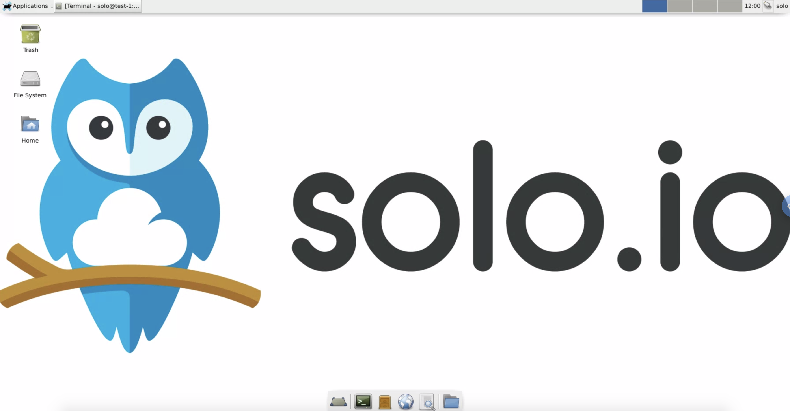
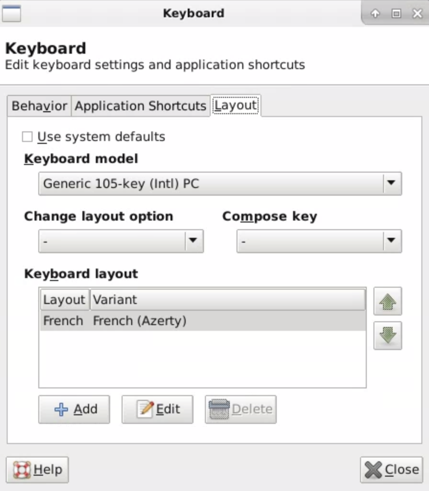

# Introduction

To make sure anyone can easily perform the different tasks, we have provisioned a Virtual Machine for each of you.

You'll be able to deploy several Kubernetes clusters on this machine using _Kind_.

_MetalLB_ has been deployed to expose the Load Balancer services you'll create on your Kubernetes clusters.

All the prerequisites have already been deployed on your machine.

## Prerequisites

You will be accessing your Virtual Machine using [Apache Guacamole](https://guacamole.apache.org/).

Apache Guacamole is a clientless remote desktop gateway. Thanks to HTML5, once Guacamole is installed on a server, all you need to access your desktops is a web browser.

## Access your virtual machine

Log into your Virtual Machine using your web browser.

The URL is `http://<ip address provided by the instructor>/guacamole/`

The user is `solo` and the password is `Workshop1#`

> If you have an issue with the keyboard layout, click on the `Applications` button on the top left corner, select `Settings` and then `Keyboard`.
>
> In the `Layout` tab, you can add the layout you want to use and delete the default one:
>
> 

You can find the list of the available workshops using the link below:

[Workshops](https://github.com/solo-io/workshops/tree/f5e9019f9f9f5695ed4db986ca89835e6139fd86/WORKSHOPS.md)

