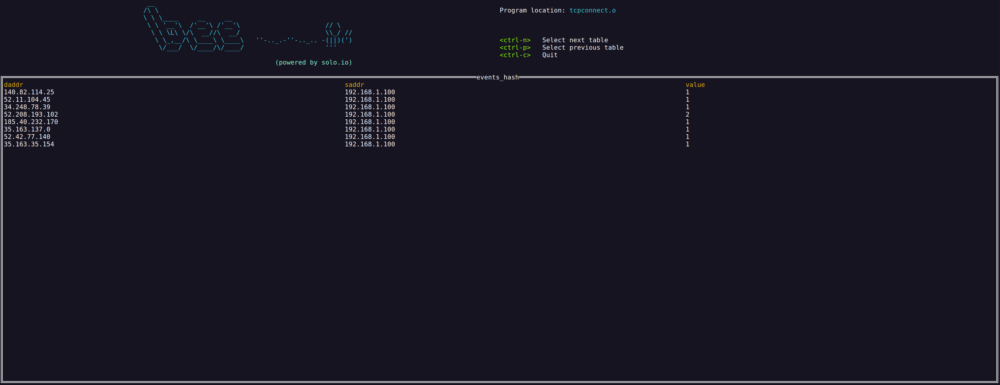
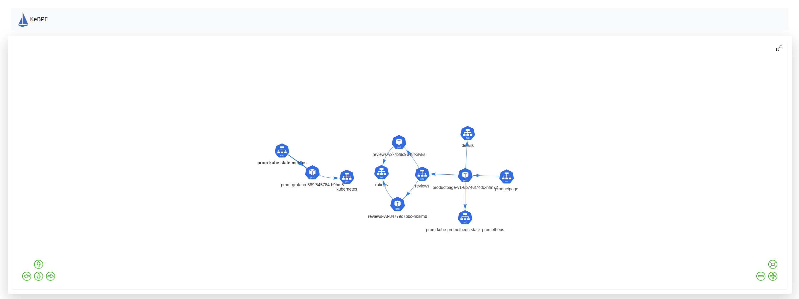

<!--bash
#!/usr/bin/env bash

source ./scripts/assert.sh
-->


# <center>eBPF Workshop</center>


## Table of Contents
* [Introduction](#introduction)
* [Lab 1 - BumbleBee](#Lab-1)
* [Lab 2 - Deploy KinD cluster](#Lab-2)
* [Lab 3 - Deploy Prometheus](#Lab-3)
* [Lab 4 - Deploy the Bookinfo demo app](#Lab-4)
* [Lab 5 - Deploy Bumblebee](#Lab-5)
* [Lab 6 - Deploy kebpf](#Lab-6)


## Introduction <a name="introduction"></a>

[eBPF](https://ebpf.io/what-is-ebpf/) is a revolutionary technology with origins in the Linux kernel that can run sandboxed programs in an operating system kernel. It is used to safely and efficiently extend the capabilities of the kernel without requiring to change kernel source code or load kernel modules.


## Lab 1 - BumbleBee <a name="Lab-1"></a>


[BumbleBee](https://github.com/solo-io/bumblebee) helps to build, run and distribute eBPF programs using OCI images. It allows you to focus on writing eBPF code, while taking care of the user space components - automatically exposing your data as metrics or logs.

Install the `bee` CLI:

```bash
curl -sL https://run.solo.io/bee/install | sh
export PATH=$HOME/.bumblebee/bin:$PATH
```

Now let's create a skeleton for our eBPF program:

```
bee init
```

The first option you will be confronted with is the language with which you will develop your probe. Currently only `C` is supported, but support for `Rust` is planned as well.

```
? What language do you wish to use for the filter: 
  ▸ C
```

Now that we have selected the language to use, we will be prompted to select the type of program you want to create.
As eBPF enables you to write programs that can hook into essentially any kernel functionality, there are several "types" of programs you can create.
`bee` currently has two starting points: network or file-system based programs.
Network programs will be focused on hooking into various functions in the kernel networking stack while file-system programs hook into file operations, such as `open()` calls.
For this tutorial, let's select "Network".

```
? What type of program to initialize: 
  ▸ Network
    File system
```

Next you will be asked for the type of global map you would like to use. Maps are the instrument through which `eBPF` user space, and kernel space programs are able to communicate with each other. More detailed information on these maps, as well as the different types of maps which are available can be found in the `eBPF maps` section of the `BPF` [linux documentation](https://man7.org/linux/man-pages/man2/bpf.2.html). For the sake of this demo we will arbitrarily decide on `RingBuffer`.

```
? What type of map should we initialize: 
  ▸ RingBuffer
    HashMap
```

After deciding on a map type, you will be asked to decide on an output format.
This step is the first that gets into the detail and magic of `bee`.
Normally developing `eBPF` applications requires writing user space and kernel space code.
However, with `bee` you only need to develop the kernel space code, and then `bee` can automatically handle and output the data from your eBPF maps.
Additionally, `bee` can emit metrics from the data being received by your eBPF maps.
Depending on your use-case, you can simply output the data in your map as text, which corresponds to the `print` output type.
However, if you would like to generate metrics from the data, you can select a metric type.
Currently, `counter` and `gauge` type metrics are supported.
More information on these can be found in the [output formats](concepts.md#Output-Formats) section below.
We will be choosing `print` for now, which again will only output map data as text and not emit any metrics.

```
? What type of output would you like from your map: 
  ▸ print
    counter
    gauge
```

Finally we will decide on our program file location.

```
✔ BPF Program File Location: probe.c
```

The output file `probe.c` should now have the following content:

```C
#include "vmlinux.h"
#include "bpf/bpf_helpers.h"
#include "bpf/bpf_core_read.h"
#include "bpf/bpf_tracing.h"
#include "solo_types.h"

// 1. Change the license if necessary 
char __license[] SEC("license") = "Dual MIT/GPL";

struct event_t {
	// 2. Add ringbuf struct data here.
} __attribute__((packed));

// This is the definition for the global map which both our
// bpf program and user space program can access.
// More info and map types can be found here: https://www.man7.org/linux/man-pages/man2/bpf.2.html
struct {
	__uint(max_entries, 1 << 24);
	__uint(type, BPF_MAP_TYPE_RINGBUF);
	__type(value, struct event_t);
} events SEC(".maps.print");


SEC("kprobe/tcp_v4_connect")
int BPF_KPROBE(tcp_v4_connect, struct sock *sk)
{
	// Init event pointer
	struct event_t *event;

	// Reserve a spot in the ringbuffer for our event
	event = bpf_ringbuf_reserve(&events, sizeof(struct event_t), 0);
	if (!event) {
		return 0;
	}

	// 3. set data for our event,
	// For example:
	// event->pid = bpf_get_current_pid_tgid();

	bpf_ringbuf_submit(event, 0);

	return 0;
}
```

There's quite a bit of content in this file, so let's dive in!

This program is very similar to a regular [libbpf-tools](https://github.com/iovisor/bcc/blob/master/libbpf-tools/tcpconnect.bpf.c) program code. We'll review the code, and then point-out some differences from libbpf programs.

The first interesting part:

```C
#include "solo_types.h"
```

This header file includes types that `bee` can automatically interpret and display. More on this shortly.

Let's discuss the next part:

```C
struct {
	__uint(max_entries, 1 << 24);
	__uint(type, BPF_MAP_TYPE_RINGBUF);
	__type(value, struct event_t);
} events SEC(".maps.print");
```

This defines a BPF map of type ring-buffer. A ring-buffer map is commonly used to stream events from 
kernel space to user space. The kernel eBPF probe writes to the ring buffer, and a user-mode program can asynchronously read events from the buffer.

Note the section the map is in: `.maps.print` - this has special meaning in `bee` - it instructs it to display this map as a stream of events (think logs and not metrics).

Note also that unlike libbpf ring buffer map, this one has a `__type` defined. This allows `bee` to automatically output the events written to the map. 

The final part to discuss now, is this part:

```C
SEC("kprobe/tcp_v4_connect")
int BPF_KPROBE(tcp_v4_connect, struct sock *sk)
{
```

This defines a kprobe that will be attached to `tcp_v4_connect`. This is not different from libbpf.

At this point, our program would be able to send an event for each connection being established on the system. However, with only a stream of data it may be difficult to see trends, such as how many connections are being made to specific hosts.

We'll also solve for this challenge by tracking connection counts in addition to simply streaming each connection. To do this, we will need to add another eBPF map in addition to the ring-buffer which was initialized for us. This new map will be a hash map and will keep track of the total number of connections to a given address.

Let's use the updated file:

```bash
cp data/steps/bumblebee/data/probe.c ./probe.c
```

You can take a look at the updated file:

```
cat probe.c
```

Use the bee tool to compile your program and store it as an OCI image:

```bash
bee build probe.c my_probe:v1
```

You can see all your local images with the list command:

```bash
bee list
```

Finally, you can run your program:

```
bee run my_probe:v1
```


For the following lab, we'll use another eBPF program which will display the source and destination IP addresses for all the network communications happening in the system.

```bash
cp data/steps/bumblebee/data/tcpconnect.c ./tcpconnect.c
```

You can take a look at the file:

```
cat probe.c
```

Use the bee tool to compile your program and store it as an OCI image:

```bash
bee build tcpconnect.c tcpconnect:v1
```

Finally, you can run your program:

```
bee run tcpconnect:v1
```



Run the following command in a different tab while the program is running:

```
curl http://localhost:9091/metrics
```

You should have an output similar to the following:

```
# HELP ebpf_solo_io_events_hash 
# TYPE ebpf_solo_io_events_hash counter
ebpf_solo_io_events_hash{daddr="10.101.0.2",saddr="10.101.0.1"} 45
ebpf_solo_io_events_hash{daddr="10.101.0.4",saddr="10.101.0.1"} 49
ebpf_solo_io_events_hash{daddr="10.101.1.2",saddr="10.101.1.1"} 47
...
# HELP ebpf_solo_io_events_ring 
# TYPE ebpf_solo_io_events_ring counter
ebpf_solo_io_events_ring{daddr="10.101.0.2",saddr="10.101.0.1"} 50
ebpf_solo_io_events_ring{daddr="10.101.0.4",saddr="10.101.0.1"} 50
ebpf_solo_io_events_ring{daddr="10.101.1.2",saddr="10.101.1.1"} 50
...

# HELP promhttp_metric_handler_requests_total Total number of scrapes by HTTP status code.
# TYPE promhttp_metric_handler_requests_total counter
promhttp_metric_handler_requests_total{code="200"} 0
promhttp_metric_handler_requests_total{code="500"} 0
promhttp_metric_handler_requests_total{code="503"} 0
```

As you can see, BumbleBee also provides metrics in the Prometheus format !

In the next labs, we're going to run this eBPF program on Kubernetes as a DaemonSet to capture the network traffic on all the nodes.

Then, we're going to scrape the metrics in Prometheus.

And finally, we're going to run a small web application which will query both Prometheus and the Kubernetes API server to build a network graph.


## Lab 2 - Deploy KinD cluster <a name="Lab-2"></a>

Deploy a local multi node Kubernetes cluster using this command:

```bash
./scripts/deploy-multi.sh 1 ebpf
```

Then verify that your Kubernetes cluster is ready: 

```bash
./scripts/check.sh ebpf
```

The `check.sh` script will return immediately with no output if the cluster is ready.  Otherwise, it will output a series of periodic "waiting" messages until the cluster is up.


## Lab 3 - Deploy Prometheus <a name="Lab-3"></a>

Now, let's deploy a Prometheus stack.

Create the `prometheus` namespace:

```bash
kubectl create ns prometheus
```

Install Prometheus:

```bash
helm repo add prometheus-community https://prometheus-community.github.io/helm-charts
helm repo update

helm install prom prometheus-community/kube-prometheus-stack --version 13.13.1 -n prometheus -f data/steps/deploy-prometheus/data/prometheus-values.yaml
```

<!--bash
cat <<'EOF' > ./test.js
const helpers = require('./tests/chai-exec');

describe("Prometheus is running", () => {
  const deployments = ["prom-grafana", "prom-kube-prometheus-stack-operator", "prom-kube-state-metrics"];
  deployments.forEach(deploy => {
    it(deploy + ' pods are ready', () => helpers.checkDeployment({ context: "ebpf", namespace: "prometheus", k8sObj: deploy }));
  });
  const statefulsets = ["prometheus-prom-kube-prometheus-stack-prometheus"];
  statefulsets.forEach(statefulset => {
    it(statefulset + ' pods are ready', () => helpers.checkStatefulSet({ context: "ebpf", namespace: "prometheus", k8sObj: statefulset }));
  });
  const daemonsets = ["prom-prometheus-node-exporter"];
  daemonsets.forEach(daemonset => {
    it(daemonset + ' pods are ready', () => helpers.checkDaemonSet({ context: "ebpf", namespace: "prometheus", k8sObj: daemonset }));
  });
});
EOF
mocha ./test.js --retries=500 2> /dev/null
-->


## Lab 4 - Deploy the Bookinfo demo app <a name="Lab-4"></a>

We also need to deploy a demo application.

Deploy the bookinfo application

```bash
kubectl apply -f https://raw.githubusercontent.com/istio/istio/release-1.11/samples/bookinfo/platform/kube/bookinfo.yaml
```

<!--bash
cat <<'EOF' > ./test.js
const helpers = require('./tests/chai-exec');

describe("Bookinfo app", () => {
  const deployments = ["productpage-v1", "ratings-v1", "details-v1", "reviews-v1", "reviews-v2", "reviews-v3"];
  deployments.forEach(deploy => {
    it(deploy + ' pods are ready', () => helpers.checkDeployment({ context: "ebpf", namespace: "default", k8sObj: deploy }));
  });
});
EOF
mocha ./test.js --retries=500 2> /dev/null
-->

Use the following command to check the status of the Pods:

```
kubectl get pods
```


## Lab 5 - Deploy Bumblebee <a name="Lab-5"></a>

We've created a Docker image with BumbleBee and our `tcpconnect` eBPF program.

Let's deploy it as a DaemonSet:

```bash
cat << EOF | kubectl apply -f -
apiVersion: apps/v1
kind: DaemonSet
metadata:
  name: bumblebee
spec:
  selector:
    matchLabels:
      app: bumblebee
  template:
    metadata:
      labels:
        app: bumblebee
    spec:
      containers:
      - name: bumblebee
        image: djannot/bumblebee:0.1
        imagePullPolicy: Always
        command: ["bee"]
        args: ["run", "tcpconnect.o"]
        tty: true
        ports:
        - name: http-monitoring
          containerPort: 9091
        securityContext:
          privileged: true
EOF
```

Then, we need to create a PodMonitor to instruct Prometheus to scrape the bumblebee metrics:

```bash
cat << EOF | kubectl apply -f -
apiVersion: monitoring.coreos.com/v1
kind: PodMonitor
metadata:
  name: bumblebee
  labels:
    monitoring: bumblebee
    release: prom
spec:
  selector:
    matchLabels:
      app: bumblebee
  jobLabel: bumblebee-stats
  podMetricsEndpoints:
  - port: http-monitoring
    path: /metrics
    interval: 15s
    metricRelabelings:
    - action: replace
      sourceLabels:
      - saddr
      targetLabel: pod_ip
    - action: replace
      sourceLabels:
      - daddr
      targetLabel: cluster_ip
EOF
```

<!--bash
cat <<'EOF' > ./test.js
const helpers = require('./tests/chai-exec');

describe("Bumblebee is running", () => {
  const daemonsets = ["bumblebee"];
  daemonsets.forEach(daemonset => {
    it(daemonset + ' pods are ready', () => helpers.checkDaemonSet({ context: "ebpf", namespace: "default", k8sObj: daemonset }));
  });
});
EOF
mocha ./test.js --retries=500 2> /dev/null
-->

Generate some traffic:

```bash
for i in {1..20}; do
    kubectl exec $(kubectl get pods -l app=productpage -o jsonpath='{.items[0].metadata.name}') -- python -c "import requests; r = requests.get('http://localhost:9080/productpage'); print(r.status_code)"
done
```

<!--bash
cat <<'EOF' > ./test.js
const chaiExec = require("@jsdevtools/chai-exec");
var chai = require('chai');
var expect = chai.expect;
chai.use(chaiExec);

describe("Check prometheus query", function() {
  it("Query returns some results", () => {
    let pod = chaiExec("kubectl get pods -l app=productpage -o jsonpath='{.items[0].metadata.name}'").stdout
    let command = "kubectl exec " + pod + " -- python -c \"import requests; r = requests.get('http://prom-kube-prometheus-stack-prometheus.prometheus.svc.cluster.local:9090/api/v1/query?query=ebpf_solo_io_events_hash'); print(r.text)\"";
    let cli = chaiExec(command);
    expect(cli).to.exit.with.code(0);
    expect(JSON.parse(cli.output).data.result.length).to.be.at.least(1);
  });
})
EOF
mocha ./test.js --retries=500 2> /dev/null
-->


## Lab 6 - Deploy kebpf <a name="Lab-6"></a>

Finally, we've created another Docker image with a web application which will query both Prometheus and the Kubernetes API server to build a network graph.

Let's deploy it:

```bash
cat << EOF | kubectl apply -f -
apiVersion: v1
kind: ServiceAccount
metadata:
  name: kebpf
---
apiVersion: apps/v1
kind: Deployment
metadata:
  name: kebpf
spec:
  replicas: 1
  selector:
    matchLabels:
      app: kebpf
  template:
    metadata:
      labels:
        app: kebpf
    spec:
      serviceAccountName: kebpf
      containers:
      - name: kebpf
        imagePullPolicy: Always
        image: djannot/kebpf:0.1
        command: ["node"]
        args: ["kebpf.js"]
        env:
        - name: PROMETHEUS_ENDPOINT
          value: "http://prom-kube-prometheus-stack-prometheus.prometheus.svc.cluster.local:9090"
        ports:
        - name: http
          containerPort: 3000
---
apiVersion: v1
kind: Service
metadata:
  name: kebpf
spec:
  type: LoadBalancer
  selector:
    app: kebpf
  ports:
    - protocol: TCP
      port: 80
      targetPort: 3000
EOF
```

Then, we need to create a ClusterRoleBinding to allow the kebpf container to use the Kubernetes API:

```bash
cat << EOF | kubectl apply -f -
kind: ClusterRoleBinding
apiVersion: rbac.authorization.k8s.io/v1
metadata:
  name: kebpf
subjects:
- kind: ServiceAccount
  name: kebpf
  namespace: default
roleRef:
  kind: ClusterRole
  name: cluster-admin
  apiGroup: rbac.authorization.k8s.io
EOF
```

<!--bash
cat <<'EOF' > ./test.js
const helpers = require('./tests/chai-exec');

describe("kebpf is running", () => {
  const deployments = ["kebpf"];
  deployments.forEach(deployment => {
    it(deployments + ' pods are ready', () => helpers.checkDeployment({ context: "ebpf", namespace: "default", k8sObj: deployment }));
  });
});
EOF
mocha ./test.js --retries=500 2> /dev/null
-->

You can now use your web browser to access the web application at [http://172.18.1.1](http://172.18.1.1)



As you can see, we're able to determine which services communicate together !


