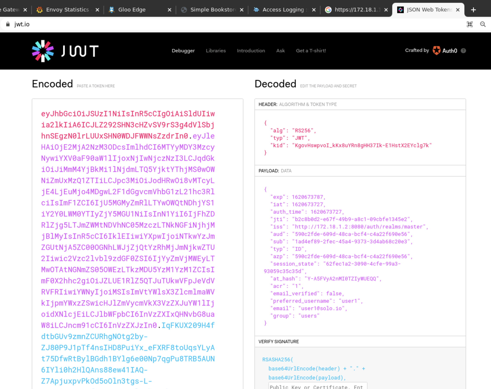

<!--bash
#!/usr/bin/env bash

source ./scripts/assert.sh
-->


# <center>Gloo Edge Workshop</center>


## Introduction <a name="introduction"></a>


Companies are modernizing their applications by splitting traditional monoliths into micro services.


These micro services are generally deployed on Kubernetes and one of the first requirements is to expose some of those services to the outside world.


The natural way to expose them is through a standard Kubernetes Ingress Controller (NGINX, HAproxy, …).

But it quickly becomes obvious that this approach is limited. The Ingress Kubernetes object doesn’t provide any way to define advanced routing policies, for example.


More and more micro services are deployed and some functionalities (like external authentication) are being implemented by different application teams.

Those teams should focus on the business logic instead of reinventing the wheel.

A workaround implemented by many companies is to provide standard libraries to be used when developing new micro services, but it forces all the teams to use the same language, which is generating new challenges (slow down innovation, no global visibility for the security team, …).


Other functionalities (rate limiting, Web Application Firewall, …) can’t easily be implemented in the micro services and generally require an API Gateway or Firewall running outside of Kubernetes.

It means that the configuration can’t be driven by yaml, so it’s not compatible with a modern Gitops deployment model.


Implementing a modern Kubernetes-native API Gateway becomes a natural choice.

We call it Kubernetes-native because it can be 100% configured by yaml (declarative API), so is compatible with a Gitops deployment model.

Authentication/Authorization can be implemented at the API Gateway level and relevant information (like the email address of the authenticated user) can be passed to the Upstream micro service (through a header, for example).

It also provides functionalities like rate limiting and Web Application Firewall, which can be configured through yaml.

Finally, it provides more visibility to the security team.


Even if it runs on Kubernetes, a modern Kubernetes-native API Gateway can be used to route traffic to legacy applications (running in Virtual Machines, for example).

And it can also sometimes provide interesting capabilities, like discovering functions running on AWS Lambda and route traffic to them.


At Solo.io we have built a modern Kubernetes-native API Gateway built on Envoy.

It provides all the capabilities described above (and much more !).

Why would you choose an API Gateway based on Envoy ?

There are many good reasons why.
- First of all, it’s a high performance software written in C++.
- It’s driven by a neutral foundation (the CNCF, like Kubernetes), so its roadmap isn’t driven by a single vendor.
- And probably more importantly, you have already adopted or you’re probably going to adopt a Service Mesh in the future. Chances are high that this Service Mesh will be Istio and if it’s not the case it will most probably be a Service Mesh based on Envoy.
- So choosing an API Gateway based on Envoy will allow you to get the metrics for your API Gateway and your Service Mesh in the same format, will allow you troubleshoot issues in a common way, … It will make your life much easier to summarize.

Why would you choose Gloo Edge ?
- It has been developed from the beginning with the idea to be configured 100% through yaml.
- It provides all the functionalities you expect from a modern API Gateway:
- External authentication based on OAuth2, JWT, api keys, …
- Authorization based on OPA
- Advanced rate limiting
- Web Application Firewall based on ModSecurity
- Advanced transformation
- Customization through Web Assembly
- A Kubernetes-native developer portal called Gloo Portal
- And much more


## Lab 1 - Deploy KinD cluster <a name="Lab-1"></a>

From the terminal go to the `/home/solo/workshops/gloo-edge` directory:

```
cd /home/solo/workshops/gloo-mesh
```

Deploy a local Kubernetes cluster using this command:

```bash
./scripts/deploy.sh 1 gloo-edge
```

Then verify that your Kubernetes cluster is ready: 

```bash
./scripts/check.sh gloo-edge
```

The `check.sh` script will return immediately with no output if the cluster is ready.  Otherwise, it will output a series of periodic "waiting" messages until the cluster is up.


## Lab 2 - Deploy Gloo Edge <a name="Lab-2"></a>


<!--bash
cat <<'EOF' > ./test.js
var chai = require('chai');
var expect = chai.expect;

describe("Required environment variables should contain value", () => {
  afterEach(function(done){
    if(this.currentTest.currentRetry() > 0){
      process.stdout.write(".");
       setTimeout(done, 1000);
    } else {
      done();
    }
  });

  it("Gloo Edge licence environment variables should not be empty", () => {
    expect(process.env.LICENSE_KEY).to.not.be.empty
  });
});
EOF
mocha ./test.js --retries=500 2> /dev/null
-->

Run the commands below to deploy Gloo Edge Enterprise:

```bash
export GLOO_VERSION=v1.8.17
curl -sL https://run.solo.io/gloo/install | sh
export PATH=$HOME/.gloo/bin:$PATH
glooctl upgrade --release=$GLOO_VERSION

helm repo add glooe https://storage.googleapis.com/gloo-ee-helm
helm upgrade --install gloo glooe/gloo-ee --namespace gloo-system \
  --create-namespace --version 1.8.13 --set-string license_key=$LICENSE_KEY
```

<!--bash
cat <<'EOF' > ./test.js
const chaiExec = require("@jsdevtools/chai-exec");
var chai = require('chai');
var expect = chai.expect;
chai.use(chaiExec);

describe("Check glooctl version", () => {

  it("GLOO_VERSION environment variable exists", () => {
    expect(process.env.GLOO_VERSION).to.not.be.empty;
    expect(process.env.GLOO_VERSION).to.be.a('string').and.satisfy(msg => msg.startsWith('v'));
  });

  it("cli version matches the required version: " + process.env.GLOO_VERSION, () => {
    let cli = chaiExec('glooctl version');
    expect(cli).to.exit.with.code(0);
    expect(cli).stdout.to.contain('"version":"' + process.env.GLOO_VERSION.substring(1) + '"');
    expect(cli).stderr.to.be.empty;
  });
});
EOF
mocha ./test.js --retries=500 2> /dev/null
-->

Gloo Edge can also be deployed using a Helm chart.

Use the following commands to wait for the Gloo Edge components to be deployed:

```bash
until kubectl get ns gloo-system
do
  sleep 1
done

printf "\nWaiting for all the gloo-system pods to become ready"
until [ $(kubectl -n gloo-system get pods -o jsonpath='{range .items[*].status.containerStatuses[*]}{.ready}{"\n"}{end}' | grep false -c) -eq 0 ]; do
  printf "%s" "."
  sleep 1
done
printf "\n"
```

Set the environment variable corresponding to the endpoint of the Gateway:

```bash
export ENDPOINT=$(kubectl -n gloo-system get svc gateway-proxy -o jsonpath='{.status.loadBalancer.ingress[0].*}')
```


## Lab 3 - Traffic management <a name="Lab-3"></a>

### Deploy Services

In this step you will expose two services to the outside world using Gloo Edge.

First let's deploy an application called **bookinfo** in `bookinfo` namespace:

```bash
kubectl create ns bookinfo 
kubectl -n bookinfo  apply -f https://raw.githubusercontent.com/istio/istio/1.7.3/samples/bookinfo/platform/kube/bookinfo.yaml
kubectl delete deployment reviews-v1 reviews-v3 -n bookinfo
```
 


The bookinfo app has 3 versions of a microservice called reviews.  You will keep only the version 2 of the reviews microservice for this step and will add the other versions later.  An easy way to distinguish among the different versions in the web interface is to look at the stars: v1 displays no stars in the reviews, v2 displays black stars, and v3 displays red stars.

Gloo Edge uses a discovery mechanism to create Upstreams automatically, but Upstreams can be also created manually using Kubernetes CRDs.

After a few seconds, Gloo Edge will discover the newly created service and create an Upstream called  `bookinfo-productpage-9080` (Gloo Edge uses the convention `namespace-service-port` for the discovered Upstreams).

To verify that the Upstream was created properly, run the following command: 

```bash
until glooctl get upstream bookinfo-productpage-9080 2> /dev/null
do
    echo waiting for upstream bookinfo-productpage-9080 to be discovered
    sleep 3
done
```

It should return the discovered upstream with an `Accepted` status: 

```
+---------------------------+------------+----------+----------------------------+
|         UPSTREAM          |    TYPE    |  STATUS  |          DETAILS           |
+---------------------------+------------+----------+----------------------------+
| bookinfo-productpage-9080 | Kubernetes | Accepted | svc name:      productpage |
|                           |            |          | svc namespace: bookinfo    |
|                           |            |          | port:          9080        |
|                           |            |          |                            |
+---------------------------+------------+----------+----------------------------+
```

Now, let's deploy the second application, called **httpbin** in the namespace `team1`.

This application is very useful when you have to debug routing, headers in requests, responses, status codes, etc. The public online version of it can be found [here](http://httpbin.org/).

```bash
kubectl create ns team1

kubectl apply -f - <<EOF
apiVersion: v1
kind: ServiceAccount
metadata:
  name: httpbin
  namespace: team1
---
apiVersion: v1
kind: Service
metadata:
  name: httpbin
  namespace: team1
  labels:
    app: httpbin
spec:
  ports:
  - name: http
    port: 8000
    targetPort: 80
  selector:
    app: httpbin
---
apiVersion: apps/v1
kind: Deployment
metadata:
  name: httpbin
  namespace: team1
spec:
  replicas: 1
  selector:
    matchLabels:
      app: httpbin
      version: v1
  template:
    metadata:
      labels:
        app: httpbin
        version: v1
    spec:
      serviceAccountName: httpbin
      containers:
      - image: docker.io/kennethreitz/httpbin
        imagePullPolicy: IfNotPresent
        name: httpbin
        ports:
        - containerPort: 80
EOF
```

To verify that the Upstream was created properly, run the following command: 

```bash
until glooctl get upstream team1-httpbin-8000 2> /dev/null
do
    echo waiting for upstream team1-httpbin-8000 to be discovered
    sleep 3
done
```

It should return the discovered upstream with an `Accepted` status: 

```
+--------------------+------------+----------+------------------------+
|      UPSTREAM      |    TYPE    |  STATUS  |        DETAILS         |
+--------------------+------------+----------+------------------------+
| team1-httpbin-8000 | Kubernetes | Accepted | svc name:      httpbin |
|                    |            |          | svc namespace: team1   |
|                    |            |          | port:          8000    |
|                    |            |          |                        |
+--------------------+------------+----------+------------------------+
```

### Routing to a Kubernetes Service 

Now that your two Upstream CR have been created, you need to create the resources to route the traffic to them.

First, you create a Virtual Service. For bookinfo under `/` and for httpbin under `/not-secured`.

Please, notice that the order matters.

```bash
kubectl apply -f - <<EOF
apiVersion: gateway.solo.io/v1
kind: VirtualService
metadata:
  name: demo
  namespace: gloo-system
spec:
  virtualHost:
    domains:
      - '*'
    routes:
      - matchers:
          - prefix: /
        routeAction:
          single:
            upstream:
              name: bookinfo-productpage-9080
              namespace: gloo-system
EOF
```

The creation of the Virtual Service exposes the Kubernetes service through the gateway.

You can access the application using the web browser by running the following command:

```
/opt/google/chrome/chrome http://${ENDPOINT}/productpage
```

It should return the bookinfo application webpage. Note that the review stars are black (v2).


Now, let's enable the httpbin route to be matched before bookinfo:

```bash
kubectl apply -f - <<EOF
apiVersion: gateway.solo.io/v1
kind: VirtualService
metadata:
  name: demo
  namespace: gloo-system
spec:
  virtualHost:
    domains:
      - '*'
    routes:
# ------------- Another route which is parsed before ------------------
      - matchers:
          - prefix: /not-secured
        routeAction:
          single:
            upstream:
              name: team1-httpbin-8000
              namespace: gloo-system
        options:
          prefixRewrite: '/'
# ----------------------------------------------------------------------
      - matchers:
          - prefix: /
        routeAction:
          single:
            upstream:
              name: bookinfo-productpage-9080
              namespace: gloo-system
EOF
```

And to access the httpbin application:

```
/opt/google/chrome/chrome http://${ENDPOINT}/not-secured/get
```

It should return a json object with details regarding your own request. Something similar to:

```
{
  "args": {},
  "headers": {
    "Accept": "text/html,application/xhtml+xml,application/xml;q=0.9,image/avif,image/webp,image/apng,*/*;q=0.8,application/signed-exchange;v=b3;q=0.9",
    "Accept-Encoding": "gzip, deflate",
    "Accept-Language": "en-GB,en;q=0.9,es-ES;q=0.8,es;q=0.7,sk-SK;q=0.6,sk;q=0.5,en-US;q=0.4",
    "Cache-Control": "max-age=0",
    "Host": "x.x.x.x",
    "Upgrade-Insecure-Requests": "1",
    "User-Agent": "xxxx",
    "X-Envoy-Expected-Rq-Timeout-Ms": "15000",
    "X-Envoy-Original-Path": "/not-secured/get"
  },
  "origin": "x.x.x.x",
  "url": "http://x.x.x.x/get"
}
```

### Delegation

Gloo Edge provides a feature referred to as delegation. Delegation allows a complete routing configuration to be assembled from separate config objects. The root config object delegates responsibility to other objects, forming a tree of config objects. The tree always has a Virtual Service as its root, which delegates to any number of Route Tables. Route Tables can further delegate to other Route Tables.

Use cases for delegation include:

- Allowing multiple tenants to own add, remove, and update routes without requiring shared access to the root-level Virtual Service
- Sharing route configuration between Virtual Services
- Simplifying blue-green routing configurations by swapping the target Route Table for a delegated route.
- Simplifying very large routing configurations for a single Virtual Service
- Restricting ownership of routing configuration for a tenant to a subset of the whole Virtual Service.

Let's rewrite your Virtual Service to delegate the routing to a Route Table.

First resource is the delegated Route Table. Second resource is a Virtual Service. Notice that there is a new `delegateAction` referencing the just created Route Table.


```bash
kubectl apply -f - <<EOF
# ------------- Delegation resource -----------------------
apiVersion: gateway.solo.io/v1
kind: RouteTable
metadata:
  name: httpbin-routetable
  namespace: team1
spec:
  routes:
    - matchers:
        - prefix: /not-secured
      options:
        prefixRewrite: '/'
      routeAction:
          single:
            upstream:
              name: team1-httpbin-8000
              namespace: gloo-system
# ---------------------------------------------------------
apiVersion: gateway.solo.io/v1
kind: VirtualService
metadata:
  name: demo
  namespace: gloo-system
spec:
  virtualHost:
    domains:
      - '*'
    routes:
      - matchers:
          - prefix: /not-secured
# ------------- Delegation action by reference ------------
        delegateAction:
          ref:
            name: 'httpbin-routetable'
            namespace: 'team1'
# ---------------------------------------------------------
      - matchers:
          - prefix: /
        routeAction:
          single:
            upstream:
              name: bookinfo-productpage-9080
              namespace: gloo-system
EOF
```

### Delegation By Label Selector

Another way to delegate is to use labels. This approach helps you to create dynamic references. Let's update your Route Table to add a label. Then, the label will be used in the Virtual Service resource.

Let's make both changes:

```bash
kubectl apply -f - <<EOF
apiVersion: gateway.solo.io/v1
kind: RouteTable
metadata:
  name: httpbin-routetable
  namespace: team1
# ------------- Label to use as dynamic reference ---------
  labels:
    application-owner: team1
# ---------------------------------------------------------
spec:
  routes:
    - matchers:
        - prefix: /not-secured
      options:
        prefixRewrite: '/'
      routeAction:
          single:
            upstream:
              name: team1-httpbin-8000
              namespace: gloo-system
---
apiVersion: gateway.solo.io/v1
kind: VirtualService
metadata:
  name: demo
  namespace: gloo-system
spec:
  virtualHost:
    domains:
      - '*'
    routes:
      - matchers:
          - prefix: /not-secured
# ------------- Delegation by label selector --------------
        delegateAction:
          selector:
            namespaces:
              - team1
            labels:
              application-owner: team1
# ---------------------------------------------------------
      - matchers:
          - prefix: /
        routeAction:
          single:
            upstream:
              name: bookinfo-productpage-9080
              namespace: gloo-system
EOF
```


### Routing to Multiple Upstreams

In many cases, you need to route traffic to two different versions of an application to test a new feature. In this step, you are going to update the Virtual Service to route traffic to two different Upstreams:

The first step is to create a new deployment of the **bookinfo** application, this time with the version 3 of the reviews microservice: 

```bash
kubectl create ns bookinfo-beta 
kubectl -n bookinfo-beta apply -f https://raw.githubusercontent.com/istio/istio/1.7.3/samples/bookinfo/platform/kube/bookinfo.yaml
kubectl delete deployment reviews-v1 reviews-v2 -n bookinfo-beta
```


Verify that the Upstream for the beta application was created, using the following command: 


```bash
until glooctl get upstream bookinfo-beta-productpage-9080 2> /dev/null
do
    echo waiting for upstream bookinfo-beta-productpage-9080 to be discovered
    sleep 3
done
```

Now you can route to multiple Upstreams by updating the Virtual Service as follow: 

```bash
kubectl apply -f - <<EOF
apiVersion: gateway.solo.io/v1
kind: VirtualService
metadata:
  name: demo
  namespace: gloo-system
spec:
  virtualHost:
    domains:
      - '*'
    routes:
      - matchers:
          - prefix: /not-secured
        delegateAction:
          selector:
            namespaces:
              - team1
            labels:
              application-owner: team1
      - matchers:
          - prefix: /
        routeAction:
# ----------------------- Multi Destination ------------------
            multi:
                destinations:
                - weight: 5
                  destination:
                      upstream:
                          name: bookinfo-productpage-9080
                          namespace: gloo-system
                - weight: 5
                  destination:
                      upstream:
                          name: bookinfo-beta-productpage-9080
                          namespace: gloo-system
# ------------------------------------------------------------
EOF
```

You should see either the **black** star reviews (v2) or the new **red** star reviews (v3) when refreshing the page.


<!--bash
cat <<'EOF' > ./test.js
const helpers = require('./tests/chai-http');

describe("Productpage is available (plain http)", () => {
  it('/productpage is available', () => helpers.checkURL({ host: 'http://' + process.env.ENDPOINT, path: '/productpage', retCode: 200 }));
})

describe("Productpage is available (plain http)", () => {
  it('/not-secured/get is available', () => helpers.checkURL({ host: 'http://' + process.env.ENDPOINT, path: '/not-secured/get', retCode: 200 }));
})
EOF
mocha ./test.js --retries=500 2> /dev/null
-->


## Lab 4 - Security and authentication <a name="Lab-4"></a>

In this step, you will explore some Gloo Edge features related to security and Authentication. 

### Network Encryption - Server TLS

In this step you are going to secure your application using TLS.

Let's first create a private key and a self-signed certificate to use in your Virtual Service:

```bash
openssl req -x509 -nodes -days 365 -newkey rsa:2048 \
   -keyout tls.key -out tls.crt -subj "/CN=*"
```

Then, you have to store them in a Kubernetes secret running the following command:

```bash
kubectl create secret tls upstream-tls --key tls.key \
   --cert tls.crt --namespace gloo-system
```

To setup TLS you have to add the SSL config to the Virtual Service:

```bash
kubectl apply -f - <<EOF
apiVersion: gateway.solo.io/v1
kind: VirtualService
metadata:
  name: demo
  namespace: gloo-system
spec:
# ---------------- SSL config ---------------------------
  sslConfig:
    secretRef:
      name: upstream-tls
      namespace: gloo-system
# -------------------------------------------------------    
  virtualHost:
    domains:
      - '*'
    routes:
      - matchers:
          - prefix: /not-secured
        delegateAction:
          selector:
            namespaces:
              - team1
            labels:
              application-owner: team1
      - matchers:
          - prefix: /
        routeAction:
          single:
            upstream:
              name: bookinfo-productpage-9080
              namespace: gloo-system
EOF
```

Now the application is securely exposed through TLS. To test the TLS configuration, run the following command to open the browser (note that now the traffic is served using https): 

```bash
export APP_URL=https://${ENDPOINT}
```

Let's check **bookinfo**:

```
/opt/google/chrome/chrome $APP_URL/productpage 
```

The browser will warn you that your connection is not private due to the self-signed certificate.  Click through the `Advanced` button and the subsequent link to proceed to the "unsafe" destination.  Then the bookinfo interface should display as expected, although the address bar may continue to warn you that the destination is "Not Secure."  Don't worry; this is expected behavior given the self-signed certificate.


And **httpbin**:

> Since you are using self-signed certificates, you need to allow insecure server connection when using SSL with *-k*

```
curl -k $APP_URL/not-secured/get
```

<!--bash
cat <<'EOF' > ./test.js
const helpers = require('./tests/chai-http');

describe("Productpage is available (https)", () => {
  it('/productpage is available', () => helpers.checkURL({ host: process.env.APP_URL, path: '/productpage', retCode: 200 }));
})

describe("Productpage is available (https)", () => {
  it('/not-secured/get is available', () => helpers.checkURL({ host: process.env.APP_URL, path: '/not-secured/get', retCode: 200 }));
})
EOF
mocha ./test.js --retries=500 2> /dev/null
-->

### Authentication with OIDC (OpenID Connect)

In many use cases, you need to restrict the access to your applications to authenticated users. 

OIDC (OpenID Connect) is an identity layer on top of the OAuth 2.0 protocol. In OAuth 2.0 flows, authentication is performed by an external Identity Provider (IdP) which, in case of success, returns an Access Token representing the user identity. The protocol does not define the contents and structure of the Access Token, which greatly reduces the portability of OAuth 2.0 implementations.

The goal of OIDC is to address this ambiguity by additionally requiring Identity Providers to return a well-defined ID Token. OIDC ID tokens follow the JSON Web Token standard and contain specific fields that your applications can expect and handle. This standardization allows you to switch between Identity Providers – or support multiple ones at the same time – with minimal, if any, changes to your downstream services; it also allows you to consistently apply additional security measures like Role-based Access Control (RBAC) based on the identity of your users, i.e. the contents of their ID token.

In this step, you will secure the **bookinfo** application using an OIDC Identity Provider.

Let's start by installing Keycloak:

```bash
kubectl create -f https://raw.githubusercontent.com/keycloak/keycloak-quickstarts/12.0.4/kubernetes-examples/keycloak.yaml
kubectl rollout status deploy/keycloak
```

<!--bash
sleep 30
-->

Then, you need to configure it and create two users:

- User1 credentials: `user1/password`
  Email: user1@solo.io

- User2 credentials: `user2/password`
  Email: user2@example.com

Let's create the users:

```bash
# Get Keycloak URL and token
KEYCLOAK_URL=http://$(kubectl get service keycloak -o jsonpath='{.status.loadBalancer.ingress[0].ip}'):8080/auth
KEYCLOAK_TOKEN=$(curl -d "client_id=admin-cli" -d "username=admin" -d "password=admin" -d "grant_type=password" "$KEYCLOAK_URL/realms/master/protocol/openid-connect/token" | jq -r .access_token)

# Create initial token to register the client
read -r client token <<<$(curl -H "Authorization: Bearer ${KEYCLOAK_TOKEN}" -X POST -H "Content-Type: application/json" -d '{"expiration": 0, "count": 1}' $KEYCLOAK_URL/admin/realms/master/clients-initial-access | jq -r '[.id, .token] | @tsv')

# Register the client
read -r id secret <<<$(curl -X POST -d "{ \"clientId\": \"${client}\" }" -H "Content-Type:application/json" -H "Authorization: bearer ${token}" ${KEYCLOAK_URL}/realms/master/clients-registrations/default| jq -r '[.id, .secret] | @tsv')

# Add allowed redirect URIs
curl -H "Authorization: Bearer ${KEYCLOAK_TOKEN}" -X PUT -H "Content-Type: application/json" -d '{"serviceAccountsEnabled": true, "directAccessGrantsEnabled": true, "authorizationServicesEnabled": true, "redirectUris": ["'${APP_URL}'/callback", "http://portal.example.com/callback"]}' $KEYCLOAK_URL/admin/realms/master/clients/${id}

# Add the group attribute in the JWT token returned by Keycloak
curl -H "Authorization: Bearer ${KEYCLOAK_TOKEN}" -X POST -H "Content-Type: application/json" -d '{"name": "group", "protocol": "openid-connect", "protocolMapper": "oidc-usermodel-attribute-mapper", "config": {"claim.name": "group", "jsonType.label": "String", "user.attribute": "group", "id.token.claim": "true", "access.token.claim": "true"}}' $KEYCLOAK_URL/admin/realms/master/clients/${id}/protocol-mappers/models

# Create first user
curl -H "Authorization: Bearer ${KEYCLOAK_TOKEN}" -X POST -H "Content-Type: application/json" -d '{"username": "user1", "email": "user1@solo.io", "enabled": true, "attributes": {"group": "users"}, "credentials": [{"type": "password", "value": "password", "temporary": false}]}' $KEYCLOAK_URL/admin/realms/master/users

# Create second user
curl -H "Authorization: Bearer ${KEYCLOAK_TOKEN}" -X POST -H "Content-Type: application/json" -d '{"username": "user2", "email": "user2@example.com", "enabled": true, "attributes": {"group": "users"}, "credentials": [{"type": "password", "value": "password", "temporary": false}]}' $KEYCLOAK_URL/admin/realms/master/users
```

> **Note:** If you get a *Not Authorized* error, please, re-run this command and continue from the command started to fail:

```
KEYCLOAK_TOKEN=$(curl -d "client_id=admin-cli" -d "username=admin" -d "password=admin" -d "grant_type=password" "$KEYCLOAK_URL/realms/master/protocol/openid-connect/token" | jq -r .access_token)
```

The architecture looks like this now:


The next step is to configure the authentication in the Virtual Service. For this, you will have to create a Kubernetes Secret that contains the OIDC secret:

```bash
glooctl create secret oauth --namespace gloo-system --name oauth --client-secret ${secret}
```

Then you will create an AuthConfig, which is a Gloo Edge CRD that contains authentication information: 

```bash
kubectl apply -f - <<EOF
apiVersion: enterprise.gloo.solo.io/v1
kind: AuthConfig
metadata:
  name: oauth
  namespace: gloo-system
spec:
  configs:
  - oauth2:
      oidcAuthorizationCode:
        appUrl: ${APP_URL}
        callbackPath: /callback
        clientId: ${client}
        clientSecretRef:
          name: oauth
          namespace: gloo-system
        issuerUrl: "${KEYCLOAK_URL}/realms/master/"
        scopes:
        - email
        headers:
          idTokenHeader: jwt
EOF
```

Finally you activate the authentication on the Virtual Service by referencing the AuthConfig:

> Notice that this only applies to a specific route, because it is configured within a **matcher**

```bash
kubectl apply -f - <<EOF
apiVersion: gateway.solo.io/v1
kind: VirtualService
metadata:
  name: demo
  namespace: gloo-system
spec:
  sslConfig:
    secretRef:
      name: upstream-tls
      namespace: gloo-system  
  virtualHost:
    domains:
      - '*'
    routes:
      - matchers:
          - prefix: /not-secured
        delegateAction:
          selector:
            namespaces:
              - team1
            labels:
              application-owner: team1
      - matchers:
          - prefix: /
# ------------------- OIDC - Only applied to this matcher -------------------
        options:
          extauth:
            configRef:
              name: oauth
              namespace: gloo-system
# ---------------------------------------------------------------------------
        routeAction:
          single:
            upstream:
              name: bookinfo-productpage-9080
              namespace: gloo-system
EOF
```

To test the Authentication, try first to access the **httpbin** application. You will see that Authentication is NOT required.

```
curl -k $APP_URL/not-secured/get
```

On the other hand, if you refresh the web browser for the **bookinfo** application, you will be redirected to the authentication challenge.

```
/opt/google/chrome/chrome $APP_URL/productpage 
```

If you use username: `user1` and password: `password` Gloo should redirect you back to the **bookinfo** application.


<!--bash
cat <<'EOF' > ./test.js
const chaiExec = require("@jsdevtools/chai-exec");
const helpersHttp = require('./tests/chai-http');
var chai = require('chai');
var expect = chai.expect;

describe("Productpage is requiring authentication", () => {
  it('/productpage is available', () => helpersHttp.checkURL({ host: process.env.APP_URL, path: '/productpage', retCode: 302 }));
})

describe("Authentication is working properly", function() {
  let user = 'user1';
  let password = 'password';
  let keycloak_svc = chaiExec("kubectl get service keycloak -o jsonpath='{.status.loadBalancer.ingress[0].ip}'").stdout.replaceAll("'", "");
  let keycloak_client_id = chaiExec("kubectl -n gloo-system get authconfig oauth -o jsonpath='{.spec.configs[0].oauth2.oidcAuthorizationCode.clientId}'").stdout.replaceAll("'", "");
  let keycloak_client_secret_base64 = chaiExec("kubectl -n gloo-system get secret oauth -o jsonpath='{.data.oauth}'").stdout.replaceAll("'", "");
  let buff = new Buffer(keycloak_client_secret_base64, 'base64');
  let keycloak_client_secret = buff.toString('ascii').split(' ')[1].trim();
  let keycloak_token = JSON.parse(chaiExec('curl -d "client_id=' + keycloak_client_id + '" -d "client_secret=' + keycloak_client_secret + '" -d "scope=openid" -d "username=' + user + '" -d "password=' + password + '" -d "grant_type=password" "http://' + keycloak_svc + ':8080/auth/realms/master/protocol/openid-connect/token"').stdout.replaceAll("'", "")).id_token;
  it('/productpage is available with authentication', () => helpersHttp.checkURL({ host: process.env.APP_URL, path: '/productpage', headers: [{key: 'Authorization', value: 'Bearer ' + keycloak_token}], retCode: 200 }));
});
EOF
mocha ./test.js --retries=500 2> /dev/null
-->


## Lab 5 - Rate limiting <a name="Lab-5"></a>

In this step, you are going to use rate limiting to protect only **bookinfo** applications.

To enable rate limiting on your Virtual Service, you will first create a RateLimitConfig resource:

```bash
kubectl apply -f - << EOF
apiVersion: ratelimit.solo.io/v1alpha1
kind: RateLimitConfig
metadata:
  name: global-limit
  namespace: gloo-system
spec:
  raw:
    descriptors:
    - key: generic_key
      value: count
      rateLimit:
        requestsPerUnit: 10
        unit: MINUTE
    rateLimits:
    - actions:
      - genericKey:
          descriptorValue: count
EOF
```

Now let's update your Virtual Service to use the **bookinfo** application with the new rate limit enforced. The changes affect only one **matcher** (the one for **bookinfo**):

```bash
kubectl apply -f - <<EOF
apiVersion: gateway.solo.io/v1
kind: VirtualService
metadata:
  name: demo
  namespace: gloo-system
spec:
  sslConfig:
    secretRef:
      name: upstream-tls
      namespace: gloo-system  
  virtualHost:
    domains:
      - '*'
    routes:
      - matchers:
          - prefix: /not-secured
        delegateAction:
          selector:
            namespaces:
              - team1
            labels:
              application-owner: team1
      - matchers:
          - prefix: /
        options:
          extauth:
            configRef:
              name: oauth
              namespace: gloo-system
# ---------------- Rate limit config ------------------
          rateLimitConfigs:
            refs:
            - name: global-limit
              namespace: gloo-system
#------------------------------------------------------
        routeAction:
          single:
            upstream:
              name: bookinfo-productpage-9080
              namespace: gloo-system
EOF
```

To test rate limiting, refresh the browser until you see a 429 message. 


```
/opt/google/chrome/chrome $APP_URL/productpage 
```

<!--bash
cat <<'EOF' > ./test.js
const chaiExec = require("@jsdevtools/chai-exec");
const helpersHttp = require('./tests/chai-http');
var chai = require('chai');
var expect = chai.expect;

describe("Authenticated user is rate limited", function() {
  let user = 'user1';
  let password = 'password';
  let keycloak_svc = chaiExec("kubectl get service keycloak -o jsonpath='{.status.loadBalancer.ingress[0].ip}'").stdout.replaceAll("'", "");
  let keycloak_client_id = chaiExec("kubectl -n gloo-system get authconfig oauth -o jsonpath='{.spec.configs[0].oauth2.oidcAuthorizationCode.clientId}'").stdout.replaceAll("'", "");
  let keycloak_client_secret_base64 = chaiExec("kubectl -n gloo-system get secret oauth -o jsonpath='{.data.oauth}'").stdout.replaceAll("'", "");
  let buff = new Buffer(keycloak_client_secret_base64, 'base64');
  let keycloak_client_secret = buff.toString('ascii').split(' ')[1].trim();
  let keycloak_token = JSON.parse(chaiExec('curl -d "client_id=' + keycloak_client_id + '" -d "client_secret=' + keycloak_client_secret + '" -d "scope=openid" -d "username=' + user + '" -d "password=' + password + '" -d "grant_type=password" "http://' + keycloak_svc + ':8080/auth/realms/master/protocol/openid-connect/token"').stdout.replaceAll("'", "")).id_token;
  it('/productpage is is rate limited', () => helpersHttp.checkURL({ host: process.env.APP_URL, path: '/productpage', headers: [{key: 'Authorization', value: 'Bearer ' + keycloak_token}], retCode: 429 }));
});
EOF
mocha ./test.js --retries=500 2> /dev/null
-->

### Different Rate Limiting For Authenticated And Anonymous Users

Following example of Rate Limit shows how you can specify different rate limiting for Authenticated users and for Anonymous users.

First, let's delete the Rate Limit Configuration you have created before:

```bash
kubectl delete ratelimitconfig global-limit -n gloo-system
```

And now, let's update your Virtual Service to add the Rate Limit Configuration directly in the Virtual Service resource:

```bash
kubectl apply -f - <<EOF
apiVersion: gateway.solo.io/v1
kind: VirtualService
metadata:
  name: demo
  namespace: gloo-system
spec:
  sslConfig:
    secretRef:
      name: upstream-tls
      namespace: gloo-system  
  virtualHost:
    domains:
      - '*'
    options:
# -------- Rate limit config by authenticated and anonymous -------
      ratelimitBasic:
        anonymousLimits:
          requestsPerUnit: 5
          unit: MINUTE
        authorizedLimits:
          requestsPerUnit: 20
          unit: MINUTE
# -----------------------------------------------------------------
    routes:
      - matchers:
          - prefix: /not-secured
        delegateAction:
          selector:
            namespaces:
              - team1
            labels:
              application-owner: team1
      - matchers:
          - prefix: /
        options:
          extauth:
            configRef:
              name: oauth
              namespace: gloo-system
        routeAction:
          single:
            upstream:
              name: bookinfo-productpage-9080
              namespace: gloo-system
EOF
```

Access the **httpbin** application 10 times. After reaching the Rate Limit, you will retrieve a **429 error**. This is because you are an anonymous user in that application.

```
for i in {1..10}
do
curl -k -s -o /dev/null -w "%{http_code}" $(glooctl proxy url --port https)/not-secured/get; echo
done
```

Now, try it with the **bookinfo** application, and the number of requests will be limited to 20 as you are an Authenticated user. 

> Notice that the requests for static content also count since they share the route `/`.
> `/productpage`
> `/static/`

```
/opt/google/chrome/chrome $(glooctl proxy url --port https)/productpage
```

<!--bash
cat <<'EOF' > ./test.js
const helpers = require('./tests/chai-http');

describe("Anonymous user is rate limited", () => {
  it('/not-secured/get is rate limited', () => helpers.checkURL({ host: process.env.APP_URL, path: '/not-secured/get', retCode: 429 }));
})
EOF
mocha ./test.js --retries=500 2> /dev/null
-->


## Lab 6 - Web application firewall <a name="Lab-6"></a>

A web application firewall (WAF) protects web applications by monitoring, filtering and blocking potentially harmful traffic and attacks that can overtake or exploit them.

Gloo Edge Enterprise includes the ability to enable the ModSecurity Web Application Firewall for any incoming and outgoing HTTP connections. 

Let's update the Virtual Service to restrict requests with huge payloads to avoid *Large Payload Post DDoS Attacks*. The intention of this DDoS attack is abuse of the amount of memory used to decode the payload bringing the server down.

```bash
kubectl apply -f - <<EOF
apiVersion: gateway.solo.io/v1
kind: VirtualService
metadata:
  name: demo
  namespace: gloo-system
spec:
  sslConfig:
    secretRef:
      name: upstream-tls
      namespace: gloo-system  
  virtualHost:
    domains:
      - '*'
    options:
# ---------------- Web Application Firewall -----------
      waf:
        customInterventionMessage: "Payload sizes above 1KB not allowed"
        ruleSets:
        - ruleStr: |
            SecRuleEngine On
            SecRequestBodyLimit 1
            SecRequestBodyLimitAction Reject
#------------------------------------------------------
    routes:
      - matchers:
          - prefix: /not-secured
        delegateAction:
          selector:
            namespaces:
              - team1
            labels:
              application-owner: team1
      - matchers:
          - prefix: /
        options:
          extauth:
            configRef:
              name: oauth
              namespace: gloo-system
        routeAction:
          single:
            upstream:
              name: bookinfo-productpage-9080
              namespace: gloo-system
EOF
```

The rule means that the request body size cannot be greater than 1KB.

Run following command to test it:

```
curl -k $(glooctl proxy url --port https)/not-secured/post -d "<note><heading>Reminder</heading><body>are you sure this is a huge payload???</body></note>" -H "Content-Type: application/xml"
```

You should get the following error message:

```
Payload sizes above 1KB not allowed
```

<!--bash
cat <<'EOF' > ./test.js
var chai = require('chai');
var expect = chai.expect;
const chaiHttp = require("chai-http");
chai.use(chaiHttp);

process.env.NODE_TLS_REJECT_UNAUTHORIZED = '0';

let searchTest="Payload sizes above 1KB not allowed";

describe("Request should be blocked due to the body size", () => {
  it("Request is blocked", async () => {
    await chai.request(process.env.APP_URL)
      .post('/not-secured/post')
      .send("<note><heading>Reminder</heading><body>are you sure this is a huge payload???</body></note>")
      .then((res) => {
        expect(res.text).to.contain(searchTest);
      });
  });
});

EOF
mocha ./test.js --retries=500 2> /dev/null
-->

#### WAF Blocks well-known harmful User-Agents

Another kind of attack is done by some recognized User-Agents.

In this step, you will block `scammer`:

```bash
kubectl apply -f - <<EOF
apiVersion: gateway.solo.io/v1
kind: VirtualService
metadata:
  name: demo
  namespace: gloo-system
spec:
  sslConfig:
    secretRef:
      name: upstream-tls
      namespace: gloo-system  
  virtualHost:
    domains:
      - '*'
    options:
# -------- Web Application Firewall - Check User-Agent  -----------
      waf:
        customInterventionMessage: "Blocked Scammer"
        ruleSets:
        - ruleStr: |
            SecRuleEngine On
            SecRule REQUEST_HEADERS:User-Agent "scammer" "deny,status:403,id:107,phase:1,msg:'blocked scammer'"
#-------------------------------------------------------------------
    routes:
      - matchers:
          - prefix: /not-secured
        delegateAction:
          selector:
            namespaces:
              - team1
            labels:
              application-owner: team1
      - matchers:
          - prefix: /
        options:
          extauth:
            configRef:
              name: oauth
              namespace: gloo-system
        routeAction:
          single:
            upstream:
              name: bookinfo-productpage-9080
              namespace: gloo-system
EOF
```

The rule means a well known `scammer` User-Agent will be blocked.

Run following command to test it:

```
curl -k $(glooctl proxy url --port https)/not-secured/get -H "Content-Type: application/xml" -H 'User-Agent: scammer'
```

You should get the following error message:

```
Blocked Scammer
```

<!--bash
cat <<'EOF' > ./test.js
const helpers = require('./tests/chai-http');

describe("Request should be blocked due to the scammer user-agent header", () => {
  it('Request is blocked', () => helpers.checkBody({ host: process.env.APP_URL, path: '/not-secured/get', headers: [{key: 'User-Agent', value: 'scammer'}], body: 'Blocked Scammer', match: true }));
})
EOF
mocha ./test.js --retries=500 2> /dev/null
-->


## Lab 7 - Data transformation <a name="Lab-7"></a>

In this section you will explore how to transform requests and responses using Gloo Edge.

### Response Transformation

Before, it was mentioned that **httpbin** is a good tool to debug and test things out. In this section, you will use that application to easily spot the results.

Following example demonstrates how to modify a response using Gloo Edge. You are going to return a basic html page when the response code is 429 (rate limited).  


```bash
kubectl apply -f - <<EOF
apiVersion: gateway.solo.io/v1
kind: RouteTable
metadata:
  name: httpbin-routetable
  namespace: team1
  labels:
    application-owner: team1
spec:
  routes:
# -------- Rate limit at route level requires to give a name -------
    - name: "not-secured"
# ------------------------------------------------------------------
      matchers:
        - prefix: /not-secured
      options:
        prefixRewrite: '/'
# -------- Rate limit as you saw before ------------
        ratelimitBasic:
          anonymousLimits:
            requestsPerUnit: 5
            unit: MINUTE
# --------------------------------------------------
# ---------------- Transformation ------------------          
        transformations:
          responseTransformation:
            transformationTemplate:
              parseBodyBehavior: DontParse
              body: 
                text: '<html><body style="background-color:powderblue;"><h1>Too many Requests!</h1><p>Try again after 1 minute</p></body></html>{{ body() }}'
#---------------------------------------------------
      routeAction:
          single:
            upstream:
              name: team1-httpbin-8000
              namespace: gloo-system
EOF
```


Refreshing your browser more than 5 times, you should be able to see a styled HTML page indicating that you have reached the limit you had configured before. 

```
/opt/google/chrome/chrome $(glooctl proxy url --port https)/not-secured/get
```

<!--bash
cat <<'EOF' > ./test.js
const helpers = require('./tests/chai-http');

describe("httpbin should return the expected body", () => {
  it('httpbin returns the transformed body', () => helpers.checkBody({ host: process.env.APP_URL, path: '/not-secured/get', body: 'Too many Requests!', match: true }));
})
EOF
mocha ./test.js --retries=500 2> /dev/null
-->

### Manipulate the response when a 401 Not Authorized is returned

The following example shows how to create a transformation which modifies the body when the error code is 401 Not Authorized.

This transformation applies to a scenario where you use ExtAuth. Now, you will only simulate the 401.

In Gloo, you can define transformations to happen: 
- In an `early` stage. Before all filters.
- In a `regular` stage. After all filters.

> Notice that the response transformation is flagged as `early`. The reason is that an Auth Server returning 401 will cancel any filter or transformation designed to happen after that (`regular` stage). Therefore, you need to prepare the response transformation before the Auth Server filter happens in an `early` stage.


```bash
kubectl apply -f - <<EOF
apiVersion: gateway.solo.io/v1
kind: RouteTable
metadata:
  name: httpbin-routetable
  namespace: team1
  labels:
    application-owner: team1
spec:
  routes:
    - matchers:
        - prefix: /not-secured
      options:
        prefixRewrite: '/'
# ---------------- Transformation ------------------          
        stagedTransformations:
          early:
            responseTransforms:
            - responseTransformation:
                transformationTemplate:
                  parseBodyBehavior: DontParse
                  body:
                      text: |
                             
                            Hold the horses! You are not authenticated
                            {{ body() }}
#---------------------------------------------------
      routeAction:
          single:
            upstream:
              name: team1-httpbin-8000
              namespace: gloo-system
EOF
```


With the **httpbin** application, you can simulate that the server returns a 401 status code. Let's run it and see that calling `/status/401`, the returned body is what you expected

```
curl -v -k $(glooctl proxy url --port https)/not-secured/status/401
```

And any other status code, returns the expected body:

```
curl -v -k $(glooctl proxy url --port https)/not-secured/status/200
```

<!--bash
cat <<'EOF' > ./test.js
const helpers = require('./tests/chai-http');

describe("httpbin should return the expected body", () => {
  it('httpbin returns the transformed body when the status is 401', () => helpers.checkBody({ host: process.env.APP_URL, path: '/not-secured/status/401', body: 'Hold the horses! You are not authenticated', match: true }));
  it('httpbin returns the transformed body when the status is 200', () => helpers.checkBody({ host: process.env.APP_URL, path: '/not-secured/status/200', body: 'Hold the horses! You are not authenticated', match: false }));
})
EOF
mocha ./test.js --retries=500 2> /dev/null
-->

### Early response transformation

You can also extract information from one header with regular expressions and inject them into another header:


```bash
kubectl apply -f - <<EOF
apiVersion: gateway.solo.io/v1
kind: RouteTable
metadata:
  name: httpbin-routetable
  namespace: team1
  labels:
    application-owner: team1
spec:
  routes:
    - matchers:
        - prefix: /not-secured
      options:
        prefixRewrite: '/'
        stagedTransformations:
          early:
# ---------------- Transformation with regex ------------------   
            requestTransforms:       
            - requestTransformation:
                transformationTemplate:
                  extractors:
                    apiKey:
                      header: 'x-my-initial-header'
                      regex: '^Bearer (.*)$'
                      subgroup: 1
                  headers:
                    x-my-final-header:
                      text: '{{ apiKey }}'
#--------------------------------------------------------------
      routeAction:
          single:
            upstream:
              name: team1-httpbin-8000
              namespace: gloo-system
EOF
```


> With the **httpbin** application, calling `/get`, you can debug the request headers. since you are transforming it to add a new header, after running:

```
curl -k $(glooctl proxy url --port https)/not-secured/get -H "x-my-initial-header: Bearer this_is_my_token_for_test"
```

You can see the new `X-My-Final-Header` header only with the token:

```
{
  "headers": {
[...]
    "X-My-Final-Header": "this_is_my_token_for_test", 
    "X-My-Initial-Header": "Bearer this_is_my_token_for_test"
  }, 
[...]
}
```

<!--bash
cat <<'EOF' > ./test.js
const helpers = require('./tests/chai-http');

describe("httpbin should return the expected header", () => {
  it('httpbin returns the expected header', () => helpers.checkBody({ host: process.env.APP_URL, path: '/not-secured/get', headers: [{key: 'x-my-initial-header', value: 'Bearer this_is_my_token_for_test'}], body: '"X-My-Final-Header": "this_is_my_token_for_test"', match: true }));
})
EOF
mocha ./test.js --retries=500 2> /dev/null
-->

### Extract information from the JWT token

The JWT token contains a number of claims that you can use to drive RBAC decisions and potentially to provide other input to your upstream systems.

In this case, let's take a closer look at the claims that the Keycloak-generated JWT provides us.  Paste the text of the `Jwt` header into the `Encoded` block at [jwt.io](https://jwt.io), and it will show you the full set of claims available.



Let's obtain those claims.

First, you need to assign the value to a variable of the keycloak master realm.   

```bash
KEYCLOAK_MASTER_REALM_URL=http://$(kubectl get svc keycloak -ojsonpath='{.status.loadBalancer.ingress[0].ip}'):8080/auth/realms/master
```

Now, you can update the resources to validate the token, extract claims from the token and create new headers based on these claims.

Notice that you will move the `extauth` block to a global location in the resource so that it affects all routes. You want to test this with **httpbin**.

```bash
kubectl apply -f - <<EOF
apiVersion: gateway.solo.io/v1
kind: VirtualService
metadata:
  name: demo
  namespace: gloo-system
spec:
  sslConfig:
    secretRef:
      name: upstream-tls
      namespace: gloo-system  
  virtualHost:
    domains:
      - '*'
    options:
#-------------- Moved from specific route to a global place -----------------    
      extauth:
        configRef:
          name: oauth
          namespace: gloo-system
#----------------------------------------------------------------------------
#--------------Extract claims-----------------
      jwt:
        providers:
          keycloak:
            issuer: ${KEYCLOAK_MASTER_REALM_URL}
            keepToken: true
            tokenSource:
              headers:
              - header: jwt
            claimsToHeaders:
            - claim: email
              header: x-solo-claim-email
            - claim: email_verified
              header: x-solo-claim-email-verified
            jwks:
              remote:
                url: http://keycloak.default.svc:8080/auth/realms/master/protocol/openid-connect/certs
                upstreamRef:
                  name: default-keycloak-8080
                  namespace: gloo-system
#--------------------------------------------- 
    routes:
      - matchers:
          - prefix: /not-secured
        delegateAction:
          selector:
            namespaces:
              - team1
            labels:
              application-owner: team1
      - matchers:
          - prefix: /
        routeAction:
          single:
            upstream:
              name: bookinfo-productpage-9080
              namespace: gloo-system
EOF
```

Once again, you need to refresh your **bookinfo** application to refresh the token in case it expires.

```
/opt/google/chrome/chrome $(glooctl proxy url --port https)/productpage
```

And now, let's see the results with the fresh token:

```
/opt/google/chrome/chrome $(glooctl proxy url --port https)/not-secured/get
```

Here is the output you should get if you refresh the web page:

```
{
  "args": {}, 
  "headers": {
[...]
    "X-Solo-Claim-Email": "user1@solo.io", 
    "X-Solo-Claim-Email-Verified": "false", 
[...]
  }, 
[...]
}
```

As you can see, Gloo Edge has added the `x-solo-claim-email` and `x-solo-claim-email-verified` headers using the information it has extracted from the JWT token.

It will allow the application to know the user's email identity and if that email has been verified.


## Lab 8 - OPA authorization <a name="Lab-8"></a>

Gloo Edge can also be used to set RBAC rules based on [OPA (Open Policy Agent)](https://www.openpolicyagent.org/) and its rego rules.

This model allows you to get fine-grained control over the Authorization in your applications. As well, this model is well adopted by the kubernetes community.

Let's add another configuration to the `AuthConfig` you created in previous Labs:

```bash
kubectl apply -f - <<EOF
apiVersion: enterprise.gloo.solo.io/v1
kind: AuthConfig
metadata:
  name: oauth
  namespace: gloo-system
spec:
  configs:
  - oauth2:
      oidcAuthorizationCode:
        appUrl: ${APP_URL}
        callbackPath: /callback
        clientId: ${client}
        clientSecretRef:
          name: oauth
          namespace: gloo-system
        issuerUrl: "${KEYCLOAK_URL}/realms/master/"
        scopes:
        - email
        headers:
          idTokenHeader: jwt
  - opaAuth:
      modules:
      - name: allow-solo-email-users
        namespace: gloo-system
      query: "data.test.allow == true"
EOF
```

As you can see, you keep the existing keycloak configuration. And you create another config for OPA and its rego rule.

Now, let's create the rego rule in a `ConfigMap`, as follows:

```bash
kubectl apply -f - <<EOF
apiVersion: v1
data:
  policy.rego: |-
    package test

    default allow = false

    allow {
        [header, payload, signature] = io.jwt.decode(input.state.jwt)
        endswith(payload["email"], "@solo.io")
    }
  
kind: ConfigMap
metadata:
  name: allow-solo-email-users
  namespace: gloo-system
EOF
```

Notice that this rule will allow only users with email ending with `@solo.io`

Finally, let's update the resources. You will disable RBAC to not interfere with this authorization mechanism:

```bash
kubectl apply -f - <<EOF
apiVersion: gateway.solo.io/v1
kind: VirtualService
metadata:
  name: demo
  namespace: gloo-system
spec:
  sslConfig:
    secretRef:
      name: upstream-tls
      namespace: gloo-system  
  virtualHost:
    domains:
      - '*'
    options:
      jwt:
        providers:
          keycloak:
            issuer: ${KEYCLOAK_MASTER_REALM_URL}
            keepToken: true
            tokenSource:
              headers:
              - header: jwt
            claimsToHeaders:
            - claim: email
              header: x-solo-claim-email
            - claim: email_verified
              header: x-solo-claim-email-verified
            jwks:
              remote:
                url: http://keycloak.default.svc:8080/auth/realms/master/protocol/openid-connect/certs
                upstreamRef:
                  name: default-keycloak-8080
                  namespace: gloo-system
    routes:
      - matchers:
          - prefix: /not-secured
        delegateAction:
          selector:
            namespaces:
              - team1
            labels:
              application-owner: team1
      - matchers:
          - prefix: /
        options:
          extauth:
            configRef:
              name: oauth
              namespace: gloo-system
        routeAction:
          single:
            upstream:
              name: bookinfo-productpage-9080
              namespace: gloo-system
EOF
```

Let's take a look at what the application returns:

```
/opt/google/chrome/chrome $(glooctl proxy url --port https)/productpage 
```

If you login using `user1/password` credentials, you will be able to access since the user's email ends with `@solo.io`

Let's try again in incognito window using the second user's credentials:

```
/opt/google/chrome/chrome --incognito $(glooctl proxy url --port https)/productpage 
```

If you open the browser in incognito and login using `user2` / `password` credentials, you will not be able to access since the user's email ends with `@example.com`.

<!--bash
cat <<'EOF' > ./test.js
const chaiExec = require("@jsdevtools/chai-exec");
const helpersHttp = require('./tests/chai-http');
var chai = require('chai');
var expect = chai.expect;

describe("user2 shouln't be authorized", function() {
  let user = 'user2';
  let password = 'password';
  let keycloak_svc = chaiExec("kubectl get service keycloak -o jsonpath='{.status.loadBalancer.ingress[0].ip}'").stdout.replaceAll("'", "");
  let keycloak_client_id = chaiExec("kubectl -n gloo-system get authconfig oauth -o jsonpath='{.spec.configs[0].oauth2.oidcAuthorizationCode.clientId}'").stdout.replaceAll("'", "");
  let keycloak_client_secret_base64 = chaiExec("kubectl -n gloo-system get secret oauth -o jsonpath='{.data.oauth}'").stdout.replaceAll("'", "");
  let buff = new Buffer(keycloak_client_secret_base64, 'base64');
  let keycloak_client_secret = buff.toString('ascii').split(' ')[1].trim();
  let keycloak_token = JSON.parse(chaiExec('curl -d "client_id=' + keycloak_client_id + '" -d "client_secret=' + keycloak_client_secret + '" -d "scope=openid" -d "username=' + user + '" -d "password=' + password + '" -d "grant_type=password" "http://' + keycloak_svc + ':8080/auth/realms/master/protocol/openid-connect/token"').stdout.replaceAll("'", "")).id_token;
  it("user2 isn't authorized", () => helpersHttp.checkURL({ host: process.env.APP_URL, path: '/productpage', headers: [{key: 'Authorization', value: 'Bearer ' + keycloak_token}], retCode: 403 }));
});
EOF
mocha ./test.js --retries=500 2> /dev/null
-->


## Lab 9 - Observability <a name="Lab-9"></a>

### Metrics

Gloo Edge automatically generates a Grafana dashboard for whole-cluster stats (overall request timing, aggregated response codes, etc.), and dynamically generates a more-specific dashboard for each upstream that is tracked.

Let's run the following command to allow access to the Grafana UI:

```
kubectl port-forward -n gloo-system svc/glooe-grafana 8001:80
```

You can now access the Grafana UI at http://localhost:8001 and login with `admin/admin`.

You can take a look at the `Gloo -> Envoy Statistics` Dashboard that provides global statistics:


You can also see that Gloo is dynamically generating a Dashboard for each Upstream:


You can run the following command to see the default template used to generate these templates:

```
kubectl -n gloo-system get cm gloo-observability-config -o yaml
```

If you want to customize how these per-upstream dashboards look, you can provide your own template to use by writing a Grafana dashboard JSON representation to that config map key. 

### Access Logging

Access logs are important to check if a system is behaving correctly and for debugging purposes. Log aggregators like Datadog and Splunk use agents deployed on the Kubernetes clusters to collect logs.  

Lets first enable access logging on the gateway: 

```bash
kubectl apply -f - <<EOF
apiVersion: gateway.solo.io/v1
kind: Gateway
metadata:
  labels:
    app: gloo
  name: gateway-proxy-ssl
  namespace: gloo-system
spec:
  bindAddress: '::'
  bindPort: 8443
  httpGateway: {}
  proxyNames:
  - gateway-proxy
  ssl: true
  useProxyProto: false
  options:
    accessLoggingService:
      accessLog:
      - fileSink:
          jsonFormat:
            # HTTP method name
            httpMethod: '%REQ(:METHOD)%'
            # Protocol. Currently either HTTP/1.1 or HTTP/2.
            protocol: '%PROTOCOL%'
            # HTTP response code. Note that a response code of ‘0’ means that the server never sent the
            # beginning of a response. This generally means that the (downstream) client disconnected.
            responseCode: '%RESPONSE_CODE%'
            # Total duration in milliseconds of the request from the start time to the last byte out
            clientDuration: '%DURATION%'
            # Total duration in milliseconds of the request from the start time to the first byte read from the upstream host
            targetDuration: '%RESPONSE_DURATION%'
            # Value of the "x-envoy-original-path" header (falls back to "path" header if not present)
            path: '%REQ(X-ENVOY-ORIGINAL-PATH?:PATH)%'
            # Upstream cluster to which the upstream host belongs to
            upstreamName: '%UPSTREAM_CLUSTER%'
            # Request start time including milliseconds.
            systemTime: '%START_TIME%'
            # Unique tracking ID
            requestId: '%REQ(X-REQUEST-ID)%'
            # Response flags; will contain RL if the request was rate-limited
            responseFlags: '%RESPONSE_FLAGS%'
            # We rate-limit on the x-type header
            messageType: '%REQ(x-type)%'
            # We rate-limit on the x-number header
            number: '%REQ(x-number)%'
          path: /dev/stdout
EOF
```

NOTE:  You can safely ignore the following warning when you run the above command:

```
Warning: kubectl apply should be used on resource created by either kubectl create --save-config or kubectl apply
```

Refresh your browser a couple times to generate some traffic.

Check the access logs running the following command:

```bash
kubectl logs -n gloo-system deployment/gateway-proxy | grep '^{' | jq
```

If you refresh the browser to send additional requests, then you will see both `200 OK` responses in the access logs, as in the example below.

```
{
  "messageType": null,
  "requestId": "06c54299-de6b-463e-8035-aebd3e530cb5",
  "httpMethod": "GET",
  "systemTime": "2020-10-22T21:38:18.316Z",
  "path": "/productpage",
  "targetDuration": 31,
  "protocol": "HTTP/2",
  "responseFlags": "-",
  "number": null,
  "clientDuration": 31,
  "upstreamName": "bookinfo-beta-productpage-9080_gloo-system",
  "responseCode": 200
}
```

These logs can now be collected by the Log aggregator agents and potentially forwarded to your favorite enterprise logging service. 


