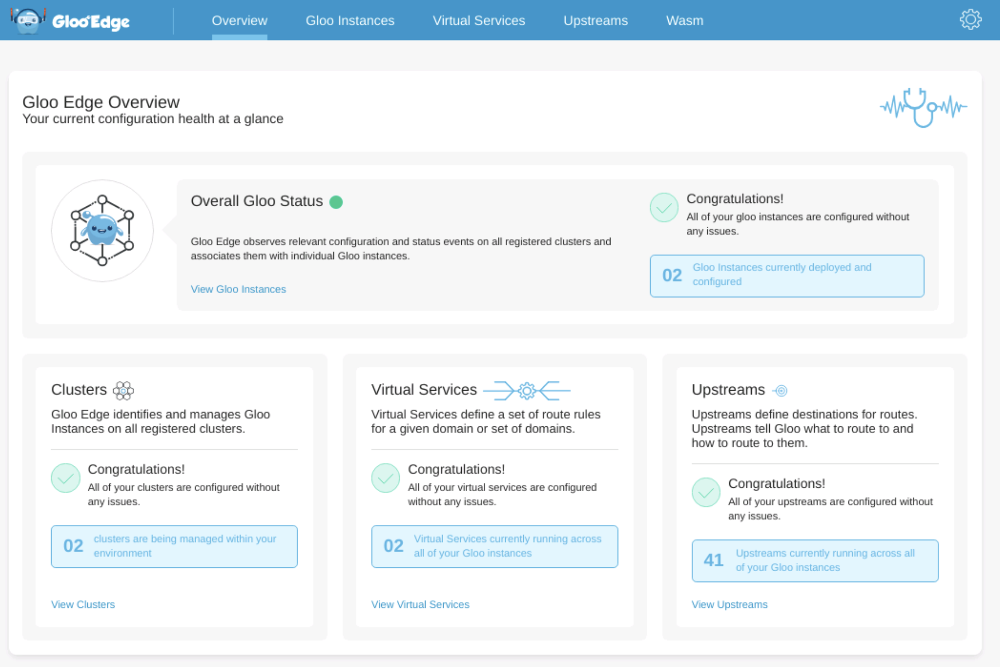
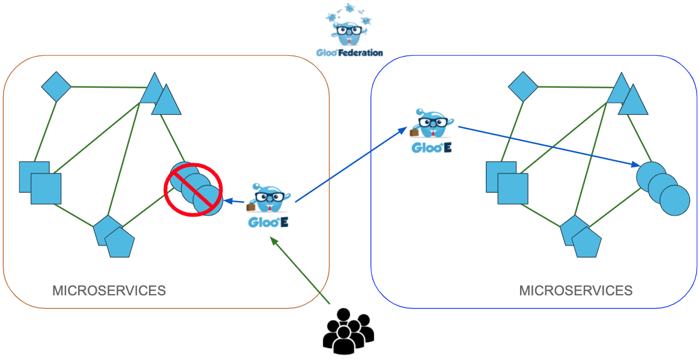

# Gloo Federation workshop

Gloo Federation allows users to manage the configuration for all of their Gloo instances from one place, no matter what platform they run on. In addition Gloo Federation elevates Gloo Edge’s powerful routing features beyond the environment they live in, allowing users to create all new global routing features between different Gloo Edge instances. Gloo Federation enables consistent configuration, service failover, unified debugging, and automated Gloo Edge discovery across all of your Gloo instances.

The goal of this workshop is to show several unique features of the Gloo Federation in action:

- Multicluster RBAC
- Federated configuration
- Failover

## Lab environment


## Lab 1 : Deploy your Kubernetes clusters

From the terminal go to the `/home/solo/workshops/gloo-edge/federation` directory:

```
cd /home/solo/workshops/gloo-edge/federation
```

Run the following commands to deploy 3 Kubernetes clusters:

```bash
../../scripts/deploy.sh 1 mgmt
../../scripts/deploy.sh 2 cluster1
../../scripts/deploy.sh 3 cluster2
```

Then run the following commands to wait for all the Pods to be ready:

```bash
../../scripts/check.sh mgmt
../../scripts/check.sh cluster1
../../scripts/check.sh cluster2
```

Now, if you execute the `kubectl get pods -A` command, you should obtain the following:

```
NAMESPACE            NAME                                          READY   STATUS    RESTARTS   AGE
kube-system          calico-kube-controllers-59d85c5c84-sbk4k      1/1     Running   0          4h26m
kube-system          calico-node-przxs                             1/1     Running   0          4h26m
kube-system          coredns-6955765f44-ln8f5                      1/1     Running   0          4h26m
kube-system          coredns-6955765f44-s7xxx                      1/1     Running   0          4h26m
kube-system          etcd-cluster1-control-plane                      1/1     Running   0          4h27m
kube-system          kube-apiserver-cluster1-control-plane            1/1     Running   0          4h27m
kube-system          kube-controller-manager-cluster1-control-plane   1/1     Running   0          4h27m
kube-system          kube-proxy-ksvzw                              1/1     Running   0          4h26m
kube-system          kube-scheduler-cluster1-control-plane            1/1     Running   0          4h27m
local-path-storage   local-path-provisioner-58f6947c7-lfmdx        1/1     Running   0          4h26m
metallb-system       controller-5c9894b5cd-cn9x2                   1/1     Running   0          4h26m
metallb-system       speaker-d7jkp                                 1/1     Running   0          4h26m
```

Note that this the output for the third cluster.

You can see that your currently connected to this cluster by executing the `kubectl config get-contexts` command:

```
CURRENT   NAME         CLUSTER      AUTHINFO     NAMESPACE
          mgmt   mgmt   mgmt   
          cluster1   cluster1   cluster1
*         cluster2   cluster2   cluster2
````

Run the following command to make `mgmt` the current cluster.

```bash
kubectl config use-context mgmt
```

## Deploy Gloo Federation on the first clusters

Upgrade `glooctl` using the following command:

```bash
glooctl upgrade --release=v1.7.0-beta11
```

Check if the `LICENSE_KEY` variable is already set.

>If it's not, set the `LICENSE_KEY` variable with the value provided by the instructor:
>
>```
>export LICENSE_KEY=<license>
>```

Create the following configuration file to enable Multicluster RBAC:

```bash
cat << EOF > values-federation.yaml
enableMultiClusterRbac: true
EOF
```

Deploy Gloo Edge Federation:

```bash
kubectl config use-context mgmt
glooctl install federation --values values-federation.yaml --license-key $LICENSE_KEY --version=v1.7.0-beta11
```

## Deploy Gloo on the two other clusters

Deploy Gloo on the second cluster:

```bash
kubectl config use-context cluster1
glooctl install gateway enterprise  --version v1.7.0-beta11 --license-key $LICENSE_KEY
```

Deploy Gloo Edge on the third cluster:

In order to use a Gloo Edge Instance as a failover target it first needs to be configured with an additional listener to route incoming failover requests.

The yaml below sets up a TCP proxy which is configured to terminate mTLS traffic from the primary Gloo Edge instance, and forward the traffic based on the SNI name. The SNI name and routing are automatically handled by Gloo Federation, but the certificates are the ones created in the previous step.

```bash
kubectl config use-context cluster2

cat << EOF > values.yaml
gloo:
  gatewayProxies:
    gatewayProxy:
      failover:
        enabled: true
        secretName: failover-downstream
      service:
        type: LoadBalancer
EOF

glooctl install gateway enterprise --values values.yaml --version v1.7.0-beta11 --license-key $LICENSE_KEY
```

Use the following commands to wait for the Gloo Edge components to be deployed on all the clusters:

```bash
kubectl --context mgmt -n gloo-fed rollout status deployment gloo-fed

until kubectl --context cluster1 get ns gloo-system
do
  sleep 1
done

until kubectl --context cluster2 get ns gloo-system
do
  sleep 1
done

until [ $(kubectl --context cluster1 -n gloo-system get pods -o jsonpath='{range .items[*].status.containerStatuses[*]}{.ready}{"\n"}{end}' | grep false -c) -eq 0 ]; do
  echo "Waiting for all the gloo-system pods to become ready on cluster cluster1"
  sleep 1
done

until [ $(kubectl --context cluster2 -n gloo-system get pods -o jsonpath='{range .items[*].status.containerStatuses[*]}{.ready}{"\n"}{end}' | grep false -c) -eq 0 ]; do
  echo "Waiting for all the gloo-system pods to become ready on cluster cluster2"
  sleep 1
done
```

## Secure the communications between the Gloo clusters

Failover will allow communication between the Gloo clusters, so it is crucial that the traffic be encrypted. Therefore certificates need to be provisioned and placed in the clusters to allow for mTLS between the Gloo instances running on separate clusters.

Run the following commands to provision de certificates:

```bash
# Generate downstream cert and key
openssl req -x509 -nodes -days 365 -newkey rsa:2048 \
  -keyout tls.key -out tls.crt -subj "/CN=solo.io"

# Generate upstream ca cert and key
openssl req -x509 -nodes -days 365 -newkey rsa:2048 \
  -keyout mtls.key -out mtls.crt -subj "/CN=solo.io"

# Set context to second cluster
kubectl config use-context cluster2

# Create the secret
glooctl create secret tls --name failover-downstream \
--certchain tls.crt --privatekey tls.key --rootca mtls.crt

# Set the context to the first cluster
kubectl config use-context cluster1

# Create the secret
glooctl create secret tls --name failover-upstream \
--certchain mtls.crt --privatekey mtls.key
```

## Register the Gloo clusters

Register the 2 Gloo Edge clusters:

```bash
kubectl config use-context mgmt

glooctl cluster register --cluster-name cluster1 --remote-context cluster1 --remote-namespace gloo-system
glooctl cluster register --cluster-name cluster2 --remote-context cluster2 --remote-namespace gloo-system
```

Once a cluster has been registered, Gloo Federation will automatically discover all instances of Gloo Edge within the cluster. The discovered instances are stored in a Custom Resource of type `glooinstances.fed.solo.io` in the `gloo-fed` namespace.

You can view the discovered instances by running the following command:

```bash
kubectl --context mgmt get glooinstances -n gloo-fed
```

You should see something like that:

```
NAME                AGE
cluster1-gloo-system   76s
cluster2-gloo-system   74s
```

## Access the Gloo Federation UI

Run the following command in a different tab:

```
kubectl config use-context mgmt
kubectl port-forward svc/gloo-fed-console -n gloo-fed 8090:8090
```

Access the UI at http://localhost:8090 and have a look at the different tabs.



## Multicluster RBAC

Gloo Federation allows you to administer multiple instances of Gloo Edge across multiple Kubernetes clusters. One Gloo Edge Federation object might modify configuration across many instances of Gloo Edge across many Kubernetes clusters. Multicluster role-based access control is a feature of Gloo Federation that controls access and actions on Gloo Federation APIs that might reconfigure many Gloo instances. The feature ensures that users are only allowed to modify Gloo Federation resources that configure Gloo Edge resources in clusters and namespaces that they have explicitly been granted access to in order to facilitate multitenancy in the Gloo Federation control plane.

The installation of Multicluster RBAC creates two `MultiClusterRole` Custom Resources and two `MultiClusterRoleBinding` Custom Resources.

Run the following command to make `mgmt` the current cluster.

```bash
kubectl config use-context mgmt
```

List the MultiClusterRole objects:

```bash
kubectl get multiclusterrole -n gloo-fed 
```

The output should be similar to below:

````
NAME               AGE
gloo-fed           19m
gloo-fed-console   19m
````

List the MultiClusterRoleBinding objects:

```bash
kubectl get multiclusterrolebinding -n gloo-fed
```

The output should be similar to below:

````
NAME               AGE
gloo-fed           22m
gloo-fed-console   22m
````

You can inspect these objects, but to summarize, the `gloo-fed` MultiClusterRoleBinding associates the MultiClusterRole with the `gloo-fed` service account. Without the binding, the `gloo-fed` pod wouldn’t be able to update the status of Gloo Federation API objects.

The `gloo-fed-console` MultiClusterRole and MultiClusterRoleBinding grant the same set of permissions to the `gloo-fed-console` service account.

Now let’s create a new MultiClusterRoleBinding for the `kubernetes-admin` account binding it to the `gloo-fed` MultiClusterRole.

```bash
kubectl --context mgmt apply -f - <<EOF
apiVersion: multicluster.solo.io/v1alpha1
kind: MultiClusterRoleBinding
metadata:
  name: kind-admin
  namespace: gloo-fed
spec:
  roleRef:
    name: gloo-fed
    namespace: gloo-fed
  subjects:
  - kind: User
    name: kubernetes-admin
EOF
```

## Federated configuration

Gloo Federation enables you to create consistent configurations across multiple Gloo Edge instances. The resources being configured could be resources such as Upstreams, UpstreamGroups, and Virtual Services.

First of all, let's deploy workloads on the Gloo clusters:

```bash
kubectl apply --context cluster1 -f - <<EOF
apiVersion: v1
kind: Service
metadata:
 labels:
   app: bluegreen
   text: blue
 name: service-bluegreen
 namespace: default
spec:
 ports:
 - name: color
   port: 8080
   protocol: TCP
   targetPort: 8080
 selector:
   app: bluegreen
   text: blue
 sessionAffinity: None
 type: ClusterIP
---
apiVersion: apps/v1
kind: Deployment
metadata:
 labels:
   app: bluegreen
   text: blue
 name: echo-blue
 namespace: default
spec:
 replicas: 1
 selector:
   matchLabels:
     app: bluegreen
     text: blue
 template:
   metadata:
     labels:
       app: bluegreen
       text: blue
   spec:
     containers:
     - args:
       - -listen=:8080
       - -text="blue-pod"
       image: hashicorp/http-echo
       name: echo
       ports:
       - containerPort: 80
EOF

kubectl apply --context cluster2 -f - <<EOF
apiVersion: v1
kind: Service
metadata:
 labels:
   app: bluegreen
   text: green
 name: service-bluegreen
 namespace: default
spec:
 ports:
 - name: color
   port: 8080
   protocol: TCP
   targetPort: 8080
 selector:
   app: bluegreen
   text: green
 sessionAffinity: None
 type: ClusterIP
---
apiVersion: apps/v1
kind: Deployment
metadata:
 labels:
   app: bluegreen
   text: green
 name: echo-green
 namespace: default
spec:
 replicas: 1
 selector:
   matchLabels:
     app: bluegreen
     text: green
 template:
   metadata:
     labels:
       app: bluegreen
       text: green
   spec:
     containers:
     - args:
       - -listen=:8080
       - -text="green-pod"
       image: hashicorp/http-echo
       name: echo
       ports:
       - containerPort: 80
EOF
```

Use the following commands to wait for the blue and green Pods to be deployed on the Gloo Edge clusters:

```bash
kubectl --context cluster1 rollout status deployment echo-blue
kubectl --context cluster2 rollout status deployment echo-green
```

Now, let's create some federated objects:

```bash
kubectl apply --context mgmt -f - <<EOF
apiVersion: fed.gloo.solo.io/v1
kind: FederatedUpstream
metadata:
  name: default-service-bluegreen
  namespace: gloo-fed
spec:
  placement:
    clusters:
      - cluster1
      - cluster2
    namespaces:
      - gloo-system
  template:
    metadata:
      name: default-service-bluegreen-8080
    spec:
      discoveryMetadata: {}
      healthChecks:
        - healthyThreshold: 1
          httpHealthCheck:
            path: /
          interval: 1s
          noTrafficInterval: 1s
          timeout: 1s
          unhealthyThreshold: 1
      kube:
        serviceName: service-bluegreen
        serviceNamespace: default
        servicePort: 8080
---
apiVersion: fed.gateway.solo.io/v1
kind: FederatedVirtualService
metadata:
  name: any-bluegreen
  namespace: gloo-fed
spec:
  placement:
    clusters:
      - cluster1
      - cluster2
    namespaces:
      - gloo-system
  template:
    spec:
      virtualHost:
        domains:
        - '*'
        routes:
        - matchers:
          - prefix: /
          routeAction:
            single:
              upstream:
                name: default-service-bluegreen-8080
                namespace: gloo-system
    metadata:
      name: any-bluegreen
EOF
```

The FederatedUpstream creates an Upstream in the target clusters and the FederatedVirtualService does the same with VirtualServices.

You can run execute the following command to validate tha the Upstream object has been correctly created in the first Gloo Edge cluster:

```bash
kubectl --context cluster1 -n gloo-system get upstream default-service-bluegreen-8080 -o yaml
```

You should get something similar to that:

```
apiVersion: gloo.solo.io/v1
kind: Upstream
metadata:
  creationTimestamp: "2020-08-19T10:48:14Z"
  generation: 10
  labels:
    fed.solo.io/owner: gloo-fed.default-service-bluegreen
...
  name: default-service-bluegreen-8080
  namespace: gloo-system
  resourceVersion: "12452"
  selfLink: /apis/gloo.solo.io/v1/namespaces/gloo-system/upstreams/default-service-bluegreen-8080
  uid: f9206f0d-a58a-4b2b-b320-59aadba8304f
spec:
  discoveryMetadata: {}
  healthChecks:
  - healthyThreshold: 1
    httpHealthCheck:
      path: /health
    interval: 1s
    noTrafficInterval: 1s
    timeout: 1s
    unhealthyThreshold: 1
  kube:
    serviceName: service-bluegreen
    serviceNamespace: default
    servicePort: 8080
status:
  reportedBy: gloo
  state: 1
```

You can do the same for the VirtualService object.

It means that you can now access the `service-bluegreen` from both Gloo Edge clusters:

```bash
kubectl config use-context cluster1
curl $(glooctl proxy url)

kubectl config use-context cluster2
curl $(glooctl proxy url)
```

One will return `blue-pod` while the other one will return `green-pod`.

## Failover configuration

When an Upstream fails or becomes unhealthy, Gloo Federation can automatically fail traffic over to a different Gloo Edge instance and Upstream.

Let's create a FailoverScheme object to determine how we want the failover to happen:

```bash
kubectl apply --context mgmt -f - <<EOF
apiVersion: fed.solo.io/v1
kind: FailoverScheme
metadata:
 name: failover-scheme
 namespace: gloo-fed
spec:
 failoverGroups:
 - priorityGroup:
   - cluster: cluster2
     upstreams:
     - name: default-service-bluegreen2-8080
       namespace: gloo-system
 primary:
   clusterName: cluster1
   name: default-service-bluegreen-8080
   namespace: gloo-system
EOF
```

Check that you can still access the application on the first Gloo Edge cluster:

```bash
kubectl config use-context cluster1
curl $(glooctl proxy url)/
```

You should get this output:

```
"blue-pod"
```

## Failover the workload

Run the following commands to scale down the `echo-blue` deployment to 0:

```bash
kubectl config use-context cluster1
kubectl scale deploy/echo-blue --replicas=0
```
 


Wait until the `echo-blue` pod has been terminated:

```bash
until [ $(kubectl get pods -l text=blue -o json | jq '.items | length') -eq 0 ]; do
  echo "Waiting for the echo-blue pod to terminate"
  sleep 1
done
```

Check that you can still access the application on the first Gloo Edge cluster:

```bash
curl $(glooctl proxy url)/
```

You should now get this output:

```
"green-pod"
```

It means that the Gloo gateway has sent the request to the second Gloo Edge cluster because the service wasn't available locally.

## Monitoring

If you go back to the Admin UI and click on the `Gloo Instances tab`, you can see the 2 Gloo Edge clusters.

If you click on `View Gloo Details` on the first one, and then on the `Upstreams` tab, you can see that the Upstream has been failing over:


## Cleanup

Delete the Kubernetes clusters:

```
kind delete cluster --name kind1
kind delete cluster --name kind2
kind delete cluster --name kind3
```


kubectl delete --context mgmt -f - <<EOF
apiVersion: fed.gloo.solo.io/v1
kind: FederatedUpstream
metadata:
  name: default-service-bluegreen
  namespace: gloo-fed
spec:
  placement:
    clusters:
      - cluster1
      - cluster2
    namespaces:
      - gloo-system
  template:
    metadata:
      name: default-service-bluegreen-8080
    spec:
      discoveryMetadata: {}
      healthChecks:
        - healthyThreshold: 1
          httpHealthCheck:
            path: /
          interval: 1s
          noTrafficInterval: 1s
          timeout: 1s
          unhealthyThreshold: 1
      kube:
        serviceName: service-bluegreen
        serviceNamespace: default
        servicePort: 8080
---
apiVersion: fed.gateway.solo.io/v1
kind: FederatedVirtualService
metadata:
  name: any-bluegreen
  namespace: gloo-fed
spec:
  placement:
    clusters:
      - cluster1
      - cluster2
    namespaces:
      - gloo-system
  template:
    spec:
      virtualHost:
        domains:
        - '*'
        routes:
        - matchers:
          - prefix: /
          routeAction:
            single:
              upstream:
                name: default-service-bluegreen-8080
                namespace: gloo-system
    metadata:
      name: any-bluegreen
EOF

kubectl apply --context cluster1 -f - <<EOF
apiVersion: v1
kind: Service
metadata:
 labels:
   app: fake
 name: service-fake
 namespace: default
spec:
 ports:
 - name: http
   port: 8080
   protocol: TCP
   targetPort: 8080
 selector:
   app: fake
 sessionAffinity: None
 type: ClusterIP
EOF

kubectl apply --context mgmt -f - <<EOF
apiVersion: fed.solo.io/v1
kind: FailoverScheme
metadata:
 name: failover-scheme
 namespace: gloo-fed
spec:
 failoverGroups:
 - priorityGroup:
   - cluster: cluster2
     upstreams:
     - name: default-service-bluegreen-8080
       namespace: gloo-system
 primary:
   clusterName: cluster1
   name: default-service-bluegreen-8080
   namespace: gloo-system
EOF

apiVersion: v1
kind: Service
metadata:
 labels:
   app: bluegreen
   text: blue
 name: service-bluegreen
 namespace: default
spec:
 ports:
 - name: color
   port: 8080
   protocol: TCP
   targetPort: 8080
 selector:
   app: bluegreen
   text: blue
 sessionAffinity: None
 type: ClusterIP
EOF

kubectl delete --context cluster1 -f - <<EOF
apiVersion: v1
kind: Service
metadata:
 labels:
   app: bluegreen
   text: blue
 name: service-bluegreen
 namespace: default
spec:
 ports:
 - name: color
   port: 8080
   protocol: TCP
   targetPort: 8080
 selector:
   app: bluegreen
   text: blue
 sessionAffinity: None
 type: ClusterIP
---
apiVersion: gloo.solo.io/v1
kind: Upstream
metadata:
  name: default-service-bluegreen-8080
  namespace: gloo-system
spec:
  discoveryMetadata:
    labels:
      app: bluegreen
      text: blue
  failover:
    prioritizedLocalities:
    - localityEndpoints:
      - lbEndpoints:
        - address: 172.18.0.230
          port: 15443
          upstreamSslConfig:
            secretRef:
              name: failover-upstream
              namespace: gloo-system
            sni: default-service-bluegreen-8080_gloo-system
        locality:
          region: us-east-1
          zone: us-east-1c
  healthChecks:
  - healthyThreshold: 1
    httpHealthCheck:
      path: /
    interval: 1s
    noTrafficInterval: 1s
    timeout: 1s
    unhealthyThreshold: 1
  kube:
    selector:
      app: bluegreen
      text: blue
    serviceName: service-bluegreen
    serviceNamespace: default
    servicePort: 8080
---
apiVersion: gateway.solo.io/v1
kind: VirtualService
metadata:
  name: any-bluegreen
  namespace: gloo-system
spec:
  virtualHost:
    domains:
    - '*'
    routes:
    - matchers:
      - prefix: /
      routeAction:
        single:
          upstream:
            name: default-service-bluegreen-8080
            namespace: gloo-system
EOF