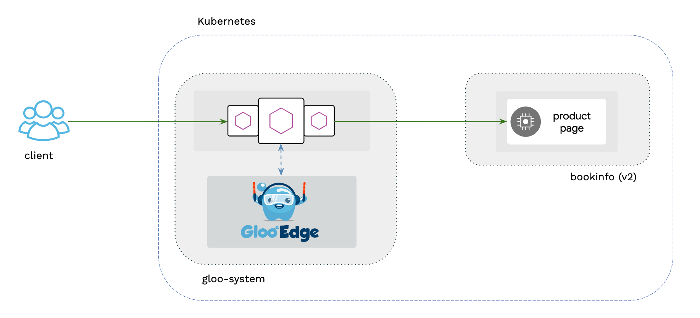

# Gloo Edge Workshop

Gloo Edge is a feature-rich, Kubernetes-native ingress controller, and next-generation API gateway. Gloo is exceptional in its function-level routing; its support for legacy apps, microservices and serverless; its discovery capabilities; its numerous features; and its tight integration with leading open-source projects. Gloo is uniquely designed to support hybrid applications, in which multiple technologies, architectures, protocols, and clouds can coexist.

The goal of this workshop is to expose some key features of Gloo API Gateway, like traffic management, security, and API management.

## Lab Environment

The lab environment consists of a Kubernetes environment deployed locally using kind.

In this workshop we will:
* Deploy a demo application (Istio's [bookinfo](https://istio.io/latest/docs/examples/bookinfo/) demo app) on a k8s cluster and expose it through Gloo Edge
* Deploy a second version of the demo app and route traffic to both versions
* Secure the demo app using TLS
* Secure the demo app using OIDC
* Rate limit the traffic going to the demo app
* Transform a response using Gloo transformations
* Configure access logs
* Use several of these features together to configure an advanced OIDC workflow

## Lab 0: Demo Environment Creation

Go to the `/home/solo/workshops/gloo-edge/gloo-edge` directory:

```
cd /home/solo/workshops/gloo-edge/gloo-edge
```

### Create a Kubernetes Cluster

Deploy a local Kubernetes cluster using this command:

```bash
../../scripts/deploy.sh 1 gloo-edge
```

Then verify that your Kubernetes cluster is ready: 

```bash
../../scripts/check.sh gloo-edge
```
The `check.sh` script will return immediately with no output if the cluster is ready.  Otherwise, it will output a series of periodic "waiting" messages until the cluster is up.

### Install Gloo Edge Enterprise

Run the commands below to deploy Gloo Edge Enterprise:

```bash
kubectl config use-context gloo-edge
glooctl upgrade --release=v1.7.2
glooctl install gateway enterprise --version 1.7.2 --license-key $LICENSE_KEY
```

Gloo Edge can also be deployed using a Helm chart.

Use the following commands to wait for the Gloo Edge components to be deployed:

```bash
until kubectl get ns gloo-system
do
  sleep 1
done

until [ $(kubectl -n gloo-system get pods -o jsonpath='{range .items[*].status.containerStatuses[*]}{.ready}{"\n"}{end}' | grep false -c) -eq 0 ]; do
  echo "Waiting for all the gloo-system pods to become ready"
  sleep 1
done
```

## Lab 1: Traffic Management

### Routing to a Kubernetes Service 

In this step we will expose a demo service to the outside world using Gloo Edge.

First let's deploy a demo application called bookinfo:

```bash
kubectl create ns bookinfo 
kubectl -n bookinfo  apply -f https://raw.githubusercontent.com/istio/istio/1.7.3/samples/bookinfo/platform/kube/bookinfo.yaml
kubectl delete deployment reviews-v1 reviews-v3 -n bookinfo
```
 


The bookinfo app has 3 versions of a microservice called reviews.  We will keep only the version 2 of the reviews microservice for this step and will add the other versions later.  An easy way to distinguish among the different versions in the web interface is to look at the stars: v1 displays no stars in the reviews, v2 displays black stars, and v3 displays red stars.


Gloo Edge uses a discovery mechanism to create Upstreams automatically, but Upstreams can be also created manually using Kubernetes CRDs.

After a few seconds, Gloo Edge will discover the newly created service and create an Upstream called  `bookinfo-productpage-9080` (Gloo Edge uses the convention `namespace-service-port` for the discovered Upstreams).

To verify that the Upstream was created properly, run the following command: 

```bash
until glooctl get upstream bookinfo-productpage-9080 2> /dev/null
do
    echo waiting for upstream bookinfo-productpage-9080 to be discovered
    sleep 3
done
```

It should return the discovered upstream with an `Accepted` status: 

```
+---------------------------+------------+----------+----------------------------+
|         UPSTREAM          |    TYPE    |  STATUS  |          DETAILS           |
+---------------------------+------------+----------+----------------------------+
| bookinfo-productpage-9080 | Kubernetes | Accepted | svc name:      productpage |
|                           |            |          | svc namespace: bookinfo    |
|                           |            |          | port:          9080        |
|                           |            |          |                            |
+---------------------------+------------+----------+----------------------------+
```

Now that the Upstream CRD has been created, we need to create a Gloo Edge Virtual Service that routes traffic to it:

```bash
kubectl apply -f - <<EOF
apiVersion: gateway.solo.io/v1
kind: VirtualService
metadata:
  name: demo
  namespace: gloo-system
spec:
  virtualHost:
    domains:
      - '*'
    routes:
      - matchers:
          - prefix: /
        routeAction:
          single:
            upstream:
              name: bookinfo-productpage-9080
              namespace: gloo-system
EOF
```

The creation of the Virtual Service exposes the Kubernetes service through the gateway.

We can access the application using the web browser by running the following command:

```
/opt/google/chrome/chrome $(glooctl proxy url)/productpage
```

It should return the bookinfo application webpage. Note that the review stars are black (v2).


### Routing to Multiple Upstreams

In many cases, we need to route traffic to two different versions of an application to test a new feature. In this step, we are going to update the Virtual Service to route traffic to two different Upstreams:

The first step is to create a new deployment of the demo application, this time with the version 3 of the reviews microservice: 

```bash
kubectl create ns bookinfo-beta 
kubectl -n bookinfo-beta apply -f https://raw.githubusercontent.com/istio/istio/1.7.3/samples/bookinfo/platform/kube/bookinfo.yaml
kubectl delete deployment reviews-v1 reviews-v2 -n bookinfo-beta
```


Verify that the Upstream for the beta application was created, using the following command: 


```bash
until glooctl get upstream bookinfo-beta-productpage-9080 2> /dev/null
do
    echo waiting for upstream bookinfo-beta-productpage-9080 to be discovered
    sleep 3
done
```

Now we can route to multiple Upstreams by updating the Virtual Service as follow: 

```bash
kubectl apply -f - <<EOF
apiVersion: gateway.solo.io/v1
kind: VirtualService
metadata:
  name: demo
  namespace: gloo-system
spec:
  virtualHost:
    domains:
      - '*'
    routes:
      - matchers:
          - prefix: /
        routeAction:
        # ----------------------- Multi Destination ----------------------
            multi:
                destinations:
                - weight: 5
                  destination:
                      upstream:
                          name: bookinfo-productpage-9080
                          namespace: gloo-system
                - weight: 5
                  destination:
                      upstream:
                          name: bookinfo-beta-productpage-9080
                          namespace: gloo-system
EOF
```

We should see either the black star reviews (v2) or the new red star reviews (v3) when refreshing the page.


## Lab 2: Security

In this lab, we will explore some Gloo Edge features related to security. 

### Network Encryption - Server TLS

In this step we are going to secure our demo application using TLS.

Let's first create a private key and a self-signed certificate to use in our demo Virtual Service:

```bash
openssl req -x509 -nodes -days 365 -newkey rsa:2048 \
   -keyout tls.key -out tls.crt -subj "/CN=*"
```

Then we have store them in a Kubernetes secret running the following command:

```bash
kubectl create secret tls upstream-tls --key tls.key \
   --cert tls.crt --namespace gloo-system
```

To setup TLS we have to add the SSL config to the Virtual Service:

```bash
kubectl apply -f - <<EOF
apiVersion: gateway.solo.io/v1
kind: VirtualService
metadata:
  name: demo
  namespace: gloo-system
spec:
  # The SSL config below activate TLS on the Virtual Service
  # ------------
  sslConfig:
    secretRef:
      name: upstream-tls
      namespace: gloo-system
  # ------------    
  virtualHost:
    domains:
      - '*'
    routes:
      - matchers:
          - prefix: /
        routeAction:
            multi:
                destinations:
                - weight: 5
                  destination:
                      upstream:
                          name: bookinfo-productpage-9080
                          namespace: gloo-system
                - weight: 5
                  destination:
                      upstream:
                          name: bookinfo-beta-productpage-9080
                          namespace: gloo-system
EOF
```

Now the application is securely exposed through TLS. To test the TLS configuration, run the following command to open the browser (note that now the traffic is served using https): 

```bash
APP_URL=$(glooctl proxy url --port https | cut -d: -f1-2)
```
```
/opt/google/chrome/chrome $APP_URL/productpage 
```

The browser will warn you that your connection is not private due to the self-signed certificate.  Click through the `Advanced` button and the subsequent link to proceed to the "unsafe" destination.  Then the bookinfo interface should display as expected, although the address bar may continue to warn you that the destination is "Not Secure."  Don't worry; this is expected behavior given the self-signed certificate.


### OIDC Support

In many use cases, we need to restrict the access to our applications to authenticated users. In this step, we will secure our application using an OIDC Identity Provider.

Let's start by installing Keycloak:

```bash
kubectl create -f https://raw.githubusercontent.com/keycloak/keycloak-quickstarts/12.0.4/kubernetes-examples/keycloak.yaml
kubectl rollout status deploy/keycloak
```
**Troubleshooting Tip**

Make sure that the KeyCloak deployment worked correctly by executing the following.

`kubectl describe pod keycloak`

If you see an issue with the readiness probe failing, then you will want to edit the deployment and add the following values under the readinessProbe.

`kubectl patch deployment keycloak --type='json' -p='[{"op": "replace", "path": "/spec/template/spec/containers/0/readinessProbe/timeoutSeconds", "value":10}]'`

`kubectl patch deployment keycloak --type='json' -p='[{"op": "add", "path": "/spec/template/spec/containers/0/readinessProbe/initialDelaySeconds", "value":10 }]'`

<!--bash
sleep 30
-->

Then, we need to configure it and create two users:

- User1 credentials: `user1/password`
  Email: user1@solo.io

- User2 credentials: `user2/password`
  Email: user2@example.com

```bash
# Get Keycloak URL and token
KEYCLOAK_URL=http://$(kubectl get service keycloak -o jsonpath='{.status.loadBalancer.ingress[0].ip}'):8080/auth
KEYCLOAK_TOKEN=$(curl -d "client_id=admin-cli" -d "username=admin" -d "password=admin" -d "grant_type=password" "$KEYCLOAK_URL/realms/master/protocol/openid-connect/token" | jq -r .access_token)

# Create initial token to register the client
read -r client token <<<$(curl -H "Authorization: Bearer ${KEYCLOAK_TOKEN}" -X POST -H "Content-Type: application/json" -d '{"expiration": 0, "count": 1}' $KEYCLOAK_URL/admin/realms/master/clients-initial-access | jq -r '[.id, .token] | @tsv')

# Register the client
read -r id secret <<<$(curl -X POST -d "{ \"clientId\": \"${client}\" }" -H "Content-Type:application/json" -H "Authorization: bearer ${token}" ${KEYCLOAK_URL}/realms/master/clients-registrations/default| jq -r '[.id, .secret] | @tsv')

# Add allowed redirect URIs
curl -H "Authorization: Bearer ${KEYCLOAK_TOKEN}" -X PUT -H "Content-Type: application/json" -d '{"serviceAccountsEnabled": true, "authorizationServicesEnabled": true, "redirectUris": ["'${APP_URL}'/callback", "http://portal.example.com/callback"]}' $KEYCLOAK_URL/admin/realms/master/clients/${id}

# Add the group attribute in the JWT token returned by Keycloak
curl -H "Authorization: Bearer ${KEYCLOAK_TOKEN}" -X POST -H "Content-Type: application/json" -d '{"name": "group", "protocol": "openid-connect", "protocolMapper": "oidc-usermodel-attribute-mapper", "config": {"claim.name": "group", "jsonType.label": "String", "user.attribute": "group", "id.token.claim": "true", "access.token.claim": "true"}}' $KEYCLOAK_URL/admin/realms/master/clients/${id}/protocol-mappers/models

# Create first user
curl -H "Authorization: Bearer ${KEYCLOAK_TOKEN}" -X POST -H "Content-Type: application/json" -d '{"username": "user1", "email": "user1@solo.io", "enabled": true, "attributes": {"group": "users"}, "credentials": [{"type": "password", "value": "password", "temporary": false}]}' $KEYCLOAK_URL/admin/realms/master/users

# Create second user
curl -H "Authorization: Bearer ${KEYCLOAK_TOKEN}" -X POST -H "Content-Type: application/json" -d '{"username": "user2", "email": "user2@example.com", "enabled": true, "attributes": {"group": "users"}, "credentials": [{"type": "password", "value": "password", "temporary": false}]}' $KEYCLOAK_URL/admin/realms/master/users
```

The architecture looks like this now:


The next step is to configure the authentication in the Virtual Service. For this we will have to create a Kubernetes Secret that contains the OIDC secret:

```bash
glooctl create secret oauth --namespace gloo-system --name keycloak-oauth --client-secret ${secret}
```

Then we will create an AuthConfig, which is a Gloo Edge CRD that contains authentication information: 

```bash
kubectl apply -f - <<EOF
apiVersion: enterprise.gloo.solo.io/v1
kind: AuthConfig
metadata:
  name: keycloak-oauth
  namespace: gloo-system
spec:
  configs:
  - oauth2:
      oidcAuthorizationCode:
        appUrl: ${APP_URL}
        callbackPath: /callback
        clientId: ${client}
        clientSecretRef:
          name: keycloak-oauth
          namespace: gloo-system
        issuerUrl: "${KEYCLOAK_URL}/realms/master/"
        scopes:
        - email
EOF
```

Finally we activate the authentication on the Virtual Service by referencing the AuthConfig:

```bash
kubectl apply -f - <<EOF
apiVersion: gateway.solo.io/v1
kind: VirtualService
metadata:
  name: demo
  namespace: gloo-system
spec:
  sslConfig:
    secretRef:
      name: upstream-tls
      namespace: gloo-system  
  virtualHost:
# ------------------- OIDC -------------------
    options:
      extauth:
        configRef:
          name: keycloak-oauth
          namespace: gloo-system
#---------------------------------------------          
    domains:
      - '*'
    routes:
      - matchers:
          - prefix: /
        routeAction:
            multi:
                destinations:
                - weight: 5
                  destination:
                      upstream:
                          name: bookinfo-productpage-9080
                          namespace: gloo-system
                - weight: 5
                  destination:
                      upstream:
                          name: bookinfo-beta-productpage-9080
                          namespace: gloo-system
EOF
```

To test the authentication, refresh the web browser.

If you login as the `user1` user with the password `password`, Gloo should redirect you to the application.


### Rate Limiting

In this step, we are going to use rate limiting to protect our demo application.

To enable rate limiting on our Virtual Service, we will first create a RateLimitConfig CRD:

```bash
kubectl apply -f - << EOF
apiVersion: ratelimit.solo.io/v1alpha1
kind: RateLimitConfig
metadata:
  name: global-limit
  namespace: gloo-system
spec:
  raw:
    descriptors:
    - key: generic_key
      value: count
      rateLimit:
        requestsPerUnit: 10
        unit: MINUTE
    rateLimits:
    - actions:
      - genericKey:
          descriptorValue: count
EOF
```

Now let's update our Virtual Service to use the bookinfo application with the new rate limit enforced: 

```bash
kubectl apply -f - <<EOF
apiVersion: gateway.solo.io/v1
kind: VirtualService
metadata:
  name: demo
  namespace: gloo-system
spec:
  sslConfig:
    secretRef:
      name: upstream-tls
      namespace: gloo-system  
  virtualHost:
    options:
      extauth:
        configRef:
          name: keycloak-oauth
          namespace: gloo-system
# ---------------- Rate limit config ------------------
      rateLimitConfigs:
        refs:
        - name: global-limit
          namespace: gloo-system
#------------------------------------------------------
    domains:
      - '*'
    routes:
      - matchers:
          - prefix: /
        routeAction:
            multi:
                destinations:
                - weight: 5
                  destination:
                      upstream:
                          name: bookinfo-productpage-9080
                          namespace: gloo-system
                - weight: 5
                  destination:
                      upstream:
                          name: bookinfo-beta-productpage-9080
                          namespace: gloo-system
EOF
```

To test rate limiting, refresh the browser until you see a 429 message. 


### Web Application Firewall (WAF)

A web application firewall (WAF) protects web applications by monitoring, filtering and blocking potentially harmful traffic and attacks that can overtake or exploit them.

Gloo Edge Enterprise includes the ability to enable the ModSecurity Web Application Firewall for any incoming and outgoing HTTP connections. 

Let's update our Virtual Service to restrict the characters allowed for usernames.

```bash
kubectl apply -f - <<EOF
apiVersion: gateway.solo.io/v1
kind: VirtualService
metadata:
  name: demo
  namespace: gloo-system
spec:
  sslConfig:
    secretRef:
      name: upstream-tls
      namespace: gloo-system  
  virtualHost:
    options:
      extauth:
        configRef:
          name: keycloak-oauth
          namespace: gloo-system
      rateLimitConfigs:
        refs:
        - name: global-limit
          namespace: gloo-system
# ---------------- Web Application Firewall -----------
      waf:
        customInterventionMessage: 'Username should only contain letters'
        ruleSets:
        - ruleStr: |
            # Turn rule engine on
            SecRuleEngine On
            SecRule ARGS:/username/ "[^a-zA-Z]" "t:none,phase:2,deny,id:6,log,msg:'allow only letters in username'"
#------------------------------------------------------
    domains:
      - '*'
    routes:
      - matchers:
          - prefix: /
        routeAction:
            multi:
                destinations:
                - weight: 5
                  destination:
                      upstream:
                          name: bookinfo-productpage-9080
                          namespace: gloo-system
                - weight: 5
                  destination:
                      upstream:
                          name: bookinfo-beta-productpage-9080
                          namespace: gloo-system
EOF
```

The rule means that a username can only contain letters.

Click on the `Sign in` button and try to login with a user named `user1` (the password doesn't matter).

You should get the following error message:

```
Username should only contain letters
```

## Lab 3: Data Transformation

In this section we will explore how to transform requests using Gloo Edge.

### Response Transformation

The following example demonstrates how to modify a response using Gloo Edge. We are going to return a basic html page when the response code is 429 (rate limited).  

```bash
kubectl apply -f - <<EOF
apiVersion: gateway.solo.io/v1
kind: VirtualService
metadata:
  name: demo
  namespace: gloo-system
spec:
  sslConfig:
    secretRef:
      name: upstream-tls
      namespace: gloo-system  
  virtualHost:
    options:
      extauth:
        configRef:
          name: keycloak-oauth
          namespace: gloo-system
      rateLimitConfigs:
        refs:
        - name: global-limit
          namespace: gloo-system
      waf:
        customInterventionMessage: 'Username should only contain letters'
        ruleSets:
        - ruleStr: |
            # Turn rule engine on
            SecRuleEngine On
            SecRule ARGS:/username/ "[^a-zA-Z]" "t:none,phase:2,deny,id:6,log,msg:'allow only letters in username'"
# ---------------- Transformation ------------------          
      transformations:
        responseTransformation:
          transformationTemplate:
            parseBodyBehavior: DontParse
            body: 
              text: '<html><body style="background-color:powderblue;"><h1>Too many Requests!</h1><p>Try again after 10 seconds</p></body></html>{{ body() }}'    
#---------------------------------------------------
    domains:
      - '*'
    routes:
      - matchers:
          - prefix: /
        routeAction:
            multi:
                destinations:
                - weight: 5
                  destination:
                      upstream:
                          name: bookinfo-productpage-9080
                          namespace: gloo-system
                - weight: 5
                  destination:
                      upstream:
                          name: bookinfo-beta-productpage-9080
                          namespace: gloo-system
EOF
```

Refreshing your browser a couple times, you should be able to see a styled HTML page indicating that you reached the limit. 

## Lab 4: Delegation

Gloo Edge provides a feature referred to as delegation. Delegation allows a complete routing configuration to be assembled from separate config objects. The root config object delegates responsibility to other objects, forming a tree of config objects. The tree always has a Virtual Service as its root, which delegates to any number of Route Tables. Route Tables can further delegate to other Route Tables.

Use cases for delegation include:

- Allowing multiple tenants to own add, remove, and update routes without requiring shared access to the root-level Virtual Service
- Sharing route configuration between Virtual Services
- Simplifying blue-green routing configurations by swapping the target Route Table for a delegated route.
- Simplifying very large routing configurations for a single Virtual Service
- Restricting ownership of routing configuration for a tenant to a subset of the whole Virtual Service.

Let's rewrite our Virtual Service to delegate the routing to a Route Table:

```bash
kubectl apply -f - <<EOF
apiVersion: gateway.solo.io/v1
kind: RouteTable
metadata:
  name: demo
  namespace: gloo-system
spec:
  routes:
    - matchers:
        - prefix: /
      routeAction:
          multi:
              destinations:
              - weight: 5
                destination:
                    upstream:
                        name: bookinfo-productpage-9080
                        namespace: gloo-system
              - weight: 5
                destination:
                    upstream:
                        name: bookinfo-beta-productpage-9080
                        namespace: gloo-system
---
apiVersion: gateway.solo.io/v1
kind: VirtualService
metadata:
  name: demo
  namespace: gloo-system
spec:
  sslConfig:
    secretRef:
      name: upstream-tls
      namespace: gloo-system  
  virtualHost:
    options:
      extauth:
        configRef:
          name: keycloak-oauth
          namespace: gloo-system
      rateLimitConfigs:
        refs:
        - name: global-limit
          namespace: gloo-system
      waf:
        customInterventionMessage: 'Username should only contain letters'
        ruleSets:
        - ruleStr: |
            # Turn rule engine on
            SecRuleEngine On
            SecRule ARGS:/username/ "[^a-zA-Z]" "t:none,phase:2,deny,id:6,log,msg:'allow only letters in username'"
      transformations:
        responseTransformation:
          transformationTemplate:
            parseBodyBehavior: DontParse
            body: 
              text: '<html><body style="background-color:powderblue;"><h1>Too many Requests!</h1><p>Try again after 10 seconds</p></body></html>{{ body() }}'
    domains:
      - '*'
    routes:
      - matchers:
          - prefix: /
        delegateAction:
          ref:
            name: 'demo'
            namespace: 'gloo-system'
EOF
```

As you can see, in this case the security options remains in the `VirtualService` (and can be managed by the infrastructure team) while the routing options are now in the `RouteTable` (and can be managed by the application team).

## Lab 5: Observability

### Metrics

Gloo Edge automatically generates a Grafana dashboard for whole-cluster stats (overall request timing, aggregated response codes, etc.), and dynamically generates a more-specific dashboard for each upstream that is tracked.

Let's run the following command to allow access to the Grafana UI:

```
kubectl port-forward -n gloo-system svc/glooe-grafana 8001:80
```

You can now access the Grafana UI at http://localhost:8001 and login with `admin/admin`.

You can take a look at the `Gloo -> Envoy Statistics` Dashboard that provides global statistics:


You can also see that Gloo is dynamically generating a Dashboard for each Upstream:


You can run the following command to see the default template used to generate these templates:

```
kubectl -n gloo-system get cm gloo-observability-config -o yaml
```

If you want to customize how these per-upstream dashboards look, you can provide your own template to use by writing a Grafana dashboard JSON representation to that config map key. 

### Access Logging

Access logs are important to check if a system is behaving correctly and for debugging purposes. Log aggregators like Datadog and Splunk use agents deployed on the Kubernetes clusters to collect logs.  

Lets first enable access logging on the gateway: 

```bash
kubectl apply -f - <<EOF
apiVersion: gateway.solo.io/v1
kind: Gateway
metadata:
  labels:
    app: gloo
  name: gateway-proxy-ssl
  namespace: gloo-system
spec:
  bindAddress: '::'
  bindPort: 8443
  httpGateway: {}
  proxyNames:
  - gateway-proxy
  ssl: true
  useProxyProto: false
  options:
    accessLoggingService:
      accessLog:
      - fileSink:
          jsonFormat:
            # HTTP method name
            httpMethod: '%REQ(:METHOD)%'
            # Protocol. Currently either HTTP/1.1 or HTTP/2.
            protocol: '%PROTOCOL%'
            # HTTP response code. Note that a response code of ‘0’ means that the server never sent the
            # beginning of a response. This generally means that the (downstream) client disconnected.
            responseCode: '%RESPONSE_CODE%'
            # Total duration in milliseconds of the request from the start time to the last byte out
            clientDuration: '%DURATION%'
            # Total duration in milliseconds of the request from the start time to the first byte read from the upstream host
            targetDuration: '%RESPONSE_DURATION%'
            # Value of the "x-envoy-original-path" header (falls back to "path" header if not present)
            path: '%REQ(X-ENVOY-ORIGINAL-PATH?:PATH)%'
            # Upstream cluster to which the upstream host belongs to
            upstreamName: '%UPSTREAM_CLUSTER%'
            # Request start time including milliseconds.
            systemTime: '%START_TIME%'
            # Unique tracking ID
            requestId: '%REQ(X-REQUEST-ID)%'
            # Response flags; will contain RL if the request was rate-limited
            responseFlags: '%RESPONSE_FLAGS%'
            # We rate-limit on the x-type header
            messageType: '%REQ(x-type)%'
            # We rate-limit on the x-number header
            number: '%REQ(x-number)%'
          path: /dev/stdout
EOF
```

NOTE:  You can safely ignore the following warning when you run the above command:

```
Warning: kubectl apply should be used on resource created by either kubectl create --save-config or kubectl apply
```

Refresh your browser a couple times to generate some traffic.

Check the access logs running the following command:

```bash
kubectl logs -n gloo-system deployment/gateway-proxy | grep '^{' | jq
```

If you refresh the browser to send additional requests until the rate limiting threshold is exceeded, then you will see both `200 OK` and `429 Too Many Requests` responses in the access logs, as in the example below.

```
{
  "messageType": null,
  "requestId": "06c54299-de6b-463e-8035-aebd3e530cb5",
  "httpMethod": "GET",
  "systemTime": "2020-10-22T21:38:18.316Z",
  "path": "/productpage",
  "targetDuration": 31,
  "protocol": "HTTP/2",
  "responseFlags": "-",
  "number": null,
  "clientDuration": 31,
  "upstreamName": "bookinfo-beta-productpage-9080_gloo-system",
  "responseCode": 200
}
{
  "httpMethod": "GET",
  "systemTime": "2020-10-22T21:38:19.168Z",
  "targetDuration": null,
  "path": "/productpage",
  "protocol": "HTTP/2",
  "responseFlags": "-",
  "clientDuration": 3,
  "number": null,
  "responseCode": 429,
  "upstreamName": null,
  "messageType": null,
  "requestId": "494c3cc7-e476-4414-8c50-499f3619f84c"
}
```

These logs can now be collected by the Log aggregator agents and potentially forwarded to your favorite enterprise logging service. 

The following labs are optional. The instructor will go through them.

## Lab 6: Advanced Authentication Workflows

As you've seen in the previous lab, Gloo Edge supports authentication via OpenID Connect (OIDC). OIDC is an identity layer on top of the OAuth 2.0 protocol. In OAuth 2.0 flows, authentication is performed by an external Identity Provider (IdP) which, in case of success, returns an Access Token representing the user identity. The protocol does not define the contents and structure of the Access Token, which greatly reduces the portability of OAuth 2.0 implementations.

The goal of OIDC is to address this ambiguity by additionally requiring Identity Providers to return a well-defined ID Token. OIDC ID tokens follow the JSON Web Token standard and contain specific fields that your applications can expect and handle. This standardization allows you to switch between Identity Providers – or support multiple ones at the same time – with minimal, if any, changes to your downstream services; it also allows you to consistently apply additional security measures like Role-based Access Control (RBAC) based on the identity of your users, i.e. the contents of their ID token.

As explained above, Keycloak will return a JWT token, so we’ll use Gloo to extract some claims from this token and to create new headers corresponding to these claims.

Finally, we’ll see how Gloo Edge RBAC rules can be created to leverage the claims contained in the JWT token.

First of all, let's deploy a new application that returns information about the requests it receives:

```bash
kubectl apply -f - <<EOF
apiVersion: v1
kind: ServiceAccount
metadata:
  name: httpbin
---
apiVersion: v1
kind: Service
metadata:
  name: httpbin
  labels:
    app: httpbin
spec:
  ports:
  - name: http
    port: 8000
    targetPort: 80
  selector:
    app: httpbin
---
apiVersion: apps/v1
kind: Deployment
metadata:
  name: httpbin
spec:
  replicas: 1
  selector:
    matchLabels:
      app: httpbin
      version: v1
  template:
    metadata:
      labels:
        app: httpbin
        version: v1
    spec:
      serviceAccountName: httpbin
      containers:
      - image: docker.io/kennethreitz/httpbin
        imagePullPolicy: IfNotPresent
        name: httpbin
        ports:
        - containerPort: 80
EOF
```

Let’s modify the Virtual Service using the yaml below:

```bash
kubectl apply -f - <<EOF
apiVersion: gateway.solo.io/v1
kind: VirtualService
metadata:
  name: demo
  namespace: gloo-system
spec:
  sslConfig:
    secretRef:
      name: upstream-tls
      namespace: gloo-system  
  virtualHost:
    options:
      extauth:
        configRef:
          name: keycloak-oauth
          namespace: gloo-system
    domains:
      - '*'
    routes:
      - matchers:
          - prefix: /
        routeAction:
            single:
              upstream:
                name: default-httpbin-8000
                namespace: gloo-system
EOF
```

Let's take a look at what the application returns:

```
/opt/google/chrome/chrome $(glooctl proxy url --port https)/get 
```

You should get the following output:

```
{
  "args": {}, 
  "headers": {
    "Accept": "text/html,application/xhtml+xml,application/xml;q=0.9,image/avif,image/webp,image/apng,*/*;q=0.8,application/signed-exchange;v=b3;q=0.9", 
    "Accept-Encoding": "gzip, deflate, br", 
    "Accept-Language": "en-US,en;q=0.9", 
    "Content-Length": "0", 
    "Cookie": "id_token=eyJhbGciOiJSUzI1NiIsInR5cCIgOiAiSldUIiwia2lkIiA6ICJZd18zVTBoOFFkbGpsODBiSkQxUDhzbUtud0ZYYkVJZE0xZjlMU3R1N2E0In0.eyJleHAiOjE2MDc0MTkxNjksImlhdCI6MTYwNzQxOTEwOSwiYXV0aF90aW1lIjoxNjA3NDE4NzQ5LCJqdGkiOiI0NzMyNjU5Mi0xY2Q0LTQzNjItODA5ZS01NzA2YzU5MTU2MzYiLCJpc3MiOiJodHRwOi8vMTcyLjE4LjAuMjExOjgwODAvYXV0aC9yZWFsbXMvbWFzdGVyIiwiYXVkIjoiZjg3YzAzOWQtNTdiZi00NTQzLWExZjAtOGIyMmZjNmY5ZTYwIiwic3ViIjoiN2Q0N2I2YmYtOTcyYi00OGRjLWI3YjctM2U5N2NlZGM4NjM1IiwidHlwIjoiSUQiLCJhenAiOiJmODdjMDM5ZC01N2JmLTQ1NDMtYTFmMC04YjIyZmM2ZjllNjAiLCJzZXNzaW9uX3N0YXRlIjoiOGJmNjAzMTYtY2NmYi00ZWZkLWFiNDgtOTc5MmQzNTkzNzBhIiwiYXRfaGFzaCI6InJxZHVfVEVucHZaUElDSm1SblMwM0EiLCJhY3IiOiIwIiwiZW1haWxfdmVyaWZpZWQiOmZhbHNlLCJwcmVmZXJyZWRfdXNlcm5hbWUiOiJ1c2VyMSIsImVtYWlsIjoidXNlcjFAc29sby5pbyIsImdyb3VwIjoidXNlcnMifQ.FnuiURxT6Y8NZGKcFxlud0jgz9QieZiYx5zB0VXeIMeTrKvcmWxkFEViIF22MvaGh2jYRSoSCCqiR3JwMgmMTtDU2NPuAL6FyLbeeOOxOw6h7zc4XRKHzzwPH4p8l6Np4GLgHEPzlP_ZGochgieeYGA5kKzV2r6BrFFoKAbHTio5waJlnyDQQ6_EbBfHngrgiW8ngrMD5RiryhJ-idaNae_bM0KrXTow0xVFpOlo59E03N_QamJeegAPZnwpm5meEMN1w8uHm2WRe3NtUxb2sLBoQoJIKZj-7AsRNPzfJ5kbUQ250Sdbeeo4t6mmO5Vf472DkxzyPho3gf-avLINLg; access_token=eyJhbGciOiJSUzI1NiIsInR5cCIgOiAiSldUIiwia2lkIiA6ICJZd18zVTBoOFFkbGpsODBiSkQxUDhzbUtud0ZYYkVJZE0xZjlMU3R1N2E0In0.eyJleHAiOjE2MDc0MTkxNjksImlhdCI6MTYwNzQxOTEwOSwiYXV0aF90aW1lIjoxNjA3NDE4NzQ5LCJqdGkiOiJhNmI5MDk5MC0zYjBhLTQwZjItYmI0Yy0yMTc0NTlmZjUyMjQiLCJpc3MiOiJodHRwOi8vMTcyLjE4LjAuMjExOjgwODAvYXV0aC9yZWFsbXMvbWFzdGVyIiwiYXVkIjoiYWNjb3VudCIsInN1YiI6IjdkNDdiNmJmLTk3MmItNDhkYy1iN2I3LTNlOTdjZWRjODYzNSIsInR5cCI6IkJlYXJlciIsImF6cCI6ImY4N2MwMzlkLTU3YmYtNDU0My1hMWYwLThiMjJmYzZmOWU2MCIsInNlc3Npb25fc3RhdGUiOiI4YmY2MDMxNi1jY2ZiLTRlZmQtYWI0OC05NzkyZDM1OTM3MGEiLCJhY3IiOiIwIiwicmVhbG1fYWNjZXNzIjp7InJvbGVzIjpbIm9mZmxpbmVfYWNjZXNzIiwidW1hX2F1dGhvcml6YXRpb24iXX0sInJlc291cmNlX2FjY2VzcyI6eyJhY2NvdW50Ijp7InJvbGVzIjpbIm1hbmFnZS1hY2NvdW50IiwibWFuYWdlLWFjY291bnQtbGlua3MiLCJ2aWV3LXByb2ZpbGUiXX19LCJzY29wZSI6Im9wZW5pZCBlbWFpbCBwcm9maWxlIiwiZW1haWxfdmVyaWZpZWQiOmZhbHNlLCJwcmVmZXJyZWRfdXNlcm5hbWUiOiJ1c2VyMSIsImVtYWlsIjoidXNlcjFAc29sby5pbyIsImdyb3VwIjoidXNlcnMifQ.NT4_BFfaDvngCKkg2X1_8eIiyA76sCwIbNo0nFdnelg9wr1PBCW1mFLh8PvD4NQjy26KuYZswMoGtwP5y-6PAuHzoH9Pxe2peeLEGuWhhDfhjE9RknG9qFxVS1jV3-i3rTewoPMJKHFP29Ocmkl9CB31zShOyhsj19YTYWy7wB9Da_GMH7kRjmvYaiZOsNdZ8LVNBeFTp0QYz1xTss-KABBXJNbC164aokWGDwe2wDPyNPf9ZYoEQ4zwjX4Qt5-hBaBnMIH6Je4hei05pjZikiuDcW4KvGOEAfFR6xPWLW0pfxfmuKghAigYhpq5BmLIisgByN0jsfVGRcKkD1_gXQ", 
    "Host": "172.18.1.1", 
    "Sec-Fetch-Dest": "document", 
    "Sec-Fetch-Mode": "navigate", 
    "Sec-Fetch-Site": "none", 
    "Sec-Fetch-User": "?1", 
    "Upgrade-Insecure-Requests": "1", 
    "User-Agent": "Mozilla/5.0 (X11; Linux x86_64) AppleWebKit/537.36 (KHTML, like Gecko) Chrome/87.0.4280.88 Safari/537.36", 
    "X-Envoy-Expected-Rq-Timeout-Ms": "15000", 
    "X-User-Id": "http://172.18.1.2:8080/auth/realms/master;7d47b6bf-972b-48dc-b7b7-3e97cedc8635"
  }, 
  "origin": "192.168.149.15", 
  "url": "https://172.18.1.1/get"
}
```

As you can see, the browser has sent the cookie as a header in the HTTP request.

### Request transformation

Gloo is able to perform advanced transformations of the request and response.

Let’s modify the Virtual Service using the yaml below:

```bash
kubectl apply -f - <<EOF
apiVersion: gateway.solo.io/v1
kind: VirtualService
metadata:
  name: demo
  namespace: gloo-system
spec:
  sslConfig:
    secretRef:
      name: upstream-tls
      namespace: gloo-system  
  virtualHost:
    options:
      extauth:
        configRef:
          name: keycloak-oauth
          namespace: gloo-system
# -------------Extract Token------------------
      stagedTransformations:
        early:
          requestTransforms:
            - requestTransformation:
                transformationTemplate:
                  extractors:
                    token:
                      header: 'cookie'
                      regex: 'id_token=(.*); .*'
                      subgroup: 1
                  headers:
                    jwt:
                      text: '{{ token }}'
#--------------------------------------------- 
#--------------Remove Header------------------ 
      headerManipulation:
        requestHeadersToRemove:
        - "cookie"
#--------------------------------------------- 
    domains:
      - '*'
    routes:
      - matchers:
          - prefix: /
        routeAction:
            single:
              upstream:
                name: default-httpbin-8000
                namespace: gloo-system
EOF
```

This transformation is using a regular expression to extract the JWT token from the `cookie` header, creates a new `jwt` header that contains the token and removes the `cookie` header.

Here is the output you should get if you refresh the web page:

```
{
  "args": {}, 
  "headers": {
    "Accept": "text/html,application/xhtml+xml,application/xml;q=0.9,image/avif,image/webp,image/apng,*/*;q=0.8,application/signed-exchange;v=b3;q=0.9", 
    "Accept-Encoding": "gzip, deflate, br", 
    "Accept-Language": "en-US,en;q=0.9", 
    "Cache-Control": "max-age=0", 
    "Content-Length": "0", 
    "Host": "172.18.1.1", 
    "Jwt": "eyJhbGciOiJSUzI1NiIsInR5cCIgOiAiSldUIiwia2lkIiA6ICJZd18zVTBoOFFkbGpsODBiSkQxUDhzbUtud0ZYYkVJZE0xZjlMU3R1N2E0In0.eyJleHAiOjE2MDc0MTkyOTMsImlhdCI6MTYwNzQxOTIzMywiYXV0aF90aW1lIjoxNjA3NDE4NzQ5LCJqdGkiOiI2NWExYzM0Ni0wNTY5LTQwNWUtYTNmZi0wOTVjZGE3MGRiYmMiLCJpc3MiOiJodHRwOi8vMTcyLjE4LjAuMjExOjgwODAvYXV0aC9yZWFsbXMvbWFzdGVyIiwiYXVkIjoiZjg3YzAzOWQtNTdiZi00NTQzLWExZjAtOGIyMmZjNmY5ZTYwIiwic3ViIjoiN2Q0N2I2YmYtOTcyYi00OGRjLWI3YjctM2U5N2NlZGM4NjM1IiwidHlwIjoiSUQiLCJhenAiOiJmODdjMDM5ZC01N2JmLTQ1NDMtYTFmMC04YjIyZmM2ZjllNjAiLCJzZXNzaW9uX3N0YXRlIjoiOGJmNjAzMTYtY2NmYi00ZWZkLWFiNDgtOTc5MmQzNTkzNzBhIiwiYXRfaGFzaCI6IkV5ZUtXbjhELWdZQlIxOWhpaEg2YXciLCJhY3IiOiIwIiwiZW1haWxfdmVyaWZpZWQiOmZhbHNlLCJwcmVmZXJyZWRfdXNlcm5hbWUiOiJ1c2VyMSIsImVtYWlsIjoidXNlcjFAc29sby5pbyIsImdyb3VwIjoidXNlcnMifQ.nrwvo8F1jKjyQCED95gLYAvYi9TxRRDW6_Z8WC8c61WU1hHUMsHJG77G-CG0T8NwORG2cB7dlP3iu_M_e9BaONCsCZsUZUCpwV5w7ZsFxbbMy4jWSuQyd38kTnoFyMHQGxCXGI0VS02TqsAaO6oQIjwoC6Ib_6MKxsgYNrIGhp7FihO7D1rfBW-Ggvqx88INFSMCKWOft6xzYvBS6JQcDjLXMAkc4TOmTBFZkfXpepsKlDjFxW5DreaDZXv1zIUM-dG-1MRk_N5CPg_OWgnjiF4gKWTqCG8hJd__QPwo4RO7FqM5BM8o0u_lugNbgHlB-09GjO7NTZiZHiQB3HxWVw", 
    "Sec-Fetch-Dest": "document", 
    "Sec-Fetch-Mode": "navigate", 
    "Sec-Fetch-Site": "none", 
    "Sec-Fetch-User": "?1", 
    "Upgrade-Insecure-Requests": "1", 
    "User-Agent": "Mozilla/5.0 (X11; Linux x86_64) AppleWebKit/537.36 (KHTML, like Gecko) Chrome/87.0.4280.88 Safari/537.36", 
    "X-Envoy-Expected-Rq-Timeout-Ms": "15000", 
    "X-User-Id": "http://172.18.1.2:8080/auth/realms/master;7d47b6bf-972b-48dc-b7b7-3e97cedc8635"
  }, 
  "origin": "192.168.149.15", 
  "url": "https://172.18.1.1/get"
}
```

You can see that the `Jwt` header has been added to the request while the cookie header has been removed.

### Inspect the JWT token claims

The JWT token contains a number of claims that we can use to drive RBAC decisions and potentially to provide other input to our upstream systems.

In this case, let's take a closer look at the claims that the Keycloak-generated JWT provides us.  Paste the text of the `Jwt` header into the `Encoded` block at [jwt.io](https://jwt.io), and it will show you the full set of claims available.


### Extract information from the JWT token

JWKS is a set of public keys that can be used to verify the JWT tokens.

First, we need to assign the value to a variable of the keycloak master realm.   

```bash
KEYCLOAK_MASTER_REALM_URL=http://$(kubectl get svc keycloak -ojsonpath='{.status.loadBalancer.ingress[0].ip}'):8080/auth/realms/master
```


Now, we can update the Virtual Service to validate the token, extract claims from the token and create new headers based on these claims.

```bash
kubectl apply -f - <<EOF
apiVersion: gateway.solo.io/v1
kind: VirtualService
metadata:
  name: demo
  namespace: gloo-system
spec:
  sslConfig:
    secretRef:
      name: upstream-tls
      namespace: gloo-system  
  virtualHost:
    options:
      extauth:
        configRef:
          name: keycloak-oauth
          namespace: gloo-system
      stagedTransformations:
        early:
          requestTransforms:
            - requestTransformation:
                transformationTemplate:
                  extractors:
                    token:
                      header: 'cookie'
                      regex: 'id_token=(.*); .*'
                      subgroup: 1
                  headers:
                    jwt:
                      text: '{{ token }}'
      headerManipulation:
        requestHeadersToRemove:
        - "cookie"
#--------------Extract claims-----------------
      jwt:
        providers:
          keycloak:
            issuer: ${KEYCLOAK_MASTER_REALM_URL}
            tokenSource:
              headers:
              - header: Jwt
            claimsToHeaders:
            - claim: email
              header: x-solo-claim-email
            - claim: email_verified
              header: x-solo-claim-email-verified
            jwks:
              remote:
                url: http://keycloak.default.svc:8080/auth/realms/master/protocol/openid-connect/certs
                upstreamRef:
                  name: default-keycloak-8080
                  namespace: gloo-system
#--------------------------------------------- 
    domains:
      - '*'
    routes:
      - matchers:
          - prefix: /
        routeAction:
            single:
              upstream:
                name: default-httpbin-8000
                namespace: gloo-system
EOF
```

Here is the output you should get if you refresh the web page:

```
{
  "args": {}, 
  "headers": {
    "Accept": "text/html,application/xhtml+xml,application/xml;q=0.9,image/avif,image/webp,image/apng,*/*;q=0.8,application/signed-exchange;v=b3;q=0.9", 
    "Accept-Encoding": "gzip, deflate, br", 
    "Accept-Language": "en-US,en;q=0.9", 
    "Cache-Control": "max-age=0", 
    "Content-Length": "0", 
    "Host": "172.18.1.1", 
    "Sec-Fetch-Dest": "document", 
    "Sec-Fetch-Mode": "navigate", 
    "Sec-Fetch-Site": "cross-site", 
    "Sec-Fetch-User": "?1", 
    "Upgrade-Insecure-Requests": "1", 
    "User-Agent": "Mozilla/5.0 (X11; Linux x86_64) AppleWebKit/537.36 (KHTML, like Gecko) Chrome/87.0.4280.88 Safari/537.36", 
    "X-Envoy-Expected-Rq-Timeout-Ms": "15000", 
    "X-Solo-Claim-Email": "user1@solo.io", 
    "X-Solo-Claim-Email-Verified": "false", 
    "X-User-Id": "http://172.18.1.2:8080/auth/realms/master;7d47b6bf-972b-48dc-b7b7-3e97cedc8635"
  }, 
  "origin": "192.168.149.15", 
  "url": "https://172.18.1.1/get"
}
```

As you can see, Gloo Edge has added the `x-solo-claim-email` and `x-solo-claim-email-verified` headers using the information it has extracted from the JWT token.

It will allow the application to know the user's email identity and if that email has been verified.

### RBAC using the claims of the JWT token

Gloo Edge can also be used to set RBAC rules based on the claims of the JWT token returned by the identity provider.

Let’s update the Virtual Service as follow:

```bash
kubectl apply -f - <<EOF
apiVersion: gateway.solo.io/v1
kind: VirtualService
metadata:
  name: demo
  namespace: gloo-system
spec:
  sslConfig:
    secretRef:
      name: upstream-tls
      namespace: gloo-system  
  virtualHost:
    options:
      extauth:
        configRef:
          name: keycloak-oauth
          namespace: gloo-system
      stagedTransformations:
        early:
          requestTransforms:
            - requestTransformation:
                transformationTemplate:
                  extractors:
                    token:
                      header: 'cookie'
                      regex: 'id_token=(.*); .*'
                      subgroup: 1
                  headers:
                    jwt:
                      text: '{{ token }}'
      headerManipulation:
        requestHeadersToRemove:
        - "cookie"
      jwt:
        providers:
          dex:
            issuer: ${KEYCLOAK_MASTER_REALM_URL}
            tokenSource:
              headers:
              - header: Jwt
            claimsToHeaders:
            - claim: email
              header: x-solo-claim-email
            - claim: email_verified
              header: x-solo-claim-email-verified
            jwks:
              remote:
                url: http://keycloak.default.svc:8080/auth/realms/master/protocol/openid-connect/certs
                upstreamRef:
                  name: default-keycloak-8080
                  namespace: gloo-system
#--------------Add RBAC rule------------------
      rbac:
        policies:
          viewer:
            permissions:
              methods:
              - GET
              pathPrefix: /get
            principals:
            - jwtPrincipal:
                claims:
                  email: user1@solo.io
#--------------------------------------------- 
    domains:
      - '*'
    routes:
      - matchers:
          - prefix: /
        routeAction:
            single:
              upstream:
                name: default-httpbin-8000
                namespace: gloo-system
EOF
```

If you refresh the web page, you should still get the same response you got before.

But if you change the path to anything that doesn't start with `/get`, you should get the following response:

```
RBAC: access denied
```

### RBAC using OPA

Gloo Edge can also be used to set RBAC rules based on [OPA (Open Policy Agent)](https://www.openpolicyagent.org/) and its rego rules.

This model allows you to get fine-grained control over the Authorization on your applications. As well, this model is well adopted by the kubernetes community.


Let's delete the existing `AuthConfig` and create another one with two configurations:

```bash
kubectl apply -f - <<EOF
apiVersion: enterprise.gloo.solo.io/v1
kind: AuthConfig
metadata:
  name: keycloak-oauth
  namespace: gloo-system
spec:
  configs:
  - oauth2:
      oidcAuthorizationCode:
        appUrl: ${APP_URL}
        callbackPath: /callback
        clientId: ${client}
        clientSecretRef:
          name: keycloak-oauth
          namespace: gloo-system
        issuerUrl: "${KEYCLOAK_URL}/realms/master/"
        scopes:
        - email
  - opa_auth:
      modules:
      - name: allow-solo-email-users
        namespace: gloo-system
      query: "data.test.allow == true"
EOF
```

As you can see, you keep the existing keycloak configuration. And you create another config for OPA and its rego rule.

Now, let's create the rego rule in a `ConfigMap`, as follows:

```bash
kubectl apply -f - <<EOF
apiVersion: v1
data:
  policy.rego: |-
    package test

    default allow = false

    allow {
        [header, payload, signature] = io.jwt.decode(input.state.jwt)
        endswith(payload["email"], "@solo.io")
    }
  
kind: ConfigMap
metadata:
  name: allow-solo-email-users
  namespace: gloo-system
EOF
```

Notice that this rule will allow only users with email ending with `@solo.io`

Finally, let's update the Virtual Service:

```bash
kubectl apply -f - <<EOF
apiVersion: gateway.solo.io/v1
kind: VirtualService
metadata:
  name: demo
  namespace: gloo-system
spec:
  sslConfig:
    secretRef:
      name: upstream-tls
      namespace: gloo-system
  virtualHost:
    options:
      extauth:
        configRef:
          name: keycloak-oauth
          namespace: gloo-system
    domains:
      - '*'
    routes:
      - matchers:
          - prefix: /
        routeAction:
          single:
            upstream:
              name: default-httpbin-8000
              namespace: gloo-system
EOF
```

Let's take a look at what the application returns:

```
/opt/google/chrome/chrome $(glooctl proxy url --port https)/get 
```

If you login using `user1/password` credentials, you will be able to access since the user's email ends with `@solo.io`

Let's try again in incognito window using the second user's credentials:

```
/opt/google/chrome/chrome --incognito $(glooctl proxy url --port https)/get 
```

If you open the browser in incognito and login using `user2/password` credentials, you will not be able to access since the user's email ends with `@example.com`:


This is the end of the workshop. We hope you enjoyed it !