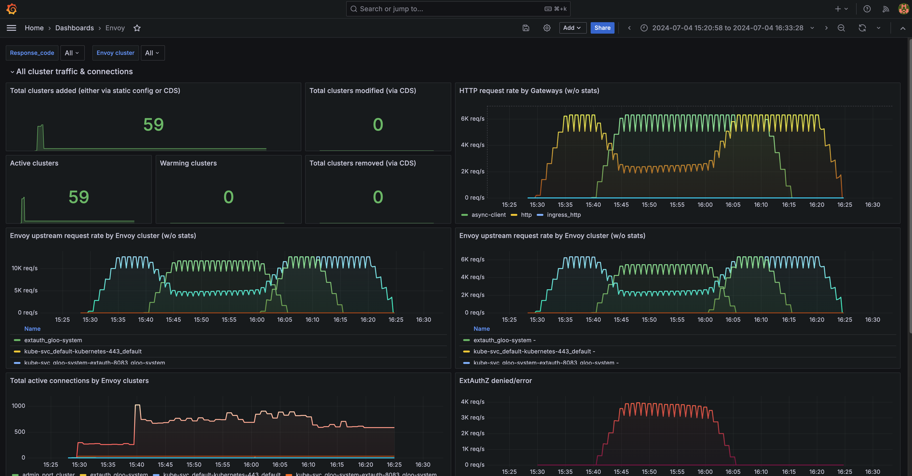

<!--bash
source ./scripts/assert.sh
-->


<center>
<svg id="gloo-product-logo" viewBox="250 150 2210 480" fill="none" xmlns="http://www.w3.org/2000/svg" alt="Gloo Gateway" style="max-height:100px">
    <style>#gloo-product-logo path{fill:#151927}@media(prefers-color-scheme:dark){#gloo-product-logo path{fill:white}}</style>
    <path fill-rule="evenodd" clip-rule="evenodd" d="M292.084 447.396C319.258 474.569 356.1 489.855 394.529 489.899C432.97 489.84 469.817 474.531 496.981 447.332C524.146 420.133 539.409 383.267 539.42 344.826V315.504H394.459V374.148H475.638C469.593 390.83 458.559 405.248 444.036 415.442C429.512 425.637 412.203 431.114 394.459 431.13C371.578 431.104 349.641 422.003 333.462 405.824C317.282 389.644 308.181 367.707 308.155 344.826C308.142 333.456 310.393 322.197 314.777 311.707C319.162 301.216 325.592 291.704 333.693 283.725C341.725 275.677 351.279 269.309 361.799 264.994C372.318 260.679 383.592 258.503 394.961 258.592C416.191 258.708 436.629 266.664 452.349 280.932L491.696 237.452C465.289 213.531 430.983 200.197 395.352 200.004C376.246 199.857 357.301 203.519 339.625 210.776C321.949 218.033 305.897 228.739 292.405 242.27C278.809 255.686 268.02 271.675 260.667 289.304C253.315 306.934 249.546 325.851 249.581 344.952C249.626 383.381 264.911 420.223 292.084 447.396ZM705.633 446.974C732.702 474.043 769.402 489.27 807.683 489.314C845.978 489.292 882.7 474.075 909.786 447.004C936.873 419.933 952.111 383.22 952.155 344.925C952.111 306.63 936.873 269.917 909.786 242.846C882.7 215.775 845.978 200.558 807.683 200.536C769.402 200.58 732.702 215.807 705.633 242.875C678.565 269.944 663.338 306.644 663.294 344.925C663.338 383.206 678.565 419.906 705.633 446.974ZM747.075 284.313C763.15 268.235 784.947 259.191 807.683 259.165V259.179C830.429 259.187 852.243 268.22 868.335 284.297C884.427 300.373 893.482 322.178 893.512 344.925C893.486 367.672 884.432 389.48 868.339 405.557C852.246 421.634 830.43 430.667 807.683 430.67C784.95 430.644 763.155 421.602 747.08 405.527C731.005 389.453 721.963 367.658 721.937 344.925C721.959 322.189 731 300.391 747.075 284.313ZM1015.93 446.979C1043 474.048 1079.7 489.273 1117.99 489.314C1156.27 489.27 1192.96 474.045 1220.03 446.979C1247.1 419.914 1262.33 383.217 1262.38 344.939C1262.34 306.656 1247.11 269.952 1220.04 242.88C1192.97 215.809 1156.27 200.58 1117.99 200.536C1079.7 200.576 1043 215.801 1015.93 242.87C988.858 269.939 973.629 306.642 973.585 344.925C973.629 383.208 988.858 419.91 1015.93 446.979ZM1057.38 284.312C1073.45 268.235 1095.25 259.191 1117.99 259.165V259.179C1140.72 259.205 1162.52 268.247 1178.59 284.322C1194.67 300.397 1203.71 322.192 1203.73 344.925C1203.71 367.658 1194.67 389.453 1178.59 405.527C1162.52 421.602 1140.72 430.644 1117.99 430.67C1095.25 430.648 1073.45 421.607 1057.38 405.532C1041.3 389.457 1032.25 367.66 1032.23 344.925C1032.25 322.188 1041.3 300.39 1057.38 284.312ZM679.891 472.692C663.068 455.941 649.72 436.031 640.615 414.106C631.509 392.181 626.826 368.673 626.833 344.933V206.283H568.734V344.933C568.713 376.299 574.89 407.36 586.909 436.332C598.928 465.304 616.553 491.616 638.771 513.757L679.891 472.692Z"/>
    <path d="M2409.07 355.935L2391.64 349.277L2436.1 275.844H2458.42L2409.07 355.935ZM2390.08 412.919V347.123H2409.46V412.919H2390.08ZM2390.47 355.935L2341.12 275.844H2363.25L2407.7 349.277L2390.47 355.935Z"/>
    <path d="M2320.99 412.919L2266.75 275.844H2286.33L2341.55 412.919H2320.99ZM2210.55 412.919L2265.77 275.844H2285.35L2231.11 412.919H2210.55ZM2236.59 376.3V359.068H2315.51V376.3H2236.59Z"/>
    <path d="M2134.61 412.919L2176.12 275.844H2195.51L2153.41 412.919H2134.61ZM2051.38 412.919L2009.87 275.844H2029.45L2070.18 412.919H2051.38ZM2053.54 412.919L2093.09 275.844H2111.31L2071.95 412.919H2053.54ZM2132.85 412.919L2094.27 275.844H2112.48L2151.84 412.919H2132.85Z"/>
    <path d="M1890.26 412.919V275.844H1972.7V293.468H1909.45V334.199H1966.43V351.431H1909.45V395.295H1973.09V412.919H1890.26Z"/>
    <path d="M1788.72 412.919V293.468H1745.83V275.844H1850.99V293.468H1808.1V412.919H1788.72Z"/>
    <path d="M1706.07 412.919L1651.83 275.844H1671.41L1726.63 412.919H1706.07ZM1595.62 412.919L1650.85 275.844H1670.43L1616.19 412.919H1595.62ZM1621.67 376.3V359.068H1700.58V376.3H1621.67Z"/>
    <path d="M1508.26 415.269C1494.42 415.269 1482.09 412.266 1471.25 406.261C1460.55 400.125 1452.13 391.77 1445.99 381.196C1439.99 370.491 1436.98 358.285 1436.98 344.577C1436.98 330.609 1439.99 318.338 1445.99 307.763C1452.13 297.058 1460.55 288.703 1471.25 282.698C1482.09 276.562 1494.42 273.495 1508.26 273.495C1515.83 273.495 1523.08 274.735 1530 277.215C1537.05 279.565 1543.38 282.894 1548.99 287.202C1554.74 291.38 1559.37 296.21 1562.9 301.693L1547.43 311.875C1544.82 307.828 1541.42 304.238 1537.24 301.105C1533.07 297.972 1528.43 295.557 1523.34 293.86C1518.38 292.032 1513.35 291.118 1508.26 291.118C1498.21 291.118 1489.27 293.403 1481.43 297.972C1473.73 302.541 1467.66 308.808 1463.22 316.771C1458.78 324.734 1456.57 334.003 1456.57 344.577C1456.57 354.891 1458.72 364.029 1463.03 371.992C1467.47 379.956 1473.6 386.222 1481.43 390.791C1489.4 395.36 1498.47 397.645 1508.65 397.645C1516.88 397.645 1524.19 395.948 1530.59 392.553C1537.11 389.159 1542.2 384.394 1545.86 378.259C1549.65 372.123 1551.54 365.008 1551.54 356.914L1570.14 355.152C1570.14 367.293 1567.47 377.867 1562.11 386.875C1556.89 395.882 1549.65 402.867 1540.38 407.827C1531.11 412.788 1520.4 415.269 1508.26 415.269ZM1518.25 358.089V342.032H1570.14V356.131L1560.35 358.089H1518.25Z"/>
    <path fill-rule="evenodd" clip-rule="evenodd" d="M1345.47 488.104L1345.47 201.133L1347.97 201.133L1347.97 488.104L1345.47 488.104Z"/>
</svg>
</center>

# <center>Gloo Gateway Workshop</center>


## Table of Contents
* [Introduction](#introduction)
* [Lab 1 - Deploy a KinD cluster](#lab-1---deploy-a-kind-cluster-)
* [Lab 2 - Deploy Istio in Ambient mode](#lab-2---deploy-istio-in-ambient-mode-)
* [Lab 3 - Deploy Gloo Gateway](#lab-3---deploy-gloo-gateway-)
* [Lab 4 - Deploy the httpbin demo app](#lab-4---deploy-the-httpbin-demo-app-)
* [Lab 5 - Expose the httpbin application through the gateway](#lab-5---expose-the-httpbin-application-through-the-gateway-)
* [Lab 6 - Delegate with control](#lab-6---delegate-with-control-)
* [Lab 7 - Modify the requests and responses](#lab-7---modify-the-requests-and-responses-)
* [Lab 8 - Split traffic between 2 backend services](#lab-8---split-traffic-between-2-backend-services-)
* [Lab 9 - Deploy Argo Rollouts](#lab-9---deploy-argo-rollouts-)
* [Lab 10 - Roll out a new app version using Argo Rollouts](#lab-10---roll-out-a-new-app-version-using-argo-rollouts-)
* [Lab 11 - Deploy OpenTelemetry Collector](#lab-11---deploy-opentelemetry-collector-)
* [Lab 12 - Deploy Kiali](#lab-12---deploy-kiali-)


## Introduction <a name="introduction"></a>

<a href="https://www.solo.io/products/gloo-gateway/">Gloo Gateway</a> is a feature-rich, fast, and flexible Kubernetes-native ingress controller and next-generation API gateway that is built on top of <a href="https://www.envoyproxy.io/">Envoy proxy</a> and the <a href="https://gateway-api.sigs.k8s.io/">Kubernetes Gateway API</a>).

Gloo Gateway is fully conformant with the Kubernetes Gateway API and extends its functionality with Solo’s custom Gateway APIs, such as `RouteOption`, `VirtualHostOption`, `Upstream`s, `RateLimitConfig`, or `AuthConfig`.
These resources help to centrally configure routing, security, and resiliency rules for a specific component, such as a host, route, or gateway listener.

These capabilities are grouped into two editions of Gloo Gateway:

### Open source (OSS) Gloo Gateway

Use Kubernetes Gateway API-native features and the following Gloo Gateway extensions to configure basic routing, security, and resiliency capabilities:

* Access logging
* Buffering
* Cross-Origin Resource Sharing (CORS)
* Cross-Site Request Forgery (CSRF)
* Fault injection
* Header control
* Retries
* Timeouts
* Traffic tapping
* Transformations

### Gloo Gateway Enterprise Edition

In addition to the features provided by the OSS edition, many more features are available in the Enterprise Edition, including:

* External authentication and authorization
* External processing
* Data loss prevention
* Developer portal
* JSON web token (JWT)
* Rate limiting
* Response caching
* Web Application Filters

### Want to learn more about Gloo Gateway?

In the labs that follow we present some of the common patterns that our customers use and provide a good entry point into the workings of Gloo Gateway.

You can find more information about Gloo Gateway in the official documentation: <https://docs.solo.io/gateway/>.


## Lab 1 - Deploy a KinD cluster <a name="lab-1---deploy-a-kind-cluster-"></a>


Clone this repository and go to the directory where this `README.md` file is.

Set the context environment variable:

```bash
export CLUSTER1=cluster1
```

Run the following commands to deploy a Kubernetes cluster using [Kind](https://kind.sigs.k8s.io/):

```bash
./scripts/deploy.sh 1 cluster1
```

Then run the following commands to wait for all the Pods to be ready:

```bash
./scripts/check.sh cluster1
```

**Note:** If you run the `check.sh` script immediately after the `deploy.sh` script, you may see a jsonpath error. If that happens, simply wait a few seconds and try again.

Once the `check.sh` script completes, when you execute the `kubectl get pods -A` command, you should see the following:

```,nocopy
NAMESPACE            NAME                                          READY   STATUS    RESTARTS   AGE
kube-system          calico-kube-controllers-59d85c5c84-sbk4k      1/1     Running   0          4h26m
kube-system          calico-node-przxs                             1/1     Running   0          4h26m
kube-system          coredns-6955765f44-ln8f5                      1/1     Running   0          4h26m
kube-system          coredns-6955765f44-s7xxx                      1/1     Running   0          4h26m
kube-system          etcd-cluster1-control-plane                   1/1     Running   0          4h27m
kube-system          kube-apiserver-cluster1-control-plane         1/1     Running   0          4h27m
kube-system          kube-controller-manager-cluster1-control-plane1/1     Running   0          4h27m
kube-system          kube-proxy-ksvzw                              1/1     Running   0          4h26m
kube-system          kube-scheduler-cluster1-control-plane         1/1     Running   0          4h27m
local-path-storage   local-path-provisioner-58f6947c7-lfmdx        1/1     Running   0          4h26m
metallb-system       controller-5c9894b5cd-cn9x2                   1/1     Running   0          4h26m
metallb-system       speaker-d7jkp                                 1/1     Running   0          4h26m
```
<!--bash
cat <<'EOF' > ./test.js
const helpers = require('./tests/chai-exec');

describe("Clusters are healthy", () => {
    const clusters = ["cluster1"];
    clusters.forEach(cluster => {
        it(`Cluster ${cluster} is healthy`, () => helpers.k8sObjectIsPresent({ context: cluster, namespace: "default", k8sType: "service", k8sObj: "kubernetes" }));
    });
});
EOF
echo "executing test dist/gloo-gateway-workshop/build/templates/steps/deploy-kind-cluster/tests/cluster-healthy.test.js.liquid"
timeout --signal=INT 3m mocha ./test.js --timeout 10000 --retries=120 --bail || { DEBUG_MODE=true mocha ./test.js --timeout 120000; exit 1; }
-->


## Lab 2 - Deploy Istio in Ambient mode <a name="lab-2---deploy-istio-in-ambient-mode-"></a>


Download the Istio release:

```bash
curl -L https://istio.io/downloadIstio | sh -

if [ -d "istio-"*/ ]; then
    cd istio-*/
    export PATH=$PWD/bin:$PATH
    cd ..
fi
```

Install Istio in Ambient mode:

```bash
helm upgrade --install istio-base \
  --repo https://istio-release.storage.googleapis.com/charts base \
  -n istio-system --create-namespace \
  --version 1.23.2 \
  --kube-context ${CLUSTER1} \
  --wait

helm upgrade --install istio-cni \
  --repo https://istio-release.storage.googleapis.com/charts cni \
  -n istio-system \
  --version 1.23.2 \
  --set profile=ambient \
  --kube-context ${CLUSTER1} \
  --wait

helm upgrade --install istiod \
  --repo https://istio-release.storage.googleapis.com/charts istiod \
  -n istio-system \
  --version 1.23.2 \
  --set profile=ambient \
  --kube-context ${CLUSTER1} \
  --wait

helm upgrade --install ztunnel \
  --repo https://istio-release.storage.googleapis.com/charts ztunnel \
  -n istio-system \
  --version 1.23.2 \
  --set profile=ambient \
  --set env.L7_ENABLED="true" \
  --kube-context ${CLUSTER1} \
  --wait
```

Run the following command to check the Istio Pods are running:

```bash
kubectl --context ${CLUSTER1} -n istio-system get pods
```

Here is the expected output:

```,nocopy
NAME                      READY   STATUS    RESTARTS   AGE
istio-cni-node-75ds2      1/1     Running   0          86s
istiod-7758df6879-pcvjt   1/1     Running   0          45s
ztunnel-zgf7b             1/1     Running   0          13s
```

<!--bash
cat <<'EOF' > ./test.js
const helpers = require('./tests/chai-exec');

describe("Istio", () => {
  let cluster = process.env.CLUSTER1
  let deployments = ["istiod"];
  deployments.forEach(deploy => {
    it(deploy + ' pods are ready in ' + cluster, () => helpers.checkDeployment({ context: cluster, namespace: "istio-system", k8sObj: deploy }));
  });
  let DaemonSets = ["istio-cni-node", "ztunnel"];
  DaemonSets.forEach(DaemonSet => {
    it(DaemonSet + ' pods are ready in ' + cluster, () => helpers.checkDaemonSet({ context: cluster, namespace: "istio-system", k8sObj: DaemonSet }));
  });
});
EOF
echo "executing test dist/gloo-gateway-workshop/build/templates/steps/deploy-istio-ambient/tests/check-istio.test.js.liquid"
timeout --signal=INT 3m mocha ./test.js --timeout 10000 --retries=120 --bail || { DEBUG_MODE=true mocha ./test.js --timeout 120000; exit 1; }
-->


## Lab 3 - Deploy Gloo Gateway <a name="lab-3---deploy-gloo-gateway-"></a>

You can deploy Gloo Gateway with the `glooctl` CLI or declaratively using Helm.

We're going to use the Helm option.

Install the Kubernetes Gateway API CRDs as they do not come installed by default on most Kubernetes clusters.

```bash
kubectl --context $CLUSTER1 apply -f https://github.com/kubernetes-sigs/gateway-api/releases/download/v1.1.0/standard-install.yaml
```

Next, install Gloo Gateway. This command installs the Gloo Gateway control plane into the namespace `gloo-system`.

```bash
helm repo add solo-public-helm https://storage.googleapis.com/solo-public-helm

helm repo update

helm upgrade -i -n gloo-system \
  gloo-gateway solo-public-helm/gloo \
  --create-namespace \
  --version 1.17.16 \
  --kube-context $CLUSTER1 \
  -f -<<EOF
kubeGateway:
  enabled: true
gatewayProxies:
  gatewayProxy:
    disabled: true
gateway:
    validation:
      allowWarnings: true
      alwaysAcceptResources: false
gloo:
  deployment:
    livenessProbeEnabled: true
discovery:
  enabled: false
rbac:
  namespaced: true
  nameSuffix: gg-demo
EOF
```

Run the following command to check that the Gloo Gateway pods are running:

<!--bash
echo -n Waiting for Gloo Gateway pods to be ready...
kubectl --context $CLUSTER1 -n gloo-system rollout status deployment
-->
```bash
kubectl --context $CLUSTER1 -n gloo-system get pods
```

Here is the expected output:

```,nocopy
NAME                                READY   STATUS      RESTARTS   AGE
gateway-certgen-h5z9t               0/1     Completed   0          52s
gateway-proxy-7474c7bf9b-dsvtz      3/3     Running     0          47s
gloo-6b5575f9fc-8f2zs               1/1     Running     0          47s
gloo-resource-rollout-check-4bt5g   0/1     Completed   0          47s
gloo-resource-rollout-h5jf4         0/1     Completed   0          47s
```

<!--bash
cat <<'EOF' > ./test.js
const helpers = require('./tests/chai-exec');

describe("Gloo Gateway", () => {
  let cluster = process.env.CLUSTER1
  let deployments = ["gloo"];
  deployments.forEach(deploy => {
    it(deploy + ' pods are ready in ' + cluster, () => helpers.checkDeployment({ context: cluster, namespace: "gloo-system", k8sObj: deploy }));
  });
});
EOF
echo "executing test dist/gloo-gateway-workshop/build/templates/steps/deploy-gloo-gateway/tests/check-gloo.test.js.liquid"
timeout --signal=INT 3m mocha ./test.js --timeout 10000 --retries=120 --bail || { DEBUG_MODE=true mocha ./test.js --timeout 120000; exit 1; }
-->


## Lab 4 - Deploy the httpbin demo app <a name="lab-4---deploy-the-httpbin-demo-app-"></a>

We're going to deploy the httpbin application to demonstrate several features of Gloo Gateway.

You can find more information about this application [here](http://httpbin.org/).

Run the following commands to deploy the httpbin app twice (`httpbin1` and `httpbin2`).

```bash
kubectl --context ${CLUSTER1} create ns httpbin
kubectl apply --context ${CLUSTER1} -f - <<EOF
apiVersion: v1
kind: ServiceAccount
metadata:
  name: httpbin1
  namespace: httpbin
---
apiVersion: v1
kind: Service
metadata:
  name: httpbin1
  namespace: httpbin
  labels:
    app: httpbin1
    service: httpbin1
spec:
  ports:
  - name: http
    port: 8000
    targetPort: http
    protocol: TCP
    appProtocol: http
  selector:
    app: httpbin1
---
apiVersion: apps/v1
kind: Deployment
metadata:
  name: httpbin1
  namespace: httpbin
spec:
  replicas: 1
  selector:
    matchLabels:
      app: httpbin1
      version: v1
  template:
    metadata:
      labels:
        app: httpbin1
        version: v1
    spec:
      serviceAccountName: httpbin1
      containers:
      - name: httpbin
        image: mccutchen/go-httpbin:v2.14.0
        command: [ go-httpbin ]
        args:
          - "-max-duration"
          - "600s" # override default 10s
          - -use-real-hostname
        ports:
          - name: http
            containerPort: 8080
            protocol: TCP
        livenessProbe:
          httpGet:
            path: /status/200
            port: http
        readinessProbe:
          httpGet:
            path: /status/200
            port: http
        resources:
          limits:
            cpu: 1
            memory: 512Mi
          requests:
            cpu: 100m
            memory: 256Mi
        env:
        - name: K8S_MEM_LIMIT
          valueFrom:
            resourceFieldRef:
              divisor: "1"
              resource: limits.memory
        - name: GOMAXPROCS
          valueFrom:
            resourceFieldRef:
              divisor: "1"
              resource: limits.cpu
EOF

kubectl apply --context ${CLUSTER1} -f - <<EOF
apiVersion: v1
kind: ServiceAccount
metadata:
  name: httpbin2
  namespace: httpbin
---
apiVersion: v1
kind: Service
metadata:
  name: httpbin2
  namespace: httpbin
  labels:
    app: httpbin2
    service: httpbin2
spec:
  ports:
  - name: http
    port: 8000
    targetPort: http
    protocol: TCP
    appProtocol: http
  selector:
    app: httpbin2
---
apiVersion: apps/v1
kind: Deployment
metadata:
  name: httpbin2
  namespace: httpbin
spec:
  replicas: 1
  selector:
    matchLabels:
      app: httpbin2
      version: v1
  template:
    metadata:
      labels:
        app: httpbin2
        version: v1
    spec:
      serviceAccountName: httpbin2
      containers:
      - name: httpbin
        image: mccutchen/go-httpbin:v2.14.0
        command: [ go-httpbin ]
        args:
          - "-max-duration"
          - "600s" # override default 10s
          - -use-real-hostname
        ports:
          - name: http
            containerPort: 8080
            protocol: TCP
        livenessProbe:
          httpGet:
            path: /status/200
            port: http
        readinessProbe:
          httpGet:
            path: /status/200
            port: http
        resources:
          limits:
            cpu: 1
            memory: 512Mi
          requests:
            cpu: 100m
            memory: 256Mi
        env:
        - name: K8S_MEM_LIMIT
          valueFrom:
            resourceFieldRef:
              divisor: "1"
              resource: limits.memory
        - name: GOMAXPROCS
          valueFrom:
            resourceFieldRef:
              divisor: "1"
              resource: limits.cpu
EOF
```

You can follow the progress using the following command:

<!--bash
echo -n Waiting for httpbin pods to be ready...
kubectl --context ${CLUSTER1} -n httpbin rollout status deployment
-->
```shell
kubectl --context ${CLUSTER1} -n httpbin get pods
```

Here is the expected output when both Pods are ready:

```,nocopy
NAME                        READY   STATUS    RESTARTS   AGE
httpbin1-7fdbf6498-ms7qt    1/1     Running   0          94s
httpbin2-655777b846-6nrms   1/1     Running   0          93s
```

<!--bash
cat <<'EOF' > ./test.js
const helpers = require('./tests/chai-exec');

describe("httpbin app", () => {
  let cluster = process.env.CLUSTER1
  let deployments = ["httpbin1", "httpbin2"];
  deployments.forEach(deploy => {
    it(deploy + ' pods are ready in ' + cluster, () => helpers.checkDeployment({ context: cluster, namespace: "httpbin", k8sObj: deploy }));
  });
});
EOF
echo "executing test dist/gloo-gateway-workshop/build/templates/steps/apps/httpbin/deploy-httpbin/tests/check-httpbin.test.js.liquid"
timeout --signal=INT 3m mocha ./test.js --timeout 10000 --retries=120 --bail || { DEBUG_MODE=true mocha ./test.js --timeout 120000; exit 1; }
-->


## Lab 5 - Expose the httpbin application through the gateway <a name="lab-5---expose-the-httpbin-application-through-the-gateway-"></a>


The team in charge of the gateway can create a `Gateway` resource and configure an HTTP listener.


```bash
kubectl apply --context ${CLUSTER1} -f - <<EOF
kind: Gateway
apiVersion: gateway.networking.k8s.io/v1
metadata:
  name: http
  namespace: gloo-system
spec:
  gatewayClassName: gloo-gateway
  listeners:
  - protocol: HTTP
    port: 80
    name: http
    allowedRoutes:
      namespaces:
        from: All
EOF
```

Note that application teams can create and attach their `HTTPRoute` to this gateway.

An application team can create an `HTTPRoute` resource to expose the `httpbin` app on the gateway.

```bash
kubectl apply --context ${CLUSTER1} -f - <<EOF
apiVersion: gateway.networking.k8s.io/v1
kind: HTTPRoute
metadata:
  name: httpbin
  namespace: httpbin
spec:
  parentRefs:
    - name: http
      namespace: gloo-system
      sectionName: http
  hostnames:
    - "httpbin.example.com"
  rules:
    - backendRefs:
        - name: httpbin1
          port: 8000
EOF
```

Set the environment variable for the service corresponding to the gateway:

```bash
export PROXY_IP=$(kubectl --context ${CLUSTER1} -n gloo-system get svc gloo-proxy-http -o jsonpath='{.status.loadBalancer.ingress[0].*}')
```

<!--bash
RETRY_COUNT=0
MAX_RETRIES=60
while [[ -z "$PROXY_IP" && $RETRY_COUNT -lt $MAX_RETRIES ]]; do
  echo "Waiting for PROXY_IP to be assigned... Attempt $((RETRY_COUNT + 1))/$MAX_RETRIES"
  PROXY_IP=$(kubectl --context ${CLUSTER1} -n gloo-system get svc gloo-proxy-http -o jsonpath='{.status.loadBalancer.ingress[0].*}')
  RETRY_COUNT=$((RETRY_COUNT + 1))
  sleep 5
done

# if PROXY_IP is a hostname, resolve it to an IP address
if [[ -n "$PROXY_IP" && $PROXY_IP =~ [a-zA-Z] ]]; then
  while [[ -z "$IP" && $RETRY_COUNT -lt $MAX_RETRIES ]]; do
    echo "Waiting for PROXY_IP to be propagated in DNS... Attempt $((RETRY_COUNT + 1))/$MAX_RETRIES"
    IP=$(dig +short A "$PROXY_IP" | awk '/^[0-9]+\.[0-9]+\.[0-9]+\.[0-9]+$/ {print; exit}')
    RETRY_COUNT=$((RETRY_COUNT + 1))
    sleep 5
  done
else
  IP="$PROXY_IP"
fi

if [[ -z "$PROXY_IP" ]]; then
  echo "WARNING: Maximum number of retries reached. PROXY_IP could not be assigned."
else
  export PROXY_IP
  export IP
  echo "PROXY_IP has been assigned: $PROXY_IP"
  echo "IP has been resolved to: $IP"
fi
-->

Configure your hosts file to resolve httpbin.example.com with the IP address of the proxy by executing the following command:

```bash
./scripts/register-domain.sh httpbin.example.com ${PROXY_IP}
```

Try to access the application through HTTP:

```shell
curl http://httpbin.example.com/get
```

Here is the expected output:

```json,nocopy
{
  "args": {},
  "headers": {
    "Accept": [
      "*/*"
    ],
    "Host": [
      "httpbin.example.com"
    ],
    "User-Agent": [
      "curl/8.5.0"
    ],
    "X-Forwarded-Proto": [
      "http"
    ],
    "X-Request-Id": [
      "d0998a48-7532-4eeb-ab69-23cef22185cf"
    ]
  },
  "method": "GET",
  "origin": "127.0.0.6:38917",
  "url": "http://httpbin.example.com/get"
}
```

<!--bash
cat <<'EOF' > ./test.js
const helpersHttp = require('./tests/chai-http');

describe("httpbin through HTTP", () => {
  it('Checking text \'headers\'', () => helpersHttp.checkBody({ host: `http://httpbin.example.com`, path: '/get', body: 'headers', match: true }));
})
EOF
echo "executing test dist/gloo-gateway-workshop/build/templates/steps/apps/httpbin/expose-httpbin/tests/http.test.js.liquid"
timeout --signal=INT 3m mocha ./test.js --timeout 10000 --retries=120 --bail || { DEBUG_MODE=true mocha ./test.js --timeout 120000; exit 1; }
-->

Now, let's secure the access through TLS.
Let's first create a private key and a self-signed certificate:

```bash
openssl req -x509 -nodes -days 365 -newkey rsa:2048 \
   -keyout tls.key -out tls.crt -subj "/CN=*"
```

Then, you have to store it in a Kubernetes secret running the following command:

```bash
kubectl create --context ${CLUSTER1} -n gloo-system secret tls tls-secret --key tls.key \
   --cert tls.crt
```

Update the `Gateway` resource to add HTTPS listeners.

```bash
kubectl apply --context ${CLUSTER1} -f - <<EOF
kind: Gateway
apiVersion: gateway.networking.k8s.io/v1
metadata:
  name: http
  namespace: gloo-system
spec:
  gatewayClassName: gloo-gateway
  listeners:
  - protocol: HTTPS
    port: 443
    name: https-httpbin
    hostname: httpbin.example.com
    tls:
      mode: Terminate
      certificateRefs:
        - name: tls-secret
          kind: Secret
    allowedRoutes:
      namespaces:
        from: All
  - protocol: HTTPS
    port: 443
    name: https
    tls:
      mode: Terminate
      certificateRefs:
        - name: tls-secret
          kind: Secret
    allowedRoutes:
      namespaces:
        from: All
  - protocol: HTTP
    port: 80
    name: http
    allowedRoutes:
      namespaces:
        from: All
EOF
```

As you can see, we've added 2 new listeners. One for the `httpbin.example.com` hostname and one for all the other hostnames.

We used the same secret to keep things simple, but the goal is to demonstrate we can have different HTTPS listeners.

Update the `HTTPRoute` resource to expose the `httpbin` app through HTTPS.

```bash
kubectl apply --context ${CLUSTER1} -f - <<EOF
apiVersion: gateway.networking.k8s.io/v1
kind: HTTPRoute
metadata:
  name: httpbin
  namespace: httpbin
spec:
  parentRefs:
    - name: http
      namespace: gloo-system
      sectionName: https-httpbin
  hostnames:
    - "httpbin.example.com"
  rules:
    - backendRefs:
        - name: httpbin1
          port: 8000
EOF
```

Try to access the application through HTTPS:

<!--bash
echo -n Wait for up to 2 minutes until the url is ready...
RETRY_COUNT=0
MAX_RETRIES=30
while [[ $RETRY_COUNT -lt $MAX_RETRIES ]]; do
  echo "Attempt $((RETRY_COUNT + 1))/$MAX_RETRIES"
  ret=`curl -k -s -o /dev/null -w %{http_code} https://httpbin.example.com/get`
  if [ "$ret" -eq "200" ]; then
    break
  else
    echo "Response was: $ret"
    echo "Retrying in 4 seconds..."
  fi
  RETRY_COUNT=$((RETRY_COUNT + 1))
  sleep 4
done
-->

```shell
curl -k https://httpbin.example.com/get
```

Here is the expected output:

```json,nocopy
{
  "args": {},
  "headers": {
    "Accept": [
      "*/*"
    ],
    "Host": [
      "httpbin.example.com"
    ],
    "User-Agent": [
      "curl/8.5.0"
    ],
    "X-Forwarded-Proto": [
      "https"
    ],
    "X-Request-Id": [
      "8e61c480-6373-4c38-824b-2bfe89e79d0c"
    ]
  },
  "method": "GET",
  "origin": "127.0.0.6:52655",
  "url": "https://httpbin.example.com/get"
}
```

<!--bash
cat <<'EOF' > ./test.js
const helpersHttp = require('./tests/chai-http');

describe("httpbin through HTTPS", () => {
  it('Checking text \'headers\'', () => helpersHttp.checkBody({ host: `https://httpbin.example.com`, path: '/get', body: 'headers', match: true }));
})
EOF
echo "executing test dist/gloo-gateway-workshop/build/templates/steps/apps/httpbin/expose-httpbin/tests/https.test.js.liquid"
timeout --signal=INT 3m mocha ./test.js --timeout 10000 --retries=120 --bail || { DEBUG_MODE=true mocha ./test.js --timeout 120000; exit 1; }
-->

The team in charge of the gateway can create an `HTTPRoute` to automatically redirect HTTP to HTTPS:

```bash
kubectl apply --context ${CLUSTER1} -f - <<EOF
apiVersion: gateway.networking.k8s.io/v1
kind: HTTPRoute
metadata:
  name: redirect-http-to-https
  namespace: gloo-system
spec:
  parentRefs:
    - name: http
      namespace: gloo-system
      sectionName: http
  hostnames:
    - "httpbin.example.com"
  rules:
    - filters:
      - type: RequestRedirect
        requestRedirect:
          scheme: https
EOF
```

Try to access the application through HTTP:

```shell
curl -k http://httpbin.example.com/get -L
```

The `-L` option instructs curl to follow the redirect. Without it, you would get a `302` response with the `location` header set to the HTTPS url.

Here is the expected output:

```json,nocopy
{
  "args": {},
  "headers": {
    "Accept": [
      "*/*"
    ],
    "Host": [
      "httpbin.example.com"
    ],
    "User-Agent": [
      "curl/8.5.0"
    ],
    "X-Forwarded-Proto": [
      "https"
    ],
    "X-Request-Id": [
      "2c7454cb-c2f8-428c-9c3b-f51822475327"
    ]
  },
  "method": "GET",
  "origin": "127.0.0.6:52655",
  "url": "https://httpbin.example.com/get"
}
```

<!--bash
cat <<'EOF' > ./test.js
const helpersHttp = require('./tests/chai-http');

describe("location header correctly set", () => {
  it('Checking text \'location\'', () => helpersHttp.checkHeaders({ host: `http://httpbin.example.com`, path: '/get', expectedHeaders: [{'key': 'location', 'value': `https://httpbin.example.com/get`}]}));
})
EOF
echo "executing test dist/gloo-gateway-workshop/build/templates/steps/apps/httpbin/expose-httpbin/tests/redirect-http-to-https.test.js.liquid"
timeout --signal=INT 3m mocha ./test.js --timeout 10000 --retries=120 --bail || { DEBUG_MODE=true mocha ./test.js --timeout 120000; exit 1; }
-->


## Lab 6 - Delegate with control <a name="lab-6---delegate-with-control-"></a>

The team in charge of the gateway can create a parent `HTTPRoute` to delegate the routing of a domain or a path prefix (for example) to an application team.

```bash
kubectl apply --context ${CLUSTER1} -f - <<EOF
apiVersion: gateway.networking.k8s.io/v1
kind: HTTPRoute
metadata:
  name: httpbin
  namespace: gloo-system
spec:
  parentRefs:
    - name: http
      namespace: gloo-system
      sectionName: https-httpbin
  hostnames:
    - "httpbin.example.com"
  rules:
    - matches:
      - path:
          type: PathPrefix
          value: /
      backendRefs:
        - name: '*'
          namespace: httpbin
          group: gateway.networking.k8s.io
          kind: HTTPRoute
EOF
```

The team in charge of the httpbin application can now create a child `HTTPRoute`:

```bash
kubectl apply --context ${CLUSTER1} -f - <<EOF
apiVersion: gateway.networking.k8s.io/v1
kind: HTTPRoute
metadata:
  name: httpbin
  namespace: httpbin
spec:
  rules:
    - matches:
      - path:
          type: PathPrefix
          value: /
      backendRefs:
        - name: httpbin1
          port: 8000
EOF
```

Check you can still access the application through HTTPS:

```shell
curl -k https://httpbin.example.com/get
```

Here is the expected output:

```json,nocopy
{
  "args": {},
  "headers": {
    "Accept": [
      "*/*"
    ],
    "Host": [
      "httpbin.example.com"
    ],
    "User-Agent": [
      "curl/8.5.0"
    ],
    "X-Forwarded-Proto": [
      "https"
    ],
    "X-Request-Id": [
      "11037632-92c8-43c7-b919-7d7c7217c564"
    ]
  },
  "method": "GET",
  "origin": "127.0.0.6:51121",
  "url": "https://httpbin.example.com/get"
}
```

<!--bash
cat <<'EOF' > ./test.js
const helpersHttp = require('./tests/chai-http');

describe("httpbin through HTTPS", () => {
  it('Checking text \'headers\'', () => helpersHttp.checkBody({ host: `https://httpbin.example.com`, path: '/get', body: 'headers', match: true }));
})
EOF
echo "executing test dist/gloo-gateway-workshop/build/templates/steps/apps/httpbin/delegation/tests/https.test.js.liquid"
timeout --signal=INT 3m mocha ./test.js --timeout 10000 --retries=120 --bail || { DEBUG_MODE=true mocha ./test.js --timeout 120000; exit 1; }
-->

In the previous example, we've used a simple `/` prefix matcher for both the parent and the child `HTTPRoute`.

But we'll often use the delegation capability to delegate a specific path to an application team.

For example, let's say the team in charge of the gateway wants to delegate the `/status` prefix to the team in charge of the httpbin application.

Let's update the parent `HTTPRoute`:

```bash
kubectl apply --context ${CLUSTER1} -f - <<EOF
apiVersion: gateway.networking.k8s.io/v1
kind: HTTPRoute
metadata:
  name: httpbin
  namespace: gloo-system
spec:
  parentRefs:
    - name: http
      namespace: gloo-system
      sectionName: https-httpbin
  hostnames:
    - "httpbin.example.com"
  rules:
    - matches:
      - path:
          type: PathPrefix
          value: /status
      backendRefs:
        - name: '*'
          namespace: httpbin
          group: gateway.networking.k8s.io
          kind: HTTPRoute
EOF
```

Now, we can update the child `HTTPRoute` to match requests with the `/status/200` path:

```bash
kubectl apply --context ${CLUSTER1} -f - <<EOF
apiVersion: gateway.networking.k8s.io/v1
kind: HTTPRoute
metadata:
  name: httpbin
  namespace: httpbin
spec:
  rules:
    - matches:
      - path:
          type: Exact
          value: /status/200
      backendRefs:
        - name: httpbin1
          port: 8000
EOF
```

Check you can access the `/status/200` path:

```shell
curl -k https://httpbin.example.com/status/200 -w "%{http_code}"
```

Here is the expected output:

```,nocopy
200
```

<!--bash
cat <<'EOF' > ./test.js
const helpersHttp = require('./tests/chai-http');

describe("httpbin through HTTPS", () => {
  it('Checking \'200\' status code', () => helpersHttp.checkURL({ host: `https://httpbin.example.com`, path: '/status/200', retCode: 200 }));
})
EOF
echo "executing test dist/gloo-gateway-workshop/build/templates/steps/apps/httpbin/delegation/tests/status-200.test.js.liquid"
timeout --signal=INT 3m mocha ./test.js --timeout 10000 --retries=120 --bail || { DEBUG_MODE=true mocha ./test.js --timeout 120000; exit 1; }
-->

In the child `HTTPRoute` we've indicated the absolute path (which includes the parent path), but instead we can inherite the parent matcher and use a relative path:

```bash
kubectl apply --context ${CLUSTER1} -f - <<EOF
apiVersion: gateway.networking.k8s.io/v1
kind: HTTPRoute
metadata:
  name: httpbin
  namespace: httpbin
  annotations:
    delegation.gateway.solo.io/inherit-parent-matcher: "true"
spec:
  rules:
    - matches:
      - path:
          type: Exact
          value: /200
      backendRefs:
        - name: httpbin1
          port: 8000
EOF
```

Check you can still access the `/status/200` path:

```shell
curl -k https://httpbin.example.com/status/200 -w "%{http_code}"
```

Here is the expected output:

```,nocopy
200
```

<!--bash
cat <<'EOF' > ./test.js
const helpersHttp = require('./tests/chai-http');

describe("httpbin through HTTPS", () => {
  it('Checking \'200\' status code', () => helpersHttp.checkURL({ host: `https://httpbin.example.com`, path: '/status/200', retCode: 200 }));
})
EOF
echo "executing test dist/gloo-gateway-workshop/build/templates/steps/apps/httpbin/delegation/tests/status-200.test.js.liquid"
timeout --signal=INT 3m mocha ./test.js --timeout 10000 --retries=120 --bail || { DEBUG_MODE=true mocha ./test.js --timeout 120000; exit 1; }
-->

The team in charge of the httpbin application can also take advantage of the `parentRefs` option to indicate which parent `HTTPRoute` can delegate to its own `HTTPRoute`.

That's why you don't need to use `ReferenceGrant` objects when using delegation.

```bash
kubectl apply --context ${CLUSTER1} -f - <<EOF
apiVersion: gateway.networking.k8s.io/v1
kind: HTTPRoute
metadata:
  name: httpbin
  namespace: httpbin
  annotations:
    delegation.gateway.solo.io/inherit-parent-matcher: "true"
spec:
  parentRefs:
    - name: httpbin
      namespace: gloo-system
      group: gateway.networking.k8s.io
      kind: HTTPRoute
  rules:
    - matches:
      - path:
          type: Exact
          value: /200
      backendRefs:
        - name: httpbin1
          port: 8000
EOF
```

Check you can still access the `/status/200` path:

```shell
curl -k https://httpbin.example.com/status/200 -w "%{http_code}"
```

Here is the expected output:

```,nocopy
200
```

<!--bash
cat <<'EOF' > ./test.js
const helpersHttp = require('./tests/chai-http');

describe("httpbin through HTTPS", () => {
  it('Checking \'200\' status code', () => helpersHttp.checkURL({ host: `https://httpbin.example.com`, path: '/status/200', retCode: 200 }));
})
EOF
echo "executing test dist/gloo-gateway-workshop/build/templates/steps/apps/httpbin/delegation/tests/status-200.test.js.liquid"
timeout --signal=INT 3m mocha ./test.js --timeout 10000 --retries=120 --bail || { DEBUG_MODE=true mocha ./test.js --timeout 120000; exit 1; }
-->

Delegation offers another very nice feature. It automatically reorders all the matchers to avoid any short-circuiting.

Let's add a second child `HTTPRoute` which is matching for any request starting with the path `/status`, but sends the requests to the second httpbin service.

```bash
kubectl apply --context ${CLUSTER1} -f - <<EOF
apiVersion: gateway.networking.k8s.io/v1
kind: HTTPRoute
metadata:
  name: httpbin-status
  namespace: httpbin
spec:
  rules:
    - matches:
      - path:
          type: PathPrefix
          value: /status
      backendRefs:
        - name: httpbin2
          port: 8000
EOF
```

If the matcher for `/status` is positioned before the matcher for `/status/200`, the latter would be ignored. So, all the requests would be sent to the second httpbin service.

Check you can still access the `/status/200` path:

```shell
curl -k https://httpbin.example.com/status/200 -w "%{http_code}"
```

Here is the expected output:

```,nocopy
200
```

You can use the following command to validate the request has still been handled by the first httpbin application.

```bash
kubectl logs --context ${CLUSTER1} -n httpbin -l app=httpbin1 | grep curl | grep 200
```

You should get an output similar to:

```log,nocopy
time="2024-07-22T16:02:51.9508" status=200 method="GET" uri="/status/200" size_bytes=0 duration_ms=0.03 user_agent="curl/7.81.0" client_ip=10.101.0.13:58114
```

<!--bash
cat <<'EOF' > ./test.js
const helpersHttp = require('./tests/chai-http');

describe("httpbin through HTTPS", () => {
  it('Checking \'200\' status code', () => helpersHttp.checkURL({ host: `https://httpbin.example.com`, path: '/status/200', retCode: 200 }));
})
EOF
echo "executing test dist/gloo-gateway-workshop/build/templates/steps/apps/httpbin/delegation/tests/status-200.test.js.liquid"
timeout --signal=INT 3m mocha ./test.js --timeout 10000 --retries=120 --bail || { DEBUG_MODE=true mocha ./test.js --timeout 120000; exit 1; }
-->

Check you can now also access the status `/status/201` path:

```shell
curl -k https://httpbin.example.com/status/201 -w "%{http_code}"
```

Here is the expected output:

```,nocopy
201
```

You can use the following command to validate this request has been handled by the second httpbin application.

```bash
kubectl logs --context ${CLUSTER1} -n httpbin -l app=httpbin2 | grep curl | grep 201
```

You should get an output similar to:

```log,nocopy
time="2024-07-22T16:04:53.3189" status=201 method="GET" uri="/status/201" size_bytes=0 duration_ms=0.02 user_agent="curl/7.81.0" client_ip=10.101.0.13:52424
```

<!--bash
cat <<'EOF' > ./test.js
const helpersHttp = require('./tests/chai-http');

describe("httpbin through HTTPS", () => {
  it('Checking \'201\' status code', () => helpersHttp.checkURL({ host: `https://httpbin.example.com`, path: '/status/201', retCode: 201 }));
})
EOF
echo "executing test dist/gloo-gateway-workshop/build/templates/steps/apps/httpbin/delegation/tests/status-201.test.js.liquid"
timeout --signal=INT 3m mocha ./test.js --timeout 10000 --retries=120 --bail || { DEBUG_MODE=true mocha ./test.js --timeout 120000; exit 1; }
-->

Let's delete the latest `HTTPRoute` and apply the original ones:

```bash
kubectl delete --context ${CLUSTER1} -n httpbin httproute httpbin-status

kubectl apply --context ${CLUSTER1} -f - <<EOF
apiVersion: gateway.networking.k8s.io/v1
kind: HTTPRoute
metadata:
  name: httpbin
  namespace: gloo-system
spec:
  parentRefs:
    - name: http
      namespace: gloo-system
      sectionName: https-httpbin
  hostnames:
    - "httpbin.example.com"
  rules:
    - matches:
      - path:
          type: PathPrefix
          value: /
      backendRefs:
        - name: '*'
          namespace: httpbin
          group: gateway.networking.k8s.io
          kind: HTTPRoute
EOF

kubectl apply --context ${CLUSTER1} -f - <<EOF
apiVersion: gateway.networking.k8s.io/v1
kind: HTTPRoute
metadata:
  name: httpbin
  namespace: httpbin
spec:
  rules:
    - matches:
      - path:
          type: PathPrefix
          value: /
      backendRefs:
        - name: httpbin1
          port: 8000
EOF
```

<!--bash
cat <<'EOF' > ./test.js
const helpersHttp = require('./tests/chai-http');

describe("httpbin through HTTPS", () => {
  it('Checking text \'headers\'', () => helpersHttp.checkBody({ host: `https://httpbin.example.com`, path: '/get', body: 'headers', match: true }));
})
EOF
echo "executing test dist/gloo-gateway-workshop/build/templates/steps/apps/httpbin/delegation/tests/https.test.js.liquid"
timeout --signal=INT 3m mocha ./test.js --timeout 10000 --retries=120 --bail || { DEBUG_MODE=true mocha ./test.js --timeout 120000; exit 1; }
-->


## Lab 7 - Modify the requests and responses <a name="lab-7---modify-the-requests-and-responses-"></a>

The Kubernetes Gateway API provides different options to add/update/remove request and response headers.

Let's start with request headers.

Update the `HTTPRoute` resource to do the following:
- add a new header `Foo` with the value `bar`
- update the value of the header `User-Agent` to `custom`
- remove the `To-Remove` header

```bash
kubectl apply --context ${CLUSTER1} -f - <<EOF
apiVersion: gateway.networking.k8s.io/v1
kind: HTTPRoute
metadata:
  name: httpbin
  namespace: httpbin
spec:
  rules:
    - matches:
      - path:
          type: PathPrefix
          value: /
      backendRefs:
        - name: httpbin1
          port: 8000
      filters:
        - type: RequestHeaderModifier
          requestHeaderModifier:
            add:
              - name: Foo
                value: bar
            set:
              - name: User-Agent
                value: custom
            remove:
              - To-Remove
EOF
```

Try to access the application (with the `To-Remove` request header added):

```shell
curl -k https://httpbin.example.com/get -H 'To-Remove: whatever'
```

Here is the expected output:

```json,nocopy
{
  "args": {},
  "headers": {
    "Accept": [
      "*/*"
    ],
    "Foo": [
      "bar"
    ],
    "Host": [
      "httpbin.example.com"
    ],
    "User-Agent": [
      "custom"
    ],
    "X-Forwarded-Proto": [
      "https"
    ],
    "X-Request-Id": [
      "8595e525-4484-4aaa-8f56-97a96163c333"
    ]
  },
  "method": "GET",
  "origin": "127.0.0.6:48727",
  "url": "https://httpbin.example.com/get"
}
```

The transformations have been applied as expected.

<!--bash
cat <<'EOF' > ./test.js
const helpersHttp = require('./tests/chai-http');

describe("request transformations applied", () => {
  it('Checking text \'bar\'', () => helpersHttp.checkBody({ host: `https://httpbin.example.com`, path: '/get', body: 'bar', match: true }));
  it('Checking text \'custom\'', () => helpersHttp.checkBody({ host: `https://httpbin.example.com`, path: '/get', body: 'custom', match: true }));
  it('Checking text \'To-Remove\'', () => helpersHttp.checkBody({ host: `https://httpbin.example.com`, path: '/get', body: 'To-Remove', match: false }));
})
EOF
echo "executing test dist/gloo-gateway-workshop/build/templates/steps/apps/httpbin/transformations/tests/request-headers.test.js.liquid"
timeout --signal=INT 3m mocha ./test.js --timeout 10000 --retries=120 --bail || { DEBUG_MODE=true mocha ./test.js --timeout 120000; exit 1; }
-->

Another typical use case is to rewrite the hostname or the path before sending the request to the backend.

Update the `HTTPRoute` resource to do the following:
- rewrite the hostname to `httpbin1.com`
- rewrite the path to `/get`

```bash
kubectl apply --context ${CLUSTER1} -f - <<EOF
apiVersion: gateway.networking.k8s.io/v1
kind: HTTPRoute
metadata:
  name: httpbin
  namespace: httpbin
spec:
  rules:
    - matches:
      - path:
          type: PathPrefix
          value: /publicget
      backendRefs:
        - name: httpbin1
          port: 8000
      filters:
        - type: URLRewrite
          urlRewrite:
            hostname: httpbin1.com
            path:
              type: ReplacePrefixMatch
              replacePrefixMatch: /get
EOF
```

Try to access the application:

```shell
curl -k https://httpbin.example.com/publicget
```

Here is the expected output:

```json,nocopy
{
  "args": {},
  "headers": {
    "Accept": [
      "*/*"
    ],
    "Host": [
      "httpbin1.com"
    ],
    "User-Agent": [
      "curl/8.5.0"
    ],
    "X-Envoy-Original-Path": [
      "/publicget"
    ],
    "X-Forwarded-Proto": [
      "https"
    ],
    "X-Request-Id": [
      "1aee27e0-dfab-4b3a-869c-23e3e214440e"
    ]
  },
  "method": "GET",
  "origin": "127.0.0.6:33021",
  "url": "https://httpbin1.com/get"
}
```

The transformations have been applied as expected.

<!--bash
cat <<'EOF' > ./test.js
const helpersHttp = require('./tests/chai-http');

describe("request rewrite applied", () => {
  it('Checking text \'httpbin1.com/get\'', () => helpersHttp.checkBody({ host: `https://httpbin.example.com`, path: '/publicget', body: 'httpbin1.com/get', match: true }));
})
EOF
echo "executing test dist/gloo-gateway-workshop/build/templates/steps/apps/httpbin/transformations/tests/request-rewrite.test.js.liquid"
timeout --signal=INT 3m mocha ./test.js --timeout 10000 --retries=120 --bail || { DEBUG_MODE=true mocha ./test.js --timeout 120000; exit 1; }
-->


Let's now apply transformations to response headers.

Update the `HTTPRoute` resource to do the following:
- add a new header `Foo` with the value `bar`
- update the value of the header `To-Modify` to `newvalue`
- remove the `To-Remove` header

```bash
kubectl apply --context ${CLUSTER1} -f - <<EOF
apiVersion: gateway.networking.k8s.io/v1
kind: HTTPRoute
metadata:
  name: httpbin
  namespace: httpbin
spec:
  rules:
    - matches:
      - path:
          type: PathPrefix
          value: /
      backendRefs:
        - name: httpbin1
          port: 8000
      filters:
        - type: ResponseHeaderModifier
          responseHeaderModifier:
            add:
              - name: Foo
                value: bar
            set:
              - name: To-Modify
                value: newvalue
            remove:
              - To-Remove
EOF
```

Try to access the application (with the `To-Modify` and `To-Remove` response headers added):

```shell
curl -k "https://httpbin.example.com/response-headers?to-remove=whatever&to-modify=oldvalue" -I
```

Here is the expected output:

```http,nocopy
HTTP/2 200
access-control-allow-credentials: true
access-control-allow-origin: *
content-type: application/json; charset=utf-8
date: Thu, 20 Jun 2024 17:02:36 GMT
x-envoy-upstream-service-time: 1
server: envoy
x-envoy-decorator-operation: httpbin1.httpbin.svc.cluster.local:8000/*
to-modify: newvalue
foo: bar
```

The transformations have been applied as expected.

<!--bash
cat <<'EOF' > ./test.js
const helpersHttp = require('./tests/chai-http');

describe("response transformations applied", () => {
  it('Checking \'Foo\' and \'To-Modify\' headers', () => helpersHttp.checkHeaders({ host: `https://httpbin.example.com`, path: '/response-headers?to-remove=whatever&to-modify=oldvalue', expectedHeaders: [{'key': 'foo', 'value': 'bar'}, {'key': 'to-modify', 'value': 'newvalue'}]}));
  it('Checking text \'To-Remove\'', () => helpersHttp.checkBody({ host: `https://httpbin.example.com`, path: '/response-headers?to-remove=whatever&to-modify=oldvalue', body: 'To-Remove', match: false }));
})
EOF
echo "executing test dist/gloo-gateway-workshop/build/templates/steps/apps/httpbin/transformations/tests/response-headers.test.js.liquid"
timeout --signal=INT 3m mocha ./test.js --timeout 10000 --retries=120 --bail || { DEBUG_MODE=true mocha ./test.js --timeout 120000; exit 1; }
-->

Let's apply the original `HTTPRoute` yaml:

```bash
kubectl apply --context ${CLUSTER1} -f - <<EOF
apiVersion: gateway.networking.k8s.io/v1
kind: HTTPRoute
metadata:
  name: httpbin
  namespace: httpbin
spec:
  rules:
    - matches:
      - path:
          type: PathPrefix
          value: /
      backendRefs:
        - name: httpbin1
          port: 8000
EOF
```

All these transformations are great, but there are many cases where more flexibility is required.

For example, you may want to create a new header from a value of another header.

Gloo Gateway provides some extensions to manipulate requests and responses in a more advanced way.

Let's extract the product name from the `User-Agent` header (getting rid of the product version and comments).

To do that we need to create a Gloo Gateway `RouteOption` object:

```bash
kubectl apply --context ${CLUSTER1} -f - <<EOF
apiVersion: gateway.solo.io/v1
kind: RouteOption
metadata:
  name: routeoption
  namespace: httpbin
spec:
  targetRefs:
  - group: gateway.networking.k8s.io
    kind: HTTPRoute
    name: httpbin
  options:
    stagedTransformations:
      regular:
        requestTransforms:
        - requestTransformation:
            transformationTemplate:
              extractors:
                client:
                  header: 'User-Agent'
                  regex: '^([^/\s]+).*'
                  subgroup: 1
              headers:
                x-client:
                  text: "{{ client }}"
EOF
```

Try to access the application:

```shell
curl -k https://httpbin.example.com/get
```

Here is the expected output:

```json,nocopy
{
  "args": {},
  "headers": {
    "Accept": [
      "*/*"
    ],
    "Host": [
      "httpbin.example.com"
    ],
    "User-Agent": [
      "curl/8.5.0"
    ],
    "X-Client": [
      "curl"
    ],
    "X-Envoy-Expected-Rq-Timeout-Ms": [
      "15000"
    ],
    "X-Forwarded-Proto": [
      "https"
    ],
    "X-Request-Id": [
      "49dd1010-9388-4d50-b4c7-298cec409f3d"
    ]
  },
  "method": "GET",
  "origin": "127.0.0.6:48727",
  "url": "https://httpbin.example.com/get"
}
```

<!--bash
cat <<'EOF' > ./test.js
const helpersHttp = require('./tests/chai-http');

describe("request transformation applied", () => {
  it('Checking text \'X-Client\'', () => helpersHttp.checkBody({ host: `https://httpbin.example.com`, path: '/get', headers: [{key: 'User-agent', value: 'curl/8.5.0'}], body: 'X-Client', match: true }));
})
EOF
echo "executing test dist/gloo-gateway-workshop/build/templates/steps/apps/httpbin/transformations/tests/x-client-request-header.test.js.liquid"
timeout --signal=INT 3m mocha ./test.js --timeout 10000 --retries=120 --bail || { DEBUG_MODE=true mocha ./test.js --timeout 120000; exit 1; }
-->

As you can see, we've created a new header called `X-Client` by extracting some data from the `User-Agent` header using a regular expression.

And we've targetted the `HTTPRoute` using the `targetRefs` of the `RouteOption` object. With this approach, it applies to all its rules. 

Another nice capability of the Gloo Gateway transformation filter is the capability to add a response header from some information present in the request.

For example, we can add a `X-Request-Id` response header with the same value than the `X-Request-Id` request header. The user could use this information to report an issue he had with a specific request, for example.

```bash
kubectl apply --context ${CLUSTER1} -f - <<EOF
apiVersion: gateway.solo.io/v1
kind: RouteOption
metadata:
  name: routeoption
  namespace: httpbin
spec:
  options:
    stagedTransformations:
      regular:
        responseTransforms:
        - responseTransformation:
            transformationTemplate:
              headers:
                x-request-id:
                  text: '{{ request_header("X-Request-Id") }}'
EOF
```

This time, we haven't used the `targetRefs` option. Instead, we're going to update the `HTTPRoute` object to target the `RouteOption` object. This way you can apply it to a single rule.

```bash
kubectl apply --context ${CLUSTER1} -f - <<EOF
apiVersion: gateway.networking.k8s.io/v1
kind: HTTPRoute
metadata:
  name: httpbin
  namespace: httpbin
spec:
  rules:
    - matches:
      - path:
          type: PathPrefix
          value: /
      filters:
        - type: ExtensionRef
          extensionRef:
            group: gateway.solo.io
            kind: RouteOption
            name: routeoption
      backendRefs:
        - name: httpbin1
          port: 8000
EOF
```

Try to access the application:

```shell
curl -k "https://httpbin.example.com/get" -I
```

Here is the expected output:

```http,nocopy
HTTP/2 200 
access-control-allow-credentials: true
access-control-allow-origin: *
date: Tue, 23 Jul 2024 13:13:53 GMT
x-envoy-upstream-service-time: 0
x-request-id: 67052060-3b22-4782-8078-1344b26a774a
server: envoy
```

You can see the `X-Request-Id` response header has been added correctly.

<!--bash
cat <<'EOF' > ./test.js
const helpersHttp = require('./tests/chai-http');

describe("response transformation applied", () => {
  it('Checking \'X-Request-Id\' header', () => helpersHttp.checkHeaders({ host: `https://httpbin.example.com`, path: '/get', expectedHeaders: [{'key': 'x-request-id', 'value': '*'}]}));
})
EOF
echo "executing test dist/gloo-gateway-workshop/build/templates/steps/apps/httpbin/transformations/tests/x-request-id-response-header.js.liquid"
timeout --signal=INT 3m mocha ./test.js --timeout 10000 --retries=120 --bail || { DEBUG_MODE=true mocha ./test.js --timeout 120000; exit 1; }
-->

Let's apply the original `HTTPRoute` yaml:

```bash
kubectl apply --context ${CLUSTER1} -f - <<EOF
apiVersion: gateway.networking.k8s.io/v1
kind: HTTPRoute
metadata:
  name: httpbin
  namespace: httpbin
spec:
  rules:
    - matches:
      - path:
          type: PathPrefix
          value: /
      backendRefs:
        - name: httpbin1
          port: 8000
EOF
```

Let's delete the `RouteOption` object:
```bash
kubectl delete --context ${CLUSTER1} -n httpbin routeoption routeoption
```


## Lab 8 - Split traffic between 2 backend services <a name="lab-8---split-traffic-between-2-backend-services-"></a>

You can split traffic between different backends, with different weights.

It's useful to slowly introduce a new version.

Update the `HTTPRoute` resource to do the following:
- send 90% of the traffic to the `httpbin1` service
- send 10% of the traffic to the `httpbin2` service

```bash
kubectl apply --context ${CLUSTER1} -f - <<EOF
apiVersion: gateway.networking.k8s.io/v1
kind: HTTPRoute
metadata:
  name: httpbin
  namespace: httpbin
spec:
  rules:
    - matches:
      - path:
          type: PathPrefix
          value: /
      backendRefs:
        - name: httpbin1
          port: 8000
          weight: 90
        - name: httpbin2
          port: 8000
          weight: 10
EOF
```

Try to access the application several times, using the `/hostname` endpoint which returns the hostname of the pod that handled the request:

```shell
curl -k https://httpbin.example.com/hostname
```

Most of the time, the request will be sent to `httpbin1`:

```json,nocopy
{
  "hostname": "httpbin1-7c4498d4c4-ksxdm"
}
```

But sometimes, it will be sent to `httpbin2`:

```json,nocopy
{
  "hostname": "httpbin2-789dfb64d6-trsxw"
}
```

The traffic has been split as expected.

<!--bash
cat <<'EOF' > ./test.js
const helpersHttp = require('./tests/chai-http');

describe("traffic split applied", () => {
  it('Checking text \'httpbin1\'', () => helpersHttp.checkBody({ host: `https://httpbin.example.com`, path: '/hostname', body: 'httpbin1', match: true }));
  it('Checking text \'httpbin2\'', () => helpersHttp.checkBody({ host: `https://httpbin.example.com`, path: '/hostname', body: 'httpbin2', match: true }));
})
EOF
echo "executing test dist/gloo-gateway-workshop/build/templates/steps/apps/httpbin/traffic-split/tests/traffic-split.test.js.liquid"
timeout --signal=INT 3m mocha ./test.js --timeout 10000 --retries=120 --bail || { DEBUG_MODE=true mocha ./test.js --timeout 120000; exit 1; }
-->


## Lab 9 - Deploy Argo Rollouts <a name="lab-9---deploy-argo-rollouts-"></a>

[Argo Rollouts](https://argoproj.github.io/rollouts/) is a declarative progressive delivery tool for Kubernetes that we can use to update applications gradually, using a blue/green or canary strategy to manage the rollout.

Run the following commands to install Argo Rollouts in your environment:

```bash
helm upgrade --install argo-rollouts argo-rollouts \
  --repo https://argoproj.github.io/argo-helm \
  --version 2.37.6 \
  --kube-context ${CLUSTER1} \
  --namespace argo-rollouts \
  --create-namespace \
  --wait \
  -f -<<EOF
controller:
  trafficRouterPlugins:
    trafficRouterPlugins: |-
      - name: "argoproj-labs/gatewayAPI"
        location: "https://github.com/argoproj-labs/rollouts-plugin-trafficrouter-gatewayapi/releases/download/v0.3.0/gateway-api-plugin-linux-amd64"
EOF
```

Download and install the Argo Rollouts plugin for `kubectl`:

```bash
mkdir -p ${HOME}/bin
curl -Lo ${HOME}/bin/kubectl-argo-rollouts "https://github.com/argoproj/argo-rollouts/releases/latest/download/kubectl-argo-rollouts-$(uname | tr '[:upper:]' '[:lower:]')-$(uname -m | sed 's/aarch/arm/' | sed 's/x86_/amd/')"
chmod +x ${HOME}/bin/kubectl-argo-rollouts
export PATH=$HOME/bin:$PATH
```

Now we're ready to use Argo Rollouts to progressively update applications as part of continuous delivery.


## Lab 10 - Roll out a new app version using Argo Rollouts <a name="lab-10---roll-out-a-new-app-version-using-argo-rollouts-"></a>

We're going to use Argo Rollouts to gradually deliver an upgraded version of our httpbin application.
To do this, we'll define a resource that lets Argo Rollouts know how we want it to handle updates to our application,
upgrade the application itself, and then step through the stages of the rollout and see how it interacts with our gateway resources.

First, convert the current `httpbin1` deployment to an Argo Rollouts [`Rollout`](https://argo-rollouts.readthedocs.io/en/stable/features/specification/)
and downgrade the version of the application, so that we can upgrade it as a managed rollout:

```bash
kubectl apply --context ${CLUSTER1} -f - <<EOF
apiVersion: argoproj.io/v1alpha1
kind: Rollout
metadata:
  name: httpbin1
  namespace: httpbin
spec:
  replicas: 1
  selector:
    matchLabels:
      app: httpbin1
      version: v1
  strategy:
    canary:
      steps:
      - pause: {}
      - setWeight: 50
      - pause: {}
      - setWeight: 100
      - pause: {}
  template:
    metadata:
      labels:
        app: httpbin1
        version: v1
    spec:
      serviceAccountName: httpbin1
      containers:
      - name: httpbin
        image: mccutchen/go-httpbin:v2.13.4
        command: [ go-httpbin ]
        args:
          - "-max-duration"
          - "600s" # override default 10s
          - -use-real-hostname
        ports:
          - name: http
            containerPort: 8080
            protocol: TCP
        livenessProbe:
          httpGet:
            path: /status/200
            port: http
        readinessProbe:
          httpGet:
            path: /status/200
            port: http
        resources:
          limits:
            cpu: 1
            memory: 512Mi
          requests:
            cpu: 100m
            memory: 256Mi
        env:
        - name: K8S_MEM_LIMIT
          valueFrom:
            resourceFieldRef:
              divisor: "1"
              resource: limits.memory
        - name: GOMAXPROCS
          valueFrom:
            resourceFieldRef:
              divisor: "1"
              resource: limits.cpu
EOF

kubectl --context ${CLUSTER1} -n httpbin delete deployment httpbin1
```

<!--bash
echo -n Waiting for rollout to be ready...
timeout -v 5m bash -c "until [[ \$(kubectl argo rollouts --context ${CLUSTER1} -n httpbin status httpbin1 -t 1s 2>/dev/null) ]]; do
  sleep 1
  echo -n .
done"
echo
-->

> *We elected to convert our deployment to a `Rollout`, but we could also have created a new `Rollout` with a reference to the existing deployment,
as documented [here](https://argo-rollouts.readthedocs.io/en/stable/migrating/#reference-deployment-from-rollout).*

Note that a `Rollout` is very similar to a `Deployment`, but with additional information to express how an update to the application should be delivered.
In our case, we've specified the "canary" strategy and given it five steps:

```,nocopy
  strategy:
    canary:
      steps:
      - pause: {}
      - setWeight: 50
      - pause: {}
      - setWeight: 100
      - pause: {}
```

These steps define the canary strategy:

* When detecting a new application version, first **do nothing** until instructed to proceed
* Set weights to **split traffic equally** between the existing stable application and the new canary version, then await an instruction to continue
* Set weights to send **all traffic** to the new canary version, then await an instruction to continue
* Complete the rollout by replacing the previous stable version with the new canary version, and removing the previous stable version

You can now see the status of the rollout in the Argo Rollouts CLI and dashboard.
List all rollouts in the cluster with the CLI:

```shell
kubectl argo rollouts --context ${CLUSTER1} list rollouts -A
```

Get the specific details of our rollout with this command:

```bash
kubectl argo rollouts --context ${CLUSTER1} -n httpbin get rollout httpbin1
```

You should see a rich output that shows the rollout with a single revision in its completed state:

```,nocopy
Name:            httpbin1
Namespace:       httpbin
Status:          ✔ Healthy
Strategy:        Canary
  Step:          5/5
  SetWeight:     100
  ActualWeight:  100
Images:          mccutchen/go-httpbin:v2.13.4 (stable)
Replicas:
  Desired:       1
  Current:       1
  Updated:       1
  Ready:         1
  Available:     1

NAME                                 KIND        STATUS     AGE  INFO
⟳ httpbin1                           Rollout     ✔ Healthy  12s  
└──# revision:1                                                  
   └──⧉ httpbin1-9fcf7cc96           ReplicaSet  ✔ Healthy  12s  stable
      └──□ httpbin1-9fcf7cc96-7pr4f  Pod         ✔ Running  12s  ready:1/1
```

The same information is available in the Argo Rollouts dashboard.
You can access the dashboard by running this command:

```shell
kubectl argo rollouts --context ${CLUSTER1} dashboard
```

and visiting  <http://localhost:3100/rollouts> in your browser. Press `Ctrl+C` in the terminal to get your prompt back when you're finished.

We haven't yet provided information on how to set the weights to actually impact traffic to the application versions.
Let's do that by creating a new canary service, identical to the existing service in all but name, and adding it as a backend in the `HTTPRoute`:

```bash
kubectl apply --context ${CLUSTER1} -f - <<EOF
apiVersion: v1
kind: Service
metadata:
  name: httpbin1-canary
  namespace: httpbin
  labels:
    app: httpbin1
    service: httpbin1
spec:
  ports:
  - name: http
    port: 8000
    targetPort: http
    protocol: TCP
    appProtocol: http
  selector:
    app: httpbin1
EOF

kubectl apply --context ${CLUSTER1} -f - <<EOF
apiVersion: gateway.networking.k8s.io/v1
kind: HTTPRoute
metadata:
  name: httpbin
  namespace: httpbin
spec:
  rules:
    - matches:
      - path:
          type: PathPrefix
          value: /
      backendRefs:
        - name: httpbin1
          port: 8000
        - name: httpbin1-canary
          port: 8000
EOF
```

Then we can configure the rollout to let it know which service is for our stable application, which is for the canary version, and which Gateway API `HTTPRoute` should be manipulated:

```bash
kubectl apply --context ${CLUSTER1} -f - <<EOF
apiVersion: argoproj.io/v1alpha1
kind: Rollout
metadata:
  name: httpbin1
  namespace: httpbin
spec:
  replicas: 1
  selector:
    matchLabels:
      app: httpbin1
      version: v1
  strategy:
    canary:
      steps:
      - pause: {}
      - setWeight: 50
      - pause: {}
      - setWeight: 100
      - pause: {}
      stableService: httpbin1
      canaryService: httpbin1-canary
      trafficRouting:
        plugins:
          argoproj-labs/gatewayAPI:
            httpRoute: httpbin
            namespace: httpbin
  template:
    metadata:
      labels:
        app: httpbin1
        version: v1
    spec:
      serviceAccountName: httpbin1
      containers:
      - name: httpbin
        image: mccutchen/go-httpbin:v2.13.4
        command: [ go-httpbin ]
        args:
          - "-max-duration"
          - "600s" # override default 10s
          - -use-real-hostname
        ports:
          - name: http
            containerPort: 8080
            protocol: TCP
        livenessProbe:
          httpGet:
            path: /status/200
            port: http
        readinessProbe:
          httpGet:
            path: /status/200
            port: http
        resources:
          limits:
            cpu: 1
            memory: 512Mi
          requests:
            cpu: 100m
            memory: 256Mi
        env:
        - name: K8S_MEM_LIMIT
          valueFrom:
            resourceFieldRef:
              divisor: "1"
              resource: limits.memory
        - name: GOMAXPROCS
          valueFrom:
            resourceFieldRef:
              divisor: "1"
              resource: limits.cpu
EOF
```

Take a look at the "stable" service now that the `Rollout` has been updated:

```shell
kubectl --context ${CLUSTER1} -n httpbin get svc httpbin1 -oyaml
```

Note that there's a new item in the `selector` field:

```,nocopy
  selector:
    app: httpbin1
    rollouts-pod-template-hash: 9fcf7cc96
```

This means that the stable service has been modified to point to the `ReplicaSet` that manages the "stable" pods.

Check the canary service too:

```shell
kubectl --context ${CLUSTER1} -n httpbin get svc httpbin1-canary -oyaml
```

It has the same addition, referring to the same `ReplicaSet` label.
At the moment, both services are referring to the same `ReplicaSet` because we are not currently performing a rollout.
<!--bash
cat <<'EOF' > ./test.js
const chaiExec = require("@jsdevtools/chai-exec");
var chai = require('chai');
var expect = chai.expect;
chai.use(chaiExec);

afterEach(function (done) {
  if (this.currentTest.currentRetry() > 0) {
    process.stdout.write(".");
    setTimeout(done, 1000);
  } else {
    done();
  }
});

describe("httpbin rollout", () => {
  it("is at step 5 with canary weight 100 and stable image tag v2.13.4", () => {
    let cli = chaiExec(`kubectl argo rollouts --context ${process.env.CLUSTER1} -n httpbin get rollout httpbin1 --no-color`);
    expect(cli).to.exit.with.code(0);
    expect(cli).to.have.output.that.matches(new RegExp("\\bStatus:\\s+.+ Healthy\\b"));
    expect(cli).to.have.output.that.matches(new RegExp("\\bStep:\\s+5/5\\b"));
    expect(cli).to.have.output.that.matches(new RegExp("\\bActualWeight:\\s+100\\b"));
    expect(cli).to.have.output.that.matches(new RegExp("mccutchen/go-httpbin:v2.13.4.+(stable)\\b"));
  });
});

EOF
echo "executing test dist/gloo-gateway-workshop/build/templates/steps/apps/httpbin/canary-rollout/tests/rollout.test.js.liquid"
timeout --signal=INT 3m mocha ./test.js --timeout 10000 --retries=120 --bail || { DEBUG_MODE=true mocha ./test.js --timeout 120000; exit 1; }
-->
<!--bash
cat <<'EOF' > ./test.js
const chaiExec = require("@jsdevtools/chai-exec");
var chai = require('chai');
var expect = chai.expect;
chai.use(chaiExec);

afterEach(function (done) {
  if (this.currentTest.currentRetry() > 0) {
    process.stdout.write(".");
    setTimeout(done, 1000);
  } else {
    done();
  }
});

const canaryWeight = 0
const stableWeight = 100 - canaryWeight

describe("httproute weights for rollout canary weight 0", () => {
  it("has canary route weight", () => {
    let cli = chaiExec(`kubectl --context ${process.env.CLUSTER1} -n httpbin get httproute httpbin -o jsonpath='{.spec.rules[0].backendRefs[?(@.name == "httpbin1-canary")].weight}'`);
    expect(cli).to.exit.with.code(0);
    expect(cli).output.to.equal(`'${canaryWeight}'`);
  });

  it("has stable route weight", () => {
    let cli = chaiExec(`kubectl --context ${process.env.CLUSTER1} -n httpbin get httproute httpbin -o jsonpath='{.spec.rules[0].backendRefs[?(@.name == "httpbin1")].weight}'`);
    expect(cli).to.exit.with.code(0);
    expect(cli).output.to.equal(`'${stableWeight}'`);
  });
});

EOF
echo "executing test dist/gloo-gateway-workshop/build/templates/steps/apps/httpbin/canary-rollout/tests/route-weights.test.js.liquid"
timeout --signal=INT 3m mocha ./test.js --timeout 10000 --retries=120 --bail || { DEBUG_MODE=true mocha ./test.js --timeout 120000; exit 1; }
-->

Now, let's trigger the rollout by updating the image of the `httpbin` container to the latest version:

```bash
kubectl argo rollouts --context ${CLUSTER1} -n httpbin set image httpbin1 httpbin=mccutchen/go-httpbin:v2.14.0
```

<!--bash
echo -n Waiting for rollout to be ready...
timeout -v 5m bash -c "until [[ \$(kubectl --context ${CLUSTER1} -n httpbin get rollout httpbin1 -ojsonpath='{.status.currentStepIndex}' 2>/dev/null) -eq 0 ]]; do
  sleep 1
  echo -n .
done"
echo
-->

According to the canary strategy we defined, at the moment there will be no change to our application.
However, our rollout will have started, and we can see that with the following command:

```bash
kubectl argo rollouts --context ${CLUSTER1} -n httpbin get rollout httpbin1
```

This shows us that the rollout is paused and that Argo Rollouts has created a canary `ReplicaSet` with 0 replicas for now:

```,nocopy
Name:            httpbin1
Namespace:       httpbin
Status:          ॥ Paused
Message:         CanaryPauseStep
Strategy:        Canary
  Step:          0/5
  SetWeight:     0
  ActualWeight:  0
Images:          mccutchen/go-httpbin:v2.13.4 (stable)
Replicas:
  Desired:       1
  Current:       1
  Updated:       0
  Ready:         1
  Available:     1

NAME                                 KIND        STATUS        AGE  INFO
⟳ httpbin1                           Rollout     ॥ Paused      77s  
├──# revision:2                                                     
│  └──⧉ httpbin1-78b4897d85          ReplicaSet  • ScaledDown  4s   canary
└──# revision:1                                                     
   └──⧉ httpbin1-9fcf7cc96           ReplicaSet  ✔ Healthy     77s  stable
      └──□ httpbin1-9fcf7cc96-7pr4f  Pod         ✔ Running     77s  ready:1/1
```
<!--bash
cat <<'EOF' > ./test.js
const chaiExec = require("@jsdevtools/chai-exec");
var chai = require('chai');
var expect = chai.expect;
chai.use(chaiExec);

afterEach(function (done) {
  if (this.currentTest.currentRetry() > 0) {
    process.stdout.write(".");
    setTimeout(done, 1000);
  } else {
    done();
  }
});

describe("httpbin rollout", () => {
  it("is at step 0 with canary weight 0 and stable image tag v2.13.4", () => {
    let cli = chaiExec(`kubectl argo rollouts --context ${process.env.CLUSTER1} -n httpbin get rollout httpbin1 --no-color`);
    expect(cli).to.exit.with.code(0);
    expect(cli).to.have.output.that.matches(new RegExp("\\bStatus:\\s+.+ Paused\\b"));
    expect(cli).to.have.output.that.matches(new RegExp("\\bStep:\\s+0/5\\b"));
    expect(cli).to.have.output.that.matches(new RegExp("\\bActualWeight:\\s+0\\b"));
    expect(cli).to.have.output.that.matches(new RegExp("mccutchen/go-httpbin:v2.13.4.+(stable)\\b"));
  });
});

EOF
echo "executing test dist/gloo-gateway-workshop/build/templates/steps/apps/httpbin/canary-rollout/tests/rollout.test.js.liquid"
timeout --signal=INT 3m mocha ./test.js --timeout 10000 --retries=120 --bail || { DEBUG_MODE=true mocha ./test.js --timeout 120000; exit 1; }
-->
<!--bash
cat <<'EOF' > ./test.js
const chaiExec = require("@jsdevtools/chai-exec");
var chai = require('chai');
var expect = chai.expect;
chai.use(chaiExec);

afterEach(function (done) {
  if (this.currentTest.currentRetry() > 0) {
    process.stdout.write(".");
    setTimeout(done, 1000);
  } else {
    done();
  }
});

const canaryWeight = 0
const stableWeight = 100 - canaryWeight

describe("httproute weights for rollout canary weight 0", () => {
  it("has canary route weight", () => {
    let cli = chaiExec(`kubectl --context ${process.env.CLUSTER1} -n httpbin get httproute httpbin -o jsonpath='{.spec.rules[0].backendRefs[?(@.name == "httpbin1-canary")].weight}'`);
    expect(cli).to.exit.with.code(0);
    expect(cli).output.to.equal(`'${canaryWeight}'`);
  });

  it("has stable route weight", () => {
    let cli = chaiExec(`kubectl --context ${process.env.CLUSTER1} -n httpbin get httproute httpbin -o jsonpath='{.spec.rules[0].backendRefs[?(@.name == "httpbin1")].weight}'`);
    expect(cli).to.exit.with.code(0);
    expect(cli).output.to.equal(`'${stableWeight}'`);
  });
});

EOF
echo "executing test dist/gloo-gateway-workshop/build/templates/steps/apps/httpbin/canary-rollout/tests/route-weights.test.js.liquid"
timeout --signal=INT 3m mocha ./test.js --timeout 10000 --retries=120 --bail || { DEBUG_MODE=true mocha ./test.js --timeout 120000; exit 1; }
-->

Let's get it to the next step by running this command:

```bash
kubectl argo rollouts --context ${CLUSTER1} -n httpbin promote httpbin1
```

You can also do this in the dashboard if you prefer.

<!--bash
echo -n Waiting for rollout to be ready...
timeout -v 5m bash -c "until [[ \$(kubectl --context ${CLUSTER1} -n httpbin get rollout httpbin1 -ojsonpath='{.status.currentStepIndex}' 2>/dev/null) -eq 2 ]]; do
  sleep 1
  echo -n .
done"
echo
-->

Check the rollout status again:

```bash
kubectl argo rollouts --context ${CLUSTER1} -n httpbin get rollout httpbin1
```

Note that the canary `ReplicaSet` now has a pod, and the weights are now set to 50%:

```,nocopy
Name:            httpbin1
Namespace:       httpbin
Status:          ॥ Paused
Message:         CanaryPauseStep
Strategy:        Canary
  Step:          2/5
  SetWeight:     50
  ActualWeight:  50
Images:          mccutchen/go-httpbin:v2.13.4 (stable)
                 mccutchen/go-httpbin:v2.14.0 (canary)
Replicas:
  Desired:       1
  Current:       2
  Updated:       1
  Ready:         2
  Available:     2

NAME                                  KIND        STATUS     AGE    INFO
⟳ httpbin1                            Rollout     ॥ Paused   2m41s  
├──# revision:2                                                     
│  └──⧉ httpbin1-78b4897d85           ReplicaSet  ✔ Healthy  88s    canary
│     └──□ httpbin1-78b4897d85-jsrzl  Pod         ✔ Running  3s     ready:1/1
└──# revision:1                                                     
   └──⧉ httpbin1-9fcf7cc96            ReplicaSet  ✔ Healthy  2m41s  stable
      └──□ httpbin1-9fcf7cc96-7pr4f   Pod         ✔ Running  2m41s  ready:1/1
```

According to our strategy, 50% of our traffic should now be being routed to the canary, and 50% to the stable version.
Let's check the `HTTPRoute` to see this in effect:

```bash
kubectl --context ${CLUSTER1} -n httpbin describe httproute httpbin
```

Note that Argo Rollouts has automatically modified the `weight`s on each of the routes:

```,nocopy
Spec:
  ...
  Rules:
    Backend Refs:
      Group:   
      Kind:    Service
      Name:    httpbin1
      Port:    8000
      Weight:  50
      Group:   
      Kind:    Service
      Name:    httpbin1-canary
      Port:    8000
      Weight:  50
```

Take a look at the canary service again:

```shell
kubectl --context ${CLUSTER1} -n httpbin get svc httpbin1-canary -oyaml
```

Note that the selector has been updated with the canary `ReplicaSet`'s hash:

```,nocopy
  selector:
    app: httpbin1
    rollouts-pod-template-hash: 78b4897d85
```

Argo Rollouts has updated the canary service to point to the new canary pods and modified the `HTTPRoute` to set the desired weights for traffic distribution across the stable and canary services.
<!--bash
cat <<'EOF' > ./test.js
const chaiExec = require("@jsdevtools/chai-exec");
var chai = require('chai');
var expect = chai.expect;
chai.use(chaiExec);

afterEach(function (done) {
  if (this.currentTest.currentRetry() > 0) {
    process.stdout.write(".");
    setTimeout(done, 1000);
  } else {
    done();
  }
});

describe("httpbin rollout", () => {
  it("is at step 2 with canary weight 50 and stable image tag v2.13.4", () => {
    let cli = chaiExec(`kubectl argo rollouts --context ${process.env.CLUSTER1} -n httpbin get rollout httpbin1 --no-color`);
    expect(cli).to.exit.with.code(0);
    expect(cli).to.have.output.that.matches(new RegExp("\\bStatus:\\s+.+ Paused\\b"));
    expect(cli).to.have.output.that.matches(new RegExp("\\bStep:\\s+2/5\\b"));
    expect(cli).to.have.output.that.matches(new RegExp("\\bActualWeight:\\s+50\\b"));
    expect(cli).to.have.output.that.matches(new RegExp("mccutchen/go-httpbin:v2.13.4.+(stable)\\b"));
  });
});

EOF
echo "executing test dist/gloo-gateway-workshop/build/templates/steps/apps/httpbin/canary-rollout/tests/rollout.test.js.liquid"
timeout --signal=INT 3m mocha ./test.js --timeout 10000 --retries=120 --bail || { DEBUG_MODE=true mocha ./test.js --timeout 120000; exit 1; }
-->
<!--bash
cat <<'EOF' > ./test.js
const chaiExec = require("@jsdevtools/chai-exec");
var chai = require('chai');
var expect = chai.expect;
chai.use(chaiExec);

afterEach(function (done) {
  if (this.currentTest.currentRetry() > 0) {
    process.stdout.write(".");
    setTimeout(done, 1000);
  } else {
    done();
  }
});

const canaryWeight = 50
const stableWeight = 100 - canaryWeight

describe("httproute weights for rollout canary weight 50", () => {
  it("has canary route weight", () => {
    let cli = chaiExec(`kubectl --context ${process.env.CLUSTER1} -n httpbin get httproute httpbin -o jsonpath='{.spec.rules[0].backendRefs[?(@.name == "httpbin1-canary")].weight}'`);
    expect(cli).to.exit.with.code(0);
    expect(cli).output.to.equal(`'${canaryWeight}'`);
  });

  it("has stable route weight", () => {
    let cli = chaiExec(`kubectl --context ${process.env.CLUSTER1} -n httpbin get httproute httpbin -o jsonpath='{.spec.rules[0].backendRefs[?(@.name == "httpbin1")].weight}'`);
    expect(cli).to.exit.with.code(0);
    expect(cli).output.to.equal(`'${stableWeight}'`);
  });
});

EOF
echo "executing test dist/gloo-gateway-workshop/build/templates/steps/apps/httpbin/canary-rollout/tests/route-weights.test.js.liquid"
timeout --signal=INT 3m mocha ./test.js --timeout 10000 --retries=120 --bail || { DEBUG_MODE=true mocha ./test.js --timeout 120000; exit 1; }
-->

Let's proceed to the last step of the rollout by promoting the rollout in the dashboard or running this command:

```bash
kubectl argo rollouts --context ${CLUSTER1} -n httpbin promote httpbin1
```

<!--bash
echo -n Waiting for rollout to be ready...
timeout -v 5m bash -c "until [[ \$(kubectl -n httpbin get rollout httpbin1 -ojsonpath='{.status.currentStepIndex}' 2>/dev/null) -eq 4 ]]; do
  sleep 1
  echo -n .
done"
echo
-->

100% of our traffic should now be being routed to the canary, and none to the stable version.
Let's check the `HTTPRoute` again to see this in effect:

```bash
kubectl -n httpbin describe httproute httpbin
```

```,nocopy
Spec:
  ...
  Rules:
    Backend Refs:
      Group:   
      Kind:    Service
      Name:    httpbin1
      Port:    8000
      Weight:  0
      Group:   
      Kind:    Service
      Name:    httpbin1-canary
      Port:    8000
      Weight:  100
```
<!--bash
cat <<'EOF' > ./test.js
const chaiExec = require("@jsdevtools/chai-exec");
var chai = require('chai');
var expect = chai.expect;
chai.use(chaiExec);

afterEach(function (done) {
  if (this.currentTest.currentRetry() > 0) {
    process.stdout.write(".");
    setTimeout(done, 1000);
  } else {
    done();
  }
});

describe("httpbin rollout", () => {
  it("is at step 4 with canary weight 100 and stable image tag v2.13.4", () => {
    let cli = chaiExec(`kubectl argo rollouts --context ${process.env.CLUSTER1} -n httpbin get rollout httpbin1 --no-color`);
    expect(cli).to.exit.with.code(0);
    expect(cli).to.have.output.that.matches(new RegExp("\\bStatus:\\s+.+ Paused\\b"));
    expect(cli).to.have.output.that.matches(new RegExp("\\bStep:\\s+4/5\\b"));
    expect(cli).to.have.output.that.matches(new RegExp("\\bActualWeight:\\s+100\\b"));
    expect(cli).to.have.output.that.matches(new RegExp("mccutchen/go-httpbin:v2.13.4.+(stable)\\b"));
  });
});

EOF
echo "executing test dist/gloo-gateway-workshop/build/templates/steps/apps/httpbin/canary-rollout/tests/rollout.test.js.liquid"
timeout --signal=INT 3m mocha ./test.js --timeout 10000 --retries=120 --bail || { DEBUG_MODE=true mocha ./test.js --timeout 120000; exit 1; }
-->
<!--bash
cat <<'EOF' > ./test.js
const chaiExec = require("@jsdevtools/chai-exec");
var chai = require('chai');
var expect = chai.expect;
chai.use(chaiExec);

afterEach(function (done) {
  if (this.currentTest.currentRetry() > 0) {
    process.stdout.write(".");
    setTimeout(done, 1000);
  } else {
    done();
  }
});

const canaryWeight = 100
const stableWeight = 100 - canaryWeight

describe("httproute weights for rollout canary weight 100", () => {
  it("has canary route weight", () => {
    let cli = chaiExec(`kubectl --context ${process.env.CLUSTER1} -n httpbin get httproute httpbin -o jsonpath='{.spec.rules[0].backendRefs[?(@.name == "httpbin1-canary")].weight}'`);
    expect(cli).to.exit.with.code(0);
    expect(cli).output.to.equal(`'${canaryWeight}'`);
  });

  it("has stable route weight", () => {
    let cli = chaiExec(`kubectl --context ${process.env.CLUSTER1} -n httpbin get httproute httpbin -o jsonpath='{.spec.rules[0].backendRefs[?(@.name == "httpbin1")].weight}'`);
    expect(cli).to.exit.with.code(0);
    expect(cli).output.to.equal(`'${stableWeight}'`);
  });
});

EOF
echo "executing test dist/gloo-gateway-workshop/build/templates/steps/apps/httpbin/canary-rollout/tests/route-weights.test.js.liquid"
timeout --signal=INT 3m mocha ./test.js --timeout 10000 --retries=120 --bail || { DEBUG_MODE=true mocha ./test.js --timeout 120000; exit 1; }
-->

One final promotion of the rollout will get us back to the completed state, where we have a single pod running the new image; all traffic is being routed to it through the stable service; and both the stable and canary services will be selecting the new pod.
Let's get to that state now:

```bash
kubectl argo rollouts --context ${CLUSTER1} -n httpbin promote httpbin1
```

<!--bash
echo -n Waiting for rollout to be ready...
timeout -v 5m bash -c "until [[ \$(kubectl -n httpbin get rollout httpbin1 -ojsonpath='{.status.currentStepIndex}' 2>/dev/null) -eq 5 ]]; do
  sleep 1
  echo -n .
  kubectl argo rollouts --context ${CLUSTER1} -n httpbin promote httpbin1
done"
echo
-->

Check the rollout status one last time:

```bash
kubectl argo rollouts --context ${CLUSTER1} -n httpbin get rollout httpbin1
```

You'll get output like this:

```,nocopy
Name:            httpbin1
Namespace:       httpbin
Status:          ✔ Healthy
Strategy:        Canary
  Step:          5/5
  SetWeight:     100
  ActualWeight:  100
Images:          mccutchen/go-httpbin:v2.13.4
                 mccutchen/go-httpbin:v2.14.0 (stable)
Replicas:
  Desired:       1
  Current:       2
  Updated:       1
  Ready:         2
  Available:     2

NAME                                  KIND        STATUS     AGE    INFO
⟳ httpbin1                            Rollout     ✔ Healthy  6m15s  
├──# revision:2                                                     
│  └──⧉ httpbin1-78b4897d85           ReplicaSet  ✔ Healthy  5m2s   stable
│     └──□ httpbin1-78b4897d85-jsrzl  Pod         ✔ Running  3m37s  ready:1/1
└──# revision:1                                                     
   └──⧉ httpbin1-9fcf7cc96            ReplicaSet  ✔ Healthy  6m15s  delay:25s
      └──□ httpbin1-9fcf7cc96-7pr4f   Pod         ✔ Running  6m15s  ready:1/1
```

After a short delay, `revision:1` will be scaled down and the rollout of the new version of our application will be completed.

In a more realistic environment, we would have used these pauses to perform [analysis](https://argo-rollouts.readthedocs.io/en/stable/features/analysis/)
on the canary versions to make sure the new version is working and performant, with the option to automatically promote or abort rollouts based on metrics.
<!--bash
cat <<'EOF' > ./test.js
const chaiExec = require("@jsdevtools/chai-exec");
var chai = require('chai');
var expect = chai.expect;
chai.use(chaiExec);

afterEach(function (done) {
  if (this.currentTest.currentRetry() > 0) {
    process.stdout.write(".");
    setTimeout(done, 1000);
  } else {
    done();
  }
});

describe("httpbin rollout", () => {
  it("is at step 5 with canary weight 100 and stable image tag v2.14.0", () => {
    let cli = chaiExec(`kubectl argo rollouts --context ${process.env.CLUSTER1} -n httpbin get rollout httpbin1 --no-color`);
    expect(cli).to.exit.with.code(0);
    expect(cli).to.have.output.that.matches(new RegExp("\\bStatus:\\s+.+ Healthy\\b"));
    expect(cli).to.have.output.that.matches(new RegExp("\\bStep:\\s+5/5\\b"));
    expect(cli).to.have.output.that.matches(new RegExp("\\bActualWeight:\\s+100\\b"));
    expect(cli).to.have.output.that.matches(new RegExp("mccutchen/go-httpbin:v2.14.0.+(stable)\\b"));
  });
});

EOF
echo "executing test dist/gloo-gateway-workshop/build/templates/steps/apps/httpbin/canary-rollout/tests/rollout-final.test.js.liquid"
timeout --signal=INT 3m mocha ./test.js --timeout 10000 --retries=120 --bail || { DEBUG_MODE=true mocha ./test.js --timeout 120000; exit 1; }
-->
<!--bash
cat <<'EOF' > ./test.js
const chaiExec = require("@jsdevtools/chai-exec");
var chai = require('chai');
var expect = chai.expect;
chai.use(chaiExec);

afterEach(function (done) {
  if (this.currentTest.currentRetry() > 0) {
    process.stdout.write(".");
    setTimeout(done, 1000);
  } else {
    done();
  }
});

const canaryWeight = 0
const stableWeight = 100 - canaryWeight

describe("httproute weights for rollout canary weight 0", () => {
  it("has canary route weight", () => {
    let cli = chaiExec(`kubectl --context ${process.env.CLUSTER1} -n httpbin get httproute httpbin -o jsonpath='{.spec.rules[0].backendRefs[?(@.name == "httpbin1-canary")].weight}'`);
    expect(cli).to.exit.with.code(0);
    expect(cli).output.to.equal(`'${canaryWeight}'`);
  });

  it("has stable route weight", () => {
    let cli = chaiExec(`kubectl --context ${process.env.CLUSTER1} -n httpbin get httproute httpbin -o jsonpath='{.spec.rules[0].backendRefs[?(@.name == "httpbin1")].weight}'`);
    expect(cli).to.exit.with.code(0);
    expect(cli).output.to.equal(`'${stableWeight}'`);
  });
});

EOF
echo "executing test dist/gloo-gateway-workshop/build/templates/steps/apps/httpbin/canary-rollout/tests/route-weights.test.js.liquid"
timeout --signal=INT 3m mocha ./test.js --timeout 10000 --retries=120 --bail || { DEBUG_MODE=true mocha ./test.js --timeout 120000; exit 1; }
-->
You can clean up by deleting the `Rollout` and canary service:

```bash
kubectl --context ${CLUSTER1} -n httpbin delete rollout httpbin1
kubectl --context ${CLUSTER1} -n httpbin delete svc httpbin1-canary
```

then apply the original `httpbin1` deployment and the `HTTPRoute` manifest:

```bash
kubectl apply --context ${CLUSTER1} -f - <<EOF
apiVersion: apps/v1
kind: Deployment
metadata:
  name: httpbin1
  namespace: httpbin
spec:
  replicas: 1
  selector:
    matchLabels:
      app: httpbin1
      version: v1
  template:
    metadata:
      labels:
        app: httpbin1
        version: v1
    spec:
      serviceAccountName: httpbin1
      containers:
      - name: httpbin
        image: mccutchen/go-httpbin:v2.14.0
        command: [ go-httpbin ]
        args:
          - "-max-duration"
          - "600s" # override default 10s
          - -use-real-hostname
        ports:
          - name: http
            containerPort: 8080
            protocol: TCP
        livenessProbe:
          httpGet:
            path: /status/200
            port: http
        readinessProbe:
          httpGet:
            path: /status/200
            port: http
        resources:
          limits:
            cpu: 1
            memory: 512Mi
          requests:
            cpu: 100m
            memory: 256Mi
        env:
        - name: K8S_MEM_LIMIT
          valueFrom:
            resourceFieldRef:
              divisor: "1"
              resource: limits.memory
        - name: GOMAXPROCS
          valueFrom:
            resourceFieldRef:
              divisor: "1"
              resource: limits.cpu
EOF

kubectl apply --context ${CLUSTER1} -f - <<EOF
apiVersion: gateway.networking.k8s.io/v1
kind: HTTPRoute
metadata:
  name: httpbin
  namespace: httpbin
spec:
  rules:
    - matches:
      - path:
          type: PathPrefix
          value: /
      backendRefs:
        - name: httpbin1
          port: 8000
EOF
```


## Lab 11 - Deploy OpenTelemetry Collector <a name="lab-11---deploy-opentelemetry-collector-"></a>

Having metrics is essential for running applications reliably, and gateways are no exceptions.

Using [OpenTelemetry Collectors](https://github.com/open-telemetry/opentelemetry-collector-contrib) is a nice way to collect, transform, and ship telemetry to your observability backends.

Let's deploy the OSS distribution of OpenTelemetry Collector, and get started!

```bash
helm repo add open-telemetry https://open-telemetry.github.io/opentelemetry-helm-charts
helm repo update

helm upgrade --install opentelemetry-collector open-telemetry/opentelemetry-collector \
--version 0.97.1 \
--set mode=deployment \
--set image.repository="otel/opentelemetry-collector-contrib" \
--set command.name="otelcol-contrib" \
--namespace=otel \
--create-namespace \
-f -<<EOF
clusterRole:
  create: true
  rules:
  - apiGroups:
    - ''
    resources:
    - 'pods'
    - 'nodes'
    verbs:
    - 'get'
    - 'list'
    - 'watch'
ports:
  promexporter:
    enabled: true
    containerPort: 9099
    servicePort: 9099
    protocol: TCP
config:
  receivers:
    prometheus/gloo-dataplane:
      config:
        scrape_configs:
        # Scrape the Gloo Gateway pods
        - job_name: gloo-gateways
          honor_labels: true
          kubernetes_sd_configs:
          - role: pod
          relabel_configs:
            - action: keep
              regex: kube-gateway
              source_labels:
              - __meta_kubernetes_pod_label_gloo
            - source_labels: [__meta_kubernetes_pod_annotation_prometheus_io_scrape]
              action: keep
              regex: true
            - source_labels: [__meta_kubernetes_pod_annotation_prometheus_io_path]
              action: replace
              target_label: __metrics_path__
              regex: (.+)
            - action: replace
              source_labels:
              - __meta_kubernetes_pod_ip
              - __meta_kubernetes_pod_annotation_prometheus_io_port
              separator: ':'
              target_label: __address__
            - action: labelmap
              regex: __meta_kubernetes_pod_label_(.+)
            - source_labels: [__meta_kubernetes_namespace]
              action: replace
              target_label: kube_namespace
            - source_labels: [__meta_kubernetes_pod_name]
              action: replace
              target_label: pod
    prometheus/gloo-controlplane:
      config:
        scrape_configs:
        # Scrape the Gloo pods
        - job_name: gloo-gateways
          honor_labels: true
          kubernetes_sd_configs:
          - role: pod
          relabel_configs:
            - action: keep
              regex: gloo
              source_labels:
              - __meta_kubernetes_pod_label_gloo
            - source_labels: [__meta_kubernetes_pod_annotation_prometheus_io_scrape]
              action: keep
              regex: true
            - source_labels: [__meta_kubernetes_pod_annotation_prometheus_io_path]
              action: replace
              target_label: __metrics_path__
              regex: (.+)
            - action: replace
              source_labels:
              - __meta_kubernetes_pod_ip
              - __meta_kubernetes_pod_annotation_prometheus_io_port
              separator: ':'
              target_label: __address__
            - action: labelmap
              regex: __meta_kubernetes_pod_label_(.+)
            - source_labels: [__meta_kubernetes_namespace]
              action: replace
              target_label: kube_namespace
            - source_labels: [__meta_kubernetes_pod_name]
              action: replace
              target_label: pod
  exporters:
    prometheus:
      endpoint: 0.0.0.0:9099
    debug: {}
  service:
    pipelines:
      metrics:
        receivers: [prometheus/gloo-dataplane, prometheus/gloo-controlplane]
        processors: [batch]
        exporters: [prometheus]
EOF
```

This deployment will now scrape our Gateways' metrics, and expose these metrics in Prometheus format.

While you could scrape the Gateway pods directly as well, that might only work if you only want to consume them from the local cluster. Or, you could be standardizing on OpenTelemetry to avoid vendor/project specific agents. In this case, ingesting the metrics into an OTel Collector can make perfect sense, since you can freely transform telemetry data and ship to the backend of your liking.

For simplicity's sake, let's imagine that our desired backend is a local Prometheus instance. Let's get the telemetry data in to that one!

First, let's install kube-prometheus-stack!

```bash
helm repo add prometheus-community https://prometheus-community.github.io/helm-charts
helm repo update

helm upgrade --install kube-prometheus-stack \
prometheus-community/kube-prometheus-stack \
--version 61.2.0 \
--namespace monitoring \
--create-namespace \
--values - <<EOF
grafana:
  service:
    type: LoadBalancer
    port: 3000
prometheus:
  prometheusSpec:
    ruleSelectorNilUsesHelmValues: false
    serviceMonitorSelectorNilUsesHelmValues: false
    podMonitorSelectorNilUsesHelmValues: false
EOF
```

Finally, configure scraping for our OTel Collector via a PodMonitor!

```bash
cat <<EOF | kubectl apply -n otel -f -
apiVersion: monitoring.coreos.com/v1
kind: PodMonitor
metadata:
  name: otel-monitor
spec:
  podMetricsEndpoints:
  - interval: 30s
    port: promexporter
    scheme: http
  selector:
    matchLabels:
      app.kubernetes.io/name: opentelemetry-collector
EOF
```

Now let's import a sample dashboard!

```bash
kubectl -n monitoring create cm envoy-dashboard \
--from-file=data/steps/deploy-otel-collector/envoy.json
kubectl label -n monitoring cm envoy-dashboard grafana_dashboard=1
```

Let's generate some traffic!

```shell,run
for i in {1..5}; do curl https://httpbin.example.com/get -v; done
```


To access Grafana, you need to get the endpoint using the following command:

```bash
echo "http://$(kubectl --context ${CLUSTER1} -n monitoring get svc kube-prometheus-stack-grafana -o jsonpath='{.status.loadBalancer.ingress[0].*}'):3000"
```


Login with `admin` and `prom-operator` you should be able to see how traffic flows trough your Gateways!
			    



## Lab 12 - Deploy Kiali <a name="lab-12---deploy-kiali-"></a>

Install Prometheus:

```bash
kubectl --context ${CLUSTER1} apply -f https://raw.githubusercontent.com/istio/istio/release-1.22/samples/addons/prometheus.yaml
```

Install Kiali:

```bash
kubectl --context ${CLUSTER1} apply -f https://raw.githubusercontent.com/istio/istio/release-1.22/samples/addons/kiali.yaml
kubectl --context ${CLUSTER1} -n istio-system patch service kiali -p '{"spec": {"type": "LoadBalancer"}}'
```

Run the following command to check the Prometheus and Kiali Pods are running:

```shell
kubectl --context ${CLUSTER1} -n istio-system get pods | egrep "kiali|prometheus"
```

Here is the expected output:

```,nocopy
kiali-6d7cb48555-ptnbn        1/1     Running   0          80s
prometheus-66f897d897-6gmd5   2/2     Running   0          85s
```

<!--bash
cat <<'EOF' > ./test.js
const helpers = require('./tests/chai-exec');

describe("Kiali", () => {
  let cluster = process.env.CLUSTER1
  let deployments = ["prometheus", "kiali"];
  deployments.forEach(deploy => {
    it(deploy + ' pods are ready in ' + cluster, () => helpers.checkDeployment({ context: cluster, namespace: "istio-system", k8sObj: deploy }));
  });
});
EOF
echo "executing test dist/gloo-gateway-workshop/build/templates/steps/deploy-kiali/tests/check-kiali.test.js.liquid"
timeout --signal=INT 3m mocha ./test.js --timeout 10000 --retries=120 --bail || { DEBUG_MODE=true mocha ./test.js --timeout 120000; exit 1; }
-->


