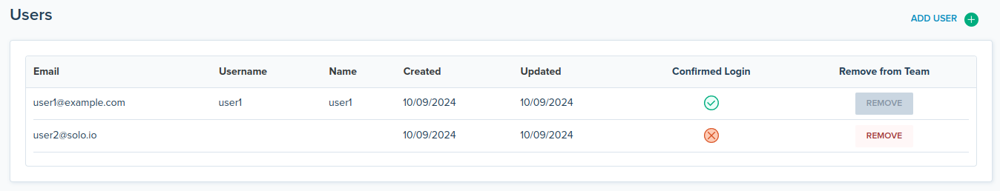
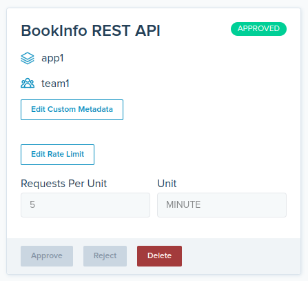

<!--bash
source ./scripts/assert.sh
-->


<center></center>

# <center>Gloo Gateway Workshop</center>


## Table of Contents
* [Introduction](#introduction)
* [Lab 1 - Deploy a KinD cluster](#lab-1---deploy-a-kind-cluster-)
* [Lab 2 - Deploy Keycloak](#lab-2---deploy-keycloak-)
* [Lab 3 - Deploy Gloo Gateway](#lab-3---deploy-gloo-gateway-)
* [Lab 4 - Deploy the httpbin demo app](#lab-4---deploy-the-httpbin-demo-app-)
* [Lab 5 - Expose the httpbin application through the gateway](#lab-5---expose-the-httpbin-application-through-the-gateway-)
* [Lab 6 - Delegate with control](#lab-6---delegate-with-control-)
* [Lab 7 - Deploy the Bookinfo sample application](#lab-7---deploy-the-bookinfo-sample-application-)
* [Lab 8 - Expose the productpage API securely](#lab-8---expose-the-productpage-api-securely-)
* [Lab 9 - Expose an external API and stitch it with the productpage API](#lab-9---expose-an-external-api-and-stitch-it-with-the-productpage-api-)
* [Lab 10 - Expose the dev portal backend](#lab-10---expose-the-dev-portal-backend-)
* [Lab 11 - Deploy and expose the dev portal frontend](#lab-11---deploy-and-expose-the-dev-portal-frontend-)
* [Lab 12 - Demonstrate the self service capabilities](#lab-12---demonstrate-the-self-service-capabilities-)
* [Lab 13 - Dev portal monetization](#lab-13---dev-portal-monetization-)
* [Lab 14 - Deploy Backstage with the backend plugin](#lab-14---deploy-backstage-with-the-backend-plugin-)
* [Lab 15 - Deploy OpenTelemetry Collector](#lab-15---deploy-opentelemetry-collector-)


## Introduction <a name="introduction"></a>

[Gloo Gateway](https://www.solo.io/products/gloo-gateway/) is a feature-rich, fast, and flexible Kubernetes-native ingress controller and next-generation API gateway that is built on top of [Envoy proxy](https://www.envoyproxy.io/) and the [Kubernetes Gateway API](https://gateway-api.sigs.k8s.io/).

Gloo Gateway is fully conformant with the Kubernetes Gateway API and extends its functionality with Solo’s custom Gateway APIs, such as `RouteOption`, `VirtualHostOption`, `Upstream`s, `RateLimitConfig`, or `AuthConfig`.
These resources help to centrally configure routing, security, and resiliency rules for a specific component, such as a host, route, or gateway listener.

These capabilities are grouped into two editions of Gloo Gateway:

### Open source (OSS) Gloo Gateway

Use Kubernetes Gateway API-native features and the following Gloo Gateway extensions to configure basic routing, security, and resiliency capabilities:

* Access logging
* Buffering
* Cross-Origin Resource Sharing (CORS)
* Cross-Site Request Forgery (CSRF)
* Fault injection
* Header control
* Retries
* Timeouts
* Traffic tapping
* Transformations

### Gloo Gateway Enterprise Edition

In addition to the features provided by the OSS edition, many more features are available in the Enterprise Edition, including:

* External authentication and authorization
* External processing
* Data loss prevention
* Developer portal
* JSON web token (JWT)
* Rate limiting
* Response caching
* Web Application Filters

### Want to learn more about Gloo Gateway?

In the labs that follow we present some of the common patterns that our customers use and provide a good entry point into the workings of Gloo Gateway.

You can find more information about Gloo Gateway in the official documentation: <https://docs.solo.io/gateway/>.


## Lab 1 - Deploy a KinD cluster <a name="lab-1---deploy-a-kind-cluster-"></a>


Clone this repository and go to the directory where this `README.md` file is.

Set the context environment variable:

```bash
export CLUSTER1=cluster1
```

Run the following commands to deploy a Kubernetes cluster using [Kind](https://kind.sigs.k8s.io/):

```bash
./scripts/deploy.sh 1 cluster1
```

Then run the following commands to wait for all the Pods to be ready:

```bash
./scripts/check.sh cluster1
```

**Note:** If you run the `check.sh` script immediately after the `deploy.sh` script, you may see a jsonpath error. If that happens, simply wait a few seconds and try again.

Once the `check.sh` script completes, when you execute the `kubectl get pods -A` command, you should see the following:

```,nocopy
NAMESPACE            NAME                                          READY   STATUS    RESTARTS   AGE
kube-system          calico-kube-controllers-59d85c5c84-sbk4k      1/1     Running   0          4h26m
kube-system          calico-node-przxs                             1/1     Running   0          4h26m
kube-system          coredns-6955765f44-ln8f5                      1/1     Running   0          4h26m
kube-system          coredns-6955765f44-s7xxx                      1/1     Running   0          4h26m
kube-system          etcd-cluster1-control-plane                   1/1     Running   0          4h27m
kube-system          kube-apiserver-cluster1-control-plane         1/1     Running   0          4h27m
kube-system          kube-controller-manager-cluster1-control-plane1/1     Running   0          4h27m
kube-system          kube-proxy-ksvzw                              1/1     Running   0          4h26m
kube-system          kube-scheduler-cluster1-control-plane         1/1     Running   0          4h27m
local-path-storage   local-path-provisioner-58f6947c7-lfmdx        1/1     Running   0          4h26m
metallb-system       controller-5c9894b5cd-cn9x2                   1/1     Running   0          4h26m
metallb-system       speaker-d7jkp                                 1/1     Running   0          4h26m
```
<!--bash
cat <<'EOF' > ./test.js
const helpers = require('./tests/chai-exec');

describe("Clusters are healthy", () => {
    const clusters = ["cluster1"];
    clusters.forEach(cluster => {
        it(`Cluster ${cluster} is healthy`, () => helpers.k8sObjectIsPresent({ context: cluster, namespace: "default", k8sType: "service", k8sObj: "kubernetes" }));
    });
});
EOF
echo "executing test procs/portal/build/templates/steps/deploy-kind-cluster/tests/cluster-healthy.test.js.liquid"
timeout --signal=INT 3m mocha ./test.js --timeout 10000 --retries=120 --bail || { DEBUG_MODE=true mocha ./test.js --timeout 80000; exit 1; }
-->


## Lab 2 - Deploy Keycloak <a name="lab-2---deploy-keycloak-"></a>

In many use cases, you need to restrict the access to your applications to authenticated users.

OpenID Connect (OIDC) is an identity layer on top of the OAuth 2.0 protocol. In OAuth 2.0 flows, authentication is performed by an external Identity Provider (IdP) which, in case of success, returns an Access Token representing the user identity. The protocol does not define the contents and structure of the Access Token, which greatly reduces the portability of OAuth 2.0 implementations.

The goal of OIDC is to address this ambiguity by additionally requiring Identity Providers to return a well-defined ID Token. OIDC ID tokens follow the JSON Web Token standard and contain specific fields that your applications can expect and handle. This standardization allows you to switch between Identity Providers – or support multiple ones at the same time – with minimal, if any, changes to your downstream services; it also allows you to consistently apply additional security measures like Role-Based Access Control (RBAC) based on the identity of your users, i.e. the contents of their ID token.

In this lab, we're going to install Keycloak. It will allow us to set up OIDC workflows later.

But, first of all, we're going to deploy Keycloak to persist the data if Keycloak restarts.

```bash
kubectl --context ${CLUSTER1} create namespace gloo-system
kubectl apply --context ${CLUSTER1} -f - <<EOF
apiVersion: v1
kind: ServiceAccount
metadata:
  name: postgres
  namespace: gloo-system
---
apiVersion: v1
kind: Secret
metadata:
  name: postgres-secrets
  namespace: gloo-system
type: Opaque
data:
  POSTGRES_DB: ZGI=
  POSTGRES_USER: YWRtaW4=
  POSTGRES_PASSWORD: YWRtaW4=
---
apiVersion: v1
kind: PersistentVolumeClaim
metadata:
  name: postgres-pvc
  namespace: gloo-system
spec:
  accessModes:
    - ReadWriteOnce
  resources:
    requests:
      storage: 5Gi
---
apiVersion: apps/v1
kind: Deployment
metadata:
  name: postgres
  namespace: gloo-system
spec:
  replicas: 1
  selector:
    matchLabels:
      app: postgres
  template:
    metadata:
      labels:
        app: postgres
    spec:
      serviceAccountName: postgres
      volumes:
        - name: postgres-storage
          persistentVolumeClaim:
            claimName: postgres-pvc
      containers:
        - name: postgres
          image: postgres:13.2-alpine
          imagePullPolicy: 'IfNotPresent'
          ports:
            - containerPort: 5432
          envFrom:
            - secretRef:
                name: postgres-secrets
          volumeMounts:
            - name: postgres-storage
              mountPath: /var/lib/postgresql/data
              subPath: postgres
---
apiVersion: v1
kind: Service
metadata:
  name: postgres
  namespace: gloo-system
spec:
  selector:
    app: postgres
  ports:
    - port: 5432
EOF
```

Wait while Postgres finishes rolling out:

```bash
kubectl --context ${CLUSTER1} -n gloo-system rollout status deploy/postgres

sleep 5
```

Create the database and user for Keycloak:

```bash
kubectl --context ${CLUSTER1} -n gloo-system exec deploy/postgres -- psql -U admin -d db -c "CREATE DATABASE keycloak;"
kubectl --context ${CLUSTER1} -n gloo-system exec deploy/postgres -- psql -U admin -d db -c "CREATE USER keycloak WITH PASSWORD 'password';"
kubectl --context ${CLUSTER1} -n gloo-system exec deploy/postgres -- psql -U admin -d db -c "GRANT ALL PRIVILEGES ON DATABASE keycloak TO keycloak;"
```

<!--bash
cat <<'EOF' > ./test.js
const helpers = require('./tests/chai-exec');

describe("Postgres", () => {
  it('postgres pods are ready in cluster1', () => helpers.checkDeployment({ context: process.env.CLUSTER1, namespace: "gloo-system", k8sObj: "postgres" }));
});
EOF
echo "executing test procs/portal/build/templates/steps/deploy-keycloak/tests/postgres-available.test.js.liquid"
timeout --signal=INT 3m mocha ./test.js --timeout 10000 --retries=120 --bail || { DEBUG_MODE=true mocha ./test.js --timeout 80000; exit 1; }
-->

First, we need to define an ID and secret for a "client", which will be the service that delegates to Keycloak for authorization:

```bash
KEYCLOAK_CLIENT=gloo-ext-auth
KEYCLOAK_SECRET=hKcDcqmUKCrPkyDJtCw066hTLzUbAiri
```

We need to store these in a secret accessible by the ext auth service:

```bash
kubectl apply --context ${CLUSTER1} -f - <<EOF
apiVersion: v1
kind: Secret
metadata:
  name: oauth
  namespace: gloo-system
type: extauth.solo.io/oauth
stringData:
  client-id: ${KEYCLOAK_CLIENT}
  client-secret: ${KEYCLOAK_SECRET}
EOF
```

We need to supply the initial configuration of the realm we'll use for these labs.
This will include the client with the ID and secret we defined above, as well as two users that we can use later:

- User1 credentials: `user1/password`
  Email: user1@example.com

- User2 credentials: `user2/password`
  Email: user2@solo.io

Create this configuration in a `ConfigMap`:

```bash
kubectl --context ${CLUSTER1} create namespace keycloak

kubectl apply --context ${CLUSTER1} -f - <<EOF
apiVersion: v1
data:
  workshop-realm.json: |-
    {
      "realm": "workshop",
      "enabled": true,
      "displayName": "solo.io",
      "accessTokenLifespan": 1800,
      "sslRequired": "none",
      "users": [
        {
          "username": "user1",
          "enabled": true,
          "email": "user1@example.com",
          "attributes": {
            "group": [
              "users"
            ],
            "subscription": [
              "enterprise"
            ]
          },
          "credentials": [
            {
              "type": "password",
              "secretData": "{\"value\":\"JsfNbCOIdZUbyBJ+BT+VoGI91Ec2rWLOvkLPDaX8e9k=\",\"salt\":\"P5rtFkGtPfoaryJ6PizUJw==\",\"additionalParameters\":{}}",
              "credentialData": "{\"hashIterations\":27500,\"algorithm\":\"pbkdf2-sha256\",\"additionalParameters\":{}}"
            }
          ]
        },
        {
          "username": "user2",
          "enabled": true,
          "email": "user2@solo.io",
          "attributes": {
            "group": [
              "users"
            ],
            "subscription": [
              "free"
            ],
            "show_personal_data": [
              "false"
            ]
          },
          "credentials": [
            {
              "type": "password",
              "secretData": "{\"value\":\"RITBVPdh5pvXOa4JzJ5pZTE0rG96zhnQNmSsKCf83aU=\",\"salt\":\"drB9e5Smf3cbfUfF3FUerw==\",\"additionalParameters\":{}}",
              "credentialData": "{\"hashIterations\":27500,\"algorithm\":\"pbkdf2-sha256\",\"additionalParameters\":{}}"
            }
          ]
        },
        {
          "username": "admin1",
          "enabled": true,
          "email": "admin1@solo.io",
          "attributes": {
            "group": [
              "admin"
            ],
            "show_personal_data": [
              "false"
            ]
          },
          "credentials": [
            {
              "type": "password",
              "secretData" : "{\"value\":\"BruFLfFkjH/8erZ26NnrbkOrWiZuQyDRCHD9o0R6Scg=\",\"salt\":\"Cf9AYCE5pAbb4CKEF0GUTA==\",\"additionalParameters\":{}}",
              "credentialData" : "{\"hashIterations\":5,\"algorithm\":\"argon2\",\"additionalParameters\":{\"hashLength\":[\"32\"],\"memory\":[\"7168\"],\"type\":[\"id\"],\"version\":[\"1.3\"],\"parallelism\":[\"1\"]}}"
            }
          ]
        }
      ],
      "clients": [
        {
          "clientId": "${KEYCLOAK_CLIENT}",
          "secret": "${KEYCLOAK_SECRET}",
          "redirectUris": [
            "*"
          ],
          "webOrigins": [
            "+"
          ],
          "authorizationServicesEnabled": true,
          "directAccessGrantsEnabled": true,
          "serviceAccountsEnabled": true,
          "protocolMappers": [
            {
              "name": "group",
              "protocol": "openid-connect",
              "protocolMapper": "oidc-usermodel-attribute-mapper",
              "config": {
                "claim.name": "group",
                "user.attribute": "group",
                "access.token.claim": "true",
                "id.token.claim": "true"
              }
            },
            {
              "name": "show_personal_data",
              "protocol": "openid-connect",
              "protocolMapper": "oidc-usermodel-attribute-mapper",
              "config": {
                "claim.name": "show_personal_data",
                "user.attribute": "show_personal_data",
                "access.token.claim": "true",
                "id.token.claim": "true"
              }
            },
            {
              "name": "subscription",
              "protocol": "openid-connect",
              "protocolMapper": "oidc-usermodel-attribute-mapper",
              "config": {
                "claim.name": "subscription",
                "user.attribute": "subscription",
                "access.token.claim": "true",
                "id.token.claim": "true"
              }
            },
            {
              "name": "name",
              "protocol": "openid-connect",
              "protocolMapper": "oidc-usermodel-property-mapper",
              "config": {
                "claim.name": "name",
                "user.attribute": "username",
                "access.token.claim": "true",
                "id.token.claim": "true"
              }
            }
          ]
        }
      ],
      "components": {
        "org.keycloak.userprofile.UserProfileProvider": [
          {
            "providerId": "declarative-user-profile",
            "config": {
              "kc.user.profile.config": [
                "{\"attributes\":[{\"name\":\"username\"},{\"name\":\"email\"}],\"unmanagedAttributePolicy\":\"ENABLED\"}"
              ]
            }
          }
        ]
      }
    }
  portal-realm.json: |
    {
      "realm": "portal-mgmt",
      "enabled": true,
      "sslRequired": "none",
      "roles": {
        "client": {
          "gloo-portal-idp": [
            {
              "name": "uma_protection",
              "composite": false,
              "clientRole": true,
              "attributes": {}
            }
          ]
        },
        "realm": [
          {
            "name": "default-roles-portal-mgmt",
            "description": "${role_default-roles}",
            "composite": true,
            "composites": {
              "realm": [
                "offline_access",
                "uma_authorization"
              ],
              "client": {
                "account": [
                  "manage-account",
                  "view-profile"
                ]
              }
            },
            "clientRole": false,
            "attributes": {}
          },
          {
            "name": "uma_authorization",
            "description": "${role_uma_authorization}",
            "composite": false,
            "clientRole": false
          }
        ]
      },
      "users": [
        {
          "username": "service-account-gloo-portal-idp",
          "createdTimestamp": 1727724261768,
          "emailVerified": false,
          "enabled": true,
          "totp": false,
          "serviceAccountClientId": "gloo-portal-idp",
          "disableableCredentialTypes": [],
          "requiredActions": [],
          "realmRoles": [
            "default-roles-portal-mgmt"
          ],
          "clientRoles": {
            "realm-management": [
              "manage-clients"
            ],
            "gloo-portal-idp": [
              "uma_protection"
            ]
          },
          "notBefore": 0,
          "groups": []
        }
      ],
      "clients": [
        {
          "clientId": "gloo-portal-idp",
          "enabled": true,
          "name": "Solo.io Gloo Portal Resource Server",
          "clientAuthenticatorType": "client-secret",
          "secret": "gloo-portal-idp-secret",
          "serviceAccountsEnabled": true,
          "authorizationServicesEnabled": true,
          "authorizationSettings": {
            "allowRemoteResourceManagement": true,
            "policyEnforcementMode": "ENFORCING",
            "resources": [
              {
                "name": "Default Resource",
                "type": "urn:gloo-portal-idp:resources:default",
                "ownerManagedAccess": false,
                "attributes": {},
                "uris": [
                  "/*"
                ]
              }
            ],
            "policies": [
              {
                "name": "Default Policy",
                "description": "A policy that grants access only for users within this realm",
                "type": "regex",
                "logic": "POSITIVE",
                "decisionStrategy": "AFFIRMATIVE",
                "config": {
                  "targetContextAttributes" : "false",
                  "pattern" : ".*",
                  "targetClaim" : "sub"
                }
              },
              {
                "name": "Default Permission",
                "description": "A permission that applies to the default resource type",
                "type": "resource",
                "logic": "POSITIVE",
                "decisionStrategy": "UNANIMOUS",
                "config": {
                  "defaultResourceType": "urn:gloo-portal-idp:resources:default",
                  "applyPolicies": "[\"Default Policy\"]"
                }
              }
            ],
            "scopes": [],
            "decisionStrategy": "UNANIMOUS"
          }
        }
      ]
    }
kind: ConfigMap
metadata:
  name: realms
  namespace: keycloak
EOF
```

Now let's install Keycloak:

```bash
kubectl apply --context ${CLUSTER1} -f - <<EOF
apiVersion: v1
kind: Service
metadata:
  name: keycloak
  namespace: keycloak
  labels:
    app: keycloak
spec:
  ports:
  - name: http
    port: 8080
    targetPort: 8080
  selector:
    app: keycloak
  type: LoadBalancer
---
apiVersion: apps/v1
kind: Deployment
metadata:
  name: keycloak
  namespace: keycloak
  labels:
    app: keycloak
spec:
  replicas: 1
  selector:
    matchLabels:
      app: keycloak
  template:
    metadata:
      labels:
        app: keycloak
    spec:
      containers:
      - name: keycloak
        image: quay.io/keycloak/keycloak:25.0.5
        args:
        - start-dev
        - --import-realm
        - --proxy-headers=xforwarded
        - --features=hostname:v1
        - --hostname-strict=false
        - --hostname-strict-https=false
        env:
        - name: KEYCLOAK_ADMIN
          value: admin
        - name: KEYCLOAK_ADMIN_PASSWORD
          value: admin
        - name: KC_DB
          value: postgres
        - name: KC_DB_URL
          value: jdbc:postgresql://postgres.gloo-system.svc.cluster.local:5432/keycloak
        - name: KC_DB_USERNAME
          value: keycloak
        - name: KC_DB_PASSWORD
          value: password
        ports:
        - name: http
          containerPort: 8080
        readinessProbe:
          httpGet:
            path: /realms/workshop
            port: 8080
        volumeMounts:
        - name: realms
          mountPath: /opt/keycloak/data/import
      volumes:
      - name: realms
        configMap:
          name: realms
EOF
```

Wait while Keycloak finishes rolling out:

```bash
kubectl --context ${CLUSTER1} -n keycloak rollout status deploy/keycloak
```
<!--bash
cat <<'EOF' > ./test.js
const helpers = require('./tests/chai-exec');

describe("Keycloak", () => {
  it('keycloak pods are ready in cluster1', () => helpers.checkDeployment({ context: process.env.CLUSTER1, namespace: "keycloak", k8sObj: "keycloak" }));
});
EOF
echo "executing test procs/portal/build/templates/steps/deploy-keycloak/tests/pods-available.test.js.liquid"
timeout --signal=INT 3m mocha ./test.js --timeout 10000 --retries=120 --bail || { DEBUG_MODE=true mocha ./test.js --timeout 80000; exit 1; }
-->
<!--bash
cat <<'EOF' > ./test.js
const chaiExec = require("@jsdevtools/chai-exec");
var chai = require('chai');
var expect = chai.expect;
chai.use(chaiExec);

afterEach(function (done) {
  if (this.currentTest.currentRetry() > 0) {
    process.stdout.write(".");
    setTimeout(done, 1000);
  } else {
    done();
  }
});

describe("Retrieve enterprise-networking ip", () => {
  it("A value for load-balancing has been assigned", () => {
    let cli = chaiExec(`kubectl --context ${process.env.CLUSTER1} -n keycloak get svc keycloak -o jsonpath='{.status.loadBalancer}'`);
    expect(cli).to.exit.with.code(0);
    expect(cli).output.to.contain('"ingress"');
  });
});
EOF
echo "executing test procs/portal/build/templates/steps/deploy-keycloak/tests/keycloak-ip-is-attached.test.js.liquid"
timeout --signal=INT 3m mocha ./test.js --timeout 10000 --retries=120 --bail || { DEBUG_MODE=true mocha ./test.js --timeout 80000; exit 1; }
-->
<!--bash
timeout 2m bash -c "until [[ \$(kubectl --context ${CLUSTER1} -n keycloak get svc keycloak -o json | jq '.status.loadBalancer | length') -gt 0 ]]; do
  sleep 1
done"
-->

Let's set the environment variables we need:

```bash
export ENDPOINT_KEYCLOAK=$(kubectl --context ${CLUSTER1} -n keycloak get service keycloak -o jsonpath='{.status.loadBalancer.ingress[0].*}'):8080
export HOST_KEYCLOAK=$(echo ${ENDPOINT_KEYCLOAK%:*})
export PORT_KEYCLOAK=$(echo ${ENDPOINT_KEYCLOAK##*:})
export KEYCLOAK_URL=http://${ENDPOINT_KEYCLOAK}
```

<!--bash
cat <<'EOF' > ./test.js
const dns = require('dns');
const chaiHttp = require("chai-http");
const chai = require("chai");
const expect = chai.expect;
chai.use(chaiHttp);
const { waitOnFailedTest } = require('./tests/utils');

afterEach(function(done) { waitOnFailedTest(done, this.currentTest.currentRetry())});

describe("Address '" + process.env.HOST_KEYCLOAK + "' can be resolved in DNS", () => {
    it(process.env.HOST_KEYCLOAK + ' can be resolved', (done) => {
        return dns.lookup(process.env.HOST_KEYCLOAK, (err, address, family) => {
            expect(address).to.be.an.ip;
            done();
        });
    });
});
EOF
echo "executing test ./gloo-mesh-2-0/tests/can-resolve.test.js.liquid"
timeout --signal=INT 3m mocha ./test.js --timeout 10000 --retries=120 --bail || { DEBUG_MODE=true mocha ./test.js --timeout 80000; exit 1; }
-->
<!--bash
echo "Waiting for Keycloak to be ready at $KEYCLOAK_URL/realms/workshop/protocol/openid-connect/token"
timeout 300 bash -c 'while [[ "$(curl -m 2 -s -o /dev/null -w ''%{http_code}'' $KEYCLOAK_URL/realms/workshop/protocol/openid-connect/token)" != "405" ]]; do printf '.';sleep 1; done' || false
-->


## Lab 3 - Deploy Gloo Gateway <a name="lab-3---deploy-gloo-gateway-"></a>

You can deploy Gloo Gateway with the `glooctl` CLI or declaratively using Helm.

We're going to use the Helm option.

Install the Kubernetes Gateway API CRDs as they do not come installed by default on most Kubernetes clusters.

```bash
kubectl --context $CLUSTER1 apply -f https://github.com/kubernetes-sigs/gateway-api/releases/download/v1.1.0/standard-install.yaml
```


We need to create a secret to let the Gateway Portal know how to connect to Postgres

```bash
kubectl apply --context ${CLUSTER1} -f - <<EOF
apiVersion: v1
kind: Secret
metadata:
  name: portal-database-config
  namespace: gloo-system
type: Opaque
data:
  config.yaml: |
    ZHNuOiBob3N0PXBvc3RncmVzLmdsb28tc3lzdGVtLnN2Yy5jbHVzdGVyLmxvY2FsIHBvcnQ9NTQzMiB1c2VyPWFkbWluIHBhc3N3b3JkPWFkbWluIGRibmFtZT1kYiBzc2xtb2RlPWRpc2FibGUK
EOF
```


Next, install Gloo Gateway. This command installs the Gloo Gateway control plane into the namespace `gloo-system`.

```bash
helm repo add gloo-ee-test-helm https://storage.googleapis.com/gloo-ee-test-helm

helm repo update

helm upgrade -i -n gloo-system \
  gloo-gateway gloo-ee-test-helm/gloo-ee \
  --create-namespace \
  --version 1.18.0-beta2-bmain-1203aed \
  --kube-context $CLUSTER1 \
  --set-string license_key=$LICENSE_KEY \
  -f -<<EOF
gloo:
  kubeGateway:
    enabled: true
  gatewayProxies:
    gatewayProxy:
      disabled: true
  gateway:
    validation:
      allowWarnings: true
      alwaysAcceptResources: false
  gloo:
    logLevel: info
    deployment:
      customEnv:
        - name: GG_PORTAL_PLUGIN
          value: "true"
      livenessProbeEnabled: true
  discovery:
    enabled: false
  rbac:
    namespaced: true
    nameSuffix: gg-demo
observability:
  enabled: false
prometheus:
  enabled: false
grafana:
  defaultInstallationEnabled: false
gloo-fed:
  enabled: false
  glooFedApiserver:
    enable: false
gateway-portal-web-server:
  enabled: true
  glooPortalServer:
    database:
      type: postgres
settings:
  disableKubernetesDestinations: true
EOF
```

Run the following command to check that the Gloo Gateway pods are running:

<!--bash
echo -n Waiting for Gloo Gateway pods to be ready...
kubectl --context $CLUSTER1 -n gloo-system rollout status deployment
-->
```bash
kubectl --context $CLUSTER1 -n gloo-system get pods
```

Here is the expected output:

```,nocopy
NAME                                         READY   STATUS      RESTARTS   AGE
caching-service-79cf55ccbb-dcvgp             1/1     Running     0          69s
extauth-58f68c5cd5-gxgxc                     1/1     Running     0          69s
gateway-portal-web-server-5c5d58d8d5-7lzwg   1/1     Running     0          69s
gloo-7d8994697-lfg5x                         1/1     Running     0          69s
gloo-resource-rollout-check-x8b77            0/1     Completed   0          69s
gloo-resource-rollout-cjtgh                  0/1     Completed   0          69s
rate-limit-6db9c67794-vf7h2                  1/1     Running     0          69s
redis-6c7c489d8c-g2dhc                       1/1     Running     0          69s
```

<!--bash
cat <<'EOF' > ./test.js
const helpers = require('./tests/chai-exec');

describe("Gloo Gateway", () => {
  let cluster = process.env.CLUSTER1
  let deployments = ["gloo", "extauth", "rate-limit", "redis"];
  deployments.forEach(deploy => {
    it(deploy + ' pods are ready in ' + cluster, () => helpers.checkDeployment({ context: cluster, namespace: "gloo-system", k8sObj: deploy }));
  });
});
EOF
echo "executing test procs/portal/build/templates/steps/deploy-gloo-gateway-enterprise/tests/check-gloo.test.js.liquid"
timeout --signal=INT 3m mocha ./test.js --timeout 10000 --retries=120 --bail || { DEBUG_MODE=true mocha ./test.js --timeout 80000; exit 1; }
-->


## Lab 4 - Deploy the httpbin demo app <a name="lab-4---deploy-the-httpbin-demo-app-"></a>

We're going to deploy the httpbin application to demonstrate several features of Gloo Gateway.

You can find more information about this application [here](http://httpbin.org/).

Run the following commands to deploy the httpbin app twice (`httpbin1` and `httpbin2`).

```bash
kubectl --context ${CLUSTER1} create ns httpbin
kubectl apply --context ${CLUSTER1} -f - <<EOF
apiVersion: v1
kind: ServiceAccount
metadata:
  name: httpbin1
  namespace: httpbin
---
apiVersion: v1
kind: Service
metadata:
  name: httpbin1
  namespace: httpbin
  labels:
    app: httpbin1
    service: httpbin1
spec:
  ports:
  - name: http
    port: 8000
    targetPort: http
    protocol: TCP
    appProtocol: http
  selector:
    app: httpbin1
---
apiVersion: apps/v1
kind: Deployment
metadata:
  name: httpbin1
  namespace: httpbin
spec:
  replicas: 1
  selector:
    matchLabels:
      app: httpbin1
      version: v1
  template:
    metadata:
      labels:
        app: httpbin1
        version: v1
    spec:
      serviceAccountName: httpbin1
      containers:
      - name: httpbin
        image: mccutchen/go-httpbin:v2.14.0
        command: [ go-httpbin ]
        args:
          - "-max-duration"
          - "600s" # override default 10s
          - -use-real-hostname
        ports:
          - name: http
            containerPort: 8080
            protocol: TCP
        livenessProbe:
          httpGet:
            path: /status/200
            port: http
        readinessProbe:
          httpGet:
            path: /status/200
            port: http
        resources:
          limits:
            cpu: 1
            memory: 512Mi
          requests:
            cpu: 100m
            memory: 256Mi
        env:
        - name: K8S_MEM_LIMIT
          valueFrom:
            resourceFieldRef:
              divisor: "1"
              resource: limits.memory
        - name: GOMAXPROCS
          valueFrom:
            resourceFieldRef:
              divisor: "1"
              resource: limits.cpu
EOF

kubectl apply --context ${CLUSTER1} -f - <<EOF
apiVersion: v1
kind: ServiceAccount
metadata:
  name: httpbin2
  namespace: httpbin
---
apiVersion: v1
kind: Service
metadata:
  name: httpbin2
  namespace: httpbin
  labels:
    app: httpbin2
    service: httpbin2
spec:
  ports:
  - name: http
    port: 8000
    targetPort: http
    protocol: TCP
    appProtocol: http
  selector:
    app: httpbin2
---
apiVersion: apps/v1
kind: Deployment
metadata:
  name: httpbin2
  namespace: httpbin
spec:
  replicas: 1
  selector:
    matchLabels:
      app: httpbin2
      version: v1
  template:
    metadata:
      labels:
        app: httpbin2
        version: v1
    spec:
      serviceAccountName: httpbin2
      containers:
      - name: httpbin
        image: mccutchen/go-httpbin:v2.14.0
        command: [ go-httpbin ]
        args:
          - "-max-duration"
          - "600s" # override default 10s
          - -use-real-hostname
        ports:
          - name: http
            containerPort: 8080
            protocol: TCP
        livenessProbe:
          httpGet:
            path: /status/200
            port: http
        readinessProbe:
          httpGet:
            path: /status/200
            port: http
        resources:
          limits:
            cpu: 1
            memory: 512Mi
          requests:
            cpu: 100m
            memory: 256Mi
        env:
        - name: K8S_MEM_LIMIT
          valueFrom:
            resourceFieldRef:
              divisor: "1"
              resource: limits.memory
        - name: GOMAXPROCS
          valueFrom:
            resourceFieldRef:
              divisor: "1"
              resource: limits.cpu
EOF
```

You can follow the progress using the following command:

<!--bash
echo -n Waiting for httpbin pods to be ready...
kubectl --context ${CLUSTER1} -n httpbin rollout status deployment
-->
```shell
kubectl --context ${CLUSTER1} -n httpbin get pods
```

Here is the expected output when both Pods are ready:

```,nocopy
NAME                        READY   STATUS    RESTARTS   AGE
httpbin1-7fdbf6498-ms7qt    1/1     Running   0          94s
httpbin2-655777b846-6nrms   1/1     Running   0          93s
```

<!--bash
cat <<'EOF' > ./test.js
const helpers = require('./tests/chai-exec');

describe("httpbin app", () => {
  let cluster = process.env.CLUSTER1
  let deployments = ["httpbin1", "httpbin2"];
  deployments.forEach(deploy => {
    it(deploy + ' pods are ready in ' + cluster, () => helpers.checkDeployment({ context: cluster, namespace: "httpbin", k8sObj: deploy }));
  });
});
EOF
echo "executing test procs/portal/build/templates/steps/apps/httpbin/deploy-httpbin/tests/check-httpbin.test.js.liquid"
timeout --signal=INT 3m mocha ./test.js --timeout 10000 --retries=120 --bail || { DEBUG_MODE=true mocha ./test.js --timeout 80000; exit 1; }
-->


## Lab 5 - Expose the httpbin application through the gateway <a name="lab-5---expose-the-httpbin-application-through-the-gateway-"></a>


The team in charge of the gateway can create a `Gateway` resource and configure an HTTP listener.


```bash
kubectl apply --context ${CLUSTER1} -f - <<EOF
kind: Gateway
apiVersion: gateway.networking.k8s.io/v1
metadata:
  name: http
  namespace: gloo-system
spec:
  gatewayClassName: gloo-gateway
  listeners:
  - protocol: HTTP
    port: 80
    name: http
    allowedRoutes:
      namespaces:
        from: All
EOF
```

Note that application teams can create and attach their `HTTPRoute` to this gateway.

An application team can create an `HTTPRoute` resource to expose the `httpbin` app on the gateway.

```bash
kubectl apply --context ${CLUSTER1} -f - <<EOF
apiVersion: gateway.networking.k8s.io/v1
kind: HTTPRoute
metadata:
  name: httpbin
  namespace: httpbin
spec:
  parentRefs:
    - name: http
      namespace: gloo-system
      sectionName: http
  hostnames:
    - "httpbin.example.com"
  rules:
    - backendRefs:
        - name: httpbin1
          port: 8000
EOF
```

Set the environment variable for the service corresponding to the gateway:

```bash
export PROXY_IP=$(kubectl --context ${CLUSTER1} -n gloo-system get svc gloo-proxy-http -o jsonpath='{.status.loadBalancer.ingress[0].*}')
```

<!--bash
RETRY_COUNT=0
MAX_RETRIES=60
while [[ -z "$PROXY_IP" && $RETRY_COUNT -lt $MAX_RETRIES ]]; do
  echo "Waiting for PROXY_IP to be assigned... Attempt $((RETRY_COUNT + 1))/$MAX_RETRIES"
  PROXY_IP=$(kubectl --context ${CLUSTER1} -n gloo-system get svc gloo-proxy-http -o jsonpath='{.status.loadBalancer.ingress[0].*}')
  RETRY_COUNT=$((RETRY_COUNT + 1))
  sleep 5
done

# if PROXY_IP is a hostname, resolve it to an IP address
if [[ -n "$PROXY_IP" && $PROXY_IP =~ [a-zA-Z] ]]; then
  while [[ -z "$IP" && $RETRY_COUNT -lt $MAX_RETRIES ]]; do
    echo "Waiting for PROXY_IP to be propagated in DNS... Attempt $((RETRY_COUNT + 1))/$MAX_RETRIES"
    IP=$(dig +short A "$PROXY_IP" | awk '/^[0-9]+\.[0-9]+\.[0-9]+\.[0-9]+$/ {print; exit}')
    RETRY_COUNT=$((RETRY_COUNT + 1))
    sleep 5
  done
else
  IP="$PROXY_IP"
fi

if [[ -z "$PROXY_IP" ]]; then
  echo "WARNING: Maximum number of retries reached. PROXY_IP could not be assigned."
else
  export PROXY_IP
  export IP
  echo "PROXY_IP has been assigned: $PROXY_IP"
  echo "IP has been resolved to: $IP"
fi
-->

Configure your hosts file to resolve httpbin.example.com with the IP address of the proxy by executing the following command:

```bash
./scripts/register-domain.sh httpbin.example.com ${PROXY_IP}
```

Try to access the application through HTTP:

```shell
curl http://httpbin.example.com/get
```

Here is the expected output:

```json,nocopy
{
  "args": {},
  "headers": {
    "Accept": [
      "*/*"
    ],
    "Host": [
      "httpbin.example.com"
    ],
    "User-Agent": [
      "curl/8.5.0"
    ],
    "X-Forwarded-Proto": [
      "http"
    ],
    "X-Request-Id": [
      "d0998a48-7532-4eeb-ab69-23cef22185cf"
    ]
  },
  "method": "GET",
  "origin": "127.0.0.6:38917",
  "url": "http://httpbin.example.com/get"
}
```

<!--bash
cat <<'EOF' > ./test.js
const helpersHttp = require('./tests/chai-http');

describe("httpbin through HTTP", () => {
  it('Checking text \'headers\'', () => helpersHttp.checkBody({ host: `http://httpbin.example.com`, path: '/get', body: 'headers', match: true }));
})
EOF
echo "executing test procs/portal/build/templates/steps/apps/httpbin/expose-httpbin/tests/http.test.js.liquid"
timeout --signal=INT 3m mocha ./test.js --timeout 10000 --retries=120 --bail || { DEBUG_MODE=true mocha ./test.js --timeout 80000; exit 1; }
-->

Now, let's secure the access through TLS.
Let's first create a private key and a self-signed certificate:

```bash
openssl req -x509 -nodes -days 365 -newkey rsa:2048 \
   -keyout tls.key -out tls.crt -subj "/CN=*"
```

Then, you have to store it in a Kubernetes secret running the following command:

```bash
kubectl create --context ${CLUSTER1} -n gloo-system secret tls tls-secret --key tls.key \
   --cert tls.crt
```

Update the `Gateway` resource to add HTTPS listeners.

```bash
kubectl apply --context ${CLUSTER1} -f - <<EOF
kind: Gateway
apiVersion: gateway.networking.k8s.io/v1
metadata:
  name: http
  namespace: gloo-system
spec:
  gatewayClassName: gloo-gateway
  listeners:
  - protocol: HTTPS
    port: 443
    name: https-httpbin
    hostname: httpbin.example.com
    tls:
      mode: Terminate
      certificateRefs:
        - name: tls-secret
          kind: Secret
    allowedRoutes:
      namespaces:
        from: All
  - protocol: HTTPS
    port: 443
    name: https
    tls:
      mode: Terminate
      certificateRefs:
        - name: tls-secret
          kind: Secret
    allowedRoutes:
      namespaces:
        from: All
  - protocol: HTTP
    port: 80
    name: http
    allowedRoutes:
      namespaces:
        from: All
EOF
```

As you can see, we've added 2 new listeners. One for the `httpbin.example.com` hostname and one for all the other hostnames.

We used the same secret to keep things simple, but the goal is to demonstrate we can have different HTTPS listeners.

Update the `HTTPRoute` resource to expose the `httpbin` app through HTTPS.

```bash
kubectl apply --context ${CLUSTER1} -f - <<EOF
apiVersion: gateway.networking.k8s.io/v1
kind: HTTPRoute
metadata:
  name: httpbin
  namespace: httpbin
spec:
  parentRefs:
    - name: http
      namespace: gloo-system
      sectionName: https-httpbin
  hostnames:
    - "httpbin.example.com"
  rules:
    - backendRefs:
        - name: httpbin1
          port: 8000
EOF
```

Try to access the application through HTTPS:

<!--bash
echo -n Wait for up to 2 minutes until the url is ready...
RETRY_COUNT=0
MAX_RETRIES=30
while [[ $RETRY_COUNT -lt $MAX_RETRIES ]]; do
  echo "Attempt $((RETRY_COUNT + 1))/$MAX_RETRIES"
  ret=`curl -k -s -o /dev/null -w %{http_code} https://httpbin.example.com/get`
  if [ "$ret" -eq "200" ]; then
    break
  else
    echo "Response was: $ret"
    echo "Retrying in 4 seconds..."
  fi
  RETRY_COUNT=$((RETRY_COUNT + 1))
  sleep 4
done
-->

```shell
curl -k https://httpbin.example.com/get
```

Here is the expected output:

```json,nocopy
{
  "args": {},
  "headers": {
    "Accept": [
      "*/*"
    ],
    "Host": [
      "httpbin.example.com"
    ],
    "User-Agent": [
      "curl/8.5.0"
    ],
    "X-Forwarded-Proto": [
      "https"
    ],
    "X-Request-Id": [
      "8e61c480-6373-4c38-824b-2bfe89e79d0c"
    ]
  },
  "method": "GET",
  "origin": "127.0.0.6:52655",
  "url": "https://httpbin.example.com/get"
}
```

<!--bash
cat <<'EOF' > ./test.js
const helpersHttp = require('./tests/chai-http');

describe("httpbin through HTTPS", () => {
  it('Checking text \'headers\'', () => helpersHttp.checkBody({ host: `https://httpbin.example.com`, path: '/get', body: 'headers', match: true }));
})
EOF
echo "executing test procs/portal/build/templates/steps/apps/httpbin/expose-httpbin/tests/https.test.js.liquid"
timeout --signal=INT 3m mocha ./test.js --timeout 10000 --retries=120 --bail || { DEBUG_MODE=true mocha ./test.js --timeout 80000; exit 1; }
-->

The team in charge of the gateway can create an `HTTPRoute` to automatically redirect HTTP to HTTPS:

```bash
kubectl apply --context ${CLUSTER1} -f - <<EOF
apiVersion: gateway.networking.k8s.io/v1
kind: HTTPRoute
metadata:
  name: redirect-http-to-https
  namespace: gloo-system
spec:
  parentRefs:
    - name: http
      namespace: gloo-system
      sectionName: http
  hostnames:
    - "httpbin.example.com"
  rules:
    - filters:
      - type: RequestRedirect
        requestRedirect:
          scheme: https
EOF
```

Try to access the application through HTTP:

```shell
curl -k http://httpbin.example.com/get -L
```

The `-L` option instructs curl to follow the redirect. Without it, you would get a `302` response with the `location` header set to the HTTPS url.

Here is the expected output:

```json,nocopy
{
  "args": {},
  "headers": {
    "Accept": [
      "*/*"
    ],
    "Host": [
      "httpbin.example.com"
    ],
    "User-Agent": [
      "curl/8.5.0"
    ],
    "X-Forwarded-Proto": [
      "https"
    ],
    "X-Request-Id": [
      "2c7454cb-c2f8-428c-9c3b-f51822475327"
    ]
  },
  "method": "GET",
  "origin": "127.0.0.6:52655",
  "url": "https://httpbin.example.com/get"
}
```

<!--bash
cat <<'EOF' > ./test.js
const helpersHttp = require('./tests/chai-http');

describe("location header correctly set", () => {
  it('Checking text \'location\'', () => helpersHttp.checkHeaders({ host: `http://httpbin.example.com`, path: '/get', expectedHeaders: [{'key': 'location', 'value': `https://httpbin.example.com/get`}]}));
})
EOF
echo "executing test procs/portal/build/templates/steps/apps/httpbin/expose-httpbin/tests/redirect-http-to-https.test.js.liquid"
timeout --signal=INT 3m mocha ./test.js --timeout 10000 --retries=120 --bail || { DEBUG_MODE=true mocha ./test.js --timeout 80000; exit 1; }
-->


## Lab 6 - Delegate with control <a name="lab-6---delegate-with-control-"></a>

The team in charge of the gateway can create a parent `HTTPRoute` to delegate the routing of a domain or a path prefix (for example) to an application team.

```bash
kubectl apply --context ${CLUSTER1} -f - <<EOF
apiVersion: gateway.networking.k8s.io/v1
kind: HTTPRoute
metadata:
  name: httpbin
  namespace: gloo-system
spec:
  parentRefs:
    - name: http
      namespace: gloo-system
      sectionName: https-httpbin
  hostnames:
    - "httpbin.example.com"
  rules:
    - matches:
      - path:
          type: PathPrefix
          value: /
      backendRefs:
        - name: '*'
          namespace: httpbin
          group: gateway.networking.k8s.io
          kind: HTTPRoute
EOF
```

The team in charge of the httpbin application can now create a child `HTTPRoute`:

```bash
kubectl apply --context ${CLUSTER1} -f - <<EOF
apiVersion: gateway.networking.k8s.io/v1
kind: HTTPRoute
metadata:
  name: httpbin
  namespace: httpbin
spec:
  rules:
    - matches:
      - path:
          type: PathPrefix
          value: /
      backendRefs:
        - name: httpbin1
          port: 8000
EOF
```

Check you can still access the application through HTTPS:

```shell
curl -k https://httpbin.example.com/get
```

Here is the expected output:

```json,nocopy
{
  "args": {},
  "headers": {
    "Accept": [
      "*/*"
    ],
    "Host": [
      "httpbin.example.com"
    ],
    "User-Agent": [
      "curl/8.5.0"
    ],
    "X-Forwarded-Proto": [
      "https"
    ],
    "X-Request-Id": [
      "11037632-92c8-43c7-b919-7d7c7217c564"
    ]
  },
  "method": "GET",
  "origin": "127.0.0.6:51121",
  "url": "https://httpbin.example.com/get"
}
```

<!--bash
cat <<'EOF' > ./test.js
const helpersHttp = require('./tests/chai-http');

describe("httpbin through HTTPS", () => {
  it('Checking text \'headers\'', () => helpersHttp.checkBody({ host: `https://httpbin.example.com`, path: '/get', body: 'headers', match: true }));
})
EOF
echo "executing test procs/portal/build/templates/steps/apps/httpbin/delegation/tests/https.test.js.liquid"
timeout --signal=INT 3m mocha ./test.js --timeout 10000 --retries=120 --bail || { DEBUG_MODE=true mocha ./test.js --timeout 80000; exit 1; }
-->

In the previous example, we've used a simple `/` prefix matcher for both the parent and the child `HTTPRoute`.

But we'll often use the delegation capability to delegate a specific path to an application team.

For example, let's say the team in charge of the gateway wants to delegate the `/status` prefix to the team in charge of the httpbin application.

Let's update the parent `HTTPRoute`:

```bash
kubectl apply --context ${CLUSTER1} -f - <<EOF
apiVersion: gateway.networking.k8s.io/v1
kind: HTTPRoute
metadata:
  name: httpbin
  namespace: gloo-system
spec:
  parentRefs:
    - name: http
      namespace: gloo-system
      sectionName: https-httpbin
  hostnames:
    - "httpbin.example.com"
  rules:
    - matches:
      - path:
          type: PathPrefix
          value: /status
      backendRefs:
        - name: '*'
          namespace: httpbin
          group: gateway.networking.k8s.io
          kind: HTTPRoute
EOF
```

Now, we can update the child `HTTPRoute` to match requests with the `/status/200` path:

```bash
kubectl apply --context ${CLUSTER1} -f - <<EOF
apiVersion: gateway.networking.k8s.io/v1
kind: HTTPRoute
metadata:
  name: httpbin
  namespace: httpbin
spec:
  rules:
    - matches:
      - path:
          type: Exact
          value: /status/200
      backendRefs:
        - name: httpbin1
          port: 8000
EOF
```

Check you can access the `/status/200` path:

```shell
curl -k https://httpbin.example.com/status/200 -w "%{http_code}"
```

Here is the expected output:

```,nocopy
200
```

<!--bash
cat <<'EOF' > ./test.js
const helpersHttp = require('./tests/chai-http');

describe("httpbin through HTTPS", () => {
  it('Checking \'200\' status code', () => helpersHttp.checkURL({ host: `https://httpbin.example.com`, path: '/status/200', retCode: 200 }));
})
EOF
echo "executing test procs/portal/build/templates/steps/apps/httpbin/delegation/tests/status-200.test.js.liquid"
timeout --signal=INT 3m mocha ./test.js --timeout 10000 --retries=120 --bail || { DEBUG_MODE=true mocha ./test.js --timeout 80000; exit 1; }
-->

In the child `HTTPRoute` we've indicated the absolute path (which includes the parent path), but instead we can inherite the parent matcher and use a relative path:

```bash
kubectl apply --context ${CLUSTER1} -f - <<EOF
apiVersion: gateway.networking.k8s.io/v1
kind: HTTPRoute
metadata:
  name: httpbin
  namespace: httpbin
  annotations:
    delegation.gateway.solo.io/inherit-parent-matcher: "true"
spec:
  rules:
    - matches:
      - path:
          type: Exact
          value: /200
      backendRefs:
        - name: httpbin1
          port: 8000
EOF
```

Check you can still access the `/status/200` path:

```shell
curl -k https://httpbin.example.com/status/200 -w "%{http_code}"
```

Here is the expected output:

```,nocopy
200
```

<!--bash
cat <<'EOF' > ./test.js
const helpersHttp = require('./tests/chai-http');

describe("httpbin through HTTPS", () => {
  it('Checking \'200\' status code', () => helpersHttp.checkURL({ host: `https://httpbin.example.com`, path: '/status/200', retCode: 200 }));
})
EOF
echo "executing test procs/portal/build/templates/steps/apps/httpbin/delegation/tests/status-200.test.js.liquid"
timeout --signal=INT 3m mocha ./test.js --timeout 10000 --retries=120 --bail || { DEBUG_MODE=true mocha ./test.js --timeout 80000; exit 1; }
-->

The team in charge of the httpbin application can also take advantage of the `parentRefs` option to indicate which parent `HTTPRoute` can delegate to its own `HTTPRoute`.

That's why you don't need to use `ReferenceGrant` objects when using delegation.

```bash
kubectl apply --context ${CLUSTER1} -f - <<EOF
apiVersion: gateway.networking.k8s.io/v1
kind: HTTPRoute
metadata:
  name: httpbin
  namespace: httpbin
  annotations:
    delegation.gateway.solo.io/inherit-parent-matcher: "true"
spec:
  parentRefs:
    - name: httpbin
      namespace: gloo-system
      group: gateway.networking.k8s.io
      kind: HTTPRoute
  rules:
    - matches:
      - path:
          type: Exact
          value: /200
      backendRefs:
        - name: httpbin1
          port: 8000
EOF
```

Check you can still access the `/status/200` path:

```shell
curl -k https://httpbin.example.com/status/200 -w "%{http_code}"
```

Here is the expected output:

```,nocopy
200
```

<!--bash
cat <<'EOF' > ./test.js
const helpersHttp = require('./tests/chai-http');

describe("httpbin through HTTPS", () => {
  it('Checking \'200\' status code', () => helpersHttp.checkURL({ host: `https://httpbin.example.com`, path: '/status/200', retCode: 200 }));
})
EOF
echo "executing test procs/portal/build/templates/steps/apps/httpbin/delegation/tests/status-200.test.js.liquid"
timeout --signal=INT 3m mocha ./test.js --timeout 10000 --retries=120 --bail || { DEBUG_MODE=true mocha ./test.js --timeout 80000; exit 1; }
-->

Delegation offers another very nice feature. It automatically reorders all the matchers to avoid any short-circuiting.

Let's add a second child `HTTPRoute` which is matching for any request starting with the path `/status`, but sends the requests to the second httpbin service.

```bash
kubectl apply --context ${CLUSTER1} -f - <<EOF
apiVersion: gateway.networking.k8s.io/v1
kind: HTTPRoute
metadata:
  name: httpbin-status
  namespace: httpbin
spec:
  rules:
    - matches:
      - path:
          type: PathPrefix
          value: /status
      backendRefs:
        - name: httpbin2
          port: 8000
EOF
```

If the matcher for `/status` is positioned before the matcher for `/status/200`, the latter would be ignored. So, all the requests would be sent to the second httpbin service.

Check you can still access the `/status/200` path:

```shell
curl -k https://httpbin.example.com/status/200 -w "%{http_code}"
```

Here is the expected output:

```,nocopy
200
```

You can use the following command to validate the request has still been handled by the first httpbin application.

```bash
kubectl logs --context ${CLUSTER1} -n httpbin -l app=httpbin1 | grep curl | grep 200
```

You should get an output similar to:

```log,nocopy
time="2024-07-22T16:02:51.9508" status=200 method="GET" uri="/status/200" size_bytes=0 duration_ms=0.03 user_agent="curl/7.81.0" client_ip=10.101.0.13:58114
```

<!--bash
cat <<'EOF' > ./test.js
const helpersHttp = require('./tests/chai-http');

describe("httpbin through HTTPS", () => {
  it('Checking \'200\' status code', () => helpersHttp.checkURL({ host: `https://httpbin.example.com`, path: '/status/200', retCode: 200 }));
})
EOF
echo "executing test procs/portal/build/templates/steps/apps/httpbin/delegation/tests/status-200.test.js.liquid"
timeout --signal=INT 3m mocha ./test.js --timeout 10000 --retries=120 --bail || { DEBUG_MODE=true mocha ./test.js --timeout 80000; exit 1; }
-->

Check you can now also access the status `/status/201` path:

```shell
curl -k https://httpbin.example.com/status/201 -w "%{http_code}"
```

Here is the expected output:

```,nocopy
201
```

You can use the following command to validate this request has been handled by the second httpbin application.

```bash
kubectl logs --context ${CLUSTER1} -n httpbin -l app=httpbin2 | grep curl | grep 201
```

You should get an output similar to:

```log,nocopy
time="2024-07-22T16:04:53.3189" status=201 method="GET" uri="/status/201" size_bytes=0 duration_ms=0.02 user_agent="curl/7.81.0" client_ip=10.101.0.13:52424
```

<!--bash
cat <<'EOF' > ./test.js
const helpersHttp = require('./tests/chai-http');

describe("httpbin through HTTPS", () => {
  it('Checking \'201\' status code', () => helpersHttp.checkURL({ host: `https://httpbin.example.com`, path: '/status/201', retCode: 201 }));
})
EOF
echo "executing test procs/portal/build/templates/steps/apps/httpbin/delegation/tests/status-201.test.js.liquid"
timeout --signal=INT 3m mocha ./test.js --timeout 10000 --retries=120 --bail || { DEBUG_MODE=true mocha ./test.js --timeout 80000; exit 1; }
-->

Let's delete the latest `HTTPRoute` and apply the original ones:

```bash
kubectl delete --context ${CLUSTER1} -n httpbin httproute httpbin-status

kubectl apply --context ${CLUSTER1} -f - <<EOF
apiVersion: gateway.networking.k8s.io/v1
kind: HTTPRoute
metadata:
  name: httpbin
  namespace: gloo-system
spec:
  parentRefs:
    - name: http
      namespace: gloo-system
      sectionName: https-httpbin
  hostnames:
    - "httpbin.example.com"
  rules:
    - matches:
      - path:
          type: PathPrefix
          value: /
      backendRefs:
        - name: '*'
          namespace: httpbin
          group: gateway.networking.k8s.io
          kind: HTTPRoute
EOF

kubectl apply --context ${CLUSTER1} -f - <<EOF
apiVersion: gateway.networking.k8s.io/v1
kind: HTTPRoute
metadata:
  name: httpbin
  namespace: httpbin
spec:
  rules:
    - matches:
      - path:
          type: PathPrefix
          value: /
      backendRefs:
        - name: httpbin1
          port: 8000
EOF
```

<!--bash
cat <<'EOF' > ./test.js
const helpersHttp = require('./tests/chai-http');

describe("httpbin through HTTPS", () => {
  it('Checking text \'headers\'', () => helpersHttp.checkBody({ host: `https://httpbin.example.com`, path: '/get', body: 'headers', match: true }));
})
EOF
echo "executing test procs/portal/build/templates/steps/apps/httpbin/delegation/tests/https.test.js.liquid"
timeout --signal=INT 3m mocha ./test.js --timeout 10000 --retries=120 --bail || { DEBUG_MODE=true mocha ./test.js --timeout 80000; exit 1; }
-->


## Lab 7 - Deploy the Bookinfo sample application <a name="lab-7---deploy-the-bookinfo-sample-application-"></a>
[](https://youtu.be/nzYcrjalY5A "Video Link")

We're going to deploy the Bookinfo sample application to demonstrate several features of Gloo Gateway.

```bash
kubectl --context ${CLUSTER1} create ns bookinfo
kubectl --context ${CLUSTER1} -n bookinfo apply -f https://raw.githubusercontent.com/istio/istio/master/samples/bookinfo/platform/kube/bookinfo.yaml
```

<!--bash
kubectl --context ${CLUSTER1} -n bookinfo rollout status deploy --timeout=5m
-->

You can check that the Bookinfo pods are running using the following command:

```shell
kubectl --context ${CLUSTER1} -n bookinfo get pods
```

<!--bash
cat <<'EOF' > ./test.js
const helpers = require('./tests/chai-exec');

describe("Bookinfo app", () => {
  let cluster = process.env.CLUSTER1
  let deployments = ["productpage-v1", "ratings-v1", "details-v1", "reviews-v1", "reviews-v3"];
  deployments.forEach(deploy => {
    it(deploy + ' pods are ready in ' + cluster, () => helpers.checkDeployment({ context: cluster, namespace: "bookinfo", k8sObj: deploy }));
  });
});
EOF
echo "executing test procs/portal/build/templates/steps/apps/bookinfo/deploy-bookinfo/tests/check-bookinfo.test.js.liquid"
timeout --signal=INT 3m mocha ./test.js --timeout 10000 --retries=120 --bail || { DEBUG_MODE=true mocha ./test.js --timeout 80000; exit 1; }
-->
Configure your hosts file to resolve bookinfo.example.com with the IP address of the proxy by executing the following command:

```bash
./scripts/register-domain.sh bookinfo.example.com ${PROXY_IP}
```


## Lab 8 - Expose the productpage API securely <a name="lab-8---expose-the-productpage-api-securely-"></a>

Gloo Gateway includes a developer portal, which provides a framework for managing API discovery, API client identity, and API policies.

First, let's expose, secure and rate-limit the Bookinfo productpage application. Then, we'll use Gloo Gateway to automatically discover and share the API definitions and expose it in a Developer Portal.

The team in charge of the gateway can create a parent `HTTPRoute` to delegate the routing of the domain bookinfo.example.com for any call starting with `/api/bookinfo` to the team in charge of the bookinfo application.

```bash
kubectl apply --context ${CLUSTER1} -f - <<EOF
apiVersion: gateway.networking.k8s.io/v1
kind: HTTPRoute
metadata:
  name: bookinfo
  namespace: gloo-system
spec:
  parentRefs:
    - name: http
      namespace: gloo-system
      sectionName: https
  hostnames:
    - "bookinfo.example.com"
  rules:
    # If the request path starts with /api/bookinfo
    - matches:
      - path:
          type: PathPrefix
          value: /api/bookinfo
      # Delegate routing to bookinfo namespace
      backendRefs: 
        - name: '*'
          namespace: bookinfo
          group: gateway.networking.k8s.io
          kind: HTTPRoute
EOF
```

The team in charge of the Bookinfo application can now expose the productpage API through the Gateway using a child `HTTPRoute`:

```bash
kubectl apply --context ${CLUSTER1} -f - <<EOF
apiVersion: gateway.networking.k8s.io/v1
kind: HTTPRoute
metadata:
  name: productpage-api-v1
  namespace: bookinfo
spec:
  rules:
    # If the request path starts with /api/bookinfo/v1
    - matches:
      - path:
          type: PathPrefix
          value: /api/bookinfo/v1
      # Route to the productpage service
      backendRefs:
        - name: productpage
          port: 9080
      # Rewrite the path
      filters:
        - type: URLRewrite
          urlRewrite:
            path:
              type: ReplacePrefixMatch
              replacePrefixMatch: /api/v1/products
EOF
```

You should now be able to access the API through the gateway without any authentication:

```shell
curl -k "https://bookinfo.example.com/api/bookinfo/v1"
```

Here is the expected output:

```json,nocopy
[{"id": 0, "title": "The Comedy of Errors", "descriptionHtml": "<a href=\"https://en.wikipedia.org/wiki/The_Comedy_of_Errors\">Wikipedia Summary</a>: The Comedy of Errors is one of <b>William Shakespeare's</b> early plays. It is his shortest and one of his most farcical comedies, with a major part of the humour coming from slapstick and mistaken identity, in addition to puns and word play."}]
```

<!--bash
cat <<'EOF' > ./test.js
const helpersHttp = require('./tests/chai-http');

describe("Access the API without authentication", () => {
  it('Checking text \'The Comedy of Errors\' in the response', () => helpersHttp.checkBody({ host: `https://bookinfo.example.com`, path: '/api/bookinfo/v1', body: 'The Comedy of Errors', match: true }));
})
EOF
echo "executing test procs/portal/build/templates/steps/apps/bookinfo/dev-portal-api/tests/access-api-no-auth.test.js.liquid"
timeout --signal=INT 3m mocha ./test.js --timeout 10000 --retries=120 --bail || { DEBUG_MODE=true mocha ./test.js --timeout 80000; exit 1; }
-->

You generally want to secure the access. This is often the responsibility of the team in charge of the gateway to handle this part.

Let's use OAuth tokens for that.

You need to create an `AuthConfig`:

```bash
kubectl apply --context ${CLUSTER1} -f - <<EOF
apiVersion: enterprise.gloo.solo.io/v1
kind: AuthConfig
metadata:
  name: apis
  namespace: gloo-system
spec:
  configs:
    - oauth2:
        accessTokenValidation:
          jwt:
            remoteJwks:
              url: "${KEYCLOAK_URL}/realms/workshop/protocol/openid-connect/certs"
EOF
```

Then, you need to create a `RouteOption` which reference this `AuthConfig`:

```bash
kubectl apply --context ${CLUSTER1} -f - <<EOF
apiVersion: gateway.solo.io/v1
kind: RouteOption
metadata:
  name: routeoption-apis
  namespace: gloo-system
spec:
  targetRefs:
  - group: gateway.networking.k8s.io
    kind: HTTPRoute
    name: bookinfo
  options:
    # ExtAuth configuration
    extauth:
      configRef:
        name: apis
        namespace: gloo-system
    cors:
      allowCredentials: true
      allowHeaders:
      - "*"
      allowMethods:
      - GET
      allowOriginRegex:
      - ".*"
EOF
```

Note that we're configuring CORS in the `RouteOption` to allow the portal frontend to send API calls the `bookinfo` API later.

As you can see, the `RouteOption` is targetting the parent `HTTPRoute`. So it will be applied to all the APIs configured by the team in charge of the Bookinfo application.

You can't use the same option in several `RouteOption` objects applied to same route.

In case of conflict, the priority is given to:
- `ExtensionRef` in a parent `HTTPRoute`
- `ExtensionRef` in the child `HTTPRoute`
- `TargetRef` is the lowest priority

Try to access the API without authentication:

```shell
curl -k "https://bookinfo.example.com/api/bookinfo/v1" -I
```

<!--bash
cat <<'EOF' > ./test.js
const helpers = require('./tests/chai-http');

describe("Access to API unauthorized", () => {
  it('Response code is 403', () => helpers.checkURL({ host: `https://bookinfo.example.com`, path: '/api/bookinfo/v1', retCode: 403 }));
})
EOF
echo "executing test procs/portal/build/templates/steps/apps/bookinfo/dev-portal-api/tests/access-api-unauthorized.test.js.liquid"
timeout --signal=INT 3m mocha ./test.js --timeout 10000 --retries=120 --bail || { DEBUG_MODE=true mocha ./test.js --timeout 80000; exit 1; }
-->

The access is refused (403 response):

```http,nocopy
HTTP/2 403 
date: Thu, 25 Apr 2024 09:16:18 GMT
server: envoy
```

Let's create a token for the user `user1`:

```bash
export USER1_TOKEN=$(curl -Ssm 10 --fail-with-body \
  -d "client_id=${KEYCLOAK_CLIENT}" \
  -d "client_secret=${KEYCLOAK_SECRET}" \
  -d "username=user1" \
  -d "password=password" \
  -d "grant_type=password" \
  "$KEYCLOAK_URL/realms/workshop/protocol/openid-connect/token" |
  jq -r .access_token)

echo export KEYCLOAK_CLIENT=${KEYCLOAK_CLIENT}
echo export KEYCLOAK_SECRET=${KEYCLOAK_SECRET}
echo export KEYCLOAK_URL=${KEYCLOAK_URL}
echo export USER1_TOKEN=${USER1_TOKEN}
```

Now, you should be able to access the API using this token:

```shell
curl -k -H "Authorization: Bearer $USER1_TOKEN" "https://bookinfo.example.com/api/bookinfo/v1"
```

<!--bash
cat <<'EOF' > ./test.js
const helpers = require('./tests/chai-http');

describe("Access to API authorized", () => {
  it('Response code is 200', () => helpers.checkURL({ host: `https://bookinfo.example.com`, path: '/api/bookinfo/v1', headers: [{key: 'Authorization', value: 'Bearer ' + process.env.USER1_TOKEN}], retCode: 200 }));
})
EOF
echo "executing test procs/portal/build/templates/steps/apps/bookinfo/dev-portal-api/tests/access-api-authorized.test.js.liquid"
timeout --signal=INT 3m mocha ./test.js --timeout 10000 --retries=120 --bail || { DEBUG_MODE=true mocha ./test.js --timeout 80000; exit 1; }
-->

So, we've secured the access to our API, but you generally want to also limit the usage of your API.

We're going to configure rate limiting.

We need to create a `RateLimitConfig` object to define the limits:

```bash
kubectl apply --context ${CLUSTER1} -f - <<EOF
apiVersion: ratelimit.solo.io/v1alpha1
kind: RateLimitConfig
metadata:
  name: limit-apis
  namespace: gloo-system
spec:
  raw:
    setDescriptors:
      - simpleDescriptors:
          - key: userId
        rateLimit:
          requestsPerUnit: 5
          unit: MINUTE
    rateLimits:
      - setActions:
        - metadata:
            descriptorKey: userId
            metadataKey:
              key: envoy.filters.http.ext_authz
              path:
                - key: userId
EOF
```

It defines the limits for each user.

After that, we need to update the `RouteOption` to use the `RateLimitConfig`:

```bash
sleep 5
kubectl apply --context ${CLUSTER1} -f - <<EOF
apiVersion: gateway.solo.io/v1
kind: RouteOption
metadata:
  name: routeoption-apis
  namespace: gloo-system
spec:
  targetRefs:
  - group: gateway.networking.k8s.io
    kind: HTTPRoute
    name: bookinfo
  options:
    # ExtAuth configuration
    extauth:
      configRef:
        name: apis
        namespace: gloo-system
    cors:
      allowCredentials: true
      allowHeaders:
      - "*"
      allowMethods:
      - GET
      allowOriginRegex:
      - ".*"
    # Rate limit configuration
    rateLimitConfigs:
      refs:
      - name: limit-apis
        namespace: gloo-system
EOF
```

Try to access the API more than 5 times:

```shell
for i in `seq 1 10`; do curl -k -H "Authorization: Bearer $USER1_TOKEN" "https://bookinfo.example.com/api/bookinfo/v1" -I; done
```

You should be rate limited:

```http,nocopy
HTTP/2 200 
content-type: application/json
content-length: 395
server: istio-envoy
date: Thu, 25 Apr 2024 09:17:10 GMT
x-envoy-upstream-service-time: 1

...

HTTP/2 429 
x-envoy-ratelimited: true
date: Thu, 25 Apr 2024 09:17:18 GMT
server: istio-envoy
```

<!--bash
cat <<'EOF' > ./test.js
const helpers = require('./tests/chai-http');

describe("Access to API rate limited", () => {
  it('Response code is 429', () => helpers.checkURL({ host: `https://bookinfo.example.com`, path: '/api/bookinfo/v1', headers: [{key: 'Authorization', value: 'Bearer ' + process.env.USER1_TOKEN}], retCode: 429 }));
})
EOF
echo "executing test procs/portal/build/templates/steps/apps/bookinfo/dev-portal-api/tests/access-api-rate-limited.test.js.liquid"
timeout --signal=INT 3m mocha ./test.js --timeout 10000 --retries=120 --bail || { DEBUG_MODE=true mocha ./test.js --timeout 80000; exit 1; }
-->

Next, let's tell Gloo about this API. Annotate the Bookinfo's `productpage` Service with information about it's OpenAPI schema. This allows Gloo to discover this APIs schema:

```bash
kubectl --context ${CLUSTER1} -n bookinfo annotate service productpage gloo.solo.io/scrape-openapi-source=https://raw.githubusercontent.com/istio/istio/master/samples/bookinfo/swagger.yaml --overwrite
kubectl --context ${CLUSTER1} -n bookinfo annotate service productpage gloo.solo.io/scrape-openapi-pull-attempts="3" --overwrite
kubectl --context ${CLUSTER1} -n bookinfo annotate service productpage gloo.solo.io/scrape-openapi-retry-delay=5s --overwrite
kubectl --context ${CLUSTER1} -n bookinfo annotate service productpage gloo.solo.io/scrape-openapi-use-backoff="true" --overwrite
```

<!--bash
echo Waiting for APIDoc to be created...
timeout -v 5m bash -c "until [[ \$(kubectl --context ${CLUSTER1} -n bookinfo get apidoc productpage-service) ]]; do
  kubectl --context ${CLUSTER1} -n bookinfo rollout restart deploy productpage-v1
  kubectl --context ${CLUSTER1} -n bookinfo rollout status deploy productpage-v1
  sleep 1
done"
-->

An `APIDoc` Kubernetes object, containing the schema of the API is automatically created:

```shell
kubectl --context ${CLUSTER1} -n bookinfo get apidoc productpage-service -o yaml
```

<!--bash
cat <<'EOF' > ./test.js
const helpers = require('./tests/chai-exec');

describe("APIDoc has been created", () => {
    it('APIDoc is present', () => helpers.k8sObjectIsPresent({ context: process.env.CLUSTER1, namespace: "bookinfo", k8sType: "apidoc", k8sObj: "productpage-service" }));
});
EOF
echo "executing test procs/portal/build/templates/steps/apps/bookinfo/dev-portal-api/tests/apidoc-created.test.js.liquid"
timeout --signal=INT 5m mocha ./test.js --timeout 10000 --retries=300 --bail || { DEBUG_MODE=true mocha ./test.js --timeout 80000; exit 1; }
-->

You should get something like this:

```yaml,nocopy
apiVersion: apimanagement.gloo.solo.io/v2
kind: ApiDoc
metadata:
  annotations:
    cluster.solo.io/cluster: ""
  creationTimestamp: "2024-04-23T15:57:44Z"
  generation: 1
  labels:
    reconciler.mesh.gloo.solo.io/name: schema-reporter-service
  name: productpage-service
  namespace: bookinfo
  resourceVersion: "2098"
  uid: 8c82fabc-cf4d-4894-806b-ac47ba9648b7
spec:
  openapi:
    inlineString: '{"components":{"schemas":{"Product":{"description":"Basic information
      about a product","properties":{"descriptionHtml":{"description":"Description
      of the book - may contain HTML tags","type":"string"},"id":{"description":"Product
      id","format":"int32","type":"integer"},"title":{"description":"Title of the
      book","type":"string"}},"required":["id","title","descriptionHtml"],"type":"object"},"ProductDetails":{"description":"Detailed
      information about a product","properties":{"ISBN-10":{"description":"ISBN-10
      of the book","type":"string"},"ISBN-13":{"description":"ISBN-13 of the book","type":"string"},"author":{"description":"Author
      of the book","type":"string"},"id":{"description":"Product id","format":"int32","type":"integer"},"language":{"description":"Language
      of the book","type":"string"},"pages":{"description":"Number of pages of the
      book","format":"int32","type":"integer"},"publisher":{"description":"Publisher
      of the book","type":"string"},"type":{"description":"Type of the book","enum":["paperback","hardcover"],"type":"string"},"year":{"description":"Year
      the book was first published in","format":"int32","type":"integer"}},"required":["id","publisher","language","author","ISBN-10","ISBN-13","year","type","pages"],"type":"object"},"ProductRatings":{"description":"Object
      containing ratings of a product","properties":{"id":{"description":"Product
      id","format":"int32","type":"integer"},"ratings":{"additionalProperties":{"type":"string"},"description":"A
      hashmap where keys are reviewer names, values are number of stars","type":"object"}},"required":["id","ratings"],"type":"object"},"ProductReviews":{"description":"Object
      containing reviews for a product","properties":{"id":{"description":"Product
      id","format":"int32","type":"integer"},"reviews":{"description":"List of reviews","items":{"$ref":"#/components/schemas/Review"},"type":"array"}},"required":["id","reviews"],"type":"object"},"Rating":{"description":"Rating
      of a product","properties":{"color":{"description":"Color in which stars should
      be displayed","enum":["red","black"],"type":"string"},"stars":{"description":"Number
      of stars","format":"int32","maximum":5,"minimum":1,"type":"integer"}},"required":["stars","color"],"type":"object"},"Review":{"description":"Review
      of a product","properties":{"rating":{"$ref":"#/components/schemas/Rating"},"reviewer":{"description":"Name
      of the reviewer","type":"string"},"text":{"description":"Review text","type":"string"}},"required":["reviewer","text"],"type":"object"}}},"externalDocs":{"description":"Learn
      more about the Istio BookInfo application","url":"https://istio.io/docs/samples/bookinfo.html"},"info":{"description":"This
      is the API of the Istio BookInfo sample application.","license":{"name":"Apache
      2.0","url":"http://www.apache.org/licenses/LICENSE-2.0.html"},"termsOfService":"https://istio.io/","title":"BookInfo
      API","version":"1.0.0"},"openapi":"3.0.3","paths":{"/products":{"get":{"description":"List
      all products available in the application with a minimum amount of information.","operationId":"getProducts","responses":{"200":{"content":{"application/json":{"schema":{"items":{"$ref":"#/components/schemas/Product"},"type":"array"}}},"description":"successful
      operation"}},"summary":"List all products","tags":["product"]}},"/products/{id}":{"get":{"description":"Get
      detailed information about an individual product with the given id.","operationId":"getProduct","parameters":[{"description":"Product
      id","in":"path","name":"id","required":true,"schema":{"format":"int32","type":"integer"}}],"responses":{"200":{"content":{"application/json":{"schema":{"$ref":"#/components/schemas/ProductDetails"}}},"description":"successful
      operation"},"400":{"description":"Invalid product id"}},"summary":"Get individual
      product","tags":["product"]}},"/products/{id}/ratings":{"get":{"description":"Get
      ratings for a product, including stars and their color.","operationId":"getProductRatings","parameters":[{"description":"Product
      id","in":"path","name":"id","required":true,"schema":{"format":"int32","type":"integer"}}],"responses":{"200":{"content":{"application/json":{"schema":{"$ref":"#/components/schemas/ProductRatings"}}},"description":"successful
      operation"},"400":{"description":"Invalid product id"}},"summary":"Get ratings
      for a product","tags":["rating"]}},"/products/{id}/reviews":{"get":{"description":"Get
      reviews for a product, including review text and possibly ratings information.","operationId":"getProductReviews","parameters":[{"description":"Product
      id","in":"path","name":"id","required":true,"schema":{"format":"int32","type":"integer"}}],"responses":{"200":{"content":{"application/json":{"schema":{"$ref":"#/components/schemas/ProductReviews"}}},"description":"successful
      operation"},"400":{"description":"Invalid product id"}},"summary":"Get reviews
      for a product","tags":["review"]}}},"servers":[{"url":"/api/v1"}],"tags":[{"description":"Information
      about a product (in this case a book)","name":"product"},{"description":"Review
      information for a product","name":"review"},{"description":"Rating information
      for a product","name":"rating"}]}'
  servedBy:
  - destinationSelector:
      port:
        number: 9080
      selector:
        name: productpage
        namespace: bookinfo
```

Note that you can also create the `APIDoc` objects manually to allow you to provide the OpenAPI document as code.

Then, we need to create an `ApiProduct` object (a bundle of APIs) targetting the `HTTPRoute`:

```bash
kubectl apply --context ${CLUSTER1} -f - <<EOF
apiVersion: portal.gloo.solo.io/v1
kind: ApiProduct
metadata:
  name: bookinfo-api
  namespace: bookinfo
spec:
  id: bookinfo
  displayName: BookInfo REST API
  customMetadata:
    imageURL: https://raw.githubusercontent.com/solo-io/workshops/master/images/bookinfo.jpg
  versions:
    - apiVersion: v1
      targetRefs:
      - group: gateway.networking.k8s.io
        kind: HTTPRoute
        name: productpage-api-v1
        namespace: bookinfo
      openapiMetadata:
        title: BookInfo REST API v1
        description: |
          # Bookinfo REST API v1 Documentation
          This is some extra information about the API
      customMetadata:
        lifecyclePhase: General Availability
EOF
```

We define a single version `v1` and use the version custom metadata to define the lifecycle of it.

As you can see, we can also define custom metadata at the Api product level. We use this capability to define the picture we want to use to represent the ApiProduct in the portal.


## Lab 9 - Expose an external API and stitch it with the productpage API <a name="lab-9---expose-an-external-api-and-stitch-it-with-the-productpage-api-"></a>

You can also use Gloo Gateway to expose an API that is outside of the cluster. In this section, we will expose `https://openlibrary.org/search.json`

In our case, we're simulating the real API using `https://static.is.solo.io` (due to recent outages they had).

Let's create an `Upstream` object to define how to access the host [static.is.solo.io](https://static.is.solo.io/):

```bash
kubectl apply --context ${CLUSTER1} -f - <<EOF
apiVersion: gloo.solo.io/v1
kind: Upstream
metadata:
  name: openlibrary
  namespace: bookinfo
spec:
  static:
    hosts:
      - addr: static.is.solo.io
        port: 443
  sslConfig: {}
EOF
```

Then, you need to create an `ApiSchemaDiscovery` object to tell Gloo Gateway how to fetch it's OpenAPI document:

```bash
kubectl apply --context ${CLUSTER1} -f - <<EOF
apiVersion: portal.gloo.solo.io/v1
kind: ApiSchemaDiscovery
metadata:
  name: openlibrary
  namespace: bookinfo
spec:
  # Fetch the OpenAPI schema from the Open Library API
  openapi:
    fetchEndpoint:
      url: "https://raw.githubusercontent.com/internetarchive/openlibrary/refs/heads/master/static/openapi.json"
  servedBy:
  - targetRef:
      kind: UPSTREAM
      name: openlibrary
      namespace: bookinfo
    port: 443
EOF
```

An `APIDoc` Kubernetes object should be automatically created:

```shell
kubectl --context ${CLUSTER1} -n bookinfo get apidoc openlibrary -o yaml
```

<!--
Finally, you can create a new `HTTPRoute` to stitch together 2 paths from the openlibrary API with the existing Bookinfo API:
-->
Finally, you can create a new `HTTPRoute` to stitch together a path from the openlibrary API with the existing Bookinfo API:

```bash
kubectl apply --context ${CLUSTER1} -f - <<EOF
apiVersion: gateway.networking.k8s.io/v1
kind: HTTPRoute
metadata:
  name: productpage-api-v2
  namespace: bookinfo
  annotations:
    delegation.gateway.solo.io/inherit-parent-matcher: "true"
spec:
  rules:
    # If the request path starts with /v2/search.json
    # Rewrite to /search.json and route to the openlibrary upstream
    - matches:
      - path:
          type: PathPrefix
          value: /v2/search.json
      backendRefs:
        - group: gloo.solo.io
          kind: Upstream
          name: openlibrary
          port: 443
      filters:
        - type: URLRewrite
          urlRewrite:
            hostname: static.is.solo.io
            path:
              type: ReplacePrefixMatch
              replacePrefixMatch: /search.json
    # If the request path starts with /v2/authors/{author}.json
    # Apply regex rewrite and route to the openlibrary upstream
    - matches:
      - path:
          type: RegularExpression
          value: /v2/authors/([^.]+).json
      backendRefs:
        - group: gloo.solo.io
          kind: Upstream
          name: openlibrary
          port: 443
      filters:
        - type: URLRewrite
          urlRewrite:
            hostname: static.is.solo.io
        - type: ExtensionRef
          extensionRef:
            group: gateway.solo.io
            kind: RouteOption
            name: regex-rewrite
    # If the request path starts with /v2
    # Rewrite to /api/v1/products and route to the productpage service
    - matches:
      - path:
          type: PathPrefix
          value: /v2
      backendRefs:
        - name: productpage
          port: 9080
      filters:
        - type: URLRewrite
          urlRewrite:
            path:
              type: ReplacePrefixMatch
              replacePrefixMatch: /api/v1/products
EOF
```

Note we've added the annotation `delegation.gateway.solo.io/inherit-parent-matcher: "true"` to inherit the matcher from the parent `HTTPRoute`. This means that we do not need to specify the prefix `/api/bookinfo` in the path matchers.

This time, we've used the `ExtensionRef` to select a `RouteOption` to perform a regex rewrite operation.

Let's create this `RouteOption`:

```bash
kubectl apply --context ${CLUSTER1} -f - <<EOF
apiVersion: gateway.solo.io/v1
kind: RouteOption
metadata:
  name: regex-rewrite
  namespace: bookinfo
spec:
  options:
    regexRewrite:
      # rewrite /api/bookinfo/v2/authors/{author}.json to /authors/{author}.json
      pattern:
        regex: /api/bookinfo/v2/authors/([^.]+).json
      substitution: /authors/\1.json
EOF
```

You can check the first path (/v2/search.json going to static.is.solo.io/search.json) is available:

```shell
curl -k -H "Authorization: Bearer ${USER1_TOKEN}" "https://bookinfo.example.com/api/bookinfo/v2/search.json?title=The%20Comedy%20of%20Errors&fields=language&limit=1"
```

<!--bash
cat <<'EOF' > ./test.js
const helpersHttp = require('./tests/chai-http');

describe("Access the openlibrary API", () => {
  it('Checking text \'language\' in the response', () => helpersHttp.checkBody({ host: `https://bookinfo.example.com`, path: '/api/bookinfo/v2/search.json?title=The%20Comedy%20of%20Errors&fields=language&limit=1', headers: [{key: 'Authorization', value: 'Bearer ' + process.env.USER1_TOKEN}], body: 'language', match: true }));
})
EOF
echo "executing test procs/portal/build/templates/steps/apps/bookinfo/dev-portal-stitching/tests/access-openlibrary-api.test.js.liquid"
timeout --signal=INT 3m mocha ./test.js --timeout 10000 --retries=120 --bail || { DEBUG_MODE=true mocha ./test.js --timeout 80000; exit 1; }
-->

You should see something like this:

```json,nocopy
{
    "numFound": 202,
    "start": 0,
    "numFoundExact": true,
    "docs": [
        {
            "language": [
                "ger",
                "und",
                "eng",
                "tur",
                "ita",
                "fre",
                "tsw",
                "heb",
                "spa",
                "nor",
                "slo",
                "chi",
                "mul",
                "esp",
                "dut",
                "fin"
            ]
        }
    ],
    "num_found": 202,
    "q": "",
    "offset": null
}
```

We've also exposed the `/authors/{olid}.json` path to demonstrate how we can use regular expressions to capture path parameters.

You can try it out with the following command:

```shell
curl -k -H "Authorization: Bearer ${USER1_TOKEN}" "https://bookinfo.example.com/api/bookinfo/v2/authors/OL23919A.json"
```

<!--bash
cat <<'EOF' > ./test.js
const helpersHttp = require('./tests/chai-http');

describe("Access the openlibrary API with regex", () => {
  it('Checking text \'Rowling\' in the response', () => helpersHttp.checkBody({ host: `https://bookinfo.example.com`, path: '/api/bookinfo/v2/authors/OL23919A.json', headers: [{key: 'Authorization', value: 'Bearer ' + process.env.USER1_TOKEN}], body: 'Rowling', match: true }));
})
EOF
echo "executing test procs/portal/build/templates/steps/apps/bookinfo/dev-portal-stitching/tests/access-openlibrary-api-regex.test.js.liquid"
timeout --signal=INT 3m mocha ./test.js --timeout 10000 --retries=120 --bail || { DEBUG_MODE=true mocha ./test.js --timeout 80000; exit 1; }
-->

We also need to update the `ApiProduct` object to define a new version targetting the new HTTPRoute:

```bash
kubectl apply --context ${CLUSTER1} -f - <<EOF
apiVersion: portal.gloo.solo.io/v1
kind: ApiProduct
metadata:
  name: bookinfo-api
  namespace: bookinfo
spec:
  id: bookinfo
  displayName: BookInfo REST API
  customMetadata:
    imageURL: https://raw.githubusercontent.com/solo-io/workshops/master/images/bookinfo.jpg
  versions:
    - apiVersion: v1
      targetRefs:
      - group: gateway.networking.k8s.io
        kind: HTTPRoute
        name: productpage-api-v1
        namespace: bookinfo
      openapiMetadata:
        title: BookInfo REST API v1
        description: |
          # Bookinfo REST API v1 Documentation
          This is some extra information about the API
      customMetadata:
        lifecyclePhase: Deprecated
    - apiVersion: v2
      targetRefs:
      - group: gateway.networking.k8s.io
        kind: HTTPRoute
        name: productpage-api-v2
        namespace: bookinfo
      openapiMetadata:
        title: BookInfo REST API v2
        description: |
          # Bookinfo REST API v1 Documentation
          You can find more information about the openlibrary API [here](https://openlibrary.org/developers/api)
      customMetadata:
        lifecyclePhase: General Availability
EOF
```


## Lab 10 - Expose the dev portal backend <a name="lab-10---expose-the-dev-portal-backend-"></a>

Now that your API has been exposed securely and our plans defined, lets advertise this API through a developer portal.

Two components are serving this purpose:
- the Gloo Gateway portal backend which provides a portal API (that has information about the published API Products)
- the Gloo Gateway portal frontend which consumes this portal API

In this lab, we're going to set up the Gloo Gateway Portal backend.

First, you need to create an `AuthConfig`:

```bash
kubectl apply --context ${CLUSTER1} -f - <<EOF
apiVersion: enterprise.gloo.solo.io/v1
kind: AuthConfig
metadata:
  name: portal
  namespace: gloo-system
spec:
  configs:
    - oauth2:
        oidcAuthorizationCode:
          appUrl: "https://portal.example.com"
          callbackPath: /v1/login
          clientId: ${KEYCLOAK_CLIENT}
          clientSecretRef:
            name: oauth
            namespace: gloo-system
          issuerUrl: "${KEYCLOAK_URL}/realms/workshop/"
          logoutPath: /v1/logout
          session:
            failOnFetchFailure: true
            redis:
              cookieName: keycloak-session
              options:
                host: redis:6379
          scopes:
          - email
          headers:
            idTokenHeader: id_token
EOF
```

Then, you need to create a `RouteOption` which references this `AuthConfig`:

```bash
kubectl apply --context ${CLUSTER1} -f - <<EOF
apiVersion: gateway.solo.io/v1
kind: RouteOption
metadata:
  name: routeoption-portal-api
  namespace: gloo-system
spec:
  options:
    extauth:
      configRef:
        name: portal
        namespace: gloo-system
EOF
```

Finally, you can expose the portal API through Gloo Gateway using a `HTTPRoute`:

```bash
kubectl apply --context ${CLUSTER1} -f - <<EOF
apiVersion: gateway.networking.k8s.io/v1
kind: HTTPRoute
metadata:
  name: portal-server
  namespace: gloo-system
spec:
  parentRefs:
    - name: http
      namespace: gloo-system
      sectionName: https
  hostnames:
    - "portal.example.com"
    - gateway-portal-web-server.gloo-system
  rules:
    - backendRefs:
        - name: gateway-portal-web-server
          port: 8080
      matches:
      - path:
          type: PathPrefix
          value: /v1
        headers:
        - name: Authorization
          type: RegularExpression
          value: Bearer\s.*
      filters:
        - type: ExtensionRef
          extensionRef:
            group: gateway.solo.io
            kind: RouteOption
            name: routeoption-apis
    - backendRefs:
        - name: gateway-portal-web-server
          port: 8080
      matches:
      - path:
          type: PathPrefix
          value: /v1
        headers:
          - name: Cookie
            type: RegularExpression
            value: ".*?keycloak-session=.*"
      filters:
        - type: ExtensionRef
          extensionRef:
            group: gateway.solo.io
            kind: RouteOption
            name: routeoption-portal-api
    - backendRefs:
        - name: gateway-portal-web-server
          port: 8080
      matches:
      - path:
          type: PathPrefix
          value: /v1
EOF
```

Note that we have matchers for authenticated access and unauthenticated access (public APIs).
Make sure the domain is in our `/etc/hosts` file:

```bash
./scripts/register-domain.sh portal.example.com ${PROXY_IP}
```

You should now be able to access the portal API through the gateway:

```shell
curl -k "https://portal.example.com/v1/api-products"
```

<!--bash
cat <<'EOF' > ./test.js
const helpersHttp = require('./tests/chai-http');

describe("Access the portal API without authentication", () => {
  it('Checking text \'{"message":"portal config not found"}\' in the response', () => helpersHttp.checkBody({ host: `https://portal.example.com`, path: '/v1/api-products', body: '{"message":"portal config not found"}', match: true }));
})
EOF
echo "executing test procs/portal/build/templates/steps/apps/bookinfo/dev-portal-backend/tests/access-portal-api-no-auth-no-config.test.js.liquid"
timeout --signal=INT 3m mocha ./test.js --timeout 10000 --retries=120 --bail || { DEBUG_MODE=true mocha ./test.js --timeout 80000; exit 1; }
-->

Here is the expected output:

```json,nocopy
{"message":"portal config not found"}
```

You can see that no portal configuration has been found.

We'll create it later.


## Lab 11 - Deploy and expose the dev portal frontend <a name="lab-11---deploy-and-expose-the-dev-portal-frontend-"></a>

The developer frontend is provided as a fully functional template to allow you to customize it based on your own requirements.

Let's deploy it:

```bash
kubectl apply --context ${CLUSTER1} -f - <<EOF
apiVersion: v1
kind: ServiceAccount
metadata:
  name: portal-frontend
  namespace: gloo-system
---
apiVersion: v1
kind: Service
metadata:
  name: portal-frontend
  namespace: gloo-system
  labels:
    app: portal-frontend
    service: portal-frontend
spec:
  ports:
  - name: http
    port: 4000
    targetPort: 4000
  selector:
    app: portal-frontend
---
apiVersion: apps/v1
kind: Deployment
metadata:
  name: portal-frontend
  namespace: gloo-system
spec:
  replicas: 1
  selector:
    matchLabels:
      app: portal-frontend
  template:
    metadata:
      labels:
        app: portal-frontend
    spec:
      serviceAccountName: portal-frontend
      containers:
      - image: gcr.io/solo-public/docs/portal-frontend:gg-teams-apps-demo-v2.2
        args: ["--host", "0.0.0.0"]
        imagePullPolicy: Always
        name: portal-frontend
        ports:
        - containerPort: 4000
        readinessProbe:
          httpGet:
            path: /login
            port: 4000
        env:
        - name: VITE_PORTAL_SERVER_URL
          value: "https://portal.example.com/v1"
        - name: VITE_APPLIED_OIDC_AUTH_CODE_CONFIG
          value: "true"
        - name: VITE_OIDC_AUTH_CODE_CONFIG_CALLBACK_PATH
          value: "/v1/login"
        - name: VITE_OIDC_AUTH_CODE_CONFIG_LOGOUT_PATH
          value: "/v1/logout"
EOF
```

Wait for the deployment to be ready:
```bash
kubectl --context ${CLUSTER1} -n gloo-system rollout status deploy portal-frontend
```

We can now expose the portal frontend through Gloo Gateway using a `HTTPRoute`:

```bash
kubectl apply --context ${CLUSTER1} -f - <<EOF
apiVersion: gateway.networking.k8s.io/v1
kind: HTTPRoute
metadata:
  name: portal-frontend
  namespace: gloo-system
spec:
  parentRefs:
    - name: http
      namespace: gloo-system
      sectionName: https
  hostnames:
    - "portal.example.com"
    - gateway-portal-web-server.gloo-system
  rules:
    - backendRefs:
        - name: portal-frontend
          port: 4000
      matches:
      - path:
          type: PathPrefix
          value: /v1/login
      - path:
          type: PathPrefix
          value: /v1/logout
      filters:
        - type: ExtensionRef
          extensionRef:
            group: gateway.solo.io
            kind: RouteOption
            name: routeoption-portal-api
    - backendRefs:
        - name: portal-frontend
          port: 4000
      matches:
      - path:
          type: PathPrefix
          value: /
EOF
```

Then, we need to create a `Portal` object to define which API products are going to be exposed.

```bash
kubectl apply --context ${CLUSTER1} -f - <<EOF
apiVersion: portal.gloo.solo.io/v1
kind: Portal
metadata:
  name: portal
  namespace: gloo-system
spec:
  # APIs will be accessible to unauthenticated users
  visibility:
    public: true
  # List of API products to be included in the portal
  apiProducts:
    - name: bookinfo-api
      namespace: bookinfo
EOF
```

Finally, we need to create a `ReferenceGrant` object to allow the `Portal` object in the `gloo-system` namespace to access the `ApiProduct` objects in the `bookinfo` namespace.

```bash
kubectl apply --context ${CLUSTER1} -f - <<EOF
apiVersion: gateway.networking.k8s.io/v1beta1
kind: ReferenceGrant
metadata:
  name: allow-portal-to-access-apiproduct
  namespace: bookinfo
spec:
  # Allow the portal server to reference APIProducts in other namespaces
  from:
    - group: portal.gloo.solo.io
      kind: Portal
      namespace: gloo-system
  to:
    - group: portal.gloo.solo.io
      kind: ApiProduct
EOF
```

<!--bash
ATTEMPTS=1
timeout 120 bash -c 'while [[ "$(curl -m 2 --max-time 2 --insecure -s -o /dev/null -w ''%{http_code}'' https://portal.example.com/v1/login)" != "302" ]]; do sleep 5; done'
timeout 120 bash -c 'while [[ "$(curl -m 2 --max-time 2 --insecure -s -o /dev/null -w ''%{http_code}'' https://portal.example.com)" != "200" ]]; do sleep 5; done'
export USER1_COOKIE=$(node tests/keycloak-token.js "https://portal.example.com/v1/login" user1)
export USER2_COOKIE=$(node tests/keycloak-token.js "https://portal.example.com/v1/login" user2)
ATTEMPTS=1
until ([ ! -z "$USER2_COOKIE" ] && [[ $USER2_COOKIE != *"dummy"* ]]) || [ $ATTEMPTS -gt 20 ]; do
  printf "."
  ATTEMPTS=$((ATTEMPTS + 1))
  sleep 3
  export USER2_COOKIE=$(node tests/keycloak-token.js "https://portal.example.com/v1/login" user2)
done
ATTEMPTS=1
until ([ ! -z "$USER1_COOKIE" ] && [[ $USER1_COOKIE != *"dummy"* ]]) || [ $ATTEMPTS -gt 20 ]; do
  printf "."
  ATTEMPTS=$((ATTEMPTS + 1))
  sleep 3
  export USER1_COOKIE=$(node tests/keycloak-token.js "https://portal.example.com/v1/login" user1)
done
echo "User1 token: $USER1_COOKIE"
echo "User2 token: $USER2_COOKIE"

# The user must be created (in the database) in 1.18
curl -k -H "Cookie: ${USER1_COOKIE}" -X PUT "https://portal.example.com/v1/me"
-->

<!--bash
cat <<'EOF' > ./test.js
const helpersHttp = require('./tests/chai-http');

describe("Access the portal frontend with authentication", () => {
  const cookieString = process.env.USER1_COOKIE;

  it('Checking text \'apiProductMetadata\' in the response', () => helpersHttp.checkBody({ host: `https://portal.example.com`, path: '/v1/api-products', headers: [{ key: 'Cookie', value: cookieString }], body: 'apiProductMetadata', match: true }));
})
EOF
echo "executing test procs/portal/build/templates/steps/apps/bookinfo/dev-portal-frontend/tests/access-portal-api-auth.test.js.liquid"
timeout --signal=INT 3m mocha ./test.js --timeout 10000 --retries=120 --bail || { DEBUG_MODE=true mocha ./test.js --timeout 80000; exit 1; }
-->

You should now be able to access the portal frontend through the gateway.

Get the URL to access the portal frontend using the following command:

```shell
echo "https://portal.example.com"
```

<!--bash
cat <<'EOF' > ./test.js
const helpersHttp = require('./tests/chai-http');

describe("Authentication is working properly", function() {
  const cookieString = process.env.USER1_COOKIE;

  it("The portal frontend isn't accessible without authenticating", () => {
    return helpersHttp.checkURL({ host: `https://portal.example.com`, path: '/v1/login', retCode: 302 });
  });

  it("The portal frontend is accessible after authenticating", () => {
    return helpersHttp.checkURL({ host: `https://portal.example.com`, path: '/v1/login', headers: [{ key: 'Cookie', value: cookieString }], retCode: 200 });
  });
});
EOF
echo "executing test procs/portal/build/templates/steps/apps/bookinfo/dev-portal-frontend/tests/access-portal-frontend-authenticated.test.js.liquid"
timeout --signal=INT 3m mocha ./test.js --timeout 10000 --retries=120 --bail || { DEBUG_MODE=true mocha ./test.js --timeout 80000; exit 1; }
-->

If you click on the `LOGIN` button on the top right corner, you'll be redirected to keycloak and should be able to auth with the user `user1` and the password `password`.

Now, if you click on the `VIEW APIS` button, you should see the `Bookinfo REST API`.

<!--bash
cat <<'EOF' > ./test.js
const helpersHttp = require('./tests/chai-http');
const DeveloperPortalHomePage = require('./tests/pages/developer-portal-home-page');
const DeveloperPortalAPIPage = require('./tests/pages/developer-portal-api-page');
const KeycloakSignInPage = require('./tests/pages/keycloak-sign-in-page');
const constants = require('./tests/pages/constants');
const puppeteer = require('puppeteer');
const { enhanceBrowser } = require('./tests/utils/enhance-browser');
var chai = require('chai');
var expect = chai.expect;

afterEach(function (done) {
  if (this.currentTest.currentRetry() > 0) {
    process.stdout.write(".");
    setTimeout(done, 4000);
  } else {
    done();
  }
});

describe("Dev portal frontend UI", function () {
  // UI tests often require a longer timeout.
  // So here we force it to a minimum of 30 seconds.
  const currentTimeout = this.timeout();
  this.timeout(Math.max(currentTimeout, 30000));

  let browser;
  let devPortalHomePage;
  let devPortalAPIPage;
  let keycloakSignInPage;

  // Use Mocha's 'before' hook to set up Puppeteer
  beforeEach(async function () {
    browser = await puppeteer.launch({
      headless: "new",
      slowMo: 40,
      ignoreHTTPSErrors: true,
      args: ['--no-sandbox', '--disable-setuid-sandbox'],
    });
    browser = enhanceBrowser(browser, this.currentTest.title);
    let page = await browser.newPage();
    await page.setViewport({ width: 1500, height: 1000 });
    devPortalHomePage = new DeveloperPortalHomePage(page);
    devPortalAPIPage = new DeveloperPortalAPIPage(page);
    keycloakSignInPage = new KeycloakSignInPage(page);
  });

  // Use Mocha's 'after' hook to close Puppeteer
  afterEach(async function () {
    await browser.close();
  });

  it("should authenticate with keycloak", async () => {
    await devPortalHomePage.navigateTo(`https://portal.example.com`);
    await devPortalHomePage.clickLogin();
    await keycloakSignInPage.signIn("user1", "password");
    let username = await devPortalHomePage.getLoggedInUserName();
    expect(username).to.equal("user1");
  });

  it("should see API Products", async () => {
    await devPortalAPIPage.navigateTo(`https://portal.example.com/apis`);
    const apiProducts = await devPortalAPIPage.getAPIProducts();
    expect(apiProducts.some(item => item.includes("BookInfo"))).to.be.true;
  });
});

EOF
echo "executing test procs/portal/build/templates/steps/apps/bookinfo/dev-portal-frontend/tests/dev-portal-ui-tests.test.js.liquid"
timeout --signal=INT 3m mocha ./test.js --timeout 10000 --retries=150 --bail || { DEBUG_MODE=true mocha ./test.js --timeout 80000; exit 1; }
-->


## Lab 12 - Demonstrate the self service capabilities <a name="lab-12---demonstrate-the-self-service-capabilities-"></a>


We're going to demonstrate how to allow users to create their own teams and applications, subscribe to API Products and get credentials.

First, we need to configure Gloo Gateway to authenticate the requests with api keys.

The extauth server is using Open Policy Agent (OPA) to call the Gloo Gateway portal backend to validate the api key, check if it has access to the API and retrieve custom metadata.

Let's create a `ConfigMap` containing the rego rule:

```bash
kubectl apply --context ${CLUSTER1} -f - <<EOF
apiVersion: v1
kind: ConfigMap
metadata:
  name: apikey-and-oauth
  namespace: gloo-system
data:
  policy.rego: |-
    package apikey_and_oauth
    import future.keywords.if
    default allow = false
    
    # Get the accessed ApiProductId from the metadata
    filter_metadata := input.check_request.attributes.metadata_context.filter_metadata
    apimanagement_metadata := filter_metadata["io.solo.gloo.portal"]
    api_product_id := apimanagement_metadata.api_product_id
    # Get the api key from the request
    api_key := input.http_request.headers["api-key"]
    # Get the access token from the Authorization header
    access_token := trim_prefix(input.http_request.headers["authorization"], "Bearer ")
    # Determine which authentication method to use
    # Format the metadata URL based on the authentication method
    metadata_url := sprintf("%s?apiKey=%s&apiProductId=%s", ["http://gateway-portal-web-server.gloo-system.svc.cluster.local:8080/v1/metadata", api_key, api_product_id]) if {
      api_key
      not access_token
    }
    metadata_url := sprintf("%s?accessToken=%s&apiProductId=%s", ["http://gateway-portal-web-server.gloo-system.svc.cluster.local:8080/v1/metadata", access_token, api_product_id]) if {
      access_token
      not api_key
    }
    # Send a request to the metadata server to get the metadata
    metadata_resp := http.send({
        "method": "GET",
        "url": metadata_url,
        "cache": true,
        "force_cache": true,
        "force_cache_duration_seconds": 60
    })
    # Allow if the credential has access to the api product
    allow if {
      metadata_resp.body.allowed = true
    }
    http_status := 200 if {
      allow
    }
    http_status := 401 if {
      input.http_request.headers["api-key"] == ""
    }
    
    http_status := 403 if {
      not allow
    }
    
    # Set dynamic rate limits
    dynamic_metadata["rateLimit"] := {
      "requests_per_unit": to_number(metadata_resp.body.rateLimit.requestsPerUnit),
      "unit": metadata_resp.body.rateLimit.unit
    } if metadata_resp.body.rateLimit
    
    # Set dynamic custom metadata
    dynamic_metadata["customMetadata"] := metadata_resp.body.customMetadata if metadata_resp.body.customMetadata
    
    result["dynamic_metadata"] := dynamic_metadata
    result["allow"] := allow
    result["http_status"] := http_status
EOF
```

Note that requests to the Gloo Gateway portal backend are cached to guarantee strong performance.

Then we need to deploy the OPA server as a sidecar in the extauth Pod:

```bash
kubectl  --context ${CLUSTER1} -n gloo-system patch deployment extauth --patch '
{
  "spec": {
    "template": {
      "spec": {
        "containers": [
          {
            "name": "extauth",
            "volumeMounts": [
              {
                "name": "opa-socket",
                "mountPath": "/tmp/"
              }
            ]
          },
          {
            "name": "opa",
            "image": "openpolicyagent/opa:0.69.0",
            "args": ["run", "--ignore=.*", "--server", "/policies", "--addr", "unix:///tmp/opa.sock", "--addr", "0.0.0.0:8181"],
            "ports": [{"name": "http", "containerPort": 8181}],
            "volumeMounts": [
              {
                "readOnly": true,
                "name": "opa-policy",
                "mountPath": "/policies"
              },
              {
                "name": "opa-socket",
                "mountPath": "/tmp/"
              }
            ]
          }
        ],
        "volumes": [
          {
            "name": "opa-policy",
            "configMap": {
              "name": "apikey-and-oauth"
            }
          },
          {
            "name": "opa-socket",
            "emptyDir": {}
          }
        ]
      }
    }
  }
}
'

kubectl --context ${CLUSTER1} -n gloo-system rollout status deploy extauth
```

After that, you need to update the existing `AuthConfig` object to add the OPA authorization step:

```bash
kubectl apply --context ${CLUSTER1} -f - <<EOF
apiVersion: enterprise.gloo.solo.io/v1
kind: AuthConfig
metadata:
  name: apis
  namespace: gloo-system
spec:
  configs:
    - name: opa
      opaServerAuth:
        serverAddr: http://sidecar-uds
        package: apikey_and_oauth
        ruleName: result
EOF
```

We already have a `RouteOption` referencing this `AuthConfig`.

Now let's explore the self-service workflow.

<details open>
  <summary>Using the portal frontend UI</summary>

Log into the portal with the user `user1` and the password `password`.

Go to `Teams` and create a new team called team1:


Click on `DETAILS` and add the user `user2@solo.io` in your team.



Create a new application called app1:


Click on `DETAILS` and subscribe to the `Bookinfo REST API` API Product.


You can see the subscription is currently pending approval:


Logout and login with the user `admin1` and the password `password`.

This user has admin privileges because he's part of the `admin` group in the identity provider (keycloak).

Go to `Subscriptions`:


Approve the subscription and set a rate limit of 5 requests per `MINUTE`.



Logout and login with the user `user2` and the password `password`.

Go to `Apps` and click on `DETAILS`. Because you've been added by `user1`, you can see the application.

All the team members have the same privileges. If a team member creates an API key and this key needs to be rotated while he's on vacation, another user can perform the operation.

Create an API key called `key1`:


It won't be displayed again. If you lose it, then you can create a new one and remove the old one later. It also allows you to rotate API keys.

Set the `API_KEY` environment variable using its value.

```,nocopy
export API_KEY=<the value displayed in the UI>
```
</details>


Try to access the API without authentication:

```shell
curl -k "https://bookinfo.example.com/api/bookinfo/v1" -I
```

<!--bash
cat <<'EOF' > ./test.js
const helpers = require('./tests/chai-http');

describe("Access to API unauthorized", () => {
  it('Response code is 403', () => helpers.checkURL({ host: `https://bookinfo.example.com`, path: '/api/bookinfo/v1', retCode: 403 }));
})
EOF
echo "executing test procs/portal/build/templates/steps/apps/bookinfo/dev-portal-self-service/tests/access-api-unauthorized.test.js.liquid"
timeout --signal=INT 3m mocha ./test.js --timeout 10000 --retries=120 --bail || { DEBUG_MODE=true mocha ./test.js --timeout 80000; exit 1; }
-->

The access is refused (403 response):

```,nocopy
HTTP/2 403 
content-length: 8
content-type: text/plain
date: Tue, 17 Sep 2024 14:36:54 GMT
server: envoy
```

Now, let's try with the api key

```shell
curl -k -H "api-key: $API_KEY" "https://bookinfo.example.com/api/bookinfo/v1"
```

<!--bash
cat <<'EOF' > ./test.js
const helpers = require('./tests/chai-http');

describe("Access to API authorized", () => {
  it('Response code is 200', () => helpers.checkURL({ host: `https://bookinfo.example.com`, path: '/api/bookinfo/v1', headers: [{key: 'api-key', value: process.env.API_KEY}], retCode: 200 }));
})
EOF
echo "executing test procs/portal/build/templates/steps/apps/bookinfo/dev-portal-self-service/tests/access-api-authorized.test.js.liquid"
timeout --signal=INT 3m mocha ./test.js --timeout 10000 --retries=120 --bail || { DEBUG_MODE=true mocha ./test.js --timeout 80000; exit 1; }
-->

So, we've secured the access to our API, but you generally want to also limit the usage of your API.

We're going to apply rate limiting to the Gateway dynamically using metadata gathered by OPA.

We need to create a `RateLimitConfig` object:

```bash
kubectl apply --context ${CLUSTER1} -f - <<EOF
apiVersion: ratelimit.solo.io/v1alpha1
kind: RateLimitConfig
metadata:
  name: dynamic
  namespace: gloo-system
spec:
  raw:
    setDescriptors:
      - simpleDescriptors:
          - key: generic_key
            value: counter
        rateLimit:
          requestsPerUnit: 100
          unit: SECOND
    rateLimits:
    - setActions:
      - genericKey:
          descriptorValue: counter
      limit:
        dynamicMetadata:
          metadataKey:
            key: "envoy.filters.http.ext_authz"
            path:
            - key: "opa"
            - key: "rateLimit"
EOF
```

It applies a default limit of 100 requests per second, which is going to be overriden by the limit defined in the metadata generated by OPA (5 requests per minute).

Finally, you need to update the `RouteOption` to use this `RateLimitConfig`:

```bash
kubectl apply --context ${CLUSTER1} -f - <<EOF
apiVersion: gateway.solo.io/v1
kind: RouteOption
metadata:
  name: routeoption-apis
  namespace: gloo-system
spec:
  targetRefs:
  - group: gateway.networking.k8s.io
    kind: HTTPRoute
    name: bookinfo
  options:
    # ExtAuth configuration
    extauth:
      configRef:
        name: apis
        namespace: gloo-system
    cors:
      allowCredentials: true
      allowHeaders:
      - "*"
      allowMethods:
      - GET
      allowOriginRegex:
      - ".*"
    # Rate limit configuration
    rateLimitConfigs:
      refs:
      - name: dynamic
        namespace: gloo-system
EOF
```

Run the following command:

```shell
for i in `seq 1 10`; do curl -k -H "api-key: $API_KEY" "https://bookinfo.example.com/api/bookinfo/v1" -I; done
```

<!--bash
cat <<'EOF' > ./test.js
const helpers = require('./tests/chai-http');

describe("Access to API rate limited", () => {
  it('Response code is 429', () => helpers.checkURL({ host: `https://bookinfo.example.com`, path: '/api/bookinfo/v1', headers: [{key: 'api-key', value: process.env.API_KEY}], retCode: 429 }));
})
EOF
echo "executing test procs/portal/build/templates/steps/apps/bookinfo/dev-portal-self-service/tests/access-api-rate-limited.test.js.liquid"
timeout --signal=INT 3m mocha ./test.js --timeout 10000 --retries=120 --bail || { DEBUG_MODE=true mocha ./test.js --timeout 80000; exit 1; }
-->

You should get a `200` response code the first 5 time and a `429` response code after.


Instead of using api keys, you can use oauth credentials.

To allow the Gloo Gateway portal backend to manage clients in Keycloak, we need to deploy a SPI (Service Provider Interfaces).

```bash
helm repo add gloo-portal-idp-connect https://storage.googleapis.com/gloo-mesh-enterprise/gloo-portal-idp-connect

helm upgrade -i -n gloo-system \
  portal-idp gloo-portal-idp-connect/gloo-portal-idp-connect \
  --version 0.3.0 \
  --kube-context $CLUSTER1 \
  -f -<<EOF
connector: keycloak
keycloak:
  realm: http://keycloak.keycloak.svc.cluster.local:8080/realms/portal-mgmt
  mgmtClientId: gloo-portal-idp
  mgmtClientSecret: gloo-portal-idp-secret
EOF

kubectl --context ${CLUSTER1} -n gloo-system rollout status deploy gloo-portal-idp-connect
```


We can now configure the Gloo Gateway portal backend to use it:

```bash
helm upgrade -i -n gloo-system \
  gloo-gateway gloo-ee-test-helm/gloo-ee \
  --create-namespace \
  --version 1.18.0-beta2-bmain-1203aed \
  --kube-context ${CLUSTER1} \
  --reuse-values \
  -f -<<EOF
gateway-portal-web-server:
  enabled: true
  glooPortalServer:
    idpServerUrl: http://idp-connect.gloo-system.svc.cluster.local
EOF

kubectl --context ${CLUSTER1} -n gloo-system rollout status deploy gateway-portal-web-server
```

The Open Policy Agent (OPA) rule is also configured to handle Access Tokens, so we don't need to modify it.

But we need to update the existing `AuthConfig` object to add the step to validate the Access Token before the OPA authorization step:

```bash
kubectl apply --context ${CLUSTER1} -f - <<EOF
apiVersion: enterprise.gloo.solo.io/v1
kind: AuthConfig
metadata:
  name: apis
  namespace: gloo-system
spec:
  configs:
    - name: oauth2
      oauth2:
        accessTokenValidation:
          jwt:
            remoteJwks:
              url: ${KEYCLOAK_URL}/realms/portal-mgmt/protocol/openid-connect/certs
    - name: opa
      opaServerAuth:
        serverAddr: http://sidecar-uds
        package: apikey_and_oauth
        ruleName: result
EOF
```

<!--bash
sleep 5
-->

<details open>
  <summary>Using the portal frontend UI</summary>

Go to `Apps` and click on `DETAILS` and create an OAuth client:


Set the `CLIENT_ID` and `CLIENT_SECRET` environment variables using their values.

```,nocopy
export CLIENT_ID=<the value displayed in the UI>
export CLIENT_SECRET=<the value displayed in the UI>
```

</details>


Generate an access token using your client id and secret:

```bash
export APP_TOKEN=$(curl -Ssm 10 --fail-with-body \
  -d "client_id=${CLIENT_ID}" \
  -d "client_secret=${CLIENT_SECRET}" \
  -d "grant_type=client_credentials" \
  "$KEYCLOAK_URL/realms/portal-mgmt/protocol/openid-connect/token" |
  jq -r .access_token)

echo export APP_TOKEN=${APP_TOKEN}
```

Run the following command:

```shell
for i in `seq 1 10`; do curl -k -H "Authorization: Bearer $APP_TOKEN" "https://bookinfo.example.com/api/bookinfo/v1" -I; done
```

<!--bash
cat <<'EOF' > ./test.js
const helpers = require('./tests/chai-http');

describe("Access to API unauthorized", () => {
  it('Response code is 403', () => helpers.checkURL({ host: `https://bookinfo.example.com`, path: '/api/bookinfo/v1', retCode: 403 }));
})
EOF
echo "executing test procs/portal/build/templates/steps/apps/bookinfo/dev-portal-self-service/tests/access-api-unauthorized.test.js.liquid"
timeout --signal=INT 3m mocha ./test.js --timeout 10000 --retries=120 --bail || { DEBUG_MODE=true mocha ./test.js --timeout 80000; exit 1; }
-->

<!--bash
cat <<'EOF' > ./test.js
const helpers = require('./tests/chai-http');

describe("Access to API rate limited", () => {
  it('Response code is 429', () => helpers.checkURL({ host: `https://bookinfo.example.com`, path: '/api/bookinfo/v1', headers: [{key: 'Authorization', value: 'Bearer ' + process.env.APP_TOKEN}], retCode: 429 }));
})
EOF
echo "executing test procs/portal/build/templates/steps/apps/bookinfo/dev-portal-self-service/tests/access-api-oauth.test.js.liquid"
timeout --signal=INT 3m mocha ./test.js --timeout 10000 --retries=120 --bail || { DEBUG_MODE=true mocha ./test.js --timeout 80000; exit 1; }
-->

You should get a `200` response code the first 5 time and a `429` response code after.


## Lab 13 - Dev portal monetization <a name="lab-13---dev-portal-monetization-"></a>

The `portalMetadata` section of the `ApiProduct` objects we've created previously is used to add some metadata in the access logs.

You can configure the access logs to take advantage of the metadata:

```bash
kubectl apply --context ${CLUSTER1} -f - <<EOF
apiVersion: gateway.solo.io/v1
kind: ListenerOption
metadata:
  name: access-logging
  namespace: gloo-system
spec:
  targetRefs:
  - group: gateway.networking.k8s.io
    kind: Gateway
    name: http
  options:
    accessLoggingService:
      accessLog:
      - fileSink:
          path: /dev/stdout
          jsonFormat:
            "timestamp": "%START_TIME%"
            "server_name": "%REQ(:AUTHORITY)%"
            "response_duration": "%DURATION%"
            "request_command": "%REQ(:METHOD)%"
            "request_uri": "%REQ(X-ENVOY-ORIGINAL-PATH?:PATH)%"
            "request_protocol": "%PROTOCOL%"
            "status_code": "%RESPONSE_CODE%"
            "client_address": "%DOWNSTREAM_REMOTE_ADDRESS_WITHOUT_PORT%"
            "x_forwarded_for": "%REQ(X-FORWARDED-FOR)%"
            "bytes_sent": "%BYTES_SENT%"
            "bytes_received": "%BYTES_RECEIVED%"
            "user_agent": "%REQ(USER-AGENT)%"
            "downstream_local_address": "%DOWNSTREAM_LOCAL_ADDRESS%"
            "requested_server_name": "%REQUESTED_SERVER_NAME%"
            "request_id": "%REQ(X-REQUEST-ID)%"
            "response_flags": "%RESPONSE_FLAGS%"
            "route_name": "%ROUTE_NAME%"
            "upstream_cluster": "%UPSTREAM_CLUSTER%"
            "upstream_host": "%UPSTREAM_HOST%"
            "upstream_local_address": "%UPSTREAM_LOCAL_ADDRESS%"
            "upstream_service_time": "%REQ(x-envoy-upstream-service-time)%"
            "upstream_transport_failure_reason": "%UPSTREAM_TRANSPORT_FAILURE_REASON%"
            "correlation_id": "%REQ(X-CORRELATION-ID)%"
            "extauth": "%DYNAMIC_METADATA(envoy.filters.http.ext_authz)%"
            "api_version": "%DYNAMIC_METADATA(io.solo.gloo.portal:api_version)%"
            "api_product_id": "%DYNAMIC_METADATA(io.solo.gloo.portal:api_product_id)%"
            "api_product_name": "%DYNAMIC_METADATA(io.solo.gloo.portal:api_product_name)%"
            "lifecycle_phase": "%DYNAMIC_METADATA(io.solo.gloo.portal.custom_metadata:lifecyclePhase)%"
EOF
```

After that, you can send an API call:

```shell
curl -k -H "Authorization: Bearer ${USER1_TOKEN}" "https://bookinfo.example.com/api/bookinfo/v1"
```

Now, let's check the logs of the Gateway:

```shell
kubectl --context ${CLUSTER1} -n gloo-system logs deploy/gloo-proxy-http --tail 1 | jq .
```

You should get an output similar to this:

```json,nocopy
{
  "status_code": 200,
  "upstream_host": "10.101.0.33:9080",
  "requested_server_name": "bookinfo.cluster1.o5eqmcfvebyt.instruqt.io",
  "server_name": "bookinfo.cluster1.o5eqmcfvebyt.instruqt.io",
  "upstream_service_time": null,
  "timestamp": "2024-07-03T16:31:52.178Z",
  "api_version": "v1",
  "bytes_received": 0,
  "response_duration": 4,
  "lifecycle_phase": "Deprecated",
  "response_flags": "-",
  "request_protocol": "HTTP/2",
  "correlation_id": null,
  "downstream_local_address": "127.0.0.1:8443",
  "upstream_transport_failure_reason": null,
  "x_forwarded_for": null,
  "client_address": "127.0.0.1",
  "user_agent": "curl/7.81.0",
  "upstream_cluster": "kube-svc:bookinfo-productpage-9080_bookinfo",
  "bytes_sent": 395,
  "upstream_local_address": "10.101.0.23:53740",
  "api_product_name": "BookInfo REST API",
  "request_id": "cc8ac010-2327-452a-a463-3928b7ecbcde",
  "extauth": {
    "user_id": "d1d15ca3-cbd3-4060-a1f5-2d4e22ce8ec9"
  },
  "request_command": "GET",
  "route_name": "https~bookinfo_cluster1_o5eqmcfvebyt_instruqt_io-route-2-matcher-0",
  "request_uri": "/api/bookinfo/v1",
  "api_product_id": "bookinfo"
}
```

You can see several key information you can use for monetization purpose:
- the API name
- the user identity
- the custom metadata
- and everything about the request (method, path, status)

<!--bash
cat <<'EOF' > ./test.js
var chai = require('chai');
var expect = chai.expect;
const helpers = require('./tests/chai-exec');

describe("Monetization is working", () => {
  it('Response contains all the required monetization fields', () => {
    const response = helpers.getOutputForCommand({ command: `curl -k -H "Authorization: Bearer ${process.env.USER1_TOKEN}" https://bookinfo.example.com/api/bookinfo/v1` });
    const output = JSON.parse(helpers.getOutputForCommand({ command: `kubectl --context ${process.env.CLUSTER1} -n gloo-system logs deploy/gloo-proxy-http --tail 1` }));
    expect(output.api_product_id).to.equals("bookinfo");
  });
});
EOF
echo "executing test procs/portal/build/templates/steps/apps/bookinfo/dev-portal-monetization/tests/monetization.test.js.liquid"
timeout --signal=INT 3m mocha ./test.js --timeout 10000 --retries=150 --bail || { DEBUG_MODE=true mocha ./test.js --timeout 80000; exit 1; }
-->


## Lab 14 - Deploy Backstage with the backend plugin <a name="lab-14---deploy-backstage-with-the-backend-plugin-"></a>

Let's deploy Backstage:

```bash
kubectl --context ${CLUSTER1} apply -f data/steps/dev-portal-backstage-backend/rbac.yaml

kubectl apply --context ${CLUSTER1} -f - <<EOF
apiVersion: v1
kind: ServiceAccount
metadata:
  name: backstage
  namespace: gloo-system
---
apiVersion: apps/v1
kind: Deployment
metadata:
  name: backstage
  namespace: gloo-system
spec:
  replicas: 1
  selector:
    matchLabels:
      app: backstage
  template:
    metadata:
      labels:
        app: backstage
    spec:
      serviceAccountName: backstage
      containers:
        - name: backstage
          image: gcr.io/solo-public/docs/portal-backstage-backend:v0.0.33
          imagePullPolicy: IfNotPresent
          ports:
            - name: http
              containerPort: 7007
          envFrom:
            - secretRef:
                name: postgres-secrets
          env:
          - name: PORTAL_DEBUG_LOGGING
            value: "true"
          - name: PORTAL_SERVER_URL
            value: "http://gateway-portal-web-server.gloo-system:8080/v1"
          - name: CLIENT_ID
            value: ${KEYCLOAK_CLIENT}
          - name: CLIENT_SECRET
            value: ${KEYCLOAK_SECRET}
          - name: SA_CLIENT_ID
            value: ${KEYCLOAK_CLIENT}
          - name: SA_CLIENT_SECRET
            value: ${KEYCLOAK_SECRET}
          - name: APP_CONFIG_backend_baseUrl
            value: https://backstage.example.com
          - name: TOKEN_ENDPOINT
            value: "${KEYCLOAK_URL}/realms/workshop/protocol/openid-connect/token"
          - name: AUTH_ENDPOINT
            value: "${KEYCLOAK_URL}/realms/workshop/protocol/openid-connect/auth"
          - name: LOGOUT_ENDPOINT
            value: "${KEYCLOAK_URL}/realms/workshop/protocol/openid-connect/logout"
          - name: NODE_TLS_REJECT_UNAUTHORIZED
            value: "0"
          - name: POSTGRES_HOST
            value: postgres
          - name: POSTGRES_PORT
            value: "5432"
          - name: PORTAL_SYNC_FREQUENCY_SECONDS
            value: "10"
---
apiVersion: v1
kind: Service
metadata:
  name: backstage
  namespace: gloo-system
spec:
  selector:
    app: backstage
  ports:
    - name: http
      port: 80
      targetPort: http
EOF

kubectl --context ${CLUSTER1} -n gloo-system rollout status deploy backstage
```

After that, you can expose Backstage through Gloo Gateway using a `HTTPRoute`:

```bash
kubectl apply --context ${CLUSTER1} -f - <<EOF
apiVersion: gateway.networking.k8s.io/v1
kind: HTTPRoute
metadata:
  name: backstage
  namespace: gloo-system
spec:
  parentRefs:
    - name: http
      namespace: gloo-system
      sectionName: https
  hostnames:
    - "backstage.example.com"
  rules:
    - backendRefs:
        - name: backstage
          port: 80
      matches:
      - path:
          type: PathPrefix
          value: /
EOF
```
Let's add the domain to our `/etc/hosts` file:

```bash
./scripts/register-domain.sh backstage.example.com ${PROXY_IP}
```

You can now access the `backstage` UI using this URL: [https://backstage.example.com](https://backstage.example.com).

<!--bash
echo -n Waiting for Backstage to finish processing APIs...
timeout -v 5m bash -c "until [[ \$(kubectl --context ${CLUSTER1} -n gloo-system logs -l app=backstage 2>/dev/null | grep \"Transformed APIs into new entities\") ]]; do
  sleep 5
  echo -n .
done
echo"
-->
<!--bash
cat <<'EOF' > ./test.js
const chaiExec = require("@jsdevtools/chai-exec");
const helpersHttp = require('./tests/chai-http');
const puppeteer = require('puppeteer');
var chai = require('chai');
var expect = chai.expect;

describe("APIs displayed properly in backstage", function() {
  let browser;
  let html;

  // Use Mocha's 'before' hook to set up Puppeteer
  beforeEach(async function() {
    browser = await puppeteer.launch({
      headless: "new",
      slowMo: 40,
      ignoreHTTPSErrors: true,
      args: ['--no-sandbox', '--disable-setuid-sandbox'], // needed for instruqt
    });
    let page = await browser.newPage();
    await page.goto(`https://backstage.example.com/api-docs`);
    await page.waitForNetworkIdle({ options: { timeout: 1000 } });

    await page.click('button');

    await page.waitForNavigation({ waitUntil: 'networkidle0' });

    html = await page.content();
  });

  // Use Mocha's 'after' hook to close Puppeteer
  afterEach(async function() {
    await browser.close();
  });

  it("The page contains bookinfo-v1", () => {
    expect(html).to.contain("bookinfo-v1");
  });
});
EOF
echo "executing test procs/portal/build/templates/steps/apps/bookinfo/dev-portal-backstage-backend/tests/backstage-apis.test.js.liquid"
timeout --signal=INT 6m mocha ./test.js --timeout 10000 --retries=250 --bail || { DEBUG_MODE=true mocha ./test.js --timeout 80000; exit 1; }
-->


## Lab 15 - Deploy OpenTelemetry Collector <a name="lab-15---deploy-opentelemetry-collector-"></a>

Having metrics is essential for running applications reliably, and gateways are no exceptions.

Using [OpenTelemetry Collectors](https://github.com/open-telemetry/opentelemetry-collector-contrib) is a nice way to collect, transform, and ship telemetry to your observability backends.

Let's deploy the OSS distribution of OpenTelemetry Collector, and get started!

```bash
helm repo add open-telemetry https://open-telemetry.github.io/opentelemetry-helm-charts
helm repo update

helm upgrade --install opentelemetry-collector open-telemetry/opentelemetry-collector \
--version 0.97.1 \
--set mode=deployment \
--set image.repository="otel/opentelemetry-collector-contrib" \
--set command.name="otelcol-contrib" \
--namespace=otel \
--create-namespace \
-f -<<EOF
clusterRole:
  create: true
  rules:
  - apiGroups:
    - ''
    resources:
    - 'pods'
    - 'nodes'
    verbs:
    - 'get'
    - 'list'
    - 'watch'
ports:
  promexporter:
    enabled: true
    containerPort: 9099
    servicePort: 9099
    protocol: TCP
config:
  receivers:
    prometheus/gloo-dataplane:
      config:
        scrape_configs:
        # Scrape the Gloo Gateway pods
        - job_name: gloo-gateways
          honor_labels: true
          kubernetes_sd_configs:
          - role: pod
          relabel_configs:
            - action: keep
              regex: kube-gateway
              source_labels:
              - __meta_kubernetes_pod_label_gloo
            - source_labels: [__meta_kubernetes_pod_annotation_prometheus_io_scrape]
              action: keep
              regex: true
            - source_labels: [__meta_kubernetes_pod_annotation_prometheus_io_path]
              action: replace
              target_label: __metrics_path__
              regex: (.+)
            - action: replace
              source_labels:
              - __meta_kubernetes_pod_ip
              - __meta_kubernetes_pod_annotation_prometheus_io_port
              separator: ':'
              target_label: __address__
            - action: labelmap
              regex: __meta_kubernetes_pod_label_(.+)
            - source_labels: [__meta_kubernetes_namespace]
              action: replace
              target_label: kube_namespace
            - source_labels: [__meta_kubernetes_pod_name]
              action: replace
              target_label: pod
    prometheus/gloo-controlplane:
      config:
        scrape_configs:
        # Scrape the Gloo pods
        - job_name: gloo-gateways
          honor_labels: true
          kubernetes_sd_configs:
          - role: pod
          relabel_configs:
            - action: keep
              regex: gloo
              source_labels:
              - __meta_kubernetes_pod_label_gloo
            - source_labels: [__meta_kubernetes_pod_annotation_prometheus_io_scrape]
              action: keep
              regex: true
            - source_labels: [__meta_kubernetes_pod_annotation_prometheus_io_path]
              action: replace
              target_label: __metrics_path__
              regex: (.+)
            - action: replace
              source_labels:
              - __meta_kubernetes_pod_ip
              - __meta_kubernetes_pod_annotation_prometheus_io_port
              separator: ':'
              target_label: __address__
            - action: labelmap
              regex: __meta_kubernetes_pod_label_(.+)
            - source_labels: [__meta_kubernetes_namespace]
              action: replace
              target_label: kube_namespace
            - source_labels: [__meta_kubernetes_pod_name]
              action: replace
              target_label: pod
  exporters:
    prometheus:
      endpoint: 0.0.0.0:9099
    debug: {}
  service:
    pipelines:
      metrics:
        receivers: [prometheus/gloo-dataplane, prometheus/gloo-controlplane]
        processors: [batch]
        exporters: [prometheus]
EOF
```

This deployment will now scrape our Gateways' metrics, and expose these metrics in Prometheus format.

While you could scrape the Gateway pods directly as well, that might only work if you only want to consume them from the local cluster. Or, you could be standardizing on OpenTelemetry to avoid vendor/project specific agents. In this case, ingesting the metrics into an OTel Collector can make perfect sense, since you can freely transform telemetry data and ship to the backend of your liking.

For simplicity's sake, let's imagine that our desired backend is a local Prometheus instance. Let's get the telemetry data in to that one!

First, let's install kube-prometheus-stack!

```bash
helm repo add prometheus-community https://prometheus-community.github.io/helm-charts
helm repo update

helm upgrade --install kube-prometheus-stack \
prometheus-community/kube-prometheus-stack \
--version 61.2.0 \
--namespace monitoring \
--create-namespace \
--values - <<EOF
grafana:
  service:
    type: LoadBalancer
    port: 3000
prometheus:
  prometheusSpec:
    ruleSelectorNilUsesHelmValues: false
    serviceMonitorSelectorNilUsesHelmValues: false
    podMonitorSelectorNilUsesHelmValues: false
EOF
```

Finally, configure scraping for our OTel Collector via a PodMonitor!

```bash
cat <<EOF | kubectl apply -n otel -f -
apiVersion: monitoring.coreos.com/v1
kind: PodMonitor
metadata:
  name: otel-monitor
spec:
  podMetricsEndpoints:
  - interval: 30s
    port: promexporter
    scheme: http
  selector:
    matchLabels:
      app.kubernetes.io/name: opentelemetry-collector
EOF
```

Now let's import a sample dashboard!

```bash
kubectl -n monitoring create cm envoy-dashboard \
--from-file=data/steps/deploy-otel-collector/envoy.json
kubectl label -n monitoring cm envoy-dashboard grafana_dashboard=1
```

Let's generate some traffic!

```shell,run
for i in {1..5}; do curl https://httpbin.example.com/get -v; done
```


To access Grafana, you need to get the endpoint using the following command:

```bash
echo "http://$(kubectl --context ${CLUSTER1} -n monitoring get svc kube-prometheus-stack-grafana -o jsonpath='{.status.loadBalancer.ingress[0].*}'):3000"
```


Login with `admin` and `prom-operator` you should be able to see how traffic flows trough your Gateways!
			    


