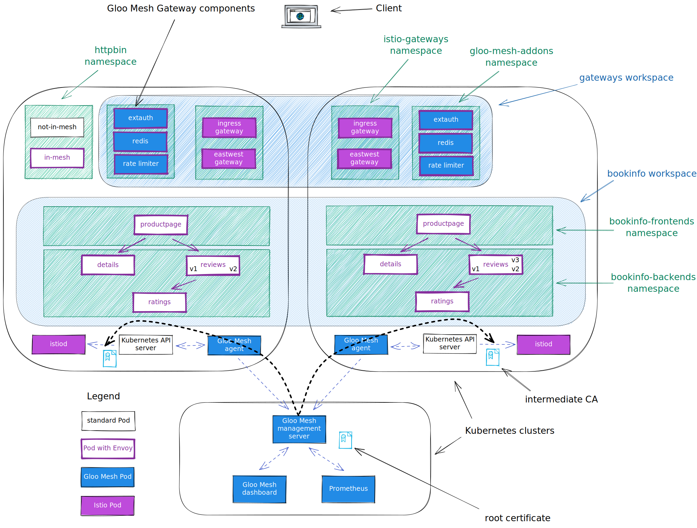
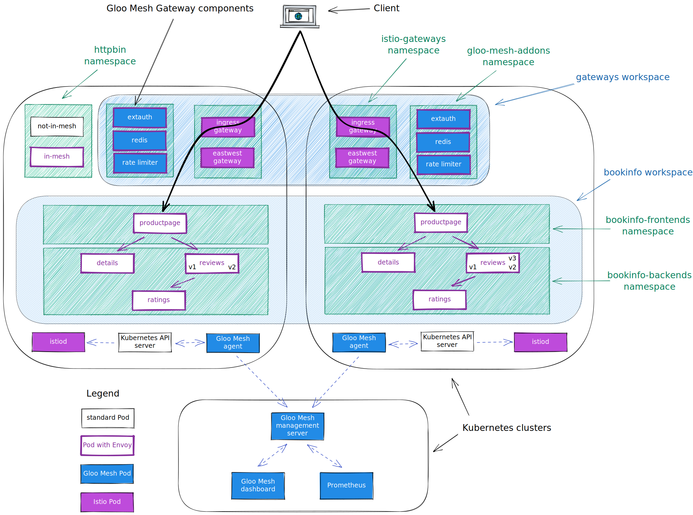

<!--bash
source ./scripts/assert.sh
-->


<center>
<svg id="gloo-product-logo" viewBox="250 150 2210 480" fill="none" xmlns="http://www.w3.org/2000/svg" alt="Gloo Gateway" style="max-height:100px">
    <style>#gloo-product-logo path{fill:#151927}@media(prefers-color-scheme:dark){#gloo-product-logo path{fill:white}}</style>
    <path fill-rule="evenodd" clip-rule="evenodd" d="M292.084 447.396C319.258 474.569 356.1 489.855 394.529 489.899C432.97 489.84 469.817 474.531 496.981 447.332C524.146 420.133 539.409 383.267 539.42 344.826V315.504H394.459V374.148H475.638C469.593 390.83 458.559 405.248 444.036 415.442C429.512 425.637 412.203 431.114 394.459 431.13C371.578 431.104 349.641 422.003 333.462 405.824C317.282 389.644 308.181 367.707 308.155 344.826C308.142 333.456 310.393 322.197 314.777 311.707C319.162 301.216 325.592 291.704 333.693 283.725C341.725 275.677 351.279 269.309 361.799 264.994C372.318 260.679 383.592 258.503 394.961 258.592C416.191 258.708 436.629 266.664 452.349 280.932L491.696 237.452C465.289 213.531 430.983 200.197 395.352 200.004C376.246 199.857 357.301 203.519 339.625 210.776C321.949 218.033 305.897 228.739 292.405 242.27C278.809 255.686 268.02 271.675 260.667 289.304C253.315 306.934 249.546 325.851 249.581 344.952C249.626 383.381 264.911 420.223 292.084 447.396ZM705.633 446.974C732.702 474.043 769.402 489.27 807.683 489.314C845.978 489.292 882.7 474.075 909.786 447.004C936.873 419.933 952.111 383.22 952.155 344.925C952.111 306.63 936.873 269.917 909.786 242.846C882.7 215.775 845.978 200.558 807.683 200.536C769.402 200.58 732.702 215.807 705.633 242.875C678.565 269.944 663.338 306.644 663.294 344.925C663.338 383.206 678.565 419.906 705.633 446.974ZM747.075 284.313C763.15 268.235 784.947 259.191 807.683 259.165V259.179C830.429 259.187 852.243 268.22 868.335 284.297C884.427 300.373 893.482 322.178 893.512 344.925C893.486 367.672 884.432 389.48 868.339 405.557C852.246 421.634 830.43 430.667 807.683 430.67C784.95 430.644 763.155 421.602 747.08 405.527C731.005 389.453 721.963 367.658 721.937 344.925C721.959 322.189 731 300.391 747.075 284.313ZM1015.93 446.979C1043 474.048 1079.7 489.273 1117.99 489.314C1156.27 489.27 1192.96 474.045 1220.03 446.979C1247.1 419.914 1262.33 383.217 1262.38 344.939C1262.34 306.656 1247.11 269.952 1220.04 242.88C1192.97 215.809 1156.27 200.58 1117.99 200.536C1079.7 200.576 1043 215.801 1015.93 242.87C988.858 269.939 973.629 306.642 973.585 344.925C973.629 383.208 988.858 419.91 1015.93 446.979ZM1057.38 284.312C1073.45 268.235 1095.25 259.191 1117.99 259.165V259.179C1140.72 259.205 1162.52 268.247 1178.59 284.322C1194.67 300.397 1203.71 322.192 1203.73 344.925C1203.71 367.658 1194.67 389.453 1178.59 405.527C1162.52 421.602 1140.72 430.644 1117.99 430.67C1095.25 430.648 1073.45 421.607 1057.38 405.532C1041.3 389.457 1032.25 367.66 1032.23 344.925C1032.25 322.188 1041.3 300.39 1057.38 284.312ZM679.891 472.692C663.068 455.941 649.72 436.031 640.615 414.106C631.509 392.181 626.826 368.673 626.833 344.933V206.283H568.734V344.933C568.713 376.299 574.89 407.36 586.909 436.332C598.928 465.304 616.553 491.616 638.771 513.757L679.891 472.692Z"/>
    <path d="M2409.07 355.935L2391.64 349.277L2436.1 275.844H2458.42L2409.07 355.935ZM2390.08 412.919V347.123H2409.46V412.919H2390.08ZM2390.47 355.935L2341.12 275.844H2363.25L2407.7 349.277L2390.47 355.935Z"/>
    <path d="M2320.99 412.919L2266.75 275.844H2286.33L2341.55 412.919H2320.99ZM2210.55 412.919L2265.77 275.844H2285.35L2231.11 412.919H2210.55ZM2236.59 376.3V359.068H2315.51V376.3H2236.59Z"/>
    <path d="M2134.61 412.919L2176.12 275.844H2195.51L2153.41 412.919H2134.61ZM2051.38 412.919L2009.87 275.844H2029.45L2070.18 412.919H2051.38ZM2053.54 412.919L2093.09 275.844H2111.31L2071.95 412.919H2053.54ZM2132.85 412.919L2094.27 275.844H2112.48L2151.84 412.919H2132.85Z"/>
    <path d="M1890.26 412.919V275.844H1972.7V293.468H1909.45V334.199H1966.43V351.431H1909.45V395.295H1973.09V412.919H1890.26Z"/>
    <path d="M1788.72 412.919V293.468H1745.83V275.844H1850.99V293.468H1808.1V412.919H1788.72Z"/>
    <path d="M1706.07 412.919L1651.83 275.844H1671.41L1726.63 412.919H1706.07ZM1595.62 412.919L1650.85 275.844H1670.43L1616.19 412.919H1595.62ZM1621.67 376.3V359.068H1700.58V376.3H1621.67Z"/>
    <path d="M1508.26 415.269C1494.42 415.269 1482.09 412.266 1471.25 406.261C1460.55 400.125 1452.13 391.77 1445.99 381.196C1439.99 370.491 1436.98 358.285 1436.98 344.577C1436.98 330.609 1439.99 318.338 1445.99 307.763C1452.13 297.058 1460.55 288.703 1471.25 282.698C1482.09 276.562 1494.42 273.495 1508.26 273.495C1515.83 273.495 1523.08 274.735 1530 277.215C1537.05 279.565 1543.38 282.894 1548.99 287.202C1554.74 291.38 1559.37 296.21 1562.9 301.693L1547.43 311.875C1544.82 307.828 1541.42 304.238 1537.24 301.105C1533.07 297.972 1528.43 295.557 1523.34 293.86C1518.38 292.032 1513.35 291.118 1508.26 291.118C1498.21 291.118 1489.27 293.403 1481.43 297.972C1473.73 302.541 1467.66 308.808 1463.22 316.771C1458.78 324.734 1456.57 334.003 1456.57 344.577C1456.57 354.891 1458.72 364.029 1463.03 371.992C1467.47 379.956 1473.6 386.222 1481.43 390.791C1489.4 395.36 1498.47 397.645 1508.65 397.645C1516.88 397.645 1524.19 395.948 1530.59 392.553C1537.11 389.159 1542.2 384.394 1545.86 378.259C1549.65 372.123 1551.54 365.008 1551.54 356.914L1570.14 355.152C1570.14 367.293 1567.47 377.867 1562.11 386.875C1556.89 395.882 1549.65 402.867 1540.38 407.827C1531.11 412.788 1520.4 415.269 1508.26 415.269ZM1518.25 358.089V342.032H1570.14V356.131L1560.35 358.089H1518.25Z"/>
    <path fill-rule="evenodd" clip-rule="evenodd" d="M1345.47 488.104L1345.47 201.133L1347.97 201.133L1347.97 488.104L1345.47 488.104Z"/>
</svg>
</center>

# <center>Gloo Gateway Workshop</center>


## Table of Contents
* [Introduction](#introduction)
* [Lab 1 - Deploy KinD clusters](#lab-1---deploy-kind-clusters-)
* [Lab 2 - Deploy and register Gloo Mesh](#lab-2---deploy-and-register-gloo-mesh-)
* [Lab 3 - Deploy Istio using Gloo Mesh Lifecycle Manager](#lab-3---deploy-istio-using-gloo-mesh-lifecycle-manager-)
* [Lab 4 - Deploy the Bookinfo demo app](#lab-4---deploy-the-bookinfo-demo-app-)
* [Lab 5 - Deploy the httpbin demo app](#lab-5---deploy-the-httpbin-demo-app-)
* [Lab 6 - Deploy Gloo Mesh Addons](#lab-6---deploy-gloo-mesh-addons-)
* [Lab 7 - Create the gateways workspace](#lab-7---create-the-gateways-workspace-)
* [Lab 8 - Create the bookinfo workspace](#lab-8---create-the-bookinfo-workspace-)
* [Lab 9 - Expose the productpage through a gateway](#lab-9---expose-the-productpage-through-a-gateway-)
* [Lab 10 - Create the Root Trust Policy](#lab-10---create-the-root-trust-policy-)
* [Lab 11 - Deploy Keycloak](#lab-11---deploy-keycloak-)
* [Lab 12 - Deploy Gloo Gateway](#lab-12---deploy-gloo-gateway-)
* [Lab 13 - Deploy the httpbin demo app](#lab-13---deploy-the-httpbin-demo-app-)
* [Lab 14 - Expose the httpbin application through the gateway](#lab-14---expose-the-httpbin-application-through-the-gateway-)
* [Lab 15 - Delegate with control](#lab-15---delegate-with-control-)
* [Lab 16 - Modify the requests and responses](#lab-16---modify-the-requests-and-responses-)
* [Lab 17 - Leverage Virtual Destinations](#lab-17---leverage-virtual-destinations-)
* [Lab 18 - Leverage Gloo Mesh Virtual Destinations](#lab-18---leverage-gloo-mesh-virtual-destinations-)


## Introduction <a name="introduction"></a>

<a href="https://www.solo.io/products/gloo-gateway/">Gloo Gateway</a> is a feature-rich, fast, and flexible Kubernetes-native ingress controller and next-generation API gateway that is built on top of <a href="https://www.envoyproxy.io/">Envoy proxy</a> and the <a href="https://gateway-api.sigs.k8s.io/">Kubernetes Gateway API</a>).

Gloo Gateway is fully conformant with the Kubernetes Gateway API and extends its functionality with Solo’s custom Gateway APIs, such as `RouteOption`, `VirtualHostOption`, `Upstream`s, `RateLimitConfig`, or `AuthConfig`.
These resources help to centrally configure routing, security, and resiliency rules for a specific component, such as a host, route, or gateway listener.

These capabilities are grouped into two editions of Gloo Gateway:

### Open source (OSS) Gloo Gateway

Use Kubernetes Gateway API-native features and the following Gloo Gateway extensions to configure basic routing, security, and resiliency capabilities:

* Access logging
* Buffering
* Cross-Origin Resource Sharing (CORS)
* Cross-Site Request Forgery (CSRF)
* Fault injection
* Header control
* Retries
* Timeouts
* Traffic tapping
* Transformations

### Gloo Gateway Enterprise Edition

In addition to the features provided by the OSS edition, many more features are available in the Enterprise Edition, including:

* External authentication and authorization
* External processing
* Data loss prevention
* Developer portal
* JSON web token (JWT)
* Rate limiting
* Response caching
* Web Application Filters

### Want to learn more about Gloo Gateway?

In the labs that follow we present some of the common patterns that our customers use and provide a good entry point into the workings of Gloo Gateway.

You can find more information about Gloo Gateway in the official documentation: <https://docs.solo.io/gateway/>.


## Lab 1 - Deploy KinD clusters <a name="lab-1---deploy-kind-clusters-"></a>


Clone this repository and go to the directory where this `README.md` file is.

Set the context environment variables:

```bash
export MGMT=mgmt
export CLUSTER1=cluster1
export CLUSTER2=cluster2
```

Run the following commands to deploy three Kubernetes clusters using [Kind](https://kind.sigs.k8s.io/):

```bash
./scripts/deploy.sh 1 mgmt
./scripts/deploy.sh 2 cluster1 us-west us-west-1
./scripts/deploy.sh 3 cluster2 us-west us-west-2
```

Then run the following commands to wait for all the Pods to be ready:

```bash
./scripts/check.sh mgmt
./scripts/check.sh cluster1
./scripts/check.sh cluster2
```

**Note:** If you run the `check.sh` script immediately after the `deploy.sh` script, you may see a jsonpath error. If that happens, simply wait a few seconds and try again.

Once the `check.sh` script completes, when you execute the `kubectl get pods -A` command, you should see the following:

```
NAMESPACE            NAME                                          READY   STATUS    RESTARTS   AGE
kube-system          calico-kube-controllers-59d85c5c84-sbk4k      1/1     Running   0          4h26m
kube-system          calico-node-przxs                             1/1     Running   0          4h26m
kube-system          coredns-6955765f44-ln8f5                      1/1     Running   0          4h26m
kube-system          coredns-6955765f44-s7xxx                      1/1     Running   0          4h26m
kube-system          etcd-cluster1-control-plane                   1/1     Running   0          4h27m
kube-system          kube-apiserver-cluster1-control-plane         1/1     Running   0          4h27m
kube-system          kube-controller-manager-cluster1-control-plane1/1     Running   0          4h27m
kube-system          kube-proxy-ksvzw                              1/1     Running   0          4h26m
kube-system          kube-scheduler-cluster1-control-plane         1/1     Running   0          4h27m
local-path-storage   local-path-provisioner-58f6947c7-lfmdx        1/1     Running   0          4h26m
metallb-system       controller-5c9894b5cd-cn9x2                   1/1     Running   0          4h26m
metallb-system       speaker-d7jkp                                 1/1     Running   0          4h26m
```

**Note:** The CNI pods might be different, depending on which CNI you have deployed.

You can see that your currently connected to this cluster by executing the `kubectl config get-contexts` command:

```
CURRENT   NAME         CLUSTER         AUTHINFO   NAMESPACE
          cluster1     kind-cluster1   cluster1
*         cluster2     kind-cluster2   cluster2
          mgmt         kind-mgmt       kind-mgmt
```

Run the following command to make `mgmt` the current cluster.

```bash
kubectl config use-context ${MGMT}
```
<!--bash
cat <<'EOF' > ./test.js
const helpers = require('./tests/chai-exec');

describe("Clusters are healthy", () => {
    const clusters = [process.env.MGMT, process.env.CLUSTER1, process.env.CLUSTER2];
    clusters.forEach(cluster => {
        it(`Cluster ${cluster} is healthy`, () => helpers.k8sObjectIsPresent({ context: cluster, namespace: "default", k8sType: "service", k8sObj: "kubernetes" }));
    });
});
EOF
echo "executing test dist/gloo-gateway-workshop/build/imported/gloo-mesh-2-0/templates/steps/deploy-kind-clusters/tests/cluster-healthy.test.js.liquid"
timeout --signal=INT 3m mocha ./test.js --timeout 10000 --retries=120 --bail || { DEBUG_MODE=true mocha ./test.js --timeout 120000; exit 1; }
-->


## Lab 2 - Deploy and register Gloo Mesh <a name="lab-2---deploy-and-register-gloo-mesh-"></a>
[](https://youtu.be/djfFiepK4GY "Video Link")


Before we get started, let's install the `meshctl` CLI:

```bash
export GLOO_MESH_VERSION=v2.6.0
curl -sL https://run.solo.io/meshctl/install | sh -
export PATH=$HOME/.gloo-mesh/bin:$PATH
```
<!--bash
cat <<'EOF' > ./test.js
var chai = require('chai');
var expect = chai.expect;

describe("Required environment variables should contain value", () => {
  afterEach(function(done){
    if(this.currentTest.currentRetry() > 0){
      process.stdout.write(".");
       setTimeout(done, 1000);
    } else {
      done();
    }
  });

  it("Context environment variables should not be empty", () => {
    expect(process.env.MGMT).not.to.be.empty
    expect(process.env.CLUSTER1).not.to.be.empty
    expect(process.env.CLUSTER2).not.to.be.empty
  });

  it("Gloo Mesh licence environment variables should not be empty", () => {
    expect(process.env.GLOO_MESH_LICENSE_KEY).not.to.be.empty
  });
});
EOF
echo "executing test dist/gloo-gateway-workshop/build/imported/gloo-mesh-2-0/templates/steps/deploy-and-register-gloo-mesh/tests/environment-variables.test.js.liquid"
timeout --signal=INT 3m mocha ./test.js --timeout 10000 --retries=120 --bail || { DEBUG_MODE=true mocha ./test.js --timeout 120000; exit 1; }
-->
Run the following commands to deploy the Gloo Mesh management plane:

```bash
kubectl --context ${MGMT} create ns gloo-mesh

helm upgrade --install gloo-platform-crds gloo-platform-crds \
  --repo https://storage.googleapis.com/gloo-platform/helm-charts \
  --namespace gloo-mesh \
  --kube-context ${MGMT} \
  --version 2.6.0

helm upgrade --install gloo-platform gloo-platform \
  --repo https://storage.googleapis.com/gloo-platform/helm-charts \
  --namespace gloo-mesh \
  --kube-context ${MGMT} \
  --version 2.6.0 \
  -f -<<EOF
licensing:
  glooTrialLicenseKey: ${GLOO_MESH_LICENSE_KEY}
common:
  cluster: mgmt
glooInsightsEngine:
  enabled: false
glooMgmtServer:
  enabled: true
  ports:
    healthcheck: 8091
prometheus:
  enabled: true
redis:
  deployment:
    enabled: true
telemetryGateway:
  enabled: true
  service:
    type: LoadBalancer
glooUi:
  enabled: true
  serviceType: LoadBalancer
telemetryCollector:
  enabled: true
  config:
    exporters:
      otlp:
        endpoint: gloo-telemetry-gateway:4317
EOF

kubectl --context ${MGMT} -n gloo-mesh rollout status deploy/gloo-mesh-mgmt-server
```

<!--bash
kubectl wait --context ${MGMT} --for=condition=Ready -n gloo-mesh --all pod
timeout 2m bash -c "until [[ \$(kubectl --context ${MGMT} -n gloo-mesh get svc gloo-mesh-mgmt-server -o json | jq '.status.loadBalancer | length') -gt 0 ]]; do
  sleep 1
done"
-->

Then, you need to set the environment variable to tell the Gloo Mesh agents how to communicate with the management plane:
<!--bash
cat <<'EOF' > ./test.js

const helpers = require('./tests/chai-exec');

describe("MGMT server is healthy", () => {
  let cluster = process.env.MGMT;
  let deployments = ["gloo-mesh-mgmt-server","gloo-mesh-redis","gloo-telemetry-gateway","prometheus-server"];
  deployments.forEach(deploy => {
    it(deploy + ' pods are ready in ' + cluster, () => helpers.checkDeployment({ context: cluster, namespace: "gloo-mesh", k8sObj: deploy }));
  });
});
EOF
echo "executing test dist/gloo-gateway-workshop/build/imported/gloo-mesh-2-0/templates/steps/deploy-and-register-gloo-mesh/tests/check-deployment.test.js.liquid"
timeout --signal=INT 3m mocha ./test.js --timeout 10000 --retries=120 --bail || { DEBUG_MODE=true mocha ./test.js --timeout 120000; exit 1; }
-->
<!--bash
cat <<'EOF' > ./test.js
const chaiExec = require("@jsdevtools/chai-exec");
var chai = require('chai');
var expect = chai.expect;
chai.use(chaiExec);

afterEach(function (done) {
  if (this.currentTest.currentRetry() > 0) {
    process.stdout.write(".");
    setTimeout(done, 1000);
  } else {
    done();
  }
});
EOF
echo "executing test dist/gloo-gateway-workshop/build/imported/gloo-mesh-2-0/templates/steps/deploy-and-register-gloo-mesh/tests/get-gloo-mesh-mgmt-server-ip.test.js.liquid"
timeout --signal=INT 3m mocha ./test.js --timeout 10000 --retries=120 --bail || { DEBUG_MODE=true mocha ./test.js --timeout 120000; exit 1; }
-->

```bash
export ENDPOINT_GLOO_MESH=$(kubectl --context ${MGMT} -n gloo-mesh get svc gloo-mesh-mgmt-server -o jsonpath='{.status.loadBalancer.ingress[0].*}'):9900
export HOST_GLOO_MESH=$(echo ${ENDPOINT_GLOO_MESH%:*})
export ENDPOINT_TELEMETRY_GATEWAY=$(kubectl --context ${MGMT} -n gloo-mesh get svc gloo-telemetry-gateway -o jsonpath='{.status.loadBalancer.ingress[0].*}'):4317
export ENDPOINT_GLOO_MESH_UI=$(kubectl --context ${MGMT} -n gloo-mesh get svc gloo-mesh-ui -o jsonpath='{.status.loadBalancer.ingress[0].*}'):8090
```

Check that the variables have correct values:
```
echo $HOST_GLOO_MESH
echo $ENDPOINT_GLOO_MESH
```

<!--bash
cat <<'EOF' > ./test.js
const dns = require('dns');
const chaiHttp = require("chai-http");
const chai = require("chai");
const expect = chai.expect;
chai.use(chaiHttp);
const { waitOnFailedTest } = require('./tests/utils');

afterEach(function(done) { waitOnFailedTest(done, this.currentTest.currentRetry())});

describe("Address '" + process.env.HOST_GLOO_MESH + "' can be resolved in DNS", () => {
    it(process.env.HOST_GLOO_MESH + ' can be resolved', (done) => {
        return dns.lookup(process.env.HOST_GLOO_MESH, (err, address, family) => {
            expect(address).to.be.an.ip;
            done();
        });
    });
});
EOF
echo "executing test ./gloo-mesh-2-0/tests/can-resolve.test.js.liquid"
timeout --signal=INT 3m mocha ./test.js --timeout 10000 --retries=120 --bail || { DEBUG_MODE=true mocha ./test.js --timeout 120000; exit 1; }
-->
Finally, you need to register the cluster(s).


Here is how you register the first one:

```bash
kubectl apply --context ${MGMT} -f - <<EOF
apiVersion: admin.gloo.solo.io/v2
kind: KubernetesCluster
metadata:
  name: cluster1
  namespace: gloo-mesh
spec:
  clusterDomain: cluster.local
EOF

kubectl --context ${CLUSTER1} create ns gloo-mesh

kubectl get secret relay-root-tls-secret -n gloo-mesh --context ${MGMT} -o jsonpath='{.data.ca\.crt}' | base64 -d > ca.crt
kubectl create secret generic relay-root-tls-secret -n gloo-mesh --context ${CLUSTER1} --from-file ca.crt=ca.crt
rm ca.crt

kubectl get secret relay-identity-token-secret -n gloo-mesh --context ${MGMT} -o jsonpath='{.data.token}' | base64 -d > token
kubectl create secret generic relay-identity-token-secret -n gloo-mesh --context ${CLUSTER1} --from-file token=token
rm token

helm upgrade --install gloo-platform-crds gloo-platform-crds \
  --repo https://storage.googleapis.com/gloo-platform/helm-charts \
  --namespace gloo-mesh \
  --kube-context ${CLUSTER1} \
  --version 2.6.0

helm upgrade --install gloo-platform gloo-platform \
  --repo https://storage.googleapis.com/gloo-platform/helm-charts \
  --namespace gloo-mesh \
  --kube-context ${CLUSTER1} \
  --version 2.6.0 \
  -f -<<EOF
common:
  cluster: cluster1
glooAgent:
  enabled: true
  relay:
    serverAddress: "${ENDPOINT_GLOO_MESH}"
    authority: gloo-mesh-mgmt-server.gloo-mesh
telemetryCollector:
  enabled: true
  config:
    exporters:
      otlp:
        endpoint: "${ENDPOINT_TELEMETRY_GATEWAY}"
EOF
```

Note that the registration can also be performed using `meshctl cluster register`.

And here is how you register the second one:

```bash
kubectl apply --context ${MGMT} -f - <<EOF
apiVersion: admin.gloo.solo.io/v2
kind: KubernetesCluster
metadata:
  name: cluster2
  namespace: gloo-mesh
spec:
  clusterDomain: cluster.local
EOF

kubectl --context ${CLUSTER2} create ns gloo-mesh

kubectl get secret relay-root-tls-secret -n gloo-mesh --context ${MGMT} -o jsonpath='{.data.ca\.crt}' | base64 -d > ca.crt
kubectl create secret generic relay-root-tls-secret -n gloo-mesh --context ${CLUSTER2} --from-file ca.crt=ca.crt
rm ca.crt

kubectl get secret relay-identity-token-secret -n gloo-mesh --context ${MGMT} -o jsonpath='{.data.token}' | base64 -d > token
kubectl create secret generic relay-identity-token-secret -n gloo-mesh --context ${CLUSTER2} --from-file token=token
rm token

helm upgrade --install gloo-platform-crds gloo-platform-crds \
  --repo https://storage.googleapis.com/gloo-platform/helm-charts \
  --namespace gloo-mesh \
  --kube-context ${CLUSTER2} \
  --version 2.6.0

helm upgrade --install gloo-platform gloo-platform \
  --repo https://storage.googleapis.com/gloo-platform/helm-charts \
  --namespace gloo-mesh \
  --kube-context ${CLUSTER2} \
  --version 2.6.0 \
  -f -<<EOF
common:
  cluster: cluster2
glooAgent:
  enabled: true
  relay:
    serverAddress: "${ENDPOINT_GLOO_MESH}"
    authority: gloo-mesh-mgmt-server.gloo-mesh
telemetryCollector:
  enabled: true
  config:
    exporters:
      otlp:
        endpoint: "${ENDPOINT_TELEMETRY_GATEWAY}"
EOF
```

You can check the cluster(s) have been registered correctly using the following commands:
```
meshctl --kubecontext ${MGMT} check
```

```
pod=$(kubectl --context ${MGMT} -n gloo-mesh get pods -l app=gloo-mesh-mgmt-server -o jsonpath='{.items[0].metadata.name}')
kubectl --context ${MGMT} -n gloo-mesh debug -q -i ${pod} --image=curlimages/curl -- curl -s http://localhost:9091/metrics | grep relay_push_clients_connected
```

You should get an output similar to this:
```,nocopy
# HELP relay_push_clients_connected Current number of connected Relay push clients (Relay Agents).
# TYPE relay_push_clients_connected gauge
relay_push_clients_connected{cluster="cluster1"} 1
relay_push_clients_connected{cluster="cluster2"} 1
```
Finally, you need to specify which gateways you want to use for cross cluster traffic:

```bash
kubectl apply --context ${MGMT} -f - <<EOF
apiVersion: admin.gloo.solo.io/v2
kind: WorkspaceSettings
metadata:
  name: global
  namespace: gloo-mesh
spec:
  options:
    eastWestGateways:
      - selector:
          labels:
            istio: eastwestgateway
EOF
```
<!--bash
cat <<'EOF' > ./test.js
var chai = require('chai');
var expect = chai.expect;
const helpers = require('./tests/chai-exec');
describe("Cluster registration", () => {
  it("cluster1 is registered", () => {
    podName = helpers.getOutputForCommand({ command: "kubectl -n gloo-mesh get pods -l app=gloo-mesh-mgmt-server -o jsonpath='{.items[0].metadata.name}' --context " + process.env.MGMT }).replaceAll("'", "");
    command = helpers.getOutputForCommand({ command: "kubectl --context " + process.env.MGMT + " -n gloo-mesh debug -q -i " + podName + " --image=curlimages/curl -- curl -s http://localhost:9091/metrics" }).replaceAll("'", "");
    expect(command).to.contain("cluster1");
  });
  it("cluster2 is registered", () => {
    podName = helpers.getOutputForCommand({ command: "kubectl -n gloo-mesh get pods -l app=gloo-mesh-mgmt-server -o jsonpath='{.items[0].metadata.name}' --context " + process.env.MGMT }).replaceAll("'", "");
    command = helpers.getOutputForCommand({ command: "kubectl --context " + process.env.MGMT + " -n gloo-mesh debug -q -i " + podName + " --image=curlimages/curl -- curl -s http://localhost:9091/metrics" }).replaceAll("'", "");
    expect(command).to.contain("cluster2");
  });
});
EOF
echo "executing test dist/gloo-gateway-workshop/build/imported/gloo-mesh-2-0/templates/steps/deploy-and-register-gloo-mesh/tests/cluster-registration.test.js.liquid"
timeout --signal=INT 3m mocha ./test.js --timeout 10000 --retries=120 --bail || { DEBUG_MODE=true mocha ./test.js --timeout 120000; exit 1; }
-->


## Lab 3 - Deploy Istio using Gloo Mesh Lifecycle Manager <a name="lab-3---deploy-istio-using-gloo-mesh-lifecycle-manager-"></a>
[](https://youtu.be/f76-KOEjqHs "Video Link")

We are going to deploy Istio using Gloo Mesh Lifecycle Manager.

<details>
  <summary>Install <code>istioctl</code></summary>

Install `istioctl` if not already installed as it will be useful in some of the labs that follow.

```bash
curl -L https://istio.io/downloadIstio | sh -

if [ -d "istio-"*/ ]; then
  cd istio-*/
  export PATH=$PWD/bin:$PATH
  cd ..
fi
```

That's it!
</details>

<!--bash
cat <<'EOF' > ./test.js
const chaiExec = require("@jsdevtools/chai-exec");
var chai = require('chai');
var expect = chai.expect;
chai.use(chaiExec);

afterEach(function (done) {
  if (this.currentTest.currentRetry() > 0) {
    process.stdout.write(".");
    setTimeout(done, 1000);
  } else {
    done();
  }
});
EOF
echo "executing test dist/gloo-gateway-workshop/build/imported/gloo-mesh-2-0/templates/steps/istio-lifecycle-manager-install/tests/istio-version.test.js.liquid"
timeout --signal=INT 3m mocha ./test.js --timeout 10000 --retries=120 --bail || { DEBUG_MODE=true mocha ./test.js --timeout 120000; exit 1; }
-->

Let's create Kubernetes services for the gateways:

```bash
kubectl --context ${CLUSTER1} create ns istio-gateways

kubectl apply --context ${CLUSTER1} -f - <<EOF
apiVersion: v1
kind: Service
metadata:
  labels:
    app: istio-ingressgateway
    istio: ingressgateway
  name: istio-ingressgateway
  namespace: istio-gateways
spec:
  ports:
  - name: http2
    port: 80
    protocol: TCP
    targetPort: 8080
  - name: https
    port: 443
    protocol: TCP
    targetPort: 8443
  selector:
    app: istio-ingressgateway
    istio: ingressgateway
    revision: 1-23
  type: LoadBalancer
EOF

kubectl apply --context ${CLUSTER1} -f - <<EOF
apiVersion: v1
kind: Service
metadata:
  labels:
    app: istio-ingressgateway
    istio: eastwestgateway
    topology.istio.io/network: cluster1
  name: istio-eastwestgateway
  namespace: istio-gateways
spec:
  ports:
  - name: status-port
    port: 15021
    protocol: TCP
    targetPort: 15021
  - name: tls
    port: 15443
    protocol: TCP
    targetPort: 15443
  - name: https
    port: 16443
    protocol: TCP
    targetPort: 16443
  - name: tls-spire
    port: 8081
    protocol: TCP
    targetPort: 8081
  - name: tls-otel
    port: 4317
    protocol: TCP
    targetPort: 4317
  - name: grpc-cacert
    port: 31338
    protocol: TCP
    targetPort: 31338
  - name: grpc-ew-bootstrap
    port: 31339
    protocol: TCP
    targetPort: 31339
  - name: tcp-istiod
    port: 15012
    protocol: TCP
    targetPort: 15012
  - name: tcp-webhook
    port: 15017
    protocol: TCP
    targetPort: 15017
  selector:
    app: istio-ingressgateway
    istio: eastwestgateway
    revision: 1-23
    topology.istio.io/network: cluster1
  type: LoadBalancer
EOF
kubectl --context ${CLUSTER2} create ns istio-gateways

kubectl apply --context ${CLUSTER2} -f - <<EOF
apiVersion: v1
kind: Service
metadata:
  labels:
    app: istio-ingressgateway
    istio: ingressgateway
  name: istio-ingressgateway
  namespace: istio-gateways
spec:
  ports:
  - name: http2
    port: 80
    protocol: TCP
    targetPort: 8080
  - name: https
    port: 443
    protocol: TCP
    targetPort: 8443
  selector:
    app: istio-ingressgateway
    istio: ingressgateway
    revision: 1-23
  type: LoadBalancer
EOF

kubectl apply --context ${CLUSTER2} -f - <<EOF
apiVersion: v1
kind: Service
metadata:
  labels:
    app: istio-ingressgateway
    istio: eastwestgateway
    topology.istio.io/network: cluster2
  name: istio-eastwestgateway
  namespace: istio-gateways
spec:
  ports:
  - name: status-port
    port: 15021
    protocol: TCP
    targetPort: 15021
  - name: tls
    port: 15443
    protocol: TCP
    targetPort: 15443
  - name: https
    port: 16443
    protocol: TCP
    targetPort: 16443
  - name: tls-spire
    port: 8081
    protocol: TCP
    targetPort: 8081
  - name: tls-otel
    port: 4317
    protocol: TCP
    targetPort: 4317
  - name: grpc-cacert
    port: 31338
    protocol: TCP
    targetPort: 31338
  - name: grpc-ew-bootstrap
    port: 31339
    protocol: TCP
    targetPort: 31339
  - name: tcp-istiod
    port: 15012
    protocol: TCP
    targetPort: 15012
  - name: tcp-webhook
    port: 15017
    protocol: TCP
    targetPort: 15017
  selector:
    app: istio-ingressgateway
    istio: eastwestgateway
    revision: 1-23
    topology.istio.io/network: cluster2
  type: LoadBalancer
EOF
```

It allows us to have full control on which Istio revision we want to use.

Then, we can tell Gloo Mesh to deploy the Istio control planes and the gateways in the cluster(s).

```bash
kubectl apply --context ${MGMT} -f - <<EOF
apiVersion: admin.gloo.solo.io/v2
kind: IstioLifecycleManager
metadata:
  name: cluster1-installation
  namespace: gloo-mesh
spec:
  installations:
    - clusters:
      - name: cluster1
        defaultRevision: true
      revision: 1-23
      istioOperatorSpec:
        profile: minimal
        hub: us-docker.pkg.dev/gloo-mesh/istio-workshops
        tag: 1.23.2-solo
        namespace: istio-system
        values:
          global:
            meshID: mesh1
            multiCluster:
              clusterName: cluster1
            network: cluster1
        meshConfig:
          accessLogFile: /dev/stdout
          defaultConfig:
            proxyMetadata:
              ISTIO_META_DNS_CAPTURE: "true"
              ISTIO_META_DNS_AUTO_ALLOCATE: "true"
        components:
          pilot:
            k8s:
              env:
                - name: PILOT_ENABLE_K8S_SELECT_WORKLOAD_ENTRIES
                  value: "false"
                - name: PILOT_ENABLE_IP_AUTOALLOCATE
                  value: "true"
          ingressGateways:
          - name: istio-ingressgateway
            enabled: false
EOF

kubectl apply --context ${MGMT} -f - <<EOF
apiVersion: admin.gloo.solo.io/v2
kind: GatewayLifecycleManager
metadata:
  name: cluster1-ingress
  namespace: gloo-mesh
spec:
  installations:
    - clusters:
      - name: cluster1
        activeGateway: false
      gatewayRevision: 1-23
      istioOperatorSpec:
        profile: empty
        hub: us-docker.pkg.dev/gloo-mesh/istio-workshops
        tag: 1.23.2-solo
        values:
          gateways:
            istio-ingressgateway:
              customService: true
        components:
          ingressGateways:
            - name: istio-ingressgateway
              namespace: istio-gateways
              enabled: true
              label:
                istio: ingressgateway
---
apiVersion: admin.gloo.solo.io/v2
kind: GatewayLifecycleManager
metadata:
  name: cluster1-eastwest
  namespace: gloo-mesh
spec:
  installations:
    - clusters:
      - name: cluster1
        activeGateway: false
      gatewayRevision: 1-23
      istioOperatorSpec:
        profile: empty
        hub: us-docker.pkg.dev/gloo-mesh/istio-workshops
        tag: 1.23.2-solo
        values:
          gateways:
            istio-ingressgateway:
              customService: true
        components:
          ingressGateways:
            - name: istio-eastwestgateway
              namespace: istio-gateways
              enabled: true
              label:
                istio: eastwestgateway
                topology.istio.io/network: cluster1
              k8s:
                env:
                  - name: ISTIO_META_ROUTER_MODE
                    value: "sni-dnat"
                  - name: ISTIO_META_REQUESTED_NETWORK_VIEW
                    value: cluster1
EOF

kubectl apply --context ${MGMT} -f - <<EOF
apiVersion: admin.gloo.solo.io/v2
kind: IstioLifecycleManager
metadata:
  name: cluster2-installation
  namespace: gloo-mesh
spec:
  installations:
    - clusters:
      - name: cluster2
        defaultRevision: true
      revision: 1-23
      istioOperatorSpec:
        profile: minimal
        hub: us-docker.pkg.dev/gloo-mesh/istio-workshops
        tag: 1.23.2-solo
        namespace: istio-system
        values:
          global:
            meshID: mesh1
            multiCluster:
              clusterName: cluster2
            network: cluster2
        meshConfig:
          accessLogFile: /dev/stdout
          defaultConfig:
            proxyMetadata:
              ISTIO_META_DNS_CAPTURE: "true"
              ISTIO_META_DNS_AUTO_ALLOCATE: "true"
        components:
          pilot:
            k8s:
              env:
                - name: PILOT_ENABLE_K8S_SELECT_WORKLOAD_ENTRIES
                  value: "false"
                - name: PILOT_ENABLE_IP_AUTOALLOCATE
                  value: "true"
          ingressGateways:
          - name: istio-ingressgateway
            enabled: false
EOF

kubectl apply --context ${MGMT} -f - <<EOF
apiVersion: admin.gloo.solo.io/v2
kind: GatewayLifecycleManager
metadata:
  name: cluster2-ingress
  namespace: gloo-mesh
spec:
  installations:
    - clusters:
      - name: cluster2
        activeGateway: false
      gatewayRevision: 1-23
      istioOperatorSpec:
        profile: empty
        hub: us-docker.pkg.dev/gloo-mesh/istio-workshops
        tag: 1.23.2-solo
        values:
          gateways:
            istio-ingressgateway:
              customService: true
        components:
          ingressGateways:
            - name: istio-ingressgateway
              namespace: istio-gateways
              enabled: true
              label:
                istio: ingressgateway
---
apiVersion: admin.gloo.solo.io/v2
kind: GatewayLifecycleManager
metadata:
  name: cluster2-eastwest
  namespace: gloo-mesh
spec:
  installations:
    - clusters:
      - name: cluster2
        activeGateway: false
      gatewayRevision: 1-23
      istioOperatorSpec:
        profile: empty
        hub: us-docker.pkg.dev/gloo-mesh/istio-workshops
        tag: 1.23.2-solo
        values:
          gateways:
            istio-ingressgateway:
              customService: true
        components:
          ingressGateways:
            - name: istio-eastwestgateway
              namespace: istio-gateways
              enabled: true
              label:
                istio: eastwestgateway
                topology.istio.io/network: cluster2
              k8s:
                env:
                  - name: ISTIO_META_ROUTER_MODE
                    value: "sni-dnat"
                  - name: ISTIO_META_REQUESTED_NETWORK_VIEW
                    value: cluster2
EOF
```

<!--bash
until kubectl --context ${MGMT} -n gloo-mesh wait --timeout=180s --for=jsonpath='{.status.clusters.cluster1.installations.*.state}'=HEALTHY istiolifecyclemanagers/cluster1-installation; do
  echo "Waiting for the Istio installation to complete"
  sleep 1
done
timeout 2m bash -c "until [[ \$(kubectl --context ${CLUSTER1} -n istio-system get deploy -o json | jq '[.items[].status.readyReplicas] | add') -ge 1 ]]; do
  sleep 1
done"
timeout 2m bash -c "until [[ \$(kubectl --context ${CLUSTER1} -n istio-gateways get deploy -o json | jq '[.items[].status.readyReplicas] | add') -eq 2 ]]; do
  sleep 1
done"
until kubectl --context ${MGMT} -n gloo-mesh wait --timeout=180s --for=jsonpath='{.status.clusters.cluster2.installations.*.state}'=HEALTHY istiolifecyclemanagers/cluster2-installation; do
  echo "Waiting for the Istio installation to complete"
  sleep 1
done
timeout 2m bash -c "until [[ \$(kubectl --context ${CLUSTER2} -n istio-system get deploy -o json | jq '[.items[].status.readyReplicas] | add') -ge 1 ]]; do
  sleep 1
done"
timeout 2m bash -c "until [[ \$(kubectl --context ${CLUSTER2} -n istio-gateways get deploy -o json | jq '[.items[].status.readyReplicas] | add') -eq 2 ]]; do
  sleep 1
done"
-->

<!--bash
cat <<'EOF' > ./test.js

const helpers = require('./tests/chai-exec');

const chaiExec = require("@jsdevtools/chai-exec");
const helpersHttp = require('./tests/chai-http');
const chai = require("chai");
const expect = chai.expect;

afterEach(function (done) {
  if (this.currentTest.currentRetry() > 0) {
    process.stdout.write(".");
    setTimeout(done, 1000);
  } else {
    done();
  }
});

describe("Checking Istio installation", function() {
  it('istiod pods are ready in cluster ' + process.env.CLUSTER1, () => helpers.checkDeploymentsWithLabels({ context: process.env.CLUSTER1, namespace: "istio-system", labels: "app=istiod", instances: 1 }));
  it('gateway pods are ready in cluster ' + process.env.CLUSTER1, () => helpers.checkDeploymentsWithLabels({ context: process.env.CLUSTER1, namespace: "istio-gateways", labels: "app=istio-ingressgateway", instances: 2 }));
  it('istiod pods are ready in cluster ' + process.env.CLUSTER2, () => helpers.checkDeploymentsWithLabels({ context: process.env.CLUSTER2, namespace: "istio-system", labels: "app=istiod", instances: 1 }));
  it('gateway pods are ready in cluster ' + process.env.CLUSTER2, () => helpers.checkDeploymentsWithLabels({ context: process.env.CLUSTER2, namespace: "istio-gateways", labels: "app=istio-ingressgateway", instances: 2 }));
  it("Gateways have an ip attached in cluster " + process.env.CLUSTER1, () => {
    let cli = chaiExec("kubectl --context " + process.env.CLUSTER1 + " -n istio-gateways get svc -l app=istio-ingressgateway -o jsonpath='{.items}'");
    cli.stderr.should.be.empty;
    let deployments = JSON.parse(cli.stdout.slice(1,-1));
    expect(deployments).to.have.lengthOf(2);
    deployments.forEach((deployment) => {
      expect(deployment.status.loadBalancer).to.have.property("ingress");
    });
  });
  it("Gateways have an ip attached in cluster " + process.env.CLUSTER2, () => {
    let cli = chaiExec("kubectl --context " + process.env.CLUSTER2 + " -n istio-gateways get svc -l app=istio-ingressgateway -o jsonpath='{.items}'");
    cli.stderr.should.be.empty;
    let deployments = JSON.parse(cli.stdout.slice(1,-1));
    expect(deployments).to.have.lengthOf(2);
    deployments.forEach((deployment) => {
      expect(deployment.status.loadBalancer).to.have.property("ingress");
    });
  });
});

EOF
echo "executing test dist/gloo-gateway-workshop/build/imported/gloo-mesh-2-0/templates/steps/istio-lifecycle-manager-install/tests/istio-ready.test.js.liquid"
timeout --signal=INT 3m mocha ./test.js --timeout 10000 --retries=120 --bail || { DEBUG_MODE=true mocha ./test.js --timeout 120000; exit 1; }
-->
<!--bash
timeout 2m bash -c "until [[ \$(kubectl --context ${CLUSTER1} -n istio-gateways get svc -l istio=ingressgateway -o json | jq '.items[0].status.loadBalancer | length') -gt 0 ]]; do
  sleep 1
done"
-->

```bash
export HOST_GW_CLUSTER1="$(kubectl --context ${CLUSTER1} -n istio-gateways get svc -l istio=ingressgateway -o jsonpath='{.items[0].status.loadBalancer.ingress[0].*}')"
export HOST_GW_CLUSTER2="$(kubectl --context ${CLUSTER2} -n istio-gateways get svc -l istio=ingressgateway -o jsonpath='{.items[0].status.loadBalancer.ingress[0].*}')"
```

<!--bash
cat <<'EOF' > ./test.js
const dns = require('dns');
const chaiHttp = require("chai-http");
const chai = require("chai");
const expect = chai.expect;
chai.use(chaiHttp);
const { waitOnFailedTest } = require('./tests/utils');

afterEach(function(done) { waitOnFailedTest(done, this.currentTest.currentRetry())});

describe("Address '" + process.env.HOST_GW_CLUSTER1 + "' can be resolved in DNS", () => {
    it(process.env.HOST_GW_CLUSTER1 + ' can be resolved', (done) => {
        return dns.lookup(process.env.HOST_GW_CLUSTER1, (err, address, family) => {
            expect(address).to.be.an.ip;
            done();
        });
    });
});
EOF
echo "executing test ./gloo-mesh-2-0/tests/can-resolve.test.js.liquid"
timeout --signal=INT 3m mocha ./test.js --timeout 10000 --retries=120 --bail || { DEBUG_MODE=true mocha ./test.js --timeout 120000; exit 1; }
-->
<!--bash
cat <<'EOF' > ./test.js
const dns = require('dns');
const chaiHttp = require("chai-http");
const chai = require("chai");
const expect = chai.expect;
chai.use(chaiHttp);
const { waitOnFailedTest } = require('./tests/utils');

afterEach(function(done) { waitOnFailedTest(done, this.currentTest.currentRetry())});

describe("Address '" + process.env.HOST_GW_CLUSTER2 + "' can be resolved in DNS", () => {
    it(process.env.HOST_GW_CLUSTER2 + ' can be resolved', (done) => {
        return dns.lookup(process.env.HOST_GW_CLUSTER2, (err, address, family) => {
            expect(address).to.be.an.ip;
            done();
        });
    });
});
EOF
echo "executing test ./gloo-mesh-2-0/tests/can-resolve.test.js.liquid"
timeout --signal=INT 3m mocha ./test.js --timeout 10000 --retries=120 --bail || { DEBUG_MODE=true mocha ./test.js --timeout 120000; exit 1; }
-->


## Lab 4 - Deploy the Bookinfo demo app <a name="lab-4---deploy-the-bookinfo-demo-app-"></a>
[](https://youtu.be/nzYcrjalY5A "Video Link")

We're going to deploy the bookinfo application to demonstrate several features of Gloo Mesh.

You can find more information about this application [here](https://istio.io/latest/docs/examples/bookinfo/).

Run the following commands to deploy the bookinfo application on `cluster1`:

```bash
kubectl --context ${CLUSTER1} create ns bookinfo-frontends
kubectl --context ${CLUSTER1} create ns bookinfo-backends
kubectl --context ${CLUSTER1} label namespace bookinfo-frontends istio.io/rev=1-23 --overwrite
kubectl --context ${CLUSTER1} label namespace bookinfo-backends istio.io/rev=1-23 --overwrite

# Deploy the frontend bookinfo service in the bookinfo-frontends namespace
kubectl --context ${CLUSTER1} -n bookinfo-frontends apply -f data/steps/gloo-mesh-2-0/deploy-bookinfo/productpage-v1.yaml

# Deploy the backend bookinfo services in the bookinfo-backends namespace for all versions less than v3
kubectl --context ${CLUSTER1} -n bookinfo-backends apply \
  -f data/steps/gloo-mesh-2-0/deploy-bookinfo/details-v1.yaml \
  -f data/steps/gloo-mesh-2-0/deploy-bookinfo/ratings-v1.yaml \
  -f data/steps/gloo-mesh-2-0/deploy-bookinfo/reviews-v1-v2.yaml

# Update the reviews service to display where it is coming from
kubectl --context ${CLUSTER1} -n bookinfo-backends set env deploy/reviews-v1 CLUSTER_NAME=${CLUSTER1}
kubectl --context ${CLUSTER1} -n bookinfo-backends set env deploy/reviews-v2 CLUSTER_NAME=${CLUSTER1}
```

<!--bash
echo -n Waiting for bookinfo pods to be ready...
timeout -v 5m bash -c "
until [[ \$(kubectl --context ${CLUSTER1} -n bookinfo-frontends get deploy -o json | jq '[.items[].status.readyReplicas] | add') -eq 1 && \\
  \$(kubectl --context ${CLUSTER1} -n bookinfo-backends get deploy -o json | jq '[.items[].status.readyReplicas] | add') -eq 4 ]] 2>/dev/null
do
  sleep 1
  echo -n .
done"
echo
-->

You can check that the app is running using the following command:

```shell
kubectl --context ${CLUSTER1} -n bookinfo-frontends get pods && kubectl --context ${CLUSTER1} -n bookinfo-backends get pods
```

Note that we deployed the `productpage` service in the `bookinfo-frontends` namespace and the other services in the `bookinfo-backends` namespace.

And we deployed the `v1` and `v2` versions of the `reviews` microservice, not the `v3` version.

Now, run the following commands to deploy the bookinfo application on `cluster2`:

```bash
kubectl --context ${CLUSTER2} create ns bookinfo-frontends
kubectl --context ${CLUSTER2} create ns bookinfo-backends
kubectl --context ${CLUSTER2} label namespace bookinfo-frontends istio.io/rev=1-23 --overwrite
kubectl --context ${CLUSTER2} label namespace bookinfo-backends istio.io/rev=1-23 --overwrite

# Deploy the frontend bookinfo service in the bookinfo-frontends namespace
kubectl --context ${CLUSTER2} -n bookinfo-frontends apply -f data/steps/gloo-mesh-2-0/deploy-bookinfo/productpage-v1.yaml
# Deploy the backend bookinfo services in the bookinfo-backends namespace for all versions
kubectl --context ${CLUSTER2} -n bookinfo-backends apply \
  -f data/steps/gloo-mesh-2-0/deploy-bookinfo/details-v1.yaml \
  -f data/steps/gloo-mesh-2-0/deploy-bookinfo/ratings-v1.yaml \
  -f data/steps/gloo-mesh-2-0/deploy-bookinfo/reviews-v1-v2.yaml \
  -f data/steps/gloo-mesh-2-0/deploy-bookinfo/reviews-v3.yaml
# Update the reviews service to display where it is coming from
kubectl --context ${CLUSTER2} -n bookinfo-backends set env deploy/reviews-v1 CLUSTER_NAME=${CLUSTER2}
kubectl --context ${CLUSTER2} -n bookinfo-backends set env deploy/reviews-v2 CLUSTER_NAME=${CLUSTER2}
kubectl --context ${CLUSTER2} -n bookinfo-backends set env deploy/reviews-v3 CLUSTER_NAME=${CLUSTER2}

```

<!--bash
echo -n Waiting for bookinfo pods to be ready...
timeout -v 5m bash -c "
until [[ \$(kubectl --context ${CLUSTER2} -n bookinfo-frontends get deploy -o json | jq '[.items[].status.readyReplicas] | add') -eq 1 && \\
  \$(kubectl --context ${CLUSTER2} -n bookinfo-backends get deploy -o json | jq '[.items[].status.readyReplicas] | add') -eq 5 ]] 2>/dev/null
do
  sleep 1
  echo -n .
done"
echo
-->

Confirm that `v1`, `v2` and `v3` of the `reviews` service are now running in the second cluster:

```bash
kubectl --context ${CLUSTER2} -n bookinfo-frontends get pods && kubectl --context ${CLUSTER2} -n bookinfo-backends get pods
```

As you can see, we deployed all three versions of the `reviews` microservice on this cluster.

<!--bash
cat <<'EOF' > ./test.js
const helpers = require('./tests/chai-exec');

describe("Bookinfo app", () => {
  let cluster = process.env.CLUSTER1
  let deployments = ["productpage-v1"];
  deployments.forEach(deploy => {
    it(deploy + ' pods are ready in ' + cluster, () => helpers.checkDeployment({ context: cluster, namespace: "bookinfo-frontends", k8sObj: deploy }));
  });
  deployments = ["ratings-v1", "details-v1", "reviews-v1", "reviews-v2"];
  deployments.forEach(deploy => {
    it(deploy + ' pods are ready in ' + cluster, () => helpers.checkDeployment({ context: cluster, namespace: "bookinfo-backends", k8sObj: deploy }));
  });
  cluster = process.env.CLUSTER2
  deployments = ["productpage-v1"];
  deployments.forEach(deploy => {
    it(deploy + ' pods are ready in ' + cluster, () => helpers.checkDeployment({ context: cluster, namespace: "bookinfo-frontends", k8sObj: deploy }));
  });
  deployments = ["ratings-v1", "details-v1", "reviews-v1", "reviews-v2", "reviews-v3"];
  deployments.forEach(deploy => {
    it(deploy + ' pods are ready in ' + cluster, () => helpers.checkDeployment({ context: cluster, namespace: "bookinfo-backends", k8sObj: deploy }));
  });
});
EOF
echo "executing test dist/gloo-gateway-workshop/build/imported/gloo-mesh-2-0/templates/steps/apps/bookinfo/deploy-bookinfo/tests/check-bookinfo.test.js.liquid"
timeout --signal=INT 3m mocha ./test.js --timeout 10000 --retries=120 --bail || { DEBUG_MODE=true mocha ./test.js --timeout 120000; exit 1; }
-->


## Lab 5 - Deploy the httpbin demo app <a name="lab-5---deploy-the-httpbin-demo-app-"></a>
[](https://youtu.be/w1xB-o_gHs0 "Video Link")


We're going to deploy the httpbin application to demonstrate several features of Gloo Mesh on cluster CLUSTER1.

You can find more information about this application [here](http://httpbin.org/).

Run the following commands to deploy the httpbin app on `cluster1`. The deployment will be called `not-in-mesh` and won't have the sidecar injected, because of the annotation `sidecar.istio.io/inject: "false"`.

```bash
kubectl --context ${CLUSTER1} create ns httpbin
kubectl apply --context ${CLUSTER1} -f - <<EOF

apiVersion: v1
kind: ServiceAccount
metadata:
  name: not-in-mesh
  namespace: httpbin
---
apiVersion: v1
kind: Service
metadata:
  name: not-in-mesh
  namespace: httpbin
  labels:
    app: not-in-mesh
    service: not-in-mesh
spec:
  ports:
  - name: http
    port: 8000
    targetPort: 80
  selector:
    app: not-in-mesh
---
apiVersion: apps/v1
kind: Deployment
metadata:
  name: not-in-mesh
  namespace: httpbin
spec:
  replicas: 1
  selector:
    matchLabels:
      app: not-in-mesh
      version: v1
  template:
    metadata:
      labels:
        app: not-in-mesh
        version: v1
    spec:
      serviceAccountName: not-in-mesh
      containers:
      - image: docker.io/kennethreitz/httpbin
        imagePullPolicy: IfNotPresent
        name: not-in-mesh
        ports:
        - name: http
          containerPort: 80
        livenessProbe:
          httpGet:
            path: /status/200
            port: http
        readinessProbe:
          httpGet:
            path: /status/200
            port: http

EOF
```

Then, we deploy a second version, which will be called `in-mesh` and will have the sidecar injected (because of the label `istio.io/rev` in the Pod template).

```bash
kubectl apply --context ${CLUSTER1} -f - <<EOF

apiVersion: v1
kind: ServiceAccount
metadata:
  name: in-mesh
  namespace: httpbin
---
apiVersion: v1
kind: Service
metadata:
  name: in-mesh
  namespace: httpbin
  labels:
    app: in-mesh
    service: in-mesh
spec:
  ports:
  - name: http
    port: 8000
    targetPort: 80
  selector:
    app: in-mesh
---
apiVersion: apps/v1
kind: Deployment
metadata:
  name: in-mesh
  namespace: httpbin
spec:
  replicas: 1
  selector:
    matchLabels:
      app: in-mesh
      version: v1
  template:
    metadata:
      labels:
        app: in-mesh
        version: v1
        istio.io/rev: 1-23
    spec:
      serviceAccountName: in-mesh
      containers:
      - image: docker.io/kennethreitz/httpbin
        imagePullPolicy: IfNotPresent
        name: in-mesh
        ports:
        - name: http
          containerPort: 80
        livenessProbe:
          httpGet:
            path: /status/200
            port: http
        readinessProbe:
          httpGet:
            path: /status/200
            port: http

EOF
```


<!--bash
echo -n Waiting for httpbin pods to be ready...
timeout -v 5m bash -c "
until [[ \$(kubectl --context ${CLUSTER1} -n httpbin get deploy -o json | jq '[.items[].status.readyReplicas] | add') -eq 2 ]] 2>/dev/null
do
  sleep 1
  echo -n .
done"
echo
-->
```
You can follow the progress using the following command:

```bash
kubectl --context ${CLUSTER1} -n httpbin get pods
```

```,nocopy
NAME                           READY   STATUS    RESTARTS   AGE
in-mesh-5d9d9549b5-qrdgd       2/2     Running   0          11s
not-in-mesh-5c64bb49cd-m9kwm   1/1     Running   0          11s
```
<!--bash
cat <<'EOF' > ./test.js
const helpers = require('./tests/chai-exec');

describe("httpbin app", () => {
  let cluster = process.env.CLUSTER1
  
  let deployments = ["not-in-mesh", "in-mesh"];
  
  deployments.forEach(deploy => {
    it(deploy + ' pods are ready in ' + cluster, () => helpers.checkDeployment({ context: cluster, namespace: "httpbin", k8sObj: deploy }));
  });
});
EOF
echo "executing test dist/gloo-gateway-workshop/build/imported/gloo-mesh-2-0/templates/steps/apps/httpbin/deploy-httpbin/tests/check-httpbin.test.js.liquid"
timeout --signal=INT 3m mocha ./test.js --timeout 10000 --retries=120 --bail || { DEBUG_MODE=true mocha ./test.js --timeout 120000; exit 1; }
-->


## Lab 6 - Deploy Gloo Mesh Addons <a name="lab-6---deploy-gloo-mesh-addons-"></a>
[](https://youtu.be/_rorug_2bk8 "Video Link")

To use the Gloo Mesh Gateway advanced features (external authentication, rate limiting, ...), you need to install the Gloo Mesh addons.

First, you need to create a namespace for the addons, with Istio injection enabled:

```bash
kubectl --context ${CLUSTER1} create namespace gloo-mesh-addons
kubectl --context ${CLUSTER1} label namespace gloo-mesh-addons istio.io/rev=1-23 --overwrite
kubectl --context ${CLUSTER2} create namespace gloo-mesh-addons
kubectl --context ${CLUSTER2} label namespace gloo-mesh-addons istio.io/rev=1-23 --overwrite
```

Then, you can deploy the addons on the cluster(s) using Helm:

```bash
helm upgrade --install gloo-platform gloo-platform \
  --repo https://storage.googleapis.com/gloo-platform/helm-charts \
  --namespace gloo-mesh-addons \
  --kube-context ${CLUSTER1} \
  --version 2.6.0 \
  -f -<<EOF
common:
  cluster: cluster1
glooAgent:
  enabled: false
extAuthService:
  enabled: true
  extAuth:
    apiKeyStorage:
      name: redis
      enabled: true
      config: 
        connection: 
          host: redis.gloo-mesh-addons:6379
      secretKey: ThisIsSecret
rateLimiter:
  enabled: true
EOF

helm upgrade --install gloo-platform gloo-platform \
  --repo https://storage.googleapis.com/gloo-platform/helm-charts \
  --namespace gloo-mesh-addons \
  --kube-context ${CLUSTER2} \
  --version 2.6.0 \
  -f -<<EOF
common:
  cluster: cluster2
glooAgent:
  enabled: false
extAuthService:
  enabled: true
  extAuth:
    apiKeyStorage:
      name: redis
      enabled: true
      config: 
        connection: 
          host: redis.gloo-mesh-addons:6379
      secretKey: ThisIsSecret
rateLimiter:
  enabled: true
EOF
```

For teams to setup external authentication, the gateways team needs to create and `ExtAuthServer` object they can reference.

Let's create the `ExtAuthServer` object:

```bash
kubectl apply --context ${CLUSTER1} -f - <<EOF
apiVersion: admin.gloo.solo.io/v2
kind: ExtAuthServer
metadata:
  name: ext-auth-server
  namespace: gloo-mesh-addons
spec:
  destinationServer:
    ref:
      cluster: cluster1
      name: ext-auth-service
      namespace: gloo-mesh-addons
    port:
      name: grpc
  requestBody: {} # Needed if some an extauth plugin must access the body of the requests
EOF
```

For teams to setup rate limiting, the gateways team needs to create and `RateLimitServerSettings` object they can reference.

Let's create the `RateLimitServerSettings` object:

```bash
kubectl apply --context ${CLUSTER1} -f - <<EOF
apiVersion: admin.gloo.solo.io/v2
kind: RateLimitServerSettings
metadata:
  name: rate-limit-server
  namespace: gloo-mesh-addons
spec:
  destinationServer:
    ref:
      cluster: cluster1
      name: rate-limiter
      namespace: gloo-mesh-addons
    port:
      name: grpc
EOF
```
<!--bash
cat <<'EOF' > ./test.js
const helpers = require('./tests/chai-exec');

describe("Gloo Platform add-ons cluster1 deployment", () => {
  let cluster = process.env.CLUSTER1
  let deployments = ["ext-auth-service", "rate-limiter"];
  deployments.forEach(deploy => {
    it(deploy + ' pods are ready in ' + cluster, () => helpers.checkDeployment({ context: cluster, namespace: "gloo-mesh-addons", k8sObj: deploy }));
  });
});
describe("Gloo Platform add-ons cluster2 deployment", () => {
  let cluster = process.env.CLUSTER2
  let deployments = ["ext-auth-service", "rate-limiter"];
  deployments.forEach(deploy => {
    it(deploy + ' pods are ready in ' + cluster, () => helpers.checkDeployment({ context: cluster, namespace: "gloo-mesh-addons", k8sObj: deploy }));
  });
});

EOF
echo "executing test dist/gloo-gateway-workshop/build/imported/gloo-mesh-2-0/templates/steps/deploy-gloo-mesh-addons/tests/check-addons-deployments.test.js.liquid"
timeout --signal=INT 3m mocha ./test.js --timeout 10000 --retries=120 --bail || { DEBUG_MODE=true mocha ./test.js --timeout 120000; exit 1; }
-->
<!--bash
cat <<'EOF' > ./test.js
const helpers = require('./tests/chai-exec');

describe("Gloo Platform add-ons cluster1 service", () => {
  let cluster = process.env.CLUSTER1
  let services = ["ext-auth-service", "rate-limiter"];
  services.forEach(service => {
    it(service + ' exists in ' + cluster, () => helpers.k8sObjectIsPresent({ context: cluster, namespace: "gloo-mesh-addons", k8sType: "service", k8sObj: service }));
  });
});
describe("Gloo Platform add-ons cluster2 service", () => {
  let cluster = process.env.CLUSTER2
  let services = ["ext-auth-service", "rate-limiter"];
  services.forEach(service => {
    it(service + ' exists in ' + cluster, () => helpers.k8sObjectIsPresent({ context: cluster, namespace: "gloo-mesh-addons", k8sType: "service", k8sObj: service }));
  });
});

EOF
echo "executing test dist/gloo-gateway-workshop/build/imported/gloo-mesh-2-0/templates/steps/deploy-gloo-mesh-addons/tests/check-addons-services.test.js.liquid"
timeout --signal=INT 3m mocha ./test.js --timeout 10000 --retries=120 --bail || { DEBUG_MODE=true mocha ./test.js --timeout 120000; exit 1; }
-->
This is what the environment looks like now:


## Lab 7 - Create the gateways workspace <a name="lab-7---create-the-gateways-workspace-"></a>
[](https://youtu.be/QeVBH0eswWw "Video Link")

We're going to create a workspace for the team in charge of the Gateways.

The platform team needs to create the corresponding `Workspace` Kubernetes objects in the Gloo Mesh management cluster.

Let's create the `gateways` workspace which corresponds to the `istio-gateways` and the `gloo-mesh-addons` namespaces on the cluster(s):

```bash
kubectl apply --context ${MGMT} -f - <<EOF
apiVersion: admin.gloo.solo.io/v2
kind: Workspace
metadata:
  name: gateways
  namespace: gloo-mesh
spec:
  workloadClusters:
  - name: cluster1
    namespaces:
    - name: istio-gateways
    - name: gloo-mesh-addons
    - name: gloo-system
  - name: cluster2
    namespaces:
    - name: istio-gateways
    - name: gloo-mesh-addons
EOF
```

Then, the Gateway team creates a `WorkspaceSettings` Kubernetes object in one of the namespaces of the `gateways` workspace (so the `istio-gateways` or the `gloo-mesh-addons` namespace):

```bash
kubectl apply --context ${CLUSTER1} -f - <<EOF
apiVersion: admin.gloo.solo.io/v2
kind: WorkspaceSettings
metadata:
  name: gateways
  namespace: gloo-mesh-addons
spec:
  importFrom:
  - workspaces:
    - selector:
        allow_ingress: "true"
    resources:
    - kind: SERVICE
    - kind: ALL
      labels:
        expose: "true"
  exportTo:
  - workspaces:
    - selector:
        allow_ingress: "true"
    resources:
    - kind: SERVICE
EOF
```

The Gateway team has decided to import the following from the workspaces that have the label `allow_ingress` set to `true` (using a selector):
- all the Kubernetes services exported by these workspaces
- all the resources (RouteTables, VirtualDestination, ...) exported by these workspaces that have the label `expose` set to `true`


## Lab 8 - Create the bookinfo workspace <a name="lab-8---create-the-bookinfo-workspace-"></a>

We're going to create a workspace for the team in charge of the Bookinfo application.

The platform team needs to create the corresponding `Workspace` Kubernetes objects in the Gloo Mesh management cluster.

Let's create the `bookinfo` workspace which corresponds to the `bookinfo-frontends` and `bookinfo-backends` namespaces on the cluster(s):

```bash
kubectl apply --context ${MGMT} -f - <<EOF
apiVersion: admin.gloo.solo.io/v2
kind: Workspace
metadata:
  name: bookinfo
  namespace: gloo-mesh
  labels:
    allow_ingress: "true"
spec:
  workloadClusters:
  - name: cluster1
    namespaces:
    - name: bookinfo-frontends
    - name: bookinfo-backends
  - name: cluster2
    namespaces:
    - name: bookinfo-frontends
    - name: bookinfo-backends
EOF
```

Then, the Bookinfo team creates a `WorkspaceSettings` Kubernetes object in one of the namespaces of the `bookinfo` workspace (so the `bookinfo-frontends` or the `bookinfo-backends` namespace):

```bash
kubectl apply --context ${CLUSTER1} -f - <<EOF
apiVersion: admin.gloo.solo.io/v2
kind: WorkspaceSettings
metadata:
  name: bookinfo
  namespace: bookinfo-frontends
spec:
  importFrom:
  - workspaces:
    - name: gateways
    resources:
    - kind: SERVICE
  exportTo:
  - workspaces:
    - name: gateways
    resources:
    - kind: SERVICE
      labels:
        app: productpage
    - kind: SERVICE
      labels:
        app: reviews
    - kind: SERVICE
      labels:
        app: ratings
    - kind: ALL
      labels:
        expose: "true"
EOF
```

The Bookinfo team has decided to export the following to the `gateway` workspace (using a reference):
- the `productpage` and the `reviews` Kubernetes services
- all the resources (RouteTables, VirtualDestination, ...) that have the label `expose` set to `true`

This is how the environment looks like with the workspaces:


## Lab 9 - Expose the productpage through a gateway <a name="lab-9---expose-the-productpage-through-a-gateway-"></a>
[](https://youtu.be/emyIu99AOOA "Video Link")

In this step, we're going to expose the `productpage` service through the Ingress Gateway using Gloo Mesh.

The Gateway team must create a `VirtualGateway` to configure the Istio Ingress Gateway in cluster1 to listen to incoming requests.

```bash
kubectl apply --context ${CLUSTER1} -f - <<EOF
apiVersion: networking.gloo.solo.io/v2
kind: VirtualGateway
metadata:
  name: north-south-gw
  namespace: istio-gateways
spec:
  workloads:
    - selector:
        labels:
          istio: ingressgateway
        cluster: cluster1
  listeners: 
    - http: {}
      port:
        number: 80
      allowedRouteTables:
        - host: '*'
EOF
```

Then, the Gateway team should create a parent `RouteTable` to configure the main routing.

```bash
kubectl apply --context ${CLUSTER1} -f - <<EOF
apiVersion: networking.gloo.solo.io/v2
kind: RouteTable
metadata:
  name: main-bookinfo
  namespace: istio-gateways
spec:
  hosts:
    - cluster1-bookinfo.example.com
    - cluster2-bookinfo.example.com
  virtualGateways:
    - name: north-south-gw
      namespace: istio-gateways
      cluster: cluster1
  workloadSelectors: []
  http:
    - name: root
      matchers:
      - uri:
          prefix: /
      delegate:
        routeTables:
          - labels:
              expose: "true"
            workspace: bookinfo
          - labels:
              expose: "true"
            workspace: gateways
        sortMethod: ROUTE_SPECIFICITY
---
apiVersion: networking.gloo.solo.io/v2
kind: RouteTable
metadata:
  name: main-httpbin
  namespace: istio-gateways
spec:
  hosts:
    - cluster1-httpbin.example.com
  virtualGateways:
    - name: north-south-gw
      namespace: istio-gateways
      cluster: cluster1
  workloadSelectors: []
  http:
    - name: root
      matchers:
      - uri:
          prefix: /
      delegate:
        routeTables:
          - labels:
              expose: "true"
            workspace: httpbin
        sortMethod: ROUTE_SPECIFICITY
EOF
```

In this example, you can see that the Gateway team is delegating the routing details to the `bookinfo` and `httpbin` workspaces. The teams in charge of these workspaces can expose their services through the gateway.

The Gateway team can use this main `RouteTable` to enforce a global WAF policy, but also to have control on which hostnames and paths can be used by each application team.

Then, the Bookinfo team can create a `RouteTable` to determine how they want to handle the traffic.

```bash
kubectl apply --context ${CLUSTER1} -f - <<EOF
apiVersion: networking.gloo.solo.io/v2
kind: RouteTable
metadata:
  name: productpage
  namespace: bookinfo-frontends
  labels:
    expose: "true"
spec:
  http:
    - name: productpage
      matchers:
      - uri:
          exact: /productpage
      - uri:
          prefix: /static
      - uri:
          prefix: /api/v1/products
      forwardTo:
        destinations:
          - ref:
              name: productpage
              namespace: bookinfo-frontends
              cluster: cluster1
            port:
              number: 9080
EOF
```
Let's add the domains to our `/etc/hosts` file:

```bash
./scripts/register-domain.sh cluster1-bookinfo.example.com ${HOST_GW_CLUSTER1}
./scripts/register-domain.sh cluster1-httpbin.example.com ${HOST_GW_CLUSTER1}
./scripts/register-domain.sh cluster2-bookinfo.example.com ${HOST_GW_CLUSTER2}
```

You can access the `productpage` service
using this URL: [http://cluster1-bookinfo.example.com/productpage](http://cluster1-bookinfo.example.com/productpage).

You should now be able to access the `productpage` application through the browser.
<!--bash
cat <<'EOF' > ./test.js
const helpers = require('./tests/chai-http');

describe("Productpage is available (HTTP)", () => {
  it('/productpage is available in cluster1', () => helpers.checkURL({ host: `http://cluster1-bookinfo.example.com`, path: '/productpage', retCode: 200 }));
})
EOF
echo "executing test dist/gloo-gateway-workshop/build/imported/gloo-mesh-2-0/templates/steps/apps/bookinfo/gateway-expose/tests/productpage-available.test.js.liquid"
timeout --signal=INT 3m mocha ./test.js --timeout 10000 --retries=120 --bail || { DEBUG_MODE=true mocha ./test.js --timeout 120000; exit 1; }
-->

Gloo Mesh translates the `VirtualGateway` and `RouteTable` into the corresponding Istio objects (`Gateway` and `VirtualService`).

Now, let's secure the access through TLS.
Let's first create a private key and a self-signed certificate:

```bash
openssl req -x509 -nodes -days 365 -newkey rsa:2048 \
   -keyout tls.key -out tls.crt -subj "/CN=*"
```

Then, you have to store them in a Kubernetes secret running the following commands:

```bash
kubectl --context ${CLUSTER1} -n istio-gateways create secret generic tls-secret \
  --from-file=tls.key=tls.key \
  --from-file=tls.crt=tls.crt

kubectl --context ${CLUSTER2} -n istio-gateways create secret generic tls-secret \
  --from-file=tls.key=tls.key \
  --from-file=tls.crt=tls.crt
```

Finally, the Gateway team needs to update the `VirtualGateway` to use this secret:

```bash
kubectl apply --context ${CLUSTER1} -f - <<EOF
apiVersion: networking.gloo.solo.io/v2
kind: VirtualGateway
metadata:
  name: north-south-gw
  namespace: istio-gateways
spec:
  workloads:
    - selector:
        labels:
          istio: ingressgateway
        cluster: cluster1
  listeners: 
    - http: {}
      port:
        number: 80
# ---------------- Redirect to https --------------------
      httpsRedirect: true
# -------------------------------------------------------
    - http: {}
# ---------------- SSL config ---------------------------
      port:
        number: 443
      tls:
        parameters:
          minimumProtocolVersion: TLSv1_3
        mode: SIMPLE
        secretName: tls-secret
# -------------------------------------------------------
      allowedRouteTables:
        - host: '*'
EOF
```

You can now access the `productpage` application securely through the browser.
You can access the `productpage` service using this URL: <https://cluster1-bookinfo.example.com/productpage>.

Notice that we specificed a minimumProtocolVersion, so if the client is trying to use an deprecated TLS version the request will be denied.

To test this, we can try to send a request with `tlsv1.2`:

```console
curl --tlsv1.2 --tls-max 1.2 --key tls.key --cert tls.crt https://cluster1-bookinfo.example.com/productpage -k
```

You should get the following output:

```nocopy
curl: (35) error:1409442E:SSL routines:ssl3_read_bytes:tlsv1 alert protocol version
```

Now, you can try the most recent `tlsv1.3`:

```console
curl --tlsv1.3 --tls-max 1.3 --key tls.key --cert tls.crt https://cluster1-bookinfo.example.com/productpage -k
```

And after this you should get the actual Productpage.
<!--bash
cat <<'EOF' > ./test.js
const helpers = require('./tests/chai-http');

describe("Productpage is available (HTTPS)", () => {
  it('/productpage is available in cluster1', () => helpers.checkURL({ host: `https://cluster1-bookinfo.example.com`, path: '/productpage', retCode: 200 }));
})
EOF
echo "executing test dist/gloo-gateway-workshop/build/imported/gloo-mesh-2-0/templates/steps/apps/bookinfo/gateway-expose/tests/productpage-available-secure.test.js.liquid"
timeout --signal=INT 3m mocha ./test.js --timeout 10000 --retries=120 --bail || { DEBUG_MODE=true mocha ./test.js --timeout 120000; exit 1; }
-->
<!--bash
cat <<'EOF' > ./test.js
var chai = require('chai');
var expect = chai.expect;
const helpers = require('./tests/chai-exec');

describe("Otel metrics", () => {
  it("cluster1 is sending metrics to telemetryGateway", () => {
    podName = helpers.getOutputForCommand({ command: "kubectl -n gloo-mesh get pods -l app.kubernetes.io/name=prometheus -o jsonpath='{.items[0].metadata.name}' --context " + process.env.MGMT }).replaceAll("'", "");
    command = helpers.getOutputForCommand({ command: "kubectl --context " + process.env.MGMT + " -n gloo-mesh debug -q -i " + podName + " --image=curlimages/curl -- curl -s http://localhost:9090/api/v1/query?query=istio_requests_total" }).replaceAll("'", "");
    expect(command).to.contain("cluster\":\"cluster1");
  });
});


EOF
echo "executing test dist/gloo-gateway-workshop/build/imported/gloo-mesh-2-0/templates/steps/apps/bookinfo/gateway-expose/tests/otel-metrics.test.js.liquid"
timeout --signal=INT 3m mocha ./test.js --timeout 10000 --retries=150 --bail || { DEBUG_MODE=true mocha ./test.js --timeout 120000; exit 1; }
-->

This diagram shows the flow of the request (through the Istio Ingress Gateway):


## Lab 10 - Create the Root Trust Policy <a name="lab-10---create-the-root-trust-policy-"></a>
[](https://youtu.be/-A2U2fYYgrU "Video Link")

To allow secured (end-to-end mTLS) cross cluster communications, we need to make sure the certificates issued by the Istio control plane on each cluster are signed with intermediate certificates which have a common root CA.

Gloo Mesh fully automates this process.


Run the following command to create the *Root Trust Policy*:

```bash
kubectl apply --context ${MGMT} -f - <<EOF
apiVersion: admin.gloo.solo.io/v2
kind: RootTrustPolicy
metadata:
  name: root-trust-policy
  namespace: gloo-mesh
spec:
  config:
    mgmtServerCa:
      generated: {}
EOF
```

When we create the RootTrustPolicy, Gloo Mesh will kick off the process of unifying identities under a shared root.

First, Gloo Mesh will create the Root certificate.

Then, Gloo Mesh will use the Gloo Mesh Agent on each of the clusters to create a new key/cert pair that will form an intermediate CA used by the mesh on that cluster. It will then create a Certificate Request (CR).



Gloo Mesh will then sign the intermediate certificates with the Root certificate.

At that point, we want Istio to pick up the new intermediate CA and start using that for its workloads. To do that Gloo Mesh creates a Kubernetes secret called `cacerts` in the `istio-system` namespace.

You can have a look at the Istio documentation [here](https://istio.io/latest/docs/tasks/security/cert-management/plugin-ca-cert) if you want to get more information about this process.


In recent versions of Istio, the control plane is able to pick up this new cert without any restart, but we would need to wait for the different Pods to renew their certificates (which happens every hour by default).

To accelerate this process, we can bounce the Pods of the workloads that need to renew their certificates.

<!--bash

-->

```bash
bash ./data/steps/gloo-mesh-2-0/root-trust-policy/restart-istio-pods.sh ${CLUSTER1}
bash ./data/steps/gloo-mesh-2-0/root-trust-policy/restart-istio-pods.sh ${CLUSTER2}
```


<!--bash
cat <<'EOF' > ./test.js
const helpers = require('./tests/chai-exec');

describe("cacerts secrets have been created", () => {
    const clusters = [process.env.CLUSTER1, process.env.CLUSTER2];
    clusters.forEach(cluster => {
        it('Secret is present in ' + cluster, () => helpers.k8sObjectIsPresent({ context: cluster, namespace: "istio-system", k8sType: "secret", k8sObj: "cacerts" }));
    });
});
EOF
echo "executing test dist/gloo-gateway-workshop/build/imported/gloo-mesh-2-0/templates/steps/root-trust-policy/tests/cacert-secrets-created.test.js.liquid"
timeout --signal=INT 3m mocha ./test.js --timeout 10000 --retries=150 --bail || { DEBUG_MODE=true mocha ./test.js --timeout 120000; exit 1; }
-->


<!--bash
printf "Waiting for all pods needed for the test..."
printf "\n"
kubectl --context ${CLUSTER1} get deploy -n bookinfo-backends -oname|xargs -I {} kubectl --context ${CLUSTER1} rollout status -n bookinfo-backends {}
kubectl --context ${CLUSTER2} get deploy -n bookinfo-backends -oname|xargs -I {} kubectl --context ${CLUSTER2} rollout status -n bookinfo-backends {}
printf "\n"
-->
<!--bash
cat <<'EOF' > ./test.js
const chaiExec = require("@jsdevtools/chai-exec");
var chai = require('chai');
var expect = chai.expect;
chai.use(chaiExec);

afterEach(function (done) {
  if (this.currentTest.currentRetry() > 0) {
    process.stdout.write(".");
    setTimeout(done, 1000);
  } else {
    done();
  }
});

const testerPodName = "tester-root-trust-policy";
before(function (done) {
  chaiExec(`kubectl --context ${process.env.CLUSTER1} -n gloo-mesh run --image=alpine/openssl:3.3.1 ${testerPodName} --command --wait=false -- sleep infinity`);
  chaiExec(`kubectl --context ${process.env.CLUSTER2} -n gloo-mesh run --image=alpine/openssl:3.3.1 ${testerPodName} --command --wait=false -- sleep infinity`);
  done();
});
after(function (done) {
  chaiExec(`kubectl --context ${process.env.CLUSTER1} -n gloo-mesh delete pod ${testerPodName} --wait=false`);
  chaiExec(`kubectl --context ${process.env.CLUSTER2} -n gloo-mesh delete pod ${testerPodName} --wait=false`);
  done();
});

describe("Certificate issued by Gloo Mesh", () => {
  var expectedOutput = "i:O=gloo-mesh";

  it('Gloo mesh is the organization for ' + process.env.CLUSTER1 + ' certificate', () => {
    let cli = chaiExec(`kubectl --context ${process.env.CLUSTER1} exec -t -n gloo-mesh ${testerPodName} -- openssl s_client -showcerts -connect ratings.bookinfo-backends:9080 -alpn istio`);

    expect(cli).stdout.to.contain(expectedOutput);
    expect(cli).stderr.not.to.be.empty;
  });


  it('Gloo mesh is the organization for ' + process.env.CLUSTER2 + ' certificate', () => {
    let cli = chaiExec(`kubectl --context ${process.env.CLUSTER2} exec -t -n gloo-mesh ${testerPodName} -- openssl s_client -showcerts -connect ratings.bookinfo-backends:9080 -alpn istio`);

    expect(cli).stdout.to.contain(expectedOutput);
    expect(cli).stderr.not.to.be.empty;
  });

});
EOF
echo "executing test dist/gloo-gateway-workshop/build/imported/gloo-mesh-2-0/templates/steps/root-trust-policy/tests/certificate-issued-by-gloo-mesh.test.js.liquid"
timeout --signal=INT 3m mocha ./test.js --timeout 10000 --retries=120 --bail || { DEBUG_MODE=true mocha ./test.js --timeout 120000; exit 1; }
-->


## Lab 11 - Deploy Keycloak <a name="lab-11---deploy-keycloak-"></a>

In many use cases, you need to restrict the access to your applications to authenticated users.

OpenID Connect (OIDC) is an identity layer on top of the OAuth 2.0 protocol. In OAuth 2.0 flows, authentication is performed by an external Identity Provider (IdP) which, in case of success, returns an Access Token representing the user identity. The protocol does not define the contents and structure of the Access Token, which greatly reduces the portability of OAuth 2.0 implementations.

The goal of OIDC is to address this ambiguity by additionally requiring Identity Providers to return a well-defined ID Token. OIDC ID tokens follow the JSON Web Token standard and contain specific fields that your applications can expect and handle. This standardization allows you to switch between Identity Providers – or support multiple ones at the same time – with minimal, if any, changes to your downstream services; it also allows you to consistently apply additional security measures like Role-Based Access Control (RBAC) based on the identity of your users, i.e. the contents of their ID token.

In this lab, we're going to install Keycloak. It will allow us to set up OIDC workflows later.

But, first of all, we're going to deploy Keycloak to persist the data if Keycloak restarts.

```bash
kubectl --context ${CLUSTER1} create namespace gloo-system
kubectl apply --context ${CLUSTER1} -f - <<EOF
apiVersion: v1
kind: ServiceAccount
metadata:
  name: postgres
  namespace: gloo-system
---
apiVersion: v1
kind: Secret
metadata:
  name: postgres-secrets
  namespace: gloo-system
type: Opaque
data:
  POSTGRES_DB: ZGI=
  POSTGRES_USER: YWRtaW4=
  POSTGRES_PASSWORD: YWRtaW4=
---
apiVersion: v1
kind: PersistentVolumeClaim
metadata:
  name: postgres-pvc
  namespace: gloo-system
spec:
  accessModes:
    - ReadWriteOnce
  resources:
    requests:
      storage: 5Gi
---
apiVersion: apps/v1
kind: Deployment
metadata:
  name: postgres
  namespace: gloo-system
spec:
  replicas: 1
  selector:
    matchLabels:
      app: postgres
  template:
    metadata:
      labels:
        app: postgres
    spec:
      serviceAccountName: postgres
      volumes:
        - name: postgres-storage
          persistentVolumeClaim:
            claimName: postgres-pvc
      containers:
        - name: postgres
          image: postgres:13.2-alpine
          imagePullPolicy: 'IfNotPresent'
          ports:
            - containerPort: 5432
          envFrom:
            - secretRef:
                name: postgres-secrets
          volumeMounts:
            - name: postgres-storage
              mountPath: /var/lib/postgresql/data
              subPath: postgres
---
apiVersion: v1
kind: Service
metadata:
  name: postgres
  namespace: gloo-system
spec:
  selector:
    app: postgres
  ports:
    - port: 5432
EOF
```

Wait while Postgres finishes rolling out:

```bash
kubectl --context ${CLUSTER1} -n gloo-system rollout status deploy/postgres

sleep 5
```

Create the database and user for Keycloak:

```bash
kubectl --context ${CLUSTER1} -n gloo-system exec deploy/postgres -- psql -U admin -d db -c "CREATE DATABASE keycloak;"
kubectl --context ${CLUSTER1} -n gloo-system exec deploy/postgres -- psql -U admin -d db -c "CREATE USER keycloak WITH PASSWORD 'password';"
kubectl --context ${CLUSTER1} -n gloo-system exec deploy/postgres -- psql -U admin -d db -c "GRANT ALL PRIVILEGES ON DATABASE keycloak TO keycloak;"
```

<!--bash
cat <<'EOF' > ./test.js
const helpers = require('./tests/chai-exec');

describe("Postgres", () => {
  it('postgres pods are ready in cluster1', () => helpers.checkDeployment({ context: process.env.CLUSTER1, namespace: "gloo-system", k8sObj: "postgres" }));
});
EOF
echo "executing test dist/gloo-gateway-workshop/build/templates/steps/deploy-keycloak/tests/postgres-available.test.js.liquid"
timeout --signal=INT 3m mocha ./test.js --timeout 10000 --retries=120 --bail || { DEBUG_MODE=true mocha ./test.js --timeout 120000; exit 1; }
-->

First, we need to define an ID and secret for a "client", which will be the service that delegates to Keycloak for authorization:

```bash
KEYCLOAK_CLIENT=gloo-ext-auth
KEYCLOAK_SECRET=hKcDcqmUKCrPkyDJtCw066hTLzUbAiri
```

We need to store these in a secret accessible by the ext auth service:

```bash
kubectl apply --context ${CLUSTER1} -f - <<EOF
apiVersion: v1
kind: Secret
metadata:
  name: oauth
  namespace: gloo-system
type: extauth.solo.io/oauth
stringData:
  client-id: ${KEYCLOAK_CLIENT}
  client-secret: ${KEYCLOAK_SECRET}
EOF
```

We need to supply the initial configuration of the realm we'll use for these labs.
This will include the client with the ID and secret we defined above, as well as two users that we can use later:

- User1 credentials: `user1/password`
  Email: user1@example.com

- User2 credentials: `user2/password`
  Email: user2@solo.io

Create this configuration in a `ConfigMap`:

```bash
kubectl --context ${CLUSTER1} create namespace keycloak

kubectl apply --context ${CLUSTER1} -f - <<EOF
apiVersion: v1
data:
  workshop-realm.json: |-
    {
      "realm": "workshop",
      "enabled": true,
      "displayName": "solo.io",
      "accessTokenLifespan": 1800,
      "sslRequired": "none",
      "users": [
        {
          "username": "user1",
          "enabled": true,
          "email": "user1@example.com",
          "attributes": {
            "group": [
              "users"
            ],
            "subscription": [
              "enterprise"
            ]
          },
          "credentials": [
            {
              "type": "password",
              "secretData": "{\"value\":\"JsfNbCOIdZUbyBJ+BT+VoGI91Ec2rWLOvkLPDaX8e9k=\",\"salt\":\"P5rtFkGtPfoaryJ6PizUJw==\",\"additionalParameters\":{}}",
              "credentialData": "{\"hashIterations\":27500,\"algorithm\":\"pbkdf2-sha256\",\"additionalParameters\":{}}"
            }
          ]
        },
        {
          "username": "user2",
          "enabled": true,
          "email": "user2@solo.io",
          "attributes": {
            "group": [
              "users"
            ],
            "subscription": [
              "free"
            ],
            "show_personal_data": [
              "false"
            ]
          },
          "credentials": [
            {
              "type": "password",
              "secretData": "{\"value\":\"RITBVPdh5pvXOa4JzJ5pZTE0rG96zhnQNmSsKCf83aU=\",\"salt\":\"drB9e5Smf3cbfUfF3FUerw==\",\"additionalParameters\":{}}",
              "credentialData": "{\"hashIterations\":27500,\"algorithm\":\"pbkdf2-sha256\",\"additionalParameters\":{}}"
            }
          ]
        },
        {
          "username": "admin1",
          "enabled": true,
          "email": "admin1@solo.io",
          "attributes": {
            "group": [
              "admin"
            ],
            "show_personal_data": [
              "false"
            ]
          },
          "credentials": [
            {
              "type": "password",
              "secretData" : "{\"value\":\"BruFLfFkjH/8erZ26NnrbkOrWiZuQyDRCHD9o0R6Scg=\",\"salt\":\"Cf9AYCE5pAbb4CKEF0GUTA==\",\"additionalParameters\":{}}",
              "credentialData" : "{\"hashIterations\":5,\"algorithm\":\"argon2\",\"additionalParameters\":{\"hashLength\":[\"32\"],\"memory\":[\"7168\"],\"type\":[\"id\"],\"version\":[\"1.3\"],\"parallelism\":[\"1\"]}}"
            }
          ]
        }
      ],
      "clients": [
        {
          "clientId": "${KEYCLOAK_CLIENT}",
          "secret": "${KEYCLOAK_SECRET}",
          "redirectUris": [
            "*"
          ],
          "webOrigins": [
            "+"
          ],
          "authorizationServicesEnabled": true,
          "directAccessGrantsEnabled": true,
          "serviceAccountsEnabled": true,
          "protocolMappers": [
            {
              "name": "group",
              "protocol": "openid-connect",
              "protocolMapper": "oidc-usermodel-attribute-mapper",
              "config": {
                "claim.name": "group",
                "user.attribute": "group",
                "access.token.claim": "true",
                "id.token.claim": "true"
              }
            },
            {
              "name": "show_personal_data",
              "protocol": "openid-connect",
              "protocolMapper": "oidc-usermodel-attribute-mapper",
              "config": {
                "claim.name": "show_personal_data",
                "user.attribute": "show_personal_data",
                "access.token.claim": "true",
                "id.token.claim": "true"
              }
            },
            {
              "name": "subscription",
              "protocol": "openid-connect",
              "protocolMapper": "oidc-usermodel-attribute-mapper",
              "config": {
                "claim.name": "subscription",
                "user.attribute": "subscription",
                "access.token.claim": "true",
                "id.token.claim": "true"
              }
            },
            {
              "name": "name",
              "protocol": "openid-connect",
              "protocolMapper": "oidc-usermodel-property-mapper",
              "config": {
                "claim.name": "name",
                "user.attribute": "username",
                "access.token.claim": "true",
                "id.token.claim": "true"
              }
            }
          ]
        }
      ],
      "components": {
        "org.keycloak.userprofile.UserProfileProvider": [
          {
            "providerId": "declarative-user-profile",
            "config": {
              "kc.user.profile.config": [
                "{\"attributes\":[{\"name\":\"username\"},{\"name\":\"email\"}],\"unmanagedAttributePolicy\":\"ENABLED\"}"
              ]
            }
          }
        ]
      }
    }
  portal-realm.json: |
    {
      "realm": "portal-mgmt",
      "enabled": true,
      "sslRequired": "none",
      "roles": {
        "client": {
          "gloo-portal-idp": [
            {
              "name": "uma_protection",
              "composite": false,
              "clientRole": true,
              "attributes": {}
            }
          ]
        },
        "realm": [
          {
            "name": "default-roles-portal-mgmt",
            "description": "${role_default-roles}",
            "composite": true,
            "composites": {
              "realm": [
                "offline_access",
                "uma_authorization"
              ],
              "client": {
                "account": [
                  "manage-account",
                  "view-profile"
                ]
              }
            },
            "clientRole": false,
            "attributes": {}
          },
          {
            "name": "uma_authorization",
            "description": "${role_uma_authorization}",
            "composite": false,
            "clientRole": false
          }
        ]
      },
      "users": [
        {
          "username": "service-account-gloo-portal-idp",
          "createdTimestamp": 1727724261768,
          "emailVerified": false,
          "enabled": true,
          "totp": false,
          "serviceAccountClientId": "gloo-portal-idp",
          "disableableCredentialTypes": [],
          "requiredActions": [],
          "realmRoles": [
            "default-roles-portal-mgmt"
          ],
          "clientRoles": {
            "realm-management": [
              "manage-clients"
            ],
            "gloo-portal-idp": [
              "uma_protection"
            ]
          },
          "notBefore": 0,
          "groups": []
        }
      ],
      "clients": [
        {
          "clientId": "gloo-portal-idp",
          "enabled": true,
          "name": "Solo.io Gloo Portal Resource Server",
          "clientAuthenticatorType": "client-secret",
          "secret": "gloo-portal-idp-secret",
          "serviceAccountsEnabled": true,
          "authorizationServicesEnabled": true,
          "authorizationSettings": {
            "allowRemoteResourceManagement": true,
            "policyEnforcementMode": "ENFORCING",
            "resources": [
              {
                "name": "Default Resource",
                "type": "urn:gloo-portal-idp:resources:default",
                "ownerManagedAccess": false,
                "attributes": {},
                "uris": [
                  "/*"
                ]
              }
            ],
            "policies": [
              {
                "name": "Default Policy",
                "description": "A policy that grants access only for users within this realm",
                "type": "regex",
                "logic": "POSITIVE",
                "decisionStrategy": "AFFIRMATIVE",
                "config": {
                  "targetContextAttributes" : "false",
                  "pattern" : ".*",
                  "targetClaim" : "sub"
                }
              },
              {
                "name": "Default Permission",
                "description": "A permission that applies to the default resource type",
                "type": "resource",
                "logic": "POSITIVE",
                "decisionStrategy": "UNANIMOUS",
                "config": {
                  "defaultResourceType": "urn:gloo-portal-idp:resources:default",
                  "applyPolicies": "[\"Default Policy\"]"
                }
              }
            ],
            "scopes": [],
            "decisionStrategy": "UNANIMOUS"
          }
        }
      ]
    }
kind: ConfigMap
metadata:
  name: realms
  namespace: keycloak
EOF
```

Now let's install Keycloak:

```bash
kubectl apply --context ${CLUSTER1} -f - <<EOF
apiVersion: v1
kind: Service
metadata:
  name: keycloak
  namespace: keycloak
  labels:
    app: keycloak
spec:
  ports:
  - name: http
    port: 8080
    targetPort: 8080
  selector:
    app: keycloak
  type: LoadBalancer
---
apiVersion: apps/v1
kind: Deployment
metadata:
  name: keycloak
  namespace: keycloak
  labels:
    app: keycloak
spec:
  replicas: 1
  selector:
    matchLabels:
      app: keycloak
  template:
    metadata:
      labels:
        app: keycloak
    spec:
      containers:
      - name: keycloak
        image: quay.io/keycloak/keycloak:25.0.5
        args:
        - start-dev
        - --import-realm
        - --proxy-headers=xforwarded
        - --features=hostname:v1
        - --hostname-strict=false
        - --hostname-strict-https=false
        env:
        - name: KEYCLOAK_ADMIN
          value: admin
        - name: KEYCLOAK_ADMIN_PASSWORD
          value: admin
        - name: KC_DB
          value: postgres
        - name: KC_DB_URL
          value: jdbc:postgresql://postgres.gloo-system.svc.cluster.local:5432/keycloak
        - name: KC_DB_USERNAME
          value: keycloak
        - name: KC_DB_PASSWORD
          value: password
        ports:
        - name: http
          containerPort: 8080
        readinessProbe:
          httpGet:
            path: /realms/workshop
            port: 8080
        volumeMounts:
        - name: realms
          mountPath: /opt/keycloak/data/import
      volumes:
      - name: realms
        configMap:
          name: realms
EOF
```

Wait while Keycloak finishes rolling out:

```bash
kubectl --context ${CLUSTER1} -n keycloak rollout status deploy/keycloak
```
<!--bash
cat <<'EOF' > ./test.js
const helpers = require('./tests/chai-exec');

describe("Keycloak", () => {
  it('keycloak pods are ready in cluster1', () => helpers.checkDeployment({ context: process.env.CLUSTER1, namespace: "keycloak", k8sObj: "keycloak" }));
});
EOF
echo "executing test dist/gloo-gateway-workshop/build/templates/steps/deploy-keycloak/tests/pods-available.test.js.liquid"
timeout --signal=INT 3m mocha ./test.js --timeout 10000 --retries=120 --bail || { DEBUG_MODE=true mocha ./test.js --timeout 120000; exit 1; }
-->
<!--bash
cat <<'EOF' > ./test.js
const chaiExec = require("@jsdevtools/chai-exec");
var chai = require('chai');
var expect = chai.expect;
chai.use(chaiExec);

afterEach(function (done) {
  if (this.currentTest.currentRetry() > 0) {
    process.stdout.write(".");
    setTimeout(done, 1000);
  } else {
    done();
  }
});

describe("Retrieve enterprise-networking ip", () => {
  it("A value for load-balancing has been assigned", () => {
    let cli = chaiExec(`kubectl --context ${process.env.CLUSTER1} -n keycloak get svc keycloak -o jsonpath='{.status.loadBalancer}'`);
    expect(cli).to.exit.with.code(0);
    expect(cli).output.to.contain('"ingress"');
  });
});
EOF
echo "executing test dist/gloo-gateway-workshop/build/templates/steps/deploy-keycloak/tests/keycloak-ip-is-attached.test.js.liquid"
timeout --signal=INT 3m mocha ./test.js --timeout 10000 --retries=120 --bail || { DEBUG_MODE=true mocha ./test.js --timeout 120000; exit 1; }
-->
<!--bash
timeout 2m bash -c "until [[ \$(kubectl --context ${CLUSTER1} -n keycloak get svc keycloak -o json | jq '.status.loadBalancer | length') -gt 0 ]]; do
  sleep 1
done"
-->

Let's set the environment variables we need:

```bash
export ENDPOINT_KEYCLOAK=$(kubectl --context ${CLUSTER1} -n keycloak get service keycloak -o jsonpath='{.status.loadBalancer.ingress[0].*}'):8080
export HOST_KEYCLOAK=$(echo ${ENDPOINT_KEYCLOAK%:*})
export PORT_KEYCLOAK=$(echo ${ENDPOINT_KEYCLOAK##*:})
export KEYCLOAK_URL=http://${ENDPOINT_KEYCLOAK}
```

<!--bash
cat <<'EOF' > ./test.js
const dns = require('dns');
const chaiHttp = require("chai-http");
const chai = require("chai");
const expect = chai.expect;
chai.use(chaiHttp);
const { waitOnFailedTest } = require('./tests/utils');

afterEach(function(done) { waitOnFailedTest(done, this.currentTest.currentRetry())});

describe("Address '" + process.env.HOST_KEYCLOAK + "' can be resolved in DNS", () => {
    it(process.env.HOST_KEYCLOAK + ' can be resolved', (done) => {
        return dns.lookup(process.env.HOST_KEYCLOAK, (err, address, family) => {
            expect(address).to.be.an.ip;
            done();
        });
    });
});
EOF
echo "executing test ./gloo-mesh-2-0/tests/can-resolve.test.js.liquid"
timeout --signal=INT 3m mocha ./test.js --timeout 10000 --retries=120 --bail || { DEBUG_MODE=true mocha ./test.js --timeout 120000; exit 1; }
-->
<!--bash
echo "Waiting for Keycloak to be ready at $KEYCLOAK_URL/realms/workshop/protocol/openid-connect/token"
timeout 300 bash -c 'while [[ "$(curl -m 2 -s -o /dev/null -w ''%{http_code}'' $KEYCLOAK_URL/realms/workshop/protocol/openid-connect/token)" != "405" ]]; do printf '.';sleep 1; done' || false
-->


## Lab 12 - Deploy Gloo Gateway <a name="lab-12---deploy-gloo-gateway-"></a>

You can deploy Gloo Gateway with the `glooctl` CLI or declaratively using Helm.

We're going to use the Helm option.

Install the Kubernetes Gateway API CRDs as they do not come installed by default on most Kubernetes clusters.

```bash
kubectl --context $CLUSTER1 apply -f https://github.com/kubernetes-sigs/gateway-api/releases/download/v1.2.0/experimental-install.yaml
```


Next, install Gloo Gateway. This command installs the Gloo Gateway control plane into the namespace `gloo-system`.

```bash
helm repo add gloo-ee-helm https://storage.googleapis.com/gloo-ee-helm

helm repo update

helm upgrade -i -n gloo-system \
  gloo-gateway gloo-ee-helm/gloo-ee \
  --create-namespace \
  --version 1.18.0-rc3 \
  --kube-context $CLUSTER1 \
  --set-string license_key=$LICENSE_KEY \
  -f -<<EOF

gloo:
  kubeGateway:
    enabled: true
    gatewayParameters:
      glooGateway:
        istio:
          istioProxyContainer:
            istioDiscoveryAddress: istiod-1-23.istio-system.svc:15012
            istioMetaClusterId: cluster1
            istioMetaMeshId: mesh1
    portal:
      enabled: true
  gatewayProxies:
    gatewayProxy:
      disabled: true
  gateway:
    validation:
      allowWarnings: true
      alwaysAcceptResources: false
  gloo:
    logLevel: info
    deployment:
      livenessProbeEnabled: true
  discovery:
    enabled: false
  rbac:
    namespaced: true
    nameSuffix: gg-demo
observability:
  enabled: false
prometheus:
  enabled: false
grafana:
  defaultInstallationEnabled: false
gloo-fed:
  enabled: false
  glooFedApiserver:
    enable: false
settings:
  disableKubernetesDestinations: true
global:
  istioSDS:
    enabled: true
  istioIntegration:
    enabled: true
    enableAutoMtls: true
EOF
```


Run the following command to check that the Gloo Gateway pods are running:

<!--bash
echo -n Waiting for Gloo Gateway pods to be ready...
kubectl --context $CLUSTER1 -n gloo-system rollout status deployment
-->
```bash
kubectl --context $CLUSTER1 -n gloo-system get pods
```

Here is the expected output:

```,nocopy
NAME                                         READY   STATUS      RESTARTS   AGE
caching-service-79cf55ccbb-dcvgp             1/1     Running     0          69s
extauth-58f68c5cd5-gxgxc                     1/1     Running     0          69s
gateway-portal-web-server-5c5d58d8d5-7lzwg   1/1     Running     0          69s
gloo-7d8994697-lfg5x                         1/1     Running     0          69s
gloo-resource-rollout-check-x8b77            0/1     Completed   0          69s
gloo-resource-rollout-cjtgh                  0/1     Completed   0          69s
rate-limit-6db9c67794-vf7h2                  1/1     Running     0          69s
redis-6c7c489d8c-g2dhc                       1/1     Running     0          69s
```

<!--bash
cat <<'EOF' > ./test.js
const helpers = require('./tests/chai-exec');

describe("Gloo Gateway", () => {
  let cluster = process.env.CLUSTER1
  let deployments = ["gloo", "extauth", "rate-limit", "redis"];
  deployments.forEach(deploy => {
    it(deploy + ' pods are ready in ' + cluster, () => helpers.checkDeployment({ context: cluster, namespace: "gloo-system", k8sObj: deploy }));
  });
});
EOF
echo "executing test dist/gloo-gateway-workshop/build/templates/steps/deploy-gloo-gateway-enterprise/tests/check-gloo.test.js.liquid"
timeout --signal=INT 3m mocha ./test.js --timeout 10000 --retries=120 --bail || { DEBUG_MODE=true mocha ./test.js --timeout 120000; exit 1; }
-->


## Lab 13 - Deploy the httpbin demo app <a name="lab-13---deploy-the-httpbin-demo-app-"></a>

We're going to deploy the httpbin application to demonstrate several features of Gloo Gateway.

You can find more information about this application [here](http://httpbin.org/).

Run the following commands to deploy the httpbin app twice (`httpbin1` and `httpbin2`).

```bash
kubectl --context ${CLUSTER1} create ns httpbin
kubectl --context ${CLUSTER1} label namespace httpbin istio-injection=enabled
kubectl --context ${CLUSTER1} label namespace httpbin istio.io/rev=1-23
kubectl apply --context ${CLUSTER1} -f - <<EOF
apiVersion: v1
kind: ServiceAccount
metadata:
  name: httpbin1
  namespace: httpbin
---
apiVersion: v1
kind: Service
metadata:
  name: httpbin1
  namespace: httpbin
  labels:
    app: httpbin1
    service: httpbin1
spec:
  ports:
  - name: http
    port: 8000
    targetPort: http
    protocol: TCP
    appProtocol: http
  selector:
    app: httpbin1
---
apiVersion: apps/v1
kind: Deployment
metadata:
  name: httpbin1
  namespace: httpbin
spec:
  replicas: 1
  selector:
    matchLabels:
      app: httpbin1
      version: v1
  template:
    metadata:
      labels:
        app: httpbin1
        version: v1
    spec:
      serviceAccountName: httpbin1
      containers:
      - name: httpbin
        image: mccutchen/go-httpbin:v2.14.0
        command: [ go-httpbin ]
        args:
          - "-max-duration"
          - "600s" # override default 10s
          - -use-real-hostname
        ports:
          - name: http
            containerPort: 8080
            protocol: TCP
        livenessProbe:
          httpGet:
            path: /status/200
            port: http
        readinessProbe:
          httpGet:
            path: /status/200
            port: http
        resources:
          limits:
            cpu: 1
            memory: 512Mi
          requests:
            cpu: 100m
            memory: 256Mi
        env:
        - name: K8S_MEM_LIMIT
          valueFrom:
            resourceFieldRef:
              divisor: "1"
              resource: limits.memory
        - name: GOMAXPROCS
          valueFrom:
            resourceFieldRef:
              divisor: "1"
              resource: limits.cpu
EOF

kubectl apply --context ${CLUSTER1} -f - <<EOF
apiVersion: v1
kind: ServiceAccount
metadata:
  name: httpbin2
  namespace: httpbin
---
apiVersion: v1
kind: Service
metadata:
  name: httpbin2
  namespace: httpbin
  labels:
    app: httpbin2
    service: httpbin2
spec:
  ports:
  - name: http
    port: 8000
    targetPort: http
    protocol: TCP
    appProtocol: http
  selector:
    app: httpbin2
---
apiVersion: apps/v1
kind: Deployment
metadata:
  name: httpbin2
  namespace: httpbin
spec:
  replicas: 1
  selector:
    matchLabels:
      app: httpbin2
      version: v1
  template:
    metadata:
      labels:
        app: httpbin2
        version: v1
    spec:
      serviceAccountName: httpbin2
      containers:
      - name: httpbin
        image: mccutchen/go-httpbin:v2.14.0
        command: [ go-httpbin ]
        args:
          - "-max-duration"
          - "600s" # override default 10s
          - -use-real-hostname
        ports:
          - name: http
            containerPort: 8080
            protocol: TCP
        livenessProbe:
          httpGet:
            path: /status/200
            port: http
        readinessProbe:
          httpGet:
            path: /status/200
            port: http
        resources:
          limits:
            cpu: 1
            memory: 512Mi
          requests:
            cpu: 100m
            memory: 256Mi
        env:
        - name: K8S_MEM_LIMIT
          valueFrom:
            resourceFieldRef:
              divisor: "1"
              resource: limits.memory
        - name: GOMAXPROCS
          valueFrom:
            resourceFieldRef:
              divisor: "1"
              resource: limits.cpu
EOF
```

You can follow the progress using the following command:

<!--bash
echo -n Waiting for httpbin pods to be ready...
kubectl --context ${CLUSTER1} -n httpbin rollout status deployment
-->
```shell
kubectl --context ${CLUSTER1} -n httpbin get pods
```

Here is the expected output when both Pods are ready:

```,nocopy
NAME                        READY   STATUS    RESTARTS   AGE
httpbin1-7fdbf6498-ms7qt    1/1     Running   0          94s
httpbin2-655777b846-6nrms   1/1     Running   0          93s
```

<!--bash
cat <<'EOF' > ./test.js
const helpers = require('./tests/chai-exec');

describe("httpbin app", () => {
  let cluster = process.env.CLUSTER1
  let deployments = ["httpbin1", "httpbin2"];
  deployments.forEach(deploy => {
    it(deploy + ' pods are ready in ' + cluster, () => helpers.checkDeployment({ context: cluster, namespace: "httpbin", k8sObj: deploy }));
  });
});
EOF
echo "executing test dist/gloo-gateway-workshop/build/templates/steps/apps/httpbin/deploy-httpbin/tests/check-httpbin.test.js.liquid"
timeout --signal=INT 3m mocha ./test.js --timeout 10000 --retries=120 --bail || { DEBUG_MODE=true mocha ./test.js --timeout 120000; exit 1; }
-->


## Lab 14 - Expose the httpbin application through the gateway <a name="lab-14---expose-the-httpbin-application-through-the-gateway-"></a>


The team in charge of the gateway can create a `Gateway` resource and configure an HTTP listener.


```bash
kubectl apply --context ${CLUSTER1} -f - <<EOF
kind: Gateway
apiVersion: gateway.networking.k8s.io/v1
metadata:
  name: http
  namespace: gloo-system
spec:
  gatewayClassName: gloo-gateway
  listeners:
  - protocol: HTTP
    port: 80
    name: http
    allowedRoutes:
      namespaces:
        from: All
EOF
```

Note that application teams can create and attach their `HTTPRoute` to this gateway.

An application team can create an `HTTPRoute` resource to expose the `httpbin` app on the gateway.

```bash
kubectl apply --context ${CLUSTER1} -f - <<EOF
apiVersion: gateway.networking.k8s.io/v1
kind: HTTPRoute
metadata:
  name: httpbin
  namespace: httpbin
spec:
  parentRefs:
    - name: http
      namespace: gloo-system
      sectionName: http
  hostnames:
    - "httpbin.example.com"
  rules:
    - backendRefs:
        - name: httpbin1
          port: 8000
EOF
```

Set the environment variable for the service corresponding to the gateway:

```bash
export PROXY_IP=$(kubectl --context ${CLUSTER1} -n gloo-system get svc gloo-proxy-http -o jsonpath='{.status.loadBalancer.ingress[0].*}')
```

<!--bash
RETRY_COUNT=0
MAX_RETRIES=60
while [[ -z "$PROXY_IP" && $RETRY_COUNT -lt $MAX_RETRIES ]]; do
  echo "Waiting for PROXY_IP to be assigned... Attempt $((RETRY_COUNT + 1))/$MAX_RETRIES"
  PROXY_IP=$(kubectl --context ${CLUSTER1} -n gloo-system get svc gloo-proxy-http -o jsonpath='{.status.loadBalancer.ingress[0].*}')
  RETRY_COUNT=$((RETRY_COUNT + 1))
  sleep 5
done

# if PROXY_IP is a hostname, resolve it to an IP address
if [[ -n "$PROXY_IP" && $PROXY_IP =~ [a-zA-Z] ]]; then
  while [[ -z "$IP" && $RETRY_COUNT -lt $MAX_RETRIES ]]; do
    echo "Waiting for PROXY_IP to be propagated in DNS... Attempt $((RETRY_COUNT + 1))/$MAX_RETRIES"
    IP=$(dig +short A "$PROXY_IP" | awk '/^[0-9]+\.[0-9]+\.[0-9]+\.[0-9]+$/ {print; exit}')
    RETRY_COUNT=$((RETRY_COUNT + 1))
    sleep 5
  done
else
  IP="$PROXY_IP"
fi

if [[ -z "$PROXY_IP" ]]; then
  echo "WARNING: Maximum number of retries reached. PROXY_IP could not be assigned."
else
  export PROXY_IP
  export IP
  echo "PROXY_IP has been assigned: $PROXY_IP"
  echo "IP has been resolved to: $IP"
fi
-->

Configure your hosts file to resolve httpbin.example.com with the IP address of the proxy by executing the following command:

```bash
./scripts/register-domain.sh httpbin.example.com ${PROXY_IP}
```

Try to access the application through HTTP:

```shell
curl http://httpbin.example.com/get
```

Here is the expected output:

```json,nocopy
{
  "args": {},
  "headers": {
    "Accept": [
      "*/*"
    ],
    "Host": [
      "httpbin.example.com"
    ],
    "User-Agent": [
      "curl/8.5.0"
    ],
    "X-Forwarded-Proto": [
      "http"
    ],
    "X-Request-Id": [
      "d0998a48-7532-4eeb-ab69-23cef22185cf"
    ]
  },
  "method": "GET",
  "origin": "127.0.0.6:38917",
  "url": "http://httpbin.example.com/get"
}
```

<!--bash
cat <<'EOF' > ./test.js
const helpersHttp = require('./tests/chai-http');

describe("httpbin through HTTP", () => {
  it('Checking text \'headers\'', () => helpersHttp.checkBody({ host: `http://httpbin.example.com`, path: '/get', body: 'headers', match: true }));
})
EOF
echo "executing test dist/gloo-gateway-workshop/build/templates/steps/apps/httpbin/expose-httpbin/tests/http.test.js.liquid"
timeout --signal=INT 3m mocha ./test.js --timeout 10000 --retries=120 --bail || { DEBUG_MODE=true mocha ./test.js --timeout 120000; exit 1; }
-->

Now, let's secure the access through TLS.
Let's first create a private key and a self-signed certificate:

```bash
openssl req -x509 -nodes -days 365 -newkey rsa:2048 \
   -keyout tls.key -out tls.crt -subj "/CN=*"
```

Then, you have to store it in a Kubernetes secret running the following command:

```bash
kubectl create --context ${CLUSTER1} -n gloo-system secret tls tls-secret --key tls.key \
   --cert tls.crt
```

Update the `Gateway` resource to add HTTPS listeners.

```bash
kubectl apply --context ${CLUSTER1} -f - <<EOF
kind: Gateway
apiVersion: gateway.networking.k8s.io/v1
metadata:
  name: http
  namespace: gloo-system
spec:
  gatewayClassName: gloo-gateway
  listeners:
  - protocol: HTTPS
    port: 443
    name: https-httpbin
    hostname: httpbin.example.com
    tls:
      mode: Terminate
      certificateRefs:
        - name: tls-secret
          kind: Secret
    allowedRoutes:
      namespaces:
        from: All
  - protocol: HTTPS
    port: 443
    name: https
    tls:
      mode: Terminate
      certificateRefs:
        - name: tls-secret
          kind: Secret
    allowedRoutes:
      namespaces:
        from: All
  - protocol: HTTP
    port: 80
    name: http
    allowedRoutes:
      namespaces:
        from: All
EOF
```

As you can see, we've added 2 new listeners. One for the `httpbin.example.com` hostname and one for all the other hostnames.

We used the same secret to keep things simple, but the goal is to demonstrate we can have different HTTPS listeners.

Update the `HTTPRoute` resource to expose the `httpbin` app through HTTPS.

```bash
kubectl apply --context ${CLUSTER1} -f - <<EOF
apiVersion: gateway.networking.k8s.io/v1
kind: HTTPRoute
metadata:
  name: httpbin
  namespace: httpbin
spec:
  parentRefs:
    - name: http
      namespace: gloo-system
      sectionName: https-httpbin
  hostnames:
    - "httpbin.example.com"
  rules:
    - backendRefs:
        - name: httpbin1
          port: 8000
EOF
```

Try to access the application through HTTPS:

<!--bash
echo -n Wait for up to 2 minutes until the url is ready...
RETRY_COUNT=0
MAX_RETRIES=30
while [[ $RETRY_COUNT -lt $MAX_RETRIES ]]; do
  echo "Attempt $((RETRY_COUNT + 1))/$MAX_RETRIES"
  ret=`curl -k -s -o /dev/null -w %{http_code} https://httpbin.example.com/get`
  if [ "$ret" -eq "200" ]; then
    break
  else
    echo "Response was: $ret"
    echo "Retrying in 4 seconds..."
  fi
  RETRY_COUNT=$((RETRY_COUNT + 1))
  sleep 4
done
-->

```shell
curl -k https://httpbin.example.com/get
```

Here is the expected output:

```json,nocopy
{
  "args": {},
  "headers": {
    "Accept": [
      "*/*"
    ],
    "Host": [
      "httpbin.example.com"
    ],
    "User-Agent": [
      "curl/8.5.0"
    ],
    "X-Forwarded-Proto": [
      "https"
    ],
    "X-Request-Id": [
      "8e61c480-6373-4c38-824b-2bfe89e79d0c"
    ]
  },
  "method": "GET",
  "origin": "127.0.0.6:52655",
  "url": "https://httpbin.example.com/get"
}
```

<!--bash
cat <<'EOF' > ./test.js
const helpersHttp = require('./tests/chai-http');

describe("httpbin through HTTPS", () => {
  it('Checking text \'headers\'', () => helpersHttp.checkBody({ host: `https://httpbin.example.com`, path: '/get', body: 'headers', match: true }));
})
EOF
echo "executing test dist/gloo-gateway-workshop/build/templates/steps/apps/httpbin/expose-httpbin/tests/https.test.js.liquid"
timeout --signal=INT 3m mocha ./test.js --timeout 10000 --retries=120 --bail || { DEBUG_MODE=true mocha ./test.js --timeout 120000; exit 1; }
-->

The team in charge of the gateway can create an `HTTPRoute` to automatically redirect HTTP to HTTPS:

```bash
kubectl apply --context ${CLUSTER1} -f - <<EOF
apiVersion: gateway.networking.k8s.io/v1
kind: HTTPRoute
metadata:
  name: redirect-http-to-https
  namespace: gloo-system
spec:
  parentRefs:
    - name: http
      namespace: gloo-system
      sectionName: http
  hostnames:
    - "httpbin.example.com"
  rules:
    - filters:
      - type: RequestRedirect
        requestRedirect:
          scheme: https
EOF
```

Try to access the application through HTTP:

```shell
curl -k http://httpbin.example.com/get -L
```

The `-L` option instructs curl to follow the redirect. Without it, you would get a `302` response with the `location` header set to the HTTPS url.

Here is the expected output:

```json,nocopy
{
  "args": {},
  "headers": {
    "Accept": [
      "*/*"
    ],
    "Host": [
      "httpbin.example.com"
    ],
    "User-Agent": [
      "curl/8.5.0"
    ],
    "X-Forwarded-Proto": [
      "https"
    ],
    "X-Request-Id": [
      "2c7454cb-c2f8-428c-9c3b-f51822475327"
    ]
  },
  "method": "GET",
  "origin": "127.0.0.6:52655",
  "url": "https://httpbin.example.com/get"
}
```

<!--bash
cat <<'EOF' > ./test.js
const helpersHttp = require('./tests/chai-http');

describe("location header correctly set", () => {
  it('Checking text \'location\'', () => helpersHttp.checkHeaders({ host: `http://httpbin.example.com`, path: '/get', expectedHeaders: [{'key': 'location', 'value': `https://httpbin.example.com/get`}]}));
})
EOF
echo "executing test dist/gloo-gateway-workshop/build/templates/steps/apps/httpbin/expose-httpbin/tests/redirect-http-to-https.test.js.liquid"
timeout --signal=INT 3m mocha ./test.js --timeout 10000 --retries=120 --bail || { DEBUG_MODE=true mocha ./test.js --timeout 120000; exit 1; }
-->


## Lab 15 - Delegate with control <a name="lab-15---delegate-with-control-"></a>

The team in charge of the gateway can create a parent `HTTPRoute` to delegate the routing of a domain or a path prefix (for example) to an application team.

```bash
kubectl apply --context ${CLUSTER1} -f - <<EOF
apiVersion: gateway.networking.k8s.io/v1
kind: HTTPRoute
metadata:
  name: httpbin
  namespace: gloo-system
spec:
  parentRefs:
    - name: http
      namespace: gloo-system
      sectionName: https-httpbin
  hostnames:
    - "httpbin.example.com"
  rules:
    - matches:
      - path:
          type: PathPrefix
          value: /
      backendRefs:
        - name: '*'
          namespace: httpbin
          group: gateway.networking.k8s.io
          kind: HTTPRoute
EOF
```

The team in charge of the httpbin application can now create a child `HTTPRoute`:

```bash
kubectl apply --context ${CLUSTER1} -f - <<EOF
apiVersion: gateway.networking.k8s.io/v1
kind: HTTPRoute
metadata:
  name: httpbin
  namespace: httpbin
spec:
  rules:
    - matches:
      - path:
          type: PathPrefix
          value: /
      backendRefs:
        - name: httpbin1
          port: 8000
EOF
```

Check you can still access the application through HTTPS:

```shell
curl -k https://httpbin.example.com/get
```

Here is the expected output:

```json,nocopy
{
  "args": {},
  "headers": {
    "Accept": [
      "*/*"
    ],
    "Host": [
      "httpbin.example.com"
    ],
    "User-Agent": [
      "curl/8.5.0"
    ],
    "X-Forwarded-Proto": [
      "https"
    ],
    "X-Request-Id": [
      "11037632-92c8-43c7-b919-7d7c7217c564"
    ]
  },
  "method": "GET",
  "origin": "127.0.0.6:51121",
  "url": "https://httpbin.example.com/get"
}
```

<!--bash
cat <<'EOF' > ./test.js
const helpersHttp = require('./tests/chai-http');

describe("httpbin through HTTPS", () => {
  it('Checking text \'headers\'', () => helpersHttp.checkBody({ host: `https://httpbin.example.com`, path: '/get', body: 'headers', match: true }));
})
EOF
echo "executing test dist/gloo-gateway-workshop/build/templates/steps/apps/httpbin/delegation/tests/https.test.js.liquid"
timeout --signal=INT 3m mocha ./test.js --timeout 10000 --retries=120 --bail || { DEBUG_MODE=true mocha ./test.js --timeout 120000; exit 1; }
-->

In the previous example, we've used a simple `/` prefix matcher for both the parent and the child `HTTPRoute`.

But we'll often use the delegation capability to delegate a specific path to an application team.

For example, let's say the team in charge of the gateway wants to delegate the `/status` prefix to the team in charge of the httpbin application.

Let's update the parent `HTTPRoute`:

```bash
kubectl apply --context ${CLUSTER1} -f - <<EOF
apiVersion: gateway.networking.k8s.io/v1
kind: HTTPRoute
metadata:
  name: httpbin
  namespace: gloo-system
spec:
  parentRefs:
    - name: http
      namespace: gloo-system
      sectionName: https-httpbin
  hostnames:
    - "httpbin.example.com"
  rules:
    - matches:
      - path:
          type: PathPrefix
          value: /status
      backendRefs:
        - name: '*'
          namespace: httpbin
          group: gateway.networking.k8s.io
          kind: HTTPRoute
EOF
```

Now, we can update the child `HTTPRoute` to match requests with the `/status/200` path:

```bash
kubectl apply --context ${CLUSTER1} -f - <<EOF
apiVersion: gateway.networking.k8s.io/v1
kind: HTTPRoute
metadata:
  name: httpbin
  namespace: httpbin
spec:
  rules:
    - matches:
      - path:
          type: Exact
          value: /status/200
      backendRefs:
        - name: httpbin1
          port: 8000
EOF
```

Check you can access the `/status/200` path:

```shell
curl -k https://httpbin.example.com/status/200 -w "%{http_code}"
```

Here is the expected output:

```,nocopy
200
```

<!--bash
cat <<'EOF' > ./test.js
const helpersHttp = require('./tests/chai-http');

describe("httpbin through HTTPS", () => {
  it('Checking \'200\' status code', () => helpersHttp.checkURL({ host: `https://httpbin.example.com`, path: '/status/200', retCode: 200 }));
})
EOF
echo "executing test dist/gloo-gateway-workshop/build/templates/steps/apps/httpbin/delegation/tests/status-200.test.js.liquid"
timeout --signal=INT 3m mocha ./test.js --timeout 10000 --retries=120 --bail || { DEBUG_MODE=true mocha ./test.js --timeout 120000; exit 1; }
-->

In the child `HTTPRoute` we've indicated the absolute path (which includes the parent path), but instead we can inherite the parent matcher and use a relative path:

```bash
kubectl apply --context ${CLUSTER1} -f - <<EOF
apiVersion: gateway.networking.k8s.io/v1
kind: HTTPRoute
metadata:
  name: httpbin
  namespace: httpbin
  annotations:
    delegation.gateway.solo.io/inherit-parent-matcher: "true"
spec:
  rules:
    - matches:
      - path:
          type: Exact
          value: /200
      backendRefs:
        - name: httpbin1
          port: 8000
EOF
```

Check you can still access the `/status/200` path:

```shell
curl -k https://httpbin.example.com/status/200 -w "%{http_code}"
```

Here is the expected output:

```,nocopy
200
```

<!--bash
cat <<'EOF' > ./test.js
const helpersHttp = require('./tests/chai-http');

describe("httpbin through HTTPS", () => {
  it('Checking \'200\' status code', () => helpersHttp.checkURL({ host: `https://httpbin.example.com`, path: '/status/200', retCode: 200 }));
})
EOF
echo "executing test dist/gloo-gateway-workshop/build/templates/steps/apps/httpbin/delegation/tests/status-200.test.js.liquid"
timeout --signal=INT 3m mocha ./test.js --timeout 10000 --retries=120 --bail || { DEBUG_MODE=true mocha ./test.js --timeout 120000; exit 1; }
-->

The team in charge of the httpbin application can also take advantage of the `parentRefs` option to indicate which parent `HTTPRoute` can delegate to its own `HTTPRoute`.

That's why you don't need to use `ReferenceGrant` objects when using delegation.

```bash
kubectl apply --context ${CLUSTER1} -f - <<EOF
apiVersion: gateway.networking.k8s.io/v1
kind: HTTPRoute
metadata:
  name: httpbin
  namespace: httpbin
  annotations:
    delegation.gateway.solo.io/inherit-parent-matcher: "true"
spec:
  parentRefs:
    - name: httpbin
      namespace: gloo-system
      group: gateway.networking.k8s.io
      kind: HTTPRoute
  rules:
    - matches:
      - path:
          type: Exact
          value: /200
      backendRefs:
        - name: httpbin1
          port: 8000
EOF
```

Check you can still access the `/status/200` path:

```shell
curl -k https://httpbin.example.com/status/200 -w "%{http_code}"
```

Here is the expected output:

```,nocopy
200
```

<!--bash
cat <<'EOF' > ./test.js
const helpersHttp = require('./tests/chai-http');

describe("httpbin through HTTPS", () => {
  it('Checking \'200\' status code', () => helpersHttp.checkURL({ host: `https://httpbin.example.com`, path: '/status/200', retCode: 200 }));
})
EOF
echo "executing test dist/gloo-gateway-workshop/build/templates/steps/apps/httpbin/delegation/tests/status-200.test.js.liquid"
timeout --signal=INT 3m mocha ./test.js --timeout 10000 --retries=120 --bail || { DEBUG_MODE=true mocha ./test.js --timeout 120000; exit 1; }
-->

Delegation offers another very nice feature. It automatically reorders all the matchers to avoid any short-circuiting.

Let's add a second child `HTTPRoute` which is matching for any request starting with the path `/status`, but sends the requests to the second httpbin service.

```bash
kubectl apply --context ${CLUSTER1} -f - <<EOF
apiVersion: gateway.networking.k8s.io/v1
kind: HTTPRoute
metadata:
  name: httpbin-status
  namespace: httpbin
spec:
  rules:
    - matches:
      - path:
          type: PathPrefix
          value: /status
      backendRefs:
        - name: httpbin2
          port: 8000
EOF
```

If the matcher for `/status` is positioned before the matcher for `/status/200`, the latter would be ignored. So, all the requests would be sent to the second httpbin service.

Check you can still access the `/status/200` path:

```shell
curl -k https://httpbin.example.com/status/200 -w "%{http_code}"
```

Here is the expected output:

```,nocopy
200
```

You can use the following command to validate the request has still been handled by the first httpbin application.

```bash
kubectl logs --context ${CLUSTER1} -n httpbin -l app=httpbin1 | grep curl | grep 200
```

You should get an output similar to:

```log,nocopy
time="2024-07-22T16:02:51.9508" status=200 method="GET" uri="/status/200" size_bytes=0 duration_ms=0.03 user_agent="curl/7.81.0" client_ip=10.101.0.13:58114
```

<!--bash
cat <<'EOF' > ./test.js
const helpersHttp = require('./tests/chai-http');

describe("httpbin through HTTPS", () => {
  it('Checking \'200\' status code', () => helpersHttp.checkURL({ host: `https://httpbin.example.com`, path: '/status/200', retCode: 200 }));
})
EOF
echo "executing test dist/gloo-gateway-workshop/build/templates/steps/apps/httpbin/delegation/tests/status-200.test.js.liquid"
timeout --signal=INT 3m mocha ./test.js --timeout 10000 --retries=120 --bail || { DEBUG_MODE=true mocha ./test.js --timeout 120000; exit 1; }
-->

Check you can now also access the status `/status/201` path:

```shell
curl -k https://httpbin.example.com/status/201 -w "%{http_code}"
```

Here is the expected output:

```,nocopy
201
```

You can use the following command to validate this request has been handled by the second httpbin application.

```bash
kubectl logs --context ${CLUSTER1} -n httpbin -l app=httpbin2 | grep curl | grep 201
```

You should get an output similar to:

```log,nocopy
time="2024-07-22T16:04:53.3189" status=201 method="GET" uri="/status/201" size_bytes=0 duration_ms=0.02 user_agent="curl/7.81.0" client_ip=10.101.0.13:52424
```

<!--bash
cat <<'EOF' > ./test.js
const helpersHttp = require('./tests/chai-http');

describe("httpbin through HTTPS", () => {
  it('Checking \'201\' status code', () => helpersHttp.checkURL({ host: `https://httpbin.example.com`, path: '/status/201', retCode: 201 }));
})
EOF
echo "executing test dist/gloo-gateway-workshop/build/templates/steps/apps/httpbin/delegation/tests/status-201.test.js.liquid"
timeout --signal=INT 3m mocha ./test.js --timeout 10000 --retries=120 --bail || { DEBUG_MODE=true mocha ./test.js --timeout 120000; exit 1; }
-->

Let's delete the latest `HTTPRoute` and apply the original ones:

```bash
kubectl delete --context ${CLUSTER1} -n httpbin httproute httpbin-status

kubectl apply --context ${CLUSTER1} -f - <<EOF
apiVersion: gateway.networking.k8s.io/v1
kind: HTTPRoute
metadata:
  name: httpbin
  namespace: gloo-system
spec:
  parentRefs:
    - name: http
      namespace: gloo-system
      sectionName: https-httpbin
  hostnames:
    - "httpbin.example.com"
  rules:
    - matches:
      - path:
          type: PathPrefix
          value: /
      backendRefs:
        - name: '*'
          namespace: httpbin
          group: gateway.networking.k8s.io
          kind: HTTPRoute
EOF

kubectl apply --context ${CLUSTER1} -f - <<EOF
apiVersion: gateway.networking.k8s.io/v1
kind: HTTPRoute
metadata:
  name: httpbin
  namespace: httpbin
spec:
  rules:
    - matches:
      - path:
          type: PathPrefix
          value: /
      backendRefs:
        - name: httpbin1
          port: 8000
EOF
```

<!--bash
cat <<'EOF' > ./test.js
const helpersHttp = require('./tests/chai-http');

describe("httpbin through HTTPS", () => {
  it('Checking text \'headers\'', () => helpersHttp.checkBody({ host: `https://httpbin.example.com`, path: '/get', body: 'headers', match: true }));
})
EOF
echo "executing test dist/gloo-gateway-workshop/build/templates/steps/apps/httpbin/delegation/tests/https.test.js.liquid"
timeout --signal=INT 3m mocha ./test.js --timeout 10000 --retries=120 --bail || { DEBUG_MODE=true mocha ./test.js --timeout 120000; exit 1; }
-->


## Lab 16 - Modify the requests and responses <a name="lab-16---modify-the-requests-and-responses-"></a>

The Kubernetes Gateway API provides different options to add/update/remove request and response headers.

Let's start with request headers.

Update the `HTTPRoute` resource to do the following:
- add a new header `Foo` with the value `bar`
- update the value of the header `User-Agent` to `custom`
- remove the `To-Remove` header

```bash
kubectl apply --context ${CLUSTER1} -f - <<EOF
apiVersion: gateway.networking.k8s.io/v1
kind: HTTPRoute
metadata:
  name: httpbin
  namespace: httpbin
spec:
  rules:
    - matches:
      - path:
          type: PathPrefix
          value: /
      backendRefs:
        - name: httpbin1
          port: 8000
      filters:
        - type: RequestHeaderModifier
          requestHeaderModifier:
            add:
              - name: Foo
                value: bar
            set:
              - name: User-Agent
                value: custom
            remove:
              - To-Remove
EOF
```

Try to access the application (with the `To-Remove` request header added):

```shell
curl -k https://httpbin.example.com/get -H 'To-Remove: whatever'
```

Here is the expected output:

```json,nocopy
{
  "args": {},
  "headers": {
    "Accept": [
      "*/*"
    ],
    "Foo": [
      "bar"
    ],
    "Host": [
      "httpbin.example.com"
    ],
    "User-Agent": [
      "custom"
    ],
    "X-Forwarded-Proto": [
      "https"
    ],
    "X-Request-Id": [
      "8595e525-4484-4aaa-8f56-97a96163c333"
    ]
  },
  "method": "GET",
  "origin": "127.0.0.6:48727",
  "url": "https://httpbin.example.com/get"
}
```

The transformations have been applied as expected.

<!--bash
cat <<'EOF' > ./test.js
const helpersHttp = require('./tests/chai-http');

describe("request transformations applied", () => {
  it('Checking text \'bar\'', () => helpersHttp.checkBody({ host: `https://httpbin.example.com`, path: '/get', body: 'bar', match: true }));
  it('Checking text \'custom\'', () => helpersHttp.checkBody({ host: `https://httpbin.example.com`, path: '/get', body: 'custom', match: true }));
  it('Checking text \'To-Remove\'', () => helpersHttp.checkBody({ host: `https://httpbin.example.com`, path: '/get', body: 'To-Remove', match: false }));
})
EOF
echo "executing test dist/gloo-gateway-workshop/build/templates/steps/apps/httpbin/transformations/tests/request-headers.test.js.liquid"
timeout --signal=INT 3m mocha ./test.js --timeout 10000 --retries=120 --bail || { DEBUG_MODE=true mocha ./test.js --timeout 120000; exit 1; }
-->

Another typical use case is to rewrite the hostname or the path before sending the request to the backend.

Update the `HTTPRoute` resource to do the following:
- rewrite the hostname to `httpbin1.com`
- rewrite the path to `/get`

```bash
kubectl apply --context ${CLUSTER1} -f - <<EOF
apiVersion: gateway.networking.k8s.io/v1
kind: HTTPRoute
metadata:
  name: httpbin
  namespace: httpbin
spec:
  rules:
    - matches:
      - path:
          type: PathPrefix
          value: /publicget
      backendRefs:
        - name: httpbin1
          port: 8000
      filters:
        - type: URLRewrite
          urlRewrite:
            hostname: httpbin1.com
            path:
              type: ReplacePrefixMatch
              replacePrefixMatch: /get
EOF
```

Try to access the application:

```shell
curl -k https://httpbin.example.com/publicget
```

Here is the expected output:

```json,nocopy
{
  "args": {},
  "headers": {
    "Accept": [
      "*/*"
    ],
    "Host": [
      "httpbin1.com"
    ],
    "User-Agent": [
      "curl/8.5.0"
    ],
    "X-Envoy-Original-Path": [
      "/publicget"
    ],
    "X-Forwarded-Proto": [
      "https"
    ],
    "X-Request-Id": [
      "1aee27e0-dfab-4b3a-869c-23e3e214440e"
    ]
  },
  "method": "GET",
  "origin": "127.0.0.6:33021",
  "url": "https://httpbin1.com/get"
}
```

The transformations have been applied as expected.

<!--bash
cat <<'EOF' > ./test.js
const helpersHttp = require('./tests/chai-http');

describe("request rewrite applied", () => {
  it('Checking text \'httpbin1.com/get\'', () => helpersHttp.checkBody({ host: `https://httpbin.example.com`, path: '/publicget', body: 'httpbin1.com/get', match: true }));
})
EOF
echo "executing test dist/gloo-gateway-workshop/build/templates/steps/apps/httpbin/transformations/tests/request-rewrite.test.js.liquid"
timeout --signal=INT 3m mocha ./test.js --timeout 10000 --retries=120 --bail || { DEBUG_MODE=true mocha ./test.js --timeout 120000; exit 1; }
-->


Let's now apply transformations to response headers.

Update the `HTTPRoute` resource to do the following:
- add a new header `Foo` with the value `bar`
- update the value of the header `To-Modify` to `newvalue`
- remove the `To-Remove` header

```bash
kubectl apply --context ${CLUSTER1} -f - <<EOF
apiVersion: gateway.networking.k8s.io/v1
kind: HTTPRoute
metadata:
  name: httpbin
  namespace: httpbin
spec:
  rules:
    - matches:
      - path:
          type: PathPrefix
          value: /
      backendRefs:
        - name: httpbin1
          port: 8000
      filters:
        - type: ResponseHeaderModifier
          responseHeaderModifier:
            add:
              - name: Foo
                value: bar
            set:
              - name: To-Modify
                value: newvalue
            remove:
              - To-Remove
EOF
```

Try to access the application (with the `To-Modify` and `To-Remove` response headers added):

```shell
curl -k "https://httpbin.example.com/response-headers?to-remove=whatever&to-modify=oldvalue" -I
```

Here is the expected output:

```http,nocopy
HTTP/2 200
access-control-allow-credentials: true
access-control-allow-origin: *
content-type: application/json; charset=utf-8
date: Thu, 20 Jun 2024 17:02:36 GMT
x-envoy-upstream-service-time: 1
server: envoy
x-envoy-decorator-operation: httpbin1.httpbin.svc.cluster.local:8000/*
to-modify: newvalue
foo: bar
```

The transformations have been applied as expected.

<!--bash
cat <<'EOF' > ./test.js
const helpersHttp = require('./tests/chai-http');

describe("response transformations applied", () => {
  it('Checking \'Foo\' and \'To-Modify\' headers', () => helpersHttp.checkHeaders({ host: `https://httpbin.example.com`, path: '/response-headers?to-remove=whatever&to-modify=oldvalue', expectedHeaders: [{'key': 'foo', 'value': 'bar'}, {'key': 'to-modify', 'value': 'newvalue'}]}));
  it('Checking text \'To-Remove\'', () => helpersHttp.checkBody({ host: `https://httpbin.example.com`, path: '/response-headers?to-remove=whatever&to-modify=oldvalue', body: 'To-Remove', match: false }));
})
EOF
echo "executing test dist/gloo-gateway-workshop/build/templates/steps/apps/httpbin/transformations/tests/response-headers.test.js.liquid"
timeout --signal=INT 3m mocha ./test.js --timeout 10000 --retries=120 --bail || { DEBUG_MODE=true mocha ./test.js --timeout 120000; exit 1; }
-->

Let's apply the original `HTTPRoute` yaml:

```bash
kubectl apply --context ${CLUSTER1} -f - <<EOF
apiVersion: gateway.networking.k8s.io/v1
kind: HTTPRoute
metadata:
  name: httpbin
  namespace: httpbin
spec:
  rules:
    - matches:
      - path:
          type: PathPrefix
          value: /
      backendRefs:
        - name: httpbin1
          port: 8000
EOF
```

All these transformations are great, but there are many cases where more flexibility is required.

For example, you may want to create a new header from a value of another header.

Gloo Gateway provides some extensions to manipulate requests and responses in a more advanced way.

Let's extract the product name from the `User-Agent` header (getting rid of the product version and comments).

To do that we need to create a Gloo Gateway `RouteOption` object:

```bash
kubectl apply --context ${CLUSTER1} -f - <<EOF
apiVersion: gateway.solo.io/v1
kind: RouteOption
metadata:
  name: routeoption
  namespace: httpbin
spec:
  targetRefs:
  - group: gateway.networking.k8s.io
    kind: HTTPRoute
    name: httpbin
  options:
    stagedTransformations:
      regular:
        requestTransforms:
        - requestTransformation:
            transformationTemplate:
              extractors:
                client:
                  header: 'User-Agent'
                  regex: '^([^/\s]+).*'
                  subgroup: 1
              headers:
                x-client:
                  text: "{{ client }}"
EOF
```

Try to access the application:

```shell
curl -k https://httpbin.example.com/get
```

Here is the expected output:

```json,nocopy
{
  "args": {},
  "headers": {
    "Accept": [
      "*/*"
    ],
    "Host": [
      "httpbin.example.com"
    ],
    "User-Agent": [
      "curl/8.5.0"
    ],
    "X-Client": [
      "curl"
    ],
    "X-Envoy-Expected-Rq-Timeout-Ms": [
      "15000"
    ],
    "X-Forwarded-Proto": [
      "https"
    ],
    "X-Request-Id": [
      "49dd1010-9388-4d50-b4c7-298cec409f3d"
    ]
  },
  "method": "GET",
  "origin": "127.0.0.6:48727",
  "url": "https://httpbin.example.com/get"
}
```

<!--bash
cat <<'EOF' > ./test.js
const helpersHttp = require('./tests/chai-http');

describe("request transformation applied", () => {
  it('Checking text \'X-Client\'', () => helpersHttp.checkBody({ host: `https://httpbin.example.com`, path: '/get', headers: [{key: 'User-agent', value: 'curl/8.5.0'}], body: 'X-Client', match: true }));
})
EOF
echo "executing test dist/gloo-gateway-workshop/build/templates/steps/apps/httpbin/transformations/tests/x-client-request-header.test.js.liquid"
timeout --signal=INT 3m mocha ./test.js --timeout 10000 --retries=120 --bail || { DEBUG_MODE=true mocha ./test.js --timeout 120000; exit 1; }
-->

As you can see, we've created a new header called `X-Client` by extracting some data from the `User-Agent` header using a regular expression.

And we've targetted the `HTTPRoute` using the `targetRefs` of the `RouteOption` object. With this approach, it applies to all its rules. 

Another nice capability of the Gloo Gateway transformation filter is the capability to add a response header from some information present in the request.

For example, we can add a `X-Request-Id` response header with the same value than the `X-Request-Id` request header. The user could use this information to report an issue he had with a specific request, for example.

```bash
kubectl apply --context ${CLUSTER1} -f - <<EOF
apiVersion: gateway.solo.io/v1
kind: RouteOption
metadata:
  name: routeoption
  namespace: httpbin
spec:
  options:
    stagedTransformations:
      regular:
        responseTransforms:
        - responseTransformation:
            transformationTemplate:
              headers:
                x-request-id:
                  text: '{{ request_header("X-Request-Id") }}'
EOF
```

This time, we haven't used the `targetRefs` option. Instead, we're going to update the `HTTPRoute` object to target the `RouteOption` object. This way you can apply it to a single rule.

```bash
kubectl apply --context ${CLUSTER1} -f - <<EOF
apiVersion: gateway.networking.k8s.io/v1
kind: HTTPRoute
metadata:
  name: httpbin
  namespace: httpbin
spec:
  rules:
    - matches:
      - path:
          type: PathPrefix
          value: /
      filters:
        - type: ExtensionRef
          extensionRef:
            group: gateway.solo.io
            kind: RouteOption
            name: routeoption
      backendRefs:
        - name: httpbin1
          port: 8000
EOF
```

Try to access the application:

```shell
curl -k "https://httpbin.example.com/get" -I
```

Here is the expected output:

```http,nocopy
HTTP/2 200 
access-control-allow-credentials: true
access-control-allow-origin: *
date: Tue, 23 Jul 2024 13:13:53 GMT
x-envoy-upstream-service-time: 0
x-request-id: 67052060-3b22-4782-8078-1344b26a774a
server: envoy
```

You can see the `X-Request-Id` response header has been added correctly.

<!--bash
cat <<'EOF' > ./test.js
const helpersHttp = require('./tests/chai-http');

describe("response transformation applied", () => {
  it('Checking \'X-Request-Id\' header', () => helpersHttp.checkHeaders({ host: `https://httpbin.example.com`, path: '/get', expectedHeaders: [{'key': 'x-request-id', 'value': '*'}]}));
})
EOF
echo "executing test dist/gloo-gateway-workshop/build/templates/steps/apps/httpbin/transformations/tests/x-request-id-response-header.js.liquid"
timeout --signal=INT 3m mocha ./test.js --timeout 10000 --retries=120 --bail || { DEBUG_MODE=true mocha ./test.js --timeout 120000; exit 1; }
-->

Let's apply the original `HTTPRoute` yaml:

```bash
kubectl apply --context ${CLUSTER1} -f - <<EOF
apiVersion: gateway.networking.k8s.io/v1
kind: HTTPRoute
metadata:
  name: httpbin
  namespace: httpbin
spec:
  rules:
    - matches:
      - path:
          type: PathPrefix
          value: /
      backendRefs:
        - name: httpbin1
          port: 8000
EOF
```

Let's delete the `RouteOption` object:
```bash
kubectl delete --context ${CLUSTER1} -n httpbin routeoption routeoption
```


## Lab 17 - Leverage Virtual Destinations <a name="lab-17---leverage-virtual-destinations-"></a>
[](https://youtu.be/KikFWYxQodk "Video Link")

Right now, we've only exposed the `productpage` service on the first cluster.

In this lab, we're going to make it available on both clusters.

Let's update the VirtualGateway to expose it on both clusters.

```bash
kubectl apply --context ${CLUSTER1} -f - <<EOF
apiVersion: networking.gloo.solo.io/v2
kind: VirtualGateway
metadata:
  name: north-south-gw
  namespace: istio-gateways
spec:
  workloads:
    - selector:
        labels:
          istio: ingressgateway
  listeners:
    - http: {}
      port:
        number: 80
      httpsRedirect: true
    - http: {}
      port:
        number: 443
      tls:
        mode: SIMPLE
        secretName: tls-secret
      allowedRouteTables:
        - host: '*'
EOF
```

Then, we can configure the `RouteTable` to send the traffic to a Virtual Destination which will be composed of the `productpage` services running in both clusters.

Let's create this Virtual Destination.

```bash
kubectl apply --context ${CLUSTER1} -f - <<EOF
apiVersion: networking.gloo.solo.io/v2
kind: VirtualDestination
metadata:
  name: productpage
  namespace: bookinfo-frontends
  labels:
    expose: "true"
spec:
  hosts:
  - productpage.global
  services:
  - namespace: bookinfo-frontends
    labels:
      app: productpage
  ports:
    - number: 9080
      protocol: HTTP
EOF
```

Note that we have added the label `expose` with the value `true` to make sure it will be exported to the Gateway `Workspace`.

After that, we need to update the `RouteTable` to use it.

```bash
kubectl apply --context ${CLUSTER1} -f - <<EOF
apiVersion: networking.gloo.solo.io/v2
kind: RouteTable
metadata:
  name: productpage
  namespace: bookinfo-frontends
  labels:
    expose: "true"
spec:
  http:
    - name: productpage
      matchers:
      - uri:
          exact: /productpage
      - uri:
          prefix: /static
      - uri:
          prefix: /api/v1/products
      forwardTo:
        destinations:
          - ref:
              name: productpage
              namespace: bookinfo-frontends
            kind: VIRTUAL_DESTINATION
            port:
              number: 9080
EOF
```


You can access the `productpage` service from the second cluster using this URL: [https://cluster2-bookinfo.example.com/productpage](https://cluster2-bookinfo.example.com/productpage).

<!--bash
for i in {1..60}; do
  nc -z $HOST_GW_CLUSTER1 443 && break
  sleep 1
done
-->

<!--bash
cat <<'EOF' > ./test.js
const helpers = require('./tests/chai-http');

describe("Productpage is available (SSL)", () => {
  it('/productpage is available in cluster1', () => helpers.checkURL({ host: `https://cluster1-bookinfo.example.com`, path: '/productpage', retCode: 200 }));
  it('/productpage is available in cluster2', () => helpers.checkURL({ host: `https://cluster2-bookinfo.example.com`, path: '/productpage', retCode: 200 }));
})

EOF
echo "executing test dist/gloo-gateway-workshop/build/imported/gloo-mesh-2-0/templates/steps/apps/bookinfo/virtual-destination/tests/productpage-available-secure.test.js.liquid"
timeout --signal=INT 3m mocha ./test.js --timeout 10000 --retries=120 --bail || { DEBUG_MODE=true mocha ./test.js --timeout 120000; exit 1; }
-->

Now, if you try to access it from the first cluster, you can see that you now get the `v3` version of the `reviews` service (red stars).

This diagram shows the flow of the request (through both Istio ingress gateways):


It's nice, but you generally want to direct the traffic to the local services if they're available and failover to the remote cluster only when they're not.

In order to do that we need to create 2 other policies.

The first one is a `FailoverPolicy`:

```bash
kubectl apply --context ${CLUSTER1} -f - <<EOF
apiVersion: resilience.policy.gloo.solo.io/v2
kind: FailoverPolicy
metadata:
  name: failover
  namespace: bookinfo-frontends
spec:
  applyToDestinations:
  - kind: VIRTUAL_DESTINATION
    selector:
      labels:
        failover: "true"
  config:
    localityMappings: []
EOF
```

It will update the Istio `DestinationRule` to enable failover.

Note that failover is enabled by default, so creating this `FailoverPolicy` is optional. By default, it will try to failover to the same zone, then same region and finally anywhere. A `FailoverPolicy` is generally used when you want to change this default behavior. For example, if you have many regions, you may want to failover only to a specific region.

The second one is an `OutlierDetectionPolicy`:

```bash
kubectl apply --context ${CLUSTER1} -f - <<EOF
apiVersion: resilience.policy.gloo.solo.io/v2
kind: OutlierDetectionPolicy
metadata:
  name: outlier-detection
  namespace: bookinfo-frontends
spec:
  applyToDestinations:
  - kind: VIRTUAL_DESTINATION
    selector:
      labels:
        failover: "true"
  config:
    consecutiveErrors: 2
    interval: 5s
    baseEjectionTime: 30s
    maxEjectionPercent: 100
EOF
```

It will update the Istio `DestinationRule` to specify how/when we want the failover to happen.

As you can see, both policies will be applied to `VirtualDestination` objects that have the label `failover` set to `"true"`.

So we need to update the `VirtualDestination`:

```bash
kubectl apply --context ${CLUSTER1} -f - <<EOF
apiVersion: networking.gloo.solo.io/v2
kind: VirtualDestination
metadata:
  name: productpage
  namespace: bookinfo-frontends
  labels:
    expose: "true"
    failover: "true"
spec:
  hosts:
  - productpage.global
  services:
  - namespace: bookinfo-frontends
    labels:
      app: productpage
  ports:
    - number: 9080
      protocol: HTTP
EOF
```

<!--bash
cat <<'EOF' > ./test.js
const helpers = require('./tests/chai-http');

describe("Productpage is available (SSL)", () => {
  it('/productpage is available in cluster1', () => helpers.checkURL({ host: `https://cluster1-bookinfo.example.com`, path: '/productpage', retCode: 200 }));
  it('/productpage is available in cluster2', () => helpers.checkURL({ host: `https://cluster2-bookinfo.example.com`, path: '/productpage', retCode: 200 }));
})

EOF
echo "executing test dist/gloo-gateway-workshop/build/imported/gloo-mesh-2-0/templates/steps/apps/bookinfo/virtual-destination/tests/productpage-available-secure.test.js.liquid"
timeout --signal=INT 3m mocha ./test.js --timeout 10000 --retries=120 --bail || { DEBUG_MODE=true mocha ./test.js --timeout 120000; exit 1; }
-->

Now, if you try to access the productpage from the first cluster, you should only get the `v1` and `v2` versions (the local ones).

This updated diagram shows the flow of the requests using the local services:



If the `productpage` service doesn't exist on the first cluster, the Istio Ingress Gateway of this cluster will automatically use the `productpage` service running on the other cluster.

Let's try this:

```bash
kubectl --context ${CLUSTER1} -n bookinfo-frontends scale deploy/productpage-v1 --replicas=0
kubectl --context ${CLUSTER1} -n bookinfo-frontends wait --for=jsonpath='{.spec.replicas}'=0 deploy/productpage-v1
```

<!--bash
cat <<'EOF' > ./test.js
const helpers = require('./tests/chai-http');

describe("Productpage is available (SSL)", () => {
  it('/productpage is available in cluster1', () => helpers.checkURL({ host: `https://cluster1-bookinfo.example.com`, path: '/productpage', retCode: 200 }));
  it('/productpage is available in cluster2', () => helpers.checkURL({ host: `https://cluster2-bookinfo.example.com`, path: '/productpage', retCode: 200 }));
})

EOF
echo "executing test dist/gloo-gateway-workshop/build/imported/gloo-mesh-2-0/templates/steps/apps/bookinfo/virtual-destination/tests/productpage-available-secure.test.js.liquid"
timeout --signal=INT 3m mocha ./test.js --timeout 10000 --retries=120 --bail || { DEBUG_MODE=true mocha ./test.js --timeout 120000; exit 1; }
-->

You can still access the application on cluster1 even if the productpage isn't running there anymore. And you can see the `v3` version of the `reviews` service (red stars).

This updated diagram shows the flow of the request now that the `productpage` service isn't running in the first cluster:


Let's restore the `productpage` service:

```bash
kubectl --context ${CLUSTER1} -n bookinfo-frontends scale deploy/productpage-v1 --replicas=1
kubectl --context ${CLUSTER1} -n bookinfo-frontends wait --for=jsonpath='{.status.readyReplicas}'=1 deploy/productpage-v1
```

But what happens if the `productpage` service is running, but is unavailable ?

Let's try!

The following command will patch the deployment to run a new version which won't respond to the incoming requests.

```bash
kubectl --context ${CLUSTER1} -n bookinfo-frontends patch deploy productpage-v1 --patch '{"spec": {"template": {"spec": {"containers": [{"name": "productpage","command": ["sleep", "20h"]}]}}}}'
kubectl --context ${CLUSTER1} -n bookinfo-frontends rollout status deploy/productpage-v1
```

<!--bash
cat <<'EOF' > ./test.js
const helpers = require('./tests/chai-http');

describe("Productpage is available (SSL)", () => {
  it('/productpage is available in cluster1', () => helpers.checkURL({ host: `https://cluster1-bookinfo.example.com`, path: '/productpage', retCode: 200 }));
  it('/productpage is available in cluster2', () => helpers.checkURL({ host: `https://cluster2-bookinfo.example.com`, path: '/productpage', retCode: 200 }));
})

EOF
echo "executing test dist/gloo-gateway-workshop/build/imported/gloo-mesh-2-0/templates/steps/apps/bookinfo/virtual-destination/tests/productpage-available-secure.test.js.liquid"
timeout --signal=INT 3m mocha ./test.js --timeout 10000 --retries=120 --bail || { DEBUG_MODE=true mocha ./test.js --timeout 120000; exit 1; }
-->

You can still access the bookinfo application.

This updated diagram shows the flow of the request now that the `productpage` service isn't available in the first cluster:


Run the following command to make the `productpage` available again in the first cluster

```bash
kubectl --context ${CLUSTER1} -n bookinfo-frontends patch deployment productpage-v1  --type json   -p '[{"op": "remove", "path": "/spec/template/spec/containers/0/command"}]'
kubectl --context ${CLUSTER1} -n bookinfo-frontends rollout status deploy/productpage-v1
```


## Lab 18 - Leverage Gloo Mesh Virtual Destinations <a name="lab-18---leverage-gloo-mesh-virtual-destinations-"></a>

Gloo Gateway can send traffic to Gloo Mesh Virtual Destinations.

It's useful to send traffic to services running on multiple clusters.

Expose the `productpage` Virtual Destination through the Gateway using the following `HTTPRoute`:

```bash
kubectl apply --context ${CLUSTER1} -f - <<EOF
apiVersion: gateway.networking.k8s.io/v1
kind: HTTPRoute
metadata:
  name: bookinfo
  namespace: gloo-system
spec:
  parentRefs:
    - name: http
      namespace: gloo-system
      sectionName: https
  hostnames:
    - "bookinfo.example.com"
  rules:
    - matches:
      - path:
          type: Exact
          value: /productpage
      - path:
          type: PathPrefix
          value: /static
      - path:
          type: PathPrefix
          value: /api/v1/products
      backendRefs:
        - name: productpage.global
          port: 9080
          kind: Hostname
          group: networking.istio.io
EOF
```
Configure your hosts file to resolve bookinfo.example.com with the IP address of the proxy by executing the following command:

```bash
./scripts/register-domain.sh bookinfo.example.com ${PROXY_IP}
```

You can access it using the following command:

```
curl -k https://bookinfo.example.com/api/v1/products/0/reviews
```

Here is the expected output:

```
{"id": "0", "podname": "reviews-v1-774fcf98b-v94hw", "clustername": "cluster1", "reviews": [{"reviewer": "Reviewer1", "text": "An extremely entertaining play by Shakespeare. The slapstick humour is refreshing!"}, {"reviewer": "Reviewer2", "text": "Absolutely fun and entertaining. The play lacks thematic depth when compared to other plays by Shakespeare."}]}
```

As you can see, the response is coming from `cluster1`.

<!--bash
cat <<'EOF' > ./test.js
const helpers = require('./tests/chai-http');

describe("Productpage is available", () => {
  it('response is coming from cluster1', () => helpers.checkBody({ host: `https://bookinfo.example.com`, path: '/api/v1/products/0/reviews', body: "cluster1" }));
})
EOF
echo "executing test dist/gloo-gateway-workshop/build/templates/steps/virtual-destination/tests/productpage-available-cluster1.test.js.liquid"
timeout --signal=INT 3m mocha ./test.js --timeout 10000 --retries=120 --bail || { DEBUG_MODE=true mocha ./test.js --timeout 120000; exit 1; }
-->

If the `productpage` service doesn't exist on the first cluster, Gloo Gateway will automatically use the `productpage` service running on the other cluster.

Let's try this:

```bash
kubectl --context ${CLUSTER1} -n bookinfo-frontends scale deploy/productpage-v1 --replicas=0
kubectl --context ${CLUSTER1} -n bookinfo-frontends wait --for=jsonpath='{.spec.replicas}'=0 deploy/productpage-v1
```

Try accessing the application again:

```
curl -k https://bookinfo.example.com/api/v1/products/0/reviews
```

Here is the expected output:

```
{"id": "0", "podname": "reviews-v2-55b44c4f4d-vtmgf", "clustername": "cluster2", "reviews": [{"reviewer": "Reviewer1", "text": "An extremely entertaining play by Shakespeare. The slapstick humour is refreshing!", "rating": {"stars": 5, "color": "black"}}, {"reviewer": "Reviewer2", "text": "Absolutely fun and entertaining. The play lacks thematic depth when compared to other plays by Shakespeare.", "rating": {"stars": 4, "color": "black"}}]}
```

As you can see, the response is coming from `cluster2` this time.

<!--bash
cat <<'EOF' > ./test.js
const helpers = require('./tests/chai-http');

describe("Productpage is available", () => {
  it('response is coming from cluster2', () => helpers.checkBody({ host: `https://bookinfo.example.com`, path: '/api/v1/products/0/reviews', body: "cluster2" }));
})
EOF
echo "executing test dist/gloo-gateway-workshop/build/templates/steps/virtual-destination/tests/productpage-available-cluster2.test.js.liquid"
timeout --signal=INT 3m mocha ./test.js --timeout 10000 --retries=120 --bail || { DEBUG_MODE=true mocha ./test.js --timeout 120000; exit 1; }
-->

Let's restore the `productpage` service:

```bash
kubectl --context ${CLUSTER1} -n bookinfo-frontends scale deploy/productpage-v1 --replicas=1
kubectl --context ${CLUSTER1} -n bookinfo-frontends wait --for=jsonpath='{.status.readyReplicas}'=1 deploy/productpage-v1
```

But what happens if the `productpage` service is running, but is unavailable ?

Let's try!

The following command will patch the deployment to run a new version which won't respond to the incoming requests.

```bash
kubectl --context ${CLUSTER1} -n bookinfo-frontends patch deploy productpage-v1 --patch '{"spec": {"template": {"spec": {"containers": [{"name": "productpage","command": ["sleep", "20h"]}]}}}}'
kubectl --context ${CLUSTER1} -n bookinfo-frontends rollout status deploy/productpage-v1
```

Try accessing the application again:

```
curl -k https://bookinfo.example.com/api/v1/products/0/reviews
```

Here is the expected output:

```
{"id": "0", "podname": "reviews-v2-55b44c4f4d-vtmgf", "clustername": "cluster2", "reviews": [{"reviewer": "Reviewer1", "text": "An extremely entertaining play by Shakespeare. The slapstick humour is refreshing!", "rating": {"stars": 5, "color": "black"}}, {"reviewer": "Reviewer2", "text": "Absolutely fun and entertaining. The play lacks thematic depth when compared to other plays by Shakespeare.", "rating": {"stars": 4, "color": "black"}}]}
```

As you can see, the response is coming from `cluster2` this time.

<!--bash
cat <<'EOF' > ./test.js
const helpers = require('./tests/chai-http');

describe("Productpage is available", () => {
  it('response is coming from cluster2', () => helpers.checkBody({ host: `https://bookinfo.example.com`, path: '/api/v1/products/0/reviews', body: "cluster2" }));
})
EOF
echo "executing test dist/gloo-gateway-workshop/build/templates/steps/virtual-destination/tests/productpage-available-cluster2.test.js.liquid"
timeout --signal=INT 3m mocha ./test.js --timeout 10000 --retries=120 --bail || { DEBUG_MODE=true mocha ./test.js --timeout 120000; exit 1; }
-->


