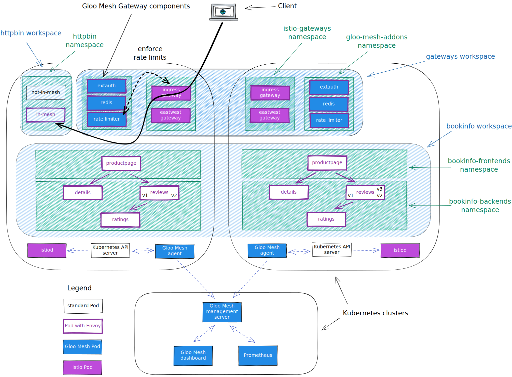

<!--bash
#!/usr/bin/env bash

source ./scripts/assert.sh
-->


# <center>Gloo Mesh Workshop</center>


## Table of Contents
* [Introduction](#introduction)
* [Lab 1 - Deploy a KinD cluster](#Lab-1)
* [Lab 2 - Deploy Istio](#Lab-2)
* [Lab 3 - Deploy the Bookinfo demo app](#Lab-3)
* [Lab 4 - Deploy the httpbin demo app](#Lab-4)
* [Lab 5 - Deploy and register Gloo Mesh](#Lab-5)
* [Lab 6 - Create the gateways workspace](#Lab-6)
* [Lab 7 - Create the bookinfo workspace](#Lab-7)
* [Lab 8 - Create the httpbin workspace](#Lab-8)
* [Lab 9 - Expose the productpage through a gateway](#Lab-9)
* [Lab 10 - Expose an external service](#Lab-10)
* [Lab 11 - Traffic policies](#Lab-11)
* [Lab 12 - Deploy Keycloak](#Lab-12)
* [Lab 13 - Securing the access with OAuth](#Lab-13)
* [Lab 14 - Apply rate limiting to the Gateway](#Lab-14)


## Introduction <a name="introduction"></a>

[Gloo Mesh Enterprise](https://www.solo.io/products/gloo-mesh/) is a distribution of [Istio Service Mesh](https://istio.io) with production support, CVE patching, FIPS builds, and a multi-cluster operational management plane to simplify running a service mesh across multiple clusters or a hybrid deployment. 

Gloo Mesh also has enterprise features around multi-tenancy, global failover and routing, observability, and east-west rate limiting and policy enforcement (through AuthZ/AuthN plugins). 


### Istio support

The Gloo Mesh Enterprise subscription includes end to end Istio support:

- Upstream first
- Specialty builds available (FIPS, ARM, etc)
- Long Term Support (LTS) N-4 
- Critical security patches
- Production break-fix
- One hour SLA Severity 1
- Install / upgrade
- Architecture and operational guidance, best practices


### Observability

Gloo Mesh is also using these agents to consolidate all the metrics and access logs from the different clusters. Graphs can then be used to monitor all the communication happening globally.


### Want to learn more about Gloo Mesh

You can find more information about Gloo Mesh in the official documentation:

[https://docs.solo.io/gloo-mesh/latest/](https://docs.solo.io/gloo-mesh/latest/)


## Lab 1 - Deploy a KinD cluster <a name="Lab-1"></a>

Clone this repository and go to the `procs` directory.

Set the context environment variables:

```bash
export MGMT=cluster1
export CLUSTER1=cluster1
```

Run the following commands to deploy a Kubernetes cluster using [Kind](https://kind.sigs.k8s.io/):
    

```bash
./scripts/deploy.sh 1 cluster1 us-west us-west-1
```

Then run the following commands to wait for all the Pods to be ready:

```bash
./scripts/check.sh cluster1
```

**Note:** If you run the `check.sh` script immediately after the `deploy.sh` script, you may see a jsonpath error. If that happens, simply wait a few seconds and try again.

Once the `check.sh` script completes, when you execute the `kubectl get pods -A` command, you should see the following:

```
NAMESPACE            NAME                                          READY   STATUS    RESTARTS   AGE
kube-system          calico-kube-controllers-59d85c5c84-sbk4k      1/1     Running   0          4h26m
kube-system          calico-node-przxs                             1/1     Running   0          4h26m
kube-system          coredns-6955765f44-ln8f5                      1/1     Running   0          4h26m
kube-system          coredns-6955765f44-s7xxx                      1/1     Running   0          4h26m
kube-system          etcd-cluster1-control-plane                   1/1     Running   0          4h27m
kube-system          kube-apiserver-cluster1-control-plane         1/1     Running   0          4h27m
kube-system          kube-controller-manager-cluster1-control-plane1/1     Running   0          4h27m
kube-system          kube-proxy-ksvzw                              1/1     Running   0          4h26m
kube-system          kube-scheduler-cluster1-control-plane         1/1     Running   0          4h27m
local-path-storage   local-path-provisioner-58f6947c7-lfmdx        1/1     Running   0          4h26m
metallb-system       controller-5c9894b5cd-cn9x2                   1/1     Running   0          4h26m
metallb-system       speaker-d7jkp                                 1/1     Running   0          4h26m
```


## Lab 2 - Deploy Istio <a name="Lab-2"></a>


Download istio 1.11.7:

```bash
export ISTIO_VERSION=1.11.7
curl -L https://istio.io/downloadIstio | sh -
```

<!--bash
cat <<'EOF' > ./test.js
const chaiExec = require("@jsdevtools/chai-exec");
var chai = require('chai');
var expect = chai.expect;
chai.use(chaiExec);

describe("istoctl version", () => {
  it("version should be correct", () => {
    let cli = chaiExec('./istio-' + process.env.ISTIO_VERSION + '/bin/istioctl version --remote=false');

    expect(cli).to.exit.with.code(0);
    expect(cli).stdout.to.contain(process.env.ISTIO_VERSION);
    expect(cli).stderr.to.be.empty;
  });
});
EOF
echo "executing test procs/gloo-mesh-2-0-single-cluster/build/templates/steps/deploy-istio/tests/istio-version.test.js.liquid"
mocha ./test.js --retries=50 --bail 2> /dev/null || exit 1
-->

You need to create the `istio-system` and the `istio-gateways` namespaces on the first cluster.

```bash
kubectl --context ${CLUSTER1} create ns istio-system
kubectl --context ${CLUSTER1} create ns istio-gateways
```

Now, let's deploy the Istio control plane on the first cluster:

```bash
helm --kube-context=${CLUSTER1} upgrade --install istio-base ./istio-1.11.7/manifests/charts/base -n istio-system

helm --kube-context=${CLUSTER1} upgrade --install istio-1.11.7 ./istio-1.11.7/manifests/charts/istio-control/istio-discovery -n istio-system --values - <<EOF
revision: 1-11
global:
  meshID: mesh1
  multiCluster:
    clusterName: cluster1
  network: network1
meshConfig:
  trustDomain: cluster1
  accessLogFile: /dev/stdout
  enableAutoMtls: true
  defaultConfig:
    envoyMetricsService:
      address: gloo-mesh-agent.gloo-mesh:9977
    envoyAccessLogService:
      address: gloo-mesh-agent.gloo-mesh:9977
    proxyMetadata:
      ISTIO_META_DNS_CAPTURE: "true"
      ISTIO_META_DNS_AUTO_ALLOCATE: "true"
      GLOO_MESH_CLUSTER_NAME: cluster1
pilot:
  env:
    PILOT_SKIP_VALIDATE_TRUST_DOMAIN: "true"
EOF
```

After that, you can deploy the gateways:

```bash
kubectl --context ${CLUSTER1} label namespace istio-gateways istio.io/rev=1-11

helm --kube-context=${CLUSTER1} upgrade --install istio-ingressgateway ./istio-1.11.7/manifests/charts/gateways/istio-ingress -n istio-gateways --values - <<EOF

gateways:
  istio-ingressgateway:
    name: istio-ingressgateway
    namespace: istio-gateways
    labels:
      istio: ingressgateway
    injectionTemplate: gateway
    ports:
    - name: http2
      port: 80
      targetPort: 8080
    - name: https
      port: 443
      targetPort: 8443
EOF

helm --kube-context=${CLUSTER1} upgrade --install istio-eastwestgateway ./istio-1.11.7/manifests/charts/gateways/istio-ingress -n istio-gateways --values - <<EOF

gateways:
  istio-ingressgateway:
    name: istio-eastwestgateway
    namespace: istio-gateways
    labels:
      istio: eastwestgateway
      topology.istio.io/network: network1
    injectionTemplate: gateway
    ports:
    - name: tcp-status-port
      port: 15021
      targetPort: 15021
    - name: tls
      port: 15443
      targetPort: 15443
    - name: tcp-istiod
      port: 15012
      targetPort: 15012
    - name: tcp-webhook
      port: 15017
      targetPort: 15017
    env:
      ISTIO_META_ROUTER_MODE: "sni-dnat"
      ISTIO_META_REQUESTED_NETWORK_VIEW: "network1"
EOF
```

As you can see, we deploy the control plane (istiod) in the `istio-namespace` and two gateways in the `istio-gateways` namespace.

One gateway will be used for ingress traffic while the other one will be used for cross cluster communications.

Note that we set the `trust domain` to be the same as the cluster name and we configure the sidecars to send their metrics and access logs to the Gloo Mesh agent.
<!--bash
until [[ $(kubectl --context ${CLUSTER1} -n istio-gateways get svc istio-ingressgateway -o json | jq '.status.loadBalancer | length') -gt 0 ]]; do
  sleep 1
done
-->

Set the environment variable for the service corresponding to the Istio Ingress Gateway of cluster1:

```bash
export ENDPOINT_HTTP_GW_CLUSTER1=$(kubectl --context ${CLUSTER1} -n istio-gateways get svc istio-ingressgateway -o jsonpath='{.status.loadBalancer.ingress[0].*}'):80
export ENDPOINT_HTTPS_GW_CLUSTER1=$(kubectl --context ${CLUSTER1} -n istio-gateways get svc istio-ingressgateway -o jsonpath='{.status.loadBalancer.ingress[0].*}'):443
export HOST_GW_CLUSTER1=$(echo ${ENDPOINT_HTTP_GW_CLUSTER1} | cut -d: -f1)
```

<!--bash
cat <<'EOF' > ./test.js
const dns = require('dns');
const chaiHttp = require("chai-http");
const chai = require("chai");
const expect = chai.expect;
chai.use(chaiHttp);
const { waitOnFailedTest } = require('./tests/utils');

afterEach(function(done) { waitOnFailedTest(done, this.currentTest.currentRetry())});

describe("Address '" + process.env.HOST_GW_CLUSTER1 + "' can be resolved in DNS", () => {
    it(process.env.HOST_GW_CLUSTER1 + ' can be resolved', (done) => {
        return dns.lookup(process.env.HOST_GW_CLUSTER1, (err, address, family) => {
            expect(address).to.be.an.ip;
            done();
        });
    });
});
EOF
echo "executing test ./gloo-mesh/tests/can-resolve.test.js.liquid"
mocha ./test.js --retries=50 --bail 2> /dev/null || exit 1
-->


## Lab 3 - Deploy the Bookinfo demo app <a name="Lab-3"></a>


Run the following commands to deploy the bookinfo application on `cluster1`:

```bash
kubectl --context ${CLUSTER1} create ns bookinfo-frontends
kubectl --context ${CLUSTER1} create ns bookinfo-backends
bookinfo_yaml=https://raw.githubusercontent.com/istio/istio/1.11.7/samples/bookinfo/platform/kube/bookinfo.yaml
kubectl --context ${CLUSTER1} label namespace bookinfo-frontends istio.io/rev=1-11
kubectl --context ${CLUSTER1} label namespace bookinfo-backends istio.io/rev=1-11
# deploy the frontend bookinfo service in the bookinfo-frontends namespace
kubectl --context ${CLUSTER1} -n bookinfo-frontends apply -f ${bookinfo_yaml} -l 'account in (productpage)'
kubectl --context ${CLUSTER1} -n bookinfo-frontends apply -f ${bookinfo_yaml} -l 'app in (productpage)'
# deploy the backend bookinfo services in the bookinfo-backends namespace for all versions less than v3
kubectl --context ${CLUSTER1} -n bookinfo-backends apply -f ${bookinfo_yaml} -l 'account in (reviews,ratings,details)'
kubectl --context ${CLUSTER1} -n bookinfo-backends apply -f ${bookinfo_yaml} -l 'app in (reviews,ratings,details),version notin (v3)'
# Update the productpage deployment to set the environment variables to define where the backend services are running
kubectl --context ${CLUSTER1} -n bookinfo-frontends set env deploy/productpage-v1 DETAILS_HOSTNAME=details.bookinfo-backends.svc.cluster.local
kubectl --context ${CLUSTER1} -n bookinfo-frontends set env deploy/productpage-v1 REVIEWS_HOSTNAME=reviews.bookinfo-backends.svc.cluster.local
```

You can check that the app is running using the following command:

```
kubectl --context ${CLUSTER1} -n bookinfo-frontends get pods && kubectl --context ${CLUSTER1} -n bookinfo-backends get pods
```

```
NAME                              READY   STATUS    RESTARTS   AGE
productpage-v1-7654c7546b-7kztp   2/2     Running   0          32m
NAME                          READY   STATUS    RESTARTS   AGE
details-v1-5498c86cf5-tx9f9   2/2     Running   0          32m
ratings-v1-b477cf6cf-fk5rv    2/2     Running   0          32m
reviews-v1-79d546878f-kcc25   2/2     Running   0          32m
reviews-v2-548c57f459-8xh7n   2/2     Running   0          32m
```

Note that we deployed the `productpage` service in the `bookinfo-frontends` namespace and the other services in the `bookinfo-backends` namespace.

And we deployed the `v1` and `v2` versions of the `reviews` microservice, not the `v3` version.

<!--bash
cat <<'EOF' > ./test.js
const helpers = require('./tests/chai-exec');

describe("Bookinfo app", () => {
  let cluster = process.env.CLUSTER1
  let deployments = ["productpage-v1"];
  deployments.forEach(deploy => {
    it(deploy + ' pods are ready in ' + cluster, () => helpers.checkDeployment({ context: cluster, namespace: "bookinfo-frontends", k8sObj: deploy }));
  });
  deployments = ["ratings-v1", "details-v1", "reviews-v1", "reviews-v2"];
  deployments.forEach(deploy => {
    it(deploy + ' pods are ready in ' + cluster, () => helpers.checkDeployment({ context: cluster, namespace: "bookinfo-backends", k8sObj: deploy }));
  });
});
EOF
echo "executing test procs/gloo-mesh-2-0-single-cluster/build/templates/steps/apps/bookinfo/deploy-bookinfo/tests/check-bookinfo.test.js.liquid"
mocha ./test.js --retries=50 --bail 2> /dev/null || exit 1
-->


## Lab 4 - Deploy the httpbin demo app <a name="Lab-4"></a>


Run the following commands to deploy the httpbin app on `cluster1` twice.

The first version will be called `not-in-mesh` and won't have the sidecar injected (because you don't label the namespace).

```bash
kubectl --context ${CLUSTER1} create ns httpbin

kubectl --context ${CLUSTER1} apply -n httpbin -f - <<EOF
apiVersion: v1
kind: ServiceAccount
metadata:
  name: not-in-mesh
---
apiVersion: v1
kind: Service
metadata:
  name: not-in-mesh
  labels:
    app: not-in-mesh
    service: not-in-mesh
spec:
  ports:
  - name: http
    port: 8000
    targetPort: 80
  selector:
    app: not-in-mesh
---
apiVersion: apps/v1
kind: Deployment
metadata:
  name: not-in-mesh
spec:
  replicas: 1
  selector:
    matchLabels:
      app: not-in-mesh
      version: v1
  template:
    metadata:
      labels:
        app: not-in-mesh
        version: v1
    spec:
      serviceAccountName: not-in-mesh
      containers:
      - image: docker.io/kennethreitz/httpbin
        imagePullPolicy: IfNotPresent
        name: not-in-mesh
        ports:
        - containerPort: 80
EOF
```

The second version will be called `in-mesh` and will have the sidecar injected (because of the label `istio.io/rev` in the Pod template).

```bash
kubectl --context ${CLUSTER1} apply -n httpbin -f - <<EOF
apiVersion: v1
kind: ServiceAccount
metadata:
  name: in-mesh
---
apiVersion: v1
kind: Service
metadata:
  name: in-mesh
  labels:
    app: in-mesh
    service: in-mesh
spec:
  ports:
  - name: http
    port: 8000
    targetPort: 80
  selector:
    app: in-mesh
---
apiVersion: apps/v1
kind: Deployment
metadata:
  name: in-mesh
spec:
  replicas: 1
  selector:
    matchLabels:
      app: in-mesh
      version: v1
  template:
    metadata:
      labels:
        app: in-mesh
        version: v1
        istio.io/rev: 1-11
    spec:
      serviceAccountName: in-mesh
      containers:
      - image: docker.io/kennethreitz/httpbin
        imagePullPolicy: IfNotPresent
        name: in-mesh
        ports:
        - containerPort: 80
EOF
```

You can check that the app is running using

```
kubectl --context ${CLUSTER1} -n httpbin get pods
```

```
NAME                           READY   STATUS    RESTARTS   AGE
in-mesh-5d9d9549b5-qrdgd       2/2     Running   0          11s
not-in-mesh-5c64bb49cd-m9kwm   1/1     Running   0          11s
```

<!--bash
cat <<'EOF' > ./test.js
const helpers = require('./tests/chai-exec');

describe("Bookinfo app", () => {
  let cluster = process.env.CLUSTER1
  let deployments = ["not-in-mesh", "in-mesh"];
  deployments.forEach(deploy => {
    it(deploy + ' pods are ready in ' + cluster, () => helpers.checkDeployment({ context: cluster, namespace: "httpbin", k8sObj: deploy }));
  });
});
EOF
echo "executing test procs/gloo-mesh-2-0-single-cluster/build/templates/steps/apps/httpbin/deploy-httpbin/tests/check-httpbin.test.js.liquid"
mocha ./test.js --retries=50 --bail 2> /dev/null || exit 1
-->


## Lab 5 - Deploy and register Gloo Mesh <a name="Lab-5"></a>


First of all, let's install the `meshctl` CLI:

```bash
export GLOO_MESH_VERSION=v2.0.0-beta22
curl -sL https://run.solo.io/meshctl/install | sh -
export PATH=$HOME/.gloo-mesh/bin:$PATH
```

Run the following commands to deploy the Gloo Mesh management plane:

<!--bash
cat <<'EOF' > ./test.js
var chai = require('chai');
var expect = chai.expect;

describe("Required environment variables should contain value", () => {
  afterEach(function(done){
    if(this.currentTest.currentRetry() > 0){
      process.stdout.write(".");
       setTimeout(done, 1000);
    } else {
      done();
    }
  });

  it("Context environment variables should not be empty", () => {
    expect(process.env.MGMT).to.not.be.empty
    expect(process.env.CLUSTER1).to.not.be.empty
  });

  it("Gloo Mesh licence environment variables should not be empty", () => {
    expect(process.env.GLOO_MESH_LICENSE_KEY).to.not.be.empty
  });
});
EOF
echo "executing test procs/gloo-mesh-2-0-single-cluster/build/templates/steps/deploy-and-register-gloo-mesh/tests/environment-variables.test.js.liquid"
mocha ./test.js --retries=50 --bail 2> /dev/null || exit 1
-->

```bash
helm repo add gloo-mesh-enterprise https://storage.googleapis.com/gloo-mesh-enterprise/gloo-mesh-enterprise 
helm repo update
kubectl --context ${MGMT} create ns gloo-mesh 
helm upgrade --install gloo-mesh-enterprise gloo-mesh-enterprise/gloo-mesh-enterprise \
--namespace gloo-mesh --kube-context ${MGMT} \
--version=2.0.0-beta22 \
--set glooMeshMgmtServer.ports.healthcheck=8091 \
--set glooMeshUi.serviceType=LoadBalancer \
--set mgmtClusterName=${MGMT} \
--set licenseKey=${GLOO_MESH_LICENSE_KEY}
kubectl --context ${MGMT} -n gloo-mesh rollout status deploy/gloo-mesh-mgmt-server
```
<!--bash
kubectl wait --context ${MGMT} --for=condition=Ready -n gloo-mesh --all pod
until [[ $(kubectl --context ${MGMT} -n gloo-mesh get svc gloo-mesh-mgmt-server -o json | jq '.status.loadBalancer | length') -gt 0 ]]; do
  sleep 1
done
-->

Then, you need to set the environment variable to tell the Gloo Mesh agents how to communicate with the management plane:

<!--bash
cat <<'EOF' > ./test.js
const chaiExec = require("@jsdevtools/chai-exec");
var chai = require('chai');
var expect = chai.expect;
chai.use(chaiExec);
EOF
echo "executing test procs/gloo-mesh-2-0-single-cluster/build/templates/steps/deploy-and-register-gloo-mesh/tests/get-gloo-mesh-mgmt-server-ip.test.js.liquid"
mocha ./test.js --retries=50 --bail 2> /dev/null || exit 1
-->

```bash
export ENDPOINT_GLOO_MESH=$(kubectl --context ${MGMT} -n gloo-mesh get svc gloo-mesh-mgmt-server -o jsonpath='{.status.loadBalancer.ingress[0].*}'):9900
export HOST_GLOO_MESH=$(echo ${ENDPOINT_GLOO_MESH} | cut -d: -f1)
```

Check that the variables have correct values:
```
echo $HOST_GLOO_MESH
echo $ENDPOINT_GLOO_MESH
```
<!--bash
cat <<'EOF' > ./test.js
const dns = require('dns');
const chaiHttp = require("chai-http");
const chai = require("chai");
const expect = chai.expect;
chai.use(chaiHttp);
const { waitOnFailedTest } = require('./tests/utils');

afterEach(function(done) { waitOnFailedTest(done, this.currentTest.currentRetry())});

describe("Address '" + process.env.HOST_GLOO_MESH + "' can be resolved in DNS", () => {
    it(process.env.HOST_GLOO_MESH + ' can be resolved', (done) => {
        return dns.lookup(process.env.HOST_GLOO_MESH, (err, address, family) => {
            expect(address).to.be.an.ip;
            done();
        });
    });
});
EOF
echo "executing test ./gloo-mesh/tests/can-resolve.test.js.liquid"
mocha ./test.js --retries=50 --bail 2> /dev/null || exit 1
-->

Finally, you need to register the cluster(s).

Here is how you register the first one:

```bash
helm repo add gloo-mesh-agent https://storage.googleapis.com/gloo-mesh-enterprise/gloo-mesh-agent
helm repo update

kubectl apply --context ${MGMT} -f- <<EOF
apiVersion: admin.gloo.solo.io/v2
kind: KubernetesCluster
metadata:
  name: cluster1
  namespace: gloo-mesh
spec:
  clusterDomain: cluster.local
EOF

kubectl --context cluster1 create ns gloo-mesh

kubectl get secret relay-root-tls-secret -n gloo-mesh --context ${MGMT} -o jsonpath='{.data.ca\.crt}' | base64 -d > ca.crt
kubectl create secret generic relay-root-tls-secret -n gloo-mesh --context cluster1 --from-file ca.crt=ca.crt
rm ca.crt

kubectl get secret relay-identity-token-secret -n gloo-mesh --context ${MGMT} -o jsonpath='{.data.token}' | base64 -d > token
kubectl create secret generic relay-identity-token-secret -n gloo-mesh --context cluster1 --from-file token=token
rm token

helm upgrade --install gloo-mesh-agent gloo-mesh-agent/gloo-mesh-agent \
  --namespace gloo-mesh \
  --kube-context=cluster1 \
  --set relay.serverAddress=${ENDPOINT_GLOO_MESH} \
  --set relay.authority=gloo-mesh-mgmt-server.gloo-mesh \
  --set rate-limiter.enabled=false \
  --set ext-auth-service.enabled=false \
  --set cluster=cluster1 \
  --version 2.0.0-beta22
```

Note that the registration can also be performed using `meshctl`.

You can check the cluster(s) have been registered correctly using the following commands:

```
pod=$(kubectl --context ${MGMT} -n gloo-mesh get pods -l app=gloo-mesh-mgmt-server -o jsonpath='{.items[0].metadata.name}')
kubectl --context ${MGMT} -n gloo-mesh debug -q -i ${pod} --image=curlimages/curl -- curl -s http://localhost:9091/metrics | grep relay_push_clients_connected
```

You should get an output similar to this:

```
# HELP relay_push_clients_connected Current number of connected Relay push clients (Relay Agents).
# TYPE relay_push_clients_connected gauge
relay_push_clients_connected{cluster="cluster1"} 1
```

<!--bash
cat <<'EOF' > ./test.js
var chai = require('chai');
var expect = chai.expect;
const helpers = require('./tests/chai-exec');

describe("Cluster registration", () => {
  it("cluster1 is registered", () => {
    podName = helpers.getOutputForCommand({ command: "kubectl -n gloo-mesh get pods -l app=gloo-mesh-mgmt-server -o jsonpath='{.items[0].metadata.name}' --context " + process.env.MGMT }).replaceAll("'", "");
    command = helpers.getOutputForCommand({ command: "kubectl --context " + process.env.MGMT + " -n gloo-mesh debug -q -i " + podName + " --image=curlimages/curl -- curl -s http://localhost:9091/metrics" }).replaceAll("'", "");
    expect(command).to.contain("cluster1");
  });
});
EOF
echo "executing test procs/gloo-mesh-2-0-single-cluster/build/templates/steps/deploy-and-register-gloo-mesh/tests/cluster-registration.test.js.liquid"
mocha ./test.js --retries=50 --bail 2> /dev/null || exit 1
-->


To use the Gloo Mesh Gateway advanced features (external authentication, rate limiting, ...), you need to install the Gloo Mesh addons.

First, you need to create a namespace for the addons, with Istio injection enabled:

```bash
kubectl --context ${CLUSTER1} create namespace gloo-mesh-addons
kubectl --context ${CLUSTER1} label namespace gloo-mesh-addons istio.io/rev=1-11
```

Then, you can deploy the addons on the cluster(s) using Helm:

```bash
helm upgrade --install gloo-mesh-agent-addons gloo-mesh-agent/gloo-mesh-agent \
  --namespace gloo-mesh-addons \
  --kube-context=cluster1 \
  --set glooMeshAgent.enabled=false \
  --set rate-limiter.enabled=true \
  --set ext-auth-service.enabled=true \
  --version 2.0.0-beta22
```

This is how to environment looks like now:


## Lab 6 - Create the gateways workspace <a name="Lab-6"></a>

We're going to create a workspace for the team in charge of the Gateways.

The platform team needs to create the corresponding `Workspace` Kubernetes objects in the Gloo Mesh management cluster.

Let's create the `gateways` workspace which corresponds to the `istio-gateways` and the `gloo-mesh-addons` namespaces on the cluster(s):

```bash
kubectl apply --context ${MGMT} -f- <<EOF
apiVersion: admin.gloo.solo.io/v2
kind: Workspace
metadata:
  name: gateways
  namespace: gloo-mesh
spec:
  workloadClusters:
  - name: cluster1
    namespaces:
    - name: istio-gateways
    - name: gloo-mesh-addons
EOF
```

Then, the Gateway team creates a `WorkspaceSettings` Kubernetes object in one of the namespaces of the `gateways` workspace (so the `istio-gateways` or the `gloo-mesh-addons` namespace):

```bash
kubectl apply --context ${CLUSTER1} -f- <<EOF
apiVersion: admin.gloo.solo.io/v2
kind: WorkspaceSettings
metadata:
  name: gateways
  namespace: istio-gateways
spec:
  imports:
  - selector:
      allow_ingress: "true"
EOF
```

This will become the root namespace of the `gateways` workspace. The root namespace is the namespace where the team will create the Gloo Mesh objects that they want to export.

Note that the Gateway team has decided to import resources from all the workspaces that have the label `allow_ingress` set to `true` (using a selector).


## Lab 7 - Create the bookinfo workspace <a name="Lab-7"></a>

We're going to create a workspace for the team in charge of the Bookinfo application.

The platform team needs to create the corresponding `Workspace` Kubernetes objects in the Gloo Mesh management cluster.

Let's create the `bookinfo` workspace which corresponds to the `bookinfo-frontends` and `bookinfo-backends` namespaces on the cluster(s):

```bash
kubectl apply --context ${MGMT} -f- <<EOF
apiVersion: admin.gloo.solo.io/v2
kind: Workspace
metadata:
  name: bookinfo
  namespace: gloo-mesh
  labels:
    allow_ingress: "true"
spec:
  workloadClusters:
  - name: cluster1
    namespaces:
    - name: bookinfo-frontends
    - name: bookinfo-backends
EOF
```

Then, the Bookinfo team creates a `WorkspaceSettings` Kubernetes object in one of the namespaces of the `bookinfo` workspace (so the `bookinfo-frontends` or the `bookinfo-backends` namespace):

```bash
kubectl apply --context ${CLUSTER1} -f- <<EOF
apiVersion: admin.gloo.solo.io/v2
kind: WorkspaceSettings
metadata:
  name: bookinfo
  namespace: bookinfo-frontends
spec:
  exportTo:
  - name: gateways
EOF
```

This will become the root namespace of the `bookinfo` workspace.

Note that the Bookinfo team has decided to export resources to the `gateways` workspace (using a reference).

This is how to environment looks like with the workspaces:


## Lab 8 - Create the httpbin workspace <a name="Lab-8"></a>

We're going to create a workspace for the team in charge of the httpbin application.

The platform team needs to create the corresponding `Workspace` Kubernetes objects in the Gloo Mesh management cluster.

Let's create the `httpbin` workspace which corresponds to the `httpbin` namespace on the cluster(s):

```bash
kubectl apply --context ${MGMT} -f- <<EOF
apiVersion: admin.gloo.solo.io/v2
kind: Workspace
metadata:
  name: httpbin
  namespace: gloo-mesh
  labels:
    allow_ingress: "true"
spec:
  workloadClusters:
  - name: cluster1
    namespaces:
    - name: httpbin
EOF
EOF
```

Then, the httpbin team creates a `WorkspaceSettings` Kubernetes object in one of the namespaces of the `httpbin` workspace:

```bash
kubectl apply --context ${CLUSTER1} -f- <<EOF
apiVersion: admin.gloo.solo.io/v2
kind: WorkspaceSettings
metadata:
  name: httpbin
  namespace: httpbin
spec:
  exportTo:
  - name: gateways
EOF
```

This will become the root namespace of the `httpbin` workspace.

Note that the httpbin team has decided to export resources to the `gateways` workspace (using a reference).


## Lab 9 - Expose the productpage through a gateway <a name="Lab-9"></a>

In this step, we're going to expose the `productpage` through a Gateway using Gloo Mesh.

The Gateway team must create a `VirtualGateway` to configure the Istio Ingress Gateway in cluster1 to listen to incoming requests.

```bash
kubectl --context ${CLUSTER1} apply -f - <<EOF
apiVersion: networking.gloo.solo.io/v2
kind: VirtualGateway
metadata:
  name: north-south-gw
  namespace: istio-gateways
spec:
  workloads:
    - selector:
        labels:
          istio: ingressgateway
        cluster: cluster1
  listeners: 
    - http: {}
      port:
        number: 80
        name: http
        protocol: HTTP
      allowedRouteTables:
        - host: '*'
EOF
```

Then, the Bookinfo team can create a `RouteTable` to determine how they want to handle the traffic.

```bash
kubectl --context ${CLUSTER1} apply -f - <<EOF
apiVersion: networking.gloo.solo.io/v2
kind: RouteTable
metadata:
  name: productpage
  namespace: bookinfo-frontends
  labels:
    workspace.solo.io/exported: "true"
spec:
  hosts:
    - '*'
  virtualGateways:
    - name: north-south-gw
      namespace: istio-gateways
      cluster: cluster1
  workloadSelectors: []
  http:
    - name: productpage
      matchers:
      - uri:
          exact: /productpage
      - uri:
          prefix: /static
      - uri:
          exact: /login
      - uri:
          exact: /logout
      - uri:
          prefix: /api/v1/products
      forwardTo:
        destinations:
          - ref:
              name: productpage
              namespace: bookinfo-frontends
            port:
              number: 9080
EOF
```

You should now be able to access the `productpage` application through the browser.
Get the URL to access the `productpage` service using the following command:
```
echo "http://${ENDPOINT_HTTP_GW_CLUSTER1}/productpage"
```

<!--bash
cat <<'EOF' > ./test.js
const helpers = require('./tests/chai-http');

describe("Productpage is available (HTTP)", () => {
  it('/productpage is available in cluster1', () => helpers.checkURL({ host: 'http://' + process.env.ENDPOINT_HTTP_GW_CLUSTER1, path: '/productpage', retCode: 200 }));
})
EOF
echo "executing test procs/gloo-mesh-2-0-single-cluster/build/templates/steps/apps/bookinfo/gateway-expose/tests/productpage-available.test.js.liquid"
mocha ./test.js --retries=50 --bail 2> /dev/null || exit 1
-->

Gloo Mesh translates the VirtualGateway and RouteTable into the corresponding Istio objects (Gateway and VirtualService).

Now, let's secure the access through TLS.

Let's first create a private key and a self-signed certificate to use in your Virtual Service:

```bash
openssl req -x509 -nodes -days 365 -newkey rsa:2048 \
   -keyout tls.key -out tls.crt -subj "/CN=*"
```

Then, you have to store them in a Kubernetes secrets running the following commands:

```bash
kubectl --context ${CLUSTER1} -n istio-gateways create secret generic tls-secret \
--from-file=tls.key=tls.key \
--from-file=tls.crt=tls.crt
```

Finally, the Gateway team needs to update the `VirtualGateway` to use this secret:

```bash
kubectl --context ${CLUSTER1} apply -f - <<EOF
apiVersion: networking.gloo.solo.io/v2
kind: VirtualGateway
metadata:
  name: north-south-gw
  namespace: istio-gateways
spec:
  workloads:
    - selector:
        labels:
          istio: ingressgateway
        cluster: cluster1
  listeners: 
    - http: {}
# ---------------- SSL config ---------------------------
      port:
        number: 443
        name: https
        protocol: HTTPS
      tls:
        mode: SIMPLE
        secretName: tls-secret
# -------------------------------------------------------
      allowedRouteTables:
        - host: '*'
EOF
```

You can now access the `productpage` application securely through the browser.
Get the URL to access the `productpage` service using the following command:
```
echo "https://${ENDPOINT_HTTPS_GW_CLUSTER1}/productpage"
```

<!--bash
cat <<'EOF' > ./test.js
const helpers = require('./tests/chai-http');

describe("Productpage is available (HTTPS)", () => {
  it('/productpage is available in cluster1', () => helpers.checkURL({ host: 'https://' + process.env.ENDPOINT_HTTPS_GW_CLUSTER1, path: '/productpage', retCode: 200 }));
})
EOF
echo "executing test procs/gloo-mesh-2-0-single-cluster/build/templates/steps/apps/bookinfo/gateway-expose/tests/productpage-available-secure.test.js.liquid"
mocha ./test.js --retries=50 --bail 2> /dev/null || exit 1
-->

This diagram shows the flow of the request (through the Istio ingress gateway):


## Lab 10 - Expose an external service <a name="Lab-10"></a>

In this step, we're going to expose an external service through a Gateway using Gloo Mesh and show how we can then migrate this service to the Mesh.

Let's create an `ExternalService` corresponding to `httpbin.org`:

```bash
kubectl --context ${CLUSTER1} apply -f - <<EOF
apiVersion: networking.gloo.solo.io/v2
kind: ExternalService
metadata:
  name: httpbin
  namespace: httpbin
  labels:
    workspace.solo.io/exported: "true"
spec:
  hosts:
  - httpbin.org
  ports:
  - name: http
    number: 80
    protocol: HTTP
EOF
```

Now, you can create a `RouteTable` to expose `httpbin.org` through the gateway:

```bash
kubectl --context ${CLUSTER1} apply -f - <<EOF
apiVersion: networking.gloo.solo.io/v2
kind: RouteTable
metadata:
  name: httpbin
  namespace: httpbin
  labels:
    workspace.solo.io/exported: "true"
spec:
  hosts:
    - '*'
  virtualGateways:
    - name: north-south-gw
      namespace: istio-gateways
      cluster: cluster1
  workloadSelectors: []
  http:
    - name: httpbin
      matchers:
      - uri:
          exact: /get
      forwardTo:
        destinations:
        - kind: EXTERNAL_SERVICE
          port:
            number: 80
          ref:
            name: httpbin
            namespace: httpbin
EOF
```

<!--bash
cat <<'EOF' > ./test.js
const helpersHttp = require('./tests/chai-http');

describe("httpbin from both the external service", () => {
  it('Checking text \'X-Amzn-Trace-Id\' in ' + process.env.CLUSTER1, () => helpersHttp.checkBody({ host: 'https://' + process.env.ENDPOINT_HTTPS_GW_CLUSTER1, path: '/get', body: 'X-Amzn-Trace-Id', match: true }));
})
EOF
echo "executing test procs/gloo-mesh-2-0-single-cluster/build/templates/steps/apps/httpbin/gateway-external-service/tests/httpbin-from-external.test.js.liquid"
mocha ./test.js --retries=50 --bail 2> /dev/null || exit 1
-->

You should now be able to access `httpbin.org` external service through the gateway.
Get the URL to access the `httpbin` service using the following command:
```
echo "https://${ENDPOINT_HTTPS_GW_CLUSTER1}/get"
```

Let's update the `RouteTable` to direct 50% of the traffic to the local `httpbin` service:

```bash
kubectl --context ${CLUSTER1} apply -f - <<EOF
apiVersion: networking.gloo.solo.io/v2
kind: RouteTable
metadata:
  name: httpbin
  namespace: httpbin
  labels:
    workspace.solo.io/exported: "true"
spec:
  hosts:
    - '*'
  virtualGateways:
    - name: north-south-gw
      namespace: istio-gateways
      cluster: cluster1
  workloadSelectors: []
  http:
    - name: httpbin
      matchers:
      - uri:
          exact: /get
      forwardTo:
        destinations:
        - kind: EXTERNAL_SERVICE
          port:
            number: 80
          ref:
            name: httpbin
            namespace: httpbin
          weight: 50
        - ref:
            name: in-mesh
            namespace: httpbin
          port:
            number: 8000
          weight: 50
EOF
```

<!--bash
cat <<'EOF' > ./test.js
const helpersHttp = require('./tests/chai-http');

describe("httpbin from the local service", () => {
  it('Checking text \'X-B3-Parentspanid\' in ' + process.env.CLUSTER1, () => helpersHttp.checkBody({ host: 'https://' + process.env.ENDPOINT_HTTPS_GW_CLUSTER1, path: '/get', body: 'X-Amzn-Trace-Id', match: true }));
})
EOF
echo "executing test procs/gloo-mesh-2-0-single-cluster/build/templates/steps/apps/httpbin/gateway-external-service/tests/httpbin-from-local.test.js.liquid"
mocha ./test.js --retries=50 --bail 2> /dev/null || exit 1
-->
<!--bash
cat <<'EOF' > ./test.js
const helpersHttp = require('./tests/chai-http');

describe("httpbin from both the external service", () => {
  it('Checking text \'X-Amzn-Trace-Id\' in ' + process.env.CLUSTER1, () => helpersHttp.checkBody({ host: 'https://' + process.env.ENDPOINT_HTTPS_GW_CLUSTER1, path: '/get', body: 'X-Amzn-Trace-Id', match: true }));
})
EOF
echo "executing test procs/gloo-mesh-2-0-single-cluster/build/templates/steps/apps/httpbin/gateway-external-service/tests/httpbin-from-external.test.js.liquid"
mocha ./test.js --retries=50 --bail 2> /dev/null || exit 1
-->

If you refresh your browser, you should see that you get a response either from the local service or from the external service.

When the response comes from the external service (httpbin.org), there's a `X-Amzn-Trace-Id` header.

And when the response come from the local service, there's a `X-B3-Parentspanid` header.

Finally, you can update the `RouteTable` to direct all the traffic to the local `httpbin` service:

```bash
kubectl --context ${CLUSTER1} apply -f - <<EOF
apiVersion: networking.gloo.solo.io/v2
kind: RouteTable
metadata:
  name: httpbin
  namespace: httpbin
  labels:
    workspace.solo.io/exported: "true"
spec:
  hosts:
    - '*'
  virtualGateways:
    - name: north-south-gw
      namespace: istio-gateways
      cluster: cluster1
  workloadSelectors: []
  http:
    - name: httpbin
      matchers:
      - uri:
          exact: /get
      forwardTo:
        destinations:
        - ref:
            name: in-mesh
            namespace: httpbin
          port:
            number: 8000
EOF
```

<!--bash
cat <<'EOF' > ./test.js
const helpersHttp = require('./tests/chai-http');

describe("httpbin from the local service", () => {
  it('Checking text \'X-B3-Parentspanid\' in ' + process.env.CLUSTER1, () => helpersHttp.checkBody({ host: 'https://' + process.env.ENDPOINT_HTTPS_GW_CLUSTER1, path: '/get', body: 'X-Amzn-Trace-Id', match: true }));
})
EOF
echo "executing test procs/gloo-mesh-2-0-single-cluster/build/templates/steps/apps/httpbin/gateway-external-service/tests/httpbin-from-local.test.js.liquid"
mocha ./test.js --retries=50 --bail 2> /dev/null || exit 1
-->

If you refresh your browser, you should see that you get responses only from the local service.

Let's delete the different objects we've created:

```bash
kubectl --context ${MGMT} -n gloo-mesh delete workspace httpbin
kubectl --context ${CLUSTER1} -n httpbin delete workspacesettings httpbin
kubectl --context ${CLUSTER1} -n httpbin delete routetable httpbin
kubectl --context ${CLUSTER1} -n httpbin delete externalservice httpbin
```


## Lab 11 - Traffic policies <a name="Lab-11"></a>

We're going to use Gloo Mesh policies. In this example we're going to use them to inject faults and configure timeouts.

Let's create the following FaultInjectionPolicy to inject a delay when the `v2` version of the `reviews` service talk to the `ratings` service:

```bash
cat << EOF | kubectl --context ${CLUSTER1} apply -f -
apiVersion: resilience.policy.gloo.solo.io/v2
kind: FaultInjectionPolicy
metadata:
  name: ratings-fault-injection
  namespace: bookinfo-backends
spec:
  applyToRoutes:
  - route:
      labels:
        fault_injection: "true"
  config:
    delay:
      fixedDelay: 2s
      percentage: 100
EOF
```

As you can see, it will be applied to all the routes that have the label `fault_injection` set to `"true"`.

Then, you need to create a RouteTable with the label set in the corresponding route.

```bash
cat << EOF | kubectl --context ${CLUSTER1} apply -f -
apiVersion: networking.gloo.solo.io/v2
kind: RouteTable
metadata:
  name: ratings
  namespace: bookinfo-backends
spec:
  hosts:
    - 'ratings.bookinfo-backends.svc.cluster.local'
  workloadSelectors:
  - selector:
      labels:
        app: reviews
  http:
    - name: ratings
      labels:
        fault_injection: "true"
      matchers:
      - uri:
          prefix: /
      forwardTo:
        destinations:
          - ref:
              name: ratings
              namespace: bookinfo-backends
            port:
              number: 9080
EOF
```

If you refresh the webpage, you should see that it takes longer to get the `productpage` loaded when version `v2` of the `reviews` services is called.

Now, let's configure a 0.5s request timeout when the `productpage` service calls the `reviews` service on cluster1.

You need to create the following RetryTimeoutPolicy:

```bash
cat << EOF | kubectl --context ${CLUSTER1} apply -f -
apiVersion: resilience.policy.gloo.solo.io/v2
kind: RetryTimeoutPolicy
metadata:
  name: reviews-request-timeout
  namespace: bookinfo-backends
spec:
  applyToRoutes:
  - route:
      labels:
        request_timeout: "0.5s"
  config:
    requestTimeout: 0.5s
EOF
```

As you can see, it will be applied to all the routes that have the label `request_timeout` set to `"0.5s"`.

Then, you need to create a RouteTable with the label set in the corresponding route.

```bash
cat << EOF | kubectl --context ${CLUSTER1} apply -f -
apiVersion: networking.gloo.solo.io/v2
kind: RouteTable
metadata:
  name: reviews
  namespace: bookinfo-backends
spec:
  hosts:
    - 'reviews.bookinfo-backends.svc.cluster.local'
  workloadSelectors:
  - selector:
      labels:
        app: productpage
  http:
    - name: reviews
      labels:
        request_timeout: "0.5s"
      matchers:
      - uri:
          prefix: /
      forwardTo:
        destinations:
          - ref:
              name: reviews
              namespace: bookinfo-backends
            port:
              number: 9080
            subset:
              version: v2
EOF
```

<!--bash
cat <<'EOF' > ./test.js
var chai = require('chai');
var expect = chai.expect;
const chaiHttp = require("chai-http");
chai.use(chaiHttp);

process.env.NODE_TLS_REJECT_UNAUTHORIZED = '0';

afterEach(function (done) {
  if (this.currentTest.currentRetry() > 0) {
    process.stdout.write(".");
    setTimeout(done, 1000);
  } else {
    done();
  }
});

let searchTest="Sorry, product reviews are currently unavailable for this book.";

describe("Reviews shouldn't be available", () => {
  it("Checking text '" + searchTest + "' in cluster1", async () => {
    await chai.request('https://' + process.env.ENDPOINT_HTTPS_GW_CLUSTER1)
      .get('/productpage')
      .send()
      .then((res) => {
        expect(res.text).to.contain(searchTest);
      });
  });

});

EOF
echo "executing test procs/gloo-mesh-2-0-single-cluster/build/templates/steps/apps/bookinfo/traffic-policies/tests/traffic-policies-reviews-unavailable.test.js.liquid"
mocha ./test.js --retries=50 --bail 2> /dev/null || exit 1
-->

If you refresh the page several times, you'll see an error message telling that reviews are unavailable when the productpage is trying to communicate with the version `v2` of the `reviews` service.


This diagram shows where the timeout and delay have been applied:


Let's delete the Gloo Mesh objects we've created:

```bash
kubectl --context ${CLUSTER1} -n bookinfo-backends delete faultinjectionpolicy ratings-fault-injection
kubectl --context ${CLUSTER1} -n bookinfo-backends delete routetable ratings
kubectl --context ${CLUSTER1} -n bookinfo-backends delete retrytimeoutpolicy reviews-request-timeout
kubectl --context ${CLUSTER1} -n bookinfo-backends delete routetable reviews
```


## Lab 12 - Deploy Keycloak <a name="Lab-12"></a>

In many use cases, you need to restrict the access to your applications to authenticated users. 

OIDC (OpenID Connect) is an identity layer on top of the OAuth 2.0 protocol. In OAuth 2.0 flows, authentication is performed by an external Identity Provider (IdP) which, in case of success, returns an Access Token representing the user identity. The protocol does not define the contents and structure of the Access Token, which greatly reduces the portability of OAuth 2.0 implementations.

The goal of OIDC is to address this ambiguity by additionally requiring Identity Providers to return a well-defined ID Token. OIDC ID tokens follow the JSON Web Token standard and contain specific fields that your applications can expect and handle. This standardization allows you to switch between Identity Providers – or support multiple ones at the same time – with minimal, if any, changes to your downstream services; it also allows you to consistently apply additional security measures like Role-based Access Control (RBAC) based on the identity of your users, i.e. the contents of their ID token.

In this lab, we're going to install Keycloak. It will allow us to setup OIDC workflows later.

Let's install it:

```bash
kubectl --context ${MGMT} create namespace keycloak
cat data/steps/deploy-keycloak/keycloak.yaml | kubectl --context ${MGMT} -n keycloak apply -f -

kubectl --context ${MGMT} -n keycloak rollout status deploy/keycloak
```

<!--bash
cat <<'EOF' > ./test.js
const helpers = require('./tests/chai-exec');

describe("Keycloak", () => {
  it('keycloak pods are ready in cluster1', () => helpers.checkDeployment({ context: process.env.MGMT, namespace: "keycloak", k8sObj: "keycloak" }));
});
EOF
echo "executing test procs/gloo-mesh-2-0-single-cluster/build/templates/steps/deploy-keycloak/tests/pods-available.test.js.liquid"
mocha ./test.js --retries=50 --bail 2> /dev/null || exit 1
-->

<!--bash
cat <<'EOF' > ./test.js
const chaiExec = require("@jsdevtools/chai-exec");
var chai = require('chai');
var expect = chai.expect;
chai.use(chaiExec);

afterEach(function (done) {
  if (this.currentTest.currentRetry() > 0) {
    process.stdout.write(".");
    setTimeout(done, 1000);
  } else {
    done();
  }
});

describe("Retrieve enterprise-networking ip", () => {
  it("A value for load-balancing has been assigned", () => {
    let cli = chaiExec("kubectl --context " + process.env.MGMT + " -n keycloak get svc keycloak -o jsonpath='{.status.loadBalancer}'");
    expect(cli).to.exit.with.code(0);
    expect(cli).output.to.contain('"ingress"');
  });
});
EOF
echo "executing test procs/gloo-mesh-2-0-single-cluster/build/templates/steps/deploy-keycloak/tests/keycloak-ip-is-attached.test.js.liquid"
mocha ./test.js --retries=50 --bail 2> /dev/null || exit 1
-->

Then, we will configure it and create two users:

- User1 credentials: `user1/password`
  Email: user1@solo.io

- User2 credentials: `user2/password`
  Email: user2@example.com

<!--bash
until [[ $(kubectl --context ${MGMT} -n keycloak get svc keycloak -o json | jq '.status.loadBalancer | length') -gt 0 ]]; do
  sleep 1
done
-->

Let's set the environment variables we need:

```bash
export ENDPOINT_KEYCLOAK=$(kubectl --context ${MGMT} -n keycloak get service keycloak -o jsonpath='{.status.loadBalancer.ingress[0].*}'):8080
export HOST_KEYCLOAK=$(echo ${ENDPOINT_KEYCLOAK} | cut -d: -f1)
export KEYCLOAK_URL=http://${ENDPOINT_KEYCLOAK}/auth
```

<!--bash
cat <<'EOF' > ./test.js
const dns = require('dns');
const chaiHttp = require("chai-http");
const chai = require("chai");
const expect = chai.expect;
chai.use(chaiHttp);
const { waitOnFailedTest } = require('./tests/utils');

afterEach(function(done) { waitOnFailedTest(done, this.currentTest.currentRetry())});

describe("Address '" + process.env.HOST_KEYCLOAK + "' can be resolved in DNS", () => {
    it(process.env.HOST_KEYCLOAK + ' can be resolved', (done) => {
        return dns.lookup(process.env.HOST_KEYCLOAK, (err, address, family) => {
            expect(address).to.be.an.ip;
            done();
        });
    });
});
EOF
echo "executing test ./gloo-mesh/tests/can-resolve.test.js.liquid"
mocha ./test.js --retries=50 --bail 2> /dev/null || exit 1
-->

Now, we need to get a token:

```bash
export KEYCLOAK_TOKEN=$(curl -d "client_id=admin-cli" -d "username=admin" -d "password=admin" -d "grant_type=password" "$KEYCLOAK_URL/realms/master/protocol/openid-connect/token" | jq -r .access_token)
```

After that, we configure Keycloak:

```bash
# Create initial token to register the client
read -r client token <<<$(curl -H "Authorization: Bearer ${KEYCLOAK_TOKEN}" -X POST -H "Content-Type: application/json" -d '{"expiration": 0, "count": 1}' $KEYCLOAK_URL/admin/realms/master/clients-initial-access | jq -r '[.id, .token] | @tsv')
export CLIENT=${client}

# Register the client
read -r id secret <<<$(curl -X POST -d "{ \"clientId\": \"${CLIENT}\" }" -H "Content-Type:application/json" -H "Authorization: bearer ${token}" ${KEYCLOAK_URL}/realms/master/clients-registrations/default| jq -r '[.id, .secret] | @tsv')
export SECRET=${secret}

# Add allowed redirect URIs
curl -H "Authorization: Bearer ${KEYCLOAK_TOKEN}" -X PUT -H "Content-Type: application/json" -d '{"serviceAccountsEnabled": true, "directAccessGrantsEnabled": true, "authorizationServicesEnabled": true, "redirectUris": ["'https://${ENDPOINT_HTTPS_GW_CLUSTER1}'/callback"]}' $KEYCLOAK_URL/admin/realms/master/clients/${id}

# Add the group attribute in the JWT token returned by Keycloak
curl -H "Authorization: Bearer ${KEYCLOAK_TOKEN}" -X POST -H "Content-Type: application/json" -d '{"name": "group", "protocol": "openid-connect", "protocolMapper": "oidc-usermodel-attribute-mapper", "config": {"claim.name": "group", "jsonType.label": "String", "user.attribute": "group", "id.token.claim": "true", "access.token.claim": "true"}}' $KEYCLOAK_URL/admin/realms/master/clients/${id}/protocol-mappers/models

# Create first user
curl -H "Authorization: Bearer ${KEYCLOAK_TOKEN}" -X POST -H "Content-Type: application/json" -d '{"username": "user1", "email": "user1@solo.io", "enabled": true, "attributes": {"group": "users"}, "credentials": [{"type": "password", "value": "password", "temporary": false}]}' $KEYCLOAK_URL/admin/realms/master/users

# Create second user
curl -H "Authorization: Bearer ${KEYCLOAK_TOKEN}" -X POST -H "Content-Type: application/json" -d '{"username": "user2", "email": "user2@example.com", "enabled": true, "attributes": {"group": "users"}, "credentials": [{"type": "password", "value": "password", "temporary": false}]}' $KEYCLOAK_URL/admin/realms/master/users
```

> **Note:** If you get a *Not Authorized* error, please, re-run this command and continue from the command started to fail:

```
KEYCLOAK_TOKEN=$(curl -d "client_id=admin-cli" -d "username=admin" -d "password=admin" -d "grant_type=password" "$KEYCLOAK_URL/realms/master/protocol/openid-connect/token" | jq -r .access_token)
```


## Lab 13 - Securing the access with OAuth <a name="Lab-13"></a>


In this step, we're going to secure the access to the `productpage` using OAuth.

First, we need to create a Kubernetes Secret that contains the OIDC secret:

```bash
kubectl --context ${CLUSTER1} apply -f - <<EOF
apiVersion: v1
kind: Secret
metadata:
  name: oauth
  namespace: bookinfo-frontends
type: extauth.solo.io/oauth
data:
  client-secret: $(echo -n ${SECRET} | base64)
EOF
```

Then, you need to create an `ExtAuthPolicy`, which is a CRD that contains authentication information: 

```bash
kubectl --context ${CLUSTER1} apply -f - <<EOF
apiVersion: security.policy.gloo.solo.io/v2
kind: ExtAuthPolicy
metadata:
  name: productpage
  namespace: bookinfo-frontends
  labels:
    workspace.solo.io/exported: "true"
spec:
  applyToRoutes:
  - route:
      labels:
        oauth: "true"
  config:
    server:
      name: ext-auth-server
      namespace: bookinfo-frontends
      cluster: cluster1
    glooAuth:
      configs:
      - oauth2:
          oidcAuthorizationCode:
            appUrl: https://${ENDPOINT_HTTPS_GW_CLUSTER1}
            callbackPath: /callback
            clientId: ${CLIENT}
            clientSecretRef:
              name: oauth
              namespace: bookinfo-frontends
            issuerUrl: "${KEYCLOAK_URL}/realms/master/"
            scopes:
            - email
            headers:
              idTokenHeader: jwt
EOF
```

After that, you need to create an `ExtAuthServer`, which is a CRD that define which extauth server to use: 

```bash
kubectl --context ${CLUSTER1} apply -f - <<EOF
apiVersion: admin.gloo.solo.io/v2
kind: ExtAuthServer
metadata:
  name: ext-auth-server
  namespace: bookinfo-frontends
  labels:
    workspace.solo.io/exported: "true"
spec:
  destinationServer:
    ref:
      cluster: cluster1
      name: ext-auth-service
      namespace: gloo-mesh-addons
    port:
      name: grpc
EOF
```

Finally, you need to update the `RouteTable` to use this `AuthConfig`:

```bash
kubectl --context ${CLUSTER1} apply -f - <<EOF
apiVersion: networking.gloo.solo.io/v2
kind: RouteTable
metadata:
  name: productpage
  namespace: bookinfo-frontends
  labels:
    workspace.solo.io/exported: "true"
spec:
  hosts:
    - '*'
  virtualGateways:
    - name: north-south-gw
      namespace: istio-gateways
      cluster: cluster1
  workloadSelectors: []
  http:
    - name: productpage
      labels:
        oauth: "true"
      matchers:
      - uri:
          exact: /productpage
      - uri:
          prefix: /static
      - uri:
          exact: /login
      - uri:
          exact: /logout
      - uri:
          prefix: /api/v1/products
      - uri:
          prefix: /callback
      forwardTo:
        destinations:
          - ref:
              name: productpage
              namespace: bookinfo-frontends
            port:
              number: 9080
EOF
```

<!--bash
cat <<'EOF' > ./test.js
const chaiExec = require("@jsdevtools/chai-exec");
const helpersHttp = require('./tests/chai-http');
var chai = require('chai');
var expect = chai.expect;

describe("Authentication is working properly", function() {
  let user = 'user1';
  let password = 'password';
  let keycloak_svc = chaiExec("kubectl --context " + process.env.MGMT + " -n keycloak get service keycloak -o jsonpath='{.status.loadBalancer.ingress[0].ip}'").stdout.replaceAll("'", "");
  let keycloak_client_id = chaiExec("kubectl --context " + process.env.MGMT + " -n bookinfo-frontends get extauthpolicy productpage -o jsonpath='{.spec.config.glooAuth.configs[0].oauth2.oidcAuthorizationCode.clientId}'").stdout.replaceAll("'", "");
  let keycloak_client_secret_base64 = chaiExec("kubectl --context " + process.env.MGMT + " -n bookinfo-frontends get secret oauth -o jsonpath='{.data.client-secret}'").stdout.replaceAll("'", "");
  let buff = new Buffer(keycloak_client_secret_base64, 'base64');
  let keycloak_client_secret = buff.toString('ascii');
  let keycloak_token = JSON.parse(chaiExec('curl -d "client_id=' + keycloak_client_id + '" -d "client_secret=' + keycloak_client_secret + '" -d "scope=openid" -d "username=' + user + '" -d "password=' + password + '" -d "grant_type=password" "http://' + keycloak_svc + ':8080/auth/realms/master/protocol/openid-connect/token"').stdout.replaceAll("'", "")).id_token;
  it('The productpage is accessible after authenticating', () => helpersHttp.checkURL({ host: 'https://' + process.env.ENDPOINT_HTTPS_GW_CLUSTER1, path: '/productpage', headers: [{key: 'Authorization', value: 'Bearer ' + keycloak_token}], retCode: 200 }));
});

EOF
echo "executing test procs/gloo-mesh-2-0-single-cluster/build/templates/steps/apps/bookinfo/gateway-extauth-oauth/tests/authentication.test.js.liquid"
mocha ./test.js --retries=50 --bail 2> /dev/null || exit 1
-->

If you refresh the web browser, you will be redirected to the authentication page.

If you use the username `user1` and the password `password` you should be redirected back to the `productpage` application.

You can also perform authorization using OPA.

First, you need to create a `ConfigMap` with the policy written in rego:

```bash
kubectl --context ${CLUSTER1} apply -f - <<EOF
apiVersion: v1
kind: ConfigMap
metadata:
  name: allow-solo-email-users
  namespace: bookinfo-frontends
data:
  policy.rego: |-
    package test

    default allow = false

    allow {
        [header, payload, signature] = io.jwt.decode(input.state.jwt)
        endswith(payload["email"], "@solo.io")
    }
EOF
```

Then, you need to update the `AuthConfig` object to add the authorization step:

```bash
kubectl --context ${CLUSTER1} apply -f - <<EOF
apiVersion: security.policy.gloo.solo.io/v2
kind: ExtAuthPolicy
metadata:
  name: productpage
  namespace: bookinfo-frontends
  labels:
    workspace.solo.io/exported: "true"
spec:
  applyToRoutes:
  - route:
      labels:
        oauth: "true"
  config:
    server:
      name: ext-auth-server
      namespace: bookinfo-frontends
      cluster: cluster1
    glooAuth:
      configs:
      - oauth2:
          oidcAuthorizationCode:
            appUrl: https://${ENDPOINT_HTTPS_GW_CLUSTER1}
            callbackPath: /callback
            clientId: ${CLIENT}
            clientSecretRef:
              name: oauth
              namespace: bookinfo-frontends
            issuerUrl: "${KEYCLOAK_URL}/realms/master/"
            scopes:
            - email
            headers:
              idTokenHeader: jwt
      - opaAuth:
          modules:
          - name: allow-solo-email-users
            namespace: bookinfo-frontends
          query: "data.test.allow == true"
EOF
```
If you open the browser in incognito and login using the username `user2` and the password `password`, you will not be able to access since the user's email ends with `@example.com`.

This diagram shows the flow of the request (with the Istio ingress gateway leveraging the `extauth` Pod to authorize the request):


Let's apply the original `RouteTable` yaml:

```bash
kubectl --context ${CLUSTER1} apply -f - <<EOF
apiVersion: networking.gloo.solo.io/v2
kind: RouteTable
metadata:
  name: productpage
  namespace: bookinfo-frontends
  labels:
    workspace.solo.io/exported: "true"
spec:
  hosts:
    - '*'
  virtualGateways:
    - name: north-south-gw
      namespace: istio-gateways
      cluster: cluster1
  workloadSelectors: []
  http:
    - name: productpage
      matchers:
      - uri:
          exact: /productpage
      - uri:
          prefix: /static
      - uri:
          exact: /login
      - uri:
          exact: /logout
      - uri:
          prefix: /api/v1/products
      forwardTo:
        destinations:
          - ref:
              name: productpage
              namespace: bookinfo-frontends
            port:
              number: 9080
EOF
```

And also delete the different objects we've created:

```bash
kubectl --context ${CLUSTER1} -n bookinfo-frontends delete extauthpolicy productpage
kubectl --context ${CLUSTER1} -n bookinfo-frontends delete extauthserver ext-auth-server
```


## Lab 14 - Apply rate limiting to the Gateway <a name="Lab-14"></a>


In this step, we're going to apply rate limiting to the Gateway.

First, we need to create a `RateLimitClientConfig` object to define the descriptors:

```bash
kubectl --context ${CLUSTER1} apply -f - <<EOF
apiVersion: trafficcontrol.policy.gloo.solo.io/v2
kind: RateLimitClientConfig
metadata:
  name: productpage
  namespace: bookinfo-frontends
  labels:
    workspace.solo.io/exported: "true"
spec:
  raw:
    rateLimits:
    - setActions:
      - requestHeaders:
          descriptorKey: number
          headerName: x-number
      - requestHeaders:
          descriptorKey: type
          headerName: x-type
EOF
```

Then, we need to create a `RateLimitServerConfig` object to define the limits based on the descriptors:

```bash
kubectl --context ${CLUSTER1} apply -f - <<EOF
apiVersion: admin.gloo.solo.io/v2
kind: RateLimitServerConfig
metadata:
  name: productpage
  namespace: bookinfo-frontends
  labels:
    workspace.solo.io/exported: "true"
spec:
  destinationServers:
  - ref:
      cluster: cluster1
      name: rate-limiter
      namespace: gloo-mesh-addons
    port:
      name: grpc
  raw:
    setDescriptors:
      - simpleDescriptors:
          - key: type
            value: a
          - key: number
            value: one
        rateLimit:
          requestsPerUnit: 1
          unit: MINUTE
EOF
```

After that, we need to create a `RateLimitPolicy` object to define the descriptors:

```bash
kubectl --context ${CLUSTER1} apply -f - <<EOF
apiVersion: trafficcontrol.policy.gloo.solo.io/v2
kind: RateLimitPolicy
metadata:
  name: productpage
  namespace: bookinfo-frontends
  labels:
    workspace.solo.io/exported: "true"
spec:
  applyToRoutes:
  - route:
      labels:
        ratelimited: "true"
  config:
    serverSettings:
      name: rate-limit-server
      namespace: bookinfo-frontends
      cluster: cluster1
    ratelimitClientConfig:
      name: productpage
      namespace: bookinfo-frontends
      cluster: cluster1
    ratelimitServerConfig:
      name: productpage
      namespace: bookinfo-frontends
      cluster: cluster1
EOF
```

We also need to create a `RateLimitServerSettings`, which is a CRD that define which extauth server to use: 

```bash
kubectl --context ${CLUSTER1} apply -f - <<EOF
apiVersion: admin.gloo.solo.io/v2
kind: RateLimitServerSettings
metadata:
  name: rate-limit-server
  namespace: bookinfo-frontends
  labels:
    workspace.solo.io/exported: "true"
spec:
  destinationServer:
    ref:
      cluster: cluster1
      name: rate-limiter
      namespace: gloo-mesh-addons
    port:
      name: grpc
EOF
```

Finally, you need to update the `RouteTable` to use this `RateLimitPolicy`:

```bash
kubectl --context ${CLUSTER1} apply -f - <<EOF
apiVersion: networking.gloo.solo.io/v2
kind: RouteTable
metadata:
  name: productpage
  namespace: bookinfo-frontends
  labels:
    workspace.solo.io/exported: "true"
spec:
  hosts:
    - '*'
  virtualGateways:
    - name: north-south-gw
      namespace: istio-gateways
      cluster: cluster1
  workloadSelectors: []
  http:
    - name: productpage
      labels:
        ratelimited: "true"
      matchers:
      - uri:
          exact: /productpage
      - uri:
          prefix: /static
      - uri:
          exact: /login
      - uri:
          exact: /logout
      - uri:
          prefix: /api/v1/products
      - uri:
          prefix: /callback
      forwardTo:
        destinations:
          - ref:
              name: productpage
              namespace: bookinfo-frontends
            port:
              number: 9080
EOF
```

Now, run the following command:

```
for i in {1..5}; do curl -I -H "x-type: a" -H "x-number: one" -sk https://${ENDPOINT_HTTPS_GW_CLUSTER1}/productpage;echo ''; done
```

<!--bash
cat <<'EOF' > ./test.js
const helpers = require('./tests/chai-http');

describe("Access should be rate limited", () => {
  const headers = [{ key: "x-type", value: "a" }, { key: "x-number", value: "one" }];
  it('Waiting for error code 429 in cluster1', () => helpers.checkURL({ host: 'https://' + process.env.ENDPOINT_HTTPS_GW_CLUSTER1, path: '/productpage', headers: headers, retCode: 429 }));
})
EOF
echo "executing test procs/gloo-mesh-2-0-single-cluster/build/templates/steps/apps/bookinfo/gateway-ratelimiting/tests/rate-limited.test.js.liquid"
mocha ./test.js --retries=50 --bail 2> /dev/null || exit 1
-->

You should get a `200` response code the first time and a `429` response code after.

This diagram shows the flow of the request (with the Istio ingress gateway leveraging the `rate limiter` Pod to determine if the request should be allowed):



Let's apply the original `RouteTable` yaml:

```bash
kubectl --context ${CLUSTER1} apply -f - <<EOF
apiVersion: networking.gloo.solo.io/v2
kind: RouteTable
metadata:
  name: productpage
  namespace: bookinfo-frontends
  labels:
    workspace.solo.io/exported: "true"
spec:
  hosts:
    - '*'
  virtualGateways:
    - name: north-south-gw
      namespace: istio-gateways
      cluster: cluster1
  workloadSelectors: []
  http:
    - name: productpage
      matchers:
      - uri:
          exact: /productpage
      - uri:
          prefix: /static
      - uri:
          exact: /login
      - uri:
          exact: /logout
      - uri:
          prefix: /api/v1/products
      - uri:
          prefix: /callback
      forwardTo:
        destinations:
          - ref:
              name: productpage
              namespace: bookinfo-frontends
            port:
              number: 9080
EOF
```

And also delete the different objects we've created:

```bash
kubectl --context ${CLUSTER1} -n bookinfo-frontends delete ratelimitpolicy productpage
kubectl --context ${CLUSTER1} -n bookinfo-frontends delete ratelimitclientconfig productpage
kubectl --context ${CLUSTER1} -n bookinfo-frontends delete ratelimitserverconfig productpage
kubectl --context ${CLUSTER1} -n bookinfo-frontends delete ratelimitserversettings rate-limit-server
```


