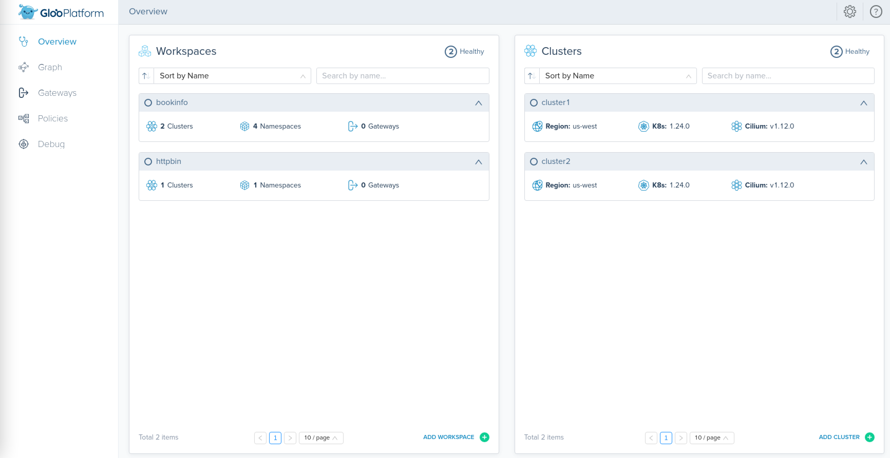
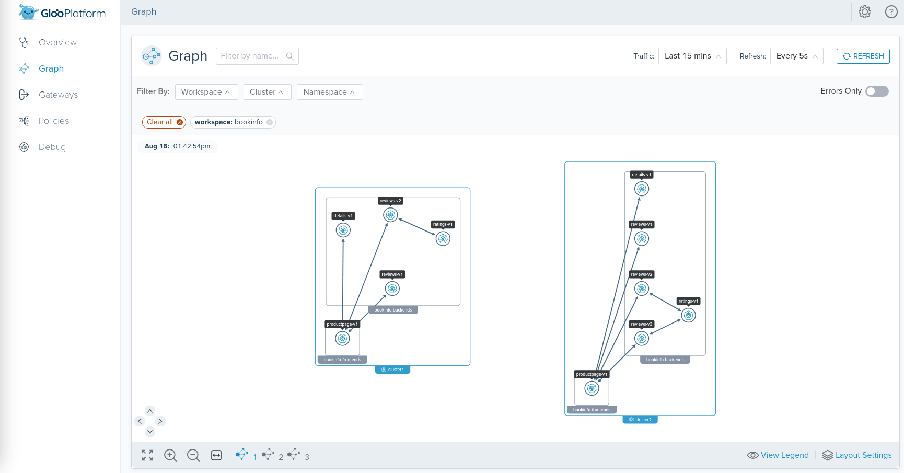
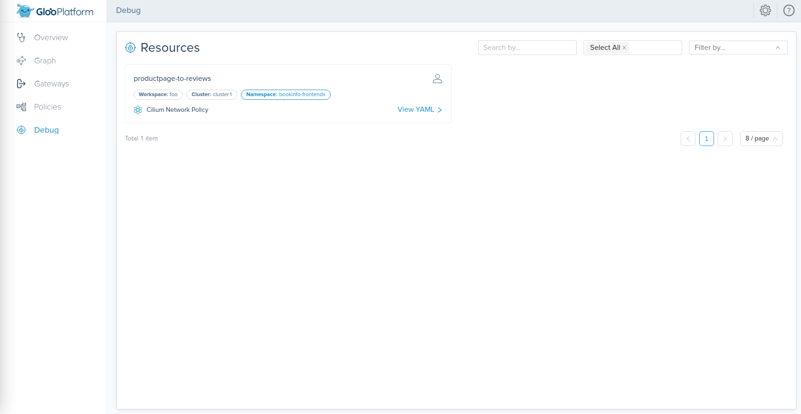

<!--bash
#!/usr/bin/env bash

source ./scripts/assert.sh
-->


# <center>Gloo Mesh Workshop</center>


## Table of Contents
* [Introduction](#introduction)
* [Lab 1 - Deploy KinD clusters](#lab-1---deploy-kind-clusters-)
* [Lab 2 - Deploy the Bookinfo demo app](#lab-2---deploy-the-bookinfo-demo-app-)
* [Lab 3 - Deploy the httpbin demo app](#lab-3---deploy-the-httpbin-demo-app-)
* [Lab 4 - Deploy and register Gloo Mesh](#lab-4---deploy-and-register-gloo-mesh-)
* [Lab 5 - Create the bookinfo workspace](#lab-5---create-the-bookinfo-workspace-)
* [Lab 6 - Create the httpbin workspace](#lab-6---create-the-httpbin-workspace-)
* [Lab 7 - Observability at Level 4 layer](#lab-7---observability-at-level-4-layer-)
* [Lab 8 - Zero trust at Level 4 layer](#lab-8---zero-trust-at-level-4-layer-)


## Introduction <a name="introduction"></a>

[Gloo Mesh Enterprise](https://www.solo.io/products/gloo-mesh/) is a management plane which makes it easy to operate [Cilium](https://cilium.io) and/or [Istio](https://istio.io) on one or many Kubernetes clusters deployed anywhere (any platform, anywhere).

### Cilium support

The Gloo Mesh Enterprise subscription includes end to end Cilium support.

### Gloo Network overview

When you only use Cilium (Istio isn't deployed), a Gloo Network license is needed.

In this context, Gloo Mesh provides many unique features, including:

- global observability (centralized metrics)
- multi-tenancy based on global workspaces
- zero trust enforcement

### Want to learn more about Gloo Mesh

You can find more information about Gloo Mesh in the official documentation:

[https://docs.solo.io/gloo-mesh/latest/](https://docs.solo.io/gloo-mesh/latest/)


## Lab 1 - Deploy KinD clusters <a name="lab-1---deploy-kind-clusters-"></a>


Clone this repository and go to the directory where this `README.md` file is.

Set the context environment variables:

```bash
export MGMT=mgmt
export CLUSTER1=cluster1
export CLUSTER2=cluster2
```

> Note that in case you dont't have a Kubernetes cluster dedicated for the management plane, you would set the variables like that:
> ```
> export MGMT=cluster1
> export CLUSTER1=cluster1
> export CLUSTER2=cluster2
> ```

Run the following commands to deploy three Kubernetes clusters using [Kind](https://kind.sigs.k8s.io/):

```bash
./scripts/deploy-multi-with-cilium.sh 1 mgmt
./scripts/deploy-multi-with-cilium.sh 2 cluster1 us-west us-west-1
./scripts/deploy-multi-with-cilium.sh 3 cluster2 us-west us-west-2
```

Then run the following commands to wait for all the Pods to be ready:

```bash
./scripts/check.sh mgmt
./scripts/check.sh cluster1 
./scripts/check.sh cluster2 
```

**Note:** If you run the `check.sh` script immediately after the `deploy.sh` script, you may see a jsonpath error. If that happens, simply wait a few seconds and try again.

Once the `check.sh` script completes, when you execute the `kubectl get pods -A` command, you should see the following:

```
NAMESPACE            NAME                                          READY   STATUS    RESTARTS   AGE
kube-system          calico-kube-controllers-59d85c5c84-sbk4k      1/1     Running   0          4h26m
kube-system          calico-node-przxs                             1/1     Running   0          4h26m
kube-system          coredns-6955765f44-ln8f5                      1/1     Running   0          4h26m
kube-system          coredns-6955765f44-s7xxx                      1/1     Running   0          4h26m
kube-system          etcd-cluster1-control-plane                   1/1     Running   0          4h27m
kube-system          kube-apiserver-cluster1-control-plane         1/1     Running   0          4h27m
kube-system          kube-controller-manager-cluster1-control-plane1/1     Running   0          4h27m
kube-system          kube-proxy-ksvzw                              1/1     Running   0          4h26m
kube-system          kube-scheduler-cluster1-control-plane         1/1     Running   0          4h27m
local-path-storage   local-path-provisioner-58f6947c7-lfmdx        1/1     Running   0          4h26m
metallb-system       controller-5c9894b5cd-cn9x2                   1/1     Running   0          4h26m
metallb-system       speaker-d7jkp                                 1/1     Running   0          4h26m
```

You can see that your currently connected to this cluster by executing the `kubectl config get-contexts` command:

```
CURRENT   NAME         CLUSTER         AUTHINFO   NAMESPACE  
          cluster1     kind-cluster1   cluster1
*         cluster2     kind-cluster2   cluster2
          mgmt         kind-mgmt       kind-mgmt 
```

Run the following command to make `mgmt` the current cluster.

```bash
kubectl config use-context ${MGMT}
```


## Lab 2 - Deploy the Bookinfo demo app <a name="lab-2---deploy-the-bookinfo-demo-app-"></a>

We're going to deploy the bookinfo application to demonstrate several features of Gloo Mesh.

You can find more information about this application [here](https://istio.io/latest/docs/examples/bookinfo/).

Run the following commands to deploy the bookinfo application on `cluster1`:

```bash
curl https://raw.githubusercontent.com/istio/istio/release-1.16/samples/bookinfo/platform/kube/bookinfo.yaml > bookinfo.yaml

kubectl --context ${CLUSTER1} create ns bookinfo-frontends
kubectl --context ${CLUSTER1} create ns bookinfo-backends
# deploy the frontend bookinfo service in the bookinfo-frontends namespace
kubectl --context ${CLUSTER1} -n bookinfo-frontends apply -f bookinfo.yaml -l 'account in (productpage)'
kubectl --context ${CLUSTER1} -n bookinfo-frontends apply -f bookinfo.yaml -l 'app in (productpage)'
kubectl --context ${CLUSTER1} -n bookinfo-backends apply -f bookinfo.yaml -l 'account in (reviews,ratings,details)'
# deploy the backend bookinfo services in the bookinfo-backends namespace for all versions less than v3
kubectl --context ${CLUSTER1} -n bookinfo-backends apply -f bookinfo.yaml -l 'app in (reviews,ratings,details),version notin (v3)'
# Update the productpage deployment to set the environment variables to define where the backend services are running
kubectl --context ${CLUSTER1} -n bookinfo-frontends set env deploy/productpage-v1 DETAILS_HOSTNAME=details.bookinfo-backends.svc.cluster.local
kubectl --context ${CLUSTER1} -n bookinfo-frontends set env deploy/productpage-v1 REVIEWS_HOSTNAME=reviews.bookinfo-backends.svc.cluster.local
# Update the reviews service to display where it is coming from
kubectl --context ${CLUSTER1} -n bookinfo-backends set env deploy/reviews-v1 CLUSTER_NAME=${CLUSTER1}
kubectl --context ${CLUSTER1} -n bookinfo-backends set env deploy/reviews-v2 CLUSTER_NAME=${CLUSTER1}
```


<!--bash
until [[ $(kubectl --context ${CLUSTER1} -n bookinfo-frontends get deploy -o json | jq '[.items[].status.readyReplicas] | add') -eq 1 ]]; do
  sleep 1
done
until [[ $(kubectl --context ${CLUSTER1} -n bookinfo-backends get deploy -o json | jq '[.items[].status.readyReplicas] | add') -eq 4 ]]; do
  sleep 1
done
-->

You can check that the app is running using the following command:

```
kubectl --context ${CLUSTER1} -n bookinfo-frontends get pods && kubectl --context ${CLUSTER1} -n bookinfo-backends get pods
```

Note that we deployed the `productpage` service in the `bookinfo-frontends` namespace and the other services in the `bookinfo-backends` namespace.

And we deployed the `v1` and `v2` versions of the `reviews` microservice, not the `v3` version.

Now, run the following commands to deploy the bookinfo application on `cluster2`:

```bash
kubectl --context ${CLUSTER2} create ns bookinfo-frontends
kubectl --context ${CLUSTER2} create ns bookinfo-backends
# deploy the frontend bookinfo service in the bookinfo-frontends namespace
kubectl --context ${CLUSTER2} -n bookinfo-frontends apply -f bookinfo.yaml -l 'account in (productpage)'
kubectl --context ${CLUSTER2} -n bookinfo-frontends apply -f bookinfo.yaml -l 'app in (productpage)'
kubectl --context ${CLUSTER2} -n bookinfo-backends apply -f bookinfo.yaml -l 'account in (reviews,ratings,details)'
# deploy the backend bookinfo services in the bookinfo-backends namespace for all versions
  kubectl --context ${CLUSTER2} -n bookinfo-backends apply -f bookinfo.yaml -l 'app in (reviews,ratings,details)'
# Update the productpage deployment to set the environment variables to define where the backend services are running
kubectl --context ${CLUSTER2} -n bookinfo-frontends set env deploy/productpage-v1 DETAILS_HOSTNAME=details.bookinfo-backends.svc.cluster.local
kubectl --context ${CLUSTER2} -n bookinfo-frontends set env deploy/productpage-v1 REVIEWS_HOSTNAME=reviews.bookinfo-backends.svc.cluster.local
# Update the reviews service to display where it is coming from
kubectl --context ${CLUSTER2} -n bookinfo-backends set env deploy/reviews-v1 CLUSTER_NAME=${CLUSTER2}
kubectl --context ${CLUSTER2} -n bookinfo-backends set env deploy/reviews-v2 CLUSTER_NAME=${CLUSTER2}
kubectl --context ${CLUSTER2} -n bookinfo-backends set env deploy/reviews-v3 CLUSTER_NAME=${CLUSTER2}

```

<!--bash
until [[ $(kubectl --context ${CLUSTER2} -n bookinfo-frontends get deploy -o json | jq '[.items[].status.readyReplicas] | add') -eq 1 ]]; do
  sleep 1
done
until [[ $(kubectl --context ${CLUSTER2} -n bookinfo-backends get deploy -o json | jq '[.items[].status.readyReplicas] | add') -eq 5 ]]; do
  sleep 1
done
-->

You can check that the app is running using:

```bash
kubectl --context ${CLUSTER2} -n bookinfo-frontends get pods && kubectl --context ${CLUSTER2} -n bookinfo-backends get pods
```

As you can see, we deployed all three versions of the `reviews` microservice on this cluster.

<!--bash
cat <<'EOF' > ./test.js
const helpers = require('./tests/chai-exec');

describe("Bookinfo app", () => {
  let cluster = process.env.CLUSTER1
  let deployments = ["productpage-v1"];
  deployments.forEach(deploy => {
    it(deploy + ' pods are ready in ' + cluster, () => helpers.checkDeployment({ context: cluster, namespace: "bookinfo-frontends", k8sObj: deploy }));
  });
  deployments = ["ratings-v1", "details-v1", "reviews-v1", "reviews-v2"];
  deployments.forEach(deploy => {
    it(deploy + ' pods are ready in ' + cluster, () => helpers.checkDeployment({ context: cluster, namespace: "bookinfo-backends", k8sObj: deploy }));
  });
  cluster = process.env.CLUSTER2
  deployments = ["productpage-v1"];
  deployments.forEach(deploy => {
    it(deploy + ' pods are ready in ' + cluster, () => helpers.checkDeployment({ context: cluster, namespace: "bookinfo-frontends", k8sObj: deploy }));
  });
  deployments = ["ratings-v1", "details-v1", "reviews-v1", "reviews-v2", "reviews-v3"];
  deployments.forEach(deploy => {
    it(deploy + ' pods are ready in ' + cluster, () => helpers.checkDeployment({ context: cluster, namespace: "bookinfo-backends", k8sObj: deploy }));
  });
});
EOF
echo "executing test dist/gloo-mesh-2-0-gloo-network/build/templates/steps/apps/bookinfo/deploy-bookinfo/tests/check-bookinfo.test.js.liquid"
tempfile=$(mktemp)
echo "saving errors in ${tempfile}"
mocha ./test.js --timeout 10000 --retries=50 --bail 2> ${tempfile} || { cat ${tempfile} && exit 1; }
-->


## Lab 3 - Deploy the httpbin demo app <a name="lab-3---deploy-the-httpbin-demo-app-"></a>

We're going to deploy the httpbin application to demonstrate several features of Gloo Mesh.

You can find more information about this application [here](http://httpbin.org/).


Run the following commands to deploy the httpbin app on `cluster1`. The deployment will be called `not-in-mesh` and won't have the sidecar injected (because we don't label the namespace).

```bash
kubectl --context ${CLUSTER1} create ns httpbin
kubectl apply --context ${CLUSTER1} -f - <<EOF
apiVersion: v1
kind: ServiceAccount
metadata:
  name: not-in-mesh
  namespace: httpbin
---
apiVersion: v1
kind: Service
metadata:
  name: not-in-mesh
  namespace: httpbin
  labels:
    app: not-in-mesh
    service: not-in-mesh
spec:
  ports:
  - name: http
    port: 8000
    targetPort: 80
  selector:
    app: not-in-mesh
---
apiVersion: apps/v1
kind: Deployment
metadata:
  name: not-in-mesh
  namespace: httpbin
spec:
  replicas: 1
  selector:
    matchLabels:
      app: not-in-mesh
      version: v1
  template:
    metadata:
      labels:
        app: not-in-mesh
        version: v1
    spec:
      serviceAccountName: not-in-mesh
      containers:
      - image: docker.io/kennethreitz/httpbin
        imagePullPolicy: IfNotPresent
        name: not-in-mesh
        ports:
        - containerPort: 80
EOF
```


You can follow the progress using the following command:

```
kubectl --context ${CLUSTER1} -n httpbin get pods
```

```
NAME                           READY   STATUS    RESTARTS   AGE
not-in-mesh-5c64bb49cd-m9kwm   1/1     Running   0          11s
```
<!--bash
cat <<'EOF' > ./test.js
const helpers = require('./tests/chai-exec');

describe("httpbin app", () => {
  let cluster = process.env.CLUSTER1
  
  let deployments = ["not-in-mesh"];
  
  deployments.forEach(deploy => {
    it(deploy + ' pods are ready in ' + cluster, () => helpers.checkDeployment({ context: cluster, namespace: "httpbin", k8sObj: deploy }));
  });
});
EOF
echo "executing test dist/gloo-mesh-2-0-gloo-network/build/templates/steps/apps/httpbin/deploy-httpbin/tests/check-httpbin.test.js.liquid"
tempfile=$(mktemp)
echo "saving errors in ${tempfile}"
mocha ./test.js --timeout 10000 --retries=50 --bail 2> ${tempfile} || { cat ${tempfile} && exit 1; }
-->


## Lab 4 - Deploy and register Gloo Mesh <a name="lab-4---deploy-and-register-gloo-mesh-"></a>


First of all, let's install the `meshctl` CLI:

```bash
export GLOO_MESH_VERSION=v2.3.1
curl -sL https://run.solo.io/meshctl/install | sh -
export PATH=$HOME/.gloo-mesh/bin:$PATH
```

Run the following commands to deploy the Gloo Mesh management plane:

<!--bash
cat <<'EOF' > ./test.js
var chai = require('chai');
var expect = chai.expect;

describe("Required environment variables should contain value", () => {
  afterEach(function(done){
    if(this.currentTest.currentRetry() > 0){
      process.stdout.write(".");
       setTimeout(done, 1000);
    } else {
      done();
    }
  });

  it("Context environment variables should not be empty", () => {
    expect(process.env.MGMT).to.not.be.empty
    expect(process.env.CLUSTER1).to.not.be.empty
    expect(process.env.CLUSTER2).to.not.be.empty
  });

  it("Gloo Mesh licence environment variables should not be empty", () => {
    expect(process.env.GLOO_MESH_LICENSE_KEY).to.not.be.empty
  });
});
EOF
echo "executing test dist/gloo-mesh-2-0-gloo-network/build/templates/steps/deploy-and-register-gloo-mesh/tests/environment-variables.test.js.liquid"
tempfile=$(mktemp)
echo "saving errors in ${tempfile}"
mocha ./test.js --timeout 10000 --retries=50 --bail 2> ${tempfile} || { cat ${tempfile} && exit 1; }
-->

```bash
helm repo add gloo-platform https://storage.googleapis.com/gloo-platform/helm-charts
helm repo update
kubectl --context ${MGMT} create ns gloo-mesh
helm upgrade --install gloo-platform-crds gloo-platform/gloo-platform-crds \
--namespace gloo-mesh \
--kube-context ${MGMT} \
--version=2.3.1
helm upgrade --install gloo-platform gloo-platform/gloo-platform \
--namespace gloo-mesh \
--kube-context ${MGMT} \
--version=2.3.1 \
 -f -<<EOF
licensing:
  licenseKey: ${GLOO_MESH_LICENSE_KEY}
common:
  cluster: mgmt
glooMgmtServer:
  enabled: true
  ports:
    healthcheck: 8091
prometheus:
  enabled: true
redis:
  deployment:
    enabled: true
telemetryGateway:
  enabled: true
  service:
    type: LoadBalancer
glooUi:
  enabled: true
  serviceType: LoadBalancer
glooNetwork:
  enabled: true
EOF
kubectl --context ${MGMT} -n gloo-mesh rollout status deploy/gloo-mesh-mgmt-server
```
<!--bash
kubectl --context ${MGMT} scale --replicas=0 -n gloo-mesh deploy/gloo-mesh-ui
kubectl --context ${MGMT} rollout status -n gloo-mesh deploy/gloo-mesh-ui
-->
<!--bash
kubectl wait --context ${MGMT} --for=condition=Ready -n gloo-mesh --all pod
until [[ $(kubectl --context ${MGMT} -n gloo-mesh get svc gloo-mesh-mgmt-server -o json | jq '.status.loadBalancer | length') -gt 0 ]]; do
  sleep 1
done
-->
Then, you need to set the environment variable to tell the Gloo Mesh agents how to communicate with the management plane:
<!--bash
cat <<'EOF' > ./test.js

const helpers = require('./tests/chai-exec');

describe("MGMT server is healthy", () => {
  let cluster = process.env.MGMT
  let deployments = ["gloo-mesh-mgmt-server","gloo-mesh-redis","gloo-telemetry-gateway","prometheus-server"];
  deployments.forEach(deploy => {
    it(deploy + ' pods are ready in ' + cluster, () => helpers.checkDeployment({ context: cluster, namespace: "gloo-mesh", k8sObj: deploy }));
  });
});
EOF
echo "executing test dist/gloo-mesh-2-0-gloo-network/build/templates/steps/deploy-and-register-gloo-mesh/tests/check-deployment.test.js.liquid"
tempfile=$(mktemp)
echo "saving errors in ${tempfile}"
mocha ./test.js --timeout 10000 --retries=50 --bail 2> ${tempfile} || { cat ${tempfile} && exit 1; }
-->
<!--bash
cat <<'EOF' > ./test.js
const chaiExec = require("@jsdevtools/chai-exec");
var chai = require('chai');
var expect = chai.expect;
chai.use(chaiExec);

afterEach(function (done) {
  if (this.currentTest.currentRetry() > 0) {
    process.stdout.write(".");
    setTimeout(done, 1000);
  } else {
    done();
  }
});
EOF
echo "executing test dist/gloo-mesh-2-0-gloo-network/build/templates/steps/deploy-and-register-gloo-mesh/tests/get-gloo-mesh-mgmt-server-ip.test.js.liquid"
tempfile=$(mktemp)
echo "saving errors in ${tempfile}"
mocha ./test.js --timeout 10000 --retries=50 --bail 2> ${tempfile} || { cat ${tempfile} && exit 1; }
-->

```bash
export ENDPOINT_GLOO_MESH=$(kubectl --context ${MGMT} -n gloo-mesh get svc gloo-mesh-mgmt-server -o jsonpath='{.status.loadBalancer.ingress[0].*}'):9900
export HOST_GLOO_MESH=$(echo ${ENDPOINT_GLOO_MESH} | cut -d: -f1)
export ENDPOINT_TELEMETRY_GATEWAY=$(kubectl --context ${MGMT} -n gloo-mesh get svc gloo-telemetry-gateway -o jsonpath='{.status.loadBalancer.ingress[0].*}'):4317
```

Check that the variables have correct values:
```
echo $HOST_GLOO_MESH
echo $ENDPOINT_GLOO_MESH
```
<!--bash
cat <<'EOF' > ./test.js
const dns = require('dns');
const chaiHttp = require("chai-http");
const chai = require("chai");
const expect = chai.expect;
chai.use(chaiHttp);
const { waitOnFailedTest } = require('./tests/utils');

afterEach(function(done) { waitOnFailedTest(done, this.currentTest.currentRetry())});

describe("Address '" + process.env.HOST_GLOO_MESH + "' can be resolved in DNS", () => {
    it(process.env.HOST_GLOO_MESH + ' can be resolved', (done) => {
        return dns.lookup(process.env.HOST_GLOO_MESH, (err, address, family) => {
            expect(address).to.be.an.ip;
            done();
        });
    });
});
EOF
echo "executing test ./gloo-mesh-2-0/tests/can-resolve.test.js.liquid"
tempfile=$(mktemp)
echo "saving errors in ${tempfile}"
mocha ./test.js --timeout 10000 --retries=50 --bail 2> ${tempfile} || { cat ${tempfile} && exit 1; }
-->
Finally, you need to register the cluster(s).

Here is how you register the first one:

```bash
kubectl apply --context ${MGMT} -f- <<EOF
apiVersion: admin.gloo.solo.io/v2
kind: KubernetesCluster
metadata:
  name: cluster1
  namespace: gloo-mesh
spec:
  clusterDomain: cluster.local
EOF
kubectl --context ${CLUSTER1} create ns gloo-mesh
kubectl get secret relay-root-tls-secret -n gloo-mesh --context ${MGMT} -o jsonpath='{.data.ca\.crt}' | base64 -d > ca.crt
kubectl create secret generic relay-root-tls-secret -n gloo-mesh --context ${CLUSTER1} --from-file ca.crt=ca.crt
rm ca.crt

kubectl get secret relay-identity-token-secret -n gloo-mesh --context ${MGMT} -o jsonpath='{.data.token}' | base64 -d > token
kubectl create secret generic relay-identity-token-secret -n gloo-mesh --context ${CLUSTER1} --from-file token=token
rm token
helm upgrade --install gloo-platform-crds gloo-platform/gloo-platform-crds  \
--namespace=gloo-mesh \
--kube-context=${CLUSTER1} \
--version=2.3.1
helm upgrade --install gloo-platform gloo-platform/gloo-platform \
  --namespace=gloo-mesh \
  --kube-context=${CLUSTER1} \
  --version=2.3.1 \
 -f -<<EOF
common:
  cluster: cluster1
glooAgent:
  enabled: true
  relay:
    serverAddress: ${ENDPOINT_GLOO_MESH}
    authority: gloo-mesh-mgmt-server.gloo-mesh
telemetryCollector:
  enabled: true
  config:
    exporters:
      otlp:
        endpoint: \"${ENDPOINT_TELEMETRY_GATEWAY}\"
EOF
```

Note that the registration can also be performed using `meshctl cluster register`.

And here is how you register the second one:

```bash
kubectl apply --context ${MGMT} -f- <<EOF
apiVersion: admin.gloo.solo.io/v2
kind: KubernetesCluster
metadata:
  name: cluster2
  namespace: gloo-mesh
spec:
  clusterDomain: cluster.local
EOF
kubectl --context ${CLUSTER2} create ns gloo-mesh
kubectl get secret relay-root-tls-secret -n gloo-mesh --context ${MGMT} -o jsonpath='{.data.ca\.crt}' | base64 -d > ca.crt
kubectl create secret generic relay-root-tls-secret -n gloo-mesh --context ${CLUSTER2} --from-file ca.crt=ca.crt
rm ca.crt

kubectl get secret relay-identity-token-secret -n gloo-mesh --context ${MGMT} -o jsonpath='{.data.token}' | base64 -d > token
kubectl create secret generic relay-identity-token-secret -n gloo-mesh --context ${CLUSTER2} --from-file token=token
rm token
helm upgrade --install gloo-platform-crds gloo-platform/gloo-platform-crds  \
--namespace=gloo-mesh \
--kube-context=${CLUSTER2} \
--version=2.3.1
helm upgrade --install gloo-platform gloo-platform/gloo-platform \
  --namespace=gloo-mesh \
  --kube-context=${CLUSTER2} \
  --version=2.3.1 \
 -f -<<EOF
common:
  cluster: cluster2
glooAgent:
  enabled: true
  relay:
    serverAddress: ${ENDPOINT_GLOO_MESH}
    authority: gloo-mesh-mgmt-server.gloo-mesh
telemetryCollector:
  enabled: true
  config:
    exporters:
      otlp:
        endpoint: \"${ENDPOINT_TELEMETRY_GATEWAY}\"
EOF
```

You can check the cluster(s) have been registered correctly using the following commands:

```
meshctl --kubecontext ${MGMT} check
```

```
pod=$(kubectl --context ${MGMT} -n gloo-mesh get pods -l app=gloo-mesh-mgmt-server -o jsonpath='{.items[0].metadata.name}')
kubectl --context ${MGMT} -n gloo-mesh debug -q -i ${pod} --image=curlimages/curl -- curl -s http://localhost:9091/metrics | grep relay_push_clients_connected
```

You should get an output similar to this:

```
# HELP relay_push_clients_connected Current number of connected Relay push clients (Relay Agents).
# TYPE relay_push_clients_connected gauge
relay_push_clients_connected{cluster="cluster1"} 1
relay_push_clients_connected{cluster="cluster2"} 1
```

<!--bash
cat <<'EOF' > ./test.js
var chai = require('chai');
var expect = chai.expect;
const helpers = require('./tests/chai-exec');
describe("Cluster registration", () => {
  it("cluster1 is registered", () => {
    podName = helpers.getOutputForCommand({ command: "kubectl -n gloo-mesh get pods -l app=gloo-mesh-mgmt-server -o jsonpath='{.items[0].metadata.name}' --context " + process.env.MGMT }).replaceAll("'", "");
    command = helpers.getOutputForCommand({ command: "kubectl --context " + process.env.MGMT + " -n gloo-mesh debug -q -i " + podName + " --image=curlimages/curl -- curl -s http://localhost:9091/metrics" }).replaceAll("'", "");
    expect(command).to.contain("cluster1");
  });
  it("cluster2 is registered", () => {
    podName = helpers.getOutputForCommand({ command: "kubectl -n gloo-mesh get pods -l app=gloo-mesh-mgmt-server -o jsonpath='{.items[0].metadata.name}' --context " + process.env.MGMT }).replaceAll("'", "");
    command = helpers.getOutputForCommand({ command: "kubectl --context " + process.env.MGMT + " -n gloo-mesh debug -q -i " + podName + " --image=curlimages/curl -- curl -s http://localhost:9091/metrics" }).replaceAll("'", "");
    expect(command).to.contain("cluster2");
  });
});
EOF
echo "executing test dist/gloo-mesh-2-0-gloo-network/build/templates/steps/deploy-and-register-gloo-mesh/tests/cluster-registration.test.js.liquid"
tempfile=$(mktemp)
echo "saving errors in ${tempfile}"
mocha ./test.js --timeout 10000 --retries=50 --bail 2> ${tempfile} || { cat ${tempfile} && exit 1; }
-->


## Lab 5 - Create the bookinfo workspace <a name="lab-5---create-the-bookinfo-workspace-"></a>

We're going to create a workspace for the team in charge of the Bookinfo application.

The platform team needs to create the corresponding `Workspace` Kubernetes objects in the Gloo Mesh management cluster.

Let's create the `bookinfo` workspace which corresponds to the `bookinfo-frontends` and `bookinfo-backends` namespaces on the cluster(s):

```bash
kubectl apply --context ${MGMT} -f - <<EOF
apiVersion: admin.gloo.solo.io/v2
kind: Workspace
metadata:
  name: bookinfo
  namespace: gloo-mesh
spec:
  workloadClusters:
  - name: cluster1
    namespaces:
    - name: bookinfo-frontends
    - name: bookinfo-backends
  - name: cluster2
    namespaces:
    - name: bookinfo-frontends
    - name: bookinfo-backends
EOF
```

Then, the Bookinfo team creates a `WorkspaceSettings` Kubernetes object in one of the namespaces of the `bookinfo` workspace (so the `bookinfo-frontends` or the `bookinfo-backends` namespace):

```bash
kubectl apply --context ${CLUSTER1} -f - <<EOF
apiVersion: admin.gloo.solo.io/v2
kind: WorkspaceSettings
metadata:
  name: bookinfo
  namespace: bookinfo-frontends
spec:
  {}
EOF
```


This is how the environment looks like with the workspaces:


## Lab 6 - Create the httpbin workspace <a name="lab-6---create-the-httpbin-workspace-"></a>

We're going to create a workspace for the team in charge of the httpbin application.

The platform team needs to create the corresponding `Workspace` Kubernetes objects in the Gloo Mesh management cluster.

Let's create the `httpbin` workspace which corresponds to the `httpbin` namespace on `cluster1`:

```bash
kubectl apply --context ${MGMT} -f - <<EOF
apiVersion: admin.gloo.solo.io/v2
kind: Workspace
metadata:
  name: httpbin
  namespace: gloo-mesh
spec:
  workloadClusters:
  - name: cluster1
    namespaces:
    - name: httpbin
EOF
```

Then, the Httpbin team creates a `WorkspaceSettings` Kubernetes object in one of the namespaces of the `httpbin` workspace:

```bash
kubectl apply --context ${CLUSTER1} -f - <<EOF
apiVersion: admin.gloo.solo.io/v2
kind: WorkspaceSettings
metadata:
  name: httpbin
  namespace: httpbin
spec:
  {}
EOF
```


## Lab 7 - Observability at Level 4 layer <a name="lab-7---observability-at-level-4-layer-"></a>

The Gloo Mesh UI is providing a centralized dashboard to allow you to see how everything has been configured.

You can access it through the browser.

Get the URL to access the Gloo Mesh UI using the following command:
```
export ENDPOINT_GLOO_MESH_UI=$(kubectl --context ${MGMT} -n gloo-mesh get svc gloo-mesh-ui -o jsonpath='{.status.loadBalancer.ingress[0].*}'):8090
echo "http://${ENDPOINT_GLOO_MESH_UI}"
```



You can see the 2 workspaces we've created in the previous steps and also that Gloo Mesh has detected the version of Cilium running in the cluster(s).

Cilium is generating metrics for all the communications at Level 4 layer.

Gloo Mesh is gathering all these metrics in the management plane using the agent running on each remote cluster and is storing them in Prometheus.

The Gloo Mesh UI is then using these metrics to build a graph showing all the communications happening in any cluster.

Let's generate some traffic.

```bash
pod=$(kubectl --context ${CLUSTER1} -n bookinfo-frontends get pods -l app=productpage -o jsonpath='{.items[0].metadata.name}')
kubectl --context ${CLUSTER1} -n bookinfo-frontends debug -i -q ${pod} --image=curlimages/curl -- /bin/sh -c 'for i in `seq 1 10`; do curl -s -o /dev/null -w "%{http_code}\n" http://localhost:9080/productpage; done'
pod=$(kubectl --context ${CLUSTER2} -n bookinfo-frontends get pods -l app=productpage -o jsonpath='{.items[0].metadata.name}')
kubectl --context ${CLUSTER2} -n bookinfo-frontends debug -i -q ${pod} --image=curlimages/curl -- /bin/sh -c 'for i in `seq 1 10`; do curl -s -o /dev/null -w "%{http_code}\n" http://localhost:9080/productpage; done'
```

Now, click on the `Graph` tab.



You need to click on `Layout Settings` and select `Cilium: SHOW` and `Group By: CLUSTER`.

You can see all the communication happening on the cluster(s), from one single graph, and in the context of one (or several) workspace(s).

Let's create a `CiliumNetworkPolicy`:

```bash
kubectl apply --context ${CLUSTER1} -f- <<EOF
apiVersion: "cilium.io/v2"
kind: CiliumNetworkPolicy
metadata:
  name: productpage-to-reviews
  namespace: bookinfo-frontends
spec:
  endpointSelector:
    matchLabels:
      app: reviews
  ingress:
  - fromEndpoints:
    - matchLabels:
        app: productpage
    toPorts:
    - ports:
      - port: "9080"
        protocol: TCP
EOF
```

Now, click on the `Debug` tab.



You can see all the `CiliumNetworkPolicy` that have been created on the cluster(s), from one single page.

Let's delete the `CiliumNetworkPolicy` we've created:

```bash
kubectl --context ${CLUSTER1} -n bookinfo-frontends delete ciliumnetworkpolicy productpage-to-reviews
```


## Lab 8 - Zero trust at Level 4 layer <a name="lab-8---zero-trust-at-level-4-layer-"></a>

All the communications between Pods in the cluster(s) are allowed by default.

Run the following commands to initiate a communication from a service which is in the `httpbin` Workspace to a service which is in the `bookinfo` Workspace:

```
pod=$(kubectl --context ${CLUSTER1} -n httpbin get pods -l app=httpbin -o jsonpath='{.items[0].metadata.name}')
kubectl --context ${CLUSTER1} -n httpbin debug -i -q ${pod} --image=curlimages/curl -- curl -s -o /dev/null -w "%{http_code}" http://reviews.bookinfo-backends.svc.cluster.local:9080/reviews/0
```

You should get a `200` response code which confirm that the communication is currently allowed.

<!--bash
cat <<'EOF' > ./test.js
var chai = require('chai');
var expect = chai.expect;
const helpers = require('./tests/chai-exec');
describe("Communication allowed", () => {
  it("Response code should be 200", () => {
    const podName = helpers.getOutputForCommand({ command: "kubectl --context " + process.env.CLUSTER1 + " -n httpbin get pods -l app=httpbin -o jsonpath='{.items[0].metadata.name}'" }).replaceAll("'", "");
    const command = helpers.getOutputForCommand({ command: "kubectl --context " + process.env.CLUSTER1 + " -n httpbin debug -i -q " + podName + " --image=curlimages/curl -- curl -s -o /dev/null -w \"%{http_code}\" http://reviews.bookinfo-backends:9080/reviews/0" }).replaceAll("'", "");
    expect(command).to.contain("200");
  });
});
EOF
echo "executing test dist/gloo-mesh-2-0-gloo-network/build/templates/steps/apps/bookinfo/l4-zero-trust/tests/different-workspaces-allowed.test.js.liquid"
tempfile=$(mktemp)
echo "saving errors in ${tempfile}"
mocha ./test.js --timeout 10000 --retries=50 --bail 2> ${tempfile} || { cat ${tempfile} && exit 1; }
-->

To enfore a zero trust policy, you can use `CiliumNetworkPolicies` to change this behavior and to determine which services can communicate together.

If you have many services running in your Kubernetes cluster, it can become complicated to create and maintain a high number of policies.

But we can use Gloo Mesh to automatically generate the `CiliumNetworkPolicies` based on the Workspace boundaries.

To do that, the Bookinfo team must update its `WorkspaceSettings` Kubernetes object to enable service isolation.

```bash
kubectl apply --context ${CLUSTER1} -f- <<EOF
apiVersion: admin.gloo.solo.io/v2
kind: WorkspaceSettings
metadata:
  name: bookinfo
  namespace: bookinfo-frontends
spec:
  options:
    serviceIsolation:
      enabled: true
EOF
```

You can run the following command to see all the `CiliumNetworkPolicies` that have been created by Gloo Mesh.

```bash
kubectl --context ${CLUSTER1} get ciliumnetworkpolicies  -A
```

Then, you can get more details about one of them:

```bash
kubectl --context ${CLUSTER1} -n bookinfo-backends get ciliumnetworkpolicies settings-reviews-9080-bookinfo -o yaml
```

Here is the expected output:

```
apiVersion: cilium.io/v2
kind: CiliumNetworkPolicy
metadata:
  creationTimestamp: "2022-08-17T09:23:51Z"
  generation: 223
  labels:
    agent.gloo.solo.io: gloo-mesh
    cluster.multicluster.solo.io: ""
    context.mesh.gloo.solo.io/cluster: cluster1
    context.mesh.gloo.solo.io/namespace: bookinfo-backends
    context.mesh.gloo.solo.io/workspace: bookinfo
    gloo.solo.io/parent_cluster: cluster1
    gloo.solo.io/parent_group: ""
    gloo.solo.io/parent_kind: Service
    gloo.solo.io/parent_name: reviews
    gloo.solo.io/parent_namespace: bookinfo-backends
    gloo.solo.io/parent_version: v1
    owner.gloo.solo.io/name: gloo-mesh
    reconciler.mesh.gloo.solo.io/name: translator
    relay.solo.io/cluster: cluster1
  name: settings-reviews-9080-bookinfo
  namespace: bookinfo-backends
  resourceVersion: "2899"
  uid: da022121-34b5-46df-86a8-7082d756ca6d
spec:
  endpointSelector:
    matchLabels:
      any:app: reviews
  ingress:
  - fromEndpoints:
    - matchLabels:
        k8s:io.cilium.k8s.policy.serviceaccount: bookinfo-reviews
        k8s:io.kubernetes.pod.namespace: bookinfo-backends
    - matchLabels:
        k8s:io.cilium.k8s.policy.serviceaccount: bookinfo-productpage
        k8s:io.kubernetes.pod.namespace: bookinfo-frontends
    - matchLabels:
        k8s:io.cilium.k8s.policy.serviceaccount: bookinfo-ratings
        k8s:io.kubernetes.pod.namespace: bookinfo-backends
    - matchLabels:
        k8s:io.cilium.k8s.policy.serviceaccount: default
        k8s:io.kubernetes.pod.namespace: bookinfo-frontends
    - matchLabels:
        k8s:io.cilium.k8s.policy.serviceaccount: bookinfo-details
        k8s:io.kubernetes.pod.namespace: bookinfo-backends
    - matchLabels:
        k8s:io.cilium.k8s.policy.serviceaccount: default
        k8s:io.kubernetes.pod.namespace: bookinfo-backends
    toPorts:
    - ports:
      - port: "9080"
        protocol: ANY
```

You can see that the rule is leveraging the Kubernetes Service Accounts to allow only the Pods in the same workspace to communicate with the `reviews` service.

Now, run the following commands to initiate a communication from a service which is in the `httpbin` Workspace to a service which is in the `bookinfo` Workspace:

```
pod=$(kubectl --context ${CLUSTER1} -n httpbin get pods -l app=httpbin -o jsonpath='{.items[0].metadata.name}')
kubectl --context ${CLUSTER1} -n httpbin debug -i -q ${pod} --image=curlimages/curl -- curl -s -o /dev/null -w "%{http_code}" --connect-timeout 5 http://reviews.bookinfo-backends.svc.cluster.local:9080/reviews/0
```

You should get a `000` response code which means that the communication can't be established.

Note that we've used the `--connect-timeout 5` option to make sure the command returns quickly.

<!--bash
cat <<'EOF' > ./test.js
var chai = require('chai');
var expect = chai.expect;
const helpers = require('./tests/chai-exec');
describe("Communication not allowed", () => {
  it("Response code should be 000", () => {
    const podName = helpers.getOutputForCommand({ command: "kubectl --context " + process.env.CLUSTER1 + " -n httpbin get pods -l app=not-in-mesh -o jsonpath='{.items[0].metadata.name}'" }).replaceAll("'", "");
    const command = helpers.getOutputForCommand({ command: "kubectl --context " + process.env.CLUSTER1 + " -n httpbin debug -i -q " + podName + " --image=curlimages/curl -- curl -s -o /dev/null -w \"%{http_code}\" --connect-timeout 5 http://reviews.bookinfo-backends:9080/reviews/0" }).replaceAll("'", "");
    expect(command).to.contain("000");
  });
});
EOF
echo "executing test dist/gloo-mesh-2-0-gloo-network/build/templates/steps/apps/bookinfo/l4-zero-trust/tests/different-workspaces-not-allowed.test.js.liquid"
tempfile=$(mktemp)
echo "saving errors in ${tempfile}"
mocha ./test.js --timeout 10000 --retries=50 --bail 2> ${tempfile} || { cat ${tempfile} && exit 1; }
-->

Run the following commands to initiate a communication from a service which is in the `bookinfo` Workspace to is the same Workspace:

```
pod=$(kubectl --context ${CLUSTER1} -n bookinfo-frontends get pods -l app=productpage -o jsonpath='{.items[0].metadata.name}')
kubectl --context ${CLUSTER1} -n bookinfo-frontends debug -i -q ${pod} --image=curlimages/curl -- curl -s -o /dev/null -w "%{http_code}" http://reviews.bookinfo-backends.svc.cluster.local:9080/reviews/0
```

<!--bash
cat <<'EOF' > ./test.js
var chai = require('chai');
var expect = chai.expect;
const helpers = require('./tests/chai-exec');
describe("Communication allowed", () => {
  it("Response code should be 200", () => {
    const podName = helpers.getOutputForCommand({ command: "kubectl --context " + process.env.CLUSTER1 + " -n bookinfo-frontends get pods -l app=productpage -o jsonpath='{.items[0].metadata.name}'" }).replaceAll("'", "");
    const command = helpers.getOutputForCommand({ command: "kubectl --context " + process.env.CLUSTER1 + " -n bookinfo-frontends debug -i -q " + podName + " --image=curlimages/curl -- curl -s -o /dev/null -w \"%{http_code}\" http://reviews.bookinfo-backends:9080/reviews/0" }).replaceAll("'", "");
    expect(command).to.contain("200");
  });
});
EOF
echo "executing test dist/gloo-mesh-2-0-gloo-network/build/templates/steps/apps/bookinfo/l4-zero-trust/tests/same-workspace-allowed.test.js.liquid"
tempfile=$(mktemp)
echo "saving errors in ${tempfile}"
mocha ./test.js --timeout 10000 --retries=50 --bail 2> ${tempfile} || { cat ${tempfile} && exit 1; }
-->

You should get a `200` response code which means that services in the same Workspace can still communicate together

Finally, let's say the Bookinfo team wants to allow the Httpbin team to access the `reviews` service.

The Bookinfo team will export the `reviews` service as follow:

```bash
kubectl apply --context ${CLUSTER1} -f- <<EOF
apiVersion: admin.gloo.solo.io/v2
kind: WorkspaceSettings
metadata:
  name: bookinfo
  namespace: bookinfo-frontends
spec:
  exportTo:
  - workspaces:
    - name: httpbin
    resources:
    - kind: SERVICE
      labels:
        app: reviews
  options:
    serviceIsolation:
      enabled: true
EOF
```

The Httpbin team will then import the `reviews` service as follow:

```bash
kubectl apply --context ${CLUSTER1} -f- <<EOF
apiVersion: admin.gloo.solo.io/v2
kind: WorkspaceSettings
metadata:
  name: httpbin
  namespace: httpbin
spec:
  importFrom:
  - workspaces:
    - name: bookinfo
    resources:
    - kind: SERVICE
  options:
    serviceIsolation:
      enabled: true
EOF
```

Not that the Httpbin team doesn't need (but can) to specify which service they want to import from the Bookinfo Workspace.

This time the following commands should return a `200`:

```
pod=$(kubectl --context ${CLUSTER1} -n httpbin get pods -l app=httpbin -o jsonpath='{.items[0].metadata.name}')
kubectl --context ${CLUSTER1} -n httpbin debug -i -q ${pod} --image=curlimages/curl -- curl -s -o /dev/null -w "%{http_code}" --connect-timeout 5 http://reviews.bookinfo-backends.svc.cluster.local:9080/reviews/0
```

You've achieved zero trust with nearly no effort.


