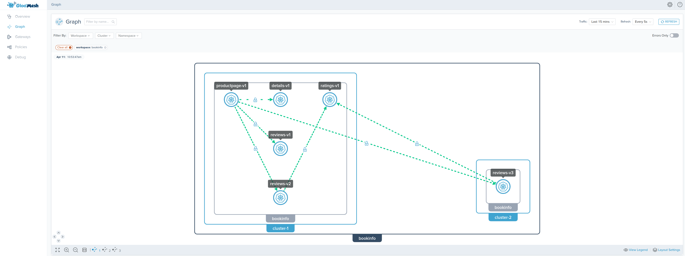
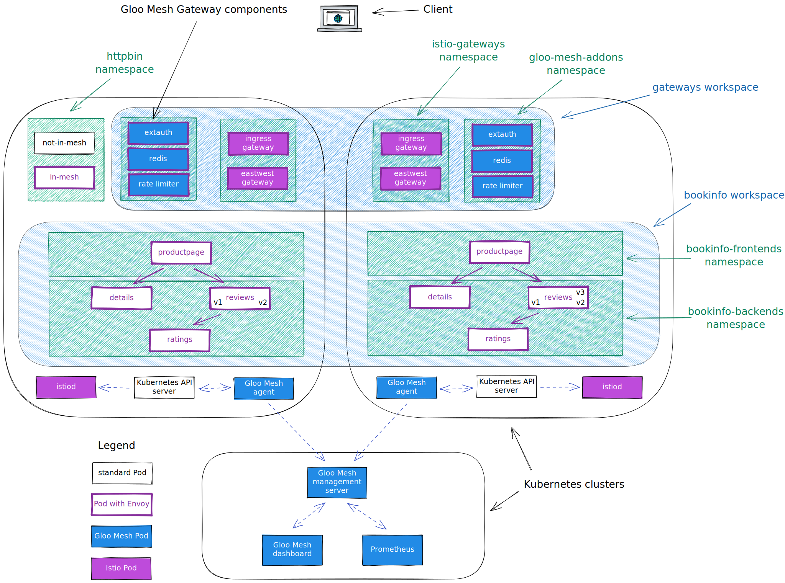

<!--bash
#!/usr/bin/env bash

source ./scripts/assert.sh
-->


# <center>Application Observability in Gloo Mesh Enterprise</center>


## Table of Contents
* [Introduction](#introduction)
* [Lab 1 - Deploy KinD clusters](#lab-1---deploy-kind-clusters-)
* [Lab 2 - Deploy and register Gloo Mesh](#lab-2---deploy-and-register-gloo-mesh-)
* [Lab 3 - Deploy Istio using Gloo Mesh Lifecycle Manager](#lab-3---deploy-istio-using-gloo-mesh-lifecycle-manager-)
* [Lab 4 - Deploy Gloo Mesh Addons](#lab-4---deploy-gloo-mesh-addons-)
* [Lab 5 - Deploy the Bookinfo demo app](#lab-5---deploy-the-bookinfo-demo-app-)
* [Lab 6 - Create the gateways workspace](#lab-6---create-the-gateways-workspace-)
* [Lab 7 - Create the bookinfo workspace](#lab-7---create-the-bookinfo-workspace-)
* [Lab 8 - Expose the productpage through a gateway](#lab-8---expose-the-productpage-through-a-gateway-)
* [Lab 9 - Traffic policies](#lab-9---traffic-policies-)
* [Lab 10 - Create the Root Trust Policy](#lab-10---create-the-root-trust-policy-)
* [Lab 11 - Add Application Tracing to the platform](#lab-11---add-application-tracing-to-the-platform-)
* [Lab 12 - Add Application Logs to the platform](#lab-12---add-application-logs-to-the-platform-)


## Introduction <a name="introduction"></a>

[Gloo Mesh Enterprise](https://www.solo.io/products/gloo-mesh/) is a management plane which makes it easy to operate [Istio](https://istio.io) on one or many Kubernetes clusters deployed anywhere (any platform, anywhere).

### Istio support

The Gloo Mesh Enterprise subscription includes end to end Istio support:

- Upstream first
- Specialty builds available (FIPS, ARM, etc)
- Long Term Support (LTS) N-4 
- Critical security patches
- Production break-fix
- One hour SLA Severity 1
- Install / upgrade
- Architecture and operational guidance, best practices

### Gloo Mesh overview

Gloo Mesh provides many unique features, including:

- multi-tenancy based on global workspaces
- zero trust enforcement
- global observability (centralized metrics and access logging)
- simplified cross cluster communications (using virtual destinations)
- advanced gateway capabilities (oauth, jwt, transformations, rate limiting, web application firewall, ...)



### Want to learn more about Gloo Mesh

You can find more information about Gloo Mesh in the official documentation:

[https://docs.solo.io/gloo-mesh/latest/](https://docs.solo.io/gloo-mesh/latest/)


## Lab 1 - Deploy KinD clusters <a name="lab-1---deploy-kind-clusters-"></a>


Clone this repository and go to the directory where this `README.md` file is.

Set the context environment variables:

```bash
export MGMT=mgmt
export CLUSTER1=cluster1
export CLUSTER2=cluster2
```

> Note that in case you dont't have a Kubernetes cluster dedicated for the management plane, you would set the variables like that:
> ```
> export MGMT=cluster1
> export CLUSTER1=cluster1
> export CLUSTER2=cluster2
> ```

Run the following commands to deploy three Kubernetes clusters using [Kind](https://kind.sigs.k8s.io/):

```bash
./scripts/deploy-aws.sh 1 mgmt
./scripts/deploy-aws.sh 2 cluster1 us-west us-west-1
./scripts/deploy-aws.sh 3 cluster2 us-west us-west-2
```

Then run the following commands to wait for all the Pods to be ready:

```bash
./scripts/check.sh mgmt
./scripts/check.sh cluster1 
./scripts/check.sh cluster2 
```

**Note:** If you run the `check.sh` script immediately after the `deploy.sh` script, you may see a jsonpath error. If that happens, simply wait a few seconds and try again.

Once the `check.sh` script completes, when you execute the `kubectl get pods -A` command, you should see the following:

```
NAMESPACE            NAME                                          READY   STATUS    RESTARTS   AGE
kube-system          calico-kube-controllers-59d85c5c84-sbk4k      1/1     Running   0          4h26m
kube-system          calico-node-przxs                             1/1     Running   0          4h26m
kube-system          coredns-6955765f44-ln8f5                      1/1     Running   0          4h26m
kube-system          coredns-6955765f44-s7xxx                      1/1     Running   0          4h26m
kube-system          etcd-cluster1-control-plane                   1/1     Running   0          4h27m
kube-system          kube-apiserver-cluster1-control-plane         1/1     Running   0          4h27m
kube-system          kube-controller-manager-cluster1-control-plane1/1     Running   0          4h27m
kube-system          kube-proxy-ksvzw                              1/1     Running   0          4h26m
kube-system          kube-scheduler-cluster1-control-plane         1/1     Running   0          4h27m
local-path-storage   local-path-provisioner-58f6947c7-lfmdx        1/1     Running   0          4h26m
metallb-system       controller-5c9894b5cd-cn9x2                   1/1     Running   0          4h26m
metallb-system       speaker-d7jkp                                 1/1     Running   0          4h26m
```

You can see that your currently connected to this cluster by executing the `kubectl config get-contexts` command:

```
CURRENT   NAME         CLUSTER         AUTHINFO   NAMESPACE  
          cluster1     kind-cluster1   cluster1
*         cluster2     kind-cluster2   cluster2
          mgmt         kind-mgmt       kind-mgmt 
```

Run the following command to make `mgmt` the current cluster.

```bash
kubectl config use-context ${MGMT}
```


## Lab 2 - Deploy and register Gloo Mesh <a name="lab-2---deploy-and-register-gloo-mesh-"></a>
[](https://youtu.be/djfFiepK4GY "Video Link")


First of all, let's install the `meshctl` CLI:

```bash
export GLOO_MESH_VERSION=v2.4.0
curl -sL https://run.solo.io/meshctl/install | sh -
export PATH=$HOME/.gloo-mesh/bin:$PATH
```

Run the following commands to deploy the Gloo Mesh management plane:

<!--bash
cat <<'EOF' > ./test.js
var chai = require('chai');
var expect = chai.expect;

describe("Required environment variables should contain value", () => {
  afterEach(function(done){
    if(this.currentTest.currentRetry() > 0){
      process.stdout.write(".");
       setTimeout(done, 1000);
    } else {
      done();
    }
  });

  it("Context environment variables should not be empty", () => {
    expect(process.env.MGMT).to.not.be.empty
    expect(process.env.CLUSTER1).to.not.be.empty
    expect(process.env.CLUSTER2).to.not.be.empty
  });

  it("Gloo Mesh licence environment variables should not be empty", () => {
    expect(process.env.GLOO_MESH_LICENSE_KEY).to.not.be.empty
  });
});
EOF
echo "executing test dist/gloo-mesh-2-0-application-observability-beta/build/templates/steps/deploy-and-register-gloo-mesh/tests/environment-variables.test.js.liquid"
tempfile=$(mktemp)
echo "saving errors in ${tempfile}"
mocha ./test.js --timeout 10000 --retries=50 --bail 2> ${tempfile} || { cat ${tempfile} && exit 1; }
-->

```bash
helm repo add gloo-platform https://storage.googleapis.com/gloo-platform/helm-charts
helm repo update
kubectl --context ${MGMT} create ns gloo-mesh
helm upgrade --install gloo-platform-crds gloo-platform/gloo-platform-crds \
--namespace gloo-mesh \
--kube-context ${MGMT} \
--version=2.4.0
helm upgrade --install gloo-platform gloo-platform/gloo-platform \
--namespace gloo-mesh \
--kube-context ${MGMT} \
--version=2.4.0 \
 -f -<<EOF
licensing:
  licenseKey: ${GLOO_MESH_LICENSE_KEY}
common:
  cluster: mgmt
glooMgmtServer:
  enabled: true
  ports:
    healthcheck: 8091
prometheus:
  enabled: true
redis:
  deployment:
    enabled: true
telemetryGateway:
  enabled: true
  service:
    type: LoadBalancer
telemetryGatewayCustomization:
  extraExporters:
    loki/mesh:
      endpoint: http://loki.observability:3100/loki/api/v1/push
      tls:
        insecure: true
    otlp/tempo:
      endpoint: tempo.observability:4317
      tls:
        insecure: true
    logging/mesh:
      verbosity: detailed
      sampling_initial: 5
      sampling_thereafter: 200
  extraProcessors:
    resource/mesh:
      attributes:
      - action: insert
        key: loki.format
        value: json
      - action: insert
        key: loki.resource.labels
        value: namespace, instance
    attributes/mesh:
      actions:
        - action: insert
          key: loki.attribute.labels
          value: istio_client_type
  extraPipelines:
    logs/mesh:
      receivers: [otlp]
      processors:
        - resource/mesh
        - attributes/mesh
        - memory_limiter
        - batch
      exporters: 
        - loki/mesh
        # - logging/mesh
    traces/mesh: 
      receivers: [otlp]
      processors: [memory_limiter, batch]
      exporters:
        - otlp/tempo
        # - logging/mesh
glooUi:
  enabled: true
  serviceType: LoadBalancer
EOF
kubectl --context ${MGMT} -n gloo-mesh rollout status deploy/gloo-mesh-mgmt-server
```
<!--bash
kubectl --context ${MGMT} scale --replicas=0 -n gloo-mesh deploy/gloo-mesh-ui
kubectl --context ${MGMT} rollout status -n gloo-mesh deploy/gloo-mesh-ui
-->
<!--bash
kubectl wait --context ${MGMT} --for=condition=Ready -n gloo-mesh --all pod
until [[ $(kubectl --context ${MGMT} -n gloo-mesh get svc gloo-mesh-mgmt-server -o json | jq '.status.loadBalancer | length') -gt 0 ]]; do
  sleep 1
done
-->
Then, you need to set the environment variable to tell the Gloo Mesh agents how to communicate with the management plane:
<!--bash
cat <<'EOF' > ./test.js

const helpers = require('./tests/chai-exec');

describe("MGMT server is healthy", () => {
  let cluster = process.env.MGMT
  let deployments = ["gloo-mesh-mgmt-server","gloo-mesh-redis","gloo-telemetry-gateway","prometheus-server"];
  deployments.forEach(deploy => {
    it(deploy + ' pods are ready in ' + cluster, () => helpers.checkDeployment({ context: cluster, namespace: "gloo-mesh", k8sObj: deploy }));
  });
});
EOF
echo "executing test dist/gloo-mesh-2-0-application-observability-beta/build/templates/steps/deploy-and-register-gloo-mesh/tests/check-deployment.test.js.liquid"
tempfile=$(mktemp)
echo "saving errors in ${tempfile}"
mocha ./test.js --timeout 10000 --retries=50 --bail 2> ${tempfile} || { cat ${tempfile} && exit 1; }
-->
<!--bash
cat <<'EOF' > ./test.js
const chaiExec = require("@jsdevtools/chai-exec");
var chai = require('chai');
var expect = chai.expect;
chai.use(chaiExec);

afterEach(function (done) {
  if (this.currentTest.currentRetry() > 0) {
    process.stdout.write(".");
    setTimeout(done, 1000);
  } else {
    done();
  }
});
EOF
echo "executing test dist/gloo-mesh-2-0-application-observability-beta/build/templates/steps/deploy-and-register-gloo-mesh/tests/get-gloo-mesh-mgmt-server-ip.test.js.liquid"
tempfile=$(mktemp)
echo "saving errors in ${tempfile}"
mocha ./test.js --timeout 10000 --retries=50 --bail 2> ${tempfile} || { cat ${tempfile} && exit 1; }
-->

```bash
export ENDPOINT_GLOO_MESH=$(kubectl --context ${MGMT} -n gloo-mesh get svc gloo-mesh-mgmt-server -o jsonpath='{.status.loadBalancer.ingress[0].*}'):9900
export HOST_GLOO_MESH=$(echo ${ENDPOINT_GLOO_MESH%:*})
export ENDPOINT_TELEMETRY_GATEWAY=$(kubectl --context ${MGMT} -n gloo-mesh get svc gloo-telemetry-gateway -o jsonpath='{.status.loadBalancer.ingress[0].*}'):4317
```

Check that the variables have correct values:
```
echo $HOST_GLOO_MESH
echo $ENDPOINT_GLOO_MESH
```
<!--bash
cat <<'EOF' > ./test.js
const dns = require('dns');
const chaiHttp = require("chai-http");
const chai = require("chai");
const expect = chai.expect;
chai.use(chaiHttp);
const { waitOnFailedTest } = require('./tests/utils');

afterEach(function(done) { waitOnFailedTest(done, this.currentTest.currentRetry())});

describe("Address '" + process.env.HOST_GLOO_MESH + "' can be resolved in DNS", () => {
    it(process.env.HOST_GLOO_MESH + ' can be resolved', (done) => {
        return dns.lookup(process.env.HOST_GLOO_MESH, (err, address, family) => {
            expect(address).to.be.an.ip;
            done();
        });
    });
});
EOF
echo "executing test ./gloo-mesh-2-0/tests/can-resolve.test.js.liquid"
tempfile=$(mktemp)
echo "saving errors in ${tempfile}"
mocha ./test.js --timeout 10000 --retries=50 --bail 2> ${tempfile} || { cat ${tempfile} && exit 1; }
-->
Finally, you need to register the cluster(s).

Here is how you register the first one:

```bash
kubectl apply --context ${MGMT} -f- <<EOF
apiVersion: admin.gloo.solo.io/v2
kind: KubernetesCluster
metadata:
  name: cluster1
  namespace: gloo-mesh
spec:
  clusterDomain: cluster.local
EOF
kubectl --context ${CLUSTER1} create ns gloo-mesh
kubectl get secret relay-root-tls-secret -n gloo-mesh --context ${MGMT} -o jsonpath='{.data.ca\.crt}' | base64 -d > ca.crt
kubectl create secret generic relay-root-tls-secret -n gloo-mesh --context ${CLUSTER1} --from-file ca.crt=ca.crt
rm ca.crt

kubectl get secret relay-identity-token-secret -n gloo-mesh --context ${MGMT} -o jsonpath='{.data.token}' | base64 -d > token
kubectl create secret generic relay-identity-token-secret -n gloo-mesh --context ${CLUSTER1} --from-file token=token
rm token
helm upgrade --install gloo-platform-crds gloo-platform/gloo-platform-crds  \
--namespace=gloo-mesh \
--kube-context=${CLUSTER1} \
--version=2.4.0
helm upgrade --install gloo-platform gloo-platform/gloo-platform \
  --namespace=gloo-mesh \
  --kube-context=${CLUSTER1} \
  --version=2.4.0 \
 -f -<<EOF
common:
  cluster: cluster1
glooAgent:
  enabled: true
  relay:
    serverAddress: "${ENDPOINT_GLOO_MESH}"
    authority: gloo-mesh-mgmt-server.gloo-mesh
telemetryCollector:
  enabled: true
  config:
    exporters:
      otlp:
        endpoint: "${ENDPOINT_TELEMETRY_GATEWAY}"
  securityContext:
    runAsUser: 0
    allowPrivilegeEscalation: false
  extraHostPathMounts:
    - name: varlibdockercontainers
      hostPath: /var/lib/docker/containers
      mountPath: /var/lib/docker/containers
      readOnly: true
    - name: varlog
      hostPath: /var/log
      mountPath: /var/log
      readOnly: true
    - hostPath: /etc/machine-id
      mountPath: /etc/machine-id
      name: etcmachineid
      readOnly: true
telemetryCollectorCustomization:
  extraReceivers:
    otlp/mesh:
      protocols:
        grpc:
          endpoint: 0.0.0.0:4317
        http:
          endpoint: 0.0.0.0:4318
    filelog:
      exclude:
      - /var/log/pods/*telemetry-collector*_*/*/*.log
      include:
      - /var/log/pods/*/*/*.log
      include_file_name: false
      include_file_path: true
      operators:
      - id: get-format
        routes:
        - expr: body matches "^\\\{"
          output: parser-docker
        - expr: body matches "^[^ Z]+ "
          output: parser-crio
        - expr: body matches "^[^ Z]+Z"
          output: parser-containerd
        type: router
      - id: parser-crio
        output: extract_metadata_from_filepath
        regex: ^(?P<time>[^ Z]+) (?P<stream>stdout|stderr) (?P<logtag>[^ ]*) ?(?P<log>.*)$
        timestamp:
          layout: 2006-01-02T15:04:05.999999999Z07:00
          layout_type: gotime
          parse_from: attributes.time
        type: regex_parser
      - id: parser-containerd
        output: extract_metadata_from_filepath
        regex: ^(?P<time>[^ ^Z]+Z) (?P<stream>stdout|stderr) (?P<logtag>[^ ]*) ?(?P<log>.*)$
        timestamp:
          layout: '%Y-%m-%dT%H:%M:%S.%LZ'
          parse_from: attributes.time
        type: regex_parser
      - id: parser-docker
        output: extract_metadata_from_filepath
        timestamp:
          layout: '%Y-%m-%dT%H:%M:%S.%LZ'
          parse_from: attributes.time
        type: json_parser
      - id: extract_metadata_from_filepath
        parse_from: attributes["log.file.path"]
        regex: ^.*\/(?P<namespace>[^_]+)_(?P<pod_name>[^_]+)_(?P<uid>[a-f0-9\-]+)\/(?P<container_name>[^\._]+)\/(?P<restart_count>\d+)\.log$
        type: regex_parser
      - from: attributes.stream
        to: attributes["log.iostream"]
        type: move
      - from: attributes.container_name
        to: resource["k8s.container.name"]
        type: move
      - from: attributes.namespace
        to: resource["k8s.namespace.name"]
        type: move
      - from: attributes.pod_name
        to: resource["k8s.pod.name"]
        type: move
      - from: attributes.restart_count
        to: resource["k8s.container.restart_count"]
        type: move
      - from: attributes.uid
        to: resource["k8s.pod.uid"]
        type: move
      - from: attributes.log
        to: body
        type: move
      start_at: beginning
  extraExporters:
    logging/mesh:
      verbosity: normal
      sampling_initial: 5
      sampling_thereafter: 200
  extraProcessors:
    k8sattributes:
      filter:
        node_from_env_var: K8S_NODE_NAME
      passthrough: false
      pod_association:
      - sources:
        - from: resource_attribute
          name: ip
      - sources:
        - from: resource_attribute
          name: k8s.pod.ip
      - sources:
        - from: resource_attribute
          name: k8s.pod.uid
      - sources:
        - from: resource_attribute
          name: host.name
      - sources:
        - from: connection
          name: ip
    transform:
      log_statements:
        - context: resource
          statements:
            - delete_key(attributes, "k8s.pod.uid")
            - delete_key(attributes, "k8s.container.restart_count")
            - replace_all_patterns(attributes, "key", "k8s.namespace.name", "namespace")
            - replace_all_patterns(attributes, "key", "k8s.pod.name", "instance")
            - replace_all_patterns(attributes, "key", "k8s.container.name", "k8s_container")
        - context: log
          statements:
            - set(resource.attributes["loki.format"], "logfmt") where severity_text != ""
            - delete_key(attributes, "logtag")
            - delete_key(attributes, "log.file.path")
    resource/tempo:
      attributes:
        - key: "service.name"
          from_attribute: "service"
          action: insert
        - key: "service"
          action: delete
    resource:
      attributes:
        - key: net.host.port
          action: delete
        - key: host
          from_attribute: "host.name"
          action: upsert
  extraPipelines:
    logs/accesslogs:
      receivers:
        - otlp/mesh
      processors: [k8sattributes, resource, transform, batch, memory_limiter]
      exporters: 
        - otlp
        # - logging/mesh
    logs/k8slogs:
      receivers:
        - filelog
      processors: [ k8sattributes, resource, transform, batch, memory_limiter]
      exporters: 
        - otlp
        # - logging/mesh
    traces/mesh: 
      receivers: [otlp/mesh]
      processors: [ resource, resource/tempo, batch, memory_limiter]
      exporters:
        - otlp
        # - logging/mesh
EOF
```

Note that the registration can also be performed using `meshctl cluster register`.

And here is how you register the second one:

```bash
kubectl apply --context ${MGMT} -f- <<EOF
apiVersion: admin.gloo.solo.io/v2
kind: KubernetesCluster
metadata:
  name: cluster2
  namespace: gloo-mesh
spec:
  clusterDomain: cluster.local
EOF
kubectl --context ${CLUSTER2} create ns gloo-mesh
kubectl get secret relay-root-tls-secret -n gloo-mesh --context ${MGMT} -o jsonpath='{.data.ca\.crt}' | base64 -d > ca.crt
kubectl create secret generic relay-root-tls-secret -n gloo-mesh --context ${CLUSTER2} --from-file ca.crt=ca.crt
rm ca.crt

kubectl get secret relay-identity-token-secret -n gloo-mesh --context ${MGMT} -o jsonpath='{.data.token}' | base64 -d > token
kubectl create secret generic relay-identity-token-secret -n gloo-mesh --context ${CLUSTER2} --from-file token=token
rm token
helm upgrade --install gloo-platform-crds gloo-platform/gloo-platform-crds  \
--namespace=gloo-mesh \
--kube-context=${CLUSTER2} \
--version=2.4.0
helm upgrade --install gloo-platform gloo-platform/gloo-platform \
  --namespace=gloo-mesh \
  --kube-context=${CLUSTER2} \
  --version=2.4.0 \
 -f -<<EOF
common:
  cluster: cluster2
glooAgent:
  enabled: true
  relay:
    serverAddress: "${ENDPOINT_GLOO_MESH}"
    authority: gloo-mesh-mgmt-server.gloo-mesh
telemetryCollector:
  enabled: true
  config:
    exporters:
      otlp:
        endpoint: "${ENDPOINT_TELEMETRY_GATEWAY}"
  securityContext:
    runAsUser: 0
    allowPrivilegeEscalation: false
  extraHostPathMounts:
    - name: varlibdockercontainers
      hostPath: /var/lib/docker/containers
      mountPath: /var/lib/docker/containers
      readOnly: true
    - name: varlog
      hostPath: /var/log
      mountPath: /var/log
      readOnly: true
    - hostPath: /etc/machine-id
      mountPath: /etc/machine-id
      name: etcmachineid
      readOnly: true
telemetryCollectorCustomization:
  extraReceivers:
    otlp/mesh:
      protocols:
        grpc:
          endpoint: 0.0.0.0:4317
        http:
          endpoint: 0.0.0.0:4318
    filelog:
      exclude:
      - /var/log/pods/*telemetry-collector*_*/*/*.log
      include:
      - /var/log/pods/*/*/*.log
      include_file_name: false
      include_file_path: true
      operators:
      - id: get-format
        routes:
        - expr: body matches "^\\\{"
          output: parser-docker
        - expr: body matches "^[^ Z]+ "
          output: parser-crio
        - expr: body matches "^[^ Z]+Z"
          output: parser-containerd
        type: router
      - id: parser-crio
        output: extract_metadata_from_filepath
        regex: ^(?P<time>[^ Z]+) (?P<stream>stdout|stderr) (?P<logtag>[^ ]*) ?(?P<log>.*)$
        timestamp:
          layout: 2006-01-02T15:04:05.999999999Z07:00
          layout_type: gotime
          parse_from: attributes.time
        type: regex_parser
      - id: parser-containerd
        output: extract_metadata_from_filepath
        regex: ^(?P<time>[^ ^Z]+Z) (?P<stream>stdout|stderr) (?P<logtag>[^ ]*) ?(?P<log>.*)$
        timestamp:
          layout: '%Y-%m-%dT%H:%M:%S.%LZ'
          parse_from: attributes.time
        type: regex_parser
      - id: parser-docker
        output: extract_metadata_from_filepath
        timestamp:
          layout: '%Y-%m-%dT%H:%M:%S.%LZ'
          parse_from: attributes.time
        type: json_parser
      - id: extract_metadata_from_filepath
        parse_from: attributes["log.file.path"]
        regex: ^.*\/(?P<namespace>[^_]+)_(?P<pod_name>[^_]+)_(?P<uid>[a-f0-9\-]+)\/(?P<container_name>[^\._]+)\/(?P<restart_count>\d+)\.log$
        type: regex_parser
      - from: attributes.stream
        to: attributes["log.iostream"]
        type: move
      - from: attributes.container_name
        to: resource["k8s.container.name"]
        type: move
      - from: attributes.namespace
        to: resource["k8s.namespace.name"]
        type: move
      - from: attributes.pod_name
        to: resource["k8s.pod.name"]
        type: move
      - from: attributes.restart_count
        to: resource["k8s.container.restart_count"]
        type: move
      - from: attributes.uid
        to: resource["k8s.pod.uid"]
        type: move
      - from: attributes.log
        to: body
        type: move
      start_at: beginning
  extraExporters:
    logging/mesh:
      verbosity: normal
      sampling_initial: 5
      sampling_thereafter: 200
  extraProcessors:
    k8sattributes:
      filter:
        node_from_env_var: K8S_NODE_NAME
      passthrough: false
      pod_association:
      - sources:
        - from: resource_attribute
          name: ip
      - sources:
        - from: resource_attribute
          name: k8s.pod.ip
      - sources:
        - from: resource_attribute
          name: k8s.pod.uid
      - sources:
        - from: resource_attribute
          name: host.name
      - sources:
        - from: connection
          name: ip
    transform:
      log_statements:
        - context: resource
          statements:
            - delete_key(attributes, "k8s.pod.uid")
            - delete_key(attributes, "k8s.container.restart_count")
            - replace_all_patterns(attributes, "key", "k8s.namespace.name", "namespace")
            - replace_all_patterns(attributes, "key", "k8s.pod.name", "instance")
            - replace_all_patterns(attributes, "key", "k8s.container.name", "k8s_container")
        - context: log
          statements:
            - set(resource.attributes["loki.format"], "logfmt") where severity_text != ""
            - delete_key(attributes, "logtag")
            - delete_key(attributes, "log.file.path")
    resource/tempo:
      attributes:
        - key: "service.name"
          from_attribute: "service"
          action: insert
        - key: "service"
          action: delete
    resource:
      attributes:
        - key: net.host.port
          action: delete
        - key: host
          from_attribute: "host.name"
          action: upsert
  extraPipelines:
    logs/accesslogs:
      receivers:
        - otlp/mesh
      processors: [k8sattributes, resource, transform, batch, memory_limiter]
      exporters: 
        - otlp
        # - logging/mesh
    logs/k8slogs:
      receivers:
        - filelog
      processors: [ k8sattributes, resource, transform, batch, memory_limiter]
      exporters: 
        - otlp
        # - logging/mesh
    traces/mesh: 
      receivers: [otlp/mesh]
      processors: [ resource, resource/tempo, batch, memory_limiter]
      exporters:
        - otlp
        # - logging/mesh
EOF
```

You can check the cluster(s) have been registered correctly using the following commands:

```
meshctl --kubecontext ${MGMT} check
```

```
pod=$(kubectl --context ${MGMT} -n gloo-mesh get pods -l app=gloo-mesh-mgmt-server -o jsonpath='{.items[0].metadata.name}')
kubectl --context ${MGMT} -n gloo-mesh debug -q -i ${pod} --image=curlimages/curl -- curl -s http://localhost:9091/metrics | grep relay_push_clients_connected
```

You should get an output similar to this:

```
# HELP relay_push_clients_connected Current number of connected Relay push clients (Relay Agents).
# TYPE relay_push_clients_connected gauge
relay_push_clients_connected{cluster="cluster1"} 1
relay_push_clients_connected{cluster="cluster2"} 1
```

<!--bash
cat <<'EOF' > ./test.js
var chai = require('chai');
var expect = chai.expect;
const helpers = require('./tests/chai-exec');
describe("Cluster registration", () => {
  it("cluster1 is registered", () => {
    podName = helpers.getOutputForCommand({ command: "kubectl -n gloo-mesh get pods -l app=gloo-mesh-mgmt-server -o jsonpath='{.items[0].metadata.name}' --context " + process.env.MGMT }).replaceAll("'", "");
    command = helpers.getOutputForCommand({ command: "kubectl --context " + process.env.MGMT + " -n gloo-mesh debug -q -i " + podName + " --image=curlimages/curl -- curl -s http://localhost:9091/metrics" }).replaceAll("'", "");
    expect(command).to.contain("cluster1");
  });
  it("cluster2 is registered", () => {
    podName = helpers.getOutputForCommand({ command: "kubectl -n gloo-mesh get pods -l app=gloo-mesh-mgmt-server -o jsonpath='{.items[0].metadata.name}' --context " + process.env.MGMT }).replaceAll("'", "");
    command = helpers.getOutputForCommand({ command: "kubectl --context " + process.env.MGMT + " -n gloo-mesh debug -q -i " + podName + " --image=curlimages/curl -- curl -s http://localhost:9091/metrics" }).replaceAll("'", "");
    expect(command).to.contain("cluster2");
  });
});
EOF
echo "executing test dist/gloo-mesh-2-0-application-observability-beta/build/templates/steps/deploy-and-register-gloo-mesh/tests/cluster-registration.test.js.liquid"
tempfile=$(mktemp)
echo "saving errors in ${tempfile}"
mocha ./test.js --timeout 10000 --retries=50 --bail 2> ${tempfile} || { cat ${tempfile} && exit 1; }
-->

Finally, you need to specify which gateways you want to use for cross cluster traffic:

```bash
kubectl apply --context ${MGMT} -f - <<EOF
apiVersion: admin.gloo.solo.io/v2
kind: WorkspaceSettings
metadata:
  name: global
  namespace: gloo-mesh
spec:
  options:
    eastWestGateways:
      - selector:
          labels:
            istio: eastwestgateway
EOF
```


## Lab 3 - Deploy Istio using Gloo Mesh Lifecycle Manager <a name="lab-3---deploy-istio-using-gloo-mesh-lifecycle-manager-"></a>
[](https://youtu.be/f76-KOEjqHs "Video Link")

We are going to deploy Istio using Gloo Mesh Lifecycle Manager.

First of all, let's create Kubernetes services for the gateways:

```bash
registry=localhost:5000
kubectl --context ${CLUSTER1} create ns istio-gateways
kubectl --context ${CLUSTER1} label namespace istio-gateways istio.io/rev=1-18 --overwrite

kubectl apply --context ${CLUSTER1} -f - <<EOF
apiVersion: v1
kind: Service
metadata:
  labels:
    app: istio-ingressgateway
    istio: ingressgateway
  name: istio-ingressgateway
  namespace: istio-gateways
spec:
  ports:
  - name: http2
    port: 80
    protocol: TCP
    targetPort: 8080
  - name: https
    port: 443
    protocol: TCP
    targetPort: 8443
  selector:
    app: istio-ingressgateway
    istio: ingressgateway
    revision: 1-18
  type: LoadBalancer
EOF

kubectl apply --context ${CLUSTER1} -f - <<EOF
apiVersion: v1
kind: Service
metadata:
  labels:
    app: istio-ingressgateway
    istio: eastwestgateway
    topology.istio.io/network: cluster1
  name: istio-eastwestgateway
  namespace: istio-gateways
spec:
  ports:
  - name: status-port
    port: 15021
    protocol: TCP
    targetPort: 15021
  - name: tls
    port: 15443
    protocol: TCP
    targetPort: 15443
  - name: https
    port: 16443
    protocol: TCP
    targetPort: 16443
  - name: tcp-istiod
    port: 15012
    protocol: TCP
    targetPort: 15012
  - name: tcp-webhook
    port: 15017
    protocol: TCP
    targetPort: 15017
  selector:
    app: istio-ingressgateway
    istio: eastwestgateway
    revision: 1-18
    topology.istio.io/network: cluster1
  type: LoadBalancer
EOF

kubectl --context ${CLUSTER2} create ns istio-gateways
kubectl --context ${CLUSTER2} label namespace istio-gateways istio.io/rev=1-18 --overwrite

kubectl apply --context ${CLUSTER2} -f - <<EOF
apiVersion: v1
kind: Service
metadata:
  labels:
    app: istio-ingressgateway
    istio: ingressgateway
  name: istio-ingressgateway
  namespace: istio-gateways
spec:
  ports:
  - name: http2
    port: 80
    protocol: TCP
    targetPort: 8080
  - name: https
    port: 443
    protocol: TCP
    targetPort: 8443
  selector:
    app: istio-ingressgateway
    istio: ingressgateway
    revision: 1-18
  type: LoadBalancer
EOF

kubectl apply --context ${CLUSTER2} -f - <<EOF
apiVersion: v1
kind: Service
metadata:
  labels:
    app: istio-ingressgateway
    istio: eastwestgateway
    topology.istio.io/network: cluster2
  name: istio-eastwestgateway
  namespace: istio-gateways
spec:
  ports:
  - name: status-port
    port: 15021
    protocol: TCP
    targetPort: 15021
  - name: tls
    port: 15443
    protocol: TCP
    targetPort: 15443
  - name: https
    port: 16443
    protocol: TCP
    targetPort: 16443
  - name: tcp-istiod
    port: 15012
    protocol: TCP
    targetPort: 15012
  - name: tcp-webhook
    port: 15017
    protocol: TCP
    targetPort: 15017
  selector:
    app: istio-ingressgateway
    istio: eastwestgateway
    revision: 1-18
    topology.istio.io/network: cluster2
  type: LoadBalancer
EOF
```

It allows us to have full control on which Istio revision we want to use.

Then, we can tell Gloo Mesh to deploy the Istio control planes and the gateways in the cluster(s)

```bash
kubectl apply --context ${MGMT} -f - <<EOF
apiVersion: admin.gloo.solo.io/v2
kind: IstioLifecycleManager
metadata:
  name: cluster1-installation
  namespace: gloo-mesh
spec:
  installations:
    - clusters:
      - name: cluster1
        defaultRevision: true
      revision: 1-18
      istioOperatorSpec:
        profile: minimal
        hub: us-docker.pkg.dev/gloo-mesh/istio-workshops
        tag: 1.18.2-solo
        namespace: istio-system
        values:
          global:
            meshID: mesh1
            multiCluster:
              clusterName: cluster1
            network: cluster1
        meshConfig:
          extensionProviders:
            - name: envoyFileAccessLog
              envoyFileAccessLog:
                path: /dev/stdout
                logFormat:
                  labels:
                    "istio_client_type": "envoyFileAccessLog"
                    "instance": "%ENVIRONMENT(POD_NAME)%"
                    "namespace": "%ENVIRONMENT(POD_NAMESPACE)%"
                    "startTime": "[%START_TIME%]"
                    "method": "%REQ(:METHOD)%"
                    "path": "%REQ(X-ENVOY-ORIGINAL-PATH?:PATH)%"
                    "protocol": "%PROTOCOL%"
                    "reponseCode": "%RESPONSE_CODE%"
                    "reponseFlags": "%RESPONSE_FLAGS%"
                    "failureRease": "%UPSTREAM_TRANSPORT_FAILURE_REASON%"
                    "bytesReceived": "%BYTES_RECEIVED% %BYTES_SENT%"
                    "duration": "%DURATION%"
                    "envoyUpstreamServiceTime": "%RESP(X-ENVOY-UPSTREAM-SERVICE-TIME)%"
                    "forwardedFor": "%REQ(X-FORWARDED-FOR)%"
                    "userAgent": "%REQ(USER-AGENT)%"
                    "requestID": "%REQ(X-REQUEST-ID)%"
                    "authority": "%REQ(:AUTHORITY)%"
                    "host": "%UPSTREAM_HOST%"
                    "upstreamCluster": "%UPSTREAM_CLUSTER%"
                    "upstreamLocalAdress": "%UPSTREAM_LOCAL_ADDRESS%"
                    "downstreamLocalAddress": "%DOWNSTREAM_LOCAL_ADDRESS%"
                    "downstreamRemoteAddress": "%DOWNSTREAM_REMOTE_ADDRESS%"
                    "requestedServerName": "%REQUESTED_SERVER_NAME%"
                    "routeName": "%ROUTE_NAME%"
                    "traceparent": "%REQ(traceparent)%"
                    "xForwardedClientCert" : "%REQ(x-forwarded-client-cert)%"

            - name: envoyOtelAls
              envoyOtelAls:
                service: "gloo-telemetry-collector.gloo-mesh.svc.cluster.local"
                port: "4317"
                logFormat:
                  text: |
                    [ACCESS LOGS OTEL] [%START_TIME%] "%REQ(:METHOD)% %REQ(X-ENVOY-ORIGINAL-PATH?:PATH)% %PROTOCOL%" %RESPONSE_CODE% %RESPONSE_FLAGS% %RESPONSE_CODE_DETAILS% %CONNECTION_TERMINATION_DETAILS% "%UPSTREAM_TRANSPORT_FAILURE_REASON%" %BYTES_RECEIVED% %BYTES_SENT% %DURATION% %RESP(X-ENVOY-UPSTREAM-SERVICE-TIME)% "%REQ(X-FORWARDED-FOR)%" "%REQ(USER-AGENT)%" "%REQ(X-REQUEST-ID)%" "%REQ(:AUTHORITY)%" "%UPSTREAM_HOST%" %UPSTREAM_CLUSTER% %UPSTREAM_LOCAL_ADDRESS% %DOWNSTREAM_LOCAL_ADDRESS% %DOWNSTREAM_REMOTE_ADDRESS% %REQUESTED_SERVER_NAME% %ROUTE_NAME% "traceparent": "%REQ(traceparent)%"
                  labels:
                    "istio_client_type": "envoyOtelAls"
                    "startTime": "[%START_TIME%]"
                    "method": "%REQ(:METHOD)%"
                    "path": "%REQ(X-ENVOY-ORIGINAL-PATH?:PATH)%"
                    "protocol": "%PROTOCOL%"
                    "reponseCode": "%RESPONSE_CODE%"
                    "authority": "%REQ(:AUTHORITY)%"
                    "host": "%UPSTREAM_HOST%"
                    "traceparent": "%REQ(traceparent)%"
                    "instance": "%ENVIRONMENT(POD_NAME)%"
                    "namespace": "%ENVIRONMENT(POD_NAMESPACE)%"
                    "xForwardedClientCert" : "%REQ(x-forwarded-client-cert)%"
            - name: opentelemetry
              opentelemetry:
                service: "gloo-telemetry-collector.gloo-mesh.svc.cluster.local"
                port: "4317"
          accessLogFile: /dev/stdout
          defaultConfig:
            proxyMetadata:
              ISTIO_META_DNS_CAPTURE: "true"
              ISTIO_META_DNS_AUTO_ALLOCATE: "true"
        components:
          pilot:
            k8s:
              env:
                - name: PILOT_ENABLE_K8S_SELECT_WORKLOAD_ENTRIES
                  value: "false"
          ingressGateways:
          - name: istio-ingressgateway
            enabled: false
EOF
kubectl apply --context ${MGMT} -f - <<EOF

apiVersion: admin.gloo.solo.io/v2
kind: GatewayLifecycleManager
metadata:
  name: cluster1-ingress
  namespace: gloo-mesh
spec:
  installations:
    - clusters:
      - name: cluster1
        activeGateway: false
      gatewayRevision: 1-18
      istioOperatorSpec:
        profile: empty
        hub: us-docker.pkg.dev/gloo-mesh/istio-workshops
        tag: 1.18.2-solo
        values:
          gateways:
            istio-ingressgateway:
              customService: true
        components:
          ingressGateways:
            - name: istio-ingressgateway
              namespace: istio-gateways
              enabled: true
              label:
                istio: ingressgateway
---
apiVersion: admin.gloo.solo.io/v2
kind: GatewayLifecycleManager
metadata:
  name: cluster1-eastwest
  namespace: gloo-mesh
spec:
  installations:
    - clusters:
      - name: cluster1
        activeGateway: false
      gatewayRevision: 1-18
      istioOperatorSpec:
        profile: empty
        hub: us-docker.pkg.dev/gloo-mesh/istio-workshops
        tag: 1.18.2-solo
        values:
          gateways:
            istio-ingressgateway:
              customService: true
        components:
          ingressGateways:
            - name: istio-eastwestgateway
              namespace: istio-gateways
              enabled: true
              label:
                istio: eastwestgateway
                topology.istio.io/network: cluster1
              k8s:
                env:
                  - name: ISTIO_META_ROUTER_MODE
                    value: "sni-dnat"
                  - name: ISTIO_META_REQUESTED_NETWORK_VIEW
                    value: cluster1
EOF

kubectl apply --context ${MGMT} -f - <<EOF
apiVersion: admin.gloo.solo.io/v2
kind: IstioLifecycleManager
metadata:
  name: cluster2-installation
  namespace: gloo-mesh
spec:
  installations:
    - clusters:
      - name: cluster2
        defaultRevision: true
      revision: 1-18
      istioOperatorSpec:
        profile: minimal
        hub: us-docker.pkg.dev/gloo-mesh/istio-workshops
        tag: 1.18.2-solo
        namespace: istio-system
        values:
          global:
            meshID: mesh1
            multiCluster:
              clusterName: cluster2
            network: cluster2
        meshConfig:
          extensionProviders:
            - name: envoyFileAccessLog
              envoyFileAccessLog:
                path: /dev/stdout
                logFormat:
                  labels:
                    "istio_client_type": "envoyFileAccessLog"
                    "instance": "%ENVIRONMENT(POD_NAME)%"
                    "namespace": "%ENVIRONMENT(POD_NAMESPACE)%"
                    "startTime": "[%START_TIME%]"
                    "method": "%REQ(:METHOD)%"
                    "path": "%REQ(X-ENVOY-ORIGINAL-PATH?:PATH)%"
                    "protocol": "%PROTOCOL%"
                    "reponseCode": "%RESPONSE_CODE%"
                    "reponseFlags": "%RESPONSE_FLAGS%"
                    "failureRease": "%UPSTREAM_TRANSPORT_FAILURE_REASON%"
                    "bytesReceived": "%BYTES_RECEIVED% %BYTES_SENT%"
                    "duration": "%DURATION%"
                    "envoyUpstreamServiceTime": "%RESP(X-ENVOY-UPSTREAM-SERVICE-TIME)%"
                    "forwardedFor": "%REQ(X-FORWARDED-FOR)%"
                    "userAgent": "%REQ(USER-AGENT)%"
                    "requestID": "%REQ(X-REQUEST-ID)%"
                    "authority": "%REQ(:AUTHORITY)%"
                    "host": "%UPSTREAM_HOST%"
                    "upstreamCluster": "%UPSTREAM_CLUSTER%"
                    "upstreamLocalAdress": "%UPSTREAM_LOCAL_ADDRESS%"
                    "downstreamLocalAddress": "%DOWNSTREAM_LOCAL_ADDRESS%"
                    "downstreamRemoteAddress": "%DOWNSTREAM_REMOTE_ADDRESS%"
                    "requestedServerName": "%REQUESTED_SERVER_NAME%"
                    "routeName": "%ROUTE_NAME%"
                    "traceparent": "%REQ(traceparent)%"
                    "xForwardedClientCert" : "%REQ(x-forwarded-client-cert)%"

            - name: envoyOtelAls
              envoyOtelAls:
                service: "gloo-telemetry-collector.gloo-mesh.svc.cluster.local"
                port: "4317"
                logFormat:
                  text: |
                    [ACCESS LOGS OTEL] [%START_TIME%] "%REQ(:METHOD)% %REQ(X-ENVOY-ORIGINAL-PATH?:PATH)% %PROTOCOL%" %RESPONSE_CODE% %RESPONSE_FLAGS% %RESPONSE_CODE_DETAILS% %CONNECTION_TERMINATION_DETAILS% "%UPSTREAM_TRANSPORT_FAILURE_REASON%" %BYTES_RECEIVED% %BYTES_SENT% %DURATION% %RESP(X-ENVOY-UPSTREAM-SERVICE-TIME)% "%REQ(X-FORWARDED-FOR)%" "%REQ(USER-AGENT)%" "%REQ(X-REQUEST-ID)%" "%REQ(:AUTHORITY)%" "%UPSTREAM_HOST%" %UPSTREAM_CLUSTER% %UPSTREAM_LOCAL_ADDRESS% %DOWNSTREAM_LOCAL_ADDRESS% %DOWNSTREAM_REMOTE_ADDRESS% %REQUESTED_SERVER_NAME% %ROUTE_NAME% "traceparent": "%REQ(traceparent)%"
                  labels:
                    "istio_client_type": "envoyOtelAls"
                    "startTime": "[%START_TIME%]"
                    "method": "%REQ(:METHOD)%"
                    "path": "%REQ(X-ENVOY-ORIGINAL-PATH?:PATH)%"
                    "protocol": "%PROTOCOL%"
                    "reponseCode": "%RESPONSE_CODE%"
                    "authority": "%REQ(:AUTHORITY)%"
                    "host": "%UPSTREAM_HOST%"
                    "traceparent": "%REQ(traceparent)%"
                    "instance": "%ENVIRONMENT(POD_NAME)%"
                    "namespace": "%ENVIRONMENT(POD_NAMESPACE)%"
                    "xForwardedClientCert" : "%REQ(x-forwarded-client-cert)%"
            - name: opentelemetry
              opentelemetry:
                service: "gloo-telemetry-collector.gloo-mesh.svc.cluster.local"
                port: "4317"
          accessLogFile: /dev/stdout
          defaultConfig:
            proxyMetadata:
              ISTIO_META_DNS_CAPTURE: "true"
              ISTIO_META_DNS_AUTO_ALLOCATE: "true"
        components:
          pilot:
            k8s:
              env:
                - name: PILOT_ENABLE_K8S_SELECT_WORKLOAD_ENTRIES
                  value: "false"
          ingressGateways:
          - name: istio-ingressgateway
            enabled: false
EOF
kubectl apply --context ${MGMT} -f - <<EOF

apiVersion: admin.gloo.solo.io/v2
kind: GatewayLifecycleManager
metadata:
  name: cluster2-ingress
  namespace: gloo-mesh
spec:
  installations:
    - clusters:
      - name: cluster2
        activeGateway: false
      gatewayRevision: 1-18
      istioOperatorSpec:
        profile: empty
        hub: us-docker.pkg.dev/gloo-mesh/istio-workshops
        tag: 1.18.2-solo
        values:
          gateways:
            istio-ingressgateway:
              customService: true
        components:
          ingressGateways:
            - name: istio-ingressgateway
              namespace: istio-gateways
              enabled: true
              label:
                istio: ingressgateway
---
apiVersion: admin.gloo.solo.io/v2
kind: GatewayLifecycleManager
metadata:
  name: cluster2-eastwest
  namespace: gloo-mesh
spec:
  installations:
    - clusters:
      - name: cluster2
        activeGateway: false
      gatewayRevision: 1-18
      istioOperatorSpec:
        profile: empty
        hub: us-docker.pkg.dev/gloo-mesh/istio-workshops
        tag: 1.18.2-solo
        values:
          gateways:
            istio-ingressgateway:
              customService: true
        components:
          ingressGateways:
            - name: istio-eastwestgateway
              namespace: istio-gateways
              enabled: true
              label:
                istio: eastwestgateway
                topology.istio.io/network: cluster2
              k8s:
                env:
                  - name: ISTIO_META_ROUTER_MODE
                    value: "sni-dnat"
                  - name: ISTIO_META_REQUESTED_NETWORK_VIEW
                    value: cluster2
EOF
```

<!--bash
until kubectl --context ${MGMT} -n gloo-mesh wait --timeout=180s --for=jsonpath='{.status.clusters.cluster1.installations.*.state}'=HEALTHY istiolifecyclemanagers/cluster1-installation; do
  echo "Waiting for the Istio installation to complete"
  sleep 1
done
until [[ $(kubectl --context ${CLUSTER1} -n istio-system get deploy -o json | jq '[.items[].status.readyReplicas] | add') -ge 1 ]]; do
  sleep 1
done
until [[ $(kubectl --context ${CLUSTER1} -n istio-gateways get deploy -o json | jq '[.items[].status.readyReplicas] | add') -eq 2 ]]; do
  sleep 1
done
until kubectl --context ${MGMT} -n gloo-mesh wait --timeout=180s --for=jsonpath='{.status.clusters.cluster2.installations.*.state}'=HEALTHY istiolifecyclemanagers/cluster2-installation; do
  echo "Waiting for the Istio installation to complete"
  sleep 1
done
until [[ $(kubectl --context ${CLUSTER2} -n istio-system get deploy -o json | jq '[.items[].status.readyReplicas] | add') -ge 1 ]]; do
  sleep 1
done
until [[ $(kubectl --context ${CLUSTER2} -n istio-gateways get deploy -o json | jq '[.items[].status.readyReplicas] | add') -eq 2 ]]; do
  sleep 1
done
-->

<!--bash
cat <<'EOF' > ./test.js

const helpers = require('./tests/chai-exec');

const chaiExec = require("@jsdevtools/chai-exec");
const helpersHttp = require('./tests/chai-http');
const chai = require("chai");
const expect = chai.expect;

afterEach(function (done) {
  if (this.currentTest.currentRetry() > 0) {
    process.stdout.write(".");
    setTimeout(done, 1000);
  } else {
    done();
  }
});

describe("Checking Istio installation", function() {
  it('istiod pods are ready in cluster ' + process.env.CLUSTER1, () => helpers.checkDeploymentsWithLabels({ context: process.env.CLUSTER1, namespace: "istio-system", labels: "app=istiod", instances: 1 }));
  it('gateway pods are ready in cluster ' + process.env.CLUSTER1, () => helpers.checkDeploymentsWithLabels({ context: process.env.CLUSTER1, namespace: "istio-gateways", labels: "app=istio-ingressgateway", instances: 2 }));
  it('istiod pods are ready in cluster ' + process.env.CLUSTER2, () => helpers.checkDeploymentsWithLabels({ context: process.env.CLUSTER2, namespace: "istio-system", labels: "app=istiod", instances: 1 }));
  it('gateway pods are ready in cluster ' + process.env.CLUSTER2, () => helpers.checkDeploymentsWithLabels({ context: process.env.CLUSTER2, namespace: "istio-gateways", labels: "app=istio-ingressgateway", instances: 2 }));
  it("Gateways have an ip attached in cluster " + process.env.CLUSTER1, () => {
    let cli = chaiExec("kubectl --context " + process.env.CLUSTER1 + " -n istio-gateways get svc -l app=istio-ingressgateway -o jsonpath='{.items}'");
    cli.stderr.should.be.empty;
    let deployments = JSON.parse(cli.stdout.slice(1,-1));
    expect(deployments).to.have.lengthOf(2);
    deployments.forEach((deployment) => {
      expect(deployment.status.loadBalancer).to.have.property("ingress");
    });
  });
  it("Gateways have an ip attached in cluster " + process.env.CLUSTER2, () => {
    let cli = chaiExec("kubectl --context " + process.env.CLUSTER2 + " -n istio-gateways get svc -l app=istio-ingressgateway -o jsonpath='{.items}'");
    cli.stderr.should.be.empty;
    let deployments = JSON.parse(cli.stdout.slice(1,-1));
    expect(deployments).to.have.lengthOf(2);
    deployments.forEach((deployment) => {
      expect(deployment.status.loadBalancer).to.have.property("ingress");
    });
  });
});

EOF
echo "executing test dist/gloo-mesh-2-0-application-observability-beta/build/templates/steps/istio-lifecycle-manager-install/tests/istio-ready.test.js.liquid"
tempfile=$(mktemp)
echo "saving errors in ${tempfile}"
mocha ./test.js --timeout 10000 --retries=50 --bail 2> ${tempfile} || { cat ${tempfile} && exit 1; }
-->
<!--bash
until [[ $(kubectl --context ${CLUSTER1} -n istio-gateways get svc -l istio=ingressgateway -o json | jq '.items[0].status.loadBalancer | length') -gt 0 ]]; do
  sleep 1
done
-->

Set the environment variable for the service corresponding to the Istio Ingress Gateway of the cluster(s):

```bash
export ENDPOINT_HTTP_GW_CLUSTER1=$(kubectl --context ${CLUSTER1} -n istio-gateways get svc -l istio=ingressgateway -o jsonpath='{.items[0].status.loadBalancer.ingress[0].*}'):80
export ENDPOINT_HTTPS_GW_CLUSTER1=$(kubectl --context ${CLUSTER1} -n istio-gateways get svc -l istio=ingressgateway -o jsonpath='{.items[0].status.loadBalancer.ingress[0].*}'):443
export HOST_GW_CLUSTER1=$(echo ${ENDPOINT_HTTP_GW_CLUSTER1%:*})
export ENDPOINT_HTTP_GW_CLUSTER2=$(kubectl --context ${CLUSTER2} -n istio-gateways get svc -l istio=ingressgateway -o jsonpath='{.items[0].status.loadBalancer.ingress[0].*}'):80
export ENDPOINT_HTTPS_GW_CLUSTER2=$(kubectl --context ${CLUSTER2} -n istio-gateways get svc -l istio=ingressgateway -o jsonpath='{.items[0].status.loadBalancer.ingress[0].*}'):443
export HOST_GW_CLUSTER2=$(echo ${ENDPOINT_HTTP_GW_CLUSTER2%:*})
```

<!--bash
cat <<'EOF' > ./test.js
const dns = require('dns');
const chaiHttp = require("chai-http");
const chai = require("chai");
const expect = chai.expect;
chai.use(chaiHttp);
const { waitOnFailedTest } = require('./tests/utils');

afterEach(function(done) { waitOnFailedTest(done, this.currentTest.currentRetry())});

describe("Address '" + process.env.HOST_GW_CLUSTER1 + "' can be resolved in DNS", () => {
    it(process.env.HOST_GW_CLUSTER1 + ' can be resolved', (done) => {
        return dns.lookup(process.env.HOST_GW_CLUSTER1, (err, address, family) => {
            expect(address).to.be.an.ip;
            done();
        });
    });
});
EOF
echo "executing test ./gloo-mesh-2-0/tests/can-resolve.test.js.liquid"
tempfile=$(mktemp)
echo "saving errors in ${tempfile}"
mocha ./test.js --timeout 10000 --retries=50 --bail 2> ${tempfile} || { cat ${tempfile} && exit 1; }
-->
<!--bash
cat <<'EOF' > ./test.js
const dns = require('dns');
const chaiHttp = require("chai-http");
const chai = require("chai");
const expect = chai.expect;
chai.use(chaiHttp);
const { waitOnFailedTest } = require('./tests/utils');

afterEach(function(done) { waitOnFailedTest(done, this.currentTest.currentRetry())});

describe("Address '" + process.env.HOST_GW_CLUSTER2 + "' can be resolved in DNS", () => {
    it(process.env.HOST_GW_CLUSTER2 + ' can be resolved', (done) => {
        return dns.lookup(process.env.HOST_GW_CLUSTER2, (err, address, family) => {
            expect(address).to.be.an.ip;
            done();
        });
    });
});
EOF
echo "executing test ./gloo-mesh-2-0/tests/can-resolve.test.js.liquid"
tempfile=$(mktemp)
echo "saving errors in ${tempfile}"
mocha ./test.js --timeout 10000 --retries=50 --bail 2> ${tempfile} || { cat ${tempfile} && exit 1; }
-->


## Lab 4 - Deploy Gloo Mesh Addons <a name="lab-4---deploy-gloo-mesh-addons-"></a>
[](https://youtu.be/_rorug_2bk8 "Video Link")

To use the Gloo Mesh Gateway advanced features (external authentication, rate limiting, ...), you need to install the Gloo Mesh addons.

First, you need to create a namespace for the addons, with Istio injection enabled:

```bash
kubectl --context ${CLUSTER1} create namespace gloo-mesh-addons
kubectl --context ${CLUSTER1} label namespace gloo-mesh-addons istio.io/rev=1-18 --overwrite
kubectl --context ${CLUSTER2} create namespace gloo-mesh-addons
kubectl --context ${CLUSTER2} label namespace gloo-mesh-addons istio.io/rev=1-18 --overwrite
```

Then, you can deploy the addons on the cluster(s) using Helm:

```bash
helm upgrade --install gloo-platform gloo-platform/gloo-platform \
  --namespace gloo-mesh-addons \
  --kube-context=${CLUSTER1} \
  --version 2.4.0 \
 -f -<<EOF
common:
  cluster: cluster1
glooAgent:
  enabled: false
extAuthService:
  enabled: true
  extAuth: 
    apiKeyStorage: 
      name: redis
      enabled: true
      config: 
        connection: 
          host: redis.gloo-mesh-addons:6379
      secretKey: ThisIsSecret
rateLimiter:
  enabled: true
EOF

helm upgrade --install gloo-platform gloo-platform/gloo-platform \
  --namespace gloo-mesh-addons \
  --kube-context=${CLUSTER2} \
  --version 2.4.0 \
 -f -<<EOF
common:
  cluster: cluster2
glooAgent:
  enabled: false
extAuthService:
  enabled: true
  extAuth: 
    apiKeyStorage: 
      name: redis
      enabled: true
      config: 
        connection: 
          host: redis.gloo-mesh-addons:6379
      secretKey: ThisIsSecret
rateLimiter:
  enabled: true
EOF
```

For teams to setup external authentication, the gateways team needs to create and `ExtAuthServer` object they can reference.

Let's create the `ExtAuthServer` object: 

```bash
kubectl apply --context ${CLUSTER1} -f - <<EOF
apiVersion: admin.gloo.solo.io/v2
kind: ExtAuthServer
metadata:
  name: ext-auth-server
  namespace: gloo-mesh-addons
spec:
  destinationServer:
    ref:
      cluster: cluster1
      name: ext-auth-service
      namespace: gloo-mesh-addons
    port:
      name: grpc
EOF
```

For teams to setup rate limiting, the gateways team needs to create and `RateLimitServerSettings` object they can reference.

Let's create the `RateLimitServerSettings` object:

```bash
kubectl apply --context ${CLUSTER1} -f - <<EOF
apiVersion: admin.gloo.solo.io/v2
kind: RateLimitServerSettings
metadata:
  name: rate-limit-server
  namespace: gloo-mesh-addons
spec:
  destinationServer:
    ref:
      cluster: cluster1
      name: rate-limiter
      namespace: gloo-mesh-addons
    port:
      name: grpc
EOF
```

This is what the environment looks like now:


## Lab 5 - Deploy the Bookinfo demo app <a name="lab-5---deploy-the-bookinfo-demo-app-"></a>
[](https://youtu.be/nzYcrjalY5A "Video Link")

We're going to deploy the bookinfo application to demonstrate several features of Gloo Mesh.

You can find more information about this application [here](https://istio.io/latest/docs/examples/bookinfo/).

Run the following commands to deploy the bookinfo application on `cluster1`:

```bash
curl https://raw.githubusercontent.com/istio/istio/release-1.16/samples/bookinfo/platform/kube/bookinfo.yaml > bookinfo.yaml

kubectl --context ${CLUSTER1} create ns bookinfo-frontends
kubectl --context ${CLUSTER1} create ns bookinfo-backends
kubectl --context ${CLUSTER1} label namespace bookinfo-frontends istio.io/rev=1-18 --overwrite
kubectl --context ${CLUSTER1} label namespace bookinfo-backends istio.io/rev=1-18 --overwrite

# deploy the frontend bookinfo service in the bookinfo-frontends namespace
kubectl --context ${CLUSTER1} -n bookinfo-frontends apply -f bookinfo.yaml -l 'account in (productpage)'
kubectl --context ${CLUSTER1} -n bookinfo-frontends apply -f bookinfo.yaml -l 'app in (productpage)'
kubectl --context ${CLUSTER1} -n bookinfo-backends apply -f bookinfo.yaml -l 'account in (reviews,ratings,details)'
# deploy the backend bookinfo services in the bookinfo-backends namespace for all versions less than v3
kubectl --context ${CLUSTER1} -n bookinfo-backends apply -f bookinfo.yaml -l 'app in (reviews,ratings,details),version notin (v3)'
# Update the productpage deployment to set the environment variables to define where the backend services are running
kubectl --context ${CLUSTER1} -n bookinfo-frontends set env deploy/productpage-v1 DETAILS_HOSTNAME=details.bookinfo-backends.svc.cluster.local
kubectl --context ${CLUSTER1} -n bookinfo-frontends set env deploy/productpage-v1 REVIEWS_HOSTNAME=reviews.bookinfo-backends.svc.cluster.local
# Update the reviews service to display where it is coming from
kubectl --context ${CLUSTER1} -n bookinfo-backends set env deploy/reviews-v1 CLUSTER_NAME=${CLUSTER1}
kubectl --context ${CLUSTER1} -n bookinfo-backends set env deploy/reviews-v2 CLUSTER_NAME=${CLUSTER1}
```


<!--bash
until [[ $(kubectl --context ${CLUSTER1} -n bookinfo-frontends get deploy -o json | jq '[.items[].status.readyReplicas] | add') -eq 1 ]]; do
  sleep 1
done
until [[ $(kubectl --context ${CLUSTER1} -n bookinfo-backends get deploy -o json | jq '[.items[].status.readyReplicas] | add') -eq 4 ]]; do
  sleep 1
done
-->

You can check that the app is running using the following command:

```
kubectl --context ${CLUSTER1} -n bookinfo-frontends get pods && kubectl --context ${CLUSTER1} -n bookinfo-backends get pods
```

Note that we deployed the `productpage` service in the `bookinfo-frontends` namespace and the other services in the `bookinfo-backends` namespace.

And we deployed the `v1` and `v2` versions of the `reviews` microservice, not the `v3` version.

Now, run the following commands to deploy the bookinfo application on `cluster2`:

```bash
kubectl --context ${CLUSTER2} create ns bookinfo-frontends
kubectl --context ${CLUSTER2} create ns bookinfo-backends
kubectl --context ${CLUSTER2} label namespace bookinfo-frontends istio.io/rev=1-18 --overwrite
kubectl --context ${CLUSTER2} label namespace bookinfo-backends istio.io/rev=1-18 --overwrite

# deploy the frontend bookinfo service in the bookinfo-frontends namespace
kubectl --context ${CLUSTER2} -n bookinfo-frontends apply -f bookinfo.yaml -l 'account in (productpage)'
kubectl --context ${CLUSTER2} -n bookinfo-frontends apply -f bookinfo.yaml -l 'app in (productpage)'
kubectl --context ${CLUSTER2} -n bookinfo-backends apply -f bookinfo.yaml -l 'account in (reviews,ratings,details)'
# deploy the backend bookinfo services in the bookinfo-backends namespace for all versions
  kubectl --context ${CLUSTER2} -n bookinfo-backends apply -f bookinfo.yaml -l 'app in (reviews,ratings,details)'
# Update the productpage deployment to set the environment variables to define where the backend services are running
kubectl --context ${CLUSTER2} -n bookinfo-frontends set env deploy/productpage-v1 DETAILS_HOSTNAME=details.bookinfo-backends.svc.cluster.local
kubectl --context ${CLUSTER2} -n bookinfo-frontends set env deploy/productpage-v1 REVIEWS_HOSTNAME=reviews.bookinfo-backends.svc.cluster.local
# Update the reviews service to display where it is coming from
kubectl --context ${CLUSTER2} -n bookinfo-backends set env deploy/reviews-v1 CLUSTER_NAME=${CLUSTER2}
kubectl --context ${CLUSTER2} -n bookinfo-backends set env deploy/reviews-v2 CLUSTER_NAME=${CLUSTER2}
kubectl --context ${CLUSTER2} -n bookinfo-backends set env deploy/reviews-v3 CLUSTER_NAME=${CLUSTER2}

```

<!--bash
until [[ $(kubectl --context ${CLUSTER2} -n bookinfo-frontends get deploy -o json | jq '[.items[].status.readyReplicas] | add') -eq 1 ]]; do
  sleep 1
done
until [[ $(kubectl --context ${CLUSTER2} -n bookinfo-backends get deploy -o json | jq '[.items[].status.readyReplicas] | add') -eq 5 ]]; do
  sleep 1
done
-->

You can check that the app is running using:

```bash
kubectl --context ${CLUSTER2} -n bookinfo-frontends get pods && kubectl --context ${CLUSTER2} -n bookinfo-backends get pods
```

As you can see, we deployed all three versions of the `reviews` microservice on this cluster.

<!--bash
cat <<'EOF' > ./test.js
const helpers = require('./tests/chai-exec');

describe("Bookinfo app", () => {
  let cluster = process.env.CLUSTER1
  let deployments = ["productpage-v1"];
  deployments.forEach(deploy => {
    it(deploy + ' pods are ready in ' + cluster, () => helpers.checkDeployment({ context: cluster, namespace: "bookinfo-frontends", k8sObj: deploy }));
  });
  deployments = ["ratings-v1", "details-v1", "reviews-v1", "reviews-v2"];
  deployments.forEach(deploy => {
    it(deploy + ' pods are ready in ' + cluster, () => helpers.checkDeployment({ context: cluster, namespace: "bookinfo-backends", k8sObj: deploy }));
  });
  cluster = process.env.CLUSTER2
  deployments = ["productpage-v1"];
  deployments.forEach(deploy => {
    it(deploy + ' pods are ready in ' + cluster, () => helpers.checkDeployment({ context: cluster, namespace: "bookinfo-frontends", k8sObj: deploy }));
  });
  deployments = ["ratings-v1", "details-v1", "reviews-v1", "reviews-v2", "reviews-v3"];
  deployments.forEach(deploy => {
    it(deploy + ' pods are ready in ' + cluster, () => helpers.checkDeployment({ context: cluster, namespace: "bookinfo-backends", k8sObj: deploy }));
  });
});
EOF
echo "executing test dist/gloo-mesh-2-0-application-observability-beta/build/templates/steps/apps/bookinfo/deploy-bookinfo/tests/check-bookinfo.test.js.liquid"
tempfile=$(mktemp)
echo "saving errors in ${tempfile}"
mocha ./test.js --timeout 10000 --retries=50 --bail 2> ${tempfile} || { cat ${tempfile} && exit 1; }
-->


## Lab 6 - Create the gateways workspace <a name="lab-6---create-the-gateways-workspace-"></a>
[](https://youtu.be/QeVBH0eswWw "Video Link")

We're going to create a workspace for the team in charge of the Gateways.

The platform team needs to create the corresponding `Workspace` Kubernetes objects in the Gloo Mesh management cluster.

Let's create the `gateways` workspace which corresponds to the `istio-gateways` and the `gloo-mesh-addons` namespaces on the cluster(s):

```bash
kubectl apply --context ${MGMT} -f - <<EOF
apiVersion: admin.gloo.solo.io/v2
kind: Workspace
metadata:
  name: gateways
  namespace: gloo-mesh
spec:
  workloadClusters:
  - name: cluster1
    namespaces:
    - name: istio-gateways
    - name: gloo-mesh-addons
  - name: cluster2
    namespaces:
    - name: istio-gateways
    - name: gloo-mesh-addons
EOF
```

Then, the Gateway team creates a `WorkspaceSettings` Kubernetes object in one of the namespaces of the `gateways` workspace (so the `istio-gateways` or the `gloo-mesh-addons` namespace):

```bash
kubectl apply --context ${CLUSTER1} -f - <<EOF
apiVersion: admin.gloo.solo.io/v2
kind: WorkspaceSettings
metadata:
  name: gateways
  namespace: gloo-mesh-addons
spec:
  importFrom:
  - workspaces:
    - selector:
        allow_ingress: "true"
    resources:
    - kind: SERVICE
    - kind: ALL
      labels:
        expose: "true"
  exportTo:
  - workspaces:
    - selector:
        allow_ingress: "true"
    resources:
    - kind: SERVICE
EOF
```

The Gateway team has decided to import the following from the workspaces that have the label `allow_ingress` set to `true` (using a selector):
- all the Kubernetes services exported by these workspaces
- all the resources (RouteTables, VirtualDestination, ...) exported by these workspaces that have the label `expose` set to `true`


## Lab 7 - Create the bookinfo workspace <a name="lab-7---create-the-bookinfo-workspace-"></a>

We're going to create a workspace for the team in charge of the Bookinfo application.

The platform team needs to create the corresponding `Workspace` Kubernetes objects in the Gloo Mesh management cluster.

Let's create the `bookinfo` workspace which corresponds to the `bookinfo-frontends` and `bookinfo-backends` namespaces on the cluster(s):

```bash
kubectl apply --context ${MGMT} -f - <<EOF
apiVersion: admin.gloo.solo.io/v2
kind: Workspace
metadata:
  name: bookinfo
  namespace: gloo-mesh
  labels:
    allow_ingress: "true"
spec:
  workloadClusters:
  - name: cluster1
    namespaces:
    - name: bookinfo-frontends
    - name: bookinfo-backends
  - name: cluster2
    namespaces:
    - name: bookinfo-frontends
    - name: bookinfo-backends
EOF
```

Then, the Bookinfo team creates a `WorkspaceSettings` Kubernetes object in one of the namespaces of the `bookinfo` workspace (so the `bookinfo-frontends` or the `bookinfo-backends` namespace):

```bash
kubectl apply --context ${CLUSTER1} -f - <<EOF
apiVersion: admin.gloo.solo.io/v2
kind: WorkspaceSettings
metadata:
  name: bookinfo
  namespace: bookinfo-frontends
spec:
  importFrom:
  - workspaces:
    - name: gateways
    resources:
    - kind: SERVICE
  exportTo:
  - workspaces:
    - name: gateways
    resources:
    - kind: SERVICE
      labels:
        app: productpage
    - kind: SERVICE
      labels:
        app: reviews
    - kind: ALL
      labels:
        expose: "true"
EOF
```

The Bookinfo team has decided to export the following to the `gateway` workspace (using a reference):
- the `productpage` and the `reviews` Kubernetes services
- all the resources (RouteTables, VirtualDestination, ...) that have the label `expose` set to `true`

This is how the environment looks like with the workspaces:




## Lab 8 - Expose the productpage through a gateway <a name="lab-8---expose-the-productpage-through-a-gateway-"></a>
[](https://youtu.be/emyIu99AOOA "Video Link")

In this step, we're going to expose the `productpage` service through the Ingress Gateway using Gloo Mesh.

The Gateway team must create a `VirtualGateway` to configure the Istio Ingress Gateway in cluster1 to listen to incoming requests.

```bash
kubectl apply --context ${CLUSTER1} -f - <<EOF
apiVersion: networking.gloo.solo.io/v2
kind: VirtualGateway
metadata:
  name: north-south-gw
  namespace: istio-gateways
spec:
  workloads:
    - selector:
        labels:
          istio: ingressgateway
        cluster: cluster1
  listeners: 
    - http: {}
      port:
        number: 80
      allowedRouteTables:
        - host: '*'
EOF

```

Then, the Gateway team should create a parent `RouteTable` to configure the main routing.

```bash
kubectl apply --context ${CLUSTER1} -f - <<EOF
apiVersion: networking.gloo.solo.io/v2
kind: RouteTable
metadata:
  name: main
  namespace: istio-gateways
spec:
  hosts:
    - '*'
  virtualGateways:
    - name: north-south-gw
      namespace: istio-gateways
      cluster: cluster1
  workloadSelectors: []
  http:
    - name: root
      matchers:
      - uri:
          prefix: /
      delegate:
        routeTables:
          - labels:
              expose: "true"
        sortMethod: ROUTE_SPECIFICITY
EOF
```

In this example, you can see that the Gateway team is delegating the routing details to the `bookinfo` and `httpbin` workspaces. The teams in charge of these workspaces can expose their services through the gateway.

The Gateway team can use this main `RouteTable` to enforce a global WAF policy, but also to have control on which hostnames and paths can be used by each application team.

Then, the Bookinfo team can create a `RouteTable` to determine how they want to handle the traffic.

```bash
kubectl apply --context ${CLUSTER1} -f - <<EOF
apiVersion: networking.gloo.solo.io/v2
kind: RouteTable
metadata:
  name: productpage
  namespace: bookinfo-frontends
  labels:
    expose: "true"
spec:
  http:
    - name: productpage
      matchers:
      - uri:
          exact: /productpage
      - uri:
          prefix: /static
      - uri:
          prefix: /api/v1/products
      forwardTo:
        destinations:
          - ref:
              name: productpage
              namespace: bookinfo-frontends
              cluster: cluster1
            port:
              number: 9080
EOF
```

You should now be able to access the `productpage` application through the browser.

Get the URL to access the `productpage` service using the following command:
```
echo "http://${ENDPOINT_HTTP_GW_CLUSTER1}/productpage"
```

<!--bash
cat <<'EOF' > ./test.js
const helpers = require('./tests/chai-http');

describe("Productpage is available (HTTP)", () => {
  it('/productpage is available in cluster1', () => helpers.checkURL({ host: 'http://' + process.env.ENDPOINT_HTTP_GW_CLUSTER1, path: '/productpage', retCode: 200 }));
})
EOF
echo "executing test dist/gloo-mesh-2-0-application-observability-beta/build/templates/steps/apps/bookinfo/gateway-expose/tests/productpage-available.test.js.liquid"
tempfile=$(mktemp)
echo "saving errors in ${tempfile}"
mocha ./test.js --timeout 10000 --retries=50 --bail 2> ${tempfile} || { cat ${tempfile} && exit 1; }
-->

Gloo Mesh translates the `VirtualGateway` and `RouteTable` into the corresponding Istio objects (`Gateway` and `VirtualService`).

Now, let's secure the access through TLS.

Let's first create a private key and a self-signed certificate:

```bash
openssl req -x509 -nodes -days 365 -newkey rsa:2048 \
   -keyout tls.key -out tls.crt -subj "/CN=*"
```

Then, you have to store them in a Kubernetes secrets running the following commands:

```bash
kubectl --context ${CLUSTER1} -n istio-gateways create secret generic tls-secret \
--from-file=tls.key=tls.key \
--from-file=tls.crt=tls.crt

kubectl --context ${CLUSTER2} -n istio-gateways create secret generic tls-secret \
--from-file=tls.key=tls.key \
--from-file=tls.crt=tls.crt
```

Finally, the Gateway team needs to update the `VirtualGateway` to use this secret:

```bash
kubectl apply --context ${CLUSTER1} -f - <<EOF
apiVersion: networking.gloo.solo.io/v2
kind: VirtualGateway
metadata:
  name: north-south-gw
  namespace: istio-gateways
spec:
  workloads:
    - selector:
        labels:
          istio: ingressgateway
        cluster: cluster1
  listeners: 
    - http: {}
      port:
        number: 80
# ---------------- Redirect to https --------------------
      httpsRedirect: true
# -------------------------------------------------------
    - http: {}
# ---------------- SSL config ---------------------------
      port:
        number: 443
      tls:
        parameters:
          minimumProtocolVersion: TLSv1_3
        mode: SIMPLE
        secretName: tls-secret
# -------------------------------------------------------
      allowedRouteTables:
        - host: '*'

EOF
```

You can now access the `productpage` application securely through the browser.

Notice that we specificed a minimumProtocolVersion, so if the client is trying to use an deprecated TLS version the request will be denied.

To test this, we can try to send a request with `tlsv1.2`:

```console
curl --tlsv1.2 --tls-max 1.2 --key tls.key --cert tls.crt https://${ENDPOINT_HTTPS_GW_CLUSTER1}/productpage -k
```

You should get the following output:

```nocopy
curl: (35) error:1409442E:SSL routines:ssl3_read_bytes:tlsv1 alert protocol version
```

Now, you can try the most recent `tlsv1.3`:

```console
curl --tlsv1.3 --tls-max 1.3 --key tls.key --cert tls.crt https://${ENDPOINT_HTTPS_GW_CLUSTER1}/productpage -k
```

And after this you should get the actual Productpage.
Get the URL to access the `productpage` service using the following command:
```
echo "https://${ENDPOINT_HTTPS_GW_CLUSTER1}/productpage"
```

<!--bash
cat <<'EOF' > ./test.js
const helpers = require('./tests/chai-http');

describe("Productpage is available (HTTPS)", () => {
  it('/productpage is available in cluster1', () => helpers.checkURL({ host: 'https://' + process.env.ENDPOINT_HTTPS_GW_CLUSTER1, path: '/productpage', retCode: 200 }));
})
EOF
echo "executing test dist/gloo-mesh-2-0-application-observability-beta/build/templates/steps/apps/bookinfo/gateway-expose/tests/productpage-available-secure.test.js.liquid"
tempfile=$(mktemp)
echo "saving errors in ${tempfile}"
mocha ./test.js --timeout 10000 --retries=50 --bail 2> ${tempfile} || { cat ${tempfile} && exit 1; }
-->
<!--bash
cat <<'EOF' > ./test.js
var chai = require('chai');
var expect = chai.expect;
const helpers = require('./tests/chai-exec');

describe("Otel metrics", () => {
  it("cluster1 is sending metrics to telemetryGateway", () => {
    podName = helpers.getOutputForCommand({ command: "kubectl -n gloo-mesh get pods -l app=prometheus -o jsonpath='{.items[0].metadata.name}' --context " + process.env.MGMT }).replaceAll("'", "");
    command = helpers.getOutputForCommand({ command: "kubectl --context " + process.env.MGMT + " -n gloo-mesh debug -q -i " + podName + " --image=curlimages/curl -- curl -s http://localhost:9090/api/v1/query?query=istio_requests_total" }).replaceAll("'", "");
    expect(command).to.contain("cluster\":\"cluster1");
  });
});


EOF
echo "executing test dist/gloo-mesh-2-0-application-observability-beta/build/templates/steps/apps/bookinfo/gateway-expose/tests/otel-metrics.test.js.liquid"
tempfile=$(mktemp)
echo "saving errors in ${tempfile}"
mocha ./test.js --timeout 10000 --retries=150 --bail 2> ${tempfile} || { cat ${tempfile} && exit 1; }
-->

This diagram shows the flow of the request (through the Istio Ingress Gateway):


## Lab 9 - Traffic policies <a name="lab-9---traffic-policies-"></a>
[](https://youtu.be/ZBdt8WA0U64 "Video Link")

We're going to use Gloo Mesh policies to inject faults and configure timeouts.

Let's create the following `FaultInjectionPolicy` to inject a delay when the `v2` version of the `reviews` service talk to the `ratings` service:

```bash
kubectl apply --context ${CLUSTER1} -f - <<EOF
apiVersion: resilience.policy.gloo.solo.io/v2
kind: FaultInjectionPolicy
metadata:
  name: ratings-fault-injection
  namespace: bookinfo-frontends
spec:
  applyToRoutes:
  - route:
      labels:
        fault_injection: "true"
  config:
    delay:
      fixedDelay: 2s
      percentage: 100
EOF
```

As you can see, it will be applied to all the routes that have the label `fault_injection` set to `"true"`.

So, you need to create a `RouteTable` with this label set in the corresponding route.

```bash
kubectl apply --context ${CLUSTER1} -f - <<EOF
apiVersion: networking.gloo.solo.io/v2
kind: RouteTable
metadata:
  name: ratings
  namespace: bookinfo-frontends
spec:
  hosts:
    - 'ratings.bookinfo-backends.svc.cluster.local'
  workloadSelectors:
  - selector:
      labels:
        app: reviews
  http:
    - name: ratings
      labels:
        fault_injection: "true"
      matchers:
      - uri:
          prefix: /
      forwardTo:
        destinations:
          - ref:
              name: ratings
              namespace: bookinfo-backends
            port:
              number: 9080
EOF
```

If you refresh the webpage, you should see that it takes longer to get the `productpage` loaded when version `v2` of the `reviews` services is called.

Now, let's configure a 0.5s request timeout when the `productpage` service calls the `reviews` service on cluster1.

You need to create the following `RetryTimeoutPolicy`:

```bash
kubectl apply --context ${CLUSTER1} -f - <<EOF
apiVersion: resilience.policy.gloo.solo.io/v2
kind: RetryTimeoutPolicy
metadata:
  name: reviews-request-timeout
  namespace: bookinfo-frontends
spec:
  applyToRoutes:
  - route:
      labels:
        request_timeout: "0.5s"
  config:
    requestTimeout: 0.5s
EOF
```

As you can see, it will be applied to all the routes that have the label `request_timeout` set to `"0.5s"`.

Then, you need to create a `RouteTable` with this label set in the corresponding route.

```bash
kubectl apply --context ${CLUSTER1} -f - <<EOF
apiVersion: networking.gloo.solo.io/v2
kind: RouteTable
metadata:
  name: reviews
  namespace: bookinfo-frontends
spec:
  hosts:
    - 'reviews.bookinfo-backends.svc.cluster.local'
  workloadSelectors:
  - selector:
      labels:
        app: productpage
  http:
    - name: reviews
      labels:
        request_timeout: "0.5s"
      matchers:
      - uri:
          prefix: /
      forwardTo:
        destinations:
          - ref:
              name: reviews
              namespace: bookinfo-backends
            port:
              number: 9080
            subset:
              version: v2
EOF
```

<!--bash
cat <<'EOF' > ./test.js
var chai = require('chai');
var expect = chai.expect;
const chaiHttp = require("chai-http");
chai.use(chaiHttp);

process.env.NODE_TLS_REJECT_UNAUTHORIZED = '0';

afterEach(function (done) {
  if (this.currentTest.currentRetry() > 0) {
    process.stdout.write(".");
    setTimeout(done, 1000);
  } else {
    done();
  }
});

let searchTest="Sorry, product reviews are currently unavailable for this book.";

describe("Reviews shouldn't be available", () => {
  it("Checking text '" + searchTest + "' in cluster1", async () => {
    await chai.request('https://' + process.env.ENDPOINT_HTTPS_GW_CLUSTER1)
      .get('/productpage')
      .send()
      .then((res) => {
        expect(res.text).to.contain(searchTest);
      });
  });

});

EOF
echo "executing test dist/gloo-mesh-2-0-application-observability-beta/build/templates/steps/apps/bookinfo/traffic-policies/tests/traffic-policies-reviews-unavailable.test.js.liquid"
tempfile=$(mktemp)
echo "saving errors in ${tempfile}"
mocha ./test.js --timeout 10000 --retries=50 --bail 2> ${tempfile} || { cat ${tempfile} && exit 1; }
-->

If you refresh the page several times, you'll see an error message telling that reviews are unavailable when the productpage is trying to communicate with the version `v2` of the `reviews` service.


This diagram shows where the timeout and delay have been applied:


Let's delete the Gloo Mesh objects we've created:

```bash
kubectl --context ${CLUSTER1} -n bookinfo-frontends delete faultinjectionpolicy ratings-fault-injection
kubectl --context ${CLUSTER1} -n bookinfo-frontends delete routetable ratings
kubectl --context ${CLUSTER1} -n bookinfo-frontends delete retrytimeoutpolicy reviews-request-timeout
kubectl --context ${CLUSTER1} -n bookinfo-frontends delete routetable reviews
```


## Lab 10 - Create the Root Trust Policy <a name="lab-10---create-the-root-trust-policy-"></a>
[](https://youtu.be/-A2U2fYYgrU "Video Link")

To allow secured (end-to-end mTLS) cross cluster communications, we need to make sure the certificates issued by the Istio control plane on each cluster are signed with intermediate certificates which have a common root CA.

Gloo Mesh fully automates this process.

Run this command to see how the communication between microservices occurs currently:

```
kubectl --context ${CLUSTER1} exec -t -n bookinfo-backends deploy/reviews-v1 \
-- openssl s_client -showcerts -connect ratings:9080 -alpn istio
```

Now, the output should be like that:

```,nocopy
...
Certificate chain
 0 s:
   i:O = cluster1
-----BEGIN CERTIFICATE-----
MIIDFzCCAf+gAwIBAgIRALsoWlroVcCc1n+VROhATrcwDQYJKoZIhvcNAQELBQAw
...
BPiAYRMH5j0gyBqiZZEwCfzfQe1e6aAgie9T
-----END CERTIFICATE-----
 1 s:O = cluster1
   i:O = cluster1
-----BEGIN CERTIFICATE-----
MIICzjCCAbagAwIBAgIRAKIx2hzMbAYzM74OC4Lj1FUwDQYJKoZIhvcNAQELBQAw
...
uMTPjt7p/sv74fsLgrx8WMI0pVQ7+2plpjaiIZ8KvEK9ye/0Mx8uyzTG7bpmVVWo
ugY=
-----END CERTIFICATE-----
...
```

Now, run the same command on the second cluster:

```
kubectl --context ${CLUSTER2} exec -t -n bookinfo-backends deploy/reviews-v1 \
-- openssl s_client -showcerts -connect ratings:9080 -alpn istio
```

The output should be like that:

```,nocopy
...
Certificate chain
 0 s:
   i:O = cluster2
-----BEGIN CERTIFICATE-----
MIIDFzCCAf+gAwIBAgIRALo1dmnbbP0hs1G82iBa2oAwDQYJKoZIhvcNAQELBQAw
...
YvDrZfKNOKwFWKMKKhCSi2rmCvLKuXXQJGhy
-----END CERTIFICATE-----
 1 s:O = cluster2
   i:O = cluster2
-----BEGIN CERTIFICATE-----
MIICzjCCAbagAwIBAgIRAIjegnzq/hN/NbMm3dmllnYwDQYJKoZIhvcNAQELBQAw
...
GZRM4zV9BopZg745Tdk2LVoHiBR536QxQv/0h1P0CdN9hNLklAhGN/Yf9SbDgLTw
6Sk=
-----END CERTIFICATE-----
...
```

The first certificate in the chain is the certificate of the workload and the second one is the Istio CAs signing (CA) certificate.

As you can see, the Istio CAs signing (CA) certificates are different in the 2 clusters, so one cluster can't validate certificates issued by the other cluster.

Creating a Root Trust Policy will unify these two CAs with a common root identity.

Run the following command to create the *Root Trust Policy*:

```bash
kubectl apply --context ${MGMT} -f - <<EOF
apiVersion: admin.gloo.solo.io/v2
kind: RootTrustPolicy
metadata:
  name: root-trust-policy
  namespace: gloo-mesh
spec:
  config:
    mgmtServerCa:
      generated: {}
    autoRestartPods: true # Restarting pods automatically is NOT RECOMMENDED in Production
EOF
```

When we create the RootTrustPolicy, Gloo Mesh will kick off the process of unifying identities under a shared root.

First, Gloo Mesh will create the Root certificate.

Then, Gloo Mesh will use the Gloo Mesh Agent on each of the clusters to create a new key/cert pair that will form an intermediate CA used by the mesh on that cluster. It will then create a Certificate Request (CR).


Gloo Mesh will then sign the intermediate certificates with the Root certificate. 

At that point, we want Istio to pick up the new intermediate CA and start using that for its workloads. To do that Gloo Mesh creates a Kubernetes secret called `cacerts` in the `istio-system` namespace.

You can have a look at the Istio documentation [here](https://istio.io/latest/docs/tasks/security/cert-management/plugin-ca-cert) if you want to get more information about this process.

Check that the secret containing the new Istio CA has been created in the istio namespace, on the first cluster:

```
kubectl --context ${CLUSTER1} get secret -n istio-system cacerts -o yaml
```

Here is the expected output:

```
apiVersion: v1
data:
  ca-cert.pem: LS0tLS1CRUdJTiBDRVJUSUZJQ0FURS0tLS0tCk1JSUZFRENDQXZpZ0F3SUJBZ0lRUG5kRDkwejN4dytYeTBzYzNmcjRmekFOQmdrcWhraUc5dzBCQVFzRkFEQWIKTVJrd0Z3WURWU...
  jFWVlZtSWl3Si8va0NnNGVzWTkvZXdxSGlTMFByWDJmSDVDCmhrWnQ4dz09Ci0tLS0tRU5EIENFUlRJRklDQVRFLS0tLS0K
  ca-key.pem: LS0tLS1CRUdJTiBSU0EgUFJJVkFURSBLRVktLS0tLQpNSUlKS0FJQkFBS0NBZ0VBczh6U0ZWcEFxeVNodXpMaHVXUlNFMEJJMXVwbnNBc3VnNjE2TzlKdzBlTmhhc3RtClUvZERZS...
  DT2t1bzBhdTFhb1VsS1NucldpL3kyYUtKbz0KLS0tLS1FTkQgUlNBIFBSSVZBVEUgS0VZLS0tLS0K
  cert-chain.pem: LS0tLS1CRUdJTiBDRVJUSUZJQ0FURS0tLS0tCk1JSUZFRENDQXZpZ0F3SUJBZ0lRUG5kRDkwejN4dytYeTBzYzNmcjRmekFOQmdrcWhraUc5dzBCQVFzRkFEQWIKTVJrd0Z3WURWU...
  RBTHpzQUp2ZzFLRUR4T2QwT1JHZFhFbU9CZDBVUDk0KzJCN0tjM2tkNwpzNHYycEV2YVlnPT0KLS0tLS1FTkQgQ0VSVElGSUNBVEUtLS0tLQo=
  key.pem: ""
  root-cert.pem: LS0tLS1CRUdJTiBDRVJUSUZJQ0FURS0tLS0tCk1JSUU0ekNDQXN1Z0F3SUJBZ0lRT2lZbXFGdTF6Q3NzR0RFQ3JOdnBMakFOQmdrcWhraUc5dzBCQVFzRkFEQWIKTVJrd0Z3WURWU...
  UNBVEUtLS0tLQo=
kind: Secret
metadata:
  labels:
    context.mesh.gloo.solo.io/cluster: cluster1
    context.mesh.gloo.solo.io/namespace: istio-system
    gloo.solo.io/parent_cluster: cluster1
    gloo.solo.io/parent_group: internal.gloo.solo.io
    gloo.solo.io/parent_kind: IssuedCertificate
    gloo.solo.io/parent_name: istiod-1-12-istio-system-cluster1
    gloo.solo.io/parent_namespace: istio-system
    gloo.solo.io/parent_version: v2
    reconciler.mesh.gloo.solo.io/name: cert-agent
  name: cacerts
  namespace: istio-system
type: certificates.mesh.gloo.solo.io/issued_certificate
```

Same operation on the second cluster:

```
kubectl --context ${CLUSTER2} get secret -n istio-system cacerts -o yaml
```

Here is the expected output:

```
apiVersion: v1
data:
  ca-cert.pem: LS0tLS1CRUdJTiBDRVJUSUZJQ0FURS0tLS0tCk1JSUZFRENDQXZpZ0F3SUJBZ0lRWXE1V29iWFhGM1gwTjlNL3BYYkNKekFOQmdrcWhraUc5dzBCQVFzRkFEQWIKTVJrd0Z3WURWU...
  XpqQ1RtK2QwNm9YaDI2d1JPSjdQTlNJOTkrR29KUHEraXltCkZIekhVdz09Ci0tLS0tRU5EIENFUlRJRklDQVRFLS0tLS0K
  ca-key.pem: LS0tLS1CRUdJTiBSU0EgUFJJVkFURSBLRVktLS0tLQpNSUlKS1FJQkFBS0NBZ0VBMGJPMTdSRklNTnh4K1lMUkEwcFJqRmRvbG1SdW9Oc3gxNUUvb3BMQ1l1RjFwUEptCndhR1U1V...
  MNU9JWk5ObDA4dUE1aE1Ca2gxNCtPKy9HMkoKLS0tLS1FTkQgUlNBIFBSSVZBVEUgS0VZLS0tLS0K
  cert-chain.pem: LS0tLS1CRUdJTiBDRVJUSUZJQ0FURS0tLS0tCk1JSUZFRENDQXZpZ0F3SUJBZ0lRWXE1V29iWFhGM1gwTjlNL3BYYkNKekFOQmdrcWhraUc5dzBCQVFzRkFEQWIKTVJrd0Z3WURWU...
  RBTHpzQUp2ZzFLRUR4T2QwT1JHZFhFbU9CZDBVUDk0KzJCN0tjM2tkNwpzNHYycEV2YVlnPT0KLS0tLS1FTkQgQ0VSVElGSUNBVEUtLS0tLQo=
  key.pem: ""
  root-cert.pem: LS0tLS1CRUdJTiBDRVJUSUZJQ0FURS0tLS0tCk1JSUU0ekNDQXN1Z0F3SUJBZ0lRT2lZbXFGdTF6Q3NzR0RFQ3JOdnBMakFOQmdrcWhraUc5dzBCQVFzRkFEQWIKTVJrd0Z3WURWU...
  UNBVEUtLS0tLQo=
kind: Secret
metadata:
  labels:
    context.mesh.gloo.solo.io/cluster: cluster2
    context.mesh.gloo.solo.io/namespace: istio-system
    gloo.solo.io/parent_cluster: cluster2
    gloo.solo.io/parent_group: internal.gloo.solo.io
    gloo.solo.io/parent_kind: IssuedCertificate
    gloo.solo.io/parent_name: istiod-1-12-istio-system-cluster2
    gloo.solo.io/parent_namespace: istio-system
    gloo.solo.io/parent_version: v2
    reconciler.mesh.gloo.solo.io/name: cert-agent
  name: cacerts
  namespace: istio-system
type: certificates.mesh.gloo.solo.io/issued_certificate
```

As you can see, the secrets contain the same Root CA (base64 encoded), but different intermediate certs.

Have a look at the `RootTrustPolicy` object we've just created and notice the `autoRestartPods: true` in the `config`. This instructs Gloo Mesh to restart all the Pods in the mesh.

In recent versions of Istio, the control plane is able to pick up this new cert without any restart, but we would need to wait for the different Pods to renew their certificates (which happens every hour by default).

<!--bash
printf "\nWaiting until the secret is created in $CLUSTER1"
until kubectl --context ${CLUSTER1} get secret -n istio-system cacerts &>/dev/null
do
  printf "%s" "."
  sleep 1
done
printf "\n"

printf "\nWaiting until the secret is created in $CLUSTER2"
until kubectl --context ${CLUSTER2} get secret -n istio-system cacerts &>/dev/null
do
  printf "%s" "."
  sleep 1
done
printf "\n"
-->

Now, let's check what certificates we get when we run the same commands we ran before we created the Root Trust Policy:

```
kubectl --context ${CLUSTER1} exec -t -n bookinfo-backends deploy/reviews-v1 \
-- openssl s_client -showcerts -connect ratings:9080 -alpn istio
```

The output should be like that:

```,nocopy
...
Certificate chain
 0 s:
   i:
-----BEGIN CERTIFICATE-----
MIIEBzCCAe+gAwIBAgIRAK1yjsFkisSjNqm5tzmKQS8wDQYJKoZIhvcNAQELBQAw
...
T77lFKXx0eGtDNtWm/1IPiOutIMlFz/olVuN
-----END CERTIFICATE-----
 1 s:
   i:O = gloo-mesh
-----BEGIN CERTIFICATE-----
MIIFEDCCAvigAwIBAgIQPndD90z3xw+Xy0sc3fr4fzANBgkqhkiG9w0BAQsFADAb
...
hkZt8w==
-----END CERTIFICATE-----
 2 s:O = gloo-mesh
   i:O = gloo-mesh
-----BEGIN CERTIFICATE-----
MIIE4zCCAsugAwIBAgIQOiYmqFu1zCssGDECrNvpLjANBgkqhkiG9w0BAQsFADAb
...
s4v2pEvaYg==
-----END CERTIFICATE-----
 3 s:O = gloo-mesh
   i:O = gloo-mesh
-----BEGIN CERTIFICATE-----
MIIE4zCCAsugAwIBAgIQOiYmqFu1zCssGDECrNvpLjANBgkqhkiG9w0BAQsFADAb
...
s4v2pEvaYg==
-----END CERTIFICATE-----
...
```

And let's compare with what we get on the second cluster:

```
kubectl --context ${CLUSTER2} exec -t -n bookinfo-backends deploy/reviews-v1 \
-- openssl s_client -showcerts -connect ratings:9080 -alpn istio
```

The output should be like that:

```,nocopy
...
Certificate chain
 0 s:
   i:
-----BEGIN CERTIFICATE-----
MIIEBjCCAe6gAwIBAgIQfSeujXiz3KsbG01+zEcXGjANBgkqhkiG9w0BAQsFADAA
...
EtTlhPLbyf2GwkUgzXhdcu2G8uf6o16b0qU=
-----END CERTIFICATE-----
 1 s:
   i:O = gloo-mesh
-----BEGIN CERTIFICATE-----
MIIFEDCCAvigAwIBAgIQYq5WobXXF3X0N9M/pXbCJzANBgkqhkiG9w0BAQsFADAb
...
FHzHUw==
-----END CERTIFICATE-----
 2 s:O = gloo-mesh
   i:O = gloo-mesh
-----BEGIN CERTIFICATE-----
MIIE4zCCAsugAwIBAgIQOiYmqFu1zCssGDECrNvpLjANBgkqhkiG9w0BAQsFADAb
...
s4v2pEvaYg==
-----END CERTIFICATE-----
 3 s:O = gloo-mesh
   i:O = gloo-mesh
-----BEGIN CERTIFICATE-----
MIIE4zCCAsugAwIBAgIQOiYmqFu1zCssGDECrNvpLjANBgkqhkiG9w0BAQsFADAb
...
s4v2pEvaYg==
-----END CERTIFICATE-----
...
```

<!--bash
cat <<'EOF' > ./test.js
const helpers = require('./tests/chai-exec');

describe("cacerts secrets have been created", () => {
    const clusters = [process.env.CLUSTER1, process.env.CLUSTER2];
    clusters.forEach(cluster => {
        it('Secret is present in ' + cluster, () => helpers.k8sObjectIsPresent({ context: cluster, namespace: "istio-system", k8sType: "secret", k8sObj: "cacerts" }));
    });
});
EOF
echo "executing test dist/gloo-mesh-2-0-application-observability-beta/build/templates/steps/root-trust-policy/tests/cacert-secrets-created.test.js.liquid"
tempfile=$(mktemp)
echo "saving errors in ${tempfile}"
mocha ./test.js --timeout 10000 --retries=50 --bail 2> ${tempfile} || { cat ${tempfile} && exit 1; }
-->


<!--bash
printf "Waiting for all pods to be bounced in cluster1"
until [ $(kubectl --context ${CLUSTER1} -n istio-system get podbouncedirectives -o jsonpath='{.items[].status.state}' | grep FINISHED -c) -eq 1 ]; do
  printf "%s" "."
  sleep 1
done
printf "Waiting for all pods needed for the test..."
printf "\n"
kubectl --context ${CLUSTER1} get deploy -n bookinfo-backends -oname|xargs -I {} kubectl --context ${CLUSTER1} rollout status -n bookinfo-backends {}
printf "\n"
-->
<!--bash
cat <<'EOF' > ./test.js
const chaiExec = require("@jsdevtools/chai-exec");
var chai = require('chai');
var expect = chai.expect;
chai.use(chaiExec);

afterEach(function (done) {
  if (this.currentTest.currentRetry() > 0) {
    process.stdout.write(".");
    setTimeout(done, 1000);
  } else {
    done();
  }
});

describe("Certificate issued by Gloo Mesh", () => {
  var expectedOutput = "i:O = gloo-mesh";

  it('Gloo mesh is the organization for ' + process.env.CLUSTER1 + ' certificate', () => {
    let cli = chaiExec("kubectl --context " + process.env.CLUSTER1 + " exec -t -n bookinfo-backends deploy/reviews-v1 -c istio-proxy -- openssl s_client -showcerts -connect ratings:9080 -alpn istio");

    expect(cli).stdout.to.contain(expectedOutput);
    expect(cli).stderr.to.not.be.empty;
  });


  it('Gloo mesh is the organization for ' + process.env.CLUSTER2 + ' certificate', () => {
    let cli = chaiExec("kubectl --context " + process.env.CLUSTER2 + " exec -t -n bookinfo-backends deploy/reviews-v1 -c istio-proxy -- openssl s_client -showcerts -connect ratings:9080 -alpn istio");

    expect(cli).stdout.to.contain(expectedOutput);
    expect(cli).stderr.to.not.be.empty;
  });

});
EOF
echo "executing test dist/gloo-mesh-2-0-application-observability-beta/build/templates/steps/root-trust-policy/tests/certificate-issued-by-gloo-mesh.test.js.liquid"
tempfile=$(mktemp)
echo "saving errors in ${tempfile}"
mocha ./test.js --timeout 10000 --retries=50 --bail 2> ${tempfile} || { cat ${tempfile} && exit 1; }
-->


You can see that the last certificate in the chain is now identical on both clusters. It's the new root certificate.

The first certificate is the certificate of the service. Let's decrypt it.

Copy and paste the content of the certificate (including the BEGIN and END CERTIFICATE lines) in a new file called `/tmp/cert` and run the following command:

```
openssl x509 -in /tmp/cert -text
```

The output should be as follow:

```
Certificate:
    Data:
        Version: 3 (0x2)
        Serial Number:
            7d:27:ae:8d:78:b3:dc:ab:1b:1b:4d:7e:cc:47:17:1a
    Signature Algorithm: sha256WithRSAEncryption
        Issuer: 
        Validity
            Not Before: Sep 17 08:21:08 2020 GMT
            Not After : Sep 18 08:21:08 2020 GMT
        Subject: 
        Subject Public Key Info:
            Public Key Algorithm: rsaEncryption
                Public-Key: (2048 bit)
                Modulus:
...
                Exponent: 65537 (0x10001)
        X509v3 extensions:
            X509v3 Key Usage: critical
                Digital Signature, Key Encipherment
            X509v3 Extended Key Usage: 
                TLS Web Server Authentication, TLS Web Client Authentication
            X509v3 Basic Constraints: critical
                CA:FALSE
            X509v3 Subject Alternative Name: critical
                URI:spiffe://cluster2/ns/bookinfo-backends/sa/bookinfo-ratings
    Signature Algorithm: sha256WithRSAEncryption
...
-----BEGIN CERTIFICATE-----
MIIEBjCCAe6gAwIBAgIQfSeujXiz3KsbG01+zEcXGjANBgkqhkiG9w0BAQsFADAA
...
EtTlhPLbyf2GwkUgzXhdcu2G8uf6o16b0qU=
-----END CERTIFICATE-----
```

The Subject Alternative Name (SAN) is the most interesting part. It allows the sidecar proxy of the `reviews` service to validate that it talks to the sidecar proxy of the `ratings` service.


## Lab 11 - Add Application Tracing to the platform <a name="lab-11---add-application-tracing-to-the-platform-"></a>

# What is Tracing

Tracing is a way to understand how a program is running. It's like taking a video of the program as it runs, showing you what it's doing and how it's doing it.

This can help you find problems in the program, like where it's taking too long to run or where it's not doing what it's supposed to.

Tracing is useful for making sure programs run well and can be used to make them faster and more efficient.

## How Tracing works

Tracing in service mesh involves assigning a unique Trace ID to each request, and then breaking down that request into smaller units called Spans.

Each Span represents a specific segment of the request's journey through the mesh, such as a single microservice. The Span is given its own unique Span ID, as well as timing information, such as when it started and ended.

By collecting and correlating this data across all the Spans involved in a request, the mesh can provide a detailed view of how that request travelled through the system, including any errors or performance issues that may have occurred along the way.

## How Gloo Platform leverage Tracing

OpenTelemetry is a vendor-neutral framework that provides a standard way of instrumenting applications to generate and collect telemetry data, such as traces. It offers a variety of language-specific libraries and integrations with popular frameworks, making it easy to add tracing to your application.

Once instrumented, OpenTelemetry sends traces to a backend, such as Jaeger or Zipkin, using a pluggable exporter architecture. Exporters can be configured to send data to different backends or even multiple backends simultaneously. OpenTelemetry also supports a range of protocols and formats, such as HTTP/JSON, gRPC, and Protocol Buffers, making it flexible and adaptable to different environments and requirements.

Overall, OpenTelemetry simplifies the process of adding tracing to your application and provides a powerful toolset for collecting and analyzing telemetry data.

## Verify that Istio Installation

Firstly, Istio needs to be configured to send traces to the Gloo Collector. This was done when Istio was installed in your environment.

Let's verify the configuration cluster1:

```shell
kubectl --context ${CLUSTER1} get cm -n istio-system istio-1-18 -oyaml | yq -e ".data.mesh" | yq -e ".extensionProviders[].name"
```

You should see a list of providers being one of them `opentelemetry`.

i.e.

```sh,nocopy
envoyFileAccessLog
envoyOtelAls
opentelemetry
```

- envoFileAccessLog: This is a logging provider for Istio. It is used to log the access logs of the Envoy proxies. It output accesslogs to a file or the standard output.
- envoyOtelAls: This is another logging provider for Istio. It is used to send access logs to an endpoint (ALS - access logs server) leveraging OpenTelemetry protocol (OTLP).
- opentelemetry: This is a provider added to Istio to send traces to an endpoint. It leverages the OpenTelemetry protocol (OTLP).

The same configuration needs to be in each Istio installation.

## Install Tracing backend

You need to send the traces to a backend. In this case, we will use Tempo.

Tempo is an open-source distributed tracing system that allows users to monitor, troubleshoot, and optimize complex microservices-based applications. It provides end-to-end transaction monitoring and root cause analysis for systems deployed in cloud-native environments.

Let's install it:

```bash
helm repo add grafana https://grafana.github.io/helm-charts
helm repo up

helm upgrade --kube-context=$MGMT --install --create-namespace tempo grafana/tempo -n observability --version 1.3.1 \
-f- <<EOF
tempo:
  extraArgs:
    "distributor.log-received-traces": true
  receivers:
    otlp:
      protocols:
        grpc:
          endpoint: 0.0.0.0:4317
EOF
```

## Install Grafana UI

Grafana will be configured to query from Tempo backend.

```shell
helm upgrade --kube-context=$MGMT --install --create-namespace grafana grafana/grafana -n observability --version 6.57.0 \
-f- <<EOF
datasources:
 datasources.yaml:
   apiVersion: 1
   datasources:
    - name: Tempo
      type: tempo
      access: browser
      basicAuth: false
      orgId: 1
      uid: tempo
      url: http://tempo.observability.svc:3100
      isDefault: true
      editable: true
      jsonData:
        tracesToLogsV2:
          # Field with an internal link pointing to a logs data source in Grafana.
          # datasourceUid value must match the uid value of the logs data source.
          datasourceUid: 'Loki'
          spanStartTimeShift: '-1h'
          spanEndTimeShift: '1m'
          tags: ['instance', 'namespace']
          filterByTraceID: false
          filterBySpanID: false
          customQuery: true
          query: '{exporter="OTLP"} | json | instance="$${__span.tags.instance}"'

env:
 JAEGER_AGENT_PORT: 6831

adminUser: admin
adminPassword: password

service:
 type: LoadBalancer
 port: 3000
EOF
```

## Apply Istio Telemetry Object

```bash
kubectl apply --context=$CLUSTER1 -f- <<EOF
apiVersion: telemetry.istio.io/v1alpha1
kind: Telemetry
metadata:
  name: default-tracing
  namespace: istio-system
spec:
  tracing:
  - providers:
      - name: opentelemetry
    randomSamplingPercentage: 100
    disableSpanReporting: false
    customTags:
      instance:
        environment:
          name: POD_NAME
      namespace:
        environment:
          name: POD_NAMESPACE
EOF
```

```bash
kubectl apply --context=$CLUSTER1 -f- <<EOF
apiVersion: v1
kind: Service
metadata:
  name: gloo-telemetry-collector
  namespace: gloo-mesh
spec:
  internalTrafficPolicy: Local
  ports:
  - name: jaeger-compact
    port: 6831
    protocol: UDP
    targetPort: 6831
  - name: jaeger-grpc
    port: 14250
    protocol: TCP
    targetPort: 14250
  - name: jaeger-thrift
    port: 14268
    protocol: TCP
    targetPort: 14268
  - name: grpc-otlp
    port: 4317
    protocol: TCP
    targetPort: 4317
  - name: otlp-http
    port: 4318
    protocol: TCP
    targetPort: 4318
  - name: zipkin
    port: 9411
    protocol: TCP
    targetPort: 9411
    
  selector:
    component: agent-collector
  type: ClusterIP
EOF
```

Same to cluster2:

```bash
kubectl apply --context=$CLUSTER2 -f- <<EOF
apiVersion: telemetry.istio.io/v1alpha1
kind: Telemetry
metadata:
  name: default-tracing
  namespace: istio-system
spec:
  tracing:
  - providers:
      - name: opentelemetry
    randomSamplingPercentage: 100
    disableSpanReporting: false
    customTags:
      instance:
        environment:
          name: POD_NAME
      namespace:
        environment:
          name: POD_NAMESPACE
EOF
```

```bash
kubectl apply --context=$CLUSTER2 -f- <<EOF
apiVersion: v1
kind: Service
metadata:
  name: gloo-telemetry-collector
  namespace: gloo-mesh
spec:
  internalTrafficPolicy: Local
  ports:
  - name: jaeger-compact
    port: 6831
    protocol: UDP
    targetPort: 6831
  - name: jaeger-grpc
    port: 14250
    protocol: TCP
    targetPort: 14250
  - name: jaeger-thrift
    port: 14268
    protocol: TCP
    targetPort: 14268
  - name: grpc-otlp
    port: 4317
    protocol: TCP
    targetPort: 4317
  - name: otlp-http
    port: 4318
    protocol: TCP
    targetPort: 4318
  - name: zipkin
    port: 9411
    protocol: TCP
    targetPort: 9411
    
  selector:
    component: agent-collector
  type: ClusterIP
EOF
```

## Restart applications

```bash
kubectl --context ${CLUSTER1} -n bookinfo-backends rollout status deploy
kubectl --context ${CLUSTER1} -n bookinfo-frontends rollout status deploy

kubectl --context ${CLUSTER2} -n bookinfo-backends rollout status deploy
kubectl --context ${CLUSTER2} -n bookinfo-frontends rollout status deploy
```

## Verify Traces

Create some traffic:

```bash
for i in {1..25}; do
   curl -k -s -o /dev/null -w "%{http_code}" https://${ENDPOINT_HTTPS_GW_CLUSTER1}/productpage
   printf "\n"
   sleep 1
done
```

Open Grafana UI tab.

User `admin` and password `password`.

Go to Explore tab.

Select `tempo` as datasource. You should see the traces. If you do not see Tempo, please reload the tab (top right corner)


### Explanation

What we did here is to configure Istio to send traces to the local Gloo Telemetry Collector.

The collector is configured with a receiver to receive traces from Istio and an exporter to send the traces to the Gloo Telemetry Gateway.


Finally, the Gloo Telemetry Gateway is configured to send the traces to Tempo.


Grafana will query Tempo to show the traces.

You can configure the collectors and gateway to define your own pipeline to drive traces to any other backend or any major provider which supports OpenTelemetry. Like AWS X-Ray, Azure Monitor, Datadog, Dynatrace, Honeycomb, Lightstep, New Relic, and Splunk.


<!--bash
cat <<'EOF' > ./test.js
var chai = require('chai');
const helpers = require('./tests/chai-exec');
var expect = chai.expect;

describe("Check tempo query", () => {
  it("Check tempo is running and query returns some results", () => {
    for (let i = 0; i < 15; i++) {
        helpers.getOutputForCommand({ command: 'curl -k -s -o /dev/null -w "%{http_code}" https://${ENDPOINT_HTTPS_GW_CLUSTER1}/productpage'});
    }
    helpers.checkStatefulSet({ context: process.env.MGMT, namespace: "observability", k8sObj: "tempo" })
    const command = helpers.getOutputForCommand({ command: "kubectl --context " + process.env.MGMT + " -n observability run -q -i --tty --rm debug --image=curlimages/curl --restart=Never -- tempo:3100/api/search/tags"});
    expect(command).to.contain("istio");
  });
});
EOF
echo "executing test dist/gloo-mesh-2-0-application-observability-beta/build/templates/steps/observability-traces/tests/traces-backend.test.js.liquid"
tempfile=$(mktemp)
echo "saving errors in ${tempfile}"
mocha ./test.js --timeout 10000 --retries=50 --bail 2> ${tempfile} || { cat ${tempfile} && exit 1; }
-->


## Lab 12 - Add Application Logs to the platform <a name="lab-12---add-application-logs-to-the-platform-"></a>

# What is Logging

Logging is the process of recording application events in a time-ordered sequence to a log file.

It is a critical part of any distributed system, and is especially important in microservice architectures, where applications are composed of many services running on different hosts, and where multiple instances of each service may be running at any given time.

## How Logging works

Logging in Service Mesh involves collecting logs from all the services in the mesh and sending them to a centralized backend for storage and analysis.

To do so, each pod outputs logs to a local file, which is then read by an agent running on the same host. The agent then forwards the logs to a backend for storage and analysis.

However, in a distributed system, this approach is not optimal. It requires a middleman to drive the logs from each of the hosts (kubernetes nodes) to the backend. This is where OpenTelemetry Collector comes in.

## How Gloo Platform leverages Logging

Gloo Platform deploys what is known as Gloo Telemetry collector in each of the nodes of the workload clusters and, what is known as Gloo Telemetry Gateway in the management cluster.

Those components are just a customization of the OpenTelemetry Collector. The way this customization happens is by extension. This means that Gloo Platform does not modify the OpenTelemetry Collector code, but rather, it adds new functionality to it.

Finally, the Gloo Telemetry Gateway is configured to send the logs to a backend. In this case, we will use Loki.

## Verify that Istio Installation

Firstly, Istio needs to be configured to send traces to the Gloo Collector. This was done when Istio was installed in your environment.

Let's verify the configuration cluster1:

```shell
kubectl --context ${CLUSTER1} get cm -n istio-system istio-1-18 -oyaml | yq -e ".data.mesh" | yq -e ".extensionProviders[].name"
```

You should see a list of providers being one of them `opentelemetry`.

i.e.

```sh,nocopy
envoyFileAccessLog
envoyOtelAls
opentelemetry
```

- envoFileAccessLog: This is a logging provider for Istio. It is used to log the access logs of the Envoy proxies. It output accesslogs to a file or the standard output.
- envoyOtelAls: This is another logging provider for Istio. It is used to send access logs to an endpoint (ALS - access logs server) leveraging OpenTelemetry protocol (OTLP).
- opentelemetry: This is a provider added to Istio to send traces to an endpoint. It leverages the OpenTelemetry protocol (OTLP).

The same configuration needs to be in each Istio installation.

## Install Logging backend

You need to send the logs to a backend. In this case, we will use Loki.

Loki is an open-source log aggregation system inspired by Prometheus. It is designed to be very cost effective and easy to operate. It does not index the contents of the logs, but rather a set of labels for each log stream.

Let's install it:

```bash
helm repo add grafana https://grafana.github.io/helm-charts
helm repo up

helm upgrade --kube-context=$MGMT --install --create-namespace loki grafana/loki -n observability --version 5.6.1 \
-f- <<EOF
gateway:
  enabled: false
loki:
  commonConfig:
    replication_factor: 1
  storage:
    type: 'filesystem'
  auth_enabled: false
monitoring:
  selfMonitoring:
    enabled: false
    grafanaAgent:
      installOperator: false
  lokiCanary:
    enabled: false
  serviceMonitor:
    enabled: false
singleBinary:
  replicas: 1
test:
  enabled: false
EOF
```

## Install Grafana UI

Grafana will be configured to query from Loki backend.

```shell
helm upgrade --kube-context=$MGMT --install --create-namespace grafana grafana/grafana -n observability --version 6.57.0 \
-f- <<EOF
datasources:
 datasources.yaml:
   apiVersion: 1
   datasources:
    - orgId: 1
      name: Loki
      type: loki
      typeName: Loki
      typeLogoUrl: public/app/plugins/datasource/loki/img/loki_icon.svg
      access: browser
      url: http://loki.observability.svc:3100
      basicAuth: false
      isDefault: false
      jsonData:
        derivedFields:
          - datasourceUid: Tempo
            matcherRegex: '"traceparent":"[\d]{2}-([\da-f]{32})-[\da-f]{16}-[\da]{2}"'
            name: TraceID
            url: "$${__value.raw}"
      readOnly: true

env:
 JAEGER_AGENT_PORT: 6831

adminUser: admin
adminPassword: password

service:
 type: LoadBalancer
 port: 3000
EOF
```

## Apply Istio Telemetry Object

```bash
kubectl apply --context ${CLUSTER1} -f - <<EOF
apiVersion: telemetry.istio.io/v1alpha1
kind: Telemetry
metadata:
  name: default-logging
  namespace: istio-system
spec:
  accessLogging:
  - providers:
    - name: envoyOtelAls
    - name: envoyFileAccessLog
EOF
```

```bash
kubectl apply --context=$CLUSTER1 -f- <<EOF
apiVersion: v1
kind: Service
metadata:
  name: gloo-telemetry-collector
  namespace: gloo-mesh
spec:
  internalTrafficPolicy: Local
  ports:
  - name: jaeger-compact
    port: 6831
    protocol: UDP
    targetPort: 6831
  - name: jaeger-grpc
    port: 14250
    protocol: TCP
    targetPort: 14250
  - name: jaeger-thrift
    port: 14268
    protocol: TCP
    targetPort: 14268
  - name: grpc-otlp
    port: 4317
    protocol: TCP
    targetPort: 4317
  - name: otlp-http
    port: 4318
    protocol: TCP
    targetPort: 4318
  - name: zipkin
    port: 9411
    protocol: TCP
    targetPort: 9411
    
  selector:
    component: agent-collector
  type: ClusterIP
EOF
```

Same to cluster2:

```bash
kubectl apply --context=$CLUSTER2 -f- <<EOF
apiVersion: telemetry.istio.io/v1alpha1
kind: Telemetry
metadata:
  name: default-logging
  namespace: istio-system
spec:
  accessLogging:
  - providers:
    - name: envoyOtelAls
    - name: envoyFileAccessLog
EOF
```

```bash
kubectl apply --context=$CLUSTER2 -f- <<EOF
apiVersion: v1
kind: Service
metadata:
  name: gloo-telemetry-collector
  namespace: gloo-mesh
spec:
  internalTrafficPolicy: Local
  ports:
  - name: jaeger-compact
    port: 6831
    protocol: UDP
    targetPort: 6831
  - name: jaeger-grpc
    port: 14250
    protocol: TCP
    targetPort: 14250
  - name: jaeger-thrift
    port: 14268
    protocol: TCP
    targetPort: 14268
  - name: grpc-otlp
    port: 4317
    protocol: TCP
    targetPort: 4317
  - name: otlp-http
    port: 4318
    protocol: TCP
    targetPort: 4318
  - name: zipkin
    port: 9411
    protocol: TCP
    targetPort: 9411
    
  selector:
    component: agent-collector
  type: ClusterIP
EOF
```

## Restart applications

```bash
kubectl --context ${CLUSTER1} -n bookinfo-backends rollout status deploy
kubectl --context ${CLUSTER1} -n bookinfo-frontends rollout status deploy

kubectl --context ${CLUSTER2} -n bookinfo-backends rollout status deploy
kubectl --context ${CLUSTER2} -n bookinfo-frontends rollout status deploy
```

## Verify Logs

Create some traffic:

```bash
for i in {1..25}; do
   curl -k -s -o /dev/null -w "%{http_code}" https://${ENDPOINT_HTTPS_GW_CLUSTER1}/productpage
   printf "\n"
   sleep 1
done
```

Open Grafana UI tab.

User `admin` and password `password`.

Go to Explore tab.

Select `Loki` as datasource. You should see the logs. If you do not see Loki, please reload the tab (top right corner)


### Explanation

What we did here is to configure Istio to output logs to the Kubernetes node file.

The collector is configured with a receiver to tail the log files and an exporter to send the logs to the Gloo Telemetry Gateway.


Finally, the Gloo Telemetry Gateway is configured to send the logs to Loki.


Grafana will query Loki to show the logs.

You can configure the collectors and gateway to define your own pipeline to drive logs to any other backend or any major provider which supports OpenTelemetry. Like AWS X-Ray, Azure Monitor, Datadog, Dynatrace, Honeycomb, Lightstep, New Relic, and Splunk.


<!--bash
cat <<'EOF' > ./test.js
var chai = require('chai');
const helpers = require('./tests/chai-exec');
var expect = chai.expect;

describe("Check Loki query", () => {
  it("Check loki is running and query returns some results", () => {
    for (let i = 0; i < 15; i++) {
        helpers.getOutputForCommand({ command: 'curl -k -s -o /dev/null -w "%{http_code}" https://${ENDPOINT_HTTPS_GW_CLUSTER1}/productpage'});
    }
    helpers.checkStatefulSet({ context: process.env.MGMT, namespace: "observability", k8sObj: "loki" })
    const command = helpers.getOutputForCommand({ command: "kubectl --context " + process.env.MGMT + " -n observability run -q -i --tty --rm debug --image=curlimages/curl --restart=Never -- loki:3100/loki/api/v1/query   --data-urlencode   'query=sum(rate({exporter=\"OTLP\"}[100m]))'"});
    response = JSON.parse(command);
    expect(response.data.stats.summary.totalEntriesReturned).greaterThan(0);
  });
});
EOF
echo "executing test dist/gloo-mesh-2-0-application-observability-beta/build/templates/steps/observability-logs/tests/logs-backend.test.js.liquid"
tempfile=$(mktemp)
echo "saving errors in ${tempfile}"
mocha ./test.js --timeout 10000 --retries=50 --bail 2> ${tempfile} || { cat ${tempfile} && exit 1; }
-->


