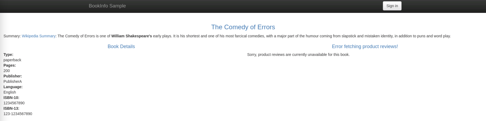

<!--bash
#!/usr/bin/env bash

source ./scripts/assert.sh
-->


# <center>Gloo Platform Workshop</center>


## Table of Contents
* [Introduction](#introduction)
* [Lab 1 - Deploy KinD clusters](#lab-1---deploy-kind-clusters-)
* [Lab 2 - Deploy Gitea](#lab-2---deploy-gitea-)
* [Lab 3 - Deploy Argo CD](#lab-3---deploy-argo-cd-)
* [Lab 4 - Deploy and register Gloo Mesh](#lab-4---deploy-and-register-gloo-mesh-)
* [Lab 5 - Deploy Istio using Gloo Mesh Lifecycle Manager](#lab-5---deploy-istio-using-gloo-mesh-lifecycle-manager-)
* [Lab 6 - Deploy the Bookinfo demo app](#lab-6---deploy-the-bookinfo-demo-app-)
* [Lab 7 - Deploy the httpbin demo app](#lab-7---deploy-the-httpbin-demo-app-)
* [Lab 8 - Deploy Gloo Mesh Addons](#lab-8---deploy-gloo-mesh-addons-)
* [Lab 9 - Create the gateways workspace](#lab-9---create-the-gateways-workspace-)
* [Lab 10 - Create the bookinfo workspace](#lab-10---create-the-bookinfo-workspace-)
* [Lab 11 - Expose the productpage through a gateway](#lab-11---expose-the-productpage-through-a-gateway-)
* [Lab 12 - Traffic policies](#lab-12---traffic-policies-)
* [Lab 13 - Create the Root Trust Policy](#lab-13---create-the-root-trust-policy-)
* [Lab 14 - Leverage Virtual Destinations](#lab-14---leverage-virtual-destinations-)
* [Lab 15 - Create the httpbin workspace](#lab-15---create-the-httpbin-workspace-)


## Introduction <a name="introduction"></a>

[Gloo Mesh Enterprise](https://www.solo.io/products/gloo-mesh/) is a management plane which makes it easy to operate [Istio](https://istio.io) on one or many Kubernetes clusters deployed anywhere (any platform, anywhere).

### Istio support

The Gloo Mesh Enterprise subscription includes end to end Istio support:

- Upstream first
- Specialty builds available (FIPS, ARM, etc)
- Long Term Support (LTS) N-4 
- Critical security patches
- Production break-fix
- One hour SLA Severity 1
- Install / upgrade
- Architecture and operational guidance, best practices

### Gloo Mesh overview

Gloo Mesh provides many unique features, including:

- multi-tenancy based on global workspaces
- zero trust enforcement
- global observability (centralized metrics and access logging)
- simplified cross cluster communications (using virtual destinations)
- advanced gateway capabilities (oauth, jwt, transformations, rate limiting, web application firewall, ...)


### Want to learn more about Gloo Mesh

You can find more information about Gloo Mesh in the official documentation:

[https://docs.solo.io/gloo-mesh/latest/](https://docs.solo.io/gloo-mesh/latest/)


## Lab 1 - Deploy KinD clusters <a name="lab-1---deploy-kind-clusters-"></a>


Clone this repository and go to the directory where this `README.md` file is.

Set the context environment variables:

```bash
export MGMT=mgmt
export CLUSTER1=cluster1
export CLUSTER2=cluster2
```

Run the following commands to deploy three Kubernetes clusters using [Kind](https://kind.sigs.k8s.io/):

```bash
./scripts/deploy.sh 1 mgmt
./scripts/deploy.sh 2 cluster1 us-west us-west-1
./scripts/deploy.sh 3 cluster2 us-west us-west-2
```

Then run the following commands to wait for all the Pods to be ready:

```bash
./scripts/check.sh mgmt
./scripts/check.sh cluster1
./scripts/check.sh cluster2
```

**Note:** If you run the `check.sh` script immediately after the `deploy.sh` script, you may see a jsonpath error. If that happens, simply wait a few seconds and try again.

Once the `check.sh` script completes, when you execute the `kubectl get pods -A` command, you should see the following:

```
NAMESPACE            NAME                                          READY   STATUS    RESTARTS   AGE
kube-system          calico-kube-controllers-59d85c5c84-sbk4k      1/1     Running   0          4h26m
kube-system          calico-node-przxs                             1/1     Running   0          4h26m
kube-system          coredns-6955765f44-ln8f5                      1/1     Running   0          4h26m
kube-system          coredns-6955765f44-s7xxx                      1/1     Running   0          4h26m
kube-system          etcd-cluster1-control-plane                   1/1     Running   0          4h27m
kube-system          kube-apiserver-cluster1-control-plane         1/1     Running   0          4h27m
kube-system          kube-controller-manager-cluster1-control-plane1/1     Running   0          4h27m
kube-system          kube-proxy-ksvzw                              1/1     Running   0          4h26m
kube-system          kube-scheduler-cluster1-control-plane         1/1     Running   0          4h27m
local-path-storage   local-path-provisioner-58f6947c7-lfmdx        1/1     Running   0          4h26m
metallb-system       controller-5c9894b5cd-cn9x2                   1/1     Running   0          4h26m
metallb-system       speaker-d7jkp                                 1/1     Running   0          4h26m
```

You can see that your currently connected to this cluster by executing the `kubectl config get-contexts` command:

```
CURRENT   NAME         CLUSTER         AUTHINFO   NAMESPACE  
          cluster1     kind-cluster1   cluster1
*         cluster2     kind-cluster2   cluster2
          mgmt         kind-mgmt       kind-mgmt
```

Run the following command to make `mgmt` the current cluster.

```bash
kubectl config use-context ${MGMT}
```
<!--bash
cat <<'EOF' > ./test.js
const helpers = require('./tests/chai-exec');

describe("Clusters are healthy", () => {
    const clusters = [process.env.MGMT, process.env.CLUSTER1, process.env.CLUSTER2];
    clusters.forEach(cluster => {
        it(`Cluster ${cluster} is healthy`, () => helpers.k8sObjectIsPresent({ context: cluster, namespace: "default", k8sType: "service", k8sObj: "kubernetes" }));
    });
});
EOF
echo "executing test dist/gloo-mesh-2-0-gloo-gitops/build/templates/steps/deploy-kind-clusters/tests/cluster-healthy.test.js.liquid"
tempfile=$(mktemp)
echo "saving errors in ${tempfile}"
timeout 2m mocha ./test.js --timeout 10000 --retries=120 --bail 2> ${tempfile} || { cat ${tempfile} && exit 1; }
-->


## Lab 2 - Deploy Gitea <a name="lab-2---deploy-gitea-"></a>

GitOps is a DevOps automation technique based on Git. To implement it, your processes depend
on a centralised Git hosting tool such as GitHub or GitLab. In this exercise we’ll provide
our own hosted Git instance that can be used to push code changes to, and create and approve
pull requests in.

Run the following commands to create a Gitea Git hosting service in your environment:

```bash
helm repo add gitea-charts https://dl.gitea.com/charts/
helm repo update

helm upgrade --install gitea gitea-charts/gitea \
  --version 10.0.2 \
  --kube-context ${MGMT} \
  --namespace gitea \
  --create-namespace \
  --wait \
  -f -<<EOF
service:
  http:
    type: LoadBalancer
    port: 3180
redis-cluster:
  enabled: false
postgresql-ha:
  enabled: false
persistence:
  enabled: false
gitea:
  config:
    repository:
      ENABLE_PUSH_CREATE_USER: true
      DEFAULT_PUSH_CREATE_PRIVATE: false
    database:
      DB_TYPE: sqlite3
    session:
      PROVIDER: memory
    cache:
      ADAPTER: memory
    queue:
      TYPE: level
    server:
      OFFLINE_MODE: true
EOF

kubectl --context ${MGMT} -n gitea wait svc gitea-http --for=jsonpath='{.status.loadBalancer.ingress[0].*}' --timeout=300s
```

Let’s create a user that can create a new repo, push changes, and work with pull requests:

```bash
export GITEA_HTTP=http://$(kubectl --context ${MGMT} -n gitea get svc gitea-http -o jsonpath='{.status.loadBalancer.ingress[0].*}'):3180

GITEA_ADMIN_TOKEN=$(curl -Ss ${GITEA_HTTP}/api/v1/users/gitea_admin/tokens \
  -H "Content-Type: application/json" \
  -d '{"name": "workshop", "scopes": ["write:admin", "write:repository"]}' \
  -u 'gitea_admin:r8sA8CPHD9!bt6d' \
  | jq -r .sha1)
echo export GITEA_ADMIN_TOKEN=${GITEA_ADMIN_TOKEN} >> ~/.env

curl -i ${GITEA_HTTP}/api/v1/admin/users \
  -H "accept: application/json" -H "Content-Type: application/json" \
  -H "Authorization: token ${GITEA_ADMIN_TOKEN}" \
  -d '{
    "username": "gloo-gitops",
    "password": "password",
    "email": "gloo-gitops@solo.io",
    "full_name": "Solo.io GitOps User",
    "must_change_password": false
  }'
```

You can now see the list of Gitea repos by clicking the "Git" tab above. If you need to, you
can log in with username `gloo-gitops` and password `password` that were used to create the user.

Now, if you need to push a repo to Gitea, you can simply add a remote to it and push.
We don’t have a repo to work with yet but this is how you would do it:

```,nocopy
git config credential.helper '!f() { sleep 1; echo "username=gloo-gitops"; echo "password=password"; }; f'
git remote add origin ${GITEA_HTTP}/gloo-gitops/new-repo.git
git push -u origin main
```

Note that the credentials are stored **insecurely** here as a convenience for these exercises.


## Lab 3 - Deploy Argo CD <a name="lab-3---deploy-argo-cd-"></a>

Argo CD is a declarative, GitOps continuous delivery tool for Kubernetes that we can use to
deploy and synchronise applications and configuration from a state stored in a Git repo.

Run the following commands to install Argo CD in your environment:

```bash
helm repo add argo https://argoproj.github.io/argo-helm
helm repo update

helm upgrade --install argo-cd argo/argo-cd \
  --version 5.52.1 \
  --kube-context ${MGMT} \
  --namespace argocd \
  --create-namespace \
  --wait \
  -f -<<EOF
server:
  service:
    type: LoadBalancer
    servicePortHttp: 3280
    servicePortHttps: 3243
configs:
  params:
    server.insecure: true
    server.disable.auth: true
  cm:
    timeout.reconciliation: 10s
EOF

kubectl --context ${MGMT} -n argocd wait svc argo-cd-argocd-server --for=jsonpath='{.status.loadBalancer.ingress[0].*}' --timeout=300s
```

Download and install the `argocd` CLI tool that we’ll use to manage the Argo CD server:

```bash
mkdir -p ${HOME}/bin
curl -Lo ${HOME}/bin/argocd https://github.com/argoproj/argo-cd/releases/download/v2.9.3/argocd-$(uname | tr '[:upper:]' '[:lower:]')-$(uname -m | sed 's/aarch/arm/' | sed 's/x86_/amd/')
chmod +x ${HOME}/bin/argocd
export PATH=$HOME/bin:$PATH
```

Next, log in to the Argo CD server and rename the default cluster (which is where Argo CD
is running) to match our environment:

```bash
ARGOCD_HTTP_IP=$(kubectl --context ${MGMT} -n argocd get svc argo-cd-argocd-server -o jsonpath='{.status.loadBalancer.ingress[0].*}')
ARGOCD_ADMIN_SECRET=$(kubectl --context ${MGMT} -n argocd get secret argocd-initial-admin-secret -o jsonpath="{.data.password}" | base64 -d)

argocd --kube-context ${MGMT} login ${ARGOCD_HTTP_IP}:3280 --username admin --password ${ARGOCD_ADMIN_SECRET} --plaintext

argocd cluster set in-cluster --name ${MGMT}
```
Finally, let’s tell Argo CD about our other clusters so that we can deploy apps to those too:

```bash
argocd cluster add ${CLUSTER1} --name ${CLUSTER1} -y --cluster-endpoint kube-public
argocd cluster add ${CLUSTER2} --name ${CLUSTER2} -y --cluster-endpoint kube-public
```
We can check that our cluster list looks correct:

```bash
argocd cluster list
```

You should get an output like the following:

```,nocopy
SERVER                            NAME      VERSION  STATUS   MESSAGE                                                  PROJECT
https://kind2-control-plane:6443  cluster1           Unknown  Cluster has no applications and is not being monitored.  
https://kind3-control-plane:6443  cluster2           Unknown  Cluster has no applications and is not being monitored.  
https://kubernetes.default.svc    mgmt               Unknown  Cluster has no applications and is not being monitored.
```

Now we’re ready to use Argo CD to manage applications as part of continuous delivery and GitOps.
We’ll start by creating a GitOps repo that our teams will share. Note that teams can have their own repos
to work separately if that suits their workflow better.

```bash
mkdir -p data/steps/gitops-repo
export GITOPS_REPO_LOCAL=$(realpath data/steps/gitops-repo)
```

At the root of our shared GitOps directory, we’ll create a new subdirectory called `argo-cd` that we’ll use to sync
configuration to Argo CD:

```bash
export GITOPS_ARGOCD=${GITOPS_REPO_LOCAL}/argo-cd
mkdir -p ${GITOPS_ARGOCD} && touch ${GITOPS_ARGOCD}/.gitignore
```

Instantiate the shared GitOps directory as a Git repo:

```bash
git -C ${GITOPS_REPO_LOCAL} init -b main
git -C ${GITOPS_REPO_LOCAL} config user.email "gloo-gitops@solo.io"
git -C ${GITOPS_REPO_LOCAL} config user.name "Solo.io GitOps User"
```

We’ll need the URL of our Git server. Save that in an environment variable:

```bash
GITEA_HTTP=http://$(kubectl --context ${MGMT} -n gitea get svc gitea-http -o jsonpath='{.status.loadBalancer.ingress[0].*}'):3180
```

Commit and push our repo to the Git server:

```bash
git -C ${GITOPS_REPO_LOCAL} add .
git -C ${GITOPS_REPO_LOCAL} commit -m "Initial commit of Gloo GitOps"

git -C ${GITOPS_REPO_LOCAL} config credential.helper '!f() { sleep 1; echo "username=gloo-gitops"; echo "password=password"; }; f'
git -C ${GITOPS_REPO_LOCAL} remote add origin ${GITEA_HTTP}/gloo-gitops/gitops-repo.git

git -C ${GITOPS_REPO_LOCAL} push -u origin main
```

While we now have a Git repo that we’ll use to sync Argo CD configuration, we need to tell Argo CD where to
get that configuration from and how to apply it. We’ll use two Kubernetes custom resources for this, one to
define a new "project" and another to create an "application" that declares how the config will be synced:

```bash
cat <<EOF > ${GITOPS_ARGOCD}/argo-cd.yaml
apiVersion: argoproj.io/v1alpha1
kind: AppProject
metadata:
  name: argo-cd
  annotations:
    argocd.argoproj.io/sync-wave: "-1"
  finalizers:
  - resources-finalizer.argocd.argoproj.io
spec:
  sourceRepos:
  - '*'
  destinations:
  - namespace: '*'
    server: '*'
  clusterResourceWhitelist:
  - group: '*'
    kind: '*'
---
apiVersion: argoproj.io/v1alpha1
kind: Application
metadata:
  name: argocd-${MGMT}
  finalizers:
  - resources-finalizer.argocd.argoproj.io/background
spec:
  project: argo-cd
  sources:
  - repoURL: ${GITEA_HTTP}/gloo-gitops/gitops-repo.git
    targetRevision: HEAD
    path: argo-cd
  destination:
    name: ${MGMT}
    namespace: argocd
  syncPolicy:
    automated:
      allowEmpty: true
      prune: true
    syncOptions:
    - ApplyOutOfSyncOnly=true
EOF

kubectl --context ${MGMT} -n argocd create -f ${GITOPS_ARGOCD}/argo-cd.yaml
```

These are applied directly to Argo CD, but we'll keep them in our GitOps repo in case we need to make any
changes in the future:

```bash
git -C ${GITOPS_REPO_LOCAL} add .
git -C ${GITOPS_REPO_LOCAL} commit -m "Manage argo-cd config"
git -C ${GITOPS_REPO_LOCAL} push
```

Now, check the Argo CD UI tab above. After a few seconds, you should see an application created
for our Argo CD configuration, which is synchronised with the Git repo that we just created.
<!--bash
cat <<'EOF' > ./test.js
const chaiExec = require("@jsdevtools/chai-exec");
var chai = require('chai');
var expect = chai.expect;
chai.use(chaiExec);

afterEach(function (done) {
  if (this.currentTest.currentRetry() > 0) {
    process.stdout.write(".");
    setTimeout(done, 1000);
  } else {
    done();
  }
});

describe("Argo CD config", () => {
  it("syncs to mgmt cluster", () => {
    let cli = chaiExec(process.env.HOME + "/bin/argocd --kube-context " + process.env.MGMT + " app get argocd-" + process.env.MGMT);
    expect(cli).to.exit.with.code(0);
    expect(cli).to.have.output.that.matches(new RegExp("\\bServer:\\s+" + process.env.MGMT + "\\b"));
    expect(cli).to.have.output.that.matches(new RegExp("\\bRepo:\\s+http://(?:[0-9]{1,3}\.){3}[0-9]{1,3}:3180/gloo-gitops/gitops-repo.git\\b"));
    expect(cli).to.have.output.that.matches(new RegExp("\\bPath:\\s+argo-cd\\b"));
    expect(cli).to.have.output.that.matches(new RegExp("\\bHealth Status:\\s+Healthy\\b"));
  });
});

EOF
echo "executing test dist/gloo-mesh-2-0-gloo-gitops/build/templates/steps/deploy-argo-cd/tests/argo-cd-sync-repo.test.js.liquid"
tempfile=$(mktemp)
echo "saving errors in ${tempfile}"
timeout 2m mocha ./test.js --timeout 10000 --retries=120 --bail 2> ${tempfile} || { cat ${tempfile} && exit 1; }
-->
Finally, let’s test that everything is working correctly. We’ll define a pod manifest, commit
it to our repo, push it to the remote, and check that Argo CD creates that pod in our cluster.

First, switch back to the terminal and create our pod manifest:

```bash
cat <<EOF > ${GITOPS_ARGOCD}/nginx.yaml
apiVersion: v1
kind: Pod
metadata:
  name: nginx
  namespace: default
spec:
  containers:
  - image: nginx
    name: nginx
EOF
```

Commit and push it to our remote:

```bash
git -C ${GITOPS_REPO_LOCAL} add .
git -C ${GITOPS_REPO_LOCAL} commit -m "Add nginx"
git -C ${GITOPS_REPO_LOCAL} push
```

Now, check the Argo CD UI tab again and click into the "argocd-[[ Instruqt-Var key="MGMT" hostname="" ]]"
application. After a short period, you’ll see an `nginx` pod appear linked to the application.
The status of this pod will be shown as a tag on the pod box in the UI.

Let’s make sure the pod got deployed by switching back to the terminal and running this command:

```bash
until kubectl --context ${MGMT} -n default wait --for=condition=ready pod/nginx --timeout=30s 2>/dev/null; do sleep 1; done
```

Now let’s delete the pod manifest from the repo and check that it gets removed from the
cluster:

```bash
git -C ${GITOPS_REPO_LOCAL} revert --no-commit HEAD
git -C ${GITOPS_REPO_LOCAL} commit -m "Delete nginx"
git -C ${GITOPS_REPO_LOCAL} push

kubectl --context ${MGMT} -n default wait --for=delete pod/nginx --timeout=30s
```


## Lab 4 - Deploy and register Gloo Mesh <a name="lab-4---deploy-and-register-gloo-mesh-"></a>
[](https://youtu.be/djfFiepK4GY "Video Link")


Before we get started, let's install the `meshctl` CLI:

```bash
export GLOO_MESH_VERSION=v2.4.6
curl -sL https://run.solo.io/meshctl/install | sh -
export PATH=$HOME/.gloo-mesh/bin:$PATH
```
<!--bash
cat <<'EOF' > ./test.js
var chai = require('chai');
var expect = chai.expect;

describe("Required environment variables should contain value", () => {
  afterEach(function(done){
    if(this.currentTest.currentRetry() > 0){
      process.stdout.write(".");
       setTimeout(done, 1000);
    } else {
      done();
    }
  });

  it("Context environment variables should not be empty", () => {
    expect(process.env.MGMT).to.not.be.empty
    expect(process.env.CLUSTER1).to.not.be.empty
    expect(process.env.CLUSTER2).to.not.be.empty
  });

  it("Gloo Mesh licence environment variables should not be empty", () => {
    expect(process.env.GLOO_MESH_LICENSE_KEY).to.not.be.empty
  });
});
EOF
echo "executing test dist/gloo-mesh-2-0-gloo-gitops/build/templates/steps/deploy-and-register-gloo-mesh/tests/environment-variables.test.js.liquid"
tempfile=$(mktemp)
echo "saving errors in ${tempfile}"
timeout 2m mocha ./test.js --timeout 10000 --retries=120 --bail 2> ${tempfile} || { cat ${tempfile} && exit 1; }
-->
GitOps allows flexible interactions between the different teams involved in building and running modern
applications. For these exercises we focus on a small number of *personas* that manage their own resources
and may work in distinct ways. These personas are:

* A **platform team**, who install and manage Gloo Platform and any cross-cutting concerns, like Istio
* A **gateways team**, who manage the ingress and east-west gateways and cross-cutting traffic concerns like
external DNS names or certificates
* **Application teams**, who decide how their apps are deployed and what routing requirements they have

Find out more about the personas that Gloo Platform was designed for [here](https://docs.solo.io/gloo-mesh-enterprise/latest/concepts/about/persona/).

The platform team will use a Git repo to store the desired state of the Gloo Platform installation. This repo
has already been created at the location in environment variable `${GITOPS_REPO_LOCAL}`, so we'll create
a new subdirectory for the platform team:

```bash
export GITOPS_PLATFORM=${GITOPS_REPO_LOCAL}/platform
mkdir -p ${GITOPS_PLATFORM}/${MGMT}
```

First, we'll create an Argo CD `Project` and `ApplicationSet` to apply the platform team's resources. This will
create an Argo CD `Application` for each configured cluster, and apply cluster-specific configuration from the
respective cluster subdirectory:

```bash
cat <<EOF > ${GITOPS_ARGOCD}/platform.yaml
apiVersion: argoproj.io/v1alpha1
kind: AppProject
metadata:
  name: platform
  annotations:
    argocd.argoproj.io/sync-wave: "-1"
  finalizers:
  - resources-finalizer.argocd.argoproj.io
spec:
  sourceRepos:
  - '*'
  destinations:
  - namespace: '*'
    server: '*'
  clusterResourceWhitelist:
  - group: '*'
    kind: '*'
---
apiVersion: argoproj.io/v1alpha1
kind: ApplicationSet
metadata:
  name: platform
spec:
  generators:
  - list:
      elements:
      - cluster: ${MGMT}
      - cluster: ${CLUSTER1}
      - cluster: ${CLUSTER2}
  template:
    metadata:
      name: platform-{{cluster}}
      finalizers:
      - resources-finalizer.argocd.argoproj.io/background
    spec:
      project: platform
      source:
        repoURL: ${GITEA_HTTP}/gloo-gitops/gitops-repo.git
        targetRevision: HEAD
        path: platform/{{cluster}}
      destination:
        name: '{{cluster}}'
        namespace: default
      syncPolicy:
        automated:
          allowEmpty: true
          prune: true
        syncOptions:
        - ApplyOutOfSyncOnly=true
EOF
```

Next, we'll create another Argo CD `Application` for the installation of the Gloo Platform management plane.
This will deploy the Gloo Platform CRDs and the management server as a pair of Helm releases, using a set of
Helm values that we'll store alongside this application spec in the GitOps repo:

```bash
mkdir -p ${GITOPS_PLATFORM}/argo-cd

cat <<EOF > ${GITOPS_PLATFORM}/argo-cd/gloo-platform-mgmt-installation.yaml
apiVersion: argoproj.io/v1alpha1
kind: Application
metadata:
  name: gloo-platform-mgmt-installation
  annotations:
    argocd.argoproj.io/sync-wave: "0"
  finalizers:
  - resources-finalizer.argocd.argoproj.io/background
spec:
  project: platform
  destination:
    name: ${MGMT}
    namespace: gloo-mesh
  syncPolicy:
    automated:
      allowEmpty: true
      prune: true
    syncOptions:
    - CreateNamespace=true
  ignoreDifferences:
  - jsonPointers:
    - /data/ca.crt
    - /data/tls.crt
    - /data/tls.key
    - /data/token
    kind: Secret
  sources:
  - chart: gloo-platform-crds
    repoURL: https://storage.googleapis.com/gloo-platform/helm-charts
    targetRevision: 2.4.6
    helm:
      releaseName: gloo-platform-crds
  - chart: gloo-platform
    repoURL: https://storage.googleapis.com/gloo-platform/helm-charts
    targetRevision: 2.4.6
    helm:
      releaseName: gloo-platform
      valueFiles:
      - \$values/platform/argo-cd/gloo-platform-mgmt-installation-values.yaml
  - repoURL: http://$(kubectl --context ${MGMT} -n gitea get svc gitea-http -o jsonpath='{.status.loadBalancer.ingress[0].*}'):3180/gloo-gitops/gitops-repo.git
    targetRevision: HEAD
    ref: values
EOF
```

We'll use the following Helm values file to configure the Gloo Platform management server:

```bash
cat <<EOF > ${GITOPS_PLATFORM}/argo-cd/gloo-platform-mgmt-installation-values.yaml
licensing:
  licenseKey: ${GLOO_MESH_LICENSE_KEY}
common:
  cluster: mgmt
glooMgmtServer:
  enabled: true
  ports:
    healthcheck: 8091
prometheus:
  enabled: true
redis:
  deployment:
    enabled: true
telemetryGateway:
  enabled: true
  service:
    type: LoadBalancer
glooUi:
  enabled: true
  serviceType: LoadBalancer
telemetryCollector:
  enabled: true
EOF
```

We're going to use [Kustomize](https://kustomize.io/) later on to help minimise duplication of configuration,
so we'll create the `Kustomization` files needed to make sure our resources are included:

```bash
cat <<EOF >${GITOPS_PLATFORM}/argo-cd/kustomization.yaml
namespace: argocd
resources:
- gloo-platform-mgmt-installation.yaml
EOF

cat <<EOF >${GITOPS_PLATFORM}/${MGMT}/kustomization.yaml
resources:
- ../argo-cd
EOF
```

Finally, commit and push the management server config to Git for it to take effect:

```bash
git -C ${GITOPS_REPO_LOCAL} add .
git -C ${GITOPS_REPO_LOCAL} commit -m "Gloo Platform management server"
git -C ${GITOPS_REPO_LOCAL} push
```
<!--bash
echo -n Waiting for Argo CD to sync...
timeout -v 5m bash -c "until [[ \$(kubectl --context ${MGMT} -n argocd get application gloo-platform-mgmt-installation 2>/dev/null) ]]; do
  sleep 1
  echo -n .
done"
echo
-->

Take a look at the Argo CD dashboard to see the new `Application`s sync. While the config is synced,
wait for the deployment to complete by running the following in the terminal:

```bash
until kubectl --context ${MGMT} -n gloo-mesh rollout status deploy/gloo-mesh-mgmt-server 2>/dev/null; do sleep 1; done
```

<!--bash
kubectl wait --context ${MGMT} --for=condition=Ready -n gloo-mesh --all pod
timeout 2m bash -c "until [[ \$(kubectl --context ${MGMT} -n gloo-mesh get svc gloo-mesh-mgmt-server -o json | jq '.status.loadBalancer | length') -gt 0 ]]; do
  sleep 1
done"
-->

Then, you need to set the environment variable to tell the Gloo Mesh agents how to communicate with the management plane:
<!--bash
cat <<'EOF' > ./test.js

const helpers = require('./tests/chai-exec');

describe("MGMT server is healthy", () => {
  let cluster = process.env.MGMT
  let deployments = ["gloo-mesh-mgmt-server","gloo-mesh-redis","gloo-telemetry-gateway","prometheus-server"];
  deployments.forEach(deploy => {
    it(deploy + ' pods are ready in ' + cluster, () => helpers.checkDeployment({ context: cluster, namespace: "gloo-mesh", k8sObj: deploy }));
  });
});
EOF
echo "executing test dist/gloo-mesh-2-0-gloo-gitops/build/templates/steps/deploy-and-register-gloo-mesh/tests/check-deployment.test.js.liquid"
tempfile=$(mktemp)
echo "saving errors in ${tempfile}"
timeout 2m mocha ./test.js --timeout 10000 --retries=120 --bail 2> ${tempfile} || { cat ${tempfile} && exit 1; }
-->
<!--bash
cat <<'EOF' > ./test.js
const chaiExec = require("@jsdevtools/chai-exec");
var chai = require('chai');
var expect = chai.expect;
chai.use(chaiExec);

afterEach(function (done) {
  if (this.currentTest.currentRetry() > 0) {
    process.stdout.write(".");
    setTimeout(done, 1000);
  } else {
    done();
  }
});
EOF
echo "executing test dist/gloo-mesh-2-0-gloo-gitops/build/templates/steps/deploy-and-register-gloo-mesh/tests/get-gloo-mesh-mgmt-server-ip.test.js.liquid"
tempfile=$(mktemp)
echo "saving errors in ${tempfile}"
timeout 2m mocha ./test.js --timeout 10000 --retries=120 --bail 2> ${tempfile} || { cat ${tempfile} && exit 1; }
-->

```bash
export ENDPOINT_GLOO_MESH=$(kubectl --context ${MGMT} -n gloo-mesh get svc gloo-mesh-mgmt-server -o jsonpath='{.status.loadBalancer.ingress[0].*}'):9900
export HOST_GLOO_MESH=$(echo ${ENDPOINT_GLOO_MESH%:*})
export ENDPOINT_TELEMETRY_GATEWAY=$(kubectl --context ${MGMT} -n gloo-mesh get svc gloo-telemetry-gateway -o jsonpath='{.status.loadBalancer.ingress[0].*}'):4317
export ENDPOINT_GLOO_MESH_UI=$(kubectl --context ${MGMT} -n gloo-mesh get svc gloo-mesh-ui -o jsonpath='{.status.loadBalancer.ingress[0].*}'):8090
```

Check that the variables have correct values:
```
echo $HOST_GLOO_MESH
echo $ENDPOINT_GLOO_MESH
```

<!--bash
cat <<'EOF' > ./test.js
const dns = require('dns');
const chaiHttp = require("chai-http");
const chai = require("chai");
const expect = chai.expect;
chai.use(chaiHttp);
const { waitOnFailedTest } = require('./tests/utils');

afterEach(function(done) { waitOnFailedTest(done, this.currentTest.currentRetry())});

describe("Address '" + process.env.HOST_GLOO_MESH + "' can be resolved in DNS", () => {
    it(process.env.HOST_GLOO_MESH + ' can be resolved', (done) => {
        return dns.lookup(process.env.HOST_GLOO_MESH, (err, address, family) => {
            expect(address).to.be.an.ip;
            done();
        });
    });
});
EOF
echo "executing test ./gloo-mesh-2-0/tests/can-resolve.test.js.liquid"
tempfile=$(mktemp)
echo "saving errors in ${tempfile}"
timeout 2m mocha ./test.js --timeout 10000 --retries=120 --bail 2> ${tempfile} || { cat ${tempfile} && exit 1; }
-->
Finally, you need to register the cluster(s).

We need to create a Gloo `KubernetesCluster` to represent the cluster in the management server:

```bash
cat <<EOF > ${GITOPS_PLATFORM}/${MGMT}/cluster1.yaml
apiVersion: admin.gloo.solo.io/v2
kind: KubernetesCluster
metadata:
  name: cluster1
  namespace: gloo-mesh
spec:
  clusterDomain: cluster.local
EOF

cat <<EOF > ${GITOPS_PLATFORM}/${MGMT}/cluster2.yaml
apiVersion: admin.gloo.solo.io/v2
kind: KubernetesCluster
metadata:
  name: cluster2
  namespace: gloo-mesh
spec:
  clusterDomain: cluster.local
EOF

cat <<EOF >>${GITOPS_PLATFORM}/${MGMT}/kustomization.yaml
- cluster1.yaml
- cluster2.yaml
EOF
```

Next we'll set up the cluster-specific configuration for Argo CD to sync to the first cluster:

```bash
mkdir -p ${GITOPS_PLATFORM}/${CLUSTER1}

cat <<EOF >${GITOPS_PLATFORM}/${CLUSTER1}/ns-gloo-mesh.yaml
apiVersion: v1
kind: Namespace
metadata:
  name: gloo-mesh
EOF

cat <<EOF >${GITOPS_PLATFORM}/${CLUSTER1}/relay-secrets.yaml
apiVersion: v1
kind: Secret
metadata:
  name: relay-root-tls-secret
  namespace: gloo-mesh
data:
  ca.crt: $(kubectl --context ${MGMT} -n gloo-mesh get secret relay-root-tls-secret -o jsonpath='{.data.ca\.crt}')
---
apiVersion: v1
kind: Secret
metadata:
  name: relay-identity-token-secret
  namespace: gloo-mesh
data:
  token: $(kubectl --context ${MGMT} -n gloo-mesh get secret relay-identity-token-secret -o jsonpath='{.data.token}')
EOF

cat <<EOF >${GITOPS_PLATFORM}/${CLUSTER1}/kustomization.yaml
commonAnnotations:
  argocd.argoproj.io/sync-wave: "1"
resources:
- ns-gloo-mesh.yaml
- relay-secrets.yaml
EOF
```

> <i>Note: Secrets should not be stored in the GitOps repo in an unencrypted form (see [Sealed Secrets](https://sealed-secrets.netlify.app/)
for a mechanism to store secrets properly). We store them unencrypted in this workshop for simplicity.</i>

Copy this configuration for the second cluster:

```bash
cp -r ${GITOPS_PLATFORM}/${CLUSTER1} ${GITOPS_PLATFORM}/${CLUSTER2}
```

Create an Argo CD `ApplicationSet` to configure and install the Gloo Platform agent on both clusters:

```bash
cat <<EOF >${GITOPS_PLATFORM}/argo-cd/gloo-platform-agents-installation.yaml
apiVersion: argoproj.io/v1alpha1
kind: ApplicationSet
metadata:
  name: gloo-platform-agents-installation
spec:
  generators:
  - list:
      elements:
      - cluster: ${CLUSTER1}
      - cluster: ${CLUSTER2}
  template:
    metadata:
      name: gloo-platform-{{cluster}}-installation
      annotations:
        argocd.argoproj.io/sync-wave: "2"
      finalizers:
      - resources-finalizer.argocd.argoproj.io/background
    spec:
      project: platform
      destination:
        name: '{{cluster}}'
        namespace: gloo-mesh
      syncPolicy:
        automated:
          prune: true
      ignoreDifferences:
      - group: apiextensions.k8s.io
        kind: CustomResourceDefinition
        name: istiooperators.install.istio.io
        jsonPointers:
        - /metadata/labels
      sources:
      - chart: gloo-platform-crds
        repoURL: https://storage.googleapis.com/gloo-platform/helm-charts
        targetRevision: 2.4.6
        helm:
          releaseName: gloo-platform-crds
      - chart: gloo-platform
        repoURL: https://storage.googleapis.com/gloo-platform/helm-charts
        targetRevision: 2.4.6
        helm:
          releaseName: gloo-platform
          valueFiles:
          - \$values/platform/argo-cd/gloo-platform-agents-installation-values.yaml
          parameters:
          - name: common.cluster
            value: '{{cluster}}'
      - repoURL: http://$(kubectl --context ${MGMT} -n gitea get svc gitea-http -o jsonpath='{.status.loadBalancer.ingress[0].*}'):3180/gloo-gitops/gitops-repo.git
        targetRevision: HEAD
        ref: values
EOF
```

We'll use the following Helm values file to configure the Gloo Platform agents:

```bash
cat <<EOF > ${GITOPS_PLATFORM}/argo-cd/gloo-platform-agents-installation-values.yaml
glooAgent:
  enabled: true
  relay:
    serverAddress: "${ENDPOINT_GLOO_MESH}"
    authority: gloo-mesh-mgmt-server.gloo-mesh
telemetryCollector:
  enabled: true
  config:
    exporters:
      otlp:
        endpoint: "${ENDPOINT_TELEMETRY_GATEWAY}"
EOF
```

Add these files for `Kustomize` to include:

```bash
cat <<EOF >>${GITOPS_PLATFORM}/argo-cd/kustomization.yaml
- gloo-platform-agents-installation.yaml
EOF
```

Commit and push the clusters' configuration for it to take effect:

```bash
git -C ${GITOPS_REPO_LOCAL} add .
git -C ${GITOPS_REPO_LOCAL} commit -m "Onboard workload clusters"
git -C ${GITOPS_REPO_LOCAL} push
```
<!--bash
echo -n Waiting for Argo CD to sync...
timeout -v 5m bash -c "until [[ \$(kubectl --context ${MGMT} -n gloo-mesh get kubernetescluster cluster1 2>/dev/null) ]]; do
  sleep 1
  echo -n .
done"
echo
-->

You can check the cluster(s) have been registered correctly using the following commands:
```
meshctl --kubecontext ${MGMT} check
```

```
pod=$(kubectl --context ${MGMT} -n gloo-mesh get pods -l app=gloo-mesh-mgmt-server -o jsonpath='{.items[0].metadata.name}')
kubectl --context ${MGMT} -n gloo-mesh debug -q -i ${pod} --image=curlimages/curl -- curl -s http://localhost:9091/metrics | grep relay_push_clients_connected
```

You should get an output similar to this:
```,nocopy
# HELP relay_push_clients_connected Current number of connected Relay push clients (Relay Agents).
# TYPE relay_push_clients_connected gauge
relay_push_clients_connected{cluster="cluster1"} 1
relay_push_clients_connected{cluster="cluster2"} 1
```
Finally, you need to specify which gateways you want to use for cross cluster traffic:

```bash
mkdir -p ${GITOPS_PLATFORM}/${MGMT}/workspaces
cat <<EOF > ${GITOPS_PLATFORM}/${MGMT}/workspaces/workspace-global.yaml
apiVersion: admin.gloo.solo.io/v2
kind: WorkspaceSettings
metadata:
  name: global
  namespace: gloo-mesh
spec:
  options:
    eastWestGateways:
      - selector:
          labels:
            istio: eastwestgateway
EOF

cat <<EOF >${GITOPS_PLATFORM}/${MGMT}/workspaces/kustomization.yaml
commonAnnotations:
  argocd.argoproj.io/sync-wave: "2"
resources:
- workspace-global.yaml
EOF

cat <<EOF >>${GITOPS_PLATFORM}/${MGMT}/kustomization.yaml
- workspaces
EOF

git -C ${GITOPS_REPO_LOCAL} add .
git -C ${GITOPS_REPO_LOCAL} commit -m "Indicate east-west gateway"
git -C ${GITOPS_REPO_LOCAL} push
```

Take a look at the repo in the **Git** tab. Notice that we've created all our resources in the directory under
`environments` that corresponds to the management server or the Argo CD installation.
<!--bash
cat <<'EOF' > ./test.js
var chai = require('chai');
var expect = chai.expect;
const helpers = require('./tests/chai-exec');
describe("Cluster registration", () => {
  it("cluster1 is registered", () => {
    podName = helpers.getOutputForCommand({ command: "kubectl -n gloo-mesh get pods -l app=gloo-mesh-mgmt-server -o jsonpath='{.items[0].metadata.name}' --context " + process.env.MGMT }).replaceAll("'", "");
    command = helpers.getOutputForCommand({ command: "kubectl --context " + process.env.MGMT + " -n gloo-mesh debug -q -i " + podName + " --image=curlimages/curl -- curl -s http://localhost:9091/metrics" }).replaceAll("'", "");
    expect(command).to.contain("cluster1");
  });
  it("cluster2 is registered", () => {
    podName = helpers.getOutputForCommand({ command: "kubectl -n gloo-mesh get pods -l app=gloo-mesh-mgmt-server -o jsonpath='{.items[0].metadata.name}' --context " + process.env.MGMT }).replaceAll("'", "");
    command = helpers.getOutputForCommand({ command: "kubectl --context " + process.env.MGMT + " -n gloo-mesh debug -q -i " + podName + " --image=curlimages/curl -- curl -s http://localhost:9091/metrics" }).replaceAll("'", "");
    expect(command).to.contain("cluster2");
  });
});
EOF
echo "executing test dist/gloo-mesh-2-0-gloo-gitops/build/templates/steps/deploy-and-register-gloo-mesh/tests/cluster-registration.test.js.liquid"
tempfile=$(mktemp)
echo "saving errors in ${tempfile}"
timeout 2m mocha ./test.js --timeout 10000 --retries=120 --bail 2> ${tempfile} || { cat ${tempfile} && exit 1; }
-->


## Lab 5 - Deploy Istio using Gloo Mesh Lifecycle Manager <a name="lab-5---deploy-istio-using-gloo-mesh-lifecycle-manager-"></a>
[](https://youtu.be/f76-KOEjqHs "Video Link")

We are going to deploy Istio using Gloo Mesh Lifecycle Manager.

In this GitOps workshop, we'll assume that the platform team and the gateways team are separate teams,
so they will have separate subdirectories in the GitOps repo to work in. Let's create the directory for
the gateways team to manage their configuration in:

```bash
export GITOPS_GATEWAYS=${GITOPS_REPO_LOCAL}/gateways
mkdir -p ${GITOPS_GATEWAYS}
```

We'll use an Argo CD project and `ApplicationSet` to apply the gateway team's resources. This will create
an Argo CD `Application` for each configured cluster, and apply cluster-specific configuration from the
respective cluster subdirectory:

```bash
cat <<EOF > ${GITOPS_ARGOCD}/gateways.yaml
apiVersion: argoproj.io/v1alpha1
kind: AppProject
metadata:
  name: gateways
  annotations:
    argocd.argoproj.io/sync-wave: "-1"
  finalizers:
  - resources-finalizer.argocd.argoproj.io
spec:
  sourceRepos:
  - '*'
  destinations:
  - namespace: '*'
    server: '*'
  clusterResourceWhitelist:
  - group: '*'
    kind: '*'
---
apiVersion: argoproj.io/v1alpha1
kind: ApplicationSet
metadata:
  name: gateways
spec:
  generators:
  - list:
      elements:
      - cluster: ${MGMT}
      - cluster: ${CLUSTER1}
      - cluster: ${CLUSTER2}
  template:
    metadata:
      name: gateways-{{cluster}}
      finalizers:
      - resources-finalizer.argocd.argoproj.io/background
    spec:
      project: gateways
      source:
        repoURL: ${GITEA_HTTP}/gloo-gitops/gitops-repo.git
        targetRevision: HEAD
        path: gateways/{{cluster}}
      destination:
        name: '{{cluster}}'
        namespace: gloo-mesh
      syncPolicy:
        automated:
          allowEmpty: true
          prune: true
        syncOptions:
        - ApplyOutOfSyncOnly=true
EOF
```

Let's create Kubernetes services for the gateways:

We're going to define base manifests for the gateway services, and then apply customisations
using Kustomize to modify them for their target clusters:

```bash
mkdir -p ${GITOPS_GATEWAYS}/base/gateway-services

cat <<EOF > ${GITOPS_GATEWAYS}/base/gateway-services/ns.yaml
apiVersion: v1
kind: Namespace
metadata:
  name: istio-gateways
  labels:
    istio.io/rev: 1-18
EOF

cat <<EOF >${GITOPS_GATEWAYS}/base/gateway-services/kustomization.yaml
commonAnnotations:
  argocd.argoproj.io/sync-wave: "3"
resources:
- ns.yaml
EOF

cat <<EOF > ${GITOPS_GATEWAYS}/base/gateway-services/ingress.yaml
apiVersion: v1
kind: Service
metadata:
  labels:
    app: istio-ingressgateway
    istio: ingressgateway
  name: istio-ingressgateway
  namespace: istio-gateways
spec:
  ports:
  - name: http2
    port: 80
    protocol: TCP
    targetPort: 8080
  - name: https
    port: 443
    protocol: TCP
    targetPort: 8443
  selector:
    app: istio-ingressgateway
    istio: ingressgateway
    revision: 1-18
  type: LoadBalancer
EOF

cat <<EOF > ${GITOPS_GATEWAYS}/base/gateway-services/east-west.yaml
apiVersion: v1
kind: Service
metadata:
  labels:
    app: istio-ingressgateway
    istio: eastwestgateway
    topology.istio.io/network: cluster1
  name: istio-eastwestgateway
  namespace: istio-gateways
spec:
  ports:
  - name: status-port
    port: 15021
    protocol: TCP
    targetPort: 15021
  - name: tls
    port: 15443
    protocol: TCP
    targetPort: 15443
  - name: https
    port: 16443
    protocol: TCP
    targetPort: 16443
  - name: tls-spire
    port: 8081
    protocol: TCP
    targetPort: 8081
  - name: tls-otel
    port: 4317
    protocol: TCP
    targetPort: 4317
  - name: grpc-cacert
    port: 31338
    protocol: TCP
    targetPort: 31338
  - name: grpc-ew-bootstrap
    port: 31339
    protocol: TCP
    targetPort: 31339
  - name: tcp-istiod
    port: 15012
    protocol: TCP
    targetPort: 15012
  - name: tcp-webhook
    port: 15017
    protocol: TCP
    targetPort: 15017
  selector:
    app: istio-ingressgateway
    istio: eastwestgateway
    revision: 1-18
    topology.istio.io/network: cluster1
  type: LoadBalancer
EOF

cat <<EOF >>${GITOPS_GATEWAYS}/base/gateway-services/kustomization.yaml
- ingress.yaml
- east-west.yaml
EOF
```

We'll use Kustomize to apply tweaks to the base service manifests to match our desired state
for each workload cluster:

```bash
mkdir -p ${GITOPS_GATEWAYS}/${CLUSTER1}/services

cat <<EOF > ${GITOPS_GATEWAYS}/${CLUSTER1}/services/kustomization.yaml
patches:
- target:
    kind: Namespace
    name: istio-system
  patch: |-
    - op: replace
      path: /metadata/labels/topology.istio.io~1network
      value: cluster1
- target:
    kind: Service
    name: istio-eastwestgateway
  patch: |-
    - op: replace
      path: /metadata/labels/topology.istio.io~1network
      value: cluster1
    - op: replace
      path: /spec/selector/topology.istio.io~1network
      value: cluster1
resources:
- ../../base/gateway-services
EOF

cat <<EOF >${GITOPS_GATEWAYS}/${CLUSTER1}/kustomization.yaml
resources:
- services
EOF

mkdir -p ${GITOPS_GATEWAYS}/${CLUSTER2}/services

cat <<EOF > ${GITOPS_GATEWAYS}/${CLUSTER2}/services/kustomization.yaml
patches:
- target:
    kind: Namespace
    name: istio-system
  patch: |-
    - op: replace
      path: /metadata/labels/topology.istio.io~1network
      value: cluster2
- target:
    kind: Service
    name: istio-eastwestgateway
  patch: |-
    - op: replace
      path: /metadata/labels/topology.istio.io~1network
      value: cluster2
    - op: replace
      path: /spec/selector/topology.istio.io~1network
      value: cluster2
resources:
- ../../base/gateway-services
EOF

cat <<EOF >${GITOPS_GATEWAYS}/${CLUSTER2}/kustomization.yaml
resources:
- services
EOF
```

It allows us to have full control on which Istio revision we want to use.

Commit and push the service manifests to Git for them to take effect:

```bash
git -C ${GITOPS_REPO_LOCAL} add .
git -C ${GITOPS_REPO_LOCAL} commit -m "Gateway services"
git -C ${GITOPS_REPO_LOCAL} push
```

Then, we can tell Gloo Mesh to deploy the Istio control planes and the gateways in the cluster(s).

This will involve two teams, the platform team that manages Istio, and the gateways team for the gateways themselves.
The platform team will create the `IstioLifecycleManager`s to roll out Istio on the workload clusters:

```bash
mkdir -p ${GITOPS_PLATFORM}/${MGMT}/istio

cat <<EOF > ${GITOPS_PLATFORM}/${MGMT}/istio/ilm-cluster1.yaml
apiVersion: admin.gloo.solo.io/v2
kind: IstioLifecycleManager
metadata:
  name: cluster1-installation
  namespace: gloo-mesh
spec:
  installations:
    - clusters:
      - name: cluster1
        defaultRevision: true
      revision: 1-18
      istioOperatorSpec:
        profile: minimal
        hub: us-docker.pkg.dev/gloo-mesh/istio-workshops
        tag: 1.18.3-solo
        namespace: istio-system
        values:
          global:
            meshID: mesh1
            multiCluster:
              clusterName: cluster1
            network: cluster1
        meshConfig:
          accessLogFile: /dev/stdout
          defaultConfig:
            proxyMetadata:
              ISTIO_META_DNS_CAPTURE: "true"
              ISTIO_META_DNS_AUTO_ALLOCATE: "true"
        components:
          pilot:
            k8s:
              env:
                - name: PILOT_ENABLE_K8S_SELECT_WORKLOAD_ENTRIES
                  value: "false"
          ingressGateways:
          - name: istio-ingressgateway
            enabled: false
EOF

cat <<EOF > ${GITOPS_PLATFORM}/${MGMT}/istio/ilm-cluster2.yaml
apiVersion: admin.gloo.solo.io/v2
kind: IstioLifecycleManager
metadata:
  name: cluster2-installation
  namespace: gloo-mesh
spec:
  installations:
    - clusters:
      - name: cluster2
        defaultRevision: true
      revision: 1-18
      istioOperatorSpec:
        profile: minimal
        hub: us-docker.pkg.dev/gloo-mesh/istio-workshops
        tag: 1.18.3-solo
        namespace: istio-system
        values:
          global:
            meshID: mesh1
            multiCluster:
              clusterName: cluster2
            network: cluster2
        meshConfig:
          accessLogFile: /dev/stdout
          defaultConfig:
            proxyMetadata:
              ISTIO_META_DNS_CAPTURE: "true"
              ISTIO_META_DNS_AUTO_ALLOCATE: "true"
        components:
          pilot:
            k8s:
              env:
                - name: PILOT_ENABLE_K8S_SELECT_WORKLOAD_ENTRIES
                  value: "false"
          ingressGateways:
          - name: istio-ingressgateway
            enabled: false
EOF

cat <<EOF >${GITOPS_PLATFORM}/${MGMT}/istio/kustomization.yaml
commonAnnotations:
  argocd.argoproj.io/sync-wave: "3"
resources:
- ilm-cluster1.yaml
- ilm-cluster2.yaml
EOF

cat <<EOF >>${GITOPS_PLATFORM}/${MGMT}/kustomization.yaml
- istio
EOF
```

The gateways team will create the `GatewayLifecycleManager`s to create the Istio gateways on the workload clusters:

```bash
mkdir -p ${GITOPS_GATEWAYS}/${MGMT}

cat <<EOF > ${GITOPS_GATEWAYS}/${MGMT}/glm-cluster1.yaml
apiVersion: admin.gloo.solo.io/v2
kind: GatewayLifecycleManager
metadata:
  name: cluster1-ingress
  namespace: gloo-mesh
spec:
  installations:
    - clusters:
      - name: cluster1
        activeGateway: false
      gatewayRevision: 1-18
      istioOperatorSpec:
        profile: empty
        hub: us-docker.pkg.dev/gloo-mesh/istio-workshops
        tag: 1.18.3-solo
        values:
          gateways:
            istio-ingressgateway:
              customService: true
        components:
          ingressGateways:
            - name: istio-ingressgateway
              namespace: istio-gateways
              enabled: true
              label:
                istio: ingressgateway
---
apiVersion: admin.gloo.solo.io/v2
kind: GatewayLifecycleManager
metadata:
  name: cluster1-eastwest
  namespace: gloo-mesh
spec:
  installations:
    - clusters:
      - name: cluster1
        activeGateway: false
      gatewayRevision: 1-18
      istioOperatorSpec:
        profile: empty
        hub: us-docker.pkg.dev/gloo-mesh/istio-workshops
        tag: 1.18.3-solo
        values:
          gateways:
            istio-ingressgateway:
              customService: true
        components:
          ingressGateways:
            - name: istio-eastwestgateway
              namespace: istio-gateways
              enabled: true
              label:
                istio: eastwestgateway
                topology.istio.io/network: cluster1
              k8s:
                env:
                  - name: ISTIO_META_ROUTER_MODE
                    value: "sni-dnat"
                  - name: ISTIO_META_REQUESTED_NETWORK_VIEW
                    value: cluster1
EOF

cat <<EOF > ${GITOPS_GATEWAYS}/${MGMT}/glm-cluster2.yaml
apiVersion: admin.gloo.solo.io/v2
kind: GatewayLifecycleManager
metadata:
  name: cluster2-ingress
  namespace: gloo-mesh
spec:
  installations:
    - clusters:
      - name: cluster2
        activeGateway: false
      gatewayRevision: 1-18
      istioOperatorSpec:
        profile: empty
        hub: us-docker.pkg.dev/gloo-mesh/istio-workshops
        tag: 1.18.3-solo
        values:
          gateways:
            istio-ingressgateway:
              customService: true
        components:
          ingressGateways:
            - name: istio-ingressgateway
              namespace: istio-gateways
              enabled: true
              label:
                istio: ingressgateway
---
apiVersion: admin.gloo.solo.io/v2
kind: GatewayLifecycleManager
metadata:
  name: cluster2-eastwest
  namespace: gloo-mesh
spec:
  installations:
    - clusters:
      - name: cluster2
        activeGateway: false
      gatewayRevision: 1-18
      istioOperatorSpec:
        profile: empty
        hub: us-docker.pkg.dev/gloo-mesh/istio-workshops
        tag: 1.18.3-solo
        values:
          gateways:
            istio-ingressgateway:
              customService: true
        components:
          ingressGateways:
            - name: istio-eastwestgateway
              namespace: istio-gateways
              enabled: true
              label:
                istio: eastwestgateway
                topology.istio.io/network: cluster2
              k8s:
                env:
                  - name: ISTIO_META_ROUTER_MODE
                    value: "sni-dnat"
                  - name: ISTIO_META_REQUESTED_NETWORK_VIEW
                    value: cluster2
EOF

cat <<EOF >${GITOPS_GATEWAYS}/${MGMT}/kustomization.yaml
resources:
- glm-cluster1.yaml
- glm-cluster2.yaml
EOF
```

Commit and push the lifecycle manager manifests to Git for them to take effect:

```bash
git -C ${GITOPS_REPO_LOCAL} add .
git -C ${GITOPS_REPO_LOCAL} commit -m "Istio and gateway lifecycle managers"
git -C ${GITOPS_REPO_LOCAL} push
```
<!--bash
echo -n Waiting for Argo CD to sync...
timeout -v 5m bash -c "until [[ \$(kubectl --context ${MGMT} -n gloo-mesh get ilm cluster1-installation 2>/dev/null) ]]; do
  sleep 1
  echo -n .
done"
echo
-->

<!--bash
until kubectl --context ${MGMT} -n gloo-mesh wait --timeout=180s --for=jsonpath='{.status.clusters.cluster1.installations.*.state}'=HEALTHY istiolifecyclemanagers/cluster1-installation; do
  echo "Waiting for the Istio installation to complete"
  sleep 1
done
timeout 2m bash -c "until [[ \$(kubectl --context ${CLUSTER1} -n istio-system get deploy -o json | jq '[.items[].status.readyReplicas] | add') -ge 1 ]]; do
  sleep 1
done"
timeout 2m bash -c "until [[ \$(kubectl --context ${CLUSTER1} -n istio-gateways get deploy -o json | jq '[.items[].status.readyReplicas] | add') -eq 2 ]]; do
  sleep 1
done"
until kubectl --context ${MGMT} -n gloo-mesh wait --timeout=180s --for=jsonpath='{.status.clusters.cluster2.installations.*.state}'=HEALTHY istiolifecyclemanagers/cluster2-installation; do
  echo "Waiting for the Istio installation to complete"
  sleep 1
done
timeout 2m bash -c "until [[ \$(kubectl --context ${CLUSTER2} -n istio-system get deploy -o json | jq '[.items[].status.readyReplicas] | add') -ge 1 ]]; do
  sleep 1
done"
timeout 2m bash -c "until [[ \$(kubectl --context ${CLUSTER2} -n istio-gateways get deploy -o json | jq '[.items[].status.readyReplicas] | add') -eq 2 ]]; do
  sleep 1
done"
-->

<!--bash
cat <<'EOF' > ./test.js

const helpers = require('./tests/chai-exec');

const chaiExec = require("@jsdevtools/chai-exec");
const helpersHttp = require('./tests/chai-http');
const chai = require("chai");
const expect = chai.expect;

afterEach(function (done) {
  if (this.currentTest.currentRetry() > 0) {
    process.stdout.write(".");
    setTimeout(done, 1000);
  } else {
    done();
  }
});

describe("Checking Istio installation", function() {
  it('istiod pods are ready in cluster ' + process.env.CLUSTER1, () => helpers.checkDeploymentsWithLabels({ context: process.env.CLUSTER1, namespace: "istio-system", labels: "app=istiod", instances: 1 }));
  it('gateway pods are ready in cluster ' + process.env.CLUSTER1, () => helpers.checkDeploymentsWithLabels({ context: process.env.CLUSTER1, namespace: "istio-gateways", labels: "app=istio-ingressgateway", instances: 2 }));
  it('istiod pods are ready in cluster ' + process.env.CLUSTER2, () => helpers.checkDeploymentsWithLabels({ context: process.env.CLUSTER2, namespace: "istio-system", labels: "app=istiod", instances: 1 }));
  it('gateway pods are ready in cluster ' + process.env.CLUSTER2, () => helpers.checkDeploymentsWithLabels({ context: process.env.CLUSTER2, namespace: "istio-gateways", labels: "app=istio-ingressgateway", instances: 2 }));
  it("Gateways have an ip attached in cluster " + process.env.CLUSTER1, () => {
    let cli = chaiExec("kubectl --context " + process.env.CLUSTER1 + " -n istio-gateways get svc -l app=istio-ingressgateway -o jsonpath='{.items}'");
    cli.stderr.should.be.empty;
    let deployments = JSON.parse(cli.stdout.slice(1,-1));
    expect(deployments).to.have.lengthOf(2);
    deployments.forEach((deployment) => {
      expect(deployment.status.loadBalancer).to.have.property("ingress");
    });
  });
  it("Gateways have an ip attached in cluster " + process.env.CLUSTER2, () => {
    let cli = chaiExec("kubectl --context " + process.env.CLUSTER2 + " -n istio-gateways get svc -l app=istio-ingressgateway -o jsonpath='{.items}'");
    cli.stderr.should.be.empty;
    let deployments = JSON.parse(cli.stdout.slice(1,-1));
    expect(deployments).to.have.lengthOf(2);
    deployments.forEach((deployment) => {
      expect(deployment.status.loadBalancer).to.have.property("ingress");
    });
  });
});

EOF
echo "executing test dist/gloo-mesh-2-0-gloo-gitops/build/templates/steps/istio-lifecycle-manager-install/tests/istio-ready.test.js.liquid"
tempfile=$(mktemp)
echo "saving errors in ${tempfile}"
timeout 2m mocha ./test.js --timeout 10000 --retries=120 --bail 2> ${tempfile} || { cat ${tempfile} && exit 1; }
-->
<!--bash
timeout 2m bash -c "until [[ \$(kubectl --context ${CLUSTER1} -n istio-gateways get svc -l istio=ingressgateway -o json | jq '.items[0].status.loadBalancer | length') -gt 0 ]]; do
  sleep 1
done"
-->

```bash
export HOST_GW_CLUSTER1="$(kubectl --context ${CLUSTER1} -n istio-gateways get svc -l istio=ingressgateway -o jsonpath='{.items[0].status.loadBalancer.ingress[0].*}')"
export HOST_GW_CLUSTER2="$(kubectl --context ${CLUSTER2} -n istio-gateways get svc -l istio=ingressgateway -o jsonpath='{.items[0].status.loadBalancer.ingress[0].*}')"
```

<!--bash
cat <<'EOF' > ./test.js
const dns = require('dns');
const chaiHttp = require("chai-http");
const chai = require("chai");
const expect = chai.expect;
chai.use(chaiHttp);
const { waitOnFailedTest } = require('./tests/utils');

afterEach(function(done) { waitOnFailedTest(done, this.currentTest.currentRetry())});

describe("Address '" + process.env.HOST_GW_CLUSTER1 + "' can be resolved in DNS", () => {
    it(process.env.HOST_GW_CLUSTER1 + ' can be resolved', (done) => {
        return dns.lookup(process.env.HOST_GW_CLUSTER1, (err, address, family) => {
            expect(address).to.be.an.ip;
            done();
        });
    });
});
EOF
echo "executing test ./gloo-mesh-2-0/tests/can-resolve.test.js.liquid"
tempfile=$(mktemp)
echo "saving errors in ${tempfile}"
timeout 2m mocha ./test.js --timeout 10000 --retries=120 --bail 2> ${tempfile} || { cat ${tempfile} && exit 1; }
-->
<!--bash
cat <<'EOF' > ./test.js
const dns = require('dns');
const chaiHttp = require("chai-http");
const chai = require("chai");
const expect = chai.expect;
chai.use(chaiHttp);
const { waitOnFailedTest } = require('./tests/utils');

afterEach(function(done) { waitOnFailedTest(done, this.currentTest.currentRetry())});

describe("Address '" + process.env.HOST_GW_CLUSTER2 + "' can be resolved in DNS", () => {
    it(process.env.HOST_GW_CLUSTER2 + ' can be resolved', (done) => {
        return dns.lookup(process.env.HOST_GW_CLUSTER2, (err, address, family) => {
            expect(address).to.be.an.ip;
            done();
        });
    });
});
EOF
echo "executing test ./gloo-mesh-2-0/tests/can-resolve.test.js.liquid"
tempfile=$(mktemp)
echo "saving errors in ${tempfile}"
timeout 2m mocha ./test.js --timeout 10000 --retries=120 --bail 2> ${tempfile} || { cat ${tempfile} && exit 1; }
-->


## Lab 6 - Deploy the Bookinfo demo app <a name="lab-6---deploy-the-bookinfo-demo-app-"></a>
[](https://youtu.be/nzYcrjalY5A "Video Link")

We're going to deploy the bookinfo application to demonstrate several features of Gloo Mesh.

You can find more information about this application [here](https://istio.io/latest/docs/examples/bookinfo/).

Our example bookinfo application will be managed by its own team, who will use their own subdirectory in the
shared GitOps repo:

```bash
export GITOPS_BOOKINFO=${GITOPS_REPO_LOCAL}/bookinfo
mkdir -p ${GITOPS_BOOKINFO}
```

We'll use an Argo CD project and `ApplicationSet` to apply the bookinfo team's resources. This will create
an Argo CD `Application` for each configured cluster, and apply cluster-specific configuration from the
respective cluster subdirectory:

```bash
cat <<EOF > ${GITOPS_ARGOCD}/bookinfo.yaml
apiVersion: argoproj.io/v1alpha1
kind: AppProject
metadata:
  name: bookinfo
  annotations:
    argocd.argoproj.io/sync-wave: "-1"
  finalizers:
  - resources-finalizer.argocd.argoproj.io
spec:
  sourceRepos:
  - '*'
  destinations:
  - namespace: '*'
    server: '*'
  clusterResourceWhitelist:
  - group: '*'
    kind: '*'
---
apiVersion: argoproj.io/v1alpha1
kind: ApplicationSet
metadata:
  name: bookinfo
spec:
  generators:
  - list:
      elements:
      - cluster: ${CLUSTER1}
      - cluster: ${CLUSTER2}
  template:
    metadata:
      name: bookinfo-{{cluster}}
      finalizers:
      - resources-finalizer.argocd.argoproj.io
    spec:
      project: bookinfo
      source:
        repoURL: ${GITEA_HTTP}/gloo-gitops/gitops-repo.git
        targetRevision: HEAD
        path: bookinfo/{{cluster}}
      destination:
        name: '{{cluster}}'
        namespace: default
      syncPolicy:
        automated:
          allowEmpty: true
          prune: true
        syncOptions:
        - ApplyOutOfSyncOnly=true
EOF
```

Then, we'll copy the separate constituents of the bookinfo distributed application into our Git repo:

```bash
mkdir -p ${GITOPS_BOOKINFO}/base/frontends
cp data/steps/deploy-bookinfo/productpage-v1.yaml ${GITOPS_BOOKINFO}/base/frontends/

mkdir -p ${GITOPS_BOOKINFO}/base/backends
cp data/steps/deploy-bookinfo/details-v1.yaml data/steps/deploy-bookinfo/ratings-v1.yaml data/steps/deploy-bookinfo/reviews-v1-v2.yaml \
  ${GITOPS_BOOKINFO}/base/backends/
```

We'll define two namespaces with the necessary labels for Istio injection:

```bash
cat <<EOF >${GITOPS_BOOKINFO}/base/frontends/ns.yaml
apiVersion: v1
kind: Namespace
metadata:
  name: bookinfo-frontends
  labels:
    istio.io/rev: 1-18
EOF

cat <<EOF >${GITOPS_BOOKINFO}/base/backends/ns.yaml
apiVersion: v1
kind: Namespace
metadata:
  name: bookinfo-backends
  labels:
    istio.io/rev: 1-18
EOF
```

Next, add the Kustomize resources to include these manifests:

```bash
cat <<EOF >${GITOPS_BOOKINFO}/base/frontends/kustomization.yaml
resources:
- ns.yaml
- productpage-v1.yaml
EOF

cat <<EOF >${GITOPS_BOOKINFO}/base/backends/kustomization.yaml
resources:
- ns.yaml
- details-v1.yaml
- ratings-v1.yaml
- reviews-v1-v2.yaml
EOF
```

Run the following commands to deploy the bookinfo application on `cluster1`:

Create `Kustomization`s to adapt the base resources for the first cluster:

```bash
mkdir -p ${GITOPS_BOOKINFO}/${CLUSTER1}/frontends ${GITOPS_BOOKINFO}/${CLUSTER1}/backends

cat <<EOF >${GITOPS_BOOKINFO}/${CLUSTER1}/frontends/kustomization.yaml
namespace: bookinfo-frontends
resources:
- ../../base/frontends
EOF

cat <<EOF > ${GITOPS_BOOKINFO}/${CLUSTER1}/backends/kustomization.yaml
namespace: bookinfo-backends
patches:
- target:
    kind: Deployment
    name: reviews-v1
  patch: |-
    - op: add
      path: /spec/template/spec/containers/0/env/-
      value:
        name: CLUSTER_NAME
        value: ${CLUSTER1}
- target:
    kind: Deployment
    name: reviews-v2
  patch: |-
    - op: add
      path: /spec/template/spec/containers/0/env/-
      value:
        name: CLUSTER_NAME
        value: ${CLUSTER1}
resources:
- ../../base/backends
EOF

cat <<EOF >${GITOPS_BOOKINFO}/${CLUSTER1}/kustomization.yaml
resources:
- frontends
- backends
EOF
```

Commit and push the application manifests to Git for them to start deploying in the first cluster:

```bash
git -C ${GITOPS_REPO_LOCAL} add .
git -C ${GITOPS_REPO_LOCAL} commit -m "Bookinfo on ${CLUSTER1}"
git -C ${GITOPS_REPO_LOCAL} push
```

<!--bash
echo -n Waiting for bookinfo pods to be ready...
timeout -v 5m bash -c "
until [[ \$(kubectl --context ${CLUSTER1} -n bookinfo-frontends get deploy -o json | jq '[.items[].status.readyReplicas] | add') -eq 1 && \\
  \$(kubectl --context ${CLUSTER1} -n bookinfo-backends get deploy -o json | jq '[.items[].status.readyReplicas] | add') -eq 4 ]] 2>/dev/null
do
  sleep 1
  echo -n .
done"
echo
-->

You can check that the app is running using the following command:

```
kubectl --context ${CLUSTER1} -n bookinfo-frontends get pods && kubectl --context ${CLUSTER1} -n bookinfo-backends get pods
```

Note that we deployed the `productpage` service in the `bookinfo-frontends` namespace and the other services in the `bookinfo-backends` namespace.

And we deployed the `v1` and `v2` versions of the `reviews` microservice, not the `v3` version.

Now, run the following commands to deploy the bookinfo application on `cluster2`:

Copy the first cluster's configuration:

```bash
cp -r ${GITOPS_BOOKINFO}/${CLUSTER1} ${GITOPS_BOOKINFO}/${CLUSTER2}
```

Create a `Kustomization` to adapt the base resources for the second cluster:

```bash
cat <<EOF > ${GITOPS_BOOKINFO}/${CLUSTER2}/backends/kustomization.yaml
namespace: bookinfo-backends
patches:
- target:
    kind: Deployment
    name: reviews-v1
  patch: |-
    - op: add
      path: /spec/template/spec/containers/0/env/-
      value:
        name: CLUSTER_NAME
        value: ${CLUSTER2}
- target:
    kind: Deployment
    name: reviews-v2
  patch: |-
    - op: add
      path: /spec/template/spec/containers/0/env/-
      value:
        name: CLUSTER_NAME
        value: ${CLUSTER2}
- target:
    kind: Deployment
    name: reviews-v3
  patch: |-
    - op: add
      path: /spec/template/spec/containers/0/env/-
      value:
        name: CLUSTER_NAME
        value: ${CLUSTER2}
resources:
- ../../base/backends
EOF
```

Commit and push the application manifests to Git for them to start deploying in the second cluster:

```bash
git -C ${GITOPS_REPO_LOCAL} add .
git -C ${GITOPS_REPO_LOCAL} commit -m "Bookinfo on ${CLUSTER2}"
git -C ${GITOPS_REPO_LOCAL} push
```

<!--bash
echo -n Waiting for bookinfo pods to be ready...
timeout -v 5m bash -c "
until [[ \$(kubectl --context ${CLUSTER2} -n bookinfo-frontends get deploy -o json | jq '[.items[].status.readyReplicas] | add') -eq 1 && \\
  \$(kubectl --context ${CLUSTER2} -n bookinfo-backends get deploy -o json | jq '[.items[].status.readyReplicas] | add') -eq 4 ]] 2>/dev/null
do
  sleep 1
  echo -n .
done"
echo
-->

Now, we'll demonstrate audit and control of cluster resources by using a basic Git workflow to approve changes.
We'll add v3 of the `reviews` service in a new branch, then create a pull request for that branch to merge
the change to the `main` branch that is syncing to our clusters. Upon approval and merging of that pull request,
the new service will get deployed automatically.

By adding this workflow, we can enforce some rigour and policy to any changes by requiring them to be reviewed
or tested before they get applied. Most hosted Git offerings allow very flexible controls to be configured to
determined how changes get reviewed and approved, and many offer tools for automatically inspecting or testing
changes that must meet certain standards before they can be approved. We don't use those here, but by making
the change via a pull request we hopefully show how this pattern can be used.

First, create a new branch to make the change on:

```bash
git -C ${GITOPS_REPO_LOCAL} checkout -b reviews-v3
```

Define the new version of the `reviews` service by copying a new manifest into the repo:

```bash
cp data/steps/deploy-bookinfo/reviews-v3.yaml ${GITOPS_BOOKINFO}/${CLUSTER2}/backends/reviews-v3.yaml
```

Modify the `Kustomization` resource so that this new version is included when we sync to the cluster:

```bash
cat <<EOF >>${GITOPS_BOOKINFO}/${CLUSTER2}/backends/kustomization.yaml
- reviews-v3.yaml
EOF
```

Commit and push the new branch:

```bash
git -C ${GITOPS_REPO_LOCAL} add .
git -C ${GITOPS_REPO_LOCAL} commit -m "v3 of reviews service"
git -C ${GITOPS_REPO_LOCAL} push -u origin reviews-v3
git -C ${GITOPS_REPO_LOCAL} checkout main
```

Next, we'll create a new pull request for these changes. You can create the pull request in the **Git** tab (you'll
need to sign in as user `gloo-gitops` with password `password`), or you can use the Gitea API to create the PR and
store the PR identifier in an environment variable with the following command:

```bash
{ PR_ID=$(curl -Ss ${GITEA_HTTP}/api/v1/repos/gloo-gitops/gitops-repo/pulls \
  -H "accept: application/json" -H "Content-Type: application/json" \
  -H "Authorization: token ${GITEA_ADMIN_TOKEN}" \
  -d '{
    "title": "Add v3 of bookinfo reviews",
    "base": "main",
    "head": "reviews-v3"
  }' | tee /dev/fd/3 | jq '.id'); } 3>&1
```

Before approving the pull request, confirm that only `v1` and `v2` of the `reviews` service are running in the
second cluster:

```bash
kubectl --context ${CLUSTER2} -n bookinfo-frontends get pods && kubectl --context ${CLUSTER2} -n bookinfo-backends get pods
```

Approve and merge the pull request in the **Git** tab, or use the Gitea API directly:

```bash
curl -i ${GITEA_HTTP}/api/v1/repos/gloo-gitops/gitops-repo/pulls/${PR_ID}/merge \
  --fail-with-body \
  -H "accept: application/json" -H "Content-Type: application/json" \
  -H "Authorization: token ${GITEA_ADMIN_TOKEN}" \
  -d '{ "do": "merge" }'
```

<!--bash
until [[ $? -eq 0 ]]; do
  attempt=$((attempt+1))
  sleep 2
  echo "Retrying merge command ($attempt)..."
  if [[ $attempt -lt 5 ]]; then
    curl -i ${GITEA_HTTP}/api/v1/repos/gloo-gitops/gitops-repo/pulls/${PR_ID}/merge \
      --fail-with-body \
      -H "accept: application/json" -H "Content-Type: application/json" \
      -H "Authorization: token ${GITEA_ADMIN_TOKEN}" \
      -d '{ "do": "merge" }'
  fi
done
-->

With the change merged, Argo CD will pick up the new manifest and apply it to the right cluster.

<!--bash
sleep 2
-->

Switch back to the main branch and pull the change to our local clone:

```bash
git -C ${GITOPS_REPO_LOCAL} checkout main
git -C ${GITOPS_REPO_LOCAL} fetch
git -C ${GITOPS_REPO_LOCAL} pull
```

<!--bash
echo -n Waiting for bookinfo pods to be ready...
timeout -v 5m bash -c "
until [[ \$(kubectl --context ${CLUSTER2} -n bookinfo-frontends get deploy -o json | jq '[.items[].status.readyReplicas] | add') -eq 1 && \\
  \$(kubectl --context ${CLUSTER2} -n bookinfo-backends get deploy -o json | jq '[.items[].status.readyReplicas] | add') -eq 5 ]] 2>/dev/null
do
  sleep 1
  echo -n .
done"
echo
-->

Confirm that `v1`, `v2` and `v3` of the `reviews` service are now running in the second cluster:

```bash
kubectl --context ${CLUSTER2} -n bookinfo-frontends get pods && kubectl --context ${CLUSTER2} -n bookinfo-backends get pods
```

As you can see, we deployed all three versions of the `reviews` microservice on this cluster.

<!--bash
cat <<'EOF' > ./test.js
const helpers = require('./tests/chai-exec');

describe("Bookinfo app", () => {
  let cluster = process.env.CLUSTER1
  let deployments = ["productpage-v1"];
  deployments.forEach(deploy => {
    it(deploy + ' pods are ready in ' + cluster, () => helpers.checkDeployment({ context: cluster, namespace: "bookinfo-frontends", k8sObj: deploy }));
  });
  deployments = ["ratings-v1", "details-v1", "reviews-v1", "reviews-v2"];
  deployments.forEach(deploy => {
    it(deploy + ' pods are ready in ' + cluster, () => helpers.checkDeployment({ context: cluster, namespace: "bookinfo-backends", k8sObj: deploy }));
  });
  cluster = process.env.CLUSTER2
  deployments = ["productpage-v1"];
  deployments.forEach(deploy => {
    it(deploy + ' pods are ready in ' + cluster, () => helpers.checkDeployment({ context: cluster, namespace: "bookinfo-frontends", k8sObj: deploy }));
  });
  deployments = ["ratings-v1", "details-v1", "reviews-v1", "reviews-v2", "reviews-v3"];
  deployments.forEach(deploy => {
    it(deploy + ' pods are ready in ' + cluster, () => helpers.checkDeployment({ context: cluster, namespace: "bookinfo-backends", k8sObj: deploy }));
  });
});
EOF
echo "executing test dist/gloo-mesh-2-0-gloo-gitops/build/templates/steps/apps/bookinfo/deploy-bookinfo/tests/check-bookinfo.test.js.liquid"
tempfile=$(mktemp)
echo "saving errors in ${tempfile}"
timeout 2m mocha ./test.js --timeout 10000 --retries=120 --bail 2> ${tempfile} || { cat ${tempfile} && exit 1; }
-->


## Lab 7 - Deploy the httpbin demo app <a name="lab-7---deploy-the-httpbin-demo-app-"></a>
[](https://youtu.be/w1xB-o_gHs0 "Video Link")

We're going to deploy the httpbin application to demonstrate several features of Gloo Mesh.

You can find more information about this application [here](http://httpbin.org/).

Our example httpbin application will be managed by its own team, who will use their own subdirectory in the
shared GitOps repo:

```bash
export GITOPS_HTTPBIN=${GITOPS_REPO_LOCAL}/httpbin
mkdir -p ${GITOPS_HTTPBIN}
```

We'll use an Argo CD project and `ApplicationSet` to apply the httpbin team's resources. This will create
an Argo CD `Application` for each configured cluster, and apply cluster-specific configuration from the
respective cluster subdirectory:

```bash
cat <<EOF > ${GITOPS_ARGOCD}/httpbin.yaml
apiVersion: argoproj.io/v1alpha1
kind: AppProject
metadata:
  name: httpbin
  annotations:
    argocd.argoproj.io/sync-wave: "-1"
  finalizers:
  - resources-finalizer.argocd.argoproj.io
spec:
  sourceRepos:
  - '*'
  destinations:
  - namespace: '*'
    server: '*'
  clusterResourceWhitelist:
  - group: '*'
    kind: '*'
---
apiVersion: argoproj.io/v1alpha1
kind: ApplicationSet
metadata:
  name: httpbin
spec:
  generators:
  - list:
      elements:
      - cluster: ${CLUSTER1}
  template:
    metadata:
      name: httpbin-{{cluster}}
      finalizers:
      - resources-finalizer.argocd.argoproj.io
    spec:
      project: httpbin
      source:
        repoURL: ${GITEA_HTTP}/gloo-gitops/gitops-repo.git
        targetRevision: HEAD
        path: httpbin/{{cluster}}
      destination:
        name: '{{cluster}}'
        namespace: default
      syncPolicy:
        automated:
          allowEmpty: true
          prune: true
        syncOptions:
        - ApplyOutOfSyncOnly=true
EOF
```

Run the following commands to deploy the httpbin app on `cluster1`. The deployment will be called `not-in-mesh` and won't have the sidecar injected (because we don't label the namespace).

```bash
mkdir -p ${GITOPS_HTTPBIN}/base

cat <<EOF >${GITOPS_HTTPBIN}/base/ns.yaml
apiVersion: v1
kind: Namespace
metadata:
  name: httpbin
EOF

cat <<EOF > ${GITOPS_HTTPBIN}/base/not-in-mesh.yaml
apiVersion: v1
kind: ServiceAccount
metadata:
  name: not-in-mesh
  namespace: httpbin
---
apiVersion: v1
kind: Service
metadata:
  name: not-in-mesh
  namespace: httpbin
  labels:
    app: not-in-mesh
    service: not-in-mesh
spec:
  ports:
  - name: http
    port: 8000
    targetPort: 80
  selector:
    app: not-in-mesh
---
apiVersion: apps/v1
kind: Deployment
metadata:
  name: not-in-mesh
  namespace: httpbin
spec:
  replicas: 1
  selector:
    matchLabels:
      app: not-in-mesh
      version: v1
  template:
    metadata:
      labels:
        app: not-in-mesh
        version: v1
    spec:
      serviceAccountName: not-in-mesh
      containers:
      - image: docker.io/kennethreitz/httpbin
        imagePullPolicy: IfNotPresent
        name: not-in-mesh
        ports:
        - containerPort: 80
EOF
```

Then, we deploy a second version, which will be called `in-mesh` and will have the sidecar injected (because of the label `istio.io/rev` in the Pod template).

```bash
cat <<EOF > ${GITOPS_HTTPBIN}/base/in-mesh.yaml
apiVersion: v1
kind: ServiceAccount
metadata:
  name: in-mesh
  namespace: httpbin
---
apiVersion: v1
kind: Service
metadata:
  name: in-mesh
  namespace: httpbin
  labels:
    app: in-mesh
    service: in-mesh
spec:
  ports:
  - name: http
    port: 8000
    targetPort: 80
  selector:
    app: in-mesh
---
apiVersion: apps/v1
kind: Deployment
metadata:
  name: in-mesh
  namespace: httpbin
spec:
  replicas: 1
  selector:
    matchLabels:
      app: in-mesh
      version: v1
  template:
    metadata:
      labels:
        app: in-mesh
        version: v1
        istio.io/rev: 1-18
    spec:
      serviceAccountName: in-mesh
      containers:
      - image: docker.io/kennethreitz/httpbin
        imagePullPolicy: IfNotPresent
        name: in-mesh
        ports:
        - containerPort: 80
EOF
```

Add the Kustomize resources to include these manifests:

```bash
cat <<EOF >${GITOPS_HTTPBIN}/base/kustomization.yaml
resources:
- ns.yaml
- not-in-mesh.yaml
- in-mesh.yaml
EOF

mkdir -p ${GITOPS_HTTPBIN}/${CLUSTER1}

cat <<EOF >${GITOPS_HTTPBIN}/${CLUSTER1}/kustomization.yaml
namespace: httpbin
resources:
- ../base
EOF
```

Commit to the GitOps repo:

```bash
git -C ${GITOPS_REPO_LOCAL} add .
git -C ${GITOPS_REPO_LOCAL} commit -m "httpbin on ${CLUSTER1}"
git -C ${GITOPS_REPO_LOCAL} push
```

<!--bash
echo -n Waiting for httpbin pods to be ready...
timeout -v 5m bash -c "
until [[ \$(kubectl --context ${CLUSTER1} -n httpbin get deploy -o json | jq '[.items[].status.readyReplicas] | add') -eq 2 ]] 2>/dev/null
do
  sleep 1
  echo -n .
done"
echo
-->

You can follow the progress using the following command:

```bash
kubectl --context ${CLUSTER1} -n httpbin get pods
```

```,nocopy
NAME                           READY   STATUS    RESTARTS   AGE
in-mesh-5d9d9549b5-qrdgd       2/2     Running   0          11s
not-in-mesh-5c64bb49cd-m9kwm   1/1     Running   0          11s
```
<!--bash
cat <<'EOF' > ./test.js
const helpers = require('./tests/chai-exec');

describe("httpbin app", () => {
  let cluster = process.env.CLUSTER1
  
  let deployments = ["not-in-mesh", "in-mesh"];
  
  deployments.forEach(deploy => {
    it(deploy + ' pods are ready in ' + cluster, () => helpers.checkDeployment({ context: cluster, namespace: "httpbin", k8sObj: deploy }));
  });
});
EOF
echo "executing test dist/gloo-mesh-2-0-gloo-gitops/build/templates/steps/apps/httpbin/deploy-httpbin/tests/check-httpbin.test.js.liquid"
tempfile=$(mktemp)
echo "saving errors in ${tempfile}"
timeout 2m mocha ./test.js --timeout 10000 --retries=120 --bail 2> ${tempfile} || { cat ${tempfile} && exit 1; }
-->


## Lab 8 - Deploy Gloo Mesh Addons <a name="lab-8---deploy-gloo-mesh-addons-"></a>
[](https://youtu.be/_rorug_2bk8 "Video Link")

To use the Gloo Mesh Gateway advanced features (external authentication, rate limiting, ...), you need to install the Gloo Mesh addons.

First, you need to create a namespace for the addons, with Istio injection enabled:

```bash
cat <<EOF >${GITOPS_PLATFORM}/${CLUSTER1}/ns-gloo-mesh-addons.yaml
apiVersion: v1
kind: Namespace
metadata:
  name: gloo-mesh-addons
  labels:
    istio.io/rev: 1-18
EOF

cat <<EOF >>${GITOPS_PLATFORM}/${CLUSTER1}/kustomization.yaml
- ns-gloo-mesh-addons.yaml
EOF

cp ${GITOPS_PLATFORM}/${CLUSTER1}/ns-gloo-mesh-addons.yaml ${GITOPS_PLATFORM}/${CLUSTER2}/

cat <<EOF >>${GITOPS_PLATFORM}/${CLUSTER2}/kustomization.yaml
- ns-gloo-mesh-addons.yaml
EOF
```

Then, you can deploy the addons on the cluster(s) using Helm:

Create an Argo CD `Application` to install the Gloo Platform add-ons:

```bash
cat <<EOF > ${GITOPS_PLATFORM}/argo-cd/gloo-platform-addons-installation.yaml
apiVersion: argoproj.io/v1alpha1
kind: ApplicationSet
metadata:
  name: gloo-platform-addons
spec:
  generators:
  - list:
      elements:
      - cluster: ${CLUSTER1}
      - cluster: ${CLUSTER2}
  template:
    metadata:
      name: gloo-platform-addons-{{cluster}}
      annotations:
        argocd.argoproj.io/sync-wave: "2"
      finalizers:
      - resources-finalizer.argocd.argoproj.io/background
    spec:
      project: platform
      destination:
        name: '{{cluster}}'
        namespace: gloo-mesh-addons
      syncPolicy:
        automated:
          prune: true
      ignoreDifferences:
      - kind: Secret
        name: ext-auth-service-signing-key
        jsonPointers:
        - /data/signing-key
      sources:
      - chart: gloo-platform
        repoURL: https://storage.googleapis.com/gloo-platform/helm-charts
        targetRevision: 2.4.6
        helm:
          releaseName: gloo-platform
          valueFiles:
          - \$values/platform/argo-cd/gloo-platform-addons-installation-values.yaml
          parameters:
          - name: common.cluster
            value: '{{cluster}}'
      - repoURL: http://$(kubectl --context ${MGMT} -n gitea get svc gitea-http -o jsonpath='{.status.loadBalancer.ingress[0].*}'):3180/gloo-gitops/gitops-repo.git
        targetRevision: HEAD
        ref: values
EOF
```

We'll use the following Helm values file to configure the Gloo Platform add-ons:

```bash
cat <<EOF > ${GITOPS_PLATFORM}/argo-cd/gloo-platform-addons-installation-values.yaml
common:
  cluster: undefined
glooAgent:
  enabled: false
extAuthService:
  enabled: true
  extAuth:
    apiKeyStorage:
      name: redis
      enabled: true
      config: 
        connection: 
          host: redis.gloo-mesh-addons:6379
      secretKey: ThisIsSecret
rateLimiter:
  enabled: true
EOF
```

Add these files for `Kustomize` to include:

```bash
cat <<EOF >>${GITOPS_PLATFORM}/argo-cd/kustomization.yaml
- gloo-platform-addons-installation.yaml
EOF
```

For teams to setup external authentication, the gateways team needs to create and `ExtAuthServer` object they can reference.

Let's create the `ExtAuthServer` object:

```bash
cat <<EOF > ${GITOPS_PLATFORM}/${CLUSTER1}/ext-auth-server.yaml
apiVersion: admin.gloo.solo.io/v2
kind: ExtAuthServer
metadata:
  name: ext-auth-server
  namespace: gloo-mesh-addons
spec:
  destinationServer:
    ref:
      cluster: cluster1
      name: ext-auth-service
      namespace: gloo-mesh-addons
    port:
      name: grpc
  requestBody: {} # Needed if some an extauth plugin must access the body of the requests
EOF
```

For teams to setup rate limiting, the gateways team needs to create and `RateLimitServerSettings` object they can reference.

Let's create the `RateLimitServerSettings` object:

```bash
cat <<EOF > ${GITOPS_PLATFORM}/${CLUSTER1}/rate-limit-server-settings.yaml
apiVersion: admin.gloo.solo.io/v2
kind: RateLimitServerSettings
metadata:
  name: rate-limit-server
  namespace: gloo-mesh-addons
spec:
  destinationServer:
    ref:
      cluster: cluster1
      name: rate-limiter
      namespace: gloo-mesh-addons
    port:
      name: grpc
EOF
```

Update the `Kustomization` to include these files:

```bash
cat <<EOF >>${GITOPS_PLATFORM}/${CLUSTER1}/kustomization.yaml
- ext-auth-server.yaml
- rate-limit-server-settings.yaml
EOF
```

Commit to the GitOps repo:

```bash
git -C ${GITOPS_REPO_LOCAL} add .
git -C ${GITOPS_REPO_LOCAL} commit -m "Gloo Platform add-ons"
git -C ${GITOPS_REPO_LOCAL} push
```

<!--bash
echo -n Waiting for Argo CD to sync...
timeout -v 5m bash -c "until [[ \$(kubectl --context ${CLUSTER1} -n gloo-mesh-addons get eas ext-auth-server 2>/dev/null) ]]; do
  sleep 1
  echo -n .
done"
echo
-->
<!--bash
cat <<'EOF' > ./test.js
const helpers = require('./tests/chai-exec');

describe("Gloo Platform add-ons cluster1 deployment", () => {
  let cluster = process.env.CLUSTER1
  let deployments = ["ext-auth-service", "rate-limiter"];
  deployments.forEach(deploy => {
    it(deploy + ' pods are ready in ' + cluster, () => helpers.checkDeployment({ context: cluster, namespace: "gloo-mesh-addons", k8sObj: deploy }));
  });
});
describe("Gloo Platform add-ons cluster2 deployment", () => {
  let cluster = process.env.CLUSTER2
  let deployments = ["ext-auth-service", "rate-limiter"];
  deployments.forEach(deploy => {
    it(deploy + ' pods are ready in ' + cluster, () => helpers.checkDeployment({ context: cluster, namespace: "gloo-mesh-addons", k8sObj: deploy }));
  });
});

EOF
echo "executing test dist/gloo-mesh-2-0-gloo-gitops/build/templates/steps/deploy-gloo-mesh-addons/tests/check-addons-deployments.test.js.liquid"
tempfile=$(mktemp)
echo "saving errors in ${tempfile}"
timeout 2m mocha ./test.js --timeout 10000 --retries=120 --bail 2> ${tempfile} || { cat ${tempfile} && exit 1; }
-->
<!--bash
cat <<'EOF' > ./test.js
const helpers = require('./tests/chai-exec');

describe("Gloo Platform add-ons cluster1 service", () => {
  let cluster = process.env.CLUSTER1
  let services = ["ext-auth-service", "rate-limiter"];
  services.forEach(service => {
    it(service + ' exists in ' + cluster, () => helpers.k8sObjectIsPresent({ context: cluster, namespace: "gloo-mesh-addons", k8sType: "service", k8sObj: service }));
  });
});
describe("Gloo Platform add-ons cluster2 service", () => {
  let cluster = process.env.CLUSTER2
  let services = ["ext-auth-service", "rate-limiter"];
  services.forEach(service => {
    it(service + ' exists in ' + cluster, () => helpers.k8sObjectIsPresent({ context: cluster, namespace: "gloo-mesh-addons", k8sType: "service", k8sObj: service }));
  });
});

EOF
echo "executing test dist/gloo-mesh-2-0-gloo-gitops/build/templates/steps/deploy-gloo-mesh-addons/tests/check-addons-services.test.js.liquid"
tempfile=$(mktemp)
echo "saving errors in ${tempfile}"
timeout 2m mocha ./test.js --timeout 10000 --retries=120 --bail 2> ${tempfile} || { cat ${tempfile} && exit 1; }
-->
This is what the environment looks like now:


## Lab 9 - Create the gateways workspace <a name="lab-9---create-the-gateways-workspace-"></a>
[](https://youtu.be/QeVBH0eswWw "Video Link")

We're going to create a workspace for the team in charge of the Gateways.

The platform team needs to create the corresponding `Workspace` Kubernetes objects in the Gloo Mesh management cluster.
We'll create those in the `workspaces` directory in our GitOps repo:

```bash
mkdir -p ${GITOPS_PLATFORM}/${MGMT}/workspaces
```

Let's create the `gateways` workspace which corresponds to the `istio-gateways` and the `gloo-mesh-addons` namespaces on the cluster(s):

```bash
cat <<EOF > ${GITOPS_PLATFORM}/${MGMT}/workspaces/gateways.yaml
apiVersion: admin.gloo.solo.io/v2
kind: Workspace
metadata:
  name: gateways
  namespace: gloo-mesh
spec:
  workloadClusters:
  - name: cluster1
    namespaces:
    - name: istio-gateways
    - name: gloo-mesh-addons
  - name: cluster2
    namespaces:
    - name: istio-gateways
    - name: gloo-mesh-addons
EOF
```

Then, the Gateway team creates a `WorkspaceSettings` Kubernetes object in one of the namespaces of the `gateways` workspace (so the `istio-gateways` or the `gloo-mesh-addons` namespace):

```bash
cat <<EOF > ${GITOPS_GATEWAYS}/${CLUSTER1}/workspace-settings.yaml
apiVersion: admin.gloo.solo.io/v2
kind: WorkspaceSettings
metadata:
  name: gateways
  namespace: gloo-mesh-addons
spec:
  importFrom:
  - workspaces:
    - selector:
        allow_ingress: "true"
    resources:
    - kind: SERVICE
    - kind: ALL
      labels:
        expose: "true"
  exportTo:
  - workspaces:
    - selector:
        allow_ingress: "true"
    resources:
    - kind: SERVICE
EOF
```

The Gateway team has decided to import the following from the workspaces that have the label `allow_ingress` set to `true` (using a selector):
- all the Kubernetes services exported by these workspaces
- all the resources (RouteTables, VirtualDestination, ...) exported by these workspaces that have the label `expose` set to `true`

Track these resources for Kustomize and commit them to the GitOps repo:

```bash
if [ ! -f ${GITOPS_PLATFORM}/${MGMT}/workspaces/kustomization.yaml ]; then
  cat <<EOF >${GITOPS_PLATFORM}/${MGMT}/workspaces/kustomization.yaml
resources:
EOF
fi

cat <<EOF >>${GITOPS_PLATFORM}/${MGMT}/workspaces/kustomization.yaml
- gateways.yaml
EOF

if [ $(yq 'contains({"resources": ["workspaces"]})' ${GITOPS_PLATFORM}/${MGMT}/kustomization.yaml) = false ]; then
  cat <<EOF >>${GITOPS_PLATFORM}/${MGMT}/kustomization.yaml
- workspaces
EOF
fi

cat <<EOF >>${GITOPS_GATEWAYS}/${CLUSTER1}/kustomization.yaml
- workspace-settings.yaml
EOF

git -C ${GITOPS_REPO_LOCAL} add .
git -C ${GITOPS_REPO_LOCAL} commit -m "Gateways workspace"
git -C ${GITOPS_REPO_LOCAL} push
```
<!--bash
echo -n Waiting for Argo CD to sync...
timeout -v 5m bash -c "until [[ \$(kubectl --context ${MGMT} -n gloo-mesh get workspace gateways 2>/dev/null) ]]; do
  sleep 1
  echo -n .
done"
echo
-->


## Lab 10 - Create the bookinfo workspace <a name="lab-10---create-the-bookinfo-workspace-"></a>

We're going to create a workspace for the team in charge of the Bookinfo application.

The platform team needs to create the corresponding `Workspace` Kubernetes objects in the Gloo Mesh management cluster.
We'll create those in the `workspaces` directory in our GitOps repo:

```bash
mkdir -p ${GITOPS_PLATFORM}/${MGMT}/workspaces
```

Let's create the `bookinfo` workspace which corresponds to the `bookinfo-frontends` and `bookinfo-backends` namespaces on the cluster(s):

```bash
cat <<EOF > ${GITOPS_PLATFORM}/${MGMT}/workspaces/bookinfo.yaml
apiVersion: admin.gloo.solo.io/v2
kind: Workspace
metadata:
  name: bookinfo
  namespace: gloo-mesh
  labels:
    allow_ingress: "true"
spec:
  workloadClusters:
  - name: cluster1
    namespaces:
    - name: bookinfo-frontends
    - name: bookinfo-backends
  - name: cluster2
    namespaces:
    - name: bookinfo-frontends
    - name: bookinfo-backends
EOF
```

Then, the Bookinfo team creates a `WorkspaceSettings` Kubernetes object in one of the namespaces of the `bookinfo` workspace (so the `bookinfo-frontends` or the `bookinfo-backends` namespace):

```bash
cat <<EOF > ${GITOPS_BOOKINFO}/${CLUSTER1}/workspace-settings.yaml
apiVersion: admin.gloo.solo.io/v2
kind: WorkspaceSettings
metadata:
  name: bookinfo
  namespace: bookinfo-frontends
spec:
  importFrom:
  - workspaces:
    - name: gateways
    resources:
    - kind: SERVICE
  exportTo:
  - workspaces:
    - name: gateways
    resources:
    - kind: SERVICE
      labels:
        app: productpage
    - kind: SERVICE
      labels:
        app: reviews
    - kind: SERVICE
      labels:
        app: ratings
    - kind: ALL
      labels:
        expose: "true"
EOF
```

The Bookinfo team has decided to export the following to the `gateway` workspace (using a reference):
- the `productpage` and the `reviews` Kubernetes services
- all the resources (RouteTables, VirtualDestination, ...) that have the label `expose` set to `true`

Track these resources for Kustomize and commit them to the GitOps repo:

```bash
if [ ! -f ${GITOPS_PLATFORM}/${MGMT}/workspaces/kustomization.yaml ]; then
  cat <<EOF >${GITOPS_PLATFORM}/${MGMT}/workspaces/kustomization.yaml
resources:
EOF
fi

cat <<EOF >>${GITOPS_PLATFORM}/${MGMT}/workspaces/kustomization.yaml
- bookinfo.yaml
EOF

if [ $(yq 'contains({"resources": ["workspaces"]})' ${GITOPS_PLATFORM}/${MGMT}/kustomization.yaml) = false ]; then
  cat <<EOF >>${GITOPS_PLATFORM}/${MGMT}/kustomization.yaml
- workspaces
EOF
fi

cat <<EOF >>${GITOPS_BOOKINFO}/${CLUSTER1}/kustomization.yaml
- workspace-settings.yaml
EOF

git -C ${GITOPS_REPO_LOCAL} add .
git -C ${GITOPS_REPO_LOCAL} commit -m "Bookinfo workspace"
git -C ${GITOPS_REPO_LOCAL} push
```
<!--bash
echo -n Waiting for Argo CD to sync...
timeout -v 5m bash -c "until [[ \$(kubectl --context ${MGMT} -n gloo-mesh get workspace bookinfo 2>/dev/null) ]]; do
  sleep 1
  echo -n .
done"
echo
-->

This is how the environment looks like with the workspaces:


## Lab 11 - Expose the productpage through a gateway <a name="lab-11---expose-the-productpage-through-a-gateway-"></a>
[](https://youtu.be/emyIu99AOOA "Video Link")

In this step, we're going to expose the `productpage` service through the Ingress Gateway using Gloo Mesh.

The Gateway team must create a `VirtualGateway` to configure the Istio Ingress Gateway in cluster1 to listen to incoming requests.

```bash
cat <<EOF > ${GITOPS_GATEWAYS}/${CLUSTER1}/virtualgateway.yaml
apiVersion: networking.gloo.solo.io/v2
kind: VirtualGateway
metadata:
  name: north-south-gw
  namespace: istio-gateways
spec:
  workloads:
    - selector:
        labels:
          istio: ingressgateway
        cluster: cluster1
  listeners: 
    - http: {}
      port:
        number: 80
      allowedRouteTables:
        - host: '*'
EOF
```

Then, the Gateway team should create a parent `RouteTable` to configure the main routing.

```bash
cat <<EOF > ${GITOPS_GATEWAYS}/${CLUSTER1}/routetable-main.yaml
apiVersion: networking.gloo.solo.io/v2
kind: RouteTable
metadata:
  name: main-bookinfo
  namespace: istio-gateways
spec:
  hosts:
    - cluster1-bookinfo.example.com
    - cluster2-bookinfo.example.com
  virtualGateways:
    - name: north-south-gw
      namespace: istio-gateways
      cluster: cluster1
  workloadSelectors: []
  http:
    - name: root
      matchers:
      - uri:
          prefix: /
      delegate:
        routeTables:
          - labels:
              expose: "true"
            workspace: bookinfo
          - labels:
              expose: "true"
            workspace: gateways
        sortMethod: ROUTE_SPECIFICITY
---
apiVersion: networking.gloo.solo.io/v2
kind: RouteTable
metadata:
  name: main-httpbin
  namespace: istio-gateways
spec:
  hosts:
    - cluster1-httpbin.example.com
  virtualGateways:
    - name: north-south-gw
      namespace: istio-gateways
      cluster: cluster1
  workloadSelectors: []
  http:
    - name: root
      matchers:
      - uri:
          prefix: /
      delegate:
        routeTables:
          - labels:
              expose: "true"
            workspace: httpbin
        sortMethod: ROUTE_SPECIFICITY
EOF
```

In this example, you can see that the Gateway team is delegating the routing details to the `bookinfo` and `httpbin` workspaces. The teams in charge of these workspaces can expose their services through the gateway.

The Gateway team can use this main `RouteTable` to enforce a global WAF policy, but also to have control on which hostnames and paths can be used by each application team.

The Gateway team will track these resources for Kustomize and commit them to the GitOps repo:

```bash
cat <<EOF >>${GITOPS_GATEWAYS}/${CLUSTER1}/kustomization.yaml
- virtualgateway.yaml
- routetable-main.yaml
EOF

git -C ${GITOPS_REPO_LOCAL} add .
git -C ${GITOPS_REPO_LOCAL} commit -m "Virtual gateway and main route table"
git -C ${GITOPS_REPO_LOCAL} push
```

Then, the Bookinfo team can create a `RouteTable` to determine how they want to handle the traffic.

```bash
cat <<EOF > ${GITOPS_BOOKINFO}/${CLUSTER1}/routetable-productpage.yaml
apiVersion: networking.gloo.solo.io/v2
kind: RouteTable
metadata:
  name: productpage
  namespace: bookinfo-frontends
  labels:
    expose: "true"
spec:
  http:
    - name: productpage
      matchers:
      - uri:
          exact: /productpage
      - uri:
          prefix: /static
      - uri:
          prefix: /api/v1/products
      forwardTo:
        destinations:
          - ref:
              name: productpage
              namespace: bookinfo-frontends
              cluster: cluster1
            port:
              number: 9080
EOF
```

The Bookinfo team will track this resource for Kustomize and commit it to the GitOps repo:

```bash
cat <<EOF >>${GITOPS_BOOKINFO}/${CLUSTER1}/kustomization.yaml
- routetable-productpage.yaml
EOF

git -C ${GITOPS_REPO_LOCAL} add .
git -C ${GITOPS_REPO_LOCAL} commit -m "Bookinfo route table"
git -C ${GITOPS_REPO_LOCAL} push
```
<!--bash
echo -n Waiting for Argo CD to sync...
timeout -v 5m bash -c "until [[ \$(kubectl --context ${CLUSTER1} -n bookinfo-frontends get rt productpage 2>/dev/null) ]]; do
  sleep 1
  echo -n .
done"
echo
-->
Let's add the domain to our `/etc/hosts` file:

```bash
./scripts/register-domain.sh cluster1-bookinfo.example.com ${HOST_GW_CLUSTER1}
./scripts/register-domain.sh cluster1-httpbin.example.com ${HOST_GW_CLUSTER1}
./scripts/register-domain.sh cluster2-bookinfo.example.com ${HOST_GW_CLUSTER2}
```

Once Argo CD has synced these resources, you can access the `productpage` service
using this URL: [http://cluster1-bookinfo.example.com/productpage](http://cluster1-bookinfo.example.com/productpage).

You should now be able to access the `productpage` application through the browser.<!--bash
cat <<'EOF' > ./test.js
const helpers = require('./tests/chai-http');

describe("Productpage is available (HTTP)", () => {
  it('/productpage is available in cluster1', () => helpers.checkURL({ host: `http://cluster1-bookinfo.example.com`, path: '/productpage', retCode: 200 }));
})
EOF
echo "executing test dist/gloo-mesh-2-0-gloo-gitops/build/templates/steps/apps/bookinfo/gateway-expose/tests/productpage-available.test.js.liquid"
tempfile=$(mktemp)
echo "saving errors in ${tempfile}"
timeout 2m mocha ./test.js --timeout 10000 --retries=120 --bail 2> ${tempfile} || { cat ${tempfile} && exit 1; }
-->

Gloo Mesh translates the `VirtualGateway` and `RouteTable` into the corresponding Istio objects (`Gateway` and `VirtualService`).

Now, let's secure the access through TLS.
Let's first create a private key and a self-signed certificate:

```bash
openssl req -x509 -nodes -days 365 -newkey rsa:2048 \
   -keyout tls.key -out tls.crt -subj "/CN=*"
```

Then, you have to store them in a Kubernetes secret running the following commands:

```bash
cat <<EOF >${GITOPS_GATEWAYS}/base/gateway-services/ingress-certs.yaml
apiVersion: v1
kind: Secret
type: kubernetes.io/tls
metadata:
  name: tls-secret
  namespace: istio-gateways
stringData:
  tls.crt: |
$(cat tls.crt | sed 's/^/    /')
  tls.key: |
$(cat tls.key | sed 's/^/    /')
EOF

cat <<EOF >>${GITOPS_GATEWAYS}/base/gateway-services/kustomization.yaml
- ingress-certs.yaml
EOF
```

> <i>Note: Secrets should not be stored in the GitOps repo in an unencrypted form (see [Sealed Secrets](https://sealed-secrets.netlify.app/)
for a mechanism to store secrets properly). We store them unencrypted in this workshop for simplicity.</i>

Finally, the Gateway team needs to update the `VirtualGateway` to use this secret:

```bash
cat <<EOF > ${GITOPS_GATEWAYS}/${CLUSTER1}/virtualgateway.yaml
apiVersion: networking.gloo.solo.io/v2
kind: VirtualGateway
metadata:
  name: north-south-gw
  namespace: istio-gateways
spec:
  workloads:
    - selector:
        labels:
          istio: ingressgateway
        cluster: cluster1
  listeners: 
    - http: {}
      port:
        number: 80
# ---------------- Redirect to https --------------------
      httpsRedirect: true
# -------------------------------------------------------
    - http: {}
# ---------------- SSL config ---------------------------
      port:
        number: 443
      tls:
        parameters:
          minimumProtocolVersion: TLSv1_3
        mode: SIMPLE
        secretName: tls-secret
# -------------------------------------------------------
      allowedRouteTables:
        - host: '*'
EOF
```

Commit these changes to the GitOps repo:

```bash
git -C ${GITOPS_REPO_LOCAL} add .
git -C ${GITOPS_REPO_LOCAL} commit -m "Secure the gateway"
git -C ${GITOPS_REPO_LOCAL} push
```
<!--bash
echo -n Waiting for Argo CD to sync...
timeout -v 5m bash -c "until [[ \"\$(kubectl --context ${CLUSTER1} -n istio-gateways get vg north-south-gw -ojsonpath='{.spec.listeners[?(@.tls.mode==\"SIMPLE\")]}' 2>/dev/null)\" != \"\" ]]; do
  sleep 1
  echo -n .
done"
echo
-->

Once Argo CD has synced these resources, you can now access the `productpage` application securely through the browser.
You can access the `productpage` service using this URL: <https://cluster1-bookinfo.example.com/productpage>.

Notice that we specificed a minimumProtocolVersion, so if the client is trying to use an deprecated TLS version the request will be denied.

To test this, we can try to send a request with `tlsv1.2`:

```console
curl --tlsv1.2 --tls-max 1.2 --key tls.key --cert tls.crt https://cluster1-bookinfo.example.com/productpage -k
```

You should get the following output:

```nocopy
curl: (35) error:1409442E:SSL routines:ssl3_read_bytes:tlsv1 alert protocol version
```

Now, you can try the most recent `tlsv1.3`:

```console
curl --tlsv1.3 --tls-max 1.3 --key tls.key --cert tls.crt https://cluster1-bookinfo.example.com/productpage -k
```

And after this you should get the actual Productpage.
<!--bash
cat <<'EOF' > ./test.js
const helpers = require('./tests/chai-http');

describe("Productpage is available (HTTPS)", () => {
  it('/productpage is available in cluster1', () => helpers.checkURL({ host: `https://cluster1-bookinfo.example.com`, path: '/productpage', retCode: 200 }));
})
EOF
echo "executing test dist/gloo-mesh-2-0-gloo-gitops/build/templates/steps/apps/bookinfo/gateway-expose/tests/productpage-available-secure.test.js.liquid"
tempfile=$(mktemp)
echo "saving errors in ${tempfile}"
timeout 2m mocha ./test.js --timeout 10000 --retries=120 --bail 2> ${tempfile} || { cat ${tempfile} && exit 1; }
-->
<!--bash
cat <<'EOF' > ./test.js
var chai = require('chai');
var expect = chai.expect;
const helpers = require('./tests/chai-exec');

describe("Otel metrics", () => {
  it("cluster1 is sending metrics to telemetryGateway", () => {
    podName = helpers.getOutputForCommand({ command: "kubectl -n gloo-mesh get pods -l app=prometheus -o jsonpath='{.items[0].metadata.name}' --context " + process.env.MGMT }).replaceAll("'", "");
    command = helpers.getOutputForCommand({ command: "kubectl --context " + process.env.MGMT + " -n gloo-mesh debug -q -i " + podName + " --image=curlimages/curl -- curl -s http://localhost:9090/api/v1/query?query=istio_requests_total" }).replaceAll("'", "");
    expect(command).to.contain("cluster\":\"cluster1");
  });
});


EOF
echo "executing test dist/gloo-mesh-2-0-gloo-gitops/build/templates/steps/apps/bookinfo/gateway-expose/tests/otel-metrics.test.js.liquid"
tempfile=$(mktemp)
echo "saving errors in ${tempfile}"
timeout 2m mocha ./test.js --timeout 10000 --retries=150 --bail 2> ${tempfile} || { cat ${tempfile} && exit 1; }
-->

This diagram shows the flow of the request (through the Istio Ingress Gateway):


## Lab 12 - Traffic policies <a name="lab-12---traffic-policies-"></a>
[](https://youtu.be/ZBdt8WA0U64 "Video Link")

We're going to use Gloo Mesh policies to inject faults and configure timeouts.

Let's create the following `FaultInjectionPolicy` to inject a delay when the `v2` version of the `reviews` service talk to the `ratings` service:

```bash
cat <<EOF > ${GITOPS_BOOKINFO}/${CLUSTER1}/fault-injection.yaml
apiVersion: resilience.policy.gloo.solo.io/v2
kind: FaultInjectionPolicy
metadata:
  name: ratings-fault-injection
  namespace: bookinfo-frontends
spec:
  applyToRoutes:
  - route:
      labels:
        fault_injection: "true"
  config:
    delay:
      fixedDelay: 2s
      percentage: 100
EOF
```

As you can see, it will be applied to all the routes that have the label `fault_injection` set to `"true"`.

So, you need to create a `RouteTable` with this label set in the corresponding route.

```bash
cat <<EOF > ${GITOPS_BOOKINFO}/${CLUSTER1}/routetable-ratings.yaml
apiVersion: networking.gloo.solo.io/v2
kind: RouteTable
metadata:
  name: ratings
  namespace: bookinfo-frontends
spec:
  hosts:
    - 'ratings.bookinfo-backends.svc.cluster.local'
  workloadSelectors:
  - selector:
      labels:
        app: reviews
  http:
    - name: ratings
      labels:
        fault_injection: "true"
      matchers:
      - uri:
          prefix: /
      forwardTo:
        destinations:
          - ref:
              name: ratings
              namespace: bookinfo-backends
            port:
              number: 9080
EOF
```

Track these resources for Kustomize and commit them to the GitOps repo:

```bash
cat <<EOF >>${GITOPS_BOOKINFO}/${CLUSTER1}/kustomization.yaml
- fault-injection.yaml
- routetable-ratings.yaml
EOF

git -C ${GITOPS_REPO_LOCAL} add .
git -C ${GITOPS_REPO_LOCAL} commit -m "Ratings fault injection"
git -C ${GITOPS_REPO_LOCAL} push
```
<!--bash
echo -n Waiting for Argo CD to sync...
timeout -v 5m bash -c "until [[ \$(kubectl --context ${CLUSTER1} -n bookinfo-frontends get rt ratings 2>/dev/null) ]]; do
  sleep 1
  echo -n .
done"
echo
-->

If you refresh the webpage, you should see that it takes longer to get the `productpage` loaded when version `v2` of the `reviews` services is called.

Now, let's configure a 0.5s request timeout when the `productpage` service calls the `reviews` service on cluster1.

You need to create the following `RetryTimeoutPolicy`:

```bash
cat <<EOF > ${GITOPS_BOOKINFO}/${CLUSTER1}/retry-timeout.yaml
apiVersion: resilience.policy.gloo.solo.io/v2
kind: RetryTimeoutPolicy
metadata:
  name: reviews-request-timeout
  namespace: bookinfo-frontends
spec:
  applyToRoutes:
  - route:
      labels:
        request_timeout: "0.5s"
  config:
    requestTimeout: 0.5s
EOF
```

As you can see, it will be applied to all the routes that have the label `request_timeout` set to `"0.5s"`.

Then, you need to create a `RouteTable` with this label set in the corresponding route.

```bash
cat <<EOF > ${GITOPS_BOOKINFO}/${CLUSTER1}/routetable-reviews.yaml
apiVersion: networking.gloo.solo.io/v2
kind: RouteTable
metadata:
  name: reviews
  namespace: bookinfo-frontends
spec:
  hosts:
    - 'reviews.bookinfo-backends.svc.cluster.local'
  workloadSelectors:
  - selector:
      labels:
        app: productpage
  http:
    - name: reviews
      labels:
        request_timeout: "0.5s"
      matchers:
      - uri:
          prefix: /
      forwardTo:
        destinations:
          - ref:
              name: reviews
              namespace: bookinfo-backends
            port:
              number: 9080
            subset:
              version: v2
EOF
```

Track these resources for Kustomize and commit them to the GitOps repo:

```bash
cat <<EOF >>${GITOPS_BOOKINFO}/${CLUSTER1}/kustomization.yaml
- retry-timeout.yaml
- routetable-reviews.yaml
EOF

git -C ${GITOPS_REPO_LOCAL} add .
git -C ${GITOPS_REPO_LOCAL} commit -m "Reviews timeout retry"
git -C ${GITOPS_REPO_LOCAL} push
```
<!--bash
echo -n Waiting for Argo CD to sync...
timeout -v 5m bash -c "until [[ \$(kubectl --context ${CLUSTER1} -n bookinfo-frontends get rt reviews 2>/dev/null) ]]; do
  sleep 1
  echo -n .
done"
echo
--><!--bash
cat <<'EOF' > ./test.js
var chai = require('chai');
var expect = chai.expect;
const chaiHttp = require("chai-http");
chai.use(chaiHttp);

process.env.NODE_TLS_REJECT_UNAUTHORIZED = '0';

afterEach(function (done) {
  if (this.currentTest.currentRetry() > 0) {
    process.stdout.write(".");
    setTimeout(done, 1000);
  } else {
    done();
  }
});

let searchTest="Sorry, product reviews are currently unavailable for this book.";

describe("Reviews shouldn't be available", () => {
  it("Checking text '" + searchTest + "' in cluster1", async () => {
    await chai.request(`https://cluster1-bookinfo.example.com`)
      .get('/productpage')
      .send()
      .then((res) => {
        expect(res.text).to.contain(searchTest);
      });
  });

});

EOF
echo "executing test dist/gloo-mesh-2-0-gloo-gitops/build/templates/steps/apps/bookinfo/traffic-policies/tests/traffic-policies-reviews-unavailable.test.js.liquid"
tempfile=$(mktemp)
echo "saving errors in ${tempfile}"
timeout 2m mocha ./test.js --timeout 10000 --retries=120 --bail 2> ${tempfile} || { cat ${tempfile} && exit 1; }
-->

If you refresh the page several times, you'll see an error message telling that reviews are unavailable when the productpage is trying to communicate with the version `v2` of the `reviews` service.



This diagram shows where the timeout and delay have been applied:


Let's delete the Gloo Mesh objects we've created:

```bash
git -C ${GITOPS_REPO_LOCAL} revert --no-commit HEAD~2..
git -C ${GITOPS_REPO_LOCAL} commit -m "Revert traffic policies"
git -C ${GITOPS_REPO_LOCAL} push
```


## Lab 13 - Create the Root Trust Policy <a name="lab-13---create-the-root-trust-policy-"></a>
[](https://youtu.be/-A2U2fYYgrU "Video Link")

To allow secured (end-to-end mTLS) cross cluster communications, we need to make sure the certificates issued by the Istio control plane on each cluster are signed with intermediate certificates which have a common root CA.

Gloo Mesh fully automates this process.

Run this command to see how the communication between microservices occurs currently:

```
kubectl --context ${CLUSTER1} exec -t -n bookinfo-backends deploy/reviews-v1 \
-- openssl s_client -showcerts -connect ratings:9080 -alpn istio
```

Now, the output should be like that:

```,nocopy
...
Certificate chain
 0 s:
   i:O = cluster1
-----BEGIN CERTIFICATE-----
MIIDFzCCAf+gAwIBAgIRALsoWlroVcCc1n+VROhATrcwDQYJKoZIhvcNAQELBQAw
...
BPiAYRMH5j0gyBqiZZEwCfzfQe1e6aAgie9T
-----END CERTIFICATE-----
 1 s:O = cluster1
   i:O = cluster1
-----BEGIN CERTIFICATE-----
MIICzjCCAbagAwIBAgIRAKIx2hzMbAYzM74OC4Lj1FUwDQYJKoZIhvcNAQELBQAw
...
uMTPjt7p/sv74fsLgrx8WMI0pVQ7+2plpjaiIZ8KvEK9ye/0Mx8uyzTG7bpmVVWo
ugY=
-----END CERTIFICATE-----
...
```

Now, run the same command on the second cluster:

```
kubectl --context ${CLUSTER2} exec -t -n bookinfo-backends deploy/reviews-v1 \
-- openssl s_client -showcerts -connect ratings:9080 -alpn istio
```

The output should be like that:

```,nocopy
...
Certificate chain
 0 s:
   i:O = cluster2
-----BEGIN CERTIFICATE-----
MIIDFzCCAf+gAwIBAgIRALo1dmnbbP0hs1G82iBa2oAwDQYJKoZIhvcNAQELBQAw
...
YvDrZfKNOKwFWKMKKhCSi2rmCvLKuXXQJGhy
-----END CERTIFICATE-----
 1 s:O = cluster2
   i:O = cluster2
-----BEGIN CERTIFICATE-----
MIICzjCCAbagAwIBAgIRAIjegnzq/hN/NbMm3dmllnYwDQYJKoZIhvcNAQELBQAw
...
GZRM4zV9BopZg745Tdk2LVoHiBR536QxQv/0h1P0CdN9hNLklAhGN/Yf9SbDgLTw
6Sk=
-----END CERTIFICATE-----
...
```

The first certificate in the chain is the certificate of the workload and the second one is the Istio CA’s signing (CA) certificate.

As you can see, the Istio CA’s signing (CA) certificates are different in the 2 clusters, so one cluster can't validate certificates issued by the other cluster.

Creating a Root Trust Policy will unify these two CAs with a common root identity.

Run the following command to create the *Root Trust Policy*:

```bash
cat <<EOF > ${GITOPS_PLATFORM}/${MGMT}/root-trust.yaml
apiVersion: admin.gloo.solo.io/v2
kind: RootTrustPolicy
metadata:
  name: root-trust-policy
  namespace: gloo-mesh
spec:
  config:
    mgmtServerCa:
      generated: {}
    autoRestartPods: true # Restarting pods automatically is NOT RECOMMENDED in Production
EOF
```

Track this resource for Kustomize and commit it to the GitOps repo:

```bash
cat <<EOF >>${GITOPS_PLATFORM}/${MGMT}/kustomization.yaml
- root-trust.yaml
EOF

git -C ${GITOPS_REPO_LOCAL} add .
git -C ${GITOPS_REPO_LOCAL} commit -m "Root trust policy"
git -C ${GITOPS_REPO_LOCAL} push
```
<!--bash
echo -n Waiting for Argo CD to sync...
timeout -v 5m bash -c "until [[ \$(kubectl --context ${MGMT} -n gloo-mesh get rtp root-trust-policy 2>/dev/null) ]]; do
  sleep 1
  echo -n .
done"
echo
-->
Wait for the policy to take effect in the management cluster:

```bash
until [[ $(kubectl --context ${MGMT} -n gloo-mesh get rtp root-trust-policy 2>/dev/null) ]]; do sleep 1; done
```

When we create the RootTrustPolicy, Gloo Mesh will kick off the process of unifying identities under a shared root.

First, Gloo Mesh will create the Root certificate.

Then, Gloo Mesh will use the Gloo Mesh Agent on each of the clusters to create a new key/cert pair that will form an intermediate CA used by the mesh on that cluster. It will then create a Certificate Request (CR).


Gloo Mesh will then sign the intermediate certificates with the Root certificate. 

At that point, we want Istio to pick up the new intermediate CA and start using that for its workloads. To do that Gloo Mesh creates a Kubernetes secret called `cacerts` in the `istio-system` namespace.

You can have a look at the Istio documentation [here](https://istio.io/latest/docs/tasks/security/cert-management/plugin-ca-cert) if you want to get more information about this process.

Check that the secret containing the new Istio CA has been created in the istio namespace, on the first cluster:

```
kubectl --context ${CLUSTER1} get secret -n istio-system cacerts -o yaml
```

Here is the expected output:

```
apiVersion: v1
data:
  ca-cert.pem: LS0tLS1CRUdJTiBDRVJUSUZJQ0FURS0tLS0tCk1JSUZFRENDQXZpZ0F3SUJBZ0lRUG5kRDkwejN4dytYeTBzYzNmcjRmekFOQmdrcWhraUc5dzBCQVFzRkFEQWIKTVJrd0Z3WURWU...
  jFWVlZtSWl3Si8va0NnNGVzWTkvZXdxSGlTMFByWDJmSDVDCmhrWnQ4dz09Ci0tLS0tRU5EIENFUlRJRklDQVRFLS0tLS0K
  ca-key.pem: LS0tLS1CRUdJTiBSU0EgUFJJVkFURSBLRVktLS0tLQpNSUlKS0FJQkFBS0NBZ0VBczh6U0ZWcEFxeVNodXpMaHVXUlNFMEJJMXVwbnNBc3VnNjE2TzlKdzBlTmhhc3RtClUvZERZS...
  DT2t1bzBhdTFhb1VsS1NucldpL3kyYUtKbz0KLS0tLS1FTkQgUlNBIFBSSVZBVEUgS0VZLS0tLS0K
  cert-chain.pem: LS0tLS1CRUdJTiBDRVJUSUZJQ0FURS0tLS0tCk1JSUZFRENDQXZpZ0F3SUJBZ0lRUG5kRDkwejN4dytYeTBzYzNmcjRmekFOQmdrcWhraUc5dzBCQVFzRkFEQWIKTVJrd0Z3WURWU...
  RBTHpzQUp2ZzFLRUR4T2QwT1JHZFhFbU9CZDBVUDk0KzJCN0tjM2tkNwpzNHYycEV2YVlnPT0KLS0tLS1FTkQgQ0VSVElGSUNBVEUtLS0tLQo=
  key.pem: ""
  root-cert.pem: LS0tLS1CRUdJTiBDRVJUSUZJQ0FURS0tLS0tCk1JSUU0ekNDQXN1Z0F3SUJBZ0lRT2lZbXFGdTF6Q3NzR0RFQ3JOdnBMakFOQmdrcWhraUc5dzBCQVFzRkFEQWIKTVJrd0Z3WURWU...
  UNBVEUtLS0tLQo=
kind: Secret
metadata:
  labels:
    context.mesh.gloo.solo.io/cluster: cluster1
    context.mesh.gloo.solo.io/namespace: istio-system
    gloo.solo.io/parent_cluster: cluster1
    gloo.solo.io/parent_group: internal.gloo.solo.io
    gloo.solo.io/parent_kind: IssuedCertificate
    gloo.solo.io/parent_name: istiod-1-12-istio-system-cluster1
    gloo.solo.io/parent_namespace: istio-system
    gloo.solo.io/parent_version: v2
    reconciler.mesh.gloo.solo.io/name: cert-agent
  name: cacerts
  namespace: istio-system
type: certificates.mesh.gloo.solo.io/issued_certificate
```

Same operation on the second cluster:

```
kubectl --context ${CLUSTER2} get secret -n istio-system cacerts -o yaml
```

Here is the expected output:

```
apiVersion: v1
data:
  ca-cert.pem: LS0tLS1CRUdJTiBDRVJUSUZJQ0FURS0tLS0tCk1JSUZFRENDQXZpZ0F3SUJBZ0lRWXE1V29iWFhGM1gwTjlNL3BYYkNKekFOQmdrcWhraUc5dzBCQVFzRkFEQWIKTVJrd0Z3WURWU...
  XpqQ1RtK2QwNm9YaDI2d1JPSjdQTlNJOTkrR29KUHEraXltCkZIekhVdz09Ci0tLS0tRU5EIENFUlRJRklDQVRFLS0tLS0K
  ca-key.pem: LS0tLS1CRUdJTiBSU0EgUFJJVkFURSBLRVktLS0tLQpNSUlKS1FJQkFBS0NBZ0VBMGJPMTdSRklNTnh4K1lMUkEwcFJqRmRvbG1SdW9Oc3gxNUUvb3BMQ1l1RjFwUEptCndhR1U1V...
  MNU9JWk5ObDA4dUE1aE1Ca2gxNCtPKy9HMkoKLS0tLS1FTkQgUlNBIFBSSVZBVEUgS0VZLS0tLS0K
  cert-chain.pem: LS0tLS1CRUdJTiBDRVJUSUZJQ0FURS0tLS0tCk1JSUZFRENDQXZpZ0F3SUJBZ0lRWXE1V29iWFhGM1gwTjlNL3BYYkNKekFOQmdrcWhraUc5dzBCQVFzRkFEQWIKTVJrd0Z3WURWU...
  RBTHpzQUp2ZzFLRUR4T2QwT1JHZFhFbU9CZDBVUDk0KzJCN0tjM2tkNwpzNHYycEV2YVlnPT0KLS0tLS1FTkQgQ0VSVElGSUNBVEUtLS0tLQo=
  key.pem: ""
  root-cert.pem: LS0tLS1CRUdJTiBDRVJUSUZJQ0FURS0tLS0tCk1JSUU0ekNDQXN1Z0F3SUJBZ0lRT2lZbXFGdTF6Q3NzR0RFQ3JOdnBMakFOQmdrcWhraUc5dzBCQVFzRkFEQWIKTVJrd0Z3WURWU...
  UNBVEUtLS0tLQo=
kind: Secret
metadata:
  labels:
    context.mesh.gloo.solo.io/cluster: cluster2
    context.mesh.gloo.solo.io/namespace: istio-system
    gloo.solo.io/parent_cluster: cluster2
    gloo.solo.io/parent_group: internal.gloo.solo.io
    gloo.solo.io/parent_kind: IssuedCertificate
    gloo.solo.io/parent_name: istiod-1-12-istio-system-cluster2
    gloo.solo.io/parent_namespace: istio-system
    gloo.solo.io/parent_version: v2
    reconciler.mesh.gloo.solo.io/name: cert-agent
  name: cacerts
  namespace: istio-system
type: certificates.mesh.gloo.solo.io/issued_certificate
```

As you can see, the secrets contain the same Root CA (base64 encoded), but different intermediate certs.

Have a look at the `RootTrustPolicy` object we've just created and notice the `autoRestartPods: true` in the `config`. This instructs Gloo Mesh to restart all the Pods in the mesh.

In recent versions of Istio, the control plane is able to pick up this new cert without any restart, but we would need to wait for the different Pods to renew their certificates (which happens every hour by default).

<!--bash
printf "\nWaiting until the secret is created in $CLUSTER1"
until kubectl --context ${CLUSTER1} get secret -n istio-system cacerts &>/dev/null
do
  printf "%s" "."
  sleep 1
done
printf "\n"

printf "\nWaiting until the secret is created in $CLUSTER2"
until kubectl --context ${CLUSTER2} get secret -n istio-system cacerts &>/dev/null
do
  printf "%s" "."
  sleep 1
done
printf "\n"
-->

Now, let's check what certificates we get when we run the same commands we ran before we created the Root Trust Policy:

```
kubectl --context ${CLUSTER1} exec -t -n bookinfo-backends deploy/reviews-v1 \
-- openssl s_client -showcerts -connect ratings:9080 -alpn istio
```

The output should be like that:

```,nocopy
...
Certificate chain
 0 s:
   i:
-----BEGIN CERTIFICATE-----
MIIEBzCCAe+gAwIBAgIRAK1yjsFkisSjNqm5tzmKQS8wDQYJKoZIhvcNAQELBQAw
...
T77lFKXx0eGtDNtWm/1IPiOutIMlFz/olVuN
-----END CERTIFICATE-----
 1 s:
   i:O = gloo-mesh
-----BEGIN CERTIFICATE-----
MIIFEDCCAvigAwIBAgIQPndD90z3xw+Xy0sc3fr4fzANBgkqhkiG9w0BAQsFADAb
...
hkZt8w==
-----END CERTIFICATE-----
 2 s:O = gloo-mesh
   i:O = gloo-mesh
-----BEGIN CERTIFICATE-----
MIIE4zCCAsugAwIBAgIQOiYmqFu1zCssGDECrNvpLjANBgkqhkiG9w0BAQsFADAb
...
s4v2pEvaYg==
-----END CERTIFICATE-----
 3 s:O = gloo-mesh
   i:O = gloo-mesh
-----BEGIN CERTIFICATE-----
MIIE4zCCAsugAwIBAgIQOiYmqFu1zCssGDECrNvpLjANBgkqhkiG9w0BAQsFADAb
...
s4v2pEvaYg==
-----END CERTIFICATE-----
...
```

And let's compare with what we get on the second cluster:

```
kubectl --context ${CLUSTER2} exec -t -n bookinfo-backends deploy/reviews-v1 \
-- openssl s_client -showcerts -connect ratings:9080 -alpn istio
```

The output should be like that:

```,nocopy
...
Certificate chain
 0 s:
   i:
-----BEGIN CERTIFICATE-----
MIIEBjCCAe6gAwIBAgIQfSeujXiz3KsbG01+zEcXGjANBgkqhkiG9w0BAQsFADAA
...
EtTlhPLbyf2GwkUgzXhdcu2G8uf6o16b0qU=
-----END CERTIFICATE-----
 1 s:
   i:O = gloo-mesh
-----BEGIN CERTIFICATE-----
MIIFEDCCAvigAwIBAgIQYq5WobXXF3X0N9M/pXbCJzANBgkqhkiG9w0BAQsFADAb
...
FHzHUw==
-----END CERTIFICATE-----
 2 s:O = gloo-mesh
   i:O = gloo-mesh
-----BEGIN CERTIFICATE-----
MIIE4zCCAsugAwIBAgIQOiYmqFu1zCssGDECrNvpLjANBgkqhkiG9w0BAQsFADAb
...
s4v2pEvaYg==
-----END CERTIFICATE-----
 3 s:O = gloo-mesh
   i:O = gloo-mesh
-----BEGIN CERTIFICATE-----
MIIE4zCCAsugAwIBAgIQOiYmqFu1zCssGDECrNvpLjANBgkqhkiG9w0BAQsFADAb
...
s4v2pEvaYg==
-----END CERTIFICATE-----
...
```

<!--bash
cat <<'EOF' > ./test.js
const helpers = require('./tests/chai-exec');

describe("cacerts secrets have been created", () => {
    const clusters = [process.env.CLUSTER1, process.env.CLUSTER2];
    clusters.forEach(cluster => {
        it('Secret is present in ' + cluster, () => helpers.k8sObjectIsPresent({ context: cluster, namespace: "istio-system", k8sType: "secret", k8sObj: "cacerts" }));
    });
});
EOF
echo "executing test dist/gloo-mesh-2-0-gloo-gitops/build/templates/steps/root-trust-policy/tests/cacert-secrets-created.test.js.liquid"
tempfile=$(mktemp)
echo "saving errors in ${tempfile}"
timeout 2m mocha ./test.js --timeout 10000 --retries=120 --bail 2> ${tempfile} || { cat ${tempfile} && exit 1; }
-->


<!--bash
printf "Waiting for all pods to be bounced in cluster1"
until [ $(kubectl --context ${CLUSTER1} -n istio-system get podbouncedirectives -o jsonpath='{.items[].status.state}' | grep FINISHED -c) -eq 1 ]; do
  printf "%s" "."
  sleep 1
done
printf "Waiting for all pods to be bounced in cluster2"
until [ $(kubectl --context ${CLUSTER2} -n istio-system get podbouncedirectives -o jsonpath='{.items[].status.state}' | grep FINISHED -c) -eq 1 ]; do
  printf "%s" "."
  sleep 1
done
printf "Waiting for all pods needed for the test..."
printf "\n"
kubectl --context ${CLUSTER1} get deploy -n bookinfo-backends -oname|xargs -I {} kubectl --context ${CLUSTER1} rollout status -n bookinfo-backends {}
kubectl --context ${CLUSTER2} get deploy -n bookinfo-backends -oname|xargs -I {} kubectl --context ${CLUSTER2} rollout status -n bookinfo-backends {}
printf "\n"
-->
<!--bash
cat <<'EOF' > ./test.js
const chaiExec = require("@jsdevtools/chai-exec");
var chai = require('chai');
var expect = chai.expect;
chai.use(chaiExec);

afterEach(function (done) {
  if (this.currentTest.currentRetry() > 0) {
    process.stdout.write(".");
    setTimeout(done, 1000);
  } else {
    done();
  }
});

describe("Certificate issued by Gloo Mesh", () => {
  var expectedOutput = "i:O = gloo-mesh";

  it('Gloo mesh is the organization for ' + process.env.CLUSTER1 + ' certificate', () => {
    let cli = chaiExec("kubectl --context " + process.env.CLUSTER1 + " exec -t -n bookinfo-backends deploy/reviews-v1 -c istio-proxy -- openssl s_client -showcerts -connect ratings:9080 -alpn istio");

    expect(cli).stdout.to.contain(expectedOutput);
    expect(cli).stderr.to.not.be.empty;
  });


  it('Gloo mesh is the organization for ' + process.env.CLUSTER2 + ' certificate', () => {
    let cli = chaiExec("kubectl --context " + process.env.CLUSTER2 + " exec -t -n bookinfo-backends deploy/reviews-v1 -c istio-proxy -- openssl s_client -showcerts -connect ratings:9080 -alpn istio");

    expect(cli).stdout.to.contain(expectedOutput);
    expect(cli).stderr.to.not.be.empty;
  });

});
EOF
echo "executing test dist/gloo-mesh-2-0-gloo-gitops/build/templates/steps/root-trust-policy/tests/certificate-issued-by-gloo-mesh.test.js.liquid"
tempfile=$(mktemp)
echo "saving errors in ${tempfile}"
timeout 2m mocha ./test.js --timeout 10000 --retries=120 --bail 2> ${tempfile} || { cat ${tempfile} && exit 1; }
-->


You can see that the last certificate in the chain is now identical on both clusters. It's the new root certificate.

The first certificate is the certificate of the service. Let's decrypt it.

Copy and paste the content of the certificate (including the BEGIN and END CERTIFICATE lines) in a new file called `/tmp/cert` and run the following command:

```
openssl x509 -in /tmp/cert -text
```

The output should be as follow:

```
Certificate:
    Data:
        Version: 3 (0x2)
        Serial Number:
            7d:27:ae:8d:78:b3:dc:ab:1b:1b:4d:7e:cc:47:17:1a
    Signature Algorithm: sha256WithRSAEncryption
        Issuer: 
        Validity
            Not Before: Sep 17 08:21:08 2020 GMT
            Not After : Sep 18 08:21:08 2020 GMT
        Subject: 
        Subject Public Key Info:
            Public Key Algorithm: rsaEncryption
                Public-Key: (2048 bit)
                Modulus:
...
                Exponent: 65537 (0x10001)
        X509v3 extensions:
            X509v3 Key Usage: critical
                Digital Signature, Key Encipherment
            X509v3 Extended Key Usage: 
                TLS Web Server Authentication, TLS Web Client Authentication
            X509v3 Basic Constraints: critical
                CA:FALSE
            X509v3 Subject Alternative Name: critical
                URI:spiffe://cluster2/ns/bookinfo-backends/sa/bookinfo-ratings
    Signature Algorithm: sha256WithRSAEncryption
...
-----BEGIN CERTIFICATE-----
MIIEBjCCAe6gAwIBAgIQfSeujXiz3KsbG01+zEcXGjANBgkqhkiG9w0BAQsFADAA
...
EtTlhPLbyf2GwkUgzXhdcu2G8uf6o16b0qU=
-----END CERTIFICATE-----
```

The Subject Alternative Name (SAN) is the most interesting part. It allows the sidecar proxy of the `reviews` service to validate that it talks to the sidecar proxy of the `ratings` service.


We also need to make sure we restart our `in-mesh` deployment because it's not yet part of a `Workspace`:

```bash
kubectl --context ${CLUSTER1} -n httpbin rollout restart deploy/in-mesh
```


## Lab 14 - Leverage Virtual Destinations <a name="lab-14---leverage-virtual-destinations-"></a>
[](https://youtu.be/KikFWYxQodk "Video Link")

Right now, we've only exposed the `productpage` service on the first cluster.

In this lab, we're going to make it available on both clusters.

Let's update the VirtualGateway to expose it on both clusters.

```bash
cat <<EOF > ${GITOPS_GATEWAYS}/${CLUSTER1}/virtualgateway.yaml
apiVersion: networking.gloo.solo.io/v2
kind: VirtualGateway
metadata:
  name: north-south-gw
  namespace: istio-gateways
spec:
  workloads:
    - selector:
        labels:
          istio: ingressgateway
  listeners:
    - http: {}
      port:
        number: 80
      httpsRedirect: true
    - http: {}
      port:
        number: 443
      tls:
        mode: SIMPLE
        secretName: tls-secret
      allowedRouteTables:
        - host: '*'
EOF
```

Then, we can configure the `RouteTable` to send the traffic to a Virtual Destination which will be composed of the `productpage` services running in both clusters.

Let's create this Virtual Destination.

```bash
cat <<EOF > ${GITOPS_BOOKINFO}/${CLUSTER1}/virtualdestination-productpage.yaml
apiVersion: networking.gloo.solo.io/v2
kind: VirtualDestination
metadata:
  name: productpage
  namespace: bookinfo-frontends
  labels:
    expose: "true"
spec:
  hosts:
  - productpage.global
  services:
  - namespace: bookinfo-frontends
    labels:
      app: productpage
  ports:
    - number: 9080
      protocol: HTTP
EOF

cat <<EOF >>${GITOPS_BOOKINFO}/${CLUSTER1}/kustomization.yaml
- virtualdestination-productpage.yaml
EOF
```

Note that we have added the label `expose` with the value `true` to make sure it will be exported to the Gateway `Workspace`.

After that, we need to update the `RouteTable` to use it.

```bash
cat <<EOF > ${GITOPS_BOOKINFO}/${CLUSTER1}/routetable-productpage.yaml
apiVersion: networking.gloo.solo.io/v2
kind: RouteTable
metadata:
  name: productpage
  namespace: bookinfo-frontends
  labels:
    expose: "true"
spec:
  http:
    - name: productpage
      matchers:
      - uri:
          exact: /productpage
      - uri:
          prefix: /static
      - uri:
          prefix: /api/v1/products
      forwardTo:
        destinations:
          - ref:
              name: productpage
              namespace: bookinfo-frontends
            kind: VIRTUAL_DESTINATION
            port:
              number: 9080
EOF
```

Commit these updates to the GitOps repo:

```bash
git -C ${GITOPS_REPO_LOCAL} add .
git -C ${GITOPS_REPO_LOCAL} commit -m "Route to productpage using virtual destination"
git -C ${GITOPS_REPO_LOCAL} push
```
<!--bash
echo -n Waiting for Argo CD to sync...
timeout -v 5m bash -c "until [[ \$(kubectl --context ${CLUSTER1} -n bookinfo-frontends get vd productpage 2>/dev/null) ]]; do
  sleep 1
  echo -n .
done"
echo
-->


You can access the `productpage` service from the second cluster using this URL: [https://cluster2-bookinfo.example.com/productpage](https://cluster2-bookinfo.example.com/productpage).

<!--bash
for i in {1..60}; do
  nc -z $HOST_GW_CLUSTER1 443 && break
  sleep 1
done
-->

<!--bash
cat <<'EOF' > ./test.js
const helpers = require('./tests/chai-http');

describe("Productpage is available (SSL)", () => {
  it('/productpage is available in cluster1', () => helpers.checkURL({ host: `https://cluster1-bookinfo.example.com`, path: '/productpage', retCode: 200 }));
  it('/productpage is available in cluster2', () => helpers.checkURL({ host: `https://cluster2-bookinfo.example.com`, path: '/productpage', retCode: 200 }));
})

EOF
echo "executing test dist/gloo-mesh-2-0-gloo-gitops/build/templates/steps/apps/bookinfo/virtual-destination/tests/productpage-available-secure.test.js.liquid"
tempfile=$(mktemp)
echo "saving errors in ${tempfile}"
timeout 2m mocha ./test.js --timeout 10000 --retries=120 --bail 2> ${tempfile} || { cat ${tempfile} && exit 1; }
-->

Now, if you try to access it from the first cluster, you can see that you now get the `v3` version of the `reviews` service (red stars).

This diagram shows the flow of the request (through both Istio ingress gateways):


It's nice, but you generally want to direct the traffic to the local services if they're available and failover to the remote cluster only when they're not.

In order to do that we need to create 2 other policies.

The first one is a `FailoverPolicy`:

```bash
cat <<EOF > ${GITOPS_BOOKINFO}/${CLUSTER1}/failover.yaml
apiVersion: resilience.policy.gloo.solo.io/v2
kind: FailoverPolicy
metadata:
  name: failover
  namespace: bookinfo-frontends
spec:
  applyToDestinations:
  - kind: VIRTUAL_DESTINATION
    selector:
      labels:
        failover: "true"
  config:
    localityMappings: []
EOF
```

It will update the Istio `DestinationRule` to enable failover.

Note that failover is enabled by default, so creating this `FailoverPolicy` is optional. By default, it will try to failover to the same zone, then same region and finally anywhere. A `FailoverPolicy` is generally used when you want to change this default behavior. For example, if you have many regions, you may want to failover only to a specific region.

The second one is an `OutlierDetectionPolicy`:

```bash
cat <<EOF > ${GITOPS_BOOKINFO}/${CLUSTER1}/outlierdetection.yaml
apiVersion: resilience.policy.gloo.solo.io/v2
kind: OutlierDetectionPolicy
metadata:
  name: outlier-detection
  namespace: bookinfo-frontends
spec:
  applyToDestinations:
  - kind: VIRTUAL_DESTINATION
    selector:
      labels:
        failover: "true"
  config:
    consecutiveErrors: 2
    interval: 5s
    baseEjectionTime: 30s
    maxEjectionPercent: 100
EOF
```

It will update the Istio `DestinationRule` to specify how/when we want the failover to happen.

As you can see, both policies will be applied to `VirtualDestination` objects that have the label `failover` set to `"true"`.

So we need to update the `VirtualDestination`:

```bash
cat <<EOF > ${GITOPS_BOOKINFO}/${CLUSTER1}/virtualdestination-productpage.yaml
apiVersion: networking.gloo.solo.io/v2
kind: VirtualDestination
metadata:
  name: productpage
  namespace: bookinfo-frontends
  labels:
    expose: "true"
    failover: "true"
spec:
  hosts:
  - productpage.global
  services:
  - namespace: bookinfo-frontends
    labels:
      app: productpage
  ports:
    - number: 9080
      protocol: HTTP
EOF
```

Add the new resources to Kustomize and commit these updates to the GitOps repo:

```bash
cat <<EOF >>${GITOPS_BOOKINFO}/${CLUSTER1}/kustomization.yaml
- failover.yaml
- outlierdetection.yaml
EOF

git -C ${GITOPS_REPO_LOCAL} add .
git -C ${GITOPS_REPO_LOCAL} commit -m "Manage traffic with failover"
git -C ${GITOPS_REPO_LOCAL} push
```
<!--bash
echo -n Waiting for Argo CD to sync...
timeout -v 5m bash -c "until [[ \$(kubectl --context ${CLUSTER1} -n bookinfo-frontends get failoverpolicy failover 2>/dev/null) ]]; do
  sleep 1
  echo -n .
done"
echo
-->

<!--bash
cat <<'EOF' > ./test.js
const helpers = require('./tests/chai-http');

describe("Productpage is available (SSL)", () => {
  it('/productpage is available in cluster1', () => helpers.checkURL({ host: `https://cluster1-bookinfo.example.com`, path: '/productpage', retCode: 200 }));
  it('/productpage is available in cluster2', () => helpers.checkURL({ host: `https://cluster2-bookinfo.example.com`, path: '/productpage', retCode: 200 }));
})

EOF
echo "executing test dist/gloo-mesh-2-0-gloo-gitops/build/templates/steps/apps/bookinfo/virtual-destination/tests/productpage-available-secure.test.js.liquid"
tempfile=$(mktemp)
echo "saving errors in ${tempfile}"
timeout 2m mocha ./test.js --timeout 10000 --retries=120 --bail 2> ${tempfile} || { cat ${tempfile} && exit 1; }
-->

Now, if you try to access the productpage from the first cluster, you should only get the `v1` and `v2` versions (the local ones).

This updated diagram shows the flow of the requests using the local services:


If the `productpage` service doesn't exist on the first cluster, the Istio Ingress Gateway of this cluster will automatically use the `productpage` service running on the other cluster.

Let's try this:

```bash
kubectl --context ${CLUSTER1} -n bookinfo-frontends scale deploy/productpage-v1 --replicas=0
kubectl --context ${CLUSTER1} -n bookinfo-frontends wait --for=jsonpath='{.spec.replicas}'=0 deploy/productpage-v1
```

<!--bash
cat <<'EOF' > ./test.js
const helpers = require('./tests/chai-http');

describe("Productpage is available (SSL)", () => {
  it('/productpage is available in cluster1', () => helpers.checkURL({ host: `https://cluster1-bookinfo.example.com`, path: '/productpage', retCode: 200 }));
  it('/productpage is available in cluster2', () => helpers.checkURL({ host: `https://cluster2-bookinfo.example.com`, path: '/productpage', retCode: 200 }));
})

EOF
echo "executing test dist/gloo-mesh-2-0-gloo-gitops/build/templates/steps/apps/bookinfo/virtual-destination/tests/productpage-available-secure.test.js.liquid"
tempfile=$(mktemp)
echo "saving errors in ${tempfile}"
timeout 2m mocha ./test.js --timeout 10000 --retries=120 --bail 2> ${tempfile} || { cat ${tempfile} && exit 1; }
-->

You can still access the application on cluster1 even if the productpage isn't running there anymore. And you can see the `v3` version of the `reviews` service (red stars).

This updated diagram shows the flow of the request now that the `productpage` service isn't running in the first cluster:


Let's restart the `productpage` service:

```bash
kubectl --context ${CLUSTER1} -n bookinfo-frontends scale deploy/productpage-v1 --replicas=1
kubectl --context ${CLUSTER1} -n bookinfo-frontends wait --for=jsonpath='{.status.readyReplicas}'=1 deploy/productpage-v1
```

But what happens if the `productpage` service is running, but is unavailable ?

Let's try !

The following command will patch the deployment to run a new version which won't respond to the incoming requests.

```bash
kubectl --context ${CLUSTER1} -n bookinfo-frontends patch deploy productpage-v1 --patch '{"spec": {"template": {"spec": {"containers": [{"name": "productpage","command": ["sleep", "20h"]}]}}}}'
kubectl --context ${CLUSTER1} -n bookinfo-frontends rollout status deploy/productpage-v1
```

<!--bash
cat <<'EOF' > ./test.js
const helpers = require('./tests/chai-http');

describe("Productpage is available (SSL)", () => {
  it('/productpage is available in cluster1', () => helpers.checkURL({ host: `https://cluster1-bookinfo.example.com`, path: '/productpage', retCode: 200 }));
  it('/productpage is available in cluster2', () => helpers.checkURL({ host: `https://cluster2-bookinfo.example.com`, path: '/productpage', retCode: 200 }));
})

EOF
echo "executing test dist/gloo-mesh-2-0-gloo-gitops/build/templates/steps/apps/bookinfo/virtual-destination/tests/productpage-available-secure.test.js.liquid"
tempfile=$(mktemp)
echo "saving errors in ${tempfile}"
timeout 2m mocha ./test.js --timeout 10000 --retries=120 --bail 2> ${tempfile} || { cat ${tempfile} && exit 1; }
-->

You can still access the bookinfo application.

This updated diagram shows the flow of the request now that the `productpage` service isn't available in the first cluster:


Run the following command to make the `productpage` available again in the first cluster

```bash
kubectl --context ${CLUSTER1} -n bookinfo-frontends patch deployment productpage-v1  --type json   -p '[{"op": "remove", "path": "/spec/template/spec/containers/0/command"}]'
kubectl --context ${CLUSTER1} -n bookinfo-frontends rollout status deploy/productpage-v1
```

Let's apply the original `RouteTable` and `VirtualGateway` yaml
and delete the different objects we've created by reverting the commits we made:

```bash
git -C ${GITOPS_REPO_LOCAL} revert --no-commit HEAD~2..
git -C ${GITOPS_REPO_LOCAL} commit -m "Revert virtual destination routing"
git -C ${GITOPS_REPO_LOCAL} push
```


## Lab 15 - Create the httpbin workspace <a name="lab-15---create-the-httpbin-workspace-"></a>

We're going to create a workspace for the team in charge of the httpbin application.

The platform team needs to create the corresponding `Workspace` Kubernetes objects in the Gloo Mesh management cluster.
We'll create those in the `workspaces` directory in our GitOps repo:

```bash
mkdir -p ${GITOPS_PLATFORM}/${MGMT}/workspaces
```

Let's create the `httpbin` workspace which corresponds to the `httpbin` namespace on `cluster1`:

```bash
cat <<EOF > ${GITOPS_PLATFORM}/${MGMT}/workspaces/httpbin.yaml
apiVersion: admin.gloo.solo.io/v2
kind: Workspace
metadata:
  name: httpbin
  namespace: gloo-mesh
  labels:
    allow_ingress: "true"
spec:
  workloadClusters:
  - name: cluster1
    namespaces:
    - name: httpbin
EOF
```

Then, the Httpbin team creates a `WorkspaceSettings` Kubernetes object in one of the namespaces of the `httpbin` workspace:

```bash
cat <<EOF > ${GITOPS_HTTPBIN}/${CLUSTER1}/workspace-settings.yaml
apiVersion: admin.gloo.solo.io/v2
kind: WorkspaceSettings
metadata:
  name: httpbin
  namespace: httpbin
spec:
  importFrom:
  - workspaces:
    - name: gateways
    resources:
    - kind: SERVICE
  exportTo:
  - workspaces:
    - name: gateways
    resources:
    - kind: SERVICE
      labels:
        app: in-mesh
    - kind: ALL
      labels:
        expose: "true"
EOF
```

The Httpbin team has decided to export the following to the `gateway` workspace (using a reference):
- the `in-mesh` Kubernetes service
- all the resources (RouteTables, VirtualDestination, ...) that have the label `expose` set to `true`

Track these resources for Kustomize and commit them to the GitOps repo:

```bash
if [ ! -f ${GITOPS_PLATFORM}/${MGMT}/workspaces/kustomization.yaml ]; then
  cat <<EOF >${GITOPS_PLATFORM}/${MGMT}/workspaces/kustomization.yaml
resources:
EOF
fi

cat <<EOF >>${GITOPS_PLATFORM}/${MGMT}/workspaces/kustomization.yaml
- httpbin.yaml
EOF

if [ $(yq 'contains({"resources": ["workspaces"]})' ${GITOPS_PLATFORM}/${MGMT}/kustomization.yaml) = false ]; then
  cat <<EOF >>${GITOPS_PLATFORM}/${MGMT}/kustomization.yaml
- workspaces
EOF
fi

cat <<EOF >>${GITOPS_HTTPBIN}/${CLUSTER1}/kustomization.yaml
- workspace-settings.yaml
EOF

git -C ${GITOPS_REPO_LOCAL} add .
git -C ${GITOPS_REPO_LOCAL} commit -m "httpbin workspace"
git -C ${GITOPS_REPO_LOCAL} push
```
<!--bash
echo -n Waiting for Argo CD to sync...
timeout -v 5m bash -c "until [[ \$(kubectl --context ${MGMT} -n gloo-mesh get workspace httpbin 2>/dev/null) ]]; do
  sleep 1
  echo -n .
done"
echo
-->


