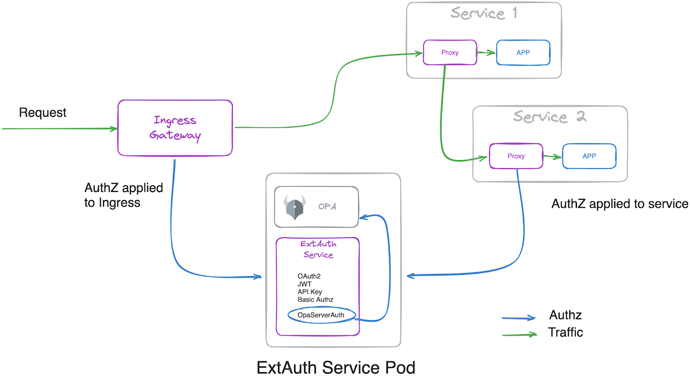
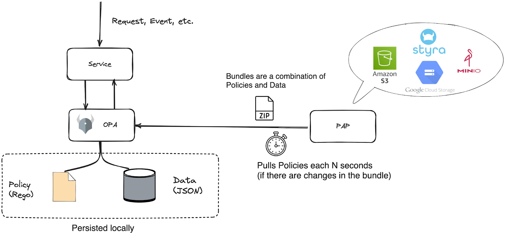

<!--bash
#!/usr/bin/env bash

source ./scripts/assert.sh
-->


# <center>Application Authorization in Gloo Mesh Enterprise</center>


## Table of Contents
* [Introduction](#introduction)
* [Lab 1 - Deploy KinD clusters](#lab-1---deploy-kind-clusters-)
* [Lab 2 - Deploy and register Gloo Mesh](#lab-2---deploy-and-register-gloo-mesh-)
* [Lab 3 - Deploy Istio using Gloo Mesh Lifecycle Manager](#lab-3---deploy-istio-using-gloo-mesh-lifecycle-manager-)
* [Lab 4 - Deploy Gloo Mesh Addons](#lab-4---deploy-gloo-mesh-addons-)
* [Lab 5 - Deploy the httpbin demo app](#lab-5---deploy-the-httpbin-demo-app-)
* [Lab 6 - Deploy the Bookinfo demo app](#lab-6---deploy-the-bookinfo-demo-app-)
* [Lab 7 - Create the gateways workspace](#lab-7---create-the-gateways-workspace-)
* [Lab 8 - Create the httpbin workspace](#lab-8---create-the-httpbin-workspace-)
* [Lab 9 - Create the bookinfo workspace](#lab-9---create-the-bookinfo-workspace-)
* [Lab 10 - Expose the productpage through a gateway](#lab-10---expose-the-productpage-through-a-gateway-)
* [Lab 11 - Authorising with OPA](#lab-11---authorising-with-opa-)
* [Lab 12 - Apply dynamic rate limiting to the Gateway](#lab-12---apply-dynamic-rate-limiting-to-the-gateway-)


## Introduction <a name="introduction"></a>

[Gloo Mesh Enterprise](https://www.solo.io/products/gloo-mesh/) is a management plane which makes it easy to operate [Istio](https://istio.io) on one or many Kubernetes clusters deployed anywhere (any platform, anywhere).

### Istio support

The Gloo Mesh Enterprise subscription includes end to end Istio support:

- Upstream first
- Specialty builds available (FIPS, ARM, etc)
- Long Term Support (LTS) N-4 
- Critical security patches
- Production break-fix
- One hour SLA Severity 1
- Install / upgrade
- Architecture and operational guidance, best practices

### Gloo Mesh overview

Gloo Mesh provides many unique features, including:

- multi-tenancy based on global workspaces
- zero trust enforcement
- global observability (centralized metrics and access logging)
- simplified cross cluster communications (using virtual destinations)
- advanced gateway capabilities (oauth, jwt, transformations, rate limiting, web application firewall, ...)


### Want to learn more about Gloo Mesh

You can find more information about Gloo Mesh in the official documentation:

[https://docs.solo.io/gloo-mesh/latest/](https://docs.solo.io/gloo-mesh/latest/)


## Lab 1 - Deploy KinD clusters <a name="lab-1---deploy-kind-clusters-"></a>


Clone this repository and go to the directory where this `README.md` file is.

Set the context environment variables:

```bash
export MGMT=cluster1
export CLUSTER1=cluster1
export CLUSTER2=cluster2
```

Run the following commands to deploy three Kubernetes clusters using [Kind](https://kind.sigs.k8s.io/):

```bash
./scripts/deploy-aws.sh 1 cluster1 us-west us-west-1
./scripts/deploy-aws.sh 2 cluster2 us-west us-west-2
```

Then run the following commands to wait for all the Pods to be ready:

```bash
./scripts/check.sh cluster1
./scripts/check.sh cluster2
```

**Note:** If you run the `check.sh` script immediately after the `deploy.sh` script, you may see a jsonpath error. If that happens, simply wait a few seconds and try again.

Once the `check.sh` script completes, when you execute the `kubectl get pods -A` command, you should see the following:

```
NAMESPACE            NAME                                          READY   STATUS    RESTARTS   AGE
kube-system          calico-kube-controllers-59d85c5c84-sbk4k      1/1     Running   0          4h26m
kube-system          calico-node-przxs                             1/1     Running   0          4h26m
kube-system          coredns-6955765f44-ln8f5                      1/1     Running   0          4h26m
kube-system          coredns-6955765f44-s7xxx                      1/1     Running   0          4h26m
kube-system          etcd-cluster1-control-plane                   1/1     Running   0          4h27m
kube-system          kube-apiserver-cluster1-control-plane         1/1     Running   0          4h27m
kube-system          kube-controller-manager-cluster1-control-plane1/1     Running   0          4h27m
kube-system          kube-proxy-ksvzw                              1/1     Running   0          4h26m
kube-system          kube-scheduler-cluster1-control-plane         1/1     Running   0          4h27m
local-path-storage   local-path-provisioner-58f6947c7-lfmdx        1/1     Running   0          4h26m
metallb-system       controller-5c9894b5cd-cn9x2                   1/1     Running   0          4h26m
metallb-system       speaker-d7jkp                                 1/1     Running   0          4h26m
```

You can see that your currently connected to this cluster by executing the `kubectl config get-contexts` command:

```
CURRENT   NAME         CLUSTER         AUTHINFO   NAMESPACE  
          cluster1     kind-cluster1   cluster1
*         cluster2     kind-cluster2   cluster2
```

Run the following command to make `cluster1` the current cluster.

```bash
kubectl config use-context ${MGMT}
```
<!--bash
cat <<'EOF' > ./test.js
const helpers = require('./tests/chai-exec');

describe("Clusters are healthy", () => {
    const clusters = [process.env.MGMT, process.env.CLUSTER1, process.env.CLUSTER2];
    clusters.forEach(cluster => {
        it(`Cluster ${cluster} is healthy`, () => helpers.k8sObjectIsPresent({ context: cluster, namespace: "default", k8sType: "service", k8sObj: "kubernetes" }));
    });
});
EOF
echo "executing test dist/gloo-mesh-2-0-gateway-extauth-opa-sidecar-beta/build/templates/steps/deploy-kind-clusters/tests/cluster-healthy.test.js.liquid"
tempfile=$(mktemp)
echo "saving errors in ${tempfile}"
timeout 2m mocha ./test.js --timeout 10000 --retries=120 --bail 2> ${tempfile} || { cat ${tempfile} && exit 1; }
-->


## Lab 2 - Deploy and register Gloo Mesh <a name="lab-2---deploy-and-register-gloo-mesh-"></a>
[](https://youtu.be/djfFiepK4GY "Video Link")


Before we get started, let's install the `meshctl` CLI:

```bash
export GLOO_MESH_VERSION=v2.5.0-rc3
curl -sL https://run.solo.io/meshctl/install | sh -
export PATH=$HOME/.gloo-mesh/bin:$PATH
```
<!--bash
cat <<'EOF' > ./test.js
var chai = require('chai');
var expect = chai.expect;

describe("Required environment variables should contain value", () => {
  afterEach(function(done){
    if(this.currentTest.currentRetry() > 0){
      process.stdout.write(".");
       setTimeout(done, 1000);
    } else {
      done();
    }
  });

  it("Context environment variables should not be empty", () => {
    expect(process.env.MGMT).to.not.be.empty
    expect(process.env.CLUSTER1).to.not.be.empty
  });

  it("Gloo Mesh licence environment variables should not be empty", () => {
    expect(process.env.GLOO_MESH_LICENSE_KEY).to.not.be.empty
  });
});
EOF
echo "executing test dist/gloo-mesh-2-0-gateway-extauth-opa-sidecar-beta/build/templates/steps/deploy-and-register-gloo-mesh/tests/environment-variables.test.js.liquid"
tempfile=$(mktemp)
echo "saving errors in ${tempfile}"
timeout 2m mocha ./test.js --timeout 10000 --retries=120 --bail 2> ${tempfile} || { cat ${tempfile} && exit 1; }
-->
Run the following commands to deploy the Gloo Mesh management plane:

```bash
helm repo add gloo-platform https://storage.googleapis.com/gloo-platform/helm-charts
helm repo update
kubectl --context ${MGMT} create ns gloo-mesh
helm upgrade --install gloo-platform-crds gloo-platform/gloo-platform-crds \
--namespace gloo-mesh \
--kube-context ${MGMT} \
--version=2.5.0-rc3
helm upgrade --install gloo-platform-mgmt gloo-platform/gloo-platform \
--namespace gloo-mesh \
--kube-context ${MGMT} \
--version=2.5.0-rc3 \
 -f -<<EOF
licensing:
  licenseKey: ${GLOO_MESH_LICENSE_KEY}
common:
  cluster: cluster1
glooInsightsEngine:
  enabled: false
glooMgmtServer:
  enabled: true
  ports:
    healthcheck: 8091
  registerCluster: true
prometheus:
  enabled: true
redis:
  deployment:
    enabled: true
telemetryGateway:
  enabled: true
  service:
    type: LoadBalancer
glooUi:
  enabled: true
  serviceType: LoadBalancer
glooAgent:
  enabled: true
  relay:
    serverAddress: gloo-mesh-mgmt-server:9900
    authority: gloo-mesh-mgmt-server.gloo-mesh
telemetryCollector:
  enabled: true
  config:
    exporters:
      otlp:
        endpoint: gloo-telemetry-gateway:4317
EOF
kubectl --context ${MGMT} -n gloo-mesh rollout status deploy/gloo-mesh-mgmt-server
kubectl --context ${MGMT} delete workspaces -A --all
kubectl --context ${MGMT} delete workspacesettings -A --all
```

<!--bash
kubectl wait --context ${MGMT} --for=condition=Ready -n gloo-mesh --all pod
timeout 2m bash -c "until [[ \$(kubectl --context ${MGMT} -n gloo-mesh get svc gloo-mesh-mgmt-server -o json | jq '.status.loadBalancer | length') -gt 0 ]]; do
  sleep 1
done"
-->
<!--bash
cat <<'EOF' > ./test.js
var chai = require('chai');
var expect = chai.expect;
const helpers = require('./tests/chai-exec');
describe("Cluster registration", () => {
  it("cluster1 is registered", () => {
    podName = helpers.getOutputForCommand({ command: "kubectl -n gloo-mesh get pods -l app=gloo-mesh-mgmt-server -o jsonpath='{.items[0].metadata.name}' --context " + process.env.MGMT }).replaceAll("'", "");
    command = helpers.getOutputForCommand({ command: "kubectl --context " + process.env.MGMT + " -n gloo-mesh debug -q -i " + podName + " --image=curlimages/curl -- curl -s http://localhost:9091/metrics" }).replaceAll("'", "");
    expect(command).to.contain("cluster1");
  });
});
EOF
echo "executing test dist/gloo-mesh-2-0-gateway-extauth-opa-sidecar-beta/build/templates/steps/deploy-and-register-gloo-mesh/tests/cluster-registration.test.js.liquid"
tempfile=$(mktemp)
echo "saving errors in ${tempfile}"
timeout 2m mocha ./test.js --timeout 10000 --retries=120 --bail 2> ${tempfile} || { cat ${tempfile} && exit 1; }
-->


## Lab 3 - Deploy Istio using Gloo Mesh Lifecycle Manager <a name="lab-3---deploy-istio-using-gloo-mesh-lifecycle-manager-"></a>
[](https://youtu.be/f76-KOEjqHs "Video Link")

We are going to deploy Istio using Gloo Mesh Lifecycle Manager.

Let's create Kubernetes services for the gateways:

```bash
registry=localhost:5000
kubectl --context ${CLUSTER1} create ns istio-gateways
kubectl --context ${CLUSTER1} label namespace istio-gateways istio.io/rev=1-19 --overwrite

kubectl apply --context ${CLUSTER1} -f - <<EOF
apiVersion: v1
kind: Service
metadata:
  labels:
    app: istio-ingressgateway
    istio: ingressgateway
  name: istio-ingressgateway
  namespace: istio-gateways
spec:
  ports:
  - name: http2
    port: 80
    protocol: TCP
    targetPort: 8080
  - name: https
    port: 443
    protocol: TCP
    targetPort: 8443
  selector:
    app: istio-ingressgateway
    istio: ingressgateway
    revision: 1-19
  type: LoadBalancer
EOF
```

It allows us to have full control on which Istio revision we want to use.

Then, we can tell Gloo Mesh to deploy the Istio control planes and the gateways in the cluster(s).

```bash
kubectl apply --context ${MGMT} -f - <<EOF
apiVersion: admin.gloo.solo.io/v2
kind: IstioLifecycleManager
metadata:
  name: cluster1-installation
  namespace: gloo-mesh
spec:
  installations:
    - clusters:
      - name: cluster1
        defaultRevision: true
      revision: 1-19
      istioOperatorSpec:
        profile: minimal
        hub: us-docker.pkg.dev/gloo-mesh/istio-workshops
        tag: 1.19.3-solo
        namespace: istio-system
        values:
          global:
            meshID: mesh1
            multiCluster:
              clusterName: cluster1
            network: cluster1
        meshConfig:
          accessLogFile: /dev/stdout
          defaultConfig:
            proxyMetadata:
              ISTIO_META_DNS_CAPTURE: "true"
              ISTIO_META_DNS_AUTO_ALLOCATE: "true"
        components:
          pilot:
            k8s:
              env:
                - name: PILOT_ENABLE_K8S_SELECT_WORKLOAD_ENTRIES
                  value: "false"
          ingressGateways:
          - name: istio-ingressgateway
            enabled: false
EOF

kubectl apply --context ${MGMT} -f - <<EOF
apiVersion: admin.gloo.solo.io/v2
kind: GatewayLifecycleManager
metadata:
  name: cluster1-ingress
  namespace: gloo-mesh
spec:
  installations:
    - clusters:
      - name: cluster1
        activeGateway: false
      gatewayRevision: 1-19
      istioOperatorSpec:
        profile: empty
        hub: us-docker.pkg.dev/gloo-mesh/istio-workshops
        tag: 1.19.3-solo
        values:
          gateways:
            istio-ingressgateway:
              customService: true
        components:
          ingressGateways:
            - name: istio-ingressgateway
              namespace: istio-gateways
              enabled: true
              label:
                istio: ingressgateway
---
apiVersion: admin.gloo.solo.io/v2
kind: GatewayLifecycleManager
metadata:
  name: cluster1-eastwest
  namespace: gloo-mesh
spec:
  installations:
    - clusters:
      - name: cluster1
        activeGateway: false
      gatewayRevision: 1-19
      istioOperatorSpec:
        profile: empty
        hub: us-docker.pkg.dev/gloo-mesh/istio-workshops
        tag: 1.19.3-solo
        values:
          gateways:
            istio-ingressgateway:
              customService: true
        components:
          ingressGateways:
            - name: istio-eastwestgateway
              namespace: istio-gateways
              enabled: true
              label:
                istio: eastwestgateway
                topology.istio.io/network: cluster1
              k8s:
                env:
                  - name: ISTIO_META_ROUTER_MODE
                    value: "sni-dnat"
                  - name: ISTIO_META_REQUESTED_NETWORK_VIEW
                    value: cluster1
EOF

```

<!--bash
until kubectl --context ${MGMT} -n gloo-mesh wait --timeout=180s --for=jsonpath='{.status.clusters.cluster1.installations.*.state}'=HEALTHY istiolifecyclemanagers/cluster1-installation; do
  echo "Waiting for the Istio installation to complete"
  sleep 1
done
timeout 2m bash -c "until [[ \$(kubectl --context ${CLUSTER1} -n istio-system get deploy -o json | jq '[.items[].status.readyReplicas] | add') -ge 1 ]]; do
  sleep 1
done"
timeout 2m bash -c "until [[ \$(kubectl --context ${CLUSTER1} -n istio-gateways get deploy -o json | jq '[.items[].status.readyReplicas] | add') -eq 2 ]]; do
  sleep 1
done"
-->

<!--bash
cat <<'EOF' > ./test.js

const helpers = require('./tests/chai-exec');

const chaiExec = require("@jsdevtools/chai-exec");
const helpersHttp = require('./tests/chai-http');
const chai = require("chai");
const expect = chai.expect;

afterEach(function (done) {
  if (this.currentTest.currentRetry() > 0) {
    process.stdout.write(".");
    setTimeout(done, 1000);
  } else {
    done();
  }
});

describe("Checking Istio installation", function() {
  it('istiod pods are ready in cluster ' + process.env.CLUSTER1, () => helpers.checkDeploymentsWithLabels({ context: process.env.CLUSTER1, namespace: "istio-system", labels: "app=istiod", instances: 1 }));
  it('gateway pods are ready in cluster ' + process.env.CLUSTER1, () => helpers.checkDeploymentsWithLabels({ context: process.env.CLUSTER1, namespace: "istio-gateways", labels: "app=istio-ingressgateway", instances: 2 }));
  it("Gateways have an ip attached in cluster " + process.env.CLUSTER1, () => {
    let cli = chaiExec("kubectl --context " + process.env.CLUSTER1 + " -n istio-gateways get svc -l app=istio-ingressgateway -o jsonpath='{.items}'");
    cli.stderr.should.be.empty;
    let deployments = JSON.parse(cli.stdout.slice(1,-1));
    expect(deployments).to.have.lengthOf(1);
    deployments.forEach((deployment) => {
      expect(deployment.status.loadBalancer).to.have.property("ingress");
    });
  });
});

EOF
echo "executing test dist/gloo-mesh-2-0-gateway-extauth-opa-sidecar-beta/build/templates/steps/istio-lifecycle-manager-install/tests/istio-ready.test.js.liquid"
tempfile=$(mktemp)
echo "saving errors in ${tempfile}"
timeout 2m mocha ./test.js --timeout 10000 --retries=120 --bail 2> ${tempfile} || { cat ${tempfile} && exit 1; }
-->
<!--bash
timeout 2m bash -c "until [[ \$(kubectl --context ${CLUSTER1} -n istio-gateways get svc -l istio=ingressgateway -o json | jq '.items[0].status.loadBalancer | length') -gt 0 ]]; do
  sleep 1
done"
-->

```bash
export HOST_GW_CLUSTER1="$(kubectl --context ${CLUSTER1} -n istio-gateways get svc -l istio=ingressgateway -o jsonpath='{.items[0].status.loadBalancer.ingress[0].*}')"
```

<!--bash
cat <<'EOF' > ./test.js
const dns = require('dns');
const chaiHttp = require("chai-http");
const chai = require("chai");
const expect = chai.expect;
chai.use(chaiHttp);
const { waitOnFailedTest } = require('./tests/utils');

afterEach(function(done) { waitOnFailedTest(done, this.currentTest.currentRetry())});

describe("Address '" + process.env.HOST_GW_CLUSTER1 + "' can be resolved in DNS", () => {
    it(process.env.HOST_GW_CLUSTER1 + ' can be resolved', (done) => {
        return dns.lookup(process.env.HOST_GW_CLUSTER1, (err, address, family) => {
            expect(address).to.be.an.ip;
            done();
        });
    });
});
EOF
echo "executing test ./gloo-mesh-2-0/tests/can-resolve.test.js.liquid"
tempfile=$(mktemp)
echo "saving errors in ${tempfile}"
timeout 2m mocha ./test.js --timeout 10000 --retries=120 --bail 2> ${tempfile} || { cat ${tempfile} && exit 1; }
-->


## Lab 4 - Deploy Gloo Mesh Addons <a name="lab-4---deploy-gloo-mesh-addons-"></a>
[](https://youtu.be/_rorug_2bk8 "Video Link")

To use the Gloo Mesh Gateway advanced features (external authentication, rate limiting, ...), you need to install the Gloo Mesh addons.

First, you need to create a namespace for the addons, with Istio injection enabled:

```bash
kubectl --context ${CLUSTER1} create namespace gloo-mesh-addons
kubectl --context ${CLUSTER1} label namespace gloo-mesh-addons istio.io/rev=1-19 --overwrite
```

Then, you can deploy the addons on the cluster(s) using Helm:

```bash
helm upgrade --install gloo-platform gloo-platform/gloo-platform \
  --namespace gloo-mesh-addons \
  --kube-context=${CLUSTER1} \
  --version 2.5.0-rc3 \
 -f -<<EOF
common:
  cluster: cluster1
glooAgent:
  enabled: false
extAuthService:
  enabled: true
  extAuth:
    apiKeyStorage:
      name: redis
      enabled: true
      config: 
        connection: 
          host: redis.gloo-mesh-addons:6379
      secretKey: ThisIsSecret
rateLimiter:
  enabled: true
EOF
```

For teams to setup external authentication, the gateways team needs to create and `ExtAuthServer` object they can reference.

Let's create the `ExtAuthServer` object:

```bash
kubectl apply --context ${CLUSTER1} -f - <<EOF
apiVersion: admin.gloo.solo.io/v2
kind: ExtAuthServer
metadata:
  name: ext-auth-server
  namespace: gloo-mesh-addons
spec:
  destinationServer:
    ref:
      cluster: cluster1
      name: ext-auth-service
      namespace: gloo-mesh-addons
    port:
      name: grpc
  requestBody: {} # Needed if some an extauth plugin must access the body of the requests
EOF
```

For teams to setup rate limiting, the gateways team needs to create and `RateLimitServerSettings` object they can reference.

Let's create the `RateLimitServerSettings` object:

```bash
kubectl apply --context ${CLUSTER1} -f - <<EOF
apiVersion: admin.gloo.solo.io/v2
kind: RateLimitServerSettings
metadata:
  name: rate-limit-server
  namespace: gloo-mesh-addons
spec:
  destinationServer:
    ref:
      cluster: cluster1
      name: rate-limiter
      namespace: gloo-mesh-addons
    port:
      name: grpc
EOF
```
<!--bash
cat <<'EOF' > ./test.js
const helpers = require('./tests/chai-exec');

describe("Gloo Platform add-ons cluster1 deployment", () => {
  let cluster = process.env.CLUSTER1
  let deployments = ["ext-auth-service", "rate-limiter"];
  deployments.forEach(deploy => {
    it(deploy + ' pods are ready in ' + cluster, () => helpers.checkDeployment({ context: cluster, namespace: "gloo-mesh-addons", k8sObj: deploy }));
  });
});

EOF
echo "executing test dist/gloo-mesh-2-0-gateway-extauth-opa-sidecar-beta/build/templates/steps/deploy-gloo-mesh-addons/tests/check-addons-deployments.test.js.liquid"
tempfile=$(mktemp)
echo "saving errors in ${tempfile}"
timeout 2m mocha ./test.js --timeout 10000 --retries=120 --bail 2> ${tempfile} || { cat ${tempfile} && exit 1; }
-->
<!--bash
cat <<'EOF' > ./test.js
const helpers = require('./tests/chai-exec');

describe("Gloo Platform add-ons cluster1 service", () => {
  let cluster = process.env.CLUSTER1
  let services = ["ext-auth-service", "rate-limiter"];
  services.forEach(service => {
    it(service + ' exists in ' + cluster, () => helpers.k8sObjectIsPresent({ context: cluster, namespace: "gloo-mesh-addons", k8sType: "service", k8sObj: service }));
  });
});

EOF
echo "executing test dist/gloo-mesh-2-0-gateway-extauth-opa-sidecar-beta/build/templates/steps/deploy-gloo-mesh-addons/tests/check-addons-services.test.js.liquid"
tempfile=$(mktemp)
echo "saving errors in ${tempfile}"
timeout 2m mocha ./test.js --timeout 10000 --retries=120 --bail 2> ${tempfile} || { cat ${tempfile} && exit 1; }
-->
This is what the environment looks like now:


## Lab 5 - Deploy the httpbin demo app <a name="lab-5---deploy-the-httpbin-demo-app-"></a>
[](https://youtu.be/w1xB-o_gHs0 "Video Link")

We're going to deploy the httpbin application to demonstrate several features of Gloo Mesh.

You can find more information about this application [here](http://httpbin.org/).

Run the following commands to deploy the httpbin app on `cluster1`. The deployment will be called `not-in-mesh` and won't have the sidecar injected (because we don't label the namespace).

```bash
kubectl --context ${CLUSTER1} create ns httpbin
kubectl apply --context ${CLUSTER1} -f - <<EOF
apiVersion: v1
kind: ServiceAccount
metadata:
  name: not-in-mesh
  namespace: httpbin
---
apiVersion: v1
kind: Service
metadata:
  name: not-in-mesh
  namespace: httpbin
  labels:
    app: not-in-mesh
    service: not-in-mesh
spec:
  ports:
  - name: http
    port: 8000
    targetPort: 80
  selector:
    app: not-in-mesh
---
apiVersion: apps/v1
kind: Deployment
metadata:
  name: not-in-mesh
  namespace: httpbin
spec:
  replicas: 1
  selector:
    matchLabels:
      app: not-in-mesh
      version: v1
  template:
    metadata:
      labels:
        app: not-in-mesh
        version: v1
    spec:
      serviceAccountName: not-in-mesh
      containers:
      - image: docker.io/kennethreitz/httpbin
        imagePullPolicy: IfNotPresent
        name: not-in-mesh
        ports:
        - containerPort: 80
EOF
```

Then, we deploy a second version, which will be called `in-mesh` and will have the sidecar injected (because of the label `istio.io/rev` in the Pod template).

```bash
kubectl apply --context ${CLUSTER1} -f - <<EOF
apiVersion: v1
kind: ServiceAccount
metadata:
  name: in-mesh
  namespace: httpbin
---
apiVersion: v1
kind: Service
metadata:
  name: in-mesh
  namespace: httpbin
  labels:
    app: in-mesh
    service: in-mesh
spec:
  ports:
  - name: http
    port: 8000
    targetPort: 80
  selector:
    app: in-mesh
---
apiVersion: apps/v1
kind: Deployment
metadata:
  name: in-mesh
  namespace: httpbin
spec:
  replicas: 1
  selector:
    matchLabels:
      app: in-mesh
      version: v1
  template:
    metadata:
      labels:
        app: in-mesh
        version: v1
        istio.io/rev: 1-19
    spec:
      serviceAccountName: in-mesh
      containers:
      - image: docker.io/kennethreitz/httpbin
        imagePullPolicy: IfNotPresent
        name: in-mesh
        ports:
        - containerPort: 80
EOF
```


<!--bash
echo -n Waiting for httpbin pods to be ready...
timeout -v 5m bash -c "
until [[ \$(kubectl --context ${CLUSTER1} -n httpbin get deploy -o json | jq '[.items[].status.readyReplicas] | add') -eq 2 ]] 2>/dev/null
do
  sleep 1
  echo -n .
done"
echo
-->

You can follow the progress using the following command:

```bash
kubectl --context ${CLUSTER1} -n httpbin get pods
```

```,nocopy
NAME                           READY   STATUS    RESTARTS   AGE
in-mesh-5d9d9549b5-qrdgd       2/2     Running   0          11s
not-in-mesh-5c64bb49cd-m9kwm   1/1     Running   0          11s
```
<!--bash
cat <<'EOF' > ./test.js
const helpers = require('./tests/chai-exec');

describe("httpbin app", () => {
  let cluster = process.env.CLUSTER1
  
  let deployments = ["not-in-mesh", "in-mesh"];
  
  deployments.forEach(deploy => {
    it(deploy + ' pods are ready in ' + cluster, () => helpers.checkDeployment({ context: cluster, namespace: "httpbin", k8sObj: deploy }));
  });
});
EOF
echo "executing test dist/gloo-mesh-2-0-gateway-extauth-opa-sidecar-beta/build/templates/steps/apps/httpbin/deploy-httpbin/tests/check-httpbin.test.js.liquid"
tempfile=$(mktemp)
echo "saving errors in ${tempfile}"
timeout 2m mocha ./test.js --timeout 10000 --retries=120 --bail 2> ${tempfile} || { cat ${tempfile} && exit 1; }
-->


## Lab 6 - Deploy the Bookinfo demo app <a name="lab-6---deploy-the-bookinfo-demo-app-"></a>
[](https://youtu.be/nzYcrjalY5A "Video Link")

We're going to deploy the bookinfo application to demonstrate several features of Gloo Mesh.

You can find more information about this application [here](https://istio.io/latest/docs/examples/bookinfo/).

Run the following commands to deploy the bookinfo application on `cluster1`:

```bash
kubectl --context ${CLUSTER1} create ns bookinfo-frontends
kubectl --context ${CLUSTER1} create ns bookinfo-backends
kubectl --context ${CLUSTER1} label namespace bookinfo-frontends istio.io/rev=1-19 --overwrite
kubectl --context ${CLUSTER1} label namespace bookinfo-backends istio.io/rev=1-19 --overwrite

# Deploy the frontend bookinfo service in the bookinfo-frontends namespace
kubectl --context ${CLUSTER1} -n bookinfo-frontends apply -f data/steps/deploy-bookinfo/productpage-v1.yaml
# Deploy the backend bookinfo services in the bookinfo-backends namespace for all versions less than v3
kubectl --context ${CLUSTER1} -n bookinfo-backends apply \
  -f data/steps/deploy-bookinfo/details-v1.yaml \
  -f data/steps/deploy-bookinfo/ratings-v1.yaml \
  -f data/steps/deploy-bookinfo/reviews-v1-v2.yaml
# Update the reviews service to display where it is coming from
kubectl --context ${CLUSTER1} -n bookinfo-backends set env deploy/reviews-v1 CLUSTER_NAME=${CLUSTER1}
kubectl --context ${CLUSTER1} -n bookinfo-backends set env deploy/reviews-v2 CLUSTER_NAME=${CLUSTER1}
```

<!--bash
echo -n Waiting for bookinfo pods to be ready...
timeout -v 5m bash -c "
until [[ \$(kubectl --context ${CLUSTER1} -n bookinfo-frontends get deploy -o json | jq '[.items[].status.readyReplicas] | add') -eq 1 && \\
  \$(kubectl --context ${CLUSTER1} -n bookinfo-backends get deploy -o json | jq '[.items[].status.readyReplicas] | add') -eq 4 ]] 2>/dev/null
do
  sleep 1
  echo -n .
done"
echo
-->

You can check that the app is running using the following command:

```
kubectl --context ${CLUSTER1} -n bookinfo-frontends get pods && kubectl --context ${CLUSTER1} -n bookinfo-backends get pods
```

Note that we deployed the `productpage` service in the `bookinfo-frontends` namespace and the other services in the `bookinfo-backends` namespace.

And we deployed the `v1` and `v2` versions of the `reviews` microservice, not the `v3` version.<!--bash
cat <<'EOF' > ./test.js
const helpers = require('./tests/chai-exec');

describe("Bookinfo app", () => {
  let cluster = process.env.CLUSTER1
  let deployments = ["productpage-v1"];
  deployments.forEach(deploy => {
    it(deploy + ' pods are ready in ' + cluster, () => helpers.checkDeployment({ context: cluster, namespace: "bookinfo-frontends", k8sObj: deploy }));
  });
  deployments = ["ratings-v1", "details-v1", "reviews-v1", "reviews-v2"];
  deployments.forEach(deploy => {
    it(deploy + ' pods are ready in ' + cluster, () => helpers.checkDeployment({ context: cluster, namespace: "bookinfo-backends", k8sObj: deploy }));
  });
});
EOF
echo "executing test dist/gloo-mesh-2-0-gateway-extauth-opa-sidecar-beta/build/templates/steps/apps/bookinfo/deploy-bookinfo/tests/check-bookinfo.test.js.liquid"
tempfile=$(mktemp)
echo "saving errors in ${tempfile}"
timeout 2m mocha ./test.js --timeout 10000 --retries=120 --bail 2> ${tempfile} || { cat ${tempfile} && exit 1; }
-->


## Lab 7 - Create the gateways workspace <a name="lab-7---create-the-gateways-workspace-"></a>
[](https://youtu.be/QeVBH0eswWw "Video Link")

We're going to create a workspace for the team in charge of the Gateways.

The platform team needs to create the corresponding `Workspace` Kubernetes objects in the Gloo Mesh management cluster.

Let's create the `gateways` workspace which corresponds to the `istio-gateways` and the `gloo-mesh-addons` namespaces on the cluster(s):

```bash
kubectl apply --context ${MGMT} -f - <<EOF
apiVersion: admin.gloo.solo.io/v2
kind: Workspace
metadata:
  name: gateways
  namespace: gloo-mesh
spec:
  workloadClusters:
  - name: cluster1
    namespaces:
    - name: istio-gateways
    - name: gloo-mesh-addons
EOF
```

Then, the Gateway team creates a `WorkspaceSettings` Kubernetes object in one of the namespaces of the `gateways` workspace (so the `istio-gateways` or the `gloo-mesh-addons` namespace):

```bash
kubectl apply --context ${CLUSTER1} -f - <<EOF
apiVersion: admin.gloo.solo.io/v2
kind: WorkspaceSettings
metadata:
  name: gateways
  namespace: gloo-mesh-addons
spec:
  importFrom:
  - workspaces:
    - selector:
        allow_ingress: "true"
    resources:
    - kind: SERVICE
    - kind: ALL
      labels:
        expose: "true"
  exportTo:
  - workspaces:
    - selector:
        allow_ingress: "true"
    resources:
    - kind: SERVICE
EOF
```

The Gateway team has decided to import the following from the workspaces that have the label `allow_ingress` set to `true` (using a selector):
- all the Kubernetes services exported by these workspaces
- all the resources (RouteTables, VirtualDestination, ...) exported by these workspaces that have the label `expose` set to `true`


## Lab 8 - Create the httpbin workspace <a name="lab-8---create-the-httpbin-workspace-"></a>

We're going to create a workspace for the team in charge of the httpbin application.

The platform team needs to create the corresponding `Workspace` Kubernetes objects in the Gloo Mesh management cluster.

Let's create the `httpbin` workspace which corresponds to the `httpbin` namespace on `cluster1`:

```bash
kubectl apply --context ${MGMT} -f - <<EOF
apiVersion: admin.gloo.solo.io/v2
kind: Workspace
metadata:
  name: httpbin
  namespace: gloo-mesh
  labels:
    allow_ingress: "true"
spec:
  workloadClusters:
  - name: cluster1
    namespaces:
    - name: httpbin
EOF
```

Then, the Httpbin team creates a `WorkspaceSettings` Kubernetes object in one of the namespaces of the `httpbin` workspace:

```bash
kubectl apply --context ${CLUSTER1} -f - <<EOF
apiVersion: admin.gloo.solo.io/v2
kind: WorkspaceSettings
metadata:
  name: httpbin
  namespace: httpbin
spec:
  importFrom:
  - workspaces:
    - name: gateways
    resources:
    - kind: SERVICE
  exportTo:
  - workspaces:
    - name: gateways
    resources:
    - kind: SERVICE
      labels:
        app: in-mesh
    - kind: ALL
      labels:
        expose: "true"
EOF
```

The Httpbin team has decided to export the following to the `gateway` workspace (using a reference):
- the `in-mesh` Kubernetes service
- all the resources (RouteTables, VirtualDestination, ...) that have the label `expose` set to `true`


## Lab 9 - Create the bookinfo workspace <a name="lab-9---create-the-bookinfo-workspace-"></a>

We're going to create a workspace for the team in charge of the Bookinfo application.

The platform team needs to create the corresponding `Workspace` Kubernetes objects in the Gloo Mesh management cluster.

Let's create the `bookinfo` workspace which corresponds to the `bookinfo-frontends` and `bookinfo-backends` namespaces on the cluster(s):

```bash
kubectl apply --context ${MGMT} -f - <<EOF
apiVersion: admin.gloo.solo.io/v2
kind: Workspace
metadata:
  name: bookinfo
  namespace: gloo-mesh
  labels:
    allow_ingress: "true"
spec:
  workloadClusters:
  - name: cluster1
    namespaces:
    - name: bookinfo-frontends
    - name: bookinfo-backends
EOF
```

Then, the Bookinfo team creates a `WorkspaceSettings` Kubernetes object in one of the namespaces of the `bookinfo` workspace (so the `bookinfo-frontends` or the `bookinfo-backends` namespace):

```bash
kubectl apply --context ${CLUSTER1} -f - <<EOF
apiVersion: admin.gloo.solo.io/v2
kind: WorkspaceSettings
metadata:
  name: bookinfo
  namespace: bookinfo-frontends
spec:
  importFrom:
  - workspaces:
    - name: gateways
    resources:
    - kind: SERVICE
  exportTo:
  - workspaces:
    - name: gateways
    resources:
    - kind: SERVICE
      labels:
        app: productpage
    - kind: SERVICE
      labels:
        app: reviews
    - kind: SERVICE
      labels:
        app: ratings
    - kind: ALL
      labels:
        expose: "true"
EOF
```

The Bookinfo team has decided to export the following to the `gateway` workspace (using a reference):
- the `productpage` and the `reviews` Kubernetes services
- all the resources (RouteTables, VirtualDestination, ...) that have the label `expose` set to `true`

This is how the environment looks like with the workspaces:


## Lab 10 - Expose the productpage through a gateway <a name="lab-10---expose-the-productpage-through-a-gateway-"></a>
[](https://youtu.be/emyIu99AOOA "Video Link")

In this step, we're going to expose the `productpage` service through the Ingress Gateway using Gloo Mesh.

The Gateway team must create a `VirtualGateway` to configure the Istio Ingress Gateway in cluster1 to listen to incoming requests.

```bash
kubectl apply --context ${CLUSTER1} -f - <<EOF
apiVersion: networking.gloo.solo.io/v2
kind: VirtualGateway
metadata:
  name: north-south-gw
  namespace: istio-gateways
spec:
  workloads:
    - selector:
        labels:
          istio: ingressgateway
        cluster: cluster1
  listeners: 
    - http: {}
      port:
        number: 80
      allowedRouteTables:
        - host: '*'
EOF
```

Then, the Gateway team should create a parent `RouteTable` to configure the main routing.

```bash
kubectl apply --context ${CLUSTER1} -f - <<EOF
apiVersion: networking.gloo.solo.io/v2
kind: RouteTable
metadata:
  name: main-bookinfo
  namespace: istio-gateways
spec:
  hosts:
    - cluster1-bookinfo.example.com
    - cluster2-bookinfo.example.com
  virtualGateways:
    - name: north-south-gw
      namespace: istio-gateways
      cluster: cluster1
  workloadSelectors: []
  http:
    - name: root
      matchers:
      - uri:
          prefix: /
      delegate:
        routeTables:
          - labels:
              expose: "true"
            workspace: bookinfo
          - labels:
              expose: "true"
            workspace: gateways
        sortMethod: ROUTE_SPECIFICITY
---
apiVersion: networking.gloo.solo.io/v2
kind: RouteTable
metadata:
  name: main-httpbin
  namespace: istio-gateways
spec:
  hosts:
    - cluster1-httpbin.example.com
  virtualGateways:
    - name: north-south-gw
      namespace: istio-gateways
      cluster: cluster1
  workloadSelectors: []
  http:
    - name: root
      matchers:
      - uri:
          prefix: /
      delegate:
        routeTables:
          - labels:
              expose: "true"
            workspace: httpbin
        sortMethod: ROUTE_SPECIFICITY
EOF
```

In this example, you can see that the Gateway team is delegating the routing details to the `bookinfo` and `httpbin` workspaces. The teams in charge of these workspaces can expose their services through the gateway.

The Gateway team can use this main `RouteTable` to enforce a global WAF policy, but also to have control on which hostnames and paths can be used by each application team.

Then, the Bookinfo team can create a `RouteTable` to determine how they want to handle the traffic.

```bash
kubectl apply --context ${CLUSTER1} -f - <<EOF
apiVersion: networking.gloo.solo.io/v2
kind: RouteTable
metadata:
  name: productpage
  namespace: bookinfo-frontends
  labels:
    expose: "true"
spec:
  http:
    - name: productpage
      matchers:
      - uri:
          exact: /productpage
      - uri:
          prefix: /static
      - uri:
          prefix: /api/v1/products
      forwardTo:
        destinations:
          - ref:
              name: productpage
              namespace: bookinfo-frontends
              cluster: cluster1
            port:
              number: 9080
EOF
```
Let's add the domain to our `/etc/hosts` file:

```bash
./scripts/register-domain.sh cluster1-bookinfo.example.com ${HOST_GW_CLUSTER1}
./scripts/register-domain.sh cluster1-httpbin.example.com ${HOST_GW_CLUSTER1}
```

You can access the `productpage` service
using this URL: [http://cluster1-bookinfo.example.com/productpage](http://cluster1-bookinfo.example.com/productpage).

You should now be able to access the `productpage` application through the browser.<!--bash
cat <<'EOF' > ./test.js
const helpers = require('./tests/chai-http');

describe("Productpage is available (HTTP)", () => {
  it('/productpage is available in cluster1', () => helpers.checkURL({ host: `http://cluster1-bookinfo.example.com`, path: '/productpage', retCode: 200 }));
})
EOF
echo "executing test dist/gloo-mesh-2-0-gateway-extauth-opa-sidecar-beta/build/templates/steps/apps/bookinfo/gateway-expose/tests/productpage-available.test.js.liquid"
tempfile=$(mktemp)
echo "saving errors in ${tempfile}"
timeout 2m mocha ./test.js --timeout 10000 --retries=120 --bail 2> ${tempfile} || { cat ${tempfile} && exit 1; }
-->

Gloo Mesh translates the `VirtualGateway` and `RouteTable` into the corresponding Istio objects (`Gateway` and `VirtualService`).

Now, let's secure the access through TLS.
Let's first create a private key and a self-signed certificate:

```bash
openssl req -x509 -nodes -days 365 -newkey rsa:2048 \
   -keyout tls.key -out tls.crt -subj "/CN=*"
```

Then, you have to store them in a Kubernetes secret running the following commands:

```bash
kubectl --context ${CLUSTER1} -n istio-gateways create secret generic tls-secret \
  --from-file=tls.key=tls.key \
  --from-file=tls.crt=tls.crt
```

Finally, the Gateway team needs to update the `VirtualGateway` to use this secret:

```bash
kubectl apply --context ${CLUSTER1} -f - <<EOF
apiVersion: networking.gloo.solo.io/v2
kind: VirtualGateway
metadata:
  name: north-south-gw
  namespace: istio-gateways
spec:
  workloads:
    - selector:
        labels:
          istio: ingressgateway
        cluster: cluster1
  listeners: 
    - http: {}
      port:
        number: 80
# ---------------- Redirect to https --------------------
      httpsRedirect: true
# -------------------------------------------------------
    - http: {}
# ---------------- SSL config ---------------------------
      port:
        number: 443
      tls:
        parameters:
          minimumProtocolVersion: TLSv1_3
        mode: SIMPLE
        secretName: tls-secret
# -------------------------------------------------------
      allowedRouteTables:
        - host: '*'
EOF
```

You can now access the `productpage` application securely through the browser.

Notice that we specificed a minimumProtocolVersion, so if the client is trying to use an deprecated TLS version the request will be denied.

To test this, we can try to send a request with `tlsv1.2`:

```console
curl --tlsv1.2 --tls-max 1.2 --key tls.key --cert tls.crt https://cluster1-bookinfo.example.com/productpage -k
```

You should get the following output:

```nocopy
curl: (35) error:1409442E:SSL routines:ssl3_read_bytes:tlsv1 alert protocol version
```

Now, you can try the most recent `tlsv1.3`:

```console
curl --tlsv1.3 --tls-max 1.3 --key tls.key --cert tls.crt https://cluster1-bookinfo.example.com/productpage -k
```

And after this you should get the actual Productpage.
You can now access the `productpage` service using this URL: [https://cluster1-bookinfo.example.com/productpage](https://cluster1-bookinfo.example.com/productpage).<!--bash
cat <<'EOF' > ./test.js
const helpers = require('./tests/chai-http');

describe("Productpage is available (HTTPS)", () => {
  it('/productpage is available in cluster1', () => helpers.checkURL({ host: `https://cluster1-bookinfo.example.com`, path: '/productpage', retCode: 200 }));
})
EOF
echo "executing test dist/gloo-mesh-2-0-gateway-extauth-opa-sidecar-beta/build/templates/steps/apps/bookinfo/gateway-expose/tests/productpage-available-secure.test.js.liquid"
tempfile=$(mktemp)
echo "saving errors in ${tempfile}"
timeout 2m mocha ./test.js --timeout 10000 --retries=120 --bail 2> ${tempfile} || { cat ${tempfile} && exit 1; }
-->
<!--bash
cat <<'EOF' > ./test.js
var chai = require('chai');
var expect = chai.expect;
const helpers = require('./tests/chai-exec');

describe("Otel metrics", () => {
  it("cluster1 is sending metrics to telemetryGateway", () => {
    podName = helpers.getOutputForCommand({ command: "kubectl -n gloo-mesh get pods -l app=prometheus -o jsonpath='{.items[0].metadata.name}' --context " + process.env.MGMT }).replaceAll("'", "");
    command = helpers.getOutputForCommand({ command: "kubectl --context " + process.env.MGMT + " -n gloo-mesh debug -q -i " + podName + " --image=curlimages/curl -- curl -s http://localhost:9090/api/v1/query?query=istio_requests_total" }).replaceAll("'", "");
    expect(command).to.contain("cluster\":\"cluster1");
  });
});


EOF
echo "executing test dist/gloo-mesh-2-0-gateway-extauth-opa-sidecar-beta/build/templates/steps/apps/bookinfo/gateway-expose/tests/otel-metrics.test.js.liquid"
tempfile=$(mktemp)
echo "saving errors in ${tempfile}"
timeout 2m mocha ./test.js --timeout 10000 --retries=150 --bail 2> ${tempfile} || { cat ${tempfile} && exit 1; }
-->
This diagram shows the flow of the request (through the Istio Ingress Gateway):


## Lab 11 - Authorising with OPA <a name="lab-11---authorising-with-opa-"></a>
[](https://youtu.be/fKZjr0AYxYs "Video Link")

In this lab, we're going to enable Authorization to the `httpbin` service using OPA.

One of the options is to deploy an OPA server as a sidecar. This option is better suited for a multi-cluster environment where you want to have distributed Authorization.

Picture this as decoupling the PAP (Policy Administration Point) component from the PEP (Policy Enforcement Point) and PDP (Policy Decision Point) that OPA implements.

The architecture looks like this:


The mechanism that OPA offer is that it can be configured to download the policies in a zip format (called bundle) from a remote location (like an S3 bucket) and then it can be configured to poll the remote location to check if there are new rules to download.



An S3 bucket allows us to synchronize the policies across multiple clusters and regions given its low-latency architecture.

For this Laboratory, instead of configuring an S3 bucket, we are going to deploy an HTTP server. Following application will take an static file with the rego rule we used before and will serve it as a bundle (compressed file).

Deploy the rego rule within a configMap:

```bash
kubectl apply --context ${CLUSTER1} -f - <<EOF
apiVersion: v1
kind: ConfigMap
metadata:
  name: my-policy
  namespace: gloo-mesh-addons
data:
  my-policy.rego: |-
    package my_package

    import future.keywords.if

    # This is the default response when the request is rejected
    default my_rule_to_check := {
      "allow": false,
      "response_headers_to_add": {"x-header-added-on-failure": "failure"},
      "request_headers_to_remove": ["api-key"],
      "body": "This text is returned when the request is rejected",
      "http_status": 403,
    }

    # Envoy works with filters. To pass data between fitlers, we use dynamic metadata.
    # In this case, we could dynamically change rateLimit rules based on Authorization rules.
    dynamic_metadata := {
      "usagePlan": "silver",
      "userId": "john-doe-id",
      "rateLimit": rate_limit,
    }

    rate_limit := {
      "requests_per_unit": 5,
      "unit": "MINUTE",
    }

    # This is the rules that will be executed by OPA
    my_rule_to_check := returned_value if {
      input.http_request.headers["api-key"] == "123"

      # another_condition_1
      # another_condition_2
      # another_condition_3

      returned_value := {
        "dynamic_metadata": dynamic_metadata,
        "allow": true,
        "http_status": 200,
        "headers": {"x-validated-by": "security-checkpoint"},
        "response_headers_to_add": {"x-client-only": "visible"},
        "request_headers_to_remove": ["api-key"]
      }
    }
EOF
```

And then the HTTP server which will take the previous configMap:

```bash
kubectl apply --context ${CLUSTER1} -f - <<EOF
apiVersion: apps/v1
kind: Deployment
metadata:
  labels:
    app: pap
  name: pap
  namespace: gloo-mesh-addons
spec:
  replicas: 1
  selector:
    matchLabels:
      app: pap
  template:
    metadata:
      labels:
        app: pap
    spec:
      initContainers:
      - name: build
        image: openpolicyagent/opa:0.57.1-debug
        workingDir: /bundle
        command: ["/bin/sh"]
        args:
          - -c
          - opa build /tmp/bundle/my-policy.rego -o /tmp/static/bundle.tar.gz
        volumeMounts:
        - name: bundle
          mountPath: "/tmp/bundle"
        - name: static
          mountPath: "/tmp/static"
      containers:
      - image: nginx:1.25.3
        imagePullPolicy: Always
        name: nginx
        ports:
        - containerPort: 80
        volumeMounts:
        - mountPath: /usr/share/nginx/html
          name: static
      restartPolicy: Always
      volumes:
      - name: bundle
        configMap:
          name: my-policy
      - name: static
        emptyDir: {}
---
apiVersion: v1
kind: Service
metadata:
  labels:
    app: pap
  name: pap
  namespace: gloo-mesh-addons
spec:
  ports:
  - port: 80
    protocol: TCP
    targetPort: 80
  selector:
    app: pap
EOF

kubectl --context ${CLUSTER1} patch deployment -n gloo-mesh-addons ext-auth-service -p '{"spec": {"template": {"spec": {"containers": [{"name": "opa-auth","livenessProbe": {"httpGet": {"path": "/health"}},"readinessProbe": {"httpGet": {"path": "/health"}}}]}}}}'

kubectl --context ${CLUSTER1} rollout restart deploy ext-auth-service -n gloo-mesh-addons

kubectl --context ${CLUSTER1} rollout status deploy ext-auth-service -n gloo-mesh-addons
```

As part of this HTTP server, you can see that a policy (the same we used in the as-configMap mode) is persisted into the containers and a bundle is built.

Now that we have the PAP component, let's configure Gloo to use it.

```bash
helm upgrade --install gloo-platform gloo-platform/gloo-platform \
  --namespace gloo-mesh-addons \
  --reuse-values \
  --kube-context=${CLUSTER1} \
  --version 2.5.0-rc3 \
 -f -<<EOF
extAuthService:
  extAuth:
    opaServer:
      enabled: true
      config: |
        decision_logs:
          console: true
        services:
          pap:
            url: http://pap.gloo-mesh-addons.svc
        bundles:
          authz:
            service: pap
            resource: bundle.tar.gz
            polling:
              min_delay_seconds: 10
              max_delay_seconds: 20
EOF
```

The very first thing we need to do is to enable the OPA server. To do so, when we install Gloo Addons we need to specify that we want to deploy the OPA server as a sidecar as follows:

```yaml,nocopy
[...]
extAuthService:
  enabled: true
  extAuth: 
    opaServer:
      enabled: true
      config: |
        decision_logs:
          console: true
        services:
          pap:
            url: http://pap.gloo-mesh-addons.svc # Where to find the PAP
        bundles:
          authz:
            service: pap
            resource: bundle.tar.gz # Bundle file
            polling:
              min_delay_seconds: 10 # polling interval
              max_delay_seconds: 20
[...]
```

You can add as many services as you want with different policies.

Now you can see three containers as part of the ExtAuth Service, OPA one of those:

```shell
kubectl --context ${CLUSTER1}  get po -A -l app=ext-auth-service
```

And you will see:

```shell,nocopy
NAMESPACE          NAME                                        READY   STATUS    RESTARTS        AGE
gloo-mesh-addons   ext-auth-service-5c8d8c57c4-jk529           3/3     Running   0               6m7s
```

Now you can see that the OPA container has loaded the bundle:

```shell
kubectl --context ${CLUSTER1} -n gloo-mesh-addons logs -l app=ext-auth-service -c opa-auth --tail=1000 | grep "Bundle loaded"
```

And you will see something like below, indicating that the bundle has been loaded:

```shell,nocopy
{"level":"info","msg":"Bundle loaded and activated successfully. Etag updated to \"65396b99-19f\".","name":"authz","plugin":"bundle","time":"2023-10-25T19:25:27Z"}
```

You need to update the `ExtAuthPolicy` object to add the OPA authorization step:

```bash
kubectl apply --context ${CLUSTER1} -f - <<EOF
apiVersion: security.policy.gloo.solo.io/v2
kind: ExtAuthPolicy
metadata:
  name: httpbin
  namespace: httpbin
spec:
  applyToRoutes:
  - route:
      labels:
        opa: "true"
  config:
    server:
      name: ext-auth-server
      namespace: gloo-mesh-addons
      cluster: cluster1
    glooAuth:
      configs:
      - opaServerAuth:
          package: my_package
          ruleName: my_rule_to_check
          options:
            fastInputConversion: true
            returnDecisionReason: true
EOF
```

Finally, you need to update the `RouteTable` to use this `ExtAuthPolicy`:

```bash
kubectl apply --context ${CLUSTER1} -f - <<EOF
apiVersion: networking.gloo.solo.io/v2
kind: RouteTable
metadata:
  name: httpbin
  namespace: httpbin
  labels:
    expose: "true"
spec:
  http:
    - name: httpbin
      labels:
        opa: "true"
      matchers:
      - uri:
          exact: /get
      forwardTo:
        destinations:
        - ref:
            name: in-mesh
            namespace: httpbin
            cluster: cluster1
          port:
            number: 8000
EOF
```

Let's try to pass the authorization with the header:

```shell
curl -s https://cluster1-httpbin.example.com/get -H 'api-key: 123'
```

As you can see, the request is allowed. This is because the rego rule we deployed is allowing the access. But also you can see that some headers have been added to the request:

```shell,nocopy
"X-Validated-By": "security-checkpoint"
```

You will also notice that the `api-key` header has been removed from the request.

In the rego rule, you could also notice that there is a block decidated to metadata. This is because OPA can be used to dynamically change the rateLimit rules based on the Authorization rules.

This time, let's try to access the application failing the authorization:

```shell
curl -s https://cluster1-httpbin.example.com/get -vvv -H 'api-key: 123'
```

As you can see, the request is denied. This is because the rego rule we deployed is denying the access.

You will notice that the response status code is `403` and the body is `This text is returned when the request is rejected`. Also, there is a response header `x-header-added-on-failure` with the value `failure`.

Rego rules can be used to dynamically change the status code, body and headers of the response when the request is rejected.

<!--bash
cat <<'EOF' > ./test.js
const chaiExec = require("@jsdevtools/chai-exec");
const helpersHttp = require('./tests/chai-http');
var chai = require('chai');
var expect = chai.expect;

describe("Authorization with OPA is working properly", function() {
  it("The response code 403 is returned when the request is rejected", () => helpersHttp.checkURL({ host: 'https://cluster1-httpbin.example.com/get', retCode: 403 }));
  it("The response header is added when the request is rejected", () => helpersHttp.checkHeaders({ host: 'https://cluster1-httpbin.example.com/get', expectedHeaders: [{key: 'x-header-added-on-failure', value: 'failure'}] }));
  it("The body 'This text is returned when the request is rejected' is returned when the request is rejected", () => helpersHttp.checkBody({ host: 'https://cluster1-httpbin.example.com/get', body: "This text is returned when the request is rejected", match: true }));
  it("The response code 200 is returned when the request is accepted", () => helpersHttp.checkURL({ host: 'https://cluster1-httpbin.example.com/get', headers: [{key: 'api-key', value: '123'}], retCode: 200 }));
  it("The request header is added when the request is accepted", () => helpersHttp.checkBody({ host: 'https://cluster1-httpbin.example.com/get', headers: [{key: 'api-key', value: '123'}], body: '"X-Validated-By": "security-checkpoint"', match: true }));
  it("The request header is removed when the request is accepted", () => helpersHttp.checkBody({ host: 'https://cluster1-httpbin.example.com/get', headers: [{key: 'api-key', value: '123'}], body: 'Api-Key', match: false }));
  it("The response header is added when the request is accepted", () => helpersHttp.checkHeaders({ host: 'https://cluster1-httpbin.example.com/get', headers: [{key: 'api-key', value: '123'}], expectedHeaders: [{key: 'x-client-only', value: 'visible'}] }));
}); 
EOF
echo "executing test dist/gloo-mesh-2-0-gateway-extauth-opa-sidecar-beta/build/templates/steps/apps/httpbin/gateway-extauth-opa/tests/authorization.test.js.liquid"
tempfile=$(mktemp)
echo "saving errors in ${tempfile}"
timeout 2m mocha ./test.js --timeout 10000 --retries=120 --bail 2> ${tempfile} || { cat ${tempfile} && exit 1; }
-->


## Lab 12 - Apply dynamic rate limiting to the Gateway <a name="lab-12---apply-dynamic-rate-limiting-to-the-gateway-"></a>


In this step, we're going to apply rate limiting to the Gateway dynamically using metadata generated by OPA.

First, we need to create a `RateLimitServerConfig` object to define a default limit:

```bash
kubectl apply --context ${CLUSTER1} -f - <<EOF
apiVersion: admin.gloo.solo.io/v2
kind: RateLimitServerConfig
metadata:
  name: httpbin
  namespace: httpbin
spec:
  destinationServers:
  - ref:
      cluster: cluster1
      name: rate-limiter
      namespace: gloo-mesh-addons
    port:
      name: grpc
  raw:
    setDescriptors:
      - simpleDescriptors:
          - key: generic_key
            value: counter
        rateLimit:
          requestsPerUnit: 100
          unit: SECOND
EOF
```

After that, we need to create a `RateLimitPolicy` object to define the descriptors:

```bash
kubectl apply --context ${CLUSTER1} -f - <<EOF
apiVersion: trafficcontrol.policy.gloo.solo.io/v2
kind: RateLimitPolicy
metadata:
  name: httpbin
  namespace: httpbin
spec:
  applyToRoutes:
  - route:
      labels:
        opa: "true"
  config:
    serverSettings:
      name: rate-limit-server
      namespace: gloo-mesh-addons
      cluster: cluster1
    raw:
      rateLimits:
      - setActions:
        - genericKey:
           descriptorValue: counter
        limit:
          dynamicMetadata:
            metadataKey:
              key: "envoy.filters.http.ext_authz"
              path:
              - key: "config_0"
              - key: "rateLimit"
    ratelimitServerConfig:
      name: httpbin
      namespace: httpbin
      cluster: cluster1
    phase:
      postAuthz:
        priority: 1
EOF
```

It's going to be applied to the `httpbin` RouteTable which already has the label `opa` set to `true`.

Refresh the web page multiple times.

<!--bash
cat <<'EOF' > ./test.js
const chaiExec = require("@jsdevtools/chai-exec");
const helpersHttp = require('./tests/chai-http');
var chai = require('chai');
var expect = chai.expect;

describe("Rate limiting is working properly", function() {
  it('The httpbin page should be rate limited', () => helpersHttp.checkURL({ host: `https://cluster1-httpbin.example.com`, path: '/get', headers: [{key: 'api-key', value: '123'}], retCode: 429 }));
});

EOF
echo "executing test dist/gloo-mesh-2-0-gateway-extauth-opa-sidecar-beta/build/templates/steps/apps/httpbin/gateway-dynamic-ratelimiting/tests/rate-limited.test.js.liquid"
tempfile=$(mktemp)
echo "saving errors in ${tempfile}"
timeout 2m mocha ./test.js --timeout 10000 --retries=120 --bail 2> ${tempfile} || { cat ${tempfile} && exit 1; }
-->

You should get a `200` response code the first 5 time and a `429` response code after.

And also delete the different objects we've created:
```bash
kubectl --context ${CLUSTER1} -n httpbin delete ratelimitpolicy httpbin
kubectl --context ${CLUSTER1} -n httpbin delete ratelimitserverconfig httpbin
```


