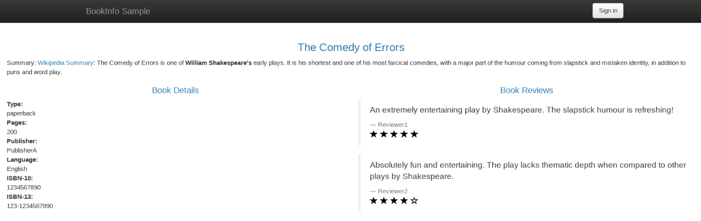
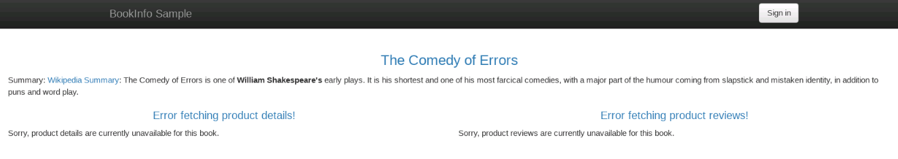
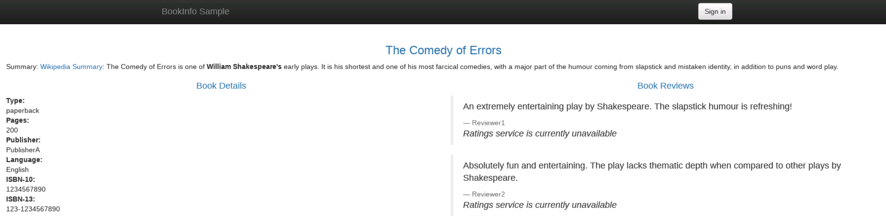
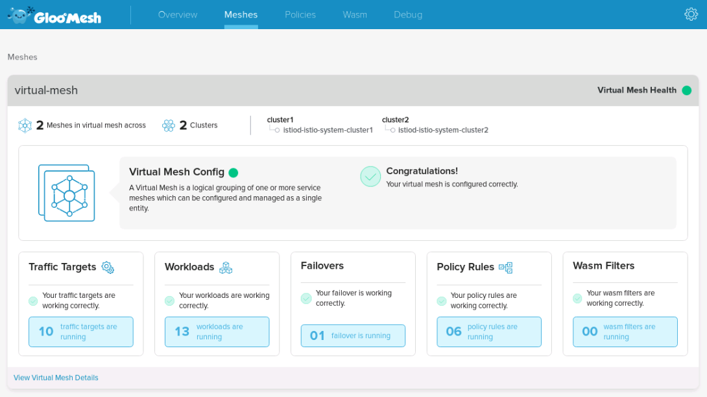
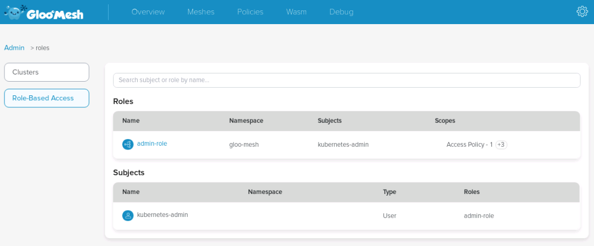
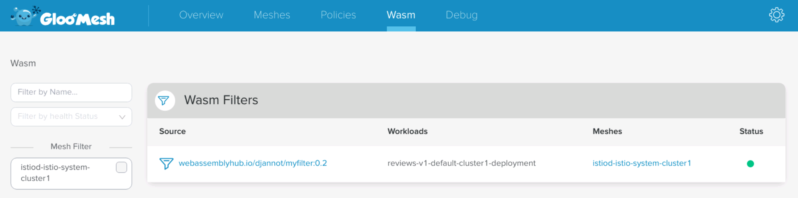

# Gloo Mesh Workshop

[Gloo Mesh](https://docs.solo.io/gloo-mesh/latest/) is a Kubernetes-native management plane that enables configuration and operational management of multiple heterogeneous service meshes across multiple clusters through a unified API. The Gloo Mesh API integrates with the leading service meshes and abstracts away differences between their disparate API's, allowing users to configure a set of different service meshes through a single API. Gloo Mesh is engineered with a focus on its utility as an operational management tool, providing both graphical and command line UIs, observability features, and debugging tools.

The goal of this workshop is to show several unique features of the Gloo Mesh in action:

* Mesh Discovery
* Unified Identity / Trust domain
* Access control
* Multi-cluster traffic
* Failover

## Lab environment

Gloo Mesh can be run in its own cluster or co-located with an existing mesh. In this exercise, Gloo Mesh will run in its own dedicated management cluster, while the two managed Istio meshes will run in separate clusters.


## Table of contents

* [Lab 1 - Deploy your Kubernetes clusters](gloo-mesh.md#lab1)
* [Lab 2 - Deploy Gloo Mesh and register the clusters](gloo-mesh.md#lab2)
* [Lab 3 - Deploy Istio on both clusters](gloo-mesh.md#lab3)
* [Lab 4 - Deploy the Bookinfo demo app](gloo-mesh.md#lab4)
* [Lab 5 - Create the Virtual Mesh](gloo-mesh.md#lab5)
* [Lab 6 - Access Control](gloo-mesh.md#lab6)
* [Lab 7 - Multi-cluster Traffic](gloo-mesh.md#lab7)
* [Lab 8 - Traffic Failover](gloo-mesh.md#lab8)
* [Lab 9 - Gloo Mesh Enterprise RBAC](gloo-mesh.md#lab9)
* [Lab 10 - Extend Envoy with WebAssembly](gloo-mesh.md#lab10)
* [Lab 11 - Exploring the Gloo Mesh Enterprise UI](gloo-mesh.md#lab11)

## Lab 1 : Deploy your Kubernetes clusters <a id="lab1"></a>

Set the context environment variables:

```bash
export MGMT=mgmt
export CLUSTER1=cluster1
export CLUSTER2=cluster2
```

> Note that in case you can't have a Kubernetes cluster dedicated for the management plane, you would set the variables like that:
>
> ```text
> export MGMT=cluster1
> export CLUSTER1=cluster1
> export CLUSTER2=cluster2
> ```

From the terminal go to the `/home/solo/workshops/gloo-mesh` directory:

```text
cd /home/solo/workshops/gloo-mesh
```

Run the following commands to deploy three Kubernetes clusters using [Kind](https://kind.sigs.k8s.io/):

```bash
../scripts/deploy.sh 1 mgmt
../scripts/deploy.sh 2 cluster1 us-west us-west-1
../scripts/deploy.sh 3 cluster2 us-west us-west-2
```

Then run the following commands to wait for all the Pods to be ready:

```bash
../scripts/check.sh mgmt
../scripts/check.sh cluster1 
../scripts/check.sh cluster2
```

**Note:** If you run the `check.sh` script immediately after the `deploy.sh` script, you may see a jsonpath error. If that happens, simply wait a few seconds and try again.

Once the `check.sh` script completes, when you execute the `kubectl get pods -A` command, you should see the following:

```text
NAMESPACE            NAME                                          READY   STATUS    RESTARTS   AGE
kube-system          calico-kube-controllers-59d85c5c84-sbk4k      1/1     Running   0          4h26m
kube-system          calico-node-przxs                             1/1     Running   0          4h26m
kube-system          coredns-6955765f44-ln8f5                      1/1     Running   0          4h26m
kube-system          coredns-6955765f44-s7xxx                      1/1     Running   0          4h26m
kube-system          etcd-cluster1-control-plane                   1/1     Running   0          4h27m
kube-system          kube-apiserver-cluster1-control-plane         1/1     Running   0          4h27m
kube-system          kube-controller-manager-cluster1-control-plane1/1     Running   0          4h27m
kube-system          kube-proxy-ksvzw                              1/1     Running   0          4h26m
kube-system          kube-scheduler-cluster1-control-plane         1/1     Running   0          4h27m
local-path-storage   local-path-provisioner-58f6947c7-lfmdx        1/1     Running   0          4h26m
metallb-system       controller-5c9894b5cd-cn9x2                   1/1     Running   0          4h26m
metallb-system       speaker-d7jkp                                 1/1     Running   0          4h26m
```

Note that this represents the output just for `cluster2`, although the pod footprint for all three clusters should look similar at this point.

You can see that your currently connected to this cluster by executing the `kubectl config get-contexts` command:

```text
CURRENT   NAME         CLUSTER         AUTHINFO   NAMESPACE  
          cluster1     kind-cluster1   cluster1
*         cluster2     kind-cluster2   cluster2
          mgmt         kind-mgmt       kind-mgmt
```

Run the following command to make `mgmt` the current cluster.

```bash
kubectl config use-context ${MGMT}
```

## Lab 2 : Deploy Gloo Mesh and register the clusters <a id="lab2"></a>

First of all, you need to install the _meshctl_ CLI:

```bash
export GLOO_MESH_VERSION=v1.0.9
curl -sL https://run.solo.io/meshctl/install | sh -
export PATH=$HOME/.gloo-mesh/bin:$PATH
```

Gloo Mesh Enterprise is adding unique features on top of Gloo Mesh Open Source \(RBAC, UI, WASM, ...\).

Run the following commands to deploy Gloo Mesh Enterprise:

```bash
helm repo add gloo-mesh-enterprise https://storage.googleapis.com/gloo-mesh-enterprise/gloo-mesh-enterprise 
helm repo update
kubectl --context ${MGMT} create ns gloo-mesh 
helm install gloo-mesh-enterprise gloo-mesh-enterprise/gloo-mesh-enterprise \
--namespace gloo-mesh --kube-context ${MGMT} \
--version=1.0.14 \
--set licenseKey=${GLOO_MESH_LICENSE_KEY}

kubectl --context ${MGMT} -n gloo-mesh rollout status deploy/enterprise-networking
```

Then, you need to register the two other clusters:

```bash
SVC=$(kubectl --context ${MGMT} -n gloo-mesh get svc enterprise-networking -o jsonpath='{.status.loadBalancer.ingress[0].ip}')

meshctl cluster register --mgmt-context=${MGMT} --remote-context=${CLUSTER1} --relay-server-address=$SVC:9900 enterprise cluster1 --cluster-domain cluster.local
meshctl cluster register --mgmt-context=${MGMT} --remote-context=${CLUSTER2} --relay-server-address=$SVC:9900 enterprise cluster2 --cluster-domain cluster.local
```

You can list the registered cluster using the following command:

```bash
kubectl get kubernetescluster -n gloo-mesh
```

You should get the following output:

```text
NAME       AGE
cluster1   27s
cluster2   23s
```

> ### Note that you can also register the remote clusters with Helm:
>
> #### Get the value of the root CA certificate on the management cluster and create a secret in the remote clusters
>
> ```text
> kubectl --context ${MGMT} -n gloo-mesh get secret relay-root-tls-secret -o jsonpath='{.data.ca\.crt}' | base64 -d > ca.crt
> kubectl --context ${CLUSTER1} create ns gloo-mesh
> kubectl --context ${CLUSTER1} -n gloo-mesh create secret generic relay-root-tls-secret --from-file ca.crt=ca.crt
> kubectl --context ${CLUSTER2} create ns gloo-mesh
> kubectl --context ${CLUSTER2} -n gloo-mesh create secret generic relay-root-tls-secret --from-file ca.crt=ca.crt
> ```
>
> #### We also need to copy over the bootstrap token used for initial communication
>
> ```text
> kubectl --context ${MGMT} -n gloo-mesh get secret relay-identity-token-secret -o jsonpath='{.data.token}' | base64 -d > token
> kubectl --context ${CLUSTER1} -n gloo-mesh create secret generic relay-identity-token-secret --from-file token=token
> kubectl --context ${CLUSTER2} -n gloo-mesh create secret generic relay-identity-token-secret --from-file token=token
> ```
>
> #### Install the Helm charts
>
> ```text
> SVC=$(kubectl --context ${MGMT} -n gloo-mesh get svc enterprise-networking -o jsonpath='{.status.loadBalancer.ingress[0].ip}')
>
> helm repo add enterprise-agent https://storage.googleapis.com/gloo-mesh-enterprise/enterprise-agent
> helm repo update
> helm install enterprise-agent enterprise-agent/enterprise-agent \
>   --namespace gloo-mesh \
>   --set relay.serverAddress=${SVC}:9900 \
>   --set relay.cluster=cluster1 \
>   --kube-context=${CLUSTER1} \
>   --version 1.0.14
>
> helm install enterprise-agent enterprise-agent/enterprise-agent \
>   --namespace gloo-mesh \
>   --set relay.serverAddress=${SVC}:9900 \
>   --set relay.cluster=cluster2 \
>   --kube-context=${CLUSTER2} \
>   --version 1.0.14
> ```
>
> #### Create the `KubernetesCluster` objects
>
> ```text
> kubectl apply --context ${MGMT} -f- <<EOF
> apiVersion: multicluster.solo.io/v1alpha1
> kind: KubernetesCluster
> metadata:
>   name: cluster1
>   namespace: gloo-mesh
> spec:
>   clusterDomain: cluster.local
> EOF
>
> kubectl apply --context ${MGMT} -f- <<EOF
> apiVersion: multicluster.solo.io/v1alpha1
> kind: KubernetesCluster
> metadata:
>   name: cluster2
>   namespace: gloo-mesh
> spec:
>   clusterDomain: cluster.local
> EOF
> ```

## Lab 3 : Deploy Istio on both clusters <a id="lab3"></a>

Download istio 1.10.2:

```bash
export ISTIO_VERSION=1.10.2
curl -L https://istio.io/downloadIstio | sh -
```

Now let's deploy Istio on the first cluster:

```bash
./istio-1.10.2/bin/istioctl --context ${CLUSTER1} operator init

kubectl --context ${CLUSTER1} create ns istio-system

cat << EOF | kubectl --context ${CLUSTER1} apply -f -
apiVersion: install.istio.io/v1alpha1
kind: IstioOperator
metadata:
  name: istiocontrolplane-default
  namespace: istio-system
spec:
  profile: default
  meshConfig:
    trustDomain: cluster1
    accessLogFile: /dev/stdout
    enableAutoMtls: true
    defaultConfig:
      envoyMetricsService:
        address: enterprise-agent.gloo-mesh:9977
      envoyAccessLogService:
        address: enterprise-agent.gloo-mesh:9977
      proxyMetadata:
        ISTIO_META_DNS_CAPTURE: "true"
        ISTIO_META_DNS_AUTO_ALLOCATE: "true"
        GLOO_MESH_CLUSTER_NAME: cluster1
  values:
    global:
      meshID: mesh1
      multiCluster:
        clusterName: cluster1
      network: network1
      meshNetworks:
        network1:
          endpoints:
          - fromRegistry: cluster1
          gateways:
          - registryServiceName: istio-ingressgateway.istio-system.svc.cluster.local
            port: 443
        vm-network:
  components:
    ingressGateways:
    - name: istio-ingressgateway
      label:
        topology.istio.io/network: network1
      enabled: true
      k8s:
        env:
          # sni-dnat adds the clusters required for AUTO_PASSTHROUGH mode
          - name: ISTIO_META_ROUTER_MODE
            value: "sni-dnat"
          # traffic through this gateway should be routed inside the network
          - name: ISTIO_META_REQUESTED_NETWORK_VIEW
            value: network1
        service:
          ports:
            - name: http2
              port: 80
              targetPort: 8080
            - name: https
              port: 443
              targetPort: 8443
            - name: tcp-status-port
              port: 15021
              targetPort: 15021
            - name: tls
              port: 15443
              targetPort: 15443
            - name: tcp-istiod
              port: 15012
              targetPort: 15012
            - name: tcp-webhook
              port: 15017
              targetPort: 15017
    pilot:
      k8s:
        env:
          - name: PILOT_SKIP_VALIDATE_TRUST_DOMAIN
            value: "true"
EOF
```

And deploy Istio on the second cluster:

```bash
./istio-1.10.2/bin/istioctl --context ${CLUSTER2} operator init

kubectl --context ${CLUSTER2} create ns istio-system

cat << EOF | kubectl --context ${CLUSTER2} apply -f -
apiVersion: install.istio.io/v1alpha1
kind: IstioOperator
metadata:
  name: istiocontrolplane-default
  namespace: istio-system
spec:
  profile: default
  meshConfig:
    trustDomain: cluster2
    accessLogFile: /dev/stdout
    enableAutoMtls: true
    defaultConfig:
      envoyMetricsService:
        address: enterprise-agent.gloo-mesh:9977
      envoyAccessLogService:
        address: enterprise-agent.gloo-mesh:9977
      proxyMetadata:
        ISTIO_META_DNS_CAPTURE: "true"
        ISTIO_META_DNS_AUTO_ALLOCATE: "true"
        GLOO_MESH_CLUSTER_NAME: cluster2
  values:
    global:
      meshID: mesh1
      multiCluster:
        clusterName: cluster2
      network: network2
      meshNetworks:
        network2:
          endpoints:
          - fromRegistry: cluster2
          gateways:
          - registryServiceName: istio-ingressgateway.istio-system.svc.cluster.local
            port: 443
        vm-network:
  components:
    ingressGateways:
    - name: istio-ingressgateway
      label:
        topology.istio.io/network: network2
      enabled: true
      k8s:
        env:
          # sni-dnat adds the clusters required for AUTO_PASSTHROUGH mode
          - name: ISTIO_META_ROUTER_MODE
            value: "sni-dnat"
          # traffic through this gateway should be routed inside the network
          - name: ISTIO_META_REQUESTED_NETWORK_VIEW
            value: network2
        service:
          ports:
            - name: http2
              port: 80
              targetPort: 8080
            - name: https
              port: 443
              targetPort: 8443
            - name: tcp-status-port
              port: 15021
              targetPort: 15021
            - name: tls
              port: 15443
              targetPort: 15443
            - name: tcp-istiod
              port: 15012
              targetPort: 15012
            - name: tcp-webhook
              port: 15017
              targetPort: 15017
    pilot:
      k8s:
        env:
          - name: PILOT_SKIP_VALIDATE_TRUST_DOMAIN
            value: "true"
EOF
```

Run the following command until all the Istio Pods are ready:

```text
kubectl --context ${CLUSTER1} get pods -n istio-system
```

When they are ready, you should get this output:

```text
NAME                                    READY   STATUS    RESTARTS   AGE
istio-ingressgateway-5c7759c8cb-52r2j   1/1     Running   0          22s
istiod-7884b57b4c-rvr2c                 1/1     Running   0          30s
```

Check the status on the second cluster using `kubectl --context ${CLUSTER2} get pods -n istio-system`

## Lab 4 : Deploy the Bookinfo demo app <a id="lab4"></a>

Run the following commands to deploy the bookinfo app on `cluster1`:

```bash
kubectl --context ${CLUSTER1} label namespace default istio-injection=enabled
# deploy bookinfo application components for all versions less than v3
kubectl --context ${CLUSTER1} apply -f https://raw.githubusercontent.com/istio/istio/1.10.2/samples/bookinfo/platform/kube/bookinfo.yaml -l 'app,version notin (v3)'
# deploy all bookinfo service accounts
kubectl --context ${CLUSTER1} apply -f https://raw.githubusercontent.com/istio/istio/1.10.2/samples/bookinfo/platform/kube/bookinfo.yaml -l 'account'
# configure ingress gateway to access bookinfo
kubectl --context ${CLUSTER1} apply -f https://raw.githubusercontent.com/istio/istio/1.10.2/samples/bookinfo/networking/bookinfo-gateway.yaml
```

You can check that the app is running using `kubectl --context ${CLUSTER1} get pods`:

```text
NAME                              READY   STATUS    RESTARTS   AGE
details-v1-558b8b4b76-w9qp8       2/2     Running   0          2m33s
productpage-v1-6987489c74-54lvk   2/2     Running   0          2m34s
ratings-v1-7dc98c7588-pgsxv       2/2     Running   0          2m34s
reviews-v1-7f99cc4496-lwtsr       2/2     Running   0          2m34s
reviews-v2-7d79d5bd5d-mpsk2       2/2     Running   0          2m34s
```

As you can see, it deployed the `v1` and `v2` versions of the `reviews` microservice. But as expected, it did not deploy `v3` of `reviews`.

Now, run the following commands to deploy the bookinfo app on `cluster2`:

```bash
kubectl --context ${CLUSTER2} label namespace default istio-injection=enabled
# deploy all bookinfo service accounts and application components for all versions
kubectl --context ${CLUSTER2} apply -f https://raw.githubusercontent.com/istio/istio/1.10.2/samples/bookinfo/platform/kube/bookinfo.yaml
# configure ingress gateway to access bookinfo
kubectl --context ${CLUSTER2} apply -f https://raw.githubusercontent.com/istio/istio/1.10.2/samples/bookinfo/networking/bookinfo-gateway.yaml
```

You can check that the app is running using `kubectl --context ${CLUSTER2} get pods`:

```text
NAME                              READY   STATUS    RESTARTS   AGE
details-v1-558b8b4b76-gs9z2       2/2     Running   0          2m22s
productpage-v1-6987489c74-x45vd   2/2     Running   0          2m21s
ratings-v1-7dc98c7588-2n6bg       2/2     Running   0          2m21s
reviews-v1-7f99cc4496-4r48m       2/2     Running   0          2m21s
reviews-v2-7d79d5bd5d-cx9lp       2/2     Running   0          2m22s
reviews-v3-7dbcdcbc56-trjdx       2/2     Running   0          2m22s
```

As you can see, it deployed all three versions of the `reviews` microservice.


Get the URL to access the `productpage` service from your web browser using the following command:

```text
echo "http://$(kubectl --context ${CLUSTER1} -n istio-system get svc istio-ingressgateway -o jsonpath='{.status.loadBalancer.ingress[0].ip}')/productpage"
```



As you can see, you can access the Bookinfo demo app.

## Lab 5 : Create the Virtual Mesh <a id="lab5"></a>

Gloo Mesh can help unify the root identity between multiple service mesh installations so any intermediates are signed by the same Root CA and end-to-end mTLS between clusters and services can be established correctly.

Run this command to see how the communication between microservices occurs currently:

```bash
kubectl --context ${CLUSTER1} exec -t deploy/reviews-v1 -c istio-proxy \
-- openssl s_client -showcerts -connect ratings:9080
```

You should get something like that:

```text
CONNECTED(00000005)
139706332271040:error:1408F10B:SSL routines:ssl3_get_record:wrong version number:../ssl/record/ssl3_record.c:332:
---
no peer certificate available
---
No client certificate CA names sent
---
SSL handshake has read 5 bytes and written 309 bytes
Verification: OK
---
New, (NONE), Cipher is (NONE)
Secure Renegotiation IS NOT supported
Compression: NONE
Expansion: NONE
No ALPN negotiated
Early data was not sent
Verify return code: 0 (ok)
---
command terminated with exit code 1
```

It means that the traffic is currently not encrypted.

Enable TLS on both clusters:

```bash
kubectl --context ${CLUSTER1} apply -f - <<EOF
apiVersion: "security.istio.io/v1beta1"
kind: "PeerAuthentication"
metadata:
  name: "default"
  namespace: "istio-system"
spec:
  mtls:
    mode: STRICT
EOF

kubectl --context ${CLUSTER2} apply -f - <<EOF
apiVersion: "security.istio.io/v1beta1"
kind: "PeerAuthentication"
metadata:
  name: "default"
  namespace: "istio-system"
spec:
  mtls:
    mode: STRICT
EOF
```

Run the command again:

```bash
kubectl --context ${CLUSTER1} exec -t deploy/reviews-v1 -c istio-proxy \
-- openssl s_client -showcerts -connect ratings:9080
```

Now, the output should be like that:

```text
...
Certificate chain
 0 s:
   i:O = cluster1
-----BEGIN CERTIFICATE-----
MIIDFzCCAf+gAwIBAgIRALsoWlroVcCc1n+VROhATrcwDQYJKoZIhvcNAQELBQAw
...
BPiAYRMH5j0gyBqiZZEwCfzfQe1e6aAgie9T
-----END CERTIFICATE-----
 1 s:O = cluster1
   i:O = cluster1
-----BEGIN CERTIFICATE-----
MIICzjCCAbagAwIBAgIRAKIx2hzMbAYzM74OC4Lj1FUwDQYJKoZIhvcNAQELBQAw
...
uMTPjt7p/sv74fsLgrx8WMI0pVQ7+2plpjaiIZ8KvEK9ye/0Mx8uyzTG7bpmVVWo
ugY=
-----END CERTIFICATE-----
...
```

As you can see, mTLS is now enabled.

Now, run the same command on the second cluster:

```bash
kubectl --context ${CLUSTER2} exec -t deploy/reviews-v1 -c istio-proxy \
-- openssl s_client -showcerts -connect ratings:9080
```

The output should be like that:

```text
...
Certificate chain
 0 s:
   i:O = cluster2
-----BEGIN CERTIFICATE-----
MIIDFzCCAf+gAwIBAgIRALo1dmnbbP0hs1G82iBa2oAwDQYJKoZIhvcNAQELBQAw
...
YvDrZfKNOKwFWKMKKhCSi2rmCvLKuXXQJGhy
-----END CERTIFICATE-----
 1 s:O = cluster2
   i:O = cluster2
-----BEGIN CERTIFICATE-----
MIICzjCCAbagAwIBAgIRAIjegnzq/hN/NbMm3dmllnYwDQYJKoZIhvcNAQELBQAw
...
GZRM4zV9BopZg745Tdk2LVoHiBR536QxQv/0h1P0CdN9hNLklAhGN/Yf9SbDgLTw
6Sk=
-----END CERTIFICATE-----
...
```

The first certificate in the chain is the certificate of the workload and the second one is the Istio CA’s signing \(CA\) certificate.

As you can see, the Istio CA’s signing \(CA\) certificates are different in the 2 clusters, so one cluster can't validate certificates issued by the other cluster.

Creating a Virtual Mesh will unify these two CAs with a common root identity.

Run the following command to create the _Virtual Mesh_:

```bash
cat << EOF | kubectl --context ${MGMT} apply -f -
apiVersion: networking.mesh.gloo.solo.io/v1
kind: VirtualMesh
metadata:
  name: virtual-mesh
  namespace: gloo-mesh
spec:
  mtlsConfig:
    autoRestartPods: true
    shared:
      rootCertificateAuthority:
        generated: {}
  federation: {}
  meshes:
  - name: istiod-istio-system-cluster1
    namespace: gloo-mesh
  - name: istiod-istio-system-cluster2
    namespace: gloo-mesh
EOF
```

When we create the VirtualMesh and set the trust model to shared, Gloo Mesh will kick off the process of unifying identities under a shared root.

First, Gloo Mesh will create the Root CA.

Then, Gloo Mesh will use the Certificate Request Agent on each of the clusters to create a new key/cert pair that will form an intermediate CA used by the mesh on that cluster. It will then create a Certificate Request \(CR\).


Gloo Mesh will then sign the intermediate certificates with the Root CA.

At that point, we want Istio to pick up the new intermediate CA and start using that for its workloads. To do that Gloo Mesh creates a Kubernetes secret called `cacerts` in the `istio-system` namespace.

You can have a look at the Istio documentation [here](https://istio.io/latest/docs/tasks/security/cert-management/plugin-ca-cert/#plugging-in-existing-certificates-and-key) if you want to get more information about this process.

Check that the secret containing the new Istio CA has been created in the istio namespace, on the first cluster:

```bash
kubectl --context ${CLUSTER1} get secret -n istio-system cacerts -o yaml
```

Here is the expected output:

```text
apiVersion: v1
data:
  ca-cert.pem: LS0tLS1CRUdJTiBDRVJUSUZJQ0FURS0tLS0tCk1JSUZFRENDQXZpZ0F3SUJBZ0lRUG5kRDkwejN4dytYeTBzYzNmcjRmekFOQmdrcWhraUc5dzBCQVFzRkFEQWIKTVJrd0Z3WURWU...
  jFWVlZtSWl3Si8va0NnNGVzWTkvZXdxSGlTMFByWDJmSDVDCmhrWnQ4dz09Ci0tLS0tRU5EIENFUlRJRklDQVRFLS0tLS0K
  ca-key.pem: LS0tLS1CRUdJTiBSU0EgUFJJVkFURSBLRVktLS0tLQpNSUlKS0FJQkFBS0NBZ0VBczh6U0ZWcEFxeVNodXpMaHVXUlNFMEJJMXVwbnNBc3VnNjE2TzlKdzBlTmhhc3RtClUvZERZS...
  DT2t1bzBhdTFhb1VsS1NucldpL3kyYUtKbz0KLS0tLS1FTkQgUlNBIFBSSVZBVEUgS0VZLS0tLS0K
  cert-chain.pem: LS0tLS1CRUdJTiBDRVJUSUZJQ0FURS0tLS0tCk1JSUZFRENDQXZpZ0F3SUJBZ0lRUG5kRDkwejN4dytYeTBzYzNmcjRmekFOQmdrcWhraUc5dzBCQVFzRkFEQWIKTVJrd0Z3WURWU...
  RBTHpzQUp2ZzFLRUR4T2QwT1JHZFhFbU9CZDBVUDk0KzJCN0tjM2tkNwpzNHYycEV2YVlnPT0KLS0tLS1FTkQgQ0VSVElGSUNBVEUtLS0tLQo=
  key.pem: ""
  root-cert.pem: LS0tLS1CRUdJTiBDRVJUSUZJQ0FURS0tLS0tCk1JSUU0ekNDQXN1Z0F3SUJBZ0lRT2lZbXFGdTF6Q3NzR0RFQ3JOdnBMakFOQmdrcWhraUc5dzBCQVFzRkFEQWIKTVJrd0Z3WURWU...
  UNBVEUtLS0tLQo=
kind: Secret
metadata:
  labels:
    agent.certificates.mesh.gloo.solo.io: gloo-mesh
    cluster.multicluster.solo.io: ""
  name: cacerts
  namespace: istio-system
type: certificates.mesh.gloo.solo.io/issued_certificate
```

Same operation on the second cluster:

```bash
kubectl --context ${CLUSTER2} get secret -n istio-system cacerts -o yaml
```

Here is the expected output:

```text
apiVersion: v1
data:
  ca-cert.pem: LS0tLS1CRUdJTiBDRVJUSUZJQ0FURS0tLS0tCk1JSUZFRENDQXZpZ0F3SUJBZ0lRWXE1V29iWFhGM1gwTjlNL3BYYkNKekFOQmdrcWhraUc5dzBCQVFzRkFEQWIKTVJrd0Z3WURWU...
  XpqQ1RtK2QwNm9YaDI2d1JPSjdQTlNJOTkrR29KUHEraXltCkZIekhVdz09Ci0tLS0tRU5EIENFUlRJRklDQVRFLS0tLS0K
  ca-key.pem: LS0tLS1CRUdJTiBSU0EgUFJJVkFURSBLRVktLS0tLQpNSUlKS1FJQkFBS0NBZ0VBMGJPMTdSRklNTnh4K1lMUkEwcFJqRmRvbG1SdW9Oc3gxNUUvb3BMQ1l1RjFwUEptCndhR1U1V...
  MNU9JWk5ObDA4dUE1aE1Ca2gxNCtPKy9HMkoKLS0tLS1FTkQgUlNBIFBSSVZBVEUgS0VZLS0tLS0K
  cert-chain.pem: LS0tLS1CRUdJTiBDRVJUSUZJQ0FURS0tLS0tCk1JSUZFRENDQXZpZ0F3SUJBZ0lRWXE1V29iWFhGM1gwTjlNL3BYYkNKekFOQmdrcWhraUc5dzBCQVFzRkFEQWIKTVJrd0Z3WURWU...
  RBTHpzQUp2ZzFLRUR4T2QwT1JHZFhFbU9CZDBVUDk0KzJCN0tjM2tkNwpzNHYycEV2YVlnPT0KLS0tLS1FTkQgQ0VSVElGSUNBVEUtLS0tLQo=
  key.pem: ""
  root-cert.pem: LS0tLS1CRUdJTiBDRVJUSUZJQ0FURS0tLS0tCk1JSUU0ekNDQXN1Z0F3SUJBZ0lRT2lZbXFGdTF6Q3NzR0RFQ3JOdnBMakFOQmdrcWhraUc5dzBCQVFzRkFEQWIKTVJrd0Z3WURWU...
  UNBVEUtLS0tLQo=
kind: Secret
metadata:
  labels:
    agent.certificates.mesh.gloo.solo.io: gloo-mesh
    cluster.multicluster.solo.io: ""
  name: cacerts
  namespace: istio-system
type: certificates.mesh.gloo.solo.io/issued_certificate
```

As you can see, the secrets contain the same Root CA \(base64 encoded\), but different intermediate certs.

Have a look at the `VirtualMesh` object we've just created and notice the `autoRestartPods: true` in the `mtlsConfig`. This instructs Gloo Mesh to restart the Istio pods in the relevant clusters.

This is due to a limitation of Istio. The Istio control plane picks up the CA for Citadel and does not rotate it often enough.

Now, let's check what certificates we get when we run the same commands we ran before we created the Virtual Mesh:

```bash
kubectl --context ${CLUSTER1} exec -t deploy/reviews-v1 -c istio-proxy \
-- openssl s_client -showcerts -connect ratings:9080
```

The output should be like that:

```text
...
Certificate chain
 0 s:
   i:
-----BEGIN CERTIFICATE-----
MIIEBzCCAe+gAwIBAgIRAK1yjsFkisSjNqm5tzmKQS8wDQYJKoZIhvcNAQELBQAw
...
T77lFKXx0eGtDNtWm/1IPiOutIMlFz/olVuN
-----END CERTIFICATE-----
 1 s:
   i:O = gloo-mesh
-----BEGIN CERTIFICATE-----
MIIFEDCCAvigAwIBAgIQPndD90z3xw+Xy0sc3fr4fzANBgkqhkiG9w0BAQsFADAb
...
hkZt8w==
-----END CERTIFICATE-----
 2 s:O = gloo-mesh
   i:O = gloo-mesh
-----BEGIN CERTIFICATE-----
MIIE4zCCAsugAwIBAgIQOiYmqFu1zCssGDECrNvpLjANBgkqhkiG9w0BAQsFADAb
...
s4v2pEvaYg==
-----END CERTIFICATE-----
 3 s:O = gloo-mesh
   i:O = gloo-mesh
-----BEGIN CERTIFICATE-----
MIIE4zCCAsugAwIBAgIQOiYmqFu1zCssGDECrNvpLjANBgkqhkiG9w0BAQsFADAb
...
s4v2pEvaYg==
-----END CERTIFICATE-----
...
```

And let's compare with what we get on the second cluster:

```bash
kubectl --context ${CLUSTER2} exec -t deploy/reviews-v1 -c istio-proxy \
-- openssl s_client -showcerts -connect ratings:9080
```

The output should be like that:

```text
...
Certificate chain
 0 s:
   i:
-----BEGIN CERTIFICATE-----
MIIEBjCCAe6gAwIBAgIQfSeujXiz3KsbG01+zEcXGjANBgkqhkiG9w0BAQsFADAA
...
EtTlhPLbyf2GwkUgzXhdcu2G8uf6o16b0qU=
-----END CERTIFICATE-----
 1 s:
   i:O = gloo-mesh
-----BEGIN CERTIFICATE-----
MIIFEDCCAvigAwIBAgIQYq5WobXXF3X0N9M/pXbCJzANBgkqhkiG9w0BAQsFADAb
...
FHzHUw==
-----END CERTIFICATE-----
 2 s:O = gloo-mesh
   i:O = gloo-mesh
-----BEGIN CERTIFICATE-----
MIIE4zCCAsugAwIBAgIQOiYmqFu1zCssGDECrNvpLjANBgkqhkiG9w0BAQsFADAb
...
s4v2pEvaYg==
-----END CERTIFICATE-----
 3 s:O = gloo-mesh
   i:O = gloo-mesh
-----BEGIN CERTIFICATE-----
MIIE4zCCAsugAwIBAgIQOiYmqFu1zCssGDECrNvpLjANBgkqhkiG9w0BAQsFADAb
...
s4v2pEvaYg==
-----END CERTIFICATE-----
...
```

You can see that the last certificate in the chain is now identical on both clusters. It's the new root certificate.

The first certificate is the certificate of the service. Let's decrypt it.

Copy and paste the content of the certificate \(including the BEGIN and END CERTIFICATE lines\) in a new file called `/tmp/cert` and run the following command:

```text
openssl x509 -in /tmp/cert -text
```

The output should be as follow:

```text
Certificate:
    Data:
        Version: 3 (0x2)
        Serial Number:
            7d:27:ae:8d:78:b3:dc:ab:1b:1b:4d:7e:cc:47:17:1a
    Signature Algorithm: sha256WithRSAEncryption
        Issuer: 
        Validity
            Not Before: Sep 17 08:21:08 2020 GMT
            Not After : Sep 18 08:21:08 2020 GMT
        Subject: 
        Subject Public Key Info:
            Public Key Algorithm: rsaEncryption
                Public-Key: (2048 bit)
                Modulus:
...
                Exponent: 65537 (0x10001)
        X509v3 extensions:
            X509v3 Key Usage: critical
                Digital Signature, Key Encipherment
            X509v3 Extended Key Usage: 
                TLS Web Server Authentication, TLS Web Client Authentication
            X509v3 Basic Constraints: critical
                CA:FALSE
            X509v3 Subject Alternative Name: critical
                URI:spiffe://cluster2/ns/default/sa/bookinfo-ratings
    Signature Algorithm: sha256WithRSAEncryption
...
-----BEGIN CERTIFICATE-----
MIIEBjCCAe6gAwIBAgIQfSeujXiz3KsbG01+zEcXGjANBgkqhkiG9w0BAQsFADAA
...
EtTlhPLbyf2GwkUgzXhdcu2G8uf6o16b0qU=
-----END CERTIFICATE-----
```

The Subject Alternative Name \(SAN\) is the most interesting part. It allows the sidecar proxy of the `reviews` service to validate that it talks to the sidecar proxy of the `rating` service.

## Lab 6 : Access Control <a id="lab6"></a>

In the previous guide, we federated multiple meshes and established a shared root CA for a shared identity domain. Now that we have a logical VirtualMesh, we need a way to establish access policies across the multiple meshes, without treating each of them individually. Gloo Mesh helps by establishing a single, unified API that understands the logical VirtualMesh construct.

The application works correctly because RBAC isn't enforced.

Let's update the VirtualMesh to enable it:

```bash
cat << EOF | kubectl --context ${MGMT} apply -f -
apiVersion: networking.mesh.gloo.solo.io/v1
kind: VirtualMesh
metadata:
  name: virtual-mesh
  namespace: gloo-mesh
spec:
  mtlsConfig:
    autoRestartPods: true
    shared:
      rootCertificateAuthority:
        generated: {}
  federation: {}
  globalAccessPolicy: ENABLED
  meshes:
  - name: istiod-istio-system-cluster1
    namespace: gloo-mesh
  - name: istiod-istio-system-cluster2
    namespace: gloo-mesh
EOF
```

After a few seconds, if you refresh the web page, you should see that you don't have access to the application anymore.

You should get the following error message:

```text
RBAC: access denied
```

You need to create a Gloo Mesh Access Policy to allow the Istio Ingress Gateway to access the `productpage` microservice:

```bash
cat << EOF | kubectl --context ${MGMT} apply -f -
apiVersion: networking.mesh.gloo.solo.io/v1
kind: AccessPolicy
metadata:
  namespace: gloo-mesh
  name: istio-ingressgateway
spec:
  sourceSelector:
  - kubeServiceAccountRefs:
      serviceAccounts:
        - name: istio-ingressgateway-service-account
          namespace: istio-system
          clusterName: cluster1
  destinationSelector:
  - kubeServiceMatcher:
      namespaces:
      - default
      labels:
        service: productpage
EOF
```

Now, refresh the page again and you should be able to access the application, but neither the `details` nor the `reviews`:



You can create another Gloo Mesh Access Policy to allow the `productpage` microservice to talk to these 2 microservices:

```bash
cat << EOF | kubectl --context ${MGMT} apply -f -
apiVersion: networking.mesh.gloo.solo.io/v1
kind: AccessPolicy
metadata:
  namespace: gloo-mesh
  name: productpage
spec:
  sourceSelector:
  - kubeServiceAccountRefs:
      serviceAccounts:
        - name: bookinfo-productpage
          namespace: default
          clusterName: cluster1
  destinationSelector:
  - kubeServiceMatcher:
      namespaces:
      - default
      labels:
        service: details
  - kubeServiceMatcher:
      namespaces:
      - default
      labels:
        service: reviews
EOF
```

If you refresh the page, you should be able to see the product `details` and the `reviews`, but the `reviews` microservice can't access the `ratings` microservice:


Create another AccessPolicy to fix the issue:

```bash
cat << EOF | kubectl --context ${MGMT} apply -f -
apiVersion: networking.mesh.gloo.solo.io/v1
kind: AccessPolicy
metadata:
  namespace: gloo-mesh
  name: reviews
spec:
  sourceSelector:
  - kubeServiceAccountRefs:
      serviceAccounts:
        - name: bookinfo-reviews
          namespace: default
          clusterName: cluster1
  destinationSelector:
  - kubeServiceMatcher:
      namespaces:
      - default
      labels:
        service: ratings
EOF
```

Refresh the page another time and all the services should now work:


If you refresh the web page several times, you should see only the versions `v1` \(no stars\) and `v2` \(black stars\), which means that all the requests are still handled by the first cluster.

## Lab 7 : Multi-cluster Traffic <a id="lab7"></a>

On the first cluster, the `v3` version of the `reviews` microservice doesn't exist, so we're going to redirect some of the traffic to the second cluster to make it available.


Let's create the following TrafficPolicy:

```bash
cat << EOF | kubectl --context ${MGMT} apply -f -
apiVersion: networking.mesh.gloo.solo.io/v1
kind: TrafficPolicy
metadata:
  namespace: gloo-mesh
  name: simple
spec:
  sourceSelector:
  - kubeWorkloadMatcher:
      namespaces:
      - default
  destinationSelector:
  - kubeServiceRefs:
      services:
        - clusterName: cluster1
          name: reviews
          namespace: default
  policy:
    trafficShift:
      destinations:
        - kubeService:
            clusterName: cluster2
            name: reviews
            namespace: default
            subset:
              version: v3
          weight: 75
        - kubeService:
            clusterName: cluster1
            name: reviews
            namespace: default
            subset:
              version: v1
          weight: 15
        - kubeService:
            clusterName: cluster1
            name: reviews
            namespace: default
            subset:
              version: v2
          weight: 10
EOF
```

If you refresh the page several times, you'll see the `v3` version of the `reviews` microservice:



But as you can see, the `ratings` aren't available. That's because we only allowed the `reviews` microservice of the first cluster to talk to the `ratings` microservice.

Let's update the AccessPolicy to fix the issue:

```bash
cat << EOF | kubectl --context ${MGMT} apply -f -
apiVersion: networking.mesh.gloo.solo.io/v1
kind: AccessPolicy
metadata:
  namespace: gloo-mesh
  name: reviews
spec:
  sourceSelector:
  - kubeServiceAccountRefs:
      serviceAccounts:
        - name: bookinfo-reviews
          namespace: default
          clusterName: cluster1
        - name: bookinfo-reviews
          namespace: default
          clusterName: cluster2
  destinationSelector:
  - kubeServiceMatcher:
      namespaces:
      - default
      labels:
        service: ratings
EOF
```

If you refresh the page several times again, you'll see the `v3` version of the `reviews` microservice with the red stars:


## Lab 8 : Traffic Failover <a id="lab8"></a>

First of all, let's delete the TrafficPolicy we've created in the previous lab:

```bash
kubectl --context ${MGMT} -n gloo-mesh delete trafficpolicy simple
```

If you refresh the web page several times, you should see only the versions `v1` \(no stars\) and `v2` \(black stars\), which means that all the requests are handled by the first cluster.

Another interesting feature of Gloo Mesh is its ability to manage failover between clusters.

In this lab, we're going to configure a failover for the `reviews` service:


Then, we create a VirtualDestination to define a new hostname \(`reviews-global.default.global`\) that will be backed by the `reviews` microservice runnings on both clusters.

```bash
cat << EOF | kubectl --context ${MGMT} apply -f -
apiVersion: networking.enterprise.mesh.gloo.solo.io/v1beta1
kind: VirtualDestination
metadata:
  name: reviews-global
  namespace: gloo-mesh
spec:
  hostname: reviews.global
  port:
    number: 9080
    protocol: http
  localized:
    outlierDetection:
      consecutiveErrors: 1
      maxEjectionPercent: 100
      interval: 5s
      baseEjectionTime: 120s
    destinationSelectors:
    - kubeServiceMatcher:
        labels:
          app: reviews
  virtualMesh:
    name: virtual-mesh
    namespace: gloo-mesh
EOF
```

Finally, we can define another TrafficPolicy to make sure all the requests for the `reviews` microservice on the local cluster will be handled by the VirtualDestination we've just created.

```bash
cat << EOF | kubectl --context ${MGMT} apply -f -
apiVersion: networking.mesh.gloo.solo.io/v1
kind: TrafficPolicy
metadata:
  name: reviews-shift-failover
  namespace: default
spec:
  sourceSelector:
  - kubeWorkloadMatcher:
      namespaces:
      - default
  destinationSelector:
  - kubeServiceRefs:
      services:
        - clusterName: cluster1
          name: reviews
          namespace: default
  policy:
    trafficShift:
      destinations:
        - virtualDestination:
            name: reviews-global
            namespace: gloo-mesh
EOF
```

We're going to make the `reviews` services unavailable on the first cluster.

```bash
kubectl --context ${CLUSTER1} patch deploy reviews-v1 --patch '{"spec": {"template": {"spec": {"containers": [{"name": "reviews","command": ["sleep", "20h"]}]}}}}'
kubectl --context ${CLUSTER1} patch deploy reviews-v2 --patch '{"spec": {"template": {"spec": {"containers": [{"name": "reviews","command": ["sleep", "20h"]}]}}}}'
```

If you refresh the web page several times again, you should still see the `reviews` displayed while there's no `reviews` service available anymore on the first cluster.

You can use the following command to validate that the requests are handled by the second cluster:

```text
kubectl --context ${CLUSTER2} logs -l app=reviews -c istio-proxy -f
```

You should see a line like below each time you refresh the web page:

```text
[2020-10-12T14:19:35.996Z] "GET /reviews/0 HTTP/1.1" 200 - "-" "-" 0 295 6 6 "-" "Mozilla/5.0 (X11; Linux x86_64) AppleWebKit/537.36 (KHTML, like Gecko) Chrome/86.0.4240.75 Safari/537.36" "d18da89b-8682-4e8d-9284-b3d5ff78f2f7" "reviews:9080" "127.0.0.1:9080" inbound|9080|http|reviews.default.svc.cluster.local 127.0.0.1:41542 192.168.163.201:9080 192.168.163.221:42110 outbound_.9080_.version-v1_.reviews.default.svc.cluster.local default
```

We're going to make the `reviews` services available again on the first cluster.

```bash
kubectl --context ${CLUSTER1} patch deployment reviews-v1  --type json   -p '[{"op": "remove", "path": "/spec/template/spec/containers/0/command"}]'
kubectl --context ${CLUSTER1} patch deployment reviews-v2  --type json   -p '[{"op": "remove", "path": "/spec/template/spec/containers/0/command"}]'
```

Afer 2 minutes, you can validate that the requests are now handled by the first cluster using the following command:

```text
kubectl --context ${CLUSTER1} logs -l app=reviews -c istio-proxy -f
```

> ### Note that you can combine traffic shift with failover
>
> ```text
> cat << EOF | kubectl --context ${MGMT} apply -f -
> apiVersion: networking.mesh.gloo.solo.io/v1
> kind: TrafficPolicy
> metadata:
>   name: reviews-shift-failover
>   namespace: gloo-mesh
> spec:
>   sourceSelector:
>   - kubeWorkloadMatcher:
>       namespaces:
>       - default
>   destinationSelector:
>   - kubeServiceRefs:
>       services:
>         - clusterName: cluster1
>           name: reviews
>           namespace: default
>   policy:
>     trafficShift:
>       destinations:
>         - virtualDestination:
>             name: reviews-global
>             namespace: gloo-mesh
>             subset:
>               version: v1
>           weight: 50
>         - virtualDestination:
>             name: reviews-global
>             namespace: gloo-mesh
>             subset:
>               version: v2
>           weight: 50
> EOF
> ```

## Lab 9 : Gloo Mesh Enterprise RBAC <a id="lab9"></a>

First of all, let's delete the Objects we've created in the failover lab:

```bash
kubectl --context ${MGMT} -n gloo-mesh delete virtualdestination reviews-global
kubectl --context ${MGMT} -n default delete trafficpolicy reviews-shift-failover
```

In large organizations, several teams are using the same Kubernetes cluster. They use Kubernetes RBAC to define who can do what and where.

When using a Service Mesh like Istio, users need to create different kind of objects \(VirtualServices, DestinationRules, ...\) and Kubernetes RBAC doesn't allow to restrict what specs they define in these objects.

Gloo Mesh abstracts the complexity with AccessPolicies and TrafficPolicies, but the problem remains the same.

The good news is that Gloo Mesh comes with an RBAC capability that is filling this gap.

With Gloo Mesh RBAC, you can define Roles and RoleBindings to determine what users can do in a very fine grained manner.

When we deployed Gloo Mesh, we applied an `admin.yaml` file that has granted the Gloo Mesh admin Role to the current user.

Let's delete the corresponding `RoleBinding`:

```bash
kubectl --context ${MGMT} -n gloo-mesh delete rolebindings.rbac.enterprise.mesh.gloo.solo.io admin-role-binding
```

Now, if you try to create the multi cluster Traffic Policy we used before, you shouldn't be allowed to do it.

```bash
cat << EOF | kubectl --context ${MGMT} apply -f -
apiVersion: networking.mesh.gloo.solo.io/v1
kind: TrafficPolicy
metadata:
  namespace: gloo-mesh
  name: simple
spec:
  sourceSelector:
  - kubeWorkloadMatcher:
      namespaces:
      - default
  destinationSelector:
  - kubeServiceRefs:
      services:
        - clusterName: cluster1
          name: reviews
          namespace: default
  policy:
    trafficShift:
      destinations:
        - kubeService:
            clusterName: cluster2
            name: reviews
            namespace: default
            subset:
              version: v3
          weight: 75
        - kubeService:
            clusterName: cluster1
            name: reviews
            namespace: default
            subset:
              version: v1
          weight: 15
        - kubeService:
            clusterName: cluster1
            name: reviews
            namespace: default
            subset:
              version: v2
          weight: 10
EOF
```

Here is the expected output:

```text
Error from server (User kubernetes-admin does not have the permissions necessary to perform this action.): error when creating "STDIN": admission webhook "rbac-webhook.gloo-mesh.svc" denied the request: User kubernetes-admin does not have the permissions necessary to perform this action.
```

Let's create a namespace admin Role:

```bash
cat << EOF | kubectl --context ${MGMT} apply -f -
apiVersion: rbac.enterprise.mesh.gloo.solo.io/v1
kind: Role
metadata:
  name: default-namespace-admin-role
  namespace: gloo-mesh
spec:
  trafficPolicyScopes:
    - trafficPolicyActions:
        - ALL
      destinationSelectors:
        - kubeServiceMatcher:
            labels:
              "*": "*"
            namespaces:
              - "default"
            clusters:
              - "*"
        - kubeServiceRefs:
            services:
              - name: "*"
                namespace: "default"
                clusterName: "*"
      workloadSelectors:
        - kubeWorkloadMatcher:
            labels:
              "*": "*"
            namespaces:
              - "default"
            clusters:
              - "*"
  virtualMeshScopes:
    - virtualMeshActions:
        - ALL
      meshRefs:
        - name: "*"
          namespace: "default"
  accessPolicyScopes:
    - identitySelectors:
        - kubeIdentityMatcher:
            namespaces:
              - "default"
            clusters:
              - "*"
          kubeServiceAccountRefs:
            serviceAccounts:
              - name: "*"
                namespace: "default"
                clusterName: "*"
      destinationSelectors:
        - kubeServiceMatcher:
            labels:
              "*": "*"
            namespaces:
              - "default"
            clusters:
              - "*"
          kubeServiceRefs:
            services:
              - name: "*"
                namespace: "default"
                clusterName: "*"
  virtualDestinationScopes:
    - virtualMeshRefs:
        - name: "*"
          namespace: "default"
      meshRefs:
        - name: "*"
          namespace: "default"
      destinationSelectors:
        - kubeServiceMatcher:
            labels:
              "*": "*"
            namespaces:
              - "default"
            clusters:
              - "*"
          kubeServiceRefs:
            services:
              - name: "*"
                namespace: "default"
                clusterName: "*"
      destinations:
        - kubeService:
            name: "*"
            namespace: "default"
            clusterName: "*"
  wasmDeploymentScopes:
    - workloadSelectors:
        - kubeWorkloadMatcher:
            labels:
              "*": "*"
            namespaces:
              - "default"
            clusters:
              - "*"
  accessLogRecordScopes:
    - workloadSelectors:
        - kubeWorkloadMatcher:
            labels:
              "*": "*"
            namespaces:
              - "default"
            clusters:
              - "*"
EOF
```

With this role, a user can create policies on the `default` namespace \(globally\).

Then, you need to create a Role Binding to grant this Role to the current user:

```bash
cat << EOF | kubectl --context ${MGMT} apply -f -
apiVersion: rbac.enterprise.mesh.gloo.solo.io/v1
kind: RoleBinding
metadata:
  labels:
    app: gloo-mesh
  name: default-namespace-admin-role-binding
  namespace: gloo-mesh
spec:
  roleRef:
    name: default-namespace-admin-role
    namespace: gloo-mesh
  subjects:
    - kind: User
      name: kubernetes-admin
EOF
```

You can try to create the Traffic Policy again:

```bash
cat << EOF | kubectl --context ${MGMT} apply -f -
apiVersion: networking.mesh.gloo.solo.io/v1
kind: TrafficPolicy
metadata:
  namespace: gloo-mesh
  name: simple
spec:
  sourceSelector:
  - kubeWorkloadMatcher:
      namespaces:
      - default
  destinationSelector:
  - kubeServiceRefs:
      services:
        - clusterName: cluster1
          name: reviews
          namespace: default
  policy:
    trafficShift:
      destinations:
        - kubeService:
            clusterName: cluster2
            name: reviews
            namespace: default
            subset:
              version: v3
          weight: 75
        - kubeService:
            clusterName: cluster1
            name: reviews
            namespace: default
            subset:
              version: v1
          weight: 15
        - kubeService:
            clusterName: cluster1
            name: reviews
            namespace: default
            subset:
              version: v2
          weight: 10
EOF
```

And this time it should work.

We’ve covered a simple \(but very common\) use case, but as you can see in the Role definition, we can do much more, for example:

* Create a role to allow a user to use a specific Virtual Mesh
* Create a role to allow a user to use a specific cluster in a Virtual Mesh
* Create a role to allow a user to only define Access Policies
* Create a role to allow a user to only define Traffic Policies
* Create a role to allow a user to only define Failover Services
* Create a role to allow a user to only create policies that target the services running in his namespace \(but coming from services in any namespace\)

Let's delete the TrafficPolicy we've created in the previous lab:

```bash
kubectl --context ${MGMT} -n gloo-mesh delete trafficpolicy simple
```

We also need to grant the admin role back to the current user:

```bash
kubectl --context ${MGMT} -n gloo-mesh delete rolebindings.rbac.enterprise.mesh.gloo.solo.io default-namespace-admin-role-binding

cat << EOF | kubectl --context ${MGMT} apply -f -
apiVersion: rbac.enterprise.mesh.gloo.solo.io/v1
kind: RoleBinding
metadata:
  labels:
    app: gloo-mesh
  name: admin-role-binding
  namespace: gloo-mesh
spec:
  roleRef:
    name: admin-role
    namespace: gloo-mesh
  subjects:
    - kind: User
      name: kubernetes-admin
EOF
```

## Lab 10 : Extend Envoy with WebAssembly <a id="lab10"></a>

WebAssembly \(WASM\) is the future of cloud-native infrastructure extensibility.

WASM is a safe, secure, and dynamic way of extending infrastructure with the language of your choice. WASM tool chains compile your code from any of the supported languages into a type-safe, binary format that can be loaded dynamically in a WASM sandbox/VM.

The Envoy Wasm filter is already available, but it's not ready for production use yet. More info available in [this Blog Post](https://www.solo.io/blog/the-state-of-webassembly-in-envoy-proxy/).

Both Gloo Edge and Istio are based on Envoy, so they can take advantage of WebAssembly.

One of the projects for working with WASM and Envoy proxy is [WebAssembly Hub](https://webassemblyhub.io/).

WebAssembly Hub is a meeting place for the community to share and consume WebAssembly Envoy extensions. You can easily search and find extensions that meet the functionality you want to add and give them a try.

Gloo Mesh Enterprise CLI comes with all the features you need to develop, build, push and deploy your Wasm filters on Istio.

Install the Gloo Mesh Enterprise CLI plugin manager:

```bash
meshctl init-plugin-manager -f
```

Install the WASM meshctl plugins:

```bash
meshctl plugin install wasm
```

The main advantage of building a Wasm Envoy filter is that you can manipulate requests \(and responses\) exactly the way it makes sense for your specific use cases.

Perhaps you want to gather some metrics only when the request contain specific headers, or you want to enrich the request by getting information from another API, it doesn't matter, you're now free to do exactly what you want.

The first decision you need to take is to decide which SDK \(so which language\) you want to use. SDKs are currently available for C++, AssemblyScript, RUST and TinyGo.

Not all the languages can be compiled to WebAssembly and don't expect that you'll be able to import any external packages \(like the Amazon SDK\).

There are 2 main reasons why you won't be able to do that:

* The first one is that you'll need to tell Envoy to send HTTP requests for you \(if you need to get information from an API, for example\).
* The second one is that most of these languages are not supporting all the standard packages you expect. For example, TinyGo doesn't have a JSON package and AssemblyScript doesn't have a Regexp package.

So, you need to determine what you want your filter to do, look at what kind of packages you'll need \(Regexp, ...\) and check which one of the language you already know is matching your requirements.

For example, if you want to manipulate the response headers with a regular expression and you have some experience with Golang, then you'll probably choose TinyGo.

In this lab, we won't focus on developing a filter, but on how to build, push and deploy filters.

### Prepare

Our Envoy instances will fetch their wasm filters from an envoy cluster that must be defined in the static bootstrap config. We must therefore perform a one-time operation to add the wasm-agent as a cluster in the Envoy bootstrap:

```bash
cat <<EOF | kubectl apply --context ${CLUSTER1} -f -
apiVersion: v1
kind: ConfigMap
metadata:
  name: gloo-mesh-custom-envoy-bootstrap
  namespace: default
data:
  custom_bootstrap.json: |
    {
      "static_resources": {
        "clusters": [{
          "name": "enterprise_agent_cluster",
          "type" : "STRICT_DNS",
          "connect_timeout": "1s",
          "lb_policy": "ROUND_ROBIN",
          "load_assignment": {
            "cluster_name": "enterprise_agent_cluster",
            "endpoints": [{
              "lb_endpoints": [{
                "endpoint": {
                  "address":{
                    "socket_address": {
                      "address": "enterprise-agent.gloo-mesh.svc.cluster.local",
                      "port_value": 9977
                    }
                  }
                }
              }]
            }]
          },
          "circuit_breakers": {
            "thresholds": [
              {
                "priority": "DEFAULT",
                "max_connections": 100000,
                "max_pending_requests": 100000,
                "max_requests": 100000
              },
              {
                "priority": "HIGH",
                "max_connections": 100000,
                "max_pending_requests": 100000,
                "max_requests": 100000
              }
            ]
          },
          "upstream_connection_options": {
            "tcp_keepalive": {
              "keepalive_time": 300
            }
          },
          "max_requests_per_connection": 1,
          "http2_protocol_options": { }
        }]
      }
    }
EOF

cat <<EOF | kubectl apply --context ${CLUSTER2} -f -
apiVersion: v1
kind: ConfigMap
metadata:
  name: gloo-mesh-custom-envoy-bootstrap
  namespace: default
data:
  custom_bootstrap.json: |
    {
      "static_resources": {
        "clusters": [{
          "name": "enterprise_agent_cluster",
          "type" : "STRICT_DNS",
          "connect_timeout": "1s",
          "lb_policy": "ROUND_ROBIN",
          "load_assignment": {
            "cluster_name": "enterprise_agent_cluster",
            "endpoints": [{
              "lb_endpoints": [{
                "endpoint": {
                  "address":{
                    "socket_address": {
                      "address": "enterprise-agent.gloo-mesh.svc.cluster.local",
                      "port_value": 9977
                    }
                  }
                }
              }]
            }]
          },
          "circuit_breakers": {
            "thresholds": [
              {
                "priority": "DEFAULT",
                "max_connections": 100000,
                "max_pending_requests": 100000,
                "max_requests": 100000
              },
              {
                "priority": "HIGH",
                "max_connections": 100000,
                "max_pending_requests": 100000,
                "max_requests": 100000
              }
            ]
          },
          "upstream_connection_options": {
            "tcp_keepalive": {
              "keepalive_time": 300
            }
          },
          "max_requests_per_connection": 1,
          "http2_protocol_options": { }
        }]
      }
    }
EOF
```

### Develop

The Gloo Mesh CLI, meshctl can be used to create the skeleton for you.

Let's take a look at the help of the meshctl wasme option:

```text
meshctl wasm

The interface for managing Gloo Mesh WASM filters

Usage:
  wasm [command]

Available Commands:
  build       Build a wasm image from the filter source directory.
  deploy      Deploy an Envoy WASM Filter to Istio Sidecar Proxies (Envoy).
  help        Help about any command
  init        Initialize a project directory for a new Envoy WASM Filter.
  list        List Envoy WASM Filters stored locally or published to webassemblyhub.io.
  login       Log in so you can push images to the remote server.
  pull        Pull wasm filters from remote registry
  push        Push a wasm filter to remote registry
```

The following command will create the skeleton to build a Wasm filter using AssemblyScript:

```text
meshctl wasm init myfilter --language=assemblyscript
```

It will ask what platform you will run your filter on \(because the SDK version can be different based on the ABI corresponding to the version of Envoy used by this Platform\).

And it will create the following file structure under the directory you have indicated:

```text
./package-lock.json
./.gitignore
./assembly
./assembly/index.ts
./assembly/tsconfig.json
./package.json
./runtime-config.json
```

The most interesting file is the index.ts one, where you'll write the code corresponding to your filter:

```text
export * from "@solo-io/proxy-runtime/proxy";
import { RootContext, Context, RootContextHelper, ContextHelper, registerRootContext, FilterHeadersStatusValues, stream_context } from "@solo-io/proxy-runtime";

class AddHeaderRoot extends RootContext {
  configuration : string;

  onConfigure(): bool {
    let conf_buffer = super.getConfiguration();
    let result = String.UTF8.decode(conf_buffer);
    this.configuration = result;
    return true;
  }

  createContext(): Context {
    return ContextHelper.wrap(new AddHeader(this));
  }
}

class AddHeader extends Context {
  root_context : AddHeaderRoot;
  constructor(root_context:AddHeaderRoot){
    super();
    this.root_context = root_context;
  }
  onResponseHeaders(a: u32): FilterHeadersStatusValues {
    const root_context = this.root_context;
    if (root_context.configuration == "") {
      stream_context.headers.response.add("hello", "world!");
    } else {
      stream_context.headers.response.add("hello", root_context.configuration);
    }
    return FilterHeadersStatusValues.Continue;
  }
}

registerRootContext(() => { return RootContextHelper.wrap(new AddHeaderRoot()); }, "add_header");
```

We'll keep the default content, so the filter will add a new Header in all the Responses with the key hello and the value passed to the filter \(or world! if no value is passed to it\).

### Build

We're ready to compile the code into WebAssembly.

The Gloo Mesh Enterprise CLI will make your life easier again.

You simply need to run the following command:

```text
cd myfilter
meshctl wasm build assemblyscript -t webassemblyhub.io/djannot/myfilter:0.1 .
```

You can see that I've indicated that I wanted to use `webassemblyhub.io/djannot/myfilter:0.1` for the Image reference.

`meshctl` will create an OCI compliant image with this tag. It's exactly the same as when you use the Docker CLI and the Docker Hub.

### Push

The image has been built, so we can now push it to the Web Assembly Hub.

But you would need to create a free account and to run `meshctl login` to authenticate.

To simplify the lab, we will use the image that has already been pushed.


But note that the command to push the Image is the following one:

```bash
wasm_image=webassemblyhub.io/djannot/myfilter:0.2
```

```text
meshctl wasm push $wasm_image
```

Then, if you go to the Web Assembly Hub, you'll be able to see the Image of your Wasm filter

### Deploy

It's now time to deploy your Wasm filter on Istio !

Note that you can also deploy it on Gloo Edge.

Run the following command to make `cluster1` the current cluster.

```bash
kubectl config use-context ${CLUSTER1}
```

You can deploy it using `meshctl wasm deploy`, but we now live in a Declarative world, so let's do it the proper way.

Gloo Mesh Enteprise has a `WasmDeployment` CRD \(Custom Resource Definition\) for that purpose.

To deploy your Wasm filter on all the Pods corresponding to the version v1 of the reviews service and running in the default namespace of the cluster1 cluster, use the following commands:

```bash
kubectl patch deployment reviews-v1 --context ${CLUSTER1} --patch='{"spec":{"template": {"metadata": {"annotations": {"sidecar.istio.io/bootstrapOverride": "gloo-mesh-custom-envoy-bootstrap"}}}}}' --type=merge

cat << EOF | kubectl --context ${MGMT} apply -f-
apiVersion: networking.enterprise.mesh.gloo.solo.io/v1beta1
kind: WasmDeployment
metadata:
  name: reviews-wasm
  namespace: gloo-mesh
spec:
  filters:
  - filterContext: SIDECAR_INBOUND
    wasmImageSource:
      wasmImageTag: webassemblyhub.io/djannot/myfilter:0.2
    staticFilterConfig:
      '@type': type.googleapis.com/google.protobuf.StringValue
      value: "Gloo Mesh Enterprise"
  workloadSelector:
  - kubeWorkloadMatcher:
      clusters:
      - cluster1
      labels:
        app: reviews
        version: v1
      namespaces:
      - default
EOF
```

Let's send a request from the `productpage` service to the `reviews` service:

```text
kubectl exec -it $(kubectl  get pods -l app=productpage -o jsonpath='{.items[0].metadata.name}') -- python -c "import requests; r = requests.get('http://reviews:9080/reviews/0'); print(r.headers)"
```

You should get either:

```text
{'x-powered-by': 'Servlet/3.1', 'content-type': 'application/json', 'date': 'Tue, 15 Dec 2020 08:23:24 GMT', 'content-language': 'en-US', 'content-length': '295', 'x-envoy-upstream-service-time': '10', 'server': 'envoy'}
```

or:

```text
{'x-powered-by': 'Servlet/3.1', 'content-type': 'application/json', 'date': 'Tue, 15 Dec 2020 08:23:25 GMT', 'content-language': 'en-US', 'content-length': '295', 'x-envoy-upstream-service-time': '17', 'hello': 'Gloo Mesh Enterprise Beta', 'server': 'envoy'}
```

We have deployed the Istio Bookinfo application with the versions `v1` and `v2` of the `reviews` service, so the new header is added half of the time.

### Observe

Gloo Mesh Enterprise has processed the `WasmDeployment` object and has added status information on it:

```text
status:
  observedGeneration: 1
  workloadStates:
    reviews-v1-default-cluster1-deployment.gloo-mesh.: FILTERS_DEPLOYED
```

Very useful, no ?

Delete the WasmDeployment:

```bash
kubectl --context ${MGMT} -n gloo-mesh delete wasmdeployment reviews-wasm
```

## Lab 11 : Exploring the Gloo Mesh Enterprise UI <a id="lab11"></a>

To access the UI, run the following command:

```text
kubectl --context ${MGMT} port-forward -n gloo-mesh svc/dashboard 8090
```

The UI is available at [http://localhost:8090](http://localhost:8090)


If you click on `Meshes`, you can the VirtualMesh we've configured previously:



You can see that Global Access Policy is enabled and get more details when you click on `View Virtual Mesh Details`.

For example, you can see the `reviews` AccessPolicy we've configured in the previous lab:


If you click on the Settings icon on the top right corner, you can see the clusters and the RBAC policies:



You can also use the Gloo Mesh Enterprise UI to see the different Wasm filters that have been deployed globally:



And you can even see the workloads were a Wasm filter has been deployed on:


Take the time to explore the `Policies` and `Debug` tab to see what other information is available.

## Lab 12 : Observability

Gloo Mesh can also be used to collect the access logs from any Pod running in any cluster.

Create the following `AccessLogRecord` object to collect all the access logs of the `reviews` services running on any cluster:

```bash
kubectl --context ${MGMT} apply -f - <<EOF
apiVersion: observability.enterprise.mesh.gloo.solo.io/v1
kind: AccessLogRecord
metadata:
  name: access-log-reviews
  namespace: gloo-mesh
spec:
  workloadSelectors:
  - kubeWorkloadMatcher:
      namespaces:
      - default
      labels:
        app: reviews
EOF
```

Generate some traffic and run the command below to gather the latest access logs:

```bash
curl -XPOST "${SVC}:8080/v0/observability/logs?pretty"
```

You should get an output similar to the following one:

```text
{
  "result": {
    "workloadRef": {
      "name": "reviews-v2",
      "namespace": "default",
      "clusterName": "cluster1"
    },
    "httpAccessLog": {
      "commonProperties": {
        "downstreamRemoteAddress": {
          "socketAddress": {
            "address": "10.102.158.19",
            "portValue": 47198
          }
        },
        "downstreamLocalAddress": {
          "socketAddress": {
            "address": "10.102.158.25",
            "portValue": 9080
          }
        },
        "tlsProperties": {
          "tlsVersion": "TLSv1_2",
          "tlsCipherSuite": 49200,
          "tlsSniHostname": "outbound_.9080_._.reviews.default.svc.cluster.local",
          "localCertificateProperties": {
            "subjectAltName": [
              {
                "uri": "spiffe://cluster1/ns/default/sa/bookinfo-reviews"
              }
            ]
          },
          "peerCertificateProperties": {
            "subjectAltName": [
              {
                "uri": "spiffe://cluster1/ns/default/sa/bookinfo-productpage"
              }
            ]
          }
        },
        "startTime": "2021-03-21T17:33:46.182478Z",
        "timeToLastRxByte": "0.000062572s",
        "timeToFirstUpstreamTxByte": "0.000428530s",
        "timeToLastUpstreamTxByte": "0.000436843s",
        "timeToFirstUpstreamRxByte": "0.040638581s",
        "timeToLastUpstreamRxByte": "0.040692768s",
        "timeToFirstDownstreamTxByte": "0.040671495s",
        "timeToLastDownstreamTxByte": "0.040708877s",
        "upstreamRemoteAddress": {
          "socketAddress": {
            "address": "127.0.0.1",
            "portValue": 9080
          }
        },
        "upstreamLocalAddress": {
          "socketAddress": {
            "address": "127.0.0.1",
            "portValue": 43078
          }
        },
        "upstreamCluster": "inbound|9080||",
        "metadata": {
          "filterMetadata": {
            "istio_authn": {
              "request.auth.principal": "cluster1/ns/default/sa/bookinfo-productpage",
              "source.namespace": "default",
              "source.principal": "cluster1/ns/default/sa/bookinfo-productpage",
              "source.user": "cluster1/ns/default/sa/bookinfo-productpage"
            }
          }
        },
        "routeName": "default",
        "downstreamDirectRemoteAddress": {
          "socketAddress": {
            "address": "10.102.158.19",
            "portValue": 47198
          }
        }
      },
      "protocolVersion": "HTTP11",
      "request": {
        "requestMethod": "GET",
        "scheme": "http",
        "authority": "reviews:9080",
        "path": "/reviews/0",
        "userAgent": "Mozilla/5.0 (X11; Linux x86_64) AppleWebKit/537.36 (KHTML, like Gecko) Chrome/89.0.4389.90 Safari/537.36",
        "requestId": "b0522245-d300-46a4-bfd3-727fcfa42efd",
        "requestHeadersBytes": "644"
      },
      "response": {
        "responseCode": 200,
        "responseHeadersBytes": "1340",
        "responseBodyBytes": "379",
        "responseCodeDetails": "via_upstream"
      }
    }
  }
}
...
```

Interesting, no ?

Delete the `AccessLogRecord`:

```bash
kubectl --context ${MGMT} -n gloo-mesh delete accesslogrecords.observability.enterprise.mesh.gloo.solo.io access-log-reviews
```

This is the end of the workshop. We hope you enjoyed it !

