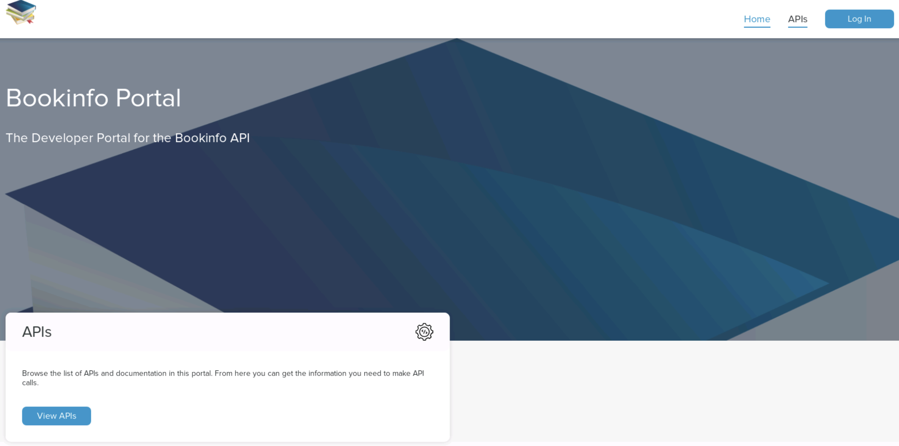
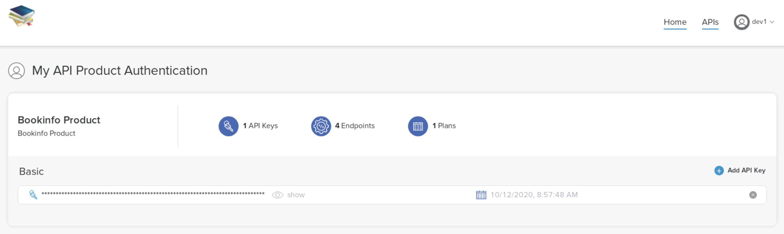
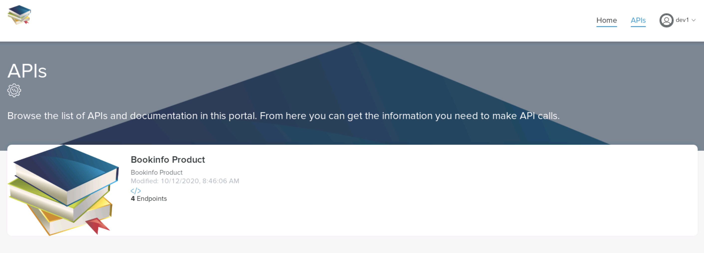

The following labs may depend on the previous labs, so you should either run the previous labs manually or execute the following command to run them in an automated fashion:

```
cat README.md | ../md-to-bash.sh | bash
```

## Lab 1 : Gloo Portal

The Gloo Portal provides a framework for managing the definitions of APIs, API client identity, and API policies on top of the Istio and Gloo Gateways. Vendors of API products can leverage the Developer Portal to secure, manage, and publish their APIs independent of the operations used to manage networking infrastructure.

We will deploy the Developer Portal on `cluster2`.

Run the following command to make `cluster2` the current cluster.

```bash
kubectl config use-context cluster2
```

Let's delete the `bookinfo-gateway` Istio gateway and create the default one:

```bash
kubectl --context cluster2 delete gateways.networking.istio.io bookinfo-gateway 

cat << EOF | kubectl apply -f-
apiVersion: networking.istio.io/v1beta1
kind: Gateway
metadata:
  labels:
    release: istio
  name: istio-ingressgateway
  namespace: istio-system
spec:
  selector:
    app: istio-ingressgateway
    istio: ingressgateway
  servers:
  - hosts:
    - '*'
    port:
      name: http
      number: 80
      protocol: HTTP
EOF
```

We'll use Helm to deploy the Developer portal:

```bash
helm repo add dev-portal https://storage.googleapis.com/dev-portal-helm
helm repo update
kubectl create namespace dev-portal
helm install dev-portal dev-portal/dev-portal -n dev-portal --set licenseKey.value=${PORTAL_LICENSE_KEY} --set istio.enabled=true --version=0.5.0
```

<!--bash
until kubectl get ns dev-portal
do
  sleep 1
done
-->

Use the following snippet to wait for the installation to finish:

```bash
until [ $(kubectl -n dev-portal get pods -o jsonpath='{range .items[*].status.containerStatuses[*]}{.ready}{"\n"}{end}' | grep true -c) -eq 7 ]; do
  echo "Waiting for all the Dev portal pods to become ready"
  sleep 1
done
```

Managing APIs with the Developer Portal happens through the use of two resources: the API Doc and API Product.

API Docs are Kubernetes Custom Resources which packages the API definitions maintained by the maintainers of an API. Each API Doc maps to a single Swagger Specification or set of gRPC descriptors. The APIs endpoints themselves are provided by backend services.

Let's create an API Doc using the Swagger Specification of the bookinfo demo app:

```bash
cat <<EOF | kubectl apply -f -
apiVersion: devportal.solo.io/v1alpha1
kind: APIDoc
metadata:
  name: bookinfo-schema
  namespace: default
spec:
  openApi:
    content:
      fetchUrl: https://raw.githubusercontent.com/istio/istio/1.7.4/samples/bookinfo/swagger.yaml
EOF
```

You can then check the status of the API Doc using the following command:

```bash
kubectl get apidoc -n default bookinfo-schema -oyaml
```

API Products are Kubernetes Custom Resources which bundle the APIs defined in API Docs into a product which can be exposed to ingress traffic as well as published on a Portal UI. The Product defines what API operations are being exposed, and the routing information to reach the services.

Let's create an API Product using the API Doc we've just created:

```bash
cat << EOF | kubectl apply -f-
apiVersion: devportal.solo.io/v1alpha1
kind: APIProduct
metadata:
  name: bookinfo-product
  namespace: default
spec:
  displayInfo: 
    description: Bookinfo Product
    title: Bookinfo Product
    image:
      fetchUrl: https://github.com/solo-io/workshops/raw/master/gloo-mesh/images/books.png
  versions:
  - name: v1
    apis:
    - apiDoc:
        name: bookinfo-schema
        namespace: default
    tags:
      stable: {}
    defaultRoute:
      inlineRoute:
        backends:
        - kube:
            name: productpage
            port: 9080
EOF
```

You can then check the status of the API Product using the following command:

```bash
kubectl get apiproducts.devportal.solo.io -n default bookinfo-product -oyaml
```

Now, we are going to create an Environment named dev using the domain api.example.com and expose v1 of our Bookinfo API Product.

```bash
cat << EOF | kubectl apply -f-
apiVersion: devportal.solo.io/v1alpha1
kind: Environment
metadata:
  name: dev
  namespace: default
spec:
  domains:
  - api.example.com
  displayInfo:
    description: This environment is meant for developers to deploy and test their APIs.
    displayName: Development
  apiProducts:
  - name: bookinfo-product
    namespace: default
    publishedVersions:
    - name: v1
EOF
```

You can then check the status of the Environment using the following command:

```bash
kubectl get environment.devportal.solo.io -n default dev -oyaml
```

When targeting Istio Gateways, the Developer Portal manages a set of Istio Custom Resource Definitions (CRDs) for you:

- VirtualServices: The Developer Portal generates an Istio VirtualService for each API Product. The VirtualService contains a single HTTP route for each API operation exposed in the product. Routes are named and their matchers are derived from the OpenAPI definition.
- DestinationRules: The Developer Portal generates an Istio DestinationRule for each unique Kubernetes Service Subset defined as an API Product destination.
- EnvoyFilters: The Developer Portal generates EnvoyFilters to configure the Istio Gateway (Envoy) to communicate with the Developer Portal ExtAuth amd RateLimit services. Additional EnvoyFilters are generated to apply per-route auth and rate limit policies.

So, you can now access the API using the command below:

```bash
curl -H "Host: api.example.com" http://172.18.0.230/api/v1/products
```

You should get an `RBAC: access denied` response. We have allowed the Istio Ingress Gateway of `cluster1` to access the `productpage` microservice, not the one of `cluster2`.

Let's update the corresponding AccessPolicy:

```bash
cat << EOF | kubectl --context mgmt apply -f -
apiVersion: networking.mesh.gloo.solo.io/v1alpha2
kind: AccessPolicy
metadata:
  namespace: gloo-mesh
  name: istio-ingressgateway
spec:
  sourceSelector:
  - kubeServiceAccountRefs:
      serviceAccounts:
        - name: istio-ingressgateway-service-account
          namespace: istio-system
          clusterName: cluster1
        - name: istio-ingressgateway-service-account
          namespace: istio-system
          clusterName: cluster2
  destinationSelector:
  - kubeServiceMatcher:
      namespaces:
      - default
      labels:
        service: productpage
EOF
```

Now, you should be able to access the API:

```bash
curl -H "Host: api.example.com" http://172.18.0.230/api/v1/products
```

Once a set of APIs have been bundled together in an API Product, those products can be published in a user-friendly interface through which developers can discover, browse, request access to, and interact with APIs. This is done by defining Portals, a custom resource which tells the Developer Portal how to publish a customized website containing an interactive catalog of those products.

Let's create a Portal:

```bash
cat <<EOF | kubectl apply -f -
apiVersion: devportal.solo.io/v1alpha1
kind: Portal
metadata:
  name: bookinfo-portal
  namespace: default
spec:
  displayName: Bookinfo Portal
  description: The Developer Portal for the Bookinfo API
  banner:
    fetchUrl: https://github.com/solo-io/workshops/raw/master/gloo-mesh/images/books.png
  favicon:
    fetchUrl: https://github.com/solo-io/workshops/raw/master/gloo-mesh/images/books.png
  primaryLogo:
    fetchUrl: https://github.com/solo-io/workshops/raw/master/gloo-mesh/images/books.png
  customStyling: {}
  staticPages: []
  domains:
  - portal.example.com
  publishedEnvironments:
  - name: dev
    namespace: default
EOF
```

You can then check the status of the API Product using the following command:

```bash
kubectl get portal -n default bookinfo-portal -oyaml
```

We need to update the `/etc/hosts` file to be able to access the Portal:

```bash
cat <<EOF | sudo tee -a /etc/hosts
172.18.0.230 api.example.com
172.18.0.230 portal.example.com
EOF
```

We are now going to create a user (dev1) and then add him to a group (developers). Users and groups are both stored as Custom Resources (CRs) in Kubernetes. Note that the Portal Web Application can be configured to use OIDC to authenticate users who access the Portal.

Here are the commands to create the user and the group:

```bash
pass=$(htpasswd -bnBC 10 "" password | tr -d ':\n')

kubectl create secret generic dev1-password \
  -n dev-portal --type=opaque \
  --from-literal=password=$pass

cat << EOF | kubectl apply -f-
apiVersion: devportal.solo.io/v1alpha1
kind: User
metadata:
  name: dev1
  namespace: dev-portal
spec:
  accessLevel: {}
  basicAuth:
    passwordSecretKey: password
    passwordSecretName: dev1-password
    passwordSecretNamespace: dev-portal
  username: dev1
EOF

kubectl get user dev1 -n dev-portal -oyaml

cat << EOF | kubectl apply -f-
apiVersion: devportal.solo.io/v1alpha1
kind: Group
metadata:
  name: developers
  namespace: dev-portal
spec:
  displayName: developers
  userSelector:
    matchLabels:
      groups.devportal.solo.io/dev-portal.developers: "true"
EOF

kubectl label user dev1 -n dev-portal groups.devportal.solo.io/dev-portal.developers="true"
```

We can now update the Environment to secure it and to define a rate limit:

```bash
cat << EOF | kubectl apply -f-
apiVersion: devportal.solo.io/v1alpha1
kind: Environment
metadata:
  name: dev
  namespace: default
spec:
  domains:
  - api.example.com
  displayInfo:
    description: This environment is meant for developers to deploy and test their APIs.
    displayName: Development
  apiProducts:
  - name: bookinfo-product
    namespace: default
    plans:
    - authPolicy:
        apiKey: {}
      displayName: Basic
      name: basic
      rateLimit:
        requestsPerUnit: 5
        unit: MINUTE
    publishedVersions:
    - name: v1
EOF
```

And finally, we can allow the group we created previously to access the Portal:

```bash
cat << EOF | kubectl apply -f-
apiVersion: devportal.solo.io/v1alpha1
kind: Group
metadata:
  name: developers
  namespace: dev-portal
spec:
  displayName: developers
  accessLevel:
    apiProducts:
    - name: bookinfo-product
      namespace: default
      environments:
      - name: dev
        namespace: default
        plans:
        - basic
    portals:
    - name: bookinfo-portal
      namespace: default
  userSelector:
    matchLabels:
      groups.devportal.solo.io/dev-portal.developers: "true"
EOF
```

Let's run the following command to allow access ot the admin UI of the Developer Portal:

```
kubectl port-forward -n dev-portal svc/admin-server 8000:8080
```

You can now access the admin UI at http://localhost:8000


Take the time to explore the UI and see the different components we have created.

The user Portal we have created is available at http://portal.example.com



Click on `Log In` and select `Log in using credentials`.

Log in with the user `dev1` and the password `password` and define a new password.

Click on `dev1` on the top right corner and select `API Keys`.

Click on `API Keys` again and Add an API Key.



Click on the key to copy the value to the clipboard.

Click on the `APIs` tab.



You can click on the `Bookinfo Product` and explore the API.

You can also test the API and use the `Authorize` button to set your API key.


But we're going to try it using curl:

So, we need to retrieve the API key first:

```
key=$(kubectl --context cluster2 get secret -l environments.devportal.solo.io=dev.default -n default -o jsonpath='{.items[0].data.api-key}' | base64 --decode)
```

Then, we can run the following command:

```
curl -H "Host: api.example.com" -H "api-key: ${key}" http://172.18.0.230/api/v1/products -v
```

You should get a result similar to:

```
*   Trying 172.18.0.230...
* TCP_NODELAY set
* Connected to 172.18.0.230 (172.18.0.230) port 80 (#0)
> GET /api/v1/products HTTP/1.1
> Host: api.example.com
> User-Agent: curl/7.52.1
> Accept: */*
> api-key: Y2E0MWQ0YWItYjA3Yy1lMjQyLTUwNzUtMTI4NGJlNTg2ZDhm
> 
< HTTP/1.1 200 OK
< content-type: application/json
< content-length: 395
< server: istio-envoy
< date: Mon, 12 Oct 2020 09:02:02 GMT
< x-envoy-upstream-service-time: 3
< 
* Curl_http_done: called premature == 0
* Connection #0 to host 172.18.0.230 left intact
[{"id": 0, "title": "The Comedy of Errors", "descriptionHtml": "<a href=\"https://en.wikipedia.org/wiki/The_Comedy_of_Errors\">Wikipedia Summary</a>: The Comedy of Errors is one of <b>William Shakespeare's</b> early plays. It is his shortest and one of his most farcical comedies, with a major part of the humour coming from slapstick and mistaken identity, in addition to puns and word play."}]
```

Now, execute the curl command again several times.

As soon as you reach the rate limit, you should get the following output:

```
*   Trying 172.18.0.230...
* TCP_NODELAY set
* Connected to 172.18.0.230 (172.18.0.230) port 80 (#0)
> GET /api/v1/products HTTP/1.1
> Host: api.example.com
> User-Agent: curl/7.52.1
> Accept: */*
> api-key: Y2E0MWQ0YWItYjA3Yy1lMjQyLTUwNzUtMTI4NGJlNTg2ZDhm
> 
< HTTP/1.1 429 Too Many Requests
< x-envoy-ratelimited: true
< date: Mon, 12 Oct 2020 09:03:16 GMT
< server: istio-envoy
< content-length: 0
< 
* Curl_http_done: called premature == 0
* Connection #0 to host 172.18.0.230 left intact
```

## Lab 2 : VM support

In Istio 1.8, support for running workloads in the Service Mesh on VMs has been improved.

So, let's see how we can configure our VM to be part of the Mesh.

We are going to use a mix of the instructions provided on these 2 pages:
- [Virtual Machine Installation](https://istio.io/latest/docs/setup/install/virtual-machine/)
- [Virtual Machines in Multi-Network Meshes](https://istio.io/latest/docs/setup/install/virtual-machine/)

Run the following command to make `cluster1` the current cluster.

```bash
kubectl config use-context cluster1
```

First of all, we need to define a few environment variables:

```bash
VM_APP=$(hostname)
VM_NAMESPACE=virtualmachines
WORK_DIR=vm
SERVICE_ACCOUNT=$(hostname)
```

Then, we need to create a directory where we'll store all the files that need to be used in our VM:

```bash
cd /home/solo/workshops/gloo-mesh
rm -rf ${WORK_DIR}
mkdir -p ${WORK_DIR}
```

Expose the port 15012 and 15017 of istiod through the Istio Ingress Gateway:

```bash
kubectl apply -f - <<EOF
apiVersion: networking.istio.io/v1alpha3
kind: Gateway
metadata:
  name: istiod-gateway
  namespace: istio-system
spec:
  selector:
    istio: ingressgateway
  servers:
    - port:
        name: tcp-istiod
        number: 15012
        protocol: TCP
      hosts:
        - "*"
    - port:
        name: tcp-istiodwebhook
        number: 15017
        protocol: TCP
      hosts:
        - "*"
---
apiVersion: networking.istio.io/v1alpha3
kind: VirtualService
metadata:
  name: istiod-vs
  namespace: istio-system
spec:
  hosts:
  - istiod.istio-system.svc.cluster.local
  gateways:
  - istiod-gateway
  tcp:
  - match:
    - port: 15012
    route:
    - destination:
        host: istiod.istio-system.svc.cluster.local
        port:
          number: 15012
  - match:
    - port: 15017
    route:
    - destination:
        host: istiod.istio-system.svc.cluster.local
        port:
          number: 443
---
apiVersion: networking.istio.io/v1alpha3
kind: DestinationRule
metadata:
  name: istiod-dr
  namespace: istio-system
spec:
  host: istiod.istio-system.svc.cluster.local
  trafficPolicy:
    portLevelSettings:
    - port:
        number: 15012
      tls:
        mode: DISABLE
    - port:
        number: 15017
      tls:
        mode: DISABLE
EOF
```

Create the namespace that will host the virtual machine:

```bash
kubectl create namespace "${VM_NAMESPACE}"
```

Create a serviceaccount for the virtual machine:

```bash
kubectl create serviceaccount "${SERVICE_ACCOUNT}" -n "${VM_NAMESPACE}"
```

Create a template WorkloadGroup for the VM:

```bash
./istio-1.8.2/bin/istioctl x workload group create --name "${VM_APP}" --namespace "${VM_NAMESPACE}" --labels app="${VM_APP}" --serviceAccount "${SERVICE_ACCOUNT}" > workloadgroup.yaml
```

Use the istioctl x workload entry command to generate:

- cluster.env: Contains metadata that identifies what namespace, service account, network CIDR and (optionally) what inbound ports to capture.
- istio-token: A Kubernetes token used to get certs from the CA.
- mesh.yaml: Provides additional Istio metadata including, network name, trust domain and other values.
- root-cert.pem: The root certificate used to authenticate.
- hosts: An addendum to /etc/hosts that the proxy will use to reach istiod for xDS.*

```bash
./istio-1.8.2/bin/istioctl x workload entry configure -f workloadgroup.yaml -o "${WORK_DIR}"
```

Update the `cluster.env` file to handle the incoming traffic on port 9999:

```bash
cat << EOF >> "${WORK_DIR}"/cluster.env
ISTIO_INBOUND_PORTS='9999'
ISTIO_META_POD_PORTS='[{"name":"http","containerPort":9999,"protocol":"http"}]'
EOF
```

Add an entry in the hosts file to resolve the address of istiod by the IP address of the Istio Ingress Gateway:

```bash
echo "172.18.0.220 istiod.istio-system.svc" > "${WORK_DIR}"/hosts
```

Run the following command to make sure addresses with the `.local` suffix won't be used by the Avahi daemon:

```bash
sudo sed -i 's/#domain-name=local/domain-name=.alocal/' /etc/avahi/avahi-daemon.conf
sudo service avahi-daemon restart
```

Install the root certificate at /var/run/secrets/istio:

```bash
sudo mkdir -p /etc/certs
sudo cp "${WORK_DIR}"/root-cert.pem /etc/certs/root-cert.pem
```

Install the token at /var/run/secrets/tokens:

```bash
sudo  mkdir -p /var/run/secrets/tokens
sudo cp "${WORK_DIR}"/istio-token /var/run/secrets/tokens/istio-token
```

Install the deb package containing the Istio virtual machine integration runtime:

```bash
curl -LO https://storage.googleapis.com/istio-release/releases/1.8.2/deb/istio-sidecar.deb
sudo dpkg -i istio-sidecar.deb
```

Install cluster.env within the directory /var/lib/istio/envoy/:

```bash
sudo cp "${WORK_DIR}"/cluster.env /var/lib/istio/envoy/cluster.env
```

Install the Mesh Config to /etc/istio/config/mesh:

```bash
sudo cp "${WORK_DIR}"/mesh.yaml /etc/istio/config/mesh
```

Add the istiod host to /etc/hosts:

```bash
sudo sh -c "cat "${WORK_DIR}"/hosts >> /etc/hosts"
```

Transfer ownership to the Istio proxy:

```bash
sudo mkdir -p /etc/istio/proxy
sudo chown -R istio-proxy /var/lib/istio /etc/certs /etc/istio/proxy /etc/istio/config /var/run/secrets /etc/certs/root-cert.pem
```

Create a Gateway resource that allows application traffic from the VMs to route correctly:

```bash
kubectl apply -f - <<EOF
apiVersion: networking.istio.io/v1alpha3
kind: Gateway
metadata:
  name: cross-network-gateway
  namespace: istio-system
spec:
  selector:
    istio: ingressgateway
  servers:
  - port:
      number: 15443
      name: tls
      protocol: TLS
    tls:
      mode: AUTO_PASSTHROUGH
    hosts:
    - "*.local"
EOF
```

Start the Istio agent:

```bash
sudo systemctl start istio
```


Create a Gloo Mesh Access Policy:

```bash
cat << EOF | kubectl --context mgmt apply -f -
apiVersion: networking.mesh.gloo.solo.io/v1alpha2
kind: AccessPolicy
metadata:
  namespace: gloo-mesh
  name: vm
spec:
  sourceSelector:
  - kubeServiceAccountRefs:
      serviceAccounts:
        - name: ${SERVICE_ACCOUNT}
          namespace: virtualmachines
          clusterName: cluster1
  destinationSelector:
  - kubeServiceMatcher:
      namespaces:
      - default
      labels:
        service: productpage
  - kubeServiceMatcher:
      namespaces:
      - default
      labels:
        service: reviews
EOF
```

Take a look at the Envoy clusters:

```bash
curl -v localhost:15000/clusters | grep productpage.default.svc.cluster.local
```

It should return several lines similar to the one below:

```
outbound|9080||productpage.default.svc.cluster.local::172.18.0.220:443::cx_active::0
```

You can see that the IP address corresponds to the IP address of the Istio Ingress Gateway.

You should now be able to reach the product page application from the VM:

```bash
curl -I productpage.default.svc.cluster.local:9080/productpage
```

Now, let's do the opposite and access an application running in the VM from a Pod.

Run the following command in a separate tab:

<!--bash
python -m SimpleHTTPServer 9999 2>&1 &
-->

```
python -m SimpleHTTPServer 9999
```

Expose the app:

```bash
cat <<EOF | kubectl apply -f -
apiVersion: v1
kind: Service
metadata:
  name: ${VM_APP}
  namespace: virtualmachines
  labels:
    app: ${VM_APP}
spec:
  ports:
  - port: 9999
    name: http-vm
    targetPort: 9999
  selector:
    app: ${VM_APP}
EOF

cat <<EOF | kubectl apply -f -
apiVersion: networking.istio.io/v1beta1
kind: WorkloadEntry
metadata:
  name: ${VM_APP}
  namespace: virtualmachines
spec:
  network: vm-network
  address: $(hostname -i)
  labels:
    app: ${VM_APP}
  serviceAccount: ${SERVICE_ACCOUNT}
EOF

### Not needed
cat <<EOF | kubectl apply -f -
apiVersion: networking.istio.io/v1beta1
kind: ServiceEntry
metadata:
  name: ${VM_APP}
  namespace: virtualmachines
spec:
  hosts:
  - ${VM_APP}.virtualmachines.svc.cluster.local
  location: MESH_INTERNAL
  ports:
  - number: 9999
    name: http-vm
    protocol: HTTP
    targetPort: 9999
  resolution: STATIC
  workloadSelector:
    labels:
      app: ${VM_APP}
EOF
```

Create a Gloo Mesh Traffic Target for the VM:

```bash
cat << EOF | kubectl --context mgmt apply -f -
apiVersion: discovery.mesh.gloo.solo.io/v1alpha2
kind: TrafficTarget
metadata:
  name: ${VM_APP}-virtualmachines-cluster1
  namespace: gloo-mesh
spec:
  kubeService:
    labels:
      app: ${VM_APP}
    ports:
    - name: http-vm
      port: 9999
      protocol: TCP
    ref:
      clusterName: cluster1
      name: ${VM_APP}
      namespace: virtualmachines
    workloadSelectorLabels:
      app: ${VM_APP}
  mesh:
    name: istiod-istio-system-cluster1
    namespace: gloo-mesh
EOF
```

```bash
cat << EOF | kubectl --context mgmt apply -f -
apiVersion: networking.mesh.gloo.solo.io/v1alpha2
kind: AccessPolicy
metadata:
  namespace: gloo-mesh
  name: to-vm
spec:
  sourceSelector:
  - kubeServiceAccountRefs:
      serviceAccounts:
        - name: bookinfo-productpage
          namespace: default
          clusterName: cluster1
  destinationSelector:
  - kubeServiceRefs:
      services:
        - name: ${VM_APP}
          namespace: virtualmachines
          clusterName: cluster1
EOF
```

Try to access the app from the `productpage` Pod:

```bash
kubectl exec -it $(kubectl get pods -l app=productpage -o jsonpath='{.items[0].metadata.name}') -- python -c "import requests; r = requests.get('http://${VM_APP}.virtualmachines.svc.cluster.local:9999'); print(r.text)"
```

## Lab 3 : Securing the Edge

We've seen in the previous labs how the Istio Ingressgateway can be used for multi-cluster traffic and failover.

While the Istio Ingressgateway can also be used to expose your applications to the outside world, it doesn't provide all the features most of the people need (external authenticaion, rate limiting, ...).

Gloo is a feature-rich next-generation API gateway which provides these features. Gloo is exceptional in its function-level routing; its support for legacy apps, microservices and serverless; its discovery capabilities; its numerous features; and its tight integration with leading open-source projects. Gloo is uniquely designed to support hybrid applications, in which multiple technologies, architectures, protocols, and clouds can coexist.


Let's deploy Gloo on the first cluster:

```bash
kubectl config use-context cluster1
glooctl upgrade --release=v1.6.8
helm repo add glooe http://storage.googleapis.com/gloo-ee-helm
helm install gloo glooe/gloo-ee --namespace gloo-system --version 1.6.12 \
  --create-namespace --set global.istioSDS.enabled=true --set-string license_key=$LICENSE_KEY
```

Use the following commands to wait for the Gloo components to be deployed:

<!--bash
until kubectl --context cluster1 get ns gloo-system
do
  sleep 1
done
-->

```bash
until [ $(kubectl --context cluster1 -n gloo-system get pods -o jsonpath='{range .items[*].status.containerStatuses[*]}{.ready}{"\n"}{end}' | grep false -c) -eq 0 ]; do
  echo "Waiting for all the gloo-system pods to become ready on cluster cluster1"
  sleep 1
done
```

Serving as the Ingress for an Istio cluster – without compromising on security – means supporting mutual TLS (mTLS) communication between Gloo and the rest of the cluster. Mutual TLS means that the client proves its identity to the server (in addition to the server proving its identity to the client, which happens in regular TLS).

For Gloo to successfully send requests to an Istio Upstream with mTLS enabled, we need to add the Istio mTLS secret to the gateway-proxy pod. The secret allows Gloo to authenticate with the Upstream service. We will also add an SDS server container to the pod, to handle cert rotation when Istio updates its certs.

Everything is done automatically when we use the `--set global.istioSDS.enabled=true` option during the Gloo Edge installation, but we still need to update 2 environment variables to match the values we used when we deployed Istio.

```bash
kubectl set env deployments/gateway-proxy -n gloo-system --containers=istio-proxy ISTIO_META_MESH_ID=mesh1 ISTIO_META_CLUSTER_ID=cluster1
```

It will restart a few Pods, so you can use the following commands to wait for all the Pods to be ready:

<!--bash
kubectl --context cluster1 -n istio-system delete pod -l app=istio-ingressgateway
-->

```bash
until [ $(kubectl --context cluster1 get pods -A -o jsonpath='{range .items[*].status.containerStatuses[*]}{.ready}{"\n"}{end}' | grep false -c) -eq 0 ]; do
  echo "Waiting for all the pods to become ready on cluster cluster1"
  sleep 1
done
```
Finally, you must disable function discovery before editing the Upstream to prevent your change from being overwritten by Gloo:

```bash
kubectl --context cluster1 label namespace default discovery.solo.io/function_discovery=disabled
```

To allow Gloo to access the `productpage` service, you need to add the SSL configuration needed in the corresponding Upstream.

```bash
glooctl istio enable-mtls --upstream default-productpage-9080
````

It will add the following information to the Upstream object:

```
  sslConfig:
    alpn_protocols:
    - istio
    sds:
      targetUri: 127.0.0.1:8234
      certificatesSecretName: istio_server_cert
      validationContextName: istio_validation_context
      clusterName: gateway_proxy_sds
```

You can now make the productpage accessible to the outside world using the following command:

```bash
glooctl add route --name prodpage --namespace gloo-system --path-prefix / --dest-name default-productpage-9080 --dest-namespace gloo-system
```

This command has created a Gloo VirtualService. You can also manage Gloo object using kubectl.

```bash
kubectl --context cluster1 -n gloo-system get virtualservices.gateway.solo.io prodpage -o yaml
```

You should get an output similar to the one below:

```
apiVersion: gateway.solo.io/v1
kind: VirtualService
metadata:
  creationTimestamp: "2020-09-09T09:50:16Z"
  generation: 3
...
  name: prodpage
  namespace: gloo-system
  resourceVersion: "167507"
  selfLink: /apis/gateway.solo.io/v1/namespaces/gloo-system/virtualservices/prodpage
  uid: 3ddc77d7-048b-4d9e-a8d0-51713ebe5ac6
spec:
  virtualHost:
    domains:
    - '*'
    routes:
    - matchers:
      - prefix: /
      routeAction:
        single:
          upstream:
            name: default-productpage-9080
            namespace: gloo-system
status:
  reportedBy: gateway
  state: 1
  subresourceStatuses:
    '*v1.Proxy.gloo-system.gateway-proxy':
      reportedBy: gloo
      state: 1
```

Check that all the Pods are running in the `default` namespace:

```bash
kubectl --context cluster1 get pods
```

When the pods are all running, the bookinfo app is accessible via the Gloo gateway using the `172.18.0.221` IP address.

Go to this new <a href="http://172.18.0.221/productpage" target="_blank">bookinfo app URL</a> to see if you can access the `productpage` microservice using Gloo.

As you might have guessed, this operation fails.  While you can access the Gloo endpoint, Gloo isn't yet allowed to talk to the `productpage` microservice.

Let's create an `AccessPolicy` to remedy that:

```bash
cat << EOF | kubectl --context mgmt apply -f -
apiVersion: networking.mesh.gloo.solo.io/v1alpha2
kind: AccessPolicy
metadata:
  namespace: gloo-mesh
  name: gloo
spec:
  sourceSelector:
  - kubeServiceAccountRefs:
      serviceAccounts:
        - name: gateway-proxy
          namespace: gloo-system
          clusterName: cluster1
  destinationSelector:
  - kubeServiceMatcher:
      namespaces:
      - default
      labels:
        service: productpage
EOF
```

Now let's see what we can do with Gloo that we couldn't do with the Istio Ingressgateway.

Let's start with External Authentication. Gloo provides many options (OAuth, API keys, ...), but to keep it simple, we'll setup Basic Authentication.

We will update the Virtual Service so that only requests by the user `user` with password `password` are allowed.

We need to create the following AuthConfig:

```bash
kubectl --context cluster1 apply -f - <<EOF
apiVersion: enterprise.gloo.solo.io/v1
kind: AuthConfig
metadata:
  name: basic-auth
  namespace: gloo-system
spec:
  configs:
  - basicAuth:
      apr:
        users:
          user:
            salt: "TYiryv0/"
            hashedPassword: "8BvzLUO9IfGPGGsPnAgSu1"
EOF
```

> NOTE:  For inquisitive learners who wants to understand how the above `AuthConfig` establishes a username / password combination of `user` / `password`:  
> 
> Gloo expects password to be hashed and salted using the `APR1` format.  Passwords in that format follow this pattern:
>
>```
>$apr1$SALT$HASHED_PASSWORD
>```
>
>To generate such a password you can use the htpasswd utility:
>
>```
>htpasswd -nbm user password
>```
>
>Running the above command returns a string like `user:$apr1$TYiryv0/$8BvzLUO9IfGPGGsPnAgSu1`, where:
>
>- `TYiryv0/` is the salt
>- `8BvzLUO9IfGPGGsPnAgSu1` is the hashed password.

And we can patch the Gloo VirtualService as follow:

```bash
cat > virtualservice-patch.yaml <<'EOF'
spec:
  virtualHost:   
    options:
      extauth:
        configRef:
          name: basic-auth
          namespace: gloo-system
EOF

kubectl --context cluster1 -n gloo-system patch virtualservice prodpage --type=merge --patch "$(cat virtualservice-patch.yaml)"
```

If you refresh the web page, it will ask you for the credentials.

It was just a simple example. You can learn more about the Gloo features in the [documentation](https://docs.solo.io/gloo/latest/guides/).