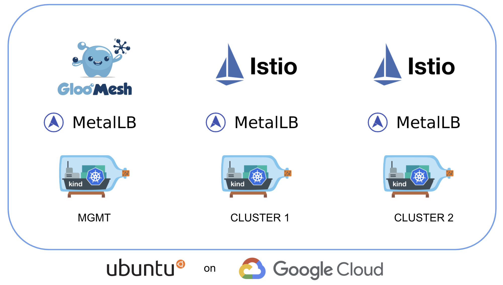
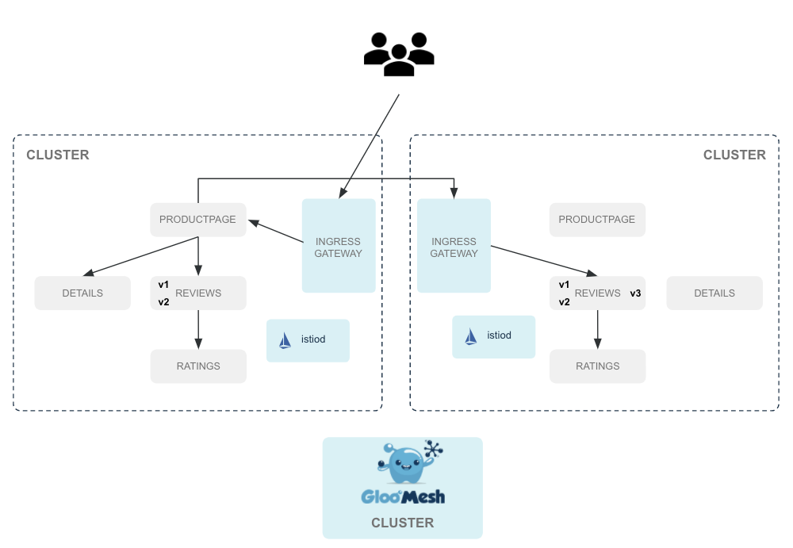
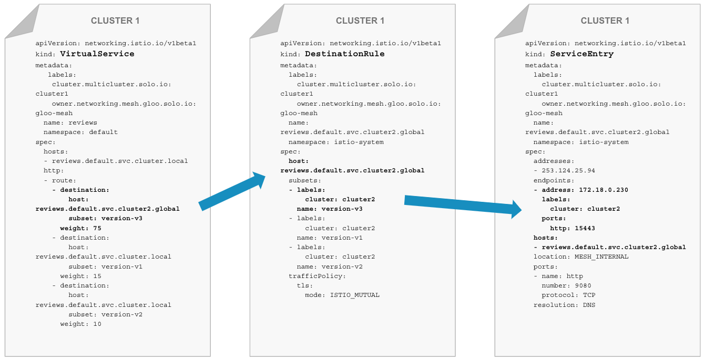
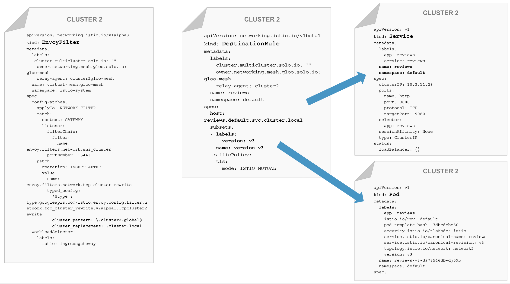
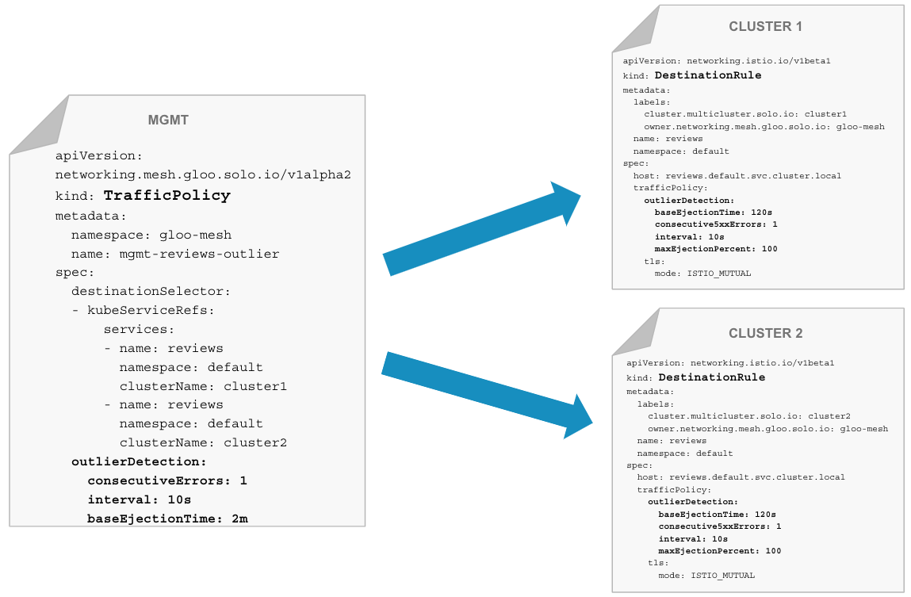
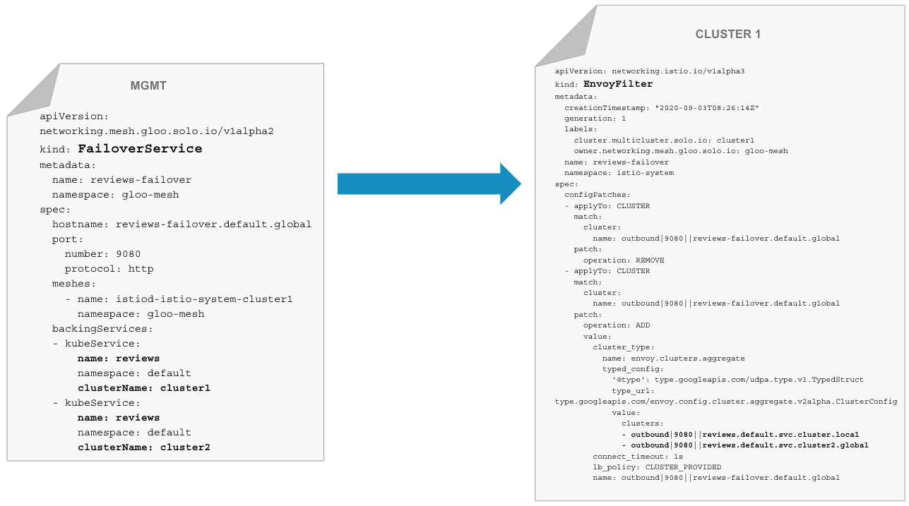
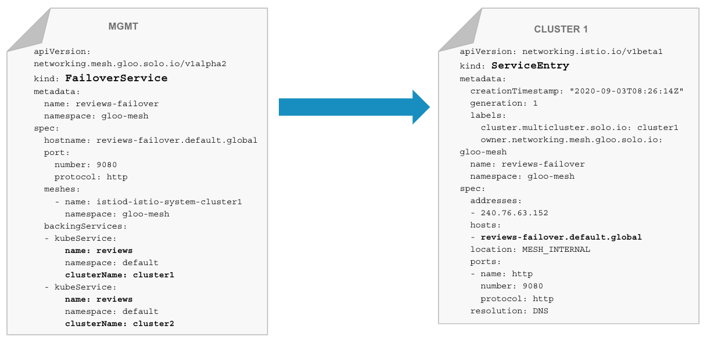
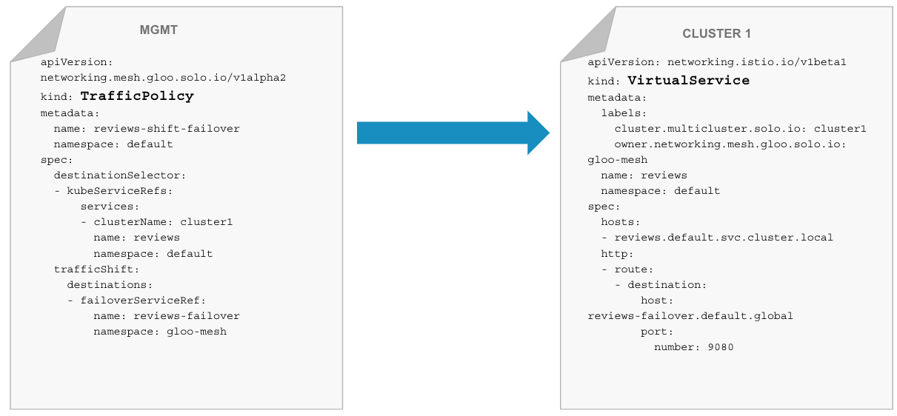
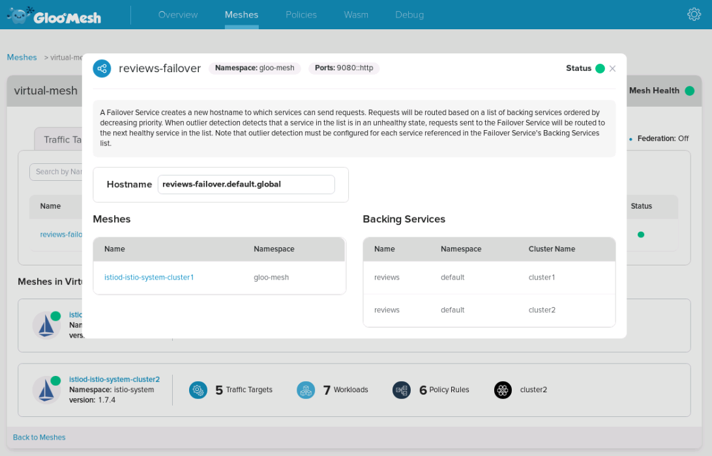

# Gloo Mesh workshop

[Gloo Mesh](https://docs.solo.io/gloo-mesh/latest/) is a Kubernetes-native management plane that enables configuration and operational management of multiple heterogeneous service meshes across multiple clusters through a unified API. The Gloo Mesh API integrates with the leading service meshes and abstracts away differences between their disparate API's, allowing users to configure a set of different service meshes through a single API. Gloo Mesh is engineered with a focus on its utility as an operational management tool, providing both graphical and command line UIs, observability features, and debugging tools.

The goal of this workshop is to show several unique features of the Gloo Mesh in action:

- Mesh Discovery
- Unified Identity / Trust domain
- Access control
- Multi-cluster traffic
- Failover

## Lab environment

Gloo Mesh can be run in its own cluster or co-located with an existing mesh.  In this exercise, Gloo Mesh will run in its own dedicated management cluster, while the two managed Istio meshes will run in separate clusters.



## Lab 1 : Deploy your Kubernetes clusters

From the terminal go to the `/home/solo/workshops/gloo-mesh` directory:

```
cd /home/solo/workshops/gloo-mesh
```

Run the following commands to deploy three Kubernetes clusters using [Kind](https://kind.sigs.k8s.io/):

```bash
../scripts/deploy.sh 1 mgmt
../scripts/deploy.sh 2 cluster1
../scripts/deploy.sh 3 cluster2
```

Then run the following commands to wait for all the Pods to be ready:

```bash
../scripts/check.sh mgmt
../scripts/check.sh cluster1
../scripts/check.sh cluster2
```

**Note:** If you run the `check.sh` script immediately after the `deploy.sh` script, you may see a jsonpath error. If that happens, simply wait a few seconds and try again.

Once the `check.sh` script completes, when you execute the `kubectl get pods -A` command, you should see the following:

```
NAMESPACE            NAME                                          READY   STATUS    RESTARTS   AGE
kube-system          calico-kube-controllers-59d85c5c84-sbk4k      1/1     Running   0          4h26m
kube-system          calico-node-przxs                             1/1     Running   0          4h26m
kube-system          coredns-6955765f44-ln8f5                      1/1     Running   0          4h26m
kube-system          coredns-6955765f44-s7xxx                      1/1     Running   0          4h26m
kube-system          etcd-cluster1-control-plane                   1/1     Running   0          4h27m
kube-system          kube-apiserver-cluster1-control-plane         1/1     Running   0          4h27m
kube-system          kube-controller-manager-cluster1-control-plane1/1     Running   0          4h27m
kube-system          kube-proxy-ksvzw                              1/1     Running   0          4h26m
kube-system          kube-scheduler-cluster1-control-plane         1/1     Running   0          4h27m
local-path-storage   local-path-provisioner-58f6947c7-lfmdx        1/1     Running   0          4h26m
metallb-system       controller-5c9894b5cd-cn9x2                   1/1     Running   0          4h26m
metallb-system       speaker-d7jkp                                 1/1     Running   0          4h26m
```

Note that this represents the output just for `cluster2`, although the pod footprint for all three clusters should look similar at this point.

You can see that your currently connected to this cluster by executing the `kubectl config get-contexts` command:

```
CURRENT   NAME         CLUSTER         AUTHINFO   NAMESPACE  
          cluster1     kind-cluster1   cluster1
*         cluster2     kind-cluster2   cluster2
          mgmt         kind-mgmt       kind-mgmt 
```

Run the following command to make `mgmt` the current cluster.

```bash
kubectl config use-context mgmt
```

## Lab 2 : Deploy Gloo Mesh and register the clusters

First of all, you need to install the *meshctl* CLI:

```bash
curl -sL https://run.solo.io/meshctl/install | GLOO_MESH_VERSION=v0.12.2 sh -
export PATH=$HOME/.gloo-mesh/bin:$PATH
```

Gloo Mesh Enterprise is adding unique features on top of Gloo Mesh Open Source (RBAC, UI, WASM, ...).

Run the following commands to deploy Gloo Mesh Enterprise:

```bash
meshctl install enterprise --license=${GLOO_MESH_LICENSE_KEY} --version=0.5.1

kubectl --context mgmt -n gloo-mesh rollout status deploy/discovery
kubectl --context mgmt -n gloo-mesh rollout status deploy/enterprise-extender
kubectl --context mgmt -n gloo-mesh rollout status deploy/gloo-mesh-apiserver
kubectl --context mgmt -n gloo-mesh rollout status deploy/networking
kubectl --context mgmt -n gloo-mesh rollout status deploy/rbac-webhook
```

Then, you need to register the two other clusters:

```bash
meshctl cluster register \
  --cluster-name cluster1 \
  --mgmt-context mgmt \
  --remote-context cluster1 \
  --install-wasm-agent --wasm-agent-chart-file https://storage.googleapis.com/gloo-mesh-enterprise/wasm-agent/wasm-agent-0.4.0.tgz

meshctl cluster register \
  --cluster-name cluster2 \
  --mgmt-context mgmt \
  --remote-context cluster2 \
  --install-wasm-agent --wasm-agent-chart-file https://storage.googleapis.com/gloo-mesh-enterprise/wasm-agent/wasm-agent-0.4.0.tgz
```

You can list the registered cluster using the following command:

```bash
kubectl get kubernetescluster -n gloo-mesh
```

You should get the following output:

```
NAME       AGE
cluster1   27s
cluster2   23s
```

## Lab 3 : Deploy Istio on both clusters

Download istio 1.8.2:

```bash
curl -L https://istio.io/downloadIstio | ISTIO_VERSION=1.8.2 sh -
```

Now let's deploy Istio on the first cluster:

```bash
./istio-1.8.2/bin/istioctl --context cluster1 operator init

kubectl --context cluster1 create ns istio-system

cat << EOF | kubectl --context cluster1 apply -f -
apiVersion: install.istio.io/v1alpha1
kind: IstioOperator
metadata:
  name: istiocontrolplane-default
  namespace: istio-system
spec:
  profile: default
  addonComponents:
    istiocoredns:
      enabled: true
  meshConfig:
    accessLogFile: /dev/stdout
    enableAutoMtls: true
    defaultConfig:
      proxyMetadata:
        ISTIO_META_DNS_CAPTURE: "true"
        ISTIO_META_DNS_AUTO_ALLOCATE: "true"
  values:
    global:
      meshID: mesh1
      multiCluster:
        clusterName: cluster1
      trustDomain: cluster1
      network: network1
      meshNetworks:
        network1:
          endpoints:
          - fromRegistry: cluster1
          gateways:
          - registryServiceName: istio-ingressgateway.istio-system.svc.cluster.local
            port: 443
        vm-network:
  components:
    ingressGateways:
    - name: istio-ingressgateway
      label:
        topology.istio.io/network: network1
      enabled: true
      k8s:
        env:
          # sni-dnat adds the clusters required for AUTO_PASSTHROUGH mode
          - name: ISTIO_META_ROUTER_MODE
            value: "sni-dnat"
          # traffic through this gateway should be routed inside the network
          - name: ISTIO_META_REQUESTED_NETWORK_VIEW
            value: network1
        service:
          ports:
            - name: http2
              port: 80
              targetPort: 8080
            - name: https
              port: 443
              targetPort: 8443
            - name: tcp-status-port
              port: 15021
              targetPort: 15021
            - name: tls
              port: 15443
              targetPort: 15443
            - name: tcp-istiod
              port: 15012
              targetPort: 15012
            - name: tcp-webhook
              port: 15017
              targetPort: 15017
    pilot:
      k8s:
        env:
          - name: PILOT_SKIP_VALIDATE_TRUST_DOMAIN
            value: "true"
EOF
```

And deploy Istio on the second cluster:

```bash
./istio-1.8.2/bin/istioctl --context cluster2 operator init

kubectl --context cluster2 create ns istio-system

cat << EOF | kubectl --context cluster2 apply -f -
apiVersion: install.istio.io/v1alpha1
kind: IstioOperator
metadata:
  name: istiocontrolplane-default
  namespace: istio-system
spec:
  profile: default
  addonComponents:
    istiocoredns:
      enabled: true
  meshConfig:
    accessLogFile: /dev/stdout
    enableAutoMtls: true
    defaultConfig:
      proxyMetadata:
        ISTIO_META_DNS_CAPTURE: "true"
        ISTIO_META_DNS_AUTO_ALLOCATE: "true"
  values:
    global:
      meshID: mesh1
      multiCluster:
        clusterName: cluster2
      trustDomain: cluster2
      network: network2
      meshNetworks:
        network2:
          endpoints:
          - fromRegistry: cluster2
          gateways:
          - registryServiceName: istio-ingressgateway.istio-system.svc.cluster.local
            port: 443
        vm-network:
  components:
    ingressGateways:
    - name: istio-ingressgateway
      label:
        topology.istio.io/network: network2
      enabled: true
      k8s:
        env:
          # sni-dnat adds the clusters required for AUTO_PASSTHROUGH mode
          - name: ISTIO_META_ROUTER_MODE
            value: "sni-dnat"
          # traffic through this gateway should be routed inside the network
          - name: ISTIO_META_REQUESTED_NETWORK_VIEW
            value: network2
        service:
          ports:
            - name: http2
              port: 80
              targetPort: 8080
            - name: https
              port: 443
              targetPort: 8443
            - name: tcp-status-port
              port: 15021
              targetPort: 15021
            - name: tls
              port: 15443
              targetPort: 15443
            - name: tcp-istiod
              port: 15012
              targetPort: 15012
            - name: tcp-webhook
              port: 15017
              targetPort: 15017
    pilot:
      k8s:
        env:
          - name: PILOT_SKIP_VALIDATE_TRUST_DOMAIN
            value: "true"
EOF
```

<!--bash
until kubectl --context cluster1 get ns istio-system
do
  sleep 1
done

until [ $(kubectl --context cluster1 -n istio-system get pods -o jsonpath='{range .items[*].status.containerStatuses[*]}{.ready}{"\n"}{end}' | grep true -c) -eq 4 ]; do
  echo "Waiting for all the Istio pods to become ready"
  sleep 1
done

until kubectl --context cluster2 get ns istio-system
do
  sleep 1
done

until [ $(kubectl --context cluster2 -n istio-system get pods -o jsonpath='{range .items[*].status.containerStatuses[*]}{.ready}{"\n"}{end}' | grep true -c) -eq 4 ]; do
  echo "Waiting for all the Istio pods to become ready"
  sleep 1
done
-->

Run the following command until all the Istio Pods are ready:

```
kubectl --context cluster1 get pods -n istio-system
```

When they are ready, you should get this output:

```
NAME                                    READY   STATUS    RESTARTS   AGE
istio-ingressgateway-5c7759c8cb-52r2j   1/1     Running   0          22s
istiocoredns-685b5c449f-77psm           2/2     Running   0          22s
istiod-7884b57b4c-rvr2c                 1/1     Running   0          30s
```

Check the status on the second cluster using `kubectl --context cluster2 get pods -n istio-system`

## Lab 4 : Deploy the Bookinfo demo app

Run the following commands to deploy the bookinfo app on `cluster1`:

```bash
kubectl --context cluster1 label namespace default istio-injection=enabled
# deploy bookinfo application components for all versions less than v3
kubectl --context cluster1 apply -f https://raw.githubusercontent.com/istio/istio/1.8.2/samples/bookinfo/platform/kube/bookinfo.yaml -l 'app,version notin (v3)'
# deploy all bookinfo service accounts
kubectl --context cluster1 apply -f https://raw.githubusercontent.com/istio/istio/1.8.2/samples/bookinfo/platform/kube/bookinfo.yaml -l 'account'
# configure ingress gateway to access bookinfo
kubectl --context cluster1 apply -f https://raw.githubusercontent.com/istio/istio/1.8.2/samples/bookinfo/networking/bookinfo-gateway.yaml
```

You can check that the app is running using `kubectl --context cluster1 get pods`:

```
NAME                              READY   STATUS    RESTARTS   AGE
details-v1-558b8b4b76-w9qp8       2/2     Running   0          2m33s
productpage-v1-6987489c74-54lvk   2/2     Running   0          2m34s
ratings-v1-7dc98c7588-pgsxv       2/2     Running   0          2m34s
reviews-v1-7f99cc4496-lwtsr       2/2     Running   0          2m34s
reviews-v2-7d79d5bd5d-mpsk2       2/2     Running   0          2m34s
```

As you can see, it deployed the `v1` and `v2` versions of the `reviews` microservice.  But as expected, it did not deploy `v3` of `reviews`.

Now, run the following commands to deploy the bookinfo app on `cluster2`:

```bash
kubectl --context cluster2 label namespace default istio-injection=enabled
# deploy all bookinfo service accounts and application components for all versions
kubectl --context cluster2 apply -f https://raw.githubusercontent.com/istio/istio/1.8.2/samples/bookinfo/platform/kube/bookinfo.yaml
# configure ingress gateway to access bookinfo
kubectl --context cluster2 apply -f https://raw.githubusercontent.com/istio/istio/1.8.2/samples/bookinfo/networking/bookinfo-gateway.yaml
```

You can check that the app is running using `kubectl --context cluster2 get pods`:

```
NAME                              READY   STATUS    RESTARTS   AGE
details-v1-558b8b4b76-gs9z2       2/2     Running   0          2m22s
productpage-v1-6987489c74-x45vd   2/2     Running   0          2m21s
ratings-v1-7dc98c7588-2n6bg       2/2     Running   0          2m21s
reviews-v1-7f99cc4496-4r48m       2/2     Running   0          2m21s
reviews-v2-7d79d5bd5d-cx9lp       2/2     Running   0          2m22s
reviews-v3-7dbcdcbc56-trjdx       2/2     Running   0          2m22s
```

As you can see, it deployed all three versions of the `reviews` microservice.


Open the <a href="http://172.18.0.220/productpage" target="_blank">bookinfo app</a> with your web browser.


As you can see, you can access the Bookinfo demo app.

<!--bash
until [ $(kubectl --context cluster1 get pods -o jsonpath='{range .items[*].status.containerStatuses[*]}{.ready}{"\n"}{end}' | grep false -c) -eq 0 ]; do
  echo "Waiting for all the pods of the default namespace to become ready"
  sleep 1
done

until [ $(kubectl --context cluster2 get pods -o jsonpath='{range .items[*].status.containerStatuses[*]}{.ready}{"\n"}{end}' | grep false -c) -eq 0 ]; do
  echo "Waiting for all the pods of the default namespace to become ready"
  sleep 1
done
-->

## Lab 5 : Create the Virtual Mesh

Gloo Mesh can help unify the root identity between multiple service mesh installations so any intermediates are signed by the same Root CA and end-to-end mTLS between clusters and services can be established correctly.

Run this command to see how the communication between microservices occurs currently:

```bash
kubectl --context cluster1 exec -t deploy/reviews-v1 -c istio-proxy \
-- openssl s_client -showcerts -connect ratings:9080
```

You should get something like that:

```
CONNECTED(00000005)
139706332271040:error:1408F10B:SSL routines:ssl3_get_record:wrong version number:../ssl/record/ssl3_record.c:332:
---
no peer certificate available
---
No client certificate CA names sent
---
SSL handshake has read 5 bytes and written 309 bytes
Verification: OK
---
New, (NONE), Cipher is (NONE)
Secure Renegotiation IS NOT supported
Compression: NONE
Expansion: NONE
No ALPN negotiated
Early data was not sent
Verify return code: 0 (ok)
---
command terminated with exit code 1
```

It means that the traffic is currently not encrypted.

Enable TLS on both clusters:

```bash
kubectl --context cluster1 apply -f - <<EOF
apiVersion: "security.istio.io/v1beta1"
kind: "PeerAuthentication"
metadata:
  name: "default"
  namespace: "istio-system"
spec:
  mtls:
    mode: STRICT
EOF

kubectl --context cluster2 apply -f - <<EOF
apiVersion: "security.istio.io/v1beta1"
kind: "PeerAuthentication"
metadata:
  name: "default"
  namespace: "istio-system"
spec:
  mtls:
    mode: STRICT
EOF
```

Run the command again:

```bash
kubectl --context cluster1 exec -t deploy/reviews-v1 -c istio-proxy \
-- openssl s_client -showcerts -connect ratings:9080
```

Now, the output should be like that:

```
...
Certificate chain
 0 s:
   i:O = cluster1
-----BEGIN CERTIFICATE-----
MIIDFzCCAf+gAwIBAgIRALsoWlroVcCc1n+VROhATrcwDQYJKoZIhvcNAQELBQAw
...
BPiAYRMH5j0gyBqiZZEwCfzfQe1e6aAgie9T
-----END CERTIFICATE-----
 1 s:O = cluster1
   i:O = cluster1
-----BEGIN CERTIFICATE-----
MIICzjCCAbagAwIBAgIRAKIx2hzMbAYzM74OC4Lj1FUwDQYJKoZIhvcNAQELBQAw
...
uMTPjt7p/sv74fsLgrx8WMI0pVQ7+2plpjaiIZ8KvEK9ye/0Mx8uyzTG7bpmVVWo
ugY=
-----END CERTIFICATE-----
...
```

<!--
-----BEGIN CERTIFICATE-----
MIIDFzCCAf+gAwIBAgIRALsoWlroVcCc1n+VROhATrcwDQYJKoZIhvcNAQELBQAw
EDEOMAwGA1UEChMFa2luZDIwHhcNMjAwOTE3MDgwNDIyWhcNMjAwOTE4MDgwNDIy
WjAAMIIBIjANBgkqhkiG9w0BAQEFAAOCAQ8AMIIBCgKCAQEAn+ajXJrFcz7HLwfV
5O/P/2wKj6aocOMLsHlWZtoZD3IS0E/+5myNZ5TJg7vyoU0HpZ1B4tWPhfs0Z4Pp
NVO8W9m15ZTtVFtoif3/Dq5KJoDAuzb5lx3ZHWXsERm/2kXyMh7cU7nXxZ9Ed8OX
+18Mgp+Pw+lJUso8pleMzzqkbRChRqHJBEYswsPbutynLkdaytaeCS/c/9gWYLp3
2GnVvuMcJgezJ8+NKDZv650DoIrZLXoudl1qNw6Q6D+e2WXJq0dE9PuDc5kgAkhy
ngG/SeQppEac3M4uRvxz6QSnCp+1bxQCzRmGN8GlXC1q4pUHhgYWJcqgiKBgK9Fw
iubjbwIDAQABo3wwejAOBgNVHQ8BAf8EBAMCBaAwHQYDVR0lBBYwFAYIKwYBBQUH
AwEGCCsGAQUFBwMCMAwGA1UdEwEB/wQCMAAwOwYDVR0RAQH/BDEwL4Ytc3BpZmZl
Oi8va2luZDIvbnMvZGVmYXVsdC9zYS9ib29raW5mby1yYXRpbmdzMA0GCSqGSIb3
DQEBCwUAA4IBAQA2K0JgNjyTLjOehVIOyIZfmsizcIv6yn8QjuFe9viMh32/TEBt
CcCzaZs4k83IeMoDx8y5OJl2kBaoXF7xS9uRM9Aqg/kjyno8D76iJyjHIBywBVK2
bEjPyTXr21Dg0gNdpbtQsJsiFzKPrW+Z6RihDzobXLYlNDVzDALVqOZfEcmeNGmh
9XoYQo14EKqwKqeKoL9THgsthT9UwIXJQHxc/6CH++zLo7w4JPwYNIH+CPn+ID7+
HvPHTwXBM8P/ySJTVK4mNLvDZQQTV+2qPB+o+iTvy1+GyDMUuK4iEXHus01Zr33K
BPiAYRMH5j0gyBqiZZEwCfzfQe1e6aAgie9T
-----END CERTIFICATE-----
 1 s:O = cluster1
   i:O = cluster1
-----BEGIN CERTIFICATE-----
MIICzjCCAbagAwIBAgIRAKIx2hzMbAYzM74OC4Lj1FUwDQYJKoZIhvcNAQELBQAw
EDEOMAwGA1UEChMFa2luZDIwHhcNMjAwOTE3MDgwMjEyWhcNMzAwOTE1MDgwMjEy
WjAQMQ4wDAYDVQQKEwVraW5kMjCCASIwDQYJKoZIhvcNAQEBBQADggEPADCCAQoC
ggEBAK96gkKK/kDcHrom4FJcOGpKzLIqvQRAIu/y3IKllNnDH+Av3fp4kNw+Bb6+
1u6VgHe4LNmdpCXoOGHRPRJb4ZbUX/pzaEA1JugrGGFfblsC35COA5GyICoOrRve
MX9GTlgWEZOM0JpFT64eBY6OGD+yyXVjNkBDBeU/fjX6FEva8/huIlqwTjWPkutt
S+PjqgfdmCFB0NzT+kHnpBtkgSsL10sS4v0xwphR69pJuBKgEhYzGZvgX7pF+KgD
hDcDQiU56FDczxDh6JmnpdFjuFCOZGNXOb5QByjjL9pTdEHa5n2rOY+7aSlxpNFd
HxqEUkFP8z9wgesw+hrt/Rm8K90CAwEAAaMjMCEwDgYDVR0PAQH/BAQDAgIEMA8G
A1UdEwEB/wQFMAMBAf8wDQYJKoZIhvcNAQELBQADggEBAIrnFX2M3CMn+b9LCiyi
4mNpVhHSH6HpS1dBVokl1AGcX77YBA+tCDsdWDdMMPMCnELGZkqgeNotkGXSczLC
voWSEA5Ac7BC+tv3MM/LOXxwFkl1JNkhMs4jfWb3iWM8jKXJvy8sxPGyWh8Z3ZmO
KG1jIKUm6qT96b8I8LLeri2L0DzyX/b7zVVpgxLoqFh1Ck3VUNhJzL6quiJ8zbWW
89kSU2xwYN6ZMIYEn+bhRyzjUOEZGWiBqlwac4ZP5yiZNlxgd+wywfivf4jN/E42
uMTPjt7p/sv74fsLgrx8WMI0pVQ7+2plpjaiIZ8KvEK9ye/0Mx8uyzTG7bpmVVWo
ugY=
-----END CERTIFICATE-----
-->

As you can see, mTLS is now enabled.

Now, run the same command on the second cluster:

```bash
kubectl --context cluster2 exec -t deploy/reviews-v1 -c istio-proxy \
-- openssl s_client -showcerts -connect ratings:9080
```

The output should be like that:

```
...
Certificate chain
 0 s:
   i:O = cluster2
-----BEGIN CERTIFICATE-----
MIIDFzCCAf+gAwIBAgIRALo1dmnbbP0hs1G82iBa2oAwDQYJKoZIhvcNAQELBQAw
...
YvDrZfKNOKwFWKMKKhCSi2rmCvLKuXXQJGhy
-----END CERTIFICATE-----
 1 s:O = cluster2
   i:O = cluster2
-----BEGIN CERTIFICATE-----
MIICzjCCAbagAwIBAgIRAIjegnzq/hN/NbMm3dmllnYwDQYJKoZIhvcNAQELBQAw
...
GZRM4zV9BopZg745Tdk2LVoHiBR536QxQv/0h1P0CdN9hNLklAhGN/Yf9SbDgLTw
6Sk=
-----END CERTIFICATE-----
...
```

<!--
-----BEGIN CERTIFICATE-----
MIIDFzCCAf+gAwIBAgIRALo1dmnbbP0hs1G82iBa2oAwDQYJKoZIhvcNAQELBQAw
EDEOMAwGA1UEChMFa2luZDMwHhcNMjAwOTE3MDgwNDIzWhcNMjAwOTE4MDgwNDIz
WjAAMIIBIjANBgkqhkiG9w0BAQEFAAOCAQ8AMIIBCgKCAQEAuNw904yazsn+QM7w
g7JKd25t9tNX6XLr508WA/sK6j8dEYYhn4G8BvsVJ8N7Px7gonblfVyY/PAhKOTY
BBBjB+hMfsxENjtTpwTSve54Varld7+FrqdnC6BrLLLVVmfDGIC/mw9oQsAgaVVI
xY3zXUP0xBQfzEj1DB2zXGZWziOmX5vEQarhIboamWMYbVBS5JcZ14Na8kQqX3mq
5+sxPb2IM4W7IXcijryJ12gU5nds/sS+/avBQIaoqzyatZE2tJR4iGZz5CrWnNl8
xfUYs+BGP6kKs8dYFGMzdphrkVSyBm/DK2JuPZOhhpVpZ9Z4WgZ8h2BgCLhImKxA
qshSKwIDAQABo3wwejAOBgNVHQ8BAf8EBAMCBaAwHQYDVR0lBBYwFAYIKwYBBQUH
AwEGCCsGAQUFBwMCMAwGA1UdEwEB/wQCMAAwOwYDVR0RAQH/BDEwL4Ytc3BpZmZl
Oi8va2luZDMvbnMvZGVmYXVsdC9zYS9ib29raW5mby1yYXRpbmdzMA0GCSqGSIb3
DQEBCwUAA4IBAQCKc82+rUNTFGKSqgIfUiUD+oW4t+W2KGsjqBz8FIrX8ZeCBXKa
AjkDfFwVlRfVXM1egGT+0qAJ1TXCd1cb4k1h48FzAZfZ6G6n8I6wMF7z0WEjtIV+
cfD75kq9NFswwxeNgjq8hPXuef6fpRrukZKxSh2YYtZooD/CCql/lFGOStsW4Du6
vkMdO1Uo7m3jCLQjqW2rEFJnid/r1sFzlKsyueO3rTac56uYWZ3Jbyh9aebMhsK6
N+kinIjTL2kb2YQmd6FErzki1TrG2QOxakaP1hWl/jxZzerSV8GsASTle3TowiOz
YvDrZfKNOKwFWKMKKhCSi2rmCvLKuXXQJGhy
-----END CERTIFICATE-----
 1 s:O = cluster2
   i:O = cluster2
-----BEGIN CERTIFICATE-----
MIICzjCCAbagAwIBAgIRAIjegnzq/hN/NbMm3dmllnYwDQYJKoZIhvcNAQELBQAw
EDEOMAwGA1UEChMFa2luZDMwHhcNMjAwOTE3MDgwMjIzWhcNMzAwOTE1MDgwMjIz
WjAQMQ4wDAYDVQQKEwVraW5kMzCCASIwDQYJKoZIhvcNAQEBBQADggEPADCCAQoC
ggEBAOf6+HhHS0du9Jd6bSRg9Q/51qFM0oxQiqo07yqepEkiy7w7zF7JfJJEj20x
LdCREAEWb+ZsDOiR2ZJYE1zRIOGNMO85p9wzD9y1gUnLh7v6R1nSh4zxuci/G0GF
/o9DUQmmFETJ0jrcL9KQP11WY16FsI+D/elErW/xQ0Xh7NDPj8i8QD5X01ajDR3I
NfuezViy+DJIwZ9j2LdeFr6F8flHQuK8d4D5IPjuWrJigdZ9K7qGhFJ3Yl9uW1/i
255v5UWLoAVLrrKQewmRx89kbpctlDEG+cj2CnCpknrakjs9XlMvnKvisSkMYTuU
aiV7Ck2ne/mWU4wRE3DBHTmYEoMCAwEAAaMjMCEwDgYDVR0PAQH/BAQDAgIEMA8G
A1UdEwEB/wQFMAMBAf8wDQYJKoZIhvcNAQELBQADggEBANk+VQxiztsm6WCOQCpz
kqDuOBwtGC4F8XbesdKVLn8WjE88LAdTVD1R1OKPuFc/rPs1+hlfswnZINY4Pi9v
hTqYbJP1usgq/QLpR697zJ3y0fZP0A541WsM0RHtscf1Ukid9sfVFxEpOpykZtEI
/at3Ecg+sb18iT034cCT8pRVAQuioCXd1QCBkvFSNV7vyZRWpx6LD4tNpaFoP1He
pubLvwmmPS9SAPdlUTz30E6mOAqy/NZUQ83PyTt+TPWnnTBr7yh01MApxQB61okx
GZRM4zV9BopZg745Tdk2LVoHiBR536QxQv/0h1P0CdN9hNLklAhGN/Yf9SbDgLTw
6Sk=
-----END CERTIFICATE-----
-->

The first certificate in the chain is the certificate of the workload and the second one is the Istio CA’s signing (CA) certificate.

As you can see, the Istio CA’s signing (CA) certificates are different in the 2 clusters, so one cluster can't validate certificates issued by the other cluster.

Creating a Virtual Mesh will unify these two CAs with a common root identity.

Run the following command to create the *Virtual Mesh*:

```bash
cat << EOF | kubectl --context mgmt apply -f -
apiVersion: networking.mesh.gloo.solo.io/v1alpha2
kind: VirtualMesh
metadata:
  name: virtual-mesh
  namespace: gloo-mesh
spec:
  mtlsConfig:
    autoRestartPods: true
    shared:
      rootCertificateAuthority:
        generated: {}
  federation: {}
  meshes:
  - name: istiod-istio-system-cluster1
    namespace: gloo-mesh
  - name: istiod-istio-system-cluster2
    namespace: gloo-mesh
EOF
```

When we create the VirtualMesh and set the trust model to shared, Gloo Mesh will kick off the process of unifying identities under a shared root.

First, Gloo Mesh will create the Root CA.

Then, Gloo Mesh will use the Certificate Request Agent on each of the clusters to create a new key/cert pair that will form an intermediate CA used by the mesh on that cluster. It will then create a Certificate Request (CR).


Gloo Mesh will then sign the intermediate certificates with the Root CA. 

At that point, we want Istio to pick up the new intermediate CA and start using that for its workloads. To do that Gloo Mesh creates a Kubernetes secret called `cacerts` in the `istio-system` namespace.

You can have a look at the Istio documentation [here](https://istio.io/latest/docs/tasks/security/cert-management/plugin-ca-cert/#plugging-in-existing-certificates-and-key) if you want to get more information about this process.

Check that the secret containing the new Istio CA has been created in the istio namespace, on the first cluster:

```bash
kubectl --context cluster1 get secret -n istio-system cacerts -o yaml
```

Here is the expected output:

```
apiVersion: v1
data:
  ca-cert.pem: LS0tLS1CRUdJTiBDRVJUSUZJQ0FURS0tLS0tCk1JSUZFRENDQXZpZ0F3SUJBZ0lRUG5kRDkwejN4dytYeTBzYzNmcjRmekFOQmdrcWhraUc5dzBCQVFzRkFEQWIKTVJrd0Z3WURWU...
  jFWVlZtSWl3Si8va0NnNGVzWTkvZXdxSGlTMFByWDJmSDVDCmhrWnQ4dz09Ci0tLS0tRU5EIENFUlRJRklDQVRFLS0tLS0K
  ca-key.pem: LS0tLS1CRUdJTiBSU0EgUFJJVkFURSBLRVktLS0tLQpNSUlKS0FJQkFBS0NBZ0VBczh6U0ZWcEFxeVNodXpMaHVXUlNFMEJJMXVwbnNBc3VnNjE2TzlKdzBlTmhhc3RtClUvZERZS...
  DT2t1bzBhdTFhb1VsS1NucldpL3kyYUtKbz0KLS0tLS1FTkQgUlNBIFBSSVZBVEUgS0VZLS0tLS0K
  cert-chain.pem: LS0tLS1CRUdJTiBDRVJUSUZJQ0FURS0tLS0tCk1JSUZFRENDQXZpZ0F3SUJBZ0lRUG5kRDkwejN4dytYeTBzYzNmcjRmekFOQmdrcWhraUc5dzBCQVFzRkFEQWIKTVJrd0Z3WURWU...
  RBTHpzQUp2ZzFLRUR4T2QwT1JHZFhFbU9CZDBVUDk0KzJCN0tjM2tkNwpzNHYycEV2YVlnPT0KLS0tLS1FTkQgQ0VSVElGSUNBVEUtLS0tLQo=
  key.pem: ""
  root-cert.pem: LS0tLS1CRUdJTiBDRVJUSUZJQ0FURS0tLS0tCk1JSUU0ekNDQXN1Z0F3SUJBZ0lRT2lZbXFGdTF6Q3NzR0RFQ3JOdnBMakFOQmdrcWhraUc5dzBCQVFzRkFEQWIKTVJrd0Z3WURWU...
  UNBVEUtLS0tLQo=
kind: Secret
metadata:
  labels:
    agent.certificates.mesh.gloo.solo.io: gloo-mesh
    cluster.multicluster.solo.io: ""
  name: cacerts
  namespace: istio-system
type: certificates.mesh.gloo.solo.io/issued_certificate
```

Same operation on the second cluster:

```bash
kubectl --context cluster2 get secret -n istio-system cacerts -o yaml
```

Here is the expected output:

```
apiVersion: v1
data:
  ca-cert.pem: LS0tLS1CRUdJTiBDRVJUSUZJQ0FURS0tLS0tCk1JSUZFRENDQXZpZ0F3SUJBZ0lRWXE1V29iWFhGM1gwTjlNL3BYYkNKekFOQmdrcWhraUc5dzBCQVFzRkFEQWIKTVJrd0Z3WURWU...
  XpqQ1RtK2QwNm9YaDI2d1JPSjdQTlNJOTkrR29KUHEraXltCkZIekhVdz09Ci0tLS0tRU5EIENFUlRJRklDQVRFLS0tLS0K
  ca-key.pem: LS0tLS1CRUdJTiBSU0EgUFJJVkFURSBLRVktLS0tLQpNSUlKS1FJQkFBS0NBZ0VBMGJPMTdSRklNTnh4K1lMUkEwcFJqRmRvbG1SdW9Oc3gxNUUvb3BMQ1l1RjFwUEptCndhR1U1V...
  MNU9JWk5ObDA4dUE1aE1Ca2gxNCtPKy9HMkoKLS0tLS1FTkQgUlNBIFBSSVZBVEUgS0VZLS0tLS0K
  cert-chain.pem: LS0tLS1CRUdJTiBDRVJUSUZJQ0FURS0tLS0tCk1JSUZFRENDQXZpZ0F3SUJBZ0lRWXE1V29iWFhGM1gwTjlNL3BYYkNKekFOQmdrcWhraUc5dzBCQVFzRkFEQWIKTVJrd0Z3WURWU...
  RBTHpzQUp2ZzFLRUR4T2QwT1JHZFhFbU9CZDBVUDk0KzJCN0tjM2tkNwpzNHYycEV2YVlnPT0KLS0tLS1FTkQgQ0VSVElGSUNBVEUtLS0tLQo=
  key.pem: ""
  root-cert.pem: LS0tLS1CRUdJTiBDRVJUSUZJQ0FURS0tLS0tCk1JSUU0ekNDQXN1Z0F3SUJBZ0lRT2lZbXFGdTF6Q3NzR0RFQ3JOdnBMakFOQmdrcWhraUc5dzBCQVFzRkFEQWIKTVJrd0Z3WURWU...
  UNBVEUtLS0tLQo=
kind: Secret
metadata:
  labels:
    agent.certificates.mesh.gloo.solo.io: gloo-mesh
    cluster.multicluster.solo.io: ""
  name: cacerts
  namespace: istio-system
type: certificates.mesh.gloo.solo.io/issued_certificate
```

As you can see, the secrets contain the same Root CA (base64 encoded), but different intermediate certs.

Have a look at the `VirtualMesh` object we've just created and notice the `autoRestartPods: true` in the `mtlsConfig`. This instructs Gloo Mesh to restart the Istio pods in the relevant clusters.

This is due to a limitation of Istio. The Istio control plane picks up the CA for Citadel and does not rotate it often enough.

<!--bash
until kubectl --context cluster1 get secret -n istio-system cacerts
do
  sleep 1
done
until kubectl --context cluster2 get secret -n istio-system cacerts
do
  sleep 1
done
-->

Now, let's check what certificates we get when we run the same commands we ran before we created the Virtual Mesh:

```bash
kubectl --context cluster1 exec -t deploy/reviews-v1 -c istio-proxy \
-- openssl s_client -showcerts -connect ratings:9080
```

The output should be like that:

```
...
Certificate chain
 0 s:
   i:
-----BEGIN CERTIFICATE-----
MIIEBzCCAe+gAwIBAgIRAK1yjsFkisSjNqm5tzmKQS8wDQYJKoZIhvcNAQELBQAw
...
T77lFKXx0eGtDNtWm/1IPiOutIMlFz/olVuN
-----END CERTIFICATE-----
 1 s:
   i:O = gloo-mesh
-----BEGIN CERTIFICATE-----
MIIFEDCCAvigAwIBAgIQPndD90z3xw+Xy0sc3fr4fzANBgkqhkiG9w0BAQsFADAb
...
hkZt8w==
-----END CERTIFICATE-----
 2 s:O = gloo-mesh
   i:O = gloo-mesh
-----BEGIN CERTIFICATE-----
MIIE4zCCAsugAwIBAgIQOiYmqFu1zCssGDECrNvpLjANBgkqhkiG9w0BAQsFADAb
...
s4v2pEvaYg==
-----END CERTIFICATE-----
 3 s:O = gloo-mesh
   i:O = gloo-mesh
-----BEGIN CERTIFICATE-----
MIIE4zCCAsugAwIBAgIQOiYmqFu1zCssGDECrNvpLjANBgkqhkiG9w0BAQsFADAb
...
s4v2pEvaYg==
-----END CERTIFICATE-----
...
```

<!--
-----BEGIN CERTIFICATE-----
MIIEBzCCAe+gAwIBAgIRAK1yjsFkisSjNqm5tzmKQS8wDQYJKoZIhvcNAQELBQAw
ADAeFw0yMDA5MTcwODIxMDRaFw0yMDA5MTgwODIxMDRaMAAwggEiMA0GCSqGSIb3
DQEBAQUAA4IBDwAwggEKAoIBAQC+UHdZFEQiIEL4Rh8mtqSfAjtX5aCCKGqRu+8B
dvKZ6dtXuVf+X2eyB92E6Btn26gjDXkfs7pTxx9u3vUlLzGicr7vkjWzxarXdKnr
o91jBYmsQ0M1c7tHwsJLdZhun2ijqn/IsWNmBcYXtYKpX5fLCqgluH9Ah+HAWkJz
xzWSv9PiQXURn8RcYtDzDVl0gv1zMsFBwmQ8MdgFiOATcfJY6tTtBUT+A8w9ZUnw
3s+lDc/7Bqmy4Yl7omY4GHoxzgmU8kQcMcgmmXyRfHfGp0SgUM1RUFjpfoVvTbGp
5wdupug8SJH/Ku6aioHX2+tgkwGYQ6dAH7FAfMqxOWR7UsQ/AgMBAAGjfDB6MA4G
A1UdDwEB/wQEAwIFoDAdBgNVHSUEFjAUBggrBgEFBQcDAQYIKwYBBQUHAwIwDAYD
VR0TAQH/BAIwADA7BgNVHREBAf8EMTAvhi1zcGlmZmU6Ly9raW5kMi9ucy9kZWZh
dWx0L3NhL2Jvb2tpbmZvLXJhdGluZ3MwDQYJKoZIhvcNAQELBQADggIBAECxY/5K
1uZKnGaMjPqKe7g0b48MZogEITY8iy0FEIuOv8RgYx6gRy2YC0YZHJf6z3pCoX2R
/j0ua50dXWvAbEniQMY3dC/I9JtjrRNV/fC1og+OFDMaKADynrb06UyYDJ8OzRiZ
MC3B0BTm1Ftvx5UbI0p6OHqgB7e/8ul93o1SAga3iU8vlJNfS08yWz0c6R0i888o
GPgJ6/5JZysUYXoTjT7nX82OlCtcbbsAIg0Eeeoya1xFJdogyRw6+Kn7USbjJ9CF
uQnQE3INcL3xSdCiI460q+0Tvmkwgv0815ypjx5FaSodXXk9dcwQNs49JNvyQzsf
2vaUpkvPRfXHlPKBQMVnsdgk1BvIjHTGwi3IHN1n7xf6XfDw5A8pM//vyZ6DDFCf
9cLXxonE/Sr0btOu9wZIiKWgBqLNL37aPIph5Qpgd6zT/0LhoBqkgksbvW5ekCJX
UHjbezKkpNgtp1+K/q9Jp6VTEPTTbBaYB2zjPqWy5btKpAYlM8H/ntocJvkob0Dj
zkOHosvRE0r+CIx+t2IbDdMV7/cICMtAO2w0mMvBdYD2KD1uw9rzEn0q7cSqjAcG
8eVIdh5kVCrTiKSi7y8AD1yoqgWkF74nSKt0TkkadhhUpibP5wwZXSgNqvYXZ7g8
T77lFKXx0eGtDNtWm/1IPiOutIMlFz/olVuN
-----END CERTIFICATE-----
 1 s:
   i:O = gloo-mesh
-----BEGIN CERTIFICATE-----
MIIFEDCCAvigAwIBAgIQPndD90z3xw+Xy0sc3fr4fzANBgkqhkiG9w0BAQsFADAb
MRkwFwYDVQQKExBzZXJ2aWNlLW1lc2gtaHViMB4XDTIwMDkxNzA4MjA0N1oXDTIx
MDkxNzA4MjA0N1owADCCAiIwDQYJKoZIhvcNAQEBBQADggIPADCCAgoCggIBALPM
0hVaQKskobsy4blkUhNASNbqZ7ALLoOtejvScNHjYWrLZlP3Q2B7K4nlf8WQxRm1
OkKkieFpTiuwT07oDz31/E1dubtu6TBnRUII39Mw5Te/nwWgaw6Xy4hO7OKruOT2
YL0JFBZwH0eu86GJQzYzaOhX5eYxOTHYRESb4kbWT2k2M+1a+Lg1QiuNWCuMvQYm
9wXIFOyu9m3g0ICyDm6fmFVfp5B13/rnAO4wIMjhuU0wOwfT6cNIfiKTxsJaOX+z
YSxf3OukAoPxF3vnZxnVNRHnXrnpfaqaAJ1ljAZFHw4jnDiKBzXNryk4Woc+0Cgp
QL7UBvlxa/cth/IKBeNNK1oLo7zIYJulFLP/hC61RDPAy4bAnhdnuKGoNz7YFUtn
4S2KlfQz71JZWGGOYHrFCebHOKRvtlbCrd4ORbAWf6wsgLL6yWdA3htywZUgis2y
fy59WuAcp/manZ/2v0RGOceB7bTMfW5COHbKv178wOou0Mjju+NKCmn0b+nWuUp/
6z375091G3YHfqUaa4EIjVqc7vRJa8/rUKm6NWbmpfgfC5VbecYk4uapMSLBK8PQ
KD/NDw6r4D1SXwktOWJMzk0XOPNvYHMLcj51VqV3ga1qgeIbQ0NWOJWulN9Emd+p
IlCgbNQYaXAVa1OxSTGe9RUQN34SYZA3QT/tVZ71AgMBAAGjazBpMA4GA1UdDwEB
/wQEAwICBDAPBgNVHRMBAf8EBTADAQH/MEYGA1UdEQEB/wQ8MDqGOHNwaWZmZTov
L2tpbmQyL25zL2lzdGlvLXN5c3RlbS9zYS9pc3Rpb2Qtc2VydmljZS1hY2NvdW50
MA0GCSqGSIb3DQEBCwUAA4ICAQCo8QUhXPMkKNtrFhlqQceQlxkhMUFfvegP0e6j
oBBf3klXQruXOHPaeoUjr+F74txegkSxwg20Ve+g/eW/yeRCHbaXw9yrAHzvJbjR
eqBYN6jSmm8Y9o3LhN59CDqGy97VjaRQZTuBojJoYJEaS5+bjn3llHMrbjx+LfB/
9AUOlKvuxqRAZiiUjNXdSBXIdKzm297wtDZy30nHkhtPrRSD6KALXVa8f9XUItm7
sgujFD4UF72NAUOon5FYGvpU8O590WKLz01yC+Wj5/zKOg7ZP/pLG0sZfdTWC+mU
xQB6bS79uWMTtsWWjb6jD5cGzPy1qDlULoGmzdUWOYTt8+Qlwx6b3X9SiWUH3Yuq
wE/5i0RHRWHQ0yey9B4R4kzU3Gko6UwgmLK/W5pQSz7WMmWKjU2+E1VZAPmVojd+
YZJjNwWSq97agIqbQR6jaVOg9FYKqrGguYiqkFuOp82PZUDetZeWA64l9yZxak+f
kWtVuW8Ky18J+C5RqusGzUjIOF06qMjy1/x8lbxMJqJqaenllnmIb4oRwOXi8OcM
qB7qHCxfjCLRQSK74bu9EpY+CApWhFVyw2szHCLy2CMlnrz1vg9t50OU7S/exn2N
uV1cUv/Qtsnu8uP+WDyzcfvAc+mOJ1VVVmIiwJ//kCg4esY9/ewqHiS0PrX2fH5C
hkZt8w==
-----END CERTIFICATE-----
 2 s:O = gloo-mesh
   i:O = gloo-mesh
-----BEGIN CERTIFICATE-----
MIIE4zCCAsugAwIBAgIQOiYmqFu1zCssGDECrNvpLjANBgkqhkiG9w0BAQsFADAb
MRkwFwYDVQQKExBzZXJ2aWNlLW1lc2gtaHViMB4XDTIwMDkxNzA4MjA0NFoXDTIx
MDkxNzA4MjA0NFowGzEZMBcGA1UEChMQc2VydmljZS1tZXNoLWh1YjCCAiIwDQYJ
KoZIhvcNAQEBBQADggIPADCCAgoCggIBANAckRi9JhNf84uTFjSLy0HodvvAAjrX
UbboB9Gx5ctGghDzHk8eZYhj814z+eRI76geEW0A1V46gCs9ZgKXW0YdL7S2MZil
z6cs4Vog57KRNcfw0K/u6QQhhl+cb2Zl78uRc07aR2LuuJo1teUbPoWUBzD/ruVg
hB5HTq4edshLPZZSIGf9WkVx4eEdMW4Dgg5oT5hwQ0hnI+zq88oi2lJMg3UG/ENq
165N2BeCb2eu/87KSUigBMxO8rL0CI1qYE5MsnWzswb8OMsAnlNNx3bobm9tefTI
KSvJ3+eY0pM1qmnKV2TKHcvDvei9f7vhoNTEJ4TDaxDewrtK3a1du0M8IBUjTH6G
/IhvCaMFTtgAU1jMMyr8Cff5uRAKV6Y8gYHW0M1H0l1CQlvGKNN71GmUtOGXyGLY
TYwaXLMwzQRJ1z0o+dSgVqSSaFMPr3EDI1mWUXw0TKI2SR4Umlt5Le1BznQWxA49
0jSscYYglgPLDJpT3MIgHh8YP3emXHgQdJE0BeV3ZemyHeMAsKThcsqmb0F6ijpX
nRTHvA037Z3rtFsZWfYKvC+0GwH8Sv2dVwieaAzXDjYvPjK1FNeSwt8B/Bapz4hx
AEHT+kaLVrAiB6wf72JN/KM9xYRqEYLlnzKXVkn7VE+aB+k9pYSZdKPyKEUO4lXR
4oedrc1j5BrhAgMBAAGjIzAhMA4GA1UdDwEB/wQEAwICBDAPBgNVHRMBAf8EBTAD
AQH/MA0GCSqGSIb3DQEBCwUAA4ICAQANQnm8rHAJq85IC/iPf/OvxqnnW5J1dMQH
sgY+w0ig/DZjFg/iDt9fKHYSR2Ws9a6udW2o++mittAvMpVykXczmVlv/w84fBPf
4WbRyJExsML+tdiGziuaiD3D9eba2jCwTUcRMT/HB4eOmhnh7OvLQzEaDdn8KD/a
lV4EgBpgmxDDYh0LK5fsV9N6wHnA3IJx+ZMqohg8XOgaSn6MzFgldADURFoNOt/R
Mqjh9xSqcsa/IbTDmqcO2Go2FIPQ5U5lUce1hRFkPlBUP3FZ7wmxyE4km1wMKdL3
t5FgLCw5QX5A1ctt+EjVTCYI+c2aiwtU46WSzFs7P0QAAkYd67ZB80dK1P1O9iBu
7KC1tN6o98LMVfjhc9kcen5tjG1b5KcwzPe54V2x7fI/dPDm5/jGJz5vB4fM4D0v
cJVURfrfRNDDnBCalZwo8kuKu32277VljeqpoFQuJfV/X5P6MVd6UgnKKYnTg2S8
ieB3W24btO9ZhmVe/AN/9PEORoYplCTlzZSr4GjOmfg+W641a0qOgtqEKWgD5W6n
11wARLjgLAd/ei3NVqX/lWtJtDlQNZNbxaudHPTxdhAEMiEHKzrL+J2BkmaLFn9c
JYn3Wkj35Y7kta4CDE/UtqDALzsAJvg1KEDxOd0ORGdXEmOBd0UP94+2B7Kc3kd7
s4v2pEvaYg==
-----END CERTIFICATE-----
 3 s:O = gloo-mesh
   i:O = gloo-mesh
-----BEGIN CERTIFICATE-----
MIIE4zCCAsugAwIBAgIQOiYmqFu1zCssGDECrNvpLjANBgkqhkiG9w0BAQsFADAb
MRkwFwYDVQQKExBzZXJ2aWNlLW1lc2gtaHViMB4XDTIwMDkxNzA4MjA0NFoXDTIx
MDkxNzA4MjA0NFowGzEZMBcGA1UEChMQc2VydmljZS1tZXNoLWh1YjCCAiIwDQYJ
KoZIhvcNAQEBBQADggIPADCCAgoCggIBANAckRi9JhNf84uTFjSLy0HodvvAAjrX
UbboB9Gx5ctGghDzHk8eZYhj814z+eRI76geEW0A1V46gCs9ZgKXW0YdL7S2MZil
z6cs4Vog57KRNcfw0K/u6QQhhl+cb2Zl78uRc07aR2LuuJo1teUbPoWUBzD/ruVg
hB5HTq4edshLPZZSIGf9WkVx4eEdMW4Dgg5oT5hwQ0hnI+zq88oi2lJMg3UG/ENq
165N2BeCb2eu/87KSUigBMxO8rL0CI1qYE5MsnWzswb8OMsAnlNNx3bobm9tefTI
KSvJ3+eY0pM1qmnKV2TKHcvDvei9f7vhoNTEJ4TDaxDewrtK3a1du0M8IBUjTH6G
/IhvCaMFTtgAU1jMMyr8Cff5uRAKV6Y8gYHW0M1H0l1CQlvGKNN71GmUtOGXyGLY
TYwaXLMwzQRJ1z0o+dSgVqSSaFMPr3EDI1mWUXw0TKI2SR4Umlt5Le1BznQWxA49
0jSscYYglgPLDJpT3MIgHh8YP3emXHgQdJE0BeV3ZemyHeMAsKThcsqmb0F6ijpX
nRTHvA037Z3rtFsZWfYKvC+0GwH8Sv2dVwieaAzXDjYvPjK1FNeSwt8B/Bapz4hx
AEHT+kaLVrAiB6wf72JN/KM9xYRqEYLlnzKXVkn7VE+aB+k9pYSZdKPyKEUO4lXR
4oedrc1j5BrhAgMBAAGjIzAhMA4GA1UdDwEB/wQEAwICBDAPBgNVHRMBAf8EBTAD
AQH/MA0GCSqGSIb3DQEBCwUAA4ICAQANQnm8rHAJq85IC/iPf/OvxqnnW5J1dMQH
sgY+w0ig/DZjFg/iDt9fKHYSR2Ws9a6udW2o++mittAvMpVykXczmVlv/w84fBPf
4WbRyJExsML+tdiGziuaiD3D9eba2jCwTUcRMT/HB4eOmhnh7OvLQzEaDdn8KD/a
lV4EgBpgmxDDYh0LK5fsV9N6wHnA3IJx+ZMqohg8XOgaSn6MzFgldADURFoNOt/R
Mqjh9xSqcsa/IbTDmqcO2Go2FIPQ5U5lUce1hRFkPlBUP3FZ7wmxyE4km1wMKdL3
t5FgLCw5QX5A1ctt+EjVTCYI+c2aiwtU46WSzFs7P0QAAkYd67ZB80dK1P1O9iBu
7KC1tN6o98LMVfjhc9kcen5tjG1b5KcwzPe54V2x7fI/dPDm5/jGJz5vB4fM4D0v
cJVURfrfRNDDnBCalZwo8kuKu32277VljeqpoFQuJfV/X5P6MVd6UgnKKYnTg2S8
ieB3W24btO9ZhmVe/AN/9PEORoYplCTlzZSr4GjOmfg+W641a0qOgtqEKWgD5W6n
11wARLjgLAd/ei3NVqX/lWtJtDlQNZNbxaudHPTxdhAEMiEHKzrL+J2BkmaLFn9c
JYn3Wkj35Y7kta4CDE/UtqDALzsAJvg1KEDxOd0ORGdXEmOBd0UP94+2B7Kc3kd7
s4v2pEvaYg==
-----END CERTIFICATE-----
-->

And let's compare with what we get on the second cluster:

```bash
kubectl --context cluster2 exec -t deploy/reviews-v1 -c istio-proxy \
-- openssl s_client -showcerts -connect ratings:9080
```

The output should be like that:

```
...
Certificate chain
 0 s:
   i:
-----BEGIN CERTIFICATE-----
MIIEBjCCAe6gAwIBAgIQfSeujXiz3KsbG01+zEcXGjANBgkqhkiG9w0BAQsFADAA
...
EtTlhPLbyf2GwkUgzXhdcu2G8uf6o16b0qU=
-----END CERTIFICATE-----
 1 s:
   i:O = gloo-mesh
-----BEGIN CERTIFICATE-----
MIIFEDCCAvigAwIBAgIQYq5WobXXF3X0N9M/pXbCJzANBgkqhkiG9w0BAQsFADAb
...
FHzHUw==
-----END CERTIFICATE-----
 2 s:O = gloo-mesh
   i:O = gloo-mesh
-----BEGIN CERTIFICATE-----
MIIE4zCCAsugAwIBAgIQOiYmqFu1zCssGDECrNvpLjANBgkqhkiG9w0BAQsFADAb
...
s4v2pEvaYg==
-----END CERTIFICATE-----
 3 s:O = gloo-mesh
   i:O = gloo-mesh
-----BEGIN CERTIFICATE-----
MIIE4zCCAsugAwIBAgIQOiYmqFu1zCssGDECrNvpLjANBgkqhkiG9w0BAQsFADAb
...
s4v2pEvaYg==
-----END CERTIFICATE-----
...
```

<!--
-----BEGIN CERTIFICATE-----
MIIEBjCCAe6gAwIBAgIQfSeujXiz3KsbG01+zEcXGjANBgkqhkiG9w0BAQsFADAA
MB4XDTIwMDkxNzA4MjEwOFoXDTIwMDkxODA4MjEwOFowADCCASIwDQYJKoZIhvcN
AQEBBQADggEPADCCAQoCggEBALCbKeMGaj5YeIPYg8jS+h65JT0nGUzKeXyGX8Ta
4+O7sgT24D9fNFsA0UbszZX9j4QMIuRcPmmwzgqZms/S62jVgRGVIFipzG9N8xqw
iFUBeutGNfTiXx5e/oB2mcrdZZ49SjjVlpLNwuxsK865Vuf0UuXyEq8SDyZDJ3W0
XpNP4TrCtktFHeWpd8ugN7YqrP5t6BIniBNthMEV5as95+ctG4mjWUay8QhT445l
ADsMjjOmT8XK/k3tx2fMHytTo9ihUt8xnK/Hy1Yq2I8Prnmz9i8KfGu28hVB6a85
b+ulx49FRGNqROT9U4JR4PsFI7jwXYiVmlNtpsdKkrCIY90CAwEAAaN8MHowDgYD
VR0PAQH/BAQDAgWgMB0GA1UdJQQWMBQGCCsGAQUFBwMBBggrBgEFBQcDAjAMBgNV
HRMBAf8EAjAAMDsGA1UdEQEB/wQxMC+GLXNwaWZmZTovL2tpbmQzL25zL2RlZmF1
bHQvc2EvYm9va2luZm8tcmF0aW5nczANBgkqhkiG9w0BAQsFAAOCAgEAjqgmnwvj
2Lqt+AtcMr+47HYJ3R8wiSaVKt5ZhJdFdsT/ziszOl4c3GgCFqKEOSwsyKeS/FLr
+4dQc19ChcWdXlbrJbJF3z0Mu3IEtjmwkzzR1ybl+CtYkW1FGMh7jtCJBjnYjiQw
bUEBf/3hC8gidMSpkpmz0EYqw/D6OfUxATNhSXXbodaVyyzrZjjx3M8EEF/Zo3qP
C9JdNcfI0/OVKasTDB/zPa636e+2ee9YpwvP1YxB/nJZVklVyea1vvbFQk0NQyon
AH/heU7S80BQttWwSObKr4NNxYI86HGicNLYCXTGQbzPqEjYkW5aiAcKVjZxvPBW
LXuKQ5hZ+a6q6AU7QITHUEbLc46/FCEzaZ0G01eVjGuOJSPjX9UssUN+oICsSBm9
QCyCGGASMBYjTZWhUQfxhD95aAEwF/nFPek4qHpfcEiP0sNnf/k7cdQXFLGd+Ccs
/L8I/YKDNpM8rn9iFVBY7iFN5cQrJsUA6tUjeaaOB+D+HjmNAJOAVKb1tbyMiyQ3
LYNO3dZzyPf0DrHfXMvIaeqQNNUGeYjv+hus+BZ5T2745BXy+nCxbNRvBmTT33J8
pXtwLFGwPOZzrTlA1f2U1AyHsDh6bj+ytAFJHTHZaWi+MWHnqtT7WXiHxe9hiy49
EtTlhPLbyf2GwkUgzXhdcu2G8uf6o16b0qU=
-----END CERTIFICATE-----
 1 s:
   i:O = gloo-mesh
-----BEGIN CERTIFICATE-----
MIIFEDCCAvigAwIBAgIQYq5WobXXF3X0N9M/pXbCJzANBgkqhkiG9w0BAQsFADAb
MRkwFwYDVQQKExBzZXJ2aWNlLW1lc2gtaHViMB4XDTIwMDkxNzA4MjA0N1oXDTIx
MDkxNzA4MjA0N1owADCCAiIwDQYJKoZIhvcNAQEBBQADggIPADCCAgoCggIBANGz
te0RSDDccfmC0QNKUYxXaJZkbqDbMdeRP6KSwmLhdaTyZsGhlOVuGnLoXvXD+2ld
YZleQMdEWyq/e1Gnlrx+GuXV9t7PnAQA6WAsahIJE79Pixp3ULZ3zsCLAkoaTwb2
/6Jb1AUFOIn32xcDs4RpxPKwKOhEVcSssESg2jeMoQ0xli7LNEbecW4axWxW7vFN
uJj3n2r2sU2kXgIVJFfcCZRW5gchpUUhyFPNhMbWhb4JoAZBm/2d15N8M9uDJ51N
pfUt1o/DffcxeO+rRVxTFWRsnME7YHadTPptlCdsnyT2mEGVBkHAICoSFIdZ7gEJ
upX2jZSBJDcQe5///uJI8skH3qF3twgFKLi4iEAcjaqZwLoS1Ci6KckVOEf3Gc8p
fb9m2b/POW9I+Lb9D855rFsNrAXLz2VRarxepfBtJlwXvL4z9mp+wDsIcZeCdG5E
8aFPJpEAvyJQuSO0q53xd8Fo9TwEjxRgwSDUDWC9riSJoDgAU9pHpWyn9T+9dSHT
vnYQBU6pby78xx7/hX8yHbXxCEC36jQe3H2sUGEONUaJCyB5qGwrP5EI3UJZVFSE
2QPS08TG0FnyPZ4cem6qFub6HRneZ97tsSQNIpg1wVeuqhLlXuFgXWcgdLCmqbKb
lXv+D7X5GKgQ47ZNLwyhud4rvTcQOAq1snWTtRqvAgMBAAGjazBpMA4GA1UdDwEB
/wQEAwICBDAPBgNVHRMBAf8EBTADAQH/MEYGA1UdEQEB/wQ8MDqGOHNwaWZmZTov
L2tpbmQzL25zL2lzdGlvLXN5c3RlbS9zYS9pc3Rpb2Qtc2VydmljZS1hY2NvdW50
MA0GCSqGSIb3DQEBCwUAA4ICAQAN92vtwctk+TYTbFXhxiubCTaoVDGx+tB8VyA1
HTm+Pm3VWiImoMpih9JfqUDWT/zy5arccwAbiuv/ozgSsXn+t91fJAvlTK7BEjMV
E1ZlFgWrJqyc3eSxyFSArLbc7y505069CLE9Vc7nuS51Fg6ePxoS4IqaMduPny2A
m/lcVeU7tImKl1ZFuQjqN3THALdp86jZ9PmQGn9OSf0rT6cO+w3Jm0gy8hz5AUB0
HHJFF1hnDzdNDhcuk2pRD/1X7E7JFcddH4auGSKy9bCc/FUrJjIagGA7Hr1OIq6z
murTphdHzdaGkDR4UIi5AZTCrqaCiHwXsf9oPNg6SIK/vK3g57qW4Zhf13hFup1h
Ggho1hhJYUpCIQCuGkXEKe2LhxK9n6oG97CCs+PTagi+9kFT9Wqpc61Tz2pe2eiS
1Qt8Zmr7Qx5BI/VWRlOiuYvVqoR2FFlgd35xmvs5CwKzRxkpYBbdS1b9io48+u+x
ZASlV6vzTNpeEdvh1j7NZH56EO6gEeqUfe+fkMtxh4GYkWQWVduDGM9XP+9o1TZc
1b53Tc94QNJDaRHG/vDaeK959DE/a4/5SsgJ+3VBAYXSXQKMYjAx7os3KJT0wnXw
HSHk3V4kKnhgvyecl/TVWbk2OVu4yzjCTm+d06oXh26wROJ7PNSI99+GoJPq+iym
FHzHUw==
-----END CERTIFICATE-----
 2 s:O = gloo-mesh
   i:O = gloo-mesh
-----BEGIN CERTIFICATE-----
MIIE4zCCAsugAwIBAgIQOiYmqFu1zCssGDECrNvpLjANBgkqhkiG9w0BAQsFADAb
MRkwFwYDVQQKExBzZXJ2aWNlLW1lc2gtaHViMB4XDTIwMDkxNzA4MjA0NFoXDTIx
MDkxNzA4MjA0NFowGzEZMBcGA1UEChMQc2VydmljZS1tZXNoLWh1YjCCAiIwDQYJ
KoZIhvcNAQEBBQADggIPADCCAgoCggIBANAckRi9JhNf84uTFjSLy0HodvvAAjrX
UbboB9Gx5ctGghDzHk8eZYhj814z+eRI76geEW0A1V46gCs9ZgKXW0YdL7S2MZil
z6cs4Vog57KRNcfw0K/u6QQhhl+cb2Zl78uRc07aR2LuuJo1teUbPoWUBzD/ruVg
hB5HTq4edshLPZZSIGf9WkVx4eEdMW4Dgg5oT5hwQ0hnI+zq88oi2lJMg3UG/ENq
165N2BeCb2eu/87KSUigBMxO8rL0CI1qYE5MsnWzswb8OMsAnlNNx3bobm9tefTI
KSvJ3+eY0pM1qmnKV2TKHcvDvei9f7vhoNTEJ4TDaxDewrtK3a1du0M8IBUjTH6G
/IhvCaMFTtgAU1jMMyr8Cff5uRAKV6Y8gYHW0M1H0l1CQlvGKNN71GmUtOGXyGLY
TYwaXLMwzQRJ1z0o+dSgVqSSaFMPr3EDI1mWUXw0TKI2SR4Umlt5Le1BznQWxA49
0jSscYYglgPLDJpT3MIgHh8YP3emXHgQdJE0BeV3ZemyHeMAsKThcsqmb0F6ijpX
nRTHvA037Z3rtFsZWfYKvC+0GwH8Sv2dVwieaAzXDjYvPjK1FNeSwt8B/Bapz4hx
AEHT+kaLVrAiB6wf72JN/KM9xYRqEYLlnzKXVkn7VE+aB+k9pYSZdKPyKEUO4lXR
4oedrc1j5BrhAgMBAAGjIzAhMA4GA1UdDwEB/wQEAwICBDAPBgNVHRMBAf8EBTAD
AQH/MA0GCSqGSIb3DQEBCwUAA4ICAQANQnm8rHAJq85IC/iPf/OvxqnnW5J1dMQH
sgY+w0ig/DZjFg/iDt9fKHYSR2Ws9a6udW2o++mittAvMpVykXczmVlv/w84fBPf
4WbRyJExsML+tdiGziuaiD3D9eba2jCwTUcRMT/HB4eOmhnh7OvLQzEaDdn8KD/a
lV4EgBpgmxDDYh0LK5fsV9N6wHnA3IJx+ZMqohg8XOgaSn6MzFgldADURFoNOt/R
Mqjh9xSqcsa/IbTDmqcO2Go2FIPQ5U5lUce1hRFkPlBUP3FZ7wmxyE4km1wMKdL3
t5FgLCw5QX5A1ctt+EjVTCYI+c2aiwtU46WSzFs7P0QAAkYd67ZB80dK1P1O9iBu
7KC1tN6o98LMVfjhc9kcen5tjG1b5KcwzPe54V2x7fI/dPDm5/jGJz5vB4fM4D0v
cJVURfrfRNDDnBCalZwo8kuKu32277VljeqpoFQuJfV/X5P6MVd6UgnKKYnTg2S8
ieB3W24btO9ZhmVe/AN/9PEORoYplCTlzZSr4GjOmfg+W641a0qOgtqEKWgD5W6n
11wARLjgLAd/ei3NVqX/lWtJtDlQNZNbxaudHPTxdhAEMiEHKzrL+J2BkmaLFn9c
JYn3Wkj35Y7kta4CDE/UtqDALzsAJvg1KEDxOd0ORGdXEmOBd0UP94+2B7Kc3kd7
s4v2pEvaYg==
-----END CERTIFICATE-----
 3 s:O = gloo-mesh
   i:O = gloo-mesh
-----BEGIN CERTIFICATE-----
MIIE4zCCAsugAwIBAgIQOiYmqFu1zCssGDECrNvpLjANBgkqhkiG9w0BAQsFADAb
MRkwFwYDVQQKExBzZXJ2aWNlLW1lc2gtaHViMB4XDTIwMDkxNzA4MjA0NFoXDTIx
MDkxNzA4MjA0NFowGzEZMBcGA1UEChMQc2VydmljZS1tZXNoLWh1YjCCAiIwDQYJ
KoZIhvcNAQEBBQADggIPADCCAgoCggIBANAckRi9JhNf84uTFjSLy0HodvvAAjrX
UbboB9Gx5ctGghDzHk8eZYhj814z+eRI76geEW0A1V46gCs9ZgKXW0YdL7S2MZil
z6cs4Vog57KRNcfw0K/u6QQhhl+cb2Zl78uRc07aR2LuuJo1teUbPoWUBzD/ruVg
hB5HTq4edshLPZZSIGf9WkVx4eEdMW4Dgg5oT5hwQ0hnI+zq88oi2lJMg3UG/ENq
165N2BeCb2eu/87KSUigBMxO8rL0CI1qYE5MsnWzswb8OMsAnlNNx3bobm9tefTI
KSvJ3+eY0pM1qmnKV2TKHcvDvei9f7vhoNTEJ4TDaxDewrtK3a1du0M8IBUjTH6G
/IhvCaMFTtgAU1jMMyr8Cff5uRAKV6Y8gYHW0M1H0l1CQlvGKNN71GmUtOGXyGLY
TYwaXLMwzQRJ1z0o+dSgVqSSaFMPr3EDI1mWUXw0TKI2SR4Umlt5Le1BznQWxA49
0jSscYYglgPLDJpT3MIgHh8YP3emXHgQdJE0BeV3ZemyHeMAsKThcsqmb0F6ijpX
nRTHvA037Z3rtFsZWfYKvC+0GwH8Sv2dVwieaAzXDjYvPjK1FNeSwt8B/Bapz4hx
AEHT+kaLVrAiB6wf72JN/KM9xYRqEYLlnzKXVkn7VE+aB+k9pYSZdKPyKEUO4lXR
4oedrc1j5BrhAgMBAAGjIzAhMA4GA1UdDwEB/wQEAwICBDAPBgNVHRMBAf8EBTAD
AQH/MA0GCSqGSIb3DQEBCwUAA4ICAQANQnm8rHAJq85IC/iPf/OvxqnnW5J1dMQH
sgY+w0ig/DZjFg/iDt9fKHYSR2Ws9a6udW2o++mittAvMpVykXczmVlv/w84fBPf
4WbRyJExsML+tdiGziuaiD3D9eba2jCwTUcRMT/HB4eOmhnh7OvLQzEaDdn8KD/a
lV4EgBpgmxDDYh0LK5fsV9N6wHnA3IJx+ZMqohg8XOgaSn6MzFgldADURFoNOt/R
Mqjh9xSqcsa/IbTDmqcO2Go2FIPQ5U5lUce1hRFkPlBUP3FZ7wmxyE4km1wMKdL3
t5FgLCw5QX5A1ctt+EjVTCYI+c2aiwtU46WSzFs7P0QAAkYd67ZB80dK1P1O9iBu
7KC1tN6o98LMVfjhc9kcen5tjG1b5KcwzPe54V2x7fI/dPDm5/jGJz5vB4fM4D0v
cJVURfrfRNDDnBCalZwo8kuKu32277VljeqpoFQuJfV/X5P6MVd6UgnKKYnTg2S8
ieB3W24btO9ZhmVe/AN/9PEORoYplCTlzZSr4GjOmfg+W641a0qOgtqEKWgD5W6n
11wARLjgLAd/ei3NVqX/lWtJtDlQNZNbxaudHPTxdhAEMiEHKzrL+J2BkmaLFn9c
JYn3Wkj35Y7kta4CDE/UtqDALzsAJvg1KEDxOd0ORGdXEmOBd0UP94+2B7Kc3kd7
s4v2pEvaYg==
-----END CERTIFICATE-----
-->

You can see that the last certificate in the chain is now identical on both clusters. It's the new root certificate.

The first certificate is the certificate of the service. Let's decrypt it.

Copy and paste the content of the certificate (including the BEGIN and END CERTIFICATE lines) in a new file called `/tmp/cert` and run the following command:

```
openssl x509 -in /tmp/cert -text
```

The output should be as follow:

```
Certificate:
    Data:
        Version: 3 (0x2)
        Serial Number:
            7d:27:ae:8d:78:b3:dc:ab:1b:1b:4d:7e:cc:47:17:1a
    Signature Algorithm: sha256WithRSAEncryption
        Issuer: 
        Validity
            Not Before: Sep 17 08:21:08 2020 GMT
            Not After : Sep 18 08:21:08 2020 GMT
        Subject: 
        Subject Public Key Info:
            Public Key Algorithm: rsaEncryption
                Public-Key: (2048 bit)
                Modulus:
...
                Exponent: 65537 (0x10001)
        X509v3 extensions:
            X509v3 Key Usage: critical
                Digital Signature, Key Encipherment
            X509v3 Extended Key Usage: 
                TLS Web Server Authentication, TLS Web Client Authentication
            X509v3 Basic Constraints: critical
                CA:FALSE
            X509v3 Subject Alternative Name: critical
                URI:spiffe://cluster2/ns/default/sa/bookinfo-ratings
    Signature Algorithm: sha256WithRSAEncryption
...
-----BEGIN CERTIFICATE-----
MIIEBjCCAe6gAwIBAgIQfSeujXiz3KsbG01+zEcXGjANBgkqhkiG9w0BAQsFADAA
...
EtTlhPLbyf2GwkUgzXhdcu2G8uf6o16b0qU=
-----END CERTIFICATE-----
```

The Subject Alternative Name (SAN) is the most interesting part. It allows the sidecar proxy of the `reviews` service to validate that it talks to the sidecar proxy of the `rating` service.

## Lab 6 : Access Control

In the previous guide, we federated multiple meshes and established a shared root CA for a shared identity domain. Now that we have a logical VirtualMesh, we need a way to establish access policies across the multiple meshes, without treating each of them individually. Gloo Mesh helps by establishing a single, unified API that understands the logical VirtualMesh construct.

Open the <a href="http://172.18.0.220/productpage" target="_blank">bookinfo app</a> again with a web browser.

The application works correctly because RBAC isn't enforced.

Let's update the VirtualMesh to enable it:

```bash
cat << EOF | kubectl --context mgmt apply -f -
apiVersion: networking.mesh.gloo.solo.io/v1alpha2
kind: VirtualMesh
metadata:
  name: virtual-mesh
  namespace: gloo-mesh
spec:
  mtlsConfig:
    autoRestartPods: true
    shared:
      rootCertificateAuthority:
        generated: {}
  federation: {}
  globalAccessPolicy: ENABLED
  meshes:
  - name: istiod-istio-system-cluster1
    namespace: gloo-mesh
  - name: istiod-istio-system-cluster2
    namespace: gloo-mesh
EOF
```

After a few seconds, if you refresh the web page, you should see that you don't have access to the application anymore.

You should get the following error message:

```
RBAC: access denied
```

You need to create a Gloo Mesh Access Policy to allow the Istio Ingress Gateway to access the `productpage` microservice:

```bash
cat << EOF | kubectl --context mgmt apply -f -
apiVersion: networking.mesh.gloo.solo.io/v1alpha2
kind: AccessPolicy
metadata:
  namespace: gloo-mesh
  name: istio-ingressgateway
spec:
  sourceSelector:
  - kubeServiceAccountRefs:
      serviceAccounts:
        - name: istio-ingressgateway-service-account
          namespace: istio-system
          clusterName: cluster1
  destinationSelector:
  - kubeServiceMatcher:
      namespaces:
      - default
      labels:
        service: productpage
EOF
```

Now, refresh the page again and you should be able to access the application, but neither the `details` nor the `reviews`:


You can create another Gloo Mesh Access Policy to allow the `productpage` microservice to talk to these 2 microservices:

```bash
cat << EOF | kubectl --context mgmt apply -f -
apiVersion: networking.mesh.gloo.solo.io/v1alpha2
kind: AccessPolicy
metadata:
  namespace: gloo-mesh
  name: productpage
spec:
  sourceSelector:
  - kubeServiceAccountRefs:
      serviceAccounts:
        - name: bookinfo-productpage
          namespace: default
          clusterName: cluster1
  destinationSelector:
  - kubeServiceMatcher:
      namespaces:
      - default
      labels:
        service: details
  - kubeServiceMatcher:
      namespaces:
      - default
      labels:
        service: reviews
EOF
```

If you refresh the page, you should be able to see the product `details` and the `reviews`, but the `reviews` microservice can't access the `ratings` microservice:


Create another AccessPolicy to fix the issue:

```bash
cat << EOF | kubectl --context mgmt apply -f -
apiVersion: networking.mesh.gloo.solo.io/v1alpha2
kind: AccessPolicy
metadata:
  namespace: gloo-mesh
  name: reviews
spec:
  sourceSelector:
  - kubeServiceAccountRefs:
      serviceAccounts:
        - name: bookinfo-reviews
          namespace: default
          clusterName: cluster1
  destinationSelector:
  - kubeServiceMatcher:
      namespaces:
      - default
      labels:
        service: ratings
EOF
```

Refresh the page another time and all the services should now work:


If you refresh the web page several times, you should see only the versions `v1` (no stars) and `v2` (black stars), which means that all the requests are still handled by the first cluster.

## Lab 7 : Multi-cluster Traffic

On the first cluster, the `v3` version of the `reviews` microservice doesn't exist, so we're going to redirect some of the traffic to the second cluster to make it available.



Let's create the following TrafficPolicy:

```bash
cat << EOF | kubectl --context mgmt apply -f -
apiVersion: networking.mesh.gloo.solo.io/v1alpha2
kind: TrafficPolicy
metadata:
  namespace: gloo-mesh
  name: simple
spec:
  sourceSelector:
  - namespaces: 
    - default
  destinationSelector:
  - kubeServiceRefs:
      services:
        - clusterName: cluster1
          name: reviews
          namespace: default
  trafficShift:
    destinations:
      - kubeService:
          clusterName: cluster2
          name: reviews
          namespace: default
          subset:
            version: v3
        weight: 75
      - kubeService:
          clusterName: cluster1
          name: reviews
          namespace: default
          subset:
            version: v1
        weight: 15
      - kubeService:
          clusterName: cluster1
          name: reviews
          namespace: default
          subset:
            version: v2
        weight: 10
EOF
```

If you refresh the page several times, you'll see the `v3` version of the `reviews` microservice:


But as you can see, the `ratings` aren't available. That's because we only allowed the `reviews` microservice of the first cluster to talk to the `ratings` microservice.

Let's update the AccessPolicy to fix the issue:

```bash
cat << EOF | kubectl --context mgmt apply -f -
apiVersion: networking.mesh.gloo.solo.io/v1alpha2
kind: AccessPolicy
metadata:
  namespace: gloo-mesh
  name: reviews
spec:
  sourceSelector:
  - kubeServiceAccountRefs:
      serviceAccounts:
        - name: bookinfo-reviews
          namespace: default
          clusterName: cluster1
        - name: bookinfo-reviews
          namespace: default
          clusterName: cluster2
  destinationSelector:
  - kubeServiceMatcher:
      namespaces:
      - default
      labels:
        service: ratings
EOF
```

If you refresh the page several times again, you'll see the `v3` version of the `reviews` microservice with the red stars:


Now, let's understand what happened when we created this TrafficPolicy.

On the first cluster:



- A VirtualService has been created to route 75% of the traffic to the subset `version-v3` of the host `reviews.default.svc.cluster2.global`.
- A DestinationRule has been created for this host and define the subset `version-v3` with the label `cluster: cluster2`.
- A ServiceEntry has been created for this host and associate this label with the endpoint corresponding to the Istio Ingress Gateway of the second cluster.

On the second cluster:



- An EnvoyFilter has been created to replace the suffix `.cluster2.global` by `cluster.local` when requests arrive in the Istio Ingress Gateway.
- A DestinationRule has been created for the same host (but with the `.cluster.local` suffix) and define the subset `version-v3` with the label `version: v3`.
- The traffic is routed to the Pods of the corresponding service that have this label.

## Lab 8 : Traffic Failover

First of all, let's delete the TrafficPolicy we've created in the previous lab:

```bash
kubectl --context mgmt -n gloo-mesh delete trafficpolicy simple
```

If you refresh the web page several times, you should see only the versions `v1` (no stars) and `v2` (black stars), which means that all the requests are handled by the first cluster.

Another interesting feature of Gloo Mesh is its ability to manage failover between clusters.

In this lab, we're going to configure a failover for the `reviews` service:


Now, let's create a TrafficPolicy to define outlier detection settings to detect and evict unhealthy hosts for the `reviews` microservice.

```bash
cat << EOF | kubectl --context mgmt apply -f -
apiVersion: networking.mesh.gloo.solo.io/v1alpha2
kind: TrafficPolicy
metadata:
  namespace: gloo-mesh
  name: mgmt-reviews-outlier
spec:
  sourceSelector:
  - namespaces: 
    - default
  destinationSelector:
  - kubeServiceRefs:
      services:
      - name: reviews
        namespace: default
        clusterName: cluster1
      - name: reviews
        namespace: default
        clusterName: cluster2
  outlierDetection:
    consecutiveErrors: 1
    interval: 10s
    baseEjectionTime: 2m
EOF
```

Then, we create a FailoverService to define a new hostname (`reviews-failover.default.global`) that will be backed by the `reviews` microservice runnings on both clusters. 

```bash
cat << EOF | kubectl --context mgmt apply -f -
apiVersion: networking.mesh.gloo.solo.io/v1alpha2
kind: FailoverService
metadata:
  name: reviews-failover
  namespace: gloo-mesh
spec:
  hostname: reviews-failover.default.global
  port:
    number: 9080
    protocol: http
  meshes:
    - name: istiod-istio-system-cluster1
      namespace: gloo-mesh
  backingServices:
  - kubeService:
      name: reviews
      namespace: default
      clusterName: cluster1
  - kubeService:
      name: reviews
      namespace: default
      clusterName: cluster2
EOF
```

Finally, we can define another TrafficPolicy to make sure all the requests for the `reviews` microservice on the local cluster will be handled by the FailoverService we've just created.

```bash
cat << EOF | kubectl --context mgmt apply -f -
apiVersion: networking.mesh.gloo.solo.io/v1alpha2
kind: TrafficPolicy
metadata:
  name: reviews-shift-failover
  namespace: default
spec:
  sourceSelector:
  - namespaces: 
    - default
  destinationSelector:
  - kubeServiceRefs:
      services:
      - clusterName: cluster1
        name: reviews
        namespace: default
  trafficShift:
    destinations:
    - failoverService:
        name: reviews-failover
        namespace: gloo-mesh
EOF
```

We're going to make the `reviews` services unavailable on the first cluster.

```bash
kubectl --context cluster1 patch deploy reviews-v1 --patch '{"spec": {"template": {"spec": {"containers": [{"name": "reviews","command": ["sleep", "20h"]}]}}}}'
kubectl --context cluster1 patch deploy reviews-v2 --patch '{"spec": {"template": {"spec": {"containers": [{"name": "reviews","command": ["sleep", "20h"]}]}}}}'
```

If you refresh the web page several times again, you should still see the `reviews` displayed while there's no `reviews` service available anymore on the first cluster.

You can use the following command to validate that the requests are handled by the second cluster:

```
kubectl --context cluster2 logs -l app=reviews -c istio-proxy -f
```

You should see a line like below each time you refresh the web page:

```
[2020-10-12T14:19:35.996Z] "GET /reviews/0 HTTP/1.1" 200 - "-" "-" 0 295 6 6 "-" "Mozilla/5.0 (X11; Linux x86_64) AppleWebKit/537.36 (KHTML, like Gecko) Chrome/86.0.4240.75 Safari/537.36" "d18da89b-8682-4e8d-9284-b3d5ff78f2f7" "reviews:9080" "127.0.0.1:9080" inbound|9080|http|reviews.default.svc.cluster.local 127.0.0.1:41542 192.168.163.201:9080 192.168.163.221:42110 outbound_.9080_.version-v1_.reviews.default.svc.cluster.local default
```

Now, let's understand what happened when we created the TrafficPolicies and the FailoverService.

- `mgmt-reviews-outlier` TrafficPolicy:



Gloo Mesh updates the `reviews` DestinatioRule on both clusters to add the outlier detection specified in the TrafficPolicy.

> Note that `maxEjectionPercent` default value is `10%` in Istio ! That's why Gloo Mesh set it to `100%` if there's no value specified in the TrafficPolicy.

- `reviews-failover` FailoverService:



Gloo Mesh creates an EnvoyFilter on the first Kubernetes cluster to replace the `outbound|9080||reviews-failover.default.global` Envoy cluster by the following ones:
- outbound|9080||reviews.default.svc.cluster.local
- outbound|9080||reviews.default.svc.cluster2.global



Gloo Mesh creates a ServiceEntry for the `reviews-failover.default.global` hosts.

- `reviews-shift-failover` TrafficPolicy:



Gloo Mesh creates a VirtualService on the first Kubernetes cluster to tell Istio to send the requests for the `reviews` microservice to the `reviews-failover.default.global` host.

We're going to make the `reviews` services available again on the first cluster.

```bash
kubectl --context cluster1 patch deployment reviews-v1  --type json   -p '[{"op": "remove", "path": "/spec/template/spec/containers/0/command"}]'
kubectl --context cluster1 patch deployment reviews-v2  --type json   -p '[{"op": "remove", "path": "/spec/template/spec/containers/0/command"}]'
```

Afer 2 minutes, you can validate that the requests are now handled by the first cluster using the following command:

```
kubectl --context cluster1 logs -l app=reviews -c istio-proxy -f
```

## Lab 9 : Gloo Mesh Enterprise RBAC

First of all, let's delete the Objects we've created in the failover lab:

```bash
kubectl --context mgmt -n gloo-mesh delete trafficpolicy mgmt-reviews-outlier
kubectl --context mgmt -n gloo-mesh delete failoverservice reviews-failover
kubectl --context mgmt -n default delete trafficpolicy reviews-shift-failover
```

In large organizations, several teams are using the same Kubernetes cluster. They use Kubernetes RBAC to define who can do what and where.

When using a Service Mesh like Istio, users need to create different kind of objects (VirtualServices, DestinationRules, ...) and Kubernetes RBAC doesn't allow to restrict what specs they define in these objects.

Gloo Mesh abstracts the complexity with AccessPolicies and TrafficPolicies, but the problem remains the same.

The good news is that Gloo Mesh comes with an RBAC capability that is filling this gap.

With Gloo Mesh RBAC, you can define Roles and RoleBindings to determine what users can do in a very fine grained manner.

When we deployed Gloo Mesh, we applied an `admin.yaml` file that has granted the Gloo Mesh admin Role to the current user.

Let's delete the corresponding `RoleBinding`:

```bash
kubectl --context mgmt -n gloo-mesh delete rolebindings.rbac.enterprise.mesh.gloo.solo.io admin-role-binding
```

Now, if you try to create the multi cluster Traffic Policy we used before, you shouldn't be allowed to do it.

```bash
cat << EOF | kubectl --context mgmt apply -f -
apiVersion: networking.mesh.gloo.solo.io/v1alpha2
kind: TrafficPolicy
metadata:
  namespace: gloo-mesh
  name: simple
spec:
  sourceSelector:
  - namespaces: 
    - default
  destinationSelector:
  - kubeServiceRefs:
      services:
        - clusterName: cluster1
          name: reviews
          namespace: default
  trafficShift:
    destinations:
      - kubeService:
          clusterName: cluster2
          name: reviews
          namespace: default
          subset:
            version: v3
        weight: 75
      - kubeService:
          clusterName: cluster1
          name: reviews
          namespace: default
          subset:
            version: v1
        weight: 15
      - kubeService:
          clusterName: cluster1
          name: reviews
          namespace: default
          subset:
            version: v2
        weight: 10
EOF
```

Here is the expected output:

```
Error from server (User kubernetes-admin does not have the permissions necessary to perform this action.): error when creating "STDIN": admission webhook "rbac-webhook.gloo-mesh.svc" denied the request: User kubernetes-admin does not have the permissions necessary to perform this action.
```

Let's create a namespace admin Role:

```bash
cat << EOF | kubectl --context mgmt apply -f -
apiVersion: rbac.enterprise.mesh.gloo.solo.io/v1alpha1
kind: Role
metadata:
  name: default-namespace-admin-role
  namespace: gloo-mesh
spec:
  accessPolicyScopes:
  - identitySelectors:
    - kubeIdentityMatcher:
        clusters:
        - '*'
        namespaces:
        - 'default'
      kubeServiceAccountRefs:
        serviceAccounts:
        - clusterName: '*'
          name: '*'
          namespace: 'default'
    trafficTargetSelectors:
    - kubeServiceMatcher:
        clusters:
        - '*'
        labels:
          '*': '*'
        namespaces:
        - 'default'
      kubeServiceRefs:
        services:
        - clusterName: '*'
          name: '*'
          namespace: 'default'
  failoverServiceScopes:
  - backingServices:
    - kubeService:
        clusterName: '*'
        name: '*'
        namespace: 'default'
    meshRefs:
    - name: '*'
      namespace: 'default'
  trafficPolicyScopes:
  - trafficPolicyActions:
    - ALL
    trafficTargetSelectors:
    - kubeServiceMatcher:
        clusters:
        - '*'
        labels:
          '*': '*'
        namespaces:
        - 'default'
    - kubeServiceRefs:
        services:
        - clusterName: '*'
          name: '*'
          namespace: 'default'
    workloadSelectors:
    - clusters:
      - '*'
      labels:
        '*': '*'
      namespaces:
      - 'default'
  virtualMeshScopes:
  - meshRefs:
    - name: '*'
      namespace: '*'
    virtualMeshActions:
    - ALL
  wasmDeploymentScopes:
  - workloadSelectors:
    - clusters:
      - '*'
      labels:
        '*': '*'
      namespaces:
      - 'default'
EOF
```

With this role, a user can create policies on the `default` namespace (globally).

Then, you need to create a Role Binding to grant this Role to the current user:

```bash
cat << EOF | kubectl --context mgmt apply -f -
apiVersion: rbac.enterprise.mesh.gloo.solo.io/v1alpha1
kind: RoleBinding
metadata:
  labels:
    app: gloo-mesh
  name: default-namespace-admin-role-binding
  namespace: gloo-mesh
spec:
  roleRef:
    name: default-namespace-admin-role
    namespace: gloo-mesh
  subjects:
    - kind: User
      name: kubernetes-admin
EOF
```

You can try to create the Traffic Policy again:

```bash
cat << EOF | kubectl --context mgmt apply -f -
apiVersion: networking.mesh.gloo.solo.io/v1alpha2
kind: TrafficPolicy
metadata:
  namespace: gloo-mesh
  name: simple
spec:
  sourceSelector:
  - namespaces: 
    - default
  destinationSelector:
  - kubeServiceRefs:
      services:
        - clusterName: cluster1
          name: reviews
          namespace: default
  trafficShift:
    destinations:
      - kubeService:
          clusterName: cluster2
          name: reviews
          namespace: default
          subset:
            version: v3
        weight: 75
      - kubeService:
          clusterName: cluster1
          name: reviews
          namespace: default
          subset:
            version: v1
        weight: 15
      - kubeService:
          clusterName: cluster1
          name: reviews
          namespace: default
          subset:
            version: v2
        weight: 10
EOF
```

And this time it should work.

We’ve covered a simple (but very common) use case, but as you can see in the Role definition, we can do much more, for example:

- Create a role to allow a user to use a specific Virtual Mesh
- Create a role to allow a user to use a specific cluster in a Virtual Mesh
- Create a role to allow a user to only define Access Policies
- Create a role to allow a user to only define Traffic Policies
- Create a role to allow a user to only define Failover Services
- Create a role to allow a user to only create policies that target the services running in his namespace (but coming from services in any namespace)

Let's delete the TrafficPolicy we've created in the previous lab:

```bash
kubectl --context mgmt -n gloo-mesh delete trafficpolicy simple
```

We also need to grant the admin role back to the current user:

```bash
kubectl --context mgmt -n gloo-mesh delete rolebindings.rbac.enterprise.mesh.gloo.solo.io default-namespace-admin-role-binding

cat << EOF | kubectl --context mgmt apply -f -
apiVersion: rbac.enterprise.mesh.gloo.solo.io/v1alpha1
kind: RoleBinding
metadata:
  labels:
    app: gloo-mesh
  name: admin-role-binding
  namespace: gloo-mesh
spec:
  roleRef:
    name: admin-role
    namespace: gloo-mesh
  subjects:
    - kind: User
      name: kubernetes-admin
EOF
```

## Lab 10 : Extend Envoy with WebAssembly

WebAssembly (WASM) is the future of cloud-native infrastructure extensibility.

WASM is a safe, secure, and dynamic way of extending infrastructure with the language of your choice. WASM tool chains compile your code from any of the supported languages into a type-safe, binary format that can be loaded dynamically in a WASM sandbox/VM.

The Envoy Wasm filter is already available, but it's not ready for production use yet. More info available in [this Blog Post](https://www.solo.io/blog/the-state-of-webassembly-in-envoy-proxy/).

Both Gloo Edge and Istio are based on Envoy, so they can take advantage of WebAssembly.

One of the projects for working with WASM and Envoy proxy is [WebAssembly Hub](https://webassemblyhub.io/).

WebAssembly Hub is a meeting place for the community to share and consume WebAssembly Envoy extensions. You can easily search and find extensions that meet the functionality you want to add and give them a try.

Gloo Mesh Enterprise CLI comes with all the features you need to develop, build, push and deploy your Wasm filters on Istio.

You just need to add the Wasm extension to it:

```bash
wget https://github.com/solo-io/workshops/raw/master/gloo-mesh/meshctl-wasm-linux-amd64
mv meshctl-wasm-linux-amd64 $HOME/.gloo-mesh/bin/meshctl-wasm
chmod +x $HOME/.gloo-mesh/bin/meshctl-wasm
```

The main advantage of building a Wasm Envoy filter is that you can manipulate requests (and responses) exactly the way it makes sense for your specific use cases.

Perhaps you want to gather some metrics only when the request contain specific headers, or you want to enrich the request by getting information from another API, it doesn't matter, you're now free to do exactly what you want.

The first decision you need to take is to decide which SDK (so which language) you want to use. SDKs are currently available for C++, AssemblyScript, RUST and TinyGo.

Not all the languages can be compiled to WebAssembly and don't expect that you'll be able to import any external packages (like the Amazon SDK).

There are 2 main reasons why you won't be able to do that:

- The first one is that you'll need to tell Envoy to send HTTP requests for you (if you need to get information from an API, for example).
- The second one is that most of these languages are not supporting all the standard packages you expect. For example, TinyGo doesn't have a JSON package and AssemblyScript doesn't have a Regexp package.

So, you need to determine what you want your filter to do, look at what kind of packages you'll need (Regexp, ...) and check which one of the language you already know is matching your requirements.

For example, if you want to manipulate the response headers with a regular expression and you have some experience with Golang, then you'll probably choose TinyGo.

In this lab, we won't focus on developing a filter, but on how to build, push and deploy filters.

### Prepare

Our Envoy instances will fetch their wasm filters from an envoy cluster that must be defined in the static bootstrap config. We must therefore perform a one-time operation to add the wasm-agent as a cluster in the Envoy bootstrap:

```bash
cat <<EOF | kubectl apply --context cluster1 -f -
apiVersion: v1
kind: ConfigMap
metadata:
  name: gloo-mesh-custom-envoy-bootstrap
  namespace: default
data:
  custom_bootstrap.json: |
    {
      "static_resources": {
        "clusters": [{
          "name": "wasm_agent_cluster",
          "type" : "STRICT_DNS",
          "connect_timeout": "1s",
          "lb_policy": "ROUND_ROBIN",
          "load_assignment": {
            "cluster_name": "wasm_agent_cluster",
            "endpoints": [{
              "lb_endpoints": [{
                "endpoint": {
                  "address":{
                    "socket_address": {
                      "address": "wasm-agent.gloo-mesh.svc.cluster.local",
                      "port_value": 9977
                    }
                  }
                }
              }]
            }]
          },
          "circuit_breakers": {
            "thresholds": [
              {
                "priority": "DEFAULT",
                "max_connections": 100000,
                "max_pending_requests": 100000,
                "max_requests": 100000
              },
              {
                "priority": "HIGH",
                "max_connections": 100000,
                "max_pending_requests": 100000,
                "max_requests": 100000
              }
            ]
          },
          "upstream_connection_options": {
            "tcp_keepalive": {
              "keepalive_time": 300
            }
          },
          "max_requests_per_connection": 1,
          "http2_protocol_options": { }
        }]
      }
    }
EOF

cat <<EOF | kubectl apply --context cluster2 -f -
apiVersion: v1
kind: ConfigMap
metadata:
  name: gloo-mesh-custom-envoy-bootstrap
  namespace: default
data:
  custom_bootstrap.json: |
    {
      "static_resources": {
        "clusters": [{
          "name": "wasm_agent_cluster",
          "type" : "STRICT_DNS",
          "connect_timeout": "1s",
          "lb_policy": "ROUND_ROBIN",
          "load_assignment": {
            "cluster_name": "wasm_agent_cluster",
            "endpoints": [{
              "lb_endpoints": [{
                "endpoint": {
                  "address":{
                    "socket_address": {
                      "address": "wasm-agent.gloo-mesh.svc.cluster.local",
                      "port_value": 9977
                    }
                  }
                }
              }]
            }]
          },
          "circuit_breakers": {
            "thresholds": [
              {
                "priority": "DEFAULT",
                "max_connections": 100000,
                "max_pending_requests": 100000,
                "max_requests": 100000
              },
              {
                "priority": "HIGH",
                "max_connections": 100000,
                "max_pending_requests": 100000,
                "max_requests": 100000
              }
            ]
          },
          "upstream_connection_options": {
            "tcp_keepalive": {
              "keepalive_time": 300
            }
          },
          "max_requests_per_connection": 1,
          "http2_protocol_options": { }
        }]
      }
    }
EOF
```

### Develop

The Gloo Mesh CLI, meshctl can be used to create the skeleton for you.

Let's take a look at the help of the meshctl wasm option:

```
meshctl wasm

The interface for managing Gloo Mesh WASM filters

Usage:
  wasm [command]

Available Commands:
  build       Build a wasm image from the filter source directory.
  deploy      Deploy an Envoy WASM Filter to Istio Sidecar Proxies (Envoy).
  help        Help about any command
  init        Initialize a project directory for a new Envoy WASM Filter.
  list        List Envoy WASM Filters stored locally or published to webassemblyhub.io.
  login       Log in so you can push images to the remote server.
  pull        Pull wasm filters from remote registry
  push        Push a wasm filter to remote registry
```

The following command will create the skeleton to build a Wasm filter using AssemblyScript:

```
meshctl wasm init myfilter --language=assemblyscript
```

It will ask what platform you will run your filter on (because the SDK version can be different based on the ABI corresponding to the version of Envoy used by this Platform).

And it will create the following file structure under the Wasm filter directory (e.g. myfilter) you have indicated:

```
./package-lock.json
./.gitignore
./assembly
./assembly/index.ts
./assembly/tsconfig.json
./package.json
./runtime-config.json
```

The most interesting file is the index.ts one, where you'll write the code corresponding to your filter:

```
export * from "@solo-io/proxy-runtime/proxy";
import { RootContext, Context, RootContextHelper, ContextHelper, registerRootContext, FilterHeadersStatusValues, stream_context } from "@solo-io/proxy-runtime";

class AddHeaderRoot extends RootContext {
  configuration : string;

  onConfigure(): bool {
    let conf_buffer = super.getConfiguration();
    let result = String.UTF8.decode(conf_buffer);
    this.configuration = result;
    return true;
  }

  createContext(): Context {
    return ContextHelper.wrap(new AddHeader(this));
  }
}

class AddHeader extends Context {
  root_context : AddHeaderRoot;
  constructor(root_context:AddHeaderRoot){
    super();
    this.root_context = root_context;
  }
  onResponseHeaders(a: u32): FilterHeadersStatusValues {
    const root_context = this.root_context;
    if (root_context.configuration == "") {
      stream_context.headers.response.add("hello", "world!");
    } else {
      stream_context.headers.response.add("hello", root_context.configuration);
    }
    return FilterHeadersStatusValues.Continue;
  }
}

registerRootContext(() => { return RootContextHelper.wrap(new AddHeaderRoot()); }, "add_header");
```

We'll keep the default content, so the filter will add a new Header in all the Responses with the key hello and the value passed to the filter (or world! if no value is passed to it).

### Build

We're ready to compile the code into WebAssembly.

The Gloo Mesh Enterprise CLI will make your life easier again.

You simply need to run the following command:

```
meshctl wasm build assemblyscript -t webassemblyhub.io/djannot/myfilter:0.1 .
```

You can see that I've indicated that I wanted to use `webassemblyhub.io/djannot/myfilter:0.1` for the Image reference.

`meshctl` will create an OCI compliant image with this tag. It's exactly the same as when you use the Docker CLI and the Docker Hub.

### Push

The image has been built, so we can now push it to the Web Assembly Hub.

But you would need to create a free account and to run `meshctl wasm login` to authenticate.

To simplify the lab, we will use the image that has already been pushed.


But note that the command to push the Image is the following one:

```
meshctl wasm push webassemblyhub.io/djannot/myfilter:0.1
```

Then, if you go to the Web Assembly Hub, you'll be able to see the Image of your Wasm filter.

### Deploy

It's now time to deploy your Wasm filter on Istio !

Note that you can also deploy it on Gloo Edge.

Run the following command to make `cluster1` the current cluster.

```bash
kubectl config use-context cluster1
```

You can deploy it using `meshctl wasm deploy`, but we now live in a Declarative world, so let's do it the proper way.

Gloo Mesh Enteprise has a `WasmDeployment` CRD (Custom Resource Definition) for that purpose.

To deploy your Wasm filter on all the Pods corresponding to the version v1 of the reviews service and running in the default namespace of the cluster1 cluster, use the following commands:

```bash
kubectl patch deployment reviews-v1 --context cluster1 --patch='{"spec":{"template": {"metadata": {"annotations": {"sidecar.istio.io/bootstrapOverride": "gloo-mesh-custom-envoy-bootstrap"}}}}}' --type=merge

cat << EOF | kubectl --context mgmt apply -f-
apiVersion: networking.enterprise.mesh.gloo.solo.io/v1alpha1
kind: WasmDeployment
metadata:
  name: reviews-wasm
  namespace: gloo-mesh
spec:
  filters:
  - filterContext: SIDECAR_INBOUND
    wasmImageSource:
      wasmImageTag: webassemblyhub.io/djannot/myfilter:0.2
    staticFilterConfig:
      '@type': type.googleapis.com/google.protobuf.StringValue
      value: "Gloo Mesh Enterprise"
  workloadSelector:
  - clusters:
    - cluster1
    labels:
      app: reviews
      version: v1
    namespaces:
    - default
EOF
```

Let's send a request from the `productpage` service to the `reviews` service:

```
kubectl exec -it $(kubectl  get pods -l app=productpage -o jsonpath='{.items[0].metadata.name}') -- python -c "import requests; r = requests.get('http://reviews:9080/reviews/0'); print(r.headers)"
```

You should get either:

```
{'x-powered-by': 'Servlet/3.1', 'content-type': 'application/json', 'date': 'Tue, 15 Dec 2020 08:23:24 GMT', 'content-language': 'en-US', 'content-length': '295', 'x-envoy-upstream-service-time': '10', 'server': 'envoy'}
```

or:

```
{'x-powered-by': 'Servlet/3.1', 'content-type': 'application/json', 'date': 'Tue, 15 Dec 2020 08:23:25 GMT', 'content-language': 'en-US', 'content-length': '295', 'x-envoy-upstream-service-time': '17', 'hello': 'Gloo Mesh Enterprise', 'server': 'envoy'}
```

We have deployed the Istio Bookinfo application with the versions `v1` and `v2` of the `reviews` service, so the new header is added half of the time.

### Observe

Gloo Mesh Enterprise has processed the `WasmDeployment` object and has added status information on it:

```
status:
  observedGeneration: 1
  workloadStates:
    reviews-v1-default-cluster1-deployment.gloo-mesh.: FILTERS_DEPLOYED
```

Very useful, no ?

## Lab 11 : Exploring the Gloo Mesh Enterprise UI

To access the UI, run the following command:

```
kubectl --context mgmt port-forward -n gloo-mesh svc/gloo-mesh-console 8090
```

The UI is available at http://localhost:8090


If you click on `Meshes`, you can the VirtualMesh we've configured previously:


You can see that Global Access Policy is enabled and get more details when you click on `View Virtual Mesh Details`.

For example, you can see the `reviews` AccessPolicy we've configured in the previous lab:



If you click on the Settings icon on the top right corner, you can see the clusters and the RBAC policies:


You can also use the Gloo Mesh Enterprise UI to see the different Wasm filters that have been deployed globally:


And you can even see the workloads were a Wasm filter has been deployed on:


Take the time to explore the `Policies` and `Debug` tab to see what other information is available.

This is the end of the workshop. We hope you enjoyed it !
