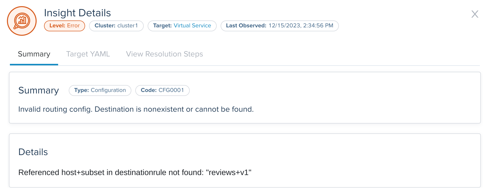

<!--bash
source ./scripts/assert.sh
-->


<center>
<svg id="gloo-product-logo" viewBox="260 150 1775 480" fill="none" xmlns="http://www.w3.org/2000/svg" alt="Gloo Mesh" style="max-height:100px">
    <style>#gloo-product-logo path{fill:#151927}@media(prefers-color-scheme:dark){#gloo-product-logo path{fill:white}}</style>
    <path fill-rule="evenodd" clip-rule="evenodd" d="M300.935 447.396C328.108 474.569 364.95 489.855 403.379 489.899C441.82 489.84 478.667 474.531 505.832 447.332C532.997 420.133 548.26 383.267 548.271 344.826V315.504H403.309V374.148H484.489C478.443 390.83 467.41 405.248 452.886 415.442C438.363 425.637 421.054 431.114 403.309 431.13C380.428 431.104 358.492 422.003 342.312 405.824C326.133 389.644 317.031 367.707 317.006 344.826C316.992 333.456 319.243 322.197 323.628 311.707C328.013 301.216 334.443 291.704 342.544 283.725C350.575 275.677 360.13 269.309 370.649 264.994C381.169 260.679 392.442 258.503 403.812 258.592C425.041 258.708 445.48 266.664 461.199 280.932L500.546 237.452C474.139 213.531 439.833 200.197 404.203 200.004C385.096 199.857 366.152 203.519 348.476 210.776C330.8 218.033 314.747 228.739 301.256 242.27C287.659 255.686 276.87 271.675 269.518 289.304C262.166 306.934 258.397 325.851 258.432 344.952C258.476 383.381 273.761 420.223 300.935 447.396ZM714.484 446.974C741.552 474.043 778.253 489.27 816.533 489.314C854.829 489.292 891.55 474.075 918.637 447.004C945.724 419.933 960.962 383.22 961.006 344.925C960.962 306.63 945.724 269.917 918.637 242.846C891.55 215.775 854.829 200.558 816.533 200.536C778.253 200.58 741.552 215.807 714.484 242.875C687.415 269.944 672.189 306.644 672.144 344.925C672.189 383.206 687.415 419.906 714.484 446.974ZM755.926 284.313C772.001 268.235 793.798 259.191 816.533 259.165V259.179C839.28 259.187 861.094 268.22 877.186 284.297C893.278 300.373 902.333 322.178 902.362 344.925C902.336 367.672 893.283 389.48 877.19 405.557C861.097 421.634 839.281 430.667 816.533 430.67C793.8 430.644 772.005 421.602 755.931 405.527C739.856 389.453 730.814 367.658 730.788 344.925C730.81 322.189 739.851 300.391 755.926 284.313ZM1024.78 446.979C1051.85 474.048 1088.56 489.273 1126.84 489.314C1165.12 489.27 1201.81 474.045 1228.88 446.979C1255.95 419.914 1271.18 383.217 1271.23 344.939C1271.19 306.656 1255.96 269.952 1228.89 242.88C1201.82 215.809 1165.12 200.58 1126.84 200.536C1088.56 200.576 1051.85 215.801 1024.78 242.87C997.708 269.939 982.48 306.642 982.436 344.925C982.48 383.208 997.708 419.91 1024.78 446.979ZM1066.23 284.312C1082.3 268.235 1104.1 259.191 1126.84 259.165V259.179C1149.57 259.205 1171.37 268.247 1187.44 284.322C1203.52 300.397 1212.56 322.192 1212.58 344.925C1212.56 367.658 1203.52 389.453 1187.44 405.527C1171.37 421.602 1149.57 430.644 1126.84 430.67C1104.1 430.648 1082.3 421.607 1066.23 405.532C1050.15 389.457 1041.11 367.66 1041.08 344.925C1041.11 322.188 1050.15 300.39 1066.23 284.312ZM688.742 472.692C671.919 455.941 658.571 436.031 649.465 414.106C640.36 392.181 635.676 368.673 635.683 344.933V206.283H577.584V344.933C577.564 376.299 583.741 407.36 595.76 436.332C607.779 465.304 625.404 491.616 647.621 513.757L688.742 472.692Z"/>
    <path d="M2008.38 412.919V275.844H2027.57V412.919H2008.38ZM1915.36 412.919V275.844H1934.55V412.919H1915.36ZM1931.42 351.235V333.612H2014.45V351.235H1931.42Z"/>
    <path d="M1820.14 415.269C1812.82 415.269 1806.17 414.42 1800.16 412.723C1794.29 411.026 1789.13 408.741 1784.69 405.869C1780.38 402.867 1776.79 399.538 1773.92 395.882C1771.05 392.227 1769.03 388.376 1767.85 384.329L1786.45 378.259C1788.41 383.611 1792.13 388.245 1797.62 392.162C1803.1 396.078 1809.82 398.102 1817.79 398.232C1827.45 398.232 1835.02 396.339 1840.5 392.553C1846.11 388.637 1848.92 383.48 1848.92 377.084C1848.92 371.209 1846.51 366.444 1841.68 362.789C1836.85 359.003 1830.45 356.131 1822.49 354.173L1806.62 350.06C1800.36 348.363 1794.61 345.948 1789.39 342.815C1784.3 339.682 1780.25 335.7 1777.25 330.87C1774.25 326.04 1772.75 320.23 1772.75 313.442C1772.75 300.909 1776.79 291.118 1784.89 284.069C1793.11 277.019 1804.93 273.495 1820.33 273.495C1829.21 273.495 1836.91 274.931 1843.44 277.803C1849.97 280.544 1855.32 284.199 1859.5 288.769C1863.8 293.338 1866.87 298.364 1868.7 303.847L1850.1 310.113C1847.88 304.238 1844.09 299.539 1838.74 296.014C1833.39 292.359 1826.79 290.531 1818.96 290.531C1810.74 290.531 1804.21 292.489 1799.38 296.406C1794.68 300.322 1792.33 305.674 1792.33 312.463C1792.33 318.207 1794.16 322.646 1797.81 325.779C1801.6 328.781 1806.62 331.066 1812.89 332.632L1828.75 336.549C1841.55 339.682 1851.4 344.904 1858.32 352.214C1865.37 359.395 1868.89 367.293 1868.89 375.909C1868.89 383.35 1867 390.073 1863.22 396.078C1859.56 401.953 1854.08 406.653 1846.77 410.177C1839.59 413.572 1830.71 415.269 1820.14 415.269Z"/>
    <path d="M1640.6 412.919V275.844H1723.04V293.468H1659.79V334.199H1716.78V351.431H1659.79V395.295H1723.44V412.919H1640.6Z"/>
    <path d="M1454.84 412.919V275.844H1475.21L1520.64 343.011L1565.87 275.844H1586.24V412.919H1567.05V306.784L1520.44 375.517L1474.03 306.98V412.919H1454.84Z"/>
    <path fill-rule="evenodd" clip-rule="evenodd" d="M1354.32 488.104L1354.32 201.133L1356.82 201.133L1356.82 488.104L1354.32 488.104Z"/>
</svg>
</center>

# <center>Gloo Mesh Core (2.5.12)</center>


## Table of Contents
* [Introduction](#introduction)
* [Lab 1 - Deploy KinD clusters](#lab-1---deploy-kind-clusters-)
* [Lab 2 - Deploy and register Gloo Mesh](#lab-2---deploy-and-register-gloo-mesh-)
* [Lab 3 - Deploy Istio using Gloo Mesh Lifecycle Manager](#lab-3---deploy-istio-using-gloo-mesh-lifecycle-manager-)
* [Lab 4 - Deploy the Bookinfo demo app](#lab-4---deploy-the-bookinfo-demo-app-)
* [Lab 5 - Deploy the httpbin demo app](#lab-5---deploy-the-httpbin-demo-app-)
* [Lab 6 - Expose the productpage service through a gateway using Istio resources](#lab-6---expose-the-productpage-service-through-a-gateway-using-istio-resources-)
* [Lab 7 - Introduction to Insights](#lab-7---introduction-to-insights-)
* [Lab 8 - Insights related to configuration errors](#lab-8---insights-related-to-configuration-errors-)
* [Lab 9 - Insights related to security issues](#lab-9---insights-related-to-security-issues-)


## Introduction <a name="introduction"></a>

[Gloo Mesh Core](https://www.solo.io/products/gloo-mesh/) is a management plane that makes it easy to operate [Istio](https://istio.io).

Gloo Mesh Core works with community [Istio](https://istio.io/) out of the box.
You get instant insights into your Istio environment through a custom dashboard.
Observability pipelines let you analyze many data sources that you already have.
You can even automate installing and upgrading Istio with the Gloo lifecycle manager, on one or many Kubernetes clusters deployed anywhere.

But Gloo Mesh Core includes more than tooling to complement an existing Istio installation.
You can also replace community Istio with Solo's hardened Istio images. These images unlock enterprise-level support.
Later, you might choose to upgrade seamlessly to Gloo Mesh Enterprise for a full-stack service mesh and API gateway solution.
This approach lets you scale as you need more advanced routing and security features.

### Istiosupport

The Gloo Mesh Core subscription includes end-to-end Istio support:

* Upstream feature development
* CI/CD-ready automated installation and upgrade
* End-to-end Istio support and CVE security patching
* Long-term n-4 version support with Solo images
* Special image builds for distroless and FIPS compliance
* 24x7 production support and one-hour Severity 1 SLA

### Gloo Mesh Core overview

Gloo Mesh Core provides many unique features, including:

* Single pane of glass for operational management of Istio, including global observability
* Insights based on environment checks with corrective actions and best practices
* [Cilium](https://cilium.io/) support
* Seamless migration to full-stack service mesh

### Want to learn more about Gloo Mesh Core?

You can find more information about Gloo Mesh Core in the official documentation: <https://docs.solo.io/gloo-mesh-core>


## Lab 1 - Deploy KinD clusters <a name="lab-1---deploy-kind-clusters-"></a>


Clone this repository and go to the directory where this `README.md` file is.

Set the context environment variables:

```bash
export MGMT=mgmt
export CLUSTER1=cluster1
export CLUSTER2=cluster2
```

Run the following commands to deploy three Kubernetes clusters using [Kind](https://kind.sigs.k8s.io/):

```bash
./scripts/deploy-aws.sh 1 mgmt
./scripts/deploy-aws.sh 2 cluster1 us-west us-west-1
./scripts/deploy-aws.sh 3 cluster2 us-west us-west-2
```

Then run the following commands to wait for all the Pods to be ready:

```bash
./scripts/check.sh mgmt
./scripts/check.sh cluster1
./scripts/check.sh cluster2
```

**Note:** If you run the `check.sh` script immediately after the `deploy.sh` script, you may see a jsonpath error. If that happens, simply wait a few seconds and try again.

Once the `check.sh` script completes, when you execute the `kubectl get pods -A` command, you should see the following:

```
NAMESPACE            NAME                                          READY   STATUS    RESTARTS   AGE
kube-system          calico-kube-controllers-59d85c5c84-sbk4k      1/1     Running   0          4h26m
kube-system          calico-node-przxs                             1/1     Running   0          4h26m
kube-system          coredns-6955765f44-ln8f5                      1/1     Running   0          4h26m
kube-system          coredns-6955765f44-s7xxx                      1/1     Running   0          4h26m
kube-system          etcd-cluster1-control-plane                   1/1     Running   0          4h27m
kube-system          kube-apiserver-cluster1-control-plane         1/1     Running   0          4h27m
kube-system          kube-controller-manager-cluster1-control-plane1/1     Running   0          4h27m
kube-system          kube-proxy-ksvzw                              1/1     Running   0          4h26m
kube-system          kube-scheduler-cluster1-control-plane         1/1     Running   0          4h27m
local-path-storage   local-path-provisioner-58f6947c7-lfmdx        1/1     Running   0          4h26m
metallb-system       controller-5c9894b5cd-cn9x2                   1/1     Running   0          4h26m
metallb-system       speaker-d7jkp                                 1/1     Running   0          4h26m
```

**Note:** The CNI pods might be different, depending on which CNI you have deployed.

You can see that your currently connected to this cluster by executing the `kubectl config get-contexts` command:

```
CURRENT   NAME         CLUSTER         AUTHINFO   NAMESPACE
          cluster1     kind-cluster1   cluster1
*         cluster2     kind-cluster2   cluster2
          mgmt         kind-mgmt       kind-mgmt
```

Run the following command to make `mgmt` the current cluster.

```bash
kubectl config use-context ${MGMT}
```
<!--bash
cat <<'EOF' > ./test.js
const helpers = require('./tests/chai-exec');

describe("Clusters are healthy", () => {
    const clusters = [process.env.MGMT, process.env.CLUSTER1, process.env.CLUSTER2];
    clusters.forEach(cluster => {
        it(`Cluster ${cluster} is healthy`, () => helpers.k8sObjectIsPresent({ context: cluster, namespace: "default", k8sType: "service", k8sObj: "kubernetes" }));
    });
});
EOF
echo "executing test dist/gloo-mesh-2-0-workshop/build/templates/steps/deploy-kind-clusters/tests/cluster-healthy.test.js.liquid"
timeout --signal=INT 3m mocha ./test.js --timeout 10000 --retries=120 --bail || { DEBUG_MODE=true mocha ./test.js --timeout 120000; exit 1; }
-->


## Lab 2 - Deploy and register Gloo Mesh <a name="lab-2---deploy-and-register-gloo-mesh-"></a>
[](https://youtu.be/djfFiepK4GY "Video Link")


Before we get started, let's install the `meshctl` CLI:

```bash
export GLOO_MESH_VERSION=v2.5.12
curl -sL https://run.solo.io/meshctl/install | sh -
export PATH=$HOME/.gloo-mesh/bin:$PATH
```
<!--bash
cat <<'EOF' > ./test.js
var chai = require('chai');
var expect = chai.expect;

describe("Required environment variables should contain value", () => {
  afterEach(function(done){
    if(this.currentTest.currentRetry() > 0){
      process.stdout.write(".");
       setTimeout(done, 1000);
    } else {
      done();
    }
  });

  it("Context environment variables should not be empty", () => {
    expect(process.env.MGMT).not.to.be.empty
    expect(process.env.CLUSTER1).not.to.be.empty
    expect(process.env.CLUSTER2).not.to.be.empty
  });

  it("Gloo Mesh licence environment variables should not be empty", () => {
    expect(process.env.GLOO_MESH_LICENSE_KEY).not.to.be.empty
  });
});
EOF
echo "executing test dist/gloo-mesh-2-0-workshop/build/templates/steps/deploy-and-register-gloo-mesh/tests/environment-variables.test.js.liquid"
timeout --signal=INT 3m mocha ./test.js --timeout 10000 --retries=120 --bail || { DEBUG_MODE=true mocha ./test.js --timeout 120000; exit 1; }
-->
Run the following commands to deploy the Gloo Mesh management plane:

```bash
kubectl --context ${MGMT} create ns gloo-mesh

helm upgrade --install gloo-platform-crds gloo-platform-crds \
  --repo https://storage.googleapis.com/gloo-platform/helm-charts \
  --namespace gloo-mesh \
  --kube-context ${MGMT} \
  --set featureGates.insightsConfiguration=true \
  --version 2.5.12

helm upgrade --install gloo-platform gloo-platform \
  --repo https://storage.googleapis.com/gloo-platform/helm-charts \
  --namespace gloo-mesh \
  --kube-context ${MGMT} \
  --version 2.5.12 \
  -f -<<EOF
licensing:
  glooTrialLicenseKey: ${GLOO_MESH_LICENSE_KEY}
common:
  cluster: mgmt
glooInsightsEngine:
  enabled: true
glooMgmtServer:
  enabled: true
  ports:
    healthcheck: 8091
prometheus:
  enabled: true
redis:
  deployment:
    enabled: true
telemetryGateway:
  enabled: true
  service:
    type: LoadBalancer
glooUi:
  enabled: true
  serviceType: LoadBalancer
telemetryCollector:
  enabled: true
  config:
    exporters:
      otlp:
        endpoint: gloo-telemetry-gateway:4317
EOF

kubectl --context ${MGMT} -n gloo-mesh rollout status deploy/gloo-mesh-mgmt-server
```

<!--bash
kubectl wait --context ${MGMT} --for=condition=Ready -n gloo-mesh --all pod
timeout 2m bash -c "until [[ \$(kubectl --context ${MGMT} -n gloo-mesh get svc gloo-mesh-mgmt-server -o json | jq '.status.loadBalancer | length') -gt 0 ]]; do
  sleep 1
done"
-->

Then, you need to set the environment variable to tell the Gloo Mesh agents how to communicate with the management plane:
<!--bash
cat <<'EOF' > ./test.js

const helpers = require('./tests/chai-exec');

describe("MGMT server is healthy", () => {
  let cluster = process.env.MGMT;
  let deployments = ["gloo-mesh-mgmt-server","gloo-mesh-redis","gloo-telemetry-gateway","prometheus-server"];
  deployments.forEach(deploy => {
    it(deploy + ' pods are ready in ' + cluster, () => helpers.checkDeployment({ context: cluster, namespace: "gloo-mesh", k8sObj: deploy }));
  });
});
EOF
echo "executing test dist/gloo-mesh-2-0-workshop/build/templates/steps/deploy-and-register-gloo-mesh/tests/check-deployment.test.js.liquid"
timeout --signal=INT 3m mocha ./test.js --timeout 10000 --retries=120 --bail || { DEBUG_MODE=true mocha ./test.js --timeout 120000; exit 1; }
-->
<!--bash
cat <<'EOF' > ./test.js
const chaiExec = require("@jsdevtools/chai-exec");
var chai = require('chai');
var expect = chai.expect;
chai.use(chaiExec);

afterEach(function (done) {
  if (this.currentTest.currentRetry() > 0) {
    process.stdout.write(".");
    setTimeout(done, 1000);
  } else {
    done();
  }
});
EOF
echo "executing test dist/gloo-mesh-2-0-workshop/build/templates/steps/deploy-and-register-gloo-mesh/tests/get-gloo-mesh-mgmt-server-ip.test.js.liquid"
timeout --signal=INT 3m mocha ./test.js --timeout 10000 --retries=120 --bail || { DEBUG_MODE=true mocha ./test.js --timeout 120000; exit 1; }
-->

```bash
export ENDPOINT_GLOO_MESH=$(kubectl --context ${MGMT} -n gloo-mesh get svc gloo-mesh-mgmt-server -o jsonpath='{.status.loadBalancer.ingress[0].*}'):9900
export HOST_GLOO_MESH=$(echo ${ENDPOINT_GLOO_MESH%:*})
export ENDPOINT_TELEMETRY_GATEWAY=$(kubectl --context ${MGMT} -n gloo-mesh get svc gloo-telemetry-gateway -o jsonpath='{.status.loadBalancer.ingress[0].*}'):4317
export ENDPOINT_GLOO_MESH_UI=$(kubectl --context ${MGMT} -n gloo-mesh get svc gloo-mesh-ui -o jsonpath='{.status.loadBalancer.ingress[0].*}'):8090
```

Check that the variables have correct values:
```
echo $HOST_GLOO_MESH
echo $ENDPOINT_GLOO_MESH
```

<!--bash
cat <<'EOF' > ./test.js
const dns = require('dns');
const chaiHttp = require("chai-http");
const chai = require("chai");
const expect = chai.expect;
chai.use(chaiHttp);
const { waitOnFailedTest } = require('./tests/utils');

afterEach(function(done) { waitOnFailedTest(done, this.currentTest.currentRetry())});

describe("Address '" + process.env.HOST_GLOO_MESH + "' can be resolved in DNS", () => {
    it(process.env.HOST_GLOO_MESH + ' can be resolved', (done) => {
        return dns.lookup(process.env.HOST_GLOO_MESH, (err, address, family) => {
            expect(address).to.be.an.ip;
            done();
        });
    });
});
EOF
echo "executing test ./gloo-mesh-2-0/tests/can-resolve.test.js.liquid"
timeout --signal=INT 3m mocha ./test.js --timeout 10000 --retries=120 --bail || { DEBUG_MODE=true mocha ./test.js --timeout 120000; exit 1; }
-->
Finally, you need to register the cluster(s).


Here is how you register the first one:

```bash
kubectl apply --context ${MGMT} -f - <<EOF
apiVersion: admin.gloo.solo.io/v2
kind: KubernetesCluster
metadata:
  name: cluster1
  namespace: gloo-mesh
spec:
  clusterDomain: cluster.local
EOF

kubectl --context ${CLUSTER1} create ns gloo-mesh

kubectl get secret relay-root-tls-secret -n gloo-mesh --context ${MGMT} -o jsonpath='{.data.ca\.crt}' | base64 -d > ca.crt
kubectl create secret generic relay-root-tls-secret -n gloo-mesh --context ${CLUSTER1} --from-file ca.crt=ca.crt
rm ca.crt

kubectl get secret relay-identity-token-secret -n gloo-mesh --context ${MGMT} -o jsonpath='{.data.token}' | base64 -d > token
kubectl create secret generic relay-identity-token-secret -n gloo-mesh --context ${CLUSTER1} --from-file token=token
rm token

helm upgrade --install gloo-platform-crds gloo-platform-crds \
  --repo https://storage.googleapis.com/gloo-platform/helm-charts \
  --namespace gloo-mesh \
  --kube-context ${CLUSTER1} \
  --version 2.5.12

helm upgrade --install gloo-platform gloo-platform \
  --repo https://storage.googleapis.com/gloo-platform/helm-charts \
  --namespace gloo-mesh \
  --kube-context ${CLUSTER1} \
  --version 2.5.12 \
  -f -<<EOF
common:
  cluster: cluster1
glooAgent:
  enabled: true
  relay:
    serverAddress: "${ENDPOINT_GLOO_MESH}"
    authority: gloo-mesh-mgmt-server.gloo-mesh
telemetryCollector:
  enabled: true
  config:
    exporters:
      otlp:
        endpoint: "${ENDPOINT_TELEMETRY_GATEWAY}"
glooAnalyzer:
  enabled: true
EOF
```

Note that the registration can also be performed using `meshctl cluster register`.

And here is how you register the second one:

```bash
kubectl apply --context ${MGMT} -f - <<EOF
apiVersion: admin.gloo.solo.io/v2
kind: KubernetesCluster
metadata:
  name: cluster2
  namespace: gloo-mesh
spec:
  clusterDomain: cluster.local
EOF

kubectl --context ${CLUSTER2} create ns gloo-mesh

kubectl get secret relay-root-tls-secret -n gloo-mesh --context ${MGMT} -o jsonpath='{.data.ca\.crt}' | base64 -d > ca.crt
kubectl create secret generic relay-root-tls-secret -n gloo-mesh --context ${CLUSTER2} --from-file ca.crt=ca.crt
rm ca.crt

kubectl get secret relay-identity-token-secret -n gloo-mesh --context ${MGMT} -o jsonpath='{.data.token}' | base64 -d > token
kubectl create secret generic relay-identity-token-secret -n gloo-mesh --context ${CLUSTER2} --from-file token=token
rm token

helm upgrade --install gloo-platform-crds gloo-platform-crds \
  --repo https://storage.googleapis.com/gloo-platform/helm-charts \
  --namespace gloo-mesh \
  --kube-context ${CLUSTER2} \
  --version 2.5.12

helm upgrade --install gloo-platform gloo-platform \
  --repo https://storage.googleapis.com/gloo-platform/helm-charts \
  --namespace gloo-mesh \
  --kube-context ${CLUSTER2} \
  --version 2.5.12 \
  -f -<<EOF
common:
  cluster: cluster2
glooAgent:
  enabled: true
  relay:
    serverAddress: "${ENDPOINT_GLOO_MESH}"
    authority: gloo-mesh-mgmt-server.gloo-mesh
telemetryCollector:
  enabled: true
  config:
    exporters:
      otlp:
        endpoint: "${ENDPOINT_TELEMETRY_GATEWAY}"
glooAnalyzer:
  enabled: true
EOF
```

You can check the cluster(s) have been registered correctly using the following commands:
```
meshctl --kubecontext ${MGMT} check
```

```
pod=$(kubectl --context ${MGMT} -n gloo-mesh get pods -l app=gloo-mesh-mgmt-server -o jsonpath='{.items[0].metadata.name}')
kubectl --context ${MGMT} -n gloo-mesh debug -q -i ${pod} --image=curlimages/curl -- curl -s http://localhost:9091/metrics | grep relay_push_clients_connected
```

You should get an output similar to this:
```,nocopy
# HELP relay_push_clients_connected Current number of connected Relay push clients (Relay Agents).
# TYPE relay_push_clients_connected gauge
relay_push_clients_connected{cluster="cluster1"} 1
relay_push_clients_connected{cluster="cluster2"} 1
```
Finally, you need to specify which gateways you want to use for cross cluster traffic:

```bash
kubectl apply --context ${MGMT} -f - <<EOF
apiVersion: admin.gloo.solo.io/v2
kind: WorkspaceSettings
metadata:
  name: global
  namespace: gloo-mesh
spec:
  options:
    eastWestGateways:
      - selector:
          labels:
            istio: eastwestgateway
EOF
```
<!--bash
cat <<'EOF' > ./test.js
var chai = require('chai');
var expect = chai.expect;
const helpers = require('./tests/chai-exec');
describe("Cluster registration", () => {
  it("cluster1 is registered", () => {
    podName = helpers.getOutputForCommand({ command: "kubectl -n gloo-mesh get pods -l app=gloo-mesh-mgmt-server -o jsonpath='{.items[0].metadata.name}' --context " + process.env.MGMT }).replaceAll("'", "");
    command = helpers.getOutputForCommand({ command: "kubectl --context " + process.env.MGMT + " -n gloo-mesh debug -q -i " + podName + " --image=curlimages/curl -- curl -s http://localhost:9091/metrics" }).replaceAll("'", "");
    expect(command).to.contain("cluster1");
  });
  it("cluster2 is registered", () => {
    podName = helpers.getOutputForCommand({ command: "kubectl -n gloo-mesh get pods -l app=gloo-mesh-mgmt-server -o jsonpath='{.items[0].metadata.name}' --context " + process.env.MGMT }).replaceAll("'", "");
    command = helpers.getOutputForCommand({ command: "kubectl --context " + process.env.MGMT + " -n gloo-mesh debug -q -i " + podName + " --image=curlimages/curl -- curl -s http://localhost:9091/metrics" }).replaceAll("'", "");
    expect(command).to.contain("cluster2");
  });
});
EOF
echo "executing test dist/gloo-mesh-2-0-workshop/build/templates/steps/deploy-and-register-gloo-mesh/tests/cluster-registration.test.js.liquid"
timeout --signal=INT 3m mocha ./test.js --timeout 10000 --retries=120 --bail || { DEBUG_MODE=true mocha ./test.js --timeout 120000; exit 1; }
-->


## Lab 3 - Deploy Istio using Gloo Mesh Lifecycle Manager <a name="lab-3---deploy-istio-using-gloo-mesh-lifecycle-manager-"></a>
[](https://youtu.be/f76-KOEjqHs "Video Link")

We are going to deploy Istio using Gloo Mesh Lifecycle Manager.

<details>
  <summary>Install <code>istioctl</code></summary>

Install `istioctl` if not already installed as it will be useful in some of the labs that follow.

```bash
curl -L https://istio.io/downloadIstio | sh -

if [ -d "istio-"*/ ]; then
  cd istio-*/
  export PATH=$PWD/bin:$PATH
  cd ..
fi
```

That's it!
</details>

<!--bash
cat <<'EOF' > ./test.js
const chaiExec = require("@jsdevtools/chai-exec");
var chai = require('chai');
var expect = chai.expect;
chai.use(chaiExec);

afterEach(function (done) {
  if (this.currentTest.currentRetry() > 0) {
    process.stdout.write(".");
    setTimeout(done, 1000);
  } else {
    done();
  }
});
EOF
echo "executing test dist/gloo-mesh-2-0-workshop/build/templates/steps/istio-lifecycle-manager-install/tests/istio-version.test.js.liquid"
timeout --signal=INT 3m mocha ./test.js --timeout 10000 --retries=120 --bail || { DEBUG_MODE=true mocha ./test.js --timeout 120000; exit 1; }
-->

Let's create Kubernetes services for the gateways:

```bash
kubectl --context ${CLUSTER1} create ns istio-gateways

kubectl apply --context ${CLUSTER1} -f - <<EOF
apiVersion: v1
kind: Service
metadata:
  labels:
    app: istio-ingressgateway
    istio: ingressgateway
  name: istio-ingressgateway
  namespace: istio-gateways
spec:
  ports:
  - name: http2
    port: 80
    protocol: TCP
    targetPort: 8080
  - name: https
    port: 443
    protocol: TCP
    targetPort: 8443
  selector:
    app: istio-ingressgateway
    istio: ingressgateway
    revision: 1-20
  type: LoadBalancer
EOF

kubectl apply --context ${CLUSTER1} -f - <<EOF
apiVersion: v1
kind: Service
metadata:
  labels:
    app: istio-ingressgateway
    istio: eastwestgateway
    topology.istio.io/network: cluster1
  name: istio-eastwestgateway
  namespace: istio-gateways
spec:
  ports:
  - name: status-port
    port: 15021
    protocol: TCP
    targetPort: 15021
  - name: tls
    port: 15443
    protocol: TCP
    targetPort: 15443
  - name: https
    port: 16443
    protocol: TCP
    targetPort: 16443
  - name: tls-spire
    port: 8081
    protocol: TCP
    targetPort: 8081
  - name: tls-otel
    port: 4317
    protocol: TCP
    targetPort: 4317
  - name: grpc-cacert
    port: 31338
    protocol: TCP
    targetPort: 31338
  - name: grpc-ew-bootstrap
    port: 31339
    protocol: TCP
    targetPort: 31339
  - name: tcp-istiod
    port: 15012
    protocol: TCP
    targetPort: 15012
  - name: tcp-webhook
    port: 15017
    protocol: TCP
    targetPort: 15017
  selector:
    app: istio-ingressgateway
    istio: eastwestgateway
    revision: 1-20
    topology.istio.io/network: cluster1
  type: LoadBalancer
EOF
kubectl --context ${CLUSTER2} create ns istio-gateways

kubectl apply --context ${CLUSTER2} -f - <<EOF
apiVersion: v1
kind: Service
metadata:
  labels:
    app: istio-ingressgateway
    istio: ingressgateway
  name: istio-ingressgateway
  namespace: istio-gateways
spec:
  ports:
  - name: http2
    port: 80
    protocol: TCP
    targetPort: 8080
  - name: https
    port: 443
    protocol: TCP
    targetPort: 8443
  selector:
    app: istio-ingressgateway
    istio: ingressgateway
    revision: 1-20
  type: LoadBalancer
EOF

kubectl apply --context ${CLUSTER2} -f - <<EOF
apiVersion: v1
kind: Service
metadata:
  labels:
    app: istio-ingressgateway
    istio: eastwestgateway
    topology.istio.io/network: cluster2
  name: istio-eastwestgateway
  namespace: istio-gateways
spec:
  ports:
  - name: status-port
    port: 15021
    protocol: TCP
    targetPort: 15021
  - name: tls
    port: 15443
    protocol: TCP
    targetPort: 15443
  - name: https
    port: 16443
    protocol: TCP
    targetPort: 16443
  - name: tls-spire
    port: 8081
    protocol: TCP
    targetPort: 8081
  - name: tls-otel
    port: 4317
    protocol: TCP
    targetPort: 4317
  - name: grpc-cacert
    port: 31338
    protocol: TCP
    targetPort: 31338
  - name: grpc-ew-bootstrap
    port: 31339
    protocol: TCP
    targetPort: 31339
  - name: tcp-istiod
    port: 15012
    protocol: TCP
    targetPort: 15012
  - name: tcp-webhook
    port: 15017
    protocol: TCP
    targetPort: 15017
  selector:
    app: istio-ingressgateway
    istio: eastwestgateway
    revision: 1-20
    topology.istio.io/network: cluster2
  type: LoadBalancer
EOF
```

It allows us to have full control on which Istio revision we want to use.

Then, we can tell Gloo Mesh to deploy the Istio control planes and the gateways in the cluster(s).

```bash
kubectl apply --context ${MGMT} -f - <<EOF
apiVersion: admin.gloo.solo.io/v2
kind: IstioLifecycleManager
metadata:
  name: cluster1-installation
  namespace: gloo-mesh
spec:
  installations:
    - clusters:
      - name: cluster1
        defaultRevision: true
      revision: 1-20
      istioOperatorSpec:
        profile: minimal
        hub: us-docker.pkg.dev/gloo-mesh/istio-workshops
        tag: 1.20.2-solo
        namespace: istio-system
        values:
          global:
            meshID: mesh1
            multiCluster:
              clusterName: cluster1
            network: cluster1
        meshConfig:
          accessLogFile: /dev/stdout
          defaultConfig:
            proxyMetadata:
              ISTIO_META_DNS_CAPTURE: "true"
              ISTIO_META_DNS_AUTO_ALLOCATE: "true"
        components:
          pilot:
            k8s:
              env:
                - name: PILOT_ENABLE_K8S_SELECT_WORKLOAD_ENTRIES
                  value: "false"
                - name: PILOT_ENABLE_IP_AUTOALLOCATE
                  value: "true"
          ingressGateways:
          - name: istio-ingressgateway
            enabled: false
EOF

kubectl apply --context ${MGMT} -f - <<EOF
apiVersion: admin.gloo.solo.io/v2
kind: GatewayLifecycleManager
metadata:
  name: cluster1-ingress
  namespace: gloo-mesh
spec:
  installations:
    - clusters:
      - name: cluster1
        activeGateway: false
      gatewayRevision: 1-20
      istioOperatorSpec:
        profile: empty
        hub: us-docker.pkg.dev/gloo-mesh/istio-workshops
        tag: 1.20.2-solo
        values:
          gateways:
            istio-ingressgateway:
              customService: true
        components:
          ingressGateways:
            - name: istio-ingressgateway
              namespace: istio-gateways
              enabled: true
              label:
                istio: ingressgateway
---
apiVersion: admin.gloo.solo.io/v2
kind: GatewayLifecycleManager
metadata:
  name: cluster1-eastwest
  namespace: gloo-mesh
spec:
  installations:
    - clusters:
      - name: cluster1
        activeGateway: false
      gatewayRevision: 1-20
      istioOperatorSpec:
        profile: empty
        hub: us-docker.pkg.dev/gloo-mesh/istio-workshops
        tag: 1.20.2-solo
        values:
          gateways:
            istio-ingressgateway:
              customService: true
        components:
          ingressGateways:
            - name: istio-eastwestgateway
              namespace: istio-gateways
              enabled: true
              label:
                istio: eastwestgateway
                topology.istio.io/network: cluster1
              k8s:
                env:
                  - name: ISTIO_META_ROUTER_MODE
                    value: "sni-dnat"
                  - name: ISTIO_META_REQUESTED_NETWORK_VIEW
                    value: cluster1
EOF

kubectl apply --context ${MGMT} -f - <<EOF
apiVersion: admin.gloo.solo.io/v2
kind: IstioLifecycleManager
metadata:
  name: cluster2-installation
  namespace: gloo-mesh
spec:
  installations:
    - clusters:
      - name: cluster2
        defaultRevision: true
      revision: 1-20
      istioOperatorSpec:
        profile: minimal
        hub: us-docker.pkg.dev/gloo-mesh/istio-workshops
        tag: 1.20.2-solo
        namespace: istio-system
        values:
          global:
            meshID: mesh1
            multiCluster:
              clusterName: cluster2
            network: cluster2
        meshConfig:
          accessLogFile: /dev/stdout
          defaultConfig:
            proxyMetadata:
              ISTIO_META_DNS_CAPTURE: "true"
              ISTIO_META_DNS_AUTO_ALLOCATE: "true"
        components:
          pilot:
            k8s:
              env:
                - name: PILOT_ENABLE_K8S_SELECT_WORKLOAD_ENTRIES
                  value: "false"
                - name: PILOT_ENABLE_IP_AUTOALLOCATE
                  value: "true"
          ingressGateways:
          - name: istio-ingressgateway
            enabled: false
EOF

kubectl apply --context ${MGMT} -f - <<EOF
apiVersion: admin.gloo.solo.io/v2
kind: GatewayLifecycleManager
metadata:
  name: cluster2-ingress
  namespace: gloo-mesh
spec:
  installations:
    - clusters:
      - name: cluster2
        activeGateway: false
      gatewayRevision: 1-20
      istioOperatorSpec:
        profile: empty
        hub: us-docker.pkg.dev/gloo-mesh/istio-workshops
        tag: 1.20.2-solo
        values:
          gateways:
            istio-ingressgateway:
              customService: true
        components:
          ingressGateways:
            - name: istio-ingressgateway
              namespace: istio-gateways
              enabled: true
              label:
                istio: ingressgateway
---
apiVersion: admin.gloo.solo.io/v2
kind: GatewayLifecycleManager
metadata:
  name: cluster2-eastwest
  namespace: gloo-mesh
spec:
  installations:
    - clusters:
      - name: cluster2
        activeGateway: false
      gatewayRevision: 1-20
      istioOperatorSpec:
        profile: empty
        hub: us-docker.pkg.dev/gloo-mesh/istio-workshops
        tag: 1.20.2-solo
        values:
          gateways:
            istio-ingressgateway:
              customService: true
        components:
          ingressGateways:
            - name: istio-eastwestgateway
              namespace: istio-gateways
              enabled: true
              label:
                istio: eastwestgateway
                topology.istio.io/network: cluster2
              k8s:
                env:
                  - name: ISTIO_META_ROUTER_MODE
                    value: "sni-dnat"
                  - name: ISTIO_META_REQUESTED_NETWORK_VIEW
                    value: cluster2
EOF
```

<!--bash
until kubectl --context ${MGMT} -n gloo-mesh wait --timeout=180s --for=jsonpath='{.status.clusters.cluster1.installations.*.state}'=HEALTHY istiolifecyclemanagers/cluster1-installation; do
  echo "Waiting for the Istio installation to complete"
  sleep 1
done
timeout 2m bash -c "until [[ \$(kubectl --context ${CLUSTER1} -n istio-system get deploy -o json | jq '[.items[].status.readyReplicas] | add') -ge 1 ]]; do
  sleep 1
done"
timeout 2m bash -c "until [[ \$(kubectl --context ${CLUSTER1} -n istio-gateways get deploy -o json | jq '[.items[].status.readyReplicas] | add') -eq 2 ]]; do
  sleep 1
done"
until kubectl --context ${MGMT} -n gloo-mesh wait --timeout=180s --for=jsonpath='{.status.clusters.cluster2.installations.*.state}'=HEALTHY istiolifecyclemanagers/cluster2-installation; do
  echo "Waiting for the Istio installation to complete"
  sleep 1
done
timeout 2m bash -c "until [[ \$(kubectl --context ${CLUSTER2} -n istio-system get deploy -o json | jq '[.items[].status.readyReplicas] | add') -ge 1 ]]; do
  sleep 1
done"
timeout 2m bash -c "until [[ \$(kubectl --context ${CLUSTER2} -n istio-gateways get deploy -o json | jq '[.items[].status.readyReplicas] | add') -eq 2 ]]; do
  sleep 1
done"
-->

<!--bash
cat <<'EOF' > ./test.js

const helpers = require('./tests/chai-exec');

const chaiExec = require("@jsdevtools/chai-exec");
const helpersHttp = require('./tests/chai-http');
const chai = require("chai");
const expect = chai.expect;

afterEach(function (done) {
  if (this.currentTest.currentRetry() > 0) {
    process.stdout.write(".");
    setTimeout(done, 1000);
  } else {
    done();
  }
});

describe("Checking Istio installation", function() {
  it('istiod pods are ready in cluster ' + process.env.CLUSTER1, () => helpers.checkDeploymentsWithLabels({ context: process.env.CLUSTER1, namespace: "istio-system", labels: "app=istiod", instances: 1 }));
  it('gateway pods are ready in cluster ' + process.env.CLUSTER1, () => helpers.checkDeploymentsWithLabels({ context: process.env.CLUSTER1, namespace: "istio-gateways", labels: "app=istio-ingressgateway", instances: 2 }));
  it('istiod pods are ready in cluster ' + process.env.CLUSTER2, () => helpers.checkDeploymentsWithLabels({ context: process.env.CLUSTER2, namespace: "istio-system", labels: "app=istiod", instances: 1 }));
  it('gateway pods are ready in cluster ' + process.env.CLUSTER2, () => helpers.checkDeploymentsWithLabels({ context: process.env.CLUSTER2, namespace: "istio-gateways", labels: "app=istio-ingressgateway", instances: 2 }));
  it("Gateways have an ip attached in cluster " + process.env.CLUSTER1, () => {
    let cli = chaiExec("kubectl --context " + process.env.CLUSTER1 + " -n istio-gateways get svc -l app=istio-ingressgateway -o jsonpath='{.items}'");
    cli.stderr.should.be.empty;
    let deployments = JSON.parse(cli.stdout.slice(1,-1));
    expect(deployments).to.have.lengthOf(2);
    deployments.forEach((deployment) => {
      expect(deployment.status.loadBalancer).to.have.property("ingress");
    });
  });
  it("Gateways have an ip attached in cluster " + process.env.CLUSTER2, () => {
    let cli = chaiExec("kubectl --context " + process.env.CLUSTER2 + " -n istio-gateways get svc -l app=istio-ingressgateway -o jsonpath='{.items}'");
    cli.stderr.should.be.empty;
    let deployments = JSON.parse(cli.stdout.slice(1,-1));
    expect(deployments).to.have.lengthOf(2);
    deployments.forEach((deployment) => {
      expect(deployment.status.loadBalancer).to.have.property("ingress");
    });
  });
});

EOF
echo "executing test dist/gloo-mesh-2-0-workshop/build/templates/steps/istio-lifecycle-manager-install/tests/istio-ready.test.js.liquid"
timeout --signal=INT 3m mocha ./test.js --timeout 10000 --retries=120 --bail || { DEBUG_MODE=true mocha ./test.js --timeout 120000; exit 1; }
-->
<!--bash
timeout 2m bash -c "until [[ \$(kubectl --context ${CLUSTER1} -n istio-gateways get svc -l istio=ingressgateway -o json | jq '.items[0].status.loadBalancer | length') -gt 0 ]]; do
  sleep 1
done"
-->

```bash
export HOST_GW_CLUSTER1="$(kubectl --context ${CLUSTER1} -n istio-gateways get svc -l istio=ingressgateway -o jsonpath='{.items[0].status.loadBalancer.ingress[0].*}')"
export HOST_GW_CLUSTER2="$(kubectl --context ${CLUSTER2} -n istio-gateways get svc -l istio=ingressgateway -o jsonpath='{.items[0].status.loadBalancer.ingress[0].*}')"
```

<!--bash
cat <<'EOF' > ./test.js
const dns = require('dns');
const chaiHttp = require("chai-http");
const chai = require("chai");
const expect = chai.expect;
chai.use(chaiHttp);
const { waitOnFailedTest } = require('./tests/utils');

afterEach(function(done) { waitOnFailedTest(done, this.currentTest.currentRetry())});

describe("Address '" + process.env.HOST_GW_CLUSTER1 + "' can be resolved in DNS", () => {
    it(process.env.HOST_GW_CLUSTER1 + ' can be resolved', (done) => {
        return dns.lookup(process.env.HOST_GW_CLUSTER1, (err, address, family) => {
            expect(address).to.be.an.ip;
            done();
        });
    });
});
EOF
echo "executing test ./gloo-mesh-2-0/tests/can-resolve.test.js.liquid"
timeout --signal=INT 3m mocha ./test.js --timeout 10000 --retries=120 --bail || { DEBUG_MODE=true mocha ./test.js --timeout 120000; exit 1; }
-->
<!--bash
cat <<'EOF' > ./test.js
const dns = require('dns');
const chaiHttp = require("chai-http");
const chai = require("chai");
const expect = chai.expect;
chai.use(chaiHttp);
const { waitOnFailedTest } = require('./tests/utils');

afterEach(function(done) { waitOnFailedTest(done, this.currentTest.currentRetry())});

describe("Address '" + process.env.HOST_GW_CLUSTER2 + "' can be resolved in DNS", () => {
    it(process.env.HOST_GW_CLUSTER2 + ' can be resolved', (done) => {
        return dns.lookup(process.env.HOST_GW_CLUSTER2, (err, address, family) => {
            expect(address).to.be.an.ip;
            done();
        });
    });
});
EOF
echo "executing test ./gloo-mesh-2-0/tests/can-resolve.test.js.liquid"
timeout --signal=INT 3m mocha ./test.js --timeout 10000 --retries=120 --bail || { DEBUG_MODE=true mocha ./test.js --timeout 120000; exit 1; }
-->


## Lab 4 - Deploy the Bookinfo demo app <a name="lab-4---deploy-the-bookinfo-demo-app-"></a>
[](https://youtu.be/nzYcrjalY5A "Video Link")

We're going to deploy the bookinfo application to demonstrate several features of Gloo Mesh.

You can find more information about this application [here](https://istio.io/latest/docs/examples/bookinfo/).

Run the following commands to deploy the bookinfo application on `cluster1`:

```bash
kubectl --context ${CLUSTER1} create ns bookinfo-frontends
kubectl --context ${CLUSTER1} create ns bookinfo-backends
kubectl --context ${CLUSTER1} label namespace bookinfo-frontends istio.io/rev=1-20 --overwrite
kubectl --context ${CLUSTER1} label namespace bookinfo-backends istio.io/rev=1-20 --overwrite

# Deploy the frontend bookinfo service in the bookinfo-frontends namespace
kubectl --context ${CLUSTER1} -n bookinfo-frontends apply -f data/steps/deploy-bookinfo/productpage-v1.yaml

# Deploy the backend bookinfo services in the bookinfo-backends namespace for all versions less than v3
kubectl --context ${CLUSTER1} -n bookinfo-backends apply \
  -f data/steps/deploy-bookinfo/details-v1.yaml \
  -f data/steps/deploy-bookinfo/ratings-v1.yaml \
  -f data/steps/deploy-bookinfo/reviews-v1-v2.yaml

# Update the reviews service to display where it is coming from
kubectl --context ${CLUSTER1} -n bookinfo-backends set env deploy/reviews-v1 CLUSTER_NAME=${CLUSTER1}
kubectl --context ${CLUSTER1} -n bookinfo-backends set env deploy/reviews-v2 CLUSTER_NAME=${CLUSTER1}
```

<!--bash
echo -n Waiting for bookinfo pods to be ready...
timeout -v 5m bash -c "
until [[ \$(kubectl --context ${CLUSTER1} -n bookinfo-frontends get deploy -o json | jq '[.items[].status.readyReplicas] | add') -eq 1 && \\
  \$(kubectl --context ${CLUSTER1} -n bookinfo-backends get deploy -o json | jq '[.items[].status.readyReplicas] | add') -eq 4 ]] 2>/dev/null
do
  sleep 1
  echo -n .
done"
echo
-->

You can check that the app is running using the following command:

```shell
kubectl --context ${CLUSTER1} -n bookinfo-frontends get pods && kubectl --context ${CLUSTER1} -n bookinfo-backends get pods
```

Note that we deployed the `productpage` service in the `bookinfo-frontends` namespace and the other services in the `bookinfo-backends` namespace.

And we deployed the `v1` and `v2` versions of the `reviews` microservice, not the `v3` version.

Now, run the following commands to deploy the bookinfo application on `cluster2`:

```bash
kubectl --context ${CLUSTER2} create ns bookinfo-frontends
kubectl --context ${CLUSTER2} create ns bookinfo-backends
kubectl --context ${CLUSTER2} label namespace bookinfo-frontends istio.io/rev=1-20 --overwrite
kubectl --context ${CLUSTER2} label namespace bookinfo-backends istio.io/rev=1-20 --overwrite

# Deploy the frontend bookinfo service in the bookinfo-frontends namespace
kubectl --context ${CLUSTER2} -n bookinfo-frontends apply -f data/steps/deploy-bookinfo/productpage-v1.yaml
# Deploy the backend bookinfo services in the bookinfo-backends namespace for all versions
kubectl --context ${CLUSTER2} -n bookinfo-backends apply \
  -f data/steps/deploy-bookinfo/details-v1.yaml \
  -f data/steps/deploy-bookinfo/ratings-v1.yaml \
  -f data/steps/deploy-bookinfo/reviews-v1-v2.yaml \
  -f data/steps/deploy-bookinfo/reviews-v3.yaml
# Update the reviews service to display where it is coming from
kubectl --context ${CLUSTER2} -n bookinfo-backends set env deploy/reviews-v1 CLUSTER_NAME=${CLUSTER2}
kubectl --context ${CLUSTER2} -n bookinfo-backends set env deploy/reviews-v2 CLUSTER_NAME=${CLUSTER2}
kubectl --context ${CLUSTER2} -n bookinfo-backends set env deploy/reviews-v3 CLUSTER_NAME=${CLUSTER2}

```

<!--bash
echo -n Waiting for bookinfo pods to be ready...
timeout -v 5m bash -c "
until [[ \$(kubectl --context ${CLUSTER2} -n bookinfo-frontends get deploy -o json | jq '[.items[].status.readyReplicas] | add') -eq 1 && \\
  \$(kubectl --context ${CLUSTER2} -n bookinfo-backends get deploy -o json | jq '[.items[].status.readyReplicas] | add') -eq 5 ]] 2>/dev/null
do
  sleep 1
  echo -n .
done"
echo
-->

Confirm that `v1`, `v2` and `v3` of the `reviews` service are now running in the second cluster:

```bash
kubectl --context ${CLUSTER2} -n bookinfo-frontends get pods && kubectl --context ${CLUSTER2} -n bookinfo-backends get pods
```

As you can see, we deployed all three versions of the `reviews` microservice on this cluster.

<!--bash
cat <<'EOF' > ./test.js
const helpers = require('./tests/chai-exec');

describe("Bookinfo app", () => {
  let cluster = process.env.CLUSTER1
  let deployments = ["productpage-v1"];
  deployments.forEach(deploy => {
    it(deploy + ' pods are ready in ' + cluster, () => helpers.checkDeployment({ context: cluster, namespace: "bookinfo-frontends", k8sObj: deploy }));
  });
  deployments = ["ratings-v1", "details-v1", "reviews-v1", "reviews-v2"];
  deployments.forEach(deploy => {
    it(deploy + ' pods are ready in ' + cluster, () => helpers.checkDeployment({ context: cluster, namespace: "bookinfo-backends", k8sObj: deploy }));
  });
  cluster = process.env.CLUSTER2
  deployments = ["productpage-v1"];
  deployments.forEach(deploy => {
    it(deploy + ' pods are ready in ' + cluster, () => helpers.checkDeployment({ context: cluster, namespace: "bookinfo-frontends", k8sObj: deploy }));
  });
  deployments = ["ratings-v1", "details-v1", "reviews-v1", "reviews-v2", "reviews-v3"];
  deployments.forEach(deploy => {
    it(deploy + ' pods are ready in ' + cluster, () => helpers.checkDeployment({ context: cluster, namespace: "bookinfo-backends", k8sObj: deploy }));
  });
});
EOF
echo "executing test dist/gloo-mesh-2-0-workshop/build/templates/steps/apps/bookinfo/deploy-bookinfo/tests/check-bookinfo.test.js.liquid"
timeout --signal=INT 3m mocha ./test.js --timeout 10000 --retries=120 --bail || { DEBUG_MODE=true mocha ./test.js --timeout 120000; exit 1; }
-->


## Lab 5 - Deploy the httpbin demo app <a name="lab-5---deploy-the-httpbin-demo-app-"></a>
[](https://youtu.be/w1xB-o_gHs0 "Video Link")


We're going to deploy the httpbin application to demonstrate several features of Gloo Mesh on cluster CLUSTER1.

You can find more information about this application [here](http://httpbin.org/).

Run the following commands to deploy the httpbin app on `cluster1`. The deployment will be called `not-in-mesh` and won't have the sidecar injected, because of the annotation `sidecar.istio.io/inject: "false"`.

```bash
kubectl --context ${CLUSTER1} create ns httpbin
kubectl apply --context ${CLUSTER1} -f - <<EOF

apiVersion: v1
kind: ServiceAccount
metadata:
  name: not-in-mesh
  namespace: httpbin
---
apiVersion: v1
kind: Service
metadata:
  name: not-in-mesh
  namespace: httpbin
  labels:
    app: not-in-mesh
    service: not-in-mesh
spec:
  ports:
  - name: http
    port: 8000
    targetPort: 80
  selector:
    app: not-in-mesh
---
apiVersion: apps/v1
kind: Deployment
metadata:
  name: not-in-mesh
  namespace: httpbin
spec:
  replicas: 1
  selector:
    matchLabels:
      app: not-in-mesh
      version: v1
  template:
    metadata:
      labels:
        app: not-in-mesh
        version: v1
    spec:
      serviceAccountName: not-in-mesh
      containers:
      - image: docker.io/kennethreitz/httpbin
        imagePullPolicy: IfNotPresent
        name: not-in-mesh
        ports:
        - name: http
          containerPort: 80
        livenessProbe:
          httpGet:
            path: /status/200
            port: http
        readinessProbe:
          httpGet:
            path: /status/200
            port: http

EOF
```

Then, we deploy a second version, which will be called `in-mesh` and will have the sidecar injected (because of the label `istio.io/rev` in the Pod template).

```bash
kubectl apply --context ${CLUSTER1} -f - <<EOF

apiVersion: v1
kind: ServiceAccount
metadata:
  name: in-mesh
  namespace: httpbin
---
apiVersion: v1
kind: Service
metadata:
  name: in-mesh
  namespace: httpbin
  labels:
    app: in-mesh
    service: in-mesh
spec:
  ports:
  - name: http
    port: 8000
    targetPort: 80
  selector:
    app: in-mesh
---
apiVersion: apps/v1
kind: Deployment
metadata:
  name: in-mesh
  namespace: httpbin
spec:
  replicas: 1
  selector:
    matchLabels:
      app: in-mesh
      version: v1
  template:
    metadata:
      labels:
        app: in-mesh
        version: v1
        istio.io/rev: 1-20
    spec:
      serviceAccountName: in-mesh
      containers:
      - image: docker.io/kennethreitz/httpbin
        imagePullPolicy: IfNotPresent
        name: in-mesh
        ports:
        - name: http
          containerPort: 80
        livenessProbe:
          httpGet:
            path: /status/200
            port: http
        readinessProbe:
          httpGet:
            path: /status/200
            port: http

EOF
```


<!--bash
echo -n Waiting for httpbin pods to be ready...
timeout -v 5m bash -c "
until [[ \$(kubectl --context ${CLUSTER1} -n httpbin get deploy -o json | jq '[.items[].status.readyReplicas] | add') -eq 2 ]] 2>/dev/null
do
  sleep 1
  echo -n .
done"
echo
-->
```
You can follow the progress using the following command:

```bash
kubectl --context ${CLUSTER1} -n httpbin get pods
```

```,nocopy
NAME                           READY   STATUS    RESTARTS   AGE
in-mesh-5d9d9549b5-qrdgd       2/2     Running   0          11s
not-in-mesh-5c64bb49cd-m9kwm   1/1     Running   0          11s
```
<!--bash
cat <<'EOF' > ./test.js
const helpers = require('./tests/chai-exec');

describe("httpbin app", () => {
  let cluster = process.env.CLUSTER1
  
  let deployments = ["not-in-mesh", "in-mesh"];
  
  deployments.forEach(deploy => {
    it(deploy + ' pods are ready in ' + cluster, () => helpers.checkDeployment({ context: cluster, namespace: "httpbin", k8sObj: deploy }));
  });
});
EOF
echo "executing test dist/gloo-mesh-2-0-workshop/build/templates/steps/apps/httpbin/deploy-httpbin/tests/check-httpbin.test.js.liquid"
timeout --signal=INT 3m mocha ./test.js --timeout 10000 --retries=120 --bail || { DEBUG_MODE=true mocha ./test.js --timeout 120000; exit 1; }
-->


## Lab 6 - Expose the productpage service through a gateway using Istio resources <a name="lab-6---expose-the-productpage-service-through-a-gateway-using-istio-resources-"></a>

In this step, we're going to expose the `productpage` service through the Ingress Gateway using Istio resources.

First, you need to create a `Gateway` object to configure the Istio Ingress Gateway in cluster1 to listen to incoming requests.

```bash
kubectl apply --context ${CLUSTER1} -f - <<EOF
apiVersion: networking.istio.io/v1beta1
kind: Gateway
metadata:
  name: bookinfo
  namespace: bookinfo-frontends
spec:
  selector:
    istio: ingressgateway
  servers:
  - port:
      number: 80
      name: http
      protocol: HTTP
    hosts:
    - cluster1-bookinfo.example.com
EOF

```

Then, you need to create a `VirtualService` to expose the `productpage` service through the gateway.

```bash
kubectl apply --context ${CLUSTER1} -f - <<EOF
apiVersion: networking.istio.io/v1beta1
kind: VirtualService
metadata:
  name: bookinfo
  namespace: bookinfo-frontends
spec:
  hosts:
  - cluster1-bookinfo.example.com
  gateways:
  - bookinfo
  http:
  - match:
    - uri:
        prefix: /productpage
    - uri:
        prefix: /static
    route:
    - destination:
        port:
          number: 9080
        host: productpage
EOF
```


  

Let's add the domains to our `/etc/hosts` file:

```bash
./scripts/register-domain.sh cluster1-bookinfo.example.com ${HOST_GW_CLUSTER1}
./scripts/register-domain.sh cluster1-httpbin.example.com ${HOST_GW_CLUSTER1}
./scripts/register-domain.sh cluster2-bookinfo.example.com ${HOST_GW_CLUSTER2}
```

You can access the `productpage` service using this URL: [http://cluster1-bookinfo.example.com/productpage](http://cluster1-bookinfo.example.com/productpage).

You should now be able to access the `productpage` application through the browser.
<!--bash
cat <<'EOF' > ./test.js
const helpers = require('./tests/chai-http');

describe("productpage is available (HTTP)", () => {
  it('/productpage is available in cluster1', () => helpers.checkURL({ host: `http://cluster1-bookinfo.example.com`, path: '/productpage', retCode: 200 }));
})
EOF
echo "executing test dist/gloo-mesh-2-0-workshop/build/templates/steps/apps/bookinfo/gateway-expose-istio/tests/productpage-available.test.js.liquid"
timeout --signal=INT 3m mocha ./test.js --timeout 10000 --retries=120 --bail || { DEBUG_MODE=true mocha ./test.js --timeout 120000; exit 1; }
-->

Now, let's secure the access through TLS.
Let's first create a private key and a self-signed certificate:

```bash
openssl req -x509 -nodes -days 365 -newkey rsa:2048 \
   -keyout tls.key -out tls.crt -subj "/CN=*"
```

Then, you have to store them in a Kubernetes secret running the following commands:

```bash
kubectl --context ${CLUSTER1} -n istio-gateways create secret generic tls-secret \
--from-file=tls.key=tls.key \
--from-file=tls.crt=tls.crt

kubectl --context ${CLUSTER2} -n istio-gateways create secret generic tls-secret \
--from-file=tls.key=tls.key \
--from-file=tls.crt=tls.crt
```

Finally, you need to update the `Gateway` to use this secret:

```bash
kubectl apply --context ${CLUSTER1} -f - <<EOF
apiVersion: networking.istio.io/v1beta1
kind: Gateway
metadata:
  name: bookinfo
  namespace: bookinfo-frontends
spec:
  selector:
    istio: ingressgateway
  servers:
  - port:
      number: 80
      name: http
      protocol: HTTP
    hosts:
    - cluster1-bookinfo.example.com
  - port:
      number: 443
      name: https
      protocol: HTTPS
    tls:
      mode: SIMPLE
      credentialName: tls-secret
    hosts:
    - cluster1-bookinfo.example.com
EOF
```

You can now access the `productpage` application securely through the browser.
You can now access the `productpage` service using this URL: [https://cluster1-bookinfo.example.com/productpage](https://cluster1-bookinfo.example.com/productpage).

<!--bash
cat <<'EOF' > ./test.js
const helpers = require('./tests/chai-http');

describe("productpage is available (HTTPS)", () => {
  it('/productpage is available in cluster1', () => helpers.checkURL({ host: `https://cluster1-bookinfo.example.com`, path: '/productpage', retCode: 200 }));
})
EOF
echo "executing test dist/gloo-mesh-2-0-workshop/build/templates/steps/apps/bookinfo/gateway-expose-istio/tests/productpage-available-secure.test.js.liquid"
timeout --signal=INT 3m mocha ./test.js --timeout 10000 --retries=120 --bail || { DEBUG_MODE=true mocha ./test.js --timeout 120000; exit 1; }
-->
<!--bash
cat <<'EOF' > ./test.js
var chai = require('chai');
var expect = chai.expect;
const helpers = require('./tests/chai-exec');

describe("Otel metrics", () => {
  it("cluster1 is sending metrics to telemetryGateway", () => {
    podName = helpers.getOutputForCommand({ command: "kubectl -n gloo-mesh get pods -l app.kubernetes.io/name=prometheus -o jsonpath='{.items[0].metadata.name}' --context " + process.env.MGMT }).replaceAll("'", "");
    command = helpers.getOutputForCommand({ command: "kubectl --context " + process.env.MGMT + " -n gloo-mesh debug -q -i " + podName + " --image=curlimages/curl -- curl -s http://localhost:9090/api/v1/query?query=istio_requests_total" }).replaceAll("'", "");
    expect(command).to.contain("cluster\":\"cluster1");
  });
});


EOF
echo "executing test dist/gloo-mesh-2-0-workshop/build/templates/steps/apps/bookinfo/gateway-expose-istio/tests/otel-metrics.test.js.liquid"
timeout --signal=INT 3m mocha ./test.js --timeout 10000 --retries=150 --bail || { DEBUG_MODE=true mocha ./test.js --timeout 120000; exit 1; }
-->
<!--bash
cat <<'EOF' > ./test.js
const helpers = require('./tests/chai-http');
const puppeteer = require('puppeteer');
const chai = require('chai');
const expect = chai.expect;
const GraphPage = require('./tests/pages/gloo-ui/graph-page');
const { recognizeTextFromScreenshot } = require('./tests/utils/image-ocr-processor');
const { enhanceBrowser } = require('./tests/utils/enhance-browser');

afterEach(function (done) {
  if (this.currentTest.currentRetry() > 0) {
    process.stdout.write(".");
    setTimeout(done, 4000);
  } else {
    done();
  }
});

describe("graph page", function () {
  // UI tests often require a longer timeout.
  // So here we force it to a minimum of 30 seconds.
  const currentTimeout = this.timeout();
  this.timeout(Math.max(currentTimeout, 30000));

  let browser;
  let page;
  let graphPage;

  beforeEach(async function () {
    browser = await puppeteer.launch({
      headless: "new",
      slowMo: 40,
      ignoreHTTPSErrors: true,
      args: ['--no-sandbox', '--disable-setuid-sandbox'],
    });
    browser = enhanceBrowser(browser, this.currentTest.title);
    page = await browser.newPage();
    graphPage = new GraphPage(page);
    await Promise.all(Array.from({ length: 20 }, () =>
      helpers.checkURL({ host: `https://cluster1-bookinfo.example.com`, path: '/productpage', retCode: 200 })));
  });

  afterEach(async function () {
    await browser.close();
  });

  it("should show ingress gateway and product page", async function () {
    await graphPage.navigateTo(`http://${process.env.ENDPOINT_GLOO_MESH_UI}/graph`);

    // Select the clusters and namespaces so that the graph shows
    await graphPage.selectClusters(['cluster1', 'cluster2']);
    await graphPage.selectNamespaces(['istio-gateways', 'bookinfo-backends', 'bookinfo-frontends']);
    // Disabling Cilium nodes due to this issue: https://github.com/solo-io/gloo-mesh-enterprise/issues/18623
    await graphPage.toggleLayoutSettings();
    await graphPage.disableCiliumNodes();
    await graphPage.toggleLayoutSettings();

    // Capture a screenshot of the canvas and run text recognition
    await graphPage.fullscreenGraph();
    await graphPage.centerGraph();
    const screenshotPath = 'ui-test-data/canvas.png';
    await graphPage.captureCanvasScreenshot(screenshotPath);

    const recognizedTexts = await recognizeTextFromScreenshot(
      screenshotPath,
      ["istio-ingressgateway", "productpage-v1", "details-v1", "ratings-v1", "reviews-v1", "reviews-v2"]);

    const flattenedRecognizedText = recognizedTexts.join(",").replace(/\n/g, '');
    console.log("Flattened recognized text:", flattenedRecognizedText);

    // Validate recognized texts
    expect(flattenedRecognizedText).to.include("istio-ingressgateway");
    expect(flattenedRecognizedText).to.include("productpage-v1");
    expect(flattenedRecognizedText).to.include("details-v1");
    expect(flattenedRecognizedText).to.include("ratings-v1");
    expect(flattenedRecognizedText).to.include("reviews-v1");
    expect(flattenedRecognizedText).to.include("reviews-v2");
  });
});

EOF
echo "executing test dist/gloo-mesh-2-0-workshop/build/templates/steps/apps/bookinfo/gateway-expose-istio/tests/graph-shows-traffic.test.js.liquid"
timeout --signal=INT 7m mocha ./test.js --timeout 120000 --retries=3 --bail || { DEBUG_MODE=true mocha ./test.js --timeout 120000; exit 1; }
-->


## Lab 7 - Introduction to Insights <a name="lab-7---introduction-to-insights-"></a>


Gloo Mesh Insights are generated using configuration, logs and metrics collected by the Gloo Mesh agents on the different clusters.

They are grouped in different categories:
- best practices
- configuration
- health
- security
- ...

If you think some insights aren't relevant or too noisy, you can suppress them.

<!--bash
cat <<'EOF' > ./test.js
const helpersHttp = require('./tests/chai-http');
const InsightsPage = require('./tests/pages/insights-page');
const constants = require('./tests/pages/constants');
const puppeteer = require('puppeteer');
var chai = require('chai');
var expect = chai.expect;
const { enhanceBrowser } = require('./tests/utils/enhance-browser');

afterEach(function (done) {
  if (this.currentTest.currentRetry() > 0) {
    process.stdout.write(".");
    setTimeout(done, 4000);
  } else {
    done();
  }
});

describe("Insights UI", function() {
  // UI tests often require a longer timeout.
  // So here we force it to a minimum of 30 seconds.
  const currentTimeout = this.timeout();
  this.timeout(Math.max(currentTimeout, 30000));

  let browser;
  let insightsPage;

  // Use Mocha's 'before' hook to set up Puppeteer
  beforeEach(async function() {
    browser = await puppeteer.launch({
      headless: "new",
      slowMo: 40,
      ignoreHTTPSErrors: true,
      args: ['--no-sandbox', '--disable-setuid-sandbox'],
    });
    browser = enhanceBrowser(browser, this.currentTest.title);
    let page = await browser.newPage();
    insightsPage = new InsightsPage(page);
  });

  // Use Mocha's 'after' hook to close Puppeteer
  afterEach(async function() {
    await browser.close();
  });

  it("should displays BP0001 warning with text 'Globally scoped routing'", async () => {
    await insightsPage.navigateTo(`http://${process.env.ENDPOINT_GLOO_MESH_UI}/insights`);
    await insightsPage.selectClusters(['cluster1', 'cluster2']);
    await insightsPage.selectInsightTypes([constants.InsightType.BP]);
    const data = await insightsPage.getTableDataRows()
    expect(data.some(item => item.includes("Globally scoped routing"))).to.be.true;
  });

  it("should have quick resource state filters", async () => {
    await insightsPage.navigateTo(`http://${process.env.ENDPOINT_GLOO_MESH_UI}/insights`);
    const healthy = await insightsPage.getHealthyResourcesCount();
    const warning = await insightsPage.getWarningResourcesCount();
    const error = await insightsPage.getErrorResourcesCount();
    expect(healthy).to.be.greaterThan(0);
    expect(warning).to.be.greaterThan(0);
    expect(error).to.be.a('number');
  });
});

EOF
echo "executing test dist/gloo-mesh-2-0-workshop/build/templates/steps/apps/bookinfo/insights-intro/tests/insight-ui-BP0001.test.js.liquid"
timeout --signal=INT 5m mocha ./test.js --timeout 120000 --retries=20 --bail || { DEBUG_MODE=true mocha ./test.js --timeout 120000; exit 1; }
-->

<!--bash
cat <<'EOF' > ./test.js
var chai = require('chai');
var expect = chai.expect;
const helpers = require('./tests/chai-exec');

describe("Insight generation", () => {
  it("Insight BP0002 has been triggered in the source (MGMT)", () => {
    helpers.getOutputForCommand({ command: `kubectl --context ${process.env.MGMT} -n gloo-mesh patch svc gloo-mesh-mgmt-server -p '{"spec":{"ports": [{"port": 9094,"name":"http-insights"}]}}'` });
    helpers.getOutputForCommand({ command: "kubectl -n gloo-mesh run debug --image=nginx:1.25.3 --context " + process.env.MGMT });
    command = helpers.getOutputForCommand({ command: "kubectl --context " + process.env.MGMT + " -n gloo-mesh exec debug -- curl -s http://gloo-mesh-mgmt-server.gloo-mesh:9094/metrics" }).replaceAll("'", "");
    const regex = /solo_io_insights{.*BP0002.*} 1/;
    const match = command.match(regex);
    expect(match).to.not.be.null;
  });

  it("Insight BP0002 has been triggered in PROMETHEUS", () => {
    helpers.getOutputForCommand({ command: `kubectl --context ${process.env.MGMT} -n gloo-mesh patch svc prometheus-server -p '{"spec":{"ports": [{"port": 9090,"name":"http-metrics"}]}}'` });
    command = helpers.getOutputForCommand({ command: "kubectl --context " + process.env.MGMT + " -n gloo-mesh exec debug -- curl -s 'http://prometheus-server.gloo-mesh:9090/api/v1/query?query=solo_io_insights'" }).replaceAll("'", "");
    let result = JSON.parse(command);
    let active = false;
    result.data.result.forEach(item => {
      if(item.metric.code == "BP0002" && item.value[1] > 0) {
        active = true
      }
    });
    expect(active).to.be.true;
  });
});
EOF
echo "executing test dist/gloo-mesh-2-0-workshop/build/templates/steps/apps/bookinfo/insights-intro/tests/insight-metrics.test.js.liquid"
timeout --signal=INT 5m mocha ./test.js --timeout 120000 --retries=20 --bail || { DEBUG_MODE=true mocha ./test.js --timeout 120000; exit 1; }
-->
For example, right now we have the following insight:


Note the code of this insight: BP0002

If you don't plan to update your `Gateway` objects to follow the suggested best practice, you can create the following object to suppress it.

```bash
kubectl apply --context ${MGMT} -f - <<EOF
apiVersion: admin.gloo.solo.io/v2alpha1
kind: InsightsConfig
metadata:
  name: insights-config
  namespace: gloo-mesh
spec:
  disabledInsights:
    - BP0002
EOF
```

<!--bash
cat <<'EOF' > ./test.js
const helpersHttp = require('./tests/chai-http');
const InsightsPage = require('./tests/pages/insights-page');
const constants = require('./tests/pages/constants');
const puppeteer = require('puppeteer');
const { enhanceBrowser } = require('./tests/utils/enhance-browser');
var chai = require('chai');
var expect = chai.expect;

afterEach(function (done) {
  if (this.currentTest.currentRetry() > 0) {
    process.stdout.write(".");
    setTimeout(done, 4000);
  } else {
    done();
  }
});

describe("Insights UI", function() {
  // UI tests often require a longer timeout.
  // So here we force it to a minimum of 30 seconds.
  const currentTimeout = this.timeout();
  this.timeout(Math.max(currentTimeout, 30000));

  let browser;
  let insightsPage;

  // Use Mocha's 'before' hook to set up Puppeteer
  beforeEach(async function() {
    browser = await puppeteer.launch({
      headless: "new",
      slowMo: 40,
      ignoreHTTPSErrors: true,
      args: ['--no-sandbox', '--disable-setuid-sandbox'],
    });
    browser = enhanceBrowser(browser, this.currentTest.title);
    let page = await browser.newPage();
    await page.setViewport({ width: 1500, height: 1000 });
    insightsPage = new InsightsPage(page);
  });

  // Use Mocha's 'after' hook to close Puppeteer
  afterEach(async function() {
    await browser.close();
  });

  it("should not display BP0002 in the UI", async () => {
    await insightsPage.navigateTo(`http://${process.env.ENDPOINT_GLOO_MESH_UI}/insights`);
    await insightsPage.selectClusters(['cluster1', 'cluster2']);
    await insightsPage.selectInsightTypes([constants.InsightType.BP]);
    const data = await insightsPage.getTableDataRows()
    expect(data.some(item => item.includes("is not namespaced"))).to.be.false;
  });
});
EOF
echo "executing test dist/gloo-mesh-2-0-workshop/build/templates/steps/apps/bookinfo/insights-intro/tests/insight-not-ui-BP0002.test.js.liquid"
timeout --signal=INT 5m mocha ./test.js --timeout 120000 --retries=20 --bail || { DEBUG_MODE=true mocha ./test.js --timeout 120000; exit 1; }
-->

The corresponding insight isn't displayed anymore in the UI.

The UI can be used to display all the current insights, but metrics are also produced when insights are triggered.

It allows you to have an historical view of the insights.

Run the following command to see the insights metrics:

```shell
pod=$(kubectl --context ${MGMT} -n gloo-mesh get pods -l app.kubernetes.io/name=prometheus -o jsonpath='{.items[0].metadata.name}')
kubectl --context ${MGMT} -n gloo-mesh debug -q -i ${pod} --image=curlimages/curl -- curl -s "http://localhost:9090/api/v1/query?query=solo_io_insights" | jq -r '.data.result[].metric.code'
```

It will list the current insights in Prometheus:

```,nocopy
BP0001
SYS0004
SYS0004
SYS0006
...
```

Note that some of them are suppressed by default. They are used internally.

As this is a gauge, you can use it to display historical data.

You can get the details about a specific entry in the metrics.

```shell
pod=$(kubectl --context ${MGMT} -n gloo-mesh get pods -l app.kubernetes.io/name=prometheus -o jsonpath='{.items[0].metadata.name}')
kubectl --context ${MGMT} -n gloo-mesh debug -q -i ${pod} --image=curlimages/curl -- curl -s "http://localhost:9090/api/v1/query?query=solo_io_insights" | jq -r '.data.result[]|select(.metric.code=="BP0001")'
```

```json,nocopy
{
  "metric": {
    "__name__": "solo_io_insights",
    "app": "gloo-mesh-mgmt-server",
    "category": "BP",
    "cluster": "cluster1",
    "code": "BP0001",
    "collector_pod": "gloo-telemetry-collector-agent-pdptz",
    "component": "agent-collector",
    "controller_revision_hash": "5475869bf",
    "key": "0001",
    "namespace": "gloo-mesh",
    "pod": "gloo-mesh-mgmt-server-7bc5478744-pqd9m",
    "pod_template_generation": "1",
    "severity": "WARNING",
    "target": "bookinfo.bookinfo-frontends.value:\"networking.istio.io\".value:\"VirtualService\".cluster1",
    "target_type": "resource"
  },
  "value": [
    1702643487.08,
    "1"
  ]
}
```

The `target` value can be read: the `bookinfo` object of kind `VirtualService` (with the apiVersion `networking.istio.io`) in the `bookinfo-frontends` namespace.

Let's have a look at another insight.


The resolution step is telling us the following:

> _In the spec.exportTo field of your VirtualService Istio resource, list namespaces to export the VirtualService to. When you export a VirtualService, only sidecars and gateways that exist in the namespaces that you specify can use it. Note that the value "." makes the VirtualService available only in the same namespace that the VirtualService is defined in, and "*" exports the VirtualService to all namespaces._

You can update the `VirtualService` to add the `exportTo` field as suggested:

```bash
kubectl apply --context ${CLUSTER1} -f - <<EOF
apiVersion: networking.istio.io/v1beta1
kind: VirtualService
metadata:
  name: bookinfo
  namespace: bookinfo-frontends
spec:
  hosts:
  - cluster1-bookinfo.example.com
  exportTo:
  - istio-gateways
  gateways:
  - bookinfo
  http:
  - match:
    - uri:
        prefix: /productpage
    - uri:
        prefix: /static
    route:
    - destination:
        port:
          number: 9080
        host: productpage
EOF
```

<!--bash
cat <<'EOF' > ./test.js
const helpersHttp = require('./tests/chai-http');
const InsightsPage = require('./tests/pages/insights-page');
const constants = require('./tests/pages/constants');
const puppeteer = require('puppeteer');
const { enhanceBrowser } = require('./tests/utils/enhance-browser');
var chai = require('chai');
var expect = chai.expect;

afterEach(function (done) {
  if (this.currentTest.currentRetry() > 0) {
    process.stdout.write(".");
    setTimeout(done, 4000);
  } else {
    done();
  }
});

describe("Insights UI", function() {
  // UI tests often require a longer timeout.
  // So here we force it to a minimum of 30 seconds.
  const currentTimeout = this.timeout();
  this.timeout(Math.max(currentTimeout, 30000));

  let browser;
  let insightsPage;

  // Use Mocha's 'before' hook to set up Puppeteer
  beforeEach(async function() {
    browser = await puppeteer.launch({
      headless: "new",
      slowMo: 40,
      ignoreHTTPSErrors: true,
      args: ['--no-sandbox', '--disable-setuid-sandbox'],
    });
    browser = enhanceBrowser(browser, this.currentTest.title);
    let page = await browser.newPage();
    await page.setViewport({ width: 1500, height: 1000 });
    insightsPage = new InsightsPage(page);
  });

  // Use Mocha's 'after' hook to close Puppeteer
  afterEach(async function() {
    await browser.close();
  });

  it("should not display BP0001 in the UI", async () => {
    await insightsPage.navigateTo(`http://${process.env.ENDPOINT_GLOO_MESH_UI}/insights`);
    await insightsPage.selectClusters(['cluster1', 'cluster2']);
    await insightsPage.selectInsightTypes([constants.InsightType.BP]);
    const data = await insightsPage.getTableDataRows()
    expect(data.some(item => item.includes("is not namespaced"))).to.be.false;
  });
});
EOF
echo "executing test dist/gloo-mesh-2-0-workshop/build/templates/steps/apps/bookinfo/insights-intro/tests/insight-not-ui-BP0001.test.js.liquid"
timeout --signal=INT 5m mocha ./test.js --timeout 120000 --retries=20 --bail || { DEBUG_MODE=true mocha ./test.js --timeout 120000; exit 1; }
-->

The UI shouldn't display this insight anymore.


## Lab 8 - Insights related to configuration errors <a name="lab-8---insights-related-to-configuration-errors-"></a>

In this lab, we're going to focus on insights related to configuration errors.

Let's create a new `VirtualService` to send all the requests from the `productpage` service to only the `v1` version of the `reviews` service.

```bash
kubectl apply --context ${CLUSTER1} -f - <<EOF
apiVersion: networking.istio.io/v1beta1
kind: VirtualService
metadata:
  name: reviews
  namespace: bookinfo-backends
spec:
  hosts:
  - reviews
  exportTo:
  - bookinfo-frontends
  http:
  - route:
    - destination:
        host: reviews
        subset: v1
      weight: 100
EOF
```

<!--bash
cat <<'EOF' > ./test.js
var chai = require('chai');
var expect = chai.expect;
const helpers = require('./tests/chai-exec');

describe("Insight generation", () => {
  it("Insight CFG0001 has been triggered in the source (MGMT)", () => {
    helpers.getOutputForCommand({ command: `kubectl --context ${process.env.MGMT} -n gloo-mesh patch svc gloo-mesh-mgmt-server -p '{"spec":{"ports": [{"port": 9094,"name":"http-insights"}]}}'` });
    helpers.getOutputForCommand({ command: "kubectl -n gloo-mesh run debug --image=nginx: --context " + process.env.MGMT });
    command = helpers.getOutputForCommand({ command: "kubectl --context " + process.env.MGMT + " -n gloo-mesh exec debug -- curl -s http://gloo-mesh-mgmt-server.gloo-mesh:9094/metrics" }).replaceAll("'", "");
    const regex = /solo_io_insights{.*CFG0001.*} 1/;
    const match = command.match(regex);
    expect(match).to.not.be.null;
  });

  it("Insight CFG0001 has been triggered in PROMETHEUS", () => {
    helpers.getOutputForCommand({ command: `kubectl --context ${process.env.MGMT} -n gloo-mesh patch svc prometheus-server -p '{"spec":{"ports": [{"port": 9090,"name":"http-metrics"}]}}'` });
    command = helpers.getOutputForCommand({ command: "kubectl --context " + process.env.MGMT + " -n gloo-mesh exec debug -- curl -s 'http://prometheus-server.gloo-mesh:9090/api/v1/query?query=solo_io_insights'" }).replaceAll("'", "");
    let result = JSON.parse(command);
    let active = false;
    result.data.result.forEach(item => {
      if(item.metric.code == "CFG0001" && item.value[1] > 0) {
        active = true
      }
    });
    expect(active).to.be.true;
  });
});
EOF
echo "executing test dist/gloo-mesh-2-0-workshop/build/templates/steps/apps/bookinfo/insights-config/../insights-intro/tests/insight-metrics.test.js.liquid"
timeout --signal=INT 3m mocha ./test.js --timeout 10000 --retries=120 --bail || { DEBUG_MODE=true mocha ./test.js --timeout 120000; exit 1; }
-->

If you refresh the `productpage` tab, you'll see the error `Sorry, product reviews are currently unavailable for this book.`.

And if you go to the Gloo Mesh UI, you'll see an insight has been generated:



That's because you haven't created a `DestinationRule` to define the `v1` subset.

Let's solve the issue.

```bash
kubectl apply --context ${CLUSTER1} -f - <<EOF
apiVersion: networking.istio.io/v1beta1
kind: DestinationRule
metadata:
  name: reviews
  namespace: bookinfo-backends
spec:
  host: reviews.bookinfo-backends.svc.cluster.local
  subsets:
  - name: v1
    labels:
      version: v1
EOF
```

The insight should disappear and the productpage service should display the reviews correctly (only `v1`, so no stars).

<!--bash
cat <<'EOF' > ./test.js
var chai = require('chai');
var expect = chai.expect;
const helpers = require('./tests/chai-exec');

describe("Insight generation", () => {
  it("Insight CFG0001 has not been triggered in the source (MGMT)", () => {
    helpers.getOutputForCommand({ command: `kubectl --context ${process.env.MGMT} -n gloo-mesh patch svc gloo-mesh-mgmt-server -p '{"spec":{"ports": [{"port": 9094,"name":"http-insights"}]}}'` });
    helpers.getOutputForCommand({ command: "kubectl -n gloo-mesh run debug --image=nginx: --context " + process.env.MGMT });
    command = helpers.getOutputForCommand({ command: "kubectl --context " + process.env.MGMT + " -n gloo-mesh exec debug -- curl -s http://gloo-mesh-mgmt-server.gloo-mesh:9094/metrics" }).replaceAll("'", "");
    const regex = /solo_io_insights{.*CFG0001.*} 1/;
    const match = command.match(regex);
    expect(match).to.be.null;
  });

  it("Insight CFG0001 has not been triggered in PROMETHEUS", () => {
    helpers.getOutputForCommand({ command: `kubectl --context ${process.env.MGMT} -n gloo-mesh patch svc prometheus-server -p '{"spec":{"ports": [{"port": 9090,"name":"http-metrics"}]}}'` });
    command = helpers.getOutputForCommand({ command: "kubectl --context " + process.env.MGMT + " -n gloo-mesh exec debug -- curl -s 'http://prometheus-server.gloo-mesh:9090/api/v1/query?query=solo_io_insights'" }).replaceAll("'", "");
    let result = JSON.parse(command);
    let active = false;
    result.data.result.forEach(item => {
      if(item.metric.code == "CFG0001" && item.value[1] > 0) {
        active = true
      }
    });
    expect(active).to.be.false;
  });
});
EOF
echo "executing test dist/gloo-mesh-2-0-workshop/build/templates/steps/apps/bookinfo/insights-config/../insights-intro/tests/insight-metrics.test.js.liquid"
timeout --signal=INT 3m mocha ./test.js --timeout 10000 --retries=120 --bail || { DEBUG_MODE=true mocha ./test.js --timeout 120000; exit 1; }
-->

Let's delete the objects we've created:

```bash
kubectl --context ${CLUSTER1} -n bookinfo-backends delete virtualservice reviews
kubectl --context ${CLUSTER1} -n bookinfo-backends delete destinationrule reviews
```


## Lab 9 - Insights related to security issues <a name="lab-9---insights-related-to-security-issues-"></a>

In this lab, we're going to focus on insights related to security issues.

Let's create a new `AuthorizationPolicy` to deny requests to the `reviews` service sent by a service in the `httpbin` namespace.

```bash
kubectl apply --context ${CLUSTER1} -f - <<EOF
apiVersion: security.istio.io/v1beta1
kind: AuthorizationPolicy
metadata:
  name: reviews
  namespace: bookinfo-backends
spec:
  action: DENY
  selector:
    matchLabels:
      app: reviews
  rules:
  - from:
    - source:
        namespaces: ["httpbin"]
EOF
```

Try to send a request from a Pod in the `httpbin` namespace which is in the mesh:

```bash
pod=$(kubectl --context ${CLUSTER1} -n httpbin get pods -l app=in-mesh -o jsonpath='{.items[0].metadata.name}')
kubectl --context ${CLUSTER1} -n httpbin debug -q -i ${pod} --image=curlimages/curl -- curl -s http://reviews.bookinfo-backends.svc.cluster.local:9080/reviews/0 
```

The access should be denied:

```,nocopy
RBAC: access denied
```

Now, let's try from a Pod in the `httpbin` namespace which is not in the mesh:

```bash
pod=$(kubectl --context ${CLUSTER1} -n httpbin get pods -l app=not-in-mesh -o jsonpath='{.items[0].metadata.name}')
kubectl --context ${CLUSTER1} -n httpbin debug -q -i ${pod} --image=curlimages/curl -- curl -s http://reviews.bookinfo-backends.svc.cluster.local:9080/reviews/0 
```

This time it works:

```json,nocopy
{"id": "0","podname": "reviews-v1-97798f498-mbkr9","clustername": "cluster1","reviews": [{  "reviewer": "Reviewer1",  "text": "An extremely entertaining play by Shakespeare. The slapstick humour is refreshing!"},{  "reviewer": "Reviewer2",  "text": "Absolutely fun and entertaining. The play lacks thematic depth when compared to other plays by Shakespeare."}]}
```

That's because mTLS isn't enforced.

Luckily, an insight has been generated to alert you about this potential security breach.


<!--bash
cat <<'EOF' > ./test.js
var chai = require('chai');
var expect = chai.expect;
const helpers = require('./tests/chai-exec');

describe("Insight generation", () => {
  it("Insight SEC0008 has been triggered in the source (MGMT)", () => {
    helpers.getOutputForCommand({ command: `kubectl --context ${process.env.MGMT} -n gloo-mesh patch svc gloo-mesh-mgmt-server -p '{"spec":{"ports": [{"port": 9094,"name":"http-insights"}]}}'` });
    helpers.getOutputForCommand({ command: "kubectl -n gloo-mesh run debug --image=nginx: --context " + process.env.MGMT });
    command = helpers.getOutputForCommand({ command: "kubectl --context " + process.env.MGMT + " -n gloo-mesh exec debug -- curl -s http://gloo-mesh-mgmt-server.gloo-mesh:9094/metrics" }).replaceAll("'", "");
    const regex = /solo_io_insights{.*SEC0008.*} 1/;
    const match = command.match(regex);
    expect(match).to.not.be.null;
  });

  it("Insight SEC0008 has been triggered in PROMETHEUS", () => {
    helpers.getOutputForCommand({ command: `kubectl --context ${process.env.MGMT} -n gloo-mesh patch svc prometheus-server -p '{"spec":{"ports": [{"port": 9090,"name":"http-metrics"}]}}'` });
    command = helpers.getOutputForCommand({ command: "kubectl --context " + process.env.MGMT + " -n gloo-mesh exec debug -- curl -s 'http://prometheus-server.gloo-mesh:9090/api/v1/query?query=solo_io_insights'" }).replaceAll("'", "");
    let result = JSON.parse(command);
    let active = false;
    result.data.result.forEach(item => {
      if(item.metric.code == "SEC0008" && item.value[1] > 0) {
        active = true
      }
    });
    expect(active).to.be.true;
  });
});
EOF
echo "executing test dist/gloo-mesh-2-0-workshop/build/templates/steps/apps/bookinfo/insights-security/../insights-intro/tests/insight-metrics.test.js.liquid"
timeout --signal=INT 3m mocha ./test.js --timeout 10000 --retries=120 --bail || { DEBUG_MODE=true mocha ./test.js --timeout 120000; exit 1; }
-->

You can fix the issue by creating a `PeerAuthentication` object to enforce mTLS globally:

```bash
kubectl apply --context ${CLUSTER1} -f - <<EOF
apiVersion: security.istio.io/v1beta1
kind: PeerAuthentication
metadata:
  name: default
  namespace: istio-system
spec:
  mtls:
    mode: STRICT
EOF
```

The insight should disappear and the communication shouldn't be allowed anymore.

<!--bash
cat <<'EOF' > ./test.js
var chai = require('chai');
var expect = chai.expect;
const helpers = require('./tests/chai-exec');

describe("Insight generation", () => {
  it("Insight SEC0008 has not been triggered in the source (MGMT)", () => {
    helpers.getOutputForCommand({ command: `kubectl --context ${process.env.MGMT} -n gloo-mesh patch svc gloo-mesh-mgmt-server -p '{"spec":{"ports": [{"port": 9094,"name":"http-insights"}]}}'` });
    helpers.getOutputForCommand({ command: "kubectl -n gloo-mesh run debug --image=nginx: --context " + process.env.MGMT });
    command = helpers.getOutputForCommand({ command: "kubectl --context " + process.env.MGMT + " -n gloo-mesh exec debug -- curl -s http://gloo-mesh-mgmt-server.gloo-mesh:9094/metrics" }).replaceAll("'", "");
    const regex = /solo_io_insights{.*SEC0008.*} 1/;
    const match = command.match(regex);
    expect(match).to.be.null;
  });

  it("Insight SEC0008 has not been triggered in PROMETHEUS", () => {
    helpers.getOutputForCommand({ command: `kubectl --context ${process.env.MGMT} -n gloo-mesh patch svc prometheus-server -p '{"spec":{"ports": [{"port": 9090,"name":"http-metrics"}]}}'` });
    command = helpers.getOutputForCommand({ command: "kubectl --context " + process.env.MGMT + " -n gloo-mesh exec debug -- curl -s 'http://prometheus-server.gloo-mesh:9090/api/v1/query?query=solo_io_insights'" }).replaceAll("'", "");
    let result = JSON.parse(command);
    let active = false;
    result.data.result.forEach(item => {
      if(item.metric.code == "SEC0008" && item.value[1] > 0) {
        active = true
      }
    });
    expect(active).to.be.false;
  });
});
EOF
echo "executing test dist/gloo-mesh-2-0-workshop/build/templates/steps/apps/bookinfo/insights-security/../insights-intro/tests/insight-metrics.test.js.liquid"
timeout --signal=INT 3m mocha ./test.js --timeout 10000 --retries=120 --bail || { DEBUG_MODE=true mocha ./test.js --timeout 120000; exit 1; }
-->

Let's delete the objects we've created:

```bash
kubectl --context ${CLUSTER1} -n bookinfo-backends delete authorizationpolicy reviews
kubectl --context ${CLUSTER1} -n istio-system delete peerauthentication default
```


