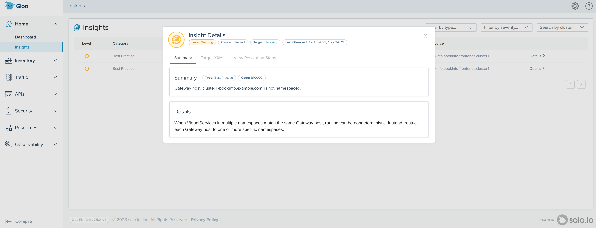
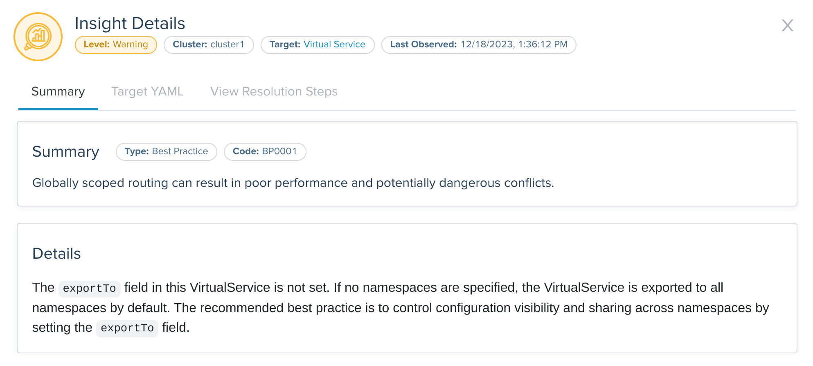
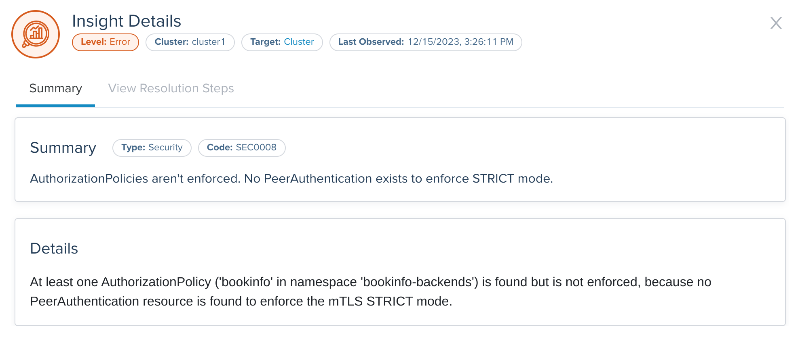
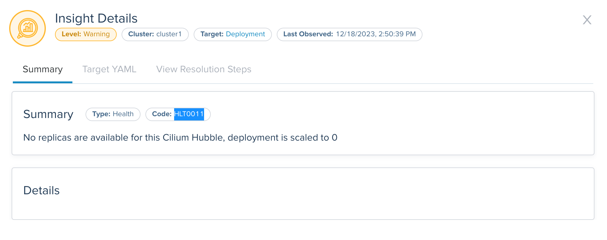

<!--bash
#!/usr/bin/env bash

source ./scripts/assert.sh
-->


<center></center>

# <center>Gloo Mesh Core (2.5.4)</center>


## Table of Contents
* [Introduction](#introduction)
* [Lab 1 - Deploy a KinD cluster](#lab-1---deploy-a-kind-cluster-)
* [Lab 2 - Deploy and register Gloo Mesh](#lab-2---deploy-and-register-gloo-mesh-)
* [Lab 3 - Deploy Istio using Gloo Mesh Lifecycle Manager](#lab-3---deploy-istio-using-gloo-mesh-lifecycle-manager-)
* [Lab 4 - Deploy the Bookinfo demo app](#lab-4---deploy-the-bookinfo-demo-app-)
* [Lab 5 - Deploy the httpbin demo app](#lab-5---deploy-the-httpbin-demo-app-)
* [Lab 6 - Expose the productpage service through a gateway using Istio resources](#lab-6---expose-the-productpage-service-through-a-gateway-using-istio-resources-)
* [Lab 7 - Introduction to Insights](#lab-7---introduction-to-insights-)
* [Lab 8 - Insights related to configuration errors](#lab-8---insights-related-to-configuration-errors-)
* [Lab 9 - Insights related to security issues](#lab-9---insights-related-to-security-issues-)
* [Lab 10 - Insights related to health issues](#lab-10---insights-related-to-health-issues-)


## Introduction <a name="introduction"></a>

[Gloo Mesh Core](https://www.solo.io/products/gloo-mesh/) is a management plane that makes it easy to operate [Istio](https://istio.io).

Gloo Mesh Core works with community [Istio](https://istio.io/) out of the box.
You get instant insights into your Istio environment through a custom dashboard.
Observability pipelines let you analyze many data sources that you already have.
You can even automate installing and upgrading Istio with the Gloo lifecycle manager, on one or many Kubernetes clusters deployed anywhere.

But Gloo Mesh Core includes more than tooling to complement an existing Istio installation.
You can also replace community Istio with Solo's hardened Istio images. These images unlock enterprise-level support.
Later, you might choose to upgrade seamlessly to Gloo Mesh Enterprise for a full-stack service mesh and API gateway solution.
This approach lets you scale as you need more advanced routing and security features.

### Istio support

The Gloo Mesh Core subscription includes end-to-end Istio support:

* Upstream feature development
* CI/CD-ready automated installation and upgrade
* End-to-end Istio support and CVE security patching
* Long-term n-4 version support with Solo images
* Special image builds for distroless and FIPS compliance
* 24x7 production support and one-hour Severity 1 SLA

### Gloo Mesh Core overview

Gloo Mesh Core provides many unique features, including:

* Single pane of glass for operational management of Istio, including global observability
* Insights based on environment checks with corrective actions and best practices
* [Cilium](https://cilium.io/) support
* Seamless migration to full-stack service mesh

### Want to learn more about Gloo Mesh Core?

You can find more information about Gloo Mesh Core in the official documentation: <https://docs.solo.io/gloo-mesh-core>


## Lab 1 - Deploy a KinD cluster <a name="lab-1---deploy-a-kind-cluster-"></a>


Clone this repository and go to the directory where this `README.md` file is.

Set the context environment variables:

```bash
export MGMT=cluster1
export CLUSTER1=cluster1
```

Run the following commands to deploy a Kubernetes cluster using [Kind](https://kind.sigs.k8s.io/):

```bash
./scripts/deploy-multi-with-cilium.sh 1 cluster1 us-west us-west-1
```

Then run the following commands to wait for all the Pods to be ready:

```bash
./scripts/check.sh cluster1
```

**Note:** If you run the `check.sh` script immediately after the `deploy.sh` script, you may see a jsonpath error. If that happens, simply wait a few seconds and try again.

Once the `check.sh` script completes, when you execute the `kubectl get pods -A` command, you should see the following:

```
NAMESPACE            NAME                                          READY   STATUS    RESTARTS   AGE
kube-system          calico-kube-controllers-59d85c5c84-sbk4k      1/1     Running   0          4h26m
kube-system          calico-node-przxs                             1/1     Running   0          4h26m
kube-system          coredns-6955765f44-ln8f5                      1/1     Running   0          4h26m
kube-system          coredns-6955765f44-s7xxx                      1/1     Running   0          4h26m
kube-system          etcd-cluster1-control-plane                   1/1     Running   0          4h27m
kube-system          kube-apiserver-cluster1-control-plane         1/1     Running   0          4h27m
kube-system          kube-controller-manager-cluster1-control-plane1/1     Running   0          4h27m
kube-system          kube-proxy-ksvzw                              1/1     Running   0          4h26m
kube-system          kube-scheduler-cluster1-control-plane         1/1     Running   0          4h27m
local-path-storage   local-path-provisioner-58f6947c7-lfmdx        1/1     Running   0          4h26m
metallb-system       controller-5c9894b5cd-cn9x2                   1/1     Running   0          4h26m
metallb-system       speaker-d7jkp                                 1/1     Running   0          4h26m
```
<!--bash
cat <<'EOF' > ./test.js
const helpers = require('./tests/chai-exec');

describe("Clusters are healthy", () => {
    const clusters = [process.env.MGMT, process.env.CLUSTER1];
    clusters.forEach(cluster => {
        it(`Cluster ${cluster} is healthy`, () => helpers.k8sObjectIsPresent({ context: cluster, namespace: "default", k8sType: "service", k8sObj: "kubernetes" }));
    });
});
EOF
echo "executing test dist/workshop/build/templates/steps/deploy-kind-cluster/tests/cluster-healthy.test.js.liquid"
tempfile=$(mktemp)
echo "saving errors in ${tempfile}"
timeout --signal=INT 3m mocha ./test.js --timeout 10000 --retries=120 --bail 2> ${tempfile} || { cat ${tempfile} && exit 1; }
-->


## Lab 2 - Deploy and register Gloo Mesh <a name="lab-2---deploy-and-register-gloo-mesh-"></a>
[](https://youtu.be/djfFiepK4GY "Video Link")


Before we get started, let's install the `meshctl` CLI:

```bash
export GLOO_MESH_VERSION=v2.5.4
curl -sL https://run.solo.io/meshctl/install | sh -
export PATH=$HOME/.gloo-mesh/bin:$PATH
```
<!--bash
cat <<'EOF' > ./test.js
var chai = require('chai');
var expect = chai.expect;

describe("Required environment variables should contain value", () => {
  afterEach(function(done){
    if(this.currentTest.currentRetry() > 0){
      process.stdout.write(".");
       setTimeout(done, 1000);
    } else {
      done();
    }
  });

  it("Context environment variables should not be empty", () => {
    expect(process.env.MGMT).not.to.be.empty
    expect(process.env.CLUSTER1).not.to.be.empty
  });

  it("Gloo Mesh licence environment variables should not be empty", () => {
    expect(process.env.GLOO_MESH_LICENSE_KEY).not.to.be.empty
  });
});
EOF
echo "executing test dist/workshop/build/templates/steps/deploy-and-register-gloo-mesh/tests/environment-variables.test.js.liquid"
tempfile=$(mktemp)
echo "saving errors in ${tempfile}"
timeout --signal=INT 3m mocha ./test.js --timeout 10000 --retries=120 --bail 2> ${tempfile} || { cat ${tempfile} && exit 1; }
-->
Run the following commands to deploy the Gloo Mesh management plane:

```bash
kubectl --context ${MGMT} create ns gloo-mesh

helm upgrade --install gloo-platform-crds gloo-platform-crds \
  --repo https://storage.googleapis.com/gloo-platform/helm-charts \
  --namespace gloo-mesh \
  --kube-context ${MGMT} \
  --set featureGates.insightsConfiguration=true \
  --version 2.5.4

helm upgrade --install gloo-platform-mgmt gloo-platform \
  --repo https://storage.googleapis.com/gloo-platform/helm-charts \
  --namespace gloo-mesh \
  --kube-context ${MGMT} \
  --version 2.5.4 \
  -f -<<EOF
licensing:
  glooTrialLicenseKey: ${GLOO_MESH_LICENSE_KEY}
common:
  cluster: cluster1
glooInsightsEngine:
  enabled: true
glooMgmtServer:
  enabled: true
  ports:
    healthcheck: 8091
  registerCluster: true
prometheus:
  enabled: true
redis:
  deployment:
    enabled: true
telemetryGateway:
  enabled: true
  service:
    type: LoadBalancer
glooUi:
  enabled: true
  serviceType: LoadBalancer
glooAgent:
  enabled: true
  relay:
    serverAddress: gloo-mesh-mgmt-server:9900
    authority: gloo-mesh-mgmt-server.gloo-mesh
telemetryCollector:
  enabled: true
  config:
    exporters:
      otlp:
        endpoint: gloo-telemetry-gateway:4317

EOF

kubectl --context ${MGMT} -n gloo-mesh rollout status deploy/gloo-mesh-mgmt-server

kubectl --context ${MGMT} delete workspaces -A --all
kubectl --context ${MGMT} delete workspacesettings -A --all
```

<!--bash
kubectl wait --context ${MGMT} --for=condition=Ready -n gloo-mesh --all pod
timeout 2m bash -c "until [[ \$(kubectl --context ${MGMT} -n gloo-mesh get svc gloo-mesh-mgmt-server -o json | jq '.status.loadBalancer | length') -gt 0 ]]; do
  sleep 1
done"
-->

<!--bash
cat <<'EOF' > ./test.js
var chai = require('chai');
var expect = chai.expect;
const helpers = require('./tests/chai-exec');
describe("Cluster registration", () => {
  it("cluster1 is registered", () => {
    podName = helpers.getOutputForCommand({ command: "kubectl -n gloo-mesh get pods -l app=gloo-mesh-mgmt-server -o jsonpath='{.items[0].metadata.name}' --context " + process.env.MGMT }).replaceAll("'", "");
    command = helpers.getOutputForCommand({ command: "kubectl --context " + process.env.MGMT + " -n gloo-mesh debug -q -i " + podName + " --image=curlimages/curl -- curl -s http://localhost:9091/metrics" }).replaceAll("'", "");
    expect(command).to.contain("cluster1");
  });
});
EOF
echo "executing test dist/workshop/build/templates/steps/deploy-and-register-gloo-mesh/tests/cluster-registration.test.js.liquid"
tempfile=$(mktemp)
echo "saving errors in ${tempfile}"
timeout --signal=INT 3m mocha ./test.js --timeout 10000 --retries=120 --bail 2> ${tempfile} || { cat ${tempfile} && exit 1; }
-->


## Lab 3 - Deploy Istio using Gloo Mesh Lifecycle Manager <a name="lab-3---deploy-istio-using-gloo-mesh-lifecycle-manager-"></a>
[](https://youtu.be/f76-KOEjqHs "Video Link")

We are going to deploy Istio using Gloo Mesh Lifecycle Manager.

Let's create Kubernetes services for the gateways:

```bash
kubectl --context ${CLUSTER1} create ns istio-gateways
kubectl --context ${CLUSTER1} label namespace istio-gateways istio.io/rev=1-20 --overwrite

kubectl apply --context ${CLUSTER1} -f - <<EOF
apiVersion: v1
kind: Service
metadata:
  labels:
    app: istio-ingressgateway
    istio: ingressgateway
  name: istio-ingressgateway
  namespace: istio-gateways
spec:
  ports:
  - name: http2
    port: 80
    protocol: TCP
    targetPort: 8080
  - name: https
    port: 443
    protocol: TCP
    targetPort: 8443
  selector:
    app: istio-ingressgateway
    istio: ingressgateway
    revision: 1-20
  type: LoadBalancer
EOF
```

It allows us to have full control on which Istio revision we want to use.

Then, we can tell Gloo Mesh to deploy the Istio control planes and the gateways in the cluster(s).

```bash
kubectl apply --context ${MGMT} -f - <<EOF
apiVersion: admin.gloo.solo.io/v2
kind: IstioLifecycleManager
metadata:
  name: cluster1-installation
  namespace: gloo-mesh
spec:
  installations:
    - clusters:
      - name: cluster1
        defaultRevision: true
      revision: 1-20
      istioOperatorSpec:
        profile: minimal
        hub: us-docker.pkg.dev/gloo-mesh/istio-workshops
        tag: 1.20.2-fips
        namespace: istio-system
        values:
          global:
            meshID: mesh1
            multiCluster:
              clusterName: cluster1
            network: cluster1
        meshConfig:
          accessLogFile: /dev/stdout
          defaultConfig:
            proxyMetadata:
              ISTIO_META_DNS_CAPTURE: "true"
              ISTIO_META_DNS_AUTO_ALLOCATE: "true"
        components:
          pilot:
            k8s:
              env:
                - name: PILOT_ENABLE_K8S_SELECT_WORKLOAD_ENTRIES
                  value: "false"
          ingressGateways:
          - name: istio-ingressgateway
            enabled: false
EOF

kubectl apply --context ${MGMT} -f - <<EOF
apiVersion: admin.gloo.solo.io/v2
kind: GatewayLifecycleManager
metadata:
  name: cluster1-ingress
  namespace: gloo-mesh
spec:
  installations:
    - clusters:
      - name: cluster1
        activeGateway: false
      gatewayRevision: 1-20
      istioOperatorSpec:
        profile: empty
        hub: us-docker.pkg.dev/gloo-mesh/istio-workshops
        tag: 1.20.2-fips
        values:
          gateways:
            istio-ingressgateway:
              customService: true
        components:
          ingressGateways:
            - name: istio-ingressgateway
              namespace: istio-gateways
              enabled: true
              label:
                istio: ingressgateway
EOF

```

<!--bash
until kubectl --context ${MGMT} -n gloo-mesh wait --timeout=180s --for=jsonpath='{.status.clusters.cluster1.installations.*.state}'=HEALTHY istiolifecyclemanagers/cluster1-installation; do
  echo "Waiting for the Istio installation to complete"
  sleep 1
done
timeout 2m bash -c "until [[ \$(kubectl --context ${CLUSTER1} -n istio-system get deploy -o json | jq '[.items[].status.readyReplicas] | add') -ge 1 ]]; do
  sleep 1
done"
timeout 2m bash -c "until [[ \$(kubectl --context ${CLUSTER1} -n istio-gateways get deploy -o json | jq '[.items[].status.readyReplicas] | add') -eq 2 ]]; do
  sleep 1
done"
-->

<!--bash
cat <<'EOF' > ./test.js

const helpers = require('./tests/chai-exec');

const chaiExec = require("@jsdevtools/chai-exec");
const helpersHttp = require('./tests/chai-http');
const chai = require("chai");
const expect = chai.expect;

afterEach(function (done) {
  if (this.currentTest.currentRetry() > 0) {
    process.stdout.write(".");
    setTimeout(done, 1000);
  } else {
    done();
  }
});

describe("Checking Istio installation", function() {
  it('istiod pods are ready in cluster ' + process.env.CLUSTER1, () => helpers.checkDeploymentsWithLabels({ context: process.env.CLUSTER1, namespace: "istio-system", labels: "app=istiod", instances: 1 }));
  it('gateway pods are ready in cluster ' + process.env.CLUSTER1, () => helpers.checkDeploymentsWithLabels({ context: process.env.CLUSTER1, namespace: "istio-gateways", labels: "app=istio-ingressgateway", instances: 1 }));
  it("Gateways have an ip attached in cluster " + process.env.CLUSTER1, () => {
    let cli = chaiExec("kubectl --context " + process.env.CLUSTER1 + " -n istio-gateways get svc -l app=istio-ingressgateway -o jsonpath='{.items}'");
    cli.stderr.should.be.empty;
    let deployments = JSON.parse(cli.stdout.slice(1,-1));
    expect(deployments).to.have.lengthOf(1);
    deployments.forEach((deployment) => {
      expect(deployment.status.loadBalancer).to.have.property("ingress");
    });
  });
});

EOF
echo "executing test dist/workshop/build/templates/steps/istio-lifecycle-manager-install/tests/istio-ready.test.js.liquid"
tempfile=$(mktemp)
echo "saving errors in ${tempfile}"
timeout --signal=INT 3m mocha ./test.js --timeout 10000 --retries=120 --bail 2> ${tempfile} || { cat ${tempfile} && exit 1; }
-->
<!--bash
timeout 2m bash -c "until [[ \$(kubectl --context ${CLUSTER1} -n istio-gateways get svc -l istio=ingressgateway -o json | jq '.items[0].status.loadBalancer | length') -gt 0 ]]; do
  sleep 1
done"
-->

```bash
export HOST_GW_CLUSTER1="$(kubectl --context ${CLUSTER1} -n istio-gateways get svc -l istio=ingressgateway -o jsonpath='{.items[0].status.loadBalancer.ingress[0].*}')"
```

<!--bash
cat <<'EOF' > ./test.js
const dns = require('dns');
const chaiHttp = require("chai-http");
const chai = require("chai");
const expect = chai.expect;
chai.use(chaiHttp);
const { waitOnFailedTest } = require('./tests/utils');

afterEach(function(done) { waitOnFailedTest(done, this.currentTest.currentRetry())});

describe("Address '" + process.env.HOST_GW_CLUSTER1 + "' can be resolved in DNS", () => {
    it(process.env.HOST_GW_CLUSTER1 + ' can be resolved', (done) => {
        return dns.lookup(process.env.HOST_GW_CLUSTER1, (err, address, family) => {
            expect(address).to.be.an.ip;
            done();
        });
    });
});
EOF
echo "executing test ./gloo-mesh-2-0/tests/can-resolve.test.js.liquid"
tempfile=$(mktemp)
echo "saving errors in ${tempfile}"
timeout --signal=INT 3m mocha ./test.js --timeout 10000 --retries=120 --bail 2> ${tempfile} || { cat ${tempfile} && exit 1; }
-->


## Lab 4 - Deploy the Bookinfo demo app <a name="lab-4---deploy-the-bookinfo-demo-app-"></a>
[](https://youtu.be/nzYcrjalY5A "Video Link")

We're going to deploy the bookinfo application to demonstrate several features of Gloo Mesh.

You can find more information about this application [here](https://istio.io/latest/docs/examples/bookinfo/).

Run the following commands to deploy the bookinfo application on `cluster1`:

```bash
kubectl --context ${CLUSTER1} create ns bookinfo-frontends
kubectl --context ${CLUSTER1} create ns bookinfo-backends
kubectl --context ${CLUSTER1} label namespace bookinfo-frontends istio.io/rev=1-20 --overwrite
kubectl --context ${CLUSTER1} label namespace bookinfo-backends istio.io/rev=1-20 --overwrite

# Deploy the frontend bookinfo service in the bookinfo-frontends namespace
kubectl --context ${CLUSTER1} -n bookinfo-frontends apply -f data/steps/deploy-bookinfo/productpage-v1.yaml

# Deploy the backend bookinfo services in the bookinfo-backends namespace for all versions less than v3
kubectl --context ${CLUSTER1} -n bookinfo-backends apply \
  -f data/steps/deploy-bookinfo/details-v1.yaml \
  -f data/steps/deploy-bookinfo/ratings-v1.yaml \
  -f data/steps/deploy-bookinfo/reviews-v1-v2.yaml

# Update the reviews service to display where it is coming from
kubectl --context ${CLUSTER1} -n bookinfo-backends set env deploy/reviews-v1 CLUSTER_NAME=${CLUSTER1}
kubectl --context ${CLUSTER1} -n bookinfo-backends set env deploy/reviews-v2 CLUSTER_NAME=${CLUSTER1}
```

<!--bash
echo -n Waiting for bookinfo pods to be ready...
timeout -v 5m bash -c "
until [[ \$(kubectl --context ${CLUSTER1} -n bookinfo-frontends get deploy -o json | jq '[.items[].status.readyReplicas] | add') -eq 1 && \\
  \$(kubectl --context ${CLUSTER1} -n bookinfo-backends get deploy -o json | jq '[.items[].status.readyReplicas] | add') -eq 4 ]] 2>/dev/null
do
  sleep 1
  echo -n .
done"
echo
-->

You can check that the app is running using the following command:

```
kubectl --context ${CLUSTER1} -n bookinfo-frontends get pods && kubectl --context ${CLUSTER1} -n bookinfo-backends get pods
```

Note that we deployed the `productpage` service in the `bookinfo-frontends` namespace and the other services in the `bookinfo-backends` namespace.

And we deployed the `v1` and `v2` versions of the `reviews` microservice, not the `v3` version.

<!--bash
cat <<'EOF' > ./test.js
const helpers = require('./tests/chai-exec');

describe("Bookinfo app", () => {
  let cluster = process.env.CLUSTER1
  let deployments = ["productpage-v1"];
  deployments.forEach(deploy => {
    it(deploy + ' pods are ready in ' + cluster, () => helpers.checkDeployment({ context: cluster, namespace: "bookinfo-frontends", k8sObj: deploy }));
  });
  deployments = ["ratings-v1", "details-v1", "reviews-v1", "reviews-v2"];
  deployments.forEach(deploy => {
    it(deploy + ' pods are ready in ' + cluster, () => helpers.checkDeployment({ context: cluster, namespace: "bookinfo-backends", k8sObj: deploy }));
  });
});
EOF
echo "executing test dist/workshop/build/templates/steps/apps/bookinfo/deploy-bookinfo/tests/check-bookinfo.test.js.liquid"
tempfile=$(mktemp)
echo "saving errors in ${tempfile}"
timeout --signal=INT 3m mocha ./test.js --timeout 10000 --retries=120 --bail 2> ${tempfile} || { cat ${tempfile} && exit 1; }
-->


## Lab 5 - Deploy the httpbin demo app <a name="lab-5---deploy-the-httpbin-demo-app-"></a>
[](https://youtu.be/w1xB-o_gHs0 "Video Link")

We're going to deploy the httpbin application to demonstrate several features of Gloo Mesh.

You can find more information about this application [here](http://httpbin.org/).

Run the following commands to deploy the httpbin app on `cluster1`. The deployment will be called `not-in-mesh` and won't have the sidecar injected (because we don't label the namespace).

```bash
kubectl --context ${CLUSTER1} create ns httpbin
kubectl apply --context ${CLUSTER1} -f - <<EOF
apiVersion: v1
kind: ServiceAccount
metadata:
  name: not-in-mesh
  namespace: httpbin
---
apiVersion: v1
kind: Service
metadata:
  name: not-in-mesh
  namespace: httpbin
  labels:
    app: not-in-mesh
    service: not-in-mesh
spec:
  ports:
  - name: http
    port: 8000
    targetPort: 80
  selector:
    app: not-in-mesh
---
apiVersion: apps/v1
kind: Deployment
metadata:
  name: not-in-mesh
  namespace: httpbin
spec:
  replicas: 1
  selector:
    matchLabels:
      app: not-in-mesh
      version: v1
  template:
    metadata:
      labels:
        app: not-in-mesh
        version: v1
    spec:
      serviceAccountName: not-in-mesh
      containers:
      - image: docker.io/kennethreitz/httpbin
        imagePullPolicy: IfNotPresent
        name: not-in-mesh
        ports:
        - containerPort: 80
EOF
```

Then, we deploy a second version, which will be called `in-mesh` and will have the sidecar injected (because of the label `istio.io/rev` in the Pod template).

```bash
kubectl apply --context ${CLUSTER1} -f - <<EOF
apiVersion: v1
kind: ServiceAccount
metadata:
  name: in-mesh
  namespace: httpbin
---
apiVersion: v1
kind: Service
metadata:
  name: in-mesh
  namespace: httpbin
  labels:
    app: in-mesh
    service: in-mesh
spec:
  ports:
  - name: http
    port: 8000
    targetPort: 80
  selector:
    app: in-mesh
---
apiVersion: apps/v1
kind: Deployment
metadata:
  name: in-mesh
  namespace: httpbin
spec:
  replicas: 1
  selector:
    matchLabels:
      app: in-mesh
      version: v1
  template:
    metadata:
      labels:
        app: in-mesh
        version: v1
        istio.io/rev: 1-20
    spec:
      serviceAccountName: in-mesh
      containers:
      - image: docker.io/kennethreitz/httpbin
        imagePullPolicy: IfNotPresent
        name: in-mesh
        ports:
        - containerPort: 80
EOF
```


<!--bash
echo -n Waiting for httpbin pods to be ready...
timeout -v 5m bash -c "
until [[ \$(kubectl --context ${CLUSTER1} -n httpbin get deploy -o json | jq '[.items[].status.readyReplicas] | add') -eq 2 ]] 2>/dev/null
do
  sleep 1
  echo -n .
done"
echo
-->

You can follow the progress using the following command:

```bash
kubectl --context ${CLUSTER1} -n httpbin get pods
```

```,nocopy
NAME                           READY   STATUS    RESTARTS   AGE
in-mesh-5d9d9549b5-qrdgd       2/2     Running   0          11s
not-in-mesh-5c64bb49cd-m9kwm   1/1     Running   0          11s
```
<!--bash
cat <<'EOF' > ./test.js
const helpers = require('./tests/chai-exec');

describe("httpbin app", () => {
  let cluster = process.env.CLUSTER1
  
  let deployments = ["not-in-mesh", "in-mesh"];
  
  deployments.forEach(deploy => {
    it(deploy + ' pods are ready in ' + cluster, () => helpers.checkDeployment({ context: cluster, namespace: "httpbin", k8sObj: deploy }));
  });
});
EOF
echo "executing test dist/workshop/build/templates/steps/apps/httpbin/deploy-httpbin/tests/check-httpbin.test.js.liquid"
tempfile=$(mktemp)
echo "saving errors in ${tempfile}"
timeout --signal=INT 3m mocha ./test.js --timeout 10000 --retries=120 --bail 2> ${tempfile} || { cat ${tempfile} && exit 1; }
-->


## Lab 6 - Expose the productpage service through a gateway using Istio resources <a name="lab-6---expose-the-productpage-service-through-a-gateway-using-istio-resources-"></a>

In this step, we're going to expose the `productpage` service through the Ingress Gateway using Istio resources.

First, you need to create a `Gateway` object to configure the Istio Ingress Gateway in cluster1 to listen to incoming requests.

```bash
kubectl apply --context ${CLUSTER1} -f - <<EOF
apiVersion: networking.istio.io/v1beta1
kind: Gateway
metadata:
  name: bookinfo
  namespace: bookinfo-frontends
spec:
  selector:
    istio: ingressgateway
  servers:
  - port:
      number: 80
      name: http
      protocol: HTTP
    hosts:
    - cluster1-bookinfo.example.com
EOF

```

Then, you need to create a `VirtualService` to expose the `productpage` service through the gateway.

```bash
kubectl apply --context ${CLUSTER1} -f - <<EOF
apiVersion: networking.istio.io/v1beta1
kind: VirtualService
metadata:
  name: bookinfo
  namespace: bookinfo-frontends
spec:
  hosts:
  - cluster1-bookinfo.example.com
  gateways:
  - bookinfo
  http:
  - match:
    - uri:
        prefix: /productpage
    - uri:
        prefix: /static
    route:
    - destination:
        port:
          number: 9080
        host: productpage
EOF
```
Let's add the domains to our `/etc/hosts` file:

```bash
./scripts/register-domain.sh cluster1-bookinfo.example.com ${HOST_GW_CLUSTER1}
./scripts/register-domain.sh cluster1-httpbin.example.com ${HOST_GW_CLUSTER1}
```

You can access the `productpage` service using this URL: [http://cluster1-bookinfo.example.com/productpage](http://cluster1-bookinfo.example.com/productpage).

You should now be able to access the `productpage` application through the browser.
<!--bash
cat <<'EOF' > ./test.js
const helpers = require('./tests/chai-http');

describe("productpage is available (HTTP)", () => {
  it('/productpage is available in cluster1', () => helpers.checkURL({ host: `http://cluster1-bookinfo.example.com`, path: '/productpage', retCode: 200 }));
})
EOF
echo "executing test dist/workshop/build/templates/steps/apps/bookinfo/gateway-expose-istio/tests/productpage-available.test.js.liquid"
tempfile=$(mktemp)
echo "saving errors in ${tempfile}"
timeout --signal=INT 3m mocha ./test.js --timeout 10000 --retries=120 --bail 2> ${tempfile} || { cat ${tempfile} && exit 1; }
-->

Now, let's secure the access through TLS.
Let's first create a private key and a self-signed certificate:

```bash
openssl req -x509 -nodes -days 365 -newkey rsa:2048 \
   -keyout tls.key -out tls.crt -subj "/CN=*"
```

Then, you have to store them in a Kubernetes secret running the following commands:

```bash
kubectl --context ${CLUSTER1} -n istio-gateways create secret generic tls-secret \
--from-file=tls.key=tls.key \
--from-file=tls.crt=tls.crt
```

Finally, you need to update the `Gateway` to use this secret:

```bash
kubectl apply --context ${CLUSTER1} -f - <<EOF
apiVersion: networking.istio.io/v1beta1
kind: Gateway
metadata:
  name: bookinfo
  namespace: bookinfo-frontends
spec:
  selector:
    istio: ingressgateway
  servers:
  - port:
      number: 80
      name: http
      protocol: HTTP
    hosts:
    - cluster1-bookinfo.example.com
  - port:
      number: 443
      name: https
      protocol: HTTPS
    tls:
      mode: SIMPLE
      credentialName: tls-secret
    hosts:
    - cluster1-bookinfo.example.com
EOF
```

You can now access the `productpage` application securely through the browser.
You can now access the `productpage` service using this URL: [https://cluster1-bookinfo.example.com/productpage](https://cluster1-bookinfo.example.com/productpage).

<!--bash
cat <<'EOF' > ./test.js
const helpers = require('./tests/chai-http');

describe("productpage is available (HTTPS)", () => {
  it('/productpage is available in cluster1', () => helpers.checkURL({ host: `https://cluster1-bookinfo.example.com`, path: '/productpage', retCode: 200 }));
})
EOF
echo "executing test dist/workshop/build/templates/steps/apps/bookinfo/gateway-expose-istio/tests/productpage-available-secure.test.js.liquid"
tempfile=$(mktemp)
echo "saving errors in ${tempfile}"
timeout --signal=INT 3m mocha ./test.js --timeout 10000 --retries=120 --bail 2> ${tempfile} || { cat ${tempfile} && exit 1; }
-->
<!--bash
cat <<'EOF' > ./test.js
var chai = require('chai');
var expect = chai.expect;
const helpers = require('./tests/chai-exec');

describe("Otel metrics", () => {
  it("cluster1 is sending metrics to telemetryGateway", () => {
    podName = helpers.getOutputForCommand({ command: "kubectl -n gloo-mesh get pods -l app.kubernetes.io/name=prometheus -o jsonpath='{.items[0].metadata.name}' --context " + process.env.MGMT }).replaceAll("'", "");
    command = helpers.getOutputForCommand({ command: "kubectl --context " + process.env.MGMT + " -n gloo-mesh debug -q -i " + podName + " --image=curlimages/curl -- curl -s http://localhost:9090/api/v1/query?query=istio_requests_total" }).replaceAll("'", "");
    expect(command).to.contain("cluster\":\"cluster1");
  });
});


EOF
echo "executing test dist/workshop/build/templates/steps/apps/bookinfo/gateway-expose-istio/tests/otel-metrics.test.js.liquid"
tempfile=$(mktemp)
echo "saving errors in ${tempfile}"
timeout --signal=INT 3m mocha ./test.js --timeout 10000 --retries=150 --bail 2> ${tempfile} || { cat ${tempfile} && exit 1; }
-->


## Lab 7 - Introduction to Insights <a name="lab-7---introduction-to-insights-"></a>

Gloo Mesh Insights are generated using configuration, logs and metrics collected by the Gloo Mesh agents on the different clusters.

They are grouped in different categories:
- best practices
- configuration
- health
- security
- ...

If you think some insights aren't relevant or too noisy, you can suppress them.

<!--bash
cat <<'EOF' > ./test.js
const chaiExec = require("@jsdevtools/chai-exec");
const helpersHttp = require('./tests/chai-http');
const puppeteer = require('puppeteer');
var chai = require('chai');
var expect = chai.expect;

describe("Insight BP0001 displayed in the UI", function() {
  let browser;
  let html;

  // Use Mocha's 'before' hook to set up Puppeteer
  beforeEach(async function() {
    browser = await puppeteer.launch({
      headless: "new",
      ignoreHTTPSErrors: true,
      args: ['--no-sandbox', '--disable-setuid-sandbox'], // needed for instruqt
    });
    let page = await browser.newPage();
    await page.goto(`http://${process.env.ENDPOINT_GLOO_MESH_UI}/insights`);
    await page.waitForNetworkIdle({ options: { timeout: 1000 } });

    html = await page.content();
  });

  // Use Mocha's 'after' hook to close Puppeteer
  afterEach(async function() {
    await browser.close();
  });

  it("The page contains 'Globally scoped routing'", () => {
    expect(html).to.contain("Globally scoped routing");
  });
});
EOF
echo "executing test dist/workshop/build/templates/steps/apps/bookinfo/insights-intro/tests/insight-ui-BP0001.test.js.liquid"
tempfile=$(mktemp)
echo "saving errors in ${tempfile}"
timeout --signal=INT 3m mocha ./test.js --timeout 10000 --retries=120 --bail 2> ${tempfile} || { cat ${tempfile} && exit 1; }
-->

<!--bash
cat <<'EOF' > ./test.js
var chai = require('chai');
var expect = chai.expect;
const helpers = require('./tests/chai-exec');

describe("Insight generation", () => {
  it("Insight BP0002 has been triggered", () => {
    podName = helpers.getOutputForCommand({ command: "kubectl -n gloo-mesh get pods -l app.kubernetes.io/name=prometheus -o jsonpath='{.items[0].metadata.name}' --context " + process.env.MGMT }).replaceAll("'", "");
    command = helpers.getOutputForCommand({ command: "kubectl --context " + process.env.MGMT + " -n gloo-mesh debug -q -i " + podName + " --image=curlimages/curl -- curl -s 'http://localhost:9090/api/v1/query?query=solo_io_insights'" }).replaceAll("'", "");
    let result = JSON.parse(command);
    let active = false;
    result.data.result.forEach(item => {
      if(item.metric.code == "BP0002" && item.value[1] > 0) {
        active = true
      }
    });
    expect(active).to.be.true;
  });
});
EOF
echo "executing test dist/workshop/build/templates/steps/apps/bookinfo/insights-intro/tests/insight-metrics.test.js.liquid"
tempfile=$(mktemp)
echo "saving errors in ${tempfile}"
timeout --signal=INT 3m mocha ./test.js --timeout 10000 --retries=120 --bail 2> ${tempfile} || { cat ${tempfile} && exit 1; }
-->

For example, right now we have the following insight:



Note the code of this insight: BP0002

If you don't plan to update your `Gateway` objects to follow the suggested best practice, you can create the following object to suppress it.

```bash
kubectl apply --context ${MGMT} -f - <<EOF
apiVersion: admin.gloo.solo.io/v2alpha1
kind: InsightsConfig
metadata:
  name: insights-config
  namespace: gloo-mesh
spec:
  disabledInsights:
    - BP0002
EOF
```

<!--bash
cat <<'EOF' > ./test.js
const chaiExec = require("@jsdevtools/chai-exec");
const helpersHttp = require('./tests/chai-http');
const puppeteer = require('puppeteer');
var chai = require('chai');
var expect = chai.expect;

describe("Insight BP0002 not displayed in the UI", function() {
  let browser;
  let html;

  // Use Mocha's 'before' hook to set up Puppeteer
  beforeEach(async function() {
    browser = await puppeteer.launch({
      headless: "new",
      ignoreHTTPSErrors: true,
      args: ['--no-sandbox', '--disable-setuid-sandbox'], // needed for instruqt
    });
    let page = await browser.newPage();
    await page.goto(`http://${process.env.ENDPOINT_GLOO_MESH_UI}/insights`);
    await page.waitForNetworkIdle({ options: { timeout: 1000 } });

    html = await page.content();
  });

  // Use Mocha's 'after' hook to close Puppeteer
  afterEach(async function() {
    await browser.close();
  });

  it("The page doesn't contain 'is not namespaced'", () => {
    expect(html).not.to.contain("is not namespaced");
  });
});
EOF
echo "executing test dist/workshop/build/templates/steps/apps/bookinfo/insights-intro/tests/insight-not-ui-BP0002.test.js.liquid"
tempfile=$(mktemp)
echo "saving errors in ${tempfile}"
timeout --signal=INT 3m mocha ./test.js --timeout 10000 --retries=120 --bail 2> ${tempfile} || { cat ${tempfile} && exit 1; }
-->

The corresponding insight isn't displayed anymore in the UI.

The UI can be used to display all the current insights, but metrics are also produced when insights are triggered.

It allows you to have an historical view of the insights.

Run the following command to see the insights metrics:

```shell
pod=$(kubectl --context ${MGMT} -n gloo-mesh get pods -l app.kubernetes.io/name=prometheus -o jsonpath='{.items[0].metadata.name}')
kubectl --context ${MGMT} -n gloo-mesh debug -q -i ${pod} --image=curlimages/curl -- curl -s "http://localhost:9090/api/v1/query?query=solo_io_insights" | jq -r '.data.result[].metric.code'
```

It will list the current insights in Prometheus:

```,nocopy
BP0001
SYS0004
SYS0004
SYS0006
...
```

Note that some of them are suppressed by default. They are used internally.

As this is a gauge, you can use it to display historical data.

You can get the details about a specific entry in the metrics.

```shell
pod=$(kubectl --context ${MGMT} -n gloo-mesh get pods -l app.kubernetes.io/name=prometheus -o jsonpath='{.items[0].metadata.name}')
kubectl --context ${MGMT} -n gloo-mesh debug -q -i ${pod} --image=curlimages/curl -- curl -s "http://localhost:9090/api/v1/query?query=solo_io_insights" | jq -r '.data.result[]|select(.metric.code=="BP0001")'
```

```json,nocopy
{
  "metric": {
    "__name__": "solo_io_insights",
    "app": "gloo-mesh-mgmt-server",
    "category": "BP",
    "cluster": "cluster1",
    "code": "BP0001",
    "collector_pod": "gloo-telemetry-collector-agent-pdptz",
    "component": "agent-collector",
    "controller_revision_hash": "5475869bf",
    "key": "0001",
    "namespace": "gloo-mesh",
    "pod": "gloo-mesh-mgmt-server-7bc5478744-pqd9m",
    "pod_template_generation": "1",
    "severity": "WARNING",
    "target": "bookinfo.bookinfo-frontends.value:\"networking.istio.io\".value:\"VirtualService\".cluster1",
    "target_type": "resource"
  },
  "value": [
    1702643487.08,
    "1"
  ]
}
```

The `target` value can be read: the `bookinfo` object of kind `VirtualService` (with the apiVersion `networking.istio.io`) in the `bookinfo-frontends` namespace.

Let's have a look at another insight.



The resolution step is telling us the following:

```,nocopy
In the spec.exportTo field of your VirtualService Istio resource, list namespaces to export the VirtualService to. When you export a VirtualService, only sidecars and gateways that exist in the namespaces that you specify can use it. Note that the value "." makes the VirtualService available only in the same namespace that the VirtualService is defined in, and "*" exports the VirtualService to all namespaces.
```

You can update the `VirtualService` to add the `exportTo` field as suggested:

```bash
kubectl apply --context ${CLUSTER1} -f - <<EOF
apiVersion: networking.istio.io/v1beta1
kind: VirtualService
metadata:
  name: bookinfo
  namespace: bookinfo-frontends
spec:
  hosts:
  - cluster1-bookinfo.example.com
  exportTo:
  - istio-gateways
  gateways:
  - bookinfo
  http:
  - match:
    - uri:
        prefix: /productpage
    - uri:
        prefix: /static
    route:
    - destination:
        port:
          number: 9080
        host: productpage
EOF
```

<!--bash
cat <<'EOF' > ./test.js
const chaiExec = require("@jsdevtools/chai-exec");
const helpersHttp = require('./tests/chai-http');
const puppeteer = require('puppeteer');
var chai = require('chai');
var expect = chai.expect;

describe("Insight BP0001 is not displayed in the UI", function() {
  let browser;
  let html;

  // Use Mocha's 'before' hook to set up Puppeteer
  beforeEach(async function() {
    browser = await puppeteer.launch({
      headless: "new",
      ignoreHTTPSErrors: true,
      args: ['--no-sandbox', '--disable-setuid-sandbox'], // needed for instruqt
    });
    let page = await browser.newPage();
    await page.goto(`http://${process.env.ENDPOINT_GLOO_MESH_UI}/insights`);
    await page.waitForNetworkIdle({ options: { timeout: 1000 } });

    html = await page.content();
  });

  // Use Mocha's 'after' hook to close Puppeteer
  afterEach(async function() {
    await browser.close();
  });

  it("The page doesn't contain 'Globally scoped routing'", () => {
    expect(html).not.to.contain("Globally scoped routing");
  });
});
EOF
echo "executing test dist/workshop/build/templates/steps/apps/bookinfo/insights-intro/tests/insight-not-ui-BP0001.test.js.liquid"
tempfile=$(mktemp)
echo "saving errors in ${tempfile}"
timeout --signal=INT 3m mocha ./test.js --timeout 10000 --retries=120 --bail 2> ${tempfile} || { cat ${tempfile} && exit 1; }
-->

The UI shouldn't display this insight anymore.


## Lab 8 - Insights related to configuration errors <a name="lab-8---insights-related-to-configuration-errors-"></a>

In this lab, we're going to focus on insights related to configuration errors.

Let's create a new `VirtualService` to send all the requests from the `productpage` service to only the `v1` version of the `reviews` service.

```bash
kubectl apply --context ${CLUSTER1} -f - <<EOF
apiVersion: networking.istio.io/v1beta1
kind: VirtualService
metadata:
  name: reviews
  namespace: bookinfo-backends
spec:
  hosts:
  - reviews
  exportTo:
  - bookinfo-frontends
  http:
  - route:
    - destination:
        host: reviews
        subset: v1
      weight: 100
EOF
```

<!--bash
cat <<'EOF' > ./test.js
var chai = require('chai');
var expect = chai.expect;
const helpers = require('./tests/chai-exec');

describe("Insight generation", () => {
  it("Insight CFG0001 has been triggered", () => {
    podName = helpers.getOutputForCommand({ command: "kubectl -n gloo-mesh get pods -l app.kubernetes.io/name=prometheus -o jsonpath='{.items[0].metadata.name}' --context " + process.env.MGMT }).replaceAll("'", "");
    command = helpers.getOutputForCommand({ command: "kubectl --context " + process.env.MGMT + " -n gloo-mesh debug -q -i " + podName + " --image=curlimages/curl -- curl -s 'http://localhost:9090/api/v1/query?query=solo_io_insights'" }).replaceAll("'", "");
    let result = JSON.parse(command);
    let active = false;
    result.data.result.forEach(item => {
      if(item.metric.code == "CFG0001" && item.value[1] > 0) {
        active = true
      }
    });
    expect(active).to.be.true;
  });
});
EOF
echo "executing test dist/workshop/build/templates/steps/apps/bookinfo/insights-config/../insights-intro/tests/insight-metrics.test.js.liquid"
tempfile=$(mktemp)
echo "saving errors in ${tempfile}"
timeout --signal=INT 3m mocha ./test.js --timeout 10000 --retries=120 --bail 2> ${tempfile} || { cat ${tempfile} && exit 1; }
-->

If you refresh the `productpage` tab, you'll see the error `Sorry, product reviews are currently unavailable for this book.`.

And if you go to the Gloo Mesh UI, you'll see an insight has been generated:


That's because you haven't created a `DestinationRule` to define the `v1` subset.

Let's solve the issue.

```bash
kubectl apply --context ${CLUSTER1} -f - <<EOF
apiVersion: networking.istio.io/v1beta1
kind: DestinationRule
metadata:
  name: reviews
  namespace: bookinfo-backends
spec:
  host: reviews.bookinfo-backends.svc.cluster.local
  subsets:
  - name: v1
    labels:
      version: v1
EOF
```

The insight should disappear and the productpage service should display the reviews correctly (only `v1`, so no stars).

<!--bash
cat <<'EOF' > ./test.js
var chai = require('chai');
var expect = chai.expect;
const helpers = require('./tests/chai-exec');

describe("Insight generation", () => {
  it("Insight CFG0001 has not been triggered", () => {
    podName = helpers.getOutputForCommand({ command: "kubectl -n gloo-mesh get pods -l app.kubernetes.io/name=prometheus -o jsonpath='{.items[0].metadata.name}' --context " + process.env.MGMT }).replaceAll("'", "");
    command = helpers.getOutputForCommand({ command: "kubectl --context " + process.env.MGMT + " -n gloo-mesh debug -q -i " + podName + " --image=curlimages/curl -- curl -s 'http://localhost:9090/api/v1/query?query=solo_io_insights'" }).replaceAll("'", "");
    let result = JSON.parse(command);
    let active = false;
    result.data.result.forEach(item => {
      if(item.metric.code == "CFG0001" && item.value[1] > 0) {
        active = true
      }
    });
    expect(active).to.be.false;
  });
});
EOF
echo "executing test dist/workshop/build/templates/steps/apps/bookinfo/insights-config/../insights-intro/tests/insight-metrics.test.js.liquid"
tempfile=$(mktemp)
echo "saving errors in ${tempfile}"
timeout --signal=INT 3m mocha ./test.js --timeout 10000 --retries=120 --bail 2> ${tempfile} || { cat ${tempfile} && exit 1; }
-->

Let's delete the objects we've created:

```bash
kubectl --context ${CLUSTER1} -n bookinfo-backends delete virtualservice reviews
kubectl --context ${CLUSTER1} -n bookinfo-backends delete destinationrule reviews
```


## Lab 9 - Insights related to security issues <a name="lab-9---insights-related-to-security-issues-"></a>

In this lab, we're going to focus on insights related to security issues.

Let's create a new `AuthorizationPolicy` to deny requests to the `reviews` service sent by a service in the `httpbin` namespace.

```bash
kubectl apply --context ${CLUSTER1} -f - <<EOF
apiVersion: security.istio.io/v1beta1
kind: AuthorizationPolicy
metadata:
  name: reviews
  namespace: bookinfo-backends
spec:
  action: DENY
  selector:
    matchLabels:
      app: reviews
  rules:
  - from:
    - source:
        namespaces: ["httpbin"]
EOF
```

Try to send a request from a Pod in the `httpbin` namespace which is in the mesh:

```bash
pod=$(kubectl --context ${CLUSTER1} -n httpbin get pods -l app=in-mesh -o jsonpath='{.items[0].metadata.name}')
kubectl --context ${CLUSTER1} -n httpbin debug -q -i ${pod} --image=curlimages/curl -- curl -s http://reviews.bookinfo-backends.svc.cluster.local:9080/reviews/0 
```

The access should be denied:

```
RBAC: access denied
```

Now, let's try from a Pod in the `httpbin` namespace which is not in the mesh:

```bash
pod=$(kubectl --context ${CLUSTER1} -n httpbin get pods -l app=not-in-mesh -o jsonpath='{.items[0].metadata.name}')
kubectl --context ${CLUSTER1} -n httpbin debug -q -i ${pod} --image=curlimages/curl -- curl -s http://reviews.bookinfo-backends.svc.cluster.local:9080/reviews/0 
```

This time it works:

```
{"id": "0","podname": "reviews-v1-97798f498-mbkr9","clustername": "cluster1","reviews": [{  "reviewer": "Reviewer1",  "text": "An extremely entertaining play by Shakespeare. The slapstick humour is refreshing!"},{  "reviewer": "Reviewer2",  "text": "Absolutely fun and entertaining. The play lacks thematic depth when compared to other plays by Shakespeare."}]}
```

That's because mTLS isn't enforced.

Luckily, an insight has been generated to alert you about this potential security breach.



<!--bash
cat <<'EOF' > ./test.js
var chai = require('chai');
var expect = chai.expect;
const helpers = require('./tests/chai-exec');

describe("Insight generation", () => {
  it("Insight SEC0008 has been triggered", () => {
    podName = helpers.getOutputForCommand({ command: "kubectl -n gloo-mesh get pods -l app.kubernetes.io/name=prometheus -o jsonpath='{.items[0].metadata.name}' --context " + process.env.MGMT }).replaceAll("'", "");
    command = helpers.getOutputForCommand({ command: "kubectl --context " + process.env.MGMT + " -n gloo-mesh debug -q -i " + podName + " --image=curlimages/curl -- curl -s 'http://localhost:9090/api/v1/query?query=solo_io_insights'" }).replaceAll("'", "");
    let result = JSON.parse(command);
    let active = false;
    result.data.result.forEach(item => {
      if(item.metric.code == "SEC0008" && item.value[1] > 0) {
        active = true
      }
    });
    expect(active).to.be.true;
  });
});
EOF
echo "executing test dist/workshop/build/templates/steps/apps/bookinfo/insights-security/../insights-intro/tests/insight-metrics.test.js.liquid"
tempfile=$(mktemp)
echo "saving errors in ${tempfile}"
timeout --signal=INT 3m mocha ./test.js --timeout 10000 --retries=120 --bail 2> ${tempfile} || { cat ${tempfile} && exit 1; }
-->

You can fix the issue by creating a `PeerAuthentication` object to enforce mTLS globally:

```bash
kubectl apply --context ${CLUSTER1} -f - <<EOF
apiVersion: security.istio.io/v1beta1
kind: PeerAuthentication
metadata:
  name: default
  namespace: istio-system
spec:
  mtls:
    mode: STRICT
EOF
```

The insight should disappear and the communication shouldn't be allowed anymore.

<!--bash
cat <<'EOF' > ./test.js
var chai = require('chai');
var expect = chai.expect;
const helpers = require('./tests/chai-exec');

describe("Insight generation", () => {
  it("Insight SEC0008 has not been triggered", () => {
    podName = helpers.getOutputForCommand({ command: "kubectl -n gloo-mesh get pods -l app.kubernetes.io/name=prometheus -o jsonpath='{.items[0].metadata.name}' --context " + process.env.MGMT }).replaceAll("'", "");
    command = helpers.getOutputForCommand({ command: "kubectl --context " + process.env.MGMT + " -n gloo-mesh debug -q -i " + podName + " --image=curlimages/curl -- curl -s 'http://localhost:9090/api/v1/query?query=solo_io_insights'" }).replaceAll("'", "");
    let result = JSON.parse(command);
    let active = false;
    result.data.result.forEach(item => {
      if(item.metric.code == "SEC0008" && item.value[1] > 0) {
        active = true
      }
    });
    expect(active).to.be.false;
  });
});
EOF
echo "executing test dist/workshop/build/templates/steps/apps/bookinfo/insights-security/../insights-intro/tests/insight-metrics.test.js.liquid"
tempfile=$(mktemp)
echo "saving errors in ${tempfile}"
timeout --signal=INT 3m mocha ./test.js --timeout 10000 --retries=120 --bail 2> ${tempfile} || { cat ${tempfile} && exit 1; }
-->

Let's delete the objects we've created:

```bash
kubectl --context ${CLUSTER1} -n bookinfo-backends delete authorizationpolicy reviews
kubectl --context ${CLUSTER1} -n istio-system delete peerauthentication default
```


## Lab 10 - Insights related to health issues <a name="lab-10---insights-related-to-health-issues-"></a>

In this lab, we're going to focus on insights related to health issues.

In this environment, we're using Cilium as a CNI. Gloo Mesh Insights aren't only designed to find issues related to Istio as you'll see in a minute.

The Hubble relay component is aware of all Cilium instances and consolidates all metrics.

Let's scale down the corresponding deployment.

```bash
kubectl --context ${CLUSTER1} -n kube-system scale deploy/hubble-relay --replicas 0
```

<!--bash
cat <<'EOF' > ./test.js
var chai = require('chai');
var expect = chai.expect;
const helpers = require('./tests/chai-exec');

describe("Insight generation", () => {
  it("Insight HLT0011 has been triggered", () => {
    podName = helpers.getOutputForCommand({ command: "kubectl -n gloo-mesh get pods -l app.kubernetes.io/name=prometheus -o jsonpath='{.items[0].metadata.name}' --context " + process.env.MGMT }).replaceAll("'", "");
    command = helpers.getOutputForCommand({ command: "kubectl --context " + process.env.MGMT + " -n gloo-mesh debug -q -i " + podName + " --image=curlimages/curl -- curl -s 'http://localhost:9090/api/v1/query?query=solo_io_insights'" }).replaceAll("'", "");
    let result = JSON.parse(command);
    let active = false;
    result.data.result.forEach(item => {
      if(item.metric.code == "HLT0011" && item.value[1] > 0) {
        active = true
      }
    });
    expect(active).to.be.true;
  });
});
EOF
echo "executing test dist/workshop/build/templates/steps/apps/bookinfo/insights-health/../insights-intro/tests/insight-metrics.test.js.liquid"
tempfile=$(mktemp)
echo "saving errors in ${tempfile}"
timeout --signal=INT 3m mocha ./test.js --timeout 10000 --retries=120 --bail 2> ${tempfile} || { cat ${tempfile} && exit 1; }
-->

If you go to the Gloo Mesh UI, you'll see an insight has been generated:



Let's scale it back up.

```bash
kubectl --context ${CLUSTER1} -n kube-system scale deploy/hubble-relay --replicas 1
```

The insight should disappear.

<!--bash
cat <<'EOF' > ./test.js
var chai = require('chai');
var expect = chai.expect;
const helpers = require('./tests/chai-exec');

describe("Insight generation", () => {
  it("Insight HLT0011 has not been triggered", () => {
    podName = helpers.getOutputForCommand({ command: "kubectl -n gloo-mesh get pods -l app.kubernetes.io/name=prometheus -o jsonpath='{.items[0].metadata.name}' --context " + process.env.MGMT }).replaceAll("'", "");
    command = helpers.getOutputForCommand({ command: "kubectl --context " + process.env.MGMT + " -n gloo-mesh debug -q -i " + podName + " --image=curlimages/curl -- curl -s 'http://localhost:9090/api/v1/query?query=solo_io_insights'" }).replaceAll("'", "");
    let result = JSON.parse(command);
    let active = false;
    result.data.result.forEach(item => {
      if(item.metric.code == "HLT0011" && item.value[1] > 0) {
        active = true
      }
    });
    expect(active).to.be.false;
  });
});
EOF
echo "executing test dist/workshop/build/templates/steps/apps/bookinfo/insights-health/../insights-intro/tests/insight-metrics.test.js.liquid"
tempfile=$(mktemp)
echo "saving errors in ${tempfile}"
timeout --signal=INT 3m mocha ./test.js --timeout 10000 --retries=120 --bail 2> ${tempfile} || { cat ${tempfile} && exit 1; }
-->


