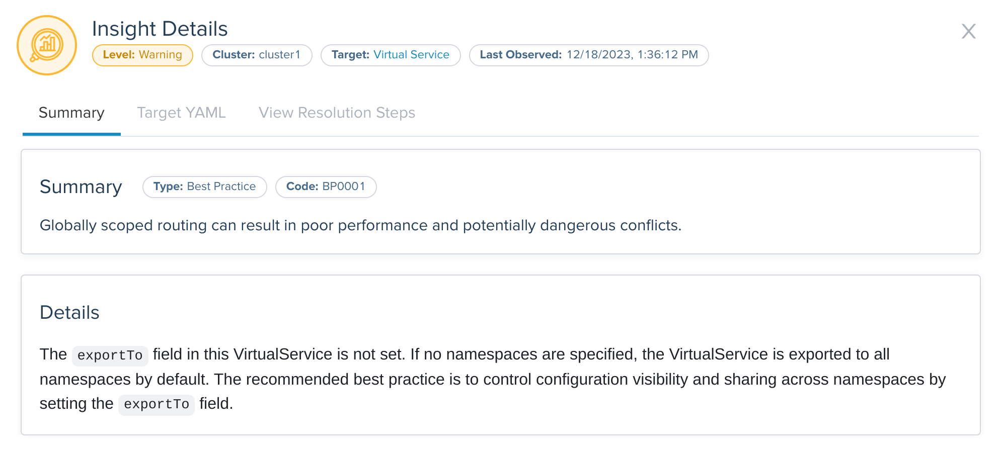

<!--bash
source ./scripts/assert.sh
-->


<center></center>

# <center>Gloo Mesh Core (2.6.5) Ambient</center>


## Table of Contents
* [Introduction](#introduction)
* [Lab 1 - Deploy KinD clusters](#lab-1---deploy-kind-clusters-)
* [Lab 2 - Deploy and register Gloo Mesh](#lab-2---deploy-and-register-gloo-mesh-)
* [Lab 3 - Deploy Istio using Gloo Mesh Lifecycle Manager](#lab-3---deploy-istio-using-gloo-mesh-lifecycle-manager-)
* [Lab 4 - Deploy the Bookinfo demo app](#lab-4---deploy-the-bookinfo-demo-app-)
* [Lab 5 - Deploy the httpbin demo app](#lab-5---deploy-the-httpbin-demo-app-)
* [Lab 6 - Deploy the clients to make requests to other services](#lab-6---deploy-the-clients-to-make-requests-to-other-services-)
* [Lab 7 - Expose the productpage service through a gateway using Istio resources](#lab-7---expose-the-productpage-service-through-a-gateway-using-istio-resources-)
* [Lab 8 - Ambient Authorization Policies](#lab-8---ambient-authorization-policies-)
* [Lab 9 - Ambient L7 observability](#lab-9---ambient-l7-observability-)
* [Lab 10 - Introduction to Insights](#lab-10---introduction-to-insights-)
* [Lab 11 - Insights related to configuration errors](#lab-11---insights-related-to-configuration-errors-)
* [Lab 12 - Insights related to security issues](#lab-12---insights-related-to-security-issues-)
* [Lab 13 - Upgrade Istio using Gloo Mesh Lifecycle Manager to perform an in place upgrade](#lab-13---upgrade-istio-using-gloo-mesh-lifecycle-manager-to-perform-an-in-place-upgrade-)
* [Lab 14 - Ambient Egress Traffic with Waypoint](#lab-14---ambient-egress-traffic-with-waypoint-)
* [Lab 15 - Waypoint Deployment Options](#lab-15---waypoint-deployment-options-)


## Introduction <a name="introduction"></a>

[Gloo Mesh Core](https://www.solo.io/products/gloo-mesh/) is a management plane that makes it easy to operate [Istio](https://istio.io) and adds additional features to Ambient.

Gloo Mesh Core works with community [Istio](https://istio.io/) out of the box.
You get instant insights into your Istio environment through a custom dashboard.
Observability pipelines let you analyze many data sources that you already have.
You can even automate installing and upgrading Istio with the Gloo lifecycle manager, on one or many Kubernetes clusters deployed anywhere.

But Gloo Mesh Core includes more than tooling to complement an existing Istio installation.
You can also replace community Istio with Solo's hardened Istio images. These images unlock enterprise-level support.
Later, you might choose to upgrade seamlessly to Gloo Mesh Enterprise for a full-stack service mesh and API gateway solution.
This approach lets you scale as you need more advanced routing and security features.

### Istio and Ambient support

The Gloo Mesh Core subscription includes end-to-end Istio support:

* Upstream feature development
* CI/CD-ready automated installation and upgrade
* End-to-end Istio support and CVE security patching
* Long-term n-4 version support with Solo images
* Special image builds for distroless and FIPS compliance
* 24x7 production support and one-hour Severity 1 SLA
* Ambient support for Istio
* L7 Telemetry support in Ztunnel

### Gloo Mesh Core overview

Gloo Mesh Core provides many unique features, including:

* Single pane of glass for operational management of Istio, including global observability
* Insights based on environment checks with corrective actions and best practices
* [Cilium](https://cilium.io/) support
* Seamless migration to full-stack service mesh

### Want to learn more about Gloo Mesh Core?

You can find more information about Gloo Mesh Core in the official documentation: <https://docs.solo.io/gloo-mesh-core>


## Lab 1 - Deploy KinD clusters <a name="lab-1---deploy-kind-clusters-"></a>


Clone this repository and go to the directory where this `README.md` file is.

Set the context environment variables:

```bash
export MGMT=mgmt
export CLUSTER1=cluster1
export CLUSTER2=cluster2
```

Run the following commands to deploy three Kubernetes clusters using [Kind](https://kind.sigs.k8s.io/):

```bash
./scripts/deploy-aws-with-calico.sh 1 mgmt
./scripts/deploy-aws-with-calico.sh 2 cluster1 us-west us-west-1
./scripts/deploy-aws-with-calico.sh 3 cluster2 us-west us-west-2
```

Then run the following commands to wait for all the Pods to be ready:

```bash
./scripts/check.sh mgmt
./scripts/check.sh cluster1
./scripts/check.sh cluster2
```

**Note:** If you run the `check.sh` script immediately after the `deploy.sh` script, you may see a jsonpath error. If that happens, simply wait a few seconds and try again.

Once the `check.sh` script completes, when you execute the `kubectl get pods -A` command, you should see the following:

```
NAMESPACE            NAME                                          READY   STATUS    RESTARTS   AGE
kube-system          calico-kube-controllers-59d85c5c84-sbk4k      1/1     Running   0          4h26m
kube-system          calico-node-przxs                             1/1     Running   0          4h26m
kube-system          coredns-6955765f44-ln8f5                      1/1     Running   0          4h26m
kube-system          coredns-6955765f44-s7xxx                      1/1     Running   0          4h26m
kube-system          etcd-cluster1-control-plane                   1/1     Running   0          4h27m
kube-system          kube-apiserver-cluster1-control-plane         1/1     Running   0          4h27m
kube-system          kube-controller-manager-cluster1-control-plane1/1     Running   0          4h27m
kube-system          kube-proxy-ksvzw                              1/1     Running   0          4h26m
kube-system          kube-scheduler-cluster1-control-plane         1/1     Running   0          4h27m
local-path-storage   local-path-provisioner-58f6947c7-lfmdx        1/1     Running   0          4h26m
metallb-system       controller-5c9894b5cd-cn9x2                   1/1     Running   0          4h26m
metallb-system       speaker-d7jkp                                 1/1     Running   0          4h26m
```

**Note:** The CNI pods might be different, depending on which CNI you have deployed.

You can see that your currently connected to this cluster by executing the `kubectl config get-contexts` command:

```
CURRENT   NAME         CLUSTER         AUTHINFO   NAMESPACE  
          cluster1     kind-cluster1   cluster1
*         cluster2     kind-cluster2   cluster2
          mgmt         kind-mgmt       kind-mgmt
```

Run the following command to make `mgmt` the current cluster.

```bash
kubectl config use-context ${MGMT}
```
<!--bash
cat <<'EOF' > ./test.js
const helpers = require('./tests/chai-exec');

describe("Clusters are healthy", () => {
    const clusters = [process.env.MGMT, process.env.CLUSTER1, process.env.CLUSTER2];
    clusters.forEach(cluster => {
        it(`Cluster ${cluster} is healthy`, () => helpers.k8sObjectIsPresent({ context: cluster, namespace: "default", k8sType: "service", k8sObj: "kubernetes" }));
    });
});
EOF
echo "executing test dist/gloo-mesh-2-0-workshop/build/templates/steps/deploy-kind-clusters/tests/cluster-healthy.test.js.liquid"
timeout --signal=INT 3m mocha ./test.js --timeout 10000 --retries=120 --bail || exit 1
-->


## Lab 2 - Deploy and register Gloo Mesh <a name="lab-2---deploy-and-register-gloo-mesh-"></a>
[](https://youtu.be/djfFiepK4GY "Video Link")


Before we get started, let's install the `meshctl` CLI:

```bash
export GLOO_MESH_VERSION=v2.6.5
curl -sL https://run.solo.io/meshctl/install | sh -
export PATH=$HOME/.gloo-mesh/bin:$PATH
```
<!--bash
cat <<'EOF' > ./test.js
var chai = require('chai');
var expect = chai.expect;

describe("Required environment variables should contain value", () => {
  afterEach(function(done){
    if(this.currentTest.currentRetry() > 0){
      process.stdout.write(".");
       setTimeout(done, 1000);
    } else {
      done();
    }
  });

  it("Context environment variables should not be empty", () => {
    expect(process.env.MGMT).not.to.be.empty
    expect(process.env.CLUSTER1).not.to.be.empty
    expect(process.env.CLUSTER2).not.to.be.empty
  });

  it("Gloo Mesh licence environment variables should not be empty", () => {
    expect(process.env.GLOO_MESH_LICENSE_KEY).not.to.be.empty
  });
});
EOF
echo "executing test dist/gloo-mesh-2-0-workshop/build/templates/steps/deploy-and-register-gloo-mesh/tests/environment-variables.test.js.liquid"
timeout --signal=INT 3m mocha ./test.js --timeout 10000 --retries=120 --bail || exit 1
-->
Run the following commands to deploy the Gloo Mesh management plane:

```bash
kubectl --context ${MGMT} create ns gloo-mesh

helm upgrade --install gloo-platform-crds gloo-platform-crds \
  --repo https://storage.googleapis.com/gloo-platform/helm-charts \
  --namespace gloo-mesh \
  --kube-context ${MGMT} \
  --set featureGates.insightsConfiguration=true \
  --version 2.6.5

helm upgrade --install gloo-platform gloo-platform \
  --repo https://storage.googleapis.com/gloo-platform/helm-charts \
  --namespace gloo-mesh \
  --kube-context ${MGMT} \
  --version 2.6.5 \
  -f -<<EOF
licensing:
  glooTrialLicenseKey: ${GLOO_MESH_LICENSE_KEY}
common:
  cluster: mgmt
experimental:
  ambientEnabled: true
glooInsightsEngine:
  enabled: true
glooMgmtServer:
  enabled: true
  ports:
    healthcheck: 8091
prometheus:
  enabled: true
redis:
  deployment:
    enabled: true
telemetryGateway:
  enabled: true
  service:
    type: LoadBalancer
glooUi:
  enabled: true
  serviceType: LoadBalancer
telemetryCollector:
  enabled: true
  config:
    exporters:
      otlp:
        endpoint: gloo-telemetry-gateway:4317
featureGates:
  istioLifecycleAgent: true
EOF

kubectl --context ${MGMT} -n gloo-mesh rollout status deploy/gloo-mesh-mgmt-server
```

<!--bash
kubectl wait --context ${MGMT} --for=condition=Ready -n gloo-mesh --all pod
timeout 2m bash -c "until [[ \$(kubectl --context ${MGMT} -n gloo-mesh get svc gloo-mesh-mgmt-server -o json | jq '.status.loadBalancer | length') -gt 0 ]]; do
  sleep 1
done"
-->

Then, you need to set the environment variable to tell the Gloo Mesh agents how to communicate with the management plane:
<!--bash
cat <<'EOF' > ./test.js

const helpers = require('./tests/chai-exec');

describe("MGMT server is healthy", () => {
  let cluster = process.env.MGMT;
  let deployments = ["gloo-mesh-mgmt-server","gloo-mesh-redis","gloo-telemetry-gateway","prometheus-server"];
  deployments.forEach(deploy => {
    it(deploy + ' pods are ready in ' + cluster, () => helpers.checkDeployment({ context: cluster, namespace: "gloo-mesh", k8sObj: deploy }));
  });
});
EOF
echo "executing test dist/gloo-mesh-2-0-workshop/build/templates/steps/deploy-and-register-gloo-mesh/tests/check-deployment.test.js.liquid"
timeout --signal=INT 3m mocha ./test.js --timeout 10000 --retries=120 --bail || exit 1
-->
<!--bash
cat <<'EOF' > ./test.js
const chaiExec = require("@jsdevtools/chai-exec");
var chai = require('chai');
var expect = chai.expect;
chai.use(chaiExec);

afterEach(function (done) {
  if (this.currentTest.currentRetry() > 0) {
    process.stdout.write(".");
    setTimeout(done, 1000);
  } else {
    done();
  }
});
EOF
echo "executing test dist/gloo-mesh-2-0-workshop/build/templates/steps/deploy-and-register-gloo-mesh/tests/get-gloo-mesh-mgmt-server-ip.test.js.liquid"
timeout --signal=INT 3m mocha ./test.js --timeout 10000 --retries=120 --bail || exit 1
-->

```bash
export ENDPOINT_GLOO_MESH=$(kubectl --context ${MGMT} -n gloo-mesh get svc gloo-mesh-mgmt-server -o jsonpath='{.status.loadBalancer.ingress[0].*}'):9900
export HOST_GLOO_MESH=$(echo ${ENDPOINT_GLOO_MESH%:*})
export ENDPOINT_TELEMETRY_GATEWAY=$(kubectl --context ${MGMT} -n gloo-mesh get svc gloo-telemetry-gateway -o jsonpath='{.status.loadBalancer.ingress[0].*}'):4317
export ENDPOINT_GLOO_MESH_UI=$(kubectl --context ${MGMT} -n gloo-mesh get svc gloo-mesh-ui -o jsonpath='{.status.loadBalancer.ingress[0].*}'):8090
```

Check that the variables have correct values:
```
echo $HOST_GLOO_MESH
echo $ENDPOINT_GLOO_MESH
```

<!--bash
cat <<'EOF' > ./test.js
const dns = require('dns');
const chaiHttp = require("chai-http");
const chai = require("chai");
const expect = chai.expect;
chai.use(chaiHttp);
const { waitOnFailedTest } = require('./tests/utils');

afterEach(function(done) { waitOnFailedTest(done, this.currentTest.currentRetry())});

describe("Address '" + process.env.HOST_GLOO_MESH + "' can be resolved in DNS", () => {
    it(process.env.HOST_GLOO_MESH + ' can be resolved', (done) => {
        return dns.lookup(process.env.HOST_GLOO_MESH, (err, address, family) => {
            expect(address).to.be.an.ip;
            done();
        });
    });
});
EOF
echo "executing test ./gloo-mesh-2-0/tests/can-resolve.test.js.liquid"
timeout --signal=INT 3m mocha ./test.js --timeout 10000 --retries=120 --bail || exit 1
-->
Finally, you need to register the cluster(s).


Here is how you register the first one:

```bash
kubectl apply --context ${MGMT} -f - <<EOF
apiVersion: admin.gloo.solo.io/v2
kind: KubernetesCluster
metadata:
  name: cluster1
  namespace: gloo-mesh
spec:
  clusterDomain: cluster.local
EOF

kubectl --context ${CLUSTER1} create ns gloo-mesh

kubectl get secret relay-root-tls-secret -n gloo-mesh --context ${MGMT} -o jsonpath='{.data.ca\.crt}' | base64 -d > ca.crt
kubectl create secret generic relay-root-tls-secret -n gloo-mesh --context ${CLUSTER1} --from-file ca.crt=ca.crt
rm ca.crt

kubectl get secret relay-identity-token-secret -n gloo-mesh --context ${MGMT} -o jsonpath='{.data.token}' | base64 -d > token
kubectl create secret generic relay-identity-token-secret -n gloo-mesh --context ${CLUSTER1} --from-file token=token
rm token

helm upgrade --install gloo-platform-crds gloo-platform-crds \
  --repo https://storage.googleapis.com/gloo-platform/helm-charts \
  --namespace gloo-mesh \
  --kube-context ${CLUSTER1} \
  --version 2.6.5

helm upgrade --install gloo-platform gloo-platform \
  --repo https://storage.googleapis.com/gloo-platform/helm-charts \
  --namespace gloo-mesh \
  --kube-context ${CLUSTER1} \
  --version 2.6.5 \
  -f -<<EOF
common:
  cluster: cluster1
glooAgent:
  enabled: true
  relay:
    serverAddress: "${ENDPOINT_GLOO_MESH}"
    authority: gloo-mesh-mgmt-server.gloo-mesh
telemetryCollector:
  enabled: true
  config:
    exporters:
      otlp:
        endpoint: "${ENDPOINT_TELEMETRY_GATEWAY}"
glooAnalyzer:
  enabled: true
EOF
```

Note that the registration can also be performed using `meshctl cluster register`.

And here is how you register the second one:

```bash
kubectl apply --context ${MGMT} -f - <<EOF
apiVersion: admin.gloo.solo.io/v2
kind: KubernetesCluster
metadata:
  name: cluster2
  namespace: gloo-mesh
spec:
  clusterDomain: cluster.local
EOF

kubectl --context ${CLUSTER2} create ns gloo-mesh

kubectl get secret relay-root-tls-secret -n gloo-mesh --context ${MGMT} -o jsonpath='{.data.ca\.crt}' | base64 -d > ca.crt
kubectl create secret generic relay-root-tls-secret -n gloo-mesh --context ${CLUSTER2} --from-file ca.crt=ca.crt
rm ca.crt

kubectl get secret relay-identity-token-secret -n gloo-mesh --context ${MGMT} -o jsonpath='{.data.token}' | base64 -d > token
kubectl create secret generic relay-identity-token-secret -n gloo-mesh --context ${CLUSTER2} --from-file token=token
rm token

helm upgrade --install gloo-platform-crds gloo-platform-crds \
  --repo https://storage.googleapis.com/gloo-platform/helm-charts \
  --namespace gloo-mesh \
  --kube-context ${CLUSTER2} \
  --version 2.6.5

helm upgrade --install gloo-platform gloo-platform \
  --repo https://storage.googleapis.com/gloo-platform/helm-charts \
  --namespace gloo-mesh \
  --kube-context ${CLUSTER2} \
  --version 2.6.5 \
  -f -<<EOF
common:
  cluster: cluster2
glooAgent:
  enabled: true
  relay:
    serverAddress: "${ENDPOINT_GLOO_MESH}"
    authority: gloo-mesh-mgmt-server.gloo-mesh
telemetryCollector:
  enabled: true
  config:
    exporters:
      otlp:
        endpoint: "${ENDPOINT_TELEMETRY_GATEWAY}"
glooAnalyzer:
  enabled: true
EOF
```

You can check the cluster(s) have been registered correctly using the following commands:
```
meshctl --kubecontext ${MGMT} check
```

```
pod=$(kubectl --context ${MGMT} -n gloo-mesh get pods -l app=gloo-mesh-mgmt-server -o jsonpath='{.items[0].metadata.name}')
kubectl --context ${MGMT} -n gloo-mesh debug -q -i ${pod} --image=curlimages/curl -- curl -s http://localhost:9091/metrics | grep relay_push_clients_connected
```

You should get an output similar to this:
```,nocopy
# HELP relay_push_clients_connected Current number of connected Relay push clients (Relay Agents).
# TYPE relay_push_clients_connected gauge
relay_push_clients_connected{cluster="cluster1"} 1
relay_push_clients_connected{cluster="cluster2"} 1
```
Finally, you need to specify which gateways you want to use for cross cluster traffic:

```bash
kubectl apply --context ${MGMT} -f - <<EOF
apiVersion: admin.gloo.solo.io/v2
kind: WorkspaceSettings
metadata:
  name: global
  namespace: gloo-mesh
spec:
  options:
    eastWestGateways:
      - selector:
          labels:
            istio: eastwestgateway
EOF
```
<!--bash
cat <<'EOF' > ./test.js
var chai = require('chai');
var expect = chai.expect;
const helpers = require('./tests/chai-exec');
describe("Cluster registration", () => {
  it("cluster1 is registered", () => {
    podName = helpers.getOutputForCommand({ command: "kubectl -n gloo-mesh get pods -l app=gloo-mesh-mgmt-server -o jsonpath='{.items[0].metadata.name}' --context " + process.env.MGMT }).replaceAll("'", "");
    command = helpers.getOutputForCommand({ command: "kubectl --context " + process.env.MGMT + " -n gloo-mesh debug -q -i " + podName + " --image=curlimages/curl -- curl -s http://localhost:9091/metrics" }).replaceAll("'", "");
    expect(command).to.contain("cluster1");
  });
  it("cluster2 is registered", () => {
    podName = helpers.getOutputForCommand({ command: "kubectl -n gloo-mesh get pods -l app=gloo-mesh-mgmt-server -o jsonpath='{.items[0].metadata.name}' --context " + process.env.MGMT }).replaceAll("'", "");
    command = helpers.getOutputForCommand({ command: "kubectl --context " + process.env.MGMT + " -n gloo-mesh debug -q -i " + podName + " --image=curlimages/curl -- curl -s http://localhost:9091/metrics" }).replaceAll("'", "");
    expect(command).to.contain("cluster2");
  });
});
EOF
echo "executing test dist/gloo-mesh-2-0-workshop/build/templates/steps/deploy-and-register-gloo-mesh/tests/cluster-registration.test.js.liquid"
timeout --signal=INT 3m mocha ./test.js --timeout 10000 --retries=120 --bail || exit 1
-->


## Lab 3 - Deploy Istio using Gloo Mesh Lifecycle Manager <a name="lab-3---deploy-istio-using-gloo-mesh-lifecycle-manager-"></a>
[](https://youtu.be/f76-KOEjqHs "Video Link")

We are going to deploy Istio using Gloo Mesh Lifecycle Manager.

<details>
  <summary>Install <code>istioctl</code></summary>

Install `istioctl` if not already installed as it will be useful in some of the labs that follow.

```bash
curl -L https://istio.io/downloadIstio | sh -

if [ -d "istio-"*/ ]; then
  cd istio-*/
  export PATH=$PWD/bin:$PATH
  cd ..
fi
```

That's it!
</details>

<!--bash
cat <<'EOF' > ./test.js
const chaiExec = require("@jsdevtools/chai-exec");
var chai = require('chai');
var expect = chai.expect;
chai.use(chaiExec);

afterEach(function (done) {
  if (this.currentTest.currentRetry() > 0) {
    process.stdout.write(".");
    setTimeout(done, 1000);
  } else {
    done();
  }
});
describe("istio_version is at least 1.23.0", () => {
  it("version should be at least 1.23.0", () => {
    // Compare the string istio_version to the number 1.23.0
    // example 1.23.0-patch0 is valid, but 1.22.6 is not
    let version = "1.23.1";
    let versionParts = version.split('-')[0].split('.');
    let major = parseInt(versionParts[0]);
    let minor = parseInt(versionParts[1]);
    let patch = parseInt(versionParts[2]);
    let minMajor = 1;
    let minMinor = 23;
    let minPatch = 0;
    expect(major).to.be.at.least(minMajor);
    if (major === minMajor) {
      expect(minor).to.be.at.least(minMinor);
      if (minor === minMinor) {
        expect(patch).to.be.at.least(minPatch);
      }
    }
  });
});
EOF
echo "executing test dist/gloo-mesh-2-0-workshop/build/templates/steps/istio-lifecycle-manager-install/tests/istio-version.test.js.liquid"
timeout --signal=INT 3m mocha ./test.js --timeout 10000 --retries=120 --bail || exit 1
-->

Let's create Kubernetes services for the gateways:

```bash
kubectl --context ${CLUSTER1} create ns istio-gateways

kubectl apply --context ${CLUSTER1} -f - <<EOF
apiVersion: v1
kind: Service
metadata:
  labels:
    app: istio-ingressgateway
    istio: ingressgateway
  name: istio-ingressgateway
  namespace: istio-gateways
spec:
  ports:
  - name: http2
    port: 80
    protocol: TCP
    targetPort: 80
  - name: https
    port: 443
    protocol: TCP
    targetPort: 443
  selector:
    app: istio-ingressgateway
    istio: ingressgateway
  type: LoadBalancer
EOF

kubectl apply --context ${CLUSTER1} -f - <<EOF
apiVersion: v1
kind: Service
metadata:
  labels:
    app: istio-ingressgateway
    istio: eastwestgateway
  name: istio-eastwestgateway
  namespace: istio-gateways
spec:
  ports:
  - name: status-port
    port: 15021
    protocol: TCP
    targetPort: 15021
  - name: tls
    port: 15443
    protocol: TCP
    targetPort: 15443
  - name: hbone
    port: 15008
    protocol: TCP
    targetPort: 15008
  - name: https
    port: 16443
    protocol: TCP
    targetPort: 16443
  - name: tls-spire
    port: 8081
    protocol: TCP
    targetPort: 8081
  - name: tls-otel
    port: 4317
    protocol: TCP
    targetPort: 4317
  - name: grpc-cacert
    port: 31338
    protocol: TCP
    targetPort: 31338
  - name: grpc-ew-bootstrap
    port: 31339
    protocol: TCP
    targetPort: 31339
  - name: tcp-istiod
    port: 15012
    protocol: TCP
    targetPort: 15012
  - name: tcp-webhook
    port: 15017
    protocol: TCP
    targetPort: 15017
  selector:
    app: istio-ingressgateway
    istio: eastwestgateway
  type: LoadBalancer
EOF
kubectl --context ${CLUSTER2} create ns istio-gateways

kubectl apply --context ${CLUSTER2} -f - <<EOF
apiVersion: v1
kind: Service
metadata:
  labels:
    app: istio-ingressgateway
    istio: ingressgateway
  name: istio-ingressgateway
  namespace: istio-gateways
spec:
  ports:
  - name: http2
    port: 80
    protocol: TCP
    targetPort: 80
  - name: https
    port: 443
    protocol: TCP
    targetPort: 443
  selector:
    app: istio-ingressgateway
    istio: ingressgateway
  type: LoadBalancer
EOF

kubectl apply --context ${CLUSTER2} -f - <<EOF
apiVersion: v1
kind: Service
metadata:
  labels:
    app: istio-ingressgateway
    istio: eastwestgateway
  name: istio-eastwestgateway
  namespace: istio-gateways
spec:
  ports:
  - name: status-port
    port: 15021
    protocol: TCP
    targetPort: 15021
  - name: tls
    port: 15443
    protocol: TCP
    targetPort: 15443
  - name: hbone
    port: 15008
    protocol: TCP
    targetPort: 15008
  - name: https
    port: 16443
    protocol: TCP
    targetPort: 16443
  - name: tls-spire
    port: 8081
    protocol: TCP
    targetPort: 8081
  - name: tls-otel
    port: 4317
    protocol: TCP
    targetPort: 4317
  - name: grpc-cacert
    port: 31338
    protocol: TCP
    targetPort: 31338
  - name: grpc-ew-bootstrap
    port: 31339
    protocol: TCP
    targetPort: 31339
  - name: tcp-istiod
    port: 15012
    protocol: TCP
    targetPort: 15012
  - name: tcp-webhook
    port: 15017
    protocol: TCP
    targetPort: 15017
  selector:
    app: istio-ingressgateway
    istio: eastwestgateway
  type: LoadBalancer
EOF
```

It allows us to have full control on which Istio revision we want to use.

Then, we can tell Gloo Mesh to deploy the Istio control planes and the gateways in the cluster(s).

```bash
kubectl apply --context ${MGMT} -f - <<EOF
apiVersion: admin.gloo.solo.io/v2
kind: IstioLifecycleManager
metadata:
  name: cluster1-installation
  namespace: gloo-mesh
spec:
  helmGlobal:
    repo: oci://us-docker.pkg.dev/gloo-mesh/istio-helm-<enterprise_istio_repo>
  installations:
    - clusters:
      - name: cluster1
      istioOperatorSpec:
        profile: ambient
        hub: us-docker.pkg.dev/gloo-mesh/istio-<enterprise_istio_repo>
        tag: 1.23.1-solo
        namespace: istio-system
        values:
          cni:
            ambient:
              dnsCapture: true
          ztunnel:
            terminationGracePeriodSeconds: 29
            variant: distroless
            env:
              L7_ENABLED: "true"
        meshConfig:
          accessLogFile: /dev/stdout
          defaultConfig:
            proxyMetadata:
              ISTIO_META_DNS_CAPTURE: "true"
              ISTIO_META_DNS_AUTO_ALLOCATE: "true"
        components:
          pilot:
            k8s:
              env:
                - name: PILOT_ENABLE_K8S_SELECT_WORKLOAD_ENTRIES
                  value: "false"
                - name: PILOT_ENABLE_IP_AUTOALLOCATE
                  value: "true"
          ingressGateways:
          - name: istio-ingressgateway
            enabled: false
EOF

kubectl apply --context ${MGMT} -f - <<EOF
apiVersion: admin.gloo.solo.io/v2
kind: GatewayLifecycleManager
metadata:
  name: cluster1-ingress
  namespace: gloo-mesh
spec:
  helmGlobal:
    repo: oci://us-docker.pkg.dev/gloo-mesh/istio-helm-<enterprise_istio_repo>
  installations:
    - clusters:
      - name: cluster1
        activeGateway: false
      istioOperatorSpec:
        profile: empty
        hub: us-docker.pkg.dev/gloo-mesh/istio-<enterprise_istio_repo>
        tag: 1.23.1-solo
        values:
          gateways:
            istio-ingressgateway:
              customService: true
        components:
          ingressGateways:
            - name: istio-ingressgateway
              namespace: istio-gateways
              enabled: true
              label:
                istio: ingressgateway
---
apiVersion: admin.gloo.solo.io/v2
kind: GatewayLifecycleManager
metadata:
  name: cluster1-eastwest
  namespace: gloo-mesh
spec:
  helmGlobal:
    repo: oci://us-docker.pkg.dev/gloo-mesh/istio-helm-<enterprise_istio_repo>
  installations:
    - clusters:
      - name: cluster1
        activeGateway: false
      istioOperatorSpec:
        profile: empty
        hub: us-docker.pkg.dev/gloo-mesh/istio-<enterprise_istio_repo>
        tag: 1.23.1-solo
        values:
          gateways:
            istio-ingressgateway:
              customService: true
        components:
          ingressGateways:
            - name: istio-eastwestgateway
              namespace: istio-gateways
              enabled: true
              label:
                istio: eastwestgateway
              k8s:
                env:
                  - name: ISTIO_META_ROUTER_MODE
                    value: "sni-dnat"
                  - name: ISTIO_META_REQUESTED_NETWORK_VIEW
                    value: cluster1
EOF

kubectl apply --context ${MGMT} -f - <<EOF
apiVersion: admin.gloo.solo.io/v2
kind: IstioLifecycleManager
metadata:
  name: cluster2-installation
  namespace: gloo-mesh
spec:
  helmGlobal:
    repo: oci://us-docker.pkg.dev/gloo-mesh/istio-helm-<enterprise_istio_repo>
  installations:
    - clusters:
      - name: cluster2
      istioOperatorSpec:
        profile: ambient
        hub: us-docker.pkg.dev/gloo-mesh/istio-<enterprise_istio_repo>
        tag: 1.23.1-solo
        namespace: istio-system
        values:
          cni:
            ambient:
              dnsCapture: true
          ztunnel:
            terminationGracePeriodSeconds: 29
            variant: distroless
            env:
              L7_ENABLED: "true"
        meshConfig:
          accessLogFile: /dev/stdout
          defaultConfig:
            proxyMetadata:
              ISTIO_META_DNS_CAPTURE: "true"
              ISTIO_META_DNS_AUTO_ALLOCATE: "true"
        components:
          pilot:
            k8s:
              env:
                - name: PILOT_ENABLE_K8S_SELECT_WORKLOAD_ENTRIES
                  value: "false"
                - name: PILOT_ENABLE_IP_AUTOALLOCATE
                  value: "true"
          ingressGateways:
          - name: istio-ingressgateway
            enabled: false
EOF

kubectl apply --context ${MGMT} -f - <<EOF
apiVersion: admin.gloo.solo.io/v2
kind: GatewayLifecycleManager
metadata:
  name: cluster2-ingress
  namespace: gloo-mesh
spec:
  helmGlobal:
    repo: oci://us-docker.pkg.dev/gloo-mesh/istio-helm-<enterprise_istio_repo>
  installations:
    - clusters:
      - name: cluster2
        activeGateway: false
      istioOperatorSpec:
        profile: empty
        hub: us-docker.pkg.dev/gloo-mesh/istio-<enterprise_istio_repo>
        tag: 1.23.1-solo
        values:
          gateways:
            istio-ingressgateway:
              customService: true
        components:
          ingressGateways:
            - name: istio-ingressgateway
              namespace: istio-gateways
              enabled: true
              label:
                istio: ingressgateway
---
apiVersion: admin.gloo.solo.io/v2
kind: GatewayLifecycleManager
metadata:
  name: cluster2-eastwest
  namespace: gloo-mesh
spec:
  helmGlobal:
    repo: oci://us-docker.pkg.dev/gloo-mesh/istio-helm-<enterprise_istio_repo>
  installations:
    - clusters:
      - name: cluster2
        activeGateway: false
      istioOperatorSpec:
        profile: empty
        hub: us-docker.pkg.dev/gloo-mesh/istio-<enterprise_istio_repo>
        tag: 1.23.1-solo
        values:
          gateways:
            istio-ingressgateway:
              customService: true
        components:
          ingressGateways:
            - name: istio-eastwestgateway
              namespace: istio-gateways
              enabled: true
              label:
                istio: eastwestgateway
              k8s:
                env:
                  - name: ISTIO_META_ROUTER_MODE
                    value: "sni-dnat"
                  - name: ISTIO_META_REQUESTED_NETWORK_VIEW
                    value: cluster2
EOF
```

<!--bash
until kubectl --context ${MGMT} -n gloo-mesh wait --timeout=180s --for=jsonpath='{.status.clusters.cluster1.installations.*.state}'=HEALTHY istiolifecyclemanagers/cluster1-installation; do
  echo "Waiting for the Istio installation to complete"
  sleep 1
done
timeout 2m bash -c "until [[ \$(kubectl --context ${CLUSTER1} -n istio-system get deploy -o json | jq '[.items[].status.readyReplicas] | add') -ge 1 ]]; do
  sleep 1
done"
timeout 2m bash -c "until [[ \$(kubectl --context ${CLUSTER1} -n istio-gateways get deploy -o json | jq '[.items[].status.readyReplicas] | add') -eq 2 ]]; do
  sleep 1
done"
until kubectl --context ${MGMT} -n gloo-mesh wait --timeout=180s --for=jsonpath='{.status.clusters.cluster2.installations.*.state}'=HEALTHY istiolifecyclemanagers/cluster2-installation; do
  echo "Waiting for the Istio installation to complete"
  sleep 1
done
timeout 2m bash -c "until [[ \$(kubectl --context ${CLUSTER2} -n istio-system get deploy -o json | jq '[.items[].status.readyReplicas] | add') -ge 1 ]]; do
  sleep 1
done"
timeout 2m bash -c "until [[ \$(kubectl --context ${CLUSTER2} -n istio-gateways get deploy -o json | jq '[.items[].status.readyReplicas] | add') -eq 2 ]]; do
  sleep 1
done"
-->

<!--bash
cat <<'EOF' > ./test.js

const helpers = require('./tests/chai-exec');

const chaiExec = require("@jsdevtools/chai-exec");
const helpersHttp = require('./tests/chai-http');
const chai = require("chai");
const expect = chai.expect;

afterEach(function (done) {
  if (this.currentTest.currentRetry() > 0) {
    process.stdout.write(".");
    setTimeout(done, 1000);
  } else {
    done();
  }
});

describe("Checking Istio installation", function() {
  it('istiod pods are ready in cluster ' + process.env.CLUSTER1, () => helpers.checkDeploymentsWithLabels({ context: process.env.CLUSTER1, namespace: "istio-system", labels: "app=istiod", instances: 1 }));
  it('gateway pods are ready in cluster ' + process.env.CLUSTER1, () => helpers.checkDeploymentsWithLabels({ context: process.env.CLUSTER1, namespace: "istio-gateways", labels: "app=istio-ingressgateway", instances: 2 }));
  it('istiod pods are ready in cluster ' + process.env.CLUSTER2, () => helpers.checkDeploymentsWithLabels({ context: process.env.CLUSTER2, namespace: "istio-system", labels: "app=istiod", instances: 1 }));
  it('gateway pods are ready in cluster ' + process.env.CLUSTER2, () => helpers.checkDeploymentsWithLabels({ context: process.env.CLUSTER2, namespace: "istio-gateways", labels: "app=istio-ingressgateway", instances: 2 }));
  it("Gateways have an ip attached in cluster " + process.env.CLUSTER1, () => {
    let cli = chaiExec("kubectl --context " + process.env.CLUSTER1 + " -n istio-gateways get svc -l app=istio-ingressgateway -o jsonpath='{.items}'");
    cli.stderr.should.be.empty;
    let deployments = JSON.parse(cli.stdout.slice(1,-1));
    expect(deployments).to.have.lengthOf(2);
    deployments.forEach((deployment) => {
      expect(deployment.status.loadBalancer).to.have.property("ingress");
    });
  });
  it("Gateways have an ip attached in cluster " + process.env.CLUSTER2, () => {
    let cli = chaiExec("kubectl --context " + process.env.CLUSTER2 + " -n istio-gateways get svc -l app=istio-ingressgateway -o jsonpath='{.items}'");
    cli.stderr.should.be.empty;
    let deployments = JSON.parse(cli.stdout.slice(1,-1));
    expect(deployments).to.have.lengthOf(2);
    deployments.forEach((deployment) => {
      expect(deployment.status.loadBalancer).to.have.property("ingress");
    });
  });
});

EOF
echo "executing test dist/gloo-mesh-2-0-workshop/build/templates/steps/istio-lifecycle-manager-install/tests/istio-ready.test.js.liquid"
timeout --signal=INT 3m mocha ./test.js --timeout 10000 --retries=120 --bail || exit 1
-->
<!--bash
timeout 2m bash -c "until [[ \$(kubectl --context ${CLUSTER1} -n istio-gateways get svc -l istio=ingressgateway -o json | jq '.items[0].status.loadBalancer | length') -gt 0 ]]; do
  sleep 1
done"
-->

```bash
export HOST_GW_CLUSTER1="$(kubectl --context ${CLUSTER1} -n istio-gateways get svc -l istio=ingressgateway -o jsonpath='{.items[0].status.loadBalancer.ingress[0].*}')"
export HOST_GW_CLUSTER2="$(kubectl --context ${CLUSTER2} -n istio-gateways get svc -l istio=ingressgateway -o jsonpath='{.items[0].status.loadBalancer.ingress[0].*}')"
```

<!--bash
cat <<'EOF' > ./test.js
const dns = require('dns');
const chaiHttp = require("chai-http");
const chai = require("chai");
const expect = chai.expect;
chai.use(chaiHttp);
const { waitOnFailedTest } = require('./tests/utils');

afterEach(function(done) { waitOnFailedTest(done, this.currentTest.currentRetry())});

describe("Address '" + process.env.HOST_GW_CLUSTER1 + "' can be resolved in DNS", () => {
    it(process.env.HOST_GW_CLUSTER1 + ' can be resolved', (done) => {
        return dns.lookup(process.env.HOST_GW_CLUSTER1, (err, address, family) => {
            expect(address).to.be.an.ip;
            done();
        });
    });
});
EOF
echo "executing test ./gloo-mesh-2-0/tests/can-resolve.test.js.liquid"
timeout --signal=INT 3m mocha ./test.js --timeout 10000 --retries=120 --bail || exit 1
-->
<!--bash
cat <<'EOF' > ./test.js
const dns = require('dns');
const chaiHttp = require("chai-http");
const chai = require("chai");
const expect = chai.expect;
chai.use(chaiHttp);
const { waitOnFailedTest } = require('./tests/utils');

afterEach(function(done) { waitOnFailedTest(done, this.currentTest.currentRetry())});

describe("Address '" + process.env.HOST_GW_CLUSTER2 + "' can be resolved in DNS", () => {
    it(process.env.HOST_GW_CLUSTER2 + ' can be resolved', (done) => {
        return dns.lookup(process.env.HOST_GW_CLUSTER2, (err, address, family) => {
            expect(address).to.be.an.ip;
            done();
        });
    });
});
EOF
echo "executing test ./gloo-mesh-2-0/tests/can-resolve.test.js.liquid"
timeout --signal=INT 3m mocha ./test.js --timeout 10000 --retries=120 --bail || exit 1
-->
The Gateway APIs do not come installed by default on most Kubernetes clusters. Install the Gateway API CRDs if they are not present:

```bash
kubectl --context ${CLUSTER1} get crd gateways.gateway.networking.k8s.io &> /dev/null || \
  { kubectl kustomize "github.com/kubernetes-sigs/gateway-api/config/crd?ref=v1.1.0" | kubectl --context ${CLUSTER1} apply -f -; }
kubectl --context ${CLUSTER2} get crd gateways.gateway.networking.k8s.io &> /dev/null || \
  { kubectl kustomize "github.com/kubernetes-sigs/gateway-api/config/crd?ref=v1.1.0" | kubectl --context ${CLUSTER2} apply -f -; }
```


## Lab 4 - Deploy the Bookinfo demo app <a name="lab-4---deploy-the-bookinfo-demo-app-"></a>
[](https://youtu.be/nzYcrjalY5A "Video Link")

We're going to deploy the bookinfo application to demonstrate several features of Gloo Mesh.

You can find more information about this application [here](https://istio.io/latest/docs/examples/bookinfo/).

Run the following commands to deploy the bookinfo application on `cluster1`:

```bash
kubectl --context ${CLUSTER1} create ns bookinfo-frontends
kubectl --context ${CLUSTER1} create ns bookinfo-backends
kubectl --context ${CLUSTER1} label namespace bookinfo-frontends istio.io/dataplane-mode=ambient
kubectl --context ${CLUSTER1} label namespace bookinfo-backends istio.io/dataplane-mode=ambient
kubectl --context ${CLUSTER1} label namespace bookinfo-frontends istio-injection=disabled
kubectl --context ${CLUSTER1} label namespace bookinfo-backends istio-injection=disabled

# Deploy the frontend bookinfo service in the bookinfo-frontends namespace
kubectl --context ${CLUSTER1} -n bookinfo-frontends apply -f data/steps/deploy-bookinfo/productpage-v1.yaml

# Deploy the backend bookinfo services in the bookinfo-backends namespace for all versions less than v3
kubectl --context ${CLUSTER1} -n bookinfo-backends apply \
  -f data/steps/deploy-bookinfo/details-v1.yaml \
  -f data/steps/deploy-bookinfo/ratings-v1.yaml \
  -f data/steps/deploy-bookinfo/reviews-v1-v2.yaml

# Update the reviews service to display where it is coming from
kubectl --context ${CLUSTER1} -n bookinfo-backends set env deploy/reviews-v1 CLUSTER_NAME=${CLUSTER1}
kubectl --context ${CLUSTER1} -n bookinfo-backends set env deploy/reviews-v2 CLUSTER_NAME=${CLUSTER1}
```

<!--bash
echo -n Waiting for bookinfo pods to be ready...
timeout -v 5m bash -c "
until [[ \$(kubectl --context ${CLUSTER1} -n bookinfo-frontends get deploy -o json | jq '[.items[].status.readyReplicas] | add') -eq 1 && \\
  \$(kubectl --context ${CLUSTER1} -n bookinfo-backends get deploy -o json | jq '[.items[].status.readyReplicas] | add') -eq 4 ]] 2>/dev/null
do
  sleep 1
  echo -n .
done"
echo
-->

You can check that the app is running using the following command:

```shell
kubectl --context ${CLUSTER1} -n bookinfo-frontends get pods && kubectl --context ${CLUSTER1} -n bookinfo-backends get pods
```

Note that we deployed the `productpage` service in the `bookinfo-frontends` namespace and the other services in the `bookinfo-backends` namespace.

And we deployed the `v1` and `v2` versions of the `reviews` microservice, not the `v3` version.

Now, run the following commands to deploy the bookinfo application on `cluster2`:

```bash
kubectl --context ${CLUSTER2} create ns bookinfo-frontends
kubectl --context ${CLUSTER2} create ns bookinfo-backends
kubectl --context ${CLUSTER2} label namespace bookinfo-frontends istio.io/dataplane-mode=ambient
kubectl --context ${CLUSTER2} label namespace bookinfo-backends istio.io/dataplane-mode=ambient
kubectl --context ${CLUSTER2} label namespace bookinfo-frontends istio-injection=disabled
kubectl --context ${CLUSTER2} label namespace bookinfo-backends istio-injection=disabled

# Deploy the frontend bookinfo service in the bookinfo-frontends namespace
kubectl --context ${CLUSTER2} -n bookinfo-frontends apply -f data/steps/deploy-bookinfo/productpage-v1.yaml
# Deploy the backend bookinfo services in the bookinfo-backends namespace for all versions
kubectl --context ${CLUSTER2} -n bookinfo-backends apply \
  -f data/steps/deploy-bookinfo/details-v1.yaml \
  -f data/steps/deploy-bookinfo/ratings-v1.yaml \
  -f data/steps/deploy-bookinfo/reviews-v1-v2.yaml \
  -f data/steps/deploy-bookinfo/reviews-v3.yaml
# Update the reviews service to display where it is coming from
kubectl --context ${CLUSTER2} -n bookinfo-backends set env deploy/reviews-v1 CLUSTER_NAME=${CLUSTER2}
kubectl --context ${CLUSTER2} -n bookinfo-backends set env deploy/reviews-v2 CLUSTER_NAME=${CLUSTER2}
kubectl --context ${CLUSTER2} -n bookinfo-backends set env deploy/reviews-v3 CLUSTER_NAME=${CLUSTER2}

```

<!--bash
echo -n Waiting for bookinfo pods to be ready...
timeout -v 5m bash -c "
until [[ \$(kubectl --context ${CLUSTER2} -n bookinfo-frontends get deploy -o json | jq '[.items[].status.readyReplicas] | add') -eq 1 && \\
  \$(kubectl --context ${CLUSTER2} -n bookinfo-backends get deploy -o json | jq '[.items[].status.readyReplicas] | add') -eq 5 ]] 2>/dev/null
do
  sleep 1
  echo -n .
done"
echo
-->

Confirm that `v1`, `v2` and `v3` of the `reviews` service are now running in the second cluster:

```bash
kubectl --context ${CLUSTER2} -n bookinfo-frontends get pods && kubectl --context ${CLUSTER2} -n bookinfo-backends get pods
```

As you can see, we deployed all three versions of the `reviews` microservice on this cluster.

<!--bash
cat <<'EOF' > ./test.js
const helpers = require('./tests/chai-exec');

describe("Bookinfo app", () => {
  let cluster = process.env.CLUSTER1
  let deployments = ["productpage-v1"];
  deployments.forEach(deploy => {
    it(deploy + ' pods are ready in ' + cluster, () => helpers.checkDeployment({ context: cluster, namespace: "bookinfo-frontends", k8sObj: deploy }));
  });
  deployments = ["ratings-v1", "details-v1", "reviews-v1", "reviews-v2"];
  deployments.forEach(deploy => {
    it(deploy + ' pods are ready in ' + cluster, () => helpers.checkDeployment({ context: cluster, namespace: "bookinfo-backends", k8sObj: deploy }));
  });
  cluster = process.env.CLUSTER2
  deployments = ["productpage-v1"];
  deployments.forEach(deploy => {
    it(deploy + ' pods are ready in ' + cluster, () => helpers.checkDeployment({ context: cluster, namespace: "bookinfo-frontends", k8sObj: deploy }));
  });
  deployments = ["ratings-v1", "details-v1", "reviews-v1", "reviews-v2", "reviews-v3"];
  deployments.forEach(deploy => {
    it(deploy + ' pods are ready in ' + cluster, () => helpers.checkDeployment({ context: cluster, namespace: "bookinfo-backends", k8sObj: deploy }));
  });
});
EOF
echo "executing test dist/gloo-mesh-2-0-workshop/build/templates/steps/apps/bookinfo/deploy-bookinfo/tests/check-bookinfo.test.js.liquid"
timeout --signal=INT 3m mocha ./test.js --timeout 10000 --retries=120 --bail || exit 1
-->


## Lab 5 - Deploy the httpbin demo app <a name="lab-5---deploy-the-httpbin-demo-app-"></a>
[](https://youtu.be/w1xB-o_gHs0 "Video Link")

We're going to deploy the httpbin application to demonstrate several features of Gloo Mesh.

You can find more information about this application [here](http://httpbin.org/).

Run the following commands to deploy the httpbin app on `cluster1`. The deployment will be called `not-in-mesh` and won't have the sidecar injected, because of the annotation `sidecar.istio.io/inject: "false"` and its traffic won't be redirected to ztunnel because of the annotation `istio.io/dataplane-mode: none`.

```bash
kubectl --context ${CLUSTER1} create ns httpbin
kubectl --context ${CLUSTER1} label namespace httpbin istio.io/dataplane-mode=ambient
kubectl apply --context ${CLUSTER1} -f - <<EOF
apiVersion: v1
kind: ServiceAccount
metadata:
  name: not-in-mesh
  namespace: httpbin
---
apiVersion: v1
kind: Service
metadata:
  name: not-in-mesh
  namespace: httpbin
  labels:
    app: not-in-mesh
    service: not-in-mesh
spec:
  ports:
  - name: http
    port: 8000
    targetPort: 80
  selector:
    app: not-in-mesh
---
apiVersion: apps/v1
kind: Deployment
metadata:
  name: not-in-mesh
  namespace: httpbin
spec:
  replicas: 1
  selector:
    matchLabels:
      app: not-in-mesh
      version: v1
  template:
    metadata:
      labels:
        app: not-in-mesh
        version: v1
        istio.io/dataplane-mode: none
        sidecar.istio.io/inject: "false"
    spec:
      serviceAccountName: not-in-mesh
      containers:
      - image: docker.io/kennethreitz/httpbin
        imagePullPolicy: IfNotPresent
        name: not-in-mesh
        ports:
        - name: http
          containerPort: 80
        livenessProbe:
          httpGet:
            path: /status/200
            port: http
        readinessProbe:
          httpGet:
            path: /status/200
            port: http

EOF
```

Then, we deploy a second version, which will be called `in-mesh` and will be part of the mesh.

```bash
kubectl apply --context ${CLUSTER1} -f - <<EOF
apiVersion: v1
kind: ServiceAccount
metadata:
  name: in-mesh
  namespace: httpbin
---
apiVersion: v1
kind: Service
metadata:
  name: in-mesh
  namespace: httpbin
  labels:
    app: in-mesh
    service: in-mesh
spec:
  ports:
  - name: http
    port: 8000
    targetPort: 80
  selector:
    app: in-mesh
---
apiVersion: apps/v1
kind: Deployment
metadata:
  name: in-mesh
  namespace: httpbin
spec:
  replicas: 1
  selector:
    matchLabels:
      app: in-mesh
      version: v1
  template:
    metadata:
      labels:
        app: in-mesh
        version: v1
        sidecar.istio.io/inject: "true"
    spec:
      serviceAccountName: in-mesh
      containers:
      - image: docker.io/kennethreitz/httpbin
        imagePullPolicy: IfNotPresent
        name: in-mesh
        ports:
        - name: http
          containerPort: 80
        livenessProbe:
          httpGet:
            path: /status/200
            port: http
        readinessProbe:
          httpGet:
            path: /status/200
            port: http

EOF
```


<!--bash
echo -n Waiting for httpbin pods to be ready...
timeout -v 5m bash -c "
until [[ \$(kubectl --context ${CLUSTER1} -n httpbin get deploy -o json | jq '[.items[].status.readyReplicas] | add') -eq 2 ]] 2>/dev/null
do
  sleep 1
  echo -n .
done"
echo
-->
Add another HTTPBin service which is deployed in Ambient.
```bash
kubectl apply --context ${CLUSTER1} -f - <<EOF
apiVersion: v1
kind: ServiceAccount
metadata:
  name: in-ambient
  namespace: httpbin
---
apiVersion: v1
kind: Service
metadata:
  name: in-ambient
  namespace: httpbin
  labels:
    app: in-ambient
    service: in-ambient
spec:
  ports:
  - name: http
    port: 8000
    targetPort: 80
  selector:
    app: in-ambient
---
apiVersion: apps/v1
kind: Deployment
metadata:
  name: in-ambient
  namespace: httpbin
spec:
  replicas: 1
  selector:
    matchLabels:
      app: in-ambient
      version: v1
  template:
    metadata:
      labels:
        app: in-ambient
        version: v1
        istio.io/dataplane-mode: ambient
        sidecar.istio.io/inject: "false"
        istio-injection: disabled
    spec:
      serviceAccountName: in-ambient
      containers:
      - image: docker.io/kennethreitz/httpbin
        imagePullPolicy: IfNotPresent
        name: in-ambient
        ports:
        - name: http
          containerPort: 80
        livenessProbe:
          httpGet:
            path: /status/200
            port: http
        readinessProbe:
          httpGet:
            path: /status/200
            port: http

EOF
```
You can follow the progress using the following command:

```bash
kubectl --context ${CLUSTER1} -n httpbin get pods
```

```,nocopy
NAME                           READY   STATUS    RESTARTS   AGE
in-mesh-5d9d9549b5-qrdgd       2/2     Running   0          11s
in-ambient-5c64bb49cd-m9kwm    1/1     Running   0          4s
not-in-mesh-5c64bb49cd-m9kwm   1/1     Running   0          11s
```
<!--bash
cat <<'EOF' > ./test.js
const helpers = require('./tests/chai-exec');

describe("httpbin app", () => {
  let cluster = process.env.CLUSTER1
  
  let deployments = ["not-in-mesh", "in-mesh"];
  
  deployments.forEach(deploy => {
    it(deploy + ' pods are ready in ' + cluster, () => helpers.checkDeployment({ context: cluster, namespace: "httpbin", k8sObj: deploy }));
  });
});
EOF
echo "executing test dist/gloo-mesh-2-0-workshop/build/templates/steps/apps/httpbin/deploy-httpbin/tests/check-httpbin.test.js.liquid"
timeout --signal=INT 3m mocha ./test.js --timeout 10000 --retries=120 --bail || exit 1
-->


## Lab 6 - Deploy the clients to make requests to other services <a name="lab-6---deploy-the-clients-to-make-requests-to-other-services-"></a>

We're going to deploy services that we'll use as clients to demonstrate several features of Gloo Mesh.

Run the following commands to deploy the client on `cluster1`. The deployment will be called `not-in-mesh` and won't have the sidecar injected, because of the annotation `sidecar.istio.io/inject: "false"` and its traffic won't be redirected to ztunnel because of the annotation `istio.io/dataplane-mode: none`.

```bash
kubectl --context ${CLUSTER1} create ns clients

kubectl apply --context ${CLUSTER1} -f - <<EOF
apiVersion: v1
kind: ServiceAccount
metadata:
  name: not-in-mesh
  namespace: clients
---
apiVersion: v1
kind: Service
metadata:
  name: not-in-mesh
  namespace: clients
  labels:
    app: not-in-mesh
    service: not-in-mesh
spec:
  ports:
  - name: http
    port: 8000
    targetPort: 80
  selector:
    app: not-in-mesh
---
apiVersion: apps/v1
kind: Deployment
metadata:
  name: not-in-mesh
  namespace: clients
spec:
  replicas: 1
  selector:
    matchLabels:
      app: not-in-mesh
      version: v1
  template:
    metadata:
      labels:
        app: not-in-mesh
        version: v1
        istio.io/dataplane-mode: none
        sidecar.istio.io/inject: "false"
    spec:
      serviceAccountName: not-in-mesh
      containers:
      - image: nicolaka/netshoot:latest
        imagePullPolicy: IfNotPresent
        name: netshoot
        command: ["/bin/bash"]
        args: ["-c", "while true; do ping localhost; sleep 60;done"]
EOF
```
Then, we deploy a second version, which will be called `in-mesh-with-sidecar` and will have the sidecar injected (because of the label `istio-injection` in the Pod template)

```bash
kubectl apply --context ${CLUSTER1} -f - <<EOF
apiVersion: v1
kind: ServiceAccount
metadata:
  name: in-mesh-with-sidecar
  namespace: clients
---
apiVersion: v1
kind: Service
metadata:
  name: in-mesh-with-sidecar
  namespace: clients
  labels:
    app: in-mesh-with-sidecar
    service: in-mesh-with-sidecar
spec:
  ports:
  - name: http
    port: 8000
    targetPort: 80
  selector:
    app: in-mesh-with-sidecar
---
apiVersion: apps/v1
kind: Deployment
metadata:
  name: in-mesh-with-sidecar
  namespace: clients
spec:
  replicas: 1
  selector:
    matchLabels:
      app: in-mesh-with-sidecar
      version: v1
  template:
    metadata:
      labels:
        app: in-mesh-with-sidecar
        version: v1
        sidecar.istio.io/inject: "true"
    spec:
      serviceAccountName: in-mesh-with-sidecar
      containers:
      - image: nicolaka/netshoot:latest
        imagePullPolicy: IfNotPresent
        name: netshoot
        command: ["/bin/bash"]
        args: ["-c", "while true; do ping localhost; sleep 60;done"]
EOF
```

<!--bash
echo -n Waiting for clients to be ready...
timeout -v 5m bash -c "
until [[ \$(kubectl --context ${CLUSTER1} -n clients get deploy -o json | jq '[.items[].status.readyReplicas] | add') -eq 2 ]] 2>/dev/null
do
  sleep 1
  echo -n .
done"
echo
-->
Add another client service which is deployed in Ambient.

```bash
kubectl apply --context ${CLUSTER1} -f - <<EOF
apiVersion: v1
kind: ServiceAccount
metadata:
  name: in-ambient
  namespace: clients
---
apiVersion: v1
kind: Service
metadata:
  name: in-ambient
  namespace: clients
  labels:
    app: in-ambient
    service: in-ambient
spec:
  ports:
  - name: http
    port: 8000
    targetPort: 80
  selector:
    app: in-ambient
---
apiVersion: apps/v1
kind: Deployment
metadata:
  name: in-ambient
  namespace: clients
spec:
  replicas: 1
  selector:
    matchLabels:
      app: in-ambient
      version: v1
  template:
    metadata:
      labels:
        app: in-ambient
        version: v1
        istio.io/dataplane-mode: ambient
        sidecar.istio.io/inject: "false"
        istio-injection: disabled
    spec:
      serviceAccountName: in-ambient
      containers:
      - image: nicolaka/netshoot:latest
        imagePullPolicy: IfNotPresent
        name: netshoot
        command: ["/bin/bash"]
        args: ["-c", "while true; do ping localhost; sleep 60;done"]
EOF
```
You can follow the progress using the following command:

```bash
kubectl --context ${CLUSTER1} -n clients get pods
```

```,nocopy
NAME                           READY   STATUS    RESTARTS   AGE
in-ambient-5c64bb49cd-w3dmw    1/1     Running   0          4s
in-mesh-5d9d9549b5-qrdgd       2/2     Running   0          11s
not-in-mesh-5c64bb49cd-m9kwm   1/1     Running   0          11s
```
<!--bash
cat <<'EOF' > ./test.js
const helpers = require('./tests/chai-exec');

describe("client apps", () => {
  let cluster = process.env.CLUSTER1
  
  let deployments = ["not-in-mesh", "in-mesh-with-sidecar", "in-ambient"];
  
  deployments.forEach(deploy => {
    it(deploy + ' pods are ready in ' + cluster, () => helpers.checkDeployment({ context: cluster, namespace: "clients", k8sObj: deploy }));
  });
});
EOF
echo "executing test dist/gloo-mesh-2-0-workshop/build/templates/steps/apps/clients/deploy-clients/tests/check-clients.test.js.liquid"
timeout --signal=INT 3m mocha ./test.js --timeout 10000 --retries=120 --bail || exit 1
-->


## Lab 7 - Expose the productpage service through a gateway using Istio resources <a name="lab-7---expose-the-productpage-service-through-a-gateway-using-istio-resources-"></a>

In this step, we're going to expose the `productpage` service through the Ingress Gateway using Istio resources.

First, you need to create a `Gateway` object to configure the Istio Ingress Gateway in cluster1 to listen to incoming requests.

```bash
kubectl apply --context ${CLUSTER1} -f - <<EOF
apiVersion: networking.istio.io/v1beta1
kind: Gateway
metadata:
  name: bookinfo
  namespace: bookinfo-frontends
spec:
  selector:
    istio: ingressgateway
  servers:
  - port:
      number: 80
      name: http
      protocol: HTTP
    hosts:
    - cluster1-bookinfo.example.com
EOF

```

Then, you need to create a `VirtualService` to expose the `productpage` service through the gateway.

```bash
kubectl apply --context ${CLUSTER1} -f - <<EOF
apiVersion: networking.istio.io/v1beta1
kind: VirtualService
metadata:
  name: bookinfo
  namespace: bookinfo-frontends
spec:
  hosts:
  - cluster1-bookinfo.example.com
  gateways:
  - bookinfo
  http:
  - match:
    - uri:
        prefix: /productpage
    - uri:
        prefix: /static
    route:
    - destination:
        port:
          number: 9080
        host: productpage
EOF
```


  

Let's add the domains to our `/etc/hosts` file:

```bash
./scripts/register-domain.sh cluster1-bookinfo.example.com ${HOST_GW_CLUSTER1}
./scripts/register-domain.sh cluster1-httpbin.example.com ${HOST_GW_CLUSTER1}
./scripts/register-domain.sh cluster2-bookinfo.example.com ${HOST_GW_CLUSTER2}
```

You can access the `productpage` service using this URL: [http://cluster1-bookinfo.example.com/productpage](http://cluster1-bookinfo.example.com/productpage).

You should now be able to access the `productpage` application through the browser.
<!--bash
cat <<'EOF' > ./test.js
const helpers = require('./tests/chai-http');

describe("productpage is available (HTTP)", () => {
  it('/productpage is available in cluster1', () => helpers.checkURL({ host: `http://cluster1-bookinfo.example.com`, path: '/productpage', retCode: 200 }));
})
EOF
echo "executing test dist/gloo-mesh-2-0-workshop/build/templates/steps/apps/bookinfo/gateway-expose-istio/tests/productpage-available.test.js.liquid"
timeout --signal=INT 3m mocha ./test.js --timeout 10000 --retries=120 --bail || exit 1
-->

Now, let's secure the access through TLS.
Let's first create a private key and a self-signed certificate:

```bash
openssl req -x509 -nodes -days 365 -newkey rsa:2048 \
   -keyout tls.key -out tls.crt -subj "/CN=*"
```

Then, you have to store them in a Kubernetes secret running the following commands:

```bash
kubectl --context ${CLUSTER1} -n istio-gateways create secret generic tls-secret \
--from-file=tls.key=tls.key \
--from-file=tls.crt=tls.crt

kubectl --context ${CLUSTER2} -n istio-gateways create secret generic tls-secret \
--from-file=tls.key=tls.key \
--from-file=tls.crt=tls.crt
```

Finally, you need to update the `Gateway` to use this secret:

```bash
kubectl apply --context ${CLUSTER1} -f - <<EOF
apiVersion: networking.istio.io/v1beta1
kind: Gateway
metadata:
  name: bookinfo
  namespace: bookinfo-frontends
spec:
  selector:
    istio: ingressgateway
  servers:
  - port:
      number: 80
      name: http
      protocol: HTTP
    hosts:
    - cluster1-bookinfo.example.com
  - port:
      number: 443
      name: https
      protocol: HTTPS
    tls:
      mode: SIMPLE
      credentialName: tls-secret
    hosts:
    - cluster1-bookinfo.example.com
EOF
```

You can now access the `productpage` application securely through the browser.
You can now access the `productpage` service using this URL: [https://cluster1-bookinfo.example.com/productpage](https://cluster1-bookinfo.example.com/productpage).

<!--bash
cat <<'EOF' > ./test.js
const helpers = require('./tests/chai-http');

describe("productpage is available (HTTPS)", () => {
  it('/productpage is available in cluster1', () => helpers.checkURL({ host: `https://cluster1-bookinfo.example.com`, path: '/productpage', retCode: 200 }));
})
EOF
echo "executing test dist/gloo-mesh-2-0-workshop/build/templates/steps/apps/bookinfo/gateway-expose-istio/tests/productpage-available-secure.test.js.liquid"
timeout --signal=INT 3m mocha ./test.js --timeout 10000 --retries=120 --bail || exit 1
-->
<!--bash
cat <<'EOF' > ./test.js
var chai = require('chai');
var expect = chai.expect;
const helpers = require('./tests/chai-exec');

describe("Otel metrics", () => {
  it("cluster1 is sending metrics to telemetryGateway", () => {
    podName = helpers.getOutputForCommand({ command: "kubectl -n gloo-mesh get pods -l app.kubernetes.io/name=prometheus -o jsonpath='{.items[0].metadata.name}' --context " + process.env.MGMT }).replaceAll("'", "");
    command = helpers.getOutputForCommand({ command: "kubectl --context " + process.env.MGMT + " -n gloo-mesh debug -q -i " + podName + " --image=curlimages/curl -- curl -s http://localhost:9090/api/v1/query?query=istio_requests_total" }).replaceAll("'", "");
    expect(command).to.contain("cluster\":\"cluster1");
  });
});


EOF
echo "executing test dist/gloo-mesh-2-0-workshop/build/templates/steps/apps/bookinfo/gateway-expose-istio/tests/otel-metrics.test.js.liquid"
timeout --signal=INT 3m mocha ./test.js --timeout 10000 --retries=150 --bail || exit 1
-->
<!--bash
cat <<'EOF' > ./test.js
const helpers = require('./tests/chai-http');
const puppeteer = require('puppeteer');
const chai = require('chai');
const expect = chai.expect;
const GraphPage = require('./tests/pages/gloo-ui/graph-page');
const { recognizeTextFromScreenshot } = require('./tests/utils/image-ocr-processor');
const { enhanceBrowser } = require('./tests/utils/enhance-browser');

afterEach(function (done) {
  if (this.currentTest.currentRetry() > 0) {
    process.stdout.write(".");
    setTimeout(done, 4000);
  } else {
    done();
  }
});

describe("graph page", function () {
  let browser;
  let page;
  let graphPage;

  beforeEach(async function () {
    browser = await puppeteer.launch({
      headless: "new",
      ignoreHTTPSErrors: true,
      args: ['--no-sandbox', '--disable-setuid-sandbox'],
    });
    browser = enhanceBrowser(browser, this.currentTest.title);
    page = await browser.newPage();
    graphPage = new GraphPage(page);
    await Promise.all(Array.from({ length: 20 }, () =>
      helpers.checkURL({ host: `https://cluster1-bookinfo.example.com`, path: '/productpage', retCode: 200 })));
  });

  afterEach(async function () {
    await browser.close();
  });

  it("should show ingress gateway and product page", async function () {
    await graphPage.navigateTo(`http://${process.env.ENDPOINT_GLOO_MESH_UI}/graph`);

    // Select the clusters and namespaces so that the graph shows
    await graphPage.selectClusters(['cluster1', 'cluster2']);
    await graphPage.selectNamespaces(['istio-gateways', 'bookinfo-backends', 'bookinfo-frontends']);
    // Disabling Cilium nodes due to this issue: https://github.com/solo-io/gloo-mesh-enterprise/issues/18623
    await graphPage.toggleLayoutSettings();
    await graphPage.disableCiliumNodes();
    await graphPage.toggleLayoutSettings();

    // Capture a screenshot of the canvas and run text recognition
    await graphPage.fullscreenGraph();
    await graphPage.centerGraph();
    const screenshotPath = 'ui-test-data/canvas.png';
    await graphPage.captureCanvasScreenshot(screenshotPath);

    const recognizedTexts = await recognizeTextFromScreenshot(
      screenshotPath,
      ["istio-ingressgateway", "productpage-v1", "details-v1", "ratings-v1", "reviews-v1", "reviews-v2"]);

    const flattenedRecognizedText = recognizedTexts.join(",").replace(/\n/g, '');
    console.log("Flattened recognized text:", flattenedRecognizedText);

    // Validate recognized texts
    expect(flattenedRecognizedText).to.include("istio-ingressgateway");
    expect(flattenedRecognizedText).to.include("productpage-v1");
    expect(flattenedRecognizedText).to.include("details-v1");
    expect(flattenedRecognizedText).to.include("ratings-v1");
    expect(flattenedRecognizedText).to.include("reviews-v1");
    expect(flattenedRecognizedText).to.include("reviews-v2");
  });
});

EOF
echo "executing test dist/gloo-mesh-2-0-workshop/build/templates/steps/apps/bookinfo/gateway-expose-istio/tests/graph-shows-traffic.test.js.liquid"
timeout --signal=INT 5m mocha ./test.js --timeout 120000 --retries=20 --bail || exit 1
-->


## Lab 8 - Ambient Authorization Policies <a name="lab-8---ambient-authorization-policies-"></a>

In this lab, we'll explore how to use authorization policies in Istio's Ambient Mesh to control access to services. We'll start with simple policies and gradually increase their complexity.

### Basic Layer 4 Policy

First, we'll apply a basic Layer 4 policy to the bookinfo-backends service. This policy will only allow traffic that originates from within the same namespace as the workloads.

```bash
kubectl --context ${CLUSTER1} apply -f - <<EOF
apiVersion: security.istio.io/v1beta1
kind: AuthorizationPolicy
metadata:
  name: policy
  namespace: bookinfo-backends
spec:
  action: ALLOW
  rules:
  - from:
    - source:
        principals:
        - "cluster1/ns/bookinfo-backends/sa/*"
EOF
```
This policy uses the 'principals' field to specify which service accounts are allowed to access the services. The "*" at the end means all service accounts in the bookinfo-backends namespace are allowed.

After applying this policy, if you refresh the product page, you'll notice the services in bookinfo-backends are unavailable. This is expected because the product page is in a different namespace.
<!--bash
cat <<'EOF' > ./test.js
const helpers = require('./tests/chai-http');

afterEach(function (done) {
  if (this.currentTest.currentRetry() > 0) {
    process.stdout.write(".");
    setTimeout(done, 4000);
  } else {
    done();
  }
});

describe("Productpage is available (HTTPS)", () => {
  it('/productpage is available in cluster1', () => helpers.checkURL({ host: `https://cluster1-bookinfo.example.com`, path: '/productpage', retCode: 200 }));

  it('should reject traffic to bookinfo-backends details', () => {
    return helpers.checkBody({
      host: `https://cluster1-bookinfo.example.com`,
      path: '/productpage',
      retCode: 200,
      body: 'Error fetching product details',
      match: true
    })
  });

  it('should reject traffic to bookinfo-backends reviews', () => {
    return helpers.checkBody({
      host: `https://cluster1-bookinfo.example.com`,
      path: '/productpage',
      retCode: 200,
      body: 'Error fetching product reviews',
      match: true
    })
  });
})
EOF
echo "executing test dist/gloo-mesh-2-0-workshop/build/templates/steps/ambient/authorization-policies/tests/bookinfo-backend-services-unavailable.liquid"
timeout --signal=INT 3m mocha ./test.js --timeout 60000 --retries=60 --bail || exit 1
-->

#### Allowing Access from Product Page

Let's update the policy to also allow traffic from the product page:

```bash
kubectl --context ${CLUSTER1} apply -f - <<EOF
apiVersion: security.istio.io/v1beta1
kind: AuthorizationPolicy
metadata:
  name: policy
  namespace: bookinfo-backends
spec:
  action: ALLOW
  rules:
  - from:
    - source:
        principals:
        - "cluster1/ns/bookinfo-frontends/sa/bookinfo-productpage"
        - "cluster1/ns/bookinfo-backends/sa/*"
EOF
```

In this updated policy, we've added the service account for the product page to the list of allowed principals. Now, when you refresh the product page, it should work properly.
This approach allows us to restrict access to the bookinfo-backends services, ensuring only necessary services can communicate with them.

<!--bash
cat <<'EOF' > ./test.js
const helpers = require('./tests/chai-http');

afterEach(function (done) {
  if (this.currentTest.currentRetry() > 0) {
    process.stdout.write(".");
    setTimeout(done, 4000);
  } else {
    done();
  }
});

describe("Productpage is available (HTTPS)", () => {
  it('/productpage is available in cluster1', () => helpers.checkURL({ host: `https://cluster1-bookinfo.example.com`, path: '/productpage', retCode: 200 }));

  it('should admit traffic to bookinfo-backends details', () => {
    return helpers.checkBody({
      host: `https://cluster1-bookinfo.example.com`,
      path: '/productpage',
      retCode: 200,
      body: 'Book Details',
      match: true
    })
  });

  it('should admit traffic to bookinfo-backends reviews', () => {
    return helpers.checkBody({
      host: `https://cluster1-bookinfo.example.com`,
      path: '/productpage',
      retCode: 200,
      body: 'Book Reviews',
      match: true
    })
  });
})
EOF
echo "executing test dist/gloo-mesh-2-0-workshop/build/templates/steps/ambient/authorization-policies/tests/bookinfo-backend-services-available.liquid"
timeout --signal=INT 3m mocha ./test.js --timeout 60000 --retries=60 --bail || exit 1
-->

These two policies are enabled at layer 4 and thus they are handled by ztunnel, which is the layer 4 proxy. Next, we'll explore how to create a policy that operates at layer 7.

### Layer 7 Policy

Now, let's try to implement a more complex policy that operates at Layer 7 (application layer).
We'll create a policy that only allows GET requests to the bookinfo-backend services:

```bash
kubectl --context ${CLUSTER1} apply -f - <<EOF
apiVersion: security.istio.io/v1beta1
kind: AuthorizationPolicy
metadata:
  name: policy
  namespace: bookinfo-backends
spec:
  action: ALLOW
  rules:
  - from:
    - source:
        principals:
        - "cluster1/ns/bookinfo-frontends/sa/bookinfo-productpage"
        - "cluster1/ns/bookinfo-backends/sa/*"
    to:
    - operation:
        methods: ["GET"]
EOF
```

This policy looks at the HTTP method of the request, which is a Layer 7 property.
However, after applying this policy, you'll notice that it doesn't work as expected: the services in bookinfo-backends are unavailable again when you refresh the product page.
This is because Layer 7 policies require a Waypoint proxy to function, and when it is missing the traffic is rejected.

<!--bash
cat <<'EOF' > ./test.js
const helpers = require('./tests/chai-http');

afterEach(function (done) {
  if (this.currentTest.currentRetry() > 0) {
    process.stdout.write(".");
    setTimeout(done, 4000);
  } else {
    done();
  }
});

describe("Productpage is available (HTTPS)", () => {
  it('/productpage is available in cluster1', () => helpers.checkURL({ host: `https://cluster1-bookinfo.example.com`, path: '/productpage', retCode: 200 }));

  it('should reject traffic to bookinfo-backends details', () => {
    return helpers.checkBody({
      host: `https://cluster1-bookinfo.example.com`,
      path: '/productpage',
      retCode: 200,
      body: 'Error fetching product details',
      match: true
    })
  });

  it('should reject traffic to bookinfo-backends reviews', () => {
    return helpers.checkBody({
      host: `https://cluster1-bookinfo.example.com`,
      path: '/productpage',
      retCode: 200,
      body: 'Error fetching product reviews',
      match: true
    })
  });
})
EOF
echo "executing test dist/gloo-mesh-2-0-workshop/build/templates/steps/ambient/authorization-policies/tests/bookinfo-backend-services-unavailable.liquid"
timeout --signal=INT 3m mocha ./test.js --timeout 60000 --retries=60 --bail || exit 1
-->

### Deploying a Waypoint

To make our Layer 7 policy work, we need to deploy a Waypoint in the namespace and configure the namespace to use it:

```bash
kubectl --context ${CLUSTER1} apply -f - <<EOF
apiVersion: gateway.networking.k8s.io/v1
kind: Gateway
metadata:
  name: waypoint
  namespace: bookinfo-backends
spec:
  gatewayClassName: istio-waypoint
  listeners:
  - name: mesh
    allowedRoutes:
      namespaces:
        from: Same
    port: 15008
    protocol: HBONE
EOF

kubectl --context ${CLUSTER1} -n bookinfo-backends label ns bookinfo-backends istio.io/use-waypoint=waypoint
```

Now that we have a Waypoint, we need to update our authorization policy to target it:

```bash
kubectl --context ${CLUSTER1} apply -f - <<EOF
apiVersion: security.istio.io/v1beta1
kind: AuthorizationPolicy
metadata:
  name: policy
  namespace: bookinfo-backends
spec:
  targetRefs:
  - kind: Gateway
    group: gateway.networking.k8s.io
    name: waypoint
  action: ALLOW
  rules:
  - from:
    - source:
        principals:
        - "cluster1/ns/bookinfo-frontends/sa/bookinfo-productpage"
        - "cluster1/ns/bookinfo-backends/sa/*"
    to:
    - operation:
        methods: ["GET"]
EOF
```

In this updated policy, we've added a 'targetRefs' field that points to our new Waypoint. This tells Istio to apply this policy at the Waypoint level.
After applying this policy, the product page is accessible again, and only GET requests will be allowed to the `bookinfo-backend` services.

<!--bash
cat <<'EOF' > ./test.js
const helpers = require('./tests/chai-http');

afterEach(function (done) {
  if (this.currentTest.currentRetry() > 0) {
    process.stdout.write(".");
    setTimeout(done, 4000);
  } else {
    done();
  }
});

describe("Productpage is available (HTTPS)", () => {
  it('/productpage is available in cluster1', () => helpers.checkURL({ host: `https://cluster1-bookinfo.example.com`, path: '/productpage', retCode: 200 }));

  it('should admit traffic to bookinfo-backends details', () => {
    return helpers.checkBody({
      host: `https://cluster1-bookinfo.example.com`,
      path: '/productpage',
      retCode: 200,
      body: 'Book Details',
      match: true
    })
  });

  it('should admit traffic to bookinfo-backends reviews', () => {
    return helpers.checkBody({
      host: `https://cluster1-bookinfo.example.com`,
      path: '/productpage',
      retCode: 200,
      body: 'Book Reviews',
      match: true
    })
  });
})
EOF
echo "executing test dist/gloo-mesh-2-0-workshop/build/templates/steps/ambient/authorization-policies/tests/bookinfo-backend-services-available.liquid"
timeout --signal=INT 3m mocha ./test.js --timeout 60000 --retries=60 --bail || exit 1
-->

This lab demonstrates how Istio's Ambient Mesh allows you to create sophisticated authorization policies. Keep in mind, that Layer 4 policies are fast, but when required you can create more complex Layer 7 policies that operate at the application layer.

Lets cleanup the resources:

```bash
kubectl --context ${CLUSTER1} -n bookinfo-backends delete authorizationpolicy policy
```


## Lab 9 - Ambient L7 observability <a name="lab-9---ambient-l7-observability-"></a>

Istio's ztunnel gives you layer 4 metrics without any extra configuration. Additionally, in Gloo Mesh Core you get layer 7 metrics that are inferred from the l4 traffic passing through ztunnel.

Let's generate some traffic.

```bash
for i in {1..20}; do  curl -k "http://cluster1-bookinfo.example.com/productpage" -I; done
```

Next, check the layer 4 metrics that are available.

```shell
node=$(kubectl --context ${CLUSTER1} -n bookinfo-frontends get pods -l app=productpage -o jsonpath='{.items[0].spec.nodeName}')
pod=$(kubectl --context ${CLUSTER1} -n istio-system get pods -l app=ztunnel -o json | jq -r ".items[] | select(.spec.nodeName==\"${node}\") | .metadata.name" | tail -1)
kubectl --context ${CLUSTER1} debug -n istio-system "$pod" -it --image=curlimages/curl  -- curl http://localhost:15020/metrics | grep istio_tcp_sent_bytes_total
```

Here is the expected output:

```log,nocopy
istio_tcp_sent_bytes_total{reporter="source",source_workload="productpage-v1",source_canonical_service="productpage",source_canonical_revision="v1",source_workload_namespace="bookinfo-frontends",source_principal="spiffe://cluster1/ns/bookinfo-frontends/sa/bookinfo-productpage",source_app="productpage",source_version="v1",source_cluster="cluster1",destination_service="details.bookinfo-backends.svc.cluster.local",destination_service_namespace="bookinfo-backends",destination_service_name="details",destination_workload="details-v1",destination_canonical_service="details",destination_canonical_revision="v1",destination_workload_namespace="bookinfo-backends",destination_principal="spiffe://cluster1/ns/bookinfo-backends/sa/bookinfo-details",destination_app="details",destination_version="v1",destination_cluster="cluster1",request_protocol="tcp",response_flags="-",connection_security_policy="mutual_tls"} 16826
istio_tcp_sent_bytes_total{reporter="destination",source_workload="istio-ingressgateway-1-22",source_canonical_service="istio-ingressgateway",source_canonical_revision="latest",source_workload_namespace="istio-gateways",source_principal="spiffe://cluster1/ns/istio-gateways/sa/istio-ingressgateway-1-22",source_app="istio-ingressgateway",source_version="latest",source_cluster="cluster1",destination_service="productpage.bookinfo-frontends.svc.cluster.local",destination_service_namespace="bookinfo-frontends",destination_service_name="productpage",destination_workload="productpage-v1",destination_canonical_service="productpage",destination_canonical_revision="v1",destination_workload_namespace="bookinfo-frontends",destination_principal="spiffe://cluster1/ns/bookinfo-frontends/sa/bookinfo-productpage",destination_app="productpage",destination_version="v1",destination_cluster="cluster1",request_protocol="tcp",response_flags="-",connection_security_policy="mutual_tls"} 8178
istio_tcp_sent_bytes_total{reporter="destination",source_workload="productpage-v1",source_canonical_service="productpage",source_canonical_revision="v1",source_workload_namespace="bookinfo-frontends",source_principal="spiffe://cluster1/ns/bookinfo-frontends/sa/bookinfo-productpage",source_app="productpage",source_version="v1",source_cluster="cluster1",destination_service="details.bookinfo-backends.svc.cluster.local",destination_service_namespace="bookinfo-backends",destination_service_name="details",destination_workload="details-v1",destination_canonical_service="details",destination_canonical_revision="v1",destination_workload_namespace="bookinfo-backends",destination_principal="spiffe://cluster1/ns/bookinfo-backends/sa/bookinfo-details",destination_app="details",destination_version="v1",destination_cluster="cluster1",request_protocol="tcp",response_flags="-",connection_security_policy="mutual_tls"} 16826
```

Next, let's check that the layer 7 metrics are available. The command prints the metrics prefixed with `istio_request_`, specifically the counter `istio_request_total` and the gauge `istio_request_duration_milliseconds`.

```bash
kubectl --context ${CLUSTER1} debug -n istio-system "$pod" -it --image=curlimages/curl  -- curl http://localhost:15020/metrics | grep istio_request_
```

Here is the expected output:
```log,nocopy
istio_requests_total{response_code="200",reporter="destination",source_workload="productpage-v1",source_canonical_service="productpage",source_canonical_revision="v1",source_workload_namespace="bookinfo-frontends",source_principal="spiffe://cluster1/ns/bookinfo-frontends/sa/bookinfo-productpage",source_app="productpage",source_version="v1",source_cluster="cluster1",destination_service="reviews.bookinfo-backends.svc.cluster.local",destination_service_namespace="bookinfo-backends",destination_service_name="reviews",destination_workload="reviews-v2",destination_canonical_service="reviews",destination_canonical_revision="v2",destination_workload_namespace="bookinfo-backends",destination_principal="spiffe://cluster1/ns/bookinfo-backends/sa/bookinfo-reviews",destination_app="reviews",destination_version="v2",destination_cluster="cluster1",request_protocol="http",response_flags="-",connection_security_policy="mutual_tls"} 25
istio_requests_total{response_code="200",reporter="destination",source_workload="istio-ingressgateway-1-22",source_canonical_service="istio-ingressgateway",source_canonical_revision="latest",source_workload_namespace="istio-gateways",source_principal="spiffe://cluster1/ns/istio-gateways/sa/istio-ingressgateway-1-22",source_app="istio-ingressgateway",source_version="latest",source_cluster="cluster1",destination_service="productpage.bookinfo-frontends.svc.cluster.local",destination_service_namespace="bookinfo-frontends",destination_service_name="productpage",destination_workload="productpage-v1",destination_canonical_service="productpage",destination_canonical_revision="v1",destination_workload_namespace="bookinfo-frontends",destination_principal="spiffe://cluster1/ns/bookinfo-frontends/sa/bookinfo-productpage",destination_app="productpage",destination_version="v1",destination_cluster="cluster1",request_protocol="http",response_flags="-",connection_security_policy="mutual_tls"} 47
# ...
istio_request_duration_milliseconds_bucket{le="0.5",response_code="200",reporter="source",source_workload="in-mesh",source_canonical_service="in-mesh",source_canonical_revision="v1",source_workload_namespace="httpbin",source_principal="spiffe://cluster1/ns/httpbin/sa/in-mesh",source_app="in-mesh",source_version="v1",source_cluster="cluster1",destination_service="reviews.bookinfo-backends.svc.cluster.local",destination_service_namespace="bookinfo-backends",destination_service_name="reviews",destination_workload="reviews-v1",destination_canonical_service="reviews",destination_canonical_revision="v1",destination_workload_namespace="bookinfo-backends",destination_principal="spiffe://cluster1/ns/bookinfo-backends/sa/bookinfo-reviews",destination_app="reviews",destination_version="v1",destination_cluster="cluster1",request_protocol="http",response_flags="-",connection_security_policy="mutual_tls"} 0
istio_request_duration_milliseconds_bucket{le="1.0",response_code="200",reporter="source",source_workload="in-mesh",source_canonical_service="in-mesh",source_canonical_revision="v1",source_workload_namespace="httpbin",source_principal="spiffe://cluster1/ns/httpbin/sa/in-mesh",source_app="in-mesh",source_version="v1",source_cluster="cluster1",destination_service="reviews.bookinfo-backends.svc.cluster.local",destination_service_namespace="bookinfo-backends",destination_service_name="reviews",destination_workload="reviews-v1",destination_canonical_service="reviews",destination_canonical_revision="v1",destination_workload_namespace="bookinfo-backends",destination_principal="spiffe://cluster1/ns/bookinfo-backends/sa/bookinfo-reviews",destination_app="reviews",destination_version="v1",destination_cluster="cluster1",request_protocol="http",response_flags="-",connection_security_policy="mutual_tls"} 6
```

Gloo Mesh Core utilizes the metrics to build a service graph that shows the communication between services. Navigate to the Gloo Mesh UI under the Observaibility section to view the graph.


<!--bash
cat <<'EOF' > ./test.js
const chaiExec = require("@jsdevtools/chai-exec");
var chai = require('chai');
var expect = chai.expect;
chai.use(chaiExec);

afterEach(function (done) {
  if (this.currentTest.currentRetry() > 0) {
    process.stdout.write(".");
    setTimeout(done, 1000);
  } else {
    done();
  }
});

describe("L4 metrics available", function() {
  it("ztunnel contains L4 and l7 metrics", () => {
    let node = chaiExec(`kubectl --context ${process.env.CLUSTER1} -n bookinfo-frontends get pods -l app=productpage -o jsonpath='{.items[0].spec.nodeName}'`).stdout.replaceAll("'", "");
    let pods = JSON.parse(chaiExec(`kubectl --context ${process.env.CLUSTER1} -n istio-system get pods -l app=ztunnel -o json`).stdout).items;
    let pod = "";
    pods.forEach(item => {
      if(item.spec.nodeName == node) {
        pod = item.metadata.name;
      }
    });
    let cli = chaiExec(`kubectl --context ${process.env.CLUSTER1} -n istio-system debug ${pod} -it --image=curlimages/curl  -- curl http://localhost:15020/metrics`);
    expect(cli).to.exit.with.code(0);
    expect(cli).output.to.contain("istio_tcp_sent_bytes_total");
    expect(cli).output.to.contain("istio_requests_total");
    expect(cli).output.to.contain("istio_request_duration_milliseconds");
  });
});
EOF
echo "executing test dist/gloo-mesh-2-0-workshop/build/templates/steps/ambient/l7-observability/tests/l4-l7-metrics-available.test.js.liquid"
timeout --signal=INT 3m mocha ./test.js --timeout 10000 --retries=120 --bail || exit 1
-->

Similarly, you get access logs for all traffic passing through ztunnel:

```bash
kubectl --context "${CLUSTER1}" -n istio-system logs ds/ztunnel
```

Here is the expected output:

```log,nocopy
2024-07-16T23:23:38.426650Z	info	http access	http request	src.addr=10.102.158.12:39900 dst.addr=10.102.158.12:39900 method=GET path="/reviews/0" protocol=HTTP1 response_code=200 host="reviews.bookinfo-backends.svc.cluster.local:9080" user_agent="curl/8.5.0" request_id="987192a4-cabf-4fe5-ab49-8d652eaf8ff1" duration="0ms"
2024-07-16T23:23:38.427406Z	info	http access	http request	src.addr=10.102.158.12:9080 dst.addr=10.102.158.12:9080 method=HEAD path="/productpage" protocol=HTTP1 response_code=200 host="cluster1-bookinfo.example.com" user_agent="curl/8.5.0" request_id="987192a4-cabf-4fe5-ab49-8d652eaf8ff1" duration="6ms"
```


## Lab 10 - Introduction to Insights <a name="lab-10---introduction-to-insights-"></a>


Gloo Mesh Insights are generated using configuration, logs and metrics collected by the Gloo Mesh agents on the different clusters.

They are grouped in different categories:
- best practices
- configuration
- health
- security
- ...

If you think some insights aren't relevant or too noisy, you can suppress them.

<!--bash
cat <<'EOF' > ./test.js
const helpersHttp = require('./tests/chai-http');
const InsightsPage = require('./tests/pages/insights-page');
const constants = require('./tests/pages/constants');
const puppeteer = require('puppeteer');
var chai = require('chai');
var expect = chai.expect;
const { enhanceBrowser } = require('./tests/utils/enhance-browser');

afterEach(function (done) {
  if (this.currentTest.currentRetry() > 0) {
    process.stdout.write(".");
    setTimeout(done, 4000);
  } else {
    done();
  }
});

describe("Insights UI", function() {
  let browser;
  let insightsPage;

  // Use Mocha's 'before' hook to set up Puppeteer
  beforeEach(async function() {
    browser = await puppeteer.launch({
      headless: "new",
      ignoreHTTPSErrors: true,
      args: ['--no-sandbox', '--disable-setuid-sandbox'],
    });
    browser = enhanceBrowser(browser, this.currentTest.title);
    let page = await browser.newPage();
    insightsPage = new InsightsPage(page);
  });

  // Use Mocha's 'after' hook to close Puppeteer
  afterEach(async function() {
    await browser.close();
  });

  it("should displays BP0001 warning with text 'Globally scoped routing'", async () => {
    await insightsPage.navigateTo(`http://${process.env.ENDPOINT_GLOO_MESH_UI}/insights`);
    await insightsPage.selectClusters(['cluster1', 'cluster2']);
    await insightsPage.selectInsightTypes([constants.InsightType.BP]);
    const data = await insightsPage.getTableDataRows()
    expect(data.some(item => item.includes("Globally scoped routing"))).to.be.true;
  });

  it("should have quick resource state filters", async () => {
    await insightsPage.navigateTo(`http://${process.env.ENDPOINT_GLOO_MESH_UI}/insights`);
    const healthy = await insightsPage.getHealthyResourcesCount();
    const warning = await insightsPage.getWarningResourcesCount();
    const error = await insightsPage.getErrorResourcesCount();
    expect(healthy).to.be.greaterThan(0);
    expect(warning).to.be.greaterThan(0);
    expect(error).to.be.a('number');
  });
});

EOF
echo "executing test dist/gloo-mesh-2-0-workshop/build/templates/steps/apps/bookinfo/insights-intro/tests/insight-ui-BP0001.test.js.liquid"
timeout --signal=INT 3m mocha ./test.js --timeout 10000 --retries=120 --bail || exit 1
-->

<!--bash
cat <<'EOF' > ./test.js
var chai = require('chai');
var expect = chai.expect;
const helpers = require('./tests/chai-exec');

describe("Insight generation", () => {
  it("Insight BP0002 has been triggered in the source (MGMT)", () => {
    helpers.getOutputForCommand({ command: `kubectl --context ${process.env.MGMT} -n gloo-mesh patch svc gloo-mesh-mgmt-server -p '{"spec":{"ports": [{"port": 9094,"name":"http-insights"}]}}'` });
    helpers.getOutputForCommand({ command: "kubectl -n gloo-mesh run debug --image=nginx:1.25.3 --context " + process.env.MGMT });
    command = helpers.getOutputForCommand({ command: "kubectl --context " + process.env.MGMT + " -n gloo-mesh exec debug -- curl -s http://gloo-mesh-mgmt-server.gloo-mesh:9094/metrics" }).replaceAll("'", "");
    const regex = /gloo_mesh_insights{.*BP0002.*} 1/;
    const match = command.match(regex);
    expect(match).to.not.be.null;
  });

  it("Insight BP0002 has been triggered in PROMETHEUS", () => {
    helpers.getOutputForCommand({ command: `kubectl --context ${process.env.MGMT} -n gloo-mesh patch svc prometheus-server -p '{"spec":{"ports": [{"port": 9090,"name":"http-metrics"}]}}'` });
    command = helpers.getOutputForCommand({ command: "kubectl --context " + process.env.MGMT + " -n gloo-mesh exec debug -- curl -s 'http://prometheus-server.gloo-mesh:9090/api/v1/query?query=gloo_mesh_insights'" }).replaceAll("'", "");
    let result = JSON.parse(command);
    let active = false;
    result.data.result.forEach(item => {
      if(item.metric.code == "BP0002" && item.value[1] > 0) {
        active = true
      }
    });
    expect(active).to.be.true;
  });
});
EOF
echo "executing test dist/gloo-mesh-2-0-workshop/build/templates/steps/apps/bookinfo/insights-intro/tests/insight-metrics.test.js.liquid"
timeout --signal=INT 3m mocha ./test.js --timeout 10000 --retries=120 --bail || exit 1
-->

For example, right now we have the following insight:


Note the code of this insight: BP0002

If you don't plan to update your `Gateway` objects to follow the suggested best practice, you can create the following object to suppress it.

```bash
kubectl apply --context ${MGMT} -f - <<EOF
apiVersion: admin.gloo.solo.io/v2alpha1
kind: InsightsConfig
metadata:
  name: insights-config
  namespace: gloo-mesh
spec:
  disabledInsights:
    - BP0002
EOF
```

<!--bash
cat <<'EOF' > ./test.js
const helpersHttp = require('./tests/chai-http');
const InsightsPage = require('./tests/pages/insights-page');
const constants = require('./tests/pages/constants');
const puppeteer = require('puppeteer');
const { enhanceBrowser } = require('./tests/utils/enhance-browser');
var chai = require('chai');
var expect = chai.expect;

afterEach(function (done) {
  if (this.currentTest.currentRetry() > 0) {
    process.stdout.write(".");
    setTimeout(done, 4000);
  } else {
    done();
  }
});

describe("Insights UI", function() {
  let browser;
  let insightsPage;

  // Use Mocha's 'before' hook to set up Puppeteer
  beforeEach(async function() {
    browser = await puppeteer.launch({
      headless: "new",
      ignoreHTTPSErrors: true,
      args: ['--no-sandbox', '--disable-setuid-sandbox'],
    });
    browser = enhanceBrowser(browser, this.currentTest.title);
    let page = await browser.newPage();
    await page.setViewport({ width: 1500, height: 1000 });
    insightsPage = new InsightsPage(page);
  });

  // Use Mocha's 'after' hook to close Puppeteer
  afterEach(async function() {
    await browser.close();
  });

  it("should not display BP0002 in the UI", async () => {
    await insightsPage.navigateTo(`http://${process.env.ENDPOINT_GLOO_MESH_UI}/insights`);
    await insightsPage.selectClusters(['cluster1', 'cluster2']);
    await insightsPage.selectInsightTypes([constants.InsightType.BP]);
    const data = await insightsPage.getTableDataRows()
    expect(data.some(item => item.includes("is not namespaced"))).to.be.false;
  });
});
EOF
echo "executing test dist/gloo-mesh-2-0-workshop/build/templates/steps/apps/bookinfo/insights-intro/tests/insight-not-ui-BP0002.test.js.liquid"
timeout --signal=INT 3m mocha ./test.js --timeout 10000 --retries=120 --bail || exit 1
-->

The corresponding insight isn't displayed anymore in the UI.

The UI can be used to display all the current insights, but metrics are also produced when insights are triggered.

It allows you to have an historical view of the insights.

Run the following command to see the insights metrics:

```shell
pod=$(kubectl --context ${MGMT} -n gloo-mesh get pods -l app.kubernetes.io/name=prometheus -o jsonpath='{.items[0].metadata.name}')
kubectl --context ${MGMT} -n gloo-mesh debug -q -i ${pod} --image=curlimages/curl -- curl -s "http://localhost:9090/api/v1/query?query=gloo_mesh_insights" | jq -r '.data.result[].metric.code'
```

It will list the current insights in Prometheus:

```,nocopy
BP0001
SYS0004
SYS0004
SYS0006
...
```

Note that some of them are suppressed by default. They are used internally.

As this is a gauge, you can use it to display historical data.

You can get the details about a specific entry in the metrics.

```shell
pod=$(kubectl --context ${MGMT} -n gloo-mesh get pods -l app.kubernetes.io/name=prometheus -o jsonpath='{.items[0].metadata.name}')
kubectl --context ${MGMT} -n gloo-mesh debug -q -i ${pod} --image=curlimages/curl -- curl -s "http://localhost:9090/api/v1/query?query=gloo_mesh_insights" | jq -r '.data.result[]|select(.metric.code=="BP0001")'
```

```json,nocopy
{
  "metric": {
    "__name__": "gloo_mesh_insights",
    "app": "gloo-mesh-mgmt-server",
    "category": "BP",
    "cluster": "cluster1",
    "code": "BP0001",
    "collector_pod": "gloo-telemetry-collector-agent-pdptz",
    "component": "agent-collector",
    "controller_revision_hash": "5475869bf",
    "key": "0001",
    "namespace": "gloo-mesh",
    "pod": "gloo-mesh-mgmt-server-7bc5478744-pqd9m",
    "pod_template_generation": "1",
    "severity": "WARNING",
    "target": "bookinfo.bookinfo-frontends.value:\"networking.istio.io\".value:\"VirtualService\".cluster1",
    "target_type": "resource"
  },
  "value": [
    1702643487.08,
    "1"
  ]
}
```

The `target` value can be read: the `bookinfo` object of kind `VirtualService` (with the apiVersion `networking.istio.io`) in the `bookinfo-frontends` namespace.

Let's have a look at another insight.



The resolution step is telling us the following:

> _In the spec.exportTo field of your VirtualService Istio resource, list namespaces to export the VirtualService to. When you export a VirtualService, only sidecars and gateways that exist in the namespaces that you specify can use it. Note that the value "." makes the VirtualService available only in the same namespace that the VirtualService is defined in, and "*" exports the VirtualService to all namespaces._

You can update the `VirtualService` to add the `exportTo` field as suggested:

```bash
kubectl apply --context ${CLUSTER1} -f - <<EOF
apiVersion: networking.istio.io/v1beta1
kind: VirtualService
metadata:
  name: bookinfo
  namespace: bookinfo-frontends
spec:
  hosts:
  - cluster1-bookinfo.example.com
  exportTo:
  - istio-gateways
  gateways:
  - bookinfo
  http:
  - match:
    - uri:
        prefix: /productpage
    - uri:
        prefix: /static
    route:
    - destination:
        port:
          number: 9080
        host: productpage
EOF
```

<!--bash
cat <<'EOF' > ./test.js
const helpersHttp = require('./tests/chai-http');
const InsightsPage = require('./tests/pages/insights-page');
const constants = require('./tests/pages/constants');
const puppeteer = require('puppeteer');
const { enhanceBrowser } = require('./tests/utils/enhance-browser');
var chai = require('chai');
var expect = chai.expect;

afterEach(function (done) {
  if (this.currentTest.currentRetry() > 0) {
    process.stdout.write(".");
    setTimeout(done, 4000);
  } else {
    done();
  }
});

describe("Insights UI", function() {
  let browser;
  let insightsPage;

  // Use Mocha's 'before' hook to set up Puppeteer
  beforeEach(async function() {
    browser = await puppeteer.launch({
      headless: "new",
      ignoreHTTPSErrors: true,
      args: ['--no-sandbox', '--disable-setuid-sandbox'],
    });
    browser = enhanceBrowser(browser, this.currentTest.title);
    let page = await browser.newPage();
    await page.setViewport({ width: 1500, height: 1000 });
    insightsPage = new InsightsPage(page);
  });

  // Use Mocha's 'after' hook to close Puppeteer
  afterEach(async function() {
    await browser.close();
  });

  it("should not display BP0001 in the UI", async () => {
    await insightsPage.navigateTo(`http://${process.env.ENDPOINT_GLOO_MESH_UI}/insights`);
    await insightsPage.selectClusters(['cluster1', 'cluster2']);
    await insightsPage.selectInsightTypes([constants.InsightType.BP]);
    const data = await insightsPage.getTableDataRows()
    expect(data.some(item => item.includes("is not namespaced"))).to.be.false;
  });
});
EOF
echo "executing test dist/gloo-mesh-2-0-workshop/build/templates/steps/apps/bookinfo/insights-intro/tests/insight-not-ui-BP0001.test.js.liquid"
timeout --signal=INT 3m mocha ./test.js --timeout 10000 --retries=120 --bail || exit 1
-->

The UI shouldn't display this insight anymore.


## Lab 11 - Insights related to configuration errors <a name="lab-11---insights-related-to-configuration-errors-"></a>

In this lab, we're going to focus on insights related to configuration errors.

Let's create a new `VirtualService` to send all the requests from the `productpage` service to only the `v1` version of the `reviews` service.

```bash
kubectl apply --context ${CLUSTER1} -f - <<EOF
apiVersion: networking.istio.io/v1beta1
kind: VirtualService
metadata:
  name: reviews
  namespace: bookinfo-backends
spec:
  hosts:
  - reviews
  exportTo:
  - bookinfo-frontends
  http:
  - route:
    - destination:
        host: reviews
        subset: v1
      weight: 100
EOF
```

<!--bash
cat <<'EOF' > ./test.js
var chai = require('chai');
var expect = chai.expect;
const helpers = require('./tests/chai-exec');

describe("Insight generation", () => {
  it("Insight CFG0001 has been triggered in the source (MGMT)", () => {
    helpers.getOutputForCommand({ command: `kubectl --context ${process.env.MGMT} -n gloo-mesh patch svc gloo-mesh-mgmt-server -p '{"spec":{"ports": [{"port": 9094,"name":"http-insights"}]}}'` });
    helpers.getOutputForCommand({ command: "kubectl -n gloo-mesh run debug --image=nginx: --context " + process.env.MGMT });
    command = helpers.getOutputForCommand({ command: "kubectl --context " + process.env.MGMT + " -n gloo-mesh exec debug -- curl -s http://gloo-mesh-mgmt-server.gloo-mesh:9094/metrics" }).replaceAll("'", "");
    const regex = /gloo_mesh_insights{.*CFG0001.*} 1/;
    const match = command.match(regex);
    expect(match).to.not.be.null;
  });

  it("Insight CFG0001 has been triggered in PROMETHEUS", () => {
    helpers.getOutputForCommand({ command: `kubectl --context ${process.env.MGMT} -n gloo-mesh patch svc prometheus-server -p '{"spec":{"ports": [{"port": 9090,"name":"http-metrics"}]}}'` });
    command = helpers.getOutputForCommand({ command: "kubectl --context " + process.env.MGMT + " -n gloo-mesh exec debug -- curl -s 'http://prometheus-server.gloo-mesh:9090/api/v1/query?query=gloo_mesh_insights'" }).replaceAll("'", "");
    let result = JSON.parse(command);
    let active = false;
    result.data.result.forEach(item => {
      if(item.metric.code == "CFG0001" && item.value[1] > 0) {
        active = true
      }
    });
    expect(active).to.be.true;
  });
});
EOF
echo "executing test dist/gloo-mesh-2-0-workshop/build/templates/steps/apps/bookinfo/insights-config/../insights-intro/tests/insight-metrics.test.js.liquid"
timeout --signal=INT 3m mocha ./test.js --timeout 10000 --retries=120 --bail || exit 1
-->

If you refresh the `productpage` tab, you'll see the error `Sorry, product reviews are currently unavailable for this book.`.

And if you go to the Gloo Mesh UI, you'll see an insight has been generated:


That's because you haven't created a `DestinationRule` to define the `v1` subset.

Let's solve the issue.

```bash
kubectl apply --context ${CLUSTER1} -f - <<EOF
apiVersion: networking.istio.io/v1beta1
kind: DestinationRule
metadata:
  name: reviews
  namespace: bookinfo-backends
spec:
  host: reviews.bookinfo-backends.svc.cluster.local
  subsets:
  - name: v1
    labels:
      version: v1
EOF
```

The insight should disappear and the productpage service should display the reviews correctly (only `v1`, so no stars).

<!--bash
cat <<'EOF' > ./test.js
var chai = require('chai');
var expect = chai.expect;
const helpers = require('./tests/chai-exec');

describe("Insight generation", () => {
  it("Insight CFG0001 has not been triggered in the source (MGMT)", () => {
    helpers.getOutputForCommand({ command: `kubectl --context ${process.env.MGMT} -n gloo-mesh patch svc gloo-mesh-mgmt-server -p '{"spec":{"ports": [{"port": 9094,"name":"http-insights"}]}}'` });
    helpers.getOutputForCommand({ command: "kubectl -n gloo-mesh run debug --image=nginx: --context " + process.env.MGMT });
    command = helpers.getOutputForCommand({ command: "kubectl --context " + process.env.MGMT + " -n gloo-mesh exec debug -- curl -s http://gloo-mesh-mgmt-server.gloo-mesh:9094/metrics" }).replaceAll("'", "");
    const regex = /gloo_mesh_insights{.*CFG0001.*} 1/;
    const match = command.match(regex);
    expect(match).to.be.null;
  });

  it("Insight CFG0001 has not been triggered in PROMETHEUS", () => {
    helpers.getOutputForCommand({ command: `kubectl --context ${process.env.MGMT} -n gloo-mesh patch svc prometheus-server -p '{"spec":{"ports": [{"port": 9090,"name":"http-metrics"}]}}'` });
    command = helpers.getOutputForCommand({ command: "kubectl --context " + process.env.MGMT + " -n gloo-mesh exec debug -- curl -s 'http://prometheus-server.gloo-mesh:9090/api/v1/query?query=gloo_mesh_insights'" }).replaceAll("'", "");
    let result = JSON.parse(command);
    let active = false;
    result.data.result.forEach(item => {
      if(item.metric.code == "CFG0001" && item.value[1] > 0) {
        active = true
      }
    });
    expect(active).to.be.false;
  });
});
EOF
echo "executing test dist/gloo-mesh-2-0-workshop/build/templates/steps/apps/bookinfo/insights-config/../insights-intro/tests/insight-metrics.test.js.liquid"
timeout --signal=INT 3m mocha ./test.js --timeout 10000 --retries=120 --bail || exit 1
-->

Let's delete the objects we've created:

```bash
kubectl --context ${CLUSTER1} -n bookinfo-backends delete virtualservice reviews
kubectl --context ${CLUSTER1} -n bookinfo-backends delete destinationrule reviews
```


## Lab 12 - Insights related to security issues <a name="lab-12---insights-related-to-security-issues-"></a>

In this lab, we're going to focus on insights related to security issues.

Let's create a new `AuthorizationPolicy` to deny requests to the `reviews` service sent by a service in the `httpbin` namespace.

```bash
kubectl apply --context ${CLUSTER1} -f - <<EOF
apiVersion: security.istio.io/v1beta1
kind: AuthorizationPolicy
metadata:
  name: reviews
  namespace: bookinfo-backends
spec:
  action: DENY
  selector:
    matchLabels:
      app: reviews
  rules:
  - from:
    - source:
        namespaces: ["httpbin"]
EOF
```

Try to send a request from a Pod in the `httpbin` namespace which is in the mesh:

```bash
pod=$(kubectl --context ${CLUSTER1} -n httpbin get pods -l app=in-mesh -o jsonpath='{.items[0].metadata.name}')
kubectl --context ${CLUSTER1} -n httpbin debug -q -i ${pod} --image=curlimages/curl -- curl -s http://reviews.bookinfo-backends.svc.cluster.local:9080/reviews/0 
```

The access should be denied:

```,nocopy
RBAC: access denied
```

Now, let's try from a Pod in the `httpbin` namespace which is not in the mesh:

```bash
pod=$(kubectl --context ${CLUSTER1} -n httpbin get pods -l app=not-in-mesh -o jsonpath='{.items[0].metadata.name}')
kubectl --context ${CLUSTER1} -n httpbin debug -q -i ${pod} --image=curlimages/curl -- curl -s http://reviews.bookinfo-backends.svc.cluster.local:9080/reviews/0 
```

This time it works:

```json,nocopy
{"id": "0","podname": "reviews-v1-97798f498-mbkr9","clustername": "cluster1","reviews": [{  "reviewer": "Reviewer1",  "text": "An extremely entertaining play by Shakespeare. The slapstick humour is refreshing!"},{  "reviewer": "Reviewer2",  "text": "Absolutely fun and entertaining. The play lacks thematic depth when compared to other plays by Shakespeare."}]}
```

That's because mTLS isn't enforced.

Luckily, an insight has been generated to alert you about this potential security breach.


<!--bash
cat <<'EOF' > ./test.js
var chai = require('chai');
var expect = chai.expect;
const helpers = require('./tests/chai-exec');

describe("Insight generation", () => {
  it("Insight SEC0008 has been triggered in the source (MGMT)", () => {
    helpers.getOutputForCommand({ command: `kubectl --context ${process.env.MGMT} -n gloo-mesh patch svc gloo-mesh-mgmt-server -p '{"spec":{"ports": [{"port": 9094,"name":"http-insights"}]}}'` });
    helpers.getOutputForCommand({ command: "kubectl -n gloo-mesh run debug --image=nginx: --context " + process.env.MGMT });
    command = helpers.getOutputForCommand({ command: "kubectl --context " + process.env.MGMT + " -n gloo-mesh exec debug -- curl -s http://gloo-mesh-mgmt-server.gloo-mesh:9094/metrics" }).replaceAll("'", "");
    const regex = /gloo_mesh_insights{.*SEC0008.*} 1/;
    const match = command.match(regex);
    expect(match).to.not.be.null;
  });

  it("Insight SEC0008 has been triggered in PROMETHEUS", () => {
    helpers.getOutputForCommand({ command: `kubectl --context ${process.env.MGMT} -n gloo-mesh patch svc prometheus-server -p '{"spec":{"ports": [{"port": 9090,"name":"http-metrics"}]}}'` });
    command = helpers.getOutputForCommand({ command: "kubectl --context " + process.env.MGMT + " -n gloo-mesh exec debug -- curl -s 'http://prometheus-server.gloo-mesh:9090/api/v1/query?query=gloo_mesh_insights'" }).replaceAll("'", "");
    let result = JSON.parse(command);
    let active = false;
    result.data.result.forEach(item => {
      if(item.metric.code == "SEC0008" && item.value[1] > 0) {
        active = true
      }
    });
    expect(active).to.be.true;
  });
});
EOF
echo "executing test dist/gloo-mesh-2-0-workshop/build/templates/steps/apps/bookinfo/insights-security/../insights-intro/tests/insight-metrics.test.js.liquid"
timeout --signal=INT 3m mocha ./test.js --timeout 10000 --retries=120 --bail || exit 1
-->

You can fix the issue by creating a `PeerAuthentication` object to enforce mTLS globally:

```bash
kubectl apply --context ${CLUSTER1} -f - <<EOF
apiVersion: security.istio.io/v1beta1
kind: PeerAuthentication
metadata:
  name: default
  namespace: istio-system
spec:
  mtls:
    mode: STRICT
EOF
```

The insight should disappear and the communication shouldn't be allowed anymore.

<!--bash
cat <<'EOF' > ./test.js
var chai = require('chai');
var expect = chai.expect;
const helpers = require('./tests/chai-exec');

describe("Insight generation", () => {
  it("Insight SEC0008 has not been triggered in the source (MGMT)", () => {
    helpers.getOutputForCommand({ command: `kubectl --context ${process.env.MGMT} -n gloo-mesh patch svc gloo-mesh-mgmt-server -p '{"spec":{"ports": [{"port": 9094,"name":"http-insights"}]}}'` });
    helpers.getOutputForCommand({ command: "kubectl -n gloo-mesh run debug --image=nginx: --context " + process.env.MGMT });
    command = helpers.getOutputForCommand({ command: "kubectl --context " + process.env.MGMT + " -n gloo-mesh exec debug -- curl -s http://gloo-mesh-mgmt-server.gloo-mesh:9094/metrics" }).replaceAll("'", "");
    const regex = /gloo_mesh_insights{.*SEC0008.*} 1/;
    const match = command.match(regex);
    expect(match).to.be.null;
  });

  it("Insight SEC0008 has not been triggered in PROMETHEUS", () => {
    helpers.getOutputForCommand({ command: `kubectl --context ${process.env.MGMT} -n gloo-mesh patch svc prometheus-server -p '{"spec":{"ports": [{"port": 9090,"name":"http-metrics"}]}}'` });
    command = helpers.getOutputForCommand({ command: "kubectl --context " + process.env.MGMT + " -n gloo-mesh exec debug -- curl -s 'http://prometheus-server.gloo-mesh:9090/api/v1/query?query=gloo_mesh_insights'" }).replaceAll("'", "");
    let result = JSON.parse(command);
    let active = false;
    result.data.result.forEach(item => {
      if(item.metric.code == "SEC0008" && item.value[1] > 0) {
        active = true
      }
    });
    expect(active).to.be.false;
  });
});
EOF
echo "executing test dist/gloo-mesh-2-0-workshop/build/templates/steps/apps/bookinfo/insights-security/../insights-intro/tests/insight-metrics.test.js.liquid"
timeout --signal=INT 3m mocha ./test.js --timeout 10000 --retries=120 --bail || exit 1
-->

Let's delete the objects we've created:

```bash
kubectl --context ${CLUSTER1} -n bookinfo-backends delete authorizationpolicy reviews
kubectl --context ${CLUSTER1} -n istio-system delete peerauthentication default
```


## Lab 13 - Upgrade Istio using Gloo Mesh Lifecycle Manager to perform an in place upgrade <a name="lab-13---upgrade-istio-using-gloo-mesh-lifecycle-manager-to-perform-an-in-place-upgrade-"></a>
[](https://youtu.be/6DtGVkecArs "Video Link")

We are going to upgrade Istio using Gloo Mesh Lifecycle Manager.

```bash
cat << EOF | kubectl --context ${MGMT} apply -f -
apiVersion: admin.gloo.solo.io/v2
kind: IstioLifecycleManager
metadata:
  name: cluster1-installation
  namespace: gloo-mesh
spec:
  helmGlobal:
    repo: oci://us-docker.pkg.dev/gloo-mesh/istio-helm-<enterprise_istio_repo>
  installations:
    - clusters:
      - name: cluster1
      istioOperatorSpec:
        profile: ambient
        hub: us-docker.pkg.dev/gloo-mesh/istio-<enterprise_istio_repo>
        tag: 1.23.0-patch1-solo
        namespace: istio-system
        values:
          cni:
            ambient:
              dnsCapture: true
          ztunnel:
            terminationGracePeriodSeconds: 29
            variant: distroless
            env:
              L7_ENABLED: "true"
        meshConfig:
          accessLogFile: /dev/stdout
          defaultConfig:
            proxyMetadata:
              ISTIO_META_DNS_CAPTURE: "true"
              ISTIO_META_DNS_AUTO_ALLOCATE: "true"
        components:
          pilot:
            k8s:
              env:
                - name: PILOT_ENABLE_K8S_SELECT_WORKLOAD_ENTRIES
                  value: "false"
                - name: PILOT_ENABLE_IP_AUTOALLOCATE
                  value: "true"
          ingressGateways:
          - name: istio-ingressgateway
            enabled: false
EOF
cat << EOF | kubectl --context ${MGMT} apply -f -
apiVersion: admin.gloo.solo.io/v2
kind: GatewayLifecycleManager
metadata:
  name: cluster1-ingress
  namespace: gloo-mesh
spec:
  helmGlobal:
    repo: oci://us-docker.pkg.dev/gloo-mesh/istio-helm-<enterprise_istio_repo>
  installations:
    - clusters:
      - name: cluster1
        activeGateway: false
      istioOperatorSpec:
        profile: empty
        hub: us-docker.pkg.dev/gloo-mesh/istio-<enterprise_istio_repo>
        tag: 1.23.0-patch1-solo
        values:
          gateways:
            istio-ingressgateway:
              customService: true
        components:
          ingressGateways:
            - name: istio-ingressgateway
              namespace: istio-gateways
              enabled: true
              label:
                istio: ingressgateway
---
apiVersion: admin.gloo.solo.io/v2
kind: GatewayLifecycleManager
metadata:
  name: cluster1-eastwest
  namespace: gloo-mesh
spec:
  helmGlobal:
    repo: oci://us-docker.pkg.dev/gloo-mesh/istio-helm-<enterprise_istio_repo>
  installations:
    - clusters:
      - name: cluster1
        activeGateway: false
      istioOperatorSpec:
        profile: empty
        hub: us-docker.pkg.dev/gloo-mesh/istio-<enterprise_istio_repo>
        tag: 1.23.0-patch1-solo
        values:
          gateways:
            istio-ingressgateway:
              customService: true
        components:
          ingressGateways:
            - name: istio-eastwestgateway
              namespace: istio-gateways
              enabled: true
              label:
                istio: eastwestgateway
              k8s:
                env:
                  - name: ISTIO_META_ROUTER_MODE
                    value: "sni-dnat"
                  - name: ISTIO_META_REQUESTED_NETWORK_VIEW
                    value: cluster1
EOF

cat << EOF | kubectl --context ${MGMT} apply -f -
apiVersion: admin.gloo.solo.io/v2
kind: IstioLifecycleManager
metadata:
  name: cluster2-installation
  namespace: gloo-mesh
spec:
  helmGlobal:
    repo: oci://us-docker.pkg.dev/gloo-mesh/istio-helm-<enterprise_istio_repo>
  installations:
    - clusters:
      - name: cluster2
      istioOperatorSpec:
        profile: ambient
        hub: us-docker.pkg.dev/gloo-mesh/istio-<enterprise_istio_repo>
        tag: 1.23.0-patch1-solo
        namespace: istio-system
        values:
          cni:
            ambient:
              dnsCapture: true
          ztunnel:
            terminationGracePeriodSeconds: 29
            variant: distroless
            env:
              L7_ENABLED: "true"
        meshConfig:
          accessLogFile: /dev/stdout
          defaultConfig:
            proxyMetadata:
              ISTIO_META_DNS_CAPTURE: "true"
              ISTIO_META_DNS_AUTO_ALLOCATE: "true"
        components:
          pilot:
            k8s:
              env:
                - name: PILOT_ENABLE_K8S_SELECT_WORKLOAD_ENTRIES
                  value: "false"
                - name: PILOT_ENABLE_IP_AUTOALLOCATE
                  value: "true"
          ingressGateways:
          - name: istio-ingressgateway
            enabled: false
EOF

cat << EOF | kubectl --context ${MGMT} apply -f -
apiVersion: admin.gloo.solo.io/v2
kind: GatewayLifecycleManager
metadata:
  name: cluster2-ingress
  namespace: gloo-mesh
spec:
  helmGlobal:
    repo: oci://us-docker.pkg.dev/gloo-mesh/istio-helm-<enterprise_istio_repo>
  installations:
    - clusters:
      - name: cluster2
        activeGateway: false
      istioOperatorSpec:
        profile: empty
        hub: us-docker.pkg.dev/gloo-mesh/istio-<enterprise_istio_repo>
        tag: 1.23.0-patch1-solo
        values:
          gateways:
            istio-ingressgateway:
              customService: true
        components:
          ingressGateways:
            - name: istio-ingressgateway
              namespace: istio-gateways
              enabled: true
              label:
                istio: ingressgateway
---
apiVersion: admin.gloo.solo.io/v2
kind: GatewayLifecycleManager
metadata:
  name: cluster2-eastwest
  namespace: gloo-mesh
spec:
  helmGlobal:
    repo: oci://us-docker.pkg.dev/gloo-mesh/istio-helm-<enterprise_istio_repo>
  installations:
    - clusters:
      - name: cluster2
        activeGateway: false
      istioOperatorSpec:
        profile: empty
        hub: us-docker.pkg.dev/gloo-mesh/istio-<enterprise_istio_repo>
        tag: 1.23.0-patch1-solo
        values:
          gateways:
            istio-ingressgateway:
              customService: true
        components:
          ingressGateways:
            - name: istio-eastwestgateway
              namespace: istio-gateways
              enabled: true
              label:
                istio: eastwestgateway
              k8s:
                env:
                  - name: ISTIO_META_ROUTER_MODE
                    value: "sni-dnat"
                  - name: ISTIO_META_REQUESTED_NETWORK_VIEW
                    value: cluster2
EOF
```

<!--bash
cat <<'EOF' > ./test.js
const helpers = require('./tests/chai-exec');

describe("Checking Istio installation", function() {
  it('istiod pods are ready in cluster ' + process.env.CLUSTER1, () => helpers.checkDeploymentsWithLabels({ context: process.env.CLUSTER1, namespace: "istio-system", labels: "app=istiod", instances: 1 }));
  it('gateway pods are ready in cluster ' + process.env.CLUSTER1, () => helpers.checkDeploymentsWithLabels({ context: process.env.CLUSTER1, namespace: "istio-gateways", labels: "app=istio-ingressgateway", instances: 2 }));
  it('istiod pods are ready in cluster ' + process.env.CLUSTER2, () => helpers.checkDeploymentsWithLabels({ context: process.env.CLUSTER2, namespace: "istio-system", labels: "app=istiod", instances: 1 }));
  it('gateway pods are ready in cluster ' + process.env.CLUSTER2, () => helpers.checkDeploymentsWithLabels({ context: process.env.CLUSTER2, namespace: "istio-gateways", labels: "app=istio-ingressgateway", instances: 2 }));
});

EOF
echo "executing test dist/gloo-mesh-2-0-workshop/build/templates/steps/istio-lifecycle-manager-in-place-upgrade/tests/istio-ready.test.js.liquid"
timeout --signal=INT 3m mocha ./test.js --timeout 10000 --retries=150 --bail || exit 1
-->

Run the following command to check the status of the upgrade(s):

```shell
kubectl --context ${MGMT} -n gloo-mesh get istiolifecyclemanager.admin.gloo.solo.io -ojsonpath='{.items[*].status.clusters.*.installations.*}'|jq -r '[.observedOperator.components.ingressGateways[].label, .observedRevision, .state]'
kubectl --context ${MGMT} -n gloo-mesh get gatewaylifecyclemanagers.admin.gloo.solo.io -ojsonpath='{.items[*].status.clusters.*.installations.*}'|jq -r '[.observedOperator.components.ingressGateways[].label, .observedRevision, .state]'
```
<!--bash
printf "Waiting for all istiolifecyclemanager to be HEALTHY"
until [ $(kubectl --context ${MGMT} -n gloo-mesh get istiolifecyclemanager.admin.gloo.solo.io -ojsonpath='{.items[*].status.clusters.*.installations.*}'|jq -r '.state'|grep -v HEALTHY -c) -eq 0 ]; do
  printf "%s" "."
  sleep 1
done
printf "\n"
kubectl --context ${CLUSTER1} -n istio-system rollout status deploy
-->

When the upgrade is completed, the state at the end of the objects will be `HEALTHY`.


<details>
  <summary>Waypoints are upgraded automatically</summary>
The waypoints are upgraded by Istiod's Gateway Controller, so if you check the status you will see that it is on the newest "1.23.0-patch1" version:

```shell
istioctl ps --context ${CLUSTER1} | grep waypoint
```

```,nocopy
waypoint-64748ccfcc-qf64c.bookinfo-backends   cluster1   SYNCED (74s)   SYNCED (74s)   SYNCED (92s)   IGNORED   IGNORED   istiod-7f6bcc79b4-7f6ft   1.23.0-patch1
```
</details>

<!--bash
cat <<'EOF' > ./test.js
const chaiExec = require("@jsdevtools/chai-exec");
const chai = require("chai");
var expect = chai.expect;

afterEach(function (done) {
  if (this.currentTest.currentRetry() > 0) {
    process.stdout.write(".");
    setTimeout(done, 1000);
  } else {
    done();
  }
});

describe("istio in place upgrades", function() {
  const cluster1 = process.env.CLUSTER1;
  it("should upgrade waypoints", () => {
    let cli = chaiExec(`sh -c "istioctl --context ${cluster1} ps | grep waypoint"`);
    expect(cli.stdout).to.contain("1.23.0-patch1");
  });
});
EOF
echo "executing test dist/gloo-mesh-2-0-workshop/build/templates/steps/istio-lifecycle-manager-in-place-upgrade/tests/waypoint-upgraded.test.js.liquid"
timeout --signal=INT 1m mocha ./test.js --timeout 10000 --retries=60 --bail || exit 1
-->

Test that you can still access the `productpage` service through the Istio Ingress Gateway corresponding to the old revision using the command below:

```shell
curl -k "https://cluster1-bookinfo.example.com/productpage" -I
```

You should get a response similar to the following one:

```http,nocopy
HTTP/2 200
server: istio-envoy
date: Wed, 24 Aug 2022 14:58:22 GMT
content-type: application/json
content-length: 670
access-control-allow-origin: *
access-control-allow-credentials: true
x-envoy-upstream-service-time: 7
```

<!--bash
cat <<'EOF' > ./test.js
const helpers = require('./tests/chai-http');

describe("productpage is accessible", () => {
  it('/productpage is available in cluster1', () => helpers.checkURL({ host: `https://cluster1-bookinfo.example.com`, path: '/productpage', retCode: 200 }));
})

EOF
echo "executing test dist/gloo-mesh-2-0-workshop/build/templates/steps/istio-lifecycle-manager-in-place-upgrade/tests/productpage-available.test.js.liquid"
timeout --signal=INT 3m mocha ./test.js --timeout 10000 --retries=120 --bail || exit 1
-->


## Lab 14 - Ambient Egress Traffic with Waypoint <a name="lab-14---ambient-egress-traffic-with-waypoint-"></a>

In this lab, we'll explore how to control and secure outbound traffic from your Ambient Mesh using Waypoints. We'll start by restricting all outgoing traffic from a specific namespace, then set up a shared Waypoint to manage egress traffic centrally. This approach allows for consistent policy enforcement across multiple services and namespaces.

### Restricting Egress Traffic

We'll begin by implementing a NetworkPolicy to prohibit all outgoing traffic from the `clients` namespace. This step simulates a secure environment where external access is tightly controlled.

```bash
kubectl --context ${CLUSTER1} apply -f - <<EOF
apiVersion: networking.k8s.io/v1
kind: NetworkPolicy
metadata:
  name: restricted-namespace-policy
  namespace: clients
spec:
  podSelector: {}  # This applies to all pods in the namespace
  policyTypes:
  - Ingress
  - Egress
  ingress:
  - {}  # Allow all ingress traffic
  egress:
  - to:
    - namespaceSelector: {}  # Allow egress to all namespaces
    - podSelector: {}  # Allow egress to all pods within the cluster
EOF
```

After applying this policy, verify that outbound traffic is indeed restricted by attempting to access an external service. You should observe that the connection fails.
```shell
kubectl --context ${CLUSTER1} -n clients exec deploy/in-ambient -- curl -I httpbin.org/get
```

### Establishing a Shared Waypoint for Egress

Next, we'll create a dedicated `egress` namespace and deploy a shared Waypoint. This Waypoint will serve as a centralized control point for outbound traffic from various namespaces.

```bash
kubectl --context ${CLUSTER1} apply -f - <<EOF
apiVersion: v1
kind: Namespace
metadata:
  labels:
    istio.io/dataplane-mode: ambient
    istio.io/use-waypoint: waypoint
  name: egress
---
apiVersion: gateway.networking.k8s.io/v1
kind: Gateway
metadata:
  name: waypoint
  namespace: egress
spec:
  gatewayClassName: istio-waypoint
  listeners:
  - name: mesh
    port: 15008
    protocol: HBONE
    allowedRoutes:
      namespaces:
        from: All
EOF
```

Wait for the Waypoint deployment to be fully operational before proceeding.

```bash
kubectl --context ${CLUSTER1} -n egress rollout status deployment/waypoint
```

### Configuring External Service Access

Next, create a Service Entry to represent the external service 'httpbin.org' and by setting the labels `istio.io/use-waypoint` and `istio.io/use-waypoint-namespace` we configure traffic targeted at this service entry to be routed through the shared egress waypoint.

```bash
kubectl --context ${CLUSTER1} apply -f - <<EOF
apiVersion: networking.istio.io/v1
kind: ServiceEntry
metadata:
  annotations:
  labels:
    istio.io/use-waypoint: waypoint
  name: httpbin.org
  namespace: egress
spec:
  hosts:
  - httpbin.org
  ports:
  - name: http
    number: 80
    protocol: HTTP
  resolution: DNS
EOF
```

To confirm that traffic is correctly flowing through the Waypoint, send a request to the external service and look for Envoy-specific headers in the response. These headers indicate that the traffic has been processed by the Waypoint.

```shell
kubectl --context ${CLUSTER1} -n clients exec deploy/in-ambient -- curl -sI httpbin.org/get | grep envoy
```

```http,nocopy
server: istio-envoy
x-envoy-upstream-service-time: 255
x-envoy-decorator-operation: :80/*
```

The presence of Envoy headers in the response confirms that our traffic is being routed through the Waypoint as intended.

### Transforming Traffic in Egress Waypoint

To demonstrate the traffic management capabilities of our Waypoint, we'll apply a VirtualService that adds a custom header to outbound requests. This illustrates how you can modify and control egress traffic at the Waypoint level.

```bash
kubectl --context ${CLUSTER1} apply -f - <<EOF
apiVersion: networking.istio.io/v1
kind: VirtualService
metadata:
  name: httpbin
  namespace: egress
spec:
  hosts:
  - httpbin.org
  http:
  - route:
    - destination:
        host: httpbin.org
    headers:
      request:
        add:
          my-added-header: added-value
EOF
```

Verify that the new header is present in your requests to the external service.

```shell
kubectl  --context ${CLUSTER1} -n clients exec deploy/in-ambient -- curl -s httpbin.org/get | grep -i my-added-header
```

Expected output:

```http,nocopy
    "My-Added-Header": "added-value",
```

### Securing Egress Traffic with Encryption

To enhance security, we'll now configure TLS encryption for our egress traffic. This involves updating the ServiceEntry to redirect traffic to a secure port and creating a DestinationRule to enable TLS.

```bash
kubectl --context ${CLUSTER1} apply -f - <<EOF
apiVersion: networking.istio.io/v1
kind: ServiceEntry
metadata:
  annotations:
  labels:
    istio.io/use-waypoint: waypoint
  name: httpbin.org
  namespace: egress
spec:
  hosts:
  - httpbin.org
  ports:
  - number: 80
    name: http
    protocol: HTTP
    targetPort: 443 # New: send traffic originally for port 80 to port 443
  resolution: DNS
---
apiVersion: networking.istio.io/v1
kind: DestinationRule
metadata:
  name: httpbin.org-tls
  namespace: egress
spec:
  host: httpbin.org
  trafficPolicy:
    tls:
      mode: SIMPLE
EOF
```

Confirm that your traffic is now encrypted by checking the URL scheme in the response.

```shell
kubectl --context ${CLUSTER1} -n clients exec deploy/in-ambient -- curl -s httpbin.org/get | jq .url
```

Expected output:

```,nocopy
"https://httpbin.org/get"
```

### Implementing Egress Authorization Policies

Finally, we'll apply an authorization policy to our Waypoint. This policy will allow only specific types of requests (in this case, GET requests to a particular path) and block all others, providing fine-grained control over outbound traffic.

```bash
kubectl --context ${CLUSTER1} apply -f - <<EOF
apiVersion: security.istio.io/v1
kind: AuthorizationPolicy
metadata:
  name: httpbin
  namespace: egress
spec:
  targetRefs:
  - kind: Gateway
    name: waypoint
    group: gateway.networking.k8s.io
  action: ALLOW
  rules:
  - to:
    - operation:
        hosts: ["httpbin.org"]
        methods: ["GET"]
        paths: ["/get"]
EOF
```

> Note: [PR #3271](https://github.com/istio/api/pull/3271) when released (potentially 1.23.3) enables us to use the ServiceEntry as the target reference in the `AuthorizationPolicy`. Thus the policy applies only to the ServiceEntry and not the entire `Gateway`.

Confirm that the authorization policy is correctly enforced by attempting to access a different path on the external service. You should observe that the request is blocked.

```shell
kubectl --context ${CLUSTER1} -n clients exec deploy/in-ambient -- curl -s -I httpbin.org/post
```

Expected output:
```http,nocopy
HTTP/1.1 403 Forbidden
content-length: 19
content-type: text/plain
date: Sat, 24 Aug 2024 15:38:38 GMT
server: istio-envoy
x-envoy-decorator-operation: httpbin.org:80/
```

By setting up a Waypoint in the egress namespace and restricting direct outbound traffic, we've created a centralized point of control for all egress traffic. This setup allows for consistent policy enforcement, traffic management, and security measures across your entire mesh. Such an approach is crucial for maintaining compliance and security in enterprise environments.

<!--bash
cat <<'EOF' > ./test.js
const chaiExec = require("@jsdevtools/chai-exec");
var chai = require('chai');
var expect = chai.expect;
chai.use(chaiExec);

afterEach(function (done) {
  if (this.currentTest.currentRetry() > 0) {
    process.stdout.write(".");
    setTimeout(done, 1000);
  } else {
    done();
  }
});

describe("egress traffic", function() {
  const cluster = process.env.CLUSTER1

  it(`virtual service should add customer header`, function() {
    let command = `kubectl --context ${cluster} -n clients exec deploy/in-ambient -- curl -s httpbin.org/get`;
    let cli = chaiExec(command);
    expect(cli.output.toLowerCase()).to.contain('my-added-header');
  });

  it(`destination rule should route to https`, function() {
    let command = `kubectl --context ${cluster} -n clients exec deploy/in-ambient -- curl -s httpbin.org/get`;
    let cli = chaiExec(command);
    expect(cli.output.toLowerCase()).to.contain('https://httpbin.org/get');
  });

  it(`other types of traffic (HTTP methods) should be rejected`, function() {
    let command = `kubectl --context ${cluster} -n clients exec deploy/in-ambient -- curl -s -I httpbin.org/get`;
    let cli = chaiExec(command);
    expect(cli.output).to.contain('403 Forbidden');
  });
});

EOF
echo "executing test dist/gloo-mesh-2-0-workshop/build/templates/steps/ambient/waypoint-egress/tests/validate-egress-traffic.test.js.liquid"
timeout --signal=INT 3m mocha ./test.js --timeout 20000 --retries=60 --bail || exit 1
-->

Let's cleanup the resources:
```bash
kubectl --context ${CLUSTER1} delete authorizationpolicy httpbin -n egress
```


## Lab 15 - Waypoint Deployment Options <a name="lab-15---waypoint-deployment-options-"></a>

This lab explores different ways to deploy Waypoints in Istio's Ambient Mesh. We'll learn about deploying Waypoints for services and for workloads.


First, let's understand what we mean by targeting a destination:

When we want to reach a service in Kubernetes, we have two options in Kubernetes:

1. Use a service name (which gives us a fully qualified domain name or FQDN)
2. Use the direct IP addresses of the Pods

Because pods are ephemeral and their IPs are recycled, it's recommended to use the service name when targeting services in Kubernetes. But when dealing with virtual machines or external services that have static IP addresses we have to address them by IP addresses.

This distinction whether you are targeting a service (using its fqdn) or a workload (using its IP address) is important because it determines how the Waypoint is deployed:

- Waypoint for Services: When we target a service, we deploy a Waypoint specifically for services. This Waypoint will handle traffic going to service names.

```yaml,nocopy
$ istioctl waypoint generate -n ns --name waypoint --for service

apiVersion: gateway.networking.k8s.io/v1
kind: Gateway
metadata:
  labels:
    istio.io/waypoint-for: service
  name: waypoint
  namespace: ns
spec:
  gatewayClassName: istio-waypoint
  listeners:
  - name: mesh
    port: 15008
    protocol: HBONE
```

- Waypoint for Workload: When we target a workload (using its IP), we deploy a Waypoint for workloads. This Waypoint will handle traffic going directly to IP addresses.

```yaml,nocopy
$ istioctl waypoint generate -n ns --name waypoint --for workload

apiVersion: gateway.networking.k8s.io/v1
kind: Gateway
metadata:
  labels:
    istio.io/waypoint-for: workload
  name: waypoint
  namespace: ns
spec:
  gatewayClassName: istio-waypoint
  listeners:
  - name: mesh
    port: 15008
    protocol: HBONE
```

Alternatively, the waypoint can be deployed to support both services and workloads with value `all` such as in `istio.io/waypoint-for: all` aplied the Gateway resource.

### Deploying a Waypoint for all services

Deploy a Waypoint for services in the `bookinfo-backends` namespace:

```bash
kubectl --context ${CLUSTER1} apply -f - <<EOF
apiVersion: gateway.networking.k8s.io/v1
kind: Gateway
metadata:
  labels:
    istio.io/waypoint-for: service
  name: waypoint
  namespace: bookinfo-backends
spec:
  gatewayClassName: istio-waypoint
  listeners:
  - name: mesh
    port: 15008
    protocol: HBONE
EOF
```

After creating the Waypoint, we have two options:
a) Label the entire namespace to route all service traffic through the Waypoint
b) Label specific services to use the Waypoint

Let's try option a) and label the whole namespace:

```bash
kubectl --context ${CLUSTER1} label ns bookinfo-backends istio.io/use-waypoint=waypoint --overwrite
```

Now, when we send traffic to any service in this namespace, it should go through the Waypoint. We can check this by looking for a special header (`server: istio-envoy`) in the response.

```shell
kubectl --context ${CLUSTER1} -n clients exec deploy/in-ambient -- curl -v "http://ratings.bookinfo-backends:9080/ratings/0"
```

The same headers should be present when sending traffic to the `reviews` service:
```shell
kubectl --context ${CLUSTER1} -n clients exec deploy/in-ambient -- curl -v "http://reviews.bookinfo-backends:9080/reviews/0"
```

Meaning, that the traffic of all services within the namespace is routed through the waypoint.

<!--bash
cat <<'EOF' > ./test.js
const chaiExec = require("@jsdevtools/chai-exec");
var chai = require('chai');
var expect = chai.expect;
chai.use(chaiExec);

afterEach(function (done) {
  if (this.currentTest.currentRetry() > 0) {
    process.stdout.write(".");
    setTimeout(done, 1000);
  } else {
    done();
  }
});

describe("waypoint for service when ns is labeled", function() {
  const cluster = process.env.CLUSTER1

  it(`should redirect traffic for all services to the waypoint`, () => {
    let command = `kubectl --context ${cluster} -n clients exec deploy/in-ambient -- curl -v "http://ratings.bookinfo-backends:9080/ratings/0"`;
    let cli = chaiExec(command);
    expect(cli).to.exit.with.code(0);
    expect(cli).output.to.contain('istio-envoy');

    command = `kubectl --context ${cluster} -n clients exec deploy/in-ambient -- curl -v "http://reviews.bookinfo-backends:9080/reviews/0"`;
    cli = chaiExec(command);
    expect(cli).to.exit.with.code(0);
    expect(cli).output.to.contain('istio-envoy');
  });
});
EOF
echo "executing test dist/gloo-mesh-2-0-workshop/build/templates/steps/ambient/waypoint-deployment-options/tests/validate-waypoint-for-service-ns.test.js.liquid"
timeout --signal=INT 3m mocha ./test.js --timeout 20000 --retries=10 --bail || exit 1
-->

### Deploying a Waypoint for specific services

Now, let's be more specific and only route traffic for the `ratings` service through a specific Waypoint, additionally, we'll add a policy to reject all traffic reaching the waypoint from the `clients` namespace.

```bash
kubectl --context ${CLUSTER1} apply -f - <<EOF
apiVersion: gateway.networking.k8s.io/v1
kind: Gateway
metadata:
  labels:
    istio.io/waypoint-for: service
  name: ratings-waypoint
  namespace: bookinfo-backends
spec:
  gatewayClassName: istio-waypoint
  listeners:
  - name: mesh
    port: 15008
    protocol: HBONE
---
apiVersion: security.istio.io/v1
kind: AuthorizationPolicy
metadata:
  name: deny-traffic-from-clients-ns
  namespace: bookinfo-backends
spec:
  targetRefs:
  - kind: Gateway
    name: ratings-waypoint
    group: gateway.networking.k8s.io
  action: DENY
  rules:
  - from:
    - source:
        namespaces: ["clients"]
    to:
    - operation:
        methods: ["GET"]
EOF
```

Next, we'll label the `ratings` service, which will take precedence over the waypoint specified in the namespace label:

```bash
kubectl --context ${CLUSTER1} label svc ratings -n bookinfo-backends istio.io/use-waypoint=ratings-waypoint
```

Validate that traffic to the `ratings` service is rejected by the policy applied to the specific gateway when it comes from the `clients` namespace, but it succeeds from other namespaces.

```shell
# rejected because the traffic originates from the clients namespace
kubectl --context ${CLUSTER1} -n clients exec deploy/in-ambient -- curl "http://ratings.bookinfo-backends:9080/ratings/0"
```

```shell
# admitted
kubectl --context ${CLUSTER1} debug --v=0 -n httpbin $(kubectl --context ${CLUSTER1} get pods -n httpbin -l app=in-ambient -o name) -it --image=curlimages/curl -- curl "http://ratings.bookinfo-backends:9080/ratings/0"
```

Meanwhile, the traffic destined to other services goes through the waypoint configured by the namespace that doesn't reject traffic from the `clients` namespace:

```shell
kubectl --context ${CLUSTER1} -n clients exec deploy/in-ambient -- curl -v "http://reviews.bookinfo-backends:9080/reviews/0"
```

<!--bash
cat <<'EOF' > ./test.js
const chaiExec = require("@jsdevtools/chai-exec");
var chai = require('chai');
var expect = chai.expect;
chai.use(chaiExec);

afterEach(function (done) {
  if (this.currentTest.currentRetry() > 0) {
    process.stdout.write(".");
    setTimeout(done, 1000);
  } else {
    done();
  }
});

describe("service labeling to use a waypoint takes precedence over namespace labeling", function() {
  const cluster = process.env.CLUSTER1

  it(`should redirect traffic of labeled service through the waypoint and enforce the policy`, () => {
    let command = `kubectl --context ${cluster} -n clients exec deploy/in-ambient -- curl -v "http://ratings.bookinfo-backends:9080/ratings/0"`;
    let cli = chaiExec(command);
    expect(cli).to.exit.with.code(0);
    expect(cli).output.to.contain('Forbidden');
  });

  it(`should NOT redirect traffic of NON labeled services, which are redirected to the waypoint the namespace is configured for`, () => {
    let command = `kubectl --context ${cluster} -n clients exec deploy/in-ambient -- curl -v "http://reviews.bookinfo-backends:9080/reviews/0"`;
    let cli = chaiExec(command);
    expect(cli).to.exit.with.code(0);
    expect(cli).output.to.contain('istio-envoy');
  });
});

EOF
echo "executing test dist/gloo-mesh-2-0-workshop/build/templates/steps/ambient/waypoint-deployment-options/tests/validate-waypoint-for-specific-service.test.js.liquid"
timeout --signal=INT 3m mocha ./test.js --timeout 20000 --retries=10 --bail || exit 1
-->

### Deploying a Waypoint for Workloads

Finally, let's set up a Waypoint for workloads. In a real scenario, you will use this for static IPs, but for convenience in this example, we'll use the IP of the `ratings` service.

First, create the Waypoint for workloads:

```bash
kubectl --context ${CLUSTER1} apply -f - <<EOF
apiVersion: gateway.networking.k8s.io/v1
kind: Gateway
metadata:
  labels:
    istio.io/waypoint-for: workload
  name: ratings-workload-waypoint
  namespace: bookinfo-backends
spec:
  gatewayClassName: istio-waypoint
  listeners:
  - name: mesh
    port: 15008
    protocol: HBONE
EOF
```

Then, we label the `ratings` pods to use this Waypoint:

```bash
kubectl --context ${CLUSTER1} -n bookinfo-backends label pod -l app=ratings istio.io/use-waypoint=ratings-workload-waypoint
```

Now, when we send traffic directly to the IP of a `ratings` pod, it should go through the workload waypoint:

```shell
POD_IP=$(kubectl --context ${CLUSTER1} -n bookinfo-backends get pod -l app=ratings -o jsonpath='{.items[0].status.podIP}')
kubectl --context ${CLUSTER1} -n clients exec deploy/in-ambient -- curl -v "http://${POD_IP}:9080/ratings/0"
```

> NOTE: Even though a service name is resolved into the same destination IP address, it won't go through the workload specific waypoint, it will still go through the waypoint deployed for the service. Keep in mind that traffic destined __only__ to an IP address is routed through a workload waypoint. And that traffic for services are routed through service waypoints.

<!--bash
cat <<'EOF' > ./test.js
const chaiExec = require("@jsdevtools/chai-exec");
var chai = require('chai');
var expect = chai.expect;
chai.use(chaiExec);

afterEach(function (done) {
  if (this.currentTest.currentRetry() > 0) {
    process.stdout.write(".");
    setTimeout(done, 1000);
  } else {
    done();
  }
});

describe("waypoint for workloads when pod is labeled", function() {
  const cluster = process.env.CLUSTER1

  it(`should redirect traffic to waypoint`, () => {
    let commandGetIP = `kubectl --context ${cluster} -n bookinfo-backends get pod -l app=ratings -o jsonpath='{.items[0].status.podIP}'`;
    let cli = chaiExec(commandGetIP);
    let podIP = cli.output.replace(/'/g, '');

    let command = `kubectl --context ${cluster} -n clients exec deploy/in-ambient -- curl -v "http://${podIP}:9080/ratings/0"`;
    cli = chaiExec(command);

    expect(cli).to.exit.with.code(0);
    expect(cli).output.to.contain('istio-envoy');
  });
});
EOF
echo "executing test dist/gloo-mesh-2-0-workshop/build/templates/steps/ambient/waypoint-deployment-options/tests/validate-waypoint-for-workload.test.js.liquid"
timeout --signal=INT 3m mocha ./test.js --timeout 20000 --retries=10 --bail || exit 1
-->

This lab shows you different ways to set up Waypoints in Istio's Ambient Mesh. You can route traffic for all services in a namespace, for specific services, or even for individual workloads. This flexibility allows you to fine-tune your traffic management based on your specific needs.

Lets cleanup the resources:

```bash
kubectl --context ${CLUSTER1} -n bookinfo-backends label pod -l app=ratings istio.io/use-waypoint-
kubectl --context ${CLUSTER1} -n bookinfo-backends label svc ratings istio.io/use-waypoint=ratings-waypoint
kubectl --context ${CLUSTER1} -n bookinfo-backends delete authorizationpolicy deny-traffic-from-clients-ns
kubectl --context ${CLUSTER1} -n bookinfo-backends delete gateway waypoint ratings-waypoint ratings-workload-waypoint
```


