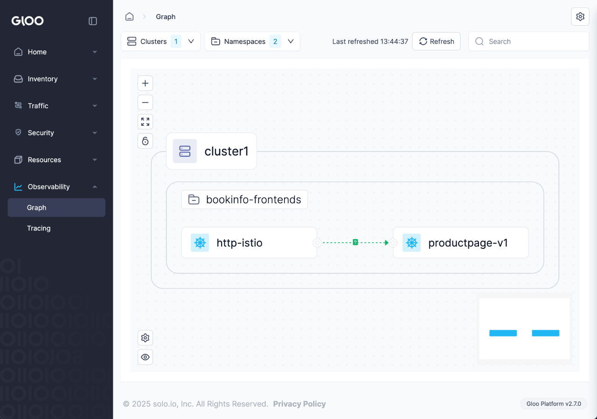

<!--bash
source ./scripts/assert.sh
-->


<center>

</center>

# <center>Istio Ambient Lightswitch & Rollouts (Multi-Cluster, Gloo Mesh 2.9.2)</center>


## Table of Contents
* [Introduction](#introduction)
* [Lab 1 - Deploy KinD Cluster(s)](#lab-1---deploy-kind-cluster(s)-)
* [Lab 2 - Deploy and register Gloo Mesh](#lab-2---deploy-and-register-gloo-mesh-)
* [Lab 3 - Deploy the Bookinfo demo app](#lab-3---deploy-the-bookinfo-demo-app-)
* [Lab 4 - Configure common trust certificates in both clusters](#lab-4---configure-common-trust-certificates-in-both-clusters-)
* [Lab 5 - Install the Istio CLI tool](#lab-5---install-the-istio-cli-tool-)
* [Lab 6 - Deploy Istio](#lab-6---deploy-istio-)
* [Lab 7 - Expose Bookinfo's productpage](#lab-7---expose-bookinfo's-productpage-)
* [Lab 8 - Add Bookinfo to the mesh](#lab-8---add-bookinfo-to-the-mesh-)
* [Lab 9 - Deploy Argo Rollouts](#lab-9---deploy-argo-rollouts-)
* [Lab 10 - Update a Bookinfo microservice using Argo Rollouts](#lab-10---update-a-bookinfo-microservice-using-argo-rollouts-)
* [Lab 11 - Link clusters](#lab-11---link-clusters-)
* [Lab 12 - Declare productpage to be a global service for multi-cluster access](#lab-12---declare-productpage-to-be-a-global-service-for-multi-cluster-access-)


## Introduction <a name="introduction"></a>

<a href="https://www.solo.io/products/gloo-mesh/">Gloo Mesh</a> is a management plane that makes it easy to operate <a href="https://istio.io">Istio</a> and adds additional features to Ambient.

Gloo Mesh works with community [Istio](https://istio.io/) out of the box.
You get instant insights into your Istio environment through a custom dashboard.
Observability pipelines let you analyze many data sources that you already have.
You can even automate installing and upgrading Istio with the Gloo lifecycle manager, on one or many Kubernetes clusters deployed anywhere.

But Gloo Mesh includes more than tooling to complement an existing Istio installation.
You can also replace community Istio with Solo's hardened Istio images. These images unlock enterprise-level support.
Later, you might choose to include Gloo Gateway for a full-stack service mesh and API gateway solution.
This approach lets you scale as you need more advanced routing and security features.

### Istio and Ambient support

The Gloo Mesh subscription includes end-to-end Istio support:

* Upstream feature development
* CI/CD-ready automated installation and upgrade
* End-to-end Istio support and CVE security patching
* Long-term n-4 version support with Solo images
* Special image builds for distroless and FIPS compliance
* 24x7 production support and one-hour Severity 1 SLA
* Ambient support for Istio
* L7 Telemetry support in Ztunnel
* Multi-cluster service discovery and routing

### Gloo Mesh overview

Gloo Mesh provides many unique features, including:

* Single pane of glass for operational management of Istio, including global observability
* Insights based on environment checks with corrective actions and best practices
* Seamless migration to full-stack service mesh

### Want to learn more about Gloo Mesh?

You can find more information about Gloo Mesh in the official documentation: <https://docs.solo.io/gloo-mesh-core>


## Lab 1 - Deploy KinD Cluster(s) <a name="lab-1---deploy-kind-cluster(s)-"></a>


Clone this repository and go to the directory where this `README.md` file is.


Set the context environment variables:

```bash
export MGMT=mgmt
export CLUSTER1=cluster1
export CLUSTER2=cluster2
```

Deploy the KinD clusters:

```bash
bash ./data/steps/deploy-kind-clusters/deploy-mgmt.sh
bash ./data/steps/deploy-kind-clusters/deploy-cluster1.sh
bash ./data/steps/deploy-kind-clusters/deploy-cluster2.sh
```
Then run the following commands to wait for all the Pods to be ready:

```bash
./scripts/check.sh mgmt
./scripts/check.sh cluster1
./scripts/check.sh cluster2
```

**Note:** If you run the `check.sh` script immediately after the `deploy.sh` script, you may see a jsonpath error. If that happens, simply wait a few seconds and try again.

Once the `check.sh` script completes, execute the `kubectl get pods -A` command, and verify that all pods are in a running state.
  You can see that your currently connected to this cluster by executing the `kubectl config get-contexts` command:

```
CURRENT   NAME         CLUSTER         AUTHINFO   NAMESPACE
          cluster1     kind-cluster1   cluster1
*         cluster2     kind-cluster2   cluster2
          mgmt         kind-mgmt       kind-mgmt
```

Run the following command to make `mgmt` the current cluster.

```bash
kubectl config use-context ${MGMT}
```
<!--bash
cat <<'EOF' > ./test.js
const helpers = require('./tests/chai-exec');

describe("Clusters are healthy", () => {
    const clusters = ["mgmt", "cluster1", "cluster2"];

    clusters.forEach(cluster => {
        it(`Cluster ${cluster} is healthy`, () => helpers.k8sObjectIsPresent({ context: cluster, namespace: "default", k8sType: "service", k8sObj: "kubernetes" }));
    });
});
EOF
echo "executing test dist/document/build/templates/steps/deploy-kind-clusters/tests/cluster-healthy.test.js.liquid from lab number 1"
timeout --signal=INT 3m mocha ./test.js --timeout 10000 --retries=120 --bail --exit || { DEBUG_MODE=true mocha ./test.js --timeout 120000; echo "The workshop failed in lab number 1"; exit 1; }
-->


## Lab 2 - Deploy and register Gloo Mesh <a name="lab-2---deploy-and-register-gloo-mesh-"></a>
[](https://youtu.be/djfFiepK4GY "Video Link")


Before we get started, let's install the `meshctl` CLI:

```bash
export GLOO_MESH_VERSION=v2.9.2
curl -sL https://run.solo.io/meshctl/install | sh -
export PATH=$HOME/.gloo-mesh/bin:$PATH
```
<!--bash
cat <<'EOF' > ./test.js
var chai = require('chai');
var expect = chai.expect;

describe("Required environment variables should contain value", () => {
  afterEach(function(done){
    if(this.currentTest.currentRetry() > 0){
      process.stdout.write(".");
       setTimeout(done, 1000);
    } else {
      done();
    }
  });

  it("Context environment variables should not be empty", () => {
    expect(process.env.MGMT).not.to.be.empty
    expect(process.env.CLUSTER1).not.to.be.empty
    expect(process.env.CLUSTER2).not.to.be.empty
  });

  it("Gloo Mesh licence environment variables should not be empty", () => {
    expect(process.env.GLOO_MESH_LICENSE_KEY).not.to.be.empty
  });
});
EOF
echo "executing test dist/document/build/templates/steps/deploy-and-register-gloo-mesh/tests/environment-variables.test.js.liquid from lab number 2"
timeout --signal=INT 3m mocha ./test.js --timeout 10000 --retries=120 --bail --exit || { DEBUG_MODE=true mocha ./test.js --timeout 120000; echo "The workshop failed in lab number 2"; exit 1; }
-->

Run the following commands to deploy the Gloo Mesh management plane:

```bash
kubectl --context ${MGMT} create ns gloo-mesh

helm upgrade --install gloo-platform-crds gloo-platform-crds \
  --repo https://storage.googleapis.com/gloo-platform/helm-charts \
  --namespace gloo-mesh \
  --kube-context ${MGMT} \
  --set featureGates.insightsConfiguration=true \
  --set installEnterpriseCrds=false \
  --version 2.9.2

helm upgrade --install gloo-platform gloo-platform \
  --repo https://storage.googleapis.com/gloo-platform/helm-charts \
  --namespace gloo-mesh \
  --kube-context ${MGMT} \
  --version 2.9.2 \
  -f -<<EOF
licensing:
  glooTrialLicenseKey: ${GLOO_MESH_LICENSE_KEY}
common:
  cluster: mgmt
experimental:
  ambientEnabled: true
glooInsightsEngine:
  enabled: true
glooMgmtServer:
  enabled: true
  policyApis:
    enabled: false
  ports:
    healthcheck: 8091
redis:
  deployment:
    enabled: true
telemetryGateway:
  enabled: true
  service:
    type: LoadBalancer
prometheus:
  enabled: true
glooUi:
  enabled: true
  serviceType: LoadBalancer
telemetryCollector:
  enabled: true
  config:
    exporters:
      otlp:
        endpoint: gloo-telemetry-gateway:4317
EOF

kubectl --context ${MGMT} -n gloo-mesh rollout status deploy/gloo-mesh-mgmt-server
```

<!--bash
kubectl wait --context ${MGMT} --for=condition=Ready -n gloo-mesh --all pod
timeout 2m bash -c "until [[ \$(kubectl --context ${MGMT} -n gloo-mesh get svc gloo-mesh-mgmt-server -o json | jq '.status.loadBalancer | length') -gt 0 ]]; do
  sleep 1
done"
-->

Then, you need to set the environment variable to tell the Gloo Mesh agents how to communicate with the management plane:
<!--bash
cat <<'EOF' > ./test.js

const helpers = require('./tests/chai-exec');

describe("MGMT server is healthy", () => {
  let cluster = process.env.MGMT;
  let deployments = ["gloo-mesh-mgmt-server","gloo-mesh-redis","gloo-telemetry-gateway","prometheus-server"];
  deployments.forEach(deploy => {
    it(deploy + ' pods are ready in ' + cluster, () => helpers.checkDeployment({ context: cluster, namespace: "gloo-mesh", k8sObj: deploy }));
  });
});
EOF
echo "executing test dist/document/build/templates/steps/deploy-and-register-gloo-mesh/tests/check-deployment.test.js.liquid from lab number 2"
timeout --signal=INT 3m mocha ./test.js --timeout 10000 --retries=120 --bail --exit || { DEBUG_MODE=true mocha ./test.js --timeout 120000; echo "The workshop failed in lab number 2"; exit 1; }
-->
<!--bash
cat <<'EOF' > ./test.js
const chaiExec = require("@jsdevtools/chai-exec");
var chai = require('chai');
var expect = chai.expect;
chai.use(chaiExec);

afterEach(function (done) {
  if (this.currentTest.currentRetry() > 0) {
    process.stdout.write(".");
    setTimeout(done, 1000);
  } else {
    done();
  }
});
EOF
echo "executing test dist/document/build/templates/steps/deploy-and-register-gloo-mesh/tests/get-gloo-mesh-mgmt-server-ip.test.js.liquid from lab number 2"
timeout --signal=INT 3m mocha ./test.js --timeout 10000 --retries=120 --bail --exit || { DEBUG_MODE=true mocha ./test.js --timeout 120000; echo "The workshop failed in lab number 2"; exit 1; }
-->

```bash
export ENDPOINT_GLOO_MESH=$(kubectl --context ${MGMT} -n gloo-mesh get svc gloo-mesh-mgmt-server -o jsonpath='{.status.loadBalancer.ingress[0].ip}{.status.loadBalancer.ingress[0].hostname}'):9900
export HOST_GLOO_MESH=$(echo ${ENDPOINT_GLOO_MESH%:*})
export ENDPOINT_TELEMETRY_GATEWAY=$(kubectl --context ${MGMT} -n gloo-mesh get svc gloo-telemetry-gateway -o jsonpath='{.status.loadBalancer.ingress[0].ip}{.status.loadBalancer.ingress[0].hostname}'):4317
export ENDPOINT_GLOO_MESH_UI=$(kubectl --context ${MGMT} -n gloo-mesh get svc gloo-mesh-ui -o jsonpath='{.status.loadBalancer.ingress[0].ip}{.status.loadBalancer.ingress[0].hostname}'):8090
```

Check that the variables have correct values:

```bash,norun-workshop
echo $HOST_GLOO_MESH
echo $ENDPOINT_GLOO_MESH
```

<!--bash
cat <<'EOF' > ./test.js
const dns = require('dns');
const chaiHttp = require("chai-http");
const chai = require("chai");
const expect = chai.expect;
chai.use(chaiHttp);
const { waitOnFailedTest } = require('./tests/utils');

afterEach(function(done) { waitOnFailedTest(done, this.currentTest.currentRetry())});

describe("Address '" + process.env.HOST_GLOO_MESH + "' can be resolved in DNS", () => {
    it(process.env.HOST_GLOO_MESH + ' can be resolved', (done) => {
        return dns.lookup(process.env.HOST_GLOO_MESH, (err, address, family) => {
            expect(address).to.be.an.ip;
            done();
        });
    });
});
EOF
echo "executing test ./gloo-mesh-2-0/tests/can-resolve.test.js.liquid from lab number 2"
timeout --signal=INT 3m mocha ./test.js --timeout 10000 --retries=120 --bail --exit || { DEBUG_MODE=true mocha ./test.js --timeout 120000; echo "The workshop failed in lab number 2"; exit 1; }
-->
Finally, you need to register the cluster(s).

Here is how you register the first one:

```bash
kubectl apply --context ${MGMT} -f - <<EOF
apiVersion: admin.gloo.solo.io/v2
kind: KubernetesCluster
metadata:
  name: cluster1
  namespace: gloo-mesh
spec:
  clusterDomain: cluster.local
EOF

kubectl --context ${CLUSTER1} create ns gloo-mesh

kubectl get secret relay-root-tls-secret -n gloo-mesh --context ${MGMT} -o jsonpath='{.data.ca\.crt}' | base64 -d > ca.crt
kubectl create secret generic relay-root-tls-secret -n gloo-mesh --context ${CLUSTER1} --from-file ca.crt=ca.crt
rm ca.crt

kubectl get secret relay-identity-token-secret -n gloo-mesh --context ${MGMT} -o jsonpath='{.data.token}' | base64 -d > token
kubectl create secret generic relay-identity-token-secret -n gloo-mesh --context ${CLUSTER1} --from-file token=token
rm token

helm upgrade --install gloo-platform-crds gloo-platform-crds \
  --repo https://storage.googleapis.com/gloo-platform/helm-charts \
  --namespace gloo-mesh \
  --set installEnterpriseCrds=false \
  --kube-context ${CLUSTER1} \
  --version 2.9.2

helm upgrade --install gloo-platform gloo-platform \
  --repo https://storage.googleapis.com/gloo-platform/helm-charts \
  --namespace gloo-mesh \
  --kube-context ${CLUSTER1} \
  --version 2.9.2 \
  -f -<<EOF
common:
  cluster: cluster1
glooAgent:
  enabled: true
  relay:
    serverAddress: "${ENDPOINT_GLOO_MESH}"
    authority: gloo-mesh-mgmt-server.gloo-mesh
telemetryCollector:
  enabled: true
  config:
    exporters:
      otlp:
        endpoint: "${ENDPOINT_TELEMETRY_GATEWAY}"
glooAnalyzer:
  enabled: true
EOF
```

Note that the registration can also be performed using `meshctl cluster register`.

Here is how you register the second one:

```bash
kubectl apply --context ${MGMT} -f - <<EOF
apiVersion: admin.gloo.solo.io/v2
kind: KubernetesCluster
metadata:
  name: cluster2
  namespace: gloo-mesh
spec:
  clusterDomain: cluster.local
EOF

kubectl --context ${CLUSTER2} create ns gloo-mesh

kubectl get secret relay-root-tls-secret -n gloo-mesh --context ${MGMT} -o jsonpath='{.data.ca\.crt}' | base64 -d > ca.crt
kubectl create secret generic relay-root-tls-secret -n gloo-mesh --context ${CLUSTER2} --from-file ca.crt=ca.crt
rm ca.crt

kubectl get secret relay-identity-token-secret -n gloo-mesh --context ${MGMT} -o jsonpath='{.data.token}' | base64 -d > token
kubectl create secret generic relay-identity-token-secret -n gloo-mesh --context ${CLUSTER2} --from-file token=token
rm token

helm upgrade --install gloo-platform-crds gloo-platform-crds \
  --repo https://storage.googleapis.com/gloo-platform/helm-charts \
  --namespace gloo-mesh \
  --set installEnterpriseCrds=false \
  --kube-context ${CLUSTER2} \
  --version 2.9.2

helm upgrade --install gloo-platform gloo-platform \
  --repo https://storage.googleapis.com/gloo-platform/helm-charts \
  --namespace gloo-mesh \
  --kube-context ${CLUSTER2} \
  --version 2.9.2 \
  -f -<<EOF
common:
  cluster: cluster2
glooAgent:
  enabled: true
  relay:
    serverAddress: "${ENDPOINT_GLOO_MESH}"
    authority: gloo-mesh-mgmt-server.gloo-mesh
telemetryCollector:
  enabled: true
  config:
    exporters:
      otlp:
        endpoint: "${ENDPOINT_TELEMETRY_GATEWAY}"
glooAnalyzer:
  enabled: true
EOF
```


You can check the cluster(s) have been registered correctly in the Gloo UI or by using the following commands:

```bash,norun-workshop
meshctl --kubecontext ${MGMT} check
```

Alternatively, check for `relay_push_clients_connected` metrics:

```
pod=$(kubectl --context ${MGMT} -n gloo-mesh get pods -l app=gloo-mesh-mgmt-server -o jsonpath='{.items[0].metadata.name}')
kubectl --context ${MGMT} -n gloo-mesh debug -q -i ${pod} --image=curlimages/curl -- curl -s http://localhost:9091/metrics | grep relay_push_clients_connected
```

You should get an output similar to this:

```,nocopy
# HELP relay_push_clients_connected Current number of connected Relay push clients (Relay Agents).
# TYPE relay_push_clients_connected gauge
relay_push_clients_connected{cluster="cluster1"} 1
relay_push_clients_connected{cluster="cluster2"} 1
```

<!--bash
cat <<'EOF' > ./test.js
var chai = require('chai');
var expect = chai.expect;
const helpers = require('./tests/chai-exec');
describe("Cluster registration", () => {
  it("cluster1 is registered", () => {
    podName = helpers.getOutputForCommand({ command: "kubectl -n gloo-mesh get pods -l app=gloo-mesh-mgmt-server -o jsonpath='{.items[0].metadata.name}' --context " + process.env.MGMT }).replaceAll("'", "");
    command = helpers.getOutputForCommand({ command: "kubectl --context " + process.env.MGMT + " -n gloo-mesh debug -q -i " + podName + " --image=curlimages/curl -- curl -s http://localhost:9091/metrics" }).replaceAll("'", "");
    expect(command).to.contain("cluster1");
  });
  it("cluster2 is registered", () => {
    podName = helpers.getOutputForCommand({ command: "kubectl -n gloo-mesh get pods -l app=gloo-mesh-mgmt-server -o jsonpath='{.items[0].metadata.name}' --context " + process.env.MGMT }).replaceAll("'", "");
    command = helpers.getOutputForCommand({ command: "kubectl --context " + process.env.MGMT + " -n gloo-mesh debug -q -i " + podName + " --image=curlimages/curl -- curl -s http://localhost:9091/metrics" }).replaceAll("'", "");
    expect(command).to.contain("cluster2");
  });
});
EOF
echo "executing test dist/document/build/templates/steps/deploy-and-register-gloo-mesh/tests/cluster-registration.test.js.liquid from lab number 2"
timeout --signal=INT 3m mocha ./test.js --timeout 10000 --retries=120 --bail --exit || { DEBUG_MODE=true mocha ./test.js --timeout 120000; echo "The workshop failed in lab number 2"; exit 1; }
-->


## Lab 3 - Deploy the Bookinfo demo app <a name="lab-3---deploy-the-bookinfo-demo-app-"></a>
[](https://youtu.be/nzYcrjalY5A "Video Link")

We're going to deploy the bookinfo application to demonstrate several features of Gloo Mesh.
You can find more information about this application [here](https://istio.io/latest/docs/examples/bookinfo/).

Run the following commands to deploy the bookinfo application on `cluster1`:

```bash
kubectl --context ${CLUSTER1} create ns bookinfo-frontends
kubectl --context ${CLUSTER1} create ns bookinfo-backends

# Deploy the frontend bookinfo service in the bookinfo-frontends namespace
kubectl --context ${CLUSTER1} -n bookinfo-frontends apply -f data/steps/deploy-bookinfo/productpage-v1.yaml

# Deploy the backend bookinfo services in the bookinfo-backends namespace for all versions less than v3
kubectl --context ${CLUSTER1} -n bookinfo-backends apply \
  -f data/steps/deploy-bookinfo/details-v1.yaml \
  -f data/steps/deploy-bookinfo/ratings-v1.yaml \
  -f data/steps/deploy-bookinfo/reviews-v1-v2.yaml

# Update the reviews service to display where it is coming from
kubectl --context ${CLUSTER1} -n bookinfo-backends set env deploy/reviews-v1 CLUSTER_NAME=${CLUSTER1}
kubectl --context ${CLUSTER1} -n bookinfo-backends set env deploy/reviews-v2 CLUSTER_NAME=${CLUSTER1}
```

<!--bash
echo -n Waiting for bookinfo pods to be ready...
timeout -v 5m bash -c "
until [[ \$(kubectl --context ${CLUSTER1} -n bookinfo-frontends get deploy -o json | jq '[.items[].status.readyReplicas] | add') -eq 1 && \\
  \$(kubectl --context ${CLUSTER1} -n bookinfo-backends get deploy -o json | jq '[.items[].status.readyReplicas] | add') -eq 4 ]] 2>/dev/null
do
  sleep 1
  echo -n .
done"
echo
-->

You can check that the app is running using the following command:

```bash,norun-workshop
kubectl --context ${CLUSTER1} -n bookinfo-frontends get pods && kubectl --context ${CLUSTER1} -n bookinfo-backends get pods
```

Note that we deployed the `productpage` service in the `bookinfo-frontends` namespace and the other services in the `bookinfo-backends` namespace.
And we deployed the `v1` and `v2` versions of the `reviews` microservice, not the `v3` version.

Now, run the following commands to deploy the bookinfo application on `cluster2`:

```bash
kubectl --context ${CLUSTER2} create ns bookinfo-frontends
kubectl --context ${CLUSTER2} create ns bookinfo-backends

# Deploy the frontend bookinfo service in the bookinfo-frontends namespace
kubectl --context ${CLUSTER2} -n bookinfo-frontends apply -f data/steps/deploy-bookinfo/productpage-v1.yaml

# Deploy the backend bookinfo services in the bookinfo-backends namespace for all versions
kubectl --context ${CLUSTER2} -n bookinfo-backends apply \
  -f data/steps/deploy-bookinfo/details-v1.yaml \
  -f data/steps/deploy-bookinfo/ratings-v1.yaml \
  -f data/steps/deploy-bookinfo/reviews-v1-v2.yaml \
  -f data/steps/deploy-bookinfo/reviews-v3.yaml

# Update the reviews service to display where it is coming from
kubectl --context ${CLUSTER2} -n bookinfo-backends set env deploy/reviews-v1 CLUSTER_NAME=${CLUSTER2}
kubectl --context ${CLUSTER2} -n bookinfo-backends set env deploy/reviews-v2 CLUSTER_NAME=${CLUSTER2}
kubectl --context ${CLUSTER2} -n bookinfo-backends set env deploy/reviews-v3 CLUSTER_NAME=${CLUSTER2}

```

<!--bash
echo -n Waiting for bookinfo pods to be ready...
timeout -v 5m bash -c "
until [[ \$(kubectl --context ${CLUSTER2} -n bookinfo-frontends get deploy -o json | jq '[.items[].status.readyReplicas] | add') -eq 1 && \\
  \$(kubectl --context ${CLUSTER2} -n bookinfo-backends get deploy -o json | jq '[.items[].status.readyReplicas] | add') -eq 5 ]] 2>/dev/null
do
  sleep 1
  echo -n .
done"
echo
-->

Confirm that `v1`, `v2` and `v3` of the `reviews` service are now running in the second cluster:

```bash
kubectl --context ${CLUSTER2} -n bookinfo-frontends get pods && kubectl --context ${CLUSTER2} -n bookinfo-backends get pods
```

As you can see, we deployed all three versions of the `reviews` microservice on this cluster.

<!--bash
cat <<'EOF' > ./test.js
const helpers = require('./tests/chai-exec');

describe("Bookinfo app", () => {
  let cluster = process.env.CLUSTER1
  let deployments = ["productpage-v1"];
  deployments.forEach(deploy => {
    it(deploy + ' pods are ready in ' + cluster, () => helpers.checkDeployment({ context: cluster, namespace: "bookinfo-frontends", k8sObj: deploy }));
  });
  deployments = ["ratings-v1", "details-v1", "reviews-v1", "reviews-v2"];
  deployments.forEach(deploy => {
    it(deploy + ' pods are ready in ' + cluster, () => helpers.checkDeployment({ context: cluster, namespace: "bookinfo-backends", k8sObj: deploy }));
  });
  cluster = process.env.CLUSTER2
  deployments = ["productpage-v1"];
  deployments.forEach(deploy => {
    it(deploy + ' pods are ready in ' + cluster, () => helpers.checkDeployment({ context: cluster, namespace: "bookinfo-frontends", k8sObj: deploy }));
  });
  deployments = ["ratings-v1", "details-v1", "reviews-v1", "reviews-v2", "reviews-v3"];
  deployments.forEach(deploy => {
    it(deploy + ' pods are ready in ' + cluster, () => helpers.checkDeployment({ context: cluster, namespace: "bookinfo-backends", k8sObj: deploy }));
  });
});
EOF
echo "executing test dist/document/build/templates/steps/apps/bookinfo/deploy-bookinfo/tests/check-bookinfo.test.js.liquid from lab number 3"
timeout --signal=INT 3m mocha ./test.js --timeout 10000 --retries=120 --bail --exit || { DEBUG_MODE=true mocha ./test.js --timeout 120000; echo "The workshop failed in lab number 3"; exit 1; }
-->


## Lab 4 - Configure common trust certificates in both clusters <a name="lab-4---configure-common-trust-certificates-in-both-clusters-"></a>

We'll be implementing multi-cluster traffic distribution in this workshop.
For multi-cluster traffic to be trusted in both clusters, each cluster in the mesh must have a shared root of trust.
This can be achieved by providing a root certificate signed by a corporate CA, or a custom root certificate created for this purpose.
That certificate signs a unique intermediate CA certificate for each cluster.

<!--bash
echo "Generating new certificates"
if ! [ -x "$(command -v step)" ]; then
  echo 'Error: Install the smallstep cli (https://github.com/smallstep/cli)'
  exit 1
fi
-->

Create the root certificate:

```bash
mkdir -p certs/${CLUSTER1} certs/${CLUSTER2}

step certificate create root.istio.ca \
  certs/root-cert.pem \
  certs/root-ca.key \
  --profile root-ca \
  --no-password \
  --insecure \
  --san root.istio.ca \
  --not-after 87600h \
  --kty RSA
```

Next, create an intermediate certificate and apply it to `cluster1`:

```bash
step certificate create ${CLUSTER1} \
  certs/${CLUSTER1}/ca-cert.pem \
  certs/${CLUSTER1}/ca-key.pem \
  --ca certs/root-cert.pem \
  --ca-key certs/root-ca.key \
  --profile intermediate-ca \
  --not-after 87600h \
  --no-password \
  --san ${CLUSTER1} \
  --kty RSA \
  --insecure

kubectl --context ${CLUSTER1} create ns istio-system 2>/dev/null || true
kubectl --context ${CLUSTER1} -n istio-system create secret generic cacerts \
  --from-file=certs/${CLUSTER1}/ca-cert.pem \
  --from-file=certs/${CLUSTER1}/ca-key.pem \
  --from-file=certs/root-cert.pem \
  --from-file=cert-chain.pem=certs/${CLUSTER1}/ca-cert.pem
```

Create another intermediate certificate from the same root certificate and apply it to `cluster2`:

```bash
step certificate create ${CLUSTER2} \
  certs/${CLUSTER2}/ca-cert.pem \
  certs/${CLUSTER2}/ca-key.pem \
  --ca certs/root-cert.pem \
  --ca-key certs/root-ca.key \
  --profile intermediate-ca \
  --not-after 87600h \
  --no-password \
  --san ${CLUSTER2} \
  --kty RSA \
  --insecure

kubectl --context ${CLUSTER2} create ns istio-system 2>/dev/null || true
kubectl --context ${CLUSTER2} -n istio-system create secret generic cacerts \
  --from-file=certs/${CLUSTER2}/ca-cert.pem \
  --from-file=certs/${CLUSTER2}/ca-key.pem \
  --from-file=certs/root-cert.pem \
  --from-file=cert-chain.pem=certs/${CLUSTER2}/ca-cert.pem
```

Now the mesh workloads in each cluster will trust the certificates from the other cluster.


## Lab 5 - Install the Istio CLI tool <a name="lab-5---install-the-istio-cli-tool-"></a>

Download the Istio CLI and add it to your `$PATH`:

```bash
OS=$(uname | tr '[:upper:]' '[:lower:]' | sed -E 's/darwin/osx/')
ARCH=$(uname -m | sed -E 's/aarch/arm/; s/x86_64/amd64/; s/armv7l/armv7/')

mkdir -p ~/.istioctl/bin
curl -sSL https://storage.googleapis.com/soloio-istio-binaries/release/1.26.2-patch0-solo/istioctl-1.26.2-patch0-solo-${OS}-${ARCH}.tar.gz | tar xzf - -C ~/.istioctl/bin
chmod +x ~/.istioctl/bin/istioctl

export PATH=${HOME}/.istioctl/bin:${PATH}
```


## Lab 6 - Deploy Istio <a name="lab-6---deploy-istio-"></a>

Install the Kubernetes Gateway API custom resource definitions in `cluster1` if they're not already present:

```bash
kubectl --context ${CLUSTER1} get crd gateways.gateway.networking.k8s.io &>/dev/null || \
  { kubectl --context ${CLUSTER1} apply -f https://github.com/kubernetes-sigs/gateway-api/releases/download/v1.3.0/standard-install.yaml; }
```

Install Istio Ambient mode in `cluster1`:

```bash
istioctl --context ${CLUSTER1} install \
  --set profile=ambient \
  --set values.global.hub=us-docker.pkg.dev/soloio-img/istio \
  --set values.license.value=${GLOO_MESH_LICENSE_KEY} \
  --set meshConfig.trustDomain=${CLUSTER1} \
  --set values.global.multiCluster.clusterName=${CLUSTER1} \
  --set values.global.network=${CLUSTER1} \
  --set values.platforms.peering.enabled=true \
  --set values.pilot.env.PILOT_SKIP_VALIDATE_TRUST_DOMAIN="true" \
  --set values.ztunnel.env.SKIP_VALIDATE_TRUST_DOMAIN="true" \
  --skip-confirmation
```

Check that the Istio pods are running:

```bash,norun-workshop
kubectl --context ${CLUSTER1} -n istio-system get pods
```

Here is the expected output:

```,nocopy
NAME                      READY   STATUS    RESTARTS   AGE
istio-cni-node-75ds2      1/1     Running   0          86s
istiod-7758df6879-pcvjt   1/1     Running   0          45s
ztunnel-zgf7b             1/1     Running   0          13s
```

Make sure the `istio-system` namespace is labelled with the network:

```bash
kubectl --context ${CLUSTER1} label ns istio-system topology.istio.io/network=${CLUSTER1}
```

Now install Istio the same way on `cluster2`:

```bash
kubectl --context ${CLUSTER2} get crd gateways.gateway.networking.k8s.io &>/dev/null || \
  { kubectl --context ${CLUSTER2} apply -f https://github.com/kubernetes-sigs/gateway-api/releases/download/v1.3.0/standard-install.yaml; }

istioctl --context ${CLUSTER2} install \
  --set profile=ambient \
  --set values.global.hub=us-docker.pkg.dev/soloio-img/istio \
  --set values.license.value=${GLOO_MESH_LICENSE_KEY} \
  --set meshConfig.trustDomain=${CLUSTER2} \
  --set values.global.multiCluster.clusterName=${CLUSTER2} \
  --set values.global.network=${CLUSTER2} \
  --set values.platforms.peering.enabled=true \
  --set values.pilot.env.PILOT_SKIP_VALIDATE_TRUST_DOMAIN="true" \
  --set values.ztunnel.env.SKIP_VALIDATE_TRUST_DOMAIN="true" \
  --skip-confirmation

kubectl --context ${CLUSTER2} label ns istio-system topology.istio.io/network=${CLUSTER2}
```

<!--bash
cat <<'EOF' > ./test.js
const helpers = require('./tests/chai-exec');

describe("Istio", () => {
  let cluster = process.env.CLUSTER1
  let deployments = ["istiod"];
  deployments.forEach(deploy => {
    it(deploy + ' pods are ready in ' + cluster, () => helpers.checkDeployment({ context: cluster, namespace: "istio-system", k8sObj: deploy }));
  });
  let DaemonSets = ["istio-cni-node", "ztunnel"];
  DaemonSets.forEach(DaemonSet => {
    it(DaemonSet + ' pods are ready in ' + cluster, () => helpers.checkDaemonSet({ context: cluster, namespace: "istio-system", k8sObj: DaemonSet }));
  });
});
EOF
echo "executing test dist/document/build/templates/steps/deploy-istio-istioctl/tests/check-istio.test.js.liquid from lab number 6"
timeout --signal=INT 3m mocha ./test.js --timeout 10000 --retries=120 --bail --exit || { DEBUG_MODE=true mocha ./test.js --timeout 120000; echo "The workshop failed in lab number 6"; exit 1; }
-->
<!--bash
cat <<'EOF' > ./test.js
const helpers = require('./tests/chai-exec');

describe("Istio", () => {
  let cluster = process.env.CLUSTER1
  let deployments = ["istiod"];
  deployments.forEach(deploy => {
    it(deploy + ' pods are ready in ' + cluster, () => helpers.checkDeployment({ context: cluster, namespace: "istio-system", k8sObj: deploy }));
  });
  let DaemonSets = ["istio-cni-node", "ztunnel"];
  DaemonSets.forEach(DaemonSet => {
    it(DaemonSet + ' pods are ready in ' + cluster, () => helpers.checkDaemonSet({ context: cluster, namespace: "istio-system", k8sObj: DaemonSet }));
  });
});
EOF
echo "executing test dist/document/build/templates/steps/deploy-istio-istioctl/tests/check-istio.test.js.liquid from lab number 6"
timeout --signal=INT 3m mocha ./test.js --timeout 10000 --retries=120 --bail --exit || { DEBUG_MODE=true mocha ./test.js --timeout 120000; echo "The workshop failed in lab number 6"; exit 1; }
-->


## Lab 7 - Expose Bookinfo's productpage <a name="lab-7---expose-bookinfo's-productpage-"></a>

The [Bookinfo](https://istio.io/latest/docs/examples/bookinfo/) sample app is now installed.
We're going to expose its `productpage` service securely with Istio using Gateway API resources.

Let's first create a private key and a self-signed certificate:

```bash
openssl req -x509 -nodes -days 365 -newkey rsa:2048 \
   -keyout tls.key -out tls.crt -subj "/CN=*"
```

You need to store this in a Kubernetes secret by running the following commands:

```bash
kubectl --context ${CLUSTER1} -n bookinfo-frontends create secret generic tls-secret \
  --from-file=tls.key=tls.key \
  --from-file=tls.crt=tls.crt
```

Next, create a `Gateway` resource to configure Istio to listen to incoming requests:

```bash
kubectl apply --context ${CLUSTER1} -f - <<EOF
apiVersion: gateway.networking.k8s.io/v1
kind: Gateway
metadata:
  name: http
  namespace: bookinfo-frontends
spec:
  gatewayClassName: istio
  listeners:
  - hostname: cluster1-bookinfo.example.com
    name: https
    port: 443
    protocol: HTTPS
    tls:
      mode: Terminate
      certificateRefs:
      - name: tls-secret
        kind: Secret
EOF
```

Finally, create an `HTTPRoute` to expose the `productpage` service through the gateway:

```bash
kubectl apply --context ${CLUSTER1} -f - <<EOF
apiVersion: gateway.networking.k8s.io/v1
kind: HTTPRoute
metadata:
  name: productpage
  namespace: bookinfo-frontends
spec:
  parentRefs:
  - name: http
  rules:
  - matches:
    - path:
        type: Exact
        value: /productpage
    - path:
        value: /static
    backendRefs:
    - name: productpage
      port: 9080
EOF
```
Let's add the domains to our `/etc/hosts` file:

```bash
export BOOKINFO_PROXY_IP=$(kubectl --context ${CLUSTER1} -n bookinfo-frontends get svc http-istio -o jsonpath='{.status.loadBalancer.ingress[0].ip}{.status.loadBalancer.ingress[0].hostname}')
./scripts/register-domain.sh cluster1-bookinfo.example.com ${BOOKINFO_PROXY_IP}
```

You should now be able to access the Bookinfo application through the browser:

<https://cluster1-bookinfo.example.com/productpage>


After refreshing the Bookinfo application several times, switch to the Gloo UI and open the "Graph" page under "Observability".
Select `cluster1` under the "Clusters" dropdown, and select the `bookinfo-frontends` and `bookinfo-backends` namespaces.
You should see unencrypted traffic from `http-istio` to `productpage-v1`:


This is because the Bookinfo application is not part of the service mesh,
so its traffic is not automatically encrypted.

<!--bash
cat <<'EOF' > ./test.js
const helpers = require('./tests/chai-http');

describe("Productpage (HTTPS)", () => {
  it('/productpage is available in cluster1', () => helpers.checkURL({ host: `https://cluster1-bookinfo.example.com`, path: '/productpage', retCode: 200 }));
})
EOF
echo "executing test dist/document/build/templates/steps/apps/bookinfo/gateway-expose-gatewayapi/tests/productpage-available-secure.test.js.liquid from lab number 7"
timeout --signal=INT 3m mocha ./test.js --timeout 10000 --retries=120 --bail --exit || { DEBUG_MODE=true mocha ./test.js --timeout 120000; echo "The workshop failed in lab number 7"; exit 1; }
-->
<!--bash
cat <<'EOF' > ./test.js
var chai = require('chai');
var expect = chai.expect;
const helpers = require('./tests/chai-exec');

describe("Otel metrics", () => {
  it("cluster1 is sending metrics to telemetryGateway", () => {
    podName = helpers.getOutputForCommand({ command: "kubectl -n gloo-mesh get pods -l app.kubernetes.io/name=prometheus -o jsonpath='{.items[0].metadata.name}' --context " + process.env.MGMT }).replaceAll("'", "");
    command = helpers.getOutputForCommand({ command: "kubectl --context " + process.env.MGMT + " -n gloo-mesh debug -q -i " + podName + " --image=curlimages/curl -- curl -s http://localhost:9090/api/v1/query?query=istio_requests_total" }).replaceAll("'", "");
    expect(command).to.contain("cluster\":\"cluster1");
  });
});


EOF
echo "executing test dist/document/build/templates/steps/apps/bookinfo/gateway-expose-gatewayapi/tests/otel-metrics.test.js.liquid from lab number 7"
timeout --signal=INT 3m mocha ./test.js --timeout 10000 --retries=150 --bail --exit || { DEBUG_MODE=true mocha ./test.js --timeout 120000; echo "The workshop failed in lab number 7"; exit 1; }
-->
<!--bash
cat <<'EOF' > ./test.js
const helpers = require('./tests/chai-http');
const puppeteer = require('puppeteer');
const chai = require('chai');
const expect = chai.expect;
const GraphPage = require('./tests/pages/gloo-ui/graph-page');
const { recognizeTextFromScreenshot } = require('./tests/utils/image-ocr-processor');
const { enhanceBrowser } = require('./tests/utils/enhance-browser');

afterEach(function (done) {
  if (this.currentTest.currentRetry() > 0) {
    process.stdout.write(".");
    setTimeout(done, 4000);
  } else {
    done();
  }
});

describe("graph page", function () {
  // UI tests often require a longer timeout.
  // So here we force it to a minimum of 30 seconds.
  const currentTimeout = this.timeout();
  this.timeout(Math.max(currentTimeout, 30000));

  let browser;
  let page;
  let graphPage;

  beforeEach(async function () {
    browser = await puppeteer.launch({
      headless: "new",
      slowMo: 40,
      ignoreHTTPSErrors: true,
      args: ['--no-sandbox', '--disable-setuid-sandbox'],
    });
    browser = enhanceBrowser(browser, this.currentTest.title);
    page = await browser.newPage();
    graphPage = new GraphPage(page);
    await Promise.all(Array.from({ length: 20 }, () =>
      helpers.checkURL({ host: `https://cluster1-bookinfo.example.com`, path: '/productpage', retCode: 200 })));
  });

  afterEach(async function () {
    await browser.close();
  });

  it("should show gateway and product page", async function () {
    await graphPage.navigateTo(`http://${process.env.ENDPOINT_GLOO_MESH_UI}/graph`);

    // Select the clusters and namespaces so that the graph shows
    await graphPage.selectClusters(['cluster1', 'cluster2']);
    await graphPage.selectNamespaces(['bookinfo-backends', 'bookinfo-frontends']);
    await graphPage.checkViewGraphButton();
    // Disabling Cilium nodes due to this issue: https://github.com/solo-io/gloo-mesh-enterprise/issues/18623
    await graphPage.toggleLayoutSettings();
    await graphPage.disableCiliumNodes();
    await graphPage.toggleLayoutSettings();

    // Capture a screenshot of the canvas and run text recognition
    await graphPage.fullscreenGraph();
    await graphPage.centerGraph();
    const screenshotPath = 'ui-test-data/canvas.png';
    await graphPage.captureCanvasScreenshot(screenshotPath);

    const recognizedTexts = await recognizeTextFromScreenshot(
      screenshotPath,
      ["http-istio", "productpage-v1", "details-v1", "ratings-v1", "reviews-v1", "reviews-v2"],
      await graphPage.getCurrentGlooUISelectors());

    const flattenedRecognizedText = recognizedTexts.join(",").replace(/\n/g, '');
    console.log("Flattened recognized text:", flattenedRecognizedText);

    // Validate recognized texts
    expect(flattenedRecognizedText).to.include("reviews-v2");
    expect(flattenedRecognizedText).to.include("http-istio");
    // The tessaract image processor sometimes interprets v1 as vl or vi. So cover all cases for v1 checks
    expect(flattenedRecognizedText).to.include.oneOf(["productpage-v1", "productpage-vl", "productpage-vi"]);
    expect(flattenedRecognizedText).to.include.oneOf(["details-v1", "details-vl", "details-vi"]);
    expect(flattenedRecognizedText).to.include.oneOf(["ratings-v1", "ratings-vl", "ratings-vi"]);
    expect(flattenedRecognizedText).to.include.oneOf(["reviews-v1", "reviews-vl", "reviews-vi"]);
  });
});

EOF
echo "executing test dist/document/build/templates/steps/apps/bookinfo/gateway-expose-gatewayapi/tests/graph-shows-traffic.test.js.liquid from lab number 7"
timeout --signal=INT 7m mocha ./test.js --timeout 120000 --retries=3 --bail --exit || { DEBUG_MODE=true mocha ./test.js --timeout 120000; echo "The workshop failed in lab number 7"; exit 1; }
-->


## Lab 8 - Add Bookinfo to the mesh <a name="lab-8---add-bookinfo-to-the-mesh-"></a>

At the moment, the Bookinfo application is not part of the service mesh. Now we're going to add it to the service mesh.

Before we start, take a look at the UI Graph. You can see the gateway and the services that have been interacted with.
Because services are not part of the mesh yet, we can't see any traffic between them.



We're using Istio Ambient mode, so onboarding to the service mesh is transparent to applications.
There is no need to restart them so that they can be injected with an Istio proxy sidecar.


1. To enable the automatic mesh injection,
   use the command below to add the necessary labels to the `bookinfo-frontends` namespace:

   ```bash
   kubectl --context ${CLUSTER1} label namespace bookinfo-frontends istio.io/dataplane-mode=ambient
   kubectl --context ${CLUSTER2} label namespace bookinfo-frontends istio.io/dataplane-mode=ambient
   ```

1. Validate that the namespace is annotated with the necessary labels:

   ```bash,norun-workshop
   kubectl --context ${CLUSTER1} get ns -L istio.io/dataplane-mode
   kubectl --context ${CLUSTER2} get ns -L istio.io/dataplane-mode
   ```

Now that you have a namespace with Ambient mode enabled, the services running in this namespace are automatically part of the mesh without any further action.

We can confirm this by checking pods for the annotation `ambient.istio.io/redirection: enabled`:

```bash,norun-workshop
kubectl --context ${CLUSTER1} -n bookinfo-frontends get pods -ojson | jq -r '.items[] | select(.metadata.annotations["ambient.istio.io/redirection"] == "enabled") | .metadata.name'
kubectl --context ${CLUSTER2} -n bookinfo-frontends get pods -ojson | jq -r '.items[] | select(.metadata.annotations["ambient.istio.io/redirection"] == "enabled") | .metadata.name'
```

## Add more services to the Istio service mesh

Now that you have added the `productpage` service to the mesh, you can add the other services to the mesh as well.
The `details`, `reviews`, and `ratings` services are part of the `bookinfo-backends` namespace.

1. First, you need to annotate the `bookinfo-backends` namespace to enable automatic mesh injection:

   ```bash
   kubectl --context ${CLUSTER1} label namespace bookinfo-backends istio.io/dataplane-mode=ambient
   kubectl --context ${CLUSTER2} label namespace bookinfo-backends istio.io/dataplane-mode=ambient
   ```


1. Validate that all the pods in the `bookinfo-backends` namespace are part of the mesh:

   ```bash,norun-workshop
   kubectl --context ${CLUSTER1} -n bookinfo-backends get pods -ojson | jq -r '.items[] | select(.metadata.annotations["ambient.istio.io/redirection"] == "enabled") | .metadata.name'
   kubectl --context ${CLUSTER2} -n bookinfo-backends get pods -ojson | jq -r '.items[] | select(.metadata.annotations["ambient.istio.io/redirection"] == "enabled") | .metadata.name'
   ```

1. Make sure that you can continue to call the `productpage` service securely:

   <http://cluster1-bookinfo.example.com/productpage>

<!--bash
cat <<'EOF' > ./test.js
const helpers = require('./tests/chai-http');

describe("Productpage is available (HTTPS)", () => {
  it('/productpage is available in cluster1', () => helpers.checkURL({ host: `https://cluster1-bookinfo.example.com`, path: '/productpage', retCode: 200 }));
})
EOF
echo "executing test dist/document/build/templates/steps/apps/bookinfo/adding-services-to-mesh/tests/productpage-available-secure.test.js.liquid from lab number 8"
timeout --signal=INT 3m mocha ./test.js --timeout 10000 --retries=120 --bail --exit || { DEBUG_MODE=true mocha ./test.js --timeout 120000; echo "The workshop failed in lab number 8"; exit 1; }
-->

## What have you gained?

One of the values of using a service mesh is that you will gain immediate insight into the behaviour and interactions between your services.
Istio gives you access to important telemetry data, just by adding services to the mesh.
You also  get a lot of functionality for free, such as load balancing, circuit breaking, mutual TLS, and more.

Doing this with Istio Ambient mode, we did not need to restart our application pods to get them added to the mesh;
nor do we need to restart them in the future when we upgrade the Istio installation.

You can now see the services in the UI Graph, the traffic between them, and if they are healthy or not.


<!--bash
cat <<'EOF' > ./test.js
const helpers = require('./tests/chai-exec');

describe("Bookinfo app", () => {
  let cluster = process.env.CLUSTER1
  let deployments = ["productpage-v1"];
  deployments.forEach(deploy => {
    it(deploy + ' pods are ready in ' + cluster, () => helpers.checkDeployment({ context: cluster, namespace: "bookinfo-frontends", k8sObj: deploy }));
  });
  deployments = ["ratings-v1", "details-v1", "reviews-v1", "reviews-v2"];
  deployments.forEach(deploy => {
    it(deploy + ' pods are ready in ' + cluster, () => helpers.checkDeployment({ context: cluster, namespace: "bookinfo-backends", k8sObj: deploy }));
  });
  cluster = process.env.CLUSTER2
  deployments = ["productpage-v1"];
  deployments.forEach(deploy => {
    it(deploy + ' pods are ready in ' + cluster, () => helpers.checkDeployment({ context: cluster, namespace: "bookinfo-frontends", k8sObj: deploy }));
  });
  deployments = ["ratings-v1", "details-v1", "reviews-v1", "reviews-v2", "reviews-v3"];
  deployments.forEach(deploy => {
    it(deploy + ' pods are ready in ' + cluster, () => helpers.checkDeployment({ context: cluster, namespace: "bookinfo-backends", k8sObj: deploy }));
  });
});
EOF
echo "executing test dist/document/build/templates/steps/apps/bookinfo/adding-services-to-mesh/../deploy-bookinfo/tests/check-bookinfo.test.js.liquid from lab number 8"
timeout --signal=INT 3m mocha ./test.js --timeout 10000 --retries=120 --bail --exit || { DEBUG_MODE=true mocha ./test.js --timeout 120000; echo "The workshop failed in lab number 8"; exit 1; }
-->
<!--bash
cat <<'EOF' > ./test.js
const helpers = require('./tests/chai-exec');

describe("Bookinfo in " + process.env.CLUSTER1, () => {
  let cluster = process.env.CLUSTER1

  let apps = ["productpage"];
  apps.forEach(app => {
    it(app + " pods are in the service mesh", () =>
      helpers.checkPodForAnnotation({ context: cluster, namespace: "bookinfo-frontends", k8sLabel: "app=" + app, expectedAnnotationKey: "ambient.istio.io/redirection", expectedAnnotationValue: "enabled" })
    );
  });

  apps = ["ratings", "details", "reviews"];
  apps.forEach(app => {
    it(app + " pods are in the service mesh", () =>
      helpers.checkPodForAnnotation({ context: cluster, namespace: "bookinfo-backends", k8sLabel: "app=" + app, expectedAnnotationKey: "ambient.istio.io/redirection", expectedAnnotationValue: "enabled" })
    );
  });
});

describe("Bookinfo in " + process.env.CLUSTER2, () => {
  let cluster = process.env.CLUSTER2

  let apps = ["productpage"];
  apps.forEach(app => {
    it(app + " pods are in the service mesh", () =>
      helpers.checkPodForAnnotation({ context: cluster, namespace: "bookinfo-frontends", k8sLabel: "app=" + app, expectedAnnotationKey: "ambient.istio.io/redirection", expectedAnnotationValue: "enabled" })
    );
  });

  apps = ["ratings", "details", "reviews"];
  apps.forEach(app => {
    it(app + " pods are in the service mesh", () =>
      helpers.checkPodForAnnotation({ context: cluster, namespace: "bookinfo-backends", k8sLabel: "app=" + app, expectedAnnotationKey: "ambient.istio.io/redirection", expectedAnnotationValue: "enabled" })
    );
  });
});
EOF
echo "executing test dist/document/build/templates/steps/apps/bookinfo/adding-services-to-mesh/tests/bookinfo-services-in-mesh.test.js.liquid from lab number 8"
timeout --signal=INT 3m mocha ./test.js --timeout 10000 --retries=120 --bail --exit || { DEBUG_MODE=true mocha ./test.js --timeout 120000; echo "The workshop failed in lab number 8"; exit 1; }
-->


## Lab 9 - Deploy Argo Rollouts <a name="lab-9---deploy-argo-rollouts-"></a>

[Argo Rollouts](https://argoproj.github.io/rollouts/) is a declarative progressive delivery tool for Kubernetes that we can use to update applications gradually, using a blue/green or canary strategy to manage the rollout.

Run the following commands to install Argo Rollouts in your environment:

```bash
helm upgrade --install argo-rollouts argo-rollouts \
  --repo https://argoproj.github.io/argo-helm \
  --version 2.38.2 \
  --kube-context ${CLUSTER1} \
  --namespace argo-rollouts \
  --create-namespace \
  --wait \
  -f -<<EOF
controller:
  trafficRouterPlugins:
  - name: "argoproj-labs/gatewayAPI"
    location: "https://github.com/argoproj-labs/rollouts-plugin-trafficrouter-gatewayapi/releases/download/v0.5.0/gatewayapi-plugin-linux-$(uname -m | sed 's/aarch/arm/' | sed 's/x86_/amd/')"
EOF
```

Download and install the Argo Rollouts plugin for `kubectl`:

```bash
mkdir -p ${HOME}/bin
curl -Lo ${HOME}/bin/kubectl-argo-rollouts "https://github.com/argoproj/argo-rollouts/releases/latest/download/kubectl-argo-rollouts-$(uname | tr '[:upper:]' '[:lower:]')-$(uname -m | sed 's/aarch/arm/' | sed 's/x86_/amd/')"
chmod +x ${HOME}/bin/kubectl-argo-rollouts
export PATH=$HOME/bin:$PATH
```

Now we're ready to use Argo Rollouts to progressively update applications as part of continuous delivery.


## Lab 10 - Update a Bookinfo microservice using Argo Rollouts <a name="lab-10---update-a-bookinfo-microservice-using-argo-rollouts-"></a>

We're going to use Argo Rollouts to gradually deliver an upgraded version of our Bookinfo application's `reviews` microservice.
To do this, we'll define a resource that lets Argo Rollouts know how we want it to handle updates to our application,
upgrade the application itself, and then step through the stages of the rollout and see how it interacts with our gateway resources.

First, convert the current `reviews` deployment to an Argo Rollouts [`Rollout`](https://argo-rollouts.readthedocs.io/en/stable/features/specification/)
and downgrade the version of the application, so that we can upgrade it as a managed rollout:

```bash
kubectl apply --context ${CLUSTER1} -f - <<EOF
apiVersion: argoproj.io/v1alpha1
kind: Rollout
metadata:
  name: reviews
  namespace: bookinfo-backends
  labels:
    app: reviews
spec:
  replicas: 1
  selector:
    matchLabels:
      app: reviews
  strategy:
    canary:
      steps:
      - pause: {}
      - setWeight: 50
      - pause: {}
      - setWeight: 100
      - pause: {}
  template:
    metadata:
      labels:
        app: reviews
    spec:
      serviceAccountName: bookinfo-reviews
      containers:
      - name: reviews
        image: docker.io/istio/examples-bookinfo-reviews-v2:1.20.2
        imagePullPolicy: IfNotPresent
        env:
        - name: LOG_DIR
          value: "/tmp/logs"
        ports:
        - containerPort: 9080
        volumeMounts:
        - name: tmp
          mountPath: /tmp
        - name: wlp-output
          mountPath: /opt/ibm/wlp/output
      volumes:
      - name: wlp-output
        emptyDir: {}
      - name: tmp
        emptyDir: {}
EOF

kubectl --context ${CLUSTER1} -n bookinfo-backends delete deployment -l app=reviews
```

<!--bash
echo -n Waiting for rollout to be ready...
timeout -v 1m bash -c "until [[ \$(kubectl argo rollouts --context ${CLUSTER1} -n bookinfo-backends status reviews -t 1s 2>/dev/null) ]]; do
  sleep 3
  echo -n .
done"
echo
-->

> *We elected to convert our deployment to a `Rollout`, but we could also have created a new `Rollout` with a reference to the existing deployment,
as documented [here](https://argo-rollouts.readthedocs.io/en/stable/migrating/#reference-deployment-from-rollout).*

The image we've used, `docker.io/istio/examples-bookinfo-reviews-v2`, always shows reviews with black stars. Refresh the Bookinfo application a few times.
It should always look like this:


A `Rollout` is very similar to a `Deployment`, but with additional information to express how an update to the application should be delivered.
In our case, we've specified the "canary" strategy and given it five steps:

```,nocopy
  strategy:
    canary:
      steps:
      - pause: {}
      - setWeight: 50
      - pause: {}
      - setWeight: 100
      - pause: {}
```

These steps define the canary strategy:

* When detecting a new application version, first **do nothing** until instructed to proceed
* Set weights to **split traffic equally** between the existing stable application and the new canary version, then await an instruction to continue
* Set weights to send **all traffic** to the new canary version, then await an instruction to continue
* Complete the rollout by replacing the previous stable version with the new canary version, and removing the previous stable version

You can now see the status of the rollout in the Argo Rollouts CLI and dashboard.
List all rollouts in the cluster with the CLI:

```bash,norun-workshop
kubectl argo rollouts --context ${CLUSTER1} list rollouts -A
```

Get the specific details of our rollout with this command:

```bash
kubectl argo rollouts --context ${CLUSTER1} -n bookinfo-backends get rollout reviews
```

You should see a rich output that shows the rollout with a single revision in its completed state:

```,nocopy
Name:            reviews
Namespace:       bookinfo-backends
Status:           Healthy
Strategy:        Canary
  Step:          5/5
  SetWeight:     100
  ActualWeight:  100
Images:          docker.io/istio/examples-bookinfo-reviews-v2:1.20.2 (stable)
Replicas:
  Desired:       1
  Current:       1
  Updated:       1
  Ready:         1
  Available:     1

NAME                                 KIND        STATUS     AGE  INFO
 reviews                            Rollout      Healthy  47s
# revision:1
    reviews-677fbf9bcf           ReplicaSet   Healthy  46s  stable
       reviews-677fbf9bcf-z2fff  Pod          Running  46s  ready:1/1
```

The same information is available in the Argo Rollouts dashboard.
You can access the dashboard by running this command:

```bash,norun-workshop
kubectl argo rollouts --context ${CLUSTER1} dashboard
```

and visiting  <http://localhost:3100/rollouts> in your browser. Press `Ctrl+C` in the terminal to get your prompt back when you're finished.

We haven't yet provided information on how Argo Rollouts should set the weights to actually impact traffic to the application versions.
To do that, we need to have separate services that can be associates with the stable and canary revisions of the application,
as well as something that Argo Rollouts can use to control the routing between these services.

Create dedicated services for the stable and canary revisions of the application so they can be associated with the correct pods:

```bash
kubectl apply --context ${CLUSTER1} -f - <<EOF
apiVersion: v1
kind: Service
metadata:
  name: reviews-stable
  namespace: bookinfo-backends
  labels:
    app: reviews
    service: reviews
spec:
  ports:
  - port: 9080
    name: http
  selector:
    app: reviews
EOF

kubectl apply --context ${CLUSTER1} -f - <<EOF
apiVersion: v1
kind: Service
metadata:
  name: reviews-canary
  namespace: bookinfo-backends
  labels:
    app: reviews
    service: reviews
spec:
  ports:
  - port: 9080
    name: http
  selector:
    app: reviews
EOF
```

For now, these are identical, but once a rollout progresses they will be associated with different `ReplicaSet`s.

Because Argo Rollouts will be applying weight-based routing to HTTP traffic, we'll need an Istio waypoint to manage layer 7 policies.
Deploy one for the `bookinfo-backends` namespace now:

```bash
istioctl --context ${CLUSTER1} waypoint apply -n bookinfo-backends --enroll-namespace
```

Attach a waypoint route to the `reviews`'s main service, configuring it with the new stable and canary services as its backends:

```bash
kubectl apply --context ${CLUSTER1} -f - <<EOF
apiVersion: gateway.networking.k8s.io/v1
kind: HTTPRoute
metadata:
  name: reviews
  namespace: bookinfo-backends
spec:
  parentRefs:
  - group: ""
    kind: Service
    name: reviews
    port: 9080
  rules:
  - backendRefs:
    - name: reviews-stable
      port: 9080
    - name: reviews-canary
      port: 9080
EOF
```

The weights on this route's backends will be automatically updated by Argo Rollouts as the rollout progresses.

Then we can configure the rollout to let it know which service is for our stable application, which is for the canary version, and which Gateway API `HTTPRoute` should be manipulated:

```bash
kubectl apply --context ${CLUSTER1} -f - <<EOF
apiVersion: argoproj.io/v1alpha1
kind: Rollout
metadata:
  name: reviews
  namespace: bookinfo-backends
  labels:
    app: reviews
spec:
  replicas: 1
  selector:
    matchLabels:
      app: reviews
  strategy:
    canary:
      steps:
      - pause: {}
      - setWeight: 50
      - pause: {}
      - setWeight: 100
      - pause: {}
      stableService: reviews-stable
      canaryService: reviews-canary
      trafficRouting:
        plugins:
          argoproj-labs/gatewayAPI:
            httpRoute: reviews
            namespace: bookinfo-backends
  template:
    metadata:
      labels:
        app: reviews
    spec:
      serviceAccountName: bookinfo-reviews
      containers:
      - name: reviews
        image: docker.io/istio/examples-bookinfo-reviews-v2:1.20.2
        imagePullPolicy: IfNotPresent
        env:
        - name: LOG_DIR
          value: "/tmp/logs"
        ports:
        - containerPort: 9080
        volumeMounts:
        - name: tmp
          mountPath: /tmp
        - name: wlp-output
          mountPath: /opt/ibm/wlp/output
      volumes:
      - name: wlp-output
        emptyDir: {}
      - name: tmp
        emptyDir: {}
EOF
```

Take a look at the stable service now that the `Rollout` has been updated:

```bash,norun-workshop
kubectl --context ${CLUSTER1} -n bookinfo-backends get svc reviews-stable -oyaml
```

Note that there's a new item in the `selector` field:

```,nocopy
  selector:
    app: reviews
    rollouts-pod-template-hash: 677fbf9bcf
```

This means that the stable service has been modified to point to the `ReplicaSet` that manages the "stable" pods.

Check the canary service too:

```bash,norun-workshop
kubectl --context ${CLUSTER1} -n bookinfo-backends get svc reviews-canary -oyaml
```

It has the same addition, referring to the same `ReplicaSet` label.
At the moment, both services are referring to the same `ReplicaSet` because we are not currently performing a rollout.
<!--bash
cat <<'EOF' > ./test.js
const chaiExec = require("@jsdevtools/chai-exec");
var chai = require('chai');
var expect = chai.expect;
chai.use(chaiExec);

afterEach(function (done) {
  if (this.currentTest.currentRetry() > 0) {
    process.stdout.write(".");
    setTimeout(done, 1000);
  } else {
    done();
  }
});

describe("reviews rollout", () => {
  it("is at step 5 with canary weight 100 and stable image docker.io/istio/examples-bookinfo-reviews-v2:1.20.2", () => {
    let cli = chaiExec(`kubectl argo rollouts --context ${process.env.CLUSTER1} -n bookinfo-backends get rollout reviews --no-color`);
    expect(cli).to.exit.with.code(0);
    expect(cli).to.have.output.that.matches(new RegExp("\\bStatus:\\s+.+ Healthy\\b"));
    expect(cli).to.have.output.that.matches(new RegExp("\\bStep:\\s+5/5\\b"));
    expect(cli).to.have.output.that.matches(new RegExp("\\bActualWeight:\\s+100\\b"));
    expect(cli).to.have.output.that.matches(new RegExp("docker.io/istio/examples-bookinfo-reviews-v2:1.20.2.+(stable)\\b"));
  });
});

EOF
echo "executing test dist/document/build/templates/steps/apps/bookinfo/canary-rollout-gatewayapi/tests/rollout.test.js.liquid from lab number 10"
timeout --signal=INT 3m mocha ./test.js --timeout 10000 --retries=120 --bail --exit || { DEBUG_MODE=true mocha ./test.js --timeout 120000; echo "The workshop failed in lab number 10"; exit 1; }
-->
<!--bash
cat <<'EOF' > ./test.js
const chaiExec = require("@jsdevtools/chai-exec");
var chai = require('chai');
var expect = chai.expect;
chai.use(chaiExec);

afterEach(function (done) {
  if (this.currentTest.currentRetry() > 0) {
    process.stdout.write(".");
    setTimeout(done, 1000);
  } else {
    done();
  }
});

const canaryWeight = 0
const stableWeight = 100 - canaryWeight

describe("reviews rollout for canary weight 0", () => {
  it("has canary route weight", () => {
    let cli = chaiExec(`kubectl --context ${process.env.CLUSTER1} -n bookinfo-backends get httproute reviews -o jsonpath='{.spec.rules[0].backendRefs[?(@.name == "reviews-canary")].weight}'`);
    expect(cli).to.exit.with.code(0);
    expect(cli).output.to.equal(`'${canaryWeight}'`);
  });

  it("has stable route weight", () => {
    let cli = chaiExec(`kubectl --context ${process.env.CLUSTER1} -n bookinfo-backends get httproute reviews -o jsonpath='{.spec.rules[0].backendRefs[?(@.name == "reviews-stable")].weight}'`);
    expect(cli).to.exit.with.code(0);
    expect(cli).output.to.equal(`'${stableWeight}'`);
  });
});

EOF
echo "executing test dist/document/build/templates/steps/apps/bookinfo/canary-rollout-gatewayapi/tests/route-weights.test.js.liquid from lab number 10"
timeout --signal=INT 3m mocha ./test.js --timeout 10000 --retries=120 --bail --exit || { DEBUG_MODE=true mocha ./test.js --timeout 120000; echo "The workshop failed in lab number 10"; exit 1; }
-->

Now, let's trigger the rollout by updating the image of the `reviews` container
from `docker.io/istio/examples-bookinfo-reviews-v2` to `docker.io/istio/examples-bookinfo-reviews-v3`:

```bash
kubectl argo rollouts --context ${CLUSTER1} -n bookinfo-backends set image reviews reviews=docker.io/istio/examples-bookinfo-reviews-v3:1.20.2
```

<!--bash
echo -n Waiting for rollout to be ready...
timeout -v 1m bash -c "until [[ \$(kubectl --context ${CLUSTER1} -n bookinfo-backends get rollout reviews -ojsonpath='{.status.currentStepIndex}' 2>/dev/null) -eq 0 ]]; do
  sleep 3
  echo -n .
done"
echo
-->

According to the canary strategy we defined, at the moment there will be no change to our application.
However, our rollout will have started, and we can see that with the following command:

```bash
kubectl argo rollouts --context ${CLUSTER1} -n bookinfo-backends get rollout reviews
```

This shows us that the rollout is paused and that Argo Rollouts has created a canary `ReplicaSet` with 0 replicas for now:

```,nocopy
Name:            reviews
Namespace:       bookinfo-backends
Status:           Paused
Message:         CanaryPauseStep
Strategy:        Canary
  Step:          0/5
  SetWeight:     0
  ActualWeight:  0
Images:          docker.io/istio/examples-bookinfo-reviews-v2:1.20.2 (stable)
Replicas:
  Desired:       1
  Current:       1
  Updated:       0
  Ready:         1
  Available:     1

NAME                                 KIND        STATUS        AGE   INFO
 reviews                            Rollout      Paused      5m6s
# revision:2
   reviews-7fcbb6b5fd           ReplicaSet   ScaledDown  3s    canary
# revision:1
    reviews-677fbf9bcf           ReplicaSet   Healthy     5m5s  stable
       reviews-677fbf9bcf-z2fff  Pod          Running     5m5s  ready:1/1
```
<!--bash
cat <<'EOF' > ./test.js
const chaiExec = require("@jsdevtools/chai-exec");
var chai = require('chai');
var expect = chai.expect;
chai.use(chaiExec);

afterEach(function (done) {
  if (this.currentTest.currentRetry() > 0) {
    process.stdout.write(".");
    setTimeout(done, 1000);
  } else {
    done();
  }
});

describe("reviews rollout", () => {
  it("is at step 0 with canary weight 0 and stable image docker.io/istio/examples-bookinfo-reviews-v2:1.20.2", () => {
    let cli = chaiExec(`kubectl argo rollouts --context ${process.env.CLUSTER1} -n bookinfo-backends get rollout reviews --no-color`);
    expect(cli).to.exit.with.code(0);
    expect(cli).to.have.output.that.matches(new RegExp("\\bStatus:\\s+.+ Paused\\b"));
    expect(cli).to.have.output.that.matches(new RegExp("\\bStep:\\s+0/5\\b"));
    expect(cli).to.have.output.that.matches(new RegExp("\\bActualWeight:\\s+0\\b"));
    expect(cli).to.have.output.that.matches(new RegExp("docker.io/istio/examples-bookinfo-reviews-v2:1.20.2.+(stable)\\b"));
  });
});

EOF
echo "executing test dist/document/build/templates/steps/apps/bookinfo/canary-rollout-gatewayapi/tests/rollout.test.js.liquid from lab number 10"
timeout --signal=INT 3m mocha ./test.js --timeout 10000 --retries=120 --bail --exit || { DEBUG_MODE=true mocha ./test.js --timeout 120000; echo "The workshop failed in lab number 10"; exit 1; }
-->
<!--bash
cat <<'EOF' > ./test.js
const chaiExec = require("@jsdevtools/chai-exec");
var chai = require('chai');
var expect = chai.expect;
chai.use(chaiExec);

afterEach(function (done) {
  if (this.currentTest.currentRetry() > 0) {
    process.stdout.write(".");
    setTimeout(done, 1000);
  } else {
    done();
  }
});

const canaryWeight = 0
const stableWeight = 100 - canaryWeight

describe("reviews rollout for canary weight 0", () => {
  it("has canary route weight", () => {
    let cli = chaiExec(`kubectl --context ${process.env.CLUSTER1} -n bookinfo-backends get httproute reviews -o jsonpath='{.spec.rules[0].backendRefs[?(@.name == "reviews-canary")].weight}'`);
    expect(cli).to.exit.with.code(0);
    expect(cli).output.to.equal(`'${canaryWeight}'`);
  });

  it("has stable route weight", () => {
    let cli = chaiExec(`kubectl --context ${process.env.CLUSTER1} -n bookinfo-backends get httproute reviews -o jsonpath='{.spec.rules[0].backendRefs[?(@.name == "reviews-stable")].weight}'`);
    expect(cli).to.exit.with.code(0);
    expect(cli).output.to.equal(`'${stableWeight}'`);
  });
});

EOF
echo "executing test dist/document/build/templates/steps/apps/bookinfo/canary-rollout-gatewayapi/tests/route-weights.test.js.liquid from lab number 10"
timeout --signal=INT 3m mocha ./test.js --timeout 10000 --retries=120 --bail --exit || { DEBUG_MODE=true mocha ./test.js --timeout 120000; echo "The workshop failed in lab number 10"; exit 1; }
-->

Refresh the Bookinfo application several times.
It should always show ratings with black stars as we saw a moment ago.

Let's get the rollout to the next step by running this command:

```bash
kubectl argo rollouts --context ${CLUSTER1} -n bookinfo-backends promote reviews
```

You can also do this in the dashboard if you prefer.

<!--bash
echo -n Waiting for rollout to be ready...
timeout -v 1m bash -c "until [[ \$(kubectl --context ${CLUSTER1} -n bookinfo-backends get rollout reviews -ojsonpath='{.status.currentStepIndex}' 2>/dev/null) -eq 2 ]]; do
  sleep 3
  echo -n .
done"
echo
-->

Check the rollout status again:

```bash
kubectl argo rollouts --context ${CLUSTER1} -n bookinfo-backends get rollout reviews
```

Note that the canary `ReplicaSet` now has a pod, and the weights are now set to 50%:

```,nocopy
Name:            reviews
Namespace:       bookinfo-backends
Status:           Paused
Message:         CanaryPauseStep
Strategy:        Canary
  Step:          2/5
  SetWeight:     50
  ActualWeight:  50
Images:          docker.io/istio/examples-bookinfo-reviews-v2:1.20.2 (stable)
                 docker.io/istio/examples-bookinfo-reviews-v3:1.20.2 (canary)
Replicas:
  Desired:       1
  Current:       2
  Updated:       1
  Ready:         2
  Available:     2

NAME                                 KIND        STATUS     AGE   INFO
 reviews                            Rollout      Paused   6m9s
# revision:2
   reviews-7fcbb6b5fd           ReplicaSet   Healthy  66s   canary
      reviews-7fcbb6b5fd-bbfc9  Pod          Running  3s    ready:1/1
# revision:1
    reviews-677fbf9bcf           ReplicaSet   Healthy  6m8s  stable
       reviews-677fbf9bcf-z2fff  Pod          Running  6m8s  ready:1/1
```

According to our strategy, 50% of our traffic should now be being routed to the canary, and 50% to the stable version.
Let's check the `HTTPRoute` to see this in effect:

```bash
kubectl --context ${CLUSTER1} -n bookinfo-backends describe httproute reviews
```

Note that Argo Rollouts has automatically modified the `weight`s on each of the routes:

```,nocopy
Spec:
  ...
  Rules:
    Backend Refs:
      Group:
      Kind:    Service
      Name:    reviews-stable
      Port:    9080
      Weight:  50
      Group:
      Kind:    Service
      Name:    reviews-canary
      Port:    9080
      Weight:  50
```

Take a look at the canary service again:

```bash,norun-workshop
kubectl --context ${CLUSTER1} -n bookinfo-backends get svc reviews-canary -oyaml
```

Note that the selector has been updated with the canary `ReplicaSet`'s hash:

```,nocopy
  selector:
    app: reviews
    rollouts-pod-template-hash: 7fcbb6b5fd
```

Argo Rollouts has updated the canary service to point to the new canary pods and modified the `HTTPRoute` to set the desired weights for traffic distribution across the stable and canary services.
<!--bash
cat <<'EOF' > ./test.js
const chaiExec = require("@jsdevtools/chai-exec");
var chai = require('chai');
var expect = chai.expect;
chai.use(chaiExec);

afterEach(function (done) {
  if (this.currentTest.currentRetry() > 0) {
    process.stdout.write(".");
    setTimeout(done, 1000);
  } else {
    done();
  }
});

describe("reviews rollout", () => {
  it("is at step 2 with canary weight 50 and stable image docker.io/istio/examples-bookinfo-reviews-v2:1.20.2", () => {
    let cli = chaiExec(`kubectl argo rollouts --context ${process.env.CLUSTER1} -n bookinfo-backends get rollout reviews --no-color`);
    expect(cli).to.exit.with.code(0);
    expect(cli).to.have.output.that.matches(new RegExp("\\bStatus:\\s+.+ Paused\\b"));
    expect(cli).to.have.output.that.matches(new RegExp("\\bStep:\\s+2/5\\b"));
    expect(cli).to.have.output.that.matches(new RegExp("\\bActualWeight:\\s+50\\b"));
    expect(cli).to.have.output.that.matches(new RegExp("docker.io/istio/examples-bookinfo-reviews-v2:1.20.2.+(stable)\\b"));
  });
});

EOF
echo "executing test dist/document/build/templates/steps/apps/bookinfo/canary-rollout-gatewayapi/tests/rollout.test.js.liquid from lab number 10"
timeout --signal=INT 3m mocha ./test.js --timeout 10000 --retries=120 --bail --exit || { DEBUG_MODE=true mocha ./test.js --timeout 120000; echo "The workshop failed in lab number 10"; exit 1; }
-->
<!--bash
cat <<'EOF' > ./test.js
const chaiExec = require("@jsdevtools/chai-exec");
var chai = require('chai');
var expect = chai.expect;
chai.use(chaiExec);

afterEach(function (done) {
  if (this.currentTest.currentRetry() > 0) {
    process.stdout.write(".");
    setTimeout(done, 1000);
  } else {
    done();
  }
});

const canaryWeight = 50
const stableWeight = 100 - canaryWeight

describe("reviews rollout for canary weight 50", () => {
  it("has canary route weight", () => {
    let cli = chaiExec(`kubectl --context ${process.env.CLUSTER1} -n bookinfo-backends get httproute reviews -o jsonpath='{.spec.rules[0].backendRefs[?(@.name == "reviews-canary")].weight}'`);
    expect(cli).to.exit.with.code(0);
    expect(cli).output.to.equal(`'${canaryWeight}'`);
  });

  it("has stable route weight", () => {
    let cli = chaiExec(`kubectl --context ${process.env.CLUSTER1} -n bookinfo-backends get httproute reviews -o jsonpath='{.spec.rules[0].backendRefs[?(@.name == "reviews-stable")].weight}'`);
    expect(cli).to.exit.with.code(0);
    expect(cli).output.to.equal(`'${stableWeight}'`);
  });
});

EOF
echo "executing test dist/document/build/templates/steps/apps/bookinfo/canary-rollout-gatewayapi/tests/route-weights.test.js.liquid from lab number 10"
timeout --signal=INT 3m mocha ./test.js --timeout 10000 --retries=120 --bail --exit || { DEBUG_MODE=true mocha ./test.js --timeout 120000; echo "The workshop failed in lab number 10"; exit 1; }
-->

Refresh the Bookinfo application several times. Roughly half the time you should see ratings with black stars,
and half the time you should see ratings with red stars:


Let's proceed to the last step of the rollout by promoting the rollout in the dashboard or running this command:

```bash
kubectl argo rollouts --context ${CLUSTER1} -n bookinfo-backends promote reviews
```

<!--bash
echo -n Waiting for rollout to be ready...
timeout -v 1m bash -c "until [[ \$(kubectl -n bookinfo-backends get rollout reviews -ojsonpath='{.status.currentStepIndex}' 2>/dev/null) -eq 4 ]]; do
  sleep 3
  echo -n .
done"
echo
-->

100% of our traffic should now be being routed to the canary, and none to the stable version.
Let's check the `HTTPRoute` again to see this in effect:

```bash
kubectl --context ${CLUSTER1} -n bookinfo-backends describe httproute reviews
```

```,nocopy
Spec:
  ...
  Rules:
    Backend Refs:
      Group:
      Kind:    Service
      Name:    reviews-stable
      Port:    9080
      Weight:  0
      Group:
      Kind:    Service
      Name:    reviews-canary
      Port:    9080
      Weight:  100
```
<!--bash
cat <<'EOF' > ./test.js
const chaiExec = require("@jsdevtools/chai-exec");
var chai = require('chai');
var expect = chai.expect;
chai.use(chaiExec);

afterEach(function (done) {
  if (this.currentTest.currentRetry() > 0) {
    process.stdout.write(".");
    setTimeout(done, 1000);
  } else {
    done();
  }
});

describe("reviews rollout", () => {
  it("is at step 4 with canary weight 100 and stable image docker.io/istio/examples-bookinfo-reviews-v2:1.20.2", () => {
    let cli = chaiExec(`kubectl argo rollouts --context ${process.env.CLUSTER1} -n bookinfo-backends get rollout reviews --no-color`);
    expect(cli).to.exit.with.code(0);
    expect(cli).to.have.output.that.matches(new RegExp("\\bStatus:\\s+.+ Paused\\b"));
    expect(cli).to.have.output.that.matches(new RegExp("\\bStep:\\s+4/5\\b"));
    expect(cli).to.have.output.that.matches(new RegExp("\\bActualWeight:\\s+100\\b"));
    expect(cli).to.have.output.that.matches(new RegExp("docker.io/istio/examples-bookinfo-reviews-v2:1.20.2.+(stable)\\b"));
  });
});

EOF
echo "executing test dist/document/build/templates/steps/apps/bookinfo/canary-rollout-gatewayapi/tests/rollout.test.js.liquid from lab number 10"
timeout --signal=INT 3m mocha ./test.js --timeout 10000 --retries=120 --bail --exit || { DEBUG_MODE=true mocha ./test.js --timeout 120000; echo "The workshop failed in lab number 10"; exit 1; }
-->
<!--bash
cat <<'EOF' > ./test.js
const chaiExec = require("@jsdevtools/chai-exec");
var chai = require('chai');
var expect = chai.expect;
chai.use(chaiExec);

afterEach(function (done) {
  if (this.currentTest.currentRetry() > 0) {
    process.stdout.write(".");
    setTimeout(done, 1000);
  } else {
    done();
  }
});

const canaryWeight = 100
const stableWeight = 100 - canaryWeight

describe("reviews rollout for canary weight 100", () => {
  it("has canary route weight", () => {
    let cli = chaiExec(`kubectl --context ${process.env.CLUSTER1} -n bookinfo-backends get httproute reviews -o jsonpath='{.spec.rules[0].backendRefs[?(@.name == "reviews-canary")].weight}'`);
    expect(cli).to.exit.with.code(0);
    expect(cli).output.to.equal(`'${canaryWeight}'`);
  });

  it("has stable route weight", () => {
    let cli = chaiExec(`kubectl --context ${process.env.CLUSTER1} -n bookinfo-backends get httproute reviews -o jsonpath='{.spec.rules[0].backendRefs[?(@.name == "reviews-stable")].weight}'`);
    expect(cli).to.exit.with.code(0);
    expect(cli).output.to.equal(`'${stableWeight}'`);
  });
});

EOF
echo "executing test dist/document/build/templates/steps/apps/bookinfo/canary-rollout-gatewayapi/tests/route-weights.test.js.liquid from lab number 10"
timeout --signal=INT 3m mocha ./test.js --timeout 10000 --retries=120 --bail --exit || { DEBUG_MODE=true mocha ./test.js --timeout 120000; echo "The workshop failed in lab number 10"; exit 1; }
-->

Refresh the Bookinfo application several times. You should now always see ratings with red stars.

One final promotion of the rollout will get us back to the completed state, where we have a single pod running the new image; all traffic is being routed to it through the stable service; and both the stable and canary services will be selecting the new pod.
Let's get to that state now:

```bash
kubectl argo rollouts --context ${CLUSTER1} -n bookinfo-backends promote reviews
```

<!--bash
echo -n Waiting for rollout to be ready...
timeout -v 1m bash -c "until [[ \$(kubectl --context ${CLUSTER1} -n bookinfo-backends get rollout reviews -ojsonpath='{.status.currentStepIndex}' 2>/dev/null) -eq 5 ]]; do
  sleep 3
  echo -n .
  kubectl argo rollouts --context ${CLUSTER1} -n bookinfo-backends promote reviews
done"
echo
-->

Check the rollout status one last time:

```bash
kubectl argo rollouts --context ${CLUSTER1} -n bookinfo-backends get rollout reviews
```

You'll get output like this:

```,nocopy
Name:            reviews
Namespace:       bookinfo-backends
Status:           Healthy
Strategy:        Canary
  Step:          5/5
  SetWeight:     100
  ActualWeight:  100
Images:          docker.io/istio/examples-bookinfo-reviews-v2:1.20.2
                 docker.io/istio/examples-bookinfo-reviews-v3:1.20.2 (stable)
Replicas:
  Desired:       1
  Current:       2
  Updated:       1
  Ready:         2
  Available:     2

NAME                                 KIND        STATUS     AGE    INFO
 reviews                            Rollout      Healthy  9m13s
# revision:2
   reviews-7fcbb6b5fd           ReplicaSet   Healthy  4m10s  stable
      reviews-7fcbb6b5fd-bbfc9  Pod          Running  3m7s   ready:1/1
# revision:1
    reviews-677fbf9bcf           ReplicaSet   Healthy  9m12s  delay:26s
       reviews-677fbf9bcf-z2fff  Pod          Running  9m12s  ready:1/1
```

After a short delay, `revision:1` will be scaled down and the rollout of the new version of our application will be completed.

In a more realistic environment, we would have used these pauses to perform [analysis](https://argo-rollouts.readthedocs.io/en/stable/features/analysis/)
on the canary versions to make sure the new version is working and performant, with the option to automatically promote or abort rollouts based on metrics.
<!--bash
cat <<'EOF' > ./test.js
const chaiExec = require("@jsdevtools/chai-exec");
var chai = require('chai');
var expect = chai.expect;
chai.use(chaiExec);

afterEach(function (done) {
  if (this.currentTest.currentRetry() > 0) {
    process.stdout.write(".");
    setTimeout(done, 1000);
  } else {
    done();
  }
});

describe("reviews rollout", () => {
  it("is at step 5 with canary weight 100 and stable image docker.io/istio/examples-bookinfo-reviews-v3:1.20.2", () => {
    let cli = chaiExec(`kubectl argo rollouts --context ${process.env.CLUSTER1} -n bookinfo-backends get rollout reviews --no-color`);
    expect(cli).to.exit.with.code(0);
    expect(cli).to.have.output.that.matches(new RegExp("\\bStatus:\\s+.+ Healthy\\b"));
    expect(cli).to.have.output.that.matches(new RegExp("\\bStep:\\s+5/5\\b"));
    expect(cli).to.have.output.that.matches(new RegExp("\\bActualWeight:\\s+100\\b"));
    expect(cli).to.have.output.that.matches(new RegExp("docker.io/istio/examples-bookinfo-reviews-v3:1.20.2.+(stable)\\b"));
  });
});

EOF
echo "executing test dist/document/build/templates/steps/apps/bookinfo/canary-rollout-gatewayapi/tests/rollout-final.test.js.liquid from lab number 10"
timeout --signal=INT 3m mocha ./test.js --timeout 10000 --retries=120 --bail --exit || { DEBUG_MODE=true mocha ./test.js --timeout 120000; echo "The workshop failed in lab number 10"; exit 1; }
-->
<!--bash
cat <<'EOF' > ./test.js
const chaiExec = require("@jsdevtools/chai-exec");
var chai = require('chai');
var expect = chai.expect;
chai.use(chaiExec);

afterEach(function (done) {
  if (this.currentTest.currentRetry() > 0) {
    process.stdout.write(".");
    setTimeout(done, 1000);
  } else {
    done();
  }
});

const canaryWeight = 0
const stableWeight = 100 - canaryWeight

describe("reviews rollout for canary weight 0", () => {
  it("has canary route weight", () => {
    let cli = chaiExec(`kubectl --context ${process.env.CLUSTER1} -n bookinfo-backends get httproute reviews -o jsonpath='{.spec.rules[0].backendRefs[?(@.name == "reviews-canary")].weight}'`);
    expect(cli).to.exit.with.code(0);
    expect(cli).output.to.equal(`'${canaryWeight}'`);
  });

  it("has stable route weight", () => {
    let cli = chaiExec(`kubectl --context ${process.env.CLUSTER1} -n bookinfo-backends get httproute reviews -o jsonpath='{.spec.rules[0].backendRefs[?(@.name == "reviews-stable")].weight}'`);
    expect(cli).to.exit.with.code(0);
    expect(cli).output.to.equal(`'${stableWeight}'`);
  });
});

EOF
echo "executing test dist/document/build/templates/steps/apps/bookinfo/canary-rollout-gatewayapi/tests/route-weights.test.js.liquid from lab number 10"
timeout --signal=INT 3m mocha ./test.js --timeout 10000 --retries=120 --bail --exit || { DEBUG_MODE=true mocha ./test.js --timeout 120000; echo "The workshop failed in lab number 10"; exit 1; }
-->
Clean up by deleting the `Rollout` and canary service:

```bash
kubectl --context ${CLUSTER1} -n bookinfo-backends delete rollout reviews
kubectl --context ${CLUSTER1} -n bookinfo-backends delete svc reviews-canary
kubectl --context ${CLUSTER1} -n bookinfo-backends delete svc reviews-stable
kubectl --context ${CLUSTER1} -n bookinfo-backends delete httproute reviews
istioctl --context ${CLUSTER1} waypoint delete --all -n bookinfo-backends
```

then apply the original `reviews` deployment:

```bash
kubectl --context ${CLUSTER1} -n bookinfo-backends apply -f data/steps/deploy-bookinfo/reviews-v1-v2.yaml
kubectl --context ${CLUSTER1} -n bookinfo-backends set env deploy/reviews-v1 CLUSTER_NAME=${CLUSTER1}
kubectl --context ${CLUSTER1} -n bookinfo-backends set env deploy/reviews-v2 CLUSTER_NAME=${CLUSTER1}
```


## Lab 11 - Link clusters <a name="lab-11---link-clusters-"></a>

We'll now set up multi-cluster service discovery and routing using Istio Ambient.

Before clusters can be linked together, we need to deploy an east-west gateway in each cluster.
Do that with the following commands:

```bash
kubectl --context ${CLUSTER1} create namespace istio-gateways
istioctl --context ${CLUSTER1} multicluster expose --namespace istio-gateways

kubectl --context ${CLUSTER2} create namespace istio-gateways
istioctl --context ${CLUSTER2} multicluster expose --namespace istio-gateways
```

Wait for the gateways to be available:

```bash
kubectl --context ${CLUSTER1} -n istio-gateways wait --for=jsonpath='{.status.loadBalancer.ingress}' svc istio-eastwest --timeout 120s
kubectl --context ${CLUSTER2} -n istio-gateways wait --for=jsonpath='{.status.loadBalancer.ingress}' svc istio-eastwest --timeout 120s
```

Now, link the clusters together with a single command:

```bash
istioctl --context ${CLUSTER1} -n istio-gateways multicluster link --contexts ${CLUSTER1},${CLUSTER2}
```

The clusters are now ready to communicate to global services available in any cluster.

<!--bash
cat <<'EOF' > ./test.js
const helpers = require('./tests/chai-exec');

describe("Istio east-west gateway", function() {
  it("exists and has an IP address in " + process.env.CLUSTER1, () => {
    const command = "kubectl --context " + process.env.CLUSTER1 + " -n istio-gateways get svc istio-eastwest -o jsonpath='{.status.loadBalancer}'";
    helpers.genericCommand({ command: command, responseContains: '"ingress"' });
  });

  it("exists and has an IP address in " + process.env.CLUSTER2, () => {
    const command = "kubectl --context " + process.env.CLUSTER2 + " -n istio-gateways get svc istio-eastwest -o jsonpath='{.status.loadBalancer}'";
    helpers.genericCommand({ command: command, responseContains: '"ingress"' });
  });
});

describe("Istio remote gateway", function() {
  it("exists for " + process.env.CLUSTER2 + " in " + process.env.CLUSTER1, () => {
    const command = "kubectl --context " + process.env.CLUSTER1 + " -n istio-gateways get gateway istio-remote-peer-" + process.env.CLUSTER2 + " -o jsonpath='{.status.conditions}'";
    helpers.genericCommand({ command: command, responseContains: '"Resource accepted"' });
  });

  it("exists for " + process.env.CLUSTER1 + " in " + process.env.CLUSTER2, () => {
    const command = "kubectl --context " + process.env.CLUSTER2 + " -n istio-gateways get gateway istio-remote-peer-" + process.env.CLUSTER1 + " -o jsonpath='{.status.conditions}'";
    helpers.genericCommand({ command: command, responseContains: '"Resource accepted"' });
  });
});
EOF
echo "executing test dist/document/build/templates/steps/link-clusters-istioctl/tests/check-gateways.test.js.liquid from lab number 11"
timeout --signal=INT 3m mocha ./test.js --timeout 10000 --retries=120 --bail --exit || { DEBUG_MODE=true mocha ./test.js --timeout 120000; echo "The workshop failed in lab number 11"; exit 1; }
-->


## Lab 12 - Declare productpage to be a global service for multi-cluster access <a name="lab-12---declare-productpage-to-be-a-global-service-for-multi-cluster-access-"></a>

To allow the `productpage` service to be accessed from other clusters, it needs to be declared as a global service.

Let's do that now, by adding the label `solo.io/service-scope=global` to the service we want to expose globally:

```bash
kubectl --context ${CLUSTER1} -n bookinfo-frontends label svc productpage solo.io/service-scope=global
kubectl --context ${CLUSTER2} -n bookinfo-frontends label svc productpage solo.io/service-scope=global
```

To make sure that traffic is load balanced across local and remote replicas of this service,
we'll also annotate it with `networking.istio.io/traffic-distribution=Any`:

```bash
kubectl --context ${CLUSTER1} -n bookinfo-frontends annotate svc productpage networking.istio.io/traffic-distribution=Any
kubectl --context ${CLUSTER2} -n bookinfo-frontends annotate svc productpage networking.istio.io/traffic-distribution=Any
```
Finally, update the `HTTPRoute` that exposes the `productpage` service so that it references its global hostname,
`productpage.bookinfo-frontends.mesh.internal`:

```bash
kubectl apply --context ${CLUSTER1} -f - <<EOF
apiVersion: gateway.networking.k8s.io/v1
kind: HTTPRoute
metadata:
  name: productpage
  namespace: bookinfo-frontends
spec:
  parentRefs:
  - name: http
  rules:
  - matches:
    - path:
        type: Exact
        value: /productpage
    - path:
        value: /static
    backendRefs:
    - kind: Hostname
      group: networking.istio.io
      name: productpage.bookinfo-frontends.mesh.internal
      port: 9080
EOF
```

<!--bash
cat <<'EOF' > ./test.js
const helpers = require('./tests/chai-http');

describe("Productpage is available (HTTPS)", () => {
  it('/productpage is available in cluster1', () => helpers.checkURL({ host: `https://cluster1-bookinfo.example.com`, path: '/productpage', retCode: 200 }));
})
EOF
echo "executing test dist/document/build/templates/steps/apps/bookinfo/declare-global-service/../adding-services-to-mesh/tests/productpage-available-secure.test.js.liquid from lab number 12"
timeout --signal=INT 3m mocha ./test.js --timeout 10000 --retries=120 --bail --exit || { DEBUG_MODE=true mocha ./test.js --timeout 120000; echo "The workshop failed in lab number 12"; exit 1; }
-->
<!--bash
cat <<'EOF' > ./test.js
const helpers = require('./tests/chai-exec');

describe("productpage service", () => {
  const podName = helpers.getOutputForCommand({ command: "kubectl -n bookinfo-frontends get pods -l app=productpage -o jsonpath='{.items[0].metadata.name}' --context " + process.env.CLUSTER1 }).replaceAll("'", "");
  const command = "kubectl -n bookinfo-frontends exec " + podName + " --context " + process.env.CLUSTER1 + " -- python -c \"import requests; r = requests.get('http://productpage.bookinfo-frontends.mesh.internal:9080/productpage'); print(r.text)\"";
  it('responds from cluster1', () => helpers.genericCommand({ command: command, responseContains: "cluster1" }));
});
EOF
echo "executing test dist/document/build/templates/steps/apps/bookinfo/declare-global-service/tests/productpage-from-cluster1.test.js.liquid from lab number 12"
timeout --signal=INT 3m mocha ./test.js --timeout 10000 --retries=120 --bail --exit || { DEBUG_MODE=true mocha ./test.js --timeout 120000; echo "The workshop failed in lab number 12"; exit 1; }
-->
<!--bash
cat <<'EOF' > ./test.js
const helpers = require('./tests/chai-exec');

describe("productpage service", () => {
  const podName = helpers.getOutputForCommand({ command: "kubectl -n bookinfo-frontends get pods -l app=productpage -o jsonpath='{.items[0].metadata.name}' --context " + process.env.CLUSTER1 }).replaceAll("'", "");
  const command = "kubectl -n bookinfo-frontends exec " + podName + " --context " + process.env.CLUSTER1 + " -- python -c \"import requests; r = requests.get('http://productpage.bookinfo-frontends.mesh.internal:9080/productpage'); print(r.text)\"";
  it('responds from cluster2', () => helpers.genericCommand({ command: command, responseContains: "cluster2" }));
});
EOF
echo "executing test dist/document/build/templates/steps/apps/bookinfo/declare-global-service/tests/productpage-from-cluster2.test.js.liquid from lab number 12"
timeout --signal=INT 3m mocha ./test.js --timeout 10000 --retries=120 --bail --exit || { DEBUG_MODE=true mocha ./test.js --timeout 120000; echo "The workshop failed in lab number 12"; exit 1; }
-->

That's it! Check that you get reviews from services in both `cluster1` and `cluster2` when you refresh the Bookinfo application several times.

After refreshing the Bookinfo application several times, switch to the Gloo UI and open the "Graph" page under "Observability".
Select `cluster1` and `cluster2` under the "Clusters" dropdown, and select the `bookinfo-frontends` and `bookinfo-backends` namespaces.
You should see encrypted traffic from `http-istio` to both `productpage-v1` services in `cluster1` and `cluster2`,
and from there on to the local `details`, `reviews` and `ratings` services, including `reviews-v3`:


