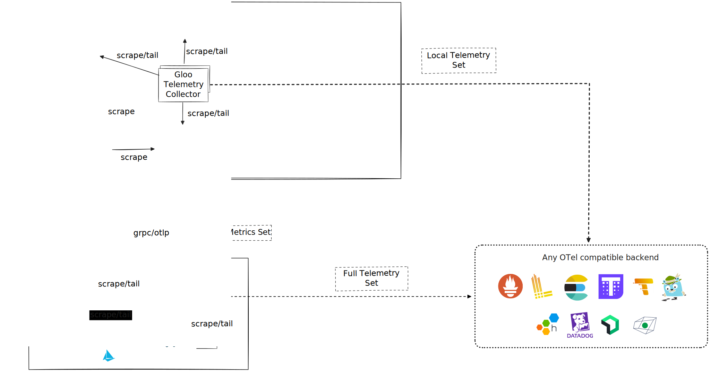

<!--bash
source ./scripts/assert.sh
-->


<center>

</center>

# <center>Gloo Mesh Enterprise (2.7.0-beta1)</center>


## Table of Contents
* [Introduction](#introduction)
* [Lab 1 - Deploy KinD Cluster(s)](#lab-1---deploy-kind-cluster(s)-)
* [Lab 2 - Deploy Gitea](#lab-2---deploy-gitea-)
* [Lab 3 - Deploy Argo CD](#lab-3---deploy-argo-cd-)
* [Lab 4 - Deploy and register Gloo Mesh](#lab-4---deploy-and-register-gloo-mesh-)
* [Lab 5 - Deploy Istio using Gloo Mesh Lifecycle Manager](#lab-5---deploy-istio-using-gloo-mesh-lifecycle-manager-)
* [Lab 6 - Deploy the Bookinfo demo app](#lab-6---deploy-the-bookinfo-demo-app-)
* [Lab 7 - Deploy the httpbin demo app](#lab-7---deploy-the-httpbin-demo-app-)
* [Lab 8 - Deploy Gloo Mesh Addons](#lab-8---deploy-gloo-mesh-addons-)
* [Lab 9 - Create the gateways workspace](#lab-9---create-the-gateways-workspace-)
* [Lab 10 - Create the bookinfo workspace](#lab-10---create-the-bookinfo-workspace-)
* [Lab 11 - Expose the productpage through a gateway](#lab-11---expose-the-productpage-through-a-gateway-)
* [Lab 12 - Traffic policies](#lab-12---traffic-policies-)
* [Lab 13 - Create the Root Trust Policy](#lab-13---create-the-root-trust-policy-)
* [Lab 14 - Leverage Virtual Destinations for east west communications](#lab-14---leverage-virtual-destinations-for-east-west-communications-)
* [Lab 15 - Zero trust](#lab-15---zero-trust-)
* [Lab 16 - See how Gloo Platform can help with observability](#lab-16---see-how-gloo-platform-can-help-with-observability-)
* [Lab 17 - VM integration with Spire](#lab-17---vm-integration-with-spire-)
* [Lab 18 - Securing the egress traffic](#lab-18---securing-the-egress-traffic-)


## Introduction <a name="introduction"></a>

Gloo Mesh Enterprise is a distribution of the [Istio](https://istio.io/) service mesh that is hardened for production support across multicluster hybrid clusters and service meshes.
With Gloo Mesh Enterprise, you get an extensible, open-source based set of API tools to connect and manage your services across multiple clusters and service meshes.
It includes n-4 Istio version support with security patches to address Common Vulnerabilities and Exposures (CVEs), as well as special builds to meet regulatory standards such as Federal Information Processing Standards (FIPS).

The Gloo Mesh API simplifies the complexity of your service mesh by installing custom resource definitions (CRDs) that you configure.
Then, Gloo Mesh translates these CRDs into Istio resources across your environment, and provides visibility across all of the resources and traffic.
Enterprise features include multitenancy, global failover and routing, observability, and east-west rate limiting and policy enforcement through authorization and authentication plug-ins.

### Gloo Mesh Enterprise overview

Gloo Mesh Enterprise provides many unique features, including:

* Upstream-first approach to feature development
* Installation, upgrade, and management across clusters and service meshes
* Advanced features for security, traffic routing, tranformations, observability, and more
* End-to-end Istio support and CVE security patching for n-4 versions
* Specialty builds for distroless and FIPS compliance
* 24x7 production support and one-hour Severity 1 SLA
* Portal modules to extend functionality
* Workspaces for simplified multi-tenancy
* Zero-trust architecture for both north-south ingress and east-west service traffic
* Single pane of glass for operational management of Istio, including global observability


### Want to learn more about Gloo Mesh Enterprise?

You can find more information about Gloo Mesh Enterprise in the official documentation: <https://docs.solo.io/gloo-mesh/>


## Lab 1 - Deploy KinD Cluster(s) <a name="lab-1---deploy-kind-cluster(s)-"></a>


Clone this repository and go to the directory where this `README.md` file is.

Set the context environment variables:

```bash
export MGMT=mgmt
export CLUSTER1=cluster1
export CLUSTER2=cluster2
```

Deploy the KinD clusters:

```bash
bash ./data/steps/deploy-kind-clusters/deploy-mgmt.sh
bash ./data/steps/deploy-kind-clusters/deploy-cluster1.sh
bash ./data/steps/deploy-kind-clusters/deploy-cluster2.sh
```
Then run the following commands to wait for all the Pods to be ready:

```bash
./scripts/check.sh mgmt
./scripts/check.sh cluster1
./scripts/check.sh cluster2
```

**Note:** If you run the `check.sh` script immediately after the `deploy.sh` script, you may see a jsonpath error. If that happens, simply wait a few seconds and try again.

Once the `check.sh` script completes, execute the `kubectl get pods -A` command, and verify that all pods are in a running state.
  You can see that your currently connected to this cluster by executing the `kubectl config get-contexts` command:

```
CURRENT   NAME         CLUSTER         AUTHINFO   NAMESPACE
          cluster1     kind-cluster1   cluster1
*         cluster2     kind-cluster2   cluster2
          mgmt         kind-mgmt       kind-mgmt
```

Run the following command to make `mgmt` the current cluster.

```bash
kubectl config use-context ${MGMT}
```
<!--bash
cat <<'EOF' > ./test.js
const helpers = require('./tests/chai-exec');

describe("Clusters are healthy", () => {
    const clusters = ["mgmt", "cluster1", "cluster2"];

    clusters.forEach(cluster => {
        it(`Cluster ${cluster} is healthy`, () => helpers.k8sObjectIsPresent({ context: cluster, namespace: "default", k8sType: "service", k8sObj: "kubernetes" }));
    });
});
EOF
echo "executing test dist/gloo-mesh-2-0-workshop/build/templates/steps/deploy-kind-clusters/tests/cluster-healthy.test.js.liquid from lab number 1"
timeout --signal=INT 3m mocha ./test.js --timeout 10000 --retries=120 --bail || { DEBUG_MODE=true mocha ./test.js --timeout 120000; echo "The workshop failed in lab number 1"; exit 1; }
-->


## Lab 2 - Deploy Gitea <a name="lab-2---deploy-gitea-"></a>

GitOps is a DevOps automation technique based on Git. To implement it, your processes depend
on a centralised Git hosting tool such as GitHub or GitLab. In this exercise we'll provide
our own hosted Git instance that can be used to push code changes to, and create and approve
pull requests in.

Run the following commands to create a Gitea Git hosting service in your environment:

```bash
export GITEA_HTTP=http://git.example.com:3180

helm upgrade --install gitea gitea \
  --repo https://dl.gitea.com/charts/ \
  --version 10.4.1 \
  --kube-context ${MGMT} \
  --namespace gitea \
  --create-namespace \
  --wait \
  -f -<<EOF
service:
  http:
    type: LoadBalancer
    port: 3180
    annotations:
      service.beta.kubernetes.io/aws-load-balancer-name: gitea-http
      service.beta.kubernetes.io/aws-load-balancer-type: external
      service.beta.kubernetes.io/aws-load-balancer-scheme: internet-facing
      service.beta.kubernetes.io/aws-load-balancer-nlb-target-type: instance
      service.beta.kubernetes.io/aws-load-balancer-cross-zone-load-balancing-enabled: "true"
redis-cluster:
  enabled: false
postgresql-ha:
  enabled: false
persistence:
  enabled: false
gitea:
  config:
    repository:
      ENABLE_PUSH_CREATE_USER: true
      DEFAULT_PUSH_CREATE_PRIVATE: false
    database:
      DB_TYPE: sqlite3
    session:
      PROVIDER: memory
    cache:
      ADAPTER: memory
    queue:
      TYPE: level
    server:
      ROOT_URL: ${GITEA_HTTP}
      OFFLINE_MODE: true
    webhook:
      ALLOWED_HOST_LIST: private
EOF

echo Waiting for Gitea LB to be ready...
kubectl --context ${MGMT} -n gitea wait svc gitea-http --for=jsonpath='{.status.loadBalancer.ingress[0].ip}{.status.loadBalancer.ingress[0].hostname}' --timeout=300s
```
<!--bash
cat <<'EOF' > ./test.js
const chaiExec = require("@jsdevtools/chai-exec");
var chai = require('chai');
var expect = chai.expect;
chai.use(chaiExec);

afterEach(function (done) {
  if (this.currentTest.currentRetry() > 0) {
    process.stdout.write(".");
    setTimeout(done, 1000);
  } else {
    done();
  }
});

describe("Gitea load balancer IP address", () => {
  it("is assigned", () => {
    let cli = chaiExec("kubectl --context " + process.env.MGMT + " -n gitea get svc gitea-http -o jsonpath='{.status.loadBalancer}'");
    expect(cli).to.exit.with.code(0);
    expect(cli).output.to.contain('"ingress"');
  });
});

EOF
echo "executing test dist/gloo-mesh-2-0-workshop/build/templates/steps/deploy-hosted-git/tests/get-gitea-http-ip.test.js.liquid from lab number 2"
timeout --signal=INT 3m mocha ./test.js --timeout 10000 --retries=120 --bail || { DEBUG_MODE=true mocha ./test.js --timeout 120000; echo "The workshop failed in lab number 2"; exit 1; }
-->

Configure your hosts file to resolve git.example.com with the IP address of Gitea by executing the following command:

<!--bash
RETRY_COUNT=0
MAX_RETRIES=60
while [[ -z "$GITEA_IP" && $RETRY_COUNT -lt $MAX_RETRIES ]]; do
  echo "Waiting for GITEA_IP to be assigned... Attempt $((RETRY_COUNT + 1))/$MAX_RETRIES"
  GITEA_IP=$(kubectl --context ${MGMT} -n gitea get svc gitea-http -o jsonpath='{.status.loadBalancer.ingress[0].ip}{.status.loadBalancer.ingress[0].hostname}')
  RETRY_COUNT=$((RETRY_COUNT + 1))
  sleep 5
done

# if GITEA_IP is a hostname, resolve it to an IP address
if [[ -n "$GITEA_IP" && $GITEA_IP =~ [a-zA-Z] ]]; then
  echo "GITEA_IP is a hostname. Resolving to IP address..."
  unset IP
  while [[ -z "$IP" && $RETRY_COUNT -lt $MAX_RETRIES ]]; do
    echo "Waiting for GITEA_IP to be propagated in DNS... Attempt $((RETRY_COUNT + 1))/$MAX_RETRIES"
    GITEA_IP=$(kubectl --context ${MGMT} -n gitea get svc gitea-http -o jsonpath='{.status.loadBalancer.ingress[0].ip}{.status.loadBalancer.ingress[0].hostname}')
    IP=$(dig +short A "$GITEA_IP" | awk '/^[0-9]+\.[0-9]+\.[0-9]+\.[0-9]+$/ {print; exit}')
    echo "IP: $IP"
    RETRY_COUNT=$((RETRY_COUNT + 1))
    sleep 5
  done
  GITEA_IP=$IP
fi

if [[ -z "$GITEA_IP" ]]; then
  echo "WARNING: Maximum number of retries reached. GITEA_IP could not be assigned."
  exit 1
else
  export GITEA_IP
  echo "GITEA_IP has been assigned: $GITEA_IP"
fi
-->

```bash
GITEA_IP=$(kubectl --context ${MGMT} -n gitea get svc gitea-http -o jsonpath='{.status.loadBalancer.ingress[0].ip}{.status.loadBalancer.ingress[0].hostname}')
./scripts/register-domain.sh git.example.com ${GITEA_IP}
```

Let's create a user that can create a new repo, push changes, and work with pull requests:

```bash
GITEA_ADMIN_TOKEN=$(curl -Ss ${GITEA_HTTP}/api/v1/users/gitea_admin/tokens \
  -H "Content-Type: application/json" \
  -d '{"name": "workshop", "scopes": ["write:admin", "write:repository"]}' \
  -u 'gitea_admin:r8sA8CPHD9!bt6d' \
  | jq -r .sha1)
echo export GITEA_ADMIN_TOKEN=${GITEA_ADMIN_TOKEN} >> ~/.env

curl -i ${GITEA_HTTP}/api/v1/admin/users \
  -H "accept: application/json" -H "Content-Type: application/json" \
  -H "Authorization: token ${GITEA_ADMIN_TOKEN}" \
  -d '{
    "username": "gloo-gitops",
    "password": "password",
    "email": "gloo-gitops@solo.io",
    "full_name": "Solo.io GitOps User",
    "must_change_password": false
  }'
```

You can now see the list of Gitea repos by clicking the "Git" tab above. If you need to, you
can log in with username `gloo-gitops` and password `password` that were used to create the user.

Now, if you need to push a repo to Gitea, you can simply add a remote to it and push.
We don't have a repo to work with yet but this is how you would do it:

```,nocopy
git config credential.helper '!f() { sleep 1; echo "username=gloo-gitops"; echo "password=password"; }; f'
git remote add origin ${GITEA_HTTP}/gloo-gitops/new-repo.git
git push -u origin main
```

Note that the credentials are stored **insecurely** here as a convenience for these exercises.


## Lab 3 - Deploy Argo CD <a name="lab-3---deploy-argo-cd-"></a>

Argo CD is a declarative, GitOps continuous delivery tool for Kubernetes that we can use to
deploy and synchronise applications and configuration from a state stored in a Git repo.

Run the following commands to install Argo CD in your environment:

```bash
ARGOCD_WEBHOOK_SECRET=$(shuf -ern32 {A..Z} {a..z} {0..9} | paste -sd "\0" -)

helm upgrade --install argo-cd argo-cd \
  --repo https://argoproj.github.io/argo-helm \
  --version 7.5.2 \
  --kube-context ${MGMT} \
  --namespace argocd \
  --create-namespace \
  --wait \
  -f -<<EOF
server:
  service:
    type: LoadBalancer
    servicePortHttp: 3280
    servicePortHttps: 3243
configs:
  params:
    server.insecure: true
    server.disable.auth: true
  secret:
    gogsSecret: ${ARGOCD_WEBHOOK_SECRET}
  cm:
    timeout.reconciliation: 10s
  clusterCredentials:
    ${MGMT}:
      server: https://kubernetes.default.svc
      config:
        tlsClientConfig:
          insecure: false
EOF

kubectl --context ${MGMT} -n argocd wait svc argo-cd-argocd-server --for=jsonpath='{.status.loadBalancer.ingress[0].ip}{.status.loadBalancer.ingress[0].hostname}' --timeout=300s
```

Download and install the `argocd` CLI tool that we'll use to manage the Argo CD server:

```bash
mkdir -p ${HOME}/bin
curl -Lo ${HOME}/bin/argocd https://github.com/argoproj/argo-cd/releases/download/v2.12.3/argocd-$(uname | tr '[:upper:]' '[:lower:]')-$(uname -m | sed 's/aarch/arm/' | sed 's/x86_/amd/')
chmod +x ${HOME}/bin/argocd
export PATH=$HOME/bin:$PATH
```

Next, log in to the Argo CD server so that we can work with its clusters and applications:

```bash
ARGOCD_HTTP_IP=$(kubectl --context ${MGMT} -n argocd get svc argo-cd-argocd-server -o jsonpath='{.status.loadBalancer.ingress[0].ip}{.status.loadBalancer.ingress[0].hostname}')
ARGOCD_ADMIN_SECRET=$(kubectl --context ${MGMT} -n argocd get secret argocd-initial-admin-secret -o jsonpath="{.data.password}" | base64 -d)

argocd --kube-context ${MGMT} login ${ARGOCD_HTTP_IP}:3280 --username admin --password ${ARGOCD_ADMIN_SECRET} --plaintext
```
Finally, let's tell Argo CD about our other clusters so that we can deploy apps to those too:

```bash
argocd cluster add ${CLUSTER1} --name ${CLUSTER1} -y --cluster-endpoint kube-public
argocd cluster add ${CLUSTER2} --name ${CLUSTER2} -y --cluster-endpoint kube-public
```
We can check that our cluster list looks correct:

```bash
argocd cluster list
```

You should get an output like the following:

```,nocopy
SERVER                            NAME      VERSION  STATUS   MESSAGE                                                  PROJECT
https://kind2-control-plane:6443  cluster1           Unknown  Cluster has no applications and is not being monitored.
https://kind3-control-plane:6443  cluster2           Unknown  Cluster has no applications and is not being monitored.
https://kubernetes.default.svc    mgmt               Unknown  Cluster has no applications and is not being monitored.
```

Now we're ready to use Argo CD to manage applications as part of continuous delivery and GitOps.
We'll start by creating a GitOps repo that our teams will share. Note that teams can have their own repos
to work separately if that suits their workflow better.

```bash
mkdir -p data/steps/gitops-repo
export GITOPS_REPO_LOCAL=$(realpath data/steps/gitops-repo)
```

At the root of our shared GitOps directory, we'll create a new subdirectory called `argo-cd` that we'll use to sync
configuration to Argo CD:

```bash
export GITOPS_ARGOCD=${GITOPS_REPO_LOCAL}/argo-cd
mkdir -p ${GITOPS_ARGOCD} && touch ${GITOPS_ARGOCD}/.gitignore
```

Instantiate the shared GitOps directory as a Git repo:

```bash
git -C ${GITOPS_REPO_LOCAL} init -b main
git -C ${GITOPS_REPO_LOCAL} config user.email "gloo-gitops@solo.io"
git -C ${GITOPS_REPO_LOCAL} config user.name "Solo.io GitOps User"
```

Commit and push our repo to the Git server:

```bash
git -C ${GITOPS_REPO_LOCAL} add .
git -C ${GITOPS_REPO_LOCAL} commit -m "Initial commit of Gloo GitOps"

git -C ${GITOPS_REPO_LOCAL} config credential.helper '!f() { sleep 1; echo "username=gloo-gitops"; echo "password=password"; }; f'
git -C ${GITOPS_REPO_LOCAL} remote add origin ${GITEA_HTTP}/gloo-gitops/gitops-repo.git

git -C ${GITOPS_REPO_LOCAL} push -u origin main
```

While we now have a Git repo that we'll use to sync Argo CD configuration, we need to tell Argo CD where to
get that configuration from and how to apply it. We'll use two Kubernetes custom resources for this, one to
define a new "project" and another to create an "application" that declares how the config will be synced:

```bash
cat <<EOF > ${GITOPS_ARGOCD}/argo-cd.yaml
apiVersion: argoproj.io/v1alpha1
kind: AppProject
metadata:
  name: argo-cd
  annotations:
    argocd.argoproj.io/sync-wave: "-1"
  finalizers:
  - resources-finalizer.argocd.argoproj.io
spec:
  sourceRepos:
  - '*'
  destinations:
  - namespace: '*'
    server: '*'
  clusterResourceWhitelist:
  - group: '*'
    kind: '*'
---
apiVersion: argoproj.io/v1alpha1
kind: Application
metadata:
  name: argocd-${MGMT}
  finalizers:
  - resources-finalizer.argocd.argoproj.io/background
spec:
  project: argo-cd
  sources:
  - repoURL: http://gitea-http.gitea:3180/gloo-gitops/gitops-repo.git
    targetRevision: HEAD
    path: argo-cd
  destination:
    name: ${MGMT}
    namespace: argocd
  syncPolicy:
    automated:
      allowEmpty: true
      prune: true
    syncOptions:
    - ApplyOutOfSyncOnly=true
EOF

kubectl --context ${MGMT} -n argocd create -f ${GITOPS_ARGOCD}/argo-cd.yaml
```

These are applied directly to Argo CD, but we'll keep them in our GitOps repo in case we need to make any
changes in the future:

```bash
git -C ${GITOPS_REPO_LOCAL} add .
git -C ${GITOPS_REPO_LOCAL} commit -m "Manage argo-cd config"
git -C ${GITOPS_REPO_LOCAL} push
```

Now, check the Argo CD UI tab above. After a few seconds, you should see an application created
for our Argo CD configuration, which is synchronised with the Git repo that we just created.

<!--bash
cat <<'EOF' > ./test.js
const chaiExec = require("@jsdevtools/chai-exec");
var chai = require('chai');
var expect = chai.expect;
chai.use(chaiExec);

afterEach(function (done) {
  if (this.currentTest.currentRetry() > 0) {
    process.stdout.write(".");
    setTimeout(done, 1000);
  } else {
    done();
  }
});

describe("Argo CD config", () => {
  it("syncs to mgmt cluster", () => {
    let cli = chaiExec(process.env.HOME + "/bin/argocd --kube-context " + process.env.MGMT + " app get argocd-" + process.env.MGMT);
    expect(cli).to.exit.with.code(0);
    expect(cli).to.have.output.that.matches(new RegExp("\\bServer:\\s+" + process.env.MGMT + "\\b"));
    expect(cli).to.have.output.that.matches(new RegExp("\\bRepo:\\s+.+/gloo-gitops/gitops-repo.git\\b"));
    expect(cli).to.have.output.that.matches(new RegExp("\\bPath:\\s+argo-cd\\b"));
    expect(cli).to.have.output.that.matches(new RegExp("\\bHealth Status:\\s+Healthy\\b"));
  });
});

EOF
echo "executing test dist/gloo-mesh-2-0-workshop/build/templates/steps/deploy-argo-cd/tests/argo-cd-sync-repo.test.js.liquid from lab number 3"
timeout --signal=INT 3m mocha ./test.js --timeout 10000 --retries=120 --bail || { DEBUG_MODE=true mocha ./test.js --timeout 120000; echo "The workshop failed in lab number 3"; exit 1; }
-->

Even though Argo CD syncs regularly with the remote Git repo, we can optionally minimise the time we spend waiting for synchronisation by using the Argo CD sync webhook.
Configure the remote Git repo to call the Argo CD webhook on every push:

```bash
curl -i ${GITEA_HTTP}/api/v1/repos/gloo-gitops/gitops-repo/hooks \
  -H "accept: application/json" -H "Content-Type: application/json" \
  -H "Authorization: token ${GITEA_ADMIN_TOKEN}" \
  -d '{
    "active": true,
    "type": "gitea",
    "branch_filter": "*",
    "config": {
      "content_type": "json",
      "url": "'http://${ARGOCD_HTTP_IP}:3280/api/webhook'",
      "secret": "'${ARGOCD_WEBHOOK_SECRET}'"
    },
    "events": [
      "push"
    ]
  }'
```

Finally, let's test that everything is working correctly. We'll define a pod manifest, commit
it to our repo, push it to the remote, and check that Argo CD creates that pod in our cluster.

First, switch back to the terminal and create our pod manifest:

```bash
cat <<EOF > ${GITOPS_ARGOCD}/nginx.yaml
apiVersion: v1
kind: Pod
metadata:
  name: nginx
  namespace: default
spec:
  containers:
  - image: nginx:1.25.3
    name: nginx
EOF
```

Commit and push it to our remote:

```bash
git -C ${GITOPS_REPO_LOCAL} add .
git -C ${GITOPS_REPO_LOCAL} commit -m "Add nginx"
git -C ${GITOPS_REPO_LOCAL} push
```
<!--bash
echo -n Waiting for Argo CD to sync...
timeout -v 5m bash -c "until [[ \$(kubectl --context ${MGMT} -n default get pod nginx 2>/dev/null) ]]; do
  sleep 1
  echo -n .
done"
echo
timeout 2m bash -c "until [[ \$(kubectl --context ${MGMT} -n default wait --for=condition=ready pod/nginx --timeout=30s 2>/dev/null) ]]; do
  sleep 1
done"
if [[ ! $(kubectl --context ${MGMT} -n default wait --for=condition=ready pod/nginx --timeout=30s) ]]; then
  echo "nginx did not become ready"
  exit 1
fi
-->

Now, check the Argo CD UI tab again and click into the "argocd-mgmt" or "argocd-cluster1" application.
After a short period, you'll see an `nginx` pod appear linked to the application.
The status of this pod will be shown as a tag on the pod box in the UI.

Let's make sure the pod got deployed by switching back to the terminal and running this command:

```bash
until kubectl --context ${MGMT} -n default wait --for=condition=ready pod/nginx --timeout=30s 2>/dev/null; do sleep 1; done
```

Now let's delete the pod manifest from the repo and check that it gets removed from the
cluster:

```bash
git -C ${GITOPS_REPO_LOCAL} revert --no-commit HEAD
git -C ${GITOPS_REPO_LOCAL} commit -m "Delete nginx"
git -C ${GITOPS_REPO_LOCAL} push

kubectl --context ${MGMT} -n default wait --for=delete pod/nginx --timeout=30s
```


## Lab 4 - Deploy and register Gloo Mesh <a name="lab-4---deploy-and-register-gloo-mesh-"></a>
[](https://youtu.be/djfFiepK4GY "Video Link")


Before we get started, let's install the `meshctl` CLI:

```bash
export GLOO_MESH_VERSION=v2.7.0-beta1
curl -sL https://run.solo.io/meshctl/install | sh -
export PATH=$HOME/.gloo-mesh/bin:$PATH
```
<!--bash
cat <<'EOF' > ./test.js
var chai = require('chai');
var expect = chai.expect;

describe("Required environment variables should contain value", () => {
  afterEach(function(done){
    if(this.currentTest.currentRetry() > 0){
      process.stdout.write(".");
       setTimeout(done, 1000);
    } else {
      done();
    }
  });

  it("Context environment variables should not be empty", () => {
    expect(process.env.MGMT).not.to.be.empty
    expect(process.env.CLUSTER1).not.to.be.empty
    expect(process.env.CLUSTER2).not.to.be.empty
  });

  it("Gloo Mesh licence environment variables should not be empty", () => {
    expect(process.env.GLOO_MESH_LICENSE_KEY).not.to.be.empty
  });
});
EOF
echo "executing test dist/gloo-mesh-2-0-workshop/build/templates/steps/deploy-and-register-gloo-mesh/tests/environment-variables.test.js.liquid from lab number 4"
timeout --signal=INT 3m mocha ./test.js --timeout 10000 --retries=120 --bail || { DEBUG_MODE=true mocha ./test.js --timeout 120000; echo "The workshop failed in lab number 4"; exit 1; }
-->
GitOps allows flexible interactions between the different teams involved in building and running modern
applications. For these exercises we focus on a small number of *personas* that manage their own resources
and may work in distinct ways. These personas are:

* A **platform team**, who install and manage Gloo Platform and any cross-cutting concerns, like Istio
* A **gateways team**, who manage the ingress and east-west gateways and cross-cutting traffic concerns like
external DNS names or certificates
* **Application teams**, who decide how their apps are deployed and what routing requirements they have

Find out more about the personas that Gloo Platform was designed for [here](https://docs.solo.io/gloo-mesh-enterprise/latest/concepts/about/persona/).

The platform team will use a Git repo to store the desired state of the Gloo Platform installation. This repo
has already been created at the location in environment variable `${GITOPS_REPO_LOCAL}`, so we'll create
a new subdirectory for the platform team:

```bash
export GITOPS_PLATFORM=${GITOPS_REPO_LOCAL}/platform
mkdir -p ${GITOPS_PLATFORM}/${MGMT}
```

First, we'll create an Argo CD `Project` and `ApplicationSet` to apply the platform team's resources. This will
create an Argo CD `Application` for each configured cluster, and apply cluster-specific configuration from the
respective cluster subdirectory:

```bash
cat <<EOF > ${GITOPS_ARGOCD}/platform.yaml
apiVersion: argoproj.io/v1alpha1
kind: AppProject
metadata:
  name: platform
  annotations:
    argocd.argoproj.io/sync-wave: "-1"
  finalizers:
  - resources-finalizer.argocd.argoproj.io
spec:
  sourceRepos:
  - '*'
  destinations:
  - namespace: '*'
    server: '*'
  clusterResourceWhitelist:
  - group: '*'
    kind: '*'
---
apiVersion: argoproj.io/v1alpha1
kind: ApplicationSet
metadata:
  name: platform
spec:
  generators:
  - list:
      elements:
      - cluster: ${MGMT}
      - cluster: ${CLUSTER1}
      - cluster: ${CLUSTER2}
  template:
    metadata:
      name: platform-{{cluster}}
      finalizers:
      - resources-finalizer.argocd.argoproj.io/background
    spec:
      project: platform
      source:
        repoURL: http://gitea-http.gitea:3180/gloo-gitops/gitops-repo.git
        targetRevision: HEAD
        path: platform/{{cluster}}
      destination:
        name: '{{cluster}}'
        namespace: default
      syncPolicy:
        automated:
          allowEmpty: true
          prune: true
        syncOptions:
        - ApplyOutOfSyncOnly=true
EOF
```

Next, we'll create another Argo CD `Application` for the installation of the Gloo Platform management plane.
This will deploy the Gloo Platform CRDs and the management server as a pair of Helm releases, using a set of
Helm values that we'll store alongside this application spec in the GitOps repo:

```bash
mkdir -p ${GITOPS_PLATFORM}/argo-cd

cat <<EOF > ${GITOPS_PLATFORM}/argo-cd/gloo-platform-mgmt-installation.yaml
apiVersion: argoproj.io/v1alpha1
kind: Application
metadata:
  name: gloo-platform-mgmt-installation
  annotations:
    argocd.argoproj.io/sync-wave: "0"
  finalizers:
  - resources-finalizer.argocd.argoproj.io/background
spec:
  project: platform
  destination:
    name: ${MGMT}
    namespace: gloo-mesh
  syncPolicy:
    automated:
      allowEmpty: true
      prune: true
    syncOptions:
    - CreateNamespace=true
  ignoreDifferences:
  - kind: Secret
    jsonPointers:
    - /data/ca.crt
    - /data/tls.crt
    - /data/tls.key
    - /data/token
  - group: certificate.cert-manager.io
    kind: Certificate
    jsonPointers:
    - /spec/duration
    - /spec/renewBefore
  sources:
  - chart: gloo-platform-crds
    repoURL: https://storage.googleapis.com/gloo-platform/helm-charts
    targetRevision: 2.7.0-beta1
    helm:
      releaseName: gloo-platform-crds
      parameters:
      - name: "featureGates.ExternalWorkloads"
        value: "true"
  - chart: gloo-platform
    repoURL: https://storage.googleapis.com/gloo-platform/helm-charts
    targetRevision: 2.7.0-beta1
    helm:
      releaseName: gloo-platform
      valueFiles:
      - \$values/platform/argo-cd/gloo-platform-mgmt-installation-values.yaml
  - repoURL: http://$(kubectl --context ${MGMT} -n gitea get svc gitea-http -o jsonpath='{.status.loadBalancer.ingress[0].ip}{.status.loadBalancer.ingress[0].hostname}'):3180/gloo-gitops/gitops-repo.git
    targetRevision: HEAD
    ref: values
EOF
```

We'll use the following Helm values file to configure the Gloo Platform management server:

```bash
cat <<EOF > ${GITOPS_PLATFORM}/argo-cd/gloo-platform-mgmt-installation-values.yaml
licensing:
  glooTrialLicenseKey: ${GLOO_MESH_LICENSE_KEY}
common:
  cluster: mgmt
glooInsightsEngine:
  enabled: false
glooMgmtServer:
  enabled: true
  ports:
    healthcheck: 8091
prometheus:
  enabled: true
  skipAutoMigration: true
redis:
  deployment:
    enabled: true
telemetryGateway:
  enabled: true
  service:
    type: LoadBalancer
glooUi:
  enabled: true
  serviceType: LoadBalancer
telemetryCollector:
  enabled: true
  config:
    exporters:
      otlp:
        endpoint: gloo-telemetry-gateway:4317
featureGates:
  ExternalWorkloads: true
EOF
```

We're going to use [Kustomize](https://kustomize.io/) later on to help minimise duplication of configuration,
so we'll create the `Kustomization` files needed to make sure our resources are included:

```bash
cat <<EOF >${GITOPS_PLATFORM}/argo-cd/kustomization.yaml
namespace: argocd
resources:
- gloo-platform-mgmt-installation.yaml
EOF

cat <<EOF >${GITOPS_PLATFORM}/${MGMT}/kustomization.yaml
resources:
- ../argo-cd
EOF
```

Finally, commit and push the management server config to Git for it to take effect:

```bash
git -C ${GITOPS_REPO_LOCAL} add .
git -C ${GITOPS_REPO_LOCAL} commit -m "Gloo Platform management server"
git -C ${GITOPS_REPO_LOCAL} push
```
<!--bash
echo -n Waiting for Argo CD to sync...
timeout -v 5m bash -c "until [[ \$(kubectl --context ${MGMT} -n argocd get application gloo-platform-mgmt-installation 2>/dev/null) ]]; do
  sleep 1
  echo -n .
done"
echo
timeout 2m bash -c "until [[ \$(kubectl --context ${MGMT} -n gloo-mesh rollout status deploy/gloo-mesh-mgmt-server 2>/dev/null) ]]; do
  sleep 1
done"
if [[ ! $(kubectl --context ${MGMT} -n gloo-mesh rollout status deploy/gloo-mesh-mgmt-server --timeout 10s) ]]; then
  echo "Gloo Mesh Management Server did not deploy"
  exit 1
fi
-->

Take a look at the Argo CD dashboard to see the new `Application`s sync. While the config is synced,
wait for the deployment to complete by running the following in the terminal:

```bash
until kubectl --context ${MGMT} -n gloo-mesh rollout status deploy/gloo-mesh-mgmt-server 2>/dev/null; do sleep 1; done
```

<!--bash
kubectl wait --context ${MGMT} --for=condition=Ready -n gloo-mesh --all pod
timeout 2m bash -c "until [[ \$(kubectl --context ${MGMT} -n gloo-mesh get svc gloo-mesh-mgmt-server -o json | jq '.status.loadBalancer | length') -gt 0 ]]; do
  sleep 1
done"
-->

Then, you need to set the environment variable to tell the Gloo Mesh agents how to communicate with the management plane:
<!--bash
cat <<'EOF' > ./test.js

const helpers = require('./tests/chai-exec');

describe("MGMT server is healthy", () => {
  let cluster = process.env.MGMT;
  let deployments = ["gloo-mesh-mgmt-server","gloo-mesh-redis","gloo-telemetry-gateway","prometheus-server"];
  deployments.forEach(deploy => {
    it(deploy + ' pods are ready in ' + cluster, () => helpers.checkDeployment({ context: cluster, namespace: "gloo-mesh", k8sObj: deploy }));
  });
});
EOF
echo "executing test dist/gloo-mesh-2-0-workshop/build/templates/steps/deploy-and-register-gloo-mesh/tests/check-deployment.test.js.liquid from lab number 4"
timeout --signal=INT 3m mocha ./test.js --timeout 10000 --retries=120 --bail || { DEBUG_MODE=true mocha ./test.js --timeout 120000; echo "The workshop failed in lab number 4"; exit 1; }
-->
<!--bash
cat <<'EOF' > ./test.js
const chaiExec = require("@jsdevtools/chai-exec");
var chai = require('chai');
var expect = chai.expect;
chai.use(chaiExec);

afterEach(function (done) {
  if (this.currentTest.currentRetry() > 0) {
    process.stdout.write(".");
    setTimeout(done, 1000);
  } else {
    done();
  }
});
EOF
echo "executing test dist/gloo-mesh-2-0-workshop/build/templates/steps/deploy-and-register-gloo-mesh/tests/get-gloo-mesh-mgmt-server-ip.test.js.liquid from lab number 4"
timeout --signal=INT 3m mocha ./test.js --timeout 10000 --retries=120 --bail || { DEBUG_MODE=true mocha ./test.js --timeout 120000; echo "The workshop failed in lab number 4"; exit 1; }
-->

```bash
export ENDPOINT_GLOO_MESH=$(kubectl --context ${MGMT} -n gloo-mesh get svc gloo-mesh-mgmt-server -o jsonpath='{.status.loadBalancer.ingress[0].ip}{.status.loadBalancer.ingress[0].hostname}'):9900
export HOST_GLOO_MESH=$(echo ${ENDPOINT_GLOO_MESH%:*})
export ENDPOINT_TELEMETRY_GATEWAY=$(kubectl --context ${MGMT} -n gloo-mesh get svc gloo-telemetry-gateway -o jsonpath='{.status.loadBalancer.ingress[0].ip}{.status.loadBalancer.ingress[0].hostname}'):4317
export ENDPOINT_GLOO_MESH_UI=$(kubectl --context ${MGMT} -n gloo-mesh get svc gloo-mesh-ui -o jsonpath='{.status.loadBalancer.ingress[0].ip}{.status.loadBalancer.ingress[0].hostname}'):8090
```

Check that the variables have correct values:
```
echo $HOST_GLOO_MESH
echo $ENDPOINT_GLOO_MESH
```

<!--bash
cat <<'EOF' > ./test.js
const dns = require('dns');
const chaiHttp = require("chai-http");
const chai = require("chai");
const expect = chai.expect;
chai.use(chaiHttp);
const { waitOnFailedTest } = require('./tests/utils');

afterEach(function(done) { waitOnFailedTest(done, this.currentTest.currentRetry())});

describe("Address '" + process.env.HOST_GLOO_MESH + "' can be resolved in DNS", () => {
    it(process.env.HOST_GLOO_MESH + ' can be resolved', (done) => {
        return dns.lookup(process.env.HOST_GLOO_MESH, (err, address, family) => {
            expect(address).to.be.an.ip;
            done();
        });
    });
});
EOF
echo "executing test ./gloo-mesh-2-0/tests/can-resolve.test.js.liquid from lab number 4"
timeout --signal=INT 3m mocha ./test.js --timeout 10000 --retries=120 --bail || { DEBUG_MODE=true mocha ./test.js --timeout 120000; echo "The workshop failed in lab number 4"; exit 1; }
-->
Finally, you need to register the cluster(s).

We need to create a Gloo `KubernetesCluster` to represent the cluster in the management server:

```bash
cat <<EOF > ${GITOPS_PLATFORM}/${MGMT}/cluster1.yaml
apiVersion: admin.gloo.solo.io/v2
kind: KubernetesCluster
metadata:
  name: cluster1
  namespace: gloo-mesh
spec:
  clusterDomain: cluster.local
EOF

cat <<EOF > ${GITOPS_PLATFORM}/${MGMT}/cluster2.yaml
apiVersion: admin.gloo.solo.io/v2
kind: KubernetesCluster
metadata:
  name: cluster2
  namespace: gloo-mesh
spec:
  clusterDomain: cluster.local
EOF

cat <<EOF >>${GITOPS_PLATFORM}/${MGMT}/kustomization.yaml
- cluster1.yaml
- cluster2.yaml
EOF
```

Next we'll set up the cluster-specific configuration for Argo CD to sync to the first cluster:

```bash
mkdir -p ${GITOPS_PLATFORM}/${CLUSTER1}

cat <<EOF >${GITOPS_PLATFORM}/${CLUSTER1}/ns-gloo-mesh.yaml
apiVersion: v1
kind: Namespace
metadata:
  name: gloo-mesh
EOF

cat <<EOF >${GITOPS_PLATFORM}/${CLUSTER1}/relay-secrets.yaml
apiVersion: v1
kind: Secret
metadata:
  name: relay-root-tls-secret
  namespace: gloo-mesh
data:
  ca.crt: $(kubectl --context ${MGMT} -n gloo-mesh get secret relay-root-tls-secret -o jsonpath='{.data.ca\.crt}')
---
apiVersion: v1
kind: Secret
metadata:
  name: relay-identity-token-secret
  namespace: gloo-mesh
data:
  token: $(kubectl --context ${MGMT} -n gloo-mesh get secret relay-identity-token-secret -o jsonpath='{.data.token}')
EOF

cat <<EOF >${GITOPS_PLATFORM}/${CLUSTER1}/kustomization.yaml
commonAnnotations:
  argocd.argoproj.io/sync-wave: "1"
resources:
- ns-gloo-mesh.yaml
- relay-secrets.yaml
EOF
```

> <i>Note: Secrets should not be stored in the GitOps repo in an unencrypted form (see [Sealed Secrets](https://sealed-secrets.netlify.app/)
for a mechanism to store secrets properly). We store them unencrypted in this workshop for simplicity.</i>

Copy this configuration for the second cluster:

```bash
cp -r ${GITOPS_PLATFORM}/${CLUSTER1} ${GITOPS_PLATFORM}/${CLUSTER2}
```

Create an Argo CD `ApplicationSet` to configure and install the Gloo Platform agent on both clusters:

```bash
cat <<EOF >${GITOPS_PLATFORM}/argo-cd/gloo-platform-agents-installation.yaml
apiVersion: argoproj.io/v1alpha1
kind: ApplicationSet
metadata:
  name: gloo-platform-agents-installation
spec:
  generators:
  - list:
      elements:
      - cluster: ${CLUSTER1}
      - cluster: ${CLUSTER2}
  template:
    metadata:
      name: gloo-platform-{{cluster}}-installation
      annotations:
        argocd.argoproj.io/sync-wave: "2"
      finalizers:
      - resources-finalizer.argocd.argoproj.io/background
    spec:
      project: platform
      destination:
        name: '{{cluster}}'
        namespace: gloo-mesh
      syncPolicy:
        automated:
          prune: true
      ignoreDifferences:
      - group: apiextensions.k8s.io
        kind: CustomResourceDefinition
        name: istiooperators.install.istio.io
        jsonPointers:
        - /metadata/labels
      - kind: Secret
        name: postgresql
        jsonPointers:
        - /data/postgres-password
      - group: certificate.cert-manager.io
        kind: Certificate
        jsonPointers:
        - /spec/duration
        - /spec/renewBefore
      sources:
      - chart: gloo-platform-crds
        repoURL: https://storage.googleapis.com/gloo-platform/helm-charts
        targetRevision: 2.7.0-beta1
        helm:
          releaseName: gloo-platform-crds
          parameters:
          - name: "featureGates.ExternalWorkloads"
            value: "true"
      - chart: gloo-platform
        repoURL: https://storage.googleapis.com/gloo-platform/helm-charts
        targetRevision: 2.7.0-beta1
        helm:
          releaseName: gloo-platform
          valueFiles:
          - \$values/platform/argo-cd/gloo-platform-agents-installation-values.yaml
          parameters:
          - name: common.cluster
            value: '{{cluster}}'
          - name: "glooSpireServer.server.trustDomain"
            value: '{{cluster}}'
      - repoURL: http://$(kubectl --context ${MGMT} -n gitea get svc gitea-http -o jsonpath='{.status.loadBalancer.ingress[0].ip}{.status.loadBalancer.ingress[0].hostname}'):3180/gloo-gitops/gitops-repo.git
        targetRevision: HEAD
        ref: values
EOF
```

We'll use the following Helm values file to configure the Gloo Platform agents:

```bash
cat <<EOF > ${GITOPS_PLATFORM}/argo-cd/gloo-platform-agents-installation-values.yaml
common:
  cluster: undefined
glooAgent:
  enabled: true
  relay:
    serverAddress: "${ENDPOINT_GLOO_MESH}"
    authority: gloo-mesh-mgmt-server.gloo-mesh
telemetryCollector:
  enabled: true
  config:
    exporters:
      otlp:
        endpoint: "${ENDPOINT_TELEMETRY_GATEWAY}"
EOF
```

Add these files for `Kustomize` to include:

```bash
cat <<EOF >>${GITOPS_PLATFORM}/argo-cd/kustomization.yaml
- gloo-platform-agents-installation.yaml
EOF
```

Commit and push the clusters' configuration for it to take effect:

```bash
git -C ${GITOPS_REPO_LOCAL} add .
git -C ${GITOPS_REPO_LOCAL} commit -m "Onboard workload clusters"
git -C ${GITOPS_REPO_LOCAL} push
```
<!--bash
echo -n Waiting for Argo CD to sync...
timeout -v 5m bash -c "until [[ \$(kubectl --context ${MGMT} -n gloo-mesh get kubernetescluster cluster1 2>/dev/null) ]]; do
  sleep 1
  echo -n .
done"
echo
-->

You can check the cluster(s) have been registered correctly using the following commands:
```
meshctl --kubecontext ${MGMT} check
```

```
pod=$(kubectl --context ${MGMT} -n gloo-mesh get pods -l app=gloo-mesh-mgmt-server -o jsonpath='{.items[0].metadata.name}')
kubectl --context ${MGMT} -n gloo-mesh debug -q -i ${pod} --image=curlimages/curl -- curl -s http://localhost:9091/metrics | grep relay_push_clients_connected
```

You should get an output similar to this:
```,nocopy
# HELP relay_push_clients_connected Current number of connected Relay push clients (Relay Agents).
# TYPE relay_push_clients_connected gauge
relay_push_clients_connected{cluster="cluster1"} 1
relay_push_clients_connected{cluster="cluster2"} 1
```
Finally, you need to specify which gateways you want to use for cross cluster traffic:

```bash
mkdir -p ${GITOPS_PLATFORM}/${MGMT}/workspaces
cat <<EOF > ${GITOPS_PLATFORM}/${MGMT}/workspaces/workspace-global.yaml
apiVersion: admin.gloo.solo.io/v2
kind: WorkspaceSettings
metadata:
  name: global
  namespace: gloo-mesh
spec:
  options:
    eastWestGateways:
      - selector:
          labels:
            istio: eastwestgateway
EOF

cat <<EOF >${GITOPS_PLATFORM}/${MGMT}/workspaces/kustomization.yaml
commonAnnotations:
  argocd.argoproj.io/sync-wave: "2"
resources:
- workspace-global.yaml
EOF

cat <<EOF >>${GITOPS_PLATFORM}/${MGMT}/kustomization.yaml
- workspaces
EOF

git -C ${GITOPS_REPO_LOCAL} add .
git -C ${GITOPS_REPO_LOCAL} commit -m "Indicate east-west gateway"
git -C ${GITOPS_REPO_LOCAL} push
```

Take a look at the repo in the **Git** tab. Notice that we've created all our resources in the directory under
`environments` that corresponds to the management server or the Argo CD installation.
<!--bash
cat <<'EOF' > ./test.js
var chai = require('chai');
var expect = chai.expect;
const helpers = require('./tests/chai-exec');
describe("Cluster registration", () => {
  it("cluster1 is registered", () => {
    podName = helpers.getOutputForCommand({ command: "kubectl -n gloo-mesh get pods -l app=gloo-mesh-mgmt-server -o jsonpath='{.items[0].metadata.name}' --context " + process.env.MGMT }).replaceAll("'", "");
    command = helpers.getOutputForCommand({ command: "kubectl --context " + process.env.MGMT + " -n gloo-mesh debug -q -i " + podName + " --image=curlimages/curl -- curl -s http://localhost:9091/metrics" }).replaceAll("'", "");
    expect(command).to.contain("cluster1");
  });
  it("cluster2 is registered", () => {
    podName = helpers.getOutputForCommand({ command: "kubectl -n gloo-mesh get pods -l app=gloo-mesh-mgmt-server -o jsonpath='{.items[0].metadata.name}' --context " + process.env.MGMT }).replaceAll("'", "");
    command = helpers.getOutputForCommand({ command: "kubectl --context " + process.env.MGMT + " -n gloo-mesh debug -q -i " + podName + " --image=curlimages/curl -- curl -s http://localhost:9091/metrics" }).replaceAll("'", "");
    expect(command).to.contain("cluster2");
  });
});
EOF
echo "executing test dist/gloo-mesh-2-0-workshop/build/templates/steps/deploy-and-register-gloo-mesh/tests/cluster-registration.test.js.liquid from lab number 4"
timeout --signal=INT 3m mocha ./test.js --timeout 10000 --retries=120 --bail || { DEBUG_MODE=true mocha ./test.js --timeout 120000; echo "The workshop failed in lab number 4"; exit 1; }
-->


## Lab 5 - Deploy Istio using Gloo Mesh Lifecycle Manager <a name="lab-5---deploy-istio-using-gloo-mesh-lifecycle-manager-"></a>
[](https://youtu.be/f76-KOEjqHs "Video Link")

We are going to deploy Istio using Gloo Mesh Lifecycle Manager.

<details>
  <summary>Install <code>istioctl</code></summary>

Install `istioctl` if not already installed as it will be useful in some of the labs that follow.

```bash
curl -L https://istio.io/downloadIstio | sh -

if [ -d "istio-"*/ ]; then
  cd istio-*/
  export PATH=$PWD/bin:$PATH
  cd ..
fi
```

That's it!
</details>

<!--bash
cat <<'EOF' > ./test.js
const chaiExec = require("@jsdevtools/chai-exec");
var chai = require('chai');
var expect = chai.expect;
chai.use(chaiExec);

afterEach(function (done) {
  if (this.currentTest.currentRetry() > 0) {
    process.stdout.write(".");
    setTimeout(done, 1000);
  } else {
    done();
  }
});
EOF
echo "executing test dist/gloo-mesh-2-0-workshop/build/templates/steps/istio-lifecycle-manager-install/tests/istio-version.test.js.liquid from lab number 5"
timeout --signal=INT 3m mocha ./test.js --timeout 10000 --retries=120 --bail || { DEBUG_MODE=true mocha ./test.js --timeout 120000; echo "The workshop failed in lab number 5"; exit 1; }
-->

In this GitOps workshop, we'll assume that the platform team and the gateways team are separate teams,
so they will have separate subdirectories in the GitOps repo to work in. Let's create the directory for
the gateways team to manage their configuration in:

```bash
export GITOPS_GATEWAYS=${GITOPS_REPO_LOCAL}/gateways
mkdir -p ${GITOPS_GATEWAYS}
```

We'll use an Argo CD project and `ApplicationSet` to apply the gateway team's resources. This will create
an Argo CD `Application` for each configured cluster, and apply cluster-specific configuration from the
respective cluster subdirectory:

```bash
cat <<EOF > ${GITOPS_ARGOCD}/gateways.yaml
apiVersion: argoproj.io/v1alpha1
kind: AppProject
metadata:
  name: gateways
  annotations:
    argocd.argoproj.io/sync-wave: "-1"
  finalizers:
  - resources-finalizer.argocd.argoproj.io
spec:
  sourceRepos:
  - '*'
  destinations:
  - namespace: '*'
    server: '*'
  clusterResourceWhitelist:
  - group: '*'
    kind: '*'
---
apiVersion: argoproj.io/v1alpha1
kind: ApplicationSet
metadata:
  name: gateways
spec:
  generators:
  - list:
      elements:
      - cluster: ${MGMT}
      - cluster: ${CLUSTER1}
      - cluster: ${CLUSTER2}
  template:
    metadata:
      name: gateways-{{cluster}}
      finalizers:
      - resources-finalizer.argocd.argoproj.io/background
    spec:
      project: gateways
      source:
        repoURL: http://gitea-http.gitea:3180/gloo-gitops/gitops-repo.git
        targetRevision: HEAD
        path: gateways/{{cluster}}
      destination:
        name: '{{cluster}}'
        namespace: gloo-mesh
      syncPolicy:
        automated:
          allowEmpty: true
          prune: true
        syncOptions:
        - ApplyOutOfSyncOnly=true
EOF
```

Let's create Kubernetes services for the gateways:

We're going to define base manifests for the gateway services, and then apply customisations
using Kustomize to modify them for their target clusters:

```bash
mkdir -p ${GITOPS_GATEWAYS}/base/gateway-services

cat <<EOF > ${GITOPS_GATEWAYS}/base/gateway-services/ns.yaml
apiVersion: v1
kind: Namespace
metadata:
  name: istio-gateways
  labels:
    istio.io/rev: 1-23
EOF

cat <<EOF >${GITOPS_GATEWAYS}/base/gateway-services/kustomization.yaml
commonAnnotations:
  argocd.argoproj.io/sync-wave: "3"
resources:
- ns.yaml
EOF

cat <<EOF > ${GITOPS_GATEWAYS}/base/gateway-services/ingress.yaml
apiVersion: v1
kind: Service
metadata:
  labels:
    app: istio-ingressgateway
    istio: ingressgateway
  name: istio-ingressgateway
  namespace: istio-gateways
spec:
  ports:
  - name: http2
    port: 80
    protocol: TCP
    targetPort: 8080
  - name: https
    port: 443
    protocol: TCP
    targetPort: 8443
  selector:
    app: istio-ingressgateway
    istio: ingressgateway
    revision: 1-23
  type: LoadBalancer
EOF

cat <<EOF > ${GITOPS_GATEWAYS}/base/gateway-services/east-west.yaml
apiVersion: v1
kind: Service
metadata:
  labels:
    app: istio-ingressgateway
    istio: eastwestgateway
    topology.istio.io/network: cluster1
  name: istio-eastwestgateway
  namespace: istio-gateways
spec:
  ports:
  - name: status-port
    port: 15021
    protocol: TCP
    targetPort: 15021
  - name: tls
    port: 15443
    protocol: TCP
    targetPort: 15443
  - name: https
    port: 16443
    protocol: TCP
    targetPort: 16443
  - name: tls-spire
    port: 8081
    protocol: TCP
    targetPort: 8081
  - name: tls-otel
    port: 4317
    protocol: TCP
    targetPort: 4317
  - name: grpc-cacert
    port: 31338
    protocol: TCP
    targetPort: 31338
  - name: grpc-ew-bootstrap
    port: 31339
    protocol: TCP
    targetPort: 31339
  - name: tcp-istiod
    port: 15012
    protocol: TCP
    targetPort: 15012
  - name: tcp-webhook
    port: 15017
    protocol: TCP
    targetPort: 15017
  selector:
    app: istio-ingressgateway
    istio: eastwestgateway
    revision: 1-23
    topology.istio.io/network: cluster1
  type: LoadBalancer
EOF

cat <<EOF >>${GITOPS_GATEWAYS}/base/gateway-services/kustomization.yaml
- ingress.yaml
- east-west.yaml
EOF
```

We'll use Kustomize to apply tweaks to the base service manifests to match our desired state
for each workload cluster:

```bash
mkdir -p ${GITOPS_GATEWAYS}/${CLUSTER1}/services

cat <<EOF > ${GITOPS_GATEWAYS}/${CLUSTER1}/services/kustomization.yaml
patches:
- target:
    kind: Namespace
    name: istio-system
  patch: |-
    - op: replace
      path: /metadata/labels/topology.istio.io~1network
      value: cluster1
- target:
    kind: Service
    name: istio-eastwestgateway
  patch: |-
    - op: replace
      path: /metadata/labels/topology.istio.io~1network
      value: cluster1
    - op: replace
      path: /spec/selector/topology.istio.io~1network
      value: cluster1
resources:
- ../../base/gateway-services
EOF

cat <<EOF >${GITOPS_GATEWAYS}/${CLUSTER1}/kustomization.yaml
resources:
- services
EOF

mkdir -p ${GITOPS_GATEWAYS}/${CLUSTER2}/services

cat <<EOF > ${GITOPS_GATEWAYS}/${CLUSTER2}/services/kustomization.yaml
patches:
- target:
    kind: Namespace
    name: istio-system
  patch: |-
    - op: replace
      path: /metadata/labels/topology.istio.io~1network
      value: cluster2
- target:
    kind: Service
    name: istio-eastwestgateway
  patch: |-
    - op: replace
      path: /metadata/labels/topology.istio.io~1network
      value: cluster2
    - op: replace
      path: /spec/selector/topology.istio.io~1network
      value: cluster2
resources:
- ../../base/gateway-services
EOF

cat <<EOF >${GITOPS_GATEWAYS}/${CLUSTER2}/kustomization.yaml
resources:
- services
EOF
```

It allows us to have full control on which Istio revision we want to use.

Commit and push the service manifests to Git for them to take effect:

```bash
git -C ${GITOPS_REPO_LOCAL} add .
git -C ${GITOPS_REPO_LOCAL} commit -m "Gateway services"
git -C ${GITOPS_REPO_LOCAL} push
```

Then, we can tell Gloo Mesh to deploy the Istio control planes and the gateways in the cluster(s).

This will involve two teams, the platform team that manages Istio, and the gateways team for the gateways themselves.
The platform team will create the `IstioLifecycleManager`s to roll out Istio on the workload clusters:

```bash
mkdir -p ${GITOPS_PLATFORM}/${MGMT}/istio

cat <<EOF > ${GITOPS_PLATFORM}/${MGMT}/istio/ilm-cluster1.yaml
apiVersion: admin.gloo.solo.io/v2
kind: IstioLifecycleManager
metadata:
  name: cluster1-installation
  namespace: gloo-mesh
spec:
  installations:
    - clusters:
      - name: cluster1
        defaultRevision: true
      revision: 1-23
      istioOperatorSpec:
        profile: minimal
        hub: us-docker.pkg.dev/gloo-mesh/istio-workshops
        tag: 1.24.1-patch1-solo
        namespace: istio-system
        values:
          global:
            meshID: mesh1
            multiCluster:
              clusterName: cluster1
            network: cluster1
          cni:
            excludeNamespaces:
            - istio-system
            - kube-system
            logLevel: info
        meshConfig:
          accessLogFile: /dev/stdout
          defaultConfig:
            proxyMetadata:
              ISTIO_META_DNS_CAPTURE: "true"
              ISTIO_META_DNS_AUTO_ALLOCATE: "true"
        components:
          pilot:
            k8s:
              env:
                - name: PILOT_ENABLE_K8S_SELECT_WORKLOAD_ENTRIES
                  value: "false"
                - name: PILOT_ENABLE_IP_AUTOALLOCATE
                  value: "true"
          cni:
            enabled: true
            namespace: kube-system
          ingressGateways:
          - name: istio-ingressgateway
            enabled: false
EOF

cat <<EOF > ${GITOPS_PLATFORM}/${MGMT}/istio/ilm-cluster2.yaml
apiVersion: admin.gloo.solo.io/v2
kind: IstioLifecycleManager
metadata:
  name: cluster2-installation
  namespace: gloo-mesh
spec:
  installations:
    - clusters:
      - name: cluster2
        defaultRevision: true
      revision: 1-23
      istioOperatorSpec:
        profile: minimal
        hub: us-docker.pkg.dev/gloo-mesh/istio-workshops
        tag: 1.24.1-patch1-solo
        namespace: istio-system
        values:
          global:
            meshID: mesh1
            multiCluster:
              clusterName: cluster2
            network: cluster2
          cni:
            excludeNamespaces:
            - istio-system
            - kube-system
            logLevel: info
        meshConfig:
          accessLogFile: /dev/stdout
          defaultConfig:
            proxyMetadata:
              ISTIO_META_DNS_CAPTURE: "true"
              ISTIO_META_DNS_AUTO_ALLOCATE: "true"
        components:
          pilot:
            k8s:
              env:
                - name: PILOT_ENABLE_K8S_SELECT_WORKLOAD_ENTRIES
                  value: "false"
                - name: PILOT_ENABLE_IP_AUTOALLOCATE
                  value: "true"
          cni:
            enabled: true
            namespace: kube-system
          ingressGateways:
          - name: istio-ingressgateway
            enabled: false
EOF

cat <<EOF >${GITOPS_PLATFORM}/${MGMT}/istio/kustomization.yaml
commonAnnotations:
  argocd.argoproj.io/sync-wave: "3"
resources:
- ilm-cluster1.yaml
- ilm-cluster2.yaml
EOF

cat <<EOF >>${GITOPS_PLATFORM}/${MGMT}/kustomization.yaml
- istio
EOF
```

The gateways team will create the `GatewayLifecycleManager`s to create the Istio gateways on the workload clusters:

```bash
mkdir -p ${GITOPS_GATEWAYS}/${MGMT}

cat <<EOF > ${GITOPS_GATEWAYS}/${MGMT}/glm-cluster1.yaml
apiVersion: admin.gloo.solo.io/v2
kind: GatewayLifecycleManager
metadata:
  name: cluster1-ingress
  namespace: gloo-mesh
spec:
  installations:
    - clusters:
      - name: cluster1
        activeGateway: false
      gatewayRevision: 1-23
      istioOperatorSpec:
        profile: empty
        hub: us-docker.pkg.dev/gloo-mesh/istio-workshops
        tag: 1.24.1-patch1-solo
        values:
          gateways:
            istio-ingressgateway:
              customService: true
        components:
          ingressGateways:
            - name: istio-ingressgateway
              namespace: istio-gateways
              enabled: true
              label:
                istio: ingressgateway
---
apiVersion: admin.gloo.solo.io/v2
kind: GatewayLifecycleManager
metadata:
  name: cluster1-eastwest
  namespace: gloo-mesh
spec:
  installations:
    - clusters:
      - name: cluster1
        activeGateway: false
      gatewayRevision: 1-23
      istioOperatorSpec:
        profile: empty
        hub: us-docker.pkg.dev/gloo-mesh/istio-workshops
        tag: 1.24.1-patch1-solo
        values:
          gateways:
            istio-ingressgateway:
              customService: true
        components:
          ingressGateways:
            - name: istio-eastwestgateway
              namespace: istio-gateways
              enabled: true
              label:
                istio: eastwestgateway
                topology.istio.io/network: cluster1
              k8s:
                env:
                  - name: ISTIO_META_ROUTER_MODE
                    value: "sni-dnat"
                  - name: ISTIO_META_REQUESTED_NETWORK_VIEW
                    value: cluster1
EOF

cat <<EOF > ${GITOPS_GATEWAYS}/${MGMT}/glm-cluster2.yaml
apiVersion: admin.gloo.solo.io/v2
kind: GatewayLifecycleManager
metadata:
  name: cluster2-ingress
  namespace: gloo-mesh
spec:
  installations:
    - clusters:
      - name: cluster2
        activeGateway: false
      gatewayRevision: 1-23
      istioOperatorSpec:
        profile: empty
        hub: us-docker.pkg.dev/gloo-mesh/istio-workshops
        tag: 1.24.1-patch1-solo
        values:
          gateways:
            istio-ingressgateway:
              customService: true
        components:
          ingressGateways:
            - name: istio-ingressgateway
              namespace: istio-gateways
              enabled: true
              label:
                istio: ingressgateway
---
apiVersion: admin.gloo.solo.io/v2
kind: GatewayLifecycleManager
metadata:
  name: cluster2-eastwest
  namespace: gloo-mesh
spec:
  installations:
    - clusters:
      - name: cluster2
        activeGateway: false
      gatewayRevision: 1-23
      istioOperatorSpec:
        profile: empty
        hub: us-docker.pkg.dev/gloo-mesh/istio-workshops
        tag: 1.24.1-patch1-solo
        values:
          gateways:
            istio-ingressgateway:
              customService: true
        components:
          ingressGateways:
            - name: istio-eastwestgateway
              namespace: istio-gateways
              enabled: true
              label:
                istio: eastwestgateway
                topology.istio.io/network: cluster2
              k8s:
                env:
                  - name: ISTIO_META_ROUTER_MODE
                    value: "sni-dnat"
                  - name: ISTIO_META_REQUESTED_NETWORK_VIEW
                    value: cluster2
EOF

cat <<EOF >>${GITOPS_GATEWAYS}/${MGMT}/kustomization.yaml
resources:
- glm-cluster2.yaml
- glm-cluster1.yaml
EOF
```

Commit and push the lifecycle manager manifests to Git for them to take effect:

```bash
git -C ${GITOPS_REPO_LOCAL} add .
git -C ${GITOPS_REPO_LOCAL} commit -m "Istio and gateway lifecycle managers"
git -C ${GITOPS_REPO_LOCAL} push
```
<!--bash
echo -n Waiting for Argo CD to sync...
timeout -v 5m bash -c "until [[ \$(kubectl --context ${MGMT} -n gloo-mesh get ilm cluster1-installation 2>/dev/null) ]]; do
  sleep 1
  echo -n .
done"
echo
-->

<!--bash
until kubectl --context ${MGMT} -n gloo-mesh wait --timeout=180s --for=jsonpath='{.status.clusters.cluster1.installations.*.state}'=HEALTHY istiolifecyclemanagers/cluster1-installation; do
  echo "Waiting for the Istio installation to complete"
  sleep 1
done
timeout 2m bash -c "until [[ \$(kubectl --context ${CLUSTER1} -n istio-system get deploy -o json | jq '[.items[].status.readyReplicas] | add') -ge 1 ]]; do
  sleep 1
done"
timeout 2m bash -c "until [[ \$(kubectl --context ${CLUSTER1} -n istio-gateways get deploy -o json | jq '[.items[].status.readyReplicas] | add') -eq 2 ]]; do
  sleep 1
done"
until kubectl --context ${MGMT} -n gloo-mesh wait --timeout=180s --for=jsonpath='{.status.clusters.cluster2.installations.*.state}'=HEALTHY istiolifecyclemanagers/cluster2-installation; do
  echo "Waiting for the Istio installation to complete"
  sleep 1
done
timeout 2m bash -c "until [[ \$(kubectl --context ${CLUSTER2} -n istio-system get deploy -o json | jq '[.items[].status.readyReplicas] | add') -ge 1 ]]; do
  sleep 1
done"
timeout 2m bash -c "until [[ \$(kubectl --context ${CLUSTER2} -n istio-gateways get deploy -o json | jq '[.items[].status.readyReplicas] | add') -eq 2 ]]; do
  sleep 1
done"
-->

<!--bash
cat <<'EOF' > ./test.js

const helpers = require('./tests/chai-exec');

const chaiExec = require("@jsdevtools/chai-exec");
const helpersHttp = require('./tests/chai-http');
const chai = require("chai");
const expect = chai.expect;

afterEach(function (done) {
  if (this.currentTest.currentRetry() > 0) {
    process.stdout.write(".");
    setTimeout(done, 1000);
  } else {
    done();
  }
});

describe("Checking Istio installation", function() {
  it('istiod pods are ready in cluster ' + process.env.CLUSTER1, () => helpers.checkDeploymentsWithLabels({ context: process.env.CLUSTER1, namespace: "istio-system", labels: "app=istiod", instances: 1 }));
  it('gateway pods are ready in cluster ' + process.env.CLUSTER1, () => helpers.checkDeploymentsWithLabels({ context: process.env.CLUSTER1, namespace: "istio-gateways", labels: "app=istio-ingressgateway", instances: 2 }));
  it('istiod pods are ready in cluster ' + process.env.CLUSTER2, () => helpers.checkDeploymentsWithLabels({ context: process.env.CLUSTER2, namespace: "istio-system", labels: "app=istiod", instances: 1 }));
  it('gateway pods are ready in cluster ' + process.env.CLUSTER2, () => helpers.checkDeploymentsWithLabels({ context: process.env.CLUSTER2, namespace: "istio-gateways", labels: "app=istio-ingressgateway", instances: 2 }));
  it("Gateways have an ip attached in cluster " + process.env.CLUSTER1, () => {
    let cli = chaiExec("kubectl --context " + process.env.CLUSTER1 + " -n istio-gateways get svc -l app=istio-ingressgateway -o jsonpath='{.items}'");
    cli.stderr.should.be.empty;
    let deployments = JSON.parse(cli.stdout.slice(1,-1));
    expect(deployments).to.have.lengthOf(2);
    deployments.forEach((deployment) => {
      expect(deployment.status.loadBalancer).to.have.property("ingress");
    });
  });
  it("Gateways have an ip attached in cluster " + process.env.CLUSTER2, () => {
    let cli = chaiExec("kubectl --context " + process.env.CLUSTER2 + " -n istio-gateways get svc -l app=istio-ingressgateway -o jsonpath='{.items}'");
    cli.stderr.should.be.empty;
    let deployments = JSON.parse(cli.stdout.slice(1,-1));
    expect(deployments).to.have.lengthOf(2);
    deployments.forEach((deployment) => {
      expect(deployment.status.loadBalancer).to.have.property("ingress");
    });
  });
});

EOF
echo "executing test dist/gloo-mesh-2-0-workshop/build/templates/steps/istio-lifecycle-manager-install/tests/istio-ready.test.js.liquid from lab number 5"
timeout --signal=INT 3m mocha ./test.js --timeout 10000 --retries=120 --bail || { DEBUG_MODE=true mocha ./test.js --timeout 120000; echo "The workshop failed in lab number 5"; exit 1; }
-->
<!--bash
timeout 2m bash -c "until [[ \$(kubectl --context ${CLUSTER1} -n istio-gateways get svc -l istio=ingressgateway -o json | jq '.items[0].status.loadBalancer | length') -gt 0 ]]; do
  sleep 1
done"
-->

```bash
export HOST_GW_CLUSTER1="$(kubectl --context ${CLUSTER1} -n istio-gateways get svc -l istio=ingressgateway -o jsonpath='{.items[0].status.loadBalancer.ingress[0].*}')"
export HOST_GW_CLUSTER2="$(kubectl --context ${CLUSTER2} -n istio-gateways get svc -l istio=ingressgateway -o jsonpath='{.items[0].status.loadBalancer.ingress[0].*}')"
```

<!--bash
cat <<'EOF' > ./test.js
const dns = require('dns');
const chaiHttp = require("chai-http");
const chai = require("chai");
const expect = chai.expect;
chai.use(chaiHttp);
const { waitOnFailedTest } = require('./tests/utils');

afterEach(function(done) { waitOnFailedTest(done, this.currentTest.currentRetry())});

describe("Address '" + process.env.HOST_GW_CLUSTER1 + "' can be resolved in DNS", () => {
    it(process.env.HOST_GW_CLUSTER1 + ' can be resolved', (done) => {
        return dns.lookup(process.env.HOST_GW_CLUSTER1, (err, address, family) => {
            expect(address).to.be.an.ip;
            done();
        });
    });
});
EOF
echo "executing test ./gloo-mesh-2-0/tests/can-resolve.test.js.liquid from lab number 5"
timeout --signal=INT 3m mocha ./test.js --timeout 10000 --retries=120 --bail || { DEBUG_MODE=true mocha ./test.js --timeout 120000; echo "The workshop failed in lab number 5"; exit 1; }
-->
<!--bash
cat <<'EOF' > ./test.js
const dns = require('dns');
const chaiHttp = require("chai-http");
const chai = require("chai");
const expect = chai.expect;
chai.use(chaiHttp);
const { waitOnFailedTest } = require('./tests/utils');

afterEach(function(done) { waitOnFailedTest(done, this.currentTest.currentRetry())});

describe("Address '" + process.env.HOST_GW_CLUSTER2 + "' can be resolved in DNS", () => {
    it(process.env.HOST_GW_CLUSTER2 + ' can be resolved', (done) => {
        return dns.lookup(process.env.HOST_GW_CLUSTER2, (err, address, family) => {
            expect(address).to.be.an.ip;
            done();
        });
    });
});
EOF
echo "executing test ./gloo-mesh-2-0/tests/can-resolve.test.js.liquid from lab number 5"
timeout --signal=INT 3m mocha ./test.js --timeout 10000 --retries=120 --bail || { DEBUG_MODE=true mocha ./test.js --timeout 120000; echo "The workshop failed in lab number 5"; exit 1; }
-->


## Lab 6 - Deploy the Bookinfo demo app <a name="lab-6---deploy-the-bookinfo-demo-app-"></a>
[](https://youtu.be/nzYcrjalY5A "Video Link")

We're going to deploy the bookinfo application to demonstrate several features of Gloo Mesh.

You can find more information about this application [here](https://istio.io/latest/docs/examples/bookinfo/).

Our example bookinfo application will be managed by its own team, who will use their own subdirectory in the
shared GitOps repo:

```bash
export GITOPS_BOOKINFO=${GITOPS_REPO_LOCAL}/bookinfo
mkdir -p ${GITOPS_BOOKINFO}
```

We'll use an Argo CD project and `ApplicationSet` to apply the bookinfo team's resources. This will create
an Argo CD `Application` for each configured cluster, and apply cluster-specific configuration from the
respective cluster subdirectory:

```bash
cat <<EOF > ${GITOPS_ARGOCD}/bookinfo.yaml
apiVersion: argoproj.io/v1alpha1
kind: AppProject
metadata:
  name: bookinfo
  annotations:
    argocd.argoproj.io/sync-wave: "-1"
  finalizers:
  - resources-finalizer.argocd.argoproj.io
spec:
  sourceRepos:
  - '*'
  destinations:
  - namespace: '*'
    server: '*'
  clusterResourceWhitelist:
  - group: '*'
    kind: '*'
---
apiVersion: argoproj.io/v1alpha1
kind: ApplicationSet
metadata:
  name: bookinfo
spec:
  generators:
  - list:
      elements:
      - cluster: ${CLUSTER1}
      - cluster: ${CLUSTER2}
  template:
    metadata:
      name: bookinfo-{{cluster}}
      finalizers:
      - resources-finalizer.argocd.argoproj.io
    spec:
      project: bookinfo
      source:
        repoURL: http://gitea-http.gitea:3180/gloo-gitops/gitops-repo.git
        targetRevision: HEAD
        path: bookinfo/{{cluster}}
      destination:
        name: '{{cluster}}'
        namespace: default
      syncPolicy:
        automated:
          allowEmpty: true
          prune: true
        syncOptions:
        - ApplyOutOfSyncOnly=true
EOF
```

Then, we'll copy the separate constituents of the bookinfo distributed application into our Git repo:

```bash
mkdir -p ${GITOPS_BOOKINFO}/base/frontends
cp data/steps/deploy-bookinfo/productpage-v1.yaml ${GITOPS_BOOKINFO}/base/frontends/

mkdir -p ${GITOPS_BOOKINFO}/base/backends
cp data/steps/deploy-bookinfo/details-v1.yaml data/steps/deploy-bookinfo/ratings-v1.yaml data/steps/deploy-bookinfo/reviews-v1-v2.yaml \
  ${GITOPS_BOOKINFO}/base/backends/
```

We'll define two namespaces with the necessary labels for Istio injection:
```bash
cat <<EOF >${GITOPS_BOOKINFO}/base/frontends/ns.yaml
apiVersion: v1
kind: Namespace
metadata:
  name: bookinfo-frontends
  labels:
    istio.io/rev: 1-23
EOF

cat <<EOF >${GITOPS_BOOKINFO}/base/backends/ns.yaml
apiVersion: v1
kind: Namespace
metadata:
  name: bookinfo-backends
  labels:
    istio.io/rev: 1-23
EOF
```

Next, add the Kustomize resources to include these manifests:

```bash
cat <<EOF >${GITOPS_BOOKINFO}/base/frontends/kustomization.yaml
resources:
- ns.yaml
- productpage-v1.yaml
EOF

cat <<EOF >${GITOPS_BOOKINFO}/base/backends/kustomization.yaml
resources:
- ns.yaml
- details-v1.yaml
- ratings-v1.yaml
- reviews-v1-v2.yaml
EOF
```

Run the following commands to deploy the bookinfo application on `cluster1`:

Create `Kustomization`s to adapt the base resources for the first cluster:

```bash
mkdir -p ${GITOPS_BOOKINFO}/${CLUSTER1}/frontends ${GITOPS_BOOKINFO}/${CLUSTER1}/backends

cat <<EOF >${GITOPS_BOOKINFO}/${CLUSTER1}/frontends/kustomization.yaml
namespace: bookinfo-frontends
resources:
- ../../base/frontends
EOF

cat <<EOF > ${GITOPS_BOOKINFO}/${CLUSTER1}/backends/kustomization.yaml
namespace: bookinfo-backends
patches:
- target:
    kind: Deployment
    name: reviews-v1
  patch: |-
    - op: add
      path: /spec/template/spec/containers/0/env/-
      value:
        name: CLUSTER_NAME
        value: ${CLUSTER1}
- target:
    kind: Deployment
    name: reviews-v2
  patch: |-
    - op: add
      path: /spec/template/spec/containers/0/env/-
      value:
        name: CLUSTER_NAME
        value: ${CLUSTER1}
resources:
- ../../base/backends
EOF

cat <<EOF >${GITOPS_BOOKINFO}/${CLUSTER1}/kustomization.yaml
resources:
- frontends
- backends
EOF
```

Commit and push the application manifests to Git for them to start deploying in the first cluster:

```bash
git -C ${GITOPS_REPO_LOCAL} add .
git -C ${GITOPS_REPO_LOCAL} commit -m "Bookinfo on ${CLUSTER1}"
git -C ${GITOPS_REPO_LOCAL} push
```

<!--bash
echo -n Waiting for bookinfo pods to be ready...
timeout -v 5m bash -c "
until [[ \$(kubectl --context ${CLUSTER1} -n bookinfo-frontends get deploy -o json | jq '[.items[].status.readyReplicas] | add') -eq 1 && \\
  \$(kubectl --context ${CLUSTER1} -n bookinfo-backends get deploy -o json | jq '[.items[].status.readyReplicas] | add') -eq 4 ]] 2>/dev/null
do
  sleep 1
  echo -n .
done"
echo
-->

You can check that the app is running using the following command:

```shell
kubectl --context ${CLUSTER1} -n bookinfo-frontends get pods && kubectl --context ${CLUSTER1} -n bookinfo-backends get pods
```

Note that we deployed the `productpage` service in the `bookinfo-frontends` namespace and the other services in the `bookinfo-backends` namespace.

And we deployed the `v1` and `v2` versions of the `reviews` microservice, not the `v3` version.

Now, run the following commands to deploy the bookinfo application on `cluster2`:

Copy the first cluster's configuration:

```bash
cp -r ${GITOPS_BOOKINFO}/${CLUSTER1} ${GITOPS_BOOKINFO}/${CLUSTER2}
```

Create a `Kustomization` to adapt the base resources for the second cluster:

```bash
cat <<EOF > ${GITOPS_BOOKINFO}/${CLUSTER2}/backends/kustomization.yaml
namespace: bookinfo-backends
patches:
- target:
    kind: Deployment
    name: reviews-v1
  patch: |-
    - op: add
      path: /spec/template/spec/containers/0/env/-
      value:
        name: CLUSTER_NAME
        value: ${CLUSTER2}
- target:
    kind: Deployment
    name: reviews-v2
  patch: |-
    - op: add
      path: /spec/template/spec/containers/0/env/-
      value:
        name: CLUSTER_NAME
        value: ${CLUSTER2}
- target:
    kind: Deployment
    name: reviews-v3
  patch: |-
    - op: add
      path: /spec/template/spec/containers/0/env/-
      value:
        name: CLUSTER_NAME
        value: ${CLUSTER2}
resources:
- ../../base/backends
EOF
```

Commit and push the application manifests to Git for them to start deploying in the second cluster:

```bash
git -C ${GITOPS_REPO_LOCAL} add .
git -C ${GITOPS_REPO_LOCAL} commit -m "Bookinfo on ${CLUSTER2}"
git -C ${GITOPS_REPO_LOCAL} push
```

<!--bash
echo -n Waiting for bookinfo pods to be ready...
timeout -v 5m bash -c "
until [[ \$(kubectl --context ${CLUSTER2} -n bookinfo-frontends get deploy -o json | jq '[.items[].status.readyReplicas] | add') -eq 1 && \\
  \$(kubectl --context ${CLUSTER2} -n bookinfo-backends get deploy -o json | jq '[.items[].status.readyReplicas] | add') -eq 4 ]] 2>/dev/null
do
  sleep 1
  echo -n .
done"
echo
-->

Now, we'll demonstrate audit and control of cluster resources by using a basic Git workflow to approve changes.
We'll add v3 of the `reviews` service in a new branch, then create a pull request for that branch to merge
the change to the `main` branch that is syncing to our clusters. Upon approval and merging of that pull request,
the new service will get deployed automatically.

By adding this workflow, we can enforce some rigour and policy to any changes by requiring them to be reviewed
or tested before they get applied. Most hosted Git offerings allow very flexible controls to be configured to
determined how changes get reviewed and approved, and many offer tools for automatically inspecting or testing
changes that must meet certain standards before they can be approved. We don't use those here, but by making
the change via a pull request we hopefully show how this pattern can be used.

First, create a new branch to make the change on:

```bash
git -C ${GITOPS_REPO_LOCAL} checkout -b reviews-v3
```

Define the new version of the `reviews` service by copying a new manifest into the repo:

```bash
cp data/steps/deploy-bookinfo/reviews-v3.yaml ${GITOPS_BOOKINFO}/${CLUSTER2}/backends/reviews-v3.yaml
```

Modify the `Kustomization` resource so that this new version is included when we sync to the cluster:

```bash
cat <<EOF >>${GITOPS_BOOKINFO}/${CLUSTER2}/backends/kustomization.yaml
- reviews-v3.yaml
EOF
```

Commit and push the new branch:

```bash
git -C ${GITOPS_REPO_LOCAL} add .
git -C ${GITOPS_REPO_LOCAL} commit -m "v3 of reviews service"
git -C ${GITOPS_REPO_LOCAL} push -u origin reviews-v3
git -C ${GITOPS_REPO_LOCAL} checkout main
```

Next, we'll create a new pull request for these changes. You can create the pull request in the **Git** tab (you'll
need to sign in as user `gloo-gitops` with password `password`), or you can use the Gitea API to create the PR and
store the PR identifier in an environment variable with the following command:

```bash
{ PR_ID=$(curl -Ss ${GITEA_HTTP}/api/v1/repos/gloo-gitops/gitops-repo/pulls \
  -H "accept: application/json" -H "Content-Type: application/json" \
  -H "Authorization: token ${GITEA_ADMIN_TOKEN}" \
  -d '{
    "title": "Add v3 of bookinfo reviews",
    "base": "main",
    "head": "reviews-v3"
  }' | tee /dev/fd/3 | jq '.id'); } 3>&1
```

Before approving the pull request, confirm that only `v1` and `v2` of the `reviews` service are running in the
second cluster:

```bash
kubectl --context ${CLUSTER2} -n bookinfo-frontends get pods && kubectl --context ${CLUSTER2} -n bookinfo-backends get pods
```

Approve and merge the pull request in the **Git** tab, or use the Gitea API directly:

```bash
curl -i ${GITEA_HTTP}/api/v1/repos/gloo-gitops/gitops-repo/pulls/${PR_ID}/merge \
  --fail-with-body \
  -H "accept: application/json" -H "Content-Type: application/json" \
  -H "Authorization: token ${GITEA_ADMIN_TOKEN}" \
  -d '{ "do": "merge" }'
```

<!--bash
until [[ $? -eq 0 ]]; do
  attempt=$((attempt+1))
  sleep 2
  echo "Retrying merge command ($attempt)..."
  if [[ $attempt -lt 5 ]]; then
    curl -i ${GITEA_HTTP}/api/v1/repos/gloo-gitops/gitops-repo/pulls/${PR_ID}/merge \
      --fail-with-body \
      -H "accept: application/json" -H "Content-Type: application/json" \
      -H "Authorization: token ${GITEA_ADMIN_TOKEN}" \
      -d '{ "do": "merge" }'
  fi
done
-->

With the change merged, Argo CD will pick up the new manifest and apply it to the right cluster.

<!--bash
sleep 2
-->

Switch back to the main branch and pull the change to our local clone:

```bash
git -C ${GITOPS_REPO_LOCAL} checkout main
git -C ${GITOPS_REPO_LOCAL} fetch
git -C ${GITOPS_REPO_LOCAL} pull
```

<!--bash
echo -n Waiting for bookinfo pods to be ready...
timeout -v 5m bash -c "
until [[ \$(kubectl --context ${CLUSTER2} -n bookinfo-frontends get deploy -o json | jq '[.items[].status.readyReplicas] | add') -eq 1 && \\
  \$(kubectl --context ${CLUSTER2} -n bookinfo-backends get deploy -o json | jq '[.items[].status.readyReplicas] | add') -eq 5 ]] 2>/dev/null
do
  sleep 1
  echo -n .
done"
echo
-->

Confirm that `v1`, `v2` and `v3` of the `reviews` service are now running in the second cluster:

```bash
kubectl --context ${CLUSTER2} -n bookinfo-frontends get pods && kubectl --context ${CLUSTER2} -n bookinfo-backends get pods
```

As you can see, we deployed all three versions of the `reviews` microservice on this cluster.

<!--bash
cat <<'EOF' > ./test.js
const helpers = require('./tests/chai-exec');

describe("Bookinfo app", () => {
  let cluster = process.env.CLUSTER1
  let deployments = ["productpage-v1"];
  deployments.forEach(deploy => {
    it(deploy + ' pods are ready in ' + cluster, () => helpers.checkDeployment({ context: cluster, namespace: "bookinfo-frontends", k8sObj: deploy }));
  });
  deployments = ["ratings-v1", "details-v1", "reviews-v1", "reviews-v2"];
  deployments.forEach(deploy => {
    it(deploy + ' pods are ready in ' + cluster, () => helpers.checkDeployment({ context: cluster, namespace: "bookinfo-backends", k8sObj: deploy }));
  });
  cluster = process.env.CLUSTER2
  deployments = ["productpage-v1"];
  deployments.forEach(deploy => {
    it(deploy + ' pods are ready in ' + cluster, () => helpers.checkDeployment({ context: cluster, namespace: "bookinfo-frontends", k8sObj: deploy }));
  });
  deployments = ["ratings-v1", "details-v1", "reviews-v1", "reviews-v2", "reviews-v3"];
  deployments.forEach(deploy => {
    it(deploy + ' pods are ready in ' + cluster, () => helpers.checkDeployment({ context: cluster, namespace: "bookinfo-backends", k8sObj: deploy }));
  });
});
EOF
echo "executing test dist/gloo-mesh-2-0-workshop/build/templates/steps/apps/bookinfo/deploy-bookinfo/tests/check-bookinfo.test.js.liquid from lab number 6"
timeout --signal=INT 3m mocha ./test.js --timeout 10000 --retries=120 --bail || { DEBUG_MODE=true mocha ./test.js --timeout 120000; echo "The workshop failed in lab number 6"; exit 1; }
-->


## Lab 7 - Deploy the httpbin demo app <a name="lab-7---deploy-the-httpbin-demo-app-"></a>
[](https://youtu.be/w1xB-o_gHs0 "Video Link")


We're going to deploy the httpbin application to demonstrate several features of Gloo Mesh on cluster CLUSTER1.

You can find more information about this application [here](http://httpbin.org/).

Our example httpbin application will be managed by its own team, who will use their own subdirectory in the
shared GitOps repo:

```bash
export GITOPS_HTTPBIN=${GITOPS_REPO_LOCAL}/httpbin
mkdir -p ${GITOPS_HTTPBIN}
```

We'll use an Argo CD project and `ApplicationSet` to apply the httpbin team's resources. This will create
an Argo CD `Application` for each configured cluster, and apply cluster-specific configuration from the
respective cluster subdirectory:

```bash
cat <<EOF > ${GITOPS_ARGOCD}/httpbin.yaml
apiVersion: argoproj.io/v1alpha1
kind: AppProject
metadata:
  name: httpbin
  annotations:
    argocd.argoproj.io/sync-wave: "-1"
  finalizers:
  - resources-finalizer.argocd.argoproj.io
spec:
  sourceRepos:
  - '*'
  destinations:
  - namespace: '*'
    server: '*'
  clusterResourceWhitelist:
  - group: '*'
    kind: '*'
---
apiVersion: argoproj.io/v1alpha1
kind: ApplicationSet
metadata:
  name: httpbin
spec:
  generators:
  - list:
      elements:
      - cluster: ${CLUSTER1}
  template:
    metadata:
      name: httpbin-{{cluster}}
      finalizers:
      - resources-finalizer.argocd.argoproj.io
    spec:
      project: httpbin
      source:
        repoURL: http://gitea-http.gitea:3180/gloo-gitops/gitops-repo.git
        targetRevision: HEAD
        path: httpbin/{{cluster}}
      destination:
        name: '{{cluster}}'
        namespace: default
      syncPolicy:
        automated:
          allowEmpty: true
          prune: true
        syncOptions:
        - ApplyOutOfSyncOnly=true
EOF
```

Run the following commands to deploy the httpbin app on `cluster1`. The deployment will be called `not-in-mesh` and won't have the sidecar injected, because of the annotation `sidecar.istio.io/inject: "false"`.

```bash
mkdir -p ${GITOPS_HTTPBIN}/base

cat <<EOF >${GITOPS_HTTPBIN}/base/ns.yaml
apiVersion: v1
kind: Namespace
metadata:
  name: httpbin
EOF

cat <<EOF > ${GITOPS_HTTPBIN}/base/not-in-mesh.yaml

apiVersion: v1
kind: ServiceAccount
metadata:
  name: not-in-mesh
  namespace: httpbin
---
apiVersion: v1
kind: Service
metadata:
  name: not-in-mesh
  namespace: httpbin
  labels:
    app: not-in-mesh
    service: not-in-mesh
spec:
  ports:
  - name: http
    port: 8000
    targetPort: 80
  selector:
    app: not-in-mesh
---
apiVersion: apps/v1
kind: Deployment
metadata:
  name: not-in-mesh
  namespace: httpbin
spec:
  replicas: 1
  selector:
    matchLabels:
      app: not-in-mesh
      version: v1
  template:
    metadata:
      labels:
        app: not-in-mesh
        version: v1
    spec:
      serviceAccountName: not-in-mesh
      containers:
      - image: docker.io/kennethreitz/httpbin
        imagePullPolicy: IfNotPresent
        name: not-in-mesh
        ports:
        - name: http
          containerPort: 80
        livenessProbe:
          httpGet:
            path: /status/200
            port: http
        readinessProbe:
          httpGet:
            path: /status/200
            port: http

EOF
```

Then, we deploy a second version, which will be called `in-mesh` and will have the sidecar injected (because of the label `istio.io/rev` in the Pod template).

```bash
cat <<EOF > ${GITOPS_HTTPBIN}/base/in-mesh.yaml

apiVersion: v1
kind: ServiceAccount
metadata:
  name: in-mesh
  namespace: httpbin
---
apiVersion: v1
kind: Service
metadata:
  name: in-mesh
  namespace: httpbin
  labels:
    app: in-mesh
    service: in-mesh
spec:
  ports:
  - name: http
    port: 8000
    targetPort: 80
  selector:
    app: in-mesh
---
apiVersion: apps/v1
kind: Deployment
metadata:
  name: in-mesh
  namespace: httpbin
spec:
  replicas: 1
  selector:
    matchLabels:
      app: in-mesh
      version: v1
  template:
    metadata:
      labels:
        app: in-mesh
        version: v1
        istio.io/rev: 1-23
    spec:
      serviceAccountName: in-mesh
      containers:
      - image: docker.io/kennethreitz/httpbin
        imagePullPolicy: IfNotPresent
        name: in-mesh
        ports:
        - name: http
          containerPort: 80
        livenessProbe:
          httpGet:
            path: /status/200
            port: http
        readinessProbe:
          httpGet:
            path: /status/200
            port: http

EOF
```

Add the Kustomize resources to include these manifests:

```bash
cat <<EOF >${GITOPS_HTTPBIN}/base/kustomization.yaml
resources:
- ns.yaml
- not-in-mesh.yaml
- in-mesh.yaml
EOF

mkdir -p ${GITOPS_HTTPBIN}/${CLUSTER1}

cat <<EOF >${GITOPS_HTTPBIN}/${CLUSTER1}/kustomization.yaml
namespace: httpbin
resources:
- ../base
EOF
```

Commit to the GitOps repo:

```bash
git -C ${GITOPS_REPO_LOCAL} add .
git -C ${GITOPS_REPO_LOCAL} commit -m "httpbin on ${CLUSTER1}"
git -C ${GITOPS_REPO_LOCAL} push
```

<!--bash
echo -n Waiting for httpbin pods to be ready...
timeout -v 5m bash -c "
until [[ \$(kubectl --context ${CLUSTER1} -n httpbin get deploy -o json | jq '[.items[].status.readyReplicas] | add') -eq 2 ]] 2>/dev/null
do
  sleep 1
  echo -n .
done"
echo
-->
```
You can follow the progress using the following command:

```bash
kubectl --context ${CLUSTER1} -n httpbin get pods
```

```,nocopy
NAME                           READY   STATUS    RESTARTS   AGE
in-mesh-5d9d9549b5-qrdgd       2/2     Running   0          11s
not-in-mesh-5c64bb49cd-m9kwm   1/1     Running   0          11s
```
<!--bash
cat <<'EOF' > ./test.js
const helpers = require('./tests/chai-exec');

describe("httpbin app", () => {
  let cluster = process.env.CLUSTER1
  
  let deployments = ["not-in-mesh", "in-mesh"];
  
  deployments.forEach(deploy => {
    it(deploy + ' pods are ready in ' + cluster, () => helpers.checkDeployment({ context: cluster, namespace: "httpbin", k8sObj: deploy }));
  });
});
EOF
echo "executing test dist/gloo-mesh-2-0-workshop/build/templates/steps/apps/httpbin/deploy-httpbin/tests/check-httpbin.test.js.liquid from lab number 7"
timeout --signal=INT 3m mocha ./test.js --timeout 10000 --retries=120 --bail || { DEBUG_MODE=true mocha ./test.js --timeout 120000; echo "The workshop failed in lab number 7"; exit 1; }
-->


## Lab 8 - Deploy Gloo Mesh Addons <a name="lab-8---deploy-gloo-mesh-addons-"></a>
[](https://youtu.be/_rorug_2bk8 "Video Link")

To use the Gloo Mesh Gateway advanced features (external authentication, rate limiting, ...), you need to install the Gloo Mesh addons.

First, you need to create a namespace for the addons, with Istio injection enabled:

```bash
cat <<EOF >${GITOPS_PLATFORM}/${CLUSTER1}/ns-gloo-mesh-addons.yaml
apiVersion: v1
kind: Namespace
metadata:
  name: gloo-mesh-addons
  labels:
    istio.io/rev: 1-23
EOF

cat <<EOF >>${GITOPS_PLATFORM}/${CLUSTER1}/kustomization.yaml
- ns-gloo-mesh-addons.yaml
EOF

cp ${GITOPS_PLATFORM}/${CLUSTER1}/ns-gloo-mesh-addons.yaml ${GITOPS_PLATFORM}/${CLUSTER2}/

cat <<EOF >>${GITOPS_PLATFORM}/${CLUSTER2}/kustomization.yaml
- ns-gloo-mesh-addons.yaml
EOF
```

Then, you can deploy the addons on the cluster(s) using Helm:

Create an Argo CD `Application` to install the Gloo Platform add-ons:

```bash
cat <<EOF > ${GITOPS_PLATFORM}/argo-cd/gloo-platform-addons-installation.yaml
apiVersion: argoproj.io/v1alpha1
kind: ApplicationSet
metadata:
  name: gloo-platform-addons
spec:
  generators:
  - list:
      elements:
      - cluster: ${CLUSTER1}
      - cluster: ${CLUSTER2}
  template:
    metadata:
      name: gloo-platform-addons-{{cluster}}
      annotations:
        argocd.argoproj.io/sync-wave: "2"
      finalizers:
      - resources-finalizer.argocd.argoproj.io/background
    spec:
      project: platform
      destination:
        name: '{{cluster}}'
        namespace: gloo-mesh-addons
      syncPolicy:
        automated:
          prune: true
      ignoreDifferences:
      - kind: Secret
        name: ext-auth-service-signing-key
        jsonPointers:
        - /data/signing-key
      sources:
      - chart: gloo-platform
        repoURL: https://storage.googleapis.com/gloo-platform/helm-charts
        targetRevision: 2.7.0-beta1
        helm:
          releaseName: gloo-platform
          valueFiles:
          - \$values/platform/argo-cd/gloo-platform-addons-installation-values.yaml
          parameters:
          - name: common.cluster
            value: '{{cluster}}'
      - repoURL: http://$(kubectl --context ${MGMT} -n gitea get svc gitea-http -o jsonpath='{.status.loadBalancer.ingress[0].ip}{.status.loadBalancer.ingress[0].hostname}'):3180/gloo-gitops/gitops-repo.git
        targetRevision: HEAD
        ref: values
EOF
```

We'll use the following Helm values file to configure the Gloo Platform add-ons:

```bash
cat <<EOF > ${GITOPS_PLATFORM}/argo-cd/gloo-platform-addons-installation-values.yaml
common:
  cluster: undefined
glooAgent:
  enabled: false
extAuthService:
  enabled: true
  extAuth:
    apiKeyStorage:
      name: redis
      enabled: true
      config: 
        connection: 
          host: redis.gloo-mesh-addons:6379
      secretKey: ThisIsSecret
rateLimiter:
  enabled: true
EOF
```

Add these files for `Kustomize` to include:

```bash
cat <<EOF >>${GITOPS_PLATFORM}/argo-cd/kustomization.yaml
- gloo-platform-addons-installation.yaml
EOF
```

For teams to setup external authentication, the gateways team needs to create and `ExtAuthServer` object they can reference.

Let's create the `ExtAuthServer` object:

```bash
cat <<EOF > ${GITOPS_PLATFORM}/${CLUSTER1}/ext-auth-server.yaml
apiVersion: admin.gloo.solo.io/v2
kind: ExtAuthServer
metadata:
  name: ext-auth-server
  namespace: gloo-mesh-addons
spec:
  destinationServer:
    ref:
      cluster: cluster1
      name: ext-auth-service
      namespace: gloo-mesh-addons
    port:
      name: grpc
  requestBody: {} # Needed if some an extauth plugin must access the body of the requests
EOF
```

For teams to setup rate limiting, the gateways team needs to create and `RateLimitServerSettings` object they can reference.

Let's create the `RateLimitServerSettings` object:

```bash
cat <<EOF > ${GITOPS_PLATFORM}/${CLUSTER1}/rate-limit-server-settings.yaml
apiVersion: admin.gloo.solo.io/v2
kind: RateLimitServerSettings
metadata:
  name: rate-limit-server
  namespace: gloo-mesh-addons
spec:
  destinationServer:
    ref:
      cluster: cluster1
      name: rate-limiter
      namespace: gloo-mesh-addons
    port:
      name: grpc
EOF
```

Update the `Kustomization` to include these files:

```bash
cat <<EOF >>${GITOPS_PLATFORM}/${CLUSTER1}/kustomization.yaml
- ext-auth-server.yaml
- rate-limit-server-settings.yaml
EOF
```

Commit to the GitOps repo:

```bash
git -C ${GITOPS_REPO_LOCAL} add .
git -C ${GITOPS_REPO_LOCAL} commit -m "Gloo Platform add-ons"
git -C ${GITOPS_REPO_LOCAL} push
```

<!--bash
echo -n Waiting for Argo CD to sync...
timeout -v 5m bash -c "until [[ \$(kubectl --context ${CLUSTER1} -n gloo-mesh-addons get eas ext-auth-server 2>/dev/null) ]]; do
  sleep 1
  echo -n .
done"
echo
-->
<!--bash
cat <<'EOF' > ./test.js
const helpers = require('./tests/chai-exec');

describe("Gloo Platform add-ons cluster1 deployment", () => {
  let cluster = process.env.CLUSTER1
  let deployments = ["ext-auth-service", "rate-limiter"];
  deployments.forEach(deploy => {
    it(deploy + ' pods are ready in ' + cluster, () => helpers.checkDeployment({ context: cluster, namespace: "gloo-mesh-addons", k8sObj: deploy }));
  });
});
describe("Gloo Platform add-ons cluster2 deployment", () => {
  let cluster = process.env.CLUSTER2
  let deployments = ["ext-auth-service", "rate-limiter"];
  deployments.forEach(deploy => {
    it(deploy + ' pods are ready in ' + cluster, () => helpers.checkDeployment({ context: cluster, namespace: "gloo-mesh-addons", k8sObj: deploy }));
  });
});

EOF
echo "executing test dist/gloo-mesh-2-0-workshop/build/templates/steps/deploy-gloo-mesh-addons/tests/check-addons-deployments.test.js.liquid from lab number 8"
timeout --signal=INT 3m mocha ./test.js --timeout 10000 --retries=120 --bail || { DEBUG_MODE=true mocha ./test.js --timeout 120000; echo "The workshop failed in lab number 8"; exit 1; }
-->
<!--bash
cat <<'EOF' > ./test.js
const helpers = require('./tests/chai-exec');

describe("Gloo Platform add-ons cluster1 service", () => {
  let cluster = process.env.CLUSTER1
  let services = ["ext-auth-service", "rate-limiter"];
  services.forEach(service => {
    it(service + ' exists in ' + cluster, () => helpers.k8sObjectIsPresent({ context: cluster, namespace: "gloo-mesh-addons", k8sType: "service", k8sObj: service }));
  });
});
describe("Gloo Platform add-ons cluster2 service", () => {
  let cluster = process.env.CLUSTER2
  let services = ["ext-auth-service", "rate-limiter"];
  services.forEach(service => {
    it(service + ' exists in ' + cluster, () => helpers.k8sObjectIsPresent({ context: cluster, namespace: "gloo-mesh-addons", k8sType: "service", k8sObj: service }));
  });
});

EOF
echo "executing test dist/gloo-mesh-2-0-workshop/build/templates/steps/deploy-gloo-mesh-addons/tests/check-addons-services.test.js.liquid from lab number 8"
timeout --signal=INT 3m mocha ./test.js --timeout 10000 --retries=120 --bail || { DEBUG_MODE=true mocha ./test.js --timeout 120000; echo "The workshop failed in lab number 8"; exit 1; }
-->
This is what the environment looks like now:


## Lab 9 - Create the gateways workspace <a name="lab-9---create-the-gateways-workspace-"></a>
[](https://youtu.be/QeVBH0eswWw "Video Link")

We're going to create a workspace for the team in charge of the Gateways.

The platform team needs to create the corresponding `Workspace` Kubernetes objects in the Gloo Mesh management cluster.
We'll create those in the `workspaces` directory in our GitOps repo:

```bash
mkdir -p ${GITOPS_PLATFORM}/${MGMT}/workspaces
```

Let's create the `gateways` workspace which corresponds to the `istio-gateways` and the `gloo-mesh-addons` namespaces on the cluster(s):

```bash
cat <<EOF > ${GITOPS_PLATFORM}/${MGMT}/workspaces/gateways.yaml
apiVersion: admin.gloo.solo.io/v2
kind: Workspace
metadata:
  name: gateways
  namespace: gloo-mesh
spec:
  workloadClusters:
  - name: cluster1
    namespaces:
    - name: istio-gateways
    - name: gloo-mesh-addons
  - name: cluster2
    namespaces:
    - name: istio-gateways
    - name: gloo-mesh-addons
EOF
```

Then, the Gateway team creates a `WorkspaceSettings` Kubernetes object in one of the namespaces of the `gateways` workspace (so the `istio-gateways` or the `gloo-mesh-addons` namespace):

```bash
cat <<EOF > ${GITOPS_GATEWAYS}/${CLUSTER1}/workspace-settings.yaml
apiVersion: admin.gloo.solo.io/v2
kind: WorkspaceSettings
metadata:
  name: gateways
  namespace: gloo-mesh-addons
spec:
  importFrom:
  - workspaces:
    - selector:
        allow_ingress: "true"
    resources:
    - kind: SERVICE
    - kind: ALL
      labels:
        expose: "true"
  exportTo:
  - workspaces:
    - selector:
        allow_ingress: "true"
    resources:
    - kind: SERVICE
EOF
```

The Gateway team has decided to import the following from the workspaces that have the label `allow_ingress` set to `true` (using a selector):
- all the Kubernetes services exported by these workspaces
- all the resources (RouteTables, VirtualDestination, ...) exported by these workspaces that have the label `expose` set to `true`

Track these resources for Kustomize and commit them to the GitOps repo:

```bash
if [ ! -f ${GITOPS_PLATFORM}/${MGMT}/workspaces/kustomization.yaml ]; then
  cat <<EOF >${GITOPS_PLATFORM}/${MGMT}/workspaces/kustomization.yaml
resources:
EOF
fi

cat <<EOF >>${GITOPS_PLATFORM}/${MGMT}/workspaces/kustomization.yaml
- gateways.yaml
EOF

if [ $(yq 'contains({"resources": ["workspaces"]})' ${GITOPS_PLATFORM}/${MGMT}/kustomization.yaml) = false ]; then
  cat <<EOF >>${GITOPS_PLATFORM}/${MGMT}/kustomization.yaml
- workspaces
EOF
fi

cat <<EOF >>${GITOPS_GATEWAYS}/${CLUSTER1}/kustomization.yaml
- workspace-settings.yaml
EOF

git -C ${GITOPS_REPO_LOCAL} add .
git -C ${GITOPS_REPO_LOCAL} commit -m "Gateways workspace"
git -C ${GITOPS_REPO_LOCAL} push
```
<!--bash
echo -n Waiting for Argo CD to sync...
timeout -v 5m bash -c "until [[ \$(kubectl --context ${MGMT} -n gloo-mesh get workspace gateways 2>/dev/null) ]]; do
  sleep 1
  echo -n .
done"
echo
-->


## Lab 10 - Create the bookinfo workspace <a name="lab-10---create-the-bookinfo-workspace-"></a>

We're going to create a workspace for the team in charge of the Bookinfo application.

The platform team needs to create the corresponding `Workspace` Kubernetes objects in the Gloo Mesh management cluster.
We'll create those in the `workspaces` directory in our GitOps repo:

```bash
mkdir -p ${GITOPS_PLATFORM}/${MGMT}/workspaces
```

Let's create the `bookinfo` workspace which corresponds to the `bookinfo-frontends` and `bookinfo-backends` namespaces on the cluster(s):

```bash
cat <<EOF > ${GITOPS_PLATFORM}/${MGMT}/workspaces/bookinfo.yaml
apiVersion: admin.gloo.solo.io/v2
kind: Workspace
metadata:
  name: bookinfo
  namespace: gloo-mesh
  labels:
    allow_ingress: "true"
spec:
  workloadClusters:
  - name: cluster1
    namespaces:
    - name: bookinfo-frontends
    - name: bookinfo-backends
  - name: cluster2
    namespaces:
    - name: bookinfo-frontends
    - name: bookinfo-backends
EOF
```

Then, the Bookinfo team creates a `WorkspaceSettings` Kubernetes object in one of the namespaces of the `bookinfo` workspace (so the `bookinfo-frontends` or the `bookinfo-backends` namespace):

```bash
cat <<EOF > ${GITOPS_BOOKINFO}/${CLUSTER1}/workspace-settings.yaml
apiVersion: admin.gloo.solo.io/v2
kind: WorkspaceSettings
metadata:
  name: bookinfo
  namespace: bookinfo-frontends
spec:
  importFrom:
  - workspaces:
    - name: gateways
    resources:
    - kind: SERVICE
  exportTo:
  - workspaces:
    - name: gateways
    resources:
    - kind: SERVICE
      labels:
        app: productpage
    - kind: SERVICE
      labels:
        app: reviews
    - kind: SERVICE
      labels:
        app: ratings
    - kind: ALL
      labels:
        expose: "true"
EOF
```

The Bookinfo team has decided to export the following to the `gateway` workspace (using a reference):
- the `productpage` and the `reviews` Kubernetes services
- all the resources (RouteTables, VirtualDestination, ...) that have the label `expose` set to `true`

Track these resources for Kustomize and commit them to the GitOps repo:

```bash
if [ ! -f ${GITOPS_PLATFORM}/${MGMT}/workspaces/kustomization.yaml ]; then
  cat <<EOF >${GITOPS_PLATFORM}/${MGMT}/workspaces/kustomization.yaml
resources:
EOF
fi

cat <<EOF >>${GITOPS_PLATFORM}/${MGMT}/workspaces/kustomization.yaml
- bookinfo.yaml
EOF

if [ $(yq 'contains({"resources": ["workspaces"]})' ${GITOPS_PLATFORM}/${MGMT}/kustomization.yaml) = false ]; then
  cat <<EOF >>${GITOPS_PLATFORM}/${MGMT}/kustomization.yaml
- workspaces
EOF
fi

cat <<EOF >>${GITOPS_BOOKINFO}/${CLUSTER1}/kustomization.yaml
- workspace-settings.yaml
EOF

git -C ${GITOPS_REPO_LOCAL} add .
git -C ${GITOPS_REPO_LOCAL} commit -m "Bookinfo workspace"
git -C ${GITOPS_REPO_LOCAL} push
```
<!--bash
echo -n Waiting for Argo CD to sync...
timeout -v 5m bash -c "until [[ \$(kubectl --context ${MGMT} -n gloo-mesh get workspace bookinfo 2>/dev/null) ]]; do
  sleep 1
  echo -n .
done"
echo
-->

This is how the environment looks like with the workspaces:


## Lab 11 - Expose the productpage through a gateway <a name="lab-11---expose-the-productpage-through-a-gateway-"></a>
[](https://youtu.be/emyIu99AOOA "Video Link")

In this step, we're going to expose the `productpage` service through the Ingress Gateway using Gloo Mesh.

The Gateway team must create a `VirtualGateway` to configure the Istio Ingress Gateway in cluster1 to listen to incoming requests.

```bash
cat <<EOF > ${GITOPS_GATEWAYS}/${CLUSTER1}/virtualgateway.yaml
apiVersion: networking.gloo.solo.io/v2
kind: VirtualGateway
metadata:
  name: north-south-gw
  namespace: istio-gateways
spec:
  workloads:
    - selector:
        labels:
          istio: ingressgateway
        cluster: cluster1
  listeners: 
    - http: {}
      port:
        number: 80
      allowedRouteTables:
        - host: '*'
EOF
```

Then, the Gateway team should create a parent `RouteTable` to configure the main routing.

```bash
cat <<EOF > ${GITOPS_GATEWAYS}/${CLUSTER1}/routetable-main.yaml
apiVersion: networking.gloo.solo.io/v2
kind: RouteTable
metadata:
  name: main-bookinfo
  namespace: istio-gateways
spec:
  hosts:
    - cluster1-bookinfo.example.com
    - cluster2-bookinfo.example.com
  virtualGateways:
    - name: north-south-gw
      namespace: istio-gateways
      cluster: cluster1
  workloadSelectors: []
  http:
    - name: root
      matchers:
      - uri:
          prefix: /
      delegate:
        routeTables:
          - labels:
              expose: "true"
            workspace: bookinfo
          - labels:
              expose: "true"
            workspace: gateways
        sortMethod: ROUTE_SPECIFICITY
---
apiVersion: networking.gloo.solo.io/v2
kind: RouteTable
metadata:
  name: main-httpbin
  namespace: istio-gateways
spec:
  hosts:
    - cluster1-httpbin.example.com
  virtualGateways:
    - name: north-south-gw
      namespace: istio-gateways
      cluster: cluster1
  workloadSelectors: []
  http:
    - name: root
      matchers:
      - uri:
          prefix: /
      delegate:
        routeTables:
          - labels:
              expose: "true"
            workspace: httpbin
        sortMethod: ROUTE_SPECIFICITY
EOF
```

In this example, you can see that the Gateway team is delegating the routing details to the `bookinfo` and `httpbin` workspaces. The teams in charge of these workspaces can expose their services through the gateway.

The Gateway team can use this main `RouteTable` to enforce a global WAF policy, but also to have control on which hostnames and paths can be used by each application team.

The Gateway team will track these resources for Kustomize and commit them to the GitOps repo:

```bash
cat <<EOF >>${GITOPS_GATEWAYS}/${CLUSTER1}/kustomization.yaml
- virtualgateway.yaml
- routetable-main.yaml
EOF

git -C ${GITOPS_REPO_LOCAL} add .
git -C ${GITOPS_REPO_LOCAL} commit -m "Virtual gateway and main route table"
git -C ${GITOPS_REPO_LOCAL} push
```

Then, the Bookinfo team can create a `RouteTable` to determine how they want to handle the traffic.

```bash
cat <<EOF > ${GITOPS_BOOKINFO}/${CLUSTER1}/routetable-productpage.yaml
apiVersion: networking.gloo.solo.io/v2
kind: RouteTable
metadata:
  name: productpage
  namespace: bookinfo-frontends
  labels:
    expose: "true"
spec:
  http:
    - name: productpage
      matchers:
      - uri:
          exact: /productpage
      - uri:
          prefix: /static
      - uri:
          prefix: /api/v1/products
      forwardTo:
        destinations:
          - ref:
              name: productpage
              namespace: bookinfo-frontends
              cluster: cluster1
            port:
              number: 9080
EOF
```

The Bookinfo team will track this resource for Kustomize and commit it to the GitOps repo:

```bash
cat <<EOF >>${GITOPS_BOOKINFO}/${CLUSTER1}/kustomization.yaml
- routetable-productpage.yaml
EOF

git -C ${GITOPS_REPO_LOCAL} add .
git -C ${GITOPS_REPO_LOCAL} commit -m "Bookinfo route table"
git -C ${GITOPS_REPO_LOCAL} push
```
<!--bash
echo -n Waiting for Argo CD to sync...
timeout -v 5m bash -c "until [[ \$(kubectl --context ${CLUSTER1} -n bookinfo-frontends get rt productpage 2>/dev/null) ]]; do
  sleep 1
  echo -n .
done"
echo
-->
Let's add the domains to our `/etc/hosts` file:

```bash
./scripts/register-domain.sh cluster1-bookinfo.example.com ${HOST_GW_CLUSTER1}
./scripts/register-domain.sh cluster1-httpbin.example.com ${HOST_GW_CLUSTER1}
./scripts/register-domain.sh cluster2-bookinfo.example.com ${HOST_GW_CLUSTER2}
```

Once Argo CD has synced these resources, you can access the `productpage` service
using this URL: [http://cluster1-bookinfo.example.com/productpage](http://cluster1-bookinfo.example.com/productpage).

You should now be able to access the `productpage` application through the browser.
<!--bash
cat <<'EOF' > ./test.js
const helpers = require('./tests/chai-http');

describe("Productpage is available (HTTP)", () => {
  it('/productpage is available in cluster1', () => helpers.checkURL({ host: `http://cluster1-bookinfo.example.com`, path: '/productpage', retCode: 200 }));
})
EOF
echo "executing test dist/gloo-mesh-2-0-workshop/build/templates/steps/apps/bookinfo/gateway-expose/tests/productpage-available.test.js.liquid from lab number 11"
timeout --signal=INT 3m mocha ./test.js --timeout 10000 --retries=120 --bail || { DEBUG_MODE=true mocha ./test.js --timeout 120000; echo "The workshop failed in lab number 11"; exit 1; }
-->

Gloo Mesh translates the `VirtualGateway` and `RouteTable` into the corresponding Istio objects (`Gateway` and `VirtualService`).

Now, let's secure the access through TLS.
Let's first create a private key and a self-signed certificate:

```bash
openssl req -x509 -nodes -days 365 -newkey rsa:2048 \
   -keyout tls.key -out tls.crt -subj "/CN=*"
```

Then, you have to store them in a Kubernetes secret running the following commands:

```bash
cat <<EOF >${GITOPS_GATEWAYS}/base/gateway-services/ingress-certs.yaml
apiVersion: v1
kind: Secret
type: kubernetes.io/tls
metadata:
  name: tls-secret
  namespace: istio-gateways
stringData:
  tls.crt: |
$(cat tls.crt | sed 's/^/    /')
  tls.key: |
$(cat tls.key | sed 's/^/    /')
EOF

cat <<EOF >>${GITOPS_GATEWAYS}/base/gateway-services/kustomization.yaml
- ingress-certs.yaml
EOF
```

> <i>Note: Secrets should not be stored in the GitOps repo in an unencrypted form (see [Sealed Secrets](https://sealed-secrets.netlify.app/)
for a mechanism to store secrets properly). We store them unencrypted in this workshop for simplicity.</i>

Finally, the Gateway team needs to update the `VirtualGateway` to use this secret:

```bash
cat <<EOF > ${GITOPS_GATEWAYS}/${CLUSTER1}/virtualgateway.yaml
apiVersion: networking.gloo.solo.io/v2
kind: VirtualGateway
metadata:
  name: north-south-gw
  namespace: istio-gateways
spec:
  workloads:
    - selector:
        labels:
          istio: ingressgateway
        cluster: cluster1
  listeners: 
    - http: {}
      port:
        number: 80
# ---------------- Redirect to https --------------------
      httpsRedirect: true
# -------------------------------------------------------
    - http: {}
# ---------------- SSL config ---------------------------
      port:
        number: 443
      tls:
        parameters:
          minimumProtocolVersion: TLSv1_3
        mode: SIMPLE
        secretName: tls-secret
# -------------------------------------------------------
      allowedRouteTables:
        - host: '*'
EOF
```

Commit these changes to the GitOps repo:

```bash
git -C ${GITOPS_REPO_LOCAL} add .
git -C ${GITOPS_REPO_LOCAL} commit -m "Secure the gateway"
git -C ${GITOPS_REPO_LOCAL} push
```
<!--bash
echo -n Waiting for Argo CD to sync...
timeout -v 5m bash -c "until [[ \"\$(kubectl --context ${CLUSTER1} -n istio-gateways get vg north-south-gw -ojsonpath='{.spec.listeners[?(@.tls.mode==\"SIMPLE\")]}' 2>/dev/null)\" != \"\" ]]; do
  sleep 1
  echo -n .
done"
echo
-->

Once Argo CD has synced these resources, you can now access the `productpage` application securely through the browser.
You can access the `productpage` service using this URL: <https://cluster1-bookinfo.example.com/productpage>.

Notice that we specificed a minimumProtocolVersion, so if the client is trying to use an deprecated TLS version the request will be denied.

To test this, we can try to send a request with `tlsv1.2`:

```console
curl --tlsv1.2 --tls-max 1.2 --key tls.key --cert tls.crt https://cluster1-bookinfo.example.com/productpage -k
```

You should get the following output:

```nocopy
curl: (35) error:1409442E:SSL routines:ssl3_read_bytes:tlsv1 alert protocol version
```

Now, you can try the most recent `tlsv1.3`:

```console
curl --tlsv1.3 --tls-max 1.3 --key tls.key --cert tls.crt https://cluster1-bookinfo.example.com/productpage -k
```

And after this you should get the actual Productpage.
<!--bash
cat <<'EOF' > ./test.js
const helpers = require('./tests/chai-http');

describe("Productpage is available (HTTPS)", () => {
  it('/productpage is available in cluster1', () => helpers.checkURL({ host: `https://cluster1-bookinfo.example.com`, path: '/productpage', retCode: 200 }));
})
EOF
echo "executing test dist/gloo-mesh-2-0-workshop/build/templates/steps/apps/bookinfo/gateway-expose/tests/productpage-available-secure.test.js.liquid from lab number 11"
timeout --signal=INT 3m mocha ./test.js --timeout 10000 --retries=120 --bail || { DEBUG_MODE=true mocha ./test.js --timeout 120000; echo "The workshop failed in lab number 11"; exit 1; }
-->
<!--bash
cat <<'EOF' > ./test.js
var chai = require('chai');
var expect = chai.expect;
const helpers = require('./tests/chai-exec');

describe("Otel metrics", () => {
  it("cluster1 is sending metrics to telemetryGateway", () => {
    podName = helpers.getOutputForCommand({ command: "kubectl -n gloo-mesh get pods -l app.kubernetes.io/name=prometheus -o jsonpath='{.items[0].metadata.name}' --context " + process.env.MGMT }).replaceAll("'", "");
    command = helpers.getOutputForCommand({ command: "kubectl --context " + process.env.MGMT + " -n gloo-mesh debug -q -i " + podName + " --image=curlimages/curl -- curl -s http://localhost:9090/api/v1/query?query=istio_requests_total" }).replaceAll("'", "");
    expect(command).to.contain("cluster\":\"cluster1");
  });
});


EOF
echo "executing test dist/gloo-mesh-2-0-workshop/build/templates/steps/apps/bookinfo/gateway-expose/tests/otel-metrics.test.js.liquid from lab number 11"
timeout --signal=INT 3m mocha ./test.js --timeout 10000 --retries=150 --bail || { DEBUG_MODE=true mocha ./test.js --timeout 120000; echo "The workshop failed in lab number 11"; exit 1; }
-->

This diagram shows the flow of the request (through the Istio Ingress Gateway):


## Lab 12 - Traffic policies <a name="lab-12---traffic-policies-"></a>
[](https://youtu.be/ZBdt8WA0U64 "Video Link")

We're going to use Gloo Mesh policies to inject faults and configure timeouts.

Let's create the following `FaultInjectionPolicy` to inject a delay when the `v2` version of the `reviews` service talk to the `ratings` service:

```bash
cat <<EOF > ${GITOPS_BOOKINFO}/${CLUSTER1}/fault-injection.yaml
apiVersion: resilience.policy.gloo.solo.io/v2
kind: FaultInjectionPolicy
metadata:
  name: ratings-fault-injection
  namespace: bookinfo-frontends
spec:
  applyToRoutes:
  - route:
      labels:
        fault_injection: "true"
  config:
    delay:
      fixedDelay: 2s
      percentage: 100
EOF
```

As you can see, it will be applied to all the routes that have the label `fault_injection` set to `"true"`.

So, you need to create a `RouteTable` with this label set in the corresponding route.

```bash
cat <<EOF > ${GITOPS_BOOKINFO}/${CLUSTER1}/routetable-ratings.yaml
apiVersion: networking.gloo.solo.io/v2
kind: RouteTable
metadata:
  name: ratings
  namespace: bookinfo-frontends
spec:
  hosts:
    - 'ratings.bookinfo-backends.svc.cluster.local'
  workloadSelectors:
  - selector:
      labels:
        app: reviews
  http:
    - name: ratings
      labels:
        fault_injection: "true"
      matchers:
      - uri:
          prefix: /
      forwardTo:
        destinations:
          - ref:
              name: ratings
              namespace: bookinfo-backends
            port:
              number: 9080
EOF
```

Track these resources for Kustomize and commit them to the GitOps repo:

```bash
cat <<EOF >>${GITOPS_BOOKINFO}/${CLUSTER1}/kustomization.yaml
- fault-injection.yaml
- routetable-ratings.yaml
EOF

git -C ${GITOPS_REPO_LOCAL} add .
git -C ${GITOPS_REPO_LOCAL} commit -m "Ratings fault injection"
git -C ${GITOPS_REPO_LOCAL} push
```
<!--bash
echo -n Waiting for Argo CD to sync...
timeout -v 5m bash -c "until [[ \$(kubectl --context ${CLUSTER1} -n bookinfo-frontends get rt ratings 2>/dev/null) ]]; do
  sleep 1
  echo -n .
done"
echo
-->

If you refresh the webpage, you should see that it takes longer to get the `productpage` loaded when version `v2` of the `reviews` services is called.

Now, let's configure a 0.5s request timeout when the `productpage` service calls the `reviews` service on cluster1.

You need to create the following `RetryTimeoutPolicy`:

```bash
cat <<EOF > ${GITOPS_BOOKINFO}/${CLUSTER1}/retry-timeout.yaml
apiVersion: resilience.policy.gloo.solo.io/v2
kind: RetryTimeoutPolicy
metadata:
  name: reviews-request-timeout
  namespace: bookinfo-frontends
spec:
  applyToRoutes:
  - route:
      labels:
        request_timeout: "0.5s"
  config:
    requestTimeout: 0.5s
EOF
```

As you can see, it will be applied to all the routes that have the label `request_timeout` set to `"0.5s"`.

Then, you need to create a `RouteTable` with this label set in the corresponding route.

```bash
cat <<EOF > ${GITOPS_BOOKINFO}/${CLUSTER1}/routetable-reviews.yaml
apiVersion: networking.gloo.solo.io/v2
kind: RouteTable
metadata:
  name: reviews
  namespace: bookinfo-frontends
spec:
  hosts:
    - 'reviews.bookinfo-backends.svc.cluster.local'
  workloadSelectors:
  - selector:
      labels:
        app: productpage
  http:
    - name: reviews
      labels:
        request_timeout: "0.5s"
      matchers:
      - uri:
          prefix: /
      forwardTo:
        destinations:
          - ref:
              name: reviews
              namespace: bookinfo-backends
            port:
              number: 9080
            subset:
              version: v2
EOF
```

Track these resources for Kustomize and commit them to the GitOps repo:

```bash
cat <<EOF >>${GITOPS_BOOKINFO}/${CLUSTER1}/kustomization.yaml
- retry-timeout.yaml
- routetable-reviews.yaml
EOF

git -C ${GITOPS_REPO_LOCAL} add .
git -C ${GITOPS_REPO_LOCAL} commit -m "Reviews timeout retry"
git -C ${GITOPS_REPO_LOCAL} push
```
<!--bash
echo -n Waiting for Argo CD to sync...
timeout -v 5m bash -c "until [[ \$(kubectl --context ${CLUSTER1} -n bookinfo-frontends get rt reviews 2>/dev/null) ]]; do
  sleep 1
  echo -n .
done"
echo
--><!--bash
cat <<'EOF' > ./test.js
var chai = require('chai');
var expect = chai.expect;
const chaiHttp = require("chai-http");
chai.use(chaiHttp);

process.env.NODE_TLS_REJECT_UNAUTHORIZED = '0';

afterEach(function (done) {
  if (this.currentTest.currentRetry() > 0) {
    process.stdout.write(".");
    setTimeout(done, 1000);
  } else {
    done();
  }
});

let searchTest="Sorry, product reviews are currently unavailable for this book.";

describe("Reviews shouldn't be available", () => {
  it("Checking text '" + searchTest + "' in cluster1", async () => {
    await chai.request(`https://cluster1-bookinfo.example.com`)
      .get('/productpage')
      .send()
      .then((res) => {
        expect(res.text).to.contain(searchTest);
      });
  });

});

EOF
echo "executing test dist/gloo-mesh-2-0-workshop/build/templates/steps/apps/bookinfo/traffic-policies/tests/traffic-policies-reviews-unavailable.test.js.liquid from lab number 12"
timeout --signal=INT 3m mocha ./test.js --timeout 10000 --retries=120 --bail || { DEBUG_MODE=true mocha ./test.js --timeout 120000; echo "The workshop failed in lab number 12"; exit 1; }
-->

If you refresh the page several times, you'll see an error message telling that reviews are unavailable when the productpage is trying to communicate with the version `v2` of the `reviews` service.


This diagram shows where the timeout and delay have been applied:


Let's delete the Gloo Mesh objects we've created:

```bash
git -C ${GITOPS_REPO_LOCAL} revert --no-commit HEAD~2..
git -C ${GITOPS_REPO_LOCAL} commit -m "Revert traffic policies"
git -C ${GITOPS_REPO_LOCAL} push
```


## Lab 13 - Create the Root Trust Policy <a name="lab-13---create-the-root-trust-policy-"></a>
[](https://youtu.be/-A2U2fYYgrU "Video Link")

To allow secured (end-to-end mTLS) cross cluster communications, we need to make sure the certificates issued by the Istio control plane on each cluster are signed with intermediate certificates which have a common root CA.

Gloo Mesh fully automates this process.


Run the following command to create the *Root Trust Policy*:

```bash
cat <<EOF > ${GITOPS_PLATFORM}/${MGMT}/root-trust.yaml
apiVersion: admin.gloo.solo.io/v2
kind: RootTrustPolicy
metadata:
  name: root-trust-policy
  namespace: gloo-mesh
spec:
  config:
    mgmtServerCa:
      generated: {}
EOF
```

Track this resource for Kustomize and commit it to the GitOps repo:

```bash
cat <<EOF >>${GITOPS_PLATFORM}/${MGMT}/kustomization.yaml
- root-trust.yaml
EOF

git -C ${GITOPS_REPO_LOCAL} add .
git -C ${GITOPS_REPO_LOCAL} commit -m "Root trust policy"
git -C ${GITOPS_REPO_LOCAL} push
```
<!--bash
echo -n Waiting for Argo CD to sync...
timeout -v 5m bash -c "until [[ \$(kubectl --context ${MGMT} -n gloo-mesh get rtp root-trust-policy 2>/dev/null) ]]; do
  sleep 1
  echo -n .
done"
echo
-->
Wait for the policy to take effect in the management cluster:

```bash
until [[ $(kubectl --context ${MGMT} -n gloo-mesh get rtp root-trust-policy 2>/dev/null) ]]; do sleep 1; done
```

When we create the RootTrustPolicy, Gloo Mesh will kick off the process of unifying identities under a shared root.

First, Gloo Mesh will create the Root certificate.

Then, Gloo Mesh will use the Gloo Mesh Agent on each of the clusters to create a new key/cert pair that will form an intermediate CA used by the mesh on that cluster. It will then create a Certificate Request (CR).


Gloo Mesh will then sign the intermediate certificates with the Root certificate.

At that point, we want Istio to pick up the new intermediate CA and start using that for its workloads. To do that Gloo Mesh creates a Kubernetes secret called `cacerts` in the `istio-system` namespace.

You can have a look at the Istio documentation [here](https://istio.io/latest/docs/tasks/security/cert-management/plugin-ca-cert) if you want to get more information about this process.


In recent versions of Istio, the control plane is able to pick up this new cert without any restart, but we would need to wait for the different Pods to renew their certificates (which happens every hour by default).

To accelerate this process, we can bounce the Pods of the workloads that need to renew their certificates.

<!--bash

-->

```bash
bash ./data/steps/root-trust-policy/restart-istio-pods.sh ${CLUSTER1}
bash ./data/steps/root-trust-policy/restart-istio-pods.sh ${CLUSTER2}
```


<!--bash
cat <<'EOF' > ./test.js
const helpers = require('./tests/chai-exec');

describe("cacerts secrets have been created", () => {
    const clusters = [process.env.CLUSTER1, process.env.CLUSTER2];
    clusters.forEach(cluster => {
        it('Secret is present in ' + cluster, () => helpers.k8sObjectIsPresent({ context: cluster, namespace: "istio-system", k8sType: "secret", k8sObj: "cacerts" }));
    });
});
EOF
echo "executing test dist/gloo-mesh-2-0-workshop/build/templates/steps/root-trust-policy/tests/cacert-secrets-created.test.js.liquid from lab number 13"
timeout --signal=INT 3m mocha ./test.js --timeout 10000 --retries=150 --bail || { DEBUG_MODE=true mocha ./test.js --timeout 120000; echo "The workshop failed in lab number 13"; exit 1; }
-->


<!--bash
printf "Waiting for all pods needed for the test..."
printf "\n"
kubectl --context ${CLUSTER1} get deploy -n bookinfo-backends -oname|xargs -I {} kubectl --context ${CLUSTER1} rollout status -n bookinfo-backends {}
kubectl --context ${CLUSTER2} get deploy -n bookinfo-backends -oname|xargs -I {} kubectl --context ${CLUSTER2} rollout status -n bookinfo-backends {}
printf "\n"
-->
<!--bash
cat <<'EOF' > ./test.js
const chaiExec = require("@jsdevtools/chai-exec");
var chai = require('chai');
var expect = chai.expect;
chai.use(chaiExec);

afterEach(function (done) {
  if (this.currentTest.currentRetry() > 0) {
    process.stdout.write(".");
    setTimeout(done, 1000);
  } else {
    done();
  }
});

const testerPodName = "tester-root-trust-policy";
before(function (done) {
  chaiExec(`kubectl --context ${process.env.CLUSTER1} -n gloo-mesh run --image=alpine/openssl:3.3.1 ${testerPodName} --command --wait=false -- sleep infinity`);
  chaiExec(`kubectl --context ${process.env.CLUSTER2} -n gloo-mesh run --image=alpine/openssl:3.3.1 ${testerPodName} --command --wait=false -- sleep infinity`);
  done();
});
after(function (done) {
  chaiExec(`kubectl --context ${process.env.CLUSTER1} -n gloo-mesh delete pod ${testerPodName} --wait=false`);
  chaiExec(`kubectl --context ${process.env.CLUSTER2} -n gloo-mesh delete pod ${testerPodName} --wait=false`);
  done();
});

describe("Certificate issued by Gloo Mesh", () => {
  var expectedOutput = "i:O=gloo-mesh";

  it('Gloo mesh is the organization for ' + process.env.CLUSTER1 + ' certificate', () => {
    let cli = chaiExec(`kubectl --context ${process.env.CLUSTER1} exec -t -n gloo-mesh ${testerPodName} -- openssl s_client -showcerts -connect ratings.bookinfo-backends:9080 -alpn istio`);

    expect(cli).stdout.to.contain(expectedOutput);
    expect(cli).stderr.not.to.be.empty;
  });


  it('Gloo mesh is the organization for ' + process.env.CLUSTER2 + ' certificate', () => {
    let cli = chaiExec(`kubectl --context ${process.env.CLUSTER2} exec -t -n gloo-mesh ${testerPodName} -- openssl s_client -showcerts -connect ratings.bookinfo-backends:9080 -alpn istio`);

    expect(cli).stdout.to.contain(expectedOutput);
    expect(cli).stderr.not.to.be.empty;
  });

});
EOF
echo "executing test dist/gloo-mesh-2-0-workshop/build/templates/steps/root-trust-policy/tests/certificate-issued-by-gloo-mesh.test.js.liquid from lab number 13"
timeout --signal=INT 3m mocha ./test.js --timeout 10000 --retries=120 --bail || { DEBUG_MODE=true mocha ./test.js --timeout 120000; echo "The workshop failed in lab number 13"; exit 1; }
-->


## Lab 14 - Leverage Virtual Destinations for east west communications <a name="lab-14---leverage-virtual-destinations-for-east-west-communications-"></a>

We can create a Virtual Destination which will be composed of the `reviews` services running in both clusters.

Let's create this Virtual Destination.

```bash
cat <<EOF > ${GITOPS_BOOKINFO}/${CLUSTER1}/virtualdestination-reviews.yaml
apiVersion: networking.gloo.solo.io/v2
kind: VirtualDestination
metadata:
  name: reviews
  namespace: bookinfo-backends
spec:
  hosts:
  - reviews.global
  services:
  - namespace: bookinfo-backends
    labels:
      app: reviews
  ports:
    - number: 9080
      protocol: HTTP
EOF

cat <<EOF >>${GITOPS_BOOKINFO}/${CLUSTER1}/kustomization.yaml
- virtualdestination-reviews.yaml
EOF
```

Commit to the GitOps repo:

```bash
git -C ${GITOPS_REPO_LOCAL} add .
git -C ${GITOPS_REPO_LOCAL} commit -m "Route to reviews using virtual destination"
git -C ${GITOPS_REPO_LOCAL} push
```
<!--bash
echo -n Waiting for Argo CD to sync...
timeout -v 5m bash -c "until [[ \$(kubectl --context ${CLUSTER1} -n bookinfo-backends get vd reviews 2>/dev/null) ]]; do
  sleep 1
  echo -n .
done"
echo
-->

You can now send requests from the `productpage` service to the host `reviews.global`:

```bash
kubectl --context $CLUSTER1 -n bookinfo-frontends exec deploy/productpage-v1 -- python -c "import requests; r = requests.get('http://reviews.global:9080/reviews/0'); print(r.text)"
```

You should randomly get responses from `cluster2`:

```,nocopy
{"id": "0","podname": "reviews-v1-56854d7c57-j5dmg","clustername": "cluster2","reviews": [{  "reviewer": "Reviewer1",  "text": "An extremely entertaining play by Shakespeare. The slapstick humour is refreshing!"},{  "reviewer": "Reviewer2",  "text": "Absolutely fun and entertaining. The play lacks thematic depth when compared to other plays by Shakespeare."}]}
```

<!--bash
cat <<'EOF' > ./test.js
const helpers = require('./tests/chai-exec');

describe("The productpage service should get responses from cluster2", () => {
  const podName = helpers.getOutputForCommand({ command: "kubectl -n bookinfo-frontends get pods -l app=productpage -o jsonpath='{.items[0].metadata.name}' --context " + process.env.CLUSTER1 }).replaceAll("'", "");
  const command = "kubectl -n bookinfo-frontends exec " + podName + " --context " + process.env.CLUSTER1 + " -- python -c \"import requests; r = requests.get('http://reviews.global:9080/reviews/0'); print(r.text)\"";
  it('Got a response from cluster1', () => helpers.genericCommand({ command: command, responseContains: "cluster1" }));
});
EOF
echo "executing test dist/gloo-mesh-2-0-workshop/build/templates/steps/apps/bookinfo/east-west-virtual-destination/tests/reviews-from-cluster1.test.js.liquid from lab number 14"
timeout --signal=INT 3m mocha ./test.js --timeout 10000 --retries=120 --bail || { DEBUG_MODE=true mocha ./test.js --timeout 120000; echo "The workshop failed in lab number 14"; exit 1; }
-->
<!--bash
cat <<'EOF' > ./test.js
const helpers = require('./tests/chai-exec');

describe("The productpage service should get responses from cluster2", () => {
  const podName = helpers.getOutputForCommand({ command: "kubectl -n bookinfo-frontends get pods -l app=productpage -o jsonpath='{.items[0].metadata.name}' --context " + process.env.CLUSTER1 }).replaceAll("'", "");
  const command = "kubectl -n bookinfo-frontends exec " + podName + " --context " + process.env.CLUSTER1 + " -- python -c \"import requests; r = requests.get('http://reviews.global:9080/reviews/0'); print(r.text)\"";
  it('Got a response from cluster2', () => helpers.genericCommand({ command: command, responseContains: "cluster2" }));
});
EOF
echo "executing test dist/gloo-mesh-2-0-workshop/build/templates/steps/apps/bookinfo/east-west-virtual-destination/tests/reviews-from-cluster2.test.js.liquid from lab number 14"
timeout --signal=INT 3m mocha ./test.js --timeout 10000 --retries=120 --bail || { DEBUG_MODE=true mocha ./test.js --timeout 120000; echo "The workshop failed in lab number 14"; exit 1; }
-->

It's nice, but you generally want to direct the traffic to the local services if they're available and failover to the remote cluster only when they're not.

In order to do that we need to create 2 other policies.

The first one is a `FailoverPolicy`:

```bash
cat <<EOF > ${GITOPS_BOOKINFO}/${CLUSTER1}/failover-reviews.yaml
apiVersion: resilience.policy.gloo.solo.io/v2
kind: FailoverPolicy
metadata:
  name: failover
  namespace: bookinfo-backends
spec:
  applyToDestinations:
  - kind: VIRTUAL_DESTINATION
    selector:
      labels:
        failover: "true"
  config:
    localityMappings: []
EOF
```

It will update the Istio `DestinationRule` to enable failover.

Note that failover is enabled by default, so creating this `FailoverPolicy` is optional. By default, it will try to failover to the same zone, then same region and finally anywhere. A `FailoverPolicy` is generally used when you want to change this default behavior. For example, if you have many regions, you may want to failover only to a specific region.

The second one is an `OutlierDetectionPolicy`:

```bash
cat <<EOF > ${GITOPS_BOOKINFO}/${CLUSTER1}/outlierdetection-reviews.yaml
apiVersion: resilience.policy.gloo.solo.io/v2
kind: OutlierDetectionPolicy
metadata:
  name: outlier-detection
  namespace: bookinfo-backends
spec:
  applyToDestinations:
  - kind: VIRTUAL_DESTINATION
    selector:
      labels:
        failover: "true"
  config:
    consecutiveErrors: 2
    interval: 5s
    baseEjectionTime: 30s
    maxEjectionPercent: 100
EOF
```

It will update the Istio `DestinationRule` to specify how/when we want the failover to happen.

As you can see, both policies will be applied to `VirtualDestination` objects that have the label `failover` set to `"true"`.

So we need to update the `VirtualDestination`:

```bash
cat <<EOF > ${GITOPS_BOOKINFO}/${CLUSTER1}/virtualdestination-reviews.yaml
apiVersion: networking.gloo.solo.io/v2
kind: VirtualDestination
metadata:
  name: reviews
  namespace: bookinfo-backends
  labels:
    failover: "true"
spec:
  hosts:
  - reviews.global
  services:
  - namespace: bookinfo-backends
    labels:
      app: reviews
  ports:
    - number: 9080
      protocol: HTTP
EOF
```

Add the new resources to Kustomize and commit these updates to the GitOps repo:

```bash
cat <<EOF >>${GITOPS_BOOKINFO}/${CLUSTER1}/kustomization.yaml
- failover-reviews.yaml
- outlierdetection-reviews.yaml
EOF

git -C ${GITOPS_REPO_LOCAL} add .
git -C ${GITOPS_REPO_LOCAL} commit -m "Manage reviews traffic with failover"
git -C ${GITOPS_REPO_LOCAL} push
```
<!--bash
echo -n Waiting for Argo CD to sync...
timeout -v 5m bash -c "until [[ \$(kubectl --context ${CLUSTER1} -n bookinfo-backends get failoverpolicy failover 2>/dev/null) ]]; do
  sleep 1
  echo -n .
done"
echo
-->

<!--bash
cat <<'EOF' > ./test.js
const helpers = require('./tests/chai-exec');

describe("The productpage service should get responses from cluster2", () => {
  const podName = helpers.getOutputForCommand({ command: "kubectl -n bookinfo-frontends get pods -l app=productpage -o jsonpath='{.items[0].metadata.name}' --context " + process.env.CLUSTER1 }).replaceAll("'", "");
  const command = "kubectl -n bookinfo-frontends exec " + podName + " --context " + process.env.CLUSTER1 + " -- python -c \"import requests; r = requests.get('http://reviews.global:9080/reviews/0'); print(r.text)\"";
  it('Got a response from cluster1', () => helpers.genericCommand({ command: command, responseContains: "cluster1" }));
});
EOF
echo "executing test dist/gloo-mesh-2-0-workshop/build/templates/steps/apps/bookinfo/east-west-virtual-destination/tests/reviews-from-cluster1.test.js.liquid from lab number 14"
timeout --signal=INT 3m mocha ./test.js --timeout 10000 --retries=120 --bail || { DEBUG_MODE=true mocha ./test.js --timeout 120000; echo "The workshop failed in lab number 14"; exit 1; }
-->

Now, if you try to access the `reviews` service, you should only get responses from `cluster1`.

```bash
kubectl --context $CLUSTER1 -n bookinfo-frontends exec deploy/productpage-v1 -- python -c "import requests; r = requests.get('http://reviews.global:9080/reviews/0'); print(r.text)"
```

If the `reviews` service doesn't exist on the first cluster, the `productpage` service of this cluster will automatically use the `reviews` service running on the other cluster.

Let's try this:

```bash
kubectl --context ${CLUSTER1} -n bookinfo-backends scale deploy/reviews-v1 --replicas=0
kubectl --context ${CLUSTER1} -n bookinfo-backends scale deploy/reviews-v2 --replicas=0
kubectl --context ${CLUSTER1} -n bookinfo-backends wait --for=jsonpath='{.spec.replicas}'=0 deploy/reviews-v1
kubectl --context ${CLUSTER1} -n bookinfo-backends wait --for=jsonpath='{.spec.replicas}'=0 deploy/reviews-v2
```

<!--bash
cat <<'EOF' > ./test.js
const helpers = require('./tests/chai-exec');

describe("The productpage service should get responses from cluster2", () => {
  const podName = helpers.getOutputForCommand({ command: "kubectl -n bookinfo-frontends get pods -l app=productpage -o jsonpath='{.items[0].metadata.name}' --context " + process.env.CLUSTER1 }).replaceAll("'", "");
  const command = "kubectl -n bookinfo-frontends exec " + podName + " --context " + process.env.CLUSTER1 + " -- python -c \"import requests; r = requests.get('http://reviews.global:9080/reviews/0'); print(r.text)\"";
  it('Got a response from cluster2', () => helpers.genericCommand({ command: command, responseContains: "cluster2" }));
});
EOF
echo "executing test dist/gloo-mesh-2-0-workshop/build/templates/steps/apps/bookinfo/east-west-virtual-destination/tests/reviews-from-cluster2.test.js.liquid from lab number 14"
timeout --signal=INT 3m mocha ./test.js --timeout 10000 --retries=120 --bail || { DEBUG_MODE=true mocha ./test.js --timeout 120000; echo "The workshop failed in lab number 14"; exit 1; }
-->

You can still access the reviews application even if the `reviews` service isn't running in `cluster1` anymore.

```bash
kubectl --context $CLUSTER1 -n bookinfo-frontends exec deploy/productpage-v1 -- python -c "import requests; r = requests.get('http://reviews.global:9080/reviews/0'); print(r.text)"
```

Let's restart the `reviews` services:

```bash
kubectl --context ${CLUSTER1} -n bookinfo-backends scale deploy/reviews-v1 --replicas=1
kubectl --context ${CLUSTER1} -n bookinfo-backends scale deploy/reviews-v2 --replicas=1
kubectl --context ${CLUSTER1} -n bookinfo-backends wait --for=jsonpath='{.status.readyReplicas}'=1 deploy/reviews-v1
kubectl --context ${CLUSTER1} -n bookinfo-backends wait --for=jsonpath='{.status.readyReplicas}'=1 deploy/reviews-v2
```

But what happens if the `reviews` services is running, but is unavailable ?

Let's try!

The following commands will patch the deployments to run a new version which won't respond to the incoming requests.

```bash
kubectl --context ${CLUSTER1} -n bookinfo-backends patch deploy reviews-v1 --patch '{"spec": {"template": {"spec": {"containers": [{"name": "reviews","command": ["sleep", "20h"]}]}}}}'
kubectl --context ${CLUSTER1} -n bookinfo-backends patch deploy reviews-v2 --patch '{"spec": {"template": {"spec": {"containers": [{"name": "reviews","command": ["sleep", "20h"]}]}}}}'
kubectl --context ${CLUSTER1} -n bookinfo-backends rollout status deploy/reviews-v1
kubectl --context ${CLUSTER1} -n bookinfo-backends rollout status deploy/reviews-v2
```

<!--bash
cat <<'EOF' > ./test.js
const helpers = require('./tests/chai-exec');

describe("The productpage service should get responses from cluster2", () => {
  const podName = helpers.getOutputForCommand({ command: "kubectl -n bookinfo-frontends get pods -l app=productpage -o jsonpath='{.items[0].metadata.name}' --context " + process.env.CLUSTER1 }).replaceAll("'", "");
  const command = "kubectl -n bookinfo-frontends exec " + podName + " --context " + process.env.CLUSTER1 + " -- python -c \"import requests; r = requests.get('http://reviews.global:9080/reviews/0'); print(r.text)\"";
  it('Got a response from cluster2', () => helpers.genericCommand({ command: command, responseContains: "cluster2" }));
});
EOF
echo "executing test dist/gloo-mesh-2-0-workshop/build/templates/steps/apps/bookinfo/east-west-virtual-destination/tests/reviews-from-cluster2.test.js.liquid from lab number 14"
timeout --signal=INT 3m mocha ./test.js --timeout 10000 --retries=120 --bail || { DEBUG_MODE=true mocha ./test.js --timeout 120000; echo "The workshop failed in lab number 14"; exit 1; }
-->

You can still access the bookinfo application.

```bash
kubectl --context $CLUSTER1 -n bookinfo-frontends exec deploy/productpage-v1 -- python -c "import requests; r = requests.get('http://reviews.global:9080/reviews/0'); print(r.text)"
```

Run the following commands to make the `reviews` service available again in the first cluster

```bash
kubectl --context ${CLUSTER1} -n bookinfo-backends patch deployment reviews-v1  --type json   -p '[{"op": "remove", "path": "/spec/template/spec/containers/0/command"}]'
kubectl --context ${CLUSTER1} -n bookinfo-backends patch deployment reviews-v2  --type json   -p '[{"op": "remove", "path": "/spec/template/spec/containers/0/command"}]'
kubectl --context ${CLUSTER1} -n bookinfo-backends rollout status deploy/reviews-v1
kubectl --context ${CLUSTER1} -n bookinfo-backends rollout status deploy/reviews-v2
```


Let's revert the commits we made:

```bash
git -C ${GITOPS_REPO_LOCAL} revert --no-commit HEAD~2..
git -C ${GITOPS_REPO_LOCAL} commit -m "Revert reviews virtual destination routing"
git -C ${GITOPS_REPO_LOCAL} push
```


## Lab 15 - Zero trust <a name="lab-15---zero-trust-"></a>
[](https://youtu.be/BiaBlUaplEs "Video Link")

In the previous step, we federated multiple meshes and established a shared root CA for a shared identity domain.

All the communications between Pods in the mesh are now encrypted by default, but:

- communications between services that are in the mesh and others which aren't in the mesh are still allowed and not encrypted
- all the services can talk together

Let's validate this.

<!--bash
(timeout 2s kubectl --context ${CLUSTER1} -n httpbin rollout status deploy/in-mesh) || (kubectl --context ${CLUSTER1} -n httpbin rollout restart deploy/in-mesh && kubectl --context ${CLUSTER1} -n httpbin rollout status deploy/in-mesh)
-->
Run the following commands to initiate a communication from a service which isn't in the mesh to a service which is in the mesh:

```
pod=$(kubectl --context ${CLUSTER1} -n httpbin get pods -l app=not-in-mesh -o jsonpath='{.items[0].metadata.name}')
kubectl --context ${CLUSTER1} -n httpbin debug -i -q ${pod} --image=curlimages/curl -- curl -s -o /dev/null -w "%{http_code}" http://reviews.bookinfo-backends.svc.cluster.local:9080/reviews/0
```

You should get a `200` response code which confirm that the communication is currently allowed.

<!--bash
cat <<'EOF' > ./test.js
var chai = require('chai');
var expect = chai.expect;
const helpers = require('./tests/chai-exec');
describe("Communication allowed", () => {
  it("Response code should be 200", () => {
    const podName = helpers.getOutputForCommand({ command: "kubectl --context " + process.env.CLUSTER1 + " -n httpbin get pods -l app=not-in-mesh -o jsonpath='{.items[0].metadata.name}'" }).replaceAll("'", "");
    const command = helpers.getOutputForCommand({ command: "kubectl --context " + process.env.CLUSTER1 + " -n httpbin debug -i -q " + podName + " --image=curlimages/curl -- curl -s -o /dev/null -w \"%{http_code}\" http://reviews.bookinfo-backends:9080/reviews/0" }).replaceAll("'", "");
    expect(command).to.contain("200");
  });
});
EOF
echo "executing test dist/gloo-mesh-2-0-workshop/build/templates/steps/apps/httpbin/zero-trust/tests/not-in-mesh-to-in-mesh-allowed.test.js.liquid from lab number 15"
timeout --signal=INT 3m mocha ./test.js --timeout 10000 --retries=120 --bail || { DEBUG_MODE=true mocha ./test.js --timeout 120000; echo "The workshop failed in lab number 15"; exit 1; }
-->

Run the following commands to initiate a communication from a service which is in the mesh to another service which is in the mesh:

```
pod=$(kubectl --context ${CLUSTER1} -n httpbin get pods -l app=in-mesh -o jsonpath='{.items[0].metadata.name}')
kubectl --context ${CLUSTER1} -n httpbin debug -i -q ${pod} --image=curlimages/curl -- curl -s -o /dev/null -w "%{http_code}" http://reviews.bookinfo-backends.svc.cluster.local:9080/reviews/0
```

<!--bash
cat <<'EOF' > ./test.js
var chai = require('chai');
var expect = chai.expect;
const helpers = require('./tests/chai-exec');
describe("Communication allowed", () => {
  it("Response code should be 200", () => {
    const podName = helpers.getOutputForCommand({ command: "kubectl --context " + process.env.CLUSTER1 + " -n httpbin get pods -l app=in-mesh -o jsonpath='{.items[0].metadata.name}'" }).replaceAll("'", "");
    const command = helpers.getOutputForCommand({ command: "kubectl --context " + process.env.CLUSTER1 + " -n httpbin debug -i -q " + podName + " --image=curlimages/curl -- curl -s -o /dev/null -w \"%{http_code}\" http://reviews.bookinfo-backends:9080/reviews/0" }).replaceAll("'", "");
    expect(command).to.contain("200");
  });
});
EOF
echo "executing test dist/gloo-mesh-2-0-workshop/build/templates/steps/apps/httpbin/zero-trust/tests/in-mesh-to-in-mesh-allowed.test.js.liquid from lab number 15"
timeout --signal=INT 3m mocha ./test.js --timeout 10000 --retries=120 --bail || { DEBUG_MODE=true mocha ./test.js --timeout 120000; echo "The workshop failed in lab number 15"; exit 1; }
-->

You should get a `200` response code again.

To enfore a zero trust policy, it shouldn't be the case.

We'll leverage the Gloo Mesh workspaces to get to a state where:

- communications between services which are in the mesh and others which aren't in the mesh aren't allowed anymore
- communications between services in the mesh are allowed only when services are in the same workspace or when their workspaces have import/export rules.

The Bookinfo team must update its `WorkspaceSettings` Kubernetes object to enable service isolation.

```bash
cat <<EOF > ${GITOPS_BOOKINFO}/${CLUSTER1}/workspace-settings.yaml
apiVersion: admin.gloo.solo.io/v2
kind: WorkspaceSettings
metadata:
  name: bookinfo
  namespace: bookinfo-frontends
spec:
  importFrom:
  - workspaces:
    - name: gateways
    resources:
    - kind: SERVICE
  exportTo:
  - workspaces:
    - name: gateways
    resources:
    - kind: SERVICE
      labels:
        app: productpage
    - kind: SERVICE
      labels:
        app: reviews
    - kind: SERVICE
      labels:
        app: ratings
    - kind: ALL
      labels:
        expose: "true"
  options:
    serviceIsolation:
      enabled: true
      trimProxyConfig: true
EOF

git -C ${GITOPS_REPO_LOCAL} add .
git -C ${GITOPS_REPO_LOCAL} commit -m "Enable service isolation"
git -C ${GITOPS_REPO_LOCAL} push
```
<!--bash
echo -n Waiting for Argo CD to sync...
timeout -v 5m bash -c "until [[ \"\$(kubectl --context ${CLUSTER1} -n bookinfo-frontends get workspacesettings bookinfo -ojsonpath='{.spec.options.serviceIsolation.enabled}' 2>/dev/null)\" = \"true\" ]]; do
  sleep 1
  echo -n .
done"
echo
-->

When service isolation is enabled, Gloo Mesh creates the corresponding Istio `AuthorizationPolicy` and `PeerAuthentication` objects to enforce zero trust.

When `trimProxyConfig` is set to `true`, Gloo Mesh also creates the corresponding Istio `Sidecar` objects to program the sidecar proxies to only know how to talk to the authorized services.

If you refresh the browser, you'll see that the bookinfo application is still exposed and working correctly.

Run the following commands to initiate a communication from a service which isn't in the mesh to a service which is in the mesh:

```
pod=$(kubectl --context ${CLUSTER1} -n httpbin get pods -l app=not-in-mesh -o jsonpath='{.items[0].metadata.name}')
kubectl --context ${CLUSTER1} -n httpbin debug -i -q ${pod} --image=curlimages/curl -- curl -s -o /dev/null -w "%{http_code}" http://reviews.bookinfo-backends.svc.cluster.local:9080/reviews/0
```

You shouldn't get a `200` response code, which means that the communication isn't allowed.

<!--bash
cat <<'EOF' > ./test.js
var chai = require('chai');
var expect = chai.expect;
const helpers = require('./tests/chai-exec');
describe("Communication not allowed", () => {
  it("Response code shouldn't be 200", () => {
    const podName = helpers.getOutputForCommand({ command: "kubectl --context " + process.env.CLUSTER1 + " -n httpbin get pods -l app=not-in-mesh -o jsonpath='{.items[0].metadata.name}'" }).replaceAll("'", "");
    const command = helpers.getOutputForCommand({ command: "kubectl --context " + process.env.CLUSTER1 + " -n httpbin debug -i -q " + podName + " --image=curlimages/curl -- curl -s -o /dev/null -w \"%{http_code}\" --max-time 3 http://reviews.bookinfo-backends:9080/reviews/0" }).replaceAll("'", "");
    expect(command).not.to.contain("200");
  });
});
EOF
echo "executing test dist/gloo-mesh-2-0-workshop/build/templates/steps/apps/httpbin/zero-trust/tests/not-in-mesh-to-in-mesh-not-allowed.test.js.liquid from lab number 15"
timeout --signal=INT 3m mocha ./test.js --timeout 10000 --retries=120 --bail || { DEBUG_MODE=true mocha ./test.js --timeout 120000; echo "The workshop failed in lab number 15"; exit 1; }
-->


Run the following commands to initiate a communication from a service which is in the mesh to another service which is in the mesh:

```
pod=$(kubectl --context ${CLUSTER1} -n httpbin get pods -l app=in-mesh -o jsonpath='{.items[0].metadata.name}')
kubectl --context ${CLUSTER1} -n httpbin debug -i -q ${pod} --image=curlimages/curl -- curl -s -o /dev/null -w "%{http_code}" http://reviews.bookinfo-backends.svc.cluster.local:9080/reviews/0
```

<!--bash
cat <<'EOF' > ./test.js
var chai = require('chai');
var expect = chai.expect;
const helpers = require('./tests/chai-exec');
describe("Communication not allowed", () => {
  it("Response code shouldn't be 200", () => {
    const podName = helpers.getOutputForCommand({ command: "kubectl --context " + process.env.CLUSTER1 + " -n httpbin get pods -l app=in-mesh -o jsonpath='{.items[0].metadata.name}'" }).replaceAll("'", "");
    const command = helpers.getOutputForCommand({ command: "kubectl --context " + process.env.CLUSTER1 + " -n httpbin debug -i -q " + podName + " --image=curlimages/curl -- curl -s -o /dev/null -w \"%{http_code}\" --max-time 3 http://reviews.bookinfo-backends:9080/reviews/0" }).replaceAll("'", "");
    expect(command).not.to.contain("200");
  });
});
EOF
echo "executing test dist/gloo-mesh-2-0-workshop/build/templates/steps/apps/httpbin/zero-trust/tests/in-mesh-to-in-mesh-not-allowed.test.js.liquid from lab number 15"
timeout --signal=INT 3m mocha ./test.js --timeout 10000 --retries=120 --bail || { DEBUG_MODE=true mocha ./test.js --timeout 120000; echo "The workshop failed in lab number 15"; exit 1; }
-->

You shouldn't get a `200` response code, which means that the communication isn't allowed.

You've see seen how Gloo Platform can help you to enforce a zero trust policy (at workspace level) with nearly no effort.

Now we are going to define some additional policies to achieve zero trust at service level.

We are going to define AccessPolicies from the point of view of a service producers. 

> I am owner of service A, which services needs to communicate with me?


Productpage app is the only service which is exposed to the internet, so we will create an `AccessPolicy` to allow the Istio Ingress Gateway to forward requests to the productpage service.

```bash
cat <<EOF > ${GITOPS_BOOKINFO}/${CLUSTER1}/accesspolicy-productpage.yaml
apiVersion: security.policy.gloo.solo.io/v2
kind: AccessPolicy
metadata:
  name: allow-productpage
  namespace: bookinfo-frontends
spec:
  applyToDestinations:
  - selector:
      labels:
        app: productpage
  config:
    authz:
      allowedClients:
      - serviceAccountSelector:
          name: istio-ingressgateway-1-23-service-account
          namespace: istio-gateways
      - serviceAccountSelector:
          name: istio-eastwestgateway-1-23-service-account
          namespace: istio-gateways
EOF
```

Details and reviews are both used by the productpage service, so we will create an AccessPolicy to allow the productpage service to forward requests to the details and reviews services.

```bash
cat <<EOF > ${GITOPS_BOOKINFO}/${CLUSTER1}/accesspolicy-details-reviews.yaml
apiVersion: security.policy.gloo.solo.io/v2
kind: AccessPolicy
metadata:
  name: allow-details-reviews
  namespace: bookinfo-frontends
spec:
  applyToDestinations:
  - selector:
      labels:
        app: details
  - selector:
      labels:
        app: reviews
  config:
    authz:
      allowedClients:
      - serviceAccountSelector:
          name: bookinfo-productpage
      allowedMethods:
      - GET
EOF
```

Note that this is a layer 7 policy because we only allow the `GET` method to be used by the productpage service.

Finally, we will create an AccessPolicy to allow the reviews service to forward requests to the ratings service.

```bash
cat <<EOF > ${GITOPS_BOOKINFO}/${CLUSTER1}/accesspolicy-ratings.yaml
apiVersion: security.policy.gloo.solo.io/v2
kind: AccessPolicy
metadata:
  name: allow-ratings
  namespace: bookinfo-frontends
spec:
  applyToDestinations:
  - selector:
      labels:
        app: ratings
  config:
    authz:
      allowedClients:
      - serviceAccountSelector:
          name: bookinfo-reviews
EOF
```

Add these to Kustomize and commit them:

```bash
cat <<EOF >>${GITOPS_BOOKINFO}/${CLUSTER1}/kustomization.yaml
- accesspolicy-productpage.yaml
- accesspolicy-details-reviews.yaml
- accesspolicy-ratings.yaml
EOF

git -C ${GITOPS_REPO_LOCAL} add .
git -C ${GITOPS_REPO_LOCAL} commit -m "Access policies"
git -C ${GITOPS_REPO_LOCAL} push
```
<!--bash
echo -n Waiting for Argo CD to sync...
timeout -v 5m bash -c "until [[ \$(kubectl --context ${CLUSTER1} -n bookinfo-frontends get accesspolicy allow-productpage 2>/dev/null) ]]; do
  sleep 1
  echo -n .
done"
echo
-->
Let's check that requests from `productpage` are denied/allowed properly:

```sh
pod=$(kubectl --context ${CLUSTER1} -n bookinfo-frontends get pods -l app=productpage -o jsonpath='{.items[0].metadata.name}')
echo "From productpage to details, should be allowed"
kubectl --context ${CLUSTER1} -n bookinfo-frontends debug -i -q ${pod} --image=curlimages/curl -- curl -s http://details.bookinfo-backends:9080/details/0 | jq

echo "From productpage to reviews with GET, should be allowed"
kubectl --context ${CLUSTER1} -n bookinfo-frontends debug -i -q ${pod} --image=curlimages/curl -- curl -s http://reviews.bookinfo-backends:9080/reviews/0 | jq

echo "From productpage to reviews with HEAD, should be denied"
kubectl --context ${CLUSTER1} -n bookinfo-frontends debug -i -q ${pod} --image=curlimages/curl -- curl -s -m5 http://reviews.bookinfo-backends:9080/reviews/0 -X HEAD

echo "From productpage to ratings, should be denied"
kubectl --context ${CLUSTER1} -n bookinfo-frontends debug -i -q ${pod} --image=curlimages/curl -- curl -s http://ratings.bookinfo-backends:9080/ratings/0
```

You shouldn't get a `200` response code for the last one, which means that the communication isn't allowed.
<!--bash
cat <<'EOF' > ./test.js
var chai = require('chai');
var expect = chai.expect;
const helpers = require('./tests/chai-exec');

describe("Communication status", () => {

  it("Response code shouldn't be 200 accessing ratings", () => {
    const command = helpers.getOutputForCommand({ command: "kubectl --context " + process.env.CLUSTER1 + " -n bookinfo-frontends exec deploy/productpage-v1 -- python -c \"import requests; r = requests.get('http://ratings.bookinfo-backends:9080/ratings/0', timeout=3); print(r.status_code)\"" }).replaceAll("'", "");
    expect(command).not.to.contain("200");
  });

  it("Response code should be 200 accessing reviews with GET", () => {
    const command = helpers.getOutputForCommand({ command: "kubectl --context " + process.env.CLUSTER1 + " -n bookinfo-frontends exec deploy/productpage-v1 -- python -c \"import requests; r = requests.get('http://reviews.bookinfo-backends:9080/reviews/0'); print(r.status_code)\"" }).replaceAll("'", "");
    expect(command).to.contain("200");
  });

  it("Response code should be 403 accessing reviews with HEAD", () => {
    const command = helpers.getOutputForCommand({ command: "kubectl --context " + process.env.CLUSTER1 + " -n bookinfo-frontends exec deploy/productpage-v1 -- python -c \"import requests; r = requests.head('http://reviews.bookinfo-backends:9080/reviews/0'); print(r.status_code)\"" }).replaceAll("'", "");
    expect(command).to.contain("403");
  });

  it("Response code should be 200 accessing details", () => {
    const command = helpers.getOutputForCommand({ command: "kubectl --context " + process.env.CLUSTER1 + " -n bookinfo-frontends exec deploy/productpage-v1 -- python -c \"import requests; r = requests.get('http://details.bookinfo-backends:9080/details/0'); print(r.status_code)\"" }).replaceAll("'", "");
    expect(command).to.contain("200");
  });
});

EOF
echo "executing test dist/gloo-mesh-2-0-workshop/build/templates/steps/apps/httpbin/zero-trust/tests/bookinfo-access.test.js.liquid from lab number 15"
timeout --signal=INT 3m mocha ./test.js --timeout 10000 --retries=120 --bail || { DEBUG_MODE=true mocha ./test.js --timeout 120000; echo "The workshop failed in lab number 15"; exit 1; }
-->


Let's revert the commits we made:

```bash
git -C ${GITOPS_REPO_LOCAL} revert --no-commit HEAD~2..
git -C ${GITOPS_REPO_LOCAL} commit -m "Revert zero trust configuration"
git -C ${GITOPS_REPO_LOCAL} push
```


## Lab 16 - See how Gloo Platform can help with observability <a name="lab-16---see-how-gloo-platform-can-help-with-observability-"></a>
[](https://youtu.be/UhWsk4YnOy0 "Video Link")

# Observability with Gloo Platform

Let's take a look at how Gloo Platform can help with observability!



Our telemetry pipeline's main goal is to collect all the metrics, and securely forward them to the management cluster, making all the metrics available for our UI to visualize the service graph.

Since our pipeline is leveraging OpenTelemetry, this pipeline can be customized and extended to cover all possible use-cases, e.g. collecting telemetry from other workloads, or integrating with centralized observability platform/SaaS solutions.

## Gloo Platform Operational Dashboard 

First let's deploy the usual Prometheus stack, and explore our management plane metrics.

We'll create a new Argo CD `Application` for the installation of `kube-prometheus-stack`:

```bash
cat <<EOF > ${GITOPS_PLATFORM}/argo-cd/kube-prometheus-stack.yaml
apiVersion: argoproj.io/v1alpha1
kind: Application
metadata:
  name: kube-prometheus-stack
  annotations:
    argocd.argoproj.io/sync-wave: "0"
  finalizers:
  - resources-finalizer.argocd.argoproj.io/background
spec:
  project: platform
  destination:
    name: ${MGMT}
    namespace: monitoring
  syncPolicy:
    automated:
      allowEmpty: true
      prune: true
    syncOptions:
    - CreateNamespace=true
    - ServerSideApply=true
  sources:
  - chart: kube-prometheus-stack
    repoURL: https://prometheus-community.github.io/helm-charts
    targetRevision: 55.9.0
    helm:
      releaseName: kube-prometheus-stack
      valueFiles:
      - \$values/platform/argo-cd/kube-prometheus-stack-values.yaml
  - repoURL: http://$(kubectl --context ${MGMT} -n gitea get svc gitea-http -o jsonpath='{.status.loadBalancer.ingress[0].ip}{.status.loadBalancer.ingress[0].hostname}'):3180/gloo-gitops/gitops-repo.git
    targetRevision: HEAD
    ref: values
EOF

cat <<EOF > ${GITOPS_PLATFORM}/argo-cd/kube-prometheus-stack-values.yaml
prometheus:
  service:
    type: LoadBalancer
  prometheusSpec:
    enableRemoteWriteReceiver: true
grafana:
  service:
    type: LoadBalancer
    port: 3000
  additionalDataSources:
  - name: prometheus-GM
    uid: prometheus-GM
    type: prometheus
    url: http://prometheus-server.gloo-mesh:80
  grafana.ini:
    auth.anonymous:
      enabled: true
  defaultDashboardsEnabled: false

EOF

cat <<EOF >>${GITOPS_PLATFORM}/argo-cd/kustomization.yaml
- kube-prometheus-stack.yaml
EOF

git -C ${GITOPS_REPO_LOCAL} add .
git -C ${GITOPS_REPO_LOCAL} commit -m "kube-prometheus-stack"
git -C ${GITOPS_REPO_LOCAL} push
```
<!--bash
echo -n Waiting for Argo CD to sync...
timeout -v 5m bash -c "until [[ \$(kubectl --context ${MGMT} -n argocd get application kube-prometheus-stack 2>/dev/null) ]]; do
  sleep 1
  echo -n .
done"
echo
timeout 2m bash -c "until [[ \$(kubectl --context ${MGMT} -n monitoring rollout status deploy/kube-prometheus-stack-grafana 2>/dev/null) ]]; do
  sleep 1
done"
if [[ ! $(kubectl --context ${MGMT} -n monitoring rollout status deploy/kube-prometheus-stack-grafana --timeout 10s) ]]; then
  echo "kube-prometheus-stack did not deploy"
  exit 1
fi
-->

<!--bash
cat <<'EOF' > ./test.js
const helpers = require('./tests/chai-exec');

describe("kube-prometheus-stack deployments are ready", () => {
  it('kube-prometheus-stack-kube-state-metrics pods are ready', () => helpers.checkDeployment({ context: process.env.MGMT, namespace: "monitoring", k8sObj: "kube-prometheus-stack-kube-state-metrics" }));
  it('kube-prometheus-stack-grafana pods are ready', () => helpers.checkDeployment({ context: process.env.MGMT, namespace: "monitoring", k8sObj: "kube-prometheus-stack-grafana" }));
  it('kube-prometheus-stack-operator pods are ready', () => helpers.checkDeployment({ context: process.env.MGMT, namespace: "monitoring", k8sObj: "kube-prometheus-stack-operator" }));
});

describe("kube-prometheus-stack daemonset is ready", () => {
  it('kube-prometheus-stack-prometheus-node-exporter pods are ready', () => helpers.checkDaemonSet({ context: process.env.MGMT, namespace: "monitoring", k8sObj: "kube-prometheus-stack-prometheus-node-exporter" }));
});
EOF
echo "executing test dist/gloo-mesh-2-0-workshop/build/templates/steps/gloo-platform-observability/tests/grafana-installed.test.js.liquid from lab number 16"
timeout --signal=INT 3m mocha ./test.js --timeout 10000 --retries=120 --bail || { DEBUG_MODE=true mocha ./test.js --timeout 120000; echo "The workshop failed in lab number 16"; exit 1; }
-->
			    
Let's populate the following ENV variable with the IP address of Prometheus. We will need this in a bit, as we will be using this Prometheus instance as our production-ready metrics storage!

```bash
PROD_PROMETHEUS_IP=$(kubectl get svc kube-prometheus-stack-prometheus -n monitoring -o jsonpath='{.status.loadBalancer.ingress[0].ip}')
```

Let's install a few dashboards!

Now, you can go the the Grafana tab, log in with the default login credentials, admin/prom-operator, and import the dashboard of Istio control plane.

Add the Operational Dashboard
=============================

Our Gloo components are all instrumented with Prometheus compatible metrics, providing an easy way to pinpoint a potential degradation.

Let's make sure all the Gloo Platform metrics are available in the Gloo Telemetry Collector.


Create a new set of values to apply to the Gloo Platform agents installation:

```bash
cat <<EOF > ${GITOPS_PLATFORM}/argo-cd/gloo-platform-agents-installation-values-gloo.yaml
telemetryCollectorCustomization:
  extraProcessors:
    filter/gloo:
      metrics:
        include:
          match_type: regexp
          metric_names:
            - "gloo_mesh_.*"
            - "relay_.*"
  extraPipelines:
    metrics/gloo:
      receivers:
      - prometheus
      processors:
      - filter/gloo
      - batch
      exporters:
      - otlp

EOF
```

Update the `Application` for the agents to include the additional values:

```bash
yq -i '(.spec.template.spec.sources[] | select(.chart == "gloo-platform")).helm.valueFiles += ["$values/platform/argo-cd/gloo-platform-agents-installation-values-gloo.yaml"]' \
  ${GITOPS_PLATFORM}/argo-cd/gloo-platform-agents-installation.yaml
```

Commit these changes:

```bash
git -C ${GITOPS_REPO_LOCAL} add .
git -C ${GITOPS_REPO_LOCAL} commit -m "New Helm values for Gloo metrics"
git -C ${GITOPS_REPO_LOCAL} push
```

This configuration update will
  - create a new processor, called `filter/gloo`, that will enable all the metrics related to Gloo control plane
  - create a new pipeline, called `metrics/gloo`, that will have the aforementioned processor to include the control plane metrics

Then, we just need to perform a rollout restart for the metrics collector, so the new pods can pick up the config change.

```bash
kubectl --context $CLUSTER1 rollout restart daemonset/gloo-telemetry-collector-agent -n gloo-mesh
```

You can import the following dashboard to see our Operational Dashboard, covering all of our components in the stack.

Here, you have specific rows for each components, such as the management server, the agent, the telemetry collectors, and some additional information regarding resource usage.

```bash
cat <<EOF > ${GITOPS_PLATFORM}/${MGMT}/cm-operational-dashboard.yaml
apiVersion: v1
kind: ConfigMap
metadata:
  name: operational-dashboard
  namespace: monitoring
  labels:
    grafana_dashboard: "1"
data:
  operational-dashboard.json: |-
$(cat data/steps/gloo-platform-observability/operational-dashboard.json | sed -e 's/^/    /;')
EOF

cat <<EOF >>${GITOPS_PLATFORM}/${MGMT}/kustomization.yaml
- cm-operational-dashboard.yaml
EOF

git -C ${GITOPS_REPO_LOCAL} add .
git -C ${GITOPS_REPO_LOCAL} commit -m "Gloo Platform operator dashboard"
git -C ${GITOPS_REPO_LOCAL} push
```
<!--bash
echo -n Waiting for Argo CD to sync...
timeout -v 5m bash -c "until [[ \$(kubectl --context ${MGMT} -n monitoring get cm operational-dashboard 2>/dev/null) ]]; do
  sleep 1
  echo -n .
done"
echo
-->

Out-of-box alerting
===================

Our Prometheus comes with useful alerts by default, making it easier to get notified if something breaks.

All of the default alerts have corresponding panels on the Operational Dashboard.

You can click the "Bell" icon on the left, and choose "Alert rules", and check "GlooPlatformAlerts" to take a closer look at them. 

Let's trigger one of the alerts!

If you scale down the Gloo Agent in let's say `cluster1`, you should have an alert called `GlooPlatformAgentsAreDisconnected` go into first PENDING, then FIRING, let's check this!

```sh
kubectl --context $CLUSTER1 scale deployment.apps/gloo-mesh-agent -n gloo-mesh --replicas=0
```

The alert will fire in 5m, but even before that, it will reach PENDING state, let's wait for this!

Don't forget to scale it up after:

```sh
kubectl --context $CLUSTER1 scale deployment.apps/gloo-mesh-agent -n gloo-mesh --replicas=1
```

Collect remote IstioD metrics securely
======================================

Let's take a look how easy it is to modify the metrics collection in the workload clusters to collect IstioD metrics, and ship them to a remote destination.

Notice that we are doing this in a workload cluster, and NOT via our default OTel pipeline between the Gloo Telemetry Collector and Gateway. The reason for this is that the built-in Prometheus should only be used for metrics related to Gloo Platform. Since our UI is not leveraging additional Istio metrics such as IstioD metrics, it's recommended to forward these to your observability solution you are using as a long term storage. In this case, that's the Prometheus deployed by `kube-prometheus-stack`.


Create a new set of values to apply to the Gloo Platform agents installation:

```bash
cat <<EOF > ${GITOPS_PLATFORM}/argo-cd/gloo-platform-agents-installation-values-istio.yaml
telemetryCollectorCustomization:
  extraProcessors:
    batch/istiod:
      send_batch_size: 10000
      timeout: 10s
    filter/istiod:
      metrics:
        include:
          match_type: regexp
          metric_names:
            - "pilot.*"
            - "process.*"
            - "go.*"
            - "container.*"
            - "envoy.*"
            - "galley.*"
            - "sidecar.*"
            # - "istio_build.*" re-enable this after this is fixed upstream
  extraExporters:
    prometheusremotewrite/production:
      endpoint: http://${PROD_PROMETHEUS_IP}:9090/api/v1/write
  extraPipelines:
    metrics/istiod:
      receivers:
      - prometheus
      processors:
      - memory_limiter
      - batch/istiod
      - filter/istiod
      exporters:
      - prometheusremotewrite/production

EOF
```

Update the `Application` for the agents to include the additional values:

```bash
yq -i '(.spec.template.spec.sources[] | select(.chart == "gloo-platform")).helm.valueFiles += ["$values/platform/argo-cd/gloo-platform-agents-installation-values-istio.yaml"]' \
  ${GITOPS_PLATFORM}/argo-cd/gloo-platform-agents-installation.yaml
```

Commit these changes:

```bash
git -C ${GITOPS_REPO_LOCAL} add .
git -C ${GITOPS_REPO_LOCAL} commit -m "New Helm values for Istio metrics"
git -C ${GITOPS_REPO_LOCAL} push
```

This configuration update will
  - create a new processor, called `filter/istiod`, that will enable all the IstioD/Pilot related metrics
  - create a new pipeline, called `metrics/istiod`, that will have the aforementioned processor to include the control plane metrics

Then, we just need to perform a rollout restart for the metrics collector, so the new pods can pick up the config change.

```bash
kubectl --context $CLUSTER1 rollout restart daemonset/gloo-telemetry-collector-agent -n gloo-mesh
```

Now, let's import the Istio Control Plane Dashboard, and see the metrics!

```bash
cat <<EOF > ${GITOPS_PLATFORM}/${MGMT}/cm-istio-dashboard.yaml
apiVersion: v1
kind: ConfigMap
metadata:
  name: istio-control-plane-dashboard
  namespace: monitoring
  labels:
    grafana_dashboard: "1"
data:
  istio-control-plane-dashboard.json: |-
$(cat data/steps/gloo-platform-observability/istio-control-plane-dashboard.json | sed -e 's/^/    /;')
EOF

cat <<EOF >>${GITOPS_PLATFORM}/${MGMT}/kustomization.yaml
- cm-istio-dashboard.yaml
EOF

git -C ${GITOPS_REPO_LOCAL} add .
git -C ${GITOPS_REPO_LOCAL} commit -m "Istio control plane dashboard"
git -C ${GITOPS_REPO_LOCAL} push
```
<!--bash
echo -n Waiting for Argo CD to sync...
timeout -v 5m bash -c "until [[ \$(kubectl --context ${MGMT} -n monitoring get cm istio-control-plane-dashboard 2>/dev/null) ]]; do
  sleep 1
  echo -n .
done"
echo
-->


## Lab 17 - VM integration with Spire <a name="lab-17---vm-integration-with-spire-"></a>


Let's see how we can configure a VM to be part of the Mesh.

To make it easier (and more fun), we'll use a Docker container to simulate a VM.

We'll be updating the helm values to enable the Spire feature:

```bash
cat <<EOF > ${GITOPS_PLATFORM}/argo-cd/gloo-platform-agents-installation-values-spire.yaml
glooSpireServer:
  enabled: true
  controller:
    verbose: true
  server:
    trustDomain: cluster1
postgresql:
  enabled: true
  global:
    postgresql:
      auth:
        database: spire
        password: gloomesh
        username: spire
telemetryCollectorCustomization:
  pipelines:
    metrics/otlp_relay:
      enabled: true
prometheus:
  skipAutoMigration: true
EOF

yq -i '(.spec.template.spec.sources[] | select(.chart == "gloo-platform")).helm.valueFiles += ["$values/platform/argo-cd/gloo-platform-agents-installation-values-spire.yaml"]' \
  ${GITOPS_PLATFORM}/argo-cd/gloo-platform-agents-installation.yaml
git -C ${GITOPS_REPO_LOCAL} add .
git -C ${GITOPS_REPO_LOCAL} commit -m "Enable spire server"
git -C ${GITOPS_REPO_LOCAL} push
```
<!--bash
echo -n Waiting for Argo CD to sync...
timeout -v 5m bash -c "until [[ \$(kubectl --context ${CLUSTER1} -n gloo-mesh get deploy gloo-spire-server 2>/dev/null) ]]; do
  sleep 1
  echo -n .
done"
echo
-->
The certificates will be generated by the Spire server. We need to restart it to use the intermediate CA certificate generated by the `RootTrustPolicy`.

```bash
kubectl --context ${CLUSTER1} -n istio-system delete secrets cacerts
kubectl --context ${CLUSTER1} -n istio-system delete issuedcertificates,podbouncedirectives --all
kubectl --context ${CLUSTER1} -n gloo-mesh rollout status deploy
bash ./data/steps/root-trust-policy/restart-istio-pods.sh ${CLUSTER1}
kubectl --context ${CLUSTER1} -n gloo-mesh rollout restart deploy gloo-mesh-agent
```
<!--bash
printf "Waiting for all pods needed for the test..."
printf "\n"
kubectl --context ${CLUSTER1} -n istio-gateways rollout status deploy
kubectl --context ${CLUSTER1} -n gloo-mesh rollout status deploy
printf "\n"
-->

First of all, we need to define a few environment variables:

```bash
export VM_APP="vm1"
export VM_NAMESPACE="virtualmachines"
export VM_NETWORK="vm-network"
```

Create the namespace that will host the virtual machine:

```bash
cat <<EOF >${GITOPS_BOOKINFO}/${CLUSTER1}/ns-virtualmachines.yaml
apiVersion: v1
kind: Namespace
metadata:
  name: ${VM_NAMESPACE}
EOF
```

Let's update the bookinfo `Workspace` to include the `virtualmachines` namespace of the first cluster:

```bash
cat <<EOF > ${GITOPS_PLATFORM}/${MGMT}/workspaces/bookinfo.yaml
apiVersion: admin.gloo.solo.io/v2
kind: Workspace
metadata:
  name: bookinfo
  namespace: gloo-mesh
  labels:
    allow_ingress: "true"
spec:
  workloadClusters:
  - name: cluster1
    namespaces:
    - name: bookinfo-frontends
    - name: bookinfo-backends
    - name: virtualmachines
  - name: cluster2
    namespaces:
    - name: bookinfo-frontends
    - name: bookinfo-backends
EOF
```

We also need to update the gateways `Workspace` to include the `gloo-mesh` namespace of the first cluster (to allow the VM to send metrics to the OTel collector):

```bash
cat <<EOF > ${GITOPS_PLATFORM}/${MGMT}/workspaces/gateways.yaml
apiVersion: admin.gloo.solo.io/v2
kind: Workspace
metadata:
  name: gateways
  namespace: gloo-mesh
spec:
  workloadClusters:
  - name: cluster1
    namespaces:
    - name: istio-gateways
    - name: gloo-mesh-addons
    - name: gloo-mesh
  - name: cluster2
    namespaces:
    - name: istio-gateways
    - name: gloo-mesh-addons
EOF
```

Run a Docker container that we'll use to simulate a VM:

```bash
docker run -d --name vm1 --network kind --privileged -v `pwd`/vm1:/vm djannot/ubuntu-systemd:22.04
```

Here is the DockerFile used to create the image. It allows us to use systemd.

```
FROM ubuntu:22.04

# Install systemd
RUN apt-get update && apt-get install -y systemd systemd-sysv

# Remove unnecessary systemd services that might cause issues
RUN (cd /lib/systemd/system/sysinit.target.wants/; for i in *; do [ $i == systemd-tmpfiles-setup.service ] || rm -f $i; done); \
    rm -f /lib/systemd/system/multi-user.target.wants/*;\
    rm -f /etc/systemd/system/*.wants/*;\
    rm -f /lib/systemd/system/local-fs.target.wants/*; \
    rm -f /lib/systemd/system/sockets.target.wants/*udev*; \
    rm -f /lib/systemd/system/sockets.target.wants/*initctl*; \
    rm -f /lib/systemd/system/basic.target.wants/*;\
    rm -f /lib/systemd/system/anaconda.target.wants/*;

# Override the default command, to initiate systemd
CMD ["/sbin/init"]
```

Update the DNS configuration:

```bash
docker exec vm1 bash -c "sed 's/127.0.0.11/8.8.8.8/' /etc/resolv.conf > /vm/resolv.conf"
docker exec vm1 cp /vm/resolv.conf /etc/resolv.conf
```

Install the dependencies:

```bash
docker exec vm1 apt update -y
docker exec vm1 apt-get install -y iputils-ping curl iproute2 iptables python3 sudo dnsutils
```

Create routes to allow the VM to access the Pods on the 2 Kubernetes clusters:

```bash
cluster1_cidr=$(kubectl --context ${CLUSTER1} -n kube-system get pod -l component=kube-controller-manager -o jsonpath='{.items[0].spec.containers[0].command}' | jq -r '.[] | select(. | startswith("--cluster-cidr="))' | cut -d= -f2)
cluster2_cidr=$(kubectl --context ${CLUSTER2} -n kube-system get pod -l component=kube-controller-manager -o jsonpath='{.items[0].spec.containers[0].command}' | jq -r '.[] | select(. | startswith("--cluster-cidr="))' | cut -d= -f2)

docker exec vm1 $(kubectl --context ${CLUSTER1} get nodes -o=jsonpath='{range .items[*]}{"ip route add "}{"'${cluster1_cidr}' via "}{.status.addresses[?(@.type=="InternalIP")].address}{"\n"}{end}')
docker exec vm1 $(kubectl --context ${CLUSTER2} get nodes -o=jsonpath='{range .items[*]}{"ip route add "}{"'${cluster2_cidr}' via "}{.status.addresses[?(@.type=="InternalIP")].address}{"\n"}{end}')
```

Copy `meshctl` into the container:

```bash
docker cp $HOME/.gloo-mesh/bin/meshctl vm1:/usr/local/bin/
```

Create an `ExternalWorkload` object to represent the VM and the applications it runs:

```bash
cat <<EOF > ${GITOPS_BOOKINFO}/${CLUSTER1}/externalworkload.yaml
apiVersion: networking.gloo.solo.io/v2alpha1
kind: ExternalWorkload
metadata:
  name: ${VM_APP}
  namespace: virtualmachines
  labels:
    app: ${VM_APP}
spec:
  connectedClusters:
    ${CLUSTER1}: virtualmachines
  identitySelector:
    joinToken:
      enable: true
  ports:
    - name: http-vm
      number: 9999
    - name: tcp-db
      number: 3306
      protocol: TCP
EOF
```

Update Kustomize and commit these changes:

```bash
cat <<EOF >>${GITOPS_BOOKINFO}/${CLUSTER1}/kustomization.yaml
- ns-virtualmachines.yaml
- externalworkload.yaml
EOF

git -C ${GITOPS_REPO_LOCAL} add .
git -C ${GITOPS_REPO_LOCAL} commit -m "External workload"
git -C ${GITOPS_REPO_LOCAL} push
```
<!--bash
echo -n Waiting for Argo CD to sync...
timeout -v 5m bash -c "until [[ \$(kubectl --context ${CLUSTER1} get ns ${VM_NAMESPACE} 2>/dev/null) ]]; do
  sleep 1
  echo -n .
done"
echo
-->
<!--bash
uuid_regex_partial="[0-9a-f]{8}-[0-9a-f]{4}-[0-9a-f]{4}-[0-9a-f]{4}-[0-9a-f]{12}"
uuid_regex="^${uuid_regex_partial}$"
start_time=$(date +%s) # Capture start time
duration=120 # Set duration for 2 minutes (120 seconds)
# Loop until JOIN_TOKEN matches the UUID format
while [[ ! "${JOIN_TOKEN}" =~ ${uuid_regex} ]]; do
    current_time=$(date +%s)
    elapsed=$((current_time - start_time))
    if [[ $elapsed -ge $duration ]]; then
        echo "Timeout reached. Exiting loop."
        break
    fi

    echo "Waiting for JOIN_TOKEN to have the correct format..."
    export JOIN_TOKEN=$(meshctl external-workload gen-token --kubecontext ${CLUSTER1} --trust-domain ${CLUSTER1} --ttl 3600 --ext-workload virtualmachines/${VM_APP} --plain=true | grep -ioE "${uuid_regex_partial}")
    sleep 1 # Pause for 1 second
done
[[ "${JOIN_TOKEN}" =~ ${uuid_regex} ]] || (echo "JOIN_TOKEN does not match the UUID format." && exit 1)
-->

Get a Spire token to register the VM:

```shell
export JOIN_TOKEN=$(meshctl external-workload gen-token \
  --kubecontext ${CLUSTER1} \
  --ext-workload virtualmachines/${VM_APP} \
  --trust-domain ${CLUSTER1} \
  --ttl 3600 \
  --plain=true | grep -i 'token' | head -n 1 | cut -d ':' -f2 | xargs)
```

Get the IP address of the E/W gateway the VM will use to register itself:

```bash
export EW_GW_ADDR=$(kubectl --context ${CLUSTER1} -n istio-gateways get svc -l istio=eastwestgateway -o jsonpath='{.items[0].status.loadBalancer.ingress[0].*}')
```

Register the VM:
<!--bash
echo -n Waiting for EW be ready...
timeout -v 1m bash -c "
until nc -z ${EW_GW_ADDR} 31338;
do
  sleep 1
  echo -n .
done"
echo
-->

```shell
export GLOO_AGENT_URL=https://storage.googleapis.com/gloo-platform/vm/v2.7.0-beta1/gloo-workload-agent.deb
export ISTIO_URL=https://storage.googleapis.com/solo-workshops/istio-binaries/1.24.1-patch1/istio-sidecar.deb
docker exec vm1 meshctl ew onboard --install \
  --attestor token \
  --join-token ${JOIN_TOKEN} \
  --cluster ${CLUSTER1} \
  --gateway-addr ${EW_GW_ADDR} \
  --gateway-service-account $(kubectl --context ${CLUSTER1} -n istio-gateways get sa -l istio=eastwestgateway -o jsonpath='{.items[0].metadata.name}') \
  --gateway istio-gateways/istio-eastwestgateway-1-23 \
  --trust-domain ${CLUSTER1} \
  --istio-rev 1-23 \
  --network vm-network \
  --gloo ${GLOO_AGENT_URL} \
  --istio ${ISTIO_URL} \
  --ext-workload virtualmachines/${VM_APP}
```
<!--bash
export GLOO_AGENT_URL=https://storage.googleapis.com/gloo-platform/vm/v2.7.0-beta1/gloo-workload-agent.deb
export ISTIO_URL=https://storage.googleapis.com/solo-workshops/istio-binaries/1.24.1-patch1/istio-sidecar.deb
echo -n Trying to onboard the VM...
MAX_ATTEMPTS=10
ATTEMPTS=0
while [ $ATTEMPTS -lt $MAX_ATTEMPTS ]; do
  kubectl --context ${CLUSTER1} -n gloo-mesh rollout restart deploy gloo-spire-server
  kubectl --context ${CLUSTER1} -n gloo-mesh rollout status deploy gloo-spire-server
  sleep 30

  export JOIN_TOKEN=$(meshctl external-workload gen-token --kubecontext ${CLUSTER1} --trust-domain ${CLUSTER1} --ttl 3600 --ext-workload virtualmachines/${VM_APP} --plain=true | grep -ioE "${uuid_regex_partial}")
  timeout 1m docker exec vm1 meshctl ew onboard --install \
  --attestor token \
  --join-token ${JOIN_TOKEN} \
  --cluster ${CLUSTER1} \
  --gateway-addr ${EW_GW_ADDR} \
  --gateway-service-account $(kubectl --context ${CLUSTER1} -n istio-gateways get sa -l istio=eastwestgateway -o jsonpath='{.items[0].metadata.name}') \
  --gateway istio-gateways/istio-eastwestgateway-1-23 \
  --trust-domain ${CLUSTER1} \
  --istio-rev 1-23 \
  --network vm-network \
  --gloo ${GLOO_AGENT_URL} \
  --istio ${ISTIO_URL} \
  --ext-workload virtualmachines/${VM_APP} | tee output.log
  cat output.log | grep "Onboarding complete!"
  if [ $? -eq 0 ]; then
    break
  fi
  ATTEMPTS=$((ATTEMPTS + 1))
  echo "Onboarding failed, retrying... (${ATTEMPTS}/${MAX_ATTEMPTS})"
  sleep 2
done
if [ $ATTEMPTS -eq $MAX_ATTEMPTS ]; then
  echo "Onboarding failed after $MAX_ATTEMPTS attempts"
  exit 1
fi
-->

Take a look at the Envoy clusters:

```bash
docker exec vm1 curl -v localhost:15000/clusters | grep productpage.bookinfo-frontends.svc.cluster.local
```

It should return several lines similar to the one below:

```,nocopy
outbound|9080||productpage.bookinfo-frontends.svc.cluster.local::172.18.2.1:15443::cx_active::0
```

You can see that the IP address corresponds to the IP address of the E/W Gateway.

You should now be able to reach the product page application from the VM:

```bash
docker exec vm1 curl -I productpage.bookinfo-frontends.svc.cluster.local:9080/productpage
```

<!--bash
cat <<'EOF' > ./test.js
const helpers = require('./tests/chai-exec');

describe("The VM should be able to access the productpage service", () => {
  const command = 'docker exec vm1 curl -s -o /dev/null -w "%{http_code}" productpage.bookinfo-frontends.svc.cluster.local:9080/productpage';
  it("Got the expected status code 200", () => helpers.genericCommand({ command: command, responseContains: "200" }));
})

EOF
echo "executing test dist/gloo-mesh-2-0-workshop/build/templates/steps/apps/bookinfo/vm-integration-spire/tests/vm-access-productpage.test.js.liquid from lab number 17"
timeout --signal=INT 3m mocha ./test.js --timeout 10000 --retries=120 --bail || { DEBUG_MODE=true mocha ./test.js --timeout 120000; echo "The workshop failed in lab number 17"; exit 1; }
-->

Now, let's do the opposite and access an application running in the VM from a Pod.

Run the following command to start a web server:

```bash
docker exec -d vm1 python3 -m http.server 9999
```

Try to access the app from the `productpage` Pod:

```bash
kubectl --context ${CLUSTER1} -n bookinfo-frontends exec $(kubectl --context ${CLUSTER1} -n bookinfo-frontends get pods -l app=productpage -o jsonpath='{.items[0].metadata.name}') -- python -c "import requests; r = requests.get('http://${VM_APP}.virtualmachines.ext.cluster.local:9999'); print(r.text)"
```

<!--bash
cat <<'EOF' > ./test.js
const helpers = require('./tests/chai-exec');

describe("The productpage service should be able to access the VM", () => {
  const podName = helpers.getOutputForCommand({ command: "kubectl -n bookinfo-frontends get pods -l app=productpage -o jsonpath='{.items[0].metadata.name}' --context " + process.env.CLUSTER1 }).replaceAll("'", "");
  const command = "kubectl -n bookinfo-frontends exec " + podName + " --context " + process.env.CLUSTER1 + " -- python -c \"import requests; r = requests.get('http://" + process.env.VM_APP + ".virtualmachines.ext.cluster.local:9999'); print(r.status_code)\"";
  it('Got the expected status code 200', () => helpers.genericCommand({ command: command, responseContains: "200" }));
});
EOF
echo "executing test dist/gloo-mesh-2-0-workshop/build/templates/steps/apps/bookinfo/vm-integration-spire/tests/productpage-access-vm.test.js.liquid from lab number 17"
timeout --signal=INT 3m mocha ./test.js --timeout 10000 --retries=120 --bail || { DEBUG_MODE=true mocha ./test.js --timeout 120000; echo "The workshop failed in lab number 17"; exit 1; }
-->

Finally, let's deploy MariaDB in the VM and configure the ratings service to use it as a backend.

```bash
docker exec vm1 apt-get update
docker exec vm1 apt-get install -y mariadb-server
```

We need to configure the database properly:

```bash
docker exec vm1 sed -i '/bind-address/c\bind-address  = 0.0.0.0' /etc/mysql/mariadb.conf.d/50-server.cnf
docker exec vm1 systemctl start mysql

docker exec -i vm1 mysql <<EOF
# Grant access to root
GRANT ALL PRIVILEGES ON *.* TO 'root'@'localhost' IDENTIFIED BY 'password' WITH GRANT OPTION;
# Grant root access to other IPs
CREATE USER 'root'@'%' IDENTIFIED BY 'password';
GRANT ALL PRIVILEGES ON *.* TO 'root'@'%' WITH GRANT OPTION;
FLUSH PRIVILEGES;
SELECT host, user FROM mysql.user;
EOF

docker exec vm1 systemctl restart mysql
docker exec vm1 curl -LO https://raw.githubusercontent.com/istio/istio/master/samples/bookinfo/src/mysql/mysqldb-init.sql
docker exec vm1 sh -c 'mysql -u root -ppassword < mysqldb-init.sql'
```

We can check that the `ratings` table is correctly configured:

```bash
docker exec vm1 mysql -u root -ppassword test -e "select * from ratings;"
```

Deploy a new version of the ratings service that is using the database and scale down the current version:

```bash
cp data/steps/vm-integration-spire/bookinfo-ratings-v2-mysql-vm.yaml ${GITOPS_BOOKINFO}/${CLUSTER1}/backends/ratings-v2-mysql-vm.yaml

cat <<EOF >>${GITOPS_BOOKINFO}/${CLUSTER1}/backends/kustomization.yaml
- ratings-v2-mysql-vm.yaml
EOF

yq -i '. |= ({"replicas":[{"name":"ratings-v1","count":0}]}) + .' ${GITOPS_BOOKINFO}/${CLUSTER1}/backends/kustomization.yaml

git -C ${GITOPS_REPO_LOCAL} add .
git -C ${GITOPS_REPO_LOCAL} commit -m "New ratings version with external database"
git -C ${GITOPS_REPO_LOCAL} push
```
<!--bash
echo -n Waiting for Argo CD to sync...
timeout -v 5m bash -c "until [[ \$(kubectl --context ${CLUSTER1} -n bookinfo-backends get deploy ratings-v2-mysql-vm 2>/dev/null) ]]; do
  sleep 1
  echo -n .
done"
echo
-->
Wait for the original deployment to terminate:

```bash
kubectl --context ${CLUSTER1} -n bookinfo-backends wait --for=delete pod -l app=ratings,version=v1
```

Use the `Bookinfo` tab to check you can see stars in the reviews part (on the right). It's showing the VM is providing the right data to the `ratings` service.

<!--bash
cat <<'EOF' > ./test.js
const helpers = require('./tests/chai-http');

describe("The ratings service should use the database running on the VM", () => {
  it('Got reviews v2 with ratings in cluster1', () => helpers.checkBody({ host: `https://cluster1-bookinfo.example.com`, path: '/productpage', body: 'text-black', match: true }));
})

EOF
echo "executing test dist/gloo-mesh-2-0-workshop/build/templates/steps/apps/bookinfo/vm-integration-spire/tests/ratings-using-vm.test.js.liquid from lab number 17"
timeout --signal=INT 3m mocha ./test.js --timeout 10000 --retries=120 --bail || { DEBUG_MODE=true mocha ./test.js --timeout 120000; echo "The workshop failed in lab number 17"; exit 1; }
-->


Let's revert the commits we made:

```bash
git -C ${GITOPS_REPO_LOCAL} revert --no-commit HEAD~2..
git -C ${GITOPS_REPO_LOCAL} commit -m "Revert external workload"
git -C ${GITOPS_REPO_LOCAL} push
```

And let's delete the Docker container which represents the VM:

```bash
docker rm -f vm1
```


## Lab 18 - Securing the egress traffic <a name="lab-18---securing-the-egress-traffic-"></a>
[](https://youtu.be/tQermml1Ryo "Video Link")

In this step, we're going to secure the egress traffic.

We're going to deploy an egress gateway, configure Kubernetes `NetworkPolicies` to force all the traffic to go through it and implement some access control at the gateway level.

<!--bash
cat <<'EOF' > ./test.js
var chai = require('chai');
var expect = chai.expect;
const helpers = require('./tests/chai-exec');

describe("Communication status", () => {
  it("Productpage can send requests to httpbin.org", () => {
    const command = helpers.getOutputForCommand({ command: "kubectl --context " + process.env.CLUSTER1 + " -n bookinfo-frontends exec deploy/productpage-v1 -- python -c \"import requests; r = requests.get('http://httpbin.org/get'); print(r.status_code)\"" }).replaceAll("'", "");
    expect(command).to.contain("200");
  });
});

EOF
echo "executing test dist/gloo-mesh-2-0-workshop/build/templates/steps/apps/bookinfo/secure-egress/tests/productpage-to-httpbin-allowed.test.js.liquid from lab number 18"
timeout --signal=INT 3m mocha ./test.js --timeout 10000 --retries=120 --bail || { DEBUG_MODE=true mocha ./test.js --timeout 120000; echo "The workshop failed in lab number 18"; exit 1; }
-->

The gateways team is going to deploy an egress gateway:

```bash
cat <<EOF > ${GITOPS_GATEWAYS}/${MGMT}/glm-cluster1-egress.yaml
apiVersion: admin.gloo.solo.io/v2
kind: GatewayLifecycleManager
metadata:
  name: cluster1-egress
  namespace: gloo-mesh
spec:
  installations:
    - clusters:
        - name: cluster1
          activeGateway: false
      gatewayRevision: 1-23
      istioOperatorSpec:
        profile: empty
        hub: us-docker.pkg.dev/gloo-mesh/istio-workshops
        tag: 1.24.1-patch1-solo
        components:
          egressGateways:
            - enabled: true
              label:
                istio: egressgateway
              name: istio-egressgateway
              namespace: istio-gateways
EOF

cat <<EOF >>${GITOPS_GATEWAYS}/${MGMT}/kustomization.yaml
- glm-cluster1-egress.yaml
EOF

git -C ${GITOPS_REPO_LOCAL} add .
git -C ${GITOPS_REPO_LOCAL} commit -m "cluster1 egress gateway lifecycle manager"
git -C ${GITOPS_REPO_LOCAL} push
```
<!--bash
echo -n Waiting for Argo CD to sync...
timeout -v 5m bash -c "until [[ \$(kubectl --context ${MGMT} -n gloo-mesh get glm cluster1-egress 2>/dev/null) ]]; do
  sleep 1
  echo -n .
done"
echo
-->

Check that the egress gateway has been deployed using the following command:

```shell
kubectl --context ${CLUSTER1} -n istio-gateways get pods -l istio=egressgateway
```
<!--bash
ATTEMPTS=1
until [[ $(kubectl --context $CLUSTER1 -n istio-gateways get deploy -l istio=egressgateway -o json | jq '[.items[].status.readyReplicas] | add') -ge 1 ]] || [ $ATTEMPTS -gt 120 ]; do
  printf "."
  ATTEMPTS=$((ATTEMPTS + 1))
  sleep 1
done
-->

You should get an output similar to:

```,nocopy
NAME                                        READY   STATUS    RESTARTS   AGE
istio-egressgateway-1-17-55fcbddd96-bwntr   1/1     Running   0          25m
```

Then, the gateway team needs to create a `VirtualGateway` and can define which hosts can be accessed through it:

```bash
cat <<EOF > ${GITOPS_GATEWAYS}/${CLUSTER1}/virtualgateway-egress.yaml
apiVersion: networking.gloo.solo.io/v2
kind: VirtualGateway
metadata:
  name: egress-gw
  namespace: istio-gateways
spec:
  listeners:
    - exposedExternalServices:
        - host: httpbin.org
      appProtocol: HTTPS
      port:
        number: 443
      tls:
        mode: ISTIO_MUTUAL
      http: {}
  workloads:
    - selector:
        labels:
          app: istio-egressgateway
          istio: egressgateway
EOF
```

As you can see, only the `httpbin.org` host has been allowed.

After that, the bookinfo or platform team needs to create a Kubernetes `NetworkPolicy` to only allow the following egress traffic in the `bookinfo-frontends` namespace:
- from the Pods to the egress gateway
- from the Pods to the Kubernetes DNS server

```bash
cat <<EOF > ${GITOPS_BOOKINFO}/${CLUSTER1}/frontends/networkpolicy.yaml
apiVersion: networking.k8s.io/v1
kind: NetworkPolicy
metadata:
  name: restrict-egress
  namespace: bookinfo-frontends
spec:
  podSelector: {}
  policyTypes:
  - Egress
  egress:
  - to:
    - namespaceSelector:
        matchLabels: {}
      podSelector:
        matchLabels: {}
  - to:
    - ipBlock:
        cidr: $(kubectl --context ${CLUSTER2} -n istio-gateways get svc -l istio=eastwestgateway -o jsonpath='{.items[].status.loadBalancer.ingress[0].*}')/32
    ports:
      - protocol: TCP
        port: 15443
        endPort: 15443
EOF
```

Commit these new resources:

```bash
cat <<EOF >>${GITOPS_GATEWAYS}/${CLUSTER1}/kustomization.yaml
- virtualgateway-egress.yaml
EOF

cat <<EOF >>${GITOPS_BOOKINFO}/${CLUSTER1}/frontends/kustomization.yaml
- networkpolicy.yaml
EOF

git -C ${GITOPS_REPO_LOCAL} add .
git -C ${GITOPS_REPO_LOCAL} commit -m "cluster1 egress VirtualGateway and network policy"
git -C ${GITOPS_REPO_LOCAL} push
```
<!--bash
echo -n Waiting for Argo CD to sync...
timeout -v 5m bash -c "until [[ \$(kubectl --context ${CLUSTER1} -n bookinfo-frontends get netpol restrict-egress 2>/dev/null) ]]; do
  sleep 1
  echo -n .
done"
echo
-->
Try to to access the `httpbin.org` site from the `productpage` Pod:

```shell
kubectl --context ${CLUSTER1} -n bookinfo-frontends exec $(kubectl --context ${CLUSTER1} -n bookinfo-frontends get pods -l app=productpage -o jsonpath='{.items[0].metadata.name}') -- python -c "import requests; r = requests.get('http://httpbin.org/get'); print(r.text)"
```

<!--bash
cat <<'EOF' > ./test.js
var chai = require('chai');
var expect = chai.expect;
const helpers = require('./tests/chai-exec');

describe("Communication not allowed", () => {
  it("Productpage can NOT send requests to httpbin.org", () => {
    const command = helpers.getOutputForCommand({ command: "kubectl --context " + process.env.CLUSTER1 + " -n bookinfo-frontends exec deploy/productpage-v1 -- python -c \"import requests; r = requests.get('http://httpbin.org/get', timeout=5); print(r.text)\"" }).replaceAll("'", "");
    expect(command).not.to.contain("User-Agent");
  });
});

EOF
echo "executing test dist/gloo-mesh-2-0-workshop/build/templates/steps/apps/bookinfo/secure-egress/tests/productpage-to-httpbin-not-allowed.test.js.liquid from lab number 18"
timeout --signal=INT 3m mocha ./test.js --timeout 10000 --retries=120 --bail || { DEBUG_MODE=true mocha ./test.js --timeout 120000; echo "The workshop failed in lab number 18"; exit 1; }
-->

It's not working.

You can now create an `ExternalService` to expose `httpbin.org` through the egress gateway:

```bash
cat <<EOF > ${GITOPS_BOOKINFO}/${CLUSTER1}/frontends/externalservice.yaml
apiVersion: networking.gloo.solo.io/v2
kind: ExternalService
metadata:
  name: httpbin
  namespace: bookinfo-frontends
  labels:
    expose: 'true'
spec:
  hosts:
    - httpbin.org
  ports:
    - clientsideTls: {}
      egressGatewayRoutes:
        portMatch: 80
        virtualGatewayRefs:
          - cluster: cluster1
            name: egress-gw
            namespace: istio-gateways
      name: https
      number: 443
      protocol: HTTPS
EOF

cat <<EOF >>${GITOPS_BOOKINFO}/${CLUSTER1}/frontends/kustomization.yaml
- externalservice.yaml
EOF

git -C ${GITOPS_REPO_LOCAL} add .
git -C ${GITOPS_REPO_LOCAL} commit -m "httpbin external service"
git -C ${GITOPS_REPO_LOCAL} push
```
<!--bash
echo -n Waiting for Argo CD to sync...
timeout -v 5m bash -c "until [[ \$(kubectl --context ${CLUSTER1} -n bookinfo-frontends get externalservice httpbin 2>/dev/null) ]]; do
  sleep 1
  echo -n .
done"
echo
-->

Try to access the `httpbin.org` site from the `productpage` Pod:

```bash
kubectl --context ${CLUSTER1} -n bookinfo-frontends exec $(kubectl --context ${CLUSTER1} -n bookinfo-frontends get pods -l app=productpage -o jsonpath='{.items[0].metadata.name}') -- python -c "import requests; r = requests.get('http://httpbin.org/get'); print(r.text)"
```

<!--bash
cat <<'EOF' > ./test.js
var chai = require('chai');
var expect = chai.expect;
const helpers = require('./tests/chai-exec');

describe("Communication status", () => {
  it("Productpage can send requests to httpbin.org", () => {
    const command = helpers.getOutputForCommand({ command: "kubectl --context " + process.env.CLUSTER1 + " -n bookinfo-frontends exec deploy/productpage-v1 -- python -c \"import requests; r = requests.get('http://httpbin.org/get'); print(r.status_code)\"" }).replaceAll("'", "");
    expect(command).to.contain("200");
  });
});

EOF
echo "executing test dist/gloo-mesh-2-0-workshop/build/templates/steps/apps/bookinfo/secure-egress/tests/productpage-to-httpbin-allowed.test.js.liquid from lab number 18"
timeout --signal=INT 3m mocha ./test.js --timeout 10000 --retries=120 --bail || { DEBUG_MODE=true mocha ./test.js --timeout 120000; echo "The workshop failed in lab number 18"; exit 1; }
-->

Now, it works!

And you can run the following command to check that the request went through the egress gateway:

```shell
kubectl --context ${CLUSTER1} -n istio-gateways logs -l istio=egressgateway --tail 1
```

Here is the expected output:

```,nocopy
[2023-05-11T20:10:30.274Z] "GET /get HTTP/1.1" 200 - via_upstream - "-" 0 3428 793 773 "10.102.1.127" "python-requests/2.28.1" "e6fb42b7-2519-4a59-beb8-0841380d445e" "httpbin.org" "34.193.132.77:443" outbound|443||httpbin.org 10.102.2.119:39178 10.102.2.119:8443 10.102.1.127:48388 httpbin.org -
```

The gateway team can also restrict which HTTP method can be used by the Pods when sending requests to `httpbin.org`:

```bash
cat <<EOF > ${GITOPS_GATEWAYS}/${CLUSTER1}/accesspolicy-allow-get-httpbin.yaml
apiVersion: security.policy.gloo.solo.io/v2
kind: AccessPolicy
metadata:
  name: allow-get-httpbin
  namespace: istio-gateways
spec:
  applyToDestinations:
  - kind: EXTERNAL_SERVICE
    selector: 
      name: httpbin
      namespace: bookinfo-frontends
      cluster: cluster1
  config:
    authz:
      allowedClients:
      - serviceAccountSelector:
          name: bookinfo-productpage
      allowedMethods:
      - GET
    enforcementLayers:
      mesh: true
      cni: false
EOF

cat <<EOF >>${GITOPS_GATEWAYS}/${CLUSTER1}/kustomization.yaml
- accesspolicy-allow-get-httpbin.yaml
EOF

git -C ${GITOPS_REPO_LOCAL} add .
git -C ${GITOPS_REPO_LOCAL} commit -m "httpbin access policy"
git -C ${GITOPS_REPO_LOCAL} push
```
<!--bash
echo -n Waiting for Argo CD to sync...
timeout -v 5m bash -c "until [[ \$(kubectl --context ${CLUSTER1} -n istio-gateways get accesspolicy allow-get-httpbin 2>/dev/null) ]]; do
  sleep 1
  echo -n .
done"
echo
-->

<!--bash
cat <<'EOF' > ./test.js
var chai = require('chai');
var expect = chai.expect;
const helpers = require('./tests/chai-exec');

describe("Communication status", () => {
  it("Productpage can send GET requests to httpbin.org", () => {
    const command = helpers.getOutputForCommand({ command: "kubectl --context " + process.env.CLUSTER1 + " -n bookinfo-frontends exec deploy/productpage-v1 -- python -c \"import requests; r = requests.get('http://httpbin.org/get'); print(r.status_code)\"" }).replaceAll("'", "");
    expect(command).to.contain("200");
  });

  it("Productpage can't send POST requests to httpbin.org", () => {
    const command = helpers.getOutputForCommand({ command: "kubectl --context " + process.env.CLUSTER1 + " -n bookinfo-frontends exec deploy/productpage-v1 -- python -c \"import requests; r = requests.post('http://httpbin.org/post'); print(r.status_code)\"" }).replaceAll("'", "");
    expect(command).to.contain("403");
  });
});

EOF
echo "executing test dist/gloo-mesh-2-0-workshop/build/templates/steps/apps/bookinfo/secure-egress/tests/productpage-to-httpbin-only-get-allowed.test.js.liquid from lab number 18"
timeout --signal=INT 3m mocha ./test.js --timeout 10000 --retries=120 --bail || { DEBUG_MODE=true mocha ./test.js --timeout 120000; echo "The workshop failed in lab number 18"; exit 1; }
-->

You can still send GET requests to the `httpbin.org` site from the `productpage` Pod:

```shell
kubectl --context ${CLUSTER1} -n bookinfo-frontends exec $(kubectl --context ${CLUSTER1} -n bookinfo-frontends get pods -l app=productpage -o jsonpath='{.items[0].metadata.name}') -- python -c "import requests; r = requests.get('http://httpbin.org/get'); print(r.text)"
```

But you can't send POST requests to the `httpbin.org` site from the `productpage` Pod:

```shell
kubectl --context ${CLUSTER1} -n bookinfo-frontends exec $(kubectl --context ${CLUSTER1} -n bookinfo-frontends get pods -l app=productpage -o jsonpath='{.items[0].metadata.name}') -- python -c "import requests; r = requests.post('http://httpbin.org/post'); print(r.text)"
```

You'll get the following response:

```,nocopy
RBAC: access denied
```

Let's revert the commits we made:

```bash
git -C ${GITOPS_REPO_LOCAL} revert --no-commit HEAD~4..
git -C ${GITOPS_REPO_LOCAL} commit -m "Revert egress resources"
git -C ${GITOPS_REPO_LOCAL} push
```


