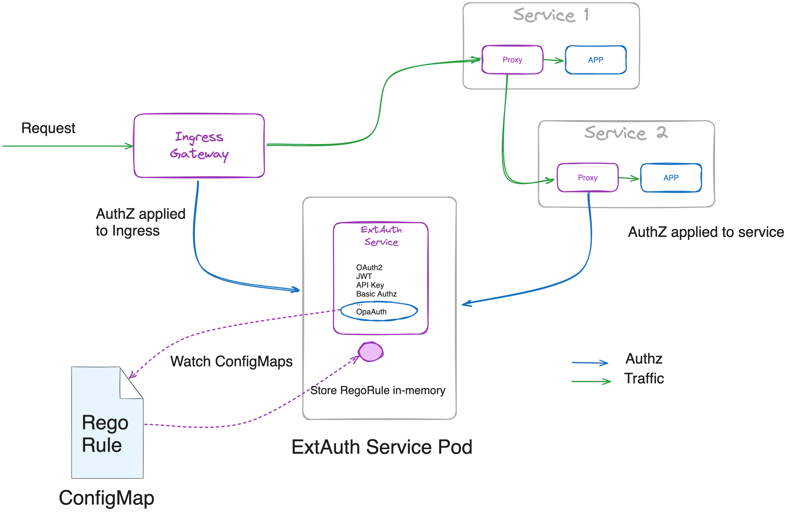

<!--bash
source ./scripts/assert.sh
-->


<center></center>

# <center>Gloo Mesh Gateway Advanced (2.6.2)</center>


## Table of Contents
* [Introduction](#introduction)
* [Lab 1 - Deploy a KinD cluster](#lab-1---deploy-a-kind-cluster-)
* [Lab 2 - Prepare airgap environment](#lab-2---prepare-airgap-environment-)
* [Lab 3 - Deploy and register Gloo Mesh](#lab-3---deploy-and-register-gloo-mesh-)
* [Lab 4 - Deploy Istio using Gloo Mesh Lifecycle Manager](#lab-4---deploy-istio-using-gloo-mesh-lifecycle-manager-)
* [Lab 5 - Deploy the Bookinfo demo app](#lab-5---deploy-the-bookinfo-demo-app-)
* [Lab 6 - Deploy the httpbin demo app](#lab-6---deploy-the-httpbin-demo-app-)
* [Lab 7 - Deploy Gloo Mesh Addons](#lab-7---deploy-gloo-mesh-addons-)
* [Lab 8 - Create the gateways workspace](#lab-8---create-the-gateways-workspace-)
* [Lab 9 - Create the bookinfo workspace](#lab-9---create-the-bookinfo-workspace-)
* [Lab 10 - Create the httpbin workspace](#lab-10---create-the-httpbin-workspace-)
* [Lab 11 - Expose the productpage through a gateway](#lab-11---expose-the-productpage-through-a-gateway-)
* [Lab 12 - Authorising with OPA](#lab-12---authorising-with-opa-)
* [Lab 13 - Apply dynamic rate limiting to the Gateway](#lab-13---apply-dynamic-rate-limiting-to-the-gateway-)
* [Lab 14 - Apply rate limiting and authorization based on GraphQL queries/mutations](#lab-14---apply-rate-limiting-and-authorization-based-on-graphql-queries/mutations-)
* [Lab 15 - Deploy the Amazon pod identity webhook](#lab-15---deploy-the-amazon-pod-identity-webhook-)
* [Lab 16 - Execute Lambda functions](#lab-16---execute-lambda-functions-)


## Introduction <a name="introduction"></a>

Gloo Mesh Gateway is a feature-rich, Kubernetes-native ingress controller and next-generation API gateway, based on Istio and Envoy.

With Gloo Mesh Gateway, you have access to its exceptional function-level routing, discovery capabilities, numerous features, tight integration with leading open-source projects, and support for legacy apps, microservices, and serverless.
It is uniquely designed to support hybrid applications in which multiple technologies, architectures, protocols, and clouds can co-exist.

Built on [Istio's ingress gateway](https://www.solo.io/topics/istio/istio-ingress-gateway/), Gloo Mesh Gateway uses an Envoy proxy as the ingress gateway to manage and control traffic that enters your Kubernetes cluster.
You use custom resources, such as Gloo virtual gateways, route tables, and policies to implement security measures that meet your business and app requirements, and that simplify configuring ingress traffic rules.
Because these resources offer declarative, API-driven configuration, you can easily integrate Gloo Mesh Gateway into your existing GitOps and CI/CD workflows.

### Why would you choose an API Gateway based on Istio and Envoy?

There are many good reasons why:

* First of all, it's high-performance software written in C++
* They're driven by a neutral foundation (CNCF, like Kubernetes), so their roadmaps aren't driven by a single vendor
* And probably, more importantly, you have already adopted or you're probably going to adopt a service mesh in the future. Chances are high that this service mesh will be Istio and if it's not the case it will most probably be a service mesh based on Envoy
* So choosing an API Gateway based on Istio and Envoy will allow you to get the metrics for your API Gateway and your Service Mesh in the same format. So you can troubleshoot issues in a common way

### Why would you choose Gloo Mesh Gateway?

* It has been developed from the beginning with the idea to be configured 100% through YAML
* It provides all the functionalities you expect from a modern API Gateway:
  * External authentication based on OAuth2, JWT, API keys, …
  * Authorization based on OPA
  * Advanced rate-limiting
  * Web Application Firewall based on ModSecurity
  * Advanced transformation
  * Customization through WebAssembly
* It includes Gloo Portal, a Kubernetes-native developer portal
* And much more

These features enable Platform Engineers as well as development teams to implement powerful mechanisms to manage and secure traffic, implement access control, transform requests and responses, and gain observability over their services.

The true power unfolds when combining the above-mentioned capabilities to achieve the desired outcome.
In the labs that follow we present some of the common patterns that our customers use and provide a good entry point into the workings of Gloo Mesh Gateway.

### Want to learn more about Gloo Mesh Gateway?

You can find more information about Gloo Mesh Gateway in the official documentation: <https://docs.solo.io/gloo-gateway/>


## Lab 1 - Deploy a KinD cluster <a name="lab-1---deploy-a-kind-cluster-"></a>


Clone this repository and go to the directory where this `README.md` file is.

Set the context environment variables:

```bash
export MGMT=cluster1
export CLUSTER1=cluster1
```

Run the following commands to deploy a Kubernetes cluster using [Kind](https://kind.sigs.k8s.io/):

```bash
./scripts/deploy-aws.sh 1 cluster1 us-west us-west-1
```

Then run the following commands to wait for all the Pods to be ready:

```bash
./scripts/check.sh cluster1
```

**Note:** If you run the `check.sh` script immediately after the `deploy.sh` script, you may see a jsonpath error. If that happens, simply wait a few seconds and try again.

Once the `check.sh` script completes, when you execute the `kubectl get pods -A` command, you should see the following:

```
NAMESPACE            NAME                                          READY   STATUS    RESTARTS   AGE
kube-system          calico-kube-controllers-59d85c5c84-sbk4k      1/1     Running   0          4h26m
kube-system          calico-node-przxs                             1/1     Running   0          4h26m
kube-system          coredns-6955765f44-ln8f5                      1/1     Running   0          4h26m
kube-system          coredns-6955765f44-s7xxx                      1/1     Running   0          4h26m
kube-system          etcd-cluster1-control-plane                   1/1     Running   0          4h27m
kube-system          kube-apiserver-cluster1-control-plane         1/1     Running   0          4h27m
kube-system          kube-controller-manager-cluster1-control-plane1/1     Running   0          4h27m
kube-system          kube-proxy-ksvzw                              1/1     Running   0          4h26m
kube-system          kube-scheduler-cluster1-control-plane         1/1     Running   0          4h27m
local-path-storage   local-path-provisioner-58f6947c7-lfmdx        1/1     Running   0          4h26m
metallb-system       controller-5c9894b5cd-cn9x2                   1/1     Running   0          4h26m
metallb-system       speaker-d7jkp                                 1/1     Running   0          4h26m
```

**Note:** The CNI pods might be different, depending on which CNI you have deployed.

<!--bash
cat <<'EOF' > ./test.js
const helpers = require('./tests/chai-exec');

describe("Clusters are healthy", () => {
    const clusters = [process.env.MGMT, process.env.CLUSTER1];
    clusters.forEach(cluster => {
        it(`Cluster ${cluster} is healthy`, () => helpers.k8sObjectIsPresent({ context: cluster, namespace: "default", k8sType: "service", k8sObj: "kubernetes" }));
    });
});
EOF
echo "executing test dist/gloo-mesh-2-0-workshop/build/templates/steps/deploy-kind-cluster/tests/cluster-healthy.test.js.liquid"
tempfile=$(mktemp)
echo "saving errors in ${tempfile}"
timeout --signal=INT 3m mocha ./test.js --timeout 10000 --retries=120 --bail 2> ${tempfile} || { cat ${tempfile} && exit 1; }
-->


## Lab 2 - Prepare airgap environment <a name="lab-2---prepare-airgap-environment-"></a>

Set the registry variable:
```bash
export registry=localhost:5000
```

Pull and push locally the Docker images needed:

```bash
cat <<'EOF' > images.txt
docker.io/curlimages/curl
amazon/amazon-eks-pod-identity-webhook:v0.5.0
docker.io/istio/examples-bookinfo-details-v1:1.20.2
docker.io/istio/examples-bookinfo-productpage-v1:1.20.2
docker.io/istio/examples-bookinfo-ratings-v1:1.20.2
docker.io/istio/examples-bookinfo-reviews-v1:1.20.2
docker.io/istio/examples-bookinfo-reviews-v2:1.20.2
docker.io/istio/examples-bookinfo-reviews-v3:1.20.2
docker.io/kennethreitz/httpbin
docker.io/nginx:1.25.3
docker.io/openpolicyagent/opa:0.57.1-debug
gcr.io/field-engineering-eu/graphql-passthrough-grpc-service:0.1
gcr.io/gloo-mesh/ext-auth-service:0.58.3
gcr.io/gloo-mesh/gloo-mesh-agent:2.6.2
gcr.io/gloo-mesh/gloo-mesh-apiserver:2.6.2
gcr.io/gloo-mesh/gloo-mesh-envoy:2.6.2
gcr.io/gloo-mesh/gloo-mesh-mgmt-server:2.6.2
gcr.io/gloo-mesh/gloo-mesh-ui:2.6.2
gcr.io/gloo-mesh/gloo-otel-collector:2.6.2
gcr.io/gloo-mesh/kubectl:1.16.4
gcr.io/gloo-mesh/prometheus:v2.53.0
gcr.io/gloo-mesh/rate-limiter:0.12.2
gcr.io/gloo-mesh/redis:7.2.4-alpine
quay.io/jetstack/cert-manager-cainjector:v1.12.4
quay.io/jetstack/cert-manager-controller:v1.12.4
quay.io/jetstack/cert-manager-webhook:v1.12.4
quay.io/keycloak/keycloak:25.0.1
quay.io/prometheus-operator/prometheus-config-reloader:v0.74.0
us-docker.pkg.dev/gloo-mesh/istio-workshops/operator:1.23.0-patch0-solo
us-docker.pkg.dev/gloo-mesh/istio-workshops/pilot:1.23.0-patch0-solo
us-docker.pkg.dev/gloo-mesh/istio-workshops/proxyv2:1.23.0-patch0-solo
EOF

cat images.txt | while read image; do
  nohup sh -c "echo $image | xargs -P10 -n1 docker pull" </dev/null >nohup.out 2>nohup.err &
done

cat images.txt | while read image; do
  src=$(echo $image | sed 's/^docker\.io\///g' | sed 's/^library\///g')
  dst=$(echo $image | awk -F/ '{ if(NF>3){ print $3"/"$4}else{if(NF>2){ print $2"/"$3}else{if($1=="docker.io"){print $2}else{print $1"/"$2}}}}' | sed 's/^library\///g')
  docker pull $image

  id=$(docker images $src  --format "{{.ID}}") 

  docker tag $id ${registry}/$dst
  docker push ${registry}/$dst
  dst_dev=$(echo ${dst} | sed 's/gloo-platform-dev/gloo-mesh/')
  docker tag $id ${registry}/$dst_dev
  docker push ${registry}/$dst_dev
done
```


## Lab 3 - Deploy and register Gloo Mesh <a name="lab-3---deploy-and-register-gloo-mesh-"></a>
[](https://youtu.be/djfFiepK4GY "Video Link")


Before we get started, let's install the `meshctl` CLI:

```bash
export GLOO_MESH_VERSION=v2.6.2
curl -sL https://run.solo.io/meshctl/install | sh -
export PATH=$HOME/.gloo-mesh/bin:$PATH
```
<!--bash
cat <<'EOF' > ./test.js
var chai = require('chai');
var expect = chai.expect;

describe("Required environment variables should contain value", () => {
  afterEach(function(done){
    if(this.currentTest.currentRetry() > 0){
      process.stdout.write(".");
       setTimeout(done, 1000);
    } else {
      done();
    }
  });

  it("Context environment variables should not be empty", () => {
    expect(process.env.MGMT).not.to.be.empty
    expect(process.env.CLUSTER1).not.to.be.empty
  });

  it("Gloo Mesh licence environment variables should not be empty", () => {
    expect(process.env.GLOO_MESH_LICENSE_KEY).not.to.be.empty
  });
});
EOF
echo "executing test dist/gloo-mesh-2-0-workshop/build/templates/steps/deploy-and-register-gloo-mesh/tests/environment-variables.test.js.liquid"
tempfile=$(mktemp)
echo "saving errors in ${tempfile}"
timeout --signal=INT 3m mocha ./test.js --timeout 10000 --retries=120 --bail 2> ${tempfile} || { cat ${tempfile} && exit 1; }
-->
Run the following commands to deploy the Gloo Mesh management plane:

```bash
kubectl --context ${MGMT} create ns gloo-mesh

helm upgrade --install gloo-platform-crds gloo-platform-crds \
  --repo https://storage.googleapis.com/gloo-platform/helm-charts \
  --namespace gloo-mesh \
  --kube-context ${MGMT} \
  --version 2.6.2

helm upgrade --install gloo-platform-mgmt gloo-platform \
  --repo https://storage.googleapis.com/gloo-platform/helm-charts \
  --namespace gloo-mesh \
  --kube-context ${MGMT} \
  --version 2.6.2 \
  -f -<<EOF
licensing:
  glooTrialLicenseKey: ${GLOO_MESH_LICENSE_KEY}
common:
  cluster: cluster1
glooInsightsEngine:
  enabled: false
glooMgmtServer:
  enabled: true
  ports:
    healthcheck: 8091
  registerCluster: true
  image:
    registry: ${registry}/gloo-mesh
prometheus:
  enabled: true
  server:
    image:
      repository: ${registry}/gloo-mesh/prometheus
  configmapReload:
    prometheus:
      image:
        repository: ${registry}/prometheus-operator/prometheus-config-reloader
redis:
  deployment:
    enabled: true
    image:
      registry: ${registry}/gloo-mesh
telemetryGateway:
  enabled: true
  image:
    repository: ${registry}/gloo-mesh/gloo-otel-collector
  service:
    type: LoadBalancer
glooUi:
  enabled: true
  serviceType: LoadBalancer
  image:
    registry: ${registry}/gloo-mesh
  sidecars:
    console:
      image:
        registry: ${registry}/gloo-mesh
    envoy:
      image:
        registry: ${registry}/gloo-mesh
telemetryCollector:
  image:
    repository: ${registry}/gloo-mesh/gloo-otel-collector
  enabled: true
  config:
    exporters:
      otlp:
        endpoint: gloo-telemetry-gateway:4317
glooAgent:
  enabled: true
  relay:
    serverAddress: gloo-mesh-mgmt-server:9900
    authority: gloo-mesh-mgmt-server.gloo-mesh
  image:
    registry: ${registry}/gloo-mesh
EOF

kubectl --context ${MGMT} -n gloo-mesh rollout status deploy/gloo-mesh-mgmt-server

kubectl --context ${MGMT} delete workspaces -A --all
kubectl --context ${MGMT} delete workspacesettings -A --all
```

<!--bash
cat <<'EOF' > ./test.js
var chai = require('chai');
var expect = chai.expect;
const helpers = require('./tests/chai-exec');
describe("Cluster registration", () => {
  it("cluster1 is registered", () => {
    podName = helpers.getOutputForCommand({ command: "kubectl -n gloo-mesh get pods -l app=gloo-mesh-mgmt-server -o jsonpath='{.items[0].metadata.name}' --context " + process.env.MGMT }).replaceAll("'", "");
    command = helpers.getOutputForCommand({ command: "kubectl --context " + process.env.MGMT + " -n gloo-mesh debug -q -i " + podName + " --image=" + process.env.registry + "/curlimages/curl -- curl -s http://localhost:9091/metrics" }).replaceAll("'", "");
    expect(command).to.contain("cluster1");
  });
});
EOF
echo "executing test dist/gloo-mesh-2-0-workshop/build/templates/steps/deploy-and-register-gloo-mesh/tests/cluster-registration.test.js.liquid"
tempfile=$(mktemp)
echo "saving errors in ${tempfile}"
timeout --signal=INT 3m mocha ./test.js --timeout 10000 --retries=120 --bail 2> ${tempfile} || { cat ${tempfile} && exit 1; }
-->


## Lab 4 - Deploy Istio using Gloo Mesh Lifecycle Manager <a name="lab-4---deploy-istio-using-gloo-mesh-lifecycle-manager-"></a>
[](https://youtu.be/f76-KOEjqHs "Video Link")

We are going to deploy Istio using Gloo Mesh Lifecycle Manager.

<details>
  <summary>Install `istioctl`</summary>

Install `istioctl` if not already installed as it will be useful in some of the labs that follow.

```bash
curl -L https://istio.io/downloadIstio | sh -

if [ -d "istio-"* ]; then
  cd istio-*/
  export PATH=$PWD/bin:$PATH
  cd ..
fi
```

That's it!
</details>

Let's create Kubernetes services for the gateways:

```bash
registry=localhost:5000
kubectl --context ${CLUSTER1} create ns istio-gateways

kubectl apply --context ${CLUSTER1} -f - <<EOF
apiVersion: v1
kind: Service
metadata:
  labels:
    app: istio-ingressgateway
    istio: ingressgateway
  name: istio-ingressgateway
  namespace: istio-gateways
spec:
  ports:
  - name: http2
    port: 80
    protocol: TCP
    targetPort: 8080
  - name: https
    port: 443
    protocol: TCP
    targetPort: 8443
  selector:
    app: istio-ingressgateway
    istio: ingressgateway
    revision: 1-23
  type: LoadBalancer
EOF
```

It allows us to have full control on which Istio revision we want to use.

Then, we can tell Gloo Mesh to deploy the Istio control planes and the gateways in the cluster(s).

```bash
kubectl apply --context ${MGMT} -f - <<EOF
apiVersion: admin.gloo.solo.io/v2
kind: IstioLifecycleManager
metadata:
  name: cluster1-installation
  namespace: gloo-mesh
spec:
  installations:
    - clusters:
      - name: cluster1
        defaultRevision: true
      revision: 1-23
      istioOperatorSpec:
        profile: minimal
        hub: ${registry}/istio-workshops
        tag: 1.23.0-patch0-solo
        namespace: istio-system
        values:
          global:
            meshID: mesh1
            multiCluster:
              clusterName: cluster1
            network: cluster1
        meshConfig:
          accessLogFile: /dev/stdout
          defaultConfig:
            proxyMetadata:
              ISTIO_META_DNS_CAPTURE: "true"
              ISTIO_META_DNS_AUTO_ALLOCATE: "true"
        components:
          pilot:
            k8s:
              env:
                - name: PILOT_ENABLE_K8S_SELECT_WORKLOAD_ENTRIES
                  value: "false"
                - name: PILOT_ENABLE_IP_AUTOALLOCATE
                  value: "true"
          ingressGateways:
          - name: istio-ingressgateway
            enabled: false
EOF

kubectl apply --context ${MGMT} -f - <<EOF
apiVersion: admin.gloo.solo.io/v2
kind: GatewayLifecycleManager
metadata:
  name: cluster1-ingress
  namespace: gloo-mesh
spec:
  installations:
    - clusters:
      - name: cluster1
        activeGateway: false
      gatewayRevision: 1-23
      istioOperatorSpec:
        profile: empty
        hub: ${registry}/istio-workshops
        tag: 1.23.0-patch0-solo
        values:
          gateways:
            istio-ingressgateway:
              customService: true
        components:
          ingressGateways:
            - name: istio-ingressgateway
              namespace: istio-gateways
              enabled: true
              label:
                istio: ingressgateway
EOF

```

<!--bash
until kubectl --context ${MGMT} -n gloo-mesh wait --timeout=180s --for=jsonpath='{.status.clusters.cluster1.installations.*.state}'=HEALTHY istiolifecyclemanagers/cluster1-installation; do
  echo "Waiting for the Istio installation to complete"
  sleep 1
done
timeout 2m bash -c "until [[ \$(kubectl --context ${CLUSTER1} -n istio-system get deploy -o json | jq '[.items[].status.readyReplicas] | add') -ge 1 ]]; do
  sleep 1
done"
timeout 2m bash -c "until [[ \$(kubectl --context ${CLUSTER1} -n istio-gateways get deploy -o json | jq '[.items[].status.readyReplicas] | add') -eq 1 ]]; do
  sleep 1
done"
-->

<!--bash
cat <<'EOF' > ./test.js

const helpers = require('./tests/chai-exec');

const chaiExec = require("@jsdevtools/chai-exec");
const helpersHttp = require('./tests/chai-http');
const chai = require("chai");
const expect = chai.expect;

afterEach(function (done) {
  if (this.currentTest.currentRetry() > 0) {
    process.stdout.write(".");
    setTimeout(done, 1000);
  } else {
    done();
  }
});

describe("Checking Istio installation", function() {
  it('istiod pods are ready in cluster ' + process.env.CLUSTER1, () => helpers.checkDeploymentsWithLabels({ context: process.env.CLUSTER1, namespace: "istio-system", labels: "app=istiod", instances: 1 }));
  it('gateway pods are ready in cluster ' + process.env.CLUSTER1, () => helpers.checkDeploymentsWithLabels({ context: process.env.CLUSTER1, namespace: "istio-gateways", labels: "app=istio-ingressgateway", instances: 1 }));
  it("Gateways have an ip attached in cluster " + process.env.CLUSTER1, () => {
    let cli = chaiExec("kubectl --context " + process.env.CLUSTER1 + " -n istio-gateways get svc -l app=istio-ingressgateway -o jsonpath='{.items}'");
    cli.stderr.should.be.empty;
    let deployments = JSON.parse(cli.stdout.slice(1,-1));
    expect(deployments).to.have.lengthOf(1);
    deployments.forEach((deployment) => {
      expect(deployment.status.loadBalancer).to.have.property("ingress");
    });
  });
});

EOF
echo "executing test dist/gloo-mesh-2-0-workshop/build/templates/steps/istio-lifecycle-manager-install/tests/istio-ready.test.js.liquid"
tempfile=$(mktemp)
echo "saving errors in ${tempfile}"
timeout --signal=INT 3m mocha ./test.js --timeout 10000 --retries=120 --bail 2> ${tempfile} || { cat ${tempfile} && exit 1; }
-->
<!--bash
timeout 2m bash -c "until [[ \$(kubectl --context ${CLUSTER1} -n istio-gateways get svc -l istio=ingressgateway -o json | jq '.items[0].status.loadBalancer | length') -gt 0 ]]; do
  sleep 1
done"
-->

```bash
export HOST_GW_CLUSTER1="$(kubectl --context ${CLUSTER1} -n istio-gateways get svc -l istio=ingressgateway -o jsonpath='{.items[0].status.loadBalancer.ingress[0].*}')"
```

<!--bash
cat <<'EOF' > ./test.js
const dns = require('dns');
const chaiHttp = require("chai-http");
const chai = require("chai");
const expect = chai.expect;
chai.use(chaiHttp);
const { waitOnFailedTest } = require('./tests/utils');

afterEach(function(done) { waitOnFailedTest(done, this.currentTest.currentRetry())});

describe("Address '" + process.env.HOST_GW_CLUSTER1 + "' can be resolved in DNS", () => {
    it(process.env.HOST_GW_CLUSTER1 + ' can be resolved', (done) => {
        return dns.lookup(process.env.HOST_GW_CLUSTER1, (err, address, family) => {
            expect(address).to.be.an.ip;
            done();
        });
    });
});
EOF
echo "executing test ./gloo-mesh-2-0/tests/can-resolve.test.js.liquid"
tempfile=$(mktemp)
echo "saving errors in ${tempfile}"
timeout --signal=INT 3m mocha ./test.js --timeout 10000 --retries=120 --bail 2> ${tempfile} || { cat ${tempfile} && exit 1; }
-->


## Lab 5 - Deploy the Bookinfo demo app <a name="lab-5---deploy-the-bookinfo-demo-app-"></a>
[](https://youtu.be/nzYcrjalY5A "Video Link")

We're going to deploy the bookinfo application to demonstrate several features of Gloo Mesh.

You can find more information about this application [here](https://istio.io/latest/docs/examples/bookinfo/).
Update the registry in our bookinfo manifests:

```bash
sed -i'' -e "s/image: docker.io/image: ${registry}/g" \
  data/steps/deploy-bookinfo/productpage-v1.yaml \
  data/steps/deploy-bookinfo/details-v1.yaml \
  data/steps/deploy-bookinfo/ratings-v1.yaml \
  data/steps/deploy-bookinfo/reviews-v1-v2.yaml \
  data/steps/deploy-bookinfo/reviews-v3.yaml
```

Run the following commands to deploy the bookinfo application on `cluster1`:

```bash
kubectl --context ${CLUSTER1} create ns bookinfo-frontends
kubectl --context ${CLUSTER1} create ns bookinfo-backends
kubectl --context ${CLUSTER1} label namespace bookinfo-frontends istio.io/rev=1-23 --overwrite
kubectl --context ${CLUSTER1} label namespace bookinfo-backends istio.io/rev=1-23 --overwrite

# Deploy the frontend bookinfo service in the bookinfo-frontends namespace
kubectl --context ${CLUSTER1} -n bookinfo-frontends apply -f data/steps/deploy-bookinfo/productpage-v1.yaml

# Deploy the backend bookinfo services in the bookinfo-backends namespace for all versions less than v3
kubectl --context ${CLUSTER1} -n bookinfo-backends apply \
  -f data/steps/deploy-bookinfo/details-v1.yaml \
  -f data/steps/deploy-bookinfo/ratings-v1.yaml \
  -f data/steps/deploy-bookinfo/reviews-v1-v2.yaml

# Update the reviews service to display where it is coming from
kubectl --context ${CLUSTER1} -n bookinfo-backends set env deploy/reviews-v1 CLUSTER_NAME=${CLUSTER1}
kubectl --context ${CLUSTER1} -n bookinfo-backends set env deploy/reviews-v2 CLUSTER_NAME=${CLUSTER1}
```

<!--bash
echo -n Waiting for bookinfo pods to be ready...
timeout -v 5m bash -c "
until [[ \$(kubectl --context ${CLUSTER1} -n bookinfo-frontends get deploy -o json | jq '[.items[].status.readyReplicas] | add') -eq 1 && \\
  \$(kubectl --context ${CLUSTER1} -n bookinfo-backends get deploy -o json | jq '[.items[].status.readyReplicas] | add') -eq 4 ]] 2>/dev/null
do
  sleep 1
  echo -n .
done"
echo
-->

You can check that the app is running using the following command:

```
kubectl --context ${CLUSTER1} -n bookinfo-frontends get pods && kubectl --context ${CLUSTER1} -n bookinfo-backends get pods
```

Note that we deployed the `productpage` service in the `bookinfo-frontends` namespace and the other services in the `bookinfo-backends` namespace.

And we deployed the `v1` and `v2` versions of the `reviews` microservice, not the `v3` version.

<!--bash
cat <<'EOF' > ./test.js
const helpers = require('./tests/chai-exec');

describe("Bookinfo app", () => {
  let cluster = process.env.CLUSTER1
  let deployments = ["productpage-v1"];
  deployments.forEach(deploy => {
    it(deploy + ' pods are ready in ' + cluster, () => helpers.checkDeployment({ context: cluster, namespace: "bookinfo-frontends", k8sObj: deploy }));
  });
  deployments = ["ratings-v1", "details-v1", "reviews-v1", "reviews-v2"];
  deployments.forEach(deploy => {
    it(deploy + ' pods are ready in ' + cluster, () => helpers.checkDeployment({ context: cluster, namespace: "bookinfo-backends", k8sObj: deploy }));
  });
});
EOF
echo "executing test dist/gloo-mesh-2-0-workshop/build/templates/steps/apps/bookinfo/deploy-bookinfo/tests/check-bookinfo.test.js.liquid"
tempfile=$(mktemp)
echo "saving errors in ${tempfile}"
timeout --signal=INT 3m mocha ./test.js --timeout 10000 --retries=120 --bail 2> ${tempfile} || { cat ${tempfile} && exit 1; }
-->


## Lab 6 - Deploy the httpbin demo app <a name="lab-6---deploy-the-httpbin-demo-app-"></a>
[](https://youtu.be/w1xB-o_gHs0 "Video Link")

We're going to deploy the httpbin application to demonstrate several features of Gloo Mesh.

You can find more information about this application [here](http://httpbin.org/).

Run the following commands to deploy the httpbin app on `cluster1`. The deployment will be called `not-in-mesh` and won't have the sidecar injected, because of the annotation `sidecar.istio.io/inject: "false"`.

```bash
kubectl --context ${CLUSTER1} create ns httpbin
kubectl apply --context ${CLUSTER1} -f - <<EOF
apiVersion: v1
kind: ServiceAccount
metadata:
  name: not-in-mesh
  namespace: httpbin
---
apiVersion: v1
kind: Service
metadata:
  name: not-in-mesh
  namespace: httpbin
  labels:
    app: not-in-mesh
    service: not-in-mesh
spec:
  ports:
  - name: http
    port: 8000
    targetPort: 80
  selector:
    app: not-in-mesh
---
apiVersion: apps/v1
kind: Deployment
metadata:
  name: not-in-mesh
  namespace: httpbin
spec:
  replicas: 1
  selector:
    matchLabels:
      app: not-in-mesh
      version: v1
  template:
    metadata:
      labels:
        app: not-in-mesh
        version: v1
    spec:
      serviceAccountName: not-in-mesh
      containers:
      - image: ${registry}/kennethreitz/httpbin
        imagePullPolicy: IfNotPresent
        name: not-in-mesh
        ports:
        - name: http
          containerPort: 80
        livenessProbe:
          httpGet:
            path: /status/200
            port: http
        readinessProbe:
          httpGet:
            path: /status/200
            port: http

EOF
```

Then, we deploy a second version, which will be called `in-mesh` and will have the sidecar injected (because of the label `istio.io/rev` in the Pod template).

```bash
kubectl apply --context ${CLUSTER1} -f - <<EOF
apiVersion: v1
kind: ServiceAccount
metadata:
  name: in-mesh
  namespace: httpbin
---
apiVersion: v1
kind: Service
metadata:
  name: in-mesh
  namespace: httpbin
  labels:
    app: in-mesh
    service: in-mesh
spec:
  ports:
  - name: http
    port: 8000
    targetPort: 80
  selector:
    app: in-mesh
---
apiVersion: apps/v1
kind: Deployment
metadata:
  name: in-mesh
  namespace: httpbin
spec:
  replicas: 1
  selector:
    matchLabels:
      app: in-mesh
      version: v1
  template:
    metadata:
      labels:
        app: in-mesh
        version: v1
        istio.io/rev: 1-23
    spec:
      serviceAccountName: in-mesh
      containers:
      - image: ${registry}/kennethreitz/httpbin
        imagePullPolicy: IfNotPresent
        name: in-mesh
        ports:
        - name: http
          containerPort: 80
        livenessProbe:
          httpGet:
            path: /status/200
            port: http
        readinessProbe:
          httpGet:
            path: /status/200
            port: http

EOF
```


<!--bash
echo -n Waiting for httpbin pods to be ready...
timeout -v 5m bash -c "
until [[ \$(kubectl --context ${CLUSTER1} -n httpbin get deploy -o json | jq '[.items[].status.readyReplicas] | add') -eq 2 ]] 2>/dev/null
do
  sleep 1
  echo -n .
done"
echo
-->
```
You can follow the progress using the following command:

```bash
kubectl --context ${CLUSTER1} -n httpbin get pods
```

```,nocopy
NAME                           READY   STATUS    RESTARTS   AGE
in-mesh-5d9d9549b5-qrdgd       2/2     Running   0          11s
not-in-mesh-5c64bb49cd-m9kwm   1/1     Running   0          11s
```
<!--bash
cat <<'EOF' > ./test.js
const helpers = require('./tests/chai-exec');

describe("httpbin app", () => {
  let cluster = process.env.CLUSTER1
  
  let deployments = ["not-in-mesh", "in-mesh"];
  
  deployments.forEach(deploy => {
    it(deploy + ' pods are ready in ' + cluster, () => helpers.checkDeployment({ context: cluster, namespace: "httpbin", k8sObj: deploy }));
  });
});
EOF
echo "executing test dist/gloo-mesh-2-0-workshop/build/templates/steps/apps/httpbin/deploy-httpbin/tests/check-httpbin.test.js.liquid"
tempfile=$(mktemp)
echo "saving errors in ${tempfile}"
timeout --signal=INT 3m mocha ./test.js --timeout 10000 --retries=120 --bail 2> ${tempfile} || { cat ${tempfile} && exit 1; }
-->


## Lab 7 - Deploy Gloo Mesh Addons <a name="lab-7---deploy-gloo-mesh-addons-"></a>
[](https://youtu.be/_rorug_2bk8 "Video Link")

To use the Gloo Mesh Gateway advanced features (external authentication, rate limiting, ...), you need to install the Gloo Mesh addons.

First, you need to create a namespace for the addons, with Istio injection enabled:

```bash
kubectl --context ${CLUSTER1} create namespace gloo-mesh-addons
kubectl --context ${CLUSTER1} label namespace gloo-mesh-addons istio.io/rev=1-23 --overwrite
```

Then, you can deploy the addons on the cluster(s) using Helm:

```bash
helm upgrade --install gloo-platform gloo-platform \
  --repo https://storage.googleapis.com/gloo-platform/helm-charts \
  --namespace gloo-mesh-addons \
  --kube-context ${CLUSTER1} \
  --version 2.6.2 \
  -f -<<EOF
common:
  cluster: cluster1
  image:
    registry: ${registry}/gloo-mesh
glooAgent:
  enabled: false
extAuthService:
  enabled: true
  extAuth:
    apiKeyStorage:
      name: redis
      enabled: true
      config: 
        connection: 
          host: redis.gloo-mesh-addons:6379
      secretKey: ThisIsSecret
    image:
      registry: ${registry}/gloo-mesh
rateLimiter:
  enabled: true
  rateLimiter:
    image:
      registry: ${registry}/gloo-mesh
  redis:
    image:
      registry: ${registry}/gloo-mesh
EOF
```

For teams to setup external authentication, the gateways team needs to create and `ExtAuthServer` object they can reference.

Let's create the `ExtAuthServer` object:

```bash
kubectl apply --context ${CLUSTER1} -f - <<EOF
apiVersion: admin.gloo.solo.io/v2
kind: ExtAuthServer
metadata:
  name: ext-auth-server
  namespace: gloo-mesh-addons
spec:
  destinationServer:
    ref:
      cluster: cluster1
      name: ext-auth-service
      namespace: gloo-mesh-addons
    port:
      name: grpc
  requestBody: {} # Needed if some an extauth plugin must access the body of the requests
EOF
```

For teams to setup rate limiting, the gateways team needs to create and `RateLimitServerSettings` object they can reference.

Let's create the `RateLimitServerSettings` object:

```bash
kubectl apply --context ${CLUSTER1} -f - <<EOF
apiVersion: admin.gloo.solo.io/v2
kind: RateLimitServerSettings
metadata:
  name: rate-limit-server
  namespace: gloo-mesh-addons
spec:
  destinationServer:
    ref:
      cluster: cluster1
      name: rate-limiter
      namespace: gloo-mesh-addons
    port:
      name: grpc
EOF
```
<!--bash
cat <<'EOF' > ./test.js
const helpers = require('./tests/chai-exec');

describe("Gloo Platform add-ons cluster1 deployment", () => {
  let cluster = process.env.CLUSTER1
  let deployments = ["ext-auth-service", "rate-limiter"];
  deployments.forEach(deploy => {
    it(deploy + ' pods are ready in ' + cluster, () => helpers.checkDeployment({ context: cluster, namespace: "gloo-mesh-addons", k8sObj: deploy }));
  });
});

EOF
echo "executing test dist/gloo-mesh-2-0-workshop/build/templates/steps/deploy-gloo-mesh-addons/tests/check-addons-deployments.test.js.liquid"
tempfile=$(mktemp)
echo "saving errors in ${tempfile}"
timeout --signal=INT 3m mocha ./test.js --timeout 10000 --retries=120 --bail 2> ${tempfile} || { cat ${tempfile} && exit 1; }
-->
<!--bash
cat <<'EOF' > ./test.js
const helpers = require('./tests/chai-exec');

describe("Gloo Platform add-ons cluster1 service", () => {
  let cluster = process.env.CLUSTER1
  let services = ["ext-auth-service", "rate-limiter"];
  services.forEach(service => {
    it(service + ' exists in ' + cluster, () => helpers.k8sObjectIsPresent({ context: cluster, namespace: "gloo-mesh-addons", k8sType: "service", k8sObj: service }));
  });
});

EOF
echo "executing test dist/gloo-mesh-2-0-workshop/build/templates/steps/deploy-gloo-mesh-addons/tests/check-addons-services.test.js.liquid"
tempfile=$(mktemp)
echo "saving errors in ${tempfile}"
timeout --signal=INT 3m mocha ./test.js --timeout 10000 --retries=120 --bail 2> ${tempfile} || { cat ${tempfile} && exit 1; }
-->
This is what the environment looks like now:


## Lab 8 - Create the gateways workspace <a name="lab-8---create-the-gateways-workspace-"></a>
[](https://youtu.be/QeVBH0eswWw "Video Link")

We're going to create a workspace for the team in charge of the Gateways.

The platform team needs to create the corresponding `Workspace` Kubernetes objects in the Gloo Mesh management cluster.

Let's create the `gateways` workspace which corresponds to the `istio-gateways` and the `gloo-mesh-addons` namespaces on the cluster(s):

```bash
kubectl apply --context ${MGMT} -f - <<EOF
apiVersion: admin.gloo.solo.io/v2
kind: Workspace
metadata:
  name: gateways
  namespace: gloo-mesh
spec:
  workloadClusters:
  - name: cluster1
    namespaces:
    - name: istio-gateways
    - name: gloo-mesh-addons
EOF
```

Then, the Gateway team creates a `WorkspaceSettings` Kubernetes object in one of the namespaces of the `gateways` workspace (so the `istio-gateways` or the `gloo-mesh-addons` namespace):

```bash
kubectl apply --context ${CLUSTER1} -f - <<EOF
apiVersion: admin.gloo.solo.io/v2
kind: WorkspaceSettings
metadata:
  name: gateways
  namespace: gloo-mesh-addons
spec:
  importFrom:
  - workspaces:
    - selector:
        allow_ingress: "true"
    resources:
    - kind: SERVICE
    - kind: ALL
      labels:
        expose: "true"
  exportTo:
  - workspaces:
    - selector:
        allow_ingress: "true"
    resources:
    - kind: SERVICE
EOF
```

The Gateway team has decided to import the following from the workspaces that have the label `allow_ingress` set to `true` (using a selector):
- all the Kubernetes services exported by these workspaces
- all the resources (RouteTables, VirtualDestination, ...) exported by these workspaces that have the label `expose` set to `true`


## Lab 9 - Create the bookinfo workspace <a name="lab-9---create-the-bookinfo-workspace-"></a>

We're going to create a workspace for the team in charge of the Bookinfo application.

The platform team needs to create the corresponding `Workspace` Kubernetes objects in the Gloo Mesh management cluster.

Let's create the `bookinfo` workspace which corresponds to the `bookinfo-frontends` and `bookinfo-backends` namespaces on the cluster(s):

```bash
kubectl apply --context ${MGMT} -f - <<EOF
apiVersion: admin.gloo.solo.io/v2
kind: Workspace
metadata:
  name: bookinfo
  namespace: gloo-mesh
  labels:
    allow_ingress: "true"
spec:
  workloadClusters:
  - name: cluster1
    namespaces:
    - name: bookinfo-frontends
    - name: bookinfo-backends
EOF
```

Then, the Bookinfo team creates a `WorkspaceSettings` Kubernetes object in one of the namespaces of the `bookinfo` workspace (so the `bookinfo-frontends` or the `bookinfo-backends` namespace):

```bash
kubectl apply --context ${CLUSTER1} -f - <<EOF
apiVersion: admin.gloo.solo.io/v2
kind: WorkspaceSettings
metadata:
  name: bookinfo
  namespace: bookinfo-frontends
spec:
  importFrom:
  - workspaces:
    - name: gateways
    resources:
    - kind: SERVICE
  exportTo:
  - workspaces:
    - name: gateways
    resources:
    - kind: SERVICE
      labels:
        app: productpage
    - kind: SERVICE
      labels:
        app: reviews
    - kind: SERVICE
      labels:
        app: ratings
    - kind: ALL
      labels:
        expose: "true"
EOF
```

The Bookinfo team has decided to export the following to the `gateway` workspace (using a reference):
- the `productpage` and the `reviews` Kubernetes services
- all the resources (RouteTables, VirtualDestination, ...) that have the label `expose` set to `true`

This is how the environment looks like with the workspaces:


## Lab 10 - Create the httpbin workspace <a name="lab-10---create-the-httpbin-workspace-"></a>

We're going to create a workspace for the team in charge of the httpbin application.

The platform team needs to create the corresponding `Workspace` Kubernetes objects in the Gloo Mesh management cluster.

Let's create the `httpbin` workspace which corresponds to the `httpbin` namespace on `cluster1`:

```bash
kubectl apply --context ${MGMT} -f - <<EOF
apiVersion: admin.gloo.solo.io/v2
kind: Workspace
metadata:
  name: httpbin
  namespace: gloo-mesh
  labels:
    allow_ingress: "true"
spec:
  workloadClusters:
  - name: cluster1
    namespaces:
    - name: httpbin
EOF
```

Then, the Httpbin team creates a `WorkspaceSettings` Kubernetes object in one of the namespaces of the `httpbin` workspace:

```bash
kubectl apply --context ${CLUSTER1} -f - <<EOF
apiVersion: admin.gloo.solo.io/v2
kind: WorkspaceSettings
metadata:
  name: httpbin
  namespace: httpbin
spec:
  importFrom:
  - workspaces:
    - name: gateways
    resources:
    - kind: SERVICE
  exportTo:
  - workspaces:
    - name: gateways
    resources:
    - kind: SERVICE
      labels:
        app: in-mesh
    - kind: ALL
      labels:
        expose: "true"
EOF
```

The Httpbin team has decided to export the following to the `gateway` workspace (using a reference):
- the `in-mesh` Kubernetes service
- all the resources (RouteTables, VirtualDestination, ...) that have the label `expose` set to `true`


## Lab 11 - Expose the productpage through a gateway <a name="lab-11---expose-the-productpage-through-a-gateway-"></a>
[](https://youtu.be/emyIu99AOOA "Video Link")

In this step, we're going to expose the `productpage` service through the Ingress Gateway using Gloo Mesh.

The Gateway team must create a `VirtualGateway` to configure the Istio Ingress Gateway in cluster1 to listen to incoming requests.

```bash
kubectl apply --context ${CLUSTER1} -f - <<EOF
apiVersion: networking.gloo.solo.io/v2
kind: VirtualGateway
metadata:
  name: north-south-gw
  namespace: istio-gateways
spec:
  workloads:
    - selector:
        labels:
          istio: ingressgateway
        cluster: cluster1
  listeners: 
    - http: {}
      port:
        number: 80
      allowedRouteTables:
        - host: '*'
EOF
```

Then, the Gateway team should create a parent `RouteTable` to configure the main routing.

```bash
kubectl apply --context ${CLUSTER1} -f - <<EOF
apiVersion: networking.gloo.solo.io/v2
kind: RouteTable
metadata:
  name: main-bookinfo
  namespace: istio-gateways
spec:
  hosts:
    - cluster1-bookinfo.example.com
    - cluster2-bookinfo.example.com
  virtualGateways:
    - name: north-south-gw
      namespace: istio-gateways
      cluster: cluster1
  workloadSelectors: []
  http:
    - name: root
      matchers:
      - uri:
          prefix: /
      delegate:
        routeTables:
          - labels:
              expose: "true"
            workspace: bookinfo
          - labels:
              expose: "true"
            workspace: gateways
        sortMethod: ROUTE_SPECIFICITY
---
apiVersion: networking.gloo.solo.io/v2
kind: RouteTable
metadata:
  name: main-httpbin
  namespace: istio-gateways
spec:
  hosts:
    - cluster1-httpbin.example.com
  virtualGateways:
    - name: north-south-gw
      namespace: istio-gateways
      cluster: cluster1
  workloadSelectors: []
  http:
    - name: root
      matchers:
      - uri:
          prefix: /
      delegate:
        routeTables:
          - labels:
              expose: "true"
            workspace: httpbin
        sortMethod: ROUTE_SPECIFICITY
EOF
```

In this example, you can see that the Gateway team is delegating the routing details to the `bookinfo` and `httpbin` workspaces. The teams in charge of these workspaces can expose their services through the gateway.

The Gateway team can use this main `RouteTable` to enforce a global WAF policy, but also to have control on which hostnames and paths can be used by each application team.

Then, the Bookinfo team can create a `RouteTable` to determine how they want to handle the traffic.

```bash
kubectl apply --context ${CLUSTER1} -f - <<EOF
apiVersion: networking.gloo.solo.io/v2
kind: RouteTable
metadata:
  name: productpage
  namespace: bookinfo-frontends
  labels:
    expose: "true"
spec:
  http:
    - name: productpage
      matchers:
      - uri:
          exact: /productpage
      - uri:
          prefix: /static
      - uri:
          prefix: /api/v1/products
      forwardTo:
        destinations:
          - ref:
              name: productpage
              namespace: bookinfo-frontends
              cluster: cluster1
            port:
              number: 9080
EOF
```
Let's add the domains to our `/etc/hosts` file:

```bash
./scripts/register-domain.sh cluster1-bookinfo.example.com ${HOST_GW_CLUSTER1}
./scripts/register-domain.sh cluster1-httpbin.example.com ${HOST_GW_CLUSTER1}
```

You can access the `productpage` service
using this URL: [http://cluster1-bookinfo.example.com/productpage](http://cluster1-bookinfo.example.com/productpage).

You should now be able to access the `productpage` application through the browser.
<!--bash
cat <<'EOF' > ./test.js
const helpers = require('./tests/chai-http');

describe("Productpage is available (HTTP)", () => {
  it('/productpage is available in cluster1', () => helpers.checkURL({ host: `http://cluster1-bookinfo.example.com`, path: '/productpage', retCode: 200 }));
})
EOF
echo "executing test dist/gloo-mesh-2-0-workshop/build/templates/steps/apps/bookinfo/gateway-expose/tests/productpage-available.test.js.liquid"
tempfile=$(mktemp)
echo "saving errors in ${tempfile}"
timeout --signal=INT 3m mocha ./test.js --timeout 10000 --retries=120 --bail 2> ${tempfile} || { cat ${tempfile} && exit 1; }
-->

Gloo Mesh translates the `VirtualGateway` and `RouteTable` into the corresponding Istio objects (`Gateway` and `VirtualService`).

Now, let's secure the access through TLS.
Let's first create a private key and a self-signed certificate:

```bash
openssl req -x509 -nodes -days 365 -newkey rsa:2048 \
   -keyout tls.key -out tls.crt -subj "/CN=*"
```

Then, you have to store them in a Kubernetes secret running the following commands:

```bash
kubectl --context ${CLUSTER1} -n istio-gateways create secret generic tls-secret \
  --from-file=tls.key=tls.key \
  --from-file=tls.crt=tls.crt
```

Finally, the Gateway team needs to update the `VirtualGateway` to use this secret:

```bash
kubectl apply --context ${CLUSTER1} -f - <<EOF
apiVersion: networking.gloo.solo.io/v2
kind: VirtualGateway
metadata:
  name: north-south-gw
  namespace: istio-gateways
spec:
  workloads:
    - selector:
        labels:
          istio: ingressgateway
        cluster: cluster1
  listeners: 
    - http: {}
      port:
        number: 80
# ---------------- Redirect to https --------------------
      httpsRedirect: true
# -------------------------------------------------------
    - http: {}
# ---------------- SSL config ---------------------------
      port:
        number: 443
      tls:
        parameters:
          minimumProtocolVersion: TLSv1_3
        mode: SIMPLE
        secretName: tls-secret
# -------------------------------------------------------
      allowedRouteTables:
        - host: '*'
EOF
```

You can now access the `productpage` application securely through the browser.
You can access the `productpage` service using this URL: <https://cluster1-bookinfo.example.com/productpage>.

Notice that we specificed a minimumProtocolVersion, so if the client is trying to use an deprecated TLS version the request will be denied.

To test this, we can try to send a request with `tlsv1.2`:

```console
curl --tlsv1.2 --tls-max 1.2 --key tls.key --cert tls.crt https://cluster1-bookinfo.example.com/productpage -k
```

You should get the following output:

```nocopy
curl: (35) error:1409442E:SSL routines:ssl3_read_bytes:tlsv1 alert protocol version
```

Now, you can try the most recent `tlsv1.3`:

```console
curl --tlsv1.3 --tls-max 1.3 --key tls.key --cert tls.crt https://cluster1-bookinfo.example.com/productpage -k
```

And after this you should get the actual Productpage.
<!--bash
cat <<'EOF' > ./test.js
const helpers = require('./tests/chai-http');

describe("Productpage is available (HTTPS)", () => {
  it('/productpage is available in cluster1', () => helpers.checkURL({ host: `https://cluster1-bookinfo.example.com`, path: '/productpage', retCode: 200 }));
})
EOF
echo "executing test dist/gloo-mesh-2-0-workshop/build/templates/steps/apps/bookinfo/gateway-expose/tests/productpage-available-secure.test.js.liquid"
tempfile=$(mktemp)
echo "saving errors in ${tempfile}"
timeout --signal=INT 3m mocha ./test.js --timeout 10000 --retries=120 --bail 2> ${tempfile} || { cat ${tempfile} && exit 1; }
-->
<!--bash
cat <<'EOF' > ./test.js
var chai = require('chai');
var expect = chai.expect;
const helpers = require('./tests/chai-exec');

describe("Otel metrics", () => {
  it("cluster1 is sending metrics to telemetryGateway", () => {
    podName = helpers.getOutputForCommand({ command: "kubectl -n gloo-mesh get pods -l app.kubernetes.io/name=prometheus -o jsonpath='{.items[0].metadata.name}' --context " + process.env.MGMT }).replaceAll("'", "");
    command = helpers.getOutputForCommand({ command: "kubectl --context " + process.env.MGMT + " -n gloo-mesh debug -q -i " + podName + " --image=" + process.env.registry + "/curlimages/curl -- curl -s http://localhost:9090/api/v1/query?query=istio_requests_total" }).replaceAll("'", "");
    expect(command).to.contain("cluster\":\"cluster1");
  });
});


EOF
echo "executing test dist/gloo-mesh-2-0-workshop/build/templates/steps/apps/bookinfo/gateway-expose/tests/otel-metrics.test.js.liquid"
tempfile=$(mktemp)
echo "saving errors in ${tempfile}"
timeout --signal=INT 3m mocha ./test.js --timeout 10000 --retries=150 --bail 2> ${tempfile} || { cat ${tempfile} && exit 1; }
-->

This diagram shows the flow of the request (through the Istio Ingress Gateway):


## Lab 12 - Authorising with OPA <a name="lab-12---authorising-with-opa-"></a>
[](https://youtu.be/fKZjr0AYxYs "Video Link")


In this lab, we're going to enable Authorization to the `httpbin` service using OPA.

One of the options is to use rego rules directly within the system. This is the `configMap` mode.

In this mode, `ExtAuth Service` will be able to load configMaps containing rego rules that will be used to perform the authorization mechanism.

This option is better suited for a single cluster environment or a small environment where maintaining rego rules in configMaps is not a problem.

The architecture looks like this:


Deploy the rego rule within a configMap:

```bash
kubectl apply --context ${CLUSTER1} -f - <<EOF
apiVersion: v1
kind: ConfigMap
metadata:
  name: my-policy
  namespace: gloo-mesh-addons
data:
  my-policy.rego: |-
    package my_package

    import future.keywords.if

    # This is the default response when the request is rejected
    default my_rule_to_check := {
      "allow": false,
      "response_headers_to_add": {"x-header-added-on-failure": "failure"},
      "request_headers_to_remove": ["api-key"],
      "body": "This text is returned when the request is rejected",
      "http_status": 403,
    }

    # Envoy works with filters. To pass data between fitlers, we use dynamic metadata.
    # In this case, we could dynamically change rateLimit rules based on Authorization rules.
    dynamic_metadata := {
      "usagePlan": "silver",
      "userId": "john-doe-id",
      "rateLimit": rate_limit,
    }

    rate_limit := {
      "requests_per_unit": 5,
      "unit": "MINUTE",
    }

    # This is the rules that will be executed by OPA
    my_rule_to_check := returned_value if {
      input.http_request.headers["api-key"] == "123"

      # another_condition_1
      # another_condition_2
      # another_condition_3

      returned_value := {
        "dynamic_metadata": dynamic_metadata,
        "allow": true,
        "http_status": 200,
        "headers": {"x-validated-by": "security-checkpoint"},
        "response_headers_to_add": {"x-client-only": "visible"},
        "request_headers_to_remove": ["api-key"]
      }
    }
EOF
```

You need to update the `ExtAuthPolicy` object to add the OPA authorization step:

```bash
kubectl apply --context ${CLUSTER1} -f - <<EOF
apiVersion: security.policy.gloo.solo.io/v2
kind: ExtAuthPolicy
metadata:
  name: httpbin
  namespace: httpbin
spec:
  applyToRoutes:
  - route:
      labels:
        opa: "true"
  config:
    server:
      name: ext-auth-server
      namespace: gloo-mesh-addons
      cluster: cluster1
    glooAuth:
      configs:
      - opaAuth:
          modules:
          - name: my-policy
            namespace: gloo-mesh-addons
          query: "data.my_package.my_rule_to_check"
EOF
```

Finally, you need to update the `RouteTable` to use this `ExtAuthPolicy`:

```bash
kubectl apply --context ${CLUSTER1} -f - <<EOF
apiVersion: networking.gloo.solo.io/v2
kind: RouteTable
metadata:
  name: httpbin
  namespace: httpbin
  labels:
    expose: "true"
spec:
  http:
    - name: httpbin
      labels:
        opa: "true"
      matchers:
      - uri:
          exact: /get
      forwardTo:
        destinations:
        - ref:
            name: in-mesh
            namespace: httpbin
            cluster: cluster1
          port:
            number: 8000
EOF
```

Let's try to pass the authorization with the header:

```shell
curl -s https://cluster1-httpbin.example.com/get -H 'api-key: 123'
```

As you can see, the request is allowed. This is because the rego rule we deployed is allowing the access. But also you can see that some headers have been added to the request:

```shell,nocopy
"X-Validated-By": "security-checkpoint"
```

You will also notice that the `api-key` header has been removed from the request.

In the rego rule, you could also notice that there is a block decidated to metadata. This is because OPA can be used to dynamically change the rateLimit rules based on the Authorization rules.

This time, let's try to access the application failing the authorization:

```shell
curl -s https://cluster1-httpbin.example.com/get -vvv -H 'api-key: 123'
```

As you can see, the request is denied. This is because the rego rule we deployed is denying the access.

You will notice that the response status code is `403` and the body is `This text is returned when the request is rejected`. Also, there is a response header `x-header-added-on-failure` with the value `failure`.

Rego rules can be used to dynamically change the status code, body and headers of the response when the request is rejected.

<!--bash
cat <<'EOF' > ./test.js
const chaiExec = require("@jsdevtools/chai-exec");
const helpersHttp = require('./tests/chai-http');
var chai = require('chai');
var expect = chai.expect;

describe("Authorization with OPA is working properly", function() {
  it("The response code 403 is returned when the request is rejected", () => helpersHttp.checkURL({ host: 'https://cluster1-httpbin.example.com/get', retCode: 403 }));
  it("The response header is added when the request is rejected", () => helpersHttp.checkHeaders({ host: 'https://cluster1-httpbin.example.com/get', expectedHeaders: [{key: 'x-header-added-on-failure', value: 'failure'}] }));
  it("The body 'This text is returned when the request is rejected' is returned when the request is rejected", () => helpersHttp.checkBody({ host: 'https://cluster1-httpbin.example.com/get', body: "This text is returned when the request is rejected", match: true }));
  it("The response code 200 is returned when the request is accepted", () => helpersHttp.checkURL({ host: 'https://cluster1-httpbin.example.com/get', headers: [{key: 'api-key', value: '123'}], retCode: 200 }));
  it("The request header is added when the request is accepted", () => helpersHttp.checkBody({ host: 'https://cluster1-httpbin.example.com/get', headers: [{key: 'api-key', value: '123'}], body: '"X-Validated-By": "security-checkpoint"', match: true }));
  it("The request header is removed when the request is accepted", () => helpersHttp.checkBody({ host: 'https://cluster1-httpbin.example.com/get', headers: [{key: 'api-key', value: '123'}], body: 'Api-Key', match: false }));
  it("The response header is added when the request is accepted", () => helpersHttp.checkHeaders({ host: 'https://cluster1-httpbin.example.com/get', headers: [{key: 'api-key', value: '123'}], expectedHeaders: [{key: 'x-client-only', value: 'visible'}] }));
}); 
EOF
echo "executing test dist/gloo-mesh-2-0-workshop/build/templates/steps/apps/httpbin/gateway-extauth-opa/tests/authorization.test.js.liquid"
tempfile=$(mktemp)
echo "saving errors in ${tempfile}"
timeout --signal=INT 3m mocha ./test.js --timeout 10000 --retries=120 --bail 2> ${tempfile} || { cat ${tempfile} && exit 1; }
-->


## Lab 13 - Apply dynamic rate limiting to the Gateway <a name="lab-13---apply-dynamic-rate-limiting-to-the-gateway-"></a>


In this step, we're going to apply rate limiting to the Gateway dynamically using metadata generated by OPA.

First, we need to create a `RateLimitServerConfig` object to define a default limit:

```bash
kubectl apply --context ${CLUSTER1} -f - <<EOF
apiVersion: admin.gloo.solo.io/v2
kind: RateLimitServerConfig
metadata:
  name: httpbin
  namespace: httpbin
spec:
  destinationServers:
  - ref:
      cluster: cluster1
      name: rate-limiter
      namespace: gloo-mesh-addons
    port:
      name: grpc
  raw:
    setDescriptors:
      - simpleDescriptors:
          - key: generic_key
            value: counter
        rateLimit:
          requestsPerUnit: 100
          unit: SECOND
EOF
```

After that, we need to create a `RateLimitPolicy` object to define the descriptors:

```bash
kubectl apply --context ${CLUSTER1} -f - <<EOF
apiVersion: trafficcontrol.policy.gloo.solo.io/v2
kind: RateLimitPolicy
metadata:
  name: httpbin
  namespace: httpbin
spec:
  applyToRoutes:
  - route:
      labels:
        opa: "true"
  config:
    serverSettings:
      name: rate-limit-server
      namespace: gloo-mesh-addons
      cluster: cluster1
    raw:
      rateLimits:
      - setActions:
        - genericKey:
           descriptorValue: counter
        limit:
          dynamicMetadata:
            metadataKey:
              key: "envoy.filters.http.ext_authz"
              path:
              - key: "config_0"
              - key: "rateLimit"
    ratelimitServerConfig:
      name: httpbin
      namespace: httpbin
      cluster: cluster1
    phase:
      postAuthz:
        priority: 1
EOF
```

It's going to be applied to the `httpbin` RouteTable which already has the label `opa` set to `true`.

Refresh the web page multiple times.

<!--bash
cat <<'EOF' > ./test.js
const chaiExec = require("@jsdevtools/chai-exec");
const helpersHttp = require('./tests/chai-http');
var chai = require('chai');
var expect = chai.expect;

describe("Rate limiting is working properly", function() {
  it('The httpbin page should be rate limited', () => helpersHttp.checkURL({ host: `https://cluster1-httpbin.example.com`, path: '/get', headers: [{key: 'api-key', value: '123'}], retCode: 429 }));
});

EOF
echo "executing test dist/gloo-mesh-2-0-workshop/build/templates/steps/apps/httpbin/gateway-dynamic-ratelimiting/tests/rate-limited.test.js.liquid"
tempfile=$(mktemp)
echo "saving errors in ${tempfile}"
timeout --signal=INT 3m mocha ./test.js --timeout 10000 --retries=120 --bail 2> ${tempfile} || { cat ${tempfile} && exit 1; }
-->

You should get a `200` response code the first 5 time and a `429` response code after.

And also delete the different objects we've created:
```bash
kubectl --context ${CLUSTER1} -n httpbin delete ratelimitpolicy httpbin
kubectl --context ${CLUSTER1} -n httpbin delete ratelimitserverconfig httpbin
```


## Lab 14 - Apply rate limiting and authorization based on GraphQL queries/mutations <a name="lab-14---apply-rate-limiting-and-authorization-based-on-graphql-queries/mutations-"></a>

In this lab, we're going to apply some rate limits and authorization based on GraphQL queries/mutations.

To do so, we need to automatically create new headers and Envoy dynamic metadata for each query/mutation contained in a request.

Let's deploy an extauth plugin which is going to perform this operation.

```bash
kubectl apply --context ${CLUSTER1} -f - <<EOF
apiVersion: apps/v1
kind: Deployment
metadata:
  name: graphql-grpc-auth-service
  namespace: gloo-mesh-addons
spec:
  selector:
    matchLabels:
      app: graphql-grpc-extauth
  replicas: 1
  template:
    metadata:
      labels:
        app: graphql-grpc-extauth
    spec:
      containers:
        - name: graphql-grpc-extauth
          image: ${registry}/field-engineering-eu/graphql-passthrough-grpc-service:0.1
          imagePullPolicy: Always
          ports:
            - containerPort: 9001
---
apiVersion: v1
kind: Service
metadata:
  name: graphql-grpc-auth-service
  namespace: gloo-mesh-addons
  labels:
      app: graphql-grpc-extauth
spec:
  ports:
  - port: 9001
    protocol: TCP
  selector:
      app: graphql-grpc-extauth
EOF
```

You can take a look at the source code of this plugin [here](data/steps/gateway-graphql-rate-limiting-and-authorization/auth.go)

Then, we need to create an `ExtAuthPolicy` to process the GraphQL requests with the plugin.

```bash
kubectl apply --context ${CLUSTER1} -f - <<EOF
apiVersion: security.policy.gloo.solo.io/v2
kind: ExtAuthPolicy
metadata:
  name: graphql
  namespace: bookinfo-frontends
spec:
  applyToRoutes:
  - route:
      labels:
        graphql: "true"
  config:
    glooAuth:
      configs:
      - passThroughAuth:
          grpc:
            address: graphql-grpc-auth-service.gloo-mesh-addons.svc.cluster.local:9001
    server:
      cluster: cluster1
      name: ext-auth-server
      namespace: gloo-mesh-addons
EOF
```

It's going to create the following header for each query/mutation:
- X-Graphql-Query-Mutation-<query/mutation name>

We will be using the `countries` and `continents` queries, so here are the header which will potentially be created:
- X-Graphql-Query-Mutation-Countries
- X-Graphql-Query-Mutation-Continents

We can use the new headers to apply rate limiting.

First, we need to create a `RateLimitServerConfig` object to define the limits based on the descriptors we will use later:

```bash
kubectl apply --context ${CLUSTER1} -f - <<EOF
apiVersion: admin.gloo.solo.io/v2
kind: RateLimitServerConfig
metadata:
  name: graphql
  namespace: bookinfo-frontends
spec:
  destinationServers:
  - ref:
      cluster: cluster1
      name: rate-limiter
      namespace: gloo-mesh-addons
    port:
      name: grpc
  raw:
    setDescriptors:
      - simpleDescriptors:
          - key: graphql-query-mutation-productsForHome
            value: "true"
        rateLimit:
          requestsPerUnit: 3
          unit: MINUTE
        alwaysApply: true
      - simpleDescriptors:
          - key: graphql-query-mutation-countries
            value: "true"
        rateLimit:
          requestsPerUnit: 10
          unit: MINUTE
        alwaysApply: true
EOF
```

After that, we need to create a `RateLimitPolicy` object to define the descriptors:

```bash
kubectl apply --context ${CLUSTER1} -f - <<EOF
apiVersion: trafficcontrol.policy.gloo.solo.io/v2
kind: RateLimitPolicy
metadata:
  name: graphql
  namespace: bookinfo-frontends
spec:
  applyToRoutes:
  - route:
      labels:
        graphql: "true"
  config:
    serverSettings:
      name: rate-limit-server
      namespace: gloo-mesh-addons
      cluster: cluster1
    raw:
      rateLimits:
      - setActions:
        - requestHeaders:
            descriptorKey: graphql-query-mutation-countries
            headerName: X-Graphql-Query-Mutation-Countries
        - requestHeaders:
            descriptorKey: graphql-query-mutation-continents
            headerName: X-Graphql-Query-Mutation-Continents
    ratelimitServerConfig:
      name: graphql
      namespace: bookinfo-frontends
      cluster: cluster1
    phase:
      postAuthz:
        priority: 1
EOF
```

Expose a GraphQL endpoint on the gateway:
```bash
kubectl apply --context ${CLUSTER1} -f - <<EOF
apiVersion: networking.gloo.solo.io/v2
kind: ExternalService
metadata:
  name: countries-trevorblades-443
  namespace: bookinfo-frontends
  labels:
    expose: "true"
spec:
  hosts:
  - countries.trevorblades.com
  ports:
  - name: https
    number: 443
    protocol: HTTPS
    clientsideTls: {}
---
apiVersion: networking.gloo.solo.io/v2
kind: RouteTable
metadata:
  name: countries-trevorblades
  namespace: bookinfo-frontends
  labels:
    expose: "true"
    graphql: "true"
spec:
  http:
    - name: trevorblades
      matchers:
      - uri:
          exact: /graphql
      forwardTo:
        hostRewrite: countries.trevorblades.com
        pathRewrite: /
        destinations:
        - kind: EXTERNAL_SERVICE
          port:
            number: 443
          ref:
            name: countries-trevorblades-443
            namespace: bookinfo-frontends

EOF
```

Try to access the GraphQL API multiple times:

```shell
curl -ks "https://cluster1-bookinfo.example.com/graphql --data '{ "query": "{ countries { name, code, capital, currency, languages { code, name } } }" }' https://countries.trevorblades.com/ -o /dev/null -w "%{http_code}"
```

<!--bash
cat <<'EOF' > ./test.js
const helpers = require('./tests/chai-exec');

describe("Rate limiting is working properly", () => {
  const command = `curl -ks "https://cluster1-bookinfo.example.com/graphql" --data '{ "query": "{ countries { name, code, capital, currency, languages { code, name } } }" }' -H "Content-Type: application/json" -o /dev/null -w "%{http_code}"`;
  it('Got the expected status code 429', () => helpers.genericCommand({ command: command, responseContains: "429" }));
});
EOF
echo "executing test dist/gloo-mesh-2-0-workshop/build/templates/steps/gateway-graphql-rate-limiting-and-authorization/tests/rate-limited.test.js.liquid"
tempfile=$(mktemp)
echo "saving errors in ${tempfile}"
timeout --signal=INT 3m mocha ./test.js --timeout 10000 --retries=120 --bail 2> ${tempfile} || { cat ${tempfile} && exit 1; }
-->

The fourth request should be denied (code 429).

We can also apply authorization based on the GraphQL query/mutation.

First, you need to create a `ConfigMap` with the policy written in rego:

```bash
kubectl apply --context ${CLUSTER1} -f - <<EOF
apiVersion: v1
kind: ConfigMap
metadata:
  name: deny-continents
  namespace: bookinfo-frontends
data:
  policy.rego: |-
    package test

    import future.keywords.if
    import future.keywords.in

    default deny = false

    deny if {
      input.state["X-Graphql-Query-Mutation-Continents"]
    }
EOF
```

Then, you need to update the `ExtAuthPolicy` object to add the authorization step:

```bash
kubectl apply --context ${CLUSTER1} -f - <<EOF
apiVersion: security.policy.gloo.solo.io/v2
kind: ExtAuthPolicy
metadata:
  name: graphql
  namespace: bookinfo-frontends
spec:
  applyToRoutes:
  - route:
      labels:
        graphql: "true"
  config:
    glooAuth:
      configs:
      - passThroughAuth:
          grpc:
            address: graphql-grpc-auth-service.gloo-mesh-addons.svc.cluster.local:9001
      - opaAuth:
          modules:
          - name: deny-continents
            namespace: bookinfo-frontends
          query: "data.test.deny == false"
    server:
      cluster: cluster1
      name: ext-auth-server
      namespace: gloo-mesh-addons
EOF
```

<!--bash
cat <<'EOF' > ./test.js
const helpers = require('./tests/chai-exec');

describe("Authorization is working properly", () => {
  const command = `curl -ks "https://cluster1-bookinfo.example.com/graphql" --data '{ "query": "{ continents { name countries { name } } }" }' -H "Content-Type: application/json" -o /dev/null -w "%{http_code}"`;
  it('Got the expected status code 403', () => helpers.genericCommand({ command: command, responseContains: "403" }));
});
EOF
echo "executing test dist/gloo-mesh-2-0-workshop/build/templates/steps/gateway-graphql-rate-limiting-and-authorization/tests/authorization.test.js.liquid"
tempfile=$(mktemp)
echo "saving errors in ${tempfile}"
timeout --signal=INT 3m mocha ./test.js --timeout 10000 --retries=120 --bail 2> ${tempfile} || { cat ${tempfile} && exit 1; }
-->

Try to access the GraphQL query:

```shell
curl -ks "https://cluster1-bookinfo.example.com/graphql --data '{ "query": "{ continents { name countries { name } } }" }' -H "Content-Type: application/json" https://countries.trevorblades.com/ -o /dev/null -w "%{http_code}"
```

The request should be denied (code 403).

You can build more complex authorization rules. Here is a typical authorization workflow you can build:
- authenticate the user with OIDC (adding a first step in the `ExtAuthPolicy`).
- create a new header from a claim of the JWT Identity Token generated by the OIDC workflow. For example, create a header `X-Email` based on the user email.
- allow only users from a specific company (using the domain of the email name) to use a particular query.


## Lab 15 - Deploy the Amazon pod identity webhook <a name="lab-15---deploy-the-amazon-pod-identity-webhook-"></a>

To use the AWS Lambda integration, we need to deploy the Amazon EKS pod identity webhook.

A prerequisite is to install [Cert Manager](https://cert-manager.io/):

```bash
wget https://github.com/cert-manager/cert-manager/releases/download/v1.12.4/cert-manager.yaml
sed -i 's/quay.io/localhost:5000/g' cert-manager.yaml

kubectl --context ${CLUSTER1} apply -f cert-manager.yaml
```

Wait for cert-manager to be running:

```bash
kubectl --context ${CLUSTER1} -n cert-manager rollout status deploy cert-manager
kubectl --context ${CLUSTER1} -n cert-manager rollout status deploy cert-manager-cainjector
kubectl --context ${CLUSTER1} -n cert-manager rollout status deploy cert-manager-webhook
```

Now, you can install the Amazon EKS pod identity webhook:

```bash
sed -i 's/image: /image: localhost:5000\//g' data/steps/deploy-amazon-pod-identity-webhook/deployment-base.yaml

kubectl --context ${CLUSTER1} apply -f data/steps/deploy-amazon-pod-identity-webhook
```

Wait for the pod identity webhook to be running:

```bash
kubectl --context ${CLUSTER1} rollout status deploy/pod-identity-webhook
```
<!--bash
cat <<'EOF' > ./test.js
const helpers = require('./tests/chai-exec');

describe("Amazon EKS pod identity webhook", () => {
  it('Amazon EKS pod identity webhook is ready in cluster1', () => helpers.checkDeployment({ context: process.env.CLUSTER1, namespace: "default", k8sObj: "pod-identity-webhook" }));
});
EOF
echo "executing test dist/gloo-mesh-2-0-workshop/build/templates/steps/deploy-amazon-pod-identity-webhook/tests/pods-available.test.js.liquid"
tempfile=$(mktemp)
echo "saving errors in ${tempfile}"
timeout --signal=INT 3m mocha ./test.js --timeout 10000 --retries=120 --bail 2> ${tempfile} || { cat ${tempfile} && exit 1; }
-->


## Lab 16 - Execute Lambda functions <a name="lab-16---execute-lambda-functions-"></a>
[](https://youtu.be/gD6GLMlP-Qc "Video Link")

First of all, you need to annotate the service account used by the Istio ingress gateway to allow it to assume an AWS role which can invoke the `echo` Lambda function:

```bash
kubectl --context ${CLUSTER1} -n istio-gateways annotate sa -l istio=ingressgateway "eks.amazonaws.com/role-arn=arn:aws:iam::253915036081:role/lambda-workshop"
kubectl --context ${CLUSTER1} -n istio-gateways rollout restart deploy $(kubectl --context ${CLUSTER1} -n istio-gateways get deploy -l istio=ingressgateway -o jsonpath='{.items[0].metadata.name}')
```

Then, you can create a `CloudProvider` object corresponding to the AWS role:

```bash
kubectl apply --context ${MGMT} -f - <<EOF

apiVersion: infrastructure.gloo.solo.io/v2
kind: CloudProvider
metadata:
  name: aws
  namespace: gloo-mesh
spec:
  aws:
    stsEndpoint: sts.amazonaws.com
    accountId: "253915036081"
    region: eu-west-1
    lambda:
      invokeRoleName: lambda-workshop
      discovery:
        enabled: true
        roleName: lambda-workshop
EOF
```
Now you need to annotate the service account used by the mgmt server, so it can discover existing lambdas:

```bash
kubectl --context ${MGMT} -n gloo-mesh annotate sa -l app=gloo-mesh-mgmt-server "eks.amazonaws.com/role-arn=arn:aws:iam::253915036081:role/lambda-workshop"
kubectl --context ${MGMT} -n gloo-mesh rollout restart deploy gloo-mesh-mgmt-server
```

After a few seconds, `CloudResources` objects will be created with the discovered Lambda functions.

Finally, you can create a `RouteTable` to expose the `echo` Lambda function through the gateway:

```bash
kubectl apply --context ${CLUSTER1} -f - <<EOF
apiVersion: networking.gloo.solo.io/v2
kind: RouteTable
metadata:
  name: aws
  namespace: httpbin
  labels:
    expose: "true"
spec:
  http:
  - name: lambda
    matchers:
    - uri:
        prefix: /lambda
    labels:
      route: lambda
    forwardTo:
      destinations:
      - awsLambda:
          cloudProvider:
            name: aws
            namespace: gloo-mesh
            cluster: cluster1
          function: workshop-echo
          options:
            responseTransformation: RESPONSE_DISABLE
EOF
```

The `echo` lambda function is a simple Node.js function returning the even it receives:

```,nocopy
exports.handler = async (event) => {
    return event;
};
```

You should now be able to invoke the Lambda function using the following command:

```bash
curl -k "https://cluster1-httpbin.example.com/lambda" | jq .
```

You should get a response like below:

```js,nocopy
{
  "headers": {
    ":authority": "172.19.2.1",
    ":method": "GET",
    ":path": "/lambda",
    ":scheme": "https",
    "accept": "*/*",
    "user-agent": "curl/7.81.0",
    "x-envoy-decorator-operation": "dummy-route-o4bo-WppHSxD6Ox2.badHost.solo.io:8443/lambda*",
    "x-envoy-internal": "true",
    "x-envoy-peer-metadata": "ChQKDkFQUF9DT05UQUlORVJTEgIaAAoYCgpDTFVTVEVSX0lEEgoaCGNsdXN0ZXIxCh0KDElOU1RBTkNFX0lQUxINGgsxMC4xMDIuMC4zMAoeCg1JU1RJT19WRVJTSU9OEg0aCzEuMTUuNC1zb2xvCrkDCgZMQUJFTFMSrgMqqwMKHQoDYXBwEhYaFGlzdGlvLWluZ3Jlc3NnYXRld2F5CjYKKWluc3RhbGwub3BlcmF0b3IuaXN0aW8uaW8vb3duaW5nLXJlc291cmNlEgkaB3Vua25vd24KGQoFaXN0aW8SEBoOaW5ncmVzc2dhdGV3YXkKFgoMaXN0aW8uaW8vcmV2EgYaBDEtMTUKMAobb3BlcmF0b3IuaXN0aW8uaW8vY29tcG9uZW50EhEaD0luZ3Jlc3NHYXRld2F5cwohChFwb2QtdGVtcGxhdGUtaGFzaBIMGgo1ZjU1NjVmNjU0ChIKCHJldmlzaW9uEgYaBDEtMTUKOQofc2VydmljZS5pc3Rpby5pby9jYW5vbmljYWwtbmFtZRIWGhRpc3Rpby1pbmdyZXNzZ2F0ZXdheQovCiNzZXJ2aWNlLmlzdGlvLmlvL2Nhbm9uaWNhbC1yZXZpc2lvbhIIGgZsYXRlc3QKIQoXc2lkZWNhci5pc3Rpby5pby9pbmplY3QSBhoEdHJ1ZQonChl0b3BvbG9neS5pc3Rpby5pby9uZXR3b3JrEgoaCGNsdXN0ZXIxChIKB01FU0hfSUQSBxoFbWVzaDEKNAoETkFNRRIsGippc3Rpby1pbmdyZXNzZ2F0ZXdheS0xLTE1LTVmNTU2NWY2NTQtbXBkdzUKHQoJTkFNRVNQQUNFEhAaDmlzdGlvLWdhdGV3YXlzCmQKBU9XTkVSElsaWWt1YmVybmV0ZXM6Ly9hcGlzL2FwcHMvdjEvbmFtZXNwYWNlcy9pc3Rpby1nYXRld2F5cy9kZXBsb3ltZW50cy9pc3Rpby1pbmdyZXNzZ2F0ZXdheS0xLTE1ChcKEVBMQVRGT1JNX01FVEFEQVRBEgIqAAosCg1XT1JLTE9BRF9OQU1FEhsaGWlzdGlvLWluZ3Jlc3NnYXRld2F5LTEtMTU=",
    "x-envoy-peer-metadata-id": "router~10.102.0.30~istio-ingressgateway-1-15-5f5565f654-mpdw5.istio-gateways~istio-gateways.svc.cluster.local",
    "x-forwarded-for": "10.102.0.1",
    "x-forwarded-proto": "https",
    "x-request-id": "79cccfc1-beab-4249-b6ad-d71a410aff5f"
  },
  "httpMethod": "GET",
  "path": "/lambda",
  "queryString": ""
}
```

It's very similar to what the `httpbin` application provides. It displays information about the request is has received.
<!--bash
# It takes a few seconds for the Lambda function to be updated
ATTEMPTS=1
until [[ $(kubectl --context $CLUSTER1 -n istio-gateways get envoyfilters.networking.istio.io -n istio-gateways -oyaml|grep workshop-echo) ]] || [ $ATTEMPTS -gt 120 ]; do
  printf "."
  ATTEMPTS=$((ATTEMPTS + 1))
  sleep 1
done
-->
<!--bash
cat <<'EOF' > ./test.js
const helpersHttp = require('./tests/chai-http');

describe("Lambda integration is working properly", () => {
  it('Checking text \'"path":"/lambda"\' in ' + process.env.CLUSTER1, () => helpersHttp.checkBody({ host: `https://cluster1-httpbin.example.com`, path: '/lambda', body: '"path":"/lambda"', match: true }));
})
EOF
echo "executing test dist/gloo-mesh-2-0-workshop/build/templates/steps/apps/httpbin/gateway-lambda/tests/check-lambda-echo.test.js.liquid"
tempfile=$(mktemp)
echo "saving errors in ${tempfile}"
timeout --signal=INT 3m mocha ./test.js --timeout 10000 --retries=120 --bail 2> ${tempfile} || { cat ${tempfile} && exit 1; }
-->
But when a Lambda function is exposed through an AWS API Gateway, the response of the function should be in a specific format (see this [example](https://docs.aws.amazon.com/apigateway/latest/developerguide/api-gateway-create-api-as-simple-proxy-for-lambda.html)).

The Gloo Gateway integration has the ability to understand this format and to process the response in the same way an AWS API gateway would.

Here is the Node.js Lambda function we're going to use to demonstrate this capability:

```js,nocopy
export const handler = async(event) => {
    const response = {
        "statusCode": 201,
        "headers": {
            "key": "value"
        },
        "isBase64Encoded": false,
        "multiValueHeaders": { 
            "X-Custom-Header": ["My value", "My other value"],
        },
        "body": JSON.stringify({TotalCodeSize: 104330022,FunctionCount: 26})
    }
    return response;
};
```
Let's update the `RouteTable`:
```bash
kubectl apply --context ${CLUSTER1} -f - <<EOF
apiVersion: networking.gloo.solo.io/v2
kind: RouteTable
metadata:
  name: aws
  namespace: httpbin
  labels:
    expose: "true"
spec:
  http:
  - name: lambda
    matchers:
    - uri:
        prefix: /lambda
    labels:
      route: lambda
    forwardTo:
      destinations:
      - awsLambda:
          cloudProvider:
            name: aws
            namespace: gloo-mesh
            cluster: cluster1
          function: workshop-api-gateway
          options:
            responseTransformation: RESPONSE_DEFAULT
EOF
```

The `RESPONSE_DEFAULT` instructs Gloo Gateway to parse the response differently.

You should now be able to invoke the Lambda function using the following command:

```sh
curl -k "https://cluster1-httpbin.example.com/lambda"
```

You should get a response like below:

```js,nocopy
{
  "TotalCodeSize": 104330022,
  "FunctionCount": 26
}
```

Now, let's have a look at the response headers:

```sh
curl -k "https://cluster1-httpbin.example.com/lambda" -I
```

You should get a response like below:

```js,nocopy
HTTP/2 201 
content-type: application/json
key: value
x-custom-header: My value,My other value
content-length: 55
date: Fri, 13 Jan 2023 10:37:54 GMT
server: istio-envoy
```

You can see the `key` and `x-custom-header` added by the Lambda function.
<!--bash
# It takes a few seconds for the Lambda function to be updated
ATTEMPTS=1
until [[ $(kubectl --context $CLUSTER1 -n istio-gateways get envoyfilters.networking.istio.io -n istio-gateways -oyaml|grep workshop-api-gateway) ]] || [ $ATTEMPTS -gt 120 ]; do
  printf "."
  ATTEMPTS=$((ATTEMPTS + 1))
  sleep 1
done
-->
<!--bash
cat <<'EOF' > ./test.js
const helpersHttp = require('./tests/chai-http');

describe("Lambda integration is working properly", () => {
  it('Checking text \'"TotalCodeSize": 104330022\' in ' + process.env.CLUSTER1, () => helpersHttp.checkBody({ host: `https://cluster1-httpbin.example.com`, path: '/lambda', body: '"TotalCodeSize": 104330022', match: true }));
  it('Checking headers in ' + process.env.CLUSTER1, () => helpersHttp.checkHeaders({ host: `https://cluster1-httpbin.example.com`, path: '/lambda', expectedHeaders: [{key: "key", value: "value"}, {key: "x-custom-header", value: "My value,My other value"}], match: true }));
})
EOF
echo "executing test dist/gloo-mesh-2-0-workshop/build/templates/steps/apps/httpbin/gateway-lambda/tests/check-lambda-api-gateway.test.js.liquid"
tempfile=$(mktemp)
echo "saving errors in ${tempfile}"
timeout --signal=INT 3m mocha ./test.js --timeout 10000 --retries=120 --bail 2> ${tempfile} || { cat ${tempfile} && exit 1; }
-->

Let's remove the annotation and restart the pods:

```bash
kubectl --context ${CLUSTER1} -n istio-gateways annotate sa -l istio=ingressgateway "eks.amazonaws.com/role-arn-"
kubectl --context ${CLUSTER1} -n istio-gateways rollout restart deploy $(kubectl --context ${CLUSTER1} -n istio-gateways get deploy -l istio=ingressgateway -o jsonpath='{.items[0].metadata.name}')
kubectl --context ${MGMT} -n gloo-mesh annotate sa -l app=gloo-mesh-mgmt-server "eks.amazonaws.com/role-arn-"
kubectl --context ${MGMT} -n gloo-mesh rollout restart deploy gloo-mesh-mgmt-server
```

And also delete the different objects we've created:

```bash
kubectl --context ${MGMT} -n gloo-mesh delete cloudprovider aws
```


