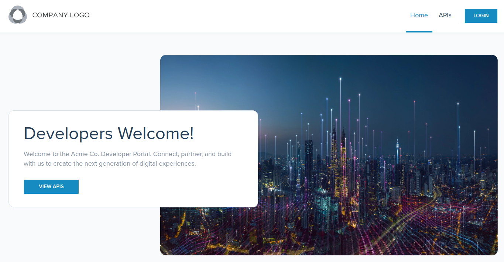
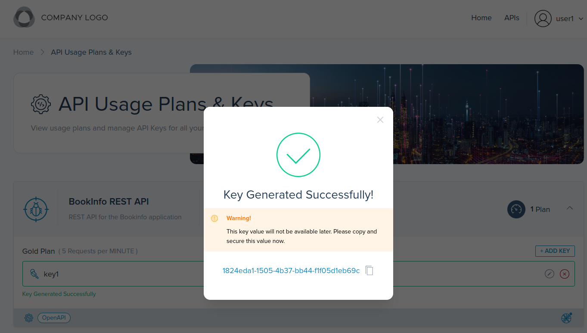

<!--bash
source ./scripts/assert.sh
-->


<center></center>

# <center>Gloo Portal (2.6.5)</center>


## Table of Contents
* [Introduction](#introduction)
* [Lab 1 - Deploy a KinD cluster](#lab-1---deploy-a-kind-cluster-)
* [Lab 2 - Deploy and register Gloo Mesh](#lab-2---deploy-and-register-gloo-mesh-)
* [Lab 3 - Deploy Istio using Gloo Mesh Lifecycle Manager](#lab-3---deploy-istio-using-gloo-mesh-lifecycle-manager-)
* [Lab 4 - Deploy the Bookinfo demo app](#lab-4---deploy-the-bookinfo-demo-app-)
* [Lab 5 - Deploy the httpbin demo app](#lab-5---deploy-the-httpbin-demo-app-)
* [Lab 6 - Deploy Gloo Mesh Addons](#lab-6---deploy-gloo-mesh-addons-)
* [Lab 7 - Create the gateways workspace](#lab-7---create-the-gateways-workspace-)
* [Lab 8 - Create the bookinfo workspace](#lab-8---create-the-bookinfo-workspace-)
* [Lab 9 - Expose the productpage through a gateway](#lab-9---expose-the-productpage-through-a-gateway-)
* [Lab 10 - Create the httpbin workspace](#lab-10---create-the-httpbin-workspace-)
* [Lab 11 - Deploy Keycloak](#lab-11---deploy-keycloak-)
* [Lab 12 - Expose the productpage API securely](#lab-12---expose-the-productpage-api-securely-)
* [Lab 13 - Expose an external API and stitch it with another one](#lab-13---expose-an-external-api-and-stitch-it-with-another-one-)
* [Lab 14 - Expose the dev portal backend](#lab-14---expose-the-dev-portal-backend-)
* [Lab 15 - Deploy and expose the dev portal frontend](#lab-15---deploy-and-expose-the-dev-portal-frontend-)
* [Lab 16 - Allow users to create their own API keys](#lab-16---allow-users-to-create-their-own-api-keys-)
* [Lab 17 - Dev portal monetization](#lab-17---dev-portal-monetization-)
* [Lab 18 - Deploy Backstage with the backend plugin](#lab-18---deploy-backstage-with-the-backend-plugin-)


## Introduction <a name="introduction"></a>

Gloo Mesh Gateway is a feature-rich, Kubernetes-native ingress controller and next-generation API gateway, based on Istio and Envoy.

With Gloo Mesh Gateway, you have access to its exceptional function-level routing, discovery capabilities, numerous features, tight integration with leading open-source projects, and support for legacy apps, microservices, and serverless.
It is uniquely designed to support hybrid applications in which multiple technologies, architectures, protocols, and clouds can co-exist.

Built on [Istio's ingress gateway](https://www.solo.io/topics/istio/istio-ingress-gateway/), Gloo Mesh Gateway uses an Envoy proxy as the ingress gateway to manage and control traffic that enters your Kubernetes cluster.
You use custom resources, such as Gloo virtual gateways, route tables, and policies to implement security measures that meet your business and app requirements, and that simplify configuring ingress traffic rules.
Because these resources offer declarative, API-driven configuration, you can easily integrate Gloo Mesh Gateway into your existing GitOps and CI/CD workflows.

### Why would you choose an API Gateway based on Istio and Envoy?

There are many good reasons why:

* First of all, it's high-performance software written in C++
* They're driven by a neutral foundation (CNCF, like Kubernetes), so their roadmaps aren't driven by a single vendor
* And probably, more importantly, you have already adopted or you're probably going to adopt a service mesh in the future. Chances are high that this service mesh will be Istio and if it's not the case it will most probably be a service mesh based on Envoy
* So choosing an API Gateway based on Istio and Envoy will allow you to get the metrics for your API Gateway and your Service Mesh in the same format. So you can troubleshoot issues in a common way

### Why would you choose Gloo Mesh Gateway?

* It has been developed from the beginning with the idea to be configured 100% through YAML
* It provides all the functionalities you expect from a modern API Gateway:
  * External authentication based on OAuth2, JWT, API keys, …
  * Authorization based on OPA
  * Advanced rate-limiting
  * Web Application Firewall based on ModSecurity
  * Advanced transformation
  * Customization through WebAssembly
* It includes Gloo Portal, a Kubernetes-native developer portal
* And much more

These features enable Platform Engineers as well as development teams to implement powerful mechanisms to manage and secure traffic, implement access control, transform requests and responses, and gain observability over their services.

The true power unfolds when combining the above-mentioned capabilities to achieve the desired outcome.
In the labs that follow we present some of the common patterns that our customers use and provide a good entry point into the workings of Gloo Mesh Gateway.

### Want to learn more about Gloo Mesh Gateway?

You can find more information about Gloo Mesh Gateway in the official documentation: <https://docs.solo.io/gloo-gateway/>


## Lab 1 - Deploy a KinD cluster <a name="lab-1---deploy-a-kind-cluster-"></a>


Clone this repository and go to the directory where this `README.md` file is.

Set the context environment variables:

```bash
export MGMT=cluster1
export CLUSTER1=cluster1
```

Run the following commands to deploy a Kubernetes cluster using [Kind](https://kind.sigs.k8s.io/):

```bash
./scripts/deploy.sh 1 cluster1 us-west us-west-1
```

Then run the following commands to wait for all the Pods to be ready:

```bash
./scripts/check.sh cluster1
```

**Note:** If you run the `check.sh` script immediately after the `deploy.sh` script, you may see a jsonpath error. If that happens, simply wait a few seconds and try again.

Once the `check.sh` script completes, when you execute the `kubectl get pods -A` command, you should see the following:

```
NAMESPACE            NAME                                          READY   STATUS    RESTARTS   AGE
kube-system          calico-kube-controllers-59d85c5c84-sbk4k      1/1     Running   0          4h26m
kube-system          calico-node-przxs                             1/1     Running   0          4h26m
kube-system          coredns-6955765f44-ln8f5                      1/1     Running   0          4h26m
kube-system          coredns-6955765f44-s7xxx                      1/1     Running   0          4h26m
kube-system          etcd-cluster1-control-plane                   1/1     Running   0          4h27m
kube-system          kube-apiserver-cluster1-control-plane         1/1     Running   0          4h27m
kube-system          kube-controller-manager-cluster1-control-plane1/1     Running   0          4h27m
kube-system          kube-proxy-ksvzw                              1/1     Running   0          4h26m
kube-system          kube-scheduler-cluster1-control-plane         1/1     Running   0          4h27m
local-path-storage   local-path-provisioner-58f6947c7-lfmdx        1/1     Running   0          4h26m
metallb-system       controller-5c9894b5cd-cn9x2                   1/1     Running   0          4h26m
metallb-system       speaker-d7jkp                                 1/1     Running   0          4h26m
```

**Note:** The CNI pods might be different, depending on which CNI you have deployed.

<!--bash
cat <<'EOF' > ./test.js
const helpers = require('./tests/chai-exec');

describe("Clusters are healthy", () => {
    const clusters = [process.env.MGMT, process.env.CLUSTER1];
    clusters.forEach(cluster => {
        it(`Cluster ${cluster} is healthy`, () => helpers.k8sObjectIsPresent({ context: cluster, namespace: "default", k8sType: "service", k8sObj: "kubernetes" }));
    });
});
EOF
echo "executing test dist/gloo-mesh-2-0-workshop/build/templates/steps/deploy-kind-cluster/tests/cluster-healthy.test.js.liquid"
timeout --signal=INT 3m mocha ./test.js --timeout 10000 --retries=120 --bail || exit 1
-->


## Lab 2 - Deploy and register Gloo Mesh <a name="lab-2---deploy-and-register-gloo-mesh-"></a>
[](https://youtu.be/djfFiepK4GY "Video Link")


Before we get started, let's install the `meshctl` CLI:

```bash
export GLOO_MESH_VERSION=v2.6.5
curl -sL https://run.solo.io/meshctl/install | sh -
export PATH=$HOME/.gloo-mesh/bin:$PATH
```
<!--bash
cat <<'EOF' > ./test.js
var chai = require('chai');
var expect = chai.expect;

describe("Required environment variables should contain value", () => {
  afterEach(function(done){
    if(this.currentTest.currentRetry() > 0){
      process.stdout.write(".");
       setTimeout(done, 1000);
    } else {
      done();
    }
  });

  it("Context environment variables should not be empty", () => {
    expect(process.env.MGMT).not.to.be.empty
    expect(process.env.CLUSTER1).not.to.be.empty
  });

  it("Gloo Mesh licence environment variables should not be empty", () => {
    expect(process.env.GLOO_MESH_LICENSE_KEY).not.to.be.empty
  });
});
EOF
echo "executing test dist/gloo-mesh-2-0-workshop/build/templates/steps/deploy-and-register-gloo-mesh/tests/environment-variables.test.js.liquid"
timeout --signal=INT 3m mocha ./test.js --timeout 10000 --retries=120 --bail || exit 1
-->
First, create a secret with the password to use to store access logs in Clickhouse:

```bash
cat << EOF | kubectl --context ${MGMT} apply -f -
kind: Namespace
apiVersion: v1
metadata:
  name: gloo-mesh
---
apiVersion: v1
kind: Secret
metadata:
  name: clickhouse-auth
  namespace: gloo-mesh
type: Opaque
stringData:
  password: password
EOF
```

And then, install the Helm charts:

```bash
kubectl --context ${MGMT} create ns gloo-mesh

helm upgrade --install gloo-platform-crds gloo-platform-crds \
  --repo https://storage.googleapis.com/gloo-platform/helm-charts \
  --namespace gloo-mesh \
  --kube-context ${MGMT} \
  --version 2.6.5

helm upgrade --install gloo-platform-mgmt gloo-platform \
  --repo https://storage.googleapis.com/gloo-platform/helm-charts \
  --namespace gloo-mesh \
  --kube-context ${MGMT} \
  --version 2.6.5 \
  -f -<<EOF
licensing:
  glooTrialLicenseKey: ${GLOO_MESH_LICENSE_KEY}
common:
  cluster: cluster1
glooInsightsEngine:
  enabled: false
glooMgmtServer:
  enabled: true
  ports:
    healthcheck: 8091
  registerCluster: true
prometheus:
  enabled: true
redis:
  deployment:
    enabled: true
clickhouse:
  enabled: true
  persistence:
    enabled: false
telemetryGateway:
  enabled: true
  service:
    type: LoadBalancer
telemetryGatewayCustomization:
  pipelines:
    logs/clickhouse:
      enabled: true
  extraExporters:
    clickhouse:
      password: password
glooUi:
  enabled: true
  serviceType: LoadBalancer
telemetryCollector:
  presets:
    logsCollection:
      enabled: true
      storeCheckpoints: true
  enabled: true
  config:
    exporters:
      otlp:
        endpoint: gloo-telemetry-gateway:4317
glooAgent:
  enabled: true
  relay:
    serverAddress: gloo-mesh-mgmt-server:9900
    authority: gloo-mesh-mgmt-server.gloo-mesh
telemetryCollectorCustomization:
  pipelines:
    logs/portal:
      enabled: true
  extraExporters:
    clickhouse:
      password: password
EOF

kubectl --context ${MGMT} -n gloo-mesh rollout status deploy/gloo-mesh-mgmt-server

kubectl --context ${MGMT} delete workspaces -A --all
kubectl --context ${MGMT} delete workspacesettings -A --all
```

<!--bash
cat <<'EOF' > ./test.js
var chai = require('chai');
var expect = chai.expect;
const helpers = require('./tests/chai-exec');
describe("Cluster registration", () => {
  it("cluster1 is registered", () => {
    podName = helpers.getOutputForCommand({ command: "kubectl -n gloo-mesh get pods -l app=gloo-mesh-mgmt-server -o jsonpath='{.items[0].metadata.name}' --context " + process.env.MGMT }).replaceAll("'", "");
    command = helpers.getOutputForCommand({ command: "kubectl --context " + process.env.MGMT + " -n gloo-mesh debug -q -i " + podName + " --image=curlimages/curl -- curl -s http://localhost:9091/metrics" }).replaceAll("'", "");
    expect(command).to.contain("cluster1");
  });
});
EOF
echo "executing test dist/gloo-mesh-2-0-workshop/build/templates/steps/deploy-and-register-gloo-mesh/tests/cluster-registration.test.js.liquid"
timeout --signal=INT 3m mocha ./test.js --timeout 10000 --retries=120 --bail || exit 1
-->


## Lab 3 - Deploy Istio using Gloo Mesh Lifecycle Manager <a name="lab-3---deploy-istio-using-gloo-mesh-lifecycle-manager-"></a>
[](https://youtu.be/f76-KOEjqHs "Video Link")

We are going to deploy Istio using Gloo Mesh Lifecycle Manager.

<details>
  <summary>Install <code>istioctl</code></summary>

Install `istioctl` if not already installed as it will be useful in some of the labs that follow.

```bash
curl -L https://istio.io/downloadIstio | sh -

if [ -d "istio-"*/ ]; then
  cd istio-*/
  export PATH=$PWD/bin:$PATH
  cd ..
fi
```

That's it!
</details>
<!--bash
cat <<'EOF' > ./test.js
const chaiExec = require("@jsdevtools/chai-exec");
var chai = require('chai');
var expect = chai.expect;
chai.use(chaiExec);

afterEach(function (done) {
  if (this.currentTest.currentRetry() > 0) {
    process.stdout.write(".");
    setTimeout(done, 1000);
  } else {
    done();
  }
});
EOF
echo "executing test dist/gloo-mesh-2-0-workshop/build/templates/steps/istio-lifecycle-manager-install/tests/istio-version.test.js.liquid"
timeout --signal=INT 3m mocha ./test.js --timeout 10000 --retries=120 --bail || exit 1
-->

Let's create Kubernetes services for the gateways:

```bash
kubectl --context ${CLUSTER1} create ns istio-gateways

kubectl apply --context ${CLUSTER1} -f - <<EOF
apiVersion: v1
kind: Service
metadata:
  labels:
    app: istio-ingressgateway
    istio: ingressgateway
  name: istio-ingressgateway
  namespace: istio-gateways
spec:
  ports:
  - name: http2
    port: 80
    protocol: TCP
    targetPort: 8080
  - name: https
    port: 443
    protocol: TCP
    targetPort: 8443
  selector:
    app: istio-ingressgateway
    istio: ingressgateway
    revision: 1-23
  type: LoadBalancer
EOF
```

It allows us to have full control on which Istio revision we want to use.

Then, we can tell Gloo Mesh to deploy the Istio control planes and the gateways in the cluster(s).

```bash
kubectl apply --context ${MGMT} -f - <<EOF
apiVersion: admin.gloo.solo.io/v2
kind: IstioLifecycleManager
metadata:
  name: cluster1-installation
  namespace: gloo-mesh
spec:
  installations:
    - clusters:
      - name: cluster1
        defaultRevision: true
      revision: 1-23
      istioOperatorSpec:
        profile: minimal
        hub: us-docker.pkg.dev/gloo-mesh/istio-workshops
        tag: 1.23.1-solo
        namespace: istio-system
        values:
          global:
            meshID: mesh1
            multiCluster:
              clusterName: cluster1
            network: cluster1
        meshConfig:
          accessLogFile: /dev/stdout
          defaultConfig:
            proxyMetadata:
              ISTIO_META_DNS_CAPTURE: "true"
              ISTIO_META_DNS_AUTO_ALLOCATE: "true"
        components:
          pilot:
            k8s:
              env:
                - name: PILOT_ENABLE_K8S_SELECT_WORKLOAD_ENTRIES
                  value: "false"
                - name: PILOT_ENABLE_IP_AUTOALLOCATE
                  value: "true"
          ingressGateways:
          - name: istio-ingressgateway
            enabled: false
EOF

kubectl apply --context ${MGMT} -f - <<EOF
apiVersion: admin.gloo.solo.io/v2
kind: GatewayLifecycleManager
metadata:
  name: cluster1-ingress
  namespace: gloo-mesh
spec:
  installations:
    - clusters:
      - name: cluster1
        activeGateway: false
      gatewayRevision: 1-23
      istioOperatorSpec:
        profile: empty
        hub: us-docker.pkg.dev/gloo-mesh/istio-workshops
        tag: 1.23.1-solo
        values:
          gateways:
            istio-ingressgateway:
              customService: true
        components:
          ingressGateways:
            - name: istio-ingressgateway
              namespace: istio-gateways
              enabled: true
              label:
                istio: ingressgateway
EOF

```

<!--bash
until kubectl --context ${MGMT} -n gloo-mesh wait --timeout=180s --for=jsonpath='{.status.clusters.cluster1.installations.*.state}'=HEALTHY istiolifecyclemanagers/cluster1-installation; do
  echo "Waiting for the Istio installation to complete"
  sleep 1
done
timeout 2m bash -c "until [[ \$(kubectl --context ${CLUSTER1} -n istio-system get deploy -o json | jq '[.items[].status.readyReplicas] | add') -ge 1 ]]; do
  sleep 1
done"
timeout 2m bash -c "until [[ \$(kubectl --context ${CLUSTER1} -n istio-gateways get deploy -o json | jq '[.items[].status.readyReplicas] | add') -eq 1 ]]; do
  sleep 1
done"
-->

<!--bash
cat <<'EOF' > ./test.js

const helpers = require('./tests/chai-exec');

const chaiExec = require("@jsdevtools/chai-exec");
const helpersHttp = require('./tests/chai-http');
const chai = require("chai");
const expect = chai.expect;

afterEach(function (done) {
  if (this.currentTest.currentRetry() > 0) {
    process.stdout.write(".");
    setTimeout(done, 1000);
  } else {
    done();
  }
});

describe("Checking Istio installation", function() {
  it('istiod pods are ready in cluster ' + process.env.CLUSTER1, () => helpers.checkDeploymentsWithLabels({ context: process.env.CLUSTER1, namespace: "istio-system", labels: "app=istiod", instances: 1 }));
  it('gateway pods are ready in cluster ' + process.env.CLUSTER1, () => helpers.checkDeploymentsWithLabels({ context: process.env.CLUSTER1, namespace: "istio-gateways", labels: "app=istio-ingressgateway", instances: 1 }));
  it("Gateways have an ip attached in cluster " + process.env.CLUSTER1, () => {
    let cli = chaiExec("kubectl --context " + process.env.CLUSTER1 + " -n istio-gateways get svc -l app=istio-ingressgateway -o jsonpath='{.items}'");
    cli.stderr.should.be.empty;
    let deployments = JSON.parse(cli.stdout.slice(1,-1));
    expect(deployments).to.have.lengthOf(1);
    deployments.forEach((deployment) => {
      expect(deployment.status.loadBalancer).to.have.property("ingress");
    });
  });
});

EOF
echo "executing test dist/gloo-mesh-2-0-workshop/build/templates/steps/istio-lifecycle-manager-install/tests/istio-ready.test.js.liquid"
timeout --signal=INT 3m mocha ./test.js --timeout 10000 --retries=120 --bail || exit 1
-->
<!--bash
timeout 2m bash -c "until [[ \$(kubectl --context ${CLUSTER1} -n istio-gateways get svc -l istio=ingressgateway -o json | jq '.items[0].status.loadBalancer | length') -gt 0 ]]; do
  sleep 1
done"
-->

```bash
export HOST_GW_CLUSTER1="$(kubectl --context ${CLUSTER1} -n istio-gateways get svc -l istio=ingressgateway -o jsonpath='{.items[0].status.loadBalancer.ingress[0].*}')"
```

<!--bash
cat <<'EOF' > ./test.js
const dns = require('dns');
const chaiHttp = require("chai-http");
const chai = require("chai");
const expect = chai.expect;
chai.use(chaiHttp);
const { waitOnFailedTest } = require('./tests/utils');

afterEach(function(done) { waitOnFailedTest(done, this.currentTest.currentRetry())});

describe("Address '" + process.env.HOST_GW_CLUSTER1 + "' can be resolved in DNS", () => {
    it(process.env.HOST_GW_CLUSTER1 + ' can be resolved', (done) => {
        return dns.lookup(process.env.HOST_GW_CLUSTER1, (err, address, family) => {
            expect(address).to.be.an.ip;
            done();
        });
    });
});
EOF
echo "executing test ./gloo-mesh-2-0/tests/can-resolve.test.js.liquid"
timeout --signal=INT 3m mocha ./test.js --timeout 10000 --retries=120 --bail || exit 1
-->


## Lab 4 - Deploy the Bookinfo demo app <a name="lab-4---deploy-the-bookinfo-demo-app-"></a>
[](https://youtu.be/nzYcrjalY5A "Video Link")

We're going to deploy the bookinfo application to demonstrate several features of Gloo Mesh.

You can find more information about this application [here](https://istio.io/latest/docs/examples/bookinfo/).

Run the following commands to deploy the bookinfo application on `cluster1`:

```bash
kubectl --context ${CLUSTER1} create ns bookinfo-frontends
kubectl --context ${CLUSTER1} create ns bookinfo-backends
kubectl --context ${CLUSTER1} label namespace bookinfo-frontends istio.io/rev=1-23 --overwrite
kubectl --context ${CLUSTER1} label namespace bookinfo-backends istio.io/rev=1-23 --overwrite

# Deploy the frontend bookinfo service in the bookinfo-frontends namespace
kubectl --context ${CLUSTER1} -n bookinfo-frontends apply -f data/steps/deploy-bookinfo/productpage-v1.yaml

# Deploy the backend bookinfo services in the bookinfo-backends namespace for all versions less than v3
kubectl --context ${CLUSTER1} -n bookinfo-backends apply \
  -f data/steps/deploy-bookinfo/details-v1.yaml \
  -f data/steps/deploy-bookinfo/ratings-v1.yaml \
  -f data/steps/deploy-bookinfo/reviews-v1-v2.yaml

# Update the reviews service to display where it is coming from
kubectl --context ${CLUSTER1} -n bookinfo-backends set env deploy/reviews-v1 CLUSTER_NAME=${CLUSTER1}
kubectl --context ${CLUSTER1} -n bookinfo-backends set env deploy/reviews-v2 CLUSTER_NAME=${CLUSTER1}
```

<!--bash
echo -n Waiting for bookinfo pods to be ready...
timeout -v 5m bash -c "
until [[ \$(kubectl --context ${CLUSTER1} -n bookinfo-frontends get deploy -o json | jq '[.items[].status.readyReplicas] | add') -eq 1 && \\
  \$(kubectl --context ${CLUSTER1} -n bookinfo-backends get deploy -o json | jq '[.items[].status.readyReplicas] | add') -eq 4 ]] 2>/dev/null
do
  sleep 1
  echo -n .
done"
echo
-->

You can check that the app is running using the following command:

```shell
kubectl --context ${CLUSTER1} -n bookinfo-frontends get pods && kubectl --context ${CLUSTER1} -n bookinfo-backends get pods
```

Note that we deployed the `productpage` service in the `bookinfo-frontends` namespace and the other services in the `bookinfo-backends` namespace.

And we deployed the `v1` and `v2` versions of the `reviews` microservice, not the `v3` version.

<!--bash
cat <<'EOF' > ./test.js
const helpers = require('./tests/chai-exec');

describe("Bookinfo app", () => {
  let cluster = process.env.CLUSTER1
  let deployments = ["productpage-v1"];
  deployments.forEach(deploy => {
    it(deploy + ' pods are ready in ' + cluster, () => helpers.checkDeployment({ context: cluster, namespace: "bookinfo-frontends", k8sObj: deploy }));
  });
  deployments = ["ratings-v1", "details-v1", "reviews-v1", "reviews-v2"];
  deployments.forEach(deploy => {
    it(deploy + ' pods are ready in ' + cluster, () => helpers.checkDeployment({ context: cluster, namespace: "bookinfo-backends", k8sObj: deploy }));
  });
});
EOF
echo "executing test dist/gloo-mesh-2-0-workshop/build/templates/steps/apps/bookinfo/deploy-bookinfo/tests/check-bookinfo.test.js.liquid"
timeout --signal=INT 3m mocha ./test.js --timeout 10000 --retries=120 --bail || exit 1
-->


## Lab 5 - Deploy the httpbin demo app <a name="lab-5---deploy-the-httpbin-demo-app-"></a>
[](https://youtu.be/w1xB-o_gHs0 "Video Link")

We're going to deploy the httpbin application to demonstrate several features of Gloo Mesh.

You can find more information about this application [here](http://httpbin.org/).

Run the following commands to deploy the httpbin app on `cluster1`. The deployment will be called `not-in-mesh` and won't have the sidecar injected, because of the annotation `sidecar.istio.io/inject: "false"`.

```bash
kubectl --context ${CLUSTER1} create ns httpbin
kubectl apply --context ${CLUSTER1} -f - <<EOF
apiVersion: v1
kind: ServiceAccount
metadata:
  name: not-in-mesh
  namespace: httpbin
---
apiVersion: v1
kind: Service
metadata:
  name: not-in-mesh
  namespace: httpbin
  labels:
    app: not-in-mesh
    service: not-in-mesh
spec:
  ports:
  - name: http
    port: 8000
    targetPort: 80
  selector:
    app: not-in-mesh
---
apiVersion: apps/v1
kind: Deployment
metadata:
  name: not-in-mesh
  namespace: httpbin
spec:
  replicas: 1
  selector:
    matchLabels:
      app: not-in-mesh
      version: v1
  template:
    metadata:
      labels:
        app: not-in-mesh
        version: v1
    spec:
      serviceAccountName: not-in-mesh
      containers:
      - image: docker.io/kennethreitz/httpbin
        imagePullPolicy: IfNotPresent
        name: not-in-mesh
        ports:
        - name: http
          containerPort: 80
        livenessProbe:
          httpGet:
            path: /status/200
            port: http
        readinessProbe:
          httpGet:
            path: /status/200
            port: http

EOF
```

Then, we deploy a second version, which will be called `in-mesh` and will have the sidecar injected (because of the label `istio.io/rev` in the Pod template).

```bash
kubectl apply --context ${CLUSTER1} -f - <<EOF
apiVersion: v1
kind: ServiceAccount
metadata:
  name: in-mesh
  namespace: httpbin
---
apiVersion: v1
kind: Service
metadata:
  name: in-mesh
  namespace: httpbin
  labels:
    app: in-mesh
    service: in-mesh
spec:
  ports:
  - name: http
    port: 8000
    targetPort: 80
  selector:
    app: in-mesh
---
apiVersion: apps/v1
kind: Deployment
metadata:
  name: in-mesh
  namespace: httpbin
spec:
  replicas: 1
  selector:
    matchLabels:
      app: in-mesh
      version: v1
  template:
    metadata:
      labels:
        app: in-mesh
        version: v1
        istio.io/rev: 1-23
    spec:
      serviceAccountName: in-mesh
      containers:
      - image: docker.io/kennethreitz/httpbin
        imagePullPolicy: IfNotPresent
        name: in-mesh
        ports:
        - name: http
          containerPort: 80
        livenessProbe:
          httpGet:
            path: /status/200
            port: http
        readinessProbe:
          httpGet:
            path: /status/200
            port: http

EOF
```


<!--bash
echo -n Waiting for httpbin pods to be ready...
timeout -v 5m bash -c "
until [[ \$(kubectl --context ${CLUSTER1} -n httpbin get deploy -o json | jq '[.items[].status.readyReplicas] | add') -eq 2 ]] 2>/dev/null
do
  sleep 1
  echo -n .
done"
echo
-->
```
You can follow the progress using the following command:

```bash
kubectl --context ${CLUSTER1} -n httpbin get pods
```

```,nocopy
NAME                           READY   STATUS    RESTARTS   AGE
in-mesh-5d9d9549b5-qrdgd       2/2     Running   0          11s
not-in-mesh-5c64bb49cd-m9kwm   1/1     Running   0          11s
```
<!--bash
cat <<'EOF' > ./test.js
const helpers = require('./tests/chai-exec');

describe("httpbin app", () => {
  let cluster = process.env.CLUSTER1
  
  let deployments = ["not-in-mesh", "in-mesh"];
  
  deployments.forEach(deploy => {
    it(deploy + ' pods are ready in ' + cluster, () => helpers.checkDeployment({ context: cluster, namespace: "httpbin", k8sObj: deploy }));
  });
});
EOF
echo "executing test dist/gloo-mesh-2-0-workshop/build/templates/steps/apps/httpbin/deploy-httpbin/tests/check-httpbin.test.js.liquid"
timeout --signal=INT 3m mocha ./test.js --timeout 10000 --retries=120 --bail || exit 1
-->


## Lab 6 - Deploy Gloo Mesh Addons <a name="lab-6---deploy-gloo-mesh-addons-"></a>
[](https://youtu.be/_rorug_2bk8 "Video Link")

To use the Gloo Mesh Gateway advanced features (external authentication, rate limiting, ...), you need to install the Gloo Mesh addons.

First, you need to create a namespace for the addons, with Istio injection enabled:

```bash
kubectl --context ${CLUSTER1} create namespace gloo-mesh-addons
kubectl --context ${CLUSTER1} label namespace gloo-mesh-addons istio.io/rev=1-23 --overwrite
```

Then, you can deploy the addons on the cluster(s) using Helm:

```bash
helm upgrade --install gloo-platform gloo-platform \
  --repo https://storage.googleapis.com/gloo-platform/helm-charts \
  --namespace gloo-mesh-addons \
  --kube-context ${CLUSTER1} \
  --version 2.6.5 \
  -f -<<EOF
common:
  cluster: cluster1
glooPortalServer:
  enabled: true
  apiKeyStorage:
    secretKey: ThisIsSecret
    redis:
      enabled: true
      address: redis.gloo-mesh-addons:6379
glooAgent:
  enabled: false
extAuthService:
  enabled: true
  extAuth:
    apiKeyStorage:
      name: redis
      enabled: true
      config: 
        connection: 
          host: redis.gloo-mesh-addons:6379
      secretKey: ThisIsSecret
rateLimiter:
  enabled: true
EOF
```

For teams to setup external authentication, the gateways team needs to create and `ExtAuthServer` object they can reference.

Let's create the `ExtAuthServer` object:

```bash
kubectl apply --context ${CLUSTER1} -f - <<EOF
apiVersion: admin.gloo.solo.io/v2
kind: ExtAuthServer
metadata:
  name: ext-auth-server
  namespace: gloo-mesh-addons
spec:
  destinationServer:
    ref:
      cluster: cluster1
      name: ext-auth-service
      namespace: gloo-mesh-addons
    port:
      name: grpc
  requestBody: {} # Needed if some an extauth plugin must access the body of the requests
EOF
```

For teams to setup rate limiting, the gateways team needs to create and `RateLimitServerSettings` object they can reference.

Let's create the `RateLimitServerSettings` object:

```bash
kubectl apply --context ${CLUSTER1} -f - <<EOF
apiVersion: admin.gloo.solo.io/v2
kind: RateLimitServerSettings
metadata:
  name: rate-limit-server
  namespace: gloo-mesh-addons
spec:
  destinationServer:
    ref:
      cluster: cluster1
      name: rate-limiter
      namespace: gloo-mesh-addons
    port:
      name: grpc
EOF
```
<!--bash
cat <<'EOF' > ./test.js
const helpers = require('./tests/chai-exec');

describe("Gloo Platform add-ons cluster1 deployment", () => {
  let cluster = process.env.CLUSTER1
  let deployments = ["ext-auth-service", "rate-limiter"];
  deployments.forEach(deploy => {
    it(deploy + ' pods are ready in ' + cluster, () => helpers.checkDeployment({ context: cluster, namespace: "gloo-mesh-addons", k8sObj: deploy }));
  });
});

EOF
echo "executing test dist/gloo-mesh-2-0-workshop/build/templates/steps/deploy-gloo-mesh-addons/tests/check-addons-deployments.test.js.liquid"
timeout --signal=INT 3m mocha ./test.js --timeout 10000 --retries=120 --bail || exit 1
-->
<!--bash
cat <<'EOF' > ./test.js
const helpers = require('./tests/chai-exec');

describe("Gloo Platform add-ons cluster1 service", () => {
  let cluster = process.env.CLUSTER1
  let services = ["ext-auth-service", "rate-limiter"];
  services.forEach(service => {
    it(service + ' exists in ' + cluster, () => helpers.k8sObjectIsPresent({ context: cluster, namespace: "gloo-mesh-addons", k8sType: "service", k8sObj: service }));
  });
});

EOF
echo "executing test dist/gloo-mesh-2-0-workshop/build/templates/steps/deploy-gloo-mesh-addons/tests/check-addons-services.test.js.liquid"
timeout --signal=INT 3m mocha ./test.js --timeout 10000 --retries=120 --bail || exit 1
-->
This is what the environment looks like now:


## Lab 7 - Create the gateways workspace <a name="lab-7---create-the-gateways-workspace-"></a>
[](https://youtu.be/QeVBH0eswWw "Video Link")

We're going to create a workspace for the team in charge of the Gateways.

The platform team needs to create the corresponding `Workspace` Kubernetes objects in the Gloo Mesh management cluster.

Let's create the `gateways` workspace which corresponds to the `istio-gateways` and the `gloo-mesh-addons` namespaces on the cluster(s):

```bash
kubectl apply --context ${MGMT} -f - <<EOF
apiVersion: admin.gloo.solo.io/v2
kind: Workspace
metadata:
  name: gateways
  namespace: gloo-mesh
spec:
  workloadClusters:
  - name: cluster1
    namespaces:
    - name: istio-gateways
    - name: gloo-mesh-addons
EOF
```

Then, the Gateway team creates a `WorkspaceSettings` Kubernetes object in one of the namespaces of the `gateways` workspace (so the `istio-gateways` or the `gloo-mesh-addons` namespace):

```bash
kubectl apply --context ${CLUSTER1} -f - <<EOF
apiVersion: admin.gloo.solo.io/v2
kind: WorkspaceSettings
metadata:
  name: gateways
  namespace: gloo-mesh-addons
spec:
  importFrom:
  - workspaces:
    - selector:
        allow_ingress: "true"
    resources:
    - kind: SERVICE
    - kind: ALL
      labels:
        expose: "true"
  exportTo:
  - workspaces:
    - selector:
        allow_ingress: "true"
    resources:
    - kind: SERVICE
EOF
```

The Gateway team has decided to import the following from the workspaces that have the label `allow_ingress` set to `true` (using a selector):
- all the Kubernetes services exported by these workspaces
- all the resources (RouteTables, VirtualDestination, ...) exported by these workspaces that have the label `expose` set to `true`


## Lab 8 - Create the bookinfo workspace <a name="lab-8---create-the-bookinfo-workspace-"></a>

We're going to create a workspace for the team in charge of the Bookinfo application.

The platform team needs to create the corresponding `Workspace` Kubernetes objects in the Gloo Mesh management cluster.

Let's create the `bookinfo` workspace which corresponds to the `bookinfo-frontends` and `bookinfo-backends` namespaces on the cluster(s):

```bash
kubectl apply --context ${MGMT} -f - <<EOF
apiVersion: admin.gloo.solo.io/v2
kind: Workspace
metadata:
  name: bookinfo
  namespace: gloo-mesh
  labels:
    allow_ingress: "true"
spec:
  workloadClusters:
  - name: cluster1
    namespaces:
    - name: bookinfo-frontends
    - name: bookinfo-backends
EOF
```

Then, the Bookinfo team creates a `WorkspaceSettings` Kubernetes object in one of the namespaces of the `bookinfo` workspace (so the `bookinfo-frontends` or the `bookinfo-backends` namespace):

```bash
kubectl apply --context ${CLUSTER1} -f - <<EOF
apiVersion: admin.gloo.solo.io/v2
kind: WorkspaceSettings
metadata:
  name: bookinfo
  namespace: bookinfo-frontends
spec:
  importFrom:
  - workspaces:
    - name: gateways
    resources:
    - kind: SERVICE
  exportTo:
  - workspaces:
    - name: gateways
    resources:
    - kind: SERVICE
      labels:
        app: productpage
    - kind: SERVICE
      labels:
        app: reviews
    - kind: SERVICE
      labels:
        app: ratings
    - kind: ALL
      labels:
        expose: "true"
EOF
```

The Bookinfo team has decided to export the following to the `gateway` workspace (using a reference):
- the `productpage` and the `reviews` Kubernetes services
- all the resources (RouteTables, VirtualDestination, ...) that have the label `expose` set to `true`

This is how the environment looks like with the workspaces:


## Lab 9 - Expose the productpage through a gateway <a name="lab-9---expose-the-productpage-through-a-gateway-"></a>
[](https://youtu.be/emyIu99AOOA "Video Link")

In this step, we're going to expose the `productpage` service through the Ingress Gateway using Gloo Mesh.

The Gateway team must create a `VirtualGateway` to configure the Istio Ingress Gateway in cluster1 to listen to incoming requests.

```bash
kubectl apply --context ${CLUSTER1} -f - <<EOF
apiVersion: networking.gloo.solo.io/v2
kind: VirtualGateway
metadata:
  name: north-south-gw
  namespace: istio-gateways
spec:
  workloads:
    - selector:
        labels:
          istio: ingressgateway
        cluster: cluster1
  listeners: 
    - http: {}
      port:
        number: 80
      allowedRouteTables:
        - host: '*'
EOF
```

Then, the Gateway team should create a parent `RouteTable` to configure the main routing.

```bash
kubectl apply --context ${CLUSTER1} -f - <<EOF
apiVersion: networking.gloo.solo.io/v2
kind: RouteTable
metadata:
  name: main-bookinfo
  namespace: istio-gateways
spec:
  hosts:
    - cluster1-bookinfo.example.com
    - cluster2-bookinfo.example.com
  virtualGateways:
    - name: north-south-gw
      namespace: istio-gateways
      cluster: cluster1
  workloadSelectors: []
  http:
    - name: root
      matchers:
      - uri:
          prefix: /
      delegate:
        routeTables:
          - labels:
              expose: "true"
            workspace: bookinfo
          - labels:
              expose: "true"
            workspace: gateways
        sortMethod: ROUTE_SPECIFICITY
---
apiVersion: networking.gloo.solo.io/v2
kind: RouteTable
metadata:
  name: main-httpbin
  namespace: istio-gateways
spec:
  hosts:
    - cluster1-httpbin.example.com
  virtualGateways:
    - name: north-south-gw
      namespace: istio-gateways
      cluster: cluster1
  workloadSelectors: []
  http:
    - name: root
      matchers:
      - uri:
          prefix: /
      delegate:
        routeTables:
          - labels:
              expose: "true"
            workspace: httpbin
        sortMethod: ROUTE_SPECIFICITY
EOF
```

In this example, you can see that the Gateway team is delegating the routing details to the `bookinfo` and `httpbin` workspaces. The teams in charge of these workspaces can expose their services through the gateway.

The Gateway team can use this main `RouteTable` to enforce a global WAF policy, but also to have control on which hostnames and paths can be used by each application team.

Then, the Bookinfo team can create a `RouteTable` to determine how they want to handle the traffic.

```bash
kubectl apply --context ${CLUSTER1} -f - <<EOF
apiVersion: networking.gloo.solo.io/v2
kind: RouteTable
metadata:
  name: productpage
  namespace: bookinfo-frontends
  labels:
    expose: "true"
spec:
  http:
    - name: productpage
      matchers:
      - uri:
          exact: /productpage
      - uri:
          prefix: /static
      - uri:
          prefix: /api/v1/products
      forwardTo:
        destinations:
          - ref:
              name: productpage
              namespace: bookinfo-frontends
              cluster: cluster1
            port:
              number: 9080
EOF
```
Let's add the domains to our `/etc/hosts` file:

```bash
./scripts/register-domain.sh cluster1-bookinfo.example.com ${HOST_GW_CLUSTER1}
./scripts/register-domain.sh cluster1-httpbin.example.com ${HOST_GW_CLUSTER1}
```

You can access the `productpage` service
using this URL: [http://cluster1-bookinfo.example.com/productpage](http://cluster1-bookinfo.example.com/productpage).

You should now be able to access the `productpage` application through the browser.
<!--bash
cat <<'EOF' > ./test.js
const helpers = require('./tests/chai-http');

describe("Productpage is available (HTTP)", () => {
  it('/productpage is available in cluster1', () => helpers.checkURL({ host: `http://cluster1-bookinfo.example.com`, path: '/productpage', retCode: 200 }));
})
EOF
echo "executing test dist/gloo-mesh-2-0-workshop/build/templates/steps/apps/bookinfo/gateway-expose/tests/productpage-available.test.js.liquid"
timeout --signal=INT 3m mocha ./test.js --timeout 10000 --retries=120 --bail || exit 1
-->

Gloo Mesh translates the `VirtualGateway` and `RouteTable` into the corresponding Istio objects (`Gateway` and `VirtualService`).

Now, let's secure the access through TLS.
Let's first create a private key and a self-signed certificate:

```bash
openssl req -x509 -nodes -days 365 -newkey rsa:2048 \
   -keyout tls.key -out tls.crt -subj "/CN=*"
```

Then, you have to store them in a Kubernetes secret running the following commands:

```bash
kubectl --context ${CLUSTER1} -n istio-gateways create secret generic tls-secret \
  --from-file=tls.key=tls.key \
  --from-file=tls.crt=tls.crt
```

Finally, the Gateway team needs to update the `VirtualGateway` to use this secret:

```bash
kubectl apply --context ${CLUSTER1} -f - <<EOF
apiVersion: networking.gloo.solo.io/v2
kind: VirtualGateway
metadata:
  name: north-south-gw
  namespace: istio-gateways
spec:
  workloads:
    - selector:
        labels:
          istio: ingressgateway
        cluster: cluster1
  listeners: 
    - http: {}
      port:
        number: 80
# ---------------- Redirect to https --------------------
      httpsRedirect: true
# -------------------------------------------------------
    - http: {}
# ---------------- SSL config ---------------------------
      port:
        number: 443
      tls:
        parameters:
          minimumProtocolVersion: TLSv1_3
        mode: SIMPLE
        secretName: tls-secret
# -------------------------------------------------------
      allowedRouteTables:
        - host: '*'
EOF
```

You can now access the `productpage` application securely through the browser.
You can access the `productpage` service using this URL: <https://cluster1-bookinfo.example.com/productpage>.

Notice that we specificed a minimumProtocolVersion, so if the client is trying to use an deprecated TLS version the request will be denied.

To test this, we can try to send a request with `tlsv1.2`:

```console
curl --tlsv1.2 --tls-max 1.2 --key tls.key --cert tls.crt https://cluster1-bookinfo.example.com/productpage -k
```

You should get the following output:

```nocopy
curl: (35) error:1409442E:SSL routines:ssl3_read_bytes:tlsv1 alert protocol version
```

Now, you can try the most recent `tlsv1.3`:

```console
curl --tlsv1.3 --tls-max 1.3 --key tls.key --cert tls.crt https://cluster1-bookinfo.example.com/productpage -k
```

And after this you should get the actual Productpage.
<!--bash
cat <<'EOF' > ./test.js
const helpers = require('./tests/chai-http');

describe("Productpage is available (HTTPS)", () => {
  it('/productpage is available in cluster1', () => helpers.checkURL({ host: `https://cluster1-bookinfo.example.com`, path: '/productpage', retCode: 200 }));
})
EOF
echo "executing test dist/gloo-mesh-2-0-workshop/build/templates/steps/apps/bookinfo/gateway-expose/tests/productpage-available-secure.test.js.liquid"
timeout --signal=INT 3m mocha ./test.js --timeout 10000 --retries=120 --bail || exit 1
-->
<!--bash
cat <<'EOF' > ./test.js
var chai = require('chai');
var expect = chai.expect;
const helpers = require('./tests/chai-exec');

describe("Otel metrics", () => {
  it("cluster1 is sending metrics to telemetryGateway", () => {
    podName = helpers.getOutputForCommand({ command: "kubectl -n gloo-mesh get pods -l app.kubernetes.io/name=prometheus -o jsonpath='{.items[0].metadata.name}' --context " + process.env.MGMT }).replaceAll("'", "");
    command = helpers.getOutputForCommand({ command: "kubectl --context " + process.env.MGMT + " -n gloo-mesh debug -q -i " + podName + " --image=curlimages/curl -- curl -s http://localhost:9090/api/v1/query?query=istio_requests_total" }).replaceAll("'", "");
    expect(command).to.contain("cluster\":\"cluster1");
  });
});


EOF
echo "executing test dist/gloo-mesh-2-0-workshop/build/templates/steps/apps/bookinfo/gateway-expose/tests/otel-metrics.test.js.liquid"
timeout --signal=INT 3m mocha ./test.js --timeout 10000 --retries=150 --bail || exit 1
-->

This diagram shows the flow of the request (through the Istio Ingress Gateway):


## Lab 10 - Create the httpbin workspace <a name="lab-10---create-the-httpbin-workspace-"></a>

We're going to create a workspace for the team in charge of the httpbin application.

The platform team needs to create the corresponding `Workspace` Kubernetes objects in the Gloo Mesh management cluster.

Let's create the `httpbin` workspace which corresponds to the `httpbin` namespace on `cluster1`:

```bash
kubectl apply --context ${MGMT} -f - <<EOF
apiVersion: admin.gloo.solo.io/v2
kind: Workspace
metadata:
  name: httpbin
  namespace: gloo-mesh
  labels:
    allow_ingress: "true"
spec:
  workloadClusters:
  - name: cluster1
    namespaces:
    - name: httpbin
EOF
```

Then, the Httpbin team creates a `WorkspaceSettings` Kubernetes object in one of the namespaces of the `httpbin` workspace:

```bash
kubectl apply --context ${CLUSTER1} -f - <<EOF
apiVersion: admin.gloo.solo.io/v2
kind: WorkspaceSettings
metadata:
  name: httpbin
  namespace: httpbin
spec:
  importFrom:
  - workspaces:
    - name: gateways
    resources:
    - kind: SERVICE
  exportTo:
  - workspaces:
    - name: gateways
    resources:
    - kind: SERVICE
      labels:
        app: in-mesh
    - kind: ALL
      labels:
        expose: "true"
EOF
```

The Httpbin team has decided to export the following to the `gateway` workspace (using a reference):
- the `in-mesh` Kubernetes service
- all the resources (RouteTables, VirtualDestination, ...) that have the label `expose` set to `true`


## Lab 11 - Deploy Keycloak <a name="lab-11---deploy-keycloak-"></a>

In many use cases, you need to restrict the access to your applications to authenticated users.

OpenID Connect (OIDC) is an identity layer on top of the OAuth 2.0 protocol. In OAuth 2.0 flows, authentication is performed by an external Identity Provider (IdP) which, in case of success, returns an Access Token representing the user identity. The protocol does not define the contents and structure of the Access Token, which greatly reduces the portability of OAuth 2.0 implementations.

The goal of OIDC is to address this ambiguity by additionally requiring Identity Providers to return a well-defined ID Token. OIDC ID tokens follow the JSON Web Token standard and contain specific fields that your applications can expect and handle. This standardization allows you to switch between Identity Providers – or support multiple ones at the same time – with minimal, if any, changes to your downstream services; it also allows you to consistently apply additional security measures like Role-Based Access Control (RBAC) based on the identity of your users, i.e. the contents of their ID token.

In this lab, we're going to install Keycloak. It will allow us to setup OIDC workflows later.

First, we need to define an ID and secret for a "client", which will be the service that delegates to Keycloak for authorization:

```bash
KEYCLOAK_CLIENT=gloo-ext-auth
KEYCLOAK_SECRET=hKcDcqmUKCrPkyDJtCw066hTLzUbAiri
```

We need to store these in a secret on each cluster that we'll be calling Keycloak from:

```bash
kubectl apply --context ${CLUSTER1} -f - <<EOF

---
apiVersion: v1
kind: Secret
metadata:
  name: oauth
  namespace: gloo-mesh-addons
type: extauth.solo.io/oauth
stringData:
  client-id: ${KEYCLOAK_CLIENT}
  client-secret: ${KEYCLOAK_SECRET}
EOF
```

We need to supply the initial configuration of the realm we'll use for these labs. This will include two users that we can use later:

- User1 credentials: `user1/password`
  Email: user1@example.com

- User2 credentials: `user2/password`
  Email: user2@solo.io

Create this configuration in a `ConfigMap`:

```bash
kubectl --context ${MGMT} create namespace keycloak

kubectl apply --context ${MGMT} -f - <<EOF
apiVersion: v1
kind: ConfigMap
metadata:
  name: realms
  namespace: keycloak
data:
  workshop-realm.json: |-
    {
      "realm": "workshop",
      "enabled": true,
      "displayName": "solo.io",
      "accessTokenLifespan": 1800,
      "sslRequired": "none",
      "users": [
        {
          "username": "user1",
          "enabled": true,
          "email": "user1@example.com",
          "attributes": {
            "group": [
              "users"
            ]
          },
          "credentials": [
            {
              "type": "password",
              "secretData": "{\"value\":\"JsfNbCOIdZUbyBJ+BT+VoGI91Ec2rWLOvkLPDaX8e9k=\",\"salt\":\"P5rtFkGtPfoaryJ6PizUJw==\",\"additionalParameters\":{}}",
              "credentialData": "{\"hashIterations\":27500,\"algorithm\":\"pbkdf2-sha256\",\"additionalParameters\":{}}"
            }
          ]
        },
        {
          "username": "user2",
          "enabled": true,
          "email": "user2@solo.io",
          "attributes": {
            "group": [
              "users"
            ],
            "show_personal_data": [
              "false"
            ]
          },
          "credentials": [
            {
              "type": "password",
              "secretData": "{\"value\":\"RITBVPdh5pvXOa4JzJ5pZTE0rG96zhnQNmSsKCf83aU=\",\"salt\":\"drB9e5Smf3cbfUfF3FUerw==\",\"additionalParameters\":{}}",
              "credentialData": "{\"hashIterations\":27500,\"algorithm\":\"pbkdf2-sha256\",\"additionalParameters\":{}}"
            }
          ]
        }
      ],
      "clients": [
        {
          "clientId": "${KEYCLOAK_CLIENT}",
          "secret": "${KEYCLOAK_SECRET}",
          "redirectUris": [
            "*"
          ],
          "webOrigins": [
            "+"
          ],
          "authorizationServicesEnabled": true,
          "directAccessGrantsEnabled": true,
          "serviceAccountsEnabled": true,
          "protocolMappers": [
            {
              "name": "group",
              "protocol": "openid-connect",
              "protocolMapper": "oidc-usermodel-attribute-mapper",
              "config": {
                "claim.name": "group",
                "user.attribute": "group",
                "access.token.claim": "true",
                "id.token.claim": "true"
              }
            },
            {
              "name": "show_personal_data",
              "protocol": "openid-connect",
              "protocolMapper": "oidc-usermodel-attribute-mapper",
              "config": {
                "claim.name": "show_personal_data",
                "user.attribute": "show_personal_data",
                "access.token.claim": "true",
                "id.token.claim": "true"
              }
            },
            {
              "name": "name",
              "protocol": "openid-connect",
              "protocolMapper": "oidc-usermodel-property-mapper",
              "config": {
                "claim.name": "name",
                "user.attribute": "username",
                "access.token.claim": "true",
                "id.token.claim": "true"
              }
            }
          ]
        }
      ],
      "components": {
        "org.keycloak.userprofile.UserProfileProvider": [
          {
            "providerId": "declarative-user-profile",
            "config": {
              "kc.user.profile.config": [
                "{\"attributes\":[{\"name\":\"username\"},{\"name\":\"email\"}],\"unmanagedAttributePolicy\":\"ENABLED\"}"
              ]
            }
          }
        ]
      }
    }
EOF
```

Now let's install Keycloak:

```bash
kubectl apply --context ${MGMT} -f - <<EOF
apiVersion: v1
kind: Service
metadata:
  name: keycloak
  namespace: keycloak
  labels:
    app: keycloak
spec:
  ports:
  - name: http
    port: 8080
    targetPort: 8080
  selector:
    app: keycloak
  type: LoadBalancer
---
apiVersion: apps/v1
kind: Deployment
metadata:
  name: keycloak
  namespace: keycloak
  labels:
    app: keycloak
spec:
  replicas: 1
  selector:
    matchLabels:
      app: keycloak
  template:
    metadata:
      labels:
        app: keycloak
    spec:
      containers:
      - name: keycloak
        image: quay.io/keycloak/keycloak:25.0.5
        args: ["start-dev", "--import-realm"]
        env:
        - name: KEYCLOAK_ADMIN
          value: admin
        - name: KEYCLOAK_ADMIN_PASSWORD
          value: admin
        ports:
        - name: http
          containerPort: 8080
        readinessProbe:
          httpGet:
            path: /realms/workshop
            port: 8080
        volumeMounts:
        - name: realms
          mountPath: /opt/keycloak/data/import
      volumes:
      - name: realms
        configMap:
          name: realms
EOF
```

Wait while Keycloak finishes rolling out:

```bash
kubectl --context ${MGMT} -n keycloak rollout status deploy/keycloak
```
<!--bash
cat <<'EOF' > ./test.js
const helpers = require('./tests/chai-exec');

describe("Keycloak", () => {
  it('keycloak pods are ready in cluster1', () => helpers.checkDeployment({ context: process.env.MGMT, namespace: "keycloak", k8sObj: "keycloak" }));
});
EOF
echo "executing test dist/gloo-mesh-2-0-workshop/build/templates/steps/deploy-keycloak/tests/pods-available.test.js.liquid"
timeout --signal=INT 3m mocha ./test.js --timeout 10000 --retries=120 --bail || exit 1
-->
<!--bash
cat <<'EOF' > ./test.js
const chaiExec = require("@jsdevtools/chai-exec");
var chai = require('chai');
var expect = chai.expect;
chai.use(chaiExec);

afterEach(function (done) {
  if (this.currentTest.currentRetry() > 0) {
    process.stdout.write(".");
    setTimeout(done, 1000);
  } else {
    done();
  }
});

describe("Retrieve enterprise-networking ip", () => {
  it("A value for load-balancing has been assigned", () => {
    let cli = chaiExec("kubectl --context " + process.env.MGMT + " -n keycloak get svc keycloak -o jsonpath='{.status.loadBalancer}'");
    expect(cli).to.exit.with.code(0);
    expect(cli).output.to.contain('"ingress"');
  });
});
EOF
echo "executing test dist/gloo-mesh-2-0-workshop/build/templates/steps/deploy-keycloak/tests/keycloak-ip-is-attached.test.js.liquid"
timeout --signal=INT 3m mocha ./test.js --timeout 10000 --retries=120 --bail || exit 1
-->
<!--bash
timeout 2m bash -c "until [[ \$(kubectl --context ${MGMT} -n keycloak get svc keycloak -o json | jq '.status.loadBalancer | length') -gt 0 ]]; do
  sleep 1
done"
-->

Let's set the environment variables we need:

```bash
export ENDPOINT_KEYCLOAK=$(kubectl --context ${MGMT} -n keycloak get service keycloak -o jsonpath='{.status.loadBalancer.ingress[0].*}'):8080
export HOST_KEYCLOAK=$(echo ${ENDPOINT_KEYCLOAK%:*})
export PORT_KEYCLOAK=$(echo ${ENDPOINT_KEYCLOAK##*:})
export KEYCLOAK_URL=http://${ENDPOINT_KEYCLOAK}
```

<!--bash
cat <<'EOF' > ./test.js
const dns = require('dns');
const chaiHttp = require("chai-http");
const chai = require("chai");
const expect = chai.expect;
chai.use(chaiHttp);
const { waitOnFailedTest } = require('./tests/utils');

afterEach(function(done) { waitOnFailedTest(done, this.currentTest.currentRetry())});

describe("Address '" + process.env.HOST_KEYCLOAK + "' can be resolved in DNS", () => {
    it(process.env.HOST_KEYCLOAK + ' can be resolved', (done) => {
        return dns.lookup(process.env.HOST_KEYCLOAK, (err, address, family) => {
            expect(address).to.be.an.ip;
            done();
        });
    });
});
EOF
echo "executing test ./gloo-mesh-2-0/tests/can-resolve.test.js.liquid"
timeout --signal=INT 3m mocha ./test.js --timeout 10000 --retries=120 --bail || exit 1
-->
<!--bash
echo "Waiting for Keycloak to be ready at $KEYCLOAK_URL/realms/workshop/protocol/openid-connect/token"
timeout 300 bash -c 'while [[ "$(curl -m 2 -s -o /dev/null -w ''%{http_code}'' $KEYCLOAK_URL/realms/workshop/protocol/openid-connect/token)" != "405" ]]; do printf '.';sleep 1; done' || false
-->


## Lab 12 - Expose the productpage API securely <a name="lab-12---expose-the-productpage-api-securely-"></a>
[](https://youtu.be/pkzeYaTj9k0 "Video Link")


Gloo Platform includes a developer portal, which is well integrated with its core API.

Let's start with API discovery.

Annotate the `productpage` service to allow the Gloo Platform agent to discover its API:

```bash
kubectl --context ${CLUSTER1} -n bookinfo-frontends annotate service productpage gloo.solo.io/scrape-openapi-source=https://raw.githubusercontent.com/istio/istio/master/samples/bookinfo/swagger.yaml --overwrite
kubectl --context ${CLUSTER1} -n bookinfo-frontends annotate service productpage gloo.solo.io/scrape-openapi-pull-attempts="3" --overwrite
kubectl --context ${CLUSTER1} -n bookinfo-frontends annotate service productpage gloo.solo.io/scrape-openapi-retry-delay=5s --overwrite
kubectl --context ${CLUSTER1} -n bookinfo-frontends annotate service productpage gloo.solo.io/scrape-openapi-use-backoff="true" --overwrite
```

<!--bash
until kubectl --context ${CLUSTER1} -n bookinfo-frontends get apidoc productpage-service; do
  kubectl --context ${CLUSTER1} -n bookinfo-frontends rollout restart deploy productpage-v1
  kubectl --context ${CLUSTER1} -n bookinfo-frontends rollout status deploy productpage-v1
  sleep 1
done
-->

An `APIDoc` Kubernetes object should be automatically created:

```shell
kubectl --context ${CLUSTER1} -n bookinfo-frontends get apidoc productpage-service -o yaml
```

<!--bash
cat <<'EOF' > ./test.js
const helpers = require('./tests/chai-exec');

describe("APIDoc has been created", () => {
    it('APIDoc is present', () => helpers.k8sObjectIsPresent({ context: process.env.CLUSTER1, namespace: "bookinfo-frontends", k8sType: "apidoc", k8sObj: "productpage-service" }));
});
EOF
echo "executing test dist/gloo-mesh-2-0-workshop/build/templates/steps/apps/bookinfo/dev-portal-api/tests/apidoc-created.test.js.liquid"
timeout --signal=INT 5m mocha ./test.js --timeout 10000 --retries=300 --bail || exit 1
-->

You should get something like this:

```yaml,nocopy
apiVersion: apimanagement.gloo.solo.io/v2
kind: ApiDoc
metadata:
  creationTimestamp: "2023-04-05T06:48:33Z"
  generation: 1
  labels:
    reconciler.mesh.gloo.solo.io/name: schema-reporter-service
  name: productpage-service
  namespace: bookinfo-frontends
  resourceVersion: "116408"
  uid: 2ae9188c-713e-4ba3-86a6-8689f55cda0f
spec:
  openapi:
    inlineString: '{"components":{"schemas":{"Product":{"description":"Basic information
      about a product","properties":{"descriptionHtml":{"description":"Description
      of the book - may contain HTML tags","type":"string"},"id":{"description":"Product
      id","format":"int32","type":"integer"},"title":{"description":"Title of the
      book","type":"string"}},"required":["id","title","descriptionHtml"],"type":"object"},"ProductDetails":{"description":"Detailed
      information about a product","properties":{"ISBN-10":{"description":"ISBN-10
      of the book","type":"string"},"ISBN-13":{"description":"ISBN-13 of the book","type":"string"},"author":{"description":"Author
      of the book","type":"string"},"id":{"description":"Product id","format":"int32","type":"integer"},"language":{"description":"Language
      of the book","type":"string"},"pages":{"description":"Number of pages of the
      book","format":"int32","type":"integer"},"publisher":{"description":"Publisher
      of the book","type":"string"},"type":{"description":"Type of the book","enum":["paperback","hardcover"],"type":"string"},"year":{"description":"Year
      the book was first published in","format":"int32","type":"integer"}},"required":["id","publisher","language","author","ISBN-10","ISBN-13","year","type","pages"],"type":"object"},"ProductRatings":{"description":"Object
      containing ratings of a product","properties":{"id":{"description":"Product
      id","format":"int32","type":"integer"},"ratings":{"additionalProperties":{"type":"string"},"description":"A
      hashmap where keys are reviewer names, values are number of stars","type":"object"}},"required":["id","ratings"],"type":"object"},"ProductReviews":{"description":"Object
      containing reviews for a product","properties":{"id":{"description":"Product
      id","format":"int32","type":"integer"},"reviews":{"description":"List of reviews","items":{"$ref":"#/components/schemas/Review"},"type":"array"}},"required":["id","reviews"],"type":"object"},"Rating":{"description":"Rating
      of a product","properties":{"color":{"description":"Color in which stars should
      be displayed","enum":["red","black"],"type":"string"},"stars":{"description":"Number
      of stars","format":"int32","maximum":5,"minimum":1,"type":"integer"}},"required":["stars","color"],"type":"object"},"Review":{"description":"Review
      of a product","properties":{"rating":{"$ref":"#/components/schemas/Rating"},"reviewer":{"description":"Name
      of the reviewer","type":"string"},"text":{"description":"Review text","type":"string"}},"required":["reviewer","text"],"type":"object"}}},"externalDocs":{"description":"Learn
      more about the Istio BookInfo application","url":"https://istio.io/docs/samples/bookinfo.html"},"info":{"description":"This
      is the API of the Istio BookInfo sample application.","license":{"name":"Apache
      2.0","url":"http://www.apache.org/licenses/LICENSE-2.0.html"},"termsOfService":"https://istio.io/","title":"BookInfo
      API","version":"1.0.0"},"openapi":"3.0.3","paths":{"/products":{"get":{"description":"List
      all products available in the application with a minimum amount of information.","operationId":"getProducts","responses":{"200":{"content":{"application/json":{"schema":{"items":{"$ref":"#/components/schemas/Product"},"type":"array"}}},"description":"successful
      operation"}},"summary":"List all products","tags":["product"]}},"/products/{id}":{"get":{"description":"Get
      detailed information about an individual product with the given id.","operationId":"getProduct","parameters":[{"description":"Product
      id","in":"path","name":"id","required":true,"schema":{"format":"int32","type":"integer"}}],"responses":{"200":{"content":{"application/json":{"schema":{"$ref":"#/components/schemas/ProductDetails"}}},"description":"successful
      operation"},"400":{"description":"Invalid product id"}},"summary":"Get individual
      product","tags":["product"]}},"/products/{id}/ratings":{"get":{"description":"Get
      ratings for a product, including stars and their color.","operationId":"getProductRatings","parameters":[{"description":"Product
      id","in":"path","name":"id","required":true,"schema":{"format":"int32","type":"integer"}}],"responses":{"200":{"content":{"application/json":{"schema":{"$ref":"#/components/schemas/ProductRatings"}}},"description":"successful
      operation"},"400":{"description":"Invalid product id"}},"summary":"Get ratings
      for a product","tags":["rating"]}},"/products/{id}/reviews":{"get":{"description":"Get
      reviews for a product, including review text and possibly ratings information.","operationId":"getProductReviews","parameters":[{"description":"Product
      id","in":"path","name":"id","required":true,"schema":{"format":"int32","type":"integer"}}],"responses":{"200":{"content":{"application/json":{"schema":{"$ref":"#/components/schemas/ProductReviews"}}},"description":"successful
      operation"},"400":{"description":"Invalid product id"}},"summary":"Get reviews
      for a product","tags":["review"]}}},"servers":[{"url":"/api/v1"}],"tags":[{"description":"Information
      about a product (in this case a book)","name":"product"},{"description":"Review
      information for a product","name":"review"},{"description":"Rating information
      for a product","name":"rating"}]}'
  servedBy:
  - destinationSelector:
      port:
        number: 9080
      selector:
        cluster: cluster1
        name: productpage
        namespace: bookinfo-frontends
```

Note that you can create the `APIDoc` manually to allow you:
- to provide the OpenAPI document as code
- to declare an API running outside of Kubernetes (`ExternalService`)
- to target a service running on a different cluster (`VirtualDestination`)
- ...

We can now expose the API through Ingress Gateway using a `RouteTable`:

```bash
kubectl apply --context ${CLUSTER1} -f - <<EOF
apiVersion: networking.gloo.solo.io/v2
kind: RouteTable
metadata:
  name: productpage-api-v1
  namespace: bookinfo-frontends
  labels:
    expose: "true"
    portal-users: "true"
    api: bookinfo
spec:
  portalMetadata:
    title: BookInfo REST API v1
    description: REST API for the Bookinfo application
    apiProductId: bookinfo
    apiProductDisplayName: BookInfo REST API
    apiVersion: v1
    customMetadata:
      lifecyclePhase: "General Availability"
  http:
    - matchers:
      - uri:
          prefix: /api/bookinfo/v1
      labels:
        apikeys: "true"
        ratelimited: "true"
        api: "productpage"
      forwardTo:
        pathRewrite: /api/v1/products
        destinations:
          - ref:
              name: productpage
              namespace: bookinfo-frontends
            port:
              number: 9080
EOF
```

You can see some labels set at the `RouteTable` and at the `route` level. We're going to take advantage of them later.

The `portalMetadata` section will be used when we'll expose the API through the developer portal.

You can think about this `RouteTable` as an API product. Also, note that we defined the version to be `v1`.

You should now be able to access the API through the gateway without any authentication:

```shell
curl -k "https://cluster1-bookinfo.example.com/api/bookinfo/v1"
```

<!--bash
cat <<'EOF' > ./test.js
const helpersHttp = require('./tests/chai-http');

describe("Access the API without authentication", () => {
  it('Checking text \'The Comedy of Errors\' in the response', () => helpersHttp.checkBody({ host: `https://cluster1-bookinfo.example.com`, path: '/api/bookinfo/v1', body: 'The Comedy of Errors', match: true }));
})
EOF
echo "executing test dist/gloo-mesh-2-0-workshop/build/templates/steps/apps/bookinfo/dev-portal-api/tests/access-api-no-auth.test.js.liquid"
timeout --signal=INT 3m mocha ./test.js --timeout 10000 --retries=120 --bail || exit 1
-->

Here is the expected output:

```json,nocopy
[{"id": 0, "title": "The Comedy of Errors", "descriptionHtml": "<a href=\"https://en.wikipedia.org/wiki/The_Comedy_of_Errors\">Wikipedia Summary</a>: The Comedy of Errors is one of <b>William Shakespeare's</b> early plays. It is his shortest and one of his most farcical comedies, with a major part of the humour coming from slapstick and mistaken identity, in addition to puns and word play."}]
```

You generally want to secure the access. Let's use API keys for that.

You need to create an `ExtAuthPolicy`: 

```bash
kubectl apply --context ${CLUSTER1} -f - <<EOF
apiVersion: security.policy.gloo.solo.io/v2
kind: ExtAuthPolicy
metadata:
  name: bookinfo-apiauth
  namespace: bookinfo-frontends
spec:
  applyToRoutes:
  - route:
      labels:
        apikeys: "true"
  config:
    server:
      name: ext-auth-server
      namespace: gloo-mesh-addons
      cluster: cluster1
    glooAuth:
      configs:
        - apiKeyAuth:
            headerName: api-key
            headersFromMetadataEntry:
              X-Solo-Plan:
                name: usagePlan
                required: true
            k8sSecretApikeyStorage:
              labelSelector:
                auth: api-key
EOF
```

This policy will be attached to our `RouteTable` due to the label `apikeys: "true"` we set in its `route`.

Try to access the API without authentication:

```shell
curl -k "https://cluster1-bookinfo.example.com/api/bookinfo/v1" -I
```

<!--bash
cat <<'EOF' > ./test.js
const helpers = require('./tests/chai-http');

describe("Access to API unauthorized", () => {
  it('Response code is 401', () => helpers.checkURL({ host: `https://cluster1-bookinfo.example.com`, path: '/api/bookinfo/v1', retCode: 401 }));
})
EOF
echo "executing test dist/gloo-mesh-2-0-workshop/build/templates/steps/apps/bookinfo/dev-portal-api/tests/access-api-unauthorized.test.js.liquid"
timeout --signal=INT 3m mocha ./test.js --timeout 10000 --retries=120 --bail || exit 1
-->

The access is refused (401 response):

```http
HTTP/2 401 
www-authenticate: API key is missing or invalid
date: Wed, 05 Apr 2023 08:13:11 GMT
server: istio-envoy
```

Let's create an API key for a user `user1`:

```bash
export API_KEY_USER1=apikey1
kubectl apply --context ${CLUSTER1} -f - <<EOF
apiVersion: v1
kind: Secret
metadata:
  name: user1
  namespace: bookinfo-frontends
  labels:
    auth: api-key
type: extauth.solo.io/apikey
stringData:
  api-key: apikey1
  user-id: user1
  user-email: user1@solo.io
  usagePlan: gold
EOF
```

Now, you should be able to access the API using this API key:

```shell
curl -k -H "api-key: ${API_KEY_USER1}" "https://cluster1-bookinfo.example.com/api/bookinfo/v1"
```

<!--bash
cat <<'EOF' > ./test.js
const helpers = require('./tests/chai-http');

describe("Access to API authorized", () => {
  it('Response code is 200', () => helpers.checkURL({ host: `https://cluster1-bookinfo.example.com`, path: '/api/bookinfo/v1', headers: [{key: 'api-key', value: process.env.API_KEY_USER1}], retCode: 200 }));
})
EOF
echo "executing test dist/gloo-mesh-2-0-workshop/build/templates/steps/apps/bookinfo/dev-portal-api/tests/access-api-authorized.test.js.liquid"
timeout --signal=INT 3m mocha ./test.js --timeout 10000 --retries=120 --bail || exit 1
-->

We'll see later that the API keys can be created on demand by the end user through the developer portal (and stored on Redis for better scalability).

So, we've secured the access to our API, but you generally want to limit the usage of your API.

We're going to create 3 usage plans (bronze, silver and gold).

The user `user1` is a gold user (`gold` base64 is `Z29sZA==`).

The `X-Solo-Plan` is created by the `ExtAuthPolicy` we have created earlier.

Then, we need to create a `RateLimitServerConfig` object to define the limits based on the descriptors we will use later:

```bash
kubectl apply --context ${CLUSTER1} -f - <<EOF
apiVersion: admin.gloo.solo.io/v2
kind: RateLimitServerConfig
metadata:
  name: productpage
  namespace: bookinfo-frontends
spec:
  destinationServers:
  - ref:
      cluster: cluster1
      name: rate-limiter
      namespace: gloo-mesh-addons
    port:
      name: grpc
  raw:
    setDescriptors:
      - simpleDescriptors:
          - key: userId
          - key: usagePlan
            value: bronze
        rateLimit:
          requestsPerUnit: 1
          unit: MINUTE
      - simpleDescriptors:
          - key: userId
          - key: usagePlan
            value: silver
        rateLimit:
          requestsPerUnit: 3
          unit: MINUTE
      - simpleDescriptors:
          - key: userId
          - key: usagePlan
            value: gold
        rateLimit:
          requestsPerUnit: 5
          unit: MINUTE
EOF
```

It defines the limits for each plan.

After that, we need to create a `RateLimitPolicy` object to define the descriptors:

```bash
kubectl apply --context ${CLUSTER1} -f - <<EOF
apiVersion: trafficcontrol.policy.gloo.solo.io/v2
kind: RateLimitPolicy
metadata:
  name: productpage
  namespace: bookinfo-frontends
spec:
  applyToRoutes:
  - route:
      labels:
        ratelimited: "true"
  config:
    serverSettings:
      name: rate-limit-server
      namespace: gloo-mesh-addons
      cluster: cluster1
    raw:
      rateLimits:
      - setActions:
        - requestHeaders:
            descriptorKey: usagePlan
            headerName: X-Solo-Plan
        - metadata:
            descriptorKey: userId
            metadataKey:
              key: envoy.filters.http.ext_authz
              path:
                - key: userId
    ratelimitServerConfig:
      name: productpage
      namespace: bookinfo-frontends
      cluster: cluster1
    phase:
      postAuthz:
        priority: 1

EOF
```

This policy will be attached to our `RouteTable` due to the label `ratelimited: "true"` we set in its `route`.

Try to access the API more than 5 times:

```shell
for i in `seq 1 10`; do curl -k -H "api-key: ${API_KEY_USER1}" "https://cluster1-bookinfo.example.com/api/bookinfo/v1" -I; done
```

You should be rate limited:

```http
HTTP/2 200 
content-type: application/json
content-length: 395
server: istio-envoy
date: Wed, 05 Apr 2023 08:44:42 GMT
x-envoy-upstream-service-time: 1

...

HTTP/2 429 
x-envoy-ratelimited: true
date: Wed, 05 Apr 2023 08:44:42 GMT
server: istio-envoy
```


## Lab 13 - Expose an external API and stitch it with another one <a name="lab-13---expose-an-external-api-and-stitch-it-with-another-one-"></a>
[](https://youtu.be/_GsECm06AgQ "Video Link")


You can also expose external APIs.

Let's create an external service to define how to access the host [openlibrary.org](https://openlibrary.org/):

```bash
kubectl apply --context ${CLUSTER1} -f - <<EOF
apiVersion: networking.gloo.solo.io/v2
kind: ExternalService
metadata:
  name: openlibrary
  namespace: bookinfo-frontends
  labels:
    expose: "true"
spec:
  hosts:
  - openlibrary.org
  ports:
  - name: http
    number: 80
    protocol: HTTP
  - name: https
    number: 443
    protocol: HTTPS
    clientsideTls: {}
EOF
```

Then, you need to create an `ApiSchemaDiscovery` object to tell Gloo Platform how to fetch the OpenAPI document:

```bash
kubectl apply --context ${CLUSTER1} -f - <<EOF
apiVersion: apimanagement.gloo.solo.io/v2
kind: ApiSchemaDiscovery
metadata:
  name: openlibrary
  namespace: bookinfo-frontends
spec:
  openapi:
    fetchEndpoint:
      url: "https://openlibrary.org/static/openapi.json"
  servedBy:
  - destinationSelector:
      kind: EXTERNAL_SERVICE
      port:
        number: 443
      selector:
        cluster: cluster1
        name: openlibrary
        namespace: bookinfo-frontends
EOF
```

An `APIDoc` Kubernetes object should be automatically created:

```shell
kubectl --context ${CLUSTER1} -n bookinfo-frontends get apidoc openlibrary -o yaml
```

<!--bash
cat <<'EOF' > ./test.js
const helpers = require('./tests/chai-exec');

describe("APIDoc has been created", () => {
    it('APIDoc is present', () => helpers.k8sObjectIsPresent({ context: process.env.CLUSTER1, namespace: "bookinfo-frontends", k8sType: "apidoc", k8sObj: "openlibrary" }));
});
EOF
echo "executing test dist/gloo-mesh-2-0-workshop/build/templates/steps/apps/bookinfo/dev-portal-stitching/tests/apidoc-created.test.js.liquid"
timeout --signal=INT 5m mocha ./test.js --timeout 10000 --retries=300 --bail || exit 1
-->

Finally, you can create a new `RouteTable` to stitch together the `/search.json` path with the existing Bookinfo API:

```bash
kubectl apply --context ${CLUSTER1} -f - <<EOF
apiVersion: networking.gloo.solo.io/v2
kind: RouteTable
metadata:
  name: productpage-api-v2
  namespace: bookinfo-frontends
  labels:
    expose: "true"
    portal-users: "true"
    api: bookinfo
spec:
  portalMetadata:
    title: BookInfo REST API v2
    description: REST API for the Bookinfo application
    apiProductId: bookinfo
    apiProductDisplayName: BookInfo REST API
    apiVersion: v2
    customMetadata:
      lifecyclePhase: "General Availability"
  http:
    - matchers:
      - uri:
          prefix: /api/bookinfo/v2/search.json
      labels:
        apikeys: "true"
        ratelimited: "true"
        api: "productpage"
      forwardTo:
        pathRewrite: /search.json
        hostRewrite: openlibrary.org
        destinations:
          - kind: EXTERNAL_SERVICE 
            ref:
              name: openlibrary
              namespace: bookinfo-frontends
              cluster: cluster1
            port:
              number: 443
    - matchers:
      - uri:
          regex: /api/bookinfo/v2/authors/([^.]+).json
      labels:
        apikeys: "true"
        ratelimited: "true"
        api: "productpage"
      forwardTo:
        hostRewrite: openlibrary.org
        regexRewrite:
          pattern:
            regex: /api/bookinfo/v2/authors/([^.]+).json
          substitution: /authors/\1.json
        destinations:
          - kind: EXTERNAL_SERVICE 
            ref:
              name: openlibrary
              namespace: bookinfo-frontends
              cluster: cluster1
            port:
              number: 443
    - matchers:
      - uri:
          prefix: /api/bookinfo/v2
      labels:
        apikeys: "true"
        ratelimited: "true"
        api: "productpage"
      forwardTo:
        pathRewrite: /api/v1/products
        destinations:
          - ref:
              name: productpage
              namespace: bookinfo-frontends
            port:
              number: 9080
EOF
```

You can think about this `RouteTable` as the same API product as the one we've created previously, but this time we defined the version to be `v2`.

You can check the new path is available:

```shell
curl -k -H "api-key: ${API_KEY_USER1}" "https://cluster1-bookinfo.example.com/api/bookinfo/v2/search.json?title=The%20Comedy%20of%20Errors&fields=language&limit=1"
```

<!--bash
cat <<'EOF' > ./test.js
const helpersHttp = require('./tests/chai-http');

describe("Access the openlibrary API", () => {
  it('Checking text \'language\' in the response', () => helpersHttp.checkBody({ host: `https://cluster1-bookinfo.example.com`, path: '/api/bookinfo/v2/search.json?title=The%20Comedy%20of%20Errors&fields=language&limit=1', headers: [{key: 'api-key', value: process.env.API_KEY_USER1}], body: 'language', match: true }));
})
EOF
echo "executing test dist/gloo-mesh-2-0-workshop/build/templates/steps/apps/bookinfo/dev-portal-stitching/tests/access-openlibrary-api.test.js.liquid"
timeout --signal=INT 3m mocha ./test.js --timeout 10000 --retries=120 --bail || exit 1
-->

You should get something like that:

```json,nocopy
{
    "numFound": 202,
    "start": 0,
    "numFoundExact": true,
    "docs": [
        {
            "language": [
                "ger",
                "und",
                "eng",
                "tur",
                "ita",
                "fre",
                "tsw",
                "heb",
                "spa",
                "nor",
                "slo",
                "chi",
                "mul",
                "esp",
                "dut",
                "fin"
            ]
        }
    ],
    "num_found": 202,
    "q": "",
    "offset": null
}
```

Note we've also exposed the `/authors/{olid}.json` path to demonstrate how we can use regular expressions to capture path parameters.

You can try it out with the following command:

```shell
curl -k -H "api-key: ${API_KEY_USER1}" "https://cluster1-bookinfo.example.com/api/bookinfo/v2/authors/OL23919A.json"
```


## Lab 14 - Expose the dev portal backend <a name="lab-14---expose-the-dev-portal-backend-"></a>
[](https://youtu.be/mfXww6udYFs "Video Link")


Now that your API has been exposed securely and our plans defined, you probably want to advertise it through a developer portal.

Two components are serving this purpose:
- the Gloo Platform portal backend which provides an API
- the Gloo Platform portal frontend which consumes this API

In this lab, we're going to setup the Gloo Platform portal backend.

The Gateway team should create a parent `RouteTable` for the portal.

```bash
kubectl apply --context ${CLUSTER1} -f - <<EOF
apiVersion: networking.gloo.solo.io/v2
kind: RouteTable
metadata:
  name: main-portal
  namespace: istio-gateways
spec:
  hosts:
    - cluster1-portal.example.com
  virtualGateways:
    - name: north-south-gw
      namespace: istio-gateways
      cluster: cluster1
  workloadSelectors: []
  http:
    - name: root
      matchers:
      - uri:
          prefix: /
      delegate:
        routeTables:
          - labels:
              expose: "true"
              portal: "true"
            workspace: gateways
        sortMethod: ROUTE_SPECIFICITY
EOF
```

After that, you can expose the portal API through Ingress Gateway using a `RouteTable`:

```bash
kubectl apply --context ${CLUSTER1} -f - <<EOF
apiVersion: networking.gloo.solo.io/v2
kind: RouteTable
metadata:
  name: portal-server
  namespace: gloo-mesh-addons
  labels:
    expose: "true"
    portal: "true"
spec:
  defaultDestination:
    ref:
      name: gloo-mesh-portal-server
      namespace: gloo-mesh-addons
      cluster: cluster1
    port:
      number: 8080
  http:
    - forwardTo:
        pathRewrite: /v1
      name: authn-api-and-usage-plans-access-token
      labels:
        oauth: "access-token"
        route: portal-api
      matchers:
        - uri:
            prefix: /portal-server/v1
          headers:
            - name: Authorization
    - forwardTo:
        pathRewrite: /v1
      name: authn-api-and-usage-plans
      labels:
        oauth: "authorization-code"
        route: portal-api
      matchers:
        - uri:
            prefix: /portal-server/v1
          headers:
            - name: Cookie
              #value: ".*?id_token=.*" # if not storing the id_token in Redis
              value: ".*?keycloak-session=.*" # if storing the id_token in Redis
              regex: true
    - name: no-auth-apis
      forwardTo:
        pathRewrite: /v1
      labels:
        route: portal-api
      matchers:
        - uri:
            prefix: /portal-server/v1
EOF
```
Make sure the domain is in our `/etc/hosts` file:

```bash
./scripts/register-domain.sh cluster1-portal.example.com ${HOST_GW_CLUSTER1}
```

You should now be able to access the portal API through the gateway without any authentication:

```shell
curl -k "https://cluster1-portal.example.com/portal-server/v1/apis"
```

<!--bash
cat <<'EOF' > ./test.js
const helpersHttp = require('./tests/chai-http');

describe("Access the portal API without authentication", () => {
  it('Checking text \'portal config not found\' in the response', () => helpersHttp.checkBody({ host: `https://cluster1-portal.example.com`, path: '/portal-server/v1/apis', body: 'portal config not found', match: true }));
})
EOF
echo "executing test dist/gloo-mesh-2-0-workshop/build/templates/steps/apps/bookinfo/dev-portal-backend/tests/access-portal-api-no-auth-no-config.test.js.liquid"
timeout --signal=INT 3m mocha ./test.js --timeout 10000 --retries=120 --bail || exit 1
-->

Here is the expected output:

```json,nocopy
{"message":"portal config not found for host: ***"}
```

You can see that no portal configuration has been found.

We'll create it later.


## Lab 15 - Deploy and expose the dev portal frontend <a name="lab-15---deploy-and-expose-the-dev-portal-frontend-"></a>


The developer frontend is provided as a fully functional template to allow you to customize it based on your own requirements.


Let's deploy it:

```bash
kubectl apply --context ${CLUSTER1} -f - <<EOF
apiVersion: v1
kind: ServiceAccount
metadata:
  name: portal-frontend
  namespace: gloo-mesh-addons
---
apiVersion: v1
kind: Service
metadata:
  name: portal-frontend
  namespace: gloo-mesh-addons
  labels:
    app: portal-frontend
    service: portal-frontend
spec:
  ports:
  - name: http
    port: 4000
    targetPort: 4000
  selector:
    app: portal-frontend
---
apiVersion: apps/v1
kind: Deployment
metadata:
  name: portal-frontend
  namespace: gloo-mesh-addons
spec:
  replicas: 1
  selector:
    matchLabels:
      app: portal-frontend
  template:
    metadata:
      labels:
        app: portal-frontend
    spec:
      serviceAccountName: portal-frontend
      containers:
      - image: gcr.io/solo-public/docs/portal-frontend:v0.0.35
        args: ["--host", "0.0.0.0"]
        imagePullPolicy: Always
        name: portal-frontend
        ports:
        - containerPort: 4000
        readinessProbe:
          httpGet:
            path: /login
            port: 4000
        env:
        - name: VITE_PORTAL_SERVER_URL
          value: "https://cluster1-portal.example.com/portal-server/v1"
        - name: VITE_APPLIED_OIDC_AUTH_CODE_CONFIG
          value: "true"
        - name: VITE_OIDC_AUTH_CODE_CONFIG_CALLBACK_PATH
          value: "/v1/login"
        - name: VITE_OIDC_AUTH_CODE_CONFIG_LOGOUT_PATH
          value: "/v1/logout"
EOF
```

We can now expose the portal frontend through Ingress Gateway using a `RouteTable`:

```bash
kubectl apply --context ${CLUSTER1} -f - <<EOF
apiVersion: networking.gloo.solo.io/v2
kind: RouteTable
metadata:
  name: portal-frontend
  namespace: gloo-mesh-addons
  labels:
    expose: "true"
    portal: "true"
spec:
  http:
    - name: portal-frontend-auth
      forwardTo:
        destinations:
          - port:
              number: 4000
            ref:
              name: portal-frontend
              namespace: gloo-mesh-addons
              cluster: cluster1
      labels:
        oauth: "authorization-code"
        route: portal-api
      matchers:
        - uri:
            prefix: /v1/login
        - uri:
            prefix: /v1/logout
    - name: portal-frontend-no-auth
      matchers:
      - uri:
          prefix: /
      forwardTo:
        destinations:
          - ref:
              name: portal-frontend
              namespace: gloo-mesh-addons
              cluster: cluster1
            port:
              number: 4000
EOF
```

<!--bash 
kubectl --context ${CLUSTER1} -n gloo-mesh-addons rollout status deploy portal-frontend
-->

<!--bash
cat <<'EOF' > ./test.js
const helpersHttp = require('./tests/chai-http');

describe("Access the portal frontend without authentication", () => {
  it('Checking text \'Developer Portal\' in the response', () => helpersHttp.checkBody({ host: `https://cluster1-portal.example.com`, path: '/index.html', body: 'Developer Portal', match: true }));
})
EOF
echo "executing test dist/gloo-mesh-2-0-workshop/build/templates/steps/apps/bookinfo/dev-portal-frontend/tests/access-portal-frontend-no-auth.test.js.liquid"
timeout --signal=INT 3m mocha ./test.js --timeout 10000 --retries=300 --bail || exit 1
-->

We need to secure the access to the portal frontend.

You need to create an `ExtAuthPolicy`. We've already got a secret named `oidc` that we can reference in this policy:

```bash
kubectl apply --context ${CLUSTER1} -f - <<EOF
apiVersion: security.policy.gloo.solo.io/v2
kind: ExtAuthPolicy
metadata:
  name: portal
  namespace: gloo-mesh-addons
spec:
  applyToRoutes:
  - route:
      labels:
        oauth: "authorization-code"
  config:
    server:
      name: ext-auth-server
      namespace: gloo-mesh-addons
      cluster: cluster1
    glooAuth:
      configs:
      - oauth2:
          oidcAuthorizationCode:
            appUrl: "https://cluster1-portal.example.com"
            callbackPath: /v1/login
            clientId: ${KEYCLOAK_CLIENT}
            clientSecretRef:
              name: oauth
              namespace: gloo-mesh-addons
            issuerUrl: "${KEYCLOAK_URL}/realms/workshop/"
            logoutPath: /v1/logout
            session:
              failOnFetchFailure: true
              redis:
                cookieName: keycloak-session
                options:
                  host: redis:6379
            scopes:
            - email
            headers:
              idTokenHeader: id_token
EOF
```

<!--
Finally, we need to update the `RouteTable` we've created in the previous lab:

```
kubectl apply --context ${CLUSTER1} -f - <<EOF
apiVersion: networking.gloo.solo.io/v2
kind: RouteTable
metadata:
  name: portal-server
  namespace: gloo-mesh-addons
  labels:
    expose: "true"
    portal: "true"
spec:
  defaultDestination:
    ref:
      name: gloo-mesh-portal-server
      namespace: gloo-mesh-addons
      cluster: cluster1
    port:
      number: 8080
  http:
    - name: portal-frontend-auth
      forwardTo:
        destinations:
          - port:
              number: 4000
            ref:
              name: portal-frontend
              namespace: gloo-mesh-addons
              cluster: cluster1
      labels:
        oauth: "true" # apply ext auth policy
        route: portal-api
      matchers:
        - uri:
            prefix: /portal-server/v1/login
    - forwardTo:
        pathRewrite: /v1
      name: authn-api-and-usage-plans
      labels:
        oauth: "true" # apply ext auth policy
        route: portal-api
      matchers:
        - uri:
            prefix: /portal-server/v1
          headers:
            - name: Cookie
              #value: ".*?id_token=.*" # match characters before id_token= and after id_token= zero to unlimited times
              value: ".*?keycloak-session=.*" # match characters before keycloak-session= and after keycloak-session= zero to unlimited times
              regex: true
    - forwardTo:
        pathRewrite: /v1/me
      name: authn-me
      labels:
        oauth: "true" # apply ext auth policy
        route: portal-api
      matchers:
        - uri:
            prefix: /portal-server/v1/me
    - forwardTo:
        pathRewrite: /v1/api-keys
      name: authn-api-keys
      labels:
        oauth: "true" # apply ext auth policy
        route: portal-api
      matchers:
        - uri:
            prefix: /portal-server/v1/api-keys
EOF
```
-->

Note that The `ExtAuthPolicy` is enforced on both the `portal-frontend` and `portal-server` `RouteTables`.

Finally, you need to create a CORS Policy to allow the portal frontend to send API calls the `bookinfo` API.

```bash
kubectl apply --context ${CLUSTER1} -f - <<EOF
apiVersion: security.policy.gloo.solo.io/v2
kind: CORSPolicy
metadata:
  name: productpage
  namespace: bookinfo-frontends
spec:
  applyToRoutes:
  - route:
      labels:
        api: "productpage"
  config:
    allowCredentials: true
    allowHeaders:
    - "*"
    allowMethods:
    - GET
    allowOrigins:
    - regex: ".*"
EOF
```


## Lab 16 - Allow users to create their own API keys <a name="lab-16---allow-users-to-create-their-own-api-keys-"></a>
[](https://youtu.be/fipCEZqijcQ "Video Link")


In the previous steps, we've used Kubernetes secrets to store API keys and we've created them manually.

In this steps, we're going to configure the developer portal to allow the user to create their API keys themselves and to store them on Redis (for better scalability and to support the multicluster use case).

You need to update the `ExtAuthPolicy` (to remove the `k8sSecretApikeyStorage` block): 

```bash
kubectl --context ${CLUSTER1} apply -f - <<EOF
apiVersion: security.policy.gloo.solo.io/v2
kind: ExtAuthPolicy
metadata:
  name: bookinfo-apiauth
  namespace: bookinfo-frontends
spec:
  applyToRoutes:
  - route:
      labels:
        apikeys: "true"
  config:
    server:
      name: ext-auth-server
      namespace: gloo-mesh-addons
      cluster: cluster1
    glooAuth:
      configs:
        - apiKeyAuth:
            headerName: api-key
            headersFromMetadataEntry:
              X-Solo-Plan:
                name: usagePlan
                required: true
EOF
```

After that, we need to create a `Portal` object to define which usage plans and API products are going to be exposed.

```bash
kubectl apply --context ${CLUSTER1} -f - <<EOF
apiVersion: apimanagement.gloo.solo.io/v2
kind: Portal
metadata:
  name: portal
  namespace: gloo-mesh-addons
spec:
  portalBackendSelectors:
    - selector:
        cluster: cluster1
        namespace: gloo-mesh-addons
  domains:
  - "*"
  usagePlans:
    - name: bronze
      displayName: "Bronze Plan"
      description: "A basic usage plan"
    - name: silver
      displayName: "Silver Plan"
      description: "A better usage plan"
    - name: gold
      displayName: "Gold Plan"
      description: "The best usage plan!"
  apis:
    - labels:
        api: bookinfo
EOF
```

<!--bash
cat <<'EOF' > ./test.js
const helpersHttp = require('./tests/chai-http');

describe("Access the portal API without authentication", () => {
  it('Checking text \'null\' in the response', () => helpersHttp.checkBody({ host: `https://cluster1-portal.example.com`, path: '/portal-server/v1/apis', body: '[]', match: true }));
})
EOF
echo "executing test dist/gloo-mesh-2-0-workshop/build/templates/steps/apps/bookinfo/dev-portal-self-service/tests/access-portal-api-no-auth-empty.test.js.liquid"
timeout --signal=INT 3m mocha ./test.js --timeout 10000 --retries=120 --bail || exit 1
-->

Users will authenticate on the frontends using OIDC and get access to specific APIs and plans based on the claims they'll have in the returned JWT token.

You need to create a `PortalGroup` object to define these rules:

```bash
kubectl apply --context ${CLUSTER1} -f - <<EOF
apiVersion: apimanagement.gloo.solo.io/v2
kind: PortalGroup
metadata:
  name: portal-users
  namespace: gloo-mesh-addons
spec:
  name: portal-users
  description: a group for users accessing the customers APIs
  membership:
    - claims:
        - key: group
          value: users
  accessLevel:
    apis:
    - labels:
        portal-users: "true"
    usagePlans:
    - gold
EOF
```

All the users who will have a JWT token containing the claim `group` with the value `users` will have access to the APIs containing the label `portal-users: "true"`.

The `RouteTable` we have created for the `bookinfo` API has this label.

You should now be able to access the portal frontend through the gateway.



Get the URL to access the portal frontend using the following command:
```
echo "https://cluster1-portal.example.com"
```

<!--bash
ATTEMPTS=1
timeout 60 bash -c 'while [[ "$(curl -m 2 --max-time 2 --insecure -s -o /dev/null -w ''%{http_code}'' https://cluster1-portal.example.com/v1/login)" != "302" ]]; do sleep 5; done'
timeout 60 bash -c 'while [[ "$(curl -m 2 --max-time 2 --insecure -s -o /dev/null -w ''%{http_code}'' https://cluster1-portal.example.com)" != "200" ]]; do sleep 5; done'
export USER1_COOKIE=$(node tests/keycloak-token.js "https://cluster1-portal.example.com/v1/login" user1)
export USER2_COOKIE=$(node tests/keycloak-token.js "https://cluster1-portal.example.com/v1/login" user2)
ATTEMPTS=1
until ([ ! -z "$USER2_COOKIE" ] && [[ $USER2_COOKIE != *"dummy"* ]]) || [ $ATTEMPTS -gt 20 ]; do
  printf "."
  ATTEMPTS=$((ATTEMPTS + 1))
  sleep 3
  export USER2_COOKIE=$(node tests/keycloak-token.js "https://cluster1-portal.example.com/v1/login" user2)
done
ATTEMPTS=1
until ([ ! -z "$USER1_COOKIE" ] && [[ $USER1_COOKIE != *"dummy"* ]]) || [ $ATTEMPTS -gt 20 ]; do
  printf "."
  ATTEMPTS=$((ATTEMPTS + 1))
  sleep 3
  export USER1_COOKIE=$(node tests/keycloak-token.js "https://cluster1-portal.example.com/v1/login" user1)
done
echo "User1 token: $USER1_COOKIE"
echo "User2 token: $USER2_COOKIE"
if [ -z "$USER1_COOKIE" ] || [[ $USER1_COOKIE == *"dummy"* ]]; then
  echo "Failed to get user1 token"
  exit 1
fi
-->
<!--bash
cat <<'EOF' > ./test.js
const helpersHttp = require('./tests/chai-http');

describe("Authentication is working properly", function() {
  const cookieString = process.env.USER1_COOKIE;

  it("The portal frontend isn't accessible without authenticating", () => {
    return helpersHttp.checkURL({ host: `https://cluster1-portal.example.com`, path: '/v1/login', retCode: 302 });
  });

  it("The portal frontend is accessible after authenticating", () => {
    return helpersHttp.checkURL({ host: `https://cluster1-portal.example.com`, path: '/v1/login', headers: [{ key: 'Cookie', value: cookieString }], retCode: 200 });
  });
});
EOF
echo "executing test dist/gloo-mesh-2-0-workshop/build/templates/steps/apps/bookinfo/dev-portal-self-service/tests/access-portal-frontend-authenticated.test.js.liquid"
timeout --signal=INT 3m mocha ./test.js --timeout 10000 --retries=120 --bail || exit 1
-->

If you click on the `LOGIN` button on the top right corner, you'll be redirected to keycloak and should be able to auth with the user `user1` and the password `password`.

Now, if you click on the `VIEW APIS` button, you should see the `Bookinfo REST API`.


Then, you can open the drop down menu by clicking on `user1` on the top right corner and select `API Keys`.


As you can see, you have access to the `Gold` plan and can create an API key for it. Click on the `+ADD KEY` button.

Give it a name and click on `GENERATE KEY`.



Copy the key. If you don't do that, you won't be able to see it again. You'll need to create a new one.

You can now use the key to try out the API.

You'll need to use the `Swagger View` and then to click on the `Authorize` button to paste your API key.

Before we continue, let's update the API_KEY_USER1 variable with its current value:
<!--bash
ATTEMPTS=1
while [[ $API_KEY_USER1 != *"apiKey"* ]] && [ $ATTEMPTS -lt 25 ]; do
  echo "Waiting for API key to be created ($ATTEMPTS/25)..."
  ATTEMPTS=$((ATTEMPTS + 1))
  sleep 5
  export API_KEY_USER1=$(curl -k -s -X POST -H 'Content-Type: application/json' -d '{"usagePlan": "gold", "apiKeyName": "key1"}' -H "Cookie: ${USER1_COOKIE}" "https://cluster1-portal.example.com/portal-server/v1/api-keys")
  echo API key: $API_KEY_USER1
done
if [ $ATTEMPTS -ge 25 ]; then
  echo "Failed to get API key"
  exit 1
fi
-->
```bash
export API_KEY_USER1=$(curl -k -s -X POST -H 'Content-Type: application/json' -d '{"usagePlan": "gold", "apiKeyName": "key1"}' -H "Cookie: ${USER1_COOKIE}" "https://cluster1-portal.example.com/portal-server/v1/api-keys"  | jq -r '.apiKey')
echo API key: $API_KEY_USER1
```

<!--bash
cat <<'EOF' > ./test.js
const helpersHttp = require('./tests/chai-http');

describe("API key creation working properly", function() {
  it("Authentication is working with the generated API key", () => helpersHttp.checkURL({ host: `https://cluster1-bookinfo.example.com`, path: '/api/bookinfo/v1', headers: [{key: 'api-key', value: process.env.API_KEY_USER1}], retCode: 200 }));
});
EOF
echo "executing test dist/gloo-mesh-2-0-workshop/build/templates/steps/apps/bookinfo/dev-portal-self-service/tests/api-key.test.js.liquid"
timeout --signal=INT 3m mocha ./test.js --timeout 10000 --retries=150 --bail || exit 1
-->


## Lab 17 - Dev portal monetization <a name="lab-17---dev-portal-monetization-"></a>
[](https://youtu.be/VTvQ7YQi2eA "Video Link")


The recommended way to monetize your API is to leverage the usage plans we've defined in the previous labs.

In that case, you don't need to measure how many calls are sent by each user.

But if you requires fine grained monetization, we can deliver this as well.

The `portalMetadata` section of the `RouteTable` we've created previously is used to add some metadata in the access logs.

You can configure the access logs to take advantage of the metadata:

```bash
kubectl apply --context ${CLUSTER1} -f - <<EOF
apiVersion: networking.istio.io/v1alpha3
kind: EnvoyFilter
metadata:
  name: ingressgateway-access-logging
  namespace: istio-system
spec:
  workloadSelector:
    labels:
      istio: ingressgateway
  configPatches:
  - applyTo: NETWORK_FILTER
    match:
      context: GATEWAY
      listener:
        filterChain:
          filter:
            name: "envoy.filters.network.http_connection_manager"
    patch:
      operation: MERGE
      value:
        typed_config:
          "@type": "type.googleapis.com/envoy.extensions.filters.network.http_connection_manager.v3.HttpConnectionManager"
          access_log:
          - name: envoy.access_loggers.file
            typed_config:
              "@type": "type.googleapis.com/envoy.extensions.access_loggers.file.v3.FileAccessLog"
              path: /dev/stdout
              log_format:
                json_format:
                  "timestamp": "%START_TIME%"
                  "server_name": "%REQ(:AUTHORITY)%"
                  "response_duration": "%DURATION%"
                  "request_command": "%REQ(:METHOD)%"
                  "request_uri": "%REQ(X-ENVOY-ORIGINAL-PATH?:PATH)%"
                  "request_protocol": "%PROTOCOL%"
                  "status_code": "%RESPONSE_CODE%"
                  "client_address": "%DOWNSTREAM_REMOTE_ADDRESS_WITHOUT_PORT%"
                  "x_forwarded_for": "%REQ(X-FORWARDED-FOR)%"
                  "bytes_sent": "%BYTES_SENT%"
                  "bytes_received": "%BYTES_RECEIVED%"
                  "user_agent": "%REQ(USER-AGENT)%"
                  "downstream_local_address": "%DOWNSTREAM_LOCAL_ADDRESS%"
                  "requested_server_name": "%REQUESTED_SERVER_NAME%"
                  "request_id": "%REQ(X-REQUEST-ID)%"
                  "response_flags": "%RESPONSE_FLAGS%"
                  "route_name": "%ROUTE_NAME%"
                  "upstream_cluster": "%UPSTREAM_CLUSTER%"
                  "upstream_host": "%UPSTREAM_HOST%"
                  "upstream_local_address": "%UPSTREAM_LOCAL_ADDRESS%"
                  "upstream_service_time": "%REQ(x-envoy-upstream-service-time)%"
                  "upstream_transport_failure_reason": "%UPSTREAM_TRANSPORT_FAILURE_REASON%"
                  "correlation_id": "%REQ(X-CORRELATION-ID)%"
                  "user_id": "%DYNAMIC_METADATA(envoy.filters.http.ext_authz:userId)%"
                  "api_id": "%DYNAMIC_METADATA(io.solo.gloo.apimanagement:api_id)%"
                  "api_product_id": "%DYNAMIC_METADATA(io.solo.gloo.apimanagement:api_product_id)%"
                  "api_product_name": "%DYNAMIC_METADATA(io.solo.gloo.apimanagement:api_product_name)%"
                  "usage_plan": "%DYNAMIC_METADATA(envoy.filters.http.ext_authz:usagePlan)%"
                  "custom_metadata": "%DYNAMIC_METADATA(io.solo.gloo.apimanagement:custom_metadata)%"
EOF
```

Note that you can also configure the access logs when deploying Istio with the `IstioLifecycleManager` object.

After that, you can send an API call:

```bash
curl -k -H "api-key: ${API_KEY_USER1}" "https://cluster1-bookinfo.example.com/api/bookinfo/v1"
```

Now, let's check the logs of the Istio Ingress Gateway:

```shell
kubectl --context ${CLUSTER1} -n istio-gateways logs -l istio=ingressgateway --tail 1 | jq .
```

You should get an output similar to this:

```json,nocopy
{
  "timestamp": "2023-08-03T07:39:25.540Z",
  "user_agent": "curl/7.81.0",
  "downstream_local_address": "10.101.0.16:8443",
  "requested_server_name": null,
  "route_name": "unnamed-0-productpage-api-v1.bookinfo-frontends.cluster1--main.istio-gateways.cluster1",
  "request_protocol": "HTTP/2",
  "status_code": 200,
  "upstream_local_address": "10.101.0.16:58536",
  "request_command": "GET",
  "client_address": "10.101.0.1",
  "response_duration": 5,
  "upstream_cluster": "outbound|9080||productpage.bookinfo-frontends.svc.cluster.local",
  "correlation_id": null,
  "usage_plan": "gold",
  "request_uri": "/api/bookinfo/v1",
  "server_name": "172.18.101.4",
  "api_product_id": "bookinfo",
  "api_product_name": "BookInfo REST API",
  "custom_metadata": "{\"lifecyclePhase\":\"General Availability\"}",
  "bytes_received": 0,
  "response_flags": "-",
  "api_id": "bookinfo-v1",
  "x_forwarded_for": "10.101.0.1",
  "user_id": "user1@example.com",
  "upstream_service_time": null,
  "upstream_host": "10.101.0.34:9080",
  "bytes_sent": 395,
  "request_id": "5f055530-52f2-46e4-bca2-2be27cb65e95",
  "upstream_transport_failure_reason": null
}
```

You can see several key information you can use for monetization purpose:
- the API name
- the usage plan
- they user identity
- the customer metadata
- and everything about the request (method, path, status)

You can gather and process these access logs on your own, but Gloo Platform can also collect them through its open telemetry pipeline and store them in a [ClickHouse](https://clickhouse.com/) database.

This has already been configured when we deployed the different Gloo Platform components.

To visualize the information we've ingested, we need to deploy Grafana.

```bash
kubectl --context ${MGMT} -n gloo-mesh create cm portal-api-analytics \
--from-file=data/steps/dev-portal-monetization/portal-api-analytics.json

kubectl apply --context ${MGMT} -f- <<EOF
apiVersion: v1
kind: Secret
metadata:
  name: grafana
  namespace: gloo-mesh
stringData:
  admin-user: admin
  admin-password: password
type: Opaque
EOF

helm repo add grafana https://grafana.github.io/helm-charts
helm repo update
helm upgrade --install grafana \
grafana/grafana \
--kube-context ${MGMT} \
--version 6.58.7 \
--namespace gloo-mesh \
--create-namespace \
--values - <<EOF
admin:
  existingSecret: grafana
service:
  port: 3001
  type: LoadBalancer
plugins:
- grafana-clickhouse-datasource
datasources:
  datasources.yaml:
    apiVersion: 1
    datasources:
    - name: ClickHouse
      type: grafana-clickhouse-datasource
      isDefault: false
      uid: clickhouse-access-logs
      jsonData:
        defaultDatabase: default
        port: 9000
        server: clickhouse.gloo-mesh
        username: default
        tlsSkipVerify: true
      secureJsonData:
        password: password
dashboardProviders:
  dashboardproviders.yaml:
    apiVersion: 1
    providers:
      - name: "clickhouse"
        orgId: 1
        folder: "clickhouse"
        type: file
        disableDeletion: false
        options:
          path: /var/lib/grafana/dashboards/clickhouse
dashboardsConfigMaps:
  clickhouse: portal-api-analytics
defaultDashboardsEnabled: false
grafana.ini:
  auth.anonymous:
    enabled: true
EOF
kubectl --context ${MGMT} -n gloo-mesh rollout status deployment grafana
```

Get the URL to access Grafana the following command:
```
echo "http://$(kubectl --context ${MGMT} -n gloo-mesh get svc grafana -o jsonpath='{.status.loadBalancer.ingress[*].ip}')"
```

Login with the user `admin` and the password `password`.

Open the `API dashboard`.


<!--bash
cat <<'EOF' > ./test.js
var chai = require('chai');
var expect = chai.expect;
const helpers = require('./tests/chai-exec');

describe("Monetization is working", () => {
  it('Response contains all the required monetization fields', () => {
    const response = helpers.getOutputForCommand({ command: `curl -k -H "api-key: ${process.env.API_KEY_USER1}" https://cluster1-bookinfo.example.com/api/bookinfo/v1` });
    const output = JSON.parse(helpers.getOutputForCommand({ command: `kubectl --context ${process.env.CLUSTER1} -n istio-gateways logs -l istio=ingressgateway --tail 1` }));
    expect(output.usage_plan).to.equals("gold");
    expect(output.api_product_id).to.equals("bookinfo");
    expect(output.user_id).to.equals("user1@example.com");
  });
});
EOF
echo "executing test dist/gloo-mesh-2-0-workshop/build/templates/steps/apps/bookinfo/dev-portal-monetization/tests/monetization.test.js.liquid"
timeout --signal=INT 3m mocha ./test.js --timeout 10000 --retries=150 --bail || exit 1
-->
<!--bash
cat <<'EOF' > ./test.js
const helpers = require('./tests/chai-exec');

describe("Ensure Grafana app is running", () => {
  let cluster = process.env.MGMT
  let deployments = ["grafana"];
  deployments.forEach(deploy => {
    it(deploy + ' pods are ready in ' + cluster, () => helpers.checkDeployment({ context: cluster, namespace: "gloo-mesh", k8sObj: deploy }));
  });
});
EOF
echo "executing test dist/gloo-mesh-2-0-workshop/build/templates/steps/apps/bookinfo/dev-portal-monetization/tests/check-grafana.test.js.liquid"
timeout --signal=INT 3m mocha ./test.js --timeout 10000 --retries=50 --bail || exit 1
-->


## Lab 18 - Deploy Backstage with the backend plugin <a name="lab-18---deploy-backstage-with-the-backend-plugin-"></a>


To allow the Backstage backend plugin to communicate with the Gloo Mesh Portal Server through the Istio Ingress Gateway, we need to create an `ExternalService` and an `ExternalEndpoint` objects. 

```bash
kubectl apply --context ${CLUSTER1} -f - <<EOF
apiVersion: networking.gloo.solo.io/v2
kind: ExternalService
metadata:
  name: gloo-mesh-portal-server
  namespace: gloo-mesh-addons
spec:
  hosts:
  - cluster1-portal.example.com
  ports:
  - name: https
    number: 443
    protocol: HTTPS
  selector:
    host: gloo-mesh-portal-server
EOF

kubectl apply --context ${CLUSTER1} -f - <<EOF
apiVersion: networking.gloo.solo.io/v2
kind: ExternalEndpoint
metadata:
  name: gloo-mesh-portal-server
  namespace: gloo-mesh-addons
  labels:
    host: gloo-mesh-portal-server
spec:
  address: istio-ingressgateway-1-23.istio-gateways.svc.cluster.local
  ports:
  - name: https
    number: 443
EOF
```

Let's deploy Postgres, before deploying Backstage:

```bash
kubectl apply --context ${CLUSTER1} -f - <<EOF
apiVersion: v1
kind: Secret
metadata:
  name: postgres-secrets
  namespace: gloo-mesh-addons
type: Opaque
data:
  POSTGRES_USER: YmFja3N0YWdl
  POSTGRES_PASSWORD: aHVudGVyMg==
---
apiVersion: apps/v1
kind: Deployment
metadata:
  name: postgres
  namespace: gloo-mesh-addons
spec:
  replicas: 1
  selector:
    matchLabels:
      app: postgres
  template:
    metadata:
      labels:
        app: postgres
    spec:
      containers:
        - name: postgres
          image: postgres:13.2-alpine
          imagePullPolicy: 'IfNotPresent'
          ports:
            - containerPort: 5432
          envFrom:
            - secretRef:
                name: postgres-secrets
---
apiVersion: v1
kind: Service
metadata:
  name: postgres
  namespace: gloo-mesh-addons
spec:
  selector:
    app: postgres
  ports:
    - port: 5432
EOF
```

Now we can deploy Backstage:

```bash
kubectl --context ${CLUSTER1} -n gloo-mesh-addons create serviceaccount backstage-kube-sa
kubectl --context ${CLUSTER1} apply -f data/steps/dev-portal-backstage-backend/rbac.yaml

kubectl apply --context ${CLUSTER1} -f - <<EOF
apiVersion: apps/v1
kind: Deployment
metadata:
  name: backstage
  namespace: gloo-mesh-addons
spec:
  replicas: 1
  selector:
    matchLabels:
      app: backstage
  template:
    metadata:
      labels:
        app: backstage
    spec:
      containers:
        - name: backstage
          image: duncandoyle/backstage-gloo:1.0.3
          imagePullPolicy: IfNotPresent
          ports:
            - name: http
              containerPort: 7007
          envFrom:
            - secretRef:
                name: postgres-secrets
          env:
          - name: PORTAL_SERVER_URL
            value: "https://cluster1-portal.example.com/portal-server/v1"
          - name: CLIENT_ID
            value: $(kubectl --context ${CLUSTER1} -n gloo-mesh-addons get extauthpolicy portal -o jsonpath='{.spec.config.glooAuth.configs[0].oauth2.oidcAuthorizationCode.clientId}')
          - name: CLIENT_SECRET
            value: $(kubectl --context ${CLUSTER1} -n gloo-mesh-addons get secret oauth -o jsonpath='{.data.client-secret}' | base64 --decode)
          - name: SA_CLIENT_ID
            value: $(kubectl --context ${CLUSTER1} -n gloo-mesh-addons get extauthpolicy portal -o jsonpath='{.spec.config.glooAuth.configs[0].oauth2.oidcAuthorizationCode.clientId}')
          - name: SA_CLIENT_SECRET
            value: $(kubectl --context ${CLUSTER1} -n gloo-mesh-addons get secret oauth -o jsonpath='{.data.client-secret}' | base64 --decode)
          - name: APP_CONFIG_backend_baseUrl
            value: https://cluster1-backstage.example.com
          - name: TOKEN_ENDPOINT
            value: "${KEYCLOAK_URL}/realms/workshop/protocol/openid-connect/token"
          - name: AUTH_ENDPOINT
            value: "${KEYCLOAK_URL}/realms/workshop/protocol/openid-connect/auth"
          - name: LOGOUT_ENDPOINT
            value: "${KEYCLOAK_URL}/realms/workshop/protocol/openid-connect/logout"
          - name: NODE_TLS_REJECT_UNAUTHORIZED
            value: "0"
          - name: POSTGRES_HOST
            value: postgres
          - name: POSTGRES_PORT
            value: "5432"
          - name: KUBERNETES_API_SERVER_URL
            value: "https://kubernetes.default"
          - name: KUBERNETES_SKIP_TLS_VERIFY
            value: "true"
          - name: "KUBERNETES_SERVICE_ACCOUNT_TOKEN"
            valueFrom:
              secretKeyRef:
                name: backstage-kube-sa-secret
                key: token
---
apiVersion: v1
kind: Service
metadata:
  name: backstage
  namespace: gloo-mesh-addons
spec:
  selector:
    app: backstage
  ports:
    - name: http
      port: 80
      targetPort: http
EOF

kubectl --context ${CLUSTER1} -n gloo-mesh-addons rollout status deploy backstage
```

Then, you need to create an `ExtAuthPolicy` and a `PortalGroup` to allow backstage to gather information about the APIs: 

```bash
kubectl apply --context ${CLUSTER1} -f - <<EOF
apiVersion: security.policy.gloo.solo.io/v2
kind: ExtAuthPolicy
metadata:
  name: backstage
  namespace: gloo-mesh-addons
spec:
  applyToRoutes:
  - route:
      labels:
        oauth: "access-token"
  config:
    server:
      name: ext-auth-server
      namespace: gloo-mesh-addons
      cluster: cluster1
    glooAuth:
      configs:
      - oauth2:
          accessTokenValidation:
            jwt:
              remoteJwks:
                url: "${KEYCLOAK_URL}/realms/workshop/protocol/openid-connect/certs"
EOF
```

Now, create the `PortalGroup` object:

```bash
kubectl apply --context ${CLUSTER1} -f - <<EOF
apiVersion: apimanagement.gloo.solo.io/v2
kind: PortalGroup
metadata:
  name: portal-backstage
  namespace: gloo-mesh-addons
spec:
  name: portal-backstage
  description: a group for backstage accessing all the APIs
  membership:
    - claims:
        - key: client_id
          value: ${KEYCLOAK_CLIENT}
  accessLevel:
    apis:
    - {}
EOF
```

The Gateway team should create a parent `RouteTable` for backstage.

```bash
kubectl apply --context ${CLUSTER1} -f - <<EOF
apiVersion: networking.gloo.solo.io/v2
kind: RouteTable
metadata:
  name: main-backstage
  namespace: istio-gateways
spec:
  hosts:
    - cluster1-backstage.example.com
  virtualGateways:
    - name: north-south-gw
      namespace: istio-gateways
      cluster: cluster1
  workloadSelectors: []
  http:
    - name: root
      matchers:
      - uri:
          prefix: /
      delegate:
        routeTables:
          - labels:
              expose: "true"
              backstage: "true"
            workspace: gateways
        sortMethod: ROUTE_SPECIFICITY
EOF
```

After that, you can expose the Backstage through Ingress Gateway using a `RouteTable`:

```bash
kubectl apply --context ${CLUSTER1} -f - <<EOF
apiVersion: networking.gloo.solo.io/v2
kind: RouteTable
metadata:
  name: backstage
  namespace: gloo-mesh-addons
  labels:
    expose: "true"
    backstage: "true"
spec:
  http:
    - name: backstage
      forwardTo:
        destinations:
          - port:
              number: 80
            ref:
              name: backstage
              namespace: gloo-mesh-addons
              cluster: cluster1
      labels:
        oauth: "backstage"
      matchers:
        - uri:
            prefix: /
EOF
```

Finally, you need to create a CORS Policy to allow the backstage frontend to send API calls the `bookinfo` API.

```bash
kubectl apply --context ${CLUSTER1} -f - <<EOF
apiVersion: security.policy.gloo.solo.io/v2
kind: CORSPolicy
metadata:
  name: productpage
  namespace: bookinfo-frontends
spec:
  applyToRoutes:
  - route:
      labels:
        api: "productpage"
  config:
    allowCredentials: true
    allowHeaders:
    - "*"
    allowMethods:
    - GET
    allowOrigins:
    - regex: ".*"
EOF
```
Let's add the domain to our `/etc/hosts` file:

```bash
./scripts/register-domain.sh cluster1-backstage.example.com ${HOST_GW_CLUSTER1}
```

You can now access the `backstage` UI using this URL: [https://cluster1-backstage.example.com](https://cluster1-backstage.example.com).


You can also add a Backstage Component through the Backstage API to discover the Kubernetes resources associated with the Bookinfo API:

```bash
pod=$(kubectl --context ${CLUSTER1} -n gloo-mesh-addons get pods -l app=backstage -o jsonpath='{.items[0].metadata.name}')
kubectl --context ${CLUSTER1} -n gloo-mesh-addons debug -q ${pod} --image=curlimages/curl -- curl -v -X POST -H "Content-Type: application/json" -H "Accept: application/json" \
    -d "{\"target\":\"https://github.com/solo-io/workshops/blob/master/bookinfo-catalog-info.yaml\", \"type\":\"url\"}" \
    http://localhost:7007/api/catalog/locations
```


