<!--bash
#!/usr/bin/env bash

source ./scripts/assert.sh
-->


# <center>Gloo Mesh Workshop</center>


## Introduction <a name="introduction"></a>

[Gloo Mesh Enterprise](https://www.solo.io/products/gloo-mesh/) is a distribution of [Istio Service Mesh](https://istio.io) with production support, CVE patching, FIPS builds, and a multi-cluster operational management plane to simplify running a service mesh across multiple clusters or a hybrid deployment. 

Gloo Mesh also has enterprise features around multi-tenancy, global failover and routing, observability, and east-west rate limiting and policy enforcement (through AuthZ/AuthN plugins). 


### Istio support

The Gloo Mesh Enterprise subscription includes end to end Istio support:

- Upstream first
- Specialty builds available (FIPS, ARM, etc)
- Long Term Support (LTS) N-4 
- Critical security patches
- Production break-fix
- One hour SLA Severity 1
- Install / upgrade
- Architecture and operational guidance, 
best practices

### Service discovery

One of the common problems related to cross-cluster communication with Istio is discovery.

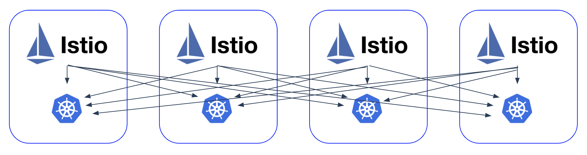

Istio Endpoint Discovery Service (EDS) requires each Istio control plane to have access to the Kubernetes API server of each cluster. There are some security concerns with this approach, but it also means that an Istio control plane can’t start if it’s not able to contact one of the clusters.

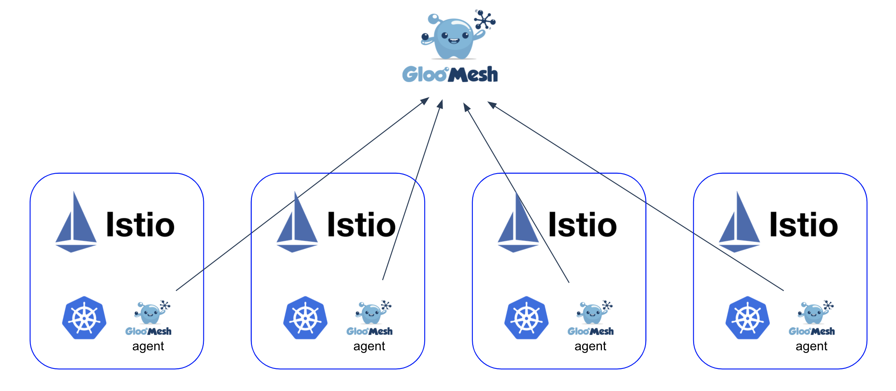

Gloo Mesh is solving these problems. An agent running on each cluster is watching the local Kubernetes API server and passes the information to the Gloo Mesh management plane through a secured gRPC channel. Gloo Mesh is then telling the agents to create the Istio ServiceEntries corresponding to the workloads discovered on the other clusters.

### Observability

Gloo Mesh is also using these agents to consolidate all the metrics and access logs from the different clusters. Graphs can then be used to monitor all the communication happening globally.

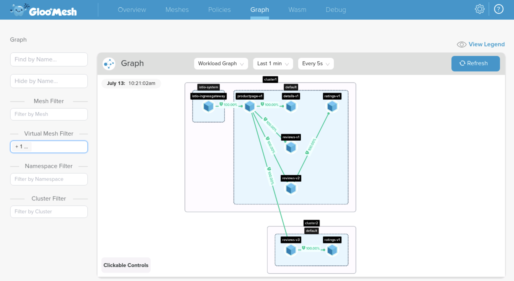

And you can view the access logs on demand:

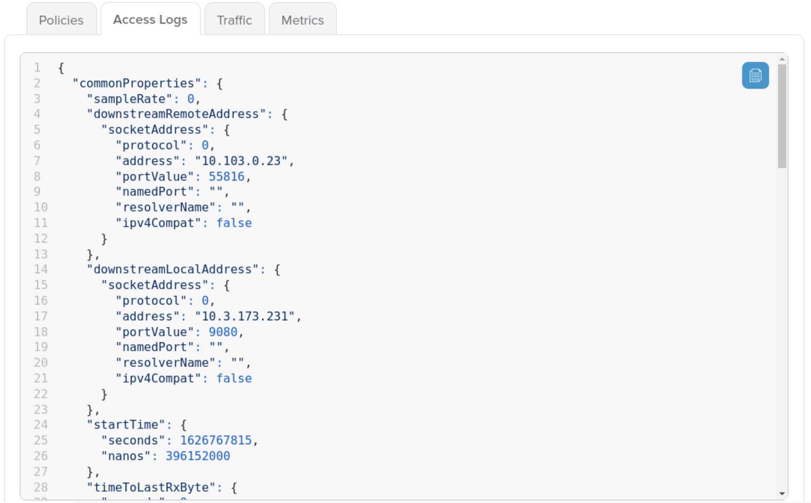

### Zero trust

Gloo Mesh makes it very easy for you to implement a zero-trust architecture where trust is established by the attributes of the connection/caller/environment and by default no communication is allowed.

You can then use Gloo Mesh **AccessPolicies**  to specify what services can talk together globally. Here is an example:

```
apiVersion: networking.mesh.gloo.solo.io/v1
kind: AccessPolicy
metadata:
  namespace: gloo-mesh
  name: reviews
spec:
  sourceSelector:
  - kubeServiceAccountRefs:
      serviceAccounts:
        - name: bookinfo-reviews
          namespace: default
          clusterName: cluster1
        - name: bookinfo-reviews
          namespace: default
          clusterName: cluster2
  destinationSelector:
  - kubeServiceMatcher:
      namespaces:
      - default
      labels:
        service: ratings
```

Gloo Mesh **AccessPolicies** are translating into Istio **AuthorizationPolicies** in the different clusters.

And what makes Gloo Mesh really unique is that you can then go to the UI and check what are the services currently running that are matching the criterias defined in your policy:

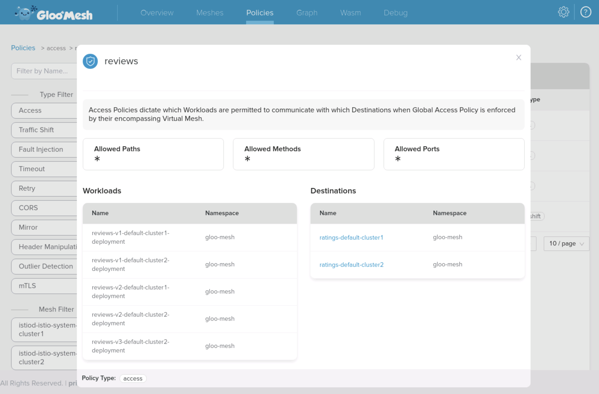

### Multi-cluster traffic and failover

Gloo Makes also provides an abstraction called **TrafficPolicies** that makes it very easy for you to define how services behave and interract globally. Here is an example:

```
apiVersion: networking.mesh.gloo.solo.io/v1
kind: TrafficPolicy
metadata:
  namespace: gloo-mesh
  name: simple
spec:
  sourceSelector:
  - kubeWorkloadMatcher:
      namespaces:
      - default
  destinationSelector:
  - kubeServiceRefs:
      services:
        - clusterName: cluster1
          name: reviews
          namespace: default
  policy:
    trafficShift:
      destinations:
        - kubeService:
            clusterName: cluster2
            name: reviews
            namespace: default
            subset:
              version: v3
          weight: 75
        - kubeService:
            clusterName: cluster1
            name: reviews
            namespace: default
            subset:
              version: v1
          weight: 15
        - kubeService:
            clusterName: cluster1
            name: reviews
            namespace: default
            subset:
              version: v2
          weight: 10
```

Gloo Mesh **TrafficPolicies** are translating into Istio **VirtualServices** and **DestinationRules** in the different clusters.

Providing high-availability of applications across clusters, zones, and regions can be a significant challenge. Ideally, source traffic should be routed to the closest available destination, or be routed to a failover destination if issues occur.

Gloo Mesh **VirtualDestinations** are providing this capability. Here is an example:

```
apiVersion: networking.enterprise.mesh.gloo.solo.io/v1beta1
kind: VirtualDestination
metadata:
  name: reviews-global
  namespace: gloo-mesh
spec:
  hostname: reviews.global
  port:
    number: 9080
    protocol: http
  localized:
    outlierDetection:
      consecutiveErrors: 2
      maxEjectionPercent: 100
      interval: 5s
      baseEjectionTime: 30s
    destinationSelectors:
    - kubeServiceMatcher:
        labels:
          app: reviews
  virtualMesh:
    name: virtual-mesh
    namespace: gloo-mesh
```

Gloo Mesh **VirtualDestinations** are translating into Istio ** DestinationRules** and **ServiceEntries** in the different clusters.

### RBAC

Gloo Mesh is simplifying the way users consume the Service Mesh globally by providing all the abstractions described previously (**AccessPolicies**, **TrafficPolicies**, ...).

But using the Gloo Mesh objects has another benefit. You can now define Gloo Mesh roles that are very fine grained.

Here are a few examples about what you can do with Gloo Mesh RBAC:

- Create a role to allow a user to use a specific Virtual Mesh
- Create a role to allow a user to use a specific cluster in a Virtual Mesh
- Create a role to allow a user to only define Access Policies
- Create a role to allow a user to only define Traffic Policies
- Create a role to allow a user to only define Failover Services
- Create a role to allow a user to only create policies that target the services running in his namespace (but coming from services in any namespace) 

One common use case is to create a role corresponding to a global namespace admin.

### Gloo Mesh Gateway

Using the Istio Ingress Gateway provides many benefits, like the ability to configure a traffic shift for both north-south and easy-west traffic or to leverage the Istio `ServiceEntries`.

But the Istio Ingress Gateway doesn't provide all the capabilities that are usually available in a proper API Gateway (authentication with OAuth, authorization with OPA, rate limiting, ...).

You can configure an API Gateway like Gloo Edge to securely expose some applications running in the Mesh, but you lose some of the advantages of the Istio Ingress Gateway in that case.

Gloo Mesh Gateway provides the best of both world.

It leverages the simplicity of the Gloo Mesh API and the capabilities of Gloo Edge, to enhance the Istio Ingress Gateway.

Gloo Mesh objects called `VirtualGateways`, `VirtualHosts` and `RouteTables` are created by users and translated by Gloo Mesh into Istio `VirtualService`, `DestinationRules` and `EnvoyFilters`.

### Gloo Mesh objects

Here is a representation of the most important Gloo Mesh objects and how they interract together.

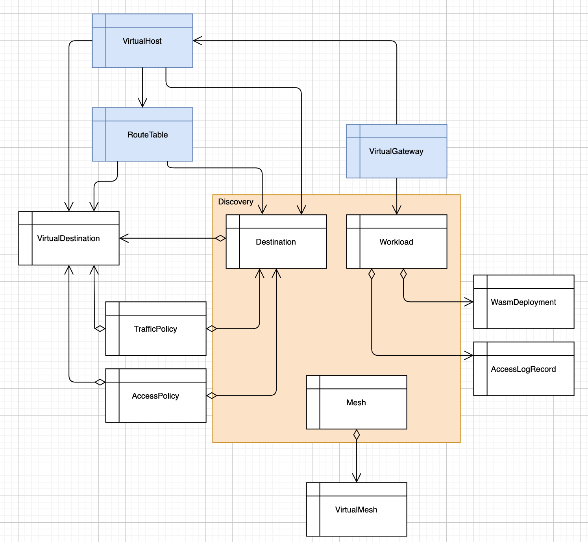

### Want to learn more about Gloo Mesh

You can find more information about Gloo Mesh in the official documentation:

[https://docs.solo.io/gloo-mesh/latest/](https://docs.solo.io/gloo-mesh/latest/)


## Lab 1 - Deploy KinD clusters <a name="Lab-1"></a>

Set the context environment variables:

```bash
export MGMT=mgmt
export CLUSTER1=cluster1
export CLUSTER2=cluster2
```

> Note that in case you can't have a Kubernetes cluster dedicated for the management plane, you would set the variables like that:
> ```
> export MGMT=cluster1
> export CLUSTER1=cluster1
> export CLUSTER2=cluster2
> ```

From the terminal go to the `/home/solo/workshops/gloo-mesh` directory:

```
cd /home/solo/workshops/gloo-mesh
```

Run the following commands to deploy three Kubernetes clusters using [Kind](https://kind.sigs.k8s.io/):
    

```bash
./scripts/deploy.sh 1 mgmt
./scripts/deploy.sh 2 cluster1 us-west us-west-1
./scripts/deploy.sh 3 cluster2 us-west us-west-2
```

Then run the following commands to wait for all the Pods to be ready:

```bash
./scripts/check.sh mgmt
./scripts/check.sh cluster1 
./scripts/check.sh cluster2 
```

**Note:** If you run the `check.sh` script immediately after the `deploy.sh` script, you may see a jsonpath error. If that happens, simply wait a few seconds and try again.

Once the `check.sh` script completes, when you execute the `kubectl get pods -A` command, you should see the following:

```
NAMESPACE            NAME                                          READY   STATUS    RESTARTS   AGE
kube-system          calico-kube-controllers-59d85c5c84-sbk4k      1/1     Running   0          4h26m
kube-system          calico-node-przxs                             1/1     Running   0          4h26m
kube-system          coredns-6955765f44-ln8f5                      1/1     Running   0          4h26m
kube-system          coredns-6955765f44-s7xxx                      1/1     Running   0          4h26m
kube-system          etcd-cluster1-control-plane                   1/1     Running   0          4h27m
kube-system          kube-apiserver-cluster1-control-plane         1/1     Running   0          4h27m
kube-system          kube-controller-manager-cluster1-control-plane1/1     Running   0          4h27m
kube-system          kube-proxy-ksvzw                              1/1     Running   0          4h26m
kube-system          kube-scheduler-cluster1-control-plane         1/1     Running   0          4h27m
local-path-storage   local-path-provisioner-58f6947c7-lfmdx        1/1     Running   0          4h26m
metallb-system       controller-5c9894b5cd-cn9x2                   1/1     Running   0          4h26m
metallb-system       speaker-d7jkp                                 1/1     Running   0          4h26m
```

Note that this represents the output just for `cluster2`, although the pod footprint for all three clusters should look similar at this point.

You can see that your currently connected to this cluster by executing the `kubectl config get-contexts` command:

```
CURRENT   NAME         CLUSTER         AUTHINFO   NAMESPACE  
          cluster1     kind-cluster1   cluster1
*         cluster2     kind-cluster2   cluster2
          mgmt         kind-mgmt       kind-mgmt 
```

Run the following command to make `mgmt` the current cluster.

```bash
kubectl config use-context ${MGMT}
```


## Lab 2 - Deploy and register Gloo Mesh <a name="Lab-2"></a>

	First of all, you need to install the *meshctl* CLI:


```bash
export GLOO_MESH_VERSION=v1.2.3
curl -sL https://run.solo.io/meshctl/install | sh -
export PATH=$HOME/.gloo-mesh/bin:$PATH
```

<!--bash
cat <<'EOF' > ./test.js
const chaiExec = require("@jsdevtools/chai-exec");
var chai = require('chai');
var expect = chai.expect;
chai.use(chaiExec);

describe("Check meshctl version", () => {

  it("GLOO_MESH_VERSION environment variable exists", () => {
    expect(process.env.GLOO_MESH_VERSION).to.not.be.empty;
    expect(process.env.GLOO_MESH_VERSION).to.be.a('string').and.satisfy(msg => msg.startsWith('v'));
  });

  it("cli version matches the required version: " + process.env.GLOO_MESH_VERSION, () => {
    let cli = chaiExec('meshctl version');
    expect(cli).to.exit.with.code(0);
    expect(cli).stdout.to.contain('"version": "' + process.env.GLOO_MESH_VERSION.substring(1) + '"');
    expect(cli).stderr.to.be.empty;
  });
});
EOF
mocha ./test.js --retries=500 2> /dev/null
-->

Gloo Mesh Enterprise is adding unique features on top of Gloo Mesh Open Source (RBAC, UI, WASM, ...).

Run the following commands to deploy Gloo Mesh Enterprise:


<!--bash
cat <<'EOF' > ./test.js
var chai = require('chai');
var expect = chai.expect;

describe("Required environment variables should contain value", () => {
  afterEach(function(done){
    if(this.currentTest.currentRetry() > 0){
      process.stdout.write(".");
       setTimeout(done, 1000);
    } else {
      done();
    }
  });

  it("Context environment variables should not be empty", () => {
    expect(process.env.MGMT).to.not.be.empty
    expect(process.env.CLUSTER1).to.not.be.empty
    expect(process.env.CLUSTER2).to.not.be.empty
  });

  it("Gloo Mesh licence environment variables should not be empty", () => {
    expect(process.env.GLOO_MESH_LICENSE_KEY).to.not.be.empty
  });
});
EOF
mocha ./test.js --retries=500 2> /dev/null
-->

```bash
helm repo add gloo-mesh-enterprise https://storage.googleapis.com/gloo-mesh-enterprise/gloo-mesh-enterprise 
helm repo update
kubectl --context ${MGMT} create ns gloo-mesh 
helm upgrade --install gloo-mesh-enterprise gloo-mesh-enterprise/gloo-mesh-enterprise \
--namespace gloo-mesh --kube-context ${MGMT} \
--version=1.2.3 \
--set rbac-webhook.enabled=true \
--set licenseKey=${GLOO_MESH_LICENSE_KEY} \
--set "rbac-webhook.adminSubjects[0].kind=Group" \
--set "rbac-webhook.adminSubjects[0].name=system:masters"
kubectl --context ${MGMT} -n gloo-mesh rollout status deploy/enterprise-networking
```


Then, you need to set the environment variable for the service of the Gloo Mesh Enterprise networking component:

<!--bash
cat <<'EOF' > ./test.js
const chaiExec = require("@jsdevtools/chai-exec");
var chai = require('chai');
var expect = chai.expect;
chai.use(chaiExec);

describe("Retrieve enterprise-networking ip", () => {
  it("A value for load-balancing has been assigned", () => {
    let cli = chaiExec("kubectl --context " + process.env.MGMT + " -n gloo-mesh get svc enterprise-networking -o jsonpath='{.status.loadBalancer}'");
    expect(cli).to.exit.with.code(0);
    expect(cli).output.to.contain('"ingress"');
  });
});
EOF
mocha ./test.js --retries=500 2> /dev/null
-->

```bash
export ENDPOINT_GLOO_MESH=$(kubectl --context ${MGMT} -n gloo-mesh get svc enterprise-networking -o jsonpath='{.status.loadBalancer.ingress[0].*}'):9900
export HOST_GLOO_MESH=$(echo ${ENDPOINT_GLOO_MESH} | cut -d: -f1)
```

<!--bash
cat <<'EOF' > ./test.js
const dns = require('dns');
const chaiHttp = require("chai-http");
const chai = require("chai");
const expect = chai.expect;
chai.use(chaiHttp);
const { waitOnFailedTest } = require('./tests/utils');

afterEach(function(done) { waitOnFailedTest(done, this.currentTest.currentRetry())});

describe("Address '" + process.env.HOST_GLOO_MESH + "' can be resolved in DNS", () => {
    it(process.env.HOST_GLOO_MESH + ' can be resolved', (done) => {
        return dns.lookup(process.env.HOST_GLOO_MESH, (err, address, family) => {
            expect(address).to.be.an.ip;
            done();
        });
    });
});
EOF
mocha ./test.js --retries=500 2> /dev/null
-->

Finally, you need to register the two other clusters:

```bash
meshctl cluster register --mgmt-context=${MGMT} --remote-context=${CLUSTER1} --relay-server-address=${ENDPOINT_GLOO_MESH} enterprise cluster1 --cluster-domain cluster.local
meshctl cluster register --mgmt-context=${MGMT} --remote-context=${CLUSTER2} --relay-server-address=${ENDPOINT_GLOO_MESH} enterprise cluster2 --cluster-domain cluster.local
```

You can list the registered cluster using the following command:

```
kubectl --context ${MGMT} get kubernetescluster -n gloo-mesh
```

You should get the following output:

```
NAME       AGE
cluster1   27s
cluster2   23s
```

<!--bash
cat <<'EOF' > ./test.js
const chaiExec = require("@jsdevtools/chai-exec");
var chai = require('chai');
var expect = chai.expect;
chai.use(chaiExec);

var cluster1Name = "cluster1";
var cluster2Name = "cluster2";

describe("Cluster registration", () => {
  it(cluster1Name + ' and ' + cluster2Name + ' should be registered', () => {
    let cli = chaiExec("kubectl --context " + process.env.MGMT + " get kubernetescluster -A -o jsonpath='{.items..name}'");

    expect(cli).to.exit.with.code(0);
    expect(cli).stdout.to.contain(cluster1Name + " " + cluster2Name);
    expect(cli).stderr.to.be.empty;
  });
});
EOF
mocha ./test.js --retries=500 2> /dev/null
-->

> ### Note that you can also register the remote clusters with Helm. refer to docs.solo.io for details.


To use the Gloo Mesh Gateway advanced features, you need to install the Gloo Mesh addons.

First, you need to create a namespace for the addons, with Istio injection enabled:

```bash
kubectl --context ${CLUSTER1} create namespace gloo-mesh-addons
kubectl --context ${CLUSTER1} label namespace gloo-mesh-addons istio-injection=enabled
kubectl --context ${CLUSTER2} create namespace gloo-mesh-addons
kubectl --context ${CLUSTER2} label namespace gloo-mesh-addons istio-injection=enabled
```

Then, you can deploy the addons using Helm:

```bash
helm repo add enterprise-agent https://storage.googleapis.com/gloo-mesh-enterprise/enterprise-agent
helm repo update

helm upgrade --install enterprise-agent-addons enterprise-agent/enterprise-agent \
  --kube-context=${CLUSTER1} \
  --version=1.2.3 \
  --namespace gloo-mesh-addons \
  --set enterpriseAgent.enabled=false \
  --set rate-limiter.enabled=true \
  --set ext-auth-service.enabled=true

helm upgrade --install enterprise-agent-addons enterprise-agent/enterprise-agent \
  --kube-context=${CLUSTER2} \
  --version=1.2.3 \
  --namespace gloo-mesh-addons \
  --set enterpriseAgent.enabled=false \
  --set rate-limiter.enabled=true \
  --set ext-auth-service.enabled=true
```

Finally, we need to create an `AccessPolicy` for the Istio Ingress Gateways to communicate with the addons and for the addons to communicate together:

```bash
kubectl apply --context ${MGMT} -f- <<EOF
apiVersion: networking.mesh.gloo.solo.io/v1
kind: AccessPolicy
metadata:
  namespace: gloo-mesh
  name: gloo-mesh-addons
spec:
  sourceSelector:
  - kubeServiceAccountRefs:
      serviceAccounts:
        - name: istio-ingressgateway-service-account
          namespace: istio-system
          clusterName: cluster1
        - name: istio-ingressgateway-service-account
          namespace: istio-system
          clusterName: cluster2
  - kubeIdentityMatcher:
      namespaces:
      - gloo-mesh-addons
  destinationSelector:
  - kubeServiceMatcher:
      namespaces:
      - gloo-mesh-addons
EOF
```


## Lab 3 - Deploy Istio <a name="Lab-3"></a>


Download istio 1.11.4:

```bash
export ISTIO_VERSION=1.11.4
curl -L https://istio.io/downloadIstio | sh -
```

<!--bash
cat <<'EOF' > ./test.js
const chaiExec = require("@jsdevtools/chai-exec");
var chai = require('chai');
var expect = chai.expect;
chai.use(chaiExec);

describe("istoctl version", () => {
  it("version should be correct", () => {
    let cli = chaiExec('./istio-' + process.env.ISTIO_VERSION + '/bin/istioctl version --remote=false');

    expect(cli).to.exit.with.code(0);
    expect(cli).stdout.to.contain(process.env.ISTIO_VERSION);
    expect(cli).stderr.to.be.empty;
  });
});
EOF
mocha ./test.js --retries=500 2> /dev/null
-->

Now let's deploy Istio on the first cluster:

```bash
kubectl --context ${CLUSTER1} create ns istio-system
cat << EOF | ./istio-1.11.4/bin/istioctl --context ${CLUSTER1} install -y -f -
apiVersion: install.istio.io/v1alpha1
kind: IstioOperator
metadata:
  name: istiocontrolplane-default
  namespace: istio-system
spec:
  profile: default
  meshConfig:
    trustDomain: cluster1
    accessLogFile: /dev/stdout
    enableAutoMtls: true
    defaultConfig:
      envoyMetricsService:
        address: enterprise-agent.gloo-mesh:9977
      envoyAccessLogService:
        address: enterprise-agent.gloo-mesh:9977
      proxyMetadata:
        ISTIO_META_DNS_CAPTURE: "true"
        ISTIO_META_DNS_AUTO_ALLOCATE: "true"
        GLOO_MESH_CLUSTER_NAME: cluster1
  values:
    global:
      meshID: mesh1
      multiCluster:
        clusterName: cluster1
      network: network1
      meshNetworks:
        network1:
          endpoints:
          - fromRegistry: cluster1
          gateways:
          - registryServiceName: istio-ingressgateway.istio-system.svc.cluster.local
            port: 443
        vm-network:
  components:
    ingressGateways:
    - name: istio-ingressgateway
      label:
        topology.istio.io/network: network1
      enabled: true
      k8s:
        env:
          # sni-dnat adds the clusters required for AUTO_PASSTHROUGH mode
          - name: ISTIO_META_ROUTER_MODE
            value: "sni-dnat"
          # traffic through this gateway should be routed inside the network
          - name: ISTIO_META_REQUESTED_NETWORK_VIEW
            value: network1
        service:
          ports:
            - name: http2
              port: 80
              targetPort: 8080
            - name: https
              port: 443
              targetPort: 8443
            - name: tcp-status-port
              port: 15021
              targetPort: 15021
            - name: tls
              port: 15443
              targetPort: 15443
            - name: tcp-istiod
              port: 15012
              targetPort: 15012
            - name: tcp-webhook
              port: 15017
              targetPort: 15017
    pilot:
      k8s:
        env:
          - name: PILOT_SKIP_VALIDATE_TRUST_DOMAIN
            value: "true"

EOF
```

And deploy Istio on the second cluster:

```bash

kubectl --context ${CLUSTER2} create ns istio-system
cat << EOF | ./istio-1.11.4/bin/istioctl --context ${CLUSTER2} install -y -f -
apiVersion: install.istio.io/v1alpha1
kind: IstioOperator
metadata:
  name: istiocontrolplane-default
  namespace: istio-system
spec:
  profile: default
  meshConfig:
    trustDomain: cluster2
    accessLogFile: /dev/stdout
    enableAutoMtls: true
    defaultConfig:
      envoyMetricsService:
        address: enterprise-agent.gloo-mesh:9977
      envoyAccessLogService:
        address: enterprise-agent.gloo-mesh:9977
      proxyMetadata:
        ISTIO_META_DNS_CAPTURE: "true"
        ISTIO_META_DNS_AUTO_ALLOCATE: "true"
        GLOO_MESH_CLUSTER_NAME: cluster2
  values:
    global:
      meshID: mesh1
      multiCluster:
        clusterName: cluster2
      network: network1
      meshNetworks:
        network1:
          endpoints:
          - fromRegistry: cluster2
          gateways:
          - registryServiceName: istio-ingressgateway.istio-system.svc.cluster.local
            port: 443
        vm-network:
  components:
    ingressGateways:
    - name: istio-ingressgateway
      label:
        topology.istio.io/network: network1
      enabled: true
      k8s:
        env:
          # sni-dnat adds the clusters required for AUTO_PASSTHROUGH mode
          - name: ISTIO_META_ROUTER_MODE
            value: "sni-dnat"
          # traffic through this gateway should be routed inside the network
          - name: ISTIO_META_REQUESTED_NETWORK_VIEW
            value: network1
        service:
          ports:
            - name: http2
              port: 80
              targetPort: 8080
            - name: https
              port: 443
              targetPort: 8443
            - name: tcp-status-port
              port: 15021
              targetPort: 15021
            - name: tls
              port: 15443
              targetPort: 15443
            - name: tcp-istiod
              port: 15012
              targetPort: 15012
            - name: tcp-webhook
              port: 15017
              targetPort: 15017
    pilot:
      k8s:
        env:
          - name: PILOT_SKIP_VALIDATE_TRUST_DOMAIN
            value: "true"

EOF
```

<!--bash
cat <<'EOF' > ./test.js
const chaiExec = require("@jsdevtools/chai-exec");
var chai = require('chai');
var expect = chai.expect;
chai.use(chaiExec);

describe("Istio installation", function() {
  it('Istiod is deployed in the clusters ' + process.env.CLUSTER1, function () {
    let command = "kubectl --context " + process.env.CLUSTER1 + " -n istio-system rollout status deployment istiod"
    let cli = chaiExec(command);
    expect(cli).to.exit.with.code(0);
    expect(cli).output.to.contain("successfully rolled out");
  })


  it('Istiod is deployed in ' + process.env.CLUSTER2, function () {
    let command = "kubectl --context " + process.env.CLUSTER2 + " -n istio-system rollout status deployment istiod"
    let cli = chaiExec(command);
    expect(cli).to.exit.with.code(0);
    expect(cli).output.to.contain("successfully rolled out");
  })
  

  it('All the Istio pods to become ready in cluster: ' + process.env.CLUSTER1 +'.', function () {
    let command = "kubectl --context " + process.env.CLUSTER1 + " -n istio-system get pods -o jsonpath='{range .items[*].status.containerStatuses[*]}{.ready}{\"\\\\n\"}{end}'"
    let cli = chaiExec(command);
    expect(cli).to.exit.with.code(0);
    let count = (cli.output.match(/true/g) || []).length;
    expect(count).greaterThan(0);
    expect(cli).output.to.not.contain("false");
  })


  it('All the Istio pods to become ready in cluster: ' + process.env.CLUSTER2 +'.', function () {
    let command = "kubectl --context " + process.env.CLUSTER2 + " -n istio-system get pods -o jsonpath='{range .items[*].status.containerStatuses[*]}{.ready}{\"\\\\n\"}{end}'"
    let cli = chaiExec(command);
    expect(cli).to.exit.with.code(0);
    let count = (cli.output.match(/true/g) || []).length;
    expect(count).greaterThan(0);
    expect(cli).output.to.not.contain("false");
  })

  describe("Ingress gateway has an ip attached in cluster: " + process.env.CLUSTER1, () => {
    it("A value for load-balancing has been assigned", () => {
      let cli = chaiExec("kubectl --context " + process.env.CLUSTER1 + " -n istio-system get svc istio-ingressgateway  -o jsonpath='{.status.loadBalancer}'");
      expect(cli).to.exit.with.code(0);
      expect(cli).output.to.contain('"ingress"');
    });
  });

  describe("Ingress gateway has an ip attached in cluster: " + process.env.CLUSTER2, () => {
    it("A value for load-balancing has been assigned", () => {
      let cli = chaiExec("kubectl --context " + process.env.CLUSTER2 + " -n istio-system get svc istio-ingressgateway  -o jsonpath='{.status.loadBalancer}'");
      expect(cli).to.exit.with.code(0);
      expect(cli).output.to.contain('"ingress"');
    });
  });
});
EOF
mocha ./test.js --retries=500 2> /dev/null
-->

Run the following command until all the Istio Pods are ready:

```
kubectl --context ${CLUSTER1} get pods -n istio-system
```

When they are ready, you should get this output:

```
NAME                                    READY   STATUS    RESTARTS   AGE
istio-ingressgateway-5c7759c8cb-52r2j   1/1     Running   0          22s
istiod-7884b57b4c-rvr2c                 1/1     Running   0          30s
```

Check the status on the second cluster using

```bash
kubectl --context ${CLUSTER2} get pods -n istio-system
```

Set the environment variable for the service of the Istio Ingress Gateway of cluster1:

```bash
export ENDPOINT_HTTP_GW_CLUSTER1=$(kubectl --context ${CLUSTER1} -n istio-system get svc istio-ingressgateway -o jsonpath='{.status.loadBalancer.ingress[0].*}'):80
export ENDPOINT_HTTPS_GW_CLUSTER1=$(kubectl --context ${CLUSTER1} -n istio-system get svc istio-ingressgateway -o jsonpath='{.status.loadBalancer.ingress[0].*}'):443
export HOST_GW_CLUSTER1=$(echo ${ENDPOINT_HTTP_GW_CLUSTER1} | cut -d: -f1)
```
<!--bash
while ! kubectl --context ${CLUSTER1} -n istio-system get deploy/istiod; do sleep 1; done
while ! kubectl --context ${CLUSTER2} -n istio-system get deploy/istiod; do sleep 1; done
kubectl --context ${CLUSTER1} -n istio-system rollout status deploy/istiod
kubectl --context ${CLUSTER2} -n istio-system rollout status deploy/istiod
while ! kubectl --context ${CLUSTER1} -n istio-system get deploy/istio-ingressgateway; do sleep 1; done
while ! kubectl --context ${CLUSTER2} -n istio-system get deploy/istio-ingressgateway; do sleep 1; done
kubectl --context ${CLUSTER1} -n istio-system rollout status deploy/istio-ingressgateway
kubectl --context ${CLUSTER2} -n istio-system rollout status deploy/istio-ingressgateway
-->

<!--bash
cat <<'EOF' > ./test.js
const dns = require('dns');
const chaiHttp = require("chai-http");
const chai = require("chai");
const expect = chai.expect;
chai.use(chaiHttp);
const { waitOnFailedTest } = require('./tests/utils');

afterEach(function(done) { waitOnFailedTest(done, this.currentTest.currentRetry())});

describe("Address '" + process.env.HOST_GW_CLUSTER1 + "' can be resolved in DNS", () => {
    it(process.env.HOST_GW_CLUSTER1 + ' can be resolved', (done) => {
        return dns.lookup(process.env.HOST_GW_CLUSTER1, (err, address, family) => {
            expect(address).to.be.an.ip;
            done();
        });
    });
});
EOF
mocha ./test.js --retries=500 2> /dev/null
-->


## Lab 4 - Deploy the Bookinfo demo app <a name="Lab-4"></a>


Run the following commands to deploy the bookinfo app on `cluster1`:

```bash

bookinfo_yaml=https://raw.githubusercontent.com/istio/istio/1.11.4/samples/bookinfo/platform/kube/bookinfo.yaml
kubectl --context ${CLUSTER1} label namespace default istio-injection=enabled
# deploy bookinfo application components for all versions less than v3
kubectl --context ${CLUSTER1} apply -f ${bookinfo_yaml} -l 'app,version notin (v3)'
# deploy all bookinfo service accounts
kubectl --context ${CLUSTER1} apply -f ${bookinfo_yaml} -l 'account'
# configure ingress gateway to access bookinfo
kubectl --context ${CLUSTER1} apply -f https://raw.githubusercontent.com/istio/istio/1.11.4/samples/bookinfo/networking/bookinfo-gateway.yaml
```

You can check that the app is running using

```
kubectl --context ${CLUSTER1} get pods
```

```
NAME                              READY   STATUS    RESTARTS   AGE
details-v1-558b8b4b76-w9qp8       2/2     Running   0          2m33s
productpage-v1-6987489c74-54lvk   2/2     Running   0          2m34s
ratings-v1-7dc98c7588-pgsxv       2/2     Running   0          2m34s
reviews-v1-7f99cc4496-lwtsr       2/2     Running   0          2m34s
reviews-v2-7d79d5bd5d-mpsk2       2/2     Running   0          2m34s
```

As you can see, it deployed the `v1` and `v2` versions of the `reviews` microservice.  But as expected, it did not deploy `v3` of `reviews`.

Now, run the following commands to deploy the bookinfo app on `cluster2`:

```bash
kubectl --context ${CLUSTER2} label namespace default istio-injection=enabled
# deploy all bookinfo service accounts and application components for all versions
kubectl --context ${CLUSTER2} apply -f ${bookinfo_yaml}
# configure ingress gateway to access bookinfo
kubectl --context ${CLUSTER2} apply -f https://raw.githubusercontent.com/istio/istio/1.11.4/samples/bookinfo/networking/bookinfo-gateway.yaml
```

You can check that the app is running using:

```bash
kubectl --context ${CLUSTER2} get pods
```

```
NAME                              READY   STATUS    RESTARTS   AGE
details-v1-558b8b4b76-gs9z2       2/2     Running   0          2m22s
productpage-v1-6987489c74-x45vd   2/2     Running   0          2m21s
ratings-v1-7dc98c7588-2n6bg       2/2     Running   0          2m21s
reviews-v1-7f99cc4496-4r48m       2/2     Running   0          2m21s
reviews-v2-7d79d5bd5d-cx9lp       2/2     Running   0          2m22s
reviews-v3-7dbcdcbc56-trjdx       2/2     Running   0          2m22s
```
<!--bash
kubectl --context ${CLUSTER1} rollout status deploy/productpage-v1
kubectl --context ${CLUSTER1} rollout status deploy/details-v1
kubectl --context ${CLUSTER1} rollout status deploy/ratings-v1
kubectl --context ${CLUSTER1} rollout status deploy/reviews-v1
kubectl --context ${CLUSTER1} rollout status deploy/reviews-v2
kubectl --context ${CLUSTER2} rollout status deploy/productpage-v1
kubectl --context ${CLUSTER2} rollout status deploy/details-v1
kubectl --context ${CLUSTER2} rollout status deploy/ratings-v1
kubectl --context ${CLUSTER2} rollout status deploy/reviews-v1
kubectl --context ${CLUSTER2} rollout status deploy/reviews-v2
kubectl --context ${CLUSTER2} rollout status deploy/reviews-v3
-->
As you can see, it deployed all three versions of the `reviews` microservice.


Get the URL to access the `productpage` service from your web browser using the following command:
```
echo "http://${ENDPOINT_HTTP_GW_CLUSTER1}/productpage"
```


As you can see, you can access the Bookinfo demo app.

<!--bash
cat <<'EOF' > ./test.js
const helpers = require('./tests/chai-exec');

describe("Bookinfo app", () => {
  const clusters = [process.env.CLUSTER1, process.env.CLUSTER2];
  const deployments = ["productpage-v1", "ratings-v1", "details-v1", "reviews-v1", "reviews-v2"];
  const istioDeployments = ["istiod", "istio-ingressgateway"];
  clusters.forEach(cluster => {
    istioDeployments.forEach(deploy => {
      it(deploy + ' pods are ready in ' + cluster, () => helpers.checkDeployment({ context: cluster, namespace: "istio-system", k8sObj: deploy }));
    });
    deployments.forEach(deploy => {
      it(deploy + ' pods are ready in ' + cluster, () => helpers.checkDeployment({ context: cluster, namespace: "default", k8sObj: deploy }));
    });
  });
});
EOF
mocha ./test.js --retries=500 2> /dev/null
-->


## Lab 5 - Create the Virtual Mesh <a name="Lab-5"></a>

Gloo Mesh can help unify the root identity between multiple service mesh installations so any intermediates are signed by the same Root CA and end-to-end mTLS between clusters and services can be established correctly.

Run this command to see how the communication between microservices occurs currently:

```
kubectl --context ${CLUSTER1} exec -t deploy/reviews-v1 -c istio-proxy \
-- openssl s_client -showcerts -connect ratings:9080
```

<!--bash
cat <<'EOF' > ./test.js
const chaiExec = require("@jsdevtools/chai-exec");
var chai = require('chai');
var expect = chai.expect;
chai.use(chaiExec);

var expectedOutput = "No client certificate CA names sent";

describe("No certificate has been issued", () => {
  
  it('No certificate issued for ' + process.env.CLUSTER1, () => {
    let cli = chaiExec("kubectl --context " + process.env.CLUSTER1 + " exec -t deploy/reviews-v1 -c istio-proxy -- openssl s_client -showcerts -connect ratings:9080");

    expect(cli).stdout.to.contain(expectedOutput);
    expect(cli).stderr.to.not.be.empty;
  });

  it('No certificate issued for ' + process.env.CLUSTER2, () => {
    let cli = chaiExec("kubectl --context " + process.env.CLUSTER2 + " exec -t deploy/reviews-v1 -c istio-proxy -- openssl s_client -showcerts -connect ratings:9080");

    expect(cli).stdout.to.contain(expectedOutput);
    expect(cli).stderr.to.not.be.empty;
  });
});
EOF
mocha ./test.js --retries=500 2> /dev/null
-->

You should get something like that:

```
CONNECTED(00000005)
139706332271040:error:1408F10B:SSL routines:ssl3_get_record:wrong version number:../ssl/record/ssl3_record.c:332:
---
no peer certificate available
---
No client certificate CA names sent
---
SSL handshake has read 5 bytes and written 309 bytes
Verification: OK
---
New, (NONE), Cipher is (NONE)
Secure Renegotiation IS NOT supported
Compression: NONE
Expansion: NONE
No ALPN negotiated
Early data was not sent
Verify return code: 0 (ok)
---
command terminated with exit code 1
```

It means that the traffic is currently not encrypted.

Enable TLS on both clusters:

```bash
kubectl --context ${CLUSTER1} apply -f - <<EOF
apiVersion: "security.istio.io/v1beta1"
kind: "PeerAuthentication"
metadata:
  name: "default"
  namespace: "istio-system"
spec:
  mtls:
    mode: STRICT
EOF

kubectl --context ${CLUSTER2} apply -f - <<EOF
apiVersion: "security.istio.io/v1beta1"
kind: "PeerAuthentication"
metadata:
  name: "default"
  namespace: "istio-system"
spec:
  mtls:
    mode: STRICT
EOF
```

Run the command again:

```
kubectl --context ${CLUSTER1} exec -t deploy/reviews-v1 -c istio-proxy \
-- openssl s_client -showcerts -connect ratings:9080
```

Now, the output should be like that:

```
...
Certificate chain
 0 s:
   i:O = cluster1
-----BEGIN CERTIFICATE-----
MIIDFzCCAf+gAwIBAgIRALsoWlroVcCc1n+VROhATrcwDQYJKoZIhvcNAQELBQAw
...
BPiAYRMH5j0gyBqiZZEwCfzfQe1e6aAgie9T
-----END CERTIFICATE-----
 1 s:O = cluster1
   i:O = cluster1
-----BEGIN CERTIFICATE-----
MIICzjCCAbagAwIBAgIRAKIx2hzMbAYzM74OC4Lj1FUwDQYJKoZIhvcNAQELBQAw
...
uMTPjt7p/sv74fsLgrx8WMI0pVQ7+2plpjaiIZ8KvEK9ye/0Mx8uyzTG7bpmVVWo
ugY=
-----END CERTIFICATE-----
...
```

As you can see, mTLS is now enabled.

Now, run the same command on the second cluster:

```
kubectl --context ${CLUSTER2} exec -t deploy/reviews-v1 -c istio-proxy \
-- openssl s_client -showcerts -connect ratings:9080
```

The output should be like that:

```
...
Certificate chain
 0 s:
   i:O = cluster2
-----BEGIN CERTIFICATE-----
MIIDFzCCAf+gAwIBAgIRALo1dmnbbP0hs1G82iBa2oAwDQYJKoZIhvcNAQELBQAw
...
YvDrZfKNOKwFWKMKKhCSi2rmCvLKuXXQJGhy
-----END CERTIFICATE-----
 1 s:O = cluster2
   i:O = cluster2
-----BEGIN CERTIFICATE-----
MIICzjCCAbagAwIBAgIRAIjegnzq/hN/NbMm3dmllnYwDQYJKoZIhvcNAQELBQAw
...
GZRM4zV9BopZg745Tdk2LVoHiBR536QxQv/0h1P0CdN9hNLklAhGN/Yf9SbDgLTw
6Sk=
-----END CERTIFICATE-----
...
```

<!--bash
cat <<'EOF' > ./test.js
const chaiExec = require("@jsdevtools/chai-exec");
var chai = require('chai');
var expect = chai.expect;
chai.use(chaiExec);

describe("Certificate issued by Istio", () => {
  var cluster1Name = "cluster1";
  var cluster2Name = "cluster2";

  it(cluster1Name + ' is the organization for ' + process.env.CLUSTER1, () => {
    let cli = chaiExec("kubectl --context " + process.env.CLUSTER1 + " exec -t deploy/reviews-v1 -c istio-proxy -- openssl s_client -showcerts -connect ratings:9080");

    expect(cli).stdout.to.contain("i:O = " + cluster1Name);
    expect(cli).stderr.to.not.be.empty;
  });

  it(cluster2Name + ' is the organization for ' + process.env.CLUSTER2, () => {
    let cli = chaiExec("kubectl --context " + process.env.CLUSTER2 + " exec -t deploy/reviews-v1 -c istio-proxy -- openssl s_client -showcerts -connect ratings:9080");

    expect(cli).stdout.to.contain("i:O = " + cluster2Name);
    expect(cli).stderr.to.not.be.empty;
  });
});
EOF
mocha ./test.js --retries=500 2> /dev/null
-->

The first certificate in the chain is the certificate of the workload and the second one is the Istio CA’s signing (CA) certificate.

As you can see, the Istio CA’s signing (CA) certificates are different in the 2 clusters, so one cluster can't validate certificates issued by the other cluster.

Creating a Virtual Mesh will unify these two CAs with a common root identity.

Run the following command to create the *Virtual Mesh*:


```bash
cat << EOF | kubectl --context ${MGMT} apply -f -
apiVersion: networking.mesh.gloo.solo.io/v1
kind: VirtualMesh
metadata:
  name: virtual-mesh
  namespace: gloo-mesh
spec:
  mtlsConfig:
    autoRestartPods: true
    shared:
      rootCertificateAuthority:
        generated: {}
  federation:
    selectors:
    - {}
  meshes:
  - name: istiod-istio-system-cluster1
    namespace: gloo-mesh
  - name: istiod-istio-system-cluster2
    namespace: gloo-mesh
EOF
```

When we create the VirtualMesh and set the trust model to shared, Gloo Mesh will kick off the process of unifying identities under a shared root.

First, Gloo Mesh will create the Root CA.

Then, Gloo Mesh will use the Certificate Request Agent on each of the clusters to create a new key/cert pair that will form an intermediate CA used by the mesh on that cluster. It will then create a Certificate Request (CR).


Gloo Mesh will then sign the intermediate certificates with the Root CA. 

At that point, we want Istio to pick up the new intermediate CA and start using that for its workloads. To do that Gloo Mesh creates a Kubernetes secret called `cacerts` in the `istio-system` namespace.

You can have a look at the Istio documentation [here](https://istio.io/latest/docs/tasks/security/cert-management/plugin-ca-cert/#plugging-in-existing-certificates-and-key) if you want to get more information about this process.

Check that the secret containing the new Istio CA has been created in the istio namespace, on the first cluster:

```
kubectl --context ${CLUSTER1} get secret -n istio-system cacerts -o yaml
```

Here is the expected output:

```
apiVersion: v1
data:
  ca-cert.pem: LS0tLS1CRUdJTiBDRVJUSUZJQ0FURS0tLS0tCk1JSUZFRENDQXZpZ0F3SUJBZ0lRUG5kRDkwejN4dytYeTBzYzNmcjRmekFOQmdrcWhraUc5dzBCQVFzRkFEQWIKTVJrd0Z3WURWU...
  jFWVlZtSWl3Si8va0NnNGVzWTkvZXdxSGlTMFByWDJmSDVDCmhrWnQ4dz09Ci0tLS0tRU5EIENFUlRJRklDQVRFLS0tLS0K
  ca-key.pem: LS0tLS1CRUdJTiBSU0EgUFJJVkFURSBLRVktLS0tLQpNSUlKS0FJQkFBS0NBZ0VBczh6U0ZWcEFxeVNodXpMaHVXUlNFMEJJMXVwbnNBc3VnNjE2TzlKdzBlTmhhc3RtClUvZERZS...
  DT2t1bzBhdTFhb1VsS1NucldpL3kyYUtKbz0KLS0tLS1FTkQgUlNBIFBSSVZBVEUgS0VZLS0tLS0K
  cert-chain.pem: LS0tLS1CRUdJTiBDRVJUSUZJQ0FURS0tLS0tCk1JSUZFRENDQXZpZ0F3SUJBZ0lRUG5kRDkwejN4dytYeTBzYzNmcjRmekFOQmdrcWhraUc5dzBCQVFzRkFEQWIKTVJrd0Z3WURWU...
  RBTHpzQUp2ZzFLRUR4T2QwT1JHZFhFbU9CZDBVUDk0KzJCN0tjM2tkNwpzNHYycEV2YVlnPT0KLS0tLS1FTkQgQ0VSVElGSUNBVEUtLS0tLQo=
  key.pem: ""
  root-cert.pem: LS0tLS1CRUdJTiBDRVJUSUZJQ0FURS0tLS0tCk1JSUU0ekNDQXN1Z0F3SUJBZ0lRT2lZbXFGdTF6Q3NzR0RFQ3JOdnBMakFOQmdrcWhraUc5dzBCQVFzRkFEQWIKTVJrd0Z3WURWU...
  UNBVEUtLS0tLQo=
kind: Secret
metadata:
  labels:
    agent.certificates.mesh.gloo.solo.io: gloo-mesh
    cluster.multicluster.solo.io: ""
  name: cacerts
  namespace: istio-system
type: certificates.mesh.gloo.solo.io/issued_certificate
```

Same operation on the second cluster:

```
kubectl --context ${CLUSTER2} get secret -n istio-system cacerts -o yaml
```

Here is the expected output:

```
apiVersion: v1
data:
  ca-cert.pem: LS0tLS1CRUdJTiBDRVJUSUZJQ0FURS0tLS0tCk1JSUZFRENDQXZpZ0F3SUJBZ0lRWXE1V29iWFhGM1gwTjlNL3BYYkNKekFOQmdrcWhraUc5dzBCQVFzRkFEQWIKTVJrd0Z3WURWU...
  XpqQ1RtK2QwNm9YaDI2d1JPSjdQTlNJOTkrR29KUHEraXltCkZIekhVdz09Ci0tLS0tRU5EIENFUlRJRklDQVRFLS0tLS0K
  ca-key.pem: LS0tLS1CRUdJTiBSU0EgUFJJVkFURSBLRVktLS0tLQpNSUlKS1FJQkFBS0NBZ0VBMGJPMTdSRklNTnh4K1lMUkEwcFJqRmRvbG1SdW9Oc3gxNUUvb3BMQ1l1RjFwUEptCndhR1U1V...
  MNU9JWk5ObDA4dUE1aE1Ca2gxNCtPKy9HMkoKLS0tLS1FTkQgUlNBIFBSSVZBVEUgS0VZLS0tLS0K
  cert-chain.pem: LS0tLS1CRUdJTiBDRVJUSUZJQ0FURS0tLS0tCk1JSUZFRENDQXZpZ0F3SUJBZ0lRWXE1V29iWFhGM1gwTjlNL3BYYkNKekFOQmdrcWhraUc5dzBCQVFzRkFEQWIKTVJrd0Z3WURWU...
  RBTHpzQUp2ZzFLRUR4T2QwT1JHZFhFbU9CZDBVUDk0KzJCN0tjM2tkNwpzNHYycEV2YVlnPT0KLS0tLS1FTkQgQ0VSVElGSUNBVEUtLS0tLQo=
  key.pem: ""
  root-cert.pem: LS0tLS1CRUdJTiBDRVJUSUZJQ0FURS0tLS0tCk1JSUU0ekNDQXN1Z0F3SUJBZ0lRT2lZbXFGdTF6Q3NzR0RFQ3JOdnBMakFOQmdrcWhraUc5dzBCQVFzRkFEQWIKTVJrd0Z3WURWU...
  UNBVEUtLS0tLQo=
kind: Secret
metadata:
  labels:
    agent.certificates.mesh.gloo.solo.io: gloo-mesh
    cluster.multicluster.solo.io: ""
  name: cacerts
  namespace: istio-system
type: certificates.mesh.gloo.solo.io/issued_certificate
```

As you can see, the secrets contain the same Root CA (base64 encoded), but different intermediate certs.

Have a look at the `VirtualMesh` object we've just created and notice the `autoRestartPods: true` in the `mtlsConfig`. This instructs Gloo Mesh to restart the Istio pods in the relevant clusters.

This is due to a limitation of Istio. The Istio control plane picks up the CA for Citadel and does not rotate it often enough.

<!--bash
printf "\nWaiting until the secret is created in $CLUSTER1"
until kubectl --context ${CLUSTER1} get secret -n istio-system cacerts &>/dev/null
do
  printf "%s" "."
  sleep 1
done
printf "\n"

printf "\nWaiting until the secret is created in $CLUSTER2"
until kubectl --context ${CLUSTER2} get secret -n istio-system cacerts &>/dev/null
do
  printf "%s" "."
  sleep 1
done
printf "\n"
-->
Now, let's check what certificates we get when we run the same commands we ran before we created the Virtual Mesh:

```
kubectl --context ${CLUSTER1} exec -t deploy/reviews-v1 -c istio-proxy \
-- openssl s_client -showcerts -connect ratings:9080
```

The output should be like that:

```
...
Certificate chain
 0 s:
   i:
-----BEGIN CERTIFICATE-----
MIIEBzCCAe+gAwIBAgIRAK1yjsFkisSjNqm5tzmKQS8wDQYJKoZIhvcNAQELBQAw
...
T77lFKXx0eGtDNtWm/1IPiOutIMlFz/olVuN
-----END CERTIFICATE-----
 1 s:
   i:O = gloo-mesh
-----BEGIN CERTIFICATE-----
MIIFEDCCAvigAwIBAgIQPndD90z3xw+Xy0sc3fr4fzANBgkqhkiG9w0BAQsFADAb
...
hkZt8w==
-----END CERTIFICATE-----
 2 s:O = gloo-mesh
   i:O = gloo-mesh
-----BEGIN CERTIFICATE-----
MIIE4zCCAsugAwIBAgIQOiYmqFu1zCssGDECrNvpLjANBgkqhkiG9w0BAQsFADAb
...
s4v2pEvaYg==
-----END CERTIFICATE-----
 3 s:O = gloo-mesh
   i:O = gloo-mesh
-----BEGIN CERTIFICATE-----
MIIE4zCCAsugAwIBAgIQOiYmqFu1zCssGDECrNvpLjANBgkqhkiG9w0BAQsFADAb
...
s4v2pEvaYg==
-----END CERTIFICATE-----
...
```

And let's compare with what we get on the second cluster:

```
kubectl --context ${CLUSTER2} exec -t deploy/reviews-v1 -c istio-proxy \
-- openssl s_client -showcerts -connect ratings:9080
```

The output should be like that:

```
...
Certificate chain
 0 s:
   i:
-----BEGIN CERTIFICATE-----
MIIEBjCCAe6gAwIBAgIQfSeujXiz3KsbG01+zEcXGjANBgkqhkiG9w0BAQsFADAA
...
EtTlhPLbyf2GwkUgzXhdcu2G8uf6o16b0qU=
-----END CERTIFICATE-----
 1 s:
   i:O = gloo-mesh
-----BEGIN CERTIFICATE-----
MIIFEDCCAvigAwIBAgIQYq5WobXXF3X0N9M/pXbCJzANBgkqhkiG9w0BAQsFADAb
...
FHzHUw==
-----END CERTIFICATE-----
 2 s:O = gloo-mesh
   i:O = gloo-mesh
-----BEGIN CERTIFICATE-----
MIIE4zCCAsugAwIBAgIQOiYmqFu1zCssGDECrNvpLjANBgkqhkiG9w0BAQsFADAb
...
s4v2pEvaYg==
-----END CERTIFICATE-----
 3 s:O = gloo-mesh
   i:O = gloo-mesh
-----BEGIN CERTIFICATE-----
MIIE4zCCAsugAwIBAgIQOiYmqFu1zCssGDECrNvpLjANBgkqhkiG9w0BAQsFADAb
...
s4v2pEvaYg==
-----END CERTIFICATE-----
...
```

<!--bash
cat <<'EOF' > ./test.js
const chaiExec = require("@jsdevtools/chai-exec");
var chai = require('chai');
var expect = chai.expect;
chai.use(chaiExec);

describe("Certificate issued by Gloo Mesh", () => {
  var expectedOutput = "i:O = gloo-mesh";
  
  it('Gloo mesh is the organization for ' + process.env.CLUSTER1 + ' certificate', () => {
    let cli = chaiExec("kubectl --context " + process.env.CLUSTER1 + " exec -t deploy/reviews-v1 -c istio-proxy -- openssl s_client -showcerts -connect ratings:9080");

    expect(cli).stdout.to.contain(expectedOutput);
    expect(cli).stderr.to.not.be.empty;
  });

  it('Gloo mesh is the organization for ' + process.env.CLUSTER2 + ' certificate', () => {
    let cli = chaiExec("kubectl --context " + process.env.CLUSTER2 + " exec -t deploy/reviews-v1 -c istio-proxy -- openssl s_client -showcerts -connect ratings:9080");

    expect(cli).stdout.to.contain(expectedOutput);
    expect(cli).stderr.to.not.be.empty;
  });
});
EOF
mocha ./test.js --retries=500 2> /dev/null
-->

You can see that the last certificate in the chain is now identical on both clusters. It's the new root certificate.

The first certificate is the certificate of the service. Let's decrypt it.

Copy and paste the content of the certificate (including the BEGIN and END CERTIFICATE lines) in a new file called `/tmp/cert` and run the following command:

```
openssl x509 -in /tmp/cert -text
```

The output should be as follow:

```
Certificate:
    Data:
        Version: 3 (0x2)
        Serial Number:
            7d:27:ae:8d:78:b3:dc:ab:1b:1b:4d:7e:cc:47:17:1a
    Signature Algorithm: sha256WithRSAEncryption
        Issuer: 
        Validity
            Not Before: Sep 17 08:21:08 2020 GMT
            Not After : Sep 18 08:21:08 2020 GMT
        Subject: 
        Subject Public Key Info:
            Public Key Algorithm: rsaEncryption
                Public-Key: (2048 bit)
                Modulus:
...
                Exponent: 65537 (0x10001)
        X509v3 extensions:
            X509v3 Key Usage: critical
                Digital Signature, Key Encipherment
            X509v3 Extended Key Usage: 
                TLS Web Server Authentication, TLS Web Client Authentication
            X509v3 Basic Constraints: critical
                CA:FALSE
            X509v3 Subject Alternative Name: critical
                URI:spiffe://cluster2/ns/default/sa/bookinfo-ratings
    Signature Algorithm: sha256WithRSAEncryption
...
-----BEGIN CERTIFICATE-----
MIIEBjCCAe6gAwIBAgIQfSeujXiz3KsbG01+zEcXGjANBgkqhkiG9w0BAQsFADAA
...
EtTlhPLbyf2GwkUgzXhdcu2G8uf6o16b0qU=
-----END CERTIFICATE-----
```

The Subject Alternative Name (SAN) is the most interesting part. It allows the sidecar proxy of the `reviews` service to validate that it talks to the sidecar proxy of the `rating` service.
<!--bash
while ! kubectl --context ${CLUSTER1} -n istio-system get deploy/istiod; do sleep 1; done
while ! kubectl --context ${CLUSTER2} -n istio-system get deploy/istiod; do sleep 1; done
kubectl --context ${CLUSTER1} -n istio-system rollout status deploy/istiod
kubectl --context ${CLUSTER2} -n istio-system rollout status deploy/istiod
while ! kubectl --context ${CLUSTER1} -n istio-system get deploy/istio-ingressgateway; do sleep 1; done
while ! kubectl --context ${CLUSTER2} -n istio-system get deploy/istio-ingressgateway; do sleep 1; done
kubectl --context ${CLUSTER1} -n istio-system rollout status deploy/istio-ingressgateway
kubectl --context ${CLUSTER2} -n istio-system rollout status deploy/istio-ingressgateway
-->


## Lab 6 - Access control <a name="Lab-6"></a>


In the previous guide, we federated multiple meshes and established a shared root CA for a shared identity domain. Now that we have a logical VirtualMesh, we need a way to establish access policies across the multiple meshes, without treating each of them individually. Gloo Mesh helps by establishing a single, unified API that understands the logical VirtualMesh construct.

The application works correctly because RBAC isn't enforced.

Let's update the VirtualMesh to enable it:

```bash
cat << EOF | kubectl --context ${MGMT} apply -f -
apiVersion: networking.mesh.gloo.solo.io/v1
kind: VirtualMesh
metadata:
  name: virtual-mesh
  namespace: gloo-mesh
spec:
  mtlsConfig:
    autoRestartPods: true
    shared:
      rootCertificateAuthority:
        generated: {}
  federation:
    selectors:
    - {}
  globalAccessPolicy: ENABLED
  meshes:
  - name: istiod-istio-system-cluster1
    namespace: gloo-mesh
  - name: istiod-istio-system-cluster2
    namespace: gloo-mesh
EOF
```

<!--bash
cat <<'EOF' > ./test.js
const helpers = require('./tests/chai-http');

describe("Access should be denied with 403 code", () => {
  it('Waiting for error code 403 in cluster1', () => helpers.checkURL({ host: 'http://' + process.env.ENDPOINT_HTTP_GW_CLUSTER1, path: '/productpage', retCode: 403 }));
  it('Waiting for error code 403 in cluster2', () => helpers.checkURL({ host: 'http://' + process.env.ENDPOINT_HTTP_GW_CLUSTER1, path: '/productpage', retCode: 403 }));
})
EOF
mocha ./test.js --retries=500 2> /dev/null
-->
After a few seconds, if you refresh the web page, you should see that you don't have access to the application anymore.

You should get the following error message:
```
RBAC: access denied
```

You need to create a Gloo Mesh Access Policy to allow the Istio Ingress Gateway to access the `productpage` microservice:

```bash
cat << EOF | kubectl --context ${MGMT} apply -f -
apiVersion: networking.mesh.gloo.solo.io/v1
kind: AccessPolicy
metadata:
  namespace: gloo-mesh
  name: istio-ingressgateway
spec:
  sourceSelector:
  - kubeServiceAccountRefs:
      serviceAccounts:
        - name: istio-ingressgateway-service-account
          namespace: istio-system
          clusterName: cluster1
        - name: istio-ingressgateway-service-account
          namespace: istio-system
          clusterName: cluster2
  destinationSelector:
  - kubeServiceMatcher:
      namespaces:
      - default
      labels:
        service: productpage
EOF
```

<!--bash
cat <<'EOF' > ./test.js
const helpers = require('./tests/chai-http');

describe("Only productpage should be accessible. Details and Reviews should not", () => {
  it("Checking text 'Error fetching product details' in cluster1", () => helpers.checkBody({ host: 'http://' + process.env.ENDPOINT_HTTP_GW_CLUSTER1, path: '/productpage', body: 'Error fetching product details', match: true }));
  it("Checking text 'Error fetching product reviews' in cluster1", () => helpers.checkBody({ host: 'http://' + process.env.ENDPOINT_HTTP_GW_CLUSTER1, path: '/productpage', body: 'Error fetching product reviews', match: true }));
})

EOF
mocha ./test.js --retries=500 2> /dev/null
-->
Now, refresh the page again and you should be able to access the application, but neither the `details` nor the `reviews`:
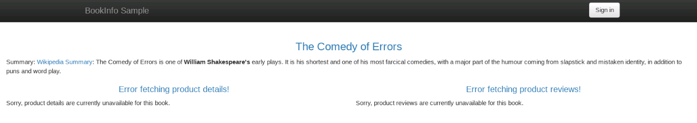

You can create another Gloo Mesh Access Policy to allow the `productpage` microservice to talk to these 2 microservices:

```bash
cat << EOF | kubectl --context ${MGMT} apply -f -
apiVersion: networking.mesh.gloo.solo.io/v1
kind: AccessPolicy
metadata:
  namespace: gloo-mesh
  name: productpage
spec:
  sourceSelector:
  - kubeServiceAccountRefs:
      serviceAccounts:
        - name: bookinfo-productpage
          namespace: default
          clusterName: cluster1
  destinationSelector:
  - kubeServiceMatcher:
      namespaces:
      - default
      labels:
        service: details
  - kubeServiceMatcher:
      namespaces:
      - default
      labels:
        service: reviews
EOF
```

<!--bash
cat <<'EOF' > ./test.js
const helpers = require('./tests/chai-http');

describe("Reviews and details should be accessible, but ratings shouldn't", () => {
  it("Checking text 'Error fetching product details' in cluster1", () => helpers.checkBody({ host: 'http://' + process.env.ENDPOINT_HTTP_GW_CLUSTER1, path: '/productpage', body: 'Error fetching product details', match: false }));
  it("Checking text 'Error fetching product reviews' in cluster1", () => helpers.checkBody({ host: 'http://' + process.env.ENDPOINT_HTTP_GW_CLUSTER1, path: '/productpage', body: 'Error fetching product reviews', match: false }));
  it("Checking text 'Ratings service is currently unavailable' in cluster1", () => helpers.checkBody({ host: 'http://' + process.env.ENDPOINT_HTTP_GW_CLUSTER1, path: '/productpage', body: 'Ratings service is currently unavailable', match: true }));
})

EOF
mocha ./test.js --retries=500 2> /dev/null
-->

If you refresh the page, you should be able to see the product `details` and the `reviews`, but the `reviews` microservice can't access the `ratings` microservice:


Create another AccessPolicy to fix the issue:

```bash
cat << EOF | kubectl --context ${MGMT} apply -f -
apiVersion: networking.mesh.gloo.solo.io/v1
kind: AccessPolicy
metadata:
  namespace: gloo-mesh
  name: reviews
spec:
  sourceSelector:
  - kubeServiceAccountRefs:
      serviceAccounts:
        - name: bookinfo-reviews
          namespace: default
          clusterName: cluster1
  destinationSelector:
  - kubeServiceMatcher:
      namespaces:
      - default
      labels:
        service: ratings
EOF
```

<!--bash
cat <<'EOF' > ./test.js
const helpers = require('./tests/chai-http');

describe("All the services should work", () => {
  it("Checking text 'Error fetching product details' in cluster1", () => helpers.checkBody({ host: 'http://' + process.env.ENDPOINT_HTTP_GW_CLUSTER1, path: '/productpage', body: 'Error fetching product details', match: false }));
  it("Checking text 'Error fetching product reviews' in cluster1", () => helpers.checkBody({ host: 'http://' + process.env.ENDPOINT_HTTP_GW_CLUSTER1, path: '/productpage', body: 'Error fetching product reviews', match: false }));
  it("Checking text 'Ratings service is currently unavailable' in cluster1", () => helpers.checkBody({ host: 'http://' + process.env.ENDPOINT_HTTP_GW_CLUSTER1, path: '/productpage', body: 'Ratings service is currently unavailable', match: false }));
})

EOF
mocha ./test.js --retries=500 2> /dev/null
-->
Refresh the page another time and all the services should now work:

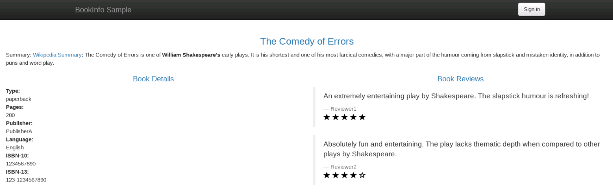

If you refresh the web page several times, you should see only the versions `v1` (no stars) and `v2` (black stars), which means that all the requests are still handled by the first cluster.


## Lab 7 - Traffic policy <a name="Lab-7"></a>


We're going to use Gloo Mesh Traffic Policies to inject faults and configure timeouts.

Let's create the following TrafficPolicy to inject a delay when the `v2` version of the `reviews` service talk to the `ratings` service on cluster1.:

```bash
cat << EOF | kubectl --context ${MGMT} apply -f -
apiVersion: networking.mesh.gloo.solo.io/v1
kind: TrafficPolicy
metadata:
  name: ratings-fault-injection
  namespace: gloo-mesh
spec:
  sourceSelector:
  - kubeWorkloadMatcher:
      labels:
        app: reviews
        version: v2
      namespaces:
      - default
      clusters:
      - cluster1
  destinationSelector:
  - kubeServiceRefs:
      services:
        - clusterName: cluster1
          name: ratings
          namespace: default
  policy:
    faultInjection:
      fixedDelay: 2s
      percentage: 100
EOF
```
If you refresh the webpage, you should see that it takes longer to get the `productpage` loaded when version `v2` of the `reviews` services is called.

Now, let's configure a 0.5s request timeout when the `productpage` service calls the `reviews` service on cluster1.

```bash
cat << EOF | kubectl --context ${MGMT} apply -f -
apiVersion: networking.mesh.gloo.solo.io/v1
kind: TrafficPolicy
metadata:
  name: reviews-request-timeout
  namespace: gloo-mesh
spec:
  sourceSelector:
  - kubeWorkloadMatcher:
      labels:
        app: productpage
      namespaces:
      - default
      clusters:
      - cluster1
  destinationSelector:
  - kubeServiceRefs:
      services:
        - clusterName: cluster1
          name: reviews
          namespace: default
  policy:
    requestTimeout: 0.5s
EOF
```

<!--bash
cat <<'EOF' > ./test.js
var chai = require('chai');
var expect = chai.expect;
const chaiHttp = require("chai-http");
chai.use(chaiHttp);

let searchTest="Sorry, product reviews are currently unavailable for this book.";

describe("Reviews shouldn't be available", () => {
  it("Checking text '" + searchTest + "' in cluster1", async () => {
    await chai.request('http://' + process.env.ENDPOINT_HTTP_GW_CLUSTER1)
      .get('/productpage')
      .send()
      .then((res) => {
        expect(res.text).to.contain(searchTest);
      });
  });

});

EOF
mocha ./test.js --retries=500 2> /dev/null
-->

If you refresh the page several times, you'll see an error message telling that reviews are unavailable when the productpage is trying to communicate with the version `v2` of the `reviews` service.


Let's delete the TrafficPolicies:

```bash
kubectl --context ${MGMT} -n gloo-mesh delete trafficpolicy ratings-fault-injection
kubectl --context ${MGMT} -n gloo-mesh delete trafficpolicy reviews-request-timeout
```


## Lab 8 - Multi-cluster Traffic <a name="Lab-8"></a>

On the first cluster, the `v3` version of the `reviews` microservice doesn't exist, so we're going to redirect some of the traffic to the second cluster to make it available.


Let's create the following TrafficPolicy:

```bash
cat << EOF | kubectl --context ${MGMT} apply -f -
apiVersion: networking.mesh.gloo.solo.io/v1
kind: TrafficPolicy
metadata:
  namespace: gloo-mesh
  name: simple
spec:
  sourceSelector:
  - kubeWorkloadMatcher:
      namespaces:
      - default
  destinationSelector:
  - kubeServiceRefs:
      services:
        - clusterName: cluster1
          name: reviews
          namespace: default
  policy:
    trafficShift:
      destinations:
        - kubeService:
            clusterName: cluster2
            name: reviews
            namespace: default
            subset:
              version: v3
          weight: 75
        - kubeService:
            clusterName: cluster1
            name: reviews
            namespace: default
            subset:
              version: v1
          weight: 15
        - kubeService:
            clusterName: cluster1
            name: reviews
            namespace: default
            subset:
              version: v2
          weight: 10
EOF
```

<!--bash
cat <<'EOF' > ./test.js
const chaiExec = require("@jsdevtools/chai-exec");
var chai = require('chai');
var expect = chai.expect;
chai.use(chaiExec);

describe("Reviews v3 is reachable but not rating", function() {
  it('Got reviews v3 from cluster2 but not ratings', () => {
    expect(process.env.ENDPOINT_HTTP_GW_CLUSTER1).to.not.be.empty;
    let command = 'curl -s "http://' + process.env.ENDPOINT_HTTP_GW_CLUSTER1 +'/productpage"';
    let cli = chaiExec(command);
    expect(cli).to.exit.with.code(0);
    expect(cli).output.to.not.contain("Ratings service is currently unavailable");
  })
});
EOF
mocha ./test.js --retries=500 2> /dev/null
-->

If you refresh the page several times, you'll see the `v3` version of the `reviews` microservice:

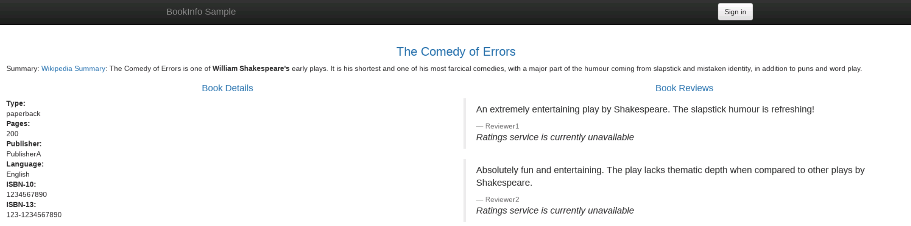

But as you can see, the `ratings` aren't available. That's because we only allowed the `reviews` microservice of the first cluster to talk to the `ratings` microservice.

Let's update the AccessPolicy to fix the issue:

```bash
cat << EOF | kubectl --context ${MGMT} apply -f -
apiVersion: networking.mesh.gloo.solo.io/v1
kind: AccessPolicy
metadata:
  namespace: gloo-mesh
  name: reviews
spec:
  sourceSelector:
  - kubeServiceAccountRefs:
      serviceAccounts:
        - name: bookinfo-reviews
          namespace: default
          clusterName: cluster1
        - name: bookinfo-reviews
          namespace: default
          clusterName: cluster2
  destinationSelector:
  - kubeServiceMatcher:
      namespaces:
      - default
      labels:
        service: ratings
EOF
```

<!--bash
cat <<'EOF' > ./test.js
const chaiExec = require("@jsdevtools/chai-exec");
var chai = require('chai');
var expect = chai.expect;
chai.use(chaiExec);

describe("Reviews v3 from cluster2 with ratings", function() {
  it('Got reviews v3 from cluster2 with ratings', function () {
    expect(process.env.ENDPOINT_HTTP_GW_CLUSTER1).to.not.be.empty
    let command = 'curl -s "http://' + process.env.ENDPOINT_HTTP_GW_CLUSTER1 +'/productpage"'
    let cli = chaiExec(command);
    expect(cli).to.exit.with.code(0);
    expect(cli).output.to.not.contain('color="red"');
  })
});
EOF
mocha ./test.js --retries=500 2> /dev/null
-->

If you refresh the page several times again, you'll see the `v3` version of the `reviews` microservice with the red stars:


Let's delete the TrafficPolicy:

```bash
kubectl --context ${MGMT} -n gloo-mesh delete trafficpolicy simple
```


## Lab 9 - Traffic failover <a name="Lab-9"></a>

If you refresh the web page several times, you should see only the versions `v1` (no stars) and `v2` (black stars), which means that all the requests are handled by the first cluster.

Another interesting feature of Gloo Mesh is its ability to manage failover between clusters.

In this lab, we're going to configure a failover for the `reviews` service:

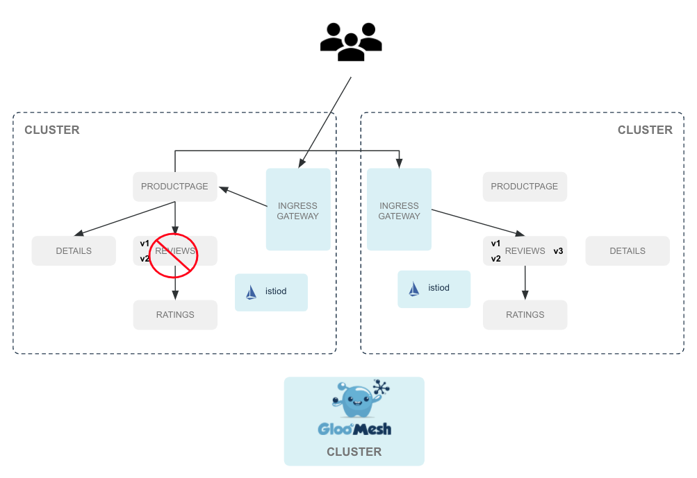

Then, we create a VirtualDestination to define a new hostname (`reviews.global`) that will be backed by the `reviews` microservice runnings on both clusters. 

```bash
cat << EOF | kubectl --context ${MGMT} apply -f -
apiVersion: networking.enterprise.mesh.gloo.solo.io/v1beta1
kind: VirtualDestination
metadata:
  name: reviews-global
  namespace: gloo-mesh
spec:
  hostname: reviews.global
  port:
    number: 9080
    protocol: http
  localized:
    outlierDetection:
      consecutiveErrors: 2
      maxEjectionPercent: 100
      interval: 5s
      baseEjectionTime: 30s
    destinationSelectors:
    - kubeServiceMatcher:
        labels:
          app: reviews
  virtualMesh:
    name: virtual-mesh
    namespace: gloo-mesh
EOF
```

Finally, we can define another TrafficPolicy to make sure all the requests for the `reviews` microservice on the local cluster will be handled by the VirtualDestination we've just created.

```bash
cat << EOF | kubectl --context ${MGMT} apply -f -
apiVersion: networking.mesh.gloo.solo.io/v1
kind: TrafficPolicy
metadata:
  name: reviews-shift-failover
  namespace: gloo-mesh
spec:
  sourceSelector:
  - kubeWorkloadMatcher:
      namespaces:
      - default
  destinationSelector:
  - kubeServiceRefs:
      services:
        - clusterName: cluster1
          name: reviews
          namespace: default
  policy:
    trafficShift:
      destinations:
        - virtualDestination:
            name: reviews-global
            namespace: gloo-mesh
EOF
```

We're going to make the `reviews` services unavailable on the first cluster.

```bash
kubectl --context ${CLUSTER1} patch deploy reviews-v1 --patch '{"spec": {"template": {"spec": {"containers": [{"name": "reviews","command": ["sleep", "20h"]}]}}}}'
kubectl --context ${CLUSTER1} patch deploy reviews-v2 --patch '{"spec": {"template": {"spec": {"containers": [{"name": "reviews","command": ["sleep", "20h"]}]}}}}'
```

<!--bash
cat <<'EOF' > ./test.js
const chaiExec = require("@jsdevtools/chai-exec");
const helpersHttp = require('./tests/chai-http');
const chai = require("chai");
const expect = chai.expect;

describe("Access reviews from cluster2 since the ones from cluster1 are in sleep mode", () => {
  const _getJSONAppReviews = () => {
    let command = "kubectl --context " + process.env.CLUSTER1 + " get pods -l app=reviews -o json";
    let cli = chaiExec(command);

    let j = JSON.parse(cli.stdout);
    return j.items;
  };
  const allPodsAreReady = () => {
    let containersWithReadyStatus = _getJSONAppReviews()
      .map(x => x.status.containerStatuses)
      .flat()
      .filter(x => x.ready)
      .length;
    expect(containersWithReadyStatus).to.equal(4);
  };
  const twoPodsAreAsleep = () => {
    let podsWithSleepCommand = _getJSONAppReviews()
      .map(x => x.spec.containers)
      .flat()
      .filter(x => x.command && x.command[0] == "sleep")
      .length;
    expect(podsWithSleepCommand).to.equal(2);
  };

  it('All pods are ready in ' + process.env.CLUSTER1, () => allPodsAreReady());
  it('There are two pods with label app=reviews and \'sleep\' command in ' + process.env.CLUSTER1, () => twoPodsAreAsleep());
});

describe("Reviews service is still available", () => {
  it('Checking text \'product reviews are currently unavailable\' in ' + process.env.CLUSTER1, () => helpersHttp.checkBody({ host: 'http://' + process.env.ENDPOINT_HTTP_GW_CLUSTER1, path: '/productpage', body: 'product reviews are currently unavailable', match: false }));
})

EOF
mocha ./test.js --retries=500 2> /dev/null
-->

If you refresh the web page several times again, you should still see the `reviews` displayed while there's no `reviews` service available anymore on the first cluster.

You can use the following command to validate that the requests are handled by the second cluster:

```
kubectl --context ${CLUSTER2} logs -l app=reviews -c istio-proxy -f
```

You should see a line like below each time you refresh the web page:

```
[2020-10-12T14:19:35.996Z] "GET /reviews/0 HTTP/1.1" 200 - "-" "-" 0 295 6 6 "-" "Mozilla/5.0 (X11; Linux x86_64) AppleWebKit/537.36 (KHTML, like Gecko) Chrome/86.0.4240.75 Safari/537.36" "d18da89b-8682-4e8d-9284-b3d5ff78f2f7" "reviews:9080" "127.0.0.1:9080" inbound|9080|http|reviews.default.svc.cluster.local 127.0.0.1:41542 192.168.163.201:9080 192.168.163.221:42110 outbound_.9080_.version-v1_.reviews.default.svc.cluster.local default
```

> ### Note that you can combine traffic shift with failover
> ```
> cat << EOF | kubectl --context ${MGMT} apply -f -
> apiVersion: networking.mesh.gloo.solo.io/v1
> kind: TrafficPolicy
> metadata:
>   name: reviews-shift-failover
>   namespace: gloo-mesh
> spec:
>   sourceSelector:
>   - kubeWorkloadMatcher:
>       namespaces:
>       - default
>   destinationSelector:
>   - kubeServiceRefs:
>       services:
>         - clusterName: cluster1
>           name: reviews
>           namespace: default
>   policy:
>     trafficShift:
>       destinations:
>         - virtualDestination:
>             name: reviews-global
>             namespace: gloo-mesh
>             subset:
>               version: v1
>           weight: 50
>         - virtualDestination:
>             name: reviews-global
>             namespace: gloo-mesh
>             subset:
>               version: v2
>           weight: 50
> EOF
> ```

We're going to make the `reviews` services available again on the first cluster.

```bash
kubectl --context ${CLUSTER1} patch deployment reviews-v1  --type json   -p '[{"op": "remove", "path": "/spec/template/spec/containers/0/command"}]'
kubectl --context ${CLUSTER1} patch deployment reviews-v2  --type json   -p '[{"op": "remove", "path": "/spec/template/spec/containers/0/command"}]'
```

After 30 seconds, you can validate that the requests are now handled by the first cluster using the following command:

```
kubectl --context ${CLUSTER1} logs -l app=reviews -c istio-proxy -f
```

Let's delete the VirtualDestination and the TrafficPolicy:

```bash
kubectl --context ${MGMT} -n gloo-mesh delete virtualdestination reviews-global
kubectl --context ${MGMT} -n gloo-mesh delete trafficpolicy reviews-shift-failover
```


## Lab 10 - Extend Envoy with WebAssembly <a name="Lab-10"></a>

WebAssembly (WASM) is the future of cloud-native infrastructure extensibility.

WASM is a safe, secure, and dynamic way of extending infrastructure with the language of your choice. WASM tool chains compile your code from any of the supported languages into a type-safe, binary format that can be loaded dynamically in a WASM sandbox/VM.

The Envoy Wasm filter is already available, but it's not ready for production use yet. More info available in [this Blog Post](https://www.solo.io/blog/the-state-of-webassembly-in-envoy-proxy/).

Both Gloo Edge and Istio are based on Envoy, so they can take advantage of WebAssembly.

One of the projects for working with WASM and Envoy proxy is [WebAssembly Hub](https://webassemblyhub.io/).

WebAssembly Hub is a meeting place for the community to share and consume WebAssembly Envoy extensions. You can easily search and find extensions that meet the functionality you want to add and give them a try.

Gloo Mesh Enterprise CLI comes with all the features you need to develop, build, push and deploy your Wasm filters on Istio.

Install or update the Gloo Mesh Enterprise CLI plugin manager :

```bash
if meshctl plugin; then
  meshctl plugin update
else
  meshctl init-plugin-manager
fi
```

Install or upgrade the wasm meshctl plugin:

```bash
if meshctl wasm --help; then
  meshctl plugin upgrade wasm@v1.2.3
else
  meshctl plugin install wasm@v1.2.3
fi
```

The main advantage of building a Wasm Envoy filter is that you can manipulate requests (and responses) exactly the way it makes sense for your specific use cases.

Perhaps you want to gather some metrics only when the request contain specific headers, or you want to enrich the request by getting information from another API, it doesn't matter, you're now free to do exactly what you want.

The first decision you need to take is to decide which SDK (so which language) you want to use. SDKs are currently available for C++, AssemblyScript, RUST and TinyGo.

Not all the languages can be compiled to WebAssembly and don't expect that you'll be able to import any external packages (like the Amazon SDK).

There are 2 main reasons why you won't be able to do that:

- The first one is that you'll need to tell Envoy to send HTTP requests for you (if you need to get information from an API, for example).
- The second one is that most of these languages are not supporting all the standard packages you expect. For example, TinyGo doesn't have a JSON package and AssemblyScript doesn't have a Regexp package.

So, you need to determine what you want your filter to do, look at what kind of packages you'll need (Regexp, ...) and check which one of the language you already know is matching your requirements.

For example, if you want to manipulate the response headers with a regular expression and you have some experience with Golang, then you'll probably choose TinyGo.

In this lab, we won't focus on developing a filter, but on how to build, push and deploy filters.

### Prepare

Our Envoy instances will fetch their wasm filters from an envoy cluster that must be defined in the static bootstrap config. We must therefore perform a one-time operation to add the wasm-agent as a cluster in the Envoy bootstrap:

```bash
cat <<EOF | kubectl apply --context ${CLUSTER1} -f -
apiVersion: v1
kind: ConfigMap
metadata:
  name: gloo-mesh-custom-envoy-bootstrap
  namespace: default
data:
  custom_bootstrap.json: |
    {
      "static_resources": {
        "clusters": [{
          "name": "enterprise_agent_cluster",
          "type" : "STRICT_DNS",
          "connect_timeout": "1s",
          "lb_policy": "ROUND_ROBIN",
          "load_assignment": {
            "cluster_name": "enterprise_agent_cluster",
            "endpoints": [{
              "lb_endpoints": [{
                "endpoint": {
                  "address":{
                    "socket_address": {
                      "address": "enterprise-agent.gloo-mesh.svc.cluster.local",
                      "port_value": 9977
                    }
                  }
                }
              }]
            }]
          },
          "circuit_breakers": {
            "thresholds": [
              {
                "priority": "DEFAULT",
                "max_connections": 100000,
                "max_pending_requests": 100000,
                "max_requests": 100000
              },
              {
                "priority": "HIGH",
                "max_connections": 100000,
                "max_pending_requests": 100000,
                "max_requests": 100000
              }
            ]
          },
          "upstream_connection_options": {
            "tcp_keepalive": {
              "keepalive_time": 300
            }
          },
          "max_requests_per_connection": 1,
          "http2_protocol_options": { }
        }]
      }
    }
EOF

cat <<EOF | kubectl apply --context ${CLUSTER2} -f -
apiVersion: v1
kind: ConfigMap
metadata:
  name: gloo-mesh-custom-envoy-bootstrap
  namespace: default
data:
  custom_bootstrap.json: |
    {
      "static_resources": {
        "clusters": [{
          "name": "enterprise_agent_cluster",
          "type" : "STRICT_DNS",
          "connect_timeout": "1s",
          "lb_policy": "ROUND_ROBIN",
          "load_assignment": {
            "cluster_name": "enterprise_agent_cluster",
            "endpoints": [{
              "lb_endpoints": [{
                "endpoint": {
                  "address":{
                    "socket_address": {
                      "address": "enterprise-agent.gloo-mesh.svc.cluster.local",
                      "port_value": 9977
                    }
                  }
                }
              }]
            }]
          },
          "circuit_breakers": {
            "thresholds": [
              {
                "priority": "DEFAULT",
                "max_connections": 100000,
                "max_pending_requests": 100000,
                "max_requests": 100000
              },
              {
                "priority": "HIGH",
                "max_connections": 100000,
                "max_pending_requests": 100000,
                "max_requests": 100000
              }
            ]
          },
          "upstream_connection_options": {
            "tcp_keepalive": {
              "keepalive_time": 300
            }
          },
          "max_requests_per_connection": 1,
          "http2_protocol_options": { }
        }]
      }
    }
EOF
```

<!--bash
cat <<'EOF' > ./test.js
const helpers = require('./tests/chai-exec');

describe("ConfigMaps are created", () => {
    const clusters = [process.env.CLUSTER1, process.env.CLUSTER2];
    clusters.forEach(cluster => {
        it('Configmap is present in ' + cluster, () => helpers.k8sObjectIsPresent({ context: cluster, namespace: "default", k8sType: "configmap", k8sObj: "gloo-mesh-custom-envoy-bootstrap" }));
    });
});
EOF
mocha ./test.js --retries=500 2> /dev/null
-->

### Develop

The Gloo Mesh CLI, meshctl can be used to create the skeleton for you.

Let's take a look at the help of the meshctl wasme option:

```
meshctl wasm

The interface for managing Gloo Mesh WASM filters

Usage:
  wasm [command]

Available Commands:
  build       Build a wasm image from the filter source directory.
  deploy      Deploy an Envoy WASM Filter to Istio Sidecar Proxies (Envoy).
  help        Help about any command
  init        Initialize a project directory for a new Envoy WASM Filter.
  list        List Envoy WASM Filters stored locally or published to webassemblyhub.io.
  login       Log in so you can push images to the remote server.
  pull        Pull wasm filters from remote registry
  push        Push a wasm filter to remote registry
```

The following command will create the skeleton to build a Wasm filter using AssemblyScript:

```
meshctl wasm init myfilter --language=assemblyscript
```

It will ask what platform you will run your filter on (because the SDK version can be different based on the ABI corresponding to the version of Envoy used by this Platform).

And it will create the following file structure under the directory you have indicated:

```
./package-lock.json
./.gitignore
./assembly
./assembly/index.ts
./assembly/tsconfig.json
./package.json
./runtime-config.json
```

The most interesting file is the index.ts one, where you'll write the code corresponding to your filter:

```
export * from "@solo-io/proxy-runtime/proxy";
import { RootContext, Context, RootContextHelper, ContextHelper, registerRootContext, FilterHeadersStatusValues, stream_context } from "@solo-io/proxy-runtime";

class AddHeaderRoot extends RootContext {
  configuration : string;

  onConfigure(): bool {
    let conf_buffer = super.getConfiguration();
    let result = String.UTF8.decode(conf_buffer);
    this.configuration = result;
    return true;
  }

  createContext(): Context {
    return ContextHelper.wrap(new AddHeader(this));
  }
}

class AddHeader extends Context {
  root_context : AddHeaderRoot;
  constructor(root_context:AddHeaderRoot){
    super();
    this.root_context = root_context;
  }
  onResponseHeaders(a: u32): FilterHeadersStatusValues {
    const root_context = this.root_context;
    if (root_context.configuration == "") {
      stream_context.headers.response.add("hello", "world!");
    } else {
      stream_context.headers.response.add("hello", root_context.configuration);
    }
    return FilterHeadersStatusValues.Continue;
  }
}

registerRootContext(() => { return RootContextHelper.wrap(new AddHeaderRoot()); }, "add_header");
```

We'll keep the default content, so the filter will add a new Header in all the Responses with the key hello and the value passed to the filter (or world! if no value is passed to it).

### Build

We're ready to compile the code into WebAssembly.

The Gloo Mesh Enterprise CLI will make your life easier again.

You simply need to run the following command:

```
cd myfilter
meshctl wasm build assemblyscript -t webassemblyhub.io/djannot/myfilter:0.1 .
```

You can see that I've indicated that I wanted to use `webassemblyhub.io/djannot/myfilter:0.1` for the Image reference.

`meshctl` will create an OCI compliant image with this tag. It's exactly the same as when you use the Docker CLI and the Docker Hub.

### Push

The image has been built, so we can now push it to the Web Assembly Hub.

But you would need to create a free account and to run `meshctl login` to authenticate.

To simplify the lab, we will use the image that has already been pushed.

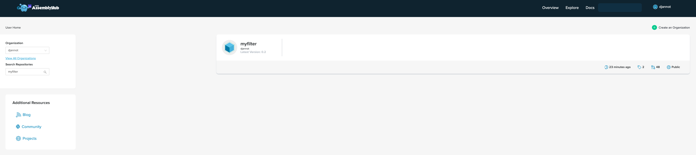

But note that the command to push the Image is the following one:

```bash
wasm_image=webassemblyhub.io/djannot/myfilter:0.2
```

```
meshctl wasm push $wasm_image
```

Then, if you go to the Web Assembly Hub, you'll be able to see the Image of your Wasm filter

### Deploy

It's now time to deploy your Wasm filter on Istio !

Note that you can also deploy it on Gloo Edge.

Run the following command to make `cluster1` the current cluster.

```bash
kubectl config use-context ${CLUSTER1}
```

You can deploy it using `meshctl wasm deploy`, but we now live in a Declarative world, so let's do it the proper way.

Gloo Mesh Enteprise has a `WasmDeployment` CRD (Custom Resource Definition) for that purpose.

To deploy your Wasm filter on all the Pods corresponding to the version v1 of the reviews service and running in the default namespace of the cluster1 cluster, use the following commands:

```bash
kubectl patch deployment reviews-v1 --context ${CLUSTER1} --patch='{"spec":{"template": {"metadata": {"annotations": {"sidecar.istio.io/bootstrapOverride": "gloo-mesh-custom-envoy-bootstrap"}}}}}' --type=merge

cat << EOF | kubectl --context ${MGMT} apply -f-
apiVersion: networking.enterprise.mesh.gloo.solo.io/v1beta1
kind: WasmDeployment
metadata:
  name: reviews-wasm
  namespace: gloo-mesh
spec:
  filters:
  - filterContext: SIDECAR_INBOUND
    wasmImageSource:
      wasmImageTag: webassemblyhub.io/djannot/myfilter:0.2
    staticFilterConfig:
      '@type': type.googleapis.com/google.protobuf.StringValue
      value: "Gloo Mesh Enterprise"
  workloadSelector:
  - kubeWorkloadMatcher:
      clusters:
      - cluster1
      labels:
        app: reviews
        version: v1
      namespaces:
      - default
EOF
```

Let's send a request from the `productpage` service to the `reviews` service:

```
kubectl --context $CLUSTER1 exec -it $(kubectl --context $CLUSTER1  get pods -l app=productpage -o jsonpath='{.items[0].metadata.name}') -- python -c "import requests; r = requests.get('http://reviews:9080/reviews/0'); print(r.headers)"
```

<!--bash
cat <<'EOF' > ./test.js
const helpers = require('./tests/chai-exec');

describe("Get WasmDeployment log traces", () => {
  const podName = helpers.getOutputForCommand({ command: "kubectl get pods -l app=productpage -o jsonpath='{.items[0].metadata.name}' --context " + process.env.CLUSTER1 }).replaceAll("'", "");
  const command = "kubectl exec " + podName + " --context " + process.env.CLUSTER1 + " -- python -c \"import requests; r = requests.get('http://reviews:9080/reviews/0'); print(r.headers)\"";
  const searches = ["hello", "Gloo Mesh Enterprise"];
  searches.forEach(search => {
    it('Got the new header "' + search + '"', () => helpers.genericCommand({ command: command, responseContains: search }));
  });
});
EOF
mocha ./test.js --retries=500 2> /dev/null
-->

You should get either:

```
{'x-powered-by': 'Servlet/3.1', 'content-type': 'application/json', 'date': 'Tue, 15 Dec 2020 08:23:24 GMT', 'content-language': 'en-US', 'content-length': '295', 'x-envoy-upstream-service-time': '10', 'server': 'envoy'}
```

or:

```
{'x-powered-by': 'Servlet/3.1', 'content-type': 'application/json', 'date': 'Tue, 15 Dec 2020 08:23:25 GMT', 'content-language': 'en-US', 'content-length': '295', 'x-envoy-upstream-service-time': '17', 'hello': 'Gloo Mesh Enterprise Beta', 'server': 'envoy'}
```

We have deployed the Istio Bookinfo application with the versions `v1` and `v2` of the `reviews` service, so the new header is added half of the time.

### Observe

Gloo Mesh Enterprise has processed the `WasmDeployment` object and has added status information on it:

```
status:
  observedGeneration: 1
  workloadStates:
    reviews-v1-default-cluster1-deployment.gloo-mesh.: FILTERS_DEPLOYED
```

Very useful, no ?

Delete the WasmDeployment:

```bash
kubectl --context ${MGMT} -n gloo-mesh delete wasmdeployment reviews-wasm
```


## Lab 11 - Observability <a name="Lab-11"></a>


Gloo Mesh can also be used to collect the access logs from any Pod running in any cluster.

Create the following `AccessLogRecord` object to collect all the access logs of the `reviews` services running on any cluster:

```bash
kubectl --context ${MGMT} apply -f - <<EOF
apiVersion: observability.enterprise.mesh.gloo.solo.io/v1
kind: AccessLogRecord
metadata:
  name: access-log-reviews
  namespace: gloo-mesh
spec:
  workloadSelectors:
  - kubeWorkloadMatcher:
      namespaces:
      - default
      labels:
        app: reviews
EOF
```

<!--bash
cat <<'EOF' > ./test.js
const helpers = require('./tests/chai-exec');

describe("AccessLogRecord is created", () => {
    it("Accesslogrecord has been created in " + process.env.MGMT, () => helpers.genericCommand({ command: "kubectl --context " + process.env.MGMT + " get accesslogrecord access-log-reviews -n gloo-mesh" }));
});
EOF
mocha ./test.js --retries=500 2> /dev/null
-->

You can see the access logs in the web interface or using `meshctl`.

To see them with `meshctl` you need to install the corresponding plugin.

Install or update the Gloo Mesh Enterprise CLI plugin manager :

```bash
if meshctl plugin; then
  meshctl plugin update
else
  meshctl init-plugin-manager
fi
```

Install or upgrade the accesslog meshctl plugin:

```bash
if meshctl accesslog --help; then
  meshctl plugin upgrade accesslog@v1.2.3
else
  meshctl plugin install accesslog@v1.2.3
fi
```

Now send some traffic through the ingress gateway:
```bash
for i in {1..20}; do curl -s -o /dev/null -w "%{http_code}" http://${ENDPOINT_HTTP_GW_CLUSTER1}/productpage;echo ''; done
```

Gather the latest access logs:

```bash
kubectl config use-context ${MGMT}
meshctl accesslog --kubecontext ${MGMT} -o json
```

<!--bash
cat <<'EOF' > ./test.js
const chaiExec = require("@jsdevtools/chai-exec");
var chai = require('chai');
var expect = chai.expect;
chai.use(chaiExec);

const search1 = "httpAccessLog";
const search2 = "workloadRef";

describe("Check access logs", function() {
  this.timeout(5000); // The test needs more than default (2secs)
  
  it("Create traffic", () => {
    expect(process.env.ENDPOINT_HTTP_GW_CLUSTER1).to.not.be.empty;
    let cli = chaiExec("curl -s http://" + process.env.ENDPOINT_HTTP_GW_CLUSTER1 + "/productpage");
    expect(cli).to.exit.with.code(0);
  });

  it("Access Logs contain " + search1 + " and " + search2 + " in " + process.env.MGMT, () => {
    expect(process.env.ENDPOINT_HTTP_GW_CLUSTER1).to.not.be.empty;
    chaiExec("curl -s http://" + process.env.ENDPOINT_HTTP_GW_CLUSTER1 + "/productpage");
    let command = "meshctl accesslog --kubecontext " + process.env.MGMT + " -o json";
    let cli = chaiExec(command);
    expect(cli).to.exit.with.code(0);
    expect(cli).output.to.contain("httpAccessLog");
    expect(cli).output.to.contain("workloadRef");
  });
})

EOF
mocha ./test.js --retries=500 2> /dev/null
-->

You should get an output similar to the following one:

```
{
  "result": {
    "workloadRef": {
      "name": "reviews-v2",
      "namespace": "default",
      "clusterName": "cluster1"
    },
    "httpAccessLog": {
      "commonProperties": {
        "downstreamRemoteAddress": {
          "socketAddress": {
            "address": "10.102.158.19",
            "portValue": 47198
          }
        },
        "downstreamLocalAddress": {
          "socketAddress": {
            "address": "10.102.158.25",
            "portValue": 9080
          }
        },
        "tlsProperties": {
          "tlsVersion": "TLSv1_2",
          "tlsCipherSuite": 49200,
          "tlsSniHostname": "outbound_.9080_._.reviews.default.svc.cluster.local",
          "localCertificateProperties": {
            "subjectAltName": [
              {
                "uri": "spiffe://cluster1/ns/default/sa/bookinfo-reviews"
              }
            ]
          },
          "peerCertificateProperties": {
            "subjectAltName": [
              {
                "uri": "spiffe://cluster1/ns/default/sa/bookinfo-productpage"
              }
            ]
          }
        },
        "startTime": "2021-03-21T17:33:46.182478Z",
        "timeToLastRxByte": "0.000062572s",
        "timeToFirstUpstreamTxByte": "0.000428530s",
        "timeToLastUpstreamTxByte": "0.000436843s",
        "timeToFirstUpstreamRxByte": "0.040638581s",
        "timeToLastUpstreamRxByte": "0.040692768s",
        "timeToFirstDownstreamTxByte": "0.040671495s",
        "timeToLastDownstreamTxByte": "0.040708877s",
        "upstreamRemoteAddress": {
          "socketAddress": {
            "address": "127.0.0.1",
            "portValue": 9080
          }
        },
        "upstreamLocalAddress": {
          "socketAddress": {
            "address": "127.0.0.1",
            "portValue": 43078
          }
        },
        "upstreamCluster": "inbound|9080||",
        "metadata": {
          "filterMetadata": {
            "istio_authn": {
              "request.auth.principal": "cluster1/ns/default/sa/bookinfo-productpage",
              "source.namespace": "default",
              "source.principal": "cluster1/ns/default/sa/bookinfo-productpage",
              "source.user": "cluster1/ns/default/sa/bookinfo-productpage"
            }
          }
        },
        "routeName": "default",
        "downstreamDirectRemoteAddress": {
          "socketAddress": {
            "address": "10.102.158.19",
            "portValue": 47198
          }
        }
      },
      "protocolVersion": "HTTP11",
      "request": {
        "requestMethod": "GET",
        "scheme": "http",
        "authority": "reviews:9080",
        "path": "/reviews/0",
        "userAgent": "Mozilla/5.0 (X11; Linux x86_64) AppleWebKit/537.36 (KHTML, like Gecko) Chrome/89.0.4389.90 Safari/537.36",
        "requestId": "b0522245-d300-46a4-bfd3-727fcfa42efd",
        "requestHeadersBytes": "644"
      },
      "response": {
        "responseCode": 200,
        "responseHeadersBytes": "1340",
        "responseBodyBytes": "379",
        "responseCodeDetails": "via_upstream"
      }
    }
  }
}
...
```

Interesting, isn't it?

Delete the `AccessLogRecord`:

```bash
kubectl --context ${MGMT} -n gloo-mesh delete accesslogrecords.observability.enterprise.mesh.gloo.solo.io access-log-reviews                 
```


## Lab 12 - Exploring the Gloo Mesh Enterprise UI <a name="Lab-12"></a>

To access the UI, run the following command:

```
kubectl --context ${MGMT} port-forward -n gloo-mesh svc/dashboard 8090 --address 0.0.0.0
```

The UI is available at http://localhost:8090


If you click on `Meshes`, you can the VirtualMesh we've configured previously:

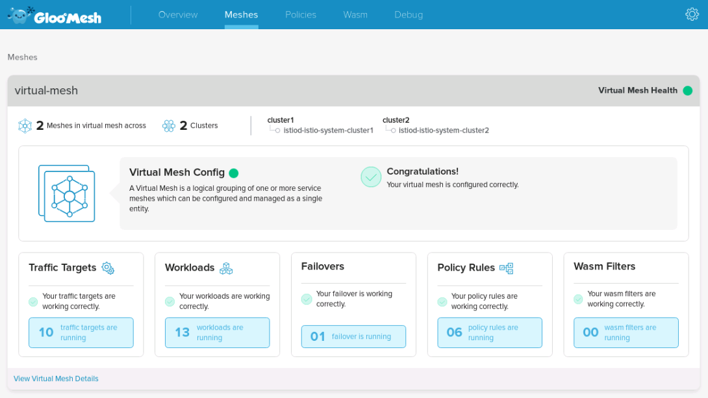

You can see that Global Access Policy is enabled and get more details when you click on `View Virtual Mesh Details`.

For example, you can see the `reviews` AccessPolicy we've configured in the previous lab:

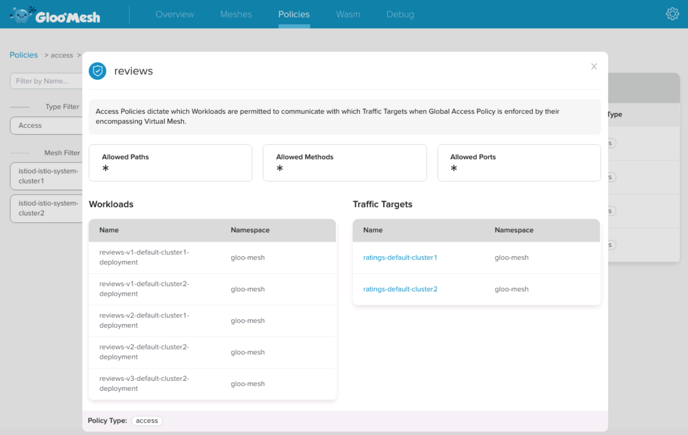

If you click on the Settings icon on the top right corner, you can see the clusters and the RBAC policies:

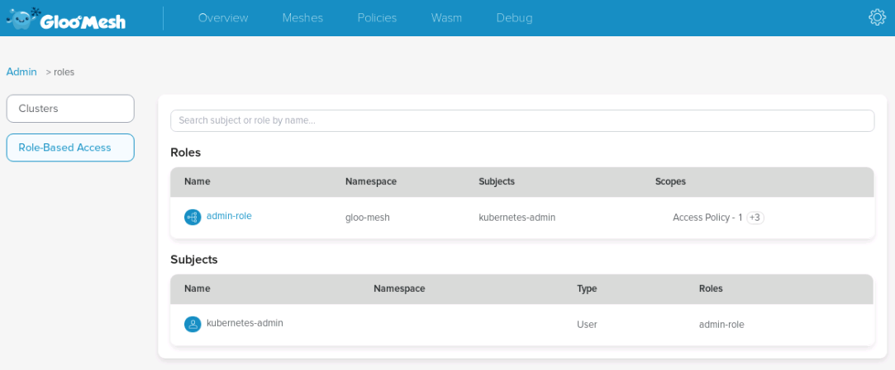

You can also use the Gloo Mesh Enterprise UI to see the different Wasm filters that have been deployed globally:

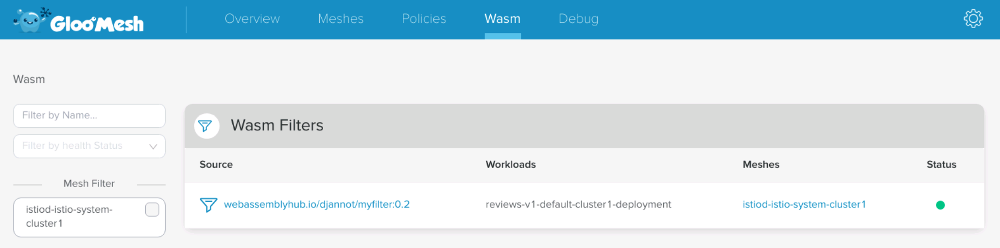

And you can even see the workloads were a Wasm filter has been deployed on:

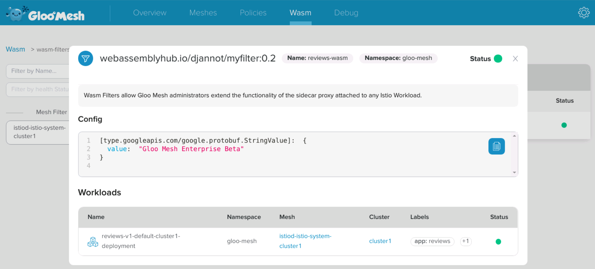

Take the time to explore the `Policies` and `Debug` tab to see what other information is available.

Let's introduce a mistake in the system and see how the UI can warn us about it:

```
cat << EOF | kubectl --context ${MGMT} apply -f -
apiVersion: networking.mesh.gloo.solo.io/v1
kind: TrafficPolicy
metadata:
  name: reviews-shift-failover
  namespace: gloo-mesh
spec:
  sourceSelector:
  - kubeWorkloadMatcher:
      namespaces:
      - default
  destinationSelector:
  - kubeServiceRefs:
      services:
        - clusterName: cluster1
          name: reviews
          namespace: default
  policy:
    trafficShift:
      destinations:
        - virtualDestination:
            name: reviews-global
            namespace: gloo-mesh
EOF
```

Now check the UI and we should see the details of the mistake:

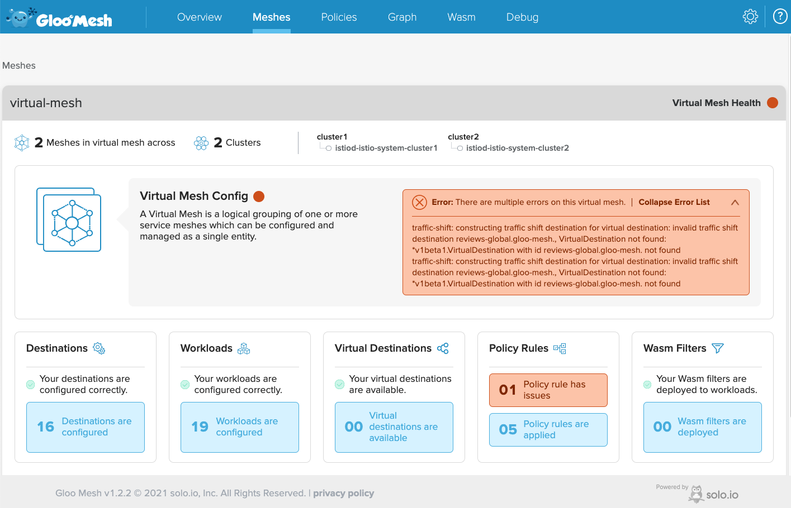

Now fix the mistake and the system will be back to `healthy`:
```
kubectl --context ${MGMT} -n gloo-mesh delete trafficpolicy reviews-shift-failover
```


## Lab 13 - Gloo Mesh Enterprise RBAC <a name="Lab-13"></a>

In large organizations, several teams are using the same Kubernetes cluster. They use Kubernetes RBAC to define who can do what and where.

When using a Service Mesh like Istio, users need to create different kind of objects (VirtualServices, DestinationRules, ...) and Kubernetes RBAC doesn't allow to restrict what specs they define in these objects.

Gloo Mesh abstracts the complexity with AccessPolicies and TrafficPolicies, but the problem remains the same.

The good news is that Gloo Mesh comes with an RBAC capability that is filling this gap.

With Gloo Mesh RBAC, you can define Roles and RoleBindings to determine what users can do in a very fine grained manner.

When we deployed Gloo Mesh, we applied an `admin.yaml` file that has granted the Gloo Mesh admin Role to the current user.

Let's delete the corresponding `RoleBinding`:

```bash
kubectl --context ${MGMT} -n gloo-mesh delete rolebindings.rbac.enterprise.mesh.gloo.solo.io admin-role-binding
```

Now, if you try to create the multi cluster Traffic Policy we used before, you shouldn't be allowed to do it.

```bash
cat << EOF | kubectl --context ${MGMT} apply -f -
apiVersion: networking.mesh.gloo.solo.io/v1
kind: TrafficPolicy
metadata:
  namespace: gloo-mesh
  name: simple
spec:
  sourceSelector:
  - kubeWorkloadMatcher:
      namespaces:
      - default
  destinationSelector:
  - kubeServiceRefs:
      services:
        - clusterName: cluster1
          name: reviews
          namespace: default
  policy:
    trafficShift:
      destinations:
        - kubeService:
            clusterName: cluster2
            name: reviews
            namespace: default
            subset:
              version: v3
          weight: 75
        - kubeService:
            clusterName: cluster1
            name: reviews
            namespace: default
            subset:
              version: v1
          weight: 15
        - kubeService:
            clusterName: cluster1
            name: reviews
            namespace: default
            subset:
              version: v2
          weight: 10
EOF
```

<!--bash
cat <<'EOF' > ./test.js
const chaiExec = require("@jsdevtools/chai-exec");
var chai = require('chai');
var expect = chai.expect;
chai.use(chaiExec);

describe("User is NOT allowed to create the TrafficPolicy", () => {
    it("User can NOT create the TrafficPolicy in " + process.env.MGMT, () => 
    {
      let command = "kubectl --context " + process.env.MGMT + " get trafficpolicy simple -n gloo-mesh"
      let cli = chaiExec(command);
      expect(cli).to.not.exit.with.code(0);
    });
  });
EOF
mocha ./test.js --retries=500 2> /dev/null
-->

Here is the expected output:

```
Error from server (User kubernetes-admin does not have the permissions necessary to perform this action.): error when creating "STDIN": admission webhook "rbac-webhook.gloo-mesh.svc" denied the request: User kubernetes-admin does not have the permissions necessary to perform this action.
```

Let's create a namespace admin Role:

```bash
cat << EOF | kubectl --context ${MGMT} apply -f -
apiVersion: rbac.enterprise.mesh.gloo.solo.io/v1
kind: Role
metadata:
  name: default-namespace-admin-role
  namespace: gloo-mesh
spec:
  trafficPolicyScopes:
    - trafficPolicyActions:
        - ALL
      destinationSelectors:
        - kubeServiceMatcher:
            labels:
              "*": "*"
            namespaces:
              - "default"
            clusters:
              - "*"
        - kubeServiceRefs:
            services:
              - name: "*"
                namespace: "default"
                clusterName: "*"
      workloadSelectors:
        - kubeWorkloadMatcher:
            labels:
              "*": "*"
            namespaces:
              - "default"
            clusters:
              - "*"
  virtualMeshScopes:
    - virtualMeshActions:
        - ALL
      meshRefs:
        - name: "*"
          namespace: "default"
  accessPolicyScopes:
    - identitySelectors:
        - kubeIdentityMatcher:
            namespaces:
              - "default"
            clusters:
              - "*"
          kubeServiceAccountRefs:
            serviceAccounts:
              - name: "*"
                namespace: "default"
                clusterName: "*"
      destinationSelectors:
        - kubeServiceMatcher:
            labels:
              "*": "*"
            namespaces:
              - "default"
            clusters:
              - "*"
          kubeServiceRefs:
            services:
              - name: "*"
                namespace: "default"
                clusterName: "*"
  virtualDestinationScopes:
    - virtualMeshRefs:
        - name: "*"
          namespace: "default"
      meshRefs:
        - name: "*"
          namespace: "default"
      destinationSelectors:
        - kubeServiceMatcher:
            labels:
              "*": "*"
            namespaces:
              - "default"
            clusters:
              - "*"
          kubeServiceRefs:
            services:
              - name: "*"
                namespace: "default"
                clusterName: "*"
      destinations:
        - kubeService:
            name: "*"
            namespace: "default"
            clusterName: "*"
  wasmDeploymentScopes:
    - workloadSelectors:
        - kubeWorkloadMatcher:
            labels:
              "*": "*"
            namespaces:
              - "default"
            clusters:
              - "*"
  accessLogRecordScopes:
    - workloadSelectors:
        - kubeWorkloadMatcher:
            labels:
              "*": "*"
            namespaces:
              - "default"
            clusters:
              - "*"
EOF
```

With this role, a user can create policies on the `default` namespace (globally).

Then, you need to create a Role Binding to grant this Role to the current user:

```bash
cat << EOF | kubectl --context ${MGMT} apply -f -
apiVersion: rbac.enterprise.mesh.gloo.solo.io/v1
kind: RoleBinding
metadata:
  labels:
    app: gloo-mesh
  name: default-namespace-admin-role-binding
  namespace: gloo-mesh
spec:
  roleRef:
    name: default-namespace-admin-role
    namespace: gloo-mesh
  subjects:
    - kind: Group
      name: system:masters
EOF
```

You can try to create the Traffic Policy again:

```bash
cat << EOF | kubectl --context ${MGMT} apply -f -
apiVersion: networking.mesh.gloo.solo.io/v1
kind: TrafficPolicy
metadata:
  namespace: gloo-mesh
  name: simple
spec:
  sourceSelector:
  - kubeWorkloadMatcher:
      namespaces:
      - default
  destinationSelector:
  - kubeServiceRefs:
      services:
        - clusterName: cluster1
          name: reviews
          namespace: default
  policy:
    trafficShift:
      destinations:
        - kubeService:
            clusterName: cluster2
            name: reviews
            namespace: default
            subset:
              version: v3
          weight: 75
        - kubeService:
            clusterName: cluster1
            name: reviews
            namespace: default
            subset:
              version: v1
          weight: 15
        - kubeService:
            clusterName: cluster1
            name: reviews
            namespace: default
            subset:
              version: v2
          weight: 10
EOF
```

<!--bash
cat <<'EOF' > ./test.js
const helpers = require('./tests/chai-exec');

describe("User is allowed to create the TrafficPolicy", () => {
    it("User can create the TrafficPolicy in " + process.env.MGMT, () => helpers.genericCommand({ command: "kubectl --context " + process.env.MGMT + " get trafficpolicy simple -n gloo-mesh" }));
});
EOF
mocha ./test.js --retries=500 2> /dev/null
-->

And this time it should work.

We’ve covered a simple (but very common) use case, but as you can see in the Role definition, we can do much more, for example:

- Create a role to allow a user to use a specific Virtual Mesh
- Create a role to allow a user to use a specific cluster in a Virtual Mesh
- Create a role to allow a user to only define Access Policies
- Create a role to allow a user to only define Traffic Policies
- Create a role to allow a user to only define Failover Services
- Create a role to allow a user to only create policies that target the services running in his namespace (but coming from services in any namespace)

Let's delete the TrafficPolicy we've created in the previous lab:

```bash
kubectl --context ${MGMT} -n gloo-mesh delete trafficpolicy simple
```

We also need to grant the admin role back to the current user:

```bash
kubectl --context ${MGMT} -n gloo-mesh delete rolebindings.rbac.enterprise.mesh.gloo.solo.io default-namespace-admin-role-binding

cat << EOF | kubectl --context ${MGMT} apply -f -
apiVersion: rbac.enterprise.mesh.gloo.solo.io/v1
kind: RoleBinding
metadata:
  labels:
    app: gloo-mesh
  name: admin-role-binding
  namespace: gloo-mesh
spec:
  roleRef:
    name: admin-role
    namespace: gloo-mesh
  subjects:
    - kind: Group
      name: system:masters
EOF
```


## Lab 14 - VM integration <a name="Lab-14"></a>

Let's see how we can configure a VM to be part of the Mesh.

To make it easier (and more fun), we'll use a Docker container to simulate a VM.

First of all, we need to define a few environment variables:

```bash
export VM_APP="vm1"
VM_NAMESPACE="virtualmachines"
WORK_DIR="vm1"
SERVICE_ACCOUNT="vm1-sa"
CLUSTER_NETWORK="network1"
VM_NETWORK="vm-network"
CLUSTER="${CLUSTER1}"
```

Then, we need to create a directory where we'll store all the files that need to be used in our VM:

```bash
rm -rf ${WORK_DIR}
mkdir -p ${WORK_DIR}
```

Expose the port 15012 and 15017 of istiod through the Istio Ingress Gateway:

```bash
kubectl --context ${CLUSTER1} apply -f - <<EOF
apiVersion: networking.istio.io/v1alpha3
kind: Gateway
metadata:
  name: istiod-gateway
  namespace: istio-system
spec:
  selector:
    istio: ingressgateway
  servers:
    - port:
        name: tcp-istiod
        number: 15012
        protocol: TCP
      hosts:
        - "*"
    - port:
        name: tcp-istiodwebhook
        number: 15017
        protocol: TCP
      hosts:
        - "*"
---
apiVersion: networking.istio.io/v1alpha3
kind: VirtualService
metadata:
  name: istiod-vs
  namespace: istio-system
spec:
  hosts:
  - istiod.istio-system.svc.cluster.local
  gateways:
  - istiod-gateway
  tcp:
  - match:
    - port: 15012
    route:
    - destination:
        host: istiod.istio-system.svc.cluster.local
        port:
          number: 15012
  - match:
    - port: 15017
    route:
    - destination:
        host: istiod.istio-system.svc.cluster.local
        port:
          number: 443
---
apiVersion: networking.istio.io/v1alpha3
kind: DestinationRule
metadata:
  name: istiod-dr
  namespace: istio-system
spec:
  host: istiod.istio-system.svc.cluster.local
  trafficPolicy:
    portLevelSettings:
    - port:
        number: 15012
      tls:
        mode: DISABLE
    - port:
        number: 15017
      tls:
        mode: DISABLE
EOF
```

Create a Gateway resource that allows application traffic from the VMs to route correctly:

```bash
kubectl --context ${CLUSTER1} apply -f - <<EOF
apiVersion: networking.istio.io/v1alpha3
kind: Gateway
metadata:
  name: cross-network-gateway
  namespace: istio-system
spec:
  selector:
    istio: ingressgateway
  servers:
  - port:
      number: 15443
      name: tls
      protocol: TLS
    tls:
      mode: AUTO_PASSTHROUGH
    hosts:
    - "*.local"
EOF
```

Create the namespace that will host the virtual machine:

```bash
kubectl --context ${CLUSTER1} create namespace "${VM_NAMESPACE}"
```

Create a serviceaccount for the virtual machine:

```bash
kubectl --context ${CLUSTER1} create serviceaccount "${SERVICE_ACCOUNT}" -n "${VM_NAMESPACE}"
```

Create a the WorkloadGroup yaml for the VM:

```bash
cat <<EOF > workloadgroup.yaml
apiVersion: networking.istio.io/v1alpha3
kind: WorkloadGroup
metadata:
  name: "${VM_APP}"
  namespace: "${VM_NAMESPACE}"
spec:
  metadata:
    labels:
      app: "${VM_APP}"
  template:
    serviceAccount: "${SERVICE_ACCOUNT}"
    network: "${VM_NETWORK}"
EOF
```

Use the istioctl x workload entry command to generate:

- cluster.env: Contains metadata that identifies what namespace, service account, network CIDR and (optionally) what inbound ports to capture.
- istio-token: A Kubernetes token used to get certs from the CA.
- mesh.yaml: Provides additional Istio metadata including, network name, trust domain and other values.
- root-cert.pem: The root certificate used to authenticate.
- hosts: An addendum to /etc/hosts that the proxy will use to reach istiod for xDS.*

```bash
./istio-1.11.4/bin/istioctl --context ${CLUSTER1} x workload entry configure -f workloadgroup.yaml -o "${WORK_DIR}" --clusterID "${CLUSTER}"
```

Run a Docker container that we'll use to simulate a VM:

```bash
docker run -d --name vm1 --network kind --privileged -v `pwd`/vm1:/vm ubuntu:18.04 bash -c 'sleep 360000'
```

Install the dependencies:

```bash
docker exec vm1 apt update -y
docker exec vm1 apt-get install -y iputils-ping curl iproute2 iptables python
```

Create routes to allow the VM to access the Pods on the 2 Kubernetes clusters:

```bash
cluster1_cidr=$(kubectl --context ${CLUSTER1} -n kube-system get pod -l component=kube-controller-manager -o jsonpath='{.items[0].spec.containers[0].command}' | jq -r '.[] | select(. | startswith("--cluster-cidr="))' | cut -d= -f2)
cluster2_cidr=$(kubectl --context ${CLUSTER2} -n kube-system get pod -l component=kube-controller-manager -o jsonpath='{.items[0].spec.containers[0].command}' | jq -r '.[] | select(. | startswith("--cluster-cidr="))' | cut -d= -f2)

docker exec vm1 $(kubectl --context ${CLUSTER1} get nodes -o=jsonpath='{range .items[*]}{"ip route add "}{"'${cluster1_cidr}' via "}{.status.addresses[?(@.type=="InternalIP")].address}{"\n"}{end}')
docker exec vm1 $(kubectl --context ${CLUSTER2} get nodes -o=jsonpath='{range .items[*]}{"ip route add "}{"'${cluster2_cidr}' via "}{.status.addresses[?(@.type=="InternalIP")].address}{"\n"}{end}')
```

Add an entry in the hosts file to resolve the address of istiod by the IP address of the Istio Ingress Gateway:

```bash
echo "$(echo ${ENDPOINT_HTTPS_GW_CLUSTER1} | cut -d: -f1) istiod.istio-system.svc" > "${WORK_DIR}"/hosts
```

Install the root certificate at /var/run/secrets/istio:

```bash
docker exec vm1 mkdir -p /etc/certs
docker exec vm1 cp /vm/root-cert.pem /etc/certs/root-cert.pem
```

Install the token at /var/run/secrets/tokens:

```bash
docker exec vm1 mkdir -p /var/run/secrets/tokens
docker exec vm1 cp /vm/istio-token /var/run/secrets/tokens/istio-token
```

Install the deb package containing the Istio virtual machine integration runtime:

```bash
docker exec vm1 curl -LO https://storage.googleapis.com/istio-release/releases/1.11.4/deb/istio-sidecar.deb
docker exec vm1 dpkg -i istio-sidecar.deb
```

Install cluster.env within the directory /var/lib/istio/envoy/:

```bash
docker exec vm1 cp /vm/cluster.env /var/lib/istio/envoy/cluster.env
```

Install the Mesh Config to /etc/istio/config/mesh:

```bash
docker exec vm1 cp /vm/mesh.yaml /etc/istio/config/mesh
```

Add the istiod host to /etc/hosts:

```bash
docker exec vm1 bash -c 'cat /vm/hosts >> /etc/hosts'
```

Transfer ownership to the Istio proxy:

```bash
docker exec vm1 mkdir -p /etc/istio/proxy
docker exec vm1 chown -R istio-proxy /var/lib/istio /etc/certs /etc/istio/proxy /etc/istio/config /var/run/secrets /etc/certs/root-cert.pem
```

Update the DNS configuration:

```bash
docker exec vm1 bash -c "sed 's/127.0.0.11/8.8.8.8/' /etc/resolv.conf > /vm/resolv.conf"
docker exec vm1 cp /vm/resolv.conf /etc/resolv.conf
```

Start the Istio agent:

```bash
docker exec -d vm1 bash /usr/local/bin/istio-start.sh
```

Create Gloo Mesh Workload and Destination for the VM:

```bash
cat << EOF | kubectl --context ${MGMT} apply -f -
apiVersion: discovery.mesh.gloo.solo.io/v1
kind: Workload
metadata:
  name: ${VM_APP}-virtualmachines-${CLUSTER1}
  namespace: gloo-mesh
spec:
  kubernetes:
    controller:
      clusterName: ${CLUSTER1}
      name: ${VM_APP}
      namespace: virtualmachines
    podLabels:
      app: ${VM_APP}
    serviceAccountName: ${SERVICE_ACCOUNT}
  mesh:
    name: istiod-istio-system-${CLUSTER1}
    namespace: gloo-mesh
---
apiVersion: discovery.mesh.gloo.solo.io/v1
kind: Destination
metadata:
  name: ${VM_APP}-virtualmachines-${CLUSTER1}
  namespace: gloo-mesh
spec:
  kubeService:
    labels:
      app: ${VM_APP}
    ports:
    - name: http-vm
      port: 9999
      protocol: TCP
    ref:
      clusterName: ${CLUSTER1}
      name: ${VM_APP}
      namespace: virtualmachines
    workloadSelectorLabels:
      app: ${VM_APP}
  mesh:
    name: istiod-istio-system-${CLUSTER1}
    namespace: gloo-mesh
EOF
```

Create a Gloo Mesh Access Policy:

```bash
cat << EOF | kubectl --context ${MGMT} apply -f -
apiVersion: networking.mesh.gloo.solo.io/v1
kind: AccessPolicy
metadata:
  namespace: gloo-mesh
  name: from-vm
spec:
  sourceSelector:
  - kubeServiceAccountRefs:
      serviceAccounts:
        - name: ${SERVICE_ACCOUNT}
          namespace: virtualmachines
          clusterName: ${CLUSTER1}
  destinationSelector:
  - kubeServiceMatcher:
      namespaces:
      - default
      labels:
        service: productpage
EOF
```

Take a look at the Envoy clusters:

```bash
docker exec vm1 curl -v localhost:15000/clusters | grep productpage.default.svc.cluster.local
```

It should return several lines similar to the one below:

```
outbound|9080||productpage.default.svc.cluster.local::172.18.2.1:15443::cx_active::0
```

You can see that the IP address corresponds to the IP address of the Istio Ingress Gateway.

You should now be able to reach the product page application from the VM:

```bash
docker exec vm1 curl -I productpage.default.svc.cluster.local:9080/productpage
```

<!--bash
cat <<'EOF' > ./test.js
const helpers = require('./tests/chai-exec');

describe("The VM should be able to access the productpage service", () => {
  const command = 'docker exec vm1 curl -s -o /dev/null -w "%{http_code}" productpage.default.svc.cluster.local:9080/productpage';
  it("Got the expected status code 200", () => helpers.genericCommand({ command: command, responseContains: "200" }));
})

EOF
mocha ./test.js --retries=500 2> /dev/null
-->

Now, let's do the opposite and access an application running in the VM from a Pod.

Run the following command to start a web server:

```bash
docker exec -d vm1 python -m SimpleHTTPServer 9999
```

Get the IP address of the container and create the Service and WorkloadEntry:

```bash
VM_IP=$(docker inspect vm1 | jq -r '.[0].NetworkSettings.Networks.kind.IPAddress')

cat <<EOF | kubectl --context ${CLUSTER1} apply -f -
apiVersion: v1
kind: Service
metadata:
  name: ${VM_APP}
  namespace: virtualmachines
  labels:
    app: ${VM_APP}
spec:
  ports:
  - port: 9999
    name: http-vm
    targetPort: 9999
  selector:
    app: ${VM_APP}
EOF

cat <<EOF | kubectl --context ${CLUSTER1} apply -f -
apiVersion: networking.istio.io/v1beta1
kind: WorkloadEntry
metadata:
  name: ${VM_APP}
  namespace: virtualmachines
spec:
  network: network1
  address: ${VM_IP}
  labels:
    app: ${VM_APP}
  serviceAccount: ${SERVICE_ACCOUNT}
EOF
```

Create a Gloo Mesh Access Policy:

```bash
cat << EOF | kubectl --context ${MGMT} apply -f -
apiVersion: networking.mesh.gloo.solo.io/v1
kind: AccessPolicy
metadata:
  namespace: gloo-mesh
  name: to-vm
spec:
  sourceSelector:
  - kubeServiceAccountRefs:
      serviceAccounts:
        - name: bookinfo-productpage
          namespace: default
          clusterName: ${CLUSTER1}
  destinationSelector:
  - kubeServiceRefs:
      services:
        - name: ${VM_APP}
          namespace: virtualmachines
          clusterName: ${CLUSTER1}
EOF
```

Try to access the app from the `productpage` Pod:

```bash
kubectl --context ${CLUSTER1} exec $(kubectl --context ${CLUSTER1} get pods -l app=productpage -o jsonpath='{.items[0].metadata.name}') -- python -c "import requests; r = requests.get('http://${VM_APP}.virtualmachines.svc.cluster.local:9999'); print(r.text)"
```

<!--bash
cat <<'EOF' > ./test.js
const helpers = require('./tests/chai-exec');

describe("The productpage service should be able to access the VM", () => {
  const podName = helpers.getOutputForCommand({ command: "kubectl get pods -l app=productpage -o jsonpath='{.items[0].metadata.name}' --context " + process.env.CLUSTER1 }).replaceAll("'", "");
  const command = "kubectl exec " + podName + " --context " + process.env.CLUSTER1 + " -- python -c \"import requests; r = requests.get('http://" + process.env.VM_APP + ".virtualmachines.svc.cluster.local:9999'); print(r.status_code)\"";
  it('Got the expected status code 200', () => helpers.genericCommand({ command: command, responseContains: "200" }));
});
EOF
mocha ./test.js --retries=500 2> /dev/null
-->

Finally, let's deploy MariaDB in the VM and configure the ratings service to use it as a backend.

```bash
docker exec vm1 apt-get update
docker exec vm1 apt-get install -y mariadb-server
```

We need to configure the database properly:

```bash
docker exec vm1 sed -i '/bind-address/c\bind-address  = 0.0.0.0' /etc/mysql/mariadb.conf.d/50-server.cnf
docker exec vm1 /etc/init.d/mysql start

docker exec -i vm1 mysql <<EOF
# Grant access to root
GRANT ALL PRIVILEGES ON *.* TO 'root'@'localhost' IDENTIFIED BY 'password' WITH GRANT OPTION;
# Grant root access to other IPs
CREATE USER 'root'@'%' IDENTIFIED BY 'password';
GRANT ALL PRIVILEGES ON *.* TO 'root'@'%' WITH GRANT OPTION;
FLUSH PRIVILEGES;
SELECT host, user FROM mysql.user;
EOF

docker exec vm1 /etc/init.d/mysql restart
docker exec vm1 curl -LO https://raw.githubusercontent.com/istio/istio/release-1.10/samples/bookinfo/src/mysql/mysqldb-init.sql
docker exec vm1 sh -c 'mysql -u root -ppassword < mysqldb-init.sql'
```

We can check that the `ratings` table is correctly configured:

```bash
docker exec vm1 mysql -u root -ppassword test -e "select * from ratings;"
```

Create a new Service and a new WorkloadEntry:

```bash
cat <<EOF | kubectl --context ${CLUSTER1} apply -f -
apiVersion: v1
kind: Service
metadata:
  name: mysqldb
  namespace: virtualmachines
  labels:
    app: mysqldb
spec:
  ports:
  - port: 3306
    name: tcp
    targetPort: 3306
  selector:
    app: mysqldb
EOF

cat <<EOF | kubectl --context ${CLUSTER1} apply -f -
apiVersion: networking.istio.io/v1beta1
kind: WorkloadEntry
metadata:
  name: mysqldb
  namespace: virtualmachines
spec:
  network: network1
  address: ${VM_IP}
  labels:
    app: mysqldb
  serviceAccount: ${SERVICE_ACCOUNT}
EOF
```

Create a Gloo Mesh Traffic Target for the new service:

```bash
cat << EOF | kubectl --context ${MGMT} apply -f -
apiVersion: discovery.mesh.gloo.solo.io/v1
kind: Destination
metadata:
  name: mysql-virtualmachines-${CLUSTER1}
  namespace: gloo-mesh
spec:
  kubeService:
    labels:
      app: mysqldb
    ports:
    - name: tcp
      port: 3306
      protocol: TCP
    ref:
      clusterName: ${CLUSTER1}
      name: mysqldb
      namespace: virtualmachines
    workloadSelectorLabels:
      app: mysqldb
  mesh:
    name: istiod-istio-system-${CLUSTER1}
    namespace: gloo-mesh
EOF
```

Update the Gloo Mesh Access Policy:

```bash
cat << EOF | kubectl --context ${MGMT} apply -f -
apiVersion: networking.mesh.gloo.solo.io/v1
kind: AccessPolicy
metadata:
  namespace: gloo-mesh
  name: to-vm
spec:
  sourceSelector:
  - kubeServiceAccountRefs:
      serviceAccounts:
        - name: bookinfo-productpage
          namespace: default
          clusterName: ${CLUSTER1}
  - kubeServiceAccountRefs:
      serviceAccounts:
        - name: bookinfo-ratings
          namespace: default
          clusterName: ${CLUSTER1}
  destinationSelector:
  - kubeServiceRefs:
      services:
        - name: ${VM_APP}
          namespace: virtualmachines
          clusterName: ${CLUSTER1}
EOF
```

Deploy a new version of the ratings service that is using the database and scale down the current version:

```bash
kubectl --context ${CLUSTER1} apply -f ./istio-1.11.4/samples/bookinfo/platform/kube/bookinfo-ratings-v2-mysql-vm.yaml
kubectl --context ${CLUSTER1} set env deploy/ratings-v2-mysql-vm MYSQL_DB_HOST=mysqldb.virtualmachines.svc.cluster.local
kubectl --context ${CLUSTER1} set serviceaccount deploy/ratings-v2-mysql-vm bookinfo-ratings
pod=$(kubectl --context ${CLUSTER1} get pods -l "app=ratings,version=v1" -o jsonpath='{.items[0].metadata.name}')
kubectl --context ${CLUSTER1} scale deploy/ratings-v1 --replicas=0
kubectl --context ${CLUSTER1} wait --for=delete pod/$pod
```

<!--bash
cat <<'EOF' > ./test.js
const helpers = require('./tests/chai-http');

describe("The ratings service should be use the database running on the VM", () => {
  it('Got reviews v2 with ratings in cluster1', () => helpers.checkBody({ host: 'http://' + process.env.ENDPOINT_HTTP_GW_CLUSTER1, path: '/productpage', body: 'color="black"', match: true }));
})

EOF
mocha ./test.js --retries=500 2> /dev/null
-->


## Lab 15 - Deploy Keycloak <a name="Lab-15"></a>

In many use cases, you need to restrict the access to your applications to authenticated users. 

OIDC (OpenID Connect) is an identity layer on top of the OAuth 2.0 protocol. In OAuth 2.0 flows, authentication is performed by an external Identity Provider (IdP) which, in case of success, returns an Access Token representing the user identity. The protocol does not define the contents and structure of the Access Token, which greatly reduces the portability of OAuth 2.0 implementations.

The goal of OIDC is to address this ambiguity by additionally requiring Identity Providers to return a well-defined ID Token. OIDC ID tokens follow the JSON Web Token standard and contain specific fields that your applications can expect and handle. This standardization allows you to switch between Identity Providers – or support multiple ones at the same time – with minimal, if any, changes to your downstream services; it also allows you to consistently apply additional security measures like Role-based Access Control (RBAC) based on the identity of your users, i.e. the contents of their ID token.

Let's install Keycloak:

```bash
kubectl --context ${CLUSTER1} create namespace keycloak
kubectl --context ${CLUSTER1} -n keycloak apply -f - <<EOF
apiVersion: v1
kind: Service
metadata:
  name: keycloak
  labels:
    app: keycloak
spec:
  ports:
  - name: http
    port: 8080
    targetPort: 8080
  selector:
    app: keycloak
  type: LoadBalancer
---
apiVersion: apps/v1
kind: Deployment
metadata:
  name: keycloak
  labels:
    app: keycloak
spec:
  replicas: 1
  selector:
    matchLabels:
      app: keycloak
  template:
    metadata:
      labels:
        app: keycloak
    spec:
      containers:
      - name: keycloak
        image: quay.io/keycloak/keycloak:12.0.4
        env:
        - name: KEYCLOAK_USER
          value: "admin"
        - name: KEYCLOAK_PASSWORD
          value: "admin"
        - name: PROXY_ADDRESS_FORWARDING
          value: "true"
        ports:
        - name: http
          containerPort: 8080
        - name: https
          containerPort: 8443
        readinessProbe:
          httpGet:
            path: /auth/realms/master
            port: 8080
EOF


kubectl --context ${CLUSTER1} -n keycloak rollout status deploy/keycloak
```

<!--bash
cat <<'EOF' > ./test.js
const helpers = require('./tests/chai-exec');

describe("Keycloak", () => {
  it('keycloak pods are ready in cluster1', () => helpers.checkDeployment({ context: process.env.CLUSTER1, namespace: "keycloak", k8sObj: "keycloak" }));
});
EOF
mocha ./test.js --retries=500 2> /dev/null
-->

<!--bash
cat <<'EOF' > ./test.js
const chaiExec = require("@jsdevtools/chai-exec");
var chai = require('chai');
var expect = chai.expect;
chai.use(chaiExec);

describe("Retrieve enterprise-networking ip", () => {
  it("A value for load-balancing has been assigned", () => {
    let cli = chaiExec("kubectl --context " + process.env.CLUSTER1 + " -n keycloak get svc keycloak -o jsonpath='{.status.loadBalancer}'");
    expect(cli).to.exit.with.code(0);
    expect(cli).output.to.contain('"ingress"');
  });
});
EOF
mocha ./test.js --retries=500 2> /dev/null
-->

Then, we will configure it and create two users:

- User1 credentials: `user1/password`
  Email: user1@solo.io

- User2 credentials: `user2/password`
  Email: user2@example.com

Let's see the environment variables we need:

```bash
# Get Keycloak URL and token
export ENDPOINT_KEYCLOAK=$(kubectl --context ${CLUSTER1} -n keycloak get service keycloak -o jsonpath='{.status.loadBalancer.ingress[0].*}'):8080
export HOST_KEYCLOAK=$(echo ${ENDPOINT_KEYCLOAK} | cut -d: -f1)
export KEYCLOAK_URL=http://${ENDPOINT_KEYCLOAK}/auth
export KEYCLOAK_TOKEN=$(curl -d "client_id=admin-cli" -d "username=admin" -d "password=admin" -d "grant_type=password" "$KEYCLOAK_URL/realms/master/protocol/openid-connect/token" | jq -r .access_token)
```

<!--bash
cat <<'EOF' > ./test.js
const dns = require('dns');
const chaiHttp = require("chai-http");
const chai = require("chai");
const expect = chai.expect;
chai.use(chaiHttp);
const { waitOnFailedTest } = require('./tests/utils');

afterEach(function(done) { waitOnFailedTest(done, this.currentTest.currentRetry())});

describe("Address '" + process.env.HOST_KEYCLOAK + "' can be resolved in DNS", () => {
    it(process.env.HOST_KEYCLOAK + ' can be resolved', (done) => {
        return dns.lookup(process.env.HOST_KEYCLOAK, (err, address, family) => {
            expect(address).to.be.an.ip;
            done();
        });
    });
});
EOF
mocha ./test.js --retries=500 2> /dev/null
-->

After that, we configure Keycloak:

```bash
# Create initial token to register the client
read -r client token <<<$(curl -H "Authorization: Bearer ${KEYCLOAK_TOKEN}" -X POST -H "Content-Type: application/json" -d '{"expiration": 0, "count": 1}' $KEYCLOAK_URL/admin/realms/master/clients-initial-access | jq -r '[.id, .token] | @tsv')

# Register the client
read -r id secret <<<$(curl -X POST -d "{ \"clientId\": \"${client}\" }" -H "Content-Type:application/json" -H "Authorization: bearer ${token}" ${KEYCLOAK_URL}/realms/master/clients-registrations/default| jq -r '[.id, .secret] | @tsv')

# Add allowed redirect URIs
curl -H "Authorization: Bearer ${KEYCLOAK_TOKEN}" -X PUT -H "Content-Type: application/json" -d '{"serviceAccountsEnabled": true, "authorizationServicesEnabled": true, "redirectUris": ["'https://${ENDPOINT_HTTPS_GW_CLUSTER1}'/callback"]}' $KEYCLOAK_URL/admin/realms/master/clients/${id}

# Add the group attribute in the JWT token returned by Keycloak
curl -H "Authorization: Bearer ${KEYCLOAK_TOKEN}" -X POST -H "Content-Type: application/json" -d '{"name": "group", "protocol": "openid-connect", "protocolMapper": "oidc-usermodel-attribute-mapper", "config": {"claim.name": "group", "jsonType.label": "String", "user.attribute": "group", "id.token.claim": "true", "access.token.claim": "true"}}' $KEYCLOAK_URL/admin/realms/master/clients/${id}/protocol-mappers/models

# Create first user
curl -H "Authorization: Bearer ${KEYCLOAK_TOKEN}" -X POST -H "Content-Type: application/json" -d '{"username": "user1", "email": "user1@solo.io", "enabled": true, "attributes": {"group": "users"}, "credentials": [{"type": "password", "value": "password", "temporary": false}]}' $KEYCLOAK_URL/admin/realms/master/users

# Create second user
curl -H "Authorization: Bearer ${KEYCLOAK_TOKEN}" -X POST -H "Content-Type: application/json" -d '{"username": "user2", "email": "user2@example.com", "enabled": true, "attributes": {"group": "users"}, "credentials": [{"type": "password", "value": "password", "temporary": false}]}' $KEYCLOAK_URL/admin/realms/master/users
```

> **Note:** If you get a *Not Authorized* error, please, re-run this command and continue from the command started to fail:

```
KEYCLOAK_TOKEN=$(curl -d "client_id=admin-cli" -d "username=admin" -d "password=admin" -d "grant_type=password" "$KEYCLOAK_URL/realms/master/protocol/openid-connect/token" | jq -r .access_token)
```


## Lab 16 - Expose the productpage through a gateway <a name="Lab-16"></a>


In this step, we're going to expose the `productpage` through a Gateway using Gloo Mesh.

First of all, let's delete the Istio `VirtualService` and `Gateway` objects we've created when we deployed the `bookinfo` application:

```bash
kubectl --context ${CLUSTER1} delete -f https://raw.githubusercontent.com/istio/istio/1.11.4/samples/bookinfo/networking/bookinfo-gateway.yaml
kubectl --context ${CLUSTER2} delete -f https://raw.githubusercontent.com/istio/istio/1.11.4/samples/bookinfo/networking/bookinfo-gateway.yaml
```

Then, we need to create a Gloo Mesh `VirtualGateway`.

A VirtualGateway resource will define the Envoy listeners, i.e. the protocols and ports to listen on. It will also define which Envoy filters are attached, by allowing users to specify a FilterChain (or multiple FilterChains). It attaches to existing ingress gateway workloads via a workload selector, and specifies one or more VirtualHost configurations to configure routing rules. A single VirtualGateway can apply to multiple ingress gateway deployments across all meshes and clusters contained within a VirtualMesh.

```bash
kubectl --context ${MGMT} apply -f - <<EOF
apiVersion: networking.enterprise.mesh.gloo.solo.io/v1beta1
kind: VirtualGateway
metadata:
  name: bookinfo-virtualgateway
  namespace: gloo-mesh
spec:
  connectionHandlers:
  - http:
      routeConfig:
      - virtualHostSelector:
          namespaces:
          - "gloo-mesh"
  ingressGatewaySelectors:
  - portName: http2
    destinationSelectors:
    - kubeServiceMatcher:
        clusters:
        - cluster1
        - cluster2
        labels:
          istio: ingressgateway
        namespaces:
        - istio-system
EOF
```

After that, we need to create a Gloo Mesh `VirtualHost`.

VirtualHosts are selected by a VirtualGateway. A single VirtualHost can be selected by multiple VirtualGateways. VirtualHosts are responsible for configuring top level settings, such as domains. In addition, a VirtualHost can set route options that apply to all child routes, which will be inherited as a default unless explicitly overridden at the route level. A VirtualHost contains a list of Routes, which can contain various matchers and actions.

```bash
kubectl --context ${MGMT} apply -f - <<EOF
apiVersion: networking.enterprise.mesh.gloo.solo.io/v1beta1
kind: VirtualHost
metadata:
  name: bookinfo-virtualhost
  namespace: gloo-mesh
spec:
  domains:
  - '*'
  routes:
  - matchers:
    - uri:
        prefix: /
    delegateAction:
      selector:
        namespaces:
        - "gloo-mesh"
EOF
```

Finally, we need to create a Gloo Mesh `RouteTable`.

A RouteTable is effectively a list of Routes. It exists only to be delegated to from VirtualHosts, or other RouteTables. This allows users to separate configuration and ownership across the organization. For example an app-level team may want to configure all of the low-level endpoints that are sent to their service, but may not have control over which domains they can serve traffic on, or what the authorization policies are. Routes configured in RouteTables will by default inherit any options configured by their parent delegating resource (RouteTable or VirtualHost), for example, timeout or retry settings.

```bash
kubectl --context ${MGMT} apply -f - <<EOF
apiVersion: networking.enterprise.mesh.gloo.solo.io/v1beta1
kind: RouteTable
metadata:
  name: bookinfo-routetable
  namespace: gloo-mesh
spec:
  routes:
  - matchers:
    - uri:
        exact: /productpage
    - uri:
        prefix: /static
    - uri:
        exact: /login
    - uri:
        exact: /logout
    - uri:
        prefix: /api/v1/products
    name: productpage
    routeAction:
      destinations:
      - kubeService:
          clusterName: cluster1
          name: productpage
          namespace: default
EOF
```

You can check that you can still access the `productpage` application through the browser.


<!--bash
cat <<'EOF' > ./test.js
const helpers = require('./tests/chai-http');

describe("Productpage is available (plain http)", () => {
  it('/productpage is available in cluster1', () => helpers.checkURL({ host: 'http://' + process.env.ENDPOINT_HTTP_GW_CLUSTER1, path: '/productpage', retCode: 200 }));
})
EOF
mocha ./test.js --retries=500 2> /dev/null
-->

Now, let's secure the access through TLS.

Let's first create a private key and a self-signed certificate to use in your Virtual Service:

```bash
openssl req -x509 -nodes -days 365 -newkey rsa:2048 \
   -keyout tls.key -out tls.crt -subj "/CN=*"
```

Then, you have to store them in a Kubernetes secrets running the following commands:

```bash
kubectl --context ${CLUSTER1} -n istio-system create secret generic tls-secret \
--from-file=tls.key=tls.key \
--from-file=tls.crt=tls.crt

kubectl --context ${CLUSTER2} -n istio-system create secret generic tls-secret \
--from-file=tls.key=tls.key \
--from-file=tls.crt=tls.crt
```

Finally, you need to update the `VirtualGateway` to use this secret:

```bash
kubectl --context ${MGMT} apply -f - <<EOF
apiVersion: networking.enterprise.mesh.gloo.solo.io/v1beta1
kind: VirtualGateway
metadata:
  name: bookinfo-virtualgateway
  namespace: gloo-mesh
spec:
  connectionHandlers:
# ---------------- SSL config ---------------------------
  - connectionOptions:
      sslConfig:
        secretName: tls-secret
        tlsMode: SIMPLE
# -------------------------------------------------------
    http:
      routeConfig:
      - virtualHostSelector:
          namespaces:
          - "gloo-mesh"
  ingressGatewaySelectors:
# ---------------- SSL config ---------------------------
  - portName: https
# -------------------------------------------------------
    destinationSelectors:
    - kubeServiceMatcher:
        clusters:
        - cluster1
        - cluster2
        labels:
          istio: ingressgateway
        namespaces:
        - istio-system
EOF
```


Get the URL to securely access the `productpage` service from your web browser using the following command:
```
echo "https://${ENDPOINT_HTTPS_GW_CLUSTER1}/productpage"
```

But you can also access it using the gateway of the second cluster:

```
echo "https://${ENDPOINT_HTTPS_GW_CLUSTER2}/productpage"
```

<!--bash
cat <<'EOF' > ./test.js
const helpers = require('./tests/chai-http');

describe("Productpage is available (SSL)", () => {
  it('/productpage is available in cluster1', () => helpers.checkURL({ host: 'https://' + process.env.ENDPOINT_HTTPS_GW_CLUSTER1, path: '/productpage', retCode: 200 }));
  it('/productpage is available in cluster2', () => helpers.checkURL({ host: 'https://' + process.env.ENDPOINT_HTTPS_GW_CLUSTER1, path: '/productpage', retCode: 200 }));
})
EOF
mocha ./test.js --retries=500 2> /dev/null
-->


## Lab 17 - Multi-cluster Traffic with Gateway <a name="Lab-17"></a>

On the first cluster, the `v3` version of the `reviews` microservice doesn't exist, so we're going to redirect some of the traffic to the second cluster to make it available.

Let's create the following TrafficPolicy:

```bash
cat << EOF | kubectl --context ${MGMT} apply -f -
apiVersion: networking.mesh.gloo.solo.io/v1
kind: TrafficPolicy
metadata:
  namespace: gloo-mesh
  name: simple
spec:
  sourceSelector:
  - kubeWorkloadMatcher:
      namespaces:
      - default
  destinationSelector:
  - kubeServiceRefs:
      services:
        - clusterName: cluster1
          name: reviews
          namespace: default
  routeSelector:
  - virtualHostSelector:
     namespaces:
     - "gloo-mesh"
  - routeTableSelector:
     namespaces:
     - "gloo-mesh"
  policy:
    trafficShift:
      destinations:
        - kubeService:
            clusterName: cluster2
            name: reviews
            namespace: default
            subset:
              version: v3
          weight: 75
        - kubeService:
            clusterName: cluster1
            name: reviews
            namespace: default
            subset:
              version: v1
          weight: 15
        - kubeService:
            clusterName: cluster1
            name: reviews
            namespace: default
            subset:
              version: v2
          weight: 10
EOF
```

Then, we need to update the `RouteTable` to expose the `reviews` service through the Gateway:

```bash
kubectl --context ${MGMT} apply -f - <<EOF
apiVersion: networking.enterprise.mesh.gloo.solo.io/v1beta1
kind: RouteTable
metadata:
  name: bookinfo-routetable
  namespace: gloo-mesh
spec:
  routes:
  - matchers:
    - uri:
        exact: /productpage
    - uri:
        prefix: /static
    - uri:
        exact: /login
    - uri:
        exact: /logout
    - uri:
        prefix: /api/v1/products
    name: productpage
    routeAction:
      destinations:
      - kubeService:
          clusterName: cluster1
          name: productpage
          namespace: default
# ---------------- Expose reviews -----------------------
  - matchers:
    - uri:
        prefix: /reviews
    name: reviews
    routeAction:
      destinations:
      - kubeService:
          clusterName: cluster1
          name: reviews
          namespace: default
# -------------------------------------------------------
EOF
```

After that, we need to update the `AccessPolicy` to allow the Ingress Gateway to communicate with the `reviews` service.

```bash
cat << EOF | kubectl --context ${MGMT} apply -f -
apiVersion: networking.mesh.gloo.solo.io/v1
kind: AccessPolicy
metadata:
  namespace: gloo-mesh
  name: istio-ingressgateway
spec:
  sourceSelector:
  - kubeServiceAccountRefs:
      serviceAccounts:
        - name: istio-ingressgateway-service-account
          namespace: istio-system
          clusterName: cluster1
        - name: istio-ingressgateway-service-account
          namespace: istio-system
          clusterName: cluster2
  destinationSelector:
  - kubeServiceMatcher:
      namespaces:
      - default
      labels:
        service: productpage
  - kubeServiceMatcher:
      namespaces:
      - default
      labels:
        service: reviews
EOF
```

<!--bash
cat <<'EOF' > ./test.js
const helpers = require('./tests/chai-http');

describe("Should get reviews v3 from cluster2", () => {
  it('Got reviews v3 from cluster2', () => helpers.checkBody({ host: 'https://' + process.env.ENDPOINT_HTTPS_GW_CLUSTER1, path: '/reviews/0', body: '"color": "red"', match: true }));
})

EOF
mocha ./test.js --retries=500 2> /dev/null
-->

Now, run the following command:

```
for i in {1..10}; do curl -sk https://${ENDPOINT_HTTPS_GW_CLUSTER1}/reviews/0;echo ''; done
```

You should get responses from `v3` 75% of the time:

```
{"id": "0","reviews": [{  "reviewer": "Reviewer1",  "text": "An extremely entertaining play by Shakespeare. The slapstick humour is refreshing!", "rating": {"stars": 5, "color": "red"}},{  "reviewer": "Reviewer2",  "text": "Absolutely fun and entertaining. The play lacks thematic depth when compared to other plays by Shakespeare.", "rating": {"stars": 4, "color": "red"}}]}
```

Let's delete the TrafficPolicy:

```bash
kubectl --context ${MGMT} -n gloo-mesh delete trafficpolicy simple
```

Let's apply the original `RouteTable` yaml:

```bash
kubectl --context ${MGMT} apply -f - <<EOF
apiVersion: networking.enterprise.mesh.gloo.solo.io/v1beta1
kind: RouteTable
metadata:
  name: bookinfo-routetable
  namespace: gloo-mesh
spec:
  routes:
  - matchers:
    - uri:
        exact: /productpage
    - uri:
        prefix: /static
    - uri:
        exact: /login
    - uri:
        exact: /logout
    - uri:
        prefix: /api/v1/products
    name: productpage
    routeAction:
      destinations:
      - kubeService:
          clusterName: cluster1
          name: productpage
          namespace: default
EOF
```


## Lab 18 - Traffic failover with Gateway <a name="Lab-18"></a>

In this lab, we're going to configure a failover for the `reviews` service:

Let's create a VirtualDestination to define a new hostname (`reviews.global`) that will be backed by the `reviews` microservice runnings on both clusters. 

```bash
cat << EOF | kubectl --context ${MGMT} apply -f -
apiVersion: networking.enterprise.mesh.gloo.solo.io/v1beta1
kind: VirtualDestination
metadata:
  name: reviews-global
  namespace: gloo-mesh
spec:
  hostname: reviews.global
  port:
    number: 9080
    protocol: http
  localized:
    outlierDetection:
      consecutiveErrors: 2
      maxEjectionPercent: 100
      interval: 5s
      baseEjectionTime: 30s
    destinationSelectors:
    - kubeServiceMatcher:
        labels:
          app: reviews
  virtualMesh:
    name: virtual-mesh
    namespace: gloo-mesh
EOF
```

Then, we need to update the `RouteTable` to expose the `VirtualDestination` through the Gateway:

```bash
kubectl --context ${MGMT} apply -f - <<EOF
apiVersion: networking.enterprise.mesh.gloo.solo.io/v1beta1
kind: RouteTable
metadata:
  name: bookinfo-routetable
  namespace: gloo-mesh
spec:
  routes:
  - matchers:
    - uri:
        exact: /productpage
    - uri:
        prefix: /static
    - uri:
        exact: /login
    - uri:
        exact: /logout
    - uri:
        prefix: /api/v1/products
    name: productpage
    routeAction:
      destinations:
      - kubeService:
          clusterName: cluster1
          name: productpage
          namespace: default
# ---------------- Expose reviews -----------------------
  - matchers:
    - uri:
        prefix: /reviews
    name: reviews
    routeAction:
      destinations:
      - virtualDestination:
          name: reviews-global
          namespace: gloo-mesh
# -------------------------------------------------------
EOF
```

After that, we need to update the `AccessPolicy` to allow the Ingress Gateway to communicate with the `reviews` service.

```bash
cat << EOF | kubectl --context ${MGMT} apply -f -
apiVersion: networking.mesh.gloo.solo.io/v1
kind: AccessPolicy
metadata:
  namespace: gloo-mesh
  name: istio-ingressgateway
spec:
  sourceSelector:
  - kubeServiceAccountRefs:
      serviceAccounts:
        - name: istio-ingressgateway-service-account
          namespace: istio-system
          clusterName: cluster1
        - name: istio-ingressgateway-service-account
          namespace: istio-system
          clusterName: cluster2
  destinationSelector:
  - kubeServiceMatcher:
      namespaces:
      - default
      labels:
        service: productpage
  - kubeServiceMatcher:
      namespaces:
      - default
      labels:
        service: reviews
EOF
```
Now, run the following command:

```
for i in {1..10}; do curl -sk https://${ENDPOINT_HTTPS_GW_CLUSTER1}/reviews/0;echo ''; done
```

You should get responses from either `v1`:

```
{"id": "0","reviews": [{  "reviewer": "Reviewer1",  "text": "An extremely entertaining play by Shakespeare. The slapstick humour is refreshing!"},{  "reviewer": "Reviewer2",  "text": "Absolutely fun and entertaining. The play lacks thematic depth when compared to other plays by Shakespeare."}]}
```

Or `v2`:

```
{"id": "0","reviews": [{  "reviewer": "Reviewer1",  "text": "An extremely entertaining play by Shakespeare. The slapstick humour is refreshing!", "rating": {"stars": 5, "color": "black"}},{  "reviewer": "Reviewer2",  "text": "Absolutely fun and entertaining. The play lacks thematic depth when compared to other plays by Shakespeare.", "rating": {"stars": 4, "color": "black"}}]}```
```

We're going to make the `reviews` services unavailable on the first cluster.

```bash
kubectl --context ${CLUSTER1} patch deploy reviews-v1 --patch '{"spec": {"template": {"spec": {"containers": [{"name": "reviews","command": ["sleep", "20h"]}]}}}}'
kubectl --context ${CLUSTER1} patch deploy reviews-v2 --patch '{"spec": {"template": {"spec": {"containers": [{"name": "reviews","command": ["sleep", "20h"]}]}}}}'
```

<!--bash
cat <<'EOF' > ./test.js
const chaiExec = require("@jsdevtools/chai-exec");
const helpersHttp = require('./tests/chai-http');
const chai = require("chai");
const expect = chai.expect;

describe("Access reviews from cluster2 since the ones from cluster1 are in sleep mode", () => {
  const _getJSONAppReviews = () => {
    let command = "kubectl --context " + process.env.CLUSTER1 + " get pods -l app=reviews -o json";
    let cli = chaiExec(command);

    let j = JSON.parse(cli.stdout);
    return j.items;
  };
  const allPodsAreReady = () => {
    let containersWithReadyStatus = _getJSONAppReviews()
      .map(x => x.status.containerStatuses)
      .flat()
      .filter(x => x.ready)
      .length;
    expect(containersWithReadyStatus).to.equal(4);
  };
  const twoPodsAreAsleep = () => {
    let podsWithSleepCommand = _getJSONAppReviews()
      .map(x => x.spec.containers)
      .flat()
      .filter(x => x.command && x.command[0] == "sleep")
      .length;
    expect(podsWithSleepCommand).to.equal(2);
  };

  it('All pods are ready in ' + process.env.CLUSTER1, () => allPodsAreReady());
  it('There are two pods with label app=reviews and \'sleep\' command in ' + process.env.CLUSTER1, () => twoPodsAreAsleep());
});

describe("Reviews service is still available", () => {
  it('Waiting for response code 200', () => helpersHttp.checkURL({ host: 'https://' + process.env.ENDPOINT_HTTPS_GW_CLUSTER1, path: '/reviews/0', retCode: 200 }));
})
EOF
mocha ./test.js --retries=500 2> /dev/null
-->

If you run the curl command again several times again, you should start to see responses from `v3`:

```
{"id": "0","reviews": [{  "reviewer": "Reviewer1",  "text": "An extremely entertaining play by Shakespeare. The slapstick humour is refreshing!", "rating": {"stars": 5, "color": "red"}},{  "reviewer": "Reviewer2",  "text": "Absolutely fun and entertaining. The play lacks thematic depth when compared to other plays by Shakespeare.", "rating": {"stars": 4, "color": "red"}}]}
```

We're going to make the `reviews` services available again on the first cluster.

```bash
kubectl --context ${CLUSTER1} patch deployment reviews-v1  --type json   -p '[{"op": "remove", "path": "/spec/template/spec/containers/0/command"}]'
kubectl --context ${CLUSTER1} patch deployment reviews-v2  --type json   -p '[{"op": "remove", "path": "/spec/template/spec/containers/0/command"}]'
```

After 30 seconds, you can check that the curl command only returns responses from `v1` and `v2`/

Let's delete the VirtualDestination:

```bash
kubectl --context ${MGMT} -n gloo-mesh delete virtualdestination reviews-global
```

Let's apply the original `RouteTable` yaml:

```bash
kubectl --context ${MGMT} apply -f - <<EOF
apiVersion: networking.enterprise.mesh.gloo.solo.io/v1beta1
kind: RouteTable
metadata:
  name: bookinfo-routetable
  namespace: gloo-mesh
spec:
  routes:
  - matchers:
    - uri:
        exact: /productpage
    - uri:
        prefix: /static
    - uri:
        exact: /login
    - uri:
        exact: /logout
    - uri:
        prefix: /api/v1/products
    name: productpage
    routeAction:
      destinations:
      - kubeService:
          clusterName: cluster1
          name: productpage
          namespace: default
EOF
```


## Lab 19 - Apply rate limiting to the Gateway <a name="Lab-19"></a>


In this step, we're going to apply rate limiting to the Gateway.

First, we need to create a `RateLimitServerConfig` object:

```bash
kubectl --context ${MGMT} apply -f - <<EOF
apiVersion: networking.enterprise.mesh.gloo.solo.io/v1beta1
kind: RateLimitServerConfig
metadata:
  labels:
    app: bookinfo-policies
    app.kubernetes.io/name: bookinfo-policies
  name: rl-config
  namespace: gloo-mesh
spec:
  raw:
    setDescriptors:
      - simpleDescriptors:
          - key: type
            value: a
          - key: number
            value: one
        rateLimit:
          requestsPerUnit: 1
          unit: MINUTE
EOF
```

Finally, you need to update the `RouteTable` to use this `AuthConfig`:

```bash
cat << EOF | kubectl --context ${MGMT} apply -f -
apiVersion: networking.enterprise.mesh.gloo.solo.io/v1beta1
kind: RouteTable
metadata:
  name: bookinfo-routetable
  namespace: gloo-mesh
spec:
  routes:
  - matchers:
    - uri:
        exact: /productpage
    - uri:
        prefix: /static
    - uri:
        exact: /login
    - uri:
        exact: /logout
    - uri:
        prefix: /api/v1/products
    name: productpage
# ---------------- rate limiting config -----------------
    options:
      rateLimit:
        raw:
          rateLimits:
          - setActions:
            - requestHeaders:
                descriptorKey: number
                headerName: x-number
            - requestHeaders:
                descriptorKey: type
                headerName: x-type
        ratelimitServerConfigSelector:
          namespaces:
          - gloo-mesh
# -------------------------------------------------------
    routeAction:
      destinations:
      - kubeService:
          clusterName: cluster1
          name: productpage
          namespace: default
EOF
```

Now, run the following command:

```
for i in {1..5}; do curl -I -H "x-type: a" -H "x-number: one" -sk https://${ENDPOINT_HTTPS_GW_CLUSTER1}/productpage;echo ''; done
```

<!--bash
cat <<'EOF' > ./test.js
const helpers = require('./tests/chai-http');

describe("Access should be rate limited", () => {
  const headers = [{ key: "x-type", value: "a" }, { key: "x-number", value: "one" }];
  it('Waiting for error code 429 in cluster1', () => helpers.checkURL({ host: 'https://' + process.env.ENDPOINT_HTTPS_GW_CLUSTER1, path: '/productpage', headers: headers, retCode: 429 }));
})
EOF
mocha ./test.js --retries=500 2> /dev/null
-->

You should get a `200` response code the first time and a `429` response code after.

Let's apply the original `RouteTable` yaml:

```bash
kubectl --context ${MGMT} apply -f - <<EOF
apiVersion: networking.enterprise.mesh.gloo.solo.io/v1beta1
kind: RouteTable
metadata:
  name: bookinfo-routetable
  namespace: gloo-mesh
spec:
  routes:
  - matchers:
    - uri:
        exact: /productpage
    - uri:
        prefix: /static
    - uri:
        exact: /login
    - uri:
        exact: /logout
    - uri:
        prefix: /api/v1/products
    name: productpage
    routeAction:
      destinations:
      - kubeService:
          clusterName: cluster1
          name: productpage
          namespace: default
EOF
```


## Lab 20 - Securing the access with OAuth <a name="Lab-20"></a>


In this step, we're going to secure the access to the `productpage` using OAuth.

First, we need to create a Kubernetes Secret that contains the OIDC secret:

```bash
kubectl --context ${CLUSTER1} apply -f - <<EOF
apiVersion: v1
kind: Secret
metadata:
  name: oauth
  namespace: gloo-mesh
type: extauth.solo.io/oauth
data:
  client-secret: $(echo -n ${secret} | base64)
EOF
```

Then, you will create an AuthConfig, which is a CRD that contains authentication information: 

```bash
kubectl --context ${CLUSTER1} apply -f - <<EOF
apiVersion: enterprise.gloo.solo.io/v1
kind: AuthConfig
metadata:
  name: oauth
  namespace: gloo-mesh
spec:
  configs:
  - oauth2:
      oidcAuthorizationCode:
        appUrl: https://${ENDPOINT_HTTPS_GW_CLUSTER1}
        callbackPath: /callback
        clientId: ${client}
        clientSecretRef:
          name: oauth
          namespace: gloo-mesh
        issuerUrl: "${KEYCLOAK_URL}/realms/master/"
        scopes:
        - email
        headers:
          idTokenHeader: jwt
EOF
```

Finally, you need to update the `RouteTable` to use this `AuthConfig`:

```bash
kubectl --context ${MGMT} apply -f - <<EOF
apiVersion: networking.enterprise.mesh.gloo.solo.io/v1beta1
kind: RouteTable
metadata:
  name: bookinfo-routetable
  namespace: gloo-mesh
spec:
  routes:
  - matchers:
    - uri:
        exact: /productpage
    - uri:
        prefix: /static
    - uri:
        exact: /login
    - uri:
        exact: /logout
    - uri:
        prefix: /api/v1/products
# ---------------- Oauth config -------------------------
    - uri:
        prefix: /callback
# -------------------------------------------------------
    name: productpage
# ---------------- Oauth config -------------------------
    options:
      extauth:
        configRef:
          name: oauth
          namespace: gloo-mesh
# -------------------------------------------------------
    routeAction:
      destinations:
      - kubeService:
          clusterName: cluster1
          name: productpage
          namespace: default
EOF
```

<!--bash
cat <<'EOF' > ./test.js
const helpers = require('./tests/chai-http');

describe("Verify Authentication", () => {
  it('Bookinfo returns 302 redirecting to Auth server', () => helpers.checkURL({ host: 'https://' + process.env.ENDPOINT_HTTPS_GW_CLUSTER1, path: '/productpage', retCode: 302 }));
})
EOF
mocha ./test.js --retries=500 2> /dev/null
-->
If you refresh the web browser, you will be redirected to the authentication page.

```
/opt/google/chrome/chrome https://$ENDPOINT_HTTPS_GW_CLUSTER1/productpage 
```
If you use the username `user1` and the password `password` Gloo should redirect you back to the `productpage` application.

You can also perform authorization using OPA.

First, you need to create a `ConfigMap` with the policy written in rego:

```bash
kubectl --context ${CLUSTER1} apply -f - <<EOF
apiVersion: v1
kind: ConfigMap
metadata:
  name: allow-solo-email-users
  namespace: gloo-mesh
data:
  policy.rego: |-
    package test

    default allow = false

    allow {
        [header, payload, signature] = io.jwt.decode(input.state.jwt)
        endswith(payload["email"], "@solo.io")
    }
EOF
```

Then, you need to update the `AuthConfig` object to add the authorization step:

```bash
kubectl --context ${CLUSTER1} apply -f - <<EOF
apiVersion: enterprise.gloo.solo.io/v1
kind: AuthConfig
metadata:
  name: oauth
  namespace: gloo-mesh
spec:
  configs:
  - oauth2:
      oidcAuthorizationCode:
        appUrl: https://${ENDPOINT_HTTPS_GW_CLUSTER1}
        callbackPath: /callback
        clientId: ${client}
        clientSecretRef:
          name: oauth
          namespace: gloo-mesh
        issuerUrl: "${KEYCLOAK_URL}/realms/master/"
        scopes:
        - email
        headers:
          idTokenHeader: jwt
  - opaAuth:
      modules:
      - name: allow-solo-email-users
        namespace: gloo-mesh
      query: "data.test.allow == true"
EOF
```
Let's try again in incognito window using the second user's credentials:

```
/opt/google/chrome/chrome --incognito https://$ENDPOINT_HTTPS_GW_CLUSTER1/productpage
```

If you open the browser in incognito and login using the username `user2` and the password `password`, you will not be able to access since the user's email ends with `@example.com`.
Let's apply the original `RouteTable` yaml:

```bash
kubectl --context ${MGMT} apply -f - <<EOF
apiVersion: networking.enterprise.mesh.gloo.solo.io/v1beta1
kind: RouteTable
metadata:
  name: bookinfo-routetable
  namespace: gloo-mesh
spec:
  routes:
  - matchers:
    - uri:
        exact: /productpage
    - uri:
        prefix: /static
    - uri:
        exact: /login
    - uri:
        exact: /logout
    - uri:
        prefix: /api/v1/products
    name: productpage
    routeAction:
      destinations:
      - kubeService:
          clusterName: cluster1
          name: productpage
          namespace: default
EOF
```


