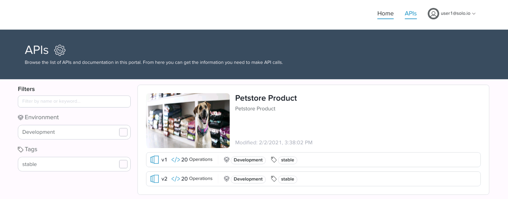

# Work in progress

# Gloo Portal Workshop

Gloo Portal provides a framework for managing the definitions of APIs, API client identity, and API policies on top of Gloo Edge or of the Istio Ingress Gateway. Vendors of API products can leverage Gloo Portal to secure, manage, and publish their APIs independent of the operations used to manage networking infrastructure.

The goal of this workshop is to expose some key features of the Gloo Portal like API lifecycle, Authentication, Rebranding, ...

## Lab Environment

The following Lab environment consists of a Kubernetes environment deployed locally using kind, during this workshop we are going to deploy several versions of a demo application and expose/protect it using Gloo Portal.

In this workshop we will:
* Deploy a demo application (Istio's [bookinfo](https://istio.io/latest/docs/examples/bookinfo/) demo app) on a k8s cluster and expose it through Gloo Edge
* Deploy a second version of the demo app and route traffic to both versions
* Secure the demo app using TLS
* Secure the demo app using OIDC
* Rate limit the traffic going to the demo app
* Transform a response using Gloo transformations
* Configure access logs
* Use several of these features together to configure an advanced OIDC workflow

## Lab 0: Demo Environment Creation

Go to the `/home/solo/workshops/gloo-edge/gloo-edge` directory:

```
cd /home/solo/workshops/gloo-edge/gloo-edge
```

### Create a Kubernetes Cluster

Deploy a local Kubernetes cluster using this command:

```bash
../../scripts/deploy.sh 1 gloo-edge
```

Then verify that your Kubernetes cluster is ready: 

```bash
../../scripts/check.sh gloo-edge
```

### Install Gloo 

Run the commands below to deploy Gloo Edge Enterprise:

```bash
kubectl config use-context gloo-edge
glooctl upgrade --release=v1.6.3
glooctl install gateway enterprise --version 1.6.3 --license-key $LICENSE_KEY
```

Gloo Edge can also be deployed using a Helm chart.

Use the following commands to wait for the Gloo Edge components to be deployed:

```bash
until kubectl get ns gloo-system
do
  sleep 1
done

until [ $(kubectl -n gloo-system get pods -o jsonpath='{range .items[*].status.containerStatuses[*]}{.ready}{"\n"}{end}' | grep false -c) -eq 0 ]; do
  echo "Waiting for all the gloo-system pods to become ready"
  sleep 1
done
```

## Lab 7 : Gloo Portal

Gloo Portal provides a framework for managing the definitions of APIs, API client identity, and API policies on top of Gloo Edge or of the Istio Ingress Gateway. Vendors of API products can leverage Gloo Portal to secure, manage, and publish their APIs independent of the operations used to manage networking infrastructure.

### Install Developer Portal

We'll use Helm to deploy the Developer portal:

```bash
helm repo add dev-portal https://storage.googleapis.com/dev-portal-helm
helm repo update

cat << EOF > gloo-values.yaml
gloo:
  enabled: true
licenseKey:
  secretRef:
    name: license
    namespace: gloo-system
    key: license-key
EOF

kubectl create namespace dev-portal
helm install dev-portal dev-portal/dev-portal -n dev-portal --values gloo-values.yaml  --version=0.5.0
```

<!--bash
until kubectl get ns dev-portal
do
  sleep 1
done
-->

Use the following snippet to wait for the installation to finish:

```bash
until [ $(kubectl -n dev-portal get pods -o jsonpath='{range .items[*].status.containerStatuses[*]}{.ready}{"\n"}{end}' | grep true -c) -eq 4 ]; do
  echo "Waiting for all the Dev portal pods to become ready"
  sleep 1
done
```

### Create an API Doc

Managing APIs with the Developer Portal happens through the use of two resources: the API Doc and API Product.

API Docs are Kubernetes Custom Resources which packages the API definitions maintained by the maintainers of an API. Each API Doc maps to a single Swagger Specification or set of gRPC descriptors. The APIs endpoints themselves are provided by backend services.

Let's create an API Doc using the Swagger Specification of the bookinfo demo app:

```bash
cat <<EOF | kubectl apply -f -
apiVersion: devportal.solo.io/v1alpha1
kind: APIDoc
metadata:
  name: bookinfo-schema
  namespace: default
spec:
  openApi:
    content:
      fetchUrl: https://raw.githubusercontent.com/istio/istio/1.7.3/samples/bookinfo/swagger.yaml
EOF
```

You can then check the status of the API Doc using the following command:

```bash
kubectl get apidoc -n default bookinfo-schema -oyaml
```

### Create an API Product

API Products are Kubernetes Custom Resources which bundle the APIs defined in API Docs into a product which can be exposed to ingress traffic as well as published on a Portal UI. The Product defines what API operations are being exposed, and the routing information to reach the services.

Let's create an API Product using the API Doc we've just created and pointing to the 2 versions of our Bookinfo application:

```bash
cat << EOF | kubectl apply -f-
apiVersion: devportal.solo.io/v1alpha1
kind: APIProduct
metadata:
  name: bookinfo-product
  namespace: default
spec:
  displayInfo: 
    description: Bookinfo Product
    title: Bookinfo Product
    image:
      fetchUrl: https://github.com/solo-io/workshops/raw/master/gloo-edge/gloo-edge/images/books.png
  versions:
  - name: v1
    apis:
    - apiDoc:
        name: bookinfo-schema
        namespace: default
    tags:
      stable: {}
    defaultRoute:
      inlineRoute:
        backends:
        - kube:
            name: productpage
            namespace: bookinfo
            port: 9080
  - name: v2
    apis:
    - apiDoc:
        name: bookinfo-schema
        namespace: default
    tags:
      stable: {}
    defaultRoute:
      inlineRoute:
        backends:
        - kube:
            name: productpage
            namespace: bookinfo-beta
            port: 9080
EOF
```

You can then check the status of the API Product using the following command:

```bash
kubectl get apiproducts.devportal.solo.io -n default bookinfo-product -oyaml
```

Now, we are going to create an Environment named dev using the domain api.example.com and expose v1 and v2 of our Bookinfo API Product.

```bash
cat << EOF | kubectl apply -f-
apiVersion: devportal.solo.io/v1alpha1
kind: Environment
metadata:
  name: dev
  namespace: default
spec:
  domains:
  - api.example.com
  displayInfo:
    description: This environment is meant for developers to deploy and test their APIs.
    displayName: Development
  apiProducts:
  - name: bookinfo-product
    namespace: default
    publishedVersions:
    - name: v1
    - name: v2
EOF
```

You can then check the status of the Environment using the following command:

```bash
kubectl get environment.devportal.solo.io -n default dev -oyaml
```

### Test the Service

When targeting Gloo Edge, Gloo Portal manages a set of Gloo Edge Custom Resource Definitions (CRDs) on behalf of users:

- VirtualServices: Gloo Portal generates a Gloo Edge VirtualService for each API Product. The VirtualService contains a single HTTP route for each API operation exposed in the product. Routes are named and their matchers are derived from the OpenAPI definition.
- Upstreams: Gloo Portal generates a Gloo Upstream for each unique destination references in an API Product route.

So, you can now access the API using the command below:

```bash
curl -H "Host: api.example.com" http://172.18.0.210/api/v1/products
```

```
[
  {
    "id": 0,
    "title": "The Comedy of Errors",
    "descriptionHtml": "<a href=\"https://en.wikipedia.org/wiki/The_Comedy_of_Errors\">Wikipedia Summary</a>: The Comedy of Errors is one of <b>William Shakespeare's</b> early plays. It is his shortest and one of his most farcical comedies, with a major part of the humour coming from slapstick and mistaken identity, in addition to puns and word play."
  }
]
```

### Configure a Portal

Once a set of APIs have been bundled together in an API Product, those products can be published in a user-friendly interface through which outside developers can discover, browse, request access to, and interact with APIs. This is done by defining Portals, a custom resource which tells Gloo Portal how to publish a customized website containing an interactive catalog of those products.

We'll integrate the Portal with Keycloak, so we need to define a couple of variables and create a secret:

```bash
KEYCLOAK_URL=http://$(kubectl get service keycloak -o jsonpath='{.status.loadBalancer.ingress[0].ip}'):8080/auth
KEYCLOAK_CLIENT=$(kubectl -n gloo-system get authconfigs.enterprise.gloo.solo.io keycloak-oauth -o jsonpath='{.spec.configs[0].oauth2.oidcAuthorizationCode.clientId}')

cat <<EOF | kubectl apply -f -
apiVersion: v1
kind: Secret
metadata:
  name: bookinfo-portal-oidc-secret
  namespace: default
data:
  client_secret: $(kubectl -n gloo-system get secret keycloak-oauth -o jsonpath='{.data.oauth}' | base64 --decode | awk '{ print $2 }' | base64)
EOF
```

Let's create the Portal:

```bash
cat <<EOF | kubectl apply -f -
apiVersion: devportal.solo.io/v1alpha1
kind: Portal
metadata:
  name: bookinfo-portal
  namespace: default
spec:
  displayName: Bookinfo Portal
  description: The Developer Portal for the Bookinfo API
  banner:
    fetchUrl: https://github.com/solo-io/workshops/raw/master/gloo-edge/gloo-edge/images/books.png
  favicon:
    fetchUrl: https://github.com/solo-io/workshops/raw/master/gloo-edge/gloo-edge/images/books.png
  primaryLogo:
    fetchUrl: https://github.com/solo-io/workshops/raw/master/gloo-edge/gloo-edge/images/books.png
  customStyling: {}
  staticPages: []
  domains:
  - portal.example.com

  oidcAuth:
    callbackUrlPrefix: http://portal.example.com/
    clientId: ${KEYCLOAK_CLIENT}
    clientSecret:
      name: bookinfo-portal-oidc-secret
      namespace: default
      key: client_secret
    groupClaimKey: group
    issuer: ${KEYCLOAK_URL}/realms/master

  publishedEnvironments:
  - name: dev
    namespace: default
EOF
````

You can now check the status of the API Product using the following command:

```bash
kubectl get portal -n default bookinfo-portal -oyaml
```

We need to update the `/etc/hosts` file to be able to access the Portal:

```bash
cat <<EOF | sudo tee -a /etc/hosts
172.18.0.210 api.example.com
172.18.0.210 portal.example.com
EOF
```

### Configure a Rate Limiting Policy

We can now update the Environment to secure it and to define a rate limit:

```bash
cat << EOF | kubectl apply -f-
apiVersion: devportal.solo.io/v1alpha1
kind: Environment
metadata:
  name: dev
  namespace: default
spec:
  domains:
  - api.example.com
  displayInfo:
    description: This environment is meant for developers to deploy and test their APIs.
    displayName: Development
  apiProducts:
  - name: bookinfo-product
    namespace: default
    plans:
    - authPolicy:
        apiKey: {}
      displayName: Basic
      name: basic
      rateLimit:
        requestsPerUnit: 5
        unit: MINUTE
    publishedVersions:
    - name: v1
    - name: v2
EOF
```

And finally, we need to let the users of the `users` group to access the Portal and use this plan:

```bash
cat << EOF | kubectl apply -f -
apiVersion: devportal.solo.io/v1alpha1
kind: Group
metadata:
  name: oidc-group
  namespace: default
spec:
  accessLevel:
    apiProducts:
    - name: bookinfo-product
      namespace: default
      environments:
      - name: dev
        namespace: default
        plans:
        - basic
    portals:
    - name: bookinfo-portal
      namespace: default
  oidcGroup:
    groupName: users
EOF
```

### Explore the Administrative Interface

Let's run the following command to allow access ot the admin UI of Gloo Portal:

```
kubectl port-forward -n dev-portal svc/admin-server 8000:8080
```

You can now access the admin UI at http://localhost:8000


Take the time to explore the UI and see the different components we have created.

### Explore the Portal Interface

The user Portal we have created is available at http://portal.example.com


Click on `Log In` and select `Log in using credentials`.

Log in with the user `dev1` and the password `password` and define a new password.

Click on `dev1` on the top right corner and select `API Keys`.

Click on `API Keys` again and Add an API Key.


Click on the key to copy the value to the clipboard.

Click on the `APIs` tab.



You can click on on of the versions of the `Bookinfo Product` and explore the API.

You can also test the API and use the `Authorize` button to set your API key.


### Verify the Rate Limiting Policy

Now we're going to exercise the service using `curl`:

So, we need to retrieve the API key first:

```
key=$(kubectl get secret -l environments.devportal.solo.io=dev.default -n default -o jsonpath='{.items[0].data.api-key}' | base64 --decode)
```

Then, we can run the following command:

```
curl -H "Host: api.example.com" -H "api-key: ${key}" http://172.18.0.210/api/v1/products -v
```

You should get a result similar to:

```
*   Trying 172.18.0.210...
* TCP_NODELAY set
* Connected to 172.18.0.210 (172.18.0.210) port 80 (#0)
> GET /api/v1/products HTTP/1.1
> Host: api.example.com
> User-Agent: curl/7.52.1
> Accept: */*
> api-key: OTA4OGMyYWMtNmE4Yi02OWRmLTJjZGUtYzQ2Zjc1NTE4OTFm
> 
< HTTP/1.1 200 OK
< content-type: application/json
< content-length: 395
< server: envoy
< date: Wed, 14 Oct 2020 12:25:26 GMT
< x-envoy-upstream-service-time: 2
< 
* Curl_http_done: called premature == 0
* Connection #0 to host 172.18.0.210 left intact
[{"id": 0, "title": "The Comedy of Errors", "descriptionHtml": "<a href=\"https://en.wikipedia.org/wiki/The_Comedy_of_Errors\">Wikipedia Summary</a>: The Comedy of Errors is one of <b>William Shakespeare's</b> early plays. It is his shortest and one of his most farcical comedies, with a major part of the humour coming from slapstick and mistaken identity, in addition to puns and word play."}]
```

Now, execute the curl command again several times.

As soon as you reach the rate limit, you should get the following output:

```
*   Trying 172.18.0.210...
* TCP_NODELAY set
* Connected to 172.18.0.210 (172.18.0.210) port 80 (#0)
> GET /api/v1/products HTTP/1.1
> Host: api.example.com
> User-Agent: curl/7.52.1
> Accept: */*
> api-key: OTA4OGMyYWMtNmE4Yi02OWRmLTJjZGUtYzQ2Zjc1NTE4OTFm
> 
< HTTP/1.1 429 Too Many Requests
< x-envoy-ratelimited: true
< date: Wed, 14 Oct 2020 12:25:48 GMT
< server: envoy
< content-length: 0
< 
* Curl_http_done: called premature == 0
* Connection #0 to host 172.18.0.210 left intact
```

This is the end of the workshop. We hope you enjoyed it !