# Gloo Portal Workshop

Gloo Portal is a Kubernetes native solution aiming to facilitate API publication and API consumption for developers.

More technically, Gloo Portal adheres to the Operator pattern and transforms Custom Resources into customized and ready-to-use developer portals. These portals are fully brandable and secured web applications.

Gloo Portal provides a framework for managing API definitions, API client identity, and API policies on top of Gloo Edge or Istio Ingress Gateway. Vendors of API products can leverage Gloo Portal to secure, manage, and publish their APIs independently of the operations used to manage networking infrastructure.

This workshop aims to expose some key features of the Gloo Portal like API lifecycle, authentication, and branding.


## Your workshop environment

The Lab environment consists of a Virtual Machine where you will deploy a Kubernetes cluster using [kind](https://kind.sigs.k8s.io/).  
You will then deploy Gloo Edge and Gloo Portal on this Kubernetes cluster.

### Init step 1: Kubernetes

Navigate to the work directory and create local Kubernetes cluster with KinD:

```bash
cd /home/solo/workshops/gloo-portal
../scripts/deploy.sh 1 gloo-portal
```

Then verify that your Kubernetes cluster is ready: 

```bash
../scripts/check.sh gloo-portal
```

The `check.sh` script will return immediately with no output if the cluster is ready.  Otherwise, it will output a series of periodic "waiting" messages until the cluster is up.


### Init step 2: Gloo Edge

Let's deploy **Gloo Edge**:

```bash
helm repo update

helm upgrade -i gloo glooe/gloo-ee --namespace gloo-system --version 1.8.6 --create-namespace --set-string license_key="$LICENSE_KEY"
```

NOTE: Gloo Portal requires a subscription to Gloo Edge Enterprise or to Gloo Mesh Enterprise.

### Init step 3: Gloo Portal

Finally, let's deploy **Gloo Portal**:

```bash
cat << EOF > portal-values.yaml
glooEdge:
  enabled: true
licenseKey:
  secretRef:
    name: license
    namespace: gloo-system
    key: license-key
EOF

helm repo add gloo-portal https://storage.googleapis.com/dev-portal-helm
helm repo update
helm install gloo-portal gloo-portal/gloo-portal -n gloo-portal --values portal-values.yaml --version=1.1.0-beta6 --create-namespace

kubectl -n gloo-portal wait pod --all --for condition=Ready --timeout -1s
```

### Init step 4: Keycloak

[Keycloak](https://keycloak.org) is an open-source identity management platform that we will use to secure access to your APIs and to the developer Portal.

Deploy a Keycloak instance to our Kubernetes cluster:

```bash
kubectl create -f https://raw.githubusercontent.com/keycloak/keycloak-quickstarts/12.0.4/kubernetes-examples/keycloak.yaml
kubectl rollout status deploy/keycloak
```

<!--bash
sleep 30
-->

Then, we create a Client application and a few users:

```bash
# Get Keycloak URL and token
KEYCLOAK_URL=http://$(kubectl get service keycloak -o jsonpath='{.status.loadBalancer.ingress[0].ip}'):8080/auth
KEYCLOAK_TOKEN=$(curl -s -d "client_id=admin-cli" -d "username=admin" -d "password=admin" -d "grant_type=password" "$KEYCLOAK_URL/realms/master/protocol/openid-connect/token" | jq -r .access_token)
GLOO_GW_IP=$(glooctl proxy address | cut -d':' -f1)

# Create initial token to register the client
read -r client token <<<$(curl -s -H "Authorization: Bearer ${KEYCLOAK_TOKEN}" -X POST -H "Content-Type: application/json" -d '{"expiration": 0, "count": 1}' $KEYCLOAK_URL/admin/realms/master/clients-initial-access | jq -r '[.id, .token] | @tsv')

# Register the client
read -r id secret <<<$(curl -X POST -d "{ \"clientId\": \"${client}\" }" -H "Content-Type:application/json" -H "Authorization: bearer ${token}" ${KEYCLOAK_URL}/realms/master/clients-registrations/default| jq -r '[.id, .secret] | @tsv')

# Add allowed redirect URIs
curl -H "Authorization: Bearer ${KEYCLOAK_TOKEN}" -X PUT -H "Content-Type: application/json" -d '{"serviceAccountsEnabled": true, "authorizationServicesEnabled": true, "redirectUris": ["https://portal.mycompany.corp/callback", "http://portal.mycompany.corp/callback", "http://'${GLOO_GW_IP}'/callback"]}' $KEYCLOAK_URL/admin/realms/master/clients/${id}

# Add the group attribute in the JWT token returned by Keycloak
curl -H "Authorization: Bearer ${KEYCLOAK_TOKEN}" -X POST -H "Content-Type: application/json" -d '{"name": "group", "protocol": "openid-connect", "protocolMapper": "oidc-usermodel-attribute-mapper", "config": {"claim.name": "group", "jsonType.label": "String", "user.attribute": "group", "id.token.claim": "true", "access.token.claim": "true"}}' $KEYCLOAK_URL/admin/realms/master/clients/${id}/protocol-mappers/models

# create groups "users" and "execs"
curl -H "Authorization: Bearer ${KEYCLOAK_TOKEN}" -X POST -H "Content-Type: application/json" -d '{"name": "users"}' $KEYCLOAK_URL/admin/realms/master/groups
curl -H "Authorization: Bearer ${KEYCLOAK_TOKEN}" -X POST -H "Content-Type: application/json" -d '{"name": "execs"}' $KEYCLOAK_URL/admin/realms/master/groups

# Create first user "user1", group: users, mail address: user1@solo.io
curl -H "Authorization: Bearer ${KEYCLOAK_TOKEN}" -X POST -H "Content-Type: application/json" -d '{"username": "user1", "email": "user1@solo.io", "enabled": true, "groups": ["users"], "attributes": {"group": "users"}, "credentials": [{"type": "password", "value": "password", "temporary": false}]}' $KEYCLOAK_URL/admin/realms/master/users

# Create second user "user2", group: users, mail address: user1@example.com
curl -H "Authorization: Bearer ${KEYCLOAK_TOKEN}" -X POST -H "Content-Type: application/json" -d '{"username": "user2", "email": "user2@example.com", "enabled": true, "groups": ["users"], "attributes": {"group": "users"}, "credentials": [{"type": "password", "value": "password", "temporary": false}]}' $KEYCLOAK_URL/admin/realms/master/users

# Create third user "exec1", group: execs, mail address: exec1@solo.io
curl -H "Authorization: Bearer ${KEYCLOAK_TOKEN}" -X POST -H "Content-Type: application/json" -d '{"username": "exec1", "email": "exec1@solo.io", "enabled": true, "groups": ["execs"], "attributes": {"group": "execs"}, "credentials": [{"type": "password", "value": "password", "temporary": false}]}' $KEYCLOAK_URL/admin/realms/master/users
```

For curious ones, the Keycloak admin web UI is available at `$KEYCLOAK_URL/admin`

### Init step 5: HTTPBIN

Finally, at some point in the workshop, we will need a backend service mirroring the headers.

So, let's just deploy the **httpbin** app:

```bash
kubectl apply -f -<<EOF
apiVersion: v1
kind: ServiceAccount
metadata:
  name: httpbin
  namespace: default
---
apiVersion: v1
kind: Service
metadata:
  name: httpbin
  namespace: default
  labels:
    app: httpbin
spec:
  ports:
  - name: http
    port: 8000
    targetPort: 80
  selector:
    app: httpbin
---
apiVersion: apps/v1
kind: Deployment
metadata:
  name: httpbin
  namespace: default
spec:
  replicas: 1
  selector:
    matchLabels:
      app: httpbin
      version: v1
  template:
    metadata:
      labels:
        app: httpbin
        version: v1
    spec:
      serviceAccountName: httpbin
      containers:
      - image: docker.io/kennethreitz/httpbin
        imagePullPolicy: IfNotPresent
        name: httpbin
        ports:
        - containerPort: 80
EOF
```

## Lab 1: Crafting your first API Product

First, some conceptual elements to better understand how the Gloo Portal CRDs work together.

You will define `APIDocs` Kubernetes _Custom Resources_, standing for "references" to OpenAPI (or gRPC) specifications. 

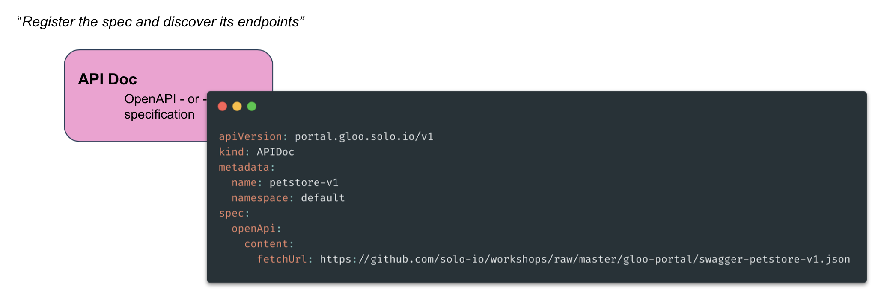

Then, you will combine these `APIDocs` into a single `APIProduct`.

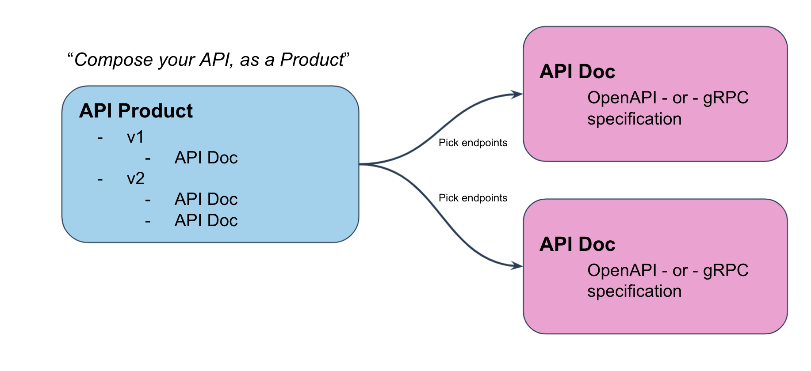

**API Products** are Kubernetes _Custom Resources_ which bundle the APIs defined in **API Docs** into a product that can be exposed to ingress traffic as well as published on a Portal UI. An **API Product** defines what API operations are being exposed, and the routing information to reach the services.

In this workshop, we will combine 2 small `APIDoc`s into the `v1` of our Petstore `APIProduct` 
And one larger `APIDoc` as the `v2` of our Petstore `APIProduct`.  
See:

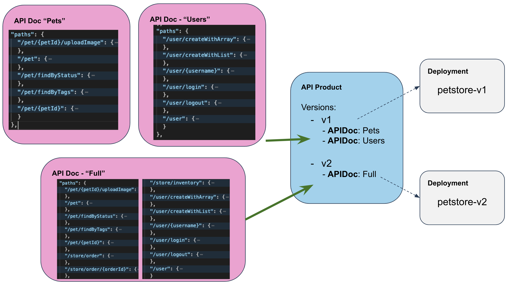

The `APIProduct` comes with two versions of it:
- `/v1` will expose endpoints for the `/pets/*` and `/users/*` endpoints, and it will route requests to the `petstore-v1` application
- `/v2` will expose all of the endpoints, including `/pets/*`, `/users/*` and also `/store/*`, and it will route requests to the `petstore-v2` application

We'll start by deploying the well-known Petstore app, twice. This will simulate the two versions of it, accessible behind two different Kubernetes Services.

### Step 1.1

Create two deployments of the Petstore app

```bash
for i in {1..2}; do
kubectl apply -f - <<EOF
apiVersion: apps/v1
kind: Deployment
metadata:
  name: petstore-v$i
spec:
  replicas: 1
  selector:
    matchLabels:
      app: petstore
      version: v$i
  template:
    metadata:
      labels:
        app: petstore
        version: v$i
    spec:
      containers:
        - name: petstore
          image: swaggerapi/petstore
          # env:
          #   - name: SWAGGER_BASE_PATH
          #     value: /
          imagePullPolicy: Always
          ports:
            - name: http
              containerPort: 8080
---
apiVersion: v1
kind: Service
metadata:
  name: petstore-v$i
spec:
  ports:
    - name: http
      port: 8080
      targetPort: http
      protocol: TCP
  selector:
    app: petstore
    version: v$i
EOF
; done
```

Now, let's check if Gloo Edge has automatically created 2 `Upstream` CRs for these 2 services:

```bash
kubectl -n gloo-system get upstreams
```

The output should be like:
```text
...
default-petstore-v1-8080                               9s
default-petstore-v2-8080                               8s
...
```
Great!


### Step 1.2

Create the `APIDoc`s from our 3 OpenApi specs:

Pets only:

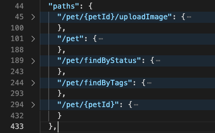 

Users only:

 

Pets, users ans stores:

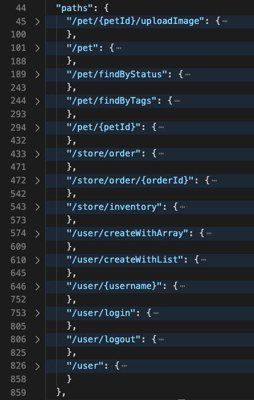


```bash
for i in petstore-openapi-v1-pets petstore-openapi-v1-users petstore-openapi-v2-full; do
cat <<EOF | kubectl apply -f -
apiVersion: portal.gloo.solo.io/v1beta1
kind: APIDoc
metadata:
  name: $i
  namespace: default
spec:
  openApi:
    content:
      fetchUrl: https://raw.githubusercontent.com/solo-io/workshops/master/gloo-portal/openapi-specs/$i.json
EOF
; done
```

Let's be curious and take a look at the status of one these `APIDoc`s:
```bash
kubectl get apidoc
kubectl get apidoc petstore-openapi-v1-pets -o yaml
```

The output is something like that:
```yaml
...
status:
  description: 'This is a sample server Petstore server.  You can find out more about
    Swagger at [http://swagger.io](http://swagger.io) or on [irc.freenode.net, #swagger](http://swagger.io/irc/).  For
    this sample, you can use the api key `special-key` to test the authorization filters.'
  displayName: Swagger Petstore
  observedGeneration: 1
  openApi:
    operations:
    - operationId: addPet
      path: /api/pet
      summary: Add a new pet to the store
      verb: POST
    - operationId: deletePet
      path: /api/pet/{petId}
      summary: Deletes a pet
      verb: DELETE
    - operationId: findPetsByStatus
      path: /api/pet/findByStatus
      summary: Finds Pets by status
      verb: GET
    - operationId: findPetsByTags
      path: /api/pet/findByTags
      summary: Finds Pets by tags
      verb: GET
    - operationId: getPetById
      path: /api/pet/{petId}
      summary: Find pet by ID
      verb: GET
    - operationId: updatePet
      path: /api/pet
      summary: Update an existing pet
      verb: PUT
    - operationId: updatePetWithForm
      path: /api/pet/{petId}
      summary: Updates a pet in the store with form data
      verb: POST
    - operationId: uploadFile
      path: /api/pet/{petId}/uploadImage
      summary: uploads an image
      verb: POST
  state: Succeeded
  version: 1.0.5
  ```

As you can see, the different endpoints of the OpenAPI spec have been parsed by the Gloo Portal controller. 

Finally, let's create the `APIProduct`, with its 2 versions:

```bash
cat << EOF | kubectl apply -f -
apiVersion: portal.gloo.solo.io/v1beta1
kind: APIProduct
metadata:
  name: petstore-product
  namespace: default
  labels:
    app: petstore
spec:
  displayInfo: 
    title: Petstore Product
    description: Fabulous API product for the Petstore
  versions:
  - name: v1
    apis:
      - apiDoc:
          name: petstore-openapi-v1-pets
          namespace: default
      - apiDoc:
          name: petstore-openapi-v1-users
          namespace: default
    gatewayConfig:
      route:
        inlineRoute:
          backends:
            - upstream:
                name: default-petstore-v1-8080
                namespace: gloo-system
  - name: v2
    apis:
    - apiDoc:
        name: petstore-openapi-v2-full
        namespace: default
    gatewayConfig:
      route:
        inlineRoute:
          backends:
            - upstream:
                name: default-petstore-v2-8080
                namespace: gloo-system
EOF
```

Reminder: the `APIProduct` is named `petstore-product`. It is available in 2 different versions:
- **v1** is built upon 2 `APIDocs`, containing operations for Pets on one side, and Users on the other side
- **v2** is build upon 1 `APIDoc`, containing all the operations

As you can see, we have configured different routes for the two versions, so that the **v1** will target our `Upstream` called `default-petstore-v1-8080` and the **v2** will target our `Upstream` called `default-petstore-v2-8080`.


## Lab 2: Deploying the API

### Step 2.1

Let's publish our API on a Gateway! quick reminder, we need to create an `Environment` CR, that will select one or more `APIProduct(s)`. 


Once the `Environment` is created, Gloo Portal will configure an API Gateway:

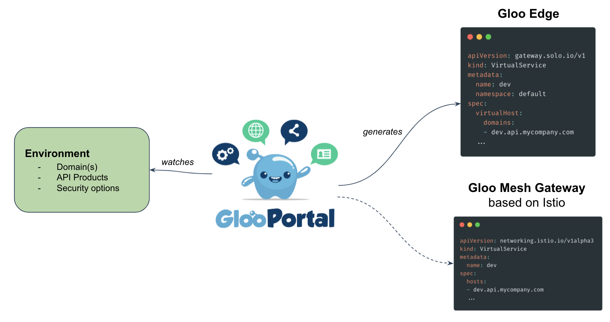

In this workshop, and in order to leverage advanced API Gateway features, we will rely on Gloo Edge. The other option being an **Gloo Mesh Gateway**, built on top on the Istio Gateway.


We need to prepare an `Environment` CR, where we will set the domain(s) and, optionally, some security options like authentication or rate-limiting rules:

```bash
cat << EOF > env.yaml
apiVersion: portal.gloo.solo.io/v1beta1
kind: Environment
metadata:
  name: dev
  namespace: default
spec:
  domains:
    - api.mycompany.corp # the domain name where the API will be exposed
  displayInfo:
    description: This environment is meant for developers to deploy and test their APIs.
    displayName: Development
  basePath: /ecommerce # a global basepath for our APIs
  apiProducts: # we will select our APIProduct using a selector and the 2 version of it
    - namespaces:
      - "*" 
      labels:
      - key: app
        operator: In
        values:
        - petstore
      versions:
        names:
        - v1
        - v2
      basePath: "" # this will dynamically prefix the API with the version names
  gatewayConfig:
    disableRoutes: false # we actually want to expose the APIs on a Gateway (optional)
EOF

kubectl apply -f env.yaml
```

You can then check the status of the `Environment` using the following command:

```bash
kubectl get environments.portal.gloo.solo.io dev -o yaml
```

The output is pretty big but it should end with:

```
state: Succeeded
```

### Step 2.2

As explained above, Gloo Portal will configure Gloo Edge to expose our APIs.  
Using the command below, you'll see the Gloo Edge `VirtualService` created by Gloo Portal:

```bash
kubectl get virtualservice dev -o yaml
```

You should see something like this:
```yaml
...
spec:
  displayName: Development
  virtualHost:
    domains:
    - api.mycompany.corp
    routes:
    - delegateAction:
        selector:
          labels:
            apiproducts.portal.gloo.solo.io: petstore-product.default
            apiproducts.portal.gloo.solo.io/version: v2
            environments.portal.gloo.solo.io: dev.default
      matchers:
      - prefix: /
      name: petstore-product.v2
      options:
        regexRewrite:
          pattern:
            regex: ^/ecommerce/v2/(.*)$
          substitution: /\1
    - delegateAction:
        selector:
          labels:
            apiproducts.portal.gloo.solo.io: petstore-product.default
            apiproducts.portal.gloo.solo.io/version: v1
            environments.portal.gloo.solo.io: dev.default
      matchers:
      - prefix: /
      name: petstore-product.v1
      options:
        regexRewrite:
          pattern:
            regex: ^/ecommerce/v1/(.*)$
          substitution: /\1
status:
  reportedBy: gateway
  state: 1
  subresourceStatuses:
    '*v1.Proxy.gloo-system.gateway-proxy':
      reportedBy: gloo
      state: 1
```

There are two things to note here:
- Gloo Portal used the **version** names of your `APIProduct` as prefixes for your endpoints. Meaning the endpoints of the version called 'v1' are now accessible over `/ecommerce/v1/...`, etc. This is kind of an automatic version-based routing
- the `Environment` CR has been declined into a `VirtualService` CR and also some `RouteTables` CRs.  
Let's have a closer look at the `RouteTables`:

```bash
kubectl get routetable
```

```
NAME                      AGE
dev.petstore-product.v1   10m
dev.petstore-product.v2   10m
```

```bash
kubectl get routetable dev.petstore-product.v1 -o yaml
```

Extract:
```yaml
...
  - matchers:
    - methods:
      - GET
      - OPTIONS
      regex: /ecommerce/v1/api/pet/[^/]+?
    name: petstore-product.default.petstore-openapi-v1-pets.default.getPetById
    options:
      stagedTransformations:
        early:
          requestTransforms:
          - matcher:
              prefix: /
            requestTransformation:
              transformationTemplate:
                dynamicMetadataValues:
                - key: environment
                  value:
                    text: dev.default
                - key: api_product
                  value:
                    text: petstore-product.default
                passthrough: {}
    routeAction:
      multi:
        destinations:
        - destination:
            upstream:
              name: default-petstore-v1-8080
              namespace: gloo-system
          weight: 1
...
```

The combination of these CRs will generate the expected configuration for Envoy.

### Step 2.3

Now let's consume the API!

```bash
# v1
# one of the /pet endpoint
curl -s $(glooctl proxy url)/ecommerce/v1/api/pet/1 -H "Host: api.mycompany.corp" | jq
# one of the /user endpoint
curl -s -X POST $(glooctl proxy url)/ecommerce/v2/api/user/createWithList -H "Host: api.mycompany.corp" -d '[{"id":0,"username":"jdoe","firstName":"John","lastName":"Doe","email":"john@doe.me","password":"string","phone":"string","userStatus":0}]' -H "Content-type: application/json"
curl -s $(glooctl proxy url)/ecommerce/v2/api/user/jdoe -H "Host: api.mycompany.corp" | jq

# v2
# one of the /store endpoint
curl -s $(glooctl proxy url)/ecommerce/v2/api/store/order/1 -H "Host: api.mycompany.corp" | jq

```


## Lab 3 - Publishing the APIs on a developer portal

You need a `Portal` Custom Resource to expose your APIs to developers. That will configure a developer portal webapp, which is fully brandable.

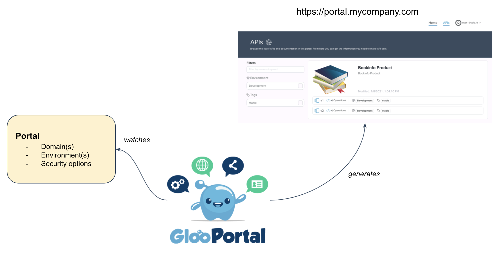


```bash
cat <<EOF | kubectl apply -f -
apiVersion: portal.gloo.solo.io/v1beta1
kind: Portal
metadata:
  name: ecommerce-portal
  namespace: default
spec:
  displayName: E-commerce Portal
  description: The Gloo Portal for the Petstore API and much more!
  banner:
    fetchUrl: https://i.imgur.com/EXbBN1a.jpg
  favicon:
    fetchUrl: https://i.imgur.com/QQwlQG3.png
  primaryLogo:
    fetchUrl: https://i.imgur.com/hjgPMNP.png
  customStyling: {}
  staticPages: []

  domains:
  - portal.mycompany.corp

  publishedEnvironments:
  - name: dev
    namespace: default

  allApisPublicViewable: true # this will make APIs visible by unauthenticated users
EOF
```

To access it, you need to override the domain name on your machine:

```bash
cat <<EOF | sudo tee -a /etc/hosts
$(kubectl -n gloo-system get service gateway-proxy -o jsonpath='{.status.loadBalancer.ingress[0].ip}') portal.mycompany.corp
$(kubectl -n gloo-system get service gateway-proxy -o jsonpath='{.status.loadBalancer.ingress[0].ip}') api.mycompany.corp
EOF
```

The developer Portal we have created is now available at http://portal.mycompany.corp/

```bash
open http://portal.mycompany.corp/
```

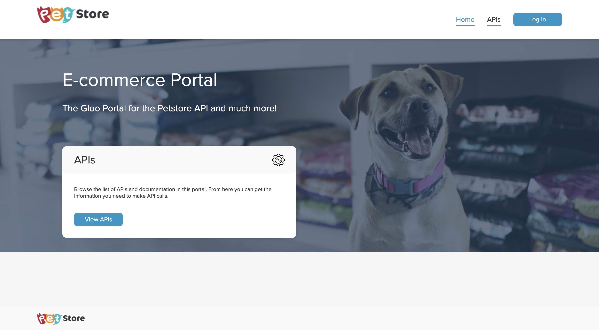

Note that we explicetly set the APIs visiblity to public in the `Portal` config (see above: `allApisPublicViewable: true`)

Take a few minutes to browse the developer portal.  
Under the **APIs** menu, you will find the two versions of our `APIProduct`:

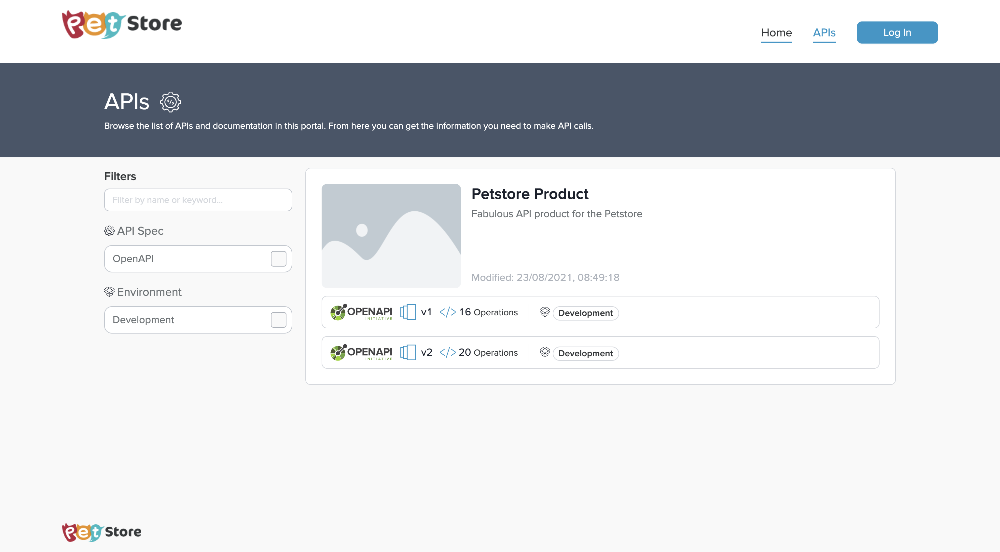

Click the line with the **v1** to observe the list of aggregated endpoints for this version.

Based on the OpenAPI specifications, these endpoints require authentication. We will override this with Gloo Portal _Custom Resources_ later in this workshop.  Below, there is a section where you will secure the access to the developer portal and also the access to the APIs.

## Lab 4: Explore the Admin UI

On top of these developer portal web UIs, Gloo Portal comes with an additional Admin-centric web UI, so that you can see and configure all of the Gloo Portal resources:
- `APIDocs` and `APIProducts`
- `Routes`
- `Environments`
- `Portals`
- `Users` and `Groups`

You can access this admin UI using a port-forward:

```bash
kubectl -n gloo-portal port-forward svc/gloo-portal-admin-server 8080 &
```

Then, open http://localhost:8080 and you should find this webapp:

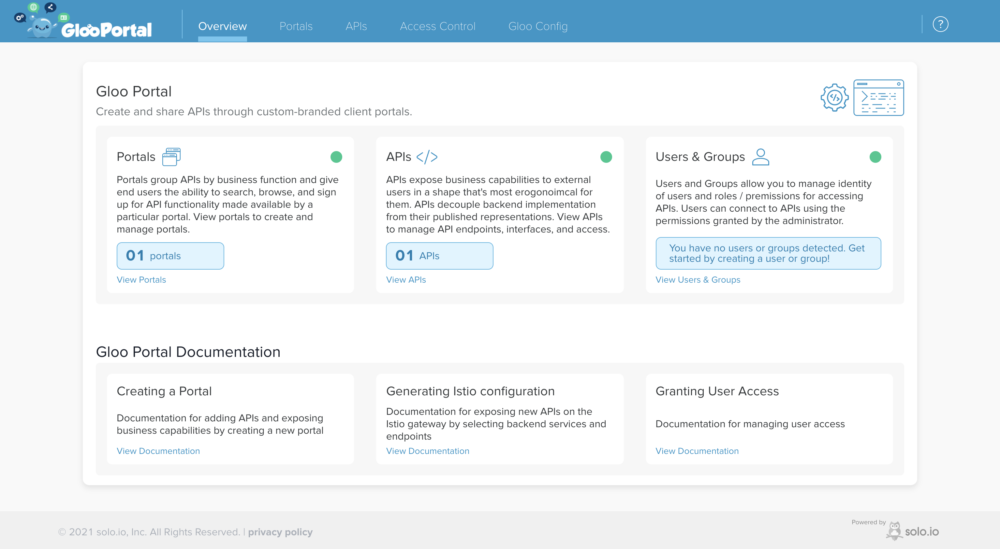

Explore the menus and find your `APIProduct`, `Environment` and `Portal` resources.

We will use the Admin UI to secure the access to the developer Portal.  
And, later on, we will use CRDs to secure the access to the APIs.  
Both are feasible the way you prefer, using Custom Resources or the Admin web UI.


## Lab 5: Securing the access to the developer Portal with basic auth

There are 2 options to secure the access to a developer Portal:
- basic auth, using the `User` and `Group` CRDs
- OpenID Connect ([see also](https://www.solo.io/blog/self-service-user-registration-with-gloo-portal-and-okta/))

In this **lab #5**, we will secure the access to a developer `Portal` with basic auth.

### Option A - Using the admin portal web UI
In the "Access Control" section of the dashboard, click the "Create a Group" button...  

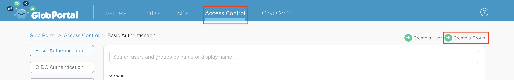

... and give it a name, here `developers` and display name, here `ecommerce developers`:

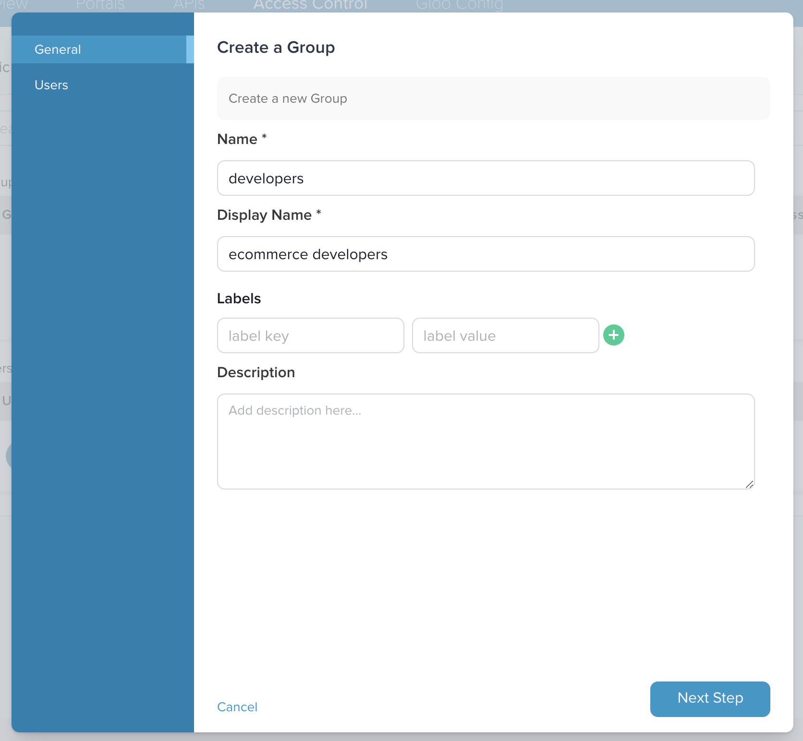

Click "Next step" and then click "Create Group".  

Now, let's configure access control so that the __"ecommerce developers"__ `Group` can access the developer `Portal`.  
Click the __Manage__ link under "Portal Access", next to the group name:

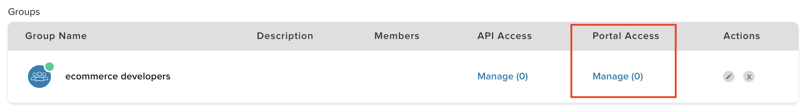

Then add the "E-commerce Portal" `Portal` to the list of allowed Portal for this Group:

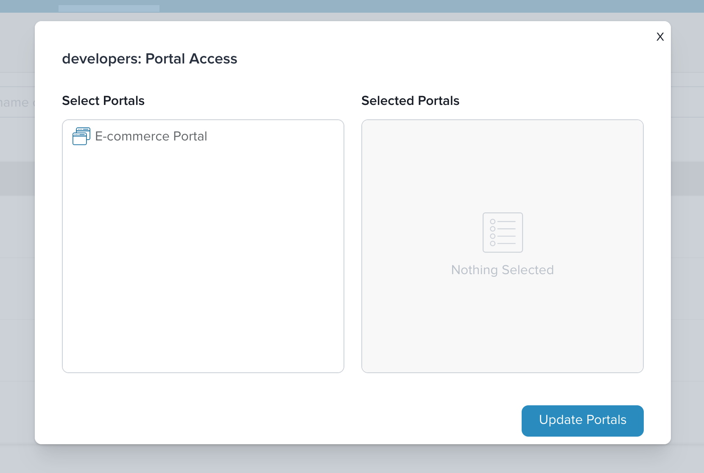

Now, let's create a User with the same method:

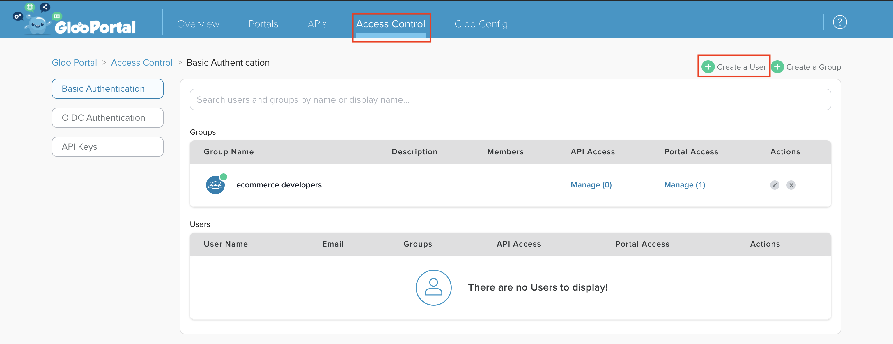

Then, give it a name, here `dev1` and a password:

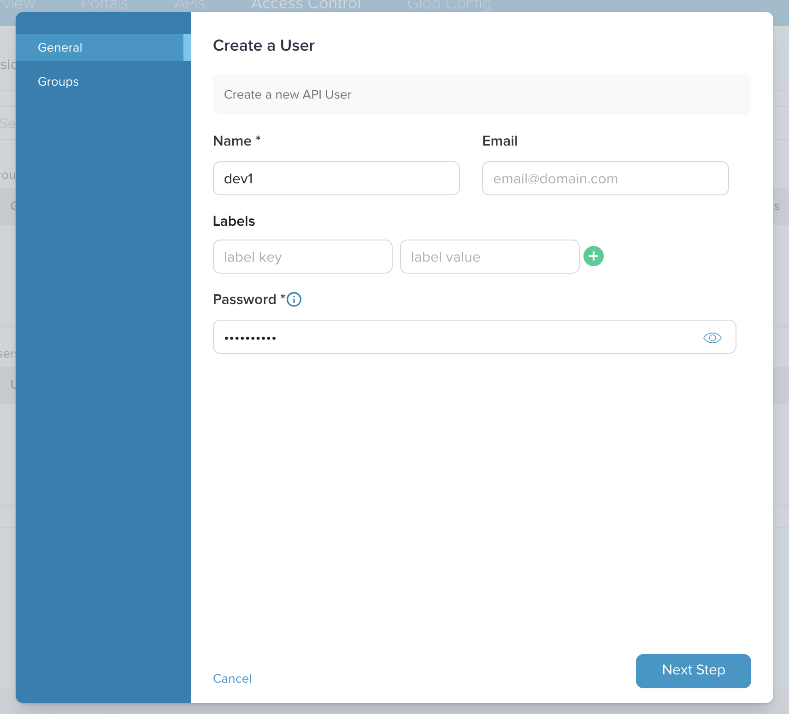

Finally, add it as a member of the `Group` defined above: 

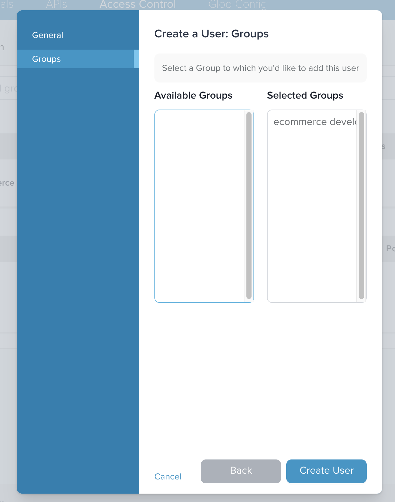


Finally, you should see a configuration like this:

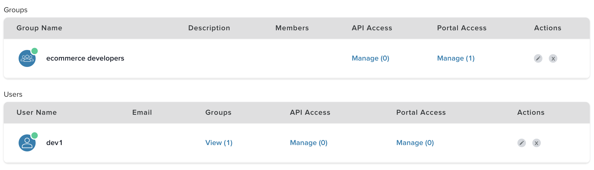

### Option B - Using CRDs
Another way of working is by using the Gloo Portal _Custom Resources_:

```bash
pass=$(htpasswd -bnBC 10 "" super-password2 | tr -d ':\n')
kubectl create secret generic dev2-password \
  -n gloo-portal --type=opaque \
  --from-literal=password=$pass

kubectl apply -f -<<EOF
apiVersion: portal.gloo.solo.io/v1beta1
kind: User
metadata:
  name: dev2
  namespace: gloo-portal
  labels:
    groups.portal.gloo.solo.io/gloo-portal.developers: "true"
spec:
  basicAuth:
    passwordSecretKey: password
    passwordSecretName: dev2-password
    passwordSecretNamespace: gloo-portal
  username: dev2
EOF
```

The Access Control page will automatically be updated with our new User:

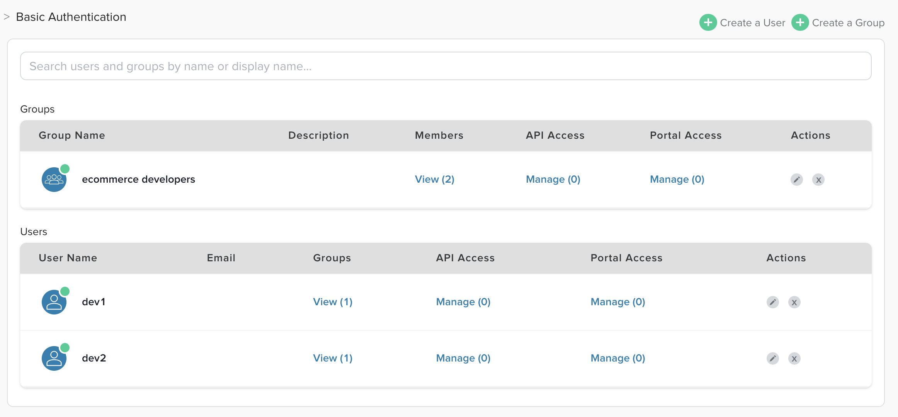

As always with Solo.io products, everything is GitOps friendly!


### Connecting to the Portal, as a developer

Let's now give it a try, with one of our users.  

Navigate to your developer portal: http://portal.mycompany.corp/ and click the "Log In" button in the upper right corner.

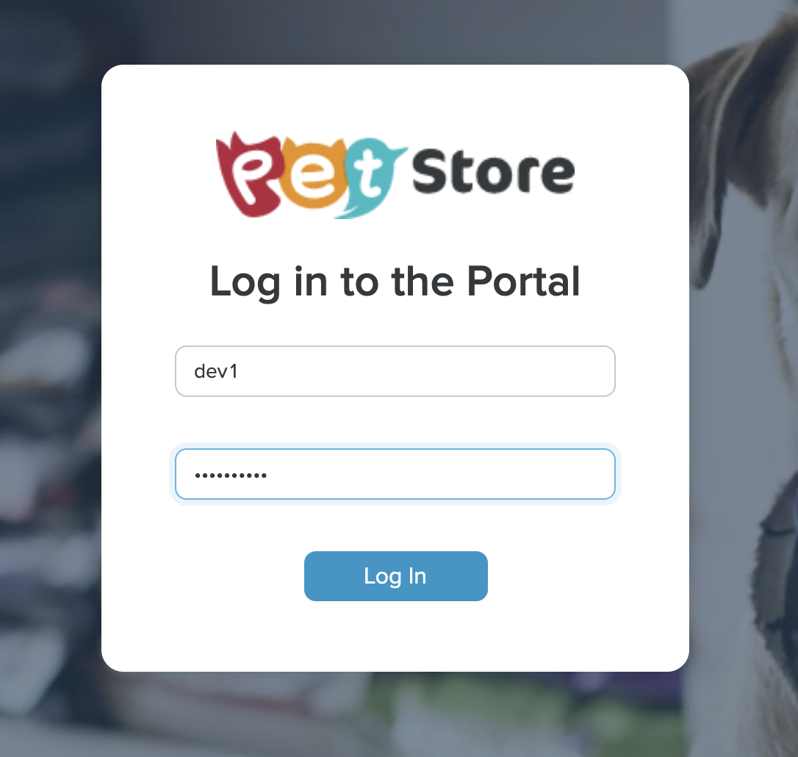

Since it's the first connection with your `User`, you may be requested to change the default password for a new one.  
If you have any issue while logging in, please double check the password and the permission on the `Group` to access the `Portal`.

Once logged in, you should be able to browse the API catalog and see your Petstore (API) product.  


## Lab 6: Securing the access to the developer Portal with OIDC

Let's secure our developer Portal with OpenID Connect.  
We will rely on our Keycloak instance as the OpenID Provider and the few users and group we have created at the beginning.

Overview of the in-memory users & group in Keycloak:
- "_user1_" and "_user2_" belong to the (IdP) group named "_users_"
- "_exec1_" belongs to the (IdP) group "_execs_"

Here is a quick summary:

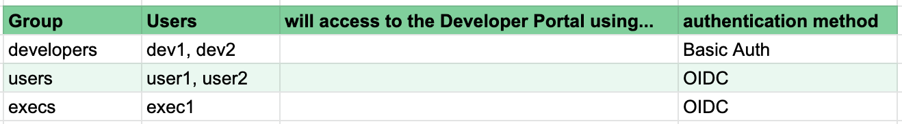

So, we will configure the `Portal` CR with some OIDC options.  
For that, we need to fetch the Client ID and Client secret that we have created earlier:

```bash
KEYCLOAK_URL=http://$(kubectl get service keycloak -o jsonpath='{.status.loadBalancer.ingress[0].ip}'):8080/auth
KEYCLOAK_TOKEN=$(curl -d "client_id=admin-cli" -d "username=admin" -d "password=admin" -d "grant_type=password" "$KEYCLOAK_URL/realms/master/protocol/openid-connect/token" | jq -r .access_token)

KEYCLOAK_ID=$(curl -H "Authorization: bearer ${KEYCLOAK_TOKEN}" -H "Content-Type: application/json"  $KEYCLOAK_URL/admin/realms/master/clients  | jq -r '.[] | select(.redirectUris[0] == "https://portal.mycompany.corp/callback") | .id')
KEYCLOAK_CLIENT=$(curl -H "Authorization: bearer ${KEYCLOAK_TOKEN}" -H "Content-Type: application/json"  $KEYCLOAK_URL/admin/realms/master/clients  | jq -r '.[] | select(.redirectUris[0] == "https://portal.mycompany.corp/callback") | .clientId')
KEYCLOAK_SECRET=$(curl -H "Authorization: bearer ${KEYCLOAK_TOKEN}" -H "Content-Type: application/json"  $KEYCLOAK_URL/admin/realms/master/clients/$KEYCLOAK_ID/client-secret | jq -r .value)

cat <<EOF | kubectl apply -f -
apiVersion: v1
kind: Secret
metadata:
  name: petstore-portal-oidc-secret
  namespace: default
data:
  client_secret: $(echo $KEYCLOAK_SECRET | base64)
EOF
```

And now, we add the OIDC configuration to our Portal CR:

```bash
cat <<EOF | kubectl apply -f -
apiVersion: portal.gloo.solo.io/v1beta1
kind: Portal
metadata:
  name: ecommerce-portal
  namespace: default
spec:
  displayName: E-commerce Portal
  description: The Gloo Portal for the Petstore API and much more!
  banner:
    fetchUrl: https://i.imgur.com/EXbBN1a.jpg
  favicon:
    fetchUrl: https://i.imgur.com/QQwlQG3.png
  primaryLogo:
    fetchUrl: https://i.imgur.com/hjgPMNP.png
  customStyling: {}
  staticPages: []

  domains:
  - portal.mycompany.corp

  publishedEnvironments:
  - name: dev
    namespace: default

  allApisPublicViewable: true

  # ------------------- NEW ---------------------
  oidcAuth:
    clientId: ${KEYCLOAK_CLIENT}
    clientSecret:
      name: petstore-portal-oidc-secret
      namespace: default
      key: client_secret # this is the k8s secret created above
    groupClaimKey: group
    issuer: ${KEYCLOAK_URL}/realms/master
  portalUrlPrefix: http://portal.mycompany.corp/
  # ---------------------------------------------
EOF
```

We will now create a new Gloo Portal `Group` CR representing these corporate users logged in through Keycloak:

```bash
cat << EOF | kubectl apply -f -
apiVersion: portal.gloo.solo.io/v1beta1
kind: Group
metadata:
  name: users
  namespace: default
spec:
  displayName: corporate users
  accessLevel:
    portals:
    - name: ecommerce-portal
      namespace: default
  oidcGroup:
    groupName: users # this represents the group name in you IdP (here Keycloak)
EOF
```

And finally try to log onto the Portal, using our corporate "_user1_":

First, you may need to logout from the developer Portal:

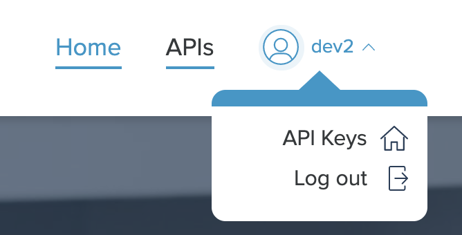

Then, click again the "Log in" button in the upper right corner, and click the "Log in with OpenID Connect" link:

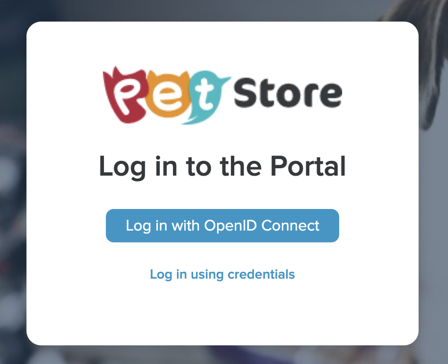

Then sign in using `user1` and `password` on the Keycloak login form:

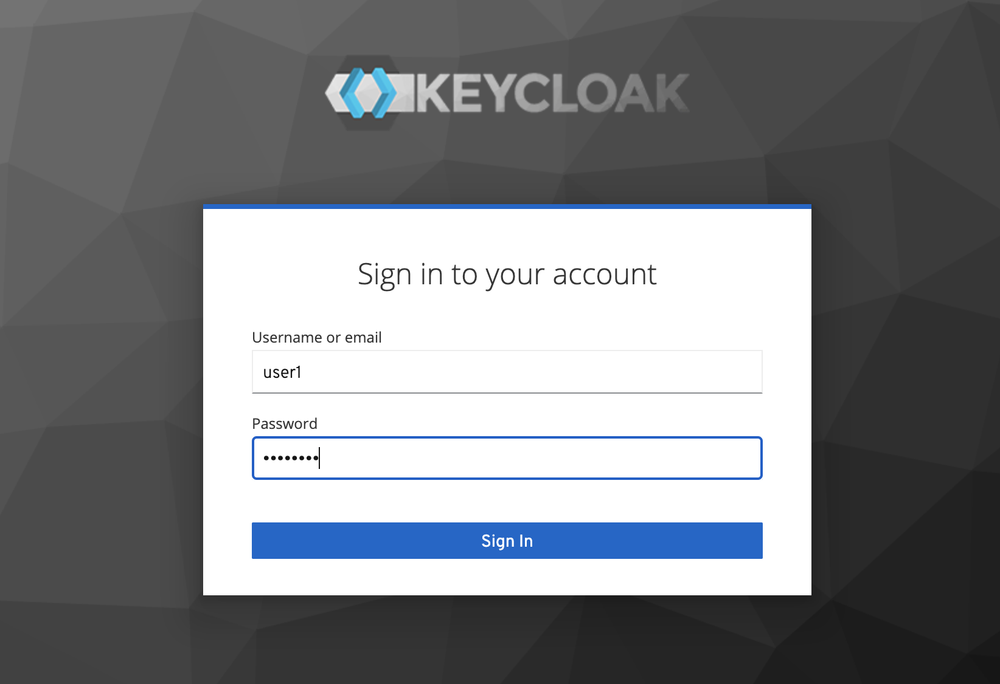

And voilà! 


If you are interested in the integration with SaaS based OIDC service, check out this blog post: https://www.solo.io/blog/self-service-user-registration-with-gloo-portal-and-okta/


## Lab 7 - Securing your APIs

We have secured the access to the developer Portal, both with basic auth and with OIDC.  

The next step in this workshop is to secure the APIs themselves.

Depending on your organization and on your API governance, you can have different roles for managing an API lifecyle. Let's say we have these personas:

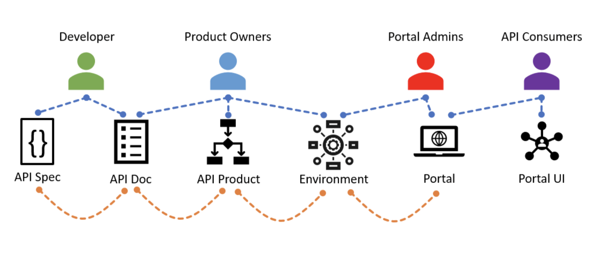

There are companies where the Product Owner dictates the plans that must be applied to APIs, and other places where it's someone else, like the Portal Admin or a person from the Security team.

So, __Usage Plans__ are applicable on several _Custom Resources_:
- the `APIProduct` - this represents options an API Owner gives to consumers
- the `Environment` - the usage plans are actually defined here
- the `Group` - this enforces a security policy on a group of users

You can mix them together or, for instance, stick with **Usage Plans** only on the `Environment` CR.

In this lab, let's say you are the Product Owner of the Petstore `APIProduct` and you want to protect your API with two different methods:
- _Method A_ or the `basic` plan: every client application can access your API, with an API key and also a limitation of **5 req/sec**
- _Method B_ or the `trusted` plan: every client application presenting a JWT (could optionally be an `id_token`) can access your API with a higher consumption rate, set to **10 req/sec**

To better understand the RBAC system we are deploying here to control the access to the APIs, here is a summary:

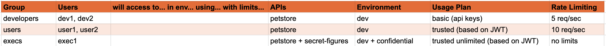

### Deploying a JWT based RBAC

Let's create these plans at the `Environment` level, because you first want to try them out in your `dev` Environment and you don't want to block the access to APIs in production.

```bash
KEYCLOAK_URL=http://$(kubectl get service keycloak -o jsonpath='{.status.loadBalancer.ingress[0].ip}'):8080/auth

cat << EOF > env.yaml
apiVersion: portal.gloo.solo.io/v1beta1
kind: Environment
metadata:
  name: dev
  namespace: default
spec:
  domains:
    - api.mycompany.corp # the domain name where the API will be exposed
  displayInfo:
    description: This environment is meant for developers to deploy and test their APIs.
    displayName: Development
  basePath: /ecommerce # a global basepath for our APIs
  apiProducts: # we will select our APIProduct using a selector and the 2 version of it
    - namespaces:
      - "*" 
      labels:
      - key: app
        operator: In
        values:
        - petstore
      versions:
        names:
        - v1
        - v2
      basePath: "" # this will dynamically prefix the API with the version names
      # ------------------------ NEW -----------------------------
      usagePlans:
        - trusted
      # ----------------------------------------------------------
  gatewayConfig:
    disableRoutes: false # we actually want to expose the APIs on a Gateway (optional)
  # ------------------------- NEW --------------------------------
  parameters:
    usagePlans:
      trusted:
        displayName: trusted plan
        rateLimit:
          unit: MINUTE
          requestsPerUnit: 10
        authPolicy:
          oauth:
            authorizationUrl: ${KEYCLOAK_URL}/realms/master/protocol/openid-connect/auth
            tokenUrl: ${KEYCLOAK_URL}/realms/master/protocol/openid-connect/token
            jwtValidation:
              issuer: ${KEYCLOAK_URL}/realms/master
              remoteJwks:
                refreshInterval: 60s
                url: ${KEYCLOAK_URL}/realms/master/protocol/openid-connect/certs
  # ----------------------------------------------------------------
EOF

kubectl apply -f env.yaml
```

Now we update the `Group` for clients who will authenticate through a JWT:

```bash
cat << EOF | kubectl apply -f -
apiVersion: portal.gloo.solo.io/v1beta1
kind: Group
metadata:
  name: users
  namespace: default
spec:
  accessLevel:
    apis:
    - environments:
        names:
          - dev
        namespaces:
          - '*'
      # -------------- Enforce 'trusted' usage plan (JWT) ---------------
      usagePlans:
        - trusted
      # -----------------------------------------------------------------
      products: {}
    portals:
    - name: ecommerce-portal
      namespace: default
  oidcGroup:
    groupName: users
  displayName: corporate users
EOF
```

And, finally, we update the `APIProduct` to enforce the usage of the `trusted` plan:
```bash
cat << EOF | kubectl apply -f -
apiVersion: portal.gloo.solo.io/v1beta1
kind: APIProduct
metadata:
  name: petstore-product
  namespace: default
  labels:
    app: petstore
spec:
  displayInfo: 
    title: Petstore Product
    description: Fabulous API product for the Petstore
  # ---------------- This API offers 1 usage plan ---------------------
  usagePlans:
    - trusted
  # --------------------------------------------------------------------
  versions:
  - name: v1
    apis:
      - apiDoc:
          name: petstore-openapi-v1-pets
          namespace: default
      - apiDoc:
          name: petstore-openapi-v1-users
          namespace: default
    gatewayConfig:
      route:
        inlineRoute:
          backends:
            - upstream:
                name: default-petstore-v1-8080
                namespace: gloo-system
  - name: v2
    apis:
    - apiDoc:
        name: petstore-openapi-v2-full
        namespace: default
    gatewayConfig:
      route:
        inlineRoute:
          backends:
            - upstream:
                name: default-petstore-v2-8080
                namespace: gloo-system
EOF
```

Let's make some tests!

#### Testing the JWT based plan

Let's fetch an `access_token` JWT from the IdP:

```bash
token=$(curl -s -d "client_id=admin-cli" -d "username=user1" -d "password=password" -d "grant_type=password" "$KEYCLOAK_URL/realms/master/protocol/openid-connect/token" | jq -r .access_token)
```

Then, we can run the following command:

```bash
curl -H "Authorization: Bearer ${token}" -s $(glooctl proxy url)/ecommerce/v1/api/pet/1 -H "Host: api.mycompany.corp" | jq
```

You should see a successful response with some yaml content:

```yaml
{
  "id": 1,
  "category": {
    "id": 2,
    "name": "Cats"
  },
  "name": "Cat 1",
  "photoUrls": [
    "url1",
    "url2"
  ],
  "tags": [
    {
      "id": 1,
      "name": "tag1"
    },
    {
      "id": 2,
      "name": "tag2"
    }
  ],
  "status": "available"
}
```

Congratulations! you just secured you API with JWT verification!

### Deploying an API-key based RBAC

Let's start by updating the `Environment` CR with a new usage plan:

```bash
KEYCLOAK_URL=http://$(kubectl get service keycloak -o jsonpath='{.status.loadBalancer.ingress[0].ip}'):8080/auth

cat << EOF > env.yaml
apiVersion: portal.gloo.solo.io/v1beta1
kind: Environment
metadata:
  name: dev
  namespace: default
spec:
  domains:
    - api.mycompany.corp # the domain name where the API will be exposed
  displayInfo:
    description: This environment is meant for developers to deploy and test their APIs.
    displayName: Development
  basePath: /ecommerce # a global basepath for our APIs
  apiProducts: # we will select our APIProduct using a selector and the 2 version of it
    - namespaces:
      - "*" 
      labels:
      - key: app
        operator: In
        values:
        - petstore
      versions:
        names:
        - v1
        - v2
      basePath: "" # this will dynamically prefix the API with the version names
      # ------------------------ UPDATE -----------------------------
      usagePlans:
        - basic2
        - trusted
      # -------------------------------------------------------------
  gatewayConfig:
    disableRoutes: false # we actually want to expose the APIs on a Gateway (optional)
  
  parameters:
    usagePlans:
      # ------------------------- NEW --------------------------------
      basic2:
        authPolicy:
          apiKey: {}
        displayName: api-keys based plan
        rateLimit:
          requestsPerUnit: 5
          unit: MINUTE
      # --------------------------------------------------------------
      trusted:
        displayName: trusted plan
        rateLimit:
          unit: MINUTE
          requestsPerUnit: 10
        authPolicy:
          oauth:
            authorizationUrl: ${KEYCLOAK_URL}/realms/master/protocol/openid-connect/auth
            tokenUrl: ${KEYCLOAK_URL}/realms/master/protocol/openid-connect/token
            jwtValidation:
              issuer: ${KEYCLOAK_URL}/realms/master
              remoteJwks:
                refreshInterval: 60s
                url: ${KEYCLOAK_URL}/realms/master/protocol/openid-connect/certs
EOF

kubectl apply -f env.yaml
```

We update the `Group` for the developers, so that they must authenticate with basic auth in order to consume the APIs in the **dev** `Environment`:

```bash
cat << EOF | kubectl apply -f -
apiVersion: portal.gloo.solo.io/v1beta1
kind: Group
metadata:
  name: developers
  namespace: gloo-portal
spec:
  accessLevel:
    apis:
    - environments:
        names:
          - dev
        namespaces:
          - '*'
      # ------------------ Enforce basic auth usage plan ----------------
      usagePlans:
        - basic2
      # -----------------------------------------------------------------
      products:
        namespaces:
        - '*'
    portals:
    - name: ecommerce-portal
      namespace: default
  displayName: ecommerce developers
  userSelector:
    matchLabels:
      groups.portal.gloo.solo.io/gloo-portal.developers: "true"
    namespaces:
    - '*'
EOF
```

Don't pay attention to the warning message.

We also update the petstore `APIProduct` so that is it accessible with both the `basic` plan and the `trusted` plan.

```bash
cat << EOF | kubectl apply -f -
apiVersion: portal.gloo.solo.io/v1beta1
kind: APIProduct
metadata:
  name: petstore-product
  namespace: default
  labels:
    app: petstore
spec:
  displayInfo: 
    title: Petstore Product
    description: Fabulous API product for the Petstore
  # ---------------- This API offers 2 usage plans ---------------------
  usagePlans:
    - basic2
    - trusted
  # --------------------------------------------------------------------
  versions:
  - name: v1
    apis:
      - apiDoc:
          name: petstore-openapi-v1-pets
          namespace: default
      - apiDoc:
          name: petstore-openapi-v1-users
          namespace: default
    gatewayConfig:
      route:
        inlineRoute:
          backends:
            - upstream:
                name: default-petstore-v1-8080
                namespace: gloo-system
  - name: v2
    apis:
    - apiDoc:
        name: petstore-openapi-v2-full
        namespace: default
    gatewayConfig:
      route:
        inlineRoute:
          backends:
            - upstream:
                name: default-petstore-v2-8080
                namespace: gloo-system
EOF
```

Let's do some more tests!

#### Testing the basic auth plan

Logout from `user1@solo.io` and log back in with the `dev1` user credentials.

Click on `dev1` on the top right corner and select `API Keys`.

Click on `API Keys` again and then click "Add an API Key".


You can click on the key to copy the value to the clipboard.

Let's try it out in the Portal UI at first.

Navigate back to your API and click the 2nd line with 'v2', and you are now able to use the _*try-it-out*_ feature.

First, click the **Authorize** button:

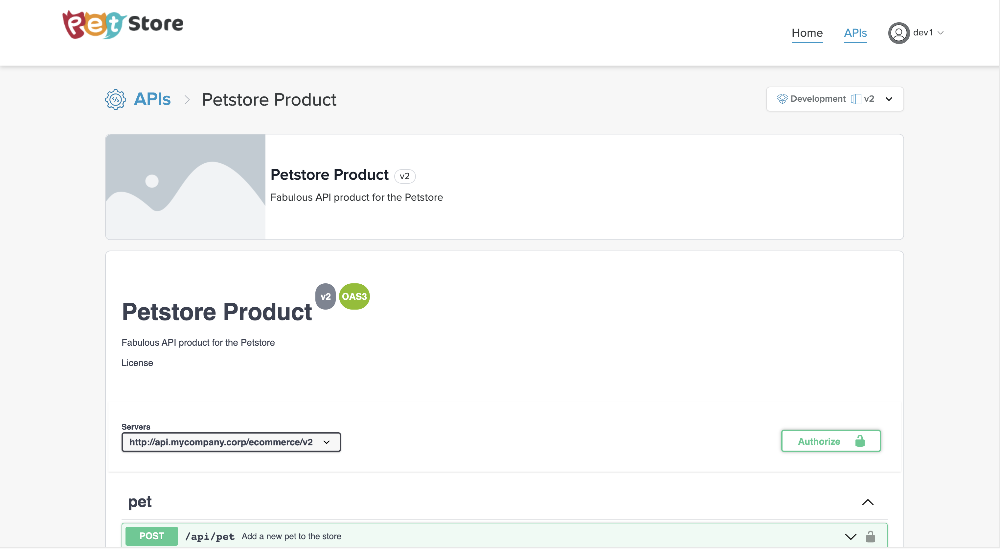

Paste the API key and click **Authorize** again, then **Close**.

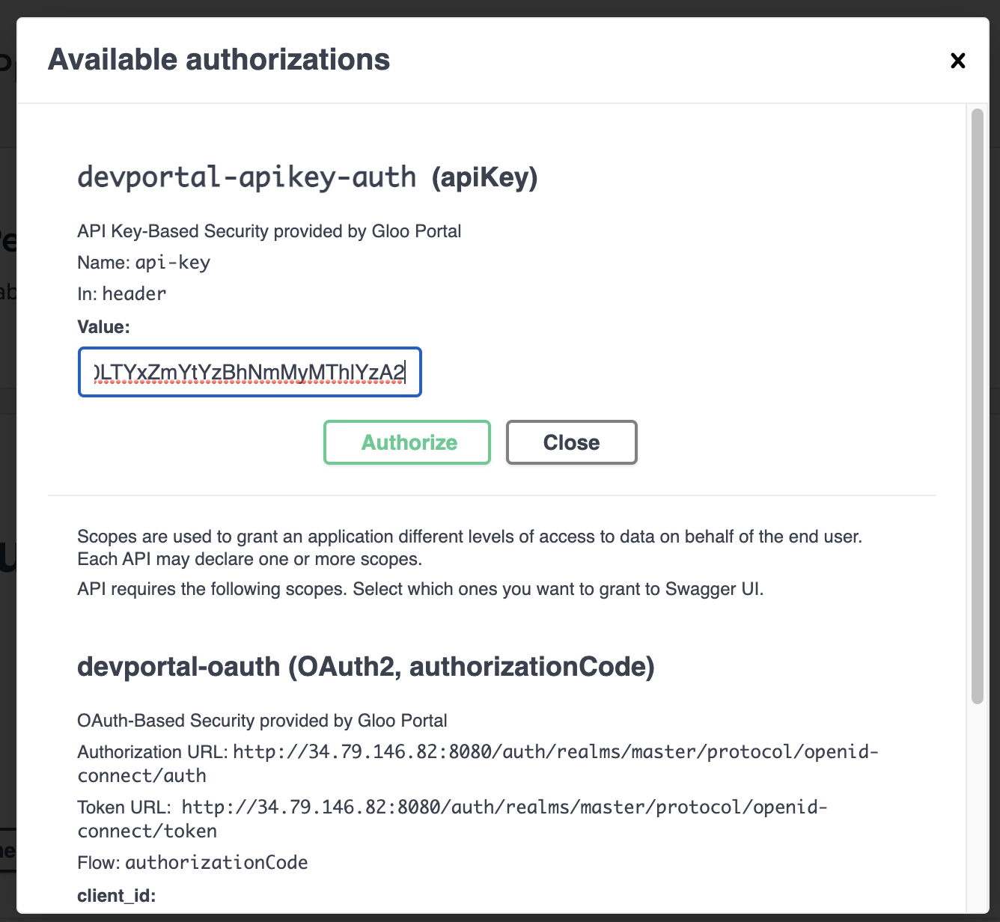

Scroll down and click on the `GET /api/store/inventory` API call.

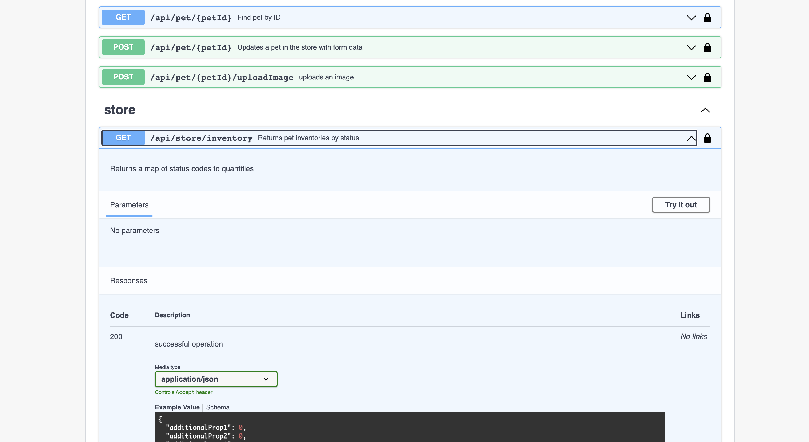

Click on `Try it out` and then on the `Execute` button.

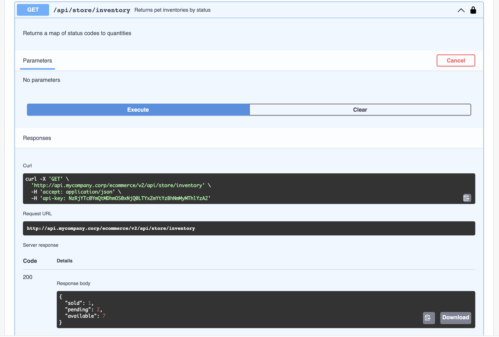

You should get a 200 response:


-------------

You can also test it with curl.

Without providing any proof of identity, you should get a 403 error:

```bash
curl -s $(glooctl proxy url)/ecommerce/v1/api/pet/1 -H "Host: api.mycompany.corp" -v
```

```
...
< HTTP/1.1 403 Forbidden
< date: Wed, 25 Aug 2021 15:44:48 GMT
< server: envoy
< content-length: 0
...
```

So, we need to retrieve the API key first:

```bash
kubectl get secret -n default
```

```text
NAME                                                           TYPE                                  DATA   AGE
default-token-hnwcq                                            kubernetes.io/service-account-token   3      5h3m
petstore-portal-oidc-secret                                    Opaque                                1      29m
petstore-product-basic2-35c38c86-04aa-ffa1-7899-d767324721ab   extauth.solo.io/apikey                5      20m
```

Get more info of the secret type `extauth.solo.io/apikey`:   
```bash
kubectl get secret -l apiproducts.portal.gloo.solo.io=petstore-product.default -l environments.portal.gloo.solo.io=dev.default -l usageplans.portal.gloo.solo.io=basic2 -o yaml
```

```yaml
apiVersion: v1
data:
  api-key: TVdWak9HWTFaRFF0TVdJeE9TMW1NemMyTFRGallUa3RaamhtWldObU5EWXlNR0V4
  environment: ZGV2LmRlZmF1bHQ=
  plan: YmFzaWMy
  product: cGV0c3RvcmUtcHJvZHVjdC5kZWZhdWx0
  username: ZGV2MQ==
kind: Secret
metadata:
  creationTimestamp: "2021-08-25T15:34:46Z"
  labels:
    apiproducts.portal.gloo.solo.io: petstore-product.default
    environments.portal.gloo.solo.io: dev.default
    usageplans.portal.gloo.solo.io: basic2
...
```

Then, we can run the following command:

```bash
apikey=$(kubectl -n default get secret -l apiproducts.portal.gloo.solo.io=petstore-product.default -l environments.portal.gloo.solo.io=dev.default -l usageplans.portal.gloo.solo.io=basic2 -o "jsonpath={.items[0].data['api-key']}" | base64 -d)
curl -H "api-key: $apikey" -s $(glooctl proxy url)/ecommerce/v1/api/pet/1 -H "Host: api.mycompany.corp" | jq
```

It should work:

```yaml
{
  "id": 1,
  "category": {
    "id": 2,
    "name": "Cats"
  },
  "name": "Cat 1",
  "photoUrls": [
    "url1",
    "url2"
  ],
  "tags": [
    {
      "id": 1,
      "name": "tag1"
    },
    {
      "id": 2,
      "name": "tag2"
    }
  ],
  "status": "available"
}
```

Now, execute the curl command again several times:

```bash
curl -H "api-key: $apikey" -s $(glooctl proxy url)/ecommerce/v1/api/pet/1 -H "Host: api.mycompany.corp" -v
```

As soon as you reach the rate limit, you should get the following output:

```
...
> GET /ecommerce/v1/api/pet/1 HTTP/1.1
> Host: api.mycompany.corp
> User-Agent: curl/7.64.1
> Accept: */*
> api-key: MWVjOGY1ZDQtMWIxOS1mMzc2LTFjYTktZjhmZWNmNDYyMGEx
>
< HTTP/1.1 429 Too Many Requests
< x-envoy-ratelimited: true
< date: Wed, 25 Aug 2021 16:04:28 GMT
< server: envoy
< content-length: 0
<
* Connection #0 to host 34.140.165.117 left intact
* Closing connection 0
```

Congratulations! you just secured you API with Basic Auth and rate limiting!


## Lab 8: Portal rebranding

As you've seen in onr of the previous lab, we've been able to provide a few pictures (banner, logo, etc.).

But you can completely change the look & feel of the `Portal` by providing your own CSS.

Let's use this feature to change the color of the title.

First of all, go to the main page of the Portal (http://portal.mycompany.corp/) and click on the top right corner to open the menu of the web browser. Then, click on `Web Developer` and select `Inspector`.

In the developer tools, click on the arrow on the top left corner and then on the title:


You can see the CSS below displayed on the right:

```
.home-page-portal-title {
    font-size: 48px;
    line-height: 58px;
    margin-top: 80px;
}
```

Go to the admin Portal (http://localhost:8000), click on `Portals` and then on the `E-commerce Portal`.

Click on the `Advanced Portal Customization` link and provide the CSS below:

```
.home-page-portal-title {
    font-size: 48px;
    line-height: 58px;
    margin-top: 80px;
    color: gold
}
```


Save the change and go back to the main page of the Portal:


Run the command below to see how the yaml of the Portal has been updated:

```bash
kubectl get portal ecommerce-portal -o yaml
```

You'll see the new section below:

```css
  customStyling:
    cssStylesheet:
      configMap:
        key: custom-stylesheet
        name: default-ecommerce-portal-custom-stylesheet
        namespace: default
```

Now, execute the following command to see the content of the config map:

```bash
kubectl get cm default-ecommerce-portal-custom-stylesheet -o yaml
```

Here is the expected output:

```yaml
apiVersion: v1
binaryData:
  custom-stylesheet: LmhvbWUtcGFnZS1wb3J0YWwtdGl0bGUgewogICAgZm9udC1zaXplOiA0OHB4OwogICAgbGluZS1oZWlnaHQ6IDU4cHg7CiAgICBtYXJnaW4tdG9wOiA4MHB4OwogICAgY29sb3I6IGdvbGQKfQ==
kind: ConfigMap
metadata:
...
```

The `binaryData.custom-stylesheet` value is the CSS we provided encoded in base64.

You can use the CSS below to further rebrand it:

```css
.home-page-portal-title {
    font-size: 48px;
    line-height: 58px;
    margin-top: 80px;
    color: gold;
}

.main-container-header {
    background: black;
}

.links-list a {
    color: white;
}

.links-list a.active {
    color: white;
}

.header-user-control-button {
    color: white;
}

.header-user-control-button[class~=is-open] {
    color: white;
}
```

## Lab 9: Extending the Portal

You can add static or dynamic pages.

It's very useful to provide additional information about your APIs, or even to load some billing information.

### Static pages

Static pages are very simple to add. You simply need to provide the content using the Markdown syntax.

Go to the admin Portal (http://localhost:8000), click on `Portals` and then on the `E-commerce Portal`.

Click on the `Pages` tab and then on the `Add a Page` link.

Create a new `Static Page`:


Then edit it to provide the Markdown content:

```md
**Q.** - Can I use your API to see how many pets are available?  
**R.** - Yes, you can.
```


Publish the change, go back to the main page of the Portal and click on the `FAQ` button:


Again, run the command below to see how the yaml of the `Portal` has been updated:

```bash
kubectl get portal ecommerce-portal -o yaml
```

You'll see the new section below:

```yaml
  staticPages:
  - content:
      configMap:
        key: faq
        name: default-ecommerce-portal-faq
        namespace: default
    description: Frequently asked questions
    displayOnHomepage: true
    name: faq
    navigationLinkName: FAQ
    path: /faq
```

Now, execute the following command to see the content of the config map:

```bash
kubectl get cm default-ecommerce-portal-faq -o yaml
```

Here is the expected output:

```yaml
apiVersion: v1
binaryData:
  faq: IyMgRkFRIAoKKipRLioqIC0gQ2FuIEkgdXNlIHlvdXIgQVBJIHRvIHNlZSBob3cgbWFueSBwZXRzIGFyZSBhdmFpbGFibGU/ICAKKipSLioqIC0gWWVzLCB5b3UgY2FuLg==
kind: ConfigMap
metadata:
...
```

The `binaryData.faq` value is the Markdown we provided encoded in base64.

### Dynamic pages

You can embed your own custom page in the Portal either by specifying a URL or by uploading your own file. In this example we will be uploading our own custom file that contains html and javascript.

It's very interesting because the Portal will pass to this page some information about the user and the API product.

Take a look at the content of the `dynamic.html` file that is located under `/home/solo/workshops/gloo-portal`.

The interesting part is the one below:

```html
    <script>
      // the embedded page listens for a message event to receive data from the Portal
      window.addEventListener("message", function onMsg(msg) {
        // we must check the origin of the message to protect against XSS attacks
        if (msg.origin === "http://portal.mycompany.corp" && msg && msg.data) {
          let header = document.getElementById("user");
          let headerText = document.createTextNode(
            "the current user is: " + msg.data.currentUser
          );
          console.log("msg.data");
          console.log(msg.data);
          header.replaceWith(headerText);

          
          let apiProductInfo = document.getElementById("api-products");
          const apiProducts = document.createDocumentFragment();
          if (msg.data.apiProductsList.length > 0) {
            msg.data.apiProductsList.forEach((apiProduct) => {
              let apiProductEl = document.createElement("div");
              let apiProductText = document.createTextNode(
                "API Product: " +
                  apiProduct.displayName +
                  " with " +
                  apiProduct.versionsList.length +
                  " versions"
              );
              apiProductEl.appendChild(apiProductText);
              apiProducts.appendChild(apiProductEl);
            });
          }
          apiProductInfo.replaceWith(apiProducts);
        }
      });
    </script>
```

As you can see, Gloo Portal is passing information about the user and the API products to the dynamic page.

Click on the `Pages` tab and then on the `Add a Page` link.

Create a new `Dynamic Page`:


You need to upload the `dynamic.html` file.

Set the "Navigation Link Name" value to "Dynamic" and save it:

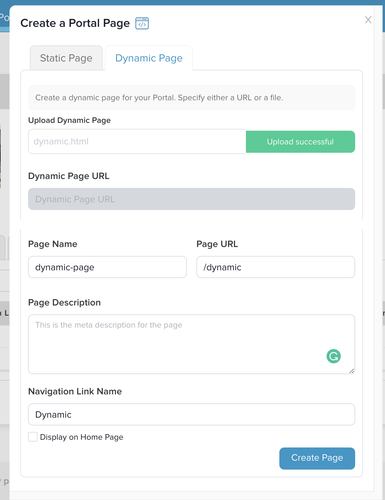

Go back to the main page of the Portal and click on the `Dynamic` button:

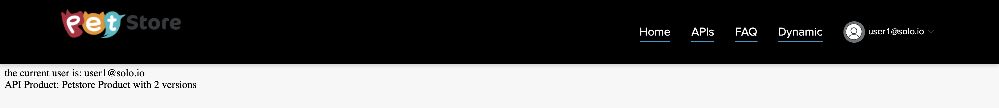

Again, run the command below to see how the yaml of the Portal has been updated:

```bash
kubectl get portal ecommerce-portal -o yaml
```

You'll see the new section below:

```yaml
  dynamicPages:
  - content:
      configMap:
        key: dynamic-page
        name: default-ecommerce-portal-dynamic-page
        namespace: default
    name: dynamic-page
    navigationLinkName: Dynamic
    path: /dynamic
```

Now, execute the following command to see the content of the config map:

```bash
kubectl get cm default-ecommerce-portal-dynamic-page -o yaml
```

Here is the expected output:

```yaml
apiVersion: v1
binaryData:
  dynamic-page: PCFET0NUWVBFIGh0bWw+CjxodG1sIGxhbmc9ImVuIj4KICA8aGVhZD4KICAgIDxtZXRhIGNoYXJzZXQ9IlVURi04IiAvPgogICAgPG1ldGEgbmFtZT0idmlld3BvcnQiIGNvbnRlbnQ9IndpZHRoPWRldmljZS13aWR0aCwgaW5pdGlhbC1zY2FsZT0xLjAiIC8+CiAgICA8dGl0bGU+RGVtbyBQYWdlPC90aXRsZT4KICAgIDxzY3JpcHQ+CiAgICAgIC8vIHRoZSBlbWJlZGRlZCBwYWdlIGxpc3RlbnMgZm9yIGEgbWVzc2FnZSBldmVudCB0byByZWNlaXZlIGRhdGEgZnJvbSB0aGUgUG9ydGFsCiAgICAgIHdpbmRvdy5hZGRFdmVudExpc3RlbmVyKCJtZXNzYWdlIiwgZnVuY3Rpb24gb25Nc2cobXNnKSB7CiAgICAgICAgLy8gd2UgbXVzdCBjaGVjayB0aGUgb3JpZ2luIG9mIHRoZSBtZXNzYWdlIHRvIHByb3RlY3QgYWdhaW5zdCBYU1MgYXR0YWNrcwogICAgICAgIGlmIChtc2cub3JpZ2luID09PSAiaHR0cDovL3BvcnRhbC5teWNvbXBhbnkuY29ycCIgJiYgbXNnICYmIG1zZy5kYXRhKSB7CiAgICAgICAgICBsZXQgaGVhZGVyID0gZG9jdW1lbnQuZ2V0RWxlbWVudEJ5SWQoInVzZXIiKTsKICAgICAgICAgIGxldCBoZWFkZXJUZXh0ID0gZG9jdW1lbnQuY3JlYXRlVGV4dE5vZGUoCiAgICAgICAgICAgICJ0aGUgY3VycmVudCB1c2VyIGlzOiAiICsgbXNnLmRhdGEuY3VycmVudFVzZXIKICAgICAgICAgICk7CiAgICAgICAgICBjb25zb2xlLmxvZygibXNnLmRhdGEiKTsKICAgICAgICAgIGNvbnNvbGUubG9nKG1zZy5kYXRhKTsKICAgICAgICAgIGhlYWRlci5yZXBsYWNlV2l0aChoZWFkZXJUZXh0KTsKCiAgICAgICAgICAKICAgICAgICAgIGxldCBhcGlQcm9kdWN0SW5mbyA9IGRvY3VtZW50LmdldEVsZW1lbnRCeUlkKCJhcGktcHJvZHVjdHMiKTsKICAgICAgICAgIGNvbnN0IGFwaVByb2R1Y3RzID0gZG9jdW1lbnQuY3JlYXRlRG9jdW1lbnRGcmFnbWVudCgpOwogICAgICAgICAgaWYgKG1zZy5kYXRhLmFwaVByb2R1Y3RzTGlzdC5sZW5ndGggPiAwKSB7CiAgICAgICAgICAgIG1zZy5kYXRhLmFwaVByb2R1Y3RzTGlzdC5mb3JFYWNoKChhcGlQcm9kdWN0KSA9PiB7CiAgICAgICAgICAgICAgbGV0IGFwaVByb2R1Y3RFbCA9IGRvY3VtZW50LmNyZWF0ZUVsZW1lbnQoImRpdiIpOwogICAgICAgICAgICAgIGxldCBhcGlQcm9kdWN0VGV4dCA9IGRvY3VtZW50LmNyZWF0ZVRleHROb2RlKAogICAgICAgICAgICAgICAgIkFQSSBQcm9kdWN0OiAiICsKICAgICAgICAgICAgICAgICAgYXBpUHJvZHVjdC5kaXNwbGF5TmFtZSArCiAgICAgICAgICAgICAgICAgICIgd2l0aCAiICsKICAgICAgICAgICAgICAgICAgYXBpUHJvZHVjdC52ZXJzaW9uc0xpc3QubGVuZ3RoICsKICAgICAgICAgICAgICAgICAgIiB2ZXJzaW9ucyIKICAgICAgICAgICAgICApOwogICAgICAgICAgICAgIGFwaVByb2R1Y3RFbC5hcHBlbmRDaGlsZChhcGlQcm9kdWN0VGV4dCk7CiAgICAgICAgICAgICAgYXBpUHJvZHVjdHMuYXBwZW5kQ2hpbGQoYXBpUHJvZHVjdEVsKTsKICAgICAgICAgICAgfSk7CiAgICAgICAgICB9CiAgICAgICAgICBhcGlQcm9kdWN0SW5mby5yZXBsYWNlV2l0aChhcGlQcm9kdWN0cyk7CiAgICAgICAgfQogICAgICB9KTsKICAgIDwvc2NyaXB0PgogIDwvaGVhZD4KCiAgPGJvZHk+CiAgICA8aDEgaWQ9InVzZXIiPjwvaDE+CiAgICA8YnIgLz4KICAgIDxoMSBpZD0iYXBpLXByb2R1Y3RzIj48L2gxPgogIDwvYm9keT4KPC9odG1sPgo=
kind: ConfigMap
metadata:
...
```

The `binaryData.dynamic` value is the content of the content of the `dynamic.html` file encoded in base64.


## Lab 10: gRPC

Gloo Portal can also be used to expose gRPC applications.

Let's deploy a gRPC version of our application:

```bash
cat <<EOF | kubectl apply -f -
apiVersion: apps/v1
kind: Deployment
metadata:
  labels:
    app: petstore-grpc
  name: petstore-grpc
  namespace: default
spec:
  selector:
    matchLabels:
      app: petstore-grpc
  replicas: 1
  template:
    metadata:
      labels:
        app: petstore-grpc
    spec:
      containers:
      - image: quay.io/solo-io/petstore-grpc:0.0.2
        name: petstore-grpc
        ports:
        - containerPort: 8080
          name: grpc
        env:
        - name: SERVER_PORT
          value: "8080"
---
apiVersion: v1
kind: Service
metadata:
  name: petstore-grpc
  namespace: default
  labels:
    service: petstore-grpc
spec:
  selector:
    app: petstore-grpc
  ports:
  - name: grpc
    port: 8080
    protocol: TCP

EOF
```

Let's create an **API Doc** using the reflection endpoint implemented by our gRPC application:

```bash
cat <<EOF | kubectl apply -f -
apiVersion: portal.gloo.solo.io/v1beta1
kind: APIDoc
metadata:
  name: petstore-grpc-doc
  namespace: default
spec:
  grpc:
    reflectionSource:
      connectionTimeout: 5s
      insecure: true
      serviceAddress: petstore-grpc.default:8080
      # we use a reflection server here to tell the Gloo Portal
      # to fetch the schema contents directly from the petstore service.
EOF
```

You can then check the status of the API Doc using the following command:

```bash
kubectl get apidoc petstore-grpc-doc -o yaml
```

Output is like:

```yaml
apiVersion: portal.gloo.solo.io/v1beta1
kind: APIDoc
metadata:
  ...
spec:
  grpc:
    reflectionSource:
      connectionTimeout: 5s
      insecure: true
      serviceAddress: petstore-grpc.default:8080
status:
  grpc:
    methods:
    - rpcName: ServerReflectionInfo
      rpcType: BIDIRECTIONAL_STREAMING
      serviceName: grpc.reflection.v1alpha.ServerReflection
    - rpcName: ListPets
      rpcType: UNARY
      serviceName: test.solo.io.PetStore
    - rpcName: FindPetById
      rpcType: UNARY
      serviceName: test.solo.io.PetStore
    - rpcName: AddPet
      rpcType: UNARY
      serviceName: test.solo.io.PetStore
    - rpcName: DeletePet
      rpcType: UNARY
      serviceName: test.solo.io.PetStore
    - rpcName: WatchPets
      rpcType: SERVER_STREAMING
      serviceName: test.solo.io.PetStore
  observedGeneration: 1
  state: Succeeded
```

Let's update our `APIProduct` to expose the gRPC `API Docs` we've just created:

```bash
cat << EOF | kubectl apply -f -
apiVersion: portal.gloo.solo.io/v1beta1
kind: APIProduct
metadata:
  name: petstore-product
  namespace: default
  labels:
    app: petstore
spec:
  displayInfo: 
    title: Petstore Product
    description: Fabulous API product for the Petstore
  usagePlans:
    - basic2
    - trusted
  versions:
  - name: v1
    apis:
      - apiDoc:
          name: petstore-openapi-v1-pets
          namespace: default
      - apiDoc:
          name: petstore-openapi-v1-users
          namespace: default
    gatewayConfig:
      route:
        inlineRoute:
          backends:
            - upstream:
                name: default-petstore-v1-8080
                namespace: gloo-system
  - name: v2
    apis:
    - apiDoc:
        name: petstore-openapi-v2-full
        namespace: default
    gatewayConfig:
      route:
        inlineRoute:
          backends:
            - upstream:
                name: default-petstore-v2-8080
                namespace: gloo-system
  # ---------- Add new gRPC version to APIProduct ------------
  - name: v3
    apis:
    - apiDoc:
        name: petstore-grpc-doc
        namespace: default
    gatewayConfig:
      route:
        inlineRoute:
          backends:
          - kube:
              name: petstore-grpc
              namespace: default
              port: 8080
  # ----------------------------------------------------------
EOF
```

You can then check the status of the `APIProduct` using the following command:

```bash
kubectl get apiproduct petstore-product -o yaml
```

Note that the API Doc's reflection endpoint has been used to capture all the operations published by the Petstore gRPC interface.

Update the `Environment` to include the gRPC version:

```bash
KEYCLOAK_URL=http://$(kubectl get service keycloak -o jsonpath='{.status.loadBalancer.ingress[0].ip}'):8080/auth

cat << EOF > env.yaml
apiVersion: portal.gloo.solo.io/v1beta1
kind: Environment
metadata:
  name: dev
  namespace: default
spec:
  domains:
    - api.mycompany.corp # the domain name where the API will be exposed
  displayInfo:
    description: This environment is meant for developers to deploy and test their APIs.
    displayName: Development
  basePath: /ecommerce # a global basepath for our APIs
  apiProducts: # we will select our APIProduct using a selector and the 2 version of it
    - namespaces:
      - "*" 
      labels:
      - key: app
        operator: In
        values:
        - petstore
      versions:
        names:
        - v1
        - v2
        # ------------------------- NEW --------------------------------
        - v3
        # --------------------------------------------------------------
      basePath: "" # this will dynamically prefix the API with the version names
      usagePlans:
        - basic2
        - trusted
  gatewayConfig:
    disableRoutes: false # we actually want to expose the APIs on a Gateway (optional)
  
  parameters:
    usagePlans:
      basic2:
        authPolicy:
          apiKey: {}
        displayName: api-keys based plan
        rateLimit:
          requestsPerUnit: 5
          unit: MINUTE
      trusted:
        displayName: trusted plan
        rateLimit:
          unit: MINUTE
          requestsPerUnit: 10
        authPolicy:
          oauth:
            authorizationUrl: ${KEYCLOAK_URL}/realms/master/protocol/openid-connect/auth
            tokenUrl: ${KEYCLOAK_URL}/realms/master/protocol/openid-connect/token
            jwtValidation:
              issuer: ${KEYCLOAK_URL}/realms/master
              remoteJwks:
                refreshInterval: 60s
                url: ${KEYCLOAK_URL}/realms/master/protocol/openid-connect/certs
EOF

kubectl apply -f env.yaml
```

Check the admin UI out; navigate to the Environment and drill down to the v3 of the **Petstore Product**:

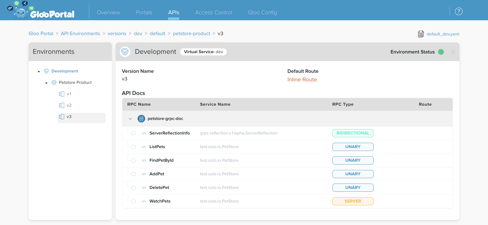


Download and extract `grpcurl`:

```bash
wget https://github.com/fullstorydev/grpcurl/releases/download/v1.8.2/grpcurl_1.8.2_linux_x86_64.tar.gz
tar zxvf grpcurl_1.8.2_linux_x86_64.tar.gz 
```

Now, we need to get a new OAuth token:

```bash
token=$(curl -d "client_id=admin-cli" -d "username=user1" -d "password=password" -d "grant_type=password" "$KEYCLOAK_URL/realms/master/protocol/openid-connect/token" | jq -r .access_token)
```

Then, we can run the following command:

```bash
./grpcurl -plaintext -H "Authorization: Bearer ${token}" -authority api.mycompany.corp $(glooctl proxy address) test.solo.io.PetStore/ListPets | jq
```

You should get a result similar to:

```json
{
  "pets": [
    {
      "id": "1",
      "name": "Dog",
      "tags": [
        "puppy"
      ]
    },
    {
      "id": "2",
      "name": "Cat"
    }
  ]
}
```

## Lab 11 - Routing deep dive

### A flexible architecture

In the previous versions of Gloo Portal, you were able to define _inline routes_ to Kubernetes services.

Gloo Portal 1.0 comes with support all of the other kind of destination offered by Gloo Edge `Upstreams`, like static upstreams and AWS Lambdas.

Earlier in the workshop, we have defined inline routes for each version of the __Petstore__ `APIProduct`, respectively targetting the petstore-v1 Deployment and the petstore-v1 Deployment.

You can absolutely override these routes at the OpenAPI Operation level, i.e. for each endpoint.

Also, we have added `options` to the `Route` CRD, allowing for more features at the route level. 

Reminder: you can define _routes_ using the `Route` CRD. These objects can then be referenced in `Environment` or `APIProduct` _Custom Resources_.

There is also an edge case where routes are defined inside an `Environment` CR and referenced from `APIProduct` CRs. This permits to avoid duplication in the route definitions.

All of this offers a lot a flexibility in your routing design and strategy. 


### Overriding a route

We will define a `Route` CR that target the **HTTPBIN** backend.

```bash
kubectl apply -f - <<EOF
apiVersion: portal.gloo.solo.io/v1beta1
kind: Route
metadata:
  name: httpbin
  namespace: default
spec:
  backends:
  - upstream:
      name: default-httpbin-8000
      namespace: gloo-system
EOF
```

And now, we reference this Route at the `Environment` level, so that any `APIProduct` could eventually use it.

```bash
KEYCLOAK_URL=http://$(kubectl get service keycloak -o jsonpath='{.status.loadBalancer.ingress[0].ip}'):8080/auth

cat << EOF > env.yaml
apiVersion: portal.gloo.solo.io/v1beta1
kind: Environment
metadata:
  name: dev
  namespace: default
spec:
  domains:
    - api.mycompany.corp # the domain name where the API will be exposed
  displayInfo:
    description: This environment is meant for developers to deploy and test their APIs.
    displayName: Development
  basePath: /ecommerce # a global basepath for our APIs
  apiProducts: # we will select our APIProduct using a selector and the 2 version of it
    - namespaces:
      - "*" 
      labels:
      - key: app
        operator: In
        values:
        - petstore
      versions:
        names:
        - v1
        - v2
        - v3
      basePath: "" # this will dynamically prefix the API with the version names
      usagePlans:
        - basic2
        - trusted
  gatewayConfig:
    disableRoutes: false # we actually want to expose the APIs on a Gateway (optional)
  parameters:
    usagePlans:
      basic2:
        authPolicy:
          apiKey: {}
        displayName: api-keys based plan
        rateLimit:
          requestsPerUnit: 5
          unit: MINUTE
      trusted:
        displayName: trusted plan
        rateLimit:
          unit: MINUTE
          requestsPerUnit: 10
        authPolicy:
          oauth:
            authorizationUrl: ${KEYCLOAK_URL}/realms/master/protocol/openid-connect/auth
            tokenUrl: ${KEYCLOAK_URL}/realms/master/protocol/openid-connect/token
            jwtValidation:
              issuer: ${KEYCLOAK_URL}/realms/master
              remoteJwks:
                refreshInterval: 60s
                url: ${KEYCLOAK_URL}/realms/master/protocol/openid-connect/certs
    # ------------------------ NEW ----------------------------
    routes:
      httpbin:
        routeRef:
          name: httpbin
          namespace: default
    # ---------------------------------------------------------
EOF

kubectl apply -f env.yaml
```

And now, we update our `APIProduct` to do some fine-grained routing on the `/api/store/inventory` endpoint, for v2:

```bash
cat << EOF | kubectl apply -f -
apiVersion: portal.gloo.solo.io/v1beta1
kind: APIProduct
metadata:
  name: petstore-product
  namespace: default
  labels:
    app: petstore
spec:
  displayInfo: 
    title: Petstore Product
    description: Fabulous API product for the Petstore
  usagePlans:
    - basic2
    - trusted
  versions:
  - name: v1
    apis:
      - apiDoc:
          name: petstore-openapi-v1-pets
          namespace: default
      - apiDoc:
          name: petstore-openapi-v1-users
          namespace: default
    gatewayConfig:
      route:
        inlineRoute:
          backends:
            - upstream:
                name: default-petstore-v1-8080
                namespace: gloo-system
  - name: v2
    apis:
    - apiDoc:
        name: petstore-openapi-v2-full
        namespace: default
      # ---------------------- NEW ----------------------------------
      openApi:
        operations:
          - id: getInventory
            gatewayConfig:
              route:
                environmentRoute: httpbin # referencing the Route defined in the Environment
      # -------------------------------------------------------------
    gatewayConfig:
      route:
        inlineRoute:
          backends:
            - upstream:
                name: default-petstore-v2-8080
                namespace: gloo-system
  - name: v3
    apis:
    - apiDoc:
        name: petstore-grpc-doc
        namespace: default
    gatewayConfig:
      route:
        inlineRoute:
          backends:
          - kube:
              name: petstore-grpc
              namespace: default
              port: 8080
  # ----------------------------------------------------------
EOF
```

Now, we run a hacky test:

```bash
apikey=$(kubectl -n default get secret -l apiproducts.portal.gloo.solo.io=petstore-product.default -l environments.portal.gloo.solo.io=dev.default -l usageplans.portal.gloo.solo.io=basic2 -o "jsonpath={.items[0].data['api-key']}" | base64 -d)

curl -H "api-key: $apikey" -s $(glooctl proxy url)/ecommerce/v2/api/store/inventory -H "Host: api.mycompany.corp"
```

Well, you will see a 404 because this `/api/store/inventory` endpoint does not exist in the httpbin backend.

See the httpbin logs:

```
[2021-08-27 13:11:51 +0000] [1] [INFO] Starting gunicorn 19.9.0
[2021-08-27 13:11:51 +0000] [1] [INFO] Listening at: http://0.0.0.0:80 (1)
[2021-08-27 13:11:51 +0000] [1] [INFO] Using worker: gevent
[2021-08-27 13:11:51 +0000] [11] [INFO] Booting worker with pid: 11
10.79.208.6 [27/Aug/2021:13:12:05 +0000] GET /api/store/inventory HTTP/1.1 404 Host: api.mycompany.corp}
```

So, let's fix that!

## Lab 12 - Advanced policies - transformations

Let's hack a bit the `Route` defined above and give it a transformation template that will change the request path on the fly.

This time, we will use the admin web UI. Find the **httpbin** Route and click the edit icon, then click on the **Options** tab in the left-hand sidebar:

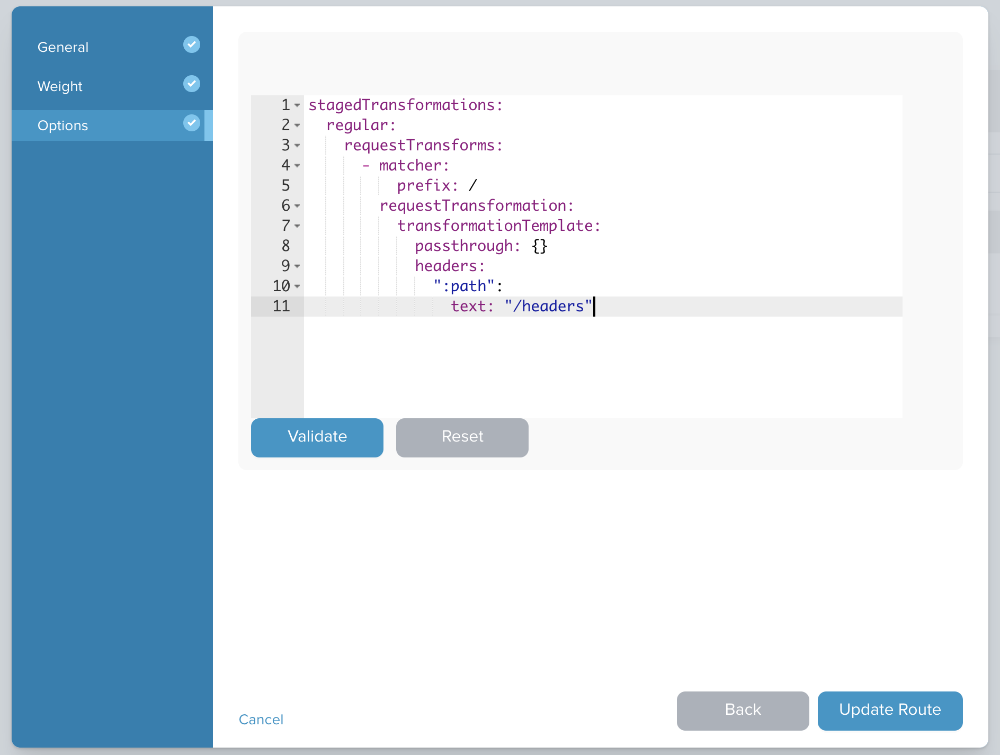

Paste this config:

```yaml
stagedTransformations:
  regular:
    requestTransforms:
      - matcher:
          prefix: /
        requestTransformation:
          transformationTemplate:
            passthrough: {}
            headers:
              ":path":
                text: "/headers"
```

And click the "Update Route" button.

Let's curl it again:

```bash
apikey=$(kubectl -n default get secret -l apiproducts.portal.gloo.solo.io=petstore-product.default -l environments.portal.gloo.solo.io=dev.default -l usageplans.portal.gloo.solo.io=basic2 -o "jsonpath={.items[0].data['api-key']}" | base64 -d)

curl -H "api-key: $apikey" -s $(glooctl proxy url)/ecommerce/v2/api/store/inventory -H "Host: api.mycompany.corp"
```

The output is now a nice JSON payload, returned by the `/headers` endpoint:

```json
{
  "headers": {
    "Accept": "*/*",
    "Api-Key": "ZDk0NjkyMjYtODIxYy1mNDIwLWIzYjEtMGZlYjUxZTUwOGY0",
    "Host": "api.mycompany.corp",
    "User-Agent": "curl/7.64.1",
    "X-Envoy-Expected-Rq-Timeout-Ms": "15000",
    "X-Envoy-Original-Path": "/headers",
    "X-Solo-Plan": "basic2",
    "X-User-Id": "petstore-product-basic2-be459939-e990-6050-9522-26f063de0ecc"
  }
}
```

## Lab 13 - Advanced policies - JWT

In this lab, we will extract a JWT claim from the request and add it as a new header for the upstream server.

Our Keycloack IdP is returning a few claims in the access_tokens. Take a look:

```bash
token=$(curl -s -d "client_id=admin-cli" -d "username=user1" -d "password=password" -d "grant_type=password" "$KEYCLOAK_URL/realms/master/protocol/openid-connect/token" | jq -r .access_token)

echo $token | cut -d'.' -f2 | base64 -d | jq
```

Output:

```json
{
  "exp": 1630072561,
  "iat": 1630072501,
  "jti": "b1d6f21b-773f-4ae1-9e04-41ab4ae0ddd1",
  "iss": "http://34.79.146.82:8080/auth/realms/master",
  "sub": "bde71411-d4ad-4041-b18c-83402cbd0bdc",
  "typ": "Bearer",
  "azp": "admin-cli",
  "session_state": "bab04077-99dd-40b5-b2a8-71ce4f347f88",
  "acr": "1",
  "scope": "email profile",
  "email_verified": false,
  "preferred_username": "user1",
  "email": "user1@solo.io"
}
```

Let's extract the `email` claim and pass it to the upstream server into a new header.

Find your `Environment` and click the "Edit Gateway Configuration" icon, under the "Gateway Options" tab:

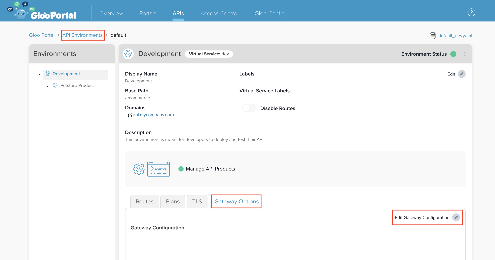

Paste this config block:

```yaml
jwtStaged:
  afterExtAuth:
    providers:
      keycloack:
        claimsToHeaders:
        - claim: email
          header: x-gloo-email
        tokenSource:
          headers:
          - header: authorization
            prefix: 'Bearer '
        jwks:
          remote:
            url: http://keycloak.default.svc:8080/auth/realms/master/protocol/openid-connect/certs
            upstreamRef:
              name: default-keycloak-8080
              namespace: gloo-system

```

And now the test:

```bash
token=$(curl -s -d "client_id=admin-cli" -d "username=user1" -d "password=password" -d "grant_type=password" "$KEYCLOAK_URL/realms/master/protocol/openid-connect/token" | jq -r .access_token)

curl -H "Authorization: Bearer $token" -s $(glooctl proxy url)/ecommerce/v2/api/store/inventory -H "Host: api.mycompany.corp"
```

You should find the new header as shown here:

```json
{
  "headers": {
    "Accept": "*/*",
    "Host": "api.mycompany.corp",
    "User-Agent": "curl/7.64.1",
    "X-Envoy-Expected-Rq-Timeout-Ms": "15000",
    "X-Envoy-Original-Path": "/headers",
    "X-Gloo-Email": "user1@solo.io",
    "X-User-Id": "bde71411-d4ad-4041-b18c-83402cbd0bdc"
  }
}
```


## Lab 14 - Advanced policies - WAF

You can add ModSecurity rules at the VirtualService level by modifying the `Environment` CR:

```bash
KEYCLOAK_URL=http://$(kubectl get service keycloak -o jsonpath='{.status.loadBalancer.ingress[0].ip}'):8080/auth

cat << EOF > env.yaml
apiVersion: portal.gloo.solo.io/v1beta1
kind: Environment
metadata:
  name: dev
  namespace: default
spec:
  domains:
    - api.mycompany.corp # the domain name where the API will be exposed
  displayInfo:
    description: This environment is meant for developers to deploy and test their APIs.
    displayName: Development
  basePath: /ecommerce # a global basepath for our APIs
  apiProducts: # we will select our APIProduct using a selector and the 2 version of it
    - namespaces:
      - "*" 
      labels:
      - key: app
        operator: In
        values:
        - petstore
      versions:
        names:
        - v1
        - v2
        - v3
      basePath: "" # this will dynamically prefix the API with the version names
      usagePlans:
        - basic2
        - trusted
  gatewayConfig:
    disableRoutes: false # we actually want to expose the APIs on a Gateway (optional)
    options:
      jwtStaged:
          afterExtAuth:
            providers:
              keycloack:
                claimsToHeaders:
                - claim: email
                  header: x-gloo-email
                jwks:
                  remote:
                    upstreamRef:
                      name: default-keycloak-8080
                      namespace: gloo-system
                    url: http://keycloak.default.svc:8080/auth/realms/master/protocol/openid-connect/certs
                tokenSource:
                  headers:
                  - header: authorization
                    prefix: 'Bearer '
      # ------------------------- NEW --------------------------------
      waf:
        ruleSets:
        - ruleStr: |
            SecRuleEngine On
            SecRule REMOTE_ADDR "!@ipMatch 93.23.0.0/16" "phase:1,deny,status:403,id:1,msg:'block ip'"
      # --------------------------------------------------------------
  parameters:
    usagePlans:
      basic2:
        authPolicy:
          apiKey: {}
        displayName: api-keys based plan
        rateLimit:
          requestsPerUnit: 5
          unit: MINUTE
      trusted:
        displayName: trusted plan
        rateLimit:
          unit: MINUTE
          requestsPerUnit: 10
        authPolicy:
          oauth:
            authorizationUrl: ${KEYCLOAK_URL}/realms/master/protocol/openid-connect/auth
            tokenUrl: ${KEYCLOAK_URL}/realms/master/protocol/openid-connect/token
            jwtValidation:
              issuer: ${KEYCLOAK_URL}/realms/master
              remoteJwks:
                refreshInterval: 60s
                url: ${KEYCLOAK_URL}/realms/master/protocol/openid-connect/certs
    routes:
      httpbin:
        routeRef:
          name: httpbin
          namespace: default
EOF

kubectl apply -f env.yaml
```

Your `VirtualService` will now look like this:
```bash
kubectl get vs dev -o yaml
```

```yaml
...
spec:
  displayName: Development
  virtualHost:
    domains:
    - api.mycompany.corp
    options:
      waf:
        ruleSets:
        - ruleStr: |
            SecRuleEngine On
            SecRule REMOTE_ADDR "!@ipMatch 93.23.0.0/16" "phase:1,deny,status:403,id:1,msg:'block ip'"
...
```

Verify it works:
```bash
apikey=$(kubectl -n default get secret -l apiproducts.portal.gloo.solo.io=petstore-product.default -l environments.portal.gloo.solo.io=dev.default -l usageplans.portal.gloo.solo.io=basic2 -o "jsonpath={.items[0].data['api-key']}" | base64 -d)

curl -H "api-key: $apikey" -s $(glooctl proxy url)/ecommerce/v1/api/pet/1 -H "Host: api.mycompany.corp" -v
```

Output:
```
...
> GET /ecommerce/v1/api/pet/1 HTTP/1.1
> Host: api.mycompany.corp
> User-Agent: curl/7.64.1
> Accept: */*
> api-key: MWVjOGY1ZDQtMWIxOS1mMzc2LTFjYTktZjhmZWNmNDYyMGEx
>
< HTTP/1.1 403 Forbidden
< content-length: 34
< content-type: text/plain
< date: Wed, 25 Aug 2021 16:49:49 GMT
< server: envoy
<
* Connection #0 to host 34.140.165.11 left intact
ModSecurity: intervention occurred* Closing connection 0
...
```

You can also manage the gateway from the Admin web UI:

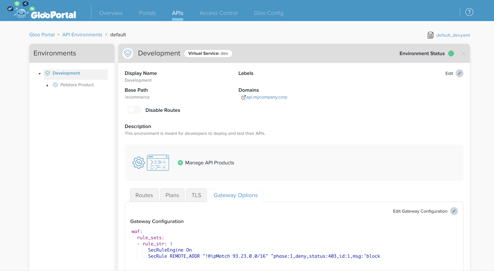

## Lab 15 - Monetization

It is now possible to configure Gloo Portal and GLoo Edge so that it get metrics of the API consumption.

We have a nice step-by-step guide in this section of the doc: https://docs.solo.io/gloo-portal/main/guides/portal_features/monetization/

Here is a summary for the sake of this workshop completeness.

### Database setup

Create the DB schema:

```bash 
cat << EOF | kubectl apply -f -
apiVersion: v1
kind: ConfigMap
metadata:
  name: postgres-schema
  namespace: gloo-system
data:
  init-schema.sql: |
    CREATE TABLE public.requests
    (
        id          bigint                   NOT NULL,
        user_id     text                     NOT NULL,
        route       text                     NOT NULL,
        api_product text                     NOT NULL,
        environment text                     NOT NULL,
        status      integer                  NOT NULL,
        request_ts  timestamp with time zone NOT NULL,
        method      text                     NOT NULL,
        request_id  text                     NOT NULL
    );

    ALTER TABLE public.requests
        OWNER TO "postgres-user";

    CREATE SEQUENCE public.requests_id_seq
        AS bigint
        START WITH 1
        INCREMENT BY 1
        NO MINVALUE
        NO MAXVALUE
        CACHE 1;

    ALTER TABLE public.requests_id_seq
        OWNER TO "postgres-user";

    ALTER SEQUENCE public.requests_id_seq OWNED BY public.requests.id;

    ALTER TABLE ONLY public.requests
        ALTER COLUMN id SET DEFAULT nextval('public.requests_id_seq'::regclass);

    ALTER TABLE ONLY public.requests
        ADD CONSTRAINT requests_pkey PRIMARY KEY (id);
EOF
```

Deploy postgresql:

```bash
helm repo add bitnami https://charts.bitnami.com/bitnami
helm repo update
helm install postgres bitnami/postgresql -n gloo-system \
--set global.postgresql.postgresqlDatabase=postgres-db \
--set global.postgresql.postgresqlUsername=postgres-user \
--set global.postgresql.postgresqlPassword=postgres-password \
--set global.postgresql.servicePort=5432 \
--set initdbScriptsConfigMap=postgres-schema
```


