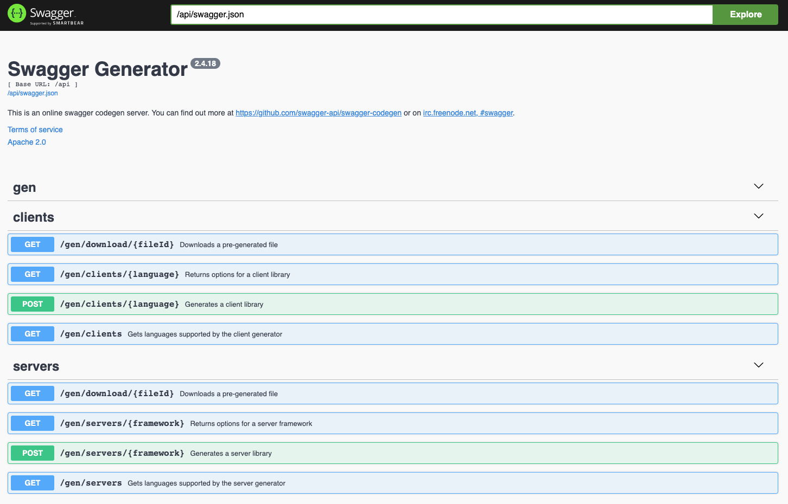
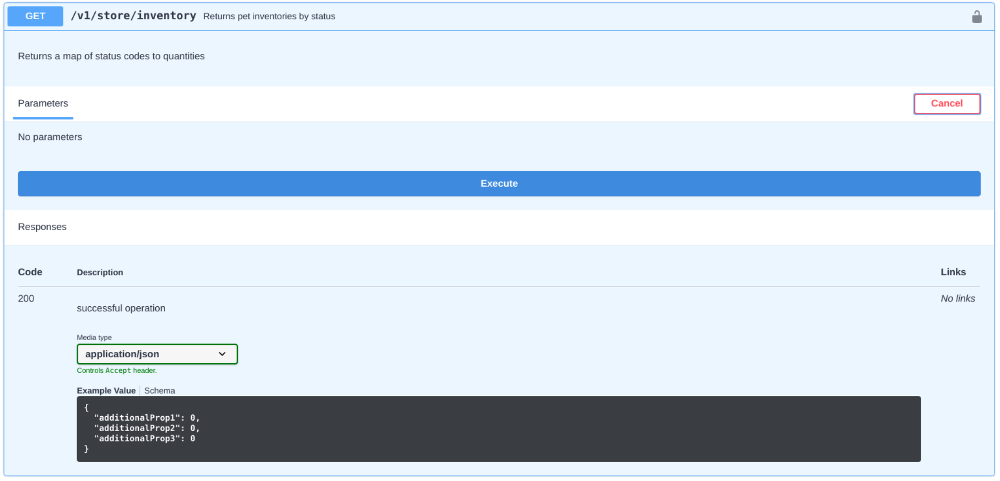
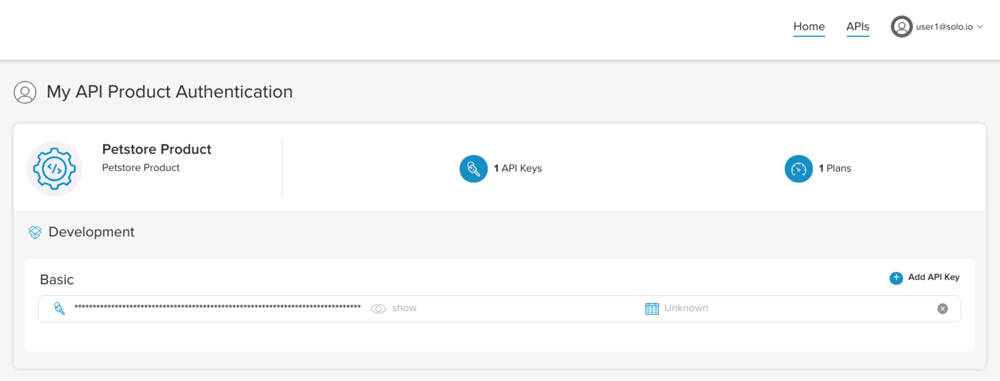
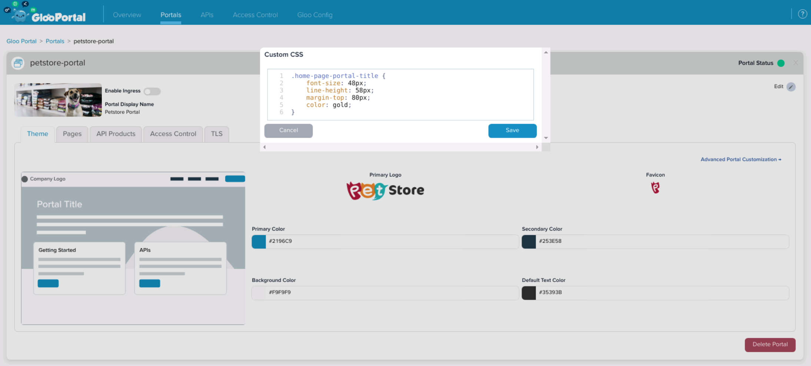
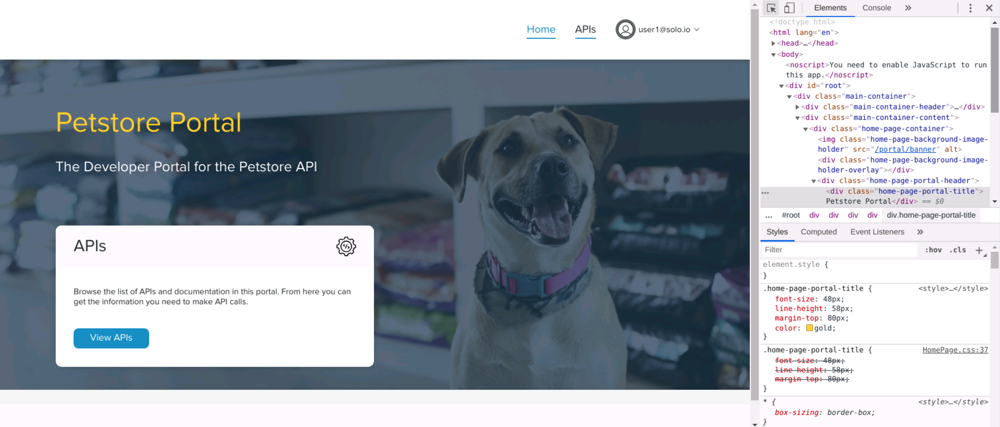
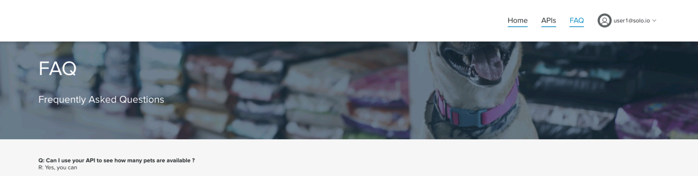
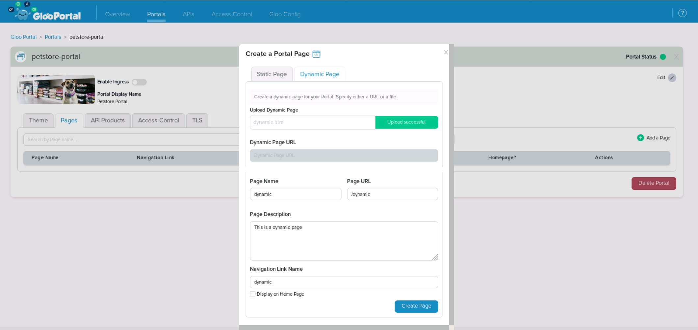

# Gloo Portal Workshop

Gloo Portal provides a framework for managing the definitions of APIs, API client identity, and API policies on top of Gloo Edge or of the Istio Ingress Gateway. Vendors of API products can leverage Gloo Portal to secure, manage, and publish their APIs independent of the operations used to manage networking infrastructure.

The goal of this workshop is to expose some key features of the Gloo Portal like API lifecycle, Authentication, Rebranding, ...

## OpenAPI vs Swagger

OpenAPI is a specification, while Swagger are tools for implementing the OpenAPI specification.

The OpenAPI Specification (OAS) defines a standard, language-agnostic interface to RESTful APIs which allows both humans and computers to discover and understand the capabilities of the service without access to source code, documentation, or through network traffic inspection. When properly defined, a consumer can understand and interact with the remote service with a minimal amount of implementation logic.

Swagger is the name associated with some of the most well-known, and widely used tools for implementing the OpenAPI specification. The Swagger toolset includes a mix of open source, free, and commercial tools, which can be used at different stages of the API lifecycle.

## Lab Environment

The Lab environment consists of a Virtual Machine where you will deploy a Kubernetes cluster using kind.
You will then deploy Gloo Edge and Gloo Portal on this Kubernetes cluster.

## Lab 0: Deploy a Kubernetes Cluster and Keycloak

Go to the `/home/solo/workshops/gloo-portal` directory:

```
cd /home/solo/workshops/gloo-portal
```

Deploy a local Kubernetes cluster using this command:

```bash
../scripts/deploy.sh 1 gloo-portal
```

Then verify that your Kubernetes cluster is ready: 

```bash
../scripts/check.sh gloo-portal
```

We will use Keycloak to secure the access to the Gloo Portal.

Let's deploy it:

```bash
kubectl create -f https://raw.githubusercontent.com/keycloak/keycloak-quickstarts/latest/kubernetes-examples/keycloak.yaml
kubectl rollout status deploy/keycloak
```

<!--bash
sleep 30
-->

Then, we need to configure it and create a user with the credentials `user1/password`:

```bash
# Get Keycloak URL and token
KEYCLOAK_URL=http://$(kubectl get service keycloak -o jsonpath='{.status.loadBalancer.ingress[0].ip}'):8080/auth
KEYCLOAK_TOKEN=$(curl -d "client_id=admin-cli" -d "username=admin" -d "password=admin" -d "grant_type=password" "$KEYCLOAK_URL/realms/master/protocol/openid-connect/token" | jq -r .access_token)

# Create initial token to register the client
read -r client token <<<$(curl -H "Authorization: Bearer ${KEYCLOAK_TOKEN}" -X POST -H "Content-Type: application/json" -d '{"expiration": 0, "count": 1}' $KEYCLOAK_URL/admin/realms/master/clients-initial-access | jq -r '[.id, .token] | @tsv')

# Register the client
read -r id secret <<<$(curl -X POST -d "{ \"clientId\": \"${client}\" }" -H "Content-Type:application/json" -H "Authorization: bearer ${token}" ${KEYCLOAK_URL}/realms/master/clients-registrations/default| jq -r '[.id, .secret] | @tsv')

# Add allowed redirect URIs
curl -H "Authorization: Bearer ${KEYCLOAK_TOKEN}" -X PUT -H "Content-Type: application/json" -d '{"serviceAccountsEnabled": true, "authorizationServicesEnabled": true, "redirectUris": ["http://portal.petstore.com/callback"]}' $KEYCLOAK_URL/admin/realms/master/clients/${id}

# Add the group attribute in the JWT token returned by Keycloak
curl -H "Authorization: Bearer ${KEYCLOAK_TOKEN}" -X POST -H "Content-Type: application/json" -d '{"name": "group", "protocol": "openid-connect", "protocolMapper": "oidc-usermodel-attribute-mapper", "config": {"claim.name": "group", "jsonType.label": "String", "user.attribute": "group", "id.token.claim": "true", "access.token.claim": "true"}}' $KEYCLOAK_URL/admin/realms/master/clients/${id}/protocol-mappers/models

# Create a user
curl -H "Authorization: Bearer ${KEYCLOAK_TOKEN}" -X POST -H "Content-Type: application/json" -d '{"username": "user1", "email": "user1@solo.io", "enabled": true, "attributes": {"group": "users"}, "credentials": [{"type": "password", "value": "password", "temporary": false}]}' $KEYCLOAK_URL/admin/realms/master/users
```

## Lab 1: Build an application from an OpenAPI document

As explained above, Swagger is a set of tools and one of the Swagger tools is called [Swagger Codegen](https://github.com/swagger-api/swagger-codegen).

It allows generation of API client libraries (SDK generation), server stubs and documentation automatically given an OpenAPI Spec.

In this lab, we'll use it to create a demo application from an OpenAPI document. But we won't even need to deploy `Swagger Codegen` because it's available online on a service called  [Swagger Generator](https://generator.swagger.io/).



And the demo application we will build is called the [Swagger Petstore](https://github.com/swagger-api/swagger-petstore).

The OpenAPI document of the `Petstore` application is available [here](https://petstore.swagger.io/v2/swagger.json)

Run the following command to see the beginning of the document formatted using `jq`:

```
curl https://petstore.swagger.io/v2/swagger.json | jq . | head -25
```

The output should be similar to this:

```
{
  "swagger": "2.0",
  "info": {
    "description": "This is a sample server Petstore server.  You can find out more about Swagger at [http://swagger.io](http://swagger.io) or on [irc.freenode.net, #swagger](http://swagger.io/irc/).  For this sample, you can use the api key `special-key` to test the authorization filters.",
    "version": "1.0.5",
    "title": "Swagger Petstore",
    "termsOfService": "http://swagger.io/terms/",
    "contact": {
      "email": "apiteam@swagger.io"
    },
    "license": {
      "name": "Apache 2.0",
      "url": "http://www.apache.org/licenses/LICENSE-2.0.html"
    }
  },
  "host": "petstore.swagger.io",
  "basePath": "/v2",
  "tags": [
    {
      "name": "pet",
      "description": "Everything about your Pets",
      "externalDocs": {
        "description": "Find out more",
        "url": "http://swagger.io"
      }
```

You can see a key called `basePath` with a value `v2`.

Including the version of an API in the `basePath` is a common way to manage the lifecycle of an application, even of there is no standard. Other approaches exist (like using a header, a different host, ...).

There are 2 OpenAPI documents in the current directory:

- swagger-petstore-v1.json
- swagger-petstore-v2.json

Run the following command to see the different between the 2 files:

```
diff swagger-petstore-v1.json swagger-petstore-v2.json
```

Here is the expected output:

```
17c17
<   "basePath": "/v1",
---
>   "basePath": "/v2",
910c910,911
<         "name"
---
>         "name",
>         "photoUrls"
922a924,935
>         },
>         "photoUrls": {
>           "type": "array",
>           "xml": {
>             "wrapped": true
>           },
>           "items": {
>             "type": "string",
>             "xml": {
>               "name": "photoUrl"
>             }
>           }
```

You can see that we've changed the base path to `/v1` and removed the `photoUrls` key in the first document. The second document is the original OpenAPI document of the `Petstore` application.

### Build the version v1

Run the command bellow to generate the application code using the `swagger-petstore-v1.json`:

```bash
wget -O petstore-v1.zip $(curl -X POST --header 'Content-Type: application/json' --header 'Accept: application/json' -d '{
  "swaggerUrl": "https://github.com/solo-io/workshops/raw/master/gloo-portal/swagger-petstore-v1.json"
}' 'https://generator.swagger.io/api/gen/servers/go-server' | jq -r .link)
```

Uncompress the archive:

```bash
unzip petstore-v1.zip -d petstore-v1
```

Go to the `petstore-v1/go-server-server` directory:

```bash
cd petstore-v1/go-server-server
```

Take a look at the content of the `go/api_pet.go` file:

```
/*
 * Swagger Petstore
 *
 * This is a sample server Petstore server.  You can find out more about Swagger at [http://swagger.io](http://swagger.io) or on [irc.freenode.net, #swagger](http://swagger.io/irc/).  For this sample, you can use the api key `special-key` to test the authorization filters.
 *
 * API version: 1.0.5
 * Contact: apiteam@swagger.io
 * Generated by: Swagger Codegen (https://github.com/swagger-api/swagger-codegen.git)
 */

package swagger

import (
	"net/http"
)

func AddPet(w http.ResponseWriter, r *http.Request) {
	w.Header().Set("Content-Type", "application/json; charset=UTF-8")
	w.WriteHeader(http.StatusOK)
}

func DeletePet(w http.ResponseWriter, r *http.Request) {
	w.Header().Set("Content-Type", "application/json; charset=UTF-8")
	w.WriteHeader(http.StatusOK)
}

func FindPetsByStatus(w http.ResponseWriter, r *http.Request) {
	w.Header().Set("Content-Type", "application/json; charset=UTF-8")
	w.WriteHeader(http.StatusOK)
}

func FindPetsByTags(w http.ResponseWriter, r *http.Request) {
	w.Header().Set("Content-Type", "application/json; charset=UTF-8")
	w.WriteHeader(http.StatusOK)
}

func GetPetById(w http.ResponseWriter, r *http.Request) {
	w.Header().Set("Content-Type", "application/json; charset=UTF-8")
	w.WriteHeader(http.StatusOK)
}

func UpdatePet(w http.ResponseWriter, r *http.Request) {
	w.Header().Set("Content-Type", "application/json; charset=UTF-8")
	w.WriteHeader(http.StatusOK)
}

func UpdatePetWithForm(w http.ResponseWriter, r *http.Request) {
	w.Header().Set("Content-Type", "application/json; charset=UTF-8")
	w.WriteHeader(http.StatusOK)
}

func UploadFile(w http.ResponseWriter, r *http.Request) {
	w.Header().Set("Content-Type", "application/json; charset=UTF-8")
	w.WriteHeader(http.StatusOK)
}
```

As you can see, `Swagger Generator` has created the skeleton for our application, but we would still need to write all the logic around creating objects, updating objects, ...

We won't implement this logic here. Instead we're going to use the `swaggerapi/petstore` Docker image. Luckily, an environment variable called `SWAGGER_BASE_PATH` can be set to define the base path we want to use. We'll use it to simulate the deployment of 2 versions of the `Petstore` application.

### Deploy the 2 versions

Use the following snippet to deploy the 2 versions of the application:

```bash
kubectl apply -f - <<EOF
apiVersion: apps/v1
kind: Deployment
metadata:
  name: petstore-v1
spec:
  replicas: 1
  selector:
    matchLabels:
      app: petstore
      version: v1
  template:
    metadata:
      labels:
        app: petstore
        version: v1
    spec:
      containers:
        - name: petstore
          image: swaggerapi/petstore
          env:
          - name: SWAGGER_BASE_PATH
            value: /v1
          imagePullPolicy: Always
          ports:
            - name: http
              containerPort: 8080
---
apiVersion: v1
kind: Service
metadata:
  name: petstore-v1
spec:
  ports:
    - name: http
      port: 8080
      targetPort: http
      protocol: TCP
  selector:
    app: petstore
    version: v1
EOF

kubectl apply -f - <<EOF
apiVersion: apps/v1
kind: Deployment
metadata:
  name: petstore-v2
spec:
  replicas: 1
  selector:
    matchLabels:
      app: petstore
      version: v2
  template:
    metadata:
      labels:
        app: petstore
        version: v2
    spec:
      containers:
        - name: petstore
          image: swaggerapi/petstore
          env:
          - name: SWAGGER_BASE_PATH
            value: /v2
          imagePullPolicy: Always
          ports:
            - name: http
              containerPort: 8080
---
apiVersion: v1
kind: Service
metadata:
  name: petstore-v2
spec:
  ports:
    - name: http
      port: 8080
      targetPort: http
      protocol: TCP
  selector:
    app: petstore
    version: v2
EOF
```

## Lab 2: Deploy Gloo Edge and Gloo Portal

### Install Gloo Edge

Run the commands below to deploy Gloo Edge Enterprise:

```bash
kubectl config use-context gloo-edge
glooctl upgrade --release=v1.6.6
glooctl install gateway enterprise --version 1.6.6 --license-key $LICENSE_KEY
```

Gloo Edge can also be deployed using a Helm chart.

Use the following commands to wait for the Gloo Edge components to be deployed:

```bash
until kubectl get ns gloo-system
do
  sleep 1
done

until [ $(kubectl -n gloo-system get pods -o jsonpath='{range .items[*].status.containerStatuses[*]}{.ready}{"\n"}{end}' | grep false -c) -eq 0 ]; do
  echo "Waiting for all the gloo-system pods to become ready"
  sleep 1
done
```

### Install Gloo Portal

We'll use Helm to deploy Gloo Portal:

```bash
helm repo add dev-portal https://storage.googleapis.com/dev-portal-helm
helm repo update

cat << EOF > gloo-values.yaml
gloo:
  enabled: true
licenseKey:
  secretRef:
    name: license
    namespace: gloo-system
    key: license-key
EOF

kubectl create namespace dev-portal
helm install dev-portal dev-portal/dev-portal -n dev-portal --values gloo-values.yaml  --version=0.5.0
```

<!--bash
until kubectl get ns dev-portal
do
  sleep 1
done
-->

Use the following snippet to wait for the installation to finish:

```bash
until [ $(kubectl -n dev-portal get pods -o jsonpath='{range .items[*].status.containerStatuses[*]}{.ready}{"\n"}{end}' | grep true -c) -eq 4 ]; do
  echo "Waiting for all the Gloo Portal pods to become ready"
  sleep 1
done
```

## Lab 3: Expose the API

### Create the API Docs

Managing APIs with Gloo Portal happens through the use of three resources: the API Doc, the API Product and the Environment.

API Docs are Kubernetes Custom Resources which packages the API definitions created by the maintainers of an API. Each API Doc maps to a single OpenAPI document. The APIs endpoints themselves are provided by backend services.

Let's create an API Doc using the OpenAPI document of the `v1` version of the `Petstore` demo application:

```bash
cat <<EOF | kubectl apply -f -
apiVersion: devportal.solo.io/v1alpha1
kind: APIDoc
metadata:
  name: petstore-v1
  namespace: default
spec:
  openApi:
    content:
      fetchUrl: https://github.com/solo-io/workshops/raw/master/gloo-portal/swagger-petstore-v1.json
EOF
```

You can then check the status of the API Doc using the following command:

```bash
kubectl get apidocs.devportal.solo.io petstore-v1 -o yaml
```

Let's do the same for the second version:

```bash
cat <<EOF | kubectl apply -f -
apiVersion: devportal.solo.io/v1alpha1
kind: APIDoc
metadata:
  name: petstore-v2
  namespace: default
spec:
  openApi:
    content:
      fetchUrl: https://github.com/solo-io/workshops/raw/master/gloo-portal/swagger-petstore-v2.json
EOF
```

### Create an API Product

API Products are Kubernetes Custom Resources which bundle the APIs defined in API Docs into a product which can be exposed to ingress traffic as well as published on a Portal UI. An API Product defines what API operations are being exposed, and the routing information to reach the services.

Let's create an API Product using the API Docs we've just created and pointing to the 2 versions of the `Petstore` application:

```bash
cat << EOF | kubectl apply -f-
apiVersion: devportal.solo.io/v1alpha1
kind: APIProduct
metadata:
  name: petstore
  namespace: default
spec:
  displayInfo: 
    description: Petstore Product
    title: Petstore Product
    image:
      fetchUrl: https://i.imgur.com/EXbBN1a.jpg
  versions:
  - name: v1
    apis:
    - apiDoc:
        name: petstore-v1
        namespace: default
    tags:
      stable: {}
    defaultRoute:
      inlineRoute:
        backends:
        - kube:
            name: petstore-v1
            namespace: default
            port: 8080
  - name: v2
    apis:
    - apiDoc:
        name: petstore-v2
        namespace: default
    tags:
      stable: {}
    defaultRoute:
      inlineRoute:
        backends:
        - kube:
            name: petstore-v2
            namespace: default
            port: 8080
EOF
```

You can then check the status of the API Product using the following command:

```bash
kubectl get apiproducts.devportal.solo.io petstore -o yaml
```

### Create an Environment

Now, we are going to create an Environment named `dev` using the domain `dev.petstore.com` to expose the `v1` and `v2` versions of the `Petstore` application.

```bash
cat << EOF | kubectl apply -f-
apiVersion: devportal.solo.io/v1alpha1
kind: Environment
metadata:
  name: dev
  namespace: default
spec:
  domains:
  - dev.petstore.com
  displayInfo:
    description: This environment is meant for developers to deploy and test their APIs.
    displayName: Development
  apiProducts:
  - name: petstore
    namespace: default
    publishedVersions:
    - name: v1
    - name: v2
EOF
```

You can then check the status of the Environment using the following command:

```bash
kubectl get environments.devportal.solo.io dev -o yaml
```

### Gloo Edge Virtual Service

You can see the Gloo Edge Virtual Service created by Gloo Portal to expose the API using the command below:

```bash
kubectl get environments.devportal.solo.io dev -o yaml
```

Here is the output:
```
apiVersion: gateway.solo.io/v1
kind: VirtualService
metadata:
  annotations:
    kubectl.kubernetes.io/last-applied-configuration: |
      {"apiVersion":"devportal.solo.io/v1alpha1","kind":"Environment","metadata":{"annotations":{},"name":"dev","namespace":"default"},"spec":{"apiProducts":[{"name":"petstore","namespace":"default","publishedVersions":[{"name":"v1"},{"name":"v2"}]}],"displayInfo":{"description":"This environment is meant for developers to deploy and test their APIs.","displayName":"Development"},"domains":["dev.petstore.com"]}}
  creationTimestamp: "2021-02-01T16:14:40Z"
  generation: 41
  labels:
    cluster.multicluster.solo.io: ""
    environments.devportal.solo.io: dev.default
...
    manager: gateway
    operation: Update
    time: "2021-02-03T10:37:57Z"
  name: dev
  namespace: default
  ownerReferences:
  - apiVersion: devportal.solo.io/v1alpha1
    blockOwnerDeletion: true
    controller: true
    kind: Environment
    name: dev
    uid: 13c7a1e4-afcc-4ad9-896e-d62d4ac9194d
  resourceVersion: "437517"
  selfLink: /apis/gateway.solo.io/v1/namespaces/default/virtualservices/dev
  uid: 1862d8f2-93b2-46c6-91aa-56bd60b33ba3
spec:
  displayName: Development
  virtualHost:
    domains:
    - dev.petstore.com
    options:
      cors:
        allowHeaders:
        - api-key
        allowOrigin:
        - http://portal.petstore.com
        - https://portal.petstore.com
    routes:
    - matchers:
      - exact: /v1/pet
        methods:
        - POST
        - OPTIONS
      name: dev.default.petstore.default.petstore-v1.default.addPet
      options: {}
      routeAction:
        multi:
          destinations:
          - destination:
              upstream:
                name: petstore-v1-8080-default
                namespace: dev-portal
            weight: 1

...
```

### Consume the API

When targeting Gloo Edge, Gloo Portal manages a set of Gloo Edge Custom Resource Definitions (CRDs) on behalf of users:

- VirtualServices: Gloo Portal generates a Gloo Edge VirtualService for each API Product. The VirtualService contains a single HTTP route for each API operation exposed in the product. Routes are named and their matchers are derived from the OpenAPI document.
- Upstreams: Gloo Portal generates a Gloo Upstream for each unique destination referenced in an API Product route.

We need to update the `/etc/hosts` file to be able to access our API (and later the Portal):

```bash
cat <<EOF | sudo tee -a /etc/hosts
$(kubectl -n gloo-system get service gateway-proxy -o jsonpath='{.status.loadBalancer.ingress[0].ip}') dev.petstore.com
$(kubectl -n gloo-system get service gateway-proxy -o jsonpath='{.status.loadBalancer.ingress[0].ip}') portal.petstore.com
EOF
```

You can now access the version `v1` of the API using the command below:

```bash
curl http://dev.petstore.com/v1/store/inventory | jq .
```

The output should be similar to below:

```
{
  "sold": 1,
  "pending": 2,
  "available": 7
}
```

You can also check that you can access the version `v2`:

```bash
curl http://dev.petstore.com/v2/store/inventory | jq .
```

The output should be the same:

```
{
  "sold": 1,
  "pending": 2,
  "available": 7
}
```

## Lab 4: Create a Portal

Once a set of APIs have been bundled together in an API Product, those products can be published in a user-friendly interface through which outside developers can discover, browse and interact with APIs. This is done by defining Portals, a custom resource which tells Gloo Portal how to publish a customized website containing an interactive catalog of those products.

We'll integrate the Portal with Keycloak, so we need to define a couple of variables and create a secret:

```bash
KEYCLOAK_URL=http://$(kubectl get service keycloak -o jsonpath='{.status.loadBalancer.ingress[0].ip}'):8080/auth
KEYCLOAK_TOKEN=$(curl -d "client_id=admin-cli" -d "username=admin" -d "password=admin" -d "grant_type=password" "$KEYCLOAK_URL/realms/master/protocol/openid-connect/token" | jq -r .access_token)

KEYCLOAK_ID=$(curl -H "Authorization: bearer ${KEYCLOAK_TOKEN}" -H "Content-Type: application/json"  $KEYCLOAK_URL/admin/realms/master/clients  | jq -r '.[] | select(.redirectUris[0] == "http://portal.petstore.com/callback") | .id')
KEYCLOAK_CLIENT=$(curl -H "Authorization: bearer ${KEYCLOAK_TOKEN}" -H "Content-Type: application/json"  $KEYCLOAK_URL/admin/realms/master/clients  | jq -r '.[] | select(.redirectUris[0] == "http://portal.petstore.com/callback") | .clientId')
KEYCLOAK_SECRET=$(curl -H "Authorization: bearer ${KEYCLOAK_TOKEN}" -H "Content-Type: application/json"  $KEYCLOAK_URL/admin/realms/master/clients/$KEYCLOAK_ID/client-secret | jq -r .value)

cat <<EOF | kubectl apply -f -
apiVersion: v1
kind: Secret
metadata:
  name: petstore-portal-oidc-secret
  namespace: default
data:
  client_secret: $(echo $KEYCLOAK_SECRET | base64)
EOF
```

Let's create the Portal:

```bash
cat <<EOF | kubectl apply -f -
apiVersion: devportal.solo.io/v1alpha1
kind: Portal
metadata:
  name: petstore-portal
  namespace: default
spec:
  displayName: Petstore Portal
  description: The Developer Portal for the Petstore API
  banner:
    fetchUrl: https://i.imgur.com/EXbBN1a.jpg
  favicon:
    fetchUrl: https://i.imgur.com/QQwlQG3.png
  primaryLogo:
    fetchUrl: https://i.imgur.com/hjgPMNP.png
  customStyling: {}
  staticPages: []
  domains:
  - portal.petstore.com

  oidcAuth:
    callbackUrlPrefix: http://portal.petstore.com/
    clientId: ${KEYCLOAK_CLIENT}
    clientSecret:
      name: petstore-portal-oidc-secret
      namespace: default
      key: client_secret
    groupClaimKey: group
    issuer: ${KEYCLOAK_URL}/realms/master

  publishedEnvironments:
  - name: dev
    namespace: default
EOF
````

You can now check the status of the Portal using the following command:

```bash
kubectl get portal -n default petstore-portal -oyaml
```

Create a Group CRD to allow the users of the `users` group to access the portal, the product and the environment:

```bash
cat << EOF | kubectl apply -f -
apiVersion: devportal.solo.io/v1alpha1
kind: Group
metadata:
  name: oidc-group
  namespace: default
spec:
  accessLevel:
    apiProducts:
    - name: petstore
      namespace: default
      environments:
      - name: dev
        namespace: default
    portals:
    - name: petstore-portal
      namespace: default
  oidcGroup:
    groupName: users
EOF
```

You can now check the status of the Group using the following command:

```bash
kubectl get group -n default oidc-group -oyaml
```

## Lab 5: Explore the Administrative Interface

Let's run the following command to allow access ot the admin UI of Gloo Portal:

```
kubectl port-forward -n dev-portal svc/admin-server 8000:8080
```

You can now access the admin UI at http://localhost:8000


Take the time to explore the UI and see the different components we have created using `kubectl`.

## Lab 6: Explore the Portal Interface

The user Portal we have created is available at http://portal.petstore.com


Log in with the user `user1` and the password `password`.

Click on the version `v1`, scroll down and click on the `GET /v1/store/inventory` API call.

Click on `Try it out` and then on the `Execute` button.

You should get a 200 response:



Take the time to explore the UI and see the difference between the 2 versions for the `POST /v2/pet` API call. Only v2 has the `photoUrls` key.

## Lab 7: Secure the access to the API

We've already secured the access to the Portal UI, but we didn't secure the API itself yet.

We can update the Environment to create a plan (called `Basic`) with its associated rate limit:

```bash
cat << EOF | kubectl apply -f-
apiVersion: devportal.solo.io/v1alpha1
kind: Environment
metadata:
  name: dev
  namespace: default
spec:
  domains:
  - dev.petstore.com
  displayInfo:
    description: This environment is meant for developers to deploy and test their APIs.
    displayName: Development
  apiProducts:
  - name: petstore
    namespace: default
    plans:
    - authPolicy:
        apiKey: {}
      displayName: Basic
      name: basic
      rateLimit:
        requestsPerUnit: 5
        unit: MINUTE
    publishedVersions:
    - name: v1
    - name: v2
EOF
```

And finally, we need to let the users of the `users` group to use this plan:

```bash
cat << EOF | kubectl apply -f -
apiVersion: devportal.solo.io/v1alpha1
kind: Group
metadata:
  name: oidc-group
  namespace: default
spec:
  accessLevel:
    apiProducts:
    - name: petstore
      namespace: default
      environments:
      - name: dev
        namespace: default
        plans:
        - basic
    portals:
    - name: petstore-portal
      namespace: default
  oidcGroup:
    groupName: users
EOF
```

Go back to the Portal UI and try to execute the `GET /v1/store/inventory` API call again.

This time, you should get a 403 response.

Click on `user1@solo.io` on the top right corner and select `API Keys`.

Click on `API Keys` again and Add an API Key.



You can click on the key to copy the value to the clipboard and `Authorize` the call through the UI, but this time we are going to use curl.

So, we need to retrieve the API key first:

```
key=$(kubectl get secret -l environments.devportal.solo.io=dev.default -n default -o jsonpath='{.items[0].data.api-key}' | base64 --decode)
```

Then, we can run the following command:

```
curl -H "api-key: ${key}" http://dev.petstore.com/v1/store/inventory -vvv
```

You should get a result similar to:

```
*   Trying 172.18.0.211...
* TCP_NODELAY set
* Connected to dev.petstore.com (172.18.0.211) port 80 (#0)
> GET /v1/store/inventory HTTP/1.1
> Host: dev.petstore.com
> User-Agent: curl/7.52.1
> Accept: */*
> api-key: YmMwYTE4OTEtOTA0Ni00OWY4LWQ0OTgtZDBjNDQ3YjUwM2Rm
> 
< HTTP/1.1 200 OK
< date: Wed, 03 Feb 2021 08:10:04 GMT
< access-control-allow-origin: *
< access-control-allow-methods: GET, POST, DELETE, PUT
< access-control-allow-headers: Content-Type, api_key, Authorization
< content-type: application/json
< server: envoy
< x-envoy-upstream-service-time: 2
< transfer-encoding: chunked
< 
* Curl_http_done: called premature == 0
* Connection #0 to host dev.petstore.com left intact
{"sold":1,"pending":2,"available":7}
```

Now, execute the curl command again several times.

As soon as you reach the rate limit, you should get the following output:

```
*   Trying 172.18.0.211...
* TCP_NODELAY set
* Connected to dev.petstore.com (172.18.0.211) port 80 (#0)
> GET /v1/store/inventory HTTP/1.1
> Host: dev.petstore.com
> User-Agent: curl/7.52.1
> Accept: */*
> api-key: YmMwYTE4OTEtOTA0Ni00OWY4LWQ0OTgtZDBjNDQ3YjUwM2Rm
> 
< HTTP/1.1 429 Too Many Requests
< x-envoy-ratelimited: true
< date: Wed, 03 Feb 2021 08:10:35 GMT
< server: envoy
< content-length: 0
< 
* Curl_http_done: called premature == 0
* Connection #0 to host dev.petstore.com left intact
```

### Gloo Edge Virtual Service

You can see the Gloo Edge Virtual Service updated by Gloo Portal using the command below:

```bash
kubectl get environments.devportal.solo.io dev -o yaml
```

Here is the output:

```
apiVersion: gateway.solo.io/v1
kind: VirtualService
metadata:
  annotations:
    kubectl.kubernetes.io/last-applied-configuration: |
      {"apiVersion":"devportal.solo.io/v1alpha1","kind":"Environment","metadata":{"annotations":{},"name":"dev","namespace":"default"},"spec":{"apiProducts":[{"name":"petstore","namespace":"default","plans":[{"authPolicy":{"apiKey":{}},"displayName":"Basic","name":"basic","rateLimit":{"requestsPerUnit":5,"unit":"MINUTE"}}],"publishedVersions":[{"name":"v1"},{"name":"v2"}]}],"displayInfo":{"description":"This environment is meant for developers to deploy and test their APIs.","displayName":"Development"},"domains":["dev.petstore.com"]}}
  creationTimestamp: "2021-02-01T16:14:40Z"
  generation: 37
  labels:
    cluster.multicluster.solo.io: ""
    environments.devportal.solo.io: dev.default
...
  name: dev
  namespace: default
  ownerReferences:
  - apiVersion: devportal.solo.io/v1alpha1
    blockOwnerDeletion: true
    controller: true
    kind: Environment
    name: dev
    uid: 13c7a1e4-afcc-4ad9-896e-d62d4ac9194d
  resourceVersion: "414495"
  selfLink: /apis/gateway.solo.io/v1/namespaces/default/virtualservices/dev
  uid: 1862d8f2-93b2-46c6-91aa-56bd60b33ba3
spec:
  displayName: Development
  virtualHost:
    domains:
    - dev.petstore.com
    options:
      cors:
        allowHeaders:
        - api-key
        allowOrigin:
        - http://portal.petstore.com
        - https://portal.petstore.com
    routes:
    - matchers:
      - exact: /v1/pet
        methods:
        - POST
        - OPTIONS
      name: dev.default.petstore.default.petstore-v1.default.addPet
      options:
        extauth:
          configRef:
            name: dev
            namespace: default
        rateLimitConfigs:
          refs:
          - name: dev-default-petstore
            namespace: default
      routeAction:
        multi:
          destinations:
          - destination:
              upstream:
                name: petstore-v1-8080-default
                namespace: dev-portal
            weight: 1
...
```

The `extauth` and `rateLimitConfigs` options have been added on each route to secure the API.

## Lab 8: Portal rebranding

As you've seen in the previous lab, we've been able to provide a few pictures (banner, logo, ...).

But you can completely change the look and feel of the Portal by providing your own CSS sylesheet.

Let's use this feature to change the color of the title.

First of all, go to the main page of the Portal (http://portal.petstore.com) and click on the top right corner to open the menu of the web browser. Then, click on `More tools` and select `Developer tools`.

In the developer tools, click on the arrow on the top left corner and then on the title:


You can see the CSS below displayed on the right:

```
.home-page-portal-title {
    font-size: 48px;
    line-height: 58px;
    margin-top: 80px;
}
```

Go to the admin Portal (http://localhost:8000), click on `Portals` and then on the `Pestore Portal`.

Click on the `Advanced Portal Customization` link and provide the CSS below:

```
.home-page-portal-title {
    font-size: 48px;
    line-height: 58px;
    margin-top: 80px;
    color: gold
}
```



Save the change and go back to the main page of the Portal:



Run the command below to see how the yaml of the Portal has been updated:

```bash
kubectl get portals.devportal.solo.io petstore-portal -o yaml
```

You'll see the new section below:

```
  customStyling:
    cssStylesheet:
      configMap:
        key: custom-stylesheet
        name: default-petstore-portal-custom-stylesheet
        namespace: default
```

Now, execute the following command to see the content of the config map:

```bash
kubectl get cm default-petstore-portal-custom-stylesheet -o yaml
```

Here is the expected output:

```
apiVersion: v1
binaryData:
  custom-stylesheet: LmhvbWUtcGFnZS1wb3J0YWwtdGl0bGUgewogICAgZm9udC1zaXplOiA0OHB4OwogICAgbGluZS1oZWlnaHQ6IDU4cHg7CiAgICBtYXJnaW4tdG9wOiA4MHB4OwogICAgY29sb3I6IGdvbGQ7Cn0=
kind: ConfigMap
metadata:
  creationTimestamp: "2021-02-03T08:16:05Z"
  managedFields:
  - apiVersion: v1
    fieldsType: FieldsV1
    fieldsV1:
      f:binaryData:
        .: {}
        f:custom-stylesheet: {}
    manager: adminserver
    operation: Update
    time: "2021-02-03T08:47:50Z"
  name: default-petstore-portal-custom-stylesheet
  namespace: default
  resourceVersion: "419685"
  selfLink: /api/v1/namespaces/default/configmaps/default-petstore-portal-custom-stylesheet
  uid: 90148a56-519f-4953-a9fd-e7cb15411379
```

The `binaryData.custom-stylesheet` value is the CSS we provided encoded in base64.

You can use the CSS below to further rebrand it:

```
.home-page-portal-title {
    font-size: 48px;
    line-height: 58px;
    margin-top: 80px;
    color: gold;
}

.main-container-header {
    background: black;
}

.links-list a {
    color: white;
}

.links-list a.active {
    color: white;
}

.header-user-control-button {
    color: white;
}

.header-user-control-button[class~=is-open] {
    color: white;
}
```

## Lab 9: Extending the Portal

You can add static or dynamic pages.

It's very useful to provide additional information about your APIs, or even to load some billing information.

### Static pages

Static pages are very simple to add. You simply need to provide the content using the Markdown syntax.

Go to the admin Portal (http://localhost:8000), click on `Portals` and then on the `Pestore Portal`.

Click on the `Pages` tab and then on the `Add a Page` link.

Create a new `Static Page`:


Then edit it to provide the Markdown content:


Publish the change, go back to the main page of the Portal and click on the `FAQ` button:



Again, run the command below to see how the yaml of the Portal has been updated:

```bash
kubectl get portals.devportal.solo.io petstore-portal -o yaml
```

You'll see the new section below:

```
  staticPages:
  - content:
      configMap:
        key: faq
        name: default-petstore-portal-faq
        namespace: default
    description: Frequently Asked Questions
    displayOnHomepage: true
    name: faq
    navigationLinkName: FAQ
    path: /faq
```

Now, execute the following command to see the content of the config map:

```bash
kubectl get cm default-petstore-portal-faq -o yaml
```

Here is the expected output:

```
apiVersion: v1
binaryData:
  faq: KipROiBDYW4gSSB1c2UgeW91ciBBUEkgdG8gc2VlIGhvdyBtYW55IHBldHMgYXJlIGF2YWlsYWJsZSA/KioKClI6IFllcywgeW91IGNhbg==
kind: ConfigMap
metadata:
  creationTimestamp: "2021-02-03T09:07:02Z"
  managedFields:
  - apiVersion: v1
    fieldsType: FieldsV1
    fieldsV1:
      f:binaryData:
        .: {}
        f:faq: {}
    manager: adminserver
    operation: Update
    time: "2021-02-03T09:07:02Z"
  name: default-petstore-portal-faq
  namespace: default
  resourceVersion: "422806"
  selfLink: /api/v1/namespaces/default/configmaps/default-petstore-portal-faq
  uid: 5554f58e-807c-4238-97fb-7d6cb1f59533
```

The `binaryData.faq` value is the Markdown we provided encoded in base64.

### Dynamic pages

You can embed your own custom page in the Portal either by specifying a URL or by uploading your own file. In this example we will be uploading our own custom file that contains html and javascript.

It's very interesting because the Portal will pass to this page some information about the user and the API product.

Take a look at the content of the `dynamic.html` file that is located under `/home/solo/workshops/gloo-portal`.

The interesting part is the one below:

```
    <script>
      // the embedded page listens for a message event to receive data from the Portal
      window.addEventListener("message", function onMsg(msg) {
        // we must check the origin of the message to protect against XSS attacks
        if (msg.origin === "http://portal.petstore.com" && msg && msg.data) {
          let header = document.getElementById("user");
          let headerText = document.createTextNode(
            "the current user is: " + msg.data.currentUser
          );
          console.log("msg.data");
          console.log(msg.data);
          header.replaceWith(headerText);

          
          let apiProductInfo = document.getElementById("api-products");
          const apiProducts = document.createDocumentFragment();
          if (msg.data.apiProductsList.length > 0) {
            msg.data.apiProductsList.forEach((apiProduct) => {
              let apiProductEl = document.createElement("div");
              let apiProductText = document.createTextNode(
                "API Product: " +
                  apiProduct.displayName +
                  " with " +
                  apiProduct.versionsList.length +
                  " versions"
              );
              apiProductEl.appendChild(apiProductText);
              apiProducts.appendChild(apiProductEl);
            });
          }
          apiProductInfo.replaceWith(apiProducts);
        }
      });
    </script>
```

As you can see, Gloo Portal is passing information about the user and the API products to the dynamic page.

Click on the `Pages` tab and then on the `Add a Page` link.

Create a new `Dynamic Page`:



You need to upload the `dynamic.html` file.

Go back to the main page of the Portal and click on the `Dynamic` button:


Again, run the command below to see how the yaml of the Portal has been updated:

```bash
kubectl get portals.devportal.solo.io petstore-portal -o yaml
```

You'll see the new section below:

```
  dynamicPages:
  - content:
      configMap:
        key: dynamic
        name: default-petstore-portal-dynamic
        namespace: default
    description: This is a dynamic page
    name: dynamic
    navigationLinkName: Dynamic
    path: /dynamic
```

Now, execute the following command to see the content of the config map:

```bash
kubectl get cm default-petstore-portal-dynamic -o yaml
```

Here is the expected output:

```
apiVersion: v1
binaryData:
  dynamic: PCFET0NUWVBFIGh0bWw+CjxodG1sIGxhbmc9ImVuIj4KICA8aGVhZD4KICAgIDxtZXRhIGNoYXJzZXQ9IlVURi04IiAvPgogICAgPG1ldGEgbmFtZT0idmlld3BvcnQiIGNvbnRlbnQ9IndpZHRoPWRldmljZS13aWR0aCwgaW5pdGlhbC1zY2FsZT0xLjAiIC8+CiAgICA8dGl0bGU+RGVtbyBQYWdlPC90aXRsZT4KICAgIDxzY3JpcHQ+CiAgICAgIC8vIHRoZSBlbWJlZGRlZCBwYWdlIGxpc3RlbnMgZm9yIGEgbWVzc2FnZSBldmVudCB0byByZWNlaXZlIGRhdGEgZnJvbSB0aGUgUG9ydGFsCiAgICAgIHdpbmRvdy5hZGRFdmVudExpc3RlbmVyKCJtZXNzYWdlIiwgZnVuY3Rpb24gb25Nc2cobXNnKSB7CiAgICAgICAgLy8gd2UgbXVzdCBjaGVjayB0aGUgb3JpZ2luIG9mIHRoZSBtZXNzYWdlIHRvIHByb3RlY3QgYWdhaW5zdCBYU1MgYXR0YWNrcwogICAgICAgIGlmIChtc2cub3JpZ2luID09PSAiaHR0cDovL3BvcnRhbC5wZXRzdG9yZS5jb20iICYmIG1zZyAmJiBtc2cuZGF0YSkgewogICAgICAgICAgbGV0IGhlYWRlciA9IGRvY3VtZW50LmdldEVsZW1lbnRCeUlkKCJ1c2VyIik7CiAgICAgICAgICBsZXQgaGVhZGVyVGV4dCA9IGRvY3VtZW50LmNyZWF0ZVRleHROb2RlKAogICAgICAgICAgICAidGhlIGN1cnJlbnQgdXNlciBpczogIiArIG1zZy5kYXRhLmN1cnJlbnRVc2VyCiAgICAgICAgICApOwogICAgICAgICAgY29uc29sZS5sb2coIm1zZy5kYXRhIik7CiAgICAgICAgICBjb25zb2xlLmxvZyhtc2cuZGF0YSk7CiAgICAgICAgICBoZWFkZXIucmVwbGFjZVdpdGgoaGVhZGVyVGV4dCk7CgogICAgICAgICAgCiAgICAgICAgICBsZXQgYXBpUHJvZHVjdEluZm8gPSBkb2N1bWVudC5nZXRFbGVtZW50QnlJZCgiYXBpLXByb2R1Y3RzIik7CiAgICAgICAgICBjb25zdCBhcGlQcm9kdWN0cyA9IGRvY3VtZW50LmNyZWF0ZURvY3VtZW50RnJhZ21lbnQoKTsKICAgICAgICAgIGlmIChtc2cuZGF0YS5hcGlQcm9kdWN0c0xpc3QubGVuZ3RoID4gMCkgewogICAgICAgICAgICBtc2cuZGF0YS5hcGlQcm9kdWN0c0xpc3QuZm9yRWFjaCgoYXBpUHJvZHVjdCkgPT4gewogICAgICAgICAgICAgIGxldCBhcGlQcm9kdWN0RWwgPSBkb2N1bWVudC5jcmVhdGVFbGVtZW50KCJkaXYiKTsKICAgICAgICAgICAgICBsZXQgYXBpUHJvZHVjdFRleHQgPSBkb2N1bWVudC5jcmVhdGVUZXh0Tm9kZSgKICAgICAgICAgICAgICAgICJBUEkgUHJvZHVjdDogIiArCiAgICAgICAgICAgICAgICAgIGFwaVByb2R1Y3QuZGlzcGxheU5hbWUgKwogICAgICAgICAgICAgICAgICAiIHdpdGggIiArCiAgICAgICAgICAgICAgICAgIGFwaVByb2R1Y3QudmVyc2lvbnNMaXN0Lmxlbmd0aCArCiAgICAgICAgICAgICAgICAgICIgdmVyc2lvbnMiCiAgICAgICAgICAgICAgKTsKICAgICAgICAgICAgICBhcGlQcm9kdWN0RWwuYXBwZW5kQ2hpbGQoYXBpUHJvZHVjdFRleHQpOwogICAgICAgICAgICAgIGFwaVByb2R1Y3RzLmFwcGVuZENoaWxkKGFwaVByb2R1Y3RFbCk7CiAgICAgICAgICAgIH0pOwogICAgICAgICAgfQogICAgICAgICAgYXBpUHJvZHVjdEluZm8ucmVwbGFjZVdpdGgoYXBpUHJvZHVjdHMpOwogICAgICAgIH0KICAgICAgfSk7CiAgICA8L3NjcmlwdD4KICA8L2hlYWQ+CgogIDxib2R5PgogICAgPGgxIGlkPSJ1c2VyIj48L2gxPgogICAgPGJyIC8+CiAgICA8aDEgaWQ9ImFwaS1wcm9kdWN0cyI+PC9oMT4KICA8L2JvZHk+CjwvaHRtbD4=
kind: ConfigMap
metadata:
  creationTimestamp: "2021-02-04T15:34:24Z"
  managedFields:
  - apiVersion: v1
    fieldsType: FieldsV1
    fieldsV1:
      f:binaryData:
        .: {}
        f:dynamic: {}
    manager: adminserver
    operation: Update
    time: "2021-02-04T15:34:24Z"
  name: default-petstore-portal-dynamic
  namespace: default
  resourceVersion: "11387"
  selfLink: /api/v1/namespaces/default/configmaps/default-petstore-portal-dynamic
  uid: d33b3c96-2325-476d-9c29-ce93f9c1e769
```

The `binaryData.dynamic` value is the content of the content of the `dynamic.html` file encoded in base64.

This is the end of the workshop. We hope you enjoyed it !