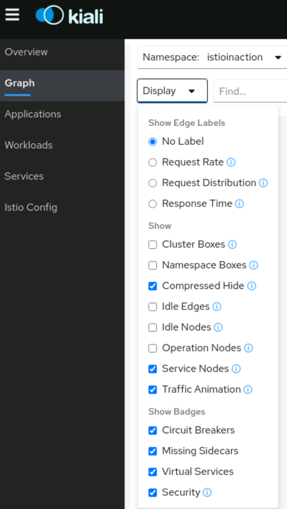
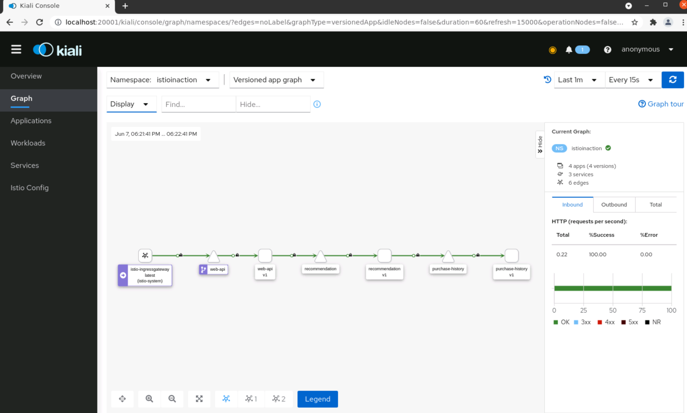
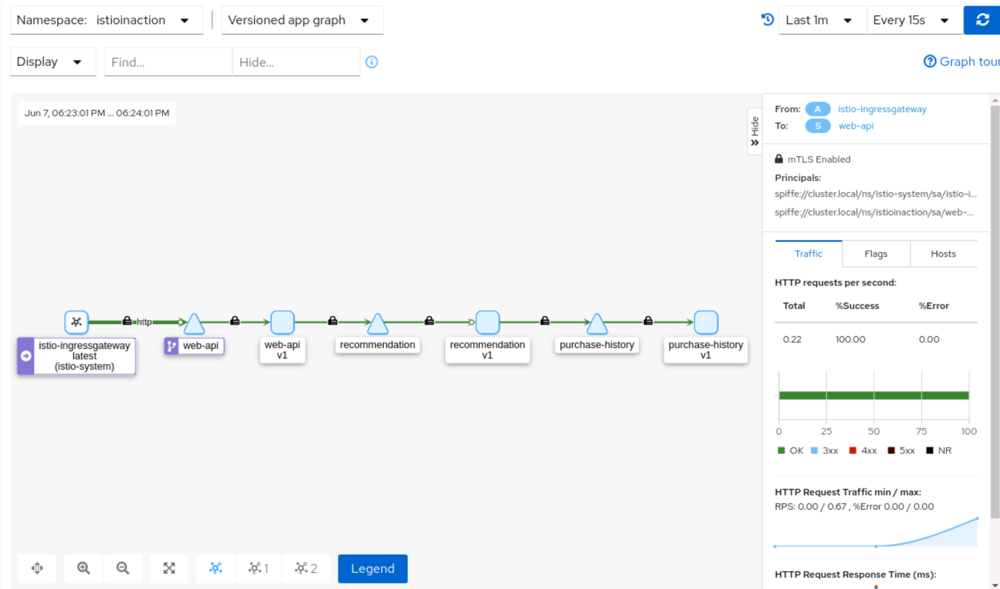
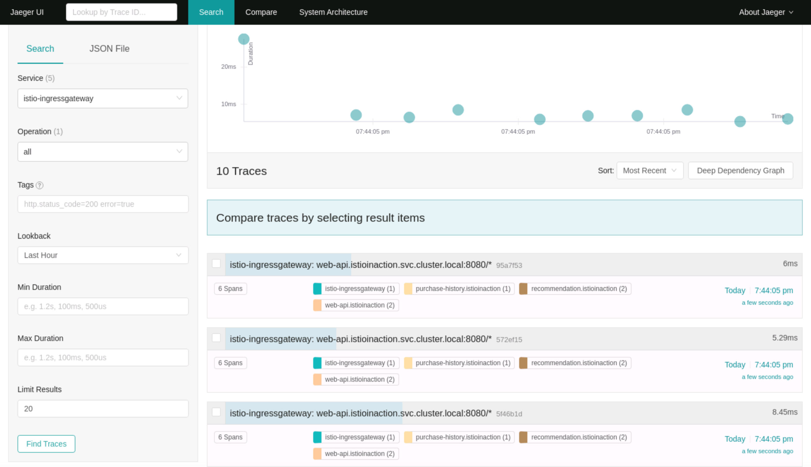
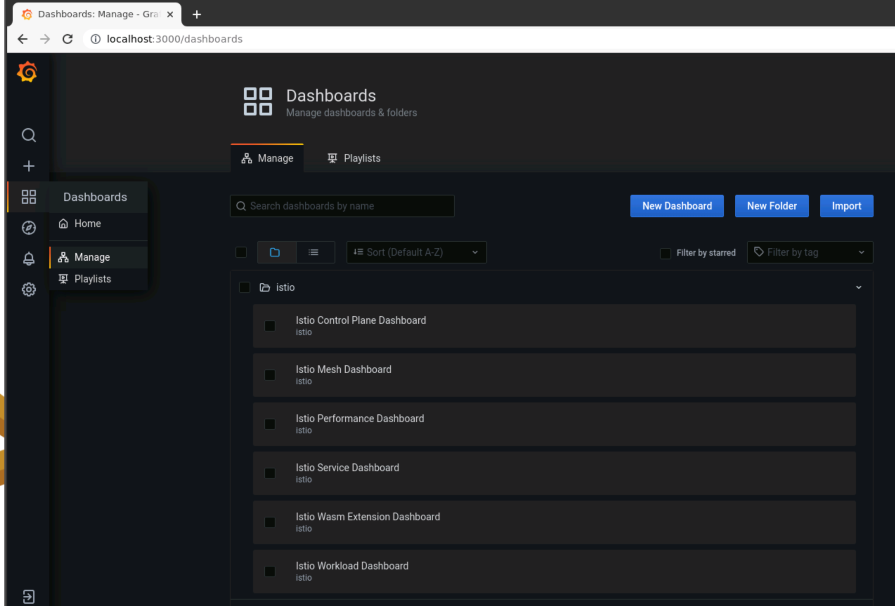
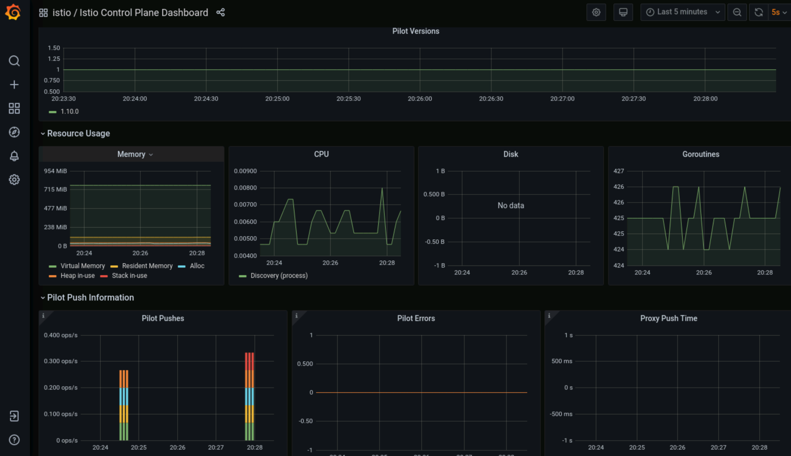
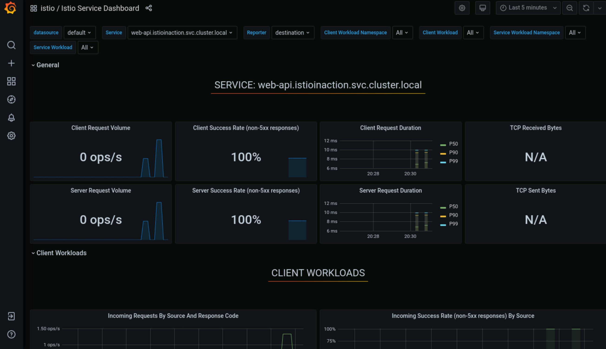

# Lab 3 :: Adding Services to the Mesh
In this lab, we will incrementally add services to the mesh. As part of adding services to the mesh, the mesh is actually integrated as part of the services themselves to make the mesh mostly trasparent to the service implementation.

## Sidecar injection

Adding services to the mesh requires that the client-side proxies be associated with the service components and registered with the control plane. With Istio, you have two methods to inject the Envoy proxy sidecar into the microservice Kubernetes pods:
- Automatic sidecar injection
- Manual sidecar injection.

To enable the automatic sidecar injection, use the command below to add the `istio-injection` label to the `istioinaction` namespace:

```bash
kubectl label namespace istioinaction istio-injection=enabled
```

Validate the `istioinaction` namespace is annotated with the `istio-injection` label:

```bash
kubectl get namespace -L istio-injection
```

Now that you have a namespace with automatic sidecar injection enabled, you are ready to start adding services in the `istioinaction` namespace to the mesh. Since you added the `istio-injection` label to the `istioinaction` namespace, the Istio mutating admission controller automatically injects the Envoy proxy sidecar during the deployment or restart of the pod.

## Review Service requirements

Before you add Kubernete services to the mesh, you need to be aware of the [application requirements](https://istio.io/latest/docs/ops/deployment/requirements/) to ensure that your Kubernetes services meet the minimum requirements.

Service descriptors:
- each service port name must start with the protocol name, for example `name: http`

Deployment descriptors:
- The pods must be associated with a Kubernetes service.
- The pods must not run as a user with UID 1337
- App and version labels are added to provide contextual information for metrics and tracing.

Check the above requirements for each of the Kubernetes services and make adjustments as necessary. If you don't have `NET_ADMIN` security rights, you would need to explore the Istio CNI plugin to remove the `NET_ADMIN` requirement for deploying services.

TODO: add a tip for statefulset.

Using the `web-api` service as an example, Let's review its service and deployment descriptor.

```bash
cat sample-apps/web-api.yaml
```

From the service descriptor, the `name: http` declares the `http` protocol for the service port `8080`:

```yaml
  - name: http
    protocol: TCP
    port: 8080
    targetPort: 8081
```

From the deployment descriptor, the `app: web-api` label matches the `web-api` service's selector of `app: web-api` so this deployment and its pod are associated with the `web-api` service.  Further, the `app: web-api` label and `version: v1` labels provide contextual information for metrics and tracing. The `containerPort: 8080` declares the listening port for the container, which matches the `targetPort: 8081` in the `web-api` service descriptor earlier.

```yaml
  template:
    metadata:
      labels:
        app: web-api
        version: v1
      annotations:
    spec:
      serviceAccountName: web-api    
      containers:
      - name: web-api
        image: nicholasjackson/fake-service:v0.7.8
        ports:
        - containerPort: 8081
```

Check the `purchase-history-v1`, `recommendation` and `sleep` service and validate they all meet the above requirements.

## Adding services to the mesh

Let us add the sidecar to each of the services in the `istioinaction` namespace, starting with the `web-api` service:


```bash
kubectl rollout restart deployment web-api -n istioinaction
```

Validate the `web-api` pod has reached running status with Istio's default sidecar proxy injected:

```bash
kubectl get pod -l app=web-api -n istioinaction
```

You should see `2/2` in the output which indicates the sidecar proxy runs alongside of the `web-api` application container in the `web-api` pod:

```
NAME                       READY   STATUS    RESTARTS   AGE
web-api-7d5ccfd7b4-m7lkj   2/2     Running   0          9m4s
```

Validate the `web-api` pod log looks good:

```bash
kubectl logs deploy/web-api -c web-api -n istioinaction
```

Validate you can continue to call the `web-api` service securely:

```bash
GATEWAY_IP=$(kubectl get svc -n istio-system istio-ingressgateway -o jsonpath="{.status.loadBalancer.ingress[0].ip}")
curl --cacert ./labs/02/certs/ca/root-ca.crt -H "Host: istioinaction.io" https://istioinaction.io --resolve istioinaction.io:443:$GATEWAY_IP
```

### Understand what happens

Use the command below to get the details of the `web-api` pod:

```bash
kubectl get pod -l app=web-api -n istioinaction -o yaml
```

From the output, the `web-api` pod contains 1 init container and 2 normal containers.  The Istio mutating admission controller was responsible for injecting the `istio-init` container and the `istio-proxy` container. 

#### The `istio-init` container:

The `istio-init` container uses the `proxyv2` image. The entry point of the container is `pilot-agent`, which contains the `istio-iptables` command to setup port forwarding for Istio's sidecar proxy. 

```
    initContainers:
    - args:
      - istio-iptables
      - -p
      - "15001"
      - -z
      - "15006"
      - -u
      - "1337"
      - -m
      - REDIRECT
      - -i
      - '*'
      - -x
      - ""
      - -b
      - '*'
      - -d
      - 15090,15021,15020
      image: docker.io/istio/proxyv2:1.10.0
      imagePullPolicy: Always
      name: istio-init
```

Interested in knowing more about the flags for istio-iptables, run the command below:

```bash
kubectl exec deploy/web-api -c istio-proxy -n istioinaction -- /usr/local/bin/pilot-agent istio-iptables --help
```

The output explains the flags such as `-u` `-m` and `-i` etc used in the `istio-init` container.

```
istio-iptables is responsible for setting up port forwarding for Istio Sidecar.

Usage:
  pilot-agent istio-iptables [flags]

Flags:
  -n, --dry-run                                     Do not call any external dependencies like iptables
  -p, --envoy-port string                           Specify the envoy port to which redirect all TCP traffic (default $ENVOY_PORT = 15001)
  -h, --help                                        help for istio-iptables
  -z, --inbound-capture-port string                 Port to which all inbound TCP traffic to the pod/VM should be redirected to (default $INBOUND_CAPTURE_PORT = 15006)
  -e, --inbound-tunnel-port string                  Specify the istio tunnel port for inbound tcp traffic (default $INBOUND_TUNNEL_PORT = 15008)
      --iptables-probe-port string                  set listen port for failure detection (default "15002")
  -m, --istio-inbound-interception-mode string      The mode used to redirect inbound connections to Envoy, either "REDIRECT" or "TPROXY"
  -b, --istio-inbound-ports string                  Comma separated list of inbound ports for which traffic is to be redirected to Envoy (optional). The wildcard character "*" can be used to configure redirection for all ports. An empty list will disable
  -t, --istio-inbound-tproxy-mark string
  -r, --istio-inbound-tproxy-route-table string
  -d, --istio-local-exclude-ports string            Comma separated list of inbound ports to be excluded from redirection to Envoy (optional). Only applies  when all inbound traffic (i.e. "*") is being redirected (default to $ISTIO_LOCAL_EXCLUDE_PORTS)
  -o, --istio-local-outbound-ports-exclude string   Comma separated list of outbound ports to be excluded from redirection to Envoy
  -q, --istio-outbound-ports string                 Comma separated list of outbound ports to be explicitly included for redirection to Envoy
  -i, --istio-service-cidr string                   Comma separated list of IP ranges in CIDR form to redirect to envoy (optional). The wildcard character "*" can be used to redirect all outbound traffic. An empty list will disable all outbound
  -x, --istio-service-exclude-cidr string           Comma separated list of IP ranges in CIDR form to be excluded from redirection. Only applies when all  outbound traffic (i.e. "*") is being redirected (default to $ISTIO_SERVICE_EXCLUDE_CIDR)
  -k, --kube-virt-interfaces string                 Comma separated list of virtual interfaces whose inbound traffic (from VM) will be treated as outbound
      --probe-timeout duration                      failure detection timeout (default 5s)
  -g, --proxy-gid string                            Specify the GID of the user for which the redirection is not applied. (same default value as -u param)
  -u, --proxy-uid string                            Specify the UID of the user for which the redirection is not applied. Typically, this is the UID of the proxy container
      --redirect-dns                                Enable capture of dns traffic by istio-agent
...
```

You will notice that all inbound ports are redirected to the Envoy proxy container within the pod. You can also see a few ports such as 15021 are excluded from redirection (you'll soon learn why this is the case). You may also notice the following securityContext for the `istio-init` container. This means that a service deployer must have the `NET_ADMIN` and `NET_RAW` security capabilities to run the `istio-init` container for the `web-api` service or other services. If the service deployer can't have these security capabilities, you can use the [Istio CNI plugin](https://istio.io/latest/docs/setup/additional-setup/cni/) which removes the `NET_ADMIN` and `NET_RAW` requirement for users deploying pods into Istio service mesh.

```
      securityContext:
        allowPrivilegeEscalation: false
        capabilities:
          add:
          - NET_ADMIN
          - NET_RAW
          drop:
          - ALL
```

#### The `istio-proxy` container:

When you continue looking through the list of containers in the pod, you will see the `istio-proxy` container. The `istio-proxy` container also uses the `proxyv2` image. You'll notice the `istio-proxy` container has requested 0.01 CPU and 40 MB memory to start with as well as 2 CPU and 1 GB memory for limits. You will need to budget for these settings when managing the capacity for the cluster. These resources can be customized during the Istio installation thus may vary per [installation profile](https://istio.io/latest/docs/setup/additional-setup/config-profiles/).

```
    - args:
      - proxy
      - sidecar
      - --domain
      - $(POD_NAMESPACE).svc.cluster.local
      - --serviceCluster
      - web-api.$(POD_NAMESPACE)
      - --proxyLogLevel=warning
      - --proxyComponentLogLevel=misc:error
      - --log_output_level=default:info
      - --concurrency
      - "2"
      # many env vars omitted
      image: docker.io/istio/proxyv2:1.10.0
      imagePullPolicy: IfNotPresent
      name: istio-proxy
      ports:
      - containerPort: 15090
        name: http-envoy-prom
        protocol: TCP
      readinessProbe:
        failureThreshold: 30
        httpGet:
          path: /healthz/ready
          port: 15021
          scheme: HTTP
        initialDelaySeconds: 1
        periodSeconds: 2
        successThreshold: 1
        timeoutSeconds: 3
      resources:
        limits:
          cpu: "2"
          memory: 1Gi
        requests:
          cpu: 10m
          memory: 40Mi
      securityContext:
        allowPrivilegeEscalation: false
        capabilities:
          drop:
          - ALL
        privileged: false
        readOnlyRootFilesystem: true
        runAsGroup: 1337
        runAsNonRoot: true
        runAsUser: 1337
      terminationMessagePath: /dev/termination-log
      terminationMessagePolicy: File
      volumeMounts:
      - mountPath: /var/run/secrets/istio
        name: istiod-ca-cert
      - mountPath: /var/lib/istio/data
        name: istio-data
      - mountPath: /etc/istio/proxy
        name: istio-envoy
      - mountPath: /var/run/secrets/tokens
        name: istio-token
      - mountPath: /etc/istio/pod
        name: istio-podinfo
      - mountPath: /var/run/secrets/kubernetes.io/serviceaccount
        name: web-api-token-ztk5d
        readOnly: true
```

When you reviewed the `istio-init` container configuration earlier, we noticed that ports `15021`, `15090`, and `15020` are on the list of inbound ports to be excluded from redirection to Envoy. The reason is that port `15021` is for health check, and port `15090` is for Envoy proxy to emit its metrics to Prometheus, port `15020` is for the merged Prometheus metrics from Istio agent, Envoy proxy and the application container. Thus it is not necessary to redirect inbound traffic for these ports used by the `istio-proxy` container.

Also notice that the `istiod-ca-cert` and `istio-token` volumes are mounted to the pod for the purpose of implemnting mutual TLS, which we will cover in the lab04.

### Add all other services to the Istio service mesh

Next, let us add the sidecar to all other services in the `istioinaction` namespace

```bash
kubectl rollout restart deployment purchase-history-v1 -n istioinaction
kubectl rollout restart deployment recommendation -n istioinaction
kubectl rollout restart deployment sleep -n istioinaction
```

Validate you can continue to call the `web-api` service securely:

```bash
curl --cacert ./labs/02/certs/ca/root-ca.crt -H "Host: istioinaction.io" https://istioinaction.io --resolve istioinaction.io:443:$GATEWAY_IP
```

## What have you gained?

Congratulations on getting all services in the `istioinaction` namespace to the Istio service mesh. One of the values of using a service mesh is that you can gain immediate insights into the behaviors and interactions of your services. Istio deliveres a set of dashboards as addon components that provide you access to important telemetry data that is available just by adding services to the mesh.

### Visualize your services

You can visualize the services in the mesh in Kiali.  Launch Kiali using the command below:

```bash
istioctl dashboard kiali
```

Navigate to [http://localhost:20001](http://localhost:20001) and select the Graph tab.

On the "Namespace" dropdown, select "istioinaction". On the "Display" drop down, select "Traffic Animation" and "Security":



Let's also generate some load to the data plane (by calling our `web-api` service) so that you can observe interactions among your services:

```bash
for i in {1..10}; do curl --cacert ./labs/02/certs/ca/root-ca.crt -H "Host: istioinaction.io" https://istioinaction.io --resolve istioinaction.io:443:$GATEWAY_IP; done
```

You should observe the service interaction graph with some traffic animation and security badges like below:



Now click on the call graph between `istio-ingressgateway` and `web-api` service. You should see that indeed this call is secured using mTLS along with some HTTP traffic details among the two services:



While it is nice to see the communications are secured using mTLS, how do you enforce only traffic with mTLS are allowed?  We will cover this in the next lab.

### Distributed tracing

You can view distributed tracing information using the Jaeger dashboard. Press `ctrl+C` to end the prior `istioctl dashboard kiali` command and use the command below to launch the Jaeger dashboard: 

```bash
istioctl dashboard jaeger
```

Let's also generate some load to the data plane (by calling our `web-api` service) so that you can observe interactions among your services:

```bash
for i in {1..10}; do curl --cacert ./labs/02/certs/ca/root-ca.crt -H "Host: istioinaction.io" https://istioinaction.io --resolve istioinaction.io:443:$GATEWAY_IP; done
```

Navigate to [http://localhost:16686](http://localhost:16686). On the "Service" dropdown, select "istio-ingressgateway". Click on the "Find Traces" button at the bottom. You should see 10 traces, which are for every single request to the `web-api` service through the Istio's ingress gateway.



Click on one of the traces to view the details of the distributed traces for that request. For example, this request from the picture below has a duration of `6ms` and 6 trace spans among 4 services.  Why there are 6 trace spans?  You can click on each trace span to learn more information of the trace span. You may notice all trace spans has the same value for the `x-request-id` header. Why? This is how Jaeger knows these trace spans are part of the same request. In order for your services' distributed tracing to work properly in Istio service mesh, the [B-3 trace headers](https://istio.io/latest/docs/tasks/observability/distributed-tracing/overview/#trace-context-propagation) inluding `x-request-id` have to be propogated between your services. 


### Istio control plane and data plane Grafana dashboards

You can also view various service metrics from the Grafana dashboard. Press `ctrl+C` to end the prior `istioctl dashboard jaeger` command and use the command below to launch the Grafana dashboard:

```bash
istioctl dashboard grafana
```

Navigate to [http://localhost:3000](http://localhost:3000). On the left menu, select "Dashboards" (the icon that has 4 sqares), then click on the "Manage" menu. On the resulting page, you will view the list of available Istio dashboards:



Select the "Istio Control Plane Dashboard" to view the control plane metrics such as version, resource usage, push metrics to the `istio-proxy` containers, etc.



Go back to the Istio dashboard folder, and select the "Istio Service Dashboard" to view the services in the Istio mesh metrics.

Let's also generate some load to the data plane (by calling our `web-api` service) so that you can observe interactions among your services:

```bash
for i in {1..20}; do curl --cacert ./labs/02/certs/ca/root-ca.crt -H "Host: istioinaction.io" https://istioinaction.io --resolve istioinaction.io:443:$GATEWAY_IP; done
```

On the "Service" dropdown, select the "web-api.istioinaction.svc.cluster.local" service. You will notice the Istio service dashboard is updated with client and server request metrics. CLick on the "Refresh dashboard" button if needed. Expand the "Client workloads" and "Server Workloads" section to view details for each workload types. 



## Next lab
Congratulations, you have added the sample application successfully to Istio service mesh and observed the services' communications. You have observed the secure communication among your services and how much time each request spent. We'll explore securing these services with declarative policies in the Istio service mesh in the [next lab](./04-secure-services-with-istio.md).


