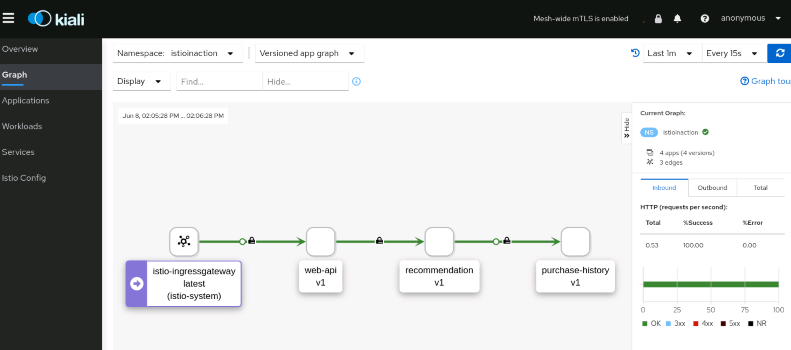

# Lab 4 :: Securing Communication Within Istio

In the previous lab, we explored adding services into a mesh. However, when we installed Istio using the demo profile, it has permissive security mode. Istio permissive security setting is useful when you have services that are being moved into the service mesh incrementally by allowing both plain text and mTLS traffic. In this lab, we explore how Istio manages secure communication between services and how to enable strict security communication between services in our sample application.

## Permissive mode

By default, Istio automatically upgrades the connection securely from the source service's sidecar proxy to the target service's sidecar proxy. This is why you saw the paddlelock icon in the Kiali graph earlier from Istio ingress gateway to the `web-api` service to the `history` service then to the `recommendation` service. While this is good when onboarding your services to Istio service mesh as the communication between source and target services continues to be allowed via plain text if mutual TLS communication fails, you don't want this in production environment without proper security policy in place.

Check if you have any `peerauthentication` policy in all of your namespaces:

```bash
kubectl get peerauthentication --all-namespaces
```

You should see `No resources found` in the output, which means no peer authentication has been specified and the default `PERMISSIVE` mTLS mode is being used.

## Enable strict mTLS

You can lock down the secure access to all services in the `istioinaction` namespace to require mTLS using a peer authentication policy. Execute this command to define a default policy for the `istioinaction` namespace that updates all of the servers to accept only mTLS traffic:

```bash
kubectl apply -n istio-system -f - <<EOF
apiVersion: "security.istio.io/v1beta1"
kind: "PeerAuthentication"
metadata:
  name: "default"
spec:
  mtls:
    mode: STRICT
EOF
```

Verify your  `peerauthentication` policy is installed:

```bash
kubectl get peerauthentication --all-namespaces
```

You should see the the default `peerauthentication` policy installed in the `istio-system` namespace with STRICT mTLS enabled:

```
NAMESPACE      NAME      MODE     AGE
istio-system   default   STRICT   84s
```

Because the `istio-system` namespace is also the Istio mesh configuration root namespace in your environment, this `peerauthentication` policy is the default policy for all of your services in the mesh regardless of which namespaces your services run.

Let us see mTLS in action! First, we want to send some traffic to web-api from a pod that is not part of the Istio service mesh. Deploy the `sleep` service and pod in the default namespace:

```bash
kubectl apply -n default -f sample-apps/sleep.yaml
```

Access the `web-api` service from the `sleep` pod in the default namespace:

```bash
kubectl exec -it deploy/sleep -n default -- curl http://web-api.istioinaction:8080/
```

The request will fail because the `web-api` service can only be accessed with mutual TLS. The `sleep` pod in the default namespace doesn't have the sidecar proxy so it doesn't have the needed keys and certificates to communicate to the `web-api` service via mutual TLS.  Run the same command from the `sleep` pod in the `istioinaction` namespace:

```bash
kubectl exec -it deploy/sleep -n istioinaction -- curl http://web-api.istioinaction:8080/
```

You should see the request succeed.

Question: How can you check if a service or namespace is ready to enable the `STRICT` mtls mode?  What is the best practice to enable mTLS for your services? We'll cover this topic in our Istio essential workshop.

### Visualize mTLS enforcement in Kiali

You can visualize the services in the mesh in Kiali.  Launch Kiali using the command below:

```bash
istioctl dashboard kiali
```

Navigate to [http://localhost:20001](http://localhost:20001) and select the Graph tab.

On the "Namespace" dropdown, select "istioinaction". On the "Display" drop down, select "Traffic Animation" and "Security". Let's also generate some load to the data plane (by calling our `web-api` service) so that you can observe interactions among your services:

```bash
for i in {1..200}; 
  do curl --cacert ./labs/02/certs/ca/root-ca.crt -H "Host: istioinaction.io" https://istioinaction.io --resolve istioinaction.io:443:$GATEWAY_IP;
  sleep 1;
done
```

You should observe the service interaction graph with some traffic animation and security badges like below:



### Understand Strict mTLS

Use `openssl` tool to check if certificate is valid:

```bash
kubectl exec $(kubectl get pod -l app=web-api -o jsonpath={.items..metadata.name}) -c istio-proxy -- cat /etc/certs/cert-chain.pem | openssl x509 -text -noout  | grep Validity -A 2
```

You can also check the identify of the client certificate:

```bash
kubectl exec $(kubectl get pod -l app=web-api -o jsonpath={.items..metadata.name}) -c istio-proxy -- cat /etc/certs/cert-chain.pem | openssl x509 -text -noout  | grep 'Subject Alternative Name' -A 1
```


## Next lab

Congratulations, you have enabled strict mTLS policy to the sample services. We'll explore controlling traffic with these services in the [next lab](./05-control-traffic.md).