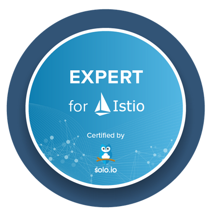

# Operationalizing Istio for Day 2 (with Expert Certification)

This is the third part in a series of Istio workshops designed to get users up and running successfully and leverage the experience and best practices from Solo.io. In this workshop we will use hands-on labs to focus on using Istio in more advanced scenarios such as tenancy, PKI integration, and other workflows such as:

* Zero downtime upgrades in production
* Automating config with Argo CD and Argo Rollouts
* Multi-tenancy
* Certificate rotation and PKI integration
* Multi-cluster deployments

If you're somewhat familiar with Istio, or have participated in our previous two workshops, this workshop will show you how best to integrate Istio with the rest of your workflows, tooling and organization. We will also cover integrating multicluster Kubernetes. 

We've cultivated a lot of this knowledge from working organizations across the world and helping them operationalize Istio. The workshop will end with a certification exam to test your knowledge and those that pass will be issued a Credly Badge certifying their status. 

## This workshop will be first delivered at SoloCon 

The second annual [SoloCon](https://solocon.io) will be Feb 22, 2022. This workshop will be one of the four new workshops delivered by Christian, Lin, and Ram.

