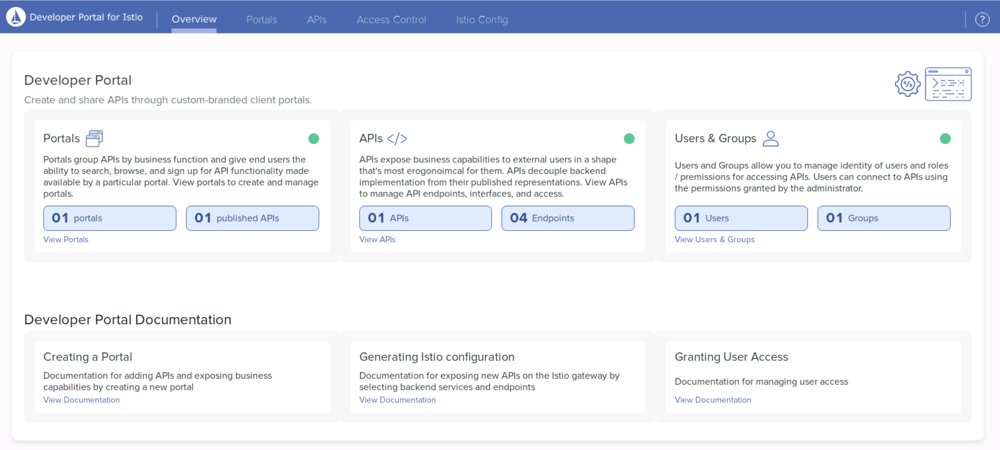
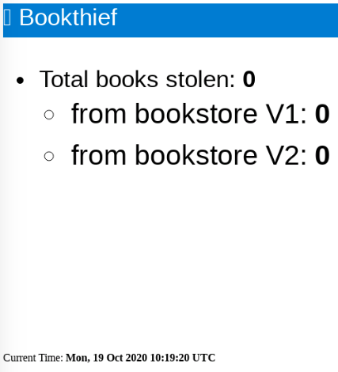

The following labs may depend on the previous labs, so you should either run the previous labs manually or execute the following command to run them in an automated fashion:

```
cat README.md | ../md-to-bash.sh | bash
```

## Lab 11 : Solo.io Developer Portal

The Solo.io Developer Portal provides a framework for managing the definitions of APIs, API client identity, and API policies on top of the Istio and Gloo Gateways. Vendors of API products can leverage the Developer Portal to secure, manage, and publish their APIs independent of the operations used to manage networking infrastructure.

We will deploy the Developer Portal on `cluster2`.

Run the following command to make `cluster2` the current cluster.

```bash
kubectl config use-context cluster2
```

Let's delete the `bookinfo-gateway` Istio gateway and create the default one:

```bash
kubectl --context cluster2 delete gateways.networking.istio.io bookinfo-gateway 

cat << EOF | kubectl apply -f-
apiVersion: networking.istio.io/v1beta1
kind: Gateway
metadata:
  labels:
    release: istio
  name: istio-ingressgateway
  namespace: istio-system
spec:
  selector:
    app: istio-ingressgateway
    istio: ingressgateway
  servers:
  - hosts:
    - '*'
    port:
      name: http
      number: 80
      protocol: HTTP
EOF
```

We'll use Helm to deploy the Developer portal:

```bash
helm repo add dev-portal https://storage.googleapis.com/dev-portal-helm
helm repo update
kubectl create namespace dev-portal
helm install dev-portal dev-portal/dev-portal -n dev-portal --set licenseKey.value=${PORTAL_LICENSE_KEY} --set istio.enabled=true
```

<!--bash
until kubectl get ns dev-portal
do
  sleep 1
done
-->

Use the following snippet to wait for the installation to finish:

```bash
until [ $(kubectl -n dev-portal get pods -o jsonpath='{range .items[*].status.containerStatuses[*]}{.ready}{"\n"}{end}' | grep true -c) -eq 7 ]; do
  echo "Waiting for all the Dev portal pods to become ready"
  sleep 1
done
```

Managing APIs with the Developer Portal happens through the use of two resources: the API Doc and API Product.

API Docs are Kubernetes Custom Resources which packages the API definitions maintained by the maintainers of an API. Each API Doc maps to a single Swagger Specification or set of gRPC descriptors. The APIs endpoints themselves are provided by backend services.

Let's create an API Doc using the Swagger Specification of the bookinfo demo app:

```bash
cat <<EOF | kubectl apply -f -
apiVersion: devportal.solo.io/v1alpha1
kind: APIDoc
metadata:
  name: bookinfo-schema
  namespace: default
spec:
  openApi:
    content:
      fetchUrl: https://raw.githubusercontent.com/istio/istio/1.7.3/samples/bookinfo/swagger.yaml
EOF
```

You can then check the status of the API Doc using the following command:

```bash
kubectl get apidoc -n default bookinfo-schema -oyaml
```

API Products are Kubernetes Custom Resources which bundle the APIs defined in API Docs into a product which can be exposed to ingress traffic as well as published on a Portal UI. The Product defines what API operations are being exposed, and the routing information to reach the services.

Let's create an API Product using the API Doc we've just created:

```bash
cat << EOF | kubectl apply -f-
apiVersion: devportal.solo.io/v1alpha1
kind: APIProduct
metadata:
  name: bookinfo-product
  namespace: default
spec:
  apis:
  - apiDoc:
      name: bookinfo-schema
      namespace: default
  defaultRoute:
    inlineRoute:
      backends:
      - kube:
          name: productpage
          port: 9080
  domains:
  - api.example.com
  displayInfo: 
    description: Bookinfo Product
    title: Bookinfo Product
    image:
      fetchUrl: https://github.com/solo-io/workshops/raw/master/smh/images/books.png
EOF
```

You can then check the status of the API Product using the following command:

```bash
kubectl get apiproducts.devportal.solo.io -n default bookinfo-product -oyaml
```

When targeting Istio Gateways, the Developer Portal manages a set of Istio Custom Resource Definitions (CRDs) for you:

- VirtualServices: The Developer Portal generates an Istio VirtualService for each API Product. The VirtualService contains a single HTTP route for each API operation exposed in the product. Routes are named and their matchers are derived from the OpenAPI definition.
- DestinationRules: The Developer Portal generates an Istio DestinationRule for each unique Kubernetes Service Subset defined as an API Product destination.
- EnvoyFilters: The Developer Portal generates EnvoyFilters to configure the Istio Gateway (Envoy) to communicate with the Developer Portal ExtAuth amd RateLimit services. Additional EnvoyFilters are generated to apply per-route auth and rate limit policies.

So, you can now access the API using the command below:

```bash
curl -H "Host: api.example.com" http://172.18.0.230/api/v1/products
```

You should get an `RBAC: access denied` response. We have allowed the Istio Ingress Gateway of `cluster1` to access the `productpage` microservice, not the one of `cluster2`.

Let's update the corresponding AccessPolicy:

```bash
cat << EOF | kubectl --context mgmt apply -f -
apiVersion: networking.smh.solo.io/v1alpha2
kind: AccessPolicy
metadata:
  namespace: service-mesh-hub
  name: istio-ingressgateway
spec:
  sourceSelector:
  - kubeServiceAccountRefs:
      serviceAccounts:
        - name: istio-ingressgateway-service-account
          namespace: istio-system
          clusterName: cluster1
        - name: istio-ingressgateway-service-account
          namespace: istio-system
          clusterName: cluster2
  destinationSelector:
  - kubeServiceMatcher:
      namespaces:
      - default
      labels:
        service: productpage
EOF
```

Now, you should be able to access the API:

```bash
curl -H "Host: api.example.com" http://172.18.0.230/api/v1/products
```

Once a set of APIs have been bundled together in an API Product, those products can be published in a user-friendly interface through which developers can discover, browse, request access to, and interact with APIs. This is done by defining Portals, a custom resource which tells the Developer Portal how to publish a customized website containing an interactive catalog of those products.

Let's create a Portal:

```bash
cat <<EOF | kubectl apply -f -
apiVersion: devportal.solo.io/v1alpha1
kind: Portal
metadata:
  name: bookinfo-portal
  namespace: default
spec:
  displayName: Bookinfo Portal
  description: The Developer Portal for the Bookinfo API
  banner:
    fetchUrl: https://github.com/solo-io/workshops/raw/master/smh/images/books.png
  favicon:
    fetchUrl: https://github.com/solo-io/workshops/raw/master/smh/images/books.png
  primaryLogo:
    fetchUrl: https://github.com/solo-io/workshops/raw/master/smh/images/books.png
  customStyling: {}
  staticPages: []
  domains:
  - portal.example.com
  publishApiProducts:
    matchLabels:
      portals.devportal.solo.io/default.bookinfo-portal: "true"
EOF
```

You can then check the status of the API Product using the following command:

```bash
kubectl get portal -n default bookinfo-portal -oyaml
```

We need to update the `/etc/hosts` file to be able to access the Portal:

```bash
cat <<EOF | sudo tee -a /etc/hosts
172.18.0.230 api.example.com
172.18.0.230 portal.example.com
EOF
```

We are now going to create a user (dev1) and then add him to a group (developers). Users and groups are both stored as Custom Resources (CRs) in Kubernetes. Note that the Portal Web Application can be configured to use OIDC to authenticate users who access the Portal.

Here are the commands to create the user and the group:

```bash
pass=$(htpasswd -bnBC 10 "" password | tr -d ':\n')

kubectl create secret generic dev1-password \
  -n dev-portal --type=opaque \
  --from-literal=password=$pass

cat << EOF | kubectl apply -f-
apiVersion: devportal.solo.io/v1alpha1
kind: User
metadata:
  name: dev1
  namespace: dev-portal
spec:
  accessLevel: {}
  basicAuth:
    passwordSecretKey: password
    passwordSecretName: dev1-password
    passwordSecretNamespace: dev-portal
  username: dev1
EOF

kubectl get user dev1 -n dev-portal -oyaml

cat << EOF | kubectl apply -f-
apiVersion: devportal.solo.io/v1alpha1
kind: Group
metadata:
  name: developers
  namespace: dev-portal
spec:
  displayName: developers
  userSelector:
    matchLabels:
      groups.devportal.solo.io/dev-portal.developers: "true"
EOF

kubectl label user dev1 -n dev-portal groups.devportal.solo.io/dev-portal.developers="true"
```

We can now update the API Product to secure it and to define a rate limit:

```bash
cat << EOF | kubectl apply -f-
apiVersion: devportal.solo.io/v1alpha1
kind: APIProduct
metadata:
  name: bookinfo-product
  namespace: default
  labels: 
    portals.devportal.solo.io/default.bookinfo-portal: "true"
spec:
  apis:
  - apiDoc:
      name: bookinfo-schema
      namespace: default
  defaultRoute:
    inlineRoute:
      backends:
      - kube:
          name: productpage
          port: 9080
  domains:
  - api.example.com
  displayInfo: 
    description: Bookinfo Product
    title: Bookinfo Product
    image:
      fetchUrl: https://github.com/solo-io/workshops/raw/master/smh/images/books.png
  plans:
  - authPolicy:
      apiKey: {}
    displayName: Basic
    name: basic
    rateLimit:
      requestsPerUnit: 5
      unit: MINUTE
EOF
```

And finally, we can allow the group we created previously to access the Portal:

```bash
cat << EOF | kubectl apply -f-
apiVersion: devportal.solo.io/v1alpha1
kind: Group
metadata:
  name: developers
  namespace: dev-portal
spec:
  displayName: developers
  accessLevel:
    apiProducts:
    - name: bookinfo-product
      namespace: default
      plans:
      - basic
    portals:
    - name: bookinfo-portal
      namespace: default
  userSelector:
    matchLabels:
      groups.devportal.solo.io/dev-portal.developers: "true"
EOF
```

Let's run the following command to allow access ot the admin UI of the Developer Portal:

```
kubectl port-forward -n dev-portal svc/admin-server 8000:8080
```

You can now access the admin UI at http://localhost:8000



Take the time to explore the UI and see the different components we have created.

The user Portal we have created is available at http://portal.example.com


Click on `Log In` and select `Log in using credentials`.

Log in with the user `dev1` and the password `password` and define a new password.

Click on `dev1` on the top right corner and select `API Keys`.

Click on `API Keys` again and Add an API Key.


Click on the key to copy the value to the clipboard.

Click on the `APIs` tab.


You can click on the `Bookinfo Product` and explore the API.

You can also test the API and use the `Authorize` button to set your API key.


But we're going to try it using curl:

So, we need to retrieve the API key first:

```
key=$(kubectl get secret -l apiproducts.devportal.solo.io=bookinfo-product.default -o jsonpath='{.items[0].data.api-key}' | base64 --decode)
```

Then, we can run the following command:

```
curl -H "Host: api.example.com" -H "api-key: ${key}" http://172.18.0.230/api/v1/products -v
```

You should get a result similar to:

```
*   Trying 172.18.0.230...
* TCP_NODELAY set
* Connected to 172.18.0.230 (172.18.0.230) port 80 (#0)
> GET /api/v1/products HTTP/1.1
> Host: api.example.com
> User-Agent: curl/7.52.1
> Accept: */*
> api-key: Y2E0MWQ0YWItYjA3Yy1lMjQyLTUwNzUtMTI4NGJlNTg2ZDhm
> 
< HTTP/1.1 200 OK
< content-type: application/json
< content-length: 395
< server: istio-envoy
< date: Mon, 12 Oct 2020 09:02:02 GMT
< x-envoy-upstream-service-time: 3
< 
* Curl_http_done: called premature == 0
* Connection #0 to host 172.18.0.230 left intact
[{"id": 0, "title": "The Comedy of Errors", "descriptionHtml": "<a href=\"https://en.wikipedia.org/wiki/The_Comedy_of_Errors\">Wikipedia Summary</a>: The Comedy of Errors is one of <b>William Shakespeare's</b> early plays. It is his shortest and one of his most farcical comedies, with a major part of the humour coming from slapstick and mistaken identity, in addition to puns and word play."}]
```

Now, execute the curl command again several times.

As soon as you reach the rate limit, you should get the following output:

```
*   Trying 172.18.0.230...
* TCP_NODELAY set
* Connected to 172.18.0.230 (172.18.0.230) port 80 (#0)
> GET /api/v1/products HTTP/1.1
> Host: api.example.com
> User-Agent: curl/7.52.1
> Accept: */*
> api-key: Y2E0MWQ0YWItYjA3Yy1lMjQyLTUwNzUtMTI4NGJlNTg2ZDhm
> 
< HTTP/1.1 429 Too Many Requests
< x-envoy-ratelimited: true
< date: Mon, 12 Oct 2020 09:03:16 GMT
< server: istio-envoy
< content-length: 0
< 
* Curl_http_done: called premature == 0
* Connection #0 to host 172.18.0.230 left intact
```

## Lab 12 : Extend Envoy with WebAssembly

WebAssembly (WASM) is the future of cloud-native infrastructure extensibility.

WASM is a safe, secure, and dynamic way of extending infrastructure with the language of your choice. WASM tool chains compile your code from any of the supported languages into a type-safe, binary format that can be loaded dynamically in a WASM sandbox/VM.

The Envoy Wasm filter is already available, but it's not ready for production use yet. More info available in [this Blog Post](https://www.solo.io/blog/the-state-of-webassembly-in-envoy-proxy/).

Both Gloo and Istio are based on Envoy, so the can take advantage of WebAssembly.

One of the projects for working with WASM and Envoy proxy is [WebAssembly Hub](https://webassemblyhub.io/).

WebAssembly Hub is a meeting place for the community to share and consume WebAssembly Envoy extensions. You can easily search and find extensions that meet the functionality you want to add and give them a try.

wasme is a CLI for working with WebAssembly Hub and WASM modules.

Let's install wasme:

```bash
curl -sL https://run.solo.io/wasme/install | WASME_VERSION=v0.0.28 sh
export PATH=$HOME/.wasme/bin:$PATH
```

Run the following command to make `cluster1` the current cluster.

```bash
kubectl config use-context cluster1
```

We've already created a WASM filter using [TinyGo](https://tinygo.org/) which adds a new `hello` header in the response with the value `world` (by default).

If you want to build your own filter, you can have a look at the [documentation](https://docs.solo.io/web-assembly-hub/latest/tutorial_code/).

The only thing we have to do to deploy this filter is running the following command:

```bash
wasme deploy istio webassemblyhub.io/djannot/tinygo-filter:v0.1 --id=tinygo-filter -l app=productpage
```

Here is the expected output:

```
INFO[0000] cache namespace already exists                cache=wasme-cache.wasme image="quay.io/solo-io/wasme:0.0.28"
INFO[0000] cache configmap already exists                cache=wasme-cache.wasme image="quay.io/solo-io/wasme:0.0.28"
INFO[0000] cache service account already exists          cache=wasme-cache.wasme image="quay.io/solo-io/wasme:0.0.28"
INFO[0000] cache role updated                            cache=wasme-cache.wasme image="quay.io/solo-io/wasme:0.0.28"
INFO[0000] cache rolebinding updated                     cache=wasme-cache.wasme image="quay.io/solo-io/wasme:0.0.28"
INFO[0000] cache daemonset updated                       cache=wasme-cache.wasme image="quay.io/solo-io/wasme:0.0.28"
INFO[0003] added image to cache config...                cache="{wasme-cache wasme}" image="webassemblyhub.io/djannot/tinygo-filter:v0.1"
INFO[0003] waiting for event with timeout 1m0s          
WARN[0004] event err: expected 1 image-ready events for image webassemblyhub.io/djannot/tinygo-filter:v0.1, only found map[] 
...
WARN[0055] event err: expected 1 image-ready events for image webassemblyhub.io/djannot/tinygo-filter:v0.1, only found map[] 
INFO[0056] cleaning up cache events for image webassemblyhub.io/djannot/tinygo-filter:v0.1 
INFO[0056] updated workload sidecar annotations          filter="id:\"tinygo-filter\" image:\"webassemblyhub.io/djannot/tinygo-filter:v0.1\" rootID:\"root_id\" " workload=productpage-v1
INFO[0056] created Istio EnvoyFilter resource            envoy_filter_resource=productpage-v1-tinygo-filter.default filter="id:\"tinygo-filter\" image:\"webassemblyhub.io/djannot/tinygo-filter:v0.1\" rootID:\"root_id\" " workload=productpage-v1
```

As you can see, we've used the `-l` flag to deploy the filter only in the `productpage` Pod.

The Pod will restart. It's a limitation of the Envoy version used by Istio 1.7.3. In future versions, the filter will be applied without any interruption.

Now, if you can execute the following command to check the headers returned by the `productpage` service:

```bash
curl http://172.18.0.220/productpage -I
```

Here is the output you should see:

```
HTTP/1.1 200 OK
content-type: text/html; charset=utf-8
content-length: 5179
server: istio-envoy
date: Thu, 22 Oct 2020 07:53:21 GMT
x-envoy-upstream-service-time: 59
hello: world
```

You can see the new header added.

You can also deploy the filter on the `reviews` Pod:

```bash
wasme deploy istio webassemblyhub.io/djannot/tinygo-filter:v0.1 --id=tinygo-filter -l app=reviews
```

Finally, you can use the command below to send an HTTP request from the `productpage` service to the `reviews` service:

```bash
kubectl exec -it $(kubectl get pods -l app=productpage -o jsonpath='{.items[0].metadata.name}') -- python -c "import requests; r = requests.get('http://reviews:9080/reviews/0'); print(r.headers)"
```

Here is the output you should get:

```
Defaulting container name to productpage.
Use 'kubectl describe pod/productpage-v1-56cf546974-l9thn -n default' to see all of the containers in this pod.
{'x-powered-by': 'Servlet/3.1', 'content-type': 'application/json', 'date': 'Thu, 22 Oct 2020 08:05:19 GMT', 'content-language': 'en-US', 'content-length': '379', 'x-envoy-upstream-service-time': '1045', 'hello': 'world', 'server': 'envoy'}
```

You can see the new header added.

It demonstrates that WASM filters can be used for both North-South and East-West traffic.

## Lab 13 : VM support

In Istio 1.7, support for running workloads in the Service Mesh on VMs has been improved.

So, let's see how we can configure our VM to be part of the Mesh.

We are going to use a mix of the instructions provided on these 2 pages:
- [Virtual Machine Installation](https://istio.io/latest/docs/setup/install/virtual-machine/)
- [Virtual Machines in Multi-Network Meshes](https://istio.io/latest/docs/setup/install/virtual-machine/)


Run the following command to make `cluster1` the current cluster.

```bash
kubectl config use-context cluster1
```

First of all, we need to define a few environment variables:

```bash
VM_NAME=$(hostname)
VM_NAMESPACE=virtualmachines
WORK_DIR=vm
SERVICE_ACCOUNT=$(hostname)
```

Then, we need to create a directory where we'll store all the files that need to be used in our VM:

```bash
cd /home/solo/workshops/smh
rm -rf ${WORK_DIR}
mkdir -p ${WORK_DIR}
```

Create the namespace that will host the virtual machine:

```bash
kubectl create namespace "${VM_NAMESPACE}"
```

Create a serviceaccount for the virtual machine:

```bash
kubectl create serviceaccount "${SERVICE_ACCOUNT}" -n "${VM_NAMESPACE}"
```

Create a Kubernetes token. This example sets the token expire time to 1 hour:

```bash
tokenexpiretime=3600
echo '{"kind":"TokenRequest","apiVersion":"authentication.k8s.io/v1","spec":{"audiences":["istio-ca"],"expirationSeconds":'$tokenexpiretime'}}' | kubectl create --raw /api/v1/namespaces/$VM_NAMESPACE/serviceaccounts/$SERVICE_ACCOUNT/token -f - | jq -j '.status.token' > "${WORK_DIR}"/istio-token
```

Get the root certificate:

```bash
kubectl -n "${VM_NAMESPACE}" get configmaps istio-ca-root-cert -o json | jq -j '."data"."root-cert.pem"' > "${WORK_DIR}"/root-cert.pem
```

Generate a cluster.env configuration file that informs the virtual machine deployment which network CIDR to capture and redirect to the Kubernetes cluster:

```bash
ISTIO_SERVICE_CIDR=$(echo '{"apiVersion":"v1","kind":"Service","metadata":{"name":"tst"},"spec":{"clusterIP":"1.1.1.1","ports":[{"port":443}]}}' | kubectl apply -f - 2>&1 | sed 's/.*valid IPs is //')
touch "${WORK_DIR}"/cluster.env
echo ISTIO_SERVICE_CIDR=$ISTIO_SERVICE_CIDR > "${WORK_DIR}"/cluster.env
```

Expose the port 15012 of istiod through the Istio Ingress Gateway:

```bash
kubectl apply -f - <<EOF
apiVersion: networking.istio.io/v1beta1
kind: Gateway
metadata:
  name: istiod
  namespace: istio-system
spec:
  selector:
    istio: ingressgateway
  servers:
  - port:
      number: 15012
      name: tcp
      protocol: TCP
    hosts:
    - "*"
---
apiVersion: networking.istio.io/v1beta1
kind: VirtualService
metadata:
  name: istiod
  namespace: istio-system
spec:
  hosts:
  - "*"
  gateways:
  - istiod
  tcp:
  - match:
    - port: 15012
    route:
    - destination:
        host: istiod.istio-system.svc.cluster.local
        port:
          number: 15012
EOF

cat > service-patch.yaml <<'EOF'
spec:
  ports:
  - name: status-port
    nodePort: 30364
    port: 15021
    protocol: TCP
    targetPort: 15021
  - name: http2
    nodePort: 31709
    port: 80
    protocol: TCP
    targetPort: 8080
  - name: https
    nodePort: 32056
    port: 443
    protocol: TCP
    targetPort: 8443
  - name: tls
    nodePort: 31769
    port: 15443
    protocol: TCP
    targetPort: 15443
  - name: istiod
    port: 15012
    protocol: TCP
    targetPort: 15012
EOF

kubectl -n istio-system patch Service istio-ingressgateway --type=merge --patch "$(cat service-patch.yaml)"
```

Add an entry in the hosts file to resolve the address of istiod by the IP address of the Istio Ingress Gateway:

```bash
touch "${WORK_DIR}"/hosts-addendum
echo "172.18.0.220 istiod.istio-system.svc" > "${WORK_DIR}"/hosts-addendum
```

Create sidecar.env file to import the required environment variables:

```bash
touch "${WORK_DIR}"/sidecar.env
echo "PROV_CERT=/var/run/secrets/istio" >>"${WORK_DIR}"/sidecar.env
echo "OUTPUT_CERTS=/var/run/secrets/istio" >> "${WORK_DIR}"/sidecar.env
echo "ISTIO_META_NETWORK=vm-network" >> "${WORK_DIR}"/sidecar.env
```

<!--
Update the cache of package updates for your deb packaged distro.

```
sudo apt -y update
```

Upgrade the deb packaged distro to ensure all latest security packages are applied.

```
sudo apt -y upgrade
```
-->

Install the root certificate at /var/run/secrets/istio:

```bash
sudo mkdir -p /var/run/secrets/istio
sudo cp "${WORK_DIR}"/root-cert.pem /var/run/secrets/istio/root-cert.pem
```

Install the token at /var/run/secrets/tokens:

```bash
sudo  mkdir -p /var/run/secrets/tokens
sudo cp "${WORK_DIR}"/istio-token /var/run/secrets/tokens/istio-token
```

Install the deb package containing the Istio virtual machine integration runtime:

```bash
curl -LO https://storage.googleapis.com/istio-release/releases/1.7.3/deb/istio-sidecar.deb
sudo dpkg -i istio-sidecar.deb
```

Install cluster.env within the directory /var/lib/istio/envoy/:

```bash
sudo cp "${WORK_DIR}"/cluster.env /var/lib/istio/envoy/cluster.env
```

Install sidecar.env within the directory /var/lib/istio/envoy/:

```bash
sudo cp "${WORK_DIR}"/sidecar.env /var/lib/istio/envoy/sidecar.env
```

Add the istiod host to /etc/hosts:

```bash
sudo sh -c "cat "${WORK_DIR}"/hosts-addendum >> /etc/hosts"
```

Install the root certificate in the directory /var/run/secrets/istio:

```bash
sudo cp "${WORK_DIR}"/root-cert.pem /var/run/secrets/istio/root-cert.pem
```

Transfer ownership of the files in /etc/certs/ and /var/lib/istio/envoy/ to the Istio proxy:

```bash
sudo mkdir -p /etc/istio/proxy
sudo chown -R istio-proxy /var/lib/istio /etc/certs /etc/istio/proxy  /var/run/secrets
```

Create a Gateway resource that allows application traffic from the VMs to route correctly:

```bash
kubectl apply -f - <<EOF
apiVersion: networking.istio.io/v1alpha3
kind: Gateway
metadata:
  name: cluster-aware-gateway
  namespace: istio-system
spec:
  selector:
    istio: ingressgateway
  servers:
  - port:
      number: 443
      name: tls
      protocol: TLS
    tls:
      mode: AUTO_PASSTHROUGH
    hosts:
    - "*.local"
EOF
```

Start the Istio agent:

```bash
sudo systemctl start istio
```

Add entries in the DNS with IP addresses from the Istio Service CIDR:

```bash
prefix=$(echo $ISTIO_SERVICE_CIDR | cut -d. -f1-3)

cat <<EOF | sudo tee -a /etc/hosts
${prefix}.100 productpage.default.svc.cluster.local
${prefix}.101 reviews.default.svc.cluster.local
EOF
```

Create an SMH Access Policy:

```bash
cat << EOF | kubectl --context mgmt apply -f -
apiVersion: networking.smh.solo.io/v1alpha2
kind: AccessPolicy
metadata:
  namespace: service-mesh-hub
  name: vm
spec:
  sourceSelector:
  - kubeServiceAccountRefs:
      serviceAccounts:
        - name: ${SERVICE_ACCOUNT}
          namespace: virtualmachines
          clusterName: cluster1
  destinationSelector:
  - kubeServiceMatcher:
      namespaces:
      - default
      labels:
        service: productpage
  - kubeServiceMatcher:
      namespaces:
      - default
      labels:
        service: reviews
EOF
```

Take a look at the Envoy clusters:

```bash
curl -v localhost:15000/clusters | grep productpage.default.svc.cluster.local
```

It should return several lines similar to the one below:

```
outbound|9080||productpage.default.svc.cluster.local::172.18.0.220:443::cx_active::0
```

You can see that the IP address corresponds to the IP address of the Istio Ingress Gateway.

You should now be able to reach the product page application from the VM:

```bash
curl -I productpage.default.svc.cluster.local:9080/productpage
```

## Lab 14 : Open Service Mesh

Open Service Mesh (OSM) is a lightweight, extensible, Cloud Native service mesh that allows users to uniformly manage, secure, and get out-of-the-box observability features for highly dynamic microservice environments.

OSM runs an Envoy based control plane on Kubernetes, can be configured with SMI APIs, and works by injecting an Envoy proxy as a sidecar container next to each instance of your application. The proxy contains and executes rules around access control policies, implements routing configuration, and captures metrics. The control plane continually configures proxies to ensure policies and routing rules are up to date and ensures proxies are healthy.

Run the following command to deploy a new Kubernetes cluster:

```bash
../scripts/deploy.sh 4 cluster3
```

Then run the following commands to wait for all the Pods to be ready:

```bash
../scripts/check.sh cluster3
```

Download the OSM CLI:

```bash
wget https://github.com/openservicemesh/osm/releases/download/v0.4.0/osm-v0.4.0-linux-amd64.tar.gz
```

Uncompress the archive:

```bash
tar zxvf osm-v0.4.0-linux-amd64.tar.gz
```

Move the binary to `/usr/local/bin`:

```bash
sudo mv ./linux-amd64/osm /usr/local/bin/
```

Install OSM:

```bash
osm install
```

Wait for the deployment to finish:

```bash
kubectl rollout status deployment --timeout 300s -n osm-system osm-controller
```

Run the following command to make `mgmt` the current cluster.

```bash
kubectl config use-context mgmt
```

First of all, add the *meshctl* CLI in the PATH:

```bash
export PATH=$HOME/.service-mesh-hub/bin:$PATH
```

Register the cluster:

```bash
meshctl cluster register \
  --cluster-name cluster3 \
  --mgmt-context mgmt \
  --remote-context cluster3
```

Run the following command to make `cluster3` the current cluster.

```bash
kubectl config use-context cluster3
```

Deploy the demo application:

```bash
kubectl create ns bookstore
kubectl create ns bookthief 
kubectl create ns bookwarehouse 
kubectl create ns bookbuyer

osm namespace add bookstore --enable-sidecar-injection
osm namespace add bookthief --enable-sidecar-injection
osm namespace add bookwarehouse --enable-sidecar-injection
osm namespace add bookbuyer --enable-sidecar-injection

kubectl apply -f https://raw.githubusercontent.com/solo-io/service-mesh-hub/v0.9.0/ci/osm-demo.yaml

kubectl rollout status deployment --timeout 300s -n bookstore bookstore-v1
kubectl rollout status deployment --timeout 300s -n bookstore bookstore-v2
kubectl rollout status deployment --timeout 300s -n bookthief bookthief
kubectl rollout status deployment --timeout 300s -n bookwarehouse bookwarehouse
kubectl rollout status deployment --timeout 300s -n bookbuyer bookbuyer
```

Run the following command in a new tab to make the application accessible from your machine:

```
kubectl port-forward -n bookthief deploy/bookthief 8000:80
```

Open the application in your web browser: http://localhost:8000



As you can see, there have been no book stolen.

Run the following command to make `mgmt` the current cluster.

```bash
kubectl config use-context mgmt
```

In order to configure OSM to allow traffic between the various services, and properly split traffic between the two bookstores, we need to apply the following two resources.

```bash
kubectl apply -f - <<EOF
apiVersion: networking.smh.solo.io/v1alpha2
kind: AccessPolicy
metadata:
  name: bookthief
  namespace: default
spec:
  destination_selector:
  - kube_service_refs:
      services:
      - cluster_name: cluster3
        name: bookstore-v1
        namespace: bookstore
      - cluster_name: cluster3
        name: bookstore-v2
        namespace: bookstore
  source_selector:
  - kube_service_account_refs:
      service_accounts:
      - cluster_name: cluster3
        name: bookthief
        namespace: bookthief
---
apiVersion: networking.smh.solo.io/v1alpha2
kind: TrafficPolicy
metadata:
  name: bookstore
  namespace: default
spec:
  traffic_shift:
    destinations:
    - kube_service:
        cluster_name: cluster3
        name: bookstore-v1
        namespace: bookstore
      weight: 50
    - kube_service:
        cluster_name: cluster3
        name: bookstore-v2
        namespace: bookstore
      weight: 50
  destination_selector:
  - kube_service_refs:
      services:
      - cluster_name: cluster3
        name: bookstore
        namespace: bookstore
EOF
```

Refresh the web page until the number of books increases.

