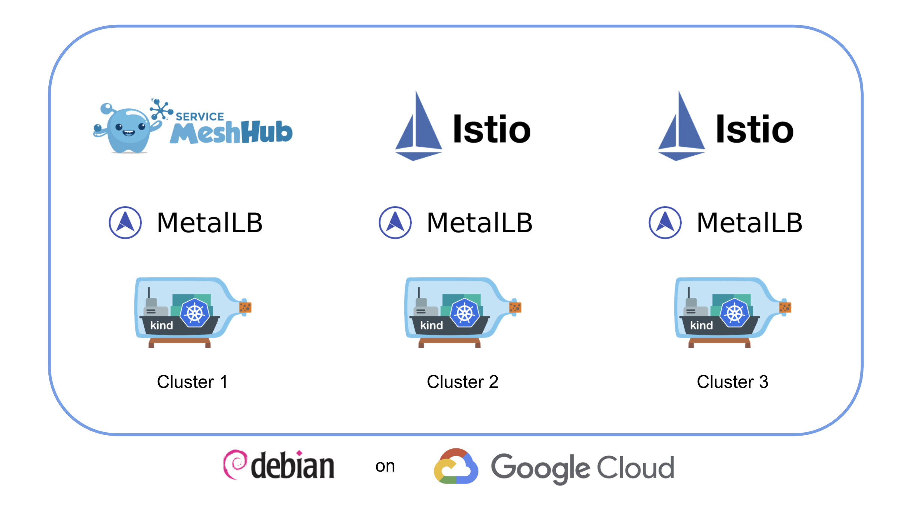
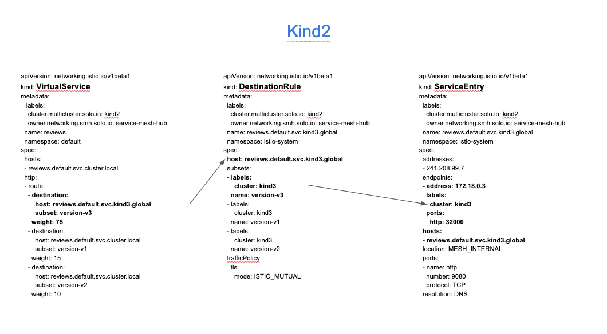
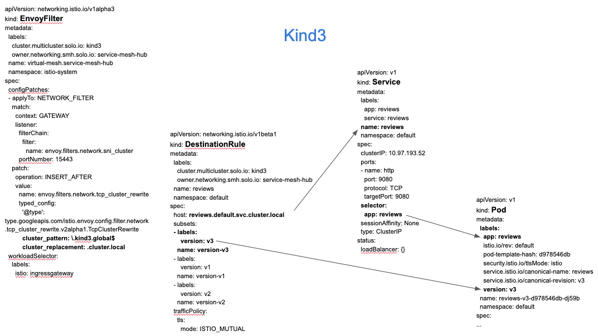

# Service Mesh Hub workshop

Service Mesh Hub (smh) is a Kubernetes-native management plane that enables configuration and operational management of multiple heterogeneous service meshes across multiple clusters through a unified API. The Service Mesh Hub API integrates with the leading service meshes and abstracts away differences between their disparate API's, allowing users to configure a set of different service meshes through a single API. Service Mesh Hub is engineered with a focus on its utility as an operational management tool, providing both graphical and command line UIs, observability features, and debugging tools.

The goal of this workshop is to show several unique features of the Service Mesh Hub (smh) in action:

- Mesh Discovery
- Unified Identity / Trust domain
- Access control
- Multi-cluster traffic
- Failover

## Lab environment



## Lab 1 : Deploy your Kubernetes clusters

From the terminal go to the `/home/solo/workshops/smh` directory:

```
cd /home/solo/workshops/smh
```

Run the following commands to deploy 3 Kubernetes clusters:

```bash
../scripts/deploy.sh 1
../scripts/deploy.sh 2
../scripts/deploy.sh 3
```

Then run the following commands to wait for all the Pods to be ready:

```bash
../scripts/check.sh 1
../scripts/check.sh 2
../scripts/check.sh 3
```

Now, if you execute the `kubectl get pods -A` command, you should obtain the following:

```
NAMESPACE            NAME                                          READY   STATUS    RESTARTS   AGE
kube-system          calico-kube-controllers-59d85c5c84-sbk4k      1/1     Running   0          4h26m
kube-system          calico-node-przxs                             1/1     Running   0          4h26m
kube-system          coredns-6955765f44-ln8f5                      1/1     Running   0          4h26m
kube-system          coredns-6955765f44-s7xxx                      1/1     Running   0          4h26m
kube-system          etcd-kind2-control-plane                      1/1     Running   0          4h27m
kube-system          kube-apiserver-kind2-control-plane            1/1     Running   0          4h27m
kube-system          kube-controller-manager-kind2-control-plane   1/1     Running   0          4h27m
kube-system          kube-proxy-ksvzw                              1/1     Running   0          4h26m
kube-system          kube-scheduler-kind2-control-plane            1/1     Running   0          4h27m
local-path-storage   local-path-provisioner-58f6947c7-lfmdx        1/1     Running   0          4h26m
metallb-system       controller-5c9894b5cd-cn9x2                   1/1     Running   0          4h26m
metallb-system       speaker-d7jkp                                 1/1     Running   0          4h26m
```

Note that this the output for the third cluster.

You can see that your currently connected to this cluster by executing the `kubectl config get-contexts` command:

```
CURRENT   NAME         CLUSTER      AUTHINFO     NAMESPACE
          kind-kind1   kind-kind1   kind-kind1   
          kind-kind2   kind-kind2   kind-kind2
*         kind-kind3   kind-kind3   kind-kind3
```

Run the following command to make `kind-kind1` the current cluster.

```bash
kubectl config use-context kind-kind1
```

## Lab 2 : Deploy Service Mesh Hub and register the clusters

First of all, you need to install the *meshctl* CLI:

```bash
curl -sL https://run.solo.io/meshctl/install | SMH_VERSION=v0.7.4 sh -
export PATH=$HOME/.service-mesh-hub/bin:$PATH
```

Now, you can install Service Mesh Hub on your admin cluster:

```bash
meshctl install
```

Then, you need to register the two other clusters:

```bash
meshctl cluster register \
  --cluster-name kind2 \
  --mgmt-context kind-kind1 \
  --remote-context kind-kind2

meshctl cluster register \
  --cluster-name kind3 \
  --mgmt-context kind-kind1 \
  --remote-context kind-kind3
```

You can list the registered cluster using the following command:

```bash
kubectl get kubernetescluster -n service-mesh-hub
```

You should get the following output:

```
NAME    AGE
kind2   27s
kind3   23s
```

## Lab 3 : Deploy Istio on both clusters

Download istio 1.7.0:

```bash
curl -L https://istio.io/downloadIstio | ISTIO_VERSION=1.7.0 sh -
```

Now let's deploy Istio on the first cluster:

```bash
./istio-1.7.0/bin/istioctl --context kind-kind2 operator init

kubectl --context kind-kind2 create ns istio-system

cat << EOF | kubectl --context kind-kind2 apply -f -
apiVersion: install.istio.io/v1alpha1
kind: IstioOperator
metadata:
  name: istiocontrolplane-default
  namespace: istio-system
spec:
  profile: default
  addonComponents:
    istiocoredns:
      enabled: true
    grafana:
      enabled: true
    kiali:
      enabled: true
    prometheus:
      enabled: true
    tracing:
      enabled: true
  meshConfig:
    accessLogFile: /dev/stdout
    enableAutoMtls: true
    trustDomain: kind2
  values:
    global:
      trustDomain: kind2
  components:
    pilot:
      k8s:
        env:
          - name: PILOT_SKIP_VALIDATE_TRUST_DOMAIN
            value: "true"
EOF
```

And deploy Istio on the second cluster:

```bash
./istio-1.7.0/bin/istioctl --context kind-kind3 operator init

kubectl --context kind-kind3 create ns istio-system

cat << EOF | kubectl --context kind-kind3 apply -f -
apiVersion: install.istio.io/v1alpha1
kind: IstioOperator
metadata:
  name: istiocontrolplane-default
  namespace: istio-system
spec:
  profile: default
  addonComponents:
    istiocoredns:
      enabled: true
    grafana:
      enabled: true
    kiali:
      enabled: true
    prometheus:
      enabled: true
    tracing:
      enabled: true
  meshConfig:
    accessLogFile: /dev/stdout
    enableAutoMtls: true
    trustDomain: kind3
  values:
    global:
      trustDomain: kind3
  components:
    pilot:
      k8s:
        env:
          - name: PILOT_SKIP_VALIDATE_TRUST_DOMAIN
            value: "true"
EOF
```

<!--bash
until kubectl --context kind-kind2 get ns istio-system
do
  sleep 1
done

until [ $(kubectl --context kind-kind2 -n istio-system get pods -o jsonpath='{range .items[*].status.containerStatuses[*]}{.ready}{"\n"}{end}' | grep true -c) -eq 8 ]; do
  echo "Waiting for all the Istio pods to become ready"
  sleep 1
done

until kubectl --context kind-kind3 get ns istio-system
do
  sleep 1
done

until [ $(kubectl --context kind-kind3 -n istio-system get pods -o jsonpath='{range .items[*].status.containerStatuses[*]}{.ready}{"\n"}{end}' | grep true -c) -eq 8 ]; do
  echo "Waiting for all the Istio pods to become ready"
  sleep 1
done
-->

Run the following command until all the Istio Pods are ready:

```
kubectl --context kind-kind2 get pods -n istio-system
```

When it's case, you should get this output:

```
NAME                                    READY   STATUS    RESTARTS   AGE
grafana-7d7f48894b-vlpjs                1/1     Running   0          8m27s
istio-ingressgateway-658c5c4489-z7srh   1/1     Running   0          8m32s
istio-tracing-68b5cc6685-x4sph          1/1     Running   0          8m27s
istiocoredns-685b5c449f-qmnzs           2/2     Running   0          8m27s
istiod-6f5fd7cb8f-qxszf                 1/1     Running   0          8m43s
kiali-64f76f6c9b-6zhp4                  1/1     Running   0          8m27s
prometheus-5bcb77c949-mgmwp             1/1     Running   0          8m27s
```

Check the status on the second cluster using `kubectl --context kind-kind3 get pods -n istio-system`

## Lab 4 : Deploy the Bookinfo demo app

Run the following commands to deploy the app on the first cluster:

```bash
kubectl --context kind-kind2 label namespace default istio-injection=enabled
kubectl --context kind-kind2 apply -f https://raw.githubusercontent.com/istio/istio/1.7.0/samples/bookinfo/platform/kube/bookinfo.yaml -l 'app,version notin (v3)'
kubectl --context kind-kind2 apply -f https://raw.githubusercontent.com/istio/istio/1.7.0/samples/bookinfo/platform/kube/bookinfo.yaml -l 'account'
kubectl --context kind-kind2 apply -f https://raw.githubusercontent.com/istio/istio/1.7.0/samples/bookinfo/networking/bookinfo-gateway.yaml
```

You can check that the app is running using `kubectl --context kind-kind2 get pods`:

```
NAME                              READY   STATUS    RESTARTS   AGE
details-v1-558b8b4b76-w9qp8       2/2     Running   0          2m33s
productpage-v1-6987489c74-54lvk   2/2     Running   0          2m34s
ratings-v1-7dc98c7588-pgsxv       2/2     Running   0          2m34s
reviews-v1-7f99cc4496-lwtsr       2/2     Running   0          2m34s
reviews-v2-7d79d5bd5d-mpsk2       2/2     Running   0          2m34s
```

As you can see, it didn't deploy the `v3` version of the `reviews` microservice.

Run the following commands to deploy the app on the first cluster:

```bash
kubectl --context kind-kind3 label namespace default istio-injection=enabled
kubectl --context kind-kind3 apply -f https://raw.githubusercontent.com/istio/istio/1.7.0/samples/bookinfo/platform/kube/bookinfo.yaml
kubectl --context kind-kind3 apply -f https://raw.githubusercontent.com/istio/istio/1.7.0/samples/bookinfo/networking/bookinfo-gateway.yaml
```

You can check that the app is running using `kubectl --context kind-kind3 get pods`:

```
NAME                              READY   STATUS    RESTARTS   AGE
details-v1-558b8b4b76-gs9z2       2/2     Running   0          2m22s
productpage-v1-6987489c74-x45vd   2/2     Running   0          2m21s
ratings-v1-7dc98c7588-2n6bg       2/2     Running   0          2m21s
reviews-v1-7f99cc4496-4r48m       2/2     Running   0          2m21s
reviews-v2-7d79d5bd5d-cx9lp       2/2     Running   0          2m22s
reviews-v3-7dbcdcbc56-trjdx       2/2     Running   0          2m22s
```

As you can see, it deployed all the versions of the `reviews` microservice.

<!--bash
until [ $(kubectl --context kind-kind2 get pods -o jsonpath='{range .items[*].status.containerStatuses[*]}{.ready}{"\n"}{end}' | grep false -c) -eq 0 ]; do
  echo "Waiting for all the pods of the default namespace to become ready"
  sleep 1
done

until [ $(kubectl --context kind-kind3 get pods -o jsonpath='{range .items[*].status.containerStatuses[*]}{.ready}{"\n"}{end}' | grep false -c) -eq 0 ]; do
  echo "Waiting for all the pods of the default namespace to become ready"
  sleep 1
done
-->

## Lab 5 : Create the Virtual Mesh

Service Mesh Hub can help unify the root identity between multiple service mesh installations so any intermediates are signed by the same Root CA and end-to-end mTLS between clusters and services can be established correctly.

Run this command to see how the communication between microservices occur currently:

```bash
kubectl --context kind-kind2 exec -t deploy/reviews-v1 -c istio-proxy \
-- openssl s_client -showcerts -connect ratings:9080
```

You should get something like that:

```
CONNECTED(00000005)
139706332271040:error:1408F10B:SSL routines:ssl3_get_record:wrong version number:../ssl/record/ssl3_record.c:332:
---
no peer certificate available
---
No client certificate CA names sent
---
SSL handshake has read 5 bytes and written 309 bytes
Verification: OK
---
New, (NONE), Cipher is (NONE)
Secure Renegotiation IS NOT supported
Compression: NONE
Expansion: NONE
No ALPN negotiated
Early data was not sent
Verify return code: 0 (ok)
---
command terminated with exit code 1
```

It means that the traffic is currently not encrypted.

Enable TLS on both clusters:

```bash
kubectl --context kind-kind2 apply -f - <<EOF
apiVersion: "security.istio.io/v1beta1"
kind: "PeerAuthentication"
metadata:
  name: "default"
  namespace: "istio-system"
spec:
  mtls:
    mode: STRICT
EOF

kubectl --context kind-kind3 apply -f - <<EOF
apiVersion: "security.istio.io/v1beta1"
kind: "PeerAuthentication"
metadata:
  name: "default"
  namespace: "istio-system"
spec:
  mtls:
    mode: STRICT
EOF
```

Run the command again:

```bash
kubectl --context kind-kind2 exec -t deploy/reviews-v1 -c istio-proxy \
-- openssl s_client -showcerts -connect ratings:9080
```

Now, the output should be like that:

```
CONNECTED(00000005)
depth=1 O = cluster.local
verify error:num=19:self signed certificate in certificate chain
---
Certificate chain
 0 s:
   i:O = cluster.local
-----BEGIN CERTIFICATE-----
MIIDKTCCAhGgAwIBAgIRAISlm9FRIVFzABqtk1qH+OQwDQYJKoZIhvcNAQELBQAw
...
-----END CERTIFICATE-----
 1 s:O = cluster.local
   i:O = cluster.local
-----BEGIN CERTIFICATE-----
...
-----END CERTIFICATE-----
---
Server certificate
subject=

issuer=O = cluster.local
...
command terminated with exit code 1
```

As you can see, mTLS is now enabled.

Now, run the same command on the second cluster:

```bash
kubectl --context kind-kind3 exec -t deploy/reviews-v1 -c istio-proxy \
-- openssl s_client -showcerts -connect ratings:9080
```

The output should be like that:

```
CONNECTED(00000005)
depth=1 O = cluster.local
verify error:num=19:self signed certificate in certificate chain
---
Certificate chain
 0 s:
   i:O = cluster.local
-----BEGIN CERTIFICATE-----
MIIDKDCCAhCgAwIBAgIQR8zsYT+xVQi2X1iDhyZFpjANBgkqhkiG9w0BAQsFADAY
...
-----END CERTIFICATE-----
 1 s:O = cluster.local
   i:O = cluster.local
-----BEGIN CERTIFICATE-----
...
-----END CERTIFICATE-----
...
issuer=O = cluster.local
...
command terminated with exit code 1
```

While the Organization is the same, the certificates are different in the 2 clusters.

Creating a Virtual Mesh will unify the root identity.

Run the following command to create the *Virtual Mesh*:

```bash
cat << EOF | kubectl --context kind-kind1 apply -f -
apiVersion: networking.smh.solo.io/v1alpha2
kind: VirtualMesh
metadata:
  name: virtual-mesh
  namespace: service-mesh-hub
spec:
  mtlsConfig:
    autoRestartPods: true
    shared:
      rootCertificateAuthority:
        generated: null
  federation: {}
  meshes:
  - name: istiod-istio-system-kind2
    namespace: service-mesh-hub
  - name: istiod-istio-system-kind3
    namespace: service-mesh-hub
EOF
```

Check that the new certificate has been created on the first cluster:

```bash
kubectl --context kind-kind2 get secret -n istio-system cacerts
```

Here is the expected output:

```
NAME      TYPE                                          DATA   AGE
cacerts   certificates.smh.solo.io/issued_certificate   5      41s
```

Check that the new certificate has been created on the second cluster:

```bash
kubectl --context kind-kind3 get secret -n istio-system cacerts
```

Here is the expected output:

```
NAME      TYPE                                          DATA   AGE
cacerts   certificates.smh.solo.io/issued_certificate   5      2m23s
```

<!--bash
until kubectl --context kind-kind2 get secret -n istio-system cacerts
do
  sleep 1
done

until kubectl --context kind-kind3 get secret -n istio-system cacerts
do
  sleep 1
done
-->

<!--bash
sleep 30

kubectl --context kind-kind2 -n istio-system delete pod -l app=istio-ingressgateway
kubectl --context kind-kind3 -n istio-system delete pod -l app=istio-ingressgateway

kubectl --context kind-kind2 delete pod --all
kubectl --context kind-kind3 delete pod --all
-->

<!--bash
until [ $(kubectl --context kind-kind2 get pods -o jsonpath='{range .items[*].status.containerStatuses[*]}{.ready}{"\n"}{end}' | grep false -c) -eq 0 ]; do
  echo "Waiting for all the pods of the default namespace to become ready"
  sleep 1
done

until [ $(kubectl --context kind-kind3 get pods -o jsonpath='{range .items[*].status.containerStatuses[*]}{.ready}{"\n"}{end}' | grep false -c) -eq 0 ]; do
  echo "Waiting for all the pods of the default namespace to become ready"
  sleep 1
done
-->

Now, let's check what certificates we get:

```bash
kubectl --context kind-kind2 exec -t deploy/reviews-v1 -c istio-proxy \
-- openssl s_client -showcerts -connect ratings:9080
```

The output should be like that:

```
CONNECTED(00000005)
depth=2 O = service-mesh-hub
verify error:num=19:self signed certificate in certificate chain
---
Certificate chain
 0 s:
   i:
-----BEGIN CERTIFICATE-----
MIIEETCCAfmgAwIBAgIRANpyyMsLE2WkvUTOJ1k5usEwDQYJKoZIhvcNAQELBQAw
...
-----END CERTIFICATE-----
 1 s:
   i:O = service-mesh-hub
-----BEGIN CERTIFICATE-----
MIIE2DCCAsCgAwIBAgIQROVOe1RtAhROwPwKsFnmiTANBgkqhkiG9w0BAQsFADAb
...
-----END CERTIFICATE-----
 2 s:O = service-mesh-hub
   i:O = service-mesh-hub
-----BEGIN CERTIFICATE-----
MIIE5DCCAsygAwIBAgIRAMeVQMh8Fl55AAzhBc3v2k4wDQYJKoZIhvcNAQELBQAw
...
-----END CERTIFICATE-----
 3 s:O = service-mesh-hub
   i:O = service-mesh-hub
-----BEGIN CERTIFICATE-----
MIIE5DCCAsygAwIBAgIRAMeVQMh8Fl55AAzhBc3v2k4wDQYJKoZIhvcNAQELBQAw
...
-----END CERTIFICATE-----
...
command terminated with exit code 1
```

And let's compare with what we get on the second cluster:

```bash
kubectl --context kind-kind3 exec -t deploy/reviews-v1 -c istio-proxy \
-- openssl s_client -showcerts -connect ratings:9080
```

The output should be like that:

```
CONNECTED(00000005)
depth=2 O = service-mesh-hub
verify error:num=19:self signed certificate in certificate chain
---
Certificate chain
 0 s:
   i:
-----BEGIN CERTIFICATE-----
MIIEETCCAfmgAwIBAgIRAOxOaqcr8pwIKFQrbh6qvY0wDQYJKoZIhvcNAQELBQAw
...
-----END CERTIFICATE-----
 1 s:
   i:O = service-mesh-hub
-----BEGIN CERTIFICATE-----
MIIE2DCCAsCgAwIBAgIQfEZzY8LpdAzrvKlILzH9kjANBgkqhkiG9w0BAQsFADAb
...
-----END CERTIFICATE-----
 2 s:O = service-mesh-hub
   i:O = service-mesh-hub
-----BEGIN CERTIFICATE-----
MIIE5DCCAsygAwIBAgIRAMeVQMh8Fl55AAzhBc3v2k4wDQYJKoZIhvcNAQELBQAw
...
-----END CERTIFICATE-----
 3 s:O = service-mesh-hub
   i:O = service-mesh-hub
-----BEGIN CERTIFICATE-----
MIIE5DCCAsygAwIBAgIRAMeVQMh8Fl55AAzhBc3v2k4wDQYJKoZIhvcNAQELBQAw
...
-----END CERTIFICATE-----
...
command terminated with exit code 1
```

You can see that the chain is now identical.

## Lab 6 : Access Control

In the previous guide, we federated multiple meshes and established a shared root CA for a shared identity domain. Now that we have a logical VirtualMesh, we need a way to establish access policies across the multiple meshes, without treating each of them individually. Service Mesh Hub helps by establishing a single, unified API that understands the logical VirtualMesh construct.

First of all, open http://172.18.0.220/productpage with the web browser.

The application should work correctly because RBAC isn't enforced.

Let's update the VirtualMesh to enable it:

```bash
cat << EOF | kubectl --context kind-kind1 apply -f -
apiVersion: networking.smh.solo.io/v1alpha2
kind: VirtualMesh
metadata:
  name: virtual-mesh
  namespace: service-mesh-hub
spec:
  mtlsConfig:
    autoRestartPods: true
    shared:
      rootCertificateAuthority:
        generated: null
  federation: {}
  globalAccessPolicy: ENABLED
  meshes:
  - name: istiod-istio-system-kind2
    namespace: service-mesh-hub
  - name: istiod-istio-system-kind3
    namespace: service-mesh-hub
EOF
```

After a few seconds, if you refresh the web page, you should see that you don't have access to the application anymore.

You should get the following error message:

```
RBAC: access denied
```

You need to create an Istio AuthorizationPolicy on each cluster to allow access to the application:

```bash
kubectl --context kind-kind2 apply -f - <<EOF
apiVersion: "security.istio.io/v1beta1"
kind: "AuthorizationPolicy"
metadata:
  name: "productpage-viewer"
  namespace: default
spec:
  selector:
    matchLabels:
      app: productpage
  rules:
  - to:
    - operation:
        methods: ["GET"]
EOF

kubectl --context kind-kind3 apply -f - <<EOF
apiVersion: "security.istio.io/v1beta1"
kind: "AuthorizationPolicy"
metadata:
  name: "productpage-viewer"
  namespace: default
spec:
  selector:
    matchLabels:
      app: productpage
  rules:
  - to:
    - operation:
        methods: ["GET"]
EOF
```

```bash
cat << EOF | kubectl --context kind-kind1 apply -f -
apiVersion: networking.smh.solo.io/v1alpha2
kind: AccessPolicy
metadata:
  namespace: service-mesh-hub
  name: productpage-viewer
spec:
  sourceSelector:
  - kubeServiceAccountRefs:
      serviceAccounts:
        - name: bookinfo-productpage
          namespace: default
          clusterName: kind2
  destinationSelector:
  - kubeServiceMatcher:
      namespaces:
      - default
EOF
```

Now, refresh the page again and you should be able to access the application, but neither the product `details` nor the `reviews`:


You can create a Service Mesh Hub Access Policy to allow the `productpage` micro service to talk to the other services in the default namespace:

```bash
cat << EOF | kubectl --context kind-kind1 apply -f -
apiVersion: networking.smh.solo.io/v1alpha2
kind: AccessPolicy
metadata:
  namespace: service-mesh-hub
  name: productpage
spec:
  sourceSelector:
  - kubeServiceAccountRefs:
      serviceAccounts:
        - name: bookinfo-productpage
          namespace: default
          clusterName: kind2
  destinationSelector:
  - kubeServiceMatcher:
      namespaces:
      - default
EOF
```

If you refresh the page, you should be able to see the product `details` and the `reviews`, but the `reviews` micro service can't access the `ratings` micro service:


Create another AccessPolicy to fix the issue:

```bash
cat << EOF | kubectl --context kind-kind1 apply -f -
apiVersion: networking.smh.solo.io/v1alpha2
kind: AccessPolicy
metadata:
  namespace: service-mesh-hub
  name: reviews
spec:
  sourceSelector:
  - kubeServiceAccountRefs:
      serviceAccounts:
        - name: bookinfo-reviews
          namespace: default
          clusterName: kind2
  destinationSelector:
  - kubeServiceMatcher:
      namespaces:
      - default
      labels:
        service: ratings
EOF
```

Refresh the page another time and all the services should now work:


## Lab 7 : Multi-cluster Traffic

On the first cluster, the `v3` version of the `reviews` micro service doesn't exist, so we're going to redirect some of the traffic to the second cluster to make it available.

Let's create the following TrafficPolicy:

```bash

cat << EOF | kubectl --context kind-kind1 apply -f -
apiVersion: networking.smh.solo.io/v1alpha2
kind: TrafficPolicy
metadata:
  namespace: service-mesh-hub
  name: simple
spec:
  destinationSelector:
  - kubeServiceRefs:
      services:
        - clusterName: kind2
          name: reviews
          namespace: default
  trafficShift:
    destinations:
      - kubeService:
          clusterName: kind3
          name: reviews
          namespace: default
          subset:
            version: v3
        weight: 75
      - kubeService:
          clusterName: kind2
          name: reviews
          namespace: default
          subset:
            version: v1
        weight: 15
      - kubeService:
          clusterName: kind2
          name: reviews
          namespace: default
          subset:
            version: v2
        weight: 10
EOF
```

If you refresh the page several times, you'll see the `v3` version of the `reviews` micro service (with red stars):


Now, let's understand what happened when we created this TrafficPolicy.

On the first cluster:



- A VirtualService has been created to route 75% of the traffic to the subset `version-v3` of the host `reviews.default.svc.kind3.global`.
- A DestinationRule has been created for this host and define the subset `version-v3` with the label `cluster: kind3`.
- A ServiceEntry has been created for this host and associate this label with the endpoint corresponding to the Istio Ingress Gateway of the second cluster.

On the second cluster:



- An EnvoyFilter has been created to replace the suffix `.kind3.global` by `cluster.local` when requests arrive in the Istio Ingress Gateway.
- A DestinationRule has been created for the same host (but with the `.cluster.local` suffix) and define the subset `version-v3` with the label `version: v3`.
- The traffic is routed to the Pods of the corresponding service that have this label.