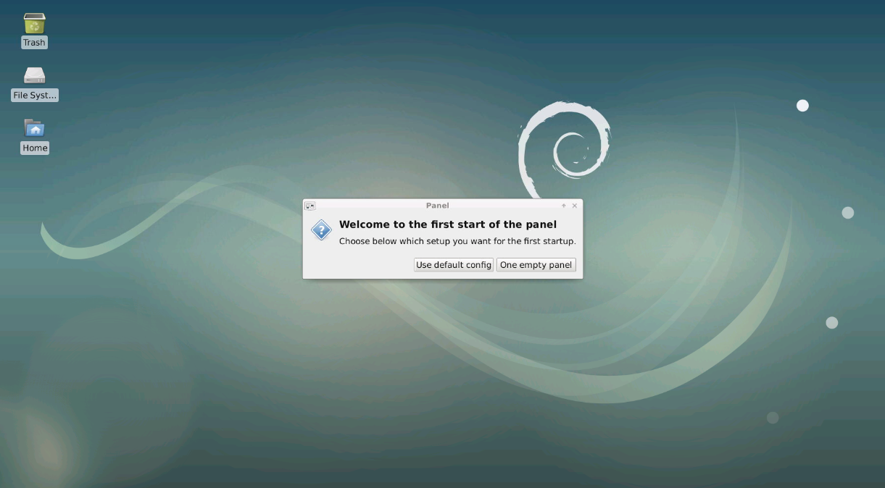
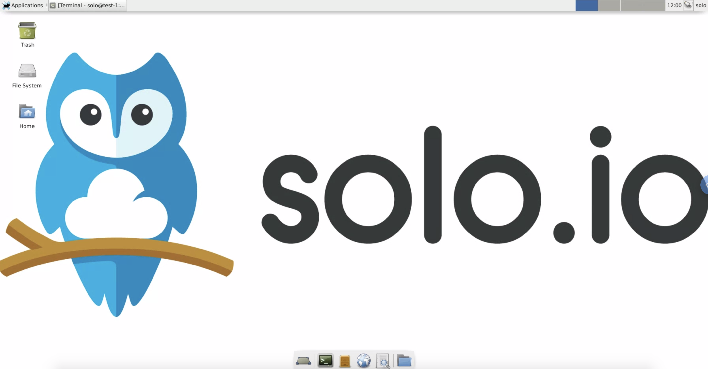

# Service Mesh Hub workshop

Service Mesh Hub (smh) is a Kubernetes-native management plane that enables configuration and operational management of multiple heterogeneous service meshes across multiple clusters through a unified API. The Service Mesh Hub API integrates with the leading service meshes and abstracts away differences between their disparate API's, allowing users to configure a set of different service meshes through a single API. Service Mesh Hub is engineered with a focus on its utility as an operational management tool, providing both graphical and command line UIs, observability features, and debugging tools.

The goal of this workshop is to show several unique features of the Service Mesh Hub (smh) in action:

- Mesh Discovery
- Unified Identity / Trust domain
- Access control
- Multi-cluster traffic
- Failover

## Lab environment


To make sure anyone can easily perform the different tasks, we have provisioned a Virtual Machine for each of you.

You'll be able to deploy several Kubernetes clusters on this machine using *Kind*.

*MetalLB* has been deployed to expose the Load Balancer services you'll create on your Kubernetes clusters.

All the prerequisites have already been deployed on your machine.

## Prerequisites

You will be accessing your Virtual Machine using [Apache Guacamole](https://guacamole.apache.org/).

Apache Guacamole is a clientless remote desktop gateway. Thanks to HTML5, once Guacamole is installed on a server, all you need to access your desktops is a web browser.

## Access your virtual machine

Log into your Virtual Machine using your web browser.



Click on the `use default config` button.

> If you made a mistake and clicked on the other option, you won't see the menu at the top.
>
> In that case, right click on the desktop and select `Open Terminal Here`.
>
> Then, execute the following commands:
> ```
> xfce4-panel --quit
> pkill xfconfd
> rm -rf /home/solo/.config/xfce4/xfconf
> xfce4-panel &
> ```
> Now, click on the right button ;-)

Click on the `Applications` menu on the top left corner and select `Terminal Emulator`.

You should now see the `solo.io` background:



> If you have an issue with the keyboard layout, click on the `Applications` button on the top left corner, select `Settings` and then `Keyboard`.
>
> In the `Layout` tab, you can add the layout you want to use and delete the default one:
>
> 

## Lab 1 : Deploy your Kubernetes clusters

From the terminal go to the `/home/solo/workshops/smh` directory:

```
cd /home/solo/workshops/smh
```

Run the following commands to deploy 2 Kubernetes clusters:

```
./kind/deploy-1.17.sh 1
./kind/deploy-1.17.sh 2
```

Then run the following commands to wait for all the Pods to be ready:

```
./kind/check.sh 1
./kind/check.sh 2
```

Now, if you execute the `kubectl get pods -A` command, you should obtain the following:

```
NAMESPACE            NAME                                          READY   STATUS    RESTARTS   AGE
kube-system          calico-kube-controllers-59d85c5c84-sbk4k      1/1     Running   0          4h26m
kube-system          calico-node-przxs                             1/1     Running   0          4h26m
kube-system          coredns-6955765f44-ln8f5                      1/1     Running   0          4h26m
kube-system          coredns-6955765f44-s7xxx                      1/1     Running   0          4h26m
kube-system          etcd-kind2-control-plane                      1/1     Running   0          4h27m
kube-system          kube-apiserver-kind2-control-plane            1/1     Running   0          4h27m
kube-system          kube-controller-manager-kind2-control-plane   1/1     Running   0          4h27m
kube-system          kube-proxy-ksvzw                              1/1     Running   0          4h26m
kube-system          kube-scheduler-kind2-control-plane            1/1     Running   0          4h27m
local-path-storage   local-path-provisioner-58f6947c7-lfmdx        1/1     Running   0          4h26m
metallb-system       controller-5c9894b5cd-cn9x2                   1/1     Running   0          4h26m
metallb-system       speaker-d7jkp                                 1/1     Running   0          4h26m
```

Note that this the output for the second cluster.

You can see that your currently connected to this cluster by executing the `kubectl config get-contexts` command:

```
CURRENT   NAME         CLUSTER      AUTHINFO     NAMESPACE
          kind-kind1   kind-kind1   kind-kind1   
*         kind-kind2   kind-kind2   kind-kind2
````

Run the following command to make `kind-kind1` the current cluster.

```
kubectl config use-context kind-kind1
```

## Lab 2 : Deploy Service Mesh Hub and register the clusters

First of all, you need to install the *meshctl* CLI:

```
curl -sL https://run.solo.io/meshctl/install | sh
export PATH=$HOME/.service-mesh-hub/bin:$PATH
```

Now, you can install Service Mesh Hub on your first cluster:

```
meshctl install --register --context kind-kind1
```

As you can see, we also registered it.

Now let's register the second cluster:

```
meshctl cluster register \
  --remote-cluster-name new-remote-cluster \
  --remote-context kind-kind2
```

## Lab 3 : Deploy Istio on both clusters

You can install Istio by yourself or use the *meshctl* CLI for that.

To be able to deploy Istio with Kiali, we need to create the secrets corresponding to the admin password.

```
KIALI_USERNAME=$(printf '%s' admin | base64)
KIALI_PASSPHRASE=$(printf '%s' admin | base64)
NAMESPACE=istio-system

kubectl --context kind-kind1 create namespace $NAMESPACE
kubectl --context kind-kind2 create namespace $NAMESPACE

cat <<EOF | kubectl --context kind-kind1 apply -f -
apiVersion: v1
kind: Secret
metadata:
  name: kiali
  namespace: $NAMESPACE
  labels:
    app: kiali
type: Opaque
data:
  username: $KIALI_USERNAME
  passphrase: $KIALI_PASSPHRASE
EOF

cat <<EOF | kubectl --context kind-kind2 apply -f -
apiVersion: v1
kind: Secret
metadata:
  name: kiali
  namespace: $NAMESPACE
  labels:
    app: kiali
type: Opaque
data:
  username: $KIALI_USERNAME
  passphrase: $KIALI_PASSPHRASE
EOF
```

Now let's deploy Istio on the first cluster:

```
meshctl mesh install istio1.6 --context kind-kind1 --create-operator-namespace=false --operator-spec=- <<EOF
apiVersion: install.istio.io/v1alpha1
kind: IstioOperator
metadata:
  name: istiocontrolplane-default
  namespace: istio-system
spec:
  profile: default
  addonComponents:
    istiocoredns:
      enabled: true
    grafana:
      enabled: true
    kiali:
      enabled: true
    prometheus:
      enabled: true
    tracing:
      enabled: true
  values:
    global:
      controlPlaneSecurityEnabled: true
      mtls:
        enabled: true
      pilotCertProvider: kubernetes
      podDNSSearchNamespaces:
      - global
      - '{{ valueOrDefault .DeploymentMeta.Namespace "default" }}.global'
      proxy:
        accessLogFile: /dev/stdout
    prometheus:
      enabled: false
EOF
````

As you can see, *meshctl* simply using the *Istio Operator* to deploy Istio.

We follow the same approach to deploy Istio on the second Kubernetes cluster:

```
meshctl mesh install istio1.6 --context kind-kind2 --create-operator-namespace=false --operator-spec=- <<EOF
apiVersion: install.istio.io/v1alpha1
kind: IstioOperator
metadata:
  name: istiocontrolplane-default
  namespace: istio-system
spec:
  profile: default
  addonComponents:
    istiocoredns:
      enabled: true
    grafana:
      enabled: true
    kiali:
      enabled: true
    prometheus:
      enabled: true
    tracing:
      enabled: true
  values:
    global:
      controlPlaneSecurityEnabled: true
      mtls:
        enabled: true
      pilotCertProvider: kubernetes
      podDNSSearchNamespaces:
      - global
      - '{{ valueOrDefault .DeploymentMeta.Namespace "default" }}.global'
      proxy:
        accessLogFile: /dev/stdout
    prometheus:
      enabled: false
EOF
```

Run the following command until all the Istio Pods are ready:

```
kubectl --context kind-kind1 get pods -n istio-system
```

When it's case, you should get this output:

```
NAME                                   READY   STATUS    RESTARTS   AGE
grafana-74dc798895-xlrxn               1/1     Running   0          6m57s
istio-ingressgateway-f6ccd5595-vgl2c   1/1     Running   0          7m2s
istio-operator-74687d7859-nkk2q        1/1     Running   0          7m34s
istio-tracing-8584b4d7f9-ftlwg         1/1     Running   0          6m57s
istiocoredns-7ffc9b7fcf-fk7wn          2/2     Running   0          6m57s
istiod-6b49d46f8b-l9cb9                1/1     Running   0          7m10s
kiali-6f457f5964-4h4q4                 1/1     Running   0          6m56s
prometheus-c44ffc7d4-cgffh             2/2     Running   0          6m56s
```

Check the status on the second cluster using `kubectl --context kind-kind2 get pods -n istio-system`

## Lab 4 : Create the Virtual Mesh

Service Mesh Hub can help unify the root identity between multiple service mesh installations so any intermediates are signed by the same Root CA and end-to-end mTLS between clusters and services can be established correctly.

Run the following command to create the *Virtual Mesh*:

```
cat << EOF | kubectl --context kind-kind1 apply -f -
apiVersion: networking.smh.solo.io/v1alpha1
kind: VirtualMesh
metadata:
  name: virtual-mesh
  namespace: service-mesh-hub
spec:
  displayName: "Demo Mesh Federation"
  certificateAuthority:
    builtin:
      ttlDays: 356
      rsaKeySizeBytes: 4096
      orgName: "service-mesh-hub"
  federation:
    mode: PERMISSIVE
  shared: {}
  enforceAccessControl: ENABLED
  meshes:
  - name: istio-istio-system-management-plane
    namespace: service-mesh-hub
  - name: istio-istio-system-new-remote-cluster
    namespace: service-mesh-hub
EOF
```

At this point we need to bounce the istiod control plane. This is because the Istio control plane picks up the CA for Citadel and does not rotate it often enough. This is being improved in future versions of Istio.

```
kubectl --context kind-kind1 delete pod -n istio-system -l app=istiod
kubectl --context kind-kind2 delete pod -n istio-system -l app=istiod
```
