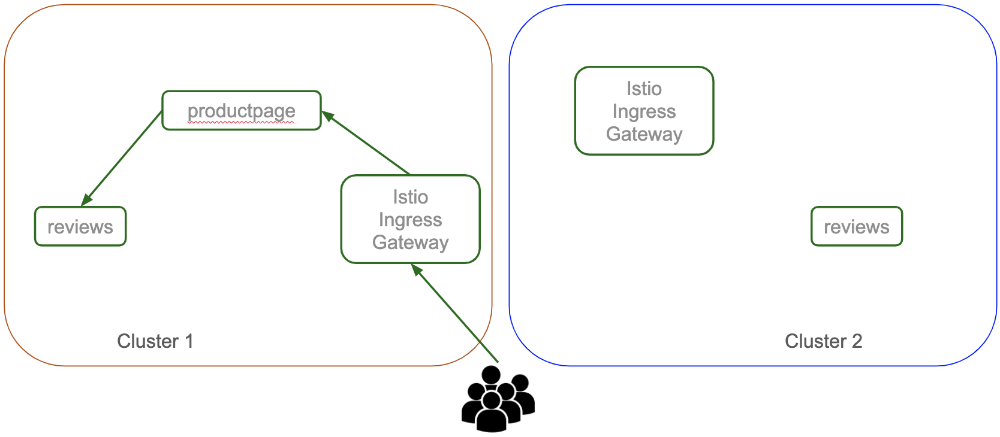
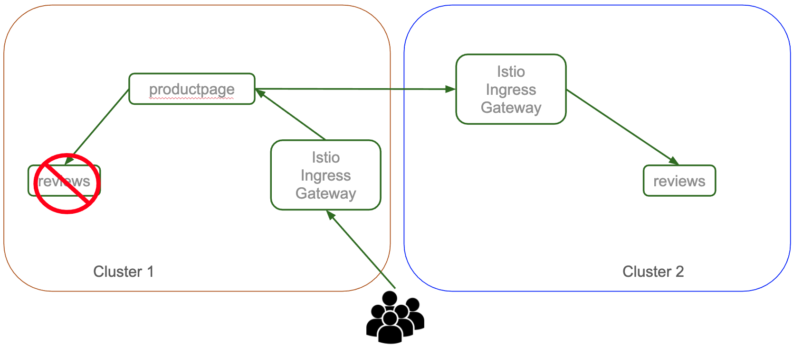
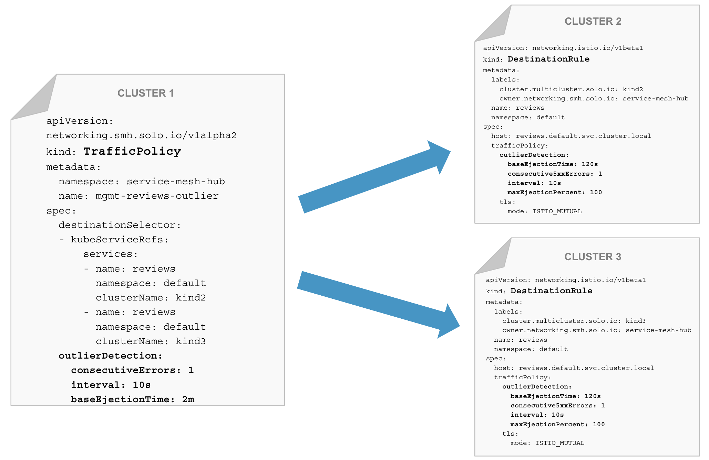
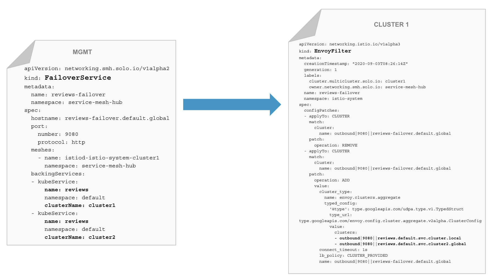
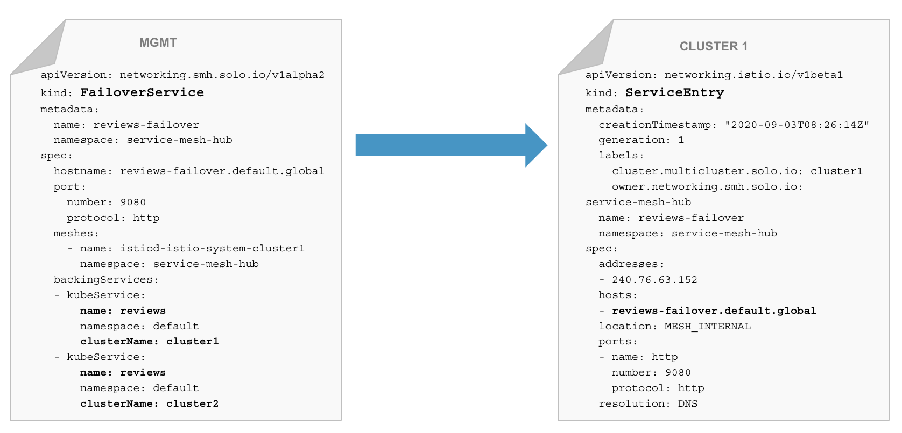
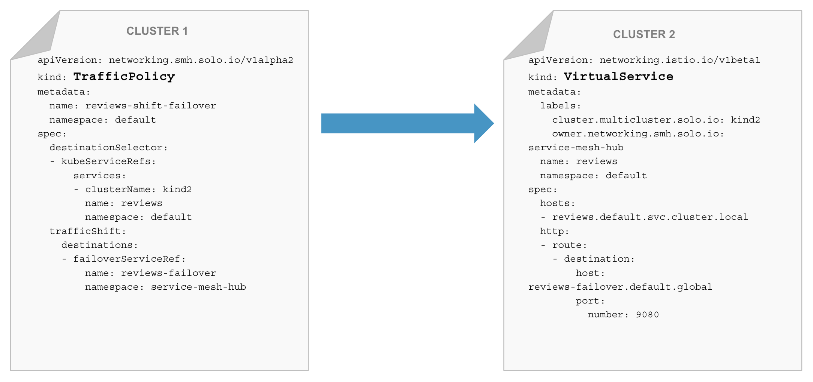

# Service Mesh Hub workshop

Service Mesh Hub (smh) is a Kubernetes-native management plane that enables configuration and operational management of multiple heterogeneous service meshes across multiple clusters through a unified API. The Service Mesh Hub API integrates with the leading service meshes and abstracts away differences between their disparate API's, allowing users to configure a set of different service meshes through a single API. Service Mesh Hub is engineered with a focus on its utility as an operational management tool, providing both graphical and command line UIs, observability features, and debugging tools.

The goal of this workshop is to show several unique features of the Service Mesh Hub (smh) in action:

- Mesh Discovery
- Unified Identity / Trust domain
- Access control
- Multi-cluster traffic
- Failover

## Lab environment


## Lab 1 : Deploy your Kubernetes clusters

From the terminal go to the `/home/solo/workshops/smh` directory:

```
cd /home/solo/workshops/smh
```

Run the following commands to deploy 3 Kubernetes clusters:

```bash
../scripts/deploy.sh 1
../scripts/deploy.sh 2
../scripts/deploy.sh 3
```

Then run the following commands to wait for all the Pods to be ready:

```bash
../scripts/check.sh 1
../scripts/check.sh 2
../scripts/check.sh 3
```

Now, if you execute the `kubectl get pods -A` command, you should obtain the following:

```
NAMESPACE            NAME                                          READY   STATUS    RESTARTS   AGE
kube-system          calico-kube-controllers-59d85c5c84-sbk4k      1/1     Running   0          4h26m
kube-system          calico-node-przxs                             1/1     Running   0          4h26m
kube-system          coredns-6955765f44-ln8f5                      1/1     Running   0          4h26m
kube-system          coredns-6955765f44-s7xxx                      1/1     Running   0          4h26m
kube-system          etcd-kind2-control-plane                      1/1     Running   0          4h27m
kube-system          kube-apiserver-kind2-control-plane            1/1     Running   0          4h27m
kube-system          kube-controller-manager-kind2-control-plane   1/1     Running   0          4h27m
kube-system          kube-proxy-ksvzw                              1/1     Running   0          4h26m
kube-system          kube-scheduler-kind2-control-plane            1/1     Running   0          4h27m
local-path-storage   local-path-provisioner-58f6947c7-lfmdx        1/1     Running   0          4h26m
metallb-system       controller-5c9894b5cd-cn9x2                   1/1     Running   0          4h26m
metallb-system       speaker-d7jkp                                 1/1     Running   0          4h26m
```

Note that this the output for the third cluster.

You can see that your currently connected to this cluster by executing the `kubectl config get-contexts` command:

```
CURRENT   NAME         CLUSTER      AUTHINFO     NAMESPACE
          kind-kind1   kind-kind1   kind-kind1   
          kind-kind2   kind-kind2   kind-kind2
*         kind-kind3   kind-kind3   kind-kind3
```

Run the following command to make `kind-kind1` the current cluster.

```bash
kubectl config use-context kind-kind1
```

## Lab 2 : Deploy Service Mesh Hub and register the clusters

First of all, you need to install the *meshctl* CLI:

```bash
curl -sL https://run.solo.io/meshctl/install | SMH_VERSION=v0.7.4 sh -
export PATH=$HOME/.service-mesh-hub/bin:$PATH
```

Now, you can install Service Mesh Hub on your admin cluster:

```bash
meshctl install
```

Then, you need to register the two other clusters:

```bash
meshctl cluster register \
  --cluster-name kind2 \
  --mgmt-context kind-kind1 \
  --remote-context kind-kind2

meshctl cluster register \
  --cluster-name kind3 \
  --mgmt-context kind-kind1 \
  --remote-context kind-kind3
```

You can list the registered cluster using the following command:

```bash
kubectl get kubernetescluster -n service-mesh-hub
```

You should get the following output:

```
NAME    AGE
kind2   27s
kind3   23s
```

## Lab 3 : Deploy Istio on both clusters

Download istio 1.7.0:

```bash
curl -L https://istio.io/downloadIstio | ISTIO_VERSION=1.7.0 sh -
```

Now let's deploy Istio on the first cluster:

```bash
./istio-1.7.0/bin/istioctl --context kind-kind2 operator init

kubectl --context kind-kind2 create ns istio-system

cat << EOF | kubectl --context kind-kind2 apply -f -
apiVersion: install.istio.io/v1alpha1
kind: IstioOperator
metadata:
  name: istiocontrolplane-default
  namespace: istio-system
spec:
  profile: default
  addonComponents:
    istiocoredns:
      enabled: true
    grafana:
      enabled: true
    kiali:
      enabled: true
    prometheus:
      enabled: true
    tracing:
      enabled: true
  meshConfig:
    accessLogFile: /dev/stdout
    enableAutoMtls: true
    trustDomain: kind2
  values:
    global:
      trustDomain: kind2
  components:
    pilot:
      k8s:
        env:
          - name: PILOT_SKIP_VALIDATE_TRUST_DOMAIN
            value: "true"
EOF
```

And deploy Istio on the second cluster:

```bash
./istio-1.7.0/bin/istioctl --context kind-kind3 operator init

kubectl --context kind-kind3 create ns istio-system

cat << EOF | kubectl --context kind-kind3 apply -f -
apiVersion: install.istio.io/v1alpha1
kind: IstioOperator
metadata:
  name: istiocontrolplane-default
  namespace: istio-system
spec:
  profile: default
  addonComponents:
    istiocoredns:
      enabled: true
    grafana:
      enabled: true
    kiali:
      enabled: true
    prometheus:
      enabled: true
    tracing:
      enabled: true
  meshConfig:
    accessLogFile: /dev/stdout
    enableAutoMtls: true
    trustDomain: kind3
  values:
    global:
      trustDomain: kind3
  components:
    pilot:
      k8s:
        env:
          - name: PILOT_SKIP_VALIDATE_TRUST_DOMAIN
            value: "true"
EOF
```

<!--bash
until kubectl --context kind-kind2 get ns istio-system
do
  sleep 1
done

until [ $(kubectl --context kind-kind2 -n istio-system get pods -o jsonpath='{range .items[*].status.containerStatuses[*]}{.ready}{"\n"}{end}' | grep true -c) -eq 8 ]; do
  echo "Waiting for all the Istio pods to become ready"
  sleep 1
done

until kubectl --context kind-kind3 get ns istio-system
do
  sleep 1
done

until [ $(kubectl --context kind-kind3 -n istio-system get pods -o jsonpath='{range .items[*].status.containerStatuses[*]}{.ready}{"\n"}{end}' | grep true -c) -eq 8 ]; do
  echo "Waiting for all the Istio pods to become ready"
  sleep 1
done
-->

Run the following command until all the Istio Pods are ready:

```
kubectl --context kind-kind2 get pods -n istio-system
```

When it's case, you should get this output:

```
NAME                                    READY   STATUS    RESTARTS   AGE
grafana-7d7f48894b-vlpjs                1/1     Running   0          8m27s
istio-ingressgateway-658c5c4489-z7srh   1/1     Running   0          8m32s
istio-tracing-68b5cc6685-x4sph          1/1     Running   0          8m27s
istiocoredns-685b5c449f-qmnzs           2/2     Running   0          8m27s
istiod-6f5fd7cb8f-qxszf                 1/1     Running   0          8m43s
kiali-64f76f6c9b-6zhp4                  1/1     Running   0          8m27s
prometheus-5bcb77c949-mgmwp             1/1     Running   0          8m27s
```

Check the status on the second cluster using `kubectl --context kind-kind3 get pods -n istio-system`

## Lab 4 : Deploy the Bookinfo demo app

Run the following commands to deploy the app on the first cluster:

```bash
kubectl --context kind-kind2 label namespace default istio-injection=enabled
kubectl --context kind-kind2 apply -f https://raw.githubusercontent.com/istio/istio/1.7.0/samples/bookinfo/platform/kube/bookinfo.yaml -l 'app,version notin (v3)'
kubectl --context kind-kind2 apply -f https://raw.githubusercontent.com/istio/istio/1.7.0/samples/bookinfo/platform/kube/bookinfo.yaml -l 'account'
kubectl --context kind-kind2 apply -f https://raw.githubusercontent.com/istio/istio/1.7.0/samples/bookinfo/networking/bookinfo-gateway.yaml
```

You can check that the app is running using `kubectl --context kind-kind2 get pods`:

```
NAME                              READY   STATUS    RESTARTS   AGE
details-v1-558b8b4b76-w9qp8       2/2     Running   0          2m33s
productpage-v1-6987489c74-54lvk   2/2     Running   0          2m34s
ratings-v1-7dc98c7588-pgsxv       2/2     Running   0          2m34s
reviews-v1-7f99cc4496-lwtsr       2/2     Running   0          2m34s
reviews-v2-7d79d5bd5d-mpsk2       2/2     Running   0          2m34s
```

As you can see, it didn't deploy the `v3` version of the `reviews` micro service.

Run the following commands to deploy the app on the first cluster:

```bash
kubectl --context kind-kind3 label namespace default istio-injection=enabled
kubectl --context kind-kind3 apply -f https://raw.githubusercontent.com/istio/istio/1.7.0/samples/bookinfo/platform/kube/bookinfo.yaml
kubectl --context kind-kind3 apply -f https://raw.githubusercontent.com/istio/istio/1.7.0/samples/bookinfo/networking/bookinfo-gateway.yaml
```

You can check that the app is running using `kubectl --context kind-kind3 get pods`:

```
NAME                              READY   STATUS    RESTARTS   AGE
details-v1-558b8b4b76-gs9z2       2/2     Running   0          2m22s
productpage-v1-6987489c74-x45vd   2/2     Running   0          2m21s
ratings-v1-7dc98c7588-2n6bg       2/2     Running   0          2m21s
reviews-v1-7f99cc4496-4r48m       2/2     Running   0          2m21s
reviews-v2-7d79d5bd5d-cx9lp       2/2     Running   0          2m22s
reviews-v3-7dbcdcbc56-trjdx       2/2     Running   0          2m22s
```

As you can see, it deployed all the versions of the `reviews` micro service.

<!--bash
until [ $(kubectl --context kind-kind2 get pods -o jsonpath='{range .items[*].status.containerStatuses[*]}{.ready}{"\n"}{end}' | grep false -c) -eq 0 ]; do
  echo "Waiting for all the pods of the default namespace to become ready"
  sleep 1
done

until [ $(kubectl --context kind-kind3 get pods -o jsonpath='{range .items[*].status.containerStatuses[*]}{.ready}{"\n"}{end}' | grep false -c) -eq 0 ]; do
  echo "Waiting for all the pods of the default namespace to become ready"
  sleep 1
done
-->

## Lab 5 : Create the Virtual Mesh

Service Mesh Hub can help unify the root identity between multiple service mesh installations so any intermediates are signed by the same Root CA and end-to-end mTLS between clusters and services can be established correctly.

Run this command to see how the communication between micro services occur currently:

```bash
kubectl --context kind-kind2 exec -t deploy/reviews-v1 -c istio-proxy \
-- openssl s_client -showcerts -connect ratings:9080
```

You should get something like that:

```
CONNECTED(00000005)
139706332271040:error:1408F10B:SSL routines:ssl3_get_record:wrong version number:../ssl/record/ssl3_record.c:332:
---
no peer certificate available
---
No client certificate CA names sent
---
SSL handshake has read 5 bytes and written 309 bytes
Verification: OK
---
New, (NONE), Cipher is (NONE)
Secure Renegotiation IS NOT supported
Compression: NONE
Expansion: NONE
No ALPN negotiated
Early data was not sent
Verify return code: 0 (ok)
---
command terminated with exit code 1
```

It means that the traffic is currently not encrypted.

Enable TLS on both clusters:

```bash
kubectl --context kind-kind2 apply -f - <<EOF
apiVersion: "security.istio.io/v1beta1"
kind: "PeerAuthentication"
metadata:
  name: "default"
  namespace: "istio-system"
spec:
  mtls:
    mode: STRICT
EOF

kubectl --context kind-kind3 apply -f - <<EOF
apiVersion: "security.istio.io/v1beta1"
kind: "PeerAuthentication"
metadata:
  name: "default"
  namespace: "istio-system"
spec:
  mtls:
    mode: STRICT
EOF
```

Run the command again:

```bash
kubectl --context kind-kind2 exec -t deploy/reviews-v1 -c istio-proxy \
-- openssl s_client -showcerts -connect ratings:9080
```

Now, the output should be like that:

```
...
Certificate chain
 0 s:
   i:O = kind2
-----BEGIN CERTIFICATE-----
MIIDFjCCAf6gAwIBAgIQJ+5PXGoPZ/FbT7+mca1NMTANBgkqhkiG9w0BAQsFADAQ
...
cxL/huOSzlVVgvFO56Orolzj7fTf/MiHIPs=
-----END CERTIFICATE-----
 1 s:O = kind2
   i:O = kind2
-----BEGIN CERTIFICATE-----
MIICzjCCAbagAwIBAgIRAIwIa2LAhiZmoTzo7lRP/h0wDQYJKoZIhvcNAQELBQAw
...
hToPDf0jxeZ8d7LRFHIaUEOoXqRRWNQFD9EgNoHE5zLg/jEeKswNKt/c4qZUFut+
BK8=
-----END CERTIFICATE-----
...
```

<!--
-----BEGIN CERTIFICATE-----
MIIDFjCCAf6gAwIBAgIQJ+5PXGoPZ/FbT7+mca1NMTANBgkqhkiG9w0BAQsFADAQ
MQ4wDAYDVQQKEwVraW5kMjAeFw0yMDA5MDcwNjUzMjJaFw0yMDA5MDgwNjUzMjJa
MAAwggEiMA0GCSqGSIb3DQEBAQUAA4IBDwAwggEKAoIBAQDNizq0QtuQqD1GIEde
FSjcc47EKjSwzZ6H4mQE4we6yfFhLoXrCYmw0smDyw2VmUflVigr/ePKVaDFaZRr
sSmnQkNNZTvfBqjgBJjyH+zvfzMSXRwaSLeqrrbELLXBbe4hkUfF0iqLRSclgVPB
EwdQ1/KsBGFiIs1fJizlFwG75JgjvKaW21apw+VCeH9DYJCI3pdKx/b4UtxDN5N9
c829Yin+evf87FGkg1stwZFssCS6zQWayiB9g1gF+HEdMiqnZ4rG57EEejR2u/j1
HoFU3f0Oik+f6raoBtRJnkV1I1AegdR9J0Z64K97zCK2eK07vt/h/CTc5YgDJsBd
MeMjAgMBAAGjfDB6MA4GA1UdDwEB/wQEAwIFoDAdBgNVHSUEFjAUBggrBgEFBQcD
AQYIKwYBBQUHAwIwDAYDVR0TAQH/BAIwADA7BgNVHREBAf8EMTAvhi1zcGlmZmU6
Ly9raW5kMi9ucy9kZWZhdWx0L3NhL2Jvb2tpbmZvLXJhdGluZ3MwDQYJKoZIhvcN
AQELBQADggEBAIB+3bKMeF/ZqwaHfhagLXcdSXTrO+q5nVdQxGkaPAHqY6KR6aee
rU6SIxW6UwwCPL1ItXDfI0mA/bGk1QtFb8E8jN9qEcCkgtKBW1nIwn2RiNFbjAQV
gy7wXMI9kicfe2jBmGrJt5lTqOn3dUvWb018fuH1V+vX4KuQagaab7ofjfi9OfOr
HsXQByx7lfGK/u7RVi/biwhpUkSXDyUOqxvsXdbB0WUqv/bZkaE6MIhb52Gp4Jey
i+tdv0FMeVuX7/D5seT1L6BHkHnmD4cTiJCA8Vy8gN+tdlJJ9vkE1pB3I3YjZmDM
cxL/huOSzlVVgvFO56Orolzj7fTf/MiHIPs=
-----END CERTIFICATE-----
 1 s:O = kind2
   i:O = kind2
-----BEGIN CERTIFICATE-----
MIICzjCCAbagAwIBAgIRAIwIa2LAhiZmoTzo7lRP/h0wDQYJKoZIhvcNAQELBQAw
EDEOMAwGA1UEChMFa2luZDIwHhcNMjAwOTA3MDY1MDM3WhcNMzAwOTA1MDY1MDM3
WjAQMQ4wDAYDVQQKEwVraW5kMjCCASIwDQYJKoZIhvcNAQEBBQADggEPADCCAQoC
ggEBALn+maGOtUZEiSvzx/QJ/IiZHsDY2efJTloqNJ7HdkFoi0ejWW8dRQMMTYzC
G64pX/cCxa2lA29js36T6IqYRgH2re8Ygnt7OJoPUS9fHIZwB12jsf6TwP1dyDMX
0MXU1sm/wTXsK7nHcqrXG8aPFlSfNxBFXyGXjaFX+RHucpiMGzZMurFhR+qM4/9S
E4cYiBX3KlNziqKgXbp/l7p/p+l3YWG8m6nAZDvBZYeEPA1iIK1mESteLoHcpfUA
hqwy4Xw3G03pJib2sOhi2au2T0DqSP7MNc1uMaLydyfiaKD3dEyJlu5/xQrp4XRu
ogN8XoH68etnN0H0hTPDZ7fxzx0CAwEAAaMjMCEwDgYDVR0PAQH/BAQDAgIEMA8G
A1UdEwEB/wQFMAMBAf8wDQYJKoZIhvcNAQELBQADggEBAHlMAep+6yTTsT/wMUOh
pVq9FlX/jKbnqiPAgWvjUE3j2kHdp/A8gNjH7ma7NGzzZ1zvIhwqfqEhudOjyUA6
rgBHoAiYFvHIAjAYdZGa6/Iua3eEi27j1SkjO1rvR1BoCGuzhT2UVd78RK5rF7YI
pqpjhfcXhiLkrYTHaFSVVqnwCPKuj4Bf7JtDCX+9l7p3n/yHCjBJWNxcytJz07gl
hlPrk8PMpUoxaTrja7VVFmV4r/Kl7+mL+ib5iCCIZmZ7xNcvduBBg2muG+A8kmyM
hToPDf0jxeZ8d7LRFHIaUEOoXqRRWNQFD9EgNoHE5zLg/jEeKswNKt/c4qZUFut+
BK8=
-----END CERTIFICATE-----
-->

As you can see, mTLS is now enabled.

Now, run the same command on the second cluster:

```bash
kubectl --context kind-kind3 exec -t deploy/reviews-v1 -c istio-proxy \
-- openssl s_client -showcerts -connect ratings:9080
```

The output should be like that:

```
...
Certificate chain
 0 s:
   i:O = kind3
-----BEGIN CERTIFICATE-----
MIIDFzCCAf+gAwIBAgIRAKs5YqcRt1OiDQhihqSGt7swDQYJKoZIhvcNAQELBQAw
...
InGIOK6tzUQLo4FKWdrnKSgAqtFJw4RaW+3g
-----END CERTIFICATE-----
 1 s:O = kind3
   i:O = kind3
-----BEGIN CERTIFICATE-----
MIICzTCCAbWgAwIBAgIQD1Ku+965kXovE6QWitnyiTANBgkqhkiG9w0BAQsFADAQ
...
/vRPCmC4Oi8vlCeL6475/K6DzGIZ8sQoUCL38qFAWkkkl80hG2vb4CsXWn+tPuuo
Zw==
-----END CERTIFICATE-----
...
```

<!--
-----BEGIN CERTIFICATE-----
MIIDFzCCAf+gAwIBAgIRAKs5YqcRt1OiDQhihqSGt7swDQYJKoZIhvcNAQELBQAw
EDEOMAwGA1UEChMFa2luZDMwHhcNMjAwOTA3MDY1MzMyWhcNMjAwOTA4MDY1MzMy
WjAAMIIBIjANBgkqhkiG9w0BAQEFAAOCAQ8AMIIBCgKCAQEA9ffNpYLYjWqxV5kG
zvZk/s8PQCQhidWvBjZkJNNDUhVx7mKHcEng2JfJtVYYbNwBz0930/8++pLzp+M2
aPYkkJd0ZfYL+9moB4POUrlFHLAV35h7PYQR9S+re1OhoN49bFamXXdz0O4FlTiq
oPLxPwk64nCmu6JVwWlYxSBrcE/K9xnhqau/Hqn7XsxIkpzqVEGfYW+7Q8liPmkv
2m3AYy7WNlJEFtAY41auHxm5ZdoVK2uuitmKtxGtWwXXW30k0VB6+GomLHgj2Syg
vnC1pTRdelGk1BSHjBDh+K/o6Ux5a53bM/+8FvQNsX1VH1MPUR8cJZOGNldaLYO8
zo48mQIDAQABo3wwejAOBgNVHQ8BAf8EBAMCBaAwHQYDVR0lBBYwFAYIKwYBBQUH
AwEGCCsGAQUFBwMCMAwGA1UdEwEB/wQCMAAwOwYDVR0RAQH/BDEwL4Ytc3BpZmZl
Oi8va2luZDMvbnMvZGVmYXVsdC9zYS9ib29raW5mby1yYXRpbmdzMA0GCSqGSIb3
DQEBCwUAA4IBAQAaOmukUN8+fWNLp9sSVTIUHsbVcPcC3K5L3/uAj2M1d0DBvMw6
jQEao7e3i765KiAjNU97vZfklQ9ppW3bN04xSWcFl+XwkQ12+ExbkfWl7MCrDY7K
X60iIxLWRGYMpSFnn1E8eL3UNbnOZ4ICLmKmuOGJLEG87OIKPRMVFNK6m1XVMrRn
2jjmeAe1zXkXufvlg9UYRptiSLSlWvqytBOrmeAUlXjaW7CZmfXSFlDFxpoN1NmO
7NtIPfED+QdDStKh/M/dEn0WKhwn3KCxj8Ort3BLPB+hk3YQRDhS6wNqi0UHZ0TD
InGIOK6tzUQLo4FKWdrnKSgAqtFJw4RaW+3g
-----END CERTIFICATE-----
 1 s:O = kind3
   i:O = kind3
-----BEGIN CERTIFICATE-----
MIICzTCCAbWgAwIBAgIQD1Ku+965kXovE6QWitnyiTANBgkqhkiG9w0BAQsFADAQ
MQ4wDAYDVQQKEwVraW5kMzAeFw0yMDA5MDcwNjUwNTJaFw0zMDA5MDUwNjUwNTJa
MBAxDjAMBgNVBAoTBWtpbmQzMIIBIjANBgkqhkiG9w0BAQEFAAOCAQ8AMIIBCgKC
AQEA0v3ouTx82qmVKJJ1eSeVKRZpbYWGKC2avnOVCeWg4SiXE/4YTnIO2BYii2VE
2f2R2/bpVtpQAYhUQVdPipyrhWzzGouIs0Rlrobs2822wOzLUq825pp+8w+Yw4Lp
KCHD9TD2Q5x+lCYs+TgNFFogSOpaZDU9XOo+TTvetqtEkjiLrBUtFZXZQw6SrmPU
sX9sVkEf1HS87NQrSUBaJ9CGy3tjAYq3XoezIRuiave36NqEVlSx4Cjv9Z4xmjtm
/+ErYJWmhjTZwp3QBGD3+VHfcqcN9iw1zQJz14uil8X/MAdm6WvL8BiB4QWh3IFx
BA2gI6zNt0qCIo8VIVT6ij/RQQIDAQABoyMwITAOBgNVHQ8BAf8EBAMCAgQwDwYD
VR0TAQH/BAUwAwEB/zANBgkqhkiG9w0BAQsFAAOCAQEAFSKsmDybkCduShHknugA
TE4Nkr2CdN5UJ433JfGmXs+g8qkdmUzDyxryTt6Z4Dr4KcyUnPB8DVhHhk+Rkglj
N39ERnz9zMlZBe5RaZSWbjSdHIoNQ/BimJRmP6ASJYyqsX7+8/jLG2gWKnK9vbYR
AO6RMyAc/lJpkSUyoB1cbqTn0LnoIhLtqD3IRPOj/n6EWcaGVsO2A2xzX6pzB06x
whPjTigJbjIWt1U8eiMwIsi4KKA33jb3eCTN9DufY8SmO4O08b8uPbmkM2cBzCAR
/vRPCmC4Oi8vlCeL6475/K6DzGIZ8sQoUCL38qFAWkkkl80hG2vb4CsXWn+tPuuo
Zw==
-----END CERTIFICATE-----
-->

As you can see, the Organization and the certificates are different in the 2 clusters.

Creating a Virtual Mesh will unify the root identity.

Run the following command to create the *Virtual Mesh*:

```bash
cat << EOF | kubectl --context kind-kind1 apply -f -
apiVersion: networking.smh.solo.io/v1alpha2
kind: VirtualMesh
metadata:
  name: virtual-mesh
  namespace: service-mesh-hub
spec:
  mtlsConfig:
    autoRestartPods: true
    shared:
      rootCertificateAuthority:
        generated: null
  federation: {}
  meshes:
  - name: istiod-istio-system-kind2
    namespace: service-mesh-hub
  - name: istiod-istio-system-kind3
    namespace: service-mesh-hub
EOF
```

Check that the new certificate has been created on the first cluster:

```bash
kubectl --context kind-kind2 get secret -n istio-system cacerts
```

Here is the expected output:

```
NAME      TYPE                                          DATA   AGE
cacerts   certificates.smh.solo.io/issued_certificate   5      41s
```

Check that the new certificate has been created on the second cluster:

```bash
kubectl --context kind-kind3 get secret -n istio-system cacerts
```

Here is the expected output:

```
NAME      TYPE                                          DATA   AGE
cacerts   certificates.smh.solo.io/issued_certificate   5      2m23s
```

<!--bash
until kubectl --context kind-kind2 get secret -n istio-system cacerts
do
  sleep 1
done

until kubectl --context kind-kind3 get secret -n istio-system cacerts
do
  sleep 1
done
-->

<!--bash
sleep 30

kubectl --context kind-kind2 -n istio-system delete pod -l app=istio-ingressgateway
kubectl --context kind-kind3 -n istio-system delete pod -l app=istio-ingressgateway

kubectl --context kind-kind2 delete pod --all
kubectl --context kind-kind3 delete pod --all
-->

<!--bash
until [ $(kubectl --context kind-kind2 get pods -o jsonpath='{range .items[*].status.containerStatuses[*]}{.ready}{"\n"}{end}' | grep false -c) -eq 0 ]; do
  echo "Waiting for all the pods of the default namespace to become ready"
  sleep 1
done

until [ $(kubectl --context kind-kind3 get pods -o jsonpath='{range .items[*].status.containerStatuses[*]}{.ready}{"\n"}{end}' | grep false -c) -eq 0 ]; do
  echo "Waiting for all the pods of the default namespace to become ready"
  sleep 1
done
-->

Now, let's check what certificates we get:

```bash
kubectl --context kind-kind2 exec -t deploy/reviews-v1 -c istio-proxy \
-- openssl s_client -showcerts -connect ratings:9080
```

The output should be like that:

```
...
Certificate chain
 0 s:
   i:
-----BEGIN CERTIFICATE-----
MIIEBzCCAe+gAwIBAgIRAMPC15sNOsYzPDhnWT8Ku1YwDQYJKoZIhvcNAQELBQAw
...
BsKsvgpGWTZzlauyumRIQnHXS6lNMh0SNGOf
-----END CERTIFICATE-----
 1 s:
   i:O = service-mesh-hub
-----BEGIN CERTIFICATE-----
MIIFETCCAvmgAwIBAgIRAKtuMHHo/cYddMpGfQcoRb4wDQYJKoZIhvcNAQELBQAw
...
BiqUzNMhSRUdQLFbVoVtVatJjdc14nPNxLSZhzSwbCLHcWTZdVMXz9AKyx0461Aa
PSZpEMY=
-----END CERTIFICATE-----
 2 s:O = service-mesh-hub
   i:O = service-mesh-hub
-----BEGIN CERTIFICATE-----
MIIE4zCCAsugAwIBAgIQX/M1nUJYEx79wAFcxYlc3zANBgkqhkiG9w0BAQsFADAb
...
TYtHtpxgsBMlYprIGSCr5LysyL3YWjX4TajDjaFwf11wR0B0WKR7YPkVQmA0ItsK
AolJPEPt7g==
-----END CERTIFICATE-----
 3 s:O = service-mesh-hub
   i:O = service-mesh-hub
-----BEGIN CERTIFICATE-----
MIIE4zCCAsugAwIBAgIQX/M1nUJYEx79wAFcxYlc3zANBgkqhkiG9w0BAQsFADAb
...
TYtHtpxgsBMlYprIGSCr5LysyL3YWjX4TajDjaFwf11wR0B0WKR7YPkVQmA0ItsK
AolJPEPt7g==
-----END CERTIFICATE-----
...
```

<!--
-----BEGIN CERTIFICATE-----
MIIEBzCCAe+gAwIBAgIRAMPC15sNOsYzPDhnWT8Ku1YwDQYJKoZIhvcNAQELBQAw
ADAeFw0yMDA5MDcwNjU1NTJaFw0yMDA5MDgwNjU1NTJaMAAwggEiMA0GCSqGSIb3
DQEBAQUAA4IBDwAwggEKAoIBAQDCwOAP1fyUvivCd+NyVSpAkVwj6+zXRV4yaMiC
1pOBSQNtUoUKuw3sMidowQY46jwZNPG0qpHiXaNqrlLRCVYDo9g0Zhmr+UxkHONN
rRsCWVYVmRjIgSoUT/3TwJF4ez03DhpstUq7/MNqbKm3TDDCXLs61NOYE/u08T7V
fJn7OPZ1YTPOaP0Us7Ascy57m2TdgExzdlaegijh6fiebGBWTLzE6Rr6oy81r6Iz
Zi5JiVN1QS4n9WlGts2JDgixSgNiYcMqEQ6WnAbUNlrGZi3zAjMJiRvcvEX+3dtM
9ASeBhqhYe5ZNKiyB+WV1ngHCAq/J4pQBczKBKXv2CjbaWYvAgMBAAGjfDB6MA4G
A1UdDwEB/wQEAwIFoDAdBgNVHSUEFjAUBggrBgEFBQcDAQYIKwYBBQUHAwIwDAYD
VR0TAQH/BAIwADA7BgNVHREBAf8EMTAvhi1zcGlmZmU6Ly9raW5kMi9ucy9kZWZh
dWx0L3NhL2Jvb2tpbmZvLXJhdGluZ3MwDQYJKoZIhvcNAQELBQADggIBADc/nt/p
Oi7w3uuw97sdh5L3NelT4DHaExMsgbTNY1huVkYGa/UoRWzjYnVAxCLbsXrRP2RZ
3lPsaFh5LP2mx+4dhUkgOEPavhHbTIT+xZ5PJWjUrL2yFpdAEwtbD/5A/c58isG6
8kq0Uss01MOyfZCMvCCxWCRPTQ8B6T5oIMTzmS9IJd40xri0CJ8SQXFy1lJHxiIQ
GC6pyHSQ/bVzpoTewx2sptwn4bYYY+knzS/DHySA5ObPQRvjDJZjw4GZtyuhgMPr
YoD0NaQg2kYMzCRX1w9WuS2Ba3jmIH+ePz8rvpLLmZ5kZ+SGwNJ7ulIBhDnxWFXv
W2bmB62JJFWJY0hrNTeVMm5jyxK2y/otkbsoVRKinVkHf7DzzjqRcV5LL5HJ08XR
UPs58zOYlRDzbvi4yktebXmZ7qfIEuQ2B7jwx0jp7z1EamqIIIQURrrMmcUiAZ4G
SUOBNRZWavVk64KPu4jE3R/leh7Ny1TelH66D0FGvFOBaYTazLv1gb8Q6FHOGyxX
tM05WJ3WcVWjolNsx1DmfspZeFVtK8oYvcTWjNeQ1Pp7gGGheu3E5SWoG9kxzR+9
GsHVEuShlCDq2WppioZDEcmaNrpl5QE3Yu7iyvIwbj86qE4BDGAXJvwTK0gFfy9E
BsKsvgpGWTZzlauyumRIQnHXS6lNMh0SNGOf
-----END CERTIFICATE-----
 1 s:
   i:O = service-mesh-hub
-----BEGIN CERTIFICATE-----
MIIFETCCAvmgAwIBAgIRAKtuMHHo/cYddMpGfQcoRb4wDQYJKoZIhvcNAQELBQAw
GzEZMBcGA1UEChMQc2VydmljZS1tZXNoLWh1YjAeFw0yMDA5MDcwNjU0MjdaFw0y
MTA5MDcwNjU0MjdaMAAwggIiMA0GCSqGSIb3DQEBAQUAA4ICDwAwggIKAoICAQDg
CJhHssfd4ZpgG2wHdvJxN+4ldShumH7H+y7xrMbCGrHmiN9bFlv2DWi+KROcoRHh
lTGtQYOZftplgM0cemL/rCbiEPWR0zJ5nIclBCC74cm1f9vqYUTde43/qz4J2Cm5
+3rKxkCmhgIUCcrC9pJbqUMAAoHqkQvveRtJq/B+zl62tlUz8wJXkKhzkkVP7coH
qyFmPF5gG9YB80ZnplLuBMFpFV/9m2w1LWoRygxT1mD8KAI+NoCtN8ccJ01ijTsh
PbxkqSMZL4kDWXclEkUli4W9XnXhzK9QdaJArNNMad3/f29ELOi74pSAksWn1P7f
w4OQNYq/BsUdZp5TBsyVkqP0R+yt+sL2f9JKYct8EwDaBoJ7TfdzyVjS7PWUMXZO
V4A2A7zXk1F8FKM9jKEkFKW/z9W2+O+/8/1hs8YxPxOHXlTcD3L8cxz0a5OYI35a
/Gbrp2j0Yyz1M5kmHa3OH1L8hZ0J1SC5yARJH/HpYS/FFYhqFC+ZzEmj8G5B/rX5
7gaqYh34Vnaw7ldT6O5LDw6BLFtKmXgk3I5SBDnD8I28HmCDNaO1lAeP37twxK41
7Sl/naOLJ1Wmkmd29ie6NjOKh8PX2poSNnCd/eWjpqniJ0fA2fKx3KE+yeLQMuLk
kHzHfwzna/Khoi7rYwhHbhs+uqXA8/TPPFuyKTXsrQIDAQABo2swaTAOBgNVHQ8B
Af8EBAMCAgQwDwYDVR0TAQH/BAUwAwEB/zBGBgNVHREBAf8EPDA6hjhzcGlmZmU6
Ly9raW5kMi9ucy9pc3Rpby1zeXN0ZW0vc2EvaXN0aW9kLXNlcnZpY2UtYWNjb3Vu
dDANBgkqhkiG9w0BAQsFAAOCAgEAA9F0EyAC8vVE9xGzCKvgLlmf0v/b34uGB6AR
EkgAY8vEkhuUkX901hnpit3oR8UVr+a+tBTy1XGKjYAfGBEjdTIXYq4TrBunFbwx
tW84DXOgU2oEtOPuphaL9B04WNDJkzv1FGsq/BwSrCeq8jUgm54iqzb47lE9DZ58
nMtlmu0x45zbtj635t/TC7+8+G1/RuSLkTyDbyiKbmPjZ3rMopfQTBKD829WyLDq
koeQ2jich7vKpcflhdvatgjhMzZHci5n51FnAAtvfyScH6fBmbblvaDcw9gKDHu8
FZnV/TBHj4XeV/pgCCo6fQbkBSxi7NCMk1ZvBAGkoGOI+1ZEUKpleY3x9H+Zf/6N
JuQzwPeBeDO8UkA6YShY/FXRjJsVpAfUDBce6/CZ8tM16tsgIDs2CDHiWdjPZbI4
RjsIKneo3d4q5B6aD8H3jWABUp2poEVf9KjdZHVI9DwAoFpypLbgpwgG9YLr5kiZ
ixx1Z/K0vnmrrbqJAM+u+UhTPsSkG/u3OWjk4hT/0CxIMT/FjNsjGymMTLe5ZZzb
UBA6uJANOEEiwWzT8CehyvTVSCb3ddN2kQS8Wabf2PHreJIEipRAWqmEsb/zI1dv
BiqUzNMhSRUdQLFbVoVtVatJjdc14nPNxLSZhzSwbCLHcWTZdVMXz9AKyx0461Aa
PSZpEMY=
-----END CERTIFICATE-----
 2 s:O = service-mesh-hub
   i:O = service-mesh-hub
-----BEGIN CERTIFICATE-----
MIIE4zCCAsugAwIBAgIQX/M1nUJYEx79wAFcxYlc3zANBgkqhkiG9w0BAQsFADAb
MRkwFwYDVQQKExBzZXJ2aWNlLW1lc2gtaHViMB4XDTIwMDkwNzA2NTQxOVoXDTIx
MDkwNzA2NTQxOVowGzEZMBcGA1UEChMQc2VydmljZS1tZXNoLWh1YjCCAiIwDQYJ
KoZIhvcNAQEBBQADggIPADCCAgoCggIBAPVmlRSw3yx2XKRgFj3Gca9Ww/mdNSiG
CxDf+v3TVV2eVnNV4a2XlOQbOoGIX9fQGDMNE7KRQYtZ2eI4rNL7CLNI0HXZnz/2
zDSlkZrgCdVURVAjeZCs7JqIfJQAy32Lr3HW//sbAStMq2v5tcuQ1cxQgrMdf+OX
APprcuonkE1Fqee4RLfREt1mSQwHG0NecrWwlsxX3PZp4KwIHCjvKqWX66VdVpXn
xgMb8KrtnDW+DtcGx86OS8g2ahd2uAxJoBVLWwIUMrPzRDyCChVdwn8q6TSeLxub
OceBw5Ben+3UH2HrontnIAn8fIbkgTVCvlDPUn4IesOyWOon0XDZZN7DZltM57pu
qvXOZR75zVkW3At1bvKy0svuVe0Gb6IQhHJCT+mLrLQEmT9eLJXl/PlgqxK8WoIC
TpbYm5DXeUIEonp0brcpwiAoh9JTlek/j8PZp5wKIU9K3OOseg8w3EDfwoXr62kf
+JHMQk/R5rIXc9RWcMA6m6rIsLt/lUiTnErNEUzutefalMctwuTpoMm3Z2ju+3aR
k+u2nbFXaj+mDM6XAMy9AG5giPy9qtinptXC0c0DUdmBCpzh+Pdtbfs4FRKTJiEN
NQhF3WO6mTGjyN+0F3Q4Achz7jL4K/TG286yRvsfty/kL1oRNoQXzrM/dDT6wDqE
p3FswXjp0E6PAgMBAAGjIzAhMA4GA1UdDwEB/wQEAwICBDAPBgNVHRMBAf8EBTAD
AQH/MA0GCSqGSIb3DQEBCwUAA4ICAQBQO6F56Q8x+QGqrVKFryuSCpPp6Yjgz2uy
fj7z0kyXmNO+z2NeHXSd5nTJ5A7L5pqmrwEywdktkHsDuJ8TmsdcapiGBy8z91SC
w0a72ulrHbrwDkXat3HpzoCt0UUvt0GDGWUYxwjbrc9nsxM5aeWghEKaxZMnnBnr
2chDVp5PPkoEGTKeMAPRkzvV9McfS/g6TtQFDjbZuomSwjd2f0qwA1rlxNfr/1Li
MS/U9dGzNtvQH+5FrbjJjUtPm57PRN8YRdqoEG0jq6Vc80klZGrPdnyBXsi/VRWx
B9k2VHmuHChpZbwNV4Pyt3UsgxzzodpMmfnBKJjaFHUvEGGAIzQIdnn+wAZGX/5h
M42KfT1qgcn2FCES5fx6MnwIbycxk8bdxSJ1+5J+Zt/ZRp+OW9TqPZx07gpNaJrE
MvEEc9AGAg4VEZ+xEHxpWRdv86D62Zv0SejZrEnRFIarT13uL/4Di93u4C6hkU9B
Jn7T/QM+BvdE/WrXIGhdWpejYVY4ehJi+U/Y9s+hyhxtaTUQaornlKNAYIlj/98E
TzsgSts73C07l5ZOmV07qYWoGWsgeCnlzLosFoigsVpV9G/Lky+EMnwPD2VE8Qa1
TYtHtpxgsBMlYprIGSCr5LysyL3YWjX4TajDjaFwf11wR0B0WKR7YPkVQmA0ItsK
AolJPEPt7g==
-----END CERTIFICATE-----
 3 s:O = service-mesh-hub
   i:O = service-mesh-hub
-----BEGIN CERTIFICATE-----
MIIE4zCCAsugAwIBAgIQX/M1nUJYEx79wAFcxYlc3zANBgkqhkiG9w0BAQsFADAb
MRkwFwYDVQQKExBzZXJ2aWNlLW1lc2gtaHViMB4XDTIwMDkwNzA2NTQxOVoXDTIx
MDkwNzA2NTQxOVowGzEZMBcGA1UEChMQc2VydmljZS1tZXNoLWh1YjCCAiIwDQYJ
KoZIhvcNAQEBBQADggIPADCCAgoCggIBAPVmlRSw3yx2XKRgFj3Gca9Ww/mdNSiG
CxDf+v3TVV2eVnNV4a2XlOQbOoGIX9fQGDMNE7KRQYtZ2eI4rNL7CLNI0HXZnz/2
zDSlkZrgCdVURVAjeZCs7JqIfJQAy32Lr3HW//sbAStMq2v5tcuQ1cxQgrMdf+OX
APprcuonkE1Fqee4RLfREt1mSQwHG0NecrWwlsxX3PZp4KwIHCjvKqWX66VdVpXn
xgMb8KrtnDW+DtcGx86OS8g2ahd2uAxJoBVLWwIUMrPzRDyCChVdwn8q6TSeLxub
OceBw5Ben+3UH2HrontnIAn8fIbkgTVCvlDPUn4IesOyWOon0XDZZN7DZltM57pu
qvXOZR75zVkW3At1bvKy0svuVe0Gb6IQhHJCT+mLrLQEmT9eLJXl/PlgqxK8WoIC
TpbYm5DXeUIEonp0brcpwiAoh9JTlek/j8PZp5wKIU9K3OOseg8w3EDfwoXr62kf
+JHMQk/R5rIXc9RWcMA6m6rIsLt/lUiTnErNEUzutefalMctwuTpoMm3Z2ju+3aR
k+u2nbFXaj+mDM6XAMy9AG5giPy9qtinptXC0c0DUdmBCpzh+Pdtbfs4FRKTJiEN
NQhF3WO6mTGjyN+0F3Q4Achz7jL4K/TG286yRvsfty/kL1oRNoQXzrM/dDT6wDqE
p3FswXjp0E6PAgMBAAGjIzAhMA4GA1UdDwEB/wQEAwICBDAPBgNVHRMBAf8EBTAD
AQH/MA0GCSqGSIb3DQEBCwUAA4ICAQBQO6F56Q8x+QGqrVKFryuSCpPp6Yjgz2uy
fj7z0kyXmNO+z2NeHXSd5nTJ5A7L5pqmrwEywdktkHsDuJ8TmsdcapiGBy8z91SC
w0a72ulrHbrwDkXat3HpzoCt0UUvt0GDGWUYxwjbrc9nsxM5aeWghEKaxZMnnBnr
2chDVp5PPkoEGTKeMAPRkzvV9McfS/g6TtQFDjbZuomSwjd2f0qwA1rlxNfr/1Li
MS/U9dGzNtvQH+5FrbjJjUtPm57PRN8YRdqoEG0jq6Vc80klZGrPdnyBXsi/VRWx
B9k2VHmuHChpZbwNV4Pyt3UsgxzzodpMmfnBKJjaFHUvEGGAIzQIdnn+wAZGX/5h
M42KfT1qgcn2FCES5fx6MnwIbycxk8bdxSJ1+5J+Zt/ZRp+OW9TqPZx07gpNaJrE
MvEEc9AGAg4VEZ+xEHxpWRdv86D62Zv0SejZrEnRFIarT13uL/4Di93u4C6hkU9B
Jn7T/QM+BvdE/WrXIGhdWpejYVY4ehJi+U/Y9s+hyhxtaTUQaornlKNAYIlj/98E
TzsgSts73C07l5ZOmV07qYWoGWsgeCnlzLosFoigsVpV9G/Lky+EMnwPD2VE8Qa1
TYtHtpxgsBMlYprIGSCr5LysyL3YWjX4TajDjaFwf11wR0B0WKR7YPkVQmA0ItsK
AolJPEPt7g==
-----END CERTIFICATE-----
-->

And let's compare with what we get on the second cluster:

```bash
kubectl --context kind-kind3 exec -t deploy/reviews-v1 -c istio-proxy \
-- openssl s_client -showcerts -connect ratings:9080
```

The output should be like that:

```
...
Certificate chain
 0 s:
   i:
-----BEGIN CERTIFICATE-----
MIIEBzCCAe+gAwIBAgIRALE2tfhEgWzHsmO8olWvw/0wDQYJKoZIhvcNAQELBQAw
...
Jyz43wxyRA47WZ8SyX1asKHwvsJUz7XDLnEVSzfBTZmiaXHvHv9uw9MX2EgNENd9
jG3BKqzvvbpwVX6cxe2l58U+H6tq0oCAsE3R
-----END CERTIFICATE-----
 1 s:
   i:O = service-mesh-hub
-----BEGIN CERTIFICATE-----
MIIFETCCAvmgAwIBAgIRANHeQwM0IrMhYUBMvGZv/QIwDQYJKoZIhvcNAQELBQAw
...
WuAJknV7ljUNfiNMtu7U67m0g551cymL3nOp/b8db66wPnyQ/2SstB7V0FNKuQgM
iEz3LfE=
-----END CERTIFICATE-----
 2 s:O = service-mesh-hub
   i:O = service-mesh-hub
-----BEGIN CERTIFICATE-----
MIIE4zCCAsugAwIBAgIQX/M1nUJYEx79wAFcxYlc3zANBgkqhkiG9w0BAQsFADAb
...
TYtHtpxgsBMlYprIGSCr5LysyL3YWjX4TajDjaFwf11wR0B0WKR7YPkVQmA0ItsK
AolJPEPt7g==
-----END CERTIFICATE-----
 3 s:O = service-mesh-hub
   i:O = service-mesh-hub
-----BEGIN CERTIFICATE-----
MIIE4zCCAsugAwIBAgIQX/M1nUJYEx79wAFcxYlc3zANBgkqhkiG9w0BAQsFADAb
...
TYtHtpxgsBMlYprIGSCr5LysyL3YWjX4TajDjaFwf11wR0B0WKR7YPkVQmA0ItsK
AolJPEPt7g==
-----END CERTIFICATE-----
...
```

<!--
-----BEGIN CERTIFICATE-----
MIIEBzCCAe+gAwIBAgIRALE2tfhEgWzHsmO8olWvw/0wDQYJKoZIhvcNAQELBQAw
ADAeFw0yMDA5MDcwNjU2MjdaFw0yMDA5MDgwNjU2MjdaMAAwggEiMA0GCSqGSIb3
DQEBAQUAA4IBDwAwggEKAoIBAQC8X36XQIf+Lbh/1EN1QQEsaMHxeY2FuhH9G72p
cIZRISLWRQh1o+Nf4b+WC7U6AtC/ECgM/zHmmTYO6rha/SQbTFg1sUuEvh4DVEcH
XhqHRCDSOMxc007sG/v8cJGnGuMo2/CXnf0CNobeC9oswpbDVoGEddxXM3JC/cuW
gz8oeYi9XKXY4LdS0dLVDf1OpN5E24M0t9gLTk7VmIgbMlX6R7nX83TWGckyXBjH
9Tw7yT/FS9ycyv0fkaKYQrDN1jF/kTNEa9iuukFXevtJt4nGhmzIP0sdOqUG/RYE
VcSwEkrkYRuy6s+y8Dkbdqbbr3ptg/Vs120JuwbtJD1DT9EXAgMBAAGjfDB6MA4G
A1UdDwEB/wQEAwIFoDAdBgNVHSUEFjAUBggrBgEFBQcDAQYIKwYBBQUHAwIwDAYD
VR0TAQH/BAIwADA7BgNVHREBAf8EMTAvhi1zcGlmZmU6Ly9raW5kMy9ucy9kZWZh
dWx0L3NhL2Jvb2tpbmZvLXJhdGluZ3MwDQYJKoZIhvcNAQELBQADggIBAK11omu8
/cfuLGKRAc4V3H9FGu1TpyQC7JAtAe3E/2BogncQrGmiEtp+FvI9So7lxvO09vUx
OFQkz389/QX6063gieuMAF94o51e3Tk1sCzO0gHfvj5NH3V+1+oLeuQ11Tzbsu87
AZw7ux0iJXBHN3ByI7FQPF9GxNZe/uqzH9jDekWlX5IbtQ3lijjZzZHlS+jmkdpd
hfhic2P46y8qs8Or9nFK6pGnvLmoXN+NglZ810axtxbtld7phT4UBFWfXRdPIs8K
zYkI1T/RIadWNGUjD2gvnSNjHgfHzbRghTbs8dmm/MEqrcsIuWeRCK/Z/osTWB9v
z4Tu/RlMTQ1ox4DIAy32mgTyQjusWAVkVk5kWOnjzyx/PuAT6nYhnOSb11B+/O4j
wuQPV2hurHSZ/Y6U1PCf4NRTdPIENROmC668YXGrlCMeZFoBM8mEHEPkIbgg2PeB
0kUZ9rEd1YYTSgxcOke79W5XPM3QYzYuk1hgf2Eva7MoAIHFuiqdC8SbZt29umfi
gZddcV8cnKnVw32uxhqFh8u0oRWfsnUi3QUXdJ/WSlosJNJ/LoWtt/Shmp507KyC
Jyz43wxyRA47WZ8SyX1asKHwvsJUz7XDLnEVSzfBTZmiaXHvHv9uw9MX2EgNENd9
jG3BKqzvvbpwVX6cxe2l58U+H6tq0oCAsE3R
-----END CERTIFICATE-----
 1 s:
   i:O = service-mesh-hub
-----BEGIN CERTIFICATE-----
MIIFETCCAvmgAwIBAgIRANHeQwM0IrMhYUBMvGZv/QIwDQYJKoZIhvcNAQELBQAw
GzEZMBcGA1UEChMQc2VydmljZS1tZXNoLWh1YjAeFw0yMDA5MDcwNjU0MjdaFw0y
MTA5MDcwNjU0MjdaMAAwggIiMA0GCSqGSIb3DQEBAQUAA4ICDwAwggIKAoICAQC7
ClDEVO0lAWB/ElKJQT5UuIUn1UXbK9tO0TEhfML8KnksPBluSAOzzbrEAHfACPQT
0vxpkZP8MPE530p6CsQPrylVBCfsn2GrrtehW4ILsjSje8xuNWFxNBfy4IF5wf+f
8ZDcpgwrxdPvv7OlXY9Ml5nLCWBV4YMPdyXVQT0qvhzhNbBXz87Mhv1p+g3fwrUJ
NWIEpwwMXQyQpTuBIGY5MZD8OuaDpMiw9pxUhfnHU66afKC7HfdHvvaWaoZoqaOt
PQc8MULyV1wrX+5hTBomey4ejVZ8gPNV7KJWir5IC1D3X3TcQHrxn5TIKh7FF5Ou
XJqsgg2pWmHuZxLlH3gWeF9XFYRWCxpEgEuOD43lPsODusTOk6XpUxgyh0bs+nVf
u59/MawMg2nJSPAwGxN7vVyJoAne1RUMES0wtT9xpNPJ2OWsj5ecGsboOK8P75Tl
Dc5jNqA2567H89pSCVSaFOfx6d+sdKSSE7MQdn3pUB62y9xs4z8RPeBpHRqIiDJj
b3MSnteE72cSQeI/7lHe1WBvQM9tsQ4IHRbRbTb8WXqL5qNF1dY/2TlCgKzN2b1U
zsrdZUg5/v0s6QlBnfrB1S23MCurqSFaKt21sz1gTH3po0fNHvwD6ebQ1cbMhpDG
X9vdr3VSqh88lKT1Pkso2+56o3+461+omd2yEBn5twIDAQABo2swaTAOBgNVHQ8B
Af8EBAMCAgQwDwYDVR0TAQH/BAUwAwEB/zBGBgNVHREBAf8EPDA6hjhzcGlmZmU6
Ly9raW5kMy9ucy9pc3Rpby1zeXN0ZW0vc2EvaXN0aW9kLXNlcnZpY2UtYWNjb3Vu
dDANBgkqhkiG9w0BAQsFAAOCAgEAljYq3uDuJIMPUt7/zr9wxkkRC4XSQm4CQMtV
wS/uBzJ8YSg/5Pdm3f5btcmTmKHFT2+kVQ1CTM/6KhifXOrzCCbbJgPfICKZe1Od
U/XeRzLLZDbvaPqcj4fz0GqQQOA/PlRSCRAqhGt26ADOdxKdFtvIcDVSFQDsQqgH
KDECYtnmarqCWrJ/PoT18cIH1IU221jCZ/MI7IrmO8TheB+1jxq0dmibWFFdE7cF
Q4hMN2H6HCyTfy6MvTBx2+/YP2BpPGlyRvlMsbQNNA3W7vPKXSHPuJQixzl+erVX
La3q1iW9VywY4ZODCaCcOfz2wpx5FItKk+IoSZqOfKcnyoMyYT+e9iCvWOMe5Ak5
k9T9RUhKDZ0cxIVoYqfzYApIacRRIFUVWCR2hqtXiIinHP3boIEYBd+/WybPFv76
w6HBF2BDdj4JAZwlM/6GiPuE2iWH3E6k0+0VQqaTypbtIAJRM/sX1/72bLx74V53
ieE0cQiHX5vY030I2Yi6vbXy2dD8k9zY3Pbb0F9J9gdtdZHw41P80V7sDpVFdvkD
vuKkd9hzvZWBXF1c3sz+8+/1uHtW4UrPemWFOYXJjJtZMTk9RQ97pcmtdh7HQ60z
WuAJknV7ljUNfiNMtu7U67m0g551cymL3nOp/b8db66wPnyQ/2SstB7V0FNKuQgM
iEz3LfE=
-----END CERTIFICATE-----
 2 s:O = service-mesh-hub
   i:O = service-mesh-hub
-----BEGIN CERTIFICATE-----
MIIE4zCCAsugAwIBAgIQX/M1nUJYEx79wAFcxYlc3zANBgkqhkiG9w0BAQsFADAb
MRkwFwYDVQQKExBzZXJ2aWNlLW1lc2gtaHViMB4XDTIwMDkwNzA2NTQxOVoXDTIx
MDkwNzA2NTQxOVowGzEZMBcGA1UEChMQc2VydmljZS1tZXNoLWh1YjCCAiIwDQYJ
KoZIhvcNAQEBBQADggIPADCCAgoCggIBAPVmlRSw3yx2XKRgFj3Gca9Ww/mdNSiG
CxDf+v3TVV2eVnNV4a2XlOQbOoGIX9fQGDMNE7KRQYtZ2eI4rNL7CLNI0HXZnz/2
zDSlkZrgCdVURVAjeZCs7JqIfJQAy32Lr3HW//sbAStMq2v5tcuQ1cxQgrMdf+OX
APprcuonkE1Fqee4RLfREt1mSQwHG0NecrWwlsxX3PZp4KwIHCjvKqWX66VdVpXn
xgMb8KrtnDW+DtcGx86OS8g2ahd2uAxJoBVLWwIUMrPzRDyCChVdwn8q6TSeLxub
OceBw5Ben+3UH2HrontnIAn8fIbkgTVCvlDPUn4IesOyWOon0XDZZN7DZltM57pu
qvXOZR75zVkW3At1bvKy0svuVe0Gb6IQhHJCT+mLrLQEmT9eLJXl/PlgqxK8WoIC
TpbYm5DXeUIEonp0brcpwiAoh9JTlek/j8PZp5wKIU9K3OOseg8w3EDfwoXr62kf
+JHMQk/R5rIXc9RWcMA6m6rIsLt/lUiTnErNEUzutefalMctwuTpoMm3Z2ju+3aR
k+u2nbFXaj+mDM6XAMy9AG5giPy9qtinptXC0c0DUdmBCpzh+Pdtbfs4FRKTJiEN
NQhF3WO6mTGjyN+0F3Q4Achz7jL4K/TG286yRvsfty/kL1oRNoQXzrM/dDT6wDqE
p3FswXjp0E6PAgMBAAGjIzAhMA4GA1UdDwEB/wQEAwICBDAPBgNVHRMBAf8EBTAD
AQH/MA0GCSqGSIb3DQEBCwUAA4ICAQBQO6F56Q8x+QGqrVKFryuSCpPp6Yjgz2uy
fj7z0kyXmNO+z2NeHXSd5nTJ5A7L5pqmrwEywdktkHsDuJ8TmsdcapiGBy8z91SC
w0a72ulrHbrwDkXat3HpzoCt0UUvt0GDGWUYxwjbrc9nsxM5aeWghEKaxZMnnBnr
2chDVp5PPkoEGTKeMAPRkzvV9McfS/g6TtQFDjbZuomSwjd2f0qwA1rlxNfr/1Li
MS/U9dGzNtvQH+5FrbjJjUtPm57PRN8YRdqoEG0jq6Vc80klZGrPdnyBXsi/VRWx
B9k2VHmuHChpZbwNV4Pyt3UsgxzzodpMmfnBKJjaFHUvEGGAIzQIdnn+wAZGX/5h
M42KfT1qgcn2FCES5fx6MnwIbycxk8bdxSJ1+5J+Zt/ZRp+OW9TqPZx07gpNaJrE
MvEEc9AGAg4VEZ+xEHxpWRdv86D62Zv0SejZrEnRFIarT13uL/4Di93u4C6hkU9B
Jn7T/QM+BvdE/WrXIGhdWpejYVY4ehJi+U/Y9s+hyhxtaTUQaornlKNAYIlj/98E
TzsgSts73C07l5ZOmV07qYWoGWsgeCnlzLosFoigsVpV9G/Lky+EMnwPD2VE8Qa1
TYtHtpxgsBMlYprIGSCr5LysyL3YWjX4TajDjaFwf11wR0B0WKR7YPkVQmA0ItsK
AolJPEPt7g==
-----END CERTIFICATE-----
 3 s:O = service-mesh-hub
   i:O = service-mesh-hub
-----BEGIN CERTIFICATE-----
MIIE4zCCAsugAwIBAgIQX/M1nUJYEx79wAFcxYlc3zANBgkqhkiG9w0BAQsFADAb
MRkwFwYDVQQKExBzZXJ2aWNlLW1lc2gtaHViMB4XDTIwMDkwNzA2NTQxOVoXDTIx
MDkwNzA2NTQxOVowGzEZMBcGA1UEChMQc2VydmljZS1tZXNoLWh1YjCCAiIwDQYJ
KoZIhvcNAQEBBQADggIPADCCAgoCggIBAPVmlRSw3yx2XKRgFj3Gca9Ww/mdNSiG
CxDf+v3TVV2eVnNV4a2XlOQbOoGIX9fQGDMNE7KRQYtZ2eI4rNL7CLNI0HXZnz/2
zDSlkZrgCdVURVAjeZCs7JqIfJQAy32Lr3HW//sbAStMq2v5tcuQ1cxQgrMdf+OX
APprcuonkE1Fqee4RLfREt1mSQwHG0NecrWwlsxX3PZp4KwIHCjvKqWX66VdVpXn
xgMb8KrtnDW+DtcGx86OS8g2ahd2uAxJoBVLWwIUMrPzRDyCChVdwn8q6TSeLxub
OceBw5Ben+3UH2HrontnIAn8fIbkgTVCvlDPUn4IesOyWOon0XDZZN7DZltM57pu
qvXOZR75zVkW3At1bvKy0svuVe0Gb6IQhHJCT+mLrLQEmT9eLJXl/PlgqxK8WoIC
TpbYm5DXeUIEonp0brcpwiAoh9JTlek/j8PZp5wKIU9K3OOseg8w3EDfwoXr62kf
+JHMQk/R5rIXc9RWcMA6m6rIsLt/lUiTnErNEUzutefalMctwuTpoMm3Z2ju+3aR
k+u2nbFXaj+mDM6XAMy9AG5giPy9qtinptXC0c0DUdmBCpzh+Pdtbfs4FRKTJiEN
NQhF3WO6mTGjyN+0F3Q4Achz7jL4K/TG286yRvsfty/kL1oRNoQXzrM/dDT6wDqE
p3FswXjp0E6PAgMBAAGjIzAhMA4GA1UdDwEB/wQEAwICBDAPBgNVHRMBAf8EBTAD
AQH/MA0GCSqGSIb3DQEBCwUAA4ICAQBQO6F56Q8x+QGqrVKFryuSCpPp6Yjgz2uy
fj7z0kyXmNO+z2NeHXSd5nTJ5A7L5pqmrwEywdktkHsDuJ8TmsdcapiGBy8z91SC
w0a72ulrHbrwDkXat3HpzoCt0UUvt0GDGWUYxwjbrc9nsxM5aeWghEKaxZMnnBnr
2chDVp5PPkoEGTKeMAPRkzvV9McfS/g6TtQFDjbZuomSwjd2f0qwA1rlxNfr/1Li
MS/U9dGzNtvQH+5FrbjJjUtPm57PRN8YRdqoEG0jq6Vc80klZGrPdnyBXsi/VRWx
B9k2VHmuHChpZbwNV4Pyt3UsgxzzodpMmfnBKJjaFHUvEGGAIzQIdnn+wAZGX/5h
M42KfT1qgcn2FCES5fx6MnwIbycxk8bdxSJ1+5J+Zt/ZRp+OW9TqPZx07gpNaJrE
MvEEc9AGAg4VEZ+xEHxpWRdv86D62Zv0SejZrEnRFIarT13uL/4Di93u4C6hkU9B
Jn7T/QM+BvdE/WrXIGhdWpejYVY4ehJi+U/Y9s+hyhxtaTUQaornlKNAYIlj/98E
TzsgSts73C07l5ZOmV07qYWoGWsgeCnlzLosFoigsVpV9G/Lky+EMnwPD2VE8Qa1
TYtHtpxgsBMlYprIGSCr5LysyL3YWjX4TajDjaFwf11wR0B0WKR7YPkVQmA0ItsK
AolJPEPt7g==
-----END CERTIFICATE-----
-->

You can see that the chain is now identical.

## Lab 6 : Access Control

In the previous guide, we federated multiple meshes and established a shared root CA for a shared identity domain. Now that we have a logical VirtualMesh, we need a way to establish access policies across the multiple meshes, without treating each of them individually. Service Mesh Hub helps by establishing a single, unified API that understands the logical VirtualMesh construct.

First of all, open http://172.18.0.220/productpage with the web browser.

The application should work correctly because RBAC isn't enforced.

Let's update the VirtualMesh to enable it:

```bash
cat << EOF | kubectl --context kind-kind1 apply -f -
apiVersion: networking.smh.solo.io/v1alpha2
kind: VirtualMesh
metadata:
  name: virtual-mesh
  namespace: service-mesh-hub
spec:
  mtlsConfig:
    autoRestartPods: true
    shared:
      rootCertificateAuthority:
        generated: null
  federation: {}
  globalAccessPolicy: ENABLED
  meshes:
  - name: istiod-istio-system-kind2
    namespace: service-mesh-hub
  - name: istiod-istio-system-kind3
    namespace: service-mesh-hub
EOF
```

After a few seconds, if you refresh the web page, you should see that you don't have access to the application anymore.

You should get the following error message:

```
RBAC: access denied
```

You need to create a Service Mesh Hub Access Policy to allow the Istio Ingress Gateway to access the `productpage` microservice:

```bash
cat << EOF | kubectl --context kind-kind1 apply -f -
apiVersion: networking.smh.solo.io/v1alpha2
kind: AccessPolicy
metadata:
  namespace: service-mesh-hub
  name: istio-ingressgateway
spec:
  sourceSelector:
  - kubeServiceAccountRefs:
      serviceAccounts:
        - name: istio-ingressgateway-service-account
          namespace: istio-system
          clusterName: kind2
  destinationSelector:
  - kubeServiceMatcher:
      namespaces:
      - default
      labels:
        service: productpage
EOF
```

Now, refresh the page again and you should be able to access the application, but neither the `details` nor the `reviews`:


You can create another Service Mesh Hub Access Policy to allow the `productpage` micro service to talk to these 2 micro services:

```bash
cat << EOF | kubectl --context kind-kind1 apply -f -
apiVersion: networking.smh.solo.io/v1alpha2
kind: AccessPolicy
metadata:
  namespace: service-mesh-hub
  name: productpage
spec:
  sourceSelector:
  - kubeServiceAccountRefs:
      serviceAccounts:
        - name: bookinfo-productpage
          namespace: default
          clusterName: kind2
  destinationSelector:
  - kubeServiceMatcher:
      namespaces:
      - default
      labels:
        service: details
  - kubeServiceMatcher:
      namespaces:
      - default
      labels:
        service: reviews
EOF
```

If you refresh the page, you should be able to see the product `details` and the `reviews`, but the `reviews` micro service can't access the `ratings` micro service:


Create another AccessPolicy to fix the issue:

```bash
cat << EOF | kubectl --context kind-kind1 apply -f -
apiVersion: networking.smh.solo.io/v1alpha2
kind: AccessPolicy
metadata:
  namespace: service-mesh-hub
  name: reviews
spec:
  sourceSelector:
  - kubeServiceAccountRefs:
      serviceAccounts:
        - name: bookinfo-reviews
          namespace: default
          clusterName: kind2
  destinationSelector:
  - kubeServiceMatcher:
      namespaces:
      - default
      labels:
        service: ratings
EOF
```

Refresh the page another time and all the services should now work:


## Lab 7 : Multi-cluster Traffic

On the first cluster, the `v3` version of the `reviews` micro service doesn't exist, so we're going to redirect some of the traffic to the second cluster to make it available.

Let's create the following TrafficPolicy:

```bash

cat << EOF | kubectl --context kind-kind1 apply -f -
apiVersion: networking.smh.solo.io/v1alpha2
kind: TrafficPolicy
metadata:
  namespace: service-mesh-hub
  name: simple
spec:
  destinationSelector:
  - kubeServiceRefs:
      services:
        - clusterName: kind2
          name: reviews
          namespace: default
  trafficShift:
    destinations:
      - kubeService:
          clusterName: kind3
          name: reviews
          namespace: default
          subset:
            version: v3
        weight: 75
      - kubeService:
          clusterName: kind2
          name: reviews
          namespace: default
          subset:
            version: v1
        weight: 15
      - kubeService:
          clusterName: kind2
          name: reviews
          namespace: default
          subset:
            version: v2
        weight: 10
EOF
```

If you refresh the page several times, you'll see the `v3` version of the `reviews` micro service::


But as you can see, the `ratings` aren't available. That's because we only allowed the `reviews` micro service of the first cluster to talk to the `ratings` micro service.

Let's update the AccessPolicy to fix the issue:

```bash
cat << EOF | kubectl --context kind-kind1 apply -f -
apiVersion: networking.smh.solo.io/v1alpha2
kind: AccessPolicy
metadata:
  namespace: service-mesh-hub
  name: reviews
spec:
  sourceSelector:
  - kubeServiceAccountRefs:
      serviceAccounts:
        - name: bookinfo-reviews
          namespace: default
          clusterName: kind2
        - name: bookinfo-reviews
          namespace: default
          clusterName: kind3
  destinationSelector:
  - kubeServiceMatcher:
      namespaces:
      - default
      labels:
        service: ratings
EOF
```

If you refresh the page several times again, you'll see the `v3` version of the `reviews` micro service with the red stars:


<!--
We shoudl allow that:
cat << EOF | kubectl --context kind-kind1 apply -f -
apiVersion: networking.smh.solo.io/v1alpha2
kind: AccessPolicy
metadata:
  namespace: service-mesh-hub
  name: reviews
spec:
  sourceSelector:
  - kubeServiceMatcher:
      namespaces:
      - default
      labels:
        service: reviews
  destinationSelector:
  - kubeServiceMatcher:
      namespaces:
      - default
      labels:
        service: ratings
EOF

We shoudl allow that:
cat << EOF | kubectl --context kind-kind1 apply -f -
apiVersion: networking.smh.solo.io/v1alpha2
kind: AccessPolicy
metadata:
  namespace: service-mesh-hub
  name: reviews
spec:
  sourceSelector:
  - kubeServiceAccountRefs:
      serviceAccounts:
        - name: bookinfo-reviews
          namespace: default
  destinationSelector:
  - kubeServiceMatcher:
      namespaces:
      - default
      labels:
        service: ratings
EOF
-->

Now, let's understand what happened when we created this TrafficPolicy.

On the first cluster:


- A VirtualService has been created to route 75% of the traffic to the subset `version-v3` of the host `reviews.default.svc.kind3.global`.
- A DestinationRule has been created for this host and define the subset `version-v3` with the label `cluster: kind3`.
- A ServiceEntry has been created for this host and associate this label with the endpoint corresponding to the Istio Ingress Gateway of the second cluster.

On the second cluster:


- An EnvoyFilter has been created to replace the suffix `.kind3.global` by `cluster.local` when requests arrive in the Istio Ingress Gateway.
- A DestinationRule has been created for the same host (but with the `.cluster.local` suffix) and define the subset `version-v3` with the label `version: v3`.
- The traffic is routed to the Pods of the corresponding service that have this label.

## Lab 8 : Traffic Failover

First of all, let's delete the TrafficPolicy we've created in the previous lab:

```bash
kubectl --context kind-kind1 -n service-mesh-hub delete trafficpolicy simple
```

If you refresh the web page several times, you should see only the versions `v1` (no stars) and `v2` (black stars), which means that all the requests are handled by the first cluster.



Now, let's create a TrafficPolicy to define outlier detection settings to detect and evict unhealthy hosts for the `reviews` micro service.

```bash
cat << EOF | kubectl --context kind-kind1 apply -f -
apiVersion: networking.smh.solo.io/v1alpha2
kind: TrafficPolicy
metadata:
  namespace: service-mesh-hub
  name: mgmt-reviews-outlier
spec:
  destinationSelector:
  - kubeServiceRefs:
      services:
      - name: reviews
        namespace: default
        clusterName: kind2
      - name: reviews
        namespace: default
        clusterName: kind3
  outlierDetection:
    consecutiveErrors: 1
    interval: 10s
    baseEjectionTime: 2m
EOF
```

Then, we create a FailoverService to define a new hostname (`reviews-failover.default.global`) that we'll be backed by the `reviews` micro service runnings on both clusters. 

```bash
cat << EOF | kubectl --context kind-kind1 apply -f -
apiVersion: networking.smh.solo.io/v1alpha2
kind: FailoverService
metadata:
  name: reviews-failover
  namespace: service-mesh-hub
spec:
  hostname: reviews-failover.default.global
  port:
    number: 9080
    protocol: http
  meshes:
    - name: istiod-istio-system-kind2
      namespace: service-mesh-hub
  backingServices:
  - kubeService:
      name: reviews
      namespace: default
      clusterName: kind2
  - kubeService:
      name: reviews
      namespace: default
      clusterName: kind3
EOF
```

Finally, we can define another TrafficPolicy to make sure all the requests for the `reviews` micro service on the local cluster will be handled by the FailoverService we've just created.

```bash
cat << EOF | kubectl --context kind-kind1 apply -f -
apiVersion: networking.smh.solo.io/v1alpha2
kind: TrafficPolicy
metadata:
  name: reviews-shift-failover
  namespace: default
spec:
  destinationSelector:
  - kubeServiceRefs:
      services:
      - clusterName: kind2
        name: reviews
        namespace: default
  trafficShift:
    destinations:
    - failoverServiceRef:
        name: reviews-failover
        namespace: service-mesh-hub
EOF
```

We're going to make the `reviews` services unavailable on the first cluster.

```bash
kubectl --context kind-kind2 patch deploy reviews-v1 --patch '{"spec": {"template": {"spec": {"containers": [{"name": "reviews","command": ["sleep", "20h"]}]}}}}'
kubectl --context kind-kind2 patch deploy reviews-v2 --patch '{"spec": {"template": {"spec": {"containers": [{"name": "reviews","command": ["sleep", "20h"]}]}}}}'
```

If you refresh the web page several times again, you should see only `v3` (red stars) as well, which means that all the requests are handled by the second cluster.



Now, let's understand what happened when we created the TrafficPolicies and the FailoverService.

- `mgmt-reviews-outlier` TrafficPolicy:



Service Mesh Hub updates the `reviews` DestinatioRule on both clusters to add the outlier detection specified in the TrafficPolicy.

> Note that `maxEjectionPercent` default value is `10%` in Istio ! That's why Service Mesh Hub set it to `100%` if there's no value specified in the TrafficPolicy.

- `reviews-failover` FailoverService:



Service Mesh Hub creates an EnvoyFilter on the first Kubernetes cluster to spread to replace the `outbound|9080||reviews-failover.default.global` Envoy cluster by the following ones:
- outbound|9080||reviews.default.svc.cluster.local
- outbound|9080||reviews.default.svc.kind3.global



Service Mesh Hub creates a ServiceEntry for the `reviews-failover.default.global` hosts.

- `reviews-shift-failover` TrafficPolicy:



Service Mesh Hub creates a VirtualService on the first Kubernetes cluster to tell Istio to send the requests for the `reviews` micro service to the `reviews-failover.default.global` host.

We're going to make the `reviews` services available again on the first cluster.

```bash
kubectl --context kind-kind2 patch deployment reviews-v1  --type json   -p '[{"op": "remove", "path": "/spec/template/spec/containers/0/command"}]'
kubectl --context kind-kind2 patch deployment reviews-v2  --type json   -p '[{"op": "remove", "path": "/spec/template/spec/containers/0/command"}]'
```

Afer 2 minutes, if you refresh the web page several times, you should see only the versions `v1` (no stars) and `v2` (black stars), which means that all the requests are handled by the first cluster.

## Lab 9 : Securing the Edge

We've seen in the previous labs how the Istio Ingressgateway can be used for multi-cluster traffic and failover.

While the Istio Ingressgateway can also be used to expose your applications to the outside world, it doesn't provide all the features most of the people need (external authenticaion, rate limiting, ...).

Gloo is a feature-rich next-generation API gateway which provides these features. Gloo is exceptional in its function-level routing; its support for legacy apps, microservices and serverless; its discovery capabilities; its numerous features; and its tight integration with leading open-source projects. Gloo is uniquely designed to support hybrid applications, in which multiple technologies, architectures, protocols, and clouds can coexist.

Let's deploy Gloo on the fist cluster:

```bash
kubectl config use-context kind-kind2
glooctl install gateway enterprise --version 1.5.0-beta9 --license-key $LICENSE_KEY
```

Use the following commands to wait for the Gloo components to be deployed:

```bash
until [ $(kubectl --context kind-kind2 -n gloo-system get pods -o jsonpath='{range .items[*].status.containerStatuses[*]}{.ready}{"\n"}{end}' | grep false -c) -eq 0 ]; do
  echo "Waiting for all the gloo-system pods to become ready on cluster kind-kind2"
  sleep 1
done
```

<!--bash
until kubectl --context kind-kind2 get ns gloo-system
do
  sleep 1
done

until [ $(kubectl --context kind-kind2 -n gloo-system get pods -o jsonpath='{range .items[*].status.containerStatuses[*]}{.ready}{"\n"}{end}' | grep false -c) -eq 0 ]; do
  echo "Waiting for all the gloo-system pods to become ready on cluster kind-kind2"
  sleep 1
done
-->

Serving as the Ingress for an Istio cluster – without compromising on security – means supporting mutual TLS (mTLS) communication between Gloo and the rest of the cluster. Mutual TLS means that the client proves its identity to the server (in addition to the server proving its identity to the client, which happens in regular TLS).

For Gloo to successfully send requests to an Istio Upstream with mTLS enabled, we need to add the Istio mTLS secret to the gateway-proxy pod. The secret allows Gloo to authenticate with the Upstream service. We will also add an SDS server container to the pod, to handle cert rotation when Istio updates its certs.

Use the following command to patch the `gateway-proxy-envoy-config` ConfigMap:

```bash
cat > configmap-patch.yaml <<'EOF'
apiVersion: v1
data:
  envoy.yaml: |
    layered_runtime:
      layers:
      - name: static_layer
        static_layer:
          overload:
            global_downstream_max_connections: 250000
      - name: admin_layer
        admin_layer: {}
    node:
      cluster: gateway
      id: "{{.PodName}}.{{.PodNamespace}}"
      metadata:
        # role's value is the key for the in-memory xds cache (projects/gloo/pkg/xds/envoy.go)
        role: "{{.PodNamespace}}~gateway-proxy"
    stats_sinks:
      - name: envoy.stat_sinks.metrics_service
        typed_config:
          "@type": type.googleapis.com/envoy.config.metrics.v3.MetricsServiceConfig
          grpc_service:
            envoy_grpc: {cluster_name: gloo.gloo-system.svc.cluster.local:9966}
    static_resources:
      listeners: # if or $statsConfig.enabled (or $spec.readConfig $spec.extraListenersHelper) # $spec.extraListenersHelper
        - name: prometheus_listener
          address:
            socket_address:
              address: 0.0.0.0
              port_value: 8081
          filter_chains:
            - filters:
                - name: envoy.filters.network.http_connection_manager
                  typed_config:
                    "@type": type.googleapis.com/envoy.extensions.filters.network.http_connection_manager.v3.HttpConnectionManager
                    codec_type: AUTO
                    stat_prefix: prometheus
                    route_config:
                      name: prometheus_route
                      virtual_hosts:
                        - name: prometheus_host
                          domains:
                            - "*"
                          routes:
                            - match:
                                path: "/ready"
                                headers:
                                - name: ":method"
                                  exact_match: GET
                              route:
                                cluster: admin_port_cluster
                            - match:
                                prefix: "/metrics"
                                headers:
                                - name: ":method"
                                  exact_match: GET
                              route:
                                prefix_rewrite: "/stats/prometheus"
                                cluster: admin_port_cluster
                    http_filters:
                      - name: envoy.filters.http.router # if $spec.tracing # if $statsConfig.enabled # if $spec.readConfig
      clusters:
      - name: gloo.gloo-system.svc.cluster.local:9977
        alt_stat_name: xds_cluster
        connect_timeout: 5.000s
        load_assignment:
          cluster_name: gloo.gloo-system.svc.cluster.local:9977
          endpoints:
          - lb_endpoints:
            - endpoint:
                address:
                  socket_address:
                    address: gloo.gloo-system.svc.cluster.local
                    port_value: 9977
        http2_protocol_options: {}
        upstream_connection_options:
          tcp_keepalive: {}
        type: STRICT_DNS
        respect_dns_ttl: true
      - name: rest_xds_cluster
        alt_stat_name: rest_xds_cluster
        connect_timeout: 5.000s
        load_assignment:
          cluster_name: rest_xds_cluster
          endpoints:
          - lb_endpoints:
            - endpoint:
                address:
                  socket_address:
                    address: gloo.gloo-system.svc.cluster.local
                    port_value: 9976
        upstream_connection_options:
          tcp_keepalive: {}
        type: STRICT_DNS
        respect_dns_ttl: true
      - name: wasm-cache
        connect_timeout: 5.000s
        load_assignment:
          cluster_name: wasm-cache
          endpoints:
          - lb_endpoints:
            - endpoint:
                address:
                  socket_address:
                    address: gloo.gloo-system.svc.cluster.local
                    port_value: 9979
        upstream_connection_options:
          tcp_keepalive: {}
        type: STRICT_DNS
        respect_dns_ttl: true
      - name: gloo.gloo-system.svc.cluster.local:9966
        alt_stat_name: metrics_cluster
        connect_timeout: 5.000s
        load_assignment:
            cluster_name: gloo.gloo-system.svc.cluster.local:9966
            endpoints:
            - lb_endpoints:
              - endpoint:
                    address:
                        socket_address:
                            address: gloo.gloo-system.svc.cluster.local
                            port_value: 9966
        http2_protocol_options: {}
        type: STRICT_DNS # if .Values.accessLogger.enabled # if $spec.tracing # if $.Values.settings.aws.enableServiceAccountCredentials
      - name: admin_port_cluster
        connect_timeout: 5.000s
        type: STATIC
        lb_policy: ROUND_ROBIN
        load_assignment:
          cluster_name: admin_port_cluster
          endpoints:
          - lb_endpoints:
            - endpoint:
                address:
                  socket_address:
                    address: 127.0.0.1
                    port_value: 19000 # if or $statsConfig.enabled ($spec.readConfig)
      - name: gateway_proxy_sds
        connect_timeout: 0.25s
        http2_protocol_options: {}
        load_assignment:
          cluster_name: gateway_proxy_sds
          endpoints:
          - lb_endpoints:
            - endpoint:
                address:
                  socket_address:
                    address: 127.0.0.1
                    port_value: 8234
    dynamic_resources:
      ads_config:
        api_type: GRPC
        rate_limit_settings: {}
        grpc_services:
        - envoy_grpc: {cluster_name: gloo.gloo-system.svc.cluster.local:9977}
      cds_config:
        ads: {}
      lds_config:
        ads: {}
    admin:
      access_log_path: /dev/null
      address:
        socket_address:
          address: 127.0.0.1
          port_value: 19000 # if (empty $spec.configMap.data) ## allows full custom # range $name, $spec := .Values.gatewayProxies# if .Values.gateway.enabled
EOF

kubectl --context kind-kind2 -n gloo-system patch configmaps gateway-proxy-envoy-config --type=merge --patch "$(cat configmap-patch.yaml)"
```

Then, update the `gateway-proxy` Deployment to add the 2 additional Pods:

```bash
cat << 'EOF' | kubectl --context kind-kind2 apply -f -
apiVersion: apps/v1
kind: Deployment
metadata:
  labels:
    app: gloo
    gateway-proxy-id: gateway-proxy
    gloo: gateway-proxy
  name: gateway-proxy
  namespace: gloo-system
spec:
  progressDeadlineSeconds: 600
  replicas: 1
  revisionHistoryLimit: 10
  selector:
    matchLabels:
      gateway-proxy-id: gateway-proxy
      gloo: gateway-proxy
  strategy:
    rollingUpdate:
      maxSurge: 25%
      maxUnavailable: 25%
    type: RollingUpdate
  template:
    metadata:
      annotations:
        prometheus.io/path: /metrics
        prometheus.io/port: "8081"
        prometheus.io/scrape: "true"
      creationTimestamp: null
      labels:
        gateway-proxy: live
        gateway-proxy-id: gateway-proxy
        gloo: gateway-proxy
    spec:
      containers:
      - args:
        - --disable-hot-restart
        env:
        - name: POD_NAMESPACE
          valueFrom:
            fieldRef:
              apiVersion: v1
              fieldPath: metadata.namespace
        - name: POD_NAME
          valueFrom:
            fieldRef:
              apiVersion: v1
              fieldPath: metadata.name
        image: quay.io/solo-io/gloo-ee-envoy-wrapper:1.5.0-beta9
        imagePullPolicy: IfNotPresent
        name: gateway-proxy
        ports:
        - containerPort: 8080
          name: http
          protocol: TCP
        - containerPort: 8443
          name: https
          protocol: TCP
        resources: {}
        securityContext:
          allowPrivilegeEscalation: false
          capabilities:
            drop:
            - ALL
          readOnlyRootFilesystem: true
          runAsNonRoot: true
          runAsUser: 10101
        terminationMessagePath: /dev/termination-log
        terminationMessagePolicy: File
        volumeMounts:
        - mountPath: /etc/envoy
          name: envoy-config
      - name: cert-rotator
        image: quay.io/solo-io/sds:1.5.0-beta20
        imagePullPolicy: IfNotPresent
        ports:
        - containerPort: 8234
          name: sds
          protocol: TCP
        volumeMounts:
        - mountPath: /etc/istio-certs/
          name: istio-certs
        - mountPath: /etc/envoy
          name: envoy-config
        env:
          - name: POD_NAME
            valueFrom:
              fieldRef:
                fieldPath: metadata.name
          - name: POD_NAMESPACE
            valueFrom:
              fieldRef:
                fieldPath: metadata.namespace
          - name: ISTIO_MTLS_SDS_ENABLED
            value: "true"
      - name: istio-proxy
        image: docker.io/istio/proxyv2:1.6.6
        args:
        - proxy
        - sidecar
        - --domain
        - $(POD_NAMESPACE).svc.cluster.local
        - --configPath
        - /etc/istio/proxy
        - --binaryPath
        - /usr/local/bin/envoy
        - --serviceCluster
        - istio-proxy-prometheus
        - --drainDuration
        - 45s
        - --parentShutdownDuration
        - 1m0s
        - --discoveryAddress
        - istio-pilot.istio-system.svc:15012
        - --proxyLogLevel=warning
        - --proxyComponentLogLevel=misc:error
        - --connectTimeout
        - 10s
        - --proxyAdminPort
        - "15000"
        - --controlPlaneAuthPolicy
        - NONE
        - --dnsRefreshRate
        - 300s
        - --statusPort
        - "15021"
        - --trust-domain=cluster.local
        - --controlPlaneBootstrap=false
        env:
          - name: OUTPUT_CERTS
            value: "/etc/istio-certs"
          - name: JWT_POLICY
            value: first-party-jwt
          - name: PILOT_CERT_PROVIDER
            value: istiod
          - name: CA_ADDR
            value: istiod.istio-system.svc:15012
          - name: ISTIO_META_MESH_ID
            value: cluster.local
          - name: POD_NAME
            valueFrom:
              fieldRef:
                fieldPath: metadata.name
          - name: POD_NAMESPACE
            valueFrom:
              fieldRef:
                fieldPath: metadata.namespace
          - name: INSTANCE_IP
            valueFrom:
              fieldRef:
                fieldPath: status.podIP
          - name: SERVICE_ACCOUNT
            valueFrom:
              fieldRef:
                fieldPath: spec.serviceAccountName
          - name: HOST_IP
            valueFrom:
              fieldRef:
                fieldPath: status.hostIP
          - name: ISTIO_META_POD_NAME
            valueFrom:
              fieldRef:
                apiVersion: v1
                fieldPath: metadata.name
          - name: ISTIO_META_CONFIG_NAMESPACE
            valueFrom:
              fieldRef:
                apiVersion: v1
                fieldPath: metadata.namespace
        imagePullPolicy: IfNotPresent
        readinessProbe:
          failureThreshold: 30
          httpGet:
            path: /healthz/ready
            port: 15021
            scheme: HTTP
          initialDelaySeconds: 1
          periodSeconds: 2
          successThreshold: 1
          timeoutSeconds: 1
        volumeMounts:
        - mountPath: /var/run/secrets/istio
          name: istiod-ca-cert
        - mountPath: /etc/istio/proxy
          name: istio-envoy
        - mountPath: /etc/istio-certs/
          name: istio-certs
      dnsPolicy: ClusterFirst
      restartPolicy: Always
      schedulerName: default-scheduler
      securityContext:
        fsGroup: 10101
        runAsUser: 10101
      serviceAccount: gateway-proxy
      serviceAccountName: gateway-proxy
      terminationGracePeriodSeconds: 30
      volumes:
      - configMap:
          defaultMode: 420
          name: gateway-proxy-envoy-config
        name: envoy-config
      - name: istio-certs
        emptyDir:
          medium: Memory
      - name: istiod-ca-cert
        configMap:
          defaultMode: 420
          name: istio-ca-root-cert
      - emptyDir:
          medium: Memory
        name: istio-envoy
EOF
```

Finally, you must disable function discovery before editing the Upstream to prevent your change from being overwritten by Gloo:

```bash
kubectl --context kind-kind2 label namespace default discovery.solo.io/function_discovery=disabled
```

To allow Gloo to access the `productpage` service, you need to add the SSL configuration needed in the corresponding Upstream.

```bash
cat > upstream-patch.yaml <<'EOF'
spec:
  sslConfig:
    alpn_protocols:
    - istio
    sds:
      targetUri: 127.0.0.1:8234
      certificatesSecretName: istio_server_cert
      validationContextName: istio_validation_context
      clusterName: gateway_proxy_sds
EOF

kubectl --context kind-kind2 -n gloo-system patch upstream default-productpage-9080 --type=merge --patch "$(cat upstream-patch.yaml)"
```

You can now make it accessible to the outside world using the following command:

```bash
glooctl add route --name prodpage --namespace gloo-system --path-prefix / --dest-name default-productpage-9080 --dest-namespace gloo-system
```

This command has created a Gloo VirtualService. You can also manage Gloo object using kubectl.

```bash
kubectl --context kind-kind2 -n gloo-system get virtualservices.gateway.solo.io prodpage -o yaml
```

You should get an output similar to the one below:

```
apiVersion: gateway.solo.io/v1
kind: VirtualService
metadata:
  creationTimestamp: "2020-09-09T09:50:16Z"
  generation: 3
...
  name: prodpage
  namespace: gloo-system
  resourceVersion: "167507"
  selfLink: /apis/gateway.solo.io/v1/namespaces/gloo-system/virtualservices/prodpage
  uid: 3ddc77d7-048b-4d9e-a8d0-51713ebe5ac6
spec:
  virtualHost:
    domains:
    - '*'
    routes:
    - matchers:
      - prefix: /
      routeAction:
        single:
          upstream:
            name: default-productpage-9080
            namespace: gloo-system
status:
  reportedBy: gateway
  state: 1
  subresourceStatuses:
    '*v1.Proxy.gloo-system.gateway-proxy':
      reportedBy: gloo
      state: 1
```

Check that all the Pods are running in the `default` namespace:

```bash
kubectl --context kind-kind2 get pods
```

When it's the case, the Gloo gateway is accessible using the `172.18.0.221` IP address.

Go to the http://172.18.0.221/productpage URL to check that you can now access the `productpage` micro service using Gloo.

As you could have guessed, Gloo isn't allowed to talk to the `productpage` micro service.

Let's create an `AccessPolicy` to allow that:

```bash
cat << EOF | kubectl --context kind-kind1 apply -f -
apiVersion: networking.smh.solo.io/v1alpha2
kind: AccessPolicy
metadata:
  namespace: service-mesh-hub
  name: gloo
spec:
  sourceSelector:
  - kubeServiceAccountRefs:
      serviceAccounts:
        - name: gateway-proxy
          namespace: gloo-system
          clusterName: kind2
  destinationSelector:
  - kubeServiceMatcher:
      namespaces:
      - default
      labels:
        service: productpage
EOF
```

Now let's see what we can do with Gloo that we couldn't do with the Istio Ingressgateway.

Let's start with External Authentication. Gloo provides many options (OAuth, API keys, ...), but to keep it simple, we'll setup Basic Authentication.

We will update the Virtual Service so that only requests by the user `user` with password `password` are allowed. Gloo expects password to be hashed and salted using the `APR1` format.

Passwords in this format follow this pattern:

```
$apr1$SALT$HASHED_PASSWORD
```

To generate such a password you can use the htpasswd utility:

```bash
htpasswd -nbm user password
```

Running the above command returns a string like `user:$apr1$TYiryv0/$8BvzLUO9IfGPGGsPnAgSu1`, where:

- `TYiryv0/` is the salt
- `8BvzLUO9IfGPGGsPnAgSu1` is the hashed password.


We need to create the following AuthConfig:

```bash
kubectl --context kind-kind2 apply -f - <<EOF
apiVersion: enterprise.gloo.solo.io/v1
kind: AuthConfig
metadata:
  name: basic-auth
  namespace: gloo-system
spec:
  configs:
  - basicAuth:
      apr:
        users:
          user:
            salt: "TYiryv0/"
            hashedPassword: "8BvzLUO9IfGPGGsPnAgSu1"
EOF
```

And we can patch the Gloo VirtualService as follow:

```bash
cat > virtualservice-patch.yaml <<'EOF'
spec:
  virtualHost:   
    options:
      extauth:
        configRef:
          name: basic-auth
          namespace: gloo-system
EOF

kubectl --context kind-kind2 -n gloo-system patch virtualservice prodpage --type=merge --patch "$(cat virtualservice-patch.yaml)"
```

If you refresh the web page, it will ask you for the credentials.

It was just a simple example. You can learn more about the Gloo features in the [documentation](https://docs.solo.io/gloo/latest/guides/).

This is the end of the workshop. We hope you enjoyed it !